<div align="center">


</div>

# PMax24h Station (Rain): 21206890

Maximum Precipitation in 24 hours (PMax24h) is the greatest amount of rainfall for a specific duration that is meteorologically possible for a given location, acting as a "worst-case" scenario for extreme storms, crucial for designing safety-critical infrastructure like bridges, river deviations, dams, spillways, and nuclear plants to prevent catastrophic failure. The PMax24h is related with the Probable Maximum Precipitation (PMP) and it is calculated by hydrologists using meteorological data to determine the upper limit of extreme rainfall, often leading to the Probable Maximum Flood (PMF) for flood control design, and is increasingly being studied for climate change impacts. Probable Maximum Precipitation (PMP) is the theoretical upper limit of rainfall, a deterministic estimate for extreme events, while probability distributions (like GEV, Gumbel) describe the likelihood and frequency of various precipitation amounts, including rare ones, showing how often events occur, with PMP representing the extreme end of these distributions, used for critical infrastructure design to ensure safety against the worst conceivable weather, unlike standard statistical forecasts which cover typical probabilities.

The most common probability distributions in hydrology, used for analyzing floods, rainfall, and streamflow, include the Normal, Log-Normal, Gumbel, Gamma (including Log-Pearson Type III), and Generalized Extreme Value (GEV) distributions, often chosen based on the data´s skewness and whether modeling extremes or general conditions, with Gumbel and GEV popular for extreme events like floods, while the Normal distribution serves as a baseline, though often requiring transformations for skewed hydrological data. These distributions help in designing water infrastructure, managing water resources, and forecasting hydrologic events.

> Hydrological data often isn´t perfectly normal (it´s skewed), so different distributions are needed for different applications, such as: **Flood Frequency Analysis**: Using Gumbel, GEV, or Log-Pearson Type III for predicting extreme flood magnitudes and their return periods, **Rainfall Analysis**: Normal for annual totals, but Log-Normal, Weibull, or GEV for intensity or extreme daily rainfall, **Streamflow Modeling**: Gamma and Log-Normal for maximum flows, GEV for minimum flows, and Kappa for daily flows.

<div align="center">

</img>

</div>


## A. General information


### 1. General running parameters

• app_version: _v20260312_. • runtime: _2026-03-12 07:15:23.203550_. • Python version: _3.14.0_. • SciPy version: _1.16.3_. • Pandas version: _2.3.3_. • NumPy version: _2.3.5_. • Stations dataset (station_dataset_file): _dataset/pmax24h_in/automatic_colombia_2003_2025.csv_. • Stations catalog (station_catalog_file): _dataset/CNE.xls_. • Minimum year to eval til year_max (date_min): _1900_. • Maximum year to eval since year_min (date_max): _2025_. • Creates, save and include plots into reports (create_plot): _True_. • Plot only fit distributions with Δo > Δ (plot_only_fit): _True_. • Plot only simple graphs avoiding multiple CDFs and multiple Extreme values plots (plot_only_simple): _True_. • Eval low extreme values, if False, evaluates high extreme values (low_extreme): _False_. • Eval every SciPy distribution as logarithmic (pdist_logarithmic_on): _True_. • Standard deviation normalized (ddof): _1.0_. • Return periods to eval in years (Tr): _[2, 2.33, 5, 10, 15, 20, 25, 50, 75, 100, 200, 250, 500, 750, 1000]_. • Minimum data sample per station, 0 means any (minimum_sample): _5_. • Z-Score maximum threshold to adjust a value, 0 means disable (zscore_max): _3.5_. • Z-Score minimum threshold to adjust a value, 0 means disable (zscore_min): _-2.5_. • Avoid zeros, e.g. rain = 0 (avoid_zeros): _True_. • Avoid null values (avoid_nans): _True_. 

:file_folder:Table: [dataset.csv](../../dataset/pmax24h_in/automatic_colombia_2003_2025.csv)

> Delta Degrees of Freedom (DDOF): is a parameter used in the formulas for calculating variance and standard deviation. When ddof=0, the divisor is $N$ (the total number of observations) and this is used when your data set is the entire population. When ddof=1, the divisor is $N-1$ and this is used when your data set is a sample drawn from a larger population. Using $N-1$ provides an unbiased estimate of the population variance (known as Bessel´s correction).


### 2. Station info and location

|   id |   CODIGO | NOMBRE                     | CATEGORIA               | TECNOLOGIA                | ESTADO   | FECHA_INSTALACION   |   FECHA_SUSPENSION |   ALTITUD |   LATITUD |   LONGITUD | DEPARTAMENTO   | MUNICIPIO   | AREA_OPERATIVA                            | ENTIDAD                                                          | AREA_HIDROGRAFICA   | ZONA_HIDROGRAFICA   | SUBZONA_HIDROGRAFICA   |   CORRIENTE | Catalogo   |   Version |
|-----:|---------:|:---------------------------|:------------------------|:--------------------------|:---------|:--------------------|-------------------:|----------:|----------:|-----------:|:---------------|:------------|:------------------------------------------|:-----------------------------------------------------------------|:--------------------|:--------------------|:-----------------------|------------:|:-----------|----------:|
|    0 | 21206890 | CERRO CAZADORES [21206890] | Climatológica Ordinaria | Automática con Telemetría | Activa   | 01/09/2007          |                nan |      3182 |   4.66577 |   -74.0286 | Bogotá         | Bogotá, D.C | Area Operativa 11 - Cundinamarca-Amazonas | FONDO DE PREVENCION Y ATENCION DE DESASTRES DE BOGOTA DC - FOPAE | Magdalena Cauca     | Alto Magdalena      | Río Bogotá             |         nan | CNE_OE     |  20251226 |

<div align="center">

Dynamic map: [:earth_americas:Google](http://maps.google.com/maps?q=4.66577,-74.02861) [:earth_americas:OSM](https://www.openstreetmap.org/#map=18/4.66577/-74.02861&layers=P) [:earth_americas:Bing](https://www.bing.com/maps?cp=4.66577~-74.02861&lvl=18) [:earth_americas:Apple](https://maps.apple.com/frame?center=4.66577%2C-74.02861&span=0.003%2C0.006)

</div>


<div align="center">

```geojson
{
  "type": "Feature",
  "geometry": {
    "type": "Point", 
    "coordinates": [-74.02861, 4.66577]
  }, 
  "properties": {
    "Name": "21206890"
  }
}
```

</div>


### 3. Discrete values table and plot

<div align="center">

|               |           0 |           1 |            2 |           3 |           4 |          5 |          6 |           7 |
|:--------------|------------:|------------:|-------------:|------------:|------------:|-----------:|-----------:|------------:|
| Date          | 2012        | 2013        | 2014         | 2015        | 2016        | 2023       | 2024       | 2025        |
| Value         |   35.3      |   49.1      |   44.7       |   50.3      |   26.6      |    0.3     |  104.4     |   36.6      |
| Value_initial |   35.3      |   49.1      |   44.7       |   50.3      |   26.6      |    0.3     |  104.4     |   36.6      |
| count         |    8        |    8        |    8         |    8        |    8        |    8       |    8       |    8        |
| mean          |   43.4125   |   43.4125   |   43.4125    |   43.4125   |   43.4125   |   43.4125  |   43.4125  |   43.4125   |
| std           |   29.4096   |   29.4096   |   29.4096    |   29.4096   |   29.4096   |   29.4096  |   29.4096  |   29.4096   |
| zscore        |   -0.275845 |    0.193389 |    0.0437782 |    0.234192 |   -0.571666 |   -1.46593 |    2.07372 |   -0.231642 |


</div>


<div align="center">

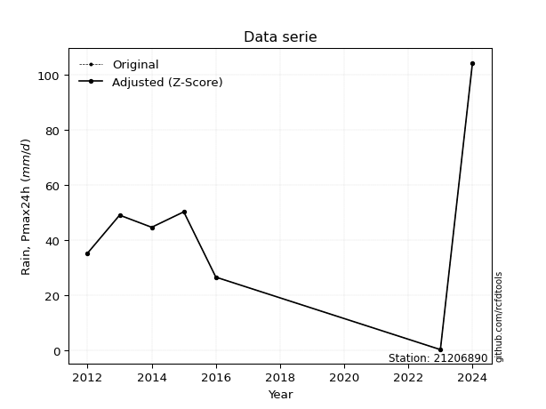</img>

</div>


> The initial value (value_initial) correspond to the initial obtained or null completed value, and value (value) is adjusted only when the initial value is outside the valid range (outlier) definite through the Z-Score value. If Z-Score is active, values out of range or outliers are replaced with the station mean value. A Z-Score (or standard score) measures how many standard deviations a data point is from the mean of a dataset, indicating its relative position; positive scores mean above the mean, negative mean below, and a score of zero is exactly at the mean, allowing for comparison of values from different distributions. It´s calculated using the formula $z=(x–μ)/σ$, where $x$ is the data point, $μ$ is the mean, and $σ$ is the standard deviation, helping identify outliers and understand probability.
>
> <sub>**Note**: In this study, "completing" (filling gaps in) and "extending" (forecasting or lengthening the historical record) rainfall data series are avoided for certain critical analyses because they introduce artificial bias and uncertainty, which can distort the statistics of rare events (extremes), alter day-to-day variability, and compromise the integrity and homogeneity of the original data. Some reasons against Completing/Extending rainfall data are: **Distortion of Extremes and Variability**: The primary issue is that most gap-filling or extension methods rely on averaging or regression with nearby stations, which inherently smooths the data. Rainfall is highly variable in space and time, with a large percentage of zero values and occasional large storms. Infilling methods often underestimate the highest values and overestimate the lowest (zero) values, which severely distorts analyses focused on flood frequency, drought severity, and intensity-duration-frequency (IDF) curves, **Loss of Data Homogeneity**: Infilled or extended data are synthetic estimates, not actual measurements. Combining these estimates with observed data can violate the assumption of data homogeneity, which requires that the data properties do not change over time. Inhomogeneity can lead to incorrect conclusions about long-term trends or changes in climate patterns, **Propagation of Errors**: Errors and biases from the original data (e.g., wind-induced undercatch, instrument errors, site changes) or the data used for imputation can propagate through the analysis, leading to unreliable hydrological models and inaccurate predictions, **Compromised Statistical Integrity**: For statistical analyses, especially those involving the frequency of events, using artificial data can introduce time bias or autocorrelation that doesn´t exist in reality, making it difficult to assess the true probability of events, **Difficulty in Validation**: It is difficult to accurately validate the quality of filled or extended data, especially for past periods where ground-truth measurements are unavailable. The reliability of imputation techniques heavily depends on the density of the surrounding station network and the complexity of the local topography.</sub>


### 4. Active continuous probability distributions from SciPy (80 of 104 available)

A Probability Density Function (PDF) describes the relative likelihood of a continuous random variable falling within a specific range, where the total area under its curve equals 1, and the area over any interval gives the actual probability for that range. Unlike discrete probabilities (like rolling a die), a PDF shows density, not direct probability for a single point (which is zero), with higher points indicating higher likelihood, often visualized as a bell curve for normal distributions.

A log of a probability density function (log-PDF) is simply the logarithm of the PDF´s value, denoted as $log(f(x))$, useful for converting multiplication of probabilities into addition, improving numerical stability with tiny numbers, and connecting to information theory concepts like entropy. Instead of dealing with very small probabilities (e.g., 0.000001), log-PDFs use negative numbers (e.g., $log(0.00001) ≈ -11.51$ that are easier for computers to handle, preventing underflow errors and simplifying complex calculations. In this study, each active probability distribution from SciPy is also evaluated in the $log$ form.

[scipy.stats](https://docs.scipy.org/doc/scipy/reference/stats.html) is a Python´s powerful submodule within the SciPy library for comprehensive statistical analysis, offering over 130 probability distributions (like Normal, Poisson, etc.), functions for descriptive stats (mean, variance), hypothesis testing (t-tests, chi-square), random variable generation, and statistical tests, making it essential for data science, modeling, and research. It provides tools to explore, model, and draw conclusions from data efficiently, working seamlessly with [NumPy](https://numpy.org/).

<div align="center">

|   id | p_dist           |   n_parameter | fit_method   | label                                                                       | active   | ref                                                                                                      |
|-----:|:-----------------|--------------:|:-------------|:----------------------------------------------------------------------------|:---------|:---------------------------------------------------------------------------------------------------------|
|    0 | alpha            |             3 | MLE          | Alpha                                                                       | True     | [:mortar_board:](https://docs.scipy.org/doc/scipy/reference/generated/scipy.stats.alpha.html)            |
|    1 | anglit           |             2 | MM           | Anglit                                                                      | True     | [:mortar_board:](https://docs.scipy.org/doc/scipy/reference/generated/scipy.stats.anglit.html)           |
|    2 | arcsine          |             2 | MM           | Arcsine                                                                     | True     | [:mortar_board:](https://docs.scipy.org/doc/scipy/reference/generated/scipy.stats.arcsine.html)          |
|    3 | argus            |             3 | MLE          | Argus                                                                       | True     | [:mortar_board:](https://docs.scipy.org/doc/scipy/reference/generated/scipy.stats.argus.html)            |
|    4 | beta             |             4 | MLE          | Beta                                                                        | True     | [:mortar_board:](https://docs.scipy.org/doc/scipy/reference/generated/scipy.stats.beta.html)             |
|    5 | betaprime        |             4 | MLE          | Beta prime                                                                  | True     | [:mortar_board:](https://docs.scipy.org/doc/scipy/reference/generated/scipy.stats.betaprime.html)        |
|    6 | bradford         |             3 | MLE          | Bradford                                                                    | True     | [:mortar_board:](https://docs.scipy.org/doc/scipy/reference/generated/scipy.stats.bradford.html)         |
|    7 | burr             |             4 | MLE          | Burr (Type III)                                                             | True     | [:mortar_board:](https://docs.scipy.org/doc/scipy/reference/generated/scipy.stats.burr.html)             |
|    8 | burr12           |             4 | MLE          | Burr (Type III) 12                                                          | True     | [:mortar_board:](https://docs.scipy.org/doc/scipy/reference/generated/scipy.stats.burr12.html)           |
|    9 | cosine           |             2 | MLE          | Cosine                                                                      | True     | [:mortar_board:](https://docs.scipy.org/doc/scipy/reference/generated/scipy.stats.cosine.html)           |
|   10 | crystalball      |             4 | MLE          | Crystalball                                                                 | True     | [:mortar_board:](https://docs.scipy.org/doc/scipy/reference/generated/scipy.stats.crystalball.html)      |
|   11 | dgamma           |             3 | MLE          | Double gamma                                                                | True     | [:mortar_board:](https://docs.scipy.org/doc/scipy/reference/generated/scipy.stats.dgamma.html)           |
|   12 | dweibull         |             3 | MLE          | Double Weibull                                                              | True     | [:mortar_board:](https://docs.scipy.org/doc/scipy/reference/generated/scipy.stats.dweibull.html)         |
|   13 | erlang           |             3 | MLE          | Erlang                                                                      | True     | [:mortar_board:](https://docs.scipy.org/doc/scipy/reference/generated/scipy.stats.erlang.html)           |
|   14 | exponnorm        |             3 | MLE          | Exponentially modified Normal                                               | True     | [:mortar_board:](https://docs.scipy.org/doc/scipy/reference/generated/scipy.stats.exponnorm.html)        |
|   15 | exponpow         |             3 | MLE          | Exponential power                                                           | True     | [:mortar_board:](https://docs.scipy.org/doc/scipy/reference/generated/scipy.stats.exponpow.html)         |
|   16 | exponweib        |             4 | MLE          | Exponentiated Weibull                                                       | True     | [:mortar_board:](https://docs.scipy.org/doc/scipy/reference/generated/scipy.stats.exponweib.html)        |
|   17 | f                |             4 | MLE          | F                                                                           | True     | [:mortar_board:](https://docs.scipy.org/doc/scipy/reference/generated/scipy.stats.f.html)                |
|   18 | fatiguelife      |             3 | MLE          | Fatigue-life (Birnbaum-Saunders)                                            | True     | [:mortar_board:](https://docs.scipy.org/doc/scipy/reference/generated/scipy.stats.fatiguelife.html)      |
|   19 | foldnorm         |             3 | MM           | Fold Normal                                                                 | True     | [:mortar_board:](https://docs.scipy.org/doc/scipy/reference/generated/scipy.stats.foldnorm.html)         |
|   20 | gamma            |             3 | MLE          | Gamma                                                                       | True     | [:mortar_board:](https://docs.scipy.org/doc/scipy/reference/generated/scipy.stats.gamma.html)            |
|   21 | gausshyper       |             6 | MLE          | Gauss hypergeometric                                                        | True     | [:mortar_board:](https://docs.scipy.org/doc/scipy/reference/generated/scipy.stats.gausshyper.html)       |
|   22 | genexpon         |             5 | MLE          | Generalized exponential                                                     | True     | [:mortar_board:](https://docs.scipy.org/doc/scipy/reference/generated/scipy.stats.genexpon.html)         |
|   23 | genextreme       |             3 | MLE          | Generalized exponential                                                     | True     | [:mortar_board:](https://docs.scipy.org/doc/scipy/reference/generated/scipy.stats.genextreme.html)       |
|   24 | gengamma         |             4 | MLE          | Generalized gamma                                                           | True     | [:mortar_board:](https://docs.scipy.org/doc/scipy/reference/generated/scipy.stats.gengamma.html)         |
|   25 | genhalflogistic  |             3 | MLE          | Generalized half-logistic                                                   | True     | [:mortar_board:](https://docs.scipy.org/doc/scipy/reference/generated/scipy.stats.genhalflogistic.html)  |
|   26 | genlogistic      |             3 | MLE          | Generalized logistic                                                        | True     | [:mortar_board:](https://docs.scipy.org/doc/scipy/reference/generated/scipy.stats.genlogistic.html)      |
|   27 | gennorm          |             3 | MLE          | Generalized Normal                                                          | True     | [:mortar_board:](https://docs.scipy.org/doc/scipy/reference/generated/scipy.stats.gennorm.html)          |
|   28 | genpareto        |             3 | MLE          | Generalized Pareto                                                          | True     | [:mortar_board:](https://docs.scipy.org/doc/scipy/reference/generated/scipy.stats.genpareto.html)        |
|   29 | gompertz         |             3 | MLE          | Gompertz (or truncated Gumbel)                                              | True     | [:mortar_board:](https://docs.scipy.org/doc/scipy/reference/generated/scipy.stats.gompertz.html)         |
|   30 | gumbel_l         |             2 | MM           | Gumbel Left Skew                                                            | True     | [:mortar_board:](https://docs.scipy.org/doc/scipy/reference/generated/scipy.stats.gumbel_l.html)         |
|   31 | gumbel_r         |             2 | MM           | Gumbel Right Skew                                                           | True     | [:mortar_board:](https://docs.scipy.org/doc/scipy/reference/generated/scipy.stats.gumbel_r.html)         |
|   32 | halfgennorm      |             3 | MLE          | Upper half of a generalized normal                                          | True     | [:mortar_board:](https://docs.scipy.org/doc/scipy/reference/generated/scipy.stats.halfgennorm.html)      |
|   33 | halflogistic     |             2 | MM           | Half-logistic                                                               | True     | [:mortar_board:](https://docs.scipy.org/doc/scipy/reference/generated/scipy.stats.halflogistic.html)     |
|   34 | halfnorm         |             2 | MM           | Half Normal                                                                 | True     | [:mortar_board:](https://docs.scipy.org/doc/scipy/reference/generated/scipy.stats.halfnorm.html)         |
|   35 | hypsecant        |             2 | MM           | hyperbolic secant                                                           | True     | [:mortar_board:](https://docs.scipy.org/doc/scipy/reference/generated/scipy.stats.hypsecant.html)        |
|   36 | invgamma         |             3 | MLE          | Inverted gamma                                                              | True     | [:mortar_board:](https://docs.scipy.org/doc/scipy/reference/generated/scipy.stats.invgamma.html)         |
|   37 | invgauss         |             3 | MLE          | Inverse Gaussian                                                            | True     | [:mortar_board:](https://docs.scipy.org/doc/scipy/reference/generated/scipy.stats.invgauss.html)         |
|   38 | invweibull       |             3 | MLE          | Inverted Weibull                                                            | True     | [:mortar_board:](https://docs.scipy.org/doc/scipy/reference/generated/scipy.stats.invweibull.html)       |
|   39 | johnsonsb        |             4 | MLE          | Johnson SB                                                                  | True     | [:mortar_board:](https://docs.scipy.org/doc/scipy/reference/generated/scipy.stats.johnsonsb.html)        |
|   40 | johnsonsu        |             4 | MLE          | Johnson Su                                                                  | True     | [:mortar_board:](https://docs.scipy.org/doc/scipy/reference/generated/scipy.stats.johnsonsu.html)        |
|   41 | kappa3           |             3 | MLE          | Kappa 3                                                                     | True     | [:mortar_board:](https://docs.scipy.org/doc/scipy/reference/generated/scipy.stats.kappa3.html)           |
|   42 | kappa4           |             4 | MLE          | Kappa 4                                                                     | True     | [:mortar_board:](https://docs.scipy.org/doc/scipy/reference/generated/scipy.stats.kappa4.html)           |
|   43 | ksone            |             3 | MLE          | Kolmogorov-Smirnov one-sided test statistic distribution                    | True     | [:mortar_board:](https://docs.scipy.org/doc/scipy/reference/generated/scipy.stats.ksone.html)            |
|   44 | kstwobign        |             2 | MLE          | Limiting distribution of scaled Kolmogorov-Smirnov two-sided test statistic | True     | [:mortar_board:](https://docs.scipy.org/doc/scipy/reference/generated/scipy.stats.kstwobign.html)        |
|   45 | laplace          |             2 | MM           | Laplace                                                                     | True     | [:mortar_board:](https://docs.scipy.org/doc/scipy/reference/generated/scipy.stats.laplace.html)          |
|   46 | levy_l           |             2 | MLE          | Left-skewed Levy                                                            | True     | [:mortar_board:](https://docs.scipy.org/doc/scipy/reference/generated/scipy.stats.levy_l.html)           |
|   47 | loggamma         |             3 | MLE          | Log gamma                                                                   | True     | [:mortar_board:](https://docs.scipy.org/doc/scipy/reference/generated/scipy.stats.loggamma.html)         |
|   48 | logistic         |             2 | MM           | Logistic (or Sech-squared)                                                  | True     | [:mortar_board:](https://docs.scipy.org/doc/scipy/reference/generated/scipy.stats.logistic.html)         |
|   49 | loglaplace       |             3 | MLE          | Log-Laplace                                                                 | True     | [:mortar_board:](https://docs.scipy.org/doc/scipy/reference/generated/scipy.stats.loglaplace.html)       |
|   50 | lomax            |             3 | MLE          | Lomax (Pareto of the second kind)                                           | True     | [:mortar_board:](https://docs.scipy.org/doc/scipy/reference/generated/scipy.stats.lomax.html)            |
|   51 | maxwell          |             2 | MM           | Maxwell                                                                     | True     | [:mortar_board:](https://docs.scipy.org/doc/scipy/reference/generated/scipy.stats.maxwell.html)          |
|   52 | mielke           |             4 | MLE          | Mielke Beta-Kappa / Dagum                                                   | True     | [:mortar_board:](https://docs.scipy.org/doc/scipy/reference/generated/scipy.stats.mielke.html)           |
|   53 | moyal            |             2 | MM           | Moyal                                                                       | True     | [:mortar_board:](https://docs.scipy.org/doc/scipy/reference/generated/scipy.stats.moyal.html)            |
|   54 | nakagami         |             3 | MLE          | Nakagami                                                                    | True     | [:mortar_board:](https://docs.scipy.org/doc/scipy/reference/generated/scipy.stats.nakagami.html)         |
|   55 | ncf              |             5 | MLE          | Non-central F distribution                                                  | True     | [:mortar_board:](https://docs.scipy.org/doc/scipy/reference/generated/scipy.stats.ncf.html)              |
|   56 | nct              |             4 | MLE          | Non-central Student’s t                                                     | True     | [:mortar_board:](https://docs.scipy.org/doc/scipy/reference/generated/scipy.stats.nct.html)              |
|   57 | norm             |             2 | MM           | Normal                                                                      | True     | [:mortar_board:](https://docs.scipy.org/doc/scipy/reference/generated/scipy.stats.norm.html)             |
|   58 | pearson3         |             3 | MM           | Pearson type III                                                            | True     | [:mortar_board:](https://docs.scipy.org/doc/scipy/reference/generated/scipy.stats.pearson3.html)         |
|   59 | powerlaw         |             3 | MLE          | Power-function                                                              | True     | [:mortar_board:](https://docs.scipy.org/doc/scipy/reference/generated/scipy.stats.powerlaw.html)         |
|   60 | rayleigh         |             2 | MM           | Rayleigh                                                                    | True     | [:mortar_board:](https://docs.scipy.org/doc/scipy/reference/generated/scipy.stats.rayleigh.html)         |
|   61 | rdist            |             3 | MLE          | R-distributed (symmetric beta)                                              | True     | [:mortar_board:](https://docs.scipy.org/doc/scipy/reference/generated/scipy.stats.rdist.html)            |
|   62 | rice             |             3 | MLE          | Rice                                                                        | True     | [:mortar_board:](https://docs.scipy.org/doc/scipy/reference/generated/scipy.stats.rice.html)             |
|   63 | semicircular     |             2 | MM           | Semicircular                                                                | True     | [:mortar_board:](https://docs.scipy.org/doc/scipy/reference/generated/scipy.stats.semicircular.html)     |
|   64 | skewnorm         |             3 | MLE          | Skew normal                                                                 | True     | [:mortar_board:](https://docs.scipy.org/doc/scipy/reference/generated/scipy.stats.skewnorm.html)         |
|   65 | t                |             3 | MLE          | Student’s t                                                                 | True     | [:mortar_board:](https://docs.scipy.org/doc/scipy/reference/generated/scipy.stats.t.html)                |
|   66 | trapezoid        |             4 | MLE          | Trapezoid                                                                   | True     | [:mortar_board:](https://docs.scipy.org/doc/scipy/reference/generated/scipy.stats.trapezoid.html)        |
|   67 | triang           |             3 | MLE          | Triangular                                                                  | True     | [:mortar_board:](https://docs.scipy.org/doc/scipy/reference/generated/scipy.stats.triang.html)           |
|   68 | truncexpon       |             3 | MLE          | Truncated exponential                                                       | True     | [:mortar_board:](https://docs.scipy.org/doc/scipy/reference/generated/scipy.stats.truncexpon.html)       |
|   69 | truncnorm        |             4 | MLE          | Truncated normal                                                            | True     | [:mortar_board:](https://docs.scipy.org/doc/scipy/reference/generated/scipy.stats.truncnorm.html)        |
|   70 | truncpareto      |             4 | MLE          | Upper truncated Pareto                                                      | True     | [:mortar_board:](https://docs.scipy.org/doc/scipy/reference/generated/scipy.stats.truncpareto.html)      |
|   71 | truncweibull_min |             5 | MLE          | Doubly truncated Weibull minimum                                            | True     | [:mortar_board:](https://docs.scipy.org/doc/scipy/reference/generated/scipy.stats.truncweibull_min.html) |
|   72 | tukeylambda      |             3 | MLE          | Tukey-Lamdba                                                                | True     | [:mortar_board:](https://docs.scipy.org/doc/scipy/reference/generated/scipy.stats.tukeylambda.html)      |
|   73 | uniform          |             2 | MLE          | Uniform                                                                     | True     | [:mortar_board:](https://docs.scipy.org/doc/scipy/reference/generated/scipy.stats.uniform.html)          |
|   74 | vonmises         |             3 | MLE          | Von Mises                                                                   | True     | [:mortar_board:](https://docs.scipy.org/doc/scipy/reference/generated/scipy.stats.vonmises.html)         |
|   75 | vonmises_line    |             3 | MLE          | Von Mises line                                                              | True     | [:mortar_board:](https://docs.scipy.org/doc/scipy/reference/generated/scipy.stats.vonmises_line.html)    |
|   76 | wald             |             2 | MM           | Wald                                                                        | True     | [:mortar_board:](https://docs.scipy.org/doc/scipy/reference/generated/scipy.stats.wald.html)             |
|   77 | weibull_max      |             3 | MLE          | Weibull maximum                                                             | True     | [:mortar_board:](https://docs.scipy.org/doc/scipy/reference/generated/scipy.stats.weibull_max.html)      |
|   78 | weibull_min      |             3 | MLE          | Weibull minimum                                                             | True     | [:mortar_board:](https://docs.scipy.org/doc/scipy/reference/generated/scipy.stats.weibull_min.html)      |
|   79 | wrapcauchy       |             3 | MLE          | Wrapped  Cauchy                                                             | True     | [:mortar_board:](https://docs.scipy.org/doc/scipy/reference/generated/scipy.stats.wrapcauchy.html)       |

</div>

> **n_parameter:** # arguments & localization & scale.
>
> **Fit methods:** (MLE) maximum likelihood, (MM) L-moments.
>
>**Inactive** (With the only purpose of prevent loops, zero divisions, infinite values, over high estimated values or horizontal trending for recurrence intervals estimations, the follow distributions were disabled.)**:** lognorm, norminvgauss, powernorm, powerlognorm, cauchy, halfcauchy, foldcauchy, skewcauchy, chi2, expon, fisk, genhyperbolic, geninvgauss, gibrat, kstwo, laplace_asymmetric, levy, levy_stable, ncx2, pareto, rel_breitwigner, recipinvgauss, studentized_range, loguniform, 


## B. Probability (PDF) vs. Empirical (EDF) distributions functions

A continuous probability distribution (CPD) describes probabilities for variables that can take any value within a range (like rain any time), unlike discrete variables with specific outcomes (like temperature). It uses a Probability Density Function (PDF), a curve where the total area under it equals 1, and the probability of the variable falling within an interval (a to b) is found by calculating the area under the curve between those points. A key feature is that the probability of hitting any single exact value is zero, so probabilities are always expressed for ranges, e.g., $P(a ≤ X ≤ b)$.

<div align="center">

Distributions parameters from station values
|     |   station | p_dist              |   n |              loc |           scale | shape                  | shape1                 | shape2                 | shape3             |
|----:|----------:|:--------------------|----:|-----------------:|----------------:|:-----------------------|:-----------------------|:-----------------------|:-------------------|
|   0 |  21206890 | alpha               |   8 |   -171.329       |  1741.83        | 8.237156121646304      |                        |                        |                    |
|   1 |  21206890 | anglit              |   8 |     43.4125      |    80.4783      |                        |                        |                        |                    |
|   2 |  21206890 | arcsine             |   8 |      4.50722     |    77.8106      |                        |                        |                        |                    |
|   3 |  21206890 | argus               |   8 |    -25.7867      |   134.769       | 2.6747588749929525e-06 |                        |                        |                    |
|   4 |  21206890 | beta                |   8 |    -34.2847      |     1.64707e+07 | 8.064512103875078      | 1709034.872735491      |                        |                    |
|   5 |  21206890 | betaprime           |   8 |    -36.7744      |  5070.03        | 8.81434435881733       | 558.3199966627596      |                        |                    |
|   6 |  21206890 | bradford            |   8 |      0.299988    |   104.1         | 1.1267681526081779     |                        |                        |                    |
|   7 |  21206890 | burr                |   8 |      0.3         |    79.0091      | 3.8996313488648733     | 0.1417681061070258     |                        |                    |
|   8 |  21206890 | burr12              |   8 |      0.3         |   324.323       | 0.3913452814443844     | 1.6769772691344906     |                        |                    |
|   9 |  21206890 | cosine              |   8 |     47.1034      |    25.1604      |                        |                        |                        |                    |
|  10 |  21206890 | crystalball         |   8 |     43.4125      |    27.5102      | 3945.2589225744937     | 1559.1447797765745     |                        |                    |
|  11 |  21206890 | dgamma              |   8 |     40.8917      |    16.6593      | 1.1232436152091774     |                        |                        |                    |
|  12 |  21206890 | dweibull            |   8 |     44.7         |    18.3499      | 0.9171872827711092     |                        |                        |                    |
|  13 |  21206890 | erlang              |   8 |    -35.9663      |     9.34941     | 8.49025143273795       |                        |                        |                    |
|  14 |  21206890 | exponnorm           |   8 |     21.6318      |    16.1875      | 1.3455221193889768     |                        |                        |                    |
|  15 |  21206890 | exponpow            |   8 |      0.3         |     3.55246     | 0.1372532331254811     |                        |                        |                    |
|  16 |  21206890 | exponweib           |   8 |      0.3         |     3.00222     | 4.003206286870395      | 0.06785396623043656    |                        |                    |
|  17 |  21206890 | f                   |   8 |    -36.0203      |    79.4239      | 17.021562372202233     | 18264.117509965134     |                        |                    |
|  18 |  21206890 | fatiguelife         |   8 |    -71.2529      |   111.561       | 0.23590760540750833    |                        |                        |                    |
|  19 |  21206890 | foldnorm            |   8 |      5.47953     |    37.6157      | 0.7428383486116223     |                        |                        |                    |
|  20 |  21206890 | gamma               |   8 |    -35.9664      |     9.3494      | 8.490260887966535      |                        |                        |                    |
|  21 |  21206890 | gausshyper          |   8 |     -6.261       |   110.661       | 1.1327541551237537     | 0.6238999407945985     | 1.8864398033455703     | 1.375100226959899  |
|  22 |  21206890 | genexpon            |   8 |      0.299966    |     2.26323     | 0.05199141645287132    | 1.765320516548319e-07  | 2.197675231391144      |                    |
|  23 |  21206890 | genextreme          |   8 |      1.12436     |     4.3114      | -5.22956399688889      |                        |                        |                    |
|  24 |  21206890 | gengamma            |   8 |    -41.6099      |     0.000581205 | 76.25381337259955      | 0.365517538267327      |                        |                    |
|  25 |  21206890 | genhalflogistic     |   8 |    -10.5168      |   121.176       | 1.0544709409589719     |                        |                        |                    |
|  26 |  21206890 | genlogistic         |   8 |     22.659       |    17.5237      | 2.2695667539613433     |                        |                        |                    |
|  27 |  21206890 | gennorm             |   8 |     44.7         |     3.18012e-07 | 0.12374983003562423    |                        |                        |                    |
|  28 |  21206890 | genpareto           |   8 |      0.3         |    72.8438      | -0.6408670029481474    |                        |                        |                    |
|  29 |  21206890 | gompertz            |   8 |     26.5999      |     6.43638     | 3.947954073387047e-05  |                        |                        |                    |
|  30 |  21206890 | gumbel_l            |   8 |     55.7936      |    21.4496      |                        |                        |                        |                    |
|  31 |  21206890 | gumbel_r            |   8 |     31.0314      |    21.4496      |                        |                        |                        |                    |
|  32 |  21206890 | halfgennorm         |   8 |      0.3         |     3.20986     | 0.39948517632472835    |                        |                        |                    |
|  33 |  21206890 | halflogistic        |   8 |     10.8065      |    23.5203      |                        |                        |                        |                    |
|  34 |  21206890 | halfnorm            |   8 |      6.9998      |    45.6366      |                        |                        |                        |                    |
|  35 |  21206890 | hypsecant           |   8 |     43.4125      |    17.5135      |                        |                        |                        |                    |
|  36 |  21206890 | invgamma            |   8 |   -103.201       |  4378.84        | 30.869697288253544     |                        |                        |                    |
|  37 |  21206890 | invgauss            |   8 |    -71.6214      |  2048.89        | 0.05614697472711065    |                        |                        |                    |
|  38 |  21206890 | invweibull          |   8 |      0.3         |     2.57412     | 0.046754663592222245   |                        |                        |                    |
|  39 |  21206890 | johnsonsb           |   8 |    -63.9212      |  2376.92        | 11.701410881473706     | 3.795575818416527      |                        |                    |
|  40 |  21206890 | johnsonsu           |   8 |     39.329       |    10.3095      | -0.10444424710421174   | 0.7672248174766922     |                        |                    |
|  41 |  21206890 | kappa3              |   8 |      0.3         |    49.5573      | 4.522740403152696      |                        |                        |                    |
|  42 |  21206890 | kappa4              |   8 |     -9.92945     |   116.941       | 1.0958635120380384     | 1.0005049297639497     |                        |                    |
|  43 |  21206890 | ksone               |   8 |    -10.11        |   124.92        | 1.0                    |                        |                        |                    |
|  44 |  21206890 | kstwobign           |   8 |    -53.7295      |   112.06        |                        |                        |                        |                    |
|  45 |  21206890 | laplace             |   8 |     43.4125      |    19.4526      |                        |                        |                        |                    |
|  46 |  21206890 | levy_l              |   8 |    111.707       |    34.6085      |                        |                        |                        |                    |
|  47 |  21206890 | loggamma            |   8 |  -9595.82        |  1265.4         | 2034.011779056822      |                        |                        |                    |
|  48 |  21206890 | logistic            |   8 |     43.4125      |    15.1672      |                        |                        |                        |                    |
|  49 |  21206890 | loglaplace          |   8 |     -0.118353    |    44.8183      | 1.197080831822773      |                        |                        |                    |
|  50 |  21206890 | lomax               |   8 |      0.3         |     5.23488e+10 | 1249611836.947649      |                        |                        |                    |
|  51 |  21206890 | maxwell             |   8 |    -21.7751      |    40.8503      |                        |                        |                        |                    |
|  52 |  21206890 | mielke              |   8 |      0.3         |    82.115       | 0.6257720570323492     | 4.311260345826831      |                        |                    |
|  53 |  21206890 | moyal               |   8 |     27.6804      |    12.3839      |                        |                        |                        |                    |
|  54 |  21206890 | nakagami            |   8 |      0.3         |    48.2021      | 0.2641466852347292     |                        |                        |                    |
|  55 |  21206890 | ncf                 |   8 |      0.3         |     2.53491     | 0.3559374227026525     | 24.596758494903494     | 4.869594712307904      |                    |
|  56 |  21206890 | nct                 |   8 |      0.0732069   |    20.1892      | 7.0864778676511815     | 1.9109735464214668     |                        |                    |
|  57 |  21206890 | norm                |   8 |     43.4125      |    27.5102      |                        |                        |                        |                    |
|  58 |  21206890 | pearson3            |   8 |     43.4125      |    27.5102      | 0.8502510837595822     |                        |                        |                    |
|  59 |  21206890 | powerlaw            |   8 |      0.3         |   104.1         | 0.1668833227669105     |                        |                        |                    |
|  60 |  21206890 | rayleigh            |   8 |     -9.21612     |    41.9916      |                        |                        |                        |                    |
|  61 |  21206890 | rdist               |   8 |    -10.0307      |    60.3307      | 1.0395756948842707     |                        |                        |                    |
|  62 |  21206890 | rice                |   8 |     -9.20008     |    41.9815      | 0.0005791291211202582  |                        |                        |                    |
|  63 |  21206890 | semicircular        |   8 |     43.4125      |    55.0204      |                        |                        |                        |                    |
|  64 |  21206890 | skewnorm            |   8 |     15.4897      |    39.1982      | 2.2355416424300656     |                        |                        |                    |
|  65 |  21206890 | t                   |   8 |     40.541       |    11.3981      | 1.4543759598298451     |                        |                        |                    |
|  66 |  21206890 | trapezoid           |   8 |    -10.6155      |   124.92        | 1.0                    | 1.0                    |                        |                    |
|  67 |  21206890 | triang              |   8 |    -36.1382      |   140.538       | 0.999999999586493      |                        |                        |                    |
|  68 |  21206890 | truncexpon          |   8 |      0.3         |   129.686       | 0.8027078267486634     |                        |                        |                    |
|  69 |  21206890 | truncnorm           |   8 |     43.8941      |    26.5114      | -2.634177862769656     | 9.678424444533903      |                        |                    |
|  70 |  21206890 | truncpareto         |   8 |      0.28452     |     0.0154796   | 0.14327858170584826    | 6725.975887277578      |                        |                    |
|  71 |  21206890 | truncweibull_min    |   8 |     -0.605999    |   130.666       | 1.0798446532298693     | 2.0806086265806205e-11 | 0.8036234543968883     |                    |
|  72 |  21206890 | tukeylambda         |   8 |     35.5663      |   159.985       | 4.5364781933487945     |                        |                        |                    |
|  73 |  21206890 | uniform             |   8 |      0.3         |   104.1         |                        |                        |                        |                    |
|  74 |  21206890 | vonmises            |   8 |     -0.492731    |     1           | 0.6495889515322832     |                        |                        |                    |
|  75 |  21206890 | vonmises_line       |   8 |     42.2919      |    19.7696      | 1.1301867483839207     |                        |                        |                    |
|  76 |  21206890 | wald                |   8 |     15.9023      |    27.5102      |                        |                        |                        |                    |
|  77 |  21206890 | weibull_max         |   8 |    104.4         |     1.66883     | 0.23284927854813084    |                        |                        |                    |
|  78 |  21206890 | weibull_min         |   8 |     -8.06009     |    57.8426      | 1.9204427108445408     |                        |                        |                    |
|  79 |  21206890 | wrapcauchy          |   8 |      0.275766    |    16.5719      | 0.00033074771285278564 |                        |                        |                    |
|  80 |  21206890 | logalpha            |   8 |    -72.3041      |  3158.22        | 41.89611750891544      |                        |                        |                    |
|  81 |  21206890 | loganglit           |   8 |      3.18762     |     4.97606     |                        |                        |                        |                    |
|  82 |  21206890 | logarcsine          |   8 |      0.782025    |     4.81118     |                        |                        |                        |                    |
|  83 |  21206890 | logargus            |   8 |     -3.88163     |     8.61379     | 3.128110845477183      |                        |                        |                    |
|  84 |  21206890 | logbeta             |   8 |     -1.93115     |     6.57938     | 0.3154394429657748     | 0.05411946989415934    |                        |                    |
|  85 |  21206890 | logbetaprime        |   8 |     -4.12734     |     1.32554e+13 | 7.956914512534877      | 14126949849455.809     |                        |                    |
|  86 |  21206890 | logbradford         |   8 |     -1.20399     |     6.23236     | 3.883385446705207e-05  |                        |                        |                    |
|  87 |  21206890 | logburr             |   8 |  -8104.44        |  8080.82        | 3610.922041094719      | 100235.5097918004      |                        |                    |
|  88 |  21206890 | logburr12           |   8 | -19345.8         | 19356.7         | 22791.65891344381      | 4281.354443687054      |                        |                    |
|  89 |  21206890 | logcosine           |   8 |      2.70208     |     1.63579     |                        |                        |                        |                    |
|  90 |  21206890 | logcrystalball      |   8 |      3.80661     |     0.418406    | 1.5361415998125207     | 1.6121035394978822     |                        |                    |
|  91 |  21206890 | logdgamma           |   8 |      3.89386     |     1.18546     | 0.7499440043988148     |                        |                        |                    |
|  92 |  21206890 | logdweibull         |   8 |      3.89386     |     1.18546     | 0.7499440043988148     |                        |                        |                    |
|  93 |  21206890 | logerlang           |   8 |     -1.20397     |     1.32608     | 0.001254976251137057   |                        |                        |                    |
|  94 |  21206890 | logexponnorm        |   8 |      3.18641     |     1.70099     | 0.0007070794347796928  |                        |                        |                    |
|  95 |  21206890 | logexponpow         |   8 |     -1.20397     |     1.72912     | 0.3113363191691113     |                        |                        |                    |
|  96 |  21206890 | logexponweib        |   8 |     -1.20397     |     1.7248      | 1.6456136217498512     | 0.13565835771941148    |                        |                    |
|  97 |  21206890 | logf                |   8 |     -1.20397     |     1.14732     | 1.0982678139773963     | 1.1206497157041975     |                        |                    |
|  98 |  21206890 | logfatiguelife      |   8 |   -992.039       |   995.225       | 0.001715736181731091   |                        |                        |                    |
|  99 |  21206890 | logfoldnorm         |   8 |     -6.1453      |     1.23526     | 7.6446941933035415     |                        |                        |                    |
| 100 |  21206890 | loggamma            |   8 |    -31.648       |     0.0936581   | 371.47245766784613     |                        |                        |                    |
| 101 |  21206890 | loggausshyper       |   8 |     -1.33351     |     5.98174     | 1.348717500114991      | 0.5718557902265413     | 1.1931995801260291     | 0.9785123828718674 |
| 102 |  21206890 | loggenexpon         |   8 |     -1.24721     |     0.0217728   | 0.0011627478936950112  | 1.4988051515098513     | 2.1353264821302925e-05 |                    |
| 103 |  21206890 | loggenextreme       |   8 |      2.97089     |     1.82279     | 1.086716149418173      |                        |                        |                    |
| 104 |  21206890 | loggengamma         |   8 |     -1.20397     |     1.8229      | 1.8585406315690405     | 0.13812368668625236    |                        |                    |
| 105 |  21206890 | loggenhalflogistic  |   8 |     -1.80096     |     6.87276     | 1.0656775074673428     |                        |                        |                    |
| 106 |  21206890 | loggenlogistic      |   8 |      4.32465     |     0.213321    | 0.17867298633978934    |                        |                        |                    |
| 107 |  21206890 | loggennorm          |   8 |      3.89386     |     0.0157886   | 0.3481552661615084     |                        |                        |                    |
| 108 |  21206890 | loggenpareto        |   8 |     -1.27213     |     9.70531     | -1.6393111012886807    |                        |                        |                    |
| 109 |  21206890 | loggompertz         |   8 |     -1.21561     |     0.860885    | 0.0029421383531912093  |                        |                        |                    |
| 110 |  21206890 | loggumbel_l         |   8 |      3.95316     |     1.32626     |                        |                        |                        |                    |
| 111 |  21206890 | loggumbel_r         |   8 |      2.42208     |     1.32626     |                        |                        |                        |                    |
| 112 |  21206890 | loghalfgennorm      |   8 |     -1.20398     |     5.85483     | 15143.993910283461     |                        |                        |                    |
| 113 |  21206890 | loghalflogistic     |   8 |      1.1715      |     1.45431     |                        |                        |                        |                    |
| 114 |  21206890 | loghalfnorm         |   8 |      0.93621     |     2.82174     |                        |                        |                        |                    |
| 115 |  21206890 | loghypsecant        |   8 |      3.18762     |     1.08289     |                        |                        |                        |                    |
| 116 |  21206890 | loginvgamma         |   8 |    -43.1088      | 30499.7         | 659.8278273296389      |                        |                        |                    |
| 117 |  21206890 | loginvgauss         |   8 |    -15.734       |  1725.64        | 0.0109400813106647     |                        |                        |                    |
| 118 |  21206890 | loginvweibull       |   8 |     -4.89607e+08 |     4.89607e+08 | 215343222.68061697     |                        |                        |                    |
| 119 |  21206890 | logjohnsonsb        |   8 |   -474.258       |   479.173       | -7.444426136374686     | 1.2490453629662062     |                        |                    |
| 120 |  21206890 | logjohnsonsu        |   8 |      3.88591     |     0.0725167   | 0.5231700380286264     | 0.44249649896905063    |                        |                    |
| 121 |  21206890 | logkappa3           |   8 |     -1.20397     |     5.69434     | 1.999090384013166      |                        |                        |                    |
| 122 |  21206890 | logkappa4           |   8 |     -1.46585     |     7.47056     | 1.027125002498376      | 1.2218619011916094     |                        |                    |
| 123 |  21206890 | logksone            |   8 |     -1.78919     |     7.02264     | 1.0                    |                        |                        |                    |
| 124 |  21206890 | logkstwobign        |   8 |     -6.03587     |    10.5739      |                        |                        |                        |                    |
| 125 |  21206890 | loglaplace          |   8 |      3.18762     |     1.20278     |                        |                        |                        |                    |
| 126 |  21206890 | loglevy_l           |   8 |      4.76655     |     0.557842    |                        |                        |                        |                    |
| 127 |  21206890 | logloggamma         |   8 |      4.54758     |     0.28765     | 0.22379621276786898    |                        |                        |                    |
| 128 |  21206890 | loglogistic         |   8 |      3.18762     |     0.937807    |                        |                        |                        |                    |
| 129 |  21206890 | logloglaplace       |   8 |     -1.20397     |     1.46571     | 0.26922715664429236    |                        |                        |                    |
| 130 |  21206890 | loglomax            |   8 |     -1.20397     |     8.31207e+09 | 1870225657.5628767     |                        |                        |                    |
| 131 |  21206890 | logmaxwell          |   8 |     -0.84306     |     2.52585     |                        |                        |                        |                    |
| 132 |  21206890 | logmielke           |   8 |     -1.17404e+08 |     1.17404e+08 | 315434267.7851505      | 69613693.91520095      |                        |                    |
| 133 |  21206890 | logmoyal            |   8 |      2.21488     |     0.765716    |                        |                        |                        |                    |
| 134 |  21206890 | lognakagami         |   8 |  -2161.86        |  2165.05        | 403007.97000970296     |                        |                        |                    |
| 135 |  21206890 | logncf              |   8 |     -1.20397     |     1.04554     | 1.0706740952575764     | 1.1498169580928082     | 1.10106748442741       |                    |
| 136 |  21206890 | lognct              |   8 |   -107.693       |     1.64994     | 31633.78251932626      | 67.20138164700597      |                        |                    |
| 137 |  21206890 | lognorm             |   8 |      3.18762     |     1.70099     |                        |                        |                        |                    |
| 138 |  21206890 | logpearson3         |   8 |      3.18762     |     1.70098     | -2.044154232614648     |                        |                        |                    |
| 139 |  21206890 | logpowerlaw         |   8 |     -1.20397     |     5.8522      | 0.20561992928615752    |                        |                        |                    |
| 140 |  21206890 | lograyleigh         |   8 |     -0.0665325   |     2.59642     |                        |                        |                        |                    |
| 141 |  21206890 | logrdist            |   8 |     -1.20845     |     0.00448187  | 1.2160486082275588     |                        |                        |                    |
| 142 |  21206890 | logrice             |   8 |   -817.804       |     1.70044     | 482.8110500699281      |                        |                        |                    |
| 143 |  21206890 | logsemicircular     |   8 |      3.18761     |     3.40198     |                        |                        |                        |                    |
| 144 |  21206890 | logskewnorm         |   8 |      4.64823     |     2.24189     | -18095200.77152653     |                        |                        |                    |
| 145 |  21206890 | logt                |   8 |      3.7502      |     0.231713    | 0.896461689252321      |                        |                        |                    |
| 146 |  21206890 | logtrapezoid        |   8 |     -1.7047      |     7.21671     | 0.9999999999999996     | 1.0                    |                        |                    |
| 147 |  21206890 | logtriang           |   8 |     -2.04356     |     6.69179     | 0.9999999998678848     |                        |                        |                    |
| 148 |  21206890 | logtruncexpon       |   8 |     -1.20397     |     7.87513     | 0.7431429381799997     |                        |                        |                    |
| 149 |  21206890 | logtruncnorm        |   8 |      1.72712     |     6.40851     | -0.46145708775219363   | 0.45581717540688993    |                        |                    |
| 150 |  21206890 | logtruncpareto      |   8 |     -1.20569     |     0.00171644  | 1.1451589677260695e-11 | 3622.1553574126947     |                        |                    |
| 151 |  21206890 | logtruncweibull_min |   8 |     -1.35284     |     7.30711     | 1.5172849264328425     | 2.2159238387408256e-09 | 0.8212654428448051     |                    |
| 152 |  21206890 | logtukeylambda      |   8 |     -1.20397     |     2.43151e-16 | 1.0942963178923164     |                        |                        |                    |
| 153 |  21206890 | loguniform          |   8 |     -1.20397     |     5.8522      |                        |                        |                        |                    |
| 154 |  21206890 | logvonmises         |   8 |     -2.33763     |     1           | 3.7637714661079618     |                        |                        |                    |
| 155 |  21206890 | logvonmises_line    |   8 |      1.71839     |     0.932623    | 5.689889710403793e-06  |                        |                        |                    |
| 156 |  21206890 | logwald             |   8 |      1.48658     |     1.70102     |                        |                        |                        |                    |
| 157 |  21206890 | logweibull_max      |   8 |      4.64823     |     1.66982     | 0.7778650732276013     |                        |                        |                    |
| 158 |  21206890 | logweibull_min      |   8 |     -1.20397     |     2.36533     | 0.7653314897986515     |                        |                        |                    |
| 159 |  21206890 | logwrapcauchy       |   8 |     -1.20398     |     0.931409    | 0.4396714493234881     |                        |                        |                    |

</div>

> **loc** (Location parameter): This shifts the distribution along the x-axis. For many common distributions, like the normal (Gaussian) distribution, loc represents the mean $μ$. For others, like the uniform distribution, it might represent the minimum value, or for the beta distribution, the left end of the support interval.
>
> **scale** (Scale parameter): This determines the width or spread of the distribution. For the normal distribution, scale represents the standard deviation $σ$. For a uniform distribution, it defines the length of the interval (from $loc$ to $loc + scale$).
>
> **shape** (Shape parameters): Refers to parameters that define the specific form of a probability distribution, distinct from its location (loc) and scale (scale). These parameters are required arguments for most distribution functions. For example, a normal (Gaussian) distribution is fully defined by its location (mean) and scale (standard deviation), so it has no specific shape parameters beyond loc and scale. However, other distributions have intrinsic properties that need specification, as Gamma distribution that takes a shape parameter, often named $a$ or $alpha$.


### 0. Cumulative distribution values - CDF (160 evaluated)

Cumulative Distribution Function (CDF), denoted as $F$<sub>$X$</sub>$(x)$, is a function that gives the probability that a random variable $X$ will take a value less than or equal to a specific value, $x$ (i.e., $(P(X≥x)$. It essentially "accumulates" probabilities from a given point up to the far right (positive infinity), providing a complete picture of the distribution´s probabilities for both discrete (like rain) and continuous (like temperature) variables, helping to find probabilities over ranges or above certain values. Each station is evaluated separately ordering the $x$ values ascending, calculating the CDF and PDF values for the activated distributions and their logarithmic forms.

<div align="center">

CDF ordered by x ascending and calculating $log(f(x))$ separately
|   id |   Station |   date |     x |   count |    mean |     std |     zscore |   Value_initial |   station |   m |     alpha |   alpha_pdf |    anglit |   anglit_pdf |   arcsine |   arcsine_pdf |    argus |   argus_pdf |      beta |   beta_pdf |   betaprime |   betaprime_pdf |    bradford |   bradford_pdf |        burr |       burr_pdf |      burr12 |   burr12_pdf |    cosine |   cosine_pdf |   crystalball |   crystalball_pdf |    dgamma |   dgamma_pdf |   dweibull |   dweibull_pdf |    erlang |   erlang_pdf |   exponnorm |   exponnorm_pdf |   exponpow |   exponpow_pdf |   exponweib |   exponweib_pdf |         f |      f_pdf |   fatiguelife |   fatiguelife_pdf |   foldnorm |   foldnorm_pdf |     gamma |   gamma_pdf |   gausshyper |   gausshyper_pdf |    genexpon |   genexpon_pdf |   genextreme |   genextreme_pdf |   gengamma |   gengamma_pdf |   genhalflogistic |   genhalflogistic_pdf |   genlogistic |   genlogistic_pdf |   gennorm |   gennorm_pdf |   genpareto |   genpareto_pdf |    gompertz |   gompertz_pdf |   gumbel_l |   gumbel_l_pdf |   gumbel_r |   gumbel_r_pdf |   halfgennorm |   halfgennorm_pdf |   halflogistic |   halflogistic_pdf |   halfnorm |   halfnorm_pdf |   hypsecant |   hypsecant_pdf |   invgamma |   invgamma_pdf |   invgauss |   invgauss_pdf |   invweibull |   invweibull_pdf |   johnsonsb |   johnsonsb_pdf |   johnsonsu |   johnsonsu_pdf |      kappa3 |   kappa3_pdf |      kappa4 |   kappa4_pdf |     ksone |   ksone_pdf |   kstwobign |   kstwobign_pdf |   laplace |   laplace_pdf |   levy_l |   levy_l_pdf |   loggamma |   loggamma_pdf |   logistic |   logistic_pdf |   loglaplace |   loglaplace_pdf |       lomax |   lomax_pdf |   maxwell |   maxwell_pdf |      mielke |     mielke_pdf |      moyal |   moyal_pdf |    nakagami |   nakagami_pdf |        ncf |        ncf_pdf |       nct |    nct_pdf |      norm |   norm_pdf |   pearson3 |   pearson3_pdf |    powerlaw |   powerlaw_pdf |   rayleigh |   rayleigh_pdf |    rdist |       rdist_pdf |      rice |   rice_pdf |   semicircular |   semicircular_pdf |   skewnorm |   skewnorm_pdf |         t |       t_pdf |   trapezoid |   trapezoid_pdf |   triang |   triang_pdf |   truncexpon |   truncexpon_pdf |   truncnorm |   truncnorm_pdf |   truncpareto |   truncpareto_pdf |   truncweibull_min |   truncweibull_min_pdf |   tukeylambda |   tukeylambda_pdf |   uniform |   uniform_pdf |   vonmises |   vonmises_pdf |   vonmises_line |   vonmises_line_pdf |     wald |   wald_pdf |   weibull_max |   weibull_max_pdf |   weibull_min |   weibull_min_pdf |   wrapcauchy |   wrapcauchy_pdf |   logalpha |   logalpha_pdf |   loganglit |   loganglit_pdf |   logarcsine |   logarcsine_pdf |   logargus |   logargus_pdf |   logbeta |   logbeta_pdf |   logbetaprime |   logbetaprime_pdf |   logbradford |   logbradford_pdf |   logburr |   logburr_pdf |   logburr12 |   logburr12_pdf |   logcosine |   logcosine_pdf |   logcrystalball |   logcrystalball_pdf |   logdgamma |   logdgamma_pdf |   logdweibull |   logdweibull_pdf |   logerlang |   logerlang_pdf |   logexponnorm |   logexponnorm_pdf |   logexponpow |   logexponpow_pdf |   logexponweib |   logexponweib_pdf |        logf |    logf_pdf |   logfatiguelife |   logfatiguelife_pdf |   logfoldnorm |   logfoldnorm_pdf |   loggausshyper |   loggausshyper_pdf |   loggenexpon |   loggenexpon_pdf |   loggenextreme |   loggenextreme_pdf |   loggengamma |   loggengamma_pdf |   loggenhalflogistic |   loggenhalflogistic_pdf |   loggenlogistic |   loggenlogistic_pdf |   loggennorm |   loggennorm_pdf |   loggenpareto |   loggenpareto_pdf |   loggompertz |   loggompertz_pdf |   loggumbel_l |   loggumbel_l_pdf |   loggumbel_r |   loggumbel_r_pdf |   loghalfgennorm |   loghalfgennorm_pdf |   loghalflogistic |   loghalflogistic_pdf |   loghalfnorm |   loghalfnorm_pdf |   loghypsecant |   loghypsecant_pdf |   loginvgamma |   loginvgamma_pdf |   loginvgauss |   loginvgauss_pdf |   loginvweibull |   loginvweibull_pdf |   logjohnsonsb |   logjohnsonsb_pdf |   logjohnsonsu |   logjohnsonsu_pdf |   logkappa3 |   logkappa3_pdf |   logkappa4 |   logkappa4_pdf |   logksone |   logksone_pdf |   logkstwobign |   logkstwobign_pdf |   loglevy_l |   loglevy_l_pdf |   logloggamma |   logloggamma_pdf |   loglogistic |   loglogistic_pdf |   logloglaplace |   logloglaplace_pdf |    loglomax |   loglomax_pdf |   logmaxwell |   logmaxwell_pdf |   logmielke |   logmielke_pdf |   logmoyal |   logmoyal_pdf |   lognakagami |   lognakagami_pdf |     logncf |   logncf_pdf |     lognct |   lognct_pdf |    lognorm |   lognorm_pdf |   logpearson3 |   logpearson3_pdf |   logpowerlaw |   logpowerlaw_pdf |   lograyleigh |   lograyleigh_pdf |   logrdist |   logrdist_pdf |   logrice |   logrice_pdf |   logsemicircular |   logsemicircular_pdf |   logskewnorm |   logskewnorm_pdf |     logt |   logt_pdf |   logtrapezoid |   logtrapezoid_pdf |   logtriang |   logtriang_pdf |   logtruncexpon |   logtruncexpon_pdf |   logtruncnorm |   logtruncnorm_pdf |   logtruncpareto |   logtruncpareto_pdf |   logtruncweibull_min |   logtruncweibull_min_pdf |   logtukeylambda |   logtukeylambda_pdf |   loguniform |   loguniform_pdf |   logvonmises |   logvonmises_pdf |   logvonmises_line |   logvonmises_line_pdf |   logwald |   logwald_pdf |   logweibull_max |   logweibull_max_pdf |   logweibull_min |   logweibull_min_pdf |   logwrapcauchy |   logwrapcauchy_pdf |
|-----:|----------:|-------:|------:|--------:|--------:|--------:|-----------:|----------------:|----------:|----:|----------:|------------:|----------:|-------------:|----------:|--------------:|---------:|------------:|----------:|-----------:|------------:|----------------:|------------:|---------------:|------------:|---------------:|------------:|-------------:|----------:|-------------:|--------------:|------------------:|----------:|-------------:|-----------:|---------------:|----------:|-------------:|------------:|----------------:|-----------:|---------------:|------------:|----------------:|----------:|-----------:|--------------:|------------------:|-----------:|---------------:|----------:|------------:|-------------:|-----------------:|------------:|---------------:|-------------:|-----------------:|-----------:|---------------:|------------------:|----------------------:|--------------:|------------------:|----------:|--------------:|------------:|----------------:|------------:|---------------:|-----------:|---------------:|-----------:|---------------:|--------------:|------------------:|---------------:|-------------------:|-----------:|---------------:|------------:|----------------:|-----------:|---------------:|-----------:|---------------:|-------------:|-----------------:|------------:|----------------:|------------:|----------------:|------------:|-------------:|------------:|-------------:|----------:|------------:|------------:|----------------:|----------:|--------------:|---------:|-------------:|-----------:|---------------:|-----------:|---------------:|-------------:|-----------------:|------------:|------------:|----------:|--------------:|------------:|---------------:|-----------:|------------:|------------:|---------------:|-----------:|---------------:|----------:|-----------:|----------:|-----------:|-----------:|---------------:|------------:|---------------:|-----------:|---------------:|---------:|----------------:|----------:|-----------:|---------------:|-------------------:|-----------:|---------------:|----------:|------------:|------------:|----------------:|---------:|-------------:|-------------:|-----------------:|------------:|----------------:|--------------:|------------------:|-------------------:|-----------------------:|--------------:|------------------:|----------:|--------------:|-----------:|---------------:|----------------:|--------------------:|---------:|-----------:|--------------:|------------------:|--------------:|------------------:|-------------:|-----------------:|-----------:|---------------:|------------:|----------------:|-------------:|-----------------:|-----------:|---------------:|----------:|--------------:|---------------:|-------------------:|--------------:|------------------:|----------:|--------------:|------------:|----------------:|------------:|----------------:|-----------------:|---------------------:|------------:|----------------:|--------------:|------------------:|------------:|----------------:|---------------:|-------------------:|--------------:|------------------:|---------------:|-------------------:|------------:|------------:|-----------------:|---------------------:|--------------:|------------------:|----------------:|--------------------:|--------------:|------------------:|----------------:|--------------------:|--------------:|------------------:|---------------------:|-------------------------:|-----------------:|---------------------:|-------------:|-----------------:|---------------:|-------------------:|--------------:|------------------:|--------------:|------------------:|--------------:|------------------:|-----------------:|---------------------:|------------------:|----------------------:|--------------:|------------------:|---------------:|-------------------:|--------------:|------------------:|--------------:|------------------:|----------------:|--------------------:|---------------:|-------------------:|---------------:|-------------------:|------------:|----------------:|------------:|----------------:|-----------:|---------------:|---------------:|-------------------:|------------:|----------------:|--------------:|------------------:|--------------:|------------------:|----------------:|--------------------:|------------:|---------------:|-------------:|-----------------:|------------:|----------------:|-----------:|---------------:|--------------:|------------------:|-----------:|-------------:|-----------:|-------------:|-----------:|--------------:|--------------:|------------------:|--------------:|------------------:|--------------:|------------------:|-----------:|---------------:|----------:|--------------:|------------------:|----------------------:|--------------:|------------------:|---------:|-----------:|---------------:|-------------------:|------------:|----------------:|----------------:|--------------------:|---------------:|-------------------:|-----------------:|---------------------:|----------------------:|--------------------------:|-----------------:|---------------------:|-------------:|-----------------:|--------------:|------------------:|-------------------:|-----------------------:|----------:|--------------:|-----------------:|---------------------:|-----------------:|---------------------:|----------------:|--------------------:|
|    0 |  21206890 |   2023 |   0.3 |       8 | 43.4125 | 29.4096 | -1.46593   |             0.3 |  21206890 |   1 | 0.0279601 |  0.00379476 | 0.0610625 |  0.00595055  |  0        |    0          | 0.055672 |  0.00422736 | 0.0285491 | 0.00415697 |   0.0287464 |      0.00411471 | 1.76123e-07 |     0.0143438  | 3.88544e-09 | 44426.7        | 7.59115e-08 |  5.35165e+08 | 0.0514036 |   0.0045204  |     0.0585403 |        0.00424731 | 0.0538276 |  0.00310856  |  0.0527575 |     0.00245092 | 0.0288006 |   0.0041291  |   0.0248127 |      0.00316674 | 0.00493515 |    1.22022e+13 | 2.46312e-05 |     1.1617e+11  | 0.0287982 | 0.00412813 |     0.0288357 |        0.0039972  |   0        |     0          | 0.0288006 |  0.0041291  |    0.0652445 |       0.010629   | 7.75345e-07 |     0.0229722  |   0.00227187 |     40.581       |  0.0216956 |     0.00364501 |         0.0468404 |            0.00454497 |      0.0316   |        0.00319944 |  0.106026 |   0.00123789  |  1.4145e-09 |      0.013728   | 0           |    0           |  0.0724731 |    0.00325326  |  0.0151446 |     0.00295845 |   6.27002e-11 |        0.0933972  |       0        |         0          |   0        |     0          |   0.0541679 |      0.00307801 |   0.028286 |     0.00387079 |  0.0288619 |     0.00400279 |   0.00377691 |      3.5494e+12  |   0.0286305 |      0.00397576 |   0.0473955 |     0.00187813  | 4.82489e-12 |    0.0144537 | 2.76108e-15 |   0.212679   | 0.0833333 |  0.00800512 |   0.0257698 |      0.00458547 |  0.054507 |    0.00280203 | 0.422717 |   0.00170873 | 0.00622364 |      0.0106396 |  0.0550709 |     0.00343097 |    0.0129802 |        0.0107918 | 1.44307e-10 |  0.0238709  | 0.0384782 |    0.00492889 | 3.65551e-11 | 13293          | 0.00252212 |  0.00101578 | 2.59668e-10 |    2.47123e+06 | 0.00260862 | 18451.5        | 0.0287087 | 0.00314173 | 0.0585403 | 0.00424731 |  0.0210811 |     0.00394062 | 0.000892338 |    2.68264e+12 |  0.0253514 |     0.00525998 | 0.556253 |      0.00549743 | 0.0252791 | 0.00525402 |      0.0584309 |         0.00718881 |  0.0315924 |     0.00364748 | 0.0556869 | 0.00186145  |  0.00763525 |      0.00139897 | 0.067224 |   0.00368976 |  8.46107e-10 |       0.013972   |   0.0460288 |      0.00390994 |      0        |       12.9067     |          0.0085183 |             0.0101292  |   3.48166e-13 |         0.0062506 |  0        |    0.00960615 |   0.704405 |       0.226556 |       0.0474082 |          0.00330325 | 0        | 0          |     0.0729469 |       0.000427174 |     0.0240701 |        0.00546219 |  0.000232891 |       0.00961024 | 0.00581395 |      0.0103298 |    0        |        0        |     0        |         0        |  0.0112485 |      0.0102943 | 0.0767482 |   0.0362246   |      0.0152766 |          0.0277539 |   3.11914e-06 |          0.160456 | 0.0107988 |     0.0217902 |  0.00272412 |      0.00320515 |   0.0110399 |        0.026353 |        0.0423204 |           0.00538896 |  0.00366396 |      0.00324163 |     0.0252446 |         0.0110892 |    0.956127 |     5.40394e+12 |     0.00491471 |         0.00837146 |   1.12833e-05 |       1.58206e+10 |    0.000281925 |        2.82456e+11 | 1.56152e-09 | 3.86177e+06 |       0.00498778 |           0.00848717 |   0.000133974 |       0.000421671 |      0.00524585 |           0.0542586 |    0.00236945 |         0.0561894 |       0.0425166 |           0.0211114 |   4.64283e-05 |       5.35574e+10 |            0.0455435 |                0.0800061 |       0.00974839 |           0.00816503 |   0.00879823 |       0.00351028 |      0.0070383 |           0.103503 |   4.00384e-05 |        0.00346395 |     0.0202683 |         0.0151264 |   2.06079e-07 |       2.39213e-06 |         0        |             0.170806 |          0        |              0        |      0        |          0        |      0.0110301 |          0.0101838 |    0.00501973 |        0.00919249 |    0.00691593 |         0.0128136 |       0.0112037 |           0.0221329 |      0.0220122 |          0.0108569 |      0.0479857 |          0.0086756 |  2.9928e-11 |       0.124186  |   0.0102174 |        0.15279  |  0.0833333 |       0.142397 |      0.0149069 |          0.0333686 |    0.240142 |       0.0194921 |     0.0124891 |        0.00971669 |    0.00916799 |        0.00968635 |     2.75361e-05 |         3.33873e+10 | 8.07534e-12 |      0.225001  |     0        |         0        |  0.00446153 |      0.00835647 | 1.1341e-20 |    6.50875e-19 |    0.00499029 |        0.00847077 | 1.5557e-09 |  3.75071e+06 | 0.00498546 |    0.0084879 | 0.00491464 |    0.00837135 |     0.0280797 |         0.0163116 |   0.000420281 |       3.89193e+11 |      0        |          0        |          1 |    8.45349e+07 | 0.0049025 |    0.00835566 |          0        |              0        |    0.00904404 |          0.011794 | 0.020102 | 0.00363281 |     0.00481415 |          0.0192287 |   0.0157415 |       0.0374982 |      2.1792e-07 |            0.242155 |     0.00414516 |           0.158611 |         0        |           71.0938    |            0.00518423 |                 0.0527658 |      0.000439136 |          2.77441e+15 |     0        |         0.170876 |      0.976258 |          0.084874 |         0.00129094 |               0.170652 |  0        |     0         |         0.070471 |            0.0248462 |       5.4161e-13 |         1866.79      |     5.03148e-06 |            0.439036 |
|    1 |  21206890 |   2016 |  26.6 |       8 | 43.4125 | 29.4096 | -0.571666  |            26.6 |  21206890 |   2 | 0.286675  |  0.0151369  | 0.297118  |  0.0113568   |  0.357759 |    0.00907252 | 0.217859 |  0.00797246 | 0.29244   | 0.0147512  |   0.290953  |      0.0147468  | 0.331963    |     0.0111654  | 0.543321    |     0.0112665  | 0.413152    |  0.00398712  | 0.254492  |   0.0106646  |     0.270554  |        0.0120313  | 0.239883  |  0.0132527   |  0.186253  |     0.0093201  | 0.291088  |   0.0147282  |   0.272915  |      0.0159605  | 0.934737   |    0.00167184  | 0.221311    |     0.00121173  | 0.291076  | 0.0147293  |     0.28905   |        0.0148375  |   0.331981 |     0.014963   | 0.291088  |  0.0147282  |    0.325403  |       0.00892548 | 0.453473    |     0.012555   |   0.597051   |      0.00223888  |  0.293402  |     0.0157437  |         0.182878  |            0.00589091 |      0.263882 |        0.0151747  |  0.160406 |   0.00361031  |  0.336771   |      0.0118457  | 3.58892e-10 |    6.13387e-06 |  0.226165  |    0.00924999  |  0.292442  |     0.0167627  |   0.536964    |        0.00920773 |       0.323671 |         0.0190312  |   0.332429 |     0.0159431  |   0.2328    |      0.0121389  |   0.28768  |     0.015025   |  0.289367  |     0.0148442  |   0.407777   |      0.000650281 |   0.289424  |      0.0149072  |   0.183843  |     0.0124538   | 0.379083    |    0.0142345 | 0.278613    |   0.00966765 | 0.293868  |  0.00800512 |   0.316957  |      0.0150002  |  0.210678 |    0.0108303  | 0.476323 |   0.00243921 | 0.537187   |      0.21945   |  0.248154  |     0.0123012  |    0.537317  |        0.384677  | 0.466237    |  0.0127414  | 0.295014  |    0.0135858  | 0.489906    |     0.0115712  | 0.296214   |  0.0195008  | 0.556248    |    0.0104972   | 0.446421   |     0.0132477  | 0.27131   | 0.0157259  | 0.270554  | 0.0120313  |  0.298626  |     0.0153789  | 0.794855    |    0.00504365  |  0.304935  |     0.0141182  | 0.712711 |      0.00675874 | 0.30483   | 0.0141208  |      0.30854   |         0.0110172  |  0.272591  |     0.014408   | 0.1916    | 0.0124924   |  0.0887531  |      0.00476969 | 0.199285 |   0.00635292 |  0.332598    |       0.0114073  |   0.253949  |      0.0122155  |      0.91409  |        0.00261522 |          0.307325  |             0.0111121  |   0.259173    |         0.0176282 |  0.252642 |    0.00960615 |   4.89719  |       0.112231 |       0.239615  |          0.0132137  | 0.259346 | 0.0369964  |     0.0866061 |       0.000634116 |     0.312016  |        0.0142564  |  0.25292     |       0.00960377 | 0.544751   |      0.219148  |    0.518743 |        0.200821 |     0.512348 |         0.132421 |  0.375855  |      0.295443  | 0.191898  |   0.0372157   |      0.538521  |          0.150285  |   0.719619    |          0.160451 | 0.541131  |     0.147998  |  0.415778   |      0.369848   |   0.611467  |        0.188563 |        0.219897  |           0.377222   |  0.231059   |      0.24202    |     0.271737  |         0.202732  |    0.99999  |     9.52907e-06 |     0.521872   |         0.234182   |   0.941571    |       0.0209557   |    0.529701    |        0.0141464   | 0.717657    | 0.0299481   |       0.522139   |           0.233253   |   0.494516    |       0.322932    |      0.57376    |           0.184235  |    0.606599   |         0.141006  |       0.436672  |           0.243501  |   0.356142    |       0.0131878   |            0.62169   |                0.210519  |       0.416633   |           0.346365   |   0.140598   |       0.173234   |      0.590984  |           0.182478 |   0.418922    |        0.368411   |     0.452491  |         0.248674  |   0.592549    |       0.233811    |         0        |             0.170806 |          0.620136 |              0.211588 |      0.593993 |          0.200212 |      0.52739   |          0.292858  |    0.531493   |        0.219943   |    0.548182   |         0.199395  |       0.535392  |           0.147118  |      0.362012  |          0.287448  |      0.234581  |          0.222941  |  0.486519   |       0.0827857 |   0.705162  |        0.177366 |  0.721965  |       0.142397 |      0.580673  |          0.135759  |    0.459973 |       0.136383  |     0.408271  |        0.31448    |    0.52485    |        0.265921   |     0.629997    |         0.0222112   | 0.635455    |      0.0820231 |     0.553919 |         0.222072 |  0.508199   |      0.189463   | 0.618114   |    0.229384    |    0.521716   |        0.233603   | 0.616849   |  0.0374646   | 0.522269   |    0.233207  | 0.52187    |    0.234182   |     0.385746  |         0.227976  |   0.946753    |       0.0434061   |      0.564424 |          0.216285 |          1 |    0           | 0.521875  |    0.234259   |          0.517457 |              0.187061 |    0.541931   |          0.295497 | 0.156856 | 0.263472   |     0.477263   |          0.191456  |   0.633094  |       0.237806  |      0.828004   |            0.137013 |     0.773829   |           0.170999 |         0.96019  |            0.0271984 |            0.752499   |                 0.189806  |      1           |          0           |     0.766358 |         0.170876 |      1.11266  |          0.333742 |         0.766651   |               0.170653 |  0.689115 |     0.216168  |         0.424852 |            0.206897  |       0.804414   |            0.0544617 |     0.629645    |            0.124962 |
|    2 |  21206890 |   2012 |  35.3 |       8 | 43.4125 | 29.4096 | -0.275845  |            35.3 |  21206890 |   3 | 0.423638  |  0.0159764  | 0.399878  |  0.012174    |  0.433136 |    0.00836555 | 0.291763 |  0.00899392 | 0.424814  | 0.0153658  |   0.423578  |      0.0154236  | 0.425707    |     0.0104028  | 0.633854    |     0.00961045 | 0.443544    |  0.00307788  | 0.353381  |   0.0119678  |     0.384039  |        0.0138846  | 0.383436  |  0.0199012   |  0.290954  |     0.0153712  | 0.423523  |   0.0154009  |   0.42055   |      0.0174566  | 0.946654   |    0.00112569  | 0.230545    |     0.000935792 | 0.423522  | 0.0154025  |     0.422805  |        0.015577   |   0.457592 |     0.0138546  | 0.423523  |  0.0154009  |    0.400579  |       0.00837434 | 0.552478    |     0.0102806  |   0.613653   |      0.00163719  |  0.434007  |     0.0161963  |         0.236618  |            0.00647791 |      0.406943 |        0.0172393  |  0.204624 |   0.00734195  |  0.436909   |      0.0111695  | 0.000113063 |    2.36984e-05 |  0.31931   |    0.0122066   |  0.440631  |     0.0168356  |   0.606548    |        0.00695763 |       0.478232 |         0.0163964  |   0.464822 |     0.0144252  |   0.357561  |      0.0163855  |   0.423409 |     0.0158196  |  0.423132  |     0.0155723  |   0.412661   |      0.000487929 |   0.423759  |      0.0156341  |   0.345636  |     0.0255555   | 0.50089     |    0.0136835 | 0.361631    |   0.00942949 | 0.363513  |  0.00800512 |   0.446853  |      0.0146011  |  0.329498 |    0.0169385  | 0.499061 |   0.00280183 | 0.598423   |      0.21252   |  0.369381  |     0.0153581  |    0.634312  |        0.304034  | 0.566334    |  0.010352   | 0.417594  |    0.0143666  | 0.584342    |     0.0101897  | 0.46223    |  0.018075   | 0.639057    |    0.00863374  | 0.553487   |     0.0113384  | 0.417067  | 0.0172657  | 0.384039  | 0.0138846  |  0.434699  |     0.015575   | 0.833682    |    0.00397507  |  0.429891  |     0.014393   | 0.776529 |      0.00807873 | 0.429814  | 0.0143967  |      0.406474  |         0.0114442  |  0.404683  |     0.0155988  | 0.352492  | 0.0251938   |  0.1351     |      0.00588471 | 0.258388 |   0.00723389 |  0.428586    |       0.0106672  |   0.370251  |      0.0143382  |      0.933351 |        0.00188663 |          0.402057  |             0.0106549  |   0.490349    |         0.0362036 |  0.336215 |    0.00960615 |   6.10893  |       0.115946 |       0.373465  |          0.0172709  | 0.518989 | 0.0230277  |     0.092573  |       0.000742359 |     0.437276  |        0.0143301  |  0.336459    |       0.0096006  | 0.605748   |      0.211159  |    0.575327 |        0.198669 |     0.549994 |         0.13397  |  0.469082  |      0.365124  | 0.203404  |   0.0446951   |      0.580226  |          0.144278  |   0.765023    |          0.160451 | 0.581944  |     0.14031   |  0.527668   |      0.417274   |   0.663873  |        0.181397 |        0.373594  |           0.701957   |  0.31431    |      0.358731   |     0.340822  |         0.296861  |    0.999992 |     7.24165e-06 |     0.587535   |         0.228866   |   0.947166    |       0.0186434   |    0.533586    |        0.0133292   | 0.725791    | 0.0275971   |       0.587532   |           0.227902   |   0.585246    |       0.315561    |      0.62818    |           0.201377  |    0.645498   |         0.133805  |       0.512032  |           0.290856  |   0.359772    |       0.0124809   |            0.683975  |                0.230268  |       0.526143   |           0.428574   |   0.209704   |       0.346519   |      0.644932  |           0.199748 |   0.53012     |        0.413844   |     0.52557   |         0.266731  |   0.655227    |       0.208867    |         0        |             0.170806 |          0.676435 |              0.186492 |      0.648262 |          0.183281 |      0.608441  |          0.277052  |    0.592851   |        0.212895   |    0.60353    |         0.191223  |       0.576002  |           0.139755  |      0.454272  |          0.367347  |      0.32681   |          0.483566  |  0.509423   |       0.0791007 |   0.756332  |        0.184642 |  0.762259  |       0.142397 |      0.618052  |          0.128359  |    0.504164 |       0.179154  |     0.506929  |        0.38398    |    0.59898    |        0.256132   |     0.636042    |         0.0205517   | 0.657942    |      0.0769636 |     0.615127 |         0.209881 |  0.560623   |      0.180594   | 0.678567   |    0.198147    |    0.58722    |        0.228326   | 0.627063   |  0.0347821   | 0.587646   |    0.227834  | 0.587533   |    0.228866   |     0.4561    |         0.270559  |   0.958739    |       0.0413469   |      0.623762 |          0.202613 |          1 |    0           | 0.587559  |    0.228938   |          0.570268 |              0.185984 |    0.628617   |          0.316611 | 0.290514 | 0.803083   |     0.532978   |          0.202323  |   0.702175  |       0.250444  |      0.866087   |            0.132177 |     0.821944   |           0.169013 |         0.967654 |            0.0255847 |            0.805783   |                 0.186702  |      1           |          0           |     0.814711 |         0.170876 |      1.23996  |          0.567199 |         0.81494    |               0.170653 |  0.743483 |     0.170339  |         0.489318 |            0.250886  |       0.81913    |            0.0496458 |     0.669987    |            0.163023 |
|    3 |  21206890 |   2025 |  36.6 |       8 | 43.4125 | 29.4096 | -0.231642  |            36.6 |  21206890 |   4 | 0.444373  |  0.0159161  | 0.415754  |  0.0122481   |  0.443974 |    0.00831005 | 0.303547 |  0.0091341  | 0.444752  | 0.0153025  |   0.443596  |      0.0153671  | 0.439162    |     0.0102977  | 0.646203    |     0.00938925 | 0.447479    |  0.00297641  | 0.369032  |   0.012108   |     0.402208  |        0.0140637  | 0.409923  |  0.0208261   |  0.311768  |     0.0166751  | 0.443511  |   0.0153449  |   0.443221  |      0.0174104  | 0.94808    |    0.00106898  | 0.231741    |     0.00090538  | 0.443513  | 0.0153464  |     0.443023  |        0.0155217  |   0.475477 |     0.0136595  | 0.443511  |  0.0153449  |    0.411418  |       0.00830132 | 0.565645    |     0.00997811 |   0.615739   |      0.00157291  |  0.45499   |     0.0160784  |         0.245102  |            0.00657354 |      0.429397 |        0.0172944  |  0.214922 |   0.00855905  |  0.451362   |      0.0110656  | 0.000147202 |    2.90015e-05 |  0.335474  |    0.0126613   |  0.462388  |     0.016628   |   0.615422    |        0.00669743 |       0.499264 |         0.0159593  |   0.483408 |     0.0141669  |   0.379192  |      0.0168817  |   0.443941 |     0.0157605  |  0.443343  |     0.0155153  |   0.413284   |      0.000470362 |   0.444049  |      0.0155739  |   0.380093  |     0.0273941   | 0.518595    |    0.0135533 | 0.37387     |   0.00939953 | 0.373919  |  0.00800512 |   0.465721  |      0.0144226  |  0.35227  |    0.0181091  | 0.502744 |   0.00286364 | 0.606086   |      0.211284  |  0.38956   |     0.0156788  |    0.645144  |        0.295028  | 0.579585    |  0.0100357  | 0.436274  |    0.0143677  | 0.597467    |     0.0100034  | 0.485435   |  0.0176189  | 0.650126    |    0.00839753  | 0.568036   |     0.0110454  | 0.439498  | 0.0172314  | 0.402208  | 0.0140637  |  0.454867  |     0.0154476  | 0.838771    |    0.00385611  |  0.448563  |     0.0143282  | 0.787228 |      0.00838878 | 0.44849   | 0.0143319  |      0.421377  |         0.0114816  |  0.424963  |     0.0155947  | 0.386456  | 0.0270104   |  0.142858   |      0.00605133 | 0.267877 |   0.00736553 |  0.442384    |       0.0105608  |   0.389032  |      0.0145504  |      0.935753 |        0.00180962 |          0.415861  |             0.010582   |   0.537179    |         0.0353863 |  0.348703 |    0.00960615 |   6.33956  |       0.244893 |       0.396191  |          0.0176803  | 0.547809 | 0.0213341  |     0.0935502 |       0.000761206 |     0.455849  |        0.0142391  |  0.348939    |       0.00960018 | 0.61336    |      0.209797  |    0.582503 |        0.198208 |     0.554845 |         0.13431  |  0.482459  |      0.374683  | 0.205043  |   0.0459456   |      0.585428  |          0.143428  |   0.770825    |          0.160451 | 0.586999  |     0.139267  |  0.542836   |      0.421447   |   0.670413  |        0.180295 |        0.399595  |           0.735301   |  0.327673   |      0.380736   |     0.351889  |         0.315527  |    0.999992 |     6.99384e-06 |     0.595792   |         0.227741   |   0.947835    |       0.0183709   |    0.534066    |        0.0132315   | 0.726784    | 0.0273186   |       0.595754   |           0.226778   |   0.596621    |       0.313443    |      0.63551    |           0.204048  |    0.65032    |         0.132835  |       0.522674  |           0.297706  |   0.360222    |       0.0123962   |            0.692353  |                0.233051  |       0.541834   |           0.439126   |   0.22297    |       0.388414   |      0.652204  |           0.202408 |   0.54516     |        0.417786   |     0.535249  |         0.268512  |   0.662722    |       0.205573    |         0        |             0.170806 |          0.683123 |              0.183366 |      0.654851 |          0.181092 |      0.618403  |          0.273843  |    0.600528   |        0.211646   |    0.610423   |         0.189941  |       0.581038  |           0.138752  |      0.467762  |          0.378677  |      0.34551   |          0.553108  |  0.512275   |       0.0786339 |   0.763029  |        0.185738 |  0.767409  |       0.142397 |      0.622676  |          0.127385  |    0.510769 |       0.186206  |     0.520983  |        0.39321    |    0.608207   |        0.254094   |     0.636782    |         0.0203555   | 0.660714    |      0.0763399 |     0.622684 |         0.208055 |  0.567131   |      0.179271   | 0.685663   |    0.194291    |    0.595458   |        0.227209   | 0.628315   |  0.034462    | 0.595866   |    0.226708  | 0.59579    |    0.227741   |     0.465994  |         0.276583  |   0.96023     |       0.0410994   |      0.631054 |          0.200665 |          1 |    0           | 0.595819  |    0.227812   |          0.57699  |              0.185752 |    0.640111   |          0.319049 | 0.321882 | 0.93364    |     0.54032    |          0.203712  |   0.711261  |       0.252059  |      0.870856   |            0.131572 |     0.828051   |           0.168737 |         0.968576 |            0.0253922 |            0.812527   |                 0.186266  |      1           |          0           |     0.820891 |         0.170876 |      1.26098  |          0.595329 |         0.821112   |               0.170653 |  0.749553 |     0.165385  |         0.498511 |            0.257533  |       0.820915   |            0.0490688 |     0.675994    |            0.169246 |
|    4 |  21206890 |   2014 |  44.7 |       8 | 43.4125 | 29.4096 |  0.0437782 |            44.7 |  21206890 |   5 | 0.569148  |  0.0146657  | 0.515995  |  0.0124193   |  0.510536 |    0.00818614 | 0.380831 |  0.00992323 | 0.56493   | 0.0141812  |   0.564411  |      0.0142686  | 0.520054    |     0.00968796 | 0.716872    |     0.00807302 | 0.469403    |  0.0024682   | 0.469617  |   0.0126224  |     0.518664  |        0.0144857  | 0.579934  |  0.0211258   |  0.5       |     0.44584    | 0.564174  |   0.014254   |   0.579066  |      0.0157876  | 0.955563   |    0.000799216 | 0.238423    |     0.000754179 | 0.564187  | 0.0142552  |     0.565007  |        0.014393   |   0.580754 |     0.0122937  | 0.564174  |  0.014254   |    0.47698   |       0.00790309 | 0.639394    |     0.00828394 |   0.627125   |      0.00126025  |  0.579823  |     0.0145419  |         0.300913  |            0.00722338 |      0.566743 |        0.0162478  |  0.500081 |   7.16743     |  0.538323   |      0.0104006  | 0.000617494 |    0.000102038 |  0.449095  |    0.0153124   |  0.589341  |     0.0145277  |   0.663991    |        0.00537045 |       0.61723  |         0.0131595  |   0.591251 |     0.0124291  |   0.523379  |      0.0181261  |   0.567598 |     0.0145545  |  0.565238  |     0.0143782  |   0.416721   |      0.000384117 |   0.566302  |      0.0144057  |   0.60991   |     0.0253243   | 0.624087    |    0.0123895 | 0.449319    |   0.00923592 | 0.438761  |  0.00800512 |   0.576715  |      0.0128794  |  0.532022 |    0.0240573  | 0.527656 |   0.00330494 | 0.64755    |      0.20315   |  0.521209  |     0.0164533  |    0.699487  |        0.249848  | 0.653498    |  0.00827131 | 0.550874  |    0.0137611  | 0.673899    |     0.00887168 | 0.614964   |  0.0142784  | 0.712677    |    0.00708948  | 0.650207   |     0.00926097 | 0.574356  | 0.0157388  | 0.518664  | 0.0144857  |  0.574772  |     0.0139913  | 0.867445    |    0.00326041  |  0.561456  |     0.0134093  | 0.867909 |      0.0124467  | 0.561414  | 0.0134131  |      0.514896  |         0.0115674  |  0.548524  |     0.0146821  | 0.619402  | 0.0267269   |  0.196078   |      0.00708946 | 0.33086  |   0.00818574 |  0.52531     |       0.00992133 |   0.510059  |      0.0151047  |      0.948795 |        0.00143752 |          0.49969   |             0.0101131  |   0.743759    |         0.0174054 |  0.426513 |    0.00960615 |   7.7895   |       0.180566 |       0.54448   |          0.0183677  | 0.686136 | 0.0135259  |     0.100249  |       0.000899348 |     0.567466  |        0.013195   |  0.426692    |       0.00959819 | 0.654461   |      0.201023  |    0.621821 |        0.194906 |     0.58193  |         0.136828 |  0.562767  |      0.428962  | 0.21505   |   0.0547801   |      0.613612  |          0.138444  |   0.802904    |          0.160451 | 0.614252  |     0.133315  |  0.628617   |      0.43325    |   0.705798  |        0.173487 |        0.55893   |           0.83049    |  0.421457   |      0.599463   |     0.43065   |         0.51363   |    0.999994 |     5.77503e-06 |     0.640578   |         0.219818   |   0.951364    |       0.0169491   |    0.536659    |        0.0127163   | 0.732097    | 0.0258593   |       0.64035    |           0.218888   |   0.657797    |       0.297356    |      0.677979   |           0.221719  |    0.676328   |         0.127303  |       0.586261  |           0.339611  |   0.362655    |       0.0119488   |            0.740576  |                0.249758  |       0.635011   |           0.489991   |   0.342611   |       0.962174   |      0.694326  |           0.219822 |   0.630099    |        0.428585   |     0.589723  |         0.275606  |   0.701993    |       0.187284    |         0        |             0.170806 |          0.718086 |              0.166523 |      0.689843 |          0.168951 |      0.671109  |          0.252489  |    0.642057   |        0.203451   |    0.647626   |         0.182003  |       0.60821   |           0.133015  |      0.549967  |          0.444318  |      0.531022  |          1.56515   |  0.527739   |       0.0760747 |   0.800835  |        0.192762 |  0.795878  |       0.142397 |      0.6476    |          0.121925  |    0.552561 |       0.234957  |     0.604613  |        0.442591   |    0.657679   |        0.240068   |     0.640747    |         0.0193289   | 0.675638    |      0.0729819 |     0.663204 |         0.197051 |  0.602194   |      0.171328   | 0.722431   |    0.173753    |    0.640143   |        0.219345   | 0.635034   |  0.0327768   | 0.640447   |    0.218807  | 0.640576   |    0.219819   |     0.524811  |         0.312606  |   0.968315    |       0.0397896   |      0.670048 |          0.189242 |          1 |    0           | 0.640618  |    0.219882   |          0.61397  |              0.184075 |    0.705158   |          0.331313 | 0.565836 | 1.28152    |     0.581814   |          0.211389  |   0.762547  |       0.260988  |      0.896829   |            0.128274 |     0.861627   |           0.167125 |         0.973549 |            0.024378  |            0.849515   |                 0.183708  |      1           |          0           |     0.855054 |         0.170876 |      1.39316  |          0.714602 |         0.85523    |               0.170652 |  0.780099 |     0.140993  |         0.554067 |            0.300011  |       0.830417   |            0.0460229 |     0.713766    |            0.210731 |
|    5 |  21206890 |   2013 |  49.1 |       8 | 43.4125 | 29.4096 |  0.193389  |            49.1 |  21206890 |   6 | 0.631245  |  0.0135203  | 0.570436  |  0.0123018   |  0.546701 |    0.00827051 | 0.425306 |  0.0102839  | 0.625191  | 0.0131752  |   0.625058  |      0.0132617  | 0.562009    |     0.00938604 | 0.750864    |     0.00737921 | 0.479787    |  0.00225788  | 0.525246  |   0.0126313  |     0.581894  |        0.014195   | 0.665955  |  0.0178326   |  0.618266  |     0.0214755  | 0.624769  |   0.0132531  |   0.645216  |      0.0142293  | 0.958842   |    0.000695005 | 0.241601    |     0.000692121 | 0.624787  | 0.0132539  |     0.626129  |        0.0133525  |   0.633031 |     0.0114596  | 0.624769  |  0.0132531  |    0.511358  |       0.00772857 | 0.674062    |     0.00748754 |   0.632387   |      0.00113554  |  0.641161  |     0.0133075  |         0.333557  |            0.00762052 |      0.635425 |        0.0149044  |  0.742824 |   0.0155979   |  0.583263   |      0.0100251  | 0.00126158  |    0.000202011 |  0.519024  |    0.0164126   |  0.650062  |     0.0130526  |   0.686358    |        0.00481165 |       0.67182  |         0.0116635  |   0.643738 |     0.0114243  |   0.6016    |      0.0172571  |   0.629292 |     0.0134497  |  0.626289  |     0.0133352  |   0.418332   |      0.000349288 |   0.62743   |      0.0133426  |   0.706454  |     0.0185942   | 0.676699    |    0.011496  | 0.489788    |   0.00916021 | 0.473983  |  0.00800512 |   0.631146  |      0.0118487  |  0.626756 |    0.0191873  | 0.542819 |   0.00359358 | 0.666414   |      0.198627  |  0.592664  |     0.0159168  |    0.722052  |        0.231087  | 0.688046    |  0.00744662 | 0.609947  |    0.0130522  | 0.711571    |     0.00824949 | 0.67366    |  0.0124153  | 0.742491    |    0.00647157  | 0.688933   |     0.00835079 | 0.640507  | 0.0142794  | 0.581894  | 0.014195   |  0.633922  |     0.0128684  | 0.881232    |    0.00301358  |  0.618759  |     0.0126085  | 0.941051 |      0.0256148  | 0.618733  | 0.0126119  |      0.56569   |         0.0115086  |  0.611066  |     0.0137043  | 0.722413  | 0.019907    |  0.228513   |      0.00765338 | 0.367857 |   0.00863129 |  0.568232    |       0.00959037 |   0.57605   |      0.0148231  |      0.954786 |        0.00129037 |          0.543614  |             0.00985218 |   0.809925    |         0.0130958 |  0.46878  |    0.00960615 |   8.32351  |       0.238673 |       0.623356  |          0.017333   | 0.739248 | 0.0107474  |     0.104407  |       0.000993309 |     0.623736  |        0.0123567  |  0.468923    |       0.00959765 | 0.673112   |      0.196237  |    0.640029 |        0.19292  |     0.594848 |         0.138421 |  0.60424   |      0.454411  | 0.220452  |   0.0605309   |      0.626494  |          0.135954  |   0.817968    |          0.160451 | 0.626633  |     0.130431  |  0.66923    |      0.430979   |   0.721919  |        0.16989  |        0.636389  |           0.81273    |  0.5        |   2478.8        |     0.5       |      2278.14      |    0.999994 |     5.28134e-06 |     0.661002   |         0.215166   |   0.952926    |       0.0163276   |    0.537842    |        0.012488    | 0.734495    | 0.0252177   |       0.660688   |           0.214264   |   0.685261    |       0.287479    |      0.699278   |           0.232301  |    0.688155   |         0.124618  |       0.619183  |           0.362055  |   0.363767    |       0.01175     |            0.764431  |                0.258513  |       0.681752   |           0.504111   |   0.5        |       6.17943    |      0.715434  |           0.230111 |   0.670261    |        0.426074   |     0.615678  |         0.277108  |   0.719175    |       0.178756    |         0        |             0.170806 |          0.733361 |              0.1589   |      0.705437 |          0.16325  |      0.694274  |          0.240876  |    0.660948   |        0.198912   |    0.66452    |         0.177828  |       0.620568  |           0.130227  |      0.593152  |          0.475515  |      0.716189  |          2.0552    |  0.534826   |       0.0748863 |   0.819117  |        0.196791 |  0.809247  |       0.142397 |      0.658925  |          0.119327  |    0.576007 |       0.265503  |     0.647134  |        0.462661   |    0.679849   |        0.232089   |     0.64254     |         0.0188782   | 0.682418    |      0.0714564 |     0.681442 |         0.191423 |  0.618091   |      0.167288   | 0.738312   |    0.164615    |    0.660524   |        0.214725   | 0.638076   |  0.0320315   | 0.660777   |    0.214179  | 0.661      |    0.215166   |     0.555027  |         0.331273  |   0.972023    |       0.0392063   |      0.68755  |          0.183556 |          1 |    0           | 0.661048  |    0.215225   |          0.631206 |              0.183055 |    0.736502   |          0.336309 | 0.671974 | 0.958194   |     0.60183    |          0.214995  |   0.787247  |       0.265181  |      0.908801   |            0.126754 |     0.87728    |           0.166317 |         0.975817 |            0.0239292 |            0.866703   |                 0.182425  |      1           |          0           |     0.871096 |         0.170876 |      1.46162  |          0.739899 |         0.871252   |               0.170652 |  0.792864 |     0.131076  |         0.583344 |            0.324202  |       0.834674   |            0.0446723 |     0.734658    |            0.234844 |
|    6 |  21206890 |   2015 |  50.3 |       8 | 43.4125 | 29.4096 |  0.234192  |            50.3 |  21206890 |   7 | 0.647261  |  0.0131718  | 0.585165  |  0.0122441   |  0.55665  |    0.00831296 | 0.437701 |  0.0103731  | 0.640818  | 0.0128683  |   0.640788  |      0.0129531  | 0.573225    |     0.00930694 | 0.759607    |     0.00719128 | 0.482465    |  0.00220648  | 0.540386  |   0.0126002  |     0.598846  |        0.0140542  | 0.686778  |  0.0168747   |  0.642938  |     0.0196904  | 0.64049   |   0.0129462  |   0.662011  |      0.0137603  | 0.959661   |    0.000670247 | 0.242423    |     0.000676999 | 0.640508  | 0.0129469  |     0.641962  |        0.013034   |   0.646641 |     0.0112232  | 0.64049   |  0.0129462  |    0.520607  |       0.00768623 | 0.682924    |     0.00728395 |   0.633731   |      0.0011055   |  0.656912  |     0.0129427  |         0.34277   |            0.00773494 |      0.653056 |        0.0144777  |  0.759462 |   0.0123712   |  0.595231   |      0.00992071 | 0.00152803  |    0.000243348 |  0.53886   |    0.0166412   |  0.665475  |     0.0126351  |   0.692049    |        0.00467448 |       0.685578 |         0.0112665  |   0.65728  |     0.0111467  |   0.622074  |      0.0168548  |   0.645231 |     0.0131129  |  0.642102  |     0.0130163  |   0.418746   |      0.000340855 |   0.643248  |      0.0130184  |   0.72775   |     0.0169202   | 0.690332    |    0.0112233 | 0.500769    |   0.00914086 | 0.483589  |  0.00800512 |   0.645189  |      0.0115561  |  0.649085 |    0.0180394  | 0.547182 |   0.0036795  | 0.671195   |      0.197398  |  0.611615  |     0.0156616  |    0.727576  |        0.226495  | 0.696855    |  0.00723634 | 0.625473  |    0.0128216  | 0.721367    |     0.00807681 | 0.688263   |  0.0119254  | 0.750161    |    0.00631218  | 0.698811   |     0.0081122  | 0.657379  | 0.0138374  | 0.598846  | 0.0140542  |  0.649167  |     0.0125383  | 0.884812    |    0.00295321  |  0.633743  |     0.0123622  | 1        | 127769          | 0.633721  | 0.0123656  |      0.579484  |         0.0114796  |  0.627329  |     0.0133989  | 0.745169  | 0.0180343   |  0.237789   |      0.00780717 | 0.378288 |   0.0087528  |  0.579687    |       0.00950203 |   0.593753  |      0.0146769  |      0.956313 |        0.00125504 |          0.555394  |             0.00978067 |   0.825142    |         0.0122835 |  0.480307 |    0.00960615 |   8.64078  |       0.251745 |       0.643903  |          0.0169033  | 0.751761 | 0.0101153  |     0.105616  |       0.00102187  |     0.638413  |        0.0121039  |  0.48044     |       0.00959758 | 0.677835   |      0.194945  |    0.644681 |        0.192365 |     0.598196 |         0.138877 |  0.61529   |      0.460828  | 0.221935  |   0.062246    |      0.629769  |          0.1353    |   0.821842    |          0.160451 | 0.629774  |     0.129683  |  0.679619   |      0.429482   |   0.72601   |        0.168926 |        0.655885  |           0.801672   |  0.529085   |      0.892858   |     0.52625   |         0.7935    |    0.999994 |     5.16162e-06 |     0.666182   |         0.21388    |   0.953318    |       0.0161722   |    0.538143    |        0.0124306   | 0.735102    | 0.0250569   |       0.665846   |           0.212987   |   0.69217     |       0.284726    |      0.704924   |           0.23534   |    0.691155   |         0.12392   |       0.627999  |           0.368164  |   0.364051    |       0.0117      |            0.770701  |                0.260876  |       0.693949   |           0.506023   |   0.564966   |       1.93913    |      0.721025  |           0.233049 |   0.680532    |        0.424545   |     0.622372  |         0.277285  |   0.723465    |       0.176578    |         0        |             0.170806 |          0.737174 |              0.156972 |      0.709361 |          0.161787 |      0.700053  |          0.237778  |    0.665737   |        0.19768    |    0.6688     |         0.176714  |       0.623703  |           0.129502  |      0.604728  |          0.483363  |      0.76211   |          1.72632   |  0.53663    |       0.0745822 |   0.823883  |        0.197925 |  0.812685  |       0.142397 |      0.661798  |          0.118656  |    0.582524 |       0.274409  |     0.658361  |        0.467201   |    0.685427   |        0.229916   |     0.642995    |         0.0187653   | 0.684138    |      0.0710692 |     0.686046 |         0.189935 |  0.622118   |      0.166223   | 0.742259   |    0.16232     |    0.665693   |        0.213449   | 0.638848   |  0.0318444   | 0.665933   |    0.212901  | 0.66618    |    0.21388    |     0.563086  |         0.336272  |   0.972968    |       0.0390594   |      0.691964 |          0.182066 |          1 |    0           | 0.666229  |    0.213938   |          0.635622 |              0.182768 |    0.744638   |          0.337511 | 0.694017 | 0.86839    |     0.607033   |          0.215922  |   0.793663  |       0.26626   |      0.911857   |            0.126366 |     0.881293   |           0.166104 |         0.976393 |            0.0238164 |            0.871103   |                 0.182087  |      1           |          0           |     0.875222 |         0.170876 |      1.47952  |          0.742567 |         0.875372   |               0.170652 |  0.796    |     0.128666  |         0.591254 |            0.330981  |       0.835749   |            0.0443327 |     0.74041     |            0.241554 |
|    7 |  21206890 |   2024 | 104.4 |       8 | 43.4125 | 29.4096 |  2.07372   |           104.4 |  21206890 |   8 | 0.972569  |  0.00144705 | 0.999239  |  0.000685187 |  1        |    0          | 0.982719 |  0.0055595  | 0.973275  | 0.00154381 |   0.973961  |      0.00152047 | 0.999999    |     0.00674442 | 0.959243    |     0.00129579 | 0.564221    |  0.00107313  | 0.9835    |   0.00221939 |     0.986685  |        0.00124225 | 0.985797  |  0.000830048 |  0.973846  |     0.00118558 | 0.974034  |   0.00152305 |   0.970516  |      0.00135369 | 0.979813   |    0.000207453 | 0.268063    |     0.000346463 | 0.974032  | 0.00152281 |     0.973857  |        0.00150209 |   0.970042 |     0.00182404 | 0.974034  |  0.00152305 |    1         |    3431.1        | 0.9085      |     0.00210197 |   0.672704   |      0.000489887 |  0.974133  |     0.00141153 |         1         |            0.110098   |      0.978939 |        0.00118356 |  0.909601 |   0.000846467 |  0.97898    |      0.00342935 | 0.9991      |    0.000980406 |  0.999935  |    2.92065e-05 |  0.967833  |     0.00147528 |   0.844859    |        0.0016866  |       0.963288 |         0.00153222 |   0.967178 |     0.00179271 |   0.980439  |      0.00111622 |   0.973074 |     0.00147061 |  0.973631  |     0.00150674 |   0.431214   |      0.000162907 |   0.973239  |      0.00150146 |   0.96753   |     0.000845962 | 0.968162    |    0.0012661 | 0.978099    |   0.00858608 | 0.916667  |  0.00800512 |   0.962722  |      0.00187765 |  0.978254 |    0.0011179  | 0.970464 |   0.0111283  | 0.799302   |      0.151087  |  0.982381  |     0.00114117 |    0.85155   |        0.123422  | 0.916671    |  0.00198914 | 0.977092  |    0.00158007 | 0.956391    |     0.00152058 | 0.96398    |  0.00145332 | 0.948171    |    0.00173113  | 0.932681   |     0.00186273 | 0.971541  | 0.00130075 | 0.986685  | 0.00124225 |  0.970565  |     0.00157502 | 1           |    0.00160311  |  0.974277  |     0.00165743 | 1        |      0          | 0.974296  | 0.00165679 |      1         |         0          |  0.976685  |     0.00155412 | 0.97057   | 0.000649078 |  0.847713   |      0.0147408  | 1        |   0.014231   |  1           |       0.00626103 |   0.988715  |      0.00111752 |      1        |        0.00054278 |          1         |             0.00675204 |   1           |         0         |  1        |    0.00960615 |  17.1072   |       0.114884 |       1         |          0.00193208 | 0.960926 | 0.00117087 |     0.999471  |       8.67129e+09 |     0.972272  |        0.00169763 |  0.999997    |       0.00961024 | 0.80368    |      0.147648  |    0.776956 |        0.167316 |     0.707698 |         0.166532 |  0.97879   |      0.363031  | 0.880476  |   8.85549e+12 |      0.720855  |          0.11371   |   0.939007    |          0.16045  | 0.71603   |     0.106504  |  0.932094   |      0.215054   |   0.837089  |        0.133481 |        0.980716  |           0.109847   |  0.80037    |      0.203937   |     0.754792  |         0.173686  |    0.999997 |     2.60511e-06 |     0.804743   |         0.162217   |   0.9636      |       0.0122086   |    0.546642    |        0.0109131   | 0.751802    | 0.0208896   |       0.803904   |           0.161778   |   0.862838    |       0.177689    |      1          |      629438         |    0.773682   |         0.101904  |       1         |          10.2892    |   0.372089    |       0.0103719   |            1         |                2.80012   |       0.965179   |           0.145453   |   0.880829   |       0.132516   |      1         |      171824        |   0.930676    |        0.21516    |     0.81528   |         0.23523   |   0.829734    |       0.116772    |         0.999591 |             0.17061  |          0.83222  |              0.105689 |      0.81166  |          0.119025 |      0.838334  |          0.142956  |    0.794088   |        0.151567   |    0.784077   |         0.137682  |       0.710065  |           0.106934  |      0.972148  |          0.299387  |      0.969388  |          0.0399818 |  0.587815   |       0.0657208 |   1         |      105.592    |  0.916667  |       0.142397 |      0.741009  |          0.0983451 |    0.970093 |       0.693107  |     0.967426  |        0.223191   |    0.825991   |        0.153262   |     0.655578    |         0.0158449   | 0.731996    |      0.0603013 |     0.807041 |         0.140518 |  0.730932   |      0.131251   | 0.838242   |    0.104166    |    0.804059   |        0.162122   | 0.660225   |  0.026931    | 0.803925   |    0.161695  | 0.804742   |    0.162217   |     0.87657   |         0.546225  |   1           |       0.0351355   |      0.807698 |          0.134491 |          1 |    0           | 0.804818  |    0.162232   |          0.764682 |              0.169007 |    1          |          0.355898 | 0.908597 | 0.0878511  |     0.774943   |          0.243964  |   1         |       0.298874  |      0.999983   |            0.115175 |     1          |           0.158724 |         0.992652 |            0.0208456 |            1          |                 0.170554  |      1           |          0           |     1        |         0.170876 |      1.89948  |          0.304896 |         0.999987   |               0.170652 |  0.868634 |     0.0759021 |         1        |         1151.23      |       0.86471    |            0.0353915 |     1           |            0.439036 |


</div>

An Empirical Distribution Function (EDF) is a step-function estimate of a true cumulative distribution function (CDF) based on observed sample data, representing the proportion of data points less than or equal to a given value. It is calculated by ordering your data and jumping up by $1/n$ (where $n$ is sample size) at each unique data point, allowing analysis without assuming an underlying population distribution, and it gets closer to the true CDF as the sample size grows. For the empirical probability calculations, the parameter $m$ correspond to the order number which means the position of the $x$ values in an ascending order list.

The Kolmogorov-Smirnov (K-S) test is a non-parametric statistical test used to determine if a sample data set comes from a specific theoretical distribution (one-sample) or if two different samples come from the same underlying distribution (two-sample), by comparing their cumulative distribution functions (CDFs). It calculates the maximum vertical difference (D statistic) between these functions, with a small p-value indicating a significant difference and rejection of the null hypothesis (that the data/samples match).


### 1. EDF California (1923)

California´s estimates the true probability distribution of water-related data (like rainfall, streamflow) using observed samples, crucial for risk assessment.

<div align="center">


$P=m/n$


</div>


**1.1. Empirical values**

<div align="center">

|                | 0                  | 1                  | 2              | 3              | 4                  | 5              | 6              | 7              |
|:---------------|:-------------------|:-------------------|:---------------|:---------------|:-------------------|:---------------|:---------------|:---------------|
| date           | 2023               | 2016               | 2012           | 2025           | 2014               | 2013           | 2015           | 2024           |
| x              | 0.3                | 26.6               | 35.3           | 36.6           | 44.7               | 49.1           | 50.3           | 104.4          |
| m              | 1                  | 2                  | 3              | 4              | 5                  | 6              | 7              | 8              |
| empirical_dist | edf_california     | edf_california     | edf_california | edf_california | edf_california     | edf_california | edf_california | edf_california |
| empirical      | 0.125              | 0.25               | 0.375          | 0.5            | 0.625              | 0.75           | 0.875          | 1.0            |
| empirical_tr   | 1.1428571428571428 | 1.3333333333333333 | 1.6            | 2.0            | 2.6666666666666665 | 4.0            | 8.0            | inf            |

</div>


**1.2. Kolmogorov-Smirnov fit test (sorted by Δ)**


<div align="center">

|                | 0                   | 1                   | 2                   | 3                   | 4                   | 5                  | 6                  | 7                   | 8                   | 9                   | 10                  | 11                 | 12                  | 13                  | 14                  | 15                 | 16                  | 17                  | 18                  | 19                 | 20                  | 21                  | 22                  | 23                 | 24                  | 25                 | 26                  | 27                 | 28                  | 29                  | 30                  | 31                  | 32                  | 33                 | 34                 | 35                 | 36                  | 37                 | 38                 | 39                 | 40                  | 41                  | 42                  | 43                  | 44                  | 45                 | 46                  | 47                 | 48                 | 49                 | 50                 | 51                  | 52                 | 53                 | 54                 | 55                  | 56                  | 57                 | 58                  | 59                 | 60                 | 61                  | 62                  | 63                  | 64                  | 65                 | 66                 | 67                  | 68                  | 69                  | 70                  | 71                 | 72                  | 73                 | 74                 | 75                  | 76                  | 77                  | 78                 | 79                  | 80                  | 81                 | 82                  | 83                  | 84                  | 85                 | 86                  | 87                 | 88                 | 89                 | 90                 | 91                 | 92                 | 93                 | 94                 | 95                  | 96                 | 97                 | 98                  | 99                 | 100                | 101                | 102                | 103                | 104                 | 105                 | 106                 | 107                | 108                 | 109                 | 110                | 111                 | 112                | 113                | 114                 | 115                | 116                 | 117                | 118                 | 119                 | 120                | 121                | 122                 | 123                | 124                 | 125                | 126                 | 127                 | 128                | 129                 | 130                | 131                | 132                 | 133                | 134                 | 135                | 136                | 137                | 138                | 139                | 140                | 141                | 142                | 143                | 144                | 145                | 146                | 147                | 148                | 149                | 150                | 151                | 152                | 153                | 154                | 155                | 156                | 157                | 158                | 159                |
|:---------------|:--------------------|:--------------------|:--------------------|:--------------------|:--------------------|:-------------------|:-------------------|:--------------------|:--------------------|:--------------------|:--------------------|:-------------------|:--------------------|:--------------------|:--------------------|:-------------------|:--------------------|:--------------------|:--------------------|:-------------------|:--------------------|:--------------------|:--------------------|:-------------------|:--------------------|:-------------------|:--------------------|:-------------------|:--------------------|:--------------------|:--------------------|:--------------------|:--------------------|:-------------------|:-------------------|:-------------------|:--------------------|:-------------------|:-------------------|:-------------------|:--------------------|:--------------------|:--------------------|:--------------------|:--------------------|:-------------------|:--------------------|:-------------------|:-------------------|:-------------------|:-------------------|:--------------------|:-------------------|:-------------------|:-------------------|:--------------------|:--------------------|:-------------------|:--------------------|:-------------------|:-------------------|:--------------------|:--------------------|:--------------------|:--------------------|:-------------------|:-------------------|:--------------------|:--------------------|:--------------------|:--------------------|:-------------------|:--------------------|:-------------------|:-------------------|:--------------------|:--------------------|:--------------------|:-------------------|:--------------------|:--------------------|:-------------------|:--------------------|:--------------------|:--------------------|:-------------------|:--------------------|:-------------------|:-------------------|:-------------------|:-------------------|:-------------------|:-------------------|:-------------------|:-------------------|:--------------------|:-------------------|:-------------------|:--------------------|:-------------------|:-------------------|:-------------------|:-------------------|:-------------------|:--------------------|:--------------------|:--------------------|:-------------------|:--------------------|:--------------------|:-------------------|:--------------------|:-------------------|:-------------------|:--------------------|:-------------------|:--------------------|:-------------------|:--------------------|:--------------------|:-------------------|:-------------------|:--------------------|:-------------------|:--------------------|:-------------------|:--------------------|:--------------------|:-------------------|:--------------------|:-------------------|:-------------------|:--------------------|:-------------------|:--------------------|:-------------------|:-------------------|:-------------------|:-------------------|:-------------------|:-------------------|:-------------------|:-------------------|:-------------------|:-------------------|:-------------------|:-------------------|:-------------------|:-------------------|:-------------------|:-------------------|:-------------------|:-------------------|:-------------------|:-------------------|:-------------------|:-------------------|:-------------------|:-------------------|:-------------------|
| station        | 21206890            | 21206890            | 21206890            | 21206890            | 21206890            | 21206890           | 21206890           | 21206890            | 21206890            | 21206890            | 21206890            | 21206890           | 21206890            | 21206890            | 21206890            | 21206890           | 21206890            | 21206890            | 21206890            | 21206890           | 21206890            | 21206890            | 21206890            | 21206890           | 21206890            | 21206890           | 21206890            | 21206890           | 21206890            | 21206890            | 21206890            | 21206890            | 21206890            | 21206890           | 21206890           | 21206890           | 21206890            | 21206890           | 21206890           | 21206890           | 21206890            | 21206890            | 21206890            | 21206890            | 21206890            | 21206890           | 21206890            | 21206890           | 21206890           | 21206890           | 21206890           | 21206890            | 21206890           | 21206890           | 21206890           | 21206890            | 21206890            | 21206890           | 21206890            | 21206890           | 21206890           | 21206890            | 21206890            | 21206890            | 21206890            | 21206890           | 21206890           | 21206890            | 21206890            | 21206890            | 21206890            | 21206890           | 21206890            | 21206890           | 21206890           | 21206890            | 21206890            | 21206890            | 21206890           | 21206890            | 21206890            | 21206890           | 21206890            | 21206890            | 21206890            | 21206890           | 21206890            | 21206890           | 21206890           | 21206890           | 21206890           | 21206890           | 21206890           | 21206890           | 21206890           | 21206890            | 21206890           | 21206890           | 21206890            | 21206890           | 21206890           | 21206890           | 21206890           | 21206890           | 21206890            | 21206890            | 21206890            | 21206890           | 21206890            | 21206890            | 21206890           | 21206890            | 21206890           | 21206890           | 21206890            | 21206890           | 21206890            | 21206890           | 21206890            | 21206890            | 21206890           | 21206890           | 21206890            | 21206890           | 21206890            | 21206890           | 21206890            | 21206890            | 21206890           | 21206890            | 21206890           | 21206890           | 21206890            | 21206890           | 21206890            | 21206890           | 21206890           | 21206890           | 21206890           | 21206890           | 21206890           | 21206890           | 21206890           | 21206890           | 21206890           | 21206890           | 21206890           | 21206890           | 21206890           | 21206890           | 21206890           | 21206890           | 21206890           | 21206890           | 21206890           | 21206890           | 21206890           | 21206890           | 21206890           | 21206890           |
| empirical_dist | edf_california      | edf_california      | edf_california      | edf_california      | edf_california      | edf_california     | edf_california     | edf_california      | edf_california      | edf_california      | edf_california      | edf_california     | edf_california      | edf_california      | edf_california      | edf_california     | edf_california      | edf_california      | edf_california      | edf_california     | edf_california      | edf_california      | edf_california      | edf_california     | edf_california      | edf_california     | edf_california      | edf_california     | edf_california      | edf_california      | edf_california      | edf_california      | edf_california      | edf_california     | edf_california     | edf_california     | edf_california      | edf_california     | edf_california     | edf_california     | edf_california      | edf_california      | edf_california      | edf_california      | edf_california      | edf_california     | edf_california      | edf_california     | edf_california     | edf_california     | edf_california     | edf_california      | edf_california     | edf_california     | edf_california     | edf_california      | edf_california      | edf_california     | edf_california      | edf_california     | edf_california     | edf_california      | edf_california      | edf_california      | edf_california      | edf_california     | edf_california     | edf_california      | edf_california      | edf_california      | edf_california      | edf_california     | edf_california      | edf_california     | edf_california     | edf_california      | edf_california      | edf_california      | edf_california     | edf_california      | edf_california      | edf_california     | edf_california      | edf_california      | edf_california      | edf_california     | edf_california      | edf_california     | edf_california     | edf_california     | edf_california     | edf_california     | edf_california     | edf_california     | edf_california     | edf_california      | edf_california     | edf_california     | edf_california      | edf_california     | edf_california     | edf_california     | edf_california     | edf_california     | edf_california      | edf_california      | edf_california      | edf_california     | edf_california      | edf_california      | edf_california     | edf_california      | edf_california     | edf_california     | edf_california      | edf_california     | edf_california      | edf_california     | edf_california      | edf_california      | edf_california     | edf_california     | edf_california      | edf_california     | edf_california      | edf_california     | edf_california      | edf_california      | edf_california     | edf_california      | edf_california     | edf_california     | edf_california      | edf_california     | edf_california      | edf_california     | edf_california     | edf_california     | edf_california     | edf_california     | edf_california     | edf_california     | edf_california     | edf_california     | edf_california     | edf_california     | edf_california     | edf_california     | edf_california     | edf_california     | edf_california     | edf_california     | edf_california     | edf_california     | edf_california     | edf_california     | edf_california     | edf_california     | edf_california     | edf_california     |
| p_dist         | tukeylambda         | t                   | wald                | johnsonsu           | logjohnsonsu        | logt               | loggenlogistic     | kappa3              | moyal               | dgamma              | halflogistic        | loggompertz        | logburr12           | ncf                 | genexpon            | gumbel_r           | exponnorm           | lomax               | logloggamma         | nct                | halfnorm            | gengamma            | logcrystalball      | genlogistic        | pearson3            | laplace            | alpha               | foldnorm           | invgamma            | kstwobign           | vonmises_line       | johnsonsb           | dweibull            | invgauss           | fatiguelife        | beta               | betaprime           | f                  | gamma              | erlang             | weibull_min         | mielke              | rayleigh            | rice                | logfoldnorm         | loggenextreme      | skewnorm            | maxwell            | loggumbel_l        | hypsecant          | logargus           | logistic            | logsemicircular    | logtrapezoid       | loganglit          | logmielke           | logjohnsonsb        | lognakagami        | lognorm             | logexponnorm       | logrice            | logfatiguelife      | lognct              | loglogistic         | crystalball         | norm               | loghypsecant       | genpareto           | truncnorm           | loginvgamma         | logweibull_max      | gennorm            | halfgennorm         | loggamma           | loggamma           | loglaplace          | loglaplace          | logbetaprime        | anglit             | loginvweibull       | logburr             | logskewnorm        | logarcsine          | loglevy_l           | burr                | logalpha           | truncexpon          | semicircular       | loginvgauss        | bradford           | logmaxwell         | nakagami           | loggennorm         | logpearson3        | lograyleigh        | arcsine             | truncweibull_min   | loggausshyper      | levy_l              | logkstwobign       | cosine             | gumbel_l           | loggenpareto       | loggumbel_r        | loghalfnorm         | logdgamma           | genextreme          | logdweibull        | gausshyper          | loggenexpon         | logcosine          | logncf              | logmoyal           | loghalflogistic    | loggenhalflogistic  | kappa4             | logwrapcauchy       | logloglaplace      | logtriang           | loglomax            | ksone              | wrapcauchy         | uniform             | logkappa3          | burr12              | argus              | logwald             | logexponweib        | logkappa4          | rdist               | logf               | logbradford        | logksone            | triang             | logtruncweibull_min | loguniform         | logvonmises_line   | logtruncnorm       | genhalflogistic    | powerlaw           | logweibull_min     | invweibull         | logtruncexpon      | loggengamma        | trapezoid          | logbeta            | truncpareto        | exponpow           | logexponpow        | logpowerlaw        | logtruncpareto     | exponweib          | logtukeylambda     | weibull_max        | logerlang          | gompertz           | logrdist           | loghalfgennorm     | logvonmises        | vonmises           |
| delta          | 0.12499999999965183 | 0.12983102338027397 | 0.14398866807445665 | 0.14724974389559664 | 0.15449030655079354 | 0.1809825279211532 | 0.1810514675771292 | 0.18466843516476905 | 0.18673653677712498 | 0.18822235037345936 | 0.18942207370383712 | 0.1944683838269856 | 0.19538088865689374 | 0.19642147865030968 | 0.20347289406050273 | 0.2095251890125499 | 0.21298906306112553 | 0.21623748014338684 | 0.21663874171317754 | 0.2176214295184442 | 0.21771980375027866 | 0.21808805695380962 | 0.21911527614399773 | 0.2219440362167806 | 0.22583343906088982 | 0.2259147115706286 | 0.22773888073373427 | 0.2283587154122726 | 0.22976934649029224 | 0.22981051013274567 | 0.23109653793228102 | 0.23175215555356143 | 0.23206229726807015 | 0.2328984563900609 | 0.2330377346930338 | 0.2341815279619357 | 0.23421187856255976 | 0.2344917629169343 | 0.2345099067234313 | 0.2345099657676093 | 0.23658706907944982 | 0.23990625571366764 | 0.24125718042631616 | 0.24127934402810025 | 0.24451607373062373 | 0.2470008801487602 | 0.24767076984008085 | 0.2495272217874962 | 0.2526282562042639 | 0.2529264674494063 | 0.2597102565798298 | 0.26338500415385624 | 0.2674567993887743 | 0.2679674531252475 | 0.268743406138896  | 0.26906775565855257 | 0.27027154692431143 | 0.2717162253445542 | 0.27186974331849534 | 0.2718719164088669 | 0.2718747654591618 | 0.27213876472059007 | 0.27226889576572044 | 0.27484978352781275 | 0.27615382685702394 | 0.2761538283019126 | 0.2773895397218312 | 0.27976926567397653 | 0.28124720502845757 | 0.28149281964276485 | 0.28374614662145714 | 0.2850779620098644 | 0.28696428441680555 | 0.287187316116184  | 0.287187316116184  | 0.28731660584894936 | 0.28731660584894936 | 0.28852082411362734 | 0.2898352133150631 | 0.28993492509209096 | 0.29113065387807047 | 0.2919314049077867 | 0.29230227128367126 | 0.29247597362307354 | 0.29332090703367686 | 0.2947507039462208 | 0.29531313250799096 | 0.2955161890737552 | 0.298182406545514  | 0.3017749900196799 | 0.3039188391515416 | 0.3062479751608278 | 0.3100339560222797 | 0.3119140933639546 | 0.3144236456381224 | 0.31835027660921755 | 0.3196059756987385 | 0.3237595266755475 | 0.32781784939825886 | 0.3306728595312104 | 0.3346135228935928 | 0.3361400582100533 | 0.3409838931154374 | 0.3425491676436736 | 0.34399318181820704 | 0.34591543323583707 | 0.34705081150519346 | 0.3487501467430576 | 0.35439294622215123 | 0.35659893195522285 | 0.3614668185982006 | 0.36684910650523395 | 0.368113829193892  | 0.3701357699759569 | 0.37168962286106555 | 0.3742314653868043 | 0.37964547606786914 | 0.3799970827456436 | 0.38309423445921664 | 0.38545471990527225 | 0.391410502721742  | 0.3945603222476903 | 0.39469260326609035 | 0.412185258644286  | 0.43577880661345314 | 0.4372993558912054 | 0.43911451796192924 | 0.45335773797735823 | 0.4551617961644723 | 0.46271094135965374 | 0.4676565002814652 | 0.4696193397324211 | 0.47196526088733104 | 0.4967120569248182 | 0.502499146224931   | 0.5163583130647973 | 0.516650539914221  | 0.5238294680394224 | 0.5322296460761471 | 0.5448552594192446 | 0.5544135602325636 | 0.5687857395380076 | 0.5780039492906851 | 0.6279109913717649 | 0.6372110465619547 | 0.6530654993043181 | 0.6640900887881339 | 0.6847372311725437 | 0.6915710904807734 | 0.6967534357695551 | 0.710190235072817  | 0.7319374379952037 | 0.75               | 0.769383763149962  | 0.8311265322188057 | 0.8734719705949899 | 0.8749999998616388 | 0.875              | 0.899477940272571  | 16.10719304089458  |
| deltao         | 0.4472608134160001  | 0.4472608134160001  | 0.4472608134160001  | 0.4472608134160001  | 0.4472608134160001  | 0.4472608134160001 | 0.4472608134160001 | 0.4472608134160001  | 0.4472608134160001  | 0.4472608134160001  | 0.4472608134160001  | 0.4472608134160001 | 0.4472608134160001  | 0.4472608134160001  | 0.4472608134160001  | 0.4472608134160001 | 0.4472608134160001  | 0.4472608134160001  | 0.4472608134160001  | 0.4472608134160001 | 0.4472608134160001  | 0.4472608134160001  | 0.4472608134160001  | 0.4472608134160001 | 0.4472608134160001  | 0.4472608134160001 | 0.4472608134160001  | 0.4472608134160001 | 0.4472608134160001  | 0.4472608134160001  | 0.4472608134160001  | 0.4472608134160001  | 0.4472608134160001  | 0.4472608134160001 | 0.4472608134160001 | 0.4472608134160001 | 0.4472608134160001  | 0.4472608134160001 | 0.4472608134160001 | 0.4472608134160001 | 0.4472608134160001  | 0.4472608134160001  | 0.4472608134160001  | 0.4472608134160001  | 0.4472608134160001  | 0.4472608134160001 | 0.4472608134160001  | 0.4472608134160001 | 0.4472608134160001 | 0.4472608134160001 | 0.4472608134160001 | 0.4472608134160001  | 0.4472608134160001 | 0.4472608134160001 | 0.4472608134160001 | 0.4472608134160001  | 0.4472608134160001  | 0.4472608134160001 | 0.4472608134160001  | 0.4472608134160001 | 0.4472608134160001 | 0.4472608134160001  | 0.4472608134160001  | 0.4472608134160001  | 0.4472608134160001  | 0.4472608134160001 | 0.4472608134160001 | 0.4472608134160001  | 0.4472608134160001  | 0.4472608134160001  | 0.4472608134160001  | 0.4472608134160001 | 0.4472608134160001  | 0.4472608134160001 | 0.4472608134160001 | 0.4472608134160001  | 0.4472608134160001  | 0.4472608134160001  | 0.4472608134160001 | 0.4472608134160001  | 0.4472608134160001  | 0.4472608134160001 | 0.4472608134160001  | 0.4472608134160001  | 0.4472608134160001  | 0.4472608134160001 | 0.4472608134160001  | 0.4472608134160001 | 0.4472608134160001 | 0.4472608134160001 | 0.4472608134160001 | 0.4472608134160001 | 0.4472608134160001 | 0.4472608134160001 | 0.4472608134160001 | 0.4472608134160001  | 0.4472608134160001 | 0.4472608134160001 | 0.4472608134160001  | 0.4472608134160001 | 0.4472608134160001 | 0.4472608134160001 | 0.4472608134160001 | 0.4472608134160001 | 0.4472608134160001  | 0.4472608134160001  | 0.4472608134160001  | 0.4472608134160001 | 0.4472608134160001  | 0.4472608134160001  | 0.4472608134160001 | 0.4472608134160001  | 0.4472608134160001 | 0.4472608134160001 | 0.4472608134160001  | 0.4472608134160001 | 0.4472608134160001  | 0.4472608134160001 | 0.4472608134160001  | 0.4472608134160001  | 0.4472608134160001 | 0.4472608134160001 | 0.4472608134160001  | 0.4472608134160001 | 0.4472608134160001  | 0.4472608134160001 | 0.4472608134160001  | 0.4472608134160001  | 0.4472608134160001 | 0.4472608134160001  | 0.4472608134160001 | 0.4472608134160001 | 0.4472608134160001  | 0.4472608134160001 | 0.4472608134160001  | 0.4472608134160001 | 0.4472608134160001 | 0.4472608134160001 | 0.4472608134160001 | 0.4472608134160001 | 0.4472608134160001 | 0.4472608134160001 | 0.4472608134160001 | 0.4472608134160001 | 0.4472608134160001 | 0.4472608134160001 | 0.4472608134160001 | 0.4472608134160001 | 0.4472608134160001 | 0.4472608134160001 | 0.4472608134160001 | 0.4472608134160001 | 0.4472608134160001 | 0.4472608134160001 | 0.4472608134160001 | 0.4472608134160001 | 0.4472608134160001 | 0.4472608134160001 | 0.4472608134160001 | 0.4472608134160001 |
| eval           | Δo > Δ              | Δo > Δ              | Δo > Δ              | Δo > Δ              | Δo > Δ              | Δo > Δ             | Δo > Δ             | Δo > Δ              | Δo > Δ              | Δo > Δ              | Δo > Δ              | Δo > Δ             | Δo > Δ              | Δo > Δ              | Δo > Δ              | Δo > Δ             | Δo > Δ              | Δo > Δ              | Δo > Δ              | Δo > Δ             | Δo > Δ              | Δo > Δ              | Δo > Δ              | Δo > Δ             | Δo > Δ              | Δo > Δ             | Δo > Δ              | Δo > Δ             | Δo > Δ              | Δo > Δ              | Δo > Δ              | Δo > Δ              | Δo > Δ              | Δo > Δ             | Δo > Δ             | Δo > Δ             | Δo > Δ              | Δo > Δ             | Δo > Δ             | Δo > Δ             | Δo > Δ              | Δo > Δ              | Δo > Δ              | Δo > Δ              | Δo > Δ              | Δo > Δ             | Δo > Δ              | Δo > Δ             | Δo > Δ             | Δo > Δ             | Δo > Δ             | Δo > Δ              | Δo > Δ             | Δo > Δ             | Δo > Δ             | Δo > Δ              | Δo > Δ              | Δo > Δ             | Δo > Δ              | Δo > Δ             | Δo > Δ             | Δo > Δ              | Δo > Δ              | Δo > Δ              | Δo > Δ              | Δo > Δ             | Δo > Δ             | Δo > Δ              | Δo > Δ              | Δo > Δ              | Δo > Δ              | Δo > Δ             | Δo > Δ              | Δo > Δ             | Δo > Δ             | Δo > Δ              | Δo > Δ              | Δo > Δ              | Δo > Δ             | Δo > Δ              | Δo > Δ              | Δo > Δ             | Δo > Δ              | Δo > Δ              | Δo > Δ              | Δo > Δ             | Δo > Δ              | Δo > Δ             | Δo > Δ             | Δo > Δ             | Δo > Δ             | Δo > Δ             | Δo > Δ             | Δo > Δ             | Δo > Δ             | Δo > Δ              | Δo > Δ             | Δo > Δ             | Δo > Δ              | Δo > Δ             | Δo > Δ             | Δo > Δ             | Δo > Δ             | Δo > Δ             | Δo > Δ              | Δo > Δ              | Δo > Δ              | Δo > Δ             | Δo > Δ              | Δo > Δ              | Δo > Δ             | Δo > Δ              | Δo > Δ             | Δo > Δ             | Δo > Δ              | Δo > Δ             | Δo > Δ              | Δo > Δ             | Δo > Δ              | Δo > Δ              | Δo > Δ             | Δo > Δ             | Δo > Δ              | Δo > Δ             | Δo > Δ              | Δo > Δ             | Δo > Δ              | Δo <= Δ             | Δo <= Δ            | Δo <= Δ             | Δo <= Δ            | Δo <= Δ            | Δo <= Δ             | Δo <= Δ            | Δo <= Δ             | Δo <= Δ            | Δo <= Δ            | Δo <= Δ            | Δo <= Δ            | Δo <= Δ            | Δo <= Δ            | Δo <= Δ            | Δo <= Δ            | Δo <= Δ            | Δo <= Δ            | Δo <= Δ            | Δo <= Δ            | Δo <= Δ            | Δo <= Δ            | Δo <= Δ            | Δo <= Δ            | Δo <= Δ            | Δo <= Δ            | Δo <= Δ            | Δo <= Δ            | Δo <= Δ            | Δo <= Δ            | Δo <= Δ            | Δo <= Δ            | Δo <= Δ            |
| fit            | 1                   | 1                   | 1                   | 1                   | 1                   | 1                  | 1                  | 1                   | 1                   | 1                   | 1                   | 1                  | 1                   | 1                   | 1                   | 1                  | 1                   | 1                   | 1                   | 1                  | 1                   | 1                   | 1                   | 1                  | 1                   | 1                  | 1                   | 1                  | 1                   | 1                   | 1                   | 1                   | 1                   | 1                  | 1                  | 1                  | 1                   | 1                  | 1                  | 1                  | 1                   | 1                   | 1                   | 1                   | 1                   | 1                  | 1                   | 1                  | 1                  | 1                  | 1                  | 1                   | 1                  | 1                  | 1                  | 1                   | 1                   | 1                  | 1                   | 1                  | 1                  | 1                   | 1                   | 1                   | 1                   | 1                  | 1                  | 1                   | 1                   | 1                   | 1                   | 1                  | 1                   | 1                  | 1                  | 1                   | 1                   | 1                   | 1                  | 1                   | 1                   | 1                  | 1                   | 1                   | 1                   | 1                  | 1                   | 1                  | 1                  | 1                  | 1                  | 1                  | 1                  | 1                  | 1                  | 1                   | 1                  | 1                  | 1                   | 1                  | 1                  | 1                  | 1                  | 1                  | 1                   | 1                   | 1                   | 1                  | 1                   | 1                   | 1                  | 1                   | 1                  | 1                  | 1                   | 1                  | 1                   | 1                  | 1                   | 1                   | 1                  | 1                  | 1                   | 1                  | 1                   | 1                  | 1                   | 0                   | 0                  | 0                   | 0                  | 0                  | 0                   | 0                  | 0                   | 0                  | 0                  | 0                  | 0                  | 0                  | 0                  | 0                  | 0                  | 0                  | 0                  | 0                  | 0                  | 0                  | 0                  | 0                  | 0                  | 0                  | 0                  | 0                  | 0                  | 0                  | 0                  | 0                  | 0                  | 0                  |
| n              | 8                   | 8                   | 8                   | 8                   | 8                   | 8                  | 8                  | 8                   | 8                   | 8                   | 8                   | 8                  | 8                   | 8                   | 8                   | 8                  | 8                   | 8                   | 8                   | 8                  | 8                   | 8                   | 8                   | 8                  | 8                   | 8                  | 8                   | 8                  | 8                   | 8                   | 8                   | 8                   | 8                   | 8                  | 8                  | 8                  | 8                   | 8                  | 8                  | 8                  | 8                   | 8                   | 8                   | 8                   | 8                   | 8                  | 8                   | 8                  | 8                  | 8                  | 8                  | 8                   | 8                  | 8                  | 8                  | 8                   | 8                   | 8                  | 8                   | 8                  | 8                  | 8                   | 8                   | 8                   | 8                   | 8                  | 8                  | 8                   | 8                   | 8                   | 8                   | 8                  | 8                   | 8                  | 8                  | 8                   | 8                   | 8                   | 8                  | 8                   | 8                   | 8                  | 8                   | 8                   | 8                   | 8                  | 8                   | 8                  | 8                  | 8                  | 8                  | 8                  | 8                  | 8                  | 8                  | 8                   | 8                  | 8                  | 8                   | 8                  | 8                  | 8                  | 8                  | 8                  | 8                   | 8                   | 8                   | 8                  | 8                   | 8                   | 8                  | 8                   | 8                  | 8                  | 8                   | 8                  | 8                   | 8                  | 8                   | 8                   | 8                  | 8                  | 8                   | 8                  | 8                   | 8                  | 8                   | 8                   | 8                  | 8                   | 8                  | 8                  | 8                   | 8                  | 8                   | 8                  | 8                  | 8                  | 8                  | 8                  | 8                  | 8                  | 8                  | 8                  | 8                  | 8                  | 8                  | 8                  | 8                  | 8                  | 8                  | 8                  | 8                  | 8                  | 8                  | 8                  | 8                  | 8                  | 8                  | 8                  |
| best_fit       | 1                   | 0                   | 0                   | 0                   | 0                   | 0                  | 0                  | 0                   | 0                   | 0                   | 0                   | 0                  | 0                   | 0                   | 0                   | 0                  | 0                   | 0                   | 0                   | 0                  | 0                   | 0                   | 0                   | 0                  | 0                   | 0                  | 0                   | 0                  | 0                   | 0                   | 0                   | 0                   | 0                   | 0                  | 0                  | 0                  | 0                   | 0                  | 0                  | 0                  | 0                   | 0                   | 0                   | 0                   | 0                   | 0                  | 0                   | 0                  | 0                  | 0                  | 0                  | 0                   | 0                  | 0                  | 0                  | 0                   | 0                   | 0                  | 0                   | 0                  | 0                  | 0                   | 0                   | 0                   | 0                   | 0                  | 0                  | 0                   | 0                   | 0                   | 0                   | 0                  | 0                   | 0                  | 0                  | 0                   | 0                   | 0                   | 0                  | 0                   | 0                   | 0                  | 0                   | 0                   | 0                   | 0                  | 0                   | 0                  | 0                  | 0                  | 0                  | 0                  | 0                  | 0                  | 0                  | 0                   | 0                  | 0                  | 0                   | 0                  | 0                  | 0                  | 0                  | 0                  | 0                   | 0                   | 0                   | 0                  | 0                   | 0                   | 0                  | 0                   | 0                  | 0                  | 0                   | 0                  | 0                   | 0                  | 0                   | 0                   | 0                  | 0                  | 0                   | 0                  | 0                   | 0                  | 0                   | 0                   | 0                  | 0                   | 0                  | 0                  | 0                   | 0                  | 0                   | 0                  | 0                  | 0                  | 0                  | 0                  | 0                  | 0                  | 0                  | 0                  | 0                  | 0                  | 0                  | 0                  | 0                  | 0                  | 0                  | 0                  | 0                  | 0                  | 0                  | 0                  | 0                  | 0                  | 0                  | 0                  |
| best_fit_sort  | 1                   | 2                   | 3                   | 4                   | 5                   | 6                  | 7                  | 8                   | 9                   | 10                  | 11                  | 12                 | 13                  | 14                  | 15                  | 16                 | 17                  | 18                  | 19                  | 20                 | 21                  | 22                  | 23                  | 24                 | 25                  | 26                 | 27                  | 28                 | 29                  | 30                  | 31                  | 32                  | 33                  | 34                 | 35                 | 36                 | 37                  | 38                 | 39                 | 40                 | 41                  | 42                  | 43                  | 44                  | 45                  | 46                 | 47                  | 48                 | 49                 | 50                 | 51                 | 52                  | 53                 | 54                 | 55                 | 56                  | 57                  | 58                 | 59                  | 60                 | 61                 | 62                  | 63                  | 64                  | 65                  | 66                 | 67                 | 68                  | 69                  | 70                  | 71                  | 72                 | 73                  | 74                 | 75                 | 76                  | 77                  | 78                  | 79                 | 80                  | 81                  | 82                 | 83                  | 84                  | 85                  | 86                 | 87                  | 88                 | 89                 | 90                 | 91                 | 92                 | 93                 | 94                 | 95                 | 96                  | 97                 | 98                 | 99                  | 100                | 101                | 102                | 103                | 104                | 105                 | 106                 | 107                 | 108                | 109                 | 110                 | 111                | 112                 | 113                | 114                | 115                 | 116                | 117                 | 118                | 119                 | 120                 | 121                | 122                | 123                 | 124                | 125                 | 126                | 127                 | 128                 | 129                | 130                 | 131                | 132                | 133                 | 134                | 135                 | 136                | 137                | 138                | 139                | 140                | 141                | 142                | 143                | 144                | 145                | 146                | 147                | 148                | 149                | 150                | 151                | 152                | 153                | 154                | 155                | 156                | 157                | 158                | 159                | 160                |

</div>


**1.3. Best fit**

<div align="center">

|   id |   station | empirical_dist   | p_dist      |   delta |   deltao | eval   |   fit |   n |   best_fit |   best_fit_sort |
|-----:|----------:|:-----------------|:------------|--------:|---------:|:-------|------:|----:|-----------:|----------------:|
|    0 |  21206890 | edf_california   | tukeylambda |   0.125 | 0.447261 | Δo > Δ |     1 |   8 |          1 |               1 |

</div>


<div align="center">

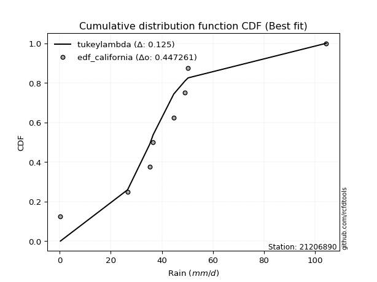</img>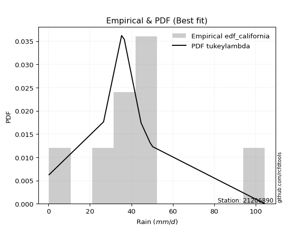</img>

</div>


### 2. EDF Hazen (1930)

Hazen method for plotting positions is a formula used to estimate the empirical cumulative probability distribution of flood events or other hydrological data. This formula often results in biased estimations, particularly when extrapolating to extreme events (high return periods).

<div align="center">


$P=(m-0.5)/n$


</div>


**2.1. Empirical values**

<div align="center">

|                | 0                  | 1                  | 2                  | 3                  | 4                  | 5         | 6                 | 7         |
|:---------------|:-------------------|:-------------------|:-------------------|:-------------------|:-------------------|:----------|:------------------|:----------|
| date           | 2023               | 2016               | 2012               | 2025               | 2014               | 2013      | 2015              | 2024      |
| x              | 0.3                | 26.6               | 35.3               | 36.6               | 44.7               | 49.1      | 50.3              | 104.4     |
| m              | 1                  | 2                  | 3                  | 4                  | 5                  | 6         | 7                 | 8         |
| empirical_dist | edf_hazen          | edf_hazen          | edf_hazen          | edf_hazen          | edf_hazen          | edf_hazen | edf_hazen         | edf_hazen |
| empirical      | 0.0625             | 0.1875             | 0.3125             | 0.4375             | 0.5625             | 0.6875    | 0.8125            | 0.9375    |
| empirical_tr   | 1.0666666666666667 | 1.2307692307692308 | 1.4545454545454546 | 1.7777777777777777 | 2.2857142857142856 | 3.2       | 5.333333333333333 | 16.0      |

</div>


**2.2. Kolmogorov-Smirnov fit test (sorted by Δ)**


<div align="center">

|                | 0                   | 1                   | 2                   | 3                   | 4                   | 5                  | 6                   | 7                   | 8                  | 9                   | 10                  | 11                  | 12                 | 13                  | 14                 | 15                  | 16                  | 17                 | 18                  | 19                  | 20                  | 21                  | 22                  | 23                 | 24                 | 25                 | 26                  | 27                 | 28                 | 29                 | 30                  | 31                  | 32                  | 33                  | 34                  | 35                 | 36                  | 37                 | 38                  | 39                  | 40                  | 41                  | 42                  | 43                 | 44                  | 45                  | 46                  | 47                 | 48                  | 49                  | 50                 | 51                  | 52                  | 53                 | 54                  | 55                 | 56                  | 57                  | 58                 | 59                  | 60                 | 61                 | 62                 | 63                  | 64                 | 65                  | 66                 | 67                  | 68                  | 69                 | 70                 | 71                  | 72                  | 73                  | 74                 | 75                  | 76                 | 77                 | 78                 | 79                 | 80                 | 81                  | 82                 | 83                  | 84                 | 85                 | 86                  | 87                  | 88                  | 89                 | 90                  | 91                 | 92                  | 93                 | 94                 | 95                 | 96                  | 97                  | 98                  | 99                  | 100                | 101                 | 102                | 103                 | 104                | 105                | 106                | 107                 | 108                | 109                | 110                | 111                 | 112                | 113                | 114                | 115                 | 116                 | 117                 | 118                | 119                 | 120                | 121                | 122                 | 123                | 124                 | 125                | 126                 | 127                 | 128                | 129                | 130                | 131                | 132                | 133                | 134                | 135                | 136                 | 137                | 138                | 139                | 140                | 141                | 142                | 143                | 144                | 145                | 146                | 147                | 148                | 149                | 150                | 151                | 152                | 153                | 154                | 155                | 156                | 157                | 158                | 159                |
|:---------------|:--------------------|:--------------------|:--------------------|:--------------------|:--------------------|:-------------------|:--------------------|:--------------------|:-------------------|:--------------------|:--------------------|:--------------------|:-------------------|:--------------------|:-------------------|:--------------------|:--------------------|:-------------------|:--------------------|:--------------------|:--------------------|:--------------------|:--------------------|:-------------------|:-------------------|:-------------------|:--------------------|:-------------------|:-------------------|:-------------------|:--------------------|:--------------------|:--------------------|:--------------------|:--------------------|:-------------------|:--------------------|:-------------------|:--------------------|:--------------------|:--------------------|:--------------------|:--------------------|:-------------------|:--------------------|:--------------------|:--------------------|:-------------------|:--------------------|:--------------------|:-------------------|:--------------------|:--------------------|:-------------------|:--------------------|:-------------------|:--------------------|:--------------------|:-------------------|:--------------------|:-------------------|:-------------------|:-------------------|:--------------------|:-------------------|:--------------------|:-------------------|:--------------------|:--------------------|:-------------------|:-------------------|:--------------------|:--------------------|:--------------------|:-------------------|:--------------------|:-------------------|:-------------------|:-------------------|:-------------------|:-------------------|:--------------------|:-------------------|:--------------------|:-------------------|:-------------------|:--------------------|:--------------------|:--------------------|:-------------------|:--------------------|:-------------------|:--------------------|:-------------------|:-------------------|:-------------------|:--------------------|:--------------------|:--------------------|:--------------------|:-------------------|:--------------------|:-------------------|:--------------------|:-------------------|:-------------------|:-------------------|:--------------------|:-------------------|:-------------------|:-------------------|:--------------------|:-------------------|:-------------------|:-------------------|:--------------------|:--------------------|:--------------------|:-------------------|:--------------------|:-------------------|:-------------------|:--------------------|:-------------------|:--------------------|:-------------------|:--------------------|:--------------------|:-------------------|:-------------------|:-------------------|:-------------------|:-------------------|:-------------------|:-------------------|:-------------------|:--------------------|:-------------------|:-------------------|:-------------------|:-------------------|:-------------------|:-------------------|:-------------------|:-------------------|:-------------------|:-------------------|:-------------------|:-------------------|:-------------------|:-------------------|:-------------------|:-------------------|:-------------------|:-------------------|:-------------------|:-------------------|:-------------------|:-------------------|:-------------------|
| station        | 21206890            | 21206890            | 21206890            | 21206890            | 21206890            | 21206890           | 21206890            | 21206890            | 21206890           | 21206890            | 21206890            | 21206890            | 21206890           | 21206890            | 21206890           | 21206890            | 21206890            | 21206890           | 21206890            | 21206890            | 21206890            | 21206890            | 21206890            | 21206890           | 21206890           | 21206890           | 21206890            | 21206890           | 21206890           | 21206890           | 21206890            | 21206890            | 21206890            | 21206890            | 21206890            | 21206890           | 21206890            | 21206890           | 21206890            | 21206890            | 21206890            | 21206890            | 21206890            | 21206890           | 21206890            | 21206890            | 21206890            | 21206890           | 21206890            | 21206890            | 21206890           | 21206890            | 21206890            | 21206890           | 21206890            | 21206890           | 21206890            | 21206890            | 21206890           | 21206890            | 21206890           | 21206890           | 21206890           | 21206890            | 21206890           | 21206890            | 21206890           | 21206890            | 21206890            | 21206890           | 21206890           | 21206890            | 21206890            | 21206890            | 21206890           | 21206890            | 21206890           | 21206890           | 21206890           | 21206890           | 21206890           | 21206890            | 21206890           | 21206890            | 21206890           | 21206890           | 21206890            | 21206890            | 21206890            | 21206890           | 21206890            | 21206890           | 21206890            | 21206890           | 21206890           | 21206890           | 21206890            | 21206890            | 21206890            | 21206890            | 21206890           | 21206890            | 21206890           | 21206890            | 21206890           | 21206890           | 21206890           | 21206890            | 21206890           | 21206890           | 21206890           | 21206890            | 21206890           | 21206890           | 21206890           | 21206890            | 21206890            | 21206890            | 21206890           | 21206890            | 21206890           | 21206890           | 21206890            | 21206890           | 21206890            | 21206890           | 21206890            | 21206890            | 21206890           | 21206890           | 21206890           | 21206890           | 21206890           | 21206890           | 21206890           | 21206890           | 21206890            | 21206890           | 21206890           | 21206890           | 21206890           | 21206890           | 21206890           | 21206890           | 21206890           | 21206890           | 21206890           | 21206890           | 21206890           | 21206890           | 21206890           | 21206890           | 21206890           | 21206890           | 21206890           | 21206890           | 21206890           | 21206890           | 21206890           | 21206890           |
| empirical_dist | edf_hazen           | edf_hazen           | edf_hazen           | edf_hazen           | edf_hazen           | edf_hazen          | edf_hazen           | edf_hazen           | edf_hazen          | edf_hazen           | edf_hazen           | edf_hazen           | edf_hazen          | edf_hazen           | edf_hazen          | edf_hazen           | edf_hazen           | edf_hazen          | edf_hazen           | edf_hazen           | edf_hazen           | edf_hazen           | edf_hazen           | edf_hazen          | edf_hazen          | edf_hazen          | edf_hazen           | edf_hazen          | edf_hazen          | edf_hazen          | edf_hazen           | edf_hazen           | edf_hazen           | edf_hazen           | edf_hazen           | edf_hazen          | edf_hazen           | edf_hazen          | edf_hazen           | edf_hazen           | edf_hazen           | edf_hazen           | edf_hazen           | edf_hazen          | edf_hazen           | edf_hazen           | edf_hazen           | edf_hazen          | edf_hazen           | edf_hazen           | edf_hazen          | edf_hazen           | edf_hazen           | edf_hazen          | edf_hazen           | edf_hazen          | edf_hazen           | edf_hazen           | edf_hazen          | edf_hazen           | edf_hazen          | edf_hazen          | edf_hazen          | edf_hazen           | edf_hazen          | edf_hazen           | edf_hazen          | edf_hazen           | edf_hazen           | edf_hazen          | edf_hazen          | edf_hazen           | edf_hazen           | edf_hazen           | edf_hazen          | edf_hazen           | edf_hazen          | edf_hazen          | edf_hazen          | edf_hazen          | edf_hazen          | edf_hazen           | edf_hazen          | edf_hazen           | edf_hazen          | edf_hazen          | edf_hazen           | edf_hazen           | edf_hazen           | edf_hazen          | edf_hazen           | edf_hazen          | edf_hazen           | edf_hazen          | edf_hazen          | edf_hazen          | edf_hazen           | edf_hazen           | edf_hazen           | edf_hazen           | edf_hazen          | edf_hazen           | edf_hazen          | edf_hazen           | edf_hazen          | edf_hazen          | edf_hazen          | edf_hazen           | edf_hazen          | edf_hazen          | edf_hazen          | edf_hazen           | edf_hazen          | edf_hazen          | edf_hazen          | edf_hazen           | edf_hazen           | edf_hazen           | edf_hazen          | edf_hazen           | edf_hazen          | edf_hazen          | edf_hazen           | edf_hazen          | edf_hazen           | edf_hazen          | edf_hazen           | edf_hazen           | edf_hazen          | edf_hazen          | edf_hazen          | edf_hazen          | edf_hazen          | edf_hazen          | edf_hazen          | edf_hazen          | edf_hazen           | edf_hazen          | edf_hazen          | edf_hazen          | edf_hazen          | edf_hazen          | edf_hazen          | edf_hazen          | edf_hazen          | edf_hazen          | edf_hazen          | edf_hazen          | edf_hazen          | edf_hazen          | edf_hazen          | edf_hazen          | edf_hazen          | edf_hazen          | edf_hazen          | edf_hazen          | edf_hazen          | edf_hazen          | edf_hazen          | edf_hazen          |
| p_dist         | t                   | johnsonsu           | logjohnsonsu        | logt                | dgamma              | gumbel_r           | moyal               | exponnorm           | nct                | halfnorm            | gengamma            | logcrystalball      | genlogistic        | pearson3            | laplace            | alpha               | halflogistic        | foldnorm           | invgamma            | kstwobign           | vonmises_line       | johnsonsb           | dweibull            | invgauss           | fatiguelife        | beta               | betaprime           | f                  | gamma              | erlang             | weibull_min         | rayleigh            | rice                | tukeylambda         | skewnorm            | maxwell            | hypsecant           | kappa3             | logargus            | logistic            | wald                | logjohnsonsb        | crystalball         | norm               | genpareto           | truncnorm           | logloggamma         | gennorm            | anglit              | logburr12           | loggenlogistic     | loggompertz         | truncexpon          | semicircular       | logweibull_max      | bradford           | loggennorm          | loggenextreme       | logpearson3        | arcsine             | truncweibull_min   | ncf                | loggumbel_l        | genexpon            | cosine             | loglevy_l           | gumbel_l           | lomax               | logdgamma           | logdweibull        | logtrapezoid       | gausshyper          | mielke              | logfoldnorm         | kappa4             | logmielke           | logarcsine         | ksone              | logsemicircular    | loganglit          | wrapcauchy         | uniform             | lognakagami        | lognorm             | logexponnorm       | logrice            | logfatiguelife      | lognct              | loglogistic         | loghypsecant       | loginvgamma         | loginvweibull      | halfgennorm         | logkappa3          | loggamma           | loggamma           | loglaplace          | loglaplace          | logbetaprime        | logburr             | logskewnorm        | burr                | logalpha           | levy_l              | loginvgauss        | logmaxwell         | nakagami           | burr12              | argus              | lograyleigh        | loggausshyper      | logexponweib        | logkstwobign       | loggenpareto       | loggumbel_r        | loghalfnorm         | genextreme          | loggenexpon         | logcosine          | logncf              | logmoyal           | loghalflogistic    | loggenhalflogistic  | triang             | logwrapcauchy       | logloglaplace      | logtriang           | loglomax            | genhalflogistic    | logwald            | invweibull         | logkappa4          | rdist              | logf               | logbradford        | logksone           | logtruncweibull_min | loggengamma        | trapezoid          | loguniform         | logvonmises_line   | logtruncnorm       | logbeta            | powerlaw           | logweibull_min     | logtruncexpon      | exponweib          | weibull_max        | truncpareto        | exponpow           | logexponpow        | logpowerlaw        | logtruncpareto     | gompertz           | loghalfgennorm     | logtukeylambda     | logerlang          | logrdist           | logvonmises        | vonmises           |
| delta          | 0.06733102338027397 | 0.08474974389559664 | 0.09199030655079354 | 0.11848252792115321 | 0.12572235037345936 | 0.1470251890125499 | 0.14973004785874044 | 0.15048906306112553 | 0.1551214295184442 | 0.15521980375027866 | 0.15558805695380962 | 0.15661527614399773 | 0.1594440362167806 | 0.16333343906088982 | 0.1634147115706286 | 0.16523888073373427 | 0.16573208842653064 | 0.1658587154122726 | 0.16726934649029224 | 0.16731051013274567 | 0.16859653793228102 | 0.16925215555356143 | 0.16956229726807015 | 0.1703984563900609 | 0.1705377346930338 | 0.1716815279619357 | 0.17171187856255976 | 0.1719917629169343 | 0.1720099067234313 | 0.1720099657676093 | 0.17408706907944982 | 0.17875718042631616 | 0.17877934402810025 | 0.18125931313962695 | 0.18517076984008085 | 0.1870272217874962 | 0.19042646744940628 | 0.1915829614040025 | 0.19721025657982982 | 0.20088500415385624 | 0.20648866807445665 | 0.20777154692431143 | 0.21365382685702394 | 0.2136538283019126 | 0.21726926567397653 | 0.21874720502845757 | 0.22077054595708273 | 0.2225779620098644 | 0.22733521331506312 | 0.22827812615572463 | 0.2291332596261199 | 0.23142187712762818 | 0.23281313250799096 | 0.2330161890737552 | 0.23735158787809474 | 0.2392749900196799 | 0.24753395602227968 | 0.24917202146517303 | 0.2494140933639546 | 0.25585027660921755 | 0.2571059756987385 | 0.2589214786503097 | 0.2649912991900507 | 0.26597289406050273 | 0.2721135228935928 | 0.27247288247942425 | 0.2736400582100533 | 0.27873748014338684 | 0.28341543323583707 | 0.2862501467430576 | 0.2897634076603339 | 0.29189294622215123 | 0.30240625571366764 | 0.30701607373062373 | 0.3117314653868043 | 0.32069911664173756 | 0.3248483183934352 | 0.328910502721742  | 0.3299567993887743 | 0.331243406138896  | 0.3320603222476903 | 0.33219260326609035 | 0.3342162253445542 | 0.33436974331849534 | 0.3343719164088669 | 0.3343747654591618 | 0.33463876472059007 | 0.33476889576572044 | 0.33734978352781275 | 0.3398895397218312 | 0.34399281964276485 | 0.3478917452472867 | 0.34946428441680555 | 0.349685258644286  | 0.349687316116184  | 0.349687316116184  | 0.34981660584894936 | 0.34981660584894936 | 0.35102082411362734 | 0.35363065387807047 | 0.3544314049077867 | 0.35582090703367686 | 0.3572507039462208 | 0.36021738082323185 | 0.360682406545514  | 0.3664188391515416 | 0.3687479751608278 | 0.37327880661345314 | 0.3747993558912054 | 0.3769236456381224 | 0.3862595266755475 | 0.39085773797735823 | 0.3931728595312104 | 0.4034838931154374 | 0.4050491676436736 | 0.40649318181820704 | 0.40955081150519346 | 0.41909893195522285 | 0.4239668185982006 | 0.42934910650523395 | 0.430613829193892  | 0.4326357699759569 | 0.43418962286106555 | 0.4342120569248182 | 0.44214547606786914 | 0.4424970827456436 | 0.44559423445921664 | 0.44795471990527225 | 0.4697296460761471 | 0.5016145179619292 | 0.5062857395380076 | 0.5176617961644723 | 0.5252109413596537 | 0.5301565002814652 | 0.5321193397324211 | 0.534465260887331  | 0.564999146224931   | 0.5654109913717649 | 0.5747110465619547 | 0.5788583130647973 | 0.579150539914221  | 0.5863294680394224 | 0.5905654993043181 | 0.6073552594192446 | 0.6169135602325636 | 0.6405039492906851 | 0.6694374379952037 | 0.706883763149962  | 0.7265900887881339 | 0.7472372311725437 | 0.7540710904807734 | 0.7592534357695551 | 0.772690235072817  | 0.8109719705949899 | 0.8125             | 0.8125             | 0.8936265322188057 | 0.9374999998616388 | 0.961977940272571  | 16.16969304089458  |
| deltao         | 0.4472608134160001  | 0.4472608134160001  | 0.4472608134160001  | 0.4472608134160001  | 0.4472608134160001  | 0.4472608134160001 | 0.4472608134160001  | 0.4472608134160001  | 0.4472608134160001 | 0.4472608134160001  | 0.4472608134160001  | 0.4472608134160001  | 0.4472608134160001 | 0.4472608134160001  | 0.4472608134160001 | 0.4472608134160001  | 0.4472608134160001  | 0.4472608134160001 | 0.4472608134160001  | 0.4472608134160001  | 0.4472608134160001  | 0.4472608134160001  | 0.4472608134160001  | 0.4472608134160001 | 0.4472608134160001 | 0.4472608134160001 | 0.4472608134160001  | 0.4472608134160001 | 0.4472608134160001 | 0.4472608134160001 | 0.4472608134160001  | 0.4472608134160001  | 0.4472608134160001  | 0.4472608134160001  | 0.4472608134160001  | 0.4472608134160001 | 0.4472608134160001  | 0.4472608134160001 | 0.4472608134160001  | 0.4472608134160001  | 0.4472608134160001  | 0.4472608134160001  | 0.4472608134160001  | 0.4472608134160001 | 0.4472608134160001  | 0.4472608134160001  | 0.4472608134160001  | 0.4472608134160001 | 0.4472608134160001  | 0.4472608134160001  | 0.4472608134160001 | 0.4472608134160001  | 0.4472608134160001  | 0.4472608134160001 | 0.4472608134160001  | 0.4472608134160001 | 0.4472608134160001  | 0.4472608134160001  | 0.4472608134160001 | 0.4472608134160001  | 0.4472608134160001 | 0.4472608134160001 | 0.4472608134160001 | 0.4472608134160001  | 0.4472608134160001 | 0.4472608134160001  | 0.4472608134160001 | 0.4472608134160001  | 0.4472608134160001  | 0.4472608134160001 | 0.4472608134160001 | 0.4472608134160001  | 0.4472608134160001  | 0.4472608134160001  | 0.4472608134160001 | 0.4472608134160001  | 0.4472608134160001 | 0.4472608134160001 | 0.4472608134160001 | 0.4472608134160001 | 0.4472608134160001 | 0.4472608134160001  | 0.4472608134160001 | 0.4472608134160001  | 0.4472608134160001 | 0.4472608134160001 | 0.4472608134160001  | 0.4472608134160001  | 0.4472608134160001  | 0.4472608134160001 | 0.4472608134160001  | 0.4472608134160001 | 0.4472608134160001  | 0.4472608134160001 | 0.4472608134160001 | 0.4472608134160001 | 0.4472608134160001  | 0.4472608134160001  | 0.4472608134160001  | 0.4472608134160001  | 0.4472608134160001 | 0.4472608134160001  | 0.4472608134160001 | 0.4472608134160001  | 0.4472608134160001 | 0.4472608134160001 | 0.4472608134160001 | 0.4472608134160001  | 0.4472608134160001 | 0.4472608134160001 | 0.4472608134160001 | 0.4472608134160001  | 0.4472608134160001 | 0.4472608134160001 | 0.4472608134160001 | 0.4472608134160001  | 0.4472608134160001  | 0.4472608134160001  | 0.4472608134160001 | 0.4472608134160001  | 0.4472608134160001 | 0.4472608134160001 | 0.4472608134160001  | 0.4472608134160001 | 0.4472608134160001  | 0.4472608134160001 | 0.4472608134160001  | 0.4472608134160001  | 0.4472608134160001 | 0.4472608134160001 | 0.4472608134160001 | 0.4472608134160001 | 0.4472608134160001 | 0.4472608134160001 | 0.4472608134160001 | 0.4472608134160001 | 0.4472608134160001  | 0.4472608134160001 | 0.4472608134160001 | 0.4472608134160001 | 0.4472608134160001 | 0.4472608134160001 | 0.4472608134160001 | 0.4472608134160001 | 0.4472608134160001 | 0.4472608134160001 | 0.4472608134160001 | 0.4472608134160001 | 0.4472608134160001 | 0.4472608134160001 | 0.4472608134160001 | 0.4472608134160001 | 0.4472608134160001 | 0.4472608134160001 | 0.4472608134160001 | 0.4472608134160001 | 0.4472608134160001 | 0.4472608134160001 | 0.4472608134160001 | 0.4472608134160001 |
| eval           | Δo > Δ              | Δo > Δ              | Δo > Δ              | Δo > Δ              | Δo > Δ              | Δo > Δ             | Δo > Δ              | Δo > Δ              | Δo > Δ             | Δo > Δ              | Δo > Δ              | Δo > Δ              | Δo > Δ             | Δo > Δ              | Δo > Δ             | Δo > Δ              | Δo > Δ              | Δo > Δ             | Δo > Δ              | Δo > Δ              | Δo > Δ              | Δo > Δ              | Δo > Δ              | Δo > Δ             | Δo > Δ             | Δo > Δ             | Δo > Δ              | Δo > Δ             | Δo > Δ             | Δo > Δ             | Δo > Δ              | Δo > Δ              | Δo > Δ              | Δo > Δ              | Δo > Δ              | Δo > Δ             | Δo > Δ              | Δo > Δ             | Δo > Δ              | Δo > Δ              | Δo > Δ              | Δo > Δ              | Δo > Δ              | Δo > Δ             | Δo > Δ              | Δo > Δ              | Δo > Δ              | Δo > Δ             | Δo > Δ              | Δo > Δ              | Δo > Δ             | Δo > Δ              | Δo > Δ              | Δo > Δ             | Δo > Δ              | Δo > Δ             | Δo > Δ              | Δo > Δ              | Δo > Δ             | Δo > Δ              | Δo > Δ             | Δo > Δ             | Δo > Δ             | Δo > Δ              | Δo > Δ             | Δo > Δ              | Δo > Δ             | Δo > Δ              | Δo > Δ              | Δo > Δ             | Δo > Δ             | Δo > Δ              | Δo > Δ              | Δo > Δ              | Δo > Δ             | Δo > Δ              | Δo > Δ             | Δo > Δ             | Δo > Δ             | Δo > Δ             | Δo > Δ             | Δo > Δ              | Δo > Δ             | Δo > Δ              | Δo > Δ             | Δo > Δ             | Δo > Δ              | Δo > Δ              | Δo > Δ              | Δo > Δ             | Δo > Δ              | Δo > Δ             | Δo > Δ              | Δo > Δ             | Δo > Δ             | Δo > Δ             | Δo > Δ              | Δo > Δ              | Δo > Δ              | Δo > Δ              | Δo > Δ             | Δo > Δ              | Δo > Δ             | Δo > Δ              | Δo > Δ             | Δo > Δ             | Δo > Δ             | Δo > Δ              | Δo > Δ             | Δo > Δ             | Δo > Δ             | Δo > Δ              | Δo > Δ             | Δo > Δ             | Δo > Δ             | Δo > Δ              | Δo > Δ              | Δo > Δ              | Δo > Δ             | Δo > Δ              | Δo > Δ             | Δo > Δ             | Δo > Δ              | Δo > Δ             | Δo > Δ              | Δo > Δ             | Δo > Δ              | Δo <= Δ             | Δo <= Δ            | Δo <= Δ            | Δo <= Δ            | Δo <= Δ            | Δo <= Δ            | Δo <= Δ            | Δo <= Δ            | Δo <= Δ            | Δo <= Δ             | Δo <= Δ            | Δo <= Δ            | Δo <= Δ            | Δo <= Δ            | Δo <= Δ            | Δo <= Δ            | Δo <= Δ            | Δo <= Δ            | Δo <= Δ            | Δo <= Δ            | Δo <= Δ            | Δo <= Δ            | Δo <= Δ            | Δo <= Δ            | Δo <= Δ            | Δo <= Δ            | Δo <= Δ            | Δo <= Δ            | Δo <= Δ            | Δo <= Δ            | Δo <= Δ            | Δo <= Δ            | Δo <= Δ            |
| fit            | 1                   | 1                   | 1                   | 1                   | 1                   | 1                  | 1                   | 1                   | 1                  | 1                   | 1                   | 1                   | 1                  | 1                   | 1                  | 1                   | 1                   | 1                  | 1                   | 1                   | 1                   | 1                   | 1                   | 1                  | 1                  | 1                  | 1                   | 1                  | 1                  | 1                  | 1                   | 1                   | 1                   | 1                   | 1                   | 1                  | 1                   | 1                  | 1                   | 1                   | 1                   | 1                   | 1                   | 1                  | 1                   | 1                   | 1                   | 1                  | 1                   | 1                   | 1                  | 1                   | 1                   | 1                  | 1                   | 1                  | 1                   | 1                   | 1                  | 1                   | 1                  | 1                  | 1                  | 1                   | 1                  | 1                   | 1                  | 1                   | 1                   | 1                  | 1                  | 1                   | 1                   | 1                   | 1                  | 1                   | 1                  | 1                  | 1                  | 1                  | 1                  | 1                   | 1                  | 1                   | 1                  | 1                  | 1                   | 1                   | 1                   | 1                  | 1                   | 1                  | 1                   | 1                  | 1                  | 1                  | 1                   | 1                   | 1                   | 1                   | 1                  | 1                   | 1                  | 1                   | 1                  | 1                  | 1                  | 1                   | 1                  | 1                  | 1                  | 1                   | 1                  | 1                  | 1                  | 1                   | 1                   | 1                   | 1                  | 1                   | 1                  | 1                  | 1                   | 1                  | 1                   | 1                  | 1                   | 0                   | 0                  | 0                  | 0                  | 0                  | 0                  | 0                  | 0                  | 0                  | 0                   | 0                  | 0                  | 0                  | 0                  | 0                  | 0                  | 0                  | 0                  | 0                  | 0                  | 0                  | 0                  | 0                  | 0                  | 0                  | 0                  | 0                  | 0                  | 0                  | 0                  | 0                  | 0                  | 0                  |
| n              | 8                   | 8                   | 8                   | 8                   | 8                   | 8                  | 8                   | 8                   | 8                  | 8                   | 8                   | 8                   | 8                  | 8                   | 8                  | 8                   | 8                   | 8                  | 8                   | 8                   | 8                   | 8                   | 8                   | 8                  | 8                  | 8                  | 8                   | 8                  | 8                  | 8                  | 8                   | 8                   | 8                   | 8                   | 8                   | 8                  | 8                   | 8                  | 8                   | 8                   | 8                   | 8                   | 8                   | 8                  | 8                   | 8                   | 8                   | 8                  | 8                   | 8                   | 8                  | 8                   | 8                   | 8                  | 8                   | 8                  | 8                   | 8                   | 8                  | 8                   | 8                  | 8                  | 8                  | 8                   | 8                  | 8                   | 8                  | 8                   | 8                   | 8                  | 8                  | 8                   | 8                   | 8                   | 8                  | 8                   | 8                  | 8                  | 8                  | 8                  | 8                  | 8                   | 8                  | 8                   | 8                  | 8                  | 8                   | 8                   | 8                   | 8                  | 8                   | 8                  | 8                   | 8                  | 8                  | 8                  | 8                   | 8                   | 8                   | 8                   | 8                  | 8                   | 8                  | 8                   | 8                  | 8                  | 8                  | 8                   | 8                  | 8                  | 8                  | 8                   | 8                  | 8                  | 8                  | 8                   | 8                   | 8                   | 8                  | 8                   | 8                  | 8                  | 8                   | 8                  | 8                   | 8                  | 8                   | 8                   | 8                  | 8                  | 8                  | 8                  | 8                  | 8                  | 8                  | 8                  | 8                   | 8                  | 8                  | 8                  | 8                  | 8                  | 8                  | 8                  | 8                  | 8                  | 8                  | 8                  | 8                  | 8                  | 8                  | 8                  | 8                  | 8                  | 8                  | 8                  | 8                  | 8                  | 8                  | 8                  |
| best_fit       | 1                   | 0                   | 0                   | 0                   | 0                   | 0                  | 0                   | 0                   | 0                  | 0                   | 0                   | 0                   | 0                  | 0                   | 0                  | 0                   | 0                   | 0                  | 0                   | 0                   | 0                   | 0                   | 0                   | 0                  | 0                  | 0                  | 0                   | 0                  | 0                  | 0                  | 0                   | 0                   | 0                   | 0                   | 0                   | 0                  | 0                   | 0                  | 0                   | 0                   | 0                   | 0                   | 0                   | 0                  | 0                   | 0                   | 0                   | 0                  | 0                   | 0                   | 0                  | 0                   | 0                   | 0                  | 0                   | 0                  | 0                   | 0                   | 0                  | 0                   | 0                  | 0                  | 0                  | 0                   | 0                  | 0                   | 0                  | 0                   | 0                   | 0                  | 0                  | 0                   | 0                   | 0                   | 0                  | 0                   | 0                  | 0                  | 0                  | 0                  | 0                  | 0                   | 0                  | 0                   | 0                  | 0                  | 0                   | 0                   | 0                   | 0                  | 0                   | 0                  | 0                   | 0                  | 0                  | 0                  | 0                   | 0                   | 0                   | 0                   | 0                  | 0                   | 0                  | 0                   | 0                  | 0                  | 0                  | 0                   | 0                  | 0                  | 0                  | 0                   | 0                  | 0                  | 0                  | 0                   | 0                   | 0                   | 0                  | 0                   | 0                  | 0                  | 0                   | 0                  | 0                   | 0                  | 0                   | 0                   | 0                  | 0                  | 0                  | 0                  | 0                  | 0                  | 0                  | 0                  | 0                   | 0                  | 0                  | 0                  | 0                  | 0                  | 0                  | 0                  | 0                  | 0                  | 0                  | 0                  | 0                  | 0                  | 0                  | 0                  | 0                  | 0                  | 0                  | 0                  | 0                  | 0                  | 0                  | 0                  |
| best_fit_sort  | 1                   | 2                   | 3                   | 4                   | 5                   | 6                  | 7                   | 8                   | 9                  | 10                  | 11                  | 12                  | 13                 | 14                  | 15                 | 16                  | 17                  | 18                 | 19                  | 20                  | 21                  | 22                  | 23                  | 24                 | 25                 | 26                 | 27                  | 28                 | 29                 | 30                 | 31                  | 32                  | 33                  | 34                  | 35                  | 36                 | 37                  | 38                 | 39                  | 40                  | 41                  | 42                  | 43                  | 44                 | 45                  | 46                  | 47                  | 48                 | 49                  | 50                  | 51                 | 52                  | 53                  | 54                 | 55                  | 56                 | 57                  | 58                  | 59                 | 60                  | 61                 | 62                 | 63                 | 64                  | 65                 | 66                  | 67                 | 68                  | 69                  | 70                 | 71                 | 72                  | 73                  | 74                  | 75                 | 76                  | 77                 | 78                 | 79                 | 80                 | 81                 | 82                  | 83                 | 84                  | 85                 | 86                 | 87                  | 88                  | 89                  | 90                 | 91                  | 92                 | 93                  | 94                 | 95                 | 96                 | 97                  | 98                  | 99                  | 100                 | 101                | 102                 | 103                | 104                 | 105                | 106                | 107                | 108                 | 109                | 110                | 111                | 112                 | 113                | 114                | 115                | 116                 | 117                 | 118                 | 119                | 120                 | 121                | 122                | 123                 | 124                | 125                 | 126                | 127                 | 128                 | 129                | 130                | 131                | 132                | 133                | 134                | 135                | 136                | 137                 | 138                | 139                | 140                | 141                | 142                | 143                | 144                | 145                | 146                | 147                | 148                | 149                | 150                | 151                | 152                | 153                | 154                | 155                | 156                | 157                | 158                | 159                | 160                |

</div>


**2.3. Best fit**

<div align="center">

|   id |   station | empirical_dist   | p_dist   |    delta |   deltao | eval   |   fit |   n |   best_fit |   best_fit_sort |
|-----:|----------:|:-----------------|:---------|---------:|---------:|:-------|------:|----:|-----------:|----------------:|
|    0 |  21206890 | edf_hazen        | t        | 0.067331 | 0.447261 | Δo > Δ |     1 |   8 |          1 |               1 |

</div>


<div align="center">

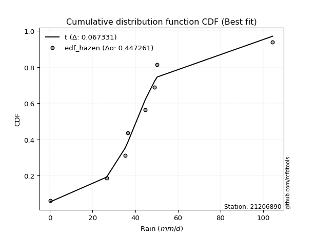</img>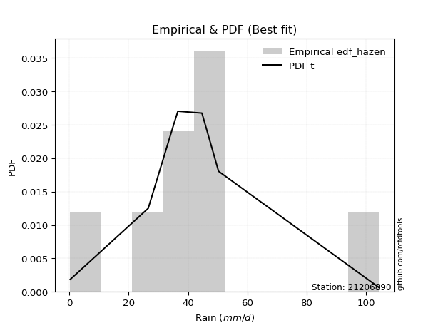</img>

</div>


### 3. EDF Weibull (1939)

Weibull plotting position formula is an empirical method used to estimate the non-exceedance probability or plotting position for a set of observed data, is often recommended or widely used in practice, particularly in flood frequency analysis.

<div align="center">


$P=m/(n+1)$


</div>


**3.1. Empirical values**

<div align="center">

|                | 0                  | 1                  | 2                  | 3                  | 4                  | 5                  | 6                  | 7                  |
|:---------------|:-------------------|:-------------------|:-------------------|:-------------------|:-------------------|:-------------------|:-------------------|:-------------------|
| date           | 2023               | 2016               | 2012               | 2025               | 2014               | 2013               | 2015               | 2024               |
| x              | 0.3                | 26.6               | 35.3               | 36.6               | 44.7               | 49.1               | 50.3               | 104.4              |
| m              | 1                  | 2                  | 3                  | 4                  | 5                  | 6                  | 7                  | 8                  |
| empirical_dist | edf_weibull        | edf_weibull        | edf_weibull        | edf_weibull        | edf_weibull        | edf_weibull        | edf_weibull        | edf_weibull        |
| empirical      | 0.1111111111111111 | 0.2222222222222222 | 0.3333333333333333 | 0.4444444444444444 | 0.5555555555555556 | 0.6666666666666666 | 0.7777777777777778 | 0.8888888888888888 |
| empirical_tr   | 1.125              | 1.2857142857142856 | 1.4999999999999998 | 1.7999999999999998 | 2.25               | 2.9999999999999996 | 4.5                | 8.999999999999996  |

</div>


**3.2. Kolmogorov-Smirnov fit test (sorted by Δ)**


<div align="center">

|                | 0                  | 1                  | 2                   | 3                   | 4                  | 5                   | 6                  | 7                   | 8                   | 9                   | 10                 | 11                 | 12                  | 13                  | 14                  | 15                  | 16                  | 17                  | 18                  | 19                 | 20                  | 21                  | 22                 | 23                  | 24                 | 25                  | 26                 | 27                 | 28                 | 29                 | 30                  | 31                  | 32                  | 33                  | 34                 | 35                  | 36                 | 37                  | 38                  | 39                  | 40                  | 41                 | 42                  | 43                  | 44                  | 45                  | 46                  | 47                 | 48                  | 49                 | 50                  | 51                  | 52                 | 53                  | 54                  | 55                  | 56                  | 57                  | 58                  | 59                 | 60                  | 61                  | 62                 | 63                  | 64                 | 65                  | 66                  | 67                  | 68                  | 69                 | 70                 | 71                 | 72                  | 73                 | 74                 | 75                  | 76                 | 77                 | 78                 | 79                 | 80                  | 81                  | 82                 | 83                  | 84                  | 85                 | 86                  | 87                  | 88                  | 89                  | 90                 | 91                  | 92                  | 93                 | 94                  | 95                  | 96                  | 97                  | 98                  | 99                  | 100                 | 101                | 102                 | 103                | 104                | 105                 | 106                | 107                | 108                | 109                | 110                | 111                | 112                | 113                | 114                | 115                 | 116                 | 117                 | 118                | 119                 | 120                | 121                 | 122                 | 123                 | 124                | 125                | 126                 | 127                 | 128                | 129                | 130                 | 131                 | 132                 | 133                | 134                | 135                 | 136                | 137                 | 138                | 139                | 140                | 141                | 142                | 143                | 144                | 145                | 146                | 147                | 148                | 149                | 150                | 151                | 152                | 153                | 154                | 155                | 156                | 157                | 158                | 159                |
|:---------------|:-------------------|:-------------------|:--------------------|:--------------------|:-------------------|:--------------------|:-------------------|:--------------------|:--------------------|:--------------------|:-------------------|:-------------------|:--------------------|:--------------------|:--------------------|:--------------------|:--------------------|:--------------------|:--------------------|:-------------------|:--------------------|:--------------------|:-------------------|:--------------------|:-------------------|:--------------------|:-------------------|:-------------------|:-------------------|:-------------------|:--------------------|:--------------------|:--------------------|:--------------------|:-------------------|:--------------------|:-------------------|:--------------------|:--------------------|:--------------------|:--------------------|:-------------------|:--------------------|:--------------------|:--------------------|:--------------------|:--------------------|:-------------------|:--------------------|:-------------------|:--------------------|:--------------------|:-------------------|:--------------------|:--------------------|:--------------------|:--------------------|:--------------------|:--------------------|:-------------------|:--------------------|:--------------------|:-------------------|:--------------------|:-------------------|:--------------------|:--------------------|:--------------------|:--------------------|:-------------------|:-------------------|:-------------------|:--------------------|:-------------------|:-------------------|:--------------------|:-------------------|:-------------------|:-------------------|:-------------------|:--------------------|:--------------------|:-------------------|:--------------------|:--------------------|:-------------------|:--------------------|:--------------------|:--------------------|:--------------------|:-------------------|:--------------------|:--------------------|:-------------------|:--------------------|:--------------------|:--------------------|:--------------------|:--------------------|:--------------------|:--------------------|:-------------------|:--------------------|:-------------------|:-------------------|:--------------------|:-------------------|:-------------------|:-------------------|:-------------------|:-------------------|:-------------------|:-------------------|:-------------------|:-------------------|:--------------------|:--------------------|:--------------------|:-------------------|:--------------------|:-------------------|:--------------------|:--------------------|:--------------------|:-------------------|:-------------------|:--------------------|:--------------------|:-------------------|:-------------------|:--------------------|:--------------------|:--------------------|:-------------------|:-------------------|:--------------------|:-------------------|:--------------------|:-------------------|:-------------------|:-------------------|:-------------------|:-------------------|:-------------------|:-------------------|:-------------------|:-------------------|:-------------------|:-------------------|:-------------------|:-------------------|:-------------------|:-------------------|:-------------------|:-------------------|:-------------------|:-------------------|:-------------------|:-------------------|:-------------------|
| station        | 21206890           | 21206890           | 21206890            | 21206890            | 21206890           | 21206890            | 21206890           | 21206890            | 21206890            | 21206890            | 21206890           | 21206890           | 21206890            | 21206890            | 21206890            | 21206890            | 21206890            | 21206890            | 21206890            | 21206890           | 21206890            | 21206890            | 21206890           | 21206890            | 21206890           | 21206890            | 21206890           | 21206890           | 21206890           | 21206890           | 21206890            | 21206890            | 21206890            | 21206890            | 21206890           | 21206890            | 21206890           | 21206890            | 21206890            | 21206890            | 21206890            | 21206890           | 21206890            | 21206890            | 21206890            | 21206890            | 21206890            | 21206890           | 21206890            | 21206890           | 21206890            | 21206890            | 21206890           | 21206890            | 21206890            | 21206890            | 21206890            | 21206890            | 21206890            | 21206890           | 21206890            | 21206890            | 21206890           | 21206890            | 21206890           | 21206890            | 21206890            | 21206890            | 21206890            | 21206890           | 21206890           | 21206890           | 21206890            | 21206890           | 21206890           | 21206890            | 21206890           | 21206890           | 21206890           | 21206890           | 21206890            | 21206890            | 21206890           | 21206890            | 21206890            | 21206890           | 21206890            | 21206890            | 21206890            | 21206890            | 21206890           | 21206890            | 21206890            | 21206890           | 21206890            | 21206890            | 21206890            | 21206890            | 21206890            | 21206890            | 21206890            | 21206890           | 21206890            | 21206890           | 21206890           | 21206890            | 21206890           | 21206890           | 21206890           | 21206890           | 21206890           | 21206890           | 21206890           | 21206890           | 21206890           | 21206890            | 21206890            | 21206890            | 21206890           | 21206890            | 21206890           | 21206890            | 21206890            | 21206890            | 21206890           | 21206890           | 21206890            | 21206890            | 21206890           | 21206890           | 21206890            | 21206890            | 21206890            | 21206890           | 21206890           | 21206890            | 21206890           | 21206890            | 21206890           | 21206890           | 21206890           | 21206890           | 21206890           | 21206890           | 21206890           | 21206890           | 21206890           | 21206890           | 21206890           | 21206890           | 21206890           | 21206890           | 21206890           | 21206890           | 21206890           | 21206890           | 21206890           | 21206890           | 21206890           | 21206890           |
| empirical_dist | edf_weibull        | edf_weibull        | edf_weibull         | edf_weibull         | edf_weibull        | edf_weibull         | edf_weibull        | edf_weibull         | edf_weibull         | edf_weibull         | edf_weibull        | edf_weibull        | edf_weibull         | edf_weibull         | edf_weibull         | edf_weibull         | edf_weibull         | edf_weibull         | edf_weibull         | edf_weibull        | edf_weibull         | edf_weibull         | edf_weibull        | edf_weibull         | edf_weibull        | edf_weibull         | edf_weibull        | edf_weibull        | edf_weibull        | edf_weibull        | edf_weibull         | edf_weibull         | edf_weibull         | edf_weibull         | edf_weibull        | edf_weibull         | edf_weibull        | edf_weibull         | edf_weibull         | edf_weibull         | edf_weibull         | edf_weibull        | edf_weibull         | edf_weibull         | edf_weibull         | edf_weibull         | edf_weibull         | edf_weibull        | edf_weibull         | edf_weibull        | edf_weibull         | edf_weibull         | edf_weibull        | edf_weibull         | edf_weibull         | edf_weibull         | edf_weibull         | edf_weibull         | edf_weibull         | edf_weibull        | edf_weibull         | edf_weibull         | edf_weibull        | edf_weibull         | edf_weibull        | edf_weibull         | edf_weibull         | edf_weibull         | edf_weibull         | edf_weibull        | edf_weibull        | edf_weibull        | edf_weibull         | edf_weibull        | edf_weibull        | edf_weibull         | edf_weibull        | edf_weibull        | edf_weibull        | edf_weibull        | edf_weibull         | edf_weibull         | edf_weibull        | edf_weibull         | edf_weibull         | edf_weibull        | edf_weibull         | edf_weibull         | edf_weibull         | edf_weibull         | edf_weibull        | edf_weibull         | edf_weibull         | edf_weibull        | edf_weibull         | edf_weibull         | edf_weibull         | edf_weibull         | edf_weibull         | edf_weibull         | edf_weibull         | edf_weibull        | edf_weibull         | edf_weibull        | edf_weibull        | edf_weibull         | edf_weibull        | edf_weibull        | edf_weibull        | edf_weibull        | edf_weibull        | edf_weibull        | edf_weibull        | edf_weibull        | edf_weibull        | edf_weibull         | edf_weibull         | edf_weibull         | edf_weibull        | edf_weibull         | edf_weibull        | edf_weibull         | edf_weibull         | edf_weibull         | edf_weibull        | edf_weibull        | edf_weibull         | edf_weibull         | edf_weibull        | edf_weibull        | edf_weibull         | edf_weibull         | edf_weibull         | edf_weibull        | edf_weibull        | edf_weibull         | edf_weibull        | edf_weibull         | edf_weibull        | edf_weibull        | edf_weibull        | edf_weibull        | edf_weibull        | edf_weibull        | edf_weibull        | edf_weibull        | edf_weibull        | edf_weibull        | edf_weibull        | edf_weibull        | edf_weibull        | edf_weibull        | edf_weibull        | edf_weibull        | edf_weibull        | edf_weibull        | edf_weibull        | edf_weibull        | edf_weibull        | edf_weibull        |
| p_dist         | johnsonsu          | t                  | dgamma              | logjohnsonsu        | gumbel_r           | exponnorm           | nct                | gengamma            | logcrystalball      | logt                | genlogistic        | pearson3           | laplace             | moyal               | alpha               | foldnorm            | halfnorm            | invgamma            | kstwobign           | vonmises_line      | johnsonsb           | dweibull            | invgauss           | fatiguelife         | beta               | betaprime           | f                  | gamma              | erlang             | weibull_min        | rayleigh            | rice                | halflogistic        | skewnorm            | maxwell            | hypsecant           | logargus           | logistic            | kappa3              | logjohnsonsb        | crystalball         | norm               | genpareto           | truncnorm           | wald                | logloggamma         | tukeylambda         | anglit             | logburr12           | loggenlogistic     | loggompertz         | truncexpon          | semicircular       | logweibull_max      | bradford            | loggenextreme       | logpearson3         | arcsine             | loggennorm          | truncweibull_min   | ncf                 | gennorm             | loggumbel_l        | genexpon            | cosine             | loglevy_l           | gumbel_l            | lomax               | logdgamma           | logdweibull        | logtrapezoid       | gausshyper         | mielke              | logfoldnorm        | kappa4             | logmielke           | logarcsine         | ksone              | logsemicircular    | loganglit          | wrapcauchy          | uniform             | lognakagami        | lognorm             | logexponnorm        | logrice            | logfatiguelife      | lognct              | logkappa3           | loglogistic         | loghypsecant       | loginvgamma         | levy_l              | loginvweibull      | halfgennorm         | loggamma            | loggamma            | loglaplace          | loglaplace          | logbetaprime        | logburr             | logskewnorm        | burr                | logalpha           | burr12             | loginvgauss         | logmaxwell         | nakagami           | argus              | lograyleigh        | logexponweib       | loggausshyper      | logkstwobign       | loggenpareto       | loggumbel_r        | loghalfnorm         | genextreme          | loggenexpon         | logcosine          | logncf              | logmoyal           | loghalflogistic     | loggenhalflogistic  | triang              | logwrapcauchy      | logloglaplace      | logtriang           | loglomax            | genhalflogistic    | invweibull         | logwald             | logkappa4           | rdist               | logf               | logbradford        | logksone            | loggengamma        | logtruncweibull_min | trapezoid          | loguniform         | logvonmises_line   | logtruncnorm       | logbeta            | powerlaw           | logweibull_min     | logtruncexpon      | exponweib          | weibull_max        | truncpareto        | exponpow           | logexponpow        | logpowerlaw        | logtruncpareto     | gompertz           | loghalfgennorm     | logtukeylambda     | logerlang          | logrdist           | logvonmises        | vonmises           |
| delta          | 0.0786409975665403 | 0.0816808670484851 | 0.09690831213773998 | 0.09893475099523796 | 0.1123029667903277 | 0.11576684083890332 | 0.120399207296222  | 0.12086583473158741 | 0.12189305392177552 | 0.12256290087719524 | 0.1247218139945584 | 0.1286112168386676 | 0.12869248934840638 | 0.12889671452540713 | 0.13051665851151206 | 0.13113649319005038 | 0.13148867448630064 | 0.13254712426807003 | 0.13258828791052346 | 0.1338743157100588 | 0.13452993333133922 | 0.13484007504584794 | 0.1356762341678387 | 0.13581551247081158 | 0.1369593057397135 | 0.13698965634033755 | 0.1372695406947121 | 0.1372876845012091 | 0.1372877435453871 | 0.1393648468572276 | 0.14403495820409395 | 0.14405712180587804 | 0.14489875509319733 | 0.15044854761785864 | 0.152304999565274  | 0.15570424522718407 | 0.1624880343576076 | 0.16616278193163403 | 0.16755638452063532 | 0.17304932470208922 | 0.17893160463480173 | 0.1789316060796904 | 0.18254704345175432 | 0.18402498280623536 | 0.18565533474112333 | 0.18604832373486052 | 0.18820375758407137 | 0.1926129910928409 | 0.19433486341888323 | 0.1944110374038977 | 0.19678667053632387 | 0.19809091028576875 | 0.198293966851533  | 0.20262936565587253 | 0.20455276779745768 | 0.21444979924295082 | 0.21469187114173238 | 0.22112805438699534 | 0.22147482388606232 | 0.2223837534765163 | 0.22419925642808747 | 0.22952240645430882 | 0.2302690769678285 | 0.23125067183828052 | 0.2373913006713706 | 0.23775066025720204 | 0.23891783598783112 | 0.24401525792116463 | 0.24869321101361486 | 0.2515279245208354 | 0.2550411854381117 | 0.257170723999929  | 0.26768403349144543 | 0.2722938515084015 | 0.2770092431645821 | 0.28597689441951535 | 0.290126096171213  | 0.2941882804995198 | 0.2952345771665521 | 0.2965211839166738 | 0.29733810002546807 | 0.29747038104386814 | 0.299494003122332  | 0.29964752109627313 | 0.29964969418664467 | 0.2996525432369396 | 0.29991654249836786 | 0.30004667354349823 | 0.30107414753317485 | 0.30262756130559054 | 0.305167317499609  | 0.30927059742054264 | 0.31160626971212074 | 0.3131695230250645 | 0.31474206219458334 | 0.31496509389396177 | 0.31496509389396177 | 0.31509438362672715 | 0.31509438362672715 | 0.31629860189140513 | 0.31890843165584826 | 0.3197091826855645 | 0.32109868481145465 | 0.3225284817239986 | 0.324667695502342  | 0.32596018432329177 | 0.3316966169293194 | 0.3340257529386056 | 0.3400771336689832 | 0.3422014234159002 | 0.3422466268662471 | 0.3515373044533253 | 0.3584506373089882 | 0.3687616708932152 | 0.3703269454214514 | 0.37177095959598483 | 0.37482858928297125 | 0.38437670973300064 | 0.3892445963759784 | 0.39462688428301174 | 0.3958916069716698 | 0.39791354775373466 | 0.39946740063884334 | 0.39948983470259597 | 0.4074232538456469 | 0.4077748605234214 | 0.41087201223699443 | 0.41323249768305004 | 0.4350074238539249 | 0.4576746284268965 | 0.46689229573970703 | 0.48293957394225007 | 0.49048871913743153 | 0.495434278059243  | 0.4973971175101989 | 0.49974303866510883 | 0.5167998802606537 | 0.5302769240027088  | 0.5399888243397324 | 0.5441360908425751 | 0.5444283176919988 | 0.5516072458172002 | 0.5558432770820959 | 0.5726330371970224 | 0.5821913380103414 | 0.6057817270684629 | 0.6208263268840926 | 0.6721615409277398 | 0.6918678665659117 | 0.7125150089503215 | 0.7193488682585512 | 0.7245312135473329 | 0.7379680128505948 | 0.7762497483727677 | 0.7777777777777778 | 0.7777777777777778 | 0.8450154211076946 | 0.8888888887505277 | 1.0105890513836822 | 16.21830415200569  |
| deltao         | 0.4472608134160001 | 0.4472608134160001 | 0.4472608134160001  | 0.4472608134160001  | 0.4472608134160001 | 0.4472608134160001  | 0.4472608134160001 | 0.4472608134160001  | 0.4472608134160001  | 0.4472608134160001  | 0.4472608134160001 | 0.4472608134160001 | 0.4472608134160001  | 0.4472608134160001  | 0.4472608134160001  | 0.4472608134160001  | 0.4472608134160001  | 0.4472608134160001  | 0.4472608134160001  | 0.4472608134160001 | 0.4472608134160001  | 0.4472608134160001  | 0.4472608134160001 | 0.4472608134160001  | 0.4472608134160001 | 0.4472608134160001  | 0.4472608134160001 | 0.4472608134160001 | 0.4472608134160001 | 0.4472608134160001 | 0.4472608134160001  | 0.4472608134160001  | 0.4472608134160001  | 0.4472608134160001  | 0.4472608134160001 | 0.4472608134160001  | 0.4472608134160001 | 0.4472608134160001  | 0.4472608134160001  | 0.4472608134160001  | 0.4472608134160001  | 0.4472608134160001 | 0.4472608134160001  | 0.4472608134160001  | 0.4472608134160001  | 0.4472608134160001  | 0.4472608134160001  | 0.4472608134160001 | 0.4472608134160001  | 0.4472608134160001 | 0.4472608134160001  | 0.4472608134160001  | 0.4472608134160001 | 0.4472608134160001  | 0.4472608134160001  | 0.4472608134160001  | 0.4472608134160001  | 0.4472608134160001  | 0.4472608134160001  | 0.4472608134160001 | 0.4472608134160001  | 0.4472608134160001  | 0.4472608134160001 | 0.4472608134160001  | 0.4472608134160001 | 0.4472608134160001  | 0.4472608134160001  | 0.4472608134160001  | 0.4472608134160001  | 0.4472608134160001 | 0.4472608134160001 | 0.4472608134160001 | 0.4472608134160001  | 0.4472608134160001 | 0.4472608134160001 | 0.4472608134160001  | 0.4472608134160001 | 0.4472608134160001 | 0.4472608134160001 | 0.4472608134160001 | 0.4472608134160001  | 0.4472608134160001  | 0.4472608134160001 | 0.4472608134160001  | 0.4472608134160001  | 0.4472608134160001 | 0.4472608134160001  | 0.4472608134160001  | 0.4472608134160001  | 0.4472608134160001  | 0.4472608134160001 | 0.4472608134160001  | 0.4472608134160001  | 0.4472608134160001 | 0.4472608134160001  | 0.4472608134160001  | 0.4472608134160001  | 0.4472608134160001  | 0.4472608134160001  | 0.4472608134160001  | 0.4472608134160001  | 0.4472608134160001 | 0.4472608134160001  | 0.4472608134160001 | 0.4472608134160001 | 0.4472608134160001  | 0.4472608134160001 | 0.4472608134160001 | 0.4472608134160001 | 0.4472608134160001 | 0.4472608134160001 | 0.4472608134160001 | 0.4472608134160001 | 0.4472608134160001 | 0.4472608134160001 | 0.4472608134160001  | 0.4472608134160001  | 0.4472608134160001  | 0.4472608134160001 | 0.4472608134160001  | 0.4472608134160001 | 0.4472608134160001  | 0.4472608134160001  | 0.4472608134160001  | 0.4472608134160001 | 0.4472608134160001 | 0.4472608134160001  | 0.4472608134160001  | 0.4472608134160001 | 0.4472608134160001 | 0.4472608134160001  | 0.4472608134160001  | 0.4472608134160001  | 0.4472608134160001 | 0.4472608134160001 | 0.4472608134160001  | 0.4472608134160001 | 0.4472608134160001  | 0.4472608134160001 | 0.4472608134160001 | 0.4472608134160001 | 0.4472608134160001 | 0.4472608134160001 | 0.4472608134160001 | 0.4472608134160001 | 0.4472608134160001 | 0.4472608134160001 | 0.4472608134160001 | 0.4472608134160001 | 0.4472608134160001 | 0.4472608134160001 | 0.4472608134160001 | 0.4472608134160001 | 0.4472608134160001 | 0.4472608134160001 | 0.4472608134160001 | 0.4472608134160001 | 0.4472608134160001 | 0.4472608134160001 | 0.4472608134160001 |
| eval           | Δo > Δ             | Δo > Δ             | Δo > Δ              | Δo > Δ              | Δo > Δ             | Δo > Δ              | Δo > Δ             | Δo > Δ              | Δo > Δ              | Δo > Δ              | Δo > Δ             | Δo > Δ             | Δo > Δ              | Δo > Δ              | Δo > Δ              | Δo > Δ              | Δo > Δ              | Δo > Δ              | Δo > Δ              | Δo > Δ             | Δo > Δ              | Δo > Δ              | Δo > Δ             | Δo > Δ              | Δo > Δ             | Δo > Δ              | Δo > Δ             | Δo > Δ             | Δo > Δ             | Δo > Δ             | Δo > Δ              | Δo > Δ              | Δo > Δ              | Δo > Δ              | Δo > Δ             | Δo > Δ              | Δo > Δ             | Δo > Δ              | Δo > Δ              | Δo > Δ              | Δo > Δ              | Δo > Δ             | Δo > Δ              | Δo > Δ              | Δo > Δ              | Δo > Δ              | Δo > Δ              | Δo > Δ             | Δo > Δ              | Δo > Δ             | Δo > Δ              | Δo > Δ              | Δo > Δ             | Δo > Δ              | Δo > Δ              | Δo > Δ              | Δo > Δ              | Δo > Δ              | Δo > Δ              | Δo > Δ             | Δo > Δ              | Δo > Δ              | Δo > Δ             | Δo > Δ              | Δo > Δ             | Δo > Δ              | Δo > Δ              | Δo > Δ              | Δo > Δ              | Δo > Δ             | Δo > Δ             | Δo > Δ             | Δo > Δ              | Δo > Δ             | Δo > Δ             | Δo > Δ              | Δo > Δ             | Δo > Δ             | Δo > Δ             | Δo > Δ             | Δo > Δ              | Δo > Δ              | Δo > Δ             | Δo > Δ              | Δo > Δ              | Δo > Δ             | Δo > Δ              | Δo > Δ              | Δo > Δ              | Δo > Δ              | Δo > Δ             | Δo > Δ              | Δo > Δ              | Δo > Δ             | Δo > Δ              | Δo > Δ              | Δo > Δ              | Δo > Δ              | Δo > Δ              | Δo > Δ              | Δo > Δ              | Δo > Δ             | Δo > Δ              | Δo > Δ             | Δo > Δ             | Δo > Δ              | Δo > Δ             | Δo > Δ             | Δo > Δ             | Δo > Δ             | Δo > Δ             | Δo > Δ             | Δo > Δ             | Δo > Δ             | Δo > Δ             | Δo > Δ              | Δo > Δ              | Δo > Δ              | Δo > Δ             | Δo > Δ              | Δo > Δ             | Δo > Δ              | Δo > Δ              | Δo > Δ              | Δo > Δ             | Δo > Δ             | Δo > Δ              | Δo > Δ              | Δo > Δ             | Δo <= Δ            | Δo <= Δ             | Δo <= Δ             | Δo <= Δ             | Δo <= Δ            | Δo <= Δ            | Δo <= Δ             | Δo <= Δ            | Δo <= Δ             | Δo <= Δ            | Δo <= Δ            | Δo <= Δ            | Δo <= Δ            | Δo <= Δ            | Δo <= Δ            | Δo <= Δ            | Δo <= Δ            | Δo <= Δ            | Δo <= Δ            | Δo <= Δ            | Δo <= Δ            | Δo <= Δ            | Δo <= Δ            | Δo <= Δ            | Δo <= Δ            | Δo <= Δ            | Δo <= Δ            | Δo <= Δ            | Δo <= Δ            | Δo <= Δ            | Δo <= Δ            |
| fit            | 1                  | 1                  | 1                   | 1                   | 1                  | 1                   | 1                  | 1                   | 1                   | 1                   | 1                  | 1                  | 1                   | 1                   | 1                   | 1                   | 1                   | 1                   | 1                   | 1                  | 1                   | 1                   | 1                  | 1                   | 1                  | 1                   | 1                  | 1                  | 1                  | 1                  | 1                   | 1                   | 1                   | 1                   | 1                  | 1                   | 1                  | 1                   | 1                   | 1                   | 1                   | 1                  | 1                   | 1                   | 1                   | 1                   | 1                   | 1                  | 1                   | 1                  | 1                   | 1                   | 1                  | 1                   | 1                   | 1                   | 1                   | 1                   | 1                   | 1                  | 1                   | 1                   | 1                  | 1                   | 1                  | 1                   | 1                   | 1                   | 1                   | 1                  | 1                  | 1                  | 1                   | 1                  | 1                  | 1                   | 1                  | 1                  | 1                  | 1                  | 1                   | 1                   | 1                  | 1                   | 1                   | 1                  | 1                   | 1                   | 1                   | 1                   | 1                  | 1                   | 1                   | 1                  | 1                   | 1                   | 1                   | 1                   | 1                   | 1                   | 1                   | 1                  | 1                   | 1                  | 1                  | 1                   | 1                  | 1                  | 1                  | 1                  | 1                  | 1                  | 1                  | 1                  | 1                  | 1                   | 1                   | 1                   | 1                  | 1                   | 1                  | 1                   | 1                   | 1                   | 1                  | 1                  | 1                   | 1                   | 1                  | 0                  | 0                   | 0                   | 0                   | 0                  | 0                  | 0                   | 0                  | 0                   | 0                  | 0                  | 0                  | 0                  | 0                  | 0                  | 0                  | 0                  | 0                  | 0                  | 0                  | 0                  | 0                  | 0                  | 0                  | 0                  | 0                  | 0                  | 0                  | 0                  | 0                  | 0                  |
| n              | 8                  | 8                  | 8                   | 8                   | 8                  | 8                   | 8                  | 8                   | 8                   | 8                   | 8                  | 8                  | 8                   | 8                   | 8                   | 8                   | 8                   | 8                   | 8                   | 8                  | 8                   | 8                   | 8                  | 8                   | 8                  | 8                   | 8                  | 8                  | 8                  | 8                  | 8                   | 8                   | 8                   | 8                   | 8                  | 8                   | 8                  | 8                   | 8                   | 8                   | 8                   | 8                  | 8                   | 8                   | 8                   | 8                   | 8                   | 8                  | 8                   | 8                  | 8                   | 8                   | 8                  | 8                   | 8                   | 8                   | 8                   | 8                   | 8                   | 8                  | 8                   | 8                   | 8                  | 8                   | 8                  | 8                   | 8                   | 8                   | 8                   | 8                  | 8                  | 8                  | 8                   | 8                  | 8                  | 8                   | 8                  | 8                  | 8                  | 8                  | 8                   | 8                   | 8                  | 8                   | 8                   | 8                  | 8                   | 8                   | 8                   | 8                   | 8                  | 8                   | 8                   | 8                  | 8                   | 8                   | 8                   | 8                   | 8                   | 8                   | 8                   | 8                  | 8                   | 8                  | 8                  | 8                   | 8                  | 8                  | 8                  | 8                  | 8                  | 8                  | 8                  | 8                  | 8                  | 8                   | 8                   | 8                   | 8                  | 8                   | 8                  | 8                   | 8                   | 8                   | 8                  | 8                  | 8                   | 8                   | 8                  | 8                  | 8                   | 8                   | 8                   | 8                  | 8                  | 8                   | 8                  | 8                   | 8                  | 8                  | 8                  | 8                  | 8                  | 8                  | 8                  | 8                  | 8                  | 8                  | 8                  | 8                  | 8                  | 8                  | 8                  | 8                  | 8                  | 8                  | 8                  | 8                  | 8                  | 8                  |
| best_fit       | 1                  | 0                  | 0                   | 0                   | 0                  | 0                   | 0                  | 0                   | 0                   | 0                   | 0                  | 0                  | 0                   | 0                   | 0                   | 0                   | 0                   | 0                   | 0                   | 0                  | 0                   | 0                   | 0                  | 0                   | 0                  | 0                   | 0                  | 0                  | 0                  | 0                  | 0                   | 0                   | 0                   | 0                   | 0                  | 0                   | 0                  | 0                   | 0                   | 0                   | 0                   | 0                  | 0                   | 0                   | 0                   | 0                   | 0                   | 0                  | 0                   | 0                  | 0                   | 0                   | 0                  | 0                   | 0                   | 0                   | 0                   | 0                   | 0                   | 0                  | 0                   | 0                   | 0                  | 0                   | 0                  | 0                   | 0                   | 0                   | 0                   | 0                  | 0                  | 0                  | 0                   | 0                  | 0                  | 0                   | 0                  | 0                  | 0                  | 0                  | 0                   | 0                   | 0                  | 0                   | 0                   | 0                  | 0                   | 0                   | 0                   | 0                   | 0                  | 0                   | 0                   | 0                  | 0                   | 0                   | 0                   | 0                   | 0                   | 0                   | 0                   | 0                  | 0                   | 0                  | 0                  | 0                   | 0                  | 0                  | 0                  | 0                  | 0                  | 0                  | 0                  | 0                  | 0                  | 0                   | 0                   | 0                   | 0                  | 0                   | 0                  | 0                   | 0                   | 0                   | 0                  | 0                  | 0                   | 0                   | 0                  | 0                  | 0                   | 0                   | 0                   | 0                  | 0                  | 0                   | 0                  | 0                   | 0                  | 0                  | 0                  | 0                  | 0                  | 0                  | 0                  | 0                  | 0                  | 0                  | 0                  | 0                  | 0                  | 0                  | 0                  | 0                  | 0                  | 0                  | 0                  | 0                  | 0                  | 0                  |
| best_fit_sort  | 1                  | 2                  | 3                   | 4                   | 5                  | 6                   | 7                  | 8                   | 9                   | 10                  | 11                 | 12                 | 13                  | 14                  | 15                  | 16                  | 17                  | 18                  | 19                  | 20                 | 21                  | 22                  | 23                 | 24                  | 25                 | 26                  | 27                 | 28                 | 29                 | 30                 | 31                  | 32                  | 33                  | 34                  | 35                 | 36                  | 37                 | 38                  | 39                  | 40                  | 41                  | 42                 | 43                  | 44                  | 45                  | 46                  | 47                  | 48                 | 49                  | 50                 | 51                  | 52                  | 53                 | 54                  | 55                  | 56                  | 57                  | 58                  | 59                  | 60                 | 61                  | 62                  | 63                 | 64                  | 65                 | 66                  | 67                  | 68                  | 69                  | 70                 | 71                 | 72                 | 73                  | 74                 | 75                 | 76                  | 77                 | 78                 | 79                 | 80                 | 81                  | 82                  | 83                 | 84                  | 85                  | 86                 | 87                  | 88                  | 89                  | 90                  | 91                 | 92                  | 93                  | 94                 | 95                  | 96                  | 97                  | 98                  | 99                  | 100                 | 101                 | 102                | 103                 | 104                | 105                | 106                 | 107                | 108                | 109                | 110                | 111                | 112                | 113                | 114                | 115                | 116                 | 117                 | 118                 | 119                | 120                 | 121                | 122                 | 123                 | 124                 | 125                | 126                | 127                 | 128                 | 129                | 130                | 131                 | 132                 | 133                 | 134                | 135                | 136                 | 137                | 138                 | 139                | 140                | 141                | 142                | 143                | 144                | 145                | 146                | 147                | 148                | 149                | 150                | 151                | 152                | 153                | 154                | 155                | 156                | 157                | 158                | 159                | 160                |

</div>


**3.3. Best fit**

<div align="center">

|   id |   station | empirical_dist   | p_dist    |    delta |   deltao | eval   |   fit |   n |   best_fit |   best_fit_sort |
|-----:|----------:|:-----------------|:----------|---------:|---------:|:-------|------:|----:|-----------:|----------------:|
|    0 |  21206890 | edf_weibull      | johnsonsu | 0.078641 | 0.447261 | Δo > Δ |     1 |   8 |          1 |               1 |

</div>


<div align="center">

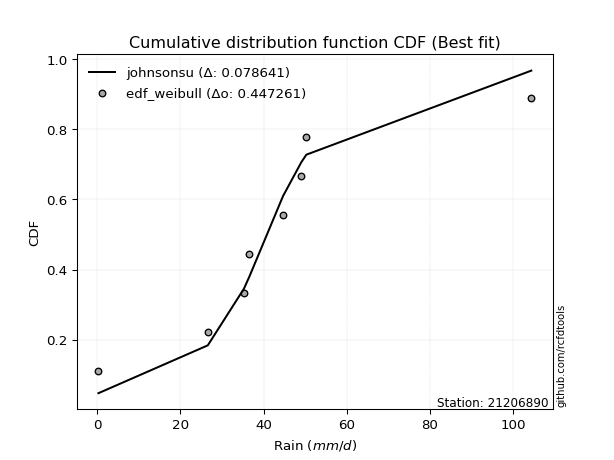</img>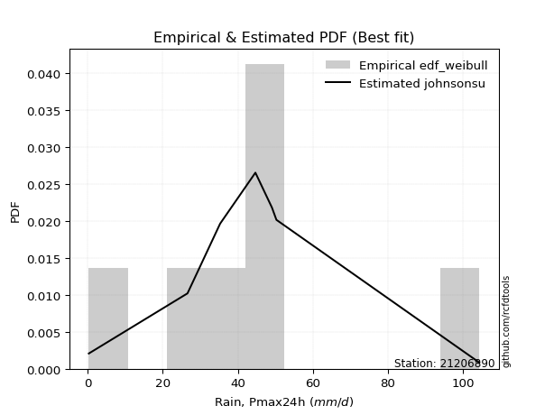</img>

</div>


### 4. EDF Beard (1943)

The Beard formula (or Beard´s plotting position formula) in hydrology is used to estimate the empirical non-exceedance probability _(P)_ of a flood event (or other extreme hydrological data point) within a given dataset.

<div align="center">


$P=(m-0.31)/(n+0.38)$


</div>


**4.1. Empirical values**

<div align="center">

|                | 0                   | 1                   | 2                  | 3                   | 4                  | 5                  | 6                  | 7                  |
|:---------------|:--------------------|:--------------------|:-------------------|:--------------------|:-------------------|:-------------------|:-------------------|:-------------------|
| date           | 2023                | 2016                | 2012               | 2025                | 2014               | 2013               | 2015               | 2024               |
| x              | 0.3                 | 26.6                | 35.3               | 36.6                | 44.7               | 49.1               | 50.3               | 104.4              |
| m              | 1                   | 2                   | 3                  | 4                   | 5                  | 6                  | 7                  | 8                  |
| empirical_dist | edf_beard           | edf_beard           | edf_beard          | edf_beard           | edf_beard          | edf_beard          | edf_beard          | edf_beard          |
| empirical      | 0.08233890214797135 | 0.20167064439140808 | 0.3210023866348448 | 0.44033412887828155 | 0.5596658711217184 | 0.6789976133651551 | 0.7983293556085919 | 0.9176610978520287 |
| empirical_tr   | 1.0897269180754225  | 1.2526158445440956  | 1.4727592267135323 | 1.7867803837953091  | 2.2710027100271004 | 3.115241635687732  | 4.958579881656804  | 12.144927536231886 |

</div>


**4.2. Kolmogorov-Smirnov fit test (sorted by Δ)**


<div align="center">

|                | 0                   | 1                  | 2                  | 3                   | 4                   | 5                   | 6                  | 7                   | 8                   | 9                   | 10                 | 11                  | 12                  | 13                  | 14                  | 15                  | 16                  | 17                 | 18                  | 19                  | 20                 | 21                 | 22                  | 23                  | 24                  | 25                  | 26                  | 27                  | 28                  | 29                  | 30                  | 31                  | 32                 | 33                 | 34                  | 35                  | 36                 | 37                  | 38                  | 39                 | 40                 | 41                  | 42                 | 43                  | 44                 | 45                  | 46                  | 47                  | 48                  | 49                  | 50                 | 51                  | 52                  | 53                  | 54                  | 55                  | 56                  | 57                  | 58                  | 59                  | 60                  | 61                 | 62                  | 63                  | 64                  | 65                  | 66                 | 67                  | 68                  | 69                  | 70                  | 71                 | 72                  | 73                  | 74                  | 75                 | 76                 | 77                  | 78                  | 79                  | 80                  | 81                 | 82                 | 83                  | 84                 | 85                 | 86                 | 87                  | 88                  | 89                  | 90                  | 91                  | 92                  | 93                  | 94                 | 95                 | 96                 | 97                 | 98                  | 99                 | 100                | 101                | 102                | 103                 | 104                | 105                | 106                | 107                | 108                 | 109                 | 110                | 111                 | 112                | 113                 | 114                | 115                 | 116                | 117                 | 118                 | 119                 | 120                 | 121                | 122                 | 123                 | 124                 | 125                | 126                 | 127                 | 128                 | 129                | 130                 | 131                | 132                | 133                | 134                | 135                | 136                | 137                 | 138                | 139                | 140                | 141                | 142                | 143                | 144                | 145                | 146                | 147                | 148                | 149                | 150                | 151                | 152                | 153                | 154                | 155                | 156                | 157                | 158                | 159                |
|:---------------|:--------------------|:-------------------|:-------------------|:--------------------|:--------------------|:--------------------|:-------------------|:--------------------|:--------------------|:--------------------|:-------------------|:--------------------|:--------------------|:--------------------|:--------------------|:--------------------|:--------------------|:-------------------|:--------------------|:--------------------|:-------------------|:-------------------|:--------------------|:--------------------|:--------------------|:--------------------|:--------------------|:--------------------|:--------------------|:--------------------|:--------------------|:--------------------|:-------------------|:-------------------|:--------------------|:--------------------|:-------------------|:--------------------|:--------------------|:-------------------|:-------------------|:--------------------|:-------------------|:--------------------|:-------------------|:--------------------|:--------------------|:--------------------|:--------------------|:--------------------|:-------------------|:--------------------|:--------------------|:--------------------|:--------------------|:--------------------|:--------------------|:--------------------|:--------------------|:--------------------|:--------------------|:-------------------|:--------------------|:--------------------|:--------------------|:--------------------|:-------------------|:--------------------|:--------------------|:--------------------|:--------------------|:-------------------|:--------------------|:--------------------|:--------------------|:-------------------|:-------------------|:--------------------|:--------------------|:--------------------|:--------------------|:-------------------|:-------------------|:--------------------|:-------------------|:-------------------|:-------------------|:--------------------|:--------------------|:--------------------|:--------------------|:--------------------|:--------------------|:--------------------|:-------------------|:-------------------|:-------------------|:-------------------|:--------------------|:-------------------|:-------------------|:-------------------|:-------------------|:--------------------|:-------------------|:-------------------|:-------------------|:-------------------|:--------------------|:--------------------|:-------------------|:--------------------|:-------------------|:--------------------|:-------------------|:--------------------|:-------------------|:--------------------|:--------------------|:--------------------|:--------------------|:-------------------|:--------------------|:--------------------|:--------------------|:-------------------|:--------------------|:--------------------|:--------------------|:-------------------|:--------------------|:-------------------|:-------------------|:-------------------|:-------------------|:-------------------|:-------------------|:--------------------|:-------------------|:-------------------|:-------------------|:-------------------|:-------------------|:-------------------|:-------------------|:-------------------|:-------------------|:-------------------|:-------------------|:-------------------|:-------------------|:-------------------|:-------------------|:-------------------|:-------------------|:-------------------|:-------------------|:-------------------|:-------------------|:-------------------|
| station        | 21206890            | 21206890           | 21206890           | 21206890            | 21206890            | 21206890            | 21206890           | 21206890            | 21206890            | 21206890            | 21206890           | 21206890            | 21206890            | 21206890            | 21206890            | 21206890            | 21206890            | 21206890           | 21206890            | 21206890            | 21206890           | 21206890           | 21206890            | 21206890            | 21206890            | 21206890            | 21206890            | 21206890            | 21206890            | 21206890            | 21206890            | 21206890            | 21206890           | 21206890           | 21206890            | 21206890            | 21206890           | 21206890            | 21206890            | 21206890           | 21206890           | 21206890            | 21206890           | 21206890            | 21206890           | 21206890            | 21206890            | 21206890            | 21206890            | 21206890            | 21206890           | 21206890            | 21206890            | 21206890            | 21206890            | 21206890            | 21206890            | 21206890            | 21206890            | 21206890            | 21206890            | 21206890           | 21206890            | 21206890            | 21206890            | 21206890            | 21206890           | 21206890            | 21206890            | 21206890            | 21206890            | 21206890           | 21206890            | 21206890            | 21206890            | 21206890           | 21206890           | 21206890            | 21206890            | 21206890            | 21206890            | 21206890           | 21206890           | 21206890            | 21206890           | 21206890           | 21206890           | 21206890            | 21206890            | 21206890            | 21206890            | 21206890            | 21206890            | 21206890            | 21206890           | 21206890           | 21206890           | 21206890           | 21206890            | 21206890           | 21206890           | 21206890           | 21206890           | 21206890            | 21206890           | 21206890           | 21206890           | 21206890           | 21206890            | 21206890            | 21206890           | 21206890            | 21206890           | 21206890            | 21206890           | 21206890            | 21206890           | 21206890            | 21206890            | 21206890            | 21206890            | 21206890           | 21206890            | 21206890            | 21206890            | 21206890           | 21206890            | 21206890            | 21206890            | 21206890           | 21206890            | 21206890           | 21206890           | 21206890           | 21206890           | 21206890           | 21206890           | 21206890            | 21206890           | 21206890           | 21206890           | 21206890           | 21206890           | 21206890           | 21206890           | 21206890           | 21206890           | 21206890           | 21206890           | 21206890           | 21206890           | 21206890           | 21206890           | 21206890           | 21206890           | 21206890           | 21206890           | 21206890           | 21206890           | 21206890           |
| empirical_dist | edf_beard           | edf_beard          | edf_beard          | edf_beard           | edf_beard           | edf_beard           | edf_beard          | edf_beard           | edf_beard           | edf_beard           | edf_beard          | edf_beard           | edf_beard           | edf_beard           | edf_beard           | edf_beard           | edf_beard           | edf_beard          | edf_beard           | edf_beard           | edf_beard          | edf_beard          | edf_beard           | edf_beard           | edf_beard           | edf_beard           | edf_beard           | edf_beard           | edf_beard           | edf_beard           | edf_beard           | edf_beard           | edf_beard          | edf_beard          | edf_beard           | edf_beard           | edf_beard          | edf_beard           | edf_beard           | edf_beard          | edf_beard          | edf_beard           | edf_beard          | edf_beard           | edf_beard          | edf_beard           | edf_beard           | edf_beard           | edf_beard           | edf_beard           | edf_beard          | edf_beard           | edf_beard           | edf_beard           | edf_beard           | edf_beard           | edf_beard           | edf_beard           | edf_beard           | edf_beard           | edf_beard           | edf_beard          | edf_beard           | edf_beard           | edf_beard           | edf_beard           | edf_beard          | edf_beard           | edf_beard           | edf_beard           | edf_beard           | edf_beard          | edf_beard           | edf_beard           | edf_beard           | edf_beard          | edf_beard          | edf_beard           | edf_beard           | edf_beard           | edf_beard           | edf_beard          | edf_beard          | edf_beard           | edf_beard          | edf_beard          | edf_beard          | edf_beard           | edf_beard           | edf_beard           | edf_beard           | edf_beard           | edf_beard           | edf_beard           | edf_beard          | edf_beard          | edf_beard          | edf_beard          | edf_beard           | edf_beard          | edf_beard          | edf_beard          | edf_beard          | edf_beard           | edf_beard          | edf_beard          | edf_beard          | edf_beard          | edf_beard           | edf_beard           | edf_beard          | edf_beard           | edf_beard          | edf_beard           | edf_beard          | edf_beard           | edf_beard          | edf_beard           | edf_beard           | edf_beard           | edf_beard           | edf_beard          | edf_beard           | edf_beard           | edf_beard           | edf_beard          | edf_beard           | edf_beard           | edf_beard           | edf_beard          | edf_beard           | edf_beard          | edf_beard          | edf_beard          | edf_beard          | edf_beard          | edf_beard          | edf_beard           | edf_beard          | edf_beard          | edf_beard          | edf_beard          | edf_beard          | edf_beard          | edf_beard          | edf_beard          | edf_beard          | edf_beard          | edf_beard          | edf_beard          | edf_beard          | edf_beard          | edf_beard          | edf_beard          | edf_beard          | edf_beard          | edf_beard          | edf_beard          | edf_beard          | edf_beard          |
| p_dist         | t                   | johnsonsu          | logjohnsonsu       | dgamma              | logt                | gumbel_r            | exponnorm          | nct                 | moyal               | gengamma            | logcrystalball     | halfnorm            | genlogistic         | pearson3            | laplace             | alpha               | foldnorm            | invgamma           | kstwobign           | vonmises_line       | johnsonsb          | dweibull           | invgauss            | fatiguelife         | halflogistic        | beta                | betaprime           | f                   | gamma               | erlang              | weibull_min         | rayleigh            | rice               | skewnorm           | maxwell             | hypsecant           | kappa3             | logargus            | tukeylambda         | logistic           | logjohnsonsb       | wald                | crystalball        | norm                | genpareto          | truncnorm           | logloggamma         | anglit              | logburr12           | loggenlogistic      | loggompertz        | truncexpon          | semicircular        | logweibull_max      | bradford            | gennorm             | loggennorm          | loggenextreme       | logpearson3         | arcsine             | truncweibull_min    | ncf                | loggumbel_l         | genexpon            | cosine              | loglevy_l           | gumbel_l           | lomax               | logdgamma           | logdweibull         | logtrapezoid        | gausshyper         | mielke              | logfoldnorm         | kappa4              | logmielke          | logarcsine         | ksone               | logsemicircular     | loganglit           | wrapcauchy          | uniform            | lognakagami        | lognorm             | logexponnorm       | logrice            | logfatiguelife     | lognct              | loglogistic         | loghypsecant        | loginvgamma         | logkappa3           | loginvweibull       | halfgennorm         | loggamma           | loggamma           | loglaplace         | loglaplace         | logbetaprime        | logburr            | logskewnorm        | levy_l             | burr               | logalpha            | loginvgauss        | logmaxwell         | burr12             | nakagami           | argus               | lograyleigh         | logexponweib       | loggausshyper       | logkstwobign       | loggenpareto        | loggumbel_r        | loghalfnorm         | genextreme         | loggenexpon         | logcosine           | logncf              | logmoyal            | loghalflogistic    | loggenhalflogistic  | triang              | logwrapcauchy       | logloglaplace      | logtriang           | loglomax            | genhalflogistic     | invweibull         | logwald             | logkappa4          | rdist              | logf               | logbradford        | logksone           | loggengamma        | logtruncweibull_min | trapezoid          | loguniform         | logvonmises_line   | logtruncnorm       | logbeta            | powerlaw           | logweibull_min     | logtruncexpon      | exponweib          | weibull_max        | truncpareto        | exponpow           | logexponpow        | logpowerlaw        | logtruncpareto     | gompertz           | loghalfgennorm     | logtukeylambda     | logerlang          | logrdist           | logvonmises        | vonmises           |
| delta          | 0.05973596602490161 | 0.0705790995041885 | 0.0948244354290751 | 0.11155170598205122 | 0.11845258531103237 | 0.13285454462114177 | 0.1363184186697174 | 0.14095078512703607 | 0.14122766122389563 | 0.14141741256240148 | 0.1424446317525896 | 0.14381962118478914 | 0.14527339182537247 | 0.14916279466948168 | 0.14924406717922045 | 0.15106823634232613 | 0.15168807102086446 | 0.1530987020988841 | 0.15313986574133753 | 0.15442589354087288 | 0.1550815111621533 | 0.155391652876662  | 0.15622781199865277 | 0.15636709030162566 | 0.15722970179168583 | 0.15751088357052756 | 0.15754123417115162 | 0.15782111852552616 | 0.15783926233202317 | 0.15783932137620116 | 0.15991642468804168 | 0.16458653603490803 | 0.1646086996366921 | 0.1710001254486727 | 0.17285657739608806 | 0.17625582305799814 | 0.1798873312191238 | 0.18303961218842169 | 0.18409344201790856 | 0.1867143597624481 | 0.1936009025329033 | 0.19798628143961183 | 0.1994831824656158 | 0.19948318391050446 | 0.2030986212825684 | 0.20457656063704943 | 0.20659990156567465 | 0.21316456892365498 | 0.21410748176431654 | 0.21496261523471183 | 0.2172512327362201 | 0.21864248811658282 | 0.21884554468234707 | 0.22318094348668666 | 0.22510434562827175 | 0.22541209088814596 | 0.23336331163087154 | 0.23500137707376495 | 0.23524344897254645 | 0.24167963221780941 | 0.24293533130733036 | 0.2447508342589016 | 0.25082065479864263 | 0.25180224966909465 | 0.25794287850218467 | 0.25830223808801617 | 0.2594694138186452 | 0.26456683575197876 | 0.26924478884442893 | 0.27207950235164946 | 0.27559276326892584 | 0.2777223018307431 | 0.28823561132225956 | 0.29284542933921565 | 0.29756082099539616 | 0.3065284722503295 | 0.3106776740020271 | 0.31473985833033385 | 0.31578615499736623 | 0.31707276174748794 | 0.31788967785628214 | 0.3180219588746822 | 0.3200455809531461 | 0.32019909892708726 | 0.3202012720174588 | 0.3202041210677537 | 0.320468120329182  | 0.32059825137431236 | 0.32317913913640467 | 0.32571889533042314 | 0.32982217525135676 | 0.32984635649631466 | 0.33372110085587864 | 0.33529364002539747 | 0.3355166717247759 | 0.3355166717247759 | 0.3356459614575413 | 0.3356459614575413 | 0.33685017972221926 | 0.3394600094866624 | 0.3402607605163786 | 0.3403784786752605 | 0.3416502626422688 | 0.34308005955481274 | 0.3465117621541059 | 0.3522481947601335 | 0.3534399044654818 | 0.3545773307694197 | 0.36062871149979725 | 0.36275300124671433 | 0.3710188358293869 | 0.37208888228413944 | 0.3790022151398023 | 0.38931324872402934 | 0.3908785232522655 | 0.39232253742679896 | 0.3953801671137854 | 0.40492828756381477 | 0.40979617420679254 | 0.41517846211382586 | 0.41644318480248393 | 0.4184651255845488 | 0.42001897846965747 | 0.42004141253341004 | 0.42797483167646105 | 0.4283264383542355 | 0.43142359006780856 | 0.43378407551386416 | 0.45555900168473895 | 0.4864468373900363 | 0.48744387357052116 | 0.5034911517730642 | 0.5110402969682457 | 0.5159858558900572 | 0.5179486953410131 | 0.520294616495923  | 0.5455720892237936 | 0.5508285018335228  | 0.5605404021705465 | 0.5646876686733893 | 0.5649798955228129 | 0.5721588236480144 | 0.57639485491291   | 0.5931846150278366 | 0.6027429158411555 | 0.626333304899277  | 0.6495985358472323 | 0.6927131187585539 | 0.7124194443967258 | 0.7330665867811357 | 0.7399004460893652 | 0.745082791378147  | 0.7585195906814088 | 0.7968013262035818 | 0.7983293556085919 | 0.798329355608592  | 0.8737876300708344 | 0.9176610977136674 | 0.9818168424205423 | 16.18953194304255  |
| deltao         | 0.4472608134160001  | 0.4472608134160001 | 0.4472608134160001 | 0.4472608134160001  | 0.4472608134160001  | 0.4472608134160001  | 0.4472608134160001 | 0.4472608134160001  | 0.4472608134160001  | 0.4472608134160001  | 0.4472608134160001 | 0.4472608134160001  | 0.4472608134160001  | 0.4472608134160001  | 0.4472608134160001  | 0.4472608134160001  | 0.4472608134160001  | 0.4472608134160001 | 0.4472608134160001  | 0.4472608134160001  | 0.4472608134160001 | 0.4472608134160001 | 0.4472608134160001  | 0.4472608134160001  | 0.4472608134160001  | 0.4472608134160001  | 0.4472608134160001  | 0.4472608134160001  | 0.4472608134160001  | 0.4472608134160001  | 0.4472608134160001  | 0.4472608134160001  | 0.4472608134160001 | 0.4472608134160001 | 0.4472608134160001  | 0.4472608134160001  | 0.4472608134160001 | 0.4472608134160001  | 0.4472608134160001  | 0.4472608134160001 | 0.4472608134160001 | 0.4472608134160001  | 0.4472608134160001 | 0.4472608134160001  | 0.4472608134160001 | 0.4472608134160001  | 0.4472608134160001  | 0.4472608134160001  | 0.4472608134160001  | 0.4472608134160001  | 0.4472608134160001 | 0.4472608134160001  | 0.4472608134160001  | 0.4472608134160001  | 0.4472608134160001  | 0.4472608134160001  | 0.4472608134160001  | 0.4472608134160001  | 0.4472608134160001  | 0.4472608134160001  | 0.4472608134160001  | 0.4472608134160001 | 0.4472608134160001  | 0.4472608134160001  | 0.4472608134160001  | 0.4472608134160001  | 0.4472608134160001 | 0.4472608134160001  | 0.4472608134160001  | 0.4472608134160001  | 0.4472608134160001  | 0.4472608134160001 | 0.4472608134160001  | 0.4472608134160001  | 0.4472608134160001  | 0.4472608134160001 | 0.4472608134160001 | 0.4472608134160001  | 0.4472608134160001  | 0.4472608134160001  | 0.4472608134160001  | 0.4472608134160001 | 0.4472608134160001 | 0.4472608134160001  | 0.4472608134160001 | 0.4472608134160001 | 0.4472608134160001 | 0.4472608134160001  | 0.4472608134160001  | 0.4472608134160001  | 0.4472608134160001  | 0.4472608134160001  | 0.4472608134160001  | 0.4472608134160001  | 0.4472608134160001 | 0.4472608134160001 | 0.4472608134160001 | 0.4472608134160001 | 0.4472608134160001  | 0.4472608134160001 | 0.4472608134160001 | 0.4472608134160001 | 0.4472608134160001 | 0.4472608134160001  | 0.4472608134160001 | 0.4472608134160001 | 0.4472608134160001 | 0.4472608134160001 | 0.4472608134160001  | 0.4472608134160001  | 0.4472608134160001 | 0.4472608134160001  | 0.4472608134160001 | 0.4472608134160001  | 0.4472608134160001 | 0.4472608134160001  | 0.4472608134160001 | 0.4472608134160001  | 0.4472608134160001  | 0.4472608134160001  | 0.4472608134160001  | 0.4472608134160001 | 0.4472608134160001  | 0.4472608134160001  | 0.4472608134160001  | 0.4472608134160001 | 0.4472608134160001  | 0.4472608134160001  | 0.4472608134160001  | 0.4472608134160001 | 0.4472608134160001  | 0.4472608134160001 | 0.4472608134160001 | 0.4472608134160001 | 0.4472608134160001 | 0.4472608134160001 | 0.4472608134160001 | 0.4472608134160001  | 0.4472608134160001 | 0.4472608134160001 | 0.4472608134160001 | 0.4472608134160001 | 0.4472608134160001 | 0.4472608134160001 | 0.4472608134160001 | 0.4472608134160001 | 0.4472608134160001 | 0.4472608134160001 | 0.4472608134160001 | 0.4472608134160001 | 0.4472608134160001 | 0.4472608134160001 | 0.4472608134160001 | 0.4472608134160001 | 0.4472608134160001 | 0.4472608134160001 | 0.4472608134160001 | 0.4472608134160001 | 0.4472608134160001 | 0.4472608134160001 |
| eval           | Δo > Δ              | Δo > Δ             | Δo > Δ             | Δo > Δ              | Δo > Δ              | Δo > Δ              | Δo > Δ             | Δo > Δ              | Δo > Δ              | Δo > Δ              | Δo > Δ             | Δo > Δ              | Δo > Δ              | Δo > Δ              | Δo > Δ              | Δo > Δ              | Δo > Δ              | Δo > Δ             | Δo > Δ              | Δo > Δ              | Δo > Δ             | Δo > Δ             | Δo > Δ              | Δo > Δ              | Δo > Δ              | Δo > Δ              | Δo > Δ              | Δo > Δ              | Δo > Δ              | Δo > Δ              | Δo > Δ              | Δo > Δ              | Δo > Δ             | Δo > Δ             | Δo > Δ              | Δo > Δ              | Δo > Δ             | Δo > Δ              | Δo > Δ              | Δo > Δ             | Δo > Δ             | Δo > Δ              | Δo > Δ             | Δo > Δ              | Δo > Δ             | Δo > Δ              | Δo > Δ              | Δo > Δ              | Δo > Δ              | Δo > Δ              | Δo > Δ             | Δo > Δ              | Δo > Δ              | Δo > Δ              | Δo > Δ              | Δo > Δ              | Δo > Δ              | Δo > Δ              | Δo > Δ              | Δo > Δ              | Δo > Δ              | Δo > Δ             | Δo > Δ              | Δo > Δ              | Δo > Δ              | Δo > Δ              | Δo > Δ             | Δo > Δ              | Δo > Δ              | Δo > Δ              | Δo > Δ              | Δo > Δ             | Δo > Δ              | Δo > Δ              | Δo > Δ              | Δo > Δ             | Δo > Δ             | Δo > Δ              | Δo > Δ              | Δo > Δ              | Δo > Δ              | Δo > Δ             | Δo > Δ             | Δo > Δ              | Δo > Δ             | Δo > Δ             | Δo > Δ             | Δo > Δ              | Δo > Δ              | Δo > Δ              | Δo > Δ              | Δo > Δ              | Δo > Δ              | Δo > Δ              | Δo > Δ             | Δo > Δ             | Δo > Δ             | Δo > Δ             | Δo > Δ              | Δo > Δ             | Δo > Δ             | Δo > Δ             | Δo > Δ             | Δo > Δ              | Δo > Δ             | Δo > Δ             | Δo > Δ             | Δo > Δ             | Δo > Δ              | Δo > Δ              | Δo > Δ             | Δo > Δ              | Δo > Δ             | Δo > Δ              | Δo > Δ             | Δo > Δ              | Δo > Δ             | Δo > Δ              | Δo > Δ              | Δo > Δ              | Δo > Δ              | Δo > Δ             | Δo > Δ              | Δo > Δ              | Δo > Δ              | Δo > Δ             | Δo > Δ              | Δo > Δ              | Δo <= Δ             | Δo <= Δ            | Δo <= Δ             | Δo <= Δ            | Δo <= Δ            | Δo <= Δ            | Δo <= Δ            | Δo <= Δ            | Δo <= Δ            | Δo <= Δ             | Δo <= Δ            | Δo <= Δ            | Δo <= Δ            | Δo <= Δ            | Δo <= Δ            | Δo <= Δ            | Δo <= Δ            | Δo <= Δ            | Δo <= Δ            | Δo <= Δ            | Δo <= Δ            | Δo <= Δ            | Δo <= Δ            | Δo <= Δ            | Δo <= Δ            | Δo <= Δ            | Δo <= Δ            | Δo <= Δ            | Δo <= Δ            | Δo <= Δ            | Δo <= Δ            | Δo <= Δ            |
| fit            | 1                   | 1                  | 1                  | 1                   | 1                   | 1                   | 1                  | 1                   | 1                   | 1                   | 1                  | 1                   | 1                   | 1                   | 1                   | 1                   | 1                   | 1                  | 1                   | 1                   | 1                  | 1                  | 1                   | 1                   | 1                   | 1                   | 1                   | 1                   | 1                   | 1                   | 1                   | 1                   | 1                  | 1                  | 1                   | 1                   | 1                  | 1                   | 1                   | 1                  | 1                  | 1                   | 1                  | 1                   | 1                  | 1                   | 1                   | 1                   | 1                   | 1                   | 1                  | 1                   | 1                   | 1                   | 1                   | 1                   | 1                   | 1                   | 1                   | 1                   | 1                   | 1                  | 1                   | 1                   | 1                   | 1                   | 1                  | 1                   | 1                   | 1                   | 1                   | 1                  | 1                   | 1                   | 1                   | 1                  | 1                  | 1                   | 1                   | 1                   | 1                   | 1                  | 1                  | 1                   | 1                  | 1                  | 1                  | 1                   | 1                   | 1                   | 1                   | 1                   | 1                   | 1                   | 1                  | 1                  | 1                  | 1                  | 1                   | 1                  | 1                  | 1                  | 1                  | 1                   | 1                  | 1                  | 1                  | 1                  | 1                   | 1                   | 1                  | 1                   | 1                  | 1                   | 1                  | 1                   | 1                  | 1                   | 1                   | 1                   | 1                   | 1                  | 1                   | 1                   | 1                   | 1                  | 1                   | 1                   | 0                   | 0                  | 0                   | 0                  | 0                  | 0                  | 0                  | 0                  | 0                  | 0                   | 0                  | 0                  | 0                  | 0                  | 0                  | 0                  | 0                  | 0                  | 0                  | 0                  | 0                  | 0                  | 0                  | 0                  | 0                  | 0                  | 0                  | 0                  | 0                  | 0                  | 0                  | 0                  |
| n              | 8                   | 8                  | 8                  | 8                   | 8                   | 8                   | 8                  | 8                   | 8                   | 8                   | 8                  | 8                   | 8                   | 8                   | 8                   | 8                   | 8                   | 8                  | 8                   | 8                   | 8                  | 8                  | 8                   | 8                   | 8                   | 8                   | 8                   | 8                   | 8                   | 8                   | 8                   | 8                   | 8                  | 8                  | 8                   | 8                   | 8                  | 8                   | 8                   | 8                  | 8                  | 8                   | 8                  | 8                   | 8                  | 8                   | 8                   | 8                   | 8                   | 8                   | 8                  | 8                   | 8                   | 8                   | 8                   | 8                   | 8                   | 8                   | 8                   | 8                   | 8                   | 8                  | 8                   | 8                   | 8                   | 8                   | 8                  | 8                   | 8                   | 8                   | 8                   | 8                  | 8                   | 8                   | 8                   | 8                  | 8                  | 8                   | 8                   | 8                   | 8                   | 8                  | 8                  | 8                   | 8                  | 8                  | 8                  | 8                   | 8                   | 8                   | 8                   | 8                   | 8                   | 8                   | 8                  | 8                  | 8                  | 8                  | 8                   | 8                  | 8                  | 8                  | 8                  | 8                   | 8                  | 8                  | 8                  | 8                  | 8                   | 8                   | 8                  | 8                   | 8                  | 8                   | 8                  | 8                   | 8                  | 8                   | 8                   | 8                   | 8                   | 8                  | 8                   | 8                   | 8                   | 8                  | 8                   | 8                   | 8                   | 8                  | 8                   | 8                  | 8                  | 8                  | 8                  | 8                  | 8                  | 8                   | 8                  | 8                  | 8                  | 8                  | 8                  | 8                  | 8                  | 8                  | 8                  | 8                  | 8                  | 8                  | 8                  | 8                  | 8                  | 8                  | 8                  | 8                  | 8                  | 8                  | 8                  | 8                  |
| best_fit       | 1                   | 0                  | 0                  | 0                   | 0                   | 0                   | 0                  | 0                   | 0                   | 0                   | 0                  | 0                   | 0                   | 0                   | 0                   | 0                   | 0                   | 0                  | 0                   | 0                   | 0                  | 0                  | 0                   | 0                   | 0                   | 0                   | 0                   | 0                   | 0                   | 0                   | 0                   | 0                   | 0                  | 0                  | 0                   | 0                   | 0                  | 0                   | 0                   | 0                  | 0                  | 0                   | 0                  | 0                   | 0                  | 0                   | 0                   | 0                   | 0                   | 0                   | 0                  | 0                   | 0                   | 0                   | 0                   | 0                   | 0                   | 0                   | 0                   | 0                   | 0                   | 0                  | 0                   | 0                   | 0                   | 0                   | 0                  | 0                   | 0                   | 0                   | 0                   | 0                  | 0                   | 0                   | 0                   | 0                  | 0                  | 0                   | 0                   | 0                   | 0                   | 0                  | 0                  | 0                   | 0                  | 0                  | 0                  | 0                   | 0                   | 0                   | 0                   | 0                   | 0                   | 0                   | 0                  | 0                  | 0                  | 0                  | 0                   | 0                  | 0                  | 0                  | 0                  | 0                   | 0                  | 0                  | 0                  | 0                  | 0                   | 0                   | 0                  | 0                   | 0                  | 0                   | 0                  | 0                   | 0                  | 0                   | 0                   | 0                   | 0                   | 0                  | 0                   | 0                   | 0                   | 0                  | 0                   | 0                   | 0                   | 0                  | 0                   | 0                  | 0                  | 0                  | 0                  | 0                  | 0                  | 0                   | 0                  | 0                  | 0                  | 0                  | 0                  | 0                  | 0                  | 0                  | 0                  | 0                  | 0                  | 0                  | 0                  | 0                  | 0                  | 0                  | 0                  | 0                  | 0                  | 0                  | 0                  | 0                  |
| best_fit_sort  | 1                   | 2                  | 3                  | 4                   | 5                   | 6                   | 7                  | 8                   | 9                   | 10                  | 11                 | 12                  | 13                  | 14                  | 15                  | 16                  | 17                  | 18                 | 19                  | 20                  | 21                 | 22                 | 23                  | 24                  | 25                  | 26                  | 27                  | 28                  | 29                  | 30                  | 31                  | 32                  | 33                 | 34                 | 35                  | 36                  | 37                 | 38                  | 39                  | 40                 | 41                 | 42                  | 43                 | 44                  | 45                 | 46                  | 47                  | 48                  | 49                  | 50                  | 51                 | 52                  | 53                  | 54                  | 55                  | 56                  | 57                  | 58                  | 59                  | 60                  | 61                  | 62                 | 63                  | 64                  | 65                  | 66                  | 67                 | 68                  | 69                  | 70                  | 71                  | 72                 | 73                  | 74                  | 75                  | 76                 | 77                 | 78                  | 79                  | 80                  | 81                  | 82                 | 83                 | 84                  | 85                 | 86                 | 87                 | 88                  | 89                  | 90                  | 91                  | 92                  | 93                  | 94                  | 95                 | 96                 | 97                 | 98                 | 99                  | 100                | 101                | 102                | 103                | 104                 | 105                | 106                | 107                | 108                | 109                 | 110                 | 111                | 112                 | 113                | 114                 | 115                | 116                 | 117                | 118                 | 119                 | 120                 | 121                 | 122                | 123                 | 124                 | 125                 | 126                | 127                 | 128                 | 129                 | 130                | 131                 | 132                | 133                | 134                | 135                | 136                | 137                | 138                 | 139                | 140                | 141                | 142                | 143                | 144                | 145                | 146                | 147                | 148                | 149                | 150                | 151                | 152                | 153                | 154                | 155                | 156                | 157                | 158                | 159                | 160                |

</div>


**4.3. Best fit**

<div align="center">

|   id |   station | empirical_dist   | p_dist   |    delta |   deltao | eval   |   fit |   n |   best_fit |   best_fit_sort |
|-----:|----------:|:-----------------|:---------|---------:|---------:|:-------|------:|----:|-----------:|----------------:|
|    0 |  21206890 | edf_beard        | t        | 0.059736 | 0.447261 | Δo > Δ |     1 |   8 |          1 |               1 |

</div>


<div align="center">

</img>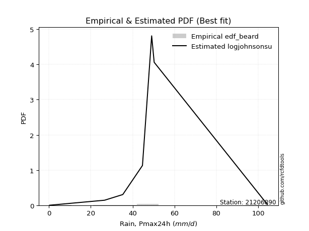</img>

</div>


### 5. EDF Chegodayev (1955)

The Chegodayev formula is an empirical plotting position formula used in hydrological frequency analysis to estimate the exceedance probability or return period of a specific event from a set of observed data. It is primarily used for plotting observed data points on probability paper to fit a theoretical distribution, particularly for analyzing extreme events like maximum flood flows or rainfall intensities. The constant _b_ value in the generalized plotting position formula is 0.3.

<div align="center">


$P=(m-b)/(n+1-2b)$


</div>


**5.1. Empirical values**

<div align="center">

|                | 0                   | 1                   | 2                   | 3                   | 4                  | 5                  | 6                  | 7                  |
|:---------------|:--------------------|:--------------------|:--------------------|:--------------------|:-------------------|:-------------------|:-------------------|:-------------------|
| date           | 2023                | 2016                | 2012                | 2025                | 2014               | 2013               | 2015               | 2024               |
| x              | 0.3                 | 26.6                | 35.3                | 36.6                | 44.7               | 49.1               | 50.3               | 104.4              |
| m              | 1                   | 2                   | 3                   | 4                   | 5                  | 6                  | 7                  | 8                  |
| empirical_dist | edf_chegodayev      | edf_chegodayev      | edf_chegodayev      | edf_chegodayev      | edf_chegodayev     | edf_chegodayev     | edf_chegodayev     | edf_chegodayev     |
| empirical      | 0.08333333333333333 | 0.20238095238095236 | 0.32142857142857145 | 0.44047619047619047 | 0.5595238095238095 | 0.6785714285714286 | 0.7976190476190476 | 0.9166666666666666 |
| empirical_tr   | 1.090909090909091   | 1.253731343283582   | 1.4736842105263157  | 1.7872340425531914  | 2.27027027027027   | 3.1111111111111116 | 4.941176470588234  | 11.999999999999995 |

</div>


**5.2. Kolmogorov-Smirnov fit test (sorted by Δ)**


<div align="center">

|                | 0                   | 1                  | 2                   | 3                   | 4                   | 5                   | 6                  | 7                   | 8                   | 9                  | 10                 | 11                 | 12                  | 13                  | 14                  | 15                  | 16                  | 17                 | 18                  | 19                  | 20                 | 21                 | 22                  | 23                  | 24                  | 25                 | 26                  | 27                  | 28                  | 29                  | 30                  | 31                  | 32                 | 33                 | 34                  | 35                  | 36                  | 37                  | 38                  | 39                 | 40                 | 41                 | 42                 | 43                  | 44                 | 45                  | 46                  | 47                  | 48                  | 49                  | 50                  | 51                  | 52                  | 53                  | 54                  | 55                  | 56                  | 57                  | 58                  | 59                 | 60                  | 61                  | 62                 | 63                 | 64                  | 65                 | 66                 | 67                 | 68                 | 69                  | 70                 | 71                 | 72                 | 73                  | 74                  | 75                  | 76                  | 77                  | 78                 | 79                 | 80                  | 81                 | 82                  | 83                 | 84                  | 85                  | 86                  | 87                 | 88                 | 89                 | 90                  | 91                 | 92                 | 93                 | 94                  | 95                  | 96                  | 97                  | 98                 | 99                  | 100                 | 101                 | 102                 | 103                | 104                 | 105                | 106                 | 107                | 108                 | 109                | 110                 | 111                | 112                 | 113                | 114                | 115                | 116                 | 117                | 118                | 119                | 120                | 121                 | 122                | 123                 | 124                | 125                 | 126                | 127                | 128                 | 129                | 130                | 131                | 132                | 133                | 134                | 135                | 136                | 137                 | 138                | 139                | 140                | 141                | 142                | 143                | 144                | 145                | 146                | 147                | 148                | 149                | 150                | 151                | 152                | 153                | 154                | 155                | 156                | 157                | 158                | 159                |
|:---------------|:--------------------|:-------------------|:--------------------|:--------------------|:--------------------|:--------------------|:-------------------|:--------------------|:--------------------|:-------------------|:-------------------|:-------------------|:--------------------|:--------------------|:--------------------|:--------------------|:--------------------|:-------------------|:--------------------|:--------------------|:-------------------|:-------------------|:--------------------|:--------------------|:--------------------|:-------------------|:--------------------|:--------------------|:--------------------|:--------------------|:--------------------|:--------------------|:-------------------|:-------------------|:--------------------|:--------------------|:--------------------|:--------------------|:--------------------|:-------------------|:-------------------|:-------------------|:-------------------|:--------------------|:-------------------|:--------------------|:--------------------|:--------------------|:--------------------|:--------------------|:--------------------|:--------------------|:--------------------|:--------------------|:--------------------|:--------------------|:--------------------|:--------------------|:--------------------|:-------------------|:--------------------|:--------------------|:-------------------|:-------------------|:--------------------|:-------------------|:-------------------|:-------------------|:-------------------|:--------------------|:-------------------|:-------------------|:-------------------|:--------------------|:--------------------|:--------------------|:--------------------|:--------------------|:-------------------|:-------------------|:--------------------|:-------------------|:--------------------|:-------------------|:--------------------|:--------------------|:--------------------|:-------------------|:-------------------|:-------------------|:--------------------|:-------------------|:-------------------|:-------------------|:--------------------|:--------------------|:--------------------|:--------------------|:-------------------|:--------------------|:--------------------|:--------------------|:--------------------|:-------------------|:--------------------|:-------------------|:--------------------|:-------------------|:--------------------|:-------------------|:--------------------|:-------------------|:--------------------|:-------------------|:-------------------|:-------------------|:--------------------|:-------------------|:-------------------|:-------------------|:-------------------|:--------------------|:-------------------|:--------------------|:-------------------|:--------------------|:-------------------|:-------------------|:--------------------|:-------------------|:-------------------|:-------------------|:-------------------|:-------------------|:-------------------|:-------------------|:-------------------|:--------------------|:-------------------|:-------------------|:-------------------|:-------------------|:-------------------|:-------------------|:-------------------|:-------------------|:-------------------|:-------------------|:-------------------|:-------------------|:-------------------|:-------------------|:-------------------|:-------------------|:-------------------|:-------------------|:-------------------|:-------------------|:-------------------|:-------------------|
| station        | 21206890            | 21206890           | 21206890            | 21206890            | 21206890            | 21206890            | 21206890           | 21206890            | 21206890            | 21206890           | 21206890           | 21206890           | 21206890            | 21206890            | 21206890            | 21206890            | 21206890            | 21206890           | 21206890            | 21206890            | 21206890           | 21206890           | 21206890            | 21206890            | 21206890            | 21206890           | 21206890            | 21206890            | 21206890            | 21206890            | 21206890            | 21206890            | 21206890           | 21206890           | 21206890            | 21206890            | 21206890            | 21206890            | 21206890            | 21206890           | 21206890           | 21206890           | 21206890           | 21206890            | 21206890           | 21206890            | 21206890            | 21206890            | 21206890            | 21206890            | 21206890            | 21206890            | 21206890            | 21206890            | 21206890            | 21206890            | 21206890            | 21206890            | 21206890            | 21206890           | 21206890            | 21206890            | 21206890           | 21206890           | 21206890            | 21206890           | 21206890           | 21206890           | 21206890           | 21206890            | 21206890           | 21206890           | 21206890           | 21206890            | 21206890            | 21206890            | 21206890            | 21206890            | 21206890           | 21206890           | 21206890            | 21206890           | 21206890            | 21206890           | 21206890            | 21206890            | 21206890            | 21206890           | 21206890           | 21206890           | 21206890            | 21206890           | 21206890           | 21206890           | 21206890            | 21206890            | 21206890            | 21206890            | 21206890           | 21206890            | 21206890            | 21206890            | 21206890            | 21206890           | 21206890            | 21206890           | 21206890            | 21206890           | 21206890            | 21206890           | 21206890            | 21206890           | 21206890            | 21206890           | 21206890           | 21206890           | 21206890            | 21206890           | 21206890           | 21206890           | 21206890           | 21206890            | 21206890           | 21206890            | 21206890           | 21206890            | 21206890           | 21206890           | 21206890            | 21206890           | 21206890           | 21206890           | 21206890           | 21206890           | 21206890           | 21206890           | 21206890           | 21206890            | 21206890           | 21206890           | 21206890           | 21206890           | 21206890           | 21206890           | 21206890           | 21206890           | 21206890           | 21206890           | 21206890           | 21206890           | 21206890           | 21206890           | 21206890           | 21206890           | 21206890           | 21206890           | 21206890           | 21206890           | 21206890           | 21206890           |
| empirical_dist | edf_chegodayev      | edf_chegodayev     | edf_chegodayev      | edf_chegodayev      | edf_chegodayev      | edf_chegodayev      | edf_chegodayev     | edf_chegodayev      | edf_chegodayev      | edf_chegodayev     | edf_chegodayev     | edf_chegodayev     | edf_chegodayev      | edf_chegodayev      | edf_chegodayev      | edf_chegodayev      | edf_chegodayev      | edf_chegodayev     | edf_chegodayev      | edf_chegodayev      | edf_chegodayev     | edf_chegodayev     | edf_chegodayev      | edf_chegodayev      | edf_chegodayev      | edf_chegodayev     | edf_chegodayev      | edf_chegodayev      | edf_chegodayev      | edf_chegodayev      | edf_chegodayev      | edf_chegodayev      | edf_chegodayev     | edf_chegodayev     | edf_chegodayev      | edf_chegodayev      | edf_chegodayev      | edf_chegodayev      | edf_chegodayev      | edf_chegodayev     | edf_chegodayev     | edf_chegodayev     | edf_chegodayev     | edf_chegodayev      | edf_chegodayev     | edf_chegodayev      | edf_chegodayev      | edf_chegodayev      | edf_chegodayev      | edf_chegodayev      | edf_chegodayev      | edf_chegodayev      | edf_chegodayev      | edf_chegodayev      | edf_chegodayev      | edf_chegodayev      | edf_chegodayev      | edf_chegodayev      | edf_chegodayev      | edf_chegodayev     | edf_chegodayev      | edf_chegodayev      | edf_chegodayev     | edf_chegodayev     | edf_chegodayev      | edf_chegodayev     | edf_chegodayev     | edf_chegodayev     | edf_chegodayev     | edf_chegodayev      | edf_chegodayev     | edf_chegodayev     | edf_chegodayev     | edf_chegodayev      | edf_chegodayev      | edf_chegodayev      | edf_chegodayev      | edf_chegodayev      | edf_chegodayev     | edf_chegodayev     | edf_chegodayev      | edf_chegodayev     | edf_chegodayev      | edf_chegodayev     | edf_chegodayev      | edf_chegodayev      | edf_chegodayev      | edf_chegodayev     | edf_chegodayev     | edf_chegodayev     | edf_chegodayev      | edf_chegodayev     | edf_chegodayev     | edf_chegodayev     | edf_chegodayev      | edf_chegodayev      | edf_chegodayev      | edf_chegodayev      | edf_chegodayev     | edf_chegodayev      | edf_chegodayev      | edf_chegodayev      | edf_chegodayev      | edf_chegodayev     | edf_chegodayev      | edf_chegodayev     | edf_chegodayev      | edf_chegodayev     | edf_chegodayev      | edf_chegodayev     | edf_chegodayev      | edf_chegodayev     | edf_chegodayev      | edf_chegodayev     | edf_chegodayev     | edf_chegodayev     | edf_chegodayev      | edf_chegodayev     | edf_chegodayev     | edf_chegodayev     | edf_chegodayev     | edf_chegodayev      | edf_chegodayev     | edf_chegodayev      | edf_chegodayev     | edf_chegodayev      | edf_chegodayev     | edf_chegodayev     | edf_chegodayev      | edf_chegodayev     | edf_chegodayev     | edf_chegodayev     | edf_chegodayev     | edf_chegodayev     | edf_chegodayev     | edf_chegodayev     | edf_chegodayev     | edf_chegodayev      | edf_chegodayev     | edf_chegodayev     | edf_chegodayev     | edf_chegodayev     | edf_chegodayev     | edf_chegodayev     | edf_chegodayev     | edf_chegodayev     | edf_chegodayev     | edf_chegodayev     | edf_chegodayev     | edf_chegodayev     | edf_chegodayev     | edf_chegodayev     | edf_chegodayev     | edf_chegodayev     | edf_chegodayev     | edf_chegodayev     | edf_chegodayev     | edf_chegodayev     | edf_chegodayev     | edf_chegodayev     |
| p_dist         | t                   | johnsonsu          | logjohnsonsu        | dgamma              | logt                | gumbel_r            | exponnorm          | nct                 | gengamma            | moyal              | logcrystalball     | halfnorm           | genlogistic         | pearson3            | laplace             | alpha               | foldnorm            | invgamma           | kstwobign           | vonmises_line       | johnsonsb          | dweibull           | invgauss            | fatiguelife         | beta                | halflogistic       | betaprime           | f                   | gamma               | erlang              | weibull_min         | rayleigh            | rice               | skewnorm           | maxwell             | hypsecant           | kappa3              | logargus            | tukeylambda         | logistic           | logjohnsonsb       | wald               | crystalball        | norm                | genpareto          | truncnorm           | logloggamma         | anglit              | logburr12           | loggenlogistic      | loggompertz         | truncexpon          | semicircular        | logweibull_max      | bradford            | gennorm             | loggennorm          | loggenextreme       | logpearson3         | arcsine            | truncweibull_min    | ncf                 | loggumbel_l        | genexpon           | cosine              | loglevy_l          | gumbel_l           | lomax              | logdgamma          | logdweibull         | logtrapezoid       | gausshyper         | mielke             | logfoldnorm         | kappa4              | logmielke           | logarcsine          | ksone               | logsemicircular    | loganglit          | wrapcauchy          | uniform            | lognakagami         | lognorm            | logexponnorm        | logrice             | logfatiguelife      | lognct             | loglogistic        | loghypsecant       | logkappa3           | loginvgamma        | loginvweibull      | halfgennorm        | loggamma            | loggamma            | loglaplace          | loglaplace          | logbetaprime       | logburr             | levy_l              | logskewnorm         | burr                | logalpha           | loginvgauss         | logmaxwell         | burr12              | nakagami           | argus               | lograyleigh        | logexponweib        | loggausshyper      | logkstwobign        | loggenpareto       | loggumbel_r        | loghalfnorm        | genextreme          | loggenexpon        | logcosine          | logncf             | logmoyal           | loghalflogistic     | loggenhalflogistic | triang              | logwrapcauchy      | logloglaplace       | logtriang          | loglomax           | genhalflogistic     | invweibull         | logwald            | logkappa4          | rdist              | logf               | logbradford        | logksone           | loggengamma        | logtruncweibull_min | trapezoid          | loguniform         | logvonmises_line   | logtruncnorm       | logbeta            | powerlaw           | logweibull_min     | logtruncexpon      | exponweib          | weibull_max        | truncpareto        | exponpow           | logexponpow        | logpowerlaw        | logtruncpareto     | gompertz           | loghalfgennorm     | logtukeylambda     | logerlang          | logrdist           | logvonmises        | vonmises           |
| delta          | 0.05987802762281047 | 0.0698687915146442 | 0.09496649702698401 | 0.11084139799250692 | 0.11859464690894128 | 0.13214423663159747 | 0.1356081106801731 | 0.14024047713749177 | 0.14070710457285718 | 0.140801476430169  | 0.1417343237630453 | 0.1433934363910625 | 0.14456308383582817 | 0.14845248667993738 | 0.14853375918967615 | 0.15035792835278183 | 0.15097776303132016 | 0.1523883941093398 | 0.15242955775179323 | 0.15371558555132858 | 0.154371203172609  | 0.1546813448871177 | 0.15551750400910846 | 0.15565678231208135 | 0.15680057558098326 | 0.1568035169979592 | 0.15683092618160732 | 0.15711081053598186 | 0.15712895434247887 | 0.15712901338665686 | 0.15920611669849738 | 0.16387622804536373 | 0.1638983916471478 | 0.1702898174591284 | 0.17214626940654376 | 0.17554551506845384 | 0.17946114642539718 | 0.18232930419887738 | 0.18423550361581742 | 0.1860040517729038 | 0.192890594543359  | 0.1975600966458852 | 0.1987728744760715 | 0.19877287592096016 | 0.2023883132930241 | 0.20386625264750513 | 0.20588959357613038 | 0.21245426093411068 | 0.21339717377477227 | 0.21425230724516756 | 0.21654092474667583 | 0.21793218012703852 | 0.21813523669280277 | 0.22247063549714238 | 0.22439403763872745 | 0.22555415248605487 | 0.23265300364132724 | 0.23429106908422068 | 0.23453314098300215 | 0.2409693242282651 | 0.24222502331778606 | 0.24404052626935732 | 0.2501103468090984 | 0.2510919416795504 | 0.25723257051264037 | 0.2575919300984719 | 0.2587591058291009 | 0.2638565277624345 | 0.2685344808548846 | 0.27136919436210516 | 0.2748824552793816 | 0.2770119938411988 | 0.2875253033327153 | 0.29213512134967135 | 0.29685051300585186 | 0.30581816426078523 | 0.30996736601248287 | 0.31402955034078955 | 0.315075847007822  | 0.3163624537579437 | 0.31717936986673784 | 0.3173116508851379 | 0.31933527296360187 | 0.319488790937543  | 0.31949096402791455 | 0.31949381307820945 | 0.31975781233963774 | 0.3198879433847681 | 0.3224688311468604 | 0.3250085873408789 | 0.32885192531095264 | 0.3291118672618125 | 0.3330107928663344 | 0.3345833320358532 | 0.33480636373523165 | 0.33480636373523165 | 0.33493565346799703 | 0.33493565346799703 | 0.336139871732675  | 0.33874970149711814 | 0.33938404748989853 | 0.33955045252683436 | 0.34093995465272453 | 0.3423697515652685 | 0.34580145416456165 | 0.3515378867705893 | 0.35244547328011977 | 0.3538670227798755 | 0.35991840351025295 | 0.3620426932571701 | 0.37002440464402486 | 0.3713785742945952 | 0.37829190715025807 | 0.3886029407344851 | 0.3901682152627213 | 0.3916122294372547 | 0.39466985912424113 | 0.4042179795742705 | 0.4090858662172483 | 0.4144681541242816 | 0.4157328768129397 | 0.41775481759500455 | 0.4193086704801132 | 0.41933110454386574 | 0.4272645236869168 | 0.42761613036469126 | 0.4307132820782643 | 0.4330737675243199 | 0.45484869369519465 | 0.4854524062046743 | 0.4867335655809769 | 0.50278084378352   | 0.5103299889787014 | 0.5152755479005129 | 0.5172383873514688 | 0.5195843085063787 | 0.5445776580384316 | 0.5501181938439786  | 0.5598300941810022 | 0.563977360683845  | 0.5642695875332687 | 0.5714485156584701 | 0.5756845469233657 | 0.5924743070382923 | 0.6020326078516113 | 0.6256229969097328 | 0.6486041046618702 | 0.6920028107690096 | 0.7117091364071816 | 0.7323562787915914 | 0.739190138099821  | 0.7443724833886027 | 0.7578092826918646 | 0.7960910182140375 | 0.7976190476190476 | 0.7976190476190477 | 0.8727931988854724 | 0.9166666665283054 | 0.9828112736059044 | 16.19052637422791  |
| deltao         | 0.4472608134160001  | 0.4472608134160001 | 0.4472608134160001  | 0.4472608134160001  | 0.4472608134160001  | 0.4472608134160001  | 0.4472608134160001 | 0.4472608134160001  | 0.4472608134160001  | 0.4472608134160001 | 0.4472608134160001 | 0.4472608134160001 | 0.4472608134160001  | 0.4472608134160001  | 0.4472608134160001  | 0.4472608134160001  | 0.4472608134160001  | 0.4472608134160001 | 0.4472608134160001  | 0.4472608134160001  | 0.4472608134160001 | 0.4472608134160001 | 0.4472608134160001  | 0.4472608134160001  | 0.4472608134160001  | 0.4472608134160001 | 0.4472608134160001  | 0.4472608134160001  | 0.4472608134160001  | 0.4472608134160001  | 0.4472608134160001  | 0.4472608134160001  | 0.4472608134160001 | 0.4472608134160001 | 0.4472608134160001  | 0.4472608134160001  | 0.4472608134160001  | 0.4472608134160001  | 0.4472608134160001  | 0.4472608134160001 | 0.4472608134160001 | 0.4472608134160001 | 0.4472608134160001 | 0.4472608134160001  | 0.4472608134160001 | 0.4472608134160001  | 0.4472608134160001  | 0.4472608134160001  | 0.4472608134160001  | 0.4472608134160001  | 0.4472608134160001  | 0.4472608134160001  | 0.4472608134160001  | 0.4472608134160001  | 0.4472608134160001  | 0.4472608134160001  | 0.4472608134160001  | 0.4472608134160001  | 0.4472608134160001  | 0.4472608134160001 | 0.4472608134160001  | 0.4472608134160001  | 0.4472608134160001 | 0.4472608134160001 | 0.4472608134160001  | 0.4472608134160001 | 0.4472608134160001 | 0.4472608134160001 | 0.4472608134160001 | 0.4472608134160001  | 0.4472608134160001 | 0.4472608134160001 | 0.4472608134160001 | 0.4472608134160001  | 0.4472608134160001  | 0.4472608134160001  | 0.4472608134160001  | 0.4472608134160001  | 0.4472608134160001 | 0.4472608134160001 | 0.4472608134160001  | 0.4472608134160001 | 0.4472608134160001  | 0.4472608134160001 | 0.4472608134160001  | 0.4472608134160001  | 0.4472608134160001  | 0.4472608134160001 | 0.4472608134160001 | 0.4472608134160001 | 0.4472608134160001  | 0.4472608134160001 | 0.4472608134160001 | 0.4472608134160001 | 0.4472608134160001  | 0.4472608134160001  | 0.4472608134160001  | 0.4472608134160001  | 0.4472608134160001 | 0.4472608134160001  | 0.4472608134160001  | 0.4472608134160001  | 0.4472608134160001  | 0.4472608134160001 | 0.4472608134160001  | 0.4472608134160001 | 0.4472608134160001  | 0.4472608134160001 | 0.4472608134160001  | 0.4472608134160001 | 0.4472608134160001  | 0.4472608134160001 | 0.4472608134160001  | 0.4472608134160001 | 0.4472608134160001 | 0.4472608134160001 | 0.4472608134160001  | 0.4472608134160001 | 0.4472608134160001 | 0.4472608134160001 | 0.4472608134160001 | 0.4472608134160001  | 0.4472608134160001 | 0.4472608134160001  | 0.4472608134160001 | 0.4472608134160001  | 0.4472608134160001 | 0.4472608134160001 | 0.4472608134160001  | 0.4472608134160001 | 0.4472608134160001 | 0.4472608134160001 | 0.4472608134160001 | 0.4472608134160001 | 0.4472608134160001 | 0.4472608134160001 | 0.4472608134160001 | 0.4472608134160001  | 0.4472608134160001 | 0.4472608134160001 | 0.4472608134160001 | 0.4472608134160001 | 0.4472608134160001 | 0.4472608134160001 | 0.4472608134160001 | 0.4472608134160001 | 0.4472608134160001 | 0.4472608134160001 | 0.4472608134160001 | 0.4472608134160001 | 0.4472608134160001 | 0.4472608134160001 | 0.4472608134160001 | 0.4472608134160001 | 0.4472608134160001 | 0.4472608134160001 | 0.4472608134160001 | 0.4472608134160001 | 0.4472608134160001 | 0.4472608134160001 |
| eval           | Δo > Δ              | Δo > Δ             | Δo > Δ              | Δo > Δ              | Δo > Δ              | Δo > Δ              | Δo > Δ             | Δo > Δ              | Δo > Δ              | Δo > Δ             | Δo > Δ             | Δo > Δ             | Δo > Δ              | Δo > Δ              | Δo > Δ              | Δo > Δ              | Δo > Δ              | Δo > Δ             | Δo > Δ              | Δo > Δ              | Δo > Δ             | Δo > Δ             | Δo > Δ              | Δo > Δ              | Δo > Δ              | Δo > Δ             | Δo > Δ              | Δo > Δ              | Δo > Δ              | Δo > Δ              | Δo > Δ              | Δo > Δ              | Δo > Δ             | Δo > Δ             | Δo > Δ              | Δo > Δ              | Δo > Δ              | Δo > Δ              | Δo > Δ              | Δo > Δ             | Δo > Δ             | Δo > Δ             | Δo > Δ             | Δo > Δ              | Δo > Δ             | Δo > Δ              | Δo > Δ              | Δo > Δ              | Δo > Δ              | Δo > Δ              | Δo > Δ              | Δo > Δ              | Δo > Δ              | Δo > Δ              | Δo > Δ              | Δo > Δ              | Δo > Δ              | Δo > Δ              | Δo > Δ              | Δo > Δ             | Δo > Δ              | Δo > Δ              | Δo > Δ             | Δo > Δ             | Δo > Δ              | Δo > Δ             | Δo > Δ             | Δo > Δ             | Δo > Δ             | Δo > Δ              | Δo > Δ             | Δo > Δ             | Δo > Δ             | Δo > Δ              | Δo > Δ              | Δo > Δ              | Δo > Δ              | Δo > Δ              | Δo > Δ             | Δo > Δ             | Δo > Δ              | Δo > Δ             | Δo > Δ              | Δo > Δ             | Δo > Δ              | Δo > Δ              | Δo > Δ              | Δo > Δ             | Δo > Δ             | Δo > Δ             | Δo > Δ              | Δo > Δ             | Δo > Δ             | Δo > Δ             | Δo > Δ              | Δo > Δ              | Δo > Δ              | Δo > Δ              | Δo > Δ             | Δo > Δ              | Δo > Δ              | Δo > Δ              | Δo > Δ              | Δo > Δ             | Δo > Δ              | Δo > Δ             | Δo > Δ              | Δo > Δ             | Δo > Δ              | Δo > Δ             | Δo > Δ              | Δo > Δ             | Δo > Δ              | Δo > Δ             | Δo > Δ             | Δo > Δ             | Δo > Δ              | Δo > Δ             | Δo > Δ             | Δo > Δ             | Δo > Δ             | Δo > Δ              | Δo > Δ             | Δo > Δ              | Δo > Δ             | Δo > Δ              | Δo > Δ             | Δo > Δ             | Δo <= Δ             | Δo <= Δ            | Δo <= Δ            | Δo <= Δ            | Δo <= Δ            | Δo <= Δ            | Δo <= Δ            | Δo <= Δ            | Δo <= Δ            | Δo <= Δ             | Δo <= Δ            | Δo <= Δ            | Δo <= Δ            | Δo <= Δ            | Δo <= Δ            | Δo <= Δ            | Δo <= Δ            | Δo <= Δ            | Δo <= Δ            | Δo <= Δ            | Δo <= Δ            | Δo <= Δ            | Δo <= Δ            | Δo <= Δ            | Δo <= Δ            | Δo <= Δ            | Δo <= Δ            | Δo <= Δ            | Δo <= Δ            | Δo <= Δ            | Δo <= Δ            | Δo <= Δ            |
| fit            | 1                   | 1                  | 1                   | 1                   | 1                   | 1                   | 1                  | 1                   | 1                   | 1                  | 1                  | 1                  | 1                   | 1                   | 1                   | 1                   | 1                   | 1                  | 1                   | 1                   | 1                  | 1                  | 1                   | 1                   | 1                   | 1                  | 1                   | 1                   | 1                   | 1                   | 1                   | 1                   | 1                  | 1                  | 1                   | 1                   | 1                   | 1                   | 1                   | 1                  | 1                  | 1                  | 1                  | 1                   | 1                  | 1                   | 1                   | 1                   | 1                   | 1                   | 1                   | 1                   | 1                   | 1                   | 1                   | 1                   | 1                   | 1                   | 1                   | 1                  | 1                   | 1                   | 1                  | 1                  | 1                   | 1                  | 1                  | 1                  | 1                  | 1                   | 1                  | 1                  | 1                  | 1                   | 1                   | 1                   | 1                   | 1                   | 1                  | 1                  | 1                   | 1                  | 1                   | 1                  | 1                   | 1                   | 1                   | 1                  | 1                  | 1                  | 1                   | 1                  | 1                  | 1                  | 1                   | 1                   | 1                   | 1                   | 1                  | 1                   | 1                   | 1                   | 1                   | 1                  | 1                   | 1                  | 1                   | 1                  | 1                   | 1                  | 1                   | 1                  | 1                   | 1                  | 1                  | 1                  | 1                   | 1                  | 1                  | 1                  | 1                  | 1                   | 1                  | 1                   | 1                  | 1                   | 1                  | 1                  | 0                   | 0                  | 0                  | 0                  | 0                  | 0                  | 0                  | 0                  | 0                  | 0                   | 0                  | 0                  | 0                  | 0                  | 0                  | 0                  | 0                  | 0                  | 0                  | 0                  | 0                  | 0                  | 0                  | 0                  | 0                  | 0                  | 0                  | 0                  | 0                  | 0                  | 0                  | 0                  |
| n              | 8                   | 8                  | 8                   | 8                   | 8                   | 8                   | 8                  | 8                   | 8                   | 8                  | 8                  | 8                  | 8                   | 8                   | 8                   | 8                   | 8                   | 8                  | 8                   | 8                   | 8                  | 8                  | 8                   | 8                   | 8                   | 8                  | 8                   | 8                   | 8                   | 8                   | 8                   | 8                   | 8                  | 8                  | 8                   | 8                   | 8                   | 8                   | 8                   | 8                  | 8                  | 8                  | 8                  | 8                   | 8                  | 8                   | 8                   | 8                   | 8                   | 8                   | 8                   | 8                   | 8                   | 8                   | 8                   | 8                   | 8                   | 8                   | 8                   | 8                  | 8                   | 8                   | 8                  | 8                  | 8                   | 8                  | 8                  | 8                  | 8                  | 8                   | 8                  | 8                  | 8                  | 8                   | 8                   | 8                   | 8                   | 8                   | 8                  | 8                  | 8                   | 8                  | 8                   | 8                  | 8                   | 8                   | 8                   | 8                  | 8                  | 8                  | 8                   | 8                  | 8                  | 8                  | 8                   | 8                   | 8                   | 8                   | 8                  | 8                   | 8                   | 8                   | 8                   | 8                  | 8                   | 8                  | 8                   | 8                  | 8                   | 8                  | 8                   | 8                  | 8                   | 8                  | 8                  | 8                  | 8                   | 8                  | 8                  | 8                  | 8                  | 8                   | 8                  | 8                   | 8                  | 8                   | 8                  | 8                  | 8                   | 8                  | 8                  | 8                  | 8                  | 8                  | 8                  | 8                  | 8                  | 8                   | 8                  | 8                  | 8                  | 8                  | 8                  | 8                  | 8                  | 8                  | 8                  | 8                  | 8                  | 8                  | 8                  | 8                  | 8                  | 8                  | 8                  | 8                  | 8                  | 8                  | 8                  | 8                  |
| best_fit       | 1                   | 0                  | 0                   | 0                   | 0                   | 0                   | 0                  | 0                   | 0                   | 0                  | 0                  | 0                  | 0                   | 0                   | 0                   | 0                   | 0                   | 0                  | 0                   | 0                   | 0                  | 0                  | 0                   | 0                   | 0                   | 0                  | 0                   | 0                   | 0                   | 0                   | 0                   | 0                   | 0                  | 0                  | 0                   | 0                   | 0                   | 0                   | 0                   | 0                  | 0                  | 0                  | 0                  | 0                   | 0                  | 0                   | 0                   | 0                   | 0                   | 0                   | 0                   | 0                   | 0                   | 0                   | 0                   | 0                   | 0                   | 0                   | 0                   | 0                  | 0                   | 0                   | 0                  | 0                  | 0                   | 0                  | 0                  | 0                  | 0                  | 0                   | 0                  | 0                  | 0                  | 0                   | 0                   | 0                   | 0                   | 0                   | 0                  | 0                  | 0                   | 0                  | 0                   | 0                  | 0                   | 0                   | 0                   | 0                  | 0                  | 0                  | 0                   | 0                  | 0                  | 0                  | 0                   | 0                   | 0                   | 0                   | 0                  | 0                   | 0                   | 0                   | 0                   | 0                  | 0                   | 0                  | 0                   | 0                  | 0                   | 0                  | 0                   | 0                  | 0                   | 0                  | 0                  | 0                  | 0                   | 0                  | 0                  | 0                  | 0                  | 0                   | 0                  | 0                   | 0                  | 0                   | 0                  | 0                  | 0                   | 0                  | 0                  | 0                  | 0                  | 0                  | 0                  | 0                  | 0                  | 0                   | 0                  | 0                  | 0                  | 0                  | 0                  | 0                  | 0                  | 0                  | 0                  | 0                  | 0                  | 0                  | 0                  | 0                  | 0                  | 0                  | 0                  | 0                  | 0                  | 0                  | 0                  | 0                  |
| best_fit_sort  | 1                   | 2                  | 3                   | 4                   | 5                   | 6                   | 7                  | 8                   | 9                   | 10                 | 11                 | 12                 | 13                  | 14                  | 15                  | 16                  | 17                  | 18                 | 19                  | 20                  | 21                 | 22                 | 23                  | 24                  | 25                  | 26                 | 27                  | 28                  | 29                  | 30                  | 31                  | 32                  | 33                 | 34                 | 35                  | 36                  | 37                  | 38                  | 39                  | 40                 | 41                 | 42                 | 43                 | 44                  | 45                 | 46                  | 47                  | 48                  | 49                  | 50                  | 51                  | 52                  | 53                  | 54                  | 55                  | 56                  | 57                  | 58                  | 59                  | 60                 | 61                  | 62                  | 63                 | 64                 | 65                  | 66                 | 67                 | 68                 | 69                 | 70                  | 71                 | 72                 | 73                 | 74                  | 75                  | 76                  | 77                  | 78                  | 79                 | 80                 | 81                  | 82                 | 83                  | 84                 | 85                  | 86                  | 87                  | 88                 | 89                 | 90                 | 91                  | 92                 | 93                 | 94                 | 95                  | 96                  | 97                  | 98                  | 99                 | 100                 | 101                 | 102                 | 103                 | 104                | 105                 | 106                | 107                 | 108                | 109                 | 110                | 111                 | 112                | 113                 | 114                | 115                | 116                | 117                 | 118                | 119                | 120                | 121                | 122                 | 123                | 124                 | 125                | 126                 | 127                | 128                | 129                 | 130                | 131                | 132                | 133                | 134                | 135                | 136                | 137                | 138                 | 139                | 140                | 141                | 142                | 143                | 144                | 145                | 146                | 147                | 148                | 149                | 150                | 151                | 152                | 153                | 154                | 155                | 156                | 157                | 158                | 159                | 160                |

</div>


**5.3. Best fit**

<div align="center">

|   id |   station | empirical_dist   | p_dist   |    delta |   deltao | eval   |   fit |   n |   best_fit |   best_fit_sort |
|-----:|----------:|:-----------------|:---------|---------:|---------:|:-------|------:|----:|-----------:|----------------:|
|    0 |  21206890 | edf_chegodayev   | t        | 0.059878 | 0.447261 | Δo > Δ |     1 |   8 |          1 |               1 |

</div>


<div align="center">

</img>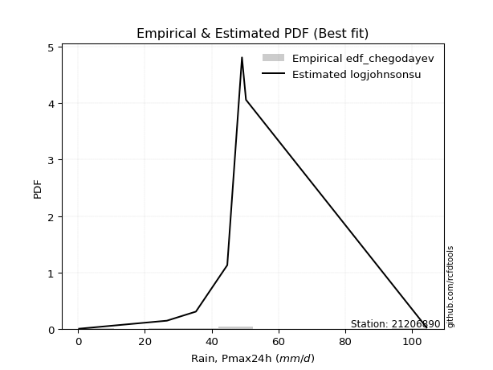</img>

</div>


### 6. EDF Blom (1958)

The Blom formula is a specific "plotting position" formula used in hydrology and statistical analysis to estimate the empirical cumulative probability (or non-exceedance probability) of a data series. It is particularly recommended for data that are approximately normally distributed. The constant _a_ is set to 0.375 (or 3/8).

<div align="center">


$P=(m-a)/(n+1-2a)$


</div>


**6.1. Empirical values**

<div align="center">

|                | 0                   | 1                   | 2                  | 3                  | 4                  | 5                  | 6                 | 7                  |
|:---------------|:--------------------|:--------------------|:-------------------|:-------------------|:-------------------|:-------------------|:------------------|:-------------------|
| date           | 2023                | 2016                | 2012               | 2025               | 2014               | 2013               | 2015              | 2024               |
| x              | 0.3                 | 26.6                | 35.3               | 36.6               | 44.7               | 49.1               | 50.3              | 104.4              |
| m              | 1                   | 2                   | 3                  | 4                  | 5                  | 6                  | 7                 | 8                  |
| empirical_dist | edf_blom            | edf_blom            | edf_blom           | edf_blom           | edf_blom           | edf_blom           | edf_blom          | edf_blom           |
| empirical      | 0.07575757575757576 | 0.19696969696969696 | 0.3181818181818182 | 0.4393939393939394 | 0.5606060606060606 | 0.6818181818181818 | 0.803030303030303 | 0.9242424242424242 |
| empirical_tr   | 1.0819672131147542  | 1.2452830188679247  | 1.4666666666666666 | 1.783783783783784  | 2.275862068965517  | 3.1428571428571423 | 5.076923076923076 | 13.199999999999992 |

</div>


**6.2. Kolmogorov-Smirnov fit test (sorted by Δ)**


<div align="center">

|                | 0                   | 1                   | 2                   | 3                   | 4                   | 5                  | 6                  | 7                   | 8                  | 9                  | 10                  | 11                 | 12                 | 13                 | 14                  | 15                  | 16                  | 17                  | 18                  | 19                 | 20                  | 21                  | 22                  | 23                 | 24                  | 25                  | 26                  | 27                  | 28                 | 29                  | 30                 | 31                  | 32                  | 33                  | 34                  | 35                  | 36                  | 37                 | 38                 | 39                  | 40                  | 41                  | 42                  | 43                  | 44                 | 45                  | 46                  | 47                 | 48                  | 49                  | 50                  | 51                  | 52                 | 53                 | 54                  | 55                  | 56                  | 57                  | 58                  | 59                  | 60                  | 61                  | 62                  | 63                  | 64                 | 65                 | 66                 | 67                 | 68                  | 69                 | 70                  | 71                 | 72                 | 73                  | 74                 | 75                 | 76                  | 77                 | 78                  | 79                  | 80                  | 81                  | 82                  | 83                 | 84                 | 85                 | 86                 | 87                 | 88                 | 89                  | 90                 | 91                 | 92                  | 93                 | 94                 | 95                 | 96                 | 97                 | 98                 | 99                 | 100                | 101                | 102                | 103                 | 104                | 105                 | 106                 | 107                 | 108                 | 109                 | 110                 | 111                 | 112                 | 113                 | 114                 | 115                | 116                | 117                | 118                 | 119                | 120                 | 121                | 122                | 123                 | 124                | 125                | 126                | 127                | 128                | 129                | 130                 | 131                | 132                | 133                | 134                | 135                | 136                | 137                 | 138                | 139                | 140                | 141                | 142                | 143                | 144                | 145                | 146                | 147                | 148                | 149                | 150                | 151                | 152                | 153                | 154                | 155                | 156                | 157                | 158                | 159                |
|:---------------|:--------------------|:--------------------|:--------------------|:--------------------|:--------------------|:-------------------|:-------------------|:--------------------|:-------------------|:-------------------|:--------------------|:-------------------|:-------------------|:-------------------|:--------------------|:--------------------|:--------------------|:--------------------|:--------------------|:-------------------|:--------------------|:--------------------|:--------------------|:-------------------|:--------------------|:--------------------|:--------------------|:--------------------|:-------------------|:--------------------|:-------------------|:--------------------|:--------------------|:--------------------|:--------------------|:--------------------|:--------------------|:-------------------|:-------------------|:--------------------|:--------------------|:--------------------|:--------------------|:--------------------|:-------------------|:--------------------|:--------------------|:-------------------|:--------------------|:--------------------|:--------------------|:--------------------|:-------------------|:-------------------|:--------------------|:--------------------|:--------------------|:--------------------|:--------------------|:--------------------|:--------------------|:--------------------|:--------------------|:--------------------|:-------------------|:-------------------|:-------------------|:-------------------|:--------------------|:-------------------|:--------------------|:-------------------|:-------------------|:--------------------|:-------------------|:-------------------|:--------------------|:-------------------|:--------------------|:--------------------|:--------------------|:--------------------|:--------------------|:-------------------|:-------------------|:-------------------|:-------------------|:-------------------|:-------------------|:--------------------|:-------------------|:-------------------|:--------------------|:-------------------|:-------------------|:-------------------|:-------------------|:-------------------|:-------------------|:-------------------|:-------------------|:-------------------|:-------------------|:--------------------|:-------------------|:--------------------|:--------------------|:--------------------|:--------------------|:--------------------|:--------------------|:--------------------|:--------------------|:--------------------|:--------------------|:-------------------|:-------------------|:-------------------|:--------------------|:-------------------|:--------------------|:-------------------|:-------------------|:--------------------|:-------------------|:-------------------|:-------------------|:-------------------|:-------------------|:-------------------|:--------------------|:-------------------|:-------------------|:-------------------|:-------------------|:-------------------|:-------------------|:--------------------|:-------------------|:-------------------|:-------------------|:-------------------|:-------------------|:-------------------|:-------------------|:-------------------|:-------------------|:-------------------|:-------------------|:-------------------|:-------------------|:-------------------|:-------------------|:-------------------|:-------------------|:-------------------|:-------------------|:-------------------|:-------------------|:-------------------|
| station        | 21206890            | 21206890            | 21206890            | 21206890            | 21206890            | 21206890           | 21206890           | 21206890            | 21206890           | 21206890           | 21206890            | 21206890           | 21206890           | 21206890           | 21206890            | 21206890            | 21206890            | 21206890            | 21206890            | 21206890           | 21206890            | 21206890            | 21206890            | 21206890           | 21206890            | 21206890            | 21206890            | 21206890            | 21206890           | 21206890            | 21206890           | 21206890            | 21206890            | 21206890            | 21206890            | 21206890            | 21206890            | 21206890           | 21206890           | 21206890            | 21206890            | 21206890            | 21206890            | 21206890            | 21206890           | 21206890            | 21206890            | 21206890           | 21206890            | 21206890            | 21206890            | 21206890            | 21206890           | 21206890           | 21206890            | 21206890            | 21206890            | 21206890            | 21206890            | 21206890            | 21206890            | 21206890            | 21206890            | 21206890            | 21206890           | 21206890           | 21206890           | 21206890           | 21206890            | 21206890           | 21206890            | 21206890           | 21206890           | 21206890            | 21206890           | 21206890           | 21206890            | 21206890           | 21206890            | 21206890            | 21206890            | 21206890            | 21206890            | 21206890           | 21206890           | 21206890           | 21206890           | 21206890           | 21206890           | 21206890            | 21206890           | 21206890           | 21206890            | 21206890           | 21206890           | 21206890           | 21206890           | 21206890           | 21206890           | 21206890           | 21206890           | 21206890           | 21206890           | 21206890            | 21206890           | 21206890            | 21206890            | 21206890            | 21206890            | 21206890            | 21206890            | 21206890            | 21206890            | 21206890            | 21206890            | 21206890           | 21206890           | 21206890           | 21206890            | 21206890           | 21206890            | 21206890           | 21206890           | 21206890            | 21206890           | 21206890           | 21206890           | 21206890           | 21206890           | 21206890           | 21206890            | 21206890           | 21206890           | 21206890           | 21206890           | 21206890           | 21206890           | 21206890            | 21206890           | 21206890           | 21206890           | 21206890           | 21206890           | 21206890           | 21206890           | 21206890           | 21206890           | 21206890           | 21206890           | 21206890           | 21206890           | 21206890           | 21206890           | 21206890           | 21206890           | 21206890           | 21206890           | 21206890           | 21206890           | 21206890           |
| empirical_dist | edf_blom            | edf_blom            | edf_blom            | edf_blom            | edf_blom            | edf_blom           | edf_blom           | edf_blom            | edf_blom           | edf_blom           | edf_blom            | edf_blom           | edf_blom           | edf_blom           | edf_blom            | edf_blom            | edf_blom            | edf_blom            | edf_blom            | edf_blom           | edf_blom            | edf_blom            | edf_blom            | edf_blom           | edf_blom            | edf_blom            | edf_blom            | edf_blom            | edf_blom           | edf_blom            | edf_blom           | edf_blom            | edf_blom            | edf_blom            | edf_blom            | edf_blom            | edf_blom            | edf_blom           | edf_blom           | edf_blom            | edf_blom            | edf_blom            | edf_blom            | edf_blom            | edf_blom           | edf_blom            | edf_blom            | edf_blom           | edf_blom            | edf_blom            | edf_blom            | edf_blom            | edf_blom           | edf_blom           | edf_blom            | edf_blom            | edf_blom            | edf_blom            | edf_blom            | edf_blom            | edf_blom            | edf_blom            | edf_blom            | edf_blom            | edf_blom           | edf_blom           | edf_blom           | edf_blom           | edf_blom            | edf_blom           | edf_blom            | edf_blom           | edf_blom           | edf_blom            | edf_blom           | edf_blom           | edf_blom            | edf_blom           | edf_blom            | edf_blom            | edf_blom            | edf_blom            | edf_blom            | edf_blom           | edf_blom           | edf_blom           | edf_blom           | edf_blom           | edf_blom           | edf_blom            | edf_blom           | edf_blom           | edf_blom            | edf_blom           | edf_blom           | edf_blom           | edf_blom           | edf_blom           | edf_blom           | edf_blom           | edf_blom           | edf_blom           | edf_blom           | edf_blom            | edf_blom           | edf_blom            | edf_blom            | edf_blom            | edf_blom            | edf_blom            | edf_blom            | edf_blom            | edf_blom            | edf_blom            | edf_blom            | edf_blom           | edf_blom           | edf_blom           | edf_blom            | edf_blom           | edf_blom            | edf_blom           | edf_blom           | edf_blom            | edf_blom           | edf_blom           | edf_blom           | edf_blom           | edf_blom           | edf_blom           | edf_blom            | edf_blom           | edf_blom           | edf_blom           | edf_blom           | edf_blom           | edf_blom           | edf_blom            | edf_blom           | edf_blom           | edf_blom           | edf_blom           | edf_blom           | edf_blom           | edf_blom           | edf_blom           | edf_blom           | edf_blom           | edf_blom           | edf_blom           | edf_blom           | edf_blom           | edf_blom           | edf_blom           | edf_blom           | edf_blom           | edf_blom           | edf_blom           | edf_blom           | edf_blom           |
| p_dist         | t                   | johnsonsu           | logjohnsonsu        | dgamma              | logt                | gumbel_r           | exponnorm          | moyal               | nct                | gengamma           | halfnorm            | logcrystalball     | genlogistic        | pearson3           | laplace             | alpha               | foldnorm            | invgamma            | kstwobign           | vonmises_line      | johnsonsb           | halflogistic        | dweibull            | invgauss           | fatiguelife         | beta                | betaprime           | f                   | gamma              | erlang              | weibull_min        | rayleigh            | rice                | skewnorm            | maxwell             | hypsecant           | kappa3              | tukeylambda        | logargus           | logistic            | logjohnsonsb        | wald                | crystalball         | norm                | genpareto          | truncnorm           | logloggamma         | anglit             | logburr12           | loggenlogistic      | loggompertz         | truncexpon          | semicircular       | gennorm            | logweibull_max      | bradford            | loggennorm          | loggenextreme       | logpearson3         | arcsine             | truncweibull_min    | ncf                 | loggumbel_l         | genexpon            | cosine             | loglevy_l          | gumbel_l           | lomax              | logdgamma           | logdweibull        | logtrapezoid        | gausshyper         | mielke             | logfoldnorm         | kappa4             | logmielke          | logarcsine          | ksone              | logsemicircular     | loganglit           | wrapcauchy          | uniform             | lognakagami         | lognorm            | logexponnorm       | logrice            | logfatiguelife     | lognct             | loglogistic        | loghypsecant        | loginvgamma        | logkappa3          | loginvweibull       | halfgennorm        | loggamma           | loggamma           | loglaplace         | loglaplace         | logbetaprime       | logburr            | logskewnorm        | burr               | levy_l             | logalpha            | loginvgauss        | logmaxwell          | nakagami            | burr12              | argus               | lograyleigh         | loggausshyper       | logexponweib        | logkstwobign        | loggenpareto        | loggumbel_r         | loghalfnorm        | genextreme         | loggenexpon        | logcosine           | logncf             | logmoyal            | loghalflogistic    | loggenhalflogistic | triang              | logwrapcauchy      | logloglaplace      | logtriang          | loglomax           | genhalflogistic    | logwald            | invweibull          | logkappa4          | rdist              | logf               | logbradford        | logksone           | loggengamma        | logtruncweibull_min | trapezoid          | loguniform         | logvonmises_line   | logtruncnorm       | logbeta            | powerlaw           | logweibull_min     | logtruncexpon      | exponweib          | weibull_max        | truncpareto        | exponpow           | logexponpow        | logpowerlaw        | logtruncpareto     | gompertz           | loghalfgennorm     | logtukeylambda     | logerlang          | logrdist           | logvonmises        | vonmises           |
| delta          | 0.05879577654055945 | 0.07528004692589962 | 0.09388424594473294 | 0.11625265340376234 | 0.11751239582669021 | 0.1375554920428529 | 0.1410193660914285 | 0.14404822967692227 | 0.1456517325487472 | 0.1461183599841126 | 0.14664018963781578 | 0.1471455791743007 | 0.1499743392470836 | 0.1538637420911928 | 0.15394501460093157 | 0.15576918376403726 | 0.15638901844257558 | 0.15779964952059522 | 0.15784081316304865 | 0.159126840962584  | 0.15978245858386442 | 0.16005027024471247 | 0.16009260029837313 | 0.1609287594203639 | 0.16106803772333678 | 0.16221183099223868 | 0.16224218159286274 | 0.16252206594723728 | 0.1625402097537343 | 0.16254026879791228 | 0.1646173721097528 | 0.16928748345661915 | 0.16930964705840323 | 0.17570107287038383 | 0.17755752481779918 | 0.18095677047970926 | 0.18270789967215045 | 0.1831532525335664 | 0.1877405596101328 | 0.19141530718415922 | 0.19830184995461442 | 0.20080684989263847 | 0.20418412988732693 | 0.20418413133221558 | 0.2077995687042795 | 0.20927750805876055 | 0.21130084898738577 | 0.2178655163453661 | 0.21880842918602766 | 0.21966356265642295 | 0.22195218015793122 | 0.22334343553829394 | 0.2235464921040582 | 0.2244719014038038 | 0.22788189090839778 | 0.22980529304998287 | 0.23806425905258266 | 0.23970232449547607 | 0.23994439639425758 | 0.24638057963952054 | 0.24763627872904148 | 0.24945178168061272 | 0.25552160222035375 | 0.25650319709080577 | 0.2626438259238958 | 0.2630031855097273 | 0.2641703612403563 | 0.2692677831736899 | 0.27394573626614005 | 0.2767804497733606 | 0.28029371069063697 | 0.2824232492524542 | 0.2929365587439707 | 0.29754637676092677 | 0.3022617684171073 | 0.3112294196720406 | 0.31537862142373824 | 0.319440805752045  | 0.32048710241907735 | 0.32177370916919906 | 0.32259062527799326 | 0.32272290629639333 | 0.32474652837485724 | 0.3249000463487984 | 0.3249022194391699 | 0.3249050684894648 | 0.3251690677508931 | 0.3252991987960235 | 0.3278800865581158 | 0.33041984275213426 | 0.3345231226730679 | 0.3364276828867102 | 0.33842204827758976 | 0.3399945874471086 | 0.340217619146487  | 0.340217619146487  | 0.3403469088792524 | 0.3403469088792524 | 0.3415511271439304 | 0.3441609569083735 | 0.3449617079380897 | 0.3463512100639799 | 0.3469598050656561 | 0.34778100697652387 | 0.351212709575817  | 0.35694914218184465 | 0.35927827819113084 | 0.36002123085587734 | 0.36532965892150837 | 0.36745394866842546 | 0.37678982970585057 | 0.37760016221978243 | 0.38370316256151343 | 0.39401419614574046 | 0.39557947067397664 | 0.3970234848485101 | 0.4000811145354965 | 0.4096292349855259 | 0.41449712162850366 | 0.419879409535537  | 0.42114413222419506 | 0.4231660730062599 | 0.4247199258913686 | 0.42474235995512116 | 0.4326757790981722 | 0.4330273857759466 | 0.4361245374895197 | 0.4384850229355753 | 0.4602599491064501 | 0.4921448209922323 | 0.49302816378043185 | 0.5081920991947753 | 0.5157412443899567 | 0.5206868033117682 | 0.5226496427627241 | 0.524995563917634  | 0.5521534156141892 | 0.5555294492552341  | 0.5652413495922577 | 0.5693886160951003 | 0.5696808429445241 | 0.5768597710697254 | 0.5810958023346211 | 0.5978855624495476 | 0.6074438632628667 | 0.6310342523209882 | 0.6561798622376278 | 0.697414066180265  | 0.717120391818437  | 0.7377675342028467 | 0.7446013935110765 | 0.749783738799858  | 0.7632205381031201 | 0.8015022736252929 | 0.803030303030303  | 0.803030303030303  | 0.8803689564612299 | 0.924242424104063  | 0.9752355160301468 | 16.182950616652153 |
| deltao         | 0.4472608134160001  | 0.4472608134160001  | 0.4472608134160001  | 0.4472608134160001  | 0.4472608134160001  | 0.4472608134160001 | 0.4472608134160001 | 0.4472608134160001  | 0.4472608134160001 | 0.4472608134160001 | 0.4472608134160001  | 0.4472608134160001 | 0.4472608134160001 | 0.4472608134160001 | 0.4472608134160001  | 0.4472608134160001  | 0.4472608134160001  | 0.4472608134160001  | 0.4472608134160001  | 0.4472608134160001 | 0.4472608134160001  | 0.4472608134160001  | 0.4472608134160001  | 0.4472608134160001 | 0.4472608134160001  | 0.4472608134160001  | 0.4472608134160001  | 0.4472608134160001  | 0.4472608134160001 | 0.4472608134160001  | 0.4472608134160001 | 0.4472608134160001  | 0.4472608134160001  | 0.4472608134160001  | 0.4472608134160001  | 0.4472608134160001  | 0.4472608134160001  | 0.4472608134160001 | 0.4472608134160001 | 0.4472608134160001  | 0.4472608134160001  | 0.4472608134160001  | 0.4472608134160001  | 0.4472608134160001  | 0.4472608134160001 | 0.4472608134160001  | 0.4472608134160001  | 0.4472608134160001 | 0.4472608134160001  | 0.4472608134160001  | 0.4472608134160001  | 0.4472608134160001  | 0.4472608134160001 | 0.4472608134160001 | 0.4472608134160001  | 0.4472608134160001  | 0.4472608134160001  | 0.4472608134160001  | 0.4472608134160001  | 0.4472608134160001  | 0.4472608134160001  | 0.4472608134160001  | 0.4472608134160001  | 0.4472608134160001  | 0.4472608134160001 | 0.4472608134160001 | 0.4472608134160001 | 0.4472608134160001 | 0.4472608134160001  | 0.4472608134160001 | 0.4472608134160001  | 0.4472608134160001 | 0.4472608134160001 | 0.4472608134160001  | 0.4472608134160001 | 0.4472608134160001 | 0.4472608134160001  | 0.4472608134160001 | 0.4472608134160001  | 0.4472608134160001  | 0.4472608134160001  | 0.4472608134160001  | 0.4472608134160001  | 0.4472608134160001 | 0.4472608134160001 | 0.4472608134160001 | 0.4472608134160001 | 0.4472608134160001 | 0.4472608134160001 | 0.4472608134160001  | 0.4472608134160001 | 0.4472608134160001 | 0.4472608134160001  | 0.4472608134160001 | 0.4472608134160001 | 0.4472608134160001 | 0.4472608134160001 | 0.4472608134160001 | 0.4472608134160001 | 0.4472608134160001 | 0.4472608134160001 | 0.4472608134160001 | 0.4472608134160001 | 0.4472608134160001  | 0.4472608134160001 | 0.4472608134160001  | 0.4472608134160001  | 0.4472608134160001  | 0.4472608134160001  | 0.4472608134160001  | 0.4472608134160001  | 0.4472608134160001  | 0.4472608134160001  | 0.4472608134160001  | 0.4472608134160001  | 0.4472608134160001 | 0.4472608134160001 | 0.4472608134160001 | 0.4472608134160001  | 0.4472608134160001 | 0.4472608134160001  | 0.4472608134160001 | 0.4472608134160001 | 0.4472608134160001  | 0.4472608134160001 | 0.4472608134160001 | 0.4472608134160001 | 0.4472608134160001 | 0.4472608134160001 | 0.4472608134160001 | 0.4472608134160001  | 0.4472608134160001 | 0.4472608134160001 | 0.4472608134160001 | 0.4472608134160001 | 0.4472608134160001 | 0.4472608134160001 | 0.4472608134160001  | 0.4472608134160001 | 0.4472608134160001 | 0.4472608134160001 | 0.4472608134160001 | 0.4472608134160001 | 0.4472608134160001 | 0.4472608134160001 | 0.4472608134160001 | 0.4472608134160001 | 0.4472608134160001 | 0.4472608134160001 | 0.4472608134160001 | 0.4472608134160001 | 0.4472608134160001 | 0.4472608134160001 | 0.4472608134160001 | 0.4472608134160001 | 0.4472608134160001 | 0.4472608134160001 | 0.4472608134160001 | 0.4472608134160001 | 0.4472608134160001 |
| eval           | Δo > Δ              | Δo > Δ              | Δo > Δ              | Δo > Δ              | Δo > Δ              | Δo > Δ             | Δo > Δ             | Δo > Δ              | Δo > Δ             | Δo > Δ             | Δo > Δ              | Δo > Δ             | Δo > Δ             | Δo > Δ             | Δo > Δ              | Δo > Δ              | Δo > Δ              | Δo > Δ              | Δo > Δ              | Δo > Δ             | Δo > Δ              | Δo > Δ              | Δo > Δ              | Δo > Δ             | Δo > Δ              | Δo > Δ              | Δo > Δ              | Δo > Δ              | Δo > Δ             | Δo > Δ              | Δo > Δ             | Δo > Δ              | Δo > Δ              | Δo > Δ              | Δo > Δ              | Δo > Δ              | Δo > Δ              | Δo > Δ             | Δo > Δ             | Δo > Δ              | Δo > Δ              | Δo > Δ              | Δo > Δ              | Δo > Δ              | Δo > Δ             | Δo > Δ              | Δo > Δ              | Δo > Δ             | Δo > Δ              | Δo > Δ              | Δo > Δ              | Δo > Δ              | Δo > Δ             | Δo > Δ             | Δo > Δ              | Δo > Δ              | Δo > Δ              | Δo > Δ              | Δo > Δ              | Δo > Δ              | Δo > Δ              | Δo > Δ              | Δo > Δ              | Δo > Δ              | Δo > Δ             | Δo > Δ             | Δo > Δ             | Δo > Δ             | Δo > Δ              | Δo > Δ             | Δo > Δ              | Δo > Δ             | Δo > Δ             | Δo > Δ              | Δo > Δ             | Δo > Δ             | Δo > Δ              | Δo > Δ             | Δo > Δ              | Δo > Δ              | Δo > Δ              | Δo > Δ              | Δo > Δ              | Δo > Δ             | Δo > Δ             | Δo > Δ             | Δo > Δ             | Δo > Δ             | Δo > Δ             | Δo > Δ              | Δo > Δ             | Δo > Δ             | Δo > Δ              | Δo > Δ             | Δo > Δ             | Δo > Δ             | Δo > Δ             | Δo > Δ             | Δo > Δ             | Δo > Δ             | Δo > Δ             | Δo > Δ             | Δo > Δ             | Δo > Δ              | Δo > Δ             | Δo > Δ              | Δo > Δ              | Δo > Δ              | Δo > Δ              | Δo > Δ              | Δo > Δ              | Δo > Δ              | Δo > Δ              | Δo > Δ              | Δo > Δ              | Δo > Δ             | Δo > Δ             | Δo > Δ             | Δo > Δ              | Δo > Δ             | Δo > Δ              | Δo > Δ             | Δo > Δ             | Δo > Δ              | Δo > Δ             | Δo > Δ             | Δo > Δ             | Δo > Δ             | Δo <= Δ            | Δo <= Δ            | Δo <= Δ             | Δo <= Δ            | Δo <= Δ            | Δo <= Δ            | Δo <= Δ            | Δo <= Δ            | Δo <= Δ            | Δo <= Δ             | Δo <= Δ            | Δo <= Δ            | Δo <= Δ            | Δo <= Δ            | Δo <= Δ            | Δo <= Δ            | Δo <= Δ            | Δo <= Δ            | Δo <= Δ            | Δo <= Δ            | Δo <= Δ            | Δo <= Δ            | Δo <= Δ            | Δo <= Δ            | Δo <= Δ            | Δo <= Δ            | Δo <= Δ            | Δo <= Δ            | Δo <= Δ            | Δo <= Δ            | Δo <= Δ            | Δo <= Δ            |
| fit            | 1                   | 1                   | 1                   | 1                   | 1                   | 1                  | 1                  | 1                   | 1                  | 1                  | 1                   | 1                  | 1                  | 1                  | 1                   | 1                   | 1                   | 1                   | 1                   | 1                  | 1                   | 1                   | 1                   | 1                  | 1                   | 1                   | 1                   | 1                   | 1                  | 1                   | 1                  | 1                   | 1                   | 1                   | 1                   | 1                   | 1                   | 1                  | 1                  | 1                   | 1                   | 1                   | 1                   | 1                   | 1                  | 1                   | 1                   | 1                  | 1                   | 1                   | 1                   | 1                   | 1                  | 1                  | 1                   | 1                   | 1                   | 1                   | 1                   | 1                   | 1                   | 1                   | 1                   | 1                   | 1                  | 1                  | 1                  | 1                  | 1                   | 1                  | 1                   | 1                  | 1                  | 1                   | 1                  | 1                  | 1                   | 1                  | 1                   | 1                   | 1                   | 1                   | 1                   | 1                  | 1                  | 1                  | 1                  | 1                  | 1                  | 1                   | 1                  | 1                  | 1                   | 1                  | 1                  | 1                  | 1                  | 1                  | 1                  | 1                  | 1                  | 1                  | 1                  | 1                   | 1                  | 1                   | 1                   | 1                   | 1                   | 1                   | 1                   | 1                   | 1                   | 1                   | 1                   | 1                  | 1                  | 1                  | 1                   | 1                  | 1                   | 1                  | 1                  | 1                   | 1                  | 1                  | 1                  | 1                  | 0                  | 0                  | 0                   | 0                  | 0                  | 0                  | 0                  | 0                  | 0                  | 0                   | 0                  | 0                  | 0                  | 0                  | 0                  | 0                  | 0                  | 0                  | 0                  | 0                  | 0                  | 0                  | 0                  | 0                  | 0                  | 0                  | 0                  | 0                  | 0                  | 0                  | 0                  | 0                  |
| n              | 8                   | 8                   | 8                   | 8                   | 8                   | 8                  | 8                  | 8                   | 8                  | 8                  | 8                   | 8                  | 8                  | 8                  | 8                   | 8                   | 8                   | 8                   | 8                   | 8                  | 8                   | 8                   | 8                   | 8                  | 8                   | 8                   | 8                   | 8                   | 8                  | 8                   | 8                  | 8                   | 8                   | 8                   | 8                   | 8                   | 8                   | 8                  | 8                  | 8                   | 8                   | 8                   | 8                   | 8                   | 8                  | 8                   | 8                   | 8                  | 8                   | 8                   | 8                   | 8                   | 8                  | 8                  | 8                   | 8                   | 8                   | 8                   | 8                   | 8                   | 8                   | 8                   | 8                   | 8                   | 8                  | 8                  | 8                  | 8                  | 8                   | 8                  | 8                   | 8                  | 8                  | 8                   | 8                  | 8                  | 8                   | 8                  | 8                   | 8                   | 8                   | 8                   | 8                   | 8                  | 8                  | 8                  | 8                  | 8                  | 8                  | 8                   | 8                  | 8                  | 8                   | 8                  | 8                  | 8                  | 8                  | 8                  | 8                  | 8                  | 8                  | 8                  | 8                  | 8                   | 8                  | 8                   | 8                   | 8                   | 8                   | 8                   | 8                   | 8                   | 8                   | 8                   | 8                   | 8                  | 8                  | 8                  | 8                   | 8                  | 8                   | 8                  | 8                  | 8                   | 8                  | 8                  | 8                  | 8                  | 8                  | 8                  | 8                   | 8                  | 8                  | 8                  | 8                  | 8                  | 8                  | 8                   | 8                  | 8                  | 8                  | 8                  | 8                  | 8                  | 8                  | 8                  | 8                  | 8                  | 8                  | 8                  | 8                  | 8                  | 8                  | 8                  | 8                  | 8                  | 8                  | 8                  | 8                  | 8                  |
| best_fit       | 1                   | 0                   | 0                   | 0                   | 0                   | 0                  | 0                  | 0                   | 0                  | 0                  | 0                   | 0                  | 0                  | 0                  | 0                   | 0                   | 0                   | 0                   | 0                   | 0                  | 0                   | 0                   | 0                   | 0                  | 0                   | 0                   | 0                   | 0                   | 0                  | 0                   | 0                  | 0                   | 0                   | 0                   | 0                   | 0                   | 0                   | 0                  | 0                  | 0                   | 0                   | 0                   | 0                   | 0                   | 0                  | 0                   | 0                   | 0                  | 0                   | 0                   | 0                   | 0                   | 0                  | 0                  | 0                   | 0                   | 0                   | 0                   | 0                   | 0                   | 0                   | 0                   | 0                   | 0                   | 0                  | 0                  | 0                  | 0                  | 0                   | 0                  | 0                   | 0                  | 0                  | 0                   | 0                  | 0                  | 0                   | 0                  | 0                   | 0                   | 0                   | 0                   | 0                   | 0                  | 0                  | 0                  | 0                  | 0                  | 0                  | 0                   | 0                  | 0                  | 0                   | 0                  | 0                  | 0                  | 0                  | 0                  | 0                  | 0                  | 0                  | 0                  | 0                  | 0                   | 0                  | 0                   | 0                   | 0                   | 0                   | 0                   | 0                   | 0                   | 0                   | 0                   | 0                   | 0                  | 0                  | 0                  | 0                   | 0                  | 0                   | 0                  | 0                  | 0                   | 0                  | 0                  | 0                  | 0                  | 0                  | 0                  | 0                   | 0                  | 0                  | 0                  | 0                  | 0                  | 0                  | 0                   | 0                  | 0                  | 0                  | 0                  | 0                  | 0                  | 0                  | 0                  | 0                  | 0                  | 0                  | 0                  | 0                  | 0                  | 0                  | 0                  | 0                  | 0                  | 0                  | 0                  | 0                  | 0                  |
| best_fit_sort  | 1                   | 2                   | 3                   | 4                   | 5                   | 6                  | 7                  | 8                   | 9                  | 10                 | 11                  | 12                 | 13                 | 14                 | 15                  | 16                  | 17                  | 18                  | 19                  | 20                 | 21                  | 22                  | 23                  | 24                 | 25                  | 26                  | 27                  | 28                  | 29                 | 30                  | 31                 | 32                  | 33                  | 34                  | 35                  | 36                  | 37                  | 38                 | 39                 | 40                  | 41                  | 42                  | 43                  | 44                  | 45                 | 46                  | 47                  | 48                 | 49                  | 50                  | 51                  | 52                  | 53                 | 54                 | 55                  | 56                  | 57                  | 58                  | 59                  | 60                  | 61                  | 62                  | 63                  | 64                  | 65                 | 66                 | 67                 | 68                 | 69                  | 70                 | 71                  | 72                 | 73                 | 74                  | 75                 | 76                 | 77                  | 78                 | 79                  | 80                  | 81                  | 82                  | 83                  | 84                 | 85                 | 86                 | 87                 | 88                 | 89                 | 90                  | 91                 | 92                 | 93                  | 94                 | 95                 | 96                 | 97                 | 98                 | 99                 | 100                | 101                | 102                | 103                | 104                 | 105                | 106                 | 107                 | 108                 | 109                 | 110                 | 111                 | 112                 | 113                 | 114                 | 115                 | 116                | 117                | 118                | 119                 | 120                | 121                 | 122                | 123                | 124                 | 125                | 126                | 127                | 128                | 129                | 130                | 131                 | 132                | 133                | 134                | 135                | 136                | 137                | 138                 | 139                | 140                | 141                | 142                | 143                | 144                | 145                | 146                | 147                | 148                | 149                | 150                | 151                | 152                | 153                | 154                | 155                | 156                | 157                | 158                | 159                | 160                |

</div>


**6.3. Best fit**

<div align="center">

|   id |   station | empirical_dist   | p_dist   |     delta |   deltao | eval   |   fit |   n |   best_fit |   best_fit_sort |
|-----:|----------:|:-----------------|:---------|----------:|---------:|:-------|------:|----:|-----------:|----------------:|
|    0 |  21206890 | edf_blom         | t        | 0.0587958 | 0.447261 | Δo > Δ |     1 |   8 |          1 |               1 |

</div>


<div align="center">

</img></img>

</div>


### 7. EDF Tukey (1962)

In hydrology, the Tukey formula is used as a plotting position formula to estimate the empirical probability or frequency of a flood event (or other hydrological data). The formula parameter is given as _c=0.333_ (or 1/3).

<div align="center">


$P=(m-c)/(n+1-2c)$


</div>


**7.1. Empirical values**

<div align="center">

|                | 0                  | 1         | 2                  | 3                  | 4                 | 5                  | 6                 | 7                  |
|:---------------|:-------------------|:----------|:-------------------|:-------------------|:------------------|:-------------------|:------------------|:-------------------|
| date           | 2023               | 2016      | 2012               | 2025               | 2014              | 2013               | 2015              | 2024               |
| x              | 0.3                | 26.6      | 35.3               | 36.6               | 44.7              | 49.1               | 50.3              | 104.4              |
| m              | 1                  | 2         | 3                  | 4                  | 5                 | 6                  | 7                 | 8                  |
| empirical_dist | edf_tukey          | edf_tukey | edf_tukey          | edf_tukey          | edf_tukey         | edf_tukey          | edf_tukey         | edf_tukey          |
| empirical      | 0.08               | 0.2       | 0.32               | 0.44               | 0.56              | 0.68               | 0.8               | 0.92               |
| empirical_tr   | 1.0869565217391304 | 1.25      | 1.4705882352941178 | 1.7857142857142856 | 2.272727272727273 | 3.1250000000000004 | 5.000000000000001 | 12.500000000000007 |

</div>


**7.2. Kolmogorov-Smirnov fit test (sorted by Δ)**


<div align="center">

|                | 0                   | 1                   | 2                   | 3                  | 4                   | 5                   | 6                   | 7                   | 8                   | 9                   | 10                  | 11                  | 12                  | 13                  | 14                  | 15                  | 16                  | 17                  | 18                  | 19                  | 20                  | 21                 | 22                  | 23                  | 24                  | 25                  | 26                 | 27                  | 28                  | 29                  | 30                  | 31                 | 32                 | 33                 | 34                  | 35                  | 36                  | 37                 | 38                  | 39                  | 40                  | 41                  | 42                 | 43                  | 44                  | 45                  | 46                  | 47                  | 48                  | 49                 | 50                  | 51                 | 52                  | 53                  | 54                 | 55                  | 56                  | 57                  | 58                  | 59                 | 60                  | 61                  | 62                 | 63                 | 64                  | 65                  | 66                  | 67                  | 68                 | 69                  | 70                 | 71                 | 72                 | 73                 | 74                  | 75                  | 76                 | 77                  | 78                 | 79                 | 80                 | 81                 | 82                 | 83                 | 84                  | 85                  | 86                  | 87                  | 88                  | 89                 | 90                  | 91                  | 92                 | 93                  | 94                  | 95                  | 96                  | 97                  | 98                 | 99                  | 100                | 101                 | 102                 | 103                | 104                 | 105                | 106                | 107                | 108                 | 109                | 110                | 111                | 112                | 113                | 114                | 115                 | 116                 | 117                 | 118                | 119                 | 120                | 121                 | 122                 | 123                | 124                | 125                | 126                 | 127                 | 128                 | 129                | 130                 | 131                | 132                | 133                | 134                | 135                | 136                | 137                 | 138                | 139                | 140                | 141                | 142                | 143                | 144                | 145                | 146                | 147                | 148                | 149                | 150                | 151                | 152                | 153                | 154                | 155                | 156                | 157                | 158                | 159                |
|:---------------|:--------------------|:--------------------|:--------------------|:-------------------|:--------------------|:--------------------|:--------------------|:--------------------|:--------------------|:--------------------|:--------------------|:--------------------|:--------------------|:--------------------|:--------------------|:--------------------|:--------------------|:--------------------|:--------------------|:--------------------|:--------------------|:-------------------|:--------------------|:--------------------|:--------------------|:--------------------|:-------------------|:--------------------|:--------------------|:--------------------|:--------------------|:-------------------|:-------------------|:-------------------|:--------------------|:--------------------|:--------------------|:-------------------|:--------------------|:--------------------|:--------------------|:--------------------|:-------------------|:--------------------|:--------------------|:--------------------|:--------------------|:--------------------|:--------------------|:-------------------|:--------------------|:-------------------|:--------------------|:--------------------|:-------------------|:--------------------|:--------------------|:--------------------|:--------------------|:-------------------|:--------------------|:--------------------|:-------------------|:-------------------|:--------------------|:--------------------|:--------------------|:--------------------|:-------------------|:--------------------|:-------------------|:-------------------|:-------------------|:-------------------|:--------------------|:--------------------|:-------------------|:--------------------|:-------------------|:-------------------|:-------------------|:-------------------|:-------------------|:-------------------|:--------------------|:--------------------|:--------------------|:--------------------|:--------------------|:-------------------|:--------------------|:--------------------|:-------------------|:--------------------|:--------------------|:--------------------|:--------------------|:--------------------|:-------------------|:--------------------|:-------------------|:--------------------|:--------------------|:-------------------|:--------------------|:-------------------|:-------------------|:-------------------|:--------------------|:-------------------|:-------------------|:-------------------|:-------------------|:-------------------|:-------------------|:--------------------|:--------------------|:--------------------|:-------------------|:--------------------|:-------------------|:--------------------|:--------------------|:-------------------|:-------------------|:-------------------|:--------------------|:--------------------|:--------------------|:-------------------|:--------------------|:-------------------|:-------------------|:-------------------|:-------------------|:-------------------|:-------------------|:--------------------|:-------------------|:-------------------|:-------------------|:-------------------|:-------------------|:-------------------|:-------------------|:-------------------|:-------------------|:-------------------|:-------------------|:-------------------|:-------------------|:-------------------|:-------------------|:-------------------|:-------------------|:-------------------|:-------------------|:-------------------|:-------------------|:-------------------|
| station        | 21206890            | 21206890            | 21206890            | 21206890           | 21206890            | 21206890            | 21206890            | 21206890            | 21206890            | 21206890            | 21206890            | 21206890            | 21206890            | 21206890            | 21206890            | 21206890            | 21206890            | 21206890            | 21206890            | 21206890            | 21206890            | 21206890           | 21206890            | 21206890            | 21206890            | 21206890            | 21206890           | 21206890            | 21206890            | 21206890            | 21206890            | 21206890           | 21206890           | 21206890           | 21206890            | 21206890            | 21206890            | 21206890           | 21206890            | 21206890            | 21206890            | 21206890            | 21206890           | 21206890            | 21206890            | 21206890            | 21206890            | 21206890            | 21206890            | 21206890           | 21206890            | 21206890           | 21206890            | 21206890            | 21206890           | 21206890            | 21206890            | 21206890            | 21206890            | 21206890           | 21206890            | 21206890            | 21206890           | 21206890           | 21206890            | 21206890            | 21206890            | 21206890            | 21206890           | 21206890            | 21206890           | 21206890           | 21206890           | 21206890           | 21206890            | 21206890            | 21206890           | 21206890            | 21206890           | 21206890           | 21206890           | 21206890           | 21206890           | 21206890           | 21206890            | 21206890            | 21206890            | 21206890            | 21206890            | 21206890           | 21206890            | 21206890            | 21206890           | 21206890            | 21206890            | 21206890            | 21206890            | 21206890            | 21206890           | 21206890            | 21206890           | 21206890            | 21206890            | 21206890           | 21206890            | 21206890           | 21206890           | 21206890           | 21206890            | 21206890           | 21206890           | 21206890           | 21206890           | 21206890           | 21206890           | 21206890            | 21206890            | 21206890            | 21206890           | 21206890            | 21206890           | 21206890            | 21206890            | 21206890           | 21206890           | 21206890           | 21206890            | 21206890            | 21206890            | 21206890           | 21206890            | 21206890           | 21206890           | 21206890           | 21206890           | 21206890           | 21206890           | 21206890            | 21206890           | 21206890           | 21206890           | 21206890           | 21206890           | 21206890           | 21206890           | 21206890           | 21206890           | 21206890           | 21206890           | 21206890           | 21206890           | 21206890           | 21206890           | 21206890           | 21206890           | 21206890           | 21206890           | 21206890           | 21206890           | 21206890           |
| empirical_dist | edf_tukey           | edf_tukey           | edf_tukey           | edf_tukey          | edf_tukey           | edf_tukey           | edf_tukey           | edf_tukey           | edf_tukey           | edf_tukey           | edf_tukey           | edf_tukey           | edf_tukey           | edf_tukey           | edf_tukey           | edf_tukey           | edf_tukey           | edf_tukey           | edf_tukey           | edf_tukey           | edf_tukey           | edf_tukey          | edf_tukey           | edf_tukey           | edf_tukey           | edf_tukey           | edf_tukey          | edf_tukey           | edf_tukey           | edf_tukey           | edf_tukey           | edf_tukey          | edf_tukey          | edf_tukey          | edf_tukey           | edf_tukey           | edf_tukey           | edf_tukey          | edf_tukey           | edf_tukey           | edf_tukey           | edf_tukey           | edf_tukey          | edf_tukey           | edf_tukey           | edf_tukey           | edf_tukey           | edf_tukey           | edf_tukey           | edf_tukey          | edf_tukey           | edf_tukey          | edf_tukey           | edf_tukey           | edf_tukey          | edf_tukey           | edf_tukey           | edf_tukey           | edf_tukey           | edf_tukey          | edf_tukey           | edf_tukey           | edf_tukey          | edf_tukey          | edf_tukey           | edf_tukey           | edf_tukey           | edf_tukey           | edf_tukey          | edf_tukey           | edf_tukey          | edf_tukey          | edf_tukey          | edf_tukey          | edf_tukey           | edf_tukey           | edf_tukey          | edf_tukey           | edf_tukey          | edf_tukey          | edf_tukey          | edf_tukey          | edf_tukey          | edf_tukey          | edf_tukey           | edf_tukey           | edf_tukey           | edf_tukey           | edf_tukey           | edf_tukey          | edf_tukey           | edf_tukey           | edf_tukey          | edf_tukey           | edf_tukey           | edf_tukey           | edf_tukey           | edf_tukey           | edf_tukey          | edf_tukey           | edf_tukey          | edf_tukey           | edf_tukey           | edf_tukey          | edf_tukey           | edf_tukey          | edf_tukey          | edf_tukey          | edf_tukey           | edf_tukey          | edf_tukey          | edf_tukey          | edf_tukey          | edf_tukey          | edf_tukey          | edf_tukey           | edf_tukey           | edf_tukey           | edf_tukey          | edf_tukey           | edf_tukey          | edf_tukey           | edf_tukey           | edf_tukey          | edf_tukey          | edf_tukey          | edf_tukey           | edf_tukey           | edf_tukey           | edf_tukey          | edf_tukey           | edf_tukey          | edf_tukey          | edf_tukey          | edf_tukey          | edf_tukey          | edf_tukey          | edf_tukey           | edf_tukey          | edf_tukey          | edf_tukey          | edf_tukey          | edf_tukey          | edf_tukey          | edf_tukey          | edf_tukey          | edf_tukey          | edf_tukey          | edf_tukey          | edf_tukey          | edf_tukey          | edf_tukey          | edf_tukey          | edf_tukey          | edf_tukey          | edf_tukey          | edf_tukey          | edf_tukey          | edf_tukey          | edf_tukey          |
| p_dist         | t                   | johnsonsu           | logjohnsonsu        | dgamma             | logt                | gumbel_r            | exponnorm           | moyal               | nct                 | gengamma            | logcrystalball      | halfnorm            | genlogistic         | pearson3            | laplace             | alpha               | foldnorm            | invgamma            | kstwobign           | vonmises_line       | johnsonsb           | dweibull           | invgauss            | fatiguelife         | halflogistic        | beta                | betaprime          | f                   | gamma               | erlang              | weibull_min         | rayleigh           | rice               | skewnorm           | maxwell             | hypsecant           | kappa3              | tukeylambda        | logargus            | logistic            | logjohnsonsb        | wald                | crystalball        | norm                | genpareto           | truncnorm           | logloggamma         | anglit              | logburr12           | loggenlogistic     | loggompertz         | truncexpon         | semicircular        | logweibull_max      | gennorm            | bradford            | loggennorm          | loggenextreme       | logpearson3         | arcsine            | truncweibull_min    | ncf                 | loggumbel_l        | genexpon           | cosine              | loglevy_l           | gumbel_l            | lomax               | logdgamma          | logdweibull         | logtrapezoid       | gausshyper         | mielke             | logfoldnorm        | kappa4              | logmielke           | logarcsine         | ksone               | logsemicircular    | loganglit          | wrapcauchy         | uniform            | lognakagami        | lognorm            | logexponnorm        | logrice             | logfatiguelife      | lognct              | loglogistic         | loghypsecant       | loginvgamma         | logkappa3           | loginvweibull      | halfgennorm         | loggamma            | loggamma            | loglaplace          | loglaplace          | logbetaprime       | logburr             | logskewnorm        | levy_l              | burr                | logalpha           | loginvgauss         | logmaxwell         | burr12             | nakagami           | argus               | lograyleigh        | logexponweib       | loggausshyper      | logkstwobign       | loggenpareto       | loggumbel_r        | loghalfnorm         | genextreme          | loggenexpon         | logcosine          | logncf              | logmoyal           | loghalflogistic     | loggenhalflogistic  | triang             | logwrapcauchy      | logloglaplace      | logtriang           | loglomax            | genhalflogistic     | invweibull         | logwald             | logkappa4          | rdist              | logf               | logbradford        | logksone           | loggengamma        | logtruncweibull_min | trapezoid          | loguniform         | logvonmises_line   | logtruncnorm       | logbeta            | powerlaw           | logweibull_min     | logtruncexpon      | exponweib          | weibull_max        | truncpareto        | exponpow           | logexponpow        | logpowerlaw        | logtruncpareto     | gompertz           | loghalfgennorm     | logtukeylambda     | logerlang          | logrdist           | logvonmises        | vonmises           |
| delta          | 0.05940183714661995 | 0.07224974389559669 | 0.09449030655079355 | 0.1132223503734594 | 0.11811845643275082 | 0.13452518901254995 | 0.13798906306112557 | 0.14223004785874044 | 0.14262142951844425 | 0.14308805695380966 | 0.14411527614399777 | 0.14482200781963395 | 0.14694403621678065 | 0.15083343906088986 | 0.15091471157062863 | 0.15273888073373432 | 0.15335871541227264 | 0.15476934649029228 | 0.15481051013274572 | 0.15609653793228107 | 0.15675215555356148 | 0.1570622972680702 | 0.15789845639006095 | 0.15803773469303384 | 0.15823208842653064 | 0.15918152796193574 | 0.1592118785625598 | 0.15949176291693434 | 0.15950990672343135 | 0.15950996576760934 | 0.16158706907944986 | 0.1662571804263162 | 0.1662793440281003 | 0.1726707698400809 | 0.17452722178749625 | 0.17792646744940632 | 0.18088971785396862 | 0.1837593131396269 | 0.18471025657982987 | 0.18838500415385628 | 0.19527154692431148 | 0.19898866807445664 | 0.201153826857024  | 0.20115382830191264 | 0.20476926567397657 | 0.20624720502845761 | 0.20827054595708272 | 0.21483521331506317 | 0.21577812615572461 | 0.2166332596261199 | 0.21892187712762817 | 0.220313132507991  | 0.22051618907375525 | 0.22485158787809473 | 0.2250779620098644 | 0.22677499001967993 | 0.23503395602227972 | 0.23667202146517302 | 0.23691409336395464 | 0.2433502766092176 | 0.24460597569873854 | 0.24642147865030967 | 0.2524912991900507 | 0.2534728940605027 | 0.25961352289359285 | 0.25997288247942424 | 0.26114005821005337 | 0.26623748014338683 | 0.2709154332358371 | 0.27375014674305764 | 0.2772634076603339 | 0.2793929462221513 | 0.2899062557136676 | 0.2945160737306237 | 0.29923146538680434 | 0.30819911664173755 | 0.3123483183934352 | 0.31641050272174204 | 0.3174567993887743 | 0.318743406138896  | 0.3195603222476903 | 0.3196926032660904 | 0.3217162253445542 | 0.3218697433184953 | 0.32187191640886686 | 0.32187476545916177 | 0.32213876472059005 | 0.32226889576572043 | 0.32484978352781274 | 0.3273895397218312 | 0.33149281964276484 | 0.33218525864428605 | 0.3353917452472867 | 0.33696428441680554 | 0.33718731611618397 | 0.33718731611618397 | 0.33731660584894935 | 0.33731660584894935 | 0.3385208241136273 | 0.34113065387807046 | 0.3419314049077867 | 0.34271738082323183 | 0.34332090703367685 | 0.3447507039462208 | 0.34818240654551397 | 0.3539188391515416 | 0.3557788066134532 | 0.3562479751608278 | 0.36229935589120543 | 0.3644236456381224 | 0.3733577379773583 | 0.3737595266755475 | 0.3806728595312104 | 0.3909838931154374 | 0.3925491676436736 | 0.39399318181820703 | 0.39705081150519345 | 0.40659893195522284 | 0.4114668185982006 | 0.41684910650523394 | 0.418113829193892  | 0.42013576997595686 | 0.42168962286106554 | 0.4217120569248182 | 0.4296454760678691 | 0.4299970827456436 | 0.43309423445921663 | 0.43545471990527224 | 0.45722964607614713 | 0.4887857395380077 | 0.48911451796192923 | 0.5051617961644723 | 0.5127109413596538 | 0.5176565002814653 | 0.5196193397324211 | 0.5219652608873311 | 0.547910991371765  | 0.5524991462249309  | 0.5622110465619548 | 0.5663583130647973 | 0.566650539914221  | 0.5738294680394225 | 0.5780654993043182 | 0.5948552594192447 | 0.6044135602325635 | 0.628003949290685  | 0.6519374379952037 | 0.6943837631499621 | 0.7140900887881338 | 0.7347372311725437 | 0.7415710904807733 | 0.7467534357695551 | 0.7601902350728169 | 0.79847197059499   | 0.8                | 0.8                | 0.8761265322188058 | 0.9199999998616388 | 0.979477940272571  | 16.187193040894577 |
| deltao         | 0.4472608134160001  | 0.4472608134160001  | 0.4472608134160001  | 0.4472608134160001 | 0.4472608134160001  | 0.4472608134160001  | 0.4472608134160001  | 0.4472608134160001  | 0.4472608134160001  | 0.4472608134160001  | 0.4472608134160001  | 0.4472608134160001  | 0.4472608134160001  | 0.4472608134160001  | 0.4472608134160001  | 0.4472608134160001  | 0.4472608134160001  | 0.4472608134160001  | 0.4472608134160001  | 0.4472608134160001  | 0.4472608134160001  | 0.4472608134160001 | 0.4472608134160001  | 0.4472608134160001  | 0.4472608134160001  | 0.4472608134160001  | 0.4472608134160001 | 0.4472608134160001  | 0.4472608134160001  | 0.4472608134160001  | 0.4472608134160001  | 0.4472608134160001 | 0.4472608134160001 | 0.4472608134160001 | 0.4472608134160001  | 0.4472608134160001  | 0.4472608134160001  | 0.4472608134160001 | 0.4472608134160001  | 0.4472608134160001  | 0.4472608134160001  | 0.4472608134160001  | 0.4472608134160001 | 0.4472608134160001  | 0.4472608134160001  | 0.4472608134160001  | 0.4472608134160001  | 0.4472608134160001  | 0.4472608134160001  | 0.4472608134160001 | 0.4472608134160001  | 0.4472608134160001 | 0.4472608134160001  | 0.4472608134160001  | 0.4472608134160001 | 0.4472608134160001  | 0.4472608134160001  | 0.4472608134160001  | 0.4472608134160001  | 0.4472608134160001 | 0.4472608134160001  | 0.4472608134160001  | 0.4472608134160001 | 0.4472608134160001 | 0.4472608134160001  | 0.4472608134160001  | 0.4472608134160001  | 0.4472608134160001  | 0.4472608134160001 | 0.4472608134160001  | 0.4472608134160001 | 0.4472608134160001 | 0.4472608134160001 | 0.4472608134160001 | 0.4472608134160001  | 0.4472608134160001  | 0.4472608134160001 | 0.4472608134160001  | 0.4472608134160001 | 0.4472608134160001 | 0.4472608134160001 | 0.4472608134160001 | 0.4472608134160001 | 0.4472608134160001 | 0.4472608134160001  | 0.4472608134160001  | 0.4472608134160001  | 0.4472608134160001  | 0.4472608134160001  | 0.4472608134160001 | 0.4472608134160001  | 0.4472608134160001  | 0.4472608134160001 | 0.4472608134160001  | 0.4472608134160001  | 0.4472608134160001  | 0.4472608134160001  | 0.4472608134160001  | 0.4472608134160001 | 0.4472608134160001  | 0.4472608134160001 | 0.4472608134160001  | 0.4472608134160001  | 0.4472608134160001 | 0.4472608134160001  | 0.4472608134160001 | 0.4472608134160001 | 0.4472608134160001 | 0.4472608134160001  | 0.4472608134160001 | 0.4472608134160001 | 0.4472608134160001 | 0.4472608134160001 | 0.4472608134160001 | 0.4472608134160001 | 0.4472608134160001  | 0.4472608134160001  | 0.4472608134160001  | 0.4472608134160001 | 0.4472608134160001  | 0.4472608134160001 | 0.4472608134160001  | 0.4472608134160001  | 0.4472608134160001 | 0.4472608134160001 | 0.4472608134160001 | 0.4472608134160001  | 0.4472608134160001  | 0.4472608134160001  | 0.4472608134160001 | 0.4472608134160001  | 0.4472608134160001 | 0.4472608134160001 | 0.4472608134160001 | 0.4472608134160001 | 0.4472608134160001 | 0.4472608134160001 | 0.4472608134160001  | 0.4472608134160001 | 0.4472608134160001 | 0.4472608134160001 | 0.4472608134160001 | 0.4472608134160001 | 0.4472608134160001 | 0.4472608134160001 | 0.4472608134160001 | 0.4472608134160001 | 0.4472608134160001 | 0.4472608134160001 | 0.4472608134160001 | 0.4472608134160001 | 0.4472608134160001 | 0.4472608134160001 | 0.4472608134160001 | 0.4472608134160001 | 0.4472608134160001 | 0.4472608134160001 | 0.4472608134160001 | 0.4472608134160001 | 0.4472608134160001 |
| eval           | Δo > Δ              | Δo > Δ              | Δo > Δ              | Δo > Δ             | Δo > Δ              | Δo > Δ              | Δo > Δ              | Δo > Δ              | Δo > Δ              | Δo > Δ              | Δo > Δ              | Δo > Δ              | Δo > Δ              | Δo > Δ              | Δo > Δ              | Δo > Δ              | Δo > Δ              | Δo > Δ              | Δo > Δ              | Δo > Δ              | Δo > Δ              | Δo > Δ             | Δo > Δ              | Δo > Δ              | Δo > Δ              | Δo > Δ              | Δo > Δ             | Δo > Δ              | Δo > Δ              | Δo > Δ              | Δo > Δ              | Δo > Δ             | Δo > Δ             | Δo > Δ             | Δo > Δ              | Δo > Δ              | Δo > Δ              | Δo > Δ             | Δo > Δ              | Δo > Δ              | Δo > Δ              | Δo > Δ              | Δo > Δ             | Δo > Δ              | Δo > Δ              | Δo > Δ              | Δo > Δ              | Δo > Δ              | Δo > Δ              | Δo > Δ             | Δo > Δ              | Δo > Δ             | Δo > Δ              | Δo > Δ              | Δo > Δ             | Δo > Δ              | Δo > Δ              | Δo > Δ              | Δo > Δ              | Δo > Δ             | Δo > Δ              | Δo > Δ              | Δo > Δ             | Δo > Δ             | Δo > Δ              | Δo > Δ              | Δo > Δ              | Δo > Δ              | Δo > Δ             | Δo > Δ              | Δo > Δ             | Δo > Δ             | Δo > Δ             | Δo > Δ             | Δo > Δ              | Δo > Δ              | Δo > Δ             | Δo > Δ              | Δo > Δ             | Δo > Δ             | Δo > Δ             | Δo > Δ             | Δo > Δ             | Δo > Δ             | Δo > Δ              | Δo > Δ              | Δo > Δ              | Δo > Δ              | Δo > Δ              | Δo > Δ             | Δo > Δ              | Δo > Δ              | Δo > Δ             | Δo > Δ              | Δo > Δ              | Δo > Δ              | Δo > Δ              | Δo > Δ              | Δo > Δ             | Δo > Δ              | Δo > Δ             | Δo > Δ              | Δo > Δ              | Δo > Δ             | Δo > Δ              | Δo > Δ             | Δo > Δ             | Δo > Δ             | Δo > Δ              | Δo > Δ             | Δo > Δ             | Δo > Δ             | Δo > Δ             | Δo > Δ             | Δo > Δ             | Δo > Δ              | Δo > Δ              | Δo > Δ              | Δo > Δ             | Δo > Δ              | Δo > Δ             | Δo > Δ              | Δo > Δ              | Δo > Δ             | Δo > Δ             | Δo > Δ             | Δo > Δ              | Δo > Δ              | Δo <= Δ             | Δo <= Δ            | Δo <= Δ             | Δo <= Δ            | Δo <= Δ            | Δo <= Δ            | Δo <= Δ            | Δo <= Δ            | Δo <= Δ            | Δo <= Δ             | Δo <= Δ            | Δo <= Δ            | Δo <= Δ            | Δo <= Δ            | Δo <= Δ            | Δo <= Δ            | Δo <= Δ            | Δo <= Δ            | Δo <= Δ            | Δo <= Δ            | Δo <= Δ            | Δo <= Δ            | Δo <= Δ            | Δo <= Δ            | Δo <= Δ            | Δo <= Δ            | Δo <= Δ            | Δo <= Δ            | Δo <= Δ            | Δo <= Δ            | Δo <= Δ            | Δo <= Δ            |
| fit            | 1                   | 1                   | 1                   | 1                  | 1                   | 1                   | 1                   | 1                   | 1                   | 1                   | 1                   | 1                   | 1                   | 1                   | 1                   | 1                   | 1                   | 1                   | 1                   | 1                   | 1                   | 1                  | 1                   | 1                   | 1                   | 1                   | 1                  | 1                   | 1                   | 1                   | 1                   | 1                  | 1                  | 1                  | 1                   | 1                   | 1                   | 1                  | 1                   | 1                   | 1                   | 1                   | 1                  | 1                   | 1                   | 1                   | 1                   | 1                   | 1                   | 1                  | 1                   | 1                  | 1                   | 1                   | 1                  | 1                   | 1                   | 1                   | 1                   | 1                  | 1                   | 1                   | 1                  | 1                  | 1                   | 1                   | 1                   | 1                   | 1                  | 1                   | 1                  | 1                  | 1                  | 1                  | 1                   | 1                   | 1                  | 1                   | 1                  | 1                  | 1                  | 1                  | 1                  | 1                  | 1                   | 1                   | 1                   | 1                   | 1                   | 1                  | 1                   | 1                   | 1                  | 1                   | 1                   | 1                   | 1                   | 1                   | 1                  | 1                   | 1                  | 1                   | 1                   | 1                  | 1                   | 1                  | 1                  | 1                  | 1                   | 1                  | 1                  | 1                  | 1                  | 1                  | 1                  | 1                   | 1                   | 1                   | 1                  | 1                   | 1                  | 1                   | 1                   | 1                  | 1                  | 1                  | 1                   | 1                   | 0                   | 0                  | 0                   | 0                  | 0                  | 0                  | 0                  | 0                  | 0                  | 0                   | 0                  | 0                  | 0                  | 0                  | 0                  | 0                  | 0                  | 0                  | 0                  | 0                  | 0                  | 0                  | 0                  | 0                  | 0                  | 0                  | 0                  | 0                  | 0                  | 0                  | 0                  | 0                  |
| n              | 8                   | 8                   | 8                   | 8                  | 8                   | 8                   | 8                   | 8                   | 8                   | 8                   | 8                   | 8                   | 8                   | 8                   | 8                   | 8                   | 8                   | 8                   | 8                   | 8                   | 8                   | 8                  | 8                   | 8                   | 8                   | 8                   | 8                  | 8                   | 8                   | 8                   | 8                   | 8                  | 8                  | 8                  | 8                   | 8                   | 8                   | 8                  | 8                   | 8                   | 8                   | 8                   | 8                  | 8                   | 8                   | 8                   | 8                   | 8                   | 8                   | 8                  | 8                   | 8                  | 8                   | 8                   | 8                  | 8                   | 8                   | 8                   | 8                   | 8                  | 8                   | 8                   | 8                  | 8                  | 8                   | 8                   | 8                   | 8                   | 8                  | 8                   | 8                  | 8                  | 8                  | 8                  | 8                   | 8                   | 8                  | 8                   | 8                  | 8                  | 8                  | 8                  | 8                  | 8                  | 8                   | 8                   | 8                   | 8                   | 8                   | 8                  | 8                   | 8                   | 8                  | 8                   | 8                   | 8                   | 8                   | 8                   | 8                  | 8                   | 8                  | 8                   | 8                   | 8                  | 8                   | 8                  | 8                  | 8                  | 8                   | 8                  | 8                  | 8                  | 8                  | 8                  | 8                  | 8                   | 8                   | 8                   | 8                  | 8                   | 8                  | 8                   | 8                   | 8                  | 8                  | 8                  | 8                   | 8                   | 8                   | 8                  | 8                   | 8                  | 8                  | 8                  | 8                  | 8                  | 8                  | 8                   | 8                  | 8                  | 8                  | 8                  | 8                  | 8                  | 8                  | 8                  | 8                  | 8                  | 8                  | 8                  | 8                  | 8                  | 8                  | 8                  | 8                  | 8                  | 8                  | 8                  | 8                  | 8                  |
| best_fit       | 1                   | 0                   | 0                   | 0                  | 0                   | 0                   | 0                   | 0                   | 0                   | 0                   | 0                   | 0                   | 0                   | 0                   | 0                   | 0                   | 0                   | 0                   | 0                   | 0                   | 0                   | 0                  | 0                   | 0                   | 0                   | 0                   | 0                  | 0                   | 0                   | 0                   | 0                   | 0                  | 0                  | 0                  | 0                   | 0                   | 0                   | 0                  | 0                   | 0                   | 0                   | 0                   | 0                  | 0                   | 0                   | 0                   | 0                   | 0                   | 0                   | 0                  | 0                   | 0                  | 0                   | 0                   | 0                  | 0                   | 0                   | 0                   | 0                   | 0                  | 0                   | 0                   | 0                  | 0                  | 0                   | 0                   | 0                   | 0                   | 0                  | 0                   | 0                  | 0                  | 0                  | 0                  | 0                   | 0                   | 0                  | 0                   | 0                  | 0                  | 0                  | 0                  | 0                  | 0                  | 0                   | 0                   | 0                   | 0                   | 0                   | 0                  | 0                   | 0                   | 0                  | 0                   | 0                   | 0                   | 0                   | 0                   | 0                  | 0                   | 0                  | 0                   | 0                   | 0                  | 0                   | 0                  | 0                  | 0                  | 0                   | 0                  | 0                  | 0                  | 0                  | 0                  | 0                  | 0                   | 0                   | 0                   | 0                  | 0                   | 0                  | 0                   | 0                   | 0                  | 0                  | 0                  | 0                   | 0                   | 0                   | 0                  | 0                   | 0                  | 0                  | 0                  | 0                  | 0                  | 0                  | 0                   | 0                  | 0                  | 0                  | 0                  | 0                  | 0                  | 0                  | 0                  | 0                  | 0                  | 0                  | 0                  | 0                  | 0                  | 0                  | 0                  | 0                  | 0                  | 0                  | 0                  | 0                  | 0                  |
| best_fit_sort  | 1                   | 2                   | 3                   | 4                  | 5                   | 6                   | 7                   | 8                   | 9                   | 10                  | 11                  | 12                  | 13                  | 14                  | 15                  | 16                  | 17                  | 18                  | 19                  | 20                  | 21                  | 22                 | 23                  | 24                  | 25                  | 26                  | 27                 | 28                  | 29                  | 30                  | 31                  | 32                 | 33                 | 34                 | 35                  | 36                  | 37                  | 38                 | 39                  | 40                  | 41                  | 42                  | 43                 | 44                  | 45                  | 46                  | 47                  | 48                  | 49                  | 50                 | 51                  | 52                 | 53                  | 54                  | 55                 | 56                  | 57                  | 58                  | 59                  | 60                 | 61                  | 62                  | 63                 | 64                 | 65                  | 66                  | 67                  | 68                  | 69                 | 70                  | 71                 | 72                 | 73                 | 74                 | 75                  | 76                  | 77                 | 78                  | 79                 | 80                 | 81                 | 82                 | 83                 | 84                 | 85                  | 86                  | 87                  | 88                  | 89                  | 90                 | 91                  | 92                  | 93                 | 94                  | 95                  | 96                  | 97                  | 98                  | 99                 | 100                 | 101                | 102                 | 103                 | 104                | 105                 | 106                | 107                | 108                | 109                 | 110                | 111                | 112                | 113                | 114                | 115                | 116                 | 117                 | 118                 | 119                | 120                 | 121                | 122                 | 123                 | 124                | 125                | 126                | 127                 | 128                 | 129                 | 130                | 131                 | 132                | 133                | 134                | 135                | 136                | 137                | 138                 | 139                | 140                | 141                | 142                | 143                | 144                | 145                | 146                | 147                | 148                | 149                | 150                | 151                | 152                | 153                | 154                | 155                | 156                | 157                | 158                | 159                | 160                |

</div>


**7.3. Best fit**

<div align="center">

|   id |   station | empirical_dist   | p_dist   |     delta |   deltao | eval   |   fit |   n |   best_fit |   best_fit_sort |
|-----:|----------:|:-----------------|:---------|----------:|---------:|:-------|------:|----:|-----------:|----------------:|
|    0 |  21206890 | edf_tukey        | t        | 0.0594018 | 0.447261 | Δo > Δ |     1 |   8 |          1 |               1 |

</div>


<div align="center">

</img></img>

</div>


### 8. EDF Gringorten (1963)

Gringorten plotting position formula is essential for estimating the probability and return periods of extreme events like floods and heavy rainfall. The constant _a=0.44_.

<div align="center">


$P=(m-a)/(n+1-2a)$


</div>


**8.1. Empirical values**

<div align="center">

|                | 0                   | 1                   | 2                  | 3                  | 4                  | 5                  | 6                  | 7                  |
|:---------------|:--------------------|:--------------------|:-------------------|:-------------------|:-------------------|:-------------------|:-------------------|:-------------------|
| date           | 2023                | 2016                | 2012               | 2025               | 2014               | 2013               | 2015               | 2024               |
| x              | 0.3                 | 26.6                | 35.3               | 36.6               | 44.7               | 49.1               | 50.3               | 104.4              |
| m              | 1                   | 2                   | 3                  | 4                  | 5                  | 6                  | 7                  | 8                  |
| empirical_dist | edf_gringorten      | edf_gringorten      | edf_gringorten     | edf_gringorten     | edf_gringorten     | edf_gringorten     | edf_gringorten     | edf_gringorten     |
| empirical      | 0.06896551724137932 | 0.19211822660098524 | 0.3152709359605912 | 0.4384236453201971 | 0.5615763546798029 | 0.6847290640394089 | 0.8078817733990148 | 0.9310344827586208 |
| empirical_tr   | 1.0740740740740742  | 1.2378048780487805  | 1.460431654676259  | 1.780701754385965  | 2.2808988764044944 | 3.1718750000000004 | 5.205128205128205  | 14.500000000000018 |

</div>


**8.2. Kolmogorov-Smirnov fit test (sorted by Δ)**


<div align="center">

|                | 0                   | 1                   | 2                   | 3                   | 4                   | 5                  | 6                   | 7                   | 8                  | 9                   | 10                 | 11                  | 12                 | 13                 | 14                  | 15                  | 16                  | 17                  | 18                  | 19                  | 20                 | 21                  | 22                  | 23                 | 24                  | 25                 | 26                  | 27                 | 28                 | 29                 | 30                 | 31                  | 32                  | 33                  | 34                  | 35                 | 36                  | 37                  | 38                  | 39                  | 40                  | 41                  | 42                  | 43                 | 44                  | 45                  | 46                 | 47                 | 48                  | 49                 | 50                  | 51                  | 52                  | 53                 | 54                 | 55                  | 56                  | 57                 | 58                  | 59                  | 60                 | 61                  | 62                 | 63                 | 64                 | 65                  | 66                 | 67                  | 68                  | 69                 | 70                 | 71                 | 72                  | 73                  | 74                 | 75                  | 76                 | 77                 | 78                 | 79                 | 80                  | 81                  | 82                 | 83                  | 84                  | 85                 | 86                  | 87                  | 88                  | 89                 | 90                  | 91                 | 92                 | 93                  | 94                  | 95                  | 96                  | 97                  | 98                  | 99                  | 100                | 101                 | 102                | 103                | 104                 | 105                | 106                | 107                | 108                | 109                | 110                | 111                | 112                | 113                | 114                | 115                 | 116                 | 117                 | 118                | 119                 | 120                | 121                 | 122                 | 123                 | 124                | 125                | 126                 | 127                 | 128                | 129                 | 130                | 131                | 132                | 133                | 134                | 135                | 136                | 137                 | 138                | 139                | 140                | 141                | 142                | 143                | 144                | 145                | 146                | 147                | 148                | 149                | 150                | 151                | 152                | 153                | 154                | 155                | 156                | 157                | 158                | 159                |
|:---------------|:--------------------|:--------------------|:--------------------|:--------------------|:--------------------|:-------------------|:--------------------|:--------------------|:-------------------|:--------------------|:-------------------|:--------------------|:-------------------|:-------------------|:--------------------|:--------------------|:--------------------|:--------------------|:--------------------|:--------------------|:-------------------|:--------------------|:--------------------|:-------------------|:--------------------|:-------------------|:--------------------|:-------------------|:-------------------|:-------------------|:-------------------|:--------------------|:--------------------|:--------------------|:--------------------|:-------------------|:--------------------|:--------------------|:--------------------|:--------------------|:--------------------|:--------------------|:--------------------|:-------------------|:--------------------|:--------------------|:-------------------|:-------------------|:--------------------|:-------------------|:--------------------|:--------------------|:--------------------|:-------------------|:-------------------|:--------------------|:--------------------|:-------------------|:--------------------|:--------------------|:-------------------|:--------------------|:-------------------|:-------------------|:-------------------|:--------------------|:-------------------|:--------------------|:--------------------|:-------------------|:-------------------|:-------------------|:--------------------|:--------------------|:-------------------|:--------------------|:-------------------|:-------------------|:-------------------|:-------------------|:--------------------|:--------------------|:-------------------|:--------------------|:--------------------|:-------------------|:--------------------|:--------------------|:--------------------|:-------------------|:--------------------|:-------------------|:-------------------|:--------------------|:--------------------|:--------------------|:--------------------|:--------------------|:--------------------|:--------------------|:-------------------|:--------------------|:-------------------|:-------------------|:--------------------|:-------------------|:-------------------|:-------------------|:-------------------|:-------------------|:-------------------|:-------------------|:-------------------|:-------------------|:-------------------|:--------------------|:--------------------|:--------------------|:-------------------|:--------------------|:-------------------|:--------------------|:--------------------|:--------------------|:-------------------|:-------------------|:--------------------|:--------------------|:-------------------|:--------------------|:-------------------|:-------------------|:-------------------|:-------------------|:-------------------|:-------------------|:-------------------|:--------------------|:-------------------|:-------------------|:-------------------|:-------------------|:-------------------|:-------------------|:-------------------|:-------------------|:-------------------|:-------------------|:-------------------|:-------------------|:-------------------|:-------------------|:-------------------|:-------------------|:-------------------|:-------------------|:-------------------|:-------------------|:-------------------|:-------------------|
| station        | 21206890            | 21206890            | 21206890            | 21206890            | 21206890            | 21206890           | 21206890            | 21206890            | 21206890           | 21206890            | 21206890           | 21206890            | 21206890           | 21206890           | 21206890            | 21206890            | 21206890            | 21206890            | 21206890            | 21206890            | 21206890           | 21206890            | 21206890            | 21206890           | 21206890            | 21206890           | 21206890            | 21206890           | 21206890           | 21206890           | 21206890           | 21206890            | 21206890            | 21206890            | 21206890            | 21206890           | 21206890            | 21206890            | 21206890            | 21206890            | 21206890            | 21206890            | 21206890            | 21206890           | 21206890            | 21206890            | 21206890           | 21206890           | 21206890            | 21206890           | 21206890            | 21206890            | 21206890            | 21206890           | 21206890           | 21206890            | 21206890            | 21206890           | 21206890            | 21206890            | 21206890           | 21206890            | 21206890           | 21206890           | 21206890           | 21206890            | 21206890           | 21206890            | 21206890            | 21206890           | 21206890           | 21206890           | 21206890            | 21206890            | 21206890           | 21206890            | 21206890           | 21206890           | 21206890           | 21206890           | 21206890            | 21206890            | 21206890           | 21206890            | 21206890            | 21206890           | 21206890            | 21206890            | 21206890            | 21206890           | 21206890            | 21206890           | 21206890           | 21206890            | 21206890            | 21206890            | 21206890            | 21206890            | 21206890            | 21206890            | 21206890           | 21206890            | 21206890           | 21206890           | 21206890            | 21206890           | 21206890           | 21206890           | 21206890           | 21206890           | 21206890           | 21206890           | 21206890           | 21206890           | 21206890           | 21206890            | 21206890            | 21206890            | 21206890           | 21206890            | 21206890           | 21206890            | 21206890            | 21206890            | 21206890           | 21206890           | 21206890            | 21206890            | 21206890           | 21206890            | 21206890           | 21206890           | 21206890           | 21206890           | 21206890           | 21206890           | 21206890           | 21206890            | 21206890           | 21206890           | 21206890           | 21206890           | 21206890           | 21206890           | 21206890           | 21206890           | 21206890           | 21206890           | 21206890           | 21206890           | 21206890           | 21206890           | 21206890           | 21206890           | 21206890           | 21206890           | 21206890           | 21206890           | 21206890           | 21206890           |
| empirical_dist | edf_gringorten      | edf_gringorten      | edf_gringorten      | edf_gringorten      | edf_gringorten      | edf_gringorten     | edf_gringorten      | edf_gringorten      | edf_gringorten     | edf_gringorten      | edf_gringorten     | edf_gringorten      | edf_gringorten     | edf_gringorten     | edf_gringorten      | edf_gringorten      | edf_gringorten      | edf_gringorten      | edf_gringorten      | edf_gringorten      | edf_gringorten     | edf_gringorten      | edf_gringorten      | edf_gringorten     | edf_gringorten      | edf_gringorten     | edf_gringorten      | edf_gringorten     | edf_gringorten     | edf_gringorten     | edf_gringorten     | edf_gringorten      | edf_gringorten      | edf_gringorten      | edf_gringorten      | edf_gringorten     | edf_gringorten      | edf_gringorten      | edf_gringorten      | edf_gringorten      | edf_gringorten      | edf_gringorten      | edf_gringorten      | edf_gringorten     | edf_gringorten      | edf_gringorten      | edf_gringorten     | edf_gringorten     | edf_gringorten      | edf_gringorten     | edf_gringorten      | edf_gringorten      | edf_gringorten      | edf_gringorten     | edf_gringorten     | edf_gringorten      | edf_gringorten      | edf_gringorten     | edf_gringorten      | edf_gringorten      | edf_gringorten     | edf_gringorten      | edf_gringorten     | edf_gringorten     | edf_gringorten     | edf_gringorten      | edf_gringorten     | edf_gringorten      | edf_gringorten      | edf_gringorten     | edf_gringorten     | edf_gringorten     | edf_gringorten      | edf_gringorten      | edf_gringorten     | edf_gringorten      | edf_gringorten     | edf_gringorten     | edf_gringorten     | edf_gringorten     | edf_gringorten      | edf_gringorten      | edf_gringorten     | edf_gringorten      | edf_gringorten      | edf_gringorten     | edf_gringorten      | edf_gringorten      | edf_gringorten      | edf_gringorten     | edf_gringorten      | edf_gringorten     | edf_gringorten     | edf_gringorten      | edf_gringorten      | edf_gringorten      | edf_gringorten      | edf_gringorten      | edf_gringorten      | edf_gringorten      | edf_gringorten     | edf_gringorten      | edf_gringorten     | edf_gringorten     | edf_gringorten      | edf_gringorten     | edf_gringorten     | edf_gringorten     | edf_gringorten     | edf_gringorten     | edf_gringorten     | edf_gringorten     | edf_gringorten     | edf_gringorten     | edf_gringorten     | edf_gringorten      | edf_gringorten      | edf_gringorten      | edf_gringorten     | edf_gringorten      | edf_gringorten     | edf_gringorten      | edf_gringorten      | edf_gringorten      | edf_gringorten     | edf_gringorten     | edf_gringorten      | edf_gringorten      | edf_gringorten     | edf_gringorten      | edf_gringorten     | edf_gringorten     | edf_gringorten     | edf_gringorten     | edf_gringorten     | edf_gringorten     | edf_gringorten     | edf_gringorten      | edf_gringorten     | edf_gringorten     | edf_gringorten     | edf_gringorten     | edf_gringorten     | edf_gringorten     | edf_gringorten     | edf_gringorten     | edf_gringorten     | edf_gringorten     | edf_gringorten     | edf_gringorten     | edf_gringorten     | edf_gringorten     | edf_gringorten     | edf_gringorten     | edf_gringorten     | edf_gringorten     | edf_gringorten     | edf_gringorten     | edf_gringorten     | edf_gringorten     |
| p_dist         | t                   | johnsonsu           | logjohnsonsu        | logt                | dgamma              | gumbel_r           | exponnorm           | moyal               | nct                | halfnorm            | gengamma           | logcrystalball      | genlogistic        | pearson3           | laplace             | alpha               | foldnorm            | invgamma            | kstwobign           | halflogistic        | vonmises_line      | johnsonsb           | dweibull            | invgauss           | fatiguelife         | beta               | betaprime           | f                  | gamma              | erlang             | weibull_min        | rayleigh            | rice                | skewnorm            | tukeylambda         | maxwell            | hypsecant           | kappa3              | logargus            | logistic            | logjohnsonsb        | wald                | crystalball         | norm               | genpareto           | truncnorm           | logloggamma        | anglit             | gennorm             | logburr12          | loggenlogistic      | loggompertz         | truncexpon          | semicircular       | logweibull_max     | bradford            | loggennorm          | loggenextreme      | logpearson3         | arcsine             | truncweibull_min   | ncf                 | loggumbel_l        | genexpon           | cosine             | loglevy_l           | gumbel_l           | lomax               | logdgamma           | logdweibull        | logtrapezoid       | gausshyper         | mielke              | logfoldnorm         | kappa4             | logmielke           | logarcsine         | ksone              | logsemicircular    | loganglit          | wrapcauchy          | uniform             | lognakagami        | lognorm             | logexponnorm        | logrice            | logfatiguelife      | lognct              | loglogistic         | loghypsecant       | loginvgamma         | logkappa3          | loginvweibull      | halfgennorm         | loggamma            | loggamma            | loglaplace          | loglaplace          | logbetaprime        | logburr             | logskewnorm        | burr                | logalpha           | levy_l             | loginvgauss         | logmaxwell         | nakagami           | burr12             | argus              | lograyleigh        | loggausshyper      | logexponweib       | logkstwobign       | loggenpareto       | loggumbel_r        | loghalfnorm         | genextreme          | loggenexpon         | logcosine          | logncf              | logmoyal           | loghalflogistic     | loggenhalflogistic  | triang              | logwrapcauchy      | logloglaplace      | logtriang           | loglomax            | genhalflogistic    | logwald             | invweibull         | logkappa4          | rdist              | logf               | logbradford        | logksone           | loggengamma        | logtruncweibull_min | trapezoid          | loguniform         | logvonmises_line   | logtruncnorm       | logbeta            | powerlaw           | logweibull_min     | logtruncexpon      | exponweib          | weibull_max        | truncpareto        | exponpow           | logexponpow        | logpowerlaw        | logtruncpareto     | gompertz           | loghalfgennorm     | logtukeylambda     | logerlang          | logrdist           | logvonmises        | vonmises           |
| delta          | 0.06271279677928876 | 0.08013151729461143 | 0.09291395187099066 | 0.11654210175294794 | 0.12110412377247415 | 0.1424069624115647 | 0.14587083646014032 | 0.14695911189814925 | 0.150503202917459  | 0.15060157714929345 | 0.1509698303528244 | 0.15199704954301252 | 0.1548258096157954 | 0.1587152124599046 | 0.15879648496964338 | 0.16062065413274906 | 0.16124048881128739 | 0.16265111988930703 | 0.16269228353176046 | 0.16296115246593945 | 0.1639783113312958 | 0.16463392895257623 | 0.16494407066708494 | 0.1657802297890757 | 0.16591950809204858 | 0.1670633013609505 | 0.16709365196157455 | 0.1673735363159491 | 0.1673916801224461 | 0.1673917391666241 | 0.1694688424784646 | 0.17413895382533096 | 0.17416111742711504 | 0.18055254323909564 | 0.18218295845982402 | 0.182408995186511  | 0.18580824084842107 | 0.18696473480301726 | 0.19259202997884461 | 0.19626677755287103 | 0.20315332032332623 | 0.20371773211386546 | 0.20903560025603873 | 0.2090356017009274 | 0.21265103907299132 | 0.21412897842747236 | 0.2161523193560975 | 0.2227169867140779 | 0.22350160733006152 | 0.2236598995547394 | 0.22451503302513467 | 0.22680365052664295 | 0.22819490590700575 | 0.22839796247277   | 0.2327333612771095 | 0.23465676341869468 | 0.24291572942129447 | 0.2445537948641878 | 0.24479586676296938 | 0.25123205000823234 | 0.2524877490977533 | 0.25430325204932447 | 0.2603730725890655 | 0.2613546674595175 | 0.2674952962926076 | 0.26785465587843904 | 0.2690218316090681 | 0.27411925354240163 | 0.27879720663485186 | 0.2816319201420724 | 0.2851451810593487 | 0.287274719621166  | 0.29778802911268243 | 0.30239784712963846 | 0.3071132387858191 | 0.31608089004075235 | 0.32023009179245   | 0.3242922761207568 | 0.3253385727877891 | 0.3266251795379108 | 0.32744209564670507 | 0.32757437666510514 | 0.329597998743569  | 0.32975151671751013 | 0.32975368980788167 | 0.3297565388581766 | 0.33002053811960486 | 0.33015066916473523 | 0.33273155692682754 | 0.335271313120846  | 0.33937459304177964 | 0.3432197414029068 | 0.3432735186463015 | 0.34484605781582034 | 0.34506908951519877 | 0.34506908951519877 | 0.34519837924796415 | 0.34519837924796415 | 0.34640259751264213 | 0.34901242727708526 | 0.3498131783068015 | 0.35120268043269165 | 0.3526324773452356 | 0.3537518635818525 | 0.35606417994452877 | 0.3618006125505564 | 0.3641297485598426 | 0.3668132893720739 | 0.3701811292902202 | 0.3723054190371372 | 0.3816413000745623 | 0.384392220735979  | 0.3885546329302252 | 0.3988656665144522 | 0.4004309410426884 | 0.40187495521722183 | 0.40493258490420825 | 0.41448070535423764 | 0.4193485919972154 | 0.42473087990424874 | 0.4259956025929068 | 0.42801754337497167 | 0.42957139626008034 | 0.42959383032383297 | 0.4375272494668839 | 0.4378788561446584 | 0.44097600785823143 | 0.44333649330428704 | 0.4651114194751619 | 0.49699629136094403 | 0.4998202222966284 | 0.5130435695634871 | 0.5205927147586685 | 0.52553827368048   | 0.5275011131314359 | 0.5298470342863458 | 0.5589454741303856 | 0.5603809196239458  | 0.5700928199609694 | 0.5742400864638121 | 0.5745323133132358 | 0.5817112414384372 | 0.5859472727033329 | 0.6027370328182594 | 0.6122953336315784 | 0.6358857226896999 | 0.6629719207538245 | 0.7022655365489768 | 0.7219718621871487 | 0.7426190045715585 | 0.7494528638797882 | 0.7546352091685699 | 0.7680720084718318 | 0.8063537439940047 | 0.8078817733990148 | 0.8078817733990148 | 0.8871610149774264 | 0.9310344826202595 | 0.9684434575139502 | 16.17615855813596  |
| deltao         | 0.4472608134160001  | 0.4472608134160001  | 0.4472608134160001  | 0.4472608134160001  | 0.4472608134160001  | 0.4472608134160001 | 0.4472608134160001  | 0.4472608134160001  | 0.4472608134160001 | 0.4472608134160001  | 0.4472608134160001 | 0.4472608134160001  | 0.4472608134160001 | 0.4472608134160001 | 0.4472608134160001  | 0.4472608134160001  | 0.4472608134160001  | 0.4472608134160001  | 0.4472608134160001  | 0.4472608134160001  | 0.4472608134160001 | 0.4472608134160001  | 0.4472608134160001  | 0.4472608134160001 | 0.4472608134160001  | 0.4472608134160001 | 0.4472608134160001  | 0.4472608134160001 | 0.4472608134160001 | 0.4472608134160001 | 0.4472608134160001 | 0.4472608134160001  | 0.4472608134160001  | 0.4472608134160001  | 0.4472608134160001  | 0.4472608134160001 | 0.4472608134160001  | 0.4472608134160001  | 0.4472608134160001  | 0.4472608134160001  | 0.4472608134160001  | 0.4472608134160001  | 0.4472608134160001  | 0.4472608134160001 | 0.4472608134160001  | 0.4472608134160001  | 0.4472608134160001 | 0.4472608134160001 | 0.4472608134160001  | 0.4472608134160001 | 0.4472608134160001  | 0.4472608134160001  | 0.4472608134160001  | 0.4472608134160001 | 0.4472608134160001 | 0.4472608134160001  | 0.4472608134160001  | 0.4472608134160001 | 0.4472608134160001  | 0.4472608134160001  | 0.4472608134160001 | 0.4472608134160001  | 0.4472608134160001 | 0.4472608134160001 | 0.4472608134160001 | 0.4472608134160001  | 0.4472608134160001 | 0.4472608134160001  | 0.4472608134160001  | 0.4472608134160001 | 0.4472608134160001 | 0.4472608134160001 | 0.4472608134160001  | 0.4472608134160001  | 0.4472608134160001 | 0.4472608134160001  | 0.4472608134160001 | 0.4472608134160001 | 0.4472608134160001 | 0.4472608134160001 | 0.4472608134160001  | 0.4472608134160001  | 0.4472608134160001 | 0.4472608134160001  | 0.4472608134160001  | 0.4472608134160001 | 0.4472608134160001  | 0.4472608134160001  | 0.4472608134160001  | 0.4472608134160001 | 0.4472608134160001  | 0.4472608134160001 | 0.4472608134160001 | 0.4472608134160001  | 0.4472608134160001  | 0.4472608134160001  | 0.4472608134160001  | 0.4472608134160001  | 0.4472608134160001  | 0.4472608134160001  | 0.4472608134160001 | 0.4472608134160001  | 0.4472608134160001 | 0.4472608134160001 | 0.4472608134160001  | 0.4472608134160001 | 0.4472608134160001 | 0.4472608134160001 | 0.4472608134160001 | 0.4472608134160001 | 0.4472608134160001 | 0.4472608134160001 | 0.4472608134160001 | 0.4472608134160001 | 0.4472608134160001 | 0.4472608134160001  | 0.4472608134160001  | 0.4472608134160001  | 0.4472608134160001 | 0.4472608134160001  | 0.4472608134160001 | 0.4472608134160001  | 0.4472608134160001  | 0.4472608134160001  | 0.4472608134160001 | 0.4472608134160001 | 0.4472608134160001  | 0.4472608134160001  | 0.4472608134160001 | 0.4472608134160001  | 0.4472608134160001 | 0.4472608134160001 | 0.4472608134160001 | 0.4472608134160001 | 0.4472608134160001 | 0.4472608134160001 | 0.4472608134160001 | 0.4472608134160001  | 0.4472608134160001 | 0.4472608134160001 | 0.4472608134160001 | 0.4472608134160001 | 0.4472608134160001 | 0.4472608134160001 | 0.4472608134160001 | 0.4472608134160001 | 0.4472608134160001 | 0.4472608134160001 | 0.4472608134160001 | 0.4472608134160001 | 0.4472608134160001 | 0.4472608134160001 | 0.4472608134160001 | 0.4472608134160001 | 0.4472608134160001 | 0.4472608134160001 | 0.4472608134160001 | 0.4472608134160001 | 0.4472608134160001 | 0.4472608134160001 |
| eval           | Δo > Δ              | Δo > Δ              | Δo > Δ              | Δo > Δ              | Δo > Δ              | Δo > Δ             | Δo > Δ              | Δo > Δ              | Δo > Δ             | Δo > Δ              | Δo > Δ             | Δo > Δ              | Δo > Δ             | Δo > Δ             | Δo > Δ              | Δo > Δ              | Δo > Δ              | Δo > Δ              | Δo > Δ              | Δo > Δ              | Δo > Δ             | Δo > Δ              | Δo > Δ              | Δo > Δ             | Δo > Δ              | Δo > Δ             | Δo > Δ              | Δo > Δ             | Δo > Δ             | Δo > Δ             | Δo > Δ             | Δo > Δ              | Δo > Δ              | Δo > Δ              | Δo > Δ              | Δo > Δ             | Δo > Δ              | Δo > Δ              | Δo > Δ              | Δo > Δ              | Δo > Δ              | Δo > Δ              | Δo > Δ              | Δo > Δ             | Δo > Δ              | Δo > Δ              | Δo > Δ             | Δo > Δ             | Δo > Δ              | Δo > Δ             | Δo > Δ              | Δo > Δ              | Δo > Δ              | Δo > Δ             | Δo > Δ             | Δo > Δ              | Δo > Δ              | Δo > Δ             | Δo > Δ              | Δo > Δ              | Δo > Δ             | Δo > Δ              | Δo > Δ             | Δo > Δ             | Δo > Δ             | Δo > Δ              | Δo > Δ             | Δo > Δ              | Δo > Δ              | Δo > Δ             | Δo > Δ             | Δo > Δ             | Δo > Δ              | Δo > Δ              | Δo > Δ             | Δo > Δ              | Δo > Δ             | Δo > Δ             | Δo > Δ             | Δo > Δ             | Δo > Δ              | Δo > Δ              | Δo > Δ             | Δo > Δ              | Δo > Δ              | Δo > Δ             | Δo > Δ              | Δo > Δ              | Δo > Δ              | Δo > Δ             | Δo > Δ              | Δo > Δ             | Δo > Δ             | Δo > Δ              | Δo > Δ              | Δo > Δ              | Δo > Δ              | Δo > Δ              | Δo > Δ              | Δo > Δ              | Δo > Δ             | Δo > Δ              | Δo > Δ             | Δo > Δ             | Δo > Δ              | Δo > Δ             | Δo > Δ             | Δo > Δ             | Δo > Δ             | Δo > Δ             | Δo > Δ             | Δo > Δ             | Δo > Δ             | Δo > Δ             | Δo > Δ             | Δo > Δ              | Δo > Δ              | Δo > Δ              | Δo > Δ             | Δo > Δ              | Δo > Δ             | Δo > Δ              | Δo > Δ              | Δo > Δ              | Δo > Δ             | Δo > Δ             | Δo > Δ              | Δo > Δ              | Δo <= Δ            | Δo <= Δ             | Δo <= Δ            | Δo <= Δ            | Δo <= Δ            | Δo <= Δ            | Δo <= Δ            | Δo <= Δ            | Δo <= Δ            | Δo <= Δ             | Δo <= Δ            | Δo <= Δ            | Δo <= Δ            | Δo <= Δ            | Δo <= Δ            | Δo <= Δ            | Δo <= Δ            | Δo <= Δ            | Δo <= Δ            | Δo <= Δ            | Δo <= Δ            | Δo <= Δ            | Δo <= Δ            | Δo <= Δ            | Δo <= Δ            | Δo <= Δ            | Δo <= Δ            | Δo <= Δ            | Δo <= Δ            | Δo <= Δ            | Δo <= Δ            | Δo <= Δ            |
| fit            | 1                   | 1                   | 1                   | 1                   | 1                   | 1                  | 1                   | 1                   | 1                  | 1                   | 1                  | 1                   | 1                  | 1                  | 1                   | 1                   | 1                   | 1                   | 1                   | 1                   | 1                  | 1                   | 1                   | 1                  | 1                   | 1                  | 1                   | 1                  | 1                  | 1                  | 1                  | 1                   | 1                   | 1                   | 1                   | 1                  | 1                   | 1                   | 1                   | 1                   | 1                   | 1                   | 1                   | 1                  | 1                   | 1                   | 1                  | 1                  | 1                   | 1                  | 1                   | 1                   | 1                   | 1                  | 1                  | 1                   | 1                   | 1                  | 1                   | 1                   | 1                  | 1                   | 1                  | 1                  | 1                  | 1                   | 1                  | 1                   | 1                   | 1                  | 1                  | 1                  | 1                   | 1                   | 1                  | 1                   | 1                  | 1                  | 1                  | 1                  | 1                   | 1                   | 1                  | 1                   | 1                   | 1                  | 1                   | 1                   | 1                   | 1                  | 1                   | 1                  | 1                  | 1                   | 1                   | 1                   | 1                   | 1                   | 1                   | 1                   | 1                  | 1                   | 1                  | 1                  | 1                   | 1                  | 1                  | 1                  | 1                  | 1                  | 1                  | 1                  | 1                  | 1                  | 1                  | 1                   | 1                   | 1                   | 1                  | 1                   | 1                  | 1                   | 1                   | 1                   | 1                  | 1                  | 1                   | 1                   | 0                  | 0                   | 0                  | 0                  | 0                  | 0                  | 0                  | 0                  | 0                  | 0                   | 0                  | 0                  | 0                  | 0                  | 0                  | 0                  | 0                  | 0                  | 0                  | 0                  | 0                  | 0                  | 0                  | 0                  | 0                  | 0                  | 0                  | 0                  | 0                  | 0                  | 0                  | 0                  |
| n              | 8                   | 8                   | 8                   | 8                   | 8                   | 8                  | 8                   | 8                   | 8                  | 8                   | 8                  | 8                   | 8                  | 8                  | 8                   | 8                   | 8                   | 8                   | 8                   | 8                   | 8                  | 8                   | 8                   | 8                  | 8                   | 8                  | 8                   | 8                  | 8                  | 8                  | 8                  | 8                   | 8                   | 8                   | 8                   | 8                  | 8                   | 8                   | 8                   | 8                   | 8                   | 8                   | 8                   | 8                  | 8                   | 8                   | 8                  | 8                  | 8                   | 8                  | 8                   | 8                   | 8                   | 8                  | 8                  | 8                   | 8                   | 8                  | 8                   | 8                   | 8                  | 8                   | 8                  | 8                  | 8                  | 8                   | 8                  | 8                   | 8                   | 8                  | 8                  | 8                  | 8                   | 8                   | 8                  | 8                   | 8                  | 8                  | 8                  | 8                  | 8                   | 8                   | 8                  | 8                   | 8                   | 8                  | 8                   | 8                   | 8                   | 8                  | 8                   | 8                  | 8                  | 8                   | 8                   | 8                   | 8                   | 8                   | 8                   | 8                   | 8                  | 8                   | 8                  | 8                  | 8                   | 8                  | 8                  | 8                  | 8                  | 8                  | 8                  | 8                  | 8                  | 8                  | 8                  | 8                   | 8                   | 8                   | 8                  | 8                   | 8                  | 8                   | 8                   | 8                   | 8                  | 8                  | 8                   | 8                   | 8                  | 8                   | 8                  | 8                  | 8                  | 8                  | 8                  | 8                  | 8                  | 8                   | 8                  | 8                  | 8                  | 8                  | 8                  | 8                  | 8                  | 8                  | 8                  | 8                  | 8                  | 8                  | 8                  | 8                  | 8                  | 8                  | 8                  | 8                  | 8                  | 8                  | 8                  | 8                  |
| best_fit       | 1                   | 0                   | 0                   | 0                   | 0                   | 0                  | 0                   | 0                   | 0                  | 0                   | 0                  | 0                   | 0                  | 0                  | 0                   | 0                   | 0                   | 0                   | 0                   | 0                   | 0                  | 0                   | 0                   | 0                  | 0                   | 0                  | 0                   | 0                  | 0                  | 0                  | 0                  | 0                   | 0                   | 0                   | 0                   | 0                  | 0                   | 0                   | 0                   | 0                   | 0                   | 0                   | 0                   | 0                  | 0                   | 0                   | 0                  | 0                  | 0                   | 0                  | 0                   | 0                   | 0                   | 0                  | 0                  | 0                   | 0                   | 0                  | 0                   | 0                   | 0                  | 0                   | 0                  | 0                  | 0                  | 0                   | 0                  | 0                   | 0                   | 0                  | 0                  | 0                  | 0                   | 0                   | 0                  | 0                   | 0                  | 0                  | 0                  | 0                  | 0                   | 0                   | 0                  | 0                   | 0                   | 0                  | 0                   | 0                   | 0                   | 0                  | 0                   | 0                  | 0                  | 0                   | 0                   | 0                   | 0                   | 0                   | 0                   | 0                   | 0                  | 0                   | 0                  | 0                  | 0                   | 0                  | 0                  | 0                  | 0                  | 0                  | 0                  | 0                  | 0                  | 0                  | 0                  | 0                   | 0                   | 0                   | 0                  | 0                   | 0                  | 0                   | 0                   | 0                   | 0                  | 0                  | 0                   | 0                   | 0                  | 0                   | 0                  | 0                  | 0                  | 0                  | 0                  | 0                  | 0                  | 0                   | 0                  | 0                  | 0                  | 0                  | 0                  | 0                  | 0                  | 0                  | 0                  | 0                  | 0                  | 0                  | 0                  | 0                  | 0                  | 0                  | 0                  | 0                  | 0                  | 0                  | 0                  | 0                  |
| best_fit_sort  | 1                   | 2                   | 3                   | 4                   | 5                   | 6                  | 7                   | 8                   | 9                  | 10                  | 11                 | 12                  | 13                 | 14                 | 15                  | 16                  | 17                  | 18                  | 19                  | 20                  | 21                 | 22                  | 23                  | 24                 | 25                  | 26                 | 27                  | 28                 | 29                 | 30                 | 31                 | 32                  | 33                  | 34                  | 35                  | 36                 | 37                  | 38                  | 39                  | 40                  | 41                  | 42                  | 43                  | 44                 | 45                  | 46                  | 47                 | 48                 | 49                  | 50                 | 51                  | 52                  | 53                  | 54                 | 55                 | 56                  | 57                  | 58                 | 59                  | 60                  | 61                 | 62                  | 63                 | 64                 | 65                 | 66                  | 67                 | 68                  | 69                  | 70                 | 71                 | 72                 | 73                  | 74                  | 75                 | 76                  | 77                 | 78                 | 79                 | 80                 | 81                  | 82                  | 83                 | 84                  | 85                  | 86                 | 87                  | 88                  | 89                  | 90                 | 91                  | 92                 | 93                 | 94                  | 95                  | 96                  | 97                  | 98                  | 99                  | 100                 | 101                | 102                 | 103                | 104                | 105                 | 106                | 107                | 108                | 109                | 110                | 111                | 112                | 113                | 114                | 115                | 116                 | 117                 | 118                 | 119                | 120                 | 121                | 122                 | 123                 | 124                 | 125                | 126                | 127                 | 128                 | 129                | 130                 | 131                | 132                | 133                | 134                | 135                | 136                | 137                | 138                 | 139                | 140                | 141                | 142                | 143                | 144                | 145                | 146                | 147                | 148                | 149                | 150                | 151                | 152                | 153                | 154                | 155                | 156                | 157                | 158                | 159                | 160                |

</div>


**8.3. Best fit**

<div align="center">

|   id |   station | empirical_dist   | p_dist   |     delta |   deltao | eval   |   fit |   n |   best_fit |   best_fit_sort |
|-----:|----------:|:-----------------|:---------|----------:|---------:|:-------|------:|----:|-----------:|----------------:|
|    0 |  21206890 | edf_gringorten   | t        | 0.0627128 | 0.447261 | Δo > Δ |     1 |   8 |          1 |               1 |

</div>


<div align="center">

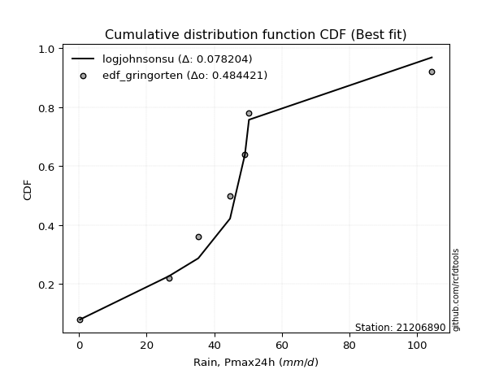</img></img>

</div>


### 9. EDF Filliben (1975)

The specific values of the constants (0.3175) (often denoted as $alpha$) and (0.365) are derived from a method proposed by James J. Filliben in a 1975 paper. This particular formula is the mean value of the $i$-th order statistic of the normal distribution and is considered a robust and effective plotting position formula for the normal probability plot correlation coefficient test for normality.

<div align="center">


$P=(m-0.3175)/(n+0.365)$


</div>


**9.1. Empirical values**

<div align="center">

|                | 0                  | 1                   | 2                  | 3                   | 4                  | 5                  | 6                  | 7                  |
|:---------------|:-------------------|:--------------------|:-------------------|:--------------------|:-------------------|:-------------------|:-------------------|:-------------------|
| date           | 2023               | 2016                | 2012               | 2025                | 2014               | 2013               | 2015               | 2024               |
| x              | 0.3                | 26.6                | 35.3               | 36.6                | 44.7               | 49.1               | 50.3               | 104.4              |
| m              | 1                  | 2                   | 3                  | 4                   | 5                  | 6                  | 7                  | 8                  |
| empirical_dist | edf_filliben       | edf_filliben        | edf_filliben       | edf_filliben        | edf_filliben       | edf_filliben       | edf_filliben       | edf_filliben       |
| empirical      | 0.0815899581589958 | 0.20113568439928273 | 0.3206814106395696 | 0.44022713687985654 | 0.5597728631201434 | 0.6793185893604303 | 0.7988643156007172 | 0.9184100418410042 |
| empirical_tr   | 1.0888382687927107 | 1.2517770295548074  | 1.4720633523977125 | 1.7864388681260008  | 2.271554650373387  | 3.118359739049394  | 4.971768202080237  | 12.256410256410254 |

</div>


**9.2. Kolmogorov-Smirnov fit test (sorted by Δ)**


<div align="center">

|                | 0                  | 1                   | 2                   | 3                  | 4                   | 5                   | 6                   | 7                   | 8                   | 9                   | 10                  | 11                  | 12                  | 13                  | 14                  | 15                  | 16                  | 17                  | 18                  | 19                  | 20                  | 21                 | 22                  | 23                  | 24                  | 25                  | 26                 | 27                  | 28                  | 29                  | 30                  | 31                 | 32                 | 33                 | 34                  | 35                  | 36                 | 37                  | 38                  | 39                  | 40                  | 41                  | 42                 | 43                  | 44                  | 45                  | 46                 | 47                  | 48                 | 49                  | 50                  | 51                 | 52                  | 53                 | 54                  | 55                  | 56                  | 57                 | 58                  | 59                 | 60                  | 61                  | 62                  | 63                 | 64                  | 65                 | 66                 | 67                 | 68                 | 69                  | 70                 | 71                 | 72                 | 73                  | 74                  | 75                 | 76                  | 77                  | 78                  | 79                  | 80                 | 81                 | 82                  | 83                 | 84                 | 85                 | 86                 | 87                 | 88                 | 89                  | 90                 | 91                 | 92                  | 93                 | 94                 | 95                 | 96                 | 97                 | 98                 | 99                 | 100                 | 101                | 102                | 103                 | 104                | 105                 | 106                | 107                 | 108                 | 109                 | 110                | 111                 | 112                 | 113                 | 114                 | 115                | 116                | 117                | 118                 | 119                | 120                 | 121                | 122                | 123                | 124                | 125                 | 126                | 127                | 128                 | 129                | 130                | 131                | 132                | 133                | 134                | 135                | 136                | 137                 | 138                | 139                | 140                | 141                | 142                | 143                | 144                | 145                | 146                | 147                | 148                | 149                | 150                | 151                | 152                | 153                | 154                | 155                | 156                | 157                | 158                | 159                |
|:---------------|:-------------------|:--------------------|:--------------------|:-------------------|:--------------------|:--------------------|:--------------------|:--------------------|:--------------------|:--------------------|:--------------------|:--------------------|:--------------------|:--------------------|:--------------------|:--------------------|:--------------------|:--------------------|:--------------------|:--------------------|:--------------------|:-------------------|:--------------------|:--------------------|:--------------------|:--------------------|:-------------------|:--------------------|:--------------------|:--------------------|:--------------------|:-------------------|:-------------------|:-------------------|:--------------------|:--------------------|:-------------------|:--------------------|:--------------------|:--------------------|:--------------------|:--------------------|:-------------------|:--------------------|:--------------------|:--------------------|:-------------------|:--------------------|:-------------------|:--------------------|:--------------------|:-------------------|:--------------------|:-------------------|:--------------------|:--------------------|:--------------------|:-------------------|:--------------------|:-------------------|:--------------------|:--------------------|:--------------------|:-------------------|:--------------------|:-------------------|:-------------------|:-------------------|:-------------------|:--------------------|:-------------------|:-------------------|:-------------------|:--------------------|:--------------------|:-------------------|:--------------------|:--------------------|:--------------------|:--------------------|:-------------------|:-------------------|:--------------------|:-------------------|:-------------------|:-------------------|:-------------------|:-------------------|:-------------------|:--------------------|:-------------------|:-------------------|:--------------------|:-------------------|:-------------------|:-------------------|:-------------------|:-------------------|:-------------------|:-------------------|:--------------------|:-------------------|:-------------------|:--------------------|:-------------------|:--------------------|:-------------------|:--------------------|:--------------------|:--------------------|:-------------------|:--------------------|:--------------------|:--------------------|:--------------------|:-------------------|:-------------------|:-------------------|:--------------------|:-------------------|:--------------------|:-------------------|:-------------------|:-------------------|:-------------------|:--------------------|:-------------------|:-------------------|:--------------------|:-------------------|:-------------------|:-------------------|:-------------------|:-------------------|:-------------------|:-------------------|:-------------------|:--------------------|:-------------------|:-------------------|:-------------------|:-------------------|:-------------------|:-------------------|:-------------------|:-------------------|:-------------------|:-------------------|:-------------------|:-------------------|:-------------------|:-------------------|:-------------------|:-------------------|:-------------------|:-------------------|:-------------------|:-------------------|:-------------------|:-------------------|
| station        | 21206890           | 21206890            | 21206890            | 21206890           | 21206890            | 21206890            | 21206890            | 21206890            | 21206890            | 21206890            | 21206890            | 21206890            | 21206890            | 21206890            | 21206890            | 21206890            | 21206890            | 21206890            | 21206890            | 21206890            | 21206890            | 21206890           | 21206890            | 21206890            | 21206890            | 21206890            | 21206890           | 21206890            | 21206890            | 21206890            | 21206890            | 21206890           | 21206890           | 21206890           | 21206890            | 21206890            | 21206890           | 21206890            | 21206890            | 21206890            | 21206890            | 21206890            | 21206890           | 21206890            | 21206890            | 21206890            | 21206890           | 21206890            | 21206890           | 21206890            | 21206890            | 21206890           | 21206890            | 21206890           | 21206890            | 21206890            | 21206890            | 21206890           | 21206890            | 21206890           | 21206890            | 21206890            | 21206890            | 21206890           | 21206890            | 21206890           | 21206890           | 21206890           | 21206890           | 21206890            | 21206890           | 21206890           | 21206890           | 21206890            | 21206890            | 21206890           | 21206890            | 21206890            | 21206890            | 21206890            | 21206890           | 21206890           | 21206890            | 21206890           | 21206890           | 21206890           | 21206890           | 21206890           | 21206890           | 21206890            | 21206890           | 21206890           | 21206890            | 21206890           | 21206890           | 21206890           | 21206890           | 21206890           | 21206890           | 21206890           | 21206890            | 21206890           | 21206890           | 21206890            | 21206890           | 21206890            | 21206890           | 21206890            | 21206890            | 21206890            | 21206890           | 21206890            | 21206890            | 21206890            | 21206890            | 21206890           | 21206890           | 21206890           | 21206890            | 21206890           | 21206890            | 21206890           | 21206890           | 21206890           | 21206890           | 21206890            | 21206890           | 21206890           | 21206890            | 21206890           | 21206890           | 21206890           | 21206890           | 21206890           | 21206890           | 21206890           | 21206890           | 21206890            | 21206890           | 21206890           | 21206890           | 21206890           | 21206890           | 21206890           | 21206890           | 21206890           | 21206890           | 21206890           | 21206890           | 21206890           | 21206890           | 21206890           | 21206890           | 21206890           | 21206890           | 21206890           | 21206890           | 21206890           | 21206890           | 21206890           |
| empirical_dist | edf_filliben       | edf_filliben        | edf_filliben        | edf_filliben       | edf_filliben        | edf_filliben        | edf_filliben        | edf_filliben        | edf_filliben        | edf_filliben        | edf_filliben        | edf_filliben        | edf_filliben        | edf_filliben        | edf_filliben        | edf_filliben        | edf_filliben        | edf_filliben        | edf_filliben        | edf_filliben        | edf_filliben        | edf_filliben       | edf_filliben        | edf_filliben        | edf_filliben        | edf_filliben        | edf_filliben       | edf_filliben        | edf_filliben        | edf_filliben        | edf_filliben        | edf_filliben       | edf_filliben       | edf_filliben       | edf_filliben        | edf_filliben        | edf_filliben       | edf_filliben        | edf_filliben        | edf_filliben        | edf_filliben        | edf_filliben        | edf_filliben       | edf_filliben        | edf_filliben        | edf_filliben        | edf_filliben       | edf_filliben        | edf_filliben       | edf_filliben        | edf_filliben        | edf_filliben       | edf_filliben        | edf_filliben       | edf_filliben        | edf_filliben        | edf_filliben        | edf_filliben       | edf_filliben        | edf_filliben       | edf_filliben        | edf_filliben        | edf_filliben        | edf_filliben       | edf_filliben        | edf_filliben       | edf_filliben       | edf_filliben       | edf_filliben       | edf_filliben        | edf_filliben       | edf_filliben       | edf_filliben       | edf_filliben        | edf_filliben        | edf_filliben       | edf_filliben        | edf_filliben        | edf_filliben        | edf_filliben        | edf_filliben       | edf_filliben       | edf_filliben        | edf_filliben       | edf_filliben       | edf_filliben       | edf_filliben       | edf_filliben       | edf_filliben       | edf_filliben        | edf_filliben       | edf_filliben       | edf_filliben        | edf_filliben       | edf_filliben       | edf_filliben       | edf_filliben       | edf_filliben       | edf_filliben       | edf_filliben       | edf_filliben        | edf_filliben       | edf_filliben       | edf_filliben        | edf_filliben       | edf_filliben        | edf_filliben       | edf_filliben        | edf_filliben        | edf_filliben        | edf_filliben       | edf_filliben        | edf_filliben        | edf_filliben        | edf_filliben        | edf_filliben       | edf_filliben       | edf_filliben       | edf_filliben        | edf_filliben       | edf_filliben        | edf_filliben       | edf_filliben       | edf_filliben       | edf_filliben       | edf_filliben        | edf_filliben       | edf_filliben       | edf_filliben        | edf_filliben       | edf_filliben       | edf_filliben       | edf_filliben       | edf_filliben       | edf_filliben       | edf_filliben       | edf_filliben       | edf_filliben        | edf_filliben       | edf_filliben       | edf_filliben       | edf_filliben       | edf_filliben       | edf_filliben       | edf_filliben       | edf_filliben       | edf_filliben       | edf_filliben       | edf_filliben       | edf_filliben       | edf_filliben       | edf_filliben       | edf_filliben       | edf_filliben       | edf_filliben       | edf_filliben       | edf_filliben       | edf_filliben       | edf_filliben       | edf_filliben       |
| p_dist         | t                  | johnsonsu           | logjohnsonsu        | dgamma             | logt                | gumbel_r            | exponnorm           | nct                 | moyal               | gengamma            | logcrystalball      | halfnorm            | genlogistic         | pearson3            | laplace             | alpha               | foldnorm            | invgamma            | kstwobign           | vonmises_line       | johnsonsb           | dweibull           | invgauss            | fatiguelife         | halflogistic        | beta                | betaprime          | f                   | gamma               | erlang              | weibull_min         | rayleigh           | rice               | skewnorm           | maxwell             | hypsecant           | kappa3             | logargus            | tukeylambda         | logistic            | logjohnsonsb        | wald                | crystalball        | norm                | genpareto           | truncnorm           | logloggamma        | anglit              | logburr12          | loggenlogistic      | loggompertz         | truncexpon         | semicircular        | logweibull_max     | gennorm             | bradford            | loggennorm          | loggenextreme      | logpearson3         | arcsine            | truncweibull_min    | ncf                 | loggumbel_l         | genexpon           | cosine              | loglevy_l          | gumbel_l           | lomax              | logdgamma          | logdweibull         | logtrapezoid       | gausshyper         | mielke             | logfoldnorm         | kappa4              | logmielke          | logarcsine          | ksone               | logsemicircular     | loganglit           | wrapcauchy         | uniform            | lognakagami         | lognorm            | logexponnorm       | logrice            | logfatiguelife     | lognct             | loglogistic        | loghypsecant        | loginvgamma        | logkappa3          | loginvweibull       | halfgennorm        | loggamma           | loggamma           | loglaplace         | loglaplace         | logbetaprime       | logburr            | logskewnorm         | levy_l             | burr               | logalpha            | loginvgauss        | logmaxwell          | burr12             | nakagami            | argus               | lograyleigh         | logexponweib       | loggausshyper       | logkstwobign        | loggenpareto        | loggumbel_r         | loghalfnorm        | genextreme         | loggenexpon        | logcosine           | logncf             | logmoyal            | loghalflogistic    | loggenhalflogistic | triang             | logwrapcauchy      | logloglaplace       | logtriang          | loglomax           | genhalflogistic     | invweibull         | logwald            | logkappa4          | rdist              | logf               | logbradford        | logksone           | loggengamma        | logtruncweibull_min | trapezoid          | loguniform         | logvonmises_line   | logtruncnorm       | logbeta            | powerlaw           | logweibull_min     | logtruncexpon      | exponweib          | weibull_max        | truncpareto        | exponpow           | logexponpow        | logpowerlaw        | logtruncpareto     | gompertz           | loghalfgennorm     | logtukeylambda     | logerlang          | logrdist           | logvonmises        | vonmises           |
| delta          | 0.0596289740264766 | 0.07111405949631389 | 0.09471744343065008 | 0.1120866659741766 | 0.11834559331260736 | 0.13338950461326715 | 0.13685337866184277 | 0.14148574511916145 | 0.14154863721917083 | 0.14195237255452686 | 0.14297959174471497 | 0.14414059718006433 | 0.14580835181749785 | 0.14969775466160706 | 0.14977902717134584 | 0.15160319633445152 | 0.15222303101298984 | 0.15363366209100948 | 0.15367482573346292 | 0.15496085353299827 | 0.15561647115427868 | 0.1559266128687874 | 0.15676277199077815 | 0.15690205029375104 | 0.15755067778696102 | 0.15804584356265294 | 0.158076194163277  | 0.15835607851765154 | 0.15837422232414855 | 0.15837428136832654 | 0.16045138468016706 | 0.1651214960270334 | 0.1651436596288175 | 0.1715350854407981 | 0.17339153738821345 | 0.17679078305012352 | 0.180208307214399  | 0.18357457218054707 | 0.18398645001948355 | 0.18724931975457348 | 0.19413586252502868 | 0.19830725743488703 | 0.2000181424577412 | 0.20001814390262984 | 0.20363358127469378 | 0.20511152062917481 | 0.2071348615578    | 0.21369952891578037 | 0.2146424417564419 | 0.21549757522683718 | 0.21778619272834546 | 0.2191774481087082 | 0.21938050467447245 | 0.223715903478812  | 0.22530509888972095 | 0.22563930562039713 | 0.23389827162299692 | 0.2355363370658903 | 0.23577840896467184 | 0.2422145922099348 | 0.24347029129945574 | 0.24528579425102695 | 0.25135561479076796 | 0.25233720966122   | 0.25847783849431005 | 0.2588371980801415 | 0.2600043738107706 | 0.2651017957441041 | 0.2697797488365543 | 0.27261446234377484 | 0.2761277232610512 | 0.2782572618228685 | 0.2887705713143849 | 0.29338038933134103 | 0.29809578098752154 | 0.3070634322424548 | 0.31121263399415244 | 0.31527481832245924 | 0.31632111498949156 | 0.31760772173961327 | 0.3184246378484075 | 0.3185569188668076 | 0.32058054094527144 | 0.3207340589192126 | 0.3207362320095841 | 0.320739081059879  | 0.3210030803213073 | 0.3211332113664377 | 0.32371409912853   | 0.32625385532254847 | 0.3303571352434821 | 0.3305953004852902 | 0.33425606084800397 | 0.3358286000175228 | 0.3360516317169012 | 0.3360516317169012 | 0.3361809214496666 | 0.3361809214496666 | 0.3373851397143446 | 0.3399949694787877 | 0.34079572050850393 | 0.341127422664236  | 0.3421852226343941 | 0.34361501954693807 | 0.3470467221462312 | 0.35278315475225885 | 0.3541888484544573 | 0.35511229076154505 | 0.36116367149192263 | 0.36328796123883966 | 0.3717677798183624 | 0.37262384227626477 | 0.37953717513192764 | 0.38984820871615466 | 0.39141348324439085 | 0.3928574974189243 | 0.3959151271059107 | 0.4054632475559401 | 0.41033113419891787 | 0.4157134221059512 | 0.41697814479460926 | 0.4190000855766741 | 0.4205539384617828 | 0.4205763725255354 | 0.4285097916685864 | 0.42886139834636083 | 0.4319585500599339 | 0.4343190355059895 | 0.45609396167686433 | 0.4871957813790118 | 0.4879788335626465 | 0.5040261117651895 | 0.511575256960371  | 0.5165208158821825 | 0.5184836553331383 | 0.5208295764880483 | 0.546321033212769  | 0.5513634618256482  | 0.5610753621626718 | 0.5652226286655145 | 0.5655148555149383 | 0.5726937836401397 | 0.5769298149050354 | 0.5937195750199619 | 0.6032778758332809 | 0.6268682648914023 | 0.6503474798362079 | 0.6932480787506793 | 0.7129544043888512 | 0.733601546773261  | 0.7404354060814906 | 0.7456177513702723 | 0.7590545506735342 | 0.7973362861957072 | 0.7988643156007172 | 0.7988643156007172 | 0.8745365740598099 | 0.918410041702643  | 0.9810678984315668 | 16.188782999053576 |
| deltao         | 0.4472608134160001 | 0.4472608134160001  | 0.4472608134160001  | 0.4472608134160001 | 0.4472608134160001  | 0.4472608134160001  | 0.4472608134160001  | 0.4472608134160001  | 0.4472608134160001  | 0.4472608134160001  | 0.4472608134160001  | 0.4472608134160001  | 0.4472608134160001  | 0.4472608134160001  | 0.4472608134160001  | 0.4472608134160001  | 0.4472608134160001  | 0.4472608134160001  | 0.4472608134160001  | 0.4472608134160001  | 0.4472608134160001  | 0.4472608134160001 | 0.4472608134160001  | 0.4472608134160001  | 0.4472608134160001  | 0.4472608134160001  | 0.4472608134160001 | 0.4472608134160001  | 0.4472608134160001  | 0.4472608134160001  | 0.4472608134160001  | 0.4472608134160001 | 0.4472608134160001 | 0.4472608134160001 | 0.4472608134160001  | 0.4472608134160001  | 0.4472608134160001 | 0.4472608134160001  | 0.4472608134160001  | 0.4472608134160001  | 0.4472608134160001  | 0.4472608134160001  | 0.4472608134160001 | 0.4472608134160001  | 0.4472608134160001  | 0.4472608134160001  | 0.4472608134160001 | 0.4472608134160001  | 0.4472608134160001 | 0.4472608134160001  | 0.4472608134160001  | 0.4472608134160001 | 0.4472608134160001  | 0.4472608134160001 | 0.4472608134160001  | 0.4472608134160001  | 0.4472608134160001  | 0.4472608134160001 | 0.4472608134160001  | 0.4472608134160001 | 0.4472608134160001  | 0.4472608134160001  | 0.4472608134160001  | 0.4472608134160001 | 0.4472608134160001  | 0.4472608134160001 | 0.4472608134160001 | 0.4472608134160001 | 0.4472608134160001 | 0.4472608134160001  | 0.4472608134160001 | 0.4472608134160001 | 0.4472608134160001 | 0.4472608134160001  | 0.4472608134160001  | 0.4472608134160001 | 0.4472608134160001  | 0.4472608134160001  | 0.4472608134160001  | 0.4472608134160001  | 0.4472608134160001 | 0.4472608134160001 | 0.4472608134160001  | 0.4472608134160001 | 0.4472608134160001 | 0.4472608134160001 | 0.4472608134160001 | 0.4472608134160001 | 0.4472608134160001 | 0.4472608134160001  | 0.4472608134160001 | 0.4472608134160001 | 0.4472608134160001  | 0.4472608134160001 | 0.4472608134160001 | 0.4472608134160001 | 0.4472608134160001 | 0.4472608134160001 | 0.4472608134160001 | 0.4472608134160001 | 0.4472608134160001  | 0.4472608134160001 | 0.4472608134160001 | 0.4472608134160001  | 0.4472608134160001 | 0.4472608134160001  | 0.4472608134160001 | 0.4472608134160001  | 0.4472608134160001  | 0.4472608134160001  | 0.4472608134160001 | 0.4472608134160001  | 0.4472608134160001  | 0.4472608134160001  | 0.4472608134160001  | 0.4472608134160001 | 0.4472608134160001 | 0.4472608134160001 | 0.4472608134160001  | 0.4472608134160001 | 0.4472608134160001  | 0.4472608134160001 | 0.4472608134160001 | 0.4472608134160001 | 0.4472608134160001 | 0.4472608134160001  | 0.4472608134160001 | 0.4472608134160001 | 0.4472608134160001  | 0.4472608134160001 | 0.4472608134160001 | 0.4472608134160001 | 0.4472608134160001 | 0.4472608134160001 | 0.4472608134160001 | 0.4472608134160001 | 0.4472608134160001 | 0.4472608134160001  | 0.4472608134160001 | 0.4472608134160001 | 0.4472608134160001 | 0.4472608134160001 | 0.4472608134160001 | 0.4472608134160001 | 0.4472608134160001 | 0.4472608134160001 | 0.4472608134160001 | 0.4472608134160001 | 0.4472608134160001 | 0.4472608134160001 | 0.4472608134160001 | 0.4472608134160001 | 0.4472608134160001 | 0.4472608134160001 | 0.4472608134160001 | 0.4472608134160001 | 0.4472608134160001 | 0.4472608134160001 | 0.4472608134160001 | 0.4472608134160001 |
| eval           | Δo > Δ             | Δo > Δ              | Δo > Δ              | Δo > Δ             | Δo > Δ              | Δo > Δ              | Δo > Δ              | Δo > Δ              | Δo > Δ              | Δo > Δ              | Δo > Δ              | Δo > Δ              | Δo > Δ              | Δo > Δ              | Δo > Δ              | Δo > Δ              | Δo > Δ              | Δo > Δ              | Δo > Δ              | Δo > Δ              | Δo > Δ              | Δo > Δ             | Δo > Δ              | Δo > Δ              | Δo > Δ              | Δo > Δ              | Δo > Δ             | Δo > Δ              | Δo > Δ              | Δo > Δ              | Δo > Δ              | Δo > Δ             | Δo > Δ             | Δo > Δ             | Δo > Δ              | Δo > Δ              | Δo > Δ             | Δo > Δ              | Δo > Δ              | Δo > Δ              | Δo > Δ              | Δo > Δ              | Δo > Δ             | Δo > Δ              | Δo > Δ              | Δo > Δ              | Δo > Δ             | Δo > Δ              | Δo > Δ             | Δo > Δ              | Δo > Δ              | Δo > Δ             | Δo > Δ              | Δo > Δ             | Δo > Δ              | Δo > Δ              | Δo > Δ              | Δo > Δ             | Δo > Δ              | Δo > Δ             | Δo > Δ              | Δo > Δ              | Δo > Δ              | Δo > Δ             | Δo > Δ              | Δo > Δ             | Δo > Δ             | Δo > Δ             | Δo > Δ             | Δo > Δ              | Δo > Δ             | Δo > Δ             | Δo > Δ             | Δo > Δ              | Δo > Δ              | Δo > Δ             | Δo > Δ              | Δo > Δ              | Δo > Δ              | Δo > Δ              | Δo > Δ             | Δo > Δ             | Δo > Δ              | Δo > Δ             | Δo > Δ             | Δo > Δ             | Δo > Δ             | Δo > Δ             | Δo > Δ             | Δo > Δ              | Δo > Δ             | Δo > Δ             | Δo > Δ              | Δo > Δ             | Δo > Δ             | Δo > Δ             | Δo > Δ             | Δo > Δ             | Δo > Δ             | Δo > Δ             | Δo > Δ              | Δo > Δ             | Δo > Δ             | Δo > Δ              | Δo > Δ             | Δo > Δ              | Δo > Δ             | Δo > Δ              | Δo > Δ              | Δo > Δ              | Δo > Δ             | Δo > Δ              | Δo > Δ              | Δo > Δ              | Δo > Δ              | Δo > Δ             | Δo > Δ             | Δo > Δ             | Δo > Δ              | Δo > Δ             | Δo > Δ              | Δo > Δ             | Δo > Δ             | Δo > Δ             | Δo > Δ             | Δo > Δ              | Δo > Δ             | Δo > Δ             | Δo <= Δ             | Δo <= Δ            | Δo <= Δ            | Δo <= Δ            | Δo <= Δ            | Δo <= Δ            | Δo <= Δ            | Δo <= Δ            | Δo <= Δ            | Δo <= Δ             | Δo <= Δ            | Δo <= Δ            | Δo <= Δ            | Δo <= Δ            | Δo <= Δ            | Δo <= Δ            | Δo <= Δ            | Δo <= Δ            | Δo <= Δ            | Δo <= Δ            | Δo <= Δ            | Δo <= Δ            | Δo <= Δ            | Δo <= Δ            | Δo <= Δ            | Δo <= Δ            | Δo <= Δ            | Δo <= Δ            | Δo <= Δ            | Δo <= Δ            | Δo <= Δ            | Δo <= Δ            |
| fit            | 1                  | 1                   | 1                   | 1                  | 1                   | 1                   | 1                   | 1                   | 1                   | 1                   | 1                   | 1                   | 1                   | 1                   | 1                   | 1                   | 1                   | 1                   | 1                   | 1                   | 1                   | 1                  | 1                   | 1                   | 1                   | 1                   | 1                  | 1                   | 1                   | 1                   | 1                   | 1                  | 1                  | 1                  | 1                   | 1                   | 1                  | 1                   | 1                   | 1                   | 1                   | 1                   | 1                  | 1                   | 1                   | 1                   | 1                  | 1                   | 1                  | 1                   | 1                   | 1                  | 1                   | 1                  | 1                   | 1                   | 1                   | 1                  | 1                   | 1                  | 1                   | 1                   | 1                   | 1                  | 1                   | 1                  | 1                  | 1                  | 1                  | 1                   | 1                  | 1                  | 1                  | 1                   | 1                   | 1                  | 1                   | 1                   | 1                   | 1                   | 1                  | 1                  | 1                   | 1                  | 1                  | 1                  | 1                  | 1                  | 1                  | 1                   | 1                  | 1                  | 1                   | 1                  | 1                  | 1                  | 1                  | 1                  | 1                  | 1                  | 1                   | 1                  | 1                  | 1                   | 1                  | 1                   | 1                  | 1                   | 1                   | 1                   | 1                  | 1                   | 1                   | 1                   | 1                   | 1                  | 1                  | 1                  | 1                   | 1                  | 1                   | 1                  | 1                  | 1                  | 1                  | 1                   | 1                  | 1                  | 0                   | 0                  | 0                  | 0                  | 0                  | 0                  | 0                  | 0                  | 0                  | 0                   | 0                  | 0                  | 0                  | 0                  | 0                  | 0                  | 0                  | 0                  | 0                  | 0                  | 0                  | 0                  | 0                  | 0                  | 0                  | 0                  | 0                  | 0                  | 0                  | 0                  | 0                  | 0                  |
| n              | 8                  | 8                   | 8                   | 8                  | 8                   | 8                   | 8                   | 8                   | 8                   | 8                   | 8                   | 8                   | 8                   | 8                   | 8                   | 8                   | 8                   | 8                   | 8                   | 8                   | 8                   | 8                  | 8                   | 8                   | 8                   | 8                   | 8                  | 8                   | 8                   | 8                   | 8                   | 8                  | 8                  | 8                  | 8                   | 8                   | 8                  | 8                   | 8                   | 8                   | 8                   | 8                   | 8                  | 8                   | 8                   | 8                   | 8                  | 8                   | 8                  | 8                   | 8                   | 8                  | 8                   | 8                  | 8                   | 8                   | 8                   | 8                  | 8                   | 8                  | 8                   | 8                   | 8                   | 8                  | 8                   | 8                  | 8                  | 8                  | 8                  | 8                   | 8                  | 8                  | 8                  | 8                   | 8                   | 8                  | 8                   | 8                   | 8                   | 8                   | 8                  | 8                  | 8                   | 8                  | 8                  | 8                  | 8                  | 8                  | 8                  | 8                   | 8                  | 8                  | 8                   | 8                  | 8                  | 8                  | 8                  | 8                  | 8                  | 8                  | 8                   | 8                  | 8                  | 8                   | 8                  | 8                   | 8                  | 8                   | 8                   | 8                   | 8                  | 8                   | 8                   | 8                   | 8                   | 8                  | 8                  | 8                  | 8                   | 8                  | 8                   | 8                  | 8                  | 8                  | 8                  | 8                   | 8                  | 8                  | 8                   | 8                  | 8                  | 8                  | 8                  | 8                  | 8                  | 8                  | 8                  | 8                   | 8                  | 8                  | 8                  | 8                  | 8                  | 8                  | 8                  | 8                  | 8                  | 8                  | 8                  | 8                  | 8                  | 8                  | 8                  | 8                  | 8                  | 8                  | 8                  | 8                  | 8                  | 8                  |
| best_fit       | 1                  | 0                   | 0                   | 0                  | 0                   | 0                   | 0                   | 0                   | 0                   | 0                   | 0                   | 0                   | 0                   | 0                   | 0                   | 0                   | 0                   | 0                   | 0                   | 0                   | 0                   | 0                  | 0                   | 0                   | 0                   | 0                   | 0                  | 0                   | 0                   | 0                   | 0                   | 0                  | 0                  | 0                  | 0                   | 0                   | 0                  | 0                   | 0                   | 0                   | 0                   | 0                   | 0                  | 0                   | 0                   | 0                   | 0                  | 0                   | 0                  | 0                   | 0                   | 0                  | 0                   | 0                  | 0                   | 0                   | 0                   | 0                  | 0                   | 0                  | 0                   | 0                   | 0                   | 0                  | 0                   | 0                  | 0                  | 0                  | 0                  | 0                   | 0                  | 0                  | 0                  | 0                   | 0                   | 0                  | 0                   | 0                   | 0                   | 0                   | 0                  | 0                  | 0                   | 0                  | 0                  | 0                  | 0                  | 0                  | 0                  | 0                   | 0                  | 0                  | 0                   | 0                  | 0                  | 0                  | 0                  | 0                  | 0                  | 0                  | 0                   | 0                  | 0                  | 0                   | 0                  | 0                   | 0                  | 0                   | 0                   | 0                   | 0                  | 0                   | 0                   | 0                   | 0                   | 0                  | 0                  | 0                  | 0                   | 0                  | 0                   | 0                  | 0                  | 0                  | 0                  | 0                   | 0                  | 0                  | 0                   | 0                  | 0                  | 0                  | 0                  | 0                  | 0                  | 0                  | 0                  | 0                   | 0                  | 0                  | 0                  | 0                  | 0                  | 0                  | 0                  | 0                  | 0                  | 0                  | 0                  | 0                  | 0                  | 0                  | 0                  | 0                  | 0                  | 0                  | 0                  | 0                  | 0                  | 0                  |
| best_fit_sort  | 1                  | 2                   | 3                   | 4                  | 5                   | 6                   | 7                   | 8                   | 9                   | 10                  | 11                  | 12                  | 13                  | 14                  | 15                  | 16                  | 17                  | 18                  | 19                  | 20                  | 21                  | 22                 | 23                  | 24                  | 25                  | 26                  | 27                 | 28                  | 29                  | 30                  | 31                  | 32                 | 33                 | 34                 | 35                  | 36                  | 37                 | 38                  | 39                  | 40                  | 41                  | 42                  | 43                 | 44                  | 45                  | 46                  | 47                 | 48                  | 49                 | 50                  | 51                  | 52                 | 53                  | 54                 | 55                  | 56                  | 57                  | 58                 | 59                  | 60                 | 61                  | 62                  | 63                  | 64                 | 65                  | 66                 | 67                 | 68                 | 69                 | 70                  | 71                 | 72                 | 73                 | 74                  | 75                  | 76                 | 77                  | 78                  | 79                  | 80                  | 81                 | 82                 | 83                  | 84                 | 85                 | 86                 | 87                 | 88                 | 89                 | 90                  | 91                 | 92                 | 93                  | 94                 | 95                 | 96                 | 97                 | 98                 | 99                 | 100                | 101                 | 102                | 103                | 104                 | 105                | 106                 | 107                | 108                 | 109                 | 110                 | 111                | 112                 | 113                 | 114                 | 115                 | 116                | 117                | 118                | 119                 | 120                | 121                 | 122                | 123                | 124                | 125                | 126                 | 127                | 128                | 129                 | 130                | 131                | 132                | 133                | 134                | 135                | 136                | 137                | 138                 | 139                | 140                | 141                | 142                | 143                | 144                | 145                | 146                | 147                | 148                | 149                | 150                | 151                | 152                | 153                | 154                | 155                | 156                | 157                | 158                | 159                | 160                |

</div>


**9.3. Best fit**

<div align="center">

|   id |   station | empirical_dist   | p_dist   |    delta |   deltao | eval   |   fit |   n |   best_fit |   best_fit_sort |
|-----:|----------:|:-----------------|:---------|---------:|---------:|:-------|------:|----:|-----------:|----------------:|
|    0 |  21206890 | edf_filliben     | t        | 0.059629 | 0.447261 | Δo > Δ |     1 |   8 |          1 |               1 |

</div>


<div align="center">

</img>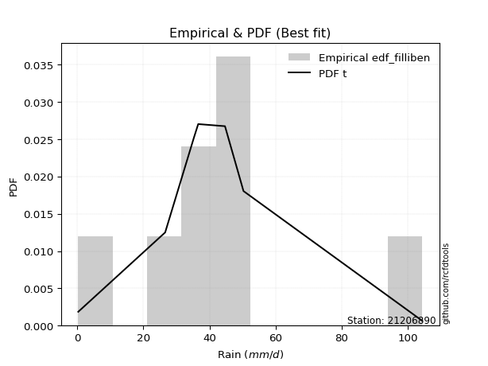</img>

</div>


### 10. EDF Jenkinson (1977)

The Jenkinson formula in hydrology is an empirical plotting position formula used to estimate the non-exceedance probability _(P)_ or return period _(T)_ of a given ordered observation within a sample. It is a widely used method in the frequency analysis of extreme events such as floods and rainfall, as it provides a distribution-free way to plot data. _a≈0.31_ and _b≈0.38_ are constants derived to approximate the median of the probability distribution for the given rank.

<div align="center">


$P=(m-a)/(n+b)$


</div>


**10.1. Empirical values**

<div align="center">

|                | 0                   | 1                   | 2                  | 3                   | 4                  | 5                  | 6                  | 7                  |
|:---------------|:--------------------|:--------------------|:-------------------|:--------------------|:-------------------|:-------------------|:-------------------|:-------------------|
| date           | 2023                | 2016                | 2012               | 2025                | 2014               | 2013               | 2015               | 2024               |
| x              | 0.3                 | 26.6                | 35.3               | 36.6                | 44.7               | 49.1               | 50.3               | 104.4              |
| m              | 1                   | 2                   | 3                  | 4                   | 5                  | 6                  | 7                  | 8                  |
| empirical_dist | edf_jenkinson       | edf_jenkinson       | edf_jenkinson      | edf_jenkinson       | edf_jenkinson      | edf_jenkinson      | edf_jenkinson      | edf_jenkinson      |
| empirical      | 0.08233890214797135 | 0.20167064439140808 | 0.3210023866348448 | 0.44033412887828155 | 0.5596658711217184 | 0.6789976133651551 | 0.7983293556085919 | 0.9176610978520287 |
| empirical_tr   | 1.0897269180754225  | 1.2526158445440956  | 1.4727592267135323 | 1.7867803837953091  | 2.2710027100271004 | 3.115241635687732  | 4.958579881656804  | 12.144927536231886 |

</div>


**10.2. Kolmogorov-Smirnov fit test (sorted by Δ)**


<div align="center">

|                | 0                   | 1                  | 2                  | 3                   | 4                   | 5                   | 6                  | 7                   | 8                   | 9                   | 10                 | 11                  | 12                  | 13                  | 14                  | 15                  | 16                  | 17                 | 18                  | 19                  | 20                 | 21                 | 22                  | 23                  | 24                  | 25                  | 26                  | 27                  | 28                  | 29                  | 30                  | 31                  | 32                 | 33                 | 34                  | 35                  | 36                 | 37                  | 38                  | 39                 | 40                 | 41                  | 42                 | 43                  | 44                 | 45                  | 46                  | 47                  | 48                  | 49                  | 50                 | 51                  | 52                  | 53                  | 54                  | 55                  | 56                  | 57                  | 58                  | 59                  | 60                  | 61                 | 62                  | 63                  | 64                  | 65                  | 66                 | 67                  | 68                  | 69                  | 70                  | 71                 | 72                  | 73                  | 74                  | 75                 | 76                 | 77                  | 78                  | 79                  | 80                  | 81                 | 82                 | 83                  | 84                 | 85                 | 86                 | 87                  | 88                  | 89                  | 90                  | 91                  | 92                  | 93                  | 94                 | 95                 | 96                 | 97                 | 98                  | 99                 | 100                | 101                | 102                | 103                 | 104                | 105                | 106                | 107                | 108                 | 109                 | 110                | 111                 | 112                | 113                 | 114                | 115                 | 116                | 117                 | 118                 | 119                 | 120                 | 121                | 122                 | 123                 | 124                 | 125                | 126                 | 127                 | 128                 | 129                | 130                 | 131                | 132                | 133                | 134                | 135                | 136                | 137                 | 138                | 139                | 140                | 141                | 142                | 143                | 144                | 145                | 146                | 147                | 148                | 149                | 150                | 151                | 152                | 153                | 154                | 155                | 156                | 157                | 158                | 159                |
|:---------------|:--------------------|:-------------------|:-------------------|:--------------------|:--------------------|:--------------------|:-------------------|:--------------------|:--------------------|:--------------------|:-------------------|:--------------------|:--------------------|:--------------------|:--------------------|:--------------------|:--------------------|:-------------------|:--------------------|:--------------------|:-------------------|:-------------------|:--------------------|:--------------------|:--------------------|:--------------------|:--------------------|:--------------------|:--------------------|:--------------------|:--------------------|:--------------------|:-------------------|:-------------------|:--------------------|:--------------------|:-------------------|:--------------------|:--------------------|:-------------------|:-------------------|:--------------------|:-------------------|:--------------------|:-------------------|:--------------------|:--------------------|:--------------------|:--------------------|:--------------------|:-------------------|:--------------------|:--------------------|:--------------------|:--------------------|:--------------------|:--------------------|:--------------------|:--------------------|:--------------------|:--------------------|:-------------------|:--------------------|:--------------------|:--------------------|:--------------------|:-------------------|:--------------------|:--------------------|:--------------------|:--------------------|:-------------------|:--------------------|:--------------------|:--------------------|:-------------------|:-------------------|:--------------------|:--------------------|:--------------------|:--------------------|:-------------------|:-------------------|:--------------------|:-------------------|:-------------------|:-------------------|:--------------------|:--------------------|:--------------------|:--------------------|:--------------------|:--------------------|:--------------------|:-------------------|:-------------------|:-------------------|:-------------------|:--------------------|:-------------------|:-------------------|:-------------------|:-------------------|:--------------------|:-------------------|:-------------------|:-------------------|:-------------------|:--------------------|:--------------------|:-------------------|:--------------------|:-------------------|:--------------------|:-------------------|:--------------------|:-------------------|:--------------------|:--------------------|:--------------------|:--------------------|:-------------------|:--------------------|:--------------------|:--------------------|:-------------------|:--------------------|:--------------------|:--------------------|:-------------------|:--------------------|:-------------------|:-------------------|:-------------------|:-------------------|:-------------------|:-------------------|:--------------------|:-------------------|:-------------------|:-------------------|:-------------------|:-------------------|:-------------------|:-------------------|:-------------------|:-------------------|:-------------------|:-------------------|:-------------------|:-------------------|:-------------------|:-------------------|:-------------------|:-------------------|:-------------------|:-------------------|:-------------------|:-------------------|:-------------------|
| station        | 21206890            | 21206890           | 21206890           | 21206890            | 21206890            | 21206890            | 21206890           | 21206890            | 21206890            | 21206890            | 21206890           | 21206890            | 21206890            | 21206890            | 21206890            | 21206890            | 21206890            | 21206890           | 21206890            | 21206890            | 21206890           | 21206890           | 21206890            | 21206890            | 21206890            | 21206890            | 21206890            | 21206890            | 21206890            | 21206890            | 21206890            | 21206890            | 21206890           | 21206890           | 21206890            | 21206890            | 21206890           | 21206890            | 21206890            | 21206890           | 21206890           | 21206890            | 21206890           | 21206890            | 21206890           | 21206890            | 21206890            | 21206890            | 21206890            | 21206890            | 21206890           | 21206890            | 21206890            | 21206890            | 21206890            | 21206890            | 21206890            | 21206890            | 21206890            | 21206890            | 21206890            | 21206890           | 21206890            | 21206890            | 21206890            | 21206890            | 21206890           | 21206890            | 21206890            | 21206890            | 21206890            | 21206890           | 21206890            | 21206890            | 21206890            | 21206890           | 21206890           | 21206890            | 21206890            | 21206890            | 21206890            | 21206890           | 21206890           | 21206890            | 21206890           | 21206890           | 21206890           | 21206890            | 21206890            | 21206890            | 21206890            | 21206890            | 21206890            | 21206890            | 21206890           | 21206890           | 21206890           | 21206890           | 21206890            | 21206890           | 21206890           | 21206890           | 21206890           | 21206890            | 21206890           | 21206890           | 21206890           | 21206890           | 21206890            | 21206890            | 21206890           | 21206890            | 21206890           | 21206890            | 21206890           | 21206890            | 21206890           | 21206890            | 21206890            | 21206890            | 21206890            | 21206890           | 21206890            | 21206890            | 21206890            | 21206890           | 21206890            | 21206890            | 21206890            | 21206890           | 21206890            | 21206890           | 21206890           | 21206890           | 21206890           | 21206890           | 21206890           | 21206890            | 21206890           | 21206890           | 21206890           | 21206890           | 21206890           | 21206890           | 21206890           | 21206890           | 21206890           | 21206890           | 21206890           | 21206890           | 21206890           | 21206890           | 21206890           | 21206890           | 21206890           | 21206890           | 21206890           | 21206890           | 21206890           | 21206890           |
| empirical_dist | edf_jenkinson       | edf_jenkinson      | edf_jenkinson      | edf_jenkinson       | edf_jenkinson       | edf_jenkinson       | edf_jenkinson      | edf_jenkinson       | edf_jenkinson       | edf_jenkinson       | edf_jenkinson      | edf_jenkinson       | edf_jenkinson       | edf_jenkinson       | edf_jenkinson       | edf_jenkinson       | edf_jenkinson       | edf_jenkinson      | edf_jenkinson       | edf_jenkinson       | edf_jenkinson      | edf_jenkinson      | edf_jenkinson       | edf_jenkinson       | edf_jenkinson       | edf_jenkinson       | edf_jenkinson       | edf_jenkinson       | edf_jenkinson       | edf_jenkinson       | edf_jenkinson       | edf_jenkinson       | edf_jenkinson      | edf_jenkinson      | edf_jenkinson       | edf_jenkinson       | edf_jenkinson      | edf_jenkinson       | edf_jenkinson       | edf_jenkinson      | edf_jenkinson      | edf_jenkinson       | edf_jenkinson      | edf_jenkinson       | edf_jenkinson      | edf_jenkinson       | edf_jenkinson       | edf_jenkinson       | edf_jenkinson       | edf_jenkinson       | edf_jenkinson      | edf_jenkinson       | edf_jenkinson       | edf_jenkinson       | edf_jenkinson       | edf_jenkinson       | edf_jenkinson       | edf_jenkinson       | edf_jenkinson       | edf_jenkinson       | edf_jenkinson       | edf_jenkinson      | edf_jenkinson       | edf_jenkinson       | edf_jenkinson       | edf_jenkinson       | edf_jenkinson      | edf_jenkinson       | edf_jenkinson       | edf_jenkinson       | edf_jenkinson       | edf_jenkinson      | edf_jenkinson       | edf_jenkinson       | edf_jenkinson       | edf_jenkinson      | edf_jenkinson      | edf_jenkinson       | edf_jenkinson       | edf_jenkinson       | edf_jenkinson       | edf_jenkinson      | edf_jenkinson      | edf_jenkinson       | edf_jenkinson      | edf_jenkinson      | edf_jenkinson      | edf_jenkinson       | edf_jenkinson       | edf_jenkinson       | edf_jenkinson       | edf_jenkinson       | edf_jenkinson       | edf_jenkinson       | edf_jenkinson      | edf_jenkinson      | edf_jenkinson      | edf_jenkinson      | edf_jenkinson       | edf_jenkinson      | edf_jenkinson      | edf_jenkinson      | edf_jenkinson      | edf_jenkinson       | edf_jenkinson      | edf_jenkinson      | edf_jenkinson      | edf_jenkinson      | edf_jenkinson       | edf_jenkinson       | edf_jenkinson      | edf_jenkinson       | edf_jenkinson      | edf_jenkinson       | edf_jenkinson      | edf_jenkinson       | edf_jenkinson      | edf_jenkinson       | edf_jenkinson       | edf_jenkinson       | edf_jenkinson       | edf_jenkinson      | edf_jenkinson       | edf_jenkinson       | edf_jenkinson       | edf_jenkinson      | edf_jenkinson       | edf_jenkinson       | edf_jenkinson       | edf_jenkinson      | edf_jenkinson       | edf_jenkinson      | edf_jenkinson      | edf_jenkinson      | edf_jenkinson      | edf_jenkinson      | edf_jenkinson      | edf_jenkinson       | edf_jenkinson      | edf_jenkinson      | edf_jenkinson      | edf_jenkinson      | edf_jenkinson      | edf_jenkinson      | edf_jenkinson      | edf_jenkinson      | edf_jenkinson      | edf_jenkinson      | edf_jenkinson      | edf_jenkinson      | edf_jenkinson      | edf_jenkinson      | edf_jenkinson      | edf_jenkinson      | edf_jenkinson      | edf_jenkinson      | edf_jenkinson      | edf_jenkinson      | edf_jenkinson      | edf_jenkinson      |
| p_dist         | t                   | johnsonsu          | logjohnsonsu       | dgamma              | logt                | gumbel_r            | exponnorm          | nct                 | moyal               | gengamma            | logcrystalball     | halfnorm            | genlogistic         | pearson3            | laplace             | alpha               | foldnorm            | invgamma           | kstwobign           | vonmises_line       | johnsonsb          | dweibull           | invgauss            | fatiguelife         | halflogistic        | beta                | betaprime           | f                   | gamma               | erlang              | weibull_min         | rayleigh            | rice               | skewnorm           | maxwell             | hypsecant           | kappa3             | logargus            | tukeylambda         | logistic           | logjohnsonsb       | wald                | crystalball        | norm                | genpareto          | truncnorm           | logloggamma         | anglit              | logburr12           | loggenlogistic      | loggompertz        | truncexpon          | semicircular        | logweibull_max      | bradford            | gennorm             | loggennorm          | loggenextreme       | logpearson3         | arcsine             | truncweibull_min    | ncf                | loggumbel_l         | genexpon            | cosine              | loglevy_l           | gumbel_l           | lomax               | logdgamma           | logdweibull         | logtrapezoid        | gausshyper         | mielke              | logfoldnorm         | kappa4              | logmielke          | logarcsine         | ksone               | logsemicircular     | loganglit           | wrapcauchy          | uniform            | lognakagami        | lognorm             | logexponnorm       | logrice            | logfatiguelife     | lognct              | loglogistic         | loghypsecant        | loginvgamma         | logkappa3           | loginvweibull       | halfgennorm         | loggamma           | loggamma           | loglaplace         | loglaplace         | logbetaprime        | logburr            | logskewnorm        | levy_l             | burr               | logalpha            | loginvgauss        | logmaxwell         | burr12             | nakagami           | argus               | lograyleigh         | logexponweib       | loggausshyper       | logkstwobign       | loggenpareto        | loggumbel_r        | loghalfnorm         | genextreme         | loggenexpon         | logcosine           | logncf              | logmoyal            | loghalflogistic    | loggenhalflogistic  | triang              | logwrapcauchy       | logloglaplace      | logtriang           | loglomax            | genhalflogistic     | invweibull         | logwald             | logkappa4          | rdist              | logf               | logbradford        | logksone           | loggengamma        | logtruncweibull_min | trapezoid          | loguniform         | logvonmises_line   | logtruncnorm       | logbeta            | powerlaw           | logweibull_min     | logtruncexpon      | exponweib          | weibull_max        | truncpareto        | exponpow           | logexponpow        | logpowerlaw        | logtruncpareto     | gompertz           | loghalfgennorm     | logtukeylambda     | logerlang          | logrdist           | logvonmises        | vonmises           |
| delta          | 0.05973596602490161 | 0.0705790995041885 | 0.0948244354290751 | 0.11155170598205122 | 0.11845258531103237 | 0.13285454462114177 | 0.1363184186697174 | 0.14095078512703607 | 0.14122766122389563 | 0.14141741256240148 | 0.1424446317525896 | 0.14381962118478914 | 0.14527339182537247 | 0.14916279466948168 | 0.14924406717922045 | 0.15106823634232613 | 0.15168807102086446 | 0.1530987020988841 | 0.15313986574133753 | 0.15442589354087288 | 0.1550815111621533 | 0.155391652876662  | 0.15622781199865277 | 0.15636709030162566 | 0.15722970179168583 | 0.15751088357052756 | 0.15754123417115162 | 0.15782111852552616 | 0.15783926233202317 | 0.15783932137620116 | 0.15991642468804168 | 0.16458653603490803 | 0.1646086996366921 | 0.1710001254486727 | 0.17285657739608806 | 0.17625582305799814 | 0.1798873312191238 | 0.18303961218842169 | 0.18409344201790856 | 0.1867143597624481 | 0.1936009025329033 | 0.19798628143961183 | 0.1994831824656158 | 0.19948318391050446 | 0.2030986212825684 | 0.20457656063704943 | 0.20659990156567465 | 0.21316456892365498 | 0.21410748176431654 | 0.21496261523471183 | 0.2172512327362201 | 0.21864248811658282 | 0.21884554468234707 | 0.22318094348668666 | 0.22510434562827175 | 0.22541209088814596 | 0.23336331163087154 | 0.23500137707376495 | 0.23524344897254645 | 0.24167963221780941 | 0.24293533130733036 | 0.2447508342589016 | 0.25082065479864263 | 0.25180224966909465 | 0.25794287850218467 | 0.25830223808801617 | 0.2594694138186452 | 0.26456683575197876 | 0.26924478884442893 | 0.27207950235164946 | 0.27559276326892584 | 0.2777223018307431 | 0.28823561132225956 | 0.29284542933921565 | 0.29756082099539616 | 0.3065284722503295 | 0.3106776740020271 | 0.31473985833033385 | 0.31578615499736623 | 0.31707276174748794 | 0.31788967785628214 | 0.3180219588746822 | 0.3200455809531461 | 0.32019909892708726 | 0.3202012720174588 | 0.3202041210677537 | 0.320468120329182  | 0.32059825137431236 | 0.32317913913640467 | 0.32571889533042314 | 0.32982217525135676 | 0.32984635649631466 | 0.33372110085587864 | 0.33529364002539747 | 0.3355166717247759 | 0.3355166717247759 | 0.3356459614575413 | 0.3356459614575413 | 0.33685017972221926 | 0.3394600094866624 | 0.3402607605163786 | 0.3403784786752605 | 0.3416502626422688 | 0.34308005955481274 | 0.3465117621541059 | 0.3522481947601335 | 0.3534399044654818 | 0.3545773307694197 | 0.36062871149979725 | 0.36275300124671433 | 0.3710188358293869 | 0.37208888228413944 | 0.3790022151398023 | 0.38931324872402934 | 0.3908785232522655 | 0.39232253742679896 | 0.3953801671137854 | 0.40492828756381477 | 0.40979617420679254 | 0.41517846211382586 | 0.41644318480248393 | 0.4184651255845488 | 0.42001897846965747 | 0.42004141253341004 | 0.42797483167646105 | 0.4283264383542355 | 0.43142359006780856 | 0.43378407551386416 | 0.45555900168473895 | 0.4864468373900363 | 0.48744387357052116 | 0.5034911517730642 | 0.5110402969682457 | 0.5159858558900572 | 0.5179486953410131 | 0.520294616495923  | 0.5455720892237936 | 0.5508285018335228  | 0.5605404021705465 | 0.5646876686733893 | 0.5649798955228129 | 0.5721588236480144 | 0.57639485491291   | 0.5931846150278366 | 0.6027429158411555 | 0.626333304899277  | 0.6495985358472323 | 0.6927131187585539 | 0.7124194443967258 | 0.7330665867811357 | 0.7399004460893652 | 0.745082791378147  | 0.7585195906814088 | 0.7968013262035818 | 0.7983293556085919 | 0.798329355608592  | 0.8737876300708344 | 0.9176610977136674 | 0.9818168424205423 | 16.18953194304255  |
| deltao         | 0.4472608134160001  | 0.4472608134160001 | 0.4472608134160001 | 0.4472608134160001  | 0.4472608134160001  | 0.4472608134160001  | 0.4472608134160001 | 0.4472608134160001  | 0.4472608134160001  | 0.4472608134160001  | 0.4472608134160001 | 0.4472608134160001  | 0.4472608134160001  | 0.4472608134160001  | 0.4472608134160001  | 0.4472608134160001  | 0.4472608134160001  | 0.4472608134160001 | 0.4472608134160001  | 0.4472608134160001  | 0.4472608134160001 | 0.4472608134160001 | 0.4472608134160001  | 0.4472608134160001  | 0.4472608134160001  | 0.4472608134160001  | 0.4472608134160001  | 0.4472608134160001  | 0.4472608134160001  | 0.4472608134160001  | 0.4472608134160001  | 0.4472608134160001  | 0.4472608134160001 | 0.4472608134160001 | 0.4472608134160001  | 0.4472608134160001  | 0.4472608134160001 | 0.4472608134160001  | 0.4472608134160001  | 0.4472608134160001 | 0.4472608134160001 | 0.4472608134160001  | 0.4472608134160001 | 0.4472608134160001  | 0.4472608134160001 | 0.4472608134160001  | 0.4472608134160001  | 0.4472608134160001  | 0.4472608134160001  | 0.4472608134160001  | 0.4472608134160001 | 0.4472608134160001  | 0.4472608134160001  | 0.4472608134160001  | 0.4472608134160001  | 0.4472608134160001  | 0.4472608134160001  | 0.4472608134160001  | 0.4472608134160001  | 0.4472608134160001  | 0.4472608134160001  | 0.4472608134160001 | 0.4472608134160001  | 0.4472608134160001  | 0.4472608134160001  | 0.4472608134160001  | 0.4472608134160001 | 0.4472608134160001  | 0.4472608134160001  | 0.4472608134160001  | 0.4472608134160001  | 0.4472608134160001 | 0.4472608134160001  | 0.4472608134160001  | 0.4472608134160001  | 0.4472608134160001 | 0.4472608134160001 | 0.4472608134160001  | 0.4472608134160001  | 0.4472608134160001  | 0.4472608134160001  | 0.4472608134160001 | 0.4472608134160001 | 0.4472608134160001  | 0.4472608134160001 | 0.4472608134160001 | 0.4472608134160001 | 0.4472608134160001  | 0.4472608134160001  | 0.4472608134160001  | 0.4472608134160001  | 0.4472608134160001  | 0.4472608134160001  | 0.4472608134160001  | 0.4472608134160001 | 0.4472608134160001 | 0.4472608134160001 | 0.4472608134160001 | 0.4472608134160001  | 0.4472608134160001 | 0.4472608134160001 | 0.4472608134160001 | 0.4472608134160001 | 0.4472608134160001  | 0.4472608134160001 | 0.4472608134160001 | 0.4472608134160001 | 0.4472608134160001 | 0.4472608134160001  | 0.4472608134160001  | 0.4472608134160001 | 0.4472608134160001  | 0.4472608134160001 | 0.4472608134160001  | 0.4472608134160001 | 0.4472608134160001  | 0.4472608134160001 | 0.4472608134160001  | 0.4472608134160001  | 0.4472608134160001  | 0.4472608134160001  | 0.4472608134160001 | 0.4472608134160001  | 0.4472608134160001  | 0.4472608134160001  | 0.4472608134160001 | 0.4472608134160001  | 0.4472608134160001  | 0.4472608134160001  | 0.4472608134160001 | 0.4472608134160001  | 0.4472608134160001 | 0.4472608134160001 | 0.4472608134160001 | 0.4472608134160001 | 0.4472608134160001 | 0.4472608134160001 | 0.4472608134160001  | 0.4472608134160001 | 0.4472608134160001 | 0.4472608134160001 | 0.4472608134160001 | 0.4472608134160001 | 0.4472608134160001 | 0.4472608134160001 | 0.4472608134160001 | 0.4472608134160001 | 0.4472608134160001 | 0.4472608134160001 | 0.4472608134160001 | 0.4472608134160001 | 0.4472608134160001 | 0.4472608134160001 | 0.4472608134160001 | 0.4472608134160001 | 0.4472608134160001 | 0.4472608134160001 | 0.4472608134160001 | 0.4472608134160001 | 0.4472608134160001 |
| eval           | Δo > Δ              | Δo > Δ             | Δo > Δ             | Δo > Δ              | Δo > Δ              | Δo > Δ              | Δo > Δ             | Δo > Δ              | Δo > Δ              | Δo > Δ              | Δo > Δ             | Δo > Δ              | Δo > Δ              | Δo > Δ              | Δo > Δ              | Δo > Δ              | Δo > Δ              | Δo > Δ             | Δo > Δ              | Δo > Δ              | Δo > Δ             | Δo > Δ             | Δo > Δ              | Δo > Δ              | Δo > Δ              | Δo > Δ              | Δo > Δ              | Δo > Δ              | Δo > Δ              | Δo > Δ              | Δo > Δ              | Δo > Δ              | Δo > Δ             | Δo > Δ             | Δo > Δ              | Δo > Δ              | Δo > Δ             | Δo > Δ              | Δo > Δ              | Δo > Δ             | Δo > Δ             | Δo > Δ              | Δo > Δ             | Δo > Δ              | Δo > Δ             | Δo > Δ              | Δo > Δ              | Δo > Δ              | Δo > Δ              | Δo > Δ              | Δo > Δ             | Δo > Δ              | Δo > Δ              | Δo > Δ              | Δo > Δ              | Δo > Δ              | Δo > Δ              | Δo > Δ              | Δo > Δ              | Δo > Δ              | Δo > Δ              | Δo > Δ             | Δo > Δ              | Δo > Δ              | Δo > Δ              | Δo > Δ              | Δo > Δ             | Δo > Δ              | Δo > Δ              | Δo > Δ              | Δo > Δ              | Δo > Δ             | Δo > Δ              | Δo > Δ              | Δo > Δ              | Δo > Δ             | Δo > Δ             | Δo > Δ              | Δo > Δ              | Δo > Δ              | Δo > Δ              | Δo > Δ             | Δo > Δ             | Δo > Δ              | Δo > Δ             | Δo > Δ             | Δo > Δ             | Δo > Δ              | Δo > Δ              | Δo > Δ              | Δo > Δ              | Δo > Δ              | Δo > Δ              | Δo > Δ              | Δo > Δ             | Δo > Δ             | Δo > Δ             | Δo > Δ             | Δo > Δ              | Δo > Δ             | Δo > Δ             | Δo > Δ             | Δo > Δ             | Δo > Δ              | Δo > Δ             | Δo > Δ             | Δo > Δ             | Δo > Δ             | Δo > Δ              | Δo > Δ              | Δo > Δ             | Δo > Δ              | Δo > Δ             | Δo > Δ              | Δo > Δ             | Δo > Δ              | Δo > Δ             | Δo > Δ              | Δo > Δ              | Δo > Δ              | Δo > Δ              | Δo > Δ             | Δo > Δ              | Δo > Δ              | Δo > Δ              | Δo > Δ             | Δo > Δ              | Δo > Δ              | Δo <= Δ             | Δo <= Δ            | Δo <= Δ             | Δo <= Δ            | Δo <= Δ            | Δo <= Δ            | Δo <= Δ            | Δo <= Δ            | Δo <= Δ            | Δo <= Δ             | Δo <= Δ            | Δo <= Δ            | Δo <= Δ            | Δo <= Δ            | Δo <= Δ            | Δo <= Δ            | Δo <= Δ            | Δo <= Δ            | Δo <= Δ            | Δo <= Δ            | Δo <= Δ            | Δo <= Δ            | Δo <= Δ            | Δo <= Δ            | Δo <= Δ            | Δo <= Δ            | Δo <= Δ            | Δo <= Δ            | Δo <= Δ            | Δo <= Δ            | Δo <= Δ            | Δo <= Δ            |
| fit            | 1                   | 1                  | 1                  | 1                   | 1                   | 1                   | 1                  | 1                   | 1                   | 1                   | 1                  | 1                   | 1                   | 1                   | 1                   | 1                   | 1                   | 1                  | 1                   | 1                   | 1                  | 1                  | 1                   | 1                   | 1                   | 1                   | 1                   | 1                   | 1                   | 1                   | 1                   | 1                   | 1                  | 1                  | 1                   | 1                   | 1                  | 1                   | 1                   | 1                  | 1                  | 1                   | 1                  | 1                   | 1                  | 1                   | 1                   | 1                   | 1                   | 1                   | 1                  | 1                   | 1                   | 1                   | 1                   | 1                   | 1                   | 1                   | 1                   | 1                   | 1                   | 1                  | 1                   | 1                   | 1                   | 1                   | 1                  | 1                   | 1                   | 1                   | 1                   | 1                  | 1                   | 1                   | 1                   | 1                  | 1                  | 1                   | 1                   | 1                   | 1                   | 1                  | 1                  | 1                   | 1                  | 1                  | 1                  | 1                   | 1                   | 1                   | 1                   | 1                   | 1                   | 1                   | 1                  | 1                  | 1                  | 1                  | 1                   | 1                  | 1                  | 1                  | 1                  | 1                   | 1                  | 1                  | 1                  | 1                  | 1                   | 1                   | 1                  | 1                   | 1                  | 1                   | 1                  | 1                   | 1                  | 1                   | 1                   | 1                   | 1                   | 1                  | 1                   | 1                   | 1                   | 1                  | 1                   | 1                   | 0                   | 0                  | 0                   | 0                  | 0                  | 0                  | 0                  | 0                  | 0                  | 0                   | 0                  | 0                  | 0                  | 0                  | 0                  | 0                  | 0                  | 0                  | 0                  | 0                  | 0                  | 0                  | 0                  | 0                  | 0                  | 0                  | 0                  | 0                  | 0                  | 0                  | 0                  | 0                  |
| n              | 8                   | 8                  | 8                  | 8                   | 8                   | 8                   | 8                  | 8                   | 8                   | 8                   | 8                  | 8                   | 8                   | 8                   | 8                   | 8                   | 8                   | 8                  | 8                   | 8                   | 8                  | 8                  | 8                   | 8                   | 8                   | 8                   | 8                   | 8                   | 8                   | 8                   | 8                   | 8                   | 8                  | 8                  | 8                   | 8                   | 8                  | 8                   | 8                   | 8                  | 8                  | 8                   | 8                  | 8                   | 8                  | 8                   | 8                   | 8                   | 8                   | 8                   | 8                  | 8                   | 8                   | 8                   | 8                   | 8                   | 8                   | 8                   | 8                   | 8                   | 8                   | 8                  | 8                   | 8                   | 8                   | 8                   | 8                  | 8                   | 8                   | 8                   | 8                   | 8                  | 8                   | 8                   | 8                   | 8                  | 8                  | 8                   | 8                   | 8                   | 8                   | 8                  | 8                  | 8                   | 8                  | 8                  | 8                  | 8                   | 8                   | 8                   | 8                   | 8                   | 8                   | 8                   | 8                  | 8                  | 8                  | 8                  | 8                   | 8                  | 8                  | 8                  | 8                  | 8                   | 8                  | 8                  | 8                  | 8                  | 8                   | 8                   | 8                  | 8                   | 8                  | 8                   | 8                  | 8                   | 8                  | 8                   | 8                   | 8                   | 8                   | 8                  | 8                   | 8                   | 8                   | 8                  | 8                   | 8                   | 8                   | 8                  | 8                   | 8                  | 8                  | 8                  | 8                  | 8                  | 8                  | 8                   | 8                  | 8                  | 8                  | 8                  | 8                  | 8                  | 8                  | 8                  | 8                  | 8                  | 8                  | 8                  | 8                  | 8                  | 8                  | 8                  | 8                  | 8                  | 8                  | 8                  | 8                  | 8                  |
| best_fit       | 1                   | 0                  | 0                  | 0                   | 0                   | 0                   | 0                  | 0                   | 0                   | 0                   | 0                  | 0                   | 0                   | 0                   | 0                   | 0                   | 0                   | 0                  | 0                   | 0                   | 0                  | 0                  | 0                   | 0                   | 0                   | 0                   | 0                   | 0                   | 0                   | 0                   | 0                   | 0                   | 0                  | 0                  | 0                   | 0                   | 0                  | 0                   | 0                   | 0                  | 0                  | 0                   | 0                  | 0                   | 0                  | 0                   | 0                   | 0                   | 0                   | 0                   | 0                  | 0                   | 0                   | 0                   | 0                   | 0                   | 0                   | 0                   | 0                   | 0                   | 0                   | 0                  | 0                   | 0                   | 0                   | 0                   | 0                  | 0                   | 0                   | 0                   | 0                   | 0                  | 0                   | 0                   | 0                   | 0                  | 0                  | 0                   | 0                   | 0                   | 0                   | 0                  | 0                  | 0                   | 0                  | 0                  | 0                  | 0                   | 0                   | 0                   | 0                   | 0                   | 0                   | 0                   | 0                  | 0                  | 0                  | 0                  | 0                   | 0                  | 0                  | 0                  | 0                  | 0                   | 0                  | 0                  | 0                  | 0                  | 0                   | 0                   | 0                  | 0                   | 0                  | 0                   | 0                  | 0                   | 0                  | 0                   | 0                   | 0                   | 0                   | 0                  | 0                   | 0                   | 0                   | 0                  | 0                   | 0                   | 0                   | 0                  | 0                   | 0                  | 0                  | 0                  | 0                  | 0                  | 0                  | 0                   | 0                  | 0                  | 0                  | 0                  | 0                  | 0                  | 0                  | 0                  | 0                  | 0                  | 0                  | 0                  | 0                  | 0                  | 0                  | 0                  | 0                  | 0                  | 0                  | 0                  | 0                  | 0                  |
| best_fit_sort  | 1                   | 2                  | 3                  | 4                   | 5                   | 6                   | 7                  | 8                   | 9                   | 10                  | 11                 | 12                  | 13                  | 14                  | 15                  | 16                  | 17                  | 18                 | 19                  | 20                  | 21                 | 22                 | 23                  | 24                  | 25                  | 26                  | 27                  | 28                  | 29                  | 30                  | 31                  | 32                  | 33                 | 34                 | 35                  | 36                  | 37                 | 38                  | 39                  | 40                 | 41                 | 42                  | 43                 | 44                  | 45                 | 46                  | 47                  | 48                  | 49                  | 50                  | 51                 | 52                  | 53                  | 54                  | 55                  | 56                  | 57                  | 58                  | 59                  | 60                  | 61                  | 62                 | 63                  | 64                  | 65                  | 66                  | 67                 | 68                  | 69                  | 70                  | 71                  | 72                 | 73                  | 74                  | 75                  | 76                 | 77                 | 78                  | 79                  | 80                  | 81                  | 82                 | 83                 | 84                  | 85                 | 86                 | 87                 | 88                  | 89                  | 90                  | 91                  | 92                  | 93                  | 94                  | 95                 | 96                 | 97                 | 98                 | 99                  | 100                | 101                | 102                | 103                | 104                 | 105                | 106                | 107                | 108                | 109                 | 110                 | 111                | 112                 | 113                | 114                 | 115                | 116                 | 117                | 118                 | 119                 | 120                 | 121                 | 122                | 123                 | 124                 | 125                 | 126                | 127                 | 128                 | 129                 | 130                | 131                 | 132                | 133                | 134                | 135                | 136                | 137                | 138                 | 139                | 140                | 141                | 142                | 143                | 144                | 145                | 146                | 147                | 148                | 149                | 150                | 151                | 152                | 153                | 154                | 155                | 156                | 157                | 158                | 159                | 160                |

</div>


**10.3. Best fit**

<div align="center">

|   id |   station | empirical_dist   | p_dist   |    delta |   deltao | eval   |   fit |   n |   best_fit |   best_fit_sort |
|-----:|----------:|:-----------------|:---------|---------:|---------:|:-------|------:|----:|-----------:|----------------:|
|    0 |  21206890 | edf_jenkinson    | t        | 0.059736 | 0.447261 | Δo > Δ |     1 |   8 |          1 |               1 |

</div>


<div align="center">

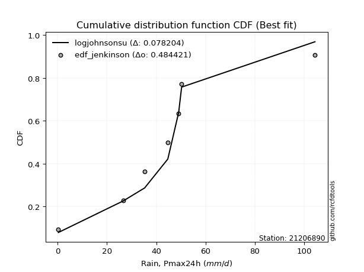</img></img>

</div>


### 11. EDF Cunnane (1978)

Cunnane´s work in statistical hydrology has focused on the performance and evaluation of different probability distributions (such as GEV, Gumbel, Lognormal) for flood frequency estimation. _b_ is a constant, typically set to 0.4.

<div align="center">


$P=(m-b)/(n+1-2b)$


</div>


**11.1. Empirical values**

<div align="center">

|                | 0                   | 1                   | 2                  | 3                  | 4                  | 5                  | 6                  | 7                  |
|:---------------|:--------------------|:--------------------|:-------------------|:-------------------|:-------------------|:-------------------|:-------------------|:-------------------|
| date           | 2023                | 2016                | 2012               | 2025               | 2014               | 2013               | 2015               | 2024               |
| x              | 0.3                 | 26.6                | 35.3               | 36.6               | 44.7               | 49.1               | 50.3               | 104.4              |
| m              | 1                   | 2                   | 3                  | 4                  | 5                  | 6                  | 7                  | 8                  |
| empirical_dist | edf_cunnane         | edf_cunnane         | edf_cunnane        | edf_cunnane        | edf_cunnane        | edf_cunnane        | edf_cunnane        | edf_cunnane        |
| empirical      | 0.07317073170731708 | 0.19512195121951223 | 0.3170731707317074 | 0.4390243902439025 | 0.5609756097560976 | 0.6829268292682927 | 0.8048780487804879 | 0.926829268292683  |
| empirical_tr   | 1.0789473684210527  | 1.2424242424242424  | 1.4642857142857144 | 1.782608695652174  | 2.277777777777778  | 3.153846153846154  | 5.125000000000001  | 13.666666666666675 |

</div>


**11.2. Kolmogorov-Smirnov fit test (sorted by Δ)**


<div align="center">

|                | 0                   | 1                  | 2                   | 3                   | 4                   | 5                   | 6                   | 7                   | 8                   | 9                   | 10                  | 11                  | 12                  | 13                  | 14                  | 15                  | 16                  | 17                 | 18                  | 19                  | 20                  | 21                 | 22                 | 23                  | 24                  | 25                  | 26                  | 27                  | 28                  | 29                  | 30                  | 31                  | 32                 | 33                 | 34                  | 35                  | 36                  | 37                  | 38                  | 39                 | 40                 | 41                  | 42                 | 43                  | 44                  | 45                  | 46                 | 47                  | 48                 | 49                  | 50                  | 51                 | 52                  | 53                  | 54                 | 55                  | 56                  | 57                 | 58                  | 59                 | 60                  | 61                 | 62                  | 63                  | 64                  | 65                 | 66                 | 67                 | 68                 | 69                  | 70                  | 71                 | 72                 | 73                 | 74                  | 75                 | 76                  | 77                  | 78                  | 79                  | 80                  | 81                 | 82                  | 83                 | 84                 | 85                 | 86                 | 87                 | 88                 | 89                  | 90                 | 91                 | 92                  | 93                 | 94                 | 95                 | 96                 | 97                 | 98                 | 99                 | 100                | 101                | 102                 | 103                 | 104                | 105                 | 106                 | 107                | 108                 | 109                 | 110                 | 111                | 112                 | 113                 | 114                 | 115                | 116                | 117                | 118                 | 119                | 120                 | 121                | 122                | 123                 | 124                | 125                 | 126                | 127                | 128                 | 129                | 130                | 131                | 132                | 133                | 134                | 135                | 136                | 137                 | 138                | 139                | 140                | 141                | 142                | 143                | 144                | 145                | 146                | 147                | 148                | 149                | 150                | 151                | 152                | 153                | 154                | 155                | 156                | 157                | 158                | 159                |
|:---------------|:--------------------|:-------------------|:--------------------|:--------------------|:--------------------|:--------------------|:--------------------|:--------------------|:--------------------|:--------------------|:--------------------|:--------------------|:--------------------|:--------------------|:--------------------|:--------------------|:--------------------|:-------------------|:--------------------|:--------------------|:--------------------|:-------------------|:-------------------|:--------------------|:--------------------|:--------------------|:--------------------|:--------------------|:--------------------|:--------------------|:--------------------|:--------------------|:-------------------|:-------------------|:--------------------|:--------------------|:--------------------|:--------------------|:--------------------|:-------------------|:-------------------|:--------------------|:-------------------|:--------------------|:--------------------|:--------------------|:-------------------|:--------------------|:-------------------|:--------------------|:--------------------|:-------------------|:--------------------|:--------------------|:-------------------|:--------------------|:--------------------|:-------------------|:--------------------|:-------------------|:--------------------|:-------------------|:--------------------|:--------------------|:--------------------|:-------------------|:-------------------|:-------------------|:-------------------|:--------------------|:--------------------|:-------------------|:-------------------|:-------------------|:--------------------|:-------------------|:--------------------|:--------------------|:--------------------|:--------------------|:--------------------|:-------------------|:--------------------|:-------------------|:-------------------|:-------------------|:-------------------|:-------------------|:-------------------|:--------------------|:-------------------|:-------------------|:--------------------|:-------------------|:-------------------|:-------------------|:-------------------|:-------------------|:-------------------|:-------------------|:-------------------|:-------------------|:--------------------|:--------------------|:-------------------|:--------------------|:--------------------|:-------------------|:--------------------|:--------------------|:--------------------|:-------------------|:--------------------|:--------------------|:--------------------|:-------------------|:-------------------|:-------------------|:--------------------|:-------------------|:--------------------|:-------------------|:-------------------|:--------------------|:-------------------|:--------------------|:-------------------|:-------------------|:--------------------|:-------------------|:-------------------|:-------------------|:-------------------|:-------------------|:-------------------|:-------------------|:-------------------|:--------------------|:-------------------|:-------------------|:-------------------|:-------------------|:-------------------|:-------------------|:-------------------|:-------------------|:-------------------|:-------------------|:-------------------|:-------------------|:-------------------|:-------------------|:-------------------|:-------------------|:-------------------|:-------------------|:-------------------|:-------------------|:-------------------|:-------------------|
| station        | 21206890            | 21206890           | 21206890            | 21206890            | 21206890            | 21206890            | 21206890            | 21206890            | 21206890            | 21206890            | 21206890            | 21206890            | 21206890            | 21206890            | 21206890            | 21206890            | 21206890            | 21206890           | 21206890            | 21206890            | 21206890            | 21206890           | 21206890           | 21206890            | 21206890            | 21206890            | 21206890            | 21206890            | 21206890            | 21206890            | 21206890            | 21206890            | 21206890           | 21206890           | 21206890            | 21206890            | 21206890            | 21206890            | 21206890            | 21206890           | 21206890           | 21206890            | 21206890           | 21206890            | 21206890            | 21206890            | 21206890           | 21206890            | 21206890           | 21206890            | 21206890            | 21206890           | 21206890            | 21206890            | 21206890           | 21206890            | 21206890            | 21206890           | 21206890            | 21206890           | 21206890            | 21206890           | 21206890            | 21206890            | 21206890            | 21206890           | 21206890           | 21206890           | 21206890           | 21206890            | 21206890            | 21206890           | 21206890           | 21206890           | 21206890            | 21206890           | 21206890            | 21206890            | 21206890            | 21206890            | 21206890            | 21206890           | 21206890            | 21206890           | 21206890           | 21206890           | 21206890           | 21206890           | 21206890           | 21206890            | 21206890           | 21206890           | 21206890            | 21206890           | 21206890           | 21206890           | 21206890           | 21206890           | 21206890           | 21206890           | 21206890           | 21206890           | 21206890            | 21206890            | 21206890           | 21206890            | 21206890            | 21206890           | 21206890            | 21206890            | 21206890            | 21206890           | 21206890            | 21206890            | 21206890            | 21206890           | 21206890           | 21206890           | 21206890            | 21206890           | 21206890            | 21206890           | 21206890           | 21206890            | 21206890           | 21206890            | 21206890           | 21206890           | 21206890            | 21206890           | 21206890           | 21206890           | 21206890           | 21206890           | 21206890           | 21206890           | 21206890           | 21206890            | 21206890           | 21206890           | 21206890           | 21206890           | 21206890           | 21206890           | 21206890           | 21206890           | 21206890           | 21206890           | 21206890           | 21206890           | 21206890           | 21206890           | 21206890           | 21206890           | 21206890           | 21206890           | 21206890           | 21206890           | 21206890           | 21206890           |
| empirical_dist | edf_cunnane         | edf_cunnane        | edf_cunnane         | edf_cunnane         | edf_cunnane         | edf_cunnane         | edf_cunnane         | edf_cunnane         | edf_cunnane         | edf_cunnane         | edf_cunnane         | edf_cunnane         | edf_cunnane         | edf_cunnane         | edf_cunnane         | edf_cunnane         | edf_cunnane         | edf_cunnane        | edf_cunnane         | edf_cunnane         | edf_cunnane         | edf_cunnane        | edf_cunnane        | edf_cunnane         | edf_cunnane         | edf_cunnane         | edf_cunnane         | edf_cunnane         | edf_cunnane         | edf_cunnane         | edf_cunnane         | edf_cunnane         | edf_cunnane        | edf_cunnane        | edf_cunnane         | edf_cunnane         | edf_cunnane         | edf_cunnane         | edf_cunnane         | edf_cunnane        | edf_cunnane        | edf_cunnane         | edf_cunnane        | edf_cunnane         | edf_cunnane         | edf_cunnane         | edf_cunnane        | edf_cunnane         | edf_cunnane        | edf_cunnane         | edf_cunnane         | edf_cunnane        | edf_cunnane         | edf_cunnane         | edf_cunnane        | edf_cunnane         | edf_cunnane         | edf_cunnane        | edf_cunnane         | edf_cunnane        | edf_cunnane         | edf_cunnane        | edf_cunnane         | edf_cunnane         | edf_cunnane         | edf_cunnane        | edf_cunnane        | edf_cunnane        | edf_cunnane        | edf_cunnane         | edf_cunnane         | edf_cunnane        | edf_cunnane        | edf_cunnane        | edf_cunnane         | edf_cunnane        | edf_cunnane         | edf_cunnane         | edf_cunnane         | edf_cunnane         | edf_cunnane         | edf_cunnane        | edf_cunnane         | edf_cunnane        | edf_cunnane        | edf_cunnane        | edf_cunnane        | edf_cunnane        | edf_cunnane        | edf_cunnane         | edf_cunnane        | edf_cunnane        | edf_cunnane         | edf_cunnane        | edf_cunnane        | edf_cunnane        | edf_cunnane        | edf_cunnane        | edf_cunnane        | edf_cunnane        | edf_cunnane        | edf_cunnane        | edf_cunnane         | edf_cunnane         | edf_cunnane        | edf_cunnane         | edf_cunnane         | edf_cunnane        | edf_cunnane         | edf_cunnane         | edf_cunnane         | edf_cunnane        | edf_cunnane         | edf_cunnane         | edf_cunnane         | edf_cunnane        | edf_cunnane        | edf_cunnane        | edf_cunnane         | edf_cunnane        | edf_cunnane         | edf_cunnane        | edf_cunnane        | edf_cunnane         | edf_cunnane        | edf_cunnane         | edf_cunnane        | edf_cunnane        | edf_cunnane         | edf_cunnane        | edf_cunnane        | edf_cunnane        | edf_cunnane        | edf_cunnane        | edf_cunnane        | edf_cunnane        | edf_cunnane        | edf_cunnane         | edf_cunnane        | edf_cunnane        | edf_cunnane        | edf_cunnane        | edf_cunnane        | edf_cunnane        | edf_cunnane        | edf_cunnane        | edf_cunnane        | edf_cunnane        | edf_cunnane        | edf_cunnane        | edf_cunnane        | edf_cunnane        | edf_cunnane        | edf_cunnane        | edf_cunnane        | edf_cunnane        | edf_cunnane        | edf_cunnane        | edf_cunnane        | edf_cunnane        |
| p_dist         | t                   | johnsonsu          | logjohnsonsu        | logt                | dgamma              | gumbel_r            | exponnorm           | moyal               | nct                 | halfnorm            | gengamma            | logcrystalball      | genlogistic         | pearson3            | laplace             | alpha               | foldnorm            | invgamma           | kstwobign           | vonmises_line       | halflogistic        | johnsonsb          | dweibull           | invgauss            | fatiguelife         | beta                | betaprime           | f                   | gamma               | erlang              | weibull_min         | rayleigh            | rice               | skewnorm           | maxwell             | tukeylambda         | hypsecant           | kappa3              | logargus            | logistic           | logjohnsonsb       | wald                | crystalball        | norm                | genpareto           | truncnorm           | logloggamma        | anglit              | logburr12          | loggenlogistic      | loggompertz         | gennorm            | truncexpon          | semicircular        | logweibull_max     | bradford            | loggennorm          | loggenextreme      | logpearson3         | arcsine            | truncweibull_min    | ncf                | loggumbel_l         | genexpon            | cosine              | loglevy_l          | gumbel_l           | lomax              | logdgamma          | logdweibull         | logtrapezoid        | gausshyper         | mielke             | logfoldnorm        | kappa4              | logmielke          | logarcsine          | ksone               | logsemicircular     | loganglit           | wrapcauchy          | uniform            | lognakagami         | lognorm            | logexponnorm       | logrice            | logfatiguelife     | lognct             | loglogistic        | loghypsecant        | loginvgamma        | logkappa3          | loginvweibull       | halfgennorm        | loggamma           | loggamma           | loglaplace         | loglaplace         | logbetaprime       | logburr            | logskewnorm        | burr               | levy_l              | logalpha            | loginvgauss        | logmaxwell          | nakagami            | burr12             | argus               | lograyleigh         | loggausshyper       | logexponweib       | logkstwobign        | loggenpareto        | loggumbel_r         | loghalfnorm        | genextreme         | loggenexpon        | logcosine           | logncf             | logmoyal            | loghalflogistic    | loggenhalflogistic | triang              | logwrapcauchy      | logloglaplace       | logtriang          | loglomax           | genhalflogistic     | logwald            | invweibull         | logkappa4          | rdist              | logf               | logbradford        | logksone           | loggengamma        | logtruncweibull_min | trapezoid          | loguniform         | logvonmises_line   | logtruncnorm       | logbeta            | powerlaw           | logweibull_min     | logtruncexpon      | exponweib          | weibull_max        | truncpareto        | exponpow           | logexponpow        | logpowerlaw        | logtruncpareto     | gompertz           | logtukeylambda     | loghalfgennorm     | logerlang          | logrdist           | logvonmises        | vonmises           |
| delta          | 0.05970907216076182 | 0.0771277926760845 | 0.09351469679469604 | 0.11714284667665331 | 0.11810039915394721 | 0.13940323779303776 | 0.14286711184161338 | 0.14515687712703307 | 0.14749947829893206 | 0.14774883708792658 | 0.14796610573429747 | 0.14899332492448558 | 0.15182208499726846 | 0.15571148784137767 | 0.15579276035111644 | 0.15761692951422213 | 0.15823676419276045 | 0.1596473952707801 | 0.15968855891323352 | 0.16097458671276887 | 0.16115891769482327 | 0.1616302043340493 | 0.161940346048558  | 0.16277650517054876 | 0.16291578347352165 | 0.16405957674242355 | 0.16408992734304761 | 0.16436981169742215 | 0.16438795550391916 | 0.16438801454809715 | 0.16646511785993767 | 0.17113522920680402 | 0.1711573928085881 | 0.1775488186205687 | 0.17940527056798405 | 0.18278370338352934 | 0.18280451622989413 | 0.18396101018449026 | 0.18958830536031768 | 0.1932630529343441 | 0.2001495957047993 | 0.20191549734274927 | 0.2060318756375118 | 0.20603187708240045 | 0.20964731445446438 | 0.21112525380894542 | 0.2131485947375705 | 0.21971326209555098 | 0.2206561749362124 | 0.22151130840660768 | 0.22379992590811595 | 0.2241023522537669 | 0.22519118128847881 | 0.22539423785424306 | 0.2297296366585825 | 0.23165303880016774 | 0.23991200480276753 | 0.2415500702456608 | 0.24179214214444245 | 0.2482283253897054 | 0.24948402447922635 | 0.2512995274307974 | 0.25736934797053845 | 0.25835094284099047 | 0.26449157167408066 | 0.264850931259912  | 0.2660181069905412 | 0.2711155289238746 | 0.2757934820163249 | 0.27862819552354545 | 0.28214145644082167 | 0.2842709950026391 | 0.2947843044941554 | 0.2993941225111115 | 0.30410951416729215 | 0.3130771654222253 | 0.31722636717392294 | 0.32128855150222985 | 0.32233484816926206 | 0.32362145491938377 | 0.32443837102817813 | 0.3245706520465782 | 0.32659427412504194 | 0.3267477920989831 | 0.3267499651893546 | 0.3267528142396495 | 0.3270168135010778 | 0.3271469445462082 | 0.3297278323083005 | 0.33226758850231897 | 0.3363708684232526 | 0.339014526936969  | 0.34026979402777446 | 0.3418423331972933 | 0.3420653648966717 | 0.3420653648966717 | 0.3421946546294371 | 0.3421946546294371 | 0.3433988728941151 | 0.3460087026585582 | 0.3468094536882744 | 0.3481989558141646 | 0.34954664911591476 | 0.34962875272670857 | 0.3530604553260017 | 0.35879688793202935 | 0.36112602394131554 | 0.3626080749061361 | 0.36717740467169324 | 0.36930169441861016 | 0.37863757545603527 | 0.3801870062700412 | 0.38555090831169814 | 0.39586194189592516 | 0.39742721642416134 | 0.3988712305986948 | 0.4019288602856812 | 0.4114769807357106 | 0.41634486737868837 | 0.4217271552857217 | 0.42299187797437976 | 0.4250138187564446 | 0.4265676716415533 | 0.42659010570530603 | 0.4345235248483569 | 0.43487513152613133 | 0.4379722832397044 | 0.44033276868576   | 0.46210769485663494 | 0.493992566742417  | 0.4956150078306906 | 0.51003984494496   | 0.5175889901401415 | 0.522534549061953  | 0.5244973885129088 | 0.5268433096678188 | 0.554740259664448  | 0.5573771950054187  | 0.5670890953424426 | 0.571236361845285  | 0.5715285886947088 | 0.5787075168199102 | 0.582943548084806  | 0.5997333081997324 | 0.6092916090130513 | 0.6328819980711728 | 0.6587667062878866 | 0.6992618119304499 | 0.7189681375686217 | 0.7396152799530314 | 0.7464491392612611 | 0.7516314845500428 | 0.7650682838533047 | 0.8033500193754778 | 0.8048780487804877 | 0.8048780487804879 | 0.8829558005114886 | 0.9268292681543218 | 0.972648671979888  | 16.180363772601897 |
| deltao         | 0.4472608134160001  | 0.4472608134160001 | 0.4472608134160001  | 0.4472608134160001  | 0.4472608134160001  | 0.4472608134160001  | 0.4472608134160001  | 0.4472608134160001  | 0.4472608134160001  | 0.4472608134160001  | 0.4472608134160001  | 0.4472608134160001  | 0.4472608134160001  | 0.4472608134160001  | 0.4472608134160001  | 0.4472608134160001  | 0.4472608134160001  | 0.4472608134160001 | 0.4472608134160001  | 0.4472608134160001  | 0.4472608134160001  | 0.4472608134160001 | 0.4472608134160001 | 0.4472608134160001  | 0.4472608134160001  | 0.4472608134160001  | 0.4472608134160001  | 0.4472608134160001  | 0.4472608134160001  | 0.4472608134160001  | 0.4472608134160001  | 0.4472608134160001  | 0.4472608134160001 | 0.4472608134160001 | 0.4472608134160001  | 0.4472608134160001  | 0.4472608134160001  | 0.4472608134160001  | 0.4472608134160001  | 0.4472608134160001 | 0.4472608134160001 | 0.4472608134160001  | 0.4472608134160001 | 0.4472608134160001  | 0.4472608134160001  | 0.4472608134160001  | 0.4472608134160001 | 0.4472608134160001  | 0.4472608134160001 | 0.4472608134160001  | 0.4472608134160001  | 0.4472608134160001 | 0.4472608134160001  | 0.4472608134160001  | 0.4472608134160001 | 0.4472608134160001  | 0.4472608134160001  | 0.4472608134160001 | 0.4472608134160001  | 0.4472608134160001 | 0.4472608134160001  | 0.4472608134160001 | 0.4472608134160001  | 0.4472608134160001  | 0.4472608134160001  | 0.4472608134160001 | 0.4472608134160001 | 0.4472608134160001 | 0.4472608134160001 | 0.4472608134160001  | 0.4472608134160001  | 0.4472608134160001 | 0.4472608134160001 | 0.4472608134160001 | 0.4472608134160001  | 0.4472608134160001 | 0.4472608134160001  | 0.4472608134160001  | 0.4472608134160001  | 0.4472608134160001  | 0.4472608134160001  | 0.4472608134160001 | 0.4472608134160001  | 0.4472608134160001 | 0.4472608134160001 | 0.4472608134160001 | 0.4472608134160001 | 0.4472608134160001 | 0.4472608134160001 | 0.4472608134160001  | 0.4472608134160001 | 0.4472608134160001 | 0.4472608134160001  | 0.4472608134160001 | 0.4472608134160001 | 0.4472608134160001 | 0.4472608134160001 | 0.4472608134160001 | 0.4472608134160001 | 0.4472608134160001 | 0.4472608134160001 | 0.4472608134160001 | 0.4472608134160001  | 0.4472608134160001  | 0.4472608134160001 | 0.4472608134160001  | 0.4472608134160001  | 0.4472608134160001 | 0.4472608134160001  | 0.4472608134160001  | 0.4472608134160001  | 0.4472608134160001 | 0.4472608134160001  | 0.4472608134160001  | 0.4472608134160001  | 0.4472608134160001 | 0.4472608134160001 | 0.4472608134160001 | 0.4472608134160001  | 0.4472608134160001 | 0.4472608134160001  | 0.4472608134160001 | 0.4472608134160001 | 0.4472608134160001  | 0.4472608134160001 | 0.4472608134160001  | 0.4472608134160001 | 0.4472608134160001 | 0.4472608134160001  | 0.4472608134160001 | 0.4472608134160001 | 0.4472608134160001 | 0.4472608134160001 | 0.4472608134160001 | 0.4472608134160001 | 0.4472608134160001 | 0.4472608134160001 | 0.4472608134160001  | 0.4472608134160001 | 0.4472608134160001 | 0.4472608134160001 | 0.4472608134160001 | 0.4472608134160001 | 0.4472608134160001 | 0.4472608134160001 | 0.4472608134160001 | 0.4472608134160001 | 0.4472608134160001 | 0.4472608134160001 | 0.4472608134160001 | 0.4472608134160001 | 0.4472608134160001 | 0.4472608134160001 | 0.4472608134160001 | 0.4472608134160001 | 0.4472608134160001 | 0.4472608134160001 | 0.4472608134160001 | 0.4472608134160001 | 0.4472608134160001 |
| eval           | Δo > Δ              | Δo > Δ             | Δo > Δ              | Δo > Δ              | Δo > Δ              | Δo > Δ              | Δo > Δ              | Δo > Δ              | Δo > Δ              | Δo > Δ              | Δo > Δ              | Δo > Δ              | Δo > Δ              | Δo > Δ              | Δo > Δ              | Δo > Δ              | Δo > Δ              | Δo > Δ             | Δo > Δ              | Δo > Δ              | Δo > Δ              | Δo > Δ             | Δo > Δ             | Δo > Δ              | Δo > Δ              | Δo > Δ              | Δo > Δ              | Δo > Δ              | Δo > Δ              | Δo > Δ              | Δo > Δ              | Δo > Δ              | Δo > Δ             | Δo > Δ             | Δo > Δ              | Δo > Δ              | Δo > Δ              | Δo > Δ              | Δo > Δ              | Δo > Δ             | Δo > Δ             | Δo > Δ              | Δo > Δ             | Δo > Δ              | Δo > Δ              | Δo > Δ              | Δo > Δ             | Δo > Δ              | Δo > Δ             | Δo > Δ              | Δo > Δ              | Δo > Δ             | Δo > Δ              | Δo > Δ              | Δo > Δ             | Δo > Δ              | Δo > Δ              | Δo > Δ             | Δo > Δ              | Δo > Δ             | Δo > Δ              | Δo > Δ             | Δo > Δ              | Δo > Δ              | Δo > Δ              | Δo > Δ             | Δo > Δ             | Δo > Δ             | Δo > Δ             | Δo > Δ              | Δo > Δ              | Δo > Δ             | Δo > Δ             | Δo > Δ             | Δo > Δ              | Δo > Δ             | Δo > Δ              | Δo > Δ              | Δo > Δ              | Δo > Δ              | Δo > Δ              | Δo > Δ             | Δo > Δ              | Δo > Δ             | Δo > Δ             | Δo > Δ             | Δo > Δ             | Δo > Δ             | Δo > Δ             | Δo > Δ              | Δo > Δ             | Δo > Δ             | Δo > Δ              | Δo > Δ             | Δo > Δ             | Δo > Δ             | Δo > Δ             | Δo > Δ             | Δo > Δ             | Δo > Δ             | Δo > Δ             | Δo > Δ             | Δo > Δ              | Δo > Δ              | Δo > Δ             | Δo > Δ              | Δo > Δ              | Δo > Δ             | Δo > Δ              | Δo > Δ              | Δo > Δ              | Δo > Δ             | Δo > Δ              | Δo > Δ              | Δo > Δ              | Δo > Δ             | Δo > Δ             | Δo > Δ             | Δo > Δ              | Δo > Δ             | Δo > Δ              | Δo > Δ             | Δo > Δ             | Δo > Δ              | Δo > Δ             | Δo > Δ              | Δo > Δ             | Δo > Δ             | Δo <= Δ             | Δo <= Δ            | Δo <= Δ            | Δo <= Δ            | Δo <= Δ            | Δo <= Δ            | Δo <= Δ            | Δo <= Δ            | Δo <= Δ            | Δo <= Δ             | Δo <= Δ            | Δo <= Δ            | Δo <= Δ            | Δo <= Δ            | Δo <= Δ            | Δo <= Δ            | Δo <= Δ            | Δo <= Δ            | Δo <= Δ            | Δo <= Δ            | Δo <= Δ            | Δo <= Δ            | Δo <= Δ            | Δo <= Δ            | Δo <= Δ            | Δo <= Δ            | Δo <= Δ            | Δo <= Δ            | Δo <= Δ            | Δo <= Δ            | Δo <= Δ            | Δo <= Δ            |
| fit            | 1                   | 1                  | 1                   | 1                   | 1                   | 1                   | 1                   | 1                   | 1                   | 1                   | 1                   | 1                   | 1                   | 1                   | 1                   | 1                   | 1                   | 1                  | 1                   | 1                   | 1                   | 1                  | 1                  | 1                   | 1                   | 1                   | 1                   | 1                   | 1                   | 1                   | 1                   | 1                   | 1                  | 1                  | 1                   | 1                   | 1                   | 1                   | 1                   | 1                  | 1                  | 1                   | 1                  | 1                   | 1                   | 1                   | 1                  | 1                   | 1                  | 1                   | 1                   | 1                  | 1                   | 1                   | 1                  | 1                   | 1                   | 1                  | 1                   | 1                  | 1                   | 1                  | 1                   | 1                   | 1                   | 1                  | 1                  | 1                  | 1                  | 1                   | 1                   | 1                  | 1                  | 1                  | 1                   | 1                  | 1                   | 1                   | 1                   | 1                   | 1                   | 1                  | 1                   | 1                  | 1                  | 1                  | 1                  | 1                  | 1                  | 1                   | 1                  | 1                  | 1                   | 1                  | 1                  | 1                  | 1                  | 1                  | 1                  | 1                  | 1                  | 1                  | 1                   | 1                   | 1                  | 1                   | 1                   | 1                  | 1                   | 1                   | 1                   | 1                  | 1                   | 1                   | 1                   | 1                  | 1                  | 1                  | 1                   | 1                  | 1                   | 1                  | 1                  | 1                   | 1                  | 1                   | 1                  | 1                  | 0                   | 0                  | 0                  | 0                  | 0                  | 0                  | 0                  | 0                  | 0                  | 0                   | 0                  | 0                  | 0                  | 0                  | 0                  | 0                  | 0                  | 0                  | 0                  | 0                  | 0                  | 0                  | 0                  | 0                  | 0                  | 0                  | 0                  | 0                  | 0                  | 0                  | 0                  | 0                  |
| n              | 8                   | 8                  | 8                   | 8                   | 8                   | 8                   | 8                   | 8                   | 8                   | 8                   | 8                   | 8                   | 8                   | 8                   | 8                   | 8                   | 8                   | 8                  | 8                   | 8                   | 8                   | 8                  | 8                  | 8                   | 8                   | 8                   | 8                   | 8                   | 8                   | 8                   | 8                   | 8                   | 8                  | 8                  | 8                   | 8                   | 8                   | 8                   | 8                   | 8                  | 8                  | 8                   | 8                  | 8                   | 8                   | 8                   | 8                  | 8                   | 8                  | 8                   | 8                   | 8                  | 8                   | 8                   | 8                  | 8                   | 8                   | 8                  | 8                   | 8                  | 8                   | 8                  | 8                   | 8                   | 8                   | 8                  | 8                  | 8                  | 8                  | 8                   | 8                   | 8                  | 8                  | 8                  | 8                   | 8                  | 8                   | 8                   | 8                   | 8                   | 8                   | 8                  | 8                   | 8                  | 8                  | 8                  | 8                  | 8                  | 8                  | 8                   | 8                  | 8                  | 8                   | 8                  | 8                  | 8                  | 8                  | 8                  | 8                  | 8                  | 8                  | 8                  | 8                   | 8                   | 8                  | 8                   | 8                   | 8                  | 8                   | 8                   | 8                   | 8                  | 8                   | 8                   | 8                   | 8                  | 8                  | 8                  | 8                   | 8                  | 8                   | 8                  | 8                  | 8                   | 8                  | 8                   | 8                  | 8                  | 8                   | 8                  | 8                  | 8                  | 8                  | 8                  | 8                  | 8                  | 8                  | 8                   | 8                  | 8                  | 8                  | 8                  | 8                  | 8                  | 8                  | 8                  | 8                  | 8                  | 8                  | 8                  | 8                  | 8                  | 8                  | 8                  | 8                  | 8                  | 8                  | 8                  | 8                  | 8                  |
| best_fit       | 1                   | 0                  | 0                   | 0                   | 0                   | 0                   | 0                   | 0                   | 0                   | 0                   | 0                   | 0                   | 0                   | 0                   | 0                   | 0                   | 0                   | 0                  | 0                   | 0                   | 0                   | 0                  | 0                  | 0                   | 0                   | 0                   | 0                   | 0                   | 0                   | 0                   | 0                   | 0                   | 0                  | 0                  | 0                   | 0                   | 0                   | 0                   | 0                   | 0                  | 0                  | 0                   | 0                  | 0                   | 0                   | 0                   | 0                  | 0                   | 0                  | 0                   | 0                   | 0                  | 0                   | 0                   | 0                  | 0                   | 0                   | 0                  | 0                   | 0                  | 0                   | 0                  | 0                   | 0                   | 0                   | 0                  | 0                  | 0                  | 0                  | 0                   | 0                   | 0                  | 0                  | 0                  | 0                   | 0                  | 0                   | 0                   | 0                   | 0                   | 0                   | 0                  | 0                   | 0                  | 0                  | 0                  | 0                  | 0                  | 0                  | 0                   | 0                  | 0                  | 0                   | 0                  | 0                  | 0                  | 0                  | 0                  | 0                  | 0                  | 0                  | 0                  | 0                   | 0                   | 0                  | 0                   | 0                   | 0                  | 0                   | 0                   | 0                   | 0                  | 0                   | 0                   | 0                   | 0                  | 0                  | 0                  | 0                   | 0                  | 0                   | 0                  | 0                  | 0                   | 0                  | 0                   | 0                  | 0                  | 0                   | 0                  | 0                  | 0                  | 0                  | 0                  | 0                  | 0                  | 0                  | 0                   | 0                  | 0                  | 0                  | 0                  | 0                  | 0                  | 0                  | 0                  | 0                  | 0                  | 0                  | 0                  | 0                  | 0                  | 0                  | 0                  | 0                  | 0                  | 0                  | 0                  | 0                  | 0                  |
| best_fit_sort  | 1                   | 2                  | 3                   | 4                   | 5                   | 6                   | 7                   | 8                   | 9                   | 10                  | 11                  | 12                  | 13                  | 14                  | 15                  | 16                  | 17                  | 18                 | 19                  | 20                  | 21                  | 22                 | 23                 | 24                  | 25                  | 26                  | 27                  | 28                  | 29                  | 30                  | 31                  | 32                  | 33                 | 34                 | 35                  | 36                  | 37                  | 38                  | 39                  | 40                 | 41                 | 42                  | 43                 | 44                  | 45                  | 46                  | 47                 | 48                  | 49                 | 50                  | 51                  | 52                 | 53                  | 54                  | 55                 | 56                  | 57                  | 58                 | 59                  | 60                 | 61                  | 62                 | 63                  | 64                  | 65                  | 66                 | 67                 | 68                 | 69                 | 70                  | 71                  | 72                 | 73                 | 74                 | 75                  | 76                 | 77                  | 78                  | 79                  | 80                  | 81                  | 82                 | 83                  | 84                 | 85                 | 86                 | 87                 | 88                 | 89                 | 90                  | 91                 | 92                 | 93                  | 94                 | 95                 | 96                 | 97                 | 98                 | 99                 | 100                | 101                | 102                | 103                 | 104                 | 105                | 106                 | 107                 | 108                | 109                 | 110                 | 111                 | 112                | 113                 | 114                 | 115                 | 116                | 117                | 118                | 119                 | 120                | 121                 | 122                | 123                | 124                 | 125                | 126                 | 127                | 128                | 129                 | 130                | 131                | 132                | 133                | 134                | 135                | 136                | 137                | 138                 | 139                | 140                | 141                | 142                | 143                | 144                | 145                | 146                | 147                | 148                | 149                | 150                | 151                | 152                | 153                | 154                | 155                | 156                | 157                | 158                | 159                | 160                |

</div>


**11.3. Best fit**

<div align="center">

|   id |   station | empirical_dist   | p_dist   |     delta |   deltao | eval   |   fit |   n |   best_fit |   best_fit_sort |
|-----:|----------:|:-----------------|:---------|----------:|---------:|:-------|------:|----:|-----------:|----------------:|
|    0 |  21206890 | edf_cunnane      | t        | 0.0597091 | 0.447261 | Δo > Δ |     1 |   8 |          1 |               1 |

</div>


<div align="center">

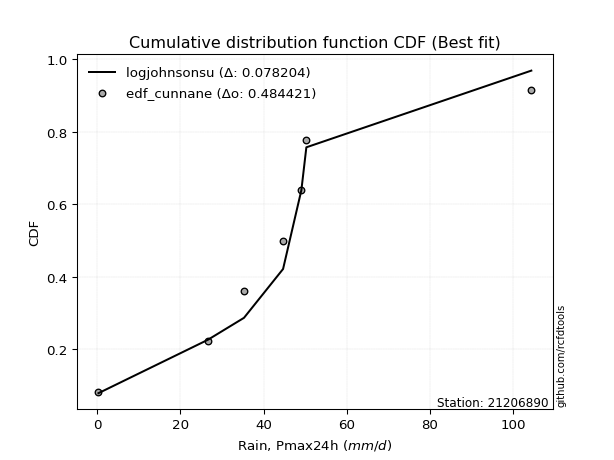</img>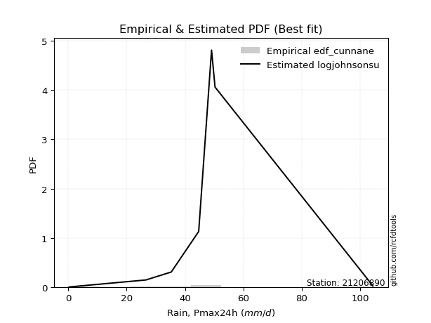</img>

</div>


### 12. EDF Adamowski (1981)

The Adamowski formula in hydrology refers to a specific plotting position formula used for estimating the non-parametric empirical distribution of hydrological events (like flood peaks) to calculate their return periods. This formula provides an alternative to traditional parametric methods (like the Gumbel or Log Pearson Type III distributions). 

<div align="center">


$P=(m-0.25)/(n+0.5)$


</div>


**12.1. Empirical values**

<div align="center">

|                | 0                   | 1                   | 2                  | 3                  | 4                  | 5                  | 6                  | 7                  |
|:---------------|:--------------------|:--------------------|:-------------------|:-------------------|:-------------------|:-------------------|:-------------------|:-------------------|
| date           | 2023                | 2016                | 2012               | 2025               | 2014               | 2013               | 2015               | 2024               |
| x              | 0.3                 | 26.6                | 35.3               | 36.6               | 44.7               | 49.1               | 50.3               | 104.4              |
| m              | 1                   | 2                   | 3                  | 4                  | 5                  | 6                  | 7                  | 8                  |
| empirical_dist | edf_adamowski       | edf_adamowski       | edf_adamowski      | edf_adamowski      | edf_adamowski      | edf_adamowski      | edf_adamowski      | edf_adamowski      |
| empirical      | 0.08823529411764706 | 0.20588235294117646 | 0.3235294117647059 | 0.4411764705882353 | 0.5588235294117647 | 0.6764705882352942 | 0.7941176470588235 | 0.9117647058823529 |
| empirical_tr   | 1.096774193548387   | 1.259259259259259   | 1.4782608695652173 | 1.7894736842105263 | 2.2666666666666666 | 3.0909090909090913 | 4.857142857142856  | 11.33333333333333  |

</div>


**12.2. Kolmogorov-Smirnov fit test (sorted by Δ)**


<div align="center">

|                | 0                    | 1                   | 2                   | 3                   | 4                  | 5                  | 6                  | 7                  | 8                  | 9                  | 10                  | 11                 | 12                  | 13                 | 14                  | 15                  | 16                  | 17                  | 18                  | 19                 | 20                  | 21                  | 22                 | 23                  | 24                  | 25                  | 26                  | 27                 | 28                  | 29                  | 30                 | 31                  | 32                  | 33                  | 34                  | 35                  | 36                  | 37                 | 38                  | 39                  | 40                  | 41                  | 42                  | 43                  | 44                  | 45                  | 46                  | 47                 | 48                  | 49                  | 50                  | 51                  | 52                 | 53                  | 54                  | 55                 | 56                  | 57                  | 58                  | 59                  | 60                  | 61                  | 62                  | 63                  | 64                 | 65                 | 66                 | 67                 | 68                  | 69                 | 70                  | 71                 | 72                 | 73                  | 74                 | 75                 | 76                  | 77                 | 78                  | 79                  | 80                  | 81                  | 82                  | 83                 | 84                 | 85                 | 86                 | 87                 | 88                 | 89                  | 90                  | 91                 | 92                  | 93                 | 94                 | 95                 | 96                 | 97                 | 98                 | 99                  | 100                | 101                | 102                | 103                 | 104                | 105                 | 106                 | 107                 | 108                 | 109                 | 110                 | 111                 | 112                 | 113                 | 114                 | 115                | 116                | 117                | 118                 | 119                | 120                 | 121                | 122                | 123                 | 124                | 125                | 126                | 127                | 128                | 129                | 130                | 131                | 132                | 133                | 134                | 135                | 136                | 137                 | 138                | 139                | 140                | 141                | 142                | 143                | 144                | 145                | 146                | 147                | 148                | 149                | 150                | 151                | 152                | 153                | 154                | 155                | 156                | 157                | 158                | 159                |
|:---------------|:---------------------|:--------------------|:--------------------|:--------------------|:-------------------|:-------------------|:-------------------|:-------------------|:-------------------|:-------------------|:--------------------|:-------------------|:--------------------|:-------------------|:--------------------|:--------------------|:--------------------|:--------------------|:--------------------|:-------------------|:--------------------|:--------------------|:-------------------|:--------------------|:--------------------|:--------------------|:--------------------|:-------------------|:--------------------|:--------------------|:-------------------|:--------------------|:--------------------|:--------------------|:--------------------|:--------------------|:--------------------|:-------------------|:--------------------|:--------------------|:--------------------|:--------------------|:--------------------|:--------------------|:--------------------|:--------------------|:--------------------|:-------------------|:--------------------|:--------------------|:--------------------|:--------------------|:-------------------|:--------------------|:--------------------|:-------------------|:--------------------|:--------------------|:--------------------|:--------------------|:--------------------|:--------------------|:--------------------|:--------------------|:-------------------|:-------------------|:-------------------|:-------------------|:--------------------|:-------------------|:--------------------|:-------------------|:-------------------|:--------------------|:-------------------|:-------------------|:--------------------|:-------------------|:--------------------|:--------------------|:--------------------|:--------------------|:--------------------|:-------------------|:-------------------|:-------------------|:-------------------|:-------------------|:-------------------|:--------------------|:--------------------|:-------------------|:--------------------|:-------------------|:-------------------|:-------------------|:-------------------|:-------------------|:-------------------|:--------------------|:-------------------|:-------------------|:-------------------|:--------------------|:-------------------|:--------------------|:--------------------|:--------------------|:--------------------|:--------------------|:--------------------|:--------------------|:--------------------|:--------------------|:--------------------|:-------------------|:-------------------|:-------------------|:--------------------|:-------------------|:--------------------|:-------------------|:-------------------|:--------------------|:-------------------|:-------------------|:-------------------|:-------------------|:-------------------|:-------------------|:-------------------|:-------------------|:-------------------|:-------------------|:-------------------|:-------------------|:-------------------|:--------------------|:-------------------|:-------------------|:-------------------|:-------------------|:-------------------|:-------------------|:-------------------|:-------------------|:-------------------|:-------------------|:-------------------|:-------------------|:-------------------|:-------------------|:-------------------|:-------------------|:-------------------|:-------------------|:-------------------|:-------------------|:-------------------|:-------------------|
| station        | 21206890             | 21206890            | 21206890            | 21206890            | 21206890           | 21206890           | 21206890           | 21206890           | 21206890           | 21206890           | 21206890            | 21206890           | 21206890            | 21206890           | 21206890            | 21206890            | 21206890            | 21206890            | 21206890            | 21206890           | 21206890            | 21206890            | 21206890           | 21206890            | 21206890            | 21206890            | 21206890            | 21206890           | 21206890            | 21206890            | 21206890           | 21206890            | 21206890            | 21206890            | 21206890            | 21206890            | 21206890            | 21206890           | 21206890            | 21206890            | 21206890            | 21206890            | 21206890            | 21206890            | 21206890            | 21206890            | 21206890            | 21206890           | 21206890            | 21206890            | 21206890            | 21206890            | 21206890           | 21206890            | 21206890            | 21206890           | 21206890            | 21206890            | 21206890            | 21206890            | 21206890            | 21206890            | 21206890            | 21206890            | 21206890           | 21206890           | 21206890           | 21206890           | 21206890            | 21206890           | 21206890            | 21206890           | 21206890           | 21206890            | 21206890           | 21206890           | 21206890            | 21206890           | 21206890            | 21206890            | 21206890            | 21206890            | 21206890            | 21206890           | 21206890           | 21206890           | 21206890           | 21206890           | 21206890           | 21206890            | 21206890            | 21206890           | 21206890            | 21206890           | 21206890           | 21206890           | 21206890           | 21206890           | 21206890           | 21206890            | 21206890           | 21206890           | 21206890           | 21206890            | 21206890           | 21206890            | 21206890            | 21206890            | 21206890            | 21206890            | 21206890            | 21206890            | 21206890            | 21206890            | 21206890            | 21206890           | 21206890           | 21206890           | 21206890            | 21206890           | 21206890            | 21206890           | 21206890           | 21206890            | 21206890           | 21206890           | 21206890           | 21206890           | 21206890           | 21206890           | 21206890           | 21206890           | 21206890           | 21206890           | 21206890           | 21206890           | 21206890           | 21206890            | 21206890           | 21206890           | 21206890           | 21206890           | 21206890           | 21206890           | 21206890           | 21206890           | 21206890           | 21206890           | 21206890           | 21206890           | 21206890           | 21206890           | 21206890           | 21206890           | 21206890           | 21206890           | 21206890           | 21206890           | 21206890           | 21206890           |
| empirical_dist | edf_adamowski        | edf_adamowski       | edf_adamowski       | edf_adamowski       | edf_adamowski      | edf_adamowski      | edf_adamowski      | edf_adamowski      | edf_adamowski      | edf_adamowski      | edf_adamowski       | edf_adamowski      | edf_adamowski       | edf_adamowski      | edf_adamowski       | edf_adamowski       | edf_adamowski       | edf_adamowski       | edf_adamowski       | edf_adamowski      | edf_adamowski       | edf_adamowski       | edf_adamowski      | edf_adamowski       | edf_adamowski       | edf_adamowski       | edf_adamowski       | edf_adamowski      | edf_adamowski       | edf_adamowski       | edf_adamowski      | edf_adamowski       | edf_adamowski       | edf_adamowski       | edf_adamowski       | edf_adamowski       | edf_adamowski       | edf_adamowski      | edf_adamowski       | edf_adamowski       | edf_adamowski       | edf_adamowski       | edf_adamowski       | edf_adamowski       | edf_adamowski       | edf_adamowski       | edf_adamowski       | edf_adamowski      | edf_adamowski       | edf_adamowski       | edf_adamowski       | edf_adamowski       | edf_adamowski      | edf_adamowski       | edf_adamowski       | edf_adamowski      | edf_adamowski       | edf_adamowski       | edf_adamowski       | edf_adamowski       | edf_adamowski       | edf_adamowski       | edf_adamowski       | edf_adamowski       | edf_adamowski      | edf_adamowski      | edf_adamowski      | edf_adamowski      | edf_adamowski       | edf_adamowski      | edf_adamowski       | edf_adamowski      | edf_adamowski      | edf_adamowski       | edf_adamowski      | edf_adamowski      | edf_adamowski       | edf_adamowski      | edf_adamowski       | edf_adamowski       | edf_adamowski       | edf_adamowski       | edf_adamowski       | edf_adamowski      | edf_adamowski      | edf_adamowski      | edf_adamowski      | edf_adamowski      | edf_adamowski      | edf_adamowski       | edf_adamowski       | edf_adamowski      | edf_adamowski       | edf_adamowski      | edf_adamowski      | edf_adamowski      | edf_adamowski      | edf_adamowski      | edf_adamowski      | edf_adamowski       | edf_adamowski      | edf_adamowski      | edf_adamowski      | edf_adamowski       | edf_adamowski      | edf_adamowski       | edf_adamowski       | edf_adamowski       | edf_adamowski       | edf_adamowski       | edf_adamowski       | edf_adamowski       | edf_adamowski       | edf_adamowski       | edf_adamowski       | edf_adamowski      | edf_adamowski      | edf_adamowski      | edf_adamowski       | edf_adamowski      | edf_adamowski       | edf_adamowski      | edf_adamowski      | edf_adamowski       | edf_adamowski      | edf_adamowski      | edf_adamowski      | edf_adamowski      | edf_adamowski      | edf_adamowski      | edf_adamowski      | edf_adamowski      | edf_adamowski      | edf_adamowski      | edf_adamowski      | edf_adamowski      | edf_adamowski      | edf_adamowski       | edf_adamowski      | edf_adamowski      | edf_adamowski      | edf_adamowski      | edf_adamowski      | edf_adamowski      | edf_adamowski      | edf_adamowski      | edf_adamowski      | edf_adamowski      | edf_adamowski      | edf_adamowski      | edf_adamowski      | edf_adamowski      | edf_adamowski      | edf_adamowski      | edf_adamowski      | edf_adamowski      | edf_adamowski      | edf_adamowski      | edf_adamowski      | edf_adamowski      |
| p_dist         | t                    | johnsonsu           | logjohnsonsu        | dgamma              | logt               | gumbel_r           | exponnorm          | nct                | gengamma           | logcrystalball     | moyal               | genlogistic        | halfnorm            | pearson3           | laplace             | alpha               | foldnorm            | invgamma            | kstwobign           | vonmises_line      | johnsonsb           | dweibull            | invgauss           | fatiguelife         | beta                | betaprime           | f                   | gamma              | erlang              | halflogistic        | weibull_min        | rayleigh            | rice                | skewnorm            | maxwell             | hypsecant           | kappa3              | logargus           | logistic            | tukeylambda         | logjohnsonsb        | crystalball         | norm                | wald                | genpareto           | truncnorm           | logloggamma         | anglit             | logburr12           | loggenlogistic      | loggompertz         | truncexpon          | semicircular       | logweibull_max      | bradford            | gennorm            | loggennorm          | loggenextreme       | logpearson3         | arcsine             | truncweibull_min    | ncf                 | loggumbel_l         | genexpon            | cosine             | loglevy_l          | gumbel_l           | lomax              | logdgamma           | logdweibull        | logtrapezoid        | gausshyper         | mielke             | logfoldnorm         | kappa4             | logmielke          | logarcsine          | ksone              | logsemicircular     | loganglit           | wrapcauchy          | uniform             | lognakagami         | lognorm            | logexponnorm       | logrice            | logfatiguelife     | lognct             | loglogistic        | loghypsecant        | logkappa3           | loginvgamma        | loginvweibull       | halfgennorm        | loggamma           | loggamma           | loglaplace         | loglaplace         | logbetaprime       | levy_l              | logburr            | logskewnorm        | burr               | logalpha            | loginvgauss        | burr12              | logmaxwell          | nakagami            | argus               | lograyleigh         | logexponweib        | loggausshyper       | logkstwobign        | loggenpareto        | loggumbel_r         | loghalfnorm        | genextreme         | loggenexpon        | logcosine           | logncf             | logmoyal            | loghalflogistic    | loggenhalflogistic | triang              | logwrapcauchy      | logloglaplace      | logtriang          | loglomax           | genhalflogistic    | invweibull         | logwald            | logkappa4          | rdist              | logf               | logbradford        | logksone           | loggengamma        | logtruncweibull_min | trapezoid          | loguniform         | logvonmises_line   | logtruncnorm       | logbeta            | powerlaw           | logweibull_min     | logtruncexpon      | exponweib          | weibull_max        | truncpareto        | exponpow           | logexponpow        | logpowerlaw        | logtruncpareto     | gompertz           | loghalfgennorm     | logtukeylambda     | logerlang          | logrdist           | logvonmises        | vonmises           |
| delta          | 0.060578307734855286 | 0.06636739095442012 | 0.09566677713902882 | 0.10733999743228284 | 0.1192949270209861 | 0.1286428360713734 | 0.132106710119949  | 0.1367390765772677 | 0.1372057040126331 | 0.1382329232028212 | 0.13870063609403455 | 0.1410616832756041 | 0.14129259605492805 | 0.1449510861197133 | 0.14503235862945207 | 0.14685652779255776 | 0.14747636247109608 | 0.14888699354911572 | 0.14892815719156915 | 0.1502141849911045 | 0.15086980261238492 | 0.15117994432689363 | 0.1520161034488844 | 0.15215538175185728 | 0.15329917502075918 | 0.15332952562138324 | 0.15360940997575778 | 0.1536275537822548 | 0.15362761282643278 | 0.15470267666182475 | 0.1557047161382733 | 0.16037482748513965 | 0.16039699108692373 | 0.16678841689890433 | 0.16864486884631968 | 0.17204411450822976 | 0.17736030608926273 | 0.1788279036386533 | 0.18250265121267972 | 0.18493578372786224 | 0.18938919398313492 | 0.19527147391584743 | 0.19527147536073608 | 0.19545925630975075 | 0.19888691273280001 | 0.20036485208728105 | 0.20238819301590627 | 0.2089528603738866 | 0.20989577321454816 | 0.21075090668494345 | 0.21303952418645172 | 0.21443077956681444 | 0.2146338361325787 | 0.21896923493691828 | 0.22089263707850337 | 0.2262544325980997 | 0.22915160308110316 | 0.23078966852399657 | 0.23103174042277808 | 0.23746792366804104 | 0.23872362275756198 | 0.24053912570913322 | 0.24660894624887425 | 0.24759054111932627 | 0.2537311699524163 | 0.2540905295382478 | 0.2552577052688768 | 0.2603551272022104 | 0.26503308029466055 | 0.2678677938018811 | 0.27138105471915747 | 0.2735105932809747 | 0.2840239027724912 | 0.28863372078944727 | 0.2933491124456278 | 0.3023167637005611 | 0.30646596545225874 | 0.3105281497805655 | 0.31157444644759785 | 0.31286105319771956 | 0.31367796930651376 | 0.31381025032491383 | 0.31583387240337774 | 0.3159873903773189 | 0.3159895634676904 | 0.3159924125179853 | 0.3162564117794136 | 0.316386542824544  | 0.3189674305866363 | 0.32150718678065476 | 0.32394996452663893 | 0.3256104667015884 | 0.32950939230611026 | 0.3310819314756291 | 0.3313049631750075 | 0.3313049631750075 | 0.3314342529077729 | 0.3314342529077729 | 0.3326384711724509 | 0.33448208670558477 | 0.335248300936894  | 0.3360490519666102 | 0.3374385540925004 | 0.33886835100504437 | 0.3423000536043375 | 0.34754351249580606 | 0.34803648621036515 | 0.35036562221965134 | 0.35641700295002887 | 0.35854129269694596 | 0.36512244385971115 | 0.36787717373437107 | 0.37479050659003393 | 0.38510154017426096 | 0.38666681470249714 | 0.3881108288770306 | 0.391168458564017  | 0.4007165790140464 | 0.40558446565702416 | 0.4109667535640575 | 0.41223147625271556 | 0.4142534170347804 | 0.4158072699198891 | 0.41582970398364166 | 0.4237631231266927 | 0.4241147298044671 | 0.4272118815180402 | 0.4295723669640958 | 0.4513472931349706 | 0.4805504454203606 | 0.4832321650207528 | 0.4992794432232958 | 0.5068285884184773 | 0.5117741473402888 | 0.5137369867912447 | 0.5160829079461546 | 0.5396756972541179 | 0.5466167932837545  | 0.5563286936207781 | 0.5604759601236209 | 0.5607681869730445 | 0.567947115098246  | 0.5721831463631416 | 0.5889729064780682 | 0.5985312072913871 | 0.6221215963495086 | 0.6437021438775565 | 0.6885014102087855 | 0.7082077358469574 | 0.7288548782313673 | 0.7356887375395968 | 0.7408710828283787 | 0.7543078821316405 | 0.7925896176538134 | 0.7941176470588235 | 0.7941176470588236 | 0.8678912381011586 | 0.9117647057439917 | 0.9877132343902181 | 16.195428335012227 |
| deltao         | 0.4472608134160001   | 0.4472608134160001  | 0.4472608134160001  | 0.4472608134160001  | 0.4472608134160001 | 0.4472608134160001 | 0.4472608134160001 | 0.4472608134160001 | 0.4472608134160001 | 0.4472608134160001 | 0.4472608134160001  | 0.4472608134160001 | 0.4472608134160001  | 0.4472608134160001 | 0.4472608134160001  | 0.4472608134160001  | 0.4472608134160001  | 0.4472608134160001  | 0.4472608134160001  | 0.4472608134160001 | 0.4472608134160001  | 0.4472608134160001  | 0.4472608134160001 | 0.4472608134160001  | 0.4472608134160001  | 0.4472608134160001  | 0.4472608134160001  | 0.4472608134160001 | 0.4472608134160001  | 0.4472608134160001  | 0.4472608134160001 | 0.4472608134160001  | 0.4472608134160001  | 0.4472608134160001  | 0.4472608134160001  | 0.4472608134160001  | 0.4472608134160001  | 0.4472608134160001 | 0.4472608134160001  | 0.4472608134160001  | 0.4472608134160001  | 0.4472608134160001  | 0.4472608134160001  | 0.4472608134160001  | 0.4472608134160001  | 0.4472608134160001  | 0.4472608134160001  | 0.4472608134160001 | 0.4472608134160001  | 0.4472608134160001  | 0.4472608134160001  | 0.4472608134160001  | 0.4472608134160001 | 0.4472608134160001  | 0.4472608134160001  | 0.4472608134160001 | 0.4472608134160001  | 0.4472608134160001  | 0.4472608134160001  | 0.4472608134160001  | 0.4472608134160001  | 0.4472608134160001  | 0.4472608134160001  | 0.4472608134160001  | 0.4472608134160001 | 0.4472608134160001 | 0.4472608134160001 | 0.4472608134160001 | 0.4472608134160001  | 0.4472608134160001 | 0.4472608134160001  | 0.4472608134160001 | 0.4472608134160001 | 0.4472608134160001  | 0.4472608134160001 | 0.4472608134160001 | 0.4472608134160001  | 0.4472608134160001 | 0.4472608134160001  | 0.4472608134160001  | 0.4472608134160001  | 0.4472608134160001  | 0.4472608134160001  | 0.4472608134160001 | 0.4472608134160001 | 0.4472608134160001 | 0.4472608134160001 | 0.4472608134160001 | 0.4472608134160001 | 0.4472608134160001  | 0.4472608134160001  | 0.4472608134160001 | 0.4472608134160001  | 0.4472608134160001 | 0.4472608134160001 | 0.4472608134160001 | 0.4472608134160001 | 0.4472608134160001 | 0.4472608134160001 | 0.4472608134160001  | 0.4472608134160001 | 0.4472608134160001 | 0.4472608134160001 | 0.4472608134160001  | 0.4472608134160001 | 0.4472608134160001  | 0.4472608134160001  | 0.4472608134160001  | 0.4472608134160001  | 0.4472608134160001  | 0.4472608134160001  | 0.4472608134160001  | 0.4472608134160001  | 0.4472608134160001  | 0.4472608134160001  | 0.4472608134160001 | 0.4472608134160001 | 0.4472608134160001 | 0.4472608134160001  | 0.4472608134160001 | 0.4472608134160001  | 0.4472608134160001 | 0.4472608134160001 | 0.4472608134160001  | 0.4472608134160001 | 0.4472608134160001 | 0.4472608134160001 | 0.4472608134160001 | 0.4472608134160001 | 0.4472608134160001 | 0.4472608134160001 | 0.4472608134160001 | 0.4472608134160001 | 0.4472608134160001 | 0.4472608134160001 | 0.4472608134160001 | 0.4472608134160001 | 0.4472608134160001  | 0.4472608134160001 | 0.4472608134160001 | 0.4472608134160001 | 0.4472608134160001 | 0.4472608134160001 | 0.4472608134160001 | 0.4472608134160001 | 0.4472608134160001 | 0.4472608134160001 | 0.4472608134160001 | 0.4472608134160001 | 0.4472608134160001 | 0.4472608134160001 | 0.4472608134160001 | 0.4472608134160001 | 0.4472608134160001 | 0.4472608134160001 | 0.4472608134160001 | 0.4472608134160001 | 0.4472608134160001 | 0.4472608134160001 | 0.4472608134160001 |
| eval           | Δo > Δ               | Δo > Δ              | Δo > Δ              | Δo > Δ              | Δo > Δ             | Δo > Δ             | Δo > Δ             | Δo > Δ             | Δo > Δ             | Δo > Δ             | Δo > Δ              | Δo > Δ             | Δo > Δ              | Δo > Δ             | Δo > Δ              | Δo > Δ              | Δo > Δ              | Δo > Δ              | Δo > Δ              | Δo > Δ             | Δo > Δ              | Δo > Δ              | Δo > Δ             | Δo > Δ              | Δo > Δ              | Δo > Δ              | Δo > Δ              | Δo > Δ             | Δo > Δ              | Δo > Δ              | Δo > Δ             | Δo > Δ              | Δo > Δ              | Δo > Δ              | Δo > Δ              | Δo > Δ              | Δo > Δ              | Δo > Δ             | Δo > Δ              | Δo > Δ              | Δo > Δ              | Δo > Δ              | Δo > Δ              | Δo > Δ              | Δo > Δ              | Δo > Δ              | Δo > Δ              | Δo > Δ             | Δo > Δ              | Δo > Δ              | Δo > Δ              | Δo > Δ              | Δo > Δ             | Δo > Δ              | Δo > Δ              | Δo > Δ             | Δo > Δ              | Δo > Δ              | Δo > Δ              | Δo > Δ              | Δo > Δ              | Δo > Δ              | Δo > Δ              | Δo > Δ              | Δo > Δ             | Δo > Δ             | Δo > Δ             | Δo > Δ             | Δo > Δ              | Δo > Δ             | Δo > Δ              | Δo > Δ             | Δo > Δ             | Δo > Δ              | Δo > Δ             | Δo > Δ             | Δo > Δ              | Δo > Δ             | Δo > Δ              | Δo > Δ              | Δo > Δ              | Δo > Δ              | Δo > Δ              | Δo > Δ             | Δo > Δ             | Δo > Δ             | Δo > Δ             | Δo > Δ             | Δo > Δ             | Δo > Δ              | Δo > Δ              | Δo > Δ             | Δo > Δ              | Δo > Δ             | Δo > Δ             | Δo > Δ             | Δo > Δ             | Δo > Δ             | Δo > Δ             | Δo > Δ              | Δo > Δ             | Δo > Δ             | Δo > Δ             | Δo > Δ              | Δo > Δ             | Δo > Δ              | Δo > Δ              | Δo > Δ              | Δo > Δ              | Δo > Δ              | Δo > Δ              | Δo > Δ              | Δo > Δ              | Δo > Δ              | Δo > Δ              | Δo > Δ             | Δo > Δ             | Δo > Δ             | Δo > Δ              | Δo > Δ             | Δo > Δ              | Δo > Δ             | Δo > Δ             | Δo > Δ              | Δo > Δ             | Δo > Δ             | Δo > Δ             | Δo > Δ             | Δo <= Δ            | Δo <= Δ            | Δo <= Δ            | Δo <= Δ            | Δo <= Δ            | Δo <= Δ            | Δo <= Δ            | Δo <= Δ            | Δo <= Δ            | Δo <= Δ             | Δo <= Δ            | Δo <= Δ            | Δo <= Δ            | Δo <= Δ            | Δo <= Δ            | Δo <= Δ            | Δo <= Δ            | Δo <= Δ            | Δo <= Δ            | Δo <= Δ            | Δo <= Δ            | Δo <= Δ            | Δo <= Δ            | Δo <= Δ            | Δo <= Δ            | Δo <= Δ            | Δo <= Δ            | Δo <= Δ            | Δo <= Δ            | Δo <= Δ            | Δo <= Δ            | Δo <= Δ            |
| fit            | 1                    | 1                   | 1                   | 1                   | 1                  | 1                  | 1                  | 1                  | 1                  | 1                  | 1                   | 1                  | 1                   | 1                  | 1                   | 1                   | 1                   | 1                   | 1                   | 1                  | 1                   | 1                   | 1                  | 1                   | 1                   | 1                   | 1                   | 1                  | 1                   | 1                   | 1                  | 1                   | 1                   | 1                   | 1                   | 1                   | 1                   | 1                  | 1                   | 1                   | 1                   | 1                   | 1                   | 1                   | 1                   | 1                   | 1                   | 1                  | 1                   | 1                   | 1                   | 1                   | 1                  | 1                   | 1                   | 1                  | 1                   | 1                   | 1                   | 1                   | 1                   | 1                   | 1                   | 1                   | 1                  | 1                  | 1                  | 1                  | 1                   | 1                  | 1                   | 1                  | 1                  | 1                   | 1                  | 1                  | 1                   | 1                  | 1                   | 1                   | 1                   | 1                   | 1                   | 1                  | 1                  | 1                  | 1                  | 1                  | 1                  | 1                   | 1                   | 1                  | 1                   | 1                  | 1                  | 1                  | 1                  | 1                  | 1                  | 1                   | 1                  | 1                  | 1                  | 1                   | 1                  | 1                   | 1                   | 1                   | 1                   | 1                   | 1                   | 1                   | 1                   | 1                   | 1                   | 1                  | 1                  | 1                  | 1                   | 1                  | 1                   | 1                  | 1                  | 1                   | 1                  | 1                  | 1                  | 1                  | 0                  | 0                  | 0                  | 0                  | 0                  | 0                  | 0                  | 0                  | 0                  | 0                   | 0                  | 0                  | 0                  | 0                  | 0                  | 0                  | 0                  | 0                  | 0                  | 0                  | 0                  | 0                  | 0                  | 0                  | 0                  | 0                  | 0                  | 0                  | 0                  | 0                  | 0                  | 0                  |
| n              | 8                    | 8                   | 8                   | 8                   | 8                  | 8                  | 8                  | 8                  | 8                  | 8                  | 8                   | 8                  | 8                   | 8                  | 8                   | 8                   | 8                   | 8                   | 8                   | 8                  | 8                   | 8                   | 8                  | 8                   | 8                   | 8                   | 8                   | 8                  | 8                   | 8                   | 8                  | 8                   | 8                   | 8                   | 8                   | 8                   | 8                   | 8                  | 8                   | 8                   | 8                   | 8                   | 8                   | 8                   | 8                   | 8                   | 8                   | 8                  | 8                   | 8                   | 8                   | 8                   | 8                  | 8                   | 8                   | 8                  | 8                   | 8                   | 8                   | 8                   | 8                   | 8                   | 8                   | 8                   | 8                  | 8                  | 8                  | 8                  | 8                   | 8                  | 8                   | 8                  | 8                  | 8                   | 8                  | 8                  | 8                   | 8                  | 8                   | 8                   | 8                   | 8                   | 8                   | 8                  | 8                  | 8                  | 8                  | 8                  | 8                  | 8                   | 8                   | 8                  | 8                   | 8                  | 8                  | 8                  | 8                  | 8                  | 8                  | 8                   | 8                  | 8                  | 8                  | 8                   | 8                  | 8                   | 8                   | 8                   | 8                   | 8                   | 8                   | 8                   | 8                   | 8                   | 8                   | 8                  | 8                  | 8                  | 8                   | 8                  | 8                   | 8                  | 8                  | 8                   | 8                  | 8                  | 8                  | 8                  | 8                  | 8                  | 8                  | 8                  | 8                  | 8                  | 8                  | 8                  | 8                  | 8                   | 8                  | 8                  | 8                  | 8                  | 8                  | 8                  | 8                  | 8                  | 8                  | 8                  | 8                  | 8                  | 8                  | 8                  | 8                  | 8                  | 8                  | 8                  | 8                  | 8                  | 8                  | 8                  |
| best_fit       | 1                    | 0                   | 0                   | 0                   | 0                  | 0                  | 0                  | 0                  | 0                  | 0                  | 0                   | 0                  | 0                   | 0                  | 0                   | 0                   | 0                   | 0                   | 0                   | 0                  | 0                   | 0                   | 0                  | 0                   | 0                   | 0                   | 0                   | 0                  | 0                   | 0                   | 0                  | 0                   | 0                   | 0                   | 0                   | 0                   | 0                   | 0                  | 0                   | 0                   | 0                   | 0                   | 0                   | 0                   | 0                   | 0                   | 0                   | 0                  | 0                   | 0                   | 0                   | 0                   | 0                  | 0                   | 0                   | 0                  | 0                   | 0                   | 0                   | 0                   | 0                   | 0                   | 0                   | 0                   | 0                  | 0                  | 0                  | 0                  | 0                   | 0                  | 0                   | 0                  | 0                  | 0                   | 0                  | 0                  | 0                   | 0                  | 0                   | 0                   | 0                   | 0                   | 0                   | 0                  | 0                  | 0                  | 0                  | 0                  | 0                  | 0                   | 0                   | 0                  | 0                   | 0                  | 0                  | 0                  | 0                  | 0                  | 0                  | 0                   | 0                  | 0                  | 0                  | 0                   | 0                  | 0                   | 0                   | 0                   | 0                   | 0                   | 0                   | 0                   | 0                   | 0                   | 0                   | 0                  | 0                  | 0                  | 0                   | 0                  | 0                   | 0                  | 0                  | 0                   | 0                  | 0                  | 0                  | 0                  | 0                  | 0                  | 0                  | 0                  | 0                  | 0                  | 0                  | 0                  | 0                  | 0                   | 0                  | 0                  | 0                  | 0                  | 0                  | 0                  | 0                  | 0                  | 0                  | 0                  | 0                  | 0                  | 0                  | 0                  | 0                  | 0                  | 0                  | 0                  | 0                  | 0                  | 0                  | 0                  |
| best_fit_sort  | 1                    | 2                   | 3                   | 4                   | 5                  | 6                  | 7                  | 8                  | 9                  | 10                 | 11                  | 12                 | 13                  | 14                 | 15                  | 16                  | 17                  | 18                  | 19                  | 20                 | 21                  | 22                  | 23                 | 24                  | 25                  | 26                  | 27                  | 28                 | 29                  | 30                  | 31                 | 32                  | 33                  | 34                  | 35                  | 36                  | 37                  | 38                 | 39                  | 40                  | 41                  | 42                  | 43                  | 44                  | 45                  | 46                  | 47                  | 48                 | 49                  | 50                  | 51                  | 52                  | 53                 | 54                  | 55                  | 56                 | 57                  | 58                  | 59                  | 60                  | 61                  | 62                  | 63                  | 64                  | 65                 | 66                 | 67                 | 68                 | 69                  | 70                 | 71                  | 72                 | 73                 | 74                  | 75                 | 76                 | 77                  | 78                 | 79                  | 80                  | 81                  | 82                  | 83                  | 84                 | 85                 | 86                 | 87                 | 88                 | 89                 | 90                  | 91                  | 92                 | 93                  | 94                 | 95                 | 96                 | 97                 | 98                 | 99                 | 100                 | 101                | 102                | 103                | 104                 | 105                | 106                 | 107                 | 108                 | 109                 | 110                 | 111                 | 112                 | 113                 | 114                 | 115                 | 116                | 117                | 118                | 119                 | 120                | 121                 | 122                | 123                | 124                 | 125                | 126                | 127                | 128                | 129                | 130                | 131                | 132                | 133                | 134                | 135                | 136                | 137                | 138                 | 139                | 140                | 141                | 142                | 143                | 144                | 145                | 146                | 147                | 148                | 149                | 150                | 151                | 152                | 153                | 154                | 155                | 156                | 157                | 158                | 159                | 160                |

</div>


**12.3. Best fit**

<div align="center">

|   id |   station | empirical_dist   | p_dist   |     delta |   deltao | eval   |   fit |   n |   best_fit |   best_fit_sort |
|-----:|----------:|:-----------------|:---------|----------:|---------:|:-------|------:|----:|-----------:|----------------:|
|    0 |  21206890 | edf_adamowski    | t        | 0.0605783 | 0.447261 | Δo > Δ |     1 |   8 |          1 |               1 |

</div>


<div align="center">

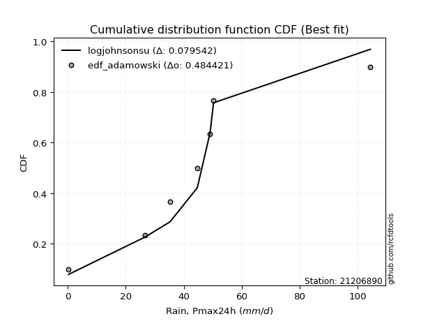</img>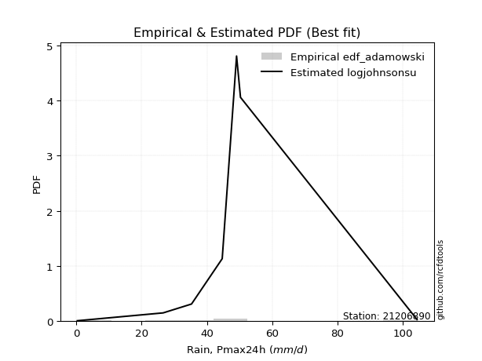</img>

</div>


## C. Best fit & Estimate extreme values for specific return periods - Tr

Best fit in probability distribution analysis means finding the theoretical distribution (like Normal, Poisson, Exponential, etc.) that most accurately mirrors your real-world data´s patterns (shape, center, spread) for better predictions, using methods like visual checks (Q-Q plots), goodness-of-fit tests (Kolmogorov-Smirnov, Chi-Squared), and information criteria (AIC) to score and select the simplest, most representative model.


### 1. Best fit (ordered by delta Δ)

:file_folder:Table: [bestfit_21206890.csv](table/bestfit_21206890.csv)

<div align="center">

|   id |   station | empirical_dist   | p_dist      |     delta |   deltao | eval   |   fit |   n |   best_fit |   best_fit_sort |
|-----:|----------:|:-----------------|:------------|----------:|---------:|:-------|------:|----:|-----------:|----------------:|
|    0 |  21206890 | edf_blom         | t           | 0.0587958 | 0.447261 | Δo > Δ |     1 |   8 |          1 |               1 |
|    1 |  21206890 | edf_tukey        | t           | 0.0594018 | 0.447261 | Δo > Δ |     1 |   8 |          1 |               2 |
|    2 |  21206890 | edf_filliben     | t           | 0.059629  | 0.447261 | Δo > Δ |     1 |   8 |          1 |               3 |
|    3 |  21206890 | edf_cunnane      | t           | 0.0597091 | 0.447261 | Δo > Δ |     1 |   8 |          1 |               4 |
|    4 |  21206890 | edf_jenkinson    | t           | 0.059736  | 0.447261 | Δo > Δ |     1 |   8 |          1 |               5 |
|    5 |  21206890 | edf_beard        | t           | 0.059736  | 0.447261 | Δo > Δ |     1 |   8 |          1 |               6 |
|    6 |  21206890 | edf_chegodayev   | t           | 0.059878  | 0.447261 | Δo > Δ |     1 |   8 |          1 |               7 |
|    7 |  21206890 | edf_adamowski    | t           | 0.0605783 | 0.447261 | Δo > Δ |     1 |   8 |          1 |               8 |
|    8 |  21206890 | edf_gringorten   | t           | 0.0627128 | 0.447261 | Δo > Δ |     1 |   8 |          1 |               9 |
|    9 |  21206890 | edf_hazen        | t           | 0.067331  | 0.447261 | Δo > Δ |     1 |   8 |          1 |              10 |
|   10 |  21206890 | edf_weibull      | johnsonsu   | 0.078641  | 0.447261 | Δo > Δ |     1 |   8 |          1 |              11 |
|   11 |  21206890 | edf_california   | tukeylambda | 0.125     | 0.447261 | Δo > Δ |     1 |   8 |          1 |              12 |

</div>


### 2. Extreme values and % difference analysis

In hydrology, a return period (or recurrence interval $Tr$) is the statistical average time between extreme events like floods or droughts of a specific magnitude, indicating how rare an event is, with a 100-year flood, for example, having a 1% chance of occurring in any given year, not that it happens exactly every century. It is a key tool for infrastructure design (like bridges or dams) and risk assessment, calculated from historical data to determine the probability of future events, although it is important to remember it is statistical average, and events can cluster or be missed.

The extreme value porcentage difference is evaluated as $pdiff = 1 - (ETrBf / ETr) * 100$, where _ETrBf_ correspond to the bestfit extreme value for a specific recurrence interval and _ETr_ correspond to the extreme value for one of the most used PDFsused in hydrology.

> risk_rate: assuming the return period as the project useful life.

:file_folder:Table: [extreme_21206890.csv](table/extreme_21206890.csv), all PDFs.  
:file_folder:Table: [extremepdiff_21206890.csv](table/extremepdiff_21206890.csv), % difference between bestfit and most used PDFs in Hydrology.

<div align="center">

Extreme values table for only best fit PDFs
|   id |      tr |   prob_l |     prob_g |    alpha |   anglit |   arcsine |    argus |     beta |   betaprime |   bradford |     burr |           burr12 |   cosine |   crystalball |   dgamma |   dweibull |   erlang |   exponnorm |   exponpow |        exponweib |        f |   fatiguelife |   foldnorm |    gamma |   gausshyper |   genexpon |       genextreme |   gengamma |   genhalflogistic |   genlogistic |   gennorm |   genpareto |   gompertz |   gumbel_l |   gumbel_r |   halfgennorm |   halflogistic |   halfnorm |   hypsecant |   invgamma |   invgauss |       invweibull |   johnsonsb |   johnsonsu |   kappa3 |   kappa4 |    ksone |   kstwobign |   laplace |   levy_l |   loggamma |   logistic |   loglaplace |    lomax |   maxwell |   mielke |    moyal |   nakagami |      ncf |      nct |     norm |   pearson3 |   powerlaw |   rayleigh |     rdist |     rice |   semicircular |   skewnorm |        t |   trapezoid |   triang |   truncexpon |   truncnorm |   truncpareto |   truncweibull_min |   tukeylambda |   uniform |   vonmises |   vonmises_line |     wald |   weibull_max |   weibull_min |   wrapcauchy |   logalpha |   loganglit |   logarcsine |   logargus |   logbeta |     logbetaprime |   logbradford |          logburr |   logburr12 |   logcosine |   logcrystalball |   logdgamma |      logdweibull |   logerlang |   logexponnorm |      logexponpow |    logexponweib |            logf |   logfatiguelife |   logfoldnorm |   loggausshyper |   loggenexpon |   loggenextreme |   loggengamma |   loggenhalflogistic |   loggenlogistic |       loggennorm |   loggenpareto |   loggompertz |   loggumbel_l |   loggumbel_r |   loghalfgennorm |   loghalflogistic |   loghalfnorm |   loghypsecant |   loginvgamma |   loginvgauss |    loginvweibull |   logjohnsonsb |     logjohnsonsu |       logkappa3 |   logkappa4 |   logksone |     logkstwobign |   loglevy_l |   logloggamma |   loglogistic |   logloglaplace |         loglomax |   logmaxwell |        logmielke |    logmoyal |   lognakagami |         logncf |    lognct |   lognorm |   logpearson3 |   logpowerlaw |   lograyleigh |   logrdist |   logrice |   logsemicircular |   logskewnorm |             logt |   logtrapezoid |   logtriang |   logtruncexpon |   logtruncnorm |   logtruncpareto |   logtruncweibull_min |   logtukeylambda |   loguniform |   logvonmises |   logvonmises_line |          logwald |   logweibull_max |   logweibull_min |   logwrapcauchy |   station |   n |   risk_rate |
|-----:|--------:|---------:|-----------:|---------:|---------:|----------:|---------:|---------:|------------:|-----------:|---------:|-----------------:|---------:|--------------:|---------:|-----------:|---------:|------------:|-----------:|-----------------:|---------:|--------------:|-----------:|---------:|-------------:|-----------:|-----------------:|-----------:|------------------:|--------------:|----------:|------------:|-----------:|-----------:|-----------:|--------------:|---------------:|-----------:|------------:|-----------:|-----------:|-----------------:|------------:|------------:|---------:|---------:|---------:|------------:|----------:|---------:|-----------:|-----------:|-------------:|---------:|----------:|---------:|---------:|-----------:|---------:|---------:|---------:|-----------:|-----------:|-----------:|----------:|---------:|---------------:|-----------:|---------:|------------:|---------:|-------------:|------------:|--------------:|-------------------:|--------------:|----------:|-----------:|----------------:|---------:|--------------:|--------------:|-------------:|-----------:|------------:|-------------:|-----------:|----------:|-----------------:|--------------:|-----------------:|------------:|------------:|-----------------:|------------:|-----------------:|------------:|---------------:|-----------------:|----------------:|----------------:|-----------------:|--------------:|----------------:|--------------:|----------------:|--------------:|---------------------:|-----------------:|-----------------:|---------------:|--------------:|--------------:|--------------:|-----------------:|------------------:|--------------:|---------------:|--------------:|--------------:|-----------------:|---------------:|-----------------:|----------------:|------------:|-----------:|-----------------:|------------:|--------------:|--------------:|----------------:|-----------------:|-------------:|-----------------:|------------:|--------------:|---------------:|----------:|----------:|--------------:|--------------:|--------------:|-----------:|----------:|------------------:|--------------:|-----------------:|---------------:|------------:|----------------:|---------------:|-----------------:|----------------------:|-----------------:|-------------:|--------------:|-------------------:|-----------------:|-----------------:|-----------------:|----------------:|----------:|----:|------------:|
|    0 |    2    | 0.5      | 0.5        |  40.1312 |  43.4125 |   43.4125 |  56.1943 |  40.2485 |     40.3079 |    42.6456 |  22.8947 |     58.8793      |  47.1034 |       43.4125 |  40.8917 |    44.7    |  40.3187 |     39.8934 |   0.333207 |  23795.7         |  40.3182 |       40.3084 |    38.414  |  40.3187 |      47.6355 |    30.4732 |      5.90481     |    39.4315 |           68.3195 |       40.6999 |   44.7    |     41.0683 |    89.5044 |    47.932  |    38.893  |       22.8522 |        36.6461 |    37.7812 |     43.4125 |    40.1939 |    40.2894 |   6532.98        |     40.2302 |     40.7368 |  35.235  |  50.2159 |  52.35   |     39.0083 |   43.4125 |  35.6341 |    22.4708 |    43.4125 |      24.2306 |  29.3373 |   41.0597 |  27.4783 |  37.434  |    21.5691 |  30.7847 |  40.1456 |  43.4125 |    39.5586 |    1.93537 |    40.2252 | -10.0307  |  40.2294 |        43.4125 |    41.457  |  40.541  |     77.7163 |  63.2373 |      42.1737 |     44.0342 |      0.627885 |            44.7307 |       35.5663 |   52.35   |  -0.492731 |         42.2919 |  34.4948 |       104.054 |       39.7328 |      52.3381 |    21.7174 |     24.2307 |      24.2305 |    38.3252 |   104.377 |     20.6626      |       6.76768 |     20.2675      |     33.0119 |     14.9107 |          41.6197 |     49.1    |     49.1         |    0.3      |        24.2304 |      0.373971    |    4.92519      |    0.928957     |          24.1939 |       27.0555 |         17.4444 |       12.9838 |         33.8506 |   2.18145e+17 |              14.1278 |          33.1666 |     49.1         |        15.6073 |       32.7952 |       32.0425 |       18.3232 |         0.299998 |           15.9463 |       17.1063 |        24.2306 |       23.065  |       20.9463 |     21.0043      |        39.7384 |     43.7616      |    31.3715      |     7.79454 |    5.59643 |     15.1012      |     34.4791 |       34.6649 |       24.2306 |    1.29918      |      6.53168     |      20.9497 |     25.4766      |     16.7426 |       24.2409 |   3.02401      |   24.18   |   24.2306 |       41.2068 |      0.366806 |       19.8961 |   0.298658 |   24.2308 |           24.2305 |       23.0139 |     42.5297      |        29.9128 |     14.7059 |         3.28914 |        5.53368 |         0.332078 |               7.22861 |              0.3 |      5.59643 |     0.0965564 |            5.57552 |     13.9601      |          36.8118 |      1.29858     |          5.5964 |  21206890 |   8 |    0.75     |
|    1 |    2.33 | 0.570815 | 0.429185   |  44.8138 |  49.1308 |   51.9967 |  62.692  |  45.1163 |     45.1503 |    50.0413 |  29.0988 |    110.734       |  52.7242 |       48.3217 |  44.2708 |    47.0651 |  45.1675 |     44.1801 |   0.400403 | 105827           |  45.1666 |       45.1048 |    43.8964 |  45.1675 |      56.9199 |    37.1212 |     17.2912      |    44.0839 |           75.1444 |       44.9511 |   44.8777 |     47.8649 |    90.7859 |    52.2031 |    43.4419 |       30.529  |        41.3232 |    43.0795 |     47.3413 |    44.9215 |    45.089  | 609560           |     45.0141 |     43.2171 |  40.5196 |  58.0121 |  61.1963 |     44.2437 |   46.3833 |  56.3363 |    31.0367 |    47.7379 |      29.1166 |  35.7351 |   46.16   |  33.9849 |  41.7401 |    28.0111 |  36.8523 |  44.4755 |  48.3217 |    44.4179 |    3.91678 |    45.401  |   2.93828 |  45.4039 |        49.5455 |    46.2343 |  42.9502 |     83.7645 |  70.0417 |      49.3697 |     48.7473 |      0.895149 |            51.8844 |       37.5777 |   59.7219 |  -0.233313 |         46.1424 |  37.7139 |       104.261 |       44.9542 |      59.7164 |    29.9811 |     34.508  |      41.198  |    45.5415 |   104.399 |     33.0822      |      10.5224  |     32.6289      |     39.0926 |     21.4885 |          45.3443 |     53.2579 |     54.0881      |    0.3      |        32.8237 |      0.429551    | 1525.08         |    1.66811      |          32.8141 |       33.7279 |         26.1774 |       20.7434 |         42.6823 |   1.02595e+48 |              20.6991 |          39.0441 |     50.4558      |        23.7755 |       38.9019 |       41.7271 |       24.2748 |         0.299998 |           21.2939 |       23.7372 |        30.8934 |       31.8539 |       29.8212 |     34.0185      |        46.81   |     45.7655      |    81.0686      |    12.0781  |    9.20218 |     24.749       |     48.1367 |       41.3465 |       31.6602 |    3.97763      |     12.8767      |      28.717  |     37.3617      |     21.8502 |       32.863  |   9.28733      |   32.7972 |   32.824  |       51.4612 |      0.439955 |       27.4002 |   0.298918 |   32.8211 |           35.404  |       29.2948 |     44.8747      |        42.4231 |     20.333  |         4.93973 |        8.27484 |         0.360189 |              10.3889  |              0.3 |      8.47021 |     0.106262  |            8.44311 |     17.0345      |          47.2083 |      2.00709     |         14.923  |  21206890 |   8 |    0.729209 |
|    2 |    5    | 0.8      | 0.2        |  64.1957 |  69.3064 |   74.8875 |  83.5343 |  65.0463 |     64.94   |    76.8753 |  56.3071 |   1097.16        |  72.9797 |       66.5657 |  58.4562 |    61.3816 |  64.9708 |     62.5111 |   2.92125  |      2.11144e+07 |  64.9685 |       64.7661 |    66.324  |  64.9708 |      87.4498 |    70.36   |   2102.98        |    63.4932 |           93.0718 |       62.4372 |   54.7523 |     73.4437 |    94.9262 |    66.0011 |    63.2046 |       82.2718 |        62.4858 |    65.4854 |     63.1008 |    64.4215 |    64.7786 |      2.20426e+14 |     64.6862 |     55.5174 |  61.4846 |  83.8338 |  89.826  |     66.4827 |   61.2368 |  90.6351 |   104.884  |    64.4387 |      72.9459 |  67.7226 |   66.2345 |  61.1046 |  61.6866 |    58.9312 |  65.2688 |  62.7758 |  66.5657 |    64.7191 |   27.6367  |    66.1219 |  38.0867  |  66.1199 |        70.4749 |    65.715  |  53.829  |    101.116  |  89.563  |      75.8443 |     66.2866 |      6.23072  |            77.5587 |       48.3578 |   83.58   |   0.776904 |         61.1924 |  55.734  |       104.397 |       66.048  |      83.5859 |   101.845  |    120.141  |     169.657  |    72.6471 |   104.4   |    227.535       |      43.8984  |    258.336       |     67.5008 |     80.1916 |          61.3326 |    104.211  |    141.017       |    0.3      |       101.413  |      1.36108     |    3.48313e+156 | 2392.37         |         101.926  |       76.517  |         71.8769 |      136.645  |         75.158  | inf           |              56.1455 |          62.1993 |     70.3216      |        68.3783 |       67.5869 |       97.9348 |       82.3838 |         0.299998 |           78.8032 |       94.8614 |        81.857  |      108.592  |      117.546  |    276.359       |        72.6718 |     51.5589      | 13864           |    44.5066  |   46.0129  |    201.79        |     83.6712 |       67.4767 |       88.9162 |    4.1293e+18   |    383.387       |      99.3584 |    188.337       |     75.0031 |      101.835  |   6.19496e+06  |  101.911  |  101.414  |       90.0304 |      2.16637  |       98.6689 |   0.299664 |  101.367  |          129.143  |       59.1605 |     59.7544      |       115.598  |     51.5091 |        21.7395  |       31.0133  |         1.00158  |              34.2244  |              0.3 |     32.388   |     0.152355  |           32.3409  |     51.9079      |          81.8952 |     24.5556      |         62.4818 |  21206890 |   8 |    0.67232  |
|    3 |   10    | 0.9      | 0.1        |  79.0922 |  80.7261 |   80.4136 |  93.585  |  79.9211 |     79.6892 |    90.1187 |  77.3543 |   5135.17        |  85.2174 |       78.6682 |  70.7065 |    75.5296 |  79.7101 |     77.7861 |  13.2848   |      5.82495e+08 |  79.7079 |       79.5181 |    82.2119 |  79.71   |      98.4606 |   100.533  | 106444           |    78.402  |           99.248  |       76.0477 |   94.326  |     87.9773 |    97.2313 |    73.6832 |    79.301  |      148.514  |        80.0604 |    82.0653 |     75.6852 |    79.269  |    79.569  |      2.05982e+21 |     79.5369 |     69.8705 |  77.4636 |  95.3353 | 102.318  |     83.4148 |   74.7203 |  98.9157 |   238.872  |    76.7382 |     167.909  |  96.76   |   80.3619 |  81.1969 |  79.0531 |    83.6293 |  90.1586 |  77.6306 |  78.6682 |    80.2149 |   55.6684  |    80.8963 |  47.0013  |  80.8908 |        81.2142 |    79.9645 |  66.0798 |    107.894  |  97.188  |      89.3378 |     77.9336 |     21.7913   |            90.3363 |       57.4319 |   93.99   |   1.49252  |         72.75   |  74.8576 |       104.4   |       81.2413 |      93.9943 |   234.328  |    243.413  |     238.761  |    87.8016 |   104.4   |    960.61        |      81.8691  |   1393.91        |     91.4944 |    177.691  |          74.3875 |    210.892  |    459.373       |    0.3      |       214.331  |      6.41013     |  inf            |    6.19271e+13  |         216.332  |      131.755  |         93.3549 |      526.886  |         90.2727 | inf           |              78.9237 |          79.1499 |    123.253       |        91.1391 |       91.9519 |      157.48   |      222.884  |         0.299998 |          233.606  |      264.426  |       178.232  |      250.888  |      307.822  |   1522.15        |        87.5841 |     59.1827      |     5.03501e+06 |    72.3868  |   92.8686  |    997.171       |     95.6185 |       84.338  |      190.222  |    4.88614e+250 |   8347.2         |     237.997  |    682.58        |    219.494  |      215.667  |   2.18859e+25  |  216.386  |  214.333  |      108.897  |      9.99225  |      245.993  |   0.29989  |  214.181  |          250.872  |       78.7683 |     95.4937      |       171.002  |     74.0566 |        45.8205  |       56.3155  |         4.63666  |              59.01    |              0.3 |     58.149   |     0.195296  |           58.109   |    169.344       |          95.1739 |    340.198       |         82.591  |  21206890 |   8 |    0.651322 |
|    4 |   15    | 0.933333 | 0.0666667  |  87.2537 |  85.6025 |   81.4676 |  97.4059 |  87.8528 |     87.5513 |    94.76   |  89.361  |  11400.3         |  90.7918 |       84.7077 |  77.7738 |    84.0875 |  87.5579 |     86.6284 |  25.7781   |      2.88735e+09 |  87.5563 |       87.4235 |    90.2856 |  87.5579 |     101.251  |   118.183  | 974318           |    86.5111 |          101.101  |       83.6083 |  144.214  |     93.924  |    98.2752 |    77.1623 |    88.3824 |      195.912  |        90.0061 |    90.6934 |     82.867  |    87.3302 |    87.5013 |      1.76426e+25 |     87.5348 |     80.4793 |  86.6938 |  99.1961 | 106.482  |     92.4037 |   82.6077 | 101.417  |   361.857  |    83.4395 |     273.448  | 113.746  |   87.6105 |  92.4418 |  89.1318 |    96.7102 | 104.752  |  86.1703 |  84.7077 |    88.5749 |   69.1501  |    88.5088 |  48.7808  |  88.5015 |        85.4021 |    87.3757 |  75.6919 |    110.069  |  99.6346 |      94.1667 |     83.7477 |     35.2908   |            94.8668 |       61.355  |   97.46   |   1.82285  |         79.1794 |  87.1379 |       104.4   |       89.1112 |      97.4632 |   357.569  |    329.071  |     254.84   |    93.9076 |   104.4   |   2071.14        |     100.773   |   3608.43        |    105.007  |    255.306  |          81.8125 |    323.85   |   1003.2         |    0.3      |       311.359  |     18.492       |  inf            |    2.37016e+29  |         315      |      172.798  |         98.8023 |     1057.28   |         95.2451 | inf           |              87.3538 |          88.6883 |    193.016       |        97.3534 |      105.714  |      195.276  |      390.79   |         0.299998 |          432.077  |      450.808  |       277.868  |      383.83   |      505.826  |   3985.79        |        94.0561 |     67.5222      |     3.75755e+08 |    83.5099  |  117.363   |   2328.79        |     99.5526 |       92.3784 |      287.88   |  inf            |  50601.6         |     372.579  |   1403.48        |    409.324  |      313.634  |   2.91938e+52  |  315.155  |  311.362  |      115.342  |     19.6895   |      393.861  |   0.299943 |  311.104  |          325.021  |       86.5474 |    154.405       |       193.893  |     83.2063 |        59.7293  |       68.9981  |        10.9635   |              71.1365  |              0.3 |     70.6744  |     0.222149  |           70.6438  |    361.859       |          98.9429 |   1789.81        |         89.5209 |  21206890 |   8 |    0.644736 |
|    5 |   20    | 0.95     | 0.05       |  92.893  |  88.4711 |   81.8388 |  99.5032 |  93.2338 |     92.8849 |    97.1247 |  98.0561 |  19493.8         |  94.2199 |       88.6628 |  82.7602 |    90.2568 |  92.878  |     92.8959 |  38.4612   |      8.07813e+09 |  92.877  |       92.804  |    95.6058 |  92.878  |     102.402  |   130.706  |      4.5917e+06  |    92.0777 |          101.986  |       88.8717 |  197.804  |     97.2982 |    98.925  |    79.3278 |    94.741  |      233.486  |        96.9744 |    96.4458 |     87.9335 |    92.8649 |    92.9026 |      1.00037e+28 |     92.9956 |     89.1999 |  93.4034 | 101.131  | 108.564  |     98.4589 |   88.2039 | 102.698  |   475.751  |    88.0713 |     386.5    | 125.797  |   92.4212 | 100.504  |  96.2697 |   105.473  | 115.195  |  92.2598 |  88.6628 |    94.2803 |   76.8536  |    93.5686 |  49.425   |  93.56   |        87.725  |    92.3167 |  84.1176 |    111.141  | 100.841  |      96.6503 |     87.5558 |     45.5471   |            97.1888 |       63.5112 |   99.195  |   2.01082  |         83.5138 |  96.2892 |       104.4   |       94.3562 |      99.1975 |   472.757  |    392.933  |     260.756  |    97.3388 |   104.4   |   3488.33        |     111.804   |   7023.9         |    114.408  |    319.048  |          87.0459 |    441.137  |   1805.55        |    0.3      |       397.619  |     41.2969      |  inf            |    4.76429e+49  |         402.915  |      206.379  |        100.977  |     1680.27   |         97.6832 | inf           |              91.6732 |          95.5379 |    280.796       |        99.9453 |      115.302  |      223.255  |      579.016  |         0.299998 |          664.787  |      643.371  |       380.092  |      508.431  |      704.46   |   7820.38        |        97.9287 |     76.7416      |     1.33307e+10 |    89.2186  |  131.936   |   4123.55        |    101.63   |       97.4961 |      383.344  |  inf            | 181738           |     501.649  |   2321.49        |    636.418  |      400.809  |   1.88278e+87  |  403.183  |  397.623  |      118.57   |     28.6801   |      538.536  |   0.299965 |  397.261  |          375.221  |       90.7083 |    253.503       |       206.289  |     88.128  |        68.4286  |       76.4451  |        18.5678   |              78.1957  |              0.3 |     77.9151  |     0.242294  |           77.8913  |    637.211       |         100.641  |   6098.55        |         93.0878 |  21206890 |   8 |    0.641514 |
|    6 |   25    | 0.96     | 0.04       |  97.204  |  90.4151 |   82.011  | 100.856  |  97.2902 |     96.9058 |    98.5579 | 104.991  |  29177.6         |  96.624  |       91.5742 |  86.6153 |    95.0908 |  96.8866 |     97.7564 |  50.8102   |      1.70584e+10 |  96.8862 |       96.8698 |    99.5347 |  96.8865 |     102.998  |   140.42   |      1.51555e+07 |    96.3096 |          102.503  |       92.9136 |  252.739  |     99.519  |    99.3874 |    80.8688 |    99.6388 |      264.915  |       102.343  |   100.726  |     91.8545 |    97.075  |    96.9854 |      1.32177e+30 |     97.1319 |     96.7221 |  98.7565 | 102.294  | 109.813  |    102.994  |   92.5446 | 103.502  |   582.41   |    91.6146 |     505.488  | 135.145  |   95.9926 | 106.889  | 101.802  |   112.005  | 123.367  |  97.0259 |  91.5742 |    98.5982 |   81.811   |    97.3279 |  49.73    |  97.3185 |        89.232  |    95.9929 |  91.8089 |    111.781  | 101.561  |      98.1637 |     90.3592 |     53.339    |            98.601  |       64.8707 |  100.236  |   2.13076  |         86.6548 | 103.619  |       104.4   |       98.2602 |     100.238  |   581.392  |    443.119  |     263.548  |    99.5812 |   104.4   |   5167.94        |     118.994   |  11732.8         |    121.606  |    373.023  |          91.0996 |    561.85   |   2898.09        |    0.3      |       476.046  |     78.9391      |  inf            |    2.58761e+74  |         482.976  |      235.202  |        102.069  |     2370.95   |         99.1211 | inf           |              94.2829 |         100.963  |    388.328       |       101.289  |      122.652  |      245.573  |      783.81   |        82.801    |          926.512  |      838.285  |       484.373  |      626.188  |      901.74   |  13143           |       100.596  |     86.8901      |     2.99816e+11 |    92.626   |  141.535   |   6326.13        |    102.955  |      101.188  |      477.24   |  inf            | 489952           |     625.61   |   3418.68        |    896.005  |      480.118  |   1.59852e+129 |  483.364  |  476.051  |      120.502  |     36.3956   |      679.462  |   0.299975 |  475.59   |          411.864  |       93.2973 |    421.723       |       214.049  |     91.1976 |        74.3299  |       81.3197  |        26.414    |              82.7961  |              0.3 |     82.6109  |     0.258666  |           82.592   |   1002.58        |         101.584  |  16189.3         |         95.2697 |  21206890 |   8 |    0.639603 |
|    7 |   50    | 0.98     | 0.02       | 110.365  |  95.2004 |   82.241  | 103.922  | 109.358  |    108.87   |   101.457  | 128.131  |  96943           | 102.919  |       99.9115 |  98.5366 |   110.341  | 108.803  |    112.854  | 105.308    |      1.38445e+11 | 108.805  |      109.016  |   110.829  | 108.803  |     103.936  |   170.593  |      5.9996e+08  |   109.083  |          103.496  |      105.32   |  524.877  |    104.7    |   100.643  |    85.052  |   114.727  |      375.495  |       118.885  |   113.166  |    104.011  |   109.807  |   109.19   |      4.51789e+36 |    109.542  |    124.896  | 116.544  | 104.621  | 112.312  |    116.313  |  106.028  | 105.312  |  1043.55   |   102.44   |    1163.55   | 164.183  |  106.35   | 127.936  | 118.978  |   131.019  | 149.253  | 112.21   |  99.9115 |   111.522  |   92.5307  |   108.241  |  50.1496  | 108.228  |        92.6745 |   106.678  | 124.387  |    113.049  | 102.988  |     101.244  |     98.3881 |     74.0044   |           101.47   |       67.7441 |  102.318  |   2.3842   |         94.5263 | 127.552  |       104.4   |      109.624  |     102.319  |  1057.68   |    595.689  |     267.322  |   104.751  |   104.4   |  16643.8         |     134.79    |  57002.9         |    143.515  |    561.669  |         103.732  |   1202.05   |  13747.6         |    0.3      |       797.134  |    658.905       |  inf            |    3.51207e+258 |         811.717  |      341.999  |        103.701  |     6446.14   |        101.908  | inf           |              99.49   |         118.802  |   1291.58        |       103.391  |      145.053  |      318.062  |     1992.34   |        93.0867   |         2576.65   |     1809.06   |      1027.13   |     1144.48   |     1855.41   |  65049.9         |       107.405  |    154.039       |     5.19869e+16 |    99.1774  |  162.877   |  22229.7         |    106.004  |      111.419  |      932.058  |  inf            |      1.06674e+07 |    1186.98   |  11239           |   2591.35   |      805.191  | inf            |  812.722  |  797.142  |      124.331  |     60.3753   |     1334.15   |   0.299992 |  796.235  |          509.561  |       98.6944 |   6201.88        |       230.322  |     97.6094 |        87.9362  |       92.0911  |        58.6569   |              92.9116  |              0.3 |     92.8686  |     0.314692  |           92.8617  |   4403.39        |         103.251  | 382499           |         99.7458 |  21206890 |   8 |    0.63583  |
|    8 |   75    | 0.986667 | 0.0133333  | 117.974  |  97.3064 |   82.2837 | 105.138  | 116.112  |    115.569  |   102.433  | 143.151  | 190614           | 105.925  |      104.385  | 105.481  |   119.406  | 115.466  |    121.685  | 149.956    |      4.13689e+11 | 115.47   |      115.849  |   116.909  | 115.466  |     104.158  |   188.243  |      5.08956e+09 |   116.353  |          103.813  |      112.51   |  780.721  |    106.82   |   101.277  |    87.1673 |   123.496  |      449.442  |       128.501  |   119.938  |    111.116  |   117.078  |   116.059  |      2.83542e+40 |    116.558  |    145.229  | 127.979  | 105.398  | 113.144  |    123.641  |  113.916  | 106.056  |  1430.45   |   108.693  |    1894.9    | 181.168  |  111.982  | 141.41   | 129.022  |   141.371  | 164.818  | 121.448  | 104.385  |   118.803  |   96.3548  |   114.177  |  50.231   | 114.164  |        94.0498 |   112.495  | 151.795  |    113.469  | 103.46   |     102.288  |    102.697  |     82.8393   |           102.439  |       68.7492 |  103.012  |   2.47168  |         97.6493 | 142.278  |       104.4   |      115.826  |     103.013  |  1463.64   |    678.536  |     268.028  |   106.835  |   104.4   |  32033.3         |     140.509   | 142882           |    156.055  |    682.91   |         111.189  |   1884.98   |  36113.2         |    0.300005 |      1051.14   |   2419.64        |  inf            |  inf            |        1072.6    |      418.082  |        104.055  |    11111.5    |        102.795  | inf           |             101.197  |         130.163  |   3009.3         |       103.88   |      157.897  |      362.506  |     3426.52   |        96.7918   |         4669.49   |     2749.8    |      1593.67   |     1588.13   |     2757.29   | 164796           |       110.578  |    257.074       |     5.01331e+20 |   101.186   |  170.684   |  44384           |    107.282  |      116.707  |     1371.97   |  inf            |      6.46667e+07 |    1681.37   |  22424.9         |   4822.11   |     1062.66   | inf            | 1074.21   | 1051.15   |      125.585  |     72.1247   |     1925.89   |   0.299996 | 1049.86   |          554.786  |      100.561  | 107482           |       235.978  |     99.8299 |        93.0793  |       96.0121  |        78.8885   |              96.5788  |              0.3 |     96.5635  |     0.352044  |           96.5612  |  10946           |         103.719  |      2.64431e+06 |        101.276  |  21206890 |   8 |    0.634587 |
|    9 |  100    | 0.99     | 0.01       | 123.357  |  98.5587 |   82.2986 | 105.817  | 120.792  |    120.212  |   102.923  | 154.63   | 305396           | 107.81   |      107.411  | 110.397  |   125.894  | 120.081  |    127.951  | 187.939    |      8.57417e+11 | 120.087  |      120.597  |   121.026  | 120.081  |     104.247  |   200.766  |      2.31141e+10 |   121.443  |          103.967  |      117.594  | 1019.94   |    108.023  |   101.693  |    88.551  |   129.703  |      506.139  |       135.306  |   124.552  |    116.155  |   122.18   |   120.836  |      1.38188e+43 |    121.451  |    161.624  | 136.647  | 105.787  | 113.561  |    128.662  |  119.512  | 106.491  |  1772.24   |   113.107  |    2678.3    | 193.22   |  115.817  | 151.618  | 136.148  |   148.42   | 176.079  | 128.198  | 107.411  |   123.866  |   98.3158  |   118.222  |  50.2604  | 118.208  |        94.8199 |   116.457  | 176.368  |    113.678  | 103.696  |     102.813  |    105.611  |     87.707    |           102.927  |       69.2608 |  103.359  |   2.51578  |         99.2891 | 153.016  |       104.4   |      120.057  |     103.36   |  1826.05   |    733.163  |     268.276  |   108.006  |   104.4   |  50424.6         |     143.458   | 273815           |    164.845  |    771.909  |         116.526  |   2598.34   |  73285.1         |    0.300074 |      1267.39   |   6214.04        |  inf            |  inf            |        1295.14   |      478.922  |        104.191  |    16104      |        103.226  | inf           |             102.037  |         138.733  |   5863.47        |       104.075  |      166.907  |      394.884  |     5029.48   |        98.6993   |         7112.61   |     3657.49   |      2176.32   |     1985.25   |     3617.52   | 318179           |       112.548  |    411.226       |     1.11466e+24 |   102.128   |  174.727   |  71281.2         |    108.037  |      120.207  |     1802.54   |  inf            |      2.32253e+08 |    2131.39   |  36554.9         |   7491.8    |     1282.01   | inf            | 1297.33   | 1267.4    |      126.205  |     78.9696   |     2473.12   |   0.299997 | 1265.76   |          581.843  |      101.507  |      2.0864e+06  |       238.85   |    100.956  |        95.7773  |       98.0392  |        92.0521   |              98.4718  |              0.3 |     98.4656  |     0.381163  |           98.4658  |  21261.3         |         103.93   |      1.07911e+07 |        102.048  |  21206890 |   8 |    0.633968 |
|   10 |  200    | 0.995    | 0.005      | 136.343  | 100.925  |   82.313  | 106.997  | 131.744  |    131.082  |   103.66   | 185.62   | 931166           | 111.641  |      114.274  | 122.215  |   141.698  | 130.875  |    143.048  | 302.591    |      4.32511e+12 | 130.885  |      131.756  |   130.377  | 130.875  |     104.35   |   230.94   |      8.78712e+11 |   133.521  |          104.192  |      129.804  | 1854.75   |    110.154  |   102.595  |    91.5584 |   144.625  |      657.451  |       151.668  |   135.103  |    128.296  |   134.34   |   132.066  |      4.00259e+49 |    133.001  |    208.763  | 159.721  | 106.369  | 114.185  |    140.226  |  132.995  | 107.315  |  2889.63   |   123.697  |    6165.01   | 222.257  |  124.593  | 178.839  | 153.316  |   164.525  | 204.027  | 145.24   | 114.274  |   135.767  |  101.32    |   127.477  |  50.2896  | 127.46   |        96.1625 |   125.52   | 259.79   |    113.992  | 104.048  |     103.604  |    112.222  |     95.6369   |           103.661  |       70.0397 |  103.88   |   2.58223  |        101.82   | 179.761  |       104.4   |      129.761  |     103.88   |  3030.01   |    848.655  |     268.515  |   110.055  |   104.4   | 145827           |     147.999   |      1.30816e+06 |    185.697  |    990.244  |         129.572  |   5657.85   | 432749           |    0.304192 |      1937.35   |  63563.8         |  inf            |  inf            |        1986.59   |      651.783  |        104.338  |    37656.8    |        103.847  | inf           |             103.267  |         161.415  |  37115.5         |       104.296  |      188.306  |      475.585  |    12653.7    |       101.631    |        19561.7    |     7022.91   |      4610.35   |     3309.82   |     6770.9    |      1.54732e+06 |       116.525  |   2070.33        |     2.29931e+34 |   103.42    |  180.971   | 212257           |    109.481  |      127.934  |     3469.33   |  inf            |      5.05667e+09 |    3667.04   | 118272           |  21657.4    |     1962.32   | inf            | 1990.84   | 1937.37   |      127.117  |     90.6759   |     4382.91   |   0.299999 | 1934.61   |          632.206  |      102.944  |      6.21016e+11 |       243.215  |    102.666  |        99.9913  |      101.166   |       116.976    |             101.388   |              0.3 |    101.389   |     0.463028  |          101.393   | 111122           |         104.208  |      3.56642e+08 |        103.218  |  21206890 |   8 |    0.633042 |
|   11 |  250    | 0.996    | 0.004      | 140.543  | 101.527  |   82.3147 | 107.273  | 135.185  |    134.499  |   103.808  | 196.738  |      1.3268e+06  | 112.691  |      116.371  | 126.012  |   146.834  | 134.265  |    147.908  | 346.82     |      7.0234e+12  | 134.275  |      135.276  |   133.237  | 134.265  |     104.365  |   240.653  |      2.82998e+12 |   137.364  |          104.236  |      133.727  | 2220.21   |    110.662  |   102.861  |    92.4433 |   149.422  |      710.659  |       156.929  |   138.349  |    132.204  |   138.226  |   135.61   |      4.78341e+51 |    136.66   |    226.496  | 167.887  | 106.486  | 114.31   |    143.805  |  137.336  | 107.53   |  3357.95   |   127.097  |    8062.98   | 231.605  |  127.294  | 188.497  | 158.843  |   169.473  | 213.289  | 150.987  | 116.371  |   139.521  |  101.93    |   130.326  |  50.2932  | 130.308  |        96.4774 |   128.308  | 296.241  |    114.054  | 104.119  |     103.763  |    114.242  |     97.3199   |           103.809  |       70.1971 |  103.984  |   2.59554  |        102.334  | 188.609  |       104.4   |      132.754  |     103.984  |  3541.7    |    880.847  |     268.543  |   110.537  |   104.4   | 203586           |     148.924   |      2.16293e+06 |    192.321  |   1060.22   |         133.836  |   7277.54   | 781945           |    0.309538 |      2205.62   | 136044           |  inf            |  inf            |        2264.12   |      716.15   |        104.358  |    48915.1    |        103.966  | inf           |             103.507  |         169.405  |  72406.5         |       104.328  |      195.11   |      502.331  |    17022.9    |       102.228    |        27080.7    |     8583.85   |      5870.57   |     3874.68   |     8225.54   |      2.57283e+06 |       117.614  |   4190.66        |     3.24007e+38 |   103.653   |  182.246   | 297522           |    109.86   |      130.239  |     4280.93   |  inf            |      1.36324e+10 |    4333.67   | 172493           |  30480.3    |     2234.96   | inf            | 2269.31   | 2205.64   |      127.296  |     93.2478   |     5227.11   |   0.299999 | 2202.4    |          644.639  |      103.233  |      4.6351e+14  |       244.096  |    103.011  |       100.859   |      101.804   |       122.862    |             101.983   |              0.3 |    101.985   |     0.493892  |          101.989   | 192045           |         104.256  |      1.13456e+09 |        103.453  |  21206890 |   8 |    0.632858 |
|   12 |  500    | 0.998    | 0.002      | 153.701  | 103.02   |   82.317  | 107.908  | 145.649  |    144.896  |   104.104  | 235.438  |      3.94372e+06 | 115.486  |      122.591  | 137.788  |   162.919  | 144.568  |    163.006  | 508.164    |      2.87915e+13 | 144.584  |      146.018  |   141.724  | 144.567  |     104.388  |   270.826  |      1.06737e+14 |   149.198  |          104.321  |      145.899  | 3750.81   |    111.846  |   103.622  |    94.9799 |   164.311  |      890.212  |       173.255  |   148.027  |    144.343  |   150.249  |   146.431  |      1.34138e+58 |    147.874  |    290.724  | 195.883  | 106.719  | 114.56   |    154.529  |  150.82   | 108.083  |  5253.83   |   137.64   |   18559.7    | 260.643  |  135.355  | 221.73   | 176.011  |   184.207  | 242.953  | 169.758  | 122.591  |   150.976  |  103.159   |   138.826  |  50.2982  | 138.806  |        97.2027 |   136.621  | 452.626  |    114.18   | 104.259  |     104.081  |    120.234  |    100.789    |           104.104  |       70.5137 |  104.192  |   2.6222   |        103.365  | 216.744  |       104.4   |      141.697  |     104.192  |  5645.91   |    966.032  |     268.582  |   111.648  |   104.4   | 561697           |     150.792   |      1.03025e+07 |    212.648  |   1271.49   |         147.307  |  15957.4    |      5.20282e+06 |    0.356061 |      3240.05   |      1.4859e+06  |  inf            |  inf            |        3337.04   |      946.879  |        104.387  |   106783      |        104.196  | inf           |             103.973  |         196.678  | 734574           |       104.377  |      216.009  |      587.633  |    42742      |       103.432    |        74316.3    |    15615.9    |     12435.6    |     6206.12   |    14773.7    |      1.24688e+07 |       120.528  |  81766.7         |     5.89684e+54 |   104.079   |  184.824   | 818501           |    110.845  |      136.927  |     8216.05   |  inf            |      2.96809e+11 |    7133.75   | 556360           |  88110.7    |     3287.21   | inf            | 3346.24   | 3240.08   |      127.647  |     98.6449   |     8841.24   |   0.3      | 3234.91   |          674.204  |      103.815  |      7.53511e+29 |       245.867  |    103.703  |       102.62    |      103.093   |       135.701    |             103.184   |              0.3 |    103.185   |     0.609906  |          103.192   |      1.09372e+06 |         104.341  |      4.52121e+10 |        103.925  |  21206890 |   8 |    0.632489 |
|   13 |  750    | 0.998667 | 0.00133333 | 161.501  | 103.681  |   82.3175 | 108.163  | 151.631  |    150.844  |   104.203  | 261.383  |      7.41676e+06 | 116.84   |      126.047  | 144.665  |   172.415  | 150.455  |    171.837  | 619.897    |      6.19574e+13 | 150.474  |      152.186  |   146.441  | 150.455  |     104.394  |   288.477  |      8.91158e+14 |   156.063  |          104.349  |      153.013  | 4989.15   |    112.331  |   104.029  |    96.3356 |   173.015  |     1005.43   |       182.8    |   153.434  |    151.445  |   157.265  |   152.648  |      7.88741e+61 |    154.345  |    335.473  | 214.315  | 106.797  | 114.643  |    160.554  |  158.707  | 108.346  |  6746.66   |   143.8    |   30225.2    | 277.628  |  139.864  | 243.714  | 186.053  |   192.425  | 260.971  | 181.445  | 126.047  |   157.551  |  103.571   |   143.579  |  50.2992  | 143.558  |        97.4946 |   141.265  | 585.215  |    114.221  | 104.306  |     104.187  |    123.562  |    101.976    |           104.203  |       70.6198 |  104.261  |   2.63108  |        103.71   | 233.612  |       104.4   |      146.708  |     104.262  |  7332.56   |   1006.33   |     268.589  |   112.097  |   104.4   |      1.00349e+06 |     151.42    |      2.56627e+07 |    224.381  |   1388.53   |         155.357  |  25307      |      1.63768e+07 |    0.414764 |      4011.76   |      6.10095e+06 |  inf            |  inf            |        4139.73   |     1105.79   |        104.394  |   165259      |        104.268  | inf           |             104.123  |         214.548  |      3.3944e+06  |       104.388  |      228.082  |      639.015  |    73213.3    |       103.837    |       134087      |    21814.9    |     19291      |     8082.5    |    20567      |      3.13703e+07 |       121.958  | 935626           |     1.72878e+67 |   104.204   |  185.691   |      1.44517e+06 |    111.316  |      140.553  |    12024.7    |  inf            |      1.79929e+12 |    9427.28   |      1.10315e+06 | 163946      |     4072.98   | inf            | 4152.28   | 4011.79   |      127.761  |    100.522    |    11861.8    |   0.3      | 4005.11   |          686.482  |      104.01   |      1.07866e+46 |       246.459  |    103.935  |       103.214   |      103.527   |       140.328    |             103.587   |              0.3 |    103.589   |     0.697279  |          103.596   |      3.10376e+06 |         104.365  |      4.14546e+11 |        104.083  |  21206890 |   8 |    0.632366 |
|   14 | 1000    | 0.999    | 0.001      | 167.093  | 104.075  |   82.3176 | 108.306  | 155.821  |    155.011  |   104.252  | 281.469  |      1.15885e+07 | 117.695  |      128.425  | 149.54   |   179.188  | 154.576  |    178.103  | 707.153    |      1.04261e+14 | 154.598  |      156.517  |   149.69   | 154.576  |     104.396  |   301      |      4.01522e+15 |   160.913  |          104.362  |      158.058  | 6056.79   |    112.606  |   104.302  |    97.248  |   179.189  |     1091.81   |       189.57   |   157.168  |    156.483  |   162.243  |   157.015  |      3.72138e+64 |    158.903  |    370.825  | 228.416  | 106.836  | 114.685  |    164.728  |  164.303  | 108.511  |  8019.12   |   148.168  |   42721.3    | 289.68   |  142.98   | 260.591  | 193.178  |   198.095  | 274.071  | 190.083  | 128.425  |   162.165  |  103.778   |   146.863  |  50.2995  | 146.842  |        97.6586 |   144.472  | 704.398  |    114.242  | 104.33   |     104.24   |    125.854  |    102.576    |           104.252  |       70.6729 |  104.296  |   2.63553  |        103.882  | 245.746  |       104.4   |      150.175  |     104.296  |  8787.03   |   1031.14   |     268.591  |   112.349  |   104.4   |      1.50668e+06 |     151.735   |      4.90323e+07 |    232.639  |   1467.84   |         161.15   |  35128.1    |      3.7546e+07  |    0.476456 |      4647.46   |      1.66901e+07 |  inf            |  inf            |        4802.13   |     1230.45   |        104.396  |   223492      |        104.304  | inf           |             104.196  |         228.18   |      1.09067e+07 |       104.393  |      236.586  |      676.102  |   107247      |       104.039    |       203794      |    27480.3    |     26342      |     9704.77   |    25888.3    |      6.03595e+07 |       122.872  |      7.86322e+06 |     5.5598e+77  |   104.262   |  186.127   |      2.14273e+06 |    111.612  |      143.013  |    15753.6    |  inf            |      6.4622e+12  |   11430.5    |      1.79263e+06 | 254704      |     4720.66   | inf            | 4817.65   | 4647.5    |      127.818  |    101.476    |    14532.9    |   0.3      | 4639.53   |          693.478  |      104.107  |      6.83215e+62 |       246.756  |    104.051  |       103.513   |      103.744   |       142.711    |             103.79    |              0.3 |    103.791   |     0.771448  |          103.798   |      6.57251e+06 |         104.376  |      2.04863e+12 |        104.162  |  21206890 |   8 |    0.632305 |


</div>


<div align="center">

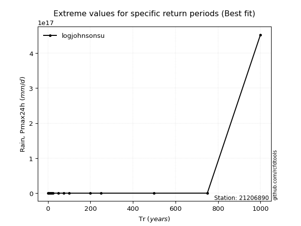</img>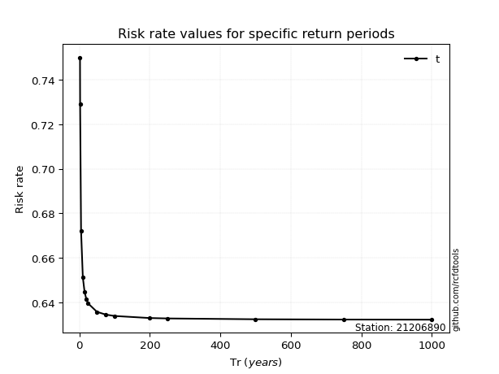</img>

</div>


<sub>**APP DISCLAIMER**: NO WARRANTY - This software is provided by [github.com/rcfdtools](https://github.com/rcfdtools) "as is", without any express or implied warranty, including warranties of merchantability, fitness for a particular purpose, or non-infringement. There is no guarantee that the software will be error-free or operate without interruption. LIMITATION OF LIABILITY - Neither the authors nor copyright holders will be liable for claims or damages arising from the software or its use. You are responsible for determining if the software is appropriate for your use and assume all associated risks, including errors, legal compliance, and data loss. NO PROFESSIONAL ADVICE - The software provides general information and does not offer professional advice. It should not replace consultation with professional advisors.</sub>