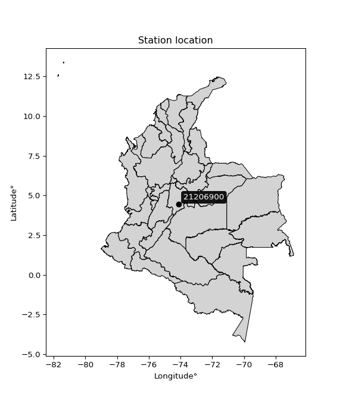

<div align="center">


</div>

# PMP Station (rain, Pmax24h): 21206900

Probable Maximum Precipitation (PMP) is the greatest amount of rainfall for a specific duration that is meteorologically possible for a given location, acting as a "worst-case" scenario for extreme storms, crucial for designing safety-critical infrastructure like bridges, river deviations, dams, spillways, and nuclear plants to prevent catastrophic failure. PMP is calculated by hydrologists using meteorological data to determine the upper limit of extreme rainfall, often leading to the Probable Maximum Flood (PMF) for flood control design, and is increasingly being studied for climate change impacts.

<div align="center">

</img>

</div>


## A. General information


### 1. General running parameters

• app_version: _v20251228_. • runtime: _2025-12-28 08:43:48.795225_. • Python version: _3.14.0_. • SciPy version: _1.16.3_. • Pandas version: _2.3.3_. • NumPy version: _2.3.5_. • Stations dataset (station_dataset_file): _dataset/pmax24h_in/automatic_colombia_2003_2024.csv_. • Stations catalog (station_catalog_file): _dataset/CNE_IDEAM.xls_. • Minimum year to eval til year_max (date_min): _1900_. • Maximum year to eval since year_min (date_max): _2024_. • Creates, save and include plots into reports (create_plot): _False_. • Plot only fit distributions with Δo > Δ (plot_only_fit): _True_. • Eval low extreme values, if False, evaluates high extreme values (low_extreme): _False_. • Eval every SciPy distribution as logarithmic (pdist_logarithmic_on): _True_. • Standard deviation normalized (ddof): _1.0_. • Return periods to eval in years (Tr): _[2, 2.33, 5, 10, 15, 20, 25, 50, 75, 100, 200, 250, 500, 750, 1000]_. • Minimum data sample per station, 0 means any (minimum_sample): _5_. • Z-Score maximum threshold to adjust a value, 0 means disable (zscore_max): _3.5_. • Z-Score minimum threshold to adjust a value, 0 means disable (zscore_min): _-2.5_. • Avoid zeros, e.g. rain = 0 (avoid_zeros): _True_. • Avoid null values (avoid_nans): _True_. [:file_folder:Dataset file.](../../dataset/pmax24h_in/automatic_colombia_2003_2024.csv)

> Delta Degrees of Freedom (DDOF): is a parameter used in the formulas for calculating variance and standard deviation. When ddof=0, the divisor is $N$ (the total number of observations) and this is used when your data set is the entire population. When ddof=1, the divisor is $N-1$ and this is used when your data set is a sample drawn from a larger population. Using $N-1$ provides an unbiased estimate of the population variance (known as Bessel´s correction).


### 2. Station info and location

|   id |   CODIGO | NOMBRE                             | CATEGORIA               | TECNOLOGIA                | ESTADO   | FECHA_INSTALACION   |   FECHA_SUSPENSION |   ALTITUD |   LATITUD |   LONGITUD | DEPARTAMENTO   | MUNICIPIO   | AREA_OPERATIVA                            | ENTIDAD                                                          | AREA_HIDROGRAFICA   | ZONA_HIDROGRAFICA   | SUBZONA_HIDROGRAFICA   |   CORRIENTE | Catalogo   |
|-----:|---------:|:-----------------------------------|:------------------------|:--------------------------|:---------|:--------------------|-------------------:|----------:|----------:|-----------:|:---------------|:------------|:------------------------------------------|:-----------------------------------------------------------------|:--------------------|:--------------------|:-----------------------|------------:|:-----------|
|    0 | 21206900 | LA ESPERANZA USME - AUT [21206900] | Climatológica Ordinaria | Automática con Telemetría | Activa   | 01/09/2007          |                nan |      3168 |   4.44914 |   -74.1079 | Bogotá         | Bogotá, D.C | Area Operativa 11 - Cundinamarca-Amazonas | FONDO DE PREVENCION Y ATENCION DE DESASTRES DE BOGOTA DC - FOPAE | Orinoco             | Meta                | Río Guayuriba          |         nan | CNE_OE     |

<div align="center">

Map location in: [:earth_americas:Google](http://maps.google.com/maps?q=4.44914,-74.10792) [:earth_americas:OSM](https://www.openstreetmap.org/#map=18/4.44914/-74.10792&layers=P) [:earth_americas:Bing](https://www.bing.com/maps?cp=4.44914~-74.10792&lvl=18) [:earth_americas:Apple](https://maps.apple.com/frame?center=4.44914%2C-74.10792&span=0.003%2C0.006)

</div>


<div align="center">

```geojson
{
  "type": "Feature",
  "geometry": {
    "type": "Point", 
    "coordinates": [-74.10792, 4.44914]
  }, 
  "properties": {
    "Name": "21206900"
  }
}
```

</div>


### 3. Discrete values table and plot

|               |            0 |          1 |          2 |           3 |           4 |
|:--------------|-------------:|-----------:|-----------:|------------:|------------:|
| Date          | 2011         | 2012       | 2015       | 2016        | 2024        |
| Value         |   27.3       |   43.7     |   16.4     |   24.6      |   29.4      |
| Value_initial |   27.3       |   43.7     |   16.4     |   24.6      |   29.4      |
| count         |    5         |    5       |    5       |    5        |    5        |
| mean          |   28.28      |   28.28    |   28.28    |   28.28     |   28.28     |
| std           |    9.93313   |    9.93313 |    9.93313 |    9.93313  |    9.93313  |
| zscore        |   -0.0986598 |    1.55238 |   -1.196   |   -0.370478 |    0.112754 |

> The initial value (value_initial) correspond to the initial obtained or null completed value, and value (value) is adjusted only when the initial value is outside the valid range definite through the Z-Score value. If Z-Score is active, values out of range or outliers are replaced with the station mean value


### 4. Active continuous probability distributions from SciPy (44 of 104 available)

[scipy.stats](https://docs.scipy.org/doc/scipy/reference/stats.html) is a Python´s powerful submodule within the SciPy library for comprehensive statistical analysis, offering over 130 probability distributions (like Normal, Poisson), functions for descriptive stats (mean, variance), hypothesis testing (t-tests, chi-square), random variable generation, and statistical tests, making it essential for data science, modeling, and research. It provides tools to explore, model, and draw conclusions from data efficiently, working seamlessly with NumPy.

<div align="center">

|   id | p_dist             |   n_parameter | fit_method   | label                                                                       | active   | ref                                                                                                        |
|-----:|:-------------------|--------------:|:-------------|:----------------------------------------------------------------------------|:---------|:-----------------------------------------------------------------------------------------------------------|
|    0 | alpha              |             3 | MLE          | Alpha                                                                       | True     | [:mortar_board:](https://docs.scipy.org/doc/scipy/reference/generated/scipy.stats.alpha.html)              |
|    1 | betaprime          |             4 | MLE          | Beta prime                                                                  | True     | [:mortar_board:](https://docs.scipy.org/doc/scipy/reference/generated/scipy.stats.betaprime.html)          |
|    2 | chi2               |             3 | MLE          | Chi²                                                                        | True     | [:mortar_board:](https://docs.scipy.org/doc/scipy/reference/generated/scipy.stats.chi2.html)               |
|    3 | crystalball        |             4 | MLE          | Crystalball                                                                 | True     | [:mortar_board:](https://docs.scipy.org/doc/scipy/reference/generated/scipy.stats.crystalball.html)        |
|    4 | erlang             |             3 | MLE          | Erlang                                                                      | True     | [:mortar_board:](https://docs.scipy.org/doc/scipy/reference/generated/scipy.stats.erlang.html)             |
|    5 | expon              |             2 | MLE          | Exponential                                                                 | True     | [:mortar_board:](https://docs.scipy.org/doc/scipy/reference/generated/scipy.stats.expon.html)              |
|    6 | exponnorm          |             3 | MLE          | Exponentially modified Normal                                               | True     | [:mortar_board:](https://docs.scipy.org/doc/scipy/reference/generated/scipy.stats.exponnorm.html)          |
|    7 | f                  |             4 | MLE          | F                                                                           | True     | [:mortar_board:](https://docs.scipy.org/doc/scipy/reference/generated/scipy.stats.f.html)                  |
|    8 | fatiguelife        |             3 | MLE          | Fatigue-life (Birnbaum-Saunders)                                            | True     | [:mortar_board:](https://docs.scipy.org/doc/scipy/reference/generated/scipy.stats.fatiguelife.html)        |
|    9 | fisk               |             3 | MLE          | Fisk                                                                        | True     | [:mortar_board:](https://docs.scipy.org/doc/scipy/reference/generated/scipy.stats.fisk.html)               |
|   10 | gamma              |             3 | MLE          | Gamma                                                                       | True     | [:mortar_board:](https://docs.scipy.org/doc/scipy/reference/generated/scipy.stats.gamma.html)              |
|   11 | genexpon           |             5 | MLE          | Generalized exponential                                                     | True     | [:mortar_board:](https://docs.scipy.org/doc/scipy/reference/generated/scipy.stats.genexpon.html)           |
|   12 | genlogistic        |             3 | MLE          | Generalized logistic                                                        | True     | [:mortar_board:](https://docs.scipy.org/doc/scipy/reference/generated/scipy.stats.genlogistic.html)        |
|   13 | gibrat             |             2 | MM           | Gibrat                                                                      | True     | [:mortar_board:](https://docs.scipy.org/doc/scipy/reference/generated/scipy.stats.gibrat.html)             |
|   14 | gompertz           |             3 | MLE          | Gompertz (or truncated Gumbel)                                              | True     | [:mortar_board:](https://docs.scipy.org/doc/scipy/reference/generated/scipy.stats.gompertz.html)           |
|   15 | gumbel_l           |             2 | MM           | Gumbel Left Skew                                                            | True     | [:mortar_board:](https://docs.scipy.org/doc/scipy/reference/generated/scipy.stats.gumbel_l.html)           |
|   16 | gumbel_r           |             2 | MM           | Gumbel Right Skew                                                           | True     | [:mortar_board:](https://docs.scipy.org/doc/scipy/reference/generated/scipy.stats.gumbel_r.html)           |
|   17 | halflogistic       |             2 | MM           | Half-logistic                                                               | True     | [:mortar_board:](https://docs.scipy.org/doc/scipy/reference/generated/scipy.stats.halflogistic.html)       |
|   18 | halfnorm           |             2 | MM           | Half Normal                                                                 | True     | [:mortar_board:](https://docs.scipy.org/doc/scipy/reference/generated/scipy.stats.halfnorm.html)           |
|   19 | hypsecant          |             2 | MM           | hyperbolic secant                                                           | True     | [:mortar_board:](https://docs.scipy.org/doc/scipy/reference/generated/scipy.stats.hypsecant.html)          |
|   20 | invgamma           |             3 | MLE          | Inverted gamma                                                              | True     | [:mortar_board:](https://docs.scipy.org/doc/scipy/reference/generated/scipy.stats.invgamma.html)           |
|   21 | invgauss           |             3 | MLE          | Inverse Gaussian                                                            | True     | [:mortar_board:](https://docs.scipy.org/doc/scipy/reference/generated/scipy.stats.invgauss.html)           |
|   22 | invweibull         |             3 | MLE          | Inverted Weibull                                                            | True     | [:mortar_board:](https://docs.scipy.org/doc/scipy/reference/generated/scipy.stats.invweibull.html)         |
|   23 | johnsonsu          |             4 | MLE          | Johnson Su                                                                  | True     | [:mortar_board:](https://docs.scipy.org/doc/scipy/reference/generated/scipy.stats.johnsonsu.html)          |
|   24 | kstwobign          |             2 | MLE          | Limiting distribution of scaled Kolmogorov-Smirnov two-sided test statistic | True     | [:mortar_board:](https://docs.scipy.org/doc/scipy/reference/generated/scipy.stats.kstwobign.html)          |
|   25 | laplace            |             2 | MM           | Laplace                                                                     | True     | [:mortar_board:](https://docs.scipy.org/doc/scipy/reference/generated/scipy.stats.laplace.html)            |
|   26 | laplace_asymmetric |             3 | MLE          | Asymmetric Laplace                                                          | True     | [:mortar_board:](https://docs.scipy.org/doc/scipy/reference/generated/scipy.stats.laplace_asymmetric.html) |
|   27 | loggamma           |             3 | MLE          | Log gamma                                                                   | True     | [:mortar_board:](https://docs.scipy.org/doc/scipy/reference/generated/scipy.stats.loggamma.html)           |
|   28 | logistic           |             2 | MM           | Logistic (or Sech-squared)                                                  | True     | [:mortar_board:](https://docs.scipy.org/doc/scipy/reference/generated/scipy.stats.logistic.html)           |
|   29 | lognorm            |             3 | MLE          | Log Normal                                                                  | True     | [:mortar_board:](https://docs.scipy.org/doc/scipy/reference/generated/scipy.stats.lognorm.html)            |
|   30 | maxwell            |             2 | MM           | Maxwell                                                                     | True     | [:mortar_board:](https://docs.scipy.org/doc/scipy/reference/generated/scipy.stats.maxwell.html)            |
|   31 | mielke             |             4 | MLE          | Mielke Beta-Kappa / Dagum                                                   | True     | [:mortar_board:](https://docs.scipy.org/doc/scipy/reference/generated/scipy.stats.mielke.html)             |
|   32 | moyal              |             2 | MM           | Moyal                                                                       | True     | [:mortar_board:](https://docs.scipy.org/doc/scipy/reference/generated/scipy.stats.moyal.html)              |
|   33 | nakagami           |             3 | MLE          | Nakagami                                                                    | True     | [:mortar_board:](https://docs.scipy.org/doc/scipy/reference/generated/scipy.stats.nakagami.html)           |
|   34 | ncf                |             5 | MLE          | Non-central F distribution                                                  | True     | [:mortar_board:](https://docs.scipy.org/doc/scipy/reference/generated/scipy.stats.ncf.html)                |
|   35 | nct                |             4 | MLE          | Non-central Student’s t                                                     | True     | [:mortar_board:](https://docs.scipy.org/doc/scipy/reference/generated/scipy.stats.nct.html)                |
|   36 | norm               |             2 | MM           | Normal                                                                      | True     | [:mortar_board:](https://docs.scipy.org/doc/scipy/reference/generated/scipy.stats.norm.html)               |
|   37 | pearson3           |             3 | MM           | Pearson type III                                                            | True     | [:mortar_board:](https://docs.scipy.org/doc/scipy/reference/generated/scipy.stats.pearson3.html)           |
|   38 | rayleigh           |             2 | MM           | Rayleigh                                                                    | True     | [:mortar_board:](https://docs.scipy.org/doc/scipy/reference/generated/scipy.stats.rayleigh.html)           |
|   39 | rice               |             3 | MLE          | Rice                                                                        | True     | [:mortar_board:](https://docs.scipy.org/doc/scipy/reference/generated/scipy.stats.rice.html)               |
|   40 | t                  |             3 | MLE          | Student’s t                                                                 | True     | [:mortar_board:](https://docs.scipy.org/doc/scipy/reference/generated/scipy.stats.t.html)                  |
|   41 | truncnorm          |             4 | MLE          | Truncated normal                                                            | True     | [:mortar_board:](https://docs.scipy.org/doc/scipy/reference/generated/scipy.stats.truncnorm.html)          |
|   42 | wald               |             2 | MM           | Wald                                                                        | True     | [:mortar_board:](https://docs.scipy.org/doc/scipy/reference/generated/scipy.stats.wald.html)               |
|   43 | weibull_min        |             3 | MLE          | Weibull minimum                                                             | True     | [:mortar_board:](https://docs.scipy.org/doc/scipy/reference/generated/scipy.stats.weibull_min.html)        |

</div>

> **n_parameter:** # arguments & localization & scale.
>
> **Fit methods:** (MLE) maximum likelihood, (MM) L-moments.
>
>**Inactive:** foldnorm, gennorm, norminvgauss, powernorm, powerlognorm, skewnorm, genextreme, anglit, arcsine, argus, beta, bradford, burr, burr12, cauchy, cosine, halfcauchy, foldcauchy, skewcauchy, wrapcauchy, dgamma, gengamma, exponweib, exponpow, truncexpon, gausshyper, genhalflogistic, genhyperbolic, geninvgauss, halfgennorm, johnsonsb, kappa4, kappa3, ksone, kstwo, loglaplace, levy, levy_l, levy_stable, ncx2, pareto, genpareto, truncpareto, lomax, powerlaw, rdist, rel_breitwigner, recipinvgauss, semicircular, studentized_range, trapezoid, triang, truncweibull_min, tukeylambda, uniform, loguniform, vonmises, vonmises_line, weibull_max, dweibull, 


## B. Probability distributions vs. Empirical distributions

A continuous probability distribution (CPD) describes probabilities for variables that can take any value within a range (like rain any time), unlike discrete variables with specific outcomes (like temperature). It uses a Probability Density Function (PDF), a curve where the total area under it equals 1, and the probability of the variable falling within an interval (a to b) is found by calculating the area under the curve between those points. A key feature is that the probability of hitting any single exact value is zero, so probabilities are always expressed for ranges, e.g., $P(a ≤ X ≤ b)$.

<div align="center">

Distributions parameters from station values
|    |   station | p_dist                |   n |             loc |          scale | shape                 | shape1                | shape2                 | shape3   |
|---:|----------:|:----------------------|----:|----------------:|---------------:|:----------------------|:----------------------|:-----------------------|:---------|
|  0 |  21206900 | alpha                 |   5 |   -31.8909      |  415.691       | 7.054198198281309     |                       |                        |          |
|  1 |  21206900 | betaprime             |   5 |    -0.273742    |   24.8481      | 22.27597535991267     | 20.43885124793121     |                        |          |
|  2 |  21206900 | chi2                  |   5 |    16.4         |    5.33931     | 1.4981641811737378    |                       |                        |          |
|  3 |  21206900 | crystalball           |   5 |    28.28        |    8.88446     | 7.362724635122081     | 13744.598593251503    |                        |          |
|  4 |  21206900 | erlang                |   5 |    16.4         |    9.73182     | 0.9685174173012814    |                       |                        |          |
|  5 |  21206900 | expon                 |   5 |    16.4         |   11.88        |                       |                       |                        |          |
|  6 |  21206900 | exponnorm             |   5 |    20.3488      |    4.95575     | 1.6004189834110947    |                       |                        |          |
|  7 |  21206900 | f                     |   5 |    16.3633      |   11.5024      | 1.4512708904630105    | 61.352086636372064    |                        |          |
|  8 |  21206900 | fatiguelife           |   5 |    16.4         |    1.55351e-05 | 853.0832102854494     |                       |                        |          |
|  9 |  21206900 | fisk                  |   5 |    -0.0501593   |   27.048       | 5.55370754236311      |                       |                        |          |
| 10 |  21206900 | gamma                 |   5 |    16.4         |   12.4736      | 0.396213195787792     |                       |                        |          |
| 11 |  21206900 | genexpon              |   5 |    16.4         |    1.72995     | 0.14549524314724915   | 5.905114523801761e-07 | 1.3210490567872237     |          |
| 12 |  21206900 | genlogistic           |   5 |   -17.898       |    7.29448     | 317.35698806473       |                       |                        |          |
| 13 |  21206900 | gibrat                |   5 |    21.5023      |    4.11091     |                       |                       |                        |          |
| 14 |  21206900 | gompertz              |   5 |    16.4         |   22.125       | 1.1582303934892688    |                       |                        |          |
| 15 |  21206900 | gumbel_l              |   5 |    32.2785      |    6.92718     |                       |                       |                        |          |
| 16 |  21206900 | gumbel_r              |   5 |    24.2815      |    6.92718     |                       |                       |                        |          |
| 17 |  21206900 | halflogistic          |   5 |    17.7499      |    7.59588     |                       |                       |                        |          |
| 18 |  21206900 | halfnorm              |   5 |    16.5204      |   14.7384      |                       |                       |                        |          |
| 19 |  21206900 | hypsecant             |   5 |    28.28        |    5.65602     |                       |                       |                        |          |
| 20 |  21206900 | invgamma              |   5 |    -9.70133     |  693.211       | 19.242487300113048    |                       |                        |          |
| 21 |  21206900 | invgauss              |   5 |     1.42752     |  229.38        | 0.11706542322865882   |                       |                        |          |
| 22 |  21206900 | invweibull            |   5 |    -2.52933e+08 |    2.52933e+08 | 34603519.18718562     |                       |                        |          |
| 23 |  21206900 | johnsonsu             |   5 |     1.25569     |    3.23304     | -8.423722118265115    | 3.0441278437388046    |                        |          |
| 24 |  21206900 | kstwobign             |   5 |    -1.81364     |   34.5557      |                       |                       |                        |          |
| 25 |  21206900 | laplace               |   5 |    28.28        |    6.28226     |                       |                       |                        |          |
| 26 |  21206900 | laplace_asymmetric    |   5 |    27.3         |    6.36354     | 0.9259759217551606    |                       |                        |          |
| 27 |  21206900 | loggamma              |   5 | -2370.85        |  332.387       | 1364.0059947874856    |                       |                        |          |
| 28 |  21206900 | logistic              |   5 |    28.28        |    4.89826     |                       |                       |                        |          |
| 29 |  21206900 | lognorm               |   5 |    16.4         |    0.0102419   | 14.350413032939096    |                       |                        |          |
| 30 |  21206900 | maxwell               |   5 |     7.22756     |   13.1927      |                       |                       |                        |          |
| 31 |  21206900 | mielke                |   5 |  -197.61        |  170.793       | 87086.62686529929     | 30.591635368763313    |                        |          |
| 32 |  21206900 | moyal                 |   5 |    23.1993      |    3.99941     |                       |                       |                        |          |
| 33 |  21206900 | nakagami              |   5 |    24.6         |    6.35526     | 0.33402675277524985   |                       |                        |          |
| 34 |  21206900 | ncf                   |   5 |     0.172109    |   27.2597      | 29.453522656778667    | 65.9969801886846      | 1.9314401576512276e-05 |          |
| 35 |  21206900 | nct                   |   5 |    -0.0672405   |    5.33389     | 10.17007246801251     | 4.916435655758921     |                        |          |
| 36 |  21206900 | norm                  |   5 |    28.28        |    8.88446     |                       |                       |                        |          |
| 37 |  21206900 | pearson3              |   5 |    28.28        |    8.88445     | 0.5533948179222219    |                       |                        |          |
| 38 |  21206900 | rayleigh              |   5 |    11.2835      |   13.5612      |                       |                       |                        |          |
| 39 |  21206900 | rice                  |   5 |    12.2281      |   12.9729      | 0.003188514361529774  |                       |                        |          |
| 40 |  21206900 | t                     |   5 |    28.2797      |    8.8846      | 17035584.407298483    |                       |                        |          |
| 41 |  21206900 | truncnorm             |   5 |    28.28        |    8.88446     | -142.52470598824118   | 470.07921637334505    |                        |          |
| 42 |  21206900 | wald                  |   5 |    19.3956      |    8.88443     |                       |                       |                        |          |
| 43 |  21206900 | weibull_min           |   5 |    16.4         |    9.01726     | 0.40668700915951783   |                       |                        |          |
| 44 |  21206900 | logalpha              |   5 |    -3.48953     |  144.336       | 21.32648918575719     |                       |                        |          |
| 45 |  21206900 | logbetaprime          |   5 |    -0.863262    |   15.3116      | 217.49228301890582    | 801.904750278235      |                        |          |
| 46 |  21206900 | logchi2               |   5 |     2.79728     |    0.987835    | 1.0325546929018032    |                       |                        |          |
| 47 |  21206900 | logcrystalball        |   5 |     3.29305     |    0.315091    | 207.58988645196504    | 1671.3800049858885    |                        |          |
| 48 |  21206900 | logerlang             |   5 |   -10.4424      |    0.00724035  | 1897.0196483252184    |                       |                        |          |
| 49 |  21206900 | logexpon              |   5 |     2.79728     |    0.49577     |                       |                       |                        |          |
| 50 |  21206900 | logexponnorm          |   5 |     3.29275     |    0.315092    | 0.0009498902367142627 |                       |                        |          |
| 51 |  21206900 | logf                  |   5 |   -57.7085      |   61.0009      | 203129.38338787644    | 118133.68509755429    |                        |          |
| 52 |  21206900 | logfatiguelife        |   5 |   -28.5627      |   31.8535      | 0.009892808556144675  |                       |                        |          |
| 53 |  21206900 | logfisk               |   5 |    -5.89305e+06 |    5.89305e+06 | 32634860.132103838    |                       |                        |          |
| 54 |  21206900 | loggamma              |   5 |   -10.5479      |    0.00719325  | 1924.1211509308682    |                       |                        |          |
| 55 |  21206900 | loggenexpon           |   5 |     2.79138     |    0.0096653   | 0.009343045536328632  | 4.053459068678187     | 6.76374239732077e-05   |          |
| 56 |  21206900 | loggenlogistic        |   5 |     3.31226     |    0.176274    | 0.9398726534947393    |                       |                        |          |
| 57 |  21206900 | loggibrat             |   5 |     3.05272     |    0.145773    |                       |                       |                        |          |
| 58 |  21206900 | loggompertz           |   5 |     2.79728     |    0.465985    | 0.3822086439675374    |                       |                        |          |
| 59 |  21206900 | loggumbel_l           |   5 |     3.43486     |    0.245675    |                       |                       |                        |          |
| 60 |  21206900 | loggumbel_r           |   5 |     3.15124     |    0.245675    |                       |                       |                        |          |
| 61 |  21206900 | loghalflogistic       |   5 |     2.91961     |    0.269382    |                       |                       |                        |          |
| 62 |  21206900 | loghalfnorm           |   5 |     2.87597     |    0.522736    |                       |                       |                        |          |
| 63 |  21206900 | loghypsecant          |   5 |     3.29305     |    0.200593    |                       |                       |                        |          |
| 64 |  21206900 | loginvgamma           |   5 |    -2.05297     | 1494.71        | 280.70454087487064    |                       |                        |          |
| 65 |  21206900 | loginvgauss           |   5 |     1.02304     |  111.293       | 0.020362850089691326  |                       |                        |          |
| 66 |  21206900 | loginvweibull         |   5 |    -3.12432e+07 |    3.12432e+07 | 104316299.1945486     |                       |                        |          |
| 67 |  21206900 | logjohnsonsu          |   5 |     7.37055     |    8.69662     | 13.811889370436017    | 30.4936495486495      |                        |          |
| 68 |  21206900 | logkstwobign          |   5 |     2.08243     |    1.38449     |                       |                       |                        |          |
| 69 |  21206900 | loglaplace            |   5 |     3.29305     |    0.222803    |                       |                       |                        |          |
| 70 |  21206900 | loglaplace_asymmetric |   5 |     3.30689     |    0.231313    | 1.0303740230606722    |                       |                        |          |
| 71 |  21206900 | logloggamma           |   5 |   -16.8399      |    3.97242     | 159.38664310552605    |                       |                        |          |
| 72 |  21206900 | loglogistic           |   5 |     3.29305     |    0.173719    |                       |                       |                        |          |
| 73 |  21206900 | loglognorm            |   5 |     2.79728     |    0.000554655 | 13.929683649072947    |                       |                        |          |
| 74 |  21206900 | logmaxwell            |   5 |     2.54642     |    0.467883    |                       |                       |                        |          |
| 75 |  21206900 | logmielke             |   5 |     2.79728     |    0.83307     | 0.29747700573607955   | 3.1633747753621653    |                        |          |
| 76 |  21206900 | logmoyal              |   5 |     3.11286     |    0.141841    |                       |                       |                        |          |
| 77 |  21206900 | lognakagami           |   5 |     3.20275     |    0.207888    | 0.04790415869573997   |                       |                        |          |
| 78 |  21206900 | logncf                |   5 |    -3.34827     |    6.57418     | 1276.0507199663357    | 2706.656179634063     | 12.53423541176683      |          |
| 79 |  21206900 | lognct                |   5 |    -0.605971    |    0.0290916   | 74.25489991111971     | 132.62094493644867    |                        |          |
| 80 |  21206900 | lognorm               |   5 |     3.29305     |    0.315091    |                       |                       |                        |          |
| 81 |  21206900 | logpearson3           |   5 |     3.29305     |    0.315091    | -0.05321080652434865  |                       |                        |          |
| 82 |  21206900 | lograyleigh           |   5 |     2.69026     |    0.480955    |                       |                       |                        |          |
| 83 |  21206900 | logrice               |   5 |     2.612       |    0.358778    | 1.540988041144404     |                       |                        |          |
| 84 |  21206900 | logt                  |   5 |     3.29305     |    0.315091    | 41346432148.73327     |                       |                        |          |
| 85 |  21206900 | logtruncnorm          |   5 |    -0.120076    |    1.00321     | 3.312181813103976     | 3.8849574486059177    |                        |          |
| 86 |  21206900 | logwald               |   5 |     2.97797     |    0.315082    |                       |                       |                        |          |
| 87 |  21206900 | logweibull_min        |   5 |     2.44559     |    0.950468    | 2.9935900436469858    |                       |                        |          |

</div>

> **loc** (Location parameter): This shifts the distribution along the x-axis. For many common distributions, like the normal (Gaussian) distribution, loc represents the mean $μ$. For others, like the uniform distribution, it might represent the minimum value, or for the beta distribution, the left end of the support interval.
>
> **scale** (Scale parameter): This determines the width or spread of the distribution. For the normal distribution, scale represents the standard deviation $σ$. For a uniform distribution, it defines the length of the interval (from $loc$ to $loc + scale$).
>
> **shape** (Shape parameters): Refers to parameters that define the specific form of a probability distribution, distinct from its location (loc) and scale (scale). These parameters are required arguments for most distribution functions. For example, a normal (Gaussian) distribution is fully defined by its location (mean) and scale (standard deviation), so it has no specific shape parameters beyond loc and scale. However, other distributions have intrinsic properties that need specification, as Gamma distribution that takes a shape parameter, often named $a$ or $alpha$.


### 0. Cumulative distribution values - CDF (88 evaluated)

Cumulative Distribution Function (CDF), denoted as $F$<sub>$X$</sub>$(x)$, is a function that gives the probability that a random variable $X$ will take a value less than or equal to a specific value, $x$ (i.e., $(P(X≥x)$. It essentially "accumulates" probabilities from a given point up to the far right (positive infinity), providing a complete picture of the distribution´s probabilities for both discrete (like rain) and continuous (like temperature) variables, helping to find probabilities over ranges or above certain values.

<div align="center">

CDF ordered by x ascending and calculating $log(f(x))$ separately
|   id |   Station |   date |    x |   count |   mean |     std |     zscore |   Value_initial |   station |   m |     alpha |   alpha_pdf |   betaprime |   betaprime_pdf |       chi2 |     chi2_pdf |   crystalball |   crystalball_pdf |      erlang |   erlang_pdf |    expon |   expon_pdf |   exponnorm |   exponnorm_pdf |        f |      f_pdf |   fatiguelife |   fatiguelife_pdf |      fisk |   fisk_pdf |       gamma |   gamma_pdf |    genexpon |   genexpon_pdf |   genlogistic |   genlogistic_pdf |   gibrat |   gibrat_pdf |    gompertz |   gompertz_pdf |   gumbel_l |   gumbel_l_pdf |   gumbel_r |   gumbel_r_pdf |   halflogistic |   halflogistic_pdf |   halfnorm |   halfnorm_pdf |   hypsecant |   hypsecant_pdf |   invgamma |   invgamma_pdf |   invgauss |   invgauss_pdf |   invweibull |   invweibull_pdf |   johnsonsu |   johnsonsu_pdf |   kstwobign |   kstwobign_pdf |   laplace |   laplace_pdf |   laplace_asymmetric |   laplace_asymmetric_pdf |   loggamma |   loggamma_pdf |   logistic |   logistic_pdf |   lognorm |   lognorm_pdf |   maxwell |   maxwell_pdf |   mielke |   mielke_pdf |     moyal |   moyal_pdf |    nakagami |   nakagami_pdf |       ncf |    ncf_pdf |       nct |    nct_pdf |      norm |   norm_pdf |   pearson3 |   pearson3_pdf |   rayleigh |   rayleigh_pdf |     rice |   rice_pdf |         t |      t_pdf |   truncnorm |   truncnorm_pdf |     wald |   wald_pdf |   weibull_min |   weibull_min_pdf |   logalpha |   logalpha_pdf |   logbetaprime |   logbetaprime_pdf |     logchi2 |   logchi2_pdf |   logcrystalball |   logcrystalball_pdf |   logerlang |   logerlang_pdf |   logexpon |   logexpon_pdf |   logexponnorm |   logexponnorm_pdf |      logf |   logf_pdf |   logfatiguelife |   logfatiguelife_pdf |   logfisk |   logfisk_pdf |   loggenexpon |   loggenexpon_pdf |   loggenlogistic |   loggenlogistic_pdf |   loggibrat |   loggibrat_pdf |   loggompertz |   loggompertz_pdf |   loggumbel_l |   loggumbel_l_pdf |   loggumbel_r |   loggumbel_r_pdf |   loghalflogistic |   loghalflogistic_pdf |   loghalfnorm |   loghalfnorm_pdf |   loghypsecant |   loghypsecant_pdf |   loginvgamma |   loginvgamma_pdf |   loginvgauss |   loginvgauss_pdf |   loginvweibull |   loginvweibull_pdf |   logjohnsonsu |   logjohnsonsu_pdf |   logkstwobign |   logkstwobign_pdf |   loglaplace |   loglaplace_pdf |   loglaplace_asymmetric |   loglaplace_asymmetric_pdf |   logloggamma |   logloggamma_pdf |   loglogistic |   loglogistic_pdf |   loglognorm |   loglognorm_pdf |   logmaxwell |   logmaxwell_pdf |   logmielke |   logmielke_pdf |   logmoyal |   logmoyal_pdf |   lognakagami |   lognakagami_pdf |    logncf |   logncf_pdf |    lognct |   lognct_pdf |   logpearson3 |   logpearson3_pdf |   lograyleigh |   lograyleigh_pdf |   logrice |   logrice_pdf |      logt |   logt_pdf |   logtruncnorm |   logtruncnorm_pdf |   logwald |   logwald_pdf |   logweibull_min |   logweibull_min_pdf |
|-----:|----------:|-------:|-----:|--------:|-------:|--------:|-----------:|----------------:|----------:|----:|----------:|------------:|------------:|----------------:|-----------:|-------------:|--------------:|------------------:|------------:|-------------:|---------:|------------:|------------:|----------------:|---------:|-----------:|--------------:|------------------:|----------:|-----------:|------------:|------------:|------------:|---------------:|--------------:|------------------:|---------:|-------------:|------------:|---------------:|-----------:|---------------:|-----------:|---------------:|---------------:|-------------------:|-----------:|---------------:|------------:|----------------:|-----------:|---------------:|-----------:|---------------:|-------------:|-----------------:|------------:|----------------:|------------:|----------------:|----------:|--------------:|---------------------:|-------------------------:|-----------:|---------------:|-----------:|---------------:|----------:|--------------:|----------:|--------------:|---------:|-------------:|----------:|------------:|------------:|---------------:|----------:|-----------:|----------:|-----------:|----------:|-----------:|-----------:|---------------:|-----------:|---------------:|---------:|-----------:|----------:|-----------:|------------:|----------------:|---------:|-----------:|--------------:|------------------:|-----------:|---------------:|---------------:|-------------------:|------------:|--------------:|-----------------:|---------------------:|------------:|----------------:|-----------:|---------------:|---------------:|-------------------:|----------:|-----------:|-----------------:|---------------------:|----------:|--------------:|--------------:|------------------:|-----------------:|---------------------:|------------:|----------------:|--------------:|------------------:|--------------:|------------------:|--------------:|------------------:|------------------:|----------------------:|--------------:|------------------:|---------------:|-------------------:|--------------:|------------------:|--------------:|------------------:|----------------:|--------------------:|---------------:|-------------------:|---------------:|-------------------:|-------------:|-----------------:|------------------------:|----------------------------:|--------------:|------------------:|--------------:|------------------:|-------------:|-----------------:|-------------:|-----------------:|------------:|----------------:|-----------:|---------------:|--------------:|------------------:|----------:|-------------:|----------:|-------------:|--------------:|------------------:|--------------:|------------------:|----------:|--------------:|----------:|-----------:|---------------:|-------------------:|----------:|--------------:|-----------------:|---------------------:|
|    0 |  21206900 |   2015 | 16.4 |       5 |  28.28 | 9.93313 | -1.196     |            16.4 |  21206900 |   1 | 0.0601084 |  0.0212642  |   0.0574592 |      0.0222451  | 2.7701e-12 | 584.069      |     0.0905842 |        0.0183661  | 1.13246e-15 |   0.308724   | 0        |  0.0841751  |   0.0576617 |      0.0195581  | 0.013339 | 0.263268   |     0.0510366 |       1.07302e+10 | 0.0594272 | 0.0188708  | 7.80797e-07 | 8.70777e+07 | 4.17441e-08 |     0.0841038  |      0.056816 |        0.0222375  | 0        |   0          | 6.58598e-09 |      0.0523493 |  0.0961068 |     0.0131847  |  0.0441663 |     0.0198911  |       0        |          0         |   0        |      0         |    0.07754  |      0.0135741  |  0.0584884 |     0.0218794  |  0.0559129 |     0.0232862  |    0.0568267 |       0.0222951  |   0.0571862 |      0.0225504  |   0.0560557 |      0.0242567  | 0.0754575 |    0.0120112  |            0.0725976 |               0.0123204  |  0.0568179 |       0.370624 |  0.0812598 |      0.0152415 | 0.0578109 |      0.367193 | 0.0774766 |     0.0229585 |      nan |          nan | 0.0192975 |  0.0151126  | 0           |     0          | 0.0610213 | 0.0218387  | 0.0584949 | 0.0209094  | 0.0905841 | 0.0183661  |  0.0728469 |     0.0212873  |  0.0686992 |      0.0259098 | 0.050393 | 0.0235394  | 0.0905924 | 0.018367   |   0.0905842 |      0.0183661  | 0        | 0          |   5.43481e-07 |       6.22134e+07 |  0.0513381 |       0.384643 |      0.0531258 |           0.377224 | 1.34501e-08 |   7.81821e+06 |        0.0578109 |             0.367193 |   0.0567501 |        0.370554 |   0        |       2.01706  |      0.0578124 |           0.367199 | 0.0575398 |   0.368439 |        0.0572056 |             0.369873 | 0.0595079 |      0.309935 |    0.00573942 |          0.978331 |        0.0611077 |             0.309169 |    0        |        0        |    1.1033e-08 |          0.820216 |     0.0719138 |          0.281932 |     0.0146406 |          0.251719 |          0        |              0        |      0        |          0        |      0.0536393 |           0.26614  |     0.0538583 |          0.38994  |     0.0491773 |          0.406098 |       0.0457639 |            0.47127  |      0.0589259 |           0.364492 |       0.047469 |           0.548183 |    0.0540256 |         0.242481 |               0.0606988 |                    0.254675 |     0.0599895 |          0.362834 |     0.0544818 |          0.296534 |    0.0227735 |      8.73545e+12 |    0.0376333 |         0.424598 |  0.00869011 |    26301.4      | 0.00235173 |      0.0837686 |     0         |       0           | 0.0554721 |     0.375835 | 0.0504167 |     0.402239 |     0.0592829 |          0.364423 |     0.0244515 |          0.45133  |  0.041107 |      0.447552 | 0.0578108 |   0.367192 |    0           |           0        |  0        |      0        |        0.0497054 |             0.412402 |
|    1 |  21206900 |   2016 | 24.6 |       5 |  28.28 | 9.93313 | -0.370478  |            24.6 |  21206900 |   2 | 0.38043   |  0.0496146  |   0.389529  |      0.050087   | 0.659378   |   0.0378493  |     0.339361  |        0.041212   | 0.58403     |   0.0436476  | 0.498542 |  0.0422103  |   0.383392  |      0.0530958  | 0.549734 | 0.0352657  |     0.802794  |       0.0144155   | 0.373893  | 0.0527423  | 0.805659    | 0.0238933   | 0.49825     |     0.0421992  |      0.392691 |        0.0502463  | 0.3886   |   0.123731   | 0.405254    |      0.0451025 |  0.281125  |     0.0342531  |  0.384787  |     0.0530514  |       0.422647 |          0.0540668 |   0.416444 |      0.0465834 |    0.30613  |      0.0461585  |  0.384907  |     0.0496179  |  0.393525  |     0.0493581  |    0.39299   |       0.0502147  |   0.389289  |      0.0495335  |   0.396976  |      0.0484395  | 0.278337  |    0.0443052  |            0.291936  |               0.0495439  |  0.390303  |       1.22154  |  0.320541  |      0.0444636 | 0.387209  |      1.21517  | 0.370605  |     0.0440681 |      nan |          nan | 0.401266  |  0.0588677  | 5.01873e-11 |  9437.23       | 0.380023  | 0.0487455  | 0.383358  | 0.0505534  | 0.339361  | 0.041212   |  0.367727  |     0.0459201  |  0.382524  |      0.0447107 | 0.365386 | 0.0466516  | 0.339375  | 0.041212   |   0.339361  |      0.041212   | 0.435586 | 0.0865103  |   0.61791     |       0.0182319   |  0.404767  |       1.24888  |      0.397024  |           1.235    | 0.465078    |   0.516259    |        0.387209  |             1.21517  |   0.390411  |        1.22236  |   0.55862  |       0.890292 |      0.387212  |           1.21517  | 0.388014  |   1.21568  |        0.389706  |             1.22068  | 0.374048  |      1.29661  |    0.475721   |          1.13884  |        0.372295  |             1.29128  |    0.511486 |        2.65796  |    0.411515   |          1.15227  |     0.322103  |          1.07271  |     0.444467  |          1.46701  |          0.481956 |              1.42496  |      0.468117 |          1.25545  |      0.361309  |           1.43858  |     0.405433  |          1.24113  |     0.419764  |          1.26003  |       0.450885  |            1.19914  |      0.384542  |           1.20826  |       0.470735 |           1.16316  |    0.333384  |         1.49632  |               0.332666  |                    1.39577  |     0.382554  |          1.20194  |     0.372891  |          1.3461   |    0.682039  |      0.0631465   |    0.420871  |         1.25453  |  0.799807   |        0.532239 | 0.466344   |      1.57137   |     0.0348698 |       7.52285e+12 | 0.393189  |     1.22028  | 0.416271  |     1.25262  |     0.384097  |          1.20615  |     0.433173  |          1.2558   |  0.406644 |      1.22178  | 0.387209  |   1.21517  |    1.28386e-05 |           4.00614  |  0.524197 |      1.98378  |        0.397253  |             1.20647  |
|    2 |  21206900 |   2011 | 27.3 |       5 |  28.28 | 9.93313 | -0.0986598 |            27.3 |  21206900 |   3 | 0.512488  |  0.0473105  |   0.521552  |      0.0468784  | 0.746509   |   0.0273674  |     0.456084  |        0.044631   | 0.686483    |   0.0327777  | 0.600487 |  0.0336291  |   0.524121  |      0.0498684  | 0.63387  | 0.0274985  |     0.836924  |       0.0110959   | 0.515419  | 0.0507166  | 0.858904    | 0.0162045   | 0.600178    |     0.0336267  |      0.524215 |        0.0463668  | 0.634511 |   0.0648606  | 0.521641    |      0.0409847 |  0.385774  |     0.0432165  |  0.523728  |     0.0488999  |       0.557114 |          0.0453946 |   0.53546  |      0.0414314 |    0.445121 |      0.0554437  |  0.516164  |     0.0467715  |  0.522737  |     0.0456422  |    0.524388  |       0.0463106  |   0.519605  |      0.0462184  |   0.523236  |      0.0445006  | 0.427782  |    0.0680936  |            0.461622  |               0.0783408  |  0.520784  |       1.26177  |  0.450148  |      0.0505312 | 0.517511  |      1.2649   | 0.490331  |     0.0440013 |      nan |          nan | 0.549241  |  0.0499322  | 0.431791    |     0.102101   | 0.509875  | 0.0466201  | 0.517275  | 0.0476993  | 0.456084  | 0.044631   |  0.492493  |     0.0457376  |  0.502141  |      0.0433586 | 0.490781 | 0.0456029  | 0.456096  | 0.0446305  |   0.456084  |      0.044631   | 0.620196 | 0.0531435  |   0.660462    |       0.013684    |  0.535637  |       1.24161  |      0.527546  |           1.24896  | 0.514577    |   0.438482    |        0.517511  |             1.2649   |   0.520971  |        1.26243  |   0.642245 |       0.721615 |      0.517514  |           1.26489  | 0.518202  |   1.26222  |        0.520245  |             1.26373  | 0.515451  |      1.38314  |    0.588445   |          1.01936  |        0.513805  |             1.39066  |    0.710881 |        1.34482  |    0.531723   |          1.14652  |     0.447878  |          1.3349   |     0.588184  |          1.27061  |          0.61618  |              1.15138  |      0.590262 |          1.08666  |      0.521937  |           1.58308  |     0.535757  |          1.2392   |     0.549901  |          1.2176   |       0.569725  |            1.07019  |      0.514553  |           1.26647  |       0.585387 |           1.03007  |    0.530104  |         2.10902  |               0.514957  |                    2.16061  |     0.512258  |          1.26721  |     0.5199    |          1.43683  |    0.68787   |      0.0498466   |    0.549779  |         1.20239  |  0.84855    |        0.408945 | 0.613827   |      1.24962   |     0.829834  |       0.754732    | 0.522789  |     1.24644  | 0.545993  |     1.21685  |     0.513983  |          1.2663   |     0.560389  |          1.17187  |  0.534593 |      1.21652  | 0.517511  |   1.2649   |    0.352471    |           2.82529  |  0.685056 |      1.18603  |        0.525069  |             1.2291   |
|    3 |  21206900 |   2024 | 29.4 |       5 |  28.28 | 9.93313 |  0.112754  |            29.4 |  21206900 |   4 | 0.607163  |  0.0425433  |   0.614874  |      0.0417387  | 0.79755    |   0.0215094  |     0.550159  |        0.044548   | 0.748226    |   0.0262696  | 0.665218 |  0.0281803  |   0.622376  |      0.0433386  | 0.686664 | 0.0229563  |     0.858211  |       0.00925915  | 0.615985  | 0.0446081  | 0.888612    | 0.0123117   | 0.664909    |     0.0281825  |      0.616059 |        0.0408801  | 0.7431   |   0.0408162  | 0.603917    |      0.0373143 |  0.483142  |     0.0492436  |  0.620245  |     0.0427669  |       0.645106 |          0.0384312 |   0.617815 |      0.036954  |    0.562623 |      0.0551924  |  0.609501  |     0.0418469  |  0.613456  |     0.0405503  |    0.616111  |       0.0408239  |   0.611624  |      0.0411791  |   0.611788  |      0.0396743  | 0.581646  |    0.0665929  |            0.603378  |               0.0577136  |  0.612717  |       1.2084   |  0.556915  |      0.0503772 | 0.609918  |      1.21775  | 0.580539  |     0.041611  |      nan |          nan | 0.645078  |  0.0413216  | 0.61461     |     0.0740484  | 0.603457  | 0.0422088  | 0.61224   | 0.0424413  | 0.550159  | 0.044548   |  0.585802  |     0.0427805  |  0.590295  |      0.0403596 | 0.583573 | 0.0424891  | 0.55017   | 0.0445471  |   0.550159  |      0.044548   | 0.713982 | 0.0373141  |   0.686641    |       0.0113755   |  0.624954  |       1.15951  |      0.617915  |           1.1799   | 0.545429    |   0.395492    |        0.609918  |             1.21775  |   0.612946  |        1.20883  |   0.691917 |       0.621422 |      0.609919  |           1.21774  | 0.610339  |   1.21329  |        0.612389  |             1.21199  | 0.61591   |      1.31006  |    0.660199   |          0.915257 |        0.615092  |             1.3241   |    0.791552 |        0.874091 |    0.615327   |          1.10417  |     0.552071  |          1.46429  |     0.675356  |          1.07901  |          0.694385 |              0.961141 |      0.666018 |          0.957134 |      0.635285  |           1.44567  |     0.625048  |          1.16112  |     0.636746  |          1.1183   |       0.6445    |            0.945282 |      0.6073    |           1.22517  |       0.657477 |           0.913912 |    0.663063  |         1.51226  |               0.65133   |                    1.55314  |     0.605256  |          1.23107  |     0.623924  |          1.3507   |    0.69131   |      0.0433088   |    0.635548  |         1.10552  |  0.876124   |        0.337087 | 0.697567   |      1.01351   |     0.872766  |       0.453602    | 0.613305  |     1.18615  | 0.632921  |     1.1211   |     0.606775  |          1.22655  |     0.643452  |          1.06468  |  0.622473 |      1.14672  | 0.609917  |   1.21775  |    0.537361    |           2.18921  |  0.759604 |      0.848988 |        0.61453   |             1.17601  |
|    4 |  21206900 |   2012 | 43.7 |       5 |  28.28 | 9.93313 |  1.55238   |            43.7 |  21206900 |   5 | 0.940024  |  0.00866345 |   0.940153  |      0.00859155 | 0.953548   |   0.00467954 |     0.958684  |        0.00995757 | 0.943039    |   0.00590411 | 0.899538 |  0.00845636 |   0.936007  |      0.00806823 | 0.883701 | 0.00771929 |     0.9399    |       0.00339471  | 0.935274  | 0.00768459 | 0.974245    | 0.00249967  | 0.899344    |     0.00846562 |      0.934025 |        0.00873843 | 0.954135 |   0.00433596 | 0.940383    |      0.0107191 |  0.994487  |     0.00413869 |  0.941186  |     0.00823554 |       0.936423 |          0.0081039 |   0.934836 |      0.0098858 |    0.958385 |      0.00733662 |  0.938473  |     0.00877827 |  0.93599   |     0.00898559 |    0.933822  |       0.00874737 |   0.936823  |      0.00886913 |   0.93774   |      0.00949145 | 0.957048  |    0.00683699 |            0.950491  |               0.00720417 |  0.936441  |       0.385953 |  0.958832  |      0.0080586 | 0.937854  |      0.388587 | 0.946005  |     0.0101207 |      nan |          nan | 0.938563  |  0.00766553 | 0.992551    |     0.00277258 | 0.94113   | 0.00897512 | 0.938186  | 0.00846416 | 0.958684  | 0.00995757 |  0.945827  |     0.00954539 |  0.942557  |      0.0101253 | 0.947273 | 0.00985994 | 0.958684  | 0.00995737 |   0.958684  |      0.00995758 | 0.94133  | 0.00572244 |   0.791769    |       0.00486739  |  0.92845   |       0.373214 |      0.930852  |           0.382665 | 0.670227    |   0.251852    |        0.937854  |             0.388587 |   0.936586  |        0.385416 |   0.861496 |       0.279371 |      0.937854  |           0.388586 | 0.936927  |   0.389031 |        0.937249  |             0.38562  | 0.935061  |      0.336267 |    0.90711    |          0.357658 |        0.937176  |             0.333325 |    0.945601 |        0.152188 |    0.93601    |          0.42999  |     0.982247  |          0.291297 |     0.924781  |          0.294359 |          0.920462 |              0.283517 |      0.915356 |          0.345139 |      0.943219  |           0.281564 |     0.930124  |          0.373886 |     0.925542  |          0.360715 |       0.889627  |            0.34739  |      0.938972  |           0.391202 |       0.900181 |           0.352923 |    0.943119  |         0.255295 |               0.940345  |                    0.265733 |     0.940138  |          0.393255 |     0.942014  |          0.314437 |    0.704287  |      0.0253016   |    0.925553  |         0.370714 |  0.956873   |        0.108694 | 0.923441   |      0.269046  |     0.962955  |       0.113081    | 0.931288  |     0.38995  | 0.923777  |     0.365246 |     0.939378  |          0.391893 |     0.922261  |          0.365339 |  0.930747 |      0.386783 | 0.937854  |   0.388587 |    0.999995    |           0.510025 |  0.930171 |      0.196692 |        0.935743  |             0.396468 |


</div>

An Empirical Distribution Function (EDF) is a step-function estimate of a true cumulative distribution function (CDF) based on observed sample data, representing the proportion of data points less than or equal to a given value. It is calculated by ordering your data and jumping up by $1/n$ (where $n$ is sample size) at each unique data point, allowing analysis without assuming an underlying population distribution, and it gets closer to the true CDF as the sample size grows.


### 1. Empirical - EDF California (1923)

California´s estimates the true probability distribution of water-related data (like rainfall, streamflow) using observed samples, crucial for risk assessment.

<div align="center">


$P=m/n$


</div>


**1.1. Empirical values**

<div align="center">

|                | 0              | 1                  | 2              | 3                 | 4              |
|:---------------|:---------------|:-------------------|:---------------|:------------------|:---------------|
| date           | 2015           | 2016               | 2011           | 2024              | 2012           |
| x              | 16.4           | 24.6               | 27.3           | 29.4              | 43.7           |
| m              | 1              | 2                  | 3              | 4                 | 5              |
| empirical_dist | edf_california | edf_california     | edf_california | edf_california    | edf_california |
| empirical      | 0.2            | 0.4                | 0.6            | 0.8               | 1.0            |
| empirical_tr   | 1.25           | 1.6666666666666667 | 2.5            | 5.000000000000001 | inf            |

</div>


**1.2. Kolmogorov-Smirnov fit test (sorted by Δ)**


<div align="center">

|                | 0                  | 1                     | 2                   | 3                   | 4                   | 5                   | 6                   | 7                   | 8                   | 9                   | 10                 | 11                  | 12                 | 13                  | 14                  | 15                  | 16                  | 17                  | 18                 | 19                 | 20                  | 21                  | 22                  | 23                 | 24                  | 25                  | 26                  | 27                  | 28                 | 29                 | 30                 | 31                 | 32                 | 33                  | 34                  | 35                  | 36                  | 37                  | 38                  | 39                 | 40                  | 41                  | 42                  | 43                  | 44                 | 45                  | 46                 | 47                  | 48                  | 49                 | 50                  | 51                  | 52                  | 53                  | 54                 | 55                 | 56                 | 57                 | 58                 | 59                 | 60                 | 61                 | 62                 | 63                 | 64                  | 65                  | 66                 | 67                 | 68                  | 69                 | 70                  | 71                 | 72                  | 73                  | 74                 | 75                  | 76                  | 77                 | 78                 | 79                  | 80                 | 81                 | 82                 | 83                  | 84                 | 85                 | 86                 | 87                 |
|:---------------|:-------------------|:----------------------|:--------------------|:--------------------|:--------------------|:--------------------|:--------------------|:--------------------|:--------------------|:--------------------|:-------------------|:--------------------|:-------------------|:--------------------|:--------------------|:--------------------|:--------------------|:--------------------|:-------------------|:-------------------|:--------------------|:--------------------|:--------------------|:-------------------|:--------------------|:--------------------|:--------------------|:--------------------|:-------------------|:-------------------|:-------------------|:-------------------|:-------------------|:--------------------|:--------------------|:--------------------|:--------------------|:--------------------|:--------------------|:-------------------|:--------------------|:--------------------|:--------------------|:--------------------|:-------------------|:--------------------|:-------------------|:--------------------|:--------------------|:-------------------|:--------------------|:--------------------|:--------------------|:--------------------|:-------------------|:-------------------|:-------------------|:-------------------|:-------------------|:-------------------|:-------------------|:-------------------|:-------------------|:-------------------|:--------------------|:--------------------|:-------------------|:-------------------|:--------------------|:-------------------|:--------------------|:-------------------|:--------------------|:--------------------|:-------------------|:--------------------|:--------------------|:-------------------|:-------------------|:--------------------|:-------------------|:-------------------|:-------------------|:--------------------|:-------------------|:-------------------|:-------------------|:-------------------|
| station        | 21206900           | 21206900              | 21206900            | 21206900            | 21206900            | 21206900            | 21206900            | 21206900            | 21206900            | 21206900            | 21206900           | 21206900            | 21206900           | 21206900            | 21206900            | 21206900            | 21206900            | 21206900            | 21206900           | 21206900           | 21206900            | 21206900            | 21206900            | 21206900           | 21206900            | 21206900            | 21206900            | 21206900            | 21206900           | 21206900           | 21206900           | 21206900           | 21206900           | 21206900            | 21206900            | 21206900            | 21206900            | 21206900            | 21206900            | 21206900           | 21206900            | 21206900            | 21206900            | 21206900            | 21206900           | 21206900            | 21206900           | 21206900            | 21206900            | 21206900           | 21206900            | 21206900            | 21206900            | 21206900            | 21206900           | 21206900           | 21206900           | 21206900           | 21206900           | 21206900           | 21206900           | 21206900           | 21206900           | 21206900           | 21206900            | 21206900            | 21206900           | 21206900           | 21206900            | 21206900           | 21206900            | 21206900           | 21206900            | 21206900            | 21206900           | 21206900            | 21206900            | 21206900           | 21206900           | 21206900            | 21206900           | 21206900           | 21206900           | 21206900            | 21206900           | 21206900           | 21206900           | 21206900           |
| empirical_dist | edf_california     | edf_california        | edf_california      | edf_california      | edf_california      | edf_california      | edf_california      | edf_california      | edf_california      | edf_california      | edf_california     | edf_california      | edf_california     | edf_california      | edf_california      | edf_california      | edf_california      | edf_california      | edf_california     | edf_california     | edf_california      | edf_california      | edf_california      | edf_california     | edf_california      | edf_california      | edf_california      | edf_california      | edf_california     | edf_california     | edf_california     | edf_california     | edf_california     | edf_california      | edf_california      | edf_california      | edf_california      | edf_california      | edf_california      | edf_california     | edf_california      | edf_california      | edf_california      | edf_california      | edf_california     | edf_california      | edf_california     | edf_california      | edf_california      | edf_california     | edf_california      | edf_california      | edf_california      | edf_california      | edf_california     | edf_california     | edf_california     | edf_california     | edf_california     | edf_california     | edf_california     | edf_california     | edf_california     | edf_california     | edf_california      | edf_california      | edf_california     | edf_california     | edf_california      | edf_california     | edf_california      | edf_california     | edf_california      | edf_california      | edf_california     | edf_california      | edf_california      | edf_california     | edf_california     | edf_california      | edf_california     | edf_california     | edf_california     | edf_california      | edf_california     | edf_california     | edf_california     | edf_california     |
| p_dist         | loglaplace         | loglaplace_asymmetric | logkstwobign        | loginvweibull       | loginvgauss         | logmaxwell          | loghypsecant        | lognct              | loginvgamma         | logalpha            | lograyleigh        | loglogistic         | logrice            | exponnorm           | gumbel_r            | moyal               | logbetaprime        | invweibull          | genlogistic        | fisk               | logfisk             | loggenlogistic      | betaprime           | loggumbel_r        | logweibull_min      | invgauss            | f                   | logncf              | logerlang          | loggamma           | loggamma           | logfatiguelife     | nct                | kstwobign           | johnsonsu           | logf                | logexponnorm        | lognorm             | lognorm             | logcrystalball     | logt                | invgamma            | logjohnsonsu        | alpha               | logpearson3        | loggenexpon         | logloggamma        | ncf                 | laplace_asymmetric  | logmoyal           | genexpon            | loggompertz         | gompertz            | erlang              | loghalflogistic    | wald               | halflogistic       | halfnorm           | expon              | gibrat             | loggibrat          | logwald            | loghalfnorm        | logexpon           | rayleigh            | pearson3            | rice               | weibull_min        | laplace             | maxwell            | hypsecant           | logistic           | loggumbel_l         | t                   | crystalball        | norm                | truncnorm           | chi2               | loglognorm         | gumbel_l            | logchi2            | lognakagami        | logmielke          | logtruncnorm        | nakagami           | fatiguelife        | gamma              | mielke             |
| delta          | 0.1459744116714868 | 0.14867037103400127   | 0.15253095275972386 | 0.15549997407162963 | 0.16325412652880755 | 0.16445165526132843 | 0.16471490359452623 | 0.16707861235153132 | 0.17495171825566436 | 0.17504562771729704 | 0.175548507756959  | 0.17607559564722064 | 0.1775270680943829 | 0.17762440151287917 | 0.17975468419994423 | 0.18070250675872854 | 0.18208494247888063 | 0.18388893869820255 | 0.1839413564012271 | 0.1840145354081847 | 0.18409026093598313 | 0.18490810947690173 | 0.18512606224062433 | 0.1853594076839554 | 0.18546990219039772 | 0.18654361200261993 | 0.18666095457415965 | 0.18669464603071473 | 0.1870535136463748 | 0.1872826074084174 | 0.1872826074084174 | 0.1876114814374733 | 0.1877602446304305 | 0.18821201716247882 | 0.18837613965724354 | 0.18966089915013618 | 0.19008062323043085 | 0.19008242616197257 | 0.19008242616197257 | 0.1900824798013242 | 0.19008257450293686 | 0.19049898298133816 | 0.19270047383079247 | 0.19283691076358211 | 0.1932248182635431 | 0.19426058026781345 | 0.1947440909127025 | 0.19654295212918704 | 0.19662211232360294 | 0.1976482738286935 | 0.19999995825593395 | 0.19999998896703558 | 0.19999999341402436 | 0.19999999999999887 | 0.2                | 0.2                | 0.2                | 0.2                | 0.2                | 0.2                | 0.2                | 0.2                | 0.2                | 0.2                | 0.20970506738137917 | 0.21419815952192778 | 0.2164270814835767 | 0.2179100483413371 | 0.21835415241119205 | 0.2194607172804527 | 0.23737651667112303 | 0.2430845832291616 | 0.24792905219018446 | 0.24983011976892178 | 0.2498410914514193 | 0.24984109330543314 | 0.24984115189549838 | 0.2593777504311511 | 0.2957133931163176 | 0.31685759547780334 | 0.3297728373705412 | 0.3651301969158176 | 0.3998074871925038 | 0.39998716142634966 | 0.3999999999498128 | 0.4027939185228743 | 0.4056591075226291 | nan                |
| deltao         | 0.5865427407550001 | 0.5865427407550001    | 0.5865427407550001  | 0.5865427407550001  | 0.5865427407550001  | 0.5865427407550001  | 0.5865427407550001  | 0.5865427407550001  | 0.5865427407550001  | 0.5865427407550001  | 0.5865427407550001 | 0.5865427407550001  | 0.5865427407550001 | 0.5865427407550001  | 0.5865427407550001  | 0.5865427407550001  | 0.5865427407550001  | 0.5865427407550001  | 0.5865427407550001 | 0.5865427407550001 | 0.5865427407550001  | 0.5865427407550001  | 0.5865427407550001  | 0.5865427407550001 | 0.5865427407550001  | 0.5865427407550001  | 0.5865427407550001  | 0.5865427407550001  | 0.5865427407550001 | 0.5865427407550001 | 0.5865427407550001 | 0.5865427407550001 | 0.5865427407550001 | 0.5865427407550001  | 0.5865427407550001  | 0.5865427407550001  | 0.5865427407550001  | 0.5865427407550001  | 0.5865427407550001  | 0.5865427407550001 | 0.5865427407550001  | 0.5865427407550001  | 0.5865427407550001  | 0.5865427407550001  | 0.5865427407550001 | 0.5865427407550001  | 0.5865427407550001 | 0.5865427407550001  | 0.5865427407550001  | 0.5865427407550001 | 0.5865427407550001  | 0.5865427407550001  | 0.5865427407550001  | 0.5865427407550001  | 0.5865427407550001 | 0.5865427407550001 | 0.5865427407550001 | 0.5865427407550001 | 0.5865427407550001 | 0.5865427407550001 | 0.5865427407550001 | 0.5865427407550001 | 0.5865427407550001 | 0.5865427407550001 | 0.5865427407550001  | 0.5865427407550001  | 0.5865427407550001 | 0.5865427407550001 | 0.5865427407550001  | 0.5865427407550001 | 0.5865427407550001  | 0.5865427407550001 | 0.5865427407550001  | 0.5865427407550001  | 0.5865427407550001 | 0.5865427407550001  | 0.5865427407550001  | 0.5865427407550001 | 0.5865427407550001 | 0.5865427407550001  | 0.5865427407550001 | 0.5865427407550001 | 0.5865427407550001 | 0.5865427407550001  | 0.5865427407550001 | 0.5865427407550001 | 0.5865427407550001 | 0.5865427407550001 |
| eval           | Δo > Δ             | Δo > Δ                | Δo > Δ              | Δo > Δ              | Δo > Δ              | Δo > Δ              | Δo > Δ              | Δo > Δ              | Δo > Δ              | Δo > Δ              | Δo > Δ             | Δo > Δ              | Δo > Δ             | Δo > Δ              | Δo > Δ              | Δo > Δ              | Δo > Δ              | Δo > Δ              | Δo > Δ             | Δo > Δ             | Δo > Δ              | Δo > Δ              | Δo > Δ              | Δo > Δ             | Δo > Δ              | Δo > Δ              | Δo > Δ              | Δo > Δ              | Δo > Δ             | Δo > Δ             | Δo > Δ             | Δo > Δ             | Δo > Δ             | Δo > Δ              | Δo > Δ              | Δo > Δ              | Δo > Δ              | Δo > Δ              | Δo > Δ              | Δo > Δ             | Δo > Δ              | Δo > Δ              | Δo > Δ              | Δo > Δ              | Δo > Δ             | Δo > Δ              | Δo > Δ             | Δo > Δ              | Δo > Δ              | Δo > Δ             | Δo > Δ              | Δo > Δ              | Δo > Δ              | Δo > Δ              | Δo > Δ             | Δo > Δ             | Δo > Δ             | Δo > Δ             | Δo > Δ             | Δo > Δ             | Δo > Δ             | Δo > Δ             | Δo > Δ             | Δo > Δ             | Δo > Δ              | Δo > Δ              | Δo > Δ             | Δo > Δ             | Δo > Δ              | Δo > Δ             | Δo > Δ              | Δo > Δ             | Δo > Δ              | Δo > Δ              | Δo > Δ             | Δo > Δ              | Δo > Δ              | Δo > Δ             | Δo > Δ             | Δo > Δ              | Δo > Δ             | Δo > Δ             | Δo > Δ             | Δo > Δ              | Δo > Δ             | Δo > Δ             | Δo > Δ             | Δo <= Δ            |
| fit            | 1                  | 1                     | 1                   | 1                   | 1                   | 1                   | 1                   | 1                   | 1                   | 1                   | 1                  | 1                   | 1                  | 1                   | 1                   | 1                   | 1                   | 1                   | 1                  | 1                  | 1                   | 1                   | 1                   | 1                  | 1                   | 1                   | 1                   | 1                   | 1                  | 1                  | 1                  | 1                  | 1                  | 1                   | 1                   | 1                   | 1                   | 1                   | 1                   | 1                  | 1                   | 1                   | 1                   | 1                   | 1                  | 1                   | 1                  | 1                   | 1                   | 1                  | 1                   | 1                   | 1                   | 1                   | 1                  | 1                  | 1                  | 1                  | 1                  | 1                  | 1                  | 1                  | 1                  | 1                  | 1                   | 1                   | 1                  | 1                  | 1                   | 1                  | 1                   | 1                  | 1                   | 1                   | 1                  | 1                   | 1                   | 1                  | 1                  | 1                   | 1                  | 1                  | 1                  | 1                   | 1                  | 1                  | 1                  | 0                  |
| n              | 5                  | 5                     | 5                   | 5                   | 5                   | 5                   | 5                   | 5                   | 5                   | 5                   | 5                  | 5                   | 5                  | 5                   | 5                   | 5                   | 5                   | 5                   | 5                  | 5                  | 5                   | 5                   | 5                   | 5                  | 5                   | 5                   | 5                   | 5                   | 5                  | 5                  | 5                  | 5                  | 5                  | 5                   | 5                   | 5                   | 5                   | 5                   | 5                   | 5                  | 5                   | 5                   | 5                   | 5                   | 5                  | 5                   | 5                  | 5                   | 5                   | 5                  | 5                   | 5                   | 5                   | 5                   | 5                  | 5                  | 5                  | 5                  | 5                  | 5                  | 5                  | 5                  | 5                  | 5                  | 5                   | 5                   | 5                  | 5                  | 5                   | 5                  | 5                   | 5                  | 5                   | 5                   | 5                  | 5                   | 5                   | 5                  | 5                  | 5                   | 5                  | 5                  | 5                  | 5                   | 5                  | 5                  | 5                  | 5                  |
| best_fit       | 1                  | 0                     | 0                   | 0                   | 0                   | 0                   | 0                   | 0                   | 0                   | 0                   | 0                  | 0                   | 0                  | 0                   | 0                   | 0                   | 0                   | 0                   | 0                  | 0                  | 0                   | 0                   | 0                   | 0                  | 0                   | 0                   | 0                   | 0                   | 0                  | 0                  | 0                  | 0                  | 0                  | 0                   | 0                   | 0                   | 0                   | 0                   | 0                   | 0                  | 0                   | 0                   | 0                   | 0                   | 0                  | 0                   | 0                  | 0                   | 0                   | 0                  | 0                   | 0                   | 0                   | 0                   | 0                  | 0                  | 0                  | 0                  | 0                  | 0                  | 0                  | 0                  | 0                  | 0                  | 0                   | 0                   | 0                  | 0                  | 0                   | 0                  | 0                   | 0                  | 0                   | 0                   | 0                  | 0                   | 0                   | 0                  | 0                  | 0                   | 0                  | 0                  | 0                  | 0                   | 0                  | 0                  | 0                  | 0                  |
| best_fit_sort  | 1                  | 2                     | 3                   | 4                   | 5                   | 6                   | 7                   | 8                   | 9                   | 10                  | 11                 | 12                  | 13                 | 14                  | 15                  | 16                  | 17                  | 18                  | 19                 | 20                 | 21                  | 22                  | 23                  | 24                 | 25                  | 26                  | 27                  | 28                  | 29                 | 30                 | 31                 | 32                 | 33                 | 34                  | 35                  | 36                  | 37                  | 38                  | 39                  | 40                 | 41                  | 42                  | 43                  | 44                  | 45                 | 46                  | 47                 | 48                  | 49                  | 50                 | 51                  | 52                  | 53                  | 54                  | 55                 | 56                 | 57                 | 58                 | 59                 | 60                 | 61                 | 62                 | 63                 | 64                 | 65                  | 66                  | 67                 | 68                 | 69                  | 70                 | 71                  | 72                 | 73                  | 74                  | 75                 | 76                  | 77                  | 78                 | 79                 | 80                  | 81                 | 82                 | 83                 | 84                  | 85                 | 86                 | 87                 | 88                 |

</div>


**1.3. Best fit**

<div align="center">

|   id |   station | empirical_dist   | p_dist     |    delta |   deltao | eval   |   fit |   n |   best_fit |   best_fit_sort |
|-----:|----------:|:-----------------|:-----------|---------:|---------:|:-------|------:|----:|-----------:|----------------:|
|    0 |  21206900 | edf_california   | loglaplace | 0.145974 | 0.586543 | Δo > Δ |     1 |   5 |          1 |               1 |

</div>


### 2. Empirical - EDF Hazen (1930)

Hazen method for plotting positions is a formula used to estimate the empirical cumulative probability distribution of flood events or other hydrological data. This formula often results in biased estimations, particularly when extrapolating to extreme events (high return periods).

<div align="center">


$P=(m-0.5)/n$


</div>


**2.1. Empirical values**

<div align="center">

|                | 0                  | 1                  | 2         | 3                 | 4                  |
|:---------------|:-------------------|:-------------------|:----------|:------------------|:-------------------|
| date           | 2015               | 2016               | 2011      | 2024              | 2012               |
| x              | 16.4               | 24.6               | 27.3      | 29.4              | 43.7               |
| m              | 1                  | 2                  | 3         | 4                 | 5                  |
| empirical_dist | edf_hazen          | edf_hazen          | edf_hazen | edf_hazen         | edf_hazen          |
| empirical      | 0.1                | 0.3                | 0.5       | 0.7               | 0.9                |
| empirical_tr   | 1.1111111111111112 | 1.4285714285714286 | 2.0       | 3.333333333333333 | 10.000000000000002 |

</div>


**2.2. Kolmogorov-Smirnov fit test (sorted by Δ)**


<div align="center">

|                | 0                    | 1                     | 2                   | 3                   | 4                   | 5                  | 6                   | 7                   | 8                   | 9                   | 10                  | 11                  | 12                  | 13                  | 14                  | 15                  | 16                  | 17                  | 18                  | 19                 | 20                 | 21                  | 22                  | 23                  | 24                  | 25                  | 26                 | 27                  | 28                  | 29                 | 30                  | 31                  | 32                  | 33                  | 34                  | 35                  | 36                  | 37                  | 38                  | 39                  | 40                  | 41                  | 42                  | 43                  | 44                  | 45                  | 46                 | 47                  | 48                 | 49                  | 50                  | 51                  | 52                 | 53                 | 54                  | 55                  | 56                 | 57                  | 58                  | 59                 | 60                  | 61                  | 62                 | 63                 | 64                 | 65                  | 66                  | 67                  | 68                 | 69                  | 70                  | 71                 | 72                  | 73                  | 74                  | 75                  | 76                 | 77                  | 78                 | 79                  | 80                 | 81                  | 82                 | 83                 | 84                  | 85                 | 86                 | 87                 |
|:---------------|:---------------------|:----------------------|:--------------------|:--------------------|:--------------------|:-------------------|:--------------------|:--------------------|:--------------------|:--------------------|:--------------------|:--------------------|:--------------------|:--------------------|:--------------------|:--------------------|:--------------------|:--------------------|:--------------------|:-------------------|:-------------------|:--------------------|:--------------------|:--------------------|:--------------------|:--------------------|:-------------------|:--------------------|:--------------------|:-------------------|:--------------------|:--------------------|:--------------------|:--------------------|:--------------------|:--------------------|:--------------------|:--------------------|:--------------------|:--------------------|:--------------------|:--------------------|:--------------------|:--------------------|:--------------------|:--------------------|:-------------------|:--------------------|:-------------------|:--------------------|:--------------------|:--------------------|:-------------------|:-------------------|:--------------------|:--------------------|:-------------------|:--------------------|:--------------------|:-------------------|:--------------------|:--------------------|:-------------------|:-------------------|:-------------------|:--------------------|:--------------------|:--------------------|:-------------------|:--------------------|:--------------------|:-------------------|:--------------------|:--------------------|:--------------------|:--------------------|:-------------------|:--------------------|:-------------------|:--------------------|:-------------------|:--------------------|:-------------------|:-------------------|:--------------------|:-------------------|:-------------------|:-------------------|
| station        | 21206900             | 21206900              | 21206900            | 21206900            | 21206900            | 21206900           | 21206900            | 21206900            | 21206900            | 21206900            | 21206900            | 21206900            | 21206900            | 21206900            | 21206900            | 21206900            | 21206900            | 21206900            | 21206900            | 21206900           | 21206900           | 21206900            | 21206900            | 21206900            | 21206900            | 21206900            | 21206900           | 21206900            | 21206900            | 21206900           | 21206900            | 21206900            | 21206900            | 21206900            | 21206900            | 21206900            | 21206900            | 21206900            | 21206900            | 21206900            | 21206900            | 21206900            | 21206900            | 21206900            | 21206900            | 21206900            | 21206900           | 21206900            | 21206900           | 21206900            | 21206900            | 21206900            | 21206900           | 21206900           | 21206900            | 21206900            | 21206900           | 21206900            | 21206900            | 21206900           | 21206900            | 21206900            | 21206900           | 21206900           | 21206900           | 21206900            | 21206900            | 21206900            | 21206900           | 21206900            | 21206900            | 21206900           | 21206900            | 21206900            | 21206900            | 21206900            | 21206900           | 21206900            | 21206900           | 21206900            | 21206900           | 21206900            | 21206900           | 21206900           | 21206900            | 21206900           | 21206900           | 21206900           |
| empirical_dist | edf_hazen            | edf_hazen             | edf_hazen           | edf_hazen           | edf_hazen           | edf_hazen          | edf_hazen           | edf_hazen           | edf_hazen           | edf_hazen           | edf_hazen           | edf_hazen           | edf_hazen           | edf_hazen           | edf_hazen           | edf_hazen           | edf_hazen           | edf_hazen           | edf_hazen           | edf_hazen          | edf_hazen          | edf_hazen           | edf_hazen           | edf_hazen           | edf_hazen           | edf_hazen           | edf_hazen          | edf_hazen           | edf_hazen           | edf_hazen          | edf_hazen           | edf_hazen           | edf_hazen           | edf_hazen           | edf_hazen           | edf_hazen           | edf_hazen           | edf_hazen           | edf_hazen           | edf_hazen           | edf_hazen           | edf_hazen           | edf_hazen           | edf_hazen           | edf_hazen           | edf_hazen           | edf_hazen          | edf_hazen           | edf_hazen          | edf_hazen           | edf_hazen           | edf_hazen           | edf_hazen          | edf_hazen          | edf_hazen           | edf_hazen           | edf_hazen          | edf_hazen           | edf_hazen           | edf_hazen          | edf_hazen           | edf_hazen           | edf_hazen          | edf_hazen          | edf_hazen          | edf_hazen           | edf_hazen           | edf_hazen           | edf_hazen          | edf_hazen           | edf_hazen           | edf_hazen          | edf_hazen           | edf_hazen           | edf_hazen           | edf_hazen           | edf_hazen          | edf_hazen           | edf_hazen          | edf_hazen           | edf_hazen          | edf_hazen           | edf_hazen          | edf_hazen          | edf_hazen           | edf_hazen          | edf_hazen          | edf_hazen          |
| p_dist         | loglaplace           | loglaplace_asymmetric | loghypsecant        | loglogistic         | exponnorm           | fisk               | logfisk             | gumbel_r            | loggenlogistic      | nct                 | johnsonsu           | betaprime           | logf                | logfatiguelife      | logexponnorm        | lognorm             | lognorm             | logcrystalball      | logt                | loggamma           | loggamma           | logerlang           | invgamma            | genlogistic         | logjohnsonsu        | alpha               | invweibull         | logncf              | logpearson3         | invgauss           | logloggamma         | ncf                 | laplace_asymmetric  | kstwobign           | logbetaprime        | logweibull_min      | moyal               | logalpha            | gompertz            | loginvgamma         | logrice             | rayleigh            | loggompertz         | pearson3            | lognct              | rice                | halfnorm           | laplace             | maxwell            | loginvgauss         | logmaxwell          | halflogistic        | lograyleigh        | gibrat             | wald                | hypsecant           | logistic           | loggumbel_r         | loggumbel_l         | t                  | crystalball         | norm                | truncnorm          | loginvweibull      | logmoyal           | loghalfnorm         | logkstwobign        | loggenexpon         | loghalflogistic    | genexpon            | expon               | loggibrat          | gumbel_l            | logwald             | logchi2             | f                   | logexpon           | erlang              | logtruncnorm       | nakagami            | weibull_min        | lognakagami         | chi2               | loglognorm         | logmielke           | fatiguelife        | gamma              | mielke             |
| delta          | 0.045974411671486796 | 0.04867037103400118   | 0.06471490359452614 | 0.07607559564722055 | 0.08339187067422782 | 0.0840145354081846 | 0.08409026093598304 | 0.08478690013193624 | 0.08490810947690164 | 0.08776024463043042 | 0.08928860923908977 | 0.08952903623718861 | 0.08966089915013609 | 0.08970633097156183 | 0.09008062323043076 | 0.09008242616197248 | 0.09008242616197248 | 0.09008247980132411 | 0.09008257450293677 | 0.0903028830941725 | 0.0903028830941725 | 0.09041089998633212 | 0.09049898298133807 | 0.09269111363302712 | 0.09270047383079238 | 0.09283691076358203 | 0.0929895092570957 | 0.09318934323430089 | 0.09322481826354301 | 0.0935251236714097 | 0.09474409091270242 | 0.09654295212918695 | 0.09662211232360285 | 0.09697613495299534 | 0.09702385906168626 | 0.09725301595139962 | 0.10126644802336388 | 0.10476714418288258 | 0.10525411223411324 | 0.10543278534783068 | 0.10664428144919358 | 0.10970506738137908 | 0.11151450733186791 | 0.11419815952192769 | 0.11627099850343953 | 0.11642708148357661 | 0.116443806248614  | 0.11835415241119196 | 0.1194607172804526 | 0.11976431843565177 | 0.12087063751333649 | 0.12264697827469512 | 0.1331727773904679 | 0.1345109655085246 | 0.13558642232311435 | 0.13737651667112294 | 0.1430845832291615 | 0.14446747325404363 | 0.14792905219018437 | 0.1498301197689217 | 0.14984109145141922 | 0.14984109330543305 | 0.1498411518954983 | 0.1508848696168391 | 0.1663438798888049 | 0.16811657360946353 | 0.17073525025359587 | 0.17572140922448826 | 0.1819558629113418 | 0.19825008232624636 | 0.19854213358572687 | 0.2114855382979553 | 0.21685759547780326 | 0.22419718042711329 | 0.22977283737054122 | 0.24973361307316805 | 0.2586199699671206 | 0.28403020053470346 | 0.2999871614263496 | 0.29999999994981275 | 0.3179100483413371 | 0.32983402781623483 | 0.3593777504311511 | 0.3820394733822739 | 0.49980748719250384 | 0.5027939185228743 | 0.5056591075226291 | nan                |
| deltao         | 0.5865427407550001   | 0.5865427407550001    | 0.5865427407550001  | 0.5865427407550001  | 0.5865427407550001  | 0.5865427407550001 | 0.5865427407550001  | 0.5865427407550001  | 0.5865427407550001  | 0.5865427407550001  | 0.5865427407550001  | 0.5865427407550001  | 0.5865427407550001  | 0.5865427407550001  | 0.5865427407550001  | 0.5865427407550001  | 0.5865427407550001  | 0.5865427407550001  | 0.5865427407550001  | 0.5865427407550001 | 0.5865427407550001 | 0.5865427407550001  | 0.5865427407550001  | 0.5865427407550001  | 0.5865427407550001  | 0.5865427407550001  | 0.5865427407550001 | 0.5865427407550001  | 0.5865427407550001  | 0.5865427407550001 | 0.5865427407550001  | 0.5865427407550001  | 0.5865427407550001  | 0.5865427407550001  | 0.5865427407550001  | 0.5865427407550001  | 0.5865427407550001  | 0.5865427407550001  | 0.5865427407550001  | 0.5865427407550001  | 0.5865427407550001  | 0.5865427407550001  | 0.5865427407550001  | 0.5865427407550001  | 0.5865427407550001  | 0.5865427407550001  | 0.5865427407550001 | 0.5865427407550001  | 0.5865427407550001 | 0.5865427407550001  | 0.5865427407550001  | 0.5865427407550001  | 0.5865427407550001 | 0.5865427407550001 | 0.5865427407550001  | 0.5865427407550001  | 0.5865427407550001 | 0.5865427407550001  | 0.5865427407550001  | 0.5865427407550001 | 0.5865427407550001  | 0.5865427407550001  | 0.5865427407550001 | 0.5865427407550001 | 0.5865427407550001 | 0.5865427407550001  | 0.5865427407550001  | 0.5865427407550001  | 0.5865427407550001 | 0.5865427407550001  | 0.5865427407550001  | 0.5865427407550001 | 0.5865427407550001  | 0.5865427407550001  | 0.5865427407550001  | 0.5865427407550001  | 0.5865427407550001 | 0.5865427407550001  | 0.5865427407550001 | 0.5865427407550001  | 0.5865427407550001 | 0.5865427407550001  | 0.5865427407550001 | 0.5865427407550001 | 0.5865427407550001  | 0.5865427407550001 | 0.5865427407550001 | 0.5865427407550001 |
| eval           | Δo > Δ               | Δo > Δ                | Δo > Δ              | Δo > Δ              | Δo > Δ              | Δo > Δ             | Δo > Δ              | Δo > Δ              | Δo > Δ              | Δo > Δ              | Δo > Δ              | Δo > Δ              | Δo > Δ              | Δo > Δ              | Δo > Δ              | Δo > Δ              | Δo > Δ              | Δo > Δ              | Δo > Δ              | Δo > Δ             | Δo > Δ             | Δo > Δ              | Δo > Δ              | Δo > Δ              | Δo > Δ              | Δo > Δ              | Δo > Δ             | Δo > Δ              | Δo > Δ              | Δo > Δ             | Δo > Δ              | Δo > Δ              | Δo > Δ              | Δo > Δ              | Δo > Δ              | Δo > Δ              | Δo > Δ              | Δo > Δ              | Δo > Δ              | Δo > Δ              | Δo > Δ              | Δo > Δ              | Δo > Δ              | Δo > Δ              | Δo > Δ              | Δo > Δ              | Δo > Δ             | Δo > Δ              | Δo > Δ             | Δo > Δ              | Δo > Δ              | Δo > Δ              | Δo > Δ             | Δo > Δ             | Δo > Δ              | Δo > Δ              | Δo > Δ             | Δo > Δ              | Δo > Δ              | Δo > Δ             | Δo > Δ              | Δo > Δ              | Δo > Δ             | Δo > Δ             | Δo > Δ             | Δo > Δ              | Δo > Δ              | Δo > Δ              | Δo > Δ             | Δo > Δ              | Δo > Δ              | Δo > Δ             | Δo > Δ              | Δo > Δ              | Δo > Δ              | Δo > Δ              | Δo > Δ             | Δo > Δ              | Δo > Δ             | Δo > Δ              | Δo > Δ             | Δo > Δ              | Δo > Δ             | Δo > Δ             | Δo > Δ              | Δo > Δ             | Δo > Δ             | Δo <= Δ            |
| fit            | 1                    | 1                     | 1                   | 1                   | 1                   | 1                  | 1                   | 1                   | 1                   | 1                   | 1                   | 1                   | 1                   | 1                   | 1                   | 1                   | 1                   | 1                   | 1                   | 1                  | 1                  | 1                   | 1                   | 1                   | 1                   | 1                   | 1                  | 1                   | 1                   | 1                  | 1                   | 1                   | 1                   | 1                   | 1                   | 1                   | 1                   | 1                   | 1                   | 1                   | 1                   | 1                   | 1                   | 1                   | 1                   | 1                   | 1                  | 1                   | 1                  | 1                   | 1                   | 1                   | 1                  | 1                  | 1                   | 1                   | 1                  | 1                   | 1                   | 1                  | 1                   | 1                   | 1                  | 1                  | 1                  | 1                   | 1                   | 1                   | 1                  | 1                   | 1                   | 1                  | 1                   | 1                   | 1                   | 1                   | 1                  | 1                   | 1                  | 1                   | 1                  | 1                   | 1                  | 1                  | 1                   | 1                  | 1                  | 0                  |
| n              | 5                    | 5                     | 5                   | 5                   | 5                   | 5                  | 5                   | 5                   | 5                   | 5                   | 5                   | 5                   | 5                   | 5                   | 5                   | 5                   | 5                   | 5                   | 5                   | 5                  | 5                  | 5                   | 5                   | 5                   | 5                   | 5                   | 5                  | 5                   | 5                   | 5                  | 5                   | 5                   | 5                   | 5                   | 5                   | 5                   | 5                   | 5                   | 5                   | 5                   | 5                   | 5                   | 5                   | 5                   | 5                   | 5                   | 5                  | 5                   | 5                  | 5                   | 5                   | 5                   | 5                  | 5                  | 5                   | 5                   | 5                  | 5                   | 5                   | 5                  | 5                   | 5                   | 5                  | 5                  | 5                  | 5                   | 5                   | 5                   | 5                  | 5                   | 5                   | 5                  | 5                   | 5                   | 5                   | 5                   | 5                  | 5                   | 5                  | 5                   | 5                  | 5                   | 5                  | 5                  | 5                   | 5                  | 5                  | 5                  |
| best_fit       | 1                    | 0                     | 0                   | 0                   | 0                   | 0                  | 0                   | 0                   | 0                   | 0                   | 0                   | 0                   | 0                   | 0                   | 0                   | 0                   | 0                   | 0                   | 0                   | 0                  | 0                  | 0                   | 0                   | 0                   | 0                   | 0                   | 0                  | 0                   | 0                   | 0                  | 0                   | 0                   | 0                   | 0                   | 0                   | 0                   | 0                   | 0                   | 0                   | 0                   | 0                   | 0                   | 0                   | 0                   | 0                   | 0                   | 0                  | 0                   | 0                  | 0                   | 0                   | 0                   | 0                  | 0                  | 0                   | 0                   | 0                  | 0                   | 0                   | 0                  | 0                   | 0                   | 0                  | 0                  | 0                  | 0                   | 0                   | 0                   | 0                  | 0                   | 0                   | 0                  | 0                   | 0                   | 0                   | 0                   | 0                  | 0                   | 0                  | 0                   | 0                  | 0                   | 0                  | 0                  | 0                   | 0                  | 0                  | 0                  |
| best_fit_sort  | 1                    | 2                     | 3                   | 4                   | 5                   | 6                  | 7                   | 8                   | 9                   | 10                  | 11                  | 12                  | 13                  | 14                  | 15                  | 16                  | 17                  | 18                  | 19                  | 20                 | 21                 | 22                  | 23                  | 24                  | 25                  | 26                  | 27                 | 28                  | 29                  | 30                 | 31                  | 32                  | 33                  | 34                  | 35                  | 36                  | 37                  | 38                  | 39                  | 40                  | 41                  | 42                  | 43                  | 44                  | 45                  | 46                  | 47                 | 48                  | 49                 | 50                  | 51                  | 52                  | 53                 | 54                 | 55                  | 56                  | 57                 | 58                  | 59                  | 60                 | 61                  | 62                  | 63                 | 64                 | 65                 | 66                  | 67                  | 68                  | 69                 | 70                  | 71                  | 72                 | 73                  | 74                  | 75                  | 76                  | 77                 | 78                  | 79                 | 80                  | 81                 | 82                  | 83                 | 84                 | 85                  | 86                 | 87                 | 88                 |

</div>


**2.3. Best fit**

<div align="center">

|   id |   station | empirical_dist   | p_dist     |     delta |   deltao | eval   |   fit |   n |   best_fit |   best_fit_sort |
|-----:|----------:|:-----------------|:-----------|----------:|---------:|:-------|------:|----:|-----------:|----------------:|
|    0 |  21206900 | edf_hazen        | loglaplace | 0.0459744 | 0.586543 | Δo > Δ |     1 |   5 |          1 |               1 |

</div>


### 3. Empirical - EDF Weibull (1939)

Weibull plotting position formula is an empirical method used to estimate the non-exceedance probability or plotting position for a set of observed data, is often recommended or widely used in practice, particularly in flood frequency analysis.

<div align="center">


$P=m/(n+1)$


</div>


**3.1. Empirical values**

<div align="center">

|                | 0                   | 1                  | 2           | 3                  | 4                  |
|:---------------|:--------------------|:-------------------|:------------|:-------------------|:-------------------|
| date           | 2015                | 2016               | 2011        | 2024               | 2012               |
| x              | 16.4                | 24.6               | 27.3        | 29.4               | 43.7               |
| m              | 1                   | 2                  | 3           | 4                  | 5                  |
| empirical_dist | edf_weibull         | edf_weibull        | edf_weibull | edf_weibull        | edf_weibull        |
| empirical      | 0.16666666666666666 | 0.3333333333333333 | 0.5         | 0.6666666666666666 | 0.8333333333333334 |
| empirical_tr   | 1.2                 | 1.4999999999999998 | 2.0         | 2.9999999999999996 | 6.000000000000002  |

</div>


**3.2. Kolmogorov-Smirnov fit test (sorted by Δ)**


<div align="center">

|                | 0                   | 1                   | 2                  | 3                     | 4                  | 5                   | 6                   | 7                   | 8                  | 9                   | 10                  | 11                 | 12                  | 13                  | 14                  | 15                  | 16                  | 17                  | 18                  | 19                  | 20                  | 21                  | 22                  | 23                  | 24                  | 25                  | 26                 | 27                  | 28                  | 29                  | 30                  | 31                  | 32                  | 33                  | 34                  | 35                  | 36                  | 37                  | 38                 | 39                  | 40                  | 41                  | 42                  | 43                  | 44                  | 45                  | 46                  | 47                  | 48                  | 49                  | 50                 | 51                  | 52                  | 53                  | 54                  | 55                  | 56                  | 57                 | 58                  | 59                 | 60                  | 61                 | 62                  | 63                  | 64                 | 65                  | 66                  | 67                  | 68                  | 69                  | 70                  | 71                  | 72                  | 73                  | 74                 | 75                  | 76                  | 77                  | 78                 | 79                 | 80                  | 81                  | 82                  | 83                  | 84                 | 85                 | 86                  | 87                 |
|:---------------|:--------------------|:--------------------|:-------------------|:----------------------|:-------------------|:--------------------|:--------------------|:--------------------|:-------------------|:--------------------|:--------------------|:-------------------|:--------------------|:--------------------|:--------------------|:--------------------|:--------------------|:--------------------|:--------------------|:--------------------|:--------------------|:--------------------|:--------------------|:--------------------|:--------------------|:--------------------|:-------------------|:--------------------|:--------------------|:--------------------|:--------------------|:--------------------|:--------------------|:--------------------|:--------------------|:--------------------|:--------------------|:--------------------|:-------------------|:--------------------|:--------------------|:--------------------|:--------------------|:--------------------|:--------------------|:--------------------|:--------------------|:--------------------|:--------------------|:--------------------|:-------------------|:--------------------|:--------------------|:--------------------|:--------------------|:--------------------|:--------------------|:-------------------|:--------------------|:-------------------|:--------------------|:-------------------|:--------------------|:--------------------|:-------------------|:--------------------|:--------------------|:--------------------|:--------------------|:--------------------|:--------------------|:--------------------|:--------------------|:--------------------|:-------------------|:--------------------|:--------------------|:--------------------|:-------------------|:-------------------|:--------------------|:--------------------|:--------------------|:--------------------|:-------------------|:-------------------|:--------------------|:-------------------|
| station        | 21206900            | 21206900            | 21206900           | 21206900              | 21206900           | 21206900            | 21206900            | 21206900            | 21206900           | 21206900            | 21206900            | 21206900           | 21206900            | 21206900            | 21206900            | 21206900            | 21206900            | 21206900            | 21206900            | 21206900            | 21206900            | 21206900            | 21206900            | 21206900            | 21206900            | 21206900            | 21206900           | 21206900            | 21206900            | 21206900            | 21206900            | 21206900            | 21206900            | 21206900            | 21206900            | 21206900            | 21206900            | 21206900            | 21206900           | 21206900            | 21206900            | 21206900            | 21206900            | 21206900            | 21206900            | 21206900            | 21206900            | 21206900            | 21206900            | 21206900            | 21206900           | 21206900            | 21206900            | 21206900            | 21206900            | 21206900            | 21206900            | 21206900           | 21206900            | 21206900           | 21206900            | 21206900           | 21206900            | 21206900            | 21206900           | 21206900            | 21206900            | 21206900            | 21206900            | 21206900            | 21206900            | 21206900            | 21206900            | 21206900            | 21206900           | 21206900            | 21206900            | 21206900            | 21206900           | 21206900           | 21206900            | 21206900            | 21206900            | 21206900            | 21206900           | 21206900           | 21206900            | 21206900           |
| empirical_dist | edf_weibull         | edf_weibull         | edf_weibull        | edf_weibull           | edf_weibull        | edf_weibull         | edf_weibull         | edf_weibull         | edf_weibull        | edf_weibull         | edf_weibull         | edf_weibull        | edf_weibull         | edf_weibull         | edf_weibull         | edf_weibull         | edf_weibull         | edf_weibull         | edf_weibull         | edf_weibull         | edf_weibull         | edf_weibull         | edf_weibull         | edf_weibull         | edf_weibull         | edf_weibull         | edf_weibull        | edf_weibull         | edf_weibull         | edf_weibull         | edf_weibull         | edf_weibull         | edf_weibull         | edf_weibull         | edf_weibull         | edf_weibull         | edf_weibull         | edf_weibull         | edf_weibull        | edf_weibull         | edf_weibull         | edf_weibull         | edf_weibull         | edf_weibull         | edf_weibull         | edf_weibull         | edf_weibull         | edf_weibull         | edf_weibull         | edf_weibull         | edf_weibull        | edf_weibull         | edf_weibull         | edf_weibull         | edf_weibull         | edf_weibull         | edf_weibull         | edf_weibull        | edf_weibull         | edf_weibull        | edf_weibull         | edf_weibull        | edf_weibull         | edf_weibull         | edf_weibull        | edf_weibull         | edf_weibull         | edf_weibull         | edf_weibull         | edf_weibull         | edf_weibull         | edf_weibull         | edf_weibull         | edf_weibull         | edf_weibull        | edf_weibull         | edf_weibull         | edf_weibull         | edf_weibull        | edf_weibull        | edf_weibull         | edf_weibull         | edf_weibull         | edf_weibull         | edf_weibull        | edf_weibull        | edf_weibull         | edf_weibull        |
| p_dist         | loggenlogistic      | alpha               | logloggamma        | loglaplace_asymmetric | logfisk            | fisk                | logpearson3         | logjohnsonsu        | ncf                | nct                 | invgamma            | logexponnorm       | logcrystalball      | lognorm             | lognorm             | logt                | exponnorm           | logf                | betaprime           | rayleigh            | logfatiguelife      | johnsonsu           | invweibull          | loggamma            | loggamma            | genlogistic         | logerlang          | kstwobign           | invgauss            | logncf              | loglogistic         | pearson3            | loglaplace          | maxwell             | loginvgamma         | loghypsecant        | logbetaprime        | logalpha            | lognct             | rice                | logweibull_min      | laplace_asymmetric  | loginvgauss         | loginvweibull       | gumbel_r            | laplace             | hypsecant           | truncnorm           | crystalball         | norm                | t                  | logistic            | logrice             | logmaxwell          | logkstwobign        | lograyleigh         | moyal               | loggumbel_l        | loggumbel_r         | loggenexpon        | logmoyal            | genexpon           | logchi2             | loggompertz         | gompertz           | expon               | halflogistic        | halfnorm            | loghalfnorm         | wald                | loghalflogistic     | gibrat              | gumbel_l            | logwald             | loggibrat          | f                   | logexpon            | erlang              | weibull_min        | chi2               | lognakagami         | logtruncnorm        | nakagami            | loglognorm          | logmielke          | fatiguelife        | gamma               | mielke             |
| delta          | 0.10555893134960215 | 0.10669068157835226 | 0.1068042028958206 | 0.10701130311645368   | 0.1071587977929892 | 0.10723947959432498 | 0.10738372346840067 | 0.10774074265445434 | 0.107796879792033  | 0.10817172248379575 | 0.10817827754421933 | 0.1088542409140005 | 0.10885572134368982 | 0.10885573650910849 | 0.10885573650910849 | 0.10885584548463267 | 0.10900500384692088 | 0.10912685676309536 | 0.10920745584748016 | 0.10922326988187392 | 0.10946109597800546 | 0.10948050490186231 | 0.10983997606261435 | 0.10984876353490913 | 0.10984876353490913 | 0.10985061687357991 | 0.1099165938138325 | 0.11061092303837926 | 0.11075377496285067 | 0.11119459966709144 | 0.11218485178968021 | 0.11249398218578166 | 0.11264107833815346 | 0.11267132648094969 | 0.11280838470821114 | 0.11302738407269167 | 0.11354089619340443 | 0.11532852496219984 | 0.1162499482475347 | 0.11627368860487866 | 0.11696122258393077 | 0.11715779448558628 | 0.11748933295039052 | 0.12090279482031686 | 0.12250040361186168 | 0.12371490376569916 | 0.12505215206501763 | 0.12535067165506253 | 0.12535070714858454 | 0.12535070905710155 | 0.1253509188958769 | 0.12549878244414991 | 0.12555962866116033 | 0.12903337292871184 | 0.13740191692026255 | 0.14221517442362563 | 0.14736917342539518 | 0.148914127022842  | 0.15202607435062204 | 0.1609272469344801 | 0.16431494049536013 | 0.1666666249226006 | 0.16666665321659832 | 0.16666665563370223 | 0.166666660080691  | 0.16666666666666666 | 0.16666666666666666 | 0.16666666666666666 | 0.16666666666666666 | 0.16666666666666666 | 0.16666666666666666 | 0.16666666666666666 | 0.18352426214446993 | 0.19086384709377996 | 0.210880958188022  | 0.21640027973983472 | 0.22528663663378728 | 0.25069686720137013 | 0.2845767150080038 | 0.3260444170978178 | 0.32983402781623483 | 0.33332049475968295 | 0.33333333328314607 | 0.34870614004894057 | 0.4664741538591705 | 0.469460585189541  | 0.47232577418929583 | nan                |
| deltao         | 0.5865427407550001  | 0.5865427407550001  | 0.5865427407550001 | 0.5865427407550001    | 0.5865427407550001 | 0.5865427407550001  | 0.5865427407550001  | 0.5865427407550001  | 0.5865427407550001 | 0.5865427407550001  | 0.5865427407550001  | 0.5865427407550001 | 0.5865427407550001  | 0.5865427407550001  | 0.5865427407550001  | 0.5865427407550001  | 0.5865427407550001  | 0.5865427407550001  | 0.5865427407550001  | 0.5865427407550001  | 0.5865427407550001  | 0.5865427407550001  | 0.5865427407550001  | 0.5865427407550001  | 0.5865427407550001  | 0.5865427407550001  | 0.5865427407550001 | 0.5865427407550001  | 0.5865427407550001  | 0.5865427407550001  | 0.5865427407550001  | 0.5865427407550001  | 0.5865427407550001  | 0.5865427407550001  | 0.5865427407550001  | 0.5865427407550001  | 0.5865427407550001  | 0.5865427407550001  | 0.5865427407550001 | 0.5865427407550001  | 0.5865427407550001  | 0.5865427407550001  | 0.5865427407550001  | 0.5865427407550001  | 0.5865427407550001  | 0.5865427407550001  | 0.5865427407550001  | 0.5865427407550001  | 0.5865427407550001  | 0.5865427407550001  | 0.5865427407550001 | 0.5865427407550001  | 0.5865427407550001  | 0.5865427407550001  | 0.5865427407550001  | 0.5865427407550001  | 0.5865427407550001  | 0.5865427407550001 | 0.5865427407550001  | 0.5865427407550001 | 0.5865427407550001  | 0.5865427407550001 | 0.5865427407550001  | 0.5865427407550001  | 0.5865427407550001 | 0.5865427407550001  | 0.5865427407550001  | 0.5865427407550001  | 0.5865427407550001  | 0.5865427407550001  | 0.5865427407550001  | 0.5865427407550001  | 0.5865427407550001  | 0.5865427407550001  | 0.5865427407550001 | 0.5865427407550001  | 0.5865427407550001  | 0.5865427407550001  | 0.5865427407550001 | 0.5865427407550001 | 0.5865427407550001  | 0.5865427407550001  | 0.5865427407550001  | 0.5865427407550001  | 0.5865427407550001 | 0.5865427407550001 | 0.5865427407550001  | 0.5865427407550001 |
| eval           | Δo > Δ              | Δo > Δ              | Δo > Δ             | Δo > Δ                | Δo > Δ             | Δo > Δ              | Δo > Δ              | Δo > Δ              | Δo > Δ             | Δo > Δ              | Δo > Δ              | Δo > Δ             | Δo > Δ              | Δo > Δ              | Δo > Δ              | Δo > Δ              | Δo > Δ              | Δo > Δ              | Δo > Δ              | Δo > Δ              | Δo > Δ              | Δo > Δ              | Δo > Δ              | Δo > Δ              | Δo > Δ              | Δo > Δ              | Δo > Δ             | Δo > Δ              | Δo > Δ              | Δo > Δ              | Δo > Δ              | Δo > Δ              | Δo > Δ              | Δo > Δ              | Δo > Δ              | Δo > Δ              | Δo > Δ              | Δo > Δ              | Δo > Δ             | Δo > Δ              | Δo > Δ              | Δo > Δ              | Δo > Δ              | Δo > Δ              | Δo > Δ              | Δo > Δ              | Δo > Δ              | Δo > Δ              | Δo > Δ              | Δo > Δ              | Δo > Δ             | Δo > Δ              | Δo > Δ              | Δo > Δ              | Δo > Δ              | Δo > Δ              | Δo > Δ              | Δo > Δ             | Δo > Δ              | Δo > Δ             | Δo > Δ              | Δo > Δ             | Δo > Δ              | Δo > Δ              | Δo > Δ             | Δo > Δ              | Δo > Δ              | Δo > Δ              | Δo > Δ              | Δo > Δ              | Δo > Δ              | Δo > Δ              | Δo > Δ              | Δo > Δ              | Δo > Δ             | Δo > Δ              | Δo > Δ              | Δo > Δ              | Δo > Δ             | Δo > Δ             | Δo > Δ              | Δo > Δ              | Δo > Δ              | Δo > Δ              | Δo > Δ             | Δo > Δ             | Δo > Δ              | Δo <= Δ            |
| fit            | 1                   | 1                   | 1                  | 1                     | 1                  | 1                   | 1                   | 1                   | 1                  | 1                   | 1                   | 1                  | 1                   | 1                   | 1                   | 1                   | 1                   | 1                   | 1                   | 1                   | 1                   | 1                   | 1                   | 1                   | 1                   | 1                   | 1                  | 1                   | 1                   | 1                   | 1                   | 1                   | 1                   | 1                   | 1                   | 1                   | 1                   | 1                   | 1                  | 1                   | 1                   | 1                   | 1                   | 1                   | 1                   | 1                   | 1                   | 1                   | 1                   | 1                   | 1                  | 1                   | 1                   | 1                   | 1                   | 1                   | 1                   | 1                  | 1                   | 1                  | 1                   | 1                  | 1                   | 1                   | 1                  | 1                   | 1                   | 1                   | 1                   | 1                   | 1                   | 1                   | 1                   | 1                   | 1                  | 1                   | 1                   | 1                   | 1                  | 1                  | 1                   | 1                   | 1                   | 1                   | 1                  | 1                  | 1                   | 0                  |
| n              | 5                   | 5                   | 5                  | 5                     | 5                  | 5                   | 5                   | 5                   | 5                  | 5                   | 5                   | 5                  | 5                   | 5                   | 5                   | 5                   | 5                   | 5                   | 5                   | 5                   | 5                   | 5                   | 5                   | 5                   | 5                   | 5                   | 5                  | 5                   | 5                   | 5                   | 5                   | 5                   | 5                   | 5                   | 5                   | 5                   | 5                   | 5                   | 5                  | 5                   | 5                   | 5                   | 5                   | 5                   | 5                   | 5                   | 5                   | 5                   | 5                   | 5                   | 5                  | 5                   | 5                   | 5                   | 5                   | 5                   | 5                   | 5                  | 5                   | 5                  | 5                   | 5                  | 5                   | 5                   | 5                  | 5                   | 5                   | 5                   | 5                   | 5                   | 5                   | 5                   | 5                   | 5                   | 5                  | 5                   | 5                   | 5                   | 5                  | 5                  | 5                   | 5                   | 5                   | 5                   | 5                  | 5                  | 5                   | 5                  |
| best_fit       | 1                   | 0                   | 0                  | 0                     | 0                  | 0                   | 0                   | 0                   | 0                  | 0                   | 0                   | 0                  | 0                   | 0                   | 0                   | 0                   | 0                   | 0                   | 0                   | 0                   | 0                   | 0                   | 0                   | 0                   | 0                   | 0                   | 0                  | 0                   | 0                   | 0                   | 0                   | 0                   | 0                   | 0                   | 0                   | 0                   | 0                   | 0                   | 0                  | 0                   | 0                   | 0                   | 0                   | 0                   | 0                   | 0                   | 0                   | 0                   | 0                   | 0                   | 0                  | 0                   | 0                   | 0                   | 0                   | 0                   | 0                   | 0                  | 0                   | 0                  | 0                   | 0                  | 0                   | 0                   | 0                  | 0                   | 0                   | 0                   | 0                   | 0                   | 0                   | 0                   | 0                   | 0                   | 0                  | 0                   | 0                   | 0                   | 0                  | 0                  | 0                   | 0                   | 0                   | 0                   | 0                  | 0                  | 0                   | 0                  |
| best_fit_sort  | 1                   | 2                   | 3                  | 4                     | 5                  | 6                   | 7                   | 8                   | 9                  | 10                  | 11                  | 12                 | 13                  | 14                  | 15                  | 16                  | 17                  | 18                  | 19                  | 20                  | 21                  | 22                  | 23                  | 24                  | 25                  | 26                  | 27                 | 28                  | 29                  | 30                  | 31                  | 32                  | 33                  | 34                  | 35                  | 36                  | 37                  | 38                  | 39                 | 40                  | 41                  | 42                  | 43                  | 44                  | 45                  | 46                  | 47                  | 48                  | 49                  | 50                  | 51                 | 52                  | 53                  | 54                  | 55                  | 56                  | 57                  | 58                 | 59                  | 60                 | 61                  | 62                 | 63                  | 64                  | 65                 | 66                  | 67                  | 68                  | 69                  | 70                  | 71                  | 72                  | 73                  | 74                  | 75                 | 76                  | 77                  | 78                  | 79                 | 80                 | 81                  | 82                  | 83                  | 84                  | 85                 | 86                 | 87                  | 88                 |

</div>


**3.3. Best fit**

<div align="center">

|   id |   station | empirical_dist   | p_dist         |    delta |   deltao | eval   |   fit |   n |   best_fit |   best_fit_sort |
|-----:|----------:|:-----------------|:---------------|---------:|---------:|:-------|------:|----:|-----------:|----------------:|
|    0 |  21206900 | edf_weibull      | loggenlogistic | 0.105559 | 0.586543 | Δo > Δ |     1 |   5 |          1 |               1 |

</div>


### 4. Empirical - EDF Beard (1943)

The Beard formula (or Beard´s plotting position formula) in hydrology is used to estimate the empirical non-exceedance probability _(P)_ of a flood event (or other extreme hydrological data point) within a given dataset.

<div align="center">


$P=(m-0.31)/(n+0.38)$


</div>


**4.1. Empirical values**

<div align="center">

|                | 0                   | 1                  | 2         | 3                  | 4                  |
|:---------------|:--------------------|:-------------------|:----------|:-------------------|:-------------------|
| date           | 2015                | 2016               | 2011      | 2024               | 2012               |
| x              | 16.4                | 24.6               | 27.3      | 29.4               | 43.7               |
| m              | 1                   | 2                  | 3         | 4                  | 5                  |
| empirical_dist | edf_beard           | edf_beard          | edf_beard | edf_beard          | edf_beard          |
| empirical      | 0.12825278810408922 | 0.3141263940520446 | 0.5       | 0.6858736059479554 | 0.8717472118959109 |
| empirical_tr   | 1.1471215351812367  | 1.4579945799457996 | 2.0       | 3.183431952662722  | 7.797101449275368  |

</div>


**4.2. Kolmogorov-Smirnov fit test (sorted by Δ)**


<div align="center">

|                | 0                     | 1                   | 2                   | 3                   | 4                   | 5                  | 6                   | 7                   | 8                   | 9                   | 10                  | 11                  | 12                 | 13                  | 14                  | 15                  | 16                  | 17                  | 18                  | 19                  | 20                  | 21                  | 22                  | 23                  | 24                 | 25                  | 26                  | 27                  | 28                  | 29                 | 30                  | 31                  | 32                  | 33                  | 34                  | 35                  | 36                  | 37                  | 38                  | 39                  | 40                  | 41                 | 42                  | 43                  | 44                  | 45                  | 46                  | 47                  | 48                  | 49                  | 50                  | 51                  | 52                  | 53                  | 54                  | 55                 | 56                 | 57                  | 58                 | 59                  | 60                 | 61                  | 62                  | 63                  | 64                  | 65                 | 66                  | 67                  | 68                  | 69                  | 70                  | 71                  | 72                  | 73                  | 74                 | 75                  | 76                  | 77                 | 78                 | 79                  | 80                 | 81                  | 82                 | 83                  | 84                 | 85                 | 86                 | 87                 |
|:---------------|:----------------------|:--------------------|:--------------------|:--------------------|:--------------------|:-------------------|:--------------------|:--------------------|:--------------------|:--------------------|:--------------------|:--------------------|:-------------------|:--------------------|:--------------------|:--------------------|:--------------------|:--------------------|:--------------------|:--------------------|:--------------------|:--------------------|:--------------------|:--------------------|:-------------------|:--------------------|:--------------------|:--------------------|:--------------------|:-------------------|:--------------------|:--------------------|:--------------------|:--------------------|:--------------------|:--------------------|:--------------------|:--------------------|:--------------------|:--------------------|:--------------------|:-------------------|:--------------------|:--------------------|:--------------------|:--------------------|:--------------------|:--------------------|:--------------------|:--------------------|:--------------------|:--------------------|:--------------------|:--------------------|:--------------------|:-------------------|:-------------------|:--------------------|:-------------------|:--------------------|:-------------------|:--------------------|:--------------------|:--------------------|:--------------------|:-------------------|:--------------------|:--------------------|:--------------------|:--------------------|:--------------------|:--------------------|:--------------------|:--------------------|:-------------------|:--------------------|:--------------------|:-------------------|:-------------------|:--------------------|:-------------------|:--------------------|:-------------------|:--------------------|:-------------------|:-------------------|:-------------------|:-------------------|
| station        | 21206900              | 21206900            | 21206900            | 21206900            | 21206900            | 21206900           | 21206900            | 21206900            | 21206900            | 21206900            | 21206900            | 21206900            | 21206900           | 21206900            | 21206900            | 21206900            | 21206900            | 21206900            | 21206900            | 21206900            | 21206900            | 21206900            | 21206900            | 21206900            | 21206900           | 21206900            | 21206900            | 21206900            | 21206900            | 21206900           | 21206900            | 21206900            | 21206900            | 21206900            | 21206900            | 21206900            | 21206900            | 21206900            | 21206900            | 21206900            | 21206900            | 21206900           | 21206900            | 21206900            | 21206900            | 21206900            | 21206900            | 21206900            | 21206900            | 21206900            | 21206900            | 21206900            | 21206900            | 21206900            | 21206900            | 21206900           | 21206900           | 21206900            | 21206900           | 21206900            | 21206900           | 21206900            | 21206900            | 21206900            | 21206900            | 21206900           | 21206900            | 21206900            | 21206900            | 21206900            | 21206900            | 21206900            | 21206900            | 21206900            | 21206900           | 21206900            | 21206900            | 21206900           | 21206900           | 21206900            | 21206900           | 21206900            | 21206900           | 21206900            | 21206900           | 21206900           | 21206900           | 21206900           |
| empirical_dist | edf_beard             | edf_beard           | edf_beard           | edf_beard           | edf_beard           | edf_beard          | edf_beard           | edf_beard           | edf_beard           | edf_beard           | edf_beard           | edf_beard           | edf_beard          | edf_beard           | edf_beard           | edf_beard           | edf_beard           | edf_beard           | edf_beard           | edf_beard           | edf_beard           | edf_beard           | edf_beard           | edf_beard           | edf_beard          | edf_beard           | edf_beard           | edf_beard           | edf_beard           | edf_beard          | edf_beard           | edf_beard           | edf_beard           | edf_beard           | edf_beard           | edf_beard           | edf_beard           | edf_beard           | edf_beard           | edf_beard           | edf_beard           | edf_beard          | edf_beard           | edf_beard           | edf_beard           | edf_beard           | edf_beard           | edf_beard           | edf_beard           | edf_beard           | edf_beard           | edf_beard           | edf_beard           | edf_beard           | edf_beard           | edf_beard          | edf_beard          | edf_beard           | edf_beard          | edf_beard           | edf_beard          | edf_beard           | edf_beard           | edf_beard           | edf_beard           | edf_beard          | edf_beard           | edf_beard           | edf_beard           | edf_beard           | edf_beard           | edf_beard           | edf_beard           | edf_beard           | edf_beard          | edf_beard           | edf_beard           | edf_beard          | edf_beard          | edf_beard           | edf_beard          | edf_beard           | edf_beard          | edf_beard           | edf_beard          | edf_beard          | edf_beard          | edf_beard          |
| p_dist         | loglaplace_asymmetric | fisk                | logfisk             | exponnorm           | loggenlogistic      | nct                | loglogistic         | loglaplace          | loghypsecant        | johnsonsu           | betaprime           | logf                | logfatiguelife     | logexponnorm        | lognorm             | lognorm             | logcrystalball      | logt                | loggamma            | loggamma            | logerlang           | invgamma            | genlogistic         | logjohnsonsu        | alpha              | invweibull          | logncf              | logpearson3         | invgauss            | logloggamma        | ncf                 | laplace_asymmetric  | kstwobign           | logbetaprime        | logweibull_min      | gumbel_r            | logalpha            | loginvgamma         | logrice             | rayleigh            | pearson3            | lognct             | rice                | laplace             | maxwell             | loginvgauss         | logmaxwell          | moyal               | lograyleigh         | hypsecant           | loggompertz         | gompertz            | wald                | halfnorm            | halflogistic        | logistic           | loggumbel_r        | loggumbel_l         | gibrat             | t                   | crystalball        | norm                | truncnorm           | loginvweibull       | logmoyal            | loghalfnorm        | logkstwobign        | loggenexpon         | loghalflogistic     | genexpon            | expon               | logchi2             | gumbel_l            | logwald             | loggibrat          | f                   | logexpon            | erlang             | weibull_min        | logtruncnorm        | nakagami           | lognakagami         | chi2               | loglognorm          | logmielke          | fatiguelife        | gamma              | mielke             |
| delta          | 0.06859742455387619   | 0.06988814135614008 | 0.06996386688393852 | 0.07059112528434344 | 0.07078171542485712 | 0.0736338505783859 | 0.07377097322710277 | 0.07422719977557601 | 0.07461350551011423 | 0.07516221518704513 | 0.07540264218514398 | 0.07553450509809156 | 0.0755799369195172 | 0.07595422917838623 | 0.07595603210992796 | 0.07595603210992796 | 0.07595608574927959 | 0.07595618045089225 | 0.07617648904212787 | 0.07617648904212787 | 0.07628450593428748 | 0.07637258892929355 | 0.07856471958098249 | 0.07857407977874786 | 0.0787105167115375 | 0.07886311520505107 | 0.07906294918225626 | 0.07909842421149849 | 0.07939872961936506 | 0.0806176968606579 | 0.08241655807714243 | 0.08249571827155833 | 0.08284974090095071 | 0.08289746500964162 | 0.08312662189935499 | 0.08408652504928424 | 0.09064075013083794 | 0.09130639129578605 | 0.09251788739714895 | 0.09557867332933456 | 0.10007176546988317 | 0.1021446044513949 | 0.10230068743153209 | 0.10422775835914744 | 0.10533432322840808 | 0.10563792438360714 | 0.10674424346129185 | 0.10895529486281776 | 0.11904638333842327 | 0.12325012261907842 | 0.12825277707112478 | 0.12825278151811356 | 0.12825278810408922 | 0.12825278810408922 | 0.12825278810408922 | 0.128958189177117  | 0.130341079201999  | 0.13380265813813985 | 0.1345109655085246 | 0.13570372571687717 | 0.1357146973993747 | 0.13571469925338853 | 0.13571475784345377 | 0.13675847556479448 | 0.15221748583676026 | 0.1539901795574189 | 0.15660885620155124 | 0.16159501517244362 | 0.16782946885929717 | 0.18412368827420172 | 0.18441573953368223 | 0.20152004926645206 | 0.20273120142575873 | 0.21007078637506865 | 0.210880958188022  | 0.23560721902112342 | 0.24449357591507598 | 0.2699038064826588 | 0.3037836542892925 | 0.31411355547839426 | 0.3141263940018574 | 0.32983402781623483 | 0.3452513563791065 | 0.36791307933022926 | 0.4856810931404592 | 0.4886675244708297 | 0.4915327134705845 | nan                |
| deltao         | 0.5865427407550001    | 0.5865427407550001  | 0.5865427407550001  | 0.5865427407550001  | 0.5865427407550001  | 0.5865427407550001 | 0.5865427407550001  | 0.5865427407550001  | 0.5865427407550001  | 0.5865427407550001  | 0.5865427407550001  | 0.5865427407550001  | 0.5865427407550001 | 0.5865427407550001  | 0.5865427407550001  | 0.5865427407550001  | 0.5865427407550001  | 0.5865427407550001  | 0.5865427407550001  | 0.5865427407550001  | 0.5865427407550001  | 0.5865427407550001  | 0.5865427407550001  | 0.5865427407550001  | 0.5865427407550001 | 0.5865427407550001  | 0.5865427407550001  | 0.5865427407550001  | 0.5865427407550001  | 0.5865427407550001 | 0.5865427407550001  | 0.5865427407550001  | 0.5865427407550001  | 0.5865427407550001  | 0.5865427407550001  | 0.5865427407550001  | 0.5865427407550001  | 0.5865427407550001  | 0.5865427407550001  | 0.5865427407550001  | 0.5865427407550001  | 0.5865427407550001 | 0.5865427407550001  | 0.5865427407550001  | 0.5865427407550001  | 0.5865427407550001  | 0.5865427407550001  | 0.5865427407550001  | 0.5865427407550001  | 0.5865427407550001  | 0.5865427407550001  | 0.5865427407550001  | 0.5865427407550001  | 0.5865427407550001  | 0.5865427407550001  | 0.5865427407550001 | 0.5865427407550001 | 0.5865427407550001  | 0.5865427407550001 | 0.5865427407550001  | 0.5865427407550001 | 0.5865427407550001  | 0.5865427407550001  | 0.5865427407550001  | 0.5865427407550001  | 0.5865427407550001 | 0.5865427407550001  | 0.5865427407550001  | 0.5865427407550001  | 0.5865427407550001  | 0.5865427407550001  | 0.5865427407550001  | 0.5865427407550001  | 0.5865427407550001  | 0.5865427407550001 | 0.5865427407550001  | 0.5865427407550001  | 0.5865427407550001 | 0.5865427407550001 | 0.5865427407550001  | 0.5865427407550001 | 0.5865427407550001  | 0.5865427407550001 | 0.5865427407550001  | 0.5865427407550001 | 0.5865427407550001 | 0.5865427407550001 | 0.5865427407550001 |
| eval           | Δo > Δ                | Δo > Δ              | Δo > Δ              | Δo > Δ              | Δo > Δ              | Δo > Δ             | Δo > Δ              | Δo > Δ              | Δo > Δ              | Δo > Δ              | Δo > Δ              | Δo > Δ              | Δo > Δ             | Δo > Δ              | Δo > Δ              | Δo > Δ              | Δo > Δ              | Δo > Δ              | Δo > Δ              | Δo > Δ              | Δo > Δ              | Δo > Δ              | Δo > Δ              | Δo > Δ              | Δo > Δ             | Δo > Δ              | Δo > Δ              | Δo > Δ              | Δo > Δ              | Δo > Δ             | Δo > Δ              | Δo > Δ              | Δo > Δ              | Δo > Δ              | Δo > Δ              | Δo > Δ              | Δo > Δ              | Δo > Δ              | Δo > Δ              | Δo > Δ              | Δo > Δ              | Δo > Δ             | Δo > Δ              | Δo > Δ              | Δo > Δ              | Δo > Δ              | Δo > Δ              | Δo > Δ              | Δo > Δ              | Δo > Δ              | Δo > Δ              | Δo > Δ              | Δo > Δ              | Δo > Δ              | Δo > Δ              | Δo > Δ             | Δo > Δ             | Δo > Δ              | Δo > Δ             | Δo > Δ              | Δo > Δ             | Δo > Δ              | Δo > Δ              | Δo > Δ              | Δo > Δ              | Δo > Δ             | Δo > Δ              | Δo > Δ              | Δo > Δ              | Δo > Δ              | Δo > Δ              | Δo > Δ              | Δo > Δ              | Δo > Δ              | Δo > Δ             | Δo > Δ              | Δo > Δ              | Δo > Δ             | Δo > Δ             | Δo > Δ              | Δo > Δ             | Δo > Δ              | Δo > Δ             | Δo > Δ              | Δo > Δ             | Δo > Δ             | Δo > Δ             | Δo <= Δ            |
| fit            | 1                     | 1                   | 1                   | 1                   | 1                   | 1                  | 1                   | 1                   | 1                   | 1                   | 1                   | 1                   | 1                  | 1                   | 1                   | 1                   | 1                   | 1                   | 1                   | 1                   | 1                   | 1                   | 1                   | 1                   | 1                  | 1                   | 1                   | 1                   | 1                   | 1                  | 1                   | 1                   | 1                   | 1                   | 1                   | 1                   | 1                   | 1                   | 1                   | 1                   | 1                   | 1                  | 1                   | 1                   | 1                   | 1                   | 1                   | 1                   | 1                   | 1                   | 1                   | 1                   | 1                   | 1                   | 1                   | 1                  | 1                  | 1                   | 1                  | 1                   | 1                  | 1                   | 1                   | 1                   | 1                   | 1                  | 1                   | 1                   | 1                   | 1                   | 1                   | 1                   | 1                   | 1                   | 1                  | 1                   | 1                   | 1                  | 1                  | 1                   | 1                  | 1                   | 1                  | 1                   | 1                  | 1                  | 1                  | 0                  |
| n              | 5                     | 5                   | 5                   | 5                   | 5                   | 5                  | 5                   | 5                   | 5                   | 5                   | 5                   | 5                   | 5                  | 5                   | 5                   | 5                   | 5                   | 5                   | 5                   | 5                   | 5                   | 5                   | 5                   | 5                   | 5                  | 5                   | 5                   | 5                   | 5                   | 5                  | 5                   | 5                   | 5                   | 5                   | 5                   | 5                   | 5                   | 5                   | 5                   | 5                   | 5                   | 5                  | 5                   | 5                   | 5                   | 5                   | 5                   | 5                   | 5                   | 5                   | 5                   | 5                   | 5                   | 5                   | 5                   | 5                  | 5                  | 5                   | 5                  | 5                   | 5                  | 5                   | 5                   | 5                   | 5                   | 5                  | 5                   | 5                   | 5                   | 5                   | 5                   | 5                   | 5                   | 5                   | 5                  | 5                   | 5                   | 5                  | 5                  | 5                   | 5                  | 5                   | 5                  | 5                   | 5                  | 5                  | 5                  | 5                  |
| best_fit       | 1                     | 0                   | 0                   | 0                   | 0                   | 0                  | 0                   | 0                   | 0                   | 0                   | 0                   | 0                   | 0                  | 0                   | 0                   | 0                   | 0                   | 0                   | 0                   | 0                   | 0                   | 0                   | 0                   | 0                   | 0                  | 0                   | 0                   | 0                   | 0                   | 0                  | 0                   | 0                   | 0                   | 0                   | 0                   | 0                   | 0                   | 0                   | 0                   | 0                   | 0                   | 0                  | 0                   | 0                   | 0                   | 0                   | 0                   | 0                   | 0                   | 0                   | 0                   | 0                   | 0                   | 0                   | 0                   | 0                  | 0                  | 0                   | 0                  | 0                   | 0                  | 0                   | 0                   | 0                   | 0                   | 0                  | 0                   | 0                   | 0                   | 0                   | 0                   | 0                   | 0                   | 0                   | 0                  | 0                   | 0                   | 0                  | 0                  | 0                   | 0                  | 0                   | 0                  | 0                   | 0                  | 0                  | 0                  | 0                  |
| best_fit_sort  | 1                     | 2                   | 3                   | 4                   | 5                   | 6                  | 7                   | 8                   | 9                   | 10                  | 11                  | 12                  | 13                 | 14                  | 15                  | 16                  | 17                  | 18                  | 19                  | 20                  | 21                  | 22                  | 23                  | 24                  | 25                 | 26                  | 27                  | 28                  | 29                  | 30                 | 31                  | 32                  | 33                  | 34                  | 35                  | 36                  | 37                  | 38                  | 39                  | 40                  | 41                  | 42                 | 43                  | 44                  | 45                  | 46                  | 47                  | 48                  | 49                  | 50                  | 51                  | 52                  | 53                  | 54                  | 55                  | 56                 | 57                 | 58                  | 59                 | 60                  | 61                 | 62                  | 63                  | 64                  | 65                  | 66                 | 67                  | 68                  | 69                  | 70                  | 71                  | 72                  | 73                  | 74                  | 75                 | 76                  | 77                  | 78                 | 79                 | 80                  | 81                 | 82                  | 83                 | 84                  | 85                 | 86                 | 87                 | 88                 |

</div>


**4.3. Best fit**

<div align="center">

|   id |   station | empirical_dist   | p_dist                |     delta |   deltao | eval   |   fit |   n |   best_fit |   best_fit_sort |
|-----:|----------:|:-----------------|:----------------------|----------:|---------:|:-------|------:|----:|-----------:|----------------:|
|    0 |  21206900 | edf_beard        | loglaplace_asymmetric | 0.0685974 | 0.586543 | Δo > Δ |     1 |   5 |          1 |               1 |

</div>


### 5. Empirical - EDF Chegodayev (1955)

The Chegodayev formula is an empirical plotting position formula used in hydrological frequency analysis to estimate the exceedance probability or return period of a specific event from a set of observed data. It is primarily used for plotting observed data points on probability paper to fit a theoretical distribution, particularly for analyzing extreme events like maximum flood flows or rainfall intensities. The constant _b_ value in the generalized plotting position formula is 0.3.

<div align="center">


$P=(m-b)/(n+1-2b)$


</div>


**5.1. Empirical values**

<div align="center">

|                | 0                   | 1                   | 2              | 3                  | 4                  |
|:---------------|:--------------------|:--------------------|:---------------|:-------------------|:-------------------|
| date           | 2015                | 2016                | 2011           | 2024               | 2012               |
| x              | 16.4                | 24.6                | 27.3           | 29.4               | 43.7               |
| m              | 1                   | 2                   | 3              | 4                  | 5                  |
| empirical_dist | edf_chegodayev      | edf_chegodayev      | edf_chegodayev | edf_chegodayev     | edf_chegodayev     |
| empirical      | 0.12962962962962962 | 0.31481481481481477 | 0.5            | 0.6851851851851851 | 0.8703703703703703 |
| empirical_tr   | 1.148936170212766   | 1.4594594594594594  | 2.0            | 3.1764705882352935 | 7.714285714285713  |

</div>


**5.2. Kolmogorov-Smirnov fit test (sorted by Δ)**


<div align="center">

|                | 0                     | 1                  | 2                   | 3                   | 4                   | 5                   | 6                   | 7                   | 8                   | 9                   | 10                  | 11                  | 12                  | 13                  | 14                  | 15                  | 16                  | 17                  | 18                  | 19                  | 20                  | 21                  | 22                  | 23                  | 24                  | 25                  | 26                  | 27                  | 28                  | 29                  | 30                  | 31                  | 32                  | 33                  | 34                  | 35                  | 36                 | 37                 | 38                 | 39                  | 40                  | 41                  | 42                  | 43                  | 44                  | 45                  | 46                 | 47                  | 48                  | 49                 | 50                  | 51                 | 52                  | 53                  | 54                  | 55                  | 56                  | 57                  | 58                 | 59                  | 60                  | 61                 | 62                  | 63                  | 64                 | 65                  | 66                 | 67                  | 68                  | 69                  | 70                  | 71                  | 72                  | 73                 | 74                 | 75                  | 76                  | 77                 | 78                  | 79                 | 80                 | 81                  | 82                  | 83                 | 84                  | 85                 | 86                 | 87                 |
|:---------------|:----------------------|:-------------------|:--------------------|:--------------------|:--------------------|:--------------------|:--------------------|:--------------------|:--------------------|:--------------------|:--------------------|:--------------------|:--------------------|:--------------------|:--------------------|:--------------------|:--------------------|:--------------------|:--------------------|:--------------------|:--------------------|:--------------------|:--------------------|:--------------------|:--------------------|:--------------------|:--------------------|:--------------------|:--------------------|:--------------------|:--------------------|:--------------------|:--------------------|:--------------------|:--------------------|:--------------------|:-------------------|:-------------------|:-------------------|:--------------------|:--------------------|:--------------------|:--------------------|:--------------------|:--------------------|:--------------------|:-------------------|:--------------------|:--------------------|:-------------------|:--------------------|:-------------------|:--------------------|:--------------------|:--------------------|:--------------------|:--------------------|:--------------------|:-------------------|:--------------------|:--------------------|:-------------------|:--------------------|:--------------------|:-------------------|:--------------------|:-------------------|:--------------------|:--------------------|:--------------------|:--------------------|:--------------------|:--------------------|:-------------------|:-------------------|:--------------------|:--------------------|:-------------------|:--------------------|:-------------------|:-------------------|:--------------------|:--------------------|:-------------------|:--------------------|:-------------------|:-------------------|:-------------------|
| station        | 21206900              | 21206900           | 21206900            | 21206900            | 21206900            | 21206900            | 21206900            | 21206900            | 21206900            | 21206900            | 21206900            | 21206900            | 21206900            | 21206900            | 21206900            | 21206900            | 21206900            | 21206900            | 21206900            | 21206900            | 21206900            | 21206900            | 21206900            | 21206900            | 21206900            | 21206900            | 21206900            | 21206900            | 21206900            | 21206900            | 21206900            | 21206900            | 21206900            | 21206900            | 21206900            | 21206900            | 21206900           | 21206900           | 21206900           | 21206900            | 21206900            | 21206900            | 21206900            | 21206900            | 21206900            | 21206900            | 21206900           | 21206900            | 21206900            | 21206900           | 21206900            | 21206900           | 21206900            | 21206900            | 21206900            | 21206900            | 21206900            | 21206900            | 21206900           | 21206900            | 21206900            | 21206900           | 21206900            | 21206900            | 21206900           | 21206900            | 21206900           | 21206900            | 21206900            | 21206900            | 21206900            | 21206900            | 21206900            | 21206900           | 21206900           | 21206900            | 21206900            | 21206900           | 21206900            | 21206900           | 21206900           | 21206900            | 21206900            | 21206900           | 21206900            | 21206900           | 21206900           | 21206900           |
| empirical_dist | edf_chegodayev        | edf_chegodayev     | edf_chegodayev      | edf_chegodayev      | edf_chegodayev      | edf_chegodayev      | edf_chegodayev      | edf_chegodayev      | edf_chegodayev      | edf_chegodayev      | edf_chegodayev      | edf_chegodayev      | edf_chegodayev      | edf_chegodayev      | edf_chegodayev      | edf_chegodayev      | edf_chegodayev      | edf_chegodayev      | edf_chegodayev      | edf_chegodayev      | edf_chegodayev      | edf_chegodayev      | edf_chegodayev      | edf_chegodayev      | edf_chegodayev      | edf_chegodayev      | edf_chegodayev      | edf_chegodayev      | edf_chegodayev      | edf_chegodayev      | edf_chegodayev      | edf_chegodayev      | edf_chegodayev      | edf_chegodayev      | edf_chegodayev      | edf_chegodayev      | edf_chegodayev     | edf_chegodayev     | edf_chegodayev     | edf_chegodayev      | edf_chegodayev      | edf_chegodayev      | edf_chegodayev      | edf_chegodayev      | edf_chegodayev      | edf_chegodayev      | edf_chegodayev     | edf_chegodayev      | edf_chegodayev      | edf_chegodayev     | edf_chegodayev      | edf_chegodayev     | edf_chegodayev      | edf_chegodayev      | edf_chegodayev      | edf_chegodayev      | edf_chegodayev      | edf_chegodayev      | edf_chegodayev     | edf_chegodayev      | edf_chegodayev      | edf_chegodayev     | edf_chegodayev      | edf_chegodayev      | edf_chegodayev     | edf_chegodayev      | edf_chegodayev     | edf_chegodayev      | edf_chegodayev      | edf_chegodayev      | edf_chegodayev      | edf_chegodayev      | edf_chegodayev      | edf_chegodayev     | edf_chegodayev     | edf_chegodayev      | edf_chegodayev      | edf_chegodayev     | edf_chegodayev      | edf_chegodayev     | edf_chegodayev     | edf_chegodayev      | edf_chegodayev      | edf_chegodayev     | edf_chegodayev      | edf_chegodayev     | edf_chegodayev     | edf_chegodayev     |
| p_dist         | loglaplace_asymmetric | loggenlogistic     | logfisk             | fisk                | exponnorm           | nct                 | johnsonsu           | betaprime           | logf                | logfatiguelife      | loglogistic         | logexponnorm        | lognorm             | lognorm             | logcrystalball      | logt                | loggamma            | loggamma            | logerlang           | loglaplace          | invgamma            | loghypsecant        | genlogistic         | logjohnsonsu        | alpha               | invweibull          | logncf              | logpearson3         | invgauss            | logloggamma         | ncf                 | laplace_asymmetric  | kstwobign           | logbetaprime        | logweibull_min      | gumbel_r            | logalpha           | loginvgamma        | logrice            | rayleigh            | pearson3            | lognct              | rice                | laplace             | maxwell             | loginvgauss         | logmaxwell         | moyal               | lograyleigh         | hypsecant          | logistic            | loggompertz        | gompertz            | halfnorm            | wald                | halflogistic        | loggumbel_r         | loggumbel_l         | gibrat             | t                   | crystalball         | norm               | truncnorm           | loginvweibull       | logmoyal           | loghalfnorm         | logkstwobign       | loggenexpon         | loghalflogistic     | genexpon            | expon               | logchi2             | gumbel_l            | logwald            | loggibrat          | f                   | logexpon            | erlang             | weibull_min         | logtruncnorm       | nakagami           | lognakagami         | chi2                | loglognorm         | logmielke           | fatiguelife        | gamma              | mielke             |
| delta          | 0.0699742660794167    | 0.0700932946620868 | 0.07012176075595217 | 0.07020244255728794 | 0.07196796680988385 | 0.07294542981561558 | 0.07447379442427499 | 0.07471422142237383 | 0.07484608433532125 | 0.07489151615674705 | 0.07514781475264318 | 0.07526580841561592 | 0.07526761134715765 | 0.07526761134715765 | 0.07526766498650928 | 0.07526775968812194 | 0.07548806827935772 | 0.07548806827935772 | 0.07559608517151734 | 0.07560404130111642 | 0.07568416816652324 | 0.07599034703565463 | 0.07787629881821234 | 0.07788565901597755 | 0.07802209594876719 | 0.07817469444228092 | 0.07837452841948611 | 0.07841000344872817 | 0.07871030885659491 | 0.07992927609788758 | 0.08172813731437212 | 0.08180729750878801 | 0.08216132013818056 | 0.08220904424687148 | 0.08243820113658484 | 0.08546336657482465 | 0.0899523293680678 | 0.0906179705330159 | 0.0918294666343788 | 0.09489025256656425 | 0.09938334470711285 | 0.10145618368862475 | 0.10161226666876177 | 0.10353933759637712 | 0.10464590246563776 | 0.10494950362083699 | 0.1060558226985217 | 0.11033213638835816 | 0.11835796257565312 | 0.1225617018563081 | 0.12826976841434667 | 0.1296296185966652 | 0.12962962304365397 | 0.12962962962962962 | 0.12962962962962962 | 0.12962962962962962 | 0.12965265843922885 | 0.13311423737536954 | 0.1345109655085246 | 0.13501530495410685 | 0.13502627663660438 | 0.1350262784906182 | 0.13502633708068346 | 0.13607005480202433 | 0.1515290650739901 | 0.15330175879464875 | 0.1559204354387811 | 0.16090659440967348 | 0.16714104809652702 | 0.18343526751143158 | 0.18372731877091208 | 0.20014320774091154 | 0.20204278066298842 | 0.2093823656122985 | 0.210880958188022  | 0.23491879825835327 | 0.24380515515230583 | 0.2692153857198887 | 0.30309523352652235 | 0.3148019762411644 | 0.3148148147646275 | 0.32983402781623483 | 0.34456293561633633 | 0.3672246585674591 | 0.48499267237768906 | 0.4879791037080595 | 0.4908442927078144 | nan                |
| deltao         | 0.5865427407550001    | 0.5865427407550001 | 0.5865427407550001  | 0.5865427407550001  | 0.5865427407550001  | 0.5865427407550001  | 0.5865427407550001  | 0.5865427407550001  | 0.5865427407550001  | 0.5865427407550001  | 0.5865427407550001  | 0.5865427407550001  | 0.5865427407550001  | 0.5865427407550001  | 0.5865427407550001  | 0.5865427407550001  | 0.5865427407550001  | 0.5865427407550001  | 0.5865427407550001  | 0.5865427407550001  | 0.5865427407550001  | 0.5865427407550001  | 0.5865427407550001  | 0.5865427407550001  | 0.5865427407550001  | 0.5865427407550001  | 0.5865427407550001  | 0.5865427407550001  | 0.5865427407550001  | 0.5865427407550001  | 0.5865427407550001  | 0.5865427407550001  | 0.5865427407550001  | 0.5865427407550001  | 0.5865427407550001  | 0.5865427407550001  | 0.5865427407550001 | 0.5865427407550001 | 0.5865427407550001 | 0.5865427407550001  | 0.5865427407550001  | 0.5865427407550001  | 0.5865427407550001  | 0.5865427407550001  | 0.5865427407550001  | 0.5865427407550001  | 0.5865427407550001 | 0.5865427407550001  | 0.5865427407550001  | 0.5865427407550001 | 0.5865427407550001  | 0.5865427407550001 | 0.5865427407550001  | 0.5865427407550001  | 0.5865427407550001  | 0.5865427407550001  | 0.5865427407550001  | 0.5865427407550001  | 0.5865427407550001 | 0.5865427407550001  | 0.5865427407550001  | 0.5865427407550001 | 0.5865427407550001  | 0.5865427407550001  | 0.5865427407550001 | 0.5865427407550001  | 0.5865427407550001 | 0.5865427407550001  | 0.5865427407550001  | 0.5865427407550001  | 0.5865427407550001  | 0.5865427407550001  | 0.5865427407550001  | 0.5865427407550001 | 0.5865427407550001 | 0.5865427407550001  | 0.5865427407550001  | 0.5865427407550001 | 0.5865427407550001  | 0.5865427407550001 | 0.5865427407550001 | 0.5865427407550001  | 0.5865427407550001  | 0.5865427407550001 | 0.5865427407550001  | 0.5865427407550001 | 0.5865427407550001 | 0.5865427407550001 |
| eval           | Δo > Δ                | Δo > Δ             | Δo > Δ              | Δo > Δ              | Δo > Δ              | Δo > Δ              | Δo > Δ              | Δo > Δ              | Δo > Δ              | Δo > Δ              | Δo > Δ              | Δo > Δ              | Δo > Δ              | Δo > Δ              | Δo > Δ              | Δo > Δ              | Δo > Δ              | Δo > Δ              | Δo > Δ              | Δo > Δ              | Δo > Δ              | Δo > Δ              | Δo > Δ              | Δo > Δ              | Δo > Δ              | Δo > Δ              | Δo > Δ              | Δo > Δ              | Δo > Δ              | Δo > Δ              | Δo > Δ              | Δo > Δ              | Δo > Δ              | Δo > Δ              | Δo > Δ              | Δo > Δ              | Δo > Δ             | Δo > Δ             | Δo > Δ             | Δo > Δ              | Δo > Δ              | Δo > Δ              | Δo > Δ              | Δo > Δ              | Δo > Δ              | Δo > Δ              | Δo > Δ             | Δo > Δ              | Δo > Δ              | Δo > Δ             | Δo > Δ              | Δo > Δ             | Δo > Δ              | Δo > Δ              | Δo > Δ              | Δo > Δ              | Δo > Δ              | Δo > Δ              | Δo > Δ             | Δo > Δ              | Δo > Δ              | Δo > Δ             | Δo > Δ              | Δo > Δ              | Δo > Δ             | Δo > Δ              | Δo > Δ             | Δo > Δ              | Δo > Δ              | Δo > Δ              | Δo > Δ              | Δo > Δ              | Δo > Δ              | Δo > Δ             | Δo > Δ             | Δo > Δ              | Δo > Δ              | Δo > Δ             | Δo > Δ              | Δo > Δ             | Δo > Δ             | Δo > Δ              | Δo > Δ              | Δo > Δ             | Δo > Δ              | Δo > Δ             | Δo > Δ             | Δo <= Δ            |
| fit            | 1                     | 1                  | 1                   | 1                   | 1                   | 1                   | 1                   | 1                   | 1                   | 1                   | 1                   | 1                   | 1                   | 1                   | 1                   | 1                   | 1                   | 1                   | 1                   | 1                   | 1                   | 1                   | 1                   | 1                   | 1                   | 1                   | 1                   | 1                   | 1                   | 1                   | 1                   | 1                   | 1                   | 1                   | 1                   | 1                   | 1                  | 1                  | 1                  | 1                   | 1                   | 1                   | 1                   | 1                   | 1                   | 1                   | 1                  | 1                   | 1                   | 1                  | 1                   | 1                  | 1                   | 1                   | 1                   | 1                   | 1                   | 1                   | 1                  | 1                   | 1                   | 1                  | 1                   | 1                   | 1                  | 1                   | 1                  | 1                   | 1                   | 1                   | 1                   | 1                   | 1                   | 1                  | 1                  | 1                   | 1                   | 1                  | 1                   | 1                  | 1                  | 1                   | 1                   | 1                  | 1                   | 1                  | 1                  | 0                  |
| n              | 5                     | 5                  | 5                   | 5                   | 5                   | 5                   | 5                   | 5                   | 5                   | 5                   | 5                   | 5                   | 5                   | 5                   | 5                   | 5                   | 5                   | 5                   | 5                   | 5                   | 5                   | 5                   | 5                   | 5                   | 5                   | 5                   | 5                   | 5                   | 5                   | 5                   | 5                   | 5                   | 5                   | 5                   | 5                   | 5                   | 5                  | 5                  | 5                  | 5                   | 5                   | 5                   | 5                   | 5                   | 5                   | 5                   | 5                  | 5                   | 5                   | 5                  | 5                   | 5                  | 5                   | 5                   | 5                   | 5                   | 5                   | 5                   | 5                  | 5                   | 5                   | 5                  | 5                   | 5                   | 5                  | 5                   | 5                  | 5                   | 5                   | 5                   | 5                   | 5                   | 5                   | 5                  | 5                  | 5                   | 5                   | 5                  | 5                   | 5                  | 5                  | 5                   | 5                   | 5                  | 5                   | 5                  | 5                  | 5                  |
| best_fit       | 1                     | 0                  | 0                   | 0                   | 0                   | 0                   | 0                   | 0                   | 0                   | 0                   | 0                   | 0                   | 0                   | 0                   | 0                   | 0                   | 0                   | 0                   | 0                   | 0                   | 0                   | 0                   | 0                   | 0                   | 0                   | 0                   | 0                   | 0                   | 0                   | 0                   | 0                   | 0                   | 0                   | 0                   | 0                   | 0                   | 0                  | 0                  | 0                  | 0                   | 0                   | 0                   | 0                   | 0                   | 0                   | 0                   | 0                  | 0                   | 0                   | 0                  | 0                   | 0                  | 0                   | 0                   | 0                   | 0                   | 0                   | 0                   | 0                  | 0                   | 0                   | 0                  | 0                   | 0                   | 0                  | 0                   | 0                  | 0                   | 0                   | 0                   | 0                   | 0                   | 0                   | 0                  | 0                  | 0                   | 0                   | 0                  | 0                   | 0                  | 0                  | 0                   | 0                   | 0                  | 0                   | 0                  | 0                  | 0                  |
| best_fit_sort  | 1                     | 2                  | 3                   | 4                   | 5                   | 6                   | 7                   | 8                   | 9                   | 10                  | 11                  | 12                  | 13                  | 14                  | 15                  | 16                  | 17                  | 18                  | 19                  | 20                  | 21                  | 22                  | 23                  | 24                  | 25                  | 26                  | 27                  | 28                  | 29                  | 30                  | 31                  | 32                  | 33                  | 34                  | 35                  | 36                  | 37                 | 38                 | 39                 | 40                  | 41                  | 42                  | 43                  | 44                  | 45                  | 46                  | 47                 | 48                  | 49                  | 50                 | 51                  | 52                 | 53                  | 54                  | 55                  | 56                  | 57                  | 58                  | 59                 | 60                  | 61                  | 62                 | 63                  | 64                  | 65                 | 66                  | 67                 | 68                  | 69                  | 70                  | 71                  | 72                  | 73                  | 74                 | 75                 | 76                  | 77                  | 78                 | 79                  | 80                 | 81                 | 82                  | 83                  | 84                 | 85                  | 86                 | 87                 | 88                 |

</div>


**5.3. Best fit**

<div align="center">

|   id |   station | empirical_dist   | p_dist                |     delta |   deltao | eval   |   fit |   n |   best_fit |   best_fit_sort |
|-----:|----------:|:-----------------|:----------------------|----------:|---------:|:-------|------:|----:|-----------:|----------------:|
|    0 |  21206900 | edf_chegodayev   | loglaplace_asymmetric | 0.0699743 | 0.586543 | Δo > Δ |     1 |   5 |          1 |               1 |

</div>


### 6. Empirical - EDF Blom (1958)

The Blom formula is a specific "plotting position" formula used in hydrology and statistical analysis to estimate the empirical cumulative probability (or non-exceedance probability) of a data series. It is particularly recommended for data that are approximately normally distributed. The constant _a_ is set to 0.375 (or 3/8).

<div align="center">


$P=(m-a)/(n+1-2a)$


</div>


**6.1. Empirical values**

<div align="center">

|                | 0                   | 1                   | 2        | 3                  | 4                  |
|:---------------|:--------------------|:--------------------|:---------|:-------------------|:-------------------|
| date           | 2015                | 2016                | 2011     | 2024               | 2012               |
| x              | 16.4                | 24.6                | 27.3     | 29.4               | 43.7               |
| m              | 1                   | 2                   | 3        | 4                  | 5                  |
| empirical_dist | edf_blom            | edf_blom            | edf_blom | edf_blom           | edf_blom           |
| empirical      | 0.11904761904761904 | 0.30952380952380953 | 0.5      | 0.6904761904761905 | 0.8809523809523809 |
| empirical_tr   | 1.135135135135135   | 1.4482758620689655  | 2.0      | 3.230769230769231  | 8.399999999999999  |

</div>


**6.2. Kolmogorov-Smirnov fit test (sorted by Δ)**


<div align="center">

|                | 0                     | 1                   | 2                   | 3                   | 4                   | 5                   | 6                   | 7                   | 8                   | 9                   | 10                  | 11                  | 12                 | 13                  | 14                  | 15                 | 16                 | 17                  | 18                  | 19                  | 20                  | 21                  | 22                  | 23                  | 24                 | 25                  | 26                  | 27                  | 28                  | 29                  | 30                  | 31                  | 32                  | 33                 | 34                  | 35                  | 36                  | 37                  | 38                  | 39                  | 40                 | 41                 | 42                  | 43                  | 44                  | 45                  | 46                  | 47                  | 48                  | 49                 | 50                  | 51                  | 52                  | 53                 | 54                  | 55                  | 56                 | 57                 | 58                  | 59                 | 60                  | 61                  | 62                 | 63                  | 64                  | 65                  | 66                  | 67                 | 68                  | 69                 | 70                  | 71                  | 72                  | 73                 | 74                  | 75                 | 76                  | 77                 | 78                 | 79                  | 80                 | 81                  | 82                  | 83                  | 84                 | 85                  | 86                 | 87                 |
|:---------------|:----------------------|:--------------------|:--------------------|:--------------------|:--------------------|:--------------------|:--------------------|:--------------------|:--------------------|:--------------------|:--------------------|:--------------------|:-------------------|:--------------------|:--------------------|:-------------------|:-------------------|:--------------------|:--------------------|:--------------------|:--------------------|:--------------------|:--------------------|:--------------------|:-------------------|:--------------------|:--------------------|:--------------------|:--------------------|:--------------------|:--------------------|:--------------------|:--------------------|:-------------------|:--------------------|:--------------------|:--------------------|:--------------------|:--------------------|:--------------------|:-------------------|:-------------------|:--------------------|:--------------------|:--------------------|:--------------------|:--------------------|:--------------------|:--------------------|:-------------------|:--------------------|:--------------------|:--------------------|:-------------------|:--------------------|:--------------------|:-------------------|:-------------------|:--------------------|:-------------------|:--------------------|:--------------------|:-------------------|:--------------------|:--------------------|:--------------------|:--------------------|:-------------------|:--------------------|:-------------------|:--------------------|:--------------------|:--------------------|:-------------------|:--------------------|:-------------------|:--------------------|:-------------------|:-------------------|:--------------------|:-------------------|:--------------------|:--------------------|:--------------------|:-------------------|:--------------------|:-------------------|:-------------------|
| station        | 21206900              | 21206900            | 21206900            | 21206900            | 21206900            | 21206900            | 21206900            | 21206900            | 21206900            | 21206900            | 21206900            | 21206900            | 21206900           | 21206900            | 21206900            | 21206900           | 21206900           | 21206900            | 21206900            | 21206900            | 21206900            | 21206900            | 21206900            | 21206900            | 21206900           | 21206900            | 21206900            | 21206900            | 21206900            | 21206900            | 21206900            | 21206900            | 21206900            | 21206900           | 21206900            | 21206900            | 21206900            | 21206900            | 21206900            | 21206900            | 21206900           | 21206900           | 21206900            | 21206900            | 21206900            | 21206900            | 21206900            | 21206900            | 21206900            | 21206900           | 21206900            | 21206900            | 21206900            | 21206900           | 21206900            | 21206900            | 21206900           | 21206900           | 21206900            | 21206900           | 21206900            | 21206900            | 21206900           | 21206900            | 21206900            | 21206900            | 21206900            | 21206900           | 21206900            | 21206900           | 21206900            | 21206900            | 21206900            | 21206900           | 21206900            | 21206900           | 21206900            | 21206900           | 21206900           | 21206900            | 21206900           | 21206900            | 21206900            | 21206900            | 21206900           | 21206900            | 21206900           | 21206900           |
| empirical_dist | edf_blom              | edf_blom            | edf_blom            | edf_blom            | edf_blom            | edf_blom            | edf_blom            | edf_blom            | edf_blom            | edf_blom            | edf_blom            | edf_blom            | edf_blom           | edf_blom            | edf_blom            | edf_blom           | edf_blom           | edf_blom            | edf_blom            | edf_blom            | edf_blom            | edf_blom            | edf_blom            | edf_blom            | edf_blom           | edf_blom            | edf_blom            | edf_blom            | edf_blom            | edf_blom            | edf_blom            | edf_blom            | edf_blom            | edf_blom           | edf_blom            | edf_blom            | edf_blom            | edf_blom            | edf_blom            | edf_blom            | edf_blom           | edf_blom           | edf_blom            | edf_blom            | edf_blom            | edf_blom            | edf_blom            | edf_blom            | edf_blom            | edf_blom           | edf_blom            | edf_blom            | edf_blom            | edf_blom           | edf_blom            | edf_blom            | edf_blom           | edf_blom           | edf_blom            | edf_blom           | edf_blom            | edf_blom            | edf_blom           | edf_blom            | edf_blom            | edf_blom            | edf_blom            | edf_blom           | edf_blom            | edf_blom           | edf_blom            | edf_blom            | edf_blom            | edf_blom           | edf_blom            | edf_blom           | edf_blom            | edf_blom           | edf_blom           | edf_blom            | edf_blom           | edf_blom            | edf_blom            | edf_blom            | edf_blom           | edf_blom            | edf_blom           | edf_blom           |
| p_dist         | loglaplace_asymmetric | loglaplace          | loghypsecant        | loglogistic         | exponnorm           | fisk                | logfisk             | gumbel_r            | loggenlogistic      | nct                 | johnsonsu           | betaprime           | logf               | logfatiguelife      | logexponnorm        | lognorm            | lognorm            | logcrystalball      | logt                | loggamma            | loggamma            | logerlang           | invgamma            | genlogistic         | logjohnsonsu       | alpha               | invweibull          | logncf              | logpearson3         | invgauss            | logloggamma         | ncf                 | laplace_asymmetric  | kstwobign          | logbetaprime        | logweibull_min      | logalpha            | loginvgamma         | logrice             | moyal               | rayleigh           | pearson3           | lognct              | rice                | laplace             | maxwell             | loginvgauss         | logmaxwell          | loggompertz         | gompertz           | halfnorm            | halflogistic        | lograyleigh         | wald               | hypsecant           | logistic            | gibrat             | loggumbel_r        | loggumbel_l         | t                  | crystalball         | norm                | truncnorm          | loginvweibull       | logmoyal            | loghalfnorm         | logkstwobign        | loggenexpon        | loghalflogistic     | genexpon           | expon               | gumbel_l            | logchi2             | loggibrat          | logwald             | f                  | logexpon            | erlang             | weibull_min        | logtruncnorm        | nakagami           | lognakagami         | chi2                | loglognorm          | logmielke          | fatiguelife         | gamma              | mielke             |
| delta          | 0.05939225549740612   | 0.06502203071910584 | 0.06540833645364405 | 0.06655178612341106 | 0.07386806115041827 | 0.07449072588437511 | 0.07456645141217355 | 0.07526309060812669 | 0.07538429995309215 | 0.07823643510662093 | 0.07976479971528022 | 0.08000522671337906 | 0.0801370896263266 | 0.08018252144775229 | 0.08055681370662127 | 0.080558616638163  | 0.080558616638163  | 0.08055867027751462 | 0.08055876497912728 | 0.08077907357036296 | 0.08077907357036296 | 0.08088709046252257 | 0.08097517345752858 | 0.08316730410921758 | 0.0831766643069829 | 0.08331310123977254 | 0.08346569973328616 | 0.08366553371049135 | 0.08370100873973352 | 0.08400131414760015 | 0.08522028138889293 | 0.08701914260537746 | 0.08709830279979336 | 0.0874523254291858 | 0.08750004953787671 | 0.08772920642759008 | 0.09524333465907303 | 0.09590897582402114 | 0.09712047192538403 | 0.09975012580634758 | 0.1001812578575696 | 0.1046743499981182 | 0.10674718897962998 | 0.10690327195976712 | 0.10883034288738247 | 0.10993690775664311 | 0.11024050891184223 | 0.11134682798952694 | 0.11904760801465462 | 0.1190476124616434 | 0.11904761904761904 | 0.11904761904761904 | 0.12364896786665835 | 0.1260626127993048 | 0.12785270714731345 | 0.13356077370535202 | 0.1345109655085246 | 0.1349436637302341 | 0.13840524266637488 | 0.1403063102451122 | 0.14031728192760973 | 0.14031728378162356 | 0.1403173423716888 | 0.14136106009302957 | 0.15682007036499535 | 0.15859276408565398 | 0.16121144072978633 | 0.1661975997006787 | 0.17243205338753226 | 0.1887262728024368 | 0.18901832406191732 | 0.20733378595399377 | 0.21072521832292213 | 0.210880958188022  | 0.21467337090330374 | 0.2402098035493585 | 0.24909616044331107 | 0.2745063910108939 | 0.3083862388175276 | 0.30951097095015917 | 0.3095238094736223 | 0.32983402781623483 | 0.34985394090734157 | 0.37251566385846435 | 0.4902836776686943 | 0.49327010899906476 | 0.4961352979988196 | nan                |
| deltao         | 0.5865427407550001    | 0.5865427407550001  | 0.5865427407550001  | 0.5865427407550001  | 0.5865427407550001  | 0.5865427407550001  | 0.5865427407550001  | 0.5865427407550001  | 0.5865427407550001  | 0.5865427407550001  | 0.5865427407550001  | 0.5865427407550001  | 0.5865427407550001 | 0.5865427407550001  | 0.5865427407550001  | 0.5865427407550001 | 0.5865427407550001 | 0.5865427407550001  | 0.5865427407550001  | 0.5865427407550001  | 0.5865427407550001  | 0.5865427407550001  | 0.5865427407550001  | 0.5865427407550001  | 0.5865427407550001 | 0.5865427407550001  | 0.5865427407550001  | 0.5865427407550001  | 0.5865427407550001  | 0.5865427407550001  | 0.5865427407550001  | 0.5865427407550001  | 0.5865427407550001  | 0.5865427407550001 | 0.5865427407550001  | 0.5865427407550001  | 0.5865427407550001  | 0.5865427407550001  | 0.5865427407550001  | 0.5865427407550001  | 0.5865427407550001 | 0.5865427407550001 | 0.5865427407550001  | 0.5865427407550001  | 0.5865427407550001  | 0.5865427407550001  | 0.5865427407550001  | 0.5865427407550001  | 0.5865427407550001  | 0.5865427407550001 | 0.5865427407550001  | 0.5865427407550001  | 0.5865427407550001  | 0.5865427407550001 | 0.5865427407550001  | 0.5865427407550001  | 0.5865427407550001 | 0.5865427407550001 | 0.5865427407550001  | 0.5865427407550001 | 0.5865427407550001  | 0.5865427407550001  | 0.5865427407550001 | 0.5865427407550001  | 0.5865427407550001  | 0.5865427407550001  | 0.5865427407550001  | 0.5865427407550001 | 0.5865427407550001  | 0.5865427407550001 | 0.5865427407550001  | 0.5865427407550001  | 0.5865427407550001  | 0.5865427407550001 | 0.5865427407550001  | 0.5865427407550001 | 0.5865427407550001  | 0.5865427407550001 | 0.5865427407550001 | 0.5865427407550001  | 0.5865427407550001 | 0.5865427407550001  | 0.5865427407550001  | 0.5865427407550001  | 0.5865427407550001 | 0.5865427407550001  | 0.5865427407550001 | 0.5865427407550001 |
| eval           | Δo > Δ                | Δo > Δ              | Δo > Δ              | Δo > Δ              | Δo > Δ              | Δo > Δ              | Δo > Δ              | Δo > Δ              | Δo > Δ              | Δo > Δ              | Δo > Δ              | Δo > Δ              | Δo > Δ             | Δo > Δ              | Δo > Δ              | Δo > Δ             | Δo > Δ             | Δo > Δ              | Δo > Δ              | Δo > Δ              | Δo > Δ              | Δo > Δ              | Δo > Δ              | Δo > Δ              | Δo > Δ             | Δo > Δ              | Δo > Δ              | Δo > Δ              | Δo > Δ              | Δo > Δ              | Δo > Δ              | Δo > Δ              | Δo > Δ              | Δo > Δ             | Δo > Δ              | Δo > Δ              | Δo > Δ              | Δo > Δ              | Δo > Δ              | Δo > Δ              | Δo > Δ             | Δo > Δ             | Δo > Δ              | Δo > Δ              | Δo > Δ              | Δo > Δ              | Δo > Δ              | Δo > Δ              | Δo > Δ              | Δo > Δ             | Δo > Δ              | Δo > Δ              | Δo > Δ              | Δo > Δ             | Δo > Δ              | Δo > Δ              | Δo > Δ             | Δo > Δ             | Δo > Δ              | Δo > Δ             | Δo > Δ              | Δo > Δ              | Δo > Δ             | Δo > Δ              | Δo > Δ              | Δo > Δ              | Δo > Δ              | Δo > Δ             | Δo > Δ              | Δo > Δ             | Δo > Δ              | Δo > Δ              | Δo > Δ              | Δo > Δ             | Δo > Δ              | Δo > Δ             | Δo > Δ              | Δo > Δ             | Δo > Δ             | Δo > Δ              | Δo > Δ             | Δo > Δ              | Δo > Δ              | Δo > Δ              | Δo > Δ             | Δo > Δ              | Δo > Δ             | Δo <= Δ            |
| fit            | 1                     | 1                   | 1                   | 1                   | 1                   | 1                   | 1                   | 1                   | 1                   | 1                   | 1                   | 1                   | 1                  | 1                   | 1                   | 1                  | 1                  | 1                   | 1                   | 1                   | 1                   | 1                   | 1                   | 1                   | 1                  | 1                   | 1                   | 1                   | 1                   | 1                   | 1                   | 1                   | 1                   | 1                  | 1                   | 1                   | 1                   | 1                   | 1                   | 1                   | 1                  | 1                  | 1                   | 1                   | 1                   | 1                   | 1                   | 1                   | 1                   | 1                  | 1                   | 1                   | 1                   | 1                  | 1                   | 1                   | 1                  | 1                  | 1                   | 1                  | 1                   | 1                   | 1                  | 1                   | 1                   | 1                   | 1                   | 1                  | 1                   | 1                  | 1                   | 1                   | 1                   | 1                  | 1                   | 1                  | 1                   | 1                  | 1                  | 1                   | 1                  | 1                   | 1                   | 1                   | 1                  | 1                   | 1                  | 0                  |
| n              | 5                     | 5                   | 5                   | 5                   | 5                   | 5                   | 5                   | 5                   | 5                   | 5                   | 5                   | 5                   | 5                  | 5                   | 5                   | 5                  | 5                  | 5                   | 5                   | 5                   | 5                   | 5                   | 5                   | 5                   | 5                  | 5                   | 5                   | 5                   | 5                   | 5                   | 5                   | 5                   | 5                   | 5                  | 5                   | 5                   | 5                   | 5                   | 5                   | 5                   | 5                  | 5                  | 5                   | 5                   | 5                   | 5                   | 5                   | 5                   | 5                   | 5                  | 5                   | 5                   | 5                   | 5                  | 5                   | 5                   | 5                  | 5                  | 5                   | 5                  | 5                   | 5                   | 5                  | 5                   | 5                   | 5                   | 5                   | 5                  | 5                   | 5                  | 5                   | 5                   | 5                   | 5                  | 5                   | 5                  | 5                   | 5                  | 5                  | 5                   | 5                  | 5                   | 5                   | 5                   | 5                  | 5                   | 5                  | 5                  |
| best_fit       | 1                     | 0                   | 0                   | 0                   | 0                   | 0                   | 0                   | 0                   | 0                   | 0                   | 0                   | 0                   | 0                  | 0                   | 0                   | 0                  | 0                  | 0                   | 0                   | 0                   | 0                   | 0                   | 0                   | 0                   | 0                  | 0                   | 0                   | 0                   | 0                   | 0                   | 0                   | 0                   | 0                   | 0                  | 0                   | 0                   | 0                   | 0                   | 0                   | 0                   | 0                  | 0                  | 0                   | 0                   | 0                   | 0                   | 0                   | 0                   | 0                   | 0                  | 0                   | 0                   | 0                   | 0                  | 0                   | 0                   | 0                  | 0                  | 0                   | 0                  | 0                   | 0                   | 0                  | 0                   | 0                   | 0                   | 0                   | 0                  | 0                   | 0                  | 0                   | 0                   | 0                   | 0                  | 0                   | 0                  | 0                   | 0                  | 0                  | 0                   | 0                  | 0                   | 0                   | 0                   | 0                  | 0                   | 0                  | 0                  |
| best_fit_sort  | 1                     | 2                   | 3                   | 4                   | 5                   | 6                   | 7                   | 8                   | 9                   | 10                  | 11                  | 12                  | 13                 | 14                  | 15                  | 16                 | 17                 | 18                  | 19                  | 20                  | 21                  | 22                  | 23                  | 24                  | 25                 | 26                  | 27                  | 28                  | 29                  | 30                  | 31                  | 32                  | 33                  | 34                 | 35                  | 36                  | 37                  | 38                  | 39                  | 40                  | 41                 | 42                 | 43                  | 44                  | 45                  | 46                  | 47                  | 48                  | 49                  | 50                 | 51                  | 52                  | 53                  | 54                 | 55                  | 56                  | 57                 | 58                 | 59                  | 60                 | 61                  | 62                  | 63                 | 64                  | 65                  | 66                  | 67                  | 68                 | 69                  | 70                 | 71                  | 72                  | 73                  | 74                 | 75                  | 76                 | 77                  | 78                 | 79                 | 80                  | 81                 | 82                  | 83                  | 84                  | 85                 | 86                  | 87                 | 88                 |

</div>


**6.3. Best fit**

<div align="center">

|   id |   station | empirical_dist   | p_dist                |     delta |   deltao | eval   |   fit |   n |   best_fit |   best_fit_sort |
|-----:|----------:|:-----------------|:----------------------|----------:|---------:|:-------|------:|----:|-----------:|----------------:|
|    0 |  21206900 | edf_blom         | loglaplace_asymmetric | 0.0593923 | 0.586543 | Δo > Δ |     1 |   5 |          1 |               1 |

</div>


### 7. Empirical - EDF Tukey (1962)

In hydrology, the Tukey formula is used as a plotting position formula to estimate the empirical probability or frequency of a flood event (or other hydrological data). The formula parameter is given as _c=0.333_ (or 1/3).

<div align="center">


$P=(m-c)/(n+1-2c)$


</div>


**7.1. Empirical values**

<div align="center">

|                | 0                  | 1                  | 2         | 3         | 4         |
|:---------------|:-------------------|:-------------------|:----------|:----------|:----------|
| date           | 2015               | 2016               | 2011      | 2024      | 2012      |
| x              | 16.4               | 24.6               | 27.3      | 29.4      | 43.7      |
| m              | 1                  | 2                  | 3         | 4         | 5         |
| empirical_dist | edf_tukey          | edf_tukey          | edf_tukey | edf_tukey | edf_tukey |
| empirical      | 0.125              | 0.3125             | 0.5       | 0.6875    | 0.875     |
| empirical_tr   | 1.1428571428571428 | 1.4545454545454546 | 2.0       | 3.2       | 8.0       |

</div>


**7.2. Kolmogorov-Smirnov fit test (sorted by Δ)**


<div align="center">

|                | 0                     | 1                   | 2                   | 3                  | 4                   | 5                   | 6                   | 7                   | 8                   | 9                   | 10                 | 11                  | 12                  | 13                 | 14                  | 15                  | 16                  | 17                  | 18                  | 19                  | 20                 | 21                  | 22                  | 23                  | 24                  | 25                  | 26                  | 27                  | 28                  | 29                  | 30                  | 31                 | 32                 | 33                  | 34                  | 35                  | 36                  | 37                  | 38                  | 39                  | 40                  | 41                  | 42                  | 43                  | 44                 | 45                  | 46                  | 47                  | 48                  | 49                  | 50                  | 51                  | 52                 | 53                 | 54                 | 55                  | 56                  | 57                 | 58                  | 59                  | 60                  | 61                 | 62                  | 63                 | 64                  | 65                  | 66                  | 67                  | 68                 | 69                  | 70                  | 71                 | 72                 | 73                 | 74                  | 75                  | 76                 | 77                  | 78                 | 79                  | 80                  | 81                  | 82                 | 83                 | 84                  | 85                 | 86                  | 87                 |
|:---------------|:----------------------|:--------------------|:--------------------|:-------------------|:--------------------|:--------------------|:--------------------|:--------------------|:--------------------|:--------------------|:-------------------|:--------------------|:--------------------|:-------------------|:--------------------|:--------------------|:--------------------|:--------------------|:--------------------|:--------------------|:-------------------|:--------------------|:--------------------|:--------------------|:--------------------|:--------------------|:--------------------|:--------------------|:--------------------|:--------------------|:--------------------|:-------------------|:-------------------|:--------------------|:--------------------|:--------------------|:--------------------|:--------------------|:--------------------|:--------------------|:--------------------|:--------------------|:--------------------|:--------------------|:-------------------|:--------------------|:--------------------|:--------------------|:--------------------|:--------------------|:--------------------|:--------------------|:-------------------|:-------------------|:-------------------|:--------------------|:--------------------|:-------------------|:--------------------|:--------------------|:--------------------|:-------------------|:--------------------|:-------------------|:--------------------|:--------------------|:--------------------|:--------------------|:-------------------|:--------------------|:--------------------|:-------------------|:-------------------|:-------------------|:--------------------|:--------------------|:-------------------|:--------------------|:-------------------|:--------------------|:--------------------|:--------------------|:-------------------|:-------------------|:--------------------|:-------------------|:--------------------|:-------------------|
| station        | 21206900              | 21206900            | 21206900            | 21206900           | 21206900            | 21206900            | 21206900            | 21206900            | 21206900            | 21206900            | 21206900           | 21206900            | 21206900            | 21206900           | 21206900            | 21206900            | 21206900            | 21206900            | 21206900            | 21206900            | 21206900           | 21206900            | 21206900            | 21206900            | 21206900            | 21206900            | 21206900            | 21206900            | 21206900            | 21206900            | 21206900            | 21206900           | 21206900           | 21206900            | 21206900            | 21206900            | 21206900            | 21206900            | 21206900            | 21206900            | 21206900            | 21206900            | 21206900            | 21206900            | 21206900           | 21206900            | 21206900            | 21206900            | 21206900            | 21206900            | 21206900            | 21206900            | 21206900           | 21206900           | 21206900           | 21206900            | 21206900            | 21206900           | 21206900            | 21206900            | 21206900            | 21206900           | 21206900            | 21206900           | 21206900            | 21206900            | 21206900            | 21206900            | 21206900           | 21206900            | 21206900            | 21206900           | 21206900           | 21206900           | 21206900            | 21206900            | 21206900           | 21206900            | 21206900           | 21206900            | 21206900            | 21206900            | 21206900           | 21206900           | 21206900            | 21206900           | 21206900            | 21206900           |
| empirical_dist | edf_tukey             | edf_tukey           | edf_tukey           | edf_tukey          | edf_tukey           | edf_tukey           | edf_tukey           | edf_tukey           | edf_tukey           | edf_tukey           | edf_tukey          | edf_tukey           | edf_tukey           | edf_tukey          | edf_tukey           | edf_tukey           | edf_tukey           | edf_tukey           | edf_tukey           | edf_tukey           | edf_tukey          | edf_tukey           | edf_tukey           | edf_tukey           | edf_tukey           | edf_tukey           | edf_tukey           | edf_tukey           | edf_tukey           | edf_tukey           | edf_tukey           | edf_tukey          | edf_tukey          | edf_tukey           | edf_tukey           | edf_tukey           | edf_tukey           | edf_tukey           | edf_tukey           | edf_tukey           | edf_tukey           | edf_tukey           | edf_tukey           | edf_tukey           | edf_tukey          | edf_tukey           | edf_tukey           | edf_tukey           | edf_tukey           | edf_tukey           | edf_tukey           | edf_tukey           | edf_tukey          | edf_tukey          | edf_tukey          | edf_tukey           | edf_tukey           | edf_tukey          | edf_tukey           | edf_tukey           | edf_tukey           | edf_tukey          | edf_tukey           | edf_tukey          | edf_tukey           | edf_tukey           | edf_tukey           | edf_tukey           | edf_tukey          | edf_tukey           | edf_tukey           | edf_tukey          | edf_tukey          | edf_tukey          | edf_tukey           | edf_tukey           | edf_tukey          | edf_tukey           | edf_tukey          | edf_tukey           | edf_tukey           | edf_tukey           | edf_tukey          | edf_tukey          | edf_tukey           | edf_tukey          | edf_tukey           | edf_tukey          |
| p_dist         | loglaplace_asymmetric | loglogistic         | exponnorm           | loglaplace         | loghypsecant        | fisk                | logfisk             | loggenlogistic      | nct                 | johnsonsu           | betaprime          | logf                | logfatiguelife      | logexponnorm       | lognorm             | lognorm             | logcrystalball      | logt                | loggamma            | loggamma            | logerlang          | invgamma            | genlogistic         | logjohnsonsu        | alpha               | invweibull          | logncf              | logpearson3         | gumbel_r            | invgauss            | logloggamma         | ncf                | laplace_asymmetric | kstwobign           | logbetaprime        | logweibull_min      | logalpha            | loginvgamma         | logrice             | rayleigh            | pearson3            | lognct              | rice                | moyal               | laplace            | maxwell             | loginvgauss         | logmaxwell          | lograyleigh         | hypsecant           | loggompertz         | gompertz            | wald               | halfnorm           | halflogistic       | logistic            | loggumbel_r         | gibrat             | loggumbel_l         | t                   | crystalball         | norm               | truncnorm           | loginvweibull      | logmoyal            | loghalfnorm         | logkstwobign        | loggenexpon         | loghalflogistic    | genexpon            | expon               | gumbel_l           | logchi2            | loggibrat          | logwald             | f                   | logexpon           | erlang              | weibull_min        | logtruncnorm        | nakagami            | lognakagami         | chi2               | loglognorm         | logmielke           | fatiguelife        | gamma               | mielke             |
| delta          | 0.06534463644978705   | 0.07051818512301355 | 0.07089187067422781 | 0.0709744116714868 | 0.07136071740602501 | 0.07151453540818464 | 0.07159026093598309 | 0.07240810947690168 | 0.07526024463043046 | 0.07678860923908976 | 0.0770290362371886 | 0.07716089915013613 | 0.07720633097156182 | 0.0775806232304308 | 0.07758242616197253 | 0.07758242616197253 | 0.07758247980132416 | 0.07758257450293682 | 0.07780288309417249 | 0.07780288309417249 | 0.0779108999863321 | 0.07799898298133812 | 0.08019111363302711 | 0.08020047383079243 | 0.08033691076358207 | 0.08048950925709569 | 0.08068934323430088 | 0.08072481826354305 | 0.08083373694519502 | 0.08102512367140968 | 0.08224409091270246 | 0.084042952129187  | 0.0841221123236029 | 0.08447613495299533 | 0.08452385906168625 | 0.08475301595139961 | 0.09226714418288257 | 0.09293278534783067 | 0.09414428144919357 | 0.09720506738137913 | 0.10169815952192773 | 0.10377099850343952 | 0.10392708148357666 | 0.10570250675872854 | 0.105854152411192  | 0.10696071728045264 | 0.10726431843565176 | 0.10837063751333648 | 0.12067277739046789 | 0.12487651667112298 | 0.12499998896703558 | 0.12499999341402436 | 0.125              | 0.125              | 0.125              | 0.13058458322916155 | 0.13196747325404362 | 0.1345109655085246 | 0.13542905219018442 | 0.13733011976892173 | 0.13734109145141926 | 0.1373410933054331 | 0.13734115189549834 | 0.1383848696168391 | 0.15384387988880488 | 0.15561657360946352 | 0.15823525025359586 | 0.16322140922448825 | 0.1694558629113418 | 0.18575008232624635 | 0.18604213358572685 | 0.2043575954778033 | 0.2047728373705412 | 0.210880958188022  | 0.21169718042711327 | 0.23723361307316804 | 0.2461199699671206 | 0.27153020053470345 | 0.3054100483413371 | 0.31248716142634964 | 0.31249999994981276 | 0.32983402781623483 | 0.3468777504311511 | 0.3695394733822739 | 0.48730748719250383 | 0.4902939185228743 | 0.49315910752262915 | nan                |
| deltao         | 0.5865427407550001    | 0.5865427407550001  | 0.5865427407550001  | 0.5865427407550001 | 0.5865427407550001  | 0.5865427407550001  | 0.5865427407550001  | 0.5865427407550001  | 0.5865427407550001  | 0.5865427407550001  | 0.5865427407550001 | 0.5865427407550001  | 0.5865427407550001  | 0.5865427407550001 | 0.5865427407550001  | 0.5865427407550001  | 0.5865427407550001  | 0.5865427407550001  | 0.5865427407550001  | 0.5865427407550001  | 0.5865427407550001 | 0.5865427407550001  | 0.5865427407550001  | 0.5865427407550001  | 0.5865427407550001  | 0.5865427407550001  | 0.5865427407550001  | 0.5865427407550001  | 0.5865427407550001  | 0.5865427407550001  | 0.5865427407550001  | 0.5865427407550001 | 0.5865427407550001 | 0.5865427407550001  | 0.5865427407550001  | 0.5865427407550001  | 0.5865427407550001  | 0.5865427407550001  | 0.5865427407550001  | 0.5865427407550001  | 0.5865427407550001  | 0.5865427407550001  | 0.5865427407550001  | 0.5865427407550001  | 0.5865427407550001 | 0.5865427407550001  | 0.5865427407550001  | 0.5865427407550001  | 0.5865427407550001  | 0.5865427407550001  | 0.5865427407550001  | 0.5865427407550001  | 0.5865427407550001 | 0.5865427407550001 | 0.5865427407550001 | 0.5865427407550001  | 0.5865427407550001  | 0.5865427407550001 | 0.5865427407550001  | 0.5865427407550001  | 0.5865427407550001  | 0.5865427407550001 | 0.5865427407550001  | 0.5865427407550001 | 0.5865427407550001  | 0.5865427407550001  | 0.5865427407550001  | 0.5865427407550001  | 0.5865427407550001 | 0.5865427407550001  | 0.5865427407550001  | 0.5865427407550001 | 0.5865427407550001 | 0.5865427407550001 | 0.5865427407550001  | 0.5865427407550001  | 0.5865427407550001 | 0.5865427407550001  | 0.5865427407550001 | 0.5865427407550001  | 0.5865427407550001  | 0.5865427407550001  | 0.5865427407550001 | 0.5865427407550001 | 0.5865427407550001  | 0.5865427407550001 | 0.5865427407550001  | 0.5865427407550001 |
| eval           | Δo > Δ                | Δo > Δ              | Δo > Δ              | Δo > Δ             | Δo > Δ              | Δo > Δ              | Δo > Δ              | Δo > Δ              | Δo > Δ              | Δo > Δ              | Δo > Δ             | Δo > Δ              | Δo > Δ              | Δo > Δ             | Δo > Δ              | Δo > Δ              | Δo > Δ              | Δo > Δ              | Δo > Δ              | Δo > Δ              | Δo > Δ             | Δo > Δ              | Δo > Δ              | Δo > Δ              | Δo > Δ              | Δo > Δ              | Δo > Δ              | Δo > Δ              | Δo > Δ              | Δo > Δ              | Δo > Δ              | Δo > Δ             | Δo > Δ             | Δo > Δ              | Δo > Δ              | Δo > Δ              | Δo > Δ              | Δo > Δ              | Δo > Δ              | Δo > Δ              | Δo > Δ              | Δo > Δ              | Δo > Δ              | Δo > Δ              | Δo > Δ             | Δo > Δ              | Δo > Δ              | Δo > Δ              | Δo > Δ              | Δo > Δ              | Δo > Δ              | Δo > Δ              | Δo > Δ             | Δo > Δ             | Δo > Δ             | Δo > Δ              | Δo > Δ              | Δo > Δ             | Δo > Δ              | Δo > Δ              | Δo > Δ              | Δo > Δ             | Δo > Δ              | Δo > Δ             | Δo > Δ              | Δo > Δ              | Δo > Δ              | Δo > Δ              | Δo > Δ             | Δo > Δ              | Δo > Δ              | Δo > Δ             | Δo > Δ             | Δo > Δ             | Δo > Δ              | Δo > Δ              | Δo > Δ             | Δo > Δ              | Δo > Δ             | Δo > Δ              | Δo > Δ              | Δo > Δ              | Δo > Δ             | Δo > Δ             | Δo > Δ              | Δo > Δ             | Δo > Δ              | Δo <= Δ            |
| fit            | 1                     | 1                   | 1                   | 1                  | 1                   | 1                   | 1                   | 1                   | 1                   | 1                   | 1                  | 1                   | 1                   | 1                  | 1                   | 1                   | 1                   | 1                   | 1                   | 1                   | 1                  | 1                   | 1                   | 1                   | 1                   | 1                   | 1                   | 1                   | 1                   | 1                   | 1                   | 1                  | 1                  | 1                   | 1                   | 1                   | 1                   | 1                   | 1                   | 1                   | 1                   | 1                   | 1                   | 1                   | 1                  | 1                   | 1                   | 1                   | 1                   | 1                   | 1                   | 1                   | 1                  | 1                  | 1                  | 1                   | 1                   | 1                  | 1                   | 1                   | 1                   | 1                  | 1                   | 1                  | 1                   | 1                   | 1                   | 1                   | 1                  | 1                   | 1                   | 1                  | 1                  | 1                  | 1                   | 1                   | 1                  | 1                   | 1                  | 1                   | 1                   | 1                   | 1                  | 1                  | 1                   | 1                  | 1                   | 0                  |
| n              | 5                     | 5                   | 5                   | 5                  | 5                   | 5                   | 5                   | 5                   | 5                   | 5                   | 5                  | 5                   | 5                   | 5                  | 5                   | 5                   | 5                   | 5                   | 5                   | 5                   | 5                  | 5                   | 5                   | 5                   | 5                   | 5                   | 5                   | 5                   | 5                   | 5                   | 5                   | 5                  | 5                  | 5                   | 5                   | 5                   | 5                   | 5                   | 5                   | 5                   | 5                   | 5                   | 5                   | 5                   | 5                  | 5                   | 5                   | 5                   | 5                   | 5                   | 5                   | 5                   | 5                  | 5                  | 5                  | 5                   | 5                   | 5                  | 5                   | 5                   | 5                   | 5                  | 5                   | 5                  | 5                   | 5                   | 5                   | 5                   | 5                  | 5                   | 5                   | 5                  | 5                  | 5                  | 5                   | 5                   | 5                  | 5                   | 5                  | 5                   | 5                   | 5                   | 5                  | 5                  | 5                   | 5                  | 5                   | 5                  |
| best_fit       | 1                     | 0                   | 0                   | 0                  | 0                   | 0                   | 0                   | 0                   | 0                   | 0                   | 0                  | 0                   | 0                   | 0                  | 0                   | 0                   | 0                   | 0                   | 0                   | 0                   | 0                  | 0                   | 0                   | 0                   | 0                   | 0                   | 0                   | 0                   | 0                   | 0                   | 0                   | 0                  | 0                  | 0                   | 0                   | 0                   | 0                   | 0                   | 0                   | 0                   | 0                   | 0                   | 0                   | 0                   | 0                  | 0                   | 0                   | 0                   | 0                   | 0                   | 0                   | 0                   | 0                  | 0                  | 0                  | 0                   | 0                   | 0                  | 0                   | 0                   | 0                   | 0                  | 0                   | 0                  | 0                   | 0                   | 0                   | 0                   | 0                  | 0                   | 0                   | 0                  | 0                  | 0                  | 0                   | 0                   | 0                  | 0                   | 0                  | 0                   | 0                   | 0                   | 0                  | 0                  | 0                   | 0                  | 0                   | 0                  |
| best_fit_sort  | 1                     | 2                   | 3                   | 4                  | 5                   | 6                   | 7                   | 8                   | 9                   | 10                  | 11                 | 12                  | 13                  | 14                 | 15                  | 16                  | 17                  | 18                  | 19                  | 20                  | 21                 | 22                  | 23                  | 24                  | 25                  | 26                  | 27                  | 28                  | 29                  | 30                  | 31                  | 32                 | 33                 | 34                  | 35                  | 36                  | 37                  | 38                  | 39                  | 40                  | 41                  | 42                  | 43                  | 44                  | 45                 | 46                  | 47                  | 48                  | 49                  | 50                  | 51                  | 52                  | 53                 | 54                 | 55                 | 56                  | 57                  | 58                 | 59                  | 60                  | 61                  | 62                 | 63                  | 64                 | 65                  | 66                  | 67                  | 68                  | 69                 | 70                  | 71                  | 72                 | 73                 | 74                 | 75                  | 76                  | 77                 | 78                  | 79                 | 80                  | 81                  | 82                  | 83                 | 84                 | 85                  | 86                 | 87                  | 88                 |

</div>


**7.3. Best fit**

<div align="center">

|   id |   station | empirical_dist   | p_dist                |     delta |   deltao | eval   |   fit |   n |   best_fit |   best_fit_sort |
|-----:|----------:|:-----------------|:----------------------|----------:|---------:|:-------|------:|----:|-----------:|----------------:|
|    0 |  21206900 | edf_tukey        | loglaplace_asymmetric | 0.0653446 | 0.586543 | Δo > Δ |     1 |   5 |          1 |               1 |

</div>


### 8. Empirical - EDF Gringorten (1963)

Gringorten plotting position formula is essential for estimating the probability and return periods of extreme events like floods and heavy rainfall. The constant _a=0.44_.

<div align="center">


$P=(m-a)/(n+1-2a)$


</div>


**8.1. Empirical values**

<div align="center">

|                | 0                   | 1                  | 2              | 3                 | 4                  |
|:---------------|:--------------------|:-------------------|:---------------|:------------------|:-------------------|
| date           | 2015                | 2016               | 2011           | 2024              | 2012               |
| x              | 16.4                | 24.6               | 27.3           | 29.4              | 43.7               |
| m              | 1                   | 2                  | 3              | 4                 | 5                  |
| empirical_dist | edf_gringorten      | edf_gringorten     | edf_gringorten | edf_gringorten    | edf_gringorten     |
| empirical      | 0.10937500000000001 | 0.3046875          | 0.5            | 0.6953125         | 0.8906249999999999 |
| empirical_tr   | 1.1228070175438596  | 1.4382022471910112 | 2.0            | 3.282051282051282 | 9.142857142857133  |

</div>


**8.2. Kolmogorov-Smirnov fit test (sorted by Δ)**


<div align="center">

|                | 0                     | 1                    | 2                    | 3                  | 4                   | 5                   | 6                   | 7                   | 8                   | 9                   | 10                  | 11                 | 12                  | 13                  | 14                 | 15                  | 16                  | 17                  | 18                  | 19                  | 20                  | 21                 | 22                  | 23                  | 24                  | 25                  | 26                  | 27                  | 28                  | 29                  | 30                  | 31                 | 32                 | 33                  | 34                  | 35                  | 36                  | 37                  | 38                  | 39                  | 40                  | 41                 | 42                  | 43                  | 44                  | 45                  | 46                  | 47                 | 48                  | 49                  | 50                  | 51                 | 52                 | 53                  | 54                  | 55                 | 56                  | 57                  | 58                  | 59                  | 60                  | 61                 | 62                  | 63                 | 64                  | 65                  | 66                  | 67                  | 68                 | 69                  | 70                  | 71                 | 72                 | 73                  | 74                  | 75                  | 76                 | 77                  | 78                  | 79                  | 80                 | 81                  | 82                 | 83                 | 84                  | 85                 | 86                 | 87                 |
|:---------------|:----------------------|:---------------------|:---------------------|:-------------------|:--------------------|:--------------------|:--------------------|:--------------------|:--------------------|:--------------------|:--------------------|:-------------------|:--------------------|:--------------------|:-------------------|:--------------------|:--------------------|:--------------------|:--------------------|:--------------------|:--------------------|:-------------------|:--------------------|:--------------------|:--------------------|:--------------------|:--------------------|:--------------------|:--------------------|:--------------------|:--------------------|:-------------------|:-------------------|:--------------------|:--------------------|:--------------------|:--------------------|:--------------------|:--------------------|:--------------------|:--------------------|:-------------------|:--------------------|:--------------------|:--------------------|:--------------------|:--------------------|:-------------------|:--------------------|:--------------------|:--------------------|:-------------------|:-------------------|:--------------------|:--------------------|:-------------------|:--------------------|:--------------------|:--------------------|:--------------------|:--------------------|:-------------------|:--------------------|:-------------------|:--------------------|:--------------------|:--------------------|:--------------------|:-------------------|:--------------------|:--------------------|:-------------------|:-------------------|:--------------------|:--------------------|:--------------------|:-------------------|:--------------------|:--------------------|:--------------------|:-------------------|:--------------------|:-------------------|:-------------------|:--------------------|:-------------------|:-------------------|:-------------------|
| station        | 21206900              | 21206900             | 21206900             | 21206900           | 21206900            | 21206900            | 21206900            | 21206900            | 21206900            | 21206900            | 21206900            | 21206900           | 21206900            | 21206900            | 21206900           | 21206900            | 21206900            | 21206900            | 21206900            | 21206900            | 21206900            | 21206900           | 21206900            | 21206900            | 21206900            | 21206900            | 21206900            | 21206900            | 21206900            | 21206900            | 21206900            | 21206900           | 21206900           | 21206900            | 21206900            | 21206900            | 21206900            | 21206900            | 21206900            | 21206900            | 21206900            | 21206900           | 21206900            | 21206900            | 21206900            | 21206900            | 21206900            | 21206900           | 21206900            | 21206900            | 21206900            | 21206900           | 21206900           | 21206900            | 21206900            | 21206900           | 21206900            | 21206900            | 21206900            | 21206900            | 21206900            | 21206900           | 21206900            | 21206900           | 21206900            | 21206900            | 21206900            | 21206900            | 21206900           | 21206900            | 21206900            | 21206900           | 21206900           | 21206900            | 21206900            | 21206900            | 21206900           | 21206900            | 21206900            | 21206900            | 21206900           | 21206900            | 21206900           | 21206900           | 21206900            | 21206900           | 21206900           | 21206900           |
| empirical_dist | edf_gringorten        | edf_gringorten       | edf_gringorten       | edf_gringorten     | edf_gringorten      | edf_gringorten      | edf_gringorten      | edf_gringorten      | edf_gringorten      | edf_gringorten      | edf_gringorten      | edf_gringorten     | edf_gringorten      | edf_gringorten      | edf_gringorten     | edf_gringorten      | edf_gringorten      | edf_gringorten      | edf_gringorten      | edf_gringorten      | edf_gringorten      | edf_gringorten     | edf_gringorten      | edf_gringorten      | edf_gringorten      | edf_gringorten      | edf_gringorten      | edf_gringorten      | edf_gringorten      | edf_gringorten      | edf_gringorten      | edf_gringorten     | edf_gringorten     | edf_gringorten      | edf_gringorten      | edf_gringorten      | edf_gringorten      | edf_gringorten      | edf_gringorten      | edf_gringorten      | edf_gringorten      | edf_gringorten     | edf_gringorten      | edf_gringorten      | edf_gringorten      | edf_gringorten      | edf_gringorten      | edf_gringorten     | edf_gringorten      | edf_gringorten      | edf_gringorten      | edf_gringorten     | edf_gringorten     | edf_gringorten      | edf_gringorten      | edf_gringorten     | edf_gringorten      | edf_gringorten      | edf_gringorten      | edf_gringorten      | edf_gringorten      | edf_gringorten     | edf_gringorten      | edf_gringorten     | edf_gringorten      | edf_gringorten      | edf_gringorten      | edf_gringorten      | edf_gringorten     | edf_gringorten      | edf_gringorten      | edf_gringorten     | edf_gringorten     | edf_gringorten      | edf_gringorten      | edf_gringorten      | edf_gringorten     | edf_gringorten      | edf_gringorten      | edf_gringorten      | edf_gringorten     | edf_gringorten      | edf_gringorten     | edf_gringorten     | edf_gringorten      | edf_gringorten     | edf_gringorten     | edf_gringorten     |
| p_dist         | loglaplace_asymmetric | loglaplace           | loghypsecant         | loglogistic        | exponnorm           | fisk                | logfisk             | gumbel_r            | loggenlogistic      | nct                 | johnsonsu           | betaprime          | logf                | logfatiguelife      | logexponnorm       | lognorm             | lognorm             | logcrystalball      | logt                | loggamma            | loggamma            | logerlang          | invgamma            | genlogistic         | logjohnsonsu        | alpha               | invweibull          | logncf              | logpearson3         | invgauss            | logloggamma         | ncf                | laplace_asymmetric | kstwobign           | logbetaprime        | logweibull_min      | moyal               | logalpha            | loginvgamma         | logrice             | rayleigh            | loggompertz        | gompertz            | pearson3            | lognct              | rice                | halfnorm            | laplace            | maxwell             | loginvgauss         | logmaxwell          | halflogistic       | lograyleigh        | wald                | hypsecant           | gibrat             | logistic            | loggumbel_r         | loggumbel_l         | t                   | crystalball         | norm               | truncnorm           | loginvweibull      | logmoyal            | loghalfnorm         | logkstwobign        | loggenexpon         | loghalflogistic    | genexpon            | expon               | loggibrat          | gumbel_l           | logwald             | logchi2             | f                   | logexpon           | erlang              | logtruncnorm        | nakagami            | weibull_min        | lognakagami         | chi2               | loglognorm         | logmielke           | fatiguelife        | gamma              | mielke             |
| delta          | 0.04971963644978716   | 0.055349411671486805 | 0.060027403594526185 | 0.0713880956472206 | 0.07870437067422781 | 0.07932703540818464 | 0.07940276093598309 | 0.08009940013193623 | 0.08022060947690168 | 0.08307274463043046 | 0.08460110923908976 | 0.0848415362371886 | 0.08497339915013613 | 0.08501883097156182 | 0.0853931232304308 | 0.08539492616197253 | 0.08539492616197253 | 0.08539497980132416 | 0.08539507450293682 | 0.08561538309417249 | 0.08561538309417249 | 0.0857233999863321 | 0.08581148298133812 | 0.08800361363302711 | 0.08801297383079243 | 0.08814941076358207 | 0.08830200925709569 | 0.08850184323430088 | 0.08853731826354305 | 0.08883762367140968 | 0.09005659091270246 | 0.091855452129187  | 0.0919346123236029 | 0.09228863495299533 | 0.09233635906168625 | 0.09256551595139961 | 0.09657894802336386 | 0.10007964418288257 | 0.10074528534783067 | 0.10195678144919357 | 0.10501756738137913 | 0.1093749889670356 | 0.10937499341402437 | 0.10951065952192773 | 0.11158349850343952 | 0.11173958148357666 | 0.11175630624861399 | 0.113666652411192  | 0.11477321728045264 | 0.11507681843565176 | 0.11618313751333648 | 0.1179594782746951 | 0.1284852773904679 | 0.13089892232311434 | 0.13268901667112298 | 0.1345109655085246 | 0.13839708322916155 | 0.13977997325404362 | 0.14324155219018442 | 0.14514261976892173 | 0.14515359145141926 | 0.1451535933054331 | 0.14515365189549834 | 0.1461973696168391 | 0.16165637988880488 | 0.16342907360946352 | 0.16604775025359586 | 0.17103390922448825 | 0.1772683629113418 | 0.19356258232624635 | 0.19385463358572685 | 0.210880958188022  | 0.2121700954778033 | 0.21950968042711327 | 0.22039783737054108 | 0.24504611307316804 | 0.2539324699671206 | 0.27934270053470345 | 0.30467466142634964 | 0.30468749994981276 | 0.3132225483413371 | 0.32983402781623483 | 0.3546902504311511 | 0.3773519733822739 | 0.49511998719250383 | 0.4981064185228743 | 0.5009716075226291 | nan                |
| deltao         | 0.5865427407550001    | 0.5865427407550001   | 0.5865427407550001   | 0.5865427407550001 | 0.5865427407550001  | 0.5865427407550001  | 0.5865427407550001  | 0.5865427407550001  | 0.5865427407550001  | 0.5865427407550001  | 0.5865427407550001  | 0.5865427407550001 | 0.5865427407550001  | 0.5865427407550001  | 0.5865427407550001 | 0.5865427407550001  | 0.5865427407550001  | 0.5865427407550001  | 0.5865427407550001  | 0.5865427407550001  | 0.5865427407550001  | 0.5865427407550001 | 0.5865427407550001  | 0.5865427407550001  | 0.5865427407550001  | 0.5865427407550001  | 0.5865427407550001  | 0.5865427407550001  | 0.5865427407550001  | 0.5865427407550001  | 0.5865427407550001  | 0.5865427407550001 | 0.5865427407550001 | 0.5865427407550001  | 0.5865427407550001  | 0.5865427407550001  | 0.5865427407550001  | 0.5865427407550001  | 0.5865427407550001  | 0.5865427407550001  | 0.5865427407550001  | 0.5865427407550001 | 0.5865427407550001  | 0.5865427407550001  | 0.5865427407550001  | 0.5865427407550001  | 0.5865427407550001  | 0.5865427407550001 | 0.5865427407550001  | 0.5865427407550001  | 0.5865427407550001  | 0.5865427407550001 | 0.5865427407550001 | 0.5865427407550001  | 0.5865427407550001  | 0.5865427407550001 | 0.5865427407550001  | 0.5865427407550001  | 0.5865427407550001  | 0.5865427407550001  | 0.5865427407550001  | 0.5865427407550001 | 0.5865427407550001  | 0.5865427407550001 | 0.5865427407550001  | 0.5865427407550001  | 0.5865427407550001  | 0.5865427407550001  | 0.5865427407550001 | 0.5865427407550001  | 0.5865427407550001  | 0.5865427407550001 | 0.5865427407550001 | 0.5865427407550001  | 0.5865427407550001  | 0.5865427407550001  | 0.5865427407550001 | 0.5865427407550001  | 0.5865427407550001  | 0.5865427407550001  | 0.5865427407550001 | 0.5865427407550001  | 0.5865427407550001 | 0.5865427407550001 | 0.5865427407550001  | 0.5865427407550001 | 0.5865427407550001 | 0.5865427407550001 |
| eval           | Δo > Δ                | Δo > Δ               | Δo > Δ               | Δo > Δ             | Δo > Δ              | Δo > Δ              | Δo > Δ              | Δo > Δ              | Δo > Δ              | Δo > Δ              | Δo > Δ              | Δo > Δ             | Δo > Δ              | Δo > Δ              | Δo > Δ             | Δo > Δ              | Δo > Δ              | Δo > Δ              | Δo > Δ              | Δo > Δ              | Δo > Δ              | Δo > Δ             | Δo > Δ              | Δo > Δ              | Δo > Δ              | Δo > Δ              | Δo > Δ              | Δo > Δ              | Δo > Δ              | Δo > Δ              | Δo > Δ              | Δo > Δ             | Δo > Δ             | Δo > Δ              | Δo > Δ              | Δo > Δ              | Δo > Δ              | Δo > Δ              | Δo > Δ              | Δo > Δ              | Δo > Δ              | Δo > Δ             | Δo > Δ              | Δo > Δ              | Δo > Δ              | Δo > Δ              | Δo > Δ              | Δo > Δ             | Δo > Δ              | Δo > Δ              | Δo > Δ              | Δo > Δ             | Δo > Δ             | Δo > Δ              | Δo > Δ              | Δo > Δ             | Δo > Δ              | Δo > Δ              | Δo > Δ              | Δo > Δ              | Δo > Δ              | Δo > Δ             | Δo > Δ              | Δo > Δ             | Δo > Δ              | Δo > Δ              | Δo > Δ              | Δo > Δ              | Δo > Δ             | Δo > Δ              | Δo > Δ              | Δo > Δ             | Δo > Δ             | Δo > Δ              | Δo > Δ              | Δo > Δ              | Δo > Δ             | Δo > Δ              | Δo > Δ              | Δo > Δ              | Δo > Δ             | Δo > Δ              | Δo > Δ             | Δo > Δ             | Δo > Δ              | Δo > Δ             | Δo > Δ             | Δo <= Δ            |
| fit            | 1                     | 1                    | 1                    | 1                  | 1                   | 1                   | 1                   | 1                   | 1                   | 1                   | 1                   | 1                  | 1                   | 1                   | 1                  | 1                   | 1                   | 1                   | 1                   | 1                   | 1                   | 1                  | 1                   | 1                   | 1                   | 1                   | 1                   | 1                   | 1                   | 1                   | 1                   | 1                  | 1                  | 1                   | 1                   | 1                   | 1                   | 1                   | 1                   | 1                   | 1                   | 1                  | 1                   | 1                   | 1                   | 1                   | 1                   | 1                  | 1                   | 1                   | 1                   | 1                  | 1                  | 1                   | 1                   | 1                  | 1                   | 1                   | 1                   | 1                   | 1                   | 1                  | 1                   | 1                  | 1                   | 1                   | 1                   | 1                   | 1                  | 1                   | 1                   | 1                  | 1                  | 1                   | 1                   | 1                   | 1                  | 1                   | 1                   | 1                   | 1                  | 1                   | 1                  | 1                  | 1                   | 1                  | 1                  | 0                  |
| n              | 5                     | 5                    | 5                    | 5                  | 5                   | 5                   | 5                   | 5                   | 5                   | 5                   | 5                   | 5                  | 5                   | 5                   | 5                  | 5                   | 5                   | 5                   | 5                   | 5                   | 5                   | 5                  | 5                   | 5                   | 5                   | 5                   | 5                   | 5                   | 5                   | 5                   | 5                   | 5                  | 5                  | 5                   | 5                   | 5                   | 5                   | 5                   | 5                   | 5                   | 5                   | 5                  | 5                   | 5                   | 5                   | 5                   | 5                   | 5                  | 5                   | 5                   | 5                   | 5                  | 5                  | 5                   | 5                   | 5                  | 5                   | 5                   | 5                   | 5                   | 5                   | 5                  | 5                   | 5                  | 5                   | 5                   | 5                   | 5                   | 5                  | 5                   | 5                   | 5                  | 5                  | 5                   | 5                   | 5                   | 5                  | 5                   | 5                   | 5                   | 5                  | 5                   | 5                  | 5                  | 5                   | 5                  | 5                  | 5                  |
| best_fit       | 1                     | 0                    | 0                    | 0                  | 0                   | 0                   | 0                   | 0                   | 0                   | 0                   | 0                   | 0                  | 0                   | 0                   | 0                  | 0                   | 0                   | 0                   | 0                   | 0                   | 0                   | 0                  | 0                   | 0                   | 0                   | 0                   | 0                   | 0                   | 0                   | 0                   | 0                   | 0                  | 0                  | 0                   | 0                   | 0                   | 0                   | 0                   | 0                   | 0                   | 0                   | 0                  | 0                   | 0                   | 0                   | 0                   | 0                   | 0                  | 0                   | 0                   | 0                   | 0                  | 0                  | 0                   | 0                   | 0                  | 0                   | 0                   | 0                   | 0                   | 0                   | 0                  | 0                   | 0                  | 0                   | 0                   | 0                   | 0                   | 0                  | 0                   | 0                   | 0                  | 0                  | 0                   | 0                   | 0                   | 0                  | 0                   | 0                   | 0                   | 0                  | 0                   | 0                  | 0                  | 0                   | 0                  | 0                  | 0                  |
| best_fit_sort  | 1                     | 2                    | 3                    | 4                  | 5                   | 6                   | 7                   | 8                   | 9                   | 10                  | 11                  | 12                 | 13                  | 14                  | 15                 | 16                  | 17                  | 18                  | 19                  | 20                  | 21                  | 22                 | 23                  | 24                  | 25                  | 26                  | 27                  | 28                  | 29                  | 30                  | 31                  | 32                 | 33                 | 34                  | 35                  | 36                  | 37                  | 38                  | 39                  | 40                  | 41                  | 42                 | 43                  | 44                  | 45                  | 46                  | 47                  | 48                 | 49                  | 50                  | 51                  | 52                 | 53                 | 54                  | 55                  | 56                 | 57                  | 58                  | 59                  | 60                  | 61                  | 62                 | 63                  | 64                 | 65                  | 66                  | 67                  | 68                  | 69                 | 70                  | 71                  | 72                 | 73                 | 74                  | 75                  | 76                  | 77                 | 78                  | 79                  | 80                  | 81                 | 82                  | 83                 | 84                 | 85                  | 86                 | 87                 | 88                 |

</div>


**8.3. Best fit**

<div align="center">

|   id |   station | empirical_dist   | p_dist                |     delta |   deltao | eval   |   fit |   n |   best_fit |   best_fit_sort |
|-----:|----------:|:-----------------|:----------------------|----------:|---------:|:-------|------:|----:|-----------:|----------------:|
|    0 |  21206900 | edf_gringorten   | loglaplace_asymmetric | 0.0497196 | 0.586543 | Δo > Δ |     1 |   5 |          1 |               1 |

</div>


### 9. Empirical - EDF Filliben (1975)

The specific values of the constants (0.3175) (often denoted as $alpha$) and (0.365) are derived from a method proposed by James J. Filliben in a 1975 paper. This particular formula is the mean value of the $i$-th order statistic of the normal distribution and is considered a robust and effective plotting position formula for the normal probability plot correlation coefficient test for normality.

<div align="center">


$P=(m-0.3175)/(n+0.365)$


</div>


**9.1. Empirical values**

<div align="center">

|                | 0                   | 1                  | 2            | 3                  | 4                  |
|:---------------|:--------------------|:-------------------|:-------------|:-------------------|:-------------------|
| date           | 2015                | 2016               | 2011         | 2024               | 2012               |
| x              | 16.4                | 24.6               | 27.3         | 29.4               | 43.7               |
| m              | 1                   | 2                  | 3            | 4                  | 5                  |
| empirical_dist | edf_filliben        | edf_filliben       | edf_filliben | edf_filliben       | edf_filliben       |
| empirical      | 0.12721342031686858 | 0.3136067101584343 | 0.5          | 0.6863932898415657 | 0.8727865796831314 |
| empirical_tr   | 1.1457554725040042  | 1.456890699253225  | 2.0          | 3.188707280832095  | 7.860805860805863  |

</div>


**9.2. Kolmogorov-Smirnov fit test (sorted by Δ)**


<div align="center">

|                | 0                     | 1                   | 2                   | 3                   | 4                   | 5                   | 6                   | 7                   | 8                   | 9                   | 10                  | 11                 | 12                  | 13                  | 14                 | 15                 | 16                  | 17                  | 18                  | 19                  | 20                  | 21                  | 22                  | 23                 | 24                  | 25                  | 26                 | 27                  | 28                 | 29                  | 30                  | 31                  | 32                 | 33                  | 34                  | 35                  | 36                  | 37                 | 38                  | 39                 | 40                 | 41                  | 42                  | 43                  | 44                  | 45                  | 46                 | 47                  | 48                  | 49                  | 50                  | 51                  | 52                  | 53                  | 54                  | 55                  | 56                  | 57                  | 58                 | 59                 | 60                  | 61                  | 62                 | 63                  | 64                 | 65                  | 66                  | 67                  | 68                  | 69                  | 70                  | 71                  | 72                  | 73                 | 74                 | 75                  | 76                  | 77                  | 78                  | 79                 | 80                  | 81                  | 82                 | 83                 | 84                  | 85                 | 86                  | 87                 |
|:---------------|:----------------------|:--------------------|:--------------------|:--------------------|:--------------------|:--------------------|:--------------------|:--------------------|:--------------------|:--------------------|:--------------------|:-------------------|:--------------------|:--------------------|:-------------------|:-------------------|:--------------------|:--------------------|:--------------------|:--------------------|:--------------------|:--------------------|:--------------------|:-------------------|:--------------------|:--------------------|:-------------------|:--------------------|:-------------------|:--------------------|:--------------------|:--------------------|:-------------------|:--------------------|:--------------------|:--------------------|:--------------------|:-------------------|:--------------------|:-------------------|:-------------------|:--------------------|:--------------------|:--------------------|:--------------------|:--------------------|:-------------------|:--------------------|:--------------------|:--------------------|:--------------------|:--------------------|:--------------------|:--------------------|:--------------------|:--------------------|:--------------------|:--------------------|:-------------------|:-------------------|:--------------------|:--------------------|:-------------------|:--------------------|:-------------------|:--------------------|:--------------------|:--------------------|:--------------------|:--------------------|:--------------------|:--------------------|:--------------------|:-------------------|:-------------------|:--------------------|:--------------------|:--------------------|:--------------------|:-------------------|:--------------------|:--------------------|:-------------------|:-------------------|:--------------------|:-------------------|:--------------------|:-------------------|
| station        | 21206900              | 21206900            | 21206900            | 21206900            | 21206900            | 21206900            | 21206900            | 21206900            | 21206900            | 21206900            | 21206900            | 21206900           | 21206900            | 21206900            | 21206900           | 21206900           | 21206900            | 21206900            | 21206900            | 21206900            | 21206900            | 21206900            | 21206900            | 21206900           | 21206900            | 21206900            | 21206900           | 21206900            | 21206900           | 21206900            | 21206900            | 21206900            | 21206900           | 21206900            | 21206900            | 21206900            | 21206900            | 21206900           | 21206900            | 21206900           | 21206900           | 21206900            | 21206900            | 21206900            | 21206900            | 21206900            | 21206900           | 21206900            | 21206900            | 21206900            | 21206900            | 21206900            | 21206900            | 21206900            | 21206900            | 21206900            | 21206900            | 21206900            | 21206900           | 21206900           | 21206900            | 21206900            | 21206900           | 21206900            | 21206900           | 21206900            | 21206900            | 21206900            | 21206900            | 21206900            | 21206900            | 21206900            | 21206900            | 21206900           | 21206900           | 21206900            | 21206900            | 21206900            | 21206900            | 21206900           | 21206900            | 21206900            | 21206900           | 21206900           | 21206900            | 21206900           | 21206900            | 21206900           |
| empirical_dist | edf_filliben          | edf_filliben        | edf_filliben        | edf_filliben        | edf_filliben        | edf_filliben        | edf_filliben        | edf_filliben        | edf_filliben        | edf_filliben        | edf_filliben        | edf_filliben       | edf_filliben        | edf_filliben        | edf_filliben       | edf_filliben       | edf_filliben        | edf_filliben        | edf_filliben        | edf_filliben        | edf_filliben        | edf_filliben        | edf_filliben        | edf_filliben       | edf_filliben        | edf_filliben        | edf_filliben       | edf_filliben        | edf_filliben       | edf_filliben        | edf_filliben        | edf_filliben        | edf_filliben       | edf_filliben        | edf_filliben        | edf_filliben        | edf_filliben        | edf_filliben       | edf_filliben        | edf_filliben       | edf_filliben       | edf_filliben        | edf_filliben        | edf_filliben        | edf_filliben        | edf_filliben        | edf_filliben       | edf_filliben        | edf_filliben        | edf_filliben        | edf_filliben        | edf_filliben        | edf_filliben        | edf_filliben        | edf_filliben        | edf_filliben        | edf_filliben        | edf_filliben        | edf_filliben       | edf_filliben       | edf_filliben        | edf_filliben        | edf_filliben       | edf_filliben        | edf_filliben       | edf_filliben        | edf_filliben        | edf_filliben        | edf_filliben        | edf_filliben        | edf_filliben        | edf_filliben        | edf_filliben        | edf_filliben       | edf_filliben       | edf_filliben        | edf_filliben        | edf_filliben        | edf_filliben        | edf_filliben       | edf_filliben        | edf_filliben        | edf_filliben       | edf_filliben       | edf_filliben        | edf_filliben       | edf_filliben        | edf_filliben       |
| p_dist         | loglaplace_asymmetric | exponnorm           | fisk                | logfisk             | loggenlogistic      | loglogistic         | loglaplace          | loghypsecant        | nct                 | johnsonsu           | betaprime           | logf               | logfatiguelife      | logexponnorm        | lognorm            | lognorm            | logcrystalball      | logt                | loggamma            | loggamma            | logerlang           | invgamma            | genlogistic         | logjohnsonsu       | alpha               | invweibull          | logncf             | logpearson3         | invgauss           | logloggamma         | ncf                 | laplace_asymmetric  | gumbel_r           | kstwobign           | logbetaprime        | logweibull_min      | logalpha            | loginvgamma        | logrice             | rayleigh           | pearson3           | lognct              | rice                | laplace             | maxwell             | loginvgauss         | logmaxwell         | moyal               | lograyleigh         | hypsecant           | loggompertz         | gompertz            | wald                | halfnorm            | halflogistic        | logistic            | loggumbel_r         | loggumbel_l         | gibrat             | t                  | crystalball         | norm                | truncnorm          | loginvweibull       | logmoyal           | loghalfnorm         | logkstwobign        | loggenexpon         | loghalflogistic     | genexpon            | expon               | logchi2             | gumbel_l            | logwald            | loggibrat          | f                   | logexpon            | erlang              | weibull_min         | logtruncnorm       | nakagami            | lognakagami         | chi2               | loglognorm         | logmielke           | fatiguelife        | gamma               | mielke             |
| delta          | 0.0675580567666556    | 0.06978516051579353 | 0.07040782524975031 | 0.07048355077754875 | 0.07130139931846735 | 0.07273160543988214 | 0.07318783198835538 | 0.07357413772289359 | 0.07415353447199613 | 0.07568189908065548 | 0.07592232607875432 | 0.0760541889917018 | 0.07609962081312754 | 0.07647391307199647 | 0.0764757160035382 | 0.0764757160035382 | 0.07647576964288982 | 0.07647586434450249 | 0.07669617293573822 | 0.07669617293573822 | 0.07680418982789783 | 0.07689227282290378 | 0.07908440347459283 | 0.0790937636723581 | 0.07923020060514774 | 0.07938279909866142 | 0.0795826330758666 | 0.07961810810510872 | 0.0799184135129754 | 0.08113738075426813 | 0.08293624197075267 | 0.08301540216516856 | 0.0830471572620636 | 0.08336942479456105 | 0.08341714890325197 | 0.08364630579296534 | 0.09116043402444829 | 0.0918260751893964 | 0.09303757129075929 | 0.0960983572229448 | 0.1005914493634934 | 0.10266428834500524 | 0.10282037132514232 | 0.10474744225275767 | 0.10585400712201831 | 0.10615760827721749 | 0.1072639273549022 | 0.10791592707559712 | 0.11956606723203361 | 0.12376980651268865 | 0.12721340928390415 | 0.12721341373089293 | 0.12721342031686858 | 0.12721342031686858 | 0.12721342031686858 | 0.12947787307072722 | 0.13086076309560934 | 0.13432234203175009 | 0.1345109655085246 | 0.1362234096104874 | 0.13623438129298493 | 0.13623438314699876 | 0.136234441737064  | 0.13727815945840482 | 0.1527371697303706 | 0.15450986345102924 | 0.15712854009516158 | 0.16211469906605397 | 0.16834915275290752 | 0.18464337216781207 | 0.18493542342729258 | 0.20255941705367264 | 0.20325088531936897 | 0.210590470268679  | 0.210880958188022  | 0.23612690291473376 | 0.24501325980868632 | 0.27042349037626917 | 0.30430333818290284 | 0.3135938715847839 | 0.31360671010824703 | 0.32983402781623483 | 0.3457710402727168 | 0.3684327632238396 | 0.48620077703406955 | 0.48918720836444   | 0.49205239736419487 | nan                |
| deltao         | 0.5865427407550001    | 0.5865427407550001  | 0.5865427407550001  | 0.5865427407550001  | 0.5865427407550001  | 0.5865427407550001  | 0.5865427407550001  | 0.5865427407550001  | 0.5865427407550001  | 0.5865427407550001  | 0.5865427407550001  | 0.5865427407550001 | 0.5865427407550001  | 0.5865427407550001  | 0.5865427407550001 | 0.5865427407550001 | 0.5865427407550001  | 0.5865427407550001  | 0.5865427407550001  | 0.5865427407550001  | 0.5865427407550001  | 0.5865427407550001  | 0.5865427407550001  | 0.5865427407550001 | 0.5865427407550001  | 0.5865427407550001  | 0.5865427407550001 | 0.5865427407550001  | 0.5865427407550001 | 0.5865427407550001  | 0.5865427407550001  | 0.5865427407550001  | 0.5865427407550001 | 0.5865427407550001  | 0.5865427407550001  | 0.5865427407550001  | 0.5865427407550001  | 0.5865427407550001 | 0.5865427407550001  | 0.5865427407550001 | 0.5865427407550001 | 0.5865427407550001  | 0.5865427407550001  | 0.5865427407550001  | 0.5865427407550001  | 0.5865427407550001  | 0.5865427407550001 | 0.5865427407550001  | 0.5865427407550001  | 0.5865427407550001  | 0.5865427407550001  | 0.5865427407550001  | 0.5865427407550001  | 0.5865427407550001  | 0.5865427407550001  | 0.5865427407550001  | 0.5865427407550001  | 0.5865427407550001  | 0.5865427407550001 | 0.5865427407550001 | 0.5865427407550001  | 0.5865427407550001  | 0.5865427407550001 | 0.5865427407550001  | 0.5865427407550001 | 0.5865427407550001  | 0.5865427407550001  | 0.5865427407550001  | 0.5865427407550001  | 0.5865427407550001  | 0.5865427407550001  | 0.5865427407550001  | 0.5865427407550001  | 0.5865427407550001 | 0.5865427407550001 | 0.5865427407550001  | 0.5865427407550001  | 0.5865427407550001  | 0.5865427407550001  | 0.5865427407550001 | 0.5865427407550001  | 0.5865427407550001  | 0.5865427407550001 | 0.5865427407550001 | 0.5865427407550001  | 0.5865427407550001 | 0.5865427407550001  | 0.5865427407550001 |
| eval           | Δo > Δ                | Δo > Δ              | Δo > Δ              | Δo > Δ              | Δo > Δ              | Δo > Δ              | Δo > Δ              | Δo > Δ              | Δo > Δ              | Δo > Δ              | Δo > Δ              | Δo > Δ             | Δo > Δ              | Δo > Δ              | Δo > Δ             | Δo > Δ             | Δo > Δ              | Δo > Δ              | Δo > Δ              | Δo > Δ              | Δo > Δ              | Δo > Δ              | Δo > Δ              | Δo > Δ             | Δo > Δ              | Δo > Δ              | Δo > Δ             | Δo > Δ              | Δo > Δ             | Δo > Δ              | Δo > Δ              | Δo > Δ              | Δo > Δ             | Δo > Δ              | Δo > Δ              | Δo > Δ              | Δo > Δ              | Δo > Δ             | Δo > Δ              | Δo > Δ             | Δo > Δ             | Δo > Δ              | Δo > Δ              | Δo > Δ              | Δo > Δ              | Δo > Δ              | Δo > Δ             | Δo > Δ              | Δo > Δ              | Δo > Δ              | Δo > Δ              | Δo > Δ              | Δo > Δ              | Δo > Δ              | Δo > Δ              | Δo > Δ              | Δo > Δ              | Δo > Δ              | Δo > Δ             | Δo > Δ             | Δo > Δ              | Δo > Δ              | Δo > Δ             | Δo > Δ              | Δo > Δ             | Δo > Δ              | Δo > Δ              | Δo > Δ              | Δo > Δ              | Δo > Δ              | Δo > Δ              | Δo > Δ              | Δo > Δ              | Δo > Δ             | Δo > Δ             | Δo > Δ              | Δo > Δ              | Δo > Δ              | Δo > Δ              | Δo > Δ             | Δo > Δ              | Δo > Δ              | Δo > Δ             | Δo > Δ             | Δo > Δ              | Δo > Δ             | Δo > Δ              | Δo <= Δ            |
| fit            | 1                     | 1                   | 1                   | 1                   | 1                   | 1                   | 1                   | 1                   | 1                   | 1                   | 1                   | 1                  | 1                   | 1                   | 1                  | 1                  | 1                   | 1                   | 1                   | 1                   | 1                   | 1                   | 1                   | 1                  | 1                   | 1                   | 1                  | 1                   | 1                  | 1                   | 1                   | 1                   | 1                  | 1                   | 1                   | 1                   | 1                   | 1                  | 1                   | 1                  | 1                  | 1                   | 1                   | 1                   | 1                   | 1                   | 1                  | 1                   | 1                   | 1                   | 1                   | 1                   | 1                   | 1                   | 1                   | 1                   | 1                   | 1                   | 1                  | 1                  | 1                   | 1                   | 1                  | 1                   | 1                  | 1                   | 1                   | 1                   | 1                   | 1                   | 1                   | 1                   | 1                   | 1                  | 1                  | 1                   | 1                   | 1                   | 1                   | 1                  | 1                   | 1                   | 1                  | 1                  | 1                   | 1                  | 1                   | 0                  |
| n              | 5                     | 5                   | 5                   | 5                   | 5                   | 5                   | 5                   | 5                   | 5                   | 5                   | 5                   | 5                  | 5                   | 5                   | 5                  | 5                  | 5                   | 5                   | 5                   | 5                   | 5                   | 5                   | 5                   | 5                  | 5                   | 5                   | 5                  | 5                   | 5                  | 5                   | 5                   | 5                   | 5                  | 5                   | 5                   | 5                   | 5                   | 5                  | 5                   | 5                  | 5                  | 5                   | 5                   | 5                   | 5                   | 5                   | 5                  | 5                   | 5                   | 5                   | 5                   | 5                   | 5                   | 5                   | 5                   | 5                   | 5                   | 5                   | 5                  | 5                  | 5                   | 5                   | 5                  | 5                   | 5                  | 5                   | 5                   | 5                   | 5                   | 5                   | 5                   | 5                   | 5                   | 5                  | 5                  | 5                   | 5                   | 5                   | 5                   | 5                  | 5                   | 5                   | 5                  | 5                  | 5                   | 5                  | 5                   | 5                  |
| best_fit       | 1                     | 0                   | 0                   | 0                   | 0                   | 0                   | 0                   | 0                   | 0                   | 0                   | 0                   | 0                  | 0                   | 0                   | 0                  | 0                  | 0                   | 0                   | 0                   | 0                   | 0                   | 0                   | 0                   | 0                  | 0                   | 0                   | 0                  | 0                   | 0                  | 0                   | 0                   | 0                   | 0                  | 0                   | 0                   | 0                   | 0                   | 0                  | 0                   | 0                  | 0                  | 0                   | 0                   | 0                   | 0                   | 0                   | 0                  | 0                   | 0                   | 0                   | 0                   | 0                   | 0                   | 0                   | 0                   | 0                   | 0                   | 0                   | 0                  | 0                  | 0                   | 0                   | 0                  | 0                   | 0                  | 0                   | 0                   | 0                   | 0                   | 0                   | 0                   | 0                   | 0                   | 0                  | 0                  | 0                   | 0                   | 0                   | 0                   | 0                  | 0                   | 0                   | 0                  | 0                  | 0                   | 0                  | 0                   | 0                  |
| best_fit_sort  | 1                     | 2                   | 3                   | 4                   | 5                   | 6                   | 7                   | 8                   | 9                   | 10                  | 11                  | 12                 | 13                  | 14                  | 15                 | 16                 | 17                  | 18                  | 19                  | 20                  | 21                  | 22                  | 23                  | 24                 | 25                  | 26                  | 27                 | 28                  | 29                 | 30                  | 31                  | 32                  | 33                 | 34                  | 35                  | 36                  | 37                  | 38                 | 39                  | 40                 | 41                 | 42                  | 43                  | 44                  | 45                  | 46                  | 47                 | 48                  | 49                  | 50                  | 51                  | 52                  | 53                  | 54                  | 55                  | 56                  | 57                  | 58                  | 59                 | 60                 | 61                  | 62                  | 63                 | 64                  | 65                 | 66                  | 67                  | 68                  | 69                  | 70                  | 71                  | 72                  | 73                  | 74                 | 75                 | 76                  | 77                  | 78                  | 79                  | 80                 | 81                  | 82                  | 83                 | 84                 | 85                  | 86                 | 87                  | 88                 |

</div>


**9.3. Best fit**

<div align="center">

|   id |   station | empirical_dist   | p_dist                |     delta |   deltao | eval   |   fit |   n |   best_fit |   best_fit_sort |
|-----:|----------:|:-----------------|:----------------------|----------:|---------:|:-------|------:|----:|-----------:|----------------:|
|    0 |  21206900 | edf_filliben     | loglaplace_asymmetric | 0.0675581 | 0.586543 | Δo > Δ |     1 |   5 |          1 |               1 |

</div>


### 10. Empirical - EDF Jenkinson (1977)

The Jenkinson formula in hydrology is an empirical plotting position formula used to estimate the non-exceedance probability _(P)_ or return period _(T)_ of a given ordered observation within a sample. It is a widely used method in the frequency analysis of extreme events such as floods and rainfall, as it provides a distribution-free way to plot data. _a≈0.31_ and _b≈0.38_ are constants derived to approximate the median of the probability distribution for the given rank.

<div align="center">


$P=(m-a)/(n+b)$


</div>


**10.1. Empirical values**

<div align="center">

|                | 0                   | 1                  | 2             | 3                  | 4                  |
|:---------------|:--------------------|:-------------------|:--------------|:-------------------|:-------------------|
| date           | 2015                | 2016               | 2011          | 2024               | 2012               |
| x              | 16.4                | 24.6               | 27.3          | 29.4               | 43.7               |
| m              | 1                   | 2                  | 3             | 4                  | 5                  |
| empirical_dist | edf_jenkinson       | edf_jenkinson      | edf_jenkinson | edf_jenkinson      | edf_jenkinson      |
| empirical      | 0.12825278810408922 | 0.3141263940520446 | 0.5           | 0.6858736059479554 | 0.8717472118959109 |
| empirical_tr   | 1.1471215351812367  | 1.4579945799457996 | 2.0           | 3.183431952662722  | 7.797101449275368  |

</div>


**10.2. Kolmogorov-Smirnov fit test (sorted by Δ)**


<div align="center">

|                | 0                     | 1                   | 2                   | 3                   | 4                   | 5                  | 6                   | 7                   | 8                   | 9                   | 10                  | 11                  | 12                 | 13                  | 14                  | 15                  | 16                  | 17                  | 18                  | 19                  | 20                  | 21                  | 22                  | 23                  | 24                 | 25                  | 26                  | 27                  | 28                  | 29                 | 30                  | 31                  | 32                  | 33                  | 34                  | 35                  | 36                  | 37                  | 38                  | 39                  | 40                  | 41                 | 42                  | 43                  | 44                  | 45                  | 46                  | 47                  | 48                  | 49                  | 50                  | 51                  | 52                  | 53                  | 54                  | 55                 | 56                 | 57                  | 58                 | 59                  | 60                 | 61                  | 62                  | 63                  | 64                  | 65                 | 66                  | 67                  | 68                  | 69                  | 70                  | 71                  | 72                  | 73                  | 74                 | 75                  | 76                  | 77                 | 78                 | 79                  | 80                 | 81                  | 82                 | 83                  | 84                 | 85                 | 86                 | 87                 |
|:---------------|:----------------------|:--------------------|:--------------------|:--------------------|:--------------------|:-------------------|:--------------------|:--------------------|:--------------------|:--------------------|:--------------------|:--------------------|:-------------------|:--------------------|:--------------------|:--------------------|:--------------------|:--------------------|:--------------------|:--------------------|:--------------------|:--------------------|:--------------------|:--------------------|:-------------------|:--------------------|:--------------------|:--------------------|:--------------------|:-------------------|:--------------------|:--------------------|:--------------------|:--------------------|:--------------------|:--------------------|:--------------------|:--------------------|:--------------------|:--------------------|:--------------------|:-------------------|:--------------------|:--------------------|:--------------------|:--------------------|:--------------------|:--------------------|:--------------------|:--------------------|:--------------------|:--------------------|:--------------------|:--------------------|:--------------------|:-------------------|:-------------------|:--------------------|:-------------------|:--------------------|:-------------------|:--------------------|:--------------------|:--------------------|:--------------------|:-------------------|:--------------------|:--------------------|:--------------------|:--------------------|:--------------------|:--------------------|:--------------------|:--------------------|:-------------------|:--------------------|:--------------------|:-------------------|:-------------------|:--------------------|:-------------------|:--------------------|:-------------------|:--------------------|:-------------------|:-------------------|:-------------------|:-------------------|
| station        | 21206900              | 21206900            | 21206900            | 21206900            | 21206900            | 21206900           | 21206900            | 21206900            | 21206900            | 21206900            | 21206900            | 21206900            | 21206900           | 21206900            | 21206900            | 21206900            | 21206900            | 21206900            | 21206900            | 21206900            | 21206900            | 21206900            | 21206900            | 21206900            | 21206900           | 21206900            | 21206900            | 21206900            | 21206900            | 21206900           | 21206900            | 21206900            | 21206900            | 21206900            | 21206900            | 21206900            | 21206900            | 21206900            | 21206900            | 21206900            | 21206900            | 21206900           | 21206900            | 21206900            | 21206900            | 21206900            | 21206900            | 21206900            | 21206900            | 21206900            | 21206900            | 21206900            | 21206900            | 21206900            | 21206900            | 21206900           | 21206900           | 21206900            | 21206900           | 21206900            | 21206900           | 21206900            | 21206900            | 21206900            | 21206900            | 21206900           | 21206900            | 21206900            | 21206900            | 21206900            | 21206900            | 21206900            | 21206900            | 21206900            | 21206900           | 21206900            | 21206900            | 21206900           | 21206900           | 21206900            | 21206900           | 21206900            | 21206900           | 21206900            | 21206900           | 21206900           | 21206900           | 21206900           |
| empirical_dist | edf_jenkinson         | edf_jenkinson       | edf_jenkinson       | edf_jenkinson       | edf_jenkinson       | edf_jenkinson      | edf_jenkinson       | edf_jenkinson       | edf_jenkinson       | edf_jenkinson       | edf_jenkinson       | edf_jenkinson       | edf_jenkinson      | edf_jenkinson       | edf_jenkinson       | edf_jenkinson       | edf_jenkinson       | edf_jenkinson       | edf_jenkinson       | edf_jenkinson       | edf_jenkinson       | edf_jenkinson       | edf_jenkinson       | edf_jenkinson       | edf_jenkinson      | edf_jenkinson       | edf_jenkinson       | edf_jenkinson       | edf_jenkinson       | edf_jenkinson      | edf_jenkinson       | edf_jenkinson       | edf_jenkinson       | edf_jenkinson       | edf_jenkinson       | edf_jenkinson       | edf_jenkinson       | edf_jenkinson       | edf_jenkinson       | edf_jenkinson       | edf_jenkinson       | edf_jenkinson      | edf_jenkinson       | edf_jenkinson       | edf_jenkinson       | edf_jenkinson       | edf_jenkinson       | edf_jenkinson       | edf_jenkinson       | edf_jenkinson       | edf_jenkinson       | edf_jenkinson       | edf_jenkinson       | edf_jenkinson       | edf_jenkinson       | edf_jenkinson      | edf_jenkinson      | edf_jenkinson       | edf_jenkinson      | edf_jenkinson       | edf_jenkinson      | edf_jenkinson       | edf_jenkinson       | edf_jenkinson       | edf_jenkinson       | edf_jenkinson      | edf_jenkinson       | edf_jenkinson       | edf_jenkinson       | edf_jenkinson       | edf_jenkinson       | edf_jenkinson       | edf_jenkinson       | edf_jenkinson       | edf_jenkinson      | edf_jenkinson       | edf_jenkinson       | edf_jenkinson      | edf_jenkinson      | edf_jenkinson       | edf_jenkinson      | edf_jenkinson       | edf_jenkinson      | edf_jenkinson       | edf_jenkinson      | edf_jenkinson      | edf_jenkinson      | edf_jenkinson      |
| p_dist         | loglaplace_asymmetric | fisk                | logfisk             | exponnorm           | loggenlogistic      | nct                | loglogistic         | loglaplace          | loghypsecant        | johnsonsu           | betaprime           | logf                | logfatiguelife     | logexponnorm        | lognorm             | lognorm             | logcrystalball      | logt                | loggamma            | loggamma            | logerlang           | invgamma            | genlogistic         | logjohnsonsu        | alpha              | invweibull          | logncf              | logpearson3         | invgauss            | logloggamma        | ncf                 | laplace_asymmetric  | kstwobign           | logbetaprime        | logweibull_min      | gumbel_r            | logalpha            | loginvgamma         | logrice             | rayleigh            | pearson3            | lognct             | rice                | laplace             | maxwell             | loginvgauss         | logmaxwell          | moyal               | lograyleigh         | hypsecant           | loggompertz         | gompertz            | wald                | halfnorm            | halflogistic        | logistic           | loggumbel_r        | loggumbel_l         | gibrat             | t                   | crystalball        | norm                | truncnorm           | loginvweibull       | logmoyal            | loghalfnorm        | logkstwobign        | loggenexpon         | loghalflogistic     | genexpon            | expon               | logchi2             | gumbel_l            | logwald             | loggibrat          | f                   | logexpon            | erlang             | weibull_min        | logtruncnorm        | nakagami           | lognakagami         | chi2               | loglognorm          | logmielke          | fatiguelife        | gamma              | mielke             |
| delta          | 0.06859742455387619   | 0.06988814135614008 | 0.06996386688393852 | 0.07059112528434344 | 0.07078171542485712 | 0.0736338505783859 | 0.07377097322710277 | 0.07422719977557601 | 0.07461350551011423 | 0.07516221518704513 | 0.07540264218514398 | 0.07553450509809156 | 0.0755799369195172 | 0.07595422917838623 | 0.07595603210992796 | 0.07595603210992796 | 0.07595608574927959 | 0.07595618045089225 | 0.07617648904212787 | 0.07617648904212787 | 0.07628450593428748 | 0.07637258892929355 | 0.07856471958098249 | 0.07857407977874786 | 0.0787105167115375 | 0.07886311520505107 | 0.07906294918225626 | 0.07909842421149849 | 0.07939872961936506 | 0.0806176968606579 | 0.08241655807714243 | 0.08249571827155833 | 0.08284974090095071 | 0.08289746500964162 | 0.08312662189935499 | 0.08408652504928424 | 0.09064075013083794 | 0.09130639129578605 | 0.09251788739714895 | 0.09557867332933456 | 0.10007176546988317 | 0.1021446044513949 | 0.10230068743153209 | 0.10422775835914744 | 0.10533432322840808 | 0.10563792438360714 | 0.10674424346129185 | 0.10895529486281776 | 0.11904638333842327 | 0.12325012261907842 | 0.12825277707112478 | 0.12825278151811356 | 0.12825278810408922 | 0.12825278810408922 | 0.12825278810408922 | 0.128958189177117  | 0.130341079201999  | 0.13380265813813985 | 0.1345109655085246 | 0.13570372571687717 | 0.1357146973993747 | 0.13571469925338853 | 0.13571475784345377 | 0.13675847556479448 | 0.15221748583676026 | 0.1539901795574189 | 0.15660885620155124 | 0.16159501517244362 | 0.16782946885929717 | 0.18412368827420172 | 0.18441573953368223 | 0.20152004926645206 | 0.20273120142575873 | 0.21007078637506865 | 0.210880958188022  | 0.23560721902112342 | 0.24449357591507598 | 0.2699038064826588 | 0.3037836542892925 | 0.31411355547839426 | 0.3141263940018574 | 0.32983402781623483 | 0.3452513563791065 | 0.36791307933022926 | 0.4856810931404592 | 0.4886675244708297 | 0.4915327134705845 | nan                |
| deltao         | 0.5865427407550001    | 0.5865427407550001  | 0.5865427407550001  | 0.5865427407550001  | 0.5865427407550001  | 0.5865427407550001 | 0.5865427407550001  | 0.5865427407550001  | 0.5865427407550001  | 0.5865427407550001  | 0.5865427407550001  | 0.5865427407550001  | 0.5865427407550001 | 0.5865427407550001  | 0.5865427407550001  | 0.5865427407550001  | 0.5865427407550001  | 0.5865427407550001  | 0.5865427407550001  | 0.5865427407550001  | 0.5865427407550001  | 0.5865427407550001  | 0.5865427407550001  | 0.5865427407550001  | 0.5865427407550001 | 0.5865427407550001  | 0.5865427407550001  | 0.5865427407550001  | 0.5865427407550001  | 0.5865427407550001 | 0.5865427407550001  | 0.5865427407550001  | 0.5865427407550001  | 0.5865427407550001  | 0.5865427407550001  | 0.5865427407550001  | 0.5865427407550001  | 0.5865427407550001  | 0.5865427407550001  | 0.5865427407550001  | 0.5865427407550001  | 0.5865427407550001 | 0.5865427407550001  | 0.5865427407550001  | 0.5865427407550001  | 0.5865427407550001  | 0.5865427407550001  | 0.5865427407550001  | 0.5865427407550001  | 0.5865427407550001  | 0.5865427407550001  | 0.5865427407550001  | 0.5865427407550001  | 0.5865427407550001  | 0.5865427407550001  | 0.5865427407550001 | 0.5865427407550001 | 0.5865427407550001  | 0.5865427407550001 | 0.5865427407550001  | 0.5865427407550001 | 0.5865427407550001  | 0.5865427407550001  | 0.5865427407550001  | 0.5865427407550001  | 0.5865427407550001 | 0.5865427407550001  | 0.5865427407550001  | 0.5865427407550001  | 0.5865427407550001  | 0.5865427407550001  | 0.5865427407550001  | 0.5865427407550001  | 0.5865427407550001  | 0.5865427407550001 | 0.5865427407550001  | 0.5865427407550001  | 0.5865427407550001 | 0.5865427407550001 | 0.5865427407550001  | 0.5865427407550001 | 0.5865427407550001  | 0.5865427407550001 | 0.5865427407550001  | 0.5865427407550001 | 0.5865427407550001 | 0.5865427407550001 | 0.5865427407550001 |
| eval           | Δo > Δ                | Δo > Δ              | Δo > Δ              | Δo > Δ              | Δo > Δ              | Δo > Δ             | Δo > Δ              | Δo > Δ              | Δo > Δ              | Δo > Δ              | Δo > Δ              | Δo > Δ              | Δo > Δ             | Δo > Δ              | Δo > Δ              | Δo > Δ              | Δo > Δ              | Δo > Δ              | Δo > Δ              | Δo > Δ              | Δo > Δ              | Δo > Δ              | Δo > Δ              | Δo > Δ              | Δo > Δ             | Δo > Δ              | Δo > Δ              | Δo > Δ              | Δo > Δ              | Δo > Δ             | Δo > Δ              | Δo > Δ              | Δo > Δ              | Δo > Δ              | Δo > Δ              | Δo > Δ              | Δo > Δ              | Δo > Δ              | Δo > Δ              | Δo > Δ              | Δo > Δ              | Δo > Δ             | Δo > Δ              | Δo > Δ              | Δo > Δ              | Δo > Δ              | Δo > Δ              | Δo > Δ              | Δo > Δ              | Δo > Δ              | Δo > Δ              | Δo > Δ              | Δo > Δ              | Δo > Δ              | Δo > Δ              | Δo > Δ             | Δo > Δ             | Δo > Δ              | Δo > Δ             | Δo > Δ              | Δo > Δ             | Δo > Δ              | Δo > Δ              | Δo > Δ              | Δo > Δ              | Δo > Δ             | Δo > Δ              | Δo > Δ              | Δo > Δ              | Δo > Δ              | Δo > Δ              | Δo > Δ              | Δo > Δ              | Δo > Δ              | Δo > Δ             | Δo > Δ              | Δo > Δ              | Δo > Δ             | Δo > Δ             | Δo > Δ              | Δo > Δ             | Δo > Δ              | Δo > Δ             | Δo > Δ              | Δo > Δ             | Δo > Δ             | Δo > Δ             | Δo <= Δ            |
| fit            | 1                     | 1                   | 1                   | 1                   | 1                   | 1                  | 1                   | 1                   | 1                   | 1                   | 1                   | 1                   | 1                  | 1                   | 1                   | 1                   | 1                   | 1                   | 1                   | 1                   | 1                   | 1                   | 1                   | 1                   | 1                  | 1                   | 1                   | 1                   | 1                   | 1                  | 1                   | 1                   | 1                   | 1                   | 1                   | 1                   | 1                   | 1                   | 1                   | 1                   | 1                   | 1                  | 1                   | 1                   | 1                   | 1                   | 1                   | 1                   | 1                   | 1                   | 1                   | 1                   | 1                   | 1                   | 1                   | 1                  | 1                  | 1                   | 1                  | 1                   | 1                  | 1                   | 1                   | 1                   | 1                   | 1                  | 1                   | 1                   | 1                   | 1                   | 1                   | 1                   | 1                   | 1                   | 1                  | 1                   | 1                   | 1                  | 1                  | 1                   | 1                  | 1                   | 1                  | 1                   | 1                  | 1                  | 1                  | 0                  |
| n              | 5                     | 5                   | 5                   | 5                   | 5                   | 5                  | 5                   | 5                   | 5                   | 5                   | 5                   | 5                   | 5                  | 5                   | 5                   | 5                   | 5                   | 5                   | 5                   | 5                   | 5                   | 5                   | 5                   | 5                   | 5                  | 5                   | 5                   | 5                   | 5                   | 5                  | 5                   | 5                   | 5                   | 5                   | 5                   | 5                   | 5                   | 5                   | 5                   | 5                   | 5                   | 5                  | 5                   | 5                   | 5                   | 5                   | 5                   | 5                   | 5                   | 5                   | 5                   | 5                   | 5                   | 5                   | 5                   | 5                  | 5                  | 5                   | 5                  | 5                   | 5                  | 5                   | 5                   | 5                   | 5                   | 5                  | 5                   | 5                   | 5                   | 5                   | 5                   | 5                   | 5                   | 5                   | 5                  | 5                   | 5                   | 5                  | 5                  | 5                   | 5                  | 5                   | 5                  | 5                   | 5                  | 5                  | 5                  | 5                  |
| best_fit       | 1                     | 0                   | 0                   | 0                   | 0                   | 0                  | 0                   | 0                   | 0                   | 0                   | 0                   | 0                   | 0                  | 0                   | 0                   | 0                   | 0                   | 0                   | 0                   | 0                   | 0                   | 0                   | 0                   | 0                   | 0                  | 0                   | 0                   | 0                   | 0                   | 0                  | 0                   | 0                   | 0                   | 0                   | 0                   | 0                   | 0                   | 0                   | 0                   | 0                   | 0                   | 0                  | 0                   | 0                   | 0                   | 0                   | 0                   | 0                   | 0                   | 0                   | 0                   | 0                   | 0                   | 0                   | 0                   | 0                  | 0                  | 0                   | 0                  | 0                   | 0                  | 0                   | 0                   | 0                   | 0                   | 0                  | 0                   | 0                   | 0                   | 0                   | 0                   | 0                   | 0                   | 0                   | 0                  | 0                   | 0                   | 0                  | 0                  | 0                   | 0                  | 0                   | 0                  | 0                   | 0                  | 0                  | 0                  | 0                  |
| best_fit_sort  | 1                     | 2                   | 3                   | 4                   | 5                   | 6                  | 7                   | 8                   | 9                   | 10                  | 11                  | 12                  | 13                 | 14                  | 15                  | 16                  | 17                  | 18                  | 19                  | 20                  | 21                  | 22                  | 23                  | 24                  | 25                 | 26                  | 27                  | 28                  | 29                  | 30                 | 31                  | 32                  | 33                  | 34                  | 35                  | 36                  | 37                  | 38                  | 39                  | 40                  | 41                  | 42                 | 43                  | 44                  | 45                  | 46                  | 47                  | 48                  | 49                  | 50                  | 51                  | 52                  | 53                  | 54                  | 55                  | 56                 | 57                 | 58                  | 59                 | 60                  | 61                 | 62                  | 63                  | 64                  | 65                  | 66                 | 67                  | 68                  | 69                  | 70                  | 71                  | 72                  | 73                  | 74                  | 75                 | 76                  | 77                  | 78                 | 79                 | 80                  | 81                 | 82                  | 83                 | 84                  | 85                 | 86                 | 87                 | 88                 |

</div>


**10.3. Best fit**

<div align="center">

|   id |   station | empirical_dist   | p_dist                |     delta |   deltao | eval   |   fit |   n |   best_fit |   best_fit_sort |
|-----:|----------:|:-----------------|:----------------------|----------:|---------:|:-------|------:|----:|-----------:|----------------:|
|    0 |  21206900 | edf_jenkinson    | loglaplace_asymmetric | 0.0685974 | 0.586543 | Δo > Δ |     1 |   5 |          1 |               1 |

</div>


### 11. Empirical - EDF Cunnane (1978)

Cunnane´s work in statistical hydrology has focused on the performance and evaluation of different probability distributions (such as GEV, Gumbel, Lognormal) for flood frequency estimation. _b_ is a constant, typically set to 0.4.

<div align="center">


$P=(m-b)/(n+1-2b)$


</div>


**11.1. Empirical values**

<div align="center">

|                | 0                   | 1                  | 2           | 3                  | 4                  |
|:---------------|:--------------------|:-------------------|:------------|:-------------------|:-------------------|
| date           | 2015                | 2016               | 2011        | 2024               | 2012               |
| x              | 16.4                | 24.6               | 27.3        | 29.4               | 43.7               |
| m              | 1                   | 2                  | 3           | 4                  | 5                  |
| empirical_dist | edf_cunnane         | edf_cunnane        | edf_cunnane | edf_cunnane        | edf_cunnane        |
| empirical      | 0.11538461538461538 | 0.3076923076923077 | 0.5         | 0.6923076923076923 | 0.8846153846153845 |
| empirical_tr   | 1.1304347826086958  | 1.4444444444444444 | 2.0         | 3.25               | 8.666666666666655  |

</div>


**11.2. Kolmogorov-Smirnov fit test (sorted by Δ)**


<div align="center">

|                | 0                     | 1                   | 2                   | 3                   | 4                  | 5                   | 6                   | 7                   | 8                   | 9                   | 10                  | 11                  | 12                  | 13                  | 14                  | 15                  | 16                  | 17                  | 18                  | 19                  | 20                  | 21                 | 22                  | 23                 | 24                  | 25                  | 26                  | 27                  | 28                  | 29                  | 30                  | 31                  | 32                  | 33                  | 34                  | 35                 | 36                  | 37                  | 38                  | 39                  | 40                  | 41                  | 42                 | 43                  | 44                 | 45                  | 46                  | 47                  | 48                  | 49                  | 50                  | 51                  | 52                  | 53                  | 54                  | 55                 | 56                  | 57                 | 58                 | 59                  | 60                  | 61                  | 62                  | 63                 | 64                  | 65                 | 66                  | 67                  | 68                  | 69                  | 70                  | 71                 | 72                 | 73                  | 74                  | 75                  | 76                 | 77                  | 78                  | 79                  | 80                 | 81                  | 82                 | 83                 | 84                 | 85                 | 86                  | 87                 |
|:---------------|:----------------------|:--------------------|:--------------------|:--------------------|:-------------------|:--------------------|:--------------------|:--------------------|:--------------------|:--------------------|:--------------------|:--------------------|:--------------------|:--------------------|:--------------------|:--------------------|:--------------------|:--------------------|:--------------------|:--------------------|:--------------------|:-------------------|:--------------------|:-------------------|:--------------------|:--------------------|:--------------------|:--------------------|:--------------------|:--------------------|:--------------------|:--------------------|:--------------------|:--------------------|:--------------------|:-------------------|:--------------------|:--------------------|:--------------------|:--------------------|:--------------------|:--------------------|:-------------------|:--------------------|:-------------------|:--------------------|:--------------------|:--------------------|:--------------------|:--------------------|:--------------------|:--------------------|:--------------------|:--------------------|:--------------------|:-------------------|:--------------------|:-------------------|:-------------------|:--------------------|:--------------------|:--------------------|:--------------------|:-------------------|:--------------------|:-------------------|:--------------------|:--------------------|:--------------------|:--------------------|:--------------------|:-------------------|:-------------------|:--------------------|:--------------------|:--------------------|:-------------------|:--------------------|:--------------------|:--------------------|:-------------------|:--------------------|:-------------------|:-------------------|:-------------------|:-------------------|:--------------------|:-------------------|
| station        | 21206900              | 21206900            | 21206900            | 21206900            | 21206900           | 21206900            | 21206900            | 21206900            | 21206900            | 21206900            | 21206900            | 21206900            | 21206900            | 21206900            | 21206900            | 21206900            | 21206900            | 21206900            | 21206900            | 21206900            | 21206900            | 21206900           | 21206900            | 21206900           | 21206900            | 21206900            | 21206900            | 21206900            | 21206900            | 21206900            | 21206900            | 21206900            | 21206900            | 21206900            | 21206900            | 21206900           | 21206900            | 21206900            | 21206900            | 21206900            | 21206900            | 21206900            | 21206900           | 21206900            | 21206900           | 21206900            | 21206900            | 21206900            | 21206900            | 21206900            | 21206900            | 21206900            | 21206900            | 21206900            | 21206900            | 21206900           | 21206900            | 21206900           | 21206900           | 21206900            | 21206900            | 21206900            | 21206900            | 21206900           | 21206900            | 21206900           | 21206900            | 21206900            | 21206900            | 21206900            | 21206900            | 21206900           | 21206900           | 21206900            | 21206900            | 21206900            | 21206900           | 21206900            | 21206900            | 21206900            | 21206900           | 21206900            | 21206900           | 21206900           | 21206900           | 21206900           | 21206900            | 21206900           |
| empirical_dist | edf_cunnane           | edf_cunnane         | edf_cunnane         | edf_cunnane         | edf_cunnane        | edf_cunnane         | edf_cunnane         | edf_cunnane         | edf_cunnane         | edf_cunnane         | edf_cunnane         | edf_cunnane         | edf_cunnane         | edf_cunnane         | edf_cunnane         | edf_cunnane         | edf_cunnane         | edf_cunnane         | edf_cunnane         | edf_cunnane         | edf_cunnane         | edf_cunnane        | edf_cunnane         | edf_cunnane        | edf_cunnane         | edf_cunnane         | edf_cunnane         | edf_cunnane         | edf_cunnane         | edf_cunnane         | edf_cunnane         | edf_cunnane         | edf_cunnane         | edf_cunnane         | edf_cunnane         | edf_cunnane        | edf_cunnane         | edf_cunnane         | edf_cunnane         | edf_cunnane         | edf_cunnane         | edf_cunnane         | edf_cunnane        | edf_cunnane         | edf_cunnane        | edf_cunnane         | edf_cunnane         | edf_cunnane         | edf_cunnane         | edf_cunnane         | edf_cunnane         | edf_cunnane         | edf_cunnane         | edf_cunnane         | edf_cunnane         | edf_cunnane        | edf_cunnane         | edf_cunnane        | edf_cunnane        | edf_cunnane         | edf_cunnane         | edf_cunnane         | edf_cunnane         | edf_cunnane        | edf_cunnane         | edf_cunnane        | edf_cunnane         | edf_cunnane         | edf_cunnane         | edf_cunnane         | edf_cunnane         | edf_cunnane        | edf_cunnane        | edf_cunnane         | edf_cunnane         | edf_cunnane         | edf_cunnane        | edf_cunnane         | edf_cunnane         | edf_cunnane         | edf_cunnane        | edf_cunnane         | edf_cunnane        | edf_cunnane        | edf_cunnane        | edf_cunnane        | edf_cunnane         | edf_cunnane        |
| p_dist         | loglaplace_asymmetric | loglaplace          | loghypsecant        | loglogistic         | exponnorm          | fisk                | logfisk             | gumbel_r            | loggenlogistic      | nct                 | johnsonsu           | betaprime           | logf                | logfatiguelife      | logexponnorm        | lognorm             | lognorm             | logcrystalball      | logt                | loggamma            | loggamma            | logerlang          | invgamma            | genlogistic        | logjohnsonsu        | alpha               | invweibull          | logncf              | logpearson3         | invgauss            | logloggamma         | ncf                 | laplace_asymmetric  | kstwobign           | logbetaprime        | logweibull_min     | moyal               | logalpha            | loginvgamma         | logrice             | rayleigh            | pearson3            | lognct             | rice                | laplace            | maxwell             | loginvgauss         | logmaxwell          | loggompertz         | gompertz            | halfnorm            | halflogistic        | lograyleigh         | wald                | hypsecant           | gibrat             | logistic            | loggumbel_r        | loggumbel_l        | t                   | crystalball         | norm                | truncnorm           | loginvweibull      | logmoyal            | loghalfnorm        | logkstwobign        | loggenexpon         | loghalflogistic     | genexpon            | expon               | gumbel_l           | loggibrat          | logchi2             | logwald             | f                   | logexpon           | erlang              | logtruncnorm        | nakagami            | weibull_min        | lognakagami         | chi2               | loglognorm         | logmielke          | fatiguelife        | gamma               | mielke             |
| delta          | 0.05572925183440258   | 0.06135902705610217 | 0.06174533279064039 | 0.06838328795491289 | 0.0756995629819201 | 0.07632222771587693 | 0.07639795324367538 | 0.07709459243962852 | 0.07721580178459397 | 0.08006793693812275 | 0.08159630154678205 | 0.08183672854488089 | 0.08196859145782842 | 0.08201402327925411 | 0.08238831553812309 | 0.08239011846966482 | 0.08239011846966482 | 0.08239017210901645 | 0.08239026681062911 | 0.08261057540186478 | 0.08261057540186478 | 0.0827185922940244 | 0.08280667528903041 | 0.0849988059407194 | 0.08500816613848472 | 0.08514460307127436 | 0.08529720156478798 | 0.08549703554199317 | 0.08553251057123534 | 0.08583281597910197 | 0.08705178322039475 | 0.08885064443687929 | 0.08892980463129518 | 0.08928382726068762 | 0.08933155136937854 | 0.0895607082590919 | 0.09608712214334392 | 0.09707483649057486 | 0.09774047765552296 | 0.09895197375688586 | 0.10201275968907142 | 0.10650585182962002 | 0.1085786908111318 | 0.10873477379126895 | 0.1106618447188843 | 0.11176840958814493 | 0.11207201074334405 | 0.11317832982102877 | 0.11538460435165096 | 0.11538460879863974 | 0.11538461538461538 | 0.11538461538461538 | 0.12548046969816018 | 0.12789411463080663 | 0.12968420897881527 | 0.1345109655085246 | 0.13539227553685385 | 0.1367751655617359 | 0.1402367444978767 | 0.14213781207661402 | 0.14214878375911155 | 0.14214878561312538 | 0.14214884420319063 | 0.1431925619245314 | 0.15865157219649717 | 0.1604242659171558 | 0.16304294256128815 | 0.16802910153218054 | 0.17426355521903408 | 0.19055777463393864 | 0.19084982589341914 | 0.2091652877854956 | 0.210880958188022  | 0.21438822198592566 | 0.21650487273480556 | 0.24204130538086033 | 0.2509276622748129 | 0.27633789284239574 | 0.30767946911865734 | 0.30769230764212047 | 0.3102177406490294 | 0.32983402781623483 | 0.3516854427388434 | 0.3743471656899662 | 0.4921151795001961 | 0.4951016108305666 | 0.49796679983032144 | nan                |
| deltao         | 0.5865427407550001    | 0.5865427407550001  | 0.5865427407550001  | 0.5865427407550001  | 0.5865427407550001 | 0.5865427407550001  | 0.5865427407550001  | 0.5865427407550001  | 0.5865427407550001  | 0.5865427407550001  | 0.5865427407550001  | 0.5865427407550001  | 0.5865427407550001  | 0.5865427407550001  | 0.5865427407550001  | 0.5865427407550001  | 0.5865427407550001  | 0.5865427407550001  | 0.5865427407550001  | 0.5865427407550001  | 0.5865427407550001  | 0.5865427407550001 | 0.5865427407550001  | 0.5865427407550001 | 0.5865427407550001  | 0.5865427407550001  | 0.5865427407550001  | 0.5865427407550001  | 0.5865427407550001  | 0.5865427407550001  | 0.5865427407550001  | 0.5865427407550001  | 0.5865427407550001  | 0.5865427407550001  | 0.5865427407550001  | 0.5865427407550001 | 0.5865427407550001  | 0.5865427407550001  | 0.5865427407550001  | 0.5865427407550001  | 0.5865427407550001  | 0.5865427407550001  | 0.5865427407550001 | 0.5865427407550001  | 0.5865427407550001 | 0.5865427407550001  | 0.5865427407550001  | 0.5865427407550001  | 0.5865427407550001  | 0.5865427407550001  | 0.5865427407550001  | 0.5865427407550001  | 0.5865427407550001  | 0.5865427407550001  | 0.5865427407550001  | 0.5865427407550001 | 0.5865427407550001  | 0.5865427407550001 | 0.5865427407550001 | 0.5865427407550001  | 0.5865427407550001  | 0.5865427407550001  | 0.5865427407550001  | 0.5865427407550001 | 0.5865427407550001  | 0.5865427407550001 | 0.5865427407550001  | 0.5865427407550001  | 0.5865427407550001  | 0.5865427407550001  | 0.5865427407550001  | 0.5865427407550001 | 0.5865427407550001 | 0.5865427407550001  | 0.5865427407550001  | 0.5865427407550001  | 0.5865427407550001 | 0.5865427407550001  | 0.5865427407550001  | 0.5865427407550001  | 0.5865427407550001 | 0.5865427407550001  | 0.5865427407550001 | 0.5865427407550001 | 0.5865427407550001 | 0.5865427407550001 | 0.5865427407550001  | 0.5865427407550001 |
| eval           | Δo > Δ                | Δo > Δ              | Δo > Δ              | Δo > Δ              | Δo > Δ             | Δo > Δ              | Δo > Δ              | Δo > Δ              | Δo > Δ              | Δo > Δ              | Δo > Δ              | Δo > Δ              | Δo > Δ              | Δo > Δ              | Δo > Δ              | Δo > Δ              | Δo > Δ              | Δo > Δ              | Δo > Δ              | Δo > Δ              | Δo > Δ              | Δo > Δ             | Δo > Δ              | Δo > Δ             | Δo > Δ              | Δo > Δ              | Δo > Δ              | Δo > Δ              | Δo > Δ              | Δo > Δ              | Δo > Δ              | Δo > Δ              | Δo > Δ              | Δo > Δ              | Δo > Δ              | Δo > Δ             | Δo > Δ              | Δo > Δ              | Δo > Δ              | Δo > Δ              | Δo > Δ              | Δo > Δ              | Δo > Δ             | Δo > Δ              | Δo > Δ             | Δo > Δ              | Δo > Δ              | Δo > Δ              | Δo > Δ              | Δo > Δ              | Δo > Δ              | Δo > Δ              | Δo > Δ              | Δo > Δ              | Δo > Δ              | Δo > Δ             | Δo > Δ              | Δo > Δ             | Δo > Δ             | Δo > Δ              | Δo > Δ              | Δo > Δ              | Δo > Δ              | Δo > Δ             | Δo > Δ              | Δo > Δ             | Δo > Δ              | Δo > Δ              | Δo > Δ              | Δo > Δ              | Δo > Δ              | Δo > Δ             | Δo > Δ             | Δo > Δ              | Δo > Δ              | Δo > Δ              | Δo > Δ             | Δo > Δ              | Δo > Δ              | Δo > Δ              | Δo > Δ             | Δo > Δ              | Δo > Δ             | Δo > Δ             | Δo > Δ             | Δo > Δ             | Δo > Δ              | Δo <= Δ            |
| fit            | 1                     | 1                   | 1                   | 1                   | 1                  | 1                   | 1                   | 1                   | 1                   | 1                   | 1                   | 1                   | 1                   | 1                   | 1                   | 1                   | 1                   | 1                   | 1                   | 1                   | 1                   | 1                  | 1                   | 1                  | 1                   | 1                   | 1                   | 1                   | 1                   | 1                   | 1                   | 1                   | 1                   | 1                   | 1                   | 1                  | 1                   | 1                   | 1                   | 1                   | 1                   | 1                   | 1                  | 1                   | 1                  | 1                   | 1                   | 1                   | 1                   | 1                   | 1                   | 1                   | 1                   | 1                   | 1                   | 1                  | 1                   | 1                  | 1                  | 1                   | 1                   | 1                   | 1                   | 1                  | 1                   | 1                  | 1                   | 1                   | 1                   | 1                   | 1                   | 1                  | 1                  | 1                   | 1                   | 1                   | 1                  | 1                   | 1                   | 1                   | 1                  | 1                   | 1                  | 1                  | 1                  | 1                  | 1                   | 0                  |
| n              | 5                     | 5                   | 5                   | 5                   | 5                  | 5                   | 5                   | 5                   | 5                   | 5                   | 5                   | 5                   | 5                   | 5                   | 5                   | 5                   | 5                   | 5                   | 5                   | 5                   | 5                   | 5                  | 5                   | 5                  | 5                   | 5                   | 5                   | 5                   | 5                   | 5                   | 5                   | 5                   | 5                   | 5                   | 5                   | 5                  | 5                   | 5                   | 5                   | 5                   | 5                   | 5                   | 5                  | 5                   | 5                  | 5                   | 5                   | 5                   | 5                   | 5                   | 5                   | 5                   | 5                   | 5                   | 5                   | 5                  | 5                   | 5                  | 5                  | 5                   | 5                   | 5                   | 5                   | 5                  | 5                   | 5                  | 5                   | 5                   | 5                   | 5                   | 5                   | 5                  | 5                  | 5                   | 5                   | 5                   | 5                  | 5                   | 5                   | 5                   | 5                  | 5                   | 5                  | 5                  | 5                  | 5                  | 5                   | 5                  |
| best_fit       | 1                     | 0                   | 0                   | 0                   | 0                  | 0                   | 0                   | 0                   | 0                   | 0                   | 0                   | 0                   | 0                   | 0                   | 0                   | 0                   | 0                   | 0                   | 0                   | 0                   | 0                   | 0                  | 0                   | 0                  | 0                   | 0                   | 0                   | 0                   | 0                   | 0                   | 0                   | 0                   | 0                   | 0                   | 0                   | 0                  | 0                   | 0                   | 0                   | 0                   | 0                   | 0                   | 0                  | 0                   | 0                  | 0                   | 0                   | 0                   | 0                   | 0                   | 0                   | 0                   | 0                   | 0                   | 0                   | 0                  | 0                   | 0                  | 0                  | 0                   | 0                   | 0                   | 0                   | 0                  | 0                   | 0                  | 0                   | 0                   | 0                   | 0                   | 0                   | 0                  | 0                  | 0                   | 0                   | 0                   | 0                  | 0                   | 0                   | 0                   | 0                  | 0                   | 0                  | 0                  | 0                  | 0                  | 0                   | 0                  |
| best_fit_sort  | 1                     | 2                   | 3                   | 4                   | 5                  | 6                   | 7                   | 8                   | 9                   | 10                  | 11                  | 12                  | 13                  | 14                  | 15                  | 16                  | 17                  | 18                  | 19                  | 20                  | 21                  | 22                 | 23                  | 24                 | 25                  | 26                  | 27                  | 28                  | 29                  | 30                  | 31                  | 32                  | 33                  | 34                  | 35                  | 36                 | 37                  | 38                  | 39                  | 40                  | 41                  | 42                  | 43                 | 44                  | 45                 | 46                  | 47                  | 48                  | 49                  | 50                  | 51                  | 52                  | 53                  | 54                  | 55                  | 56                 | 57                  | 58                 | 59                 | 60                  | 61                  | 62                  | 63                  | 64                 | 65                  | 66                 | 67                  | 68                  | 69                  | 70                  | 71                  | 72                 | 73                 | 74                  | 75                  | 76                  | 77                 | 78                  | 79                  | 80                  | 81                 | 82                  | 83                 | 84                 | 85                 | 86                 | 87                  | 88                 |

</div>


**11.3. Best fit**

<div align="center">

|   id |   station | empirical_dist   | p_dist                |     delta |   deltao | eval   |   fit |   n |   best_fit |   best_fit_sort |
|-----:|----------:|:-----------------|:----------------------|----------:|---------:|:-------|------:|----:|-----------:|----------------:|
|    0 |  21206900 | edf_cunnane      | loglaplace_asymmetric | 0.0557293 | 0.586543 | Δo > Δ |     1 |   5 |          1 |               1 |

</div>


### 12. Empirical - EDF Adamowski (1981)

The Adamowski formula in hydrology refers to a specific plotting position formula used for estimating the non-parametric empirical distribution of hydrological events (like flood peaks) to calculate their return periods. This formula provides an alternative to traditional parametric methods (like the Gumbel or Log Pearson Type III distributions). 

<div align="center">


$P=(m-0.25)/(n+0.5)$


</div>


**12.1. Empirical values**

<div align="center">

|                | 0                   | 1                  | 2             | 3                  | 4                  |
|:---------------|:--------------------|:-------------------|:--------------|:-------------------|:-------------------|
| date           | 2015                | 2016               | 2011          | 2024               | 2012               |
| x              | 16.4                | 24.6               | 27.3          | 29.4               | 43.7               |
| m              | 1                   | 2                  | 3             | 4                  | 5                  |
| empirical_dist | edf_adamowski       | edf_adamowski      | edf_adamowski | edf_adamowski      | edf_adamowski      |
| empirical      | 0.13636363636363635 | 0.3181818181818182 | 0.5           | 0.6818181818181818 | 0.8636363636363636 |
| empirical_tr   | 1.1578947368421053  | 1.4666666666666666 | 2.0           | 3.1428571428571423 | 7.333333333333334  |

</div>


**12.2. Kolmogorov-Smirnov fit test (sorted by Δ)**


<div align="center">

|                | 0                   | 1                   | 2                   | 3                     | 4                  | 5                   | 6                   | 7                   | 8                   | 9                   | 10                  | 11                 | 12                  | 13                  | 14                  | 15                  | 16                  | 17                  | 18                  | 19                  | 20                  | 21                  | 22                  | 23                  | 24                  | 25                  | 26                  | 27                  | 28                  | 29                  | 30                  | 31                  | 32                  | 33                  | 34                  | 35                 | 36                 | 37                 | 38                  | 39                  | 40                 | 41                  | 42                  | 43                  | 44                  | 45                  | 46                 | 47                  | 48                 | 49                  | 50                  | 51                  | 52                  | 53                 | 54                  | 55                  | 56                 | 57                  | 58                  | 59                 | 60                  | 61                  | 62                  | 63                  | 64                 | 65                  | 66                  | 67                  | 68                  | 69                  | 70                  | 71                  | 72                  | 73                 | 74                 | 75                  | 76                  | 77                  | 78                  | 79                 | 80                  | 81                  | 82                 | 83                 | 84                  | 85                 | 86                  | 87                 |
|:---------------|:--------------------|:--------------------|:--------------------|:----------------------|:-------------------|:--------------------|:--------------------|:--------------------|:--------------------|:--------------------|:--------------------|:-------------------|:--------------------|:--------------------|:--------------------|:--------------------|:--------------------|:--------------------|:--------------------|:--------------------|:--------------------|:--------------------|:--------------------|:--------------------|:--------------------|:--------------------|:--------------------|:--------------------|:--------------------|:--------------------|:--------------------|:--------------------|:--------------------|:--------------------|:--------------------|:-------------------|:-------------------|:-------------------|:--------------------|:--------------------|:-------------------|:--------------------|:--------------------|:--------------------|:--------------------|:--------------------|:-------------------|:--------------------|:-------------------|:--------------------|:--------------------|:--------------------|:--------------------|:-------------------|:--------------------|:--------------------|:-------------------|:--------------------|:--------------------|:-------------------|:--------------------|:--------------------|:--------------------|:--------------------|:-------------------|:--------------------|:--------------------|:--------------------|:--------------------|:--------------------|:--------------------|:--------------------|:--------------------|:-------------------|:-------------------|:--------------------|:--------------------|:--------------------|:--------------------|:-------------------|:--------------------|:--------------------|:-------------------|:-------------------|:--------------------|:-------------------|:--------------------|:-------------------|
| station        | 21206900            | 21206900            | 21206900            | 21206900              | 21206900           | 21206900            | 21206900            | 21206900            | 21206900            | 21206900            | 21206900            | 21206900           | 21206900            | 21206900            | 21206900            | 21206900            | 21206900            | 21206900            | 21206900            | 21206900            | 21206900            | 21206900            | 21206900            | 21206900            | 21206900            | 21206900            | 21206900            | 21206900            | 21206900            | 21206900            | 21206900            | 21206900            | 21206900            | 21206900            | 21206900            | 21206900           | 21206900           | 21206900           | 21206900            | 21206900            | 21206900           | 21206900            | 21206900            | 21206900            | 21206900            | 21206900            | 21206900           | 21206900            | 21206900           | 21206900            | 21206900            | 21206900            | 21206900            | 21206900           | 21206900            | 21206900            | 21206900           | 21206900            | 21206900            | 21206900           | 21206900            | 21206900            | 21206900            | 21206900            | 21206900           | 21206900            | 21206900            | 21206900            | 21206900            | 21206900            | 21206900            | 21206900            | 21206900            | 21206900           | 21206900           | 21206900            | 21206900            | 21206900            | 21206900            | 21206900           | 21206900            | 21206900            | 21206900           | 21206900           | 21206900            | 21206900           | 21206900            | 21206900           |
| empirical_dist | edf_adamowski       | edf_adamowski       | edf_adamowski       | edf_adamowski         | edf_adamowski      | edf_adamowski       | edf_adamowski       | edf_adamowski       | edf_adamowski       | edf_adamowski       | edf_adamowski       | edf_adamowski      | edf_adamowski       | edf_adamowski       | edf_adamowski       | edf_adamowski       | edf_adamowski       | edf_adamowski       | edf_adamowski       | edf_adamowski       | edf_adamowski       | edf_adamowski       | edf_adamowski       | edf_adamowski       | edf_adamowski       | edf_adamowski       | edf_adamowski       | edf_adamowski       | edf_adamowski       | edf_adamowski       | edf_adamowski       | edf_adamowski       | edf_adamowski       | edf_adamowski       | edf_adamowski       | edf_adamowski      | edf_adamowski      | edf_adamowski      | edf_adamowski       | edf_adamowski       | edf_adamowski      | edf_adamowski       | edf_adamowski       | edf_adamowski       | edf_adamowski       | edf_adamowski       | edf_adamowski      | edf_adamowski       | edf_adamowski      | edf_adamowski       | edf_adamowski       | edf_adamowski       | edf_adamowski       | edf_adamowski      | edf_adamowski       | edf_adamowski       | edf_adamowski      | edf_adamowski       | edf_adamowski       | edf_adamowski      | edf_adamowski       | edf_adamowski       | edf_adamowski       | edf_adamowski       | edf_adamowski      | edf_adamowski       | edf_adamowski       | edf_adamowski       | edf_adamowski       | edf_adamowski       | edf_adamowski       | edf_adamowski       | edf_adamowski       | edf_adamowski      | edf_adamowski      | edf_adamowski       | edf_adamowski       | edf_adamowski       | edf_adamowski       | edf_adamowski      | edf_adamowski       | edf_adamowski       | edf_adamowski      | edf_adamowski      | edf_adamowski       | edf_adamowski      | edf_adamowski       | edf_adamowski      |
| p_dist         | loggenlogistic      | alpha               | logloggamma         | loglaplace_asymmetric | logfisk            | fisk                | logpearson3         | logjohnsonsu        | nct                 | invgamma            | ncf                 | logexponnorm       | logcrystalball      | lognorm             | lognorm             | logt                | exponnorm           | logf                | betaprime           | logfatiguelife      | johnsonsu           | invweibull          | loggamma            | loggamma            | genlogistic         | logerlang           | kstwobign           | invgauss            | logncf              | loglogistic         | loglaplace          | loghypsecant        | logbetaprime        | logalpha            | logweibull_min      | laplace_asymmetric | loginvgamma        | rayleigh           | gumbel_r            | logrice             | pearson3           | lognct              | rice                | laplace             | maxwell             | loginvgauss         | logmaxwell         | lograyleigh         | moyal              | hypsecant           | logistic            | loggumbel_r         | loggumbel_l         | t                  | crystalball         | norm                | truncnorm          | loginvweibull       | loggompertz         | gompertz           | halfnorm            | halflogistic        | gibrat              | wald                | logmoyal           | loghalfnorm         | logkstwobign        | loggenexpon         | loghalflogistic     | genexpon            | expon               | logchi2             | gumbel_l            | logwald            | loggibrat          | f                   | logexpon            | erlang              | weibull_min         | logtruncnorm       | nakagami            | lognakagami         | chi2               | loglognorm         | logmielke           | fatiguelife        | gamma               | mielke             |
| delta          | 0.07525590104657184 | 0.07638765127532199 | 0.07656227273088423 | 0.0767082728134234    | 0.0768557674899589 | 0.07693644929129467 | 0.07708069316537036 | 0.07743771235142403 | 0.07786869218076545 | 0.07787524724118902 | 0.07836113394736877 | 0.0785512106109702 | 0.07855269104065951 | 0.07855270620607818 | 0.07855270620607818 | 0.07855281518160237 | 0.07870197354389058 | 0.07882382646006506 | 0.07890442554444986 | 0.07915806567497516 | 0.07917747459883201 | 0.07953694575958405 | 0.07954573323187883 | 0.07954573323187883 | 0.07954758657054961 | 0.07961356351080219 | 0.08030789273534895 | 0.08045074465982037 | 0.08089156936406114 | 0.08188182148664991 | 0.08233804803512315 | 0.08272435376966136 | 0.08323786589037413 | 0.08658532600106439 | 0.08665819228090046 | 0.086854764182556  | 0.0872509671660125 | 0.0915232491995609 | 0.09219737330883138 | 0.09525659835813002 | 0.0960163413401095 | 0.09808918032162134 | 0.09824526330175842 | 0.10017233422937377 | 0.10127889909863441 | 0.10158250025383359 | 0.1026888193315183 | 0.11499095920864971 | 0.1170661431223649 | 0.11919469848930475 | 0.12490276504734332 | 0.12628565507222544 | 0.12974723400836619 | 0.1316483015871035 | 0.13165927326960103 | 0.13165927512361486 | 0.1316593337136801 | 0.13270305143502092 | 0.13636362533067192 | 0.1363636297776607 | 0.13636363636363635 | 0.13636363636363635 | 0.13636363636363635 | 0.13636363636363635 | 0.1481620617069867 | 0.14993475542764534 | 0.15255343207177768 | 0.15753959104267007 | 0.16377404472952362 | 0.18006826414442817 | 0.18036031540390868 | 0.19340920100690484 | 0.19867577729598507 | 0.2060153622452951 | 0.210880958188022  | 0.23155179489134986 | 0.24043815178530242 | 0.26584838235288527 | 0.29972823015951894 | 0.3181689796081678 | 0.31818181813163093 | 0.32983402781623483 | 0.3411959322493329 | 0.3638576552004557 | 0.48162566901068565 | 0.4846121003410561 | 0.48747728934081097 | nan                |
| deltao         | 0.5865427407550001  | 0.5865427407550001  | 0.5865427407550001  | 0.5865427407550001    | 0.5865427407550001 | 0.5865427407550001  | 0.5865427407550001  | 0.5865427407550001  | 0.5865427407550001  | 0.5865427407550001  | 0.5865427407550001  | 0.5865427407550001 | 0.5865427407550001  | 0.5865427407550001  | 0.5865427407550001  | 0.5865427407550001  | 0.5865427407550001  | 0.5865427407550001  | 0.5865427407550001  | 0.5865427407550001  | 0.5865427407550001  | 0.5865427407550001  | 0.5865427407550001  | 0.5865427407550001  | 0.5865427407550001  | 0.5865427407550001  | 0.5865427407550001  | 0.5865427407550001  | 0.5865427407550001  | 0.5865427407550001  | 0.5865427407550001  | 0.5865427407550001  | 0.5865427407550001  | 0.5865427407550001  | 0.5865427407550001  | 0.5865427407550001 | 0.5865427407550001 | 0.5865427407550001 | 0.5865427407550001  | 0.5865427407550001  | 0.5865427407550001 | 0.5865427407550001  | 0.5865427407550001  | 0.5865427407550001  | 0.5865427407550001  | 0.5865427407550001  | 0.5865427407550001 | 0.5865427407550001  | 0.5865427407550001 | 0.5865427407550001  | 0.5865427407550001  | 0.5865427407550001  | 0.5865427407550001  | 0.5865427407550001 | 0.5865427407550001  | 0.5865427407550001  | 0.5865427407550001 | 0.5865427407550001  | 0.5865427407550001  | 0.5865427407550001 | 0.5865427407550001  | 0.5865427407550001  | 0.5865427407550001  | 0.5865427407550001  | 0.5865427407550001 | 0.5865427407550001  | 0.5865427407550001  | 0.5865427407550001  | 0.5865427407550001  | 0.5865427407550001  | 0.5865427407550001  | 0.5865427407550001  | 0.5865427407550001  | 0.5865427407550001 | 0.5865427407550001 | 0.5865427407550001  | 0.5865427407550001  | 0.5865427407550001  | 0.5865427407550001  | 0.5865427407550001 | 0.5865427407550001  | 0.5865427407550001  | 0.5865427407550001 | 0.5865427407550001 | 0.5865427407550001  | 0.5865427407550001 | 0.5865427407550001  | 0.5865427407550001 |
| eval           | Δo > Δ              | Δo > Δ              | Δo > Δ              | Δo > Δ                | Δo > Δ             | Δo > Δ              | Δo > Δ              | Δo > Δ              | Δo > Δ              | Δo > Δ              | Δo > Δ              | Δo > Δ             | Δo > Δ              | Δo > Δ              | Δo > Δ              | Δo > Δ              | Δo > Δ              | Δo > Δ              | Δo > Δ              | Δo > Δ              | Δo > Δ              | Δo > Δ              | Δo > Δ              | Δo > Δ              | Δo > Δ              | Δo > Δ              | Δo > Δ              | Δo > Δ              | Δo > Δ              | Δo > Δ              | Δo > Δ              | Δo > Δ              | Δo > Δ              | Δo > Δ              | Δo > Δ              | Δo > Δ             | Δo > Δ             | Δo > Δ             | Δo > Δ              | Δo > Δ              | Δo > Δ             | Δo > Δ              | Δo > Δ              | Δo > Δ              | Δo > Δ              | Δo > Δ              | Δo > Δ             | Δo > Δ              | Δo > Δ             | Δo > Δ              | Δo > Δ              | Δo > Δ              | Δo > Δ              | Δo > Δ             | Δo > Δ              | Δo > Δ              | Δo > Δ             | Δo > Δ              | Δo > Δ              | Δo > Δ             | Δo > Δ              | Δo > Δ              | Δo > Δ              | Δo > Δ              | Δo > Δ             | Δo > Δ              | Δo > Δ              | Δo > Δ              | Δo > Δ              | Δo > Δ              | Δo > Δ              | Δo > Δ              | Δo > Δ              | Δo > Δ             | Δo > Δ             | Δo > Δ              | Δo > Δ              | Δo > Δ              | Δo > Δ              | Δo > Δ             | Δo > Δ              | Δo > Δ              | Δo > Δ             | Δo > Δ             | Δo > Δ              | Δo > Δ             | Δo > Δ              | Δo <= Δ            |
| fit            | 1                   | 1                   | 1                   | 1                     | 1                  | 1                   | 1                   | 1                   | 1                   | 1                   | 1                   | 1                  | 1                   | 1                   | 1                   | 1                   | 1                   | 1                   | 1                   | 1                   | 1                   | 1                   | 1                   | 1                   | 1                   | 1                   | 1                   | 1                   | 1                   | 1                   | 1                   | 1                   | 1                   | 1                   | 1                   | 1                  | 1                  | 1                  | 1                   | 1                   | 1                  | 1                   | 1                   | 1                   | 1                   | 1                   | 1                  | 1                   | 1                  | 1                   | 1                   | 1                   | 1                   | 1                  | 1                   | 1                   | 1                  | 1                   | 1                   | 1                  | 1                   | 1                   | 1                   | 1                   | 1                  | 1                   | 1                   | 1                   | 1                   | 1                   | 1                   | 1                   | 1                   | 1                  | 1                  | 1                   | 1                   | 1                   | 1                   | 1                  | 1                   | 1                   | 1                  | 1                  | 1                   | 1                  | 1                   | 0                  |
| n              | 5                   | 5                   | 5                   | 5                     | 5                  | 5                   | 5                   | 5                   | 5                   | 5                   | 5                   | 5                  | 5                   | 5                   | 5                   | 5                   | 5                   | 5                   | 5                   | 5                   | 5                   | 5                   | 5                   | 5                   | 5                   | 5                   | 5                   | 5                   | 5                   | 5                   | 5                   | 5                   | 5                   | 5                   | 5                   | 5                  | 5                  | 5                  | 5                   | 5                   | 5                  | 5                   | 5                   | 5                   | 5                   | 5                   | 5                  | 5                   | 5                  | 5                   | 5                   | 5                   | 5                   | 5                  | 5                   | 5                   | 5                  | 5                   | 5                   | 5                  | 5                   | 5                   | 5                   | 5                   | 5                  | 5                   | 5                   | 5                   | 5                   | 5                   | 5                   | 5                   | 5                   | 5                  | 5                  | 5                   | 5                   | 5                   | 5                   | 5                  | 5                   | 5                   | 5                  | 5                  | 5                   | 5                  | 5                   | 5                  |
| best_fit       | 1                   | 0                   | 0                   | 0                     | 0                  | 0                   | 0                   | 0                   | 0                   | 0                   | 0                   | 0                  | 0                   | 0                   | 0                   | 0                   | 0                   | 0                   | 0                   | 0                   | 0                   | 0                   | 0                   | 0                   | 0                   | 0                   | 0                   | 0                   | 0                   | 0                   | 0                   | 0                   | 0                   | 0                   | 0                   | 0                  | 0                  | 0                  | 0                   | 0                   | 0                  | 0                   | 0                   | 0                   | 0                   | 0                   | 0                  | 0                   | 0                  | 0                   | 0                   | 0                   | 0                   | 0                  | 0                   | 0                   | 0                  | 0                   | 0                   | 0                  | 0                   | 0                   | 0                   | 0                   | 0                  | 0                   | 0                   | 0                   | 0                   | 0                   | 0                   | 0                   | 0                   | 0                  | 0                  | 0                   | 0                   | 0                   | 0                   | 0                  | 0                   | 0                   | 0                  | 0                  | 0                   | 0                  | 0                   | 0                  |
| best_fit_sort  | 1                   | 2                   | 3                   | 4                     | 5                  | 6                   | 7                   | 8                   | 9                   | 10                  | 11                  | 12                 | 13                  | 14                  | 15                  | 16                  | 17                  | 18                  | 19                  | 20                  | 21                  | 22                  | 23                  | 24                  | 25                  | 26                  | 27                  | 28                  | 29                  | 30                  | 31                  | 32                  | 33                  | 34                  | 35                  | 36                 | 37                 | 38                 | 39                  | 40                  | 41                 | 42                  | 43                  | 44                  | 45                  | 46                  | 47                 | 48                  | 49                 | 50                  | 51                  | 52                  | 53                  | 54                 | 55                  | 56                  | 57                 | 58                  | 59                  | 60                 | 61                  | 62                  | 63                  | 64                  | 65                 | 66                  | 67                  | 68                  | 69                  | 70                  | 71                  | 72                  | 73                  | 74                 | 75                 | 76                  | 77                  | 78                  | 79                  | 80                 | 81                  | 82                  | 83                 | 84                 | 85                  | 86                 | 87                  | 88                 |

</div>


**12.3. Best fit**

<div align="center">

|   id |   station | empirical_dist   | p_dist         |     delta |   deltao | eval   |   fit |   n |   best_fit |   best_fit_sort |
|-----:|----------:|:-----------------|:---------------|----------:|---------:|:-------|------:|----:|-----------:|----------------:|
|    0 |  21206900 | edf_adamowski    | loggenlogistic | 0.0752559 | 0.586543 | Δo > Δ |     1 |   5 |          1 |               1 |

</div>


## C. Best fit & Estimate extreme values for specific return periods - Tr


### 1. Best fit (ordered by delta Δ)

<div align="center">

|   id |   station | empirical_dist   | p_dist                |     delta |   deltao | eval   |   fit |   n |   best_fit |   best_fit_sort |
|-----:|----------:|:-----------------|:----------------------|----------:|---------:|:-------|------:|----:|-----------:|----------------:|
|    0 |  21206900 | edf_hazen        | loglaplace            | 0.0459744 | 0.586543 | Δo > Δ |     1 |   5 |          1 |               1 |
|    1 |  21206900 | edf_gringorten   | loglaplace_asymmetric | 0.0497196 | 0.586543 | Δo > Δ |     1 |   5 |          1 |               2 |
|    2 |  21206900 | edf_cunnane      | loglaplace_asymmetric | 0.0557293 | 0.586543 | Δo > Δ |     1 |   5 |          1 |               3 |
|    3 |  21206900 | edf_blom         | loglaplace_asymmetric | 0.0593923 | 0.586543 | Δo > Δ |     1 |   5 |          1 |               4 |
|    4 |  21206900 | edf_tukey        | loglaplace_asymmetric | 0.0653446 | 0.586543 | Δo > Δ |     1 |   5 |          1 |               5 |
|    5 |  21206900 | edf_filliben     | loglaplace_asymmetric | 0.0675581 | 0.586543 | Δo > Δ |     1 |   5 |          1 |               6 |
|    6 |  21206900 | edf_beard        | loglaplace_asymmetric | 0.0685974 | 0.586543 | Δo > Δ |     1 |   5 |          1 |               7 |
|    7 |  21206900 | edf_jenkinson    | loglaplace_asymmetric | 0.0685974 | 0.586543 | Δo > Δ |     1 |   5 |          1 |               8 |
|    8 |  21206900 | edf_chegodayev   | loglaplace_asymmetric | 0.0699743 | 0.586543 | Δo > Δ |     1 |   5 |          1 |               9 |
|    9 |  21206900 | edf_adamowski    | loggenlogistic        | 0.0752559 | 0.586543 | Δo > Δ |     1 |   5 |          1 |              10 |
|   10 |  21206900 | edf_weibull      | loggenlogistic        | 0.105559  | 0.586543 | Δo > Δ |     1 |   5 |          1 |              11 |
|   11 |  21206900 | edf_california   | loglaplace            | 0.145974  | 0.586543 | Δo > Δ |     1 |   5 |          1 |              12 |

</div>

:file_folder:Tables: [bestfit_21206900.csv](table/bestfit_21206900.csv) | [extreme_21206900.csv](table/extreme_21206900.csv)


### 2. Extreme values

In hydrology, a return period (or recurrence interval $Tr$) is the statistical average time between extreme events like floods or droughts of a specific magnitude, indicating how rare an event is, with a 100-year flood, for example, having a 1% chance of occurring in any given year, not that it happens exactly every century. It is a key tool for infrastructure design (like bridges or dams) and risk assessment, calculated from historical data to determine the probability of future events, although it is important to remember it is statistical average, and events can cluster or be missed.

> risk_rate: assuming the return period as the project useful life.

|   id |      tr |   prob_l |     prob_g |   alpha |   betaprime |    chi2 |   crystalball |   erlang |   expon |   exponnorm |        f |   fatiguelife |    fisk |   gamma |   genexpon |   genlogistic |   gibrat |   gompertz |   gumbel_l |   gumbel_r |   halflogistic |   halfnorm |   hypsecant |   invgamma |   invgauss |   invweibull |   johnsonsu |   kstwobign |   laplace |   laplace_asymmetric |   loggamma |   logistic |   lognorm |   maxwell |   mielke |   moyal |   nakagami |     ncf |     nct |    norm |   pearson3 |   rayleigh |    rice |       t |   truncnorm |    wald |   weibull_min |   logalpha |   logbetaprime |     logchi2 |   logcrystalball |   logerlang |   logexpon |   logexponnorm |    logf |   logfatiguelife |   logfisk |   loggenexpon |   loggenlogistic |   loggibrat |   loggompertz |   loggumbel_l |   loggumbel_r |   loghalflogistic |   loghalfnorm |   loghypsecant |   loginvgamma |   loginvgauss |   loginvweibull |   logjohnsonsu |   logkstwobign |   loglaplace |   loglaplace_asymmetric |   logloggamma |   loglogistic |    loglognorm |   logmaxwell |   logmielke |   logmoyal |   lognakagami |   logncf |   lognct |   logpearson3 |   lograyleigh |   logrice |    logt |   logtruncnorm |   logwald |   logweibull_min |   station |   n |   risk_rate |
|-----:|--------:|---------:|-----------:|--------:|------------:|--------:|--------------:|---------:|--------:|------------:|---------:|--------------:|--------:|--------:|-----------:|--------------:|---------:|-----------:|-----------:|-----------:|---------------:|-----------:|------------:|-----------:|-----------:|-------------:|------------:|------------:|----------:|---------------------:|-----------:|-----------:|----------:|----------:|---------:|--------:|-----------:|--------:|--------:|--------:|-----------:|-----------:|--------:|--------:|------------:|--------:|--------------:|-----------:|---------------:|------------:|-----------------:|------------:|-----------:|---------------:|--------:|-----------------:|----------:|--------------:|-----------------:|------------:|--------------:|--------------:|--------------:|------------------:|--------------:|---------------:|--------------:|--------------:|----------------:|---------------:|---------------:|-------------:|------------------------:|--------------:|--------------:|--------------:|-------------:|------------:|-----------:|--------------:|---------:|---------:|--------------:|--------------:|----------:|--------:|---------------:|----------:|-----------------:|----------:|----:|------------:|
|    0 |    2    | 0.5      | 0.5        | 27.0373 |     26.8446 | 21.2407 |       28.28   |  22.8493 | 24.6346 |     26.8217 |  23.2798 |       16.4    | 26.9978 | 18.1728 |    24.6415 |       26.784  |  25.6132 |    26.7775 |    29.7396 |    26.8204 |        26.0948 |    26.4613 |     28.28   |    26.9567 |    26.8072 |      26.7797 |     26.8795 |     26.7838 |   28.28   |              27.8082 |    26.8546 |    28.28   |   26.9249 |   27.5201 |  26.5666 | 26.3492 |    28.0071 | 27.0889 | 26.9405 | 28.28   |    27.4644 |    27.2506 | 27.5026 | 28.2797 |     28.28   | 25.4    |       20.0617 |    26.5328 |        26.7067 |     26.4282 |          26.9249 |     26.8508 |    23.1252 |        26.9248 | 26.9095 |          26.8666 |   26.9969 |       25.135  |          27.0304 |     24.4955 |       26.5576 |       28.3554 |       25.5666 |           24.9172 |       25.2429 |        26.9249 |       26.5283 |       26.2189 |         25.646  |        26.9882 |        25.2341 |      26.9249 |                 27.1089 |       27.0372 |       26.9249 |  16.4091      |      26.209  |     17.7848 |    25.1429 |       24.6129 |  26.8065 |  26.2996 |       27.0002 |       25.9597 |   26.5389 | 26.9249 |        28.9166 |   24.3107 |          26.75   |  21206900 |   5 |    0.75     |
|    1 |    2.33 | 0.570815 | 0.429185   | 28.5667 |     28.378  | 22.5518 |       29.8654 |  24.302  | 26.4489 |     28.2615 |  25.2156 |       16.7601 | 28.423  | 18.9892 |    26.4574 |       28.3325 |  26.4163 |    28.5312 |    31.1189 |    28.2895 |        27.6053 |    28.1725 |     29.5488 |    28.5008 |    28.3819 |      28.3299 |     28.4385 |     28.3982 |   29.2394 |              28.8578 |    28.4121 |    29.6769 |   28.4822 |   29.1673 |  28.1262 | 27.7399 |    28.8331 | 28.643  | 28.4534 | 29.8654 |    29.0523 |    28.9222 | 29.1017 | 29.8652 |     29.8654 | 26.4396 |       22.3747 |    28.0921 |        28.2714 |     31.4385 |          28.4822 |     28.4072 |    24.9441 |        28.4822 | 28.4695 |          28.4221 |   28.4236 |       26.837  |          28.4497 |     25.2031 |       28.2529 |       29.777  |       26.934  |           26.2883 |       26.8223 |        28.1642 |       28.0904 |       27.7766 |         27.3279 |        28.5464 |        26.9203 |      27.8568 |                 28.0602 |       28.5964 |       28.2924 |  16.5096      |      27.7857 |     18.6136 |    26.4141 |       24.6513 |  28.3817 |  27.8675 |       28.5591 |       27.5451 |   28.1323 | 28.4822 |        29.8653 |   25.2237 |          28.3428 |  21206900 |   5 |    0.729209 |
|    2 |    5    | 0.8      | 0.2        | 35.0203 |     34.9022 | 29.5146 |       35.7573 |  31.6083 | 35.5201 |     34.6449 |  35.7053 |       24.4081 | 34.6668 | 24.3674 |    35.5363 |       35.0571 |  31.0401 |    35.6734 |    35.575  |    34.6719 |        34.4397 |    35.4085 |     34.6384 |    35.0578 |    35.1289 |      35.0644 |     35.0969 |     35.256  |   34.0364 |              34.1052 |    35.0813 |    35.0704 |   35.1013 |   35.6504 |  35.0288 | 34.1816 |    32.5632 | 35.1348 | 34.9304 | 35.7573 |    35.4203 |    35.614  | 35.5032 | 35.7572 |     35.7574 | 32.2592 |       45.4579 |    35.0383 |        35.1287 |     87.7589 |          35.1013 |     35.0715 |    36.4227 |        35.1013 | 35.1199 |          35.065  |   34.6762 |       35.175  |          34.6187 |     29.6934 |       35.3927 |       34.8751 |       33.7757 |           33.4986 |       34.6702 |        33.7356 |       35.0009 |       34.8784 |         36.0121 |        35.1263 |        35.4329 |      33.023  |                 33.3071 |       35.1402 |       34.2565 |   8.90641e+30 |      34.9684 |     24.6089 |    33.1935 |       26.406  |  35.2251 |  35.0121 |       35.1288 |       34.9234 |   35.1163 | 35.1013 |        34.3633 |   31.0058 |          35.1571 |  21206900 |   5 |    0.67232  |
|    3 |   10    | 0.9      | 0.1        | 40.1196 |     40.0712 | 36.1597 |       39.6659 |  38.2745 | 43.7547 |     40.1591 |  45.9871 |       34.9682 | 40.1249 | 30.3832 |    43.7778 |       40.5325 |  36.3107 |    40.6183 |    38.056  |    39.8702 |        40.1155 |    40.763  |     38.7025 |    40.2485 |    40.4653 |      40.5496 |     40.381  |     40.4773 |   38.3909 |              38.8687 |    40.3952 |    39.0426 |   40.3204 |   40.2129 |  40.8062 | 39.7902 |    35.4372 | 40.1436 | 40.1719 | 39.6659 |    40.0617 |    40.3855 | 40.0677 | 39.6658 |     39.6659 | 38.4352 |       86.501  |    40.8979 |        40.774  |    254.296  |          40.3204 |     40.3814 |    51.3587 |        40.3204 | 40.3854 |          40.3381 |   40.1446 |       42.8648 |          39.9665 |     35.7955 |       40.6773 |       38.0827 |       40.6136 |           40.968  |       41.9212 |        38.966  |       40.7686 |       41.0537 |         45.0878 |        40.2676 |        43.6776 |      38.5378 |                 38.9149 |       40.2089 |       39.4388 | inf           |      41.1102 |     31.8037 |    40.4985 |       31.5726 |  40.79   |  41.2382 |       40.2464 |       41.3626 |   40.8002 | 40.3204 |        37.7516 |   38.5981 |          40.5053 |  21206900 |   5 |    0.651322 |
|    4 |   15    | 0.933333 | 0.0666667  | 42.9664 |     42.9463 | 40.1281 |       41.6163 |  42.1823 | 48.5716 |     43.3753 |  52.2422 |       41.8747 | 43.4516 | 34.1987 |    48.5988 |       43.6212 |  39.9461 |    43.0695 |    39.1795 |    42.8031 |        43.3275 |    43.5495 |     41.0219 |    43.1366 |    43.4099 |      43.6444 |     43.3164 |     43.2492 |   40.9381 |              41.6551 |    43.356  |    41.2068 |   43.2082 |   42.5538 |  44.1289 | 43.0451 |    36.9471 | 42.8802 | 43.1479 | 41.6163 |    42.5055 |    42.8439 | 42.4195 | 41.6163 |     41.6163 | 42.4012 |      120.855  |    44.2925 |        43.9885 |    490.095  |          43.2082 |     43.3398 |    62.7935 |        43.2082 | 43.3068 |          43.2689 |   43.4787 |       47.5062 |          43.2127 |     40.7206 |       43.4326 |       39.6309 |       45.0656 |           45.9108 |       46.2759 |        42.3068 |       44.084  |       44.6994 |         51.1835 |        43.0957 |        48.8079 |      42.1813 |                 42.6233 |       42.9808 |       42.5851 | inf           |      44.6689 |     36.9544 |    45.4541 |       35.9762 |  43.9326 |  44.9258 |       43.0553 |       45.1309 |   43.9976 | 43.2082 |        39.3073 |   44.4272 |          43.4388 |  21206900 |   5 |    0.644736 |
|    5 |   20    | 0.95     | 0.05       | 44.956  |     44.9473 | 42.97   |       42.8936 |  44.9577 | 51.9893 |     45.657  |  56.7731 |       46.9881 | 45.9106 | 37.0019 |    52.0193 |       45.7839 |  42.7978 |    44.6574 |    39.8789 |    44.8566 |        45.5779 |    45.4072 |     42.6581 |    45.1475 |    45.4449 |      45.8112 |     45.3564 |     45.1164 |   42.7454 |              43.6322 |    45.4173 |    42.7026 |   45.2105 |   44.1074 |  46.4828 | 45.3503 |    37.9563 | 44.7648 | 45.2484 | 42.8936 |    44.1525 |    44.478  | 43.9827 | 42.8936 |     42.8936 | 45.3566 |      150.289  |    46.7117 |        46.2554 |    789.199  |          45.2105 |     45.3995 |    72.4195 |        45.2105 | 45.3357 |          45.3063 |   45.9437 |       50.8795 |          45.6073 |     45.0537 |       45.272  |       40.6261 |       48.4701 |           49.7251 |       49.4277 |        44.8345 |       46.4354 |       47.3258 |         55.9358 |        45.0499 |        52.5994 |      44.9735 |                 45.4669 |       44.8896 |       44.9053 | inf           |      47.1992 |     41.237  |    49.3263 |       39.5797 |  46.138  |  47.5893 |       44.9936 |       47.8236 |   46.234  | 45.2105 |        40.2119 |   49.3366 |          45.4598 |  21206900 |   5 |    0.641514 |
|    6 |   25    | 0.96     | 0.04       | 46.4895 |     46.4838 | 45.1867 |       43.8339 |  47.1117 | 54.6402 |     47.4268 |  60.337  |       51.0508 | 47.8852 | 39.2219 |    54.6725 |       47.4496 |  45.1751 |    45.8151 |    40.3766 |    46.4384 |        47.3117 |    46.7895 |     43.9244 |    46.6923 |    46.9986 |      47.4802 |     46.9207 |     46.5151 |   44.1473 |              45.1657 |    47.0001 |    43.8469 |   46.7436 |   45.2608 |  48.3116 | 47.1371 |    38.7081 | 46.201  | 46.8788 | 43.8339 |    45.3888 |    45.6921 | 45.1441 | 43.8339 |     43.8339 | 47.7238 |      176.159  |    48.6009 |        48.0121 |   1147.96   |          46.7436 |     46.981  |    80.8911 |        46.7436 | 46.8908 |          46.8692 |   47.9233 |       53.5464 |          47.5275 |     49.0164 |       46.6418 |       41.3496 |       51.2669 |           52.8786 |       51.9113 |        46.8939 |       48.2652 |       49.3922 |         59.895  |        46.5426 |        55.6311 |      47.266  |                 47.8026 |       46.3439 |       46.7652 | inf           |      49.17   |     45.033  |    52.5532 |       42.6124 |  47.8411 |  49.6894 |       46.4727 |       49.9278 |   47.9562 | 46.7436 |        40.8056 |   53.6573 |          46.9994 |  21206900 |   5 |    0.639603 |
|    7 |   50    | 0.98     | 0.02       | 51.2399 |     51.2046 | 52.1288 |       46.5264 |  53.8084 | 62.8748 |     52.9244 |  71.6653 |       64.0861 | 54.4593 | 46.3227 |    62.914  |       52.5808 |  53.5553 |    49.0676 |    41.7275 |    51.311  |        52.6539 |    50.8071 |     47.8505 |    51.4425 |    51.7159 |      52.6217 |     51.7123 |     50.6221 |   48.5018 |              49.9291 |    51.8598 |    47.3431 |   51.4273 |   48.6059 |  54.0317 | 52.684  |    40.8949 | 50.5564 | 51.9889 | 46.5264 |    49.0416 |    49.2163 | 48.5155 | 46.5265 |     46.5265 | 55.4527 |      274.463  |    54.5755 |        53.492  |   3763.27   |          51.4273 |     51.837  |   114.062  |        51.4274 | 51.6513 |          51.6594 |   54.5158 |       62.1367 |          53.9061 |     65.9777 |       50.6292 |       43.3789 |       60.9378 |           63.9086 |       59.8615 |        53.8998 |       54.0148 |       56.0112 |         73.9409 |        51.0842 |        65.5815 |      55.1594 |                 55.851  |       50.75   |       52.9386 | inf           |      55.3633 |     60.6956 |    63.9786 |       53.2    |  53.1216 |  56.4454 |       50.9652 |       56.575  |   53.2683 | 51.4273 |        42.1335 |   70.5782 |          51.6599 |  21206900 |   5 |    0.63583  |
|    8 |   75    | 0.986667 | 0.0133333  | 54.0341 |     53.9492 | 56.2216 |       47.9712 |  57.7291 | 67.6918 |     56.1402 |  78.4631 |       71.9365 | 58.6594 | 50.5921 |    67.735  |       55.5632 |  59.2153 |    50.7697 |    42.4107 |    54.1431 |        55.7593 |    52.9942 |     50.1448 |    54.2075 |    54.416  |      55.6102 |     54.4865 |     52.8818 |   51.0491 |              52.7156 |    54.6814 |    49.3624 |   54.131  |   50.4245 |  57.4174 | 55.9277 |    42.0854 | 53.0503 | 55.0339 | 47.9712 |    51.0711 |    51.1336 | 50.3496 | 47.9712 |     47.9712 | 60.2088 |      345.282  |    58.1667 |        56.7327 |   7637.12   |          54.131  |     54.6563 |   139.458  |        54.1311 | 54.4056 |          54.4349 |   58.7289 |       67.3931 |          57.9715 |     80.642  |       52.8032 |       44.4428 |       67.3766 |           71.3491 |       64.6898 |        58.469  |       57.4444 |       60.0468 |         83.5727 |        53.6936 |        71.796  |      60.3744 |                 61.1733 |       53.2689 |       56.8689 | inf           |      59.0518 |     73.9945 |    71.7787 |       60.1464 |  56.2225 |  60.5881 |       53.541  |       60.5558 |   56.3668 | 54.131  |        42.6255 |   83.5457 |          54.3199 |  21206900 |   5 |    0.634587 |
|    9 |  100    | 0.99     | 0.01       | 56.033  |     55.896  | 59.1371 |       48.9483 |  60.512  | 71.1094 |     58.4219 |  83.3598 |       77.5852 | 61.8183 | 53.6631 |    71.1556 |       57.674  |  63.5999 |    51.9026 |    42.8575 |    56.1476 |        57.9572 |    54.4841 |     51.7723 |    56.1703 |    56.311  |      57.7253 |     56.4484 |     54.4301 |   52.8563 |              54.6926 |    56.6805 |    50.7881 |   56.0398 |   51.6633 |  59.8411 | 58.229  |    42.8962 | 54.803  | 57.2284 | 48.9483 |    52.4715 |    52.4399 | 51.5992 | 48.9484 |     48.9483 | 63.6764 |      401.812  |    60.7662 |        59.0548 |  12679.1    |          56.0398 |     56.6538 |   160.836  |        56.0399 | 56.3528 |          56.3989 |   61.8981 |       71.233  |          61.0245 |     94.2072 |       54.2855 |       45.1527 |       72.3407 |           77.1332 |       68.2001 |        61.9431 |       59.915  |       62.9931 |         91.1387 |        55.5306 |        76.3906 |      64.3709 |                 65.2544 |       55.0368 |       59.8182 | inf           |      61.704  |     86.3058 |    77.8827 |       65.3974 |  58.4347 |  63.6244 |       55.352  |       63.4271 |   58.5676 | 56.0398 |        42.8823 |   94.4783 |          56.1842 |  21206900 |   5 |    0.633968 |
|   10 |  200    | 0.995    | 0.005      | 60.9311 |     60.6029 | 66.1949 |       51.1648 |  67.2207 | 79.344  |     63.9195 |  95.4016 |       91.4121 | 70.1061 | 61.1806 |    79.3971 |       62.7486 |  75.5287 |    54.4153 |    43.8288 |    60.9666 |        63.2413 |    57.8917 |     55.6931 |    60.9218 |    60.82   |      62.8102 |     61.1701 |     57.996  |   57.2109 |              59.4561 |    61.5035 |    54.208  |   60.6229 |   54.4973 |  65.7627 | 63.7735 |    44.7495 | 58.9863 | 62.657  | 51.1648 |    55.7317 |    55.4287 | 54.4584 | 51.1649 |     51.1649 | 72.3139 |      560.467  |    67.2291 |        64.7452 |  43595.6    |          60.6229 |     61.473  |   226.791  |        60.623  | 61.0368 |          61.1292 |   70.2151 |       80.8818 |          69.0186 |    143.81   |       57.6792 |       46.7351 |       85.8237 |           93.0308 |       76.9615 |        71.1841 |       66.0148 |       70.4032 |        112.251  |        59.9243 |        88.1228 |      75.1208 |                 76.2411 |       59.2474 |       67.5317 | inf           |      68.2284 |    132.182  |    94.8069 |       79.1388 |  63.8236 |  71.3071 |       59.6755 |       70.5196 |   63.8939 | 60.6229 |        43.282  |  128.341  |          60.6151 |  21206900 |   5 |    0.633042 |
|   11 |  250    | 0.996    | 0.004      | 62.5387 |     62.1268 | 68.4756 |       51.8422 |  69.3814 | 81.995  |     65.6893 |  99.3503 |       95.9183 | 72.9955 | 63.6313 |    82.0503 |       64.38   |  79.8088 |    55.167  |    44.1146 |    62.5158 |        64.9401 |    58.94   |     56.9553 |    62.4619 |    62.2573 |      64.4449 |     62.6917 |     59.0996 |   58.6127 |              60.9896 |    63.0615 |    55.3059 |   62.0968 |   55.3698 |  67.6952 | 65.5584 |    45.3193 | 60.3248 | 64.453  | 51.8422 |    56.7513 |    56.3487 | 55.3385 | 51.8423 |     51.8422 | 75.1714 |      618.552  |    69.3755 |        66.6099 |  65108.4    |          62.0968 |     63.0297 |   253.321  |        62.0969 | 62.5458 |          62.655  |   73.1154 |       84.1123 |          71.8006 |    167.379  |       58.7242 |       47.2112 |       90.6711 |           98.8078 |       79.8769 |        74.4428 |       68.0275 |       72.8893 |        120.027  |        61.3323 |        92.1066 |      78.95   |                 80.1577 |       60.5916 |       70.2132 | inf           |      70.3724 |    154.606  |   101.002  |       83.8924 |  65.5797 |  73.8999 |       61.0588 |       72.8585 |   65.619  | 62.0968 |        43.3641 |  142.029  |          62.0266 |  21206900 |   5 |    0.632858 |
|   12 |  500    | 0.998    | 0.002      | 67.6512 |     66.9004 | 75.5826 |       53.8509 |  76.0952 | 90.2295 |     71.1868 | 111.837  |      110.054  | 82.7355 | 71.3221 |    90.2918 |       69.4434 |  94.6006 |    57.3515 |    44.9338 |    67.3243 |        70.2128 |    62.0656 |     60.8758 |    67.2924 |    66.6866 |      69.5187 |     67.4347 |     62.4068 |   62.9673 |              65.7531 |    67.929  |    58.711  |   66.6819 |   57.973  |  73.784  | 71.1028 |    47.0167 | 64.4698 | 70.2036 | 53.8509 |    59.8395 |    59.0938 | 57.9645 | 53.851  |     53.8509 | 84.2574 |      821.768  |    76.2682 |        72.5174 | 228392      |          66.682  |     67.8934 |   357.201  |        66.6821 | 67.248  |          67.4144 |   82.8944 |       94.5525 |          81.1616 |    282.811  |       61.842  |       48.603  |      107.53   |          119.124  |       89.2413 |        85.5477 |       74.4483 |       80.9521 |        147.765  |        65.6978 |       105.157  |      92.1345 |                 93.6536 |       64.7434 |       79.2255 | inf           |      77.179  |    270.664  |   122.95   |       99.7064 |  71.1135 |  82.3628 |       65.3401 |       80.3084 |   71.0208 | 66.6819 |        43.5307 |  196.029  |          66.3763 |  21206900 |   5 |    0.632489 |
|   13 |  750    | 0.998667 | 0.00133333 | 70.7378 |     69.7268 | 79.7535 |       54.9668 |  80.024  | 95.0465 |     74.4027 | 119.295  |      118.406  | 89.0163 | 75.8688 |    95.1128 |       72.4035 | 104.383  |    58.5359 |    45.3716 |    70.1354 |        73.2952 |    63.8117 |     63.1691 |    70.1568 |    69.2569 |      72.4849 |     70.2256 |     64.2647 |   65.5145 |              68.5395 |    70.8011 |    60.7003 |   69.3738 |   59.4291 |  77.408  | 74.346  |    47.9641 | 66.891  | 73.6996 | 54.9668 |    61.5971 |    60.6288 | 59.4329 | 54.9669 |     54.9668 | 89.7051 |      957.181  |    80.4701 |        76.0611 | 478542      |          69.3738 |     70.7633 |   436.73   |        69.3739 | 70.014  |          70.2177 |   89.2021 |      100.955  |          87.1854 |    400.08   |       63.585  |       49.3635 |      118.803  |          132.885  |       94.9428 |        92.7964 |       78.3315 |       85.9227 |        166.861  |        68.2505 |       113.283  |     100.845  |                102.578  |       67.1605 |       85.0169 | inf           |      81.2691 |    398.697  |   137.938  |      109.711  |  74.4119 |  87.622  |       67.8386 |       84.8016 |   74.216  | 69.3738 |        43.5869 |  237.808  |          68.9013 |  21206900 |   5 |    0.632366 |
|   14 | 1000    | 0.999    | 0.001      | 72.9766 |     71.7499 | 82.7182 |       55.735  |  82.8121 | 98.4641 |     76.6844 | 124.655  |      124.364  | 93.7572 | 79.1132 |    98.5334 |       74.5033 | 111.869  |    59.3395 |    45.6663 |    72.1293 |        75.4816 |    65.0176 |     64.7962 |    72.2091 |    71.0727 |      74.5889 |     72.215  |     65.5519 |   67.3218 |              70.5166 |    72.8521 |    62.1111 |   71.29   |   60.4354 |  80.008  | 76.6471 |    48.618  | 68.6095 | 76.2445 | 55.735  |    62.8247 |    61.6896 | 60.4476 | 55.7352 |     55.735  | 93.6238 |     1060.91   |    83.5328 |        78.6177 | 810551      |          71.29   |     72.8127 |   503.679  |        71.2902 | 71.9855 |          72.2174 |   93.9642 |      105.634  |          91.7262 |    521.713  |       64.7892 |       49.8821 |      127.509  |          143.599  |       99.0916 |        98.309  |       81.1476 |       89.5704 |        181.885  |        70.0633 |       119.278  |     107.521  |                109.422  |       68.8722 |       89.3789 | inf           |      84.2221 |    541.392  |   149.667  |      117.157  |  76.7821 |  91.5021 |       69.6106 |       88.0527 |   76.5009 | 71.29   |        43.6152 |  273.265  |          70.6862 |  21206900 |   5 |    0.632305 |

<sub>**APP DISCLAIMER**: NO WARRANTY - This software is provided by [github.com/rcfdtools](https://github.com/rcfdtools) "as is", without any express or implied warranty, including warranties of merchantability, fitness for a particular purpose, or non-infringement. There is no guarantee that the software will be error-free or operate without interruption. LIMITATION OF LIABILITY - Neither the authors nor copyright holders will be liable for claims or damages arising from the software or its use. You are responsible for determining if the software is appropriate for your use and assume all associated risks, including errors, legal compliance, and data loss. NO PROFESSIONAL ADVICE - The software provides general information and does not offer professional advice. It should not replace consultation with professional advisors.</sub>