<div align="center">


</div>

# Station (rain, Pmax24h): 21206900

Probable Maximum Precipitation (PMP) is the greatest amount of rainfall for a specific duration that is meteorologically possible for a given location, acting as a "worst-case" scenario for extreme storms, crucial for designing safety-critical infrastructure like bridges, river deviations, dams, spillways, and nuclear plants to prevent catastrophic failure. PMP is calculated by hydrologists using meteorological data to determine the upper limit of extreme rainfall, often leading to the Probable Maximum Flood (PMF) for flood control design, and is increasingly being studied for climate change impacts.

<div align="center">

</img>

</div>


## A. General information


### 1. General running parameters

• app_version: _v20251225_. • runtime: _2025-12-26 14:29:50.888910_. • Python version: _3.14.0_. • SciPy version: _1.16.3_. • Pandas version: _2.3.3_. • NumPy version: _2.3.5_. • Stations dataset (station_dataset_file): _dataset/pmax24h_in/automatic_colombia.csv_. • Stations catalog (station_catalog_file): _dataset/CNE_IDEAM.xls_. • Plot only fit distributions with Δo > Δ (plot_only_fit): _True_. • Eval low extreme values, if False, evaluates high extreme values (low_extreme): _False_. • Eval every SciPy distribution as logarithmic (pdist_logarithmic_on): _True_. • Standard deviation normalized (ddof): _1.0_. • Return periods to eval in years (Tr): _[2, 2.33, 5, 10, 15, 20, 25, 50, 75, 100, 200, 250, 500, 750, 1000]_. • Minimum data sample per station, 0 means any (minimum_sample): _5_. • Z-Score threshold to adjust a value, 0 means disable (zscore): _3.5_. • Avoid zeros, e.g. rain = 0 (avoid_zeros): _True_. • Avoid null values (avoid_nans): _True_. [:file_folder:Dataset file.](../../dataset/pmax24h_in/automatic_colombia.csv)


### 2. Station info and location

|   id |   CODIGO | NOMBRE                             | CATEGORIA               | TECNOLOGIA                | ESTADO   | FECHA_INSTALACION   |   FECHA_SUSPENSION |   ALTITUD |   LATITUD |   LONGITUD | DEPARTAMENTO   | MUNICIPIO   | AREA_OPERATIVA                            | ENTIDAD                                                          | AREA_HIDROGRAFICA   | ZONA_HIDROGRAFICA   | SUBZONA_HIDROGRAFICA   |   CORRIENTE | OBSERVACION                                                                                         |   SUBRED | Catalogo   |
|-----:|---------:|:-----------------------------------|:------------------------|:--------------------------|:---------|:--------------------|-------------------:|----------:|----------:|-----------:|:---------------|:------------|:------------------------------------------|:-----------------------------------------------------------------|:--------------------|:--------------------|:-----------------------|------------:|:----------------------------------------------------------------------------------------------------|---------:|:-----------|
|    0 | 21206900 | LA ESPERANZA USME - AUT [21206900] | Climatológica Ordinaria | Automática con Telemetría | Activa   | 01/09/2007          |                nan |      3168 |   4.44914 |   -74.1079 | Bogotá         | Bogotá, D.C | Area Operativa 11 - Cundinamarca-Amazonas | FONDO DE PREVENCION Y ATENCION DE DESASTRES DE BOGOTA DC - FOPAE | Orinoco             | Meta                | Río Guayuriba          |         nan | 03/11/2022$Migracion$DATOS ACTUALIZADOS A LA FECHA 03/11/2022, SEGÚN INFORMACIÓN ENVIADA POR IDIGER |      nan | CNE_OE     |

<div align="center">

Map location in: [:earth_americas:Google](http://maps.google.com/maps?q=4.44914,-74.10792) [:earth_americas:OSM](https://www.openstreetmap.org/#map=18/4.44914/-74.10792&layers=P) [:earth_americas:Bing](https://www.bing.com/maps?cp=4.44914~-74.10792&lvl=18) [:earth_americas:Apple](https://maps.apple.com/frame?center=4.44914%2C-74.10792&span=0.003%2C0.006)

</div>


<div align="center">

```geojson
{
  "type": "Feature",
  "geometry": {
    "type": "Point", 
    "coordinates": [-74.10792, 4.44914]
  }, 
  "properties": {
    "Name": "21206900"
  }
}
```

</div>


### 3. Discrete values table and plot

|               |           0 |          1 |          2 |           3 |            4 |           5 |
|:--------------|------------:|-----------:|-----------:|------------:|-------------:|------------:|
| Date          | 2011        | 2012       | 2015       | 2016        | 2024         | 2025        |
| Value         |   27.3      |   43.7     |   16.4     |   24.6      |   29.4       |   31.2      |
| Value_initial |   27.3      |   43.7     |   16.4     |   24.6      |   29.4       |   31.2      |
| count         |    6        |    6       |    6       |    6        |    6         |    6        |
| mean          |   28.7667   |   28.7667  |   28.7667  |   28.7667   |   28.7667    |   28.7667   |
| std           |    8.96408  |    8.96408 |    8.96408 |    8.96408  |    8.96408   |    8.96408  |
| zscore        |   -0.163616 |    1.66591 |   -1.37958 |   -0.464818 |    0.0706524 |    0.271454 |

<div align="center">

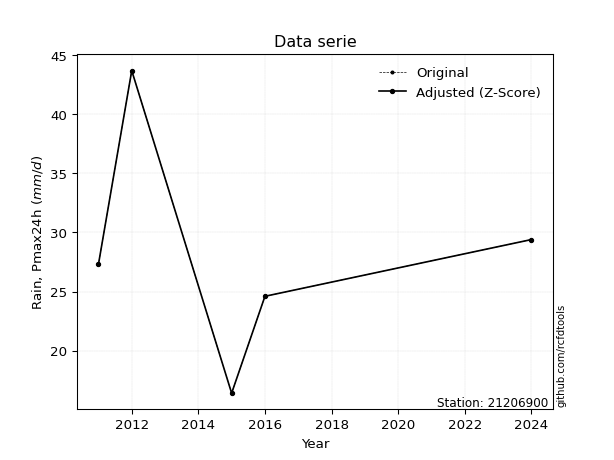</img>

</div>

> If Z-Score is active, values out of range or outliers are replaced with the station mean value.


### 4. Active continuous probability distributions from SciPy (45 of 104 available)

[scipy.stats](https://docs.scipy.org/doc/scipy/reference/stats.html) is a Python´s powerful submodule within the SciPy library for comprehensive statistical analysis, offering over 130 probability distributions (like Normal, Poisson), functions for descriptive stats (mean, variance), hypothesis testing (t-tests, chi-square), random variable generation, and statistical tests, making it essential for data science, modeling, and research. It provides tools to explore, model, and draw conclusions from data efficiently, working seamlessly with NumPy.

<div align="center">

|   id | p_dist             |   n_parameter | fit_method   | label                                                                       | active   | ref                                                                                                        |
|-----:|:-------------------|--------------:|:-------------|:----------------------------------------------------------------------------|:---------|:-----------------------------------------------------------------------------------------------------------|
|    0 | alpha              |             3 | MLE          | Alpha                                                                       | True     | [:mortar_board:](https://docs.scipy.org/doc/scipy/reference/generated/scipy.stats.alpha.html)              |
|    1 | betaprime          |             4 | MLE          | Beta prime                                                                  | True     | [:mortar_board:](https://docs.scipy.org/doc/scipy/reference/generated/scipy.stats.betaprime.html)          |
|    2 | chi2               |             3 | MLE          | Chi²                                                                        | True     | [:mortar_board:](https://docs.scipy.org/doc/scipy/reference/generated/scipy.stats.chi2.html)               |
|    3 | crystalball        |             4 | MLE          | Crystalball                                                                 | True     | [:mortar_board:](https://docs.scipy.org/doc/scipy/reference/generated/scipy.stats.crystalball.html)        |
|    4 | erlang             |             3 | MLE          | Erlang                                                                      | True     | [:mortar_board:](https://docs.scipy.org/doc/scipy/reference/generated/scipy.stats.erlang.html)             |
|    5 | expon              |             2 | MLE          | Exponential                                                                 | True     | [:mortar_board:](https://docs.scipy.org/doc/scipy/reference/generated/scipy.stats.expon.html)              |
|    6 | exponnorm          |             3 | MLE          | Exponentially modified Normal                                               | True     | [:mortar_board:](https://docs.scipy.org/doc/scipy/reference/generated/scipy.stats.exponnorm.html)          |
|    7 | f                  |             4 | MLE          | F                                                                           | True     | [:mortar_board:](https://docs.scipy.org/doc/scipy/reference/generated/scipy.stats.f.html)                  |
|    8 | fatiguelife        |             3 | MLE          | Fatigue-life (Birnbaum-Saunders)                                            | True     | [:mortar_board:](https://docs.scipy.org/doc/scipy/reference/generated/scipy.stats.fatiguelife.html)        |
|    9 | fisk               |             3 | MLE          | Fisk                                                                        | True     | [:mortar_board:](https://docs.scipy.org/doc/scipy/reference/generated/scipy.stats.fisk.html)               |
|   10 | gamma              |             3 | MLE          | Gamma                                                                       | True     | [:mortar_board:](https://docs.scipy.org/doc/scipy/reference/generated/scipy.stats.gamma.html)              |
|   11 | genexpon           |             5 | MLE          | Generalized exponential                                                     | True     | [:mortar_board:](https://docs.scipy.org/doc/scipy/reference/generated/scipy.stats.genexpon.html)           |
|   12 | genlogistic        |             3 | MLE          | Generalized logistic                                                        | True     | [:mortar_board:](https://docs.scipy.org/doc/scipy/reference/generated/scipy.stats.genlogistic.html)        |
|   13 | gibrat             |             2 | MM           | Gibrat                                                                      | True     | [:mortar_board:](https://docs.scipy.org/doc/scipy/reference/generated/scipy.stats.gibrat.html)             |
|   14 | gompertz           |             3 | MLE          | Gompertz (or truncated Gumbel)                                              | True     | [:mortar_board:](https://docs.scipy.org/doc/scipy/reference/generated/scipy.stats.gompertz.html)           |
|   15 | gumbel_l           |             2 | MM           | Gumbel Left Skew                                                            | True     | [:mortar_board:](https://docs.scipy.org/doc/scipy/reference/generated/scipy.stats.gumbel_l.html)           |
|   16 | gumbel_r           |             2 | MM           | Gumbel Right Skew                                                           | True     | [:mortar_board:](https://docs.scipy.org/doc/scipy/reference/generated/scipy.stats.gumbel_r.html)           |
|   17 | halflogistic       |             2 | MM           | Half-logistic                                                               | True     | [:mortar_board:](https://docs.scipy.org/doc/scipy/reference/generated/scipy.stats.halflogistic.html)       |
|   18 | halfnorm           |             2 | MM           | Half Normal                                                                 | True     | [:mortar_board:](https://docs.scipy.org/doc/scipy/reference/generated/scipy.stats.halfnorm.html)           |
|   19 | hypsecant          |             2 | MM           | hyperbolic secant                                                           | True     | [:mortar_board:](https://docs.scipy.org/doc/scipy/reference/generated/scipy.stats.hypsecant.html)          |
|   20 | invgamma           |             3 | MLE          | Inverted gamma                                                              | True     | [:mortar_board:](https://docs.scipy.org/doc/scipy/reference/generated/scipy.stats.invgamma.html)           |
|   21 | invgauss           |             3 | MLE          | Inverse Gaussian                                                            | True     | [:mortar_board:](https://docs.scipy.org/doc/scipy/reference/generated/scipy.stats.invgauss.html)           |
|   22 | invweibull         |             3 | MLE          | Inverted Weibull                                                            | True     | [:mortar_board:](https://docs.scipy.org/doc/scipy/reference/generated/scipy.stats.invweibull.html)         |
|   23 | johnsonsu          |             4 | MLE          | Johnson Su                                                                  | True     | [:mortar_board:](https://docs.scipy.org/doc/scipy/reference/generated/scipy.stats.johnsonsu.html)          |
|   24 | kstwobign          |             2 | MLE          | Limiting distribution of scaled Kolmogorov-Smirnov two-sided test statistic | True     | [:mortar_board:](https://docs.scipy.org/doc/scipy/reference/generated/scipy.stats.kstwobign.html)          |
|   25 | laplace            |             2 | MM           | Laplace                                                                     | True     | [:mortar_board:](https://docs.scipy.org/doc/scipy/reference/generated/scipy.stats.laplace.html)            |
|   26 | laplace_asymmetric |             3 | MLE          | Asymmetric Laplace                                                          | True     | [:mortar_board:](https://docs.scipy.org/doc/scipy/reference/generated/scipy.stats.laplace_asymmetric.html) |
|   27 | loggamma           |             3 | MLE          | Log gamma                                                                   | True     | [:mortar_board:](https://docs.scipy.org/doc/scipy/reference/generated/scipy.stats.loggamma.html)           |
|   28 | logistic           |             2 | MM           | Logistic (or Sech-squared)                                                  | True     | [:mortar_board:](https://docs.scipy.org/doc/scipy/reference/generated/scipy.stats.logistic.html)           |
|   29 | lognorm            |             3 | MLE          | Log Normal                                                                  | True     | [:mortar_board:](https://docs.scipy.org/doc/scipy/reference/generated/scipy.stats.lognorm.html)            |
|   30 | maxwell            |             2 | MM           | Maxwell                                                                     | True     | [:mortar_board:](https://docs.scipy.org/doc/scipy/reference/generated/scipy.stats.maxwell.html)            |
|   31 | mielke             |             4 | MLE          | Mielke Beta-Kappa / Dagum                                                   | True     | [:mortar_board:](https://docs.scipy.org/doc/scipy/reference/generated/scipy.stats.mielke.html)             |
|   32 | moyal              |             2 | MM           | Moyal                                                                       | True     | [:mortar_board:](https://docs.scipy.org/doc/scipy/reference/generated/scipy.stats.moyal.html)              |
|   33 | nakagami           |             3 | MLE          | Nakagami                                                                    | True     | [:mortar_board:](https://docs.scipy.org/doc/scipy/reference/generated/scipy.stats.nakagami.html)           |
|   34 | ncf                |             5 | MLE          | Non-central F distribution                                                  | True     | [:mortar_board:](https://docs.scipy.org/doc/scipy/reference/generated/scipy.stats.ncf.html)                |
|   35 | nct                |             4 | MLE          | Non-central Student’s t                                                     | True     | [:mortar_board:](https://docs.scipy.org/doc/scipy/reference/generated/scipy.stats.nct.html)                |
|   36 | norm               |             2 | MM           | Normal                                                                      | True     | [:mortar_board:](https://docs.scipy.org/doc/scipy/reference/generated/scipy.stats.norm.html)               |
|   37 | pareto             |             3 | MLE          | Pareto                                                                      | True     | [:mortar_board:](https://docs.scipy.org/doc/scipy/reference/generated/scipy.stats.pareto.html)             |
|   38 | pearson3           |             3 | MM           | Pearson type III                                                            | True     | [:mortar_board:](https://docs.scipy.org/doc/scipy/reference/generated/scipy.stats.pearson3.html)           |
|   39 | rayleigh           |             2 | MM           | Rayleigh                                                                    | True     | [:mortar_board:](https://docs.scipy.org/doc/scipy/reference/generated/scipy.stats.rayleigh.html)           |
|   40 | rice               |             3 | MLE          | Rice                                                                        | True     | [:mortar_board:](https://docs.scipy.org/doc/scipy/reference/generated/scipy.stats.rice.html)               |
|   41 | t                  |             3 | MLE          | Student’s t                                                                 | True     | [:mortar_board:](https://docs.scipy.org/doc/scipy/reference/generated/scipy.stats.t.html)                  |
|   42 | truncnorm          |             4 | MLE          | Truncated normal                                                            | True     | [:mortar_board:](https://docs.scipy.org/doc/scipy/reference/generated/scipy.stats.truncnorm.html)          |
|   43 | wald               |             2 | MM           | Wald                                                                        | True     | [:mortar_board:](https://docs.scipy.org/doc/scipy/reference/generated/scipy.stats.wald.html)               |
|   44 | weibull_min        |             3 | MLE          | Weibull minimum                                                             | True     | [:mortar_board:](https://docs.scipy.org/doc/scipy/reference/generated/scipy.stats.weibull_min.html)        |

</div>

> **n_parameter:** # arguments & localization & scale.
>
> **Fit methods:** (MLE) maximum likelihood, (MM) L-moments.
>
>**Inactive:** foldnorm, gennorm, norminvgauss, powernorm, powerlognorm, skewnorm, genextreme, anglit, arcsine, argus, beta, bradford, burr, burr12, cauchy, cosine, halfcauchy, foldcauchy, skewcauchy, wrapcauchy, dgamma, gengamma, exponweib, exponpow, truncexpon, gausshyper, genhalflogistic, genhyperbolic, geninvgauss, halfgennorm, johnsonsb, kappa4, kappa3, ksone, kstwo, loglaplace, levy, levy_l, levy_stable, ncx2, genpareto, truncpareto, lomax, powerlaw, rdist, rel_breitwigner, recipinvgauss, semicircular, studentized_range, trapezoid, triang, truncweibull_min, tukeylambda, uniform, loguniform, vonmises, vonmises_line, weibull_max, dweibull, 


## B. Probability distributions vs. Empirical distributions

A continuous probability distribution (CPD) describes probabilities for variables that can take any value within a range (like rain any time), unlike discrete variables with specific outcomes (like temperature). It uses a Probability Density Function (PDF), a curve where the total area under it equals 1, and the probability of the variable falling within an interval (a to b) is found by calculating the area under the curve between those points. A key feature is that the probability of hitting any single exact value is zero, so probabilities are always expressed for ranges, e.g., $P(a ≤ X ≤ b)$.

<div align="center">

Distributions parameters
|    |   station | p_dist                |   n |             loc |          scale | shape                  | shape1                | shape2                 | shape3   |
|---:|----------:|:----------------------|----:|----------------:|---------------:|:-----------------------|:----------------------|:-----------------------|:---------|
|  0 |  21206900 | alpha                 |   6 |   -64.6999      | 1079.14        | 11.63276156633195      |                       |                        |          |
|  1 |  21206900 | betaprime             |   6 |    -0.615574    |   47.1909      | 20.004317618321974     | 33.24033080583128     |                        |          |
|  2 |  21206900 | chi2                  |   6 |     0.784515    |    1.21794     | 22.974912324652443     |                       |                        |          |
|  3 |  21206900 | crystalball           |   6 |    28.7667      |    8.18304     | 1021.3821099319229     | 8405.295262105807     |                        |          |
|  4 |  21206900 | erlang                |   6 |     0.784493    |    2.43589     | 11.487474199459598     |                       |                        |          |
|  5 |  21206900 | expon                 |   6 |    16.4         |   12.3667      |                        |                       |                        |          |
|  6 |  21206900 | exponnorm             |   6 |    22.4662      |    5.58697     | 1.1277177982511715     |                       |                        |          |
|  7 |  21206900 | f                     |   6 |     0.772117    |   27.9939      | 22.99794210626164      | 3280734.9769543195    |                        |          |
|  8 |  21206900 | fatiguelife           |   6 |    16.4         |    3.33602e-06 | 1605.383952667386      |                       |                        |          |
|  9 |  21206900 | fisk                  |   6 |   -15.1469      |   43.2065      | 9.60691038562624       |                       |                        |          |
| 10 |  21206900 | gamma                 |   6 |     0.784582    |    2.4359      | 11.487388099503999     |                       |                        |          |
| 11 |  21206900 | genexpon              |   6 |    16.4         |    1.55377     | 0.1256435089719613     | 8.786747524090644e-09 | 1.6934121498824801     |          |
| 12 |  21206900 | genlogistic           |   6 |    22.2084      |    5.63737     | 2.2796524989383924     |                       |                        |          |
| 13 |  21206900 | gibrat                |   6 |    22.5241      |    3.78633     |                        |                       |                        |          |
| 14 |  21206900 | gompertz              |   6 |    24.6         |    3.12818     | 0.010858754154972158   |                       |                        |          |
| 15 |  21206900 | gumbel_l              |   6 |    32.4495      |    6.38029     |                        |                       |                        |          |
| 16 |  21206900 | gumbel_r              |   6 |    25.0839      |    6.38029     |                        |                       |                        |          |
| 17 |  21206900 | halflogistic          |   6 |    19.0678      |    6.99623     |                        |                       |                        |          |
| 18 |  21206900 | halfnorm              |   6 |    17.9355      |   13.5749      |                        |                       |                        |          |
| 19 |  21206900 | hypsecant             |   6 |    28.7667      |    5.20949     |                        |                       |                        |          |
| 20 |  21206900 | invgamma              |   6 |   -31.9814      | 3374.39        | 56.545639728250435     |                       |                        |          |
| 21 |  21206900 | invgauss              |   6 |   -10.6537      |  891.168       | 0.04418514598302052    |                       |                        |          |
| 22 |  21206900 | invweibull            |   6 |    -2.46429e+08 |    2.46429e+08 | 34353087.927097306     |                       |                        |          |
| 23 |  21206900 | johnsonsu             |   6 |    27.437       |    5.15213     | -0.13742514701569142   | 0.9605010330862762    |                        |          |
| 24 |  21206900 | kstwobign             |   6 |    -0.744555    |   33.8777      |                        |                       |                        |          |
| 25 |  21206900 | laplace               |   6 |    28.7667      |    5.78629     |                        |                       |                        |          |
| 26 |  21206900 | laplace_asymmetric    |   6 |    27.3         |    5.86325     | 0.8827218279108302     |                       |                        |          |
| 27 |  21206900 | loggamma              |   6 | -2194.35        |  307.809       | 1370.3854921040215     |                       |                        |          |
| 28 |  21206900 | logistic              |   6 |    28.7667      |    4.51155     |                        |                       |                        |          |
| 29 |  21206900 | lognorm               |   6 |    16.4         |    0.0344372   | 13.377763222953254     |                       |                        |          |
| 30 |  21206900 | maxwell               |   6 |     9.37629     |   12.1511      |                        |                       |                        |          |
| 31 |  21206900 | mielke                |   6 |    -0.0887878   |   30.4737      | 4.926592564345505      | 7.254957724553909     |                        |          |
| 32 |  21206900 | moyal                 |   6 |    24.0871      |    3.68366     |                        |                       |                        |          |
| 33 |  21206900 | nakagami              |   6 |    24.6         |    8.08782     | 0.23707202603267688    |                       |                        |          |
| 34 |  21206900 | ncf                   |   6 |     0.517893    |    7.1914e-05  | 0.00015442353573528263 | 116.72253131848365    | 59.64155764329481      |          |
| 35 |  21206900 | nct                   |   6 |    -0.122985    |    6.38131     | 20.516788757597926     | 4.359425299246498     |                        |          |
| 36 |  21206900 | norm                  |   6 |    28.7667      |    8.18304     |                        |                       |                        |          |
| 37 |  21206900 | pareto                |   6 |    16.3624      |    0.0376237   | 0.20356371914852556    |                       |                        |          |
| 38 |  21206900 | pearson3              |   6 |    28.7667      |    8.18303     | 0.41920308729851236    |                       |                        |          |
| 39 |  21206900 | rayleigh              |   6 |    13.112       |   12.4906      |                        |                       |                        |          |
| 40 |  21206900 | rice                  |   6 |    12.7151      |   10.409       | 0.9980330584152357     |                       |                        |          |
| 41 |  21206900 | t                     |   6 |    28.7666      |    8.18294     | 9598317.07614265       |                       |                        |          |
| 42 |  21206900 | truncnorm             |   6 |    28.7667      |    8.18304     | -146.55165971244148    | 485.1674556526327     |                        |          |
| 43 |  21206900 | wald                  |   6 |    20.5836      |    8.18307     |                        |                       |                        |          |
| 44 |  21206900 | weibull_min           |   6 |    13.1959      |   17.5187      | 1.960510089500135      |                       |                        |          |
| 45 |  21206900 | logalpha              |   6 |    -5.13936     |  240.809       | 28.511779257245607     |                       |                        |          |
| 46 |  21206900 | logbetaprime          |   6 |     0.428654    |    9.30356     | 117.4758997682988      | 378.34026259348525    |                        |          |
| 47 |  21206900 | logchi2               |   6 |     2.79728     |    0.987835    | 1.0325546929018032     |                       |                        |          |
| 48 |  21206900 | logcrystalball        |   6 |     3.31761     |    0.292834    | 453.68489808347556     | 1632.132717294415     |                        |          |
| 49 |  21206900 | logerlang             |   6 |    -2.04254     |    0.0164112   | 326.5643469653555      |                       |                        |          |
| 50 |  21206900 | logexpon              |   6 |     2.79728     |    0.520331    |                        |                       |                        |          |
| 51 |  21206900 | logexponnorm          |   6 |     3.31732     |    0.292834    | 0.0009985647815009446  |                       |                        |          |
| 52 |  21206900 | logf                  |   6 |  -127.82        |  131.138       | 1329967.0002000644     | 569772.5664497963     |                        |          |
| 53 |  21206900 | logfatiguelife        |   6 |   -63.0655      |   66.3826      | 0.004404848256145228   |                       |                        |          |
| 54 |  21206900 | logfisk               |   6 |    -3.27089e+07 |    3.27089e+07 | 201091856.8509931      |                       |                        |          |
| 55 |  21206900 | loggamma              |   6 |    -2.52656     |    0.0151444   | 385.91496896835895     |                       |                        |          |
| 56 |  21206900 | loggenexpon           |   6 |     2.79623     |    0.00932368  | 0.007110148639140293   | 6.220914317609752     | 4.699110478846348e-05  |          |
| 57 |  21206900 | loggenlogistic        |   6 |     3.41446     |    0.138123    | 0.6772299866245625     |                       |                        |          |
| 58 |  21206900 | loggibrat             |   6 |     3.09418     |    0.135518    |                        |                       |                        |          |
| 59 |  21206900 | loggompertz           |   6 |     2.79728     |    0.360748    | 0.21199370559808717    |                       |                        |          |
| 60 |  21206900 | loggumbel_l           |   6 |     3.4494      |    0.228321    |                        |                       |                        |          |
| 61 |  21206900 | loggumbel_r           |   6 |     3.18582     |    0.228321    |                        |                       |                        |          |
| 62 |  21206900 | loghalflogistic       |   6 |     2.97053     |    0.250368    |                        |                       |                        |          |
| 63 |  21206900 | loghalfnorm           |   6 |     2.93005     |    0.485742    |                        |                       |                        |          |
| 64 |  21206900 | loghypsecant          |   6 |     3.31761     |    0.186424    |                        |                       |                        |          |
| 65 |  21206900 | loginvgamma           |   6 |    -3.49907     | 3573.67        | 525.2600887150904      |                       |                        |          |
| 66 |  21206900 | loginvgauss           |   6 |     0.831548    |  163.269       | 0.015184750463979754   |                       |                        |          |
| 67 |  21206900 | loginvweibull         |   6 |    -3.21106e+07 |    3.21106e+07 | 110077973.42287187     |                       |                        |          |
| 68 |  21206900 | logjohnsonsu          |   6 |     3.36329     |    0.154305    | 0.13976551607138976    | 0.8648208111525609    |                        |          |
| 69 |  21206900 | logkstwobign          |   6 |     2.11389     |    1.37736     |                        |                       |                        |          |
| 70 |  21206900 | loglaplace            |   6 |     3.31761     |    0.207065    |                        |                       |                        |          |
| 71 |  21206900 | loglaplace_asymmetric |   6 |     3.38099     |    0.208136    | 1.1637684424265202     |                       |                        |          |
| 72 |  21206900 | logloggamma           |   6 |     1.65229     |    0.815176    | 8.207492421765926      |                       |                        |          |
| 73 |  21206900 | loglogistic           |   6 |     3.31761     |    0.161448    |                        |                       |                        |          |
| 74 |  21206900 | loglognorm            |   6 |     2.79728     |    0.00179778  | 12.98503609601026      |                       |                        |          |
| 75 |  21206900 | logmaxwell            |   6 |     2.62372     |    0.434833    |                        |                       |                        |          |
| 76 |  21206900 | logmielke             |   6 |    -0.13312     |    3.5855      | 15.126857871235412     | 27.61706759870327     |                        |          |
| 77 |  21206900 | logmoyal              |   6 |     3.15015     |    0.131821    |                        |                       |                        |          |
| 78 |  21206900 | lognakagami           |   6 |     3.20275     |    0.344734    | 0.060775379208670065   |                       |                        |          |
| 79 |  21206900 | logncf                |   6 |    -3.2459      |    6.55889     | 261.57198108834757     | 386.21212234286895    | 1.3478954919129398e-06 |          |
| 80 |  21206900 | lognct                |   6 |    -0.0910801   |    0.0573723   | 66.48902426045132      | 58.74935811199222     |                        |          |
| 81 |  21206900 | lognorm               |   6 |     3.31761     |    0.292834    |                        |                       |                        |          |
| 82 |  21206900 | logpareto             |   6 |     2.79564     |    0.00164319  | 0.20343695010362445    |                       |                        |          |
| 83 |  21206900 | logpearson3           |   6 |     3.31761     |    0.292834    | -0.2862432053599958    |                       |                        |          |
| 84 |  21206900 | lograyleigh           |   6 |     2.7574      |    0.446981    |                        |                       |                        |          |
| 85 |  21206900 | logrice               |   6 |     2.61348     |    0.321274    | 1.9063927633991224     |                       |                        |          |
| 86 |  21206900 | logt                  |   6 |     3.31762     |    0.292838    | 27505448.676752277     |                       |                        |          |
| 87 |  21206900 | logtruncnorm          |   6 |    -0.134092    |    1.01415     | 3.290269272921821      | 3.856852612741153     |                        |          |
| 88 |  21206900 | logwald               |   6 |     3.02475     |    0.292861    |                        |                       |                        |          |
| 89 |  21206900 | logweibull_min        |   6 |     2.14777     |    1.28114     | 4.619539232565918      |                       |                        |          |

</div>

> **loc** (Location parameter): This shifts the distribution along the x-axis. For many common distributions, like the normal (Gaussian) distribution, loc represents the mean $μ$. For others, like the uniform distribution, it might represent the minimum value, or for the beta distribution, the left end of the support interval.
>
> **scale** (Scale parameter): This determines the width or spread of the distribution. For the normal distribution, scale represents the standard deviation $σ$. For a uniform distribution, it defines the length of the interval (from $loc$ to $loc + scale$).
>
> **shape** (Shape parameters): Refers to parameters that define the specific form of a probability distribution, distinct from its location (loc) and scale (scale). These parameters are required arguments for most distribution functions. For example, a normal (Gaussian) distribution is fully defined by its location (mean) and scale (standard deviation), so it has no specific shape parameters beyond loc and scale. However, other distributions have intrinsic properties that need specification, as Gamma distribution that takes a shape parameter, often named $a$ or $alpha$.


### 0. Cumulative distribution values - CDF (90 evaluated)

> Ordered by x ascending and calculating $log(f(x))$ separately. 

|   id |   Station |   date |    x |   count |    mean |     std |     zscore |   Value_initial |   station |   m |     alpha |   alpha_pdf |   betaprime |   betaprime_pdf |      chi2 |   chi2_pdf |   crystalball |   crystalball_pdf |    erlang |   erlang_pdf |    expon |   expon_pdf |   exponnorm |   exponnorm_pdf |         f |      f_pdf |   fatiguelife |   fatiguelife_pdf |      fisk |   fisk_pdf |     gamma |   gamma_pdf |    genexpon |   genexpon_pdf |   genlogistic |   genlogistic_pdf |   gibrat |   gibrat_pdf |    gompertz |   gompertz_pdf |   gumbel_l |   gumbel_l_pdf |   gumbel_r |   gumbel_r_pdf |   halflogistic |   halflogistic_pdf |   halfnorm |   halfnorm_pdf |   hypsecant |   hypsecant_pdf |   invgamma |   invgamma_pdf |   invgauss |   invgauss_pdf |   invweibull |   invweibull_pdf |   johnsonsu |   johnsonsu_pdf |   kstwobign |   kstwobign_pdf |   laplace |   laplace_pdf |   laplace_asymmetric |   laplace_asymmetric_pdf |   loggamma |   loggamma_pdf |   logistic |   logistic_pdf |   lognorm |   lognorm_pdf |   maxwell |   maxwell_pdf |    mielke |   mielke_pdf |      moyal |   moyal_pdf |    nakagami |   nakagami_pdf |       ncf |    ncf_pdf |       nct |    nct_pdf |      norm |   norm_pdf |   pareto |   pareto_pdf |   pearson3 |   pearson3_pdf |   rayleigh |   rayleigh_pdf |      rice |   rice_pdf |        t |     t_pdf |   truncnorm |   truncnorm_pdf |     wald |   wald_pdf |   weibull_min |   weibull_min_pdf |   logalpha |   logalpha_pdf |   logbetaprime |   logbetaprime_pdf |     logchi2 |   logchi2_pdf |   logcrystalball |   logcrystalball_pdf |   logerlang |   logerlang_pdf |   logexpon |   logexpon_pdf |   logexponnorm |   logexponnorm_pdf |      logf |   logf_pdf |   logfatiguelife |   logfatiguelife_pdf |   logfisk |   logfisk_pdf |   loggenexpon |   loggenexpon_pdf |   loggenlogistic |   loggenlogistic_pdf |   loggibrat |   loggibrat_pdf |   loggompertz |   loggompertz_pdf |   loggumbel_l |   loggumbel_l_pdf |   loggumbel_r |   loggumbel_r_pdf |   loghalflogistic |   loghalflogistic_pdf |   loghalfnorm |   loghalfnorm_pdf |   loghypsecant |   loghypsecant_pdf |   loginvgamma |   loginvgamma_pdf |   loginvgauss |   loginvgauss_pdf |   loginvweibull |   loginvweibull_pdf |   logjohnsonsu |   logjohnsonsu_pdf |   logkstwobign |   logkstwobign_pdf |   loglaplace |   loglaplace_pdf |   loglaplace_asymmetric |   loglaplace_asymmetric_pdf |   logloggamma |   logloggamma_pdf |   loglogistic |   loglogistic_pdf |   loglognorm |   loglognorm_pdf |   logmaxwell |   logmaxwell_pdf |   logmielke |   logmielke_pdf |   logmoyal |   logmoyal_pdf |   lognakagami |   lognakagami_pdf |   logncf |   logncf_pdf |    lognct |   lognct_pdf |   logpareto |   logpareto_pdf |   logpearson3 |   logpearson3_pdf |   lograyleigh |   lograyleigh_pdf |   logrice |   logrice_pdf |      logt |   logt_pdf |   logtruncnorm |   logtruncnorm_pdf |   logwald |   logwald_pdf |   logweibull_min |   logweibull_min_pdf |
|-----:|----------:|-------:|-----:|--------:|--------:|--------:|-----------:|----------------:|----------:|----:|----------:|------------:|------------:|----------------:|----------:|-----------:|--------------:|------------------:|----------:|-------------:|---------:|------------:|------------:|----------------:|----------:|-----------:|--------------:|------------------:|----------:|-----------:|----------:|------------:|------------:|---------------:|--------------:|------------------:|---------:|-------------:|------------:|---------------:|-----------:|---------------:|-----------:|---------------:|---------------:|-------------------:|-----------:|---------------:|------------:|----------------:|-----------:|---------------:|-----------:|---------------:|-------------:|-----------------:|------------:|----------------:|------------:|----------------:|----------:|--------------:|---------------------:|-------------------------:|-----------:|---------------:|-----------:|---------------:|----------:|--------------:|----------:|--------------:|----------:|-------------:|-----------:|------------:|------------:|---------------:|----------:|-----------:|----------:|-----------:|----------:|-----------:|---------:|-------------:|-----------:|---------------:|-----------:|---------------:|----------:|-----------:|---------:|----------:|------------:|----------------:|---------:|-----------:|--------------:|------------------:|-----------:|---------------:|---------------:|-------------------:|------------:|--------------:|-----------------:|---------------------:|------------:|----------------:|-----------:|---------------:|---------------:|-------------------:|----------:|-----------:|-----------------:|---------------------:|----------:|--------------:|--------------:|------------------:|-----------------:|---------------------:|------------:|----------------:|--------------:|------------------:|--------------:|------------------:|--------------:|------------------:|------------------:|----------------------:|--------------:|------------------:|---------------:|-------------------:|--------------:|------------------:|--------------:|------------------:|----------------:|--------------------:|---------------:|-------------------:|---------------:|-------------------:|-------------:|-----------------:|------------------------:|----------------------------:|--------------:|------------------:|--------------:|------------------:|-------------:|-----------------:|-------------:|-----------------:|------------:|----------------:|-----------:|---------------:|--------------:|------------------:|---------:|-------------:|----------:|-------------:|------------:|----------------:|--------------:|------------------:|--------------:|------------------:|----------:|--------------:|----------:|-----------:|---------------:|-------------------:|----------:|--------------:|-----------------:|---------------------:|
|    0 |  21206900 |   2015 | 16.4 |       6 | 28.7667 | 8.96408 | -1.37958   |            16.4 |  21206900 |   1 | 0.0471096 |  0.016135   |   0.0416108 |      0.0173884  | 0.0446242 | 0.0169474  |     0.0653618 |        0.0155616  | 0.0446242 |   0.0169474  | 0        |  0.0808625  |    0.04459  |      0.0149512  | 0.0446335 | 0.0169472  |     0.0674482 |        1.6843e+11 | 0.0464638 | 0.0134921  | 0.0446242 |  0.0169474  | 7.88274e-08 |      0.0808637 |     0.0476182 |        0.0141913  | 0        |   0          | 0           |     0          |  0.0776444 |     0.0116842  |  0.0202366 |     0.0123706  |       0        |         0          |   0        |     0          |   0.0591111 |      0.0112817  |  0.0466375 |     0.0162716  |  0.0443644 |     0.0168666  |     0.039058 |       0.017656   |   0.0566602 |      0.00898048 |   0.0400724 |      0.0201808  | 0.0589902 |    0.0101948  |            0.0533073 |                0.0102997 |  0.0369213 |       0.28881  |  0.0605905 |     0.0126164  | 0.0377937 |      0.280987 | 0.0465111 |    0.018564   | 0.0481383 |   0.0142179  | 0.00452757 |  0.00546717 | 0           |    0           | 0.0444361 | 0.0166122  | 0.0475397 | 0.0155891  | 0.0653618 | 0.0155616  | 0        |   5.41052    |  0.0508233 |     0.0165076  |  0.0340533 |     0.0203571  | 0.0374859 | 0.0200241  | 0.065361 | 0.0155617 |   0.0653617 |      0.0155616  | 0        | 0          |     0.0351403 |        0.0211191  |  0.0336497 |       0.286001 |      0.0338634 |           0.289745 | 1.34501e-08 |   7.81821e+06 |        0.0377937 |             0.280987 |   0.0364814 |        0.288569 |   0        |       1.92185  |      0.0377936 |           0.280987 | 0.0377183 |   0.281021 |        0.0371443 |             0.279636 | 0.0365747 |      0.216634 |   0.000801797 |          0.765505 |        0.0481318 |             0.23332  |    0        |        0        |   1.34599e-08 |          0.58765  |      0.055868 |          0.237724 |    0.00415516 |          0.099791 |          0        |              0        |      0        |          0        |      0.0390092 |           0.208727 |     0.0348773 |          0.287822 |     0.0336406 |          0.311476 |       0.0295437 |            0.356691 |      0.0548757 |           0.163691 |      0.0336514 |           0.44431  |    0.0405167 |         0.195672 |               0.0516755 |                    0.21334  |     0.0469692 |          0.275936 |     0.0383126 |          0.228215 |    0.0126891 |      5.68484e+12 |    0.0161268 |         0.269951 |   0.0471667 |        0.242554 | 0.00013724 |     0.00803441 |      0        |       0           | 0.23783  |     0.449104 | 0.0294914 |     0.28915  |    0        |     123.806     |     0.0453157 |          0.280113 |    0.00397158 |          0.198798 | 0.0282543 |      0.324331 | 0.0377953 |   0.280992 |    0           |           0        |  0        |      0        |        0.0424432 |             0.295372 |
|    1 |  21206900 |   2016 | 24.6 |       6 | 28.7667 | 8.96408 | -0.464818  |            24.6 |  21206900 |   2 | 0.325745  |  0.0487509  |   0.347321  |      0.050971   | 0.332743  | 0.0489235  |     0.305312  |        0.0428249  | 0.332743  |   0.0489234  | 0.484734 |  0.0416657  |    0.324718 |      0.0514284  | 0.332745  | 0.0489242  |     0.835615  |        0.0147462  | 0.309648  | 0.0516676  | 0.332743  |  0.0489234  | 0.484739    |      0.0416659 |     0.317436  |        0.0507688  | 0.273924 |   0.160423   | 1.26546e-07 |     0.00347131 |  0.253391  |     0.0341943  |  0.340008  |     0.0574889  |       0.375979 |         0.0613645  |   0.376535 |     0.0521033  |   0.268884  |      0.0456913  |  0.327044  |     0.0487938  |  0.335366  |     0.0495349  |     0.355631 |       0.0512549  |   0.260214  |      0.0529937  |   0.369667  |      0.0497162  | 0.243353  |    0.0420569  |            0.259933  |                0.0502227 |  0.354743  |       1.26768  |  0.284234  |     0.0450943  | 0.347434  |      1.26147  | 0.333714  |    0.04702    | 0.310194  |   0.0508564  | 0.350951   |  0.0653841  | 4.08885e-08 |    5.45697e+06 | 0.331749  | 0.049286   | 0.323153  | 0.0491429  | 0.305312  | 0.0428249  | 0.666119 |   0.00825068 |  0.323499  |     0.0472896  |  0.34489   |     0.0482383  | 0.335405  | 0.046963   | 0.305314 | 0.0428255 |   0.305312  |      0.0428249  | 0.356852 | 0.10887    |     0.350145  |        0.0481512  |  0.361319  |       1.29621  |      0.358133  |           1.26471  | 0.465078    |   0.516259    |        0.347434  |             1.26147  |   0.356167  |        1.27485  |   0.541247 |       0.881655 |      0.347433  |           1.26147  | 0.347092  |   1.25879  |        0.347709  |             1.26587  | 0.314671  |      1.32582  |   0.444379    |          1.18247  |        0.310224  |             1.25094  |    0.412264 |        3.58536  |   0.356165    |          1.16419  |      0.287868 |          1.05887  |    0.395124   |          1.60692  |          0.433142 |              1.62239  |      0.42548  |          1.40312  |      0.31522   |           1.42775  |     0.359084  |          1.28464  |     0.381795  |          1.30777  |       0.41593   |            1.25081  |      0.258833  |           1.25683  |      0.440389  |           1.19239  |    0.287112  |         1.38658  |               0.275593  |                    1.13777  |     0.328457  |          1.18467  |     0.329273  |          1.36795  |    0.661766  |      0.0694548   |    0.379211  |         1.34069  |   0.312975  |        1.249    | 0.412703   |     1.77247    |      0.013494 |       3.69342e+12 | 0.443455 |     0.539769 | 0.375038  |     1.32019  |    0.674188 |       0.162812  |     0.332631  |          1.19568  |    0.391245   |          1.35693  | 0.361133  |      1.26935  | 0.347433  |   1.26145  |    4.62462e-07 |           3.95882  |  0.4522   |      2.53314  |        0.334813  |             1.18748  |
|    2 |  21206900 |   2011 | 27.3 |       6 | 28.7667 | 8.96408 | -0.163616  |            27.3 |  21206900 |   3 | 0.461347  |  0.0506254  |   0.48527   |      0.0501535  | 0.467374  | 0.0498047  |     0.428878  |        0.0479755  | 0.467374  |   0.0498047  | 0.585798 |  0.0334934  |    0.468478 |      0.0536554  | 0.46738   | 0.0498072  |     0.869907  |        0.0109315  | 0.457507  | 0.0561732  | 0.467374  |  0.0498047  | 0.585803    |      0.0334935 |     0.460422  |        0.0536953  | 0.591805 |   0.0813102  | 0.0147726   |     0.00810736 |  0.359915  |     0.0447592  |  0.493336  |     0.0546329  |       0.528693 |         0.0514909  |   0.509707 |     0.0463305  |   0.411545  |      0.0587579  |  0.462475  |     0.0504674  |  0.471357  |     0.0501594  |     0.491853 |       0.0486527  |   0.435277  |      0.0733671  |   0.500385  |      0.0464007  | 0.38805   |    0.0670638  |            0.437949  |                0.0846177 |  0.492029  |       1.34227  |  0.419435  |     0.0539747  | 0.485391  |      1.36144  | 0.463274  |    0.0481364  | 0.456906  |   0.0562533  | 0.517923   |  0.0568145  | 0.462442    |    0.079491    | 0.467529  | 0.0502447  | 0.460394  | 0.0513693  | 0.428878  | 0.0479755  | 0.684842 |   0.00586551 |  0.455662  |     0.0496455  |  0.475403  |     0.0477067  | 0.463981  | 0.0475726  | 0.428882 | 0.0479762 |   0.428878  |      0.0479755  | 0.585833 | 0.064293   |     0.479905  |        0.0472622  |  0.500393  |       1.34665  |      0.493579  |           1.31053  | 0.514577    |   0.438482    |        0.485391  |             1.36144  |   0.494071  |        1.34659  |   0.624459 |       0.721735 |      0.48539   |           1.36144  | 0.484708  |   1.35773  |        0.486029  |             1.36372  | 0.465524  |      1.52967  |   0.562857    |          1.08306  |        0.456922  |             1.53558  |    0.67394  |        1.69431  |   0.482432    |          1.24907  |      0.414737 |          1.37316  |    0.555179   |          1.43089  |          0.586118 |              1.311    |      0.562133 |          1.21574  |      0.481696  |           1.70463  |     0.497342  |          1.34315  |     0.519431  |          1.30881  |       0.541254  |            1.13901  |      0.432616  |           2.06998  |      0.558874  |           1.07231  |    0.47476   |         2.29281  |               0.423631  |                    1.74894  |     0.461878  |          1.35674  |     0.483397  |          1.54678  |    0.66818   |      0.0548484   |    0.518964  |         1.31834  |   0.45928   |        1.53172  | 0.581058   |     1.4342     |      0.752846 |       0.874126    | 0.499623 |     0.53715  | 0.513957  |     1.31989  |    0.688941 |       0.123777  |     0.466419  |          1.35203  |    0.530277   |          1.29187  | 0.497586  |      1.32662  | 0.485387  |   1.36141  |    0.349287    |           2.80893  |  0.653085 |      1.43961  |        0.467295  |             1.33707  |
|    3 |  21206900 |   2024 | 29.4 |       6 | 28.7667 | 8.96408 |  0.0706524 |            29.4 |  21206900 |   4 | 0.565422  |  0.0479642  |   0.586498  |      0.0458418  | 0.569265  | 0.0467748  |     0.530846  |        0.0486065  | 0.569265  |   0.0467748  | 0.650486 |  0.0282626  |    0.577988 |      0.0499518  | 0.569278  | 0.0467779  |     0.890584  |        0.008859   | 0.572858  | 0.0527697  | 0.569265  |  0.0467748  | 0.650492    |      0.0282625 |     0.570415  |        0.0503503  | 0.724623 |   0.0485603  | 0.0387422   |     0.0154786  |  0.462084  |     0.052276   |  0.601455  |     0.047926   |       0.628184 |         0.0432651  |   0.601632 |     0.0411457  |   0.538603  |      0.0606532  |  0.56612   |     0.0477276  |  0.573679  |     0.0468269  |     0.588904 |       0.0434688  |   0.58715   |      0.0678351  |   0.593042  |      0.0416378  | 0.551838  |    0.0774524  |            0.590296  |                0.0616816 |  0.590317  |       1.29703  |  0.535038  |     0.0551412  | 0.585679  |      1.33081  | 0.562408  |    0.0458678  | 0.573248  |   0.0535655  | 0.626829   |  0.0467853  | 0.601004    |    0.0554789   | 0.570241  | 0.0470954  | 0.566019  | 0.0486523  | 0.530846  | 0.0486065  | 0.69591  |   0.00474792 |  0.558366  |     0.0476574  |  0.572685  |     0.0446118  | 0.561892  | 0.0453158  | 0.530851 | 0.0486071 |   0.530846  |      0.0486065  | 0.697268 | 0.0434734  |     0.576074  |        0.044017   |  0.598306  |       1.28295  |      0.588947  |           1.25145  | 0.545429    |   0.395492    |        0.585679  |             1.33081  |   0.592571  |        1.29836  |   0.674311 |       0.625927 |      0.585678  |           1.33081  | 0.584718  |   1.32713  |        0.586408  |             1.33094  | 0.578712  |      1.49889  |   0.639518    |          0.982714 |        0.573257  |             1.57479  |    0.773294 |        1.05014  |   0.575634    |          1.2577   |      0.523412 |          1.54695  |    0.653534   |          1.21753  |          0.674923 |              1.08736  |      0.646783 |          1.06754  |      0.606195  |           1.61331  |     0.595243  |          1.28602  |     0.613546  |          1.22048  |       0.621172  |            1.01393  |      0.594356  |           2.15892  |      0.634221  |           0.958853 |    0.631843  |         1.77798  |               0.575256  |                    2.37491  |     0.564081  |          1.3865   |     0.596905  |          1.49032  |    0.671966  |      0.047665    |    0.613424  |         1.22148  |   0.575436  |        1.57388  | 0.676959   |     1.15603    |      0.803178 |       0.539375    | 0.539158 |     0.52896  | 0.60876   |     1.22779  |    0.69739  |       0.10517   |     0.567835  |          1.37033  |    0.622118   |          1.17944  | 0.594513  |      1.27705  | 0.585674  |   1.33079  |    0.533498    |           2.18628  |  0.742095 |      0.995986 |        0.567663  |             1.35803  |
|    4 |  21206900 |   2025 | 31.2 |       6 | 28.7667 | 8.96408 |  0.271454  |            31.2 |  21206900 |   5 | 0.64802   |  0.0435511  |   0.664478  |      0.0406459  | 0.649681  | 0.0423585  |     0.616905  |        0.0466438  | 0.649681  |   0.0423586  | 0.69783  |  0.0244342  |    0.662932 |      0.0441347  | 0.649699  | 0.0423615  |     0.905242  |        0.00747764 | 0.662414  | 0.0463529  | 0.649681  |  0.0423585  | 0.697835    |      0.0244342 |     0.656293  |        0.0447669  | 0.796492 |   0.0326066  | 0.0756781   |     0.0264615  |  0.560514  |     0.0566311  |  0.68152   |     0.0409566  |       0.699873 |         0.0364609  |   0.671499 |     0.0364647  |   0.643552  |      0.0549929  |  0.648282  |     0.0433125  |  0.653963  |     0.0421683  |     0.662333 |       0.0380394  |   0.696095  |      0.0526493  |   0.663767  |      0.0368905  | 0.671652  |    0.0567459  |            0.687551  |                0.0470397 |  0.664946  |       1.20774  |  0.631663  |     0.051571   | 0.662527  |      1.24767  | 0.641882  |    0.0422178  | 0.664458  |   0.047318   | 0.703348   |  0.0383569  | 0.689488    |    0.0435614   | 0.651087  | 0.0425114  | 0.649679  | 0.044025   | 0.616905  | 0.0466438  | 0.703811 |   0.00406354 |  0.640945  |     0.0438236  |  0.64955   |     0.0406303  | 0.640526  | 0.0418541  | 0.616912 | 0.0466442 |   0.616905  |      0.0466438  | 0.764427 | 0.0318861  |     0.651825  |        0.0400007  |  0.671736  |       1.18219  |      0.660725  |           1.15861  | 0.56804     |   0.366192    |        0.662527  |             1.24767  |   0.667206  |        1.20666  |   0.70946  |       0.558375 |      0.662526  |           1.24767  | 0.661362  |   1.24457  |        0.663214  |             1.2462   | 0.664367  |      1.37088  |   0.695239    |          0.891523 |        0.664468  |             1.47636  |    0.825885 |        0.742105 |   0.649574    |          1.22453  |      0.617647 |          1.61     |    0.720443   |          1.03462  |          0.734487 |              0.919703 |      0.706605 |          0.945822 |      0.695982  |           1.39392  |     0.668991  |          1.18959  |     0.682941  |          1.11048  |       0.678145  |            0.902916 |      0.710824  |           1.71377  |      0.688324  |           0.86169  |    0.723688  |         1.33442  |               0.69533   |                    1.70353  |     0.645475  |          1.3427   |     0.681495  |          1.34446  |    0.674659  |      0.0431161   |    0.682799  |         1.1094   |   0.666625  |        1.476    | 0.739479   |     0.952269   |      0.831168 |       0.413654    | 0.570306 |     0.518886 | 0.678494  |     1.11467  |    0.703284 |       0.0936179 |     0.648062  |          1.3202   |    0.68885    |          1.0637   | 0.667964  |      1.18863  | 0.662521  |   1.24766  |    0.651008    |           1.78139  |  0.793786 |      0.757208 |        0.647316  |             1.31356  |
|    5 |  21206900 |   2012 | 43.7 |       6 | 28.7667 | 8.96408 |  1.66591   |            43.7 |  21206900 |   6 | 0.953285  |  0.00897053 |   0.946442  |      0.00886383 | 0.951079  | 0.00925534 |     0.965993  |        0.00922209 | 0.951079  |   0.00925535 | 0.89003  |  0.00889246 |    0.949074 |      0.00807139 | 0.9511    | 0.00925361 |     0.962619  |        0.00266141 | 0.95111   | 0.00759124 | 0.951079  |  0.00925535 | 0.890034    |      0.0088923 |     0.951398  |        0.00831726 | 0.957417 |   0.00428117 | 0.99224     |     0.01208    |  0.997067  |     0.00268069 |  0.94738   |     0.00802636 |       0.942546 |         0.00797617 |   0.942298 |     0.00970484 |   0.963819  |      0.00693024 |  0.952889  |     0.00903713 |  0.950749  |     0.00907724 |     0.930411 |       0.00935525 |   0.951105  |      0.00570412 |   0.936016  |      0.00991018 | 0.962144  |    0.00654239 |            0.952414  |                0.0071642 |  0.936066  |       0.400081 |  0.964771  |     0.00753352 | 0.941787  |      0.397259 | 0.953555  |    0.00969688 | 0.953838  |   0.00721493 | 0.944354   |  0.00754077 | 0.959996    |    0.00777644  | 0.950492  | 0.00911671 | 0.95339   | 0.00874389 | 0.965993  | 0.00922209 | 0.738457 |   0.00194752 |  0.955563  |     0.00925498 |  0.950139  |     0.00977573 | 0.954103  | 0.00986639 | 0.965996 | 0.0092216 |   0.965993  |      0.00922208 | 0.945677 | 0.00569498 |     0.948502  |        0.00981749 |  0.933872  |       0.389186 |      0.924256  |           0.413232 | 0.670227    |   0.251852    |        0.941787  |             0.397259 |   0.936867  |        0.395646 |   0.84795  |       0.292218 |      0.941787  |           0.397261 | 0.940705  |   0.400343 |        0.941616  |             0.396017 | 0.940152  |      0.345919 |   0.905957    |          0.381223 |        0.953841  |             0.315229 |    0.94713  |        0.157819 |   0.95        |          0.444592 |      0.985083 |          0.274748 |    0.927778   |          0.30461  |          0.923348 |              0.294425 |      0.918901 |          0.358768 |      0.946069  |           0.287908 |     0.934235  |          0.394109 |     0.928554  |          0.377802 |       0.884827  |            0.37116  |      0.947537  |           0.209727 |      0.891842  |           0.379166 |    0.945709  |         0.262193 |               0.953692  |                    0.258927 |     0.953526  |          0.405542 |     0.945194  |          0.320863 |    0.686253  |      0.0278663   |    0.929323  |         0.382551 |   0.953376  |        0.307862 | 0.926184   |     0.279183   |      0.918248 |       0.165602    | 0.729765 |     0.417288 | 0.924703  |     0.381601 |    0.727605 |       0.0564476 |     0.951257  |          0.409434 |    0.92598    |          0.377875 | 0.936342  |      0.40028  | 0.941783  |   0.397275 |    1           |           0.522687 |  0.932169 |      0.20472  |        0.952089  |             0.412673 |

An Empirical Distribution Function (EDF) is a step-function estimate of a true cumulative distribution function (CDF) based on observed sample data, representing the proportion of data points less than or equal to a given value. It is calculated by ordering your data and jumping up by $1/n$ (where $n$ is sample size) at each unique data point, allowing analysis without assuming an underlying population distribution, and it gets closer to the true CDF as the sample size grows.


### 1. Empirical - EDF California (1923)

California´s estimates the true probability distribution of water-related data (like rainfall, streamflow) using observed samples, crucial for risk assessment.

<div align="center">


$P=m/n$


</div>


**1.1. Empirical values**

<div align="center">

|                | 0                   | 1                  | 2              | 3                  | 4                  | 5              |
|:---------------|:--------------------|:-------------------|:---------------|:-------------------|:-------------------|:---------------|
| date           | 2015                | 2016               | 2011           | 2024               | 2025               | 2012           |
| x              | 16.4                | 24.6               | 27.3           | 29.4               | 31.2               | 43.7           |
| m              | 1                   | 2                  | 3              | 4                  | 5                  | 6              |
| empirical_dist | edf_california      | edf_california     | edf_california | edf_california     | edf_california     | edf_california |
| empirical      | 0.16666666666666666 | 0.3333333333333333 | 0.5            | 0.6666666666666666 | 0.8333333333333334 | 1.0            |
| empirical_tr   | 1.2                 | 1.4999999999999998 | 2.0            | 2.9999999999999996 | 6.000000000000002  | inf            |

</div>


**1.2. Kolmogorov-Smirnov fit test (sorted by Δ)**


<div align="center">

|                | 0                   | 1                   | 2                   | 3                   | 4                     | 5                  | 6                   | 7                  | 8                   | 9                  | 10                  | 11                  | 12                  | 13                 | 14                  | 15                  | 16                  | 17                  | 18                  | 19                  | 20                 | 21                 | 22                  | 23                 | 24                  | 25                  | 26                  | 27                  | 28                  | 29                  | 30                  | 31                  | 32                  | 33                  | 34                  | 35                  | 36                  | 37                  | 38                 | 39                  | 40                  | 41                  | 42                  | 43                  | 44                  | 45                 | 46                  | 47                  | 48                  | 49                | 50                  | 51                  | 52                 | 53                 | 54                  | 55                 | 56                  | 57                  | 58                 | 59                 | 60                  | 61                  | 62                  | 63                  | 64                  | 65                  | 66                  | 67                  | 68                  | 69                  | 70                  | 71                 | 72                  | 73                  | 74                  | 75                  | 76                  | 77                  | 78                 | 79                 | 80                 | 81                  | 82                  | 83                 | 84                  | 85                 | 86                 | 87                 | 88                 | 89                 |
|:---------------|:--------------------|:--------------------|:--------------------|:--------------------|:----------------------|:-------------------|:--------------------|:-------------------|:--------------------|:-------------------|:--------------------|:--------------------|:--------------------|:-------------------|:--------------------|:--------------------|:--------------------|:--------------------|:--------------------|:--------------------|:-------------------|:-------------------|:--------------------|:-------------------|:--------------------|:--------------------|:--------------------|:--------------------|:--------------------|:--------------------|:--------------------|:--------------------|:--------------------|:--------------------|:--------------------|:--------------------|:--------------------|:--------------------|:-------------------|:--------------------|:--------------------|:--------------------|:--------------------|:--------------------|:--------------------|:-------------------|:--------------------|:--------------------|:--------------------|:------------------|:--------------------|:--------------------|:-------------------|:-------------------|:--------------------|:-------------------|:--------------------|:--------------------|:-------------------|:-------------------|:--------------------|:--------------------|:--------------------|:--------------------|:--------------------|:--------------------|:--------------------|:--------------------|:--------------------|:--------------------|:--------------------|:-------------------|:--------------------|:--------------------|:--------------------|:--------------------|:--------------------|:--------------------|:-------------------|:-------------------|:-------------------|:--------------------|:--------------------|:-------------------|:--------------------|:-------------------|:-------------------|:-------------------|:-------------------|:-------------------|
| station        | 21206900            | 21206900            | 21206900            | 21206900            | 21206900              | 21206900           | 21206900            | 21206900           | 21206900            | 21206900           | 21206900            | 21206900            | 21206900            | 21206900           | 21206900            | 21206900            | 21206900            | 21206900            | 21206900            | 21206900            | 21206900           | 21206900           | 21206900            | 21206900           | 21206900            | 21206900            | 21206900            | 21206900            | 21206900            | 21206900            | 21206900            | 21206900            | 21206900            | 21206900            | 21206900            | 21206900            | 21206900            | 21206900            | 21206900           | 21206900            | 21206900            | 21206900            | 21206900            | 21206900            | 21206900            | 21206900           | 21206900            | 21206900            | 21206900            | 21206900          | 21206900            | 21206900            | 21206900           | 21206900           | 21206900            | 21206900           | 21206900            | 21206900            | 21206900           | 21206900           | 21206900            | 21206900            | 21206900            | 21206900            | 21206900            | 21206900            | 21206900            | 21206900            | 21206900            | 21206900            | 21206900            | 21206900           | 21206900            | 21206900            | 21206900            | 21206900            | 21206900            | 21206900            | 21206900           | 21206900           | 21206900           | 21206900            | 21206900            | 21206900           | 21206900            | 21206900           | 21206900           | 21206900           | 21206900           | 21206900           |
| empirical_dist | edf_california      | edf_california      | edf_california      | edf_california      | edf_california        | edf_california     | edf_california      | edf_california     | edf_california      | edf_california     | edf_california      | edf_california      | edf_california      | edf_california     | edf_california      | edf_california      | edf_california      | edf_california      | edf_california      | edf_california      | edf_california     | edf_california     | edf_california      | edf_california     | edf_california      | edf_california      | edf_california      | edf_california      | edf_california      | edf_california      | edf_california      | edf_california      | edf_california      | edf_california      | edf_california      | edf_california      | edf_california      | edf_california      | edf_california     | edf_california      | edf_california      | edf_california      | edf_california      | edf_california      | edf_california      | edf_california     | edf_california      | edf_california      | edf_california      | edf_california    | edf_california      | edf_california      | edf_california     | edf_california     | edf_california      | edf_california     | edf_california      | edf_california      | edf_california     | edf_california     | edf_california      | edf_california      | edf_california      | edf_california      | edf_california      | edf_california      | edf_california      | edf_california      | edf_california      | edf_california      | edf_california      | edf_california     | edf_california      | edf_california      | edf_california      | edf_california      | edf_california      | edf_california      | edf_california     | edf_california     | edf_california     | edf_california      | edf_california      | edf_california     | edf_california      | edf_california     | edf_california     | edf_california     | edf_california     | edf_california     |
| p_dist         | logjohnsonsu        | loglaplace          | johnsonsu           | loghypsecant        | loglaplace_asymmetric | logkstwobign       | laplace_asymmetric  | loginvgauss        | logmaxwell          | gumbel_r           | loglogistic         | lognct              | loginvweibull       | logalpha           | laplace             | moyal               | loggumbel_r         | lograyleigh         | loginvgamma         | logrice             | loggenexpon        | logerlang          | logmoyal            | genexpon           | loghalfnorm         | logwald             | loghalflogistic     | wald                | halflogistic        | expon               | gibrat              | halfnorm            | logmielke           | loggamma            | loggamma            | betaprime           | loggenlogistic      | mielke              | logfisk            | kstwobign           | logfatiguelife      | exponnorm           | lognorm             | lognorm             | logcrystalball      | logexponnorm       | logt                | fisk                | invweibull          | logf              | logbetaprime        | loggibrat           | genlogistic        | invgauss           | weibull_min         | ncf                | f                   | chi2                | gamma              | erlang             | nct                 | loggompertz         | rayleigh            | invgamma            | logpearson3         | alpha               | logweibull_min      | logloggamma         | hypsecant           | maxwell             | pearson3            | rice               | logistic            | logexpon            | loggumbel_l         | t                   | truncnorm           | crystalball         | norm               | logncf             | gumbel_l           | lognakagami         | loglognorm          | logchi2            | pareto              | logtruncnorm       | nakagami           | logpareto          | fatiguelife        | gompertz           |
| delta          | 0.12250930860451414 | 0.12614992656926793 | 0.13723848537912742 | 0.13735108145404873 | 0.13800293420301035   | 0.1450094465781594 | 0.14578233524120676 | 0.1503922813045595 | 0.15053981811267345 | 0.1518135234873259 | 0.15183795769087738 | 0.15483913109730996 | 0.15518793394334607 | 0.1615971388050076 | 0.16168118044518187 | 0.16213909182177083 | 0.16251150541439524 | 0.16269508948445185 | 0.16434243405282634 | 0.16536952047111741 | 0.1658648691950174 | 0.1661268398523661 | 0.16652942685800104 | 0.1666665878392963 | 0.16666666666666666 | 0.16666666666666666 | 0.16666666666666666 | 0.16666666666666666 | 0.16666666666666666 | 0.16666666666666666 | 0.16666666666666666 | 0.16666666666666666 | 0.16670856797039224 | 0.16838732996723815 | 0.16838732996723815 | 0.16885515746958346 | 0.16886568073989827 | 0.16887492537245197 | 0.1689661568028048 | 0.16956611349983708 | 0.17011943288957376 | 0.17040146757863928 | 0.17080632049211208 | 0.17080632049211208 | 0.17080641222223958 | 0.1708071999306222 | 0.17081274282591863 | 0.17091955526916602 | 0.17100064442005447 | 0.171971618728339 | 0.17260795222026826 | 0.17394038429085357 | 0.1770400480679133 | 0.1793699611639179 | 0.18150841231422477 | 0.1822467284206184 | 0.18363458390213594 | 0.18365237771833942 | 0.1836524015959181 | 0.1836526463620951 | 0.18365480577406312 | 0.18375891936921496 | 0.18378362633848733 | 0.18505119590978958 | 0.18527155723686106 | 0.18531332045149218 | 0.18601732013879413 | 0.18785860241231456 | 0.18978104119783734 | 0.19145090337498016 | 0.19238838717578755 | 0.1928068535394577 | 0.20167062138282388 | 0.20791407873079665 | 0.21568628778756194 | 0.21642175024581112 | 0.21642802077388545 | 0.21642808915019385 | 0.2164280937035995 | 0.2702354926465541 | 0.2728192949410204 | 0.31983930909374814 | 0.32843232365179237 | 0.3297728373705412 | 0.33278582132298123 | 0.3333328708713194 | 0.3333332924448415 | 0.3408544453850217 | 0.5022813085091078 | 0.7576552410209708 |
| deltao         | 0.530385761606      | 0.530385761606      | 0.530385761606      | 0.530385761606      | 0.530385761606        | 0.530385761606     | 0.530385761606      | 0.530385761606     | 0.530385761606      | 0.530385761606     | 0.530385761606      | 0.530385761606      | 0.530385761606      | 0.530385761606     | 0.530385761606      | 0.530385761606      | 0.530385761606      | 0.530385761606      | 0.530385761606      | 0.530385761606      | 0.530385761606     | 0.530385761606     | 0.530385761606      | 0.530385761606     | 0.530385761606      | 0.530385761606      | 0.530385761606      | 0.530385761606      | 0.530385761606      | 0.530385761606      | 0.530385761606      | 0.530385761606      | 0.530385761606      | 0.530385761606      | 0.530385761606      | 0.530385761606      | 0.530385761606      | 0.530385761606      | 0.530385761606     | 0.530385761606      | 0.530385761606      | 0.530385761606      | 0.530385761606      | 0.530385761606      | 0.530385761606      | 0.530385761606     | 0.530385761606      | 0.530385761606      | 0.530385761606      | 0.530385761606    | 0.530385761606      | 0.530385761606      | 0.530385761606     | 0.530385761606     | 0.530385761606      | 0.530385761606     | 0.530385761606      | 0.530385761606      | 0.530385761606     | 0.530385761606     | 0.530385761606      | 0.530385761606      | 0.530385761606      | 0.530385761606      | 0.530385761606      | 0.530385761606      | 0.530385761606      | 0.530385761606      | 0.530385761606      | 0.530385761606      | 0.530385761606      | 0.530385761606     | 0.530385761606      | 0.530385761606      | 0.530385761606      | 0.530385761606      | 0.530385761606      | 0.530385761606      | 0.530385761606     | 0.530385761606     | 0.530385761606     | 0.530385761606      | 0.530385761606      | 0.530385761606     | 0.530385761606      | 0.530385761606     | 0.530385761606     | 0.530385761606     | 0.530385761606     | 0.530385761606     |
| eval           | Δo > Δ              | Δo > Δ              | Δo > Δ              | Δo > Δ              | Δo > Δ                | Δo > Δ             | Δo > Δ              | Δo > Δ             | Δo > Δ              | Δo > Δ             | Δo > Δ              | Δo > Δ              | Δo > Δ              | Δo > Δ             | Δo > Δ              | Δo > Δ              | Δo > Δ              | Δo > Δ              | Δo > Δ              | Δo > Δ              | Δo > Δ             | Δo > Δ             | Δo > Δ              | Δo > Δ             | Δo > Δ              | Δo > Δ              | Δo > Δ              | Δo > Δ              | Δo > Δ              | Δo > Δ              | Δo > Δ              | Δo > Δ              | Δo > Δ              | Δo > Δ              | Δo > Δ              | Δo > Δ              | Δo > Δ              | Δo > Δ              | Δo > Δ             | Δo > Δ              | Δo > Δ              | Δo > Δ              | Δo > Δ              | Δo > Δ              | Δo > Δ              | Δo > Δ             | Δo > Δ              | Δo > Δ              | Δo > Δ              | Δo > Δ            | Δo > Δ              | Δo > Δ              | Δo > Δ             | Δo > Δ             | Δo > Δ              | Δo > Δ             | Δo > Δ              | Δo > Δ              | Δo > Δ             | Δo > Δ             | Δo > Δ              | Δo > Δ              | Δo > Δ              | Δo > Δ              | Δo > Δ              | Δo > Δ              | Δo > Δ              | Δo > Δ              | Δo > Δ              | Δo > Δ              | Δo > Δ              | Δo > Δ             | Δo > Δ              | Δo > Δ              | Δo > Δ              | Δo > Δ              | Δo > Δ              | Δo > Δ              | Δo > Δ             | Δo > Δ             | Δo > Δ             | Δo > Δ              | Δo > Δ              | Δo > Δ             | Δo > Δ              | Δo > Δ             | Δo > Δ             | Δo > Δ             | Δo > Δ             | Δo <= Δ            |
| fit            | 1                   | 1                   | 1                   | 1                   | 1                     | 1                  | 1                   | 1                  | 1                   | 1                  | 1                   | 1                   | 1                   | 1                  | 1                   | 1                   | 1                   | 1                   | 1                   | 1                   | 1                  | 1                  | 1                   | 1                  | 1                   | 1                   | 1                   | 1                   | 1                   | 1                   | 1                   | 1                   | 1                   | 1                   | 1                   | 1                   | 1                   | 1                   | 1                  | 1                   | 1                   | 1                   | 1                   | 1                   | 1                   | 1                  | 1                   | 1                   | 1                   | 1                 | 1                   | 1                   | 1                  | 1                  | 1                   | 1                  | 1                   | 1                   | 1                  | 1                  | 1                   | 1                   | 1                   | 1                   | 1                   | 1                   | 1                   | 1                   | 1                   | 1                   | 1                   | 1                  | 1                   | 1                   | 1                   | 1                   | 1                   | 1                   | 1                  | 1                  | 1                  | 1                   | 1                   | 1                  | 1                   | 1                  | 1                  | 1                  | 1                  | 0                  |
| n              | 6                   | 6                   | 6                   | 6                   | 6                     | 6                  | 6                   | 6                  | 6                   | 6                  | 6                   | 6                   | 6                   | 6                  | 6                   | 6                   | 6                   | 6                   | 6                   | 6                   | 6                  | 6                  | 6                   | 6                  | 6                   | 6                   | 6                   | 6                   | 6                   | 6                   | 6                   | 6                   | 6                   | 6                   | 6                   | 6                   | 6                   | 6                   | 6                  | 6                   | 6                   | 6                   | 6                   | 6                   | 6                   | 6                  | 6                   | 6                   | 6                   | 6                 | 6                   | 6                   | 6                  | 6                  | 6                   | 6                  | 6                   | 6                   | 6                  | 6                  | 6                   | 6                   | 6                   | 6                   | 6                   | 6                   | 6                   | 6                   | 6                   | 6                   | 6                   | 6                  | 6                   | 6                   | 6                   | 6                   | 6                   | 6                   | 6                  | 6                  | 6                  | 6                   | 6                   | 6                  | 6                   | 6                  | 6                  | 6                  | 6                  | 6                  |
| best_fit       | 1                   | 0                   | 0                   | 0                   | 0                     | 0                  | 0                   | 0                  | 0                   | 0                  | 0                   | 0                   | 0                   | 0                  | 0                   | 0                   | 0                   | 0                   | 0                   | 0                   | 0                  | 0                  | 0                   | 0                  | 0                   | 0                   | 0                   | 0                   | 0                   | 0                   | 0                   | 0                   | 0                   | 0                   | 0                   | 0                   | 0                   | 0                   | 0                  | 0                   | 0                   | 0                   | 0                   | 0                   | 0                   | 0                  | 0                   | 0                   | 0                   | 0                 | 0                   | 0                   | 0                  | 0                  | 0                   | 0                  | 0                   | 0                   | 0                  | 0                  | 0                   | 0                   | 0                   | 0                   | 0                   | 0                   | 0                   | 0                   | 0                   | 0                   | 0                   | 0                  | 0                   | 0                   | 0                   | 0                   | 0                   | 0                   | 0                  | 0                  | 0                  | 0                   | 0                   | 0                  | 0                   | 0                  | 0                  | 0                  | 0                  | 0                  |
| best_fit_sort  | 1                   | 2                   | 3                   | 4                   | 5                     | 6                  | 7                   | 8                  | 9                   | 10                 | 11                  | 12                  | 13                  | 14                 | 15                  | 16                  | 17                  | 18                  | 19                  | 20                  | 21                 | 22                 | 23                  | 24                 | 25                  | 26                  | 27                  | 28                  | 29                  | 30                  | 31                  | 32                  | 33                  | 34                  | 35                  | 36                  | 37                  | 38                  | 39                 | 40                  | 41                  | 42                  | 43                  | 44                  | 45                  | 46                 | 47                  | 48                  | 49                  | 50                | 51                  | 52                  | 53                 | 54                 | 55                  | 56                 | 57                  | 58                  | 59                 | 60                 | 61                  | 62                  | 63                  | 64                  | 65                  | 66                  | 67                  | 68                  | 69                  | 70                  | 71                  | 72                 | 73                  | 74                  | 75                  | 76                  | 77                  | 78                  | 79                 | 80                 | 81                 | 82                  | 83                  | 84                 | 85                  | 86                 | 87                 | 88                 | 89                 | 90                 |

</div>


<div align="center">

</img>

</div>


**1.3. Best fit**

<div align="center">

|   id |   station | empirical_dist   | p_dist       |    delta |   deltao | eval   |   fit |   n |   best_fit |   best_fit_sort |
|-----:|----------:|:-----------------|:-------------|---------:|---------:|:-------|------:|----:|-----------:|----------------:|
|    0 |  21206900 | edf_california   | logjohnsonsu | 0.122509 | 0.530386 | Δo > Δ |     1 |   6 |          1 |               1 |

</div>


<div align="center">

</img>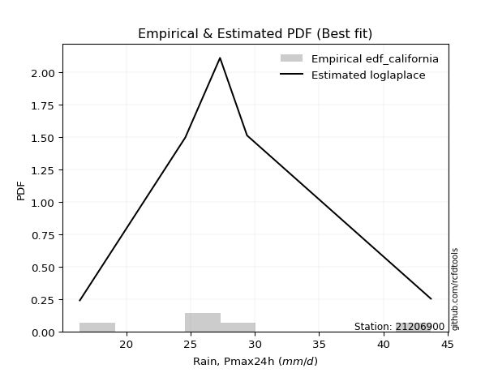</img>

</div>


### 2. Empirical - EDF Hazen (1930)

Hazen method for plotting positions is a formula used to estimate the empirical cumulative probability distribution of flood events or other hydrological data. This formula often results in biased estimations, particularly when extrapolating to extreme events (high return periods).

<div align="center">


$P=(m-0.5)/n$


</div>


**2.1. Empirical values**

<div align="center">

|                | 0                   | 1                  | 2                  | 3                  | 4         | 5                  |
|:---------------|:--------------------|:-------------------|:-------------------|:-------------------|:----------|:-------------------|
| date           | 2015                | 2016               | 2011               | 2024               | 2025      | 2012               |
| x              | 16.4                | 24.6               | 27.3               | 29.4               | 31.2      | 43.7               |
| m              | 1                   | 2                  | 3                  | 4                  | 5         | 6                  |
| empirical_dist | edf_hazen           | edf_hazen          | edf_hazen          | edf_hazen          | edf_hazen | edf_hazen          |
| empirical      | 0.08333333333333333 | 0.25               | 0.4166666666666667 | 0.5833333333333334 | 0.75      | 0.9166666666666666 |
| empirical_tr   | 1.090909090909091   | 1.3333333333333333 | 1.7142857142857144 | 2.4000000000000004 | 4.0       | 11.999999999999995 |

</div>


**2.2. Kolmogorov-Smirnov fit test (sorted by Δ)**


<div align="center">

|                | 0                    | 1                   | 2                     | 3                   | 4                   | 5                   | 6                  | 7                   | 8                   | 9                  | 10                 | 11                  | 12                 | 13                  | 14                 | 15                  | 16                  | 17                  | 18                  | 19                  | 20                  | 21                  | 22                  | 23                  | 24                  | 25                  | 26                  | 27                  | 28                  | 29                  | 30                  | 31                  | 32                  | 33                  | 34                  | 35                  | 36                  | 37                  | 38                  | 39                  | 40                  | 41                  | 42                  | 43                  | 44                  | 45                 | 46                  | 47                  | 48                  | 49                  | 50                  | 51                  | 52                  | 53                  | 54                  | 55                  | 56                 | 57                 | 58                  | 59                  | 60                  | 61                  | 62                  | 63                  | 64                  | 65                 | 66                 | 67                  | 68                 | 69                  | 70                  | 71                 | 72                  | 73                  | 74                  | 75                  | 76                 | 77                  | 78                 | 79                  | 80                 | 81                  | 82                 | 83                  | 84                 | 85                 | 86                  | 87                | 88                | 89                 |
|:---------------|:---------------------|:--------------------|:----------------------|:--------------------|:--------------------|:--------------------|:-------------------|:--------------------|:--------------------|:-------------------|:-------------------|:--------------------|:-------------------|:--------------------|:-------------------|:--------------------|:--------------------|:--------------------|:--------------------|:--------------------|:--------------------|:--------------------|:--------------------|:--------------------|:--------------------|:--------------------|:--------------------|:--------------------|:--------------------|:--------------------|:--------------------|:--------------------|:--------------------|:--------------------|:--------------------|:--------------------|:--------------------|:--------------------|:--------------------|:--------------------|:--------------------|:--------------------|:--------------------|:--------------------|:--------------------|:-------------------|:--------------------|:--------------------|:--------------------|:--------------------|:--------------------|:--------------------|:--------------------|:--------------------|:--------------------|:--------------------|:-------------------|:-------------------|:--------------------|:--------------------|:--------------------|:--------------------|:--------------------|:--------------------|:--------------------|:-------------------|:-------------------|:--------------------|:-------------------|:--------------------|:--------------------|:-------------------|:--------------------|:--------------------|:--------------------|:--------------------|:-------------------|:--------------------|:-------------------|:--------------------|:-------------------|:--------------------|:-------------------|:--------------------|:-------------------|:-------------------|:--------------------|:------------------|:------------------|:-------------------|
| station        | 21206900             | 21206900            | 21206900              | 21206900            | 21206900            | 21206900            | 21206900           | 21206900            | 21206900            | 21206900           | 21206900           | 21206900            | 21206900           | 21206900            | 21206900           | 21206900            | 21206900            | 21206900            | 21206900            | 21206900            | 21206900            | 21206900            | 21206900            | 21206900            | 21206900            | 21206900            | 21206900            | 21206900            | 21206900            | 21206900            | 21206900            | 21206900            | 21206900            | 21206900            | 21206900            | 21206900            | 21206900            | 21206900            | 21206900            | 21206900            | 21206900            | 21206900            | 21206900            | 21206900            | 21206900            | 21206900           | 21206900            | 21206900            | 21206900            | 21206900            | 21206900            | 21206900            | 21206900            | 21206900            | 21206900            | 21206900            | 21206900           | 21206900           | 21206900            | 21206900            | 21206900            | 21206900            | 21206900            | 21206900            | 21206900            | 21206900           | 21206900           | 21206900            | 21206900           | 21206900            | 21206900            | 21206900           | 21206900            | 21206900            | 21206900            | 21206900            | 21206900           | 21206900            | 21206900           | 21206900            | 21206900           | 21206900            | 21206900           | 21206900            | 21206900           | 21206900           | 21206900            | 21206900          | 21206900          | 21206900           |
| empirical_dist | edf_hazen            | edf_hazen           | edf_hazen             | edf_hazen           | edf_hazen           | edf_hazen           | edf_hazen          | edf_hazen           | edf_hazen           | edf_hazen          | edf_hazen          | edf_hazen           | edf_hazen          | edf_hazen           | edf_hazen          | edf_hazen           | edf_hazen           | edf_hazen           | edf_hazen           | edf_hazen           | edf_hazen           | edf_hazen           | edf_hazen           | edf_hazen           | edf_hazen           | edf_hazen           | edf_hazen           | edf_hazen           | edf_hazen           | edf_hazen           | edf_hazen           | edf_hazen           | edf_hazen           | edf_hazen           | edf_hazen           | edf_hazen           | edf_hazen           | edf_hazen           | edf_hazen           | edf_hazen           | edf_hazen           | edf_hazen           | edf_hazen           | edf_hazen           | edf_hazen           | edf_hazen          | edf_hazen           | edf_hazen           | edf_hazen           | edf_hazen           | edf_hazen           | edf_hazen           | edf_hazen           | edf_hazen           | edf_hazen           | edf_hazen           | edf_hazen          | edf_hazen          | edf_hazen           | edf_hazen           | edf_hazen           | edf_hazen           | edf_hazen           | edf_hazen           | edf_hazen           | edf_hazen          | edf_hazen          | edf_hazen           | edf_hazen          | edf_hazen           | edf_hazen           | edf_hazen          | edf_hazen           | edf_hazen           | edf_hazen           | edf_hazen           | edf_hazen          | edf_hazen           | edf_hazen          | edf_hazen           | edf_hazen          | edf_hazen           | edf_hazen          | edf_hazen           | edf_hazen          | edf_hazen          | edf_hazen           | edf_hazen         | edf_hazen         | edf_hazen          |
| p_dist         | logjohnsonsu         | johnsonsu           | loglaplace_asymmetric | loglaplace          | laplace_asymmetric  | loghypsecant        | laplace            | loglogistic         | logmielke           | loggenlogistic     | mielke             | logfisk             | exponnorm          | fisk                | gumbel_r           | genlogistic         | invgauss            | logf                | betaprime           | logt                | logexponnorm        | logcrystalball      | lognorm             | lognorm             | logfatiguelife      | ncf                 | weibull_min         | f                   | chi2                | gamma               | erlang              | nct                 | rayleigh            | moyal               | invgamma            | logpearson3         | alpha               | logweibull_min      | logloggamma         | loggamma            | loggamma            | invweibull          | loggompertz         | logerlang           | hypsecant           | maxwell            | logbetaprime        | pearson3            | loginvgamma         | rice                | logrice             | logalpha            | logistic            | kstwobign           | lognct              | halflogistic        | halfnorm           | logmaxwell         | loginvgauss         | loggumbel_l         | t                   | truncnorm           | crystalball         | norm                | lograyleigh         | loggumbel_r        | logmoyal           | loginvweibull       | wald               | gibrat              | loghalfnorm         | loghalflogistic    | gumbel_l            | logkstwobign        | logncf              | loggenexpon         | expon              | genexpon            | logwald            | logchi2             | logtruncnorm       | nakagami            | loggibrat          | logexpon            | lognakagami        | loglognorm         | pareto              | logpareto         | fatiguelife       | gompertz           |
| delta          | 0.039175975271180774 | 0.05390515204579405 | 0.05466960086967698   | 0.05809291845234121 | 0.06244900190787339 | 0.06521956466511158 | 0.0783478471118485 | 0.07927277483822953 | 0.08337523463705887 | 0.0855323474065649 | 0.0855415920391186 | 0.08563282346947143 | 0.0870681342453059 | 0.08758622193583265 | 0.0900078721962751 | 0.09370671473457992 | 0.09603662783058453 | 0.09709185302624129 | 0.09732113833014677 | 0.09743254672653495 | 0.09743331634806196 | 0.09743398365927486 | 0.09743405859136656 | 0.09743405859136656 | 0.09770942675059924 | 0.09891339508728503 | 0.10014539437372061 | 0.10030125056880257 | 0.10031904438500605 | 0.10031906826258474 | 0.10031931302876174 | 0.10032147244072975 | 0.10045029300515396 | 0.10125637121086833 | 0.10171786257645621 | 0.10193822390352769 | 0.10197998711815881 | 0.10268398680546076 | 0.10452526907898119 | 0.10474269917003798 | 0.10474269917003798 | 0.10563127269554295 | 0.10616450766558261 | 0.10616694503219892 | 0.10644770786450397 | 0.1081175700416468 | 0.10813269885699234 | 0.10905505384245417 | 0.10908381354691221 | 0.10947352020612433 | 0.11113304984474359 | 0.11131917110403389 | 0.11833728804949051 | 0.11966737422431595 | 0.12503761275412117 | 0.12597882735625526 | 0.1265351663789458 | 0.1292111068656882 | 0.13179501207180744 | 0.13235295445422857 | 0.13308841691247775 | 0.13309468744055208 | 0.13309475581686048 | 0.13309476037026613 | 0.14124466669668279 | 0.1451244282772785 | 0.1643916961504453 | 0.16592962346664453 | 0.1691661982688631 | 0.17513878313236314 | 0.17547952182667143 | 0.1831415696817994 | 0.18948596160768705 | 0.19038924852581074 | 0.19345501294399575 | 0.19437882177254762 | 0.2347343964834171 | 0.23473944861756402 | 0.2364184916658713 | 0.24643950403720782 | 0.2499995375379861 | 0.24999995911150819 | 0.2572737176241869 | 0.29124741206412996 | 0.3361792512140132 | 0.4117656569851257 | 0.41611915465631455 | 0.424187778718355 | 0.585614641842441 | 0.6743219076876374 |
| deltao         | 0.530385761606       | 0.530385761606      | 0.530385761606        | 0.530385761606      | 0.530385761606      | 0.530385761606      | 0.530385761606     | 0.530385761606      | 0.530385761606      | 0.530385761606     | 0.530385761606     | 0.530385761606      | 0.530385761606     | 0.530385761606      | 0.530385761606     | 0.530385761606      | 0.530385761606      | 0.530385761606      | 0.530385761606      | 0.530385761606      | 0.530385761606      | 0.530385761606      | 0.530385761606      | 0.530385761606      | 0.530385761606      | 0.530385761606      | 0.530385761606      | 0.530385761606      | 0.530385761606      | 0.530385761606      | 0.530385761606      | 0.530385761606      | 0.530385761606      | 0.530385761606      | 0.530385761606      | 0.530385761606      | 0.530385761606      | 0.530385761606      | 0.530385761606      | 0.530385761606      | 0.530385761606      | 0.530385761606      | 0.530385761606      | 0.530385761606      | 0.530385761606      | 0.530385761606     | 0.530385761606      | 0.530385761606      | 0.530385761606      | 0.530385761606      | 0.530385761606      | 0.530385761606      | 0.530385761606      | 0.530385761606      | 0.530385761606      | 0.530385761606      | 0.530385761606     | 0.530385761606     | 0.530385761606      | 0.530385761606      | 0.530385761606      | 0.530385761606      | 0.530385761606      | 0.530385761606      | 0.530385761606      | 0.530385761606     | 0.530385761606     | 0.530385761606      | 0.530385761606     | 0.530385761606      | 0.530385761606      | 0.530385761606     | 0.530385761606      | 0.530385761606      | 0.530385761606      | 0.530385761606      | 0.530385761606     | 0.530385761606      | 0.530385761606     | 0.530385761606      | 0.530385761606     | 0.530385761606      | 0.530385761606     | 0.530385761606      | 0.530385761606     | 0.530385761606     | 0.530385761606      | 0.530385761606    | 0.530385761606    | 0.530385761606     |
| eval           | Δo > Δ               | Δo > Δ              | Δo > Δ                | Δo > Δ              | Δo > Δ              | Δo > Δ              | Δo > Δ             | Δo > Δ              | Δo > Δ              | Δo > Δ             | Δo > Δ             | Δo > Δ              | Δo > Δ             | Δo > Δ              | Δo > Δ             | Δo > Δ              | Δo > Δ              | Δo > Δ              | Δo > Δ              | Δo > Δ              | Δo > Δ              | Δo > Δ              | Δo > Δ              | Δo > Δ              | Δo > Δ              | Δo > Δ              | Δo > Δ              | Δo > Δ              | Δo > Δ              | Δo > Δ              | Δo > Δ              | Δo > Δ              | Δo > Δ              | Δo > Δ              | Δo > Δ              | Δo > Δ              | Δo > Δ              | Δo > Δ              | Δo > Δ              | Δo > Δ              | Δo > Δ              | Δo > Δ              | Δo > Δ              | Δo > Δ              | Δo > Δ              | Δo > Δ             | Δo > Δ              | Δo > Δ              | Δo > Δ              | Δo > Δ              | Δo > Δ              | Δo > Δ              | Δo > Δ              | Δo > Δ              | Δo > Δ              | Δo > Δ              | Δo > Δ             | Δo > Δ             | Δo > Δ              | Δo > Δ              | Δo > Δ              | Δo > Δ              | Δo > Δ              | Δo > Δ              | Δo > Δ              | Δo > Δ             | Δo > Δ             | Δo > Δ              | Δo > Δ             | Δo > Δ              | Δo > Δ              | Δo > Δ             | Δo > Δ              | Δo > Δ              | Δo > Δ              | Δo > Δ              | Δo > Δ             | Δo > Δ              | Δo > Δ             | Δo > Δ              | Δo > Δ             | Δo > Δ              | Δo > Δ             | Δo > Δ              | Δo > Δ             | Δo > Δ             | Δo > Δ              | Δo > Δ            | Δo <= Δ           | Δo <= Δ            |
| fit            | 1                    | 1                   | 1                     | 1                   | 1                   | 1                   | 1                  | 1                   | 1                   | 1                  | 1                  | 1                   | 1                  | 1                   | 1                  | 1                   | 1                   | 1                   | 1                   | 1                   | 1                   | 1                   | 1                   | 1                   | 1                   | 1                   | 1                   | 1                   | 1                   | 1                   | 1                   | 1                   | 1                   | 1                   | 1                   | 1                   | 1                   | 1                   | 1                   | 1                   | 1                   | 1                   | 1                   | 1                   | 1                   | 1                  | 1                   | 1                   | 1                   | 1                   | 1                   | 1                   | 1                   | 1                   | 1                   | 1                   | 1                  | 1                  | 1                   | 1                   | 1                   | 1                   | 1                   | 1                   | 1                   | 1                  | 1                  | 1                   | 1                  | 1                   | 1                   | 1                  | 1                   | 1                   | 1                   | 1                   | 1                  | 1                   | 1                  | 1                   | 1                  | 1                   | 1                  | 1                   | 1                  | 1                  | 1                   | 1                 | 0                 | 0                  |
| n              | 6                    | 6                   | 6                     | 6                   | 6                   | 6                   | 6                  | 6                   | 6                   | 6                  | 6                  | 6                   | 6                  | 6                   | 6                  | 6                   | 6                   | 6                   | 6                   | 6                   | 6                   | 6                   | 6                   | 6                   | 6                   | 6                   | 6                   | 6                   | 6                   | 6                   | 6                   | 6                   | 6                   | 6                   | 6                   | 6                   | 6                   | 6                   | 6                   | 6                   | 6                   | 6                   | 6                   | 6                   | 6                   | 6                  | 6                   | 6                   | 6                   | 6                   | 6                   | 6                   | 6                   | 6                   | 6                   | 6                   | 6                  | 6                  | 6                   | 6                   | 6                   | 6                   | 6                   | 6                   | 6                   | 6                  | 6                  | 6                   | 6                  | 6                   | 6                   | 6                  | 6                   | 6                   | 6                   | 6                   | 6                  | 6                   | 6                  | 6                   | 6                  | 6                   | 6                  | 6                   | 6                  | 6                  | 6                   | 6                 | 6                 | 6                  |
| best_fit       | 1                    | 0                   | 0                     | 0                   | 0                   | 0                   | 0                  | 0                   | 0                   | 0                  | 0                  | 0                   | 0                  | 0                   | 0                  | 0                   | 0                   | 0                   | 0                   | 0                   | 0                   | 0                   | 0                   | 0                   | 0                   | 0                   | 0                   | 0                   | 0                   | 0                   | 0                   | 0                   | 0                   | 0                   | 0                   | 0                   | 0                   | 0                   | 0                   | 0                   | 0                   | 0                   | 0                   | 0                   | 0                   | 0                  | 0                   | 0                   | 0                   | 0                   | 0                   | 0                   | 0                   | 0                   | 0                   | 0                   | 0                  | 0                  | 0                   | 0                   | 0                   | 0                   | 0                   | 0                   | 0                   | 0                  | 0                  | 0                   | 0                  | 0                   | 0                   | 0                  | 0                   | 0                   | 0                   | 0                   | 0                  | 0                   | 0                  | 0                   | 0                  | 0                   | 0                  | 0                   | 0                  | 0                  | 0                   | 0                 | 0                 | 0                  |
| best_fit_sort  | 1                    | 2                   | 3                     | 4                   | 5                   | 6                   | 7                  | 8                   | 9                   | 10                 | 11                 | 12                  | 13                 | 14                  | 15                 | 16                  | 17                  | 18                  | 19                  | 20                  | 21                  | 22                  | 23                  | 24                  | 25                  | 26                  | 27                  | 28                  | 29                  | 30                  | 31                  | 32                  | 33                  | 34                  | 35                  | 36                  | 37                  | 38                  | 39                  | 40                  | 41                  | 42                  | 43                  | 44                  | 45                  | 46                 | 47                  | 48                  | 49                  | 50                  | 51                  | 52                  | 53                  | 54                  | 55                  | 56                  | 57                 | 58                 | 59                  | 60                  | 61                  | 62                  | 63                  | 64                  | 65                  | 66                 | 67                 | 68                  | 69                 | 70                  | 71                  | 72                 | 73                  | 74                  | 75                  | 76                  | 77                 | 78                  | 79                 | 80                  | 81                 | 82                  | 83                 | 84                  | 85                 | 86                 | 87                  | 88                | 89                | 90                 |

</div>


<div align="center">

</img>

</div>


**2.3. Best fit**

<div align="center">

|   id |   station | empirical_dist   | p_dist       |    delta |   deltao | eval   |   fit |   n |   best_fit |   best_fit_sort |
|-----:|----------:|:-----------------|:-------------|---------:|---------:|:-------|------:|----:|-----------:|----------------:|
|    0 |  21206900 | edf_hazen        | logjohnsonsu | 0.039176 | 0.530386 | Δo > Δ |     1 |   6 |          1 |               1 |

</div>


<div align="center">

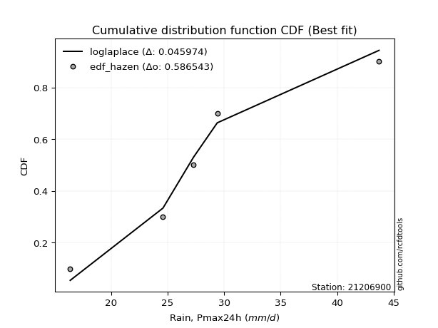</img>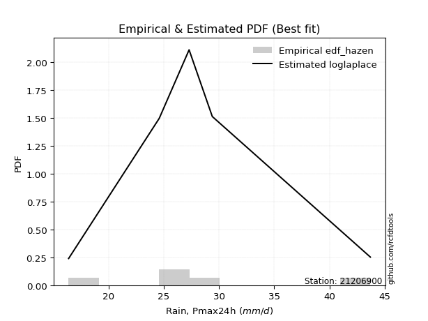</img>

</div>


### 3. Empirical - EDF Weibull (1939)

Weibull plotting position formula is an empirical method used to estimate the non-exceedance probability or plotting position for a set of observed data, is often recommended or widely used in practice, particularly in flood frequency analysis.

<div align="center">


$P=m/(n+1)$


</div>


**3.1. Empirical values**

<div align="center">

|                | 0                   | 1                  | 2                   | 3                  | 4                  | 5                  |
|:---------------|:--------------------|:-------------------|:--------------------|:-------------------|:-------------------|:-------------------|
| date           | 2015                | 2016               | 2011                | 2024               | 2025               | 2012               |
| x              | 16.4                | 24.6               | 27.3                | 29.4               | 31.2               | 43.7               |
| m              | 1                   | 2                  | 3                   | 4                  | 5                  | 6                  |
| empirical_dist | edf_weibull         | edf_weibull        | edf_weibull         | edf_weibull        | edf_weibull        | edf_weibull        |
| empirical      | 0.14285714285714285 | 0.2857142857142857 | 0.42857142857142855 | 0.5714285714285714 | 0.7142857142857143 | 0.8571428571428571 |
| empirical_tr   | 1.1666666666666665  | 1.4                | 1.75                | 2.333333333333333  | 3.5                | 6.999999999999997  |

</div>


**3.2. Kolmogorov-Smirnov fit test (sorted by Δ)**


<div align="center">

|                | 0                  | 1                   | 2                   | 3                   | 4                  | 5                   | 6                   | 7                   | 8                   | 9                  | 10                  | 11                    | 12                  | 13                 | 14                  | 15                  | 16                  | 17                  | 18                  | 19                 | 20                  | 21                  | 22                  | 23                  | 24                  | 25                  | 26                  | 27                 | 28                  | 29                  | 30                 | 31                  | 32                  | 33                  | 34                  | 35                  | 36                  | 37                  | 38                  | 39                  | 40                  | 41                  | 42                  | 43                  | 44                  | 45                  | 46                  | 47                  | 48                  | 49                  | 50                  | 51                 | 52                  | 53                  | 54                  | 55                  | 56                  | 57                 | 58                  | 59                  | 60                  | 61                  | 62                  | 63                  | 64                 | 65                  | 66                  | 67                  | 68                  | 69                  | 70                  | 71                  | 72                 | 73                  | 74                  | 75                  | 76                 | 77                 | 78                  | 79                  | 80                  | 81                  | 82                 | 83                 | 84                  | 85               | 86                  | 87                 | 88                 | 89                 |
|:---------------|:-------------------|:--------------------|:--------------------|:--------------------|:-------------------|:--------------------|:--------------------|:--------------------|:--------------------|:-------------------|:--------------------|:----------------------|:--------------------|:-------------------|:--------------------|:--------------------|:--------------------|:--------------------|:--------------------|:-------------------|:--------------------|:--------------------|:--------------------|:--------------------|:--------------------|:--------------------|:--------------------|:-------------------|:--------------------|:--------------------|:-------------------|:--------------------|:--------------------|:--------------------|:--------------------|:--------------------|:--------------------|:--------------------|:--------------------|:--------------------|:--------------------|:--------------------|:--------------------|:--------------------|:--------------------|:--------------------|:--------------------|:--------------------|:--------------------|:--------------------|:--------------------|:-------------------|:--------------------|:--------------------|:--------------------|:--------------------|:--------------------|:-------------------|:--------------------|:--------------------|:--------------------|:--------------------|:--------------------|:--------------------|:-------------------|:--------------------|:--------------------|:--------------------|:--------------------|:--------------------|:--------------------|:--------------------|:-------------------|:--------------------|:--------------------|:--------------------|:-------------------|:-------------------|:--------------------|:--------------------|:--------------------|:--------------------|:-------------------|:-------------------|:--------------------|:-----------------|:--------------------|:-------------------|:-------------------|:-------------------|
| station        | 21206900           | 21206900            | 21206900            | 21206900            | 21206900           | 21206900            | 21206900            | 21206900            | 21206900            | 21206900           | 21206900            | 21206900              | 21206900            | 21206900           | 21206900            | 21206900            | 21206900            | 21206900            | 21206900            | 21206900           | 21206900            | 21206900            | 21206900            | 21206900            | 21206900            | 21206900            | 21206900            | 21206900           | 21206900            | 21206900            | 21206900           | 21206900            | 21206900            | 21206900            | 21206900            | 21206900            | 21206900            | 21206900            | 21206900            | 21206900            | 21206900            | 21206900            | 21206900            | 21206900            | 21206900            | 21206900            | 21206900            | 21206900            | 21206900            | 21206900            | 21206900            | 21206900           | 21206900            | 21206900            | 21206900            | 21206900            | 21206900            | 21206900           | 21206900            | 21206900            | 21206900            | 21206900            | 21206900            | 21206900            | 21206900           | 21206900            | 21206900            | 21206900            | 21206900            | 21206900            | 21206900            | 21206900            | 21206900           | 21206900            | 21206900            | 21206900            | 21206900           | 21206900           | 21206900            | 21206900            | 21206900            | 21206900            | 21206900           | 21206900           | 21206900            | 21206900         | 21206900            | 21206900           | 21206900           | 21206900           |
| empirical_dist | edf_weibull        | edf_weibull         | edf_weibull         | edf_weibull         | edf_weibull        | edf_weibull         | edf_weibull         | edf_weibull         | edf_weibull         | edf_weibull        | edf_weibull         | edf_weibull           | edf_weibull         | edf_weibull        | edf_weibull         | edf_weibull         | edf_weibull         | edf_weibull         | edf_weibull         | edf_weibull        | edf_weibull         | edf_weibull         | edf_weibull         | edf_weibull         | edf_weibull         | edf_weibull         | edf_weibull         | edf_weibull        | edf_weibull         | edf_weibull         | edf_weibull        | edf_weibull         | edf_weibull         | edf_weibull         | edf_weibull         | edf_weibull         | edf_weibull         | edf_weibull         | edf_weibull         | edf_weibull         | edf_weibull         | edf_weibull         | edf_weibull         | edf_weibull         | edf_weibull         | edf_weibull         | edf_weibull         | edf_weibull         | edf_weibull         | edf_weibull         | edf_weibull         | edf_weibull        | edf_weibull         | edf_weibull         | edf_weibull         | edf_weibull         | edf_weibull         | edf_weibull        | edf_weibull         | edf_weibull         | edf_weibull         | edf_weibull         | edf_weibull         | edf_weibull         | edf_weibull        | edf_weibull         | edf_weibull         | edf_weibull         | edf_weibull         | edf_weibull         | edf_weibull         | edf_weibull         | edf_weibull        | edf_weibull         | edf_weibull         | edf_weibull         | edf_weibull        | edf_weibull        | edf_weibull         | edf_weibull         | edf_weibull         | edf_weibull         | edf_weibull        | edf_weibull        | edf_weibull         | edf_weibull      | edf_weibull         | edf_weibull        | edf_weibull        | edf_weibull        |
| p_dist         | logjohnsonsu       | johnsonsu           | genlogistic         | laplace_asymmetric  | alpha              | invgamma            | logmielke           | nct                 | logloggamma         | fisk               | maxwell             | loglaplace_asymmetric | mielke              | loggenlogistic     | logpearson3         | f                   | gamma               | chi2                | erlang              | exponnorm          | pearson3            | ncf                 | invgauss            | logweibull_min      | betaprime           | loglaplace          | kstwobign           | invweibull         | loghypsecant        | loglogistic         | laplace            | logt                | lognorm             | lognorm             | logcrystalball      | logexponnorm        | logf                | rice                | logfatiguelife      | loggamma            | loggamma            | logfisk             | logerlang           | hypsecant           | logistic            | weibull_min         | loginvgamma         | rayleigh            | crystalball         | norm                | truncnorm           | t                  | logbetaprime        | logalpha            | loginvgauss         | lognct              | logrice             | gumbel_r           | logmaxwell          | loggumbel_l         | loginvweibull       | moyal               | loggumbel_r         | lograyleigh         | loggompertz        | halflogistic        | loghalfnorm         | halfnorm            | logmoyal            | gumbel_l            | logkstwobign        | wald                | loghalflogistic    | logncf              | loggenexpon         | gibrat              | logchi2            | expon              | genexpon            | logwald             | loggibrat           | logexpon            | logtruncnorm       | nakagami           | lognakagami         | loglognorm       | pareto              | logpareto          | fatiguelife        | gompertz           |
| delta          | 0.0903938365562198 | 0.09396229026922198 | 0.09523898871571282 | 0.09527080541937505 | 0.0961426256949377 | 0.09621961322521168 | 0.09623341617988268 | 0.09624697229874923 | 0.09638362429777503 | 0.0963933147056854 | 0.09641231799403405 | 0.09654893111827334   | 0.09669468734287068 | 0.0966978498106742 | 0.09754148422290096 | 0.09822360221013865 | 0.09823291086371432 | 0.09823292544908685 | 0.09823295064326804 | 0.0982671559523649 | 0.09842037876886478 | 0.09842101350645416 | 0.09849269427882407 | 0.10041392283227979 | 0.10124636373111182 | 0.10234040275974411 | 0.10278479226896749 | 0.1037991519296106 | 0.10384793589682535 | 0.10454453190320445 | 0.1050009958207474 | 0.10506188533004249 | 0.10506344555019226 | 0.10506344555019226 | 0.10506345547207212 | 0.10506355513321117 | 0.10513888094296406 | 0.10537127006237178 | 0.10571281966615613 | 0.10593582600516671 | 0.10593582600516671 | 0.10628241550817608 | 0.10637573906391404 | 0.10667626737778879 | 0.10762822200714417 | 0.10771681399816813 | 0.10797983050162871 | 0.10880385123056471 | 0.10884995678583986 | 0.10884995719834223 | 0.10885000779463327 | 0.1088526666270645 | 0.10899372673970828 | 0.10920745893871105 | 0.10921658500364115 | 0.11336574597330697 | 0.11460286218863493 | 0.1226205607641512 | 0.12673029430314964 | 0.12793983277377863 | 0.13021533775235883 | 0.13832956801224702 | 0.13870198160487143 | 0.13888556567492805 | 0.1428571293972269 | 0.14285714285714285 | 0.14285714285714285 | 0.14285714285714285 | 0.15248693424568344 | 0.15377167589340135 | 0.15467496281152504 | 0.15726143636410123 | 0.1575463986867563 | 0.15774072722971005 | 0.15866453605826192 | 0.16323402122760128 | 0.1869156945133983 | 0.1990201107691314 | 0.19902516290327832 | 0.22451372976110945 | 0.24536895571942502 | 0.25553312634984426 | 0.2857138232522718 | 0.2857142448257939 | 0.32427448930925135 | 0.37605137127084 | 0.38040486894202885 | 0.3884734930040693 | 0.5499003561281554 | 0.6386076219733517 |
| deltao         | 0.530385761606     | 0.530385761606      | 0.530385761606      | 0.530385761606      | 0.530385761606     | 0.530385761606      | 0.530385761606      | 0.530385761606      | 0.530385761606      | 0.530385761606     | 0.530385761606      | 0.530385761606        | 0.530385761606      | 0.530385761606     | 0.530385761606      | 0.530385761606      | 0.530385761606      | 0.530385761606      | 0.530385761606      | 0.530385761606     | 0.530385761606      | 0.530385761606      | 0.530385761606      | 0.530385761606      | 0.530385761606      | 0.530385761606      | 0.530385761606      | 0.530385761606     | 0.530385761606      | 0.530385761606      | 0.530385761606     | 0.530385761606      | 0.530385761606      | 0.530385761606      | 0.530385761606      | 0.530385761606      | 0.530385761606      | 0.530385761606      | 0.530385761606      | 0.530385761606      | 0.530385761606      | 0.530385761606      | 0.530385761606      | 0.530385761606      | 0.530385761606      | 0.530385761606      | 0.530385761606      | 0.530385761606      | 0.530385761606      | 0.530385761606      | 0.530385761606      | 0.530385761606     | 0.530385761606      | 0.530385761606      | 0.530385761606      | 0.530385761606      | 0.530385761606      | 0.530385761606     | 0.530385761606      | 0.530385761606      | 0.530385761606      | 0.530385761606      | 0.530385761606      | 0.530385761606      | 0.530385761606     | 0.530385761606      | 0.530385761606      | 0.530385761606      | 0.530385761606      | 0.530385761606      | 0.530385761606      | 0.530385761606      | 0.530385761606     | 0.530385761606      | 0.530385761606      | 0.530385761606      | 0.530385761606     | 0.530385761606     | 0.530385761606      | 0.530385761606      | 0.530385761606      | 0.530385761606      | 0.530385761606     | 0.530385761606     | 0.530385761606      | 0.530385761606   | 0.530385761606      | 0.530385761606     | 0.530385761606     | 0.530385761606     |
| eval           | Δo > Δ             | Δo > Δ              | Δo > Δ              | Δo > Δ              | Δo > Δ             | Δo > Δ              | Δo > Δ              | Δo > Δ              | Δo > Δ              | Δo > Δ             | Δo > Δ              | Δo > Δ                | Δo > Δ              | Δo > Δ             | Δo > Δ              | Δo > Δ              | Δo > Δ              | Δo > Δ              | Δo > Δ              | Δo > Δ             | Δo > Δ              | Δo > Δ              | Δo > Δ              | Δo > Δ              | Δo > Δ              | Δo > Δ              | Δo > Δ              | Δo > Δ             | Δo > Δ              | Δo > Δ              | Δo > Δ             | Δo > Δ              | Δo > Δ              | Δo > Δ              | Δo > Δ              | Δo > Δ              | Δo > Δ              | Δo > Δ              | Δo > Δ              | Δo > Δ              | Δo > Δ              | Δo > Δ              | Δo > Δ              | Δo > Δ              | Δo > Δ              | Δo > Δ              | Δo > Δ              | Δo > Δ              | Δo > Δ              | Δo > Δ              | Δo > Δ              | Δo > Δ             | Δo > Δ              | Δo > Δ              | Δo > Δ              | Δo > Δ              | Δo > Δ              | Δo > Δ             | Δo > Δ              | Δo > Δ              | Δo > Δ              | Δo > Δ              | Δo > Δ              | Δo > Δ              | Δo > Δ             | Δo > Δ              | Δo > Δ              | Δo > Δ              | Δo > Δ              | Δo > Δ              | Δo > Δ              | Δo > Δ              | Δo > Δ             | Δo > Δ              | Δo > Δ              | Δo > Δ              | Δo > Δ             | Δo > Δ             | Δo > Δ              | Δo > Δ              | Δo > Δ              | Δo > Δ              | Δo > Δ             | Δo > Δ             | Δo > Δ              | Δo > Δ           | Δo > Δ              | Δo > Δ             | Δo <= Δ            | Δo <= Δ            |
| fit            | 1                  | 1                   | 1                   | 1                   | 1                  | 1                   | 1                   | 1                   | 1                   | 1                  | 1                   | 1                     | 1                   | 1                  | 1                   | 1                   | 1                   | 1                   | 1                   | 1                  | 1                   | 1                   | 1                   | 1                   | 1                   | 1                   | 1                   | 1                  | 1                   | 1                   | 1                  | 1                   | 1                   | 1                   | 1                   | 1                   | 1                   | 1                   | 1                   | 1                   | 1                   | 1                   | 1                   | 1                   | 1                   | 1                   | 1                   | 1                   | 1                   | 1                   | 1                   | 1                  | 1                   | 1                   | 1                   | 1                   | 1                   | 1                  | 1                   | 1                   | 1                   | 1                   | 1                   | 1                   | 1                  | 1                   | 1                   | 1                   | 1                   | 1                   | 1                   | 1                   | 1                  | 1                   | 1                   | 1                   | 1                  | 1                  | 1                   | 1                   | 1                   | 1                   | 1                  | 1                  | 1                   | 1                | 1                   | 1                  | 0                  | 0                  |
| n              | 6                  | 6                   | 6                   | 6                   | 6                  | 6                   | 6                   | 6                   | 6                   | 6                  | 6                   | 6                     | 6                   | 6                  | 6                   | 6                   | 6                   | 6                   | 6                   | 6                  | 6                   | 6                   | 6                   | 6                   | 6                   | 6                   | 6                   | 6                  | 6                   | 6                   | 6                  | 6                   | 6                   | 6                   | 6                   | 6                   | 6                   | 6                   | 6                   | 6                   | 6                   | 6                   | 6                   | 6                   | 6                   | 6                   | 6                   | 6                   | 6                   | 6                   | 6                   | 6                  | 6                   | 6                   | 6                   | 6                   | 6                   | 6                  | 6                   | 6                   | 6                   | 6                   | 6                   | 6                   | 6                  | 6                   | 6                   | 6                   | 6                   | 6                   | 6                   | 6                   | 6                  | 6                   | 6                   | 6                   | 6                  | 6                  | 6                   | 6                   | 6                   | 6                   | 6                  | 6                  | 6                   | 6                | 6                   | 6                  | 6                  | 6                  |
| best_fit       | 1                  | 0                   | 0                   | 0                   | 0                  | 0                   | 0                   | 0                   | 0                   | 0                  | 0                   | 0                     | 0                   | 0                  | 0                   | 0                   | 0                   | 0                   | 0                   | 0                  | 0                   | 0                   | 0                   | 0                   | 0                   | 0                   | 0                   | 0                  | 0                   | 0                   | 0                  | 0                   | 0                   | 0                   | 0                   | 0                   | 0                   | 0                   | 0                   | 0                   | 0                   | 0                   | 0                   | 0                   | 0                   | 0                   | 0                   | 0                   | 0                   | 0                   | 0                   | 0                  | 0                   | 0                   | 0                   | 0                   | 0                   | 0                  | 0                   | 0                   | 0                   | 0                   | 0                   | 0                   | 0                  | 0                   | 0                   | 0                   | 0                   | 0                   | 0                   | 0                   | 0                  | 0                   | 0                   | 0                   | 0                  | 0                  | 0                   | 0                   | 0                   | 0                   | 0                  | 0                  | 0                   | 0                | 0                   | 0                  | 0                  | 0                  |
| best_fit_sort  | 1                  | 2                   | 3                   | 4                   | 5                  | 6                   | 7                   | 8                   | 9                   | 10                 | 11                  | 12                    | 13                  | 14                 | 15                  | 16                  | 17                  | 18                  | 19                  | 20                 | 21                  | 22                  | 23                  | 24                  | 25                  | 26                  | 27                  | 28                 | 29                  | 30                  | 31                 | 32                  | 33                  | 34                  | 35                  | 36                  | 37                  | 38                  | 39                  | 40                  | 41                  | 42                  | 43                  | 44                  | 45                  | 46                  | 47                  | 48                  | 49                  | 50                  | 51                  | 52                 | 53                  | 54                  | 55                  | 56                  | 57                  | 58                 | 59                  | 60                  | 61                  | 62                  | 63                  | 64                  | 65                 | 66                  | 67                  | 68                  | 69                  | 70                  | 71                  | 72                  | 73                 | 74                  | 75                  | 76                  | 77                 | 78                 | 79                  | 80                  | 81                  | 82                  | 83                 | 84                 | 85                  | 86               | 87                  | 88                 | 89                 | 90                 |

</div>


<div align="center">

</img>

</div>


**3.3. Best fit**

<div align="center">

|   id |   station | empirical_dist   | p_dist       |     delta |   deltao | eval   |   fit |   n |   best_fit |   best_fit_sort |
|-----:|----------:|:-----------------|:-------------|----------:|---------:|:-------|------:|----:|-----------:|----------------:|
|    0 |  21206900 | edf_weibull      | logjohnsonsu | 0.0903938 | 0.530386 | Δo > Δ |     1 |   6 |          1 |               1 |

</div>


<div align="center">

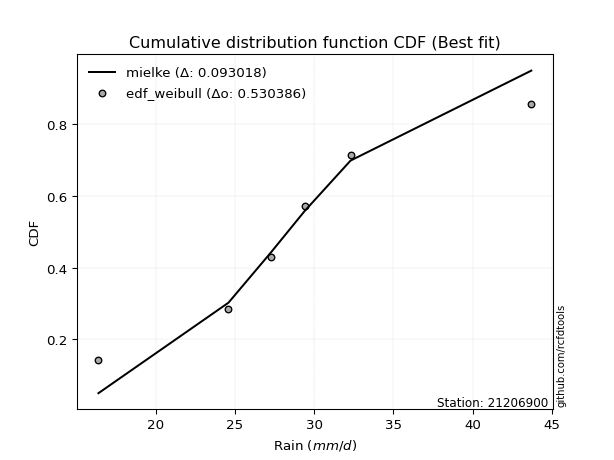</img>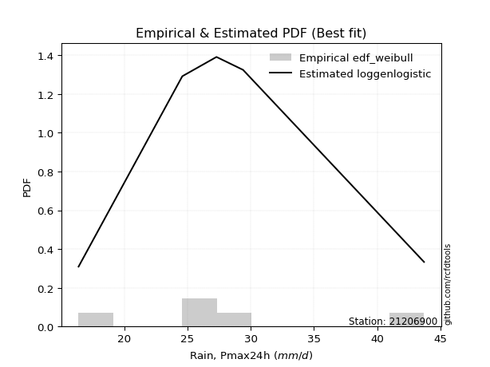</img>

</div>


### 4. Empirical - EDF Beard (1943)

The Beard formula (or Beard´s plotting position formula) in hydrology is used to estimate the empirical non-exceedance probability _(P)_ of a flood event (or other extreme hydrological data point) within a given dataset.

<div align="center">


$P=(m-0.31)/(n+0.38)$


</div>


**4.1. Empirical values**

<div align="center">

|                | 0                   | 1                   | 2                  | 3                  | 4                  | 5                  |
|:---------------|:--------------------|:--------------------|:-------------------|:-------------------|:-------------------|:-------------------|
| date           | 2015                | 2016                | 2011               | 2024               | 2025               | 2012               |
| x              | 16.4                | 24.6                | 27.3               | 29.4               | 31.2               | 43.7               |
| m              | 1                   | 2                   | 3                  | 4                  | 5                  | 6                  |
| empirical_dist | edf_beard           | edf_beard           | edf_beard          | edf_beard          | edf_beard          | edf_beard          |
| empirical      | 0.10815047021943573 | 0.26489028213166144 | 0.4216300940438871 | 0.5783699059561128 | 0.7351097178683387 | 0.8918495297805643 |
| empirical_tr   | 1.1212653778558874  | 1.3603411513859276  | 1.7289972899728996 | 2.3717472118959106 | 3.7751479289940844 | 9.246376811594207  |

</div>


**4.2. Kolmogorov-Smirnov fit test (sorted by Δ)**


<div align="center">

|                | 0                   | 1                   | 2                    | 3                     | 4                 | 5                   | 6                   | 7                   | 8                   | 9                   | 10                  | 11                  | 12                  | 13                  | 14                 | 15                 | 16                  | 17                  | 18                  | 19                  | 20                  | 21                  | 22                  | 23                 | 24                 | 25                  | 26                  | 27                  | 28                  | 29                  | 30                  | 31                  | 32                  | 33                  | 34                  | 35                  | 36                  | 37                  | 38                  | 39                  | 40                  | 41                  | 42                  | 43                  | 44                 | 45                  | 46                  | 47                | 48                  | 49                  | 50                  | 51                  | 52                  | 53                  | 54                  | 55                  | 56                  | 57                  | 58                | 59                  | 60                  | 61                  | 62                  | 63                 | 64                  | 65                  | 66                 | 67                  | 68               | 69                  | 70                  | 71                 | 72                  | 73                 | 74                  | 75                  | 76                  | 77                  | 78                 | 79                  | 80                  | 81                  | 82                 | 83                 | 84                  | 85                  | 86                 | 87                  | 88                 | 89                 |
|:---------------|:--------------------|:--------------------|:---------------------|:----------------------|:------------------|:--------------------|:--------------------|:--------------------|:--------------------|:--------------------|:--------------------|:--------------------|:--------------------|:--------------------|:-------------------|:-------------------|:--------------------|:--------------------|:--------------------|:--------------------|:--------------------|:--------------------|:--------------------|:-------------------|:-------------------|:--------------------|:--------------------|:--------------------|:--------------------|:--------------------|:--------------------|:--------------------|:--------------------|:--------------------|:--------------------|:--------------------|:--------------------|:--------------------|:--------------------|:--------------------|:--------------------|:--------------------|:--------------------|:--------------------|:-------------------|:--------------------|:--------------------|:------------------|:--------------------|:--------------------|:--------------------|:--------------------|:--------------------|:--------------------|:--------------------|:--------------------|:--------------------|:--------------------|:------------------|:--------------------|:--------------------|:--------------------|:--------------------|:-------------------|:--------------------|:--------------------|:-------------------|:--------------------|:-----------------|:--------------------|:--------------------|:-------------------|:--------------------|:-------------------|:--------------------|:--------------------|:--------------------|:--------------------|:-------------------|:--------------------|:--------------------|:--------------------|:-------------------|:-------------------|:--------------------|:--------------------|:-------------------|:--------------------|:-------------------|:-------------------|
| station        | 21206900            | 21206900            | 21206900             | 21206900              | 21206900          | 21206900            | 21206900            | 21206900            | 21206900            | 21206900            | 21206900            | 21206900            | 21206900            | 21206900            | 21206900           | 21206900           | 21206900            | 21206900            | 21206900            | 21206900            | 21206900            | 21206900            | 21206900            | 21206900           | 21206900           | 21206900            | 21206900            | 21206900            | 21206900            | 21206900            | 21206900            | 21206900            | 21206900            | 21206900            | 21206900            | 21206900            | 21206900            | 21206900            | 21206900            | 21206900            | 21206900            | 21206900            | 21206900            | 21206900            | 21206900           | 21206900            | 21206900            | 21206900          | 21206900            | 21206900            | 21206900            | 21206900            | 21206900            | 21206900            | 21206900            | 21206900            | 21206900            | 21206900            | 21206900          | 21206900            | 21206900            | 21206900            | 21206900            | 21206900           | 21206900            | 21206900            | 21206900           | 21206900            | 21206900         | 21206900            | 21206900            | 21206900           | 21206900            | 21206900           | 21206900            | 21206900            | 21206900            | 21206900            | 21206900           | 21206900            | 21206900            | 21206900            | 21206900           | 21206900           | 21206900            | 21206900            | 21206900           | 21206900            | 21206900           | 21206900           |
| empirical_dist | edf_beard           | edf_beard           | edf_beard            | edf_beard             | edf_beard         | edf_beard           | edf_beard           | edf_beard           | edf_beard           | edf_beard           | edf_beard           | edf_beard           | edf_beard           | edf_beard           | edf_beard          | edf_beard          | edf_beard           | edf_beard           | edf_beard           | edf_beard           | edf_beard           | edf_beard           | edf_beard           | edf_beard          | edf_beard          | edf_beard           | edf_beard           | edf_beard           | edf_beard           | edf_beard           | edf_beard           | edf_beard           | edf_beard           | edf_beard           | edf_beard           | edf_beard           | edf_beard           | edf_beard           | edf_beard           | edf_beard           | edf_beard           | edf_beard           | edf_beard           | edf_beard           | edf_beard          | edf_beard           | edf_beard           | edf_beard         | edf_beard           | edf_beard           | edf_beard           | edf_beard           | edf_beard           | edf_beard           | edf_beard           | edf_beard           | edf_beard           | edf_beard           | edf_beard         | edf_beard           | edf_beard           | edf_beard           | edf_beard           | edf_beard          | edf_beard           | edf_beard           | edf_beard          | edf_beard           | edf_beard        | edf_beard           | edf_beard           | edf_beard          | edf_beard           | edf_beard          | edf_beard           | edf_beard           | edf_beard           | edf_beard           | edf_beard          | edf_beard           | edf_beard           | edf_beard           | edf_beard          | edf_beard          | edf_beard           | edf_beard           | edf_beard          | edf_beard           | edf_beard          | edf_beard          |
| p_dist         | logjohnsonsu        | johnsonsu           | laplace_asymmetric   | loglaplace_asymmetric | loglaplace        | logmielke           | loghypsecant        | loglogistic         | laplace             | loggenlogistic      | mielke              | logfisk             | exponnorm           | fisk                | genlogistic        | invgauss           | logf                | betaprime           | logt                | logexponnorm        | logcrystalball      | lognorm             | lognorm             | logfatiguelife     | ncf                | weibull_min         | f                   | chi2                | gamma               | erlang              | nct                 | rayleigh            | invgamma            | logpearson3         | alpha               | logweibull_min      | gumbel_r            | logloggamma         | loggamma            | loggamma            | invweibull          | logerlang           | hypsecant           | maxwell             | logbetaprime       | pearson3            | loginvgamma         | rice              | logrice             | logalpha            | logistic            | moyal               | kstwobign           | loggompertz         | lognct              | halflogistic        | halfnorm            | logmaxwell          | loginvgauss       | loggumbel_l         | t                   | truncnorm           | crystalball         | norm               | lograyleigh         | loggumbel_r         | loginvweibull      | logmoyal            | loghalfnorm      | wald                | loghalflogistic     | gibrat             | gumbel_l            | logkstwobign       | logncf              | loggenexpon         | expon               | genexpon            | logchi2            | logwald             | loggibrat           | logtruncnorm        | nakagami           | logexpon           | lognakagami         | loglognorm          | pareto             | logpareto           | fatiguelife        | gompertz           |
| delta          | 0.05568716391851258 | 0.05925561763151477 | 0.060564132781667834 | 0.061842258480566126  | 0.067633730122037 | 0.06848495250539754 | 0.06914126325911824 | 0.06983785926549733 | 0.07029432318304019 | 0.07064206527490358 | 0.07065130990745727 | 0.07157574287046894 | 0.07217785211364458 | 0.07269593980417133 | 0.0788164326029186 | 0.0811463456989232 | 0.08220157089457986 | 0.08243085619848534 | 0.08254226459487352 | 0.08254303421640052 | 0.08254370152761342 | 0.08254377645970512 | 0.08254377645970512 | 0.0828191446189378 | 0.0840231129556237 | 0.08525511224205917 | 0.08541096843714124 | 0.08542876225334473 | 0.08542878613092342 | 0.08542903089710041 | 0.08543119030906843 | 0.08556001087349263 | 0.08682758044479488 | 0.08704794177186637 | 0.08708970498649748 | 0.08779370467379943 | 0.08791388812644409 | 0.08963498694731986 | 0.08985241703837654 | 0.08985241703837654 | 0.09074099056388152 | 0.09127666290053749 | 0.09155742573284265 | 0.09322728790998547 | 0.0932424167253309 | 0.09416477171079285 | 0.09419353141525078 | 0.094583238074463 | 0.09624276771308216 | 0.09642888897237245 | 0.10344700591782918 | 0.10362289537453989 | 0.10477709209265451 | 0.10815045675951977 | 0.11014733062245974 | 0.11108854522459383 | 0.11164488424728436 | 0.11432082473402677 | 0.116904729940146 | 0.11746267232256724 | 0.11819813478081642 | 0.11820440530889076 | 0.11820447368519915 | 0.1182044782386048 | 0.12635438456502135 | 0.13354900891251759 | 0.1510393413349831 | 0.15942826877322486 | 0.16058923969501 | 0.16420277089164265 | 0.16825128755013796 | 0.1701753557551427 | 0.17459567947602572 | 0.1754989663941493 | 0.17856473081233432 | 0.17948853964088618 | 0.21984411435175566 | 0.21984916648590258 | 0.2216223671511055 | 0.23145506428865087 | 0.25231029024696644 | 0.26488981966964753 | 0.2648902412431696 | 0.2763571299324685 | 0.33121582383679277 | 0.39687537485346425 | 0.4012288725246531 | 0.40929749658669357 | 0.5707243597107796 | 0.6594316255559761 |
| deltao         | 0.530385761606      | 0.530385761606      | 0.530385761606       | 0.530385761606        | 0.530385761606    | 0.530385761606      | 0.530385761606      | 0.530385761606      | 0.530385761606      | 0.530385761606      | 0.530385761606      | 0.530385761606      | 0.530385761606      | 0.530385761606      | 0.530385761606     | 0.530385761606     | 0.530385761606      | 0.530385761606      | 0.530385761606      | 0.530385761606      | 0.530385761606      | 0.530385761606      | 0.530385761606      | 0.530385761606     | 0.530385761606     | 0.530385761606      | 0.530385761606      | 0.530385761606      | 0.530385761606      | 0.530385761606      | 0.530385761606      | 0.530385761606      | 0.530385761606      | 0.530385761606      | 0.530385761606      | 0.530385761606      | 0.530385761606      | 0.530385761606      | 0.530385761606      | 0.530385761606      | 0.530385761606      | 0.530385761606      | 0.530385761606      | 0.530385761606      | 0.530385761606     | 0.530385761606      | 0.530385761606      | 0.530385761606    | 0.530385761606      | 0.530385761606      | 0.530385761606      | 0.530385761606      | 0.530385761606      | 0.530385761606      | 0.530385761606      | 0.530385761606      | 0.530385761606      | 0.530385761606      | 0.530385761606    | 0.530385761606      | 0.530385761606      | 0.530385761606      | 0.530385761606      | 0.530385761606     | 0.530385761606      | 0.530385761606      | 0.530385761606     | 0.530385761606      | 0.530385761606   | 0.530385761606      | 0.530385761606      | 0.530385761606     | 0.530385761606      | 0.530385761606     | 0.530385761606      | 0.530385761606      | 0.530385761606      | 0.530385761606      | 0.530385761606     | 0.530385761606      | 0.530385761606      | 0.530385761606      | 0.530385761606     | 0.530385761606     | 0.530385761606      | 0.530385761606      | 0.530385761606     | 0.530385761606      | 0.530385761606     | 0.530385761606     |
| eval           | Δo > Δ              | Δo > Δ              | Δo > Δ               | Δo > Δ                | Δo > Δ            | Δo > Δ              | Δo > Δ              | Δo > Δ              | Δo > Δ              | Δo > Δ              | Δo > Δ              | Δo > Δ              | Δo > Δ              | Δo > Δ              | Δo > Δ             | Δo > Δ             | Δo > Δ              | Δo > Δ              | Δo > Δ              | Δo > Δ              | Δo > Δ              | Δo > Δ              | Δo > Δ              | Δo > Δ             | Δo > Δ             | Δo > Δ              | Δo > Δ              | Δo > Δ              | Δo > Δ              | Δo > Δ              | Δo > Δ              | Δo > Δ              | Δo > Δ              | Δo > Δ              | Δo > Δ              | Δo > Δ              | Δo > Δ              | Δo > Δ              | Δo > Δ              | Δo > Δ              | Δo > Δ              | Δo > Δ              | Δo > Δ              | Δo > Δ              | Δo > Δ             | Δo > Δ              | Δo > Δ              | Δo > Δ            | Δo > Δ              | Δo > Δ              | Δo > Δ              | Δo > Δ              | Δo > Δ              | Δo > Δ              | Δo > Δ              | Δo > Δ              | Δo > Δ              | Δo > Δ              | Δo > Δ            | Δo > Δ              | Δo > Δ              | Δo > Δ              | Δo > Δ              | Δo > Δ             | Δo > Δ              | Δo > Δ              | Δo > Δ             | Δo > Δ              | Δo > Δ           | Δo > Δ              | Δo > Δ              | Δo > Δ             | Δo > Δ              | Δo > Δ             | Δo > Δ              | Δo > Δ              | Δo > Δ              | Δo > Δ              | Δo > Δ             | Δo > Δ              | Δo > Δ              | Δo > Δ              | Δo > Δ             | Δo > Δ             | Δo > Δ              | Δo > Δ              | Δo > Δ             | Δo > Δ              | Δo <= Δ            | Δo <= Δ            |
| fit            | 1                   | 1                   | 1                    | 1                     | 1                 | 1                   | 1                   | 1                   | 1                   | 1                   | 1                   | 1                   | 1                   | 1                   | 1                  | 1                  | 1                   | 1                   | 1                   | 1                   | 1                   | 1                   | 1                   | 1                  | 1                  | 1                   | 1                   | 1                   | 1                   | 1                   | 1                   | 1                   | 1                   | 1                   | 1                   | 1                   | 1                   | 1                   | 1                   | 1                   | 1                   | 1                   | 1                   | 1                   | 1                  | 1                   | 1                   | 1                 | 1                   | 1                   | 1                   | 1                   | 1                   | 1                   | 1                   | 1                   | 1                   | 1                   | 1                 | 1                   | 1                   | 1                   | 1                   | 1                  | 1                   | 1                   | 1                  | 1                   | 1                | 1                   | 1                   | 1                  | 1                   | 1                  | 1                   | 1                   | 1                   | 1                   | 1                  | 1                   | 1                   | 1                   | 1                  | 1                  | 1                   | 1                   | 1                  | 1                   | 0                  | 0                  |
| n              | 6                   | 6                   | 6                    | 6                     | 6                 | 6                   | 6                   | 6                   | 6                   | 6                   | 6                   | 6                   | 6                   | 6                   | 6                  | 6                  | 6                   | 6                   | 6                   | 6                   | 6                   | 6                   | 6                   | 6                  | 6                  | 6                   | 6                   | 6                   | 6                   | 6                   | 6                   | 6                   | 6                   | 6                   | 6                   | 6                   | 6                   | 6                   | 6                   | 6                   | 6                   | 6                   | 6                   | 6                   | 6                  | 6                   | 6                   | 6                 | 6                   | 6                   | 6                   | 6                   | 6                   | 6                   | 6                   | 6                   | 6                   | 6                   | 6                 | 6                   | 6                   | 6                   | 6                   | 6                  | 6                   | 6                   | 6                  | 6                   | 6                | 6                   | 6                   | 6                  | 6                   | 6                  | 6                   | 6                   | 6                   | 6                   | 6                  | 6                   | 6                   | 6                   | 6                  | 6                  | 6                   | 6                   | 6                  | 6                   | 6                  | 6                  |
| best_fit       | 1                   | 0                   | 0                    | 0                     | 0                 | 0                   | 0                   | 0                   | 0                   | 0                   | 0                   | 0                   | 0                   | 0                   | 0                  | 0                  | 0                   | 0                   | 0                   | 0                   | 0                   | 0                   | 0                   | 0                  | 0                  | 0                   | 0                   | 0                   | 0                   | 0                   | 0                   | 0                   | 0                   | 0                   | 0                   | 0                   | 0                   | 0                   | 0                   | 0                   | 0                   | 0                   | 0                   | 0                   | 0                  | 0                   | 0                   | 0                 | 0                   | 0                   | 0                   | 0                   | 0                   | 0                   | 0                   | 0                   | 0                   | 0                   | 0                 | 0                   | 0                   | 0                   | 0                   | 0                  | 0                   | 0                   | 0                  | 0                   | 0                | 0                   | 0                   | 0                  | 0                   | 0                  | 0                   | 0                   | 0                   | 0                   | 0                  | 0                   | 0                   | 0                   | 0                  | 0                  | 0                   | 0                   | 0                  | 0                   | 0                  | 0                  |
| best_fit_sort  | 1                   | 2                   | 3                    | 4                     | 5                 | 6                   | 7                   | 8                   | 9                   | 10                  | 11                  | 12                  | 13                  | 14                  | 15                 | 16                 | 17                  | 18                  | 19                  | 20                  | 21                  | 22                  | 23                  | 24                 | 25                 | 26                  | 27                  | 28                  | 29                  | 30                  | 31                  | 32                  | 33                  | 34                  | 35                  | 36                  | 37                  | 38                  | 39                  | 40                  | 41                  | 42                  | 43                  | 44                  | 45                 | 46                  | 47                  | 48                | 49                  | 50                  | 51                  | 52                  | 53                  | 54                  | 55                  | 56                  | 57                  | 58                  | 59                | 60                  | 61                  | 62                  | 63                  | 64                 | 65                  | 66                  | 67                 | 68                  | 69               | 70                  | 71                  | 72                 | 73                  | 74                 | 75                  | 76                  | 77                  | 78                  | 79                 | 80                  | 81                  | 82                  | 83                 | 84                 | 85                  | 86                  | 87                 | 88                  | 89                 | 90                 |

</div>


<div align="center">

</img>

</div>


**4.3. Best fit**

<div align="center">

|   id |   station | empirical_dist   | p_dist       |     delta |   deltao | eval   |   fit |   n |   best_fit |   best_fit_sort |
|-----:|----------:|:-----------------|:-------------|----------:|---------:|:-------|------:|----:|-----------:|----------------:|
|    0 |  21206900 | edf_beard        | logjohnsonsu | 0.0556872 | 0.530386 | Δo > Δ |     1 |   6 |          1 |               1 |

</div>


<div align="center">

</img></img>

</div>


### 5. Empirical - EDF Chegodayev (1955)

The Chegodayev formula is an empirical plotting position formula used in hydrological frequency analysis to estimate the exceedance probability or return period of a specific event from a set of observed data. It is primarily used for plotting observed data points on probability paper to fit a theoretical distribution, particularly for analyzing extreme events like maximum flood flows or rainfall intensities. The constant _b_ value in the generalized plotting position formula is 0.3.

<div align="center">


$P=(m-b)/(n+1-2b)$


</div>


**5.1. Empirical values**

<div align="center">

|                | 0                   | 1                  | 2                  | 3                  | 4                 | 5                 |
|:---------------|:--------------------|:-------------------|:-------------------|:-------------------|:------------------|:------------------|
| date           | 2015                | 2016               | 2011               | 2024               | 2025              | 2012              |
| x              | 16.4                | 24.6               | 27.3               | 29.4               | 31.2              | 43.7              |
| m              | 1                   | 2                  | 3                  | 4                  | 5                 | 6                 |
| empirical_dist | edf_chegodayev      | edf_chegodayev     | edf_chegodayev     | edf_chegodayev     | edf_chegodayev    | edf_chegodayev    |
| empirical      | 0.10937499999999999 | 0.265625           | 0.421875           | 0.578125           | 0.734375          | 0.890625          |
| empirical_tr   | 1.1228070175438596  | 1.3617021276595744 | 1.7297297297297298 | 2.3703703703703702 | 3.764705882352941 | 9.142857142857142 |

</div>


**5.2. Kolmogorov-Smirnov fit test (sorted by Δ)**


<div align="center">

|                | 0                   | 1                   | 2                    | 3                     | 4                   | 5                   | 6                  | 7                  | 8                   | 9                   | 10                 | 11                 | 12                  | 13                 | 14                  | 15                  | 16                  | 17                  | 18                  | 19                  | 20                  | 21                  | 22                  | 23                  | 24                  | 25                  | 26                  | 27                  | 28                  | 29                  | 30                  | 31                  | 32                  | 33                  | 34                  | 35                  | 36                  | 37                  | 38                  | 39                  | 40                  | 41                  | 42                  | 43                 | 44                  | 45                  | 46                  | 47                  | 48                  | 49                  | 50                  | 51                  | 52                  | 53                  | 54                  | 55                  | 56                 | 57                  | 58                  | 59                  | 60                  | 61                  | 62                  | 63                  | 64                  | 65                 | 66                  | 67                  | 68                  | 69                  | 70                 | 71                  | 72                  | 73                  | 74                  | 75                  | 76                 | 77                  | 78                 | 79                | 80                  | 81                 | 82                 | 83                  | 84                 | 85                 | 86                  | 87                | 88                | 89                 |
|:---------------|:--------------------|:--------------------|:---------------------|:----------------------|:--------------------|:--------------------|:-------------------|:-------------------|:--------------------|:--------------------|:-------------------|:-------------------|:--------------------|:-------------------|:--------------------|:--------------------|:--------------------|:--------------------|:--------------------|:--------------------|:--------------------|:--------------------|:--------------------|:--------------------|:--------------------|:--------------------|:--------------------|:--------------------|:--------------------|:--------------------|:--------------------|:--------------------|:--------------------|:--------------------|:--------------------|:--------------------|:--------------------|:--------------------|:--------------------|:--------------------|:--------------------|:--------------------|:--------------------|:-------------------|:--------------------|:--------------------|:--------------------|:--------------------|:--------------------|:--------------------|:--------------------|:--------------------|:--------------------|:--------------------|:--------------------|:--------------------|:-------------------|:--------------------|:--------------------|:--------------------|:--------------------|:--------------------|:--------------------|:--------------------|:--------------------|:-------------------|:--------------------|:--------------------|:--------------------|:--------------------|:-------------------|:--------------------|:--------------------|:--------------------|:--------------------|:--------------------|:-------------------|:--------------------|:-------------------|:------------------|:--------------------|:-------------------|:-------------------|:--------------------|:-------------------|:-------------------|:--------------------|:------------------|:------------------|:-------------------|
| station        | 21206900            | 21206900            | 21206900             | 21206900              | 21206900            | 21206900            | 21206900           | 21206900           | 21206900            | 21206900            | 21206900           | 21206900           | 21206900            | 21206900           | 21206900            | 21206900            | 21206900            | 21206900            | 21206900            | 21206900            | 21206900            | 21206900            | 21206900            | 21206900            | 21206900            | 21206900            | 21206900            | 21206900            | 21206900            | 21206900            | 21206900            | 21206900            | 21206900            | 21206900            | 21206900            | 21206900            | 21206900            | 21206900            | 21206900            | 21206900            | 21206900            | 21206900            | 21206900            | 21206900           | 21206900            | 21206900            | 21206900            | 21206900            | 21206900            | 21206900            | 21206900            | 21206900            | 21206900            | 21206900            | 21206900            | 21206900            | 21206900           | 21206900            | 21206900            | 21206900            | 21206900            | 21206900            | 21206900            | 21206900            | 21206900            | 21206900           | 21206900            | 21206900            | 21206900            | 21206900            | 21206900           | 21206900            | 21206900            | 21206900            | 21206900            | 21206900            | 21206900           | 21206900            | 21206900           | 21206900          | 21206900            | 21206900           | 21206900           | 21206900            | 21206900           | 21206900           | 21206900            | 21206900          | 21206900          | 21206900           |
| empirical_dist | edf_chegodayev      | edf_chegodayev      | edf_chegodayev       | edf_chegodayev        | edf_chegodayev      | edf_chegodayev      | edf_chegodayev     | edf_chegodayev     | edf_chegodayev      | edf_chegodayev      | edf_chegodayev     | edf_chegodayev     | edf_chegodayev      | edf_chegodayev     | edf_chegodayev      | edf_chegodayev      | edf_chegodayev      | edf_chegodayev      | edf_chegodayev      | edf_chegodayev      | edf_chegodayev      | edf_chegodayev      | edf_chegodayev      | edf_chegodayev      | edf_chegodayev      | edf_chegodayev      | edf_chegodayev      | edf_chegodayev      | edf_chegodayev      | edf_chegodayev      | edf_chegodayev      | edf_chegodayev      | edf_chegodayev      | edf_chegodayev      | edf_chegodayev      | edf_chegodayev      | edf_chegodayev      | edf_chegodayev      | edf_chegodayev      | edf_chegodayev      | edf_chegodayev      | edf_chegodayev      | edf_chegodayev      | edf_chegodayev     | edf_chegodayev      | edf_chegodayev      | edf_chegodayev      | edf_chegodayev      | edf_chegodayev      | edf_chegodayev      | edf_chegodayev      | edf_chegodayev      | edf_chegodayev      | edf_chegodayev      | edf_chegodayev      | edf_chegodayev      | edf_chegodayev     | edf_chegodayev      | edf_chegodayev      | edf_chegodayev      | edf_chegodayev      | edf_chegodayev      | edf_chegodayev      | edf_chegodayev      | edf_chegodayev      | edf_chegodayev     | edf_chegodayev      | edf_chegodayev      | edf_chegodayev      | edf_chegodayev      | edf_chegodayev     | edf_chegodayev      | edf_chegodayev      | edf_chegodayev      | edf_chegodayev      | edf_chegodayev      | edf_chegodayev     | edf_chegodayev      | edf_chegodayev     | edf_chegodayev    | edf_chegodayev      | edf_chegodayev     | edf_chegodayev     | edf_chegodayev      | edf_chegodayev     | edf_chegodayev     | edf_chegodayev      | edf_chegodayev    | edf_chegodayev    | edf_chegodayev     |
| p_dist         | logjohnsonsu        | johnsonsu           | laplace_asymmetric   | loglaplace_asymmetric | logmielke           | loglaplace          | loggenlogistic     | mielke             | loghypsecant        | loglogistic         | exponnorm          | laplace            | fisk                | logfisk            | genlogistic         | invgauss            | logf                | betaprime           | logt                | logexponnorm        | logcrystalball      | lognorm             | lognorm             | logfatiguelife      | ncf                 | weibull_min         | f                   | chi2                | gamma               | erlang              | nct                 | rayleigh            | invgamma            | logpearson3         | alpha               | logweibull_min      | logloggamma         | loggamma            | loggamma            | gumbel_r            | invweibull          | logerlang           | hypsecant           | maxwell            | logbetaprime        | pearson3            | loginvgamma         | rice                | logrice             | logalpha            | logistic            | kstwobign           | moyal               | loggompertz         | lognct              | halflogistic        | halfnorm           | logmaxwell          | loginvgauss         | loggumbel_l         | t                   | truncnorm           | crystalball         | norm                | lograyleigh         | loggumbel_r        | loginvweibull       | logmoyal            | loghalfnorm         | wald                | loghalflogistic    | gibrat              | gumbel_l            | logkstwobign        | logncf              | loggenexpon         | expon              | genexpon            | logchi2            | logwald           | loggibrat           | logtruncnorm       | nakagami           | logexpon            | lognakagami        | loglognorm         | pareto              | logpareto         | fatiguelife       | gompertz           |
| delta          | 0.05691169369907689 | 0.06048014741207908 | 0.061788662562232144 | 0.06306678826113044   | 0.06775023463705887 | 0.06885825990260125 | 0.0699073474065649 | 0.0699165920391186 | 0.07036579303968249 | 0.07106238904606159 | 0.0714431342453059 | 0.0715188529636045 | 0.07196122193583265 | 0.0728002726510332 | 0.07808171473457992 | 0.08041162783058453 | 0.08146685302624129 | 0.08169613833014677 | 0.08180754672653495 | 0.08180831634806196 | 0.08180898365927486 | 0.08180905859136656 | 0.08180905859136656 | 0.08208442675059924 | 0.08328839508728503 | 0.08452039437372061 | 0.08467625056880257 | 0.08469404438500605 | 0.08469406826258474 | 0.08469431302876174 | 0.08469647244072975 | 0.08482529300515396 | 0.08609286257645621 | 0.08631322390352769 | 0.08635498711815881 | 0.08705898680546076 | 0.08890026907898119 | 0.08911769917003798 | 0.08911769917003798 | 0.08913841790700834 | 0.09000627269554295 | 0.09054194503219892 | 0.09082270786450397 | 0.0924925700416468 | 0.09250769885699234 | 0.09343005384245417 | 0.09345881354691221 | 0.09384852020612433 | 0.09550804984474359 | 0.09569417110403389 | 0.10271228804949051 | 0.10404237422431595 | 0.10484742515510415 | 0.10937498654008403 | 0.10941261275412117 | 0.11035382735625526 | 0.1109101663789458 | 0.11358610686568821 | 0.11617001207180744 | 0.11672795445422857 | 0.11746341691247775 | 0.11746968744055208 | 0.11746975581686048 | 0.11746976037026613 | 0.12561966669668279 | 0.1333041029564047 | 0.15030462346664453 | 0.15918336281711198 | 0.15985452182667143 | 0.16395786493552977 | 0.1675165696817994 | 0.16993044979902983 | 0.17386096160768705 | 0.17476424852581074 | 0.17783001294399575 | 0.17875382177254762 | 0.2191093964834171 | 0.21911444861756402 | 0.2203978373705412 | 0.231210158332538 | 0.25206538429085357 | 0.2656245375379861 | 0.2656249591115082 | 0.27562241206412996 | 0.3309709178806799 | 0.3961406569851257 | 0.40049415465631455 | 0.408562778718355 | 0.569989641842441 | 0.6586969076876374 |
| deltao         | 0.530385761606      | 0.530385761606      | 0.530385761606       | 0.530385761606        | 0.530385761606      | 0.530385761606      | 0.530385761606     | 0.530385761606     | 0.530385761606      | 0.530385761606      | 0.530385761606     | 0.530385761606     | 0.530385761606      | 0.530385761606     | 0.530385761606      | 0.530385761606      | 0.530385761606      | 0.530385761606      | 0.530385761606      | 0.530385761606      | 0.530385761606      | 0.530385761606      | 0.530385761606      | 0.530385761606      | 0.530385761606      | 0.530385761606      | 0.530385761606      | 0.530385761606      | 0.530385761606      | 0.530385761606      | 0.530385761606      | 0.530385761606      | 0.530385761606      | 0.530385761606      | 0.530385761606      | 0.530385761606      | 0.530385761606      | 0.530385761606      | 0.530385761606      | 0.530385761606      | 0.530385761606      | 0.530385761606      | 0.530385761606      | 0.530385761606     | 0.530385761606      | 0.530385761606      | 0.530385761606      | 0.530385761606      | 0.530385761606      | 0.530385761606      | 0.530385761606      | 0.530385761606      | 0.530385761606      | 0.530385761606      | 0.530385761606      | 0.530385761606      | 0.530385761606     | 0.530385761606      | 0.530385761606      | 0.530385761606      | 0.530385761606      | 0.530385761606      | 0.530385761606      | 0.530385761606      | 0.530385761606      | 0.530385761606     | 0.530385761606      | 0.530385761606      | 0.530385761606      | 0.530385761606      | 0.530385761606     | 0.530385761606      | 0.530385761606      | 0.530385761606      | 0.530385761606      | 0.530385761606      | 0.530385761606     | 0.530385761606      | 0.530385761606     | 0.530385761606    | 0.530385761606      | 0.530385761606     | 0.530385761606     | 0.530385761606      | 0.530385761606     | 0.530385761606     | 0.530385761606      | 0.530385761606    | 0.530385761606    | 0.530385761606     |
| eval           | Δo > Δ              | Δo > Δ              | Δo > Δ               | Δo > Δ                | Δo > Δ              | Δo > Δ              | Δo > Δ             | Δo > Δ             | Δo > Δ              | Δo > Δ              | Δo > Δ             | Δo > Δ             | Δo > Δ              | Δo > Δ             | Δo > Δ              | Δo > Δ              | Δo > Δ              | Δo > Δ              | Δo > Δ              | Δo > Δ              | Δo > Δ              | Δo > Δ              | Δo > Δ              | Δo > Δ              | Δo > Δ              | Δo > Δ              | Δo > Δ              | Δo > Δ              | Δo > Δ              | Δo > Δ              | Δo > Δ              | Δo > Δ              | Δo > Δ              | Δo > Δ              | Δo > Δ              | Δo > Δ              | Δo > Δ              | Δo > Δ              | Δo > Δ              | Δo > Δ              | Δo > Δ              | Δo > Δ              | Δo > Δ              | Δo > Δ             | Δo > Δ              | Δo > Δ              | Δo > Δ              | Δo > Δ              | Δo > Δ              | Δo > Δ              | Δo > Δ              | Δo > Δ              | Δo > Δ              | Δo > Δ              | Δo > Δ              | Δo > Δ              | Δo > Δ             | Δo > Δ              | Δo > Δ              | Δo > Δ              | Δo > Δ              | Δo > Δ              | Δo > Δ              | Δo > Δ              | Δo > Δ              | Δo > Δ             | Δo > Δ              | Δo > Δ              | Δo > Δ              | Δo > Δ              | Δo > Δ             | Δo > Δ              | Δo > Δ              | Δo > Δ              | Δo > Δ              | Δo > Δ              | Δo > Δ             | Δo > Δ              | Δo > Δ             | Δo > Δ            | Δo > Δ              | Δo > Δ             | Δo > Δ             | Δo > Δ              | Δo > Δ             | Δo > Δ             | Δo > Δ              | Δo > Δ            | Δo <= Δ           | Δo <= Δ            |
| fit            | 1                   | 1                   | 1                    | 1                     | 1                   | 1                   | 1                  | 1                  | 1                   | 1                   | 1                  | 1                  | 1                   | 1                  | 1                   | 1                   | 1                   | 1                   | 1                   | 1                   | 1                   | 1                   | 1                   | 1                   | 1                   | 1                   | 1                   | 1                   | 1                   | 1                   | 1                   | 1                   | 1                   | 1                   | 1                   | 1                   | 1                   | 1                   | 1                   | 1                   | 1                   | 1                   | 1                   | 1                  | 1                   | 1                   | 1                   | 1                   | 1                   | 1                   | 1                   | 1                   | 1                   | 1                   | 1                   | 1                   | 1                  | 1                   | 1                   | 1                   | 1                   | 1                   | 1                   | 1                   | 1                   | 1                  | 1                   | 1                   | 1                   | 1                   | 1                  | 1                   | 1                   | 1                   | 1                   | 1                   | 1                  | 1                   | 1                  | 1                 | 1                   | 1                  | 1                  | 1                   | 1                  | 1                  | 1                   | 1                 | 0                 | 0                  |
| n              | 6                   | 6                   | 6                    | 6                     | 6                   | 6                   | 6                  | 6                  | 6                   | 6                   | 6                  | 6                  | 6                   | 6                  | 6                   | 6                   | 6                   | 6                   | 6                   | 6                   | 6                   | 6                   | 6                   | 6                   | 6                   | 6                   | 6                   | 6                   | 6                   | 6                   | 6                   | 6                   | 6                   | 6                   | 6                   | 6                   | 6                   | 6                   | 6                   | 6                   | 6                   | 6                   | 6                   | 6                  | 6                   | 6                   | 6                   | 6                   | 6                   | 6                   | 6                   | 6                   | 6                   | 6                   | 6                   | 6                   | 6                  | 6                   | 6                   | 6                   | 6                   | 6                   | 6                   | 6                   | 6                   | 6                  | 6                   | 6                   | 6                   | 6                   | 6                  | 6                   | 6                   | 6                   | 6                   | 6                   | 6                  | 6                   | 6                  | 6                 | 6                   | 6                  | 6                  | 6                   | 6                  | 6                  | 6                   | 6                 | 6                 | 6                  |
| best_fit       | 1                   | 0                   | 0                    | 0                     | 0                   | 0                   | 0                  | 0                  | 0                   | 0                   | 0                  | 0                  | 0                   | 0                  | 0                   | 0                   | 0                   | 0                   | 0                   | 0                   | 0                   | 0                   | 0                   | 0                   | 0                   | 0                   | 0                   | 0                   | 0                   | 0                   | 0                   | 0                   | 0                   | 0                   | 0                   | 0                   | 0                   | 0                   | 0                   | 0                   | 0                   | 0                   | 0                   | 0                  | 0                   | 0                   | 0                   | 0                   | 0                   | 0                   | 0                   | 0                   | 0                   | 0                   | 0                   | 0                   | 0                  | 0                   | 0                   | 0                   | 0                   | 0                   | 0                   | 0                   | 0                   | 0                  | 0                   | 0                   | 0                   | 0                   | 0                  | 0                   | 0                   | 0                   | 0                   | 0                   | 0                  | 0                   | 0                  | 0                 | 0                   | 0                  | 0                  | 0                   | 0                  | 0                  | 0                   | 0                 | 0                 | 0                  |
| best_fit_sort  | 1                   | 2                   | 3                    | 4                     | 5                   | 6                   | 7                  | 8                  | 9                   | 10                  | 11                 | 12                 | 13                  | 14                 | 15                  | 16                  | 17                  | 18                  | 19                  | 20                  | 21                  | 22                  | 23                  | 24                  | 25                  | 26                  | 27                  | 28                  | 29                  | 30                  | 31                  | 32                  | 33                  | 34                  | 35                  | 36                  | 37                  | 38                  | 39                  | 40                  | 41                  | 42                  | 43                  | 44                 | 45                  | 46                  | 47                  | 48                  | 49                  | 50                  | 51                  | 52                  | 53                  | 54                  | 55                  | 56                  | 57                 | 58                  | 59                  | 60                  | 61                  | 62                  | 63                  | 64                  | 65                  | 66                 | 67                  | 68                  | 69                  | 70                  | 71                 | 72                  | 73                  | 74                  | 75                  | 76                  | 77                 | 78                  | 79                 | 80                | 81                  | 82                 | 83                 | 84                  | 85                 | 86                 | 87                  | 88                | 89                | 90                 |

</div>


<div align="center">

</img>

</div>


**5.3. Best fit**

<div align="center">

|   id |   station | empirical_dist   | p_dist       |     delta |   deltao | eval   |   fit |   n |   best_fit |   best_fit_sort |
|-----:|----------:|:-----------------|:-------------|----------:|---------:|:-------|------:|----:|-----------:|----------------:|
|    0 |  21206900 | edf_chegodayev   | logjohnsonsu | 0.0569117 | 0.530386 | Δo > Δ |     1 |   6 |          1 |               1 |

</div>


<div align="center">

</img>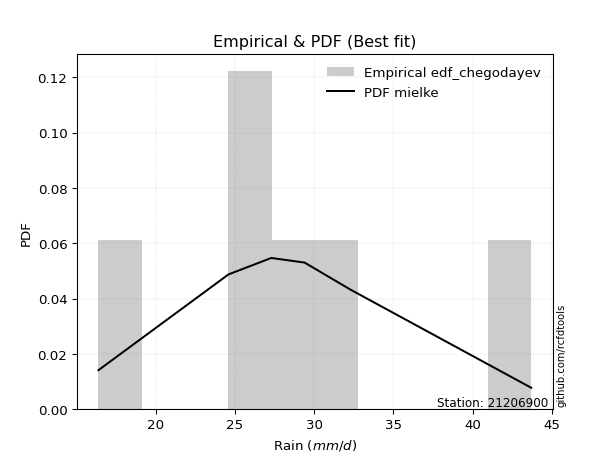</img>

</div>


### 6. Empirical - EDF Blom (1958)

The Blom formula is a specific "plotting position" formula used in hydrology and statistical analysis to estimate the empirical cumulative probability (or non-exceedance probability) of a data series. It is particularly recommended for data that are approximately normally distributed. The constant _a_ is set to 0.375 (or 3/8).

<div align="center">


$P=(m-a)/(n+1-2a)$


</div>


**6.1. Empirical values**

<div align="center">

|                | 0                  | 1                  | 2                  | 3                 | 4                 | 5                  |
|:---------------|:-------------------|:-------------------|:-------------------|:------------------|:------------------|:-------------------|
| date           | 2015               | 2016               | 2011               | 2024              | 2025              | 2012               |
| x              | 16.4               | 24.6               | 27.3               | 29.4              | 31.2              | 43.7               |
| m              | 1                  | 2                  | 3                  | 4                 | 5                 | 6                  |
| empirical_dist | edf_blom           | edf_blom           | edf_blom           | edf_blom          | edf_blom          | edf_blom           |
| empirical      | 0.1                | 0.26               | 0.42               | 0.58              | 0.74              | 0.9                |
| empirical_tr   | 1.1111111111111112 | 1.3513513513513513 | 1.7241379310344827 | 2.380952380952381 | 3.846153846153846 | 10.000000000000002 |

</div>


**6.2. Kolmogorov-Smirnov fit test (sorted by Δ)**


<div align="center">

|                | 0                   | 1                    | 2                   | 3                     | 4                   | 5                   | 6                   | 7                   | 8                   | 9                   | 10                  | 11                  | 12                 | 13                  | 14                  | 15                  | 16                  | 17                  | 18                  | 19                  | 20                  | 21                  | 22                  | 23                  | 24                  | 25                  | 26                 | 27                  | 28                  | 29                  | 30                  | 31                  | 32                  | 33                 | 34                  | 35                 | 36                  | 37                  | 38                  | 39                  | 40                  | 41                  | 42                  | 43                  | 44                  | 45                  | 46                  | 47                 | 48                  | 49                  | 50                  | 51                  | 52                 | 53                  | 54                  | 55                  | 56                  | 57                 | 58                  | 59                  | 60                  | 61                  | 62                  | 63                  | 64                  | 65                  | 66                  | 67                | 68                  | 69                 | 70                  | 71                 | 72                  | 73                  | 74                  | 75                 | 76                 | 77                | 78                  | 79                | 80                 | 81                 | 82                 | 83                  | 84                 | 85                 | 86                  | 87                | 88                | 89                 |
|:---------------|:--------------------|:---------------------|:--------------------|:----------------------|:--------------------|:--------------------|:--------------------|:--------------------|:--------------------|:--------------------|:--------------------|:--------------------|:-------------------|:--------------------|:--------------------|:--------------------|:--------------------|:--------------------|:--------------------|:--------------------|:--------------------|:--------------------|:--------------------|:--------------------|:--------------------|:--------------------|:-------------------|:--------------------|:--------------------|:--------------------|:--------------------|:--------------------|:--------------------|:-------------------|:--------------------|:-------------------|:--------------------|:--------------------|:--------------------|:--------------------|:--------------------|:--------------------|:--------------------|:--------------------|:--------------------|:--------------------|:--------------------|:-------------------|:--------------------|:--------------------|:--------------------|:--------------------|:-------------------|:--------------------|:--------------------|:--------------------|:--------------------|:-------------------|:--------------------|:--------------------|:--------------------|:--------------------|:--------------------|:--------------------|:--------------------|:--------------------|:--------------------|:------------------|:--------------------|:-------------------|:--------------------|:-------------------|:--------------------|:--------------------|:--------------------|:-------------------|:-------------------|:------------------|:--------------------|:------------------|:-------------------|:-------------------|:-------------------|:--------------------|:-------------------|:-------------------|:--------------------|:------------------|:------------------|:-------------------|
| station        | 21206900            | 21206900             | 21206900            | 21206900              | 21206900            | 21206900            | 21206900            | 21206900            | 21206900            | 21206900            | 21206900            | 21206900            | 21206900           | 21206900            | 21206900            | 21206900            | 21206900            | 21206900            | 21206900            | 21206900            | 21206900            | 21206900            | 21206900            | 21206900            | 21206900            | 21206900            | 21206900           | 21206900            | 21206900            | 21206900            | 21206900            | 21206900            | 21206900            | 21206900           | 21206900            | 21206900           | 21206900            | 21206900            | 21206900            | 21206900            | 21206900            | 21206900            | 21206900            | 21206900            | 21206900            | 21206900            | 21206900            | 21206900           | 21206900            | 21206900            | 21206900            | 21206900            | 21206900           | 21206900            | 21206900            | 21206900            | 21206900            | 21206900           | 21206900            | 21206900            | 21206900            | 21206900            | 21206900            | 21206900            | 21206900            | 21206900            | 21206900            | 21206900          | 21206900            | 21206900           | 21206900            | 21206900           | 21206900            | 21206900            | 21206900            | 21206900           | 21206900           | 21206900          | 21206900            | 21206900          | 21206900           | 21206900           | 21206900           | 21206900            | 21206900           | 21206900           | 21206900            | 21206900          | 21206900          | 21206900           |
| empirical_dist | edf_blom            | edf_blom             | edf_blom            | edf_blom              | edf_blom            | edf_blom            | edf_blom            | edf_blom            | edf_blom            | edf_blom            | edf_blom            | edf_blom            | edf_blom           | edf_blom            | edf_blom            | edf_blom            | edf_blom            | edf_blom            | edf_blom            | edf_blom            | edf_blom            | edf_blom            | edf_blom            | edf_blom            | edf_blom            | edf_blom            | edf_blom           | edf_blom            | edf_blom            | edf_blom            | edf_blom            | edf_blom            | edf_blom            | edf_blom           | edf_blom            | edf_blom           | edf_blom            | edf_blom            | edf_blom            | edf_blom            | edf_blom            | edf_blom            | edf_blom            | edf_blom            | edf_blom            | edf_blom            | edf_blom            | edf_blom           | edf_blom            | edf_blom            | edf_blom            | edf_blom            | edf_blom           | edf_blom            | edf_blom            | edf_blom            | edf_blom            | edf_blom           | edf_blom            | edf_blom            | edf_blom            | edf_blom            | edf_blom            | edf_blom            | edf_blom            | edf_blom            | edf_blom            | edf_blom          | edf_blom            | edf_blom           | edf_blom            | edf_blom           | edf_blom            | edf_blom            | edf_blom            | edf_blom           | edf_blom           | edf_blom          | edf_blom            | edf_blom          | edf_blom           | edf_blom           | edf_blom           | edf_blom            | edf_blom           | edf_blom           | edf_blom            | edf_blom          | edf_blom          | edf_blom           |
| p_dist         | logjohnsonsu        | johnsonsu            | laplace_asymmetric  | loglaplace_asymmetric | loglaplace          | loghypsecant        | laplace             | loglogistic         | logmielke           | loggenlogistic      | mielke              | logfisk             | exponnorm          | fisk                | gumbel_r            | genlogistic         | invgauss            | logf                | betaprime           | logt                | logexponnorm        | logcrystalball      | lognorm             | lognorm             | logfatiguelife      | ncf                 | weibull_min        | f                   | chi2                | gamma               | erlang              | nct                 | rayleigh            | invgamma           | logpearson3         | alpha              | logweibull_min      | logloggamma         | loggamma            | loggamma            | invweibull          | logerlang           | hypsecant           | moyal               | maxwell             | logbetaprime        | pearson3            | loginvgamma        | rice                | loggompertz         | logrice             | logalpha            | logistic           | kstwobign           | lognct              | halflogistic        | halfnorm            | logmaxwell         | loginvgauss         | loggumbel_l         | t                   | truncnorm           | crystalball         | norm                | lograyleigh         | loggumbel_r         | loginvweibull       | logmoyal          | loghalfnorm         | wald               | gibrat              | loghalflogistic    | gumbel_l            | logkstwobign        | logncf              | loggenexpon        | expon              | genexpon          | logchi2             | logwald           | loggibrat          | logtruncnorm       | nakagami           | logexpon            | lognakagami        | loglognorm         | pareto              | logpareto         | fatiguelife       | gompertz           |
| delta          | 0.04753669369907687 | 0.051105147412079055 | 0.05244900190787338 | 0.05369178826113041   | 0.05948325990260127 | 0.06169618585396269 | 0.06834784711184849 | 0.06927277483822952 | 0.07337523463705886 | 0.07553234740656489 | 0.07554159203911859 | 0.07563282346947142 | 0.0770681342453059 | 0.07758622193583264 | 0.08000787219627509 | 0.08370671473457991 | 0.08603662783058452 | 0.08709185302624128 | 0.08732113833014676 | 0.08743254672653494 | 0.08743331634806195 | 0.08743398365927485 | 0.08743405859136655 | 0.08743405859136655 | 0.08770942675059923 | 0.08891339508728502 | 0.0901453943737206 | 0.09030125056880256 | 0.09031904438500604 | 0.09031906826258473 | 0.09031931302876173 | 0.09032147244072974 | 0.09045029300515395 | 0.0917178625764562 | 0.09193822390352768 | 0.0919799871181588 | 0.09268398680546075 | 0.09452526907898118 | 0.09474269917003797 | 0.09474269917003797 | 0.09563127269554295 | 0.09616694503219891 | 0.09644770786450396 | 0.09792303787753504 | 0.09811757004164678 | 0.09813269885699233 | 0.09905505384245417 | 0.0990838135469122 | 0.09947352020612432 | 0.09999998654008405 | 0.10113304984474358 | 0.10131917110403388 | 0.1083372880494905 | 0.10966737422431594 | 0.11503761275412117 | 0.11597882735625525 | 0.11653516637894579 | 0.1192111068656882 | 0.12179501207180743 | 0.12235295445422856 | 0.12308841691247774 | 0.12309468744055208 | 0.12309475581686047 | 0.12309476037026612 | 0.13124466669668278 | 0.13517910295640473 | 0.15592962346664452 | 0.161058362817112 | 0.16547952182667142 | 0.1658328649355298 | 0.17180544979902984 | 0.1731415696817994 | 0.17948596160768704 | 0.18038924852581073 | 0.18345501294399574 | 0.1843788217725476 | 0.2247343964834171 | 0.224739448617564 | 0.22977283737054122 | 0.233085158332538 | 0.2539403842908536 | 0.2599995375379861 | 0.2599999591115082 | 0.28124741206412995 | 0.3328459178806799 | 0.4017656569851257 | 0.40611915465631454 | 0.414187778718355 | 0.575614641842441 | 0.6643219076876374 |
| deltao         | 0.530385761606      | 0.530385761606       | 0.530385761606      | 0.530385761606        | 0.530385761606      | 0.530385761606      | 0.530385761606      | 0.530385761606      | 0.530385761606      | 0.530385761606      | 0.530385761606      | 0.530385761606      | 0.530385761606     | 0.530385761606      | 0.530385761606      | 0.530385761606      | 0.530385761606      | 0.530385761606      | 0.530385761606      | 0.530385761606      | 0.530385761606      | 0.530385761606      | 0.530385761606      | 0.530385761606      | 0.530385761606      | 0.530385761606      | 0.530385761606     | 0.530385761606      | 0.530385761606      | 0.530385761606      | 0.530385761606      | 0.530385761606      | 0.530385761606      | 0.530385761606     | 0.530385761606      | 0.530385761606     | 0.530385761606      | 0.530385761606      | 0.530385761606      | 0.530385761606      | 0.530385761606      | 0.530385761606      | 0.530385761606      | 0.530385761606      | 0.530385761606      | 0.530385761606      | 0.530385761606      | 0.530385761606     | 0.530385761606      | 0.530385761606      | 0.530385761606      | 0.530385761606      | 0.530385761606     | 0.530385761606      | 0.530385761606      | 0.530385761606      | 0.530385761606      | 0.530385761606     | 0.530385761606      | 0.530385761606      | 0.530385761606      | 0.530385761606      | 0.530385761606      | 0.530385761606      | 0.530385761606      | 0.530385761606      | 0.530385761606      | 0.530385761606    | 0.530385761606      | 0.530385761606     | 0.530385761606      | 0.530385761606     | 0.530385761606      | 0.530385761606      | 0.530385761606      | 0.530385761606     | 0.530385761606     | 0.530385761606    | 0.530385761606      | 0.530385761606    | 0.530385761606     | 0.530385761606     | 0.530385761606     | 0.530385761606      | 0.530385761606     | 0.530385761606     | 0.530385761606      | 0.530385761606    | 0.530385761606    | 0.530385761606     |
| eval           | Δo > Δ              | Δo > Δ               | Δo > Δ              | Δo > Δ                | Δo > Δ              | Δo > Δ              | Δo > Δ              | Δo > Δ              | Δo > Δ              | Δo > Δ              | Δo > Δ              | Δo > Δ              | Δo > Δ             | Δo > Δ              | Δo > Δ              | Δo > Δ              | Δo > Δ              | Δo > Δ              | Δo > Δ              | Δo > Δ              | Δo > Δ              | Δo > Δ              | Δo > Δ              | Δo > Δ              | Δo > Δ              | Δo > Δ              | Δo > Δ             | Δo > Δ              | Δo > Δ              | Δo > Δ              | Δo > Δ              | Δo > Δ              | Δo > Δ              | Δo > Δ             | Δo > Δ              | Δo > Δ             | Δo > Δ              | Δo > Δ              | Δo > Δ              | Δo > Δ              | Δo > Δ              | Δo > Δ              | Δo > Δ              | Δo > Δ              | Δo > Δ              | Δo > Δ              | Δo > Δ              | Δo > Δ             | Δo > Δ              | Δo > Δ              | Δo > Δ              | Δo > Δ              | Δo > Δ             | Δo > Δ              | Δo > Δ              | Δo > Δ              | Δo > Δ              | Δo > Δ             | Δo > Δ              | Δo > Δ              | Δo > Δ              | Δo > Δ              | Δo > Δ              | Δo > Δ              | Δo > Δ              | Δo > Δ              | Δo > Δ              | Δo > Δ            | Δo > Δ              | Δo > Δ             | Δo > Δ              | Δo > Δ             | Δo > Δ              | Δo > Δ              | Δo > Δ              | Δo > Δ             | Δo > Δ             | Δo > Δ            | Δo > Δ              | Δo > Δ            | Δo > Δ             | Δo > Δ             | Δo > Δ             | Δo > Δ              | Δo > Δ             | Δo > Δ             | Δo > Δ              | Δo > Δ            | Δo <= Δ           | Δo <= Δ            |
| fit            | 1                   | 1                    | 1                   | 1                     | 1                   | 1                   | 1                   | 1                   | 1                   | 1                   | 1                   | 1                   | 1                  | 1                   | 1                   | 1                   | 1                   | 1                   | 1                   | 1                   | 1                   | 1                   | 1                   | 1                   | 1                   | 1                   | 1                  | 1                   | 1                   | 1                   | 1                   | 1                   | 1                   | 1                  | 1                   | 1                  | 1                   | 1                   | 1                   | 1                   | 1                   | 1                   | 1                   | 1                   | 1                   | 1                   | 1                   | 1                  | 1                   | 1                   | 1                   | 1                   | 1                  | 1                   | 1                   | 1                   | 1                   | 1                  | 1                   | 1                   | 1                   | 1                   | 1                   | 1                   | 1                   | 1                   | 1                   | 1                 | 1                   | 1                  | 1                   | 1                  | 1                   | 1                   | 1                   | 1                  | 1                  | 1                 | 1                   | 1                 | 1                  | 1                  | 1                  | 1                   | 1                  | 1                  | 1                   | 1                 | 0                 | 0                  |
| n              | 6                   | 6                    | 6                   | 6                     | 6                   | 6                   | 6                   | 6                   | 6                   | 6                   | 6                   | 6                   | 6                  | 6                   | 6                   | 6                   | 6                   | 6                   | 6                   | 6                   | 6                   | 6                   | 6                   | 6                   | 6                   | 6                   | 6                  | 6                   | 6                   | 6                   | 6                   | 6                   | 6                   | 6                  | 6                   | 6                  | 6                   | 6                   | 6                   | 6                   | 6                   | 6                   | 6                   | 6                   | 6                   | 6                   | 6                   | 6                  | 6                   | 6                   | 6                   | 6                   | 6                  | 6                   | 6                   | 6                   | 6                   | 6                  | 6                   | 6                   | 6                   | 6                   | 6                   | 6                   | 6                   | 6                   | 6                   | 6                 | 6                   | 6                  | 6                   | 6                  | 6                   | 6                   | 6                   | 6                  | 6                  | 6                 | 6                   | 6                 | 6                  | 6                  | 6                  | 6                   | 6                  | 6                  | 6                   | 6                 | 6                 | 6                  |
| best_fit       | 1                   | 0                    | 0                   | 0                     | 0                   | 0                   | 0                   | 0                   | 0                   | 0                   | 0                   | 0                   | 0                  | 0                   | 0                   | 0                   | 0                   | 0                   | 0                   | 0                   | 0                   | 0                   | 0                   | 0                   | 0                   | 0                   | 0                  | 0                   | 0                   | 0                   | 0                   | 0                   | 0                   | 0                  | 0                   | 0                  | 0                   | 0                   | 0                   | 0                   | 0                   | 0                   | 0                   | 0                   | 0                   | 0                   | 0                   | 0                  | 0                   | 0                   | 0                   | 0                   | 0                  | 0                   | 0                   | 0                   | 0                   | 0                  | 0                   | 0                   | 0                   | 0                   | 0                   | 0                   | 0                   | 0                   | 0                   | 0                 | 0                   | 0                  | 0                   | 0                  | 0                   | 0                   | 0                   | 0                  | 0                  | 0                 | 0                   | 0                 | 0                  | 0                  | 0                  | 0                   | 0                  | 0                  | 0                   | 0                 | 0                 | 0                  |
| best_fit_sort  | 1                   | 2                    | 3                   | 4                     | 5                   | 6                   | 7                   | 8                   | 9                   | 10                  | 11                  | 12                  | 13                 | 14                  | 15                  | 16                  | 17                  | 18                  | 19                  | 20                  | 21                  | 22                  | 23                  | 24                  | 25                  | 26                  | 27                 | 28                  | 29                  | 30                  | 31                  | 32                  | 33                  | 34                 | 35                  | 36                 | 37                  | 38                  | 39                  | 40                  | 41                  | 42                  | 43                  | 44                  | 45                  | 46                  | 47                  | 48                 | 49                  | 50                  | 51                  | 52                  | 53                 | 54                  | 55                  | 56                  | 57                  | 58                 | 59                  | 60                  | 61                  | 62                  | 63                  | 64                  | 65                  | 66                  | 67                  | 68                | 69                  | 70                 | 71                  | 72                 | 73                  | 74                  | 75                  | 76                 | 77                 | 78                | 79                  | 80                | 81                 | 82                 | 83                 | 84                  | 85                 | 86                 | 87                  | 88                | 89                | 90                 |

</div>


<div align="center">

</img>

</div>


**6.3. Best fit**

<div align="center">

|   id |   station | empirical_dist   | p_dist       |     delta |   deltao | eval   |   fit |   n |   best_fit |   best_fit_sort |
|-----:|----------:|:-----------------|:-------------|----------:|---------:|:-------|------:|----:|-----------:|----------------:|
|    0 |  21206900 | edf_blom         | logjohnsonsu | 0.0475367 | 0.530386 | Δo > Δ |     1 |   6 |          1 |               1 |

</div>


<div align="center">

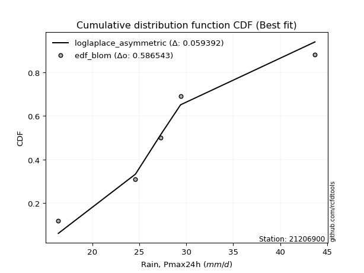</img>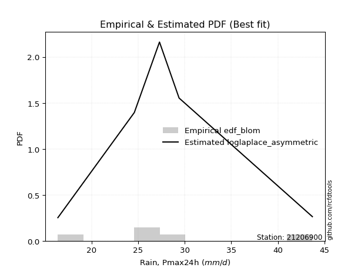</img>

</div>


### 7. Empirical - EDF Tukey (1962)

In hydrology, the Tukey formula is used as a plotting position formula to estimate the empirical probability or frequency of a flood event (or other hydrological data). The formula parameter is given as _c=0.333_ (or 1/3).

<div align="center">


$P=(m-c)/(n+1-2c)$


</div>


**7.1. Empirical values**

<div align="center">

|                | 0                   | 1                  | 2                   | 3                  | 4                  | 5                  |
|:---------------|:--------------------|:-------------------|:--------------------|:-------------------|:-------------------|:-------------------|
| date           | 2015                | 2016               | 2011                | 2024               | 2025               | 2012               |
| x              | 16.4                | 24.6               | 27.3                | 29.4               | 31.2               | 43.7               |
| m              | 1                   | 2                  | 3                   | 4                  | 5                  | 6                  |
| empirical_dist | edf_tukey           | edf_tukey          | edf_tukey           | edf_tukey          | edf_tukey          | edf_tukey          |
| empirical      | 0.10526315789473684 | 0.2631578947368421 | 0.42105263157894735 | 0.5789473684210527 | 0.7368421052631579 | 0.8947368421052632 |
| empirical_tr   | 1.1176470588235294  | 1.357142857142857  | 1.7272727272727273  | 2.375              | 3.7999999999999994 | 9.5                |

</div>


**7.2. Kolmogorov-Smirnov fit test (sorted by Δ)**


<div align="center">

|                | 0                   | 1                   | 2                   | 3                     | 4                  | 5                   | 6                   | 7                   | 8                   | 9                   | 10                  | 11                  | 12                  | 13                  | 14                  | 15                  | 16                 | 17                  | 18                  | 19                  | 20                  | 21                  | 22                  | 23                  | 24                  | 25                  | 26                  | 27                  | 28                 | 29                 | 30                  | 31                  | 32                  | 33                  | 34                  | 35                  | 36                  | 37                  | 38                  | 39                  | 40                  | 41                  | 42                  | 43                  | 44                  | 45                  | 46                  | 47                  | 48                 | 49                 | 50                | 51                  | 52                  | 53                  | 54                  | 55                  | 56                 | 57                  | 58                  | 59                  | 60                 | 61                  | 62                  | 63                  | 64                 | 65                  | 66                  | 67                  | 68                  | 69                  | 70                 | 71                  | 72                 | 73                  | 74                  | 75                  | 76                | 77                  | 78                  | 79                  | 80                 | 81                 | 82                 | 83                  | 84                  | 85                 | 86                  | 87                 | 88                | 89                 |
|:---------------|:--------------------|:--------------------|:--------------------|:----------------------|:-------------------|:--------------------|:--------------------|:--------------------|:--------------------|:--------------------|:--------------------|:--------------------|:--------------------|:--------------------|:--------------------|:--------------------|:-------------------|:--------------------|:--------------------|:--------------------|:--------------------|:--------------------|:--------------------|:--------------------|:--------------------|:--------------------|:--------------------|:--------------------|:-------------------|:-------------------|:--------------------|:--------------------|:--------------------|:--------------------|:--------------------|:--------------------|:--------------------|:--------------------|:--------------------|:--------------------|:--------------------|:--------------------|:--------------------|:--------------------|:--------------------|:--------------------|:--------------------|:--------------------|:-------------------|:-------------------|:------------------|:--------------------|:--------------------|:--------------------|:--------------------|:--------------------|:-------------------|:--------------------|:--------------------|:--------------------|:-------------------|:--------------------|:--------------------|:--------------------|:-------------------|:--------------------|:--------------------|:--------------------|:--------------------|:--------------------|:-------------------|:--------------------|:-------------------|:--------------------|:--------------------|:--------------------|:------------------|:--------------------|:--------------------|:--------------------|:-------------------|:-------------------|:-------------------|:--------------------|:--------------------|:-------------------|:--------------------|:-------------------|:------------------|:-------------------|
| station        | 21206900            | 21206900            | 21206900            | 21206900              | 21206900           | 21206900            | 21206900            | 21206900            | 21206900            | 21206900            | 21206900            | 21206900            | 21206900            | 21206900            | 21206900            | 21206900            | 21206900           | 21206900            | 21206900            | 21206900            | 21206900            | 21206900            | 21206900            | 21206900            | 21206900            | 21206900            | 21206900            | 21206900            | 21206900           | 21206900           | 21206900            | 21206900            | 21206900            | 21206900            | 21206900            | 21206900            | 21206900            | 21206900            | 21206900            | 21206900            | 21206900            | 21206900            | 21206900            | 21206900            | 21206900            | 21206900            | 21206900            | 21206900            | 21206900           | 21206900           | 21206900          | 21206900            | 21206900            | 21206900            | 21206900            | 21206900            | 21206900           | 21206900            | 21206900            | 21206900            | 21206900           | 21206900            | 21206900            | 21206900            | 21206900           | 21206900            | 21206900            | 21206900            | 21206900            | 21206900            | 21206900           | 21206900            | 21206900           | 21206900            | 21206900            | 21206900            | 21206900          | 21206900            | 21206900            | 21206900            | 21206900           | 21206900           | 21206900           | 21206900            | 21206900            | 21206900           | 21206900            | 21206900           | 21206900          | 21206900           |
| empirical_dist | edf_tukey           | edf_tukey           | edf_tukey           | edf_tukey             | edf_tukey          | edf_tukey           | edf_tukey           | edf_tukey           | edf_tukey           | edf_tukey           | edf_tukey           | edf_tukey           | edf_tukey           | edf_tukey           | edf_tukey           | edf_tukey           | edf_tukey          | edf_tukey           | edf_tukey           | edf_tukey           | edf_tukey           | edf_tukey           | edf_tukey           | edf_tukey           | edf_tukey           | edf_tukey           | edf_tukey           | edf_tukey           | edf_tukey          | edf_tukey          | edf_tukey           | edf_tukey           | edf_tukey           | edf_tukey           | edf_tukey           | edf_tukey           | edf_tukey           | edf_tukey           | edf_tukey           | edf_tukey           | edf_tukey           | edf_tukey           | edf_tukey           | edf_tukey           | edf_tukey           | edf_tukey           | edf_tukey           | edf_tukey           | edf_tukey          | edf_tukey          | edf_tukey         | edf_tukey           | edf_tukey           | edf_tukey           | edf_tukey           | edf_tukey           | edf_tukey          | edf_tukey           | edf_tukey           | edf_tukey           | edf_tukey          | edf_tukey           | edf_tukey           | edf_tukey           | edf_tukey          | edf_tukey           | edf_tukey           | edf_tukey           | edf_tukey           | edf_tukey           | edf_tukey          | edf_tukey           | edf_tukey          | edf_tukey           | edf_tukey           | edf_tukey           | edf_tukey         | edf_tukey           | edf_tukey           | edf_tukey           | edf_tukey          | edf_tukey          | edf_tukey          | edf_tukey           | edf_tukey           | edf_tukey          | edf_tukey           | edf_tukey          | edf_tukey         | edf_tukey          |
| p_dist         | logjohnsonsu        | johnsonsu           | laplace_asymmetric  | loglaplace_asymmetric | loglaplace         | loghypsecant        | loglogistic         | laplace             | logmielke           | loggenlogistic      | mielke              | logfisk             | exponnorm           | fisk                | genlogistic         | invgauss            | logf               | betaprime           | logt                | logexponnorm        | logcrystalball      | lognorm             | lognorm             | logfatiguelife      | gumbel_r            | ncf                 | weibull_min         | f                   | chi2               | gamma              | erlang              | nct                 | rayleigh            | invgamma            | logpearson3         | alpha               | logweibull_min      | logloggamma         | loggamma            | loggamma            | invweibull          | logerlang           | hypsecant           | maxwell             | logbetaprime        | pearson3            | loginvgamma         | rice                | logrice            | logalpha           | moyal             | logistic            | loggompertz         | kstwobign           | lognct              | halflogistic        | halfnorm           | logmaxwell          | loginvgauss         | loggumbel_l         | t                  | truncnorm           | crystalball         | norm                | lograyleigh        | loggumbel_r         | loginvweibull       | logmoyal            | loghalfnorm         | wald                | loghalflogistic    | gibrat              | gumbel_l           | logkstwobign        | logncf              | loggenexpon         | expon             | genexpon            | logchi2             | logwald             | loggibrat          | logtruncnorm       | nakagami           | logexpon            | lognakagami         | loglognorm         | pareto              | logpareto          | fatiguelife       | gompertz           |
| delta          | 0.05279985159381373 | 0.05636830530681591 | 0.05767682045696898 | 0.05895494615586727   | 0.0647464177973381 | 0.06625395093441934 | 0.06695054694079844 | 0.06740701085834133 | 0.07021733990021672 | 0.07237445266972276 | 0.07238369730227645 | 0.07247492873262928 | 0.07391023950846376 | 0.07442832719899051 | 0.08054881999773778 | 0.08287873309374238 | 0.0839339582893992 | 0.08416324359330468 | 0.08427465198969286 | 0.08427542161121987 | 0.08427608892243277 | 0.08427616385452447 | 0.08427616385452447 | 0.08455153201375715 | 0.08502657580174519 | 0.08575550035044288 | 0.08698749963687852 | 0.08714335583196042 | 0.0871611496481639 | 0.0871611735257426 | 0.08716141829191959 | 0.08716357770388761 | 0.08729239826831181 | 0.08855996783961406 | 0.08878032916668555 | 0.08882209238131666 | 0.08952609206861861 | 0.09136737434213904 | 0.09158480443319589 | 0.09158480443319589 | 0.09247337795870086 | 0.09300905029535683 | 0.09328981312766182 | 0.09495967530480465 | 0.09497480412015025 | 0.09589715910561203 | 0.09592591881007012 | 0.09631562546928218 | 0.0979751551079015 | 0.0981612763671918 | 0.100735583049841 | 0.10517939331264836 | 0.10526314443482088 | 0.10650947948747386 | 0.11187971801727908 | 0.11282093261941317 | 0.1133772716421037 | 0.11605321212884612 | 0.11863711733496535 | 0.11919505971738642 | 0.1199305221756356 | 0.11993679270370994 | 0.11993686108001833 | 0.11993686563342398 | 0.1280867719598407 | 0.13412647137745737 | 0.15277172872980244 | 0.16000573123816464 | 0.16232162708982933 | 0.16478023335658243 | 0.1699836749449573 | 0.17075281822008248 | 0.1763280668708449 | 0.17723135378896865 | 0.18029711820715366 | 0.18122092703570553 | 0.221576501746575 | 0.22158155388072193 | 0.22450967947580436 | 0.23203252675359065 | 0.2528877527119062 | 0.2631574322748282 | 0.2631578538483503 | 0.27808951732728787 | 0.33179328630173255 | 0.3986077622482836 | 0.40296125991947246 | 0.4110298839815129 | 0.572456747105599 | 0.6611640129507953 |
| deltao         | 0.530385761606      | 0.530385761606      | 0.530385761606      | 0.530385761606        | 0.530385761606     | 0.530385761606      | 0.530385761606      | 0.530385761606      | 0.530385761606      | 0.530385761606      | 0.530385761606      | 0.530385761606      | 0.530385761606      | 0.530385761606      | 0.530385761606      | 0.530385761606      | 0.530385761606     | 0.530385761606      | 0.530385761606      | 0.530385761606      | 0.530385761606      | 0.530385761606      | 0.530385761606      | 0.530385761606      | 0.530385761606      | 0.530385761606      | 0.530385761606      | 0.530385761606      | 0.530385761606     | 0.530385761606     | 0.530385761606      | 0.530385761606      | 0.530385761606      | 0.530385761606      | 0.530385761606      | 0.530385761606      | 0.530385761606      | 0.530385761606      | 0.530385761606      | 0.530385761606      | 0.530385761606      | 0.530385761606      | 0.530385761606      | 0.530385761606      | 0.530385761606      | 0.530385761606      | 0.530385761606      | 0.530385761606      | 0.530385761606     | 0.530385761606     | 0.530385761606    | 0.530385761606      | 0.530385761606      | 0.530385761606      | 0.530385761606      | 0.530385761606      | 0.530385761606     | 0.530385761606      | 0.530385761606      | 0.530385761606      | 0.530385761606     | 0.530385761606      | 0.530385761606      | 0.530385761606      | 0.530385761606     | 0.530385761606      | 0.530385761606      | 0.530385761606      | 0.530385761606      | 0.530385761606      | 0.530385761606     | 0.530385761606      | 0.530385761606     | 0.530385761606      | 0.530385761606      | 0.530385761606      | 0.530385761606    | 0.530385761606      | 0.530385761606      | 0.530385761606      | 0.530385761606     | 0.530385761606     | 0.530385761606     | 0.530385761606      | 0.530385761606      | 0.530385761606     | 0.530385761606      | 0.530385761606     | 0.530385761606    | 0.530385761606     |
| eval           | Δo > Δ              | Δo > Δ              | Δo > Δ              | Δo > Δ                | Δo > Δ             | Δo > Δ              | Δo > Δ              | Δo > Δ              | Δo > Δ              | Δo > Δ              | Δo > Δ              | Δo > Δ              | Δo > Δ              | Δo > Δ              | Δo > Δ              | Δo > Δ              | Δo > Δ             | Δo > Δ              | Δo > Δ              | Δo > Δ              | Δo > Δ              | Δo > Δ              | Δo > Δ              | Δo > Δ              | Δo > Δ              | Δo > Δ              | Δo > Δ              | Δo > Δ              | Δo > Δ             | Δo > Δ             | Δo > Δ              | Δo > Δ              | Δo > Δ              | Δo > Δ              | Δo > Δ              | Δo > Δ              | Δo > Δ              | Δo > Δ              | Δo > Δ              | Δo > Δ              | Δo > Δ              | Δo > Δ              | Δo > Δ              | Δo > Δ              | Δo > Δ              | Δo > Δ              | Δo > Δ              | Δo > Δ              | Δo > Δ             | Δo > Δ             | Δo > Δ            | Δo > Δ              | Δo > Δ              | Δo > Δ              | Δo > Δ              | Δo > Δ              | Δo > Δ             | Δo > Δ              | Δo > Δ              | Δo > Δ              | Δo > Δ             | Δo > Δ              | Δo > Δ              | Δo > Δ              | Δo > Δ             | Δo > Δ              | Δo > Δ              | Δo > Δ              | Δo > Δ              | Δo > Δ              | Δo > Δ             | Δo > Δ              | Δo > Δ             | Δo > Δ              | Δo > Δ              | Δo > Δ              | Δo > Δ            | Δo > Δ              | Δo > Δ              | Δo > Δ              | Δo > Δ             | Δo > Δ             | Δo > Δ             | Δo > Δ              | Δo > Δ              | Δo > Δ             | Δo > Δ              | Δo > Δ             | Δo <= Δ           | Δo <= Δ            |
| fit            | 1                   | 1                   | 1                   | 1                     | 1                  | 1                   | 1                   | 1                   | 1                   | 1                   | 1                   | 1                   | 1                   | 1                   | 1                   | 1                   | 1                  | 1                   | 1                   | 1                   | 1                   | 1                   | 1                   | 1                   | 1                   | 1                   | 1                   | 1                   | 1                  | 1                  | 1                   | 1                   | 1                   | 1                   | 1                   | 1                   | 1                   | 1                   | 1                   | 1                   | 1                   | 1                   | 1                   | 1                   | 1                   | 1                   | 1                   | 1                   | 1                  | 1                  | 1                 | 1                   | 1                   | 1                   | 1                   | 1                   | 1                  | 1                   | 1                   | 1                   | 1                  | 1                   | 1                   | 1                   | 1                  | 1                   | 1                   | 1                   | 1                   | 1                   | 1                  | 1                   | 1                  | 1                   | 1                   | 1                   | 1                 | 1                   | 1                   | 1                   | 1                  | 1                  | 1                  | 1                   | 1                   | 1                  | 1                   | 1                  | 0                 | 0                  |
| n              | 6                   | 6                   | 6                   | 6                     | 6                  | 6                   | 6                   | 6                   | 6                   | 6                   | 6                   | 6                   | 6                   | 6                   | 6                   | 6                   | 6                  | 6                   | 6                   | 6                   | 6                   | 6                   | 6                   | 6                   | 6                   | 6                   | 6                   | 6                   | 6                  | 6                  | 6                   | 6                   | 6                   | 6                   | 6                   | 6                   | 6                   | 6                   | 6                   | 6                   | 6                   | 6                   | 6                   | 6                   | 6                   | 6                   | 6                   | 6                   | 6                  | 6                  | 6                 | 6                   | 6                   | 6                   | 6                   | 6                   | 6                  | 6                   | 6                   | 6                   | 6                  | 6                   | 6                   | 6                   | 6                  | 6                   | 6                   | 6                   | 6                   | 6                   | 6                  | 6                   | 6                  | 6                   | 6                   | 6                   | 6                 | 6                   | 6                   | 6                   | 6                  | 6                  | 6                  | 6                   | 6                   | 6                  | 6                   | 6                  | 6                 | 6                  |
| best_fit       | 1                   | 0                   | 0                   | 0                     | 0                  | 0                   | 0                   | 0                   | 0                   | 0                   | 0                   | 0                   | 0                   | 0                   | 0                   | 0                   | 0                  | 0                   | 0                   | 0                   | 0                   | 0                   | 0                   | 0                   | 0                   | 0                   | 0                   | 0                   | 0                  | 0                  | 0                   | 0                   | 0                   | 0                   | 0                   | 0                   | 0                   | 0                   | 0                   | 0                   | 0                   | 0                   | 0                   | 0                   | 0                   | 0                   | 0                   | 0                   | 0                  | 0                  | 0                 | 0                   | 0                   | 0                   | 0                   | 0                   | 0                  | 0                   | 0                   | 0                   | 0                  | 0                   | 0                   | 0                   | 0                  | 0                   | 0                   | 0                   | 0                   | 0                   | 0                  | 0                   | 0                  | 0                   | 0                   | 0                   | 0                 | 0                   | 0                   | 0                   | 0                  | 0                  | 0                  | 0                   | 0                   | 0                  | 0                   | 0                  | 0                 | 0                  |
| best_fit_sort  | 1                   | 2                   | 3                   | 4                     | 5                  | 6                   | 7                   | 8                   | 9                   | 10                  | 11                  | 12                  | 13                  | 14                  | 15                  | 16                  | 17                 | 18                  | 19                  | 20                  | 21                  | 22                  | 23                  | 24                  | 25                  | 26                  | 27                  | 28                  | 29                 | 30                 | 31                  | 32                  | 33                  | 34                  | 35                  | 36                  | 37                  | 38                  | 39                  | 40                  | 41                  | 42                  | 43                  | 44                  | 45                  | 46                  | 47                  | 48                  | 49                 | 50                 | 51                | 52                  | 53                  | 54                  | 55                  | 56                  | 57                 | 58                  | 59                  | 60                  | 61                 | 62                  | 63                  | 64                  | 65                 | 66                  | 67                  | 68                  | 69                  | 70                  | 71                 | 72                  | 73                 | 74                  | 75                  | 76                  | 77                | 78                  | 79                  | 80                  | 81                 | 82                 | 83                 | 84                  | 85                  | 86                 | 87                  | 88                 | 89                | 90                 |

</div>


<div align="center">

</img>

</div>


**7.3. Best fit**

<div align="center">

|   id |   station | empirical_dist   | p_dist       |     delta |   deltao | eval   |   fit |   n |   best_fit |   best_fit_sort |
|-----:|----------:|:-----------------|:-------------|----------:|---------:|:-------|------:|----:|-----------:|----------------:|
|    0 |  21206900 | edf_tukey        | logjohnsonsu | 0.0527999 | 0.530386 | Δo > Δ |     1 |   6 |          1 |               1 |

</div>


<div align="center">

</img></img>

</div>


### 8. Empirical - EDF Gringorten (1963)

Gringorten plotting position formula is essential for estimating the probability and return periods of extreme events like floods and heavy rainfall. The constant _a=0.44_.

<div align="center">


$P=(m-a)/(n+1-2a)$


</div>


**8.1. Empirical values**

<div align="center">

|                | 0                   | 1                  | 2                   | 3                  | 4                  | 5                  |
|:---------------|:--------------------|:-------------------|:--------------------|:-------------------|:-------------------|:-------------------|
| date           | 2015                | 2016               | 2011                | 2024               | 2025               | 2012               |
| x              | 16.4                | 24.6               | 27.3                | 29.4               | 31.2               | 43.7               |
| m              | 1                   | 2                  | 3                   | 4                  | 5                  | 6                  |
| empirical_dist | edf_gringorten      | edf_gringorten     | edf_gringorten      | edf_gringorten     | edf_gringorten     | edf_gringorten     |
| empirical      | 0.09150326797385622 | 0.2549019607843137 | 0.41830065359477125 | 0.5816993464052288 | 0.7450980392156862 | 0.9084967320261437 |
| empirical_tr   | 1.1007194244604317  | 1.3421052631578947 | 1.7191011235955058  | 2.3906250000000004 | 3.9230769230769216 | 10.928571428571415 |

</div>


**8.2. Kolmogorov-Smirnov fit test (sorted by Δ)**


<div align="center">

|                | 0                   | 1                   | 2                     | 3                    | 4                   | 5                   | 6                   | 7                   | 8                   | 9                   | 10                  | 11                  | 12                  | 13                  | 14                  | 15                 | 16                  | 17                  | 18                  | 19                  | 20                  | 21                  | 22                  | 23                  | 24                  | 25                  | 26                 | 27                  | 28                  | 29                  | 30                  | 31                  | 32                  | 33                  | 34                  | 35                  | 36                  | 37                  | 38                  | 39                  | 40                  | 41                  | 42                 | 43                  | 44                  | 45                  | 46                  | 47                  | 48                 | 49                  | 50                  | 51                  | 52                  | 53                  | 54                  | 55                  | 56                  | 57                 | 58                  | 59                  | 60                  | 61                  | 62                  | 63                 | 64                  | 65                 | 66                  | 67                  | 68                  | 69                  | 70                  | 71                 | 72                  | 73                  | 74                  | 75                 | 76                 | 77                 | 78                  | 79                  | 80                 | 81                 | 82                 | 83                  | 84                  | 85                | 86                  | 87                 | 88                 | 89                 |
|:---------------|:--------------------|:--------------------|:----------------------|:---------------------|:--------------------|:--------------------|:--------------------|:--------------------|:--------------------|:--------------------|:--------------------|:--------------------|:--------------------|:--------------------|:--------------------|:-------------------|:--------------------|:--------------------|:--------------------|:--------------------|:--------------------|:--------------------|:--------------------|:--------------------|:--------------------|:--------------------|:-------------------|:--------------------|:--------------------|:--------------------|:--------------------|:--------------------|:--------------------|:--------------------|:--------------------|:--------------------|:--------------------|:--------------------|:--------------------|:--------------------|:--------------------|:--------------------|:-------------------|:--------------------|:--------------------|:--------------------|:--------------------|:--------------------|:-------------------|:--------------------|:--------------------|:--------------------|:--------------------|:--------------------|:--------------------|:--------------------|:--------------------|:-------------------|:--------------------|:--------------------|:--------------------|:--------------------|:--------------------|:-------------------|:--------------------|:-------------------|:--------------------|:--------------------|:--------------------|:--------------------|:--------------------|:-------------------|:--------------------|:--------------------|:--------------------|:-------------------|:-------------------|:-------------------|:--------------------|:--------------------|:-------------------|:-------------------|:-------------------|:--------------------|:--------------------|:------------------|:--------------------|:-------------------|:-------------------|:-------------------|
| station        | 21206900            | 21206900            | 21206900              | 21206900             | 21206900            | 21206900            | 21206900            | 21206900            | 21206900            | 21206900            | 21206900            | 21206900            | 21206900            | 21206900            | 21206900            | 21206900           | 21206900            | 21206900            | 21206900            | 21206900            | 21206900            | 21206900            | 21206900            | 21206900            | 21206900            | 21206900            | 21206900           | 21206900            | 21206900            | 21206900            | 21206900            | 21206900            | 21206900            | 21206900            | 21206900            | 21206900            | 21206900            | 21206900            | 21206900            | 21206900            | 21206900            | 21206900            | 21206900           | 21206900            | 21206900            | 21206900            | 21206900            | 21206900            | 21206900           | 21206900            | 21206900            | 21206900            | 21206900            | 21206900            | 21206900            | 21206900            | 21206900            | 21206900           | 21206900            | 21206900            | 21206900            | 21206900            | 21206900            | 21206900           | 21206900            | 21206900           | 21206900            | 21206900            | 21206900            | 21206900            | 21206900            | 21206900           | 21206900            | 21206900            | 21206900            | 21206900           | 21206900           | 21206900           | 21206900            | 21206900            | 21206900           | 21206900           | 21206900           | 21206900            | 21206900            | 21206900          | 21206900            | 21206900           | 21206900           | 21206900           |
| empirical_dist | edf_gringorten      | edf_gringorten      | edf_gringorten        | edf_gringorten       | edf_gringorten      | edf_gringorten      | edf_gringorten      | edf_gringorten      | edf_gringorten      | edf_gringorten      | edf_gringorten      | edf_gringorten      | edf_gringorten      | edf_gringorten      | edf_gringorten      | edf_gringorten     | edf_gringorten      | edf_gringorten      | edf_gringorten      | edf_gringorten      | edf_gringorten      | edf_gringorten      | edf_gringorten      | edf_gringorten      | edf_gringorten      | edf_gringorten      | edf_gringorten     | edf_gringorten      | edf_gringorten      | edf_gringorten      | edf_gringorten      | edf_gringorten      | edf_gringorten      | edf_gringorten      | edf_gringorten      | edf_gringorten      | edf_gringorten      | edf_gringorten      | edf_gringorten      | edf_gringorten      | edf_gringorten      | edf_gringorten      | edf_gringorten     | edf_gringorten      | edf_gringorten      | edf_gringorten      | edf_gringorten      | edf_gringorten      | edf_gringorten     | edf_gringorten      | edf_gringorten      | edf_gringorten      | edf_gringorten      | edf_gringorten      | edf_gringorten      | edf_gringorten      | edf_gringorten      | edf_gringorten     | edf_gringorten      | edf_gringorten      | edf_gringorten      | edf_gringorten      | edf_gringorten      | edf_gringorten     | edf_gringorten      | edf_gringorten     | edf_gringorten      | edf_gringorten      | edf_gringorten      | edf_gringorten      | edf_gringorten      | edf_gringorten     | edf_gringorten      | edf_gringorten      | edf_gringorten      | edf_gringorten     | edf_gringorten     | edf_gringorten     | edf_gringorten      | edf_gringorten      | edf_gringorten     | edf_gringorten     | edf_gringorten     | edf_gringorten      | edf_gringorten      | edf_gringorten    | edf_gringorten      | edf_gringorten     | edf_gringorten     | edf_gringorten     |
| p_dist         | logjohnsonsu        | johnsonsu           | loglaplace_asymmetric | loglaplace           | laplace_asymmetric  | loghypsecant        | laplace             | loglogistic         | logmielke           | loggenlogistic      | mielke              | logfisk             | exponnorm           | fisk                | gumbel_r            | genlogistic        | invgauss            | logf                | betaprime           | logt                | logexponnorm        | logcrystalball      | lognorm             | lognorm             | logfatiguelife      | ncf                 | weibull_min        | f                   | chi2                | gamma               | erlang              | nct                 | rayleigh            | invgamma            | logpearson3         | alpha               | logweibull_min      | moyal               | logloggamma         | loggamma            | loggamma            | invweibull          | loggompertz        | logerlang           | hypsecant           | maxwell             | logbetaprime        | pearson3            | loginvgamma        | rice                | logrice             | logalpha            | logistic            | kstwobign           | lognct              | halflogistic        | halfnorm            | logmaxwell         | loginvgauss         | loggumbel_l         | t                   | truncnorm           | crystalball         | norm               | lograyleigh         | loggumbel_r        | loginvweibull       | logmoyal            | wald                | loghalfnorm         | gibrat              | loghalflogistic    | gumbel_l            | logkstwobign        | logncf              | loggenexpon        | expon              | genexpon           | logwald             | logchi2             | logtruncnorm       | nakagami           | loggibrat          | logexpon            | lognakagami         | loglognorm        | pareto              | logpareto          | fatiguelife        | gompertz           |
| delta          | 0.03903996167293322 | 0.04900319126148023 | 0.04976764008536316   | 0.056458931524236644 | 0.05754704112355957 | 0.06339553225919142 | 0.07344588632753468 | 0.07437081405391582 | 0.07847327385274505 | 0.08063038662225108 | 0.08063963125480478 | 0.08073086268515761 | 0.08216617346099209 | 0.08268426115151883 | 0.08510591141196139 | 0.0888047539502661 | 0.09113466704627071 | 0.09218989224192758 | 0.09241917754583306 | 0.09253058594222124 | 0.09253135556374825 | 0.09253202287496115 | 0.09253209780705285 | 0.09253209780705285 | 0.09280746596628553 | 0.09401143430297121 | 0.0952434335894069 | 0.09539928978448875 | 0.09541708360069223 | 0.09541710747827092 | 0.09541735224444792 | 0.09541951165641593 | 0.09554833222084014 | 0.09681590179214239 | 0.09703626311921387 | 0.09707802633384499 | 0.09778202602114694 | 0.09962238428276377 | 0.09962330829466737 | 0.09984073838572427 | 0.09984073838572427 | 0.10072931191122925 | 0.1012625468812689 | 0.10126498424788521 | 0.10154574708019015 | 0.10321560925733297 | 0.10323073807267863 | 0.10415309305814036 | 0.1041818527625985 | 0.10457155942181051 | 0.10623108906042988 | 0.10641721031972018 | 0.11343532726517669 | 0.11476541344000224 | 0.12013565196980747 | 0.12107686657194155 | 0.12163320559463209 | 0.1243091460813745 | 0.12689305128749373 | 0.12745099366991475 | 0.12818645612816393 | 0.12819272665623827 | 0.12819279503254666 | 0.1281927995859523 | 0.13634270591236908 | 0.1402224674929648 | 0.16102766268233082 | 0.16275770922234073 | 0.16753221134075852 | 0.17057756104235772 | 0.17350479620425857 | 0.1782396088974857 | 0.18458400082337323 | 0.18548728774149703 | 0.18855305215968204 | 0.1894768609882339 | 0.2298324356991034 | 0.2298374878332503 | 0.23478450473776674 | 0.23826956939668487 | 0.2549014983222998 | 0.2549019198958219 | 0.2556397306960823 | 0.28634545127981625 | 0.33454526428590864 | 0.406863696200812 | 0.41121719387200084 | 0.4192858179340413 | 0.5807126810581273 | 0.6694199469033236 |
| deltao         | 0.530385761606      | 0.530385761606      | 0.530385761606        | 0.530385761606       | 0.530385761606      | 0.530385761606      | 0.530385761606      | 0.530385761606      | 0.530385761606      | 0.530385761606      | 0.530385761606      | 0.530385761606      | 0.530385761606      | 0.530385761606      | 0.530385761606      | 0.530385761606     | 0.530385761606      | 0.530385761606      | 0.530385761606      | 0.530385761606      | 0.530385761606      | 0.530385761606      | 0.530385761606      | 0.530385761606      | 0.530385761606      | 0.530385761606      | 0.530385761606     | 0.530385761606      | 0.530385761606      | 0.530385761606      | 0.530385761606      | 0.530385761606      | 0.530385761606      | 0.530385761606      | 0.530385761606      | 0.530385761606      | 0.530385761606      | 0.530385761606      | 0.530385761606      | 0.530385761606      | 0.530385761606      | 0.530385761606      | 0.530385761606     | 0.530385761606      | 0.530385761606      | 0.530385761606      | 0.530385761606      | 0.530385761606      | 0.530385761606     | 0.530385761606      | 0.530385761606      | 0.530385761606      | 0.530385761606      | 0.530385761606      | 0.530385761606      | 0.530385761606      | 0.530385761606      | 0.530385761606     | 0.530385761606      | 0.530385761606      | 0.530385761606      | 0.530385761606      | 0.530385761606      | 0.530385761606     | 0.530385761606      | 0.530385761606     | 0.530385761606      | 0.530385761606      | 0.530385761606      | 0.530385761606      | 0.530385761606      | 0.530385761606     | 0.530385761606      | 0.530385761606      | 0.530385761606      | 0.530385761606     | 0.530385761606     | 0.530385761606     | 0.530385761606      | 0.530385761606      | 0.530385761606     | 0.530385761606     | 0.530385761606     | 0.530385761606      | 0.530385761606      | 0.530385761606    | 0.530385761606      | 0.530385761606     | 0.530385761606     | 0.530385761606     |
| eval           | Δo > Δ              | Δo > Δ              | Δo > Δ                | Δo > Δ               | Δo > Δ              | Δo > Δ              | Δo > Δ              | Δo > Δ              | Δo > Δ              | Δo > Δ              | Δo > Δ              | Δo > Δ              | Δo > Δ              | Δo > Δ              | Δo > Δ              | Δo > Δ             | Δo > Δ              | Δo > Δ              | Δo > Δ              | Δo > Δ              | Δo > Δ              | Δo > Δ              | Δo > Δ              | Δo > Δ              | Δo > Δ              | Δo > Δ              | Δo > Δ             | Δo > Δ              | Δo > Δ              | Δo > Δ              | Δo > Δ              | Δo > Δ              | Δo > Δ              | Δo > Δ              | Δo > Δ              | Δo > Δ              | Δo > Δ              | Δo > Δ              | Δo > Δ              | Δo > Δ              | Δo > Δ              | Δo > Δ              | Δo > Δ             | Δo > Δ              | Δo > Δ              | Δo > Δ              | Δo > Δ              | Δo > Δ              | Δo > Δ             | Δo > Δ              | Δo > Δ              | Δo > Δ              | Δo > Δ              | Δo > Δ              | Δo > Δ              | Δo > Δ              | Δo > Δ              | Δo > Δ             | Δo > Δ              | Δo > Δ              | Δo > Δ              | Δo > Δ              | Δo > Δ              | Δo > Δ             | Δo > Δ              | Δo > Δ             | Δo > Δ              | Δo > Δ              | Δo > Δ              | Δo > Δ              | Δo > Δ              | Δo > Δ             | Δo > Δ              | Δo > Δ              | Δo > Δ              | Δo > Δ             | Δo > Δ             | Δo > Δ             | Δo > Δ              | Δo > Δ              | Δo > Δ             | Δo > Δ             | Δo > Δ             | Δo > Δ              | Δo > Δ              | Δo > Δ            | Δo > Δ              | Δo > Δ             | Δo <= Δ            | Δo <= Δ            |
| fit            | 1                   | 1                   | 1                     | 1                    | 1                   | 1                   | 1                   | 1                   | 1                   | 1                   | 1                   | 1                   | 1                   | 1                   | 1                   | 1                  | 1                   | 1                   | 1                   | 1                   | 1                   | 1                   | 1                   | 1                   | 1                   | 1                   | 1                  | 1                   | 1                   | 1                   | 1                   | 1                   | 1                   | 1                   | 1                   | 1                   | 1                   | 1                   | 1                   | 1                   | 1                   | 1                   | 1                  | 1                   | 1                   | 1                   | 1                   | 1                   | 1                  | 1                   | 1                   | 1                   | 1                   | 1                   | 1                   | 1                   | 1                   | 1                  | 1                   | 1                   | 1                   | 1                   | 1                   | 1                  | 1                   | 1                  | 1                   | 1                   | 1                   | 1                   | 1                   | 1                  | 1                   | 1                   | 1                   | 1                  | 1                  | 1                  | 1                   | 1                   | 1                  | 1                  | 1                  | 1                   | 1                   | 1                 | 1                   | 1                  | 0                  | 0                  |
| n              | 6                   | 6                   | 6                     | 6                    | 6                   | 6                   | 6                   | 6                   | 6                   | 6                   | 6                   | 6                   | 6                   | 6                   | 6                   | 6                  | 6                   | 6                   | 6                   | 6                   | 6                   | 6                   | 6                   | 6                   | 6                   | 6                   | 6                  | 6                   | 6                   | 6                   | 6                   | 6                   | 6                   | 6                   | 6                   | 6                   | 6                   | 6                   | 6                   | 6                   | 6                   | 6                   | 6                  | 6                   | 6                   | 6                   | 6                   | 6                   | 6                  | 6                   | 6                   | 6                   | 6                   | 6                   | 6                   | 6                   | 6                   | 6                  | 6                   | 6                   | 6                   | 6                   | 6                   | 6                  | 6                   | 6                  | 6                   | 6                   | 6                   | 6                   | 6                   | 6                  | 6                   | 6                   | 6                   | 6                  | 6                  | 6                  | 6                   | 6                   | 6                  | 6                  | 6                  | 6                   | 6                   | 6                 | 6                   | 6                  | 6                  | 6                  |
| best_fit       | 1                   | 0                   | 0                     | 0                    | 0                   | 0                   | 0                   | 0                   | 0                   | 0                   | 0                   | 0                   | 0                   | 0                   | 0                   | 0                  | 0                   | 0                   | 0                   | 0                   | 0                   | 0                   | 0                   | 0                   | 0                   | 0                   | 0                  | 0                   | 0                   | 0                   | 0                   | 0                   | 0                   | 0                   | 0                   | 0                   | 0                   | 0                   | 0                   | 0                   | 0                   | 0                   | 0                  | 0                   | 0                   | 0                   | 0                   | 0                   | 0                  | 0                   | 0                   | 0                   | 0                   | 0                   | 0                   | 0                   | 0                   | 0                  | 0                   | 0                   | 0                   | 0                   | 0                   | 0                  | 0                   | 0                  | 0                   | 0                   | 0                   | 0                   | 0                   | 0                  | 0                   | 0                   | 0                   | 0                  | 0                  | 0                  | 0                   | 0                   | 0                  | 0                  | 0                  | 0                   | 0                   | 0                 | 0                   | 0                  | 0                  | 0                  |
| best_fit_sort  | 1                   | 2                   | 3                     | 4                    | 5                   | 6                   | 7                   | 8                   | 9                   | 10                  | 11                  | 12                  | 13                  | 14                  | 15                  | 16                 | 17                  | 18                  | 19                  | 20                  | 21                  | 22                  | 23                  | 24                  | 25                  | 26                  | 27                 | 28                  | 29                  | 30                  | 31                  | 32                  | 33                  | 34                  | 35                  | 36                  | 37                  | 38                  | 39                  | 40                  | 41                  | 42                  | 43                 | 44                  | 45                  | 46                  | 47                  | 48                  | 49                 | 50                  | 51                  | 52                  | 53                  | 54                  | 55                  | 56                  | 57                  | 58                 | 59                  | 60                  | 61                  | 62                  | 63                  | 64                 | 65                  | 66                 | 67                  | 68                  | 69                  | 70                  | 71                  | 72                 | 73                  | 74                  | 75                  | 76                 | 77                 | 78                 | 79                  | 80                  | 81                 | 82                 | 83                 | 84                  | 85                  | 86                | 87                  | 88                 | 89                 | 90                 |

</div>


<div align="center">

</img>

</div>


**8.3. Best fit**

<div align="center">

|   id |   station | empirical_dist   | p_dist       |   delta |   deltao | eval   |   fit |   n |   best_fit |   best_fit_sort |
|-----:|----------:|:-----------------|:-------------|--------:|---------:|:-------|------:|----:|-----------:|----------------:|
|    0 |  21206900 | edf_gringorten   | logjohnsonsu | 0.03904 | 0.530386 | Δo > Δ |     1 |   6 |          1 |               1 |

</div>


<div align="center">

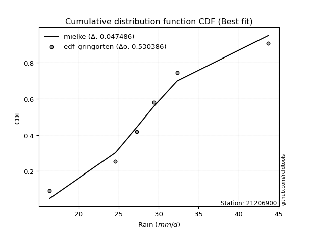</img></img>

</div>


### 9. Empirical - EDF Filliben (1975)

The specific values of the constants (0.3175) (often denoted as $alpha$) and (0.365) are derived from a method proposed by James J. Filliben in a 1975 paper. This particular formula is the mean value of the $i$-th order statistic of the normal distribution and is considered a robust and effective plotting position formula for the normal probability plot correlation coefficient test for normality.

<div align="center">


$P=(m-0.3175)/(n+0.365)$


</div>


**9.1. Empirical values**

<div align="center">

|                | 0                   | 1                   | 2                  | 3                  | 4                  | 5                  |
|:---------------|:--------------------|:--------------------|:-------------------|:-------------------|:-------------------|:-------------------|
| date           | 2015                | 2016                | 2011               | 2024               | 2025               | 2012               |
| x              | 16.4                | 24.6                | 27.3               | 29.4               | 31.2               | 43.7               |
| m              | 1                   | 2                   | 3                  | 4                  | 5                  | 6                  |
| empirical_dist | edf_filliben        | edf_filliben        | edf_filliben       | edf_filliben       | edf_filliben       | edf_filliben       |
| empirical      | 0.10722702278083267 | 0.26433621366849963 | 0.4214454045561665 | 0.5785545954438335 | 0.7356637863315004 | 0.8927729772191673 |
| empirical_tr   | 1.1201055873295205  | 1.3593166043780034  | 1.7284453496266123 | 2.3727865796831313 | 3.783060921248143  | 9.326007326007321  |

</div>


**9.2. Kolmogorov-Smirnov fit test (sorted by Δ)**


<div align="center">

|                | 0                   | 1                    | 2                   | 3                     | 4                   | 5                   | 6                   | 7                  | 8                   | 9                   | 10                  | 11                  | 12                  | 13                  | 14                  | 15                  | 16                  | 17                  | 18                  | 19                  | 20                  | 21                  | 22                  | 23                 | 24                  | 25                  | 26                | 27                  | 28                  | 29                  | 30                  | 31                  | 32                  | 33                  | 34                  | 35                  | 36                  | 37                  | 38                  | 39                  | 40                  | 41                  | 42                 | 43                  | 44                 | 45                 | 46                  | 47                  | 48                  | 49                  | 50                  | 51                  | 52                  | 53                  | 54                  | 55                  | 56                  | 57                  | 58                  | 59                  | 60                  | 61                  | 62                 | 63                  | 64                  | 65                 | 66                 | 67                  | 68                 | 69                  | 70                  | 71                 | 72                  | 73                 | 74                  | 75                  | 76                  | 77                  | 78                  | 79                  | 80                  | 81                 | 82                 | 83                  | 84                  | 85                  | 86                 | 87                  | 88                 | 89                 |
|:---------------|:--------------------|:---------------------|:--------------------|:----------------------|:--------------------|:--------------------|:--------------------|:-------------------|:--------------------|:--------------------|:--------------------|:--------------------|:--------------------|:--------------------|:--------------------|:--------------------|:--------------------|:--------------------|:--------------------|:--------------------|:--------------------|:--------------------|:--------------------|:-------------------|:--------------------|:--------------------|:------------------|:--------------------|:--------------------|:--------------------|:--------------------|:--------------------|:--------------------|:--------------------|:--------------------|:--------------------|:--------------------|:--------------------|:--------------------|:--------------------|:--------------------|:--------------------|:-------------------|:--------------------|:-------------------|:-------------------|:--------------------|:--------------------|:--------------------|:--------------------|:--------------------|:--------------------|:--------------------|:--------------------|:--------------------|:--------------------|:--------------------|:--------------------|:--------------------|:--------------------|:--------------------|:--------------------|:-------------------|:--------------------|:--------------------|:-------------------|:-------------------|:--------------------|:-------------------|:--------------------|:--------------------|:-------------------|:--------------------|:-------------------|:--------------------|:--------------------|:--------------------|:--------------------|:--------------------|:--------------------|:--------------------|:-------------------|:-------------------|:--------------------|:--------------------|:--------------------|:-------------------|:--------------------|:-------------------|:-------------------|
| station        | 21206900            | 21206900             | 21206900            | 21206900              | 21206900            | 21206900            | 21206900            | 21206900           | 21206900            | 21206900            | 21206900            | 21206900            | 21206900            | 21206900            | 21206900            | 21206900            | 21206900            | 21206900            | 21206900            | 21206900            | 21206900            | 21206900            | 21206900            | 21206900           | 21206900            | 21206900            | 21206900          | 21206900            | 21206900            | 21206900            | 21206900            | 21206900            | 21206900            | 21206900            | 21206900            | 21206900            | 21206900            | 21206900            | 21206900            | 21206900            | 21206900            | 21206900            | 21206900           | 21206900            | 21206900           | 21206900           | 21206900            | 21206900            | 21206900            | 21206900            | 21206900            | 21206900            | 21206900            | 21206900            | 21206900            | 21206900            | 21206900            | 21206900            | 21206900            | 21206900            | 21206900            | 21206900            | 21206900           | 21206900            | 21206900            | 21206900           | 21206900           | 21206900            | 21206900           | 21206900            | 21206900            | 21206900           | 21206900            | 21206900           | 21206900            | 21206900            | 21206900            | 21206900            | 21206900            | 21206900            | 21206900            | 21206900           | 21206900           | 21206900            | 21206900            | 21206900            | 21206900           | 21206900            | 21206900           | 21206900           |
| empirical_dist | edf_filliben        | edf_filliben         | edf_filliben        | edf_filliben          | edf_filliben        | edf_filliben        | edf_filliben        | edf_filliben       | edf_filliben        | edf_filliben        | edf_filliben        | edf_filliben        | edf_filliben        | edf_filliben        | edf_filliben        | edf_filliben        | edf_filliben        | edf_filliben        | edf_filliben        | edf_filliben        | edf_filliben        | edf_filliben        | edf_filliben        | edf_filliben       | edf_filliben        | edf_filliben        | edf_filliben      | edf_filliben        | edf_filliben        | edf_filliben        | edf_filliben        | edf_filliben        | edf_filliben        | edf_filliben        | edf_filliben        | edf_filliben        | edf_filliben        | edf_filliben        | edf_filliben        | edf_filliben        | edf_filliben        | edf_filliben        | edf_filliben       | edf_filliben        | edf_filliben       | edf_filliben       | edf_filliben        | edf_filliben        | edf_filliben        | edf_filliben        | edf_filliben        | edf_filliben        | edf_filliben        | edf_filliben        | edf_filliben        | edf_filliben        | edf_filliben        | edf_filliben        | edf_filliben        | edf_filliben        | edf_filliben        | edf_filliben        | edf_filliben       | edf_filliben        | edf_filliben        | edf_filliben       | edf_filliben       | edf_filliben        | edf_filliben       | edf_filliben        | edf_filliben        | edf_filliben       | edf_filliben        | edf_filliben       | edf_filliben        | edf_filliben        | edf_filliben        | edf_filliben        | edf_filliben        | edf_filliben        | edf_filliben        | edf_filliben       | edf_filliben       | edf_filliben        | edf_filliben        | edf_filliben        | edf_filliben       | edf_filliben        | edf_filliben       | edf_filliben       |
| p_dist         | logjohnsonsu        | johnsonsu            | laplace_asymmetric  | loglaplace_asymmetric | loglaplace          | loghypsecant        | loglogistic         | logmielke          | laplace             | loggenlogistic      | mielke              | logfisk             | exponnorm           | fisk                | genlogistic         | invgauss            | logf                | betaprime           | logt                | logexponnorm        | logcrystalball      | lognorm             | lognorm             | logfatiguelife     | ncf                 | weibull_min         | f                 | chi2                | gamma               | erlang              | nct                 | rayleigh            | gumbel_r            | invgamma            | logpearson3         | alpha               | logweibull_min      | logloggamma         | loggamma            | loggamma            | invweibull          | logerlang           | hypsecant          | maxwell             | logbetaprime       | pearson3           | loginvgamma         | rice                | logrice             | logalpha            | moyal               | logistic            | kstwobign           | loggompertz         | lognct              | halflogistic        | halfnorm            | logmaxwell          | loginvgauss         | loggumbel_l         | t                   | truncnorm           | crystalball        | norm                | lograyleigh         | loggumbel_r        | loginvweibull      | logmoyal            | loghalfnorm        | wald                | loghalflogistic     | gibrat             | gumbel_l            | logkstwobign       | logncf              | loggenexpon         | expon               | genexpon            | logchi2             | logwald             | loggibrat           | logtruncnorm       | nakagami           | logexpon            | lognakagami         | loglognorm          | pareto             | logpareto           | fatiguelife        | gompertz           |
| delta          | 0.05476371647990963 | 0.058332170192911814 | 0.05964068534306488 | 0.06091881104196317   | 0.06671028268343393 | 0.06821781582051517 | 0.06891441182689427 | 0.0690390209685593 | 0.06937087574443723 | 0.07119613373806533 | 0.07120537837061902 | 0.07129660980097186 | 0.07273192057680633 | 0.07325000826733308 | 0.07937050106608035 | 0.08170041416208496 | 0.08275563935774166 | 0.08298492466164714 | 0.08309633305803532 | 0.08309710267956233 | 0.08309776999077523 | 0.08309784492286693 | 0.08309784492286693 | 0.0833732130820996 | 0.08457718141878545 | 0.08580918070522098 | 0.085965036900303 | 0.08598283071650648 | 0.08598285459408517 | 0.08598309936026216 | 0.08598525877223018 | 0.08611407933665438 | 0.08699044068784102 | 0.08738164890795663 | 0.08760201023502812 | 0.08764377344965923 | 0.08834777313696118 | 0.09018905541048161 | 0.09040648550153835 | 0.09040648550153835 | 0.09129505902704332 | 0.09183073136369929 | 0.0921114941960044 | 0.09378135637314722 | 0.0937964851884927 | 0.0947188401739546 | 0.09474759987841258 | 0.09513730653762476 | 0.09679683617624396 | 0.09698295743553426 | 0.10269944793593683 | 0.10400107438099093 | 0.10533116055581632 | 0.10722700932091671 | 0.11070139908562154 | 0.11164261368775563 | 0.11219895271044616 | 0.11487489319718858 | 0.11745879840330781 | 0.11801674078572899 | 0.11875220324397817 | 0.11875847377205251 | 0.1187585421483609 | 0.11875854670176655 | 0.12690845302818315 | 0.1337336984002382 | 0.1515934097981449 | 0.15961295826094546 | 0.1611433081581718 | 0.16438746037936325 | 0.16880535601329977 | 0.1703600452428633 | 0.17514974793918747 | 0.1760530348573111 | 0.17911879927549612 | 0.18004260810404799 | 0.22039818281491746 | 0.22040323494906439 | 0.22254581458970846 | 0.23163975377637147 | 0.25249497973468704 | 0.2643357512064857 | 0.2643361727800078 | 0.27691119839563033 | 0.33140051332451337 | 0.39742944331662605 | 0.4017829409878149 | 0.40985156504985537 | 0.5712784281739414 | 0.6599856940191379 |
| deltao         | 0.530385761606      | 0.530385761606       | 0.530385761606      | 0.530385761606        | 0.530385761606      | 0.530385761606      | 0.530385761606      | 0.530385761606     | 0.530385761606      | 0.530385761606      | 0.530385761606      | 0.530385761606      | 0.530385761606      | 0.530385761606      | 0.530385761606      | 0.530385761606      | 0.530385761606      | 0.530385761606      | 0.530385761606      | 0.530385761606      | 0.530385761606      | 0.530385761606      | 0.530385761606      | 0.530385761606     | 0.530385761606      | 0.530385761606      | 0.530385761606    | 0.530385761606      | 0.530385761606      | 0.530385761606      | 0.530385761606      | 0.530385761606      | 0.530385761606      | 0.530385761606      | 0.530385761606      | 0.530385761606      | 0.530385761606      | 0.530385761606      | 0.530385761606      | 0.530385761606      | 0.530385761606      | 0.530385761606      | 0.530385761606     | 0.530385761606      | 0.530385761606     | 0.530385761606     | 0.530385761606      | 0.530385761606      | 0.530385761606      | 0.530385761606      | 0.530385761606      | 0.530385761606      | 0.530385761606      | 0.530385761606      | 0.530385761606      | 0.530385761606      | 0.530385761606      | 0.530385761606      | 0.530385761606      | 0.530385761606      | 0.530385761606      | 0.530385761606      | 0.530385761606     | 0.530385761606      | 0.530385761606      | 0.530385761606     | 0.530385761606     | 0.530385761606      | 0.530385761606     | 0.530385761606      | 0.530385761606      | 0.530385761606     | 0.530385761606      | 0.530385761606     | 0.530385761606      | 0.530385761606      | 0.530385761606      | 0.530385761606      | 0.530385761606      | 0.530385761606      | 0.530385761606      | 0.530385761606     | 0.530385761606     | 0.530385761606      | 0.530385761606      | 0.530385761606      | 0.530385761606     | 0.530385761606      | 0.530385761606     | 0.530385761606     |
| eval           | Δo > Δ              | Δo > Δ               | Δo > Δ              | Δo > Δ                | Δo > Δ              | Δo > Δ              | Δo > Δ              | Δo > Δ             | Δo > Δ              | Δo > Δ              | Δo > Δ              | Δo > Δ              | Δo > Δ              | Δo > Δ              | Δo > Δ              | Δo > Δ              | Δo > Δ              | Δo > Δ              | Δo > Δ              | Δo > Δ              | Δo > Δ              | Δo > Δ              | Δo > Δ              | Δo > Δ             | Δo > Δ              | Δo > Δ              | Δo > Δ            | Δo > Δ              | Δo > Δ              | Δo > Δ              | Δo > Δ              | Δo > Δ              | Δo > Δ              | Δo > Δ              | Δo > Δ              | Δo > Δ              | Δo > Δ              | Δo > Δ              | Δo > Δ              | Δo > Δ              | Δo > Δ              | Δo > Δ              | Δo > Δ             | Δo > Δ              | Δo > Δ             | Δo > Δ             | Δo > Δ              | Δo > Δ              | Δo > Δ              | Δo > Δ              | Δo > Δ              | Δo > Δ              | Δo > Δ              | Δo > Δ              | Δo > Δ              | Δo > Δ              | Δo > Δ              | Δo > Δ              | Δo > Δ              | Δo > Δ              | Δo > Δ              | Δo > Δ              | Δo > Δ             | Δo > Δ              | Δo > Δ              | Δo > Δ             | Δo > Δ             | Δo > Δ              | Δo > Δ             | Δo > Δ              | Δo > Δ              | Δo > Δ             | Δo > Δ              | Δo > Δ             | Δo > Δ              | Δo > Δ              | Δo > Δ              | Δo > Δ              | Δo > Δ              | Δo > Δ              | Δo > Δ              | Δo > Δ             | Δo > Δ             | Δo > Δ              | Δo > Δ              | Δo > Δ              | Δo > Δ             | Δo > Δ              | Δo <= Δ            | Δo <= Δ            |
| fit            | 1                   | 1                    | 1                   | 1                     | 1                   | 1                   | 1                   | 1                  | 1                   | 1                   | 1                   | 1                   | 1                   | 1                   | 1                   | 1                   | 1                   | 1                   | 1                   | 1                   | 1                   | 1                   | 1                   | 1                  | 1                   | 1                   | 1                 | 1                   | 1                   | 1                   | 1                   | 1                   | 1                   | 1                   | 1                   | 1                   | 1                   | 1                   | 1                   | 1                   | 1                   | 1                   | 1                  | 1                   | 1                  | 1                  | 1                   | 1                   | 1                   | 1                   | 1                   | 1                   | 1                   | 1                   | 1                   | 1                   | 1                   | 1                   | 1                   | 1                   | 1                   | 1                   | 1                  | 1                   | 1                   | 1                  | 1                  | 1                   | 1                  | 1                   | 1                   | 1                  | 1                   | 1                  | 1                   | 1                   | 1                   | 1                   | 1                   | 1                   | 1                   | 1                  | 1                  | 1                   | 1                   | 1                   | 1                  | 1                   | 0                  | 0                  |
| n              | 6                   | 6                    | 6                   | 6                     | 6                   | 6                   | 6                   | 6                  | 6                   | 6                   | 6                   | 6                   | 6                   | 6                   | 6                   | 6                   | 6                   | 6                   | 6                   | 6                   | 6                   | 6                   | 6                   | 6                  | 6                   | 6                   | 6                 | 6                   | 6                   | 6                   | 6                   | 6                   | 6                   | 6                   | 6                   | 6                   | 6                   | 6                   | 6                   | 6                   | 6                   | 6                   | 6                  | 6                   | 6                  | 6                  | 6                   | 6                   | 6                   | 6                   | 6                   | 6                   | 6                   | 6                   | 6                   | 6                   | 6                   | 6                   | 6                   | 6                   | 6                   | 6                   | 6                  | 6                   | 6                   | 6                  | 6                  | 6                   | 6                  | 6                   | 6                   | 6                  | 6                   | 6                  | 6                   | 6                   | 6                   | 6                   | 6                   | 6                   | 6                   | 6                  | 6                  | 6                   | 6                   | 6                   | 6                  | 6                   | 6                  | 6                  |
| best_fit       | 1                   | 0                    | 0                   | 0                     | 0                   | 0                   | 0                   | 0                  | 0                   | 0                   | 0                   | 0                   | 0                   | 0                   | 0                   | 0                   | 0                   | 0                   | 0                   | 0                   | 0                   | 0                   | 0                   | 0                  | 0                   | 0                   | 0                 | 0                   | 0                   | 0                   | 0                   | 0                   | 0                   | 0                   | 0                   | 0                   | 0                   | 0                   | 0                   | 0                   | 0                   | 0                   | 0                  | 0                   | 0                  | 0                  | 0                   | 0                   | 0                   | 0                   | 0                   | 0                   | 0                   | 0                   | 0                   | 0                   | 0                   | 0                   | 0                   | 0                   | 0                   | 0                   | 0                  | 0                   | 0                   | 0                  | 0                  | 0                   | 0                  | 0                   | 0                   | 0                  | 0                   | 0                  | 0                   | 0                   | 0                   | 0                   | 0                   | 0                   | 0                   | 0                  | 0                  | 0                   | 0                   | 0                   | 0                  | 0                   | 0                  | 0                  |
| best_fit_sort  | 1                   | 2                    | 3                   | 4                     | 5                   | 6                   | 7                   | 8                  | 9                   | 10                  | 11                  | 12                  | 13                  | 14                  | 15                  | 16                  | 17                  | 18                  | 19                  | 20                  | 21                  | 22                  | 23                  | 24                 | 25                  | 26                  | 27                | 28                  | 29                  | 30                  | 31                  | 32                  | 33                  | 34                  | 35                  | 36                  | 37                  | 38                  | 39                  | 40                  | 41                  | 42                  | 43                 | 44                  | 45                 | 46                 | 47                  | 48                  | 49                  | 50                  | 51                  | 52                  | 53                  | 54                  | 55                  | 56                  | 57                  | 58                  | 59                  | 60                  | 61                  | 62                  | 63                 | 64                  | 65                  | 66                 | 67                 | 68                  | 69                 | 70                  | 71                  | 72                 | 73                  | 74                 | 75                  | 76                  | 77                  | 78                  | 79                  | 80                  | 81                  | 82                 | 83                 | 84                  | 85                  | 86                  | 87                 | 88                  | 89                 | 90                 |

</div>


<div align="center">

</img>

</div>


**9.3. Best fit**

<div align="center">

|   id |   station | empirical_dist   | p_dist       |     delta |   deltao | eval   |   fit |   n |   best_fit |   best_fit_sort |
|-----:|----------:|:-----------------|:-------------|----------:|---------:|:-------|------:|----:|-----------:|----------------:|
|    0 |  21206900 | edf_filliben     | logjohnsonsu | 0.0547637 | 0.530386 | Δo > Δ |     1 |   6 |          1 |               1 |

</div>


<div align="center">

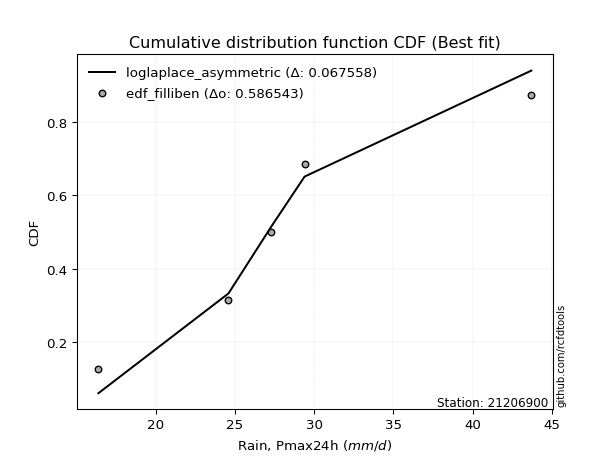</img>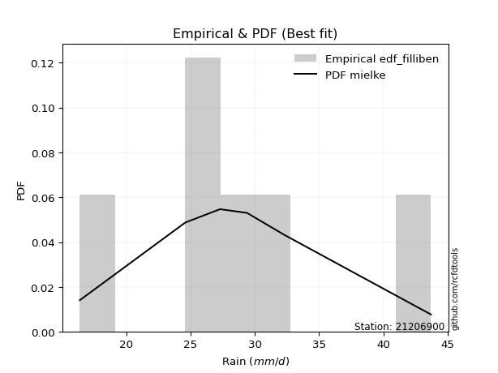</img>

</div>


### 10. Empirical - EDF Jenkinson (1977)

The Jenkinson formula in hydrology is an empirical plotting position formula used to estimate the non-exceedance probability _(P)_ or return period _(T)_ of a given ordered observation within a sample. It is a widely used method in the frequency analysis of extreme events such as floods and rainfall, as it provides a distribution-free way to plot data. _a≈0.31_ and _b≈0.38_ are constants derived to approximate the median of the probability distribution for the given rank.

<div align="center">


$P=(m-a)/(n+b)$


</div>


**10.1. Empirical values**

<div align="center">

|                | 0                   | 1                   | 2                  | 3                  | 4                  | 5                  |
|:---------------|:--------------------|:--------------------|:-------------------|:-------------------|:-------------------|:-------------------|
| date           | 2015                | 2016                | 2011               | 2024               | 2025               | 2012               |
| x              | 16.4                | 24.6                | 27.3               | 29.4               | 31.2               | 43.7               |
| m              | 1                   | 2                   | 3                  | 4                  | 5                  | 6                  |
| empirical_dist | edf_jenkinson       | edf_jenkinson       | edf_jenkinson      | edf_jenkinson      | edf_jenkinson      | edf_jenkinson      |
| empirical      | 0.10815047021943573 | 0.26489028213166144 | 0.4216300940438871 | 0.5783699059561128 | 0.7351097178683387 | 0.8918495297805643 |
| empirical_tr   | 1.1212653778558874  | 1.3603411513859276  | 1.7289972899728996 | 2.3717472118959106 | 3.7751479289940844 | 9.246376811594207  |

</div>


**10.2. Kolmogorov-Smirnov fit test (sorted by Δ)**


<div align="center">

|                | 0                   | 1                   | 2                    | 3                     | 4                 | 5                   | 6                   | 7                   | 8                   | 9                   | 10                  | 11                  | 12                  | 13                  | 14                 | 15                 | 16                  | 17                  | 18                  | 19                  | 20                  | 21                  | 22                  | 23                 | 24                 | 25                  | 26                  | 27                  | 28                  | 29                  | 30                  | 31                  | 32                  | 33                  | 34                  | 35                  | 36                  | 37                  | 38                  | 39                  | 40                  | 41                  | 42                  | 43                  | 44                 | 45                  | 46                  | 47                | 48                  | 49                  | 50                  | 51                  | 52                  | 53                  | 54                  | 55                  | 56                  | 57                  | 58                | 59                  | 60                  | 61                  | 62                  | 63                 | 64                  | 65                  | 66                 | 67                  | 68               | 69                  | 70                  | 71                 | 72                  | 73                 | 74                  | 75                  | 76                  | 77                  | 78                 | 79                  | 80                  | 81                  | 82                 | 83                 | 84                  | 85                  | 86                 | 87                  | 88                 | 89                 |
|:---------------|:--------------------|:--------------------|:---------------------|:----------------------|:------------------|:--------------------|:--------------------|:--------------------|:--------------------|:--------------------|:--------------------|:--------------------|:--------------------|:--------------------|:-------------------|:-------------------|:--------------------|:--------------------|:--------------------|:--------------------|:--------------------|:--------------------|:--------------------|:-------------------|:-------------------|:--------------------|:--------------------|:--------------------|:--------------------|:--------------------|:--------------------|:--------------------|:--------------------|:--------------------|:--------------------|:--------------------|:--------------------|:--------------------|:--------------------|:--------------------|:--------------------|:--------------------|:--------------------|:--------------------|:-------------------|:--------------------|:--------------------|:------------------|:--------------------|:--------------------|:--------------------|:--------------------|:--------------------|:--------------------|:--------------------|:--------------------|:--------------------|:--------------------|:------------------|:--------------------|:--------------------|:--------------------|:--------------------|:-------------------|:--------------------|:--------------------|:-------------------|:--------------------|:-----------------|:--------------------|:--------------------|:-------------------|:--------------------|:-------------------|:--------------------|:--------------------|:--------------------|:--------------------|:-------------------|:--------------------|:--------------------|:--------------------|:-------------------|:-------------------|:--------------------|:--------------------|:-------------------|:--------------------|:-------------------|:-------------------|
| station        | 21206900            | 21206900            | 21206900             | 21206900              | 21206900          | 21206900            | 21206900            | 21206900            | 21206900            | 21206900            | 21206900            | 21206900            | 21206900            | 21206900            | 21206900           | 21206900           | 21206900            | 21206900            | 21206900            | 21206900            | 21206900            | 21206900            | 21206900            | 21206900           | 21206900           | 21206900            | 21206900            | 21206900            | 21206900            | 21206900            | 21206900            | 21206900            | 21206900            | 21206900            | 21206900            | 21206900            | 21206900            | 21206900            | 21206900            | 21206900            | 21206900            | 21206900            | 21206900            | 21206900            | 21206900           | 21206900            | 21206900            | 21206900          | 21206900            | 21206900            | 21206900            | 21206900            | 21206900            | 21206900            | 21206900            | 21206900            | 21206900            | 21206900            | 21206900          | 21206900            | 21206900            | 21206900            | 21206900            | 21206900           | 21206900            | 21206900            | 21206900           | 21206900            | 21206900         | 21206900            | 21206900            | 21206900           | 21206900            | 21206900           | 21206900            | 21206900            | 21206900            | 21206900            | 21206900           | 21206900            | 21206900            | 21206900            | 21206900           | 21206900           | 21206900            | 21206900            | 21206900           | 21206900            | 21206900           | 21206900           |
| empirical_dist | edf_jenkinson       | edf_jenkinson       | edf_jenkinson        | edf_jenkinson         | edf_jenkinson     | edf_jenkinson       | edf_jenkinson       | edf_jenkinson       | edf_jenkinson       | edf_jenkinson       | edf_jenkinson       | edf_jenkinson       | edf_jenkinson       | edf_jenkinson       | edf_jenkinson      | edf_jenkinson      | edf_jenkinson       | edf_jenkinson       | edf_jenkinson       | edf_jenkinson       | edf_jenkinson       | edf_jenkinson       | edf_jenkinson       | edf_jenkinson      | edf_jenkinson      | edf_jenkinson       | edf_jenkinson       | edf_jenkinson       | edf_jenkinson       | edf_jenkinson       | edf_jenkinson       | edf_jenkinson       | edf_jenkinson       | edf_jenkinson       | edf_jenkinson       | edf_jenkinson       | edf_jenkinson       | edf_jenkinson       | edf_jenkinson       | edf_jenkinson       | edf_jenkinson       | edf_jenkinson       | edf_jenkinson       | edf_jenkinson       | edf_jenkinson      | edf_jenkinson       | edf_jenkinson       | edf_jenkinson     | edf_jenkinson       | edf_jenkinson       | edf_jenkinson       | edf_jenkinson       | edf_jenkinson       | edf_jenkinson       | edf_jenkinson       | edf_jenkinson       | edf_jenkinson       | edf_jenkinson       | edf_jenkinson     | edf_jenkinson       | edf_jenkinson       | edf_jenkinson       | edf_jenkinson       | edf_jenkinson      | edf_jenkinson       | edf_jenkinson       | edf_jenkinson      | edf_jenkinson       | edf_jenkinson    | edf_jenkinson       | edf_jenkinson       | edf_jenkinson      | edf_jenkinson       | edf_jenkinson      | edf_jenkinson       | edf_jenkinson       | edf_jenkinson       | edf_jenkinson       | edf_jenkinson      | edf_jenkinson       | edf_jenkinson       | edf_jenkinson       | edf_jenkinson      | edf_jenkinson      | edf_jenkinson       | edf_jenkinson       | edf_jenkinson      | edf_jenkinson       | edf_jenkinson      | edf_jenkinson      |
| p_dist         | logjohnsonsu        | johnsonsu           | laplace_asymmetric   | loglaplace_asymmetric | loglaplace        | logmielke           | loghypsecant        | loglogistic         | laplace             | loggenlogistic      | mielke              | logfisk             | exponnorm           | fisk                | genlogistic        | invgauss           | logf                | betaprime           | logt                | logexponnorm        | logcrystalball      | lognorm             | lognorm             | logfatiguelife     | ncf                | weibull_min         | f                   | chi2                | gamma               | erlang              | nct                 | rayleigh            | invgamma            | logpearson3         | alpha               | logweibull_min      | gumbel_r            | logloggamma         | loggamma            | loggamma            | invweibull          | logerlang           | hypsecant           | maxwell             | logbetaprime       | pearson3            | loginvgamma         | rice              | logrice             | logalpha            | logistic            | moyal               | kstwobign           | loggompertz         | lognct              | halflogistic        | halfnorm            | logmaxwell          | loginvgauss       | loggumbel_l         | t                   | truncnorm           | crystalball         | norm               | lograyleigh         | loggumbel_r         | loginvweibull      | logmoyal            | loghalfnorm      | wald                | loghalflogistic     | gibrat             | gumbel_l            | logkstwobign       | logncf              | loggenexpon         | expon               | genexpon            | logchi2            | logwald             | loggibrat           | logtruncnorm        | nakagami           | logexpon           | lognakagami         | loglognorm          | pareto             | logpareto           | fatiguelife        | gompertz           |
| delta          | 0.05568716391851258 | 0.05925561763151477 | 0.060564132781667834 | 0.061842258480566126  | 0.067633730122037 | 0.06848495250539754 | 0.06914126325911824 | 0.06983785926549733 | 0.07029432318304019 | 0.07064206527490358 | 0.07065130990745727 | 0.07157574287046894 | 0.07217785211364458 | 0.07269593980417133 | 0.0788164326029186 | 0.0811463456989232 | 0.08220157089457986 | 0.08243085619848534 | 0.08254226459487352 | 0.08254303421640052 | 0.08254370152761342 | 0.08254377645970512 | 0.08254377645970512 | 0.0828191446189378 | 0.0840231129556237 | 0.08525511224205917 | 0.08541096843714124 | 0.08542876225334473 | 0.08542878613092342 | 0.08542903089710041 | 0.08543119030906843 | 0.08556001087349263 | 0.08682758044479488 | 0.08704794177186637 | 0.08708970498649748 | 0.08779370467379943 | 0.08791388812644409 | 0.08963498694731986 | 0.08985241703837654 | 0.08985241703837654 | 0.09074099056388152 | 0.09127666290053749 | 0.09155742573284265 | 0.09322728790998547 | 0.0932424167253309 | 0.09416477171079285 | 0.09419353141525078 | 0.094583238074463 | 0.09624276771308216 | 0.09642888897237245 | 0.10344700591782918 | 0.10362289537453989 | 0.10477709209265451 | 0.10815045675951977 | 0.11014733062245974 | 0.11108854522459383 | 0.11164488424728436 | 0.11432082473402677 | 0.116904729940146 | 0.11746267232256724 | 0.11819813478081642 | 0.11820440530889076 | 0.11820447368519915 | 0.1182044782386048 | 0.12635438456502135 | 0.13354900891251759 | 0.1510393413349831 | 0.15942826877322486 | 0.16058923969501 | 0.16420277089164265 | 0.16825128755013796 | 0.1701753557551427 | 0.17459567947602572 | 0.1754989663941493 | 0.17856473081233432 | 0.17948853964088618 | 0.21984411435175566 | 0.21984916648590258 | 0.2216223671511055 | 0.23145506428865087 | 0.25231029024696644 | 0.26488981966964753 | 0.2648902412431696 | 0.2763571299324685 | 0.33121582383679277 | 0.39687537485346425 | 0.4012288725246531 | 0.40929749658669357 | 0.5707243597107796 | 0.6594316255559761 |
| deltao         | 0.530385761606      | 0.530385761606      | 0.530385761606       | 0.530385761606        | 0.530385761606    | 0.530385761606      | 0.530385761606      | 0.530385761606      | 0.530385761606      | 0.530385761606      | 0.530385761606      | 0.530385761606      | 0.530385761606      | 0.530385761606      | 0.530385761606     | 0.530385761606     | 0.530385761606      | 0.530385761606      | 0.530385761606      | 0.530385761606      | 0.530385761606      | 0.530385761606      | 0.530385761606      | 0.530385761606     | 0.530385761606     | 0.530385761606      | 0.530385761606      | 0.530385761606      | 0.530385761606      | 0.530385761606      | 0.530385761606      | 0.530385761606      | 0.530385761606      | 0.530385761606      | 0.530385761606      | 0.530385761606      | 0.530385761606      | 0.530385761606      | 0.530385761606      | 0.530385761606      | 0.530385761606      | 0.530385761606      | 0.530385761606      | 0.530385761606      | 0.530385761606     | 0.530385761606      | 0.530385761606      | 0.530385761606    | 0.530385761606      | 0.530385761606      | 0.530385761606      | 0.530385761606      | 0.530385761606      | 0.530385761606      | 0.530385761606      | 0.530385761606      | 0.530385761606      | 0.530385761606      | 0.530385761606    | 0.530385761606      | 0.530385761606      | 0.530385761606      | 0.530385761606      | 0.530385761606     | 0.530385761606      | 0.530385761606      | 0.530385761606     | 0.530385761606      | 0.530385761606   | 0.530385761606      | 0.530385761606      | 0.530385761606     | 0.530385761606      | 0.530385761606     | 0.530385761606      | 0.530385761606      | 0.530385761606      | 0.530385761606      | 0.530385761606     | 0.530385761606      | 0.530385761606      | 0.530385761606      | 0.530385761606     | 0.530385761606     | 0.530385761606      | 0.530385761606      | 0.530385761606     | 0.530385761606      | 0.530385761606     | 0.530385761606     |
| eval           | Δo > Δ              | Δo > Δ              | Δo > Δ               | Δo > Δ                | Δo > Δ            | Δo > Δ              | Δo > Δ              | Δo > Δ              | Δo > Δ              | Δo > Δ              | Δo > Δ              | Δo > Δ              | Δo > Δ              | Δo > Δ              | Δo > Δ             | Δo > Δ             | Δo > Δ              | Δo > Δ              | Δo > Δ              | Δo > Δ              | Δo > Δ              | Δo > Δ              | Δo > Δ              | Δo > Δ             | Δo > Δ             | Δo > Δ              | Δo > Δ              | Δo > Δ              | Δo > Δ              | Δo > Δ              | Δo > Δ              | Δo > Δ              | Δo > Δ              | Δo > Δ              | Δo > Δ              | Δo > Δ              | Δo > Δ              | Δo > Δ              | Δo > Δ              | Δo > Δ              | Δo > Δ              | Δo > Δ              | Δo > Δ              | Δo > Δ              | Δo > Δ             | Δo > Δ              | Δo > Δ              | Δo > Δ            | Δo > Δ              | Δo > Δ              | Δo > Δ              | Δo > Δ              | Δo > Δ              | Δo > Δ              | Δo > Δ              | Δo > Δ              | Δo > Δ              | Δo > Δ              | Δo > Δ            | Δo > Δ              | Δo > Δ              | Δo > Δ              | Δo > Δ              | Δo > Δ             | Δo > Δ              | Δo > Δ              | Δo > Δ             | Δo > Δ              | Δo > Δ           | Δo > Δ              | Δo > Δ              | Δo > Δ             | Δo > Δ              | Δo > Δ             | Δo > Δ              | Δo > Δ              | Δo > Δ              | Δo > Δ              | Δo > Δ             | Δo > Δ              | Δo > Δ              | Δo > Δ              | Δo > Δ             | Δo > Δ             | Δo > Δ              | Δo > Δ              | Δo > Δ             | Δo > Δ              | Δo <= Δ            | Δo <= Δ            |
| fit            | 1                   | 1                   | 1                    | 1                     | 1                 | 1                   | 1                   | 1                   | 1                   | 1                   | 1                   | 1                   | 1                   | 1                   | 1                  | 1                  | 1                   | 1                   | 1                   | 1                   | 1                   | 1                   | 1                   | 1                  | 1                  | 1                   | 1                   | 1                   | 1                   | 1                   | 1                   | 1                   | 1                   | 1                   | 1                   | 1                   | 1                   | 1                   | 1                   | 1                   | 1                   | 1                   | 1                   | 1                   | 1                  | 1                   | 1                   | 1                 | 1                   | 1                   | 1                   | 1                   | 1                   | 1                   | 1                   | 1                   | 1                   | 1                   | 1                 | 1                   | 1                   | 1                   | 1                   | 1                  | 1                   | 1                   | 1                  | 1                   | 1                | 1                   | 1                   | 1                  | 1                   | 1                  | 1                   | 1                   | 1                   | 1                   | 1                  | 1                   | 1                   | 1                   | 1                  | 1                  | 1                   | 1                   | 1                  | 1                   | 0                  | 0                  |
| n              | 6                   | 6                   | 6                    | 6                     | 6                 | 6                   | 6                   | 6                   | 6                   | 6                   | 6                   | 6                   | 6                   | 6                   | 6                  | 6                  | 6                   | 6                   | 6                   | 6                   | 6                   | 6                   | 6                   | 6                  | 6                  | 6                   | 6                   | 6                   | 6                   | 6                   | 6                   | 6                   | 6                   | 6                   | 6                   | 6                   | 6                   | 6                   | 6                   | 6                   | 6                   | 6                   | 6                   | 6                   | 6                  | 6                   | 6                   | 6                 | 6                   | 6                   | 6                   | 6                   | 6                   | 6                   | 6                   | 6                   | 6                   | 6                   | 6                 | 6                   | 6                   | 6                   | 6                   | 6                  | 6                   | 6                   | 6                  | 6                   | 6                | 6                   | 6                   | 6                  | 6                   | 6                  | 6                   | 6                   | 6                   | 6                   | 6                  | 6                   | 6                   | 6                   | 6                  | 6                  | 6                   | 6                   | 6                  | 6                   | 6                  | 6                  |
| best_fit       | 1                   | 0                   | 0                    | 0                     | 0                 | 0                   | 0                   | 0                   | 0                   | 0                   | 0                   | 0                   | 0                   | 0                   | 0                  | 0                  | 0                   | 0                   | 0                   | 0                   | 0                   | 0                   | 0                   | 0                  | 0                  | 0                   | 0                   | 0                   | 0                   | 0                   | 0                   | 0                   | 0                   | 0                   | 0                   | 0                   | 0                   | 0                   | 0                   | 0                   | 0                   | 0                   | 0                   | 0                   | 0                  | 0                   | 0                   | 0                 | 0                   | 0                   | 0                   | 0                   | 0                   | 0                   | 0                   | 0                   | 0                   | 0                   | 0                 | 0                   | 0                   | 0                   | 0                   | 0                  | 0                   | 0                   | 0                  | 0                   | 0                | 0                   | 0                   | 0                  | 0                   | 0                  | 0                   | 0                   | 0                   | 0                   | 0                  | 0                   | 0                   | 0                   | 0                  | 0                  | 0                   | 0                   | 0                  | 0                   | 0                  | 0                  |
| best_fit_sort  | 1                   | 2                   | 3                    | 4                     | 5                 | 6                   | 7                   | 8                   | 9                   | 10                  | 11                  | 12                  | 13                  | 14                  | 15                 | 16                 | 17                  | 18                  | 19                  | 20                  | 21                  | 22                  | 23                  | 24                 | 25                 | 26                  | 27                  | 28                  | 29                  | 30                  | 31                  | 32                  | 33                  | 34                  | 35                  | 36                  | 37                  | 38                  | 39                  | 40                  | 41                  | 42                  | 43                  | 44                  | 45                 | 46                  | 47                  | 48                | 49                  | 50                  | 51                  | 52                  | 53                  | 54                  | 55                  | 56                  | 57                  | 58                  | 59                | 60                  | 61                  | 62                  | 63                  | 64                 | 65                  | 66                  | 67                 | 68                  | 69               | 70                  | 71                  | 72                 | 73                  | 74                 | 75                  | 76                  | 77                  | 78                  | 79                 | 80                  | 81                  | 82                  | 83                 | 84                 | 85                  | 86                  | 87                 | 88                  | 89                 | 90                 |

</div>


<div align="center">

</img>

</div>


**10.3. Best fit**

<div align="center">

|   id |   station | empirical_dist   | p_dist       |     delta |   deltao | eval   |   fit |   n |   best_fit |   best_fit_sort |
|-----:|----------:|:-----------------|:-------------|----------:|---------:|:-------|------:|----:|-----------:|----------------:|
|    0 |  21206900 | edf_jenkinson    | logjohnsonsu | 0.0556872 | 0.530386 | Δo > Δ |     1 |   6 |          1 |               1 |

</div>


<div align="center">

</img>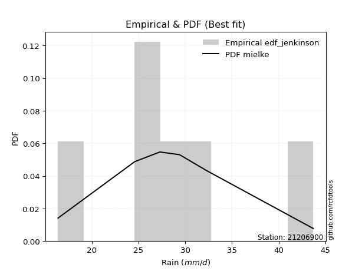</img>

</div>


### 11. Empirical - EDF Cunnane (1978)

Cunnane´s work in statistical hydrology has focused on the performance and evaluation of different probability distributions (such as GEV, Gumbel, Lognormal) for flood frequency estimation. _b_ is a constant, typically set to 0.4.

<div align="center">


$P=(m-b)/(n+1-2b)$


</div>


**11.1. Empirical values**

<div align="center">

|                | 0                  | 1                   | 2                   | 3                  | 4                  | 5                  |
|:---------------|:-------------------|:--------------------|:--------------------|:-------------------|:-------------------|:-------------------|
| date           | 2015               | 2016                | 2011                | 2024               | 2025               | 2012               |
| x              | 16.4               | 24.6                | 27.3                | 29.4               | 31.2               | 43.7               |
| m              | 1                  | 2                   | 3                   | 4                  | 5                  | 6                  |
| empirical_dist | edf_cunnane        | edf_cunnane         | edf_cunnane         | edf_cunnane        | edf_cunnane        | edf_cunnane        |
| empirical      | 0.0967741935483871 | 0.25806451612903225 | 0.41935483870967744 | 0.5806451612903226 | 0.7419354838709676 | 0.9032258064516128 |
| empirical_tr   | 1.1071428571428572 | 1.3478260869565217  | 1.7222222222222225  | 2.384615384615385  | 3.8749999999999982 | 10.333333333333318 |

</div>


**11.2. Kolmogorov-Smirnov fit test (sorted by Δ)**


<div align="center">

|                | 0                    | 1                   | 2                     | 3                   | 4                   | 5                   | 6                   | 7                   | 8                   | 9                   | 10                  | 11                  | 12                  | 13                  | 14                  | 15                  | 16                  | 17                  | 18                  | 19                 | 20                  | 21                  | 22                 | 23                 | 24                  | 25                  | 26                  | 27                  | 28                  | 29                  | 30                  | 31                  | 32                 | 33                  | 34                  | 35                  | 36                 | 37                  | 38                  | 39                  | 40                 | 41                  | 42                  | 43                  | 44                  | 45                  | 46                  | 47                  | 48                  | 49                  | 50                  | 51                  | 52                  | 53                 | 54                  | 55                  | 56                  | 57                  | 58                  | 59                 | 60                  | 61                  | 62                  | 63                  | 64                  | 65                  | 66                  | 67                  | 68                  | 69                  | 70                 | 71                  | 72                  | 73                 | 74                 | 75                  | 76                  | 77                  | 78                  | 79                  | 80                  | 81                  | 82                  | 83                 | 84                  | 85                  | 86                 | 87                  | 88                 | 89                 |
|:---------------|:---------------------|:--------------------|:----------------------|:--------------------|:--------------------|:--------------------|:--------------------|:--------------------|:--------------------|:--------------------|:--------------------|:--------------------|:--------------------|:--------------------|:--------------------|:--------------------|:--------------------|:--------------------|:--------------------|:-------------------|:--------------------|:--------------------|:-------------------|:-------------------|:--------------------|:--------------------|:--------------------|:--------------------|:--------------------|:--------------------|:--------------------|:--------------------|:-------------------|:--------------------|:--------------------|:--------------------|:-------------------|:--------------------|:--------------------|:--------------------|:-------------------|:--------------------|:--------------------|:--------------------|:--------------------|:--------------------|:--------------------|:--------------------|:--------------------|:--------------------|:--------------------|:--------------------|:--------------------|:-------------------|:--------------------|:--------------------|:--------------------|:--------------------|:--------------------|:-------------------|:--------------------|:--------------------|:--------------------|:--------------------|:--------------------|:--------------------|:--------------------|:--------------------|:--------------------|:--------------------|:-------------------|:--------------------|:--------------------|:-------------------|:-------------------|:--------------------|:--------------------|:--------------------|:--------------------|:--------------------|:--------------------|:--------------------|:--------------------|:-------------------|:--------------------|:--------------------|:-------------------|:--------------------|:-------------------|:-------------------|
| station        | 21206900             | 21206900            | 21206900              | 21206900            | 21206900            | 21206900            | 21206900            | 21206900            | 21206900            | 21206900            | 21206900            | 21206900            | 21206900            | 21206900            | 21206900            | 21206900            | 21206900            | 21206900            | 21206900            | 21206900           | 21206900            | 21206900            | 21206900           | 21206900           | 21206900            | 21206900            | 21206900            | 21206900            | 21206900            | 21206900            | 21206900            | 21206900            | 21206900           | 21206900            | 21206900            | 21206900            | 21206900           | 21206900            | 21206900            | 21206900            | 21206900           | 21206900            | 21206900            | 21206900            | 21206900            | 21206900            | 21206900            | 21206900            | 21206900            | 21206900            | 21206900            | 21206900            | 21206900            | 21206900           | 21206900            | 21206900            | 21206900            | 21206900            | 21206900            | 21206900           | 21206900            | 21206900            | 21206900            | 21206900            | 21206900            | 21206900            | 21206900            | 21206900            | 21206900            | 21206900            | 21206900           | 21206900            | 21206900            | 21206900           | 21206900           | 21206900            | 21206900            | 21206900            | 21206900            | 21206900            | 21206900            | 21206900            | 21206900            | 21206900           | 21206900            | 21206900            | 21206900           | 21206900            | 21206900           | 21206900           |
| empirical_dist | edf_cunnane          | edf_cunnane         | edf_cunnane           | edf_cunnane         | edf_cunnane         | edf_cunnane         | edf_cunnane         | edf_cunnane         | edf_cunnane         | edf_cunnane         | edf_cunnane         | edf_cunnane         | edf_cunnane         | edf_cunnane         | edf_cunnane         | edf_cunnane         | edf_cunnane         | edf_cunnane         | edf_cunnane         | edf_cunnane        | edf_cunnane         | edf_cunnane         | edf_cunnane        | edf_cunnane        | edf_cunnane         | edf_cunnane         | edf_cunnane         | edf_cunnane         | edf_cunnane         | edf_cunnane         | edf_cunnane         | edf_cunnane         | edf_cunnane        | edf_cunnane         | edf_cunnane         | edf_cunnane         | edf_cunnane        | edf_cunnane         | edf_cunnane         | edf_cunnane         | edf_cunnane        | edf_cunnane         | edf_cunnane         | edf_cunnane         | edf_cunnane         | edf_cunnane         | edf_cunnane         | edf_cunnane         | edf_cunnane         | edf_cunnane         | edf_cunnane         | edf_cunnane         | edf_cunnane         | edf_cunnane        | edf_cunnane         | edf_cunnane         | edf_cunnane         | edf_cunnane         | edf_cunnane         | edf_cunnane        | edf_cunnane         | edf_cunnane         | edf_cunnane         | edf_cunnane         | edf_cunnane         | edf_cunnane         | edf_cunnane         | edf_cunnane         | edf_cunnane         | edf_cunnane         | edf_cunnane        | edf_cunnane         | edf_cunnane         | edf_cunnane        | edf_cunnane        | edf_cunnane         | edf_cunnane         | edf_cunnane         | edf_cunnane         | edf_cunnane         | edf_cunnane         | edf_cunnane         | edf_cunnane         | edf_cunnane        | edf_cunnane         | edf_cunnane         | edf_cunnane        | edf_cunnane         | edf_cunnane        | edf_cunnane        |
| p_dist         | logjohnsonsu         | johnsonsu           | loglaplace_asymmetric | laplace_asymmetric  | loglaplace          | loghypsecant        | laplace             | loglogistic         | logmielke           | loggenlogistic      | mielke              | logfisk             | exponnorm           | fisk                | gumbel_r            | genlogistic         | invgauss            | logf                | betaprime           | logt               | logexponnorm        | logcrystalball      | lognorm            | lognorm            | logfatiguelife      | ncf                 | weibull_min         | f                   | chi2                | gamma               | erlang              | nct                 | rayleigh           | invgamma            | logpearson3         | alpha               | logweibull_min     | logloggamma         | loggamma            | loggamma            | invweibull         | loggompertz         | logerlang           | hypsecant           | moyal               | maxwell             | logbetaprime        | pearson3            | loginvgamma         | rice                | logrice             | logalpha            | logistic            | kstwobign          | lognct              | halflogistic        | halfnorm            | logmaxwell          | loginvgauss         | loggumbel_l        | t                   | truncnorm           | crystalball         | norm                | lograyleigh         | loggumbel_r         | loginvweibull       | logmoyal            | wald                | loghalfnorm         | gibrat             | loghalflogistic     | gumbel_l            | logkstwobign       | logncf             | loggenexpon         | expon               | genexpon            | logchi2             | logwald             | loggibrat           | logtruncnorm        | nakagami            | logexpon           | lognakagami         | loglognorm          | pareto             | logpareto           | fatiguelife        | gompertz           |
| delta          | 0.044310887247464126 | 0.04787934096046631 | 0.05046598180951767   | 0.05438448577884103 | 0.05625745345098836 | 0.06234134714428524 | 0.07028333098281614 | 0.07120825870919728 | 0.07531071850802651 | 0.07746783127753254 | 0.07747707591008623 | 0.07756830734043907 | 0.07900361811627354 | 0.07952170580680029 | 0.08194335606724285 | 0.08564219860554756 | 0.08797211170155217 | 0.08902733689720904 | 0.08925662220111452 | 0.0893680305975027 | 0.08936880021902971 | 0.08936946753024261 | 0.0893695424623343 | 0.0893695424623343 | 0.08964491062156699 | 0.09084887895825267 | 0.09208087824468836 | 0.09223673443977021 | 0.09225452825597369 | 0.09225455213355238 | 0.09225479689972937 | 0.09225695631169739 | 0.0923857768761216 | 0.09365334644742385 | 0.09387370777449533 | 0.09391547098912645 | 0.0946194706764284 | 0.09646075294994882 | 0.09667818304100573 | 0.09667818304100573 | 0.0975667565665107 | 0.09809999153655036 | 0.09810242890316667 | 0.09838319173547161 | 0.09856819916785758 | 0.10005305391261443 | 0.10006818272796009 | 0.10099053771342181 | 0.10101929741787996 | 0.10140900407709197 | 0.10306853371571134 | 0.10325465497500164 | 0.11027277192045815 | 0.1116028580952837 | 0.11697309662508892 | 0.11791431122722301 | 0.11847065024991354 | 0.12114659073665596 | 0.12373049594277519 | 0.1242884383251962 | 0.12502390078344539 | 0.12503017131151972 | 0.12503023968782812 | 0.12503024424123377 | 0.13318015056765053 | 0.13705991214824625 | 0.15786510733761228 | 0.16170352410743455 | 0.16647802622585234 | 0.16741500569763917 | 0.1724506110893524 | 0.17507705355276715 | 0.18142144547865469 | 0.1823247323967785 | 0.1853904968149635 | 0.18631430564351537 | 0.22666988035438485 | 0.22667493248853177 | 0.23299864382215396 | 0.23373031962286056 | 0.25458554558117613 | 0.25806405366701834 | 0.25806447524054044 | 0.2831828959350977 | 0.33349107917100246 | 0.40370114085609343 | 0.4080546385272823 | 0.41612326258932275 | 0.5775501257134088 | 0.6662573915586051 |
| deltao         | 0.530385761606       | 0.530385761606      | 0.530385761606        | 0.530385761606      | 0.530385761606      | 0.530385761606      | 0.530385761606      | 0.530385761606      | 0.530385761606      | 0.530385761606      | 0.530385761606      | 0.530385761606      | 0.530385761606      | 0.530385761606      | 0.530385761606      | 0.530385761606      | 0.530385761606      | 0.530385761606      | 0.530385761606      | 0.530385761606     | 0.530385761606      | 0.530385761606      | 0.530385761606     | 0.530385761606     | 0.530385761606      | 0.530385761606      | 0.530385761606      | 0.530385761606      | 0.530385761606      | 0.530385761606      | 0.530385761606      | 0.530385761606      | 0.530385761606     | 0.530385761606      | 0.530385761606      | 0.530385761606      | 0.530385761606     | 0.530385761606      | 0.530385761606      | 0.530385761606      | 0.530385761606     | 0.530385761606      | 0.530385761606      | 0.530385761606      | 0.530385761606      | 0.530385761606      | 0.530385761606      | 0.530385761606      | 0.530385761606      | 0.530385761606      | 0.530385761606      | 0.530385761606      | 0.530385761606      | 0.530385761606     | 0.530385761606      | 0.530385761606      | 0.530385761606      | 0.530385761606      | 0.530385761606      | 0.530385761606     | 0.530385761606      | 0.530385761606      | 0.530385761606      | 0.530385761606      | 0.530385761606      | 0.530385761606      | 0.530385761606      | 0.530385761606      | 0.530385761606      | 0.530385761606      | 0.530385761606     | 0.530385761606      | 0.530385761606      | 0.530385761606     | 0.530385761606     | 0.530385761606      | 0.530385761606      | 0.530385761606      | 0.530385761606      | 0.530385761606      | 0.530385761606      | 0.530385761606      | 0.530385761606      | 0.530385761606     | 0.530385761606      | 0.530385761606      | 0.530385761606     | 0.530385761606      | 0.530385761606     | 0.530385761606     |
| eval           | Δo > Δ               | Δo > Δ              | Δo > Δ                | Δo > Δ              | Δo > Δ              | Δo > Δ              | Δo > Δ              | Δo > Δ              | Δo > Δ              | Δo > Δ              | Δo > Δ              | Δo > Δ              | Δo > Δ              | Δo > Δ              | Δo > Δ              | Δo > Δ              | Δo > Δ              | Δo > Δ              | Δo > Δ              | Δo > Δ             | Δo > Δ              | Δo > Δ              | Δo > Δ             | Δo > Δ             | Δo > Δ              | Δo > Δ              | Δo > Δ              | Δo > Δ              | Δo > Δ              | Δo > Δ              | Δo > Δ              | Δo > Δ              | Δo > Δ             | Δo > Δ              | Δo > Δ              | Δo > Δ              | Δo > Δ             | Δo > Δ              | Δo > Δ              | Δo > Δ              | Δo > Δ             | Δo > Δ              | Δo > Δ              | Δo > Δ              | Δo > Δ              | Δo > Δ              | Δo > Δ              | Δo > Δ              | Δo > Δ              | Δo > Δ              | Δo > Δ              | Δo > Δ              | Δo > Δ              | Δo > Δ             | Δo > Δ              | Δo > Δ              | Δo > Δ              | Δo > Δ              | Δo > Δ              | Δo > Δ             | Δo > Δ              | Δo > Δ              | Δo > Δ              | Δo > Δ              | Δo > Δ              | Δo > Δ              | Δo > Δ              | Δo > Δ              | Δo > Δ              | Δo > Δ              | Δo > Δ             | Δo > Δ              | Δo > Δ              | Δo > Δ             | Δo > Δ             | Δo > Δ              | Δo > Δ              | Δo > Δ              | Δo > Δ              | Δo > Δ              | Δo > Δ              | Δo > Δ              | Δo > Δ              | Δo > Δ             | Δo > Δ              | Δo > Δ              | Δo > Δ             | Δo > Δ              | Δo <= Δ            | Δo <= Δ            |
| fit            | 1                    | 1                   | 1                     | 1                   | 1                   | 1                   | 1                   | 1                   | 1                   | 1                   | 1                   | 1                   | 1                   | 1                   | 1                   | 1                   | 1                   | 1                   | 1                   | 1                  | 1                   | 1                   | 1                  | 1                  | 1                   | 1                   | 1                   | 1                   | 1                   | 1                   | 1                   | 1                   | 1                  | 1                   | 1                   | 1                   | 1                  | 1                   | 1                   | 1                   | 1                  | 1                   | 1                   | 1                   | 1                   | 1                   | 1                   | 1                   | 1                   | 1                   | 1                   | 1                   | 1                   | 1                  | 1                   | 1                   | 1                   | 1                   | 1                   | 1                  | 1                   | 1                   | 1                   | 1                   | 1                   | 1                   | 1                   | 1                   | 1                   | 1                   | 1                  | 1                   | 1                   | 1                  | 1                  | 1                   | 1                   | 1                   | 1                   | 1                   | 1                   | 1                   | 1                   | 1                  | 1                   | 1                   | 1                  | 1                   | 0                  | 0                  |
| n              | 6                    | 6                   | 6                     | 6                   | 6                   | 6                   | 6                   | 6                   | 6                   | 6                   | 6                   | 6                   | 6                   | 6                   | 6                   | 6                   | 6                   | 6                   | 6                   | 6                  | 6                   | 6                   | 6                  | 6                  | 6                   | 6                   | 6                   | 6                   | 6                   | 6                   | 6                   | 6                   | 6                  | 6                   | 6                   | 6                   | 6                  | 6                   | 6                   | 6                   | 6                  | 6                   | 6                   | 6                   | 6                   | 6                   | 6                   | 6                   | 6                   | 6                   | 6                   | 6                   | 6                   | 6                  | 6                   | 6                   | 6                   | 6                   | 6                   | 6                  | 6                   | 6                   | 6                   | 6                   | 6                   | 6                   | 6                   | 6                   | 6                   | 6                   | 6                  | 6                   | 6                   | 6                  | 6                  | 6                   | 6                   | 6                   | 6                   | 6                   | 6                   | 6                   | 6                   | 6                  | 6                   | 6                   | 6                  | 6                   | 6                  | 6                  |
| best_fit       | 1                    | 0                   | 0                     | 0                   | 0                   | 0                   | 0                   | 0                   | 0                   | 0                   | 0                   | 0                   | 0                   | 0                   | 0                   | 0                   | 0                   | 0                   | 0                   | 0                  | 0                   | 0                   | 0                  | 0                  | 0                   | 0                   | 0                   | 0                   | 0                   | 0                   | 0                   | 0                   | 0                  | 0                   | 0                   | 0                   | 0                  | 0                   | 0                   | 0                   | 0                  | 0                   | 0                   | 0                   | 0                   | 0                   | 0                   | 0                   | 0                   | 0                   | 0                   | 0                   | 0                   | 0                  | 0                   | 0                   | 0                   | 0                   | 0                   | 0                  | 0                   | 0                   | 0                   | 0                   | 0                   | 0                   | 0                   | 0                   | 0                   | 0                   | 0                  | 0                   | 0                   | 0                  | 0                  | 0                   | 0                   | 0                   | 0                   | 0                   | 0                   | 0                   | 0                   | 0                  | 0                   | 0                   | 0                  | 0                   | 0                  | 0                  |
| best_fit_sort  | 1                    | 2                   | 3                     | 4                   | 5                   | 6                   | 7                   | 8                   | 9                   | 10                  | 11                  | 12                  | 13                  | 14                  | 15                  | 16                  | 17                  | 18                  | 19                  | 20                 | 21                  | 22                  | 23                 | 24                 | 25                  | 26                  | 27                  | 28                  | 29                  | 30                  | 31                  | 32                  | 33                 | 34                  | 35                  | 36                  | 37                 | 38                  | 39                  | 40                  | 41                 | 42                  | 43                  | 44                  | 45                  | 46                  | 47                  | 48                  | 49                  | 50                  | 51                  | 52                  | 53                  | 54                 | 55                  | 56                  | 57                  | 58                  | 59                  | 60                 | 61                  | 62                  | 63                  | 64                  | 65                  | 66                  | 67                  | 68                  | 69                  | 70                  | 71                 | 72                  | 73                  | 74                 | 75                 | 76                  | 77                  | 78                  | 79                  | 80                  | 81                  | 82                  | 83                  | 84                 | 85                  | 86                  | 87                 | 88                  | 89                 | 90                 |

</div>


<div align="center">

</img>

</div>


**11.3. Best fit**

<div align="center">

|   id |   station | empirical_dist   | p_dist       |     delta |   deltao | eval   |   fit |   n |   best_fit |   best_fit_sort |
|-----:|----------:|:-----------------|:-------------|----------:|---------:|:-------|------:|----:|-----------:|----------------:|
|    0 |  21206900 | edf_cunnane      | logjohnsonsu | 0.0443109 | 0.530386 | Δo > Δ |     1 |   6 |          1 |               1 |

</div>


<div align="center">

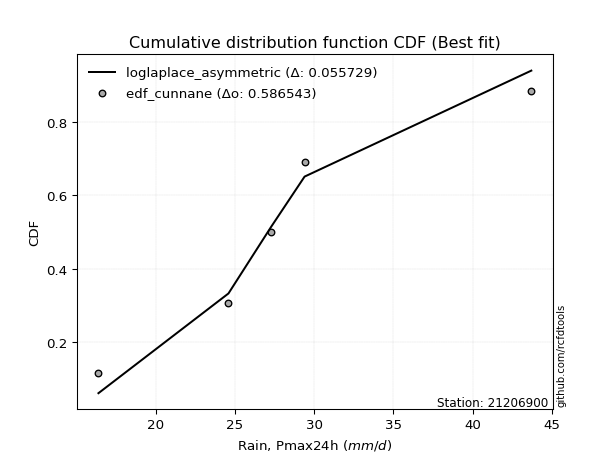</img></img>

</div>


### 12. Empirical - EDF Adamowski (1981)

The Adamowski formula in hydrology refers to a specific plotting position formula used for estimating the non-parametric empirical distribution of hydrological events (like flood peaks) to calculate their return periods. This formula provides an alternative to traditional parametric methods (like the Gumbel or Log Pearson Type III distributions). 

<div align="center">


$P=(m-0.25)/(n+0.5)$


</div>


**12.1. Empirical values**

<div align="center">

|                | 0                   | 1                  | 2                  | 3                  | 4                  | 5                  |
|:---------------|:--------------------|:-------------------|:-------------------|:-------------------|:-------------------|:-------------------|
| date           | 2015                | 2016               | 2011               | 2024               | 2025               | 2012               |
| x              | 16.4                | 24.6               | 27.3               | 29.4               | 31.2               | 43.7               |
| m              | 1                   | 2                  | 3                  | 4                  | 5                  | 6                  |
| empirical_dist | edf_adamowski       | edf_adamowski      | edf_adamowski      | edf_adamowski      | edf_adamowski      | edf_adamowski      |
| empirical      | 0.11538461538461539 | 0.2692307692307692 | 0.4230769230769231 | 0.5769230769230769 | 0.7307692307692307 | 0.8846153846153846 |
| empirical_tr   | 1.1304347826086958  | 1.3684210526315788 | 1.7333333333333334 | 2.3636363636363633 | 3.7142857142857135 | 8.666666666666664  |

</div>


**12.2. Kolmogorov-Smirnov fit test (sorted by Δ)**


<div align="center">

|                | 0                   | 1                  | 2                   | 3                  | 4                   | 5                     | 6                   | 7                   | 8                   | 9                   | 10                  | 11                 | 12                  | 13                | 14                  | 15                  | 16                  | 17                  | 18                  | 19                  | 20                  | 21                  | 22                  | 23                  | 24                  | 25                  | 26                 | 27                  | 28                  | 29                  | 30                  | 31                  | 32                  | 33                  | 34                  | 35                  | 36                  | 37                  | 38                  | 39                  | 40                 | 41                 | 42                  | 43                  | 44                 | 45                | 46                  | 47                  | 48                  | 49                  | 50                  | 51                  | 52                  | 53                  | 54                  | 55                  | 56                  | 57                  | 58                  | 59                 | 60                  | 61                  | 62                  | 63                  | 64                  | 65                  | 66                 | 67                 | 68                 | 69                 | 70                  | 71                  | 72                  | 73                  | 74                  | 75                 | 76                  | 77                  | 78                 | 79                  | 80                 | 81                 | 82                 | 83                  | 84                 | 85                  | 86                  | 87                 | 88                 | 89                 |
|:---------------|:--------------------|:-------------------|:--------------------|:-------------------|:--------------------|:----------------------|:--------------------|:--------------------|:--------------------|:--------------------|:--------------------|:-------------------|:--------------------|:------------------|:--------------------|:--------------------|:--------------------|:--------------------|:--------------------|:--------------------|:--------------------|:--------------------|:--------------------|:--------------------|:--------------------|:--------------------|:-------------------|:--------------------|:--------------------|:--------------------|:--------------------|:--------------------|:--------------------|:--------------------|:--------------------|:--------------------|:--------------------|:--------------------|:--------------------|:--------------------|:-------------------|:-------------------|:--------------------|:--------------------|:-------------------|:------------------|:--------------------|:--------------------|:--------------------|:--------------------|:--------------------|:--------------------|:--------------------|:--------------------|:--------------------|:--------------------|:--------------------|:--------------------|:--------------------|:-------------------|:--------------------|:--------------------|:--------------------|:--------------------|:--------------------|:--------------------|:-------------------|:-------------------|:-------------------|:-------------------|:--------------------|:--------------------|:--------------------|:--------------------|:--------------------|:-------------------|:--------------------|:--------------------|:-------------------|:--------------------|:-------------------|:-------------------|:-------------------|:--------------------|:-------------------|:--------------------|:--------------------|:-------------------|:-------------------|:-------------------|
| station        | 21206900            | 21206900           | 21206900            | 21206900           | 21206900            | 21206900              | 21206900            | 21206900            | 21206900            | 21206900            | 21206900            | 21206900           | 21206900            | 21206900          | 21206900            | 21206900            | 21206900            | 21206900            | 21206900            | 21206900            | 21206900            | 21206900            | 21206900            | 21206900            | 21206900            | 21206900            | 21206900           | 21206900            | 21206900            | 21206900            | 21206900            | 21206900            | 21206900            | 21206900            | 21206900            | 21206900            | 21206900            | 21206900            | 21206900            | 21206900            | 21206900           | 21206900           | 21206900            | 21206900            | 21206900           | 21206900          | 21206900            | 21206900            | 21206900            | 21206900            | 21206900            | 21206900            | 21206900            | 21206900            | 21206900            | 21206900            | 21206900            | 21206900            | 21206900            | 21206900           | 21206900            | 21206900            | 21206900            | 21206900            | 21206900            | 21206900            | 21206900           | 21206900           | 21206900           | 21206900           | 21206900            | 21206900            | 21206900            | 21206900            | 21206900            | 21206900           | 21206900            | 21206900            | 21206900           | 21206900            | 21206900           | 21206900           | 21206900           | 21206900            | 21206900           | 21206900            | 21206900            | 21206900           | 21206900           | 21206900           |
| empirical_dist | edf_adamowski       | edf_adamowski      | edf_adamowski       | edf_adamowski      | edf_adamowski       | edf_adamowski         | edf_adamowski       | edf_adamowski       | edf_adamowski       | edf_adamowski       | edf_adamowski       | edf_adamowski      | edf_adamowski       | edf_adamowski     | edf_adamowski       | edf_adamowski       | edf_adamowski       | edf_adamowski       | edf_adamowski       | edf_adamowski       | edf_adamowski       | edf_adamowski       | edf_adamowski       | edf_adamowski       | edf_adamowski       | edf_adamowski       | edf_adamowski      | edf_adamowski       | edf_adamowski       | edf_adamowski       | edf_adamowski       | edf_adamowski       | edf_adamowski       | edf_adamowski       | edf_adamowski       | edf_adamowski       | edf_adamowski       | edf_adamowski       | edf_adamowski       | edf_adamowski       | edf_adamowski      | edf_adamowski      | edf_adamowski       | edf_adamowski       | edf_adamowski      | edf_adamowski     | edf_adamowski       | edf_adamowski       | edf_adamowski       | edf_adamowski       | edf_adamowski       | edf_adamowski       | edf_adamowski       | edf_adamowski       | edf_adamowski       | edf_adamowski       | edf_adamowski       | edf_adamowski       | edf_adamowski       | edf_adamowski      | edf_adamowski       | edf_adamowski       | edf_adamowski       | edf_adamowski       | edf_adamowski       | edf_adamowski       | edf_adamowski      | edf_adamowski      | edf_adamowski      | edf_adamowski      | edf_adamowski       | edf_adamowski       | edf_adamowski       | edf_adamowski       | edf_adamowski       | edf_adamowski      | edf_adamowski       | edf_adamowski       | edf_adamowski      | edf_adamowski       | edf_adamowski      | edf_adamowski      | edf_adamowski      | edf_adamowski       | edf_adamowski      | edf_adamowski       | edf_adamowski       | edf_adamowski      | edf_adamowski      | edf_adamowski      |
| p_dist         | logjohnsonsu        | johnsonsu          | laplace_asymmetric  | logmielke          | fisk                | loglaplace_asymmetric | mielke              | loggenlogistic      | exponnorm           | genlogistic         | loglaplace          | loghypsecant       | invgauss            | loglogistic       | laplace             | logf                | betaprime           | logt                | logexponnorm        | logcrystalball      | lognorm             | lognorm             | logfatiguelife      | logfisk             | ncf                 | weibull_min         | f                  | chi2                | gamma               | erlang              | nct                 | rayleigh            | invgamma            | logpearson3         | alpha               | logweibull_min      | logloggamma         | loggamma            | loggamma            | invweibull          | logerlang          | hypsecant          | maxwell             | logbetaprime        | pearson3           | loginvgamma       | rice                | logrice             | logalpha            | gumbel_r            | logistic            | kstwobign           | lognct              | logmaxwell          | moyal               | loginvgauss         | loggumbel_l         | t                   | truncnorm           | crystalball        | norm                | loggompertz         | halfnorm            | halflogistic        | lograyleigh         | loggumbel_r         | loginvweibull      | loghalfnorm        | logmoyal           | wald               | loghalflogistic     | gibrat              | gumbel_l            | logkstwobign        | logncf              | loggenexpon        | logchi2             | expon               | genexpon           | logwald             | loggibrat          | logtruncnorm       | nakagami           | logexpon            | lognakagami        | loglognorm          | pareto              | logpareto          | fatiguelife        | gompertz           |
| delta          | 0.06292130908369231 | 0.0664897627966945 | 0.06779827794684756 | 0.0687608887073552 | 0.06892078723315795 | 0.06907640364574585   | 0.06922215987034319 | 0.06922532233814671 | 0.07079462847983745 | 0.07447594550381065 | 0.07486787528721665 | 0.0763754084242979 | 0.07680585859981526 | 0.077072004430677 | 0.07752846834821991 | 0.07786108379547207 | 0.07809036909937755 | 0.07820177749576573 | 0.07820254711729274 | 0.07820321442850564 | 0.07820328936059734 | 0.07820328936059734 | 0.07847865751983002 | 0.07880988803564862 | 0.07968262585651575 | 0.08091462514295139 | 0.0810704813380333 | 0.08108827515423678 | 0.08108829903181547 | 0.08108854379799246 | 0.08109070320996048 | 0.08133132375803726 | 0.08248709334568693 | 0.08270745467275842 | 0.08274921788738954 | 0.08345321757469149 | 0.08529449984821191 | 0.08551192993926876 | 0.08551192993926876 | 0.08640050346477374 | 0.0869361758014297 | 0.0872169386337347 | 0.08888680081087752 | 0.08890192962622312 | 0.0898242846116849 | 0.089853044316143 | 0.09024275097535506 | 0.09190228061397437 | 0.09208840187326467 | 0.09514803329162375 | 0.09910651881872123 | 0.10043660499354673 | 0.10580684352335196 | 0.10998033763491899 | 0.11085704053971955 | 0.11256424284103822 | 0.11312218522345929 | 0.11385764768170847 | 0.11386391820978281 | 0.1138639865860912 | 0.11386399113949686 | 0.11538460192469943 | 0.11538461538461539 | 0.11538461538461539 | 0.12201389746591357 | 0.13210217987948164 | 0.1466988542358753 | 0.1562487525959022 | 0.1579814397401889 | 0.1627559418586067 | 0.16391080045103018 | 0.16872852672210675 | 0.17025519237691777 | 0.17115847929504152 | 0.17422424371322653 | 0.1751480525417784 | 0.21438822198592578 | 0.21550362725264788 | 0.2155086793867948 | 0.23000823525561492 | 0.2508634612139305 | 0.2692303067687553 | 0.2692307283422774 | 0.27201664283336074 | 0.3297689948037568 | 0.39253488775435647 | 0.39688838542554533 | 0.4049570094875858 | 0.5663838726116719 | 0.6550911384568682 |
| deltao         | 0.530385761606      | 0.530385761606     | 0.530385761606      | 0.530385761606     | 0.530385761606      | 0.530385761606        | 0.530385761606      | 0.530385761606      | 0.530385761606      | 0.530385761606      | 0.530385761606      | 0.530385761606     | 0.530385761606      | 0.530385761606    | 0.530385761606      | 0.530385761606      | 0.530385761606      | 0.530385761606      | 0.530385761606      | 0.530385761606      | 0.530385761606      | 0.530385761606      | 0.530385761606      | 0.530385761606      | 0.530385761606      | 0.530385761606      | 0.530385761606     | 0.530385761606      | 0.530385761606      | 0.530385761606      | 0.530385761606      | 0.530385761606      | 0.530385761606      | 0.530385761606      | 0.530385761606      | 0.530385761606      | 0.530385761606      | 0.530385761606      | 0.530385761606      | 0.530385761606      | 0.530385761606     | 0.530385761606     | 0.530385761606      | 0.530385761606      | 0.530385761606     | 0.530385761606    | 0.530385761606      | 0.530385761606      | 0.530385761606      | 0.530385761606      | 0.530385761606      | 0.530385761606      | 0.530385761606      | 0.530385761606      | 0.530385761606      | 0.530385761606      | 0.530385761606      | 0.530385761606      | 0.530385761606      | 0.530385761606     | 0.530385761606      | 0.530385761606      | 0.530385761606      | 0.530385761606      | 0.530385761606      | 0.530385761606      | 0.530385761606     | 0.530385761606     | 0.530385761606     | 0.530385761606     | 0.530385761606      | 0.530385761606      | 0.530385761606      | 0.530385761606      | 0.530385761606      | 0.530385761606     | 0.530385761606      | 0.530385761606      | 0.530385761606     | 0.530385761606      | 0.530385761606     | 0.530385761606     | 0.530385761606     | 0.530385761606      | 0.530385761606     | 0.530385761606      | 0.530385761606      | 0.530385761606     | 0.530385761606     | 0.530385761606     |
| eval           | Δo > Δ              | Δo > Δ             | Δo > Δ              | Δo > Δ             | Δo > Δ              | Δo > Δ                | Δo > Δ              | Δo > Δ              | Δo > Δ              | Δo > Δ              | Δo > Δ              | Δo > Δ             | Δo > Δ              | Δo > Δ            | Δo > Δ              | Δo > Δ              | Δo > Δ              | Δo > Δ              | Δo > Δ              | Δo > Δ              | Δo > Δ              | Δo > Δ              | Δo > Δ              | Δo > Δ              | Δo > Δ              | Δo > Δ              | Δo > Δ             | Δo > Δ              | Δo > Δ              | Δo > Δ              | Δo > Δ              | Δo > Δ              | Δo > Δ              | Δo > Δ              | Δo > Δ              | Δo > Δ              | Δo > Δ              | Δo > Δ              | Δo > Δ              | Δo > Δ              | Δo > Δ             | Δo > Δ             | Δo > Δ              | Δo > Δ              | Δo > Δ             | Δo > Δ            | Δo > Δ              | Δo > Δ              | Δo > Δ              | Δo > Δ              | Δo > Δ              | Δo > Δ              | Δo > Δ              | Δo > Δ              | Δo > Δ              | Δo > Δ              | Δo > Δ              | Δo > Δ              | Δo > Δ              | Δo > Δ             | Δo > Δ              | Δo > Δ              | Δo > Δ              | Δo > Δ              | Δo > Δ              | Δo > Δ              | Δo > Δ             | Δo > Δ             | Δo > Δ             | Δo > Δ             | Δo > Δ              | Δo > Δ              | Δo > Δ              | Δo > Δ              | Δo > Δ              | Δo > Δ             | Δo > Δ              | Δo > Δ              | Δo > Δ             | Δo > Δ              | Δo > Δ             | Δo > Δ             | Δo > Δ             | Δo > Δ              | Δo > Δ             | Δo > Δ              | Δo > Δ              | Δo > Δ             | Δo <= Δ            | Δo <= Δ            |
| fit            | 1                   | 1                  | 1                   | 1                  | 1                   | 1                     | 1                   | 1                   | 1                   | 1                   | 1                   | 1                  | 1                   | 1                 | 1                   | 1                   | 1                   | 1                   | 1                   | 1                   | 1                   | 1                   | 1                   | 1                   | 1                   | 1                   | 1                  | 1                   | 1                   | 1                   | 1                   | 1                   | 1                   | 1                   | 1                   | 1                   | 1                   | 1                   | 1                   | 1                   | 1                  | 1                  | 1                   | 1                   | 1                  | 1                 | 1                   | 1                   | 1                   | 1                   | 1                   | 1                   | 1                   | 1                   | 1                   | 1                   | 1                   | 1                   | 1                   | 1                  | 1                   | 1                   | 1                   | 1                   | 1                   | 1                   | 1                  | 1                  | 1                  | 1                  | 1                   | 1                   | 1                   | 1                   | 1                   | 1                  | 1                   | 1                   | 1                  | 1                   | 1                  | 1                  | 1                  | 1                   | 1                  | 1                   | 1                   | 1                  | 0                  | 0                  |
| n              | 6                   | 6                  | 6                   | 6                  | 6                   | 6                     | 6                   | 6                   | 6                   | 6                   | 6                   | 6                  | 6                   | 6                 | 6                   | 6                   | 6                   | 6                   | 6                   | 6                   | 6                   | 6                   | 6                   | 6                   | 6                   | 6                   | 6                  | 6                   | 6                   | 6                   | 6                   | 6                   | 6                   | 6                   | 6                   | 6                   | 6                   | 6                   | 6                   | 6                   | 6                  | 6                  | 6                   | 6                   | 6                  | 6                 | 6                   | 6                   | 6                   | 6                   | 6                   | 6                   | 6                   | 6                   | 6                   | 6                   | 6                   | 6                   | 6                   | 6                  | 6                   | 6                   | 6                   | 6                   | 6                   | 6                   | 6                  | 6                  | 6                  | 6                  | 6                   | 6                   | 6                   | 6                   | 6                   | 6                  | 6                   | 6                   | 6                  | 6                   | 6                  | 6                  | 6                  | 6                   | 6                  | 6                   | 6                   | 6                  | 6                  | 6                  |
| best_fit       | 1                   | 0                  | 0                   | 0                  | 0                   | 0                     | 0                   | 0                   | 0                   | 0                   | 0                   | 0                  | 0                   | 0                 | 0                   | 0                   | 0                   | 0                   | 0                   | 0                   | 0                   | 0                   | 0                   | 0                   | 0                   | 0                   | 0                  | 0                   | 0                   | 0                   | 0                   | 0                   | 0                   | 0                   | 0                   | 0                   | 0                   | 0                   | 0                   | 0                   | 0                  | 0                  | 0                   | 0                   | 0                  | 0                 | 0                   | 0                   | 0                   | 0                   | 0                   | 0                   | 0                   | 0                   | 0                   | 0                   | 0                   | 0                   | 0                   | 0                  | 0                   | 0                   | 0                   | 0                   | 0                   | 0                   | 0                  | 0                  | 0                  | 0                  | 0                   | 0                   | 0                   | 0                   | 0                   | 0                  | 0                   | 0                   | 0                  | 0                   | 0                  | 0                  | 0                  | 0                   | 0                  | 0                   | 0                   | 0                  | 0                  | 0                  |
| best_fit_sort  | 1                   | 2                  | 3                   | 4                  | 5                   | 6                     | 7                   | 8                   | 9                   | 10                  | 11                  | 12                 | 13                  | 14                | 15                  | 16                  | 17                  | 18                  | 19                  | 20                  | 21                  | 22                  | 23                  | 24                  | 25                  | 26                  | 27                 | 28                  | 29                  | 30                  | 31                  | 32                  | 33                  | 34                  | 35                  | 36                  | 37                  | 38                  | 39                  | 40                  | 41                 | 42                 | 43                  | 44                  | 45                 | 46                | 47                  | 48                  | 49                  | 50                  | 51                  | 52                  | 53                  | 54                  | 55                  | 56                  | 57                  | 58                  | 59                  | 60                 | 61                  | 62                  | 63                  | 64                  | 65                  | 66                  | 67                 | 68                 | 69                 | 70                 | 71                  | 72                  | 73                  | 74                  | 75                  | 76                 | 77                  | 78                  | 79                 | 80                  | 81                 | 82                 | 83                 | 84                  | 85                 | 86                  | 87                  | 88                 | 89                 | 90                 |

</div>


<div align="center">

</img>

</div>


**12.3. Best fit**

<div align="center">

|   id |   station | empirical_dist   | p_dist       |     delta |   deltao | eval   |   fit |   n |   best_fit |   best_fit_sort |
|-----:|----------:|:-----------------|:-------------|----------:|---------:|:-------|------:|----:|-----------:|----------------:|
|    0 |  21206900 | edf_adamowski    | logjohnsonsu | 0.0629213 | 0.530386 | Δo > Δ |     1 |   6 |          1 |               1 |

</div>


<div align="center">

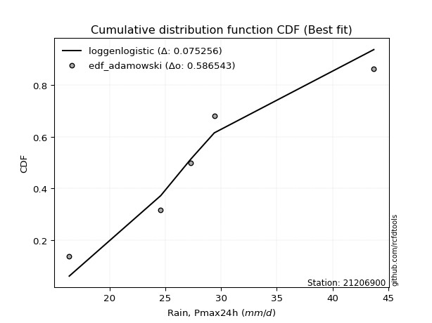</img>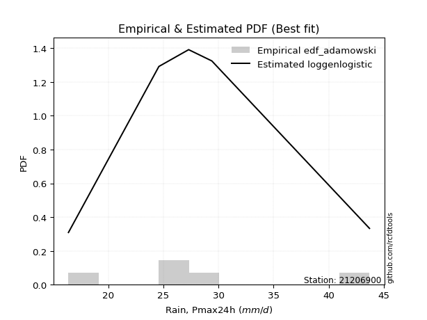</img>

</div>


## C. Best fit & Estimate extreme values for specific return periods - Tr


### 1. Best fit (ordered by delta Δ)

<div align="center">

|   id |   station | empirical_dist   | p_dist       |     delta |   deltao | eval   |   fit |   n |   best_fit |   best_fit_sort |
|-----:|----------:|:-----------------|:-------------|----------:|---------:|:-------|------:|----:|-----------:|----------------:|
|    0 |  21206900 | edf_gringorten   | logjohnsonsu | 0.03904   | 0.530386 | Δo > Δ |     1 |   6 |          1 |               1 |
|    1 |  21206900 | edf_hazen        | logjohnsonsu | 0.039176  | 0.530386 | Δo > Δ |     1 |   6 |          1 |               2 |
|    2 |  21206900 | edf_cunnane      | logjohnsonsu | 0.0443109 | 0.530386 | Δo > Δ |     1 |   6 |          1 |               3 |
|    3 |  21206900 | edf_blom         | logjohnsonsu | 0.0475367 | 0.530386 | Δo > Δ |     1 |   6 |          1 |               4 |
|    4 |  21206900 | edf_tukey        | logjohnsonsu | 0.0527999 | 0.530386 | Δo > Δ |     1 |   6 |          1 |               5 |
|    5 |  21206900 | edf_filliben     | logjohnsonsu | 0.0547637 | 0.530386 | Δo > Δ |     1 |   6 |          1 |               6 |
|    6 |  21206900 | edf_beard        | logjohnsonsu | 0.0556872 | 0.530386 | Δo > Δ |     1 |   6 |          1 |               7 |
|    7 |  21206900 | edf_jenkinson    | logjohnsonsu | 0.0556872 | 0.530386 | Δo > Δ |     1 |   6 |          1 |               8 |
|    8 |  21206900 | edf_chegodayev   | logjohnsonsu | 0.0569117 | 0.530386 | Δo > Δ |     1 |   6 |          1 |               9 |
|    9 |  21206900 | edf_adamowski    | logjohnsonsu | 0.0629213 | 0.530386 | Δo > Δ |     1 |   6 |          1 |              10 |
|   10 |  21206900 | edf_weibull      | logjohnsonsu | 0.0903938 | 0.530386 | Δo > Δ |     1 |   6 |          1 |              11 |
|   11 |  21206900 | edf_california   | logjohnsonsu | 0.122509  | 0.530386 | Δo > Δ |     1 |   6 |          1 |              12 |

</div>

:file_folder:Tables: [bestfit_21206900.csv](table/bestfit_21206900.csv) | [extreme_21206900.csv](table/extreme_21206900.csv)


### 2. Extreme values

In hydrology, a return period (or recurrence interval $Tr$) is the statistical average time between extreme events like floods or droughts of a specific magnitude, indicating how rare an event is, with a 100-year flood, for example, having a 1% chance of occurring in any given year, not that it happens exactly every century. It is a key tool for infrastructure design (like bridges or dams) and risk assessment, calculated from historical data to determine the probability of future events, although it is important to remember it is statistical average, and events can cluster or be missed.

> risk_rate: assuming the return period as the project useful life.

|   id |      tr |   prob_l |     prob_g |   alpha |   betaprime |    chi2 |   crystalball |   erlang |    expon |   exponnorm |       f |   fatiguelife |    fisk |   gamma |   genexpon |   genlogistic |   gibrat |   gompertz |   gumbel_l |   gumbel_r |   halflogistic |   halfnorm |   hypsecant |   invgamma |   invgauss |   invweibull |   johnsonsu |   kstwobign |   laplace |   laplace_asymmetric |   loggamma |   logistic |   lognorm |   maxwell |   mielke |   moyal |   nakagami |     ncf |     nct |    norm |           pareto |   pearson3 |   rayleigh |    rice |       t |   truncnorm |    wald |   weibull_min |   logalpha |   logbetaprime |     logchi2 |   logcrystalball |   logerlang |   logexpon |   logexponnorm |    logf |   logfatiguelife |   logfisk |   loggenexpon |   loggenlogistic |   loggibrat |   loggompertz |   loggumbel_l |   loggumbel_r |   loghalflogistic |   loghalfnorm |   loghypsecant |   loginvgamma |   loginvgauss |   loginvweibull |   logjohnsonsu |   logkstwobign |   loglaplace |   loglaplace_asymmetric |   logloggamma |   loglogistic |    loglognorm |   logmaxwell |   logmielke |   logmoyal |   lognakagami |   logncf |   lognct |      logpareto |   logpearson3 |   lograyleigh |   logrice |    logt |   logtruncnorm |   logwald |   logweibull_min |   station |   n |   risk_rate |
|-----:|--------:|---------:|-----------:|--------:|------------:|--------:|--------------:|---------:|---------:|------------:|--------:|--------------:|--------:|--------:|-----------:|--------------:|---------:|-----------:|-----------:|-----------:|---------------:|-----------:|------------:|-----------:|-----------:|-------------:|------------:|------------:|----------:|---------------------:|-----------:|-----------:|----------:|----------:|---------:|--------:|-----------:|--------:|--------:|--------:|-----------------:|-----------:|-----------:|--------:|--------:|------------:|--------:|--------------:|-----------:|---------------:|------------:|-----------------:|------------:|-----------:|---------------:|--------:|-----------------:|----------:|--------------:|-----------------:|------------:|--------------:|--------------:|--------------:|------------------:|--------------:|---------------:|--------------:|--------------:|----------------:|---------------:|---------------:|-------------:|------------------------:|--------------:|--------------:|--------------:|-------------:|------------:|-----------:|--------------:|---------:|---------:|---------------:|--------------:|--------------:|----------:|--------:|---------------:|----------:|-----------------:|----------:|----:|------------:|
|    0 |    2    | 0.5      | 0.5        | 28.0675 |     27.595  | 27.959  |       28.7667 |  27.959  |  24.9719 |     27.8905 | 27.9589 |       16.4    | 28.0595 | 27.959  |    24.9718 |       28.0411 |  26.3104 |    37.6501 |    30.111  |    27.4223 |        26.754  |    27.0916 |     28.7667 |    28.0476 |    27.8744 |      27.468  |     28.1766 |     27.2917 |   28.7667 |              28.077  |    27.4626 |    28.7667 |   27.5944 |   28.0668 |  28.0671 | 26.9883 |    27.7969 | 27.9502 | 28.0749 | 28.7667 |     17.4955      |    28.1965 |    27.8186 | 28.0613 | 28.7666 |     28.7667 | 26.114  |       27.7274 |    27.292  |        27.4342 |     26.4282 |          27.5944 |     27.4205 |    23.5223 |        27.5944 | 27.6091 |          27.581  |   27.9203 |       25.8035 |          28.0669 |     25.272  |       27.6858 |       28.9544 |       26.2983 |           25.6767 |       25.9891 |        27.5944 |       27.3541 |       26.8992 |         26.3496 |        28.1697 |        25.8874 |      27.5944 |                 28.4183 |       28.0711 |       27.5944 |  16.4295      |      26.9119 |     28.0263 |    25.893  |       24.6883 |  27.3192 |  27.0137 |   17.2055      |       27.9821 |       26.6739 |   27.3497 | 27.5945 |        28.9642 |   25.0952 |          27.9716 |  21206900 |   6 |    0.75     |
|    1 |    2.33 | 0.570815 | 0.429185   | 29.5127 |     29.0611 | 29.4332 |       30.2269 |  29.4332 |  26.8606 |     29.2569 | 29.4329 |       16.6738 | 29.3613 | 29.4332 |    26.8604 |       29.408  |  27.0501 |    38.2643 |    31.3815 |    28.7754 |        28.1452 |    28.6676 |     29.9353 |    29.4986 |    29.3389 |      28.9893 |     29.162  |     28.8745 |   29.6504 |              29.0914 |    28.9639 |    30.0533 |   29.0747 |   29.5839 |  29.3546 | 28.2692 |    28.8766 | 29.4122 | 29.4988 | 30.2269 |     18.7617      |    29.6625 |    29.3581 | 29.5976 | 30.2268 |     30.2269 | 27.0716 |       29.2808 |    28.7831 |        28.98   |     31.4385 |          29.0747 |     28.9149 |    25.4678 |        29.0747 | 29.0947 |          29.059  |   29.2459 |       27.5022 |          29.3545 |     25.95   |       29.2876 |       30.3011 |       27.603  |           26.9874 |       27.4968 |        28.7729 |       28.8516 |       28.4088 |         28.0312 |        29.0843 |        27.608  |      28.481  |                 29.3449 |       29.5432 |       28.8946 |  16.7019      |      28.4133 |     29.3139 |    27.1075 |       24.8635 |  31.2306 |  28.5219 |   18.1868      |       29.464  |       28.1847 |   28.8636 | 29.0748 |        29.9217 |   25.9701 |          29.4683 |  21206900 |   6 |    0.729209 |
|    2 |    5    | 0.8      | 0.2        | 35.3026 |     35.1517 | 35.3748 |       35.6537 |  35.3748 |  36.3034 |     34.9114 | 35.3739 |       22.49   | 34.7666 | 35.3748 |    36.3031 |       35.0313 |  31.3088 |    40.2577 |    35.4858 |    34.6539 |        34.4401 |    35.3324 |     34.6231 |    35.3186 |    35.2806 |      35.5986 |     33.6464 |     35.5977 |   34.0686 |              34.1633 |    35.3987 |    35.021  |   35.3065 |   35.5552 |  34.6202 | 34.2024 |    34.2509 | 35.3317 | 35.2243 | 35.6537 |    118.486       |    35.4349 |    35.5217 | 35.6112 | 35.6535 |     35.6537 | 32.4318 |       35.5275 |    35.2861 |        35.7995 |     87.7589 |          35.3065 |     35.3263 |    37.8913 |        35.3065 | 35.3587 |          35.2928 |   34.9823 |       35.6647 |          34.6197 |     30.2228 |       35.6299 |       35.095  |       34.0657 |           33.8061 |       34.9022 |        34.0281 |       35.3459 |       35.1757 |         36.6746 |        33.2059 |        36.2867 |      33.3595 |                 33.6393 |       35.405  |       34.5161 |   5.44429e+44 |      35.1823 |     34.5617 |    33.5196 |       29.2298 |  52.538  |  35.3544 | 1447.9         |       35.419  |       35.1401 |   35.3558 | 35.3068 |        34.4466 |   31.4619 |          35.4429 |  21206900 |   6 |    0.67232  |
|    3 |   10    | 0.9      | 0.1        | 39.5527 |     39.822  | 39.7307 |       39.2537 |  39.7307 |  44.8753 |     39.4264 | 39.7291 |       30.5208 | 39.1628 | 39.7307 |    44.8749 |       39.4091 |  36.1633 |    41.3718 |    37.7708 |    39.4419 |        39.6678 |    40.2642 |     38.3663 |    39.5885 |    39.6843 |      40.9817 |     38.1353 |     40.7165 |   38.0793 |              38.7673 |    40.538  |    38.6796 |   40.1609 |   39.7575 |  38.8842 | 39.3681 |    38.6355 | 39.7184 | 39.4769 | 39.2537 |   3091.95        |    39.552  |    39.9164 | 39.7829 | 39.2534 |     39.2537 | 38.1202 |       40.0034 |    40.6131 |        41.4702 |    254.296  |          40.1609 |     40.4541 |    54.3469 |        40.1609 | 40.2486 |          40.1619 |   39.9148 |       43.0388 |          38.8836 |     35.9577 |       40.0257 |       38.0854 |       40.4323 |           40.7608 |       41.6384 |        38.9057 |       40.6212 |       40.9271 |         45.6493 |        37.7723 |        44.6819 |      38.5082 |                 38.079  |       39.6343 |       39.3442 | inf           |      40.8915 |     38.8407 |    40.3258 |       39.5907 |  75.7512 |  41.2659 |    9.18379e+59 |       39.7568 |       41.1248 |   40.5146 | 40.1613 |        37.8323 |   38.5655 |          39.7419 |  21206900 |   6 |    0.651322 |
|    4 |   15    | 0.933333 | 0.0666667  | 41.8117 |     42.3655 | 42.0314 |       41.0501 |  42.0314 |  49.8896 |     41.9991 | 42.0294 |       35.773  | 41.7189 | 42.0314 |    49.8891 |       41.8411 |  39.5117 |    41.8769 |    38.8057 |    42.1432 |        42.6262 |    42.8307 |     40.5026 |    41.8537 |    42.0283 |      44.0188 |     41.1537 |     43.434  |   40.4255 |              41.4605 |    43.4074 |    40.6729 |   42.8275 |   41.9136 |  41.3823 | 42.3661 |    40.9687 | 42.0574 | 41.7622 | 41.0501 |  22557.2         |    41.6942 |    42.1808 | 41.901  | 41.0499 |     41.0501 | 41.773  |       42.3156 |    43.6398 |        44.722  |    490.095  |          42.8275 |     43.3197 |    67.1121 |        42.8276 | 42.9385 |          42.8415 |   42.8889 |       47.4388 |          41.3817 |     40.5358 |       42.2435 |       39.5222 |       44.536  |           45.3128 |       45.6433 |        41.9966 |       43.6007 |       44.2726 |         51.6501 |        41.2511 |        49.9016 |      41.8808 |                 40.9429 |       41.8465 |       42.2533 | inf           |      44.1715 |     41.3806 |    44.8926 |       48.3414 |  91.5244 |  44.7525 |  inf           |       42.035  |       44.5959 |   43.3787 | 42.828  |        39.3776 |   43.9516 |          41.9822 |  21206900 |   6 |    0.644736 |
|    5 |   20    | 0.95     | 0.05       | 43.3448 |     44.1143 | 43.5845 |       42.2266 |  43.5846 |  53.4472 |     43.8158 | 43.5823 |       39.6617 | 43.5555 | 43.5846 |    53.4467 |       43.5343 |  42.1382 |    42.1916 |    39.4499 |    44.0346 |        44.6989 |    44.5418 |     42.0097 |    43.3888 |    43.618  |      46.1453 |     43.509  |     45.2646 |   42.0901 |              43.3714 |    45.4079 |    42.0506 |   44.6691 |   43.3445 |  43.1908 | 44.4893 |    42.5335 | 43.6463 | 43.3247 | 42.2266 |  92641.2         |    43.129  |    43.6858 | 43.2986 | 42.2263 |     42.2266 | 44.4951 |       43.8544 |    45.7721 |        47.0252 |    789.199  |          44.6691 |     45.3187 |    77.949  |        44.6691 | 44.7976 |          44.6939 |   45.0731 |       50.6167 |          43.1903 |     44.5313 |       43.7    |       40.4439 |       47.6547 |           48.8017 |       48.5253 |        44.3236 |       45.6922 |       46.6619 |         56.3154 |        44.2331 |        53.7573 |      44.4514 |                 43.1046 |       43.3319 |       44.3887 | inf           |      46.4923 |     43.2392 |    48.4365 |       55.7012 | 103.847  |  47.265  |  inf           |       43.5673 |       47.0637 |   45.3677 | 44.6696 |        40.273  |   48.4489 |          43.4828 |  21206900 |   6 |    0.641514 |
|    6 |   25    | 0.96     | 0.04       | 44.5019 |     45.4456 | 44.7516 |       43.0926 |  44.7516 |  56.2068 |     45.223  | 44.7491 |       42.7514 | 45.0005 | 44.7516 |    56.2062 |       44.8345 |  44.3278 |    42.4155 |    39.9082 |    45.4914 |        46.2959 |    45.8149 |     43.176  |    44.5458 |    44.8165 |      47.7833 |     45.4701 |     46.6358 |   43.3813 |              44.8535 |    46.9456 |    43.1046 |   46.0751 |   44.4069 |  44.6226 | 46.135  |    43.7006 | 44.8458 | 44.5105 | 43.0926 | 277217           |    44.2015 |    44.8041 | 44.332  | 43.0923 |     43.0926 | 46.6755 |       44.9988 |    47.4237 |        48.8156 |   1147.96   |          46.0751 |     46.8559 |    87.5459 |        46.0751 | 46.2178 |          46.1093 |   46.8188 |       53.1182 |          44.6223 |     48.1617 |       44.7731 |       41.1128 |       50.2051 |           51.6719 |       50.787  |        46.2128 |       47.3079 |       48.5304 |         60.1942 |        46.912  |        56.8393 |      46.5535 |                 44.8596 |       44.4439 |       46.0949 | inf           |      48.2938 |     44.7238 |    51.3747 |       62.0673 | 114.109  |  49.243  |  inf           |       44.7153 |       48.9852 |   46.8922 | 46.0756 |        40.8593 |   52.3809 |          44.6043 |  21206900 |   6 |    0.639603 |
|    7 |   50    | 0.98     | 0.02       | 47.9569 |     49.4759 | 48.2058 |       45.5726 |  48.2058 |  64.7787 |     49.591  | 48.2026 |       52.6645 | 49.6395 | 48.2059 |    64.778  |       48.8254 |  52.0464 |    43.0237 |    41.1525 |    49.9794 |        51.2163 |    49.5154 |     46.7921 |    47.9913 |    48.3836 |      52.8291 |     52.3915 |     50.6623 |   47.392  |              49.4576 |    51.6762 |    46.3248 |   50.351  |   47.4878 |  49.2787 | 51.244  |    47.0991 | 48.4264 | 48.0867 | 45.5726 |      8.34825e+06 |    47.3496 |    48.0501 | 47.31   | 45.5723 |     45.5726 | 53.7943 |       48.3251 |    52.5726 |        54.432  |   3763.27   |          50.351  |     51.5881 |   125.566  |        50.3511 | 50.5412 |          50.4195 |   52.5825 |       61.1181 |          49.2796 |     63.486  |       47.8462 |       42.9848 |       58.9517 |           61.6207 |       57.9773 |        52.597  |       52.3213 |       54.4519 |         73.9038 |        57.9963 |        66.949  |      53.7384 |                 50.7801 |       47.7148 |       51.7248 | inf           |      53.923  |     49.6381 |    61.6808 |       85.6081 | 150.359  |  55.5895 |  inf           |       48.0956 |       55.019  |   51.557  | 50.3517 |        42.1662 |   67.5802 |          47.8936 |  21206900 |   6 |    0.63583  |
|    8 |   75    | 0.986667 | 0.0133333  | 49.9024 |     51.7797 | 50.1285 |       46.9033 |  50.1285 |  69.7929 |     52.1457 | 50.1249 |       58.6346 | 52.4801 | 50.1286 |    69.7922 |       51.1386 |  57.2595 |    43.3314 |    41.7818 |    52.5879 |        54.0766 |    51.5298 |     48.9053 |    49.9245 |    50.382  |      55.762  |     57.0846 |     52.8777 |   49.7381 |              52.1508 |    54.4293 |    48.1847 |   52.8067 |   49.1629 |  52.1768 | 54.2316 |    48.9495 | 50.4404 | 50.1254 | 46.9033 |      6.11839e+07 |    49.0862 |    49.8161 | 48.9178 | 46.9029 |     46.9033 | 58.1749 |       50.1374 |    55.6165 |        57.7756 |   7637.12   |          52.8067 |     54.3443 |   155.059  |        52.8067 | 53.0268 |          52.8985 |   56.2293 |       65.9745 |          52.1787 |     76.5086 |       49.4925 |       43.9636 |       64.7197 |           68.2621 |       62.3106 |        56.7288 |       55.2687 |       58.0187 |         83.2649 |        67.2071 |        73.259  |      58.445  |                 54.5993 |       49.5228 |       55.2846 | inf           |      57.2542 |     52.768  |    68.6407 |      102.156  | 175.005  |  59.4702 |  inf           |       49.9647 |       58.6081 |   54.2543 | 52.8074 |        42.6488 |   79.0508 |          49.7058 |  21206900 |   6 |    0.634587 |
|    9 |  100    | 0.99     | 0.01       | 51.2568 |     53.397  | 51.4566 |       47.8033 |  51.4566 |  73.3506 |     53.9583 | 51.4526 |       62.9303 | 54.5603 | 51.4567 |    73.3498 |       52.774  |  61.2979 |    43.5327 |    42.1933 |    54.4342 |        56.101  |    52.9021 |     50.4043 |    51.2671 |    51.7678 |      57.8377 |     60.7324 |     54.3955 |   51.4028 |              54.0616 |    56.3829 |    49.4978 |   54.5351 |   50.3039 |  54.3222 | 56.3512 |    50.2093 | 51.8409 | 51.5557 | 47.8033 |      2.51417e+08 |    50.2796 |    51.0192 | 50.0087 | 47.8029 |     47.8033 | 61.3688 |       51.373  |    57.7975 |        60.1812 |  12679.1    |          54.5352 |     56.3011 |   180.097  |        54.5352 | 54.7776 |          54.645  |   58.9553 |       69.5055 |          54.3251 |     88.4062 |       50.6043 |       44.6159 |       69.1401 |           73.391  |       65.4467 |        59.855  |       57.3731 |       60.6035 |         90.5985 |        75.4967 |        77.9223 |      62.0322 |                 57.482  |       50.7666 |       57.9444 | inf           |      59.6402 |     55.1216 |    74.0497 |      115.223  | 194.222  |  62.3099 |  inf           |       51.2503 |       61.1865 |   56.1603 | 54.5359 |        42.9003 |   88.6233 |          50.9501 |  21206900 |   6 |    0.633968 |
|   10 |  200    | 0.995    | 0.005      | 54.4509 |     57.2527 | 54.5526 |       49.8448 |  54.5526 |  81.9225 |     58.3254 | 54.5479 |       73.4454 | 59.8149 | 54.5526 |    81.9216 |       56.702  |  72.2848 |    43.9703 |    43.0879 |    58.8727 |        60.968  |    56.0406 |     54.0156 |    54.4214 |    55.0153 |      62.828  |     70.7118 |     57.8915 |   55.4135 |              58.6657 |    61.1065 |    52.6477 |   58.6684 |   52.9142 |  59.8286 | 61.458  |    53.0869 | 55.1366 | 54.9661 | 49.8448 |      7.57172e+09 |    53.0434 |    53.772  | 52.4923 | 49.8444 |     49.8448 | 69.3244 |       54.2034 |    63.1432 |        66.111  |  43595.6    |          58.6684 |     61.0357 |   258.31   |        58.6685 | 58.9681 |          58.8269 |   66.0455 |       78.3223 |          59.8349 |    130.998  |       53.1189 |       46.0673 |       81.0421 |           87.3542 |       73.2253 |        68.1121 |       62.506  |       67.0378 |        110.982  |       104.478  |        89.8236 |      71.6061 |                 65.0684 |       53.6503 |       64.8582 | inf           |      65.4798 |     61.3091 |    88.8976 |      151.575  | 247.147  |  69.4798 |  inf           |       54.2288 |       67.521  |   60.7418 | 58.6694 |        43.2913 |  117.815  |          53.828  |  21206900 |   6 |    0.633042 |
|   11 |  250    | 0.996    | 0.004      | 55.4624 |     58.4851 | 55.522  |       50.4687 |  55.522  |  84.6821 |     59.7314 | 55.517  |       76.8723 | 61.5845 | 55.522  |    84.6811 |       57.964  |  76.227  |    44.0991 |    43.3511 |    60.2996 |        62.5327 |    57.0062 |     55.1781 |    55.4166 |    56.037  |      64.4323 |     74.311  |     58.9734 |   56.7047 |              60.1479 |    62.6356 |    53.6589 |   59.993  |   53.7177 |  61.7107 | 63.102  |    53.9708 | 56.1779 | 56.0572 | 50.4687 |      2.26601e+10 |    53.9039 |    54.6194 | 53.2535 | 50.4683 |     50.4687 | 71.9563 |       55.0754 |    64.8956 |        68.0645 |  65108.4    |          59.993  |     62.5693 |   290.113  |        59.9931 | 60.3122 |          60.1686 |   68.4979 |       81.2578 |          61.7184 |    150.848  |       53.8851 |       46.5033 |       85.2879 |           92.385  |       75.7995 |        71.0054 |       64.1809 |       69.1767 |        118.464  |       117.716  |        93.8629 |      74.9923 |                 67.7177 |       54.5488 |       67.2483 | inf           |      67.39   |     63.4733 |    94.2844 |      164.841  | 266.383  |  71.8951 |  inf           |       55.1559 |       69.5999 |   62.2168 | 59.994  |        43.3716 |  129.452  |          54.7229 |  21206900 |   6 |    0.632858 |
|   12 |  500    | 0.998    | 0.002      | 58.5657 |     62.2978 | 58.4611 |       52.3188 |  58.4611 |  93.254  |     64.0986 | 58.4554 |       87.6224 | 67.3426 | 58.4611 |    93.2529 |       61.8796 |  89.8509 |    44.4684 |    44.1056 |    64.7285 |        67.3891 |    59.885  |     58.7891 |    58.4576 |    59.1488 |      69.4117 |     86.8186 |     62.2158 |   60.7154 |              64.7519 |    67.4228 |    56.7951 |   64.0994 |   56.1155 |  67.9296 | 68.2087 |    56.6021 | 59.3632 | 59.439  | 52.3188 |      6.82435e+11 |    56.4994 |    57.1477 | 55.5164 | 52.3184 |     52.3188 | 80.325  |       57.6793 |    70.4507 |        74.2875 | 228392      |          64.0994 |     67.3736 |   416.104  |        64.0995 | 64.4824 |          64.3328 |   76.6979 |       90.6938 |          67.9427 |    245.646  |       56.1499 |       47.776  |       99.9352 |          109.92   |       84.024  |        80.7999 |       69.4661 |       76.0499 |        145.052  |       179.524  |       107.089  |      86.5664 |                 76.6549 |       57.2607 |       75.2355 | inf           |      73.4277 |     70.8062 |   113.189  |      211.367  | 333.921  |  79.7654 |  inf           |       57.95   |       76.1908 |   66.8092 | 64.1005 |        43.5343 |  174.655  |          57.4187 |  21206900 |   6 |    0.632489 |
|   13 |  750    | 0.998667 | 0.00133333 | 60.3598 |     64.5226 | 60.1357 |       53.3466 |  60.1358 |  98.2682 |     66.6532 | 60.1295 |       93.9741 | 70.9046 | 60.1358 |    98.267  |       64.1681 |  98.8609 |    44.6658 |    44.5089 |    67.3176 |        70.2281 |    61.4933 |     60.9013 |    60.2069 |    60.9311 |      72.3227 |     95.1432 |     64.0372 |   63.0616 |              67.4451 |    70.2547 |    58.6274 |   66.5008 |   57.4566 |  71.8474 | 71.1958 |    58.0692 | 61.1978 | 61.418  | 53.3466 |      5.00154e+12 |    57.9697 |    58.5616 | 56.7768 | 53.3461 |     53.3466 | 85.3427 |       59.1368 |    73.786  |        78.0444 | 478542      |          66.5008 |     70.2176 |   513.84   |        66.5009 | 66.9234 |          66.7712 |   81.9357 |       96.4448 |          71.8645 |    339.126  |       57.403  |       48.4705 |      109.637  |          121.675  |       89.0013 |        87.1443 |       72.622  |       80.2421 |        163.28   |       239.087  |       115.32   |      94.1481 |                 82.4201 |       58.7977 |       80.3339 | inf           |      77.0375 |     75.571  |   125.959  |      242.6    | 379.501  |  84.6471 |  inf           |       59.5303 |       80.1448 |   69.508  | 66.502  |        43.5892 |  209.011  |          58.9436 |  21206900 |   6 |    0.632366 |
|   14 | 1000    | 0.999    | 0.001      | 61.6258 |     66.1007 | 61.3062 |       54.0542 |  61.3062 | 101.826  |     68.4657 | 61.2997 |       98.5048 | 73.5235 | 61.3063 |   101.825  |       65.7912 | 105.756  |    44.7986 |    44.7803 |    69.1542 |        72.242  |    62.604  |     62.4    |    61.4372 |    62.1809 |      74.3875 |    101.539  |     65.2991 |   64.7262 |              69.356  |    72.2803 |    59.9268 |   68.2063 |   58.3835 |  74.7615 | 73.3153 |    59.0812 | 62.4889 | 62.825  | 54.0542 |      2.05523e+13 |    58.9939 |    59.5386 | 57.6458 | 54.0538 |     54.0542 | 88.952  |       60.1445 |    76.194  |        80.766  | 810551      |          68.2063 |     72.2528 |   596.812  |        68.2063 | 68.6581 |          68.5045 |   85.8655 |      100.633  |          74.7819 |    434.046  |       58.2635 |       48.9435 |      117.085  |          130.768  |       92.6097 |        91.9455 |       74.8925 |       83.2983 |        177.583  |       298.762  |       121.391  |      99.9268 |                 86.7717 |       59.8686 |       84.1576 | inf           |      79.6357 |     79.1886 |   135.884  |      266.703  | 414.875  |  88.2447 |  inf           |       60.6297 |       82.9965 |   71.4304 | 68.2075 |        43.6168 |  237.831  |          60.0047 |  21206900 |   6 |    0.632305 |

<div align="center">

</img>

</div>


<div align="center">

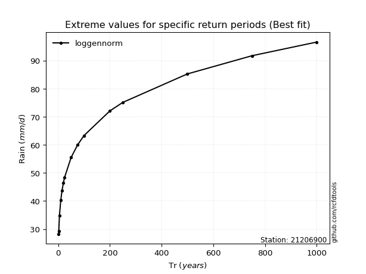</img>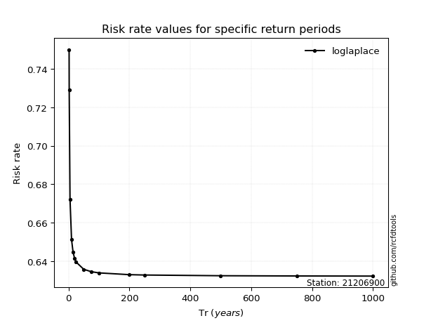</img>

</div>


<sub>**APP DISCLAIMER**: NO WARRANTY - This software is provided by [github.com/rcfdtools](https://github.com/rcfdtools) "as is", without any express or implied warranty, including warranties of merchantability, fitness for a particular purpose, or non-infringement. There is no guarantee that the software will be error-free or operate without interruption. LIMITATION OF LIABILITY - Neither the authors nor copyright holders will be liable for claims or damages arising from the software or its use. You are responsible for determining if the software is appropriate for your use and assume all associated risks, including errors, legal compliance, and data loss. NO PROFESSIONAL ADVICE - The software provides general information and does not offer professional advice. It should not replace consultation with professional advisors.</sub>