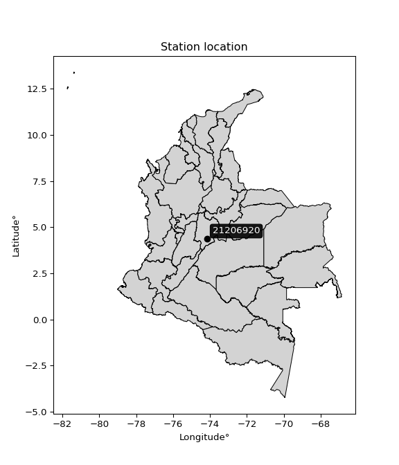

<div align="center">


</div>

# PMP Station (rain, Pmax24h): 21206920

Probable Maximum Precipitation (PMP) is the greatest amount of rainfall for a specific duration that is meteorologically possible for a given location, acting as a "worst-case" scenario for extreme storms, crucial for designing safety-critical infrastructure like bridges, river deviations, dams, spillways, and nuclear plants to prevent catastrophic failure. PMP is calculated by hydrologists using meteorological data to determine the upper limit of extreme rainfall, often leading to the Probable Maximum Flood (PMF) for flood control design, and is increasingly being studied for climate change impacts.

<div align="center">

</img>

</div>


## A. General information


### 1. General running parameters

• app_version: _v20251228_. • runtime: _2025-12-28 08:43:48.795225_. • Python version: _3.14.0_. • SciPy version: _1.16.3_. • Pandas version: _2.3.3_. • NumPy version: _2.3.5_. • Stations dataset (station_dataset_file): _dataset/pmax24h_in/automatic_colombia_2003_2024.csv_. • Stations catalog (station_catalog_file): _dataset/CNE_IDEAM.xls_. • Minimum year to eval til year_max (date_min): _1900_. • Maximum year to eval since year_min (date_max): _2024_. • Creates, save and include plots into reports (create_plot): _False_. • Plot only fit distributions with Δo > Δ (plot_only_fit): _True_. • Eval low extreme values, if False, evaluates high extreme values (low_extreme): _False_. • Eval every SciPy distribution as logarithmic (pdist_logarithmic_on): _True_. • Standard deviation normalized (ddof): _1.0_. • Return periods to eval in years (Tr): _[2, 2.33, 5, 10, 15, 20, 25, 50, 75, 100, 200, 250, 500, 750, 1000]_. • Minimum data sample per station, 0 means any (minimum_sample): _5_. • Z-Score maximum threshold to adjust a value, 0 means disable (zscore_max): _3.5_. • Z-Score minimum threshold to adjust a value, 0 means disable (zscore_min): _-2.5_. • Avoid zeros, e.g. rain = 0 (avoid_zeros): _True_. • Avoid null values (avoid_nans): _True_. [:file_folder:Dataset file.](../../dataset/pmax24h_in/automatic_colombia_2003_2024.csv)

> Delta Degrees of Freedom (DDOF): is a parameter used in the formulas for calculating variance and standard deviation. When ddof=0, the divisor is $N$ (the total number of observations) and this is used when your data set is the entire population. When ddof=1, the divisor is $N-1$ and this is used when your data set is a sample drawn from a larger population. Using $N-1$ provides an unbiased estimate of the population variance (known as Bessel´s correction).


### 2. Station info and location

|   id |   CODIGO | NOMBRE                  | CATEGORIA               | TECNOLOGIA                | ESTADO           | FECHA_INSTALACION   |   FECHA_SUSPENSION |   ALTITUD |   LATITUD |   LONGITUD | DEPARTAMENTO   | MUNICIPIO   | AREA_OPERATIVA                            | ENTIDAD                                                     | AREA_HIDROGRAFICA   | ZONA_HIDROGRAFICA   | SUBZONA_HIDROGRAFICA   |   CORRIENTE | Catalogo   |
|-----:|---------:|:------------------------|:------------------------|:--------------------------|:-----------------|:--------------------|-------------------:|----------:|----------:|-----------:|:---------------|:------------|:------------------------------------------|:------------------------------------------------------------|:--------------------|:--------------------|:-----------------------|------------:|:-----------|
|    0 | 21206920 | VILLA TERESA [21206920] | Climatológica Principal | Automática con Telemetría | En Mantenimiento | 19/07/2005          |                nan |      3591 |   4.35624 |   -74.1592 | Bogotá         | Bogotá, D.C | Area Operativa 11 - Cundinamarca-Amazonas | INSTITUTO DE HIDROLOGIA METEOROLOGIA Y ESTUDIOS AMBIENTALES | Magdalena Cauca     | Alto Magdalena      | Río Bogotá             |         nan | CNE_IDEAM  |

<div align="center">

Map location in: [:earth_americas:Google](http://maps.google.com/maps?q=4.356239,-74.159168) [:earth_americas:OSM](https://www.openstreetmap.org/#map=18/4.356239/-74.159168&layers=P) [:earth_americas:Bing](https://www.bing.com/maps?cp=4.356239~-74.159168&lvl=18) [:earth_americas:Apple](https://maps.apple.com/frame?center=4.356239%2C-74.159168&span=0.003%2C0.006)

</div>


<div align="center">

```geojson
{
  "type": "Feature",
  "geometry": {
    "type": "Point", 
    "coordinates": [-74.159168, 4.356239]
  }, 
  "properties": {
    "Name": "21206920"
  }
}
```

</div>


### 3. Discrete values table and plot

|               |           0 |           1 |           2 |           3 |           4 |          5 |           6 |           7 |           8 |           9 |          10 |          11 |           12 |          13 |          14 |           15 |          16 |
|:--------------|------------:|------------:|------------:|------------:|------------:|-----------:|------------:|------------:|------------:|------------:|------------:|------------:|-------------:|------------:|------------:|-------------:|------------:|
| Date          | 2007        | 2008        | 2009        | 2010        | 2011        | 2012       | 2013        | 2014        | 2015        | 2016        | 2017        | 2018        | 2019         | 2020        | 2021        | 2022         | 2023        |
| Value         |   27.2      |   29.2      |   15.9      |   25.3      |   28.5      |   34.1529  |   26.7      |   28.6      |   25.3      |   22        |   28.4      |   19.3      |   30.9       |   13.9      |   20        |   34.9       |   44.8      |
| Value_initial |   27.2      |   29.2      |   15.9      |   25.3      |   28.5      |  159.7     |   26.7      |   28.6      |   25.3      |   22        |   28.4      |   19.3      |   30.9       |   13.9      |   20        |   34.9       |   44.8      |
| count         |   17        |   17        |   17        |   17        |   17        |   17       |   17        |   17        |   17        |   17        |   17        |   17        |   17         |   17        |   17        |   17         |   17        |
| mean          |   34.1529   |   34.1529   |   34.1529   |   34.1529   |   34.1529   |   34.1529  |   34.1529   |   34.1529   |   34.1529   |   34.1529   |   34.1529   |   34.1529   |   34.1529    |   34.1529   |   34.1529   |   34.1529    |   34.1529   |
| std           |   33.147    |   33.147    |   33.147    |   33.147    |   33.147    |   33.147   |   33.147    |   33.147    |   33.147    |   33.147    |   33.147    |   33.147    |   33.147     |   33.147    |   33.147    |   33.147     |   33.147    |
| zscore        |   -0.209761 |   -0.149423 |   -0.550666 |   -0.267081 |   -0.170542 |    3.78758 |   -0.224845 |   -0.167525 |   -0.267081 |   -0.366638 |   -0.173558 |   -0.448093 |   -0.0981368 |   -0.611004 |   -0.426975 |    0.0225377 |    0.321207 |

> The initial value (value_initial) correspond to the initial obtained or null completed value, and value (value) is adjusted only when the initial value is outside the valid range definite through the Z-Score value. If Z-Score is active, values out of range or outliers are replaced with the station mean value


### 4. Active continuous probability distributions from SciPy (44 of 104 available)

[scipy.stats](https://docs.scipy.org/doc/scipy/reference/stats.html) is a Python´s powerful submodule within the SciPy library for comprehensive statistical analysis, offering over 130 probability distributions (like Normal, Poisson), functions for descriptive stats (mean, variance), hypothesis testing (t-tests, chi-square), random variable generation, and statistical tests, making it essential for data science, modeling, and research. It provides tools to explore, model, and draw conclusions from data efficiently, working seamlessly with NumPy.

<div align="center">

|   id | p_dist             |   n_parameter | fit_method   | label                                                                       | active   | ref                                                                                                        |
|-----:|:-------------------|--------------:|:-------------|:----------------------------------------------------------------------------|:---------|:-----------------------------------------------------------------------------------------------------------|
|    0 | alpha              |             3 | MLE          | Alpha                                                                       | True     | [:mortar_board:](https://docs.scipy.org/doc/scipy/reference/generated/scipy.stats.alpha.html)              |
|    1 | betaprime          |             4 | MLE          | Beta prime                                                                  | True     | [:mortar_board:](https://docs.scipy.org/doc/scipy/reference/generated/scipy.stats.betaprime.html)          |
|    2 | chi2               |             3 | MLE          | Chi²                                                                        | True     | [:mortar_board:](https://docs.scipy.org/doc/scipy/reference/generated/scipy.stats.chi2.html)               |
|    3 | crystalball        |             4 | MLE          | Crystalball                                                                 | True     | [:mortar_board:](https://docs.scipy.org/doc/scipy/reference/generated/scipy.stats.crystalball.html)        |
|    4 | erlang             |             3 | MLE          | Erlang                                                                      | True     | [:mortar_board:](https://docs.scipy.org/doc/scipy/reference/generated/scipy.stats.erlang.html)             |
|    5 | expon              |             2 | MLE          | Exponential                                                                 | True     | [:mortar_board:](https://docs.scipy.org/doc/scipy/reference/generated/scipy.stats.expon.html)              |
|    6 | exponnorm          |             3 | MLE          | Exponentially modified Normal                                               | True     | [:mortar_board:](https://docs.scipy.org/doc/scipy/reference/generated/scipy.stats.exponnorm.html)          |
|    7 | f                  |             4 | MLE          | F                                                                           | True     | [:mortar_board:](https://docs.scipy.org/doc/scipy/reference/generated/scipy.stats.f.html)                  |
|    8 | fatiguelife        |             3 | MLE          | Fatigue-life (Birnbaum-Saunders)                                            | True     | [:mortar_board:](https://docs.scipy.org/doc/scipy/reference/generated/scipy.stats.fatiguelife.html)        |
|    9 | fisk               |             3 | MLE          | Fisk                                                                        | True     | [:mortar_board:](https://docs.scipy.org/doc/scipy/reference/generated/scipy.stats.fisk.html)               |
|   10 | gamma              |             3 | MLE          | Gamma                                                                       | True     | [:mortar_board:](https://docs.scipy.org/doc/scipy/reference/generated/scipy.stats.gamma.html)              |
|   11 | genexpon           |             5 | MLE          | Generalized exponential                                                     | True     | [:mortar_board:](https://docs.scipy.org/doc/scipy/reference/generated/scipy.stats.genexpon.html)           |
|   12 | genlogistic        |             3 | MLE          | Generalized logistic                                                        | True     | [:mortar_board:](https://docs.scipy.org/doc/scipy/reference/generated/scipy.stats.genlogistic.html)        |
|   13 | gibrat             |             2 | MM           | Gibrat                                                                      | True     | [:mortar_board:](https://docs.scipy.org/doc/scipy/reference/generated/scipy.stats.gibrat.html)             |
|   14 | gompertz           |             3 | MLE          | Gompertz (or truncated Gumbel)                                              | True     | [:mortar_board:](https://docs.scipy.org/doc/scipy/reference/generated/scipy.stats.gompertz.html)           |
|   15 | gumbel_l           |             2 | MM           | Gumbel Left Skew                                                            | True     | [:mortar_board:](https://docs.scipy.org/doc/scipy/reference/generated/scipy.stats.gumbel_l.html)           |
|   16 | gumbel_r           |             2 | MM           | Gumbel Right Skew                                                           | True     | [:mortar_board:](https://docs.scipy.org/doc/scipy/reference/generated/scipy.stats.gumbel_r.html)           |
|   17 | halflogistic       |             2 | MM           | Half-logistic                                                               | True     | [:mortar_board:](https://docs.scipy.org/doc/scipy/reference/generated/scipy.stats.halflogistic.html)       |
|   18 | halfnorm           |             2 | MM           | Half Normal                                                                 | True     | [:mortar_board:](https://docs.scipy.org/doc/scipy/reference/generated/scipy.stats.halfnorm.html)           |
|   19 | hypsecant          |             2 | MM           | hyperbolic secant                                                           | True     | [:mortar_board:](https://docs.scipy.org/doc/scipy/reference/generated/scipy.stats.hypsecant.html)          |
|   20 | invgamma           |             3 | MLE          | Inverted gamma                                                              | True     | [:mortar_board:](https://docs.scipy.org/doc/scipy/reference/generated/scipy.stats.invgamma.html)           |
|   21 | invgauss           |             3 | MLE          | Inverse Gaussian                                                            | True     | [:mortar_board:](https://docs.scipy.org/doc/scipy/reference/generated/scipy.stats.invgauss.html)           |
|   22 | invweibull         |             3 | MLE          | Inverted Weibull                                                            | True     | [:mortar_board:](https://docs.scipy.org/doc/scipy/reference/generated/scipy.stats.invweibull.html)         |
|   23 | johnsonsu          |             4 | MLE          | Johnson Su                                                                  | True     | [:mortar_board:](https://docs.scipy.org/doc/scipy/reference/generated/scipy.stats.johnsonsu.html)          |
|   24 | kstwobign          |             2 | MLE          | Limiting distribution of scaled Kolmogorov-Smirnov two-sided test statistic | True     | [:mortar_board:](https://docs.scipy.org/doc/scipy/reference/generated/scipy.stats.kstwobign.html)          |
|   25 | laplace            |             2 | MM           | Laplace                                                                     | True     | [:mortar_board:](https://docs.scipy.org/doc/scipy/reference/generated/scipy.stats.laplace.html)            |
|   26 | laplace_asymmetric |             3 | MLE          | Asymmetric Laplace                                                          | True     | [:mortar_board:](https://docs.scipy.org/doc/scipy/reference/generated/scipy.stats.laplace_asymmetric.html) |
|   27 | loggamma           |             3 | MLE          | Log gamma                                                                   | True     | [:mortar_board:](https://docs.scipy.org/doc/scipy/reference/generated/scipy.stats.loggamma.html)           |
|   28 | logistic           |             2 | MM           | Logistic (or Sech-squared)                                                  | True     | [:mortar_board:](https://docs.scipy.org/doc/scipy/reference/generated/scipy.stats.logistic.html)           |
|   29 | lognorm            |             3 | MLE          | Log Normal                                                                  | True     | [:mortar_board:](https://docs.scipy.org/doc/scipy/reference/generated/scipy.stats.lognorm.html)            |
|   30 | maxwell            |             2 | MM           | Maxwell                                                                     | True     | [:mortar_board:](https://docs.scipy.org/doc/scipy/reference/generated/scipy.stats.maxwell.html)            |
|   31 | mielke             |             4 | MLE          | Mielke Beta-Kappa / Dagum                                                   | True     | [:mortar_board:](https://docs.scipy.org/doc/scipy/reference/generated/scipy.stats.mielke.html)             |
|   32 | moyal              |             2 | MM           | Moyal                                                                       | True     | [:mortar_board:](https://docs.scipy.org/doc/scipy/reference/generated/scipy.stats.moyal.html)              |
|   33 | nakagami           |             3 | MLE          | Nakagami                                                                    | True     | [:mortar_board:](https://docs.scipy.org/doc/scipy/reference/generated/scipy.stats.nakagami.html)           |
|   34 | ncf                |             5 | MLE          | Non-central F distribution                                                  | True     | [:mortar_board:](https://docs.scipy.org/doc/scipy/reference/generated/scipy.stats.ncf.html)                |
|   35 | nct                |             4 | MLE          | Non-central Student’s t                                                     | True     | [:mortar_board:](https://docs.scipy.org/doc/scipy/reference/generated/scipy.stats.nct.html)                |
|   36 | norm               |             2 | MM           | Normal                                                                      | True     | [:mortar_board:](https://docs.scipy.org/doc/scipy/reference/generated/scipy.stats.norm.html)               |
|   37 | pearson3           |             3 | MM           | Pearson type III                                                            | True     | [:mortar_board:](https://docs.scipy.org/doc/scipy/reference/generated/scipy.stats.pearson3.html)           |
|   38 | rayleigh           |             2 | MM           | Rayleigh                                                                    | True     | [:mortar_board:](https://docs.scipy.org/doc/scipy/reference/generated/scipy.stats.rayleigh.html)           |
|   39 | rice               |             3 | MLE          | Rice                                                                        | True     | [:mortar_board:](https://docs.scipy.org/doc/scipy/reference/generated/scipy.stats.rice.html)               |
|   40 | t                  |             3 | MLE          | Student’s t                                                                 | True     | [:mortar_board:](https://docs.scipy.org/doc/scipy/reference/generated/scipy.stats.t.html)                  |
|   41 | truncnorm          |             4 | MLE          | Truncated normal                                                            | True     | [:mortar_board:](https://docs.scipy.org/doc/scipy/reference/generated/scipy.stats.truncnorm.html)          |
|   42 | wald               |             2 | MM           | Wald                                                                        | True     | [:mortar_board:](https://docs.scipy.org/doc/scipy/reference/generated/scipy.stats.wald.html)               |
|   43 | weibull_min        |             3 | MLE          | Weibull minimum                                                             | True     | [:mortar_board:](https://docs.scipy.org/doc/scipy/reference/generated/scipy.stats.weibull_min.html)        |

</div>

> **n_parameter:** # arguments & localization & scale.
>
> **Fit methods:** (MLE) maximum likelihood, (MM) L-moments.
>
>**Inactive:** foldnorm, gennorm, norminvgauss, powernorm, powerlognorm, skewnorm, genextreme, anglit, arcsine, argus, beta, bradford, burr, burr12, cauchy, cosine, halfcauchy, foldcauchy, skewcauchy, wrapcauchy, dgamma, gengamma, exponweib, exponpow, truncexpon, gausshyper, genhalflogistic, genhyperbolic, geninvgauss, halfgennorm, johnsonsb, kappa4, kappa3, ksone, kstwo, loglaplace, levy, levy_l, levy_stable, ncx2, pareto, genpareto, truncpareto, lomax, powerlaw, rdist, rel_breitwigner, recipinvgauss, semicircular, studentized_range, trapezoid, triang, truncweibull_min, tukeylambda, uniform, loguniform, vonmises, vonmises_line, weibull_max, dweibull, 


## B. Probability distributions vs. Empirical distributions

A continuous probability distribution (CPD) describes probabilities for variables that can take any value within a range (like rain any time), unlike discrete variables with specific outcomes (like temperature). It uses a Probability Density Function (PDF), a curve where the total area under it equals 1, and the probability of the variable falling within an interval (a to b) is found by calculating the area under the curve between those points. A key feature is that the probability of hitting any single exact value is zero, so probabilities are always expressed for ranges, e.g., $P(a ≤ X ≤ b)$.

<div align="center">

Distributions parameters from station values
|    |   station | p_dist                |   n |              loc |           scale | shape                 | shape1                | shape2                | shape3   |
|---:|----------:|:----------------------|----:|-----------------:|----------------:|:----------------------|:----------------------|:----------------------|:---------|
|  0 |  21206920 | alpha                 |  17 |    -77.9189      |  1530.15        | 14.685961641225997    |                       |                       |          |
|  1 |  21206920 | betaprime             |  17 |     -5.96195     |   464.561       | 21.199079480949045    | 301.5590106908993     |                       |          |
|  2 |  21206920 | chi2                  |  17 |     13.9         |     9.91456     | 1.3346448187748923    |                       |                       |          |
|  3 |  21206920 | crystalball           |  17 |     26.7678      |     7.23691     | 4768.667884091163     | 159.48423748934067    |                       |          |
|  4 |  21206920 | erlang                |  17 |    -10.0322      |     1.42358     | 25.85033774199203     |                       |                       |          |
|  5 |  21206920 | expon                 |  17 |     13.9         |    12.8678      |                       |                       |                       |          |
|  6 |  21206920 | exponnorm             |  17 |     22.2256      |     5.64533     | 0.8045931249285125    |                       |                       |          |
|  7 |  21206920 | f                     |  17 |    -10.4383      |    37.1915      | 53.42376888350134     | 5118.367643327104     |                       |          |
|  8 |  21206920 | fatiguelife           |  17 |    -29.0015      |    55.3059      | 0.12945768500498459   |                       |                       |          |
|  9 |  21206920 | fisk                  |  17 |    -54.4721      |    80.9913      | 20.300620808087764    |                       |                       |          |
| 10 |  21206920 | gamma                 |  17 |    -10.0322      |     1.42358     | 25.850324448036957    |                       |                       |          |
| 11 |  21206920 | genexpon              |  17 |     13.9         |     1.50865     | 0.1167455320361224    | 0.0006446134044802178 | 1.999444479503517     |          |
| 12 |  21206920 | genlogistic           |  17 |     24.9898      |     4.35617     | 1.3003819641015255    |                       |                       |          |
| 13 |  21206920 | gibrat                |  17 |     21.247       |     3.34855     |                       |                       |                       |          |
| 14 |  21206920 | gompertz              |  17 |     13.9         |    11.8871      | 0.3822761970839892    |                       |                       |          |
| 15 |  21206920 | gumbel_l              |  17 |     30.0248      |     5.64259     |                       |                       |                       |          |
| 16 |  21206920 | gumbel_r              |  17 |     23.5108      |     5.64259     |                       |                       |                       |          |
| 17 |  21206920 | halflogistic          |  17 |     18.1904      |     6.1873      |                       |                       |                       |          |
| 18 |  21206920 | halfnorm              |  17 |     17.189       |    12.0053      |                       |                       |                       |          |
| 19 |  21206920 | hypsecant             |  17 |     26.7678      |     4.60716     |                       |                       |                       |          |
| 20 |  21206920 | invgamma              |  17 |    -42.5563      |  6401.03        | 93.32208242173604     |                       |                       |          |
| 21 |  21206920 | invgauss              |  17 |    -13.6903      |  1266.08        | 0.03192547808317449   |                       |                       |          |
| 22 |  21206920 | invweibull            |  17 |     -7.18384e+08 |     7.18384e+08 | 109305907.2089507     |                       |                       |          |
| 23 |  21206920 | johnsonsu             |  17 |    -19.6928      |    21.4007      | -10.717407355936595   | 7.1041733364193504    |                       |          |
| 24 |  21206920 | kstwobign             |  17 |     -0.295472    |    31.075       |                       |                       |                       |          |
| 25 |  21206920 | laplace               |  17 |     26.7678      |     5.11727     |                       |                       |                       |          |
| 26 |  21206920 | laplace_asymmetric    |  17 |     28.4         |     5.23782     | 1.167869061601826     |                       |                       |          |
| 27 |  21206920 | loggamma              |  17 |  -2083.24        |   287.053       | 1557.504661636461     |                       |                       |          |
| 28 |  21206920 | logistic              |  17 |     26.7678      |     3.98992     |                       |                       |                       |          |
| 29 |  21206920 | lognorm               |  17 |    -29.1927      |    55.4987      | 0.1287359762460615    |                       |                       |          |
| 30 |  21206920 | maxwell               |  17 |      9.61939     |    10.7462      |                       |                       |                       |          |
| 31 |  21206920 | mielke                |  17 |     -0.0652269   |    30.2806      | 4.437316538044807     | 9.173980589766238     |                       |          |
| 32 |  21206920 | moyal                 |  17 |     22.6293      |     3.25775     |                       |                       |                       |          |
| 33 |  21206920 | nakagami              |  17 |      9.57721     |    18.6518      | 1.4631963927371094    |                       |                       |          |
| 34 |  21206920 | ncf                   |  17 |      1.95451     |     0.191378    | 0.3755334834870001    | 404.0178106316839     | 48.024288627966456    |          |
| 35 |  21206920 | nct                   |  17 |    -17.1403      |     5.42815     | 47.07669649858215     | 7.957559660606332     |                       |          |
| 36 |  21206920 | norm                  |  17 |     26.7678      |     7.23691     |                       |                       |                       |          |
| 37 |  21206920 | pearson3              |  17 |     26.7678      |     7.23688     | 0.4111955155206183    |                       |                       |          |
| 38 |  21206920 | rayleigh              |  17 |     12.9232      |    11.0464      |                       |                       |                       |          |
| 39 |  21206920 | rice                  |  17 |     11.2625      |     8.39941     | 1.4663052697941932    |                       |                       |          |
| 40 |  21206920 | t                     |  17 |     26.8575      |     6.37261     | 8.014287162824157     |                       |                       |          |
| 41 |  21206920 | truncnorm             |  17 |     26.7678      |     7.23691     | -92.73143782358868    | 334.4941435836621     |                       |          |
| 42 |  21206920 | wald                  |  17 |     19.5309      |     7.2369      |                       |                       |                       |          |
| 43 |  21206920 | weibull_min           |  17 |     10.6929      |    18.11        | 2.345008810544664     |                       |                       |          |
| 44 |  21206920 | logalpha              |  17 |     -3.99322     |   179.873       | 24.872073540934394    |                       |                       |          |
| 45 |  21206920 | logbetaprime          |  17 |     -0.56523     |   587.439       | 176.48677917480524    | 27191.794655538793    |                       |          |
| 46 |  21206920 | logchi2               |  17 |      2.63189     |     0.9474      | 1.094230370455818     |                       |                       |          |
| 47 |  21206920 | logcrystalball        |  17 |      3.2491      |     0.281601    | 649.2791317601983     | 36.52201361251119     |                       |          |
| 48 |  21206920 | logerlang             |  17 |     -2.12117     |     0.0153037   | 350.9617639448967     |                       |                       |          |
| 49 |  21206920 | logexpon              |  17 |      2.63189     |     0.617214    |                       |                       |                       |          |
| 50 |  21206920 | logexponnorm          |  17 |      3.24886     |     0.281601    | 0.0008472101941014104 |                       |                       |          |
| 51 |  21206920 | logf                  |  17 |   -224.079       |   227.328       | 2154148.6555745667    | 3268921.4967048373    |                       |          |
| 52 |  21206920 | logfatiguelife        |  17 |    -62.0768      |    65.3261      | 0.004313588912535455  |                       |                       |          |
| 53 |  21206920 | logfisk               |  17 |     -1.39219e+07 |     1.39219e+07 | 88804684.54234418     |                       |                       |          |
| 54 |  21206920 | loggamma              |  17 |     -1.48844     |     0.0172247   | 274.97245257801546    |                       |                       |          |
| 55 |  21206920 | loggenexpon           |  17 |      2.63189     |     0.0801212   | 0.024594981222314675  | 3.194252625575461     | 0.0071947803689596836 |          |
| 56 |  21206920 | loggenlogistic        |  17 |      3.40863     |     0.109181    | 0.482838285109922     |                       |                       |          |
| 57 |  21206920 | loggibrat             |  17 |      3.03426     |     0.130306    |                       |                       |                       |          |
| 58 |  21206920 | loggompertz           |  17 |      2.63189     |     0.301281    | 0.09644490083821114   |                       |                       |          |
| 59 |  21206920 | loggumbel_l           |  17 |      3.37584     |     0.219564    |                       |                       |                       |          |
| 60 |  21206920 | loggumbel_r           |  17 |      3.12237     |     0.219564    |                       |                       |                       |          |
| 61 |  21206920 | loghalflogistic       |  17 |      2.91531     |     0.240781    |                       |                       |                       |          |
| 62 |  21206920 | loghalfnorm           |  17 |      2.87641     |     0.467099    |                       |                       |                       |          |
| 63 |  21206920 | loghypsecant          |  17 |      3.2491      |     0.179273    |                       |                       |                       |          |
| 64 |  21206920 | loginvgamma           |  17 |     -2.03187     |  1763.48        | 335.0609808303759     |                       |                       |          |
| 65 |  21206920 | loginvgauss           |  17 |      0.520299    |   229.484       | 0.011882848592175723  |                       |                       |          |
| 66 |  21206920 | loginvweibull         |  17 |     -2.81668e+07 |     2.81668e+07 | 96027657.85581833     |                       |                       |          |
| 67 |  21206920 | logjohnsonsu          |  17 |      3.40045     |     0.266063    | 0.5531529639138995    | 1.309954047306779     |                       |          |
| 68 |  21206920 | logkstwobign          |  17 |      2.02561     |     1.40275     |                       |                       |                       |          |
| 69 |  21206920 | loglaplace            |  17 |      3.2491      |     0.199122    |                       |                       |                       |          |
| 70 |  21206920 | loglaplace_asymmetric |  17 |      3.3499      |     0.192702    | 1.295429718986735     |                       |                       |          |
| 71 |  21206920 | logloggamma           |  17 |      2.26905     |     0.620828    | 5.339712565012799     |                       |                       |          |
| 72 |  21206920 | loglogistic           |  17 |      3.2491      |     0.155255    |                       |                       |                       |          |
| 73 |  21206920 | loglognorm            |  17 | -65533.4         | 65536.6         | 4.296857586236903e-06 |                       |                       |          |
| 74 |  21206920 | logmaxwell            |  17 |      2.58183     |     0.418154    |                       |                       |                       |          |
| 75 |  21206920 | logmielke             |  17 |      2.28374     |     1.21796     | 3.177720281331599     | 12.879874233662617    |                       |          |
| 76 |  21206920 | logmoyal              |  17 |      3.08807     |     0.126765    |                       |                       |                       |          |
| 77 |  21206920 | lognakagami           |  17 |   -108.093       |   111.343       | 38966.95530668188     |                       |                       |          |
| 78 |  21206920 | logncf                |  17 |    -79.7976      |    78.08        | 320553.8434154687     | 371121.89879361726    | 20388.70339376285     |          |
| 79 |  21206920 | lognct                |  17 |     -3.66898     |     0.147985    | 381.22039153939284    | 46.67611542904797     |                       |          |
| 80 |  21206920 | lognorm               |  17 |      3.2491      |     0.281601    |                       |                       |                       |          |
| 81 |  21206920 | logpearson3           |  17 |      3.2491      |     0.281601    | -0.4248936037941258   |                       |                       |          |
| 82 |  21206920 | lograyleigh           |  17 |      2.71036     |     0.429854    |                       |                       |                       |          |
| 83 |  21206920 | logrice               |  17 |      2.46645     |     0.299313    | 2.392180307521154     |                       |                       |          |
| 84 |  21206920 | logt                  |  17 |      3.24981     |     0.279949    | 170.30548106928853    |                       |                       |          |
| 85 |  21206920 | logtruncnorm          |  17 |     -0.0256652   |     1.47914     | 1.7966833038765992    | 6.4643600571924935    |                       |          |
| 86 |  21206920 | logwald               |  17 |      2.96748     |     0.281618    |                       |                       |                       |          |
| 87 |  21206920 | logweibull_min        |  17 |      1.88698     |     1.47326     | 5.653983377171651     |                       |                       |          |

</div>

> **loc** (Location parameter): This shifts the distribution along the x-axis. For many common distributions, like the normal (Gaussian) distribution, loc represents the mean $μ$. For others, like the uniform distribution, it might represent the minimum value, or for the beta distribution, the left end of the support interval.
>
> **scale** (Scale parameter): This determines the width or spread of the distribution. For the normal distribution, scale represents the standard deviation $σ$. For a uniform distribution, it defines the length of the interval (from $loc$ to $loc + scale$).
>
> **shape** (Shape parameters): Refers to parameters that define the specific form of a probability distribution, distinct from its location (loc) and scale (scale). These parameters are required arguments for most distribution functions. For example, a normal (Gaussian) distribution is fully defined by its location (mean) and scale (standard deviation), so it has no specific shape parameters beyond loc and scale. However, other distributions have intrinsic properties that need specification, as Gamma distribution that takes a shape parameter, often named $a$ or $alpha$.


### 0. Cumulative distribution values - CDF (88 evaluated)

Cumulative Distribution Function (CDF), denoted as $F$<sub>$X$</sub>$(x)$, is a function that gives the probability that a random variable $X$ will take a value less than or equal to a specific value, $x$ (i.e., $(P(X≥x)$. It essentially "accumulates" probabilities from a given point up to the far right (positive infinity), providing a complete picture of the distribution´s probabilities for both discrete (like rain) and continuous (like temperature) variables, helping to find probabilities over ranges or above certain values.

<div align="center">

CDF ordered by x ascending and calculating $log(f(x))$ separately
|   id |   Station |   date |       x |   count |    mean |    std |     zscore |   Value_initial |   station |   m |     alpha |   alpha_pdf |   betaprime |   betaprime_pdf |        chi2 |      chi2_pdf |   crystalball |   crystalball_pdf |    erlang |   erlang_pdf |    expon |   expon_pdf |   exponnorm |   exponnorm_pdf |         f |      f_pdf |   fatiguelife |   fatiguelife_pdf |      fisk |   fisk_pdf |     gamma |   gamma_pdf |    genexpon |   genexpon_pdf |   genlogistic |   genlogistic_pdf |    gibrat |   gibrat_pdf |    gompertz |   gompertz_pdf |   gumbel_l |   gumbel_l_pdf |   gumbel_r |   gumbel_r_pdf |   halflogistic |   halflogistic_pdf |   halfnorm |   halfnorm_pdf |   hypsecant |   hypsecant_pdf |   invgamma |   invgamma_pdf |   invgauss |   invgauss_pdf |   invweibull |   invweibull_pdf |   johnsonsu |   johnsonsu_pdf |   kstwobign |   kstwobign_pdf |   laplace |   laplace_pdf |   laplace_asymmetric |   laplace_asymmetric_pdf |   loggamma |   loggamma_pdf |   logistic |   logistic_pdf |   lognorm |   lognorm_pdf |   maxwell |   maxwell_pdf |    mielke |   mielke_pdf |       moyal |   moyal_pdf |   nakagami |   nakagami_pdf |       ncf |    ncf_pdf |       nct |    nct_pdf |      norm |   norm_pdf |   pearson3 |   pearson3_pdf |   rayleigh |   rayleigh_pdf |      rice |   rice_pdf |         t |      t_pdf |   truncnorm |   truncnorm_pdf |        wald |   wald_pdf |   weibull_min |   weibull_min_pdf |   logalpha |   logalpha_pdf |   logbetaprime |   logbetaprime_pdf |     logchi2 |   logchi2_pdf |   logcrystalball |   logcrystalball_pdf |   logerlang |   logerlang_pdf |   logexpon |   logexpon_pdf |   logexponnorm |   logexponnorm_pdf |      logf |   logf_pdf |   logfatiguelife |   logfatiguelife_pdf |   logfisk |   logfisk_pdf |   loggenexpon |   loggenexpon_pdf |   loggenlogistic |   loggenlogistic_pdf |   loggibrat |   loggibrat_pdf |   loggompertz |   loggompertz_pdf |   loggumbel_l |   loggumbel_l_pdf |   loggumbel_r |   loggumbel_r_pdf |   loghalflogistic |   loghalflogistic_pdf |   loghalfnorm |   loghalfnorm_pdf |   loghypsecant |   loghypsecant_pdf |   loginvgamma |   loginvgamma_pdf |   loginvgauss |   loginvgauss_pdf |   loginvweibull |   loginvweibull_pdf |   logjohnsonsu |   logjohnsonsu_pdf |   logkstwobign |   logkstwobign_pdf |   loglaplace |   loglaplace_pdf |   loglaplace_asymmetric |   loglaplace_asymmetric_pdf |   logloggamma |   logloggamma_pdf |   loglogistic |   loglogistic_pdf |   loglognorm |   loglognorm_pdf |   logmaxwell |   logmaxwell_pdf |   logmielke |   logmielke_pdf |    logmoyal |   logmoyal_pdf |   lognakagami |   lognakagami_pdf |    logncf |   logncf_pdf |    lognct |   lognct_pdf |   logpearson3 |   logpearson3_pdf |   lograyleigh |   lograyleigh_pdf |    logrice |   logrice_pdf |      logt |   logt_pdf |   logtruncnorm |   logtruncnorm_pdf |    logwald |   logwald_pdf |   logweibull_min |   logweibull_min_pdf |
|-----:|----------:|-------:|--------:|--------:|--------:|-------:|-----------:|----------------:|----------:|----:|----------:|------------:|------------:|----------------:|------------:|--------------:|--------------:|------------------:|----------:|-------------:|---------:|------------:|------------:|----------------:|----------:|-----------:|--------------:|------------------:|----------:|-----------:|----------:|------------:|------------:|---------------:|--------------:|------------------:|----------:|-------------:|------------:|---------------:|-----------:|---------------:|-----------:|---------------:|---------------:|-------------------:|-----------:|---------------:|------------:|----------------:|-----------:|---------------:|-----------:|---------------:|-------------:|-----------------:|------------:|----------------:|------------:|----------------:|----------:|--------------:|---------------------:|-------------------------:|-----------:|---------------:|-----------:|---------------:|----------:|--------------:|----------:|--------------:|----------:|-------------:|------------:|------------:|-----------:|---------------:|----------:|-----------:|----------:|-----------:|----------:|-----------:|-----------:|---------------:|-----------:|---------------:|----------:|-----------:|----------:|-----------:|------------:|----------------:|------------:|-----------:|--------------:|------------------:|-----------:|---------------:|---------------:|-------------------:|------------:|--------------:|-----------------:|---------------------:|------------:|----------------:|-----------:|---------------:|---------------:|-------------------:|----------:|-----------:|-----------------:|---------------------:|----------:|--------------:|--------------:|------------------:|-----------------:|---------------------:|------------:|----------------:|--------------:|------------------:|--------------:|------------------:|--------------:|------------------:|------------------:|----------------------:|--------------:|------------------:|---------------:|-------------------:|--------------:|------------------:|--------------:|------------------:|----------------:|--------------------:|---------------:|-------------------:|---------------:|-------------------:|-------------:|-----------------:|------------------------:|----------------------------:|--------------:|------------------:|--------------:|------------------:|-------------:|-----------------:|-------------:|-----------------:|------------:|----------------:|------------:|---------------:|--------------:|------------------:|----------:|-------------:|----------:|-------------:|--------------:|------------------:|--------------:|------------------:|-----------:|--------------:|----------:|-----------:|---------------:|-------------------:|-----------:|--------------:|-----------------:|---------------------:|
|    0 |  21206920 |   2020 | 13.9    |      17 | 34.1529 | 33.147 | -0.611004  |            13.9 |  21206920 |   1 | 0.0239105 |  0.0102182  |   0.0230935 |      0.0106134  | 2.16443e-11 | 8131.11       |     0.0376951 |        0.0113456  | 0.0242118 |    0.0105157 | 0        |  0.0777132  |   0.0256392 |      0.00979623 | 0.0242376 | 0.0105106  |     0.0245862 |        0.0104607  | 0.0311154 | 0.00895113 | 0.0242118 |   0.0105157 | 2.65383e-07 |     0.0773839  |     0.0330866 |        0.00915869 | 0         |   0          | 8.98523e-10 |     0.032159   |  0.0557845 |    0.0096053   | 0.00412024 |     0.00401016 |      0         |         0          |   0        |     0          |   0.038936  |      0.00843013 |  0.0239774 |     0.0103113  |  0.0192134 |     0.00970694 |    0.0155991 |       0.00987497 |   0.0250414 |      0.0104387  |   0.0148529 |      0.0113253  | 0.0404481 |    0.00790424 |            0.0539137 |               0.00881364 |  0.0126237 |       0.125436 |  0.0382326 |     0.00921594 | 0.0141969 |      0.128263 | 0.0160322 |    0.0108826  | 0.0322384 |   0.010235   | 0.000134444 | 0.000319286 |  0.0178243 |     0.011685   | 0.022277  | 0.0106602  | 0.0255758 | 0.010312   | 0.0376951 | 0.0113456  |  0.0234949 |     0.010431   | 0.00390208 |     0.00797385 | 0.0168528 |  0.0127973 | 0.0382003 | 0.00930696 |   0.0376952 |      0.0113457  | 0           | 0          |     0.0171112 |        0.0124038  |  0.011357  |       0.122024 |      0.012514  |           0.126681 | 3.16084e-09 |   3.89414e+06 |        0.0141969 |             0.128263 |   0.0130029 |        0.126741 |   0        |       1.62018  |      0.0141972 |           0.128265 | 0.0142284 |   0.128592 |        0.0138562 |             0.12672  | 0.0170381 |      0.106831 |   9.01215e-09 |          0.306972 |        0.032212  |             0.142337 |    0        |        0        |   1.40073e-08 |          0.320116 |     0.033202  |         0.14868   |   8.81914e-05 |        0.00374996 |          0        |              0        |      0        |          0        |      0.0203475 |           0.113423 |     0.0114016 |          0.122127 |     0.0106788 |          0.123808 |      0.00713515 |            0.120234 |      0.037373  |           0.131321 |     0.00785518 |           0.158182 |    0.0225319 |         0.113156 |               0.0353051 |                    0.141428 |     0.0238632 |          0.149764 |     0.0184243 |          0.116485 |    0.0141967 |         0.128263 |  0.000454456 |        0.0271551 |   0.0186952 |        0.17064  | 1.49043e-09 |    2.20441e-07 |     0.0142194 |          0.128484 | 0.0143354 |     0.129677 | 0.0128219 |     0.127935 |     0.0232787 |          0.151916 |     0         |          0        | 0.00995672 |      0.134831 | 0.0143169 |   0.127055 |    4.32591e-09 |           1.48357  | 0          |      0        |        0.0209332 |             0.157212 |
|    1 |  21206920 |   2009 | 15.9    |      17 | 34.1529 | 33.147 | -0.550666  |            15.9 |  21206920 |   2 | 0.05222   |  0.01856    |   0.0527485 |      0.0194968  | 0.230257    |    0.0722852  |     0.0665845 |        0.0178506  | 0.0532472 |    0.0189625 | 0.14395  |  0.0665264  |   0.0523408 |      0.0173722  | 0.0532539 | 0.0189488  |     0.0533974 |        0.0187962  | 0.0545195 | 0.0148701  | 0.0532473 |   0.0189625 | 0.143861    |     0.0665913  |     0.0569515 |        0.0151239  | 0         |   0          | 0.0676485   |     0.0354774  |  0.0785611 |    0.0133611   | 0.0212189  |     0.0144886  |      0         |         0          |   0        |     0          |   0.0599978 |      0.0129457  |  0.0525316 |     0.018705   |  0.0473606 |     0.0189864  |    0.04647   |       0.0216995  |   0.0537075 |      0.018674   |   0.0512331 |      0.025573   | 0.0597909 |    0.0116841  |            0.0747642 |               0.0122222  |  0.0421301 |       0.338058 |  0.0615822 |     0.014484   | 0.0432256 |      0.325857 | 0.0479727 |    0.02138    | 0.0583289 |   0.0161662  | 0.00497029  | 0.00665576  |  0.0514665 |     0.0222266  | 0.0522869 | 0.0198119  | 0.0537949 | 0.01836    | 0.0665845 | 0.0178506  |  0.0524647 |     0.0189915  | 0.0356589  |     0.0235255  | 0.0522057 |  0.0225503 | 0.0618893 | 0.0147372  |   0.0665846 |      0.0178506  | 0           | 0          |     0.0523575 |        0.0229506  |  0.0410827 |       0.346676 |      0.0424867 |           0.344167 | 0.258103    |   1.00314     |        0.0432255 |             0.325856 |   0.0425327 |        0.336473 |   0.195715 |       1.30309  |      0.0432263 |           0.325861 | 0.043322  |   0.326477 |        0.0426963 |             0.324816 | 0.0392555 |      0.240573 |   0.0708502   |          0.729708 |        0.0583165 |             0.25718  |    0        |        0        |   0.0527918   |          0.473732 |     0.0603842 |         0.266543  |   0.00633752  |        0.146089   |          0        |              0        |      0        |          0        |      0.0430189 |           0.239233 |     0.0411412 |          0.346923 |     0.0417323 |          0.366567 |      0.0439129  |            0.467927 |      0.0609617 |           0.229754 |     0.0568613  |           0.602565 |    0.0442585 |         0.222268 |               0.0604938 |                    0.242331 |     0.0536194 |          0.308451 |     0.0427122 |          0.26336  |    0.0432253 |         0.325857 |  0.0215541   |        0.336994  |   0.0527645 |        0.347446 | 0.000374374 |    0.0199919   |     0.0432896 |          0.326233 | 0.0436569 |     0.328813 | 0.0428533 |     0.343193 |     0.0536264 |          0.315231 |     0.0084381 |          0.3003   | 0.0412517  |      0.352522 | 0.0429859 |   0.32162  |    0.183763    |           1.25487  | 0          |      0        |        0.0526168 |             0.329255 |
|    2 |  21206920 |   2018 | 19.3    |      17 | 34.1529 | 33.147 | -0.448093  |            19.3 |  21206920 |   3 | 0.1461    |  0.0370876  |   0.150476  |      0.0381641  | 0.418316    |    0.0437601  |     0.151058  |        0.0323692  | 0.148152  |    0.0371771 | 0.342724 |  0.051079   |   0.140913  |      0.0354965  | 0.148102  | 0.0371616  |     0.147589  |        0.0369705  | 0.130644  | 0.0312539  | 0.148152  |   0.0371771 | 0.34286     |     0.0511326  |     0.133965  |        0.0314672  | 0         |   0          | 0.197337    |     0.040656   |  0.138832  |    0.0228113   | 0.121348   |     0.0453576  |      0.0894277 |         0.0801645  |   0.139579 |     0.0654417  |   0.124268  |      0.0262929  |  0.146851  |     0.0371583  |  0.14581   |     0.0391735  |    0.160504  |       0.0446776  |   0.147325  |      0.0367944  |   0.178615  |      0.0474454  | 0.116195  |    0.0227065  |            0.130342  |               0.0213078  |  0.156615  |       0.875843 |  0.133348  |     0.0289646  | 0.152383  |      0.836703 | 0.153289  |    0.0401573  | 0.136485  |   0.0307645  | 0.0955296   | 0.0508786   |  0.15893   |     0.0404792  | 0.15175   | 0.038808   | 0.146151  | 0.0364577  | 0.151058  | 0.0323692  |  0.147869  |     0.0374265  | 0.153481   |     0.0442382  | 0.156218  |  0.0382793 | 0.134808  | 0.0292814  |   0.151058  |      0.0323692  | 0           | 0          |     0.160336  |        0.0399776  |  0.15947   |       0.903238 |      0.158761  |           0.886138 | 0.406129    |   0.604476    |        0.152383  |             0.836703 |   0.155894  |        0.865729 |   0.412436 |       0.951961 |      0.152385  |           0.836709 | 0.152583  |   0.83685  |        0.151874  |             0.837997 | 0.123305  |      0.689554 |   0.253012    |          1.09424  |        0.136503  |             0.593901 |    0        |        0        |   0.173237    |          0.786699 |     0.139766  |         0.589848  |   0.123208    |        1.17498    |          0.092759 |              2.05871  |      0.142199 |          1.68097  |      0.125346  |           0.68126  |     0.159862  |          0.907535 |     0.166449  |          0.941528 |      0.199016   |            1.09534  |      0.131204  |           0.542067 |     0.233465   |           1.13916  |    0.117126  |         0.588212 |               0.131476  |                    0.526679 |     0.149867  |          0.722118 |     0.134535  |          0.749964 |    0.152383  |         0.836707 |  0.154933    |        1.03717   |   0.154235  |        0.724263 | 0.0976187   |    1.32205     |     0.152493  |          0.836582 | 0.153468  |     0.839581 | 0.158105  |     0.875591 |     0.151594  |          0.730956 |     0.155306  |          1.14171  | 0.157121   |      0.872108 | 0.151107  |   0.831806 |    0.398627    |           0.971569 | 0          |      0        |        0.153517  |             0.743303 |
|    3 |  21206920 |   2021 | 20      |      17 | 34.1529 | 33.147 | -0.426975  |            20   |  21206920 |   4 | 0.173406  |  0.0408995  |   0.17848   |      0.0418072  | 0.447803    |    0.0405636  |     0.174847  |        0.0355998  | 0.175475  |    0.0408559 | 0.377524 |  0.0483746  |   0.167174  |      0.0395241  | 0.175415  | 0.040843   |     0.174776  |        0.0406768  | 0.154001  | 0.0355148  | 0.175475  |   0.0408559 | 0.377696    |     0.0484221  |     0.157449  |        0.0356585  | 0         |   0          | 0.226122    |     0.0415756  |  0.155666  |    0.0253194   | 0.155203   |     0.0512435  |      0.145201  |         0.079107   |   0.185128 |     0.0646642  |   0.144017  |      0.0302037  |  0.174191  |     0.040925   |  0.174629  |     0.0431192  |    0.193089  |       0.0483177  |   0.174396  |      0.0405207  |   0.212823  |      0.0501711  | 0.133228  |    0.026035   |            0.146144  |               0.0238911  |  0.189767  |       0.984603 |  0.154958  |     0.0328193  | 0.184127  |      0.945114 | 0.182571  |    0.0434509  | 0.159294  |   0.0344374  | 0.134362    | 0.059778    |  0.188382  |     0.0436151  | 0.18021   | 0.0424625  | 0.173007  | 0.0402507  | 0.174847  | 0.0355998  |  0.175375  |     0.0411297  | 0.185525   |     0.0472359  | 0.184026  |  0.0411379 | 0.156606  | 0.0330302  |   0.174848  |      0.0355998  | 0.000226293 | 0.00392556 |     0.189352  |        0.0428762  |  0.193582  |       1.0108   |      0.192262  |           0.993823 | 0.426967    |   0.566167    |        0.184127  |             0.945114 |   0.188664  |        0.973348 |   0.445392 |       0.898567 |      0.184129  |           0.94512  | 0.184327  |   0.944958 |        0.183669  |             0.946693 | 0.150046  |      0.813503 |   0.292558    |          1.12378  |        0.159317  |             0.688864 |    0        |        0        |   0.20246     |          0.854154 |     0.162282  |         0.675603  |   0.168595    |        1.36699    |          0.165473 |              2.01972  |      0.201622 |          1.65334  |      0.151958  |           0.815802 |     0.194153  |          1.01653  |     0.201881  |          1.04615  |      0.239375   |            1.16678  |      0.152157  |           0.636617 |     0.274801   |           1.17805  |    0.140074  |         0.703458 |               0.151645  |                    0.607474 |     0.177318  |          0.819613 |     0.163562  |          0.88119  |    0.184127  |         0.945118 |  0.193858    |        1.14546   |   0.181542  |        0.809444 | 0.150053    |    1.60771     |     0.184229  |          0.944747 | 0.185302  |     0.947257 | 0.191194  |     0.981233 |     0.179336  |          0.826987 |     0.197779  |          1.23898  | 0.190061   |      0.976521 | 0.182694  |   0.941275 |    0.43241     |           0.925193 | 0.00414369 |      0.788718 |        0.181651  |             0.836563 |
|    4 |  21206920 |   2016 | 22      |      17 | 34.1529 | 33.147 | -0.366638  |            22   |  21206920 |   5 | 0.265001  |  0.0502007  |   0.271177  |      0.0503398  | 0.521339    |    0.0333704  |     0.255006  |        0.0443717  | 0.266582  |    0.0497635 | 0.46713  |  0.0414111  |   0.257059  |      0.0499759  | 0.266507  | 0.0497616  |     0.265643  |        0.0497106  | 0.237658  | 0.0480959  | 0.266582  |   0.0497634 | 0.467381    |     0.0414437  |     0.24106   |        0.0478641  | 0.0678215 |   0.174017   | 0.31158     |     0.0437612  |  0.214305  |    0.0335837   | 0.270624   |     0.0626861  |      0.298486  |         0.073611   |   0.311388 |     0.0613333  |   0.217319  |      0.0435898  |  0.265684  |     0.0500704  |  0.270604  |     0.0522203  |    0.297271  |       0.0548706  |   0.265044  |      0.0496563  |   0.318014  |      0.0541053  | 0.196939  |    0.0384853  |            0.202663  |               0.0331307  |  0.296287  |       1.23781  |  0.232372  |     0.0447065  | 0.2873    |      1.21022  | 0.277344  |    0.0507502  | 0.239251  |   0.0456126  | 0.270722    | 0.0735393   |  0.283031  |     0.0504703  | 0.27416   | 0.0509093  | 0.263382  | 0.0496702  | 0.255006  | 0.0443717  |  0.267049  |     0.0500387  | 0.286514   |     0.0530732  | 0.273514  |  0.04798   | 0.233876  | 0.0442669  |   0.255006  |      0.0443717  | 0.209733    | 0.14643    |     0.28205   |        0.0493379  |  0.30205   |       1.24999  |      0.299396  |           1.24072  | 0.476836    |   0.484549    |        0.287299  |             1.21022  |   0.294048  |        1.2259   |   0.52475  |       0.769993 |      0.287302  |           1.21022  | 0.287436  |   1.209    |        0.287     |             1.21175  | 0.244849  |      1.17943  |   0.401419    |          1.14769  |        0.239279  |             1.00345  |    0.203075 |        4.97586  |   0.292694    |          1.03939  |     0.239153  |         0.947139  |   0.315579    |        1.65771    |          0.349547 |              1.82285  |      0.354121 |          1.53704  |      0.249932  |           1.25524  |     0.303363  |          1.2598   |     0.312933  |          1.26653  |      0.355909   |            1.25352  |      0.227728  |           0.969317 |     0.388847   |           1.19605  |    0.226065  |         1.13531  |               0.222149  |                    0.889903 |     0.268318  |          1.08973  |     0.265404  |          1.25577  |    0.2873    |         1.21022  |  0.313794    |        1.34807   |   0.270351  |        1.05886  | 0.322994    |    1.90855     |     0.287329  |          1.20904  | 0.288543  |     1.20928  | 0.296909  |     1.22397  |     0.270723  |          1.08968  |     0.324399  |          1.39191  | 0.295394   |      1.22236  | 0.285692  |   1.21063  |    0.514978    |           0.809409 | 0.308681   |      3.40428  |        0.273522  |             1.09009  |
|    5 |  21206920 |   2010 | 25.3    |      17 | 34.1529 | 33.147 | -0.267081  |            25.3 |  21206920 |   6 | 0.444962  |  0.0567502  |   0.449198  |      0.055524   | 0.617072    |    0.0252179  |     0.419636  |        0.0540038  | 0.444442  |    0.056027  | 0.58767  |  0.0320435  |   0.440176  |      0.0587392  | 0.444392  | 0.0560424  |     0.443709  |        0.0561871  | 0.423626  | 0.0621362  | 0.444442  |   0.056027  | 0.587997    |     0.0320584  |     0.424912  |        0.0611638  | 0.57571   |   0.0966534  | 0.459435    |     0.0453575  |  0.351347  |    0.0497598   | 0.482743   |     0.062306   |      0.51868   |         0.0590704  |   0.500718 |     0.0528992  |   0.400261  |      0.0657263  |  0.444858  |     0.0564375  |  0.454774  |     0.0571323  |    0.479872  |       0.0536103  |   0.443245  |      0.0563077  |   0.49384   |      0.0508776  | 0.375317  |    0.0733433  |            0.347588  |               0.0568226  |  0.484153  |       1.39885  |  0.409053  |     0.0605849  | 0.474095  |      1.4137   | 0.453973  |    0.0545195  | 0.417733  |   0.0610542  | 0.506872    | 0.0652104   |  0.457826  |     0.0537613  | 0.453474  | 0.0557121  | 0.442431  | 0.0567587  | 0.419636  | 0.0540038  |  0.445565  |     0.0561227  | 0.466176   |     0.0541457  | 0.442871  |  0.0532371 | 0.40653   | 0.0586874  |   0.419636  |      0.0540038  | 0.573184    | 0.0754781  |     0.453419  |        0.0530057  |  0.489116  |       1.37454  |      0.486743  |           1.38865  | 0.538226    |   0.39906     |        0.474095  |             1.41371  |   0.48059   |        1.39304  |   0.621051 |       0.613967 |      0.474098  |           1.4137   | 0.473955  |   1.41113  |        0.47388   |             1.41311  | 0.441578  |      1.57293  |   0.557174    |          1.06034  |        0.417738  |             1.5444   |    0.659462 |        1.86541  |   0.455353    |          1.27278  |     0.403433  |         1.40353   |   0.543212    |        1.50981    |          0.57513  |              1.3897   |      0.551972 |          1.28095  |      0.467567  |           1.76635  |     0.492075  |          1.38726  |     0.499562  |          1.35221  |      0.5265     |            1.15148  |      0.407531  |           1.61146  |     0.548491   |           1.06617  |    0.456101  |         2.29056  |               0.388859  |                    1.55773  |     0.44475   |          1.40366  |     0.470569  |          1.60468  |    0.474096  |         1.4137   |  0.507989    |        1.3783    |   0.445349  |        1.43799  | 0.569021    |    1.52396     |     0.473887  |          1.41163  | 0.47483   |     1.40759  | 0.48186   |     1.37275  |     0.446111  |          1.38925  |     0.519513  |          1.35336  | 0.481337   |      1.39027  | 0.472983  |   1.41967  |    0.617408    |           0.660333 | 0.640865   |      1.56327  |        0.448193  |             1.38036  |
|    6 |  21206920 |   2015 | 25.3    |      17 | 34.1529 | 33.147 | -0.267081  |            25.3 |  21206920 |   7 | 0.444962  |  0.0567502  |   0.449198  |      0.055524   | 0.617072    |    0.0252179  |     0.419636  |        0.0540038  | 0.444442  |    0.056027  | 0.58767  |  0.0320435  |   0.440176  |      0.0587392  | 0.444392  | 0.0560424  |     0.443709  |        0.0561871  | 0.423626  | 0.0621362  | 0.444442  |   0.056027  | 0.587997    |     0.0320584  |     0.424912  |        0.0611638  | 0.57571   |   0.0966534  | 0.459435    |     0.0453575  |  0.351347  |    0.0497598   | 0.482743   |     0.062306   |      0.51868   |         0.0590704  |   0.500718 |     0.0528992  |   0.400261  |      0.0657263  |  0.444858  |     0.0564375  |  0.454774  |     0.0571323  |    0.479872  |       0.0536103  |   0.443245  |      0.0563077  |   0.49384   |      0.0508776  | 0.375317  |    0.0733433  |            0.347588  |               0.0568226  |  0.484153  |       1.39885  |  0.409053  |     0.0605849  | 0.474095  |      1.4137   | 0.453973  |    0.0545195  | 0.417733  |   0.0610542  | 0.506872    | 0.0652104   |  0.457826  |     0.0537613  | 0.453474  | 0.0557121  | 0.442431  | 0.0567587  | 0.419636  | 0.0540038  |  0.445565  |     0.0561227  | 0.466176   |     0.0541457  | 0.442871  |  0.0532371 | 0.40653   | 0.0586874  |   0.419636  |      0.0540038  | 0.573184    | 0.0754781  |     0.453419  |        0.0530057  |  0.489116  |       1.37454  |      0.486743  |           1.38865  | 0.538226    |   0.39906     |        0.474095  |             1.41371  |   0.48059   |        1.39304  |   0.621051 |       0.613967 |      0.474098  |           1.4137   | 0.473955  |   1.41113  |        0.47388   |             1.41311  | 0.441578  |      1.57293  |   0.557174    |          1.06034  |        0.417738  |             1.5444   |    0.659462 |        1.86541  |   0.455353    |          1.27278  |     0.403433  |         1.40353   |   0.543212    |        1.50981    |          0.57513  |              1.3897   |      0.551972 |          1.28095  |      0.467567  |           1.76635  |     0.492075  |          1.38726  |     0.499562  |          1.35221  |      0.5265     |            1.15148  |      0.407531  |           1.61146  |     0.548491   |           1.06617  |    0.456101  |         2.29056  |               0.388859  |                    1.55773  |     0.44475   |          1.40366  |     0.470569  |          1.60468  |    0.474096  |         1.4137   |  0.507989    |        1.3783    |   0.445349  |        1.43799  | 0.569021    |    1.52396     |     0.473887  |          1.41163  | 0.47483   |     1.40759  | 0.48186   |     1.37275  |     0.446111  |          1.38925  |     0.519513  |          1.35336  | 0.481337   |      1.39027  | 0.472983  |   1.41967  |    0.617408    |           0.660333 | 0.640865   |      1.56327  |        0.448193  |             1.38036  |
|    7 |  21206920 |   2013 | 26.7    |      17 | 34.1529 | 33.147 | -0.224845  |            26.7 |  21206920 |   8 | 0.523913  |  0.0556729  |   0.526195  |      0.0541451  | 0.650506    |    0.0226106  |     0.496261  |        0.0551236  | 0.522431  |    0.0550398 | 0.630177 |  0.0287402  |   0.522249  |      0.0580641  | 0.522405  | 0.0550578  |     0.521955  |        0.0552408  | 0.511318  | 0.0624913  | 0.522431  |   0.0550398 | 0.630521    |     0.0287496  |     0.511205  |        0.0615126  | 0.687097  |   0.0649589  | 0.522794    |     0.045046   |  0.425785  |    0.0564539   | 0.566517   |     0.0570522  |      0.596481  |         0.0520591  |   0.571776 |     0.0485601  |   0.495314  |      0.0690828  |  0.523364  |     0.0553569  |  0.533718  |     0.0552994  |    0.552464  |       0.0498786  |   0.521684  |      0.0553908  |   0.562664  |      0.047304   | 0.493417  |    0.096422   |            0.436979  |               0.0714359  |  0.559047  |       1.37416  |  0.495751  |     0.0626534  | 0.550245  |      1.40544  | 0.529457  |    0.0530381  | 0.505237  |   0.0633427  | 0.592385    | 0.0568087   |  0.532197  |     0.0522202  | 0.53061   | 0.0541587  | 0.521553  | 0.0559     | 0.496261  | 0.0551237  |  0.523617  |     0.0550361  | 0.540549   |     0.0518735  | 0.517274  |  0.0527819 | 0.490444  | 0.0606639  |   0.496261  |      0.0551236  | 0.664337    | 0.0559078  |     0.527012  |        0.0518776  |  0.56237   |       1.33819  |      0.560981  |           1.36024  | 0.559005    |   0.373041    |        0.550245  |             1.40544  |   0.555271  |        1.3721   |   0.652717 |       0.562662 |      0.550248  |           1.40544  | 0.549961  |   1.40273  |        0.549971  |             1.40386  | 0.527172  |      1.58999  |   0.612662    |          0.998085 |        0.505228  |             1.691    |    0.74318  |        1.28715  |   0.52547     |          1.32599  |     0.483238  |         1.55377   |   0.620328    |        1.34909    |          0.64518  |              1.21219  |      0.617889 |          1.16588  |      0.56273   |           1.74119  |     0.565996  |          1.35005  |     0.571293  |          1.30465  |      0.586318   |            1.0672   |      0.49987   |           1.80101  |     0.603887   |           0.989442 |    0.581775  |         2.10034  |               0.482495  |                    1.93282  |     0.521988  |          1.456    |     0.557013  |          1.58932  |    0.550246  |         1.40544  |  0.58062     |        1.31272   |   0.52592   |        1.54624  | 0.645158    |    1.30344     |     0.549923  |          1.40334  | 0.550615  |     1.39814  | 0.555314  |     1.34725  |     0.52248   |          1.43855  |     0.590373  |          1.27318  | 0.55595    |      1.37251  | 0.549473  |   1.41191  |    0.651577    |           0.60906  | 0.714052   |      1.17682  |        0.524069  |             1.42947  |
|    8 |  21206920 |   2007 | 27.2    |      17 | 34.1529 | 33.147 | -0.209761  |            27.2 |  21206920 |   9 | 0.551537  |  0.0547822  |   0.553041  |      0.0532044  | 0.661599    |    0.0217683  |     0.52381   |        0.0550279  | 0.549752  |    0.0542071 | 0.644271 |  0.0276449  |   0.551078  |      0.0571977  | 0.549735  | 0.0542252  |     0.549378  |        0.0544132  | 0.542384  | 0.0616941  | 0.549752  |   0.0542071 | 0.644619    |     0.0276526  |     0.541796  |        0.0607809  | 0.717479  |   0.0567921  | 0.545252    |     0.0447701  |  0.454555  |    0.0585942   | 0.594484   |     0.0547919  |      0.621885  |         0.049558   |   0.595653 |     0.0469432  |   0.529816  |      0.0687874  |  0.550832  |     0.0544765  |  0.561096  |     0.054175   |    0.577007  |       0.0482783  |   0.549183  |      0.0545653  |   0.585957  |      0.0458561  | 0.540494  |    0.0897953  |            0.474198  |               0.0775202  |  0.584371  |       1.35472  |  0.527053  |     0.0624745  | 0.576194  |      1.39077  | 0.555756  |    0.0521268  | 0.536901  |   0.0632256  | 0.620011    | 0.0536961   |  0.558086  |     0.051308   | 0.557448  | 0.0531612  | 0.549307  | 0.0550724  | 0.52381   | 0.0550279  |  0.550928  |     0.0541703  | 0.566211   |     0.0507536  | 0.543536  |  0.0522322 | 0.520774  | 0.0605863  |   0.52381   |      0.0550278  | 0.690897    | 0.0504476  |     0.55277   |        0.0511244  |  0.586997  |       1.31572  |      0.586037  |           1.33989  | 0.565849    |   0.364747    |        0.576194  |             1.39078  |   0.580568  |        1.35397  |   0.663001 |       0.546001 |      0.576197  |           1.39077  | 0.57586   |   1.38808  |        0.575888  |             1.3889   | 0.556543  |      1.5743   |   0.630959    |          0.974036 |        0.536887  |             1.71952  |    0.765669 |        1.14077  |   0.550179    |          1.33678  |     0.51246   |         1.59517   |   0.6448      |        1.28868    |          0.667114 |              1.15241  |      0.639143 |          1.12521  |      0.594656  |           1.69763  |     0.590838  |          1.32701  |     0.59527   |          1.27934  |      0.605822   |            1.03512  |      0.533658  |           1.83827  |     0.621984   |           0.961324 |    0.618983  |         1.91348  |               0.519722  |                    2.08195  |     0.549065  |          1.46159  |     0.586266  |          1.56232  |    0.576195  |         1.39077  |  0.604699    |        1.2823    |   0.554847  |        1.57061  | 0.668649    |    1.22908     |     0.575833  |          1.38872  | 0.576426  |     1.38326  | 0.580141  |     1.32819  |     0.549228  |          1.44378  |     0.613686  |          1.2395   | 0.581266   |      1.35561  | 0.575541  |   1.39715  |    0.66272     |           0.592153 | 0.734891   |      1.07158  |        0.550651  |             1.43505  |
|    9 |  21206920 |   2017 | 28.4    |      17 | 34.1529 | 33.147 | -0.173558  |            28.4 |  21206920 |  10 | 0.61556   |  0.051722   |   0.615155  |      0.0501453  | 0.686584    |    0.0199095  |     0.589219  |        0.0537417  | 0.613187  |    0.0513241 | 0.675945 |  0.0251834  |   0.617919  |      0.0539475  | 0.613191  | 0.0513409  |     0.613059  |        0.0515241  | 0.614448  | 0.0580322  | 0.613187  |   0.0513241 | 0.6763      |     0.0251874  |     0.612917  |        0.057397   | 0.776075  |   0.0418144  | 0.598409    |     0.0437364  |  0.527537  |    0.0627815   | 0.656764   |     0.0489356  |      0.677806  |         0.0436845  |   0.649613 |     0.0429738  |   0.61048   |      0.0649703  |  0.614514  |     0.051462   |  0.624104  |     0.0506656  |    0.632466  |       0.0440871  |   0.613042  |      0.0516647  |   0.638791  |      0.0421579  | 0.636546  |    0.071025   |            0.576974  |               0.0943217  |  0.641551  |       1.28992  |  0.600866  |     0.060108   | 0.635132  |      1.33462  | 0.61667   |    0.0492453  | 0.611633  |   0.0608403  | 0.680024    | 0.046388    |  0.618035  |     0.0484632  | 0.619437  | 0.0499835  | 0.613751  | 0.0521228  | 0.589219  | 0.0537417  |  0.614276  |     0.0512187  | 0.625251   |     0.0475312  | 0.605065  |  0.0501409 | 0.592591  | 0.0587248  |   0.589219  |      0.0537417  | 0.744733    | 0.0397975  |     0.612725  |        0.0486528  |  0.642382  |       1.24632  |      0.642547  |           1.27387  | 0.581199    |   0.346607    |        0.635132  |             1.33462  |   0.637781  |        1.29214  |   0.685767 |       0.509115 |      0.635134  |           1.33462  | 0.634685  |   1.33213  |        0.634733  |             1.33224  | 0.623054  |      1.49811  |   0.671734    |          0.914091 |        0.611612  |             1.72775  |    0.808812 |        0.872739 |   0.60814     |          1.34395  |     0.582921  |         1.66115   |   0.697338    |        1.14491    |          0.71394  |              1.01812  |      0.685661 |          1.02968  |      0.664835  |           1.54276  |     0.646674  |          1.25577  |     0.648978  |          1.20555  |      0.648835   |            0.956878 |      0.613618  |           1.84624  |     0.662041   |           0.893993 |    0.693251  |         1.54051  |               0.617845  |                    2.47502  |     0.612001  |          1.44759  |     0.651724  |          1.46198  |    0.635132  |         1.33462  |  0.658317    |        1.19896   |   0.623274  |        1.58954  | 0.718108    |    1.0644      |     0.634687  |          1.33279  | 0.635035  |     1.327    | 0.636217  |     1.26559  |     0.611403  |          1.4305   |     0.665349  |          1.15193  | 0.638612   |      1.29656  | 0.634741  |   1.34031  |    0.68746     |           0.55427  | 0.776577   |      0.86833  |        0.612478  |             1.42323  |
|   10 |  21206920 |   2011 | 28.5    |      17 | 34.1529 | 33.147 | -0.170542  |            28.5 |  21206920 |  11 | 0.620717  |  0.0514154  |   0.620155  |      0.049846   | 0.688568    |    0.0197641  |     0.594584  |        0.0535694  | 0.618305  |    0.051034  | 0.678454 |  0.0249884  |   0.623297  |      0.0536107  | 0.618311  | 0.0510506  |     0.618197  |        0.0512324  | 0.620231  | 0.0576302  | 0.618305  |   0.051034  | 0.678809    |     0.0249922  |     0.618638  |        0.057024   | 0.780206  |   0.0408017  | 0.602777    |     0.0436262  |  0.533829  |    0.0630531   | 0.661632   |     0.0484323  |      0.682151  |         0.0432071  |   0.653894 |     0.0426394  |   0.616953  |      0.064479   |  0.619645  |     0.0511603  |  0.629154  |     0.0503294  |    0.636857  |       0.0437228  |   0.618194  |      0.0513711  |   0.642991  |      0.0418401  | 0.64358   |    0.0696505  |            0.586301  |               0.0922419  |  0.646074  |       1.28354  |  0.606862  |     0.0597959  | 0.639813  |      1.32878  | 0.621581  |    0.0489662  | 0.617701  |   0.0605128  | 0.684633    | 0.0457991   |  0.622868  |     0.0481893  | 0.62442   | 0.0496756  | 0.618948  | 0.0518227  | 0.594584  | 0.0535694  |  0.619383  |     0.0509236  | 0.62999    |     0.0472335  | 0.610068  |  0.0499206 | 0.598451  | 0.0584684  |   0.594584  |      0.0535694  | 0.748675    | 0.0390415  |     0.617578  |        0.0484084  |  0.646751  |       1.23972  |      0.647014  |           1.26745  | 0.582414    |   0.345197    |        0.639813  |             1.32878  |   0.642312  |        1.28599  |   0.687552 |       0.506223 |      0.639815  |           1.32877  | 0.639357  |   1.32631  |        0.639405  |             1.32636  | 0.628305  |      1.48969  |   0.674938    |          0.909005 |        0.617679  |             1.72451  |    0.811847 |        0.854566 |   0.612863    |          1.34333  |     0.588766  |         1.6643    |   0.701342    |        1.13319    |          0.7175   |              1.00754  |      0.689267 |          1.02188  |      0.670231  |           1.52764  |     0.651076  |          1.249    |     0.653204  |          1.19874  |      0.652187   |            0.950364 |      0.620099  |           1.84155  |     0.665173   |           0.888437 |    0.698618  |         1.51355  |               0.626606  |                    2.51011  |     0.617084  |          1.44475  |     0.656845  |          1.4518   |    0.639813  |         1.32877  |  0.662518    |        1.19151   |   0.628859  |        1.58834  | 0.721827    |    1.05162     |     0.639361  |          1.32697  | 0.639689  |     1.32117  | 0.640655  |     1.25947  |     0.616426  |          1.42781  |     0.669385  |          1.14433  | 0.643159   |      1.29062  | 0.639442  |   1.33438  |    0.689402    |           0.551274 | 0.779603   |      0.85397  |        0.617476  |             1.42069  |
|   11 |  21206920 |   2014 | 28.6    |      17 | 34.1529 | 33.147 | -0.167525  |            28.6 |  21206920 |  12 | 0.625843  |  0.0511018  |   0.625124  |      0.0495407  | 0.690537    |    0.0196201  |     0.599932  |        0.0533874  | 0.623394  |    0.050737  | 0.680943 |  0.024795   |   0.628641  |      0.0532649  | 0.623401  | 0.0507534  |     0.623306  |        0.0509336  | 0.625973  | 0.0572153  | 0.623394  |   0.050737  | 0.681299    |     0.0247985  |     0.624321  |        0.0566388  | 0.784237  |   0.0398193  | 0.607134    |     0.0435122  |  0.540147  |    0.0633106   | 0.66645    |     0.0479281  |      0.686448  |         0.0427319  |   0.658141 |     0.0423046  |   0.623375  |      0.0639652  |  0.624745  |     0.0508518  |  0.63417   |     0.0499874  |    0.641211  |       0.043357   |   0.623316  |      0.0510704  |   0.647159  |      0.0415213  | 0.650477  |    0.0683027  |            0.595423  |               0.0902079  |  0.650559  |       1.27703  |  0.612825  |     0.0594675  | 0.644456  |      1.32277  | 0.626463  |    0.0486816  | 0.623735  |   0.0601667  | 0.689184    | 0.0452141   |  0.627673  |     0.0479103  | 0.629372  | 0.0493619  | 0.624115  | 0.0515152  | 0.599932  | 0.0533874  |  0.624461  |     0.0506219  | 0.634698   |     0.0469318  | 0.615049  |  0.0496936 | 0.604285  | 0.0581973  |   0.599932  |      0.0533874  | 0.752542    | 0.0383032  |     0.622406  |        0.0481586  |  0.651082  |       1.23302  |      0.651442  |           1.26091  | 0.583621    |   0.343801    |        0.644456  |             1.32277  |   0.646806  |        1.2797   |   0.68932  |       0.503359 |      0.644459  |           1.32277  | 0.643992  |   1.32033  |        0.644041  |             1.32033  | 0.633508  |      1.481    |   0.678113    |          0.90391  |        0.623713  |             1.72067  |    0.814809 |        0.836924 |   0.617567    |          1.34253  |     0.5946    |         1.66707   |   0.705291    |        1.12154    |          0.721011 |              0.997054 |      0.692832 |          1.01411  |      0.675555  |           1.51229  |     0.655439  |          1.24212  |     0.657391  |          1.19185  |      0.655505   |            0.94386  |      0.62654   |           1.83604  |     0.668276   |           0.882894 |    0.703873  |         1.48716  |               0.635295  |                    2.45171  |     0.622139  |          1.44166  |     0.661912  |          1.4414   |    0.644457  |         1.32277  |  0.666679    |        1.184     |   0.63442   |        1.58669  | 0.725488    |    1.03899     |     0.643998  |          1.32099  | 0.644306  |     1.31519  | 0.645056  |     1.25323  |     0.621422  |          1.4249   |     0.67338   |          1.13669  | 0.647669   |      1.28454  | 0.644105  |   1.32829  |    0.691328    |           0.548301 | 0.78257    |      0.839951 |        0.622448  |             1.41792  |
|   12 |  21206920 |   2008 | 29.2    |      17 | 34.1529 | 33.147 | -0.149423  |            29.2 |  21206920 |  13 | 0.65591   |  0.0490839  |   0.654274  |      0.0475931  | 0.702056    |    0.0187837  |     0.631595  |        0.0520991  | 0.653272  |    0.0488214 | 0.695478 |  0.0236654  |   0.659939  |      0.0510158  | 0.653289  | 0.0488363  |     0.653298  |        0.0490049  | 0.659502  | 0.0544827  | 0.653272  |   0.0488214 | 0.695836    |     0.0236673  |     0.65756   |        0.0540937  | 0.806487  |   0.0345061  | 0.633019    |     0.0427495  |  0.578529  |    0.0645364   | 0.694297   |     0.0448939  |      0.711242  |         0.0399314  |   0.68292  |     0.0402916  |   0.660738  |      0.0604669  |  0.654672  |     0.048867   |  0.663522  |     0.0478256  |    0.666561  |       0.0411387  |   0.653387  |      0.0491274  |   0.671494  |      0.039593   | 0.689147  |    0.0607459  |            0.646084  |               0.0789122  |  0.67665   |       1.23549  |  0.647845  |     0.0571796  | 0.671524  |      1.28364  | 0.655137  |    0.0468696  | 0.659133  |   0.0577247  | 0.715279    | 0.041795    |  0.655895  |     0.0461376  | 0.6584    | 0.0473682  | 0.654439  | 0.0495248  | 0.631595  | 0.0520991  |  0.654262  |     0.048681   | 0.662297   |     0.0450465  | 0.644428  |  0.0481987 | 0.638652  | 0.0562797  |   0.631595  |      0.0520991  | 0.77427     | 0.0342178  |     0.650828  |        0.0465521  |  0.676251  |       1.19084  |      0.677197  |           1.21932  | 0.590675    |   0.335713    |        0.671524  |             1.28364  |   0.672966  |        1.23944  |   0.699597 |       0.486708 |      0.671526  |           1.28364  | 0.671011  |   1.28138  |        0.671056  |             1.28107  | 0.663679  |      1.42381  |   0.696563    |          0.87322  |        0.659109  |             1.68552  |    0.831167 |        0.741195 |   0.645362    |          1.33377  |     0.629323  |         1.67545   |   0.727863    |        1.053      |          0.741076 |              0.936135 |      0.71341  |          0.968155 |      0.705973  |           1.41662  |     0.680785  |          1.19879  |     0.681696  |          1.14892  |      0.674699   |            0.90511  |      0.664196  |           1.78667  |     0.686264   |           0.849948 |    0.733194  |         1.33991  |               0.682805  |                    2.13232  |     0.651842  |          1.41811  |     0.691161  |          1.37488  |    0.671524  |         1.28364  |  0.690787    |        1.13787   |   0.66719   |        1.56726  | 0.746298    |    0.96625     |     0.67103   |          1.28202  | 0.671218  |     1.27626  | 0.67067   |     1.21347  |     0.65079   |          1.40265  |     0.696502  |          1.09033  | 0.673941   |      1.24542  | 0.671281  |   1.28859  |    0.702531    |           0.530946 | 0.799188   |      0.762427 |        0.65168   |             1.39659  |
|   13 |  21206920 |   2019 | 30.9    |      17 | 34.1529 | 33.147 | -0.0981368 |            30.9 |  21206920 |  14 | 0.733845  |  0.0424183  |   0.729945  |      0.0412755  | 0.732126    |    0.0166466  |     0.715996  |        0.046834   | 0.731009  |    0.0424415 | 0.733165 |  0.0207366  |   0.740432  |      0.0434519  | 0.731046  | 0.0424507  |     0.731302  |        0.0425687  | 0.744483  | 0.0452343  | 0.731008  |   0.0424415 | 0.733523    |     0.0207349  |     0.742341  |        0.0453767  | 0.855141  |   0.0235961  | 0.703391    |     0.0398641  |  0.688943  |    0.0643757   | 0.763421   |     0.0365226  |      0.772731  |         0.0325575  |   0.74658  |     0.0346204  |   0.753476  |      0.0483177  |  0.732329  |     0.04231    |  0.739125  |     0.0409873  |    0.731122  |       0.0348388  |   0.731554  |      0.0426369  |   0.734132  |      0.034111   | 0.777014  |    0.0435753  |            0.75774   |               0.0540165  |  0.742883  |       1.10087  |  0.738011  |     0.0484599  | 0.74056   |      1.15058  | 0.729941  |    0.0409815  | 0.749613  |   0.0482206  | 0.778708    | 0.0330793   |  0.729578  |     0.0404036  | 0.733604  | 0.040961   | 0.733141  | 0.0428624  | 0.715996  | 0.046834   |  0.731718  |     0.0422592  | 0.733983   |     0.0391903  | 0.722064  |  0.0429083 | 0.728237  | 0.0486611  |   0.715996  |      0.046834   | 0.824331    | 0.0252368  |     0.72555   |        0.041181   |  0.739997  |       1.0586   |      0.742542  |           1.08596  | 0.609081    |   0.315172    |        0.74056   |             1.15058  |   0.739508  |        1.10769  |   0.725914 |       0.44407  |      0.740562  |           1.15057  | 0.739937  |   1.14899  |        0.739945  |             1.14803  | 0.738983  |      1.23039  |   0.743539    |          0.786515 |        0.749591  |             1.4901   |    0.867098 |        0.541734 |   0.719387    |          1.27343  |     0.723123  |         1.6194    |   0.782332    |        0.874662   |          0.7896   |              0.781896 |      0.764685 |          0.844679 |      0.778308  |           1.13904  |     0.744882  |          1.06295  |     0.743088  |          1.01808  |      0.722925   |            0.79965  |      0.758667  |           1.52534  |     0.731822   |           0.760428 |    0.799195  |         1.00845  |               0.78317   |                    1.45762  |     0.729325  |          1.31009  |     0.763151  |          1.16422  |    0.74056   |         1.15057  |  0.751377    |        1.00154   |   0.752495  |        1.42632  | 0.795785    |    0.787661    |     0.739991  |          1.14954  | 0.739866  |     1.14435  | 0.735829  |     1.08523  |     0.727548  |          1.30042  |     0.75447   |          0.957268 | 0.74089    |      1.11579  | 0.740545  |   1.15359  |    0.731286    |           0.485896 | 0.83725    |      0.59165  |        0.728166  |             1.2968   |
|   14 |  21206920 |   2012 | 34.1529 |      17 | 34.1529 | 33.147 |  3.78758   |           159.7 |  21206920 |  15 | 0.849111  |  0.028517   |   0.84293   |      0.0282574  | 0.780638    |    0.0133285  |     0.84625   |        0.032751   | 0.84701   |    0.0288881 | 0.792769 |  0.0161046  |   0.856118  |      0.0278658  | 0.847058  | 0.0288863  |     0.847514  |        0.0288951  | 0.861588  | 0.0273166  | 0.84701   |   0.0288881 | 0.793113    |     0.0160981  |     0.860945  |        0.0279512  | 0.911357  |   0.0124412  | 0.820612    |     0.0316984  |  0.87487   |    0.0460905   | 0.85927    |     0.0230971  |      0.859112  |         0.0211665  |   0.842356 |     0.0244903  |   0.873539  |      0.0267323  |  0.847566  |     0.0285941  |  0.850158  |     0.0274535  |    0.826206  |       0.0239998  |   0.847814  |      0.0288634  |   0.82886   |      0.0243746  | 0.881912  |    0.0230764  |            0.882703  |               0.0261536  |  0.839315  |       0.821815 |  0.864238  |     0.0294068  | 0.841469  |      0.858825 | 0.843091  |    0.0285697  | 0.872493  |   0.0278024  | 0.864567    | 0.0205854   |  0.841425  |     0.0283455  | 0.845477  | 0.0279145  | 0.849587  | 0.0287737  | 0.84625   | 0.032751   |  0.847136  |     0.0287304  | 0.842257   |     0.0274443  | 0.841746  |  0.0304232 | 0.857339  | 0.0306624  |   0.84625   |      0.032751   | 0.8877      | 0.0148339  |     0.840367  |        0.0292782  |  0.832891  |       0.795218 |      0.837746  |           0.812717 | 0.638993    |   0.283393    |        0.841469  |             0.858826 |   0.836773  |        0.831039 |   0.766945 |       0.377592 |      0.841471  |           0.85882  | 0.840761  |   0.858731 |        0.840648  |             0.857468 | 0.842793  |      0.845144 |   0.814442    |          0.630684 |        0.872482  |             0.949638 |    0.909531 |        0.328278 |   0.836272    |          1.03579  |     0.868119  |         1.21683   |   0.855896    |        0.60658    |          0.85601  |              0.554959 |      0.838805 |          0.640141 |      0.869621  |           0.707102 |     0.837869  |          0.79282  |     0.832424  |          0.766035 |      0.79402    |            0.624365 |      0.879377  |           0.887625 |     0.800264   |           0.609331 |    0.87853   |         0.610028 |               0.889364  |                    0.743744 |     0.845698  |          0.994499 |     0.859933  |          0.775811 |    0.841469  |         0.858822 |  0.838923    |        0.748146  |   0.872588  |        0.943714 | 0.861561    |    0.540534    |     0.840856  |          0.858993 | 0.840316  |     0.856059 | 0.831386  |     0.820142 |     0.843636  |          0.998443 |     0.838247  |          0.718261 | 0.83898    |      0.83849  | 0.841576  |   0.858439 |    0.776237    |           0.413881 | 0.885525   |      0.38986  |        0.844022  |             0.996794 |
|   15 |  21206920 |   2022 | 34.9    |      17 | 34.1529 | 33.147 |  0.0225377 |            34.9 |  21206920 |  16 | 0.869289  |  0.0255278  |   0.862983  |      0.0254482  | 0.790352    |    0.012682   |     0.869432  |        0.0293198  | 0.867477  |    0.0259273 | 0.804458 |  0.0151962  |   0.875715  |      0.0246365  | 0.867524  | 0.0259238  |     0.867978  |        0.0259135  | 0.880687  | 0.0238681  | 0.867477  |   0.0259273 | 0.804796    |     0.015189   |     0.88052   |        0.0245016  | 0.920054  |   0.0108834  | 0.843461    |     0.0294551  |  0.906764  |    0.0392042   | 0.875584   |     0.0206171  |      0.874128  |         0.0190633  |   0.85986  |     0.0223854  |   0.892078  |      0.0229787  |  0.867812  |     0.025633   |  0.869596  |     0.0246117  |    0.843328  |       0.021865   |   0.868249  |      0.0258676  |   0.846316  |      0.0223748  | 0.897952  |    0.0199419  |            0.900701  |               0.0221406  |  0.856432  |       0.760399 |  0.884748  |     0.0255566  | 0.859339  |      0.79293  | 0.863401  |    0.0258216  | 0.891766  |   0.023865   | 0.879119    | 0.0184102   |  0.861596  |     0.0256712  | 0.865278  | 0.0251174  | 0.869937  | 0.0257298  | 0.869432  | 0.0293198  |  0.867492  |     0.0257876  | 0.861799   |     0.0248904  | 0.863375  |  0.027492  | 0.87879   | 0.0268075  |   0.869432  |      0.0293198  | 0.898169    | 0.0132313  |     0.861217  |        0.0265503  |  0.84948   |       0.738281 |      0.854682  |           0.752856 | 0.645057    |   0.277173    |        0.859339  |             0.79293  |   0.854091  |        0.769694 |   0.774974 |       0.364584 |      0.85934   |           0.792924 | 0.858632  |   0.793152 |        0.858492  |             0.791956 | 0.860228  |      0.766959 |   0.827732    |          0.597811 |        0.891757  |             0.832976 |    0.916287 |        0.296854 |   0.857936    |          0.965663 |     0.89308   |         1.0887    |   0.868487    |        0.557739   |          0.867566 |              0.513599 |      0.852212 |          0.599269 |      0.884099  |           0.632314 |     0.854392  |          0.734563 |     0.848417  |          0.712359 |      0.807151   |            0.589555 |      0.897239  |           0.765254 |     0.813115   |           0.578637 |    0.891038  |         0.547212 |               0.904341  |                    0.643058 |     0.866349  |          0.913816 |     0.875893  |          0.700166 |    0.859339  |         0.792926 |  0.854535    |        0.694996  |   0.891766  |        0.829585 | 0.872785    |    0.4975      |     0.858732  |          0.793343 | 0.858135  |     0.790989 | 0.848499  |     0.761682 |     0.864399  |          0.920288 |     0.853252  |          0.668818 | 0.85645    |      0.776325 | 0.859432  |   0.792011 |    0.785037    |           0.399533 | 0.893609   |      0.357839 |        0.864749  |             0.918572 |
|   16 |  21206920 |   2023 | 44.8    |      17 | 34.1529 | 33.147 |  0.321207  |            44.8 |  21206920 |  17 | 0.986695  |  0.00347013 |   0.984438  |      0.00388789 | 0.88321     |    0.00676949 |     0.993643  |        0.00247279 | 0.987292  |    0.0034878 | 0.909403 |  0.00704055 |   0.98498   |      0.00329975 | 0.987289  | 0.00348587 |     0.987333  |        0.00346174 | 0.984197  | 0.00318049 | 0.987292  |   0.0034878 | 0.909648    |     0.00703039 |     0.986392  |        0.00308624 | 0.974455  |   0.00252666 | 0.99145     |     0.00370001 |  0.999999  |    2.68695e-06 | 0.977278   |     0.00398081 |      0.973244  |         0.00426646 |   0.978547 |     0.00472011 |   0.987294  |      0.0027572  |  0.986467  |     0.00354049 |  0.985233  |     0.00364827 |    0.962924  |       0.00553543 |   0.987179  |      0.00345797 |   0.970362  |      0.00553618 | 0.985256  |    0.00288117 |            0.989078  |               0.00243519 |  0.970604  |       0.217624 |  0.989222  |     0.00267213 | 0.975243  |      0.20585  | 0.986645  |    0.00374528 | 0.987132  |   0.00257952 | 0.97345     | 0.00407334  |  0.985778  |     0.00389628 | 0.984773  | 0.00380884 | 0.987213  | 0.00338653 | 0.993643  | 0.00247279 |  0.987016  |     0.00351962 | 0.98445    |     0.00406228 | 0.98991   |  0.0032986 | 0.988696  | 0.00273483 |   0.993643  |      0.00247279 | 0.96876     | 0.00347292 |     0.987878  |        0.00367771 |  0.963898  |       0.234602 |      0.968859  |           0.222573 | 0.706446    |   0.217926    |        0.975243  |             0.20585  |   0.970079  |        0.221893 |   0.849852 |       0.243268 |      0.975244  |           0.205848 | 0.974871  |   0.207578 |        0.97465   |             0.208081 | 0.968019  |      0.197477 |   0.934604    |          0.280165 |        0.987129  |             0.115565 |    0.961955 |        0.107728 |   0.989895    |          0.157339 |     0.999062  |         0.0297789 |   0.955792    |        0.196827   |          0.95096  |              0.198677 |      0.952522 |          0.239606 |      0.970915  |           0.16201  |     0.966744  |          0.224663 |     0.960683  |          0.238871 |      0.91261    |            0.28452  |      0.983227  |           0.113302 |     0.919136   |           0.29198  |    0.96891   |         0.156136 |               0.982149  |                    0.120001 |     0.98773   |          0.156324 |     0.972416  |          0.172766 |    0.975243  |         0.205852 |  0.963559    |        0.229794  |   0.986092  |        0.113883 | 0.952317    |    0.187851    |     0.974942  |          0.207295 | 0.974425  |     0.209194 | 0.965801  |     0.235204 |     0.988048  |          0.159543 |     0.96028   |          0.234706 | 0.972428   |      0.216058 | 0.974956  |   0.205266 |    0.866599    |           0.261815 | 0.951745   |      0.144821 |        0.987817  |             0.158523 |


</div>

An Empirical Distribution Function (EDF) is a step-function estimate of a true cumulative distribution function (CDF) based on observed sample data, representing the proportion of data points less than or equal to a given value. It is calculated by ordering your data and jumping up by $1/n$ (where $n$ is sample size) at each unique data point, allowing analysis without assuming an underlying population distribution, and it gets closer to the true CDF as the sample size grows.


### 1. Empirical - EDF California (1923)

California´s estimates the true probability distribution of water-related data (like rainfall, streamflow) using observed samples, crucial for risk assessment.

<div align="center">


$P=m/n$


</div>


**1.1. Empirical values**

<div align="center">

|                | 0                    | 1                   | 2                   | 3                   | 4                   | 5                   | 6                  | 7                   | 8                  | 9                  | 10                 | 11                 | 12                 | 13                 | 14                 | 15                 | 16             |
|:---------------|:---------------------|:--------------------|:--------------------|:--------------------|:--------------------|:--------------------|:-------------------|:--------------------|:-------------------|:-------------------|:-------------------|:-------------------|:-------------------|:-------------------|:-------------------|:-------------------|:---------------|
| date           | 2020                 | 2009                | 2018                | 2021                | 2016                | 2010                | 2015               | 2013                | 2007               | 2017               | 2011               | 2014               | 2008               | 2019               | 2012               | 2022               | 2023           |
| x              | 13.9                 | 15.9                | 19.3                | 20.0                | 22.0                | 25.3                | 25.3               | 26.7                | 27.2               | 28.4               | 28.5               | 28.6               | 29.2               | 30.9               | 34.15294117647059  | 34.9               | 44.8           |
| m              | 1                    | 2                   | 3                   | 4                   | 5                   | 6                   | 7                  | 8                   | 9                  | 10                 | 11                 | 12                 | 13                 | 14                 | 15                 | 16                 | 17             |
| empirical_dist | edf_california       | edf_california      | edf_california      | edf_california      | edf_california      | edf_california      | edf_california     | edf_california      | edf_california     | edf_california     | edf_california     | edf_california     | edf_california     | edf_california     | edf_california     | edf_california     | edf_california |
| empirical      | 0.058823529411764705 | 0.11764705882352941 | 0.17647058823529413 | 0.23529411764705882 | 0.29411764705882354 | 0.35294117647058826 | 0.4117647058823529 | 0.47058823529411764 | 0.5294117647058824 | 0.5882352941176471 | 0.6470588235294118 | 0.7058823529411765 | 0.7647058823529411 | 0.8235294117647058 | 0.8823529411764706 | 0.9411764705882353 | 1.0            |
| empirical_tr   | 1.0625               | 1.1333333333333333  | 1.2142857142857144  | 1.3076923076923077  | 1.4166666666666667  | 1.5454545454545456  | 1.7                | 1.8888888888888888  | 2.125              | 2.428571428571429  | 2.8333333333333335 | 3.4000000000000004 | 4.249999999999999  | 5.666666666666665  | 8.499999999999998  | 16.999999999999996 | inf            |

</div>


**1.2. Kolmogorov-Smirnov fit test (sorted by Δ)**


<div align="center">

|                | 0                     | 1                   | 2                   | 3                   | 4                   | 5                   | 6                   | 7                   | 8                  | 9                   | 10                  | 11                  | 12                  | 13                  | 14                  | 15                  | 16                  | 17                  | 18                  | 19                  | 20                  | 21                  | 22                  | 23                 | 24                  | 25                  | 26                  | 27                  | 28                  | 29                  | 30                  | 31                  | 32                  | 33                  | 34                 | 35                  | 36                  | 37                  | 38                  | 39                  | 40                  | 41                  | 42                 | 43                 | 44                  | 45                 | 46                  | 47                  | 48                  | 49                  | 50                  | 51                 | 52                 | 53                 | 54                 | 55                  | 56                  | 57                 | 58                  | 59                  | 60                  | 61                  | 62                  | 63                  | 64                  | 65                 | 66                 | 67                  | 68                  | 69                  | 70                  | 71                  | 72                 | 73                  | 74                  | 75                  | 76                  | 77                  | 78                  | 79                  | 80                  | 81                  | 82                 | 83                  | 84                 | 85                  | 86                 | 87                  |
|:---------------|:----------------------|:--------------------|:--------------------|:--------------------|:--------------------|:--------------------|:--------------------|:--------------------|:-------------------|:--------------------|:--------------------|:--------------------|:--------------------|:--------------------|:--------------------|:--------------------|:--------------------|:--------------------|:--------------------|:--------------------|:--------------------|:--------------------|:--------------------|:-------------------|:--------------------|:--------------------|:--------------------|:--------------------|:--------------------|:--------------------|:--------------------|:--------------------|:--------------------|:--------------------|:-------------------|:--------------------|:--------------------|:--------------------|:--------------------|:--------------------|:--------------------|:--------------------|:-------------------|:-------------------|:--------------------|:-------------------|:--------------------|:--------------------|:--------------------|:--------------------|:--------------------|:-------------------|:-------------------|:-------------------|:-------------------|:--------------------|:--------------------|:-------------------|:--------------------|:--------------------|:--------------------|:--------------------|:--------------------|:--------------------|:--------------------|:-------------------|:-------------------|:--------------------|:--------------------|:--------------------|:--------------------|:--------------------|:-------------------|:--------------------|:--------------------|:--------------------|:--------------------|:--------------------|:--------------------|:--------------------|:--------------------|:--------------------|:-------------------|:--------------------|:-------------------|:--------------------|:-------------------|:--------------------|
| station        | 21206920              | 21206920            | 21206920            | 21206920            | 21206920            | 21206920            | 21206920            | 21206920            | 21206920           | 21206920            | 21206920            | 21206920            | 21206920            | 21206920            | 21206920            | 21206920            | 21206920            | 21206920            | 21206920            | 21206920            | 21206920            | 21206920            | 21206920            | 21206920           | 21206920            | 21206920            | 21206920            | 21206920            | 21206920            | 21206920            | 21206920            | 21206920            | 21206920            | 21206920            | 21206920           | 21206920            | 21206920            | 21206920            | 21206920            | 21206920            | 21206920            | 21206920            | 21206920           | 21206920           | 21206920            | 21206920           | 21206920            | 21206920            | 21206920            | 21206920            | 21206920            | 21206920           | 21206920           | 21206920           | 21206920           | 21206920            | 21206920            | 21206920           | 21206920            | 21206920            | 21206920            | 21206920            | 21206920            | 21206920            | 21206920            | 21206920           | 21206920           | 21206920            | 21206920            | 21206920            | 21206920            | 21206920            | 21206920           | 21206920            | 21206920            | 21206920            | 21206920            | 21206920            | 21206920            | 21206920            | 21206920            | 21206920            | 21206920           | 21206920            | 21206920           | 21206920            | 21206920           | 21206920            |
| empirical_dist | edf_california        | edf_california      | edf_california      | edf_california      | edf_california      | edf_california      | edf_california      | edf_california      | edf_california     | edf_california      | edf_california      | edf_california      | edf_california      | edf_california      | edf_california      | edf_california      | edf_california      | edf_california      | edf_california      | edf_california      | edf_california      | edf_california      | edf_california      | edf_california     | edf_california      | edf_california      | edf_california      | edf_california      | edf_california      | edf_california      | edf_california      | edf_california      | edf_california      | edf_california      | edf_california     | edf_california      | edf_california      | edf_california      | edf_california      | edf_california      | edf_california      | edf_california      | edf_california     | edf_california     | edf_california      | edf_california     | edf_california      | edf_california      | edf_california      | edf_california      | edf_california      | edf_california     | edf_california     | edf_california     | edf_california     | edf_california      | edf_california      | edf_california     | edf_california      | edf_california      | edf_california      | edf_california      | edf_california      | edf_california      | edf_california      | edf_california     | edf_california     | edf_california      | edf_california      | edf_california      | edf_california      | edf_california      | edf_california     | edf_california      | edf_california      | edf_california      | edf_california      | edf_california      | edf_california      | edf_california      | edf_california      | edf_california      | edf_california     | edf_california      | edf_california     | edf_california      | edf_california     | edf_california      |
| p_dist         | loglaplace_asymmetric | logmielke           | logjohnsonsu        | logfisk             | invgauss            | laplace             | hypsecant           | exponnorm           | fisk               | mielke              | loggenlogistic      | ncf                 | genlogistic         | alpha               | nakagami            | maxwell             | invgamma            | nct                 | betaprime           | pearson3            | loglaplace          | johnsonsu           | fatiguelife         | f                  | erlang              | gamma               | logloggamma         | logweibull_min      | rayleigh            | weibull_min         | logpearson3         | loghypsecant        | logistic            | loglogistic         | laplace_asymmetric | loggompertz         | logt                | rice                | logfatiguelife      | lognakagami         | logf                | logcrystalball      | lognorm            | lognorm            | loglognorm          | logexponnorm       | logncf              | t                   | invweibull          | logerlang           | logrice             | lognct             | gumbel_r           | loggamma           | loggamma           | gompertz            | truncnorm           | crystalball        | norm                | logbetaprime        | loggumbel_l         | logalpha            | loginvgamma         | kstwobign           | loginvgauss         | halfnorm           | moyal              | logmaxwell          | halflogistic        | lograyleigh         | loginvweibull       | gumbel_l            | loggumbel_r        | logkstwobign        | loghalfnorm         | loggenexpon         | logmoyal            | loghalflogistic     | expon               | genexpon            | wald                | gibrat              | chi2               | logtruncnorm        | logexpon           | logwald             | logchi2            | loggibrat           |
| delta          | 0.08364881281310799   | 0.09751590452678738 | 0.10050946442754771 | 0.10102737585366972 | 0.10183274458573188 | 0.10206609219269802 | 0.10396779123742106 | 0.10476666963209835 | 0.1052034638996352 | 0.10557319374393814 | 0.10559680412765315 | 0.10630602769064879 | 0.10714605387083853 | 0.10879584852648327 | 0.10881054369837573 | 0.10956854568241492 | 0.11003394559900515 | 0.11026671818371758 | 0.11043203522353906 | 0.11044358498824425 | 0.11118665541163464 | 0.11131878025125375 | 0.11140746355270004 | 0.1114167211991186 | 0.11143348954945032 | 0.11143358026958305 | 0.11286389112227324 | 0.11302626951724792 | 0.11323483756135083 | 0.11387753923810795 | 0.11391602922843413 | 0.11462537780127124 | 0.11686050703624085 | 0.11762797353126214 | 0.1186219632607326 | 0.11934416992371988 | 0.12004167181275271 | 0.12027835191908531 | 0.12093917317668185 | 0.12094551070516929 | 0.12101363897629408 | 0.12115395351158181 | 0.1211540140700052 | 0.1211540140700052 | 0.12115488934333285 | 0.1211567737893563 | 0.12188855896267292 | 0.12605396440157457 | 0.12693041022135582 | 0.12764894709859087 | 0.12839553230557882 | 0.1289187054908828 | 0.1298022687825549 | 0.1312119526510485 | 0.1312119526510485 | 0.13168639463656495 | 0.13311112604704745 | 0.1331111460360772 | 0.13311115114662586 | 0.13380221411446186 | 0.13538258538558479 | 0.13617517478080637 | 0.13913422788205776 | 0.14089930254217659 | 0.14662064682942078 | 0.1477764098488688 | 0.1539306804989306 | 0.15504780978575766 | 0.16573847708245099 | 0.16657193593756286 | 0.17355851789474736 | 0.18617644083465013 | 0.1902704717119607 | 0.19554985779941753 | 0.19903100679364188 | 0.20423331559002494 | 0.21607991750094108 | 0.22218844062633497 | 0.23472868585300827 | 0.23505594082480658 | 0.23506782454764816 | 0.23529411764705882 | 0.2641308253334726 | 0.26446671591684884 | 0.2681097321711739 | 0.28792425818783945 | 0.2961193241865575 | 0.30652032652361877 |
| deltao         | 0.3260541228310003    | 0.3260541228310003  | 0.3260541228310003  | 0.3260541228310003  | 0.3260541228310003  | 0.3260541228310003  | 0.3260541228310003  | 0.3260541228310003  | 0.3260541228310003 | 0.3260541228310003  | 0.3260541228310003  | 0.3260541228310003  | 0.3260541228310003  | 0.3260541228310003  | 0.3260541228310003  | 0.3260541228310003  | 0.3260541228310003  | 0.3260541228310003  | 0.3260541228310003  | 0.3260541228310003  | 0.3260541228310003  | 0.3260541228310003  | 0.3260541228310003  | 0.3260541228310003 | 0.3260541228310003  | 0.3260541228310003  | 0.3260541228310003  | 0.3260541228310003  | 0.3260541228310003  | 0.3260541228310003  | 0.3260541228310003  | 0.3260541228310003  | 0.3260541228310003  | 0.3260541228310003  | 0.3260541228310003 | 0.3260541228310003  | 0.3260541228310003  | 0.3260541228310003  | 0.3260541228310003  | 0.3260541228310003  | 0.3260541228310003  | 0.3260541228310003  | 0.3260541228310003 | 0.3260541228310003 | 0.3260541228310003  | 0.3260541228310003 | 0.3260541228310003  | 0.3260541228310003  | 0.3260541228310003  | 0.3260541228310003  | 0.3260541228310003  | 0.3260541228310003 | 0.3260541228310003 | 0.3260541228310003 | 0.3260541228310003 | 0.3260541228310003  | 0.3260541228310003  | 0.3260541228310003 | 0.3260541228310003  | 0.3260541228310003  | 0.3260541228310003  | 0.3260541228310003  | 0.3260541228310003  | 0.3260541228310003  | 0.3260541228310003  | 0.3260541228310003 | 0.3260541228310003 | 0.3260541228310003  | 0.3260541228310003  | 0.3260541228310003  | 0.3260541228310003  | 0.3260541228310003  | 0.3260541228310003 | 0.3260541228310003  | 0.3260541228310003  | 0.3260541228310003  | 0.3260541228310003  | 0.3260541228310003  | 0.3260541228310003  | 0.3260541228310003  | 0.3260541228310003  | 0.3260541228310003  | 0.3260541228310003 | 0.3260541228310003  | 0.3260541228310003 | 0.3260541228310003  | 0.3260541228310003 | 0.3260541228310003  |
| eval           | Δo > Δ                | Δo > Δ              | Δo > Δ              | Δo > Δ              | Δo > Δ              | Δo > Δ              | Δo > Δ              | Δo > Δ              | Δo > Δ             | Δo > Δ              | Δo > Δ              | Δo > Δ              | Δo > Δ              | Δo > Δ              | Δo > Δ              | Δo > Δ              | Δo > Δ              | Δo > Δ              | Δo > Δ              | Δo > Δ              | Δo > Δ              | Δo > Δ              | Δo > Δ              | Δo > Δ             | Δo > Δ              | Δo > Δ              | Δo > Δ              | Δo > Δ              | Δo > Δ              | Δo > Δ              | Δo > Δ              | Δo > Δ              | Δo > Δ              | Δo > Δ              | Δo > Δ             | Δo > Δ              | Δo > Δ              | Δo > Δ              | Δo > Δ              | Δo > Δ              | Δo > Δ              | Δo > Δ              | Δo > Δ             | Δo > Δ             | Δo > Δ              | Δo > Δ             | Δo > Δ              | Δo > Δ              | Δo > Δ              | Δo > Δ              | Δo > Δ              | Δo > Δ             | Δo > Δ             | Δo > Δ             | Δo > Δ             | Δo > Δ              | Δo > Δ              | Δo > Δ             | Δo > Δ              | Δo > Δ              | Δo > Δ              | Δo > Δ              | Δo > Δ              | Δo > Δ              | Δo > Δ              | Δo > Δ             | Δo > Δ             | Δo > Δ              | Δo > Δ              | Δo > Δ              | Δo > Δ              | Δo > Δ              | Δo > Δ             | Δo > Δ              | Δo > Δ              | Δo > Δ              | Δo > Δ              | Δo > Δ              | Δo > Δ              | Δo > Δ              | Δo > Δ              | Δo > Δ              | Δo > Δ             | Δo > Δ              | Δo > Δ             | Δo > Δ              | Δo > Δ             | Δo > Δ              |
| fit            | 1                     | 1                   | 1                   | 1                   | 1                   | 1                   | 1                   | 1                   | 1                  | 1                   | 1                   | 1                   | 1                   | 1                   | 1                   | 1                   | 1                   | 1                   | 1                   | 1                   | 1                   | 1                   | 1                   | 1                  | 1                   | 1                   | 1                   | 1                   | 1                   | 1                   | 1                   | 1                   | 1                   | 1                   | 1                  | 1                   | 1                   | 1                   | 1                   | 1                   | 1                   | 1                   | 1                  | 1                  | 1                   | 1                  | 1                   | 1                   | 1                   | 1                   | 1                   | 1                  | 1                  | 1                  | 1                  | 1                   | 1                   | 1                  | 1                   | 1                   | 1                   | 1                   | 1                   | 1                   | 1                   | 1                  | 1                  | 1                   | 1                   | 1                   | 1                   | 1                   | 1                  | 1                   | 1                   | 1                   | 1                   | 1                   | 1                   | 1                   | 1                   | 1                   | 1                  | 1                   | 1                  | 1                   | 1                  | 1                   |
| n              | 17                    | 17                  | 17                  | 17                  | 17                  | 17                  | 17                  | 17                  | 17                 | 17                  | 17                  | 17                  | 17                  | 17                  | 17                  | 17                  | 17                  | 17                  | 17                  | 17                  | 17                  | 17                  | 17                  | 17                 | 17                  | 17                  | 17                  | 17                  | 17                  | 17                  | 17                  | 17                  | 17                  | 17                  | 17                 | 17                  | 17                  | 17                  | 17                  | 17                  | 17                  | 17                  | 17                 | 17                 | 17                  | 17                 | 17                  | 17                  | 17                  | 17                  | 17                  | 17                 | 17                 | 17                 | 17                 | 17                  | 17                  | 17                 | 17                  | 17                  | 17                  | 17                  | 17                  | 17                  | 17                  | 17                 | 17                 | 17                  | 17                  | 17                  | 17                  | 17                  | 17                 | 17                  | 17                  | 17                  | 17                  | 17                  | 17                  | 17                  | 17                  | 17                  | 17                 | 17                  | 17                 | 17                  | 17                 | 17                  |
| best_fit       | 1                     | 0                   | 0                   | 0                   | 0                   | 0                   | 0                   | 0                   | 0                  | 0                   | 0                   | 0                   | 0                   | 0                   | 0                   | 0                   | 0                   | 0                   | 0                   | 0                   | 0                   | 0                   | 0                   | 0                  | 0                   | 0                   | 0                   | 0                   | 0                   | 0                   | 0                   | 0                   | 0                   | 0                   | 0                  | 0                   | 0                   | 0                   | 0                   | 0                   | 0                   | 0                   | 0                  | 0                  | 0                   | 0                  | 0                   | 0                   | 0                   | 0                   | 0                   | 0                  | 0                  | 0                  | 0                  | 0                   | 0                   | 0                  | 0                   | 0                   | 0                   | 0                   | 0                   | 0                   | 0                   | 0                  | 0                  | 0                   | 0                   | 0                   | 0                   | 0                   | 0                  | 0                   | 0                   | 0                   | 0                   | 0                   | 0                   | 0                   | 0                   | 0                   | 0                  | 0                   | 0                  | 0                   | 0                  | 0                   |
| best_fit_sort  | 1                     | 2                   | 3                   | 4                   | 5                   | 6                   | 7                   | 8                   | 9                  | 10                  | 11                  | 12                  | 13                  | 14                  | 15                  | 16                  | 17                  | 18                  | 19                  | 20                  | 21                  | 22                  | 23                  | 24                 | 25                  | 26                  | 27                  | 28                  | 29                  | 30                  | 31                  | 32                  | 33                  | 34                  | 35                 | 36                  | 37                  | 38                  | 39                  | 40                  | 41                  | 42                  | 43                 | 44                 | 45                  | 46                 | 47                  | 48                  | 49                  | 50                  | 51                  | 52                 | 53                 | 54                 | 55                 | 56                  | 57                  | 58                 | 59                  | 60                  | 61                  | 62                  | 63                  | 64                  | 65                  | 66                 | 67                 | 68                  | 69                  | 70                  | 71                  | 72                  | 73                 | 74                  | 75                  | 76                  | 77                  | 78                  | 79                  | 80                  | 81                  | 82                  | 83                 | 84                  | 85                 | 86                  | 87                 | 88                  |

</div>


**1.3. Best fit**

<div align="center">

|   id |   station | empirical_dist   | p_dist                |     delta |   deltao | eval   |   fit |   n |   best_fit |   best_fit_sort |
|-----:|----------:|:-----------------|:----------------------|----------:|---------:|:-------|------:|----:|-----------:|----------------:|
|    0 |  21206920 | edf_california   | loglaplace_asymmetric | 0.0836488 | 0.326054 | Δo > Δ |     1 |  17 |          1 |               1 |

</div>


### 2. Empirical - EDF Hazen (1930)

Hazen method for plotting positions is a formula used to estimate the empirical cumulative probability distribution of flood events or other hydrological data. This formula often results in biased estimations, particularly when extrapolating to extreme events (high return periods).

<div align="center">


$P=(m-0.5)/n$


</div>


**2.1. Empirical values**

<div align="center">

|                | 0                    | 1                   | 2                   | 3                   | 4                  | 5                  | 6                   | 7                  | 8         | 9                  | 10                 | 11                 | 12                 | 13                 | 14                 | 15                 | 16                 |
|:---------------|:---------------------|:--------------------|:--------------------|:--------------------|:-------------------|:-------------------|:--------------------|:-------------------|:----------|:-------------------|:-------------------|:-------------------|:-------------------|:-------------------|:-------------------|:-------------------|:-------------------|
| date           | 2020                 | 2009                | 2018                | 2021                | 2016               | 2010               | 2015                | 2013               | 2007      | 2017               | 2011               | 2014               | 2008               | 2019               | 2012               | 2022               | 2023               |
| x              | 13.9                 | 15.9                | 19.3                | 20.0                | 22.0               | 25.3               | 25.3                | 26.7               | 27.2      | 28.4               | 28.5               | 28.6               | 29.2               | 30.9               | 34.15294117647059  | 34.9               | 44.8               |
| m              | 1                    | 2                   | 3                   | 4                   | 5                  | 6                  | 7                   | 8                  | 9         | 10                 | 11                 | 12                 | 13                 | 14                 | 15                 | 16                 | 17                 |
| empirical_dist | edf_hazen            | edf_hazen           | edf_hazen           | edf_hazen           | edf_hazen          | edf_hazen          | edf_hazen           | edf_hazen          | edf_hazen | edf_hazen          | edf_hazen          | edf_hazen          | edf_hazen          | edf_hazen          | edf_hazen          | edf_hazen          | edf_hazen          |
| empirical      | 0.029411764705882353 | 0.08823529411764706 | 0.14705882352941177 | 0.20588235294117646 | 0.2647058823529412 | 0.3235294117647059 | 0.38235294117647056 | 0.4411764705882353 | 0.5       | 0.5588235294117647 | 0.6176470588235294 | 0.6764705882352942 | 0.7352941176470589 | 0.7941176470588235 | 0.8529411764705882 | 0.9117647058823529 | 0.9705882352941176 |
| empirical_tr   | 1.0303030303030303   | 1.096774193548387   | 1.1724137931034484  | 1.259259259259259   | 1.3599999999999999 | 1.4782608695652173 | 1.619047619047619   | 1.7894736842105263 | 2.0       | 2.2666666666666666 | 2.6153846153846154 | 3.0909090909090913 | 3.7777777777777786 | 4.857142857142856  | 6.799999999999999  | 11.33333333333333  | 33.99999999999999  |

</div>


**2.2. Kolmogorov-Smirnov fit test (sorted by Δ)**


<div align="center">

|                | 0                     | 1                   | 2                   | 3                  | 4                  | 5                   | 6                   | 7                  | 8                   | 9                   | 10                  | 11                 | 12                  | 13                  | 14                  | 15                  | 16                  | 17                  | 18                  | 19                  | 20                  | 21                  | 22                  | 23                  | 24                  | 25                  | 26                  | 27                  | 28                  | 29                  | 30                  | 31                  | 32                  | 33                  | 34                  | 35                  | 36                  | 37                  | 38                 | 39                 | 40                 | 41                 | 42                 | 43                  | 44                 | 45                  | 46                  | 47                  | 48                  | 49                  | 50                 | 51                  | 52                  | 53                  | 54                  | 55                  | 56                  | 57                  | 58                  | 59                  | 60                  | 61                  | 62                  | 63                  | 64                  | 65                  | 66                  | 67                  | 68                  | 69                  | 70                  | 71                  | 72                  | 73                  | 74                  | 75                 | 76                  | 77                  | 78                  | 79                  | 80                 | 81                  | 82                  | 83                  | 84                 | 85                  | 86                 | 87                  |
|:---------------|:----------------------|:--------------------|:--------------------|:-------------------|:-------------------|:--------------------|:--------------------|:-------------------|:--------------------|:--------------------|:--------------------|:-------------------|:--------------------|:--------------------|:--------------------|:--------------------|:--------------------|:--------------------|:--------------------|:--------------------|:--------------------|:--------------------|:--------------------|:--------------------|:--------------------|:--------------------|:--------------------|:--------------------|:--------------------|:--------------------|:--------------------|:--------------------|:--------------------|:--------------------|:--------------------|:--------------------|:--------------------|:--------------------|:-------------------|:-------------------|:-------------------|:-------------------|:-------------------|:--------------------|:-------------------|:--------------------|:--------------------|:--------------------|:--------------------|:--------------------|:-------------------|:--------------------|:--------------------|:--------------------|:--------------------|:--------------------|:--------------------|:--------------------|:--------------------|:--------------------|:--------------------|:--------------------|:--------------------|:--------------------|:--------------------|:--------------------|:--------------------|:--------------------|:--------------------|:--------------------|:--------------------|:--------------------|:--------------------|:--------------------|:--------------------|:-------------------|:--------------------|:--------------------|:--------------------|:--------------------|:-------------------|:--------------------|:--------------------|:--------------------|:-------------------|:--------------------|:-------------------|:--------------------|
| station        | 21206920              | 21206920            | 21206920            | 21206920           | 21206920           | 21206920            | 21206920            | 21206920           | 21206920            | 21206920            | 21206920            | 21206920           | 21206920            | 21206920            | 21206920            | 21206920            | 21206920            | 21206920            | 21206920            | 21206920            | 21206920            | 21206920            | 21206920            | 21206920            | 21206920            | 21206920            | 21206920            | 21206920            | 21206920            | 21206920            | 21206920            | 21206920            | 21206920            | 21206920            | 21206920            | 21206920            | 21206920            | 21206920            | 21206920           | 21206920           | 21206920           | 21206920           | 21206920           | 21206920            | 21206920           | 21206920            | 21206920            | 21206920            | 21206920            | 21206920            | 21206920           | 21206920            | 21206920            | 21206920            | 21206920            | 21206920            | 21206920            | 21206920            | 21206920            | 21206920            | 21206920            | 21206920            | 21206920            | 21206920            | 21206920            | 21206920            | 21206920            | 21206920            | 21206920            | 21206920            | 21206920            | 21206920            | 21206920            | 21206920            | 21206920            | 21206920           | 21206920            | 21206920            | 21206920            | 21206920            | 21206920           | 21206920            | 21206920            | 21206920            | 21206920           | 21206920            | 21206920           | 21206920            |
| empirical_dist | edf_hazen             | edf_hazen           | edf_hazen           | edf_hazen          | edf_hazen          | edf_hazen           | edf_hazen           | edf_hazen          | edf_hazen           | edf_hazen           | edf_hazen           | edf_hazen          | edf_hazen           | edf_hazen           | edf_hazen           | edf_hazen           | edf_hazen           | edf_hazen           | edf_hazen           | edf_hazen           | edf_hazen           | edf_hazen           | edf_hazen           | edf_hazen           | edf_hazen           | edf_hazen           | edf_hazen           | edf_hazen           | edf_hazen           | edf_hazen           | edf_hazen           | edf_hazen           | edf_hazen           | edf_hazen           | edf_hazen           | edf_hazen           | edf_hazen           | edf_hazen           | edf_hazen          | edf_hazen          | edf_hazen          | edf_hazen          | edf_hazen          | edf_hazen           | edf_hazen          | edf_hazen           | edf_hazen           | edf_hazen           | edf_hazen           | edf_hazen           | edf_hazen          | edf_hazen           | edf_hazen           | edf_hazen           | edf_hazen           | edf_hazen           | edf_hazen           | edf_hazen           | edf_hazen           | edf_hazen           | edf_hazen           | edf_hazen           | edf_hazen           | edf_hazen           | edf_hazen           | edf_hazen           | edf_hazen           | edf_hazen           | edf_hazen           | edf_hazen           | edf_hazen           | edf_hazen           | edf_hazen           | edf_hazen           | edf_hazen           | edf_hazen          | edf_hazen           | edf_hazen           | edf_hazen           | edf_hazen           | edf_hazen          | edf_hazen           | edf_hazen           | edf_hazen           | edf_hazen          | edf_hazen           | edf_hazen          | edf_hazen           |
| p_dist         | loglaplace_asymmetric | hypsecant           | laplace             | logjohnsonsu       | logistic           | laplace_asymmetric  | mielke              | loggenlogistic     | t                   | fisk                | genlogistic         | truncnorm          | crystalball         | norm                | loggumbel_l         | exponnorm           | logfisk             | nct                 | rice                | johnsonsu           | fatiguelife         | f                   | gamma               | erlang              | logloggamma         | invgamma            | alpha               | logmielke           | pearson3            | logpearson3         | logweibull_min      | betaprime           | weibull_min         | ncf                 | maxwell             | invgauss            | loggompertz         | nakagami            | gompertz           | loglaplace         | rayleigh           | loghypsecant       | loglogistic        | logt                | logfatiguelife     | lognakagami         | logf                | logcrystalball      | lognorm             | lognorm             | loglognorm         | logexponnorm        | logncf              | invweibull          | gumbel_l            | logerlang           | logrice             | lognct              | gumbel_r            | loggamma            | loggamma            | logbetaprime        | logalpha            | loginvgamma         | kstwobign           | loginvgauss         | halfnorm            | moyal               | logmaxwell          | halflogistic        | lograyleigh         | loginvweibull       | loggumbel_r         | logkstwobign        | loghalfnorm         | loggenexpon        | logmoyal            | wald                | loghalflogistic     | gibrat              | expon              | genexpon            | logchi2             | chi2                | logtruncnorm       | logexpon            | logwald            | loggibrat           |
| delta          | 0.0653298212759511    | 0.07673179948088393 | 0.07772249795742803 | 0.0840014866264931 | 0.0874487423303586 | 0.08921019855485035 | 0.09420384610801702 | 0.094208655708647  | 0.09664219969569232 | 0.10009642751330211 | 0.10138209651927066 | 0.1036993613411652 | 0.10369938133019496 | 0.10369938644074361 | 0.10597082067970254 | 0.11664631672646175 | 0.11804841443386865 | 0.11890150196458371 | 0.11934199318490374 | 0.11971575258608264 | 0.12017973106714003 | 0.12086306709293526 | 0.12091295663669521 | 0.12091300596606314 | 0.12122012245903052 | 0.12132908015352517 | 0.12143226258690437 | 0.12181998536538075 | 0.12203548200886577 | 0.12258169129098773 | 0.12466318853857578 | 0.12566906959889257 | 0.12988911584614232 | 0.12994475131464184 | 0.13044338690830692 | 0.13124450929161424 | 0.13182315242896397 | 0.13429700685331702 | 0.1359052388620689 | 0.140598420117517  | 0.1426466022672332 | 0.1440371425071536 | 0.1470397382371445 | 0.14945343651863507 | 0.1503509378825642 | 0.15035727541105165 | 0.15042540368217644 | 0.15056571821746417 | 0.15056577877588756 | 0.15056577877588756 | 0.1505666540492152 | 0.15056853849523866 | 0.15130032366855528 | 0.15634217492723818 | 0.15676467612876788 | 0.15706071180447323 | 0.15780729701146118 | 0.15833047019676516 | 0.15921403348843727 | 0.16062371735693087 | 0.16062371735693087 | 0.16321397882034422 | 0.16558693948668873 | 0.16854599258794012 | 0.17031106724805894 | 0.17603241153530313 | 0.17718817455475117 | 0.18334244520481296 | 0.18445957449164002 | 0.19515024178833335 | 0.19598370064344522 | 0.20297028260062971 | 0.21968223641784307 | 0.22496162250529989 | 0.22844277149952424 | 0.2336450802959073 | 0.24549168220682344 | 0.24965502974935677 | 0.25160020533221733 | 0.25218059496019024 | 0.2641404505588906 | 0.26446770553068893 | 0.26670755948067515 | 0.29354259003935496 | 0.2938784806227312 | 0.29752149687705626 | 0.3173360228937218 | 0.33593209122950113 |
| deltao         | 0.3260541228310003    | 0.3260541228310003  | 0.3260541228310003  | 0.3260541228310003 | 0.3260541228310003 | 0.3260541228310003  | 0.3260541228310003  | 0.3260541228310003 | 0.3260541228310003  | 0.3260541228310003  | 0.3260541228310003  | 0.3260541228310003 | 0.3260541228310003  | 0.3260541228310003  | 0.3260541228310003  | 0.3260541228310003  | 0.3260541228310003  | 0.3260541228310003  | 0.3260541228310003  | 0.3260541228310003  | 0.3260541228310003  | 0.3260541228310003  | 0.3260541228310003  | 0.3260541228310003  | 0.3260541228310003  | 0.3260541228310003  | 0.3260541228310003  | 0.3260541228310003  | 0.3260541228310003  | 0.3260541228310003  | 0.3260541228310003  | 0.3260541228310003  | 0.3260541228310003  | 0.3260541228310003  | 0.3260541228310003  | 0.3260541228310003  | 0.3260541228310003  | 0.3260541228310003  | 0.3260541228310003 | 0.3260541228310003 | 0.3260541228310003 | 0.3260541228310003 | 0.3260541228310003 | 0.3260541228310003  | 0.3260541228310003 | 0.3260541228310003  | 0.3260541228310003  | 0.3260541228310003  | 0.3260541228310003  | 0.3260541228310003  | 0.3260541228310003 | 0.3260541228310003  | 0.3260541228310003  | 0.3260541228310003  | 0.3260541228310003  | 0.3260541228310003  | 0.3260541228310003  | 0.3260541228310003  | 0.3260541228310003  | 0.3260541228310003  | 0.3260541228310003  | 0.3260541228310003  | 0.3260541228310003  | 0.3260541228310003  | 0.3260541228310003  | 0.3260541228310003  | 0.3260541228310003  | 0.3260541228310003  | 0.3260541228310003  | 0.3260541228310003  | 0.3260541228310003  | 0.3260541228310003  | 0.3260541228310003  | 0.3260541228310003  | 0.3260541228310003  | 0.3260541228310003 | 0.3260541228310003  | 0.3260541228310003  | 0.3260541228310003  | 0.3260541228310003  | 0.3260541228310003 | 0.3260541228310003  | 0.3260541228310003  | 0.3260541228310003  | 0.3260541228310003 | 0.3260541228310003  | 0.3260541228310003 | 0.3260541228310003  |
| eval           | Δo > Δ                | Δo > Δ              | Δo > Δ              | Δo > Δ             | Δo > Δ             | Δo > Δ              | Δo > Δ              | Δo > Δ             | Δo > Δ              | Δo > Δ              | Δo > Δ              | Δo > Δ             | Δo > Δ              | Δo > Δ              | Δo > Δ              | Δo > Δ              | Δo > Δ              | Δo > Δ              | Δo > Δ              | Δo > Δ              | Δo > Δ              | Δo > Δ              | Δo > Δ              | Δo > Δ              | Δo > Δ              | Δo > Δ              | Δo > Δ              | Δo > Δ              | Δo > Δ              | Δo > Δ              | Δo > Δ              | Δo > Δ              | Δo > Δ              | Δo > Δ              | Δo > Δ              | Δo > Δ              | Δo > Δ              | Δo > Δ              | Δo > Δ             | Δo > Δ             | Δo > Δ             | Δo > Δ             | Δo > Δ             | Δo > Δ              | Δo > Δ             | Δo > Δ              | Δo > Δ              | Δo > Δ              | Δo > Δ              | Δo > Δ              | Δo > Δ             | Δo > Δ              | Δo > Δ              | Δo > Δ              | Δo > Δ              | Δo > Δ              | Δo > Δ              | Δo > Δ              | Δo > Δ              | Δo > Δ              | Δo > Δ              | Δo > Δ              | Δo > Δ              | Δo > Δ              | Δo > Δ              | Δo > Δ              | Δo > Δ              | Δo > Δ              | Δo > Δ              | Δo > Δ              | Δo > Δ              | Δo > Δ              | Δo > Δ              | Δo > Δ              | Δo > Δ              | Δo > Δ             | Δo > Δ              | Δo > Δ              | Δo > Δ              | Δo > Δ              | Δo > Δ             | Δo > Δ              | Δo > Δ              | Δo > Δ              | Δo > Δ             | Δo > Δ              | Δo > Δ             | Δo <= Δ             |
| fit            | 1                     | 1                   | 1                   | 1                  | 1                  | 1                   | 1                   | 1                  | 1                   | 1                   | 1                   | 1                  | 1                   | 1                   | 1                   | 1                   | 1                   | 1                   | 1                   | 1                   | 1                   | 1                   | 1                   | 1                   | 1                   | 1                   | 1                   | 1                   | 1                   | 1                   | 1                   | 1                   | 1                   | 1                   | 1                   | 1                   | 1                   | 1                   | 1                  | 1                  | 1                  | 1                  | 1                  | 1                   | 1                  | 1                   | 1                   | 1                   | 1                   | 1                   | 1                  | 1                   | 1                   | 1                   | 1                   | 1                   | 1                   | 1                   | 1                   | 1                   | 1                   | 1                   | 1                   | 1                   | 1                   | 1                   | 1                   | 1                   | 1                   | 1                   | 1                   | 1                   | 1                   | 1                   | 1                   | 1                  | 1                   | 1                   | 1                   | 1                   | 1                  | 1                   | 1                   | 1                   | 1                  | 1                   | 1                  | 0                   |
| n              | 17                    | 17                  | 17                  | 17                 | 17                 | 17                  | 17                  | 17                 | 17                  | 17                  | 17                  | 17                 | 17                  | 17                  | 17                  | 17                  | 17                  | 17                  | 17                  | 17                  | 17                  | 17                  | 17                  | 17                  | 17                  | 17                  | 17                  | 17                  | 17                  | 17                  | 17                  | 17                  | 17                  | 17                  | 17                  | 17                  | 17                  | 17                  | 17                 | 17                 | 17                 | 17                 | 17                 | 17                  | 17                 | 17                  | 17                  | 17                  | 17                  | 17                  | 17                 | 17                  | 17                  | 17                  | 17                  | 17                  | 17                  | 17                  | 17                  | 17                  | 17                  | 17                  | 17                  | 17                  | 17                  | 17                  | 17                  | 17                  | 17                  | 17                  | 17                  | 17                  | 17                  | 17                  | 17                  | 17                 | 17                  | 17                  | 17                  | 17                  | 17                 | 17                  | 17                  | 17                  | 17                 | 17                  | 17                 | 17                  |
| best_fit       | 1                     | 0                   | 0                   | 0                  | 0                  | 0                   | 0                   | 0                  | 0                   | 0                   | 0                   | 0                  | 0                   | 0                   | 0                   | 0                   | 0                   | 0                   | 0                   | 0                   | 0                   | 0                   | 0                   | 0                   | 0                   | 0                   | 0                   | 0                   | 0                   | 0                   | 0                   | 0                   | 0                   | 0                   | 0                   | 0                   | 0                   | 0                   | 0                  | 0                  | 0                  | 0                  | 0                  | 0                   | 0                  | 0                   | 0                   | 0                   | 0                   | 0                   | 0                  | 0                   | 0                   | 0                   | 0                   | 0                   | 0                   | 0                   | 0                   | 0                   | 0                   | 0                   | 0                   | 0                   | 0                   | 0                   | 0                   | 0                   | 0                   | 0                   | 0                   | 0                   | 0                   | 0                   | 0                   | 0                  | 0                   | 0                   | 0                   | 0                   | 0                  | 0                   | 0                   | 0                   | 0                  | 0                   | 0                  | 0                   |
| best_fit_sort  | 1                     | 2                   | 3                   | 4                  | 5                  | 6                   | 7                   | 8                  | 9                   | 10                  | 11                  | 12                 | 13                  | 14                  | 15                  | 16                  | 17                  | 18                  | 19                  | 20                  | 21                  | 22                  | 23                  | 24                  | 25                  | 26                  | 27                  | 28                  | 29                  | 30                  | 31                  | 32                  | 33                  | 34                  | 35                  | 36                  | 37                  | 38                  | 39                 | 40                 | 41                 | 42                 | 43                 | 44                  | 45                 | 46                  | 47                  | 48                  | 49                  | 50                  | 51                 | 52                  | 53                  | 54                  | 55                  | 56                  | 57                  | 58                  | 59                  | 60                  | 61                  | 62                  | 63                  | 64                  | 65                  | 66                  | 67                  | 68                  | 69                  | 70                  | 71                  | 72                  | 73                  | 74                  | 75                  | 76                 | 77                  | 78                  | 79                  | 80                  | 81                 | 82                  | 83                  | 84                  | 85                 | 86                  | 87                 | 88                  |

</div>


**2.3. Best fit**

<div align="center">

|   id |   station | empirical_dist   | p_dist                |     delta |   deltao | eval   |   fit |   n |   best_fit |   best_fit_sort |
|-----:|----------:|:-----------------|:----------------------|----------:|---------:|:-------|------:|----:|-----------:|----------------:|
|    0 |  21206920 | edf_hazen        | loglaplace_asymmetric | 0.0653298 | 0.326054 | Δo > Δ |     1 |  17 |          1 |               1 |

</div>


### 3. Empirical - EDF Weibull (1939)

Weibull plotting position formula is an empirical method used to estimate the non-exceedance probability or plotting position for a set of observed data, is often recommended or widely used in practice, particularly in flood frequency analysis.

<div align="center">


$P=m/(n+1)$


</div>


**3.1. Empirical values**

<div align="center">

|                | 0                   | 1                  | 2                   | 3                  | 4                  | 5                  | 6                  | 7                  | 8           | 9                  | 10                 | 11                 | 12                 | 13                 | 14                 | 15                 | 16                 |
|:---------------|:--------------------|:-------------------|:--------------------|:-------------------|:-------------------|:-------------------|:-------------------|:-------------------|:------------|:-------------------|:-------------------|:-------------------|:-------------------|:-------------------|:-------------------|:-------------------|:-------------------|
| date           | 2020                | 2009               | 2018                | 2021               | 2016               | 2010               | 2015               | 2013               | 2007        | 2017               | 2011               | 2014               | 2008               | 2019               | 2012               | 2022               | 2023               |
| x              | 13.9                | 15.9               | 19.3                | 20.0               | 22.0               | 25.3               | 25.3               | 26.7               | 27.2        | 28.4               | 28.5               | 28.6               | 29.2               | 30.9               | 34.15294117647059  | 34.9               | 44.8               |
| m              | 1                   | 2                  | 3                   | 4                  | 5                  | 6                  | 7                  | 8                  | 9           | 10                 | 11                 | 12                 | 13                 | 14                 | 15                 | 16                 | 17                 |
| empirical_dist | edf_weibull         | edf_weibull        | edf_weibull         | edf_weibull        | edf_weibull        | edf_weibull        | edf_weibull        | edf_weibull        | edf_weibull | edf_weibull        | edf_weibull        | edf_weibull        | edf_weibull        | edf_weibull        | edf_weibull        | edf_weibull        | edf_weibull        |
| empirical      | 0.05555555555555555 | 0.1111111111111111 | 0.16666666666666666 | 0.2222222222222222 | 0.2777777777777778 | 0.3333333333333333 | 0.3888888888888889 | 0.4444444444444444 | 0.5         | 0.5555555555555556 | 0.6111111111111112 | 0.6666666666666666 | 0.7222222222222222 | 0.7777777777777778 | 0.8333333333333334 | 0.8888888888888888 | 0.9444444444444444 |
| empirical_tr   | 1.0588235294117647  | 1.125              | 1.2                 | 1.2857142857142856 | 1.3846153846153846 | 1.4999999999999998 | 1.6363636363636362 | 1.7999999999999998 | 2.0         | 2.25               | 2.5714285714285716 | 2.9999999999999996 | 3.5999999999999996 | 4.5                | 6.000000000000002  | 8.999999999999996  | 17.999999999999993 |

</div>


**3.2. Kolmogorov-Smirnov fit test (sorted by Δ)**


<div align="center">

|                | 0                     | 1                   | 2                   | 3                   | 4                   | 5                   | 6                  | 7                   | 8                   | 9                  | 10                  | 11                 | 12                  | 13                  | 14                  | 15                  | 16                  | 17                 | 18                  | 19                  | 20                  | 21                  | 22                 | 23                  | 24                 | 25                  | 26                  | 27                  | 28                  | 29                  | 30                  | 31                  | 32                 | 33                  | 34                  | 35                  | 36                  | 37                  | 38                  | 39                  | 40                 | 41                  | 42                  | 43                  | 44                 | 45                  | 46                  | 47                  | 48                  | 49                  | 50                 | 51                  | 52                  | 53                 | 54                  | 55                 | 56                  | 57                  | 58                  | 59                  | 60                  | 61                 | 62                  | 63                 | 64                  | 65                  | 66                  | 67                  | 68                 | 69                  | 70                 | 71                 | 72                  | 73                  | 74                  | 75                 | 76                  | 77                  | 78                  | 79                  | 80                  | 81                 | 82                 | 83                  | 84                 | 85                  | 86                 | 87                 |
|:---------------|:----------------------|:--------------------|:--------------------|:--------------------|:--------------------|:--------------------|:-------------------|:--------------------|:--------------------|:-------------------|:--------------------|:-------------------|:--------------------|:--------------------|:--------------------|:--------------------|:--------------------|:-------------------|:--------------------|:--------------------|:--------------------|:--------------------|:-------------------|:--------------------|:-------------------|:--------------------|:--------------------|:--------------------|:--------------------|:--------------------|:--------------------|:--------------------|:-------------------|:--------------------|:--------------------|:--------------------|:--------------------|:--------------------|:--------------------|:--------------------|:-------------------|:--------------------|:--------------------|:--------------------|:-------------------|:--------------------|:--------------------|:--------------------|:--------------------|:--------------------|:-------------------|:--------------------|:--------------------|:-------------------|:--------------------|:-------------------|:--------------------|:--------------------|:--------------------|:--------------------|:--------------------|:-------------------|:--------------------|:-------------------|:--------------------|:--------------------|:--------------------|:--------------------|:-------------------|:--------------------|:-------------------|:-------------------|:--------------------|:--------------------|:--------------------|:-------------------|:--------------------|:--------------------|:--------------------|:--------------------|:--------------------|:-------------------|:-------------------|:--------------------|:-------------------|:--------------------|:-------------------|:-------------------|
| station        | 21206920              | 21206920            | 21206920            | 21206920            | 21206920            | 21206920            | 21206920           | 21206920            | 21206920            | 21206920           | 21206920            | 21206920           | 21206920            | 21206920            | 21206920            | 21206920            | 21206920            | 21206920           | 21206920            | 21206920            | 21206920            | 21206920            | 21206920           | 21206920            | 21206920           | 21206920            | 21206920            | 21206920            | 21206920            | 21206920            | 21206920            | 21206920            | 21206920           | 21206920            | 21206920            | 21206920            | 21206920            | 21206920            | 21206920            | 21206920            | 21206920           | 21206920            | 21206920            | 21206920            | 21206920           | 21206920            | 21206920            | 21206920            | 21206920            | 21206920            | 21206920           | 21206920            | 21206920            | 21206920           | 21206920            | 21206920           | 21206920            | 21206920            | 21206920            | 21206920            | 21206920            | 21206920           | 21206920            | 21206920           | 21206920            | 21206920            | 21206920            | 21206920            | 21206920           | 21206920            | 21206920           | 21206920           | 21206920            | 21206920            | 21206920            | 21206920           | 21206920            | 21206920            | 21206920            | 21206920            | 21206920            | 21206920           | 21206920           | 21206920            | 21206920           | 21206920            | 21206920           | 21206920           |
| empirical_dist | edf_weibull           | edf_weibull         | edf_weibull         | edf_weibull         | edf_weibull         | edf_weibull         | edf_weibull        | edf_weibull         | edf_weibull         | edf_weibull        | edf_weibull         | edf_weibull        | edf_weibull         | edf_weibull         | edf_weibull         | edf_weibull         | edf_weibull         | edf_weibull        | edf_weibull         | edf_weibull         | edf_weibull         | edf_weibull         | edf_weibull        | edf_weibull         | edf_weibull        | edf_weibull         | edf_weibull         | edf_weibull         | edf_weibull         | edf_weibull         | edf_weibull         | edf_weibull         | edf_weibull        | edf_weibull         | edf_weibull         | edf_weibull         | edf_weibull         | edf_weibull         | edf_weibull         | edf_weibull         | edf_weibull        | edf_weibull         | edf_weibull         | edf_weibull         | edf_weibull        | edf_weibull         | edf_weibull         | edf_weibull         | edf_weibull         | edf_weibull         | edf_weibull        | edf_weibull         | edf_weibull         | edf_weibull        | edf_weibull         | edf_weibull        | edf_weibull         | edf_weibull         | edf_weibull         | edf_weibull         | edf_weibull         | edf_weibull        | edf_weibull         | edf_weibull        | edf_weibull         | edf_weibull         | edf_weibull         | edf_weibull         | edf_weibull        | edf_weibull         | edf_weibull        | edf_weibull        | edf_weibull         | edf_weibull         | edf_weibull         | edf_weibull        | edf_weibull         | edf_weibull         | edf_weibull         | edf_weibull         | edf_weibull         | edf_weibull        | edf_weibull        | edf_weibull         | edf_weibull        | edf_weibull         | edf_weibull        | edf_weibull        |
| p_dist         | loglaplace_asymmetric | logjohnsonsu        | logistic            | laplace_asymmetric  | hypsecant           | t                   | mielke             | loggenlogistic      | laplace             | fisk               | truncnorm           | crystalball        | norm                | genlogistic         | loggumbel_l         | exponnorm           | logfisk             | nct                | rice                | johnsonsu           | fatiguelife         | f                   | gamma              | erlang              | logloggamma        | invgamma            | alpha               | logmielke           | pearson3            | logpearson3         | logweibull_min      | betaprime           | weibull_min        | ncf                 | maxwell             | invgauss            | loggompertz         | nakagami            | gompertz            | rayleigh            | loghypsecant       | loglogistic         | loglaplace          | logt                | logfatiguelife     | lognakagami         | logf                | logcrystalball      | lognorm             | lognorm             | loglognorm         | logexponnorm        | logncf              | gumbel_l           | invweibull          | logerlang          | logrice             | lognct              | gumbel_r            | loggamma            | loggamma            | logbetaprime       | logalpha            | loginvgamma        | kstwobign           | loginvgauss         | halfnorm            | moyal               | logmaxwell         | halflogistic        | lograyleigh        | loginvweibull      | loggumbel_r         | logkstwobign        | loghalfnorm         | loggenexpon        | logmoyal            | wald                | loghalflogistic     | gibrat              | logchi2             | expon              | genexpon           | chi2                | logtruncnorm       | logexpon            | logwald            | loggibrat          |
| delta          | 0.07057691738827138   | 0.07419756505786568 | 0.07571946834986909 | 0.07613830313001368 | 0.07820569213211981 | 0.08357030427085566 | 0.0843999245393896 | 0.08440473414001959 | 0.08899419676786141 | 0.0902925059446747 | 0.09062746591632853 | 0.0906274859053583 | 0.09062749101590695 | 0.09157817495064324 | 0.09289892525486587 | 0.10684239515783434 | 0.10824449286524124 | 0.1090975803959563 | 0.10953807161627632 | 0.10991183101745522 | 0.11037580949851261 | 0.11105914552430785 | 0.1111090350680678 | 0.11110908439743572 | 0.1114162008904031 | 0.11152515858489775 | 0.11162834101827696 | 0.11201606379675333 | 0.11223156044023835 | 0.11277776972236031 | 0.11485926696994836 | 0.11586514803026515 | 0.1200851942775149 | 0.12014082974601442 | 0.12063946533967951 | 0.12144058772298683 | 0.12201923086033656 | 0.12449308528468961 | 0.12610131729344148 | 0.13284268069860578 | 0.1342332209385262 | 0.13723581666851709 | 0.13769498535247582 | 0.13964951495000766 | 0.1405470163139368 | 0.14055335384242423 | 0.14062148211354902 | 0.14076179664883676 | 0.14076185720726014 | 0.14076185720726014 | 0.1407627324805878 | 0.14076461692661124 | 0.14149640209992786 | 0.1436927807039312 | 0.14653825335861076 | 0.1472567902358458 | 0.14800337544283376 | 0.14852654862813774 | 0.14941011191980985 | 0.15081979578830346 | 0.15081979578830346 | 0.1534100572517168 | 0.15578301791806132 | 0.1587420710193127 | 0.16050714567943153 | 0.16622848996667572 | 0.16738425298612375 | 0.17353852363618555 | 0.1746556529230126 | 0.18534632021970593 | 0.1861797790748178 | 0.1931663610320023 | 0.20987831484921565 | 0.21515770093667247 | 0.21863884993089683 | 0.2238411587272799 | 0.23568776063819602 | 0.23985110818072936 | 0.24179628376358991 | 0.24265277380858086 | 0.24383174248721107 | 0.2543365289902632 | 0.2546637839620615 | 0.28373866847072754 | 0.2840745590541038 | 0.28771757530842884 | 0.3075321013250944 | 0.3261281696608737 |
| deltao         | 0.3260541228310003    | 0.3260541228310003  | 0.3260541228310003  | 0.3260541228310003  | 0.3260541228310003  | 0.3260541228310003  | 0.3260541228310003 | 0.3260541228310003  | 0.3260541228310003  | 0.3260541228310003 | 0.3260541228310003  | 0.3260541228310003 | 0.3260541228310003  | 0.3260541228310003  | 0.3260541228310003  | 0.3260541228310003  | 0.3260541228310003  | 0.3260541228310003 | 0.3260541228310003  | 0.3260541228310003  | 0.3260541228310003  | 0.3260541228310003  | 0.3260541228310003 | 0.3260541228310003  | 0.3260541228310003 | 0.3260541228310003  | 0.3260541228310003  | 0.3260541228310003  | 0.3260541228310003  | 0.3260541228310003  | 0.3260541228310003  | 0.3260541228310003  | 0.3260541228310003 | 0.3260541228310003  | 0.3260541228310003  | 0.3260541228310003  | 0.3260541228310003  | 0.3260541228310003  | 0.3260541228310003  | 0.3260541228310003  | 0.3260541228310003 | 0.3260541228310003  | 0.3260541228310003  | 0.3260541228310003  | 0.3260541228310003 | 0.3260541228310003  | 0.3260541228310003  | 0.3260541228310003  | 0.3260541228310003  | 0.3260541228310003  | 0.3260541228310003 | 0.3260541228310003  | 0.3260541228310003  | 0.3260541228310003 | 0.3260541228310003  | 0.3260541228310003 | 0.3260541228310003  | 0.3260541228310003  | 0.3260541228310003  | 0.3260541228310003  | 0.3260541228310003  | 0.3260541228310003 | 0.3260541228310003  | 0.3260541228310003 | 0.3260541228310003  | 0.3260541228310003  | 0.3260541228310003  | 0.3260541228310003  | 0.3260541228310003 | 0.3260541228310003  | 0.3260541228310003 | 0.3260541228310003 | 0.3260541228310003  | 0.3260541228310003  | 0.3260541228310003  | 0.3260541228310003 | 0.3260541228310003  | 0.3260541228310003  | 0.3260541228310003  | 0.3260541228310003  | 0.3260541228310003  | 0.3260541228310003 | 0.3260541228310003 | 0.3260541228310003  | 0.3260541228310003 | 0.3260541228310003  | 0.3260541228310003 | 0.3260541228310003 |
| eval           | Δo > Δ                | Δo > Δ              | Δo > Δ              | Δo > Δ              | Δo > Δ              | Δo > Δ              | Δo > Δ             | Δo > Δ              | Δo > Δ              | Δo > Δ             | Δo > Δ              | Δo > Δ             | Δo > Δ              | Δo > Δ              | Δo > Δ              | Δo > Δ              | Δo > Δ              | Δo > Δ             | Δo > Δ              | Δo > Δ              | Δo > Δ              | Δo > Δ              | Δo > Δ             | Δo > Δ              | Δo > Δ             | Δo > Δ              | Δo > Δ              | Δo > Δ              | Δo > Δ              | Δo > Δ              | Δo > Δ              | Δo > Δ              | Δo > Δ             | Δo > Δ              | Δo > Δ              | Δo > Δ              | Δo > Δ              | Δo > Δ              | Δo > Δ              | Δo > Δ              | Δo > Δ             | Δo > Δ              | Δo > Δ              | Δo > Δ              | Δo > Δ             | Δo > Δ              | Δo > Δ              | Δo > Δ              | Δo > Δ              | Δo > Δ              | Δo > Δ             | Δo > Δ              | Δo > Δ              | Δo > Δ             | Δo > Δ              | Δo > Δ             | Δo > Δ              | Δo > Δ              | Δo > Δ              | Δo > Δ              | Δo > Δ              | Δo > Δ             | Δo > Δ              | Δo > Δ             | Δo > Δ              | Δo > Δ              | Δo > Δ              | Δo > Δ              | Δo > Δ             | Δo > Δ              | Δo > Δ             | Δo > Δ             | Δo > Δ              | Δo > Δ              | Δo > Δ              | Δo > Δ             | Δo > Δ              | Δo > Δ              | Δo > Δ              | Δo > Δ              | Δo > Δ              | Δo > Δ             | Δo > Δ             | Δo > Δ              | Δo > Δ             | Δo > Δ              | Δo > Δ             | Δo <= Δ            |
| fit            | 1                     | 1                   | 1                   | 1                   | 1                   | 1                   | 1                  | 1                   | 1                   | 1                  | 1                   | 1                  | 1                   | 1                   | 1                   | 1                   | 1                   | 1                  | 1                   | 1                   | 1                   | 1                   | 1                  | 1                   | 1                  | 1                   | 1                   | 1                   | 1                   | 1                   | 1                   | 1                   | 1                  | 1                   | 1                   | 1                   | 1                   | 1                   | 1                   | 1                   | 1                  | 1                   | 1                   | 1                   | 1                  | 1                   | 1                   | 1                   | 1                   | 1                   | 1                  | 1                   | 1                   | 1                  | 1                   | 1                  | 1                   | 1                   | 1                   | 1                   | 1                   | 1                  | 1                   | 1                  | 1                   | 1                   | 1                   | 1                   | 1                  | 1                   | 1                  | 1                  | 1                   | 1                   | 1                   | 1                  | 1                   | 1                   | 1                   | 1                   | 1                   | 1                  | 1                  | 1                   | 1                  | 1                   | 1                  | 0                  |
| n              | 17                    | 17                  | 17                  | 17                  | 17                  | 17                  | 17                 | 17                  | 17                  | 17                 | 17                  | 17                 | 17                  | 17                  | 17                  | 17                  | 17                  | 17                 | 17                  | 17                  | 17                  | 17                  | 17                 | 17                  | 17                 | 17                  | 17                  | 17                  | 17                  | 17                  | 17                  | 17                  | 17                 | 17                  | 17                  | 17                  | 17                  | 17                  | 17                  | 17                  | 17                 | 17                  | 17                  | 17                  | 17                 | 17                  | 17                  | 17                  | 17                  | 17                  | 17                 | 17                  | 17                  | 17                 | 17                  | 17                 | 17                  | 17                  | 17                  | 17                  | 17                  | 17                 | 17                  | 17                 | 17                  | 17                  | 17                  | 17                  | 17                 | 17                  | 17                 | 17                 | 17                  | 17                  | 17                  | 17                 | 17                  | 17                  | 17                  | 17                  | 17                  | 17                 | 17                 | 17                  | 17                 | 17                  | 17                 | 17                 |
| best_fit       | 1                     | 0                   | 0                   | 0                   | 0                   | 0                   | 0                  | 0                   | 0                   | 0                  | 0                   | 0                  | 0                   | 0                   | 0                   | 0                   | 0                   | 0                  | 0                   | 0                   | 0                   | 0                   | 0                  | 0                   | 0                  | 0                   | 0                   | 0                   | 0                   | 0                   | 0                   | 0                   | 0                  | 0                   | 0                   | 0                   | 0                   | 0                   | 0                   | 0                   | 0                  | 0                   | 0                   | 0                   | 0                  | 0                   | 0                   | 0                   | 0                   | 0                   | 0                  | 0                   | 0                   | 0                  | 0                   | 0                  | 0                   | 0                   | 0                   | 0                   | 0                   | 0                  | 0                   | 0                  | 0                   | 0                   | 0                   | 0                   | 0                  | 0                   | 0                  | 0                  | 0                   | 0                   | 0                   | 0                  | 0                   | 0                   | 0                   | 0                   | 0                   | 0                  | 0                  | 0                   | 0                  | 0                   | 0                  | 0                  |
| best_fit_sort  | 1                     | 2                   | 3                   | 4                   | 5                   | 6                   | 7                  | 8                   | 9                   | 10                 | 11                  | 12                 | 13                  | 14                  | 15                  | 16                  | 17                  | 18                 | 19                  | 20                  | 21                  | 22                  | 23                 | 24                  | 25                 | 26                  | 27                  | 28                  | 29                  | 30                  | 31                  | 32                  | 33                 | 34                  | 35                  | 36                  | 37                  | 38                  | 39                  | 40                  | 41                 | 42                  | 43                  | 44                  | 45                 | 46                  | 47                  | 48                  | 49                  | 50                  | 51                 | 52                  | 53                  | 54                 | 55                  | 56                 | 57                  | 58                  | 59                  | 60                  | 61                  | 62                 | 63                  | 64                 | 65                  | 66                  | 67                  | 68                  | 69                 | 70                  | 71                 | 72                 | 73                  | 74                  | 75                  | 76                 | 77                  | 78                  | 79                  | 80                  | 81                  | 82                 | 83                 | 84                  | 85                 | 86                  | 87                 | 88                 |

</div>


**3.3. Best fit**

<div align="center">

|   id |   station | empirical_dist   | p_dist                |     delta |   deltao | eval   |   fit |   n |   best_fit |   best_fit_sort |
|-----:|----------:|:-----------------|:----------------------|----------:|---------:|:-------|------:|----:|-----------:|----------------:|
|    0 |  21206920 | edf_weibull      | loglaplace_asymmetric | 0.0705769 | 0.326054 | Δo > Δ |     1 |  17 |          1 |               1 |

</div>


### 4. Empirical - EDF Beard (1943)

The Beard formula (or Beard´s plotting position formula) in hydrology is used to estimate the empirical non-exceedance probability _(P)_ of a flood event (or other extreme hydrological data point) within a given dataset.

<div align="center">


$P=(m-0.31)/(n+0.38)$


</div>


**4.1. Empirical values**

<div align="center">

|                | 0                   | 1                   | 2                   | 3                   | 4                  | 5                   | 6                   | 7                   | 8         | 9                  | 10                 | 11                 | 12                 | 13                 | 14                 | 15                 | 16                 |
|:---------------|:--------------------|:--------------------|:--------------------|:--------------------|:-------------------|:--------------------|:--------------------|:--------------------|:----------|:-------------------|:-------------------|:-------------------|:-------------------|:-------------------|:-------------------|:-------------------|:-------------------|
| date           | 2020                | 2009                | 2018                | 2021                | 2016               | 2010                | 2015                | 2013                | 2007      | 2017               | 2011               | 2014               | 2008               | 2019               | 2012               | 2022               | 2023               |
| x              | 13.9                | 15.9                | 19.3                | 20.0                | 22.0               | 25.3                | 25.3                | 26.7                | 27.2      | 28.4               | 28.5               | 28.6               | 29.2               | 30.9               | 34.15294117647059  | 34.9               | 44.8               |
| m              | 1                   | 2                   | 3                   | 4                   | 5                  | 6                   | 7                   | 8                   | 9         | 10                 | 11                 | 12                 | 13                 | 14                 | 15                 | 16                 | 17                 |
| empirical_dist | edf_beard           | edf_beard           | edf_beard           | edf_beard           | edf_beard          | edf_beard           | edf_beard           | edf_beard           | edf_beard | edf_beard          | edf_beard          | edf_beard          | edf_beard          | edf_beard          | edf_beard          | edf_beard          | edf_beard          |
| empirical      | 0.03970080552359033 | 0.09723820483314155 | 0.15477560414269276 | 0.21231300345224396 | 0.2698504027617952 | 0.32738780207134643 | 0.38492520138089764 | 0.44246260069044885 | 0.5       | 0.5575373993095513 | 0.6150747986191024 | 0.6726121979286537 | 0.7301495972382048 | 0.7876869965477561 | 0.8452243958573072 | 0.9027617951668585 | 0.9602991944764098 |
| empirical_tr   | 1.0413421210305571  | 1.1077119184193753  | 1.1831177671885638  | 1.2695398100803508  | 1.3695823483057525 | 1.4867408041060737  | 1.6258185219831622  | 1.7936016511867907  | 2.0       | 2.2600780234070226 | 2.5979073243647233 | 3.0544815465729354 | 3.7057569296375266 | 4.710027100271004  | 6.460966542750929  | 10.284023668639058 | 25.188405797101513 |

</div>


**4.2. Kolmogorov-Smirnov fit test (sorted by Δ)**


<div align="center">

|                | 0                     | 1                  | 2                   | 3                   | 4                   | 5                  | 6                   | 7                   | 8                   | 9                   | 10                  | 11                  | 12                  | 13                  | 14                  | 15                  | 16                  | 17                  | 18                 | 19                 | 20                  | 21                  | 22                  | 23                 | 24                  | 25                  | 26                  | 27                  | 28                  | 29                  | 30                  | 31                  | 32                 | 33                 | 34                 | 35                 | 36                  | 37                 | 38                  | 39                  | 40                  | 41                  | 42                  | 43                  | 44                  | 45                  | 46                 | 47                  | 48                  | 49                  | 50                  | 51                  | 52                  | 53                  | 54                  | 55                 | 56                  | 57                  | 58                  | 59                  | 60                  | 61                  | 62                 | 63                  | 64                 | 65                 | 66                  | 67                  | 68                  | 69                 | 70                 | 71                  | 72                  | 73                  | 74                 | 75                  | 76                 | 77                  | 78                 | 79                 | 80                  | 81                 | 82                 | 83                 | 84                  | 85                 | 86                 | 87                 |
|:---------------|:----------------------|:-------------------|:--------------------|:--------------------|:--------------------|:-------------------|:--------------------|:--------------------|:--------------------|:--------------------|:--------------------|:--------------------|:--------------------|:--------------------|:--------------------|:--------------------|:--------------------|:--------------------|:-------------------|:-------------------|:--------------------|:--------------------|:--------------------|:-------------------|:--------------------|:--------------------|:--------------------|:--------------------|:--------------------|:--------------------|:--------------------|:--------------------|:-------------------|:-------------------|:-------------------|:-------------------|:--------------------|:-------------------|:--------------------|:--------------------|:--------------------|:--------------------|:--------------------|:--------------------|:--------------------|:--------------------|:-------------------|:--------------------|:--------------------|:--------------------|:--------------------|:--------------------|:--------------------|:--------------------|:--------------------|:-------------------|:--------------------|:--------------------|:--------------------|:--------------------|:--------------------|:--------------------|:-------------------|:--------------------|:-------------------|:-------------------|:--------------------|:--------------------|:--------------------|:-------------------|:-------------------|:--------------------|:--------------------|:--------------------|:-------------------|:--------------------|:-------------------|:--------------------|:-------------------|:-------------------|:--------------------|:-------------------|:-------------------|:-------------------|:--------------------|:-------------------|:-------------------|:-------------------|
| station        | 21206920              | 21206920           | 21206920            | 21206920            | 21206920            | 21206920           | 21206920            | 21206920            | 21206920            | 21206920            | 21206920            | 21206920            | 21206920            | 21206920            | 21206920            | 21206920            | 21206920            | 21206920            | 21206920           | 21206920           | 21206920            | 21206920            | 21206920            | 21206920           | 21206920            | 21206920            | 21206920            | 21206920            | 21206920            | 21206920            | 21206920            | 21206920            | 21206920           | 21206920           | 21206920           | 21206920           | 21206920            | 21206920           | 21206920            | 21206920            | 21206920            | 21206920            | 21206920            | 21206920            | 21206920            | 21206920            | 21206920           | 21206920            | 21206920            | 21206920            | 21206920            | 21206920            | 21206920            | 21206920            | 21206920            | 21206920           | 21206920            | 21206920            | 21206920            | 21206920            | 21206920            | 21206920            | 21206920           | 21206920            | 21206920           | 21206920           | 21206920            | 21206920            | 21206920            | 21206920           | 21206920           | 21206920            | 21206920            | 21206920            | 21206920           | 21206920            | 21206920           | 21206920            | 21206920           | 21206920           | 21206920            | 21206920           | 21206920           | 21206920           | 21206920            | 21206920           | 21206920           | 21206920           |
| empirical_dist | edf_beard             | edf_beard          | edf_beard           | edf_beard           | edf_beard           | edf_beard          | edf_beard           | edf_beard           | edf_beard           | edf_beard           | edf_beard           | edf_beard           | edf_beard           | edf_beard           | edf_beard           | edf_beard           | edf_beard           | edf_beard           | edf_beard          | edf_beard          | edf_beard           | edf_beard           | edf_beard           | edf_beard          | edf_beard           | edf_beard           | edf_beard           | edf_beard           | edf_beard           | edf_beard           | edf_beard           | edf_beard           | edf_beard          | edf_beard          | edf_beard          | edf_beard          | edf_beard           | edf_beard          | edf_beard           | edf_beard           | edf_beard           | edf_beard           | edf_beard           | edf_beard           | edf_beard           | edf_beard           | edf_beard          | edf_beard           | edf_beard           | edf_beard           | edf_beard           | edf_beard           | edf_beard           | edf_beard           | edf_beard           | edf_beard          | edf_beard           | edf_beard           | edf_beard           | edf_beard           | edf_beard           | edf_beard           | edf_beard          | edf_beard           | edf_beard          | edf_beard          | edf_beard           | edf_beard           | edf_beard           | edf_beard          | edf_beard          | edf_beard           | edf_beard           | edf_beard           | edf_beard          | edf_beard           | edf_beard          | edf_beard           | edf_beard          | edf_beard          | edf_beard           | edf_beard          | edf_beard          | edf_beard          | edf_beard           | edf_beard          | edf_beard          | edf_beard          |
| p_dist         | loglaplace_asymmetric | hypsecant          | laplace             | logjohnsonsu        | logistic            | laplace_asymmetric | mielke              | loggenlogistic      | t                   | fisk                | genlogistic         | truncnorm           | crystalball         | norm                | loggumbel_l         | exponnorm           | logfisk             | nct                 | rice               | johnsonsu          | fatiguelife         | f                   | gamma               | erlang             | logloggamma         | invgamma            | alpha               | logmielke           | pearson3            | logpearson3         | logweibull_min      | betaprime           | weibull_min        | ncf                | maxwell            | invgauss           | loggompertz         | nakagami           | gompertz            | rayleigh            | loglaplace          | loghypsecant        | loglogistic         | logt                | logfatiguelife      | lognakagami         | logf               | logcrystalball      | lognorm             | lognorm             | loglognorm          | logexponnorm        | logncf              | gumbel_l            | invweibull          | logerlang          | logrice             | lognct              | gumbel_r            | loggamma            | loggamma            | logbetaprime        | logalpha           | loginvgamma         | kstwobign          | loginvgauss        | halfnorm            | moyal               | logmaxwell          | halflogistic       | lograyleigh        | loginvweibull       | loggumbel_r         | logkstwobign        | loghalfnorm        | loggenexpon         | logmoyal           | wald                | loghalflogistic    | gibrat             | logchi2             | expon              | genexpon           | chi2               | logtruncnorm        | logexpon           | logwald            | loggibrat          |
| delta          | 0.06147143096931057   | 0.0728734091742434 | 0.07908497799788317 | 0.08014309631985256 | 0.08230422192150455 | 0.0840656781459963 | 0.09034545580137648 | 0.09035026540200647 | 0.09149767928683827 | 0.09623803720666158 | 0.09752370621263012 | 0.09855484093231115 | 0.09855486092134091 | 0.09855486603188957 | 0.10082630027084849 | 0.11278792641982122 | 0.11419002412722812 | 0.11504311165794318 | 0.1154836028782632 | 0.1158573622794421 | 0.11632134076049949 | 0.11700467678629473 | 0.11705456633005468 | 0.1170546156594226 | 0.11736173215238999 | 0.11747068984688463 | 0.11757387228026384 | 0.11796159505874021 | 0.11817709170222523 | 0.11872330098434719 | 0.12080479823193524 | 0.12181067929225203 | 0.1260307255395018 | 0.1260863610080013 | 0.1265849966016664 | 0.1273861189849737 | 0.12796476212232344 | 0.1304386165466765 | 0.13204684855542836 | 0.13878821196059266 | 0.13931229001530343 | 0.14017875220051307 | 0.14318134793050397 | 0.14559504621199454 | 0.14649254757592367 | 0.14649888510441111 | 0.1465670133755359 | 0.14670732791082364 | 0.14670738846924702 | 0.14670738846924702 | 0.14670826374257467 | 0.14671014818859812 | 0.14744193336191475 | 0.15162015571991383 | 0.15248378462059764 | 0.1532023214978327 | 0.15394890670482064 | 0.15447207989012463 | 0.15535564318179673 | 0.15676532705029034 | 0.15676532705029034 | 0.15935558851370368 | 0.1617285491800482 | 0.16468760228129958 | 0.1664526769414184 | 0.1721740212286626 | 0.17332978424811063 | 0.17948405489817243 | 0.18060118418499949 | 0.1912918514816928 | 0.1921253103368047 | 0.19911189229398918 | 0.21582384611120253 | 0.22110323219865935 | 0.2245843811928837 | 0.22978668998926677 | 0.2416332919001829 | 0.24579663944271624 | 0.2477418150255768 | 0.2483222046535497 | 0.25770464876518073 | 0.2602820602522501 | 0.2606093152240484 | 0.2896841997327144 | 0.29002009031609066 | 0.2936631065704157 | 0.3134776325870813 | 0.3320737009228606 |
| deltao         | 0.3260541228310003    | 0.3260541228310003 | 0.3260541228310003  | 0.3260541228310003  | 0.3260541228310003  | 0.3260541228310003 | 0.3260541228310003  | 0.3260541228310003  | 0.3260541228310003  | 0.3260541228310003  | 0.3260541228310003  | 0.3260541228310003  | 0.3260541228310003  | 0.3260541228310003  | 0.3260541228310003  | 0.3260541228310003  | 0.3260541228310003  | 0.3260541228310003  | 0.3260541228310003 | 0.3260541228310003 | 0.3260541228310003  | 0.3260541228310003  | 0.3260541228310003  | 0.3260541228310003 | 0.3260541228310003  | 0.3260541228310003  | 0.3260541228310003  | 0.3260541228310003  | 0.3260541228310003  | 0.3260541228310003  | 0.3260541228310003  | 0.3260541228310003  | 0.3260541228310003 | 0.3260541228310003 | 0.3260541228310003 | 0.3260541228310003 | 0.3260541228310003  | 0.3260541228310003 | 0.3260541228310003  | 0.3260541228310003  | 0.3260541228310003  | 0.3260541228310003  | 0.3260541228310003  | 0.3260541228310003  | 0.3260541228310003  | 0.3260541228310003  | 0.3260541228310003 | 0.3260541228310003  | 0.3260541228310003  | 0.3260541228310003  | 0.3260541228310003  | 0.3260541228310003  | 0.3260541228310003  | 0.3260541228310003  | 0.3260541228310003  | 0.3260541228310003 | 0.3260541228310003  | 0.3260541228310003  | 0.3260541228310003  | 0.3260541228310003  | 0.3260541228310003  | 0.3260541228310003  | 0.3260541228310003 | 0.3260541228310003  | 0.3260541228310003 | 0.3260541228310003 | 0.3260541228310003  | 0.3260541228310003  | 0.3260541228310003  | 0.3260541228310003 | 0.3260541228310003 | 0.3260541228310003  | 0.3260541228310003  | 0.3260541228310003  | 0.3260541228310003 | 0.3260541228310003  | 0.3260541228310003 | 0.3260541228310003  | 0.3260541228310003 | 0.3260541228310003 | 0.3260541228310003  | 0.3260541228310003 | 0.3260541228310003 | 0.3260541228310003 | 0.3260541228310003  | 0.3260541228310003 | 0.3260541228310003 | 0.3260541228310003 |
| eval           | Δo > Δ                | Δo > Δ             | Δo > Δ              | Δo > Δ              | Δo > Δ              | Δo > Δ             | Δo > Δ              | Δo > Δ              | Δo > Δ              | Δo > Δ              | Δo > Δ              | Δo > Δ              | Δo > Δ              | Δo > Δ              | Δo > Δ              | Δo > Δ              | Δo > Δ              | Δo > Δ              | Δo > Δ             | Δo > Δ             | Δo > Δ              | Δo > Δ              | Δo > Δ              | Δo > Δ             | Δo > Δ              | Δo > Δ              | Δo > Δ              | Δo > Δ              | Δo > Δ              | Δo > Δ              | Δo > Δ              | Δo > Δ              | Δo > Δ             | Δo > Δ             | Δo > Δ             | Δo > Δ             | Δo > Δ              | Δo > Δ             | Δo > Δ              | Δo > Δ              | Δo > Δ              | Δo > Δ              | Δo > Δ              | Δo > Δ              | Δo > Δ              | Δo > Δ              | Δo > Δ             | Δo > Δ              | Δo > Δ              | Δo > Δ              | Δo > Δ              | Δo > Δ              | Δo > Δ              | Δo > Δ              | Δo > Δ              | Δo > Δ             | Δo > Δ              | Δo > Δ              | Δo > Δ              | Δo > Δ              | Δo > Δ              | Δo > Δ              | Δo > Δ             | Δo > Δ              | Δo > Δ             | Δo > Δ             | Δo > Δ              | Δo > Δ              | Δo > Δ              | Δo > Δ             | Δo > Δ             | Δo > Δ              | Δo > Δ              | Δo > Δ              | Δo > Δ             | Δo > Δ              | Δo > Δ             | Δo > Δ              | Δo > Δ             | Δo > Δ             | Δo > Δ              | Δo > Δ             | Δo > Δ             | Δo > Δ             | Δo > Δ              | Δo > Δ             | Δo > Δ             | Δo <= Δ            |
| fit            | 1                     | 1                  | 1                   | 1                   | 1                   | 1                  | 1                   | 1                   | 1                   | 1                   | 1                   | 1                   | 1                   | 1                   | 1                   | 1                   | 1                   | 1                   | 1                  | 1                  | 1                   | 1                   | 1                   | 1                  | 1                   | 1                   | 1                   | 1                   | 1                   | 1                   | 1                   | 1                   | 1                  | 1                  | 1                  | 1                  | 1                   | 1                  | 1                   | 1                   | 1                   | 1                   | 1                   | 1                   | 1                   | 1                   | 1                  | 1                   | 1                   | 1                   | 1                   | 1                   | 1                   | 1                   | 1                   | 1                  | 1                   | 1                   | 1                   | 1                   | 1                   | 1                   | 1                  | 1                   | 1                  | 1                  | 1                   | 1                   | 1                   | 1                  | 1                  | 1                   | 1                   | 1                   | 1                  | 1                   | 1                  | 1                   | 1                  | 1                  | 1                   | 1                  | 1                  | 1                  | 1                   | 1                  | 1                  | 0                  |
| n              | 17                    | 17                 | 17                  | 17                  | 17                  | 17                 | 17                  | 17                  | 17                  | 17                  | 17                  | 17                  | 17                  | 17                  | 17                  | 17                  | 17                  | 17                  | 17                 | 17                 | 17                  | 17                  | 17                  | 17                 | 17                  | 17                  | 17                  | 17                  | 17                  | 17                  | 17                  | 17                  | 17                 | 17                 | 17                 | 17                 | 17                  | 17                 | 17                  | 17                  | 17                  | 17                  | 17                  | 17                  | 17                  | 17                  | 17                 | 17                  | 17                  | 17                  | 17                  | 17                  | 17                  | 17                  | 17                  | 17                 | 17                  | 17                  | 17                  | 17                  | 17                  | 17                  | 17                 | 17                  | 17                 | 17                 | 17                  | 17                  | 17                  | 17                 | 17                 | 17                  | 17                  | 17                  | 17                 | 17                  | 17                 | 17                  | 17                 | 17                 | 17                  | 17                 | 17                 | 17                 | 17                  | 17                 | 17                 | 17                 |
| best_fit       | 1                     | 0                  | 0                   | 0                   | 0                   | 0                  | 0                   | 0                   | 0                   | 0                   | 0                   | 0                   | 0                   | 0                   | 0                   | 0                   | 0                   | 0                   | 0                  | 0                  | 0                   | 0                   | 0                   | 0                  | 0                   | 0                   | 0                   | 0                   | 0                   | 0                   | 0                   | 0                   | 0                  | 0                  | 0                  | 0                  | 0                   | 0                  | 0                   | 0                   | 0                   | 0                   | 0                   | 0                   | 0                   | 0                   | 0                  | 0                   | 0                   | 0                   | 0                   | 0                   | 0                   | 0                   | 0                   | 0                  | 0                   | 0                   | 0                   | 0                   | 0                   | 0                   | 0                  | 0                   | 0                  | 0                  | 0                   | 0                   | 0                   | 0                  | 0                  | 0                   | 0                   | 0                   | 0                  | 0                   | 0                  | 0                   | 0                  | 0                  | 0                   | 0                  | 0                  | 0                  | 0                   | 0                  | 0                  | 0                  |
| best_fit_sort  | 1                     | 2                  | 3                   | 4                   | 5                   | 6                  | 7                   | 8                   | 9                   | 10                  | 11                  | 12                  | 13                  | 14                  | 15                  | 16                  | 17                  | 18                  | 19                 | 20                 | 21                  | 22                  | 23                  | 24                 | 25                  | 26                  | 27                  | 28                  | 29                  | 30                  | 31                  | 32                  | 33                 | 34                 | 35                 | 36                 | 37                  | 38                 | 39                  | 40                  | 41                  | 42                  | 43                  | 44                  | 45                  | 46                  | 47                 | 48                  | 49                  | 50                  | 51                  | 52                  | 53                  | 54                  | 55                  | 56                 | 57                  | 58                  | 59                  | 60                  | 61                  | 62                  | 63                 | 64                  | 65                 | 66                 | 67                  | 68                  | 69                  | 70                 | 71                 | 72                  | 73                  | 74                  | 75                 | 76                  | 77                 | 78                  | 79                 | 80                 | 81                  | 82                 | 83                 | 84                 | 85                  | 86                 | 87                 | 88                 |

</div>


**4.3. Best fit**

<div align="center">

|   id |   station | empirical_dist   | p_dist                |     delta |   deltao | eval   |   fit |   n |   best_fit |   best_fit_sort |
|-----:|----------:|:-----------------|:----------------------|----------:|---------:|:-------|------:|----:|-----------:|----------------:|
|    0 |  21206920 | edf_beard        | loglaplace_asymmetric | 0.0614714 | 0.326054 | Δo > Δ |     1 |  17 |          1 |               1 |

</div>


### 5. Empirical - EDF Chegodayev (1955)

The Chegodayev formula is an empirical plotting position formula used in hydrological frequency analysis to estimate the exceedance probability or return period of a specific event from a set of observed data. It is primarily used for plotting observed data points on probability paper to fit a theoretical distribution, particularly for analyzing extreme events like maximum flood flows or rainfall intensities. The constant _b_ value in the generalized plotting position formula is 0.3.

<div align="center">


$P=(m-b)/(n+1-2b)$


</div>


**5.1. Empirical values**

<div align="center">

|                | 0                    | 1                   | 2                   | 3                   | 4                  | 5                   | 6                   | 7                 | 8              | 9                  | 10                 | 11                 | 12                 | 13                 | 14                 | 15                 | 16                 |
|:---------------|:---------------------|:--------------------|:--------------------|:--------------------|:-------------------|:--------------------|:--------------------|:------------------|:---------------|:-------------------|:-------------------|:-------------------|:-------------------|:-------------------|:-------------------|:-------------------|:-------------------|
| date           | 2020                 | 2009                | 2018                | 2021                | 2016               | 2010                | 2015                | 2013              | 2007           | 2017               | 2011               | 2014               | 2008               | 2019               | 2012               | 2022               | 2023               |
| x              | 13.9                 | 15.9                | 19.3                | 20.0                | 22.0               | 25.3                | 25.3                | 26.7              | 27.2           | 28.4               | 28.5               | 28.6               | 29.2               | 30.9               | 34.15294117647059  | 34.9               | 44.8               |
| m              | 1                    | 2                   | 3                   | 4                   | 5                  | 6                   | 7                   | 8                 | 9              | 10                 | 11                 | 12                 | 13                 | 14                 | 15                 | 16                 | 17                 |
| empirical_dist | edf_chegodayev       | edf_chegodayev      | edf_chegodayev      | edf_chegodayev      | edf_chegodayev     | edf_chegodayev      | edf_chegodayev      | edf_chegodayev    | edf_chegodayev | edf_chegodayev     | edf_chegodayev     | edf_chegodayev     | edf_chegodayev     | edf_chegodayev     | edf_chegodayev     | edf_chegodayev     | edf_chegodayev     |
| empirical      | 0.040229885057471264 | 0.09770114942528736 | 0.15517241379310348 | 0.21264367816091956 | 0.2701149425287357 | 0.32758620689655177 | 0.38505747126436785 | 0.442528735632184 | 0.5            | 0.5574712643678161 | 0.6149425287356322 | 0.6724137931034483 | 0.7298850574712644 | 0.7873563218390804 | 0.8448275862068966 | 0.9022988505747127 | 0.9597701149425287 |
| empirical_tr   | 1.0419161676646707   | 1.10828025477707    | 1.183673469387755   | 1.27007299270073    | 1.3700787401574803 | 1.4871794871794874  | 1.6261682242990656  | 1.793814432989691 | 2.0            | 2.25974025974026   | 2.5970149253731343 | 3.0526315789473686 | 3.7021276595744688 | 4.702702702702703  | 6.4444444444444455 | 10.235294117647065 | 24.857142857142854 |

</div>


**5.2. Kolmogorov-Smirnov fit test (sorted by Δ)**


<div align="center">

|                | 0                     | 1                   | 2                   | 3                   | 4                   | 5                  | 6                   | 7                   | 8                   | 9                   | 10                  | 11                  | 12                 | 13                  | 14                  | 15                  | 16                  | 17                  | 18                  | 19                  | 20                  | 21                  | 22                  | 23                  | 24                  | 25                 | 26                 | 27                  | 28                 | 29                  | 30                 | 31                 | 32                  | 33                  | 34                  | 35                  | 36                 | 37                  | 38                  | 39                  | 40                 | 41                  | 42                  | 43                 | 44                  | 45                  | 46                  | 47                 | 48                 | 49                 | 50                  | 51                 | 52                 | 53                  | 54                 | 55                  | 56                 | 57                 | 58                 | 59                 | 60                 | 61                  | 62                  | 63                  | 64                  | 65                  | 66                 | 67                 | 68                  | 69                  | 70                  | 71                  | 72                 | 73                  | 74                  | 75                  | 76                  | 77                 | 78                  | 79                  | 80                  | 81                  | 82                  | 83                 | 84                  | 85                 | 86                  | 87                  |
|:---------------|:----------------------|:--------------------|:--------------------|:--------------------|:--------------------|:-------------------|:--------------------|:--------------------|:--------------------|:--------------------|:--------------------|:--------------------|:-------------------|:--------------------|:--------------------|:--------------------|:--------------------|:--------------------|:--------------------|:--------------------|:--------------------|:--------------------|:--------------------|:--------------------|:--------------------|:-------------------|:-------------------|:--------------------|:-------------------|:--------------------|:-------------------|:-------------------|:--------------------|:--------------------|:--------------------|:--------------------|:-------------------|:--------------------|:--------------------|:--------------------|:-------------------|:--------------------|:--------------------|:-------------------|:--------------------|:--------------------|:--------------------|:-------------------|:-------------------|:-------------------|:--------------------|:-------------------|:-------------------|:--------------------|:-------------------|:--------------------|:-------------------|:-------------------|:-------------------|:-------------------|:-------------------|:--------------------|:--------------------|:--------------------|:--------------------|:--------------------|:-------------------|:-------------------|:--------------------|:--------------------|:--------------------|:--------------------|:-------------------|:--------------------|:--------------------|:--------------------|:--------------------|:-------------------|:--------------------|:--------------------|:--------------------|:--------------------|:--------------------|:-------------------|:--------------------|:-------------------|:--------------------|:--------------------|
| station        | 21206920              | 21206920            | 21206920            | 21206920            | 21206920            | 21206920           | 21206920            | 21206920            | 21206920            | 21206920            | 21206920            | 21206920            | 21206920           | 21206920            | 21206920            | 21206920            | 21206920            | 21206920            | 21206920            | 21206920            | 21206920            | 21206920            | 21206920            | 21206920            | 21206920            | 21206920           | 21206920           | 21206920            | 21206920           | 21206920            | 21206920           | 21206920           | 21206920            | 21206920            | 21206920            | 21206920            | 21206920           | 21206920            | 21206920            | 21206920            | 21206920           | 21206920            | 21206920            | 21206920           | 21206920            | 21206920            | 21206920            | 21206920           | 21206920           | 21206920           | 21206920            | 21206920           | 21206920           | 21206920            | 21206920           | 21206920            | 21206920           | 21206920           | 21206920           | 21206920           | 21206920           | 21206920            | 21206920            | 21206920            | 21206920            | 21206920            | 21206920           | 21206920           | 21206920            | 21206920            | 21206920            | 21206920            | 21206920           | 21206920            | 21206920            | 21206920            | 21206920            | 21206920           | 21206920            | 21206920            | 21206920            | 21206920            | 21206920            | 21206920           | 21206920            | 21206920           | 21206920            | 21206920            |
| empirical_dist | edf_chegodayev        | edf_chegodayev      | edf_chegodayev      | edf_chegodayev      | edf_chegodayev      | edf_chegodayev     | edf_chegodayev      | edf_chegodayev      | edf_chegodayev      | edf_chegodayev      | edf_chegodayev      | edf_chegodayev      | edf_chegodayev     | edf_chegodayev      | edf_chegodayev      | edf_chegodayev      | edf_chegodayev      | edf_chegodayev      | edf_chegodayev      | edf_chegodayev      | edf_chegodayev      | edf_chegodayev      | edf_chegodayev      | edf_chegodayev      | edf_chegodayev      | edf_chegodayev     | edf_chegodayev     | edf_chegodayev      | edf_chegodayev     | edf_chegodayev      | edf_chegodayev     | edf_chegodayev     | edf_chegodayev      | edf_chegodayev      | edf_chegodayev      | edf_chegodayev      | edf_chegodayev     | edf_chegodayev      | edf_chegodayev      | edf_chegodayev      | edf_chegodayev     | edf_chegodayev      | edf_chegodayev      | edf_chegodayev     | edf_chegodayev      | edf_chegodayev      | edf_chegodayev      | edf_chegodayev     | edf_chegodayev     | edf_chegodayev     | edf_chegodayev      | edf_chegodayev     | edf_chegodayev     | edf_chegodayev      | edf_chegodayev     | edf_chegodayev      | edf_chegodayev     | edf_chegodayev     | edf_chegodayev     | edf_chegodayev     | edf_chegodayev     | edf_chegodayev      | edf_chegodayev      | edf_chegodayev      | edf_chegodayev      | edf_chegodayev      | edf_chegodayev     | edf_chegodayev     | edf_chegodayev      | edf_chegodayev      | edf_chegodayev      | edf_chegodayev      | edf_chegodayev     | edf_chegodayev      | edf_chegodayev      | edf_chegodayev      | edf_chegodayev      | edf_chegodayev     | edf_chegodayev      | edf_chegodayev      | edf_chegodayev      | edf_chegodayev      | edf_chegodayev      | edf_chegodayev     | edf_chegodayev      | edf_chegodayev     | edf_chegodayev      | edf_chegodayev      |
| p_dist         | loglaplace_asymmetric | hypsecant           | laplace             | logjohnsonsu        | logistic            | laplace_asymmetric | mielke              | loggenlogistic      | t                   | fisk                | genlogistic         | truncnorm           | crystalball        | norm                | loggumbel_l         | exponnorm           | logfisk             | nct                 | rice                | johnsonsu           | fatiguelife         | f                   | gamma               | erlang              | logloggamma         | invgamma           | alpha              | logmielke           | pearson3           | logpearson3         | logweibull_min     | betaprime          | weibull_min         | ncf                 | maxwell             | invgauss            | loggompertz        | nakagami            | gompertz            | rayleigh            | loglaplace         | loghypsecant        | loglogistic         | logt               | logfatiguelife      | lognakagami         | logf                | logcrystalball     | lognorm            | lognorm            | loglognorm          | logexponnorm       | logncf             | gumbel_l            | invweibull         | logerlang           | logrice            | lognct             | gumbel_r           | loggamma           | loggamma           | logbetaprime        | logalpha            | loginvgamma         | kstwobign           | loginvgauss         | halfnorm           | moyal              | logmaxwell          | halflogistic        | lograyleigh         | loginvweibull       | loggumbel_r        | logkstwobign        | loghalfnorm         | loggenexpon         | logmoyal            | wald               | loghalflogistic     | gibrat              | logchi2             | expon               | genexpon            | chi2               | logtruncnorm        | logexpon           | logwald             | loggibrat           |
| delta          | 0.061273026144105236  | 0.07267500434903806 | 0.07941565270655876 | 0.07994469149464722 | 0.08203968215456414 | 0.0838011383790559 | 0.09014705097617115 | 0.09015186057680113 | 0.09123313951989787 | 0.09603963238145624 | 0.09732530138742479 | 0.09829030116537074 | 0.0982903211544005 | 0.09829032626494916 | 0.10056176050390808 | 0.11258952159461588 | 0.11399161930202278 | 0.11484470683273784 | 0.11528519805305787 | 0.11565895745423677 | 0.11612293593529416 | 0.11680627196108939 | 0.11685616150484934 | 0.11685621083421727 | 0.11716332732718465 | 0.1172722850216793 | 0.1173754674550585 | 0.11776319023353488 | 0.1179786868770199 | 0.11852489615914186 | 0.1206063934067299 | 0.1216122744670467 | 0.12583232071429645 | 0.12588795618279597 | 0.12638659177646105 | 0.12718771415976837 | 0.1277663572971181 | 0.13024021172147116 | 0.13184844373022303 | 0.13858980713538732 | 0.1392461550735683 | 0.13998034737530773 | 0.14298294310529863 | 0.1453966413867892 | 0.14629414275071834 | 0.14630048027920578 | 0.14636860855033057 | 0.1465089230856183 | 0.1465089836440417 | 0.1465089836440417 | 0.14650985891736934 | 0.1465117433633928 | 0.1472435285367094 | 0.15135561595297342 | 0.1522853797953923 | 0.15300391667262736 | 0.1537505018796153 | 0.1542736750649193 | 0.1551572383565914 | 0.156566922225085  | 0.156566922225085  | 0.15915718368849835 | 0.16153014435484286 | 0.16448919745609425 | 0.16625427211621308 | 0.17197561640345727 | 0.1731313794229053 | 0.1792856500729671 | 0.18040277935979415 | 0.19109344665648748 | 0.19192690551159935 | 0.19891348746878385 | 0.2156254412859972 | 0.22090482737345402 | 0.22438597636767837 | 0.22958828516406143 | 0.24143488707497757 | 0.2455982346175109 | 0.24754341020037146 | 0.24812379982834437 | 0.25724170417303494 | 0.26008365542704476 | 0.26041091039884307 | 0.2894857949075091 | 0.28982168549088533 | 0.2934647017452104 | 0.31327922776187594 | 0.33187529609765526 |
| deltao         | 0.3260541228310003    | 0.3260541228310003  | 0.3260541228310003  | 0.3260541228310003  | 0.3260541228310003  | 0.3260541228310003 | 0.3260541228310003  | 0.3260541228310003  | 0.3260541228310003  | 0.3260541228310003  | 0.3260541228310003  | 0.3260541228310003  | 0.3260541228310003 | 0.3260541228310003  | 0.3260541228310003  | 0.3260541228310003  | 0.3260541228310003  | 0.3260541228310003  | 0.3260541228310003  | 0.3260541228310003  | 0.3260541228310003  | 0.3260541228310003  | 0.3260541228310003  | 0.3260541228310003  | 0.3260541228310003  | 0.3260541228310003 | 0.3260541228310003 | 0.3260541228310003  | 0.3260541228310003 | 0.3260541228310003  | 0.3260541228310003 | 0.3260541228310003 | 0.3260541228310003  | 0.3260541228310003  | 0.3260541228310003  | 0.3260541228310003  | 0.3260541228310003 | 0.3260541228310003  | 0.3260541228310003  | 0.3260541228310003  | 0.3260541228310003 | 0.3260541228310003  | 0.3260541228310003  | 0.3260541228310003 | 0.3260541228310003  | 0.3260541228310003  | 0.3260541228310003  | 0.3260541228310003 | 0.3260541228310003 | 0.3260541228310003 | 0.3260541228310003  | 0.3260541228310003 | 0.3260541228310003 | 0.3260541228310003  | 0.3260541228310003 | 0.3260541228310003  | 0.3260541228310003 | 0.3260541228310003 | 0.3260541228310003 | 0.3260541228310003 | 0.3260541228310003 | 0.3260541228310003  | 0.3260541228310003  | 0.3260541228310003  | 0.3260541228310003  | 0.3260541228310003  | 0.3260541228310003 | 0.3260541228310003 | 0.3260541228310003  | 0.3260541228310003  | 0.3260541228310003  | 0.3260541228310003  | 0.3260541228310003 | 0.3260541228310003  | 0.3260541228310003  | 0.3260541228310003  | 0.3260541228310003  | 0.3260541228310003 | 0.3260541228310003  | 0.3260541228310003  | 0.3260541228310003  | 0.3260541228310003  | 0.3260541228310003  | 0.3260541228310003 | 0.3260541228310003  | 0.3260541228310003 | 0.3260541228310003  | 0.3260541228310003  |
| eval           | Δo > Δ                | Δo > Δ              | Δo > Δ              | Δo > Δ              | Δo > Δ              | Δo > Δ             | Δo > Δ              | Δo > Δ              | Δo > Δ              | Δo > Δ              | Δo > Δ              | Δo > Δ              | Δo > Δ             | Δo > Δ              | Δo > Δ              | Δo > Δ              | Δo > Δ              | Δo > Δ              | Δo > Δ              | Δo > Δ              | Δo > Δ              | Δo > Δ              | Δo > Δ              | Δo > Δ              | Δo > Δ              | Δo > Δ             | Δo > Δ             | Δo > Δ              | Δo > Δ             | Δo > Δ              | Δo > Δ             | Δo > Δ             | Δo > Δ              | Δo > Δ              | Δo > Δ              | Δo > Δ              | Δo > Δ             | Δo > Δ              | Δo > Δ              | Δo > Δ              | Δo > Δ             | Δo > Δ              | Δo > Δ              | Δo > Δ             | Δo > Δ              | Δo > Δ              | Δo > Δ              | Δo > Δ             | Δo > Δ             | Δo > Δ             | Δo > Δ              | Δo > Δ             | Δo > Δ             | Δo > Δ              | Δo > Δ             | Δo > Δ              | Δo > Δ             | Δo > Δ             | Δo > Δ             | Δo > Δ             | Δo > Δ             | Δo > Δ              | Δo > Δ              | Δo > Δ              | Δo > Δ              | Δo > Δ              | Δo > Δ             | Δo > Δ             | Δo > Δ              | Δo > Δ              | Δo > Δ              | Δo > Δ              | Δo > Δ             | Δo > Δ              | Δo > Δ              | Δo > Δ              | Δo > Δ              | Δo > Δ             | Δo > Δ              | Δo > Δ              | Δo > Δ              | Δo > Δ              | Δo > Δ              | Δo > Δ             | Δo > Δ              | Δo > Δ             | Δo > Δ              | Δo <= Δ             |
| fit            | 1                     | 1                   | 1                   | 1                   | 1                   | 1                  | 1                   | 1                   | 1                   | 1                   | 1                   | 1                   | 1                  | 1                   | 1                   | 1                   | 1                   | 1                   | 1                   | 1                   | 1                   | 1                   | 1                   | 1                   | 1                   | 1                  | 1                  | 1                   | 1                  | 1                   | 1                  | 1                  | 1                   | 1                   | 1                   | 1                   | 1                  | 1                   | 1                   | 1                   | 1                  | 1                   | 1                   | 1                  | 1                   | 1                   | 1                   | 1                  | 1                  | 1                  | 1                   | 1                  | 1                  | 1                   | 1                  | 1                   | 1                  | 1                  | 1                  | 1                  | 1                  | 1                   | 1                   | 1                   | 1                   | 1                   | 1                  | 1                  | 1                   | 1                   | 1                   | 1                   | 1                  | 1                   | 1                   | 1                   | 1                   | 1                  | 1                   | 1                   | 1                   | 1                   | 1                   | 1                  | 1                   | 1                  | 1                   | 0                   |
| n              | 17                    | 17                  | 17                  | 17                  | 17                  | 17                 | 17                  | 17                  | 17                  | 17                  | 17                  | 17                  | 17                 | 17                  | 17                  | 17                  | 17                  | 17                  | 17                  | 17                  | 17                  | 17                  | 17                  | 17                  | 17                  | 17                 | 17                 | 17                  | 17                 | 17                  | 17                 | 17                 | 17                  | 17                  | 17                  | 17                  | 17                 | 17                  | 17                  | 17                  | 17                 | 17                  | 17                  | 17                 | 17                  | 17                  | 17                  | 17                 | 17                 | 17                 | 17                  | 17                 | 17                 | 17                  | 17                 | 17                  | 17                 | 17                 | 17                 | 17                 | 17                 | 17                  | 17                  | 17                  | 17                  | 17                  | 17                 | 17                 | 17                  | 17                  | 17                  | 17                  | 17                 | 17                  | 17                  | 17                  | 17                  | 17                 | 17                  | 17                  | 17                  | 17                  | 17                  | 17                 | 17                  | 17                 | 17                  | 17                  |
| best_fit       | 1                     | 0                   | 0                   | 0                   | 0                   | 0                  | 0                   | 0                   | 0                   | 0                   | 0                   | 0                   | 0                  | 0                   | 0                   | 0                   | 0                   | 0                   | 0                   | 0                   | 0                   | 0                   | 0                   | 0                   | 0                   | 0                  | 0                  | 0                   | 0                  | 0                   | 0                  | 0                  | 0                   | 0                   | 0                   | 0                   | 0                  | 0                   | 0                   | 0                   | 0                  | 0                   | 0                   | 0                  | 0                   | 0                   | 0                   | 0                  | 0                  | 0                  | 0                   | 0                  | 0                  | 0                   | 0                  | 0                   | 0                  | 0                  | 0                  | 0                  | 0                  | 0                   | 0                   | 0                   | 0                   | 0                   | 0                  | 0                  | 0                   | 0                   | 0                   | 0                   | 0                  | 0                   | 0                   | 0                   | 0                   | 0                  | 0                   | 0                   | 0                   | 0                   | 0                   | 0                  | 0                   | 0                  | 0                   | 0                   |
| best_fit_sort  | 1                     | 2                   | 3                   | 4                   | 5                   | 6                  | 7                   | 8                   | 9                   | 10                  | 11                  | 12                  | 13                 | 14                  | 15                  | 16                  | 17                  | 18                  | 19                  | 20                  | 21                  | 22                  | 23                  | 24                  | 25                  | 26                 | 27                 | 28                  | 29                 | 30                  | 31                 | 32                 | 33                  | 34                  | 35                  | 36                  | 37                 | 38                  | 39                  | 40                  | 41                 | 42                  | 43                  | 44                 | 45                  | 46                  | 47                  | 48                 | 49                 | 50                 | 51                  | 52                 | 53                 | 54                  | 55                 | 56                  | 57                 | 58                 | 59                 | 60                 | 61                 | 62                  | 63                  | 64                  | 65                  | 66                  | 67                 | 68                 | 69                  | 70                  | 71                  | 72                  | 73                 | 74                  | 75                  | 76                  | 77                  | 78                 | 79                  | 80                  | 81                  | 82                  | 83                  | 84                 | 85                  | 86                 | 87                  | 88                  |

</div>


**5.3. Best fit**

<div align="center">

|   id |   station | empirical_dist   | p_dist                |    delta |   deltao | eval   |   fit |   n |   best_fit |   best_fit_sort |
|-----:|----------:|:-----------------|:----------------------|---------:|---------:|:-------|------:|----:|-----------:|----------------:|
|    0 |  21206920 | edf_chegodayev   | loglaplace_asymmetric | 0.061273 | 0.326054 | Δo > Δ |     1 |  17 |          1 |               1 |

</div>


### 6. Empirical - EDF Blom (1958)

The Blom formula is a specific "plotting position" formula used in hydrology and statistical analysis to estimate the empirical cumulative probability (or non-exceedance probability) of a data series. It is particularly recommended for data that are approximately normally distributed. The constant _a_ is set to 0.375 (or 3/8).

<div align="center">


$P=(m-a)/(n+1-2a)$


</div>


**6.1. Empirical values**

<div align="center">

|                | 0                    | 1                   | 2                   | 3                   | 4                   | 5                   | 6                   | 7                  | 8        | 9                  | 10                 | 11                 | 12                 | 13                 | 14                 | 15                 | 16                 |
|:---------------|:---------------------|:--------------------|:--------------------|:--------------------|:--------------------|:--------------------|:--------------------|:-------------------|:---------|:-------------------|:-------------------|:-------------------|:-------------------|:-------------------|:-------------------|:-------------------|:-------------------|
| date           | 2020                 | 2009                | 2018                | 2021                | 2016                | 2010                | 2015                | 2013               | 2007     | 2017               | 2011               | 2014               | 2008               | 2019               | 2012               | 2022               | 2023               |
| x              | 13.9                 | 15.9                | 19.3                | 20.0                | 22.0                | 25.3                | 25.3                | 26.7               | 27.2     | 28.4               | 28.5               | 28.6               | 29.2               | 30.9               | 34.15294117647059  | 34.9               | 44.8               |
| m              | 1                    | 2                   | 3                   | 4                   | 5                   | 6                   | 7                   | 8                  | 9        | 10                 | 11                 | 12                 | 13                 | 14                 | 15                 | 16                 | 17                 |
| empirical_dist | edf_blom             | edf_blom            | edf_blom            | edf_blom            | edf_blom            | edf_blom            | edf_blom            | edf_blom           | edf_blom | edf_blom           | edf_blom           | edf_blom           | edf_blom           | edf_blom           | edf_blom           | edf_blom           | edf_blom           |
| empirical      | 0.036231884057971016 | 0.09420289855072464 | 0.15217391304347827 | 0.21014492753623187 | 0.26811594202898553 | 0.32608695652173914 | 0.38405797101449274 | 0.4420289855072464 | 0.5      | 0.5579710144927537 | 0.6159420289855072 | 0.6739130434782609 | 0.7318840579710145 | 0.7898550724637681 | 0.8478260869565217 | 0.9057971014492754 | 0.9637681159420289 |
| empirical_tr   | 1.037593984962406    | 1.1039999999999999  | 1.1794871794871795  | 1.2660550458715598  | 1.3663366336633664  | 1.4838709677419355  | 1.6235294117647057  | 1.7922077922077921 | 2.0      | 2.2622950819672134 | 2.6037735849056602 | 3.0666666666666664 | 3.7297297297297303 | 4.758620689655172  | 6.571428571428571  | 10.615384615384619 | 27.599999999999962 |

</div>


**6.2. Kolmogorov-Smirnov fit test (sorted by Δ)**


<div align="center">

|                | 0                     | 1                  | 2                   | 3                   | 4                   | 5                  | 6                   | 7                   | 8                   | 9                   | 10                  | 11                  | 12                  | 13                  | 14                  | 15                  | 16                  | 17                  | 18                 | 19                 | 20                  | 21                  | 22                  | 23                 | 24                  | 25                  | 26                  | 27                  | 28                  | 29                  | 30                  | 31                  | 32                  | 33                 | 34                 | 35                 | 36                  | 37                 | 38                  | 39                  | 40                  | 41                  | 42                  | 43                  | 44                  | 45                 | 46                 | 47                  | 48                  | 49                  | 50                  | 51                  | 52                  | 53                  | 54                  | 55                 | 56                  | 57                  | 58                  | 59                  | 60                  | 61                  | 62                 | 63                  | 64                 | 65                 | 66                  | 67                  | 68                  | 69                 | 70                 | 71                  | 72                  | 73                  | 74                 | 75                  | 76                 | 77                  | 78                 | 79                 | 80                 | 81                 | 82                 | 83                 | 84                  | 85                 | 86                 | 87                 |
|:---------------|:----------------------|:-------------------|:--------------------|:--------------------|:--------------------|:-------------------|:--------------------|:--------------------|:--------------------|:--------------------|:--------------------|:--------------------|:--------------------|:--------------------|:--------------------|:--------------------|:--------------------|:--------------------|:-------------------|:-------------------|:--------------------|:--------------------|:--------------------|:-------------------|:--------------------|:--------------------|:--------------------|:--------------------|:--------------------|:--------------------|:--------------------|:--------------------|:--------------------|:-------------------|:-------------------|:-------------------|:--------------------|:-------------------|:--------------------|:--------------------|:--------------------|:--------------------|:--------------------|:--------------------|:--------------------|:-------------------|:-------------------|:--------------------|:--------------------|:--------------------|:--------------------|:--------------------|:--------------------|:--------------------|:--------------------|:-------------------|:--------------------|:--------------------|:--------------------|:--------------------|:--------------------|:--------------------|:-------------------|:--------------------|:-------------------|:-------------------|:--------------------|:--------------------|:--------------------|:-------------------|:-------------------|:--------------------|:--------------------|:--------------------|:-------------------|:--------------------|:-------------------|:--------------------|:-------------------|:-------------------|:-------------------|:-------------------|:-------------------|:-------------------|:--------------------|:-------------------|:-------------------|:-------------------|
| station        | 21206920              | 21206920           | 21206920            | 21206920            | 21206920            | 21206920           | 21206920            | 21206920            | 21206920            | 21206920            | 21206920            | 21206920            | 21206920            | 21206920            | 21206920            | 21206920            | 21206920            | 21206920            | 21206920           | 21206920           | 21206920            | 21206920            | 21206920            | 21206920           | 21206920            | 21206920            | 21206920            | 21206920            | 21206920            | 21206920            | 21206920            | 21206920            | 21206920            | 21206920           | 21206920           | 21206920           | 21206920            | 21206920           | 21206920            | 21206920            | 21206920            | 21206920            | 21206920            | 21206920            | 21206920            | 21206920           | 21206920           | 21206920            | 21206920            | 21206920            | 21206920            | 21206920            | 21206920            | 21206920            | 21206920            | 21206920           | 21206920            | 21206920            | 21206920            | 21206920            | 21206920            | 21206920            | 21206920           | 21206920            | 21206920           | 21206920           | 21206920            | 21206920            | 21206920            | 21206920           | 21206920           | 21206920            | 21206920            | 21206920            | 21206920           | 21206920            | 21206920           | 21206920            | 21206920           | 21206920           | 21206920           | 21206920           | 21206920           | 21206920           | 21206920            | 21206920           | 21206920           | 21206920           |
| empirical_dist | edf_blom              | edf_blom           | edf_blom            | edf_blom            | edf_blom            | edf_blom           | edf_blom            | edf_blom            | edf_blom            | edf_blom            | edf_blom            | edf_blom            | edf_blom            | edf_blom            | edf_blom            | edf_blom            | edf_blom            | edf_blom            | edf_blom           | edf_blom           | edf_blom            | edf_blom            | edf_blom            | edf_blom           | edf_blom            | edf_blom            | edf_blom            | edf_blom            | edf_blom            | edf_blom            | edf_blom            | edf_blom            | edf_blom            | edf_blom           | edf_blom           | edf_blom           | edf_blom            | edf_blom           | edf_blom            | edf_blom            | edf_blom            | edf_blom            | edf_blom            | edf_blom            | edf_blom            | edf_blom           | edf_blom           | edf_blom            | edf_blom            | edf_blom            | edf_blom            | edf_blom            | edf_blom            | edf_blom            | edf_blom            | edf_blom           | edf_blom            | edf_blom            | edf_blom            | edf_blom            | edf_blom            | edf_blom            | edf_blom           | edf_blom            | edf_blom           | edf_blom           | edf_blom            | edf_blom            | edf_blom            | edf_blom           | edf_blom           | edf_blom            | edf_blom            | edf_blom            | edf_blom           | edf_blom            | edf_blom           | edf_blom            | edf_blom           | edf_blom           | edf_blom           | edf_blom           | edf_blom           | edf_blom           | edf_blom            | edf_blom           | edf_blom           | edf_blom           |
| p_dist         | loglaplace_asymmetric | hypsecant          | laplace             | logjohnsonsu        | logistic            | laplace_asymmetric | mielke              | loggenlogistic      | t                   | fisk                | genlogistic         | truncnorm           | crystalball         | norm                | loggumbel_l         | exponnorm           | logfisk             | nct                 | rice               | johnsonsu          | fatiguelife         | f                   | gamma               | erlang             | logloggamma         | invgamma            | alpha               | logmielke           | pearson3            | logpearson3         | logweibull_min      | betaprime           | weibull_min         | ncf                | maxwell            | invgauss           | loggompertz         | nakagami           | gompertz            | loglaplace          | rayleigh            | loghypsecant        | loglogistic         | logt                | logfatiguelife      | lognakagami        | logf               | logcrystalball      | lognorm             | lognorm             | loglognorm          | logexponnorm        | logncf              | gumbel_l            | invweibull          | logerlang          | logrice             | lognct              | gumbel_r            | loggamma            | loggamma            | logbetaprime        | logalpha           | loginvgamma         | kstwobign          | loginvgauss        | halfnorm            | moyal               | logmaxwell          | halflogistic       | lograyleigh        | loginvweibull       | loggumbel_r         | logkstwobign        | loghalfnorm        | loggenexpon         | logmoyal           | wald                | loghalflogistic    | gibrat             | logchi2            | expon              | genexpon           | chi2               | logtruncnorm        | logexpon           | logwald            | loggibrat          |
| delta          | 0.06277227651891787   | 0.0741742547238507 | 0.07857501287643909 | 0.08144394186945986 | 0.08403868265431425 | 0.085800138878806  | 0.09164630135098378 | 0.09165111095161377 | 0.09323214001964797 | 0.09753888275626887 | 0.09882455176223742 | 0.10028930166512084 | 0.10028932165415061 | 0.10028932676469926 | 0.10256076100365819 | 0.11408877196942852 | 0.11549086967683542 | 0.11634395720755047 | 0.1167844484278705 | 0.1171582078290494 | 0.11762218631010679 | 0.11830552233590202 | 0.11835541187966198 | 0.1183554612090299 | 0.11866257770199728 | 0.11877153539649193 | 0.11887471782987113 | 0.11926244060834751 | 0.11947793725183253 | 0.12002414653395449 | 0.12210564378154254 | 0.12311152484185933 | 0.12733157108910909 | 0.1273872065576086 | 0.1278858421512737 | 0.128686964534581  | 0.12926560767193074 | 0.1317394620962838 | 0.13334769410503566 | 0.13974590519850588 | 0.14008905751019995 | 0.14147959775012037 | 0.14448219348011127 | 0.14689589176160184 | 0.14779339312553097 | 0.1477997306540184 | 0.1478678589251432 | 0.14800817346043094 | 0.14800823401885432 | 0.14800823401885432 | 0.14800910929218197 | 0.14801099373820542 | 0.14874277891152204 | 0.15335461645272352 | 0.15378463017020494 | 0.15450316704744   | 0.15524975225442794 | 0.15577292543973192 | 0.15665648873140403 | 0.15806617259989764 | 0.15806617259989764 | 0.16065643406331098 | 0.1630293947296555 | 0.16598844783090688 | 0.1677535224910257 | 0.1734748667782699 | 0.17463062979771793 | 0.18078490044777973 | 0.18190202973460678 | 0.1925926970313001 | 0.193426155886412  | 0.20041273784359648 | 0.21712469166080983 | 0.22240407774826665 | 0.225885226742491  | 0.23108753553887407 | 0.2429341374497902 | 0.24709748499232354 | 0.2490426605751841 | 0.249623050203157  | 0.2607399550475976 | 0.2615829058018574 | 0.2619101607736557 | 0.2909850452823217 | 0.29132093586569796 | 0.294963952120023  | 0.3147784781366886 | 0.3333745464724679 |
| deltao         | 0.3260541228310003    | 0.3260541228310003 | 0.3260541228310003  | 0.3260541228310003  | 0.3260541228310003  | 0.3260541228310003 | 0.3260541228310003  | 0.3260541228310003  | 0.3260541228310003  | 0.3260541228310003  | 0.3260541228310003  | 0.3260541228310003  | 0.3260541228310003  | 0.3260541228310003  | 0.3260541228310003  | 0.3260541228310003  | 0.3260541228310003  | 0.3260541228310003  | 0.3260541228310003 | 0.3260541228310003 | 0.3260541228310003  | 0.3260541228310003  | 0.3260541228310003  | 0.3260541228310003 | 0.3260541228310003  | 0.3260541228310003  | 0.3260541228310003  | 0.3260541228310003  | 0.3260541228310003  | 0.3260541228310003  | 0.3260541228310003  | 0.3260541228310003  | 0.3260541228310003  | 0.3260541228310003 | 0.3260541228310003 | 0.3260541228310003 | 0.3260541228310003  | 0.3260541228310003 | 0.3260541228310003  | 0.3260541228310003  | 0.3260541228310003  | 0.3260541228310003  | 0.3260541228310003  | 0.3260541228310003  | 0.3260541228310003  | 0.3260541228310003 | 0.3260541228310003 | 0.3260541228310003  | 0.3260541228310003  | 0.3260541228310003  | 0.3260541228310003  | 0.3260541228310003  | 0.3260541228310003  | 0.3260541228310003  | 0.3260541228310003  | 0.3260541228310003 | 0.3260541228310003  | 0.3260541228310003  | 0.3260541228310003  | 0.3260541228310003  | 0.3260541228310003  | 0.3260541228310003  | 0.3260541228310003 | 0.3260541228310003  | 0.3260541228310003 | 0.3260541228310003 | 0.3260541228310003  | 0.3260541228310003  | 0.3260541228310003  | 0.3260541228310003 | 0.3260541228310003 | 0.3260541228310003  | 0.3260541228310003  | 0.3260541228310003  | 0.3260541228310003 | 0.3260541228310003  | 0.3260541228310003 | 0.3260541228310003  | 0.3260541228310003 | 0.3260541228310003 | 0.3260541228310003 | 0.3260541228310003 | 0.3260541228310003 | 0.3260541228310003 | 0.3260541228310003  | 0.3260541228310003 | 0.3260541228310003 | 0.3260541228310003 |
| eval           | Δo > Δ                | Δo > Δ             | Δo > Δ              | Δo > Δ              | Δo > Δ              | Δo > Δ             | Δo > Δ              | Δo > Δ              | Δo > Δ              | Δo > Δ              | Δo > Δ              | Δo > Δ              | Δo > Δ              | Δo > Δ              | Δo > Δ              | Δo > Δ              | Δo > Δ              | Δo > Δ              | Δo > Δ             | Δo > Δ             | Δo > Δ              | Δo > Δ              | Δo > Δ              | Δo > Δ             | Δo > Δ              | Δo > Δ              | Δo > Δ              | Δo > Δ              | Δo > Δ              | Δo > Δ              | Δo > Δ              | Δo > Δ              | Δo > Δ              | Δo > Δ             | Δo > Δ             | Δo > Δ             | Δo > Δ              | Δo > Δ             | Δo > Δ              | Δo > Δ              | Δo > Δ              | Δo > Δ              | Δo > Δ              | Δo > Δ              | Δo > Δ              | Δo > Δ             | Δo > Δ             | Δo > Δ              | Δo > Δ              | Δo > Δ              | Δo > Δ              | Δo > Δ              | Δo > Δ              | Δo > Δ              | Δo > Δ              | Δo > Δ             | Δo > Δ              | Δo > Δ              | Δo > Δ              | Δo > Δ              | Δo > Δ              | Δo > Δ              | Δo > Δ             | Δo > Δ              | Δo > Δ             | Δo > Δ             | Δo > Δ              | Δo > Δ              | Δo > Δ              | Δo > Δ             | Δo > Δ             | Δo > Δ              | Δo > Δ              | Δo > Δ              | Δo > Δ             | Δo > Δ              | Δo > Δ             | Δo > Δ              | Δo > Δ             | Δo > Δ             | Δo > Δ             | Δo > Δ             | Δo > Δ             | Δo > Δ             | Δo > Δ              | Δo > Δ             | Δo > Δ             | Δo <= Δ            |
| fit            | 1                     | 1                  | 1                   | 1                   | 1                   | 1                  | 1                   | 1                   | 1                   | 1                   | 1                   | 1                   | 1                   | 1                   | 1                   | 1                   | 1                   | 1                   | 1                  | 1                  | 1                   | 1                   | 1                   | 1                  | 1                   | 1                   | 1                   | 1                   | 1                   | 1                   | 1                   | 1                   | 1                   | 1                  | 1                  | 1                  | 1                   | 1                  | 1                   | 1                   | 1                   | 1                   | 1                   | 1                   | 1                   | 1                  | 1                  | 1                   | 1                   | 1                   | 1                   | 1                   | 1                   | 1                   | 1                   | 1                  | 1                   | 1                   | 1                   | 1                   | 1                   | 1                   | 1                  | 1                   | 1                  | 1                  | 1                   | 1                   | 1                   | 1                  | 1                  | 1                   | 1                   | 1                   | 1                  | 1                   | 1                  | 1                   | 1                  | 1                  | 1                  | 1                  | 1                  | 1                  | 1                   | 1                  | 1                  | 0                  |
| n              | 17                    | 17                 | 17                  | 17                  | 17                  | 17                 | 17                  | 17                  | 17                  | 17                  | 17                  | 17                  | 17                  | 17                  | 17                  | 17                  | 17                  | 17                  | 17                 | 17                 | 17                  | 17                  | 17                  | 17                 | 17                  | 17                  | 17                  | 17                  | 17                  | 17                  | 17                  | 17                  | 17                  | 17                 | 17                 | 17                 | 17                  | 17                 | 17                  | 17                  | 17                  | 17                  | 17                  | 17                  | 17                  | 17                 | 17                 | 17                  | 17                  | 17                  | 17                  | 17                  | 17                  | 17                  | 17                  | 17                 | 17                  | 17                  | 17                  | 17                  | 17                  | 17                  | 17                 | 17                  | 17                 | 17                 | 17                  | 17                  | 17                  | 17                 | 17                 | 17                  | 17                  | 17                  | 17                 | 17                  | 17                 | 17                  | 17                 | 17                 | 17                 | 17                 | 17                 | 17                 | 17                  | 17                 | 17                 | 17                 |
| best_fit       | 1                     | 0                  | 0                   | 0                   | 0                   | 0                  | 0                   | 0                   | 0                   | 0                   | 0                   | 0                   | 0                   | 0                   | 0                   | 0                   | 0                   | 0                   | 0                  | 0                  | 0                   | 0                   | 0                   | 0                  | 0                   | 0                   | 0                   | 0                   | 0                   | 0                   | 0                   | 0                   | 0                   | 0                  | 0                  | 0                  | 0                   | 0                  | 0                   | 0                   | 0                   | 0                   | 0                   | 0                   | 0                   | 0                  | 0                  | 0                   | 0                   | 0                   | 0                   | 0                   | 0                   | 0                   | 0                   | 0                  | 0                   | 0                   | 0                   | 0                   | 0                   | 0                   | 0                  | 0                   | 0                  | 0                  | 0                   | 0                   | 0                   | 0                  | 0                  | 0                   | 0                   | 0                   | 0                  | 0                   | 0                  | 0                   | 0                  | 0                  | 0                  | 0                  | 0                  | 0                  | 0                   | 0                  | 0                  | 0                  |
| best_fit_sort  | 1                     | 2                  | 3                   | 4                   | 5                   | 6                  | 7                   | 8                   | 9                   | 10                  | 11                  | 12                  | 13                  | 14                  | 15                  | 16                  | 17                  | 18                  | 19                 | 20                 | 21                  | 22                  | 23                  | 24                 | 25                  | 26                  | 27                  | 28                  | 29                  | 30                  | 31                  | 32                  | 33                  | 34                 | 35                 | 36                 | 37                  | 38                 | 39                  | 40                  | 41                  | 42                  | 43                  | 44                  | 45                  | 46                 | 47                 | 48                  | 49                  | 50                  | 51                  | 52                  | 53                  | 54                  | 55                  | 56                 | 57                  | 58                  | 59                  | 60                  | 61                  | 62                  | 63                 | 64                  | 65                 | 66                 | 67                  | 68                  | 69                  | 70                 | 71                 | 72                  | 73                  | 74                  | 75                 | 76                  | 77                 | 78                  | 79                 | 80                 | 81                 | 82                 | 83                 | 84                 | 85                  | 86                 | 87                 | 88                 |

</div>


**6.3. Best fit**

<div align="center">

|   id |   station | empirical_dist   | p_dist                |     delta |   deltao | eval   |   fit |   n |   best_fit |   best_fit_sort |
|-----:|----------:|:-----------------|:----------------------|----------:|---------:|:-------|------:|----:|-----------:|----------------:|
|    0 |  21206920 | edf_blom         | loglaplace_asymmetric | 0.0627723 | 0.326054 | Δo > Δ |     1 |  17 |          1 |               1 |

</div>


### 7. Empirical - EDF Tukey (1962)

In hydrology, the Tukey formula is used as a plotting position formula to estimate the empirical probability or frequency of a flood event (or other hydrological data). The formula parameter is given as _c=0.333_ (or 1/3).

<div align="center">


$P=(m-c)/(n+1-2c)$


</div>


**7.1. Empirical values**

<div align="center">

|                | 0                    | 1                   | 2                   | 3                   | 4                  | 5                  | 6                   | 7                  | 8         | 9                  | 10                 | 11                 | 12                 | 13                 | 14                 | 15                 | 16                 |
|:---------------|:---------------------|:--------------------|:--------------------|:--------------------|:-------------------|:-------------------|:--------------------|:-------------------|:----------|:-------------------|:-------------------|:-------------------|:-------------------|:-------------------|:-------------------|:-------------------|:-------------------|
| date           | 2020                 | 2009                | 2018                | 2021                | 2016               | 2010               | 2015                | 2013               | 2007      | 2017               | 2011               | 2014               | 2008               | 2019               | 2012               | 2022               | 2023               |
| x              | 13.9                 | 15.9                | 19.3                | 20.0                | 22.0               | 25.3               | 25.3                | 26.7               | 27.2      | 28.4               | 28.5               | 28.6               | 29.2               | 30.9               | 34.15294117647059  | 34.9               | 44.8               |
| m              | 1                    | 2                   | 3                   | 4                   | 5                  | 6                  | 7                   | 8                  | 9         | 10                 | 11                 | 12                 | 13                 | 14                 | 15                 | 16                 | 17                 |
| empirical_dist | edf_tukey            | edf_tukey           | edf_tukey           | edf_tukey           | edf_tukey          | edf_tukey          | edf_tukey           | edf_tukey          | edf_tukey | edf_tukey          | edf_tukey          | edf_tukey          | edf_tukey          | edf_tukey          | edf_tukey          | edf_tukey          | edf_tukey          |
| empirical      | 0.038461538461538464 | 0.09615384615384616 | 0.15384615384615385 | 0.21153846153846154 | 0.2692307692307692 | 0.3269230769230769 | 0.38461538461538464 | 0.4423076923076923 | 0.5       | 0.5576923076923077 | 0.6153846153846154 | 0.6730769230769231 | 0.7307692307692307 | 0.7884615384615384 | 0.8461538461538461 | 0.9038461538461539 | 0.9615384615384616 |
| empirical_tr   | 1.04                 | 1.1063829787234043  | 1.1818181818181819  | 1.2682926829268293  | 1.3684210526315788 | 1.4857142857142855 | 1.625               | 1.793103448275862  | 2.0       | 2.2608695652173916 | 2.6                | 3.0588235294117654 | 3.7142857142857135 | 4.727272727272727  | 6.5                | 10.4               | 26.000000000000018 |

</div>


**7.2. Kolmogorov-Smirnov fit test (sorted by Δ)**


<div align="center">

|                | 0                     | 1                  | 2                   | 3                   | 4                   | 5                  | 6                   | 7                   | 8                   | 9                   | 10                  | 11                  | 12                  | 13                  | 14                  | 15                  | 16                  | 17                  | 18                  | 19                 | 20                 | 21                  | 22                  | 23                  | 24                  | 25                  | 26                  | 27                  | 28                  | 29                 | 30                  | 31                  | 32                 | 33                 | 34                 | 35                 | 36                  | 37                 | 38                  | 39                  | 40                 | 41                  | 42                  | 43                  | 44                  | 45                  | 46                 | 47                  | 48                  | 49                  | 50                  | 51                  | 52                  | 53                  | 54                  | 55                 | 56                  | 57                  | 58                  | 59                  | 60                  | 61                 | 62                 | 63                 | 64                  | 65                 | 66                  | 67                  | 68                 | 69                  | 70                 | 71                  | 72                  | 73                  | 74                  | 75                  | 76                 | 77                  | 78                 | 79                 | 80                 | 81                 | 82                 | 83                 | 84                  | 85                  | 86                 | 87                 |
|:---------------|:----------------------|:-------------------|:--------------------|:--------------------|:--------------------|:-------------------|:--------------------|:--------------------|:--------------------|:--------------------|:--------------------|:--------------------|:--------------------|:--------------------|:--------------------|:--------------------|:--------------------|:--------------------|:--------------------|:-------------------|:-------------------|:--------------------|:--------------------|:--------------------|:--------------------|:--------------------|:--------------------|:--------------------|:--------------------|:-------------------|:--------------------|:--------------------|:-------------------|:-------------------|:-------------------|:-------------------|:--------------------|:-------------------|:--------------------|:--------------------|:-------------------|:--------------------|:--------------------|:--------------------|:--------------------|:--------------------|:-------------------|:--------------------|:--------------------|:--------------------|:--------------------|:--------------------|:--------------------|:--------------------|:--------------------|:-------------------|:--------------------|:--------------------|:--------------------|:--------------------|:--------------------|:-------------------|:-------------------|:-------------------|:--------------------|:-------------------|:--------------------|:--------------------|:-------------------|:--------------------|:-------------------|:--------------------|:--------------------|:--------------------|:--------------------|:--------------------|:-------------------|:--------------------|:-------------------|:-------------------|:-------------------|:-------------------|:-------------------|:-------------------|:--------------------|:--------------------|:-------------------|:-------------------|
| station        | 21206920              | 21206920           | 21206920            | 21206920            | 21206920            | 21206920           | 21206920            | 21206920            | 21206920            | 21206920            | 21206920            | 21206920            | 21206920            | 21206920            | 21206920            | 21206920            | 21206920            | 21206920            | 21206920            | 21206920           | 21206920           | 21206920            | 21206920            | 21206920            | 21206920            | 21206920            | 21206920            | 21206920            | 21206920            | 21206920           | 21206920            | 21206920            | 21206920           | 21206920           | 21206920           | 21206920           | 21206920            | 21206920           | 21206920            | 21206920            | 21206920           | 21206920            | 21206920            | 21206920            | 21206920            | 21206920            | 21206920           | 21206920            | 21206920            | 21206920            | 21206920            | 21206920            | 21206920            | 21206920            | 21206920            | 21206920           | 21206920            | 21206920            | 21206920            | 21206920            | 21206920            | 21206920           | 21206920           | 21206920           | 21206920            | 21206920           | 21206920            | 21206920            | 21206920           | 21206920            | 21206920           | 21206920            | 21206920            | 21206920            | 21206920            | 21206920            | 21206920           | 21206920            | 21206920           | 21206920           | 21206920           | 21206920           | 21206920           | 21206920           | 21206920            | 21206920            | 21206920           | 21206920           |
| empirical_dist | edf_tukey             | edf_tukey          | edf_tukey           | edf_tukey           | edf_tukey           | edf_tukey          | edf_tukey           | edf_tukey           | edf_tukey           | edf_tukey           | edf_tukey           | edf_tukey           | edf_tukey           | edf_tukey           | edf_tukey           | edf_tukey           | edf_tukey           | edf_tukey           | edf_tukey           | edf_tukey          | edf_tukey          | edf_tukey           | edf_tukey           | edf_tukey           | edf_tukey           | edf_tukey           | edf_tukey           | edf_tukey           | edf_tukey           | edf_tukey          | edf_tukey           | edf_tukey           | edf_tukey          | edf_tukey          | edf_tukey          | edf_tukey          | edf_tukey           | edf_tukey          | edf_tukey           | edf_tukey           | edf_tukey          | edf_tukey           | edf_tukey           | edf_tukey           | edf_tukey           | edf_tukey           | edf_tukey          | edf_tukey           | edf_tukey           | edf_tukey           | edf_tukey           | edf_tukey           | edf_tukey           | edf_tukey           | edf_tukey           | edf_tukey          | edf_tukey           | edf_tukey           | edf_tukey           | edf_tukey           | edf_tukey           | edf_tukey          | edf_tukey          | edf_tukey          | edf_tukey           | edf_tukey          | edf_tukey           | edf_tukey           | edf_tukey          | edf_tukey           | edf_tukey          | edf_tukey           | edf_tukey           | edf_tukey           | edf_tukey           | edf_tukey           | edf_tukey          | edf_tukey           | edf_tukey          | edf_tukey          | edf_tukey          | edf_tukey          | edf_tukey          | edf_tukey          | edf_tukey           | edf_tukey           | edf_tukey          | edf_tukey          |
| p_dist         | loglaplace_asymmetric | hypsecant          | laplace             | logjohnsonsu        | logistic            | laplace_asymmetric | mielke              | loggenlogistic      | t                   | fisk                | genlogistic         | truncnorm           | crystalball         | norm                | loggumbel_l         | exponnorm           | logfisk             | nct                 | rice                | johnsonsu          | fatiguelife        | f                   | gamma               | erlang              | logloggamma         | invgamma            | alpha               | logmielke           | pearson3            | logpearson3        | logweibull_min      | betaprime           | weibull_min        | ncf                | maxwell            | invgauss           | loggompertz         | nakagami           | gompertz            | rayleigh            | loglaplace         | loghypsecant        | loglogistic         | logt                | logfatiguelife      | lognakagami         | logf               | logcrystalball      | lognorm             | lognorm             | loglognorm          | logexponnorm        | logncf              | gumbel_l            | invweibull          | logerlang          | logrice             | lognct              | gumbel_r            | loggamma            | loggamma            | logbetaprime       | logalpha           | loginvgamma        | kstwobign           | loginvgauss        | halfnorm            | moyal               | logmaxwell         | halflogistic        | lograyleigh        | loginvweibull       | loggumbel_r         | logkstwobign        | loghalfnorm         | loggenexpon         | logmoyal           | wald                | loghalflogistic    | gibrat             | logchi2            | expon              | genexpon           | chi2               | logtruncnorm        | logexpon            | logwald            | loggibrat          |
| delta          | 0.06193615611758008   | 0.0733381343225129 | 0.07885371967688504 | 0.08060782146812207 | 0.08292385545253045 | 0.0846853116770222 | 0.09081018094964599 | 0.09081499055027598 | 0.09211731281786417 | 0.09670276235493108 | 0.09798843136089963 | 0.09917447446333705 | 0.09917449445236681 | 0.09917449956291546 | 0.10144593380187439 | 0.11325265156809072 | 0.11465474927549762 | 0.11550783680621268 | 0.11594832802653271 | 0.1163220874277116 | 0.116786065908769  | 0.11746940193456423 | 0.11751929147832418 | 0.11751934080769211 | 0.11782645730065949 | 0.11793541499515414 | 0.11803859742853334 | 0.11842632020700972 | 0.11864181685049474 | 0.1191880261326167 | 0.12126952338020475 | 0.12227540444052154 | 0.1264954506877713 | 0.1265510861562708 | 0.1270497217499359 | 0.1278508441332432 | 0.12842948727059295 | 0.130903341694946  | 0.13251157370369787 | 0.13925293710886216 | 0.13946719839806   | 0.14064347734878258 | 0.14364607307877347 | 0.14605977136026405 | 0.14695727272419318 | 0.14696361025268062 | 0.1470317385238054 | 0.14717205305909314 | 0.14717211361751653 | 0.14717211361751653 | 0.14717298889084418 | 0.14717487333686763 | 0.14790665851018425 | 0.15223978925093973 | 0.15294850976886715 | 0.1536670466461022 | 0.15441363185309015 | 0.15493680503839413 | 0.15582036833006624 | 0.15723005219855984 | 0.15723005219855984 | 0.1598203136619732 | 0.1621932743283177 | 0.1651523274295691 | 0.16691740208968792 | 0.1726387463769321 | 0.17379450939638014 | 0.17994878004644194 | 0.181065909333269  | 0.19175657662996232 | 0.1925900354850742 | 0.19957661744225869 | 0.21628857125947204 | 0.22156795734692886 | 0.22504910634115322 | 0.23025141513753627 | 0.2420980170484524 | 0.24626136459098574 | 0.2482065401738463 | 0.2487869298018192 | 0.2587890074444761 | 0.2607467854005196 | 0.2610740403723179 | 0.2901489248809839 | 0.29048481546436017 | 0.29412783171868523 | 0.3139423577353508 | 0.3325384260711301 |
| deltao         | 0.3260541228310003    | 0.3260541228310003 | 0.3260541228310003  | 0.3260541228310003  | 0.3260541228310003  | 0.3260541228310003 | 0.3260541228310003  | 0.3260541228310003  | 0.3260541228310003  | 0.3260541228310003  | 0.3260541228310003  | 0.3260541228310003  | 0.3260541228310003  | 0.3260541228310003  | 0.3260541228310003  | 0.3260541228310003  | 0.3260541228310003  | 0.3260541228310003  | 0.3260541228310003  | 0.3260541228310003 | 0.3260541228310003 | 0.3260541228310003  | 0.3260541228310003  | 0.3260541228310003  | 0.3260541228310003  | 0.3260541228310003  | 0.3260541228310003  | 0.3260541228310003  | 0.3260541228310003  | 0.3260541228310003 | 0.3260541228310003  | 0.3260541228310003  | 0.3260541228310003 | 0.3260541228310003 | 0.3260541228310003 | 0.3260541228310003 | 0.3260541228310003  | 0.3260541228310003 | 0.3260541228310003  | 0.3260541228310003  | 0.3260541228310003 | 0.3260541228310003  | 0.3260541228310003  | 0.3260541228310003  | 0.3260541228310003  | 0.3260541228310003  | 0.3260541228310003 | 0.3260541228310003  | 0.3260541228310003  | 0.3260541228310003  | 0.3260541228310003  | 0.3260541228310003  | 0.3260541228310003  | 0.3260541228310003  | 0.3260541228310003  | 0.3260541228310003 | 0.3260541228310003  | 0.3260541228310003  | 0.3260541228310003  | 0.3260541228310003  | 0.3260541228310003  | 0.3260541228310003 | 0.3260541228310003 | 0.3260541228310003 | 0.3260541228310003  | 0.3260541228310003 | 0.3260541228310003  | 0.3260541228310003  | 0.3260541228310003 | 0.3260541228310003  | 0.3260541228310003 | 0.3260541228310003  | 0.3260541228310003  | 0.3260541228310003  | 0.3260541228310003  | 0.3260541228310003  | 0.3260541228310003 | 0.3260541228310003  | 0.3260541228310003 | 0.3260541228310003 | 0.3260541228310003 | 0.3260541228310003 | 0.3260541228310003 | 0.3260541228310003 | 0.3260541228310003  | 0.3260541228310003  | 0.3260541228310003 | 0.3260541228310003 |
| eval           | Δo > Δ                | Δo > Δ             | Δo > Δ              | Δo > Δ              | Δo > Δ              | Δo > Δ             | Δo > Δ              | Δo > Δ              | Δo > Δ              | Δo > Δ              | Δo > Δ              | Δo > Δ              | Δo > Δ              | Δo > Δ              | Δo > Δ              | Δo > Δ              | Δo > Δ              | Δo > Δ              | Δo > Δ              | Δo > Δ             | Δo > Δ             | Δo > Δ              | Δo > Δ              | Δo > Δ              | Δo > Δ              | Δo > Δ              | Δo > Δ              | Δo > Δ              | Δo > Δ              | Δo > Δ             | Δo > Δ              | Δo > Δ              | Δo > Δ             | Δo > Δ             | Δo > Δ             | Δo > Δ             | Δo > Δ              | Δo > Δ             | Δo > Δ              | Δo > Δ              | Δo > Δ             | Δo > Δ              | Δo > Δ              | Δo > Δ              | Δo > Δ              | Δo > Δ              | Δo > Δ             | Δo > Δ              | Δo > Δ              | Δo > Δ              | Δo > Δ              | Δo > Δ              | Δo > Δ              | Δo > Δ              | Δo > Δ              | Δo > Δ             | Δo > Δ              | Δo > Δ              | Δo > Δ              | Δo > Δ              | Δo > Δ              | Δo > Δ             | Δo > Δ             | Δo > Δ             | Δo > Δ              | Δo > Δ             | Δo > Δ              | Δo > Δ              | Δo > Δ             | Δo > Δ              | Δo > Δ             | Δo > Δ              | Δo > Δ              | Δo > Δ              | Δo > Δ              | Δo > Δ              | Δo > Δ             | Δo > Δ              | Δo > Δ             | Δo > Δ             | Δo > Δ             | Δo > Δ             | Δo > Δ             | Δo > Δ             | Δo > Δ              | Δo > Δ              | Δo > Δ             | Δo <= Δ            |
| fit            | 1                     | 1                  | 1                   | 1                   | 1                   | 1                  | 1                   | 1                   | 1                   | 1                   | 1                   | 1                   | 1                   | 1                   | 1                   | 1                   | 1                   | 1                   | 1                   | 1                  | 1                  | 1                   | 1                   | 1                   | 1                   | 1                   | 1                   | 1                   | 1                   | 1                  | 1                   | 1                   | 1                  | 1                  | 1                  | 1                  | 1                   | 1                  | 1                   | 1                   | 1                  | 1                   | 1                   | 1                   | 1                   | 1                   | 1                  | 1                   | 1                   | 1                   | 1                   | 1                   | 1                   | 1                   | 1                   | 1                  | 1                   | 1                   | 1                   | 1                   | 1                   | 1                  | 1                  | 1                  | 1                   | 1                  | 1                   | 1                   | 1                  | 1                   | 1                  | 1                   | 1                   | 1                   | 1                   | 1                   | 1                  | 1                   | 1                  | 1                  | 1                  | 1                  | 1                  | 1                  | 1                   | 1                   | 1                  | 0                  |
| n              | 17                    | 17                 | 17                  | 17                  | 17                  | 17                 | 17                  | 17                  | 17                  | 17                  | 17                  | 17                  | 17                  | 17                  | 17                  | 17                  | 17                  | 17                  | 17                  | 17                 | 17                 | 17                  | 17                  | 17                  | 17                  | 17                  | 17                  | 17                  | 17                  | 17                 | 17                  | 17                  | 17                 | 17                 | 17                 | 17                 | 17                  | 17                 | 17                  | 17                  | 17                 | 17                  | 17                  | 17                  | 17                  | 17                  | 17                 | 17                  | 17                  | 17                  | 17                  | 17                  | 17                  | 17                  | 17                  | 17                 | 17                  | 17                  | 17                  | 17                  | 17                  | 17                 | 17                 | 17                 | 17                  | 17                 | 17                  | 17                  | 17                 | 17                  | 17                 | 17                  | 17                  | 17                  | 17                  | 17                  | 17                 | 17                  | 17                 | 17                 | 17                 | 17                 | 17                 | 17                 | 17                  | 17                  | 17                 | 17                 |
| best_fit       | 1                     | 0                  | 0                   | 0                   | 0                   | 0                  | 0                   | 0                   | 0                   | 0                   | 0                   | 0                   | 0                   | 0                   | 0                   | 0                   | 0                   | 0                   | 0                   | 0                  | 0                  | 0                   | 0                   | 0                   | 0                   | 0                   | 0                   | 0                   | 0                   | 0                  | 0                   | 0                   | 0                  | 0                  | 0                  | 0                  | 0                   | 0                  | 0                   | 0                   | 0                  | 0                   | 0                   | 0                   | 0                   | 0                   | 0                  | 0                   | 0                   | 0                   | 0                   | 0                   | 0                   | 0                   | 0                   | 0                  | 0                   | 0                   | 0                   | 0                   | 0                   | 0                  | 0                  | 0                  | 0                   | 0                  | 0                   | 0                   | 0                  | 0                   | 0                  | 0                   | 0                   | 0                   | 0                   | 0                   | 0                  | 0                   | 0                  | 0                  | 0                  | 0                  | 0                  | 0                  | 0                   | 0                   | 0                  | 0                  |
| best_fit_sort  | 1                     | 2                  | 3                   | 4                   | 5                   | 6                  | 7                   | 8                   | 9                   | 10                  | 11                  | 12                  | 13                  | 14                  | 15                  | 16                  | 17                  | 18                  | 19                  | 20                 | 21                 | 22                  | 23                  | 24                  | 25                  | 26                  | 27                  | 28                  | 29                  | 30                 | 31                  | 32                  | 33                 | 34                 | 35                 | 36                 | 37                  | 38                 | 39                  | 40                  | 41                 | 42                  | 43                  | 44                  | 45                  | 46                  | 47                 | 48                  | 49                  | 50                  | 51                  | 52                  | 53                  | 54                  | 55                  | 56                 | 57                  | 58                  | 59                  | 60                  | 61                  | 62                 | 63                 | 64                 | 65                  | 66                 | 67                  | 68                  | 69                 | 70                  | 71                 | 72                  | 73                  | 74                  | 75                  | 76                  | 77                 | 78                  | 79                 | 80                 | 81                 | 82                 | 83                 | 84                 | 85                  | 86                  | 87                 | 88                 |

</div>


**7.3. Best fit**

<div align="center">

|   id |   station | empirical_dist   | p_dist                |     delta |   deltao | eval   |   fit |   n |   best_fit |   best_fit_sort |
|-----:|----------:|:-----------------|:----------------------|----------:|---------:|:-------|------:|----:|-----------:|----------------:|
|    0 |  21206920 | edf_tukey        | loglaplace_asymmetric | 0.0619362 | 0.326054 | Δo > Δ |     1 |  17 |          1 |               1 |

</div>


### 8. Empirical - EDF Gringorten (1963)

Gringorten plotting position formula is essential for estimating the probability and return periods of extreme events like floods and heavy rainfall. The constant _a=0.44_.

<div align="center">


$P=(m-a)/(n+1-2a)$


</div>


**8.1. Empirical values**

<div align="center">

|                | 0                   | 1                  | 2                   | 3                   | 4                   | 5                   | 6                  | 7                   | 8              | 9                  | 10                 | 11                 | 12                 | 13                 | 14                 | 15                 | 16                 |
|:---------------|:--------------------|:-------------------|:--------------------|:--------------------|:--------------------|:--------------------|:-------------------|:--------------------|:---------------|:-------------------|:-------------------|:-------------------|:-------------------|:-------------------|:-------------------|:-------------------|:-------------------|
| date           | 2020                | 2009               | 2018                | 2021                | 2016                | 2010                | 2015               | 2013                | 2007           | 2017               | 2011               | 2014               | 2008               | 2019               | 2012               | 2022               | 2023               |
| x              | 13.9                | 15.9               | 19.3                | 20.0                | 22.0                | 25.3                | 25.3               | 26.7                | 27.2           | 28.4               | 28.5               | 28.6               | 29.2               | 30.9               | 34.15294117647059  | 34.9               | 44.8               |
| m              | 1                   | 2                  | 3                   | 4                   | 5                   | 6                   | 7                  | 8                   | 9              | 10                 | 11                 | 12                 | 13                 | 14                 | 15                 | 16                 | 17                 |
| empirical_dist | edf_gringorten      | edf_gringorten     | edf_gringorten      | edf_gringorten      | edf_gringorten      | edf_gringorten      | edf_gringorten     | edf_gringorten      | edf_gringorten | edf_gringorten     | edf_gringorten     | edf_gringorten     | edf_gringorten     | edf_gringorten     | edf_gringorten     | edf_gringorten     | edf_gringorten     |
| empirical      | 0.03271028037383178 | 0.0911214953271028 | 0.14953271028037382 | 0.20794392523364486 | 0.26635514018691586 | 0.32476635514018687 | 0.3831775700934579 | 0.44158878504672894 | 0.5            | 0.5584112149532711 | 0.616822429906542  | 0.6752336448598131 | 0.7336448598130841 | 0.7920560747663551 | 0.8504672897196262 | 0.9088785046728972 | 0.967289719626168  |
| empirical_tr   | 1.0338164251207729  | 1.1002570694087404 | 1.1758241758241759  | 1.262536873156342   | 1.3630573248407643  | 1.480968858131488   | 1.621212121212121  | 1.7907949790794977  | 2.0            | 2.2645502645502646 | 2.6097560975609753 | 3.079136690647482  | 3.7543859649122813 | 4.808988764044942  | 6.687499999999999  | 10.974358974358976 | 30.571428571428413 |

</div>


**8.2. Kolmogorov-Smirnov fit test (sorted by Δ)**


<div align="center">

|                | 0                     | 1                   | 2                   | 3                   | 4                   | 5                   | 6                   | 7                   | 8                   | 9                   | 10                  | 11                  | 12                  | 13                  | 14                 | 15                  | 16                  | 17                  | 18                  | 19                  | 20                  | 21                  | 22                  | 23                  | 24                  | 25                 | 26                 | 27                  | 28                 | 29                  | 30                 | 31                 | 32                  | 33                  | 34                  | 35                  | 36                 | 37                  | 38                  | 39                  | 40                  | 41                  | 42                  | 43                 | 44                  | 45                  | 46                  | 47                 | 48                 | 49                 | 50                  | 51                 | 52                 | 53                 | 54                  | 55                  | 56                 | 57                 | 58                 | 59                 | 60                 | 61                  | 62                  | 63                  | 64                  | 65                  | 66                 | 67                 | 68                  | 69                  | 70                  | 71                  | 72                 | 73                  | 74                  | 75                  | 76                  | 77                 | 78                  | 79                  | 80                  | 81                  | 82                  | 83                 | 84                 | 85                 | 86                  | 87                  |
|:---------------|:----------------------|:--------------------|:--------------------|:--------------------|:--------------------|:--------------------|:--------------------|:--------------------|:--------------------|:--------------------|:--------------------|:--------------------|:--------------------|:--------------------|:-------------------|:--------------------|:--------------------|:--------------------|:--------------------|:--------------------|:--------------------|:--------------------|:--------------------|:--------------------|:--------------------|:-------------------|:-------------------|:--------------------|:-------------------|:--------------------|:-------------------|:-------------------|:--------------------|:--------------------|:--------------------|:--------------------|:-------------------|:--------------------|:--------------------|:--------------------|:--------------------|:--------------------|:--------------------|:-------------------|:--------------------|:--------------------|:--------------------|:-------------------|:-------------------|:-------------------|:--------------------|:-------------------|:-------------------|:-------------------|:--------------------|:--------------------|:-------------------|:-------------------|:-------------------|:-------------------|:-------------------|:--------------------|:--------------------|:--------------------|:--------------------|:--------------------|:-------------------|:-------------------|:--------------------|:--------------------|:--------------------|:--------------------|:-------------------|:--------------------|:--------------------|:--------------------|:--------------------|:-------------------|:--------------------|:--------------------|:--------------------|:--------------------|:--------------------|:-------------------|:-------------------|:-------------------|:--------------------|:--------------------|
| station        | 21206920              | 21206920            | 21206920            | 21206920            | 21206920            | 21206920            | 21206920            | 21206920            | 21206920            | 21206920            | 21206920            | 21206920            | 21206920            | 21206920            | 21206920           | 21206920            | 21206920            | 21206920            | 21206920            | 21206920            | 21206920            | 21206920            | 21206920            | 21206920            | 21206920            | 21206920           | 21206920           | 21206920            | 21206920           | 21206920            | 21206920           | 21206920           | 21206920            | 21206920            | 21206920            | 21206920            | 21206920           | 21206920            | 21206920            | 21206920            | 21206920            | 21206920            | 21206920            | 21206920           | 21206920            | 21206920            | 21206920            | 21206920           | 21206920           | 21206920           | 21206920            | 21206920           | 21206920           | 21206920           | 21206920            | 21206920            | 21206920           | 21206920           | 21206920           | 21206920           | 21206920           | 21206920            | 21206920            | 21206920            | 21206920            | 21206920            | 21206920           | 21206920           | 21206920            | 21206920            | 21206920            | 21206920            | 21206920           | 21206920            | 21206920            | 21206920            | 21206920            | 21206920           | 21206920            | 21206920            | 21206920            | 21206920            | 21206920            | 21206920           | 21206920           | 21206920           | 21206920            | 21206920            |
| empirical_dist | edf_gringorten        | edf_gringorten      | edf_gringorten      | edf_gringorten      | edf_gringorten      | edf_gringorten      | edf_gringorten      | edf_gringorten      | edf_gringorten      | edf_gringorten      | edf_gringorten      | edf_gringorten      | edf_gringorten      | edf_gringorten      | edf_gringorten     | edf_gringorten      | edf_gringorten      | edf_gringorten      | edf_gringorten      | edf_gringorten      | edf_gringorten      | edf_gringorten      | edf_gringorten      | edf_gringorten      | edf_gringorten      | edf_gringorten     | edf_gringorten     | edf_gringorten      | edf_gringorten     | edf_gringorten      | edf_gringorten     | edf_gringorten     | edf_gringorten      | edf_gringorten      | edf_gringorten      | edf_gringorten      | edf_gringorten     | edf_gringorten      | edf_gringorten      | edf_gringorten      | edf_gringorten      | edf_gringorten      | edf_gringorten      | edf_gringorten     | edf_gringorten      | edf_gringorten      | edf_gringorten      | edf_gringorten     | edf_gringorten     | edf_gringorten     | edf_gringorten      | edf_gringorten     | edf_gringorten     | edf_gringorten     | edf_gringorten      | edf_gringorten      | edf_gringorten     | edf_gringorten     | edf_gringorten     | edf_gringorten     | edf_gringorten     | edf_gringorten      | edf_gringorten      | edf_gringorten      | edf_gringorten      | edf_gringorten      | edf_gringorten     | edf_gringorten     | edf_gringorten      | edf_gringorten      | edf_gringorten      | edf_gringorten      | edf_gringorten     | edf_gringorten      | edf_gringorten      | edf_gringorten      | edf_gringorten      | edf_gringorten     | edf_gringorten      | edf_gringorten      | edf_gringorten      | edf_gringorten      | edf_gringorten      | edf_gringorten     | edf_gringorten     | edf_gringorten     | edf_gringorten      | edf_gringorten      |
| p_dist         | loglaplace_asymmetric | hypsecant           | laplace             | logjohnsonsu        | logistic            | laplace_asymmetric  | mielke              | loggenlogistic      | t                   | fisk                | genlogistic         | truncnorm           | crystalball         | norm                | loggumbel_l        | exponnorm           | logfisk             | nct                 | rice                | johnsonsu           | fatiguelife         | f                   | gamma               | erlang              | logloggamma         | invgamma           | alpha              | logmielke           | pearson3           | logpearson3         | logweibull_min     | betaprime          | weibull_min         | ncf                 | maxwell             | invgauss            | loggompertz        | nakagami            | gompertz            | loglaplace          | rayleigh            | loghypsecant        | loglogistic         | logt               | logfatiguelife      | lognakagami         | logf                | logcrystalball     | lognorm            | lognorm            | loglognorm          | logexponnorm       | logncf             | invweibull         | gumbel_l            | logerlang           | logrice            | lognct             | gumbel_r           | loggamma           | loggamma           | logbetaprime        | logalpha            | loginvgamma         | kstwobign           | loginvgauss         | halfnorm           | moyal              | logmaxwell          | halflogistic        | lograyleigh         | loginvweibull       | loggumbel_r        | logkstwobign        | loghalfnorm         | loggenexpon         | logmoyal            | wald               | loghalflogistic     | gibrat              | expon               | genexpon            | logchi2             | chi2               | logtruncnorm       | logexpon           | logwald             | loggibrat           |
| delta          | 0.06409287790047014   | 0.07549485610540296 | 0.07813481241592168 | 0.08276454325101212 | 0.08579948449638386 | 0.08756094072087561 | 0.09296690273253605 | 0.09297171233316603 | 0.09499294186171758 | 0.09885948413782114 | 0.10014515314378969 | 0.10205010350719046 | 0.10205012349622022 | 0.10205012860676888 | 0.1043215628457278 | 0.11540937335098078 | 0.11681147105838768 | 0.11766455858910274 | 0.11810504980942277 | 0.11847880921060167 | 0.11894278769165906 | 0.11962612371745429 | 0.11967601326121424 | 0.11967606259058217 | 0.11998317908354955 | 0.1200921367780442 | 0.1201953192114234 | 0.12058304198989978 | 0.1207985386333848 | 0.12134474791550676 | 0.1234262451630948 | 0.1244321262234116 | 0.12865217247066135 | 0.12870780793916087 | 0.12920644353282595 | 0.13000756591613327 | 0.130586209053483  | 0.13306006347783605 | 0.13466829548658793 | 0.14018610565902334 | 0.14140965889175222 | 0.14280019913167263 | 0.14580279486166353 | 0.1482164931431541 | 0.14911399450708324 | 0.14912033203557068 | 0.14918846030669547 | 0.1493287748419832 | 0.1493288354004066 | 0.1493288354004066 | 0.14932971067373424 | 0.1493315951197577 | 0.1500633802930743 | 0.1551052315517572 | 0.15511541829479314 | 0.15582376842899226 | 0.1565703536359802 | 0.1570935268212842 | 0.1579770901129563 | 0.1593867739814499 | 0.1593867739814499 | 0.16197703544486325 | 0.16434999611120776 | 0.16730904921245915 | 0.16907412387257797 | 0.17479546815982216 | 0.1759512311792702 | 0.182105501829332  | 0.18322263111615905 | 0.19391329841285238 | 0.19474675726796425 | 0.20173333922514874 | 0.2184452930423621 | 0.22372467912981892 | 0.22720582812404327 | 0.23240813692042633 | 0.24425473883134247 | 0.2484180863738758 | 0.25036326195673636 | 0.25094365158470927 | 0.26290350718340966 | 0.26323076215520796 | 0.26382135827121944 | 0.292305646663874  | 0.2926415372472502 | 0.2962845535015753 | 0.31609907951824084 | 0.33469514785402016 |
| deltao         | 0.3260541228310003    | 0.3260541228310003  | 0.3260541228310003  | 0.3260541228310003  | 0.3260541228310003  | 0.3260541228310003  | 0.3260541228310003  | 0.3260541228310003  | 0.3260541228310003  | 0.3260541228310003  | 0.3260541228310003  | 0.3260541228310003  | 0.3260541228310003  | 0.3260541228310003  | 0.3260541228310003 | 0.3260541228310003  | 0.3260541228310003  | 0.3260541228310003  | 0.3260541228310003  | 0.3260541228310003  | 0.3260541228310003  | 0.3260541228310003  | 0.3260541228310003  | 0.3260541228310003  | 0.3260541228310003  | 0.3260541228310003 | 0.3260541228310003 | 0.3260541228310003  | 0.3260541228310003 | 0.3260541228310003  | 0.3260541228310003 | 0.3260541228310003 | 0.3260541228310003  | 0.3260541228310003  | 0.3260541228310003  | 0.3260541228310003  | 0.3260541228310003 | 0.3260541228310003  | 0.3260541228310003  | 0.3260541228310003  | 0.3260541228310003  | 0.3260541228310003  | 0.3260541228310003  | 0.3260541228310003 | 0.3260541228310003  | 0.3260541228310003  | 0.3260541228310003  | 0.3260541228310003 | 0.3260541228310003 | 0.3260541228310003 | 0.3260541228310003  | 0.3260541228310003 | 0.3260541228310003 | 0.3260541228310003 | 0.3260541228310003  | 0.3260541228310003  | 0.3260541228310003 | 0.3260541228310003 | 0.3260541228310003 | 0.3260541228310003 | 0.3260541228310003 | 0.3260541228310003  | 0.3260541228310003  | 0.3260541228310003  | 0.3260541228310003  | 0.3260541228310003  | 0.3260541228310003 | 0.3260541228310003 | 0.3260541228310003  | 0.3260541228310003  | 0.3260541228310003  | 0.3260541228310003  | 0.3260541228310003 | 0.3260541228310003  | 0.3260541228310003  | 0.3260541228310003  | 0.3260541228310003  | 0.3260541228310003 | 0.3260541228310003  | 0.3260541228310003  | 0.3260541228310003  | 0.3260541228310003  | 0.3260541228310003  | 0.3260541228310003 | 0.3260541228310003 | 0.3260541228310003 | 0.3260541228310003  | 0.3260541228310003  |
| eval           | Δo > Δ                | Δo > Δ              | Δo > Δ              | Δo > Δ              | Δo > Δ              | Δo > Δ              | Δo > Δ              | Δo > Δ              | Δo > Δ              | Δo > Δ              | Δo > Δ              | Δo > Δ              | Δo > Δ              | Δo > Δ              | Δo > Δ             | Δo > Δ              | Δo > Δ              | Δo > Δ              | Δo > Δ              | Δo > Δ              | Δo > Δ              | Δo > Δ              | Δo > Δ              | Δo > Δ              | Δo > Δ              | Δo > Δ             | Δo > Δ             | Δo > Δ              | Δo > Δ             | Δo > Δ              | Δo > Δ             | Δo > Δ             | Δo > Δ              | Δo > Δ              | Δo > Δ              | Δo > Δ              | Δo > Δ             | Δo > Δ              | Δo > Δ              | Δo > Δ              | Δo > Δ              | Δo > Δ              | Δo > Δ              | Δo > Δ             | Δo > Δ              | Δo > Δ              | Δo > Δ              | Δo > Δ             | Δo > Δ             | Δo > Δ             | Δo > Δ              | Δo > Δ             | Δo > Δ             | Δo > Δ             | Δo > Δ              | Δo > Δ              | Δo > Δ             | Δo > Δ             | Δo > Δ             | Δo > Δ             | Δo > Δ             | Δo > Δ              | Δo > Δ              | Δo > Δ              | Δo > Δ              | Δo > Δ              | Δo > Δ             | Δo > Δ             | Δo > Δ              | Δo > Δ              | Δo > Δ              | Δo > Δ              | Δo > Δ             | Δo > Δ              | Δo > Δ              | Δo > Δ              | Δo > Δ              | Δo > Δ             | Δo > Δ              | Δo > Δ              | Δo > Δ              | Δo > Δ              | Δo > Δ              | Δo > Δ             | Δo > Δ             | Δo > Δ             | Δo > Δ              | Δo <= Δ             |
| fit            | 1                     | 1                   | 1                   | 1                   | 1                   | 1                   | 1                   | 1                   | 1                   | 1                   | 1                   | 1                   | 1                   | 1                   | 1                  | 1                   | 1                   | 1                   | 1                   | 1                   | 1                   | 1                   | 1                   | 1                   | 1                   | 1                  | 1                  | 1                   | 1                  | 1                   | 1                  | 1                  | 1                   | 1                   | 1                   | 1                   | 1                  | 1                   | 1                   | 1                   | 1                   | 1                   | 1                   | 1                  | 1                   | 1                   | 1                   | 1                  | 1                  | 1                  | 1                   | 1                  | 1                  | 1                  | 1                   | 1                   | 1                  | 1                  | 1                  | 1                  | 1                  | 1                   | 1                   | 1                   | 1                   | 1                   | 1                  | 1                  | 1                   | 1                   | 1                   | 1                   | 1                  | 1                   | 1                   | 1                   | 1                   | 1                  | 1                   | 1                   | 1                   | 1                   | 1                   | 1                  | 1                  | 1                  | 1                   | 0                   |
| n              | 17                    | 17                  | 17                  | 17                  | 17                  | 17                  | 17                  | 17                  | 17                  | 17                  | 17                  | 17                  | 17                  | 17                  | 17                 | 17                  | 17                  | 17                  | 17                  | 17                  | 17                  | 17                  | 17                  | 17                  | 17                  | 17                 | 17                 | 17                  | 17                 | 17                  | 17                 | 17                 | 17                  | 17                  | 17                  | 17                  | 17                 | 17                  | 17                  | 17                  | 17                  | 17                  | 17                  | 17                 | 17                  | 17                  | 17                  | 17                 | 17                 | 17                 | 17                  | 17                 | 17                 | 17                 | 17                  | 17                  | 17                 | 17                 | 17                 | 17                 | 17                 | 17                  | 17                  | 17                  | 17                  | 17                  | 17                 | 17                 | 17                  | 17                  | 17                  | 17                  | 17                 | 17                  | 17                  | 17                  | 17                  | 17                 | 17                  | 17                  | 17                  | 17                  | 17                  | 17                 | 17                 | 17                 | 17                  | 17                  |
| best_fit       | 1                     | 0                   | 0                   | 0                   | 0                   | 0                   | 0                   | 0                   | 0                   | 0                   | 0                   | 0                   | 0                   | 0                   | 0                  | 0                   | 0                   | 0                   | 0                   | 0                   | 0                   | 0                   | 0                   | 0                   | 0                   | 0                  | 0                  | 0                   | 0                  | 0                   | 0                  | 0                  | 0                   | 0                   | 0                   | 0                   | 0                  | 0                   | 0                   | 0                   | 0                   | 0                   | 0                   | 0                  | 0                   | 0                   | 0                   | 0                  | 0                  | 0                  | 0                   | 0                  | 0                  | 0                  | 0                   | 0                   | 0                  | 0                  | 0                  | 0                  | 0                  | 0                   | 0                   | 0                   | 0                   | 0                   | 0                  | 0                  | 0                   | 0                   | 0                   | 0                   | 0                  | 0                   | 0                   | 0                   | 0                   | 0                  | 0                   | 0                   | 0                   | 0                   | 0                   | 0                  | 0                  | 0                  | 0                   | 0                   |
| best_fit_sort  | 1                     | 2                   | 3                   | 4                   | 5                   | 6                   | 7                   | 8                   | 9                   | 10                  | 11                  | 12                  | 13                  | 14                  | 15                 | 16                  | 17                  | 18                  | 19                  | 20                  | 21                  | 22                  | 23                  | 24                  | 25                  | 26                 | 27                 | 28                  | 29                 | 30                  | 31                 | 32                 | 33                  | 34                  | 35                  | 36                  | 37                 | 38                  | 39                  | 40                  | 41                  | 42                  | 43                  | 44                 | 45                  | 46                  | 47                  | 48                 | 49                 | 50                 | 51                  | 52                 | 53                 | 54                 | 55                  | 56                  | 57                 | 58                 | 59                 | 60                 | 61                 | 62                  | 63                  | 64                  | 65                  | 66                  | 67                 | 68                 | 69                  | 70                  | 71                  | 72                  | 73                 | 74                  | 75                  | 76                  | 77                  | 78                 | 79                  | 80                  | 81                  | 82                  | 83                  | 84                 | 85                 | 86                 | 87                  | 88                  |

</div>


**8.3. Best fit**

<div align="center">

|   id |   station | empirical_dist   | p_dist                |     delta |   deltao | eval   |   fit |   n |   best_fit |   best_fit_sort |
|-----:|----------:|:-----------------|:----------------------|----------:|---------:|:-------|------:|----:|-----------:|----------------:|
|    0 |  21206920 | edf_gringorten   | loglaplace_asymmetric | 0.0640929 | 0.326054 | Δo > Δ |     1 |  17 |          1 |               1 |

</div>


### 9. Empirical - EDF Filliben (1975)

The specific values of the constants (0.3175) (often denoted as $alpha$) and (0.365) are derived from a method proposed by James J. Filliben in a 1975 paper. This particular formula is the mean value of the $i$-th order statistic of the normal distribution and is considered a robust and effective plotting position formula for the normal probability plot correlation coefficient test for normality.

<div align="center">


$P=(m-0.3175)/(n+0.365)$


</div>


**9.1. Empirical values**

<div align="center">

|                | 0                   | 1                   | 2                  | 3                   | 4                  | 5                 | 6                  | 7                  | 8            | 9                  | 10                 | 11                 | 12                 | 13                 | 14                 | 15                 | 16                 |
|:---------------|:--------------------|:--------------------|:-------------------|:--------------------|:-------------------|:------------------|:-------------------|:-------------------|:-------------|:-------------------|:-------------------|:-------------------|:-------------------|:-------------------|:-------------------|:-------------------|:-------------------|
| date           | 2020                | 2009                | 2018               | 2021                | 2016               | 2010              | 2015               | 2013               | 2007         | 2017               | 2011               | 2014               | 2008               | 2019               | 2012               | 2022               | 2023               |
| x              | 13.9                | 15.9                | 19.3               | 20.0                | 22.0               | 25.3              | 25.3               | 26.7               | 27.2         | 28.4               | 28.5               | 28.6               | 29.2               | 30.9               | 34.15294117647059  | 34.9               | 44.8               |
| m              | 1                   | 2                   | 3                  | 4                   | 5                  | 6                 | 7                  | 8                  | 9            | 10                 | 11                 | 12                 | 13                 | 14                 | 15                 | 16                 | 17                 |
| empirical_dist | edf_filliben        | edf_filliben        | edf_filliben       | edf_filliben        | edf_filliben       | edf_filliben      | edf_filliben       | edf_filliben       | edf_filliben | edf_filliben       | edf_filliben       | edf_filliben       | edf_filliben       | edf_filliben       | edf_filliben       | edf_filliben       | edf_filliben       |
| empirical      | 0.03930319608407717 | 0.09689029657356754 | 0.1544773970630579 | 0.21206449755254825 | 0.2696515980420386 | 0.327238698531529 | 0.3848257990210193 | 0.4424128995105097 | 0.5          | 0.5575871004894903 | 0.6151742009789807 | 0.6727613014684711 | 0.7303484019579615 | 0.7879355024474518 | 0.8455226029369421 | 0.9031097034264325 | 0.9606968039159229 |
| empirical_tr   | 1.0409111344222988  | 1.1072851904989638  | 1.1827004937851184 | 1.2691394116572265  | 1.369209540705697  | 1.486411298951423 | 1.6255558155862393 | 1.793441776400723  | 2.0          | 2.2603319232020826 | 2.598578376356154  | 3.055873295204576  | 3.708489054991992  | 4.7155465037338775 | 6.473438956197578  | 10.320950965824666 | 25.44322344322351  |

</div>


**9.2. Kolmogorov-Smirnov fit test (sorted by Δ)**


<div align="center">

|                | 0                     | 1                   | 2                  | 3                   | 4                   | 5                   | 6                   | 7                   | 8                   | 9                   | 10                  | 11                  | 12                  | 13                 | 14                  | 15                  | 16                  | 17                  | 18                  | 19                  | 20                  | 21                  | 22                  | 23                  | 24                  | 25                  | 26                  | 27                  | 28                  | 29                  | 30                  | 31                  | 32                  | 33                  | 34                  | 35                  | 36                 | 37                  | 38                  | 39                 | 40                  | 41                  | 42                  | 43                 | 44                  | 45                  | 46                  | 47                 | 48                  | 49                  | 50                  | 51                  | 52                 | 53                  | 54                 | 55                  | 56                 | 57                  | 58                  | 59                 | 60                 | 61                  | 62                  | 63                  | 64                  | 65                  | 66                  | 67                  | 68                  | 69                  | 70                  | 71                  | 72                  | 73                 | 74                  | 75                  | 76                  | 77                 | 78                  | 79                  | 80                 | 81                  | 82                  | 83                 | 84                 | 85                 | 86                  | 87                  |
|:---------------|:----------------------|:--------------------|:-------------------|:--------------------|:--------------------|:--------------------|:--------------------|:--------------------|:--------------------|:--------------------|:--------------------|:--------------------|:--------------------|:-------------------|:--------------------|:--------------------|:--------------------|:--------------------|:--------------------|:--------------------|:--------------------|:--------------------|:--------------------|:--------------------|:--------------------|:--------------------|:--------------------|:--------------------|:--------------------|:--------------------|:--------------------|:--------------------|:--------------------|:--------------------|:--------------------|:--------------------|:-------------------|:--------------------|:--------------------|:-------------------|:--------------------|:--------------------|:--------------------|:-------------------|:--------------------|:--------------------|:--------------------|:-------------------|:--------------------|:--------------------|:--------------------|:--------------------|:-------------------|:--------------------|:-------------------|:--------------------|:-------------------|:--------------------|:--------------------|:-------------------|:-------------------|:--------------------|:--------------------|:--------------------|:--------------------|:--------------------|:--------------------|:--------------------|:--------------------|:--------------------|:--------------------|:--------------------|:--------------------|:-------------------|:--------------------|:--------------------|:--------------------|:-------------------|:--------------------|:--------------------|:-------------------|:--------------------|:--------------------|:-------------------|:-------------------|:-------------------|:--------------------|:--------------------|
| station        | 21206920              | 21206920            | 21206920           | 21206920            | 21206920            | 21206920            | 21206920            | 21206920            | 21206920            | 21206920            | 21206920            | 21206920            | 21206920            | 21206920           | 21206920            | 21206920            | 21206920            | 21206920            | 21206920            | 21206920            | 21206920            | 21206920            | 21206920            | 21206920            | 21206920            | 21206920            | 21206920            | 21206920            | 21206920            | 21206920            | 21206920            | 21206920            | 21206920            | 21206920            | 21206920            | 21206920            | 21206920           | 21206920            | 21206920            | 21206920           | 21206920            | 21206920            | 21206920            | 21206920           | 21206920            | 21206920            | 21206920            | 21206920           | 21206920            | 21206920            | 21206920            | 21206920            | 21206920           | 21206920            | 21206920           | 21206920            | 21206920           | 21206920            | 21206920            | 21206920           | 21206920           | 21206920            | 21206920            | 21206920            | 21206920            | 21206920            | 21206920            | 21206920            | 21206920            | 21206920            | 21206920            | 21206920            | 21206920            | 21206920           | 21206920            | 21206920            | 21206920            | 21206920           | 21206920            | 21206920            | 21206920           | 21206920            | 21206920            | 21206920           | 21206920           | 21206920           | 21206920            | 21206920            |
| empirical_dist | edf_filliben          | edf_filliben        | edf_filliben       | edf_filliben        | edf_filliben        | edf_filliben        | edf_filliben        | edf_filliben        | edf_filliben        | edf_filliben        | edf_filliben        | edf_filliben        | edf_filliben        | edf_filliben       | edf_filliben        | edf_filliben        | edf_filliben        | edf_filliben        | edf_filliben        | edf_filliben        | edf_filliben        | edf_filliben        | edf_filliben        | edf_filliben        | edf_filliben        | edf_filliben        | edf_filliben        | edf_filliben        | edf_filliben        | edf_filliben        | edf_filliben        | edf_filliben        | edf_filliben        | edf_filliben        | edf_filliben        | edf_filliben        | edf_filliben       | edf_filliben        | edf_filliben        | edf_filliben       | edf_filliben        | edf_filliben        | edf_filliben        | edf_filliben       | edf_filliben        | edf_filliben        | edf_filliben        | edf_filliben       | edf_filliben        | edf_filliben        | edf_filliben        | edf_filliben        | edf_filliben       | edf_filliben        | edf_filliben       | edf_filliben        | edf_filliben       | edf_filliben        | edf_filliben        | edf_filliben       | edf_filliben       | edf_filliben        | edf_filliben        | edf_filliben        | edf_filliben        | edf_filliben        | edf_filliben        | edf_filliben        | edf_filliben        | edf_filliben        | edf_filliben        | edf_filliben        | edf_filliben        | edf_filliben       | edf_filliben        | edf_filliben        | edf_filliben        | edf_filliben       | edf_filliben        | edf_filliben        | edf_filliben       | edf_filliben        | edf_filliben        | edf_filliben       | edf_filliben       | edf_filliben       | edf_filliben        | edf_filliben        |
| p_dist         | loglaplace_asymmetric | hypsecant           | laplace            | logjohnsonsu        | logistic            | laplace_asymmetric  | mielke              | loggenlogistic      | t                   | fisk                | genlogistic         | truncnorm           | crystalball         | norm               | loggumbel_l         | exponnorm           | logfisk             | nct                 | rice                | johnsonsu           | fatiguelife         | f                   | gamma               | erlang              | logloggamma         | invgamma            | alpha               | logmielke           | pearson3            | logpearson3         | logweibull_min      | betaprime           | weibull_min         | ncf                 | maxwell             | invgauss            | loggompertz        | nakagami            | gompertz            | rayleigh           | loglaplace          | loghypsecant        | loglogistic         | logt               | logfatiguelife      | lognakagami         | logf                | logcrystalball     | lognorm             | lognorm             | loglognorm          | logexponnorm        | logncf             | gumbel_l            | invweibull         | logerlang           | logrice            | lognct              | gumbel_r            | loggamma           | loggamma           | logbetaprime        | logalpha            | loginvgamma         | kstwobign           | loginvgauss         | halfnorm            | moyal               | logmaxwell          | halflogistic        | lograyleigh         | loginvweibull       | loggumbel_r         | logkstwobign       | loghalfnorm         | loggenexpon         | logmoyal            | wald               | loghalflogistic     | gibrat              | logchi2            | expon               | genexpon            | chi2               | logtruncnorm       | logexpon           | logwald             | loggibrat           |
| delta          | 0.06162053450912802   | 0.07302251271406085 | 0.0789589268797024 | 0.08029219985967001 | 0.08250302664126119 | 0.08426448286575294 | 0.09049455934119394 | 0.09049936894182392 | 0.09169648400659491 | 0.09638714074647903 | 0.09767280975244758 | 0.09875364565206779 | 0.09875366564109755 | 0.0987536707516462 | 0.10102510499060513 | 0.11293702995963867 | 0.11433912766704557 | 0.11519221519776063 | 0.11563270641808066 | 0.11600646581925955 | 0.11647044430031694 | 0.11715378032611218 | 0.11720366986987213 | 0.11720371919924005 | 0.11751083569220744 | 0.11761979338670209 | 0.11772297582008129 | 0.11811069859855766 | 0.11832619524204269 | 0.11887240452416464 | 0.12095390177175269 | 0.12195978283206949 | 0.12617982907931924 | 0.12623546454781875 | 0.12673410014148384 | 0.12753522252479116 | 0.1281138656621409 | 0.13058772008649394 | 0.13219595209524582 | 0.1389373155004101 | 0.13936199119524256 | 0.14032785574033052 | 0.14333045147032142 | 0.145744149751812  | 0.14664165111574112 | 0.14664798864422857 | 0.14671611691535336 | 0.1468564314506411 | 0.14685649200906448 | 0.14685649200906448 | 0.14685736728239213 | 0.14685925172841557 | 0.1475910369017322 | 0.15181896043967047 | 0.1526328881604151 | 0.15335142503765015 | 0.1540980102446381 | 0.15462118342994208 | 0.15550474672161418 | 0.1569144305901078 | 0.1569144305901078 | 0.15950469205352114 | 0.16187765271986565 | 0.16483670582111704 | 0.16660178048123586 | 0.17232312476848005 | 0.17347888778792808 | 0.17963315843798988 | 0.18075028772481694 | 0.19144095502151026 | 0.19227441387662214 | 0.19926099583380663 | 0.21597294965101999 | 0.2212523357384768 | 0.22473348473270116 | 0.22993579352908422 | 0.24178239544000035 | 0.2459457429825337 | 0.24789091856539425 | 0.24847130819336716 | 0.2580525570247547 | 0.26043116379206754 | 0.26075841876386585 | 0.2898333032725319 | 0.2901691938559081 | 0.2938122101102332 | 0.31362673612689873 | 0.33222280446267805 |
| deltao         | 0.3260541228310003    | 0.3260541228310003  | 0.3260541228310003 | 0.3260541228310003  | 0.3260541228310003  | 0.3260541228310003  | 0.3260541228310003  | 0.3260541228310003  | 0.3260541228310003  | 0.3260541228310003  | 0.3260541228310003  | 0.3260541228310003  | 0.3260541228310003  | 0.3260541228310003 | 0.3260541228310003  | 0.3260541228310003  | 0.3260541228310003  | 0.3260541228310003  | 0.3260541228310003  | 0.3260541228310003  | 0.3260541228310003  | 0.3260541228310003  | 0.3260541228310003  | 0.3260541228310003  | 0.3260541228310003  | 0.3260541228310003  | 0.3260541228310003  | 0.3260541228310003  | 0.3260541228310003  | 0.3260541228310003  | 0.3260541228310003  | 0.3260541228310003  | 0.3260541228310003  | 0.3260541228310003  | 0.3260541228310003  | 0.3260541228310003  | 0.3260541228310003 | 0.3260541228310003  | 0.3260541228310003  | 0.3260541228310003 | 0.3260541228310003  | 0.3260541228310003  | 0.3260541228310003  | 0.3260541228310003 | 0.3260541228310003  | 0.3260541228310003  | 0.3260541228310003  | 0.3260541228310003 | 0.3260541228310003  | 0.3260541228310003  | 0.3260541228310003  | 0.3260541228310003  | 0.3260541228310003 | 0.3260541228310003  | 0.3260541228310003 | 0.3260541228310003  | 0.3260541228310003 | 0.3260541228310003  | 0.3260541228310003  | 0.3260541228310003 | 0.3260541228310003 | 0.3260541228310003  | 0.3260541228310003  | 0.3260541228310003  | 0.3260541228310003  | 0.3260541228310003  | 0.3260541228310003  | 0.3260541228310003  | 0.3260541228310003  | 0.3260541228310003  | 0.3260541228310003  | 0.3260541228310003  | 0.3260541228310003  | 0.3260541228310003 | 0.3260541228310003  | 0.3260541228310003  | 0.3260541228310003  | 0.3260541228310003 | 0.3260541228310003  | 0.3260541228310003  | 0.3260541228310003 | 0.3260541228310003  | 0.3260541228310003  | 0.3260541228310003 | 0.3260541228310003 | 0.3260541228310003 | 0.3260541228310003  | 0.3260541228310003  |
| eval           | Δo > Δ                | Δo > Δ              | Δo > Δ             | Δo > Δ              | Δo > Δ              | Δo > Δ              | Δo > Δ              | Δo > Δ              | Δo > Δ              | Δo > Δ              | Δo > Δ              | Δo > Δ              | Δo > Δ              | Δo > Δ             | Δo > Δ              | Δo > Δ              | Δo > Δ              | Δo > Δ              | Δo > Δ              | Δo > Δ              | Δo > Δ              | Δo > Δ              | Δo > Δ              | Δo > Δ              | Δo > Δ              | Δo > Δ              | Δo > Δ              | Δo > Δ              | Δo > Δ              | Δo > Δ              | Δo > Δ              | Δo > Δ              | Δo > Δ              | Δo > Δ              | Δo > Δ              | Δo > Δ              | Δo > Δ             | Δo > Δ              | Δo > Δ              | Δo > Δ             | Δo > Δ              | Δo > Δ              | Δo > Δ              | Δo > Δ             | Δo > Δ              | Δo > Δ              | Δo > Δ              | Δo > Δ             | Δo > Δ              | Δo > Δ              | Δo > Δ              | Δo > Δ              | Δo > Δ             | Δo > Δ              | Δo > Δ             | Δo > Δ              | Δo > Δ             | Δo > Δ              | Δo > Δ              | Δo > Δ             | Δo > Δ             | Δo > Δ              | Δo > Δ              | Δo > Δ              | Δo > Δ              | Δo > Δ              | Δo > Δ              | Δo > Δ              | Δo > Δ              | Δo > Δ              | Δo > Δ              | Δo > Δ              | Δo > Δ              | Δo > Δ             | Δo > Δ              | Δo > Δ              | Δo > Δ              | Δo > Δ             | Δo > Δ              | Δo > Δ              | Δo > Δ             | Δo > Δ              | Δo > Δ              | Δo > Δ             | Δo > Δ             | Δo > Δ             | Δo > Δ              | Δo <= Δ             |
| fit            | 1                     | 1                   | 1                  | 1                   | 1                   | 1                   | 1                   | 1                   | 1                   | 1                   | 1                   | 1                   | 1                   | 1                  | 1                   | 1                   | 1                   | 1                   | 1                   | 1                   | 1                   | 1                   | 1                   | 1                   | 1                   | 1                   | 1                   | 1                   | 1                   | 1                   | 1                   | 1                   | 1                   | 1                   | 1                   | 1                   | 1                  | 1                   | 1                   | 1                  | 1                   | 1                   | 1                   | 1                  | 1                   | 1                   | 1                   | 1                  | 1                   | 1                   | 1                   | 1                   | 1                  | 1                   | 1                  | 1                   | 1                  | 1                   | 1                   | 1                  | 1                  | 1                   | 1                   | 1                   | 1                   | 1                   | 1                   | 1                   | 1                   | 1                   | 1                   | 1                   | 1                   | 1                  | 1                   | 1                   | 1                   | 1                  | 1                   | 1                   | 1                  | 1                   | 1                   | 1                  | 1                  | 1                  | 1                   | 0                   |
| n              | 17                    | 17                  | 17                 | 17                  | 17                  | 17                  | 17                  | 17                  | 17                  | 17                  | 17                  | 17                  | 17                  | 17                 | 17                  | 17                  | 17                  | 17                  | 17                  | 17                  | 17                  | 17                  | 17                  | 17                  | 17                  | 17                  | 17                  | 17                  | 17                  | 17                  | 17                  | 17                  | 17                  | 17                  | 17                  | 17                  | 17                 | 17                  | 17                  | 17                 | 17                  | 17                  | 17                  | 17                 | 17                  | 17                  | 17                  | 17                 | 17                  | 17                  | 17                  | 17                  | 17                 | 17                  | 17                 | 17                  | 17                 | 17                  | 17                  | 17                 | 17                 | 17                  | 17                  | 17                  | 17                  | 17                  | 17                  | 17                  | 17                  | 17                  | 17                  | 17                  | 17                  | 17                 | 17                  | 17                  | 17                  | 17                 | 17                  | 17                  | 17                 | 17                  | 17                  | 17                 | 17                 | 17                 | 17                  | 17                  |
| best_fit       | 1                     | 0                   | 0                  | 0                   | 0                   | 0                   | 0                   | 0                   | 0                   | 0                   | 0                   | 0                   | 0                   | 0                  | 0                   | 0                   | 0                   | 0                   | 0                   | 0                   | 0                   | 0                   | 0                   | 0                   | 0                   | 0                   | 0                   | 0                   | 0                   | 0                   | 0                   | 0                   | 0                   | 0                   | 0                   | 0                   | 0                  | 0                   | 0                   | 0                  | 0                   | 0                   | 0                   | 0                  | 0                   | 0                   | 0                   | 0                  | 0                   | 0                   | 0                   | 0                   | 0                  | 0                   | 0                  | 0                   | 0                  | 0                   | 0                   | 0                  | 0                  | 0                   | 0                   | 0                   | 0                   | 0                   | 0                   | 0                   | 0                   | 0                   | 0                   | 0                   | 0                   | 0                  | 0                   | 0                   | 0                   | 0                  | 0                   | 0                   | 0                  | 0                   | 0                   | 0                  | 0                  | 0                  | 0                   | 0                   |
| best_fit_sort  | 1                     | 2                   | 3                  | 4                   | 5                   | 6                   | 7                   | 8                   | 9                   | 10                  | 11                  | 12                  | 13                  | 14                 | 15                  | 16                  | 17                  | 18                  | 19                  | 20                  | 21                  | 22                  | 23                  | 24                  | 25                  | 26                  | 27                  | 28                  | 29                  | 30                  | 31                  | 32                  | 33                  | 34                  | 35                  | 36                  | 37                 | 38                  | 39                  | 40                 | 41                  | 42                  | 43                  | 44                 | 45                  | 46                  | 47                  | 48                 | 49                  | 50                  | 51                  | 52                  | 53                 | 54                  | 55                 | 56                  | 57                 | 58                  | 59                  | 60                 | 61                 | 62                  | 63                  | 64                  | 65                  | 66                  | 67                  | 68                  | 69                  | 70                  | 71                  | 72                  | 73                  | 74                 | 75                  | 76                  | 77                  | 78                 | 79                  | 80                  | 81                 | 82                  | 83                  | 84                 | 85                 | 86                 | 87                  | 88                  |

</div>


**9.3. Best fit**

<div align="center">

|   id |   station | empirical_dist   | p_dist                |     delta |   deltao | eval   |   fit |   n |   best_fit |   best_fit_sort |
|-----:|----------:|:-----------------|:----------------------|----------:|---------:|:-------|------:|----:|-----------:|----------------:|
|    0 |  21206920 | edf_filliben     | loglaplace_asymmetric | 0.0616205 | 0.326054 | Δo > Δ |     1 |  17 |          1 |               1 |

</div>


### 10. Empirical - EDF Jenkinson (1977)

The Jenkinson formula in hydrology is an empirical plotting position formula used to estimate the non-exceedance probability _(P)_ or return period _(T)_ of a given ordered observation within a sample. It is a widely used method in the frequency analysis of extreme events such as floods and rainfall, as it provides a distribution-free way to plot data. _a≈0.31_ and _b≈0.38_ are constants derived to approximate the median of the probability distribution for the given rank.

<div align="center">


$P=(m-a)/(n+b)$


</div>


**10.1. Empirical values**

<div align="center">

|                | 0                   | 1                   | 2                   | 3                   | 4                  | 5                   | 6                   | 7                   | 8             | 9                  | 10                 | 11                 | 12                 | 13                 | 14                 | 15                 | 16                 |
|:---------------|:--------------------|:--------------------|:--------------------|:--------------------|:-------------------|:--------------------|:--------------------|:--------------------|:--------------|:-------------------|:-------------------|:-------------------|:-------------------|:-------------------|:-------------------|:-------------------|:-------------------|
| date           | 2020                | 2009                | 2018                | 2021                | 2016               | 2010                | 2015                | 2013                | 2007          | 2017               | 2011               | 2014               | 2008               | 2019               | 2012               | 2022               | 2023               |
| x              | 13.9                | 15.9                | 19.3                | 20.0                | 22.0               | 25.3                | 25.3                | 26.7                | 27.2          | 28.4               | 28.5               | 28.6               | 29.2               | 30.9               | 34.15294117647059  | 34.9               | 44.8               |
| m              | 1                   | 2                   | 3                   | 4                   | 5                  | 6                   | 7                   | 8                   | 9             | 10                 | 11                 | 12                 | 13                 | 14                 | 15                 | 16                 | 17                 |
| empirical_dist | edf_jenkinson       | edf_jenkinson       | edf_jenkinson       | edf_jenkinson       | edf_jenkinson      | edf_jenkinson       | edf_jenkinson       | edf_jenkinson       | edf_jenkinson | edf_jenkinson      | edf_jenkinson      | edf_jenkinson      | edf_jenkinson      | edf_jenkinson      | edf_jenkinson      | edf_jenkinson      | edf_jenkinson      |
| empirical      | 0.03970080552359033 | 0.09723820483314155 | 0.15477560414269276 | 0.21231300345224396 | 0.2698504027617952 | 0.32738780207134643 | 0.38492520138089764 | 0.44246260069044885 | 0.5           | 0.5575373993095513 | 0.6150747986191024 | 0.6726121979286537 | 0.7301495972382048 | 0.7876869965477561 | 0.8452243958573072 | 0.9027617951668585 | 0.9602991944764098 |
| empirical_tr   | 1.0413421210305571  | 1.1077119184193753  | 1.1831177671885638  | 1.2695398100803508  | 1.3695823483057525 | 1.4867408041060737  | 1.6258185219831622  | 1.7936016511867907  | 2.0           | 2.2600780234070226 | 2.5979073243647233 | 3.0544815465729354 | 3.7057569296375266 | 4.710027100271004  | 6.460966542750929  | 10.284023668639058 | 25.188405797101513 |

</div>


**10.2. Kolmogorov-Smirnov fit test (sorted by Δ)**


<div align="center">

|                | 0                     | 1                  | 2                   | 3                   | 4                   | 5                  | 6                   | 7                   | 8                   | 9                   | 10                  | 11                  | 12                  | 13                  | 14                  | 15                  | 16                  | 17                  | 18                 | 19                 | 20                  | 21                  | 22                  | 23                 | 24                  | 25                  | 26                  | 27                  | 28                  | 29                  | 30                  | 31                  | 32                 | 33                 | 34                 | 35                 | 36                  | 37                 | 38                  | 39                  | 40                  | 41                  | 42                  | 43                  | 44                  | 45                  | 46                 | 47                  | 48                  | 49                  | 50                  | 51                  | 52                  | 53                  | 54                  | 55                 | 56                  | 57                  | 58                  | 59                  | 60                  | 61                  | 62                 | 63                  | 64                 | 65                 | 66                  | 67                  | 68                  | 69                 | 70                 | 71                  | 72                  | 73                  | 74                 | 75                  | 76                 | 77                  | 78                 | 79                 | 80                  | 81                 | 82                 | 83                 | 84                  | 85                 | 86                 | 87                 |
|:---------------|:----------------------|:-------------------|:--------------------|:--------------------|:--------------------|:-------------------|:--------------------|:--------------------|:--------------------|:--------------------|:--------------------|:--------------------|:--------------------|:--------------------|:--------------------|:--------------------|:--------------------|:--------------------|:-------------------|:-------------------|:--------------------|:--------------------|:--------------------|:-------------------|:--------------------|:--------------------|:--------------------|:--------------------|:--------------------|:--------------------|:--------------------|:--------------------|:-------------------|:-------------------|:-------------------|:-------------------|:--------------------|:-------------------|:--------------------|:--------------------|:--------------------|:--------------------|:--------------------|:--------------------|:--------------------|:--------------------|:-------------------|:--------------------|:--------------------|:--------------------|:--------------------|:--------------------|:--------------------|:--------------------|:--------------------|:-------------------|:--------------------|:--------------------|:--------------------|:--------------------|:--------------------|:--------------------|:-------------------|:--------------------|:-------------------|:-------------------|:--------------------|:--------------------|:--------------------|:-------------------|:-------------------|:--------------------|:--------------------|:--------------------|:-------------------|:--------------------|:-------------------|:--------------------|:-------------------|:-------------------|:--------------------|:-------------------|:-------------------|:-------------------|:--------------------|:-------------------|:-------------------|:-------------------|
| station        | 21206920              | 21206920           | 21206920            | 21206920            | 21206920            | 21206920           | 21206920            | 21206920            | 21206920            | 21206920            | 21206920            | 21206920            | 21206920            | 21206920            | 21206920            | 21206920            | 21206920            | 21206920            | 21206920           | 21206920           | 21206920            | 21206920            | 21206920            | 21206920           | 21206920            | 21206920            | 21206920            | 21206920            | 21206920            | 21206920            | 21206920            | 21206920            | 21206920           | 21206920           | 21206920           | 21206920           | 21206920            | 21206920           | 21206920            | 21206920            | 21206920            | 21206920            | 21206920            | 21206920            | 21206920            | 21206920            | 21206920           | 21206920            | 21206920            | 21206920            | 21206920            | 21206920            | 21206920            | 21206920            | 21206920            | 21206920           | 21206920            | 21206920            | 21206920            | 21206920            | 21206920            | 21206920            | 21206920           | 21206920            | 21206920           | 21206920           | 21206920            | 21206920            | 21206920            | 21206920           | 21206920           | 21206920            | 21206920            | 21206920            | 21206920           | 21206920            | 21206920           | 21206920            | 21206920           | 21206920           | 21206920            | 21206920           | 21206920           | 21206920           | 21206920            | 21206920           | 21206920           | 21206920           |
| empirical_dist | edf_jenkinson         | edf_jenkinson      | edf_jenkinson       | edf_jenkinson       | edf_jenkinson       | edf_jenkinson      | edf_jenkinson       | edf_jenkinson       | edf_jenkinson       | edf_jenkinson       | edf_jenkinson       | edf_jenkinson       | edf_jenkinson       | edf_jenkinson       | edf_jenkinson       | edf_jenkinson       | edf_jenkinson       | edf_jenkinson       | edf_jenkinson      | edf_jenkinson      | edf_jenkinson       | edf_jenkinson       | edf_jenkinson       | edf_jenkinson      | edf_jenkinson       | edf_jenkinson       | edf_jenkinson       | edf_jenkinson       | edf_jenkinson       | edf_jenkinson       | edf_jenkinson       | edf_jenkinson       | edf_jenkinson      | edf_jenkinson      | edf_jenkinson      | edf_jenkinson      | edf_jenkinson       | edf_jenkinson      | edf_jenkinson       | edf_jenkinson       | edf_jenkinson       | edf_jenkinson       | edf_jenkinson       | edf_jenkinson       | edf_jenkinson       | edf_jenkinson       | edf_jenkinson      | edf_jenkinson       | edf_jenkinson       | edf_jenkinson       | edf_jenkinson       | edf_jenkinson       | edf_jenkinson       | edf_jenkinson       | edf_jenkinson       | edf_jenkinson      | edf_jenkinson       | edf_jenkinson       | edf_jenkinson       | edf_jenkinson       | edf_jenkinson       | edf_jenkinson       | edf_jenkinson      | edf_jenkinson       | edf_jenkinson      | edf_jenkinson      | edf_jenkinson       | edf_jenkinson       | edf_jenkinson       | edf_jenkinson      | edf_jenkinson      | edf_jenkinson       | edf_jenkinson       | edf_jenkinson       | edf_jenkinson      | edf_jenkinson       | edf_jenkinson      | edf_jenkinson       | edf_jenkinson      | edf_jenkinson      | edf_jenkinson       | edf_jenkinson      | edf_jenkinson      | edf_jenkinson      | edf_jenkinson       | edf_jenkinson      | edf_jenkinson      | edf_jenkinson      |
| p_dist         | loglaplace_asymmetric | hypsecant          | laplace             | logjohnsonsu        | logistic            | laplace_asymmetric | mielke              | loggenlogistic      | t                   | fisk                | genlogistic         | truncnorm           | crystalball         | norm                | loggumbel_l         | exponnorm           | logfisk             | nct                 | rice               | johnsonsu          | fatiguelife         | f                   | gamma               | erlang             | logloggamma         | invgamma            | alpha               | logmielke           | pearson3            | logpearson3         | logweibull_min      | betaprime           | weibull_min        | ncf                | maxwell            | invgauss           | loggompertz         | nakagami           | gompertz            | rayleigh            | loglaplace          | loghypsecant        | loglogistic         | logt                | logfatiguelife      | lognakagami         | logf               | logcrystalball      | lognorm             | lognorm             | loglognorm          | logexponnorm        | logncf              | gumbel_l            | invweibull          | logerlang          | logrice             | lognct              | gumbel_r            | loggamma            | loggamma            | logbetaprime        | logalpha           | loginvgamma         | kstwobign          | loginvgauss        | halfnorm            | moyal               | logmaxwell          | halflogistic       | lograyleigh        | loginvweibull       | loggumbel_r         | logkstwobign        | loghalfnorm        | loggenexpon         | logmoyal           | wald                | loghalflogistic    | gibrat             | logchi2             | expon              | genexpon           | chi2               | logtruncnorm        | logexpon           | logwald            | loggibrat          |
| delta          | 0.06147143096931057   | 0.0728734091742434 | 0.07908497799788317 | 0.08014309631985256 | 0.08230422192150455 | 0.0840656781459963 | 0.09034545580137648 | 0.09035026540200647 | 0.09149767928683827 | 0.09623803720666158 | 0.09752370621263012 | 0.09855484093231115 | 0.09855486092134091 | 0.09855486603188957 | 0.10082630027084849 | 0.11278792641982122 | 0.11419002412722812 | 0.11504311165794318 | 0.1154836028782632 | 0.1158573622794421 | 0.11632134076049949 | 0.11700467678629473 | 0.11705456633005468 | 0.1170546156594226 | 0.11736173215238999 | 0.11747068984688463 | 0.11757387228026384 | 0.11796159505874021 | 0.11817709170222523 | 0.11872330098434719 | 0.12080479823193524 | 0.12181067929225203 | 0.1260307255395018 | 0.1260863610080013 | 0.1265849966016664 | 0.1273861189849737 | 0.12796476212232344 | 0.1304386165466765 | 0.13204684855542836 | 0.13878821196059266 | 0.13931229001530343 | 0.14017875220051307 | 0.14318134793050397 | 0.14559504621199454 | 0.14649254757592367 | 0.14649888510441111 | 0.1465670133755359 | 0.14670732791082364 | 0.14670738846924702 | 0.14670738846924702 | 0.14670826374257467 | 0.14671014818859812 | 0.14744193336191475 | 0.15162015571991383 | 0.15248378462059764 | 0.1532023214978327 | 0.15394890670482064 | 0.15447207989012463 | 0.15535564318179673 | 0.15676532705029034 | 0.15676532705029034 | 0.15935558851370368 | 0.1617285491800482 | 0.16468760228129958 | 0.1664526769414184 | 0.1721740212286626 | 0.17332978424811063 | 0.17948405489817243 | 0.18060118418499949 | 0.1912918514816928 | 0.1921253103368047 | 0.19911189229398918 | 0.21582384611120253 | 0.22110323219865935 | 0.2245843811928837 | 0.22978668998926677 | 0.2416332919001829 | 0.24579663944271624 | 0.2477418150255768 | 0.2483222046535497 | 0.25770464876518073 | 0.2602820602522501 | 0.2606093152240484 | 0.2896841997327144 | 0.29002009031609066 | 0.2936631065704157 | 0.3134776325870813 | 0.3320737009228606 |
| deltao         | 0.3260541228310003    | 0.3260541228310003 | 0.3260541228310003  | 0.3260541228310003  | 0.3260541228310003  | 0.3260541228310003 | 0.3260541228310003  | 0.3260541228310003  | 0.3260541228310003  | 0.3260541228310003  | 0.3260541228310003  | 0.3260541228310003  | 0.3260541228310003  | 0.3260541228310003  | 0.3260541228310003  | 0.3260541228310003  | 0.3260541228310003  | 0.3260541228310003  | 0.3260541228310003 | 0.3260541228310003 | 0.3260541228310003  | 0.3260541228310003  | 0.3260541228310003  | 0.3260541228310003 | 0.3260541228310003  | 0.3260541228310003  | 0.3260541228310003  | 0.3260541228310003  | 0.3260541228310003  | 0.3260541228310003  | 0.3260541228310003  | 0.3260541228310003  | 0.3260541228310003 | 0.3260541228310003 | 0.3260541228310003 | 0.3260541228310003 | 0.3260541228310003  | 0.3260541228310003 | 0.3260541228310003  | 0.3260541228310003  | 0.3260541228310003  | 0.3260541228310003  | 0.3260541228310003  | 0.3260541228310003  | 0.3260541228310003  | 0.3260541228310003  | 0.3260541228310003 | 0.3260541228310003  | 0.3260541228310003  | 0.3260541228310003  | 0.3260541228310003  | 0.3260541228310003  | 0.3260541228310003  | 0.3260541228310003  | 0.3260541228310003  | 0.3260541228310003 | 0.3260541228310003  | 0.3260541228310003  | 0.3260541228310003  | 0.3260541228310003  | 0.3260541228310003  | 0.3260541228310003  | 0.3260541228310003 | 0.3260541228310003  | 0.3260541228310003 | 0.3260541228310003 | 0.3260541228310003  | 0.3260541228310003  | 0.3260541228310003  | 0.3260541228310003 | 0.3260541228310003 | 0.3260541228310003  | 0.3260541228310003  | 0.3260541228310003  | 0.3260541228310003 | 0.3260541228310003  | 0.3260541228310003 | 0.3260541228310003  | 0.3260541228310003 | 0.3260541228310003 | 0.3260541228310003  | 0.3260541228310003 | 0.3260541228310003 | 0.3260541228310003 | 0.3260541228310003  | 0.3260541228310003 | 0.3260541228310003 | 0.3260541228310003 |
| eval           | Δo > Δ                | Δo > Δ             | Δo > Δ              | Δo > Δ              | Δo > Δ              | Δo > Δ             | Δo > Δ              | Δo > Δ              | Δo > Δ              | Δo > Δ              | Δo > Δ              | Δo > Δ              | Δo > Δ              | Δo > Δ              | Δo > Δ              | Δo > Δ              | Δo > Δ              | Δo > Δ              | Δo > Δ             | Δo > Δ             | Δo > Δ              | Δo > Δ              | Δo > Δ              | Δo > Δ             | Δo > Δ              | Δo > Δ              | Δo > Δ              | Δo > Δ              | Δo > Δ              | Δo > Δ              | Δo > Δ              | Δo > Δ              | Δo > Δ             | Δo > Δ             | Δo > Δ             | Δo > Δ             | Δo > Δ              | Δo > Δ             | Δo > Δ              | Δo > Δ              | Δo > Δ              | Δo > Δ              | Δo > Δ              | Δo > Δ              | Δo > Δ              | Δo > Δ              | Δo > Δ             | Δo > Δ              | Δo > Δ              | Δo > Δ              | Δo > Δ              | Δo > Δ              | Δo > Δ              | Δo > Δ              | Δo > Δ              | Δo > Δ             | Δo > Δ              | Δo > Δ              | Δo > Δ              | Δo > Δ              | Δo > Δ              | Δo > Δ              | Δo > Δ             | Δo > Δ              | Δo > Δ             | Δo > Δ             | Δo > Δ              | Δo > Δ              | Δo > Δ              | Δo > Δ             | Δo > Δ             | Δo > Δ              | Δo > Δ              | Δo > Δ              | Δo > Δ             | Δo > Δ              | Δo > Δ             | Δo > Δ              | Δo > Δ             | Δo > Δ             | Δo > Δ              | Δo > Δ             | Δo > Δ             | Δo > Δ             | Δo > Δ              | Δo > Δ             | Δo > Δ             | Δo <= Δ            |
| fit            | 1                     | 1                  | 1                   | 1                   | 1                   | 1                  | 1                   | 1                   | 1                   | 1                   | 1                   | 1                   | 1                   | 1                   | 1                   | 1                   | 1                   | 1                   | 1                  | 1                  | 1                   | 1                   | 1                   | 1                  | 1                   | 1                   | 1                   | 1                   | 1                   | 1                   | 1                   | 1                   | 1                  | 1                  | 1                  | 1                  | 1                   | 1                  | 1                   | 1                   | 1                   | 1                   | 1                   | 1                   | 1                   | 1                   | 1                  | 1                   | 1                   | 1                   | 1                   | 1                   | 1                   | 1                   | 1                   | 1                  | 1                   | 1                   | 1                   | 1                   | 1                   | 1                   | 1                  | 1                   | 1                  | 1                  | 1                   | 1                   | 1                   | 1                  | 1                  | 1                   | 1                   | 1                   | 1                  | 1                   | 1                  | 1                   | 1                  | 1                  | 1                   | 1                  | 1                  | 1                  | 1                   | 1                  | 1                  | 0                  |
| n              | 17                    | 17                 | 17                  | 17                  | 17                  | 17                 | 17                  | 17                  | 17                  | 17                  | 17                  | 17                  | 17                  | 17                  | 17                  | 17                  | 17                  | 17                  | 17                 | 17                 | 17                  | 17                  | 17                  | 17                 | 17                  | 17                  | 17                  | 17                  | 17                  | 17                  | 17                  | 17                  | 17                 | 17                 | 17                 | 17                 | 17                  | 17                 | 17                  | 17                  | 17                  | 17                  | 17                  | 17                  | 17                  | 17                  | 17                 | 17                  | 17                  | 17                  | 17                  | 17                  | 17                  | 17                  | 17                  | 17                 | 17                  | 17                  | 17                  | 17                  | 17                  | 17                  | 17                 | 17                  | 17                 | 17                 | 17                  | 17                  | 17                  | 17                 | 17                 | 17                  | 17                  | 17                  | 17                 | 17                  | 17                 | 17                  | 17                 | 17                 | 17                  | 17                 | 17                 | 17                 | 17                  | 17                 | 17                 | 17                 |
| best_fit       | 1                     | 0                  | 0                   | 0                   | 0                   | 0                  | 0                   | 0                   | 0                   | 0                   | 0                   | 0                   | 0                   | 0                   | 0                   | 0                   | 0                   | 0                   | 0                  | 0                  | 0                   | 0                   | 0                   | 0                  | 0                   | 0                   | 0                   | 0                   | 0                   | 0                   | 0                   | 0                   | 0                  | 0                  | 0                  | 0                  | 0                   | 0                  | 0                   | 0                   | 0                   | 0                   | 0                   | 0                   | 0                   | 0                   | 0                  | 0                   | 0                   | 0                   | 0                   | 0                   | 0                   | 0                   | 0                   | 0                  | 0                   | 0                   | 0                   | 0                   | 0                   | 0                   | 0                  | 0                   | 0                  | 0                  | 0                   | 0                   | 0                   | 0                  | 0                  | 0                   | 0                   | 0                   | 0                  | 0                   | 0                  | 0                   | 0                  | 0                  | 0                   | 0                  | 0                  | 0                  | 0                   | 0                  | 0                  | 0                  |
| best_fit_sort  | 1                     | 2                  | 3                   | 4                   | 5                   | 6                  | 7                   | 8                   | 9                   | 10                  | 11                  | 12                  | 13                  | 14                  | 15                  | 16                  | 17                  | 18                  | 19                 | 20                 | 21                  | 22                  | 23                  | 24                 | 25                  | 26                  | 27                  | 28                  | 29                  | 30                  | 31                  | 32                  | 33                 | 34                 | 35                 | 36                 | 37                  | 38                 | 39                  | 40                  | 41                  | 42                  | 43                  | 44                  | 45                  | 46                  | 47                 | 48                  | 49                  | 50                  | 51                  | 52                  | 53                  | 54                  | 55                  | 56                 | 57                  | 58                  | 59                  | 60                  | 61                  | 62                  | 63                 | 64                  | 65                 | 66                 | 67                  | 68                  | 69                  | 70                 | 71                 | 72                  | 73                  | 74                  | 75                 | 76                  | 77                 | 78                  | 79                 | 80                 | 81                  | 82                 | 83                 | 84                 | 85                  | 86                 | 87                 | 88                 |

</div>


**10.3. Best fit**

<div align="center">

|   id |   station | empirical_dist   | p_dist                |     delta |   deltao | eval   |   fit |   n |   best_fit |   best_fit_sort |
|-----:|----------:|:-----------------|:----------------------|----------:|---------:|:-------|------:|----:|-----------:|----------------:|
|    0 |  21206920 | edf_jenkinson    | loglaplace_asymmetric | 0.0614714 | 0.326054 | Δo > Δ |     1 |  17 |          1 |               1 |

</div>


### 11. Empirical - EDF Cunnane (1978)

Cunnane´s work in statistical hydrology has focused on the performance and evaluation of different probability distributions (such as GEV, Gumbel, Lognormal) for flood frequency estimation. _b_ is a constant, typically set to 0.4.

<div align="center">


$P=(m-b)/(n+1-2b)$


</div>


**11.1. Empirical values**

<div align="center">

|                | 0                   | 1                  | 2                   | 3                   | 4                   | 5                  | 6                   | 7                  | 8           | 9                  | 10                 | 11                 | 12                 | 13                 | 14                 | 15                 | 16                 |
|:---------------|:--------------------|:-------------------|:--------------------|:--------------------|:--------------------|:-------------------|:--------------------|:-------------------|:------------|:-------------------|:-------------------|:-------------------|:-------------------|:-------------------|:-------------------|:-------------------|:-------------------|
| date           | 2020                | 2009               | 2018                | 2021                | 2016                | 2010               | 2015                | 2013               | 2007        | 2017               | 2011               | 2014               | 2008               | 2019               | 2012               | 2022               | 2023               |
| x              | 13.9                | 15.9               | 19.3                | 20.0                | 22.0                | 25.3               | 25.3                | 26.7               | 27.2        | 28.4               | 28.5               | 28.6               | 29.2               | 30.9               | 34.15294117647059  | 34.9               | 44.8               |
| m              | 1                   | 2                  | 3                   | 4                   | 5                   | 6                  | 7                   | 8                  | 9           | 10                 | 11                 | 12                 | 13                 | 14                 | 15                 | 16                 | 17                 |
| empirical_dist | edf_cunnane         | edf_cunnane        | edf_cunnane         | edf_cunnane         | edf_cunnane         | edf_cunnane        | edf_cunnane         | edf_cunnane        | edf_cunnane | edf_cunnane        | edf_cunnane        | edf_cunnane        | edf_cunnane        | edf_cunnane        | edf_cunnane        | edf_cunnane        | edf_cunnane        |
| empirical      | 0.03488372093023256 | 0.0930232558139535 | 0.15116279069767444 | 0.20930232558139536 | 0.26744186046511625 | 0.3255813953488372 | 0.38372093023255816 | 0.4418604651162791 | 0.5         | 0.5581395348837209 | 0.6162790697674418 | 0.6744186046511628 | 0.7325581395348837 | 0.7906976744186046 | 0.8488372093023256 | 0.9069767441860466 | 0.9651162790697676 |
| empirical_tr   | 1.036144578313253   | 1.1025641025641026 | 1.178082191780822   | 1.2647058823529413  | 1.3650793650793651  | 1.482758620689655  | 1.6226415094339623  | 1.7916666666666667 | 2.0         | 2.263157894736842  | 2.606060606060606  | 3.071428571428571  | 3.7391304347826084 | 4.777777777777777  | 6.6153846153846185 | 10.750000000000007 | 28.6666666666668   |

</div>


**11.2. Kolmogorov-Smirnov fit test (sorted by Δ)**


<div align="center">

|                | 0                     | 1                   | 2                   | 3                   | 4                   | 5                   | 6                   | 7                   | 8                   | 9                   | 10                  | 11                  | 12                  | 13                  | 14                  | 15                  | 16                  | 17                  | 18                  | 19                  | 20                  | 21                  | 22                  | 23                  | 24                  | 25                  | 26                 | 27                  | 28                  | 29                  | 30                 | 31                  | 32                  | 33                  | 34                  | 35                  | 36                 | 37                  | 38                  | 39                 | 40                 | 41                  | 42                  | 43                 | 44                  | 45                  | 46                  | 47                 | 48                  | 49                  | 50                  | 51                  | 52                 | 53                 | 54                 | 55                  | 56                 | 57                  | 58                 | 59                 | 60                 | 61                  | 62                  | 63                  | 64                  | 65                  | 66                 | 67                 | 68                  | 69                  | 70                  | 71                  | 72                 | 73                 | 74                  | 75                  | 76                  | 77                 | 78                  | 79                  | 80                 | 81                  | 82                  | 83                 | 84                 | 85                 | 86                  | 87                  |
|:---------------|:----------------------|:--------------------|:--------------------|:--------------------|:--------------------|:--------------------|:--------------------|:--------------------|:--------------------|:--------------------|:--------------------|:--------------------|:--------------------|:--------------------|:--------------------|:--------------------|:--------------------|:--------------------|:--------------------|:--------------------|:--------------------|:--------------------|:--------------------|:--------------------|:--------------------|:--------------------|:-------------------|:--------------------|:--------------------|:--------------------|:-------------------|:--------------------|:--------------------|:--------------------|:--------------------|:--------------------|:-------------------|:--------------------|:--------------------|:-------------------|:-------------------|:--------------------|:--------------------|:-------------------|:--------------------|:--------------------|:--------------------|:-------------------|:--------------------|:--------------------|:--------------------|:--------------------|:-------------------|:-------------------|:-------------------|:--------------------|:-------------------|:--------------------|:-------------------|:-------------------|:-------------------|:--------------------|:--------------------|:--------------------|:--------------------|:--------------------|:-------------------|:-------------------|:--------------------|:--------------------|:--------------------|:--------------------|:-------------------|:-------------------|:--------------------|:--------------------|:--------------------|:-------------------|:--------------------|:--------------------|:-------------------|:--------------------|:--------------------|:-------------------|:-------------------|:-------------------|:--------------------|:--------------------|
| station        | 21206920              | 21206920            | 21206920            | 21206920            | 21206920            | 21206920            | 21206920            | 21206920            | 21206920            | 21206920            | 21206920            | 21206920            | 21206920            | 21206920            | 21206920            | 21206920            | 21206920            | 21206920            | 21206920            | 21206920            | 21206920            | 21206920            | 21206920            | 21206920            | 21206920            | 21206920            | 21206920           | 21206920            | 21206920            | 21206920            | 21206920           | 21206920            | 21206920            | 21206920            | 21206920            | 21206920            | 21206920           | 21206920            | 21206920            | 21206920           | 21206920           | 21206920            | 21206920            | 21206920           | 21206920            | 21206920            | 21206920            | 21206920           | 21206920            | 21206920            | 21206920            | 21206920            | 21206920           | 21206920           | 21206920           | 21206920            | 21206920           | 21206920            | 21206920           | 21206920           | 21206920           | 21206920            | 21206920            | 21206920            | 21206920            | 21206920            | 21206920           | 21206920           | 21206920            | 21206920            | 21206920            | 21206920            | 21206920           | 21206920           | 21206920            | 21206920            | 21206920            | 21206920           | 21206920            | 21206920            | 21206920           | 21206920            | 21206920            | 21206920           | 21206920           | 21206920           | 21206920            | 21206920            |
| empirical_dist | edf_cunnane           | edf_cunnane         | edf_cunnane         | edf_cunnane         | edf_cunnane         | edf_cunnane         | edf_cunnane         | edf_cunnane         | edf_cunnane         | edf_cunnane         | edf_cunnane         | edf_cunnane         | edf_cunnane         | edf_cunnane         | edf_cunnane         | edf_cunnane         | edf_cunnane         | edf_cunnane         | edf_cunnane         | edf_cunnane         | edf_cunnane         | edf_cunnane         | edf_cunnane         | edf_cunnane         | edf_cunnane         | edf_cunnane         | edf_cunnane        | edf_cunnane         | edf_cunnane         | edf_cunnane         | edf_cunnane        | edf_cunnane         | edf_cunnane         | edf_cunnane         | edf_cunnane         | edf_cunnane         | edf_cunnane        | edf_cunnane         | edf_cunnane         | edf_cunnane        | edf_cunnane        | edf_cunnane         | edf_cunnane         | edf_cunnane        | edf_cunnane         | edf_cunnane         | edf_cunnane         | edf_cunnane        | edf_cunnane         | edf_cunnane         | edf_cunnane         | edf_cunnane         | edf_cunnane        | edf_cunnane        | edf_cunnane        | edf_cunnane         | edf_cunnane        | edf_cunnane         | edf_cunnane        | edf_cunnane        | edf_cunnane        | edf_cunnane         | edf_cunnane         | edf_cunnane         | edf_cunnane         | edf_cunnane         | edf_cunnane        | edf_cunnane        | edf_cunnane         | edf_cunnane         | edf_cunnane         | edf_cunnane         | edf_cunnane        | edf_cunnane        | edf_cunnane         | edf_cunnane         | edf_cunnane         | edf_cunnane        | edf_cunnane         | edf_cunnane         | edf_cunnane        | edf_cunnane         | edf_cunnane         | edf_cunnane        | edf_cunnane        | edf_cunnane        | edf_cunnane         | edf_cunnane         |
| p_dist         | loglaplace_asymmetric | hypsecant           | laplace             | logjohnsonsu        | logistic            | laplace_asymmetric  | mielke              | loggenlogistic      | t                   | fisk                | genlogistic         | truncnorm           | crystalball         | norm                | loggumbel_l         | exponnorm           | logfisk             | nct                 | rice                | johnsonsu           | fatiguelife         | f                   | gamma               | erlang              | logloggamma         | invgamma            | alpha              | logmielke           | pearson3            | logpearson3         | logweibull_min     | betaprime           | weibull_min         | ncf                 | maxwell             | invgauss            | loggompertz        | nakagami            | gompertz            | loglaplace         | rayleigh           | loghypsecant        | loglogistic         | logt               | logfatiguelife      | lognakagami         | logf                | logcrystalball     | lognorm             | lognorm             | loglognorm          | logexponnorm        | logncf             | gumbel_l           | invweibull         | logerlang           | logrice            | lognct              | gumbel_r           | loggamma           | loggamma           | logbetaprime        | logalpha            | loginvgamma         | kstwobign           | loginvgauss         | halfnorm           | moyal              | logmaxwell          | halflogistic        | lograyleigh         | loginvweibull       | loggumbel_r        | logkstwobign       | loghalfnorm         | loggenexpon         | logmoyal            | wald               | loghalflogistic     | gibrat              | logchi2            | expon               | genexpon            | chi2               | logtruncnorm       | logexpon           | logwald             | loggibrat           |
| delta          | 0.06327783769181983   | 0.07467981589675265 | 0.07840649248547182 | 0.08194950304236182 | 0.08471276421818341 | 0.08647422044267516 | 0.09215186252388574 | 0.09215667212451573 | 0.09390622158351714 | 0.09804444392917083 | 0.09933011293513938 | 0.10096338322899001 | 0.10096340321801978 | 0.10096340832856843 | 0.10323484256752735 | 0.11459433314233047 | 0.11599643084973738 | 0.11684951838045243 | 0.11729000960077246 | 0.11766376900195136 | 0.11812774748300875 | 0.11881108350880398 | 0.11886097305256393 | 0.11886102238193186 | 0.11916813887489924 | 0.11927709656939389 | 0.1193802790027731 | 0.11976800178124947 | 0.11998349842473449 | 0.12052970770685645 | 0.1226112049544445 | 0.12361708601476129 | 0.12783713226201104 | 0.12789276773051056 | 0.12839140332417565 | 0.12919252570748296 | 0.1297711688448327 | 0.13224502326918575 | 0.13385325527793762 | 0.1399144255894732 | 0.1405946186831019 | 0.14198515892302233 | 0.14498775465301322 | 0.1474014529345038 | 0.14829895429843293 | 0.14830529182692037 | 0.14837342009804516 | 0.1485137346333329 | 0.14851379519175628 | 0.14851379519175628 | 0.14851467046508393 | 0.14851655491110738 | 0.149248340084424  | 0.1540286980165927 | 0.1542901913431069 | 0.15500872822034195 | 0.1557553134273299 | 0.15627848661263388 | 0.157162049904306  | 0.1585717337727996 | 0.1585717337727996 | 0.16116199523621294 | 0.16353495590255746 | 0.16649400900380884 | 0.16825908366392767 | 0.17398042795117186 | 0.1751361909706199 | 0.1812904616206817 | 0.18240759090750874 | 0.19309825820420207 | 0.19393171705931395 | 0.20091829901649844 | 0.2176302528337118 | 0.2229096389211686 | 0.22639078791539297 | 0.23159309671177603 | 0.24343969862269216 | 0.2476030461652255 | 0.24954822174808605 | 0.25012861137605896 | 0.2619195977843688 | 0.26208846697475935 | 0.26241572194655766 | 0.2914906064552237 | 0.2918264970385999 | 0.295469513292925  | 0.31528403930959054 | 0.33388010764536985 |
| deltao         | 0.3260541228310003    | 0.3260541228310003  | 0.3260541228310003  | 0.3260541228310003  | 0.3260541228310003  | 0.3260541228310003  | 0.3260541228310003  | 0.3260541228310003  | 0.3260541228310003  | 0.3260541228310003  | 0.3260541228310003  | 0.3260541228310003  | 0.3260541228310003  | 0.3260541228310003  | 0.3260541228310003  | 0.3260541228310003  | 0.3260541228310003  | 0.3260541228310003  | 0.3260541228310003  | 0.3260541228310003  | 0.3260541228310003  | 0.3260541228310003  | 0.3260541228310003  | 0.3260541228310003  | 0.3260541228310003  | 0.3260541228310003  | 0.3260541228310003 | 0.3260541228310003  | 0.3260541228310003  | 0.3260541228310003  | 0.3260541228310003 | 0.3260541228310003  | 0.3260541228310003  | 0.3260541228310003  | 0.3260541228310003  | 0.3260541228310003  | 0.3260541228310003 | 0.3260541228310003  | 0.3260541228310003  | 0.3260541228310003 | 0.3260541228310003 | 0.3260541228310003  | 0.3260541228310003  | 0.3260541228310003 | 0.3260541228310003  | 0.3260541228310003  | 0.3260541228310003  | 0.3260541228310003 | 0.3260541228310003  | 0.3260541228310003  | 0.3260541228310003  | 0.3260541228310003  | 0.3260541228310003 | 0.3260541228310003 | 0.3260541228310003 | 0.3260541228310003  | 0.3260541228310003 | 0.3260541228310003  | 0.3260541228310003 | 0.3260541228310003 | 0.3260541228310003 | 0.3260541228310003  | 0.3260541228310003  | 0.3260541228310003  | 0.3260541228310003  | 0.3260541228310003  | 0.3260541228310003 | 0.3260541228310003 | 0.3260541228310003  | 0.3260541228310003  | 0.3260541228310003  | 0.3260541228310003  | 0.3260541228310003 | 0.3260541228310003 | 0.3260541228310003  | 0.3260541228310003  | 0.3260541228310003  | 0.3260541228310003 | 0.3260541228310003  | 0.3260541228310003  | 0.3260541228310003 | 0.3260541228310003  | 0.3260541228310003  | 0.3260541228310003 | 0.3260541228310003 | 0.3260541228310003 | 0.3260541228310003  | 0.3260541228310003  |
| eval           | Δo > Δ                | Δo > Δ              | Δo > Δ              | Δo > Δ              | Δo > Δ              | Δo > Δ              | Δo > Δ              | Δo > Δ              | Δo > Δ              | Δo > Δ              | Δo > Δ              | Δo > Δ              | Δo > Δ              | Δo > Δ              | Δo > Δ              | Δo > Δ              | Δo > Δ              | Δo > Δ              | Δo > Δ              | Δo > Δ              | Δo > Δ              | Δo > Δ              | Δo > Δ              | Δo > Δ              | Δo > Δ              | Δo > Δ              | Δo > Δ             | Δo > Δ              | Δo > Δ              | Δo > Δ              | Δo > Δ             | Δo > Δ              | Δo > Δ              | Δo > Δ              | Δo > Δ              | Δo > Δ              | Δo > Δ             | Δo > Δ              | Δo > Δ              | Δo > Δ             | Δo > Δ             | Δo > Δ              | Δo > Δ              | Δo > Δ             | Δo > Δ              | Δo > Δ              | Δo > Δ              | Δo > Δ             | Δo > Δ              | Δo > Δ              | Δo > Δ              | Δo > Δ              | Δo > Δ             | Δo > Δ             | Δo > Δ             | Δo > Δ              | Δo > Δ             | Δo > Δ              | Δo > Δ             | Δo > Δ             | Δo > Δ             | Δo > Δ              | Δo > Δ              | Δo > Δ              | Δo > Δ              | Δo > Δ              | Δo > Δ             | Δo > Δ             | Δo > Δ              | Δo > Δ              | Δo > Δ              | Δo > Δ              | Δo > Δ             | Δo > Δ             | Δo > Δ              | Δo > Δ              | Δo > Δ              | Δo > Δ             | Δo > Δ              | Δo > Δ              | Δo > Δ             | Δo > Δ              | Δo > Δ              | Δo > Δ             | Δo > Δ             | Δo > Δ             | Δo > Δ              | Δo <= Δ             |
| fit            | 1                     | 1                   | 1                   | 1                   | 1                   | 1                   | 1                   | 1                   | 1                   | 1                   | 1                   | 1                   | 1                   | 1                   | 1                   | 1                   | 1                   | 1                   | 1                   | 1                   | 1                   | 1                   | 1                   | 1                   | 1                   | 1                   | 1                  | 1                   | 1                   | 1                   | 1                  | 1                   | 1                   | 1                   | 1                   | 1                   | 1                  | 1                   | 1                   | 1                  | 1                  | 1                   | 1                   | 1                  | 1                   | 1                   | 1                   | 1                  | 1                   | 1                   | 1                   | 1                   | 1                  | 1                  | 1                  | 1                   | 1                  | 1                   | 1                  | 1                  | 1                  | 1                   | 1                   | 1                   | 1                   | 1                   | 1                  | 1                  | 1                   | 1                   | 1                   | 1                   | 1                  | 1                  | 1                   | 1                   | 1                   | 1                  | 1                   | 1                   | 1                  | 1                   | 1                   | 1                  | 1                  | 1                  | 1                   | 0                   |
| n              | 17                    | 17                  | 17                  | 17                  | 17                  | 17                  | 17                  | 17                  | 17                  | 17                  | 17                  | 17                  | 17                  | 17                  | 17                  | 17                  | 17                  | 17                  | 17                  | 17                  | 17                  | 17                  | 17                  | 17                  | 17                  | 17                  | 17                 | 17                  | 17                  | 17                  | 17                 | 17                  | 17                  | 17                  | 17                  | 17                  | 17                 | 17                  | 17                  | 17                 | 17                 | 17                  | 17                  | 17                 | 17                  | 17                  | 17                  | 17                 | 17                  | 17                  | 17                  | 17                  | 17                 | 17                 | 17                 | 17                  | 17                 | 17                  | 17                 | 17                 | 17                 | 17                  | 17                  | 17                  | 17                  | 17                  | 17                 | 17                 | 17                  | 17                  | 17                  | 17                  | 17                 | 17                 | 17                  | 17                  | 17                  | 17                 | 17                  | 17                  | 17                 | 17                  | 17                  | 17                 | 17                 | 17                 | 17                  | 17                  |
| best_fit       | 1                     | 0                   | 0                   | 0                   | 0                   | 0                   | 0                   | 0                   | 0                   | 0                   | 0                   | 0                   | 0                   | 0                   | 0                   | 0                   | 0                   | 0                   | 0                   | 0                   | 0                   | 0                   | 0                   | 0                   | 0                   | 0                   | 0                  | 0                   | 0                   | 0                   | 0                  | 0                   | 0                   | 0                   | 0                   | 0                   | 0                  | 0                   | 0                   | 0                  | 0                  | 0                   | 0                   | 0                  | 0                   | 0                   | 0                   | 0                  | 0                   | 0                   | 0                   | 0                   | 0                  | 0                  | 0                  | 0                   | 0                  | 0                   | 0                  | 0                  | 0                  | 0                   | 0                   | 0                   | 0                   | 0                   | 0                  | 0                  | 0                   | 0                   | 0                   | 0                   | 0                  | 0                  | 0                   | 0                   | 0                   | 0                  | 0                   | 0                   | 0                  | 0                   | 0                   | 0                  | 0                  | 0                  | 0                   | 0                   |
| best_fit_sort  | 1                     | 2                   | 3                   | 4                   | 5                   | 6                   | 7                   | 8                   | 9                   | 10                  | 11                  | 12                  | 13                  | 14                  | 15                  | 16                  | 17                  | 18                  | 19                  | 20                  | 21                  | 22                  | 23                  | 24                  | 25                  | 26                  | 27                 | 28                  | 29                  | 30                  | 31                 | 32                  | 33                  | 34                  | 35                  | 36                  | 37                 | 38                  | 39                  | 40                 | 41                 | 42                  | 43                  | 44                 | 45                  | 46                  | 47                  | 48                 | 49                  | 50                  | 51                  | 52                  | 53                 | 54                 | 55                 | 56                  | 57                 | 58                  | 59                 | 60                 | 61                 | 62                  | 63                  | 64                  | 65                  | 66                  | 67                 | 68                 | 69                  | 70                  | 71                  | 72                  | 73                 | 74                 | 75                  | 76                  | 77                  | 78                 | 79                  | 80                  | 81                 | 82                  | 83                  | 84                 | 85                 | 86                 | 87                  | 88                  |

</div>


**11.3. Best fit**

<div align="center">

|   id |   station | empirical_dist   | p_dist                |     delta |   deltao | eval   |   fit |   n |   best_fit |   best_fit_sort |
|-----:|----------:|:-----------------|:----------------------|----------:|---------:|:-------|------:|----:|-----------:|----------------:|
|    0 |  21206920 | edf_cunnane      | loglaplace_asymmetric | 0.0632778 | 0.326054 | Δo > Δ |     1 |  17 |          1 |               1 |

</div>


### 12. Empirical - EDF Adamowski (1981)

The Adamowski formula in hydrology refers to a specific plotting position formula used for estimating the non-parametric empirical distribution of hydrological events (like flood peaks) to calculate their return periods. This formula provides an alternative to traditional parametric methods (like the Gumbel or Log Pearson Type III distributions). 

<div align="center">


$P=(m-0.25)/(n+0.5)$


</div>


**12.1. Empirical values**

<div align="center">

|                | 0                   | 1                  | 2                   | 3                   | 4                  | 5                   | 6                   | 7                   | 8             | 9                  | 10                 | 11                 | 12                 | 13                 | 14                 | 15                 | 16                 |
|:---------------|:--------------------|:-------------------|:--------------------|:--------------------|:-------------------|:--------------------|:--------------------|:--------------------|:--------------|:-------------------|:-------------------|:-------------------|:-------------------|:-------------------|:-------------------|:-------------------|:-------------------|
| date           | 2020                | 2009               | 2018                | 2021                | 2016               | 2010                | 2015                | 2013                | 2007          | 2017               | 2011               | 2014               | 2008               | 2019               | 2012               | 2022               | 2023               |
| x              | 13.9                | 15.9               | 19.3                | 20.0                | 22.0               | 25.3                | 25.3                | 26.7                | 27.2          | 28.4               | 28.5               | 28.6               | 29.2               | 30.9               | 34.15294117647059  | 34.9               | 44.8               |
| m              | 1                   | 2                  | 3                   | 4                   | 5                  | 6                   | 7                   | 8                   | 9             | 10                 | 11                 | 12                 | 13                 | 14                 | 15                 | 16                 | 17                 |
| empirical_dist | edf_adamowski       | edf_adamowski      | edf_adamowski       | edf_adamowski       | edf_adamowski      | edf_adamowski       | edf_adamowski       | edf_adamowski       | edf_adamowski | edf_adamowski      | edf_adamowski      | edf_adamowski      | edf_adamowski      | edf_adamowski      | edf_adamowski      | edf_adamowski      | edf_adamowski      |
| empirical      | 0.04285714285714286 | 0.1                | 0.15714285714285714 | 0.21428571428571427 | 0.2714285714285714 | 0.32857142857142857 | 0.38571428571428573 | 0.44285714285714284 | 0.5           | 0.5571428571428572 | 0.6142857142857143 | 0.6714285714285714 | 0.7285714285714285 | 0.7857142857142857 | 0.8428571428571429 | 0.9                | 0.9571428571428572 |
| empirical_tr   | 1.044776119402985   | 1.1111111111111112 | 1.1864406779661016  | 1.2727272727272727  | 1.372549019607843  | 1.4893617021276595  | 1.627906976744186   | 1.7948717948717947  | 2.0           | 2.2580645161290325 | 2.592592592592593  | 3.0434782608695645 | 3.684210526315789  | 4.666666666666666  | 6.363636363636364  | 10.000000000000002 | 23.333333333333357 |

</div>


**12.2. Kolmogorov-Smirnov fit test (sorted by Δ)**


<div align="center">

|                | 0                     | 1                   | 2                   | 3                   | 4                   | 5                   | 6                   | 7                   | 8                   | 9                   | 10                  | 11                  | 12                  | 13                  | 14                 | 15                  | 16                  | 17                  | 18                  | 19                  | 20                  | 21                  | 22                  | 23                  | 24                  | 25                 | 26                 | 27                  | 28                 | 29                  | 30                 | 31                 | 32                  | 33                  | 34                  | 35                  | 36                 | 37                  | 38                  | 39                  | 40                  | 41                  | 42                  | 43                 | 44                  | 45                  | 46                  | 47                 | 48                 | 49                 | 50                  | 51                 | 52                 | 53                  | 54                 | 55                  | 56                 | 57                 | 58                 | 59                 | 60                 | 61                  | 62                  | 63                  | 64                  | 65                  | 66                 | 67                 | 68                  | 69                  | 70                  | 71                  | 72                 | 73                  | 74                  | 75                  | 76                  | 77                 | 78                  | 79                  | 80                  | 81                  | 82                  | 83                 | 84                 | 85                 | 86                  | 87                  |
|:---------------|:----------------------|:--------------------|:--------------------|:--------------------|:--------------------|:--------------------|:--------------------|:--------------------|:--------------------|:--------------------|:--------------------|:--------------------|:--------------------|:--------------------|:-------------------|:--------------------|:--------------------|:--------------------|:--------------------|:--------------------|:--------------------|:--------------------|:--------------------|:--------------------|:--------------------|:-------------------|:-------------------|:--------------------|:-------------------|:--------------------|:-------------------|:-------------------|:--------------------|:--------------------|:--------------------|:--------------------|:-------------------|:--------------------|:--------------------|:--------------------|:--------------------|:--------------------|:--------------------|:-------------------|:--------------------|:--------------------|:--------------------|:-------------------|:-------------------|:-------------------|:--------------------|:-------------------|:-------------------|:--------------------|:-------------------|:--------------------|:-------------------|:-------------------|:-------------------|:-------------------|:-------------------|:--------------------|:--------------------|:--------------------|:--------------------|:--------------------|:-------------------|:-------------------|:--------------------|:--------------------|:--------------------|:--------------------|:-------------------|:--------------------|:--------------------|:--------------------|:--------------------|:-------------------|:--------------------|:--------------------|:--------------------|:--------------------|:--------------------|:-------------------|:-------------------|:-------------------|:--------------------|:--------------------|
| station        | 21206920              | 21206920            | 21206920            | 21206920            | 21206920            | 21206920            | 21206920            | 21206920            | 21206920            | 21206920            | 21206920            | 21206920            | 21206920            | 21206920            | 21206920           | 21206920            | 21206920            | 21206920            | 21206920            | 21206920            | 21206920            | 21206920            | 21206920            | 21206920            | 21206920            | 21206920           | 21206920           | 21206920            | 21206920           | 21206920            | 21206920           | 21206920           | 21206920            | 21206920            | 21206920            | 21206920            | 21206920           | 21206920            | 21206920            | 21206920            | 21206920            | 21206920            | 21206920            | 21206920           | 21206920            | 21206920            | 21206920            | 21206920           | 21206920           | 21206920           | 21206920            | 21206920           | 21206920           | 21206920            | 21206920           | 21206920            | 21206920           | 21206920           | 21206920           | 21206920           | 21206920           | 21206920            | 21206920            | 21206920            | 21206920            | 21206920            | 21206920           | 21206920           | 21206920            | 21206920            | 21206920            | 21206920            | 21206920           | 21206920            | 21206920            | 21206920            | 21206920            | 21206920           | 21206920            | 21206920            | 21206920            | 21206920            | 21206920            | 21206920           | 21206920           | 21206920           | 21206920            | 21206920            |
| empirical_dist | edf_adamowski         | edf_adamowski       | edf_adamowski       | edf_adamowski       | edf_adamowski       | edf_adamowski       | edf_adamowski       | edf_adamowski       | edf_adamowski       | edf_adamowski       | edf_adamowski       | edf_adamowski       | edf_adamowski       | edf_adamowski       | edf_adamowski      | edf_adamowski       | edf_adamowski       | edf_adamowski       | edf_adamowski       | edf_adamowski       | edf_adamowski       | edf_adamowski       | edf_adamowski       | edf_adamowski       | edf_adamowski       | edf_adamowski      | edf_adamowski      | edf_adamowski       | edf_adamowski      | edf_adamowski       | edf_adamowski      | edf_adamowski      | edf_adamowski       | edf_adamowski       | edf_adamowski       | edf_adamowski       | edf_adamowski      | edf_adamowski       | edf_adamowski       | edf_adamowski       | edf_adamowski       | edf_adamowski       | edf_adamowski       | edf_adamowski      | edf_adamowski       | edf_adamowski       | edf_adamowski       | edf_adamowski      | edf_adamowski      | edf_adamowski      | edf_adamowski       | edf_adamowski      | edf_adamowski      | edf_adamowski       | edf_adamowski      | edf_adamowski       | edf_adamowski      | edf_adamowski      | edf_adamowski      | edf_adamowski      | edf_adamowski      | edf_adamowski       | edf_adamowski       | edf_adamowski       | edf_adamowski       | edf_adamowski       | edf_adamowski      | edf_adamowski      | edf_adamowski       | edf_adamowski       | edf_adamowski       | edf_adamowski       | edf_adamowski      | edf_adamowski       | edf_adamowski       | edf_adamowski       | edf_adamowski       | edf_adamowski      | edf_adamowski       | edf_adamowski       | edf_adamowski       | edf_adamowski       | edf_adamowski       | edf_adamowski      | edf_adamowski      | edf_adamowski      | edf_adamowski       | edf_adamowski       |
| p_dist         | loglaplace_asymmetric | hypsecant           | logjohnsonsu        | logistic            | laplace             | laplace_asymmetric  | mielke              | loggenlogistic      | t                   | fisk                | genlogistic         | truncnorm           | crystalball         | norm                | loggumbel_l        | exponnorm           | logfisk             | nct                 | rice                | johnsonsu           | fatiguelife         | f                   | gamma               | erlang              | logloggamma         | invgamma           | alpha              | logmielke           | pearson3           | logpearson3         | logweibull_min     | betaprime          | weibull_min         | ncf                 | maxwell             | invgauss            | loggompertz        | nakagami            | gompertz            | rayleigh            | loglaplace          | loghypsecant        | loglogistic         | logt               | logfatiguelife      | lognakagami         | logf                | logcrystalball     | lognorm            | lognorm            | loglognorm          | logexponnorm       | logncf             | gumbel_l            | invweibull         | logerlang           | logrice            | lognct             | gumbel_r           | loggamma           | loggamma           | logbetaprime        | logalpha            | loginvgamma         | kstwobign           | loginvgauss         | halfnorm           | moyal              | logmaxwell          | halflogistic        | lograyleigh         | loginvweibull       | loggumbel_r        | logkstwobign        | loghalfnorm         | loggenexpon         | logmoyal            | wald               | loghalflogistic     | gibrat              | logchi2             | expon               | genexpon            | chi2               | logtruncnorm       | logexpon           | logwald             | loggibrat           |
| delta          | 0.06264040945176344   | 0.07168978267416126 | 0.07895946981977042 | 0.08072605325472826 | 0.08105768883135347 | 0.08248750947922001 | 0.08916182930129435 | 0.08916663890192433 | 0.08991951062006198 | 0.09505441070657944 | 0.09634007971254799 | 0.09697667226553486 | 0.09697669225456462 | 0.09697669736511327 | 0.0992481316040722 | 0.11160429991973908 | 0.11300639762714598 | 0.11385948515786104 | 0.11429997637818107 | 0.11467373577935996 | 0.11513771426041736 | 0.11582105028621259 | 0.11587093982997254 | 0.11587098915934047 | 0.11617810565230785 | 0.1162870633468025 | 0.1163902457801817 | 0.11677796855865807 | 0.1169934652021431 | 0.11753967448426506 | 0.1196211717318531 | 0.1206270527921699 | 0.12484709903941965 | 0.12490273450791917 | 0.12540137010158425 | 0.12620249248489157 | 0.1267811356222413 | 0.12925499004659435 | 0.13086322205534623 | 0.13760458546051052 | 0.13891774784860944 | 0.13899512570043093 | 0.14199772143042183 | 0.1444114197119124 | 0.14530892107584154 | 0.14531525860432898 | 0.14538338687545377 | 0.1455237014107415 | 0.1455237619691649 | 0.1455237619691649 | 0.14552463724249254 | 0.145526521688516  | 0.1462583068618326 | 0.15004198705313754 | 0.1513001581205155 | 0.15201869499775056 | 0.1527652802047385 | 0.1532884533900425 | 0.1541720166817146 | 0.1555817005502082 | 0.1555817005502082 | 0.15817196201362155 | 0.16054492267996606 | 0.16350397578121745 | 0.16526905044133627 | 0.17099039472858046 | 0.1721461577480285 | 0.1783004283980903 | 0.17941755768491735 | 0.19010822498161067 | 0.19094168383672255 | 0.19792826579390704 | 0.2146402196111204 | 0.21991960569857721 | 0.22340075469280157 | 0.22860306348918463 | 0.24044966540010076 | 0.2446130129426341 | 0.24655818852549466 | 0.24713857815346757 | 0.25494285359832225 | 0.25909843375216796 | 0.25942568872396626 | 0.2885005732326323 | 0.2888364638160085 | 0.2924794800703336 | 0.31229400608699914 | 0.33089007442277846 |
| deltao         | 0.3260541228310003    | 0.3260541228310003  | 0.3260541228310003  | 0.3260541228310003  | 0.3260541228310003  | 0.3260541228310003  | 0.3260541228310003  | 0.3260541228310003  | 0.3260541228310003  | 0.3260541228310003  | 0.3260541228310003  | 0.3260541228310003  | 0.3260541228310003  | 0.3260541228310003  | 0.3260541228310003 | 0.3260541228310003  | 0.3260541228310003  | 0.3260541228310003  | 0.3260541228310003  | 0.3260541228310003  | 0.3260541228310003  | 0.3260541228310003  | 0.3260541228310003  | 0.3260541228310003  | 0.3260541228310003  | 0.3260541228310003 | 0.3260541228310003 | 0.3260541228310003  | 0.3260541228310003 | 0.3260541228310003  | 0.3260541228310003 | 0.3260541228310003 | 0.3260541228310003  | 0.3260541228310003  | 0.3260541228310003  | 0.3260541228310003  | 0.3260541228310003 | 0.3260541228310003  | 0.3260541228310003  | 0.3260541228310003  | 0.3260541228310003  | 0.3260541228310003  | 0.3260541228310003  | 0.3260541228310003 | 0.3260541228310003  | 0.3260541228310003  | 0.3260541228310003  | 0.3260541228310003 | 0.3260541228310003 | 0.3260541228310003 | 0.3260541228310003  | 0.3260541228310003 | 0.3260541228310003 | 0.3260541228310003  | 0.3260541228310003 | 0.3260541228310003  | 0.3260541228310003 | 0.3260541228310003 | 0.3260541228310003 | 0.3260541228310003 | 0.3260541228310003 | 0.3260541228310003  | 0.3260541228310003  | 0.3260541228310003  | 0.3260541228310003  | 0.3260541228310003  | 0.3260541228310003 | 0.3260541228310003 | 0.3260541228310003  | 0.3260541228310003  | 0.3260541228310003  | 0.3260541228310003  | 0.3260541228310003 | 0.3260541228310003  | 0.3260541228310003  | 0.3260541228310003  | 0.3260541228310003  | 0.3260541228310003 | 0.3260541228310003  | 0.3260541228310003  | 0.3260541228310003  | 0.3260541228310003  | 0.3260541228310003  | 0.3260541228310003 | 0.3260541228310003 | 0.3260541228310003 | 0.3260541228310003  | 0.3260541228310003  |
| eval           | Δo > Δ                | Δo > Δ              | Δo > Δ              | Δo > Δ              | Δo > Δ              | Δo > Δ              | Δo > Δ              | Δo > Δ              | Δo > Δ              | Δo > Δ              | Δo > Δ              | Δo > Δ              | Δo > Δ              | Δo > Δ              | Δo > Δ             | Δo > Δ              | Δo > Δ              | Δo > Δ              | Δo > Δ              | Δo > Δ              | Δo > Δ              | Δo > Δ              | Δo > Δ              | Δo > Δ              | Δo > Δ              | Δo > Δ             | Δo > Δ             | Δo > Δ              | Δo > Δ             | Δo > Δ              | Δo > Δ             | Δo > Δ             | Δo > Δ              | Δo > Δ              | Δo > Δ              | Δo > Δ              | Δo > Δ             | Δo > Δ              | Δo > Δ              | Δo > Δ              | Δo > Δ              | Δo > Δ              | Δo > Δ              | Δo > Δ             | Δo > Δ              | Δo > Δ              | Δo > Δ              | Δo > Δ             | Δo > Δ             | Δo > Δ             | Δo > Δ              | Δo > Δ             | Δo > Δ             | Δo > Δ              | Δo > Δ             | Δo > Δ              | Δo > Δ             | Δo > Δ             | Δo > Δ             | Δo > Δ             | Δo > Δ             | Δo > Δ              | Δo > Δ              | Δo > Δ              | Δo > Δ              | Δo > Δ              | Δo > Δ             | Δo > Δ             | Δo > Δ              | Δo > Δ              | Δo > Δ              | Δo > Δ              | Δo > Δ             | Δo > Δ              | Δo > Δ              | Δo > Δ              | Δo > Δ              | Δo > Δ             | Δo > Δ              | Δo > Δ              | Δo > Δ              | Δo > Δ              | Δo > Δ              | Δo > Δ             | Δo > Δ             | Δo > Δ             | Δo > Δ              | Δo <= Δ             |
| fit            | 1                     | 1                   | 1                   | 1                   | 1                   | 1                   | 1                   | 1                   | 1                   | 1                   | 1                   | 1                   | 1                   | 1                   | 1                  | 1                   | 1                   | 1                   | 1                   | 1                   | 1                   | 1                   | 1                   | 1                   | 1                   | 1                  | 1                  | 1                   | 1                  | 1                   | 1                  | 1                  | 1                   | 1                   | 1                   | 1                   | 1                  | 1                   | 1                   | 1                   | 1                   | 1                   | 1                   | 1                  | 1                   | 1                   | 1                   | 1                  | 1                  | 1                  | 1                   | 1                  | 1                  | 1                   | 1                  | 1                   | 1                  | 1                  | 1                  | 1                  | 1                  | 1                   | 1                   | 1                   | 1                   | 1                   | 1                  | 1                  | 1                   | 1                   | 1                   | 1                   | 1                  | 1                   | 1                   | 1                   | 1                   | 1                  | 1                   | 1                   | 1                   | 1                   | 1                   | 1                  | 1                  | 1                  | 1                   | 0                   |
| n              | 17                    | 17                  | 17                  | 17                  | 17                  | 17                  | 17                  | 17                  | 17                  | 17                  | 17                  | 17                  | 17                  | 17                  | 17                 | 17                  | 17                  | 17                  | 17                  | 17                  | 17                  | 17                  | 17                  | 17                  | 17                  | 17                 | 17                 | 17                  | 17                 | 17                  | 17                 | 17                 | 17                  | 17                  | 17                  | 17                  | 17                 | 17                  | 17                  | 17                  | 17                  | 17                  | 17                  | 17                 | 17                  | 17                  | 17                  | 17                 | 17                 | 17                 | 17                  | 17                 | 17                 | 17                  | 17                 | 17                  | 17                 | 17                 | 17                 | 17                 | 17                 | 17                  | 17                  | 17                  | 17                  | 17                  | 17                 | 17                 | 17                  | 17                  | 17                  | 17                  | 17                 | 17                  | 17                  | 17                  | 17                  | 17                 | 17                  | 17                  | 17                  | 17                  | 17                  | 17                 | 17                 | 17                 | 17                  | 17                  |
| best_fit       | 1                     | 0                   | 0                   | 0                   | 0                   | 0                   | 0                   | 0                   | 0                   | 0                   | 0                   | 0                   | 0                   | 0                   | 0                  | 0                   | 0                   | 0                   | 0                   | 0                   | 0                   | 0                   | 0                   | 0                   | 0                   | 0                  | 0                  | 0                   | 0                  | 0                   | 0                  | 0                  | 0                   | 0                   | 0                   | 0                   | 0                  | 0                   | 0                   | 0                   | 0                   | 0                   | 0                   | 0                  | 0                   | 0                   | 0                   | 0                  | 0                  | 0                  | 0                   | 0                  | 0                  | 0                   | 0                  | 0                   | 0                  | 0                  | 0                  | 0                  | 0                  | 0                   | 0                   | 0                   | 0                   | 0                   | 0                  | 0                  | 0                   | 0                   | 0                   | 0                   | 0                  | 0                   | 0                   | 0                   | 0                   | 0                  | 0                   | 0                   | 0                   | 0                   | 0                   | 0                  | 0                  | 0                  | 0                   | 0                   |
| best_fit_sort  | 1                     | 2                   | 3                   | 4                   | 5                   | 6                   | 7                   | 8                   | 9                   | 10                  | 11                  | 12                  | 13                  | 14                  | 15                 | 16                  | 17                  | 18                  | 19                  | 20                  | 21                  | 22                  | 23                  | 24                  | 25                  | 26                 | 27                 | 28                  | 29                 | 30                  | 31                 | 32                 | 33                  | 34                  | 35                  | 36                  | 37                 | 38                  | 39                  | 40                  | 41                  | 42                  | 43                  | 44                 | 45                  | 46                  | 47                  | 48                 | 49                 | 50                 | 51                  | 52                 | 53                 | 54                  | 55                 | 56                  | 57                 | 58                 | 59                 | 60                 | 61                 | 62                  | 63                  | 64                  | 65                  | 66                  | 67                 | 68                 | 69                  | 70                  | 71                  | 72                  | 73                 | 74                  | 75                  | 76                  | 77                  | 78                 | 79                  | 80                  | 81                  | 82                  | 83                  | 84                 | 85                 | 86                 | 87                  | 88                  |

</div>


**12.3. Best fit**

<div align="center">

|   id |   station | empirical_dist   | p_dist                |     delta |   deltao | eval   |   fit |   n |   best_fit |   best_fit_sort |
|-----:|----------:|:-----------------|:----------------------|----------:|---------:|:-------|------:|----:|-----------:|----------------:|
|    0 |  21206920 | edf_adamowski    | loglaplace_asymmetric | 0.0626404 | 0.326054 | Δo > Δ |     1 |  17 |          1 |               1 |

</div>


## C. Best fit & Estimate extreme values for specific return periods - Tr


### 1. Best fit (ordered by delta Δ)

<div align="center">

|   id |   station | empirical_dist   | p_dist                |     delta |   deltao | eval   |   fit |   n |   best_fit |   best_fit_sort |
|-----:|----------:|:-----------------|:----------------------|----------:|---------:|:-------|------:|----:|-----------:|----------------:|
|    0 |  21206920 | edf_chegodayev   | loglaplace_asymmetric | 0.061273  | 0.326054 | Δo > Δ |     1 |  17 |          1 |               1 |
|    1 |  21206920 | edf_jenkinson    | loglaplace_asymmetric | 0.0614714 | 0.326054 | Δo > Δ |     1 |  17 |          1 |               2 |
|    2 |  21206920 | edf_beard        | loglaplace_asymmetric | 0.0614714 | 0.326054 | Δo > Δ |     1 |  17 |          1 |               3 |
|    3 |  21206920 | edf_filliben     | loglaplace_asymmetric | 0.0616205 | 0.326054 | Δo > Δ |     1 |  17 |          1 |               4 |
|    4 |  21206920 | edf_tukey        | loglaplace_asymmetric | 0.0619362 | 0.326054 | Δo > Δ |     1 |  17 |          1 |               5 |
|    5 |  21206920 | edf_adamowski    | loglaplace_asymmetric | 0.0626404 | 0.326054 | Δo > Δ |     1 |  17 |          1 |               6 |
|    6 |  21206920 | edf_blom         | loglaplace_asymmetric | 0.0627723 | 0.326054 | Δo > Δ |     1 |  17 |          1 |               7 |
|    7 |  21206920 | edf_cunnane      | loglaplace_asymmetric | 0.0632778 | 0.326054 | Δo > Δ |     1 |  17 |          1 |               8 |
|    8 |  21206920 | edf_gringorten   | loglaplace_asymmetric | 0.0640929 | 0.326054 | Δo > Δ |     1 |  17 |          1 |               9 |
|    9 |  21206920 | edf_hazen        | loglaplace_asymmetric | 0.0653298 | 0.326054 | Δo > Δ |     1 |  17 |          1 |              10 |
|   10 |  21206920 | edf_weibull      | loglaplace_asymmetric | 0.0705769 | 0.326054 | Δo > Δ |     1 |  17 |          1 |              11 |
|   11 |  21206920 | edf_california   | loglaplace_asymmetric | 0.0836488 | 0.326054 | Δo > Δ |     1 |  17 |          1 |              12 |

</div>

:file_folder:Tables: [bestfit_21206920.csv](table/bestfit_21206920.csv) | [extreme_21206920.csv](table/extreme_21206920.csv)


### 2. Extreme values

In hydrology, a return period (or recurrence interval $Tr$) is the statistical average time between extreme events like floods or droughts of a specific magnitude, indicating how rare an event is, with a 100-year flood, for example, having a 1% chance of occurring in any given year, not that it happens exactly every century. It is a key tool for infrastructure design (like bridges or dams) and risk assessment, calculated from historical data to determine the probability of future events, although it is important to remember it is statistical average, and events can cluster or be missed.

> risk_rate: assuming the return period as the project useful life.

|   id |      tr |   prob_l |     prob_g |   alpha |   betaprime |     chi2 |   crystalball |   erlang |    expon |   exponnorm |       f |   fatiguelife |    fisk |   gamma |   genexpon |   genlogistic |   gibrat |   gompertz |   gumbel_l |   gumbel_r |   halflogistic |   halfnorm |   hypsecant |   invgamma |   invgauss |   invweibull |   johnsonsu |   kstwobign |   laplace |   laplace_asymmetric |   loggamma |   logistic |   lognorm |   maxwell |   mielke |   moyal |   nakagami |     ncf |     nct |    norm |   pearson3 |   rayleigh |    rice |       t |   truncnorm |    wald |   weibull_min |   logalpha |   logbetaprime |     logchi2 |   logcrystalball |   logerlang |   logexpon |   logexponnorm |    logf |   logfatiguelife |   logfisk |   loggenexpon |   loggenlogistic |   loggibrat |   loggompertz |   loggumbel_l |   loggumbel_r |   loghalflogistic |   loghalfnorm |   loghypsecant |   loginvgamma |   loginvgauss |   loginvweibull |   logjohnsonsu |   logkstwobign |   loglaplace |   loglaplace_asymmetric |   logloggamma |   loglogistic |   loglognorm |   logmaxwell |   logmielke |   logmoyal |   lognakagami |   logncf |   lognct |   logpearson3 |   lograyleigh |   logrice |    logt |   logtruncnorm |   logwald |   logweibull_min |   station |   n |   risk_rate |
|-----:|--------:|---------:|-----------:|--------:|------------:|---------:|--------------:|---------:|---------:|------------:|--------:|--------------:|--------:|--------:|-----------:|--------------:|---------:|-----------:|-----------:|-----------:|---------------:|-----------:|------------:|-----------:|-----------:|-------------:|------------:|------------:|----------:|---------------------:|-----------:|-----------:|----------:|----------:|---------:|--------:|-----------:|--------:|--------:|--------:|-----------:|-----------:|--------:|--------:|------------:|--------:|--------------:|-----------:|---------------:|------------:|-----------------:|------------:|-----------:|---------------:|--------:|-----------------:|----------:|--------------:|-----------------:|------------:|--------------:|--------------:|--------------:|------------------:|--------------:|---------------:|--------------:|--------------:|----------------:|---------------:|---------------:|-------------:|------------------------:|--------------:|--------------:|-------------:|-------------:|------------:|-----------:|--------------:|---------:|---------:|--------------:|--------------:|----------:|--------:|---------------:|----------:|-----------------:|----------:|----:|------------:|
|    0 |    2    | 0.5      | 0.5        | 26.2727 |     26.2194 |  21.3788 |       26.7678 |  26.2944 |  22.8193 |     26.3184 | 26.295  |       26.3044 | 26.5192 | 26.2944 |    22.8122 |       26.5181 |  24.5955 |    26.1951 |    27.9567 |    25.5789 |        24.9878 |    25.2864 |     26.7678 |    26.2801 |    26.0963 |      25.6785 |     26.3103 |     25.4214 |   26.7678 |              27.5241 |    25.5883 |    26.7678 |   25.7672 |   26.1489 |  26.6173 | 25.1951 |    26.0888 | 26.1395 | 26.3161 | 26.7678 |    26.2731 |    25.9294 | 26.3735 | 26.8575 |     26.7678 | 24.4219 |       26.1824 |    25.5013 |        25.5428 |     23.1183 |          25.7672 |     25.655  |    21.3213 |        25.7672 | 25.7707 |          25.7714 |   26.2485 |       24.0016 |          26.6174 |     23.6785 |       26.1892 |       26.9873 |       24.6023 |           24.0427 |       24.3241 |        25.7672 |       25.445  |       25.3082 |         24.7319 |        26.7019 |        24.2034 |      25.7672 |                 26.9386 |       26.2986 |       25.7672 |      25.7672 |      25.154  |     26.2521 |    24.2376 |       25.7717 |  25.7559 |  25.6367 |       26.2848 |       24.94   |   25.6419 | 25.7853 |        21.6018 |   23.5191 |          26.2527 |  21206920 |  17 |    0.75     |
|    1 |    2.33 | 0.570815 | 0.429185   | 27.5544 |     27.5364 |  23.5901 |       28.0593 |  27.5914 |  24.7845 |     27.5474 | 27.5916 |       27.5969 | 27.6649 | 27.5914 |    24.7749 |       27.6815 |  25.2497 |    27.7736 |    29.0803 |    26.7756 |        26.2182 |    26.6802 |     27.8014 |    27.5695 |    27.3802 |      27.0723 |     27.5994 |     26.8732 |   27.5493 |              28.3344 |    26.9303 |    27.9057 |   27.0951 |   27.4906 |  27.739  | 26.3279 |    27.4493 | 27.4528 | 27.5934 | 28.0593 |    27.5697 |    27.2909 | 27.7261 | 28.0318 |     28.0592 | 25.2687 |       27.5551 |    26.8695 |        26.8943 |     27.576  |          27.0951 |     27.0053 |    23.4289 |        27.0951 | 27.1015 |          27.101  |   27.4486 |       25.6297 |          27.7393 |     24.289  |       27.6222 |       28.1933 |       25.775  |           25.2219 |       25.6796 |        26.8246 |       26.7956 |       26.6902 |         26.3192 |        27.752  |        25.8428 |      26.5628 |                 27.8442 |       27.6078 |       26.9337 |      27.0951 |      26.5022 |     27.4771 |    25.3299 |       27.102  |  27.09   |  27.0103 |       27.6097 |       26.2971 |   26.9917 | 27.1083 |        23.6577 |   24.307  |          27.5848 |  21206920 |  17 |    0.729209 |
|    2 |    5    | 0.8      | 0.2        | 32.6067 |     32.767  |  35.6806 |       32.8586 |  32.6804 |  34.61   |     32.3962 | 32.6791 |       32.6674 | 32.2431 | 32.6804 |    34.588  |       32.2888 |  29.0161 |    33.5209 |    32.71   |    31.9744 |        31.7853 |    32.5744 |     31.9471 |    32.6527 |    32.5212 |      33.1276 |     32.6583 |     33.0402 |   31.4567 |              31.7597 |    32.6694 |    32.299  |   32.6585 |   32.7714 |  32.0306 | 31.575  |    32.809  | 32.6768 | 32.6069 | 32.8586 |    32.6696 |    32.7418 | 32.8855 | 32.5215 |     32.8586 | 30.0091 |       32.8774 |    32.8521 |        32.7078 |     76.6547 |          32.6585 |     32.7703 |    37.5343 |        32.6584 | 32.6812 |          32.683  |   32.6204 |       33.4    |          32.031  |     28.123  |       33.0305 |       32.4703 |       31.554  |           31.3231 |       32.2986 |        31.5205 |       32.6705 |       32.8227 |         34.4859 |        31.8017 |        34.1382 |      30.9247 |                 31.2736 |       32.7258 |       31.9551 |      32.6585 |      32.548  |     32.0014 |    31.0675 |       32.6785 |  32.6913 |  32.9417 |       32.7865 |       32.5107 |   32.7063 | 32.6554 |        36.2754 |   29.2312 |          32.7733 |  21206920 |  17 |    0.67232  |
|    3 |   10    | 0.9      | 0.1        | 36.2342 |     36.5409 |  47.4889 |       36.0423 |  36.2948 |  43.5293 |     35.9809 | 36.2929 |       36.2727 | 35.7772 | 36.2948 |    43.4961 |       35.7593 |  33.3092 |    37.0708 |    34.7309 |    36.2087 |        36.4085 |    36.9359 |     35.2576 |    36.2977 |    36.2711 |      38.0596 |     36.2633 |     37.7356 |   35.0037 |              34.8685 |    37.241  |    35.5346 |   36.9657 |   36.4878 |  35.2582 | 36.1435 |    36.5835 | 36.4502 | 36.193  | 36.0423 |    36.3022 |    36.6284 | 36.3843 | 35.7574 |     36.0423 | 35.0398 |       36.538  |    37.7733 |        37.376  |    217.805  |          36.9656 |     37.3517 |    57.5743 |        36.9656 | 37.0056 |          37.0176 |   37.0425 |       40.4092 |          35.2585 |     33.2367 |       36.6042 |       35.1267 |       37.2058 |           37.4974 |       38.2721 |        35.854  |       37.4659 |       37.9634 |         42.977  |        35.0278 |        42.1979 |      35.5016 |                 34.6703 |       36.3308 |       36.2425 |      36.9657 |      37.6121 |     35.2596 |    37.1116 |       36.9993 |  37.0405 |  37.7335 |       36.4073 |       37.819  |   37.1828 | 36.965  |        51.7704 |   35.5522 |          36.3944 |  21206920 |  17 |    0.651322 |
|    4 |   15    | 0.933333 | 0.0666667  | 38.1349 |     38.5184 |  54.606  |       37.631  |  38.1709 |  48.7467 |     37.932  | 38.169  |       38.1467 | 37.7629 | 38.1709 |    48.707  |       37.6652 |  36.2705 |    38.7427 |    35.6461 |    38.5977 |        39.0249 |    39.2056 |     37.1468 |    38.2045 |    38.249  |      40.8422 |     38.1416 |     40.2283 |   37.0786 |              36.6869 |    39.7899 |    37.2974 |   39.323  |   38.3947 |  37.0831 | 38.7949 |    38.5206 | 38.4282 | 38.0699 | 37.631  |    38.1909 |    38.631  | 38.1453 | 37.5019 |     37.631  | 38.2703 |       38.3889 |    40.578  |        39.9922 |    413.255  |          39.323  |     39.9021 |    73.946  |        39.323  | 39.374  |          39.3945 |   39.6992 |       44.5988 |          37.0834 |     37.296  |       38.3675 |       36.4002 |       40.8304 |           41.5164 |       41.8057 |        38.5891 |       40.1839 |       40.927  |         48.6597 |        36.9748 |        47.2235 |      38.4868 |                 36.8258 |       38.1894 |       38.8159 |      39.3231 |      40.509  |     37.0961 |    41.1448 |       39.3653 |  39.4254 |  40.4308 |       38.2582 |       40.884  |   39.6486 | 39.3325 |        63.0052 |   40.3146 |          38.2485 |  21206920 |  17 |    0.644736 |
|    5 |   20    | 0.95     | 0.05       | 39.4143 |     39.8482 |  59.7234 |       38.6715 |  39.426  |  52.4485 |     39.2824 | 39.4243 |       39.4016 | 39.1609 | 39.426  |    52.4042 |       38.9864 |  38.5933 |    39.8007 |    36.2158 |    40.2704 |        40.8579 |    40.7189 |     38.4796 |    39.4864 |    39.584  |      42.7905 |     39.4015 |     41.9075 |   38.5508 |              37.9772 |    41.5657 |    38.5159 |   40.9477 |   39.6602 |  38.3812 | 40.6726 |    39.8063 | 39.7585 | 39.3329 | 38.6715 |    39.4555 |    39.962  | 39.303  | 38.7049 |     38.6715 | 40.6777 |       39.6074 |    42.5579 |        41.8204 |    657.237  |          40.9477 |     41.6773 |    88.3138 |        40.9476 | 41.0069 |          41.0346 |   41.646  |       47.6297 |          38.3816 |     40.8244 |       39.513  |       37.2161 |       43.5763 |           44.5861 |       44.341  |        40.6432 |       42.0963 |       43.0326 |         53.0802 |        38.4271 |        50.9421 |      40.7558 |                 38.436  |       39.4274 |       40.7005 |      40.9478 |      42.5537 |     38.4139 |    44.2636 |       40.9964 |  41.0708 |  42.3208 |       39.4835 |       43.0574 |   41.3538 | 40.9683 |        72.0964 |   44.2739 |          39.4788 |  21206920 |  17 |    0.641514 |
|    6 |   25    | 0.96     | 0.04       | 40.3742 |     40.845  |  63.7249 |       39.4374 |  40.3634 |  55.3199 |     40.3175 | 40.3619 |       40.3395 | 40.2446 | 40.3634 |    55.2719 |       39.9987 |  40.5298 |    40.5611 |    36.6212 |    41.5589 |        42.2702 |    41.8448 |     39.5111 |    40.4473 |    40.5871 |      44.2912 |     40.3444 |     43.1652 |   39.6926 |              38.978  |    42.93   |    39.448  |   42.1864 |   40.5997 |  39.3974 | 42.128  |    40.7609 | 40.7557 | 40.2805 | 39.4374 |    40.4005 |    40.951  | 40.1571 | 39.6259 |     39.4374 | 42.6059 |       40.5069 |    44.0935 |        43.228  |    946.22   |          42.1864 |     43.0402 |   101.354  |        42.1863 | 42.2523 |          42.286  |   43.1995 |       50.0188 |          39.3978 |     44.0196 |       40.3513 |       37.8078 |       45.8167 |           47.1052 |       46.3266 |        42.3076 |       43.5759 |       44.6731 |         56.7571 |        39.6071 |        53.9181 |      42.6075 |                 39.7332 |       40.3491 |       42.2038 |      42.1865 |      44.1382 |     39.4562 |    46.8427 |       42.2402 |  42.3263 |  43.7788 |       40.3913 |       44.7467 |   42.6569 | 42.2182 |        79.8503 |   47.7238 |          40.3922 |  21206920 |  17 |    0.639603 |
|    7 |   50    | 0.98     | 0.02       | 43.2122 |     43.7845 |  76.2997 |       41.6306 |  43.1111 |  64.2392 |     43.4954 | 43.1108 |       43.0929 | 43.6341 | 43.1111 |    64.18   |       43.0976 |  47.3559 |    42.6537 |    37.7216 |    45.5279 |        46.6218 |    45.1174 |     42.7091 |    43.2825 |    43.5572 |      48.9141 |     43.1188 |     46.8586 |   43.2397 |              42.0867 |    47.1241 |    42.2959 |   45.9448 |   43.3244 |  42.6424 | 46.6463 |    43.5294 | 43.6968 | 43.082  | 41.6306 |    43.1732 |    43.8217 | 42.6112 | 42.4586 |     41.6306 | 48.9016 |       43.0924 |    48.8931 |        47.5709 |   2995.75   |          45.9448 |     47.2253 |   155.469  |        45.9447 | 46.0326 |          46.0883 |   48.3142 |       57.6797 |          42.6431 |     57.4128 |       42.7267 |       39.4619 |       53.4684 |           55.7972 |       52.6174 |        47.914  |       48.1806 |       49.8389 |         69.7629 |        43.659  |        63.7003 |      48.9134 |                 44.0488 |       43.0362 |       47.1497 |      45.9449 |      49.075  |     42.8699 |    55.8466 |       46.0156 |  46.1407 |  48.2931 |       43.0131 |       50.0352 |   46.6258 | 46.0252 |       108.349  |   60.9725 |          43.0438 |  21206920 |  17 |    0.63583  |
|    8 |   75    | 0.986667 | 0.0133333  | 44.7919 |     45.4145 |  83.7378 |       42.8074 |  44.6246 |  69.4567 |     45.342  | 44.6253 |       44.6121 | 45.6467 | 44.6246 |    69.3909 |       44.8899 |  51.9663 |    43.7262 |    38.2781 |    47.8348 |        49.1513 |    46.8989 |     44.578  |    44.8567 |    45.2117 |      51.6012 |     44.6543 |     48.8907 |   45.3145 |              43.9052 |    49.5631 |    43.9407 |   48.0976 |   44.8058 |  44.623  | 49.2885 |    45.0347 | 45.328  | 44.6418 | 42.8074 |    44.702  |    45.3834 | 43.9323 | 44.1192 |     42.8074 | 52.7757 |       44.4841 |    51.7392 |        50.1071 |   5947.28   |          48.0976 |     49.6558 |   199.677  |        48.0976 | 48.1992 |          48.2698 |   51.5398 |       62.3463 |          44.6241 |     68.695  |       43.9852 |       40.3257 |       58.4902 |           61.5692 |       56.3939 |        51.5282 |       50.8972 |       52.9277 |         78.6513 |        46.3691 |        69.8199 |      53.0264 |                 46.7873 |       44.5064 |       50.2661 |      48.0978 |      51.987  |     45.0317 |    61.8939 |       48.179  |  48.3289 |  50.9406 |       44.4304 |       53.1703 |   48.9087 | 48.2167 |       128.54   |   70.8936 |          44.4877 |  21206920 |  17 |    0.634587 |
|    9 |  100    | 0.99     | 0.01       | 45.8839 |     46.5383 |  89.0451 |       43.6034 |  45.6639 |  73.1585 |     46.6502 | 45.6653 |       45.6564 | 47.0925 | 45.6639 |    73.0881 |       46.1561 |  55.5377 |    44.4324 |    38.6421 |    49.4676 |        50.9416 |    48.1125 |     45.9037 |    45.9431 |    46.3552 |      53.5029 |     45.712  |     50.283  |   46.7867 |              45.1954 |    51.2931 |    45.102  |   49.6106 |   45.8148 |  46.0727 | 51.163  |    46.06   | 46.4525 | 45.7204 | 43.6034 |    45.7524 |    46.4474 | 44.8274 | 45.3076 |     43.6034 | 55.6003 |       45.4265 |    53.7824 |        51.9105 |   9715.07   |          49.6106 |     51.3784 |   238.475  |        49.6105 | 49.7223 |          49.8044 |   53.9459 |       65.7471 |          46.0741 |     78.9375 |       44.8299 |       40.9009 |       62.3269 |           66.0118 |       59.1206 |        54.256  |       52.8412 |       55.156  |         85.6185 |        48.4784 |        74.3488 |      56.1526 |                 48.833  |       45.5119 |       52.5896 |      49.6108 |      54.0688 |     46.6568 |    66.5773 |       49.6998 |  49.8681 |  52.8282 |       45.3919 |       55.418  |   50.517  | 49.7619 |       144.663  |   79.1304 |          45.4725 |  21206920 |  17 |    0.633968 |
|   10 |  200    | 0.995    | 0.005      | 48.4343 |     49.1521 | 101.918  |       45.4089 |  48.0681 |  82.0778 |     49.7997 | 48.072  |       48.0762 | 50.6463 | 48.0682 |    81.9962 |       49.195  |  65.2543 |    45.9793 |    39.4332 |    53.3929 |        55.2459 |    50.8882 |     49.0974 |    48.4741 |    49.0238 |      58.075  |     48.1695 |     53.4897 |   50.3337 |              48.3041 |    55.4739 |    47.8877 |   53.2213 |   48.1234 |  49.7357 | 55.6793 |    48.4058 | 49.0683 | 48.2411 | 45.4089 |    48.1842 |    48.882  | 46.8619 | 48.229  |     45.4089 | 62.636  |       47.5666 |    58.8045 |        56.284  |  32073.4    |          53.2213 |     55.5366 |   365.799  |        53.2213 | 53.3588 |          53.4716 |   60.1858 |       74.267  |          49.7383 |    115.212  |       46.7264 |       42.1796 |       72.6123 |           78.0488 |       65.8629 |        61.4355 |       57.5976 |       60.6688 |        104.999  |        54.3328 |        85.9293 |      64.4632 |                 54.1369 |       47.825  |       58.6105 |      53.2216 |      59.1506 |     50.9403 |    79.3685 |       53.3304 |  53.5461 |  57.423  |       47.578  |       60.9249 |   54.3674 | 53.4676 |       190.479  |  104.052  |          47.7305 |  21206920 |  17 |    0.633042 |
|   11 |  250    | 0.996    | 0.004      | 49.2348 |     49.9689 | 106.084  |       45.9606 |  48.8159 |  84.9492 |     50.8133 | 48.8207 |       48.83   | 51.8134 | 48.816  |    84.8639 |       50.1709 |  68.7407 |    46.4373 |    39.666  |    54.6549 |        56.6296 |    51.7421 |     50.1255 |    49.2666 |    49.8603 |      59.5449 |     48.937  |     54.4822 |   51.4756 |              49.3049 |    56.8266 |    48.782  |   54.3763 |   48.834  |  50.9705 | 57.1332 |    49.1279 | 49.8859 | 49.0327 | 45.9606 |    48.941  |    49.6314 | 47.4847 | 49.1921 |     45.9606 | 64.9636 |       48.221  |    60.4549 |        57.7035 |  47257.6    |          54.3763 |     56.8807 |   419.814  |        54.3762 | 54.5226 |          54.6461 |   62.3383 |       77.1126 |          50.9735 |    131.952  |       47.3005 |       42.5634 |       76.2669 |           82.3669 |       68.0879 |        63.943  |       59.1542 |       62.491  |        112.118  |        56.4905 |        89.8663 |      67.392  |                 55.9641 |       48.5407 |       60.6861 |      54.3766 |      60.809  |     52.445  |    83.9882 |       54.492  |  54.7239 |  58.9197 |       48.2467 |       62.7277 |   55.6025 | 54.6584 |       207.569  |  113.916  |          48.4271 |  21206920 |  17 |    0.632858 |
|   12 |  500    | 0.998    | 0.002      | 51.6695 |     52.442  | 119.083  |       47.5968 |  51.0697 |  93.8685 |     53.9618 | 51.0776 |       51.105  | 55.5159 | 51.0697 |    93.772  |       53.1981 |  80.7894 |    47.7569 |    40.3333 |    58.5717 |        60.9245 |    54.288  |     53.319  |    51.6708 |    52.3994 |      64.107  |     51.2601 |     57.4562 |   55.0226 |              52.4136 |    61.0602 |    51.5556 |   57.9509 |   50.9545 |  54.9944 | 61.6495 |    51.2827 | 52.3613 | 51.442  | 47.5968 |    51.2234 |    51.8674 | 49.3341 | 52.2738 |     47.5968 | 72.3647 |       50.1621 |    65.701  |        62.16   | 158786      |          57.9509 |     61.0829 |   643.956  |        57.9508 | 58.1256 |          58.2854 |   69.5158 |       86.2897 |          54.9993 |    210.883  |       48.9879 |       43.683  |       88.8233 |           97.3508 |       75.1779 |        72.4036 |       64.0806 |       68.3146 |        137.436  |        64.2469 |       102.778  |      77.366  |                 62.0425 |       50.6869 |       67.6022 |      57.9512 |      66.0394 |     57.5775 |   100.124  |       58.0884 |  58.3732 |  63.6349 |       50.2285 |       68.4302 |   59.4353 | 58.362  |       269.048  |  151.938  |          50.5108 |  21206920 |  17 |    0.632489 |
|   13 |  750    | 0.998667 | 0.00133333 | 53.0628 |     53.849  | 126.722  |       48.5057 |  52.3452 |  99.0859 |     55.8035 | 52.3552 |       52.3948 | 57.7385 | 52.3452 |    98.9829 |       54.967  |  88.7577 |    48.4659 |    40.6899 |    60.8614 |        63.4353 |    55.7104 |     55.187  |    53.0422 |    53.8483 |      66.774  |     52.5814 |     59.127  |   57.0975 |              54.2321 |    63.5636 |    53.176  |   60.0372 |   52.1406 |  57.4889 | 64.2913 |    52.4879 | 53.7698 | 52.8219 | 48.5057 |    52.5159 |    53.1178 | 50.3631 | 54.1495 |     48.5057 | 76.8022 |       51.2404 |    68.8607 |        64.8047 | 324208      |          60.0372 |     63.5649 |   827.07   |        60.0371 | 60.2295 |          60.4124 |   74.0858 |       91.9049 |          57.4953 |    287.546  |       49.9155 |       44.2934 |       97.1006 |          107.343  |       79.4554 |        77.8626 |       67.0327 |       71.8438 |        154.808  |        69.6699 |       110.83   |      83.8714 |                 65.8998 |       51.8943 |       72.002  |      60.0376 |      69.1586 |     60.9442 |   110.964  |       60.1881 |  60.5059 |  66.445  |       51.3273 |       71.8421 |   61.6791 | 60.5365 |       311.625  |  180.576  |          51.6797 |  21206920 |  17 |    0.632366 |
|   14 | 1000    | 0.999    | 0.001      | 54.0395 |     54.8316 | 132.156  |       49.1315 |  53.2332 | 102.788  |     57.1102 | 53.2448 |       53.2937 | 59.3419 | 53.2332 |   102.68   |       56.2214 |  94.8554 |    48.9445 |    40.9299 |    62.4857 |        65.2163 |    56.6926 |     56.5124 |    54.0017 |    54.862  |      68.6658 |     53.5043 |     60.2845 |   58.5696 |              55.5223 |    65.3538 |    54.3252 |   61.5171 |   52.9603 |  59.3256 | 66.1657 |    53.3209 | 54.7535 | 53.7899 | 49.1315 |    53.4161 |    53.9819 | 51.0721 | 55.5177 |     49.1315 | 79.9942 |       51.9826 |    71.1464 |        66.7001 | 539021      |          61.5171 |     65.3384 |   987.771  |        61.5171 | 61.7223 |          61.9225 |   77.5076 |       96.0041 |          59.3331 |    364.553  |       50.5503 |       44.7091 |      103.436  |          115.047  |       82.5508 |        81.9836 |       69.1613 |       74.4063 |        168.447  |        73.9969 |       116.775  |      88.8162 |                 68.7811 |       52.7318 |       75.2947 |      61.5175 |      71.4001 |     63.5184 |   119.36   |       61.6778 |  62.0198 |  68.4644 |       52.0824 |       74.2988 |   63.2736 | 62.0849 |       345.167  |  204.459  |          52.4892 |  21206920 |  17 |    0.632305 |

<sub>**APP DISCLAIMER**: NO WARRANTY - This software is provided by [github.com/rcfdtools](https://github.com/rcfdtools) "as is", without any express or implied warranty, including warranties of merchantability, fitness for a particular purpose, or non-infringement. There is no guarantee that the software will be error-free or operate without interruption. LIMITATION OF LIABILITY - Neither the authors nor copyright holders will be liable for claims or damages arising from the software or its use. You are responsible for determining if the software is appropriate for your use and assume all associated risks, including errors, legal compliance, and data loss. NO PROFESSIONAL ADVICE - The software provides general information and does not offer professional advice. It should not replace consultation with professional advisors.</sub>