<div align="center">


</div>

# PMP Station (Rain, Pmax24h): 21206930

Probable Maximum Precipitation (PMP) is the greatest amount of rainfall for a specific duration that is meteorologically possible for a given location, acting as a "worst-case" scenario for extreme storms, crucial for designing safety-critical infrastructure like bridges, river deviations, dams, spillways, and nuclear plants to prevent catastrophic failure. PMP is calculated by hydrologists using meteorological data to determine the upper limit of extreme rainfall, often leading to the Probable Maximum Flood (PMF) for flood control design, and is increasingly being studied for climate change impacts. Probable Maximum Precipitation (PMP) is the theoretical upper limit of rainfall, a deterministic estimate for extreme events, while probability distributions (like GEV, Gumbel) describe the likelihood and frequency of various precipitation amounts, including rare ones, showing how often events occur, with PMP representing the extreme end of these distributions, used for critical infrastructure design to ensure safety against the worst conceivable weather, unlike standard statistical forecasts which cover typical probabilities.

The most common probability distributions in hydrology, used for analyzing floods, rainfall, and streamflow, include the Normal, Log-Normal, Gumbel, Gamma (including Log-Pearson Type III), and Generalized Extreme Value (GEV) distributions, often chosen based on the data´s skewness and whether modeling extremes or general conditions, with Gumbel and GEV popular for extreme events like floods, while the Normal distribution serves as a baseline, though often requiring transformations for skewed hydrological data. These distributions help in designing water infrastructure, managing water resources, and forecasting hydrologic events.

> Hydrological data often isn´t perfectly normal (it´s skewed), so different distributions are needed for different applications, such as: **Flood Frequency Analysis**: Using Gumbel, GEV, or Log-Pearson Type III for predicting extreme flood magnitudes and their return periods, **Rainfall Analysis**: Normal for annual totals, but Log-Normal, Weibull, or GEV for intensity or extreme daily rainfall, **Streamflow Modeling**: Gamma and Log-Normal for maximum flows, GEV for minimum flows, and Kappa for daily flows.

<div align="center">

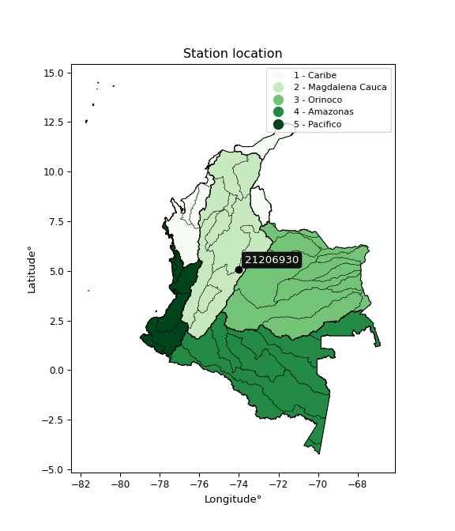</img>

</div>


## A. General information


### 1. General running parameters

• app_version: _v20260103_. • runtime: _2026-01-05 15:49:30.436617_. • Python version: _3.14.0_. • SciPy version: _1.16.3_. • Pandas version: _2.3.3_. • NumPy version: _2.3.5_. • Stations dataset (station_dataset_file): _dataset/pmax24h_in/automatic_test.csv_. • Stations catalog (station_catalog_file): _dataset/CNE.xls_. • Minimum year to eval til year_max (date_min): _1900_. • Maximum year to eval since year_min (date_max): _2024_. • Creates, save and include plots into reports (create_plot): _True_. • Plot only fit distributions with Δo > Δ (plot_only_fit): _True_. • Eval low extreme values, if False, evaluates high extreme values (low_extreme): _False_. • Eval every SciPy distribution as logarithmic (pdist_logarithmic_on): _True_. • Standard deviation normalized (ddof): _1.0_. • Return periods to eval in years (Tr): _[2, 2.33, 5, 10, 15, 20, 25, 50, 75, 100, 200, 250, 500, 750, 1000]_. • Minimum data sample per station, 0 means any (minimum_sample): _5_. • Z-Score maximum threshold to adjust a value, 0 means disable (zscore_max): _3.5_. • Z-Score minimum threshold to adjust a value, 0 means disable (zscore_min): _-2.5_. • Avoid zeros, e.g. rain = 0 (avoid_zeros): _True_. • Avoid null values (avoid_nans): _True_. [:file_folder:Dataset file.](../../dataset/pmax24h_in/automatic_test.csv)

> Delta Degrees of Freedom (DDOF): is a parameter used in the formulas for calculating variance and standard deviation. When ddof=0, the divisor is $N$ (the total number of observations) and this is used when your data set is the entire population. When ddof=1, the divisor is $N-1$ and this is used when your data set is a sample drawn from a larger population. Using $N-1$ provides an unbiased estimate of the population variance (known as Bessel´s correction).


### 2. Station info and location

|   id |   CODIGO | NOMBRE                     | CATEGORIA               | TECNOLOGIA                | ESTADO           | FECHA_INSTALACION   |   FECHA_SUSPENSION |   ALTITUD |   LATITUD |   LONGITUD | DEPARTAMENTO   | MUNICIPIO   | AREA_OPERATIVA                            | ENTIDAD                                                     | AREA_HIDROGRAFICA   | ZONA_HIDROGRAFICA   | SUBZONA_HIDROGRAFICA   |   CORRIENTE | Catalogo   |   Version |
|-----:|---------:|:---------------------------|:------------------------|:--------------------------|:-----------------|:--------------------|-------------------:|----------:|----------:|-----------:|:---------------|:------------|:------------------------------------------|:------------------------------------------------------------|:--------------------|:--------------------|:-----------------------|------------:|:-----------|----------:|
|    0 | 21206930 | PARAMO GUERRERO [21206930] | Climatológica Principal | Automática con Telemetría | En Mantenimiento | 01/12/2004          |                nan |      3237 |   5.08644 |   -74.0222 | Cundinamarca   | Zipaquirá   | Area Operativa 11 - Cundinamarca-Amazonas | INSTITUTO DE HIDROLOGIA METEOROLOGIA Y ESTUDIOS AMBIENTALES | Magdalena Cauca     | Alto Magdalena      | Río Bogotá             |         nan | CNE_IDEAM  |  20251226 |

<div align="center">

Dynamic map: [:earth_americas:Google](http://maps.google.com/maps?q=5.08644,-74.02217) [:earth_americas:OSM](https://www.openstreetmap.org/#map=18/5.08644/-74.02217&layers=P) [:earth_americas:Bing](https://www.bing.com/maps?cp=5.08644~-74.02217&lvl=18) [:earth_americas:Apple](https://maps.apple.com/frame?center=5.08644%2C-74.02217&span=0.003%2C0.006)

</div>


<div align="center">

```geojson
{
  "type": "Feature",
  "geometry": {
    "type": "Point", 
    "coordinates": [-74.02217, 5.08644]
  }, 
  "properties": {
    "Name": "21206930"
  }
}
```

</div>


### 3. Discrete values table and plot

<div align="center">

|               |          0 |           1 |          2 |           3 |           4 |           5 |           6 |           7 |           8 |           9 |         10 |         11 |          12 |          13 |          14 |          15 |          16 |           17 |          18 |
|:--------------|-----------:|------------:|-----------:|------------:|------------:|------------:|------------:|------------:|------------:|------------:|-----------:|-----------:|------------:|------------:|------------:|------------:|------------:|-------------:|------------:|
| Date          | 2005       | 2006        | 2007       | 2008        | 2009        | 2010        | 2011        | 2012        | 2013        | 2014        | 2015       | 2016       | 2017        | 2018        | 2019        | 2020        | 2021        | 2022         | 2023        |
| Value         |   42.2737  |   34.4      |   24.1     |   36.4      |   19.4      |   36.8      |   29.3      |   50.1      |   34.2      |   28.8      |   41.7     |   35       |   35.6      |   24.3      |   29.8      |   35.2      |   32.6      |   40.2       |   24.3      |
| Value_initial |  211       |   34.4      |   24.1     |   36.4      |   19.4      |   36.8      |   29.3      |   50.1      |   34.2      |   28.8      |   41.7     |   35       |   35.6      |   24.3      |   29.8      |   35.2      |   32.6      |   40.2       |   24.3      |
| count         |   19       |   19        |   19       |   19        |   19        |   19        |   19        |   19        |   19        |   19        |   19       |   19       |   19        |   19        |   19        |   19        |   19        |   19         |   19        |
| mean          |   42.2737  |   42.2737   |   42.2737  |   42.2737   |   42.2737   |   42.2737   |   42.2737   |   42.2737   |   42.2737   |   42.2737   |   42.2737  |   42.2737  |   42.2737   |   42.2737   |   42.2737   |   42.2737   |   42.2737   |   42.2737    |   42.2737   |
| std           |   41.4811  |   41.4811   |   41.4811  |   41.4811   |   41.4811   |   41.4811   |   41.4811   |   41.4811   |   41.4811   |   41.4811   |   41.4811  |   41.4811  |   41.4811   |   41.4811   |   41.4811   |   41.4811   |   41.4811   |   41.4811    |   41.4811   |
| zscore        |    4.06755 |   -0.189814 |   -0.43812 |   -0.141599 |   -0.551425 |   -0.131956 |   -0.312762 |    0.188672 |   -0.194635 |   -0.324815 |   -0.01383 |   -0.17535 |   -0.160885 |   -0.433299 |   -0.300708 |   -0.170528 |   -0.233207 |   -0.0499911 |   -0.433299 |


</div>


<div align="center">

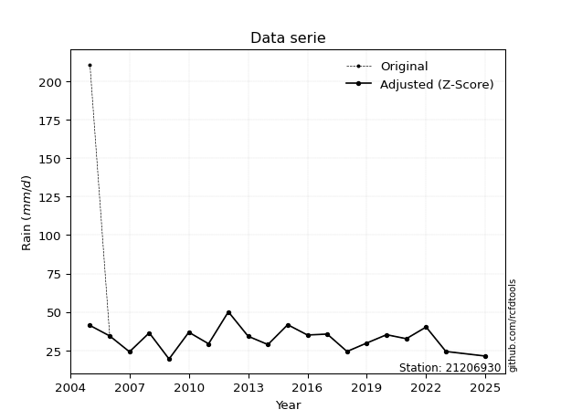</img>

</div>


> The initial value (value_initial) correspond to the initial obtained or null completed value, and value (value) is adjusted only when the initial value is outside the valid range (outlier) definite through the Z-Score value. If Z-Score is active, values out of range or outliers are replaced with the station mean value. A Z-Score (or standard score) measures how many standard deviations a data point is from the mean of a dataset, indicating its relative position; positive scores mean above the mean, negative mean below, and a score of zero is exactly at the mean, allowing for comparison of values from different distributions. It´s calculated using the formula $z=(x–μ)/σ$, where $x$ is the data point, $μ$ is the mean, and $σ$ is the standard deviation, helping identify outliers and understand probability.
>
> <sub>**Note**: In this study, "completing" (filling gaps in) and "extending" (forecasting or lengthening the historical record) rainfall data series are avoided for certain critical analyses because they introduce artificial bias and uncertainty, which can distort the statistics of rare events (extremes), alter day-to-day variability, and compromise the integrity and homogeneity of the original data. Some reasons against Completing/Extending rainfall data are: **Distortion of Extremes and Variability**: The primary issue is that most gap-filling or extension methods rely on averaging or regression with nearby stations, which inherently smooths the data. Rainfall is highly variable in space and time, with a large percentage of zero values and occasional large storms. Infilling methods often underestimate the highest values and overestimate the lowest (zero) values, which severely distorts analyses focused on flood frequency, drought severity, and intensity-duration-frequency (IDF) curves, **Loss of Data Homogeneity**: Infilled or extended data are synthetic estimates, not actual measurements. Combining these estimates with observed data can violate the assumption of data homogeneity, which requires that the data properties do not change over time. Inhomogeneity can lead to incorrect conclusions about long-term trends or changes in climate patterns, **Propagation of Errors**: Errors and biases from the original data (e.g., wind-induced undercatch, instrument errors, site changes) or the data used for imputation can propagate through the analysis, leading to unreliable hydrological models and inaccurate predictions, **Compromised Statistical Integrity**: For statistical analyses, especially those involving the frequency of events, using artificial data can introduce time bias or autocorrelation that doesn´t exist in reality, making it difficult to assess the true probability of events, **Difficulty in Validation**: It is difficult to accurately validate the quality of filled or extended data, especially for past periods where ground-truth measurements are unavailable. The reliability of imputation techniques heavily depends on the density of the surrounding station network and the complexity of the local topography.</sub>


### 4. Active continuous probability distributions from SciPy (44 of 104 available)

A Probability Density Function (PDF) describes the relative likelihood of a continuous random variable falling within a specific range, where the total area under its curve equals 1, and the area over any interval gives the actual probability for that range. Unlike discrete probabilities (like rolling a die), a PDF shows density, not direct probability for a single point (which is zero), with higher points indicating higher likelihood, often visualized as a bell curve for normal distributions.

A log of a probability density function (log-PDF) is simply the logarithm of the PDF´s value, denoted as $log(f(x))$, useful for converting multiplication of probabilities into addition, improving numerical stability with tiny numbers, and connecting to information theory concepts like entropy. Instead of dealing with very small probabilities (e.g., 0.000001), log-PDFs use negative numbers (e.g., $log(0.00001) ≈ -11.51$ that are easier for computers to handle, preventing underflow errors and simplifying complex calculations. In this study, each active probability distribution from SciPy is also evaluated in the $log$ form.

[scipy.stats](https://docs.scipy.org/doc/scipy/reference/stats.html) is a Python´s powerful submodule within the SciPy library for comprehensive statistical analysis, offering over 130 probability distributions (like Normal, Poisson), functions for descriptive stats (mean, variance), hypothesis testing (t-tests, chi-square), random variable generation, and statistical tests, making it essential for data science, modeling, and research. It provides tools to explore, model, and draw conclusions from data efficiently, working seamlessly with NumPy.

<div align="center">

|   id | p_dist             |   n_parameter | fit_method   | label                                                                       | active   | ref                                                                                                        |
|-----:|:-------------------|--------------:|:-------------|:----------------------------------------------------------------------------|:---------|:-----------------------------------------------------------------------------------------------------------|
|    0 | alpha              |             3 | MLE          | Alpha                                                                       | True     | [:mortar_board:](https://docs.scipy.org/doc/scipy/reference/generated/scipy.stats.alpha.html)              |
|    1 | betaprime          |             4 | MLE          | Beta prime                                                                  | True     | [:mortar_board:](https://docs.scipy.org/doc/scipy/reference/generated/scipy.stats.betaprime.html)          |
|    2 | chi2               |             3 | MLE          | Chi²                                                                        | True     | [:mortar_board:](https://docs.scipy.org/doc/scipy/reference/generated/scipy.stats.chi2.html)               |
|    3 | crystalball        |             4 | MLE          | Crystalball                                                                 | True     | [:mortar_board:](https://docs.scipy.org/doc/scipy/reference/generated/scipy.stats.crystalball.html)        |
|    4 | erlang             |             3 | MLE          | Erlang                                                                      | True     | [:mortar_board:](https://docs.scipy.org/doc/scipy/reference/generated/scipy.stats.erlang.html)             |
|    5 | expon              |             2 | MLE          | Exponential                                                                 | True     | [:mortar_board:](https://docs.scipy.org/doc/scipy/reference/generated/scipy.stats.expon.html)              |
|    6 | exponnorm          |             3 | MLE          | Exponentially modified Normal                                               | True     | [:mortar_board:](https://docs.scipy.org/doc/scipy/reference/generated/scipy.stats.exponnorm.html)          |
|    7 | f                  |             4 | MLE          | F                                                                           | True     | [:mortar_board:](https://docs.scipy.org/doc/scipy/reference/generated/scipy.stats.f.html)                  |
|    8 | fatiguelife        |             3 | MLE          | Fatigue-life (Birnbaum-Saunders)                                            | True     | [:mortar_board:](https://docs.scipy.org/doc/scipy/reference/generated/scipy.stats.fatiguelife.html)        |
|    9 | fisk               |             3 | MLE          | Fisk                                                                        | True     | [:mortar_board:](https://docs.scipy.org/doc/scipy/reference/generated/scipy.stats.fisk.html)               |
|   10 | gamma              |             3 | MLE          | Gamma                                                                       | True     | [:mortar_board:](https://docs.scipy.org/doc/scipy/reference/generated/scipy.stats.gamma.html)              |
|   11 | genexpon           |             5 | MLE          | Generalized exponential                                                     | True     | [:mortar_board:](https://docs.scipy.org/doc/scipy/reference/generated/scipy.stats.genexpon.html)           |
|   12 | genlogistic        |             3 | MLE          | Generalized logistic                                                        | True     | [:mortar_board:](https://docs.scipy.org/doc/scipy/reference/generated/scipy.stats.genlogistic.html)        |
|   13 | gibrat             |             2 | MM           | Gibrat                                                                      | True     | [:mortar_board:](https://docs.scipy.org/doc/scipy/reference/generated/scipy.stats.gibrat.html)             |
|   14 | gompertz           |             3 | MLE          | Gompertz (or truncated Gumbel)                                              | True     | [:mortar_board:](https://docs.scipy.org/doc/scipy/reference/generated/scipy.stats.gompertz.html)           |
|   15 | gumbel_l           |             2 | MM           | Gumbel Left Skew                                                            | True     | [:mortar_board:](https://docs.scipy.org/doc/scipy/reference/generated/scipy.stats.gumbel_l.html)           |
|   16 | gumbel_r           |             2 | MM           | Gumbel Right Skew                                                           | True     | [:mortar_board:](https://docs.scipy.org/doc/scipy/reference/generated/scipy.stats.gumbel_r.html)           |
|   17 | halflogistic       |             2 | MM           | Half-logistic                                                               | True     | [:mortar_board:](https://docs.scipy.org/doc/scipy/reference/generated/scipy.stats.halflogistic.html)       |
|   18 | halfnorm           |             2 | MM           | Half Normal                                                                 | True     | [:mortar_board:](https://docs.scipy.org/doc/scipy/reference/generated/scipy.stats.halfnorm.html)           |
|   19 | hypsecant          |             2 | MM           | hyperbolic secant                                                           | True     | [:mortar_board:](https://docs.scipy.org/doc/scipy/reference/generated/scipy.stats.hypsecant.html)          |
|   20 | invgamma           |             3 | MLE          | Inverted gamma                                                              | True     | [:mortar_board:](https://docs.scipy.org/doc/scipy/reference/generated/scipy.stats.invgamma.html)           |
|   21 | invgauss           |             3 | MLE          | Inverse Gaussian                                                            | True     | [:mortar_board:](https://docs.scipy.org/doc/scipy/reference/generated/scipy.stats.invgauss.html)           |
|   22 | invweibull         |             3 | MLE          | Inverted Weibull                                                            | True     | [:mortar_board:](https://docs.scipy.org/doc/scipy/reference/generated/scipy.stats.invweibull.html)         |
|   23 | johnsonsu          |             4 | MLE          | Johnson Su                                                                  | True     | [:mortar_board:](https://docs.scipy.org/doc/scipy/reference/generated/scipy.stats.johnsonsu.html)          |
|   24 | kstwobign          |             2 | MLE          | Limiting distribution of scaled Kolmogorov-Smirnov two-sided test statistic | True     | [:mortar_board:](https://docs.scipy.org/doc/scipy/reference/generated/scipy.stats.kstwobign.html)          |
|   25 | laplace            |             2 | MM           | Laplace                                                                     | True     | [:mortar_board:](https://docs.scipy.org/doc/scipy/reference/generated/scipy.stats.laplace.html)            |
|   26 | laplace_asymmetric |             3 | MLE          | Asymmetric Laplace                                                          | True     | [:mortar_board:](https://docs.scipy.org/doc/scipy/reference/generated/scipy.stats.laplace_asymmetric.html) |
|   27 | loggamma           |             3 | MLE          | Log gamma                                                                   | True     | [:mortar_board:](https://docs.scipy.org/doc/scipy/reference/generated/scipy.stats.loggamma.html)           |
|   28 | logistic           |             2 | MM           | Logistic (or Sech-squared)                                                  | True     | [:mortar_board:](https://docs.scipy.org/doc/scipy/reference/generated/scipy.stats.logistic.html)           |
|   29 | lognorm            |             3 | MLE          | Log Normal                                                                  | True     | [:mortar_board:](https://docs.scipy.org/doc/scipy/reference/generated/scipy.stats.lognorm.html)            |
|   30 | maxwell            |             2 | MM           | Maxwell                                                                     | True     | [:mortar_board:](https://docs.scipy.org/doc/scipy/reference/generated/scipy.stats.maxwell.html)            |
|   31 | mielke             |             4 | MLE          | Mielke Beta-Kappa / Dagum                                                   | True     | [:mortar_board:](https://docs.scipy.org/doc/scipy/reference/generated/scipy.stats.mielke.html)             |
|   32 | moyal              |             2 | MM           | Moyal                                                                       | True     | [:mortar_board:](https://docs.scipy.org/doc/scipy/reference/generated/scipy.stats.moyal.html)              |
|   33 | nakagami           |             3 | MLE          | Nakagami                                                                    | True     | [:mortar_board:](https://docs.scipy.org/doc/scipy/reference/generated/scipy.stats.nakagami.html)           |
|   34 | ncf                |             5 | MLE          | Non-central F distribution                                                  | True     | [:mortar_board:](https://docs.scipy.org/doc/scipy/reference/generated/scipy.stats.ncf.html)                |
|   35 | nct                |             4 | MLE          | Non-central Student’s t                                                     | True     | [:mortar_board:](https://docs.scipy.org/doc/scipy/reference/generated/scipy.stats.nct.html)                |
|   36 | norm               |             2 | MM           | Normal                                                                      | True     | [:mortar_board:](https://docs.scipy.org/doc/scipy/reference/generated/scipy.stats.norm.html)               |
|   37 | pearson3           |             3 | MM           | Pearson type III                                                            | True     | [:mortar_board:](https://docs.scipy.org/doc/scipy/reference/generated/scipy.stats.pearson3.html)           |
|   38 | rayleigh           |             2 | MM           | Rayleigh                                                                    | True     | [:mortar_board:](https://docs.scipy.org/doc/scipy/reference/generated/scipy.stats.rayleigh.html)           |
|   39 | rice               |             3 | MLE          | Rice                                                                        | True     | [:mortar_board:](https://docs.scipy.org/doc/scipy/reference/generated/scipy.stats.rice.html)               |
|   40 | t                  |             3 | MLE          | Student’s t                                                                 | True     | [:mortar_board:](https://docs.scipy.org/doc/scipy/reference/generated/scipy.stats.t.html)                  |
|   41 | truncnorm          |             4 | MLE          | Truncated normal                                                            | True     | [:mortar_board:](https://docs.scipy.org/doc/scipy/reference/generated/scipy.stats.truncnorm.html)          |
|   42 | wald               |             2 | MM           | Wald                                                                        | True     | [:mortar_board:](https://docs.scipy.org/doc/scipy/reference/generated/scipy.stats.wald.html)               |
|   43 | weibull_min        |             3 | MLE          | Weibull minimum                                                             | True     | [:mortar_board:](https://docs.scipy.org/doc/scipy/reference/generated/scipy.stats.weibull_min.html)        |

</div>

> **n_parameter:** # arguments & localization & scale.
>
> **Fit methods:** (MLE) maximum likelihood, (MM) L-moments.
>
>**Inactive** (With the only purpose of prevent loops, zero divisions, infinite values, over high estimated values or horizontal trending for recurrence intervals estimations, the follow distributions were disabled.)**:** foldnorm, gennorm, norminvgauss, powernorm, powerlognorm, skewnorm, genextreme, anglit, arcsine, argus, beta, bradford, burr, burr12, cauchy, cosine, halfcauchy, foldcauchy, skewcauchy, wrapcauchy, dgamma, gengamma, exponweib, exponpow, truncexpon, gausshyper, genhalflogistic, genhyperbolic, geninvgauss, halfgennorm, johnsonsb, kappa4, kappa3, ksone, kstwo, loglaplace, levy, levy_l, levy_stable, ncx2, pareto, genpareto, truncpareto, lomax, powerlaw, rdist, rel_breitwigner, recipinvgauss, semicircular, studentized_range, trapezoid, triang, truncweibull_min, tukeylambda, uniform, loguniform, vonmises, vonmises_line, weibull_max, dweibull, 


## B. Probability (PDF) vs. Empirical (EDF) distributions functions

A continuous probability distribution (CPD) describes probabilities for variables that can take any value within a range (like rain any time), unlike discrete variables with specific outcomes (like temperature). It uses a Probability Density Function (PDF), a curve where the total area under it equals 1, and the probability of the variable falling within an interval (a to b) is found by calculating the area under the curve between those points. A key feature is that the probability of hitting any single exact value is zero, so probabilities are always expressed for ranges, e.g., $P(a ≤ X ≤ b)$.

<div align="center">

Distributions parameters from station values
|    |   station | p_dist                |   n |              loc |           scale | shape                  | shape1               | shape2                | shape3   |
|---:|----------:|:----------------------|----:|-----------------:|----------------:|:-----------------------|:---------------------|:----------------------|:---------|
|  0 |  21206930 | alpha                 |  19 |   -102.49        |  2537.33        | 18.72954159208941      |                      |                       |          |
|  1 |  21206930 | betaprime             |  19 |    -31.7038      |  1856.33        | 82.10453917645586      | 2341.6211664589437   |                       |          |
|  2 |  21206930 | chi2                  |  19 |    -21.6211      |     0.490567    | 112.11665098497133     |                      |                       |          |
|  3 |  21206930 | crystalball           |  19 |     33.3934      |     7.2739      | 2242.837488906712      | 1.702634400183329    |                       |          |
|  4 |  21206930 | erlang                |  19 |    -46.9891      |     0.658947    | 121.98621342091391     |                      |                       |          |
|  5 |  21206930 | expon                 |  19 |     19.4         |    13.9934      |                        |                      |                       |          |
|  6 |  21206930 | exponnorm             |  19 |     30.4926      |     6.67634     | 0.4344831282954899     |                      |                       |          |
|  7 |  21206930 | f                     |  19 |    -48.6162      |    81.999       | 258.20445726390346     | 15538.824240813143   |                       |          |
|  8 |  21206930 | fatiguelife           |  19 |    -91.2298      |   124.411       | 0.058367211431717116   |                      |                       |          |
|  9 |  21206930 | fisk                  |  19 |   -331.646       |   365.014       | 88.02370810827884      |                      |                       |          |
| 10 |  21206930 | gamma                 |  19 |    -46.9891      |     0.658947    | 121.9861324821255      |                      |                       |          |
| 11 |  21206930 | genexpon              |  19 |     19.4         |     1.82468     | 0.07556616721610172    | 0.060590819147979286 | 1.2647686351896366    |          |
| 12 |  21206930 | genlogistic           |  19 |     32.8103      |     4.28106     | 1.09535994785324       |                      |                       |          |
| 13 |  21206930 | gibrat                |  19 |     27.8443      |     3.36567     |                        |                      |                       |          |
| 14 |  21206930 | gompertz              |  19 |     24.1         |     2.23131     | 0.00014533190627644469 |                      |                       |          |
| 15 |  21206930 | gumbel_l              |  19 |     36.667       |     5.67143     |                        |                      |                       |          |
| 16 |  21206930 | gumbel_r              |  19 |     30.1197      |     5.67143     |                        |                      |                       |          |
| 17 |  21206930 | halflogistic          |  19 |     24.7721      |     6.21894     |                        |                      |                       |          |
| 18 |  21206930 | halfnorm              |  19 |     23.7655      |    12.0667      |                        |                      |                       |          |
| 19 |  21206930 | hypsecant             |  19 |     33.3934      |     4.63071     |                        |                      |                       |          |
| 20 |  21206930 | invgamma              |  19 |    -53.2992      | 12091.5         | 140.44413103044957     |                      |                       |          |
| 21 |  21206930 | invgauss              |  19 |    -11.2085      |  1517.97        | 0.029371631558232025   |                      |                       |          |
| 22 |  21206930 | invweibull            |  19 |     -5.20709e+08 |     5.20709e+08 | 76866531.52878399      |                      |                       |          |
| 23 |  21206930 | johnsonsu             |  19 |    -56.8832      |    63.318       | -17.472137146974447    | 15.17908043708222    |                       |          |
| 24 |  21206930 | kstwobign             |  19 |      5.34239     |    32.171       |                        |                      |                       |          |
| 25 |  21206930 | laplace               |  19 |     33.3934      |     5.14342     |                        |                      |                       |          |
| 26 |  21206930 | laplace_asymmetric    |  19 |     35.2         |     5.44584     | 1.1794886103286413     |                      |                       |          |
| 27 |  21206930 | loggamma              |  19 |  -1979.81        |   276.72        | 1444.5721726041775     |                      |                       |          |
| 28 |  21206930 | logistic              |  19 |     33.3934      |     4.01031     |                        |                      |                       |          |
| 29 |  21206930 | lognorm               |  19 |    -93.6337      |   126.819       | 0.057236636917503525   |                      |                       |          |
| 30 |  21206930 | maxwell               |  19 |     16.1573      |    10.8011      |                        |                      |                       |          |
| 31 |  21206930 | mielke                |  19 |     -0.254742    |    37.7063      | 5.294160731372423      | 11.437693181367266   |                       |          |
| 32 |  21206930 | moyal                 |  19 |     29.2337      |     3.2744      |                        |                      |                       |          |
| 33 |  21206930 | nakagami              |  19 |     24.1         |    16.3866      | 0.32035323640107705    |                      |                       |          |
| 34 |  21206930 | ncf                   |  19 |     -4.67799     |     4.33493     | 11.732278202561549     | 5819.990502662969    | 91.16428438185983     |          |
| 35 |  21206930 | nct                   |  19 |     -0.541882    |     6.79694     | 101.52731966980579     | 4.95562576868987     |                       |          |
| 36 |  21206930 | norm                  |  19 |     33.3934      |     7.2739      |                        |                      |                       |          |
| 37 |  21206930 | pearson3              |  19 |     33.3934      |     7.27392     | 0.14790219816540917    |                      |                       |          |
| 38 |  21206930 | rayleigh              |  19 |     19.4779      |    11.1029      |                        |                      |                       |          |
| 39 |  21206930 | rice                  |  19 |     16.7306      |     8.16951     | 1.718392228491568      |                      |                       |          |
| 40 |  21206930 | t                     |  19 |     33.3933      |     7.27397     | 48358033.44634561      |                      |                       |          |
| 41 |  21206930 | truncnorm             |  19 |     31.8387      |    26.2303      | -451.21953284055087    | 0.6961913906441191   |                       |          |
| 42 |  21206930 | wald                  |  19 |     26.1194      |     7.27394     |                        |                      |                       |          |
| 43 |  21206930 | weibull_min           |  19 |     14.7476      |    20.9393      | 2.7834572089582865     |                      |                       |          |
| 44 |  21206930 | logalpha              |  19 |     -3.85682     |   230.472       | 31.433641587897498     |                      |                       |          |
| 45 |  21206930 | logbetaprime          |  19 |     -2.92314     |    14.0362      | 690.0945109920872      | 1513.5684021865563   |                       |          |
| 46 |  21206930 | logchi2               |  19 |      2.96527     |     0.964529    | 1.0782781232604968     |                      |                       |          |
| 47 |  21206930 | logcrystalball        |  19 |      3.48352     |     0.226594    | 7.488554764647619      | 1055.6812519188045   |                       |          |
| 48 |  21206930 | logerlang             |  19 |     -0.484909    |     0.0133696   | 296.8930697482733      |                      |                       |          |
| 49 |  21206930 | logexpon              |  19 |      2.96527     |     0.518246    |                        |                      |                       |          |
| 50 |  21206930 | logexponnorm          |  19 |      3.48332     |     0.226594    | 0.000896591162776865   |                      |                       |          |
| 51 |  21206930 | logf                  |  19 |   -133.416       |   136.9         | 1859823.2329794718     | 1191399.0190712959   |                       |          |
| 52 |  21206930 | logfatiguelife        |  19 |    -64.4953      |    67.9793      | 0.0033340942621581937  |                      |                       |          |
| 53 |  21206930 | logfisk               |  19 |     -2.06761e+07 |     2.06761e+07 | 161733759.69019324     |                      |                       |          |
| 54 |  21206930 | loggamma              |  19 |     -0.65249     |     0.0127549   | 324.2230482968921      |                      |                       |          |
| 55 |  21206930 | loggenexpon           |  19 |      2.96364     |     0.00604096  | 0.0017465639152143102  | 3.07208783610809     | 6.287501349047287e-05 |          |
| 56 |  21206930 | loggenlogistic        |  19 |      3.62371     |     0.087856    | 0.46043850648043394    |                      |                       |          |
| 57 |  21206930 | loggibrat             |  19 |      3.31066     |     0.104844    |                        |                      |                       |          |
| 58 |  21206930 | loggompertz           |  19 |      2.92526     |     0.226279    | 0.058251254440884026   |                      |                       |          |
| 59 |  21206930 | loggumbel_l           |  19 |      3.5855      |     0.176675    |                        |                      |                       |          |
| 60 |  21206930 | loggumbel_r           |  19 |      3.38154     |     0.176675    |                        |                      |                       |          |
| 61 |  21206930 | loghalflogistic       |  19 |      3.21493     |     0.193744    |                        |                      |                       |          |
| 62 |  21206930 | loghalfnorm           |  19 |      3.18358     |     0.375919    |                        |                      |                       |          |
| 63 |  21206930 | loghypsecant          |  19 |      3.48352     |     0.144254    |                        |                      |                       |          |
| 64 |  21206930 | loginvgamma           |  19 |     -5.92917     | 15645.4         | 1663.2106726576146     |                      |                       |          |
| 65 |  21206930 | loginvgauss           |  19 |      1.3014      |   176.694       | 0.012348396952592551   |                      |                       |          |
| 66 |  21206930 | loginvweibull         |  19 |     -4.70356e+07 |     4.70356e+07 | 197492877.53537074     |                      |                       |          |
| 67 |  21206930 | logjohnsonsu          |  19 |      4.6921      |     0.404699    | 10.187535935254804     | 5.6620368862521175   |                       |          |
| 68 |  21206930 | logkstwobign          |  19 |      2.49556     |     1.13362     |                        |                      |                       |          |
| 69 |  21206930 | loglaplace            |  19 |      3.48352     |     0.160226    |                        |                      |                       |          |
| 70 |  21206930 | loglaplace_asymmetric |  19 |      3.56105     |     0.16153     | 1.2682031159151792     |                      |                       |          |
| 71 |  21206930 | logloggamma           |  19 |      2.93671     |     0.430089    | 4.054233878483621      |                      |                       |          |
| 72 |  21206930 | loglogistic           |  19 |      3.48352     |     0.124928    |                        |                      |                       |          |
| 73 |  21206930 | loglognorm            |  19 | -16381           | 16384.5         | 1.3829820802437129e-05 |                      |                       |          |
| 74 |  21206930 | logmaxwell            |  19 |      2.94659     |     0.336473    |                        |                      |                       |          |
| 75 |  21206930 | logmielke             |  19 |     -0.354933    |     3.99788     | 18.84093214908156      | 48.04801961939901    |                       |          |
| 76 |  21206930 | logmoyal              |  19 |      3.35394     |     0.102003    |                        |                      |                       |          |
| 77 |  21206930 | lognakagami           |  19 |    -75.834       |    79.318       | 30638.759102771903     |                      |                       |          |
| 78 |  21206930 | logncf                |  19 |     -3.4914      |     6.96583     | 1016.211633595507      | 766.4058078964272    | 0.6991388266203176    |          |
| 79 |  21206930 | lognct                |  19 |     -1.20088     |     0.0434228   | 210.1295641501539      | 107.46773052736859   |                       |          |
| 80 |  21206930 | lognorm               |  19 |      3.48352     |     0.226594    |                        |                      |                       |          |
| 81 |  21206930 | logpearson3           |  19 |      3.48352     |     0.226594    | -0.4241507889517795    |                      |                       |          |
| 82 |  21206930 | lograyleigh           |  19 |      3.05006     |     0.345849    |                        |                      |                       |          |
| 83 |  21206930 | logrice               |  19 |      2.82501     |     0.238746    | 2.551162500554419      |                      |                       |          |
| 84 |  21206930 | logt                  |  19 |      3.48352     |     0.226596    | 79681954.83282265      |                      |                       |          |
| 85 |  21206930 | logtruncnorm          |  19 |      0.0337434   |     1.44043     | 2.0351794952826765     | 2.693842034651729    |                       |          |
| 86 |  21206930 | logwald               |  19 |      3.25695     |     0.226569    |                        |                      |                       |          |
| 87 |  21206930 | logweibull_min        |  19 |      2.29533     |     1.27938     | 6.186710190809183      |                      |                       |          |

</div>

> **loc** (Location parameter): This shifts the distribution along the x-axis. For many common distributions, like the normal (Gaussian) distribution, loc represents the mean $μ$. For others, like the uniform distribution, it might represent the minimum value, or for the beta distribution, the left end of the support interval.
>
> **scale** (Scale parameter): This determines the width or spread of the distribution. For the normal distribution, scale represents the standard deviation $σ$. For a uniform distribution, it defines the length of the interval (from $loc$ to $loc + scale$).
>
> **shape** (Shape parameters): Refers to parameters that define the specific form of a probability distribution, distinct from its location (loc) and scale (scale). These parameters are required arguments for most distribution functions. For example, a normal (Gaussian) distribution is fully defined by its location (mean) and scale (standard deviation), so it has no specific shape parameters beyond loc and scale. However, other distributions have intrinsic properties that need specification, as Gamma distribution that takes a shape parameter, often named $a$ or $alpha$.


### 0. Cumulative distribution values - CDF (88 evaluated)

Cumulative Distribution Function (CDF), denoted as $F$<sub>$X$</sub>$(x)$, is a function that gives the probability that a random variable $X$ will take a value less than or equal to a specific value, $x$ (i.e., $(P(X≥x)$. It essentially "accumulates" probabilities from a given point up to the far right (positive infinity), providing a complete picture of the distribution´s probabilities for both discrete (like rain) and continuous (like temperature) variables, helping to find probabilities over ranges or above certain values. Each station is evaluated separately ordering the $x$ values ascending, calculating the CDF and PDF values for the activated distributions and their logarithmic forms.

<div align="center">

CDF ordered by x ascending and calculating $log(f(x))$ separately
|   id |   Station |   date |       x |   count |    mean |     std |     zscore |   Value_initial |   station |   m |     alpha |   alpha_pdf |   betaprime |   betaprime_pdf |      chi2 |   chi2_pdf |   crystalball |   crystalball_pdf |   erlang |   erlang_pdf |    expon |   expon_pdf |   exponnorm |   exponnorm_pdf |         f |      f_pdf |   fatiguelife |   fatiguelife_pdf |      fisk |   fisk_pdf |    gamma |   gamma_pdf |    genexpon |   genexpon_pdf |   genlogistic |   genlogistic_pdf |   gibrat |   gibrat_pdf |    gompertz |   gompertz_pdf |   gumbel_l |   gumbel_l_pdf |   gumbel_r |   gumbel_r_pdf |   halflogistic |   halflogistic_pdf |   halfnorm |   halfnorm_pdf |   hypsecant |   hypsecant_pdf |   invgamma |   invgamma_pdf |   invgauss |   invgauss_pdf |   invweibull |   invweibull_pdf |   johnsonsu |   johnsonsu_pdf |   kstwobign |   kstwobign_pdf |   laplace |   laplace_pdf |   laplace_asymmetric |   laplace_asymmetric_pdf |   loggamma |   loggamma_pdf |   logistic |   logistic_pdf |   lognorm |   lognorm_pdf |    maxwell |   maxwell_pdf |    mielke |   mielke_pdf |       moyal |   moyal_pdf |    nakagami |   nakagami_pdf |       ncf |    ncf_pdf |       nct |    nct_pdf |      norm |   norm_pdf |   pearson3 |   pearson3_pdf |   rayleigh |   rayleigh_pdf |      rice |   rice_pdf |         t |      t_pdf |   truncnorm |   truncnorm_pdf |     wald |   wald_pdf |   weibull_min |   weibull_min_pdf |   logalpha |   logalpha_pdf |   logbetaprime |   logbetaprime_pdf |     logchi2 |   logchi2_pdf |   logcrystalball |   logcrystalball_pdf |   logerlang |   logerlang_pdf |   logexpon |   logexpon_pdf |   logexponnorm |   logexponnorm_pdf |      logf |   logf_pdf |   logfatiguelife |   logfatiguelife_pdf |   logfisk |   logfisk_pdf |   loggenexpon |   loggenexpon_pdf |   loggenlogistic |   loggenlogistic_pdf |   loggibrat |   loggibrat_pdf |   loggompertz |   loggompertz_pdf |   loggumbel_l |   loggumbel_l_pdf |   loggumbel_r |   loggumbel_r_pdf |   loghalflogistic |   loghalflogistic_pdf |   loghalfnorm |   loghalfnorm_pdf |   loghypsecant |   loghypsecant_pdf |   loginvgamma |   loginvgamma_pdf |   loginvgauss |   loginvgauss_pdf |   loginvweibull |   loginvweibull_pdf |   logjohnsonsu |   logjohnsonsu_pdf |   logkstwobign |   logkstwobign_pdf |   loglaplace |   loglaplace_pdf |   loglaplace_asymmetric |   loglaplace_asymmetric_pdf |   logloggamma |   logloggamma_pdf |   loglogistic |   loglogistic_pdf |   loglognorm |   loglognorm_pdf |   logmaxwell |   logmaxwell_pdf |   logmielke |   logmielke_pdf |   logmoyal |   logmoyal_pdf |   lognakagami |   lognakagami_pdf |   logncf |   logncf_pdf |     lognct |   lognct_pdf |   logpearson3 |   logpearson3_pdf |   lograyleigh |   lograyleigh_pdf |    logrice |   logrice_pdf |      logt |   logt_pdf |   logtruncnorm |   logtruncnorm_pdf |   logwald |   logwald_pdf |   logweibull_min |   logweibull_min_pdf |
|-----:|----------:|-------:|--------:|--------:|--------:|--------:|-----------:|----------------:|----------:|----:|----------:|------------:|------------:|----------------:|----------:|-----------:|--------------:|------------------:|---------:|-------------:|---------:|------------:|------------:|----------------:|----------:|-----------:|--------------:|------------------:|----------:|-----------:|---------:|------------:|------------:|---------------:|--------------:|------------------:|---------:|-------------:|------------:|---------------:|-----------:|---------------:|-----------:|---------------:|---------------:|-------------------:|-----------:|---------------:|------------:|----------------:|-----------:|---------------:|-----------:|---------------:|-------------:|-----------------:|------------:|----------------:|------------:|----------------:|----------:|--------------:|---------------------:|-------------------------:|-----------:|---------------:|-----------:|---------------:|----------:|--------------:|-----------:|--------------:|----------:|-------------:|------------:|------------:|------------:|---------------:|----------:|-----------:|----------:|-----------:|----------:|-----------:|-----------:|---------------:|-----------:|---------------:|----------:|-----------:|----------:|-----------:|------------:|----------------:|---------:|-----------:|--------------:|------------------:|-----------:|---------------:|---------------:|-------------------:|------------:|--------------:|-----------------:|---------------------:|------------:|----------------:|-----------:|---------------:|---------------:|-------------------:|----------:|-----------:|-----------------:|---------------------:|----------:|--------------:|--------------:|------------------:|-----------------:|---------------------:|------------:|----------------:|--------------:|------------------:|--------------:|------------------:|--------------:|------------------:|------------------:|----------------------:|--------------:|------------------:|---------------:|-------------------:|--------------:|------------------:|--------------:|------------------:|----------------:|--------------------:|---------------:|-------------------:|---------------:|-------------------:|-------------:|-----------------:|------------------------:|----------------------------:|--------------:|------------------:|--------------:|------------------:|-------------:|-----------------:|-------------:|-----------------:|------------:|----------------:|-----------:|---------------:|--------------:|------------------:|---------:|-------------:|-----------:|-------------:|--------------:|------------------:|--------------:|------------------:|-----------:|--------------:|----------:|-----------:|---------------:|-------------------:|----------:|--------------:|-----------------:|---------------------:|
|    0 |  21206930 |   2009 | 19.4    |      19 | 42.2737 | 41.4811 | -0.551425  |            19.4 |  21206930 |   1 | 0.018442  |  0.00771813 |   0.0206586 |      0.00804998 | 0.0202867 | 0.00812722 |     0.0271913 |        0.00861984 | 0.021871 |   0.00815828 | 0        |  0.0714625  |   0.0243635 |      0.00825474 | 0.0218969 | 0.00815927 |     0.0220779 |        0.00816659 | 0.0312362 | 0.00758771 | 0.021871 |  0.00815828 | 1.36681e-08 |     0.0414133  |     0.030871  |        0.00756865 | 0        |   0          | 0           |    0           |  0.0465015 |     0.00800559 | 0.00133318 |     0.0015562  |       0        |         0          |  0         |     0          |   0.0309855 |      0.00668076 |  0.0183055 |     0.00774965 |  0.0165511 |     0.00802545 |   0.00978138 |       0.0066814  |   0.0225148 |      0.00819447 |   0.0089653 |      0.0076036  | 0.0329166 |    0.00639975 |            0.0497163 |               0.00773998 |  0.0097225 |       0.12384  |  0.0296169 |     0.00716647 | 0.0110947 |      0.128763 | 0.00700537 |    0.00636478 | 0.0317627 |   0.00855058 | 7.16072e-06 | 2.30376e-05 | 0           |      0         | 0.0186903 | 0.007935   | 0.0234598 | 0.00818801 | 0.0271913 | 0.00861983 |  0.0228339 |     0.00825179 |  0         |     0          | 0.012346  | 0.00935871 | 0.0271926 | 0.0086201  |    0.419735 |       0.0179584 | 0        | 0          |     0.0150773 |        0.00895209 | 0.00939894 |       0.125024 |       0.036168 |           0.290321 | 4.17386e-09 |   5.06721e+06 |        0.0110947 |             0.128763 |  0.00962726 |        0.122938 |   0        |       1.92959  |      0.0110947 |           0.128763 | 0.0110745 |   0.128744 |        0.0107967 |             0.126686 | 0.0153144 |      0.117959 |   0.000478117 |          0.297604 |        0.0317134 |             0.166112 |    0        |        0        |     0.0112036 |          0.303781 |     0.0294385 |         0.164148  |   2.61959e-05 |        0.00156426 |          0        |              0        |     0         |          0        |      0.0175199 |           0.12139  |     0.0103481 |          0.128288 |    0.00830769 |          0.123878 |      0.00462746 |            0.104449 |      0.0212645 |           0.162808 |     0.00458124 |           0.130415 |    0.0196907 |         0.122893 |               0.0336476 |                    0.164253 |     0.0216639 |          0.162687 |     0.0155449 |          0.122496 |    0.011094  |         0.12876  |  4.55199e-05 |       0.00730314 |   0.0302123 |        0.171421 | 1.8113e-11 |    4.09526e-09 |     0.0110038 |          0.128138 | 0.127826 |     0.480029 | 0.00824638 |     0.116781 |     0.0194927 |          0.161109 |     0         |          0        | 0.00795034 |      0.131564 | 0.0110951 |   0.128766 |    3.95927e-07 |           2.00834  |  0        |      0        |        0.0181057 |             0.165677 |
|    1 |  21206930 |   2007 | 24.1    |      19 | 42.2737 | 41.4811 | -0.43812   |            24.1 |  21206930 |   2 | 0.0943945 |  0.0266359  |   0.0962461 |      0.0259633  | 0.0973141 | 0.0265016  |     0.10069   |        0.0242485  | 0.096927 |   0.0255858  | 0.285287 |  0.0510752  |   0.0975955 |      0.0246699  | 0.096934  | 0.0255765  |     0.0969844 |        0.0255116  | 0.0941696 | 0.0211065  | 0.096927 |  0.0255858  | 0.262617    |     0.0540811  |     0.0941175 |        0.0212969  | 0        |   0          | 1.09165e-10 |    6.51331e-05 |  0.103325  |     0.0172431  | 0.0555517  |     0.0283119  |       0        |         0          |  0.0221125 |     0.0660976  |   0.0850552 |      0.0181498  |  0.0946772 |     0.02675    |  0.0995338 |     0.0292118  |   0.0990523  |       0.0338076  |   0.0971999 |      0.0253807  |   0.114113  |      0.0380705  | 0.0820858 |    0.0159594  |            0.103342  |               0.0160886  |  0.0927556 |       0.760436 |  0.0896949 |     0.02036    | 0.091805  |      0.727294 | 0.0901498  |    0.0304825  | 0.0985498 |   0.021279   | 0.028523    | 0.0242521   | 7.14529e-11 |  12886         | 0.0961082 | 0.0269314  | 0.0971884 | 0.0249876  | 0.10069   | 0.0242485  |  0.0975936 |     0.0253252  |  0.0830026 |     0.0343821  | 0.0999186 | 0.0285012  | 0.100692  | 0.0242487  |    0.50735  |       0.0192397 | 0        | 0          |     0.100659  |        0.0283969  | 0.0953793  |       0.788497 |       0.154824 |           0.843918 | 0.333439    |   0.769846    |        0.091805  |             0.727294 |  0.0922049  |        0.756663 |   0.342034 |       1.2696   |      0.0918049 |           0.727294 | 0.0917836 |   0.726977 |        0.0910247 |             0.725755 | 0.0782348 |      0.564094 |   0.172648    |          1.19526  |        0.0985849 |             0.513295 |    0        |        0        |     0.115805  |          0.70855  |     0.0969827 |         0.52141   |   0.0454953   |        0.795739   |          0        |              0        |     0         |          0        |      0.078443  |           0.538295 |     0.0940578 |          0.759024 |    0.0995377  |          0.840511 |      0.115099   |            1.04483  |      0.0983449 |           0.627967 |     0.14338    |           1.19545  |    0.0762561 |         0.475928 |               0.0970224 |                    0.47362  |     0.0982723 |          0.62375  |     0.0822737 |          0.604386 |    0.0918048 |         0.727304 |  0.0790035   |       0.910013   |   0.0994555 |        0.528287 | 0.0203157  |    0.614651    |     0.0915791 |          0.726963 | 0.258763 |     0.717779 | 0.0937316  |     0.799238 |     0.0983162 |          0.648488 |     0.0704003 |          1.02705  | 0.0930788  |      0.762886 | 0.0918063 |   0.727298 |    0.373938    |           1.46148  |  0        |      0        |        0.0984423 |             0.651746 |
|    2 |  21206930 |   2018 | 24.3    |      19 | 42.2737 | 41.4811 | -0.433299  |            24.3 |  21206930 |   3 | 0.0998244 |  0.0276646  |   0.101536  |      0.0269328  | 0.102713  | 0.0274861  |     0.105625  |        0.025106   | 0.102139 |   0.0265339  | 0.295429 |  0.0503504  |   0.10262   |      0.02558    | 0.102144  | 0.0265243  |     0.102181  |        0.0264568  | 0.0984753 | 0.0219543  | 0.102139 |  0.0265339  | 0.273367    |     0.0534128  |     0.0984625 |        0.0221576  | 0        |   0          | 1.36283e-05 |    7.12399e-05 |  0.106828  |     0.0177922  | 0.0614035  |     0.0302099  |       0        |         0          |  0.0353283 |     0.0660582  |   0.0887617 |      0.0189206  |  0.10013   |     0.0277755  |  0.105484  |     0.0302899  |   0.105944   |       0.0351079  |   0.10237   |      0.0263197  |   0.121845  |      0.0392422  | 0.0853406 |    0.0165922  |            0.10661   |               0.0165974  |  0.099194  |       0.797756 |  0.0938511 |     0.0212061  | 0.0979625 |      0.762929 | 0.096358   |    0.0315982  | 0.102879  |   0.0220184  | 0.033658    | 0.0271141   | 0.0461349   |      0.147789  | 0.101596  | 0.0279458  | 0.102279  | 0.0259156  | 0.105625  | 0.025106   |  0.102752  |     0.0262559  |  0.090001  |     0.0355961  | 0.105706  | 0.0293748  | 0.105628  | 0.0251062  |    0.511203 |       0.0192825 | 0        | 0          |     0.106429  |        0.0292998  | 0.102053   |       0.826567 |       0.161898 |           0.867999 | 0.339733    |   0.753459    |        0.0979625 |             0.762929 |  0.0986115  |        0.793822 |   0.352443 |       1.24952  |      0.0979624 |           0.762929 | 0.0979382 |   0.76254  |        0.09717   |             0.761503 | 0.0830257 |      0.595527 |   0.182615    |          1.21653  |        0.102918  |             0.535512 |    0        |        0        |     0.121749  |          0.729967 |     0.101383  |         0.543717  |   0.0523961   |        0.874556   |          0        |              0        |     0.0146388 |          2.12213  |      0.0830175 |           0.568991 |     0.100482  |          0.795766 |    0.106646   |          0.879686 |      0.123907   |            1.08642  |      0.103649  |           0.65583  |     0.153398   |           1.22867  |    0.0802927 |         0.50112  |               0.101017  |                    0.493119 |     0.103541  |          0.651528 |     0.0874087 |          0.638515 |    0.0979624 |         0.762939 |  0.086723    |       0.958054   |   0.103913  |        0.550495 | 0.0258579  |    0.727835    |     0.097734  |          0.762641 | 0.264726 |     0.725283 | 0.100499   |     0.838626 |     0.103794  |          0.677304 |     0.0791127 |          1.08105  | 0.0995325  |      0.798999 | 0.0979638 |   0.762932 |    0.385941    |           1.44325  |  0        |      0        |        0.103944  |             0.679694 |
|    3 |  21206930 |   2023 | 24.3    |      19 | 42.2737 | 41.4811 | -0.433299  |            24.3 |  21206930 |   4 | 0.0998244 |  0.0276646  |   0.101536  |      0.0269328  | 0.102713  | 0.0274861  |     0.105625  |        0.025106   | 0.102139 |   0.0265339  | 0.295429 |  0.0503504  |   0.10262   |      0.02558    | 0.102144  | 0.0265243  |     0.102181  |        0.0264568  | 0.0984753 | 0.0219543  | 0.102139 |  0.0265339  | 0.273367    |     0.0534128  |     0.0984625 |        0.0221576  | 0        |   0          | 1.36283e-05 |    7.12399e-05 |  0.106828  |     0.0177922  | 0.0614035  |     0.0302099  |       0        |         0          |  0.0353283 |     0.0660582  |   0.0887617 |      0.0189206  |  0.10013   |     0.0277755  |  0.105484  |     0.0302899  |   0.105944   |       0.0351079  |   0.10237   |      0.0263197  |   0.121845  |      0.0392422  | 0.0853406 |    0.0165922  |            0.10661   |               0.0165974  |  0.099194  |       0.797756 |  0.0938511 |     0.0212061  | 0.0979625 |      0.762929 | 0.096358   |    0.0315982  | 0.102879  |   0.0220184  | 0.033658    | 0.0271141   | 0.0461349   |      0.147789  | 0.101596  | 0.0279458  | 0.102279  | 0.0259156  | 0.105625  | 0.025106   |  0.102752  |     0.0262559  |  0.090001  |     0.0355961  | 0.105706  | 0.0293748  | 0.105628  | 0.0251062  |    0.511203 |       0.0192825 | 0        | 0          |     0.106429  |        0.0292998  | 0.102053   |       0.826567 |       0.161898 |           0.867999 | 0.339733    |   0.753459    |        0.0979625 |             0.762929 |  0.0986115  |        0.793822 |   0.352443 |       1.24952  |      0.0979624 |           0.762929 | 0.0979382 |   0.76254  |        0.09717   |             0.761503 | 0.0830257 |      0.595527 |   0.182615    |          1.21653  |        0.102918  |             0.535512 |    0        |        0        |     0.121749  |          0.729967 |     0.101383  |         0.543717  |   0.0523961   |        0.874556   |          0        |              0        |     0.0146388 |          2.12213  |      0.0830175 |           0.568991 |     0.100482  |          0.795766 |    0.106646   |          0.879686 |      0.123907   |            1.08642  |      0.103649  |           0.65583  |     0.153398   |           1.22867  |    0.0802927 |         0.50112  |               0.101017  |                    0.493119 |     0.103541  |          0.651528 |     0.0874087 |          0.638515 |    0.0979624 |         0.762939 |  0.086723    |       0.958054   |   0.103913  |        0.550495 | 0.0258579  |    0.727835    |     0.097734  |          0.762641 | 0.264726 |     0.725283 | 0.100499   |     0.838626 |     0.103794  |          0.677304 |     0.0791127 |          1.08105  | 0.0995325  |      0.798999 | 0.0979638 |   0.762932 |    0.385941    |           1.44325  |  0        |      0        |        0.103944  |             0.679694 |
|    4 |  21206930 |   2014 | 28.8    |      19 | 42.2737 | 41.4811 | -0.324815  |            28.8 |  21206930 |   5 | 0.275377  |  0.0491505  |   0.271561  |      0.0477017  | 0.275333  | 0.048148   |     0.263862  |        0.0449315  | 0.269858 |   0.0472304  | 0.489185 |  0.0365041  |   0.265465  |      0.0463558  | 0.269816  | 0.0472223  |     0.269512  |        0.0471608  | 0.248164  | 0.0455639  | 0.269857 |  0.0472304  | 0.479824    |     0.0387897  |     0.249504  |        0.0458643  | 0.104026 |   0.188984   | 0.00104853  |    0.000534735 |  0.221037  |     0.0343086  | 0.283088   |     0.0629923  |       0.312979 |         0.072524   |  0.323483  |     0.0606113  |   0.226086  |      0.0448205  |  0.275687  |     0.0489877  |  0.291341  |     0.0502914  |   0.314967   |       0.0537152  |   0.268959  |      0.0470169  |   0.337688  |      0.0524129  | 0.204702  |    0.0397988  |            0.21481   |               0.0334422  |  0.301356  |       1.54762  |  0.241333  |     0.0456552  | 0.293408  |      1.5189   | 0.287436   |    0.0510162  | 0.245906  |   0.0426438  | 0.285312    | 0.0735596   | 0.346515    |      0.0463023 | 0.277229  | 0.0488658  | 0.26708   | 0.046756   | 0.263862  | 0.0449315  |  0.268671  |     0.0468089  |  0.297051  |     0.0531574  | 0.279876  | 0.0470115  | 0.263865  | 0.0449313  |    0.599709 |       0.0199611 | 0.238431 | 0.142718   |     0.280728  |        0.0469464  | 0.308513   |       1.55772  |       0.347384 |           1.27675  | 0.446587    |   0.532473    |        0.293408  |             1.5189   |  0.299848   |        1.54114  |   0.533447 |       0.900254 |      0.293408  |           1.5189   | 0.293103  |   1.51564  |        0.292558  |             1.51925  | 0.254845  |      1.48544  |   0.411794    |          1.40269  |        0.245975  |             1.22782  |    0.227771 |        6.07471  |     0.288397  |          1.25316  |     0.24395   |         1.19671   |   0.323919    |        2.06674    |          0.35866  |              2.24875  |     0.361863  |          1.90027  |      0.2563    |           1.59086  |     0.301343  |          1.53589  |    0.320147   |          1.56639  |      0.359439   |            1.54424  |      0.271771  |           1.34946  |     0.394473   |           1.47769  |    0.23184   |         1.44695  |               0.231518  |                    1.13017  |     0.271078  |          1.34874  |     0.271759  |          1.58416  |    0.293411  |         1.51891  |  0.320582    |       1.68361    |   0.248455  |        1.22381  | 0.332576   |    2.36987     |     0.293205  |          1.51935  | 0.398458 |     0.832956 | 0.310517   |     1.58043  |     0.276259  |          1.37109  |     0.331374  |          1.73465  | 0.299941   |      1.53039  | 0.29341   |   1.51889  |    0.60155     |           1.10677  |  0.325484 |      4.13094  |        0.275029  |             1.35444  |
|    5 |  21206930 |   2011 | 29.3    |      19 | 42.2737 | 41.4811 | -0.312762  |            29.3 |  21206930 |   6 | 0.30038   |  0.0508227  |   0.295849  |      0.0494181  | 0.299828  | 0.0497974  |     0.286804  |        0.0468141  | 0.293923 |   0.0489993  | 0.507115 |  0.0352228  |   0.289126  |      0.0482591  | 0.293877  | 0.0489925  |     0.293545  |        0.0489398  | 0.271622  | 0.0482479  | 0.293923 |  0.0489993  | 0.498863    |     0.0373771  |     0.273103  |        0.0485102  | 0.200976 |   0.192884   | 0.00134818  |    0.000668847 |  0.238766  |     0.0366178  | 0.3149     |     0.0641579  |       0.348771 |         0.0706197  |  0.353519  |     0.0595213  |   0.249419  |      0.0485169  |  0.300598  |     0.0506171  |  0.31681   |     0.051545   |   0.341951   |       0.0541678  |   0.292924  |      0.0488134  |   0.363899  |      0.0523908  | 0.225601  |    0.043862   |            0.232199  |               0.0361494  |  0.328465  |       1.60109  |  0.26489   |     0.0485556  | 0.320073  |      1.57835  | 0.313242   |    0.0521675  | 0.267866  |   0.045196   | 0.322212    | 0.0738901   | 0.369178    |      0.0443877 | 0.302075  | 0.0504794  | 0.290929  | 0.0486119  | 0.286804  | 0.0468141  |  0.292531  |     0.0486036  |  0.323819  |     0.0538757  | 0.303743  | 0.0484315  | 0.286807  | 0.0468138  |    0.6097   |       0.0200016 | 0.307257 | 0.132058   |     0.30455   |        0.0483121  | 0.335749   |       1.60571  |       0.369578 |           1.30145  | 0.455621    |   0.517473    |        0.320073  |             1.57835  |  0.326845   |        1.5946   |   0.548688 |       0.870845 |      0.320073  |           1.57835  | 0.319709  |   1.57477  |        0.319229  |             1.57869  | 0.281244  |      1.58124  |   0.435889    |          1.3964   |        0.267929  |             1.32379  |    0.326751 |        5.38967  |     0.310459  |          1.31028  |     0.265278  |         1.28195   |   0.359651    |        2.08172    |          0.396734 |              2.17453  |     0.394209  |          1.85784  |      0.284808  |           1.72126  |     0.328248  |          1.58918  |    0.347445   |          1.60415  |      0.386018   |            1.5428   |      0.295624  |           1.42177  |     0.419796   |           1.46388  |    0.258132  |         1.61105  |               0.251811  |                    1.22923  |     0.294926  |          1.42202  |     0.299865  |          1.68054  |    0.320075  |         1.57836  |  0.349827    |       1.71297    |   0.270307  |        1.31591  | 0.373175   |    2.34282     |     0.319877  |          1.57881  | 0.412842 |     0.838168 | 0.338131   |     1.6268   |     0.300458  |          1.44026  |     0.361365  |          1.74874  | 0.326756   |      1.58432  | 0.320074  |   1.57834  |    0.620339    |           1.07657  |  0.3928   |      3.69097  |        0.298938  |             1.42334  |
|    6 |  21206930 |   2019 | 29.8    |      19 | 42.2737 | 41.4811 | -0.300708  |            29.8 |  21206930 |   7 | 0.32616   |  0.0522585  |   0.320944  |      0.0509266  | 0.325094  | 0.0512305  |     0.310651  |        0.0485456  | 0.318824 |   0.050571   | 0.524415 |  0.0339865  |   0.313695  |      0.0499846  | 0.318775  | 0.0505656  |     0.318419  |        0.0505228  | 0.296387  | 0.0507866  | 0.318824 |  0.050571   | 0.517209    |     0.0360137  |     0.297988  |        0.0509985  | 0.293606 |   0.17604    | 0.00172296  |    0.000836531 |  0.257667  |     0.0389996  | 0.347152   |     0.0647604  |       0.383574 |         0.0685705  |  0.382991  |     0.0583507  |   0.274603  |      0.0522138  |  0.326265  |     0.0520116  |  0.342843  |     0.052541   |   0.369082   |       0.0543057  |   0.31774   |      0.0504169  |   0.390039  |      0.0521348  | 0.248633  |    0.04834    |            0.250996  |               0.0390758  |  0.355948  |       1.64597  |  0.289867  |     0.0513288  | 0.347226  |      1.62987  | 0.339563   |    0.0530767  | 0.291096  |   0.0477121  | 0.359061    | 0.0733774   | 0.390935    |      0.0426691 | 0.327671  | 0.0518648  | 0.31566   | 0.0502799  | 0.310651  | 0.0485456  |  0.317243  |     0.0502096  |  0.350886  |     0.0543519  | 0.328279  | 0.0496825  | 0.310653  | 0.0485453  |    0.619709 |       0.0200349 | 0.370223 | 0.119726   |     0.329012  |        0.0495073  | 0.363261   |       1.64486  |       0.391776 |           1.32159  | 0.464258    |   0.503534    |        0.347226  |             1.62987  |  0.354219   |        1.63955  |   0.563185 |       0.842871 |      0.347226  |           1.62987  | 0.346799  |   1.62599  |        0.346387  |             1.63016  | 0.308756  |      1.66947  |   0.459437    |          1.38631  |        0.291149  |             1.42123  |    0.411575 |        4.64067  |     0.3331    |          1.36566  |     0.287694  |         1.36775   |   0.39486     |        2.07677    |          0.43288  |              2.09714  |     0.425273  |          1.81334  |      0.314984  |           1.84422  |     0.35553   |          1.63409  |    0.374844   |          1.63297  |      0.412059   |            1.53393  |      0.320265  |           1.49018  |     0.444416   |           1.44542  |    0.286884  |         1.79049  |               0.273494  |                    1.33508  |     0.31958   |          1.49143  |     0.329047  |          1.76722  |    0.347229  |         1.62988  |  0.37899     |       1.7325     |   0.293362  |        1.40953  | 0.412411   |    2.29108     |     0.347038  |          1.63032  | 0.42706  |     0.842182 | 0.365984   |     1.66389  |     0.325381  |          1.50497  |     0.39101   |          1.75372  | 0.353963   |      1.63022  | 0.347227  |   1.62987  |    0.638309    |           1.04754  |  0.451711 |      3.27779  |        0.323577  |             1.48839  |
|    7 |  21206930 |   2021 | 32.6    |      19 | 42.2737 | 41.4811 | -0.233207  |            32.6 |  21206930 |   8 | 0.478867  |  0.0553901  |   0.470937  |      0.054879   | 0.475264  | 0.054695   |     0.456574  |        0.0545205  | 0.468454 |   0.0549943  | 0.610661 |  0.0278231  |   0.46309   |      0.0554257  | 0.468402  | 0.0549979  |     0.468016  |        0.0550197  | 0.453808  | 0.0598993  | 0.468453 |  0.0549943  | 0.608228    |     0.0292324  |     0.455445  |        0.0596963  | 0.635222 |   0.079021   | 0.00639218  |    0.00292031  |  0.386249  |     0.0528283  | 0.524265   |     0.0596936  |       0.557613 |         0.0554008  |  0.535915  |     0.0505774  |   0.445731  |      0.0677423  |  0.478024  |     0.0549866  |  0.492913  |     0.0533237  |   0.517222   |       0.0503374  |   0.467234  |      0.0550554  |   0.530529  |      0.0474352  | 0.428531  |    0.0833163  |            0.388133  |               0.0604258  |  0.509753  |       1.73599  |  0.450704  |     0.0617334  | 0.501396  |      1.76059  | 0.490814   |    0.0537346  | 0.442094  |   0.059024   | 0.549789    | 0.0609343   | 0.499342    |      0.0352501 | 0.479074  | 0.0549117  | 0.465299  | 0.0552862  | 0.456574  | 0.0545205  |  0.466253  |     0.0549369  |  0.502618  |     0.0529444  | 0.473619  | 0.0530479  | 0.456575  | 0.05452    |    0.675933 |       0.0200871 | 0.620781 | 0.0647847  |     0.473504  |        0.0526607  | 0.515575   |       1.70479  |       0.512899 |           1.35486  | 0.506518    |   0.44034     |        0.501396  |             1.76059  |  0.50751    |        1.73134  |   0.632683 |       0.708769 |      0.501397  |           1.76059  | 0.500575  |   1.75597  |        0.500555  |             1.76016  | 0.474155  |      1.95034  |   0.579661    |          1.2768   |        0.442075  |             1.92332  |    0.693068 |        2.0228   |     0.467862  |          1.62056  |     0.431063  |         1.81617   |   0.571812    |        1.80904    |          0.601309 |              1.64761  |     0.576286  |          1.54125  |      0.50175   |           2.20655  |     0.508386  |          1.72753  |    0.523766   |          1.64424  |      0.544393   |            1.38996  |      0.467888  |           1.76757  |     0.567781   |           1.28826  |    0.502469  |         3.10518  |               0.42397   |                    2.06964  |     0.467548  |          1.7737   |     0.501587  |          2.00113  |    0.501399  |         1.76059  |  0.53439     |       1.68895    |   0.442544  |        1.90016  | 0.59765    |    1.79583     |     0.501239  |          1.76076  | 0.503049 |     0.844984 | 0.519335   |     1.70793  |     0.473183  |          1.75531  |     0.545371  |          1.65053  | 0.50687    |      1.73353  | 0.501397  |   1.76058  |    0.725805    |           0.903965 |  0.669493 |      1.75159  |        0.470332  |             1.75149  |
|    8 |  21206930 |   2013 | 34.2    |      19 | 42.2737 | 41.4811 | -0.194635  |            34.2 |  21206930 |   9 | 0.56626   |  0.053428   |   0.558001  |      0.053528   | 0.56183   | 0.0531013  |     0.544151  |        0.0545095  | 0.555918 |   0.053904   | 0.652727 |  0.024817   |   0.551653  |      0.0548146  | 0.555876  | 0.0539116  |     0.555551  |        0.0539643  | 0.54996   | 0.0595502  | 0.555918 |  0.053904   | 0.652317    |     0.0259435  |     0.551108  |        0.0591598  | 0.737522 |   0.0512847  | 0.0132004   |    0.00594103  |  0.476529  |     0.0597431  | 0.614453   |     0.0527649  |       0.639899 |         0.0474784  |  0.612815  |     0.0454965  |   0.55517   |      0.0677091  |  0.56476   |     0.0530225  |  0.576249  |     0.0505083  |   0.59417    |       0.0456613  |   0.554886  |      0.054072   |   0.603124  |      0.043193   | 0.572576  |    0.0831012  |            0.497921  |               0.0775179  |  0.591812  |       1.6774   |  0.550117  |     0.061713   | 0.585097  |      1.72039  | 0.574918   |    0.0510752  | 0.53872   |   0.0610233  | 0.639473    | 0.0511421   | 0.55306     |      0.0319763 | 0.56577   | 0.0530504  | 0.553444  | 0.0544428  | 0.544151  | 0.0545095  |  0.553785  |     0.0540432  |  0.584841  |     0.0495804  | 0.557927  | 0.0519748  | 0.544151  | 0.054509   |    0.708024 |       0.0200143 | 0.7089   | 0.0465828  |     0.557199  |        0.0516157  | 0.595852   |       1.63519  |       0.577152 |           1.32148  | 0.526934    |   0.412409    |        0.585097  |             1.72039  |  0.589387   |        1.67456  |   0.66512  |       0.646179 |      0.585097  |           1.7204   | 0.584062  |   1.7162   |        0.584225  |             1.71958  | 0.567417  |      1.92001  |   0.638783    |          1.18831  |        0.538667  |             2.08653  |    0.77284  |        1.36095  |     0.54768   |          1.70234  |     0.522736  |         1.99816   |   0.653001    |        1.57518    |          0.674441 |              1.40683  |     0.646308  |          1.38058  |      0.605489  |           2.08652  |     0.590116  |          1.67229  |    0.600753   |          1.56018  |      0.608188   |            1.26986  |      0.554201  |           1.82177  |     0.626946   |           1.1797   |    0.631064  |         2.30259  |               0.53569   |                    2.615    |     0.554187  |          1.82893  |     0.596253  |          1.92699  |    0.585099  |         1.72038  |  0.61289     |       1.5795     |   0.538168  |        2.07123  | 0.676453   |    1.49602     |     0.584942  |          1.72036  | 0.543306 |     0.834025 | 0.599543   |     1.62938  |     0.55854   |          1.79452  |     0.621607  |          1.52534  | 0.589039   |      1.68449  | 0.585097  |   1.72039  |    0.767429    |           0.834268 |  0.741667 |      1.29004  |        0.555792  |             1.80294  |
|    9 |  21206930 |   2006 | 34.4    |      19 | 42.2737 | 41.4811 | -0.189814  |            34.4 |  21206930 |  10 | 0.576904  |  0.053012   |   0.568673  |      0.0531861  | 0.572414  | 0.0527345  |     0.555035  |        0.054323   | 0.566668 |   0.0535899  | 0.657655 |  0.0244648  |   0.562589  |      0.0545459  | 0.566628  | 0.0535978  |     0.566313  |        0.0536535  | 0.561836  | 0.0591984  | 0.566668 |  0.0535898  | 0.657467    |     0.0255593  |     0.562904  |        0.058794   | 0.747521 |   0.048727   | 0.0144427   |    0.00648996  |  0.488551  |     0.0604663  | 0.62491    |     0.0518034  |       0.649297 |         0.0465042  |  0.621849  |     0.0448429  |   0.568657  |      0.0671462  |  0.575324  |     0.0526111  |  0.586303  |     0.0500228  |   0.603237   |       0.0450095  |   0.565671  |      0.0537686  |   0.611706  |      0.0426208  | 0.588877  |    0.0799318  |            0.513669  |               0.0799695  |  0.601558  |       1.66555  |  0.562426  |     0.0613676  | 0.5951    |      1.71034  | 0.585088   |    0.0506148  | 0.550918  |   0.0609487  | 0.64958     | 0.0499274   | 0.559417    |      0.0315976 | 0.576341  | 0.0526527  | 0.564304  | 0.0541506  | 0.555035  | 0.0543231  |  0.564566  |     0.0537516  |  0.594705  |     0.0490599  | 0.568294  | 0.0516909  | 0.555035  | 0.0543225  |    0.712026 |       0.02      | 0.718034 | 0.0447764  |     0.567495  |        0.0513437  | 0.60535    |       1.62241  |       0.584839 |           1.31514  | 0.529329    |   0.40923     |        0.5951    |             1.71034  |  0.599118   |        1.66295  |   0.668867 |       0.63895  |      0.5951    |           1.71034  | 0.59404   |   1.70624  |        0.594223  |             1.70949  | 0.578576  |      1.90727  |   0.645677    |          1.17649  |        0.550863  |             2.09624  |    0.780596 |        1.30009  |     0.557624  |          1.70837  |     0.534435  |         2.01458   |   0.662098    |        1.54527    |          0.682561 |              1.37839  |     0.6543    |          1.3607   |      0.617573  |           2.05777  |     0.599835  |          1.66087  |    0.60981    |          1.54639  |      0.615547   |            1.25414  |      0.564827  |           1.8226   |     0.633785   |           1.1659   |    0.644249  |         2.2203   |               0.551157  |                    2.6905   |     0.564854  |          1.82977  |     0.607437  |          1.90876  |    0.595102  |         1.71033  |  0.622052    |       1.563      |   0.55028   |        2.08264  | 0.685074   |    1.46092     |     0.594945  |          1.71028  | 0.548164 |     0.832127 | 0.609004   |     1.61561  |     0.569002  |          1.79376  |     0.63045   |          1.5077   | 0.59883    |      1.67376  | 0.595099  |   1.71033  |    0.77227     |           0.826099 |  0.749056 |      1.2447   |        0.566307  |             1.80373  |
|   10 |  21206930 |   2016 | 35      |      19 | 42.2737 | 41.4811 | -0.17535   |            35   |  21206930 |  11 | 0.608292  |  0.0515633  |   0.600229  |      0.0519507  | 0.603679  | 0.0514333  |     0.587407  |        0.053524   | 0.59849  |   0.0524287  | 0.672024 |  0.023438   |   0.59502   |      0.0534975  | 0.598454  | 0.0524376  |     0.598176  |        0.052501   | 0.596952  | 0.0577628  | 0.59849  |  0.0524287  | 0.672464    |     0.0244403  |     0.597768  |        0.0573311  | 0.77466  |   0.0419483  | 0.0189003   |    0.00845386  |  0.525422  |     0.0623682  | 0.655112   |     0.0488552  |       0.676331 |         0.0436229  |  0.648163  |     0.0428672  |   0.608288  |      0.0647995  |  0.606476  |     0.0511824  |  0.615845  |     0.0484179  |   0.629643   |       0.0429976  |   0.597608  |      0.0526352  |   0.636755  |      0.0408694  | 0.634144  |    0.0711308  |            0.563963  |               0.0877994  |  0.630018  |       1.62492  |  0.598839  |     0.0599033  | 0.624376  |      1.67433  | 0.615009   |    0.0490873  | 0.587316  |   0.0602637  | 0.678457    | 0.0463505   | 0.578043    |      0.0304951 | 0.60753   | 0.051264   | 0.596479  | 0.0530422  | 0.587407  | 0.0535241  |  0.596504  |     0.0526535  |  0.623648  |     0.0473883  | 0.599011  | 0.0506514  | 0.587406  | 0.0535235  |    0.724011 |       0.0199501 | 0.743387 | 0.0398524  |     0.598016  |        0.0503498  | 0.633044   |       1.5796   |       0.607399 |           1.29359  | 0.536325    |   0.400057    |        0.624376  |             1.67433  |  0.62754    |        1.62309  |   0.679733 |       0.617983 |      0.624376  |           1.67433  | 0.623248  |   1.67056  |        0.623484  |             1.67341  | 0.61116   |      1.85891  |   0.665711    |          1.14039  |        0.587257  |             2.10908  |    0.801641 |        1.1385   |     0.587281  |          1.72041  |     0.569631  |         2.05377   |   0.688048    |        1.45611    |          0.705677 |              1.29558  |     0.677318  |          1.30157  |      0.652326  |           1.95871  |     0.628225  |          1.62154  |    0.63617    |          1.50157  |      0.636824   |            1.20663  |      0.596313  |           1.81718  |     0.653588   |           1.12453  |    0.680642  |         1.99317  |               0.599699  |                    2.92747  |     0.596463  |          1.82417  |     0.639907  |          1.84447  |    0.624378  |         1.67432  |  0.648633    |       1.51071    |   0.586486  |        2.10116  | 0.709453   |    1.35951     |     0.624219  |          1.67421  | 0.562499 |     0.825807 | 0.636556   |     1.57006  |     0.599951  |          1.78405  |     0.656052  |          1.45297  | 0.62746    |      1.6363   | 0.624375  |   1.67432  |    0.786347    |           0.802264 |  0.76949  |      1.12137  |        0.597468  |             1.79852  |
|   11 |  21206930 |   2020 | 35.2    |      19 | 42.2737 | 41.4811 | -0.170528  |            35.2 |  21206930 |  12 | 0.61855   |  0.0510178  |   0.610572  |      0.0514726  | 0.613916  | 0.0509363  |     0.598078  |        0.0531799  | 0.60893  |   0.0519721  | 0.676678 |  0.0231054  |   0.605678  |      0.0530704  | 0.608897  | 0.0519813  |     0.608631  |        0.0520468  | 0.608446  | 0.0571649  | 0.60893  |  0.0519721  | 0.677316    |     0.0240783  |     0.609175  |        0.056729   | 0.782848 |   0.0399528  | 0.0206676   |    0.00922995  |  0.53795   |     0.0629013  | 0.664783   |     0.0478586  |       0.684961 |         0.0426783  |  0.65667   |     0.042205   |   0.621151  |      0.0638199  |  0.616659  |     0.0506455  |  0.625471  |     0.0478377  |   0.638174   |       0.0423123  |   0.608091  |      0.0521863  |   0.64487   |      0.0402764  | 0.648098  |    0.068418   |            0.581799  |               0.0905762  |  0.639235  |       1.60982  |  0.610758  |     0.0592804  | 0.633877  |      1.66051  | 0.624771   |    0.0485329  | 0.599332  |   0.0598821  | 0.687611    | 0.0451858   | 0.584106    |      0.0301379 | 0.617731  | 0.05074    | 0.607044  | 0.0525987  | 0.598078  | 0.0531799  |  0.606991  |     0.0522162  |  0.633067  |     0.0467977  | 0.609101  | 0.0502447  | 0.598077  | 0.0531793  |    0.728    |       0.0199312 | 0.751207 | 0.0383612  |     0.608048  |        0.0499613  | 0.642      |       1.56397  |       0.614748 |           1.28562  | 0.538597    |   0.397114    |        0.633877  |             1.66051  |  0.636746   |        1.60825  |   0.683235 |       0.611225 |      0.633877  |           1.66051  | 0.632728  |   1.65687  |        0.63298   |             1.65958  | 0.621698  |      1.83971  |   0.672174    |          1.12816  |        0.599272  |             2.10778  |    0.807991 |        1.09081  |     0.59709   |          1.72235  |     0.581361  |         2.06327   |   0.696261    |        1.42673    |          0.712982 |              1.26883  |     0.684678  |          1.28205  |      0.663384  |           1.92224  |     0.637423  |          1.60687  |    0.644681   |          1.4856   |      0.643654   |            1.19074  |      0.606655  |           1.81276  |     0.659957   |           1.11078  |    0.6918    |         1.92353  |               0.616614  |                    3.01004  |     0.606845  |          1.81964  |     0.650349  |          1.82021  |    0.633879  |         1.6605   |  0.65719     |       1.49247    |   0.598462  |        2.10188  | 0.717106   |    1.32706     |     0.63372   |          1.66037  | 0.567198 |     0.823501 | 0.645456   |     1.55361  |     0.610101  |          1.77839  |     0.664278  |          1.43422  | 0.636744   |      1.62218  | 0.633877  |   1.6605   |    0.790896    |           0.794536 |  0.775773 |      1.08406  |        0.607704  |             1.79429  |
|   12 |  21206930 |   2017 | 35.6    |      19 | 42.2737 | 41.4811 | -0.160885  |            35.6 |  21206930 |  13 | 0.638726  |  0.0498413  |   0.630956  |      0.050424   | 0.634078  | 0.049855   |     0.619194  |        0.0523792  | 0.629521 |   0.0509615  | 0.68579  |  0.0224543  |   0.626718  |      0.0521059  | 0.629491  | 0.050971   |     0.629253  |        0.05104    | 0.631047  | 0.0558052  | 0.629521 |  0.0509614  | 0.686805    |     0.0233703  |     0.631602  |        0.0553684  | 0.798085 |   0.0363045  | 0.0247029   |    0.0109967   |  0.563298  |     0.0637951  | 0.683527   |     0.045857   |       0.701659 |         0.0408168  |  0.673287  |     0.0408773  |   0.646248  |      0.0616104  |  0.63669   |     0.0494888  |  0.644365  |     0.0466173  |   0.654822   |       0.0409268  |   0.62877   |      0.0511887  |   0.660741  |      0.0390808  | 0.674428  |    0.0632988  |            0.616504  |               0.0830595  |  0.657245  |       1.57753  |  0.634192  |     0.057849   | 0.652473  |      1.63039  | 0.643953   |    0.047363   | 0.623097  |   0.0588941  | 0.705227    | 0.0429055   | 0.59602     |      0.0294377 | 0.637804  | 0.049608   | 0.627889  | 0.0516072  | 0.619194  | 0.0523792  |  0.627687  |     0.0512411  |  0.651542  |     0.045572   | 0.629023  | 0.0493458  | 0.619194  | 0.0523787  |    0.735964 |       0.01989   | 0.765987 | 0.0355802  |     0.627864  |        0.0491026  | 0.659488   |       1.53093  |       0.62918  |           1.2686   | 0.543051    |   0.391391    |        0.652473  |             1.63039  |  0.654742   |        1.57649  |   0.690067 |       0.598043 |      0.652474  |           1.63039  | 0.651285  |   1.62702  |        0.651565  |             1.62944  | 0.642251  |      1.79728  |   0.684783    |          1.10351  |        0.623037  |             2.09673  |    0.819814 |        1.00339  |     0.61656   |          1.72305  |     0.604758  |         2.07662   |   0.712054    |        1.3687     |          0.727024 |              1.21665  |     0.698946  |          1.24338  |      0.684676  |           1.84551  |     0.655405  |          1.57543  |    0.661282   |          1.45235  |      0.656929   |            1.15898  |      0.627072  |           1.80008  |     0.672353   |           1.08341  |    0.712786  |         1.79255  |               0.649161  |                    2.75451  |     0.627337  |          1.80666  |     0.670627  |          1.76811  |    0.652475  |         1.63038  |  0.673844    |       1.45497    |   0.622184  |        2.09491  | 0.731745   |    1.26423     |     0.652314  |          1.63022  | 0.576476 |     0.818609 | 0.662818   |     1.51903  |     0.630117  |          1.76355  |     0.680269  |          1.3961   | 0.654905   |      1.59173  | 0.652473  |   1.63038  |    0.799789    |           0.779395 |  0.787624 |      1.0145   |        0.627915  |             1.78214  |
|   13 |  21206930 |   2008 | 36.4    |      19 | 42.2737 | 41.4811 | -0.141599  |            36.4 |  21206930 |  14 | 0.677562  |  0.0471868  |   0.67035   |      0.0479931  | 0.672998  | 0.0473784  |     0.660324  |        0.0503549  | 0.669369 |   0.0485846  | 0.703249 |  0.0212066  |   0.667502  |      0.0497705  | 0.669347  | 0.0485945  |     0.669166  |        0.0486676  | 0.674422  | 0.0525151  | 0.669369 |  0.0485846  | 0.704954    |     0.0220161  |     0.674634  |        0.0521031  | 0.824582 |   0.0301747  | 0.0352267   |    0.0155689   |  0.614808  |     0.0647946  | 0.718613   |     0.0418682  |       0.732861 |         0.0372181  |  0.704926  |     0.0382199  |   0.693517  |      0.0564222  |  0.675262  |     0.0468831  |  0.680617  |     0.0439728  |   0.686444   |       0.0381242  |   0.668807  |      0.0488281  |   0.691042  |      0.0366688  | 0.721325  |    0.0541809  |            0.677514  |               0.0698457  |  0.691524  |       1.50573  |  0.67912   |     0.054339   | 0.687962  |      1.56137  | 0.68084    |    0.0448095  | 0.669156  |   0.0560734  | 0.737795    | 0.0385651   | 0.619027    |      0.0280896 | 0.67649   | 0.0470453  | 0.668261  | 0.049242   | 0.660324  | 0.0503549  |  0.667783  |     0.0489222  |  0.686971  |     0.0429699  | 0.66768   | 0.0472305  | 0.660323  | 0.0503545  |    0.751839 |       0.019794  | 0.792451 | 0.0307268  |     0.666363  |        0.04708    | 0.692725   |       1.45876  |       0.656962 |           1.2307   | 0.551628    |   0.38055     |        0.687962  |             1.56137  |  0.68901    |        1.50574  |   0.703076 |       0.57294  |      0.687962  |           1.56137  | 0.686705  |   1.55862  |        0.687033  |             1.56046  | 0.681133  |      1.69892  |   0.708755    |          1.05362  |        0.669101  |             2.04148  |    0.840416 |        0.855556 |     0.654756  |          1.71151  |     0.650998  |         2.07945   |   0.741217    |        1.25635    |          0.752952 |              1.11762  |     0.725735  |          1.16759  |      0.723903  |           1.68283  |     0.689656  |          1.50523  |    0.692783   |          1.38151  |      0.681987   |            1.096    |      0.666666  |           1.75994  |     0.69583    |           1.02937  |    0.749983  |         1.5604   |               0.705332  |                    2.3135   |     0.667069  |          1.7656   |     0.708665  |          1.65262  |    0.687963  |         1.56136  |  0.705319    |       1.37681    |   0.668295  |        2.04739  | 0.75852    |    1.14686     |     0.687798  |          1.56115  | 0.594551 |     0.807781 | 0.695761   |     1.44432  |     0.668862  |          1.72036  |     0.710436  |          1.31818  | 0.689536   |      1.52305  | 0.687961  |   1.56137  |    0.816784    |           0.750318 |  0.808784 |      0.893029 |        0.667127  |             1.74357  |
|   14 |  21206930 |   2010 | 36.8    |      19 | 42.2737 | 41.4811 | -0.131956  |            36.8 |  21206930 |  15 | 0.696148  |  0.0457323  |   0.689278  |      0.0466324  | 0.691677  | 0.0460049  |     0.680229  |        0.0491489  | 0.688537 |   0.0472397  | 0.711612 |  0.0206089  |   0.687145  |      0.0484216  | 0.688519  | 0.0472496  |     0.688367  |        0.0473234  | 0.695056  | 0.0506367  | 0.688537 |  0.0472397  | 0.713631    |     0.0213687  |     0.695109  |        0.0502486  | 0.836127 |   0.027595   | 0.0420234   |    0.0184945   |  0.640747  |     0.0648474  | 0.734967   |     0.0399049  |       0.747401 |         0.0354877  |  0.719949  |     0.0368958  |   0.715521  |      0.0535756  |  0.693733  |     0.045457   |  0.697927  |     0.0425689  |   0.701413   |       0.036722   |   0.688074  |      0.0474866  |   0.705468  |      0.0354613  | 0.742176  |    0.0501269  |            0.704276  |               0.0640494  |  0.70777   |       1.46684  |  0.700457  |     0.0523195  | 0.70482   |      1.52313  | 0.698492   |    0.0434436  | 0.691235  |   0.0542861  | 0.752808    | 0.0365146   | 0.630132    |      0.0274391 | 0.695029  | 0.0456367  | 0.687691  | 0.0478902  | 0.680229  | 0.0491489  |  0.687091  |     0.0475992  |  0.703888  |     0.0416086  | 0.686335  | 0.04603    | 0.680228  | 0.0491485  |    0.759746 |       0.0197393 | 0.804312 | 0.0286064  |     0.684968  |        0.0459299  | 0.708459   |       1.42023  |       0.6703   |           1.21006  | 0.555759    |   0.37541     |        0.70482   |             1.52313  |  0.705258   |        1.46737  |   0.709272 |       0.560984 |      0.70482   |           1.52313  | 0.703535  |   1.52071  |        0.703881  |             1.52226  | 0.699406  |      1.64453  |   0.720133    |          1.02854  |        0.691186  |             1.99826  |    0.849418 |        0.792853 |     0.673398  |          1.69922  |     0.673672  |         2.06843   |   0.754652    |        1.2024     |          0.764909 |              1.07078  |     0.738293  |          1.13059  |      0.741842  |           1.59977  |     0.7059    |          1.46709  |    0.70768    |          1.34443  |      0.693795   |            1.06497  |      0.685757  |           1.73288  |     0.706935   |           1.00281  |    0.766468  |         1.45751  |               0.729562  |                    2.12326  |     0.686219  |          1.73795  |     0.726392  |          1.59089  |    0.704821  |         1.52311  |  0.720148    |       1.33661    |   0.690463  |        2.00748  | 0.770754   |    1.09227     |     0.704654  |          1.52289  | 0.603347 |     0.80189  | 0.711332   |     1.40478  |     0.687516  |          1.69244  |     0.724627  |          1.27874  | 0.705978   |      1.48543  | 0.704819  |   1.52312  |    0.824908    |           0.736355 |  0.81825  |      0.839859 |        0.686045  |             1.71751  |
|   15 |  21206930 |   2022 | 40.2    |      19 | 42.2737 | 41.4811 | -0.0499911 |            40.2 |  21206930 |  16 | 0.828285  |  0.0317391  |   0.825187  |      0.032902   | 0.825551  | 0.0323912  |     0.825303  |        0.0353995  | 0.826407 |   0.0333775  | 0.773819 |  0.0161635  |   0.828326  |      0.034026   | 0.826418  | 0.0333836  |     0.826488  |        0.0334337  | 0.836501  | 0.0323756  | 0.826407 |  0.0333775  | 0.7778      |     0.0165804  |     0.835761  |        0.0323073  | 0.903284 |   0.0138608  | 0.179267    |    0.0727202   |  0.845013  |     0.05095    | 0.844441   |     0.025175   |       0.84557  |         0.0229149  |  0.826793  |     0.0261548  |   0.856111  |      0.0300254  |  0.8254    |     0.0317401  |  0.821137  |     0.0298419  |   0.806782   |       0.0255702  |   0.826699  |      0.0335495  |   0.809045  |      0.0256579  | 0.866882  |    0.0258813  |            0.858396  |               0.0306694  |  0.821641  |       1.09889  |  0.84518   |     0.0326286  | 0.823374  |      1.14429  | 0.824867   |    0.0307305  | 0.842741  |   0.0340805  | 0.851353    | 0.0224338   | 0.714656    |      0.0224192 | 0.827405  | 0.0319376  | 0.827361  | 0.0337328  | 0.825303  | 0.0353995  |  0.826269  |     0.033735   |  0.824771  |     0.0294555  | 0.82223   | 0.0333742  | 0.825301  | 0.0353994  |    0.825859 |       0.0191001 | 0.878156 | 0.0162419  |     0.82123   |        0.0336586  | 0.81868    |       1.06561  |       0.768642 |           1.00635  | 0.587225    |   0.337856    |        0.823374  |             1.14429  |  0.819349   |        1.10315  |   0.75485  |       0.473038 |      0.823375  |           1.14429  | 0.82201   |   1.14496  |        0.822398  |             1.14447  | 0.822841  |      1.14028  |   0.80185     |          0.820246 |        0.842756  |             1.37069  |    0.902528 |        0.449473 |     0.8139    |          1.43081  |     0.842236  |         1.64899   |   0.843069    |        0.814589   |          0.844311 |              0.74103  |     0.825359  |          0.844734 |      0.854472  |           0.974047 |     0.820014  |          1.1036   |    0.812203   |          1.01599  |      0.777047   |            0.82302  |      0.824203  |           1.35891  |     0.786231   |           0.7944   |    0.865469  |         0.839628 |               0.86487   |                    1.06093  |     0.824836  |          1.3575   |     0.843401  |          1.05722  |    0.823374  |         1.14427  |  0.823193    |       0.993065   |   0.843308  |        1.38325  | 0.850131   |    0.725928    |     0.823189  |          1.14415  | 0.671717 |     0.742074 | 0.820012   |     1.04787  |     0.822607  |          1.32817  |     0.823181  |          0.951721 | 0.821705   |      1.12003  | 0.823373  |   1.14429  |    0.885235    |           0.631253 |  0.877283 |      0.525843 |        0.823581  |             1.35395  |
|   16 |  21206930 |   2015 | 41.7    |      19 | 42.2737 | 41.4811 | -0.01383   |            41.7 |  21206930 |  17 | 0.871266  |  0.0256429  |   0.869821  |      0.026665   | 0.869515  | 0.0262852  |     0.873269  |        0.0285731  | 0.871641 |   0.0269846  | 0.79681  |  0.0145205  |   0.874265  |      0.027278   | 0.871659  | 0.0269881  |     0.871791  |        0.0270192  | 0.879403  | 0.0250042  | 0.871641 |  0.0269846  | 0.80133     |     0.0148247  |     0.878648  |        0.0250441  | 0.921476 |   0.0105794  | 0.320966    |    0.117842    |  0.911865  |     0.0377453  | 0.878283   |     0.0200989  |       0.876625 |         0.0186149  |  0.862795  |     0.0219113  |   0.895076  |      0.0222503  |  0.868464  |     0.0257481  |  0.861838  |     0.0244987  |   0.841932   |       0.021384   |   0.872144  |      0.0270919  |   0.844598  |      0.0218057  | 0.900555  |    0.0193344  |            0.897674  |               0.0221622  |  0.858927  |       0.937135 |  0.888085  |     0.0247837  | 0.862138  |      0.972032 | 0.866784   |    0.0252172  | 0.887258  |   0.0254976  | 0.881529    | 0.0179569   | 0.746786    |      0.0204423 | 0.870725  | 0.0258867  | 0.872992  | 0.0271605  | 0.873269  | 0.0285731  |  0.871982  |     0.0272613  |  0.865061  |     0.0243248  | 0.86774   | 0.0273288  | 0.873267  | 0.0285731  |    0.854234 |       0.0187244 | 0.899901 | 0.0129036  |     0.867231  |        0.0276854  | 0.854909   |       0.912875 |       0.803753 |           0.909861 | 0.599347    |   0.32409     |        0.862138  |             0.972032 |  0.856812   |        0.942485 |   0.771581 |       0.440754 |      0.862138  |           0.972031 | 0.860821  |   0.973898 |        0.86118   |             0.972868 | 0.86084   |      0.937065 |   0.830331    |          0.734994 |        0.887292  |             1.06361  |    0.917339 |        0.362952 |     0.862923  |          1.23912  |     0.896911  |         1.3258    |   0.870455    |        0.683549   |          0.869382 |              0.630151 |     0.854301  |          0.736558 |      0.886326  |           0.771369 |     0.85749   |          0.94272  |    0.846886   |          0.878212 |      0.805502   |            0.731521 |      0.870163  |           1.14708  |     0.813844   |           0.713831 |    0.892965  |         0.668021 |               0.898646  |                    0.795748 |     0.8707    |          1.14333  |     0.87836   |          0.85524  |    0.862137  |         0.972019 |  0.856989    |       0.853018   |   0.888176  |        1.06894  | 0.874541   |    0.609881    |     0.86195   |          0.972025 | 0.698357 |     0.711896 | 0.855617   |     0.89676  |     0.867632  |          1.12716  |     0.855637  |          0.821246 | 0.859723   |      0.95567  | 0.862137  |   0.972032 |    0.907627    |           0.591557 |  0.89489  |      0.438535 |        0.869432  |             1.14589  |
|   17 |  21206930 |   2005 | 42.2737 |      19 | 42.2737 | 41.4811 |  4.06755   |           211   |  21206930 |  18 | 0.885344  |  0.0234512  |   0.884463  |      0.0243936  | 0.883954  | 0.0240676  |     0.888929  |        0.026031   | 0.886448 |   0.024649   | 0.804972 |  0.0139372  |   0.889203  |      0.0248147  | 0.886468  | 0.0246515  |     0.886615  |        0.0246754  | 0.893017  | 0.0224903  | 0.886448 |  0.024649   | 0.809655    |     0.0142035  |     0.892294  |        0.0225586  | 0.927254 |   0.00958411 | 0.393841    |    0.136036    |  0.931944  |     0.0322484  | 0.889318   |     0.0183935  |       0.886882 |         0.0171606  |  0.874927  |     0.0203934  |   0.907117  |      0.0197745  |  0.882612  |     0.0235891  |  0.875339  |     0.0225849  |   0.853777   |       0.0199241  |   0.887005  |      0.0247313  |   0.85671   |      0.0204296  | 0.911051  |    0.0172938  |            0.90963   |               0.0195727  |  0.871326  |       0.877993 |  0.901533  |     0.0221357  | 0.874985  |      0.908546 | 0.880674   |    0.0232181  | 0.901046  |   0.0226102  | 0.891402    | 0.0164801   | 0.758305    |      0.0197193 | 0.884944  | 0.0236986  | 0.887882  | 0.0247612  | 0.888929  | 0.026031   |  0.886937  |     0.0248888  |  0.878481  |     0.0224712  | 0.882771  | 0.0250829  | 0.888927  | 0.0260311  |    0.864931 |       0.0185666 | 0.906995 | 0.0118476  |     0.882469  |        0.025446   | 0.867001   |       0.85727  |       0.815934 |           0.873149 | 0.603741    |   0.319188    |        0.874985  |             0.908546 |  0.869287   |        0.883658 |   0.777524 |       0.429286 |      0.874985  |           0.908545 | 0.873696  |   0.910809 |        0.87404   |             0.909631 | 0.873156  |      0.866348 |   0.84016     |          0.70388  |        0.901083  |             0.956066 |    0.922112 |        0.336063 |     0.87931   |          1.15889  |     0.914125  |         1.19322   |   0.87949     |        0.639244   |          0.877732 |              0.592499 |     0.864102  |          0.698158 |      0.89641   |           0.7055   |     0.869967  |          0.883757 |    0.858543   |          0.828275 |      0.815275   |            0.699114 |      0.885273  |           1.06447  |     0.823399   |           0.684927 |    0.901715  |         0.613415 |               0.908956  |                    0.714803 |     0.885754  |          1.06008  |     0.889571  |          0.786328 |    0.874983  |         0.908534 |  0.868299    |       0.80264    |   0.902022  |        0.958698 | 0.882608   |    0.571263    |     0.874797  |          0.908595 | 0.708003 |     0.699992 | 0.867495   |     0.842029 |     0.882501  |          1.04904  |     0.866537  |          0.774482 | 0.872367   |      0.895152 | 0.874983  |   0.908547 |    0.915612    |           0.577304 |  0.900688 |      0.41048  |        0.884533  |             1.0644   |
|   18 |  21206930 |   2012 | 50.1    |      19 | 42.2737 | 41.4811 |  0.188672  |            50.1 |  21206930 |  19 | 0.982184  |  0.00478193 |   0.983999  |      0.00468073 | 0.983117  | 0.00478697 |     0.989185  |        0.00392313 | 0.985485 |   0.0044636  | 0.888519 |  0.00796673 |   0.986253  |      0.00416768 | 0.985495  | 0.00446137 |     0.985592  |        0.00444366 | 0.981022  | 0.00429299 | 0.985485 |  0.0044636  | 0.893851    |     0.00792078 |     0.981048  |        0.00434657 | 0.970552 |   0.00301052 | 1           |    4.15307e-07 |  0.999977  |     4.3243e-05 | 0.97092    |     0.00505224 |       0.966508 |         0.00529528 |  0.970921  |     0.00611077 |   0.982745  |      0.00372449 |  0.981128  |     0.00497312 |  0.974879  |     0.00567371 |   0.951429   |       0.00699301 |   0.985847  |      0.00439835 |   0.95833   |      0.00720796 | 0.980577  |    0.00377625 |            0.983409  |               0.0035933  |  0.966657  |       0.30267  |  0.984722  |     0.00375155 | 0.971276  |      0.28964  | 0.980345   |    0.00523122 | 0.983512  |   0.00364807 | 0.967037    | 0.00503064  | 0.878485    |      0.0114785 | 0.982849  | 0.00477953 | 0.986093  | 0.00431612 | 0.989185  | 0.00392313 |  0.986189  |     0.00436982 |  0.977704  |     0.00553845 | 0.985341  | 0.00466977 | 0.989184  | 0.00392328 |    1        |       0.0157707 | 0.963407 | 0.00411667 |     0.986384  |        0.004606   | 0.962059   |       0.315042 |       0.926637 |           0.446727 | 0.653309    |   0.266884    |        0.971276  |             0.28964  |  0.965671   |        0.308334 |   0.839697 |       0.309318 |      0.971276  |           0.28964  | 0.970598  |   0.293541 |        0.97071   |             0.292449 | 0.962953  |      0.279055 |   0.92986     |          0.371365 |        0.983532  |             0.182579 |    0.959944 |        0.142986 |     0.989375  |          0.21613  |     0.998372  |         0.0591639 |   0.952086    |        0.264593   |          0.947235 |              0.26516  |     0.947994  |          0.321359 |      0.967831  |           0.222621 |     0.96619   |          0.306521 |    0.953645   |          0.336202 |      0.904757   |            0.380225 |      0.986541  |           0.222698 |     0.912691   |           0.385388 |    0.965952  |         0.2125   |               0.976007  |                    0.188374 |     0.986347  |          0.221773 |     0.969112  |          0.239612 |    0.971274  |         0.289645 |  0.959194    |       0.314193   |   0.983716  |        0.178026 | 0.948794   |    0.250658    |     0.971149  |          0.290204 | 0.813156 |     0.534255 | 0.961129   |     0.313217 |     0.984844  |          0.239305 |     0.955852  |          0.318883 | 0.968817   |      0.299611 | 0.971275  |   0.289644 |    0.999997    |           0.423123 |  0.949057 |      0.191322 |        0.986242  |             0.225379 |


</div>

An Empirical Distribution Function (EDF) is a step-function estimate of a true cumulative distribution function (CDF) based on observed sample data, representing the proportion of data points less than or equal to a given value. It is calculated by ordering your data and jumping up by $1/n$ (where $n$ is sample size) at each unique data point, allowing analysis without assuming an underlying population distribution, and it gets closer to the true CDF as the sample size grows. For the empirical probability calculations, the parameter $m$ correspond to the order number which means the position of the $x$ values in an ascending order list.

The Kolmogorov-Smirnov (K-S) test is a non-parametric statistical test used to determine if a sample data set comes from a specific theoretical distribution (one-sample) or if two different samples come from the same underlying distribution (two-sample), by comparing their cumulative distribution functions (CDFs). It calculates the maximum vertical difference (D statistic) between these functions, with a small p-value indicating a significant difference and rejection of the null hypothesis (that the data/samples match).


### 1. EDF California (1923)

California´s estimates the true probability distribution of water-related data (like rainfall, streamflow) using observed samples, crucial for risk assessment.

<div align="center">


$P=m/n$


</div>


**1.1. Empirical values**

<div align="center">

|                | 0                   | 1                   | 2                   | 3                   | 4                  | 5                  | 6                  | 7                   | 8                   | 9                  | 10                 | 11                | 12                 | 13                 | 14                 | 15                 | 16                 | 17                 | 18             |
|:---------------|:--------------------|:--------------------|:--------------------|:--------------------|:-------------------|:-------------------|:-------------------|:--------------------|:--------------------|:-------------------|:-------------------|:------------------|:-------------------|:-------------------|:-------------------|:-------------------|:-------------------|:-------------------|:---------------|
| date           | 2009                | 2007                | 2018                | 2023                | 2014               | 2011               | 2019               | 2021                | 2013                | 2006               | 2016               | 2020              | 2017               | 2008               | 2010               | 2022               | 2015               | 2005               | 2012           |
| x              | 19.4                | 24.1                | 24.3                | 24.3                | 28.8               | 29.3               | 29.8               | 32.6                | 34.2                | 34.4               | 35.0               | 35.2              | 35.6               | 36.4               | 36.8               | 40.2               | 41.7               | 42.27368421052632  | 50.1           |
| m              | 1                   | 2                   | 3                   | 4                   | 5                  | 6                  | 7                  | 8                   | 9                   | 10                 | 11                 | 12                | 13                 | 14                 | 15                 | 16                 | 17                 | 18                 | 19             |
| empirical_dist | edf_california      | edf_california      | edf_california      | edf_california      | edf_california     | edf_california     | edf_california     | edf_california      | edf_california      | edf_california     | edf_california     | edf_california    | edf_california     | edf_california     | edf_california     | edf_california     | edf_california     | edf_california     | edf_california |
| empirical      | 0.05263157894736842 | 0.10526315789473684 | 0.15789473684210525 | 0.21052631578947367 | 0.2631578947368421 | 0.3157894736842105 | 0.3684210526315789 | 0.42105263157894735 | 0.47368421052631576 | 0.5263157894736842 | 0.5789473684210527 | 0.631578947368421 | 0.6842105263157895 | 0.7368421052631579 | 0.7894736842105263 | 0.8421052631578947 | 0.8947368421052632 | 0.9473684210526315 | 1.0            |
| empirical_tr   | 1.0555555555555556  | 1.1176470588235294  | 1.1875              | 1.2666666666666666  | 1.357142857142857  | 1.4615384615384615 | 1.5833333333333335 | 1.7272727272727273  | 1.8999999999999997  | 2.111111111111111  | 2.375              | 2.714285714285714 | 3.166666666666667  | 3.7999999999999994 | 4.75               | 6.333333333333331  | 9.5                | 18.999999999999982 | inf            |

</div>


**1.2. Kolmogorov-Smirnov fit test (sorted by Δ)**


<div align="center">

|                | 0                   | 1                   | 2                   | 3                   | 4                   | 5                   | 6                   | 7                   | 8                   | 9                   | 10                  | 11                  | 12                  | 13                  | 14                  | 15                  | 16                  | 17                  | 18                  | 19                  | 20                  | 21                  | 22                  | 23                  | 24                    | 25                  | 26                  | 27                  | 28                  | 29                  | 30                  | 31                  | 32                  | 33                  | 34                  | 35                  | 36                  | 37                  | 38                  | 39                  | 40                  | 41                  | 42                  | 43                  | 44                  | 45                  | 46                  | 47                  | 48                  | 49                  | 50                  | 51                  | 52                  | 53                  | 54                  | 55                  | 56                  | 57                  | 58                  | 59                  | 60                  | 61                  | 62                  | 63                  | 64                  | 65                  | 66                  | 67                  | 68                  | 69                  | 70                  | 71                  | 72                  | 73                  | 74                  | 75                  | 76                  | 77                  | 78                  | 79                  | 80                  | 81                  | 82                  | 83                  | 84                  | 85                  | 86                  | 87                  |
|:---------------|:--------------------|:--------------------|:--------------------|:--------------------|:--------------------|:--------------------|:--------------------|:--------------------|:--------------------|:--------------------|:--------------------|:--------------------|:--------------------|:--------------------|:--------------------|:--------------------|:--------------------|:--------------------|:--------------------|:--------------------|:--------------------|:--------------------|:--------------------|:--------------------|:----------------------|:--------------------|:--------------------|:--------------------|:--------------------|:--------------------|:--------------------|:--------------------|:--------------------|:--------------------|:--------------------|:--------------------|:--------------------|:--------------------|:--------------------|:--------------------|:--------------------|:--------------------|:--------------------|:--------------------|:--------------------|:--------------------|:--------------------|:--------------------|:--------------------|:--------------------|:--------------------|:--------------------|:--------------------|:--------------------|:--------------------|:--------------------|:--------------------|:--------------------|:--------------------|:--------------------|:--------------------|:--------------------|:--------------------|:--------------------|:--------------------|:--------------------|:--------------------|:--------------------|:--------------------|:--------------------|:--------------------|:--------------------|:--------------------|:--------------------|:--------------------|:--------------------|:--------------------|:--------------------|:--------------------|:--------------------|:--------------------|:--------------------|:--------------------|:--------------------|:--------------------|:--------------------|:--------------------|:--------------------|
| station        | 21206930            | 21206930            | 21206930            | 21206930            | 21206930            | 21206930            | 21206930            | 21206930            | 21206930            | 21206930            | 21206930            | 21206930            | 21206930            | 21206930            | 21206930            | 21206930            | 21206930            | 21206930            | 21206930            | 21206930            | 21206930            | 21206930            | 21206930            | 21206930            | 21206930              | 21206930            | 21206930            | 21206930            | 21206930            | 21206930            | 21206930            | 21206930            | 21206930            | 21206930            | 21206930            | 21206930            | 21206930            | 21206930            | 21206930            | 21206930            | 21206930            | 21206930            | 21206930            | 21206930            | 21206930            | 21206930            | 21206930            | 21206930            | 21206930            | 21206930            | 21206930            | 21206930            | 21206930            | 21206930            | 21206930            | 21206930            | 21206930            | 21206930            | 21206930            | 21206930            | 21206930            | 21206930            | 21206930            | 21206930            | 21206930            | 21206930            | 21206930            | 21206930            | 21206930            | 21206930            | 21206930            | 21206930            | 21206930            | 21206930            | 21206930            | 21206930            | 21206930            | 21206930            | 21206930            | 21206930            | 21206930            | 21206930            | 21206930            | 21206930            | 21206930            | 21206930            | 21206930            | 21206930            |
| empirical_dist | edf_california      | edf_california      | edf_california      | edf_california      | edf_california      | edf_california      | edf_california      | edf_california      | edf_california      | edf_california      | edf_california      | edf_california      | edf_california      | edf_california      | edf_california      | edf_california      | edf_california      | edf_california      | edf_california      | edf_california      | edf_california      | edf_california      | edf_california      | edf_california      | edf_california        | edf_california      | edf_california      | edf_california      | edf_california      | edf_california      | edf_california      | edf_california      | edf_california      | edf_california      | edf_california      | edf_california      | edf_california      | edf_california      | edf_california      | edf_california      | edf_california      | edf_california      | edf_california      | edf_california      | edf_california      | edf_california      | edf_california      | edf_california      | edf_california      | edf_california      | edf_california      | edf_california      | edf_california      | edf_california      | edf_california      | edf_california      | edf_california      | edf_california      | edf_california      | edf_california      | edf_california      | edf_california      | edf_california      | edf_california      | edf_california      | edf_california      | edf_california      | edf_california      | edf_california      | edf_california      | edf_california      | edf_california      | edf_california      | edf_california      | edf_california      | edf_california      | edf_california      | edf_california      | edf_california      | edf_california      | edf_california      | edf_california      | edf_california      | edf_california      | edf_california      | edf_california      | edf_california      | edf_california      |
| p_dist         | weibull_min         | rice                | invgauss            | logweibull_min      | logmielke           | logpearson3         | logjohnsonsu        | logloggamma         | loggenlogistic      | mielke              | pearson3            | chi2                | exponnorm           | johnsonsu           | nct                 | fatiguelife         | f                   | gamma               | erlang              | ncf                 | betaprime           | norm                | crystalball         | t                   | loglaplace_asymmetric | invgamma            | alpha               | fisk                | genlogistic         | logt                | lognorm             | lognorm             | logcrystalball      | logexponnorm        | loglognorm          | logf                | lognakagami         | logfatiguelife      | maxwell             | logrice             | logerlang           | loggumbel_l         | loggompertz         | loginvgamma         | logistic            | laplace_asymmetric  | loggamma            | loggamma            | invweibull          | rayleigh            | hypsecant           | logalpha            | loglogistic         | laplace             | lognct              | loginvgauss         | logfisk             | kstwobign           | logbetaprime        | loghypsecant        | loginvweibull       | logmaxwell          | lograyleigh         | gumbel_l            | gumbel_r            | logkstwobign        | loglaplace          | loggenexpon         | halfnorm            | moyal               | loggumbel_r         | nakagami            | loghalfnorm         | logmoyal            | halflogistic        | loghalflogistic     | genexpon            | expon               | wald                | logncf              | gibrat              | logwald             | logexpon            | loggibrat           | logtruncnorm        | logchi2             | truncnorm           | gompertz            |
| delta          | 0.10450553440438437 | 0.1048201171006763  | 0.10504231908678982 | 0.10658265295951216 | 0.10661356881251194 | 0.10673212250695371 | 0.10687692528123405 | 0.10698483045417735 | 0.1076080740296417  | 0.10764704847037798 | 0.10777476512450383 | 0.10781355871551256 | 0.10790606109774752 | 0.10815652133090531 | 0.10824778021350359 | 0.10834521086762838 | 0.1083824016581719  | 0.10838753560836072 | 0.1083875413476295  | 0.10893052000620568 | 0.10899075259460984 | 0.1092448016593005  | 0.10924483111627015 | 0.10924573309209729 | 0.10950967865214822   | 0.11039665402207441 | 0.11070194368956471 | 0.11205097800783101 | 0.11206379630783783 | 0.1125624907845004  | 0.11256380668571864 | 0.11256380668571864 | 0.11256380804177338 | 0.11256388560324027 | 0.11256395476184572 | 0.11258810842933717 | 0.11279231973696674 | 0.11335635989600412 | 0.11416829780393772 | 0.11535485576925725 | 0.11570267919008265 | 0.11580127993596878 | 0.11607522388108737 | 0.1164321601744372  | 0.1166752299533166  | 0.11742522359139113 | 0.11812744546034709 | 0.11812744546034709 | 0.12048541683827624 | 0.12052535368833239 | 0.12176460176264504 | 0.12216789982150794 | 0.12311766034893055 | 0.1251857397969532  | 0.12585882550843558 | 0.12706868876031047 | 0.12750063929871047 | 0.12943994835349576 | 0.13143434377033836 | 0.13180518298474325 | 0.13450375171244106 | 0.13920558092913699 | 0.1479223856825997  | 0.14872628466029458 | 0.14912281119218893 | 0.15326191950786322 | 0.15738003569024056 | 0.1650984727137727  | 0.17519797228645576 | 0.1768683361775311  | 0.17931641872568255 | 0.18906312937903125 | 0.1958875545901244  | 0.20276905448259858 | 0.21052631578947367 | 0.21052631578947367 | 0.21666574428731228 | 0.2260269906228885  | 0.2352154350321955  | 0.23936499702775405 | 0.2638378960202547  | 0.2679832626229581  | 0.2702890910423938  | 0.29915546763706596 | 0.33839207283132217 | 0.3466910842512797  | 0.40208717771686486 | 0.7474503265195209  |
| deltao         | 0.31564497164100014 | 0.31564497164100014 | 0.31564497164100014 | 0.31564497164100014 | 0.31564497164100014 | 0.31564497164100014 | 0.31564497164100014 | 0.31564497164100014 | 0.31564497164100014 | 0.31564497164100014 | 0.31564497164100014 | 0.31564497164100014 | 0.31564497164100014 | 0.31564497164100014 | 0.31564497164100014 | 0.31564497164100014 | 0.31564497164100014 | 0.31564497164100014 | 0.31564497164100014 | 0.31564497164100014 | 0.31564497164100014 | 0.31564497164100014 | 0.31564497164100014 | 0.31564497164100014 | 0.31564497164100014   | 0.31564497164100014 | 0.31564497164100014 | 0.31564497164100014 | 0.31564497164100014 | 0.31564497164100014 | 0.31564497164100014 | 0.31564497164100014 | 0.31564497164100014 | 0.31564497164100014 | 0.31564497164100014 | 0.31564497164100014 | 0.31564497164100014 | 0.31564497164100014 | 0.31564497164100014 | 0.31564497164100014 | 0.31564497164100014 | 0.31564497164100014 | 0.31564497164100014 | 0.31564497164100014 | 0.31564497164100014 | 0.31564497164100014 | 0.31564497164100014 | 0.31564497164100014 | 0.31564497164100014 | 0.31564497164100014 | 0.31564497164100014 | 0.31564497164100014 | 0.31564497164100014 | 0.31564497164100014 | 0.31564497164100014 | 0.31564497164100014 | 0.31564497164100014 | 0.31564497164100014 | 0.31564497164100014 | 0.31564497164100014 | 0.31564497164100014 | 0.31564497164100014 | 0.31564497164100014 | 0.31564497164100014 | 0.31564497164100014 | 0.31564497164100014 | 0.31564497164100014 | 0.31564497164100014 | 0.31564497164100014 | 0.31564497164100014 | 0.31564497164100014 | 0.31564497164100014 | 0.31564497164100014 | 0.31564497164100014 | 0.31564497164100014 | 0.31564497164100014 | 0.31564497164100014 | 0.31564497164100014 | 0.31564497164100014 | 0.31564497164100014 | 0.31564497164100014 | 0.31564497164100014 | 0.31564497164100014 | 0.31564497164100014 | 0.31564497164100014 | 0.31564497164100014 | 0.31564497164100014 | 0.31564497164100014 |
| eval           | Δo > Δ              | Δo > Δ              | Δo > Δ              | Δo > Δ              | Δo > Δ              | Δo > Δ              | Δo > Δ              | Δo > Δ              | Δo > Δ              | Δo > Δ              | Δo > Δ              | Δo > Δ              | Δo > Δ              | Δo > Δ              | Δo > Δ              | Δo > Δ              | Δo > Δ              | Δo > Δ              | Δo > Δ              | Δo > Δ              | Δo > Δ              | Δo > Δ              | Δo > Δ              | Δo > Δ              | Δo > Δ                | Δo > Δ              | Δo > Δ              | Δo > Δ              | Δo > Δ              | Δo > Δ              | Δo > Δ              | Δo > Δ              | Δo > Δ              | Δo > Δ              | Δo > Δ              | Δo > Δ              | Δo > Δ              | Δo > Δ              | Δo > Δ              | Δo > Δ              | Δo > Δ              | Δo > Δ              | Δo > Δ              | Δo > Δ              | Δo > Δ              | Δo > Δ              | Δo > Δ              | Δo > Δ              | Δo > Δ              | Δo > Δ              | Δo > Δ              | Δo > Δ              | Δo > Δ              | Δo > Δ              | Δo > Δ              | Δo > Δ              | Δo > Δ              | Δo > Δ              | Δo > Δ              | Δo > Δ              | Δo > Δ              | Δo > Δ              | Δo > Δ              | Δo > Δ              | Δo > Δ              | Δo > Δ              | Δo > Δ              | Δo > Δ              | Δo > Δ              | Δo > Δ              | Δo > Δ              | Δo > Δ              | Δo > Δ              | Δo > Δ              | Δo > Δ              | Δo > Δ              | Δo > Δ              | Δo > Δ              | Δo > Δ              | Δo > Δ              | Δo > Δ              | Δo > Δ              | Δo > Δ              | Δo > Δ              | Δo <= Δ             | Δo <= Δ             | Δo <= Δ             | Δo <= Δ             |
| fit            | 1                   | 1                   | 1                   | 1                   | 1                   | 1                   | 1                   | 1                   | 1                   | 1                   | 1                   | 1                   | 1                   | 1                   | 1                   | 1                   | 1                   | 1                   | 1                   | 1                   | 1                   | 1                   | 1                   | 1                   | 1                     | 1                   | 1                   | 1                   | 1                   | 1                   | 1                   | 1                   | 1                   | 1                   | 1                   | 1                   | 1                   | 1                   | 1                   | 1                   | 1                   | 1                   | 1                   | 1                   | 1                   | 1                   | 1                   | 1                   | 1                   | 1                   | 1                   | 1                   | 1                   | 1                   | 1                   | 1                   | 1                   | 1                   | 1                   | 1                   | 1                   | 1                   | 1                   | 1                   | 1                   | 1                   | 1                   | 1                   | 1                   | 1                   | 1                   | 1                   | 1                   | 1                   | 1                   | 1                   | 1                   | 1                   | 1                   | 1                   | 1                   | 1                   | 1                   | 1                   | 0                   | 0                   | 0                   | 0                   |
| n              | 19                  | 19                  | 19                  | 19                  | 19                  | 19                  | 19                  | 19                  | 19                  | 19                  | 19                  | 19                  | 19                  | 19                  | 19                  | 19                  | 19                  | 19                  | 19                  | 19                  | 19                  | 19                  | 19                  | 19                  | 19                    | 19                  | 19                  | 19                  | 19                  | 19                  | 19                  | 19                  | 19                  | 19                  | 19                  | 19                  | 19                  | 19                  | 19                  | 19                  | 19                  | 19                  | 19                  | 19                  | 19                  | 19                  | 19                  | 19                  | 19                  | 19                  | 19                  | 19                  | 19                  | 19                  | 19                  | 19                  | 19                  | 19                  | 19                  | 19                  | 19                  | 19                  | 19                  | 19                  | 19                  | 19                  | 19                  | 19                  | 19                  | 19                  | 19                  | 19                  | 19                  | 19                  | 19                  | 19                  | 19                  | 19                  | 19                  | 19                  | 19                  | 19                  | 19                  | 19                  | 19                  | 19                  | 19                  | 19                  |
| best_fit       | 1                   | 0                   | 0                   | 0                   | 0                   | 0                   | 0                   | 0                   | 0                   | 0                   | 0                   | 0                   | 0                   | 0                   | 0                   | 0                   | 0                   | 0                   | 0                   | 0                   | 0                   | 0                   | 0                   | 0                   | 0                     | 0                   | 0                   | 0                   | 0                   | 0                   | 0                   | 0                   | 0                   | 0                   | 0                   | 0                   | 0                   | 0                   | 0                   | 0                   | 0                   | 0                   | 0                   | 0                   | 0                   | 0                   | 0                   | 0                   | 0                   | 0                   | 0                   | 0                   | 0                   | 0                   | 0                   | 0                   | 0                   | 0                   | 0                   | 0                   | 0                   | 0                   | 0                   | 0                   | 0                   | 0                   | 0                   | 0                   | 0                   | 0                   | 0                   | 0                   | 0                   | 0                   | 0                   | 0                   | 0                   | 0                   | 0                   | 0                   | 0                   | 0                   | 0                   | 0                   | 0                   | 0                   | 0                   | 0                   |
| best_fit_sort  | 1                   | 2                   | 3                   | 4                   | 5                   | 6                   | 7                   | 8                   | 9                   | 10                  | 11                  | 12                  | 13                  | 14                  | 15                  | 16                  | 17                  | 18                  | 19                  | 20                  | 21                  | 22                  | 23                  | 24                  | 25                    | 26                  | 27                  | 28                  | 29                  | 30                  | 31                  | 32                  | 33                  | 34                  | 35                  | 36                  | 37                  | 38                  | 39                  | 40                  | 41                  | 42                  | 43                  | 44                  | 45                  | 46                  | 47                  | 48                  | 49                  | 50                  | 51                  | 52                  | 53                  | 54                  | 55                  | 56                  | 57                  | 58                  | 59                  | 60                  | 61                  | 62                  | 63                  | 64                  | 65                  | 66                  | 67                  | 68                  | 69                  | 70                  | 71                  | 72                  | 73                  | 74                  | 75                  | 76                  | 77                  | 78                  | 79                  | 80                  | 81                  | 82                  | 83                  | 84                  | 85                  | 86                  | 87                  | 88                  |

</div>


<div align="center">

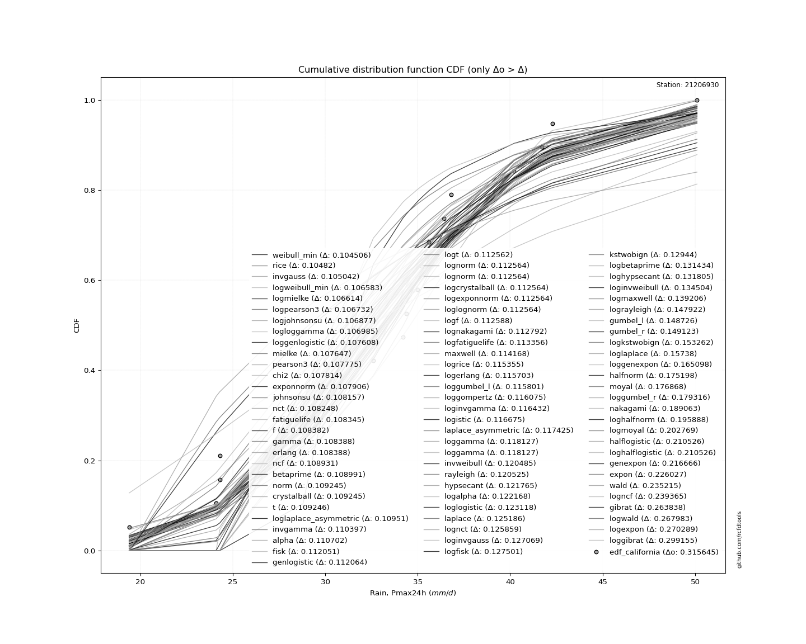</img>

</div>


**1.3. Best fit**

<div align="center">

|   id |   station | empirical_dist   | p_dist      |    delta |   deltao | eval   |   fit |   n |   best_fit |   best_fit_sort |
|-----:|----------:|:-----------------|:------------|---------:|---------:|:-------|------:|----:|-----------:|----------------:|
|    0 |  21206930 | edf_california   | weibull_min | 0.104506 | 0.315645 | Δo > Δ |     1 |  19 |          1 |               1 |

</div>


<div align="center">

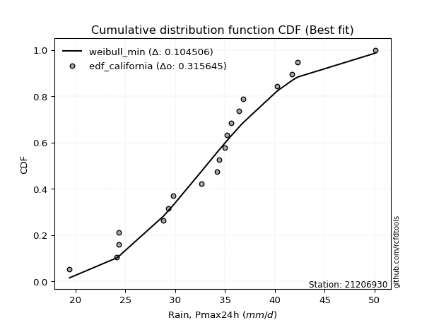</img>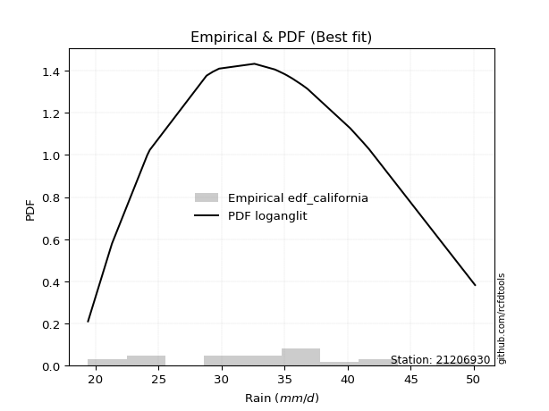</img>

</div>


### 2. EDF Hazen (1930)

Hazen method for plotting positions is a formula used to estimate the empirical cumulative probability distribution of flood events or other hydrological data. This formula often results in biased estimations, particularly when extrapolating to extreme events (high return periods).

<div align="center">


$P=(m-0.5)/n$


</div>


**2.1. Empirical values**

<div align="center">

|                | 0                   | 1                   | 2                   | 3                   | 4                   | 5                  | 6                   | 7                   | 8                  | 9         | 10                 | 11                 | 12                 | 13                 | 14                 | 15                 | 16                | 17                 | 18                 |
|:---------------|:--------------------|:--------------------|:--------------------|:--------------------|:--------------------|:-------------------|:--------------------|:--------------------|:-------------------|:----------|:-------------------|:-------------------|:-------------------|:-------------------|:-------------------|:-------------------|:------------------|:-------------------|:-------------------|
| date           | 2009                | 2007                | 2018                | 2023                | 2014                | 2011               | 2019                | 2021                | 2013               | 2006      | 2016               | 2020               | 2017               | 2008               | 2010               | 2022               | 2015              | 2005               | 2012               |
| x              | 19.4                | 24.1                | 24.3                | 24.3                | 28.8                | 29.3               | 29.8                | 32.6                | 34.2               | 34.4      | 35.0               | 35.2               | 35.6               | 36.4               | 36.8               | 40.2               | 41.7              | 42.27368421052632  | 50.1               |
| m              | 1                   | 2                   | 3                   | 4                   | 5                   | 6                  | 7                   | 8                   | 9                  | 10        | 11                 | 12                 | 13                 | 14                 | 15                 | 16                 | 17                | 18                 | 19                 |
| empirical_dist | edf_hazen           | edf_hazen           | edf_hazen           | edf_hazen           | edf_hazen           | edf_hazen          | edf_hazen           | edf_hazen           | edf_hazen          | edf_hazen | edf_hazen          | edf_hazen          | edf_hazen          | edf_hazen          | edf_hazen          | edf_hazen          | edf_hazen         | edf_hazen          | edf_hazen          |
| empirical      | 0.02631578947368421 | 0.07894736842105263 | 0.13157894736842105 | 0.18421052631578946 | 0.23684210526315788 | 0.2894736842105263 | 0.34210526315789475 | 0.39473684210526316 | 0.4473684210526316 | 0.5       | 0.5526315789473685 | 0.6052631578947368 | 0.6578947368421053 | 0.7105263157894737 | 0.7631578947368421 | 0.8157894736842105 | 0.868421052631579 | 0.9210526315789473 | 0.9736842105263158 |
| empirical_tr   | 1.027027027027027   | 1.0857142857142856  | 1.1515151515151514  | 1.2258064516129032  | 1.3103448275862069  | 1.4074074074074074 | 1.5199999999999998  | 1.6521739130434783  | 1.8095238095238098 | 2.0       | 2.235294117647059  | 2.533333333333333  | 2.9230769230769234 | 3.4545454545454546 | 4.222222222222223  | 5.428571428571428  | 7.600000000000002 | 12.666666666666663 | 38.00000000000004  |

</div>


**2.2. Kolmogorov-Smirnov fit test (sorted by Δ)**


<div align="center">

|                | 0                     | 1                   | 2                   | 3                   | 4                   | 5                   | 6                   | 7                   | 8                   | 9                   | 10                  | 11                  | 12                  | 13                  | 14                  | 15                  | 16                  | 17                  | 18                  | 19                  | 20                  | 21                  | 22                  | 23                  | 24                  | 25                  | 26                  | 27                  | 28                  | 29                  | 30                  | 31                  | 32                  | 33                  | 34                  | 35                  | 36                  | 37                  | 38                  | 39                  | 40                  | 41                  | 42                  | 43                  | 44                  | 45                  | 46                  | 47                  | 48                  | 49                  | 50                  | 51                  | 52                  | 53                  | 54                  | 55                  | 56                  | 57                  | 58                  | 59                  | 60                  | 61                  | 62                  | 63                  | 64                  | 65                  | 66                  | 67                  | 68                  | 69                  | 70                  | 71                  | 72                  | 73                  | 74                  | 75                  | 76                  | 77                  | 78                  | 79                  | 80                  | 81                  | 82                  | 83                  | 84                  | 85                  | 86                  | 87                  |
|:---------------|:----------------------|:--------------------|:--------------------|:--------------------|:--------------------|:--------------------|:--------------------|:--------------------|:--------------------|:--------------------|:--------------------|:--------------------|:--------------------|:--------------------|:--------------------|:--------------------|:--------------------|:--------------------|:--------------------|:--------------------|:--------------------|:--------------------|:--------------------|:--------------------|:--------------------|:--------------------|:--------------------|:--------------------|:--------------------|:--------------------|:--------------------|:--------------------|:--------------------|:--------------------|:--------------------|:--------------------|:--------------------|:--------------------|:--------------------|:--------------------|:--------------------|:--------------------|:--------------------|:--------------------|:--------------------|:--------------------|:--------------------|:--------------------|:--------------------|:--------------------|:--------------------|:--------------------|:--------------------|:--------------------|:--------------------|:--------------------|:--------------------|:--------------------|:--------------------|:--------------------|:--------------------|:--------------------|:--------------------|:--------------------|:--------------------|:--------------------|:--------------------|:--------------------|:--------------------|:--------------------|:--------------------|:--------------------|:--------------------|:--------------------|:--------------------|:--------------------|:--------------------|:--------------------|:--------------------|:--------------------|:--------------------|:--------------------|:--------------------|:--------------------|:--------------------|:--------------------|:--------------------|:--------------------|
| station        | 21206930              | 21206930            | 21206930            | 21206930            | 21206930            | 21206930            | 21206930            | 21206930            | 21206930            | 21206930            | 21206930            | 21206930            | 21206930            | 21206930            | 21206930            | 21206930            | 21206930            | 21206930            | 21206930            | 21206930            | 21206930            | 21206930            | 21206930            | 21206930            | 21206930            | 21206930            | 21206930            | 21206930            | 21206930            | 21206930            | 21206930            | 21206930            | 21206930            | 21206930            | 21206930            | 21206930            | 21206930            | 21206930            | 21206930            | 21206930            | 21206930            | 21206930            | 21206930            | 21206930            | 21206930            | 21206930            | 21206930            | 21206930            | 21206930            | 21206930            | 21206930            | 21206930            | 21206930            | 21206930            | 21206930            | 21206930            | 21206930            | 21206930            | 21206930            | 21206930            | 21206930            | 21206930            | 21206930            | 21206930            | 21206930            | 21206930            | 21206930            | 21206930            | 21206930            | 21206930            | 21206930            | 21206930            | 21206930            | 21206930            | 21206930            | 21206930            | 21206930            | 21206930            | 21206930            | 21206930            | 21206930            | 21206930            | 21206930            | 21206930            | 21206930            | 21206930            | 21206930            | 21206930            |
| empirical_dist | edf_hazen             | edf_hazen           | edf_hazen           | edf_hazen           | edf_hazen           | edf_hazen           | edf_hazen           | edf_hazen           | edf_hazen           | edf_hazen           | edf_hazen           | edf_hazen           | edf_hazen           | edf_hazen           | edf_hazen           | edf_hazen           | edf_hazen           | edf_hazen           | edf_hazen           | edf_hazen           | edf_hazen           | edf_hazen           | edf_hazen           | edf_hazen           | edf_hazen           | edf_hazen           | edf_hazen           | edf_hazen           | edf_hazen           | edf_hazen           | edf_hazen           | edf_hazen           | edf_hazen           | edf_hazen           | edf_hazen           | edf_hazen           | edf_hazen           | edf_hazen           | edf_hazen           | edf_hazen           | edf_hazen           | edf_hazen           | edf_hazen           | edf_hazen           | edf_hazen           | edf_hazen           | edf_hazen           | edf_hazen           | edf_hazen           | edf_hazen           | edf_hazen           | edf_hazen           | edf_hazen           | edf_hazen           | edf_hazen           | edf_hazen           | edf_hazen           | edf_hazen           | edf_hazen           | edf_hazen           | edf_hazen           | edf_hazen           | edf_hazen           | edf_hazen           | edf_hazen           | edf_hazen           | edf_hazen           | edf_hazen           | edf_hazen           | edf_hazen           | edf_hazen           | edf_hazen           | edf_hazen           | edf_hazen           | edf_hazen           | edf_hazen           | edf_hazen           | edf_hazen           | edf_hazen           | edf_hazen           | edf_hazen           | edf_hazen           | edf_hazen           | edf_hazen           | edf_hazen           | edf_hazen           | edf_hazen           | edf_hazen           |
| p_dist         | loglaplace_asymmetric | loggumbel_l         | logmielke           | laplace_asymmetric  | loggenlogistic      | mielke              | crystalball         | norm                | t                   | loggompertz         | fisk                | logistic            | genlogistic         | exponnorm           | nct                 | pearson3            | logloggamma         | logjohnsonsu        | johnsonsu           | hypsecant           | fatiguelife         | logweibull_min      | f                   | gamma               | erlang              | weibull_min         | rice                | betaprime           | logpearson3         | chi2                | invgamma            | ncf                 | alpha               | logfisk             | gumbel_l            | laplace             | maxwell             | invgauss            | logbetaprime        | logf                | logfatiguelife      | rayleigh            | lognakagami         | logt                | logcrystalball      | lognorm             | lognorm             | logexponnorm        | loglognorm          | logrice             | logerlang           | loginvgamma         | loggamma            | loggamma            | invweibull          | logalpha            | loglogistic         | lognct              | loginvgauss         | kstwobign           | loghypsecant        | loginvweibull       | nakagami            | halfnorm            | logmaxwell          | gumbel_r            | lograyleigh         | logkstwobign        | loglaplace          | loggenexpon         | moyal               | halflogistic        | loghalfnorm         | loggumbel_r         | logncf              | loghalflogistic     | logmoyal            | genexpon            | expon               | wald                | gibrat              | logwald             | logexpon            | logchi2             | loggibrat           | logtruncnorm        | truncnorm           | gompertz            |
| delta          | 0.0883211858114677    | 0.0894854904622846  | 0.09079980577576979 | 0.09110943411770694 | 0.09129856917028228 | 0.09135116896510403 | 0.09678227664494071 | 0.09678229745079187 | 0.09678268788785643 | 0.10031137620354841 | 0.1025919840324458  | 0.10274863900822034 | 0.10373944367629523 | 0.10428423562124939 | 0.10607564429123212 | 0.1064170482061953  | 0.10681832903517124 | 0.10683279318882416 | 0.10751746856008254 | 0.10780142756499406 | 0.10818225648984542 | 0.10842319371902592 | 0.10850753653866357 | 0.10854957059427267 | 0.10854964084503621 | 0.10983035187814799 | 0.11055876316595475 | 0.11063268087831762 | 0.11117157779686987 | 0.11446131735761572 | 0.11739141763021427 | 0.11840157823115266 | 0.11889148189914828 | 0.12004837311870303 | 0.1224104951866104  | 0.12520735566323532 | 0.127550025768216   | 0.12888057825438676 | 0.12978357260648427 | 0.13669319046796163 | 0.1368567548337178  | 0.1374725935003725  | 0.1375738518328456  | 0.13772827108009905 | 0.1377285307615616  | 0.13772853108960031 | 0.13772853108960031 | 0.1377287279544986  | 0.13773085639767052 | 0.14167064524294143 | 0.14201846866376683 | 0.14274794964812137 | 0.14444323493403127 | 0.14444323493403127 | 0.14680120631196042 | 0.14848368929519212 | 0.1488845843989321  | 0.15217461498211976 | 0.15338447823399465 | 0.15575573782717994 | 0.15812097245842743 | 0.16081954118612524 | 0.16274733990534707 | 0.16544682153982498 | 0.16552137040282117 | 0.1670850160308694  | 0.17423817515628387 | 0.1795777089815474  | 0.18369582516392474 | 0.19141426218745689 | 0.19210456610456644 | 0.1925301124626007  | 0.19893947447171106 | 0.20563220819936673 | 0.21304920755406986 | 0.22707292474225987 | 0.22908484395628276 | 0.2429815337609965  | 0.25234278009657274 | 0.2615312245058797  | 0.2901536854939389  | 0.29429905209664226 | 0.29660488051607803 | 0.3203752947775955  | 0.32547125711075015 | 0.3647078623050064  | 0.42840296719054904 | 0.7211345370458367  |
| deltao         | 0.31564497164100014   | 0.31564497164100014 | 0.31564497164100014 | 0.31564497164100014 | 0.31564497164100014 | 0.31564497164100014 | 0.31564497164100014 | 0.31564497164100014 | 0.31564497164100014 | 0.31564497164100014 | 0.31564497164100014 | 0.31564497164100014 | 0.31564497164100014 | 0.31564497164100014 | 0.31564497164100014 | 0.31564497164100014 | 0.31564497164100014 | 0.31564497164100014 | 0.31564497164100014 | 0.31564497164100014 | 0.31564497164100014 | 0.31564497164100014 | 0.31564497164100014 | 0.31564497164100014 | 0.31564497164100014 | 0.31564497164100014 | 0.31564497164100014 | 0.31564497164100014 | 0.31564497164100014 | 0.31564497164100014 | 0.31564497164100014 | 0.31564497164100014 | 0.31564497164100014 | 0.31564497164100014 | 0.31564497164100014 | 0.31564497164100014 | 0.31564497164100014 | 0.31564497164100014 | 0.31564497164100014 | 0.31564497164100014 | 0.31564497164100014 | 0.31564497164100014 | 0.31564497164100014 | 0.31564497164100014 | 0.31564497164100014 | 0.31564497164100014 | 0.31564497164100014 | 0.31564497164100014 | 0.31564497164100014 | 0.31564497164100014 | 0.31564497164100014 | 0.31564497164100014 | 0.31564497164100014 | 0.31564497164100014 | 0.31564497164100014 | 0.31564497164100014 | 0.31564497164100014 | 0.31564497164100014 | 0.31564497164100014 | 0.31564497164100014 | 0.31564497164100014 | 0.31564497164100014 | 0.31564497164100014 | 0.31564497164100014 | 0.31564497164100014 | 0.31564497164100014 | 0.31564497164100014 | 0.31564497164100014 | 0.31564497164100014 | 0.31564497164100014 | 0.31564497164100014 | 0.31564497164100014 | 0.31564497164100014 | 0.31564497164100014 | 0.31564497164100014 | 0.31564497164100014 | 0.31564497164100014 | 0.31564497164100014 | 0.31564497164100014 | 0.31564497164100014 | 0.31564497164100014 | 0.31564497164100014 | 0.31564497164100014 | 0.31564497164100014 | 0.31564497164100014 | 0.31564497164100014 | 0.31564497164100014 | 0.31564497164100014 |
| eval           | Δo > Δ                | Δo > Δ              | Δo > Δ              | Δo > Δ              | Δo > Δ              | Δo > Δ              | Δo > Δ              | Δo > Δ              | Δo > Δ              | Δo > Δ              | Δo > Δ              | Δo > Δ              | Δo > Δ              | Δo > Δ              | Δo > Δ              | Δo > Δ              | Δo > Δ              | Δo > Δ              | Δo > Δ              | Δo > Δ              | Δo > Δ              | Δo > Δ              | Δo > Δ              | Δo > Δ              | Δo > Δ              | Δo > Δ              | Δo > Δ              | Δo > Δ              | Δo > Δ              | Δo > Δ              | Δo > Δ              | Δo > Δ              | Δo > Δ              | Δo > Δ              | Δo > Δ              | Δo > Δ              | Δo > Δ              | Δo > Δ              | Δo > Δ              | Δo > Δ              | Δo > Δ              | Δo > Δ              | Δo > Δ              | Δo > Δ              | Δo > Δ              | Δo > Δ              | Δo > Δ              | Δo > Δ              | Δo > Δ              | Δo > Δ              | Δo > Δ              | Δo > Δ              | Δo > Δ              | Δo > Δ              | Δo > Δ              | Δo > Δ              | Δo > Δ              | Δo > Δ              | Δo > Δ              | Δo > Δ              | Δo > Δ              | Δo > Δ              | Δo > Δ              | Δo > Δ              | Δo > Δ              | Δo > Δ              | Δo > Δ              | Δo > Δ              | Δo > Δ              | Δo > Δ              | Δo > Δ              | Δo > Δ              | Δo > Δ              | Δo > Δ              | Δo > Δ              | Δo > Δ              | Δo > Δ              | Δo > Δ              | Δo > Δ              | Δo > Δ              | Δo > Δ              | Δo > Δ              | Δo > Δ              | Δo <= Δ             | Δo <= Δ             | Δo <= Δ             | Δo <= Δ             | Δo <= Δ             |
| fit            | 1                     | 1                   | 1                   | 1                   | 1                   | 1                   | 1                   | 1                   | 1                   | 1                   | 1                   | 1                   | 1                   | 1                   | 1                   | 1                   | 1                   | 1                   | 1                   | 1                   | 1                   | 1                   | 1                   | 1                   | 1                   | 1                   | 1                   | 1                   | 1                   | 1                   | 1                   | 1                   | 1                   | 1                   | 1                   | 1                   | 1                   | 1                   | 1                   | 1                   | 1                   | 1                   | 1                   | 1                   | 1                   | 1                   | 1                   | 1                   | 1                   | 1                   | 1                   | 1                   | 1                   | 1                   | 1                   | 1                   | 1                   | 1                   | 1                   | 1                   | 1                   | 1                   | 1                   | 1                   | 1                   | 1                   | 1                   | 1                   | 1                   | 1                   | 1                   | 1                   | 1                   | 1                   | 1                   | 1                   | 1                   | 1                   | 1                   | 1                   | 1                   | 1                   | 1                   | 0                   | 0                   | 0                   | 0                   | 0                   |
| n              | 19                    | 19                  | 19                  | 19                  | 19                  | 19                  | 19                  | 19                  | 19                  | 19                  | 19                  | 19                  | 19                  | 19                  | 19                  | 19                  | 19                  | 19                  | 19                  | 19                  | 19                  | 19                  | 19                  | 19                  | 19                  | 19                  | 19                  | 19                  | 19                  | 19                  | 19                  | 19                  | 19                  | 19                  | 19                  | 19                  | 19                  | 19                  | 19                  | 19                  | 19                  | 19                  | 19                  | 19                  | 19                  | 19                  | 19                  | 19                  | 19                  | 19                  | 19                  | 19                  | 19                  | 19                  | 19                  | 19                  | 19                  | 19                  | 19                  | 19                  | 19                  | 19                  | 19                  | 19                  | 19                  | 19                  | 19                  | 19                  | 19                  | 19                  | 19                  | 19                  | 19                  | 19                  | 19                  | 19                  | 19                  | 19                  | 19                  | 19                  | 19                  | 19                  | 19                  | 19                  | 19                  | 19                  | 19                  | 19                  |
| best_fit       | 1                     | 0                   | 0                   | 0                   | 0                   | 0                   | 0                   | 0                   | 0                   | 0                   | 0                   | 0                   | 0                   | 0                   | 0                   | 0                   | 0                   | 0                   | 0                   | 0                   | 0                   | 0                   | 0                   | 0                   | 0                   | 0                   | 0                   | 0                   | 0                   | 0                   | 0                   | 0                   | 0                   | 0                   | 0                   | 0                   | 0                   | 0                   | 0                   | 0                   | 0                   | 0                   | 0                   | 0                   | 0                   | 0                   | 0                   | 0                   | 0                   | 0                   | 0                   | 0                   | 0                   | 0                   | 0                   | 0                   | 0                   | 0                   | 0                   | 0                   | 0                   | 0                   | 0                   | 0                   | 0                   | 0                   | 0                   | 0                   | 0                   | 0                   | 0                   | 0                   | 0                   | 0                   | 0                   | 0                   | 0                   | 0                   | 0                   | 0                   | 0                   | 0                   | 0                   | 0                   | 0                   | 0                   | 0                   | 0                   |
| best_fit_sort  | 1                     | 2                   | 3                   | 4                   | 5                   | 6                   | 7                   | 8                   | 9                   | 10                  | 11                  | 12                  | 13                  | 14                  | 15                  | 16                  | 17                  | 18                  | 19                  | 20                  | 21                  | 22                  | 23                  | 24                  | 25                  | 26                  | 27                  | 28                  | 29                  | 30                  | 31                  | 32                  | 33                  | 34                  | 35                  | 36                  | 37                  | 38                  | 39                  | 40                  | 41                  | 42                  | 43                  | 44                  | 45                  | 46                  | 47                  | 48                  | 49                  | 50                  | 51                  | 52                  | 53                  | 54                  | 55                  | 56                  | 57                  | 58                  | 59                  | 60                  | 61                  | 62                  | 63                  | 64                  | 65                  | 66                  | 67                  | 68                  | 69                  | 70                  | 71                  | 72                  | 73                  | 74                  | 75                  | 76                  | 77                  | 78                  | 79                  | 80                  | 81                  | 82                  | 83                  | 84                  | 85                  | 86                  | 87                  | 88                  |

</div>


<div align="center">

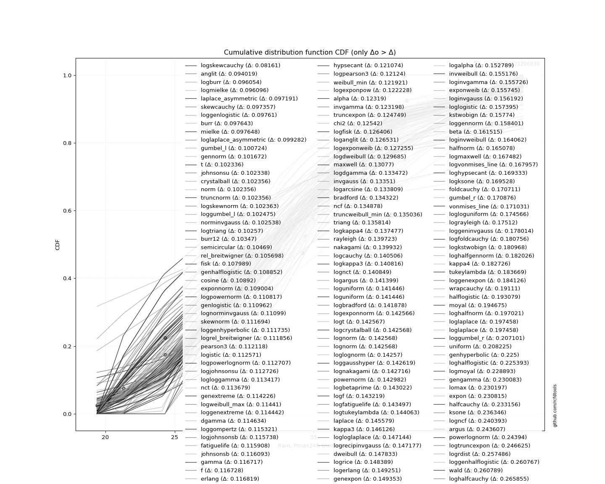</img>

</div>


**2.3. Best fit**

<div align="center">

|   id |   station | empirical_dist   | p_dist                |     delta |   deltao | eval   |   fit |   n |   best_fit |   best_fit_sort |
|-----:|----------:|:-----------------|:----------------------|----------:|---------:|:-------|------:|----:|-----------:|----------------:|
|    0 |  21206930 | edf_hazen        | loglaplace_asymmetric | 0.0883212 | 0.315645 | Δo > Δ |     1 |  19 |          1 |               1 |

</div>


<div align="center">

</img>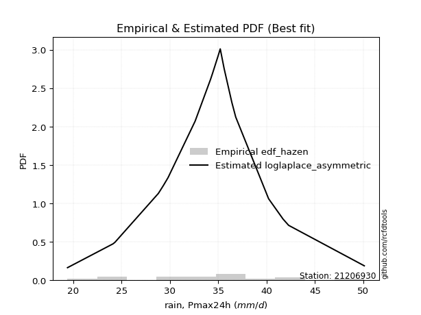</img>

</div>


### 3. EDF Weibull (1939)

Weibull plotting position formula is an empirical method used to estimate the non-exceedance probability or plotting position for a set of observed data, is often recommended or widely used in practice, particularly in flood frequency analysis.

<div align="center">


$P=m/(n+1)$


</div>


**3.1. Empirical values**

<div align="center">

|                | 0                  | 1                  | 2                  | 3           | 4                  | 5                  | 6                  | 7                  | 8                  | 9           | 10                 | 11          | 12                | 13                | 14          | 15                | 16                | 17                 | 18                 |
|:---------------|:-------------------|:-------------------|:-------------------|:------------|:-------------------|:-------------------|:-------------------|:-------------------|:-------------------|:------------|:-------------------|:------------|:------------------|:------------------|:------------|:------------------|:------------------|:-------------------|:-------------------|
| date           | 2009               | 2007               | 2018               | 2023        | 2014               | 2011               | 2019               | 2021               | 2013               | 2006        | 2016               | 2020        | 2017              | 2008              | 2010        | 2022              | 2015              | 2005               | 2012               |
| x              | 19.4               | 24.1               | 24.3               | 24.3        | 28.8               | 29.3               | 29.8               | 32.6               | 34.2               | 34.4        | 35.0               | 35.2        | 35.6              | 36.4              | 36.8        | 40.2              | 41.7              | 42.27368421052632  | 50.1               |
| m              | 1                  | 2                  | 3                  | 4           | 5                  | 6                  | 7                  | 8                  | 9                  | 10          | 11                 | 12          | 13                | 14                | 15          | 16                | 17                | 18                 | 19                 |
| empirical_dist | edf_weibull        | edf_weibull        | edf_weibull        | edf_weibull | edf_weibull        | edf_weibull        | edf_weibull        | edf_weibull        | edf_weibull        | edf_weibull | edf_weibull        | edf_weibull | edf_weibull       | edf_weibull       | edf_weibull | edf_weibull       | edf_weibull       | edf_weibull        | edf_weibull        |
| empirical      | 0.05               | 0.1                | 0.15               | 0.2         | 0.25               | 0.3                | 0.35               | 0.4                | 0.45               | 0.5         | 0.55               | 0.6         | 0.65              | 0.7               | 0.75        | 0.8               | 0.85              | 0.9                | 0.95               |
| empirical_tr   | 1.0526315789473684 | 1.1111111111111112 | 1.1764705882352942 | 1.25        | 1.3333333333333333 | 1.4285714285714286 | 1.5384615384615383 | 1.6666666666666667 | 1.8181818181818181 | 2.0         | 2.2222222222222223 | 2.5         | 2.857142857142857 | 3.333333333333333 | 4.0         | 5.000000000000001 | 6.666666666666666 | 10.000000000000002 | 19.999999999999982 |

</div>


**3.2. Kolmogorov-Smirnov fit test (sorted by Δ)**


<div align="center">

|                | 0                   | 1                   | 2                   | 3                   | 4                   | 5                   | 6                   | 7                   | 8                     | 9                   | 10                  | 11                  | 12                  | 13                  | 14                  | 15                  | 16                  | 17                  | 18                  | 19                  | 20                  | 21                  | 22                  | 23                  | 24                  | 25                  | 26                  | 27                  | 28                  | 29                  | 30                  | 31                  | 32                  | 33                  | 34                  | 35                  | 36                  | 37                  | 38                  | 39                  | 40                  | 41                  | 42                  | 43                  | 44                  | 45                  | 46                  | 47                  | 48                  | 49                  | 50                  | 51                  | 52                  | 53                  | 54                  | 55                  | 56                  | 57                  | 58                  | 59                  | 60                  | 61                  | 62                  | 63                  | 64                  | 65                  | 66                  | 67                  | 68                  | 69                  | 70                  | 71                  | 72                  | 73                  | 74                  | 75                  | 76                  | 77                  | 78                  | 79                  | 80                  | 81                  | 82                  | 83                  | 84                  | 85                  | 86                  | 87                  |
|:---------------|:--------------------|:--------------------|:--------------------|:--------------------|:--------------------|:--------------------|:--------------------|:--------------------|:----------------------|:--------------------|:--------------------|:--------------------|:--------------------|:--------------------|:--------------------|:--------------------|:--------------------|:--------------------|:--------------------|:--------------------|:--------------------|:--------------------|:--------------------|:--------------------|:--------------------|:--------------------|:--------------------|:--------------------|:--------------------|:--------------------|:--------------------|:--------------------|:--------------------|:--------------------|:--------------------|:--------------------|:--------------------|:--------------------|:--------------------|:--------------------|:--------------------|:--------------------|:--------------------|:--------------------|:--------------------|:--------------------|:--------------------|:--------------------|:--------------------|:--------------------|:--------------------|:--------------------|:--------------------|:--------------------|:--------------------|:--------------------|:--------------------|:--------------------|:--------------------|:--------------------|:--------------------|:--------------------|:--------------------|:--------------------|:--------------------|:--------------------|:--------------------|:--------------------|:--------------------|:--------------------|:--------------------|:--------------------|:--------------------|:--------------------|:--------------------|:--------------------|:--------------------|:--------------------|:--------------------|:--------------------|:--------------------|:--------------------|:--------------------|:--------------------|:--------------------|:--------------------|:--------------------|:--------------------|
| station        | 21206930            | 21206930            | 21206930            | 21206930            | 21206930            | 21206930            | 21206930            | 21206930            | 21206930              | 21206930            | 21206930            | 21206930            | 21206930            | 21206930            | 21206930            | 21206930            | 21206930            | 21206930            | 21206930            | 21206930            | 21206930            | 21206930            | 21206930            | 21206930            | 21206930            | 21206930            | 21206930            | 21206930            | 21206930            | 21206930            | 21206930            | 21206930            | 21206930            | 21206930            | 21206930            | 21206930            | 21206930            | 21206930            | 21206930            | 21206930            | 21206930            | 21206930            | 21206930            | 21206930            | 21206930            | 21206930            | 21206930            | 21206930            | 21206930            | 21206930            | 21206930            | 21206930            | 21206930            | 21206930            | 21206930            | 21206930            | 21206930            | 21206930            | 21206930            | 21206930            | 21206930            | 21206930            | 21206930            | 21206930            | 21206930            | 21206930            | 21206930            | 21206930            | 21206930            | 21206930            | 21206930            | 21206930            | 21206930            | 21206930            | 21206930            | 21206930            | 21206930            | 21206930            | 21206930            | 21206930            | 21206930            | 21206930            | 21206930            | 21206930            | 21206930            | 21206930            | 21206930            | 21206930            |
| empirical_dist | edf_weibull         | edf_weibull         | edf_weibull         | edf_weibull         | edf_weibull         | edf_weibull         | edf_weibull         | edf_weibull         | edf_weibull           | edf_weibull         | edf_weibull         | edf_weibull         | edf_weibull         | edf_weibull         | edf_weibull         | edf_weibull         | edf_weibull         | edf_weibull         | edf_weibull         | edf_weibull         | edf_weibull         | edf_weibull         | edf_weibull         | edf_weibull         | edf_weibull         | edf_weibull         | edf_weibull         | edf_weibull         | edf_weibull         | edf_weibull         | edf_weibull         | edf_weibull         | edf_weibull         | edf_weibull         | edf_weibull         | edf_weibull         | edf_weibull         | edf_weibull         | edf_weibull         | edf_weibull         | edf_weibull         | edf_weibull         | edf_weibull         | edf_weibull         | edf_weibull         | edf_weibull         | edf_weibull         | edf_weibull         | edf_weibull         | edf_weibull         | edf_weibull         | edf_weibull         | edf_weibull         | edf_weibull         | edf_weibull         | edf_weibull         | edf_weibull         | edf_weibull         | edf_weibull         | edf_weibull         | edf_weibull         | edf_weibull         | edf_weibull         | edf_weibull         | edf_weibull         | edf_weibull         | edf_weibull         | edf_weibull         | edf_weibull         | edf_weibull         | edf_weibull         | edf_weibull         | edf_weibull         | edf_weibull         | edf_weibull         | edf_weibull         | edf_weibull         | edf_weibull         | edf_weibull         | edf_weibull         | edf_weibull         | edf_weibull         | edf_weibull         | edf_weibull         | edf_weibull         | edf_weibull         | edf_weibull         | edf_weibull         |
| p_dist         | t                   | crystalball         | norm                | logmielke           | loggenlogistic      | mielke              | loggompertz         | loggumbel_l         | loglaplace_asymmetric | laplace_asymmetric  | fisk                | genlogistic         | exponnorm           | nct                 | pearson3            | logloggamma         | logjohnsonsu        | johnsonsu           | fatiguelife         | logweibull_min      | f                   | gamma               | erlang              | logistic            | weibull_min         | rice                | betaprime           | logpearson3         | gumbel_l            | hypsecant           | chi2                | invgamma            | ncf                 | alpha               | logfisk             | laplace             | maxwell             | invgauss            | logbetaprime        | logf                | logfatiguelife      | rayleigh            | lognakagami         | logt                | logcrystalball      | lognorm             | lognorm             | logexponnorm        | loglognorm          | logrice             | logerlang           | loginvgamma         | loggamma            | loggamma            | invweibull          | logalpha            | loglogistic         | lognct              | loginvgauss         | kstwobign           | nakagami            | loghypsecant        | loginvweibull       | logmaxwell          | gumbel_r            | halfnorm            | lograyleigh         | logkstwobign        | loglaplace          | loggenexpon         | moyal               | logncf              | loghalfnorm         | halflogistic        | loggumbel_r         | loghalflogistic     | logmoyal            | genexpon            | expon               | wald                | logexpon            | gibrat              | logwald             | logchi2             | loggibrat           | logtruncnorm        | truncnorm           | gompertz            |
| delta          | 0.09437222992155157 | 0.09437489641748581 | 0.0943749076411402  | 0.09608725302303828 | 0.09708175824016804 | 0.09712073268090432 | 0.09767979725617998 | 0.09861651455770866 | 0.09898336286267456   | 0.09900417095981218 | 0.10152466221835735 | 0.10153748051836417 | 0.10165265667388096 | 0.10344406534386369 | 0.10378546925882687 | 0.10418675008780282 | 0.10420121424145573 | 0.10488588961271411 | 0.10555067754247699 | 0.1057916147716575  | 0.10587595759129514 | 0.10591799164690424 | 0.10591806189766778 | 0.10614891416384294 | 0.10719877293077956 | 0.10792718421858633 | 0.1080011019309492  | 0.10853999884950144 | 0.10925260044976826 | 0.11123828597317138 | 0.11182973841024729 | 0.11475983868284584 | 0.11576999928378423 | 0.11625990295177985 | 0.1174167941713346  | 0.12257577671586689 | 0.12491844682084757 | 0.12624899930701833 | 0.12715199365911584 | 0.1340616115205932  | 0.13422517588634936 | 0.13484101455300407 | 0.13494227288547717 | 0.13509669213273062 | 0.13509695181419318 | 0.13509695214223189 | 0.13509695214223189 | 0.13509714900713016 | 0.1350992774503021  | 0.139039066295573   | 0.1393868897163984  | 0.14011637070075295 | 0.14181165598666284 | 0.14181165598666284 | 0.144169627364592   | 0.1458521103478237  | 0.14625300545156367 | 0.14954303603475133 | 0.15075289928662622 | 0.1531241588798115  | 0.15386508270806323 | 0.155489393511059   | 0.1581879622387568  | 0.16288979145545274 | 0.16445343708350096 | 0.1646716564969821  | 0.17160659620891544 | 0.17694613003417897 | 0.1810642462165563  | 0.18878268324008846 | 0.18947298715719801 | 0.19199657597512254 | 0.19630789552434263 | 0.2                 | 0.2030006292519983  | 0.22444134579489144 | 0.22645326500891433 | 0.22982363902415437 | 0.2391848853597306  | 0.25889964555851125 | 0.2834469857792359  | 0.28752210654657046 | 0.2916674731492738  | 0.29669108425127966 | 0.3228396781633817  | 0.35154996756816426 | 0.4073503356116017  | 0.7079766423089946  |
| deltao         | 0.31564497164100014 | 0.31564497164100014 | 0.31564497164100014 | 0.31564497164100014 | 0.31564497164100014 | 0.31564497164100014 | 0.31564497164100014 | 0.31564497164100014 | 0.31564497164100014   | 0.31564497164100014 | 0.31564497164100014 | 0.31564497164100014 | 0.31564497164100014 | 0.31564497164100014 | 0.31564497164100014 | 0.31564497164100014 | 0.31564497164100014 | 0.31564497164100014 | 0.31564497164100014 | 0.31564497164100014 | 0.31564497164100014 | 0.31564497164100014 | 0.31564497164100014 | 0.31564497164100014 | 0.31564497164100014 | 0.31564497164100014 | 0.31564497164100014 | 0.31564497164100014 | 0.31564497164100014 | 0.31564497164100014 | 0.31564497164100014 | 0.31564497164100014 | 0.31564497164100014 | 0.31564497164100014 | 0.31564497164100014 | 0.31564497164100014 | 0.31564497164100014 | 0.31564497164100014 | 0.31564497164100014 | 0.31564497164100014 | 0.31564497164100014 | 0.31564497164100014 | 0.31564497164100014 | 0.31564497164100014 | 0.31564497164100014 | 0.31564497164100014 | 0.31564497164100014 | 0.31564497164100014 | 0.31564497164100014 | 0.31564497164100014 | 0.31564497164100014 | 0.31564497164100014 | 0.31564497164100014 | 0.31564497164100014 | 0.31564497164100014 | 0.31564497164100014 | 0.31564497164100014 | 0.31564497164100014 | 0.31564497164100014 | 0.31564497164100014 | 0.31564497164100014 | 0.31564497164100014 | 0.31564497164100014 | 0.31564497164100014 | 0.31564497164100014 | 0.31564497164100014 | 0.31564497164100014 | 0.31564497164100014 | 0.31564497164100014 | 0.31564497164100014 | 0.31564497164100014 | 0.31564497164100014 | 0.31564497164100014 | 0.31564497164100014 | 0.31564497164100014 | 0.31564497164100014 | 0.31564497164100014 | 0.31564497164100014 | 0.31564497164100014 | 0.31564497164100014 | 0.31564497164100014 | 0.31564497164100014 | 0.31564497164100014 | 0.31564497164100014 | 0.31564497164100014 | 0.31564497164100014 | 0.31564497164100014 | 0.31564497164100014 |
| eval           | Δo > Δ              | Δo > Δ              | Δo > Δ              | Δo > Δ              | Δo > Δ              | Δo > Δ              | Δo > Δ              | Δo > Δ              | Δo > Δ                | Δo > Δ              | Δo > Δ              | Δo > Δ              | Δo > Δ              | Δo > Δ              | Δo > Δ              | Δo > Δ              | Δo > Δ              | Δo > Δ              | Δo > Δ              | Δo > Δ              | Δo > Δ              | Δo > Δ              | Δo > Δ              | Δo > Δ              | Δo > Δ              | Δo > Δ              | Δo > Δ              | Δo > Δ              | Δo > Δ              | Δo > Δ              | Δo > Δ              | Δo > Δ              | Δo > Δ              | Δo > Δ              | Δo > Δ              | Δo > Δ              | Δo > Δ              | Δo > Δ              | Δo > Δ              | Δo > Δ              | Δo > Δ              | Δo > Δ              | Δo > Δ              | Δo > Δ              | Δo > Δ              | Δo > Δ              | Δo > Δ              | Δo > Δ              | Δo > Δ              | Δo > Δ              | Δo > Δ              | Δo > Δ              | Δo > Δ              | Δo > Δ              | Δo > Δ              | Δo > Δ              | Δo > Δ              | Δo > Δ              | Δo > Δ              | Δo > Δ              | Δo > Δ              | Δo > Δ              | Δo > Δ              | Δo > Δ              | Δo > Δ              | Δo > Δ              | Δo > Δ              | Δo > Δ              | Δo > Δ              | Δo > Δ              | Δo > Δ              | Δo > Δ              | Δo > Δ              | Δo > Δ              | Δo > Δ              | Δo > Δ              | Δo > Δ              | Δo > Δ              | Δo > Δ              | Δo > Δ              | Δo > Δ              | Δo > Δ              | Δo > Δ              | Δo > Δ              | Δo <= Δ             | Δo <= Δ             | Δo <= Δ             | Δo <= Δ             |
| fit            | 1                   | 1                   | 1                   | 1                   | 1                   | 1                   | 1                   | 1                   | 1                     | 1                   | 1                   | 1                   | 1                   | 1                   | 1                   | 1                   | 1                   | 1                   | 1                   | 1                   | 1                   | 1                   | 1                   | 1                   | 1                   | 1                   | 1                   | 1                   | 1                   | 1                   | 1                   | 1                   | 1                   | 1                   | 1                   | 1                   | 1                   | 1                   | 1                   | 1                   | 1                   | 1                   | 1                   | 1                   | 1                   | 1                   | 1                   | 1                   | 1                   | 1                   | 1                   | 1                   | 1                   | 1                   | 1                   | 1                   | 1                   | 1                   | 1                   | 1                   | 1                   | 1                   | 1                   | 1                   | 1                   | 1                   | 1                   | 1                   | 1                   | 1                   | 1                   | 1                   | 1                   | 1                   | 1                   | 1                   | 1                   | 1                   | 1                   | 1                   | 1                   | 1                   | 1                   | 1                   | 0                   | 0                   | 0                   | 0                   |
| n              | 19                  | 19                  | 19                  | 19                  | 19                  | 19                  | 19                  | 19                  | 19                    | 19                  | 19                  | 19                  | 19                  | 19                  | 19                  | 19                  | 19                  | 19                  | 19                  | 19                  | 19                  | 19                  | 19                  | 19                  | 19                  | 19                  | 19                  | 19                  | 19                  | 19                  | 19                  | 19                  | 19                  | 19                  | 19                  | 19                  | 19                  | 19                  | 19                  | 19                  | 19                  | 19                  | 19                  | 19                  | 19                  | 19                  | 19                  | 19                  | 19                  | 19                  | 19                  | 19                  | 19                  | 19                  | 19                  | 19                  | 19                  | 19                  | 19                  | 19                  | 19                  | 19                  | 19                  | 19                  | 19                  | 19                  | 19                  | 19                  | 19                  | 19                  | 19                  | 19                  | 19                  | 19                  | 19                  | 19                  | 19                  | 19                  | 19                  | 19                  | 19                  | 19                  | 19                  | 19                  | 19                  | 19                  | 19                  | 19                  |
| best_fit       | 1                   | 0                   | 0                   | 0                   | 0                   | 0                   | 0                   | 0                   | 0                     | 0                   | 0                   | 0                   | 0                   | 0                   | 0                   | 0                   | 0                   | 0                   | 0                   | 0                   | 0                   | 0                   | 0                   | 0                   | 0                   | 0                   | 0                   | 0                   | 0                   | 0                   | 0                   | 0                   | 0                   | 0                   | 0                   | 0                   | 0                   | 0                   | 0                   | 0                   | 0                   | 0                   | 0                   | 0                   | 0                   | 0                   | 0                   | 0                   | 0                   | 0                   | 0                   | 0                   | 0                   | 0                   | 0                   | 0                   | 0                   | 0                   | 0                   | 0                   | 0                   | 0                   | 0                   | 0                   | 0                   | 0                   | 0                   | 0                   | 0                   | 0                   | 0                   | 0                   | 0                   | 0                   | 0                   | 0                   | 0                   | 0                   | 0                   | 0                   | 0                   | 0                   | 0                   | 0                   | 0                   | 0                   | 0                   | 0                   |
| best_fit_sort  | 1                   | 2                   | 3                   | 4                   | 5                   | 6                   | 7                   | 8                   | 9                     | 10                  | 11                  | 12                  | 13                  | 14                  | 15                  | 16                  | 17                  | 18                  | 19                  | 20                  | 21                  | 22                  | 23                  | 24                  | 25                  | 26                  | 27                  | 28                  | 29                  | 30                  | 31                  | 32                  | 33                  | 34                  | 35                  | 36                  | 37                  | 38                  | 39                  | 40                  | 41                  | 42                  | 43                  | 44                  | 45                  | 46                  | 47                  | 48                  | 49                  | 50                  | 51                  | 52                  | 53                  | 54                  | 55                  | 56                  | 57                  | 58                  | 59                  | 60                  | 61                  | 62                  | 63                  | 64                  | 65                  | 66                  | 67                  | 68                  | 69                  | 70                  | 71                  | 72                  | 73                  | 74                  | 75                  | 76                  | 77                  | 78                  | 79                  | 80                  | 81                  | 82                  | 83                  | 84                  | 85                  | 86                  | 87                  | 88                  |

</div>


<div align="center">

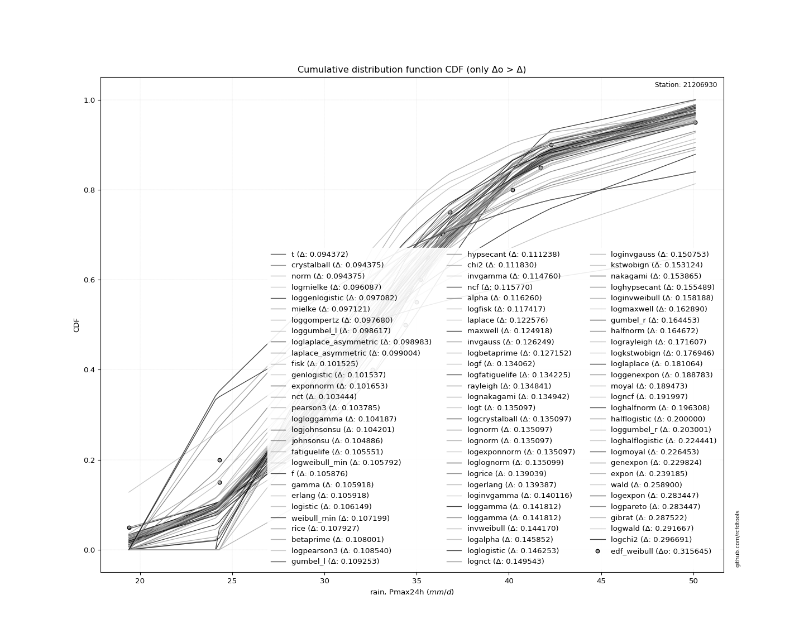</img>

</div>


**3.3. Best fit**

<div align="center">

|   id |   station | empirical_dist   | p_dist   |     delta |   deltao | eval   |   fit |   n |   best_fit |   best_fit_sort |
|-----:|----------:|:-----------------|:---------|----------:|---------:|:-------|------:|----:|-----------:|----------------:|
|    0 |  21206930 | edf_weibull      | t        | 0.0943722 | 0.315645 | Δo > Δ |     1 |  19 |          1 |               1 |

</div>


<div align="center">

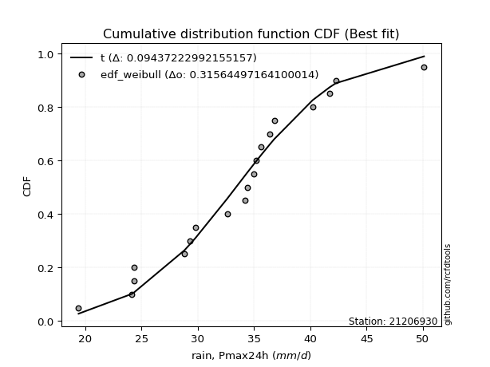</img></img>

</div>


### 4. EDF Beard (1943)

The Beard formula (or Beard´s plotting position formula) in hydrology is used to estimate the empirical non-exceedance probability _(P)_ of a flood event (or other extreme hydrological data point) within a given dataset.

<div align="center">


$P=(m-0.31)/(n+0.38)$


</div>


**4.1. Empirical values**

<div align="center">

|                | 0                   | 1                   | 2                  | 3                   | 4                   | 5                   | 6                  | 7                  | 8                  | 9         | 10                 | 11                 | 12                 | 13                 | 14                 | 15                 | 16                 | 17                 | 18                 |
|:---------------|:--------------------|:--------------------|:-------------------|:--------------------|:--------------------|:--------------------|:-------------------|:-------------------|:-------------------|:----------|:-------------------|:-------------------|:-------------------|:-------------------|:-------------------|:-------------------|:-------------------|:-------------------|:-------------------|
| date           | 2009                | 2007                | 2018               | 2023                | 2014                | 2011                | 2019               | 2021               | 2013               | 2006      | 2016               | 2020               | 2017               | 2008               | 2010               | 2022               | 2015               | 2005               | 2012               |
| x              | 19.4                | 24.1                | 24.3               | 24.3                | 28.8                | 29.3                | 29.8               | 32.6               | 34.2               | 34.4      | 35.0               | 35.2               | 35.6               | 36.4               | 36.8               | 40.2               | 41.7               | 42.27368421052632  | 50.1               |
| m              | 1                   | 2                   | 3                  | 4                   | 5                   | 6                   | 7                  | 8                  | 9                  | 10        | 11                 | 12                 | 13                 | 14                 | 15                 | 16                 | 17                 | 18                 | 19                 |
| empirical_dist | edf_beard           | edf_beard           | edf_beard          | edf_beard           | edf_beard           | edf_beard           | edf_beard          | edf_beard          | edf_beard          | edf_beard | edf_beard          | edf_beard          | edf_beard          | edf_beard          | edf_beard          | edf_beard          | edf_beard          | edf_beard          | edf_beard          |
| empirical      | 0.03560371517027864 | 0.08720330237358101 | 0.1388028895768834 | 0.19040247678018576 | 0.24200206398348817 | 0.29360165118679055 | 0.3452012383900929 | 0.3968008255933953 | 0.4484004127966976 | 0.5       | 0.5515995872033024 | 0.6031991744066048 | 0.6547987616099071 | 0.7063983488132095 | 0.7579979360165119 | 0.8095975232198143 | 0.8611971104231168 | 0.9127966976264191 | 0.9643962848297215 |
| empirical_tr   | 1.0369181380417336  | 1.0955342001130581  | 1.1611743559017376 | 1.2351816443594645  | 1.3192648059904697  | 1.4156318480642804  | 1.5271867612293144 | 1.6578272027373824 | 1.812909260991581  | 2.0       | 2.230149597238205  | 2.5201560468140443 | 2.896860986547085  | 3.40597539543058   | 4.132196162046909  | 5.252032520325204  | 7.204460966542758  | 11.467455621301793 | 28.086956521739243 |

</div>


**4.2. Kolmogorov-Smirnov fit test (sorted by Δ)**


<div align="center">

|                | 0                   | 1                     | 2                   | 3                   | 4                   | 5                   | 6                   | 7                   | 8                   | 9                   | 10                  | 11                  | 12                  | 13                  | 14                  | 15                  | 16                  | 17                  | 18                  | 19                  | 20                  | 21                  | 22                  | 23                  | 24                  | 25                  | 26                  | 27                  | 28                  | 29                  | 30                  | 31                  | 32                  | 33                  | 34                  | 35                  | 36                  | 37                  | 38                  | 39                  | 40                  | 41                  | 42                  | 43                  | 44                  | 45                  | 46                  | 47                  | 48                  | 49                  | 50                  | 51                  | 52                  | 53                  | 54                  | 55                  | 56                  | 57                  | 58                  | 59                  | 60                  | 61                  | 62                  | 63                  | 64                  | 65                  | 66                  | 67                  | 68                  | 69                  | 70                  | 71                  | 72                  | 73                  | 74                  | 75                  | 76                  | 77                  | 78                  | 79                  | 80                  | 81                  | 82                  | 83                  | 84                  | 85                  | 86                  | 87                  |
|:---------------|:--------------------|:----------------------|:--------------------|:--------------------|:--------------------|:--------------------|:--------------------|:--------------------|:--------------------|:--------------------|:--------------------|:--------------------|:--------------------|:--------------------|:--------------------|:--------------------|:--------------------|:--------------------|:--------------------|:--------------------|:--------------------|:--------------------|:--------------------|:--------------------|:--------------------|:--------------------|:--------------------|:--------------------|:--------------------|:--------------------|:--------------------|:--------------------|:--------------------|:--------------------|:--------------------|:--------------------|:--------------------|:--------------------|:--------------------|:--------------------|:--------------------|:--------------------|:--------------------|:--------------------|:--------------------|:--------------------|:--------------------|:--------------------|:--------------------|:--------------------|:--------------------|:--------------------|:--------------------|:--------------------|:--------------------|:--------------------|:--------------------|:--------------------|:--------------------|:--------------------|:--------------------|:--------------------|:--------------------|:--------------------|:--------------------|:--------------------|:--------------------|:--------------------|:--------------------|:--------------------|:--------------------|:--------------------|:--------------------|:--------------------|:--------------------|:--------------------|:--------------------|:--------------------|:--------------------|:--------------------|:--------------------|:--------------------|:--------------------|:--------------------|:--------------------|:--------------------|:--------------------|:--------------------|
| station        | 21206930            | 21206930              | 21206930            | 21206930            | 21206930            | 21206930            | 21206930            | 21206930            | 21206930            | 21206930            | 21206930            | 21206930            | 21206930            | 21206930            | 21206930            | 21206930            | 21206930            | 21206930            | 21206930            | 21206930            | 21206930            | 21206930            | 21206930            | 21206930            | 21206930            | 21206930            | 21206930            | 21206930            | 21206930            | 21206930            | 21206930            | 21206930            | 21206930            | 21206930            | 21206930            | 21206930            | 21206930            | 21206930            | 21206930            | 21206930            | 21206930            | 21206930            | 21206930            | 21206930            | 21206930            | 21206930            | 21206930            | 21206930            | 21206930            | 21206930            | 21206930            | 21206930            | 21206930            | 21206930            | 21206930            | 21206930            | 21206930            | 21206930            | 21206930            | 21206930            | 21206930            | 21206930            | 21206930            | 21206930            | 21206930            | 21206930            | 21206930            | 21206930            | 21206930            | 21206930            | 21206930            | 21206930            | 21206930            | 21206930            | 21206930            | 21206930            | 21206930            | 21206930            | 21206930            | 21206930            | 21206930            | 21206930            | 21206930            | 21206930            | 21206930            | 21206930            | 21206930            | 21206930            |
| empirical_dist | edf_beard           | edf_beard             | edf_beard           | edf_beard           | edf_beard           | edf_beard           | edf_beard           | edf_beard           | edf_beard           | edf_beard           | edf_beard           | edf_beard           | edf_beard           | edf_beard           | edf_beard           | edf_beard           | edf_beard           | edf_beard           | edf_beard           | edf_beard           | edf_beard           | edf_beard           | edf_beard           | edf_beard           | edf_beard           | edf_beard           | edf_beard           | edf_beard           | edf_beard           | edf_beard           | edf_beard           | edf_beard           | edf_beard           | edf_beard           | edf_beard           | edf_beard           | edf_beard           | edf_beard           | edf_beard           | edf_beard           | edf_beard           | edf_beard           | edf_beard           | edf_beard           | edf_beard           | edf_beard           | edf_beard           | edf_beard           | edf_beard           | edf_beard           | edf_beard           | edf_beard           | edf_beard           | edf_beard           | edf_beard           | edf_beard           | edf_beard           | edf_beard           | edf_beard           | edf_beard           | edf_beard           | edf_beard           | edf_beard           | edf_beard           | edf_beard           | edf_beard           | edf_beard           | edf_beard           | edf_beard           | edf_beard           | edf_beard           | edf_beard           | edf_beard           | edf_beard           | edf_beard           | edf_beard           | edf_beard           | edf_beard           | edf_beard           | edf_beard           | edf_beard           | edf_beard           | edf_beard           | edf_beard           | edf_beard           | edf_beard           | edf_beard           | edf_beard           |
| p_dist         | loggumbel_l         | loglaplace_asymmetric | logmielke           | loggenlogistic      | mielke              | laplace_asymmetric  | crystalball         | norm                | t                   | loggompertz         | fisk                | logistic            | genlogistic         | exponnorm           | nct                 | pearson3            | logloggamma         | logjohnsonsu        | johnsonsu           | hypsecant           | fatiguelife         | logweibull_min      | f                   | gamma               | erlang              | weibull_min         | rice                | betaprime           | logpearson3         | chi2                | invgamma            | gumbel_l            | ncf                 | alpha               | logfisk             | laplace             | maxwell             | invgauss            | logbetaprime        | logf                | logfatiguelife      | rayleigh            | lognakagami         | logt                | logcrystalball      | lognorm             | lognorm             | logexponnorm        | loglognorm          | logrice             | logerlang           | loginvgamma         | loggamma            | loggamma            | invweibull          | logalpha            | loglogistic         | lognct              | loginvgauss         | nakagami            | kstwobign           | loghypsecant        | loginvweibull       | halfnorm            | logmaxwell          | gumbel_r            | lograyleigh         | logkstwobign        | loglaplace          | loggenexpon         | moyal               | halflogistic        | loghalfnorm         | loggumbel_r         | logncf              | loghalflogistic     | logmoyal            | genexpon            | expon               | wald                | gibrat              | logexpon            | logwald             | logchi2             | loggibrat           | logtruncnorm        | truncnorm           | gompertz            |
| delta          | 0.08901899133789441 | 0.08938583964286032   | 0.08976781403170375 | 0.09026657742621624 | 0.090319177221038   | 0.09420540934990512 | 0.09575028490087467 | 0.09575030570672582 | 0.09575069614379039 | 0.09927938445948237 | 0.10155999228837975 | 0.1017166472641543  | 0.10270745193222919 | 0.10325224387718335 | 0.10504365254716608 | 0.10538505646212926 | 0.1057863372911052  | 0.10580080144475812 | 0.1064854768160165  | 0.10676943582092802 | 0.10715026474577938 | 0.10739120197495988 | 0.10747554479459753 | 0.10751757885020663 | 0.10751764910097017 | 0.10879836013408195 | 0.10952677142188871 | 0.10960068913425158 | 0.11013958605280383 | 0.11342932561354968 | 0.11635942588614823 | 0.11725053646628014 | 0.11736958648708662 | 0.11785949015508224 | 0.11901638137463699 | 0.12417536391916928 | 0.12651803402414996 | 0.12784858651032072 | 0.12875158086241822 | 0.1356611987238956  | 0.13582476308965175 | 0.13644060175630646 | 0.13654186008877955 | 0.136696279336033   | 0.13669653901749557 | 0.13669653934553427 | 0.13669653934553427 | 0.13669673621043255 | 0.13669886465360448 | 0.1406386534988754  | 0.1409864769197008  | 0.14171595790405533 | 0.14341124318996523 | 0.14341124318996523 | 0.14576921456789438 | 0.14745169755112608 | 0.14785259265486606 | 0.15114262323805372 | 0.1523524864899286  | 0.15449140595281885 | 0.1547237460831139  | 0.1570889807143614  | 0.1597875494420592  | 0.16441482979575894 | 0.16448937865875513 | 0.16605302428680335 | 0.17320618341221783 | 0.17854571723748136 | 0.1826638334198587  | 0.19038227044339084 | 0.1910725743605004  | 0.19149812071853467 | 0.19790748272764502 | 0.2046002164553007  | 0.20479327360154165 | 0.22604093299819383 | 0.22805285221221672 | 0.2378215750406662  | 0.24718282137624242 | 0.26049923276181364 | 0.28912169374987284 | 0.2914449217957477  | 0.2932670603525762  | 0.3110873690810012  | 0.3244392653666841  | 0.3595479035846761  | 0.4201470332380207  | 0.7159745783255065  |
| deltao         | 0.31564497164100014 | 0.31564497164100014   | 0.31564497164100014 | 0.31564497164100014 | 0.31564497164100014 | 0.31564497164100014 | 0.31564497164100014 | 0.31564497164100014 | 0.31564497164100014 | 0.31564497164100014 | 0.31564497164100014 | 0.31564497164100014 | 0.31564497164100014 | 0.31564497164100014 | 0.31564497164100014 | 0.31564497164100014 | 0.31564497164100014 | 0.31564497164100014 | 0.31564497164100014 | 0.31564497164100014 | 0.31564497164100014 | 0.31564497164100014 | 0.31564497164100014 | 0.31564497164100014 | 0.31564497164100014 | 0.31564497164100014 | 0.31564497164100014 | 0.31564497164100014 | 0.31564497164100014 | 0.31564497164100014 | 0.31564497164100014 | 0.31564497164100014 | 0.31564497164100014 | 0.31564497164100014 | 0.31564497164100014 | 0.31564497164100014 | 0.31564497164100014 | 0.31564497164100014 | 0.31564497164100014 | 0.31564497164100014 | 0.31564497164100014 | 0.31564497164100014 | 0.31564497164100014 | 0.31564497164100014 | 0.31564497164100014 | 0.31564497164100014 | 0.31564497164100014 | 0.31564497164100014 | 0.31564497164100014 | 0.31564497164100014 | 0.31564497164100014 | 0.31564497164100014 | 0.31564497164100014 | 0.31564497164100014 | 0.31564497164100014 | 0.31564497164100014 | 0.31564497164100014 | 0.31564497164100014 | 0.31564497164100014 | 0.31564497164100014 | 0.31564497164100014 | 0.31564497164100014 | 0.31564497164100014 | 0.31564497164100014 | 0.31564497164100014 | 0.31564497164100014 | 0.31564497164100014 | 0.31564497164100014 | 0.31564497164100014 | 0.31564497164100014 | 0.31564497164100014 | 0.31564497164100014 | 0.31564497164100014 | 0.31564497164100014 | 0.31564497164100014 | 0.31564497164100014 | 0.31564497164100014 | 0.31564497164100014 | 0.31564497164100014 | 0.31564497164100014 | 0.31564497164100014 | 0.31564497164100014 | 0.31564497164100014 | 0.31564497164100014 | 0.31564497164100014 | 0.31564497164100014 | 0.31564497164100014 | 0.31564497164100014 |
| eval           | Δo > Δ              | Δo > Δ                | Δo > Δ              | Δo > Δ              | Δo > Δ              | Δo > Δ              | Δo > Δ              | Δo > Δ              | Δo > Δ              | Δo > Δ              | Δo > Δ              | Δo > Δ              | Δo > Δ              | Δo > Δ              | Δo > Δ              | Δo > Δ              | Δo > Δ              | Δo > Δ              | Δo > Δ              | Δo > Δ              | Δo > Δ              | Δo > Δ              | Δo > Δ              | Δo > Δ              | Δo > Δ              | Δo > Δ              | Δo > Δ              | Δo > Δ              | Δo > Δ              | Δo > Δ              | Δo > Δ              | Δo > Δ              | Δo > Δ              | Δo > Δ              | Δo > Δ              | Δo > Δ              | Δo > Δ              | Δo > Δ              | Δo > Δ              | Δo > Δ              | Δo > Δ              | Δo > Δ              | Δo > Δ              | Δo > Δ              | Δo > Δ              | Δo > Δ              | Δo > Δ              | Δo > Δ              | Δo > Δ              | Δo > Δ              | Δo > Δ              | Δo > Δ              | Δo > Δ              | Δo > Δ              | Δo > Δ              | Δo > Δ              | Δo > Δ              | Δo > Δ              | Δo > Δ              | Δo > Δ              | Δo > Δ              | Δo > Δ              | Δo > Δ              | Δo > Δ              | Δo > Δ              | Δo > Δ              | Δo > Δ              | Δo > Δ              | Δo > Δ              | Δo > Δ              | Δo > Δ              | Δo > Δ              | Δo > Δ              | Δo > Δ              | Δo > Δ              | Δo > Δ              | Δo > Δ              | Δo > Δ              | Δo > Δ              | Δo > Δ              | Δo > Δ              | Δo > Δ              | Δo > Δ              | Δo > Δ              | Δo <= Δ             | Δo <= Δ             | Δo <= Δ             | Δo <= Δ             |
| fit            | 1                   | 1                     | 1                   | 1                   | 1                   | 1                   | 1                   | 1                   | 1                   | 1                   | 1                   | 1                   | 1                   | 1                   | 1                   | 1                   | 1                   | 1                   | 1                   | 1                   | 1                   | 1                   | 1                   | 1                   | 1                   | 1                   | 1                   | 1                   | 1                   | 1                   | 1                   | 1                   | 1                   | 1                   | 1                   | 1                   | 1                   | 1                   | 1                   | 1                   | 1                   | 1                   | 1                   | 1                   | 1                   | 1                   | 1                   | 1                   | 1                   | 1                   | 1                   | 1                   | 1                   | 1                   | 1                   | 1                   | 1                   | 1                   | 1                   | 1                   | 1                   | 1                   | 1                   | 1                   | 1                   | 1                   | 1                   | 1                   | 1                   | 1                   | 1                   | 1                   | 1                   | 1                   | 1                   | 1                   | 1                   | 1                   | 1                   | 1                   | 1                   | 1                   | 1                   | 1                   | 0                   | 0                   | 0                   | 0                   |
| n              | 19                  | 19                    | 19                  | 19                  | 19                  | 19                  | 19                  | 19                  | 19                  | 19                  | 19                  | 19                  | 19                  | 19                  | 19                  | 19                  | 19                  | 19                  | 19                  | 19                  | 19                  | 19                  | 19                  | 19                  | 19                  | 19                  | 19                  | 19                  | 19                  | 19                  | 19                  | 19                  | 19                  | 19                  | 19                  | 19                  | 19                  | 19                  | 19                  | 19                  | 19                  | 19                  | 19                  | 19                  | 19                  | 19                  | 19                  | 19                  | 19                  | 19                  | 19                  | 19                  | 19                  | 19                  | 19                  | 19                  | 19                  | 19                  | 19                  | 19                  | 19                  | 19                  | 19                  | 19                  | 19                  | 19                  | 19                  | 19                  | 19                  | 19                  | 19                  | 19                  | 19                  | 19                  | 19                  | 19                  | 19                  | 19                  | 19                  | 19                  | 19                  | 19                  | 19                  | 19                  | 19                  | 19                  | 19                  | 19                  |
| best_fit       | 1                   | 0                     | 0                   | 0                   | 0                   | 0                   | 0                   | 0                   | 0                   | 0                   | 0                   | 0                   | 0                   | 0                   | 0                   | 0                   | 0                   | 0                   | 0                   | 0                   | 0                   | 0                   | 0                   | 0                   | 0                   | 0                   | 0                   | 0                   | 0                   | 0                   | 0                   | 0                   | 0                   | 0                   | 0                   | 0                   | 0                   | 0                   | 0                   | 0                   | 0                   | 0                   | 0                   | 0                   | 0                   | 0                   | 0                   | 0                   | 0                   | 0                   | 0                   | 0                   | 0                   | 0                   | 0                   | 0                   | 0                   | 0                   | 0                   | 0                   | 0                   | 0                   | 0                   | 0                   | 0                   | 0                   | 0                   | 0                   | 0                   | 0                   | 0                   | 0                   | 0                   | 0                   | 0                   | 0                   | 0                   | 0                   | 0                   | 0                   | 0                   | 0                   | 0                   | 0                   | 0                   | 0                   | 0                   | 0                   |
| best_fit_sort  | 1                   | 2                     | 3                   | 4                   | 5                   | 6                   | 7                   | 8                   | 9                   | 10                  | 11                  | 12                  | 13                  | 14                  | 15                  | 16                  | 17                  | 18                  | 19                  | 20                  | 21                  | 22                  | 23                  | 24                  | 25                  | 26                  | 27                  | 28                  | 29                  | 30                  | 31                  | 32                  | 33                  | 34                  | 35                  | 36                  | 37                  | 38                  | 39                  | 40                  | 41                  | 42                  | 43                  | 44                  | 45                  | 46                  | 47                  | 48                  | 49                  | 50                  | 51                  | 52                  | 53                  | 54                  | 55                  | 56                  | 57                  | 58                  | 59                  | 60                  | 61                  | 62                  | 63                  | 64                  | 65                  | 66                  | 67                  | 68                  | 69                  | 70                  | 71                  | 72                  | 73                  | 74                  | 75                  | 76                  | 77                  | 78                  | 79                  | 80                  | 81                  | 82                  | 83                  | 84                  | 85                  | 86                  | 87                  | 88                  |

</div>


<div align="center">

</img>

</div>


**4.3. Best fit**

<div align="center">

|   id |   station | empirical_dist   | p_dist      |    delta |   deltao | eval   |   fit |   n |   best_fit |   best_fit_sort |
|-----:|----------:|:-----------------|:------------|---------:|---------:|:-------|------:|----:|-----------:|----------------:|
|    0 |  21206930 | edf_beard        | loggumbel_l | 0.089019 | 0.315645 | Δo > Δ |     1 |  19 |          1 |               1 |

</div>


<div align="center">

</img></img>

</div>


### 5. EDF Chegodayev (1955)

The Chegodayev formula is an empirical plotting position formula used in hydrological frequency analysis to estimate the exceedance probability or return period of a specific event from a set of observed data. It is primarily used for plotting observed data points on probability paper to fit a theoretical distribution, particularly for analyzing extreme events like maximum flood flows or rainfall intensities. The constant _b_ value in the generalized plotting position formula is 0.3.

<div align="center">


$P=(m-b)/(n+1-2b)$


</div>


**5.1. Empirical values**

<div align="center">

|                | 0                   | 1                   | 2                  | 3                  | 4                   | 5                   | 6                  | 7                  | 8                  | 9              | 10                 | 11                 | 12                 | 13                 | 14                 | 15                 | 16                 | 17                 | 18                 |
|:---------------|:--------------------|:--------------------|:-------------------|:-------------------|:--------------------|:--------------------|:-------------------|:-------------------|:-------------------|:---------------|:-------------------|:-------------------|:-------------------|:-------------------|:-------------------|:-------------------|:-------------------|:-------------------|:-------------------|
| date           | 2009                | 2007                | 2018               | 2023               | 2014                | 2011                | 2019               | 2021               | 2013               | 2006           | 2016               | 2020               | 2017               | 2008               | 2010               | 2022               | 2015               | 2005               | 2012               |
| x              | 19.4                | 24.1                | 24.3               | 24.3               | 28.8                | 29.3                | 29.8               | 32.6               | 34.2               | 34.4           | 35.0               | 35.2               | 35.6               | 36.4               | 36.8               | 40.2               | 41.7               | 42.27368421052632  | 50.1               |
| m              | 1                   | 2                   | 3                  | 4                  | 5                   | 6                   | 7                  | 8                  | 9                  | 10             | 11                 | 12                 | 13                 | 14                 | 15                 | 16                 | 17                 | 18                 | 19                 |
| empirical_dist | edf_chegodayev      | edf_chegodayev      | edf_chegodayev     | edf_chegodayev     | edf_chegodayev      | edf_chegodayev      | edf_chegodayev     | edf_chegodayev     | edf_chegodayev     | edf_chegodayev | edf_chegodayev     | edf_chegodayev     | edf_chegodayev     | edf_chegodayev     | edf_chegodayev     | edf_chegodayev     | edf_chegodayev     | edf_chegodayev     | edf_chegodayev     |
| empirical      | 0.03608247422680413 | 0.08762886597938145 | 0.1391752577319588 | 0.1907216494845361 | 0.24226804123711343 | 0.29381443298969073 | 0.3453608247422681 | 0.3969072164948454 | 0.4484536082474227 | 0.5            | 0.5515463917525774 | 0.6030927835051546 | 0.654639175257732  | 0.7061855670103093 | 0.7577319587628866 | 0.8092783505154639 | 0.8608247422680413 | 0.9123711340206185 | 0.9639175257731959 |
| empirical_tr   | 1.0374331550802138  | 1.096045197740113   | 1.1616766467065869 | 1.2356687898089171 | 1.3197278911564627  | 1.416058394160584   | 1.5275590551181104 | 1.6581196581196582 | 1.8130841121495327 | 2.0            | 2.2298850574712645 | 2.519480519480519  | 2.8955223880597014 | 3.403508771929825  | 4.127659574468085  | 5.243243243243244  | 7.185185185185188  | 11.41176470588235  | 27.714285714285726 |

</div>


**5.2. Kolmogorov-Smirnov fit test (sorted by Δ)**


<div align="center">

|                | 0                   | 1                     | 2                   | 3                   | 4                   | 5                   | 6                   | 7                   | 8                   | 9                   | 10                  | 11                  | 12                  | 13                  | 14                  | 15                  | 16                  | 17                  | 18                  | 19                  | 20                  | 21                  | 22                  | 23                  | 24                  | 25                  | 26                  | 27                  | 28                  | 29                  | 30                  | 31                  | 32                  | 33                  | 34                  | 35                  | 36                  | 37                  | 38                  | 39                  | 40                  | 41                  | 42                  | 43                  | 44                  | 45                  | 46                  | 47                  | 48                  | 49                  | 50                  | 51                  | 52                  | 53                  | 54                  | 55                  | 56                  | 57                  | 58                  | 59                  | 60                  | 61                  | 62                  | 63                  | 64                  | 65                  | 66                  | 67                  | 68                  | 69                  | 70                  | 71                  | 72                  | 73                  | 74                  | 75                  | 76                  | 77                  | 78                  | 79                  | 80                  | 81                  | 82                  | 83                  | 84                  | 85                  | 86                  | 87                  |
|:---------------|:--------------------|:----------------------|:--------------------|:--------------------|:--------------------|:--------------------|:--------------------|:--------------------|:--------------------|:--------------------|:--------------------|:--------------------|:--------------------|:--------------------|:--------------------|:--------------------|:--------------------|:--------------------|:--------------------|:--------------------|:--------------------|:--------------------|:--------------------|:--------------------|:--------------------|:--------------------|:--------------------|:--------------------|:--------------------|:--------------------|:--------------------|:--------------------|:--------------------|:--------------------|:--------------------|:--------------------|:--------------------|:--------------------|:--------------------|:--------------------|:--------------------|:--------------------|:--------------------|:--------------------|:--------------------|:--------------------|:--------------------|:--------------------|:--------------------|:--------------------|:--------------------|:--------------------|:--------------------|:--------------------|:--------------------|:--------------------|:--------------------|:--------------------|:--------------------|:--------------------|:--------------------|:--------------------|:--------------------|:--------------------|:--------------------|:--------------------|:--------------------|:--------------------|:--------------------|:--------------------|:--------------------|:--------------------|:--------------------|:--------------------|:--------------------|:--------------------|:--------------------|:--------------------|:--------------------|:--------------------|:--------------------|:--------------------|:--------------------|:--------------------|:--------------------|:--------------------|:--------------------|:--------------------|
| station        | 21206930            | 21206930              | 21206930            | 21206930            | 21206930            | 21206930            | 21206930            | 21206930            | 21206930            | 21206930            | 21206930            | 21206930            | 21206930            | 21206930            | 21206930            | 21206930            | 21206930            | 21206930            | 21206930            | 21206930            | 21206930            | 21206930            | 21206930            | 21206930            | 21206930            | 21206930            | 21206930            | 21206930            | 21206930            | 21206930            | 21206930            | 21206930            | 21206930            | 21206930            | 21206930            | 21206930            | 21206930            | 21206930            | 21206930            | 21206930            | 21206930            | 21206930            | 21206930            | 21206930            | 21206930            | 21206930            | 21206930            | 21206930            | 21206930            | 21206930            | 21206930            | 21206930            | 21206930            | 21206930            | 21206930            | 21206930            | 21206930            | 21206930            | 21206930            | 21206930            | 21206930            | 21206930            | 21206930            | 21206930            | 21206930            | 21206930            | 21206930            | 21206930            | 21206930            | 21206930            | 21206930            | 21206930            | 21206930            | 21206930            | 21206930            | 21206930            | 21206930            | 21206930            | 21206930            | 21206930            | 21206930            | 21206930            | 21206930            | 21206930            | 21206930            | 21206930            | 21206930            | 21206930            |
| empirical_dist | edf_chegodayev      | edf_chegodayev        | edf_chegodayev      | edf_chegodayev      | edf_chegodayev      | edf_chegodayev      | edf_chegodayev      | edf_chegodayev      | edf_chegodayev      | edf_chegodayev      | edf_chegodayev      | edf_chegodayev      | edf_chegodayev      | edf_chegodayev      | edf_chegodayev      | edf_chegodayev      | edf_chegodayev      | edf_chegodayev      | edf_chegodayev      | edf_chegodayev      | edf_chegodayev      | edf_chegodayev      | edf_chegodayev      | edf_chegodayev      | edf_chegodayev      | edf_chegodayev      | edf_chegodayev      | edf_chegodayev      | edf_chegodayev      | edf_chegodayev      | edf_chegodayev      | edf_chegodayev      | edf_chegodayev      | edf_chegodayev      | edf_chegodayev      | edf_chegodayev      | edf_chegodayev      | edf_chegodayev      | edf_chegodayev      | edf_chegodayev      | edf_chegodayev      | edf_chegodayev      | edf_chegodayev      | edf_chegodayev      | edf_chegodayev      | edf_chegodayev      | edf_chegodayev      | edf_chegodayev      | edf_chegodayev      | edf_chegodayev      | edf_chegodayev      | edf_chegodayev      | edf_chegodayev      | edf_chegodayev      | edf_chegodayev      | edf_chegodayev      | edf_chegodayev      | edf_chegodayev      | edf_chegodayev      | edf_chegodayev      | edf_chegodayev      | edf_chegodayev      | edf_chegodayev      | edf_chegodayev      | edf_chegodayev      | edf_chegodayev      | edf_chegodayev      | edf_chegodayev      | edf_chegodayev      | edf_chegodayev      | edf_chegodayev      | edf_chegodayev      | edf_chegodayev      | edf_chegodayev      | edf_chegodayev      | edf_chegodayev      | edf_chegodayev      | edf_chegodayev      | edf_chegodayev      | edf_chegodayev      | edf_chegodayev      | edf_chegodayev      | edf_chegodayev      | edf_chegodayev      | edf_chegodayev      | edf_chegodayev      | edf_chegodayev      | edf_chegodayev      |
| p_dist         | loggumbel_l         | loglaplace_asymmetric | logmielke           | loggenlogistic      | mielke              | laplace_asymmetric  | crystalball         | norm                | t                   | loggompertz         | fisk                | logistic            | genlogistic         | exponnorm           | nct                 | pearson3            | logloggamma         | logjohnsonsu        | johnsonsu           | hypsecant           | fatiguelife         | logweibull_min      | f                   | gamma               | erlang              | weibull_min         | rice                | betaprime           | logpearson3         | chi2                | invgamma            | gumbel_l            | ncf                 | alpha               | logfisk             | laplace             | maxwell             | invgauss            | logbetaprime        | logf                | logfatiguelife      | rayleigh            | lognakagami         | logt                | logcrystalball      | lognorm             | lognorm             | logexponnorm        | loglognorm          | logrice             | logerlang           | loginvgamma         | loggamma            | loggamma            | invweibull          | logalpha            | loglogistic         | lognct              | loginvgauss         | nakagami            | kstwobign           | loghypsecant        | loginvweibull       | halfnorm            | logmaxwell          | gumbel_r            | lograyleigh         | logkstwobign        | loglaplace          | loggenexpon         | moyal               | halflogistic        | loghalfnorm         | logncf              | loggumbel_r         | loghalflogistic     | logmoyal            | genexpon            | expon               | wald                | gibrat              | logexpon            | logwald             | logchi2             | loggibrat           | logtruncnorm        | truncnorm           | gompertz            |
| delta          | 0.08933816404224475 | 0.08970501234721065   | 0.08971461858097868 | 0.09021338197549117 | 0.09026598177031292 | 0.09436499570208029 | 0.0956970894501496  | 0.09569711025600075 | 0.09569750069306532 | 0.09922618900875729 | 0.10150679683765468 | 0.10166345181342923 | 0.10265425648150411 | 0.10319904842645827 | 0.104990457096441   | 0.10533186101140418 | 0.10573314184038013 | 0.10574760599403304 | 0.10643228136529143 | 0.10671624037020294 | 0.1070970692950543  | 0.10733800652423481 | 0.10742234934387246 | 0.10746438339948156 | 0.1074644536502451  | 0.10874516468335688 | 0.10947357597116364 | 0.10954749368352651 | 0.11008639060207875 | 0.1133761301628246  | 0.11630623043542315 | 0.11698455921265483 | 0.11731639103636154 | 0.11780629470435716 | 0.11896318592391192 | 0.1241221684684442  | 0.1264648385734249  | 0.12779539105959564 | 0.12869838541169315 | 0.13560800327317052 | 0.13577156763892667 | 0.13638740630558138 | 0.13648866463805448 | 0.13664308388530794 | 0.1366433435667705  | 0.1366433438948092  | 0.1366433438948092  | 0.13664354075970747 | 0.1366456692028794  | 0.1405854580481503  | 0.1409332814689757  | 0.14166276245333026 | 0.14335804773924016 | 0.14335804773924016 | 0.1457160191171693  | 0.147398502100401   | 0.14779939720414098 | 0.15108942778732865 | 0.15229929103920353 | 0.15406584234701826 | 0.15467055063238883 | 0.15703578526363632 | 0.15973435399133412 | 0.16436163434503387 | 0.16443618320803005 | 0.16599982883607828 | 0.17315298796149275 | 0.1784925217867563  | 0.18261063796913363 | 0.19032907499266577 | 0.19101937890977533 | 0.1914449252678096  | 0.19785428727691995 | 0.20436770999574105 | 0.2045470210045756  | 0.22598773754746876 | 0.22799965676149164 | 0.23755559778704094 | 0.24691684412261716 | 0.26044603731108856 | 0.28906849829914777 | 0.29117894454212245 | 0.29321386490185114 | 0.3106086100244756  | 0.32438606991595903 | 0.3592819263310508  | 0.41972146963222023 | 0.7157086010718812  |
| deltao         | 0.31564497164100014 | 0.31564497164100014   | 0.31564497164100014 | 0.31564497164100014 | 0.31564497164100014 | 0.31564497164100014 | 0.31564497164100014 | 0.31564497164100014 | 0.31564497164100014 | 0.31564497164100014 | 0.31564497164100014 | 0.31564497164100014 | 0.31564497164100014 | 0.31564497164100014 | 0.31564497164100014 | 0.31564497164100014 | 0.31564497164100014 | 0.31564497164100014 | 0.31564497164100014 | 0.31564497164100014 | 0.31564497164100014 | 0.31564497164100014 | 0.31564497164100014 | 0.31564497164100014 | 0.31564497164100014 | 0.31564497164100014 | 0.31564497164100014 | 0.31564497164100014 | 0.31564497164100014 | 0.31564497164100014 | 0.31564497164100014 | 0.31564497164100014 | 0.31564497164100014 | 0.31564497164100014 | 0.31564497164100014 | 0.31564497164100014 | 0.31564497164100014 | 0.31564497164100014 | 0.31564497164100014 | 0.31564497164100014 | 0.31564497164100014 | 0.31564497164100014 | 0.31564497164100014 | 0.31564497164100014 | 0.31564497164100014 | 0.31564497164100014 | 0.31564497164100014 | 0.31564497164100014 | 0.31564497164100014 | 0.31564497164100014 | 0.31564497164100014 | 0.31564497164100014 | 0.31564497164100014 | 0.31564497164100014 | 0.31564497164100014 | 0.31564497164100014 | 0.31564497164100014 | 0.31564497164100014 | 0.31564497164100014 | 0.31564497164100014 | 0.31564497164100014 | 0.31564497164100014 | 0.31564497164100014 | 0.31564497164100014 | 0.31564497164100014 | 0.31564497164100014 | 0.31564497164100014 | 0.31564497164100014 | 0.31564497164100014 | 0.31564497164100014 | 0.31564497164100014 | 0.31564497164100014 | 0.31564497164100014 | 0.31564497164100014 | 0.31564497164100014 | 0.31564497164100014 | 0.31564497164100014 | 0.31564497164100014 | 0.31564497164100014 | 0.31564497164100014 | 0.31564497164100014 | 0.31564497164100014 | 0.31564497164100014 | 0.31564497164100014 | 0.31564497164100014 | 0.31564497164100014 | 0.31564497164100014 | 0.31564497164100014 |
| eval           | Δo > Δ              | Δo > Δ                | Δo > Δ              | Δo > Δ              | Δo > Δ              | Δo > Δ              | Δo > Δ              | Δo > Δ              | Δo > Δ              | Δo > Δ              | Δo > Δ              | Δo > Δ              | Δo > Δ              | Δo > Δ              | Δo > Δ              | Δo > Δ              | Δo > Δ              | Δo > Δ              | Δo > Δ              | Δo > Δ              | Δo > Δ              | Δo > Δ              | Δo > Δ              | Δo > Δ              | Δo > Δ              | Δo > Δ              | Δo > Δ              | Δo > Δ              | Δo > Δ              | Δo > Δ              | Δo > Δ              | Δo > Δ              | Δo > Δ              | Δo > Δ              | Δo > Δ              | Δo > Δ              | Δo > Δ              | Δo > Δ              | Δo > Δ              | Δo > Δ              | Δo > Δ              | Δo > Δ              | Δo > Δ              | Δo > Δ              | Δo > Δ              | Δo > Δ              | Δo > Δ              | Δo > Δ              | Δo > Δ              | Δo > Δ              | Δo > Δ              | Δo > Δ              | Δo > Δ              | Δo > Δ              | Δo > Δ              | Δo > Δ              | Δo > Δ              | Δo > Δ              | Δo > Δ              | Δo > Δ              | Δo > Δ              | Δo > Δ              | Δo > Δ              | Δo > Δ              | Δo > Δ              | Δo > Δ              | Δo > Δ              | Δo > Δ              | Δo > Δ              | Δo > Δ              | Δo > Δ              | Δo > Δ              | Δo > Δ              | Δo > Δ              | Δo > Δ              | Δo > Δ              | Δo > Δ              | Δo > Δ              | Δo > Δ              | Δo > Δ              | Δo > Δ              | Δo > Δ              | Δo > Δ              | Δo > Δ              | Δo <= Δ             | Δo <= Δ             | Δo <= Δ             | Δo <= Δ             |
| fit            | 1                   | 1                     | 1                   | 1                   | 1                   | 1                   | 1                   | 1                   | 1                   | 1                   | 1                   | 1                   | 1                   | 1                   | 1                   | 1                   | 1                   | 1                   | 1                   | 1                   | 1                   | 1                   | 1                   | 1                   | 1                   | 1                   | 1                   | 1                   | 1                   | 1                   | 1                   | 1                   | 1                   | 1                   | 1                   | 1                   | 1                   | 1                   | 1                   | 1                   | 1                   | 1                   | 1                   | 1                   | 1                   | 1                   | 1                   | 1                   | 1                   | 1                   | 1                   | 1                   | 1                   | 1                   | 1                   | 1                   | 1                   | 1                   | 1                   | 1                   | 1                   | 1                   | 1                   | 1                   | 1                   | 1                   | 1                   | 1                   | 1                   | 1                   | 1                   | 1                   | 1                   | 1                   | 1                   | 1                   | 1                   | 1                   | 1                   | 1                   | 1                   | 1                   | 1                   | 1                   | 0                   | 0                   | 0                   | 0                   |
| n              | 19                  | 19                    | 19                  | 19                  | 19                  | 19                  | 19                  | 19                  | 19                  | 19                  | 19                  | 19                  | 19                  | 19                  | 19                  | 19                  | 19                  | 19                  | 19                  | 19                  | 19                  | 19                  | 19                  | 19                  | 19                  | 19                  | 19                  | 19                  | 19                  | 19                  | 19                  | 19                  | 19                  | 19                  | 19                  | 19                  | 19                  | 19                  | 19                  | 19                  | 19                  | 19                  | 19                  | 19                  | 19                  | 19                  | 19                  | 19                  | 19                  | 19                  | 19                  | 19                  | 19                  | 19                  | 19                  | 19                  | 19                  | 19                  | 19                  | 19                  | 19                  | 19                  | 19                  | 19                  | 19                  | 19                  | 19                  | 19                  | 19                  | 19                  | 19                  | 19                  | 19                  | 19                  | 19                  | 19                  | 19                  | 19                  | 19                  | 19                  | 19                  | 19                  | 19                  | 19                  | 19                  | 19                  | 19                  | 19                  |
| best_fit       | 1                   | 0                     | 0                   | 0                   | 0                   | 0                   | 0                   | 0                   | 0                   | 0                   | 0                   | 0                   | 0                   | 0                   | 0                   | 0                   | 0                   | 0                   | 0                   | 0                   | 0                   | 0                   | 0                   | 0                   | 0                   | 0                   | 0                   | 0                   | 0                   | 0                   | 0                   | 0                   | 0                   | 0                   | 0                   | 0                   | 0                   | 0                   | 0                   | 0                   | 0                   | 0                   | 0                   | 0                   | 0                   | 0                   | 0                   | 0                   | 0                   | 0                   | 0                   | 0                   | 0                   | 0                   | 0                   | 0                   | 0                   | 0                   | 0                   | 0                   | 0                   | 0                   | 0                   | 0                   | 0                   | 0                   | 0                   | 0                   | 0                   | 0                   | 0                   | 0                   | 0                   | 0                   | 0                   | 0                   | 0                   | 0                   | 0                   | 0                   | 0                   | 0                   | 0                   | 0                   | 0                   | 0                   | 0                   | 0                   |
| best_fit_sort  | 1                   | 2                     | 3                   | 4                   | 5                   | 6                   | 7                   | 8                   | 9                   | 10                  | 11                  | 12                  | 13                  | 14                  | 15                  | 16                  | 17                  | 18                  | 19                  | 20                  | 21                  | 22                  | 23                  | 24                  | 25                  | 26                  | 27                  | 28                  | 29                  | 30                  | 31                  | 32                  | 33                  | 34                  | 35                  | 36                  | 37                  | 38                  | 39                  | 40                  | 41                  | 42                  | 43                  | 44                  | 45                  | 46                  | 47                  | 48                  | 49                  | 50                  | 51                  | 52                  | 53                  | 54                  | 55                  | 56                  | 57                  | 58                  | 59                  | 60                  | 61                  | 62                  | 63                  | 64                  | 65                  | 66                  | 67                  | 68                  | 69                  | 70                  | 71                  | 72                  | 73                  | 74                  | 75                  | 76                  | 77                  | 78                  | 79                  | 80                  | 81                  | 82                  | 83                  | 84                  | 85                  | 86                  | 87                  | 88                  |

</div>


<div align="center">

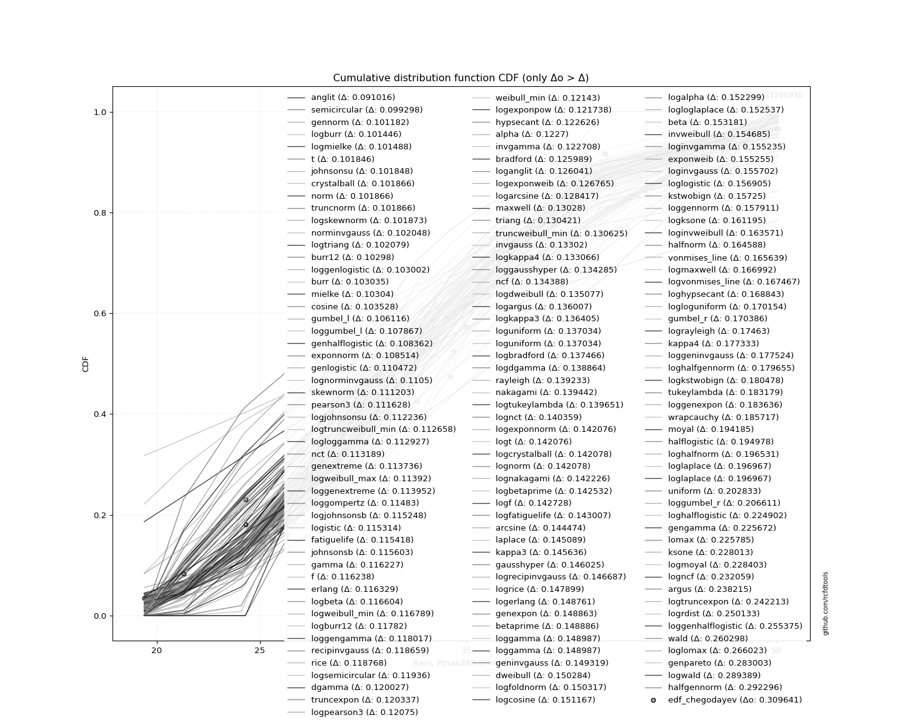</img>

</div>


**5.3. Best fit**

<div align="center">

|   id |   station | empirical_dist   | p_dist      |     delta |   deltao | eval   |   fit |   n |   best_fit |   best_fit_sort |
|-----:|----------:|:-----------------|:------------|----------:|---------:|:-------|------:|----:|-----------:|----------------:|
|    0 |  21206930 | edf_chegodayev   | loggumbel_l | 0.0893382 | 0.315645 | Δo > Δ |     1 |  19 |          1 |               1 |

</div>


<div align="center">

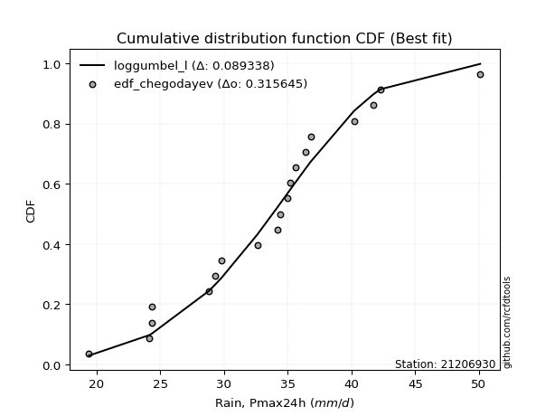</img>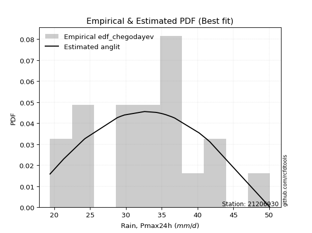</img>

</div>


### 6. EDF Blom (1958)

The Blom formula is a specific "plotting position" formula used in hydrology and statistical analysis to estimate the empirical cumulative probability (or non-exceedance probability) of a data series. It is particularly recommended for data that are approximately normally distributed. The constant _a_ is set to 0.375 (or 3/8).

<div align="center">


$P=(m-a)/(n+1-2a)$


</div>


**6.1. Empirical values**

<div align="center">

|                | 0                    | 1                   | 2                   | 3                   | 4                   | 5                  | 6                   | 7                  | 8                   | 9        | 10                 | 11                 | 12                 | 13                 | 14                 | 15                 | 16                 | 17                 | 18                 |
|:---------------|:---------------------|:--------------------|:--------------------|:--------------------|:--------------------|:-------------------|:--------------------|:-------------------|:--------------------|:---------|:-------------------|:-------------------|:-------------------|:-------------------|:-------------------|:-------------------|:-------------------|:-------------------|:-------------------|
| date           | 2009                 | 2007                | 2018                | 2023                | 2014                | 2011               | 2019                | 2021               | 2013                | 2006     | 2016               | 2020               | 2017               | 2008               | 2010               | 2022               | 2015               | 2005               | 2012               |
| x              | 19.4                 | 24.1                | 24.3                | 24.3                | 28.8                | 29.3               | 29.8                | 32.6               | 34.2                | 34.4     | 35.0               | 35.2               | 35.6               | 36.4               | 36.8               | 40.2               | 41.7               | 42.27368421052632  | 50.1               |
| m              | 1                    | 2                   | 3                   | 4                   | 5                   | 6                  | 7                   | 8                  | 9                   | 10       | 11                 | 12                 | 13                 | 14                 | 15                 | 16                 | 17                 | 18                 | 19                 |
| empirical_dist | edf_blom             | edf_blom            | edf_blom            | edf_blom            | edf_blom            | edf_blom           | edf_blom            | edf_blom           | edf_blom            | edf_blom | edf_blom           | edf_blom           | edf_blom           | edf_blom           | edf_blom           | edf_blom           | edf_blom           | edf_blom           | edf_blom           |
| empirical      | 0.032467532467532464 | 0.08441558441558442 | 0.13636363636363635 | 0.18831168831168832 | 0.24025974025974026 | 0.2922077922077922 | 0.34415584415584416 | 0.3961038961038961 | 0.44805194805194803 | 0.5      | 0.551948051948052  | 0.6038961038961039 | 0.6558441558441559 | 0.7077922077922078 | 0.7597402597402597 | 0.8116883116883117 | 0.8636363636363636 | 0.9155844155844156 | 0.9675324675324676 |
| empirical_tr   | 1.0335570469798658   | 1.0921985815602837  | 1.1578947368421053  | 1.232               | 1.3162393162393162  | 1.4128440366972477 | 1.5247524752475246  | 1.6559139784946235 | 1.811764705882353   | 2.0      | 2.2318840579710146 | 2.5245901639344264 | 2.905660377358491  | 3.4222222222222216 | 4.162162162162161  | 5.310344827586206  | 7.333333333333334  | 11.84615384615385  | 30.800000000000043 |

</div>


**6.2. Kolmogorov-Smirnov fit test (sorted by Δ)**


<div align="center">

|                | 0                   | 1                     | 2                   | 3                   | 4                   | 5                   | 6                   | 7                   | 8                   | 9                   | 10                  | 11                  | 12                  | 13                  | 14                  | 15                  | 16                  | 17                  | 18                  | 19                  | 20                  | 21                  | 22                  | 23                  | 24                  | 25                  | 26                  | 27                  | 28                  | 29                  | 30                  | 31                  | 32                  | 33                  | 34                  | 35                  | 36                  | 37                  | 38                  | 39                  | 40                  | 41                  | 42                  | 43                  | 44                  | 45                  | 46                  | 47                  | 48                  | 49                  | 50                  | 51                  | 52                  | 53                  | 54                  | 55                  | 56                  | 57                  | 58                  | 59                  | 60                  | 61                  | 62                  | 63                  | 64                  | 65                  | 66                  | 67                  | 68                  | 69                  | 70                  | 71                  | 72                  | 73                  | 74                  | 75                  | 76                  | 77                  | 78                  | 79                  | 80                  | 81                  | 82                  | 83                  | 84                  | 85                  | 86                  | 87                  |
|:---------------|:--------------------|:----------------------|:--------------------|:--------------------|:--------------------|:--------------------|:--------------------|:--------------------|:--------------------|:--------------------|:--------------------|:--------------------|:--------------------|:--------------------|:--------------------|:--------------------|:--------------------|:--------------------|:--------------------|:--------------------|:--------------------|:--------------------|:--------------------|:--------------------|:--------------------|:--------------------|:--------------------|:--------------------|:--------------------|:--------------------|:--------------------|:--------------------|:--------------------|:--------------------|:--------------------|:--------------------|:--------------------|:--------------------|:--------------------|:--------------------|:--------------------|:--------------------|:--------------------|:--------------------|:--------------------|:--------------------|:--------------------|:--------------------|:--------------------|:--------------------|:--------------------|:--------------------|:--------------------|:--------------------|:--------------------|:--------------------|:--------------------|:--------------------|:--------------------|:--------------------|:--------------------|:--------------------|:--------------------|:--------------------|:--------------------|:--------------------|:--------------------|:--------------------|:--------------------|:--------------------|:--------------------|:--------------------|:--------------------|:--------------------|:--------------------|:--------------------|:--------------------|:--------------------|:--------------------|:--------------------|:--------------------|:--------------------|:--------------------|:--------------------|:--------------------|:--------------------|:--------------------|:--------------------|
| station        | 21206930            | 21206930              | 21206930            | 21206930            | 21206930            | 21206930            | 21206930            | 21206930            | 21206930            | 21206930            | 21206930            | 21206930            | 21206930            | 21206930            | 21206930            | 21206930            | 21206930            | 21206930            | 21206930            | 21206930            | 21206930            | 21206930            | 21206930            | 21206930            | 21206930            | 21206930            | 21206930            | 21206930            | 21206930            | 21206930            | 21206930            | 21206930            | 21206930            | 21206930            | 21206930            | 21206930            | 21206930            | 21206930            | 21206930            | 21206930            | 21206930            | 21206930            | 21206930            | 21206930            | 21206930            | 21206930            | 21206930            | 21206930            | 21206930            | 21206930            | 21206930            | 21206930            | 21206930            | 21206930            | 21206930            | 21206930            | 21206930            | 21206930            | 21206930            | 21206930            | 21206930            | 21206930            | 21206930            | 21206930            | 21206930            | 21206930            | 21206930            | 21206930            | 21206930            | 21206930            | 21206930            | 21206930            | 21206930            | 21206930            | 21206930            | 21206930            | 21206930            | 21206930            | 21206930            | 21206930            | 21206930            | 21206930            | 21206930            | 21206930            | 21206930            | 21206930            | 21206930            | 21206930            |
| empirical_dist | edf_blom            | edf_blom              | edf_blom            | edf_blom            | edf_blom            | edf_blom            | edf_blom            | edf_blom            | edf_blom            | edf_blom            | edf_blom            | edf_blom            | edf_blom            | edf_blom            | edf_blom            | edf_blom            | edf_blom            | edf_blom            | edf_blom            | edf_blom            | edf_blom            | edf_blom            | edf_blom            | edf_blom            | edf_blom            | edf_blom            | edf_blom            | edf_blom            | edf_blom            | edf_blom            | edf_blom            | edf_blom            | edf_blom            | edf_blom            | edf_blom            | edf_blom            | edf_blom            | edf_blom            | edf_blom            | edf_blom            | edf_blom            | edf_blom            | edf_blom            | edf_blom            | edf_blom            | edf_blom            | edf_blom            | edf_blom            | edf_blom            | edf_blom            | edf_blom            | edf_blom            | edf_blom            | edf_blom            | edf_blom            | edf_blom            | edf_blom            | edf_blom            | edf_blom            | edf_blom            | edf_blom            | edf_blom            | edf_blom            | edf_blom            | edf_blom            | edf_blom            | edf_blom            | edf_blom            | edf_blom            | edf_blom            | edf_blom            | edf_blom            | edf_blom            | edf_blom            | edf_blom            | edf_blom            | edf_blom            | edf_blom            | edf_blom            | edf_blom            | edf_blom            | edf_blom            | edf_blom            | edf_blom            | edf_blom            | edf_blom            | edf_blom            | edf_blom            |
| p_dist         | loggumbel_l         | loglaplace_asymmetric | logmielke           | loggenlogistic      | mielke              | laplace_asymmetric  | crystalball         | norm                | t                   | loggompertz         | fisk                | logistic            | genlogistic         | exponnorm           | nct                 | pearson3            | logloggamma         | logjohnsonsu        | johnsonsu           | hypsecant           | fatiguelife         | logweibull_min      | f                   | gamma               | erlang              | weibull_min         | rice                | betaprime           | logpearson3         | chi2                | invgamma            | ncf                 | alpha               | gumbel_l            | logfisk             | laplace             | maxwell             | invgauss            | logbetaprime        | logf                | logfatiguelife      | rayleigh            | lognakagami         | logt                | logcrystalball      | lognorm             | lognorm             | logexponnorm        | loglognorm          | logrice             | logerlang           | loginvgamma         | loggamma            | loggamma            | invweibull          | logalpha            | loglogistic         | lognct              | loginvgauss         | kstwobign           | nakagami            | loghypsecant        | loginvweibull       | halfnorm            | logmaxwell          | gumbel_r            | lograyleigh         | logkstwobign        | loglaplace          | loggenexpon         | moyal               | halflogistic        | loghalfnorm         | loggumbel_r         | logncf              | loghalflogistic     | logmoyal            | genexpon            | expon               | wald                | gibrat              | logexpon            | logwald             | logchi2             | loggibrat           | logtruncnorm        | truncnorm           | gompertz            |
| delta          | 0.08692820286939697 | 0.08763765881215124   | 0.09011627877645334 | 0.09061504217096583 | 0.09066764196578758 | 0.09316001511565636 | 0.09609874964562426 | 0.09609877045147541 | 0.09609916088853998 | 0.09962784920423196 | 0.10190845703312934 | 0.10206511200890389 | 0.10305591667697878 | 0.10360070862193294 | 0.10539211729191567 | 0.10573352120687884 | 0.10613480203585479 | 0.10614926618950771 | 0.10683394156076609 | 0.1071179005656776  | 0.10749872949052897 | 0.10773966671970947 | 0.10782400953934712 | 0.10786604359495622 | 0.10786611384571976 | 0.10914682487883154 | 0.1098752361666383  | 0.10994915387900117 | 0.11048805079755342 | 0.11377779035829927 | 0.11670789063089781 | 0.11771805123183621 | 0.11820795489983182 | 0.11899286019002797 | 0.11936484611938658 | 0.12452382866391887 | 0.12686649876889955 | 0.1281970512550703  | 0.1291000456071678  | 0.13600966346864518 | 0.13617322783440133 | 0.13678906650105604 | 0.13689032483352914 | 0.1370447440807826  | 0.13704500376224515 | 0.13704500409028386 | 0.13704500409028386 | 0.13704520095518213 | 0.13704732939835407 | 0.14098711824362498 | 0.14133494166445038 | 0.14206442264880492 | 0.14375970793471482 | 0.14375970793471482 | 0.14611767931264397 | 0.14780016229587567 | 0.14820105739961564 | 0.1514910879828033  | 0.1527009512346782  | 0.1550722108278635  | 0.15727912391081533 | 0.15743744545911098 | 0.16013601418680878 | 0.16476329454050853 | 0.1648378434035047  | 0.16640148903155294 | 0.17355464815696742 | 0.17889418198223095 | 0.1830122981646083  | 0.19073073518814043 | 0.19142103910525    | 0.19184658546328426 | 0.1982559474723946  | 0.20494868120005028 | 0.20758099155953813 | 0.22638939774294342 | 0.2284013169569663  | 0.2395638987644141  | 0.24892514509999034 | 0.2608476975065632  | 0.28947015849462243 | 0.2931872455194956  | 0.2936155250973258  | 0.3142235517837473  | 0.3247877301114337  | 0.361290227308424   | 0.4229347511960173  | 0.7177169020492543  |
| deltao         | 0.31564497164100014 | 0.31564497164100014   | 0.31564497164100014 | 0.31564497164100014 | 0.31564497164100014 | 0.31564497164100014 | 0.31564497164100014 | 0.31564497164100014 | 0.31564497164100014 | 0.31564497164100014 | 0.31564497164100014 | 0.31564497164100014 | 0.31564497164100014 | 0.31564497164100014 | 0.31564497164100014 | 0.31564497164100014 | 0.31564497164100014 | 0.31564497164100014 | 0.31564497164100014 | 0.31564497164100014 | 0.31564497164100014 | 0.31564497164100014 | 0.31564497164100014 | 0.31564497164100014 | 0.31564497164100014 | 0.31564497164100014 | 0.31564497164100014 | 0.31564497164100014 | 0.31564497164100014 | 0.31564497164100014 | 0.31564497164100014 | 0.31564497164100014 | 0.31564497164100014 | 0.31564497164100014 | 0.31564497164100014 | 0.31564497164100014 | 0.31564497164100014 | 0.31564497164100014 | 0.31564497164100014 | 0.31564497164100014 | 0.31564497164100014 | 0.31564497164100014 | 0.31564497164100014 | 0.31564497164100014 | 0.31564497164100014 | 0.31564497164100014 | 0.31564497164100014 | 0.31564497164100014 | 0.31564497164100014 | 0.31564497164100014 | 0.31564497164100014 | 0.31564497164100014 | 0.31564497164100014 | 0.31564497164100014 | 0.31564497164100014 | 0.31564497164100014 | 0.31564497164100014 | 0.31564497164100014 | 0.31564497164100014 | 0.31564497164100014 | 0.31564497164100014 | 0.31564497164100014 | 0.31564497164100014 | 0.31564497164100014 | 0.31564497164100014 | 0.31564497164100014 | 0.31564497164100014 | 0.31564497164100014 | 0.31564497164100014 | 0.31564497164100014 | 0.31564497164100014 | 0.31564497164100014 | 0.31564497164100014 | 0.31564497164100014 | 0.31564497164100014 | 0.31564497164100014 | 0.31564497164100014 | 0.31564497164100014 | 0.31564497164100014 | 0.31564497164100014 | 0.31564497164100014 | 0.31564497164100014 | 0.31564497164100014 | 0.31564497164100014 | 0.31564497164100014 | 0.31564497164100014 | 0.31564497164100014 | 0.31564497164100014 |
| eval           | Δo > Δ              | Δo > Δ                | Δo > Δ              | Δo > Δ              | Δo > Δ              | Δo > Δ              | Δo > Δ              | Δo > Δ              | Δo > Δ              | Δo > Δ              | Δo > Δ              | Δo > Δ              | Δo > Δ              | Δo > Δ              | Δo > Δ              | Δo > Δ              | Δo > Δ              | Δo > Δ              | Δo > Δ              | Δo > Δ              | Δo > Δ              | Δo > Δ              | Δo > Δ              | Δo > Δ              | Δo > Δ              | Δo > Δ              | Δo > Δ              | Δo > Δ              | Δo > Δ              | Δo > Δ              | Δo > Δ              | Δo > Δ              | Δo > Δ              | Δo > Δ              | Δo > Δ              | Δo > Δ              | Δo > Δ              | Δo > Δ              | Δo > Δ              | Δo > Δ              | Δo > Δ              | Δo > Δ              | Δo > Δ              | Δo > Δ              | Δo > Δ              | Δo > Δ              | Δo > Δ              | Δo > Δ              | Δo > Δ              | Δo > Δ              | Δo > Δ              | Δo > Δ              | Δo > Δ              | Δo > Δ              | Δo > Δ              | Δo > Δ              | Δo > Δ              | Δo > Δ              | Δo > Δ              | Δo > Δ              | Δo > Δ              | Δo > Δ              | Δo > Δ              | Δo > Δ              | Δo > Δ              | Δo > Δ              | Δo > Δ              | Δo > Δ              | Δo > Δ              | Δo > Δ              | Δo > Δ              | Δo > Δ              | Δo > Δ              | Δo > Δ              | Δo > Δ              | Δo > Δ              | Δo > Δ              | Δo > Δ              | Δo > Δ              | Δo > Δ              | Δo > Δ              | Δo > Δ              | Δo > Δ              | Δo > Δ              | Δo <= Δ             | Δo <= Δ             | Δo <= Δ             | Δo <= Δ             |
| fit            | 1                   | 1                     | 1                   | 1                   | 1                   | 1                   | 1                   | 1                   | 1                   | 1                   | 1                   | 1                   | 1                   | 1                   | 1                   | 1                   | 1                   | 1                   | 1                   | 1                   | 1                   | 1                   | 1                   | 1                   | 1                   | 1                   | 1                   | 1                   | 1                   | 1                   | 1                   | 1                   | 1                   | 1                   | 1                   | 1                   | 1                   | 1                   | 1                   | 1                   | 1                   | 1                   | 1                   | 1                   | 1                   | 1                   | 1                   | 1                   | 1                   | 1                   | 1                   | 1                   | 1                   | 1                   | 1                   | 1                   | 1                   | 1                   | 1                   | 1                   | 1                   | 1                   | 1                   | 1                   | 1                   | 1                   | 1                   | 1                   | 1                   | 1                   | 1                   | 1                   | 1                   | 1                   | 1                   | 1                   | 1                   | 1                   | 1                   | 1                   | 1                   | 1                   | 1                   | 1                   | 0                   | 0                   | 0                   | 0                   |
| n              | 19                  | 19                    | 19                  | 19                  | 19                  | 19                  | 19                  | 19                  | 19                  | 19                  | 19                  | 19                  | 19                  | 19                  | 19                  | 19                  | 19                  | 19                  | 19                  | 19                  | 19                  | 19                  | 19                  | 19                  | 19                  | 19                  | 19                  | 19                  | 19                  | 19                  | 19                  | 19                  | 19                  | 19                  | 19                  | 19                  | 19                  | 19                  | 19                  | 19                  | 19                  | 19                  | 19                  | 19                  | 19                  | 19                  | 19                  | 19                  | 19                  | 19                  | 19                  | 19                  | 19                  | 19                  | 19                  | 19                  | 19                  | 19                  | 19                  | 19                  | 19                  | 19                  | 19                  | 19                  | 19                  | 19                  | 19                  | 19                  | 19                  | 19                  | 19                  | 19                  | 19                  | 19                  | 19                  | 19                  | 19                  | 19                  | 19                  | 19                  | 19                  | 19                  | 19                  | 19                  | 19                  | 19                  | 19                  | 19                  |
| best_fit       | 1                   | 0                     | 0                   | 0                   | 0                   | 0                   | 0                   | 0                   | 0                   | 0                   | 0                   | 0                   | 0                   | 0                   | 0                   | 0                   | 0                   | 0                   | 0                   | 0                   | 0                   | 0                   | 0                   | 0                   | 0                   | 0                   | 0                   | 0                   | 0                   | 0                   | 0                   | 0                   | 0                   | 0                   | 0                   | 0                   | 0                   | 0                   | 0                   | 0                   | 0                   | 0                   | 0                   | 0                   | 0                   | 0                   | 0                   | 0                   | 0                   | 0                   | 0                   | 0                   | 0                   | 0                   | 0                   | 0                   | 0                   | 0                   | 0                   | 0                   | 0                   | 0                   | 0                   | 0                   | 0                   | 0                   | 0                   | 0                   | 0                   | 0                   | 0                   | 0                   | 0                   | 0                   | 0                   | 0                   | 0                   | 0                   | 0                   | 0                   | 0                   | 0                   | 0                   | 0                   | 0                   | 0                   | 0                   | 0                   |
| best_fit_sort  | 1                   | 2                     | 3                   | 4                   | 5                   | 6                   | 7                   | 8                   | 9                   | 10                  | 11                  | 12                  | 13                  | 14                  | 15                  | 16                  | 17                  | 18                  | 19                  | 20                  | 21                  | 22                  | 23                  | 24                  | 25                  | 26                  | 27                  | 28                  | 29                  | 30                  | 31                  | 32                  | 33                  | 34                  | 35                  | 36                  | 37                  | 38                  | 39                  | 40                  | 41                  | 42                  | 43                  | 44                  | 45                  | 46                  | 47                  | 48                  | 49                  | 50                  | 51                  | 52                  | 53                  | 54                  | 55                  | 56                  | 57                  | 58                  | 59                  | 60                  | 61                  | 62                  | 63                  | 64                  | 65                  | 66                  | 67                  | 68                  | 69                  | 70                  | 71                  | 72                  | 73                  | 74                  | 75                  | 76                  | 77                  | 78                  | 79                  | 80                  | 81                  | 82                  | 83                  | 84                  | 85                  | 86                  | 87                  | 88                  |

</div>


<div align="center">

</img>

</div>


**6.3. Best fit**

<div align="center">

|   id |   station | empirical_dist   | p_dist      |     delta |   deltao | eval   |   fit |   n |   best_fit |   best_fit_sort |
|-----:|----------:|:-----------------|:------------|----------:|---------:|:-------|------:|----:|-----------:|----------------:|
|    0 |  21206930 | edf_blom         | loggumbel_l | 0.0869282 | 0.315645 | Δo > Δ |     1 |  19 |          1 |               1 |

</div>


<div align="center">

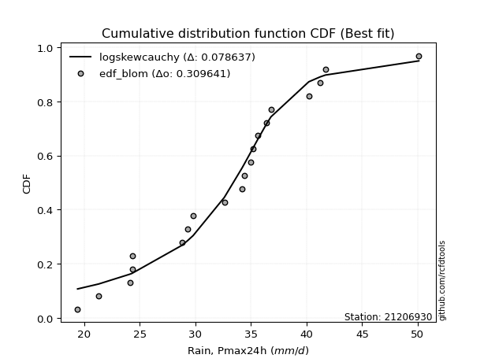</img></img>

</div>


### 7. EDF Tukey (1962)

In hydrology, the Tukey formula is used as a plotting position formula to estimate the empirical probability or frequency of a flood event (or other hydrological data). The formula parameter is given as _c=0.333_ (or 1/3).

<div align="center">


$P=(m-c)/(n+1-2c)$


</div>


**7.1. Empirical values**

<div align="center">

|                | 0                    | 1                   | 2                   | 3                  | 4                  | 5                   | 6                  | 7                   | 8                  | 9         | 10                 | 11                 | 12                 | 13                 | 14                 | 15                 | 16                 | 17                 | 18                 |
|:---------------|:---------------------|:--------------------|:--------------------|:-------------------|:-------------------|:--------------------|:-------------------|:--------------------|:-------------------|:----------|:-------------------|:-------------------|:-------------------|:-------------------|:-------------------|:-------------------|:-------------------|:-------------------|:-------------------|
| date           | 2009                 | 2007                | 2018                | 2023               | 2014               | 2011                | 2019               | 2021                | 2013               | 2006      | 2016               | 2020               | 2017               | 2008               | 2010               | 2022               | 2015               | 2005               | 2012               |
| x              | 19.4                 | 24.1                | 24.3                | 24.3               | 28.8               | 29.3                | 29.8               | 32.6                | 34.2               | 34.4      | 35.0               | 35.2               | 35.6               | 36.4               | 36.8               | 40.2               | 41.7               | 42.27368421052632  | 50.1               |
| m              | 1                    | 2                   | 3                   | 4                  | 5                  | 6                   | 7                  | 8                   | 9                  | 10        | 11                 | 12                 | 13                 | 14                 | 15                 | 16                 | 17                 | 18                 | 19                 |
| empirical_dist | edf_tukey            | edf_tukey           | edf_tukey           | edf_tukey          | edf_tukey          | edf_tukey           | edf_tukey          | edf_tukey           | edf_tukey          | edf_tukey | edf_tukey          | edf_tukey          | edf_tukey          | edf_tukey          | edf_tukey          | edf_tukey          | edf_tukey          | edf_tukey          | edf_tukey          |
| empirical      | 0.034482758620689655 | 0.08620689655172414 | 0.13793103448275862 | 0.1896551724137931 | 0.2413793103448276 | 0.29310344827586204 | 0.3448275862068966 | 0.39655172413793105 | 0.4482758620689655 | 0.5       | 0.5517241379310345 | 0.603448275862069  | 0.6551724137931034 | 0.7068965517241379 | 0.7586206896551724 | 0.8103448275862069 | 0.8620689655172413 | 0.9137931034482759 | 0.9655172413793104 |
| empirical_tr   | 1.0357142857142856   | 1.0943396226415094  | 1.1600000000000001  | 1.2340425531914894 | 1.3181818181818183 | 1.4146341463414636  | 1.5263157894736843 | 1.6571428571428573  | 1.8125             | 2.0       | 2.230769230769231  | 2.5217391304347827 | 2.9                | 3.4117647058823524 | 4.142857142857142  | 5.272727272727272  | 7.249999999999997  | 11.600000000000007 | 29.000000000000036 |

</div>


**7.2. Kolmogorov-Smirnov fit test (sorted by Δ)**


<div align="center">

|                | 0                   | 1                     | 2                   | 3                   | 4                   | 5                   | 6                   | 7                   | 8                   | 9                   | 10                  | 11                  | 12                  | 13                  | 14                  | 15                  | 16                  | 17                  | 18                  | 19                  | 20                  | 21                  | 22                  | 23                  | 24                  | 25                  | 26                  | 27                  | 28                  | 29                  | 30                  | 31                  | 32                  | 33                  | 34                  | 35                  | 36                  | 37                  | 38                  | 39                  | 40                  | 41                  | 42                  | 43                  | 44                  | 45                  | 46                  | 47                  | 48                  | 49                  | 50                  | 51                  | 52                  | 53                  | 54                  | 55                  | 56                  | 57                  | 58                  | 59                  | 60                  | 61                  | 62                  | 63                  | 64                  | 65                  | 66                  | 67                  | 68                  | 69                  | 70                  | 71                  | 72                  | 73                  | 74                  | 75                  | 76                  | 77                  | 78                  | 79                  | 80                  | 81                  | 82                  | 83                  | 84                  | 85                  | 86                  | 87                  |
|:---------------|:--------------------|:----------------------|:--------------------|:--------------------|:--------------------|:--------------------|:--------------------|:--------------------|:--------------------|:--------------------|:--------------------|:--------------------|:--------------------|:--------------------|:--------------------|:--------------------|:--------------------|:--------------------|:--------------------|:--------------------|:--------------------|:--------------------|:--------------------|:--------------------|:--------------------|:--------------------|:--------------------|:--------------------|:--------------------|:--------------------|:--------------------|:--------------------|:--------------------|:--------------------|:--------------------|:--------------------|:--------------------|:--------------------|:--------------------|:--------------------|:--------------------|:--------------------|:--------------------|:--------------------|:--------------------|:--------------------|:--------------------|:--------------------|:--------------------|:--------------------|:--------------------|:--------------------|:--------------------|:--------------------|:--------------------|:--------------------|:--------------------|:--------------------|:--------------------|:--------------------|:--------------------|:--------------------|:--------------------|:--------------------|:--------------------|:--------------------|:--------------------|:--------------------|:--------------------|:--------------------|:--------------------|:--------------------|:--------------------|:--------------------|:--------------------|:--------------------|:--------------------|:--------------------|:--------------------|:--------------------|:--------------------|:--------------------|:--------------------|:--------------------|:--------------------|:--------------------|:--------------------|:--------------------|
| station        | 21206930            | 21206930              | 21206930            | 21206930            | 21206930            | 21206930            | 21206930            | 21206930            | 21206930            | 21206930            | 21206930            | 21206930            | 21206930            | 21206930            | 21206930            | 21206930            | 21206930            | 21206930            | 21206930            | 21206930            | 21206930            | 21206930            | 21206930            | 21206930            | 21206930            | 21206930            | 21206930            | 21206930            | 21206930            | 21206930            | 21206930            | 21206930            | 21206930            | 21206930            | 21206930            | 21206930            | 21206930            | 21206930            | 21206930            | 21206930            | 21206930            | 21206930            | 21206930            | 21206930            | 21206930            | 21206930            | 21206930            | 21206930            | 21206930            | 21206930            | 21206930            | 21206930            | 21206930            | 21206930            | 21206930            | 21206930            | 21206930            | 21206930            | 21206930            | 21206930            | 21206930            | 21206930            | 21206930            | 21206930            | 21206930            | 21206930            | 21206930            | 21206930            | 21206930            | 21206930            | 21206930            | 21206930            | 21206930            | 21206930            | 21206930            | 21206930            | 21206930            | 21206930            | 21206930            | 21206930            | 21206930            | 21206930            | 21206930            | 21206930            | 21206930            | 21206930            | 21206930            | 21206930            |
| empirical_dist | edf_tukey           | edf_tukey             | edf_tukey           | edf_tukey           | edf_tukey           | edf_tukey           | edf_tukey           | edf_tukey           | edf_tukey           | edf_tukey           | edf_tukey           | edf_tukey           | edf_tukey           | edf_tukey           | edf_tukey           | edf_tukey           | edf_tukey           | edf_tukey           | edf_tukey           | edf_tukey           | edf_tukey           | edf_tukey           | edf_tukey           | edf_tukey           | edf_tukey           | edf_tukey           | edf_tukey           | edf_tukey           | edf_tukey           | edf_tukey           | edf_tukey           | edf_tukey           | edf_tukey           | edf_tukey           | edf_tukey           | edf_tukey           | edf_tukey           | edf_tukey           | edf_tukey           | edf_tukey           | edf_tukey           | edf_tukey           | edf_tukey           | edf_tukey           | edf_tukey           | edf_tukey           | edf_tukey           | edf_tukey           | edf_tukey           | edf_tukey           | edf_tukey           | edf_tukey           | edf_tukey           | edf_tukey           | edf_tukey           | edf_tukey           | edf_tukey           | edf_tukey           | edf_tukey           | edf_tukey           | edf_tukey           | edf_tukey           | edf_tukey           | edf_tukey           | edf_tukey           | edf_tukey           | edf_tukey           | edf_tukey           | edf_tukey           | edf_tukey           | edf_tukey           | edf_tukey           | edf_tukey           | edf_tukey           | edf_tukey           | edf_tukey           | edf_tukey           | edf_tukey           | edf_tukey           | edf_tukey           | edf_tukey           | edf_tukey           | edf_tukey           | edf_tukey           | edf_tukey           | edf_tukey           | edf_tukey           | edf_tukey           |
| p_dist         | loggumbel_l         | loglaplace_asymmetric | logmielke           | loggenlogistic      | mielke              | laplace_asymmetric  | crystalball         | norm                | t                   | loggompertz         | fisk                | logistic            | genlogistic         | exponnorm           | nct                 | pearson3            | logloggamma         | logjohnsonsu        | johnsonsu           | hypsecant           | fatiguelife         | logweibull_min      | f                   | gamma               | erlang              | weibull_min         | rice                | betaprime           | logpearson3         | chi2                | invgamma            | ncf                 | gumbel_l            | alpha               | logfisk             | laplace             | maxwell             | invgauss            | logbetaprime        | logf                | logfatiguelife      | rayleigh            | lognakagami         | logt                | logcrystalball      | lognorm             | lognorm             | logexponnorm        | loglognorm          | logrice             | logerlang           | loginvgamma         | loggamma            | loggamma            | invweibull          | logalpha            | loglogistic         | lognct              | loginvgauss         | kstwobign           | nakagami            | loghypsecant        | loginvweibull       | halfnorm            | logmaxwell          | gumbel_r            | lograyleigh         | logkstwobign        | loglaplace          | loggenexpon         | moyal               | halflogistic        | loghalfnorm         | loggumbel_r         | logncf              | loghalflogistic     | logmoyal            | genexpon            | expon               | wald                | gibrat              | logexpon            | logwald             | logchi2             | loggibrat           | logtruncnorm        | truncnorm           | gompertz            |
| delta          | 0.08827168697150174 | 0.08863853527646764   | 0.08989236475943585 | 0.09039112815394834 | 0.09044372794877009 | 0.09383175716670877 | 0.09587483562860677 | 0.09587485643445792 | 0.09587524687152249 | 0.09940393518721446 | 0.10168454301611185 | 0.1018411979918864  | 0.10283200265996129 | 0.10337679460491545 | 0.10516820327489818 | 0.10550960718986135 | 0.1059108880188373  | 0.10592535217249022 | 0.1066100275437486  | 0.10689398654866011 | 0.10727481547351148 | 0.10751575270269198 | 0.10760009552232963 | 0.10764212957793873 | 0.10764219982870227 | 0.10892291086181405 | 0.10965132214962081 | 0.10972523986198368 | 0.11026413678053593 | 0.11355387634128178 | 0.11648397661388032 | 0.11749413721481872 | 0.11787329010494063 | 0.11798404088281433 | 0.11914093210236909 | 0.12429991464690138 | 0.12664258475188206 | 0.12797313723805281 | 0.12887613159015032 | 0.1357857494516277  | 0.13594931381738384 | 0.13656515248403855 | 0.13666641081651165 | 0.1368208300637651  | 0.13682108974522766 | 0.13682109007326637 | 0.13682109007326637 | 0.13682128693816464 | 0.13682341538133658 | 0.14076320422660749 | 0.14111102764743289 | 0.14184050863178743 | 0.14353579391769733 | 0.14353579391769733 | 0.14589376529562648 | 0.14757624827885818 | 0.14797714338259815 | 0.15126717396578582 | 0.1524770372176607  | 0.154848296810846   | 0.15548781177467563 | 0.1572135314420935  | 0.1599121001697913  | 0.16453938052349104 | 0.16461392938648722 | 0.16617757501453545 | 0.17333073413994993 | 0.17867026796521346 | 0.1827883841475908  | 0.19050682117112294 | 0.1911971250882325  | 0.19162267144626677 | 0.19803203345537712 | 0.20472476718303279 | 0.20578967942339843 | 0.22616548372592593 | 0.22817740293994881 | 0.23844432867932677 | 0.247805575014903   | 0.26062378348954574 | 0.28924624447760494 | 0.29206767543440826 | 0.2933916110803083  | 0.3122083256305901  | 0.3245638160944162  | 0.36017065722333663 | 0.42114343905987756 | 0.716597331964167   |
| deltao         | 0.31564497164100014 | 0.31564497164100014   | 0.31564497164100014 | 0.31564497164100014 | 0.31564497164100014 | 0.31564497164100014 | 0.31564497164100014 | 0.31564497164100014 | 0.31564497164100014 | 0.31564497164100014 | 0.31564497164100014 | 0.31564497164100014 | 0.31564497164100014 | 0.31564497164100014 | 0.31564497164100014 | 0.31564497164100014 | 0.31564497164100014 | 0.31564497164100014 | 0.31564497164100014 | 0.31564497164100014 | 0.31564497164100014 | 0.31564497164100014 | 0.31564497164100014 | 0.31564497164100014 | 0.31564497164100014 | 0.31564497164100014 | 0.31564497164100014 | 0.31564497164100014 | 0.31564497164100014 | 0.31564497164100014 | 0.31564497164100014 | 0.31564497164100014 | 0.31564497164100014 | 0.31564497164100014 | 0.31564497164100014 | 0.31564497164100014 | 0.31564497164100014 | 0.31564497164100014 | 0.31564497164100014 | 0.31564497164100014 | 0.31564497164100014 | 0.31564497164100014 | 0.31564497164100014 | 0.31564497164100014 | 0.31564497164100014 | 0.31564497164100014 | 0.31564497164100014 | 0.31564497164100014 | 0.31564497164100014 | 0.31564497164100014 | 0.31564497164100014 | 0.31564497164100014 | 0.31564497164100014 | 0.31564497164100014 | 0.31564497164100014 | 0.31564497164100014 | 0.31564497164100014 | 0.31564497164100014 | 0.31564497164100014 | 0.31564497164100014 | 0.31564497164100014 | 0.31564497164100014 | 0.31564497164100014 | 0.31564497164100014 | 0.31564497164100014 | 0.31564497164100014 | 0.31564497164100014 | 0.31564497164100014 | 0.31564497164100014 | 0.31564497164100014 | 0.31564497164100014 | 0.31564497164100014 | 0.31564497164100014 | 0.31564497164100014 | 0.31564497164100014 | 0.31564497164100014 | 0.31564497164100014 | 0.31564497164100014 | 0.31564497164100014 | 0.31564497164100014 | 0.31564497164100014 | 0.31564497164100014 | 0.31564497164100014 | 0.31564497164100014 | 0.31564497164100014 | 0.31564497164100014 | 0.31564497164100014 | 0.31564497164100014 |
| eval           | Δo > Δ              | Δo > Δ                | Δo > Δ              | Δo > Δ              | Δo > Δ              | Δo > Δ              | Δo > Δ              | Δo > Δ              | Δo > Δ              | Δo > Δ              | Δo > Δ              | Δo > Δ              | Δo > Δ              | Δo > Δ              | Δo > Δ              | Δo > Δ              | Δo > Δ              | Δo > Δ              | Δo > Δ              | Δo > Δ              | Δo > Δ              | Δo > Δ              | Δo > Δ              | Δo > Δ              | Δo > Δ              | Δo > Δ              | Δo > Δ              | Δo > Δ              | Δo > Δ              | Δo > Δ              | Δo > Δ              | Δo > Δ              | Δo > Δ              | Δo > Δ              | Δo > Δ              | Δo > Δ              | Δo > Δ              | Δo > Δ              | Δo > Δ              | Δo > Δ              | Δo > Δ              | Δo > Δ              | Δo > Δ              | Δo > Δ              | Δo > Δ              | Δo > Δ              | Δo > Δ              | Δo > Δ              | Δo > Δ              | Δo > Δ              | Δo > Δ              | Δo > Δ              | Δo > Δ              | Δo > Δ              | Δo > Δ              | Δo > Δ              | Δo > Δ              | Δo > Δ              | Δo > Δ              | Δo > Δ              | Δo > Δ              | Δo > Δ              | Δo > Δ              | Δo > Δ              | Δo > Δ              | Δo > Δ              | Δo > Δ              | Δo > Δ              | Δo > Δ              | Δo > Δ              | Δo > Δ              | Δo > Δ              | Δo > Δ              | Δo > Δ              | Δo > Δ              | Δo > Δ              | Δo > Δ              | Δo > Δ              | Δo > Δ              | Δo > Δ              | Δo > Δ              | Δo > Δ              | Δo > Δ              | Δo > Δ              | Δo <= Δ             | Δo <= Δ             | Δo <= Δ             | Δo <= Δ             |
| fit            | 1                   | 1                     | 1                   | 1                   | 1                   | 1                   | 1                   | 1                   | 1                   | 1                   | 1                   | 1                   | 1                   | 1                   | 1                   | 1                   | 1                   | 1                   | 1                   | 1                   | 1                   | 1                   | 1                   | 1                   | 1                   | 1                   | 1                   | 1                   | 1                   | 1                   | 1                   | 1                   | 1                   | 1                   | 1                   | 1                   | 1                   | 1                   | 1                   | 1                   | 1                   | 1                   | 1                   | 1                   | 1                   | 1                   | 1                   | 1                   | 1                   | 1                   | 1                   | 1                   | 1                   | 1                   | 1                   | 1                   | 1                   | 1                   | 1                   | 1                   | 1                   | 1                   | 1                   | 1                   | 1                   | 1                   | 1                   | 1                   | 1                   | 1                   | 1                   | 1                   | 1                   | 1                   | 1                   | 1                   | 1                   | 1                   | 1                   | 1                   | 1                   | 1                   | 1                   | 1                   | 0                   | 0                   | 0                   | 0                   |
| n              | 19                  | 19                    | 19                  | 19                  | 19                  | 19                  | 19                  | 19                  | 19                  | 19                  | 19                  | 19                  | 19                  | 19                  | 19                  | 19                  | 19                  | 19                  | 19                  | 19                  | 19                  | 19                  | 19                  | 19                  | 19                  | 19                  | 19                  | 19                  | 19                  | 19                  | 19                  | 19                  | 19                  | 19                  | 19                  | 19                  | 19                  | 19                  | 19                  | 19                  | 19                  | 19                  | 19                  | 19                  | 19                  | 19                  | 19                  | 19                  | 19                  | 19                  | 19                  | 19                  | 19                  | 19                  | 19                  | 19                  | 19                  | 19                  | 19                  | 19                  | 19                  | 19                  | 19                  | 19                  | 19                  | 19                  | 19                  | 19                  | 19                  | 19                  | 19                  | 19                  | 19                  | 19                  | 19                  | 19                  | 19                  | 19                  | 19                  | 19                  | 19                  | 19                  | 19                  | 19                  | 19                  | 19                  | 19                  | 19                  |
| best_fit       | 1                   | 0                     | 0                   | 0                   | 0                   | 0                   | 0                   | 0                   | 0                   | 0                   | 0                   | 0                   | 0                   | 0                   | 0                   | 0                   | 0                   | 0                   | 0                   | 0                   | 0                   | 0                   | 0                   | 0                   | 0                   | 0                   | 0                   | 0                   | 0                   | 0                   | 0                   | 0                   | 0                   | 0                   | 0                   | 0                   | 0                   | 0                   | 0                   | 0                   | 0                   | 0                   | 0                   | 0                   | 0                   | 0                   | 0                   | 0                   | 0                   | 0                   | 0                   | 0                   | 0                   | 0                   | 0                   | 0                   | 0                   | 0                   | 0                   | 0                   | 0                   | 0                   | 0                   | 0                   | 0                   | 0                   | 0                   | 0                   | 0                   | 0                   | 0                   | 0                   | 0                   | 0                   | 0                   | 0                   | 0                   | 0                   | 0                   | 0                   | 0                   | 0                   | 0                   | 0                   | 0                   | 0                   | 0                   | 0                   |
| best_fit_sort  | 1                   | 2                     | 3                   | 4                   | 5                   | 6                   | 7                   | 8                   | 9                   | 10                  | 11                  | 12                  | 13                  | 14                  | 15                  | 16                  | 17                  | 18                  | 19                  | 20                  | 21                  | 22                  | 23                  | 24                  | 25                  | 26                  | 27                  | 28                  | 29                  | 30                  | 31                  | 32                  | 33                  | 34                  | 35                  | 36                  | 37                  | 38                  | 39                  | 40                  | 41                  | 42                  | 43                  | 44                  | 45                  | 46                  | 47                  | 48                  | 49                  | 50                  | 51                  | 52                  | 53                  | 54                  | 55                  | 56                  | 57                  | 58                  | 59                  | 60                  | 61                  | 62                  | 63                  | 64                  | 65                  | 66                  | 67                  | 68                  | 69                  | 70                  | 71                  | 72                  | 73                  | 74                  | 75                  | 76                  | 77                  | 78                  | 79                  | 80                  | 81                  | 82                  | 83                  | 84                  | 85                  | 86                  | 87                  | 88                  |

</div>


<div align="center">

</img>

</div>


**7.3. Best fit**

<div align="center">

|   id |   station | empirical_dist   | p_dist      |     delta |   deltao | eval   |   fit |   n |   best_fit |   best_fit_sort |
|-----:|----------:|:-----------------|:------------|----------:|---------:|:-------|------:|----:|-----------:|----------------:|
|    0 |  21206930 | edf_tukey        | loggumbel_l | 0.0882717 | 0.315645 | Δo > Δ |     1 |  19 |          1 |               1 |

</div>


<div align="center">

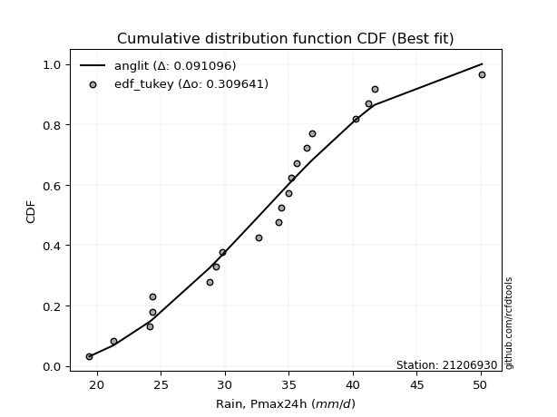</img>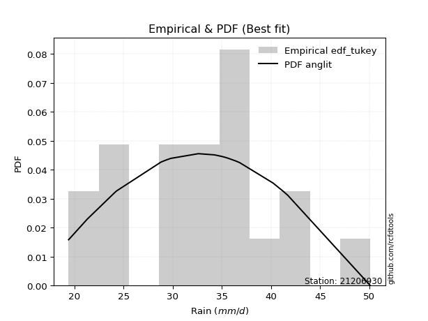</img>

</div>


### 8. EDF Gringorten (1963)

Gringorten plotting position formula is essential for estimating the probability and return periods of extreme events like floods and heavy rainfall. The constant _a=0.44_.

<div align="center">


$P=(m-a)/(n+1-2a)$


</div>


**8.1. Empirical values**

<div align="center">

|                | 0                    | 1                   | 2                   | 3                   | 4                   | 5                   | 6                  | 7                  | 8                  | 9              | 10                 | 11                | 12                 | 13                 | 14                 | 15                 | 16                 | 17                 | 18                 |
|:---------------|:---------------------|:--------------------|:--------------------|:--------------------|:--------------------|:--------------------|:-------------------|:-------------------|:-------------------|:---------------|:-------------------|:------------------|:-------------------|:-------------------|:-------------------|:-------------------|:-------------------|:-------------------|:-------------------|
| date           | 2009                 | 2007                | 2018                | 2023                | 2014                | 2011                | 2019               | 2021               | 2013               | 2006           | 2016               | 2020              | 2017               | 2008               | 2010               | 2022               | 2015               | 2005               | 2012               |
| x              | 19.4                 | 24.1                | 24.3                | 24.3                | 28.8                | 29.3                | 29.8               | 32.6               | 34.2               | 34.4           | 35.0               | 35.2              | 35.6               | 36.4               | 36.8               | 40.2               | 41.7               | 42.27368421052632  | 50.1               |
| m              | 1                    | 2                   | 3                   | 4                   | 5                   | 6                   | 7                  | 8                  | 9                  | 10             | 11                 | 12                | 13                 | 14                 | 15                 | 16                 | 17                 | 18                 | 19                 |
| empirical_dist | edf_gringorten       | edf_gringorten      | edf_gringorten      | edf_gringorten      | edf_gringorten      | edf_gringorten      | edf_gringorten     | edf_gringorten     | edf_gringorten     | edf_gringorten | edf_gringorten     | edf_gringorten    | edf_gringorten     | edf_gringorten     | edf_gringorten     | edf_gringorten     | edf_gringorten     | edf_gringorten     | edf_gringorten     |
| empirical      | 0.029288702928870293 | 0.08158995815899582 | 0.13389121338912133 | 0.18619246861924685 | 0.23849372384937234 | 0.29079497907949786 | 0.3430962343096234 | 0.3953974895397489 | 0.4476987447698745 | 0.5            | 0.5523012552301255 | 0.604602510460251 | 0.6569037656903766 | 0.7092050209205021 | 0.7615062761506276 | 0.8138075313807531 | 0.8661087866108785 | 0.918410041841004  | 0.9707112970711296 |
| empirical_tr   | 1.0301724137931034   | 1.0888382687927107  | 1.1545893719806763  | 1.2287917737789202  | 1.313186813186813   | 1.4100294985250739  | 1.522292993630573  | 1.6539792387543253 | 1.8106060606060606 | 2.0            | 2.2336448598130842 | 2.529100529100529 | 2.9146341463414633 | 3.4388489208633093 | 4.192982456140351  | 5.370786516853932  | 7.468749999999993  | 12.256410256410238 | 34.14285714285699  |

</div>


**8.2. Kolmogorov-Smirnov fit test (sorted by Δ)**


<div align="center">

|                | 0                   | 1                     | 2                   | 3                   | 4                   | 5                   | 6                   | 7                   | 8                   | 9                   | 10                  | 11                  | 12                  | 13                  | 14                  | 15                  | 16                  | 17                  | 18                  | 19                  | 20                  | 21                  | 22                  | 23                  | 24                  | 25                  | 26                  | 27                  | 28                  | 29                  | 30                  | 31                  | 32                  | 33                  | 34                  | 35                  | 36                  | 37                  | 38                  | 39                  | 40                  | 41                  | 42                  | 43                  | 44                  | 45                  | 46                  | 47                  | 48                  | 49                  | 50                  | 51                  | 52                  | 53                  | 54                  | 55                  | 56                  | 57                  | 58                  | 59                  | 60                  | 61                  | 62                  | 63                  | 64                  | 65                  | 66                  | 67                  | 68                  | 69                  | 70                  | 71                  | 72                  | 73                  | 74                  | 75                  | 76                  | 77                  | 78                  | 79                  | 80                  | 81                  | 82                  | 83                  | 84                  | 85                  | 86                  | 87                  |
|:---------------|:--------------------|:----------------------|:--------------------|:--------------------|:--------------------|:--------------------|:--------------------|:--------------------|:--------------------|:--------------------|:--------------------|:--------------------|:--------------------|:--------------------|:--------------------|:--------------------|:--------------------|:--------------------|:--------------------|:--------------------|:--------------------|:--------------------|:--------------------|:--------------------|:--------------------|:--------------------|:--------------------|:--------------------|:--------------------|:--------------------|:--------------------|:--------------------|:--------------------|:--------------------|:--------------------|:--------------------|:--------------------|:--------------------|:--------------------|:--------------------|:--------------------|:--------------------|:--------------------|:--------------------|:--------------------|:--------------------|:--------------------|:--------------------|:--------------------|:--------------------|:--------------------|:--------------------|:--------------------|:--------------------|:--------------------|:--------------------|:--------------------|:--------------------|:--------------------|:--------------------|:--------------------|:--------------------|:--------------------|:--------------------|:--------------------|:--------------------|:--------------------|:--------------------|:--------------------|:--------------------|:--------------------|:--------------------|:--------------------|:--------------------|:--------------------|:--------------------|:--------------------|:--------------------|:--------------------|:--------------------|:--------------------|:--------------------|:--------------------|:--------------------|:--------------------|:--------------------|:--------------------|:--------------------|
| station        | 21206930            | 21206930              | 21206930            | 21206930            | 21206930            | 21206930            | 21206930            | 21206930            | 21206930            | 21206930            | 21206930            | 21206930            | 21206930            | 21206930            | 21206930            | 21206930            | 21206930            | 21206930            | 21206930            | 21206930            | 21206930            | 21206930            | 21206930            | 21206930            | 21206930            | 21206930            | 21206930            | 21206930            | 21206930            | 21206930            | 21206930            | 21206930            | 21206930            | 21206930            | 21206930            | 21206930            | 21206930            | 21206930            | 21206930            | 21206930            | 21206930            | 21206930            | 21206930            | 21206930            | 21206930            | 21206930            | 21206930            | 21206930            | 21206930            | 21206930            | 21206930            | 21206930            | 21206930            | 21206930            | 21206930            | 21206930            | 21206930            | 21206930            | 21206930            | 21206930            | 21206930            | 21206930            | 21206930            | 21206930            | 21206930            | 21206930            | 21206930            | 21206930            | 21206930            | 21206930            | 21206930            | 21206930            | 21206930            | 21206930            | 21206930            | 21206930            | 21206930            | 21206930            | 21206930            | 21206930            | 21206930            | 21206930            | 21206930            | 21206930            | 21206930            | 21206930            | 21206930            | 21206930            |
| empirical_dist | edf_gringorten      | edf_gringorten        | edf_gringorten      | edf_gringorten      | edf_gringorten      | edf_gringorten      | edf_gringorten      | edf_gringorten      | edf_gringorten      | edf_gringorten      | edf_gringorten      | edf_gringorten      | edf_gringorten      | edf_gringorten      | edf_gringorten      | edf_gringorten      | edf_gringorten      | edf_gringorten      | edf_gringorten      | edf_gringorten      | edf_gringorten      | edf_gringorten      | edf_gringorten      | edf_gringorten      | edf_gringorten      | edf_gringorten      | edf_gringorten      | edf_gringorten      | edf_gringorten      | edf_gringorten      | edf_gringorten      | edf_gringorten      | edf_gringorten      | edf_gringorten      | edf_gringorten      | edf_gringorten      | edf_gringorten      | edf_gringorten      | edf_gringorten      | edf_gringorten      | edf_gringorten      | edf_gringorten      | edf_gringorten      | edf_gringorten      | edf_gringorten      | edf_gringorten      | edf_gringorten      | edf_gringorten      | edf_gringorten      | edf_gringorten      | edf_gringorten      | edf_gringorten      | edf_gringorten      | edf_gringorten      | edf_gringorten      | edf_gringorten      | edf_gringorten      | edf_gringorten      | edf_gringorten      | edf_gringorten      | edf_gringorten      | edf_gringorten      | edf_gringorten      | edf_gringorten      | edf_gringorten      | edf_gringorten      | edf_gringorten      | edf_gringorten      | edf_gringorten      | edf_gringorten      | edf_gringorten      | edf_gringorten      | edf_gringorten      | edf_gringorten      | edf_gringorten      | edf_gringorten      | edf_gringorten      | edf_gringorten      | edf_gringorten      | edf_gringorten      | edf_gringorten      | edf_gringorten      | edf_gringorten      | edf_gringorten      | edf_gringorten      | edf_gringorten      | edf_gringorten      | edf_gringorten      |
| p_dist         | loggumbel_l         | loglaplace_asymmetric | logmielke           | loggenlogistic      | mielke              | laplace_asymmetric  | crystalball         | norm                | t                   | loggompertz         | fisk                | logistic            | genlogistic         | exponnorm           | nct                 | pearson3            | logloggamma         | logjohnsonsu        | johnsonsu           | hypsecant           | fatiguelife         | logweibull_min      | f                   | gamma               | erlang              | weibull_min         | rice                | betaprime           | logpearson3         | chi2                | invgamma            | ncf                 | alpha               | logfisk             | gumbel_l            | laplace             | maxwell             | invgauss            | logbetaprime        | logf                | logfatiguelife      | rayleigh            | lognakagami         | logt                | logcrystalball      | lognorm             | lognorm             | logexponnorm        | loglognorm          | logrice             | logerlang           | loginvgamma         | loggamma            | loggamma            | invweibull          | logalpha            | loglogistic         | lognct              | loginvgauss         | kstwobign           | loghypsecant        | nakagami            | loginvweibull       | halfnorm            | logmaxwell          | gumbel_r            | lograyleigh         | logkstwobign        | loglaplace          | loggenexpon         | moyal               | halflogistic        | loghalfnorm         | loggumbel_r         | logncf              | loghalflogistic     | logmoyal            | genexpon            | expon               | wald                | gibrat              | logwald             | logexpon            | logchi2             | loggibrat           | logtruncnorm        | truncnorm           | gompertz            |
| delta          | 0.08783387187607006 | 0.0879908620942248    | 0.0904694820585269  | 0.09096824545303939 | 0.09102084524786114 | 0.09210040526943558 | 0.09645195292769781 | 0.09645197373354897 | 0.09645236417061354 | 0.09998105248630551 | 0.1022616603152029  | 0.10241831529097745 | 0.10340911995905233 | 0.10395391190400649 | 0.10574532057398922 | 0.1060867244889524  | 0.10648800531792835 | 0.10650246947158126 | 0.10718714484283964 | 0.10747110384775116 | 0.10785193277260252 | 0.10809287000178303 | 0.10817721282142068 | 0.10821924687702977 | 0.10821931712779331 | 0.1095000281609051  | 0.11022843944871186 | 0.11030235716107473 | 0.11084125407962697 | 0.11413099364037282 | 0.11706109391297137 | 0.11807125451390976 | 0.11856115818190538 | 0.11971804940146014 | 0.12075887660039586 | 0.12487703194599242 | 0.1272197020509731  | 0.12855025453714386 | 0.12945324888924137 | 0.13636286675071874 | 0.1365264311164749  | 0.1371422697831296  | 0.1372435281156027  | 0.13739794736285615 | 0.1373982070443187  | 0.13739820737235742 | 0.13739820737235742 | 0.1373984042372557  | 0.13740053268042762 | 0.14134032152569853 | 0.14168814494652393 | 0.14241762593087848 | 0.14411291121678838 | 0.14411291121678838 | 0.14647088259471752 | 0.14815336557794923 | 0.1485542606816892  | 0.15184429126487686 | 0.15305415451675175 | 0.15542541410993704 | 0.15779064874118454 | 0.16010475016740378 | 0.16048921746888234 | 0.1651164978225821  | 0.16519104668557827 | 0.1667546923136265  | 0.17390785143904097 | 0.1792473852643045  | 0.18336550144668184 | 0.191083938470214   | 0.19177424238732355 | 0.1921997887453578  | 0.19860915075446817 | 0.20530188448212383 | 0.21040661781612657 | 0.22674260102501698 | 0.22875452023903986 | 0.24132991517478203 | 0.25069116151035825 | 0.2612009007886368  | 0.289823361776696   | 0.29396872837939936 | 0.29495326192986354 | 0.3174023813224093  | 0.32514093339350725 | 0.3630562437187919  | 0.42576037745260586 | 0.7194829184596222  |
| deltao         | 0.31564497164100014 | 0.31564497164100014   | 0.31564497164100014 | 0.31564497164100014 | 0.31564497164100014 | 0.31564497164100014 | 0.31564497164100014 | 0.31564497164100014 | 0.31564497164100014 | 0.31564497164100014 | 0.31564497164100014 | 0.31564497164100014 | 0.31564497164100014 | 0.31564497164100014 | 0.31564497164100014 | 0.31564497164100014 | 0.31564497164100014 | 0.31564497164100014 | 0.31564497164100014 | 0.31564497164100014 | 0.31564497164100014 | 0.31564497164100014 | 0.31564497164100014 | 0.31564497164100014 | 0.31564497164100014 | 0.31564497164100014 | 0.31564497164100014 | 0.31564497164100014 | 0.31564497164100014 | 0.31564497164100014 | 0.31564497164100014 | 0.31564497164100014 | 0.31564497164100014 | 0.31564497164100014 | 0.31564497164100014 | 0.31564497164100014 | 0.31564497164100014 | 0.31564497164100014 | 0.31564497164100014 | 0.31564497164100014 | 0.31564497164100014 | 0.31564497164100014 | 0.31564497164100014 | 0.31564497164100014 | 0.31564497164100014 | 0.31564497164100014 | 0.31564497164100014 | 0.31564497164100014 | 0.31564497164100014 | 0.31564497164100014 | 0.31564497164100014 | 0.31564497164100014 | 0.31564497164100014 | 0.31564497164100014 | 0.31564497164100014 | 0.31564497164100014 | 0.31564497164100014 | 0.31564497164100014 | 0.31564497164100014 | 0.31564497164100014 | 0.31564497164100014 | 0.31564497164100014 | 0.31564497164100014 | 0.31564497164100014 | 0.31564497164100014 | 0.31564497164100014 | 0.31564497164100014 | 0.31564497164100014 | 0.31564497164100014 | 0.31564497164100014 | 0.31564497164100014 | 0.31564497164100014 | 0.31564497164100014 | 0.31564497164100014 | 0.31564497164100014 | 0.31564497164100014 | 0.31564497164100014 | 0.31564497164100014 | 0.31564497164100014 | 0.31564497164100014 | 0.31564497164100014 | 0.31564497164100014 | 0.31564497164100014 | 0.31564497164100014 | 0.31564497164100014 | 0.31564497164100014 | 0.31564497164100014 | 0.31564497164100014 |
| eval           | Δo > Δ              | Δo > Δ                | Δo > Δ              | Δo > Δ              | Δo > Δ              | Δo > Δ              | Δo > Δ              | Δo > Δ              | Δo > Δ              | Δo > Δ              | Δo > Δ              | Δo > Δ              | Δo > Δ              | Δo > Δ              | Δo > Δ              | Δo > Δ              | Δo > Δ              | Δo > Δ              | Δo > Δ              | Δo > Δ              | Δo > Δ              | Δo > Δ              | Δo > Δ              | Δo > Δ              | Δo > Δ              | Δo > Δ              | Δo > Δ              | Δo > Δ              | Δo > Δ              | Δo > Δ              | Δo > Δ              | Δo > Δ              | Δo > Δ              | Δo > Δ              | Δo > Δ              | Δo > Δ              | Δo > Δ              | Δo > Δ              | Δo > Δ              | Δo > Δ              | Δo > Δ              | Δo > Δ              | Δo > Δ              | Δo > Δ              | Δo > Δ              | Δo > Δ              | Δo > Δ              | Δo > Δ              | Δo > Δ              | Δo > Δ              | Δo > Δ              | Δo > Δ              | Δo > Δ              | Δo > Δ              | Δo > Δ              | Δo > Δ              | Δo > Δ              | Δo > Δ              | Δo > Δ              | Δo > Δ              | Δo > Δ              | Δo > Δ              | Δo > Δ              | Δo > Δ              | Δo > Δ              | Δo > Δ              | Δo > Δ              | Δo > Δ              | Δo > Δ              | Δo > Δ              | Δo > Δ              | Δo > Δ              | Δo > Δ              | Δo > Δ              | Δo > Δ              | Δo > Δ              | Δo > Δ              | Δo > Δ              | Δo > Δ              | Δo > Δ              | Δo > Δ              | Δo > Δ              | Δo > Δ              | Δo <= Δ             | Δo <= Δ             | Δo <= Δ             | Δo <= Δ             | Δo <= Δ             |
| fit            | 1                   | 1                     | 1                   | 1                   | 1                   | 1                   | 1                   | 1                   | 1                   | 1                   | 1                   | 1                   | 1                   | 1                   | 1                   | 1                   | 1                   | 1                   | 1                   | 1                   | 1                   | 1                   | 1                   | 1                   | 1                   | 1                   | 1                   | 1                   | 1                   | 1                   | 1                   | 1                   | 1                   | 1                   | 1                   | 1                   | 1                   | 1                   | 1                   | 1                   | 1                   | 1                   | 1                   | 1                   | 1                   | 1                   | 1                   | 1                   | 1                   | 1                   | 1                   | 1                   | 1                   | 1                   | 1                   | 1                   | 1                   | 1                   | 1                   | 1                   | 1                   | 1                   | 1                   | 1                   | 1                   | 1                   | 1                   | 1                   | 1                   | 1                   | 1                   | 1                   | 1                   | 1                   | 1                   | 1                   | 1                   | 1                   | 1                   | 1                   | 1                   | 1                   | 1                   | 0                   | 0                   | 0                   | 0                   | 0                   |
| n              | 19                  | 19                    | 19                  | 19                  | 19                  | 19                  | 19                  | 19                  | 19                  | 19                  | 19                  | 19                  | 19                  | 19                  | 19                  | 19                  | 19                  | 19                  | 19                  | 19                  | 19                  | 19                  | 19                  | 19                  | 19                  | 19                  | 19                  | 19                  | 19                  | 19                  | 19                  | 19                  | 19                  | 19                  | 19                  | 19                  | 19                  | 19                  | 19                  | 19                  | 19                  | 19                  | 19                  | 19                  | 19                  | 19                  | 19                  | 19                  | 19                  | 19                  | 19                  | 19                  | 19                  | 19                  | 19                  | 19                  | 19                  | 19                  | 19                  | 19                  | 19                  | 19                  | 19                  | 19                  | 19                  | 19                  | 19                  | 19                  | 19                  | 19                  | 19                  | 19                  | 19                  | 19                  | 19                  | 19                  | 19                  | 19                  | 19                  | 19                  | 19                  | 19                  | 19                  | 19                  | 19                  | 19                  | 19                  | 19                  |
| best_fit       | 1                   | 0                     | 0                   | 0                   | 0                   | 0                   | 0                   | 0                   | 0                   | 0                   | 0                   | 0                   | 0                   | 0                   | 0                   | 0                   | 0                   | 0                   | 0                   | 0                   | 0                   | 0                   | 0                   | 0                   | 0                   | 0                   | 0                   | 0                   | 0                   | 0                   | 0                   | 0                   | 0                   | 0                   | 0                   | 0                   | 0                   | 0                   | 0                   | 0                   | 0                   | 0                   | 0                   | 0                   | 0                   | 0                   | 0                   | 0                   | 0                   | 0                   | 0                   | 0                   | 0                   | 0                   | 0                   | 0                   | 0                   | 0                   | 0                   | 0                   | 0                   | 0                   | 0                   | 0                   | 0                   | 0                   | 0                   | 0                   | 0                   | 0                   | 0                   | 0                   | 0                   | 0                   | 0                   | 0                   | 0                   | 0                   | 0                   | 0                   | 0                   | 0                   | 0                   | 0                   | 0                   | 0                   | 0                   | 0                   |
| best_fit_sort  | 1                   | 2                     | 3                   | 4                   | 5                   | 6                   | 7                   | 8                   | 9                   | 10                  | 11                  | 12                  | 13                  | 14                  | 15                  | 16                  | 17                  | 18                  | 19                  | 20                  | 21                  | 22                  | 23                  | 24                  | 25                  | 26                  | 27                  | 28                  | 29                  | 30                  | 31                  | 32                  | 33                  | 34                  | 35                  | 36                  | 37                  | 38                  | 39                  | 40                  | 41                  | 42                  | 43                  | 44                  | 45                  | 46                  | 47                  | 48                  | 49                  | 50                  | 51                  | 52                  | 53                  | 54                  | 55                  | 56                  | 57                  | 58                  | 59                  | 60                  | 61                  | 62                  | 63                  | 64                  | 65                  | 66                  | 67                  | 68                  | 69                  | 70                  | 71                  | 72                  | 73                  | 74                  | 75                  | 76                  | 77                  | 78                  | 79                  | 80                  | 81                  | 82                  | 83                  | 84                  | 85                  | 86                  | 87                  | 88                  |

</div>


<div align="center">

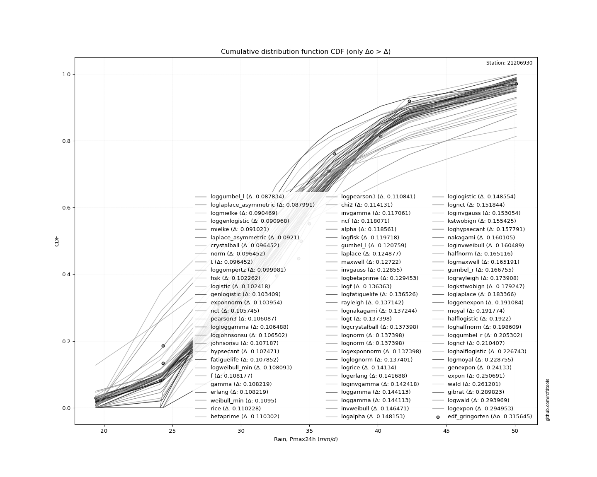</img>

</div>


**8.3. Best fit**

<div align="center">

|   id |   station | empirical_dist   | p_dist      |     delta |   deltao | eval   |   fit |   n |   best_fit |   best_fit_sort |
|-----:|----------:|:-----------------|:------------|----------:|---------:|:-------|------:|----:|-----------:|----------------:|
|    0 |  21206930 | edf_gringorten   | loggumbel_l | 0.0878339 | 0.315645 | Δo > Δ |     1 |  19 |          1 |               1 |

</div>


<div align="center">

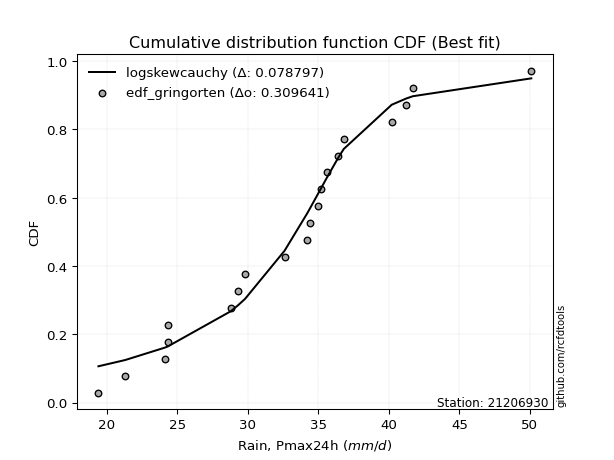</img></img>

</div>


### 9. EDF Filliben (1975)

The specific values of the constants (0.3175) (often denoted as $alpha$) and (0.365) are derived from a method proposed by James J. Filliben in a 1975 paper. This particular formula is the mean value of the $i$-th order statistic of the normal distribution and is considered a robust and effective plotting position formula for the normal probability plot correlation coefficient test for normality.

<div align="center">


$P=(m-0.3175)/(n+0.365)$


</div>


**9.1. Empirical values**

<div align="center">

|                | 0                   | 1                   | 2                  | 3                   | 4                   | 5                  | 6                  | 7                  | 8                  | 9            | 10                 | 11                 | 12                 | 13                 | 14                 | 15                 | 16                | 17                 | 18                 |
|:---------------|:--------------------|:--------------------|:-------------------|:--------------------|:--------------------|:-------------------|:-------------------|:-------------------|:-------------------|:-------------|:-------------------|:-------------------|:-------------------|:-------------------|:-------------------|:-------------------|:------------------|:-------------------|:-------------------|
| date           | 2009                | 2007                | 2018               | 2023                | 2014                | 2011               | 2019               | 2021               | 2013               | 2006         | 2016               | 2020               | 2017               | 2008               | 2010               | 2022               | 2015              | 2005               | 2012               |
| x              | 19.4                | 24.1                | 24.3               | 24.3                | 28.8                | 29.3               | 29.8               | 32.6               | 34.2               | 34.4         | 35.0               | 35.2               | 35.6               | 36.4               | 36.8               | 40.2               | 41.7              | 42.27368421052632  | 50.1               |
| m              | 1                   | 2                   | 3                  | 4                   | 5                   | 6                  | 7                  | 8                  | 9                  | 10           | 11                 | 12                 | 13                 | 14                 | 15                 | 16                 | 17                | 18                 | 19                 |
| empirical_dist | edf_filliben        | edf_filliben        | edf_filliben       | edf_filliben        | edf_filliben        | edf_filliben       | edf_filliben       | edf_filliben       | edf_filliben       | edf_filliben | edf_filliben       | edf_filliben       | edf_filliben       | edf_filliben       | edf_filliben       | edf_filliben       | edf_filliben      | edf_filliben       | edf_filliben       |
| empirical      | 0.03524399690162665 | 0.08688355280144593 | 0.1385231087012652 | 0.19016266460108444 | 0.24180222050090372 | 0.293441776400723  | 0.3450813323005423 | 0.3967208882003615 | 0.4483604441001807 | 0.5          | 0.5516395558998193 | 0.6032791117996386 | 0.6549186676994578 | 0.7065582235992771 | 0.7581977794990963 | 0.8098373353989156 | 0.861476891298735 | 0.9131164471985542 | 0.9647560030983735 |
| empirical_tr   | 1.0365315134484143  | 1.0951505726000283  | 1.1607972426195114 | 1.2348158775705405  | 1.3189170781542654  | 1.4153115293257812 | 1.5269071555292728 | 1.6576075326342818 | 1.8127779077931194 | 2.0          | 2.2303484019579614 | 2.5206638464041657 | 2.8978675645342316 | 3.407831060272768  | 4.135611318739989  | 5.258655804480651  | 7.219012115563846 | 11.509658246656779 | 28.373626373626497 |

</div>


**9.2. Kolmogorov-Smirnov fit test (sorted by Δ)**


<div align="center">

|                | 0                   | 1                     | 2                   | 3                   | 4                   | 5                   | 6                   | 7                   | 8                   | 9                   | 10                  | 11                  | 12                  | 13                  | 14                  | 15                  | 16                  | 17                  | 18                  | 19                  | 20                  | 21                  | 22                  | 23                  | 24                  | 25                  | 26                  | 27                  | 28                  | 29                  | 30                  | 31                  | 32                  | 33                  | 34                  | 35                  | 36                  | 37                  | 38                  | 39                  | 40                  | 41                  | 42                  | 43                  | 44                  | 45                  | 46                  | 47                  | 48                  | 49                  | 50                  | 51                  | 52                  | 53                  | 54                  | 55                  | 56                  | 57                  | 58                  | 59                  | 60                  | 61                  | 62                  | 63                  | 64                  | 65                  | 66                  | 67                  | 68                  | 69                  | 70                  | 71                  | 72                  | 73                  | 74                  | 75                  | 76                  | 77                  | 78                  | 79                  | 80                  | 81                  | 82                  | 83                  | 84                  | 85                  | 86                  | 87                  |
|:---------------|:--------------------|:----------------------|:--------------------|:--------------------|:--------------------|:--------------------|:--------------------|:--------------------|:--------------------|:--------------------|:--------------------|:--------------------|:--------------------|:--------------------|:--------------------|:--------------------|:--------------------|:--------------------|:--------------------|:--------------------|:--------------------|:--------------------|:--------------------|:--------------------|:--------------------|:--------------------|:--------------------|:--------------------|:--------------------|:--------------------|:--------------------|:--------------------|:--------------------|:--------------------|:--------------------|:--------------------|:--------------------|:--------------------|:--------------------|:--------------------|:--------------------|:--------------------|:--------------------|:--------------------|:--------------------|:--------------------|:--------------------|:--------------------|:--------------------|:--------------------|:--------------------|:--------------------|:--------------------|:--------------------|:--------------------|:--------------------|:--------------------|:--------------------|:--------------------|:--------------------|:--------------------|:--------------------|:--------------------|:--------------------|:--------------------|:--------------------|:--------------------|:--------------------|:--------------------|:--------------------|:--------------------|:--------------------|:--------------------|:--------------------|:--------------------|:--------------------|:--------------------|:--------------------|:--------------------|:--------------------|:--------------------|:--------------------|:--------------------|:--------------------|:--------------------|:--------------------|:--------------------|:--------------------|
| station        | 21206930            | 21206930              | 21206930            | 21206930            | 21206930            | 21206930            | 21206930            | 21206930            | 21206930            | 21206930            | 21206930            | 21206930            | 21206930            | 21206930            | 21206930            | 21206930            | 21206930            | 21206930            | 21206930            | 21206930            | 21206930            | 21206930            | 21206930            | 21206930            | 21206930            | 21206930            | 21206930            | 21206930            | 21206930            | 21206930            | 21206930            | 21206930            | 21206930            | 21206930            | 21206930            | 21206930            | 21206930            | 21206930            | 21206930            | 21206930            | 21206930            | 21206930            | 21206930            | 21206930            | 21206930            | 21206930            | 21206930            | 21206930            | 21206930            | 21206930            | 21206930            | 21206930            | 21206930            | 21206930            | 21206930            | 21206930            | 21206930            | 21206930            | 21206930            | 21206930            | 21206930            | 21206930            | 21206930            | 21206930            | 21206930            | 21206930            | 21206930            | 21206930            | 21206930            | 21206930            | 21206930            | 21206930            | 21206930            | 21206930            | 21206930            | 21206930            | 21206930            | 21206930            | 21206930            | 21206930            | 21206930            | 21206930            | 21206930            | 21206930            | 21206930            | 21206930            | 21206930            | 21206930            |
| empirical_dist | edf_filliben        | edf_filliben          | edf_filliben        | edf_filliben        | edf_filliben        | edf_filliben        | edf_filliben        | edf_filliben        | edf_filliben        | edf_filliben        | edf_filliben        | edf_filliben        | edf_filliben        | edf_filliben        | edf_filliben        | edf_filliben        | edf_filliben        | edf_filliben        | edf_filliben        | edf_filliben        | edf_filliben        | edf_filliben        | edf_filliben        | edf_filliben        | edf_filliben        | edf_filliben        | edf_filliben        | edf_filliben        | edf_filliben        | edf_filliben        | edf_filliben        | edf_filliben        | edf_filliben        | edf_filliben        | edf_filliben        | edf_filliben        | edf_filliben        | edf_filliben        | edf_filliben        | edf_filliben        | edf_filliben        | edf_filliben        | edf_filliben        | edf_filliben        | edf_filliben        | edf_filliben        | edf_filliben        | edf_filliben        | edf_filliben        | edf_filliben        | edf_filliben        | edf_filliben        | edf_filliben        | edf_filliben        | edf_filliben        | edf_filliben        | edf_filliben        | edf_filliben        | edf_filliben        | edf_filliben        | edf_filliben        | edf_filliben        | edf_filliben        | edf_filliben        | edf_filliben        | edf_filliben        | edf_filliben        | edf_filliben        | edf_filliben        | edf_filliben        | edf_filliben        | edf_filliben        | edf_filliben        | edf_filliben        | edf_filliben        | edf_filliben        | edf_filliben        | edf_filliben        | edf_filliben        | edf_filliben        | edf_filliben        | edf_filliben        | edf_filliben        | edf_filliben        | edf_filliben        | edf_filliben        | edf_filliben        | edf_filliben        |
| p_dist         | loggumbel_l         | loglaplace_asymmetric | logmielke           | loggenlogistic      | mielke              | laplace_asymmetric  | crystalball         | norm                | t                   | loggompertz         | fisk                | logistic            | genlogistic         | exponnorm           | nct                 | pearson3            | logloggamma         | logjohnsonsu        | johnsonsu           | hypsecant           | fatiguelife         | logweibull_min      | f                   | gamma               | erlang              | weibull_min         | rice                | betaprime           | logpearson3         | chi2                | invgamma            | ncf                 | gumbel_l            | alpha               | logfisk             | laplace             | maxwell             | invgauss            | logbetaprime        | logf                | logfatiguelife      | rayleigh            | lognakagami         | logt                | logcrystalball      | lognorm             | lognorm             | logexponnorm        | loglognorm          | logrice             | logerlang           | loginvgamma         | loggamma            | loggamma            | invweibull          | logalpha            | loglogistic         | lognct              | loginvgauss         | kstwobign           | nakagami            | loghypsecant        | loginvweibull       | halfnorm            | logmaxwell          | gumbel_r            | lograyleigh         | logkstwobign        | loglaplace          | loggenexpon         | moyal               | halflogistic        | loghalfnorm         | loggumbel_r         | logncf              | loghalflogistic     | logmoyal            | genexpon            | expon               | wald                | gibrat              | logexpon            | logwald             | logchi2             | loggibrat           | logtruncnorm        | truncnorm           | gompertz            |
| delta          | 0.08877917915879309 | 0.08914602746375899   | 0.08980778272822065 | 0.09030654612273314 | 0.0903591459175549  | 0.09408550326035447 | 0.09579025359739157 | 0.09579027440324273 | 0.0957906648403073  | 0.09931935315599927 | 0.10159996098489665 | 0.1017566159606712  | 0.10274742062874609 | 0.10329221257370025 | 0.10508362124368298 | 0.10542502515864616 | 0.1058263059876221  | 0.10584077014127502 | 0.1065254455125334  | 0.10680940451744492 | 0.10719023344229628 | 0.10743117067147678 | 0.10751551349111443 | 0.10755754754672353 | 0.10755761779748707 | 0.10883832883059885 | 0.10956674011840561 | 0.10964065783076848 | 0.11017955474932073 | 0.11346929431006658 | 0.11639939458266513 | 0.11740955518360352 | 0.11745037994886454 | 0.11789945885159914 | 0.1190563500711539  | 0.12421533261568618 | 0.12655800272066686 | 0.12788855520683762 | 0.12879154955893513 | 0.1357011674204125  | 0.13586473178616865 | 0.13648057045282336 | 0.13658182878529646 | 0.1367362480325499  | 0.13673650771401247 | 0.13673650804205117 | 0.13673650804205117 | 0.13673670490694945 | 0.13673883335012138 | 0.1406786221953923  | 0.1410264456162177  | 0.14175592660057224 | 0.14345121188648213 | 0.14345121188648213 | 0.14580918326441128 | 0.14749166624764298 | 0.14789256135138296 | 0.15118259193457062 | 0.1523924551864455  | 0.1547637147796308  | 0.15481115552495395 | 0.1571289494108783  | 0.1598275181385761  | 0.16445479849227584 | 0.16452934735527203 | 0.16609299298332025 | 0.17324615210873473 | 0.17858568593399826 | 0.1827038021163756  | 0.19042223913990775 | 0.1911125430570173  | 0.19153808941505157 | 0.19794745142416192 | 0.2046401851518176  | 0.20511302317367675 | 0.22608090169471073 | 0.22809282090873362 | 0.23802141852325065 | 0.24738266485882687 | 0.26053920145833054 | 0.28916166244638974 | 0.29164476527833216 | 0.2933070290490931  | 0.3114470873496532  | 0.324479234063201   | 0.35974774706726054 | 0.42046678281015576 | 0.7161744218080909  |
| deltao         | 0.31564497164100014 | 0.31564497164100014   | 0.31564497164100014 | 0.31564497164100014 | 0.31564497164100014 | 0.31564497164100014 | 0.31564497164100014 | 0.31564497164100014 | 0.31564497164100014 | 0.31564497164100014 | 0.31564497164100014 | 0.31564497164100014 | 0.31564497164100014 | 0.31564497164100014 | 0.31564497164100014 | 0.31564497164100014 | 0.31564497164100014 | 0.31564497164100014 | 0.31564497164100014 | 0.31564497164100014 | 0.31564497164100014 | 0.31564497164100014 | 0.31564497164100014 | 0.31564497164100014 | 0.31564497164100014 | 0.31564497164100014 | 0.31564497164100014 | 0.31564497164100014 | 0.31564497164100014 | 0.31564497164100014 | 0.31564497164100014 | 0.31564497164100014 | 0.31564497164100014 | 0.31564497164100014 | 0.31564497164100014 | 0.31564497164100014 | 0.31564497164100014 | 0.31564497164100014 | 0.31564497164100014 | 0.31564497164100014 | 0.31564497164100014 | 0.31564497164100014 | 0.31564497164100014 | 0.31564497164100014 | 0.31564497164100014 | 0.31564497164100014 | 0.31564497164100014 | 0.31564497164100014 | 0.31564497164100014 | 0.31564497164100014 | 0.31564497164100014 | 0.31564497164100014 | 0.31564497164100014 | 0.31564497164100014 | 0.31564497164100014 | 0.31564497164100014 | 0.31564497164100014 | 0.31564497164100014 | 0.31564497164100014 | 0.31564497164100014 | 0.31564497164100014 | 0.31564497164100014 | 0.31564497164100014 | 0.31564497164100014 | 0.31564497164100014 | 0.31564497164100014 | 0.31564497164100014 | 0.31564497164100014 | 0.31564497164100014 | 0.31564497164100014 | 0.31564497164100014 | 0.31564497164100014 | 0.31564497164100014 | 0.31564497164100014 | 0.31564497164100014 | 0.31564497164100014 | 0.31564497164100014 | 0.31564497164100014 | 0.31564497164100014 | 0.31564497164100014 | 0.31564497164100014 | 0.31564497164100014 | 0.31564497164100014 | 0.31564497164100014 | 0.31564497164100014 | 0.31564497164100014 | 0.31564497164100014 | 0.31564497164100014 |
| eval           | Δo > Δ              | Δo > Δ                | Δo > Δ              | Δo > Δ              | Δo > Δ              | Δo > Δ              | Δo > Δ              | Δo > Δ              | Δo > Δ              | Δo > Δ              | Δo > Δ              | Δo > Δ              | Δo > Δ              | Δo > Δ              | Δo > Δ              | Δo > Δ              | Δo > Δ              | Δo > Δ              | Δo > Δ              | Δo > Δ              | Δo > Δ              | Δo > Δ              | Δo > Δ              | Δo > Δ              | Δo > Δ              | Δo > Δ              | Δo > Δ              | Δo > Δ              | Δo > Δ              | Δo > Δ              | Δo > Δ              | Δo > Δ              | Δo > Δ              | Δo > Δ              | Δo > Δ              | Δo > Δ              | Δo > Δ              | Δo > Δ              | Δo > Δ              | Δo > Δ              | Δo > Δ              | Δo > Δ              | Δo > Δ              | Δo > Δ              | Δo > Δ              | Δo > Δ              | Δo > Δ              | Δo > Δ              | Δo > Δ              | Δo > Δ              | Δo > Δ              | Δo > Δ              | Δo > Δ              | Δo > Δ              | Δo > Δ              | Δo > Δ              | Δo > Δ              | Δo > Δ              | Δo > Δ              | Δo > Δ              | Δo > Δ              | Δo > Δ              | Δo > Δ              | Δo > Δ              | Δo > Δ              | Δo > Δ              | Δo > Δ              | Δo > Δ              | Δo > Δ              | Δo > Δ              | Δo > Δ              | Δo > Δ              | Δo > Δ              | Δo > Δ              | Δo > Δ              | Δo > Δ              | Δo > Δ              | Δo > Δ              | Δo > Δ              | Δo > Δ              | Δo > Δ              | Δo > Δ              | Δo > Δ              | Δo > Δ              | Δo <= Δ             | Δo <= Δ             | Δo <= Δ             | Δo <= Δ             |
| fit            | 1                   | 1                     | 1                   | 1                   | 1                   | 1                   | 1                   | 1                   | 1                   | 1                   | 1                   | 1                   | 1                   | 1                   | 1                   | 1                   | 1                   | 1                   | 1                   | 1                   | 1                   | 1                   | 1                   | 1                   | 1                   | 1                   | 1                   | 1                   | 1                   | 1                   | 1                   | 1                   | 1                   | 1                   | 1                   | 1                   | 1                   | 1                   | 1                   | 1                   | 1                   | 1                   | 1                   | 1                   | 1                   | 1                   | 1                   | 1                   | 1                   | 1                   | 1                   | 1                   | 1                   | 1                   | 1                   | 1                   | 1                   | 1                   | 1                   | 1                   | 1                   | 1                   | 1                   | 1                   | 1                   | 1                   | 1                   | 1                   | 1                   | 1                   | 1                   | 1                   | 1                   | 1                   | 1                   | 1                   | 1                   | 1                   | 1                   | 1                   | 1                   | 1                   | 1                   | 1                   | 0                   | 0                   | 0                   | 0                   |
| n              | 19                  | 19                    | 19                  | 19                  | 19                  | 19                  | 19                  | 19                  | 19                  | 19                  | 19                  | 19                  | 19                  | 19                  | 19                  | 19                  | 19                  | 19                  | 19                  | 19                  | 19                  | 19                  | 19                  | 19                  | 19                  | 19                  | 19                  | 19                  | 19                  | 19                  | 19                  | 19                  | 19                  | 19                  | 19                  | 19                  | 19                  | 19                  | 19                  | 19                  | 19                  | 19                  | 19                  | 19                  | 19                  | 19                  | 19                  | 19                  | 19                  | 19                  | 19                  | 19                  | 19                  | 19                  | 19                  | 19                  | 19                  | 19                  | 19                  | 19                  | 19                  | 19                  | 19                  | 19                  | 19                  | 19                  | 19                  | 19                  | 19                  | 19                  | 19                  | 19                  | 19                  | 19                  | 19                  | 19                  | 19                  | 19                  | 19                  | 19                  | 19                  | 19                  | 19                  | 19                  | 19                  | 19                  | 19                  | 19                  |
| best_fit       | 1                   | 0                     | 0                   | 0                   | 0                   | 0                   | 0                   | 0                   | 0                   | 0                   | 0                   | 0                   | 0                   | 0                   | 0                   | 0                   | 0                   | 0                   | 0                   | 0                   | 0                   | 0                   | 0                   | 0                   | 0                   | 0                   | 0                   | 0                   | 0                   | 0                   | 0                   | 0                   | 0                   | 0                   | 0                   | 0                   | 0                   | 0                   | 0                   | 0                   | 0                   | 0                   | 0                   | 0                   | 0                   | 0                   | 0                   | 0                   | 0                   | 0                   | 0                   | 0                   | 0                   | 0                   | 0                   | 0                   | 0                   | 0                   | 0                   | 0                   | 0                   | 0                   | 0                   | 0                   | 0                   | 0                   | 0                   | 0                   | 0                   | 0                   | 0                   | 0                   | 0                   | 0                   | 0                   | 0                   | 0                   | 0                   | 0                   | 0                   | 0                   | 0                   | 0                   | 0                   | 0                   | 0                   | 0                   | 0                   |
| best_fit_sort  | 1                   | 2                     | 3                   | 4                   | 5                   | 6                   | 7                   | 8                   | 9                   | 10                  | 11                  | 12                  | 13                  | 14                  | 15                  | 16                  | 17                  | 18                  | 19                  | 20                  | 21                  | 22                  | 23                  | 24                  | 25                  | 26                  | 27                  | 28                  | 29                  | 30                  | 31                  | 32                  | 33                  | 34                  | 35                  | 36                  | 37                  | 38                  | 39                  | 40                  | 41                  | 42                  | 43                  | 44                  | 45                  | 46                  | 47                  | 48                  | 49                  | 50                  | 51                  | 52                  | 53                  | 54                  | 55                  | 56                  | 57                  | 58                  | 59                  | 60                  | 61                  | 62                  | 63                  | 64                  | 65                  | 66                  | 67                  | 68                  | 69                  | 70                  | 71                  | 72                  | 73                  | 74                  | 75                  | 76                  | 77                  | 78                  | 79                  | 80                  | 81                  | 82                  | 83                  | 84                  | 85                  | 86                  | 87                  | 88                  |

</div>


<div align="center">

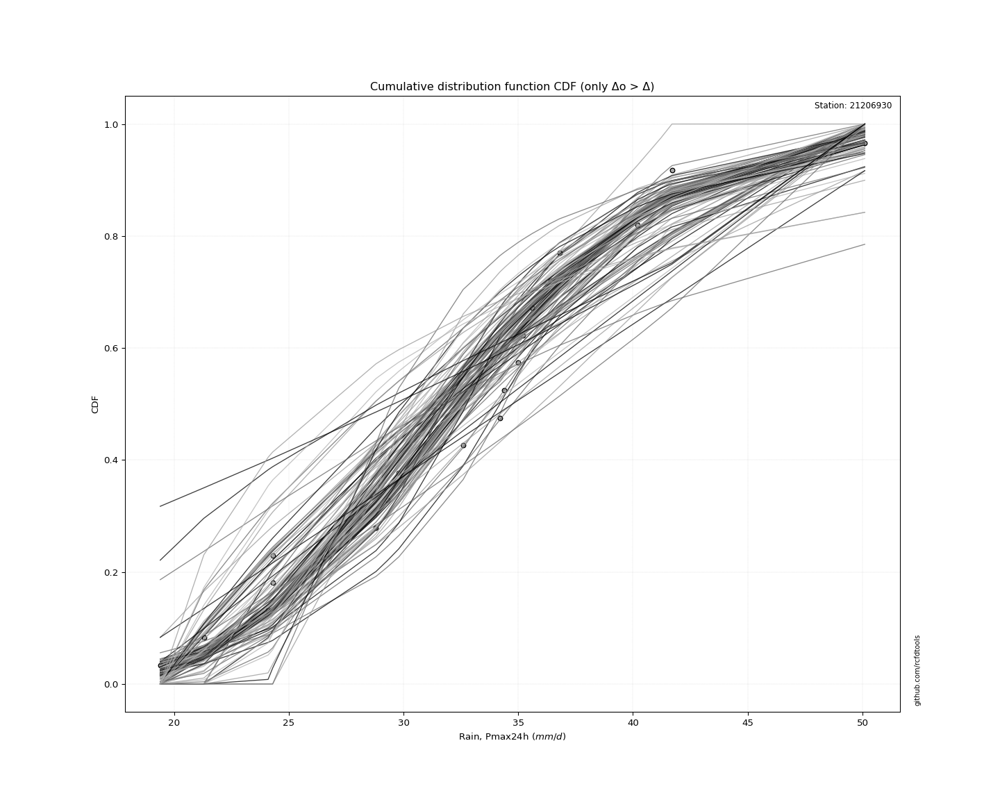</img>

</div>


**9.3. Best fit**

<div align="center">

|   id |   station | empirical_dist   | p_dist      |     delta |   deltao | eval   |   fit |   n |   best_fit |   best_fit_sort |
|-----:|----------:|:-----------------|:------------|----------:|---------:|:-------|------:|----:|-----------:|----------------:|
|    0 |  21206930 | edf_filliben     | loggumbel_l | 0.0887792 | 0.315645 | Δo > Δ |     1 |  19 |          1 |               1 |

</div>


<div align="center">

</img></img>

</div>


### 10. EDF Jenkinson (1977)

The Jenkinson formula in hydrology is an empirical plotting position formula used to estimate the non-exceedance probability _(P)_ or return period _(T)_ of a given ordered observation within a sample. It is a widely used method in the frequency analysis of extreme events such as floods and rainfall, as it provides a distribution-free way to plot data. _a≈0.31_ and _b≈0.38_ are constants derived to approximate the median of the probability distribution for the given rank.

<div align="center">


$P=(m-a)/(n+b)$


</div>


**10.1. Empirical values**

<div align="center">

|                | 0                   | 1                   | 2                  | 3                   | 4                   | 5                   | 6                  | 7                  | 8                  | 9             | 10                 | 11                 | 12                 | 13                 | 14                 | 15                 | 16                 | 17                 | 18                 |
|:---------------|:--------------------|:--------------------|:-------------------|:--------------------|:--------------------|:--------------------|:-------------------|:-------------------|:-------------------|:--------------|:-------------------|:-------------------|:-------------------|:-------------------|:-------------------|:-------------------|:-------------------|:-------------------|:-------------------|
| date           | 2009                | 2007                | 2018               | 2023                | 2014                | 2011                | 2019               | 2021               | 2013               | 2006          | 2016               | 2020               | 2017               | 2008               | 2010               | 2022               | 2015               | 2005               | 2012               |
| x              | 19.4                | 24.1                | 24.3               | 24.3                | 28.8                | 29.3                | 29.8               | 32.6               | 34.2               | 34.4          | 35.0               | 35.2               | 35.6               | 36.4               | 36.8               | 40.2               | 41.7               | 42.27368421052632  | 50.1               |
| m              | 1                   | 2                   | 3                  | 4                   | 5                   | 6                   | 7                  | 8                  | 9                  | 10            | 11                 | 12                 | 13                 | 14                 | 15                 | 16                 | 17                 | 18                 | 19                 |
| empirical_dist | edf_jenkinson       | edf_jenkinson       | edf_jenkinson      | edf_jenkinson       | edf_jenkinson       | edf_jenkinson       | edf_jenkinson      | edf_jenkinson      | edf_jenkinson      | edf_jenkinson | edf_jenkinson      | edf_jenkinson      | edf_jenkinson      | edf_jenkinson      | edf_jenkinson      | edf_jenkinson      | edf_jenkinson      | edf_jenkinson      | edf_jenkinson      |
| empirical      | 0.03560371517027864 | 0.08720330237358101 | 0.1388028895768834 | 0.19040247678018576 | 0.24200206398348817 | 0.29360165118679055 | 0.3452012383900929 | 0.3968008255933953 | 0.4484004127966976 | 0.5           | 0.5515995872033024 | 0.6031991744066048 | 0.6547987616099071 | 0.7063983488132095 | 0.7579979360165119 | 0.8095975232198143 | 0.8611971104231168 | 0.9127966976264191 | 0.9643962848297215 |
| empirical_tr   | 1.0369181380417336  | 1.0955342001130581  | 1.1611743559017376 | 1.2351816443594645  | 1.3192648059904697  | 1.4156318480642804  | 1.5271867612293144 | 1.6578272027373824 | 1.812909260991581  | 2.0           | 2.230149597238205  | 2.5201560468140443 | 2.896860986547085  | 3.40597539543058   | 4.132196162046909  | 5.252032520325204  | 7.204460966542758  | 11.467455621301793 | 28.086956521739243 |

</div>


**10.2. Kolmogorov-Smirnov fit test (sorted by Δ)**


<div align="center">

|                | 0                   | 1                     | 2                   | 3                   | 4                   | 5                   | 6                   | 7                   | 8                   | 9                   | 10                  | 11                  | 12                  | 13                  | 14                  | 15                  | 16                  | 17                  | 18                  | 19                  | 20                  | 21                  | 22                  | 23                  | 24                  | 25                  | 26                  | 27                  | 28                  | 29                  | 30                  | 31                  | 32                  | 33                  | 34                  | 35                  | 36                  | 37                  | 38                  | 39                  | 40                  | 41                  | 42                  | 43                  | 44                  | 45                  | 46                  | 47                  | 48                  | 49                  | 50                  | 51                  | 52                  | 53                  | 54                  | 55                  | 56                  | 57                  | 58                  | 59                  | 60                  | 61                  | 62                  | 63                  | 64                  | 65                  | 66                  | 67                  | 68                  | 69                  | 70                  | 71                  | 72                  | 73                  | 74                  | 75                  | 76                  | 77                  | 78                  | 79                  | 80                  | 81                  | 82                  | 83                  | 84                  | 85                  | 86                  | 87                  |
|:---------------|:--------------------|:----------------------|:--------------------|:--------------------|:--------------------|:--------------------|:--------------------|:--------------------|:--------------------|:--------------------|:--------------------|:--------------------|:--------------------|:--------------------|:--------------------|:--------------------|:--------------------|:--------------------|:--------------------|:--------------------|:--------------------|:--------------------|:--------------------|:--------------------|:--------------------|:--------------------|:--------------------|:--------------------|:--------------------|:--------------------|:--------------------|:--------------------|:--------------------|:--------------------|:--------------------|:--------------------|:--------------------|:--------------------|:--------------------|:--------------------|:--------------------|:--------------------|:--------------------|:--------------------|:--------------------|:--------------------|:--------------------|:--------------------|:--------------------|:--------------------|:--------------------|:--------------------|:--------------------|:--------------------|:--------------------|:--------------------|:--------------------|:--------------------|:--------------------|:--------------------|:--------------------|:--------------------|:--------------------|:--------------------|:--------------------|:--------------------|:--------------------|:--------------------|:--------------------|:--------------------|:--------------------|:--------------------|:--------------------|:--------------------|:--------------------|:--------------------|:--------------------|:--------------------|:--------------------|:--------------------|:--------------------|:--------------------|:--------------------|:--------------------|:--------------------|:--------------------|:--------------------|:--------------------|
| station        | 21206930            | 21206930              | 21206930            | 21206930            | 21206930            | 21206930            | 21206930            | 21206930            | 21206930            | 21206930            | 21206930            | 21206930            | 21206930            | 21206930            | 21206930            | 21206930            | 21206930            | 21206930            | 21206930            | 21206930            | 21206930            | 21206930            | 21206930            | 21206930            | 21206930            | 21206930            | 21206930            | 21206930            | 21206930            | 21206930            | 21206930            | 21206930            | 21206930            | 21206930            | 21206930            | 21206930            | 21206930            | 21206930            | 21206930            | 21206930            | 21206930            | 21206930            | 21206930            | 21206930            | 21206930            | 21206930            | 21206930            | 21206930            | 21206930            | 21206930            | 21206930            | 21206930            | 21206930            | 21206930            | 21206930            | 21206930            | 21206930            | 21206930            | 21206930            | 21206930            | 21206930            | 21206930            | 21206930            | 21206930            | 21206930            | 21206930            | 21206930            | 21206930            | 21206930            | 21206930            | 21206930            | 21206930            | 21206930            | 21206930            | 21206930            | 21206930            | 21206930            | 21206930            | 21206930            | 21206930            | 21206930            | 21206930            | 21206930            | 21206930            | 21206930            | 21206930            | 21206930            | 21206930            |
| empirical_dist | edf_jenkinson       | edf_jenkinson         | edf_jenkinson       | edf_jenkinson       | edf_jenkinson       | edf_jenkinson       | edf_jenkinson       | edf_jenkinson       | edf_jenkinson       | edf_jenkinson       | edf_jenkinson       | edf_jenkinson       | edf_jenkinson       | edf_jenkinson       | edf_jenkinson       | edf_jenkinson       | edf_jenkinson       | edf_jenkinson       | edf_jenkinson       | edf_jenkinson       | edf_jenkinson       | edf_jenkinson       | edf_jenkinson       | edf_jenkinson       | edf_jenkinson       | edf_jenkinson       | edf_jenkinson       | edf_jenkinson       | edf_jenkinson       | edf_jenkinson       | edf_jenkinson       | edf_jenkinson       | edf_jenkinson       | edf_jenkinson       | edf_jenkinson       | edf_jenkinson       | edf_jenkinson       | edf_jenkinson       | edf_jenkinson       | edf_jenkinson       | edf_jenkinson       | edf_jenkinson       | edf_jenkinson       | edf_jenkinson       | edf_jenkinson       | edf_jenkinson       | edf_jenkinson       | edf_jenkinson       | edf_jenkinson       | edf_jenkinson       | edf_jenkinson       | edf_jenkinson       | edf_jenkinson       | edf_jenkinson       | edf_jenkinson       | edf_jenkinson       | edf_jenkinson       | edf_jenkinson       | edf_jenkinson       | edf_jenkinson       | edf_jenkinson       | edf_jenkinson       | edf_jenkinson       | edf_jenkinson       | edf_jenkinson       | edf_jenkinson       | edf_jenkinson       | edf_jenkinson       | edf_jenkinson       | edf_jenkinson       | edf_jenkinson       | edf_jenkinson       | edf_jenkinson       | edf_jenkinson       | edf_jenkinson       | edf_jenkinson       | edf_jenkinson       | edf_jenkinson       | edf_jenkinson       | edf_jenkinson       | edf_jenkinson       | edf_jenkinson       | edf_jenkinson       | edf_jenkinson       | edf_jenkinson       | edf_jenkinson       | edf_jenkinson       | edf_jenkinson       |
| p_dist         | loggumbel_l         | loglaplace_asymmetric | logmielke           | loggenlogistic      | mielke              | laplace_asymmetric  | crystalball         | norm                | t                   | loggompertz         | fisk                | logistic            | genlogistic         | exponnorm           | nct                 | pearson3            | logloggamma         | logjohnsonsu        | johnsonsu           | hypsecant           | fatiguelife         | logweibull_min      | f                   | gamma               | erlang              | weibull_min         | rice                | betaprime           | logpearson3         | chi2                | invgamma            | gumbel_l            | ncf                 | alpha               | logfisk             | laplace             | maxwell             | invgauss            | logbetaprime        | logf                | logfatiguelife      | rayleigh            | lognakagami         | logt                | logcrystalball      | lognorm             | lognorm             | logexponnorm        | loglognorm          | logrice             | logerlang           | loginvgamma         | loggamma            | loggamma            | invweibull          | logalpha            | loglogistic         | lognct              | loginvgauss         | nakagami            | kstwobign           | loghypsecant        | loginvweibull       | halfnorm            | logmaxwell          | gumbel_r            | lograyleigh         | logkstwobign        | loglaplace          | loggenexpon         | moyal               | halflogistic        | loghalfnorm         | loggumbel_r         | logncf              | loghalflogistic     | logmoyal            | genexpon            | expon               | wald                | gibrat              | logexpon            | logwald             | logchi2             | loggibrat           | logtruncnorm        | truncnorm           | gompertz            |
| delta          | 0.08901899133789441 | 0.08938583964286032   | 0.08976781403170375 | 0.09026657742621624 | 0.090319177221038   | 0.09420540934990512 | 0.09575028490087467 | 0.09575030570672582 | 0.09575069614379039 | 0.09927938445948237 | 0.10155999228837975 | 0.1017166472641543  | 0.10270745193222919 | 0.10325224387718335 | 0.10504365254716608 | 0.10538505646212926 | 0.1057863372911052  | 0.10580080144475812 | 0.1064854768160165  | 0.10676943582092802 | 0.10715026474577938 | 0.10739120197495988 | 0.10747554479459753 | 0.10751757885020663 | 0.10751764910097017 | 0.10879836013408195 | 0.10952677142188871 | 0.10960068913425158 | 0.11013958605280383 | 0.11342932561354968 | 0.11635942588614823 | 0.11725053646628014 | 0.11736958648708662 | 0.11785949015508224 | 0.11901638137463699 | 0.12417536391916928 | 0.12651803402414996 | 0.12784858651032072 | 0.12875158086241822 | 0.1356611987238956  | 0.13582476308965175 | 0.13644060175630646 | 0.13654186008877955 | 0.136696279336033   | 0.13669653901749557 | 0.13669653934553427 | 0.13669653934553427 | 0.13669673621043255 | 0.13669886465360448 | 0.1406386534988754  | 0.1409864769197008  | 0.14171595790405533 | 0.14341124318996523 | 0.14341124318996523 | 0.14576921456789438 | 0.14745169755112608 | 0.14785259265486606 | 0.15114262323805372 | 0.1523524864899286  | 0.15449140595281885 | 0.1547237460831139  | 0.1570889807143614  | 0.1597875494420592  | 0.16441482979575894 | 0.16448937865875513 | 0.16605302428680335 | 0.17320618341221783 | 0.17854571723748136 | 0.1826638334198587  | 0.19038227044339084 | 0.1910725743605004  | 0.19149812071853467 | 0.19790748272764502 | 0.2046002164553007  | 0.20479327360154165 | 0.22604093299819383 | 0.22805285221221672 | 0.2378215750406662  | 0.24718282137624242 | 0.26049923276181364 | 0.28912169374987284 | 0.2914449217957477  | 0.2932670603525762  | 0.3110873690810012  | 0.3244392653666841  | 0.3595479035846761  | 0.4201470332380207  | 0.7159745783255065  |
| deltao         | 0.31564497164100014 | 0.31564497164100014   | 0.31564497164100014 | 0.31564497164100014 | 0.31564497164100014 | 0.31564497164100014 | 0.31564497164100014 | 0.31564497164100014 | 0.31564497164100014 | 0.31564497164100014 | 0.31564497164100014 | 0.31564497164100014 | 0.31564497164100014 | 0.31564497164100014 | 0.31564497164100014 | 0.31564497164100014 | 0.31564497164100014 | 0.31564497164100014 | 0.31564497164100014 | 0.31564497164100014 | 0.31564497164100014 | 0.31564497164100014 | 0.31564497164100014 | 0.31564497164100014 | 0.31564497164100014 | 0.31564497164100014 | 0.31564497164100014 | 0.31564497164100014 | 0.31564497164100014 | 0.31564497164100014 | 0.31564497164100014 | 0.31564497164100014 | 0.31564497164100014 | 0.31564497164100014 | 0.31564497164100014 | 0.31564497164100014 | 0.31564497164100014 | 0.31564497164100014 | 0.31564497164100014 | 0.31564497164100014 | 0.31564497164100014 | 0.31564497164100014 | 0.31564497164100014 | 0.31564497164100014 | 0.31564497164100014 | 0.31564497164100014 | 0.31564497164100014 | 0.31564497164100014 | 0.31564497164100014 | 0.31564497164100014 | 0.31564497164100014 | 0.31564497164100014 | 0.31564497164100014 | 0.31564497164100014 | 0.31564497164100014 | 0.31564497164100014 | 0.31564497164100014 | 0.31564497164100014 | 0.31564497164100014 | 0.31564497164100014 | 0.31564497164100014 | 0.31564497164100014 | 0.31564497164100014 | 0.31564497164100014 | 0.31564497164100014 | 0.31564497164100014 | 0.31564497164100014 | 0.31564497164100014 | 0.31564497164100014 | 0.31564497164100014 | 0.31564497164100014 | 0.31564497164100014 | 0.31564497164100014 | 0.31564497164100014 | 0.31564497164100014 | 0.31564497164100014 | 0.31564497164100014 | 0.31564497164100014 | 0.31564497164100014 | 0.31564497164100014 | 0.31564497164100014 | 0.31564497164100014 | 0.31564497164100014 | 0.31564497164100014 | 0.31564497164100014 | 0.31564497164100014 | 0.31564497164100014 | 0.31564497164100014 |
| eval           | Δo > Δ              | Δo > Δ                | Δo > Δ              | Δo > Δ              | Δo > Δ              | Δo > Δ              | Δo > Δ              | Δo > Δ              | Δo > Δ              | Δo > Δ              | Δo > Δ              | Δo > Δ              | Δo > Δ              | Δo > Δ              | Δo > Δ              | Δo > Δ              | Δo > Δ              | Δo > Δ              | Δo > Δ              | Δo > Δ              | Δo > Δ              | Δo > Δ              | Δo > Δ              | Δo > Δ              | Δo > Δ              | Δo > Δ              | Δo > Δ              | Δo > Δ              | Δo > Δ              | Δo > Δ              | Δo > Δ              | Δo > Δ              | Δo > Δ              | Δo > Δ              | Δo > Δ              | Δo > Δ              | Δo > Δ              | Δo > Δ              | Δo > Δ              | Δo > Δ              | Δo > Δ              | Δo > Δ              | Δo > Δ              | Δo > Δ              | Δo > Δ              | Δo > Δ              | Δo > Δ              | Δo > Δ              | Δo > Δ              | Δo > Δ              | Δo > Δ              | Δo > Δ              | Δo > Δ              | Δo > Δ              | Δo > Δ              | Δo > Δ              | Δo > Δ              | Δo > Δ              | Δo > Δ              | Δo > Δ              | Δo > Δ              | Δo > Δ              | Δo > Δ              | Δo > Δ              | Δo > Δ              | Δo > Δ              | Δo > Δ              | Δo > Δ              | Δo > Δ              | Δo > Δ              | Δo > Δ              | Δo > Δ              | Δo > Δ              | Δo > Δ              | Δo > Δ              | Δo > Δ              | Δo > Δ              | Δo > Δ              | Δo > Δ              | Δo > Δ              | Δo > Δ              | Δo > Δ              | Δo > Δ              | Δo > Δ              | Δo <= Δ             | Δo <= Δ             | Δo <= Δ             | Δo <= Δ             |
| fit            | 1                   | 1                     | 1                   | 1                   | 1                   | 1                   | 1                   | 1                   | 1                   | 1                   | 1                   | 1                   | 1                   | 1                   | 1                   | 1                   | 1                   | 1                   | 1                   | 1                   | 1                   | 1                   | 1                   | 1                   | 1                   | 1                   | 1                   | 1                   | 1                   | 1                   | 1                   | 1                   | 1                   | 1                   | 1                   | 1                   | 1                   | 1                   | 1                   | 1                   | 1                   | 1                   | 1                   | 1                   | 1                   | 1                   | 1                   | 1                   | 1                   | 1                   | 1                   | 1                   | 1                   | 1                   | 1                   | 1                   | 1                   | 1                   | 1                   | 1                   | 1                   | 1                   | 1                   | 1                   | 1                   | 1                   | 1                   | 1                   | 1                   | 1                   | 1                   | 1                   | 1                   | 1                   | 1                   | 1                   | 1                   | 1                   | 1                   | 1                   | 1                   | 1                   | 1                   | 1                   | 0                   | 0                   | 0                   | 0                   |
| n              | 19                  | 19                    | 19                  | 19                  | 19                  | 19                  | 19                  | 19                  | 19                  | 19                  | 19                  | 19                  | 19                  | 19                  | 19                  | 19                  | 19                  | 19                  | 19                  | 19                  | 19                  | 19                  | 19                  | 19                  | 19                  | 19                  | 19                  | 19                  | 19                  | 19                  | 19                  | 19                  | 19                  | 19                  | 19                  | 19                  | 19                  | 19                  | 19                  | 19                  | 19                  | 19                  | 19                  | 19                  | 19                  | 19                  | 19                  | 19                  | 19                  | 19                  | 19                  | 19                  | 19                  | 19                  | 19                  | 19                  | 19                  | 19                  | 19                  | 19                  | 19                  | 19                  | 19                  | 19                  | 19                  | 19                  | 19                  | 19                  | 19                  | 19                  | 19                  | 19                  | 19                  | 19                  | 19                  | 19                  | 19                  | 19                  | 19                  | 19                  | 19                  | 19                  | 19                  | 19                  | 19                  | 19                  | 19                  | 19                  |
| best_fit       | 1                   | 0                     | 0                   | 0                   | 0                   | 0                   | 0                   | 0                   | 0                   | 0                   | 0                   | 0                   | 0                   | 0                   | 0                   | 0                   | 0                   | 0                   | 0                   | 0                   | 0                   | 0                   | 0                   | 0                   | 0                   | 0                   | 0                   | 0                   | 0                   | 0                   | 0                   | 0                   | 0                   | 0                   | 0                   | 0                   | 0                   | 0                   | 0                   | 0                   | 0                   | 0                   | 0                   | 0                   | 0                   | 0                   | 0                   | 0                   | 0                   | 0                   | 0                   | 0                   | 0                   | 0                   | 0                   | 0                   | 0                   | 0                   | 0                   | 0                   | 0                   | 0                   | 0                   | 0                   | 0                   | 0                   | 0                   | 0                   | 0                   | 0                   | 0                   | 0                   | 0                   | 0                   | 0                   | 0                   | 0                   | 0                   | 0                   | 0                   | 0                   | 0                   | 0                   | 0                   | 0                   | 0                   | 0                   | 0                   |
| best_fit_sort  | 1                   | 2                     | 3                   | 4                   | 5                   | 6                   | 7                   | 8                   | 9                   | 10                  | 11                  | 12                  | 13                  | 14                  | 15                  | 16                  | 17                  | 18                  | 19                  | 20                  | 21                  | 22                  | 23                  | 24                  | 25                  | 26                  | 27                  | 28                  | 29                  | 30                  | 31                  | 32                  | 33                  | 34                  | 35                  | 36                  | 37                  | 38                  | 39                  | 40                  | 41                  | 42                  | 43                  | 44                  | 45                  | 46                  | 47                  | 48                  | 49                  | 50                  | 51                  | 52                  | 53                  | 54                  | 55                  | 56                  | 57                  | 58                  | 59                  | 60                  | 61                  | 62                  | 63                  | 64                  | 65                  | 66                  | 67                  | 68                  | 69                  | 70                  | 71                  | 72                  | 73                  | 74                  | 75                  | 76                  | 77                  | 78                  | 79                  | 80                  | 81                  | 82                  | 83                  | 84                  | 85                  | 86                  | 87                  | 88                  |

</div>


<div align="center">

</img>

</div>


**10.3. Best fit**

<div align="center">

|   id |   station | empirical_dist   | p_dist      |    delta |   deltao | eval   |   fit |   n |   best_fit |   best_fit_sort |
|-----:|----------:|:-----------------|:------------|---------:|---------:|:-------|------:|----:|-----------:|----------------:|
|    0 |  21206930 | edf_jenkinson    | loggumbel_l | 0.089019 | 0.315645 | Δo > Δ |     1 |  19 |          1 |               1 |

</div>


<div align="center">

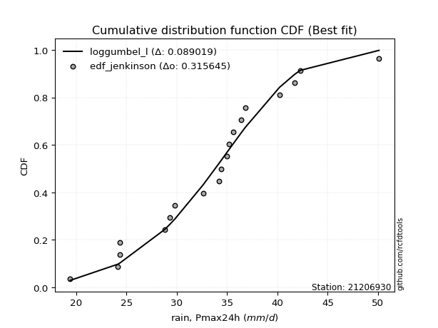</img>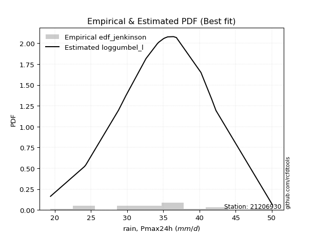</img>

</div>


### 11. EDF Cunnane (1978)

Cunnane´s work in statistical hydrology has focused on the performance and evaluation of different probability distributions (such as GEV, Gumbel, Lognormal) for flood frequency estimation. _b_ is a constant, typically set to 0.4.

<div align="center">


$P=(m-b)/(n+1-2b)$


</div>


**11.1. Empirical values**

<div align="center">

|                | 0                 | 1                   | 2                   | 3                  | 4                   | 5                  | 6                  | 7                  | 8                  | 9           | 10                 | 11                 | 12                | 13                 | 14                 | 15                | 16                 | 17                 | 18                 |
|:---------------|:------------------|:--------------------|:--------------------|:-------------------|:--------------------|:-------------------|:-------------------|:-------------------|:-------------------|:------------|:-------------------|:-------------------|:------------------|:-------------------|:-------------------|:------------------|:-------------------|:-------------------|:-------------------|
| date           | 2009              | 2007                | 2018                | 2023               | 2014                | 2011               | 2019               | 2021               | 2013               | 2006        | 2016               | 2020               | 2017              | 2008               | 2010               | 2022              | 2015               | 2005               | 2012               |
| x              | 19.4              | 24.1                | 24.3                | 24.3               | 28.8                | 29.3               | 29.8               | 32.6               | 34.2               | 34.4        | 35.0               | 35.2               | 35.6              | 36.4               | 36.8               | 40.2              | 41.7               | 42.27368421052632  | 50.1               |
| m              | 1                 | 2                   | 3                   | 4                  | 5                   | 6                  | 7                  | 8                  | 9                  | 10          | 11                 | 12                 | 13                | 14                 | 15                 | 16                | 17                 | 18                 | 19                 |
| empirical_dist | edf_cunnane       | edf_cunnane         | edf_cunnane         | edf_cunnane        | edf_cunnane         | edf_cunnane        | edf_cunnane        | edf_cunnane        | edf_cunnane        | edf_cunnane | edf_cunnane        | edf_cunnane        | edf_cunnane       | edf_cunnane        | edf_cunnane        | edf_cunnane       | edf_cunnane        | edf_cunnane        | edf_cunnane        |
| empirical      | 0.03125           | 0.08333333333333334 | 0.13541666666666669 | 0.1875             | 0.23958333333333331 | 0.2916666666666667 | 0.34375            | 0.3958333333333333 | 0.4479166666666667 | 0.5         | 0.5520833333333334 | 0.6041666666666666 | 0.65625           | 0.7083333333333334 | 0.7604166666666666 | 0.8125            | 0.8645833333333335 | 0.9166666666666667 | 0.9687500000000001 |
| empirical_tr   | 1.032258064516129 | 1.090909090909091   | 1.1566265060240966  | 1.2307692307692308 | 1.3150684931506849  | 1.411764705882353  | 1.5238095238095237 | 1.6551724137931032 | 1.8113207547169814 | 2.0         | 2.2325581395348837 | 2.526315789473684  | 2.909090909090909 | 3.428571428571429  | 4.17391304347826   | 5.333333333333333 | 7.384615384615393  | 12.00000000000001  | 32.000000000000114 |

</div>


**11.2. Kolmogorov-Smirnov fit test (sorted by Δ)**


<div align="center">

|                | 0                   | 1                     | 2                   | 3                   | 4                   | 5                   | 6                   | 7                   | 8                   | 9                   | 10                  | 11                  | 12                  | 13                  | 14                  | 15                  | 16                  | 17                  | 18                  | 19                  | 20                  | 21                  | 22                  | 23                  | 24                  | 25                  | 26                  | 27                  | 28                  | 29                  | 30                  | 31                  | 32                  | 33                  | 34                  | 35                  | 36                  | 37                  | 38                  | 39                  | 40                  | 41                  | 42                  | 43                  | 44                  | 45                  | 46                  | 47                  | 48                  | 49                  | 50                  | 51                  | 52                  | 53                  | 54                  | 55                  | 56                  | 57                  | 58                  | 59                  | 60                  | 61                  | 62                  | 63                  | 64                  | 65                  | 66                  | 67                  | 68                  | 69                  | 70                  | 71                  | 72                  | 73                  | 74                  | 75                  | 76                  | 77                  | 78                  | 79                  | 80                  | 81                  | 82                  | 83                  | 84                  | 85                  | 86                  | 87                  |
|:---------------|:--------------------|:----------------------|:--------------------|:--------------------|:--------------------|:--------------------|:--------------------|:--------------------|:--------------------|:--------------------|:--------------------|:--------------------|:--------------------|:--------------------|:--------------------|:--------------------|:--------------------|:--------------------|:--------------------|:--------------------|:--------------------|:--------------------|:--------------------|:--------------------|:--------------------|:--------------------|:--------------------|:--------------------|:--------------------|:--------------------|:--------------------|:--------------------|:--------------------|:--------------------|:--------------------|:--------------------|:--------------------|:--------------------|:--------------------|:--------------------|:--------------------|:--------------------|:--------------------|:--------------------|:--------------------|:--------------------|:--------------------|:--------------------|:--------------------|:--------------------|:--------------------|:--------------------|:--------------------|:--------------------|:--------------------|:--------------------|:--------------------|:--------------------|:--------------------|:--------------------|:--------------------|:--------------------|:--------------------|:--------------------|:--------------------|:--------------------|:--------------------|:--------------------|:--------------------|:--------------------|:--------------------|:--------------------|:--------------------|:--------------------|:--------------------|:--------------------|:--------------------|:--------------------|:--------------------|:--------------------|:--------------------|:--------------------|:--------------------|:--------------------|:--------------------|:--------------------|:--------------------|:--------------------|
| station        | 21206930            | 21206930              | 21206930            | 21206930            | 21206930            | 21206930            | 21206930            | 21206930            | 21206930            | 21206930            | 21206930            | 21206930            | 21206930            | 21206930            | 21206930            | 21206930            | 21206930            | 21206930            | 21206930            | 21206930            | 21206930            | 21206930            | 21206930            | 21206930            | 21206930            | 21206930            | 21206930            | 21206930            | 21206930            | 21206930            | 21206930            | 21206930            | 21206930            | 21206930            | 21206930            | 21206930            | 21206930            | 21206930            | 21206930            | 21206930            | 21206930            | 21206930            | 21206930            | 21206930            | 21206930            | 21206930            | 21206930            | 21206930            | 21206930            | 21206930            | 21206930            | 21206930            | 21206930            | 21206930            | 21206930            | 21206930            | 21206930            | 21206930            | 21206930            | 21206930            | 21206930            | 21206930            | 21206930            | 21206930            | 21206930            | 21206930            | 21206930            | 21206930            | 21206930            | 21206930            | 21206930            | 21206930            | 21206930            | 21206930            | 21206930            | 21206930            | 21206930            | 21206930            | 21206930            | 21206930            | 21206930            | 21206930            | 21206930            | 21206930            | 21206930            | 21206930            | 21206930            | 21206930            |
| empirical_dist | edf_cunnane         | edf_cunnane           | edf_cunnane         | edf_cunnane         | edf_cunnane         | edf_cunnane         | edf_cunnane         | edf_cunnane         | edf_cunnane         | edf_cunnane         | edf_cunnane         | edf_cunnane         | edf_cunnane         | edf_cunnane         | edf_cunnane         | edf_cunnane         | edf_cunnane         | edf_cunnane         | edf_cunnane         | edf_cunnane         | edf_cunnane         | edf_cunnane         | edf_cunnane         | edf_cunnane         | edf_cunnane         | edf_cunnane         | edf_cunnane         | edf_cunnane         | edf_cunnane         | edf_cunnane         | edf_cunnane         | edf_cunnane         | edf_cunnane         | edf_cunnane         | edf_cunnane         | edf_cunnane         | edf_cunnane         | edf_cunnane         | edf_cunnane         | edf_cunnane         | edf_cunnane         | edf_cunnane         | edf_cunnane         | edf_cunnane         | edf_cunnane         | edf_cunnane         | edf_cunnane         | edf_cunnane         | edf_cunnane         | edf_cunnane         | edf_cunnane         | edf_cunnane         | edf_cunnane         | edf_cunnane         | edf_cunnane         | edf_cunnane         | edf_cunnane         | edf_cunnane         | edf_cunnane         | edf_cunnane         | edf_cunnane         | edf_cunnane         | edf_cunnane         | edf_cunnane         | edf_cunnane         | edf_cunnane         | edf_cunnane         | edf_cunnane         | edf_cunnane         | edf_cunnane         | edf_cunnane         | edf_cunnane         | edf_cunnane         | edf_cunnane         | edf_cunnane         | edf_cunnane         | edf_cunnane         | edf_cunnane         | edf_cunnane         | edf_cunnane         | edf_cunnane         | edf_cunnane         | edf_cunnane         | edf_cunnane         | edf_cunnane         | edf_cunnane         | edf_cunnane         | edf_cunnane         |
| p_dist         | loggumbel_l         | loglaplace_asymmetric | logmielke           | loggenlogistic      | mielke              | laplace_asymmetric  | crystalball         | norm                | t                   | loggompertz         | fisk                | logistic            | genlogistic         | exponnorm           | nct                 | pearson3            | logloggamma         | logjohnsonsu        | johnsonsu           | hypsecant           | fatiguelife         | logweibull_min      | f                   | gamma               | erlang              | weibull_min         | rice                | betaprime           | logpearson3         | chi2                | invgamma            | ncf                 | alpha               | logfisk             | gumbel_l            | laplace             | maxwell             | invgauss            | logbetaprime        | logf                | logfatiguelife      | rayleigh            | lognakagami         | logt                | logcrystalball      | lognorm             | lognorm             | logexponnorm        | loglognorm          | logrice             | logerlang           | loginvgamma         | loggamma            | loggamma            | invweibull          | logalpha            | loglogistic         | lognct              | loginvgauss         | kstwobign           | loghypsecant        | nakagami            | loginvweibull       | halfnorm            | logmaxwell          | gumbel_r            | lograyleigh         | logkstwobign        | loglaplace          | loggenexpon         | moyal               | halflogistic        | loghalfnorm         | loggumbel_r         | logncf              | loghalflogistic     | logmoyal            | genexpon            | expon               | wald                | gibrat              | logwald             | logexpon            | logchi2             | loggibrat           | logtruncnorm        | truncnorm           | gompertz            |
| delta          | 0.08674426239210908 | 0.08777294019743259   | 0.09025156016173469 | 0.09075032355624718 | 0.09080292335106893 | 0.0927541709598122  | 0.09623403103090561 | 0.09623405183675676 | 0.09623444227382133 | 0.0997631305895133  | 0.10204373841841069 | 0.10220039339418524 | 0.10319119806226013 | 0.10373599000721428 | 0.10552739867719702 | 0.1058688025921602  | 0.10627008342113614 | 0.10628454757478906 | 0.10696922294604744 | 0.10725318195095895 | 0.10763401087581032 | 0.10787494810499082 | 0.10795929092462847 | 0.10800132498023757 | 0.10800139523100111 | 0.10928210626411289 | 0.11001051755191965 | 0.11008443526428252 | 0.11062333218283477 | 0.11391307174358062 | 0.11684317201617916 | 0.11785333261711756 | 0.11834323628511317 | 0.11950012750466793 | 0.11966926711643489 | 0.12465911004920022 | 0.1270017801541809  | 0.12833233264035165 | 0.12923532699244916 | 0.13614494485392653 | 0.13630850921968268 | 0.1369243478863374  | 0.1370256062188105  | 0.13718002546606395 | 0.1371802851475265  | 0.1371802854755652  | 0.1371802854755652  | 0.13718048234046348 | 0.13718261078363542 | 0.14112239962890633 | 0.14147022304973172 | 0.14219970403408627 | 0.14389498931999617 | 0.14389498931999617 | 0.14625296069792532 | 0.14793544368115702 | 0.148336338784897   | 0.15162636936808466 | 0.15283623261995954 | 0.15520749221314484 | 0.15757272684439233 | 0.15836137499306646 | 0.16027129557209013 | 0.16489857592578988 | 0.16497312478878606 | 0.1665367704168343  | 0.17368992954224877 | 0.1790294633675123  | 0.18314757954988964 | 0.19086601657342178 | 0.19155632049053134 | 0.1919818668485656  | 0.19839122885767596 | 0.20508396258533163 | 0.20866324264178926 | 0.22652467912822477 | 0.22853659834224765 | 0.24024030569082105 | 0.24960155202639728 | 0.2609829788918446  | 0.2896054398799038  | 0.29375080648260715 | 0.29386365244590257 | 0.3154410842512798  | 0.32492301149671504 | 0.36196663423483094 | 0.42401700227826833 | 0.7183933089756612  |
| deltao         | 0.31564497164100014 | 0.31564497164100014   | 0.31564497164100014 | 0.31564497164100014 | 0.31564497164100014 | 0.31564497164100014 | 0.31564497164100014 | 0.31564497164100014 | 0.31564497164100014 | 0.31564497164100014 | 0.31564497164100014 | 0.31564497164100014 | 0.31564497164100014 | 0.31564497164100014 | 0.31564497164100014 | 0.31564497164100014 | 0.31564497164100014 | 0.31564497164100014 | 0.31564497164100014 | 0.31564497164100014 | 0.31564497164100014 | 0.31564497164100014 | 0.31564497164100014 | 0.31564497164100014 | 0.31564497164100014 | 0.31564497164100014 | 0.31564497164100014 | 0.31564497164100014 | 0.31564497164100014 | 0.31564497164100014 | 0.31564497164100014 | 0.31564497164100014 | 0.31564497164100014 | 0.31564497164100014 | 0.31564497164100014 | 0.31564497164100014 | 0.31564497164100014 | 0.31564497164100014 | 0.31564497164100014 | 0.31564497164100014 | 0.31564497164100014 | 0.31564497164100014 | 0.31564497164100014 | 0.31564497164100014 | 0.31564497164100014 | 0.31564497164100014 | 0.31564497164100014 | 0.31564497164100014 | 0.31564497164100014 | 0.31564497164100014 | 0.31564497164100014 | 0.31564497164100014 | 0.31564497164100014 | 0.31564497164100014 | 0.31564497164100014 | 0.31564497164100014 | 0.31564497164100014 | 0.31564497164100014 | 0.31564497164100014 | 0.31564497164100014 | 0.31564497164100014 | 0.31564497164100014 | 0.31564497164100014 | 0.31564497164100014 | 0.31564497164100014 | 0.31564497164100014 | 0.31564497164100014 | 0.31564497164100014 | 0.31564497164100014 | 0.31564497164100014 | 0.31564497164100014 | 0.31564497164100014 | 0.31564497164100014 | 0.31564497164100014 | 0.31564497164100014 | 0.31564497164100014 | 0.31564497164100014 | 0.31564497164100014 | 0.31564497164100014 | 0.31564497164100014 | 0.31564497164100014 | 0.31564497164100014 | 0.31564497164100014 | 0.31564497164100014 | 0.31564497164100014 | 0.31564497164100014 | 0.31564497164100014 | 0.31564497164100014 |
| eval           | Δo > Δ              | Δo > Δ                | Δo > Δ              | Δo > Δ              | Δo > Δ              | Δo > Δ              | Δo > Δ              | Δo > Δ              | Δo > Δ              | Δo > Δ              | Δo > Δ              | Δo > Δ              | Δo > Δ              | Δo > Δ              | Δo > Δ              | Δo > Δ              | Δo > Δ              | Δo > Δ              | Δo > Δ              | Δo > Δ              | Δo > Δ              | Δo > Δ              | Δo > Δ              | Δo > Δ              | Δo > Δ              | Δo > Δ              | Δo > Δ              | Δo > Δ              | Δo > Δ              | Δo > Δ              | Δo > Δ              | Δo > Δ              | Δo > Δ              | Δo > Δ              | Δo > Δ              | Δo > Δ              | Δo > Δ              | Δo > Δ              | Δo > Δ              | Δo > Δ              | Δo > Δ              | Δo > Δ              | Δo > Δ              | Δo > Δ              | Δo > Δ              | Δo > Δ              | Δo > Δ              | Δo > Δ              | Δo > Δ              | Δo > Δ              | Δo > Δ              | Δo > Δ              | Δo > Δ              | Δo > Δ              | Δo > Δ              | Δo > Δ              | Δo > Δ              | Δo > Δ              | Δo > Δ              | Δo > Δ              | Δo > Δ              | Δo > Δ              | Δo > Δ              | Δo > Δ              | Δo > Δ              | Δo > Δ              | Δo > Δ              | Δo > Δ              | Δo > Δ              | Δo > Δ              | Δo > Δ              | Δo > Δ              | Δo > Δ              | Δo > Δ              | Δo > Δ              | Δo > Δ              | Δo > Δ              | Δo > Δ              | Δo > Δ              | Δo > Δ              | Δo > Δ              | Δo > Δ              | Δo > Δ              | Δo > Δ              | Δo <= Δ             | Δo <= Δ             | Δo <= Δ             | Δo <= Δ             |
| fit            | 1                   | 1                     | 1                   | 1                   | 1                   | 1                   | 1                   | 1                   | 1                   | 1                   | 1                   | 1                   | 1                   | 1                   | 1                   | 1                   | 1                   | 1                   | 1                   | 1                   | 1                   | 1                   | 1                   | 1                   | 1                   | 1                   | 1                   | 1                   | 1                   | 1                   | 1                   | 1                   | 1                   | 1                   | 1                   | 1                   | 1                   | 1                   | 1                   | 1                   | 1                   | 1                   | 1                   | 1                   | 1                   | 1                   | 1                   | 1                   | 1                   | 1                   | 1                   | 1                   | 1                   | 1                   | 1                   | 1                   | 1                   | 1                   | 1                   | 1                   | 1                   | 1                   | 1                   | 1                   | 1                   | 1                   | 1                   | 1                   | 1                   | 1                   | 1                   | 1                   | 1                   | 1                   | 1                   | 1                   | 1                   | 1                   | 1                   | 1                   | 1                   | 1                   | 1                   | 1                   | 0                   | 0                   | 0                   | 0                   |
| n              | 19                  | 19                    | 19                  | 19                  | 19                  | 19                  | 19                  | 19                  | 19                  | 19                  | 19                  | 19                  | 19                  | 19                  | 19                  | 19                  | 19                  | 19                  | 19                  | 19                  | 19                  | 19                  | 19                  | 19                  | 19                  | 19                  | 19                  | 19                  | 19                  | 19                  | 19                  | 19                  | 19                  | 19                  | 19                  | 19                  | 19                  | 19                  | 19                  | 19                  | 19                  | 19                  | 19                  | 19                  | 19                  | 19                  | 19                  | 19                  | 19                  | 19                  | 19                  | 19                  | 19                  | 19                  | 19                  | 19                  | 19                  | 19                  | 19                  | 19                  | 19                  | 19                  | 19                  | 19                  | 19                  | 19                  | 19                  | 19                  | 19                  | 19                  | 19                  | 19                  | 19                  | 19                  | 19                  | 19                  | 19                  | 19                  | 19                  | 19                  | 19                  | 19                  | 19                  | 19                  | 19                  | 19                  | 19                  | 19                  |
| best_fit       | 1                   | 0                     | 0                   | 0                   | 0                   | 0                   | 0                   | 0                   | 0                   | 0                   | 0                   | 0                   | 0                   | 0                   | 0                   | 0                   | 0                   | 0                   | 0                   | 0                   | 0                   | 0                   | 0                   | 0                   | 0                   | 0                   | 0                   | 0                   | 0                   | 0                   | 0                   | 0                   | 0                   | 0                   | 0                   | 0                   | 0                   | 0                   | 0                   | 0                   | 0                   | 0                   | 0                   | 0                   | 0                   | 0                   | 0                   | 0                   | 0                   | 0                   | 0                   | 0                   | 0                   | 0                   | 0                   | 0                   | 0                   | 0                   | 0                   | 0                   | 0                   | 0                   | 0                   | 0                   | 0                   | 0                   | 0                   | 0                   | 0                   | 0                   | 0                   | 0                   | 0                   | 0                   | 0                   | 0                   | 0                   | 0                   | 0                   | 0                   | 0                   | 0                   | 0                   | 0                   | 0                   | 0                   | 0                   | 0                   |
| best_fit_sort  | 1                   | 2                     | 3                   | 4                   | 5                   | 6                   | 7                   | 8                   | 9                   | 10                  | 11                  | 12                  | 13                  | 14                  | 15                  | 16                  | 17                  | 18                  | 19                  | 20                  | 21                  | 22                  | 23                  | 24                  | 25                  | 26                  | 27                  | 28                  | 29                  | 30                  | 31                  | 32                  | 33                  | 34                  | 35                  | 36                  | 37                  | 38                  | 39                  | 40                  | 41                  | 42                  | 43                  | 44                  | 45                  | 46                  | 47                  | 48                  | 49                  | 50                  | 51                  | 52                  | 53                  | 54                  | 55                  | 56                  | 57                  | 58                  | 59                  | 60                  | 61                  | 62                  | 63                  | 64                  | 65                  | 66                  | 67                  | 68                  | 69                  | 70                  | 71                  | 72                  | 73                  | 74                  | 75                  | 76                  | 77                  | 78                  | 79                  | 80                  | 81                  | 82                  | 83                  | 84                  | 85                  | 86                  | 87                  | 88                  |

</div>


<div align="center">

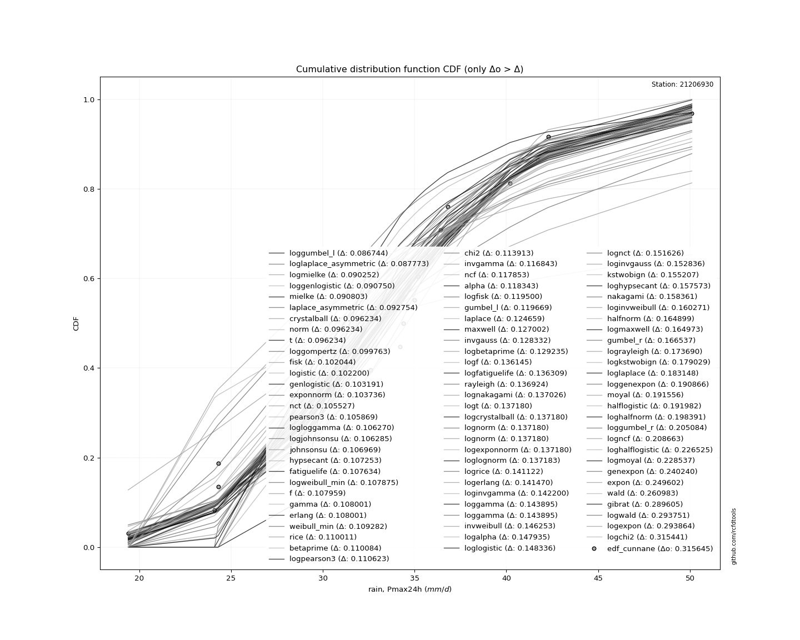</img>

</div>


**11.3. Best fit**

<div align="center">

|   id |   station | empirical_dist   | p_dist      |     delta |   deltao | eval   |   fit |   n |   best_fit |   best_fit_sort |
|-----:|----------:|:-----------------|:------------|----------:|---------:|:-------|------:|----:|-----------:|----------------:|
|    0 |  21206930 | edf_cunnane      | loggumbel_l | 0.0867443 | 0.315645 | Δo > Δ |     1 |  19 |          1 |               1 |

</div>


<div align="center">

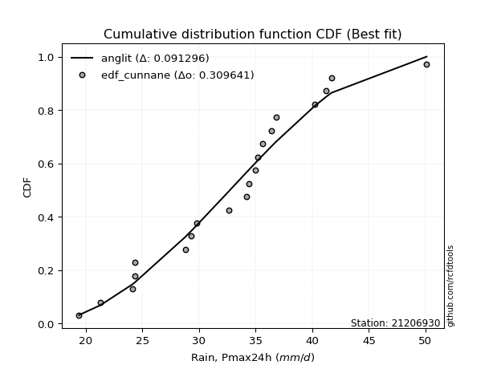</img>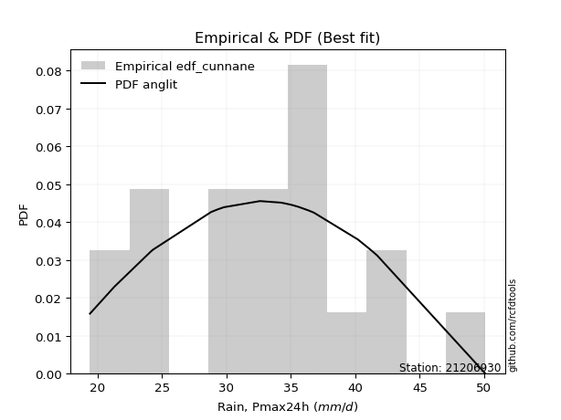</img>

</div>


### 12. EDF Adamowski (1981)

The Adamowski formula in hydrology refers to a specific plotting position formula used for estimating the non-parametric empirical distribution of hydrological events (like flood peaks) to calculate their return periods. This formula provides an alternative to traditional parametric methods (like the Gumbel or Log Pearson Type III distributions). 

<div align="center">


$P=(m-0.25)/(n+0.5)$


</div>


**12.1. Empirical values**

<div align="center">

|                | 0                    | 1                   | 2                   | 3                   | 4                   | 5                  | 6                   | 7                  | 8                   | 9             | 10                 | 11                 | 12                 | 13                 | 14                 | 15                 | 16                 | 17                 | 18                 |
|:---------------|:---------------------|:--------------------|:--------------------|:--------------------|:--------------------|:-------------------|:--------------------|:-------------------|:--------------------|:--------------|:-------------------|:-------------------|:-------------------|:-------------------|:-------------------|:-------------------|:-------------------|:-------------------|:-------------------|
| date           | 2009                 | 2007                | 2018                | 2023                | 2014                | 2011               | 2019                | 2021               | 2013                | 2006          | 2016               | 2020               | 2017               | 2008               | 2010               | 2022               | 2015               | 2005               | 2012               |
| x              | 19.4                 | 24.1                | 24.3                | 24.3                | 28.8                | 29.3               | 29.8                | 32.6               | 34.2                | 34.4          | 35.0               | 35.2               | 35.6               | 36.4               | 36.8               | 40.2               | 41.7               | 42.27368421052632  | 50.1               |
| m              | 1                    | 2                   | 3                   | 4                   | 5                   | 6                  | 7                   | 8                  | 9                   | 10            | 11                 | 12                 | 13                 | 14                 | 15                 | 16                 | 17                 | 18                 | 19                 |
| empirical_dist | edf_adamowski        | edf_adamowski       | edf_adamowski       | edf_adamowski       | edf_adamowski       | edf_adamowski      | edf_adamowski       | edf_adamowski      | edf_adamowski       | edf_adamowski | edf_adamowski      | edf_adamowski      | edf_adamowski      | edf_adamowski      | edf_adamowski      | edf_adamowski      | edf_adamowski      | edf_adamowski      | edf_adamowski      |
| empirical      | 0.038461538461538464 | 0.08974358974358974 | 0.14102564102564102 | 0.19230769230769232 | 0.24358974358974358 | 0.2948717948717949 | 0.34615384615384615 | 0.3974358974358974 | 0.44871794871794873 | 0.5           | 0.5512820512820513 | 0.6025641025641025 | 0.6538461538461539 | 0.7051282051282052 | 0.7564102564102564 | 0.8076923076923077 | 0.8589743589743589 | 0.9102564102564102 | 0.9615384615384616 |
| empirical_tr   | 1.04                 | 1.0985915492957747  | 1.164179104477612   | 1.2380952380952381  | 1.3220338983050848  | 1.4181818181818182 | 1.5294117647058822  | 1.6595744680851061 | 1.813953488372093   | 2.0           | 2.2285714285714286 | 2.5161290322580645 | 2.888888888888889  | 3.3913043478260874 | 4.105263157894736  | 5.2                | 7.090909090909088  | 11.14285714285714  | 26.000000000000018 |

</div>


**12.2. Kolmogorov-Smirnov fit test (sorted by Δ)**


<div align="center">

|                | 0                   | 1                   | 2                   | 3                   | 4                     | 5                   | 6                   | 7                   | 8                   | 9                   | 10                  | 11                  | 12                  | 13                  | 14                  | 15                  | 16                  | 17                  | 18                  | 19                  | 20                  | 21                  | 22                  | 23                  | 24                  | 25                  | 26                  | 27                  | 28                  | 29                  | 30                  | 31                  | 32                  | 33                  | 34                  | 35                  | 36                  | 37                  | 38                  | 39                  | 40                  | 41                  | 42                  | 43                  | 44                  | 45                  | 46                  | 47                  | 48                  | 49                  | 50                  | 51                  | 52                  | 53                  | 54                  | 55                  | 56                  | 57                  | 58                  | 59                  | 60                  | 61                  | 62                  | 63                  | 64                  | 65                  | 66                  | 67                  | 68                  | 69                  | 70                  | 71                  | 72                  | 73                  | 74                  | 75                  | 76                  | 77                  | 78                  | 79                  | 80                  | 81                  | 82                  | 83                  | 84                  | 85                  | 86                  | 87                  |
|:---------------|:--------------------|:--------------------|:--------------------|:--------------------|:----------------------|:--------------------|:--------------------|:--------------------|:--------------------|:--------------------|:--------------------|:--------------------|:--------------------|:--------------------|:--------------------|:--------------------|:--------------------|:--------------------|:--------------------|:--------------------|:--------------------|:--------------------|:--------------------|:--------------------|:--------------------|:--------------------|:--------------------|:--------------------|:--------------------|:--------------------|:--------------------|:--------------------|:--------------------|:--------------------|:--------------------|:--------------------|:--------------------|:--------------------|:--------------------|:--------------------|:--------------------|:--------------------|:--------------------|:--------------------|:--------------------|:--------------------|:--------------------|:--------------------|:--------------------|:--------------------|:--------------------|:--------------------|:--------------------|:--------------------|:--------------------|:--------------------|:--------------------|:--------------------|:--------------------|:--------------------|:--------------------|:--------------------|:--------------------|:--------------------|:--------------------|:--------------------|:--------------------|:--------------------|:--------------------|:--------------------|:--------------------|:--------------------|:--------------------|:--------------------|:--------------------|:--------------------|:--------------------|:--------------------|:--------------------|:--------------------|:--------------------|:--------------------|:--------------------|:--------------------|:--------------------|:--------------------|:--------------------|:--------------------|
| station        | 21206930            | 21206930            | 21206930            | 21206930            | 21206930              | 21206930            | 21206930            | 21206930            | 21206930            | 21206930            | 21206930            | 21206930            | 21206930            | 21206930            | 21206930            | 21206930            | 21206930            | 21206930            | 21206930            | 21206930            | 21206930            | 21206930            | 21206930            | 21206930            | 21206930            | 21206930            | 21206930            | 21206930            | 21206930            | 21206930            | 21206930            | 21206930            | 21206930            | 21206930            | 21206930            | 21206930            | 21206930            | 21206930            | 21206930            | 21206930            | 21206930            | 21206930            | 21206930            | 21206930            | 21206930            | 21206930            | 21206930            | 21206930            | 21206930            | 21206930            | 21206930            | 21206930            | 21206930            | 21206930            | 21206930            | 21206930            | 21206930            | 21206930            | 21206930            | 21206930            | 21206930            | 21206930            | 21206930            | 21206930            | 21206930            | 21206930            | 21206930            | 21206930            | 21206930            | 21206930            | 21206930            | 21206930            | 21206930            | 21206930            | 21206930            | 21206930            | 21206930            | 21206930            | 21206930            | 21206930            | 21206930            | 21206930            | 21206930            | 21206930            | 21206930            | 21206930            | 21206930            | 21206930            |
| empirical_dist | edf_adamowski       | edf_adamowski       | edf_adamowski       | edf_adamowski       | edf_adamowski         | edf_adamowski       | edf_adamowski       | edf_adamowski       | edf_adamowski       | edf_adamowski       | edf_adamowski       | edf_adamowski       | edf_adamowski       | edf_adamowski       | edf_adamowski       | edf_adamowski       | edf_adamowski       | edf_adamowski       | edf_adamowski       | edf_adamowski       | edf_adamowski       | edf_adamowski       | edf_adamowski       | edf_adamowski       | edf_adamowski       | edf_adamowski       | edf_adamowski       | edf_adamowski       | edf_adamowski       | edf_adamowski       | edf_adamowski       | edf_adamowski       | edf_adamowski       | edf_adamowski       | edf_adamowski       | edf_adamowski       | edf_adamowski       | edf_adamowski       | edf_adamowski       | edf_adamowski       | edf_adamowski       | edf_adamowski       | edf_adamowski       | edf_adamowski       | edf_adamowski       | edf_adamowski       | edf_adamowski       | edf_adamowski       | edf_adamowski       | edf_adamowski       | edf_adamowski       | edf_adamowski       | edf_adamowski       | edf_adamowski       | edf_adamowski       | edf_adamowski       | edf_adamowski       | edf_adamowski       | edf_adamowski       | edf_adamowski       | edf_adamowski       | edf_adamowski       | edf_adamowski       | edf_adamowski       | edf_adamowski       | edf_adamowski       | edf_adamowski       | edf_adamowski       | edf_adamowski       | edf_adamowski       | edf_adamowski       | edf_adamowski       | edf_adamowski       | edf_adamowski       | edf_adamowski       | edf_adamowski       | edf_adamowski       | edf_adamowski       | edf_adamowski       | edf_adamowski       | edf_adamowski       | edf_adamowski       | edf_adamowski       | edf_adamowski       | edf_adamowski       | edf_adamowski       | edf_adamowski       | edf_adamowski       |
| p_dist         | logmielke           | loggenlogistic      | mielke              | loggumbel_l         | loglaplace_asymmetric | laplace_asymmetric  | crystalball         | norm                | t                   | loggompertz         | fisk                | logistic            | genlogistic         | exponnorm           | nct                 | pearson3            | logloggamma         | logjohnsonsu        | johnsonsu           | hypsecant           | fatiguelife         | logweibull_min      | f                   | gamma               | erlang              | weibull_min         | rice                | betaprime           | logpearson3         | chi2                | gumbel_l            | invgamma            | ncf                 | alpha               | logfisk             | laplace             | maxwell             | invgauss            | logbetaprime        | logf                | logfatiguelife      | rayleigh            | lognakagami         | logt                | logcrystalball      | lognorm             | lognorm             | logexponnorm        | loglognorm          | logrice             | logerlang           | loginvgamma         | loggamma            | loggamma            | invweibull          | logalpha            | loglogistic         | lognct              | nakagami            | loginvgauss         | kstwobign           | loghypsecant        | loginvweibull       | halfnorm            | logmaxwell          | gumbel_r            | lograyleigh         | logkstwobign        | loglaplace          | loggenexpon         | moyal               | halflogistic        | loghalfnorm         | logncf              | loggumbel_r         | loghalflogistic     | logmoyal            | genexpon            | expon               | wald                | gibrat              | logexpon            | logwald             | logchi2             | loggibrat           | logtruncnorm        | truncnorm           | gompertz            |
| delta          | 0.08945027811045264 | 0.08994904150496513 | 0.09000164129978688 | 0.09092420686540097 | 0.09129105517036687   | 0.09515801711365834 | 0.09543274897962356 | 0.09543276978547471 | 0.09543316022253928 | 0.09896184853823126 | 0.10124245636712864 | 0.10139911134290319 | 0.10238991601097808 | 0.10293470795593224 | 0.10472611662591497 | 0.10506752054087815 | 0.10546880136985409 | 0.10548326552350701 | 0.10616794089476539 | 0.1064518998996769  | 0.10683272882452827 | 0.10707366605370877 | 0.10715800887334642 | 0.10720004292895552 | 0.10720011317971906 | 0.10848082421283084 | 0.1092092355006376  | 0.10928315321300047 | 0.10982205013155272 | 0.11311178969229857 | 0.11566285686002464 | 0.11604188996489712 | 0.11705205056583551 | 0.11754195423383113 | 0.11869884545338588 | 0.12385782799791817 | 0.12620049810289885 | 0.1275310505890696  | 0.1284340449411671  | 0.13534366280264448 | 0.13550722716840063 | 0.13612306583505535 | 0.13622432416752844 | 0.1363787434147819  | 0.13637900309624446 | 0.13637900342428316 | 0.13637900342428316 | 0.13637920028918143 | 0.13638132873235337 | 0.14032111757762428 | 0.14066894099844968 | 0.14139842198280422 | 0.14309370726871412 | 0.14309370726871412 | 0.14545167864664327 | 0.14713416162987497 | 0.14753505673361494 | 0.1508250873168026  | 0.15195111858280996 | 0.1520349505686775  | 0.1544062101618628  | 0.15677144479311028 | 0.15947001352080808 | 0.16409729387450783 | 0.16417184273750401 | 0.16573548836555224 | 0.17288864749096672 | 0.17822818131623025 | 0.1823462974986076  | 0.19006473452213973 | 0.1907550384392493  | 0.19230769230769232 | 0.1975899468063939  | 0.20225298623153276 | 0.20428268053404958 | 0.22572339707694272 | 0.2277353162909656  | 0.23623389543441078 | 0.245595141769987   | 0.2601816968405625  | 0.28880415782862173 | 0.28985724218949227 | 0.2929495244313251  | 0.30822954578974127 | 0.324121729445433   | 0.35796022397842064 | 0.41760674586801194 | 0.714386898719251   |
| deltao         | 0.31564497164100014 | 0.31564497164100014 | 0.31564497164100014 | 0.31564497164100014 | 0.31564497164100014   | 0.31564497164100014 | 0.31564497164100014 | 0.31564497164100014 | 0.31564497164100014 | 0.31564497164100014 | 0.31564497164100014 | 0.31564497164100014 | 0.31564497164100014 | 0.31564497164100014 | 0.31564497164100014 | 0.31564497164100014 | 0.31564497164100014 | 0.31564497164100014 | 0.31564497164100014 | 0.31564497164100014 | 0.31564497164100014 | 0.31564497164100014 | 0.31564497164100014 | 0.31564497164100014 | 0.31564497164100014 | 0.31564497164100014 | 0.31564497164100014 | 0.31564497164100014 | 0.31564497164100014 | 0.31564497164100014 | 0.31564497164100014 | 0.31564497164100014 | 0.31564497164100014 | 0.31564497164100014 | 0.31564497164100014 | 0.31564497164100014 | 0.31564497164100014 | 0.31564497164100014 | 0.31564497164100014 | 0.31564497164100014 | 0.31564497164100014 | 0.31564497164100014 | 0.31564497164100014 | 0.31564497164100014 | 0.31564497164100014 | 0.31564497164100014 | 0.31564497164100014 | 0.31564497164100014 | 0.31564497164100014 | 0.31564497164100014 | 0.31564497164100014 | 0.31564497164100014 | 0.31564497164100014 | 0.31564497164100014 | 0.31564497164100014 | 0.31564497164100014 | 0.31564497164100014 | 0.31564497164100014 | 0.31564497164100014 | 0.31564497164100014 | 0.31564497164100014 | 0.31564497164100014 | 0.31564497164100014 | 0.31564497164100014 | 0.31564497164100014 | 0.31564497164100014 | 0.31564497164100014 | 0.31564497164100014 | 0.31564497164100014 | 0.31564497164100014 | 0.31564497164100014 | 0.31564497164100014 | 0.31564497164100014 | 0.31564497164100014 | 0.31564497164100014 | 0.31564497164100014 | 0.31564497164100014 | 0.31564497164100014 | 0.31564497164100014 | 0.31564497164100014 | 0.31564497164100014 | 0.31564497164100014 | 0.31564497164100014 | 0.31564497164100014 | 0.31564497164100014 | 0.31564497164100014 | 0.31564497164100014 | 0.31564497164100014 |
| eval           | Δo > Δ              | Δo > Δ              | Δo > Δ              | Δo > Δ              | Δo > Δ                | Δo > Δ              | Δo > Δ              | Δo > Δ              | Δo > Δ              | Δo > Δ              | Δo > Δ              | Δo > Δ              | Δo > Δ              | Δo > Δ              | Δo > Δ              | Δo > Δ              | Δo > Δ              | Δo > Δ              | Δo > Δ              | Δo > Δ              | Δo > Δ              | Δo > Δ              | Δo > Δ              | Δo > Δ              | Δo > Δ              | Δo > Δ              | Δo > Δ              | Δo > Δ              | Δo > Δ              | Δo > Δ              | Δo > Δ              | Δo > Δ              | Δo > Δ              | Δo > Δ              | Δo > Δ              | Δo > Δ              | Δo > Δ              | Δo > Δ              | Δo > Δ              | Δo > Δ              | Δo > Δ              | Δo > Δ              | Δo > Δ              | Δo > Δ              | Δo > Δ              | Δo > Δ              | Δo > Δ              | Δo > Δ              | Δo > Δ              | Δo > Δ              | Δo > Δ              | Δo > Δ              | Δo > Δ              | Δo > Δ              | Δo > Δ              | Δo > Δ              | Δo > Δ              | Δo > Δ              | Δo > Δ              | Δo > Δ              | Δo > Δ              | Δo > Δ              | Δo > Δ              | Δo > Δ              | Δo > Δ              | Δo > Δ              | Δo > Δ              | Δo > Δ              | Δo > Δ              | Δo > Δ              | Δo > Δ              | Δo > Δ              | Δo > Δ              | Δo > Δ              | Δo > Δ              | Δo > Δ              | Δo > Δ              | Δo > Δ              | Δo > Δ              | Δo > Δ              | Δo > Δ              | Δo > Δ              | Δo > Δ              | Δo > Δ              | Δo <= Δ             | Δo <= Δ             | Δo <= Δ             | Δo <= Δ             |
| fit            | 1                   | 1                   | 1                   | 1                   | 1                     | 1                   | 1                   | 1                   | 1                   | 1                   | 1                   | 1                   | 1                   | 1                   | 1                   | 1                   | 1                   | 1                   | 1                   | 1                   | 1                   | 1                   | 1                   | 1                   | 1                   | 1                   | 1                   | 1                   | 1                   | 1                   | 1                   | 1                   | 1                   | 1                   | 1                   | 1                   | 1                   | 1                   | 1                   | 1                   | 1                   | 1                   | 1                   | 1                   | 1                   | 1                   | 1                   | 1                   | 1                   | 1                   | 1                   | 1                   | 1                   | 1                   | 1                   | 1                   | 1                   | 1                   | 1                   | 1                   | 1                   | 1                   | 1                   | 1                   | 1                   | 1                   | 1                   | 1                   | 1                   | 1                   | 1                   | 1                   | 1                   | 1                   | 1                   | 1                   | 1                   | 1                   | 1                   | 1                   | 1                   | 1                   | 1                   | 1                   | 0                   | 0                   | 0                   | 0                   |
| n              | 19                  | 19                  | 19                  | 19                  | 19                    | 19                  | 19                  | 19                  | 19                  | 19                  | 19                  | 19                  | 19                  | 19                  | 19                  | 19                  | 19                  | 19                  | 19                  | 19                  | 19                  | 19                  | 19                  | 19                  | 19                  | 19                  | 19                  | 19                  | 19                  | 19                  | 19                  | 19                  | 19                  | 19                  | 19                  | 19                  | 19                  | 19                  | 19                  | 19                  | 19                  | 19                  | 19                  | 19                  | 19                  | 19                  | 19                  | 19                  | 19                  | 19                  | 19                  | 19                  | 19                  | 19                  | 19                  | 19                  | 19                  | 19                  | 19                  | 19                  | 19                  | 19                  | 19                  | 19                  | 19                  | 19                  | 19                  | 19                  | 19                  | 19                  | 19                  | 19                  | 19                  | 19                  | 19                  | 19                  | 19                  | 19                  | 19                  | 19                  | 19                  | 19                  | 19                  | 19                  | 19                  | 19                  | 19                  | 19                  |
| best_fit       | 1                   | 0                   | 0                   | 0                   | 0                     | 0                   | 0                   | 0                   | 0                   | 0                   | 0                   | 0                   | 0                   | 0                   | 0                   | 0                   | 0                   | 0                   | 0                   | 0                   | 0                   | 0                   | 0                   | 0                   | 0                   | 0                   | 0                   | 0                   | 0                   | 0                   | 0                   | 0                   | 0                   | 0                   | 0                   | 0                   | 0                   | 0                   | 0                   | 0                   | 0                   | 0                   | 0                   | 0                   | 0                   | 0                   | 0                   | 0                   | 0                   | 0                   | 0                   | 0                   | 0                   | 0                   | 0                   | 0                   | 0                   | 0                   | 0                   | 0                   | 0                   | 0                   | 0                   | 0                   | 0                   | 0                   | 0                   | 0                   | 0                   | 0                   | 0                   | 0                   | 0                   | 0                   | 0                   | 0                   | 0                   | 0                   | 0                   | 0                   | 0                   | 0                   | 0                   | 0                   | 0                   | 0                   | 0                   | 0                   |
| best_fit_sort  | 1                   | 2                   | 3                   | 4                   | 5                     | 6                   | 7                   | 8                   | 9                   | 10                  | 11                  | 12                  | 13                  | 14                  | 15                  | 16                  | 17                  | 18                  | 19                  | 20                  | 21                  | 22                  | 23                  | 24                  | 25                  | 26                  | 27                  | 28                  | 29                  | 30                  | 31                  | 32                  | 33                  | 34                  | 35                  | 36                  | 37                  | 38                  | 39                  | 40                  | 41                  | 42                  | 43                  | 44                  | 45                  | 46                  | 47                  | 48                  | 49                  | 50                  | 51                  | 52                  | 53                  | 54                  | 55                  | 56                  | 57                  | 58                  | 59                  | 60                  | 61                  | 62                  | 63                  | 64                  | 65                  | 66                  | 67                  | 68                  | 69                  | 70                  | 71                  | 72                  | 73                  | 74                  | 75                  | 76                  | 77                  | 78                  | 79                  | 80                  | 81                  | 82                  | 83                  | 84                  | 85                  | 86                  | 87                  | 88                  |

</div>


<div align="center">

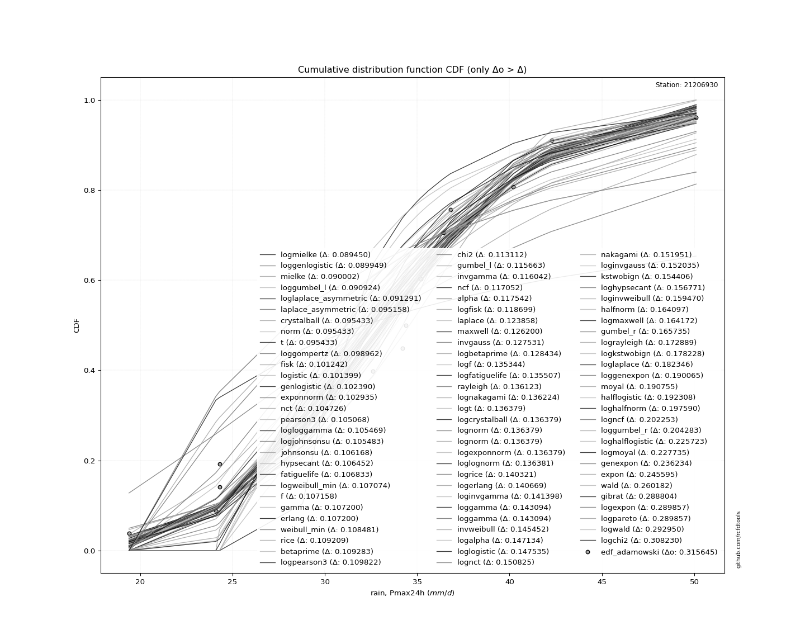</img>

</div>


**12.3. Best fit**

<div align="center">

|   id |   station | empirical_dist   | p_dist    |     delta |   deltao | eval   |   fit |   n |   best_fit |   best_fit_sort |
|-----:|----------:|:-----------------|:----------|----------:|---------:|:-------|------:|----:|-----------:|----------------:|
|    0 |  21206930 | edf_adamowski    | logmielke | 0.0894503 | 0.315645 | Δo > Δ |     1 |  19 |          1 |               1 |

</div>


<div align="center">

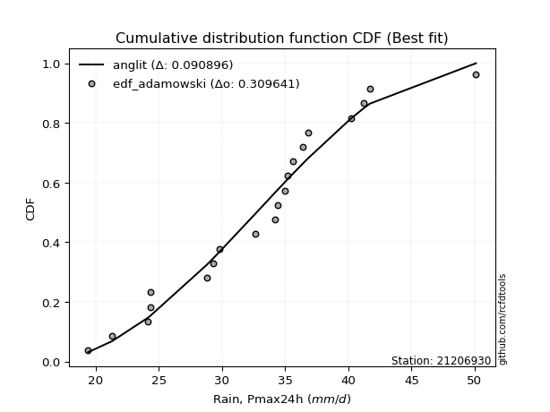</img>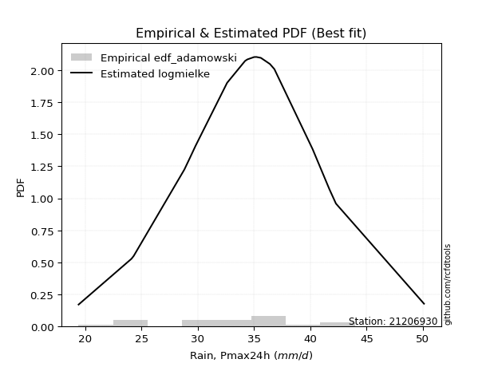</img>

</div>


## C. Best fit & Estimate extreme values for specific return periods - Tr

Best fit in probability distribution analysis means finding the theoretical distribution (like Normal, Poisson, Exponential) that most accurately mirrors your real-world data´s patterns (shape, center, spread) for better predictions, using methods like visual checks (Q-Q plots), goodness-of-fit tests (Kolmogorov-Smirnov, Chi-Squared), and information criteria (AIC) to score and select the simplest, most representative model.


### 1. Best fit (ordered by delta Δ)

<div align="center">

|   id |   station | empirical_dist   | p_dist                |     delta |   deltao | eval   |   fit |   n |   best_fit |   best_fit_sort |
|-----:|----------:|:-----------------|:----------------------|----------:|---------:|:-------|------:|----:|-----------:|----------------:|
|    0 |  21206930 | edf_cunnane      | loggumbel_l           | 0.0867443 | 0.315645 | Δo > Δ |     1 |  19 |          1 |               1 |
|    1 |  21206930 | edf_blom         | loggumbel_l           | 0.0869282 | 0.315645 | Δo > Δ |     1 |  19 |          1 |               2 |
|    2 |  21206930 | edf_gringorten   | loggumbel_l           | 0.0878339 | 0.315645 | Δo > Δ |     1 |  19 |          1 |               3 |
|    3 |  21206930 | edf_tukey        | loggumbel_l           | 0.0882717 | 0.315645 | Δo > Δ |     1 |  19 |          1 |               4 |
|    4 |  21206930 | edf_hazen        | loglaplace_asymmetric | 0.0883212 | 0.315645 | Δo > Δ |     1 |  19 |          1 |               5 |
|    5 |  21206930 | edf_filliben     | loggumbel_l           | 0.0887792 | 0.315645 | Δo > Δ |     1 |  19 |          1 |               6 |
|    6 |  21206930 | edf_beard        | loggumbel_l           | 0.089019  | 0.315645 | Δo > Δ |     1 |  19 |          1 |               7 |
|    7 |  21206930 | edf_jenkinson    | loggumbel_l           | 0.089019  | 0.315645 | Δo > Δ |     1 |  19 |          1 |               8 |
|    8 |  21206930 | edf_chegodayev   | loggumbel_l           | 0.0893382 | 0.315645 | Δo > Δ |     1 |  19 |          1 |               9 |
|    9 |  21206930 | edf_adamowski    | logmielke             | 0.0894503 | 0.315645 | Δo > Δ |     1 |  19 |          1 |              10 |
|   10 |  21206930 | edf_weibull      | t                     | 0.0943722 | 0.315645 | Δo > Δ |     1 |  19 |          1 |              11 |
|   11 |  21206930 | edf_california   | weibull_min           | 0.104506  | 0.315645 | Δo > Δ |     1 |  19 |          1 |              12 |

</div>

:file_folder:Tables: [bestfit_21206930.csv](table/bestfit_21206930.csv) | [extreme_21206930.csv](table/extreme_21206930.csv)


### 2. Extreme values

In hydrology, a return period (or recurrence interval $Tr$) is the statistical average time between extreme events like floods or droughts of a specific magnitude, indicating how rare an event is, with a 100-year flood, for example, having a 1% chance of occurring in any given year, not that it happens exactly every century. It is a key tool for infrastructure design (like bridges or dams) and risk assessment, calculated from historical data to determine the probability of future events, although it is important to remember it is statistical average, and events can cluster or be missed.

> risk_rate: assuming the return period as the project useful life.

|   id |      tr |   prob_l |     prob_g |   alpha |   betaprime |    chi2 |   crystalball |   erlang |    expon |   exponnorm |       f |   fatiguelife |    fisk |   gamma |   genexpon |   genlogistic |   gibrat |   gompertz |   gumbel_l |   gumbel_r |   halflogistic |   halfnorm |   hypsecant |   invgamma |   invgauss |   invweibull |   johnsonsu |   kstwobign |   laplace |   laplace_asymmetric |   loggamma |   logistic |   lognorm |   maxwell |   mielke |   moyal |   nakagami |     ncf |     nct |    norm |   pearson3 |   rayleigh |    rice |       t |   truncnorm |    wald |   weibull_min |   logalpha |   logbetaprime |     logchi2 |   logcrystalball |   logerlang |   logexpon |   logexponnorm |    logf |   logfatiguelife |   logfisk |   loggenexpon |   loggenlogistic |   loggibrat |   loggompertz |   loggumbel_l |   loggumbel_r |   loghalflogistic |   loghalfnorm |   loghypsecant |   loginvgamma |   loginvgauss |   loginvweibull |   logjohnsonsu |   logkstwobign |   loglaplace |   loglaplace_asymmetric |   logloggamma |   loglogistic |   loglognorm |   logmaxwell |   logmielke |   logmoyal |   lognakagami |   logncf |   lognct |   logpearson3 |   lograyleigh |   logrice |    logt |   logtruncnorm |   logwald |   logweibull_min |   station |   n |   risk_rate |
|-----:|--------:|---------:|-----------:|--------:|------------:|--------:|--------------:|---------:|---------:|------------:|--------:|--------------:|--------:|--------:|-----------:|--------------:|---------:|-----------:|-----------:|-----------:|---------------:|-----------:|------------:|-----------:|-----------:|-------------:|------------:|------------:|----------:|---------------------:|-----------:|-----------:|----------:|----------:|---------:|--------:|-----------:|--------:|--------:|--------:|-----------:|-----------:|--------:|--------:|------------:|--------:|--------------:|-----------:|---------------:|------------:|-----------------:|------------:|-----------:|---------------:|--------:|-----------------:|----------:|--------------:|-----------------:|------------:|--------------:|--------------:|--------------:|------------------:|--------------:|---------------:|--------------:|--------------:|----------------:|---------------:|---------------:|-------------:|------------------------:|--------------:|--------------:|-------------:|-------------:|------------:|-----------:|--------------:|---------:|---------:|--------------:|--------------:|----------:|--------:|---------------:|----------:|-----------------:|----------:|----:|------------:|
|    0 |    2    | 0.5      | 0.5        | 32.9822 |     33.1301 | 33.0529 |       33.3934 |  33.1738 |  29.0995 |     33.2649 | 33.1747 |       33.1814 | 33.3676 | 33.1738 |    29.3304 |       33.3436 |  31.21   |    42.9996 |    34.5883 |    32.1984 |        31.6043 |    31.9044 |     33.3934 |    33.0005 |    32.7331 |      32.2607 |     33.1951 |     31.9662 |   33.3934 |              34.2268 |    32.4175 |    33.3934 |   32.5742 |   32.7712 |  33.5648 | 31.8126 |    32.6187 | 32.9818 | 33.2273 | 33.3934 |    33.2141 |    32.5506 | 33.0976 | 33.3933 |     23.7171 | 31.0354 |       33.1035 |    32.304  |        32.2914 |     32.1259 |          32.5742 |     32.459  |    27.7849 |        32.5742 | 32.5893 |          32.5897 |   33.0341 |       30.6928 |          33.5655 |     30.4324 |       33.2447 |       33.8096 |       31.3838 |           30.8082 |       31.0977 |        32.5742 |       32.4422 |       32.1343 |         31.5991 |        33.1923 |        30.9914 |      32.5742 |                 33.7204 |       33.1964 |       32.5742 |      32.5741 |      31.949  |     33.5683 |    31.0089 |       32.5771 |  32.4826 |  32.234  |       33.0987 |       31.7302 |   32.4711 | 32.5741 |        26.436  |   30.2675 |          33.1524 |  21206930 |  19 |    0.75     |
|    1 |    2.33 | 0.570815 | 0.429185   | 34.2854 |     34.4403 | 34.3697 |       34.6914 |  34.4775 |  31.2365 |     34.5511 | 34.4782 |       34.484  | 34.5521 | 34.4775 |    31.3776 |       34.5349 |  31.8675 |    43.4438 |    35.7176 |    33.4011 |        32.8409 |    33.3053 |     34.4322 |    34.3145 |    34.0927 |      33.6973 |     34.4958 |     33.4693 |   34.1789 |              35.0776 |    33.7774 |    34.537  |   33.9183 |   34.1198 |  34.7271 | 32.9512 |    34.7646 | 34.2953 | 34.5205 | 34.6914 |    34.5165 |    33.9191 | 34.4488 | 34.6914 |     27.3471 | 31.8866 |       34.4647 |    33.6851 |        34.0367 |     38.3449 |          33.9183 |     33.825  |    30.0734 |        33.9183 | 33.9379 |          33.9353 |   34.2606 |       32.3759 |          34.7281 |     31.0621 |       34.6661 |       35.0202 |       32.5821 |           32.0183 |       32.4849 |        33.6455 |       33.8099 |       33.5584 |         33.2362 |        34.5132 |        32.677  |      33.3811 |                 34.6479 |       34.5123 |       33.7556 |      33.9183 |      33.3197 |     34.7397 |    32.1285 |       33.9213 |  35.3551 |  33.609  |       34.4348 |       33.112  |   33.8339 | 33.9183 |        28.028  |   31.0807 |          34.4861 |  21206930 |  19 |    0.729209 |
|    2 |    5    | 0.8      | 0.2        | 39.3562 |     39.469  | 39.4477 |       39.5152 |  39.4458 |  41.9214 |     39.4095 | 39.4457 |       39.4448 | 39.1617 | 39.4458 |    41.6106 |       39.1781 |  35.6531 |    44.879  |    39.3659 |    38.6265 |        38.4365 |    39.2296 |     38.5991 |    39.4376 |    39.5205 |      39.9388 |     39.4417 |     39.8538 |   38.1062 |              38.6058 |    39.4446 |    38.9528 |   39.4181 |   39.4277 |  39.0639 | 38.2251 |    44.5459 | 39.3852 | 39.4282 | 39.5152 |    39.4571 |    39.3979 | 39.5588 | 39.5153 |     38.8566 | 36.6513 |       39.5911 |    39.5238 |        41.5294 |    107.521  |          39.4181 |     39.5237 |    44.6725 |        39.4181 | 39.462  |          39.4494 |   39.4394 |       40.1097 |          39.0641 |     34.9499 |       39.8172 |       39.2352 |       38.3418 |           38.1159 |       39.0694 |        38.3091 |       39.5017 |       39.7303 |         41.3913 |        39.5135 |        40.9211 |      37.7254 |                 38.2418 |       39.4959 |       38.7335 |      39.4181 |      39.3108 |     39.0608 |    37.8654 |       39.4239 |  48.9084 |  39.4663 |       39.5423 |       39.2738 |   39.4559 | 39.4182 |        35.6097 |   36.0533 |          39.5277 |  21206930 |  19 |    0.67232  |
|    3 |   10    | 0.9      | 0.1        | 42.9326 |     42.946  | 42.9789 |       42.7152 |  42.85   |  51.6209 |     42.7259 | 42.8491 |       42.842  | 42.5936 | 42.85   |    50.8997 |       42.6266 |  39.9682 |    45.6781 |    41.3972 |    42.8825 |        43.0833 |    43.6134 |     41.9265 |    43.0578 |    43.4647 |      45.0223 |     42.8235 |     44.7148 |   41.6714 |              41.8061 |    43.8106 |    42.2049 |   43.5501 |   43.163  |  42.2277 | 42.817  |    52.1245 | 42.9438 | 42.7844 | 42.7152 |    42.8228 |    43.3044 | 43.0007 | 42.7153 |     44.1918 | 41.7077 |       43.0025 |    44.1161 |        47.5292 |    309.408  |          43.5501 |     43.9201 |    63.9805 |        43.5501 | 43.6182 |          43.601  |   43.7475 |       46.7423 |          42.226  |     39.9782 |       43.0752 |       41.7981 |       43.7776 |           44.0533 |       44.7867 |        42.4931 |       43.8794 |       44.7467 |         49.4912 |        42.8881 |        48.5665 |      42.1567 |                 41.7715 |       42.8699 |       42.8632 |      43.5502 |      44.1619 |     42.1854 |    43.6883 |       43.5604 |  61.1824 |  44.1218 |       43.021  |       44.3557 |   43.718  | 43.5501 |        41.1718 |   42.2032 |          42.9204 |  21206930 |  19 |    0.651322 |
|    4 |   15    | 0.933333 | 0.0666667  | 44.7857 |     44.7239 | 44.7902 |       44.3121 |  44.5815 |  57.2947 |     44.4197 | 44.5802 |       44.5696 | 44.4768 | 44.5815 |    56.3335 |       44.5112 |  42.9446 |    46.0399 |    42.317  |    45.2837 |        45.7131 |    45.8948 |     43.8254 |    44.9347 |    45.5408 |      47.8904 |     44.5423 |     47.2954 |   43.7568 |              43.6782 |    46.1957 |    43.9768 |   45.7713 |   45.0796 |  43.9861 | 45.4819 |    56.111  | 44.7742 | 44.493  | 44.3121 |    44.5289 |    45.3172 | 44.729  | 44.3122 |     46.0782 | 44.9547 |       44.6978 |    46.6599 |        50.8857 |    592.173  |          45.7713 |     46.3241 |    78.9417 |        45.7713 | 45.8546 |          45.836  |   46.2896 |       50.5806 |          43.9834 |     43.8622 |       44.6481 |       43.0132 |       47.1778 |           47.8143 |       48.0856 |        45.0826 |       46.2687 |       47.5835 |         54.742  |        44.583  |        53.1898 |      44.9864 |                 43.9854 |       44.5703 |       45.2957 |      45.7714 |      46.8789 |     43.9246 |    47.47   |       45.785  |  68.5984 |  46.7187 |       44.7731 |       47.2257 |   46.0204 | 45.7714 |        43.6297 |   46.6949 |          44.6224 |  21206930 |  19 |    0.644736 |
|    5 |   20    | 0.95     | 0.05       | 46.025  |     45.9037 | 45.9942 |       45.3578 |  45.7272 |  61.3203 |     45.5463 | 45.7256 |       45.7127 | 45.784  | 45.7272 |    60.1888 |       45.8152 |  45.2793 |    46.2652 |    42.8896 |    46.965  |        47.5555 |    47.4158 |     45.165  |    46.1901 |    46.9404 |      49.8986 |     45.6793 |     49.0338 |   45.2365 |              45.0065 |    47.8384 |    45.2015 |   47.2869 |   46.3516 |  45.2254 | 47.3692 |    58.7766 | 45.9926 | 45.625  | 45.3578 |    45.6558 |    46.655  | 45.8639 | 45.3579 |     47.0492 | 47.3744 |       45.8041 |    48.4264 |        53.2287 |    947.983  |          47.2869 |     47.9807 |    91.6337 |        47.2869 | 47.3814 |          47.3623 |   48.1325 |       53.3057 |          45.2219 |     47.1712 |       45.6589 |       43.7873 |       49.7146 |           50.6392 |       50.4189 |        47.0037 |       47.9135 |       49.5769 |         58.7465 |        45.6956 |        56.5498 |      47.1085 |                 45.627  |       45.6891 |       47.0571 |      47.2871 |      48.7737 |     45.1543 |    50.3445 |       47.3032 |  74.0084 |  48.5295 |       45.924  |       49.2354 |   47.5955 | 47.287  |        45.0228 |   50.3502 |          45.7395 |  21206930 |  19 |    0.641514 |
|    6 |   25    | 0.96     | 0.04       | 46.9507 |     46.7802 | 46.8896 |       46.1277 |  46.5766 |  64.4429 |     46.3855 | 46.5749 |       46.5602 | 46.787  | 46.5766 |    63.1792 |       46.8133 |  47.2257 |    46.4255 |    43.2971 |    48.26   |        48.975  |    48.5474 |     46.2018 |    47.1279 |    47.9912 |      51.4454 |     46.5222 |     50.3359 |   46.3842 |              46.0368 |    49.0905 |    46.1383 |   48.4346 |   47.2959 |  46.1891 | 48.8321 |    60.7623 | 46.8996 | 46.4652 | 46.1277 |    46.4902 |    47.649  | 46.7008 | 46.1278 |     47.6418 | 49.3125 |       46.6161 |    49.7809 |        55.0312 |   1372.03   |          48.4346 |     49.2438 |   102.868  |        48.4346 | 48.538  |          48.5187 |   49.5917 |       55.4257 |          46.1852 |     50.1197 |       46.3933 |       44.3467 |       51.7612 |           52.9289 |       52.2282 |        48.5466 |       49.1667 |       51.1179 |         62.0298 |        46.5156 |        59.2049 |      48.8233 |                 46.9424 |       46.5152 |       48.4507 |      48.4348 |      50.2297 |     46.1138 |    52.6919 |       48.453  |  78.3014 |  49.9219 |       46.7722 |       50.7837 |   48.7903 | 48.4347 |        45.9212 |   53.4834 |          46.563  |  21206930 |  19 |    0.639603 |
|    7 |   50    | 0.98     | 0.02       | 49.6666 |     49.3274 | 49.4966 |       48.3321 |  49.0372 |  74.1423 |     48.8431 | 49.0351 |       49.0154 | 49.8681 | 49.0372 |    72.4683 |       49.8651 |  54.0867 |    46.8606 |    44.4031 |    52.2493 |        53.3488 |    51.8368 |     49.4161 |    49.879  |    51.0989 |      56.2104 |     48.9638 |     54.1595 |   49.9494 |              49.2371 |    52.8889 |    49.0008 |   51.8776 |   50.0346 |  49.2323 | 53.3734 |    66.5394 | 49.5437 | 48.9048 | 48.3321 |    48.9026 |    50.5344 | 49.1034 | 48.3322 |     48.8522 | 55.6405 |       48.9291 |    53.932  |        60.5855 |   4419.52   |          51.8776 |     53.0779 |   147.328  |        51.8776 | 52.0098 |          51.9912 |   54.3298 |       62.0723 |          49.2272 |     62.0625 |       48.4519 |       45.9013 |       58.6105 |           60.6554 |       57.8641 |        53.6593 |       52.9665 |       55.9077 |         73.3425 |        48.8665 |        67.7443 |      54.5582 |                 51.2751 |       48.8917 |       52.9695 |      51.8779 |      54.7032 |     49.1659 |    60.6993 |       51.9034 |  92.2442 |  54.2108 |       49.2015 |       55.5594 |   52.3845 | 51.8777 |        47.8814 |   65.1358 |          48.9256 |  21206930 |  19 |    0.63583  |
|    8 |   75    | 0.986667 | 0.0133333  | 51.165  |     50.7171 | 50.9217 |       49.5149 |  50.3749 |  79.8161 |     50.2007 | 50.3725 |       50.3503 | 51.6591 | 50.3749 |    77.9021 |       51.6287 |  58.7206 |    47.0807 |    44.9624 |    54.568  |        55.8913 |    53.6274 |     51.2945 |    51.3964 |    52.8276 |      58.98   |     50.2913 |     56.2632 |   52.0349 |              51.1092 |    55.0649 |    50.654  |   53.8248 |   51.5235 |  51.0663 | 56.0291 |    69.6846 | 50.9913 | 50.2354 | 49.5149 |    50.211  |    52.1042 | 50.3958 | 49.5151 |     49.2638 | 59.5344 |       50.1619 |    56.3388 |        63.8244 |   8867.17   |          53.8248 |     55.2759 |   181.779  |        53.8248 | 53.9749 |          53.9573 |   57.2698 |       66.019  |          51.0608 |     71.7003 |       49.5298 |       46.708  |       63.0008 |           65.6552 |       61.1837 |        56.893  |       55.142  |       58.7295 |         80.8432 |        50.1285 |        72.957  |      58.2203 |                 53.9928 |       50.1729 |       55.769  |      53.8252 |      57.3003 |     51.024  |    65.9345 |       53.8554 | 100.873  |  56.7122 |       50.5028 |       58.3436 |   54.4235 | 53.8249 |        48.5895 |   73.535  |          50.1957 |  21206930 |  19 |    0.634587 |
|    9 |  100    | 0.99     | 0.01       | 52.1953 |     51.6662 | 51.8961 |       50.315  |  51.2865 |  83.8418 |     51.137  | 51.2841 |       51.2601 | 52.9286 | 51.2865 |    81.7574 |       52.8741 |  62.3103 |    47.2246 |    45.3283 |    56.2091 |        57.6908 |    54.8472 |     52.627  |    52.4394 |    54.0216 |      60.9402 |     51.1961 |     57.7046 |   53.5145 |              52.4375 |    56.5947 |    51.8212 |   55.1831 |   52.5377 |  52.3981 | 57.9132 |    71.8265 | 51.9818 | 51.1443 | 50.315  |    51.1016 |    53.1736 | 51.271  | 50.3151 |     49.4711 | 62.3734 |       50.9922 |    58.0434 |        66.1254 |  14596.6    |          55.1831 |     56.8218 |   211.006  |        55.1831 | 55.3462 |          55.3298 |   59.4409 |       68.8514 |          52.3924 |     80.1836 |       50.2486 |       47.2434 |       66.3053 |           69.441  |       63.5535 |        59.3042 |       56.6709 |       60.7472 |         86.6111 |        50.9819 |        76.7582 |      60.9667 |                 56.0078 |       51.0415 |       57.8341 |      55.1835 |      59.1395 |     52.3829 |    69.9202 |       55.2173 | 107.227  |  58.49   |       51.3811 |       60.3199 |   55.8484 | 55.1832 |        48.955  |   80.3339 |          51.0555 |  21206930 |  19 |    0.633968 |
|   10 |  200    | 0.995    | 0.005      | 54.5842 |     53.8468 | 54.1377 |       52.1297 |  53.3751 |  93.5412 |     53.3228 | 53.3725 |       53.3447 | 55.9911 | 53.3751 |    91.0465 |       55.8621 |  72.0766 |    47.5375 |    46.1235 |    60.1546 |        62.017  |    57.6371 |     55.8371 |    54.8567 |    56.8049 |      65.6528 |     53.2695 |     61.0245 |   57.0797 |              55.6378 |    60.2477 |    54.6211 |   58.3925 |   54.8581 |  55.7267 | 62.4526 |    76.722  | 54.2628 | 53.2339 | 52.1297 |    53.1385 |    55.6206 | 53.2595 | 52.1298 |     49.7843 | 69.4452 |       52.8647 |    62.1557 |        71.6988 |  49114.6    |          58.3925 |     60.5155 |   302.205  |        58.3925 | 58.5883 |          58.5757 |   64.9903 |       75.8    |          55.7213 |    108.695  |       51.8492 |       48.4283 |       74.9766 |           79.4602 |       69.3244 |        65.5412 |       60.3203 |       65.6787 |        102.218  |        52.9161 |        86.284  |      68.128  |                 61.1774 |       53.0179 |       63.1051 |      58.3931 |      63.5725 |     55.8168 |    80.5409 |       58.4361 | 123.388  |  62.8003 |       53.3647 |       65.0975 |   59.2229 | 58.3927 |        49.5182 |  100.129  |          53.0084 |  21206930 |  19 |    0.633042 |
|   11 |  250    | 0.996    | 0.004      | 55.3291 |     54.5208 | 54.8315 |       52.6842 |  54.0191 |  96.6637 |     54.0099 | 54.0165 |       53.9877 | 56.9795 | 54.0191 |    94.0369 |       56.8215 |  75.5808 |    47.6295 |    46.3574 |    61.4229 |        63.4079 |    58.4954 |     56.8704 |    55.61   |    57.6766 |      67.1678 |     53.9091 |     62.0519 |   58.2274 |              56.6681 |    61.4171 |    55.52   |   59.41   |   55.5723 |  56.8375 | 63.914  |    78.2269 | 54.9693 | 53.8805 | 52.6842 |    53.7656 |    56.3739 | 53.868  | 52.6844 |     49.8472 | 71.7847 |       53.4338 |    63.4847 |        73.5059 |  72820.3    |          59.41   |     61.6985 |   339.254  |        59.41   | 59.6168 |          59.6057 |   66.8796 |       78.0776 |          56.8324 |    121.232  |       52.3303 |       48.7826 |       77.9984 |           82.9789 |       71.203  |        67.6853 |       61.4882 |       67.2912 |        107.81   |        53.5065 |        89.465  |      70.6079 |                 62.9411 |       53.6234 |       64.8971 |      59.4107 |      65.0029 |     56.9751 |    84.2921 |       59.4568 | 128.863  |  64.1996 |       53.9679 |       66.6429 |   60.295  | 59.4102 |        49.6331 |  107.698  |          53.6058 |  21206930 |  19 |    0.632858 |
|   12 |  500    | 0.998    | 0.002      | 57.5801 |     56.5409 | 56.9131 |       54.3288 |  55.9447 | 106.363  |     56.1078 | 55.9422 |       55.9104 | 60.0607 | 55.9448 |   103.326  |       59.7972 |  87.6911 |    47.8934 |    47.0281 |    65.3598 |        67.7247 |    61.0543 |     60.0802 |    57.885  |    60.3205 |      71.8701 |     55.8222 |     65.1309 |   61.7925 |              59.8684 |    65.0397 |    58.3078 |   62.533  |   57.7037 |  60.4212 | 68.4533 |    82.7099 | 57.0909 | 55.8207 | 54.3288 |    55.6381 |    58.6213 | 55.6744 | 54.329  |     49.9734 | 79.2236 |       55.1129 |    67.64   |        79.1728 | 249558      |          62.533  |     65.3652 |   485.884  |        62.533  | 62.775  |          62.7694 |   73.0952 |       85.2902 |          60.4178 |    176.789  |       53.7353 |       49.8125 |       88.1754 |           94.9237 |       77.1118 |        74.8032 |       65.1047 |       72.3905 |        127.192  |        55.2549 |        99.7176 |      78.9017 |                 68.7505 |       55.4228 |       70.785  |      62.5338 |      69.4653 |     60.7547 |    97.0955 |       62.5903 | 146.779  |  68.5943 |       55.7464 |       71.4755 |   63.5916 | 62.5332 |        49.8652 |  135.781  |          55.3791 |  21206930 |  19 |    0.632489 |
|   13 |  750    | 0.998667 | 0.00133333 | 58.8585 |     57.6769 | 58.0851 |       55.2424 |  57.0248 | 112.037  |     57.3158 | 57.0223 |       56.989  | 61.8722 | 57.0248 |   108.76   |       61.5357 |  95.7001 |    48.0344 |    47.3866 |    67.6612 |        70.2484 |    62.4839 |     61.9578 |    59.1759 |    61.8279 |      74.619  |     56.8957 |     66.8606 |   63.878  |              61.7405 |    67.1567 |    59.9365 |   64.3382 |   58.8958 |  62.6165 | 71.1086 |    85.2117 | 58.2864 | 56.9139 | 55.2424 |    56.6866 |    59.8781 | 56.6791 | 55.2426 |     50.0155 | 83.6838 |       56.0399 |    70.0953 |        82.5316 | 515568      |          64.3382 |     67.5092 |   599.502  |        64.3382 | 64.6017 |          64.6    |   76.9905 |       89.6113 |          62.6146 |    226.886  |       54.5023 |       50.3719 |       94.7292 |          102.688  |       80.6237 |        79.3089 |       67.2174 |       75.4433 |        140.098  |        56.2242 |       105.984  |      84.1978 |                 72.3943 |       56.4246 |       74.4691 |      64.3391 |      72.0934 |     63.1029 |   105.469  |       64.4021 | 157.934  |  71.2046 |       56.7266 |       74.3291 |   65.5014 | 64.3384 |        49.9432 |  156.018  |          56.3652 |  21206930 |  19 |    0.632366 |
|   14 | 1000    | 0.999    | 0.001      | 59.7507 |     58.4648 | 58.8986 |       55.8714 |  57.7726 | 116.063  |     58.1669 | 57.7702 |       57.7361 | 63.1619 | 57.7726 |   112.615  |       62.7687 | 101.829  |    48.1293 |    47.6279 |    69.2937 |        72.0385 |    63.4712 |     63.29   |    60.0761 |    62.8819 |      76.569  |     57.6394 |     68.0589 |   65.3577 |              63.0688 |    68.6598 |    61.0916 |   65.6113 |   59.7197 |  64.2209 | 72.9926 |    86.9383 | 59.1165 | 57.6731 | 55.8714 |    57.412  |    60.7466 | 57.3713 | 55.8716 |     50.0366 | 86.8922 |       56.6758 |    71.8506 |        84.937  | 864418      |          65.6113 |     69.032  |   695.889  |        65.6113 | 65.8905 |          65.8918 |   79.8782 |       92.7253 |          64.2204 |    274.615  |       55.025  |       50.7519 |       99.6713 |          108.577  |       83.142  |        82.6695 |       68.7171 |       77.6434 |        150.039  |        56.8906 |       110.555  |      88.1697 |                 75.0962 |       57.1153 |       77.1974 |      65.6123 |      73.9678 |     64.8349 |   111.844  |       65.6801 | 166.169  |  73.0768 |       57.3978 |       76.3673 |   66.8501 | 65.6116 |        49.9824 |  172.415  |          57.0446 |  21206930 |  19 |    0.632305 |

<div align="center">

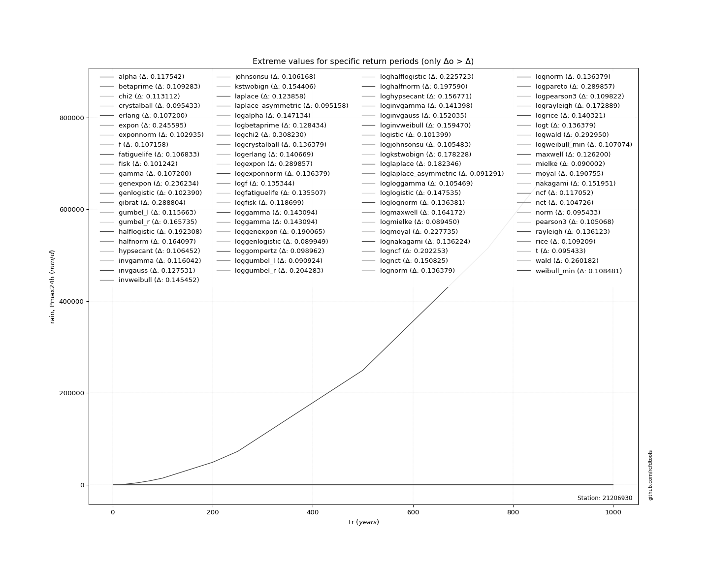</img>

</div>


<div align="center">

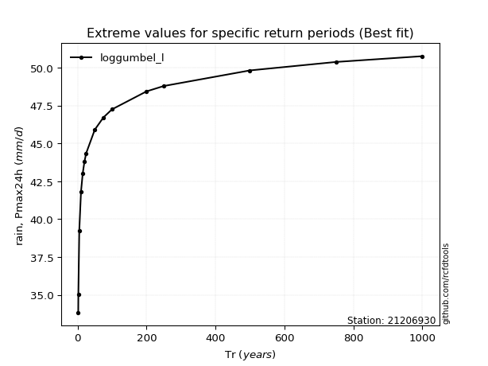</img>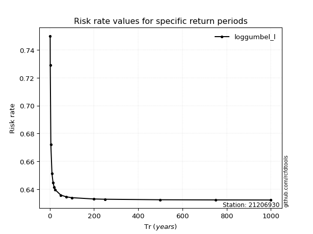</img>

</div>


<sub>**APP DISCLAIMER**: NO WARRANTY - This software is provided by [github.com/rcfdtools](https://github.com/rcfdtools) "as is", without any express or implied warranty, including warranties of merchantability, fitness for a particular purpose, or non-infringement. There is no guarantee that the software will be error-free or operate without interruption. LIMITATION OF LIABILITY - Neither the authors nor copyright holders will be liable for claims or damages arising from the software or its use. You are responsible for determining if the software is appropriate for your use and assume all associated risks, including errors, legal compliance, and data loss. NO PROFESSIONAL ADVICE - The software provides general information and does not offer professional advice. It should not replace consultation with professional advisors.</sub>