<div align="center">


</div>

# Station (rain, Pmax24h): 21206940

Probable Maximum Precipitation (PMP) is the greatest amount of rainfall for a specific duration that is meteorologically possible for a given location, acting as a "worst-case" scenario for extreme storms, crucial for designing safety-critical infrastructure like bridges, river deviations, dams, spillways, and nuclear plants to prevent catastrophic failure. PMP is calculated by hydrologists using meteorological data to determine the upper limit of extreme rainfall, often leading to the Probable Maximum Flood (PMF) for flood control design, and is increasingly being studied for climate change impacts.

<div align="center">

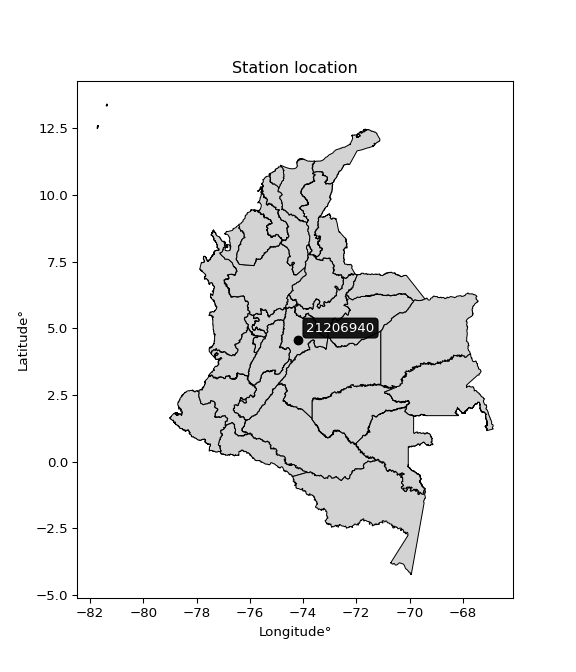</img>

</div>


## A. General information


### 1. General running parameters

• app_version: _v20251225_. • runtime: _2025-12-26 14:29:50.888910_. • Python version: _3.14.0_. • SciPy version: _1.16.3_. • Pandas version: _2.3.3_. • NumPy version: _2.3.5_. • Stations dataset (station_dataset_file): _dataset/pmax24h_in/automatic_colombia.csv_. • Stations catalog (station_catalog_file): _dataset/CNE_IDEAM.xls_. • Plot only fit distributions with Δo > Δ (plot_only_fit): _True_. • Eval low extreme values, if False, evaluates high extreme values (low_extreme): _False_. • Eval every SciPy distribution as logarithmic (pdist_logarithmic_on): _True_. • Standard deviation normalized (ddof): _1.0_. • Return periods to eval in years (Tr): _[2, 2.33, 5, 10, 15, 20, 25, 50, 75, 100, 200, 250, 500, 750, 1000]_. • Minimum data sample per station, 0 means any (minimum_sample): _5_. • Z-Score threshold to adjust a value, 0 means disable (zscore): _3.5_. • Avoid zeros, e.g. rain = 0 (avoid_zeros): _True_. • Avoid null values (avoid_nans): _True_. [:file_folder:Dataset file.](../../dataset/pmax24h_in/automatic_colombia.csv)


### 2. Station info and location

|   id |   CODIGO | NOMBRE                    | CATEGORIA               | TECNOLOGIA                | ESTADO     | FECHA_INSTALACION   | FECHA_SUSPENSION   |   ALTITUD |   LATITUD |   LONGITUD | DEPARTAMENTO   | MUNICIPIO   | AREA_OPERATIVA                            | ENTIDAD                                                     | AREA_HIDROGRAFICA   | ZONA_HIDROGRAFICA   | SUBZONA_HIDROGRAFICA   |   CORRIENTE | OBSERVACION                                           |   SUBRED | Catalogo   |
|-----:|---------:|:--------------------------|:------------------------|:--------------------------|:-----------|:--------------------|:-------------------|----------:|----------:|-----------:|:---------------|:------------|:------------------------------------------|:------------------------------------------------------------|:--------------------|:--------------------|:-----------------------|------------:|:------------------------------------------------------|---------:|:-----------|
|    0 | 21206940 | CIUDAD BOLIVAR [21206940] | Climatológica Principal | Automática con Telemetría | Suspendida | 19/05/2005          | 24/08/2018         |      2687 |   4.57686 |   -74.1768 | Bogotá         | Bogotá, D.C | Area Operativa 11 - Cundinamarca-Amazonas | INSTITUTO DE HIDROLOGIA METEOROLOGIA Y ESTUDIOS AMBIENTALES | Magdalena Cauca     | Alto Magdalena      | Río Bogotá             |         nan | Solicitado con INC 2018-011114 de la mesa de servicio |      nan | CNE_IDEAM  |

<div align="center">

Map location in: [:earth_americas:Google](http://maps.google.com/maps?q=4.576861111,-74.17677778) [:earth_americas:OSM](https://www.openstreetmap.org/#map=18/4.576861111/-74.17677778&layers=P) [:earth_americas:Bing](https://www.bing.com/maps?cp=4.576861111~-74.17677778&lvl=18) [:earth_americas:Apple](https://maps.apple.com/frame?center=4.576861111%2C-74.17677778&span=0.003%2C0.006)

</div>


<div align="center">

```geojson
{
  "type": "Feature",
  "geometry": {
    "type": "Point", 
    "coordinates": [-74.17677778, 4.576861111]
  }, 
  "properties": {
    "Name": "21206940"
  }
}
```

</div>


### 3. Discrete values table and plot

|               |           0 |         1 |          2 |           3 |           4 |          5 |            6 |           7 |          8 |           9 |          10 |
|:--------------|------------:|----------:|-----------:|------------:|------------:|-----------:|-------------:|------------:|-----------:|------------:|------------:|
| Date          | 2004        | 2005      | 2006       | 2007        | 2008        | 2009       | 2010         | 2011        | 2012       | 2013        | 2014        |
| Value         |   10.7      |   26.8    |  119.9     |   26.5      |   31.2      |   32.3     |   37.1       |   18.2      |   29.8     |   41.3      |   27.6      |
| Value_initial |   10.7      |   26.8    |  119.9     |   26.5      |   31.2      |   32.3     |   37.1       |   18.2      |   29.8     |   41.3      |   27.6      |
| count         |   11        |   11      |   11       |   11        |   11        |   11       |   11         |   11        |   11       |   11        |   11        |
| mean          |   36.4909   |   36.4909 |   36.4909  |   36.4909   |   36.4909   |   36.4909  |   36.4909    |   36.4909   |   36.4909  |   36.4909   |   36.4909   |
| std           |   28.885    |   28.885  |   28.885   |   28.885    |   28.885    |   28.885   |   28.885     |   28.885    |   28.885   |   28.885    |   28.885    |
| zscore        |   -0.892884 |   -0.3355 |    2.88763 |   -0.345886 |   -0.183172 |   -0.14509 |    0.0210868 |   -0.633233 |   -0.23164 |    0.166491 |   -0.307804 |

<div align="center">

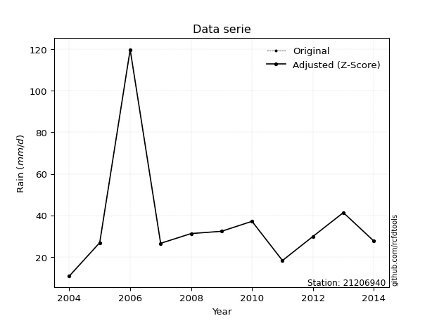</img>

</div>

> If Z-Score is active, values out of range or outliers are replaced with the station mean value.


### 4. Active continuous probability distributions from SciPy (45 of 104 available)

[scipy.stats](https://docs.scipy.org/doc/scipy/reference/stats.html) is a Python´s powerful submodule within the SciPy library for comprehensive statistical analysis, offering over 130 probability distributions (like Normal, Poisson), functions for descriptive stats (mean, variance), hypothesis testing (t-tests, chi-square), random variable generation, and statistical tests, making it essential for data science, modeling, and research. It provides tools to explore, model, and draw conclusions from data efficiently, working seamlessly with NumPy.

<div align="center">

|   id | p_dist             |   n_parameter | fit_method   | label                                                                       | active   | ref                                                                                                        |
|-----:|:-------------------|--------------:|:-------------|:----------------------------------------------------------------------------|:---------|:-----------------------------------------------------------------------------------------------------------|
|    0 | alpha              |             3 | MLE          | Alpha                                                                       | True     | [:mortar_board:](https://docs.scipy.org/doc/scipy/reference/generated/scipy.stats.alpha.html)              |
|    1 | betaprime          |             4 | MLE          | Beta prime                                                                  | True     | [:mortar_board:](https://docs.scipy.org/doc/scipy/reference/generated/scipy.stats.betaprime.html)          |
|    2 | chi2               |             3 | MLE          | Chi²                                                                        | True     | [:mortar_board:](https://docs.scipy.org/doc/scipy/reference/generated/scipy.stats.chi2.html)               |
|    3 | crystalball        |             4 | MLE          | Crystalball                                                                 | True     | [:mortar_board:](https://docs.scipy.org/doc/scipy/reference/generated/scipy.stats.crystalball.html)        |
|    4 | erlang             |             3 | MLE          | Erlang                                                                      | True     | [:mortar_board:](https://docs.scipy.org/doc/scipy/reference/generated/scipy.stats.erlang.html)             |
|    5 | expon              |             2 | MLE          | Exponential                                                                 | True     | [:mortar_board:](https://docs.scipy.org/doc/scipy/reference/generated/scipy.stats.expon.html)              |
|    6 | exponnorm          |             3 | MLE          | Exponentially modified Normal                                               | True     | [:mortar_board:](https://docs.scipy.org/doc/scipy/reference/generated/scipy.stats.exponnorm.html)          |
|    7 | f                  |             4 | MLE          | F                                                                           | True     | [:mortar_board:](https://docs.scipy.org/doc/scipy/reference/generated/scipy.stats.f.html)                  |
|    8 | fatiguelife        |             3 | MLE          | Fatigue-life (Birnbaum-Saunders)                                            | True     | [:mortar_board:](https://docs.scipy.org/doc/scipy/reference/generated/scipy.stats.fatiguelife.html)        |
|    9 | fisk               |             3 | MLE          | Fisk                                                                        | True     | [:mortar_board:](https://docs.scipy.org/doc/scipy/reference/generated/scipy.stats.fisk.html)               |
|   10 | gamma              |             3 | MLE          | Gamma                                                                       | True     | [:mortar_board:](https://docs.scipy.org/doc/scipy/reference/generated/scipy.stats.gamma.html)              |
|   11 | genexpon           |             5 | MLE          | Generalized exponential                                                     | True     | [:mortar_board:](https://docs.scipy.org/doc/scipy/reference/generated/scipy.stats.genexpon.html)           |
|   12 | genlogistic        |             3 | MLE          | Generalized logistic                                                        | True     | [:mortar_board:](https://docs.scipy.org/doc/scipy/reference/generated/scipy.stats.genlogistic.html)        |
|   13 | gibrat             |             2 | MM           | Gibrat                                                                      | True     | [:mortar_board:](https://docs.scipy.org/doc/scipy/reference/generated/scipy.stats.gibrat.html)             |
|   14 | gompertz           |             3 | MLE          | Gompertz (or truncated Gumbel)                                              | True     | [:mortar_board:](https://docs.scipy.org/doc/scipy/reference/generated/scipy.stats.gompertz.html)           |
|   15 | gumbel_l           |             2 | MM           | Gumbel Left Skew                                                            | True     | [:mortar_board:](https://docs.scipy.org/doc/scipy/reference/generated/scipy.stats.gumbel_l.html)           |
|   16 | gumbel_r           |             2 | MM           | Gumbel Right Skew                                                           | True     | [:mortar_board:](https://docs.scipy.org/doc/scipy/reference/generated/scipy.stats.gumbel_r.html)           |
|   17 | halflogistic       |             2 | MM           | Half-logistic                                                               | True     | [:mortar_board:](https://docs.scipy.org/doc/scipy/reference/generated/scipy.stats.halflogistic.html)       |
|   18 | halfnorm           |             2 | MM           | Half Normal                                                                 | True     | [:mortar_board:](https://docs.scipy.org/doc/scipy/reference/generated/scipy.stats.halfnorm.html)           |
|   19 | hypsecant          |             2 | MM           | hyperbolic secant                                                           | True     | [:mortar_board:](https://docs.scipy.org/doc/scipy/reference/generated/scipy.stats.hypsecant.html)          |
|   20 | invgamma           |             3 | MLE          | Inverted gamma                                                              | True     | [:mortar_board:](https://docs.scipy.org/doc/scipy/reference/generated/scipy.stats.invgamma.html)           |
|   21 | invgauss           |             3 | MLE          | Inverse Gaussian                                                            | True     | [:mortar_board:](https://docs.scipy.org/doc/scipy/reference/generated/scipy.stats.invgauss.html)           |
|   22 | invweibull         |             3 | MLE          | Inverted Weibull                                                            | True     | [:mortar_board:](https://docs.scipy.org/doc/scipy/reference/generated/scipy.stats.invweibull.html)         |
|   23 | johnsonsu          |             4 | MLE          | Johnson Su                                                                  | True     | [:mortar_board:](https://docs.scipy.org/doc/scipy/reference/generated/scipy.stats.johnsonsu.html)          |
|   24 | kstwobign          |             2 | MLE          | Limiting distribution of scaled Kolmogorov-Smirnov two-sided test statistic | True     | [:mortar_board:](https://docs.scipy.org/doc/scipy/reference/generated/scipy.stats.kstwobign.html)          |
|   25 | laplace            |             2 | MM           | Laplace                                                                     | True     | [:mortar_board:](https://docs.scipy.org/doc/scipy/reference/generated/scipy.stats.laplace.html)            |
|   26 | laplace_asymmetric |             3 | MLE          | Asymmetric Laplace                                                          | True     | [:mortar_board:](https://docs.scipy.org/doc/scipy/reference/generated/scipy.stats.laplace_asymmetric.html) |
|   27 | loggamma           |             3 | MLE          | Log gamma                                                                   | True     | [:mortar_board:](https://docs.scipy.org/doc/scipy/reference/generated/scipy.stats.loggamma.html)           |
|   28 | logistic           |             2 | MM           | Logistic (or Sech-squared)                                                  | True     | [:mortar_board:](https://docs.scipy.org/doc/scipy/reference/generated/scipy.stats.logistic.html)           |
|   29 | lognorm            |             3 | MLE          | Log Normal                                                                  | True     | [:mortar_board:](https://docs.scipy.org/doc/scipy/reference/generated/scipy.stats.lognorm.html)            |
|   30 | maxwell            |             2 | MM           | Maxwell                                                                     | True     | [:mortar_board:](https://docs.scipy.org/doc/scipy/reference/generated/scipy.stats.maxwell.html)            |
|   31 | mielke             |             4 | MLE          | Mielke Beta-Kappa / Dagum                                                   | True     | [:mortar_board:](https://docs.scipy.org/doc/scipy/reference/generated/scipy.stats.mielke.html)             |
|   32 | moyal              |             2 | MM           | Moyal                                                                       | True     | [:mortar_board:](https://docs.scipy.org/doc/scipy/reference/generated/scipy.stats.moyal.html)              |
|   33 | nakagami           |             3 | MLE          | Nakagami                                                                    | True     | [:mortar_board:](https://docs.scipy.org/doc/scipy/reference/generated/scipy.stats.nakagami.html)           |
|   34 | ncf                |             5 | MLE          | Non-central F distribution                                                  | True     | [:mortar_board:](https://docs.scipy.org/doc/scipy/reference/generated/scipy.stats.ncf.html)                |
|   35 | nct                |             4 | MLE          | Non-central Student’s t                                                     | True     | [:mortar_board:](https://docs.scipy.org/doc/scipy/reference/generated/scipy.stats.nct.html)                |
|   36 | norm               |             2 | MM           | Normal                                                                      | True     | [:mortar_board:](https://docs.scipy.org/doc/scipy/reference/generated/scipy.stats.norm.html)               |
|   37 | pareto             |             3 | MLE          | Pareto                                                                      | True     | [:mortar_board:](https://docs.scipy.org/doc/scipy/reference/generated/scipy.stats.pareto.html)             |
|   38 | pearson3           |             3 | MM           | Pearson type III                                                            | True     | [:mortar_board:](https://docs.scipy.org/doc/scipy/reference/generated/scipy.stats.pearson3.html)           |
|   39 | rayleigh           |             2 | MM           | Rayleigh                                                                    | True     | [:mortar_board:](https://docs.scipy.org/doc/scipy/reference/generated/scipy.stats.rayleigh.html)           |
|   40 | rice               |             3 | MLE          | Rice                                                                        | True     | [:mortar_board:](https://docs.scipy.org/doc/scipy/reference/generated/scipy.stats.rice.html)               |
|   41 | t                  |             3 | MLE          | Student’s t                                                                 | True     | [:mortar_board:](https://docs.scipy.org/doc/scipy/reference/generated/scipy.stats.t.html)                  |
|   42 | truncnorm          |             4 | MLE          | Truncated normal                                                            | True     | [:mortar_board:](https://docs.scipy.org/doc/scipy/reference/generated/scipy.stats.truncnorm.html)          |
|   43 | wald               |             2 | MM           | Wald                                                                        | True     | [:mortar_board:](https://docs.scipy.org/doc/scipy/reference/generated/scipy.stats.wald.html)               |
|   44 | weibull_min        |             3 | MLE          | Weibull minimum                                                             | True     | [:mortar_board:](https://docs.scipy.org/doc/scipy/reference/generated/scipy.stats.weibull_min.html)        |

</div>

> **n_parameter:** # arguments & localization & scale.
>
> **Fit methods:** (MLE) maximum likelihood, (MM) L-moments.
>
>**Inactive:** foldnorm, gennorm, norminvgauss, powernorm, powerlognorm, skewnorm, genextreme, anglit, arcsine, argus, beta, bradford, burr, burr12, cauchy, cosine, halfcauchy, foldcauchy, skewcauchy, wrapcauchy, dgamma, gengamma, exponweib, exponpow, truncexpon, gausshyper, genhalflogistic, genhyperbolic, geninvgauss, halfgennorm, johnsonsb, kappa4, kappa3, ksone, kstwo, loglaplace, levy, levy_l, levy_stable, ncx2, genpareto, truncpareto, lomax, powerlaw, rdist, rel_breitwigner, recipinvgauss, semicircular, studentized_range, trapezoid, triang, truncweibull_min, tukeylambda, uniform, loguniform, vonmises, vonmises_line, weibull_max, dweibull, 


## B. Probability distributions vs. Empirical distributions

A continuous probability distribution (CPD) describes probabilities for variables that can take any value within a range (like rain any time), unlike discrete variables with specific outcomes (like temperature). It uses a Probability Density Function (PDF), a curve where the total area under it equals 1, and the probability of the variable falling within an interval (a to b) is found by calculating the area under the curve between those points. A key feature is that the probability of hitting any single exact value is zero, so probabilities are always expressed for ranges, e.g., $P(a ≤ X ≤ b)$.

<div align="center">

Distributions parameters
|    |   station | p_dist                |   n |             loc |          scale | shape                  | shape1             | shape2                 | shape3   |
|---:|----------:|:----------------------|----:|----------------:|---------------:|:-----------------------|:-------------------|:-----------------------|:---------|
|  0 |  21206940 | alpha                 |  11 |   -18.0273      |  155.009       | 3.2735184711851115     |                    |                        |          |
|  1 |  21206940 | betaprime             |  11 |    -1.32814     |    2.99743     | 42.84407721423733      | 4.4608403759068835 |                        |          |
|  2 |  21206940 | chi2                  |  11 |    10.7         |   13.4774      | 1.9141118951341793     |                    |                        |          |
|  3 |  21206940 | crystalball           |  11 |    36.4909      |   27.5407      | 2005.0483427321815     | 4498.64319449473   |                        |          |
|  4 |  21206940 | erlang                |  11 |    10.7         |   29.9025      | 0.7426428374959148     |                    |                        |          |
|  5 |  21206940 | expon                 |  11 |    10.7         |   25.7909      |                        |                    |                        |          |
|  6 |  21206940 | exponnorm             |  11 |    17.3347      |    6.59957     | 2.902653487883525      |                    |                        |          |
|  7 |  21206940 | f                     |  11 |    -2.41237     |   29.6244      | 450.53303898565787     | 8.896085790514718  |                        |          |
|  8 |  21206940 | fatiguelife           |  11 |     3.32239     |   27.0021      | 0.6793458599182571     |                    |                        |          |
|  9 |  21206940 | fisk                  |  11 |     3.83368     |   25.6749      | 3.10245047208344       |                    |                        |          |
| 10 |  21206940 | gamma                 |  11 |    10.7         |   28.5572      | 0.9843399359056331     |                    |                        |          |
| 11 |  21206940 | genexpon              |  11 |    10.7         |   99.0554      | 2.230749949237614      | 2.2925243262062356 | 9.867421114068904      |          |
| 12 |  21206940 | genlogistic           |  11 |   -72.8636      |   13.9489      | 1261.835665315857      |                    |                        |          |
| 13 |  21206940 | gibrat                |  11 |    15.4808      |   12.7433      |                        |                    |                        |          |
| 14 |  21206940 | gompertz              |  11 |    10.7         |  148.991       | 4.459046944084485      |                    |                        |          |
| 15 |  21206940 | gumbel_l              |  11 |    48.8857      |   21.4734      |                        |                    |                        |          |
| 16 |  21206940 | gumbel_r              |  11 |    24.0961      |   21.4734      |                        |                    |                        |          |
| 17 |  21206940 | halflogistic          |  11 |     3.84875     |   23.5463      |                        |                    |                        |          |
| 18 |  21206940 | halfnorm              |  11 |     0.0377776   |   45.6872      |                        |                    |                        |          |
| 19 |  21206940 | hypsecant             |  11 |    36.4909      |   17.533       |                        |                    |                        |          |
| 20 |  21206940 | invgamma              |  11 |    -2.69687     |  132.754       | 4.447472690144327      |                    |                        |          |
| 21 |  21206940 | invgauss              |  11 |     2.80992     |   69.0837      | 0.4875385548500729     |                    |                        |          |
| 22 |  21206940 | invweibull            |  11 |   -23.3097      |   48.2391      | 3.9944534679848056     |                    |                        |          |
| 23 |  21206940 | johnsonsu             |  11 |    27.98        |    2.64453     | -0.27932541915465825   | 0.5348122224693388 |                        |          |
| 24 |  21206940 | kstwobign             |  11 |   -31.4577      |   80.4571      |                        |                    |                        |          |
| 25 |  21206940 | laplace               |  11 |    36.4909      |   19.4742      |                        |                    |                        |          |
| 26 |  21206940 | laplace_asymmetric    |  11 |    26.8         |   11.3408      | 0.6601931785062289     |                    |                        |          |
| 27 |  21206940 | loggamma              |  11 | -7837.07        | 1082.76        | 1439.5936980145275     |                    |                        |          |
| 28 |  21206940 | logistic              |  11 |    36.4909      |   15.184       |                        |                    |                        |          |
| 29 |  21206940 | lognorm               |  11 |    10.7         |    0.750797    | 10.667564388277391     |                    |                        |          |
| 30 |  21206940 | maxwell               |  11 |   -28.7691      |   40.8956      |                        |                    |                        |          |
| 31 |  21206940 | mielke                |  11 |    -0.146391    |   27.6907      | 4.117167316345528      | 3.4182391992496206 |                        |          |
| 32 |  21206940 | moyal                 |  11 |    20.7414      |   12.3977      |                        |                    |                        |          |
| 33 |  21206940 | nakagami              |  11 |    10.7         |   45.1413      | 0.205486955419569      |                    |                        |          |
| 34 |  21206940 | ncf                   |  11 |     0.484532    |    4.411       | 10.494503575335255     | 8.864891284858208  | 54.66298326415547      |          |
| 35 |  21206940 | nct                   |  11 |    -0.0290769   |    7.27569     | 3.4042783703916992     | 3.720830847945077  |                        |          |
| 36 |  21206940 | norm                  |  11 |    36.4909      |   27.5407      |                        |                    |                        |          |
| 37 |  21206940 | pareto                |  11 |  -447.988       |  458.688       | 18.790714969787512     |                    |                        |          |
| 38 |  21206940 | pearson3              |  11 |    36.4909      |   27.5407      | 2.4109077773270515     |                    |                        |          |
| 39 |  21206940 | rayleigh              |  11 |   -16.1961      |   42.0382      |                        |                    |                        |          |
| 40 |  21206940 | rice                  |  11 |    -2.10842     |   33.5291      | 0.00034412215296282663 |                    |                        |          |
| 41 |  21206940 | t                     |  11 |    29.2309      |    4.48421     | 0.9691164968035608     |                    |                        |          |
| 42 |  21206940 | truncnorm             |  11 | -3223.02        |  302.179       | 10.70131700763898      | 11.062698433489373 |                        |          |
| 43 |  21206940 | wald                  |  11 |     8.95018     |   27.5407      |                        |                    |                        |          |
| 44 |  21206940 | weibull_min           |  11 |    18.2         |   45.1411      | 0.25931556001785466    |                    |                        |          |
| 45 |  21206940 | logalpha              |  11 |    -4.03757     |  101.701       | 13.717048741182264     |                    |                        |          |
| 46 |  21206940 | logbetaprime          |  11 |    -0.995205    |    1.2355      | 296.6929733550388      | 84.08113011608398  |                        |          |
| 47 |  21206940 | logchi2               |  11 |     2.37024     |    0.916689    | 1.1166135514594133     |                    |                        |          |
| 48 |  21206940 | logcrystalball        |  11 |     3.41692     |    0.557497    | 1863.291840477632      | 123.23296695692196 |                        |          |
| 49 |  21206940 | logerlang             |  11 |     0.466313    |    0.103273    | 28.570884473808224     |                    |                        |          |
| 50 |  21206940 | logexpon              |  11 |     2.37024     |    1.04668     |                        |                    |                        |          |
| 51 |  21206940 | logexponnorm          |  11 |     3.02303     |    0.378383    | 1.0409877726228918     |                    |                        |          |
| 52 |  21206940 | logf                  |  11 |    -1.43272     |    4.79611     | 1202.7695245200603     | 181.1183918132449  |                        |          |
| 53 |  21206940 | logfatiguelife        |  11 |    -0.766054    |    4.14702     | 0.13169090847237716    |                    |                        |          |
| 54 |  21206940 | logfisk               |  11 |    -1.03944     |    4.42257     | 16.171709740613338     |                    |                        |          |
| 55 |  21206940 | loggamma              |  11 |     0.466312    |    0.103273    | 28.57091700857744      |                    |                        |          |
| 56 |  21206940 | loggenexpon           |  11 |     2.3658      |    0.0041648   | 0.0009946435197904328  | 0.5785101950018956 | 3.1693753136999186e-05 |          |
| 57 |  21206940 | loggenlogistic        |  11 |     3.31974     |    0.293132    | 1.1925917904348138     |                    |                        |          |
| 58 |  21206940 | loggibrat             |  11 |     2.99159     |    0.257978    |                        |                    |                        |          |
| 59 |  21206940 | loggompertz           |  11 |     2.37024     |    0.963215    | 0.3840767025953241     |                    |                        |          |
| 60 |  21206940 | loggumbel_l           |  11 |     3.66783     |    0.434679    |                        |                    |                        |          |
| 61 |  21206940 | loggumbel_r           |  11 |     3.16602     |    0.434679    |                        |                    |                        |          |
| 62 |  21206940 | loghalflogistic       |  11 |     2.75617     |    0.476632    |                        |                    |                        |          |
| 63 |  21206940 | loghalfnorm           |  11 |     2.67901     |    0.924837    |                        |                    |                        |          |
| 64 |  21206940 | loghypsecant          |  11 |     3.41692     |    0.354914    |                        |                    |                        |          |
| 65 |  21206940 | loginvgamma           |  11 |    -1.77814     |  464.964       | 90.5042610118246       |                    |                        |          |
| 66 |  21206940 | loginvgauss           |  11 |    -0.580573    |  207.733       | 0.019239525417601905   |                    |                        |          |
| 67 |  21206940 | loginvweibull         |  11 |    -3.52168e+07 |    3.52168e+07 | 68562878.5004057       |                    |                        |          |
| 68 |  21206940 | logjohnsonsu          |  11 |     3.37799     |    0.116157    | -0.0491361492649523    | 0.6019279278312568 |                        |          |
| 69 |  21206940 | logkstwobign          |  11 |     1.24602     |    2.50508     |                        |                    |                        |          |
| 70 |  21206940 | loglaplace            |  11 |     3.41692     |    0.39421     |                        |                    |                        |          |
| 71 |  21206940 | loglaplace_asymmetric |  11 |     3.39451     |    0.352332    | 0.96875056966977       |                    |                        |          |
| 72 |  21206940 | logloggamma           |  11 |  -151.412       |   21.3661      | 1403.627703712095      |                    |                        |          |
| 73 |  21206940 | loglogistic           |  11 |     3.41692     |    0.307364    |                        |                    |                        |          |
| 74 |  21206940 | loglognorm            |  11 |     2.37024     |    0.042938    | 10.18912466750739      |                    |                        |          |
| 75 |  21206940 | logmaxwell            |  11 |     2.09589     |    0.827835    |                        |                    |                        |          |
| 76 |  21206940 | logmielke             |  11 |    -0.083584    |    3.56068     | 10.815223240129491     | 14.161820716137075 |                        |          |
| 77 |  21206940 | logmoyal              |  11 |     3.09811     |    0.250962    |                        |                    |                        |          |
| 78 |  21206940 | lognakagami           |  11 |     2.90142     |    0.758141    | 0.36314237001737715    |                    |                        |          |
| 79 |  21206940 | logncf                |  11 |    -3.15147     |    6.53819     | 476.20442512593        | 325.3529370421211  | 0.0023729712617432245  |          |
| 80 |  21206940 | lognct                |  11 |     0.533318    |    0.387804    | 31.627583561969246     | 7.235318284090084  |                        |          |
| 81 |  21206940 | lognorm               |  11 |     3.41692     |    0.557497    |                        |                    |                        |          |
| 82 |  21206940 | logpareto             |  11 |     2.37023     |    1.79922e-05 | 0.10001960155377342    |                    |                        |          |
| 83 |  21206940 | logpearson3           |  11 |     3.41692     |    0.557496    | 0.6906081840506784     |                    |                        |          |
| 84 |  21206940 | lograyleigh           |  11 |     2.3504      |    0.850964    |                        |                    |                        |          |
| 85 |  21206940 | logrice               |  11 |     2.10275     |    0.613876    | 1.8460105836811458     |                    |                        |          |
| 86 |  21206940 | logt                  |  11 |     3.38876     |    0.164522    | 1.0997739078332311     |                    |                        |          |
| 87 |  21206940 | logtruncnorm          |  11 |    -0.269619    |    1.59974     | 1.9821888162099066     | 3.1607063576976575 |                        |          |
| 88 |  21206940 | logwald               |  11 |     2.85944     |    0.557481    |                        |                    |                        |          |
| 89 |  21206940 | logweibull_min        |  11 |     2.87561     |    0.662591    | 1.347410393587925      |                    |                        |          |

</div>

> **loc** (Location parameter): This shifts the distribution along the x-axis. For many common distributions, like the normal (Gaussian) distribution, loc represents the mean $μ$. For others, like the uniform distribution, it might represent the minimum value, or for the beta distribution, the left end of the support interval.
>
> **scale** (Scale parameter): This determines the width or spread of the distribution. For the normal distribution, scale represents the standard deviation $σ$. For a uniform distribution, it defines the length of the interval (from $loc$ to $loc + scale$).
>
> **shape** (Shape parameters): Refers to parameters that define the specific form of a probability distribution, distinct from its location (loc) and scale (scale). These parameters are required arguments for most distribution functions. For example, a normal (Gaussian) distribution is fully defined by its location (mean) and scale (standard deviation), so it has no specific shape parameters beyond loc and scale. However, other distributions have intrinsic properties that need specification, as Gamma distribution that takes a shape parameter, often named $a$ or $alpha$.


### 0. Cumulative distribution values - CDF (90 evaluated)

> Ordered by x ascending and calculating $log(f(x))$ separately. 

|   id |   Station |   date |     x |   count |    mean |    std |     zscore |   Value_initial |   station |   m |     alpha |   alpha_pdf |   betaprime |   betaprime_pdf |      chi2 |    chi2_pdf |   crystalball |   crystalball_pdf |      erlang |    erlang_pdf |    expon |   expon_pdf |   exponnorm |   exponnorm_pdf |        f |      f_pdf |   fatiguelife |   fatiguelife_pdf |      fisk |    fisk_pdf |       gamma |   gamma_pdf |    genexpon |   genexpon_pdf |   genlogistic |   genlogistic_pdf |    gibrat |   gibrat_pdf |   gompertz |   gompertz_pdf |   gumbel_l |   gumbel_l_pdf |   gumbel_r |   gumbel_r_pdf |   halflogistic |   halflogistic_pdf |   halfnorm |   halfnorm_pdf |   hypsecant |   hypsecant_pdf |   invgamma |   invgamma_pdf |   invgauss |   invgauss_pdf |   invweibull |   invweibull_pdf |   johnsonsu |   johnsonsu_pdf |   kstwobign |   kstwobign_pdf |   laplace |   laplace_pdf |   laplace_asymmetric |   laplace_asymmetric_pdf |   loggamma |   loggamma_pdf |   logistic |   logistic_pdf |   lognorm |   lognorm_pdf |   maxwell |   maxwell_pdf |    mielke |   mielke_pdf |    moyal |   moyal_pdf |    nakagami |   nakagami_pdf |       ncf |     ncf_pdf |       nct |     nct_pdf |     norm |    norm_pdf |   pareto |   pareto_pdf |   pearson3 |   pearson3_pdf |   rayleigh |   rayleigh_pdf |      rice |   rice_pdf |        t |       t_pdf |   truncnorm |   truncnorm_pdf |        wald |    wald_pdf |   weibull_min |   weibull_min_pdf |   logalpha |   logalpha_pdf |   logbetaprime |   logbetaprime_pdf |     logchi2 |   logchi2_pdf |   logcrystalball |   logcrystalball_pdf |   logerlang |   logerlang_pdf |   logexpon |   logexpon_pdf |   logexponnorm |   logexponnorm_pdf |      logf |   logf_pdf |   logfatiguelife |   logfatiguelife_pdf |   logfisk |   logfisk_pdf |   loggenexpon |   loggenexpon_pdf |   loggenlogistic |   loggenlogistic_pdf |   loggibrat |   loggibrat_pdf |   loggompertz |   loggompertz_pdf |   loggumbel_l |   loggumbel_l_pdf |   loggumbel_r |   loggumbel_r_pdf |   loghalflogistic |   loghalflogistic_pdf |   loghalfnorm |   loghalfnorm_pdf |   loghypsecant |   loghypsecant_pdf |   loginvgamma |   loginvgamma_pdf |   loginvgauss |   loginvgauss_pdf |   loginvweibull |   loginvweibull_pdf |   logjohnsonsu |   logjohnsonsu_pdf |   logkstwobign |   logkstwobign_pdf |   loglaplace |   loglaplace_pdf |   loglaplace_asymmetric |   loglaplace_asymmetric_pdf |   logloggamma |   logloggamma_pdf |   loglogistic |   loglogistic_pdf |   loglognorm |   loglognorm_pdf |   logmaxwell |   logmaxwell_pdf |   logmielke |   logmielke_pdf |    logmoyal |   logmoyal_pdf |   lognakagami |   lognakagami_pdf |    logncf |   logncf_pdf |    lognct |   lognct_pdf |   logpareto |   logpareto_pdf |   logpearson3 |   logpearson3_pdf |   lograyleigh |   lograyleigh_pdf |   logrice |   logrice_pdf |      logt |   logt_pdf |   logtruncnorm |   logtruncnorm_pdf |     logwald |   logwald_pdf |   logweibull_min |   logweibull_min_pdf |
|-----:|----------:|-------:|------:|--------:|--------:|-------:|-----------:|----------------:|----------:|----:|----------:|------------:|------------:|----------------:|----------:|------------:|--------------:|------------------:|------------:|--------------:|---------:|------------:|------------:|----------------:|---------:|-----------:|--------------:|------------------:|----------:|------------:|------------:|------------:|------------:|---------------:|--------------:|------------------:|----------:|-------------:|-----------:|---------------:|-----------:|---------------:|-----------:|---------------:|---------------:|-------------------:|-----------:|---------------:|------------:|----------------:|-----------:|---------------:|-----------:|---------------:|-------------:|-----------------:|------------:|----------------:|------------:|----------------:|----------:|--------------:|---------------------:|-------------------------:|-----------:|---------------:|-----------:|---------------:|----------:|--------------:|----------:|--------------:|----------:|-------------:|---------:|------------:|------------:|---------------:|----------:|------------:|----------:|------------:|---------:|------------:|---------:|-------------:|-----------:|---------------:|-----------:|---------------:|----------:|-----------:|---------:|------------:|------------:|----------------:|------------:|------------:|--------------:|------------------:|-----------:|---------------:|---------------:|-------------------:|------------:|--------------:|-----------------:|---------------------:|------------:|----------------:|-----------:|---------------:|---------------:|-------------------:|----------:|-----------:|-----------------:|---------------------:|----------:|--------------:|--------------:|------------------:|-----------------:|---------------------:|------------:|----------------:|--------------:|------------------:|--------------:|------------------:|--------------:|------------------:|------------------:|----------------------:|--------------:|------------------:|---------------:|-------------------:|--------------:|------------------:|--------------:|------------------:|----------------:|--------------------:|---------------:|-------------------:|---------------:|-------------------:|-------------:|-----------------:|------------------------:|----------------------------:|--------------:|------------------:|--------------:|------------------:|-------------:|-----------------:|-------------:|-----------------:|------------:|----------------:|------------:|---------------:|--------------:|------------------:|----------:|-------------:|----------:|-------------:|------------:|----------------:|--------------:|------------------:|--------------:|------------------:|----------:|--------------:|----------:|-----------:|---------------:|-------------------:|------------:|--------------:|-----------------:|---------------------:|
|    0 |  21206940 |   2004 |  10.7 |      11 | 36.4909 | 28.885 | -0.892884  |            10.7 |  21206940 |   1 | 0.0169129 | 0.0078848   |   0.0183382 |     0.00933592  | 3.322e-16 | 0.178981    |      0.174517 |       0.00934338  | 1.62458e-12 | 339.594       | 0        | 0.0387734   |    0.024539 |     0.00693408  | 0.018102 | 0.00924663 |     0.0203445 |       0.0119373   | 0.0164348 | 0.00730381  | 1.12317e-16 | 0.0622386   | 2.64119e-07 |    0.0225202   |     0.0427208 |       0.00964474  | 0         |  0           |  1.563e-14 |     0.0299283  |   0.155431 |    0.00664412  |   0.154727 |    0.0134462   |       0.144467 |        0.0207915   |   0.184529 |    0.0169949   |    0.143736 |     0.00792228  |  0.0180553 |     0.00922997 |  0.0195928 |    0.0114851   |    0.0176036 |      0.00835217  |   0.0487592 |     0.00309262  |   0.0534905 |     0.010134    |  0.132986 |   0.00682884  |            0.035346  |              0.00472092  |  0.0170878 |      0.103188  |   0.154654 |    0.00861011  | 0.0302274 |     0.122815  |  0.182168 |   0.0114067   | 0.0201045 |  0.00733364  | 0.133807 | 0.0156801   | 1.42725e-07 |    3.30205e+07 | 0.0184822 | 0.00939798  | 0.0206767 | 0.00779174  | 0.174517 | 0.00934338  | 0        |  0.0409663   |   0        |    0           |   0.185087 |    0.0124026   | 0.0703671 | 0.0105916  | 0.078612 | 0.00396368  | 7.61692e-06 |     0.036408    | 0.000192049 | 0.000910303 |   0           |       0           |   0.015607 |      0.0970514 |       0.015164 |          0.0961541 | 2.15009e-09 |   2.70308e+06 |        0.0302274 |            0.122815  |   0.0170878 |       0.103188  |   0        |      0.955402  |      0.0121472 |          0.076411  | 0.0160034 |  0.0987423 |        0.0166629 |            0.101323  | 0.0146829 |     0.0686167 |    0.00107065 |         0.243256  |        0.0200643 |            0.0785516 |    0        |       0         |   3.34593e-09 |         0.398745  |     0.0492762 |       0.110522    |    0.00195299 |         0.0280288 |          0        |             0         |      0        |         0         |      0.0333197 |          0.0937097 |      0.016019 |         0.0987709 |     0.0165038 |         0.101843  |       0.0102037 |           0.0910827 |      0.0384609 |          0.0495261 |      0.0122115 |          0.122211  |    0.0351448 |        0.0891524 |               0.0240823 |                   0.0705561 |     0.0340571 |         0.130331  |      0.032129 |         0.101172  |  0.000787551 |      5.97449e+11 |   0.00936823 |         0.100203 |   0.0177667 |       0.0779068 | 2.01003e-05 |    0.000764558 |    0          |         0         | 0.0470255 |    0.176282  | 0.0149822 |    0.0942657 |    0        |    5559.05      |    0.00702139 |         0.0723386 |   0.000271884 |         0.0273973 | 0.0178297 |     0.13726   | 0.0433821 |  0.0459547 |    0           |          0         | 0           |     0         |        0         |             0        |
|    1 |  21206940 |   2011 |  18.2 |      11 | 36.4909 | 28.885 | -0.633233  |            18.2 |  21206940 |   2 | 0.157468  | 0.0284436   |   0.17113   |     0.0287366   | 0.261958  | 0.028903    |      0.2533   |       0.0116186   | 0.35169     |   0.030072    | 0.252335 | 0.0289895   |    0.130718 |     0.0220001   | 0.170368 | 0.0287157  |     0.186613  |       0.0277408   | 0.141684  | 0.026262    | 0.237658    | 0.0272461   | 0.197651    |    0.0278416   |     0.158393  |       0.0209087   | 0.0612147 |  0.0444999   |  0.205632  |     0.0250015  |   0.213015 |    0.00877919  |   0.268213 |    0.0164371   |       0.295649 |        0.0193786   |   0.309026 |    0.0161372   |    0.215646 |     0.01138     |  0.170206  |     0.0287069  |  0.186131  |    0.0283314   |    0.161642  |      0.0283464   |   0.0870736 |     0.00836383  |   0.159271  |     0.0175678   |  0.195463 |   0.010037    |            0.0962461 |              0.0128549   |  0.175877  |      0.53247   |   0.230655 |    0.0116869   | 0.177568  |     0.466662  |  0.275392 |   0.0133076   | 0.141046  |  0.0254271   | 0.267892 | 0.0192989   | 0.3765      |    0.020534    | 0.171532  | 0.0287122   | 0.153512  | 0.0271094   | 0.2533   | 0.0116186   | 0.262701 |  0.0297184   |   0.266158 |    0.0370336   |   0.284472 |    0.0139267   | 0.167593  | 0.0150372  | 0.126069 | 0.0100414   | 0.23979     |     0.027907    | 0.204088    | 0.038594    |   6.66753e-05 |       4.86652e+09 |   0.173767 |      0.542028  |       0.173483 |          0.543068  | 0.50934     |   0.442877    |        0.177568  |            0.466662  |   0.175878  |       0.53247   |   0.397994 |      0.575157  |      0.158125  |          0.547938  | 0.174373  |  0.539353  |        0.175222  |            0.535163  | 0.134128  |     0.476582  |    0.243717   |         0.607936  |        0.141078  |            0.462872  |    0        |       0         |   0.246179    |         0.521748  |     0.157602  |       0.332369    |    0.159122   |         0.672865  |          0.151203 |             1.02504   |      0.190046 |         0.83814   |      0.146331  |          0.39793   |      0.174391 |         0.53938   |     0.176697  |         0.539607  |       0.195907  |           0.621738  |      0.0926138 |          0.203548  |      0.224933  |          0.631877  |    0.135223  |        0.343023  |               0.114173  |                   0.334503  |     0.182942  |         0.461028  |      0.157471 |         0.43165   |  0.597494    |      0.071499    |   0.185889   |         0.56842  |   0.139785  |       0.467956  | 0.138941    |    0.78707     |    6.7287e-12 |     11004.4       | 0.221866  |    0.485098  | 0.174779  |    0.555872  |    0.642813 |       0.0672552 |    0.176693   |         0.601781  |   0.189129    |         0.61702   | 0.184508  |     0.505149  | 0.0943469 |  0.196608  |    8.89405e-05 |          1.52408   | 0.000705445 |     0.118521  |        0.0125385 |             0.65034  |
|    2 |  21206940 |   2007 |  26.5 |      11 | 36.4909 | 28.885 | -0.345886  |            26.5 |  21206940 |   3 | 0.417957  | 0.0305406   |   0.419457  |     0.0282116   | 0.46493   | 0.020574    |      0.358389 |       0.0135631   | 0.548545    |   0.0188077   | 0.45807  | 0.0210124   |    0.357364 |     0.0292429   | 0.418836 | 0.0282471  |     0.410976  |       0.0247753   | 0.404519  | 0.0329709   | 0.432676    | 0.0201378   | 0.41568     |    0.02388     |     0.361803  |       0.0263591   | 0.442212  |  0.0358237   |  0.392772  |     0.0202064  |   0.297126 |    0.0115407   |   0.408979 |    0.0170287   |       0.447039 |        0.0169911   |   0.437548 |    0.0147672   |    0.327703 |     0.0155596   |  0.418663  |     0.0282508  |  0.415945  |    0.0252947   |    0.414836  |      0.0292711   |   0.286082  |     0.0600221   |   0.322863  |     0.0209176   |  0.299339 |   0.015371    |            0.291628  |              0.0389507   |  0.422827  |      0.731798  |   0.341191 |    0.0148037   | 0.401013  |     0.693453  |  0.390806 |   0.0142976   | 0.399873  |  0.0329192   | 0.427923 | 0.0186311   | 0.509705    |    0.0129837   | 0.419302  | 0.0281281   | 0.407396  | 0.0302759   | 0.358389 | 0.0135631   | 0.470789 |  0.0209579   |   0.493673 |    0.0208705   |   0.402962 |    0.0144246   | 0.305116  | 0.0176833  | 0.327175 | 0.0512799   | 0.440392    |     0.0207778   | 0.473529    | 0.0256829   |   0.475116    |       0.0105703   |   0.426006 |      0.745217  |       0.425876 |          0.744928  | 0.642475    |   0.284883    |        0.401013  |            0.693453  |   0.422827  |       0.731798  |   0.579561 |      0.401689  |      0.427632  |          0.816058  | 0.425046  |  0.741051  |        0.423664  |            0.735555  | 0.403173  |     0.901479  |    0.480869   |         0.622347  |        0.399947  |            0.872582  |    0.540454 |       1.38987   |   0.451552    |         0.560704  |     0.334399  |       0.623317    |    0.460973   |         0.821261  |          0.497904 |             0.788965  |      0.482203 |         0.699918  |      0.377758  |          0.831538  |      0.425107 |         0.74124   |     0.425955  |         0.734566  |       0.456393  |           0.696974  |      0.300952  |          1.36249   |      0.473332  |          0.641617  |    0.350734  |        0.889714  |               0.343266  |                   1.0057    |     0.401747  |         0.676644  |      0.388228 |         0.772722  |  0.61767     |      0.0412812   |   0.435053   |         0.709025 |   0.404904  |       0.904181  | 0.483936    |    0.870951    |    0.456347   |         0.825994  | 0.431492  |    0.601305  | 0.433487  |    0.76027   |    0.661421 |       0.0373401 |    0.443502   |         0.750221  |   0.447344    |         0.707283  | 0.415133  |     0.689333  | 0.305982  |  1.3644    |    0.454213    |          0.93077   | 0.545988    |     1.05804   |        0.399041  |             1.02691  |
|    3 |  21206940 |   2005 |  26.8 |      11 | 36.4909 | 28.885 | -0.3355    |            26.8 |  21206940 |   4 | 0.427079  | 0.0302712   |   0.42788   |     0.0279457   | 0.471066  | 0.0203298   |      0.362466 |       0.013616    | 0.554146    |   0.01853     | 0.464337 | 0.0207694   |    0.366121 |     0.0291354   | 0.427271 | 0.0279814  |     0.418374  |       0.0245475   | 0.414382  | 0.0327815   | 0.438685    | 0.0199214   | 0.422813    |    0.02367     |     0.369712  |       0.0263626   | 0.452835  |  0.0349981   |  0.39881   |     0.0200458  |   0.300604 |    0.0116451   |   0.414084 |    0.0170021   |       0.452121 |        0.0168941   |   0.44197  |    0.0147108   |    0.332392 |     0.0156957   |  0.427099  |     0.0279853  |  0.423497  |    0.0250486   |    0.423578  |      0.0290049   |   0.304789  |     0.0646705   |   0.329142  |     0.0209386   |  0.303986 |   0.0156096   |            0.303551  |              0.0405431   |  0.43107   |      0.732673  |   0.345646 |    0.0148956   | 0.408839  |     0.69683   |  0.395098 |   0.0143103   | 0.409726  |  0.0327577   | 0.4335   | 0.0185459   | 0.513577    |    0.0128283   | 0.427701  | 0.0278626   | 0.416443  | 0.0300363   | 0.362466 | 0.013616    | 0.477037 |  0.0206973   |   0.499883 |    0.0205345   |   0.407288 |    0.0144207   | 0.310429  | 0.0177321  | 0.343021 | 0.0543569   | 0.446592    |     0.0205571   | 0.481166    | 0.0252327   |   0.478236    |       0.0102348   |   0.434399 |      0.745725  |       0.434265 |          0.745409  | 0.645663    |   0.281601    |        0.408839  |            0.69683   |   0.43107   |       0.732673  |   0.584058 |      0.397392  |      0.436822  |          0.816535  | 0.433392  |  0.741658  |        0.431948  |            0.736324  | 0.413347  |     0.90611   |    0.487862   |         0.620015  |        0.409801  |            0.878139  |    0.555766 |       1.33092   |   0.457865    |         0.560766  |     0.341469  |       0.632875    |    0.470191   |         0.816267  |          0.506733 |             0.77966   |      0.490051 |         0.694378  |      0.387173  |          0.841112  |      0.433455 |         0.74185   |     0.434227  |         0.735131  |       0.46422   |           0.693558  |      0.316842  |          1.46129   |      0.480535  |          0.638083  |    0.360894  |        0.915487  |               0.354776  |                   1.03942   |     0.409383  |         0.679955  |      0.396962 |         0.778825  |  0.618131    |      0.0407603   |   0.443032   |         0.708652 |   0.415118  |       0.910381  | 0.493684    |    0.860836    |    0.465583   |         0.814914  | 0.438264  |    0.601886  | 0.442046  |    0.760312  |    0.661839 |       0.0368369 |    0.451938   |         0.748494  |   0.455297    |         0.705573  | 0.422904  |     0.691298  | 0.321824  |  1.45033   |    0.464609    |          0.916339  | 0.557707    |     1.02424   |        0.410545  |             1.01697  |
|    4 |  21206940 |   2014 |  27.6 |      11 | 36.4909 | 28.885 | -0.307804  |            27.6 |  21206940 |   5 | 0.45099   | 0.0294932   |   0.449942  |     0.0272013   | 0.487074  | 0.0196943   |      0.373413 |       0.01375     | 0.568682    |   0.0178171   | 0.480698 | 0.0201351   |    0.389285 |     0.0287528   | 0.449361 | 0.0272372  |     0.437765  |       0.0239276   | 0.440373  | 0.0321708   | 0.454395    | 0.0193564   | 0.441522    |    0.0231018   |     0.390788  |       0.0263135   | 0.479977  |  0.0328767   |  0.414676  |     0.0196219  |   0.310032 |    0.0119242   |   0.427653 |    0.0169171   |       0.465532 |        0.0166327   |   0.453678 |    0.0145584   |    0.34509  |     0.0160471   |  0.449193  |     0.0272416  |  0.443269  |    0.0243789   |    0.446483  |      0.028248    |   0.360954  |     0.0749581   |   0.345906  |     0.0209653   |  0.316734 |   0.0162642   |            0.335242  |              0.0386983   |  0.452638  |      0.733451  |   0.357658 |    0.0151303   | 0.429451  |     0.704377  |  0.406557 |   0.0143363   | 0.435726  |  0.0322166   | 0.448241 | 0.0183045   | 0.52368     |    0.0124339   | 0.449697  | 0.02712     | 0.440197  | 0.0293329   | 0.373413 | 0.01375     | 0.493322 |  0.0200191   |   0.515965 |    0.01968     |   0.418819 |    0.0144032   | 0.324662  | 0.0178467  | 0.389709 | 0.0622007   | 0.462806    |     0.01998     | 0.500883    | 0.0240695   |   0.486096    |       0.00943786  |   0.456335 |      0.745438  |       0.456191 |          0.745063  | 0.653823    |   0.273286    |        0.429451  |            0.704376  |   0.452638  |       0.733451  |   0.595584 |      0.386379  |      0.460832  |          0.81544   | 0.455213  |  0.741661  |        0.453619  |            0.736795  | 0.440137  |     0.914561  |    0.506003   |         0.613304  |        0.435808  |            0.889435  |    0.592792 |       1.18965   |   0.474357    |         0.560566  |     0.36045   |       0.657664    |    0.493989   |         0.80147   |          0.529305 |             0.755127  |      0.510259 |         0.679634  |      0.412247  |          0.862999  |      0.455281 |         0.741858  |     0.455855  |         0.735083  |       0.484477  |           0.683537  |      0.363744  |          1.7275    |      0.49916   |          0.628192  |    0.388852  |        0.986409  |               0.386705  |                   1.13296   |     0.429497  |         0.687427  |      0.42008  |         0.792587  |  0.619311    |      0.0394581   |   0.463849   |         0.706471 |   0.442094  |       0.922955  | 0.518601    |    0.833145    |    0.489138   |         0.7869    | 0.455981  |    0.602562  | 0.464392  |    0.758703  |    0.662904 |       0.035581  |    0.473871   |         0.742524  |   0.475973    |         0.700076  | 0.4433    |     0.695249  | 0.367773  |  1.67155   |    0.491017    |          0.879473  | 0.586598    |     0.941558  |        0.440058  |             0.989431 |
|    5 |  21206940 |   2012 |  29.8 |      11 | 36.4909 | 28.885 | -0.23164   |            29.8 |  21206940 |   6 | 0.513238  | 0.0270344   |   0.507374  |     0.0249767   | 0.528571  | 0.0180556   |      0.404024 |       0.0140643   | 0.605879    |   0.0160401   | 0.523158 | 0.0184887   |    0.450885 |     0.0271272   | 0.506871 | 0.025011   |     0.488482  |       0.0221707   | 0.508752  | 0.0298608   | 0.495341    | 0.0178869   | 0.490594    |    0.0215029   |     0.44819   |       0.025778    | 0.546411  |  0.0276719   |  0.456588  |     0.0184878  |   0.33711  |    0.0126922   |   0.464531 |    0.0165865   |       0.50132  |        0.015898    |   0.485234 |    0.0141252   |    0.381372 |     0.0169087   |  0.506712  |     0.0250161  |  0.494825  |    0.0224832   |    0.506121  |      0.0259222   |   0.525735  |     0.0663226   |   0.391939  |     0.0208354   |  0.354614 |   0.0182094   |            0.415152  |              0.0340464   |  0.508674  |      0.725513  |   0.391585 |    0.0156906   | 0.483964  |     0.715017  |  0.438127 |   0.0143503   | 0.504385  |  0.0300592   | 0.487705 | 0.0175522   | 0.549951    |    0.0114771   | 0.506957  | 0.024903    | 0.502287  | 0.0270426   | 0.404024 | 0.0140643   | 0.535411 |  0.0182716   |   0.556903 |    0.0175963   |   0.45041  |    0.0143045   | 0.364175  | 0.0180468  | 0.539932 | 0.0694157   | 0.505084    |     0.0184744   | 0.55055     | 0.0211502   |   0.504917    |       0.00778077  |   0.513166 |      0.734137  |       0.512989 |          0.733692  | 0.673999    |   0.253233    |        0.483964  |            0.715017  |   0.508674  |       0.725513  |   0.624157 |      0.359081  |      0.522812  |          0.79736   | 0.511789  |  0.731303  |        0.509876  |            0.727897  | 0.510388  |     0.911418  |    0.552253   |         0.59191   |        0.504489  |            0.896059  |    0.672156 |       0.896434  |   0.517255    |         0.557485  |     0.413299  |       0.719733    |    0.553678   |         0.753013  |          0.584738 |             0.690345  |      0.56086  |         0.639597  |      0.47991   |          0.89508   |      0.511872 |         0.731507  |     0.511932  |         0.724957  |       0.535705  |           0.650982  |      0.51443   |          2.04539   |      0.546235  |          0.598595  |    0.472363  |        1.19825   |               0.484131  |                   1.4184    |     0.482722  |         0.698541  |      0.481776 |         0.812287  |  0.622217    |      0.036418    |   0.517582   |         0.692973 |   0.513379  |       0.929605  | 0.579553    |    0.755416    |    0.546839   |         0.718928  | 0.502096  |    0.598706  | 0.522091  |    0.7434    |    0.665518 |       0.0326617 |    0.529952   |         0.717914  |   0.528922    |         0.67923   | 0.496778  |     0.697383  | 0.511312  |  1.96719   |    0.554944    |          0.788921  | 0.651567    |     0.760408  |        0.512946  |             0.90981  |
|    6 |  21206940 |   2008 |  31.2 |      11 | 36.4909 | 28.885 | -0.183172  |            31.2 |  21206940 |   7 | 0.549903  | 0.0253344   |   0.541308  |     0.023497    | 0.553166  | 0.0170897   |      0.423827 |       0.0142207   | 0.627618    |   0.0150303   | 0.548353 | 0.0175119   |    0.487952 |     0.0257997   | 0.540851 | 0.0235293  |     0.518732  |       0.0210446   | 0.549322  | 0.0280661   | 0.519765    | 0.0170123   | 0.51998     |    0.0204782   |     0.483878  |       0.0251745   | 0.58312   |  0.0248264   |  0.481981  |     0.0177903  |   0.355219 |    0.0131772   |   0.487564 |    0.0163101   |       0.523244 |        0.015421    |   0.50481  |    0.0138396   |    0.405369 |     0.0173585   |  0.5407    |     0.0235347  |  0.525453  |    0.021272    |    0.541313  |      0.0243461   |   0.606433  |     0.0493716   |   0.420966  |     0.0206148   |  0.381046 |   0.0195667   |            0.460926  |              0.0313817   |  0.541741  |      0.714262  |   0.413758 |    0.0159749   | 0.516808  |     0.71496   |  0.458198 |   0.0143163   | 0.545282  |  0.028332    | 0.51191  | 0.0170207   | 0.565642    |    0.0109474   | 0.540792  | 0.0234297   | 0.539023  | 0.0254256   | 0.423827 | 0.0142207   | 0.560265 |  0.0172436   |   0.580714 |    0.0164382   |   0.47037  |    0.0142046   | 0.389477  | 0.0180889  | 0.630793 | 0.0590086   | 0.530314    |     0.0175755   | 0.578986    | 0.0194979   |   0.515246    |       0.00700186  |   0.546577 |      0.720595  |       0.546381 |          0.720167  | 0.68537     |   0.242234    |        0.516808  |            0.71496   |   0.541741  |       0.714262  |   0.640286 |      0.343671  |      0.558975  |          0.77693   | 0.545085  |  0.71842   |        0.543038  |            0.715995  | 0.551848  |     0.892764  |    0.579084   |         0.576703  |        0.545399  |            0.884253  |    0.710135 |       0.762488  |   0.542769    |         0.553797  |     0.447135  |       0.753777    |    0.587477   |         0.718898  |          0.61554  |             0.651561  |      0.589655 |         0.614741  |      0.521056  |          0.894904  |      0.545178 |         0.718621  |     0.544945  |         0.71244   |       0.565071  |           0.627956  |      0.602771  |          1.76023   |      0.573267  |          0.578799  |    0.528929  |        1.19497   |               0.545307  |                   1.2502    |     0.514825  |         0.699215  |      0.5191   |         0.81218   |  0.623852    |      0.0348087   |   0.54911    |         0.679898 |   0.555779  |       0.915258  | 0.613131    |    0.707304    |    0.578966   |         0.680929  | 0.529454  |    0.592661  | 0.555868  |    0.727215  |    0.666981 |       0.0311238 |    0.562463   |         0.697748  |   0.559737    |         0.662712  | 0.528711  |     0.693016  | 0.598708  |  1.79974   |    0.589993    |          0.738427  | 0.684398    |     0.672073  |        0.553552  |             0.858886 |
|    7 |  21206940 |   2009 |  32.3 |      11 | 36.4909 | 28.885 | -0.14509   |            32.3 |  21206940 |   8 | 0.577024  | 0.023975    |   0.566513  |     0.0223315   | 0.571565  | 0.0163696   |      0.439526 |       0.0143188   | 0.643742    |   0.0142939   | 0.567211 | 0.0167807   |    0.515716 |     0.0246712   | 0.566091 | 0.0223619  |     0.541398  |       0.0201688   | 0.579372  | 0.0265601   | 0.538115    | 0.0163561   | 0.542066    |    0.0196787   |     0.511253  |       0.0245829   | 0.609309  |  0.0228234   |  0.501255  |     0.0172553  |   0.369922 |    0.0135535   |   0.505371 |    0.0160616   |       0.539999 |        0.0150427   |   0.519908 |    0.0136102   |    0.424629 |     0.0176484   |  0.565946  |     0.0223674  |  0.548334  |    0.0203333   |    0.567406  |      0.0230961   |   0.654717  |     0.0389138   |   0.443516  |     0.0203763   |  0.403189 |   0.0207037   |            0.494364  |              0.0294351   |  0.566298  |      0.702814  |   0.431433 |    0.0161551   | 0.541532  |     0.711714  |  0.47392  |   0.014267    | 0.575646  |  0.026864    | 0.530393 | 0.0165821   | 0.577472    |    0.010566    | 0.565926  | 0.0222696   | 0.566275  | 0.0241207   | 0.439526 | 0.0143188   | 0.578809 |  0.0164786   |   0.598332 |    0.0156039   |   0.485943 |    0.0141069   | 0.409372  | 0.0180774  | 0.689583 | 0.0478524   | 0.549273    |     0.0168997   | 0.599769    | 0.0183038   |   0.52266     |       0.00649219  |   0.571323 |      0.70735   |       0.571112 |          0.70696   | 0.693626    |   0.234377    |        0.541532  |            0.711714  |   0.566299  |       0.702814  |   0.651999 |      0.332481  |      0.585566  |          0.757367  | 0.569764  |  0.705698  |        0.567647  |            0.704039  | 0.582426  |     0.871204  |    0.598852   |         0.564189  |        0.575774  |            0.86799   |    0.735044 |       0.67741   |   0.561896    |         0.550067  |     0.473664  |       0.77715     |    0.611914   |         0.69143   |          0.637613 |             0.622545  |      0.610626 |         0.595651  |      0.551915  |          0.884963  |      0.569864 |         0.705894  |     0.569423  |         0.700089  |       0.586508  |           0.609261  |      0.658558  |          1.45928   |      0.593051  |          0.563085  |    0.568566  |        1.09443   |               0.586626  |                   1.13659   |     0.539017  |         0.696726  |      0.547152 |         0.806134  |  0.625038    |      0.0336837   |   0.572463   |         0.667791 |   0.587176  |       0.895847  | 0.63701     |    0.671095    |    0.602079   |         0.653307  | 0.549885  |    0.58635   | 0.580807  |    0.711926  |    0.668041 |       0.0300517 |    0.586341   |         0.680272  |   0.582457    |         0.648491  | 0.552625  |     0.68698   | 0.657033  |  1.55786   |    0.614945    |          0.702086  | 0.706654    |     0.613635  |        0.582634  |             0.819718 |
|    8 |  21206940 |   2010 |  37.1 |      11 | 36.4909 | 28.885 |  0.0210868 |            37.1 |  21206940 |   9 | 0.678206  | 0.0183012   |   0.661913  |     0.0175216   | 0.64323   | 0.0135818   |      0.508822 |       0.014482    | 0.705509    |   0.0115613   | 0.640707 | 0.013931    |    0.621992 |     0.0196613   | 0.661615 | 0.0175433  |     0.629393  |       0.0165662   | 0.69075   | 0.0199219   | 0.610267    | 0.0137821   | 0.628404    |    0.0163486   |     0.621514  |       0.0211869   | 0.701451  |  0.0160472   |  0.578709  |     0.0150528  |   0.438764 |    0.0150967   |   0.579403 |    0.0147258   |       0.608213 |        0.0133795   |   0.582759 |    0.0125674   |    0.511056 |     0.018144    |  0.661496  |     0.0175484  |  0.636548  |    0.0165083   |    0.66557   |      0.0179167   |   0.777676  |     0.016777    |   0.53787   |     0.0188158   |  0.515396 |   0.0248843   |            0.61763   |              0.0222593   |  0.65938   |      0.635717  |   0.510027 |    0.0164581   | 0.637886  |     0.672415  |  0.541499 |   0.0138338   | 0.688663  |  0.0202733   | 0.605168 | 0.0145549   | 0.62469     |    0.00917248  | 0.661088  | 0.0174841   | 0.66857   | 0.018599    | 0.508822 | 0.014482    | 0.650597 |  0.0135347   |   0.665603 |    0.0125729   |   0.552314 |    0.0135015   | 0.49527   | 0.0176033  | 0.832191 | 0.017265    | 0.623828    |     0.0142399   | 0.676781    | 0.0140146   |   0.549728    |       0.00492938  |   0.664538 |      0.633252  |       0.664293 |          0.63319   | 0.724094    |   0.206268    |        0.637886  |            0.672415  |   0.65938   |       0.635717  |   0.695146 |      0.291258  |      0.683649  |          0.652631  | 0.662897  |  0.63369   |        0.660759  |            0.63498   | 0.694572  |     0.737299  |    0.673179   |         0.50709   |        0.688821  |            0.752282  |    0.810602 |       0.435405  |   0.63665     |         0.526783  |     0.586356  |       0.840032    |    0.699697   |         0.574832  |          0.716046 |             0.511168  |      0.687774 |         0.517746  |      0.668014  |          0.774803  |      0.663021 |         0.633839  |     0.661913  |         0.630124  |       0.665364  |           0.527767  |      0.796013  |          0.649099  |      0.666486  |          0.496182  |    0.696418  |        0.770102  |               0.717577  |                   0.776532  |     0.63358   |         0.661886  |      0.654739 |         0.735466  |  0.629427    |      0.0298178   |   0.66079    |         0.603409 |   0.702807  |       0.760375  | 0.7203      |    0.533846    |    0.685326   |         0.550197  | 0.62868   |    0.547749  | 0.674102  |    0.630017  |    0.67194  |       0.0263894 |    0.674988   |         0.596226  |   0.667729    |         0.579627  | 0.645007  |     0.641043  | 0.806646  |  0.694594  |    0.702888    |          0.571105  | 0.778371    |     0.434344  |        0.685361  |             0.66425  |
|    9 |  21206940 |   2013 |  41.3 |      11 | 36.4909 | 28.885 |  0.166491  |            41.3 |  21206940 |  10 | 0.746008  | 0.0141314   |   0.727767  |     0.0139497   | 0.695885  | 0.0115487   |      0.56931  |       0.0142664   | 0.74996     |   0.0096718   | 0.694701 | 0.0118375   |    0.696308 |     0.0158461   | 0.727547 | 0.0139648  |     0.693049  |       0.0138136   | 0.763597  | 0.0149479   | 0.664034    | 0.0118697   | 0.691493    |    0.0137489   |     0.703308  |       0.0177435   | 0.759942  |  0.012042    |  0.638189  |     0.0132972  |   0.504602 |    0.0162044   |   0.638392 |    0.0133426   |       0.661382 |        0.0119461   |   0.633551 |    0.0116151   |    0.586234 |     0.0174928   |  0.727447  |     0.0139692  |  0.699683  |    0.0136342   |    0.73253   |      0.014096    |   0.831785  |     0.00989853  |   0.613185  |     0.017002    |  0.609409 |   0.0200568   |            0.700567  |              0.0174312   |  0.723962  |      0.566868  |   0.578525 |    0.0160586   | 0.707187  |     0.616773  |  0.598341 |   0.0131978   | 0.762899  |  0.0152504   | 0.662526 | 0.012768    | 0.661123    |    0.00820796  | 0.726824  | 0.0139302   | 0.737759  | 0.0144851   | 0.56931  | 0.0142664   | 0.702852 |  0.0114117   |   0.713945 |    0.0105242   |   0.607539 |    0.0127687   | 0.567451  | 0.0167019  | 0.883582 | 0.00860413  | 0.679365    |     0.0122558   | 0.729533    | 0.0112319   |   0.568515    |       0.00407129  |   0.728611 |      0.560082  |       0.728378 |          0.560361  | 0.745192    |   0.187567    |        0.707187  |            0.616773  |   0.723962  |       0.566868  |   0.724835 |      0.262893  |      0.748503  |          0.555794  | 0.727093  |  0.561859  |        0.725194  |            0.564939  | 0.766756  |     0.607559  |    0.724939   |         0.457654  |        0.763064  |            0.629824  |    0.85064  |       0.318802  |   0.691755    |         0.499526  |     0.676891  |       0.839787    |    0.756519   |         0.485623  |          0.766582 |             0.432568  |      0.740056 |         0.457407  |      0.744323  |          0.645388  |      0.72723  |         0.561953  |     0.725823  |         0.560105  |       0.718458  |           0.462494  |      0.849945  |          0.387773  |      0.716838  |          0.442837  |    0.768727  |        0.586676  |               0.789701  |                   0.578225  |     0.701984  |         0.610647  |      0.728862 |         0.642958  |  0.63249     |      0.0273757   |   0.722224   |         0.540906 |   0.777009  |       0.621456  | 0.772449    |    0.440862    |    0.740372   |         0.477279  | 0.685261  |    0.506007  | 0.737559  |    0.552059  |    0.674644 |       0.0240938 |    0.735007   |         0.522407  |   0.726603    |         0.517415  | 0.710901  |     0.585327  | 0.862621  |  0.387473  |    0.759372    |          0.484246  | 0.819545    |     0.338399  |        0.750497  |             0.552161 |
|   10 |  21206940 |   2006 | 119.9 |      11 | 36.4909 | 28.885 |  2.88763   |           119.9 |  21206940 |  11 | 0.984732  | 0.000322654 |   0.987626  |     0.000363179 | 0.984178  | 0.000592124 |      0.998771 |       0.000147641 | 0.985775    |   0.000503218 | 0.985506 | 0.000561964 |    0.994982 |     0.000261932 | 0.987594 | 0.00036365 |     0.990617  |       0.000407317 | 0.990811  | 0.000243368 | 0.978879    | 0.000742078 | 0.991384    |    0.000393416 |     0.998744  |       9.00083e-05 | 0.982285  |  0.000418213 |  0.991941  |     0.00050195 |   1        |    1.76125e-12 |   0.988521 |    0.000531466 |       0.985631 |        0.000605851 |   0.991298 |    0.000559152 |    0.994532 |     0.000311843 |  0.987587  |     0.00036381 |  0.989119  |    0.000428646 |    0.987132  |      0.000356606 |   0.976662  |     0.000320821 |   0.998313  |     0.000157772 |  0.9931   |   0.000354328 |            0.996916  |              0.000179539 |  0.987348  |      0.0460764 |   0.995902 |    0.000268764 | 0.992994  |     0.0349825 |  0.995807 |   0.000348029 | 0.992054  |  0.000224613 | 0.985374 | 0.000589818 | 0.960022    |    0.00128106  | 0.987365  | 0.000368614 | 0.987957  | 0.000325531 | 0.998771 | 0.000147641 | 0.981918 |  0.000598314 |   0.980045 |    0.000648183 |   0.994702 |    0.000407973 | 0.998668  | 0.00014461 | 0.982836 | 0.000183172 | 0.999999    |     0.000713414 | 0.979533    | 0.000573862 |   0.709005    |       0.000915939 |   0.985805 |      0.0471682 |       0.986085 |          0.047001  | 0.878866    |   0.0811148   |        0.992994  |            0.0349826 |   0.987348  |       0.0460764 |   0.900604 |      0.0949628 |      0.981976  |          0.0457549 | 0.986229  |  0.0470189 |        0.986939  |            0.0464535 | 0.98854   |     0.0314457 |    0.974182   |         0.0716297 |        0.992057  |            0.0268978 |    0.973806 |       0.0338558 |   0.986909    |         0.0641493 |     0.999998  |       6.06645e-05 |    0.976254   |         0.0539746 |          0.972151 |             0.0576159 |      0.977329 |         0.0642847 |      0.986581  |          0.0377983 |      0.986274 |         0.046916  |     0.986353  |         0.0475024 |       0.959334  |           0.0775397 |      0.969341  |          0.0295027 |      0.963197  |          0.0830566 |    0.984513  |        0.0392852 |               0.988776  |                   0.0308617 |     0.992312  |         0.0379165 |      0.988529 |         0.0368927 |  0.653781    |      0.014984    |   0.985673   |         0.051728 |   0.991043  |       0.0257749 | 0.972406    |    0.0549554   |    0.978807   |         0.0614861 | 0.970405  |    0.0820821 | 0.985749  |    0.045396  |    0.693034 |       0.0127058 |    0.981709   |         0.0538242 |   0.983398    |         0.0558558 | 0.990666  |     0.0418457 | 0.969223  |  0.0239665 |    0.999998    |          0.0736094 | 0.967874    |     0.0464975 |        0.984505  |             0.045528 |

An Empirical Distribution Function (EDF) is a step-function estimate of a true cumulative distribution function (CDF) based on observed sample data, representing the proportion of data points less than or equal to a given value. It is calculated by ordering your data and jumping up by $1/n$ (where $n$ is sample size) at each unique data point, allowing analysis without assuming an underlying population distribution, and it gets closer to the true CDF as the sample size grows.


### 1. Empirical - EDF California (1923)

California´s estimates the true probability distribution of water-related data (like rainfall, streamflow) using observed samples, crucial for risk assessment.

<div align="center">


$P=m/n$


</div>


**1.1. Empirical values**

<div align="center">

|                | 0                   | 1                   | 2                  | 3                   | 4                   | 5                  | 6                  | 7                  | 8                  | 9                  | 10             |
|:---------------|:--------------------|:--------------------|:-------------------|:--------------------|:--------------------|:-------------------|:-------------------|:-------------------|:-------------------|:-------------------|:---------------|
| date           | 2004                | 2011                | 2007               | 2005                | 2014                | 2012               | 2008               | 2009               | 2010               | 2013               | 2006           |
| x              | 10.7                | 18.2                | 26.5               | 26.8                | 27.6                | 29.8               | 31.2               | 32.3               | 37.1               | 41.3               | 119.9          |
| m              | 1                   | 2                   | 3                  | 4                   | 5                   | 6                  | 7                  | 8                  | 9                  | 10                 | 11             |
| empirical_dist | edf_california      | edf_california      | edf_california     | edf_california      | edf_california      | edf_california     | edf_california     | edf_california     | edf_california     | edf_california     | edf_california |
| empirical      | 0.09090909090909091 | 0.18181818181818182 | 0.2727272727272727 | 0.36363636363636365 | 0.45454545454545453 | 0.5454545454545454 | 0.6363636363636364 | 0.7272727272727273 | 0.8181818181818182 | 0.9090909090909091 | 1.0            |
| empirical_tr   | 1.1                 | 1.2222222222222223  | 1.375              | 1.5714285714285714  | 1.8333333333333335  | 2.1999999999999997 | 2.75               | 3.666666666666667  | 5.500000000000002  | 10.999999999999996 | inf            |

</div>


**1.2. Kolmogorov-Smirnov fit test (sorted by Δ)**


<div align="center">

|                | 0                   | 1                   | 2                   | 3                   | 4                   | 5                     | 6                   | 7                   | 8                   | 9                   | 10                  | 11                  | 12                  | 13                  | 14                  | 15                  | 16                  | 17                  | 18                  | 19                  | 20                  | 21                  | 22                  | 23                  | 24                  | 25                  | 26                  | 27                  | 28                  | 29                  | 30                  | 31                  | 32                  | 33                  | 34                  | 35                  | 36                  | 37                  | 38                  | 39                  | 40                  | 41                  | 42                  | 43                  | 44                  | 45                  | 46                  | 47                  | 48                  | 49                  | 50                  | 51                  | 52                  | 53                  | 54                  | 55                  | 56                  | 57                  | 58                  | 59                  | 60                  | 61                  | 62                  | 63                  | 64                  | 65                  | 66                  | 67                  | 68                  | 69                  | 70                  | 71                  | 72                  | 73                  | 74                  | 75                  | 76                  | 77                  | 78                  | 79                  | 80                  | 81                  | 82                  | 83                  | 84                  | 85                  | 86                  | 87                  | 88                  | 89                  |
|:---------------|:--------------------|:--------------------|:--------------------|:--------------------|:--------------------|:----------------------|:--------------------|:--------------------|:--------------------|:--------------------|:--------------------|:--------------------|:--------------------|:--------------------|:--------------------|:--------------------|:--------------------|:--------------------|:--------------------|:--------------------|:--------------------|:--------------------|:--------------------|:--------------------|:--------------------|:--------------------|:--------------------|:--------------------|:--------------------|:--------------------|:--------------------|:--------------------|:--------------------|:--------------------|:--------------------|:--------------------|:--------------------|:--------------------|:--------------------|:--------------------|:--------------------|:--------------------|:--------------------|:--------------------|:--------------------|:--------------------|:--------------------|:--------------------|:--------------------|:--------------------|:--------------------|:--------------------|:--------------------|:--------------------|:--------------------|:--------------------|:--------------------|:--------------------|:--------------------|:--------------------|:--------------------|:--------------------|:--------------------|:--------------------|:--------------------|:--------------------|:--------------------|:--------------------|:--------------------|:--------------------|:--------------------|:--------------------|:--------------------|:--------------------|:--------------------|:--------------------|:--------------------|:--------------------|:--------------------|:--------------------|:--------------------|:--------------------|:--------------------|:--------------------|:--------------------|:--------------------|:--------------------|:--------------------|:--------------------|:--------------------|
| station        | 21206940            | 21206940            | 21206940            | 21206940            | 21206940            | 21206940              | 21206940            | 21206940            | 21206940            | 21206940            | 21206940            | 21206940            | 21206940            | 21206940            | 21206940            | 21206940            | 21206940            | 21206940            | 21206940            | 21206940            | 21206940            | 21206940            | 21206940            | 21206940            | 21206940            | 21206940            | 21206940            | 21206940            | 21206940            | 21206940            | 21206940            | 21206940            | 21206940            | 21206940            | 21206940            | 21206940            | 21206940            | 21206940            | 21206940            | 21206940            | 21206940            | 21206940            | 21206940            | 21206940            | 21206940            | 21206940            | 21206940            | 21206940            | 21206940            | 21206940            | 21206940            | 21206940            | 21206940            | 21206940            | 21206940            | 21206940            | 21206940            | 21206940            | 21206940            | 21206940            | 21206940            | 21206940            | 21206940            | 21206940            | 21206940            | 21206940            | 21206940            | 21206940            | 21206940            | 21206940            | 21206940            | 21206940            | 21206940            | 21206940            | 21206940            | 21206940            | 21206940            | 21206940            | 21206940            | 21206940            | 21206940            | 21206940            | 21206940            | 21206940            | 21206940            | 21206940            | 21206940            | 21206940            | 21206940            | 21206940            |
| empirical_dist | edf_california      | edf_california      | edf_california      | edf_california      | edf_california      | edf_california        | edf_california      | edf_california      | edf_california      | edf_california      | edf_california      | edf_california      | edf_california      | edf_california      | edf_california      | edf_california      | edf_california      | edf_california      | edf_california      | edf_california      | edf_california      | edf_california      | edf_california      | edf_california      | edf_california      | edf_california      | edf_california      | edf_california      | edf_california      | edf_california      | edf_california      | edf_california      | edf_california      | edf_california      | edf_california      | edf_california      | edf_california      | edf_california      | edf_california      | edf_california      | edf_california      | edf_california      | edf_california      | edf_california      | edf_california      | edf_california      | edf_california      | edf_california      | edf_california      | edf_california      | edf_california      | edf_california      | edf_california      | edf_california      | edf_california      | edf_california      | edf_california      | edf_california      | edf_california      | edf_california      | edf_california      | edf_california      | edf_california      | edf_california      | edf_california      | edf_california      | edf_california      | edf_california      | edf_california      | edf_california      | edf_california      | edf_california      | edf_california      | edf_california      | edf_california      | edf_california      | edf_california      | edf_california      | edf_california      | edf_california      | edf_california      | edf_california      | edf_california      | edf_california      | edf_california      | edf_california      | edf_california      | edf_california      | edf_california      | edf_california      |
| p_dist         | t                   | logt                | logjohnsonsu        | johnsonsu           | logmielke           | loglaplace_asymmetric | logfisk             | fisk                | loggenlogistic      | mielke              | loglaplace          | logexponnorm        | alpha               | logweibull_min      | gibrat              | nct                 | lognct              | logpearson3         | loghypsecant        | invweibull          | loglogistic         | logalpha            | logbetaprime        | betaprime           | f                   | invgamma            | logtruncnorm        | loginvgamma         | logf                | ncf                 | lograyleigh         | loginvgauss         | lognakagami         | logfatiguelife      | logerlang           | loggamma            | loggamma            | logmaxwell          | loggumbel_r         | loginvweibull       | logrice             | logkstwobign        | wald                | lognorm             | lognorm             | logcrystalball      | pareto              | logloggamma         | loggenexpon         | invgauss            | loghalfnorm         | logmoyal            | exponnorm           | chi2                | expon               | genlogistic         | fatiguelife         | loggompertz         | genexpon            | pearson3            | logncf              | loghalflogistic     | truncnorm           | laplace_asymmetric  | gamma               | moyal               | halflogistic        | nakagami            | loggumbel_l         | loggibrat           | gumbel_r            | gompertz            | logwald             | halfnorm            | erlang              | kstwobign           | rayleigh            | logexpon            | maxwell             | hypsecant           | laplace             | logistic            | crystalball         | norm                | weibull_min         | rice                | logchi2             | gumbel_l            | loglognorm          | logpareto           |
| delta          | 0.0648368301476604  | 0.087471253345423   | 0.09080122793220963 | 0.09474458986721507 | 0.1400968299553922  | 0.14064667788876029   | 0.1448470599299515  | 0.1479010771165643  | 0.1514989755657551  | 0.15162682952513284 | 0.15870645626288293 | 0.16058818426957744 | 0.16308285607367423 | 0.16927966666521377 | 0.1694851226760959  | 0.17133195567637494 | 0.1715320269723194  | 0.17408413580916615 | 0.1753573648293245  | 0.17656081250761546 | 0.18022905759771635 | 0.18047944920986725 | 0.18071277498844351 | 0.1813236015234838  | 0.18154433416625204 | 0.18164353814077971 | 0.18172924128047022 | 0.18186070117537811 | 0.18199784840045397 | 0.18226660448365417 | 0.18248795562139197 | 0.1832679361319809  | 0.18361986514240974 | 0.18389682368808036 | 0.18512909092103824 | 0.18512914006822778 | 0.18512914006822778 | 0.18686672110343505 | 0.18824617870475302 | 0.19063282217169952 | 0.19819004538264384 | 0.20060463219740238 | 0.2008016256524423  | 0.20190413988011002 | 0.20190413988011002 | 0.2019041697919911  | 0.20623899662589162 | 0.2071071761388189  | 0.2081421435856754  | 0.2094075137561161  | 0.2094753192101021  | 0.2112089334901237  | 0.21278305795067964 | 0.21320586733694402 | 0.21438962805044726 | 0.2160196214105078  | 0.2160421954726809  | 0.2173362335432082  | 0.21759776047485746 | 0.22094526727851865 | 0.223829704410893   | 0.22517628523310357 | 0.22972542041249355 | 0.23290890588910873 | 0.2450567109504831  | 0.2465644463736203  | 0.24770853863751907 | 0.24796771351280866 | 0.25360832779448395 | 0.2677268392190538  | 0.27069907006618243 | 0.2709016543246504  | 0.27326087364101836 | 0.27553946318581857 | 0.2758178988905847  | 0.2959055856021492  | 0.3015517366331507  | 0.3068333767034668  | 0.31075001602424823 | 0.3228568148205503  | 0.324083760991818   | 0.33056599121862784 | 0.3397810337693167  | 0.3397810400260334  | 0.34057572436303507 | 0.3416403762720651  | 0.369747589026034   | 0.40448858241167496 | 0.41567547932037835 | 0.4609950795962156  |
| deltao         | 0.37613735880099997 | 0.37613735880099997 | 0.37613735880099997 | 0.37613735880099997 | 0.37613735880099997 | 0.37613735880099997   | 0.37613735880099997 | 0.37613735880099997 | 0.37613735880099997 | 0.37613735880099997 | 0.37613735880099997 | 0.37613735880099997 | 0.37613735880099997 | 0.37613735880099997 | 0.37613735880099997 | 0.37613735880099997 | 0.37613735880099997 | 0.37613735880099997 | 0.37613735880099997 | 0.37613735880099997 | 0.37613735880099997 | 0.37613735880099997 | 0.37613735880099997 | 0.37613735880099997 | 0.37613735880099997 | 0.37613735880099997 | 0.37613735880099997 | 0.37613735880099997 | 0.37613735880099997 | 0.37613735880099997 | 0.37613735880099997 | 0.37613735880099997 | 0.37613735880099997 | 0.37613735880099997 | 0.37613735880099997 | 0.37613735880099997 | 0.37613735880099997 | 0.37613735880099997 | 0.37613735880099997 | 0.37613735880099997 | 0.37613735880099997 | 0.37613735880099997 | 0.37613735880099997 | 0.37613735880099997 | 0.37613735880099997 | 0.37613735880099997 | 0.37613735880099997 | 0.37613735880099997 | 0.37613735880099997 | 0.37613735880099997 | 0.37613735880099997 | 0.37613735880099997 | 0.37613735880099997 | 0.37613735880099997 | 0.37613735880099997 | 0.37613735880099997 | 0.37613735880099997 | 0.37613735880099997 | 0.37613735880099997 | 0.37613735880099997 | 0.37613735880099997 | 0.37613735880099997 | 0.37613735880099997 | 0.37613735880099997 | 0.37613735880099997 | 0.37613735880099997 | 0.37613735880099997 | 0.37613735880099997 | 0.37613735880099997 | 0.37613735880099997 | 0.37613735880099997 | 0.37613735880099997 | 0.37613735880099997 | 0.37613735880099997 | 0.37613735880099997 | 0.37613735880099997 | 0.37613735880099997 | 0.37613735880099997 | 0.37613735880099997 | 0.37613735880099997 | 0.37613735880099997 | 0.37613735880099997 | 0.37613735880099997 | 0.37613735880099997 | 0.37613735880099997 | 0.37613735880099997 | 0.37613735880099997 | 0.37613735880099997 | 0.37613735880099997 | 0.37613735880099997 |
| eval           | Δo > Δ              | Δo > Δ              | Δo > Δ              | Δo > Δ              | Δo > Δ              | Δo > Δ                | Δo > Δ              | Δo > Δ              | Δo > Δ              | Δo > Δ              | Δo > Δ              | Δo > Δ              | Δo > Δ              | Δo > Δ              | Δo > Δ              | Δo > Δ              | Δo > Δ              | Δo > Δ              | Δo > Δ              | Δo > Δ              | Δo > Δ              | Δo > Δ              | Δo > Δ              | Δo > Δ              | Δo > Δ              | Δo > Δ              | Δo > Δ              | Δo > Δ              | Δo > Δ              | Δo > Δ              | Δo > Δ              | Δo > Δ              | Δo > Δ              | Δo > Δ              | Δo > Δ              | Δo > Δ              | Δo > Δ              | Δo > Δ              | Δo > Δ              | Δo > Δ              | Δo > Δ              | Δo > Δ              | Δo > Δ              | Δo > Δ              | Δo > Δ              | Δo > Δ              | Δo > Δ              | Δo > Δ              | Δo > Δ              | Δo > Δ              | Δo > Δ              | Δo > Δ              | Δo > Δ              | Δo > Δ              | Δo > Δ              | Δo > Δ              | Δo > Δ              | Δo > Δ              | Δo > Δ              | Δo > Δ              | Δo > Δ              | Δo > Δ              | Δo > Δ              | Δo > Δ              | Δo > Δ              | Δo > Δ              | Δo > Δ              | Δo > Δ              | Δo > Δ              | Δo > Δ              | Δo > Δ              | Δo > Δ              | Δo > Δ              | Δo > Δ              | Δo > Δ              | Δo > Δ              | Δo > Δ              | Δo > Δ              | Δo > Δ              | Δo > Δ              | Δo > Δ              | Δo > Δ              | Δo > Δ              | Δo > Δ              | Δo > Δ              | Δo > Δ              | Δo > Δ              | Δo <= Δ             | Δo <= Δ             | Δo <= Δ             |
| fit            | 1                   | 1                   | 1                   | 1                   | 1                   | 1                     | 1                   | 1                   | 1                   | 1                   | 1                   | 1                   | 1                   | 1                   | 1                   | 1                   | 1                   | 1                   | 1                   | 1                   | 1                   | 1                   | 1                   | 1                   | 1                   | 1                   | 1                   | 1                   | 1                   | 1                   | 1                   | 1                   | 1                   | 1                   | 1                   | 1                   | 1                   | 1                   | 1                   | 1                   | 1                   | 1                   | 1                   | 1                   | 1                   | 1                   | 1                   | 1                   | 1                   | 1                   | 1                   | 1                   | 1                   | 1                   | 1                   | 1                   | 1                   | 1                   | 1                   | 1                   | 1                   | 1                   | 1                   | 1                   | 1                   | 1                   | 1                   | 1                   | 1                   | 1                   | 1                   | 1                   | 1                   | 1                   | 1                   | 1                   | 1                   | 1                   | 1                   | 1                   | 1                   | 1                   | 1                   | 1                   | 1                   | 1                   | 1                   | 0                   | 0                   | 0                   |
| n              | 11                  | 11                  | 11                  | 11                  | 11                  | 11                    | 11                  | 11                  | 11                  | 11                  | 11                  | 11                  | 11                  | 11                  | 11                  | 11                  | 11                  | 11                  | 11                  | 11                  | 11                  | 11                  | 11                  | 11                  | 11                  | 11                  | 11                  | 11                  | 11                  | 11                  | 11                  | 11                  | 11                  | 11                  | 11                  | 11                  | 11                  | 11                  | 11                  | 11                  | 11                  | 11                  | 11                  | 11                  | 11                  | 11                  | 11                  | 11                  | 11                  | 11                  | 11                  | 11                  | 11                  | 11                  | 11                  | 11                  | 11                  | 11                  | 11                  | 11                  | 11                  | 11                  | 11                  | 11                  | 11                  | 11                  | 11                  | 11                  | 11                  | 11                  | 11                  | 11                  | 11                  | 11                  | 11                  | 11                  | 11                  | 11                  | 11                  | 11                  | 11                  | 11                  | 11                  | 11                  | 11                  | 11                  | 11                  | 11                  | 11                  | 11                  |
| best_fit       | 1                   | 0                   | 0                   | 0                   | 0                   | 0                     | 0                   | 0                   | 0                   | 0                   | 0                   | 0                   | 0                   | 0                   | 0                   | 0                   | 0                   | 0                   | 0                   | 0                   | 0                   | 0                   | 0                   | 0                   | 0                   | 0                   | 0                   | 0                   | 0                   | 0                   | 0                   | 0                   | 0                   | 0                   | 0                   | 0                   | 0                   | 0                   | 0                   | 0                   | 0                   | 0                   | 0                   | 0                   | 0                   | 0                   | 0                   | 0                   | 0                   | 0                   | 0                   | 0                   | 0                   | 0                   | 0                   | 0                   | 0                   | 0                   | 0                   | 0                   | 0                   | 0                   | 0                   | 0                   | 0                   | 0                   | 0                   | 0                   | 0                   | 0                   | 0                   | 0                   | 0                   | 0                   | 0                   | 0                   | 0                   | 0                   | 0                   | 0                   | 0                   | 0                   | 0                   | 0                   | 0                   | 0                   | 0                   | 0                   | 0                   | 0                   |
| best_fit_sort  | 1                   | 2                   | 3                   | 4                   | 5                   | 6                     | 7                   | 8                   | 9                   | 10                  | 11                  | 12                  | 13                  | 14                  | 15                  | 16                  | 17                  | 18                  | 19                  | 20                  | 21                  | 22                  | 23                  | 24                  | 25                  | 26                  | 27                  | 28                  | 29                  | 30                  | 31                  | 32                  | 33                  | 34                  | 35                  | 36                  | 37                  | 38                  | 39                  | 40                  | 41                  | 42                  | 43                  | 44                  | 45                  | 46                  | 47                  | 48                  | 49                  | 50                  | 51                  | 52                  | 53                  | 54                  | 55                  | 56                  | 57                  | 58                  | 59                  | 60                  | 61                  | 62                  | 63                  | 64                  | 65                  | 66                  | 67                  | 68                  | 69                  | 70                  | 71                  | 72                  | 73                  | 74                  | 75                  | 76                  | 77                  | 78                  | 79                  | 80                  | 81                  | 82                  | 83                  | 84                  | 85                  | 86                  | 87                  | 88                  | 89                  | 90                  |

</div>


<div align="center">

</img>

</div>


**1.3. Best fit**

<div align="center">

|   id |   station | empirical_dist   | p_dist   |     delta |   deltao | eval   |   fit |   n |   best_fit |   best_fit_sort |
|-----:|----------:|:-----------------|:---------|----------:|---------:|:-------|------:|----:|-----------:|----------------:|
|    0 |  21206940 | edf_california   | t        | 0.0648368 | 0.376137 | Δo > Δ |     1 |  11 |          1 |               1 |

</div>


<div align="center">

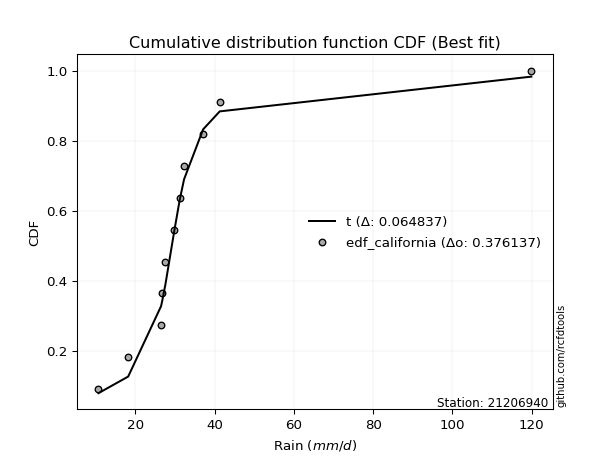</img>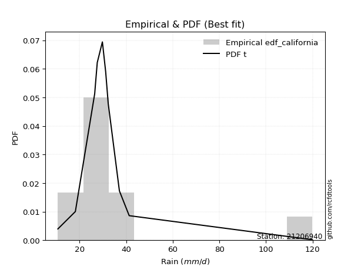</img>

</div>


### 2. Empirical - EDF Hazen (1930)

Hazen method for plotting positions is a formula used to estimate the empirical cumulative probability distribution of flood events or other hydrological data. This formula often results in biased estimations, particularly when extrapolating to extreme events (high return periods).

<div align="center">


$P=(m-0.5)/n$


</div>


**2.1. Empirical values**

<div align="center">

|                | 0                    | 1                   | 2                   | 3                  | 4                  | 5         | 6                  | 7                  | 8                  | 9                  | 10                 |
|:---------------|:---------------------|:--------------------|:--------------------|:-------------------|:-------------------|:----------|:-------------------|:-------------------|:-------------------|:-------------------|:-------------------|
| date           | 2004                 | 2011                | 2007                | 2005               | 2014               | 2012      | 2008               | 2009               | 2010               | 2013               | 2006               |
| x              | 10.7                 | 18.2                | 26.5                | 26.8               | 27.6               | 29.8      | 31.2               | 32.3               | 37.1               | 41.3               | 119.9              |
| m              | 1                    | 2                   | 3                   | 4                  | 5                  | 6         | 7                  | 8                  | 9                  | 10                 | 11                 |
| empirical_dist | edf_hazen            | edf_hazen           | edf_hazen           | edf_hazen          | edf_hazen          | edf_hazen | edf_hazen          | edf_hazen          | edf_hazen          | edf_hazen          | edf_hazen          |
| empirical      | 0.045454545454545456 | 0.13636363636363635 | 0.22727272727272727 | 0.3181818181818182 | 0.4090909090909091 | 0.5       | 0.5909090909090909 | 0.6818181818181818 | 0.7727272727272727 | 0.8636363636363636 | 0.9545454545454546 |
| empirical_tr   | 1.0476190476190477   | 1.1578947368421053  | 1.2941176470588236  | 1.4666666666666666 | 1.6923076923076925 | 2.0       | 2.4444444444444446 | 3.1428571428571423 | 4.3999999999999995 | 7.333333333333334  | 22.00000000000002  |

</div>


**2.2. Kolmogorov-Smirnov fit test (sorted by Δ)**


<div align="center">

|                | 0                   | 1                   | 2                   | 3                   | 4                     | 5                   | 6                   | 7                   | 8                   | 9                   | 10                  | 11                  | 12                  | 13                  | 14                  | 15                  | 16                  | 17                  | 18                  | 19                  | 20                  | 21                  | 22                  | 23                  | 24                  | 25                  | 26                  | 27                  | 28                  | 29                  | 30                  | 31                  | 32                  | 33                  | 34                  | 35                  | 36                  | 37                  | 38                  | 39                  | 40                  | 41                  | 42                  | 43                  | 44                  | 45                  | 46                  | 47                  | 48                  | 49                  | 50                  | 51                  | 52                  | 53                  | 54                  | 55                  | 56                  | 57                  | 58                  | 59                  | 60                  | 61                  | 62                  | 63                  | 64                  | 65                  | 66                  | 67                  | 68                  | 69                  | 70                  | 71                  | 72                  | 73                  | 74                  | 75                  | 76                  | 77                  | 78                  | 79                  | 80                  | 81                  | 82                  | 83                  | 84                  | 85                  | 86                  | 87                  | 88                  | 89                  |
|:---------------|:--------------------|:--------------------|:--------------------|:--------------------|:----------------------|:--------------------|:--------------------|:--------------------|:--------------------|:--------------------|:--------------------|:--------------------|:--------------------|:--------------------|:--------------------|:--------------------|:--------------------|:--------------------|:--------------------|:--------------------|:--------------------|:--------------------|:--------------------|:--------------------|:--------------------|:--------------------|:--------------------|:--------------------|:--------------------|:--------------------|:--------------------|:--------------------|:--------------------|:--------------------|:--------------------|:--------------------|:--------------------|:--------------------|:--------------------|:--------------------|:--------------------|:--------------------|:--------------------|:--------------------|:--------------------|:--------------------|:--------------------|:--------------------|:--------------------|:--------------------|:--------------------|:--------------------|:--------------------|:--------------------|:--------------------|:--------------------|:--------------------|:--------------------|:--------------------|:--------------------|:--------------------|:--------------------|:--------------------|:--------------------|:--------------------|:--------------------|:--------------------|:--------------------|:--------------------|:--------------------|:--------------------|:--------------------|:--------------------|:--------------------|:--------------------|:--------------------|:--------------------|:--------------------|:--------------------|:--------------------|:--------------------|:--------------------|:--------------------|:--------------------|:--------------------|:--------------------|:--------------------|:--------------------|:--------------------|:--------------------|
| station        | 21206940            | 21206940            | 21206940            | 21206940            | 21206940              | 21206940            | 21206940            | 21206940            | 21206940            | 21206940            | 21206940            | 21206940            | 21206940            | 21206940            | 21206940            | 21206940            | 21206940            | 21206940            | 21206940            | 21206940            | 21206940            | 21206940            | 21206940            | 21206940            | 21206940            | 21206940            | 21206940            | 21206940            | 21206940            | 21206940            | 21206940            | 21206940            | 21206940            | 21206940            | 21206940            | 21206940            | 21206940            | 21206940            | 21206940            | 21206940            | 21206940            | 21206940            | 21206940            | 21206940            | 21206940            | 21206940            | 21206940            | 21206940            | 21206940            | 21206940            | 21206940            | 21206940            | 21206940            | 21206940            | 21206940            | 21206940            | 21206940            | 21206940            | 21206940            | 21206940            | 21206940            | 21206940            | 21206940            | 21206940            | 21206940            | 21206940            | 21206940            | 21206940            | 21206940            | 21206940            | 21206940            | 21206940            | 21206940            | 21206940            | 21206940            | 21206940            | 21206940            | 21206940            | 21206940            | 21206940            | 21206940            | 21206940            | 21206940            | 21206940            | 21206940            | 21206940            | 21206940            | 21206940            | 21206940            | 21206940            |
| empirical_dist | edf_hazen           | edf_hazen           | edf_hazen           | edf_hazen           | edf_hazen             | edf_hazen           | edf_hazen           | edf_hazen           | edf_hazen           | edf_hazen           | edf_hazen           | edf_hazen           | edf_hazen           | edf_hazen           | edf_hazen           | edf_hazen           | edf_hazen           | edf_hazen           | edf_hazen           | edf_hazen           | edf_hazen           | edf_hazen           | edf_hazen           | edf_hazen           | edf_hazen           | edf_hazen           | edf_hazen           | edf_hazen           | edf_hazen           | edf_hazen           | edf_hazen           | edf_hazen           | edf_hazen           | edf_hazen           | edf_hazen           | edf_hazen           | edf_hazen           | edf_hazen           | edf_hazen           | edf_hazen           | edf_hazen           | edf_hazen           | edf_hazen           | edf_hazen           | edf_hazen           | edf_hazen           | edf_hazen           | edf_hazen           | edf_hazen           | edf_hazen           | edf_hazen           | edf_hazen           | edf_hazen           | edf_hazen           | edf_hazen           | edf_hazen           | edf_hazen           | edf_hazen           | edf_hazen           | edf_hazen           | edf_hazen           | edf_hazen           | edf_hazen           | edf_hazen           | edf_hazen           | edf_hazen           | edf_hazen           | edf_hazen           | edf_hazen           | edf_hazen           | edf_hazen           | edf_hazen           | edf_hazen           | edf_hazen           | edf_hazen           | edf_hazen           | edf_hazen           | edf_hazen           | edf_hazen           | edf_hazen           | edf_hazen           | edf_hazen           | edf_hazen           | edf_hazen           | edf_hazen           | edf_hazen           | edf_hazen           | edf_hazen           | edf_hazen           | edf_hazen           |
| p_dist         | johnsonsu           | logjohnsonsu        | logt                | t                   | loglaplace_asymmetric | loglaplace          | loghypsecant        | loglogistic         | exponnorm           | genlogistic         | logweibull_min      | mielke              | loggenlogistic      | logcrystalball      | lognorm             | lognorm             | logloggamma         | logfisk             | fisk                | logmielke           | nct                 | fatiguelife         | laplace_asymmetric  | invweibull          | logrice             | genexpon            | invgauss            | alpha               | invgamma            | f                   | ncf                 | betaprime           | loggamma            | loggamma            | logerlang           | logfatiguelife      | logf                | loginvgamma         | logbetaprime        | loginvgauss         | logalpha            | logexponnorm        | moyal               | logncf              | gamma               | lognct              | logmaxwell          | loggumbel_l         | truncnorm           | gibrat              | logpearson3         | halflogistic        | lograyleigh         | loggompertz         | gumbel_r            | gompertz            | logtruncnorm        | lognakagami         | loginvweibull       | halfnorm            | expon               | loggumbel_r         | chi2                | pareto              | logkstwobign        | wald                | kstwobign           | loggenexpon         | loghalfnorm         | rayleigh            | logmoyal            | maxwell             | pearson3            | loghalflogistic     | hypsecant           | laplace             | nakagami            | logistic            | crystalball         | norm                | weibull_min         | rice                | loggibrat           | logwald             | erlang              | logexpon            | gumbel_l            | logchi2             | loglognorm          | logpareto           |
| delta          | 0.05880931813364734 | 0.0736788890802497  | 0.07870906733989744 | 0.09990269138154054 | 0.11599322858366148   | 0.12346143469204032 | 0.1504850215509473  | 0.16095549728789035 | 0.16732851249613423 | 0.17056507595596226 | 0.17176797853643402 | 0.1726007497298899  | 0.17267379568109623 | 0.1737404061062914  | 0.1737404085146335  | 0.1737404085146335  | 0.1744739545600635  | 0.17589982546471103 | 0.17724583866424434 | 0.17763138137806353 | 0.18012347223709071 | 0.18370299519385577 | 0.1874543604345632  | 0.18756371215591458 | 0.18786014277284244 | 0.18840747814659223 | 0.18867250325891913 | 0.1906843499887049  | 0.1913903306807979  | 0.1915636103203969  | 0.1920289745265397  | 0.19218393733113806 | 0.1955541880674674  | 0.1955541880674674  | 0.195554268337682   | 0.19639085174514784 | 0.1977736909842537  | 0.19783385544943408 | 0.1986031251739174  | 0.1986818786584039  | 0.19873366986671218 | 0.20035958011461022 | 0.20110990091907488 | 0.20421917798086822 | 0.20540364553266685 | 0.20621406357498182 | 0.20777982776996304 | 0.20815378233993842 | 0.21311935949919517 | 0.21493966813064133 | 0.21622906681877727 | 0.21976581414139354 | 0.22007155763497013 | 0.22427954795097785 | 0.22524452461163702 | 0.225447108870105   | 0.2269403390520909  | 0.22907441059695519 | 0.22912060246610835 | 0.23008491773127315 | 0.23079755806379812 | 0.23370072415929846 | 0.23765769396702416 | 0.24351648606516643 | 0.24605917765194782 | 0.24625617110698775 | 0.2504510401476038  | 0.2535966890402208  | 0.2549298646646475  | 0.2560971911786053  | 0.2566634789446691  | 0.2652954705697028  | 0.2663998127330641  | 0.27063083068764904 | 0.27740226936600487 | 0.2786292155372725  | 0.282432640495362   | 0.2851114457640824  | 0.29432648831477126 | 0.29432649457148796 | 0.29512117890848966 | 0.2961858308175197  | 0.31318138467359924 | 0.3187154190955638  | 0.32127244434513014 | 0.3522879221580122  | 0.35903403695712954 | 0.4152021344805794  | 0.4611300247749238  | 0.5064496250507611  |
| deltao         | 0.37613735880099997 | 0.37613735880099997 | 0.37613735880099997 | 0.37613735880099997 | 0.37613735880099997   | 0.37613735880099997 | 0.37613735880099997 | 0.37613735880099997 | 0.37613735880099997 | 0.37613735880099997 | 0.37613735880099997 | 0.37613735880099997 | 0.37613735880099997 | 0.37613735880099997 | 0.37613735880099997 | 0.37613735880099997 | 0.37613735880099997 | 0.37613735880099997 | 0.37613735880099997 | 0.37613735880099997 | 0.37613735880099997 | 0.37613735880099997 | 0.37613735880099997 | 0.37613735880099997 | 0.37613735880099997 | 0.37613735880099997 | 0.37613735880099997 | 0.37613735880099997 | 0.37613735880099997 | 0.37613735880099997 | 0.37613735880099997 | 0.37613735880099997 | 0.37613735880099997 | 0.37613735880099997 | 0.37613735880099997 | 0.37613735880099997 | 0.37613735880099997 | 0.37613735880099997 | 0.37613735880099997 | 0.37613735880099997 | 0.37613735880099997 | 0.37613735880099997 | 0.37613735880099997 | 0.37613735880099997 | 0.37613735880099997 | 0.37613735880099997 | 0.37613735880099997 | 0.37613735880099997 | 0.37613735880099997 | 0.37613735880099997 | 0.37613735880099997 | 0.37613735880099997 | 0.37613735880099997 | 0.37613735880099997 | 0.37613735880099997 | 0.37613735880099997 | 0.37613735880099997 | 0.37613735880099997 | 0.37613735880099997 | 0.37613735880099997 | 0.37613735880099997 | 0.37613735880099997 | 0.37613735880099997 | 0.37613735880099997 | 0.37613735880099997 | 0.37613735880099997 | 0.37613735880099997 | 0.37613735880099997 | 0.37613735880099997 | 0.37613735880099997 | 0.37613735880099997 | 0.37613735880099997 | 0.37613735880099997 | 0.37613735880099997 | 0.37613735880099997 | 0.37613735880099997 | 0.37613735880099997 | 0.37613735880099997 | 0.37613735880099997 | 0.37613735880099997 | 0.37613735880099997 | 0.37613735880099997 | 0.37613735880099997 | 0.37613735880099997 | 0.37613735880099997 | 0.37613735880099997 | 0.37613735880099997 | 0.37613735880099997 | 0.37613735880099997 | 0.37613735880099997 |
| eval           | Δo > Δ              | Δo > Δ              | Δo > Δ              | Δo > Δ              | Δo > Δ                | Δo > Δ              | Δo > Δ              | Δo > Δ              | Δo > Δ              | Δo > Δ              | Δo > Δ              | Δo > Δ              | Δo > Δ              | Δo > Δ              | Δo > Δ              | Δo > Δ              | Δo > Δ              | Δo > Δ              | Δo > Δ              | Δo > Δ              | Δo > Δ              | Δo > Δ              | Δo > Δ              | Δo > Δ              | Δo > Δ              | Δo > Δ              | Δo > Δ              | Δo > Δ              | Δo > Δ              | Δo > Δ              | Δo > Δ              | Δo > Δ              | Δo > Δ              | Δo > Δ              | Δo > Δ              | Δo > Δ              | Δo > Δ              | Δo > Δ              | Δo > Δ              | Δo > Δ              | Δo > Δ              | Δo > Δ              | Δo > Δ              | Δo > Δ              | Δo > Δ              | Δo > Δ              | Δo > Δ              | Δo > Δ              | Δo > Δ              | Δo > Δ              | Δo > Δ              | Δo > Δ              | Δo > Δ              | Δo > Δ              | Δo > Δ              | Δo > Δ              | Δo > Δ              | Δo > Δ              | Δo > Δ              | Δo > Δ              | Δo > Δ              | Δo > Δ              | Δo > Δ              | Δo > Δ              | Δo > Δ              | Δo > Δ              | Δo > Δ              | Δo > Δ              | Δo > Δ              | Δo > Δ              | Δo > Δ              | Δo > Δ              | Δo > Δ              | Δo > Δ              | Δo > Δ              | Δo > Δ              | Δo > Δ              | Δo > Δ              | Δo > Δ              | Δo > Δ              | Δo > Δ              | Δo > Δ              | Δo > Δ              | Δo > Δ              | Δo > Δ              | Δo > Δ              | Δo > Δ              | Δo <= Δ             | Δo <= Δ             | Δo <= Δ             |
| fit            | 1                   | 1                   | 1                   | 1                   | 1                     | 1                   | 1                   | 1                   | 1                   | 1                   | 1                   | 1                   | 1                   | 1                   | 1                   | 1                   | 1                   | 1                   | 1                   | 1                   | 1                   | 1                   | 1                   | 1                   | 1                   | 1                   | 1                   | 1                   | 1                   | 1                   | 1                   | 1                   | 1                   | 1                   | 1                   | 1                   | 1                   | 1                   | 1                   | 1                   | 1                   | 1                   | 1                   | 1                   | 1                   | 1                   | 1                   | 1                   | 1                   | 1                   | 1                   | 1                   | 1                   | 1                   | 1                   | 1                   | 1                   | 1                   | 1                   | 1                   | 1                   | 1                   | 1                   | 1                   | 1                   | 1                   | 1                   | 1                   | 1                   | 1                   | 1                   | 1                   | 1                   | 1                   | 1                   | 1                   | 1                   | 1                   | 1                   | 1                   | 1                   | 1                   | 1                   | 1                   | 1                   | 1                   | 1                   | 0                   | 0                   | 0                   |
| n              | 11                  | 11                  | 11                  | 11                  | 11                    | 11                  | 11                  | 11                  | 11                  | 11                  | 11                  | 11                  | 11                  | 11                  | 11                  | 11                  | 11                  | 11                  | 11                  | 11                  | 11                  | 11                  | 11                  | 11                  | 11                  | 11                  | 11                  | 11                  | 11                  | 11                  | 11                  | 11                  | 11                  | 11                  | 11                  | 11                  | 11                  | 11                  | 11                  | 11                  | 11                  | 11                  | 11                  | 11                  | 11                  | 11                  | 11                  | 11                  | 11                  | 11                  | 11                  | 11                  | 11                  | 11                  | 11                  | 11                  | 11                  | 11                  | 11                  | 11                  | 11                  | 11                  | 11                  | 11                  | 11                  | 11                  | 11                  | 11                  | 11                  | 11                  | 11                  | 11                  | 11                  | 11                  | 11                  | 11                  | 11                  | 11                  | 11                  | 11                  | 11                  | 11                  | 11                  | 11                  | 11                  | 11                  | 11                  | 11                  | 11                  | 11                  |
| best_fit       | 1                   | 0                   | 0                   | 0                   | 0                     | 0                   | 0                   | 0                   | 0                   | 0                   | 0                   | 0                   | 0                   | 0                   | 0                   | 0                   | 0                   | 0                   | 0                   | 0                   | 0                   | 0                   | 0                   | 0                   | 0                   | 0                   | 0                   | 0                   | 0                   | 0                   | 0                   | 0                   | 0                   | 0                   | 0                   | 0                   | 0                   | 0                   | 0                   | 0                   | 0                   | 0                   | 0                   | 0                   | 0                   | 0                   | 0                   | 0                   | 0                   | 0                   | 0                   | 0                   | 0                   | 0                   | 0                   | 0                   | 0                   | 0                   | 0                   | 0                   | 0                   | 0                   | 0                   | 0                   | 0                   | 0                   | 0                   | 0                   | 0                   | 0                   | 0                   | 0                   | 0                   | 0                   | 0                   | 0                   | 0                   | 0                   | 0                   | 0                   | 0                   | 0                   | 0                   | 0                   | 0                   | 0                   | 0                   | 0                   | 0                   | 0                   |
| best_fit_sort  | 1                   | 2                   | 3                   | 4                   | 5                     | 6                   | 7                   | 8                   | 9                   | 10                  | 11                  | 12                  | 13                  | 14                  | 15                  | 16                  | 17                  | 18                  | 19                  | 20                  | 21                  | 22                  | 23                  | 24                  | 25                  | 26                  | 27                  | 28                  | 29                  | 30                  | 31                  | 32                  | 33                  | 34                  | 35                  | 36                  | 37                  | 38                  | 39                  | 40                  | 41                  | 42                  | 43                  | 44                  | 45                  | 46                  | 47                  | 48                  | 49                  | 50                  | 51                  | 52                  | 53                  | 54                  | 55                  | 56                  | 57                  | 58                  | 59                  | 60                  | 61                  | 62                  | 63                  | 64                  | 65                  | 66                  | 67                  | 68                  | 69                  | 70                  | 71                  | 72                  | 73                  | 74                  | 75                  | 76                  | 77                  | 78                  | 79                  | 80                  | 81                  | 82                  | 83                  | 84                  | 85                  | 86                  | 87                  | 88                  | 89                  | 90                  |

</div>


<div align="center">

</img>

</div>


**2.3. Best fit**

<div align="center">

|   id |   station | empirical_dist   | p_dist    |     delta |   deltao | eval   |   fit |   n |   best_fit |   best_fit_sort |
|-----:|----------:|:-----------------|:----------|----------:|---------:|:-------|------:|----:|-----------:|----------------:|
|    0 |  21206940 | edf_hazen        | johnsonsu | 0.0588093 | 0.376137 | Δo > Δ |     1 |  11 |          1 |               1 |

</div>


<div align="center">

</img></img>

</div>


### 3. Empirical - EDF Weibull (1939)

Weibull plotting position formula is an empirical method used to estimate the non-exceedance probability or plotting position for a set of observed data, is often recommended or widely used in practice, particularly in flood frequency analysis.

<div align="center">


$P=m/(n+1)$


</div>


**3.1. Empirical values**

<div align="center">

|                | 0                   | 1                   | 2                  | 3                  | 4                  | 5           | 6                  | 7                  | 8           | 9                  | 10                 |
|:---------------|:--------------------|:--------------------|:-------------------|:-------------------|:-------------------|:------------|:-------------------|:-------------------|:------------|:-------------------|:-------------------|
| date           | 2004                | 2011                | 2007               | 2005               | 2014               | 2012        | 2008               | 2009               | 2010        | 2013               | 2006               |
| x              | 10.7                | 18.2                | 26.5               | 26.8               | 27.6               | 29.8        | 31.2               | 32.3               | 37.1        | 41.3               | 119.9              |
| m              | 1                   | 2                   | 3                  | 4                  | 5                  | 6           | 7                  | 8                  | 9           | 10                 | 11                 |
| empirical_dist | edf_weibull         | edf_weibull         | edf_weibull        | edf_weibull        | edf_weibull        | edf_weibull | edf_weibull        | edf_weibull        | edf_weibull | edf_weibull        | edf_weibull        |
| empirical      | 0.08333333333333333 | 0.16666666666666666 | 0.25               | 0.3333333333333333 | 0.4166666666666667 | 0.5         | 0.5833333333333334 | 0.6666666666666666 | 0.75        | 0.8333333333333334 | 0.9166666666666666 |
| empirical_tr   | 1.090909090909091   | 1.2                 | 1.3333333333333333 | 1.4999999999999998 | 1.7142857142857144 | 2.0         | 2.4000000000000004 | 2.9999999999999996 | 4.0         | 6.000000000000002  | 11.999999999999995 |

</div>


**3.2. Kolmogorov-Smirnov fit test (sorted by Δ)**


<div align="center">

|                | 0                   | 1                   | 2                   | 3                   | 4                     | 5                   | 6                   | 7                   | 8                   | 9                   | 10                  | 11                  | 12                  | 13                  | 14                  | 15                  | 16                  | 17                  | 18                  | 19                  | 20                  | 21                  | 22                  | 23                  | 24                  | 25                  | 26                  | 27                  | 28                  | 29                  | 30                  | 31                  | 32                  | 33                  | 34                  | 35                  | 36                  | 37                  | 38                  | 39                  | 40                  | 41                  | 42                  | 43                  | 44                  | 45                  | 46                  | 47                  | 48                  | 49                  | 50                  | 51                  | 52                  | 53                  | 54                  | 55                  | 56                  | 57                  | 58                  | 59                  | 60                  | 61                  | 62                  | 63                  | 64                  | 65                  | 66                  | 67                  | 68                  | 69                  | 70                  | 71                  | 72                  | 73                  | 74                  | 75                  | 76                  | 77                  | 78                  | 79                  | 80                  | 81                  | 82                  | 83                  | 84                  | 85                  | 86                  | 87                  | 88                  | 89                  |
|:---------------|:--------------------|:--------------------|:--------------------|:--------------------|:----------------------|:--------------------|:--------------------|:--------------------|:--------------------|:--------------------|:--------------------|:--------------------|:--------------------|:--------------------|:--------------------|:--------------------|:--------------------|:--------------------|:--------------------|:--------------------|:--------------------|:--------------------|:--------------------|:--------------------|:--------------------|:--------------------|:--------------------|:--------------------|:--------------------|:--------------------|:--------------------|:--------------------|:--------------------|:--------------------|:--------------------|:--------------------|:--------------------|:--------------------|:--------------------|:--------------------|:--------------------|:--------------------|:--------------------|:--------------------|:--------------------|:--------------------|:--------------------|:--------------------|:--------------------|:--------------------|:--------------------|:--------------------|:--------------------|:--------------------|:--------------------|:--------------------|:--------------------|:--------------------|:--------------------|:--------------------|:--------------------|:--------------------|:--------------------|:--------------------|:--------------------|:--------------------|:--------------------|:--------------------|:--------------------|:--------------------|:--------------------|:--------------------|:--------------------|:--------------------|:--------------------|:--------------------|:--------------------|:--------------------|:--------------------|:--------------------|:--------------------|:--------------------|:--------------------|:--------------------|:--------------------|:--------------------|:--------------------|:--------------------|:--------------------|:--------------------|
| station        | 21206940            | 21206940            | 21206940            | 21206940            | 21206940              | 21206940            | 21206940            | 21206940            | 21206940            | 21206940            | 21206940            | 21206940            | 21206940            | 21206940            | 21206940            | 21206940            | 21206940            | 21206940            | 21206940            | 21206940            | 21206940            | 21206940            | 21206940            | 21206940            | 21206940            | 21206940            | 21206940            | 21206940            | 21206940            | 21206940            | 21206940            | 21206940            | 21206940            | 21206940            | 21206940            | 21206940            | 21206940            | 21206940            | 21206940            | 21206940            | 21206940            | 21206940            | 21206940            | 21206940            | 21206940            | 21206940            | 21206940            | 21206940            | 21206940            | 21206940            | 21206940            | 21206940            | 21206940            | 21206940            | 21206940            | 21206940            | 21206940            | 21206940            | 21206940            | 21206940            | 21206940            | 21206940            | 21206940            | 21206940            | 21206940            | 21206940            | 21206940            | 21206940            | 21206940            | 21206940            | 21206940            | 21206940            | 21206940            | 21206940            | 21206940            | 21206940            | 21206940            | 21206940            | 21206940            | 21206940            | 21206940            | 21206940            | 21206940            | 21206940            | 21206940            | 21206940            | 21206940            | 21206940            | 21206940            | 21206940            |
| empirical_dist | edf_weibull         | edf_weibull         | edf_weibull         | edf_weibull         | edf_weibull           | edf_weibull         | edf_weibull         | edf_weibull         | edf_weibull         | edf_weibull         | edf_weibull         | edf_weibull         | edf_weibull         | edf_weibull         | edf_weibull         | edf_weibull         | edf_weibull         | edf_weibull         | edf_weibull         | edf_weibull         | edf_weibull         | edf_weibull         | edf_weibull         | edf_weibull         | edf_weibull         | edf_weibull         | edf_weibull         | edf_weibull         | edf_weibull         | edf_weibull         | edf_weibull         | edf_weibull         | edf_weibull         | edf_weibull         | edf_weibull         | edf_weibull         | edf_weibull         | edf_weibull         | edf_weibull         | edf_weibull         | edf_weibull         | edf_weibull         | edf_weibull         | edf_weibull         | edf_weibull         | edf_weibull         | edf_weibull         | edf_weibull         | edf_weibull         | edf_weibull         | edf_weibull         | edf_weibull         | edf_weibull         | edf_weibull         | edf_weibull         | edf_weibull         | edf_weibull         | edf_weibull         | edf_weibull         | edf_weibull         | edf_weibull         | edf_weibull         | edf_weibull         | edf_weibull         | edf_weibull         | edf_weibull         | edf_weibull         | edf_weibull         | edf_weibull         | edf_weibull         | edf_weibull         | edf_weibull         | edf_weibull         | edf_weibull         | edf_weibull         | edf_weibull         | edf_weibull         | edf_weibull         | edf_weibull         | edf_weibull         | edf_weibull         | edf_weibull         | edf_weibull         | edf_weibull         | edf_weibull         | edf_weibull         | edf_weibull         | edf_weibull         | edf_weibull         | edf_weibull         |
| p_dist         | logt                | logjohnsonsu        | johnsonsu           | t                   | loglaplace_asymmetric | loglaplace          | loghypsecant        | loglogistic         | mielke              | loggenlogistic      | exponnorm           | logcrystalball      | lognorm             | lognorm             | logloggamma         | logfisk             | logweibull_min      | fisk                | logmielke           | genlogistic         | nct                 | fatiguelife         | invweibull          | logrice             | genexpon            | invgauss            | alpha               | invgamma            | f                   | ncf                 | betaprime           | laplace_asymmetric  | loggamma            | loggamma            | logerlang           | logfatiguelife      | logf                | loginvgamma         | logbetaprime        | loginvgauss         | logalpha            | logexponnorm        | moyal               | logncf              | gamma               | lognct              | logmaxwell          | truncnorm           | gibrat              | loggumbel_l         | logpearson3         | gumbel_r            | gompertz            | halflogistic        | lograyleigh         | halfnorm            | loggompertz         | logtruncnorm        | lognakagami         | loginvweibull       | expon               | loggumbel_r         | chi2                | pareto              | kstwobign           | logkstwobign        | wald                | rayleigh            | loggenexpon         | loghalfnorm         | logmoyal            | maxwell             | pearson3            | hypsecant           | loghalflogistic     | logistic            | nakagami            | laplace             | crystalball         | norm                | weibull_min         | rice                | loggibrat           | logwald             | erlang              | gumbel_l            | logexpon            | logchi2             | loglognorm          | logpareto           |
| delta          | 0.07231973819390783 | 0.07405287346097836 | 0.0795930747156999  | 0.08219086068381176 | 0.09326595585638875   | 0.10073416196476759 | 0.12775774882367458 | 0.13822822456061762 | 0.14987347700261716 | 0.1499465229538235  | 0.1509509635102897  | 0.15101313337901867 | 0.15101313578736075 | 0.15101313578736075 | 0.15174668183279078 | 0.1531725527374383  | 0.1541281515136986  | 0.1545185659369716  | 0.1549041086507908  | 0.15541356080444713 | 0.15739619950981798 | 0.16097572246658304 | 0.16483643942864185 | 0.1651328700455697  | 0.1656802054193195  | 0.1659452305316464  | 0.16795707726143216 | 0.16866305795352515 | 0.16883633759312416 | 0.16930170179926696 | 0.16945666460386533 | 0.17230284528304807 | 0.17282691534019468 | 0.17282691534019468 | 0.17282699561040926 | 0.1736635790178751  | 0.17504641825698097 | 0.17510658272216134 | 0.17587585244664466 | 0.17595460593113116 | 0.17600639713943944 | 0.17763230738733748 | 0.17792328576711747 | 0.1814919052535955  | 0.18267637280539412 | 0.18348679084770908 | 0.1850525550426903  | 0.19039208677192243 | 0.1922123954033686  | 0.19300226718842328 | 0.19350179409150453 | 0.19494149430860674 | 0.19514407856707472 | 0.1970385414141208  | 0.1973442849076974  | 0.19978188742824288 | 0.2015522752237051  | 0.20421306632481817 | 0.20634713786968245 | 0.20639332973883562 | 0.20807028533652538 | 0.21097345143202573 | 0.21493042123975142 | 0.2207892133378937  | 0.2231508804508916  | 0.22333190492467508 | 0.223528898379715   | 0.22579416087557502 | 0.2308694163129481  | 0.2322025919373748  | 0.23393620621739641 | 0.23499244026667254 | 0.24367254000579136 | 0.2470992390629746  | 0.24790355796037628 | 0.25480841546105215 | 0.2597053677680893  | 0.26347770038575735 | 0.264023458011741   | 0.2640234642684577  | 0.2648181486054594  | 0.2658828005144894  | 0.29045411194632653 | 0.29598814636829107 | 0.29854517161785743 | 0.32873100665409927 | 0.3295606494307395  | 0.3924748617533067  | 0.43082699447189354 | 0.4761465947477308  |
| deltao         | 0.37613735880099997 | 0.37613735880099997 | 0.37613735880099997 | 0.37613735880099997 | 0.37613735880099997   | 0.37613735880099997 | 0.37613735880099997 | 0.37613735880099997 | 0.37613735880099997 | 0.37613735880099997 | 0.37613735880099997 | 0.37613735880099997 | 0.37613735880099997 | 0.37613735880099997 | 0.37613735880099997 | 0.37613735880099997 | 0.37613735880099997 | 0.37613735880099997 | 0.37613735880099997 | 0.37613735880099997 | 0.37613735880099997 | 0.37613735880099997 | 0.37613735880099997 | 0.37613735880099997 | 0.37613735880099997 | 0.37613735880099997 | 0.37613735880099997 | 0.37613735880099997 | 0.37613735880099997 | 0.37613735880099997 | 0.37613735880099997 | 0.37613735880099997 | 0.37613735880099997 | 0.37613735880099997 | 0.37613735880099997 | 0.37613735880099997 | 0.37613735880099997 | 0.37613735880099997 | 0.37613735880099997 | 0.37613735880099997 | 0.37613735880099997 | 0.37613735880099997 | 0.37613735880099997 | 0.37613735880099997 | 0.37613735880099997 | 0.37613735880099997 | 0.37613735880099997 | 0.37613735880099997 | 0.37613735880099997 | 0.37613735880099997 | 0.37613735880099997 | 0.37613735880099997 | 0.37613735880099997 | 0.37613735880099997 | 0.37613735880099997 | 0.37613735880099997 | 0.37613735880099997 | 0.37613735880099997 | 0.37613735880099997 | 0.37613735880099997 | 0.37613735880099997 | 0.37613735880099997 | 0.37613735880099997 | 0.37613735880099997 | 0.37613735880099997 | 0.37613735880099997 | 0.37613735880099997 | 0.37613735880099997 | 0.37613735880099997 | 0.37613735880099997 | 0.37613735880099997 | 0.37613735880099997 | 0.37613735880099997 | 0.37613735880099997 | 0.37613735880099997 | 0.37613735880099997 | 0.37613735880099997 | 0.37613735880099997 | 0.37613735880099997 | 0.37613735880099997 | 0.37613735880099997 | 0.37613735880099997 | 0.37613735880099997 | 0.37613735880099997 | 0.37613735880099997 | 0.37613735880099997 | 0.37613735880099997 | 0.37613735880099997 | 0.37613735880099997 | 0.37613735880099997 |
| eval           | Δo > Δ              | Δo > Δ              | Δo > Δ              | Δo > Δ              | Δo > Δ                | Δo > Δ              | Δo > Δ              | Δo > Δ              | Δo > Δ              | Δo > Δ              | Δo > Δ              | Δo > Δ              | Δo > Δ              | Δo > Δ              | Δo > Δ              | Δo > Δ              | Δo > Δ              | Δo > Δ              | Δo > Δ              | Δo > Δ              | Δo > Δ              | Δo > Δ              | Δo > Δ              | Δo > Δ              | Δo > Δ              | Δo > Δ              | Δo > Δ              | Δo > Δ              | Δo > Δ              | Δo > Δ              | Δo > Δ              | Δo > Δ              | Δo > Δ              | Δo > Δ              | Δo > Δ              | Δo > Δ              | Δo > Δ              | Δo > Δ              | Δo > Δ              | Δo > Δ              | Δo > Δ              | Δo > Δ              | Δo > Δ              | Δo > Δ              | Δo > Δ              | Δo > Δ              | Δo > Δ              | Δo > Δ              | Δo > Δ              | Δo > Δ              | Δo > Δ              | Δo > Δ              | Δo > Δ              | Δo > Δ              | Δo > Δ              | Δo > Δ              | Δo > Δ              | Δo > Δ              | Δo > Δ              | Δo > Δ              | Δo > Δ              | Δo > Δ              | Δo > Δ              | Δo > Δ              | Δo > Δ              | Δo > Δ              | Δo > Δ              | Δo > Δ              | Δo > Δ              | Δo > Δ              | Δo > Δ              | Δo > Δ              | Δo > Δ              | Δo > Δ              | Δo > Δ              | Δo > Δ              | Δo > Δ              | Δo > Δ              | Δo > Δ              | Δo > Δ              | Δo > Δ              | Δo > Δ              | Δo > Δ              | Δo > Δ              | Δo > Δ              | Δo > Δ              | Δo > Δ              | Δo <= Δ             | Δo <= Δ             | Δo <= Δ             |
| fit            | 1                   | 1                   | 1                   | 1                   | 1                     | 1                   | 1                   | 1                   | 1                   | 1                   | 1                   | 1                   | 1                   | 1                   | 1                   | 1                   | 1                   | 1                   | 1                   | 1                   | 1                   | 1                   | 1                   | 1                   | 1                   | 1                   | 1                   | 1                   | 1                   | 1                   | 1                   | 1                   | 1                   | 1                   | 1                   | 1                   | 1                   | 1                   | 1                   | 1                   | 1                   | 1                   | 1                   | 1                   | 1                   | 1                   | 1                   | 1                   | 1                   | 1                   | 1                   | 1                   | 1                   | 1                   | 1                   | 1                   | 1                   | 1                   | 1                   | 1                   | 1                   | 1                   | 1                   | 1                   | 1                   | 1                   | 1                   | 1                   | 1                   | 1                   | 1                   | 1                   | 1                   | 1                   | 1                   | 1                   | 1                   | 1                   | 1                   | 1                   | 1                   | 1                   | 1                   | 1                   | 1                   | 1                   | 1                   | 0                   | 0                   | 0                   |
| n              | 11                  | 11                  | 11                  | 11                  | 11                    | 11                  | 11                  | 11                  | 11                  | 11                  | 11                  | 11                  | 11                  | 11                  | 11                  | 11                  | 11                  | 11                  | 11                  | 11                  | 11                  | 11                  | 11                  | 11                  | 11                  | 11                  | 11                  | 11                  | 11                  | 11                  | 11                  | 11                  | 11                  | 11                  | 11                  | 11                  | 11                  | 11                  | 11                  | 11                  | 11                  | 11                  | 11                  | 11                  | 11                  | 11                  | 11                  | 11                  | 11                  | 11                  | 11                  | 11                  | 11                  | 11                  | 11                  | 11                  | 11                  | 11                  | 11                  | 11                  | 11                  | 11                  | 11                  | 11                  | 11                  | 11                  | 11                  | 11                  | 11                  | 11                  | 11                  | 11                  | 11                  | 11                  | 11                  | 11                  | 11                  | 11                  | 11                  | 11                  | 11                  | 11                  | 11                  | 11                  | 11                  | 11                  | 11                  | 11                  | 11                  | 11                  |
| best_fit       | 1                   | 0                   | 0                   | 0                   | 0                     | 0                   | 0                   | 0                   | 0                   | 0                   | 0                   | 0                   | 0                   | 0                   | 0                   | 0                   | 0                   | 0                   | 0                   | 0                   | 0                   | 0                   | 0                   | 0                   | 0                   | 0                   | 0                   | 0                   | 0                   | 0                   | 0                   | 0                   | 0                   | 0                   | 0                   | 0                   | 0                   | 0                   | 0                   | 0                   | 0                   | 0                   | 0                   | 0                   | 0                   | 0                   | 0                   | 0                   | 0                   | 0                   | 0                   | 0                   | 0                   | 0                   | 0                   | 0                   | 0                   | 0                   | 0                   | 0                   | 0                   | 0                   | 0                   | 0                   | 0                   | 0                   | 0                   | 0                   | 0                   | 0                   | 0                   | 0                   | 0                   | 0                   | 0                   | 0                   | 0                   | 0                   | 0                   | 0                   | 0                   | 0                   | 0                   | 0                   | 0                   | 0                   | 0                   | 0                   | 0                   | 0                   |
| best_fit_sort  | 1                   | 2                   | 3                   | 4                   | 5                     | 6                   | 7                   | 8                   | 9                   | 10                  | 11                  | 12                  | 13                  | 14                  | 15                  | 16                  | 17                  | 18                  | 19                  | 20                  | 21                  | 22                  | 23                  | 24                  | 25                  | 26                  | 27                  | 28                  | 29                  | 30                  | 31                  | 32                  | 33                  | 34                  | 35                  | 36                  | 37                  | 38                  | 39                  | 40                  | 41                  | 42                  | 43                  | 44                  | 45                  | 46                  | 47                  | 48                  | 49                  | 50                  | 51                  | 52                  | 53                  | 54                  | 55                  | 56                  | 57                  | 58                  | 59                  | 60                  | 61                  | 62                  | 63                  | 64                  | 65                  | 66                  | 67                  | 68                  | 69                  | 70                  | 71                  | 72                  | 73                  | 74                  | 75                  | 76                  | 77                  | 78                  | 79                  | 80                  | 81                  | 82                  | 83                  | 84                  | 85                  | 86                  | 87                  | 88                  | 89                  | 90                  |

</div>


<div align="center">

</img>

</div>


**3.3. Best fit**

<div align="center">

|   id |   station | empirical_dist   | p_dist   |     delta |   deltao | eval   |   fit |   n |   best_fit |   best_fit_sort |
|-----:|----------:|:-----------------|:---------|----------:|---------:|:-------|------:|----:|-----------:|----------------:|
|    0 |  21206940 | edf_weibull      | logt     | 0.0723197 | 0.376137 | Δo > Δ |     1 |  11 |          1 |               1 |

</div>


<div align="center">

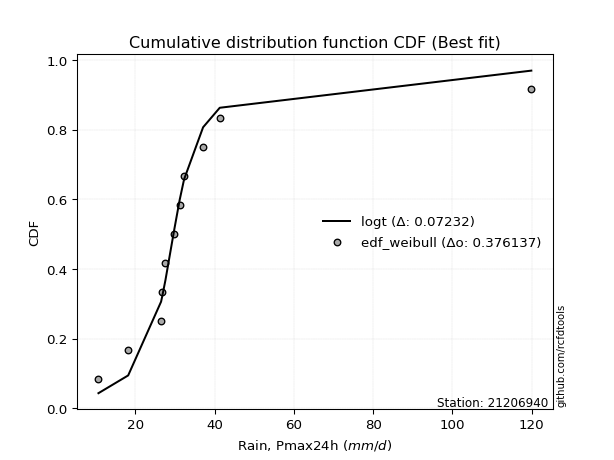</img>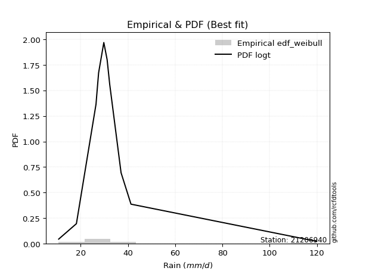</img>

</div>


### 4. Empirical - EDF Beard (1943)

The Beard formula (or Beard´s plotting position formula) in hydrology is used to estimate the empirical non-exceedance probability _(P)_ of a flood event (or other extreme hydrological data point) within a given dataset.

<div align="center">


$P=(m-0.31)/(n+0.38)$


</div>


**4.1. Empirical values**

<div align="center">

|                | 0                    | 1                 | 2                   | 3                  | 4                  | 5         | 6                  | 7                  | 8                  | 9                  | 10                 |
|:---------------|:---------------------|:------------------|:--------------------|:-------------------|:-------------------|:----------|:-------------------|:-------------------|:-------------------|:-------------------|:-------------------|
| date           | 2004                 | 2011              | 2007                | 2005               | 2014               | 2012      | 2008               | 2009               | 2010               | 2013               | 2006               |
| x              | 10.7                 | 18.2              | 26.5                | 26.8               | 27.6               | 29.8      | 31.2               | 32.3               | 37.1               | 41.3               | 119.9              |
| m              | 1                    | 2                 | 3                   | 4                  | 5                  | 6         | 7                  | 8                  | 9                  | 10                 | 11                 |
| empirical_dist | edf_beard            | edf_beard         | edf_beard           | edf_beard          | edf_beard          | edf_beard | edf_beard          | edf_beard          | edf_beard          | edf_beard          | edf_beard          |
| empirical      | 0.060632688927943754 | 0.148506151142355 | 0.23637961335676624 | 0.3242530755711775 | 0.4121265377855888 | 0.5       | 0.5878734622144113 | 0.6757469244288224 | 0.7636203866432336 | 0.8514938488576449 | 0.9393673110720562 |
| empirical_tr   | 1.0645463049579045   | 1.174406604747162 | 1.3095512082853855  | 1.4798439531859557 | 1.7010463378176381 | 2.0       | 2.4264392324093818 | 3.0840108401084008 | 4.230483271375462  | 6.733727810650883  | 16.49275362318839  |

</div>


**4.2. Kolmogorov-Smirnov fit test (sorted by Δ)**


<div align="center">

|                | 0                    | 1                   | 2                   | 3                   | 4                     | 5                   | 6                   | 7                   | 8                   | 9                   | 10                  | 11                  | 12                  | 13                  | 14                  | 15                  | 16                  | 17                  | 18                  | 19                  | 20                  | 21                  | 22                  | 23                  | 24                  | 25                  | 26                  | 27                  | 28                  | 29                  | 30                  | 31                  | 32                  | 33                  | 34                  | 35                  | 36                  | 37                  | 38                  | 39                  | 40                  | 41                  | 42                  | 43                  | 44                  | 45                  | 46                  | 47                  | 48                  | 49                  | 50                  | 51                  | 52                  | 53                  | 54                  | 55                  | 56                  | 57                  | 58                  | 59                  | 60                  | 61                  | 62                  | 63                  | 64                  | 65                  | 66                  | 67                  | 68                  | 69                  | 70                  | 71                  | 72                  | 73                  | 74                  | 75                  | 76                  | 77                  | 78                  | 79                  | 80                  | 81                  | 82                  | 83                  | 84                  | 85                  | 86                  | 87                  | 88                  | 89                  |
|:---------------|:---------------------|:--------------------|:--------------------|:--------------------|:----------------------|:--------------------|:--------------------|:--------------------|:--------------------|:--------------------|:--------------------|:--------------------|:--------------------|:--------------------|:--------------------|:--------------------|:--------------------|:--------------------|:--------------------|:--------------------|:--------------------|:--------------------|:--------------------|:--------------------|:--------------------|:--------------------|:--------------------|:--------------------|:--------------------|:--------------------|:--------------------|:--------------------|:--------------------|:--------------------|:--------------------|:--------------------|:--------------------|:--------------------|:--------------------|:--------------------|:--------------------|:--------------------|:--------------------|:--------------------|:--------------------|:--------------------|:--------------------|:--------------------|:--------------------|:--------------------|:--------------------|:--------------------|:--------------------|:--------------------|:--------------------|:--------------------|:--------------------|:--------------------|:--------------------|:--------------------|:--------------------|:--------------------|:--------------------|:--------------------|:--------------------|:--------------------|:--------------------|:--------------------|:--------------------|:--------------------|:--------------------|:--------------------|:--------------------|:--------------------|:--------------------|:--------------------|:--------------------|:--------------------|:--------------------|:--------------------|:--------------------|:--------------------|:--------------------|:--------------------|:--------------------|:--------------------|:--------------------|:--------------------|:--------------------|:--------------------|
| station        | 21206940             | 21206940            | 21206940            | 21206940            | 21206940              | 21206940            | 21206940            | 21206940            | 21206940            | 21206940            | 21206940            | 21206940            | 21206940            | 21206940            | 21206940            | 21206940            | 21206940            | 21206940            | 21206940            | 21206940            | 21206940            | 21206940            | 21206940            | 21206940            | 21206940            | 21206940            | 21206940            | 21206940            | 21206940            | 21206940            | 21206940            | 21206940            | 21206940            | 21206940            | 21206940            | 21206940            | 21206940            | 21206940            | 21206940            | 21206940            | 21206940            | 21206940            | 21206940            | 21206940            | 21206940            | 21206940            | 21206940            | 21206940            | 21206940            | 21206940            | 21206940            | 21206940            | 21206940            | 21206940            | 21206940            | 21206940            | 21206940            | 21206940            | 21206940            | 21206940            | 21206940            | 21206940            | 21206940            | 21206940            | 21206940            | 21206940            | 21206940            | 21206940            | 21206940            | 21206940            | 21206940            | 21206940            | 21206940            | 21206940            | 21206940            | 21206940            | 21206940            | 21206940            | 21206940            | 21206940            | 21206940            | 21206940            | 21206940            | 21206940            | 21206940            | 21206940            | 21206940            | 21206940            | 21206940            | 21206940            |
| empirical_dist | edf_beard            | edf_beard           | edf_beard           | edf_beard           | edf_beard             | edf_beard           | edf_beard           | edf_beard           | edf_beard           | edf_beard           | edf_beard           | edf_beard           | edf_beard           | edf_beard           | edf_beard           | edf_beard           | edf_beard           | edf_beard           | edf_beard           | edf_beard           | edf_beard           | edf_beard           | edf_beard           | edf_beard           | edf_beard           | edf_beard           | edf_beard           | edf_beard           | edf_beard           | edf_beard           | edf_beard           | edf_beard           | edf_beard           | edf_beard           | edf_beard           | edf_beard           | edf_beard           | edf_beard           | edf_beard           | edf_beard           | edf_beard           | edf_beard           | edf_beard           | edf_beard           | edf_beard           | edf_beard           | edf_beard           | edf_beard           | edf_beard           | edf_beard           | edf_beard           | edf_beard           | edf_beard           | edf_beard           | edf_beard           | edf_beard           | edf_beard           | edf_beard           | edf_beard           | edf_beard           | edf_beard           | edf_beard           | edf_beard           | edf_beard           | edf_beard           | edf_beard           | edf_beard           | edf_beard           | edf_beard           | edf_beard           | edf_beard           | edf_beard           | edf_beard           | edf_beard           | edf_beard           | edf_beard           | edf_beard           | edf_beard           | edf_beard           | edf_beard           | edf_beard           | edf_beard           | edf_beard           | edf_beard           | edf_beard           | edf_beard           | edf_beard           | edf_beard           | edf_beard           | edf_beard           |
| p_dist         | johnsonsu            | logjohnsonsu        | logt                | t                   | loglaplace_asymmetric | loglaplace          | loghypsecant        | loglogistic         | exponnorm           | logweibull_min      | mielke              | loggenlogistic      | genlogistic         | logcrystalball      | lognorm             | lognorm             | logloggamma         | logfisk             | fisk                | logmielke           | nct                 | fatiguelife         | invweibull          | logrice             | genexpon            | invgauss            | laplace_asymmetric  | alpha               | invgamma            | f                   | ncf                 | betaprime           | loggamma            | loggamma            | logerlang           | logfatiguelife      | logf                | loginvgamma         | logbetaprime        | loginvgauss         | logalpha            | logexponnorm        | moyal               | logncf              | gamma               | lognct              | logmaxwell          | loggumbel_l         | truncnorm           | gibrat              | logpearson3         | halflogistic        | lograyleigh         | gumbel_r            | gompertz            | loggompertz         | logtruncnorm        | halfnorm            | lognakagami         | loginvweibull       | expon               | loggumbel_r         | chi2                | pareto              | logkstwobign        | wald                | kstwobign           | rayleigh            | loggenexpon         | loghalfnorm         | logmoyal            | maxwell             | pearson3            | loghalflogistic     | hypsecant           | laplace             | logistic            | nakagami            | crystalball         | norm                | weibull_min         | rice                | loggibrat           | logwald             | erlang              | logexpon            | gumbel_l            | logchi2             | loglognorm          | logpareto           |
| delta          | 0.061432559191388236 | 0.06457200299621071 | 0.06960218125585846 | 0.09079580529750156 | 0.1068863424996225    | 0.11435454860800134 | 0.14137813546690833 | 0.15184861120385137 | 0.1600312212724455  | 0.16266109245239505 | 0.16349386364585092 | 0.16356690959705725 | 0.16449381856660295 | 0.16463352002225243 | 0.1646335224305945  | 0.1646335224305945  | 0.16536706847602453 | 0.16679293938067205 | 0.16813895258020536 | 0.16852449529402455 | 0.17101658615305174 | 0.1745961091098168  | 0.1784568260718756  | 0.17875325668880346 | 0.17930059206255325 | 0.17956561717488015 | 0.1813831030452039  | 0.18157746390466592 | 0.1822834445967589  | 0.18245672423635792 | 0.1829220884425007  | 0.18307705124709908 | 0.18644730198342843 | 0.18644730198342843 | 0.18644738225364302 | 0.18728396566110886 | 0.18866680490021473 | 0.1887269693653951  | 0.18949623908987842 | 0.18957499257436491 | 0.1896267837826732  | 0.19125269403057124 | 0.19154367241035122 | 0.19511229189682924 | 0.19629675944862787 | 0.19710717749094284 | 0.19867294168592406 | 0.2020825249505791  | 0.2040124734151562  | 0.20583278204660235 | 0.2071221807347383  | 0.21065892805735456 | 0.21096467155093115 | 0.21310200983291827 | 0.21330459409138625 | 0.21517266186693887 | 0.21783345296805193 | 0.2179424029525544  | 0.2199675245129162  | 0.22001371638206937 | 0.22169067197975914 | 0.22459383807525948 | 0.22855080788298518 | 0.23440959998112745 | 0.23695229156790884 | 0.23714928502294877 | 0.23830852536888503 | 0.24395467639988655 | 0.24448980295618186 | 0.24582297858060856 | 0.24755659286063017 | 0.25315295579098407 | 0.25729292664902514 | 0.26152394460361006 | 0.2652597545872861  | 0.27255795814791317 | 0.2729689309853637  | 0.273325754411323   | 0.2821839735360525  | 0.2821839797927692  | 0.2829786641297709  | 0.28404331603880095 | 0.30407449858956026 | 0.3096085330115248  | 0.31216555826109116 | 0.3431810360739732  | 0.3468915221784108  | 0.40609524839654043 | 0.4489875099962052  | 0.49430711027204244 |
| deltao         | 0.37613735880099997  | 0.37613735880099997 | 0.37613735880099997 | 0.37613735880099997 | 0.37613735880099997   | 0.37613735880099997 | 0.37613735880099997 | 0.37613735880099997 | 0.37613735880099997 | 0.37613735880099997 | 0.37613735880099997 | 0.37613735880099997 | 0.37613735880099997 | 0.37613735880099997 | 0.37613735880099997 | 0.37613735880099997 | 0.37613735880099997 | 0.37613735880099997 | 0.37613735880099997 | 0.37613735880099997 | 0.37613735880099997 | 0.37613735880099997 | 0.37613735880099997 | 0.37613735880099997 | 0.37613735880099997 | 0.37613735880099997 | 0.37613735880099997 | 0.37613735880099997 | 0.37613735880099997 | 0.37613735880099997 | 0.37613735880099997 | 0.37613735880099997 | 0.37613735880099997 | 0.37613735880099997 | 0.37613735880099997 | 0.37613735880099997 | 0.37613735880099997 | 0.37613735880099997 | 0.37613735880099997 | 0.37613735880099997 | 0.37613735880099997 | 0.37613735880099997 | 0.37613735880099997 | 0.37613735880099997 | 0.37613735880099997 | 0.37613735880099997 | 0.37613735880099997 | 0.37613735880099997 | 0.37613735880099997 | 0.37613735880099997 | 0.37613735880099997 | 0.37613735880099997 | 0.37613735880099997 | 0.37613735880099997 | 0.37613735880099997 | 0.37613735880099997 | 0.37613735880099997 | 0.37613735880099997 | 0.37613735880099997 | 0.37613735880099997 | 0.37613735880099997 | 0.37613735880099997 | 0.37613735880099997 | 0.37613735880099997 | 0.37613735880099997 | 0.37613735880099997 | 0.37613735880099997 | 0.37613735880099997 | 0.37613735880099997 | 0.37613735880099997 | 0.37613735880099997 | 0.37613735880099997 | 0.37613735880099997 | 0.37613735880099997 | 0.37613735880099997 | 0.37613735880099997 | 0.37613735880099997 | 0.37613735880099997 | 0.37613735880099997 | 0.37613735880099997 | 0.37613735880099997 | 0.37613735880099997 | 0.37613735880099997 | 0.37613735880099997 | 0.37613735880099997 | 0.37613735880099997 | 0.37613735880099997 | 0.37613735880099997 | 0.37613735880099997 | 0.37613735880099997 |
| eval           | Δo > Δ               | Δo > Δ              | Δo > Δ              | Δo > Δ              | Δo > Δ                | Δo > Δ              | Δo > Δ              | Δo > Δ              | Δo > Δ              | Δo > Δ              | Δo > Δ              | Δo > Δ              | Δo > Δ              | Δo > Δ              | Δo > Δ              | Δo > Δ              | Δo > Δ              | Δo > Δ              | Δo > Δ              | Δo > Δ              | Δo > Δ              | Δo > Δ              | Δo > Δ              | Δo > Δ              | Δo > Δ              | Δo > Δ              | Δo > Δ              | Δo > Δ              | Δo > Δ              | Δo > Δ              | Δo > Δ              | Δo > Δ              | Δo > Δ              | Δo > Δ              | Δo > Δ              | Δo > Δ              | Δo > Δ              | Δo > Δ              | Δo > Δ              | Δo > Δ              | Δo > Δ              | Δo > Δ              | Δo > Δ              | Δo > Δ              | Δo > Δ              | Δo > Δ              | Δo > Δ              | Δo > Δ              | Δo > Δ              | Δo > Δ              | Δo > Δ              | Δo > Δ              | Δo > Δ              | Δo > Δ              | Δo > Δ              | Δo > Δ              | Δo > Δ              | Δo > Δ              | Δo > Δ              | Δo > Δ              | Δo > Δ              | Δo > Δ              | Δo > Δ              | Δo > Δ              | Δo > Δ              | Δo > Δ              | Δo > Δ              | Δo > Δ              | Δo > Δ              | Δo > Δ              | Δo > Δ              | Δo > Δ              | Δo > Δ              | Δo > Δ              | Δo > Δ              | Δo > Δ              | Δo > Δ              | Δo > Δ              | Δo > Δ              | Δo > Δ              | Δo > Δ              | Δo > Δ              | Δo > Δ              | Δo > Δ              | Δo > Δ              | Δo > Δ              | Δo > Δ              | Δo <= Δ             | Δo <= Δ             | Δo <= Δ             |
| fit            | 1                    | 1                   | 1                   | 1                   | 1                     | 1                   | 1                   | 1                   | 1                   | 1                   | 1                   | 1                   | 1                   | 1                   | 1                   | 1                   | 1                   | 1                   | 1                   | 1                   | 1                   | 1                   | 1                   | 1                   | 1                   | 1                   | 1                   | 1                   | 1                   | 1                   | 1                   | 1                   | 1                   | 1                   | 1                   | 1                   | 1                   | 1                   | 1                   | 1                   | 1                   | 1                   | 1                   | 1                   | 1                   | 1                   | 1                   | 1                   | 1                   | 1                   | 1                   | 1                   | 1                   | 1                   | 1                   | 1                   | 1                   | 1                   | 1                   | 1                   | 1                   | 1                   | 1                   | 1                   | 1                   | 1                   | 1                   | 1                   | 1                   | 1                   | 1                   | 1                   | 1                   | 1                   | 1                   | 1                   | 1                   | 1                   | 1                   | 1                   | 1                   | 1                   | 1                   | 1                   | 1                   | 1                   | 1                   | 0                   | 0                   | 0                   |
| n              | 11                   | 11                  | 11                  | 11                  | 11                    | 11                  | 11                  | 11                  | 11                  | 11                  | 11                  | 11                  | 11                  | 11                  | 11                  | 11                  | 11                  | 11                  | 11                  | 11                  | 11                  | 11                  | 11                  | 11                  | 11                  | 11                  | 11                  | 11                  | 11                  | 11                  | 11                  | 11                  | 11                  | 11                  | 11                  | 11                  | 11                  | 11                  | 11                  | 11                  | 11                  | 11                  | 11                  | 11                  | 11                  | 11                  | 11                  | 11                  | 11                  | 11                  | 11                  | 11                  | 11                  | 11                  | 11                  | 11                  | 11                  | 11                  | 11                  | 11                  | 11                  | 11                  | 11                  | 11                  | 11                  | 11                  | 11                  | 11                  | 11                  | 11                  | 11                  | 11                  | 11                  | 11                  | 11                  | 11                  | 11                  | 11                  | 11                  | 11                  | 11                  | 11                  | 11                  | 11                  | 11                  | 11                  | 11                  | 11                  | 11                  | 11                  |
| best_fit       | 1                    | 0                   | 0                   | 0                   | 0                     | 0                   | 0                   | 0                   | 0                   | 0                   | 0                   | 0                   | 0                   | 0                   | 0                   | 0                   | 0                   | 0                   | 0                   | 0                   | 0                   | 0                   | 0                   | 0                   | 0                   | 0                   | 0                   | 0                   | 0                   | 0                   | 0                   | 0                   | 0                   | 0                   | 0                   | 0                   | 0                   | 0                   | 0                   | 0                   | 0                   | 0                   | 0                   | 0                   | 0                   | 0                   | 0                   | 0                   | 0                   | 0                   | 0                   | 0                   | 0                   | 0                   | 0                   | 0                   | 0                   | 0                   | 0                   | 0                   | 0                   | 0                   | 0                   | 0                   | 0                   | 0                   | 0                   | 0                   | 0                   | 0                   | 0                   | 0                   | 0                   | 0                   | 0                   | 0                   | 0                   | 0                   | 0                   | 0                   | 0                   | 0                   | 0                   | 0                   | 0                   | 0                   | 0                   | 0                   | 0                   | 0                   |
| best_fit_sort  | 1                    | 2                   | 3                   | 4                   | 5                     | 6                   | 7                   | 8                   | 9                   | 10                  | 11                  | 12                  | 13                  | 14                  | 15                  | 16                  | 17                  | 18                  | 19                  | 20                  | 21                  | 22                  | 23                  | 24                  | 25                  | 26                  | 27                  | 28                  | 29                  | 30                  | 31                  | 32                  | 33                  | 34                  | 35                  | 36                  | 37                  | 38                  | 39                  | 40                  | 41                  | 42                  | 43                  | 44                  | 45                  | 46                  | 47                  | 48                  | 49                  | 50                  | 51                  | 52                  | 53                  | 54                  | 55                  | 56                  | 57                  | 58                  | 59                  | 60                  | 61                  | 62                  | 63                  | 64                  | 65                  | 66                  | 67                  | 68                  | 69                  | 70                  | 71                  | 72                  | 73                  | 74                  | 75                  | 76                  | 77                  | 78                  | 79                  | 80                  | 81                  | 82                  | 83                  | 84                  | 85                  | 86                  | 87                  | 88                  | 89                  | 90                  |

</div>


<div align="center">

</img>

</div>


**4.3. Best fit**

<div align="center">

|   id |   station | empirical_dist   | p_dist    |     delta |   deltao | eval   |   fit |   n |   best_fit |   best_fit_sort |
|-----:|----------:|:-----------------|:----------|----------:|---------:|:-------|------:|----:|-----------:|----------------:|
|    0 |  21206940 | edf_beard        | johnsonsu | 0.0614326 | 0.376137 | Δo > Δ |     1 |  11 |          1 |               1 |

</div>


<div align="center">

</img>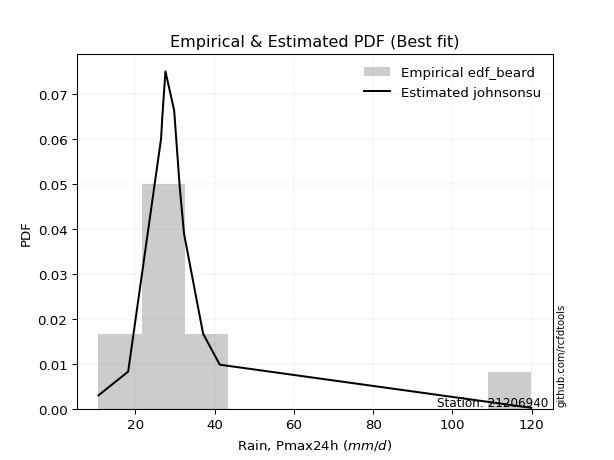</img>

</div>


### 5. Empirical - EDF Chegodayev (1955)

The Chegodayev formula is an empirical plotting position formula used in hydrological frequency analysis to estimate the exceedance probability or return period of a specific event from a set of observed data. It is primarily used for plotting observed data points on probability paper to fit a theoretical distribution, particularly for analyzing extreme events like maximum flood flows or rainfall intensities. The constant _b_ value in the generalized plotting position formula is 0.3.

<div align="center">


$P=(m-b)/(n+1-2b)$


</div>


**5.1. Empirical values**

<div align="center">

|                | 0                   | 1                   | 2                  | 3                   | 4                   | 5              | 6                  | 7                  | 8                  | 9                 | 10                 |
|:---------------|:--------------------|:--------------------|:-------------------|:--------------------|:--------------------|:---------------|:-------------------|:-------------------|:-------------------|:------------------|:-------------------|
| date           | 2004                | 2011                | 2007               | 2005                | 2014                | 2012           | 2008               | 2009               | 2010               | 2013              | 2006               |
| x              | 10.7                | 18.2                | 26.5               | 26.8                | 27.6                | 29.8           | 31.2               | 32.3               | 37.1               | 41.3              | 119.9              |
| m              | 1                   | 2                   | 3                  | 4                   | 5                   | 6              | 7                  | 8                  | 9                  | 10                | 11                 |
| empirical_dist | edf_chegodayev      | edf_chegodayev      | edf_chegodayev     | edf_chegodayev      | edf_chegodayev      | edf_chegodayev | edf_chegodayev     | edf_chegodayev     | edf_chegodayev     | edf_chegodayev    | edf_chegodayev     |
| empirical      | 0.06140350877192982 | 0.14912280701754385 | 0.2368421052631579 | 0.32456140350877194 | 0.41228070175438597 | 0.5            | 0.5877192982456141 | 0.6754385964912281 | 0.763157894736842  | 0.850877192982456 | 0.9385964912280701 |
| empirical_tr   | 1.0654205607476634  | 1.175257731958763   | 1.310344827586207  | 1.4805194805194806  | 1.7014925373134326  | 2.0            | 2.425531914893617  | 3.081081081081081  | 4.2222222222222205 | 6.70588235294117  | 16.285714285714263 |

</div>


**5.2. Kolmogorov-Smirnov fit test (sorted by Δ)**


<div align="center">

|                | 0                    | 1                   | 2                   | 3                   | 4                     | 5                   | 6                   | 7                   | 8                   | 9                   | 10                  | 11                  | 12                  | 13                  | 14                  | 15                  | 16                  | 17                  | 18                  | 19                  | 20                  | 21                  | 22                  | 23                  | 24                  | 25                  | 26                  | 27                  | 28                  | 29                  | 30                  | 31                  | 32                  | 33                  | 34                  | 35                  | 36                  | 37                  | 38                  | 39                  | 40                  | 41                  | 42                  | 43                  | 44                  | 45                  | 46                  | 47                  | 48                  | 49                  | 50                  | 51                  | 52                  | 53                  | 54                  | 55                  | 56                  | 57                  | 58                  | 59                  | 60                  | 61                  | 62                  | 63                  | 64                  | 65                  | 66                  | 67                  | 68                  | 69                  | 70                  | 71                  | 72                  | 73                  | 74                  | 75                  | 76                  | 77                  | 78                  | 79                  | 80                  | 81                  | 82                  | 83                  | 84                  | 85                  | 86                  | 87                  | 88                  | 89                  |
|:---------------|:---------------------|:--------------------|:--------------------|:--------------------|:----------------------|:--------------------|:--------------------|:--------------------|:--------------------|:--------------------|:--------------------|:--------------------|:--------------------|:--------------------|:--------------------|:--------------------|:--------------------|:--------------------|:--------------------|:--------------------|:--------------------|:--------------------|:--------------------|:--------------------|:--------------------|:--------------------|:--------------------|:--------------------|:--------------------|:--------------------|:--------------------|:--------------------|:--------------------|:--------------------|:--------------------|:--------------------|:--------------------|:--------------------|:--------------------|:--------------------|:--------------------|:--------------------|:--------------------|:--------------------|:--------------------|:--------------------|:--------------------|:--------------------|:--------------------|:--------------------|:--------------------|:--------------------|:--------------------|:--------------------|:--------------------|:--------------------|:--------------------|:--------------------|:--------------------|:--------------------|:--------------------|:--------------------|:--------------------|:--------------------|:--------------------|:--------------------|:--------------------|:--------------------|:--------------------|:--------------------|:--------------------|:--------------------|:--------------------|:--------------------|:--------------------|:--------------------|:--------------------|:--------------------|:--------------------|:--------------------|:--------------------|:--------------------|:--------------------|:--------------------|:--------------------|:--------------------|:--------------------|:--------------------|:--------------------|:--------------------|
| station        | 21206940             | 21206940            | 21206940            | 21206940            | 21206940              | 21206940            | 21206940            | 21206940            | 21206940            | 21206940            | 21206940            | 21206940            | 21206940            | 21206940            | 21206940            | 21206940            | 21206940            | 21206940            | 21206940            | 21206940            | 21206940            | 21206940            | 21206940            | 21206940            | 21206940            | 21206940            | 21206940            | 21206940            | 21206940            | 21206940            | 21206940            | 21206940            | 21206940            | 21206940            | 21206940            | 21206940            | 21206940            | 21206940            | 21206940            | 21206940            | 21206940            | 21206940            | 21206940            | 21206940            | 21206940            | 21206940            | 21206940            | 21206940            | 21206940            | 21206940            | 21206940            | 21206940            | 21206940            | 21206940            | 21206940            | 21206940            | 21206940            | 21206940            | 21206940            | 21206940            | 21206940            | 21206940            | 21206940            | 21206940            | 21206940            | 21206940            | 21206940            | 21206940            | 21206940            | 21206940            | 21206940            | 21206940            | 21206940            | 21206940            | 21206940            | 21206940            | 21206940            | 21206940            | 21206940            | 21206940            | 21206940            | 21206940            | 21206940            | 21206940            | 21206940            | 21206940            | 21206940            | 21206940            | 21206940            | 21206940            |
| empirical_dist | edf_chegodayev       | edf_chegodayev      | edf_chegodayev      | edf_chegodayev      | edf_chegodayev        | edf_chegodayev      | edf_chegodayev      | edf_chegodayev      | edf_chegodayev      | edf_chegodayev      | edf_chegodayev      | edf_chegodayev      | edf_chegodayev      | edf_chegodayev      | edf_chegodayev      | edf_chegodayev      | edf_chegodayev      | edf_chegodayev      | edf_chegodayev      | edf_chegodayev      | edf_chegodayev      | edf_chegodayev      | edf_chegodayev      | edf_chegodayev      | edf_chegodayev      | edf_chegodayev      | edf_chegodayev      | edf_chegodayev      | edf_chegodayev      | edf_chegodayev      | edf_chegodayev      | edf_chegodayev      | edf_chegodayev      | edf_chegodayev      | edf_chegodayev      | edf_chegodayev      | edf_chegodayev      | edf_chegodayev      | edf_chegodayev      | edf_chegodayev      | edf_chegodayev      | edf_chegodayev      | edf_chegodayev      | edf_chegodayev      | edf_chegodayev      | edf_chegodayev      | edf_chegodayev      | edf_chegodayev      | edf_chegodayev      | edf_chegodayev      | edf_chegodayev      | edf_chegodayev      | edf_chegodayev      | edf_chegodayev      | edf_chegodayev      | edf_chegodayev      | edf_chegodayev      | edf_chegodayev      | edf_chegodayev      | edf_chegodayev      | edf_chegodayev      | edf_chegodayev      | edf_chegodayev      | edf_chegodayev      | edf_chegodayev      | edf_chegodayev      | edf_chegodayev      | edf_chegodayev      | edf_chegodayev      | edf_chegodayev      | edf_chegodayev      | edf_chegodayev      | edf_chegodayev      | edf_chegodayev      | edf_chegodayev      | edf_chegodayev      | edf_chegodayev      | edf_chegodayev      | edf_chegodayev      | edf_chegodayev      | edf_chegodayev      | edf_chegodayev      | edf_chegodayev      | edf_chegodayev      | edf_chegodayev      | edf_chegodayev      | edf_chegodayev      | edf_chegodayev      | edf_chegodayev      | edf_chegodayev      |
| p_dist         | johnsonsu            | logjohnsonsu        | logt                | t                   | loglaplace_asymmetric | loglaplace          | loghypsecant        | loglogistic         | exponnorm           | logweibull_min      | mielke              | loggenlogistic      | logcrystalball      | lognorm             | lognorm             | genlogistic         | logloggamma         | logfisk             | fisk                | logmielke           | nct                 | fatiguelife         | invweibull          | logrice             | genexpon            | invgauss            | laplace_asymmetric  | alpha               | invgamma            | f                   | ncf                 | betaprime           | loggamma            | loggamma            | logerlang           | logfatiguelife      | logf                | loginvgamma         | logbetaprime        | loginvgauss         | logalpha            | logexponnorm        | moyal               | logncf              | gamma               | lognct              | logmaxwell          | loggumbel_l         | truncnorm           | gibrat              | logpearson3         | halflogistic        | lograyleigh         | gumbel_r            | gompertz            | loggompertz         | halfnorm            | logtruncnorm        | lognakagami         | loginvweibull       | expon               | loggumbel_r         | chi2                | pareto              | logkstwobign        | wald                | kstwobign           | rayleigh            | loggenexpon         | loghalfnorm         | logmoyal            | maxwell             | pearson3            | loghalflogistic     | hypsecant           | laplace             | logistic            | nakagami            | crystalball         | norm                | weibull_min         | rice                | loggibrat           | logwald             | erlang              | logexpon            | gumbel_l            | logchi2             | loglognorm          | logpareto           |
| delta          | 0.062049215066577096 | 0.06410951108981905 | 0.06913968934946679 | 0.09033331339110989 | 0.10642385059323084   | 0.11389205670160968 | 0.14091564356051667 | 0.1513861192974597  | 0.15972289333485112 | 0.16219860054600338 | 0.16303137173945925 | 0.16310441769066558 | 0.16417102811586076 | 0.16417103052420284 | 0.16417103052420284 | 0.16418549062900856 | 0.16490457656963287 | 0.16633044747428039 | 0.1676764606738137  | 0.16806200338763289 | 0.17055409424666007 | 0.17413361720342513 | 0.17799433416548394 | 0.1782907647824118  | 0.17883810015616158 | 0.17910312526848848 | 0.1810747751076095  | 0.18111497199827425 | 0.18182095269036724 | 0.18199423232996625 | 0.18245959653610905 | 0.18261455934070742 | 0.18598481007703677 | 0.18598481007703677 | 0.18598489034725135 | 0.1868214737547172  | 0.18820431299382306 | 0.18826447745900343 | 0.18903374718348676 | 0.18911250066797325 | 0.18916429187628153 | 0.19079020212417958 | 0.19108118050395956 | 0.19464979999043758 | 0.1958342675422362  | 0.19664468558455117 | 0.1982104497795324  | 0.2017741970129847  | 0.20354998150876452 | 0.2053702901402107  | 0.20665968882834662 | 0.2101964361509629  | 0.2105021796445395  | 0.21248535395772938 | 0.21268793821619736 | 0.2147101699605472  | 0.21732574707736552 | 0.21737096106166026 | 0.21950503260652454 | 0.2195512244756777  | 0.22122818007336748 | 0.22413134616886782 | 0.22808831597659351 | 0.2339471080747358  | 0.23648979966151717 | 0.2366867931165571  | 0.23769186949369614 | 0.24333802052469766 | 0.2440273110497902  | 0.2453604866742169  | 0.2470941009542385  | 0.2525362999157952  | 0.25683043474263345 | 0.26106145269721837 | 0.26464309871209724 | 0.2722496302103188  | 0.2723522751101748  | 0.27286326250493137 | 0.2815673176608636  | 0.2815673239175803  | 0.282362008254582   | 0.28342666016361207 | 0.3036120066831686  | 0.30914604110513316 | 0.3117030663546995  | 0.3427185441675816  | 0.3462748663032219  | 0.4056327564901488  | 0.4483708541210163  | 0.49369045439685355 |
| deltao         | 0.37613735880099997  | 0.37613735880099997 | 0.37613735880099997 | 0.37613735880099997 | 0.37613735880099997   | 0.37613735880099997 | 0.37613735880099997 | 0.37613735880099997 | 0.37613735880099997 | 0.37613735880099997 | 0.37613735880099997 | 0.37613735880099997 | 0.37613735880099997 | 0.37613735880099997 | 0.37613735880099997 | 0.37613735880099997 | 0.37613735880099997 | 0.37613735880099997 | 0.37613735880099997 | 0.37613735880099997 | 0.37613735880099997 | 0.37613735880099997 | 0.37613735880099997 | 0.37613735880099997 | 0.37613735880099997 | 0.37613735880099997 | 0.37613735880099997 | 0.37613735880099997 | 0.37613735880099997 | 0.37613735880099997 | 0.37613735880099997 | 0.37613735880099997 | 0.37613735880099997 | 0.37613735880099997 | 0.37613735880099997 | 0.37613735880099997 | 0.37613735880099997 | 0.37613735880099997 | 0.37613735880099997 | 0.37613735880099997 | 0.37613735880099997 | 0.37613735880099997 | 0.37613735880099997 | 0.37613735880099997 | 0.37613735880099997 | 0.37613735880099997 | 0.37613735880099997 | 0.37613735880099997 | 0.37613735880099997 | 0.37613735880099997 | 0.37613735880099997 | 0.37613735880099997 | 0.37613735880099997 | 0.37613735880099997 | 0.37613735880099997 | 0.37613735880099997 | 0.37613735880099997 | 0.37613735880099997 | 0.37613735880099997 | 0.37613735880099997 | 0.37613735880099997 | 0.37613735880099997 | 0.37613735880099997 | 0.37613735880099997 | 0.37613735880099997 | 0.37613735880099997 | 0.37613735880099997 | 0.37613735880099997 | 0.37613735880099997 | 0.37613735880099997 | 0.37613735880099997 | 0.37613735880099997 | 0.37613735880099997 | 0.37613735880099997 | 0.37613735880099997 | 0.37613735880099997 | 0.37613735880099997 | 0.37613735880099997 | 0.37613735880099997 | 0.37613735880099997 | 0.37613735880099997 | 0.37613735880099997 | 0.37613735880099997 | 0.37613735880099997 | 0.37613735880099997 | 0.37613735880099997 | 0.37613735880099997 | 0.37613735880099997 | 0.37613735880099997 | 0.37613735880099997 |
| eval           | Δo > Δ               | Δo > Δ              | Δo > Δ              | Δo > Δ              | Δo > Δ                | Δo > Δ              | Δo > Δ              | Δo > Δ              | Δo > Δ              | Δo > Δ              | Δo > Δ              | Δo > Δ              | Δo > Δ              | Δo > Δ              | Δo > Δ              | Δo > Δ              | Δo > Δ              | Δo > Δ              | Δo > Δ              | Δo > Δ              | Δo > Δ              | Δo > Δ              | Δo > Δ              | Δo > Δ              | Δo > Δ              | Δo > Δ              | Δo > Δ              | Δo > Δ              | Δo > Δ              | Δo > Δ              | Δo > Δ              | Δo > Δ              | Δo > Δ              | Δo > Δ              | Δo > Δ              | Δo > Δ              | Δo > Δ              | Δo > Δ              | Δo > Δ              | Δo > Δ              | Δo > Δ              | Δo > Δ              | Δo > Δ              | Δo > Δ              | Δo > Δ              | Δo > Δ              | Δo > Δ              | Δo > Δ              | Δo > Δ              | Δo > Δ              | Δo > Δ              | Δo > Δ              | Δo > Δ              | Δo > Δ              | Δo > Δ              | Δo > Δ              | Δo > Δ              | Δo > Δ              | Δo > Δ              | Δo > Δ              | Δo > Δ              | Δo > Δ              | Δo > Δ              | Δo > Δ              | Δo > Δ              | Δo > Δ              | Δo > Δ              | Δo > Δ              | Δo > Δ              | Δo > Δ              | Δo > Δ              | Δo > Δ              | Δo > Δ              | Δo > Δ              | Δo > Δ              | Δo > Δ              | Δo > Δ              | Δo > Δ              | Δo > Δ              | Δo > Δ              | Δo > Δ              | Δo > Δ              | Δo > Δ              | Δo > Δ              | Δo > Δ              | Δo > Δ              | Δo > Δ              | Δo <= Δ             | Δo <= Δ             | Δo <= Δ             |
| fit            | 1                    | 1                   | 1                   | 1                   | 1                     | 1                   | 1                   | 1                   | 1                   | 1                   | 1                   | 1                   | 1                   | 1                   | 1                   | 1                   | 1                   | 1                   | 1                   | 1                   | 1                   | 1                   | 1                   | 1                   | 1                   | 1                   | 1                   | 1                   | 1                   | 1                   | 1                   | 1                   | 1                   | 1                   | 1                   | 1                   | 1                   | 1                   | 1                   | 1                   | 1                   | 1                   | 1                   | 1                   | 1                   | 1                   | 1                   | 1                   | 1                   | 1                   | 1                   | 1                   | 1                   | 1                   | 1                   | 1                   | 1                   | 1                   | 1                   | 1                   | 1                   | 1                   | 1                   | 1                   | 1                   | 1                   | 1                   | 1                   | 1                   | 1                   | 1                   | 1                   | 1                   | 1                   | 1                   | 1                   | 1                   | 1                   | 1                   | 1                   | 1                   | 1                   | 1                   | 1                   | 1                   | 1                   | 1                   | 0                   | 0                   | 0                   |
| n              | 11                   | 11                  | 11                  | 11                  | 11                    | 11                  | 11                  | 11                  | 11                  | 11                  | 11                  | 11                  | 11                  | 11                  | 11                  | 11                  | 11                  | 11                  | 11                  | 11                  | 11                  | 11                  | 11                  | 11                  | 11                  | 11                  | 11                  | 11                  | 11                  | 11                  | 11                  | 11                  | 11                  | 11                  | 11                  | 11                  | 11                  | 11                  | 11                  | 11                  | 11                  | 11                  | 11                  | 11                  | 11                  | 11                  | 11                  | 11                  | 11                  | 11                  | 11                  | 11                  | 11                  | 11                  | 11                  | 11                  | 11                  | 11                  | 11                  | 11                  | 11                  | 11                  | 11                  | 11                  | 11                  | 11                  | 11                  | 11                  | 11                  | 11                  | 11                  | 11                  | 11                  | 11                  | 11                  | 11                  | 11                  | 11                  | 11                  | 11                  | 11                  | 11                  | 11                  | 11                  | 11                  | 11                  | 11                  | 11                  | 11                  | 11                  |
| best_fit       | 1                    | 0                   | 0                   | 0                   | 0                     | 0                   | 0                   | 0                   | 0                   | 0                   | 0                   | 0                   | 0                   | 0                   | 0                   | 0                   | 0                   | 0                   | 0                   | 0                   | 0                   | 0                   | 0                   | 0                   | 0                   | 0                   | 0                   | 0                   | 0                   | 0                   | 0                   | 0                   | 0                   | 0                   | 0                   | 0                   | 0                   | 0                   | 0                   | 0                   | 0                   | 0                   | 0                   | 0                   | 0                   | 0                   | 0                   | 0                   | 0                   | 0                   | 0                   | 0                   | 0                   | 0                   | 0                   | 0                   | 0                   | 0                   | 0                   | 0                   | 0                   | 0                   | 0                   | 0                   | 0                   | 0                   | 0                   | 0                   | 0                   | 0                   | 0                   | 0                   | 0                   | 0                   | 0                   | 0                   | 0                   | 0                   | 0                   | 0                   | 0                   | 0                   | 0                   | 0                   | 0                   | 0                   | 0                   | 0                   | 0                   | 0                   |
| best_fit_sort  | 1                    | 2                   | 3                   | 4                   | 5                     | 6                   | 7                   | 8                   | 9                   | 10                  | 11                  | 12                  | 13                  | 14                  | 15                  | 16                  | 17                  | 18                  | 19                  | 20                  | 21                  | 22                  | 23                  | 24                  | 25                  | 26                  | 27                  | 28                  | 29                  | 30                  | 31                  | 32                  | 33                  | 34                  | 35                  | 36                  | 37                  | 38                  | 39                  | 40                  | 41                  | 42                  | 43                  | 44                  | 45                  | 46                  | 47                  | 48                  | 49                  | 50                  | 51                  | 52                  | 53                  | 54                  | 55                  | 56                  | 57                  | 58                  | 59                  | 60                  | 61                  | 62                  | 63                  | 64                  | 65                  | 66                  | 67                  | 68                  | 69                  | 70                  | 71                  | 72                  | 73                  | 74                  | 75                  | 76                  | 77                  | 78                  | 79                  | 80                  | 81                  | 82                  | 83                  | 84                  | 85                  | 86                  | 87                  | 88                  | 89                  | 90                  |

</div>


<div align="center">

</img>

</div>


**5.3. Best fit**

<div align="center">

|   id |   station | empirical_dist   | p_dist    |     delta |   deltao | eval   |   fit |   n |   best_fit |   best_fit_sort |
|-----:|----------:|:-----------------|:----------|----------:|---------:|:-------|------:|----:|-----------:|----------------:|
|    0 |  21206940 | edf_chegodayev   | johnsonsu | 0.0620492 | 0.376137 | Δo > Δ |     1 |  11 |          1 |               1 |

</div>


<div align="center">

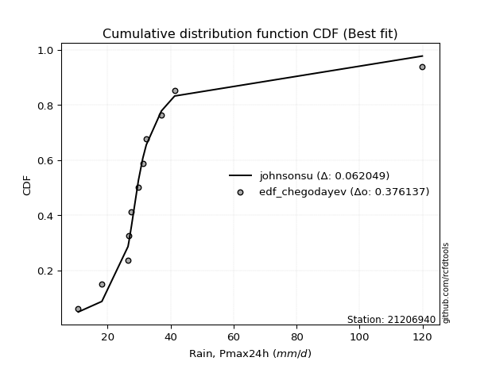</img>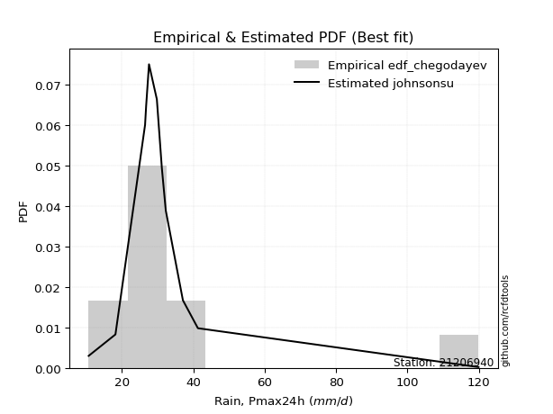</img>

</div>


### 6. Empirical - EDF Blom (1958)

The Blom formula is a specific "plotting position" formula used in hydrology and statistical analysis to estimate the empirical cumulative probability (or non-exceedance probability) of a data series. It is particularly recommended for data that are approximately normally distributed. The constant _a_ is set to 0.375 (or 3/8).

<div align="center">


$P=(m-a)/(n+1-2a)$


</div>


**6.1. Empirical values**

<div align="center">

|                | 0                   | 1                   | 2                   | 3                   | 4                  | 5        | 6                  | 7                  | 8                  | 9                  | 10                 |
|:---------------|:--------------------|:--------------------|:--------------------|:--------------------|:-------------------|:---------|:-------------------|:-------------------|:-------------------|:-------------------|:-------------------|
| date           | 2004                | 2011                | 2007                | 2005                | 2014               | 2012     | 2008               | 2009               | 2010               | 2013               | 2006               |
| x              | 10.7                | 18.2                | 26.5                | 26.8                | 27.6               | 29.8     | 31.2               | 32.3               | 37.1               | 41.3               | 119.9              |
| m              | 1                   | 2                   | 3                   | 4                   | 5                  | 6        | 7                  | 8                  | 9                  | 10                 | 11                 |
| empirical_dist | edf_blom            | edf_blom            | edf_blom            | edf_blom            | edf_blom           | edf_blom | edf_blom           | edf_blom           | edf_blom           | edf_blom           | edf_blom           |
| empirical      | 0.05555555555555555 | 0.14444444444444443 | 0.23333333333333334 | 0.32222222222222224 | 0.4111111111111111 | 0.5      | 0.5888888888888889 | 0.6777777777777778 | 0.7666666666666667 | 0.8555555555555555 | 0.9444444444444444 |
| empirical_tr   | 1.0588235294117647  | 1.1688311688311688  | 1.3043478260869565  | 1.4754098360655736  | 1.6981132075471697 | 2.0      | 2.4324324324324325 | 3.1034482758620694 | 4.2857142857142865 | 6.923076923076921  | 17.999999999999993 |

</div>


**6.2. Kolmogorov-Smirnov fit test (sorted by Δ)**


<div align="center">

|                | 0                    | 1                   | 2                   | 3                   | 4                     | 5                   | 6                   | 7                   | 8                   | 9                   | 10                  | 11                  | 12                  | 13                  | 14                  | 15                  | 16                  | 17                  | 18                  | 19                  | 20                  | 21                  | 22                  | 23                  | 24                  | 25                  | 26                  | 27                  | 28                  | 29                  | 30                  | 31                  | 32                  | 33                  | 34                  | 35                  | 36                  | 37                  | 38                  | 39                  | 40                  | 41                  | 42                  | 43                  | 44                  | 45                  | 46                  | 47                  | 48                  | 49                  | 50                  | 51                  | 52                  | 53                  | 54                  | 55                  | 56                  | 57                  | 58                  | 59                  | 60                  | 61                  | 62                  | 63                  | 64                  | 65                  | 66                  | 67                  | 68                  | 69                  | 70                  | 71                  | 72                  | 73                  | 74                  | 75                  | 76                  | 77                  | 78                  | 79                  | 80                  | 81                  | 82                  | 83                  | 84                  | 85                  | 86                  | 87                  | 88                  | 89                  |
|:---------------|:---------------------|:--------------------|:--------------------|:--------------------|:----------------------|:--------------------|:--------------------|:--------------------|:--------------------|:--------------------|:--------------------|:--------------------|:--------------------|:--------------------|:--------------------|:--------------------|:--------------------|:--------------------|:--------------------|:--------------------|:--------------------|:--------------------|:--------------------|:--------------------|:--------------------|:--------------------|:--------------------|:--------------------|:--------------------|:--------------------|:--------------------|:--------------------|:--------------------|:--------------------|:--------------------|:--------------------|:--------------------|:--------------------|:--------------------|:--------------------|:--------------------|:--------------------|:--------------------|:--------------------|:--------------------|:--------------------|:--------------------|:--------------------|:--------------------|:--------------------|:--------------------|:--------------------|:--------------------|:--------------------|:--------------------|:--------------------|:--------------------|:--------------------|:--------------------|:--------------------|:--------------------|:--------------------|:--------------------|:--------------------|:--------------------|:--------------------|:--------------------|:--------------------|:--------------------|:--------------------|:--------------------|:--------------------|:--------------------|:--------------------|:--------------------|:--------------------|:--------------------|:--------------------|:--------------------|:--------------------|:--------------------|:--------------------|:--------------------|:--------------------|:--------------------|:--------------------|:--------------------|:--------------------|:--------------------|:--------------------|
| station        | 21206940             | 21206940            | 21206940            | 21206940            | 21206940              | 21206940            | 21206940            | 21206940            | 21206940            | 21206940            | 21206940            | 21206940            | 21206940            | 21206940            | 21206940            | 21206940            | 21206940            | 21206940            | 21206940            | 21206940            | 21206940            | 21206940            | 21206940            | 21206940            | 21206940            | 21206940            | 21206940            | 21206940            | 21206940            | 21206940            | 21206940            | 21206940            | 21206940            | 21206940            | 21206940            | 21206940            | 21206940            | 21206940            | 21206940            | 21206940            | 21206940            | 21206940            | 21206940            | 21206940            | 21206940            | 21206940            | 21206940            | 21206940            | 21206940            | 21206940            | 21206940            | 21206940            | 21206940            | 21206940            | 21206940            | 21206940            | 21206940            | 21206940            | 21206940            | 21206940            | 21206940            | 21206940            | 21206940            | 21206940            | 21206940            | 21206940            | 21206940            | 21206940            | 21206940            | 21206940            | 21206940            | 21206940            | 21206940            | 21206940            | 21206940            | 21206940            | 21206940            | 21206940            | 21206940            | 21206940            | 21206940            | 21206940            | 21206940            | 21206940            | 21206940            | 21206940            | 21206940            | 21206940            | 21206940            | 21206940            |
| empirical_dist | edf_blom             | edf_blom            | edf_blom            | edf_blom            | edf_blom              | edf_blom            | edf_blom            | edf_blom            | edf_blom            | edf_blom            | edf_blom            | edf_blom            | edf_blom            | edf_blom            | edf_blom            | edf_blom            | edf_blom            | edf_blom            | edf_blom            | edf_blom            | edf_blom            | edf_blom            | edf_blom            | edf_blom            | edf_blom            | edf_blom            | edf_blom            | edf_blom            | edf_blom            | edf_blom            | edf_blom            | edf_blom            | edf_blom            | edf_blom            | edf_blom            | edf_blom            | edf_blom            | edf_blom            | edf_blom            | edf_blom            | edf_blom            | edf_blom            | edf_blom            | edf_blom            | edf_blom            | edf_blom            | edf_blom            | edf_blom            | edf_blom            | edf_blom            | edf_blom            | edf_blom            | edf_blom            | edf_blom            | edf_blom            | edf_blom            | edf_blom            | edf_blom            | edf_blom            | edf_blom            | edf_blom            | edf_blom            | edf_blom            | edf_blom            | edf_blom            | edf_blom            | edf_blom            | edf_blom            | edf_blom            | edf_blom            | edf_blom            | edf_blom            | edf_blom            | edf_blom            | edf_blom            | edf_blom            | edf_blom            | edf_blom            | edf_blom            | edf_blom            | edf_blom            | edf_blom            | edf_blom            | edf_blom            | edf_blom            | edf_blom            | edf_blom            | edf_blom            | edf_blom            | edf_blom            |
| p_dist         | johnsonsu            | logjohnsonsu        | logt                | t                   | loglaplace_asymmetric | loglaplace          | loghypsecant        | loglogistic         | exponnorm           | logweibull_min      | genlogistic         | mielke              | loggenlogistic      | logcrystalball      | lognorm             | lognorm             | logloggamma         | logfisk             | fisk                | logmielke           | nct                 | fatiguelife         | invweibull          | logrice             | genexpon            | invgauss            | laplace_asymmetric  | alpha               | invgamma            | f                   | ncf                 | betaprime           | loggamma            | loggamma            | logerlang           | logfatiguelife      | logf                | loginvgamma         | logbetaprime        | loginvgauss         | logalpha            | logexponnorm        | moyal               | logncf              | gamma               | lognct              | logmaxwell          | loggumbel_l         | truncnorm           | gibrat              | logpearson3         | halflogistic        | lograyleigh         | gumbel_r            | gompertz            | loggompertz         | logtruncnorm        | halfnorm            | lognakagami         | loginvweibull       | expon               | loggumbel_r         | chi2                | pareto              | logkstwobign        | wald                | kstwobign           | loggenexpon         | rayleigh            | loghalfnorm         | logmoyal            | maxwell             | pearson3            | loghalflogistic     | hypsecant           | laplace             | nakagami            | logistic            | crystalball         | norm                | weibull_min         | rice                | loggibrat           | logwald             | erlang              | logexpon            | gumbel_l            | logchi2             | loglognorm          | logpareto           |
| delta          | 0.057370852493477675 | 0.06761828301964362 | 0.07264846127929137 | 0.09384208532093447 | 0.10993262252305541   | 0.11740082863143425 | 0.14442441549034124 | 0.15489489122728428 | 0.16206207462140088 | 0.16570737247582795 | 0.1665246719155583  | 0.16654014366928382 | 0.16661318962049015 | 0.16767980004568533 | 0.16767980245402742 | 0.16767980245402742 | 0.16841334849945744 | 0.16983921940410496 | 0.17118523260363827 | 0.17157077531745746 | 0.17406286617648464 | 0.1776423891332497  | 0.1815031060953085  | 0.18179953671223636 | 0.18234687208598616 | 0.18261189719831306 | 0.18341395639415925 | 0.18462374392809883 | 0.18532972462019182 | 0.18550300425979083 | 0.18596836846593362 | 0.186123331270532   | 0.18949358200686134 | 0.18949358200686134 | 0.18949366227707592 | 0.19033024568454177 | 0.19171308492364764 | 0.191773249388828   | 0.19254251911331133 | 0.19262127259779782 | 0.1926730638061061  | 0.19429897405400415 | 0.19458995243378413 | 0.19815857192026215 | 0.19934303947206078 | 0.20015345751437574 | 0.20171922170935697 | 0.20411337829953446 | 0.2070587534385891  | 0.20887906207003526 | 0.2101684607581712  | 0.21370520808078747 | 0.21401095157436406 | 0.2171637165308289  | 0.21736630078929686 | 0.21821894189037178 | 0.22087973299148483 | 0.22200410965046502 | 0.22301380453634911 | 0.22305999640550228 | 0.22473695200319205 | 0.2276401180986924  | 0.2315970879064181  | 0.23745588000456036 | 0.23999857159134175 | 0.24019556504638168 | 0.24237023206679564 | 0.24753608297961477 | 0.24801638309779717 | 0.24886925860404147 | 0.2506028728840631  | 0.2572146624888947  | 0.260339206672458   | 0.26457022462704294 | 0.26932146128519674 | 0.27458881149686853 | 0.27637203443475594 | 0.2770306376832743  | 0.28624568023396313 | 0.28624568649067983 | 0.2870403708276815  | 0.28810502273671157 | 0.3071207786129932  | 0.31265481303495773 | 0.3152118382845241  | 0.34622731609740615 | 0.3509532288763214  | 0.40914152841997337 | 0.45304921669411574 | 0.498368816969953   |
| deltao         | 0.37613735880099997  | 0.37613735880099997 | 0.37613735880099997 | 0.37613735880099997 | 0.37613735880099997   | 0.37613735880099997 | 0.37613735880099997 | 0.37613735880099997 | 0.37613735880099997 | 0.37613735880099997 | 0.37613735880099997 | 0.37613735880099997 | 0.37613735880099997 | 0.37613735880099997 | 0.37613735880099997 | 0.37613735880099997 | 0.37613735880099997 | 0.37613735880099997 | 0.37613735880099997 | 0.37613735880099997 | 0.37613735880099997 | 0.37613735880099997 | 0.37613735880099997 | 0.37613735880099997 | 0.37613735880099997 | 0.37613735880099997 | 0.37613735880099997 | 0.37613735880099997 | 0.37613735880099997 | 0.37613735880099997 | 0.37613735880099997 | 0.37613735880099997 | 0.37613735880099997 | 0.37613735880099997 | 0.37613735880099997 | 0.37613735880099997 | 0.37613735880099997 | 0.37613735880099997 | 0.37613735880099997 | 0.37613735880099997 | 0.37613735880099997 | 0.37613735880099997 | 0.37613735880099997 | 0.37613735880099997 | 0.37613735880099997 | 0.37613735880099997 | 0.37613735880099997 | 0.37613735880099997 | 0.37613735880099997 | 0.37613735880099997 | 0.37613735880099997 | 0.37613735880099997 | 0.37613735880099997 | 0.37613735880099997 | 0.37613735880099997 | 0.37613735880099997 | 0.37613735880099997 | 0.37613735880099997 | 0.37613735880099997 | 0.37613735880099997 | 0.37613735880099997 | 0.37613735880099997 | 0.37613735880099997 | 0.37613735880099997 | 0.37613735880099997 | 0.37613735880099997 | 0.37613735880099997 | 0.37613735880099997 | 0.37613735880099997 | 0.37613735880099997 | 0.37613735880099997 | 0.37613735880099997 | 0.37613735880099997 | 0.37613735880099997 | 0.37613735880099997 | 0.37613735880099997 | 0.37613735880099997 | 0.37613735880099997 | 0.37613735880099997 | 0.37613735880099997 | 0.37613735880099997 | 0.37613735880099997 | 0.37613735880099997 | 0.37613735880099997 | 0.37613735880099997 | 0.37613735880099997 | 0.37613735880099997 | 0.37613735880099997 | 0.37613735880099997 | 0.37613735880099997 |
| eval           | Δo > Δ               | Δo > Δ              | Δo > Δ              | Δo > Δ              | Δo > Δ                | Δo > Δ              | Δo > Δ              | Δo > Δ              | Δo > Δ              | Δo > Δ              | Δo > Δ              | Δo > Δ              | Δo > Δ              | Δo > Δ              | Δo > Δ              | Δo > Δ              | Δo > Δ              | Δo > Δ              | Δo > Δ              | Δo > Δ              | Δo > Δ              | Δo > Δ              | Δo > Δ              | Δo > Δ              | Δo > Δ              | Δo > Δ              | Δo > Δ              | Δo > Δ              | Δo > Δ              | Δo > Δ              | Δo > Δ              | Δo > Δ              | Δo > Δ              | Δo > Δ              | Δo > Δ              | Δo > Δ              | Δo > Δ              | Δo > Δ              | Δo > Δ              | Δo > Δ              | Δo > Δ              | Δo > Δ              | Δo > Δ              | Δo > Δ              | Δo > Δ              | Δo > Δ              | Δo > Δ              | Δo > Δ              | Δo > Δ              | Δo > Δ              | Δo > Δ              | Δo > Δ              | Δo > Δ              | Δo > Δ              | Δo > Δ              | Δo > Δ              | Δo > Δ              | Δo > Δ              | Δo > Δ              | Δo > Δ              | Δo > Δ              | Δo > Δ              | Δo > Δ              | Δo > Δ              | Δo > Δ              | Δo > Δ              | Δo > Δ              | Δo > Δ              | Δo > Δ              | Δo > Δ              | Δo > Δ              | Δo > Δ              | Δo > Δ              | Δo > Δ              | Δo > Δ              | Δo > Δ              | Δo > Δ              | Δo > Δ              | Δo > Δ              | Δo > Δ              | Δo > Δ              | Δo > Δ              | Δo > Δ              | Δo > Δ              | Δo > Δ              | Δo > Δ              | Δo > Δ              | Δo <= Δ             | Δo <= Δ             | Δo <= Δ             |
| fit            | 1                    | 1                   | 1                   | 1                   | 1                     | 1                   | 1                   | 1                   | 1                   | 1                   | 1                   | 1                   | 1                   | 1                   | 1                   | 1                   | 1                   | 1                   | 1                   | 1                   | 1                   | 1                   | 1                   | 1                   | 1                   | 1                   | 1                   | 1                   | 1                   | 1                   | 1                   | 1                   | 1                   | 1                   | 1                   | 1                   | 1                   | 1                   | 1                   | 1                   | 1                   | 1                   | 1                   | 1                   | 1                   | 1                   | 1                   | 1                   | 1                   | 1                   | 1                   | 1                   | 1                   | 1                   | 1                   | 1                   | 1                   | 1                   | 1                   | 1                   | 1                   | 1                   | 1                   | 1                   | 1                   | 1                   | 1                   | 1                   | 1                   | 1                   | 1                   | 1                   | 1                   | 1                   | 1                   | 1                   | 1                   | 1                   | 1                   | 1                   | 1                   | 1                   | 1                   | 1                   | 1                   | 1                   | 1                   | 0                   | 0                   | 0                   |
| n              | 11                   | 11                  | 11                  | 11                  | 11                    | 11                  | 11                  | 11                  | 11                  | 11                  | 11                  | 11                  | 11                  | 11                  | 11                  | 11                  | 11                  | 11                  | 11                  | 11                  | 11                  | 11                  | 11                  | 11                  | 11                  | 11                  | 11                  | 11                  | 11                  | 11                  | 11                  | 11                  | 11                  | 11                  | 11                  | 11                  | 11                  | 11                  | 11                  | 11                  | 11                  | 11                  | 11                  | 11                  | 11                  | 11                  | 11                  | 11                  | 11                  | 11                  | 11                  | 11                  | 11                  | 11                  | 11                  | 11                  | 11                  | 11                  | 11                  | 11                  | 11                  | 11                  | 11                  | 11                  | 11                  | 11                  | 11                  | 11                  | 11                  | 11                  | 11                  | 11                  | 11                  | 11                  | 11                  | 11                  | 11                  | 11                  | 11                  | 11                  | 11                  | 11                  | 11                  | 11                  | 11                  | 11                  | 11                  | 11                  | 11                  | 11                  |
| best_fit       | 1                    | 0                   | 0                   | 0                   | 0                     | 0                   | 0                   | 0                   | 0                   | 0                   | 0                   | 0                   | 0                   | 0                   | 0                   | 0                   | 0                   | 0                   | 0                   | 0                   | 0                   | 0                   | 0                   | 0                   | 0                   | 0                   | 0                   | 0                   | 0                   | 0                   | 0                   | 0                   | 0                   | 0                   | 0                   | 0                   | 0                   | 0                   | 0                   | 0                   | 0                   | 0                   | 0                   | 0                   | 0                   | 0                   | 0                   | 0                   | 0                   | 0                   | 0                   | 0                   | 0                   | 0                   | 0                   | 0                   | 0                   | 0                   | 0                   | 0                   | 0                   | 0                   | 0                   | 0                   | 0                   | 0                   | 0                   | 0                   | 0                   | 0                   | 0                   | 0                   | 0                   | 0                   | 0                   | 0                   | 0                   | 0                   | 0                   | 0                   | 0                   | 0                   | 0                   | 0                   | 0                   | 0                   | 0                   | 0                   | 0                   | 0                   |
| best_fit_sort  | 1                    | 2                   | 3                   | 4                   | 5                     | 6                   | 7                   | 8                   | 9                   | 10                  | 11                  | 12                  | 13                  | 14                  | 15                  | 16                  | 17                  | 18                  | 19                  | 20                  | 21                  | 22                  | 23                  | 24                  | 25                  | 26                  | 27                  | 28                  | 29                  | 30                  | 31                  | 32                  | 33                  | 34                  | 35                  | 36                  | 37                  | 38                  | 39                  | 40                  | 41                  | 42                  | 43                  | 44                  | 45                  | 46                  | 47                  | 48                  | 49                  | 50                  | 51                  | 52                  | 53                  | 54                  | 55                  | 56                  | 57                  | 58                  | 59                  | 60                  | 61                  | 62                  | 63                  | 64                  | 65                  | 66                  | 67                  | 68                  | 69                  | 70                  | 71                  | 72                  | 73                  | 74                  | 75                  | 76                  | 77                  | 78                  | 79                  | 80                  | 81                  | 82                  | 83                  | 84                  | 85                  | 86                  | 87                  | 88                  | 89                  | 90                  |

</div>


<div align="center">

</img>

</div>


**6.3. Best fit**

<div align="center">

|   id |   station | empirical_dist   | p_dist    |     delta |   deltao | eval   |   fit |   n |   best_fit |   best_fit_sort |
|-----:|----------:|:-----------------|:----------|----------:|---------:|:-------|------:|----:|-----------:|----------------:|
|    0 |  21206940 | edf_blom         | johnsonsu | 0.0573709 | 0.376137 | Δo > Δ |     1 |  11 |          1 |               1 |

</div>


<div align="center">

</img>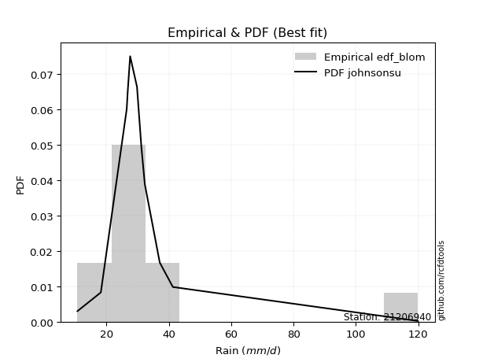</img>

</div>


### 7. Empirical - EDF Tukey (1962)

In hydrology, the Tukey formula is used as a plotting position formula to estimate the empirical probability or frequency of a flood event (or other hydrological data). The formula parameter is given as _c=0.333_ (or 1/3).

<div align="center">


$P=(m-c)/(n+1-2c)$


</div>


**7.1. Empirical values**

<div align="center">

|                | 0                    | 1                   | 2                   | 3                  | 4                  | 5         | 6                  | 7                  | 8                  | 9                  | 10                 |
|:---------------|:---------------------|:--------------------|:--------------------|:-------------------|:-------------------|:----------|:-------------------|:-------------------|:-------------------|:-------------------|:-------------------|
| date           | 2004                 | 2011                | 2007                | 2005               | 2014               | 2012      | 2008               | 2009               | 2010               | 2013               | 2006               |
| x              | 10.7                 | 18.2                | 26.5                | 26.8               | 27.6               | 29.8      | 31.2               | 32.3               | 37.1               | 41.3               | 119.9              |
| m              | 1                    | 2                   | 3                   | 4                  | 5                  | 6         | 7                  | 8                  | 9                  | 10                 | 11                 |
| empirical_dist | edf_tukey            | edf_tukey           | edf_tukey           | edf_tukey          | edf_tukey          | edf_tukey | edf_tukey          | edf_tukey          | edf_tukey          | edf_tukey          | edf_tukey          |
| empirical      | 0.058823529411764705 | 0.14705882352941177 | 0.23529411764705882 | 0.3235294117647059 | 0.4117647058823529 | 0.5       | 0.5882352941176471 | 0.6764705882352942 | 0.7647058823529411 | 0.8529411764705882 | 0.9411764705882353 |
| empirical_tr   | 1.0625               | 1.1724137931034484  | 1.3076923076923077  | 1.4782608695652173 | 1.7                | 2.0       | 2.428571428571429  | 3.0909090909090913 | 4.249999999999999  | 6.799999999999999  | 16.999999999999996 |

</div>


**7.2. Kolmogorov-Smirnov fit test (sorted by Δ)**


<div align="center">

|                | 0                    | 1                   | 2                   | 3                   | 4                     | 5                   | 6                   | 7                   | 8                   | 9                   | 10                  | 11                  | 12                  | 13                  | 14                  | 15                  | 16                  | 17                  | 18                  | 19                  | 20                  | 21                  | 22                  | 23                  | 24                  | 25                  | 26                  | 27                  | 28                  | 29                  | 30                  | 31                  | 32                  | 33                  | 34                  | 35                  | 36                  | 37                  | 38                  | 39                  | 40                  | 41                  | 42                  | 43                  | 44                  | 45                  | 46                  | 47                  | 48                  | 49                  | 50                  | 51                  | 52                  | 53                  | 54                  | 55                  | 56                  | 57                  | 58                  | 59                  | 60                  | 61                  | 62                  | 63                  | 64                  | 65                  | 66                  | 67                  | 68                  | 69                  | 70                  | 71                  | 72                  | 73                  | 74                  | 75                  | 76                  | 77                  | 78                  | 79                  | 80                  | 81                  | 82                  | 83                  | 84                  | 85                  | 86                  | 87                  | 88                  | 89                  |
|:---------------|:---------------------|:--------------------|:--------------------|:--------------------|:----------------------|:--------------------|:--------------------|:--------------------|:--------------------|:--------------------|:--------------------|:--------------------|:--------------------|:--------------------|:--------------------|:--------------------|:--------------------|:--------------------|:--------------------|:--------------------|:--------------------|:--------------------|:--------------------|:--------------------|:--------------------|:--------------------|:--------------------|:--------------------|:--------------------|:--------------------|:--------------------|:--------------------|:--------------------|:--------------------|:--------------------|:--------------------|:--------------------|:--------------------|:--------------------|:--------------------|:--------------------|:--------------------|:--------------------|:--------------------|:--------------------|:--------------------|:--------------------|:--------------------|:--------------------|:--------------------|:--------------------|:--------------------|:--------------------|:--------------------|:--------------------|:--------------------|:--------------------|:--------------------|:--------------------|:--------------------|:--------------------|:--------------------|:--------------------|:--------------------|:--------------------|:--------------------|:--------------------|:--------------------|:--------------------|:--------------------|:--------------------|:--------------------|:--------------------|:--------------------|:--------------------|:--------------------|:--------------------|:--------------------|:--------------------|:--------------------|:--------------------|:--------------------|:--------------------|:--------------------|:--------------------|:--------------------|:--------------------|:--------------------|:--------------------|:--------------------|
| station        | 21206940             | 21206940            | 21206940            | 21206940            | 21206940              | 21206940            | 21206940            | 21206940            | 21206940            | 21206940            | 21206940            | 21206940            | 21206940            | 21206940            | 21206940            | 21206940            | 21206940            | 21206940            | 21206940            | 21206940            | 21206940            | 21206940            | 21206940            | 21206940            | 21206940            | 21206940            | 21206940            | 21206940            | 21206940            | 21206940            | 21206940            | 21206940            | 21206940            | 21206940            | 21206940            | 21206940            | 21206940            | 21206940            | 21206940            | 21206940            | 21206940            | 21206940            | 21206940            | 21206940            | 21206940            | 21206940            | 21206940            | 21206940            | 21206940            | 21206940            | 21206940            | 21206940            | 21206940            | 21206940            | 21206940            | 21206940            | 21206940            | 21206940            | 21206940            | 21206940            | 21206940            | 21206940            | 21206940            | 21206940            | 21206940            | 21206940            | 21206940            | 21206940            | 21206940            | 21206940            | 21206940            | 21206940            | 21206940            | 21206940            | 21206940            | 21206940            | 21206940            | 21206940            | 21206940            | 21206940            | 21206940            | 21206940            | 21206940            | 21206940            | 21206940            | 21206940            | 21206940            | 21206940            | 21206940            | 21206940            |
| empirical_dist | edf_tukey            | edf_tukey           | edf_tukey           | edf_tukey           | edf_tukey             | edf_tukey           | edf_tukey           | edf_tukey           | edf_tukey           | edf_tukey           | edf_tukey           | edf_tukey           | edf_tukey           | edf_tukey           | edf_tukey           | edf_tukey           | edf_tukey           | edf_tukey           | edf_tukey           | edf_tukey           | edf_tukey           | edf_tukey           | edf_tukey           | edf_tukey           | edf_tukey           | edf_tukey           | edf_tukey           | edf_tukey           | edf_tukey           | edf_tukey           | edf_tukey           | edf_tukey           | edf_tukey           | edf_tukey           | edf_tukey           | edf_tukey           | edf_tukey           | edf_tukey           | edf_tukey           | edf_tukey           | edf_tukey           | edf_tukey           | edf_tukey           | edf_tukey           | edf_tukey           | edf_tukey           | edf_tukey           | edf_tukey           | edf_tukey           | edf_tukey           | edf_tukey           | edf_tukey           | edf_tukey           | edf_tukey           | edf_tukey           | edf_tukey           | edf_tukey           | edf_tukey           | edf_tukey           | edf_tukey           | edf_tukey           | edf_tukey           | edf_tukey           | edf_tukey           | edf_tukey           | edf_tukey           | edf_tukey           | edf_tukey           | edf_tukey           | edf_tukey           | edf_tukey           | edf_tukey           | edf_tukey           | edf_tukey           | edf_tukey           | edf_tukey           | edf_tukey           | edf_tukey           | edf_tukey           | edf_tukey           | edf_tukey           | edf_tukey           | edf_tukey           | edf_tukey           | edf_tukey           | edf_tukey           | edf_tukey           | edf_tukey           | edf_tukey           | edf_tukey           |
| p_dist         | johnsonsu            | logjohnsonsu        | logt                | t                   | loglaplace_asymmetric | loglaplace          | loghypsecant        | loglogistic         | exponnorm           | logweibull_min      | mielke              | loggenlogistic      | genlogistic         | logcrystalball      | lognorm             | lognorm             | logloggamma         | logfisk             | fisk                | logmielke           | nct                 | fatiguelife         | invweibull          | logrice             | genexpon            | invgauss            | laplace_asymmetric  | alpha               | invgamma            | f                   | ncf                 | betaprime           | loggamma            | loggamma            | logerlang           | logfatiguelife      | logf                | loginvgamma         | logbetaprime        | loginvgauss         | logalpha            | logexponnorm        | moyal               | logncf              | gamma               | lognct              | logmaxwell          | loggumbel_l         | truncnorm           | gibrat              | logpearson3         | halflogistic        | lograyleigh         | gumbel_r            | gompertz            | loggompertz         | logtruncnorm        | halfnorm            | lognakagami         | loginvweibull       | expon               | loggumbel_r         | chi2                | pareto              | logkstwobign        | wald                | kstwobign           | rayleigh            | loggenexpon         | loghalfnorm         | logmoyal            | maxwell             | pearson3            | loghalflogistic     | hypsecant           | laplace             | nakagami            | logistic            | crystalball         | norm                | weibull_min         | rice                | loggibrat           | logwald             | erlang              | logexpon            | gumbel_l            | logchi2             | loglognorm          | logpareto           |
| delta          | 0.059985231578445014 | 0.06565749870591814 | 0.07068767696556588 | 0.09188130100720898 | 0.10797183820932993   | 0.11544004431770877 | 0.14246363117661576 | 0.1529341069135588  | 0.16075488507891722 | 0.16374658816210247 | 0.16457935935555834 | 0.16465240530676467 | 0.16521748237307465 | 0.16571901573195985 | 0.16571901814030193 | 0.16571901814030193 | 0.16645256418573195 | 0.16787843509037947 | 0.1692244482899128  | 0.16960999100373197 | 0.17210208186275916 | 0.17568160481952422 | 0.17954232178158303 | 0.17983875239851088 | 0.18038608777226067 | 0.18065111288458757 | 0.1821067668516756  | 0.18266295961437334 | 0.18336894030646633 | 0.18354221994606534 | 0.18400758415220814 | 0.1841625469568065  | 0.18753279769313586 | 0.18753279769313586 | 0.18753287796335044 | 0.18836946137081628 | 0.18975230060992215 | 0.18981246507510252 | 0.19058173479958584 | 0.19066048828407234 | 0.19071227949238062 | 0.19233818974027866 | 0.19262916812005865 | 0.19619778760653667 | 0.1973822551583353  | 0.19819267320065026 | 0.19975843739563148 | 0.2028061887570508  | 0.2050979691248636  | 0.20691827775630978 | 0.2082076764444457  | 0.21174442376706198 | 0.21205016726063858 | 0.21454933744586158 | 0.21475192170432955 | 0.2162581575766463  | 0.21891894867775935 | 0.2193897305654977  | 0.22105302022262363 | 0.2210992120917768  | 0.22277616768946656 | 0.2256793337849669  | 0.2296363035926926  | 0.23549509569083488 | 0.23803778727761626 | 0.2382347807326562  | 0.23975585298182833 | 0.24540200401282986 | 0.24557529866588929 | 0.24690847429031598 | 0.2486420885703376  | 0.2546002834039274  | 0.25837842235873254 | 0.26260944031331745 | 0.26670708220022943 | 0.2732816219543849  | 0.27441125012103046 | 0.274416258598307   | 0.2836313011489958  | 0.2836313074057125  | 0.2844259917427142  | 0.28549064365174426 | 0.3051599942992677  | 0.31069402872123225 | 0.3132510539707986  | 0.34426653178368066 | 0.3483388497913541  | 0.4071807441062479  | 0.4504348376091484  | 0.49575443788498563 |
| deltao         | 0.37613735880099997  | 0.37613735880099997 | 0.37613735880099997 | 0.37613735880099997 | 0.37613735880099997   | 0.37613735880099997 | 0.37613735880099997 | 0.37613735880099997 | 0.37613735880099997 | 0.37613735880099997 | 0.37613735880099997 | 0.37613735880099997 | 0.37613735880099997 | 0.37613735880099997 | 0.37613735880099997 | 0.37613735880099997 | 0.37613735880099997 | 0.37613735880099997 | 0.37613735880099997 | 0.37613735880099997 | 0.37613735880099997 | 0.37613735880099997 | 0.37613735880099997 | 0.37613735880099997 | 0.37613735880099997 | 0.37613735880099997 | 0.37613735880099997 | 0.37613735880099997 | 0.37613735880099997 | 0.37613735880099997 | 0.37613735880099997 | 0.37613735880099997 | 0.37613735880099997 | 0.37613735880099997 | 0.37613735880099997 | 0.37613735880099997 | 0.37613735880099997 | 0.37613735880099997 | 0.37613735880099997 | 0.37613735880099997 | 0.37613735880099997 | 0.37613735880099997 | 0.37613735880099997 | 0.37613735880099997 | 0.37613735880099997 | 0.37613735880099997 | 0.37613735880099997 | 0.37613735880099997 | 0.37613735880099997 | 0.37613735880099997 | 0.37613735880099997 | 0.37613735880099997 | 0.37613735880099997 | 0.37613735880099997 | 0.37613735880099997 | 0.37613735880099997 | 0.37613735880099997 | 0.37613735880099997 | 0.37613735880099997 | 0.37613735880099997 | 0.37613735880099997 | 0.37613735880099997 | 0.37613735880099997 | 0.37613735880099997 | 0.37613735880099997 | 0.37613735880099997 | 0.37613735880099997 | 0.37613735880099997 | 0.37613735880099997 | 0.37613735880099997 | 0.37613735880099997 | 0.37613735880099997 | 0.37613735880099997 | 0.37613735880099997 | 0.37613735880099997 | 0.37613735880099997 | 0.37613735880099997 | 0.37613735880099997 | 0.37613735880099997 | 0.37613735880099997 | 0.37613735880099997 | 0.37613735880099997 | 0.37613735880099997 | 0.37613735880099997 | 0.37613735880099997 | 0.37613735880099997 | 0.37613735880099997 | 0.37613735880099997 | 0.37613735880099997 | 0.37613735880099997 |
| eval           | Δo > Δ               | Δo > Δ              | Δo > Δ              | Δo > Δ              | Δo > Δ                | Δo > Δ              | Δo > Δ              | Δo > Δ              | Δo > Δ              | Δo > Δ              | Δo > Δ              | Δo > Δ              | Δo > Δ              | Δo > Δ              | Δo > Δ              | Δo > Δ              | Δo > Δ              | Δo > Δ              | Δo > Δ              | Δo > Δ              | Δo > Δ              | Δo > Δ              | Δo > Δ              | Δo > Δ              | Δo > Δ              | Δo > Δ              | Δo > Δ              | Δo > Δ              | Δo > Δ              | Δo > Δ              | Δo > Δ              | Δo > Δ              | Δo > Δ              | Δo > Δ              | Δo > Δ              | Δo > Δ              | Δo > Δ              | Δo > Δ              | Δo > Δ              | Δo > Δ              | Δo > Δ              | Δo > Δ              | Δo > Δ              | Δo > Δ              | Δo > Δ              | Δo > Δ              | Δo > Δ              | Δo > Δ              | Δo > Δ              | Δo > Δ              | Δo > Δ              | Δo > Δ              | Δo > Δ              | Δo > Δ              | Δo > Δ              | Δo > Δ              | Δo > Δ              | Δo > Δ              | Δo > Δ              | Δo > Δ              | Δo > Δ              | Δo > Δ              | Δo > Δ              | Δo > Δ              | Δo > Δ              | Δo > Δ              | Δo > Δ              | Δo > Δ              | Δo > Δ              | Δo > Δ              | Δo > Δ              | Δo > Δ              | Δo > Δ              | Δo > Δ              | Δo > Δ              | Δo > Δ              | Δo > Δ              | Δo > Δ              | Δo > Δ              | Δo > Δ              | Δo > Δ              | Δo > Δ              | Δo > Δ              | Δo > Δ              | Δo > Δ              | Δo > Δ              | Δo > Δ              | Δo <= Δ             | Δo <= Δ             | Δo <= Δ             |
| fit            | 1                    | 1                   | 1                   | 1                   | 1                     | 1                   | 1                   | 1                   | 1                   | 1                   | 1                   | 1                   | 1                   | 1                   | 1                   | 1                   | 1                   | 1                   | 1                   | 1                   | 1                   | 1                   | 1                   | 1                   | 1                   | 1                   | 1                   | 1                   | 1                   | 1                   | 1                   | 1                   | 1                   | 1                   | 1                   | 1                   | 1                   | 1                   | 1                   | 1                   | 1                   | 1                   | 1                   | 1                   | 1                   | 1                   | 1                   | 1                   | 1                   | 1                   | 1                   | 1                   | 1                   | 1                   | 1                   | 1                   | 1                   | 1                   | 1                   | 1                   | 1                   | 1                   | 1                   | 1                   | 1                   | 1                   | 1                   | 1                   | 1                   | 1                   | 1                   | 1                   | 1                   | 1                   | 1                   | 1                   | 1                   | 1                   | 1                   | 1                   | 1                   | 1                   | 1                   | 1                   | 1                   | 1                   | 1                   | 0                   | 0                   | 0                   |
| n              | 11                   | 11                  | 11                  | 11                  | 11                    | 11                  | 11                  | 11                  | 11                  | 11                  | 11                  | 11                  | 11                  | 11                  | 11                  | 11                  | 11                  | 11                  | 11                  | 11                  | 11                  | 11                  | 11                  | 11                  | 11                  | 11                  | 11                  | 11                  | 11                  | 11                  | 11                  | 11                  | 11                  | 11                  | 11                  | 11                  | 11                  | 11                  | 11                  | 11                  | 11                  | 11                  | 11                  | 11                  | 11                  | 11                  | 11                  | 11                  | 11                  | 11                  | 11                  | 11                  | 11                  | 11                  | 11                  | 11                  | 11                  | 11                  | 11                  | 11                  | 11                  | 11                  | 11                  | 11                  | 11                  | 11                  | 11                  | 11                  | 11                  | 11                  | 11                  | 11                  | 11                  | 11                  | 11                  | 11                  | 11                  | 11                  | 11                  | 11                  | 11                  | 11                  | 11                  | 11                  | 11                  | 11                  | 11                  | 11                  | 11                  | 11                  |
| best_fit       | 1                    | 0                   | 0                   | 0                   | 0                     | 0                   | 0                   | 0                   | 0                   | 0                   | 0                   | 0                   | 0                   | 0                   | 0                   | 0                   | 0                   | 0                   | 0                   | 0                   | 0                   | 0                   | 0                   | 0                   | 0                   | 0                   | 0                   | 0                   | 0                   | 0                   | 0                   | 0                   | 0                   | 0                   | 0                   | 0                   | 0                   | 0                   | 0                   | 0                   | 0                   | 0                   | 0                   | 0                   | 0                   | 0                   | 0                   | 0                   | 0                   | 0                   | 0                   | 0                   | 0                   | 0                   | 0                   | 0                   | 0                   | 0                   | 0                   | 0                   | 0                   | 0                   | 0                   | 0                   | 0                   | 0                   | 0                   | 0                   | 0                   | 0                   | 0                   | 0                   | 0                   | 0                   | 0                   | 0                   | 0                   | 0                   | 0                   | 0                   | 0                   | 0                   | 0                   | 0                   | 0                   | 0                   | 0                   | 0                   | 0                   | 0                   |
| best_fit_sort  | 1                    | 2                   | 3                   | 4                   | 5                     | 6                   | 7                   | 8                   | 9                   | 10                  | 11                  | 12                  | 13                  | 14                  | 15                  | 16                  | 17                  | 18                  | 19                  | 20                  | 21                  | 22                  | 23                  | 24                  | 25                  | 26                  | 27                  | 28                  | 29                  | 30                  | 31                  | 32                  | 33                  | 34                  | 35                  | 36                  | 37                  | 38                  | 39                  | 40                  | 41                  | 42                  | 43                  | 44                  | 45                  | 46                  | 47                  | 48                  | 49                  | 50                  | 51                  | 52                  | 53                  | 54                  | 55                  | 56                  | 57                  | 58                  | 59                  | 60                  | 61                  | 62                  | 63                  | 64                  | 65                  | 66                  | 67                  | 68                  | 69                  | 70                  | 71                  | 72                  | 73                  | 74                  | 75                  | 76                  | 77                  | 78                  | 79                  | 80                  | 81                  | 82                  | 83                  | 84                  | 85                  | 86                  | 87                  | 88                  | 89                  | 90                  |

</div>


<div align="center">

</img>

</div>


**7.3. Best fit**

<div align="center">

|   id |   station | empirical_dist   | p_dist    |     delta |   deltao | eval   |   fit |   n |   best_fit |   best_fit_sort |
|-----:|----------:|:-----------------|:----------|----------:|---------:|:-------|------:|----:|-----------:|----------------:|
|    0 |  21206940 | edf_tukey        | johnsonsu | 0.0599852 | 0.376137 | Δo > Δ |     1 |  11 |          1 |               1 |

</div>


<div align="center">

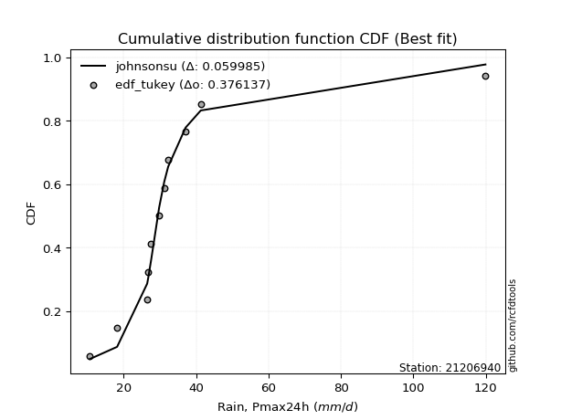</img></img>

</div>


### 8. Empirical - EDF Gringorten (1963)

Gringorten plotting position formula is essential for estimating the probability and return periods of extreme events like floods and heavy rainfall. The constant _a=0.44_.

<div align="center">


$P=(m-a)/(n+1-2a)$


</div>


**8.1. Empirical values**

<div align="center">

|                | 0                   | 1                   | 2                  | 3                   | 4                   | 5              | 6                  | 7                  | 8                  | 9                  | 10                 |
|:---------------|:--------------------|:--------------------|:-------------------|:--------------------|:--------------------|:---------------|:-------------------|:-------------------|:-------------------|:-------------------|:-------------------|
| date           | 2004                | 2011                | 2007               | 2005                | 2014                | 2012           | 2008               | 2009               | 2010               | 2013               | 2006               |
| x              | 10.7                | 18.2                | 26.5               | 26.8                | 27.6                | 29.8           | 31.2               | 32.3               | 37.1               | 41.3               | 119.9              |
| m              | 1                   | 2                   | 3                  | 4                   | 5                   | 6              | 7                  | 8                  | 9                  | 10                 | 11                 |
| empirical_dist | edf_gringorten      | edf_gringorten      | edf_gringorten     | edf_gringorten      | edf_gringorten      | edf_gringorten | edf_gringorten     | edf_gringorten     | edf_gringorten     | edf_gringorten     | edf_gringorten     |
| empirical      | 0.05035971223021583 | 0.14028776978417268 | 0.2302158273381295 | 0.32014388489208634 | 0.41007194244604317 | 0.5            | 0.5899280575539568 | 0.6798561151079137 | 0.7697841726618706 | 0.8597122302158274 | 0.9496402877697843 |
| empirical_tr   | 1.053030303030303   | 1.1631799163179917  | 1.2990654205607477 | 1.470899470899471   | 1.6951219512195121  | 2.0            | 2.43859649122807   | 3.1235955056179776 | 4.343750000000002  | 7.128205128205133  | 19.857142857142893 |

</div>


**8.2. Kolmogorov-Smirnov fit test (sorted by Δ)**


<div align="center">

|                | 0                   | 1                   | 2                   | 3                   | 4                     | 5                   | 6                   | 7                   | 8                   | 9                   | 10                  | 11                  | 12                  | 13                  | 14                  | 15                  | 16                  | 17                  | 18                  | 19                  | 20                  | 21                  | 22                  | 23                  | 24                  | 25                  | 26                  | 27                  | 28                  | 29                  | 30                  | 31                  | 32                  | 33                  | 34                  | 35                  | 36                  | 37                  | 38                  | 39                  | 40                  | 41                  | 42                  | 43                  | 44                  | 45                  | 46                  | 47                  | 48                  | 49                  | 50                  | 51                  | 52                  | 53                  | 54                  | 55                  | 56                  | 57                  | 58                  | 59                  | 60                  | 61                  | 62                  | 63                  | 64                  | 65                  | 66                  | 67                  | 68                  | 69                  | 70                  | 71                  | 72                  | 73                  | 74                  | 75                  | 76                  | 77                  | 78                  | 79                  | 80                  | 81                  | 82                  | 83                  | 84                  | 85                  | 86                  | 87                  | 88                  | 89                  |
|:---------------|:--------------------|:--------------------|:--------------------|:--------------------|:----------------------|:--------------------|:--------------------|:--------------------|:--------------------|:--------------------|:--------------------|:--------------------|:--------------------|:--------------------|:--------------------|:--------------------|:--------------------|:--------------------|:--------------------|:--------------------|:--------------------|:--------------------|:--------------------|:--------------------|:--------------------|:--------------------|:--------------------|:--------------------|:--------------------|:--------------------|:--------------------|:--------------------|:--------------------|:--------------------|:--------------------|:--------------------|:--------------------|:--------------------|:--------------------|:--------------------|:--------------------|:--------------------|:--------------------|:--------------------|:--------------------|:--------------------|:--------------------|:--------------------|:--------------------|:--------------------|:--------------------|:--------------------|:--------------------|:--------------------|:--------------------|:--------------------|:--------------------|:--------------------|:--------------------|:--------------------|:--------------------|:--------------------|:--------------------|:--------------------|:--------------------|:--------------------|:--------------------|:--------------------|:--------------------|:--------------------|:--------------------|:--------------------|:--------------------|:--------------------|:--------------------|:--------------------|:--------------------|:--------------------|:--------------------|:--------------------|:--------------------|:--------------------|:--------------------|:--------------------|:--------------------|:--------------------|:--------------------|:--------------------|:--------------------|:--------------------|
| station        | 21206940            | 21206940            | 21206940            | 21206940            | 21206940              | 21206940            | 21206940            | 21206940            | 21206940            | 21206940            | 21206940            | 21206940            | 21206940            | 21206940            | 21206940            | 21206940            | 21206940            | 21206940            | 21206940            | 21206940            | 21206940            | 21206940            | 21206940            | 21206940            | 21206940            | 21206940            | 21206940            | 21206940            | 21206940            | 21206940            | 21206940            | 21206940            | 21206940            | 21206940            | 21206940            | 21206940            | 21206940            | 21206940            | 21206940            | 21206940            | 21206940            | 21206940            | 21206940            | 21206940            | 21206940            | 21206940            | 21206940            | 21206940            | 21206940            | 21206940            | 21206940            | 21206940            | 21206940            | 21206940            | 21206940            | 21206940            | 21206940            | 21206940            | 21206940            | 21206940            | 21206940            | 21206940            | 21206940            | 21206940            | 21206940            | 21206940            | 21206940            | 21206940            | 21206940            | 21206940            | 21206940            | 21206940            | 21206940            | 21206940            | 21206940            | 21206940            | 21206940            | 21206940            | 21206940            | 21206940            | 21206940            | 21206940            | 21206940            | 21206940            | 21206940            | 21206940            | 21206940            | 21206940            | 21206940            | 21206940            |
| empirical_dist | edf_gringorten      | edf_gringorten      | edf_gringorten      | edf_gringorten      | edf_gringorten        | edf_gringorten      | edf_gringorten      | edf_gringorten      | edf_gringorten      | edf_gringorten      | edf_gringorten      | edf_gringorten      | edf_gringorten      | edf_gringorten      | edf_gringorten      | edf_gringorten      | edf_gringorten      | edf_gringorten      | edf_gringorten      | edf_gringorten      | edf_gringorten      | edf_gringorten      | edf_gringorten      | edf_gringorten      | edf_gringorten      | edf_gringorten      | edf_gringorten      | edf_gringorten      | edf_gringorten      | edf_gringorten      | edf_gringorten      | edf_gringorten      | edf_gringorten      | edf_gringorten      | edf_gringorten      | edf_gringorten      | edf_gringorten      | edf_gringorten      | edf_gringorten      | edf_gringorten      | edf_gringorten      | edf_gringorten      | edf_gringorten      | edf_gringorten      | edf_gringorten      | edf_gringorten      | edf_gringorten      | edf_gringorten      | edf_gringorten      | edf_gringorten      | edf_gringorten      | edf_gringorten      | edf_gringorten      | edf_gringorten      | edf_gringorten      | edf_gringorten      | edf_gringorten      | edf_gringorten      | edf_gringorten      | edf_gringorten      | edf_gringorten      | edf_gringorten      | edf_gringorten      | edf_gringorten      | edf_gringorten      | edf_gringorten      | edf_gringorten      | edf_gringorten      | edf_gringorten      | edf_gringorten      | edf_gringorten      | edf_gringorten      | edf_gringorten      | edf_gringorten      | edf_gringorten      | edf_gringorten      | edf_gringorten      | edf_gringorten      | edf_gringorten      | edf_gringorten      | edf_gringorten      | edf_gringorten      | edf_gringorten      | edf_gringorten      | edf_gringorten      | edf_gringorten      | edf_gringorten      | edf_gringorten      | edf_gringorten      | edf_gringorten      |
| p_dist         | johnsonsu           | logjohnsonsu        | logt                | t                   | loglaplace_asymmetric | loglaplace          | loghypsecant        | loglogistic         | exponnorm           | genlogistic         | logweibull_min      | mielke              | loggenlogistic      | logcrystalball      | lognorm             | lognorm             | logloggamma         | logfisk             | fisk                | logmielke           | nct                 | fatiguelife         | invweibull          | logrice             | genexpon            | laplace_asymmetric  | invgauss            | alpha               | invgamma            | f                   | ncf                 | betaprime           | loggamma            | loggamma            | logerlang           | logfatiguelife      | logf                | loginvgamma         | logbetaprime        | loginvgauss         | logalpha            | logexponnorm        | moyal               | logncf              | gamma               | lognct              | logmaxwell          | loggumbel_l         | truncnorm           | gibrat              | logpearson3         | halflogistic        | lograyleigh         | gumbel_r            | loggompertz         | gompertz            | logtruncnorm        | lognakagami         | halfnorm            | loginvweibull       | expon               | loggumbel_r         | chi2                | pareto              | logkstwobign        | wald                | kstwobign           | loggenexpon         | loghalfnorm         | rayleigh            | logmoyal            | maxwell             | pearson3            | loghalflogistic     | hypsecant           | laplace             | nakagami            | logistic            | crystalball         | norm                | weibull_min         | rice                | loggibrat           | logwald             | erlang              | logexpon            | gumbel_l            | logchi2             | loglognorm          | logpareto           |
| delta          | 0.0558662180682451  | 0.07073578901484745 | 0.0757659672744952  | 0.0969595913161383  | 0.11305012851825924   | 0.12051833462663808 | 0.14754192148554507 | 0.1580123972224881  | 0.16414041195153672 | 0.16860300924569416 | 0.16882487847103178 | 0.16965764966448765 | 0.16973069561569398 | 0.17079730604088916 | 0.17079730844923124 | 0.17079730844923124 | 0.17153085449466127 | 0.17295672539930879 | 0.1743027385988421  | 0.1746882813126613  | 0.17718037217168847 | 0.18075989512845353 | 0.18462061209051234 | 0.1849170427074402  | 0.18546437808118998 | 0.1854922937242951  | 0.18572940319351688 | 0.18774124992330266 | 0.18844723061539564 | 0.18862051025499466 | 0.18908587446113745 | 0.18924083726573582 | 0.19261108800206517 | 0.19261108800206517 | 0.19261116827227975 | 0.1934477516797456  | 0.19483059091885147 | 0.19489075538403183 | 0.19566002510851516 | 0.19573877859300165 | 0.19579056980130993 | 0.19741648004920798 | 0.19770745842898796 | 0.20127607791546598 | 0.2024605454672646  | 0.20327096350957957 | 0.2048367277045608  | 0.2061917156296703  | 0.21017625943379292 | 0.2119965680652391  | 0.21328596675337502 | 0.2168227140759913  | 0.2171284575695679  | 0.2213203911911008  | 0.2213364478855756  | 0.22152297544956878 | 0.22399723898668866 | 0.22613131053155294 | 0.22616078431073694 | 0.2261775024007061  | 0.22785445799839588 | 0.23075762409389622 | 0.23471459390162192 | 0.2405733859997642  | 0.24311607758654558 | 0.2433130710415855  | 0.24652690672706756 | 0.2506535889748186  | 0.2519867645992453  | 0.2521730577580691  | 0.2537203788792669  | 0.2613713371491666  | 0.26345671266766185 | 0.26768773062224677 | 0.27347813594546866 | 0.2766671488270044  | 0.27948954042995977 | 0.2811873123435462  | 0.29040235489423505 | 0.29040236115095175 | 0.29119704548795344 | 0.2922616973969835  | 0.310238284608197   | 0.31577231903016156 | 0.3183293442797279  | 0.34934482209261    | 0.35510990353659333 | 0.4122590344151772  | 0.4572058913543875  | 0.5025254916302248  |
| deltao         | 0.37613735880099997 | 0.37613735880099997 | 0.37613735880099997 | 0.37613735880099997 | 0.37613735880099997   | 0.37613735880099997 | 0.37613735880099997 | 0.37613735880099997 | 0.37613735880099997 | 0.37613735880099997 | 0.37613735880099997 | 0.37613735880099997 | 0.37613735880099997 | 0.37613735880099997 | 0.37613735880099997 | 0.37613735880099997 | 0.37613735880099997 | 0.37613735880099997 | 0.37613735880099997 | 0.37613735880099997 | 0.37613735880099997 | 0.37613735880099997 | 0.37613735880099997 | 0.37613735880099997 | 0.37613735880099997 | 0.37613735880099997 | 0.37613735880099997 | 0.37613735880099997 | 0.37613735880099997 | 0.37613735880099997 | 0.37613735880099997 | 0.37613735880099997 | 0.37613735880099997 | 0.37613735880099997 | 0.37613735880099997 | 0.37613735880099997 | 0.37613735880099997 | 0.37613735880099997 | 0.37613735880099997 | 0.37613735880099997 | 0.37613735880099997 | 0.37613735880099997 | 0.37613735880099997 | 0.37613735880099997 | 0.37613735880099997 | 0.37613735880099997 | 0.37613735880099997 | 0.37613735880099997 | 0.37613735880099997 | 0.37613735880099997 | 0.37613735880099997 | 0.37613735880099997 | 0.37613735880099997 | 0.37613735880099997 | 0.37613735880099997 | 0.37613735880099997 | 0.37613735880099997 | 0.37613735880099997 | 0.37613735880099997 | 0.37613735880099997 | 0.37613735880099997 | 0.37613735880099997 | 0.37613735880099997 | 0.37613735880099997 | 0.37613735880099997 | 0.37613735880099997 | 0.37613735880099997 | 0.37613735880099997 | 0.37613735880099997 | 0.37613735880099997 | 0.37613735880099997 | 0.37613735880099997 | 0.37613735880099997 | 0.37613735880099997 | 0.37613735880099997 | 0.37613735880099997 | 0.37613735880099997 | 0.37613735880099997 | 0.37613735880099997 | 0.37613735880099997 | 0.37613735880099997 | 0.37613735880099997 | 0.37613735880099997 | 0.37613735880099997 | 0.37613735880099997 | 0.37613735880099997 | 0.37613735880099997 | 0.37613735880099997 | 0.37613735880099997 | 0.37613735880099997 |
| eval           | Δo > Δ              | Δo > Δ              | Δo > Δ              | Δo > Δ              | Δo > Δ                | Δo > Δ              | Δo > Δ              | Δo > Δ              | Δo > Δ              | Δo > Δ              | Δo > Δ              | Δo > Δ              | Δo > Δ              | Δo > Δ              | Δo > Δ              | Δo > Δ              | Δo > Δ              | Δo > Δ              | Δo > Δ              | Δo > Δ              | Δo > Δ              | Δo > Δ              | Δo > Δ              | Δo > Δ              | Δo > Δ              | Δo > Δ              | Δo > Δ              | Δo > Δ              | Δo > Δ              | Δo > Δ              | Δo > Δ              | Δo > Δ              | Δo > Δ              | Δo > Δ              | Δo > Δ              | Δo > Δ              | Δo > Δ              | Δo > Δ              | Δo > Δ              | Δo > Δ              | Δo > Δ              | Δo > Δ              | Δo > Δ              | Δo > Δ              | Δo > Δ              | Δo > Δ              | Δo > Δ              | Δo > Δ              | Δo > Δ              | Δo > Δ              | Δo > Δ              | Δo > Δ              | Δo > Δ              | Δo > Δ              | Δo > Δ              | Δo > Δ              | Δo > Δ              | Δo > Δ              | Δo > Δ              | Δo > Δ              | Δo > Δ              | Δo > Δ              | Δo > Δ              | Δo > Δ              | Δo > Δ              | Δo > Δ              | Δo > Δ              | Δo > Δ              | Δo > Δ              | Δo > Δ              | Δo > Δ              | Δo > Δ              | Δo > Δ              | Δo > Δ              | Δo > Δ              | Δo > Δ              | Δo > Δ              | Δo > Δ              | Δo > Δ              | Δo > Δ              | Δo > Δ              | Δo > Δ              | Δo > Δ              | Δo > Δ              | Δo > Δ              | Δo > Δ              | Δo > Δ              | Δo <= Δ             | Δo <= Δ             | Δo <= Δ             |
| fit            | 1                   | 1                   | 1                   | 1                   | 1                     | 1                   | 1                   | 1                   | 1                   | 1                   | 1                   | 1                   | 1                   | 1                   | 1                   | 1                   | 1                   | 1                   | 1                   | 1                   | 1                   | 1                   | 1                   | 1                   | 1                   | 1                   | 1                   | 1                   | 1                   | 1                   | 1                   | 1                   | 1                   | 1                   | 1                   | 1                   | 1                   | 1                   | 1                   | 1                   | 1                   | 1                   | 1                   | 1                   | 1                   | 1                   | 1                   | 1                   | 1                   | 1                   | 1                   | 1                   | 1                   | 1                   | 1                   | 1                   | 1                   | 1                   | 1                   | 1                   | 1                   | 1                   | 1                   | 1                   | 1                   | 1                   | 1                   | 1                   | 1                   | 1                   | 1                   | 1                   | 1                   | 1                   | 1                   | 1                   | 1                   | 1                   | 1                   | 1                   | 1                   | 1                   | 1                   | 1                   | 1                   | 1                   | 1                   | 0                   | 0                   | 0                   |
| n              | 11                  | 11                  | 11                  | 11                  | 11                    | 11                  | 11                  | 11                  | 11                  | 11                  | 11                  | 11                  | 11                  | 11                  | 11                  | 11                  | 11                  | 11                  | 11                  | 11                  | 11                  | 11                  | 11                  | 11                  | 11                  | 11                  | 11                  | 11                  | 11                  | 11                  | 11                  | 11                  | 11                  | 11                  | 11                  | 11                  | 11                  | 11                  | 11                  | 11                  | 11                  | 11                  | 11                  | 11                  | 11                  | 11                  | 11                  | 11                  | 11                  | 11                  | 11                  | 11                  | 11                  | 11                  | 11                  | 11                  | 11                  | 11                  | 11                  | 11                  | 11                  | 11                  | 11                  | 11                  | 11                  | 11                  | 11                  | 11                  | 11                  | 11                  | 11                  | 11                  | 11                  | 11                  | 11                  | 11                  | 11                  | 11                  | 11                  | 11                  | 11                  | 11                  | 11                  | 11                  | 11                  | 11                  | 11                  | 11                  | 11                  | 11                  |
| best_fit       | 1                   | 0                   | 0                   | 0                   | 0                     | 0                   | 0                   | 0                   | 0                   | 0                   | 0                   | 0                   | 0                   | 0                   | 0                   | 0                   | 0                   | 0                   | 0                   | 0                   | 0                   | 0                   | 0                   | 0                   | 0                   | 0                   | 0                   | 0                   | 0                   | 0                   | 0                   | 0                   | 0                   | 0                   | 0                   | 0                   | 0                   | 0                   | 0                   | 0                   | 0                   | 0                   | 0                   | 0                   | 0                   | 0                   | 0                   | 0                   | 0                   | 0                   | 0                   | 0                   | 0                   | 0                   | 0                   | 0                   | 0                   | 0                   | 0                   | 0                   | 0                   | 0                   | 0                   | 0                   | 0                   | 0                   | 0                   | 0                   | 0                   | 0                   | 0                   | 0                   | 0                   | 0                   | 0                   | 0                   | 0                   | 0                   | 0                   | 0                   | 0                   | 0                   | 0                   | 0                   | 0                   | 0                   | 0                   | 0                   | 0                   | 0                   |
| best_fit_sort  | 1                   | 2                   | 3                   | 4                   | 5                     | 6                   | 7                   | 8                   | 9                   | 10                  | 11                  | 12                  | 13                  | 14                  | 15                  | 16                  | 17                  | 18                  | 19                  | 20                  | 21                  | 22                  | 23                  | 24                  | 25                  | 26                  | 27                  | 28                  | 29                  | 30                  | 31                  | 32                  | 33                  | 34                  | 35                  | 36                  | 37                  | 38                  | 39                  | 40                  | 41                  | 42                  | 43                  | 44                  | 45                  | 46                  | 47                  | 48                  | 49                  | 50                  | 51                  | 52                  | 53                  | 54                  | 55                  | 56                  | 57                  | 58                  | 59                  | 60                  | 61                  | 62                  | 63                  | 64                  | 65                  | 66                  | 67                  | 68                  | 69                  | 70                  | 71                  | 72                  | 73                  | 74                  | 75                  | 76                  | 77                  | 78                  | 79                  | 80                  | 81                  | 82                  | 83                  | 84                  | 85                  | 86                  | 87                  | 88                  | 89                  | 90                  |

</div>


<div align="center">

</img>

</div>


**8.3. Best fit**

<div align="center">

|   id |   station | empirical_dist   | p_dist    |     delta |   deltao | eval   |   fit |   n |   best_fit |   best_fit_sort |
|-----:|----------:|:-----------------|:----------|----------:|---------:|:-------|------:|----:|-----------:|----------------:|
|    0 |  21206940 | edf_gringorten   | johnsonsu | 0.0558662 | 0.376137 | Δo > Δ |     1 |  11 |          1 |               1 |

</div>


<div align="center">

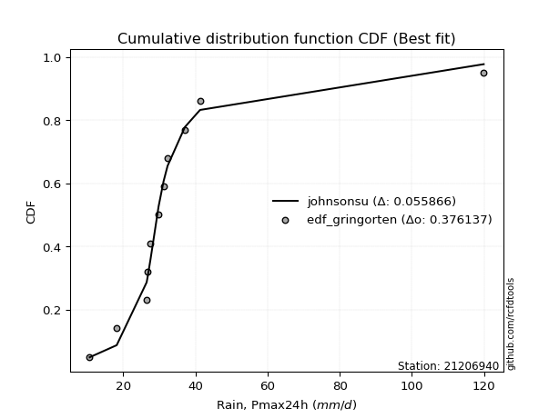</img></img>

</div>


### 9. Empirical - EDF Filliben (1975)

The specific values of the constants (0.3175) (often denoted as $alpha$) and (0.365) are derived from a method proposed by James J. Filliben in a 1975 paper. This particular formula is the mean value of the $i$-th order statistic of the normal distribution and is considered a robust and effective plotting position formula for the normal probability plot correlation coefficient test for normality.

<div align="center">


$P=(m-0.3175)/(n+0.365)$


</div>


**9.1. Empirical values**

<div align="center">

|                | 0                    | 1                   | 2                   | 3                  | 4                   | 5            | 6                  | 7                  | 8                  | 9                  | 10                 |
|:---------------|:---------------------|:--------------------|:--------------------|:-------------------|:--------------------|:-------------|:-------------------|:-------------------|:-------------------|:-------------------|:-------------------|
| date           | 2004                 | 2011                | 2007                | 2005               | 2014                | 2012         | 2008               | 2009               | 2010               | 2013               | 2006               |
| x              | 10.7                 | 18.2                | 26.5                | 26.8               | 27.6                | 29.8         | 31.2               | 32.3               | 37.1               | 41.3               | 119.9              |
| m              | 1                    | 2                   | 3                   | 4                  | 5                   | 6            | 7                  | 8                  | 9                  | 10                 | 11                 |
| empirical_dist | edf_filliben         | edf_filliben        | edf_filliben        | edf_filliben       | edf_filliben        | edf_filliben | edf_filliben       | edf_filliben       | edf_filliben       | edf_filliben       | edf_filliben       |
| empirical      | 0.060052793664760226 | 0.14804223493180818 | 0.23603167619885615 | 0.3240211174659041 | 0.41201055873295206 | 0.5          | 0.587989441267048  | 0.6759788825340959 | 0.7639683238011438 | 0.8519577650681918 | 0.9399472063352396 |
| empirical_tr   | 1.063889538965598    | 1.173767105602892   | 1.3089547941261157  | 1.4793361535958347 | 1.7007108118219232  | 2.0          | 2.4271222637479983 | 3.08621860149355   | 4.236719478098787  | 6.754829123328378  | 16.652014652014618 |

</div>


**9.2. Kolmogorov-Smirnov fit test (sorted by Δ)**


<div align="center">

|                | 0                    | 1                   | 2                   | 3                   | 4                     | 5                   | 6                   | 7                   | 8                   | 9                   | 10                  | 11                  | 12                  | 13                  | 14                  | 15                  | 16                  | 17                  | 18                  | 19                  | 20                  | 21                  | 22                  | 23                  | 24                  | 25                  | 26                  | 27                  | 28                  | 29                  | 30                  | 31                  | 32                  | 33                  | 34                  | 35                  | 36                  | 37                  | 38                  | 39                  | 40                  | 41                  | 42                  | 43                  | 44                  | 45                  | 46                  | 47                  | 48                  | 49                  | 50                  | 51                  | 52                  | 53                  | 54                  | 55                  | 56                  | 57                  | 58                  | 59                  | 60                  | 61                  | 62                  | 63                  | 64                  | 65                  | 66                  | 67                  | 68                  | 69                  | 70                  | 71                  | 72                  | 73                  | 74                  | 75                  | 76                  | 77                  | 78                  | 79                  | 80                  | 81                  | 82                  | 83                  | 84                  | 85                  | 86                  | 87                  | 88                  | 89                  |
|:---------------|:---------------------|:--------------------|:--------------------|:--------------------|:----------------------|:--------------------|:--------------------|:--------------------|:--------------------|:--------------------|:--------------------|:--------------------|:--------------------|:--------------------|:--------------------|:--------------------|:--------------------|:--------------------|:--------------------|:--------------------|:--------------------|:--------------------|:--------------------|:--------------------|:--------------------|:--------------------|:--------------------|:--------------------|:--------------------|:--------------------|:--------------------|:--------------------|:--------------------|:--------------------|:--------------------|:--------------------|:--------------------|:--------------------|:--------------------|:--------------------|:--------------------|:--------------------|:--------------------|:--------------------|:--------------------|:--------------------|:--------------------|:--------------------|:--------------------|:--------------------|:--------------------|:--------------------|:--------------------|:--------------------|:--------------------|:--------------------|:--------------------|:--------------------|:--------------------|:--------------------|:--------------------|:--------------------|:--------------------|:--------------------|:--------------------|:--------------------|:--------------------|:--------------------|:--------------------|:--------------------|:--------------------|:--------------------|:--------------------|:--------------------|:--------------------|:--------------------|:--------------------|:--------------------|:--------------------|:--------------------|:--------------------|:--------------------|:--------------------|:--------------------|:--------------------|:--------------------|:--------------------|:--------------------|:--------------------|:--------------------|
| station        | 21206940             | 21206940            | 21206940            | 21206940            | 21206940              | 21206940            | 21206940            | 21206940            | 21206940            | 21206940            | 21206940            | 21206940            | 21206940            | 21206940            | 21206940            | 21206940            | 21206940            | 21206940            | 21206940            | 21206940            | 21206940            | 21206940            | 21206940            | 21206940            | 21206940            | 21206940            | 21206940            | 21206940            | 21206940            | 21206940            | 21206940            | 21206940            | 21206940            | 21206940            | 21206940            | 21206940            | 21206940            | 21206940            | 21206940            | 21206940            | 21206940            | 21206940            | 21206940            | 21206940            | 21206940            | 21206940            | 21206940            | 21206940            | 21206940            | 21206940            | 21206940            | 21206940            | 21206940            | 21206940            | 21206940            | 21206940            | 21206940            | 21206940            | 21206940            | 21206940            | 21206940            | 21206940            | 21206940            | 21206940            | 21206940            | 21206940            | 21206940            | 21206940            | 21206940            | 21206940            | 21206940            | 21206940            | 21206940            | 21206940            | 21206940            | 21206940            | 21206940            | 21206940            | 21206940            | 21206940            | 21206940            | 21206940            | 21206940            | 21206940            | 21206940            | 21206940            | 21206940            | 21206940            | 21206940            | 21206940            |
| empirical_dist | edf_filliben         | edf_filliben        | edf_filliben        | edf_filliben        | edf_filliben          | edf_filliben        | edf_filliben        | edf_filliben        | edf_filliben        | edf_filliben        | edf_filliben        | edf_filliben        | edf_filliben        | edf_filliben        | edf_filliben        | edf_filliben        | edf_filliben        | edf_filliben        | edf_filliben        | edf_filliben        | edf_filliben        | edf_filliben        | edf_filliben        | edf_filliben        | edf_filliben        | edf_filliben        | edf_filliben        | edf_filliben        | edf_filliben        | edf_filliben        | edf_filliben        | edf_filliben        | edf_filliben        | edf_filliben        | edf_filliben        | edf_filliben        | edf_filliben        | edf_filliben        | edf_filliben        | edf_filliben        | edf_filliben        | edf_filliben        | edf_filliben        | edf_filliben        | edf_filliben        | edf_filliben        | edf_filliben        | edf_filliben        | edf_filliben        | edf_filliben        | edf_filliben        | edf_filliben        | edf_filliben        | edf_filliben        | edf_filliben        | edf_filliben        | edf_filliben        | edf_filliben        | edf_filliben        | edf_filliben        | edf_filliben        | edf_filliben        | edf_filliben        | edf_filliben        | edf_filliben        | edf_filliben        | edf_filliben        | edf_filliben        | edf_filliben        | edf_filliben        | edf_filliben        | edf_filliben        | edf_filliben        | edf_filliben        | edf_filliben        | edf_filliben        | edf_filliben        | edf_filliben        | edf_filliben        | edf_filliben        | edf_filliben        | edf_filliben        | edf_filliben        | edf_filliben        | edf_filliben        | edf_filliben        | edf_filliben        | edf_filliben        | edf_filliben        | edf_filliben        |
| p_dist         | johnsonsu            | logjohnsonsu        | logt                | t                   | loglaplace_asymmetric | loglaplace          | loghypsecant        | loglogistic         | exponnorm           | logweibull_min      | mielke              | loggenlogistic      | genlogistic         | logcrystalball      | lognorm             | lognorm             | logloggamma         | logfisk             | fisk                | logmielke           | nct                 | fatiguelife         | invweibull          | logrice             | genexpon            | invgauss            | laplace_asymmetric  | alpha               | invgamma            | f                   | ncf                 | betaprime           | loggamma            | loggamma            | logerlang           | logfatiguelife      | logf                | loginvgamma         | logbetaprime        | loginvgauss         | logalpha            | logexponnorm        | moyal               | logncf              | gamma               | lognct              | logmaxwell          | loggumbel_l         | truncnorm           | gibrat              | logpearson3         | halflogistic        | lograyleigh         | gumbel_r            | gompertz            | loggompertz         | logtruncnorm        | halfnorm            | lognakagami         | loginvweibull       | expon               | loggumbel_r         | chi2                | pareto              | logkstwobign        | wald                | kstwobign           | rayleigh            | loggenexpon         | loghalfnorm         | logmoyal            | maxwell             | pearson3            | loghalflogistic     | hypsecant           | laplace             | logistic            | nakagami            | crystalball         | norm                | weibull_min         | rice                | loggibrat           | logwald             | erlang              | logexpon            | gumbel_l            | logchi2             | loglognorm          | logpareto           |
| delta          | 0.060968642980841425 | 0.06491994015412081 | 0.06995011841376855 | 0.09114374245541165 | 0.1072342796575326    | 0.11470248576591144 | 0.14172607262481843 | 0.15219654836176147 | 0.16026317937771895 | 0.16300902961030514 | 0.163841800803761   | 0.16391484675496734 | 0.16472577667187638 | 0.16498145718016252 | 0.1649814595885046  | 0.1649814595885046  | 0.16571500563393463 | 0.16714087653858214 | 0.16848688973811546 | 0.16887243245193465 | 0.17136452331096183 | 0.1749440462677269  | 0.1788047632297857  | 0.17910119384671355 | 0.17964852922046334 | 0.17991355433279024 | 0.18161506115047732 | 0.18192540106257601 | 0.182631381754669   | 0.18280466139426801 | 0.1832700256004108  | 0.18342498840500918 | 0.18679523914133853 | 0.18679523914133853 | 0.1867953194115531  | 0.18763190281901895 | 0.18901474205812482 | 0.1890749065233052  | 0.18984417624778852 | 0.189922929732275   | 0.1899747209405833  | 0.19160063118848134 | 0.19189160956826132 | 0.19546022905473934 | 0.19664469660653797 | 0.19745511464885293 | 0.19902087884383415 | 0.20231448305585253 | 0.20436041057306628 | 0.20618071920451245 | 0.20747011789264838 | 0.21100686521526466 | 0.21131260870884125 | 0.21356592604346514 | 0.2137685103019331  | 0.21552059902484896 | 0.21818139012596202 | 0.21840631916310127 | 0.2203154616708263  | 0.22036165353997947 | 0.22203860913766924 | 0.22494177523316958 | 0.22889874504089527 | 0.23475753713903755 | 0.23730022872581893 | 0.23749722218085886 | 0.2387724415794319  | 0.24441859261043342 | 0.24483774011409196 | 0.24617091573851865 | 0.24790453001854026 | 0.25361687200153094 | 0.2576408638069352  | 0.2618718817615201  | 0.265723670797833   | 0.2727899162531866  | 0.27343284719591054 | 0.27367369156923316 | 0.2826478897465994  | 0.2826478960033161  | 0.2834425803403178  | 0.2845072322493478  | 0.3044224357474704  | 0.30995647016943495 | 0.3125134954190013  | 0.34352897323188336 | 0.34735543838895766 | 0.4064431855544506  | 0.449451426206752   | 0.49477102648258925 |
| deltao         | 0.37613735880099997  | 0.37613735880099997 | 0.37613735880099997 | 0.37613735880099997 | 0.37613735880099997   | 0.37613735880099997 | 0.37613735880099997 | 0.37613735880099997 | 0.37613735880099997 | 0.37613735880099997 | 0.37613735880099997 | 0.37613735880099997 | 0.37613735880099997 | 0.37613735880099997 | 0.37613735880099997 | 0.37613735880099997 | 0.37613735880099997 | 0.37613735880099997 | 0.37613735880099997 | 0.37613735880099997 | 0.37613735880099997 | 0.37613735880099997 | 0.37613735880099997 | 0.37613735880099997 | 0.37613735880099997 | 0.37613735880099997 | 0.37613735880099997 | 0.37613735880099997 | 0.37613735880099997 | 0.37613735880099997 | 0.37613735880099997 | 0.37613735880099997 | 0.37613735880099997 | 0.37613735880099997 | 0.37613735880099997 | 0.37613735880099997 | 0.37613735880099997 | 0.37613735880099997 | 0.37613735880099997 | 0.37613735880099997 | 0.37613735880099997 | 0.37613735880099997 | 0.37613735880099997 | 0.37613735880099997 | 0.37613735880099997 | 0.37613735880099997 | 0.37613735880099997 | 0.37613735880099997 | 0.37613735880099997 | 0.37613735880099997 | 0.37613735880099997 | 0.37613735880099997 | 0.37613735880099997 | 0.37613735880099997 | 0.37613735880099997 | 0.37613735880099997 | 0.37613735880099997 | 0.37613735880099997 | 0.37613735880099997 | 0.37613735880099997 | 0.37613735880099997 | 0.37613735880099997 | 0.37613735880099997 | 0.37613735880099997 | 0.37613735880099997 | 0.37613735880099997 | 0.37613735880099997 | 0.37613735880099997 | 0.37613735880099997 | 0.37613735880099997 | 0.37613735880099997 | 0.37613735880099997 | 0.37613735880099997 | 0.37613735880099997 | 0.37613735880099997 | 0.37613735880099997 | 0.37613735880099997 | 0.37613735880099997 | 0.37613735880099997 | 0.37613735880099997 | 0.37613735880099997 | 0.37613735880099997 | 0.37613735880099997 | 0.37613735880099997 | 0.37613735880099997 | 0.37613735880099997 | 0.37613735880099997 | 0.37613735880099997 | 0.37613735880099997 | 0.37613735880099997 |
| eval           | Δo > Δ               | Δo > Δ              | Δo > Δ              | Δo > Δ              | Δo > Δ                | Δo > Δ              | Δo > Δ              | Δo > Δ              | Δo > Δ              | Δo > Δ              | Δo > Δ              | Δo > Δ              | Δo > Δ              | Δo > Δ              | Δo > Δ              | Δo > Δ              | Δo > Δ              | Δo > Δ              | Δo > Δ              | Δo > Δ              | Δo > Δ              | Δo > Δ              | Δo > Δ              | Δo > Δ              | Δo > Δ              | Δo > Δ              | Δo > Δ              | Δo > Δ              | Δo > Δ              | Δo > Δ              | Δo > Δ              | Δo > Δ              | Δo > Δ              | Δo > Δ              | Δo > Δ              | Δo > Δ              | Δo > Δ              | Δo > Δ              | Δo > Δ              | Δo > Δ              | Δo > Δ              | Δo > Δ              | Δo > Δ              | Δo > Δ              | Δo > Δ              | Δo > Δ              | Δo > Δ              | Δo > Δ              | Δo > Δ              | Δo > Δ              | Δo > Δ              | Δo > Δ              | Δo > Δ              | Δo > Δ              | Δo > Δ              | Δo > Δ              | Δo > Δ              | Δo > Δ              | Δo > Δ              | Δo > Δ              | Δo > Δ              | Δo > Δ              | Δo > Δ              | Δo > Δ              | Δo > Δ              | Δo > Δ              | Δo > Δ              | Δo > Δ              | Δo > Δ              | Δo > Δ              | Δo > Δ              | Δo > Δ              | Δo > Δ              | Δo > Δ              | Δo > Δ              | Δo > Δ              | Δo > Δ              | Δo > Δ              | Δo > Δ              | Δo > Δ              | Δo > Δ              | Δo > Δ              | Δo > Δ              | Δo > Δ              | Δo > Δ              | Δo > Δ              | Δo > Δ              | Δo <= Δ             | Δo <= Δ             | Δo <= Δ             |
| fit            | 1                    | 1                   | 1                   | 1                   | 1                     | 1                   | 1                   | 1                   | 1                   | 1                   | 1                   | 1                   | 1                   | 1                   | 1                   | 1                   | 1                   | 1                   | 1                   | 1                   | 1                   | 1                   | 1                   | 1                   | 1                   | 1                   | 1                   | 1                   | 1                   | 1                   | 1                   | 1                   | 1                   | 1                   | 1                   | 1                   | 1                   | 1                   | 1                   | 1                   | 1                   | 1                   | 1                   | 1                   | 1                   | 1                   | 1                   | 1                   | 1                   | 1                   | 1                   | 1                   | 1                   | 1                   | 1                   | 1                   | 1                   | 1                   | 1                   | 1                   | 1                   | 1                   | 1                   | 1                   | 1                   | 1                   | 1                   | 1                   | 1                   | 1                   | 1                   | 1                   | 1                   | 1                   | 1                   | 1                   | 1                   | 1                   | 1                   | 1                   | 1                   | 1                   | 1                   | 1                   | 1                   | 1                   | 1                   | 0                   | 0                   | 0                   |
| n              | 11                   | 11                  | 11                  | 11                  | 11                    | 11                  | 11                  | 11                  | 11                  | 11                  | 11                  | 11                  | 11                  | 11                  | 11                  | 11                  | 11                  | 11                  | 11                  | 11                  | 11                  | 11                  | 11                  | 11                  | 11                  | 11                  | 11                  | 11                  | 11                  | 11                  | 11                  | 11                  | 11                  | 11                  | 11                  | 11                  | 11                  | 11                  | 11                  | 11                  | 11                  | 11                  | 11                  | 11                  | 11                  | 11                  | 11                  | 11                  | 11                  | 11                  | 11                  | 11                  | 11                  | 11                  | 11                  | 11                  | 11                  | 11                  | 11                  | 11                  | 11                  | 11                  | 11                  | 11                  | 11                  | 11                  | 11                  | 11                  | 11                  | 11                  | 11                  | 11                  | 11                  | 11                  | 11                  | 11                  | 11                  | 11                  | 11                  | 11                  | 11                  | 11                  | 11                  | 11                  | 11                  | 11                  | 11                  | 11                  | 11                  | 11                  |
| best_fit       | 1                    | 0                   | 0                   | 0                   | 0                     | 0                   | 0                   | 0                   | 0                   | 0                   | 0                   | 0                   | 0                   | 0                   | 0                   | 0                   | 0                   | 0                   | 0                   | 0                   | 0                   | 0                   | 0                   | 0                   | 0                   | 0                   | 0                   | 0                   | 0                   | 0                   | 0                   | 0                   | 0                   | 0                   | 0                   | 0                   | 0                   | 0                   | 0                   | 0                   | 0                   | 0                   | 0                   | 0                   | 0                   | 0                   | 0                   | 0                   | 0                   | 0                   | 0                   | 0                   | 0                   | 0                   | 0                   | 0                   | 0                   | 0                   | 0                   | 0                   | 0                   | 0                   | 0                   | 0                   | 0                   | 0                   | 0                   | 0                   | 0                   | 0                   | 0                   | 0                   | 0                   | 0                   | 0                   | 0                   | 0                   | 0                   | 0                   | 0                   | 0                   | 0                   | 0                   | 0                   | 0                   | 0                   | 0                   | 0                   | 0                   | 0                   |
| best_fit_sort  | 1                    | 2                   | 3                   | 4                   | 5                     | 6                   | 7                   | 8                   | 9                   | 10                  | 11                  | 12                  | 13                  | 14                  | 15                  | 16                  | 17                  | 18                  | 19                  | 20                  | 21                  | 22                  | 23                  | 24                  | 25                  | 26                  | 27                  | 28                  | 29                  | 30                  | 31                  | 32                  | 33                  | 34                  | 35                  | 36                  | 37                  | 38                  | 39                  | 40                  | 41                  | 42                  | 43                  | 44                  | 45                  | 46                  | 47                  | 48                  | 49                  | 50                  | 51                  | 52                  | 53                  | 54                  | 55                  | 56                  | 57                  | 58                  | 59                  | 60                  | 61                  | 62                  | 63                  | 64                  | 65                  | 66                  | 67                  | 68                  | 69                  | 70                  | 71                  | 72                  | 73                  | 74                  | 75                  | 76                  | 77                  | 78                  | 79                  | 80                  | 81                  | 82                  | 83                  | 84                  | 85                  | 86                  | 87                  | 88                  | 89                  | 90                  |

</div>


<div align="center">

</img>

</div>


**9.3. Best fit**

<div align="center">

|   id |   station | empirical_dist   | p_dist    |     delta |   deltao | eval   |   fit |   n |   best_fit |   best_fit_sort |
|-----:|----------:|:-----------------|:----------|----------:|---------:|:-------|------:|----:|-----------:|----------------:|
|    0 |  21206940 | edf_filliben     | johnsonsu | 0.0609686 | 0.376137 | Δo > Δ |     1 |  11 |          1 |               1 |

</div>


<div align="center">

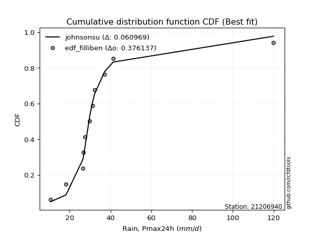</img></img>

</div>


### 10. Empirical - EDF Jenkinson (1977)

The Jenkinson formula in hydrology is an empirical plotting position formula used to estimate the non-exceedance probability _(P)_ or return period _(T)_ of a given ordered observation within a sample. It is a widely used method in the frequency analysis of extreme events such as floods and rainfall, as it provides a distribution-free way to plot data. _a≈0.31_ and _b≈0.38_ are constants derived to approximate the median of the probability distribution for the given rank.

<div align="center">


$P=(m-a)/(n+b)$


</div>


**10.1. Empirical values**

<div align="center">

|                | 0                    | 1                 | 2                   | 3                  | 4                  | 5             | 6                  | 7                  | 8                  | 9                  | 10                 |
|:---------------|:---------------------|:------------------|:--------------------|:-------------------|:-------------------|:--------------|:-------------------|:-------------------|:-------------------|:-------------------|:-------------------|
| date           | 2004                 | 2011              | 2007                | 2005               | 2014               | 2012          | 2008               | 2009               | 2010               | 2013               | 2006               |
| x              | 10.7                 | 18.2              | 26.5                | 26.8               | 27.6               | 29.8          | 31.2               | 32.3               | 37.1               | 41.3               | 119.9              |
| m              | 1                    | 2                 | 3                   | 4                  | 5                  | 6             | 7                  | 8                  | 9                  | 10                 | 11                 |
| empirical_dist | edf_jenkinson        | edf_jenkinson     | edf_jenkinson       | edf_jenkinson      | edf_jenkinson      | edf_jenkinson | edf_jenkinson      | edf_jenkinson      | edf_jenkinson      | edf_jenkinson      | edf_jenkinson      |
| empirical      | 0.060632688927943754 | 0.148506151142355 | 0.23637961335676624 | 0.3242530755711775 | 0.4121265377855888 | 0.5           | 0.5878734622144113 | 0.6757469244288224 | 0.7636203866432336 | 0.8514938488576449 | 0.9393673110720562 |
| empirical_tr   | 1.0645463049579045   | 1.174406604747162 | 1.3095512082853855  | 1.4798439531859557 | 1.7010463378176381 | 2.0           | 2.4264392324093818 | 3.0840108401084008 | 4.230483271375462  | 6.733727810650883  | 16.49275362318839  |

</div>


**10.2. Kolmogorov-Smirnov fit test (sorted by Δ)**


<div align="center">

|                | 0                    | 1                   | 2                   | 3                   | 4                     | 5                   | 6                   | 7                   | 8                   | 9                   | 10                  | 11                  | 12                  | 13                  | 14                  | 15                  | 16                  | 17                  | 18                  | 19                  | 20                  | 21                  | 22                  | 23                  | 24                  | 25                  | 26                  | 27                  | 28                  | 29                  | 30                  | 31                  | 32                  | 33                  | 34                  | 35                  | 36                  | 37                  | 38                  | 39                  | 40                  | 41                  | 42                  | 43                  | 44                  | 45                  | 46                  | 47                  | 48                  | 49                  | 50                  | 51                  | 52                  | 53                  | 54                  | 55                  | 56                  | 57                  | 58                  | 59                  | 60                  | 61                  | 62                  | 63                  | 64                  | 65                  | 66                  | 67                  | 68                  | 69                  | 70                  | 71                  | 72                  | 73                  | 74                  | 75                  | 76                  | 77                  | 78                  | 79                  | 80                  | 81                  | 82                  | 83                  | 84                  | 85                  | 86                  | 87                  | 88                  | 89                  |
|:---------------|:---------------------|:--------------------|:--------------------|:--------------------|:----------------------|:--------------------|:--------------------|:--------------------|:--------------------|:--------------------|:--------------------|:--------------------|:--------------------|:--------------------|:--------------------|:--------------------|:--------------------|:--------------------|:--------------------|:--------------------|:--------------------|:--------------------|:--------------------|:--------------------|:--------------------|:--------------------|:--------------------|:--------------------|:--------------------|:--------------------|:--------------------|:--------------------|:--------------------|:--------------------|:--------------------|:--------------------|:--------------------|:--------------------|:--------------------|:--------------------|:--------------------|:--------------------|:--------------------|:--------------------|:--------------------|:--------------------|:--------------------|:--------------------|:--------------------|:--------------------|:--------------------|:--------------------|:--------------------|:--------------------|:--------------------|:--------------------|:--------------------|:--------------------|:--------------------|:--------------------|:--------------------|:--------------------|:--------------------|:--------------------|:--------------------|:--------------------|:--------------------|:--------------------|:--------------------|:--------------------|:--------------------|:--------------------|:--------------------|:--------------------|:--------------------|:--------------------|:--------------------|:--------------------|:--------------------|:--------------------|:--------------------|:--------------------|:--------------------|:--------------------|:--------------------|:--------------------|:--------------------|:--------------------|:--------------------|:--------------------|
| station        | 21206940             | 21206940            | 21206940            | 21206940            | 21206940              | 21206940            | 21206940            | 21206940            | 21206940            | 21206940            | 21206940            | 21206940            | 21206940            | 21206940            | 21206940            | 21206940            | 21206940            | 21206940            | 21206940            | 21206940            | 21206940            | 21206940            | 21206940            | 21206940            | 21206940            | 21206940            | 21206940            | 21206940            | 21206940            | 21206940            | 21206940            | 21206940            | 21206940            | 21206940            | 21206940            | 21206940            | 21206940            | 21206940            | 21206940            | 21206940            | 21206940            | 21206940            | 21206940            | 21206940            | 21206940            | 21206940            | 21206940            | 21206940            | 21206940            | 21206940            | 21206940            | 21206940            | 21206940            | 21206940            | 21206940            | 21206940            | 21206940            | 21206940            | 21206940            | 21206940            | 21206940            | 21206940            | 21206940            | 21206940            | 21206940            | 21206940            | 21206940            | 21206940            | 21206940            | 21206940            | 21206940            | 21206940            | 21206940            | 21206940            | 21206940            | 21206940            | 21206940            | 21206940            | 21206940            | 21206940            | 21206940            | 21206940            | 21206940            | 21206940            | 21206940            | 21206940            | 21206940            | 21206940            | 21206940            | 21206940            |
| empirical_dist | edf_jenkinson        | edf_jenkinson       | edf_jenkinson       | edf_jenkinson       | edf_jenkinson         | edf_jenkinson       | edf_jenkinson       | edf_jenkinson       | edf_jenkinson       | edf_jenkinson       | edf_jenkinson       | edf_jenkinson       | edf_jenkinson       | edf_jenkinson       | edf_jenkinson       | edf_jenkinson       | edf_jenkinson       | edf_jenkinson       | edf_jenkinson       | edf_jenkinson       | edf_jenkinson       | edf_jenkinson       | edf_jenkinson       | edf_jenkinson       | edf_jenkinson       | edf_jenkinson       | edf_jenkinson       | edf_jenkinson       | edf_jenkinson       | edf_jenkinson       | edf_jenkinson       | edf_jenkinson       | edf_jenkinson       | edf_jenkinson       | edf_jenkinson       | edf_jenkinson       | edf_jenkinson       | edf_jenkinson       | edf_jenkinson       | edf_jenkinson       | edf_jenkinson       | edf_jenkinson       | edf_jenkinson       | edf_jenkinson       | edf_jenkinson       | edf_jenkinson       | edf_jenkinson       | edf_jenkinson       | edf_jenkinson       | edf_jenkinson       | edf_jenkinson       | edf_jenkinson       | edf_jenkinson       | edf_jenkinson       | edf_jenkinson       | edf_jenkinson       | edf_jenkinson       | edf_jenkinson       | edf_jenkinson       | edf_jenkinson       | edf_jenkinson       | edf_jenkinson       | edf_jenkinson       | edf_jenkinson       | edf_jenkinson       | edf_jenkinson       | edf_jenkinson       | edf_jenkinson       | edf_jenkinson       | edf_jenkinson       | edf_jenkinson       | edf_jenkinson       | edf_jenkinson       | edf_jenkinson       | edf_jenkinson       | edf_jenkinson       | edf_jenkinson       | edf_jenkinson       | edf_jenkinson       | edf_jenkinson       | edf_jenkinson       | edf_jenkinson       | edf_jenkinson       | edf_jenkinson       | edf_jenkinson       | edf_jenkinson       | edf_jenkinson       | edf_jenkinson       | edf_jenkinson       | edf_jenkinson       |
| p_dist         | johnsonsu            | logjohnsonsu        | logt                | t                   | loglaplace_asymmetric | loglaplace          | loghypsecant        | loglogistic         | exponnorm           | logweibull_min      | mielke              | loggenlogistic      | genlogistic         | logcrystalball      | lognorm             | lognorm             | logloggamma         | logfisk             | fisk                | logmielke           | nct                 | fatiguelife         | invweibull          | logrice             | genexpon            | invgauss            | laplace_asymmetric  | alpha               | invgamma            | f                   | ncf                 | betaprime           | loggamma            | loggamma            | logerlang           | logfatiguelife      | logf                | loginvgamma         | logbetaprime        | loginvgauss         | logalpha            | logexponnorm        | moyal               | logncf              | gamma               | lognct              | logmaxwell          | loggumbel_l         | truncnorm           | gibrat              | logpearson3         | halflogistic        | lograyleigh         | gumbel_r            | gompertz            | loggompertz         | logtruncnorm        | halfnorm            | lognakagami         | loginvweibull       | expon               | loggumbel_r         | chi2                | pareto              | logkstwobign        | wald                | kstwobign           | rayleigh            | loggenexpon         | loghalfnorm         | logmoyal            | maxwell             | pearson3            | loghalflogistic     | hypsecant           | laplace             | logistic            | nakagami            | crystalball         | norm                | weibull_min         | rice                | loggibrat           | logwald             | erlang              | logexpon            | gumbel_l            | logchi2             | loglognorm          | logpareto           |
| delta          | 0.061432559191388236 | 0.06457200299621071 | 0.06960218125585846 | 0.09079580529750156 | 0.1068863424996225    | 0.11435454860800134 | 0.14137813546690833 | 0.15184861120385137 | 0.1600312212724455  | 0.16266109245239505 | 0.16349386364585092 | 0.16356690959705725 | 0.16449381856660295 | 0.16463352002225243 | 0.1646335224305945  | 0.1646335224305945  | 0.16536706847602453 | 0.16679293938067205 | 0.16813895258020536 | 0.16852449529402455 | 0.17101658615305174 | 0.1745961091098168  | 0.1784568260718756  | 0.17875325668880346 | 0.17930059206255325 | 0.17956561717488015 | 0.1813831030452039  | 0.18157746390466592 | 0.1822834445967589  | 0.18245672423635792 | 0.1829220884425007  | 0.18307705124709908 | 0.18644730198342843 | 0.18644730198342843 | 0.18644738225364302 | 0.18728396566110886 | 0.18866680490021473 | 0.1887269693653951  | 0.18949623908987842 | 0.18957499257436491 | 0.1896267837826732  | 0.19125269403057124 | 0.19154367241035122 | 0.19511229189682924 | 0.19629675944862787 | 0.19710717749094284 | 0.19867294168592406 | 0.2020825249505791  | 0.2040124734151562  | 0.20583278204660235 | 0.2071221807347383  | 0.21065892805735456 | 0.21096467155093115 | 0.21310200983291827 | 0.21330459409138625 | 0.21517266186693887 | 0.21783345296805193 | 0.2179424029525544  | 0.2199675245129162  | 0.22001371638206937 | 0.22169067197975914 | 0.22459383807525948 | 0.22855080788298518 | 0.23440959998112745 | 0.23695229156790884 | 0.23714928502294877 | 0.23830852536888503 | 0.24395467639988655 | 0.24448980295618186 | 0.24582297858060856 | 0.24755659286063017 | 0.25315295579098407 | 0.25729292664902514 | 0.26152394460361006 | 0.2652597545872861  | 0.27255795814791317 | 0.2729689309853637  | 0.273325754411323   | 0.2821839735360525  | 0.2821839797927692  | 0.2829786641297709  | 0.28404331603880095 | 0.30407449858956026 | 0.3096085330115248  | 0.31216555826109116 | 0.3431810360739732  | 0.3468915221784108  | 0.40609524839654043 | 0.4489875099962052  | 0.49430711027204244 |
| deltao         | 0.37613735880099997  | 0.37613735880099997 | 0.37613735880099997 | 0.37613735880099997 | 0.37613735880099997   | 0.37613735880099997 | 0.37613735880099997 | 0.37613735880099997 | 0.37613735880099997 | 0.37613735880099997 | 0.37613735880099997 | 0.37613735880099997 | 0.37613735880099997 | 0.37613735880099997 | 0.37613735880099997 | 0.37613735880099997 | 0.37613735880099997 | 0.37613735880099997 | 0.37613735880099997 | 0.37613735880099997 | 0.37613735880099997 | 0.37613735880099997 | 0.37613735880099997 | 0.37613735880099997 | 0.37613735880099997 | 0.37613735880099997 | 0.37613735880099997 | 0.37613735880099997 | 0.37613735880099997 | 0.37613735880099997 | 0.37613735880099997 | 0.37613735880099997 | 0.37613735880099997 | 0.37613735880099997 | 0.37613735880099997 | 0.37613735880099997 | 0.37613735880099997 | 0.37613735880099997 | 0.37613735880099997 | 0.37613735880099997 | 0.37613735880099997 | 0.37613735880099997 | 0.37613735880099997 | 0.37613735880099997 | 0.37613735880099997 | 0.37613735880099997 | 0.37613735880099997 | 0.37613735880099997 | 0.37613735880099997 | 0.37613735880099997 | 0.37613735880099997 | 0.37613735880099997 | 0.37613735880099997 | 0.37613735880099997 | 0.37613735880099997 | 0.37613735880099997 | 0.37613735880099997 | 0.37613735880099997 | 0.37613735880099997 | 0.37613735880099997 | 0.37613735880099997 | 0.37613735880099997 | 0.37613735880099997 | 0.37613735880099997 | 0.37613735880099997 | 0.37613735880099997 | 0.37613735880099997 | 0.37613735880099997 | 0.37613735880099997 | 0.37613735880099997 | 0.37613735880099997 | 0.37613735880099997 | 0.37613735880099997 | 0.37613735880099997 | 0.37613735880099997 | 0.37613735880099997 | 0.37613735880099997 | 0.37613735880099997 | 0.37613735880099997 | 0.37613735880099997 | 0.37613735880099997 | 0.37613735880099997 | 0.37613735880099997 | 0.37613735880099997 | 0.37613735880099997 | 0.37613735880099997 | 0.37613735880099997 | 0.37613735880099997 | 0.37613735880099997 | 0.37613735880099997 |
| eval           | Δo > Δ               | Δo > Δ              | Δo > Δ              | Δo > Δ              | Δo > Δ                | Δo > Δ              | Δo > Δ              | Δo > Δ              | Δo > Δ              | Δo > Δ              | Δo > Δ              | Δo > Δ              | Δo > Δ              | Δo > Δ              | Δo > Δ              | Δo > Δ              | Δo > Δ              | Δo > Δ              | Δo > Δ              | Δo > Δ              | Δo > Δ              | Δo > Δ              | Δo > Δ              | Δo > Δ              | Δo > Δ              | Δo > Δ              | Δo > Δ              | Δo > Δ              | Δo > Δ              | Δo > Δ              | Δo > Δ              | Δo > Δ              | Δo > Δ              | Δo > Δ              | Δo > Δ              | Δo > Δ              | Δo > Δ              | Δo > Δ              | Δo > Δ              | Δo > Δ              | Δo > Δ              | Δo > Δ              | Δo > Δ              | Δo > Δ              | Δo > Δ              | Δo > Δ              | Δo > Δ              | Δo > Δ              | Δo > Δ              | Δo > Δ              | Δo > Δ              | Δo > Δ              | Δo > Δ              | Δo > Δ              | Δo > Δ              | Δo > Δ              | Δo > Δ              | Δo > Δ              | Δo > Δ              | Δo > Δ              | Δo > Δ              | Δo > Δ              | Δo > Δ              | Δo > Δ              | Δo > Δ              | Δo > Δ              | Δo > Δ              | Δo > Δ              | Δo > Δ              | Δo > Δ              | Δo > Δ              | Δo > Δ              | Δo > Δ              | Δo > Δ              | Δo > Δ              | Δo > Δ              | Δo > Δ              | Δo > Δ              | Δo > Δ              | Δo > Δ              | Δo > Δ              | Δo > Δ              | Δo > Δ              | Δo > Δ              | Δo > Δ              | Δo > Δ              | Δo > Δ              | Δo <= Δ             | Δo <= Δ             | Δo <= Δ             |
| fit            | 1                    | 1                   | 1                   | 1                   | 1                     | 1                   | 1                   | 1                   | 1                   | 1                   | 1                   | 1                   | 1                   | 1                   | 1                   | 1                   | 1                   | 1                   | 1                   | 1                   | 1                   | 1                   | 1                   | 1                   | 1                   | 1                   | 1                   | 1                   | 1                   | 1                   | 1                   | 1                   | 1                   | 1                   | 1                   | 1                   | 1                   | 1                   | 1                   | 1                   | 1                   | 1                   | 1                   | 1                   | 1                   | 1                   | 1                   | 1                   | 1                   | 1                   | 1                   | 1                   | 1                   | 1                   | 1                   | 1                   | 1                   | 1                   | 1                   | 1                   | 1                   | 1                   | 1                   | 1                   | 1                   | 1                   | 1                   | 1                   | 1                   | 1                   | 1                   | 1                   | 1                   | 1                   | 1                   | 1                   | 1                   | 1                   | 1                   | 1                   | 1                   | 1                   | 1                   | 1                   | 1                   | 1                   | 1                   | 0                   | 0                   | 0                   |
| n              | 11                   | 11                  | 11                  | 11                  | 11                    | 11                  | 11                  | 11                  | 11                  | 11                  | 11                  | 11                  | 11                  | 11                  | 11                  | 11                  | 11                  | 11                  | 11                  | 11                  | 11                  | 11                  | 11                  | 11                  | 11                  | 11                  | 11                  | 11                  | 11                  | 11                  | 11                  | 11                  | 11                  | 11                  | 11                  | 11                  | 11                  | 11                  | 11                  | 11                  | 11                  | 11                  | 11                  | 11                  | 11                  | 11                  | 11                  | 11                  | 11                  | 11                  | 11                  | 11                  | 11                  | 11                  | 11                  | 11                  | 11                  | 11                  | 11                  | 11                  | 11                  | 11                  | 11                  | 11                  | 11                  | 11                  | 11                  | 11                  | 11                  | 11                  | 11                  | 11                  | 11                  | 11                  | 11                  | 11                  | 11                  | 11                  | 11                  | 11                  | 11                  | 11                  | 11                  | 11                  | 11                  | 11                  | 11                  | 11                  | 11                  | 11                  |
| best_fit       | 1                    | 0                   | 0                   | 0                   | 0                     | 0                   | 0                   | 0                   | 0                   | 0                   | 0                   | 0                   | 0                   | 0                   | 0                   | 0                   | 0                   | 0                   | 0                   | 0                   | 0                   | 0                   | 0                   | 0                   | 0                   | 0                   | 0                   | 0                   | 0                   | 0                   | 0                   | 0                   | 0                   | 0                   | 0                   | 0                   | 0                   | 0                   | 0                   | 0                   | 0                   | 0                   | 0                   | 0                   | 0                   | 0                   | 0                   | 0                   | 0                   | 0                   | 0                   | 0                   | 0                   | 0                   | 0                   | 0                   | 0                   | 0                   | 0                   | 0                   | 0                   | 0                   | 0                   | 0                   | 0                   | 0                   | 0                   | 0                   | 0                   | 0                   | 0                   | 0                   | 0                   | 0                   | 0                   | 0                   | 0                   | 0                   | 0                   | 0                   | 0                   | 0                   | 0                   | 0                   | 0                   | 0                   | 0                   | 0                   | 0                   | 0                   |
| best_fit_sort  | 1                    | 2                   | 3                   | 4                   | 5                     | 6                   | 7                   | 8                   | 9                   | 10                  | 11                  | 12                  | 13                  | 14                  | 15                  | 16                  | 17                  | 18                  | 19                  | 20                  | 21                  | 22                  | 23                  | 24                  | 25                  | 26                  | 27                  | 28                  | 29                  | 30                  | 31                  | 32                  | 33                  | 34                  | 35                  | 36                  | 37                  | 38                  | 39                  | 40                  | 41                  | 42                  | 43                  | 44                  | 45                  | 46                  | 47                  | 48                  | 49                  | 50                  | 51                  | 52                  | 53                  | 54                  | 55                  | 56                  | 57                  | 58                  | 59                  | 60                  | 61                  | 62                  | 63                  | 64                  | 65                  | 66                  | 67                  | 68                  | 69                  | 70                  | 71                  | 72                  | 73                  | 74                  | 75                  | 76                  | 77                  | 78                  | 79                  | 80                  | 81                  | 82                  | 83                  | 84                  | 85                  | 86                  | 87                  | 88                  | 89                  | 90                  |

</div>


<div align="center">

</img>

</div>


**10.3. Best fit**

<div align="center">

|   id |   station | empirical_dist   | p_dist    |     delta |   deltao | eval   |   fit |   n |   best_fit |   best_fit_sort |
|-----:|----------:|:-----------------|:----------|----------:|---------:|:-------|------:|----:|-----------:|----------------:|
|    0 |  21206940 | edf_jenkinson    | johnsonsu | 0.0614326 | 0.376137 | Δo > Δ |     1 |  11 |          1 |               1 |

</div>


<div align="center">

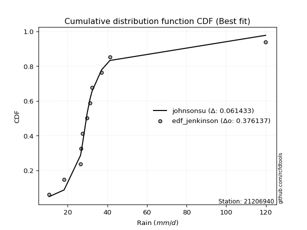</img></img>

</div>


### 11. Empirical - EDF Cunnane (1978)

Cunnane´s work in statistical hydrology has focused on the performance and evaluation of different probability distributions (such as GEV, Gumbel, Lognormal) for flood frequency estimation. _b_ is a constant, typically set to 0.4.

<div align="center">


$P=(m-b)/(n+1-2b)$


</div>


**11.1. Empirical values**

<div align="center">

|                | 0                    | 1                   | 2                   | 3                   | 4                  | 5           | 6                  | 7                  | 8                  | 9                  | 10                 |
|:---------------|:---------------------|:--------------------|:--------------------|:--------------------|:-------------------|:------------|:-------------------|:-------------------|:-------------------|:-------------------|:-------------------|
| date           | 2004                 | 2011                | 2007                | 2005                | 2014               | 2012        | 2008               | 2009               | 2010               | 2013               | 2006               |
| x              | 10.7                 | 18.2                | 26.5                | 26.8                | 27.6               | 29.8        | 31.2               | 32.3               | 37.1               | 41.3               | 119.9              |
| m              | 1                    | 2                   | 3                   | 4                   | 5                  | 6           | 7                  | 8                  | 9                  | 10                 | 11                 |
| empirical_dist | edf_cunnane          | edf_cunnane         | edf_cunnane         | edf_cunnane         | edf_cunnane        | edf_cunnane | edf_cunnane        | edf_cunnane        | edf_cunnane        | edf_cunnane        | edf_cunnane        |
| empirical      | 0.053571428571428575 | 0.14285714285714288 | 0.23214285714285718 | 0.32142857142857145 | 0.4107142857142857 | 0.5         | 0.5892857142857143 | 0.6785714285714286 | 0.7678571428571429 | 0.8571428571428572 | 0.9464285714285715 |
| empirical_tr   | 1.0566037735849056   | 1.1666666666666667  | 1.302325581395349   | 1.4736842105263157  | 1.696969696969697  | 2.0         | 2.4347826086956523 | 3.1111111111111116 | 4.307692307692308  | 7.0000000000000036 | 18.666666666666693 |

</div>


**11.2. Kolmogorov-Smirnov fit test (sorted by Δ)**


<div align="center">

|                | 0                   | 1                   | 2                   | 3                   | 4                     | 5                   | 6                   | 7                   | 8                   | 9                   | 10                  | 11                  | 12                  | 13                  | 14                  | 15                  | 16                  | 17                  | 18                  | 19                  | 20                  | 21                  | 22                  | 23                  | 24                  | 25                  | 26                  | 27                  | 28                  | 29                  | 30                  | 31                  | 32                  | 33                  | 34                  | 35                  | 36                  | 37                  | 38                  | 39                  | 40                  | 41                  | 42                  | 43                  | 44                  | 45                  | 46                  | 47                  | 48                  | 49                  | 50                  | 51                  | 52                  | 53                  | 54                  | 55                  | 56                  | 57                  | 58                  | 59                  | 60                  | 61                  | 62                  | 63                  | 64                  | 65                  | 66                  | 67                  | 68                  | 69                  | 70                  | 71                  | 72                  | 73                  | 74                  | 75                  | 76                  | 77                  | 78                  | 79                  | 80                  | 81                  | 82                  | 83                  | 84                  | 85                  | 86                  | 87                  | 88                  | 89                  |
|:---------------|:--------------------|:--------------------|:--------------------|:--------------------|:----------------------|:--------------------|:--------------------|:--------------------|:--------------------|:--------------------|:--------------------|:--------------------|:--------------------|:--------------------|:--------------------|:--------------------|:--------------------|:--------------------|:--------------------|:--------------------|:--------------------|:--------------------|:--------------------|:--------------------|:--------------------|:--------------------|:--------------------|:--------------------|:--------------------|:--------------------|:--------------------|:--------------------|:--------------------|:--------------------|:--------------------|:--------------------|:--------------------|:--------------------|:--------------------|:--------------------|:--------------------|:--------------------|:--------------------|:--------------------|:--------------------|:--------------------|:--------------------|:--------------------|:--------------------|:--------------------|:--------------------|:--------------------|:--------------------|:--------------------|:--------------------|:--------------------|:--------------------|:--------------------|:--------------------|:--------------------|:--------------------|:--------------------|:--------------------|:--------------------|:--------------------|:--------------------|:--------------------|:--------------------|:--------------------|:--------------------|:--------------------|:--------------------|:--------------------|:--------------------|:--------------------|:--------------------|:--------------------|:--------------------|:--------------------|:--------------------|:--------------------|:--------------------|:--------------------|:--------------------|:--------------------|:--------------------|:--------------------|:--------------------|:--------------------|:--------------------|
| station        | 21206940            | 21206940            | 21206940            | 21206940            | 21206940              | 21206940            | 21206940            | 21206940            | 21206940            | 21206940            | 21206940            | 21206940            | 21206940            | 21206940            | 21206940            | 21206940            | 21206940            | 21206940            | 21206940            | 21206940            | 21206940            | 21206940            | 21206940            | 21206940            | 21206940            | 21206940            | 21206940            | 21206940            | 21206940            | 21206940            | 21206940            | 21206940            | 21206940            | 21206940            | 21206940            | 21206940            | 21206940            | 21206940            | 21206940            | 21206940            | 21206940            | 21206940            | 21206940            | 21206940            | 21206940            | 21206940            | 21206940            | 21206940            | 21206940            | 21206940            | 21206940            | 21206940            | 21206940            | 21206940            | 21206940            | 21206940            | 21206940            | 21206940            | 21206940            | 21206940            | 21206940            | 21206940            | 21206940            | 21206940            | 21206940            | 21206940            | 21206940            | 21206940            | 21206940            | 21206940            | 21206940            | 21206940            | 21206940            | 21206940            | 21206940            | 21206940            | 21206940            | 21206940            | 21206940            | 21206940            | 21206940            | 21206940            | 21206940            | 21206940            | 21206940            | 21206940            | 21206940            | 21206940            | 21206940            | 21206940            |
| empirical_dist | edf_cunnane         | edf_cunnane         | edf_cunnane         | edf_cunnane         | edf_cunnane           | edf_cunnane         | edf_cunnane         | edf_cunnane         | edf_cunnane         | edf_cunnane         | edf_cunnane         | edf_cunnane         | edf_cunnane         | edf_cunnane         | edf_cunnane         | edf_cunnane         | edf_cunnane         | edf_cunnane         | edf_cunnane         | edf_cunnane         | edf_cunnane         | edf_cunnane         | edf_cunnane         | edf_cunnane         | edf_cunnane         | edf_cunnane         | edf_cunnane         | edf_cunnane         | edf_cunnane         | edf_cunnane         | edf_cunnane         | edf_cunnane         | edf_cunnane         | edf_cunnane         | edf_cunnane         | edf_cunnane         | edf_cunnane         | edf_cunnane         | edf_cunnane         | edf_cunnane         | edf_cunnane         | edf_cunnane         | edf_cunnane         | edf_cunnane         | edf_cunnane         | edf_cunnane         | edf_cunnane         | edf_cunnane         | edf_cunnane         | edf_cunnane         | edf_cunnane         | edf_cunnane         | edf_cunnane         | edf_cunnane         | edf_cunnane         | edf_cunnane         | edf_cunnane         | edf_cunnane         | edf_cunnane         | edf_cunnane         | edf_cunnane         | edf_cunnane         | edf_cunnane         | edf_cunnane         | edf_cunnane         | edf_cunnane         | edf_cunnane         | edf_cunnane         | edf_cunnane         | edf_cunnane         | edf_cunnane         | edf_cunnane         | edf_cunnane         | edf_cunnane         | edf_cunnane         | edf_cunnane         | edf_cunnane         | edf_cunnane         | edf_cunnane         | edf_cunnane         | edf_cunnane         | edf_cunnane         | edf_cunnane         | edf_cunnane         | edf_cunnane         | edf_cunnane         | edf_cunnane         | edf_cunnane         | edf_cunnane         | edf_cunnane         |
| p_dist         | johnsonsu           | logjohnsonsu        | logt                | t                   | loglaplace_asymmetric | loglaplace          | loghypsecant        | loglogistic         | exponnorm           | logweibull_min      | genlogistic         | mielke              | loggenlogistic      | logcrystalball      | lognorm             | lognorm             | logloggamma         | logfisk             | fisk                | logmielke           | nct                 | fatiguelife         | invweibull          | logrice             | genexpon            | invgauss            | laplace_asymmetric  | alpha               | invgamma            | f                   | ncf                 | betaprime           | loggamma            | loggamma            | logerlang           | logfatiguelife      | logf                | loginvgamma         | logbetaprime        | loginvgauss         | logalpha            | logexponnorm        | moyal               | logncf              | gamma               | lognct              | logmaxwell          | loggumbel_l         | truncnorm           | gibrat              | logpearson3         | halflogistic        | lograyleigh         | gumbel_r            | gompertz            | loggompertz         | logtruncnorm        | halfnorm            | lognakagami         | loginvweibull       | expon               | loggumbel_r         | chi2                | pareto              | logkstwobign        | wald                | kstwobign           | loggenexpon         | rayleigh            | loghalfnorm         | logmoyal            | maxwell             | pearson3            | loghalflogistic     | hypsecant           | laplace             | nakagami            | logistic            | crystalball         | norm                | weibull_min         | rice                | loggibrat           | logwald             | erlang              | logexpon            | gumbel_l            | logchi2             | loglognorm          | logpareto           |
| delta          | 0.05578355090617612 | 0.06880875921011978 | 0.07383893746976752 | 0.09503256151141062 | 0.11112309871353157   | 0.11859130482191041 | 0.1456148916808174  | 0.15608536741776044 | 0.16285572541505167 | 0.1668978486663041  | 0.1673183227092091  | 0.16773061985975998 | 0.1678036658109663  | 0.1688702762361615  | 0.16887027864450357 | 0.16887027864450357 | 0.1696038246899336  | 0.17102969559458112 | 0.17237570879411443 | 0.17276125150793362 | 0.1752533423669608  | 0.17883286532372586 | 0.18269358228578467 | 0.18299001290271252 | 0.18353734827646231 | 0.18380237338878921 | 0.18420760718781004 | 0.18581422011857499 | 0.18652020081066797 | 0.18669348045026699 | 0.18715884465640978 | 0.18731380746100815 | 0.1906840581973375  | 0.1906840581973375  | 0.19068413846755208 | 0.19152072187501792 | 0.1929035611141238  | 0.19296372557930416 | 0.1937329953037875  | 0.19381174878827398 | 0.19386353999658226 | 0.1954894502444803  | 0.1957804286242603  | 0.1993490481107383  | 0.20053351566253694 | 0.2013439337048519  | 0.20290969789983312 | 0.20490702909318526 | 0.20824922962906525 | 0.21006953826051142 | 0.21135893694864735 | 0.21489568427126363 | 0.21520142776484022 | 0.21875101811813058 | 0.21895360237659856 | 0.21940941808084793 | 0.222070209181961   | 0.2235914112377667  | 0.22420428072682527 | 0.22425047259597844 | 0.2259274281936682  | 0.22883059428916855 | 0.23278756409689425 | 0.23864635619503652 | 0.2411890477818179  | 0.24138604123685783 | 0.24395753365409734 | 0.24872655917009093 | 0.24960368468509886 | 0.2500597347945176  | 0.2517933490745392  | 0.2588019640761964  | 0.2615296828629342  | 0.2657607008175191  | 0.27090876287249843 | 0.2753824622905193  | 0.2775625106252321  | 0.278617939270576   | 0.2878329818212648  | 0.2878329880779815  | 0.2886276724149832  | 0.28969232432401326 | 0.3083112548034693  | 0.31384528922543387 | 0.3164023144750002  | 0.3474177922878823  | 0.3525405304636231  | 0.4103320046104495  | 0.45463651828141727 | 0.4999561185572545  |
| deltao         | 0.37613735880099997 | 0.37613735880099997 | 0.37613735880099997 | 0.37613735880099997 | 0.37613735880099997   | 0.37613735880099997 | 0.37613735880099997 | 0.37613735880099997 | 0.37613735880099997 | 0.37613735880099997 | 0.37613735880099997 | 0.37613735880099997 | 0.37613735880099997 | 0.37613735880099997 | 0.37613735880099997 | 0.37613735880099997 | 0.37613735880099997 | 0.37613735880099997 | 0.37613735880099997 | 0.37613735880099997 | 0.37613735880099997 | 0.37613735880099997 | 0.37613735880099997 | 0.37613735880099997 | 0.37613735880099997 | 0.37613735880099997 | 0.37613735880099997 | 0.37613735880099997 | 0.37613735880099997 | 0.37613735880099997 | 0.37613735880099997 | 0.37613735880099997 | 0.37613735880099997 | 0.37613735880099997 | 0.37613735880099997 | 0.37613735880099997 | 0.37613735880099997 | 0.37613735880099997 | 0.37613735880099997 | 0.37613735880099997 | 0.37613735880099997 | 0.37613735880099997 | 0.37613735880099997 | 0.37613735880099997 | 0.37613735880099997 | 0.37613735880099997 | 0.37613735880099997 | 0.37613735880099997 | 0.37613735880099997 | 0.37613735880099997 | 0.37613735880099997 | 0.37613735880099997 | 0.37613735880099997 | 0.37613735880099997 | 0.37613735880099997 | 0.37613735880099997 | 0.37613735880099997 | 0.37613735880099997 | 0.37613735880099997 | 0.37613735880099997 | 0.37613735880099997 | 0.37613735880099997 | 0.37613735880099997 | 0.37613735880099997 | 0.37613735880099997 | 0.37613735880099997 | 0.37613735880099997 | 0.37613735880099997 | 0.37613735880099997 | 0.37613735880099997 | 0.37613735880099997 | 0.37613735880099997 | 0.37613735880099997 | 0.37613735880099997 | 0.37613735880099997 | 0.37613735880099997 | 0.37613735880099997 | 0.37613735880099997 | 0.37613735880099997 | 0.37613735880099997 | 0.37613735880099997 | 0.37613735880099997 | 0.37613735880099997 | 0.37613735880099997 | 0.37613735880099997 | 0.37613735880099997 | 0.37613735880099997 | 0.37613735880099997 | 0.37613735880099997 | 0.37613735880099997 |
| eval           | Δo > Δ              | Δo > Δ              | Δo > Δ              | Δo > Δ              | Δo > Δ                | Δo > Δ              | Δo > Δ              | Δo > Δ              | Δo > Δ              | Δo > Δ              | Δo > Δ              | Δo > Δ              | Δo > Δ              | Δo > Δ              | Δo > Δ              | Δo > Δ              | Δo > Δ              | Δo > Δ              | Δo > Δ              | Δo > Δ              | Δo > Δ              | Δo > Δ              | Δo > Δ              | Δo > Δ              | Δo > Δ              | Δo > Δ              | Δo > Δ              | Δo > Δ              | Δo > Δ              | Δo > Δ              | Δo > Δ              | Δo > Δ              | Δo > Δ              | Δo > Δ              | Δo > Δ              | Δo > Δ              | Δo > Δ              | Δo > Δ              | Δo > Δ              | Δo > Δ              | Δo > Δ              | Δo > Δ              | Δo > Δ              | Δo > Δ              | Δo > Δ              | Δo > Δ              | Δo > Δ              | Δo > Δ              | Δo > Δ              | Δo > Δ              | Δo > Δ              | Δo > Δ              | Δo > Δ              | Δo > Δ              | Δo > Δ              | Δo > Δ              | Δo > Δ              | Δo > Δ              | Δo > Δ              | Δo > Δ              | Δo > Δ              | Δo > Δ              | Δo > Δ              | Δo > Δ              | Δo > Δ              | Δo > Δ              | Δo > Δ              | Δo > Δ              | Δo > Δ              | Δo > Δ              | Δo > Δ              | Δo > Δ              | Δo > Δ              | Δo > Δ              | Δo > Δ              | Δo > Δ              | Δo > Δ              | Δo > Δ              | Δo > Δ              | Δo > Δ              | Δo > Δ              | Δo > Δ              | Δo > Δ              | Δo > Δ              | Δo > Δ              | Δo > Δ              | Δo > Δ              | Δo <= Δ             | Δo <= Δ             | Δo <= Δ             |
| fit            | 1                   | 1                   | 1                   | 1                   | 1                     | 1                   | 1                   | 1                   | 1                   | 1                   | 1                   | 1                   | 1                   | 1                   | 1                   | 1                   | 1                   | 1                   | 1                   | 1                   | 1                   | 1                   | 1                   | 1                   | 1                   | 1                   | 1                   | 1                   | 1                   | 1                   | 1                   | 1                   | 1                   | 1                   | 1                   | 1                   | 1                   | 1                   | 1                   | 1                   | 1                   | 1                   | 1                   | 1                   | 1                   | 1                   | 1                   | 1                   | 1                   | 1                   | 1                   | 1                   | 1                   | 1                   | 1                   | 1                   | 1                   | 1                   | 1                   | 1                   | 1                   | 1                   | 1                   | 1                   | 1                   | 1                   | 1                   | 1                   | 1                   | 1                   | 1                   | 1                   | 1                   | 1                   | 1                   | 1                   | 1                   | 1                   | 1                   | 1                   | 1                   | 1                   | 1                   | 1                   | 1                   | 1                   | 1                   | 0                   | 0                   | 0                   |
| n              | 11                  | 11                  | 11                  | 11                  | 11                    | 11                  | 11                  | 11                  | 11                  | 11                  | 11                  | 11                  | 11                  | 11                  | 11                  | 11                  | 11                  | 11                  | 11                  | 11                  | 11                  | 11                  | 11                  | 11                  | 11                  | 11                  | 11                  | 11                  | 11                  | 11                  | 11                  | 11                  | 11                  | 11                  | 11                  | 11                  | 11                  | 11                  | 11                  | 11                  | 11                  | 11                  | 11                  | 11                  | 11                  | 11                  | 11                  | 11                  | 11                  | 11                  | 11                  | 11                  | 11                  | 11                  | 11                  | 11                  | 11                  | 11                  | 11                  | 11                  | 11                  | 11                  | 11                  | 11                  | 11                  | 11                  | 11                  | 11                  | 11                  | 11                  | 11                  | 11                  | 11                  | 11                  | 11                  | 11                  | 11                  | 11                  | 11                  | 11                  | 11                  | 11                  | 11                  | 11                  | 11                  | 11                  | 11                  | 11                  | 11                  | 11                  |
| best_fit       | 1                   | 0                   | 0                   | 0                   | 0                     | 0                   | 0                   | 0                   | 0                   | 0                   | 0                   | 0                   | 0                   | 0                   | 0                   | 0                   | 0                   | 0                   | 0                   | 0                   | 0                   | 0                   | 0                   | 0                   | 0                   | 0                   | 0                   | 0                   | 0                   | 0                   | 0                   | 0                   | 0                   | 0                   | 0                   | 0                   | 0                   | 0                   | 0                   | 0                   | 0                   | 0                   | 0                   | 0                   | 0                   | 0                   | 0                   | 0                   | 0                   | 0                   | 0                   | 0                   | 0                   | 0                   | 0                   | 0                   | 0                   | 0                   | 0                   | 0                   | 0                   | 0                   | 0                   | 0                   | 0                   | 0                   | 0                   | 0                   | 0                   | 0                   | 0                   | 0                   | 0                   | 0                   | 0                   | 0                   | 0                   | 0                   | 0                   | 0                   | 0                   | 0                   | 0                   | 0                   | 0                   | 0                   | 0                   | 0                   | 0                   | 0                   |
| best_fit_sort  | 1                   | 2                   | 3                   | 4                   | 5                     | 6                   | 7                   | 8                   | 9                   | 10                  | 11                  | 12                  | 13                  | 14                  | 15                  | 16                  | 17                  | 18                  | 19                  | 20                  | 21                  | 22                  | 23                  | 24                  | 25                  | 26                  | 27                  | 28                  | 29                  | 30                  | 31                  | 32                  | 33                  | 34                  | 35                  | 36                  | 37                  | 38                  | 39                  | 40                  | 41                  | 42                  | 43                  | 44                  | 45                  | 46                  | 47                  | 48                  | 49                  | 50                  | 51                  | 52                  | 53                  | 54                  | 55                  | 56                  | 57                  | 58                  | 59                  | 60                  | 61                  | 62                  | 63                  | 64                  | 65                  | 66                  | 67                  | 68                  | 69                  | 70                  | 71                  | 72                  | 73                  | 74                  | 75                  | 76                  | 77                  | 78                  | 79                  | 80                  | 81                  | 82                  | 83                  | 84                  | 85                  | 86                  | 87                  | 88                  | 89                  | 90                  |

</div>


<div align="center">

</img>

</div>


**11.3. Best fit**

<div align="center">

|   id |   station | empirical_dist   | p_dist    |     delta |   deltao | eval   |   fit |   n |   best_fit |   best_fit_sort |
|-----:|----------:|:-----------------|:----------|----------:|---------:|:-------|------:|----:|-----------:|----------------:|
|    0 |  21206940 | edf_cunnane      | johnsonsu | 0.0557836 | 0.376137 | Δo > Δ |     1 |  11 |          1 |               1 |

</div>


<div align="center">

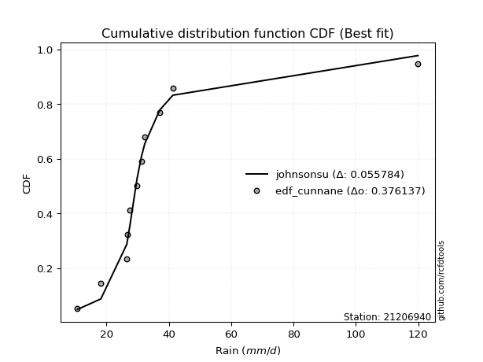</img></img>

</div>


### 12. Empirical - EDF Adamowski (1981)

The Adamowski formula in hydrology refers to a specific plotting position formula used for estimating the non-parametric empirical distribution of hydrological events (like flood peaks) to calculate their return periods. This formula provides an alternative to traditional parametric methods (like the Gumbel or Log Pearson Type III distributions). 

<div align="center">


$P=(m-0.25)/(n+0.5)$


</div>


**12.1. Empirical values**

<div align="center">

|                | 0                   | 1                   | 2                  | 3                   | 4                   | 5             | 6                  | 7                  | 8                  | 9                  | 10                 |
|:---------------|:--------------------|:--------------------|:-------------------|:--------------------|:--------------------|:--------------|:-------------------|:-------------------|:-------------------|:-------------------|:-------------------|
| date           | 2004                | 2011                | 2007               | 2005                | 2014                | 2012          | 2008               | 2009               | 2010               | 2013               | 2006               |
| x              | 10.7                | 18.2                | 26.5               | 26.8                | 27.6                | 29.8          | 31.2               | 32.3               | 37.1               | 41.3               | 119.9              |
| m              | 1                   | 2                   | 3                  | 4                   | 5                   | 6             | 7                  | 8                  | 9                  | 10                 | 11                 |
| empirical_dist | edf_adamowski       | edf_adamowski       | edf_adamowski      | edf_adamowski       | edf_adamowski       | edf_adamowski | edf_adamowski      | edf_adamowski      | edf_adamowski      | edf_adamowski      | edf_adamowski      |
| empirical      | 0.06521739130434782 | 0.15217391304347827 | 0.2391304347826087 | 0.32608695652173914 | 0.41304347826086957 | 0.5           | 0.5869565217391305 | 0.6739130434782609 | 0.7608695652173914 | 0.8478260869565217 | 0.9347826086956522 |
| empirical_tr   | 1.069767441860465   | 1.1794871794871795  | 1.3142857142857143 | 1.4838709677419355  | 1.703703703703704   | 2.0           | 2.421052631578948  | 3.0666666666666664 | 4.1818181818181825 | 6.571428571428571  | 15.333333333333343 |

</div>


**12.2. Kolmogorov-Smirnov fit test (sorted by Δ)**


<div align="center">

|                | 0                    | 1                   | 2                   | 3                   | 4                     | 5                   | 6                   | 7                   | 8                   | 9                   | 10                  | 11                  | 12                  | 13                  | 14                  | 15                  | 16                  | 17                  | 18                  | 19                  | 20                  | 21                  | 22                  | 23                  | 24                  | 25                  | 26                  | 27                  | 28                  | 29                  | 30                  | 31                  | 32                  | 33                  | 34                  | 35                  | 36                  | 37                  | 38                  | 39                  | 40                  | 41                  | 42                  | 43                  | 44                  | 45                  | 46                  | 47                  | 48                  | 49                  | 50                  | 51                  | 52                  | 53                  | 54                  | 55                  | 56                  | 57                  | 58                  | 59                  | 60                  | 61                  | 62                  | 63                  | 64                  | 65                  | 66                  | 67                  | 68                  | 69                  | 70                  | 71                  | 72                  | 73                  | 74                  | 75                  | 76                  | 77                  | 78                  | 79                  | 80                  | 81                  | 82                  | 83                  | 84                  | 85                  | 86                  | 87                  | 88                  | 89                  |
|:---------------|:---------------------|:--------------------|:--------------------|:--------------------|:----------------------|:--------------------|:--------------------|:--------------------|:--------------------|:--------------------|:--------------------|:--------------------|:--------------------|:--------------------|:--------------------|:--------------------|:--------------------|:--------------------|:--------------------|:--------------------|:--------------------|:--------------------|:--------------------|:--------------------|:--------------------|:--------------------|:--------------------|:--------------------|:--------------------|:--------------------|:--------------------|:--------------------|:--------------------|:--------------------|:--------------------|:--------------------|:--------------------|:--------------------|:--------------------|:--------------------|:--------------------|:--------------------|:--------------------|:--------------------|:--------------------|:--------------------|:--------------------|:--------------------|:--------------------|:--------------------|:--------------------|:--------------------|:--------------------|:--------------------|:--------------------|:--------------------|:--------------------|:--------------------|:--------------------|:--------------------|:--------------------|:--------------------|:--------------------|:--------------------|:--------------------|:--------------------|:--------------------|:--------------------|:--------------------|:--------------------|:--------------------|:--------------------|:--------------------|:--------------------|:--------------------|:--------------------|:--------------------|:--------------------|:--------------------|:--------------------|:--------------------|:--------------------|:--------------------|:--------------------|:--------------------|:--------------------|:--------------------|:--------------------|:--------------------|:--------------------|
| station        | 21206940             | 21206940            | 21206940            | 21206940            | 21206940              | 21206940            | 21206940            | 21206940            | 21206940            | 21206940            | 21206940            | 21206940            | 21206940            | 21206940            | 21206940            | 21206940            | 21206940            | 21206940            | 21206940            | 21206940            | 21206940            | 21206940            | 21206940            | 21206940            | 21206940            | 21206940            | 21206940            | 21206940            | 21206940            | 21206940            | 21206940            | 21206940            | 21206940            | 21206940            | 21206940            | 21206940            | 21206940            | 21206940            | 21206940            | 21206940            | 21206940            | 21206940            | 21206940            | 21206940            | 21206940            | 21206940            | 21206940            | 21206940            | 21206940            | 21206940            | 21206940            | 21206940            | 21206940            | 21206940            | 21206940            | 21206940            | 21206940            | 21206940            | 21206940            | 21206940            | 21206940            | 21206940            | 21206940            | 21206940            | 21206940            | 21206940            | 21206940            | 21206940            | 21206940            | 21206940            | 21206940            | 21206940            | 21206940            | 21206940            | 21206940            | 21206940            | 21206940            | 21206940            | 21206940            | 21206940            | 21206940            | 21206940            | 21206940            | 21206940            | 21206940            | 21206940            | 21206940            | 21206940            | 21206940            | 21206940            |
| empirical_dist | edf_adamowski        | edf_adamowski       | edf_adamowski       | edf_adamowski       | edf_adamowski         | edf_adamowski       | edf_adamowski       | edf_adamowski       | edf_adamowski       | edf_adamowski       | edf_adamowski       | edf_adamowski       | edf_adamowski       | edf_adamowski       | edf_adamowski       | edf_adamowski       | edf_adamowski       | edf_adamowski       | edf_adamowski       | edf_adamowski       | edf_adamowski       | edf_adamowski       | edf_adamowski       | edf_adamowski       | edf_adamowski       | edf_adamowski       | edf_adamowski       | edf_adamowski       | edf_adamowski       | edf_adamowski       | edf_adamowski       | edf_adamowski       | edf_adamowski       | edf_adamowski       | edf_adamowski       | edf_adamowski       | edf_adamowski       | edf_adamowski       | edf_adamowski       | edf_adamowski       | edf_adamowski       | edf_adamowski       | edf_adamowski       | edf_adamowski       | edf_adamowski       | edf_adamowski       | edf_adamowski       | edf_adamowski       | edf_adamowski       | edf_adamowski       | edf_adamowski       | edf_adamowski       | edf_adamowski       | edf_adamowski       | edf_adamowski       | edf_adamowski       | edf_adamowski       | edf_adamowski       | edf_adamowski       | edf_adamowski       | edf_adamowski       | edf_adamowski       | edf_adamowski       | edf_adamowski       | edf_adamowski       | edf_adamowski       | edf_adamowski       | edf_adamowski       | edf_adamowski       | edf_adamowski       | edf_adamowski       | edf_adamowski       | edf_adamowski       | edf_adamowski       | edf_adamowski       | edf_adamowski       | edf_adamowski       | edf_adamowski       | edf_adamowski       | edf_adamowski       | edf_adamowski       | edf_adamowski       | edf_adamowski       | edf_adamowski       | edf_adamowski       | edf_adamowski       | edf_adamowski       | edf_adamowski       | edf_adamowski       | edf_adamowski       |
| p_dist         | logjohnsonsu         | johnsonsu           | logt                | t                   | loglaplace_asymmetric | loglaplace          | loghypsecant        | loglogistic         | exponnorm           | logweibull_min      | mielke              | loggenlogistic      | logcrystalball      | lognorm             | lognorm             | logloggamma         | genlogistic         | logfisk             | fisk                | logmielke           | nct                 | fatiguelife         | invweibull          | logrice             | genexpon            | invgauss            | alpha               | invgamma            | laplace_asymmetric  | f                   | ncf                 | betaprime           | loggamma            | loggamma            | logerlang           | logfatiguelife      | logf                | loginvgamma         | logbetaprime        | loginvgauss         | logalpha            | logexponnorm        | moyal               | logncf              | gamma               | lognct              | logmaxwell          | loggumbel_l         | truncnorm           | gibrat              | logpearson3         | halflogistic        | lograyleigh         | gumbel_r            | gompertz            | loggompertz         | halfnorm            | logtruncnorm        | lognakagami         | loginvweibull       | expon               | loggumbel_r         | chi2                | pareto              | logkstwobign        | wald                | kstwobign           | rayleigh            | loggenexpon         | loghalfnorm         | logmoyal            | maxwell             | pearson3            | loghalflogistic     | hypsecant           | logistic            | nakagami            | laplace             | crystalball         | norm                | weibull_min         | rice                | loggibrat           | logwald             | erlang              | logexpon            | gumbel_l            | logchi2             | loglognorm          | logpareto           |
| delta          | 0.061821181570368255 | 0.06510032109251151 | 0.066851359830016   | 0.0880449838716591  | 0.10413552107378005   | 0.11160372718215888 | 0.13862731404106587 | 0.14909778977800892 | 0.15819734032188393 | 0.1599102710265526  | 0.16074304222000846 | 0.1608160881712148  | 0.16188269859640997 | 0.16188270100475205 | 0.16188270100475205 | 0.16261624705018207 | 0.16265993761604136 | 0.1640421179548296  | 0.1653881311543629  | 0.1657736738681821  | 0.16826576472720928 | 0.17184528768397433 | 0.17570600464603314 | 0.176002435262961   | 0.1765497706367108  | 0.1768147957490377  | 0.17882664247882346 | 0.17953262317091645 | 0.1795492220946423  | 0.17970590281051546 | 0.18017126701665825 | 0.18032622982125662 | 0.18369648055758597 | 0.18369648055758597 | 0.18369656082780056 | 0.1845331442352664  | 0.18591598347437227 | 0.18597614793955264 | 0.18674541766403596 | 0.18682417114852246 | 0.18687596235683074 | 0.18850187260472878 | 0.18879285098450876 | 0.19236147047098678 | 0.1935459380227854  | 0.19435635606510038 | 0.1959221202600816  | 0.20024864400001752 | 0.20126165198931373 | 0.2030819606207599  | 0.20437135930889583 | 0.2079081066315121  | 0.2082138501250887  | 0.2094342479317951  | 0.20963683219026308 | 0.2124218404410964  | 0.21427464105143124 | 0.21508263154220947 | 0.21721670308707375 | 0.21726289495622692 | 0.21893985055391668 | 0.22184301664941702 | 0.22579998645714272 | 0.231658778555285   | 0.23420147014206638 | 0.2343984635971063  | 0.23464076346776186 | 0.24028691449876338 | 0.2417389815303394  | 0.2430721571547661  | 0.2448057714347877  | 0.2494851938898609  | 0.25454210522318266 | 0.25877312317776757 | 0.26159199268616296 | 0.2693011690842405  | 0.2705749329854806  | 0.2707240771973516  | 0.27851621163492934 | 0.27851621789164605 | 0.27931090222864774 | 0.2803755541376778  | 0.30132367716371783 | 0.30685771158568237 | 0.3094147368352487  | 0.3404302146481308  | 0.3432237602772876  | 0.403344426970698   | 0.4453197480950819  | 0.49063934837091916 |
| deltao         | 0.37613735880099997  | 0.37613735880099997 | 0.37613735880099997 | 0.37613735880099997 | 0.37613735880099997   | 0.37613735880099997 | 0.37613735880099997 | 0.37613735880099997 | 0.37613735880099997 | 0.37613735880099997 | 0.37613735880099997 | 0.37613735880099997 | 0.37613735880099997 | 0.37613735880099997 | 0.37613735880099997 | 0.37613735880099997 | 0.37613735880099997 | 0.37613735880099997 | 0.37613735880099997 | 0.37613735880099997 | 0.37613735880099997 | 0.37613735880099997 | 0.37613735880099997 | 0.37613735880099997 | 0.37613735880099997 | 0.37613735880099997 | 0.37613735880099997 | 0.37613735880099997 | 0.37613735880099997 | 0.37613735880099997 | 0.37613735880099997 | 0.37613735880099997 | 0.37613735880099997 | 0.37613735880099997 | 0.37613735880099997 | 0.37613735880099997 | 0.37613735880099997 | 0.37613735880099997 | 0.37613735880099997 | 0.37613735880099997 | 0.37613735880099997 | 0.37613735880099997 | 0.37613735880099997 | 0.37613735880099997 | 0.37613735880099997 | 0.37613735880099997 | 0.37613735880099997 | 0.37613735880099997 | 0.37613735880099997 | 0.37613735880099997 | 0.37613735880099997 | 0.37613735880099997 | 0.37613735880099997 | 0.37613735880099997 | 0.37613735880099997 | 0.37613735880099997 | 0.37613735880099997 | 0.37613735880099997 | 0.37613735880099997 | 0.37613735880099997 | 0.37613735880099997 | 0.37613735880099997 | 0.37613735880099997 | 0.37613735880099997 | 0.37613735880099997 | 0.37613735880099997 | 0.37613735880099997 | 0.37613735880099997 | 0.37613735880099997 | 0.37613735880099997 | 0.37613735880099997 | 0.37613735880099997 | 0.37613735880099997 | 0.37613735880099997 | 0.37613735880099997 | 0.37613735880099997 | 0.37613735880099997 | 0.37613735880099997 | 0.37613735880099997 | 0.37613735880099997 | 0.37613735880099997 | 0.37613735880099997 | 0.37613735880099997 | 0.37613735880099997 | 0.37613735880099997 | 0.37613735880099997 | 0.37613735880099997 | 0.37613735880099997 | 0.37613735880099997 | 0.37613735880099997 |
| eval           | Δo > Δ               | Δo > Δ              | Δo > Δ              | Δo > Δ              | Δo > Δ                | Δo > Δ              | Δo > Δ              | Δo > Δ              | Δo > Δ              | Δo > Δ              | Δo > Δ              | Δo > Δ              | Δo > Δ              | Δo > Δ              | Δo > Δ              | Δo > Δ              | Δo > Δ              | Δo > Δ              | Δo > Δ              | Δo > Δ              | Δo > Δ              | Δo > Δ              | Δo > Δ              | Δo > Δ              | Δo > Δ              | Δo > Δ              | Δo > Δ              | Δo > Δ              | Δo > Δ              | Δo > Δ              | Δo > Δ              | Δo > Δ              | Δo > Δ              | Δo > Δ              | Δo > Δ              | Δo > Δ              | Δo > Δ              | Δo > Δ              | Δo > Δ              | Δo > Δ              | Δo > Δ              | Δo > Δ              | Δo > Δ              | Δo > Δ              | Δo > Δ              | Δo > Δ              | Δo > Δ              | Δo > Δ              | Δo > Δ              | Δo > Δ              | Δo > Δ              | Δo > Δ              | Δo > Δ              | Δo > Δ              | Δo > Δ              | Δo > Δ              | Δo > Δ              | Δo > Δ              | Δo > Δ              | Δo > Δ              | Δo > Δ              | Δo > Δ              | Δo > Δ              | Δo > Δ              | Δo > Δ              | Δo > Δ              | Δo > Δ              | Δo > Δ              | Δo > Δ              | Δo > Δ              | Δo > Δ              | Δo > Δ              | Δo > Δ              | Δo > Δ              | Δo > Δ              | Δo > Δ              | Δo > Δ              | Δo > Δ              | Δo > Δ              | Δo > Δ              | Δo > Δ              | Δo > Δ              | Δo > Δ              | Δo > Δ              | Δo > Δ              | Δo > Δ              | Δo > Δ              | Δo <= Δ             | Δo <= Δ             | Δo <= Δ             |
| fit            | 1                    | 1                   | 1                   | 1                   | 1                     | 1                   | 1                   | 1                   | 1                   | 1                   | 1                   | 1                   | 1                   | 1                   | 1                   | 1                   | 1                   | 1                   | 1                   | 1                   | 1                   | 1                   | 1                   | 1                   | 1                   | 1                   | 1                   | 1                   | 1                   | 1                   | 1                   | 1                   | 1                   | 1                   | 1                   | 1                   | 1                   | 1                   | 1                   | 1                   | 1                   | 1                   | 1                   | 1                   | 1                   | 1                   | 1                   | 1                   | 1                   | 1                   | 1                   | 1                   | 1                   | 1                   | 1                   | 1                   | 1                   | 1                   | 1                   | 1                   | 1                   | 1                   | 1                   | 1                   | 1                   | 1                   | 1                   | 1                   | 1                   | 1                   | 1                   | 1                   | 1                   | 1                   | 1                   | 1                   | 1                   | 1                   | 1                   | 1                   | 1                   | 1                   | 1                   | 1                   | 1                   | 1                   | 1                   | 0                   | 0                   | 0                   |
| n              | 11                   | 11                  | 11                  | 11                  | 11                    | 11                  | 11                  | 11                  | 11                  | 11                  | 11                  | 11                  | 11                  | 11                  | 11                  | 11                  | 11                  | 11                  | 11                  | 11                  | 11                  | 11                  | 11                  | 11                  | 11                  | 11                  | 11                  | 11                  | 11                  | 11                  | 11                  | 11                  | 11                  | 11                  | 11                  | 11                  | 11                  | 11                  | 11                  | 11                  | 11                  | 11                  | 11                  | 11                  | 11                  | 11                  | 11                  | 11                  | 11                  | 11                  | 11                  | 11                  | 11                  | 11                  | 11                  | 11                  | 11                  | 11                  | 11                  | 11                  | 11                  | 11                  | 11                  | 11                  | 11                  | 11                  | 11                  | 11                  | 11                  | 11                  | 11                  | 11                  | 11                  | 11                  | 11                  | 11                  | 11                  | 11                  | 11                  | 11                  | 11                  | 11                  | 11                  | 11                  | 11                  | 11                  | 11                  | 11                  | 11                  | 11                  |
| best_fit       | 1                    | 0                   | 0                   | 0                   | 0                     | 0                   | 0                   | 0                   | 0                   | 0                   | 0                   | 0                   | 0                   | 0                   | 0                   | 0                   | 0                   | 0                   | 0                   | 0                   | 0                   | 0                   | 0                   | 0                   | 0                   | 0                   | 0                   | 0                   | 0                   | 0                   | 0                   | 0                   | 0                   | 0                   | 0                   | 0                   | 0                   | 0                   | 0                   | 0                   | 0                   | 0                   | 0                   | 0                   | 0                   | 0                   | 0                   | 0                   | 0                   | 0                   | 0                   | 0                   | 0                   | 0                   | 0                   | 0                   | 0                   | 0                   | 0                   | 0                   | 0                   | 0                   | 0                   | 0                   | 0                   | 0                   | 0                   | 0                   | 0                   | 0                   | 0                   | 0                   | 0                   | 0                   | 0                   | 0                   | 0                   | 0                   | 0                   | 0                   | 0                   | 0                   | 0                   | 0                   | 0                   | 0                   | 0                   | 0                   | 0                   | 0                   |
| best_fit_sort  | 1                    | 2                   | 3                   | 4                   | 5                     | 6                   | 7                   | 8                   | 9                   | 10                  | 11                  | 12                  | 13                  | 14                  | 15                  | 16                  | 17                  | 18                  | 19                  | 20                  | 21                  | 22                  | 23                  | 24                  | 25                  | 26                  | 27                  | 28                  | 29                  | 30                  | 31                  | 32                  | 33                  | 34                  | 35                  | 36                  | 37                  | 38                  | 39                  | 40                  | 41                  | 42                  | 43                  | 44                  | 45                  | 46                  | 47                  | 48                  | 49                  | 50                  | 51                  | 52                  | 53                  | 54                  | 55                  | 56                  | 57                  | 58                  | 59                  | 60                  | 61                  | 62                  | 63                  | 64                  | 65                  | 66                  | 67                  | 68                  | 69                  | 70                  | 71                  | 72                  | 73                  | 74                  | 75                  | 76                  | 77                  | 78                  | 79                  | 80                  | 81                  | 82                  | 83                  | 84                  | 85                  | 86                  | 87                  | 88                  | 89                  | 90                  |

</div>


<div align="center">

</img>

</div>


**12.3. Best fit**

<div align="center">

|   id |   station | empirical_dist   | p_dist       |     delta |   deltao | eval   |   fit |   n |   best_fit |   best_fit_sort |
|-----:|----------:|:-----------------|:-------------|----------:|---------:|:-------|------:|----:|-----------:|----------------:|
|    0 |  21206940 | edf_adamowski    | logjohnsonsu | 0.0618212 | 0.376137 | Δo > Δ |     1 |  11 |          1 |               1 |

</div>


<div align="center">

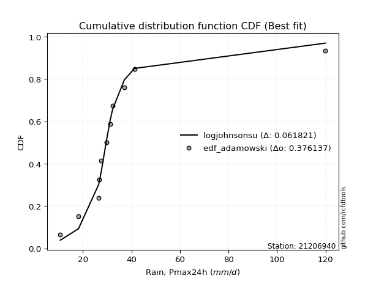</img>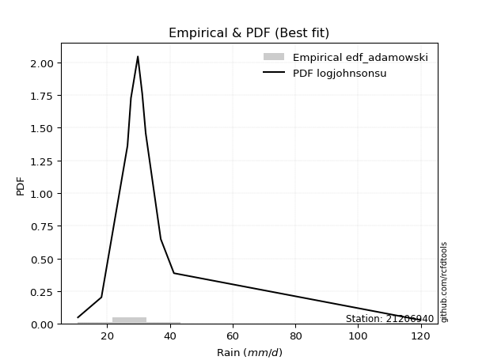</img>

</div>


## C. Best fit & Estimate extreme values for specific return periods - Tr


### 1. Best fit (ordered by delta Δ)

<div align="center">

|   id |   station | empirical_dist   | p_dist       |     delta |   deltao | eval   |   fit |   n |   best_fit |   best_fit_sort |
|-----:|----------:|:-----------------|:-------------|----------:|---------:|:-------|------:|----:|-----------:|----------------:|
|    0 |  21206940 | edf_cunnane      | johnsonsu    | 0.0557836 | 0.376137 | Δo > Δ |     1 |  11 |          1 |               1 |
|    1 |  21206940 | edf_gringorten   | johnsonsu    | 0.0558662 | 0.376137 | Δo > Δ |     1 |  11 |          1 |               2 |
|    2 |  21206940 | edf_blom         | johnsonsu    | 0.0573709 | 0.376137 | Δo > Δ |     1 |  11 |          1 |               3 |
|    3 |  21206940 | edf_hazen        | johnsonsu    | 0.0588093 | 0.376137 | Δo > Δ |     1 |  11 |          1 |               4 |
|    4 |  21206940 | edf_tukey        | johnsonsu    | 0.0599852 | 0.376137 | Δo > Δ |     1 |  11 |          1 |               5 |
|    5 |  21206940 | edf_filliben     | johnsonsu    | 0.0609686 | 0.376137 | Δo > Δ |     1 |  11 |          1 |               6 |
|    6 |  21206940 | edf_beard        | johnsonsu    | 0.0614326 | 0.376137 | Δo > Δ |     1 |  11 |          1 |               7 |
|    7 |  21206940 | edf_jenkinson    | johnsonsu    | 0.0614326 | 0.376137 | Δo > Δ |     1 |  11 |          1 |               8 |
|    8 |  21206940 | edf_adamowski    | logjohnsonsu | 0.0618212 | 0.376137 | Δo > Δ |     1 |  11 |          1 |               9 |
|    9 |  21206940 | edf_chegodayev   | johnsonsu    | 0.0620492 | 0.376137 | Δo > Δ |     1 |  11 |          1 |              10 |
|   10 |  21206940 | edf_california   | t            | 0.0648368 | 0.376137 | Δo > Δ |     1 |  11 |          1 |              11 |
|   11 |  21206940 | edf_weibull      | logt         | 0.0723197 | 0.376137 | Δo > Δ |     1 |  11 |          1 |              12 |

</div>

:file_folder:Tables: [bestfit_21206940.csv](table/bestfit_21206940.csv) | [extreme_21206940.csv](table/extreme_21206940.csv)


### 2. Extreme values

In hydrology, a return period (or recurrence interval $Tr$) is the statistical average time between extreme events like floods or droughts of a specific magnitude, indicating how rare an event is, with a 100-year flood, for example, having a 1% chance of occurring in any given year, not that it happens exactly every century. It is a key tool for infrastructure design (like bridges or dams) and risk assessment, calculated from historical data to determine the probability of future events, although it is important to remember it is statistical average, and events can cluster or be missed.

> risk_rate: assuming the return period as the project useful life.

|   id |      tr |   prob_l |     prob_g |    alpha |   betaprime |     chi2 |   crystalball |   erlang |    expon |   exponnorm |        f |   fatiguelife |     fisk |    gamma |   genexpon |   genlogistic |   gibrat |   gompertz |   gumbel_l |   gumbel_r |   halflogistic |   halfnorm |   hypsecant |   invgamma |   invgauss |   invweibull |   johnsonsu |   kstwobign |   laplace |   laplace_asymmetric |   loggamma |   logistic |   lognorm |   maxwell |   mielke |    moyal |   nakagami |      ncf |      nct |     norm |   pareto |   pearson3 |   rayleigh |     rice |         t |   truncnorm |     wald |   weibull_min |   logalpha |   logbetaprime |     logchi2 |   logcrystalball |   logerlang |   logexpon |   logexponnorm |     logf |   logfatiguelife |   logfisk |   loggenexpon |   loggenlogistic |   loggibrat |   loggompertz |   loggumbel_l |   loggumbel_r |   loghalflogistic |   loghalfnorm |   loghypsecant |   loginvgamma |   loginvgauss |   loginvweibull |     logjohnsonsu |   logkstwobign |   loglaplace |   loglaplace_asymmetric |   logloggamma |   loglogistic |   loglognorm |   logmaxwell |   logmielke |   logmoyal |   lognakagami |   logncf |   lognct |     logpareto |   logpearson3 |   lograyleigh |   logrice |             logt |   logtruncnorm |   logwald |   logweibull_min |   station |   n |   risk_rate |
|-----:|--------:|---------:|-----------:|---------:|------------:|---------:|--------------:|---------:|---------:|------------:|---------:|--------------:|---------:|---------:|-----------:|--------------:|---------:|-----------:|-----------:|-----------:|---------------:|-----------:|------------:|-----------:|-----------:|-------------:|------------:|------------:|----------:|---------------------:|-----------:|-----------:|----------:|----------:|---------:|---------:|-----------:|---------:|---------:|---------:|---------:|-----------:|-----------:|---------:|----------:|------------:|---------:|--------------:|-----------:|---------------:|------------:|-----------------:|------------:|-----------:|---------------:|---------:|-----------------:|----------:|--------------:|-----------------:|------------:|--------------:|--------------:|--------------:|------------------:|--------------:|---------------:|--------------:|--------------:|----------------:|-----------------:|---------------:|-------------:|------------------------:|--------------:|--------------:|-------------:|-------------:|------------:|-----------:|--------------:|---------:|---------:|--------------:|--------------:|--------------:|----------:|-----------------:|---------------:|----------:|-----------------:|----------:|----:|------------:|
|    0 |    2    | 0.5      | 0.5        |  29.3154 |     29.5066 |  28.265  |       36.4909 |  24.0742 |  28.5769 |     31.6713 |  29.5269 |       30.3245 |  29.5086 |  30.0617 |    30.2408 |       31.8446 |  28.2241 |    32.2273 |    41.0154 |    31.9664 |        29.717  |    30.8533 |     36.4909 |    29.5332 |    30.0312 |      29.565  |     29.4249 |     35.1264 |   36.4909 |              32.4926 |    29.4464 |    36.4909 |   30.4755 |   34.1354 |  29.6545 |  30.5057 |    25.7637 |  29.5223 |  29.7156 |  36.4909 |  27.9359 |    26.8057 |    33.3    |  37.3691 |   29.2309 |     29.5261 |  27.5633 |       29.1836 |    29.2718 |        29.2785 |     17.8256 |          30.4755 |     29.4464 |    22.1037 |        28.9645 |  29.3246 |          29.3991 |   29.4628 |       27.3317 |          29.6511 |     25.7791 |       28.8932 |       33.3985 |       27.8083 |           26.5706 |       27.1888 |        30.4755 |       29.3214 |       29.3147 |         28.2381 |     29.5914      |        27.6369 |      30.4755 |                 30.1406 |       30.5456 |       30.4755 |  11.1694     |      29.0565 |     29.3746 |    26.9981 |       27.9868 |  29.6959 |  28.9321 |  10.8985      |       28.5949 |       28.5693 |   29.938  |     29.6293      |        27.8854 |   25.4371 |          29.3825 |  21206940 |  11 |    0.75     |
|    1 |    2.33 | 0.570815 | 0.429185   |  32.0427 |     32.4936 |  32.2542 |       41.4056 |  27.7201 |  32.5157 |     34.6521 |  32.5124 |       33.8024 |  31.9805 |  34.3743 |    33.8021 |       34.8036 |  30.7136 |    36.5795 |    45.2912 |    36.5204 |        34.3993 |    36.1575 |     40.4241 |    32.5188 |    33.4321 |      32.4482 |     30.5303 |     38.8854 |   39.465  |              35.116  |    32.5086 |    40.8211 |   33.6633 |   39.2414 |  32.121  |  34.8167 |    31.6763 |  32.5207 |  32.4891 |  41.4056 |  31.8197 |    30.6064 |    38.4816 |  41.5018 |   30.252  |     33.6046 |  30.7859 |       41.8717 |    32.2768 |        32.2865 |     21.2127 |          33.6633 |     32.5086 |    25.9351 |        31.6817 |  32.3482 |          32.4459 |   31.8746 |       30.7577 |          32.1163 |     27.1116 |       32.829  |       36.4181 |       30.4937 |           29.2121 |       30.2706 |        33.0011 |       32.3436 |       32.3643 |         31.4878 |     30.6601      |        31.0684 |      32.3666 |                 31.8621 |       33.8156 |       33.2674 |  13.9404     |      32.2205 |     31.7191 |    29.46   |       30.8314 |  33.4818 |  31.8519 |  11.6457      |       31.5773 |       31.7286 |   33.1705 |     30.7311      |        30.4146 |   27.1517 |          31.8421 |  21206940 |  11 |    0.729209 |
|    2 |    5    | 0.8      | 0.2        |  45.6729 |     47.4064 |  52.3634 |       59.6698 |  47.1219 |  52.2089 |     49.3023 |  47.4216 |       50.795  |  43.9729 |  55.9988 |    50.9406 |       47.6573 |  45.0468 |    56.6151 |    59.1046 |    56.305  |        55.5854 |    58.5883 |     56.2011 |    47.4292 |    50.3039 |      46.9133 |     38.5718 |     54.8526 |   54.335  |              48.2326 |    47.8785 |    57.5404 |   48.7217 |   59.3383 |  43.969  |  54.7853 |    62.8795 |  47.5077 |  46.2857 |  59.6698 |  51.7185 |    51.2191 |    59.2255 |  58.0469 |   35.5121 |     53.4348 |  48.8261 |      301.06   |    47.5254 |        47.5426 |     57.783  |          48.7217 |     47.8785 |    57.6742 |        45.6932 |  47.6482 |          47.7879 |   43.771  |       49.505  |          43.9562 |     36.2386 |       52.2729 |       48.1675 |       45.5136 |           44.8552 |       47.6669 |        45.418  |       47.6332 |       47.7906 |         50.5441 |     37.3324      |        51.0772 |      43.7344 |                 42.0611 |       49.2767 |       46.6662 |   7.1572e+99 |      48.3959 |     42.9246 |    44.1348 |       47.384  |  53.4065 |  46.7392 |   1.24967e+77 |       47.3644 |       48.2855 |   48.825  |     36.7563      |        45.1879 |   39.1191 |          45.5526 |  21206940 |  11 |    0.67232  |
|    3 |   10    | 0.9      | 0.1        |  59.6836 |     62.0977 |  70.7458 |       71.7858 |  65.669  |  70.0858 |     62.5804 |  62.1162 |       66.1972 |  55.9635 |  75.6779 |    66.1921 |       58.1256 |  61.3849 |    72.7293 |    66.7952 |    72.4192 |        73.1795 |    75.1866 |     68.7994 |    62.1252 |    66.024  |      61.4265 |     52.3896 |     67.0095 |   67.8335 |              60.1394 |    62.977  |    69.8536 |   62.2641 |   73.4813 |  55.6089 |  72.171  |    89.2066 |  62.2942 |  60.1293 |  71.7858 |  70.4957 |    71.2234 |    74.0164 |  69.8439 |   43.5137 |     70.2154 |  67.9709 |     1143.81   |    62.8469 |        62.8312 |    160.016  |          62.2641 |     62.977  |   119.142  |        60.8666 |  62.9247 |          62.9537 |   56.0784 |       69.6369 |          55.5884 |     50.4447 |       69.6792 |       56.2813 |       63.0676 |           64.045  |       66.7019 |        58.6117 |       62.8944 |       63.1383 |         74.3139 |     49.473       |        74.5784 |      57.4767 |                 54.1209 |       63.1816 |       59.8758 | inf          |      64.4383 |     54.1359 |    62.7516 |       65.7614 |  74.2147 |  61.875  | inf           |       64.0603 |       65.1399 |   63.3078 |     46.9389      |        61.0743 |   57.6356 |          60.7078 |  21206940 |  11 |    0.651322 |
|    4 |   15    | 0.933333 | 0.0666667  |  69.2399 |     71.5243 |  81.5307 |       77.8319 |  76.7526 |  80.5431 |     70.3476 |  71.5485 |       75.2726 |  63.9422 |  87.2016 |    75.0832 |       64.0315 |  72.6542 |    81.406  |    70.2781 |    81.5107 |        83.1363 |    83.8242 |     75.9892 |    71.5585 |    75.4746 |      70.9013 |     64.8391 |     73.4634 |   75.7296 |              67.1045 |    72.588  |    76.5624 |   70.3705 |   80.738  |  63.2434 |  82.261  |   103.32   |  71.7914 |  69.2282 |  77.8319 |  81.8051 |    83.2501 |    81.6373 |  75.9222 |   51.315  |     79.2117 |  80.2648 |     2122.12   |    72.797  |        72.7288 |    298.508  |          70.3705 |     72.588  |   182.127  |        71.5574 |  72.7867 |          72.6583 |   64.5263 |       83.0548 |          63.2191 |     63.3716 |       79.7814 |       60.3926 |       75.811  |           78.3459 |       79.4465 |        67.794  |       72.7447 |       73.0032 |         92.3667 |     62.5861      |        91.1764 |      67.4387 |                 62.7204 |       71.4995 |       68.5851 | inf          |      74.6344 |     61.705  |    76.9711 |       78.0863 |  87.9914 |  71.8138 | inf           |       75.2379 |       76.0055 |   72.1199 |     58.5559      |        70.8143 |   73.9209 |          71.0564 |  21206940 |  11 |    0.644736 |
|    5 |   20    | 0.95     | 0.05       |  76.8642 |     78.6627 |  89.1929 |       81.7914 |  84.6921 |  87.9627 |     75.8585 |  78.6929 |       81.7453 |  70.1598 |  95.3816 |    81.3871 |       68.1667 |  81.4942 |    87.2695 |    72.4461 |    87.8764 |        90.1122 |    89.5831 |     81.0613 |    78.7039 |    82.2946 |      78.159  |     76.2329 |     77.8109 |   81.332  |              72.0463 |    79.816  |    81.1993 |   76.2429 |   85.554  |  69.1363 |  89.4068 |   112.804  |  78.9876 |  76.2428 |  81.7914 |  89.9785 |    91.8882 |    86.7027 |  79.9623 |   59.1223 |     85.1148 |  89.4263 |     3123.57   |    80.3843 |        80.2577 |    468.785  |          76.2429 |     79.816  |   246.119  |        80.1891 |  80.2752 |          79.9823 |   71.2593 |       93.3859 |          69.1098 |     75.7906 |       86.9192 |       63.1019 |       86.2371 |           90.2283 |       89.2694 |        75.1245 |       80.2233 |       80.4686 |        107.558  |     76.9626      |       104.393  |      75.5372 |                 69.6384 |       77.5213 |       75.3346 | inf          |      82.2768 |     67.6872 |    88.9506 |       87.5815 |  98.5952 |  79.452  | inf           |       83.9064 |       84.2124 |   78.5615 |     72.3401      |        77.6011 |   88.9827 |          79.1591 |  21206940 |  11 |    0.641514 |
|    6 |   25    | 0.96     | 0.04       |  83.3706 |     84.4842 |  95.141  |       84.7061 |  90.8863 |  93.7177 |     80.1331 |  84.5203 |       86.7849 |  75.347  | 101.728  |    86.2754 |       71.3518 |  88.8636 |    91.6638 |    73.9888 |    92.7796 |        95.4869 |    93.8679 |     84.9867 |    84.532  |    87.6485 |      84.1283 |     86.8063 |     81.0674 |   85.6775 |              75.8795 |    85.6761 |    84.7465 |   80.8767 |   89.1293 |  74.0173 |  94.9456 |   119.883  |  84.8586 |  82.0443 |  84.7061 |  96.4051 |    98.6382 |    90.4662 |  82.964  |   66.9617 |     89.3765 |  96.7644 |     4114.9    |    86.6023 |        86.4153 |    668.132  |          80.8767 |     85.6761 |   310.87   |        87.5743 |  86.3916 |          85.936  |   76.9787 |      101.891  |          73.9896 |     87.9846 |       92.4401 |       65.1036 |       95.2357 |          100.599  |       97.3579 |        81.3374 |       86.3311 |       86.5494 |        120.943  |     92.7689      |       115.533  |      82.4829 |                 75.5257 |       82.2705 |       80.9429 | inf          |      88.4524 |     72.7408 |    99.5043 |       95.3945 | 107.335  |  85.7498 | inf           |       91.0925 |       90.8787 |   83.6762 |     88.8322      |        82.6606 |  103.232  |          85.9171 |  21206940 |  11 |    0.639603 |
|    7 |   50    | 0.98     | 0.02       | 107.955  |    104.349  | 113.64   |       93.0527 | 110.289  | 111.595  |     93.4112 | 104.412  |      102.54   |  93.8462 | 121.452  |   101.457  |       81.1636 | 114.841  |   104.541  |    78.1766 |   107.884  |       112.047  |   106.322  |     97.1569 |   104.426  |   104.615  |     104.816  |    131.69   |     90.63   |   99.1761 |              87.7863 |   105.431  |    95.5843 |   95.7636 |   99.4986 |  91.1918 | 112.14   |   140.509  | 104.908  | 102.391  |  93.0527 | 116.861  |   119.83   |   101.391  |  91.6775 |  106.643  |    100.599  | 120.723  |     8708.86   |   108.004  |       107.522  |   2047.36   |          95.7636 |    105.431  |   642.187  |       115.086  | 107.304  |         106.107  |   98.1441 |      131.258  |          91.164  |    148.867  |      109.513  |       70.8633 |      129.297  |          140.661  |      125.274  |       104.06   |      107.211  |      107.225  |        173.576  |    197.793       |       155.6    |     108.401  |                 97.1803 |       97.5121 |      100.799  | inf          |     109.111  |     91.2744 |   140.93   |      122.309  | 137.663  | 107.686  | inf           |      116.303  |      113.372  |  100.28   |    235.846       |        96.4063 |  167.663  |         109.849  |  21206940 |  11 |    0.63583  |
|    8 |   75    | 0.986667 | 0.0133333  | 126.541  |    117.376  | 124.473  |       97.5312 | 121.731  | 122.052  |    101.178  | 117.461  |      111.822  | 106.638  | 132.994  |   110.336  |       86.8666 | 132.386  |   111.589  |    80.2943 |   116.663  |       121.673  |   113.102  |    104.269  |   117.477  |   114.758  |     118.624  |    168.554  |     95.8913 |  107.072  |              94.7514 |   118.18   |   101.844  |  104.851  |  105.136  | 102.882  | 122.195  |   151.74   | 118.067  | 116.188  |  97.5312 | 129.182  |   132.355  |   107.334  |  96.4179 |  146.932  |    105.657  | 135.467  |    12730.3    |   122.175  |       121.423  |   3984.65   |         104.851  |    118.18   |   981.686  |       135.017  | 121.038  |         119.205  |  113.488  |      150.67   |         102.857  |    212.352  |      119.452  |       73.9671 |      154.443  |          170.923  |      143.702  |       120.173  |      120.921  |      120.704  |        214.137  |    357.94        |       183.296  |     127.189  |                112.622  |      106.803  |      114.416  | inf          |     122.301  |    104.587  |   172.743  |      140.03   | 157.885  | 122.427  | inf           |      133.333  |      127.866  |  110.532  |    596.85        |       102.679  |  225.967  |         126.163  |  21206940 |  11 |    0.634587 |
|    9 |  100    | 0.99     | 0.01       | 142.361  |    127.326  | 132.164  |      100.56   | 129.883  | 129.472  |    106.689  | 127.43   |      118.434  | 116.749  | 141.185  |   116.637  |       90.903  | 145.978  |   116.394  |    81.6795 |   122.877  |       128.487  |   117.72   |    109.314  |   127.448  |   122.046  |     129.288  |    200.656  |     99.4961 |  112.675  |              99.6932 |   127.81   |   106.263  |  111.481  |  108.976  | 112.029  | 129.329  |   159.386  | 128.124  | 126.959  | 100.56   | 138.087  |   141.287  |   111.384  |  99.6475 |  187.644  |    108.585  | 146.216  |    16320.5    |   133.066  |       132.065  |   6416.35   |         111.481  |    127.81   |  1326.61   |       151.217  | 131.531  |         129.137  |  126.028  |      165.523  |         112.009  |    279.61   |      126.484  |       76.0704 |      175.144  |          196.199  |      157.785  |       133.095  |      131.395  |      130.952  |        248.451  |    591.426       |       205.068  |     142.463  |                125.044  |      113.576  |      125.123  | inf          |     132.187  |    115.41   |   199.579  |      153.548  | 173.47   | 133.868  | inf           |      146.57   |      138.788  |  118.063  |   1467.42        |       106.296  |  280.894  |         138.904  |  21206940 |  11 |    0.633968 |
|   10 |  200    | 0.995    | 0.005      | 193.554  |    153.998  | 150.708  |      107.431  | 149.62   | 147.348  |    119.967  | 154.162  |      134.449  | 145.247  | 160.926  |   131.816  |      100.607  | 182.956  |   127.373  |    84.6902 |   137.815  |       144.867  |   128.283  |    121.468  |   154.185  |   139.888  |     158.319  |    303.301  |    107.799  |  126.173  |             111.6    |   153.183  |   116.864  |  128.117  |  117.761  | 137.432  | 146.516  |   176.844  | 155.102  | 156.79   | 107.431  | 160.109  |   162.941  |   120.648  | 107.037  |  353.196  |    113.662  | 172.991  |    28012.5    |   162.515  |       160.673  |  20447.8    |         128.117  |    153.183  |  2740.47   |       198.689  | 159.66   |         155.457  |  163.325  |      205.28   |         137.431  |    591.097  |      143.369  |       80.8508 |      236.985  |          273.337  |      195.402  |       170.22   |      159.467  |      158.21   |        355.16   |   2769.82        |       265.563  |     187.228  |                160.896  |      130.544  |      155.073  | inf          |     157.915  |    147.373  |   282.627  |      189.555  | 215.707  | 165.278  | inf           |      182.895  |      167.418  |  137.131  |  45321.8         |       112.497  |  482.973  |         174.077  |  21206940 |  11 |    0.633042 |
|   11 |  250    | 0.996    | 0.004      | 215.54   |    163.477  | 156.681  |      109.531  | 155.999  | 153.103  |    124.242  | 163.665  |      139.627  | 155.842  | 167.282  |   136.703  |      103.726  | 196.223  |   130.742  |    85.5761 |   142.618  |       150.133  |   131.533  |    125.381  |   163.691  |   145.711  |     168.778  |    345.486  |    110.368  |  130.519  |             115.433  |   162.052  |   120.268  |  133.679  |  120.466  | 146.752  | 152.049  |   182.205  | 164.696  | 167.712  | 109.531  | 167.374  |   169.947  |   123.5    | 109.312  |  437.086  |    114.802  | 181.849  |    32839.7    |   173.065  |       170.861  |  29781.8    |         133.679  |    162.052  |  3461.46   |       216.943  | 169.652  |         164.707  |  177.926  |      219.352  |         146.76   |    773.229  |      148.788  |       82.3137 |      261.18   |          304.083  |      208.688  |       184.249  |      169.438  |      167.821  |        398.394  |   5120.06        |       287.682  |     204.444  |                174.499  |      136.21   |      166.133  | inf          |     166.8    |    159.814  |   316.123  |      202.24   | 230.848  | 176.691  | inf           |      196.065  |      177.368  |  143.558  | 236005           |       113.87   |  577.821  |         186.887  |  21206940 |  11 |    0.632858 |
|   12 |  500    | 0.998    | 0.002      | 311.545  |    196.066  | 175.245  |      115.758  | 175.877  | 170.98   |    137.52   | 196.347  |      155.775  | 194.019  | 187.031  |   151.882  |      113.409  | 242.076  |   140.746  |    88.1155 |   157.524  |       166.478  |   141.222  |    137.534  |   196.379  |   164.021  |     205.234  |    512.548  |    118.069  |  144.017  |             127.34   |   191.988  |   130.823  |  151.637  |  128.536  | 179.872  | 169.236  |   198.156  | 197.704  | 206.461  | 115.758  | 190.497  |   191.797  |   132.01   | 116.099  |  863.185  |    117.233  | 210.014  |    51804.8    |   209.64   |       205.953  |  96487.2    |         151.637  |    191.988  |  7150.58   |       285.049  | 203.973  |         196.108  |  233.833  |      267.364  |         179.922  |   1956.33   |      165.574  |       86.6557 |      353.168  |          423.331  |      253.908  |       235.639  |      203.682  |      200.558  |        569.06   |  53912.6         |       365.625  |     268.685  |                224.531  |      154.475  |      205.708  | inf          |     196.4    |    207.185  |   447.663  |      245.299  | 283.275  | 216.876  | inf           |      242.216  |      210.709  |  164.468  |      6.29858e+08 |       116.771  | 1021.87   |         231.952  |  21206940 |  11 |    0.632489 |
|   13 |  750    | 0.998667 | 0.00133333 | 397.362  |    217.569  | 186.109  |      119.217  | 187.544  | 181.438  |    145.287  | 217.92   |      165.261  | 220.619  | 198.585  |   160.761  |      119.069  | 272.4    |   146.301  |    89.4727 |   166.237  |       176.033  |   146.635  |    144.643  |   217.958  |   174.876  |     229.673  |    640.82   |    122.394  |  151.913  |             134.305  |   211.304  |   136.99   |  162.635  |  133.049  | 202.579  | 179.29   |   207.046  | 219.503  | 232.99   | 119.217  | 204.424  |   204.633  |   136.768  | 119.894  | 1296.44   |    118.094  | 226.902  |    66098.1    |   234.017  |       229.15   | 192793      |         162.635  |    211.304  | 10930.8    |       334.411  | 226.587  |         216.506  |  275.823  |      298.676  |         202.666  |   3614.52   |      175.363  |       89.0694 |      421.296  |          513.664  |      283.31   |       272.11   |      226.241  |      221.909  |        700.939  | 308495           |       418.34   |     315.254  |                260.207  |      165.642  |      233.058  | inf          |     215.19   |    242.562  |   548.701  |      273.208  | 318.115  | 244.166  | inf           |      273.318  |      232.015  |  177.387  |      1.16475e+12 |       117.788  | 1438.31   |         262.433  |  21206940 |  11 |    0.632366 |
|   14 | 1000    | 0.999    | 0.001      | 478.82   |    234.041  | 193.82   |      121.598  | 195.838  | 188.857  |    150.798  | 234.448  |      172.008  | 241.707  | 206.783  |   167.061  |      123.085  | 295.606  |   150.12   |    90.3862 |   172.418  |       182.81   |   150.373  |    149.687  |   234.49   |   182.638  |     248.576  |    748.371  |    125.391  |  157.516  |             139.247  |   225.881  |   141.363  |  170.668  |  136.169  | 220.399  | 186.423  |   213.175  | 236.208  | 253.795  | 121.598  | 214.489  |   213.761  |   140.056  | 122.517  | 1734.4    |    118.535  | 239.049  |    77877.7    |   252.811  |       246.935  | 315617      |         170.668  |    225.881  | 14771.5    |       374.536  | 243.89   |         231.968  |  310.885  |      322.44   |         220.518  |   5781.94   |      182.295  |       90.7317 |      477.449  |          589.202  |      305.58   |       301.361  |      243.5    |      238.133  |        812.627  |      1.29031e+06 |       459.254  |     353.112  |                288.908  |      173.789  |      254.63   | inf          |     229.217  |    272.004  |   633.936  |      294.304  | 344.899  | 265.469  | inf           |      297.442  |      247.984  |  186.872  |      1.71366e+15 |       118.306  | 1839.26   |         286.122  |  21206940 |  11 |    0.632305 |

<div align="center">

</img>

</div>


<div align="center">

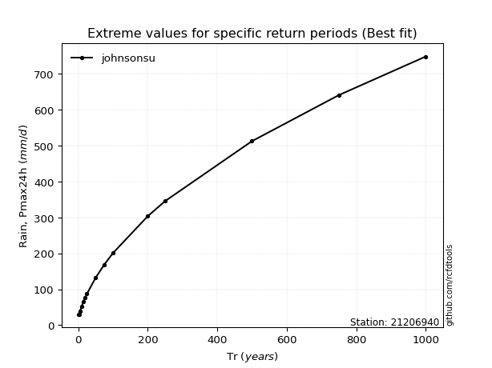</img>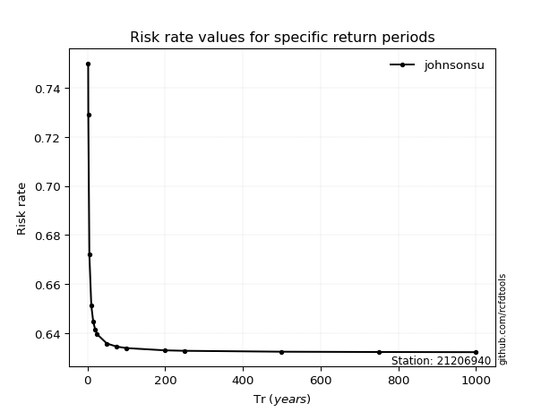</img>

</div>


<sub>**APP DISCLAIMER**: NO WARRANTY - This software is provided by [github.com/rcfdtools](https://github.com/rcfdtools) "as is", without any express or implied warranty, including warranties of merchantability, fitness for a particular purpose, or non-infringement. There is no guarantee that the software will be error-free or operate without interruption. LIMITATION OF LIABILITY - Neither the authors nor copyright holders will be liable for claims or damages arising from the software or its use. You are responsible for determining if the software is appropriate for your use and assume all associated risks, including errors, legal compliance, and data loss. NO PROFESSIONAL ADVICE - The software provides general information and does not offer professional advice. It should not replace consultation with professional advisors.</sub>