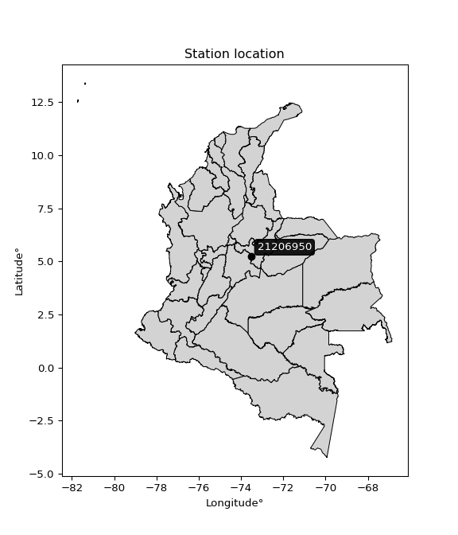

<div align="center">


</div>

# PMax24h Station (Rain): 21206950

Maximum Precipitation in 24 hours (PMax24h) is the greatest amount of rainfall for a specific duration that is meteorologically possible for a given location, acting as a "worst-case" scenario for extreme storms, crucial for designing safety-critical infrastructure like bridges, river deviations, dams, spillways, and nuclear plants to prevent catastrophic failure. The PMax24h is related with the Probable Maximum Precipitation (PMP) and it is calculated by hydrologists using meteorological data to determine the upper limit of extreme rainfall, often leading to the Probable Maximum Flood (PMF) for flood control design, and is increasingly being studied for climate change impacts. Probable Maximum Precipitation (PMP) is the theoretical upper limit of rainfall, a deterministic estimate for extreme events, while probability distributions (like GEV, Gumbel) describe the likelihood and frequency of various precipitation amounts, including rare ones, showing how often events occur, with PMP representing the extreme end of these distributions, used for critical infrastructure design to ensure safety against the worst conceivable weather, unlike standard statistical forecasts which cover typical probabilities.

The most common probability distributions in hydrology, used for analyzing floods, rainfall, and streamflow, include the Normal, Log-Normal, Gumbel, Gamma (including Log-Pearson Type III), and Generalized Extreme Value (GEV) distributions, often chosen based on the data´s skewness and whether modeling extremes or general conditions, with Gumbel and GEV popular for extreme events like floods, while the Normal distribution serves as a baseline, though often requiring transformations for skewed hydrological data. These distributions help in designing water infrastructure, managing water resources, and forecasting hydrologic events.

> Hydrological data often isn´t perfectly normal (it´s skewed), so different distributions are needed for different applications, such as: **Flood Frequency Analysis**: Using Gumbel, GEV, or Log-Pearson Type III for predicting extreme flood magnitudes and their return periods, **Rainfall Analysis**: Normal for annual totals, but Log-Normal, Weibull, or GEV for intensity or extreme daily rainfall, **Streamflow Modeling**: Gamma and Log-Normal for maximum flows, GEV for minimum flows, and Kappa for daily flows.

<div align="center">

</img>

</div>


## A. General information


### 1. General running parameters

• app_version: _v20260225_. • runtime: _2026-02-28 16:54:07.457399_. • Python version: _3.14.0_. • SciPy version: _1.16.3_. • Pandas version: _2.3.3_. • NumPy version: _2.3.5_. • Stations dataset (station_dataset_file): _dataset/pmax24h_in/automatic_colombia_2003_2025.csv_. • Stations catalog (station_catalog_file): _dataset/CNE.xls_. • Minimum year to eval til year_max (date_min): _1900_. • Maximum year to eval since year_min (date_max): _2025_. • Creates, save and include plots into reports (create_plot): _False_. • Plot only fit distributions with Δo > Δ (plot_only_fit): _True_. • Plot only simple graphs avoiding multiple CDFs and multiple Extreme values plots (plot_only_simple): _False_. • Eval low extreme values, if False, evaluates high extreme values (low_extreme): _False_. • Eval every SciPy distribution as logarithmic (pdist_logarithmic_on): _True_. • Standard deviation normalized (ddof): _1.0_. • Return periods to eval in years (Tr): _[2, 2.33, 5, 10, 15, 20, 25, 50, 75, 100, 200, 250, 500, 750, 1000]_. • Minimum data sample per station, 0 means any (minimum_sample): _5_. • Z-Score maximum threshold to adjust a value, 0 means disable (zscore_max): _3.5_. • Z-Score minimum threshold to adjust a value, 0 means disable (zscore_min): _-2.5_. • Avoid zeros, e.g. rain = 0 (avoid_zeros): _True_. • Avoid null values (avoid_nans): _True_. 

:file_folder:Table: [dataset.csv](../../dataset/pmax24h_in/automatic_colombia_2003_2025.csv)

> Delta Degrees of Freedom (DDOF): is a parameter used in the formulas for calculating variance and standard deviation. When ddof=0, the divisor is $N$ (the total number of observations) and this is used when your data set is the entire population. When ddof=1, the divisor is $N-1$ and this is used when your data set is a sample drawn from a larger population. Using $N-1$ provides an unbiased estimate of the population variance (known as Bessel´s correction).


### 2. Station info and location

|   id |   CODIGO | NOMBRE                        | CATEGORIA               | TECNOLOGIA                | ESTADO           | FECHA_INSTALACION   |   FECHA_SUSPENSION |   ALTITUD |   LATITUD |   LONGITUD | DEPARTAMENTO   | MUNICIPIO   | AREA_OPERATIVA                            | ENTIDAD                                                     | AREA_HIDROGRAFICA   | ZONA_HIDROGRAFICA   | SUBZONA_HIDROGRAFICA   |   CORRIENTE | Catalogo   |   Version |
|-----:|---------:|:------------------------------|:------------------------|:--------------------------|:-----------------|:--------------------|-------------------:|----------:|----------:|-----------:|:---------------|:------------|:------------------------------------------|:------------------------------------------------------------|:--------------------|:--------------------|:-----------------------|------------:|:-----------|----------:|
|    0 | 21206950 | PARAMO GUACHENEQUE [21206950] | Climatológica Principal | Automática con Telemetría | En Mantenimiento | 19/07/2005          |                nan |      2300 |   5.23456 |   -73.5273 | Cundinamarca   | Villapinzón | Area Operativa 11 - Cundinamarca-Amazonas | INSTITUTO DE HIDROLOGIA METEOROLOGIA Y ESTUDIOS AMBIENTALES | Magdalena Cauca     | Alto Magdalena      | Río Bogotá             |         nan | CNE_IDEAM  |  20251226 |

<div align="center">

Dynamic map: [:earth_americas:Google](http://maps.google.com/maps?q=5.234558,-73.527321) [:earth_americas:OSM](https://www.openstreetmap.org/#map=18/5.234558/-73.527321&layers=P) [:earth_americas:Bing](https://www.bing.com/maps?cp=5.234558~-73.527321&lvl=18) [:earth_americas:Apple](https://maps.apple.com/frame?center=5.234558%2C-73.527321&span=0.003%2C0.006)

</div>


<div align="center">

```geojson
{
  "type": "Feature",
  "geometry": {
    "type": "Point", 
    "coordinates": [-73.527321, 5.234558]
  }, 
  "properties": {
    "Name": "21206950"
  }
}
```

</div>


### 3. Discrete values table and plot

<div align="center">

|               |          0 |           1 |           2 |           3 |          4 |           5 |          6 |           7 |           8 |           9 |          10 |         11 |         12 |          13 |         14 |         15 |          16 |         17 |
|:--------------|-----------:|------------:|------------:|------------:|-----------:|------------:|-----------:|------------:|------------:|------------:|------------:|-----------:|-----------:|------------:|-----------:|-----------:|------------:|-----------:|
| Date          | 2005       | 2006        | 2007        | 2008        | 2009       | 2010        | 2011       | 2012        | 2013        | 2014        | 2015        | 2016       | 2017       | 2018        | 2019       | 2020       | 2021        | 2025       |
| Value         |   19.8     |   36.3      |   36.4      |   28.4      |   26       |   29.1      |   49.7     |   35.6      |   25        |   29.2      |   35.1      |   50.7     |   27.9     |   24.8      |   47.7     |   22.5     |   39.9      |   22.6     |
| Value_initial |   19.8     |   36.3      |   36.4      |   28.4      |   26       |   29.1      |   49.7     |   35.6      |   25        |   29.2      |   35.1      |   50.7     |   27.9     |   24.8      |   47.7     |   22.5     |   39.9      |   22.6     |
| count         |   18       |   18        |   18        |   18        |   18       |   18        |   18       |   18        |   18        |   18        |   18        |   18       |   18       |   18        |   18       |   18       |   18        |   18       |
| mean          |   32.5944  |   32.5944   |   32.5944   |   32.5944   |   32.5944  |   32.5944   |   32.5944  |   32.5944   |   32.5944   |   32.5944   |   32.5944   |   32.5944  |   32.5944  |   32.5944   |   32.5944  |   32.5944  |   32.5944   |   32.5944  |
| std           |    9.50619 |    9.50619  |    9.50619  |    9.50619  |    9.50619 |    9.50619  |    9.50619 |    9.50619  |    9.50619  |    9.50619  |    9.50619  |    9.50619 |    9.50619 |    9.50619  |    9.50619 |    9.50619 |    9.50619  |    9.50619 |
| zscore        |   -1.34591 |    0.389805 |    0.400324 |   -0.441233 |   -0.6937  |   -0.367597 |    1.79941 |    0.316168 |   -0.798895 |   -0.357077 |    0.263571 |    1.90461 |   -0.49383 |   -0.819934 |    1.58902 |   -1.06188 |    0.768505 |   -1.05136 |


</div>


> The initial value (value_initial) correspond to the initial obtained or null completed value, and value (value) is adjusted only when the initial value is outside the valid range (outlier) definite through the Z-Score value. If Z-Score is active, values out of range or outliers are replaced with the station mean value. A Z-Score (or standard score) measures how many standard deviations a data point is from the mean of a dataset, indicating its relative position; positive scores mean above the mean, negative mean below, and a score of zero is exactly at the mean, allowing for comparison of values from different distributions. It´s calculated using the formula $z=(x–μ)/σ$, where $x$ is the data point, $μ$ is the mean, and $σ$ is the standard deviation, helping identify outliers and understand probability.
>
> <sub>**Note**: In this study, "completing" (filling gaps in) and "extending" (forecasting or lengthening the historical record) rainfall data series are avoided for certain critical analyses because they introduce artificial bias and uncertainty, which can distort the statistics of rare events (extremes), alter day-to-day variability, and compromise the integrity and homogeneity of the original data. Some reasons against Completing/Extending rainfall data are: **Distortion of Extremes and Variability**: The primary issue is that most gap-filling or extension methods rely on averaging or regression with nearby stations, which inherently smooths the data. Rainfall is highly variable in space and time, with a large percentage of zero values and occasional large storms. Infilling methods often underestimate the highest values and overestimate the lowest (zero) values, which severely distorts analyses focused on flood frequency, drought severity, and intensity-duration-frequency (IDF) curves, **Loss of Data Homogeneity**: Infilled or extended data are synthetic estimates, not actual measurements. Combining these estimates with observed data can violate the assumption of data homogeneity, which requires that the data properties do not change over time. Inhomogeneity can lead to incorrect conclusions about long-term trends or changes in climate patterns, **Propagation of Errors**: Errors and biases from the original data (e.g., wind-induced undercatch, instrument errors, site changes) or the data used for imputation can propagate through the analysis, leading to unreliable hydrological models and inaccurate predictions, **Compromised Statistical Integrity**: For statistical analyses, especially those involving the frequency of events, using artificial data can introduce time bias or autocorrelation that doesn´t exist in reality, making it difficult to assess the true probability of events, **Difficulty in Validation**: It is difficult to accurately validate the quality of filled or extended data, especially for past periods where ground-truth measurements are unavailable. The reliability of imputation techniques heavily depends on the density of the surrounding station network and the complexity of the local topography.</sub>


### 4. Active continuous probability distributions from SciPy (80 of 104 available)

A Probability Density Function (PDF) describes the relative likelihood of a continuous random variable falling within a specific range, where the total area under its curve equals 1, and the area over any interval gives the actual probability for that range. Unlike discrete probabilities (like rolling a die), a PDF shows density, not direct probability for a single point (which is zero), with higher points indicating higher likelihood, often visualized as a bell curve for normal distributions.

A log of a probability density function (log-PDF) is simply the logarithm of the PDF´s value, denoted as $log(f(x))$, useful for converting multiplication of probabilities into addition, improving numerical stability with tiny numbers, and connecting to information theory concepts like entropy. Instead of dealing with very small probabilities (e.g., 0.000001), log-PDFs use negative numbers (e.g., $log(0.00001) ≈ -11.51$ that are easier for computers to handle, preventing underflow errors and simplifying complex calculations. In this study, each active probability distribution from SciPy is also evaluated in the $log$ form.

[scipy.stats](https://docs.scipy.org/doc/scipy/reference/stats.html) is a Python´s powerful submodule within the SciPy library for comprehensive statistical analysis, offering over 130 probability distributions (like Normal, Poisson, etc.), functions for descriptive stats (mean, variance), hypothesis testing (t-tests, chi-square), random variable generation, and statistical tests, making it essential for data science, modeling, and research. It provides tools to explore, model, and draw conclusions from data efficiently, working seamlessly with [NumPy](https://numpy.org/).

<div align="center">

|   id | p_dist           |   n_parameter | fit_method   | label                                                                       | active   | ref                                                                                                      |
|-----:|:-----------------|--------------:|:-------------|:----------------------------------------------------------------------------|:---------|:---------------------------------------------------------------------------------------------------------|
|    0 | alpha            |             3 | MLE          | Alpha                                                                       | True     | [:mortar_board:](https://docs.scipy.org/doc/scipy/reference/generated/scipy.stats.alpha.html)            |
|    1 | anglit           |             2 | MM           | Anglit                                                                      | True     | [:mortar_board:](https://docs.scipy.org/doc/scipy/reference/generated/scipy.stats.anglit.html)           |
|    2 | arcsine          |             2 | MM           | Arcsine                                                                     | True     | [:mortar_board:](https://docs.scipy.org/doc/scipy/reference/generated/scipy.stats.arcsine.html)          |
|    3 | argus            |             3 | MLE          | Argus                                                                       | True     | [:mortar_board:](https://docs.scipy.org/doc/scipy/reference/generated/scipy.stats.argus.html)            |
|    4 | beta             |             4 | MLE          | Beta                                                                        | True     | [:mortar_board:](https://docs.scipy.org/doc/scipy/reference/generated/scipy.stats.beta.html)             |
|    5 | betaprime        |             4 | MLE          | Beta prime                                                                  | True     | [:mortar_board:](https://docs.scipy.org/doc/scipy/reference/generated/scipy.stats.betaprime.html)        |
|    6 | bradford         |             3 | MLE          | Bradford                                                                    | True     | [:mortar_board:](https://docs.scipy.org/doc/scipy/reference/generated/scipy.stats.bradford.html)         |
|    7 | burr             |             4 | MLE          | Burr (Type III)                                                             | True     | [:mortar_board:](https://docs.scipy.org/doc/scipy/reference/generated/scipy.stats.burr.html)             |
|    8 | burr12           |             4 | MLE          | Burr (Type III) 12                                                          | True     | [:mortar_board:](https://docs.scipy.org/doc/scipy/reference/generated/scipy.stats.burr12.html)           |
|    9 | cosine           |             2 | MLE          | Cosine                                                                      | True     | [:mortar_board:](https://docs.scipy.org/doc/scipy/reference/generated/scipy.stats.cosine.html)           |
|   10 | crystalball      |             4 | MLE          | Crystalball                                                                 | True     | [:mortar_board:](https://docs.scipy.org/doc/scipy/reference/generated/scipy.stats.crystalball.html)      |
|   11 | dgamma           |             3 | MLE          | Double gamma                                                                | True     | [:mortar_board:](https://docs.scipy.org/doc/scipy/reference/generated/scipy.stats.dgamma.html)           |
|   12 | dweibull         |             3 | MLE          | Double Weibull                                                              | True     | [:mortar_board:](https://docs.scipy.org/doc/scipy/reference/generated/scipy.stats.dweibull.html)         |
|   13 | erlang           |             3 | MLE          | Erlang                                                                      | True     | [:mortar_board:](https://docs.scipy.org/doc/scipy/reference/generated/scipy.stats.erlang.html)           |
|   14 | exponnorm        |             3 | MLE          | Exponentially modified Normal                                               | True     | [:mortar_board:](https://docs.scipy.org/doc/scipy/reference/generated/scipy.stats.exponnorm.html)        |
|   15 | exponpow         |             3 | MLE          | Exponential power                                                           | True     | [:mortar_board:](https://docs.scipy.org/doc/scipy/reference/generated/scipy.stats.exponpow.html)         |
|   16 | exponweib        |             4 | MLE          | Exponentiated Weibull                                                       | True     | [:mortar_board:](https://docs.scipy.org/doc/scipy/reference/generated/scipy.stats.exponweib.html)        |
|   17 | f                |             4 | MLE          | F                                                                           | True     | [:mortar_board:](https://docs.scipy.org/doc/scipy/reference/generated/scipy.stats.f.html)                |
|   18 | fatiguelife      |             3 | MLE          | Fatigue-life (Birnbaum-Saunders)                                            | True     | [:mortar_board:](https://docs.scipy.org/doc/scipy/reference/generated/scipy.stats.fatiguelife.html)      |
|   19 | foldnorm         |             3 | MM           | Fold Normal                                                                 | True     | [:mortar_board:](https://docs.scipy.org/doc/scipy/reference/generated/scipy.stats.foldnorm.html)         |
|   20 | gamma            |             3 | MLE          | Gamma                                                                       | True     | [:mortar_board:](https://docs.scipy.org/doc/scipy/reference/generated/scipy.stats.gamma.html)            |
|   21 | gausshyper       |             6 | MLE          | Gauss hypergeometric                                                        | True     | [:mortar_board:](https://docs.scipy.org/doc/scipy/reference/generated/scipy.stats.gausshyper.html)       |
|   22 | genexpon         |             5 | MLE          | Generalized exponential                                                     | True     | [:mortar_board:](https://docs.scipy.org/doc/scipy/reference/generated/scipy.stats.genexpon.html)         |
|   23 | genextreme       |             3 | MLE          | Generalized exponential                                                     | True     | [:mortar_board:](https://docs.scipy.org/doc/scipy/reference/generated/scipy.stats.genextreme.html)       |
|   24 | gengamma         |             4 | MLE          | Generalized gamma                                                           | True     | [:mortar_board:](https://docs.scipy.org/doc/scipy/reference/generated/scipy.stats.gengamma.html)         |
|   25 | genhalflogistic  |             3 | MLE          | Generalized half-logistic                                                   | True     | [:mortar_board:](https://docs.scipy.org/doc/scipy/reference/generated/scipy.stats.genhalflogistic.html)  |
|   26 | genlogistic      |             3 | MLE          | Generalized logistic                                                        | True     | [:mortar_board:](https://docs.scipy.org/doc/scipy/reference/generated/scipy.stats.genlogistic.html)      |
|   27 | gennorm          |             3 | MLE          | Generalized Normal                                                          | True     | [:mortar_board:](https://docs.scipy.org/doc/scipy/reference/generated/scipy.stats.gennorm.html)          |
|   28 | genpareto        |             3 | MLE          | Generalized Pareto                                                          | True     | [:mortar_board:](https://docs.scipy.org/doc/scipy/reference/generated/scipy.stats.genpareto.html)        |
|   29 | gompertz         |             3 | MLE          | Gompertz (or truncated Gumbel)                                              | True     | [:mortar_board:](https://docs.scipy.org/doc/scipy/reference/generated/scipy.stats.gompertz.html)         |
|   30 | gumbel_l         |             2 | MM           | Gumbel Left Skew                                                            | True     | [:mortar_board:](https://docs.scipy.org/doc/scipy/reference/generated/scipy.stats.gumbel_l.html)         |
|   31 | gumbel_r         |             2 | MM           | Gumbel Right Skew                                                           | True     | [:mortar_board:](https://docs.scipy.org/doc/scipy/reference/generated/scipy.stats.gumbel_r.html)         |
|   32 | halfgennorm      |             3 | MLE          | Upper half of a generalized normal                                          | True     | [:mortar_board:](https://docs.scipy.org/doc/scipy/reference/generated/scipy.stats.halfgennorm.html)      |
|   33 | halflogistic     |             2 | MM           | Half-logistic                                                               | True     | [:mortar_board:](https://docs.scipy.org/doc/scipy/reference/generated/scipy.stats.halflogistic.html)     |
|   34 | halfnorm         |             2 | MM           | Half Normal                                                                 | True     | [:mortar_board:](https://docs.scipy.org/doc/scipy/reference/generated/scipy.stats.halfnorm.html)         |
|   35 | hypsecant        |             2 | MM           | hyperbolic secant                                                           | True     | [:mortar_board:](https://docs.scipy.org/doc/scipy/reference/generated/scipy.stats.hypsecant.html)        |
|   36 | invgamma         |             3 | MLE          | Inverted gamma                                                              | True     | [:mortar_board:](https://docs.scipy.org/doc/scipy/reference/generated/scipy.stats.invgamma.html)         |
|   37 | invgauss         |             3 | MLE          | Inverse Gaussian                                                            | True     | [:mortar_board:](https://docs.scipy.org/doc/scipy/reference/generated/scipy.stats.invgauss.html)         |
|   38 | invweibull       |             3 | MLE          | Inverted Weibull                                                            | True     | [:mortar_board:](https://docs.scipy.org/doc/scipy/reference/generated/scipy.stats.invweibull.html)       |
|   39 | johnsonsb        |             4 | MLE          | Johnson SB                                                                  | True     | [:mortar_board:](https://docs.scipy.org/doc/scipy/reference/generated/scipy.stats.johnsonsb.html)        |
|   40 | johnsonsu        |             4 | MLE          | Johnson Su                                                                  | True     | [:mortar_board:](https://docs.scipy.org/doc/scipy/reference/generated/scipy.stats.johnsonsu.html)        |
|   41 | kappa3           |             3 | MLE          | Kappa 3                                                                     | True     | [:mortar_board:](https://docs.scipy.org/doc/scipy/reference/generated/scipy.stats.kappa3.html)           |
|   42 | kappa4           |             4 | MLE          | Kappa 4                                                                     | True     | [:mortar_board:](https://docs.scipy.org/doc/scipy/reference/generated/scipy.stats.kappa4.html)           |
|   43 | ksone            |             3 | MLE          | Kolmogorov-Smirnov one-sided test statistic distribution                    | True     | [:mortar_board:](https://docs.scipy.org/doc/scipy/reference/generated/scipy.stats.ksone.html)            |
|   44 | kstwobign        |             2 | MLE          | Limiting distribution of scaled Kolmogorov-Smirnov two-sided test statistic | True     | [:mortar_board:](https://docs.scipy.org/doc/scipy/reference/generated/scipy.stats.kstwobign.html)        |
|   45 | laplace          |             2 | MM           | Laplace                                                                     | True     | [:mortar_board:](https://docs.scipy.org/doc/scipy/reference/generated/scipy.stats.laplace.html)          |
|   46 | levy_l           |             2 | MLE          | Left-skewed Levy                                                            | True     | [:mortar_board:](https://docs.scipy.org/doc/scipy/reference/generated/scipy.stats.levy_l.html)           |
|   47 | loggamma         |             3 | MLE          | Log gamma                                                                   | True     | [:mortar_board:](https://docs.scipy.org/doc/scipy/reference/generated/scipy.stats.loggamma.html)         |
|   48 | logistic         |             2 | MM           | Logistic (or Sech-squared)                                                  | True     | [:mortar_board:](https://docs.scipy.org/doc/scipy/reference/generated/scipy.stats.logistic.html)         |
|   49 | loglaplace       |             3 | MLE          | Log-Laplace                                                                 | True     | [:mortar_board:](https://docs.scipy.org/doc/scipy/reference/generated/scipy.stats.loglaplace.html)       |
|   50 | lomax            |             3 | MLE          | Lomax (Pareto of the second kind)                                           | True     | [:mortar_board:](https://docs.scipy.org/doc/scipy/reference/generated/scipy.stats.lomax.html)            |
|   51 | maxwell          |             2 | MM           | Maxwell                                                                     | True     | [:mortar_board:](https://docs.scipy.org/doc/scipy/reference/generated/scipy.stats.maxwell.html)          |
|   52 | mielke           |             4 | MLE          | Mielke Beta-Kappa / Dagum                                                   | True     | [:mortar_board:](https://docs.scipy.org/doc/scipy/reference/generated/scipy.stats.mielke.html)           |
|   53 | moyal            |             2 | MM           | Moyal                                                                       | True     | [:mortar_board:](https://docs.scipy.org/doc/scipy/reference/generated/scipy.stats.moyal.html)            |
|   54 | nakagami         |             3 | MLE          | Nakagami                                                                    | True     | [:mortar_board:](https://docs.scipy.org/doc/scipy/reference/generated/scipy.stats.nakagami.html)         |
|   55 | ncf              |             5 | MLE          | Non-central F distribution                                                  | True     | [:mortar_board:](https://docs.scipy.org/doc/scipy/reference/generated/scipy.stats.ncf.html)              |
|   56 | nct              |             4 | MLE          | Non-central Student’s t                                                     | True     | [:mortar_board:](https://docs.scipy.org/doc/scipy/reference/generated/scipy.stats.nct.html)              |
|   57 | norm             |             2 | MM           | Normal                                                                      | True     | [:mortar_board:](https://docs.scipy.org/doc/scipy/reference/generated/scipy.stats.norm.html)             |
|   58 | pearson3         |             3 | MM           | Pearson type III                                                            | True     | [:mortar_board:](https://docs.scipy.org/doc/scipy/reference/generated/scipy.stats.pearson3.html)         |
|   59 | powerlaw         |             3 | MLE          | Power-function                                                              | True     | [:mortar_board:](https://docs.scipy.org/doc/scipy/reference/generated/scipy.stats.powerlaw.html)         |
|   60 | rayleigh         |             2 | MM           | Rayleigh                                                                    | True     | [:mortar_board:](https://docs.scipy.org/doc/scipy/reference/generated/scipy.stats.rayleigh.html)         |
|   61 | rdist            |             3 | MLE          | R-distributed (symmetric beta)                                              | True     | [:mortar_board:](https://docs.scipy.org/doc/scipy/reference/generated/scipy.stats.rdist.html)            |
|   62 | rice             |             3 | MLE          | Rice                                                                        | True     | [:mortar_board:](https://docs.scipy.org/doc/scipy/reference/generated/scipy.stats.rice.html)             |
|   63 | semicircular     |             2 | MM           | Semicircular                                                                | True     | [:mortar_board:](https://docs.scipy.org/doc/scipy/reference/generated/scipy.stats.semicircular.html)     |
|   64 | skewnorm         |             3 | MLE          | Skew normal                                                                 | True     | [:mortar_board:](https://docs.scipy.org/doc/scipy/reference/generated/scipy.stats.skewnorm.html)         |
|   65 | t                |             3 | MLE          | Student’s t                                                                 | True     | [:mortar_board:](https://docs.scipy.org/doc/scipy/reference/generated/scipy.stats.t.html)                |
|   66 | trapezoid        |             4 | MLE          | Trapezoid                                                                   | True     | [:mortar_board:](https://docs.scipy.org/doc/scipy/reference/generated/scipy.stats.trapezoid.html)        |
|   67 | triang           |             3 | MLE          | Triangular                                                                  | True     | [:mortar_board:](https://docs.scipy.org/doc/scipy/reference/generated/scipy.stats.triang.html)           |
|   68 | truncexpon       |             3 | MLE          | Truncated exponential                                                       | True     | [:mortar_board:](https://docs.scipy.org/doc/scipy/reference/generated/scipy.stats.truncexpon.html)       |
|   69 | truncnorm        |             4 | MLE          | Truncated normal                                                            | True     | [:mortar_board:](https://docs.scipy.org/doc/scipy/reference/generated/scipy.stats.truncnorm.html)        |
|   70 | truncpareto      |             4 | MLE          | Upper truncated Pareto                                                      | True     | [:mortar_board:](https://docs.scipy.org/doc/scipy/reference/generated/scipy.stats.truncpareto.html)      |
|   71 | truncweibull_min |             5 | MLE          | Doubly truncated Weibull minimum                                            | True     | [:mortar_board:](https://docs.scipy.org/doc/scipy/reference/generated/scipy.stats.truncweibull_min.html) |
|   72 | tukeylambda      |             3 | MLE          | Tukey-Lamdba                                                                | True     | [:mortar_board:](https://docs.scipy.org/doc/scipy/reference/generated/scipy.stats.tukeylambda.html)      |
|   73 | uniform          |             2 | MLE          | Uniform                                                                     | True     | [:mortar_board:](https://docs.scipy.org/doc/scipy/reference/generated/scipy.stats.uniform.html)          |
|   74 | vonmises         |             3 | MLE          | Von Mises                                                                   | True     | [:mortar_board:](https://docs.scipy.org/doc/scipy/reference/generated/scipy.stats.vonmises.html)         |
|   75 | vonmises_line    |             3 | MLE          | Von Mises line                                                              | True     | [:mortar_board:](https://docs.scipy.org/doc/scipy/reference/generated/scipy.stats.vonmises_line.html)    |
|   76 | wald             |             2 | MM           | Wald                                                                        | True     | [:mortar_board:](https://docs.scipy.org/doc/scipy/reference/generated/scipy.stats.wald.html)             |
|   77 | weibull_max      |             3 | MLE          | Weibull maximum                                                             | True     | [:mortar_board:](https://docs.scipy.org/doc/scipy/reference/generated/scipy.stats.weibull_max.html)      |
|   78 | weibull_min      |             3 | MLE          | Weibull minimum                                                             | True     | [:mortar_board:](https://docs.scipy.org/doc/scipy/reference/generated/scipy.stats.weibull_min.html)      |
|   79 | wrapcauchy       |             3 | MLE          | Wrapped  Cauchy                                                             | True     | [:mortar_board:](https://docs.scipy.org/doc/scipy/reference/generated/scipy.stats.wrapcauchy.html)       |

</div>

> **n_parameter:** # arguments & localization & scale.
>
> **Fit methods:** (MLE) maximum likelihood, (MM) L-moments.
>
>**Inactive** (With the only purpose of prevent loops, zero divisions, infinite values, over high estimated values or horizontal trending for recurrence intervals estimations, the follow distributions were disabled.)**:** lognorm, norminvgauss, powernorm, powerlognorm, cauchy, halfcauchy, foldcauchy, skewcauchy, chi2, expon, fisk, genhyperbolic, geninvgauss, gibrat, kstwo, laplace_asymmetric, levy, levy_stable, ncx2, pareto, rel_breitwigner, recipinvgauss, studentized_range, loguniform, 


## B. Probability (PDF) vs. Empirical (EDF) distributions functions

A continuous probability distribution (CPD) describes probabilities for variables that can take any value within a range (like rain any time), unlike discrete variables with specific outcomes (like temperature). It uses a Probability Density Function (PDF), a curve where the total area under it equals 1, and the probability of the variable falling within an interval (a to b) is found by calculating the area under the curve between those points. A key feature is that the probability of hitting any single exact value is zero, so probabilities are always expressed for ranges, e.g., $P(a ≤ X ≤ b)$.

<div align="center">

Distributions parameters from station values
|     |   station | p_dist              |   n |               loc |            scale | shape                  | shape1                | shape2                | shape3             |
|----:|----------:|:--------------------|----:|------------------:|-----------------:|:-----------------------|:----------------------|:----------------------|:-------------------|
|   0 |  21206950 | alpha               |  18 |      -6.22128     |    166.977       | 4.533877900640566      |                       |                       |                    |
|   1 |  21206950 | anglit              |  18 |      32.5944      |     27.0259      |                        |                       |                       |                    |
|   2 |  21206950 | arcsine             |  18 |      19.5294      |     26.13        |                        |                       |                       |                    |
|   3 |  21206950 | argus               |  18 |      11.6959      |     40.067       | 8.99203997273048e-06   |                       |                       |                    |
|   4 |  21206950 | beta                |  18 |      19.8         |     33.1526      | 0.7130935121877848     | 1.2079264511856764    |                       |                    |
|   5 |  21206950 | betaprime           |  18 |      -1.05508     |      2.21968     | 223.3938575122874      | 15.73807237606039     |                       |                    |
|   6 |  21206950 | bradford            |  18 |      19.8         |     30.9001      | 1.0717625236380588     |                       |                       |                    |
|   7 |  21206950 | burr                |  18 |     -38.5042      |     24.098       | 9.770154441797374      | 20108.17281298092     |                       |                    |
|   8 |  21206950 | burr12              |  18 |      -2.09231     |     21.8135      | 803.0717683336582      | 0.0028954918043231003 |                       |                    |
|   9 |  21206950 | cosine              |  18 |      33.539       |      7.78744     |                        |                       |                       |                    |
|  10 |  21206950 | crystalball         |  18 |      32.5944      |      9.23835     | 1010.0102764963009     | 4995.479604720858     |                       |                    |
|  11 |  21206950 | dgamma              |  18 |      32.2643      |      2.79109     | 2.799143435561973      |                       |                       |                    |
|  12 |  21206950 | dweibull            |  18 |      32.5419      |      8.86865     | 1.7264967784197225     |                       |                       |                    |
|  13 |  21206950 | erlang              |  18 |      18.8197      |      7.37733     | 1.8671747203326006     |                       |                       |                    |
|  14 |  21206950 | exponnorm           |  18 |      22.0434      |      2.41864     | 4.362366173222325      |                       |                       |                    |
|  15 |  21206950 | exponpow            |  18 |      19.8         |     22.5194      | 0.7156311642002717     |                       |                       |                    |
|  16 |  21206950 | exponweib           |  18 |      19.8         |      1.22456     | 1.2652436398230895     | 0.2516465234728996    |                       |                    |
|  17 |  21206950 | f                   |  18 |      18.7152      |     14.297       | 3.966727063960519      | 58.706469691000024    |                       |                    |
|  18 |  21206950 | fatiguelife         |  18 |      14.4913      |     15.7579      | 0.5448746477797548     |                       |                       |                    |
|  19 |  21206950 | foldnorm            |  18 |      18.8491      |     11.3114      | 1.0694441646372517     |                       |                       |                    |
|  20 |  21206950 | gamma               |  18 |      18.8196      |      7.37729     | 1.8671999591496387     |                       |                       |                    |
|  21 |  21206950 | gausshyper          |  18 |      19.8         |     30.912       | 0.9099921584047477     | 1.0994851579997538    | 1.0333507941121436    | 0.9165222159569241 |
|  22 |  21206950 | genexpon            |  18 |      19.8         |      1.84005     | 0.09618773864380986    | 0.05346243919164535   | 1.2476424648534417    |                    |
|  23 |  21206950 | genextreme          |  18 |      27.9387      |      6.80031     | -0.10234222355718547   |                       |                       |                    |
|  24 |  21206950 | gengamma            |  18 |      19.8         |      1.20221     | 1.324928186942318      | 0.38113512345360645   |                       |                    |
|  25 |  21206950 | genhalflogistic     |  18 |      19.8         |     12.471       | 0.26427875162347003    |                       |                       |                    |
|  26 |  21206950 | genlogistic         |  18 |     -18.2138      |      7.1098      | 695.0706363046272      |                       |                       |                    |
|  27 |  21206950 | gennorm             |  18 |      35.25        |     15.45        | 13560685.112030096     |                       |                       |                    |
|  28 |  21206950 | genpareto           |  18 |      -0.263313    |     74.1037      | -1.4540596582197987    |                       |                       |                    |
|  29 |  21206950 | gompertz            |  18 |      19.8         |     21.7919      | 1.018486646250626      |                       |                       |                    |
|  30 |  21206950 | gumbel_l            |  18 |      36.7522      |      7.20312     |                        |                       |                       |                    |
|  31 |  21206950 | gumbel_r            |  18 |      28.4367      |      7.20312     |                        |                       |                       |                    |
|  32 |  21206950 | halfgennorm         |  18 |      19.8         |      1.308       | 0.42997419811628124    |                       |                       |                    |
|  33 |  21206950 | halflogistic        |  18 |      21.6449      |      7.89842     |                        |                       |                       |                    |
|  34 |  21206950 | halfnorm            |  18 |      20.3664      |     15.3255      |                        |                       |                       |                    |
|  35 |  21206950 | hypsecant           |  18 |      32.5944      |      5.88132     |                        |                       |                       |                    |
|  36 |  21206950 | invgamma            |  18 |       8.41148     |    155.824       | 7.4112956563001795     |                       |                       |                    |
|  37 |  21206950 | invgauss            |  18 |      13.7606      |     66.307       | 0.284040549434968      |                       |                       |                    |
|  38 |  21206950 | invweibull          |  18 |     -38.5087      |     66.4474      | 9.771218455745695      |                       |                       |                    |
|  39 |  21206950 | johnsonsb           |  18 |      19.8         |     30.9         | -0.3526244546882419    | 0.1549030613194034    |                       |                    |
|  40 |  21206950 | johnsonsu           |  18 |      14.3101      |      0.442712    | -8.183854244422665     | 1.9112326795167807    |                       |                    |
|  41 |  21206950 | kappa3              |  18 |      19.8         |     30.1294      | 113.88708971495107     |                       |                       |                    |
|  42 |  21206950 | kappa4              |  18 |      15.881       |     34.1169      | 1.1295858055689518     | 0.9783099825328699    |                       |                    |
|  43 |  21206950 | ksone               |  18 |      16.71        |     37.08        | 1.0                    |                       |                       |                    |
|  44 |  21206950 | kstwobign           |  18 |       3.17997     |     33.7775      |                        |                       |                       |                    |
|  45 |  21206950 | laplace             |  18 |      32.5944      |      6.5325      |                        |                       |                       |                    |
|  46 |  21206950 | levy_l              |  18 |      52.3056      |      9.34659     |                        |                       |                       |                    |
|  47 |  21206950 | loggamma            |  18 |   -2096.65        |    305.512       | 1064.123198367628      |                       |                       |                    |
|  48 |  21206950 | logistic            |  18 |      32.5944      |      5.09337     |                        |                       |                       |                    |
|  49 |  21206950 | loglaplace          |  18 |      -0.0792297   |     29.1793      | 4.375948391023181      |                       |                       |                    |
|  50 |  21206950 | lomax               |  18 |      19.8         |   1332.12        | 104.55851764944168     |                       |                       |                    |
|  51 |  21206950 | maxwell             |  18 |      10.7034      |     13.7182      |                        |                       |                       |                    |
|  52 |  21206950 | mielke              |  18 |      -5.64525     |      9.89628     | 2206.8628994001956     | 5.015368529706967     |                       |                    |
|  53 |  21206950 | moyal               |  18 |      27.3114      |      4.15872     |                        |                       |                       |                    |
|  54 |  21206950 | nakagami            |  18 |      19.8         |     17.2475      | 0.4225073098364176     |                       |                       |                    |
|  55 |  21206950 | ncf                 |  18 |      -0.911769    |      0.00711145  | 0.16943365717760628    | 31.50015822509212     | 747.5918478077665     |                    |
|  56 |  21206950 | nct                 |  18 |      -0.145627    |      0.599503    | 7.550926709301065      | 49.06364838052626     |                       |                    |
|  57 |  21206950 | norm                |  18 |      32.5944      |      9.23835     |                        |                       |                       |                    |
|  58 |  21206950 | pearson3            |  18 |      32.5944      |      9.23837     | 0.6585958866267014     |                       |                       |                    |
|  59 |  21206950 | powerlaw            |  18 |      19.8         |     30.9         | 0.32759304423950425    |                       |                       |                    |
|  60 |  21206950 | rayleigh            |  18 |      14.9209      |     14.1014      |                        |                       |                       |                    |
|  61 |  21206950 | rdist               |  18 |      19.3022      |     17.0978      | 1.0338209791350996     |                       |                       |                    |
|  62 |  21206950 | rice                |  18 |      16.6873      |     13.0074      | 0.0005425335122867484  |                       |                       |                    |
|  63 |  21206950 | semicircular        |  18 |      32.5944      |     18.4767      |                        |                       |                       |                    |
|  64 |  21206950 | skewnorm            |  18 |      20.3726      |     15.3206      | 10.688203940064263     |                       |                       |                    |
|  65 |  21206950 | t                   |  18 |      32.5944      |      9.23995     | 780152.604285063       |                       |                       |                    |
|  66 |  21206950 | trapezoid           |  18 |      16.71        |     37.08        | 1.0                    | 1.0                   |                       |                    |
|  67 |  21206950 | triang              |  18 |       8.22345     |     42.4765      | 0.9999999999910199     |                       |                       |                    |
|  68 |  21206950 | truncexpon          |  18 |      19.8         |     30.6484      | 1.0082091201513688     |                       |                       |                    |
|  69 |  21206950 | truncnorm           |  18 |      32.5944      |      9.23835     | -103.28984964107104    | 401.8227800114072     |                       |                    |
|  70 |  21206950 | truncpareto         |  18 |      19.8         |      1.60907e-07 | 0.058823549783287264   | 192036072.7805461     |                       |                    |
|  71 |  21206950 | truncweibull_min    |  18 |      19.7855      |     34.0275      | 0.8756695350918569     | 0.000426774120871285  | 0.9085152979433212    |                    |
|  72 |  21206950 | tukeylambda         |  18 |      28.6256      |     10.1062      | 1.1451093220627135     |                       |                       |                    |
|  73 |  21206950 | uniform             |  18 |      19.8         |     30.9         |                        |                       |                       |                    |
|  74 |  21206950 | vonmises            |  18 |      -2.05614     |      1           | 0.5775079469928668     |                       |                       |                    |
|  75 |  21206950 | vonmises_line       |  18 |      35.2769      |      4.92647     | 1.0620681107709976e-05 |                       |                       |                    |
|  76 |  21206950 | wald                |  18 |      23.356       |      9.23839     |                        |                       |                       |                    |
|  77 |  21206950 | weibull_max         |  18 |      50.7         |      1.40306     | 0.28763583895432154    |                       |                       |                    |
|  78 |  21206950 | weibull_min         |  18 |      19.2924      |     14.5419      | 1.3981807193608113     |                       |                       |                    |
|  79 |  21206950 | wrapcauchy          |  18 |      19.8         |      4.91789     | 0.08737457548291039    |                       |                       |                    |
|  80 |  21206950 | logalpha            |  18 |       0.399766    |     33.9791      | 11.24474359832117      |                       |                       |                    |
|  81 |  21206950 | loganglit           |  18 |       3.44584     |      0.802303    |                        |                       |                       |                    |
|  82 |  21206950 | logarcsine          |  18 |       3.05798     |      0.775718    |                        |                       |                       |                    |
|  83 |  21206950 | logargus            |  18 |       2.82027     |      1.14165     | 0.00013316472239885592 |                       |                       |                    |
|  84 |  21206950 | logbeta             |  18 |       2.96162     |      0.964303    | 0.8406090837284008     | 0.7526540954918757    |                       |                    |
|  85 |  21206950 | logbetaprime        |  18 |       1.75644     |     48.1797      | 40.595567268079726     | 1156.1892754642959    |                       |                    |
|  86 |  21206950 | logbradford         |  18 |       2.98568     |      0.940253    | 1.0377372051401892     |                       |                       |                    |
|  87 |  21206950 | logburr             |  18 |     -38.4866      |     41.0879      | 180.9556680282284      | 23.15593886320933     |                       |                    |
|  88 |  21206950 | logburr12           |  18 |      -0.159452    |      3.4842      | 26.57230589178993      | 0.6466315639796394    |                       |                    |
|  89 |  21206950 | logcosine           |  18 |       3.45658     |      0.228409    |                        |                       |                       |                    |
|  90 |  21206950 | logcrystalball      |  18 |       3.44584     |      0.274254    | 266.5747987023579      | 13.205656349766077    |                       |                    |
|  91 |  21206950 | logdgamma           |  18 |       3.4632      |      0.0771055   | 3.099419342336891      |                       |                       |                    |
|  92 |  21206950 | logdweibull         |  18 |       3.46524     |      0.271305    | 1.8903324361540759     |                       |                       |                    |
|  93 |  21206950 | logerlang           |  18 |       2.708       |      0.108313    | 6.812105271959579      |                       |                       |                    |
|  94 |  21206950 | logexponnorm        |  18 |       3.36118     |      0.261033    | 0.3243253305255981     |                       |                       |                    |
|  95 |  21206950 | logexponpow         |  18 |       2.96867     |      0.739351    | 1.2962796158533396     |                       |                       |                    |
|  96 |  21206950 | logexponweib        |  18 |       2.98568     |      0.966623    | 0.10360712300014238    | 7.051077103175956     |                       |                    |
|  97 |  21206950 | logf                |  18 |       1.92743     |      1.48755     | 170.69369302325185     | 95.4261191642928      |                       |                    |
|  98 |  21206950 | logfatiguelife      |  18 |       2.26534     |      1.14843     | 0.23630152203164234    |                       |                       |                    |
|  99 |  21206950 | logfoldnorm         |  18 |       2.95349     |      0.296532    | 1.6156186271622168     |                       |                       |                    |
| 100 |  21206950 | loggamma            |  18 |       2.708       |      0.108313    | 6.812113305884399      |                       |                       |                    |
| 101 |  21206950 | loggausshyper       |  18 |       2.98295     |      0.942975    | 1.0516326802739284     | 0.8956514829673239    | 0.9988761026034911    | 1.1468317151530205 |
| 102 |  21206950 | loggenexpon         |  18 |       2.98077     |      0.0634672   | 0.0388140363285405     | 3.4877702919214553    | 0.0057463538636405055 |                    |
| 103 |  21206950 | loggenextreme       |  18 |       3.33859     |      0.25326     | 0.1975056917776377     |                       |                       |                    |
| 104 |  21206950 | loggengamma         |  18 |       2.98568     |      0.649147    | 0.6530671579013783     | 1.3991893113291973    |                       |                    |
| 105 |  21206950 | loggenhalflogistic  |  18 |       2.98538     |      1.0374      | 1.1029813077559252     |                       |                       |                    |
| 106 |  21206950 | loggenlogistic      |  18 |       2.21635     |      0.235678    | 105.63017697259195     |                       |                       |                    |
| 107 |  21206950 | loggennorm          |  18 |       3.4558      |      0.470122    | 15118839.201639786     |                       |                       |                    |
| 108 |  21206950 | loggenpareto        |  18 |      -0.00316127  |     10.1555      | -2.5847086922040523    |                       |                       |                    |
| 109 |  21206950 | loggompertz         |  18 |       2.98568     |      0.776276    | 1.1325117082193774     |                       |                       |                    |
| 110 |  21206950 | loggumbel_l         |  18 |       3.56927     |      0.213835    |                        |                       |                       |                    |
| 111 |  21206950 | loggumbel_r         |  18 |       3.32241     |      0.213835    |                        |                       |                       |                    |
| 112 |  21206950 | loghalfgennorm      |  18 |       2.98568     |      0.940251    | 1349140.2002364688     |                       |                       |                    |
| 113 |  21206950 | loghalflogistic     |  18 |       3.1208      |      0.234467    |                        |                       |                       |                    |
| 114 |  21206950 | loghalfnorm         |  18 |       3.08282     |      0.454972    |                        |                       |                       |                    |
| 115 |  21206950 | loghypsecant        |  18 |       3.44584     |      0.174596    |                        |                       |                       |                    |
| 116 |  21206950 | loginvgamma         |  18 |       1.6153      |     80.7934      | 45.13114824673888      |                       |                       |                    |
| 117 |  21206950 | loginvgauss         |  18 |       2.24231     |     22.1656      | 0.05429691519523676    |                       |                       |                    |
| 118 |  21206950 | loginvweibull       |  18 | -168880           | 168884           | 713193.5780146609      |                       |                       |                    |
| 119 |  21206950 | logjohnsonsb        |  18 |       2.98568     |      0.940244    | 0.523455741729118      | 0.19066638027037552   |                       |                    |
| 120 |  21206950 | logjohnsonsu        |  18 |       2.18187     |      0.15871     | -12.663594214609352    | 4.607523498074184     |                       |                    |
| 121 |  21206950 | logkappa3           |  18 |       2.98492     |      0.940627    | 7203.093807616337      |                       |                       |                    |
| 122 |  21206950 | logkappa4           |  18 |       2.97244     |      1.02375     | 1.0123106603362475     | 1.0736887598404714    |                       |                    |
| 123 |  21206950 | logksone            |  18 |       2.89166     |      1.12829     | 1.0                    |                       |                       |                    |
| 124 |  21206950 | logkstwobign        |  18 |       2.476       |      1.11108     |                        |                       |                       |                    |
| 125 |  21206950 | loglaplace          |  18 |       3.44584     |      0.193927    |                        |                       |                       |                    |
| 126 |  21206950 | loglevy_l           |  18 |       3.96643     |      0.227881    |                        |                       |                       |                    |
| 127 |  21206950 | logloggamma         |  18 |     -64.5729      |      9.60405     | 1191.038511914392      |                       |                       |                    |
| 128 |  21206950 | loglogistic         |  18 |       3.44584     |      0.151204    |                        |                       |                       |                    |
| 129 |  21206950 | logloglaplace       |  18 |      -0.0363931   |      3.40713     | 15.229340002903545     |                       |                       |                    |
| 130 |  21206950 | loglomax            |  18 |       2.98568     |      1.23833e+09 | 2749293943.6775293     |                       |                       |                    |
| 131 |  21206950 | logmaxwell          |  18 |       2.79597     |      0.407244    |                        |                       |                       |                    |
| 132 |  21206950 | logmielke           |  18 |    -654.2         |    656.611       | 135062.59208381013     | 2809.51960737218      |                       |                    |
| 133 |  21206950 | logmoyal            |  18 |       3.289       |      0.123458    |                        |                       |                       |                    |
| 134 |  21206950 | lognakagami         |  18 |       2.94581     |      0.570302    | 0.8422381699110608     |                       |                       |                    |
| 135 |  21206950 | logncf              |  18 |      -3.35168     |      6.81556     | 480.3603585854778      | 2013.5671919493252    | 5.992561988068545     |                    |
| 136 |  21206950 | lognct              |  18 |      -0.196818    |      0.0565102   | 94.59876567792617      | 63.93255774836399     |                       |                    |
| 137 |  21206950 | lognorm             |  18 |       3.44584     |      0.274254    |                        |                       |                       |                    |
| 138 |  21206950 | logpearson3         |  18 |       3.44584     |      0.274254    | 0.2731451399608718     |                       |                       |                    |
| 139 |  21206950 | logpowerlaw         |  18 |       2.98568     |      0.940244    | 0.3652955837478957     |                       |                       |                    |
| 140 |  21206950 | lograyleigh         |  18 |       2.92117     |      0.418621    |                        |                       |                       |                    |
| 141 |  21206950 | logrdist            |  18 |       3.3729      |      0.553025    | 1.1276767965882621     |                       |                       |                    |
| 142 |  21206950 | logrice             |  18 |       2.90813     |      0.34861     | 0.998980112098879      |                       |                       |                    |
| 143 |  21206950 | logsemicircular     |  18 |       3.44584     |      0.548508    |                        |                       |                       |                    |
| 144 |  21206950 | logskewnorm         |  18 |       3.09703     |      0.44371     | 3.72722412277225       |                       |                       |                    |
| 145 |  21206950 | logt                |  18 |       3.44584     |      0.274255    | 4351446677.4328575     |                       |                       |                    |
| 146 |  21206950 | logtrapezoid        |  18 |       2.89166     |      1.12829     | 1.0                    | 1.0                   |                       |                    |
| 147 |  21206950 | logtriang           |  18 |       2.73726     |      1.18867     | 0.9999999714109651     |                       |                       |                    |
| 148 |  21206950 | logtruncexpon       |  18 |       2.98568     |      0.97464     | 0.9647089503625881     |                       |                       |                    |
| 149 |  21206950 | logtruncnorm        |  18 |      -0.118932    |      1.27879     | 2.427777518365242      | 3.1630399439397143    |                       |                    |
| 150 |  21206950 | logtruncpareto      |  18 |      -6.71089e+07 |      6.71089e+07 | 145839819.14722118     | 1.000000014010727     |                       |                    |
| 151 |  21206950 | logtruncweibull_min |  18 |       2.98173     |      1.07097     | 1.0989946284465635     | 0.000392525845296868  | 0.8816232661369087    |                    |
| 152 |  21206950 | logtukeylambda      |  18 |       3.44597     |      0.561424    | 1.1697466314881866     |                       |                       |                    |
| 153 |  21206950 | loguniform          |  18 |       2.98568     |      0.940244    |                        |                       |                       |                    |
| 154 |  21206950 | logvonmises         |  18 |      -2.83831     |      1           | 13.73325231079691      |                       |                       |                    |
| 155 |  21206950 | logvonmises_line    |  18 |       3.45532     |      0.1498      | 0.09183440823880956    |                       |                       |                    |
| 156 |  21206950 | logwald             |  18 |       3.17162     |      0.274221    |                        |                       |                       |                    |
| 157 |  21206950 | logweibull_max      |  18 |       4.62124     |      1.28264     | 5.064603605668543      |                       |                       |                    |
| 158 |  21206950 | logweibull_min      |  18 |       2.90939     |      0.605397    | 2.04976832996487       |                       |                       |                    |
| 159 |  21206950 | logwrapcauchy       |  18 |       2.98568     |      0.149644    | 0.5                    |                       |                       |                    |

</div>

> **loc** (Location parameter): This shifts the distribution along the x-axis. For many common distributions, like the normal (Gaussian) distribution, loc represents the mean $μ$. For others, like the uniform distribution, it might represent the minimum value, or for the beta distribution, the left end of the support interval.
>
> **scale** (Scale parameter): This determines the width or spread of the distribution. For the normal distribution, scale represents the standard deviation $σ$. For a uniform distribution, it defines the length of the interval (from $loc$ to $loc + scale$).
>
> **shape** (Shape parameters): Refers to parameters that define the specific form of a probability distribution, distinct from its location (loc) and scale (scale). These parameters are required arguments for most distribution functions. For example, a normal (Gaussian) distribution is fully defined by its location (mean) and scale (standard deviation), so it has no specific shape parameters beyond loc and scale. However, other distributions have intrinsic properties that need specification, as Gamma distribution that takes a shape parameter, often named $a$ or $alpha$.


### 0. Cumulative distribution values - CDF (160 evaluated)

Cumulative Distribution Function (CDF), denoted as $F$<sub>$X$</sub>$(x)$, is a function that gives the probability that a random variable $X$ will take a value less than or equal to a specific value, $x$ (i.e., $(P(X≥x)$. It essentially "accumulates" probabilities from a given point up to the far right (positive infinity), providing a complete picture of the distribution´s probabilities for both discrete (like rain) and continuous (like temperature) variables, helping to find probabilities over ranges or above certain values. Each station is evaluated separately ordering the $x$ values ascending, calculating the CDF and PDF values for the activated distributions and their logarithmic forms.

<div align="center">

CDF ordered by x ascending and calculating $log(f(x))$ separately
|   id |   Station |   date |    x |   count |    mean |     std |    zscore |   Value_initial |   station |   m |    alpha |   alpha_pdf |    anglit |   anglit_pdf |   arcsine |   arcsine_pdf |     argus |   argus_pdf |        beta |    beta_pdf |   betaprime |   betaprime_pdf |    bradford |   bradford_pdf |      burr |   burr_pdf |     burr12 |   burr12_pdf |    cosine |   cosine_pdf |   crystalball |   crystalball_pdf |    dgamma |   dgamma_pdf |   dweibull |   dweibull_pdf |    erlang |   erlang_pdf |   exponnorm |   exponnorm_pdf |    exponpow |   exponpow_pdf |   exponweib |   exponweib_pdf |        f |      f_pdf |   fatiguelife |   fatiguelife_pdf |   foldnorm |   foldnorm_pdf |     gamma |   gamma_pdf |   gausshyper |   gausshyper_pdf |    genexpon |   genexpon_pdf |   genextreme |   genextreme_pdf |    gengamma |   gengamma_pdf |   genhalflogistic |   genhalflogistic_pdf |   genlogistic |   genlogistic_pdf |    gennorm |   gennorm_pdf |   genpareto |   genpareto_pdf |    gompertz |   gompertz_pdf |   gumbel_l |   gumbel_l_pdf |   gumbel_r |   gumbel_r_pdf |   halfgennorm |   halfgennorm_pdf |   halflogistic |   halflogistic_pdf |   halfnorm |   halfnorm_pdf |   hypsecant |   hypsecant_pdf |   invgamma |   invgamma_pdf |   invgauss |   invgauss_pdf |   invweibull |   invweibull_pdf |   johnsonsb |   johnsonsb_pdf |   johnsonsu |   johnsonsu_pdf |      kappa3 |   kappa3_pdf |      kappa4 |   kappa4_pdf |     ksone |   ksone_pdf |   kstwobign |   kstwobign_pdf |   laplace |   laplace_pdf |   levy_l |   levy_l_pdf |   loggamma |   loggamma_pdf |   logistic |   logistic_pdf |   loglaplace |   loglaplace_pdf |       lomax |   lomax_pdf |   maxwell |   maxwell_pdf |   mielke |   mielke_pdf |     moyal |   moyal_pdf |   nakagami |   nakagami_pdf |       ncf |    ncf_pdf |       nct |    nct_pdf |      norm |   norm_pdf |   pearson3 |   pearson3_pdf |    powerlaw |   powerlaw_pdf |   rayleigh |   rayleigh_pdf |    rdist |      rdist_pdf |      rice |   rice_pdf |   semicircular |   semicircular_pdf |   skewnorm |   skewnorm_pdf |         t |      t_pdf |   trapezoid |   trapezoid_pdf |    triang |   triang_pdf |   truncexpon |   truncexpon_pdf |   truncnorm |   truncnorm_pdf |   truncpareto |   truncpareto_pdf |   truncweibull_min |   truncweibull_min_pdf |   tukeylambda |   tukeylambda_pdf |   uniform |   uniform_pdf |   vonmises |   vonmises_pdf |   vonmises_line |   vonmises_line_pdf |      wald |   wald_pdf |   weibull_max |   weibull_max_pdf |   weibull_min |   weibull_min_pdf |   wrapcauchy |   wrapcauchy_pdf |   logalpha |   logalpha_pdf |   loganglit |   loganglit_pdf |   logarcsine |   logarcsine_pdf |   logargus |   logargus_pdf |   logbeta |   logbeta_pdf |   logbetaprime |   logbetaprime_pdf |   logbradford |   logbradford_pdf |   logburr |   logburr_pdf |   logburr12 |   logburr12_pdf |   logcosine |   logcosine_pdf |   logcrystalball |   logcrystalball_pdf |   logdgamma |   logdgamma_pdf |   logdweibull |   logdweibull_pdf |   logerlang |   logerlang_pdf |   logexponnorm |   logexponnorm_pdf |   logexponpow |   logexponpow_pdf |   logexponweib |   logexponweib_pdf |      logf |   logf_pdf |   logfatiguelife |   logfatiguelife_pdf |   logfoldnorm |   logfoldnorm_pdf |   loggausshyper |   loggausshyper_pdf |   loggenexpon |   loggenexpon_pdf |   loggenextreme |   loggenextreme_pdf |   loggengamma |   loggengamma_pdf |   loggenhalflogistic |   loggenhalflogistic_pdf |   loggenlogistic |   loggenlogistic_pdf |   loggennorm |   loggennorm_pdf |   loggenpareto |   loggenpareto_pdf |   loggompertz |   loggompertz_pdf |   loggumbel_l |   loggumbel_l_pdf |   loggumbel_r |   loggumbel_r_pdf |   loghalfgennorm |   loghalfgennorm_pdf |   loghalflogistic |   loghalflogistic_pdf |   loghalfnorm |   loghalfnorm_pdf |   loghypsecant |   loghypsecant_pdf |   loginvgamma |   loginvgamma_pdf |   loginvgauss |   loginvgauss_pdf |   loginvweibull |   loginvweibull_pdf |   logjohnsonsb |   logjohnsonsb_pdf |   logjohnsonsu |   logjohnsonsu_pdf |   logkappa3 |   logkappa3_pdf |   logkappa4 |   logkappa4_pdf |   logksone |   logksone_pdf |   logkstwobign |   logkstwobign_pdf |   loglevy_l |   loglevy_l_pdf |   logloggamma |   logloggamma_pdf |   loglogistic |   loglogistic_pdf |   logloglaplace |   logloglaplace_pdf |    loglomax |   loglomax_pdf |   logmaxwell |   logmaxwell_pdf |   logmielke |   logmielke_pdf |    logmoyal |   logmoyal_pdf |   lognakagami |   lognakagami_pdf |   logncf |   logncf_pdf |    lognct |   lognct_pdf |   lognorm |   lognorm_pdf |   logpearson3 |   logpearson3_pdf |   logpowerlaw |   logpowerlaw_pdf |   lograyleigh |   lograyleigh_pdf |   logrdist |   logrdist_pdf |   logrice |   logrice_pdf |   logsemicircular |   logsemicircular_pdf |   logskewnorm |   logskewnorm_pdf |      logt |   logt_pdf |   logtrapezoid |   logtrapezoid_pdf |   logtriang |   logtriang_pdf |   logtruncexpon |   logtruncexpon_pdf |   logtruncnorm |   logtruncnorm_pdf |   logtruncpareto |   logtruncpareto_pdf |   logtruncweibull_min |   logtruncweibull_min_pdf |   logtukeylambda |   logtukeylambda_pdf |   loguniform |   loguniform_pdf |   logvonmises |   logvonmises_pdf |   logvonmises_line |   logvonmises_line_pdf |   logwald |   logwald_pdf |   logweibull_max |   logweibull_max_pdf |   logweibull_min |   logweibull_min_pdf |   logwrapcauchy |   logwrapcauchy_pdf |
|-----:|----------:|-------:|-----:|--------:|--------:|--------:|----------:|----------------:|----------:|----:|---------:|------------:|----------:|-------------:|----------:|--------------:|----------:|------------:|------------:|------------:|------------:|----------------:|------------:|---------------:|----------:|-----------:|-----------:|-------------:|----------:|-------------:|--------------:|------------------:|----------:|-------------:|-----------:|---------------:|----------:|-------------:|------------:|----------------:|------------:|---------------:|------------:|----------------:|---------:|-----------:|--------------:|------------------:|-----------:|---------------:|----------:|------------:|-------------:|-----------------:|------------:|---------------:|-------------:|-----------------:|------------:|---------------:|------------------:|----------------------:|--------------:|------------------:|-----------:|--------------:|------------:|----------------:|------------:|---------------:|-----------:|---------------:|-----------:|---------------:|--------------:|------------------:|---------------:|-------------------:|-----------:|---------------:|------------:|----------------:|-----------:|---------------:|-----------:|---------------:|-------------:|-----------------:|------------:|----------------:|------------:|----------------:|------------:|-------------:|------------:|-------------:|----------:|------------:|------------:|----------------:|----------:|--------------:|---------:|-------------:|-----------:|---------------:|-----------:|---------------:|-------------:|-----------------:|------------:|------------:|----------:|--------------:|---------:|-------------:|----------:|------------:|-----------:|---------------:|----------:|-----------:|----------:|-----------:|----------:|-----------:|-----------:|---------------:|------------:|---------------:|-----------:|---------------:|---------:|---------------:|----------:|-----------:|---------------:|-------------------:|-----------:|---------------:|----------:|-----------:|------------:|----------------:|----------:|-------------:|-------------:|-----------------:|------------:|----------------:|--------------:|------------------:|-------------------:|-----------------------:|--------------:|------------------:|----------:|--------------:|-----------:|---------------:|----------------:|--------------------:|----------:|-----------:|--------------:|------------------:|--------------:|------------------:|-------------:|-----------------:|-----------:|---------------:|------------:|----------------:|-------------:|-----------------:|-----------:|---------------:|----------:|--------------:|---------------:|-------------------:|--------------:|------------------:|----------:|--------------:|------------:|----------------:|------------:|----------------:|-----------------:|---------------------:|------------:|----------------:|--------------:|------------------:|------------:|----------------:|---------------:|-------------------:|--------------:|------------------:|---------------:|-------------------:|----------:|-----------:|-----------------:|---------------------:|--------------:|------------------:|----------------:|--------------------:|--------------:|------------------:|----------------:|--------------------:|--------------:|------------------:|---------------------:|-------------------------:|-----------------:|---------------------:|-------------:|-----------------:|---------------:|-------------------:|--------------:|------------------:|--------------:|------------------:|--------------:|------------------:|-----------------:|---------------------:|------------------:|----------------------:|--------------:|------------------:|---------------:|-------------------:|--------------:|------------------:|--------------:|------------------:|----------------:|--------------------:|---------------:|-------------------:|---------------:|-------------------:|------------:|----------------:|------------:|----------------:|-----------:|---------------:|---------------:|-------------------:|------------:|----------------:|--------------:|------------------:|--------------:|------------------:|----------------:|--------------------:|------------:|---------------:|-------------:|-----------------:|------------:|----------------:|------------:|---------------:|--------------:|------------------:|---------:|-------------:|----------:|-------------:|----------:|--------------:|--------------:|------------------:|--------------:|------------------:|--------------:|------------------:|-----------:|---------------:|----------:|--------------:|------------------:|----------------------:|--------------:|------------------:|----------:|-----------:|---------------:|-------------------:|------------:|----------------:|----------------:|--------------------:|---------------:|-------------------:|-----------------:|---------------------:|----------------------:|--------------------------:|-----------------:|---------------------:|-------------:|-----------------:|--------------:|------------------:|-------------------:|-----------------------:|----------:|--------------:|-----------------:|---------------------:|-----------------:|---------------------:|----------------:|--------------------:|
|    0 |  21206950 |   2005 | 19.8 |      18 | 32.5944 | 9.50619 | -1.34591  |            19.8 |  21206950 |   1 | 0.029845 |  0.0167075  | 0.0942165 |   0.0216185  | 0.0648917 |     0.120341  | 0.0607337 |   0.0148314 | 4.75076e-12 | 953.562     |    0.039865 |      0.0177672  | 4.00553e-07 |      0.0476178 | 0.0277699 | 0.0166756  | 0.00850131 |   0.0997922  | 0.0630243 |   0.0165082  |     0.0830374 |        0.0165509  | 0.0745925 |   0.0181515  |  0.0771062 |     0.0195313  | 0.0119309 |   0.0216837  |   0.0197647 |      0.0148853  | 4.91586e-12 |   990.212      | 2.35131e-05 |     2.10701e+09 | 0.011029 | 0.0190971  |     0.0180088 |        0.0176322  |  0.0378693 |     0.0398372  | 0.0119314 |  0.0216836  |  4.71603e-15 |        1.20806   | 1.64134e-10 |     0.0522746  |    0.0277421 |       0.0166656  | 3.88551e-08 |     5.5228e+06 |       1.48767e-11 |            0.0400929  |     0.0367574 |        0.017038   | 6.1712e-07 |     0.0323624 |    0.291146 |       0.0157767 | 1.99417e-13 |     0.0467369  |  0.0906638 |    0.0119981   |  0.0362661 |     0.0166997  |    1.3496e-11 |        0.277382   |      0         |         0          |   0        |     0          |   0.0719852 |      0.0121356  |  0.0241589 |     0.0167637  |  0.0191025 |     0.0173769  |    0.0277418 |       0.0166654  |  0.00111434 |    716.521      |   0.0204771 |      0.0171408  | 1.08877e-07 |    0.0318385 | 7.51133e-15 |    1.97783   | 0.0833333 |   0.0269687 |   0.0311934 |      0.0172508  | 0.0705291 |    0.0107966  | 0.408197 |   0.00569983 |  0.0197728 |       0.333126 |  0.0750226 |     0.0136244  |    0.0466085 |         0.240341 | 2.94992e-08 |  0.0784901  |  0.068077 |    0.0205271  |      nan |          nan | 0.0136173 |  0.0112813  | 4.3582e-14 |    10.366      | 0.0401054 | 0.0177958  | 0.0298541 | 0.017123   | 0.0830374 | 0.0165509  |  0.0588913 |     0.0192161  | 6.00294e-06 |    5.53527e+08 |  0.0581011 |     0.0231108  | 0.509485 |      0.0190576 | 0.0282272 | 0.0178782  |      0.0975042 |         0.0248578  |   0.017132 |     0.0179428  | 0.0830748 | 0.0165536  |  0.00694444 |      0.00449479 | 0.0742779 |    0.0128325 |  3.44258e-08 |        0.0513725 |   0.0830374 |      0.0165509  |      0        |  542108           |        2.81251e-10 |              0.112395  |   7.10543e-15 |         0.0980808 | 0         |     0.0323625 |    3.98887 |      0.0827582 |     1.98435e-06 |           0.0323058 | 0         | 0          |     0.0877147 |       0.00198709  |    0.00913473 |        0.0250473  |  5.17485e-09 |        0.0385592 |  0.0290239 |       0.336384 |   0.0442154 |        0.512458 |     0        |         0        |  0.0313252 |       0.37673  | 0.0349211 |      1.22427  |      0.0319016 |           0.330598 |   8.72245e-06 |          1.55045  | 0.0194629 |      0.307623 |   0.0403934 |        0.32385  |   0.0315168 |        0.368358 |         0.046689 |             0.356004 |   0.0299451 |        0.277398 |     0.026561  |          0.307309 |   0.0197727 |        0.333125 |      0.0451446 |           0.354377 |    0.00752379 |          0.573418 |    6.23886e-12 |       10263.1      | 0.0272163 |   0.335799 |        0.023197  |             0.331234 |     0.0235629 |          0.736468 |      0.00294934 |            1.13414  |    0.00305717 |          0.634034 |       0.0325694 |            0.345335 |   1.54295e-14 |         31.748    |          0.000145226 |                 0.482127 |        0.019022  |             0.31387  |   4.5559e-07 |          1.06355 |       0.42493  |         0.236629   |    1.1117e-07 |          1.4589   |     0.0631912 |          0.285974 |    0.00799223 |          0.180498 |         0        |              1.06355 |          0        |              0        |     0         |          0        |      0.0455549 |           0.260027 |     0.0269662 |          0.334135 |     0.0234535 |          0.331457 |       0.0185971 |            0.312944 |    7.88488e-08 |        1.18425e+06 |      0.0255337 |           0.334535 | 0.000809905 |         1.06181 | 0.000860984 |         1.06649 |  0.0833333 |       0.886295 |       0.015537 |           0.326957 |    0.370216 |        0.174571 |     0.0504539 |          0.367355 |     0.0455091 |          0.28728  |        0.080495 |            0.405644 | 2.66375e-11 |       2.22017  |    0.0252025 |         0.381456 |   0.0192002 |        0.311478 | 0.000635796 |       0.032299 |     0.0103632 |          0.436803 | 0.122954 |     0.439233 | 0.0344577 |     0.348129 | 0.0466891 |      0.356004 |     0.0375412 |          0.355412 |   2.52095e-06 |       2.07366e+09 |     0.0118031 |          0.363768 |   0.235526 |    0.838528    | 0.0149293 |      0.382639 |         0.0378515 |              0.631683 |     0.0186861 |          0.30458  | 0.0466892 |   0.356004 |     0.00694444 |           0.147716 |    0.043678 |        0.351642 |     4.05338e-08 |            1.6578   |    5.21758e-07 |           2.40296  |         0        |             2.49676  |            0.00332908 |                  1.01186  |        0.0241171 |              1.16627 |     0        |          1.06355 |       1.04741 |          0.35306  |        0.000943849 |               0.967189 | 0         |      0        |        0.0325581 |             0.345276 |        0.0142244 |             0.379428 |        0        |            3.19066  |
|    1 |  21206950 |   2020 | 22.5 |      18 | 32.5944 | 9.50619 | -1.06188  |            22.5 |  21206950 |   2 | 0.100301 |  0.0356022  | 0.160272  |   0.0271487  | 0.218939  |     0.0383767 | 0.10706   |   0.0194421 | 0.192766    |   0.0503824 |    0.108137 |      0.0328186  | 0.1229      |      0.0435403 | 0.0999671 | 0.0368682  | 0.243316   |   0.0715471  | 0.117102  |   0.0235573  |     0.13727   |        0.0237716  | 0.139736  |   0.0307805  |  0.144802  |     0.0308519  | 0.111917  |   0.0473579  |   0.0991576 |      0.0450865  | 0.217322    |     0.0566051  | 0.642356    |     0.0387091   | 0.101842 | 0.0439479  |     0.102759  |        0.043394   |  0.145699  |     0.0400704  | 0.111916  |  0.0473573  |  0.157267    |        0.0506046 | 0.167738    |     0.0638113  |    0.0999137 |       0.0368605  | 0.626855    |     0.0609046  |       0.111012    |            0.042002   |     0.104213  |        0.0330917  | 0.5        |     0.0323624 |    0.334347 |       0.0162337 | 0.125707    |     0.0462514  |  0.129128  |    0.016716    |  0.102282  |     0.0323756  |    0.302446   |        0.0707946  |      0.0540775 |         0.0631186  |   0.11072  |     0.0515604  |   0.113205  |      0.018845   |  0.0991763 |     0.0385466  |  0.101447  |     0.0422851  |    0.0999127 |       0.0368602  |  0.236984   |      0.0194081  |   0.100058  |      0.0409128  | 0.0859639   |    0.0318385 | 0.117549    |    0.0385026 | 0.156149  |   0.0269687 |   0.100928  |      0.0341748  | 0.106628  |    0.0163226  | 0.424512 |   0.00640761 |  0.0990252 |       0.92448  |  0.121119  |     0.0208995  |    0.0901042 |         0.46463  | 0.1908      |  0.0633857  |  0.136117 |    0.029716   |      nan |          nan | 0.0745372 |  0.0348828  | 0.163106   |     0.0506766  | 0.108375  | 0.0327847  | 0.101746  | 0.0360934  | 0.13727   | 0.0237716  |  0.125681  |     0.0301943  | 0.449999    |    0.0545987   |  0.13449   |     0.0329885  | 0.561267 |      0.0193803 | 0.0950268 | 0.031091   |      0.170367  |         0.0288586  |   0.11267  |     0.0480265  | 0.137313  | 0.0237725  |  0.0243825  |      0.00842227 | 0.112966  |    0.0158254 |  0.132772    |        0.0470404 |   0.13727   |      0.0237716  |      0.925551 |       0.0121426   |        0.170577    |              0.0526445 |   0.161155    |         0.0567979 | 0.0873786 |     0.0323625 |    4.35394 |      0.23801   |     0.0872276   |           0.0323058 | 0         | 0          |     0.0934345 |       0.00225912  |    0.113815   |        0.0466749  |  0.103049    |        0.0374058 |  0.100914  |       0.815133 |   0.131568  |        0.842627 |     0.172444 |         1.5916   |  0.0973193 |       0.652341 | 0.16701   |      0.946283 |      0.0996528 |           0.754356 |   0.185416    |          1.35875  | 0.0964921 |      0.933524 |   0.106284  |        0.74841  |   0.102178  |        0.744727 |         0.112808 |             0.698109 |   0.0920507 |        0.756907 |     0.0976222 |          0.857051 |   0.099025  |        0.924479 |      0.111606  |           0.705892 |    0.120559   |          1.07347  |    0.228106    |           1.30358  | 0.100325  |   0.834118 |        0.0989704 |             0.879026 |     0.125405  |          0.88601  |      0.160981   |            1.21762  |    0.117362   |          1.11925  |       0.103548  |            0.788736 |   0.241645    |          1.62224  |          0.0662926   |                 0.555538 |        0.0981324 |             0.956065 |   0.5        |          1.06355 |       0.456541 |         0.258809   |    0.183502   |          1.40443  |     0.111909  |          0.492901 |    0.0702166  |          0.872202 |         0        |              1.06355 |          0        |              0        |     0.05379   |          1.74971  |      0.0942036 |           0.531712 |     0.0999987 |          0.835255 |     0.0990147 |          0.875667 |       0.0980302 |            0.961463 |    0.567833    |        0.678681    |      0.099904  |           0.855011 | 0.136545    |         1.06181 | 0.131177    |         1.0126  |  0.196631  |       0.886295 |       0.103017 |           1.04948  |    0.394769 |        0.211537 |     0.117532  |          0.700173 |     0.0999454 |          0.594933 |        0.151281 |            0.731423 | 0.247092    |       1.67158  |    0.105402  |         0.878949 |   0.0974769 |        0.946884 | 0.0418071   |       0.828722 |     0.112932  |          1.09007  | 0.187649 |     0.572156 | 0.104939  |     0.778331 | 0.112808  |      0.698109 |     0.107549  |          0.761384 |   0.482432    |       1.37859     |     0.100175  |          0.987623 |   0.332136 |    0.696526    | 0.100858  |      0.938928 |         0.1394    |              0.923367 |     0.0990681 |          0.997418 | 0.112808  |   0.698107 |     0.0386639  |           0.348547 |    0.100195 |        0.53259  |     0.198612    |            1.45402  |    0.272318    |           1.87576  |         0.278671 |             1.89115  |            0.163436   |                  1.29842  |        0.162805  |              1.04462 |     0.135958 |          1.06355 |       1.11301 |          0.693801 |        0.125955    |               0.998547 | 0         |      0        |        0.10353   |             0.788703 |        0.102106  |             0.971081 |        0.29879  |            1.34465  |
|    2 |  21206950 |   2025 | 22.6 |      18 | 32.5944 | 9.50619 | -1.05136  |            22.6 |  21206950 |   3 | 0.103895 |  0.0362728  | 0.162996  |   0.027334   | 0.222749  |     0.0378284 | 0.109012  |   0.0196077 | 0.197776    |   0.0498253 |    0.111446 |      0.0333534  | 0.127247    |      0.0434026 | 0.103689  | 0.0375723  | 0.250422   |   0.0705881  | 0.11947   |   0.0238164  |     0.139661  |        0.024053   | 0.142841  |   0.0313179  |  0.147909  |     0.0312856  | 0.116676  |   0.0478192  |   0.103721  |      0.0461833  | 0.222949    |     0.0559423  | 0.646156    |     0.0372957   | 0.106262 | 0.0444384  |     0.107133  |        0.0440835  |  0.149707  |     0.0400819  | 0.116675  |  0.0478186  |  0.162311    |        0.0502788 | 0.174107    |     0.0635751  |    0.103635  |       0.0375649  | 0.632833    |     0.0586922  |       0.115215    |            0.0420561  |     0.107551  |        0.0336763  | 0.5        |     0.0323624 |    0.335972 |       0.0162517 | 0.130331    |     0.0462185  |  0.13081   |    0.0169169   |  0.105548  |     0.0329489  |    0.30945    |        0.0692872  |      0.0603872 |         0.0630729  |   0.115874 |     0.0515125  |   0.115104  |      0.0191474  |  0.103067  |     0.0392648  |  0.105711  |     0.0429888  |    0.103634  |       0.0375646  |  0.238897   |      0.0188645  |   0.104185  |      0.041627   | 0.0891478   |    0.0318385 | 0.121391    |    0.0383395 | 0.158846  |   0.0269687 |   0.104374  |      0.0347433  | 0.108273  |    0.0165744  | 0.425154 |   0.0064366  |  0.103171  |       0.945301 |  0.123224  |     0.0212119  |    0.0921883 |         0.475377 | 0.197113    |  0.0628865  |  0.139104 |    0.0300323  |      nan |          nan | 0.0780711 |  0.0357929  | 0.168158   |     0.0503525  | 0.11168   | 0.0333171  | 0.105388  | 0.0367487  | 0.139661  | 0.024053   |  0.12872   |     0.0305826  | 0.455392    |    0.0532798   |  0.137804  |     0.0332957  | 0.563206 |      0.0194019 | 0.0981573 | 0.0315164  |      0.173259  |         0.0289794  |   0.117493 |     0.0484345  | 0.139704  | 0.0240538  |  0.025232   |      0.00856773 | 0.114554  |    0.0159363 |  0.137468    |        0.0468872 |   0.139661  |      0.024053   |      0.926743 |       0.0116839   |        0.175821    |              0.0522243 |   0.16683     |         0.0567034 | 0.0906149 |     0.0323625 |    4.3781  |      0.245017  |     0.0904582   |           0.0323058 | 0         | 0          |     0.0936609 |       0.00227034  |    0.118499   |        0.0469992  |  0.106785    |        0.0373239 |  0.10457   |       0.833763 |   0.135328  |        0.852728 |     0.179377 |         1.53636  |  0.100232  |       0.661492 | 0.171199  |      0.943229 |      0.103035  |           0.77117  |   0.191429    |          1.35295  | 0.100684  |      0.957127 |   0.109645  |        0.767379 |   0.105511  |        0.758213 |         0.115934 |             0.711829 |   0.0954595 |        0.78052  |     0.101476  |          0.880874 |   0.103171  |        0.9453   |      0.114768  |           0.72     |    0.125339   |          1.08242  |    0.23386     |           1.29165  | 0.104067  |   0.853224 |        0.102914  |             0.89937  |     0.129352  |          0.893961 |      0.166375   |            1.21477  |    0.122354   |          1.13205  |       0.107084  |            0.805964 |   0.24881     |          1.60936  |          0.0687626   |                 0.5584   |        0.102425  |             0.979678 |   0.5        |          1.06355 |       0.45769  |         0.259679   |    0.189724   |          1.40171  |     0.114115  |          0.50198  |    0.0741509  |          0.902167 |         0        |              1.06355 |          0        |              0        |     0.0615466 |          1.74848  |      0.0965904 |           0.544773 |     0.103745  |          0.854521 |     0.102943  |          0.895932 |       0.102347  |            0.985173 |    0.570798    |        0.658658    |      0.103739  |           0.874736 | 0.141253    |         1.06181 | 0.135667    |         1.01257 |  0.200562  |       0.886295 |       0.107723 |           1.07252  |    0.39571  |        0.213049 |     0.120666  |          0.713413 |     0.102615  |          0.609011 |        0.154558 |            0.746213 | 0.254468    |       1.65521  |    0.109337  |         0.895977 |   0.101728  |        0.970483 | 0.0455862   |       0.87569  |     0.1178    |          1.1054   | 0.190197 |     0.576616 | 0.108428  |     0.795202 | 0.115935  |      0.711829 |     0.110961  |          0.777268 |   0.48848     |       1.34908     |     0.104594  |          1.00543  |   0.335218 |    0.693641    | 0.105058  |      0.955417 |         0.143511  |              0.930439 |     0.103549  |          1.02336  | 0.115934  |   0.711827 |     0.040225   |           0.355514 |    0.102571 |        0.538867 |     0.205045    |            1.44742  |    0.2806      |           1.85937  |         0.287017 |             1.87302  |            0.169193   |                  1.29787  |        0.167434  |              1.04303 |     0.140674 |          1.06355 |       1.11612 |          0.707594 |        0.130387    |               1.00063  | 0         |      0        |        0.107066  |             0.805931 |        0.106451  |             0.988433 |        0.304642 |            1.29524  |
|    3 |  21206950 |   2018 | 24.8 |      18 | 32.5944 | 9.50619 | -0.819934 |            24.8 |  21206950 |   4 | 0.197998 |  0.0482842  | 0.227322  |   0.0310149  | 0.296522  |     0.0303578 | 0.156077  |   0.0231414 | 0.297205    |   0.0415345 |    0.196566 |      0.0434059  | 0.219558    |      0.0405802 | 0.201055  | 0.0497759  | 0.385352   |   0.0531466  | 0.17799   |   0.0293012  |     0.199417  |        0.0302511  | 0.225009  |   0.0432795  |  0.226721  |     0.0399878  | 0.22898   |   0.0528236  |   0.225537  |      0.061346   | 0.333571    |     0.0456748  | 0.705988    |     0.0202894   | 0.211985 | 0.0502513  |     0.216325  |        0.0533844  |  0.238151  |     0.0403052  | 0.228978  |  0.0528233  |  0.266221    |        0.0445607 | 0.305971    |     0.0557655  |    0.200991  |       0.0497738  | 0.72643     |     0.0313102  |       0.208785    |            0.0428897  |     0.194551  |        0.0447435  | 0.5        |     0.0323624 |    0.372178 |       0.0166707 | 0.231002    |     0.0452096  |  0.173264  |    0.0218382   |  0.190752  |     0.0438746  |    0.434159   |        0.0467823  |      0.197115  |         0.0608441  |   0.227642 |     0.0499289  |   0.165346  |      0.0268663  |  0.203888  |     0.0510158  |  0.213145  |     0.052952   |    0.200989  |       0.0497736  |  0.27179    |      0.0122615  |   0.20934   |      0.0523659  | 0.159192    |    0.0318385 | 0.202666    |    0.0358111 | 0.218177  |   0.0269687 |   0.192786  |      0.0447863  | 0.151628  |    0.0232113  | 0.440059 |   0.00713374 |  0.209294  |       1.31415  |  0.177948  |     0.0287202  |    0.148836  |         0.767487 | 0.324104    |  0.0528528  |  0.212278 |    0.0362232  |      nan |          nan | 0.176222  |  0.0519847  | 0.272508   |     0.0449168  | 0.196667  | 0.0433246  | 0.200006  | 0.0482341  | 0.199417  | 0.0302511  |  0.204736  |     0.0381816  | 0.550653    |    0.036078    |  0.217609  |     0.0388699  | 0.606562 |      0.0200812 | 0.176755  | 0.0394743  |      0.239633  |         0.0312394  |   0.227425 |     0.0498992  | 0.199459  | 0.0302497  |  0.0476012  |      0.0117679  | 0.152296  |    0.0183749 |  0.237005    |        0.0436395 |   0.199417  |      0.0302511  |      0.945391 |       0.00632357  |        0.282305    |              0.0451289 |   0.289899    |         0.0553691 | 0.161812  |     0.0323625 |    4.85931 |      0.134342  |     0.161531    |           0.0323059 | 0.0291541 | 0.0716855  |     0.0989452 |       0.00254185  |    0.226865   |        0.050501   |  0.186553    |        0.0350725 |  0.199658  |       1.20259  |   0.223569  |        1.0386   |     0.292825 |         1.03158  |  0.170326  |       0.844765 | 0.256641  |      0.90251  |      0.19101   |           1.11801  |   0.311801    |          1.24184  | 0.210483  |      1.37662  |   0.200493  |        1.19231  |   0.18872   |        1.02777  |         0.195766 |             1.0077   |   0.193626  |        1.34845  |     0.206265  |          1.35712  |   0.209293  |        1.31415  |      0.195715  |           1.02315  |    0.233032   |          1.22238  |    0.344937    |           1.11914  | 0.201181  |   1.2241   |        0.204938  |             1.27747  |     0.220807  |          1.07885  |      0.276332   |            1.15237  |    0.237747   |          1.32971  |       0.198412  |            1.15233  |   0.386622    |          1.3643   |          0.123602    |                 0.624252 |        0.214007  |             1.38981  |   0.5        |          1.06355 |       0.48272  |         0.279871   |    0.316883   |          1.33196  |     0.170632  |          0.72564  |    0.185456   |          1.46132  |         0        |              1.06355 |          0.189698 |              2.05576  |     0.221588  |          1.68563  |      0.162114  |           0.888887 |     0.20114   |          1.22875  |     0.204617  |          1.27385  |       0.214435  |            1.39433  |    0.619103    |        0.42425     |      0.203218  |           1.25086  | 0.239889    |         1.06181 | 0.229783    |         1.01449 |  0.282893  |       0.886295 |       0.225818 |           1.42612  |    0.417115 |        0.249371 |     0.200137  |          0.99816  |     0.174489  |          0.952635 |        0.240468 |            1.12778  | 0.393407    |       1.34674  |    0.207899  |         1.21018  |   0.212576  |        1.38431  | 0.169951    |       1.72938  |     0.232528  |          1.33699  | 0.247929 |     0.664281 | 0.198565  |     1.13915  | 0.195766  |      1.0077   |     0.198568  |          1.10424  |   0.593259    |       0.962485    |     0.212906  |          1.30104  |   0.397401 |    0.649954    | 0.208028  |      1.24183  |         0.235848  |              1.04873  |     0.220381  |          1.44503  | 0.195765  |   1.0077   |     0.0800284  |           0.501453 |    0.158736 |        0.670358 |     0.333293    |            1.31583  |    0.438243    |           1.543    |         0.444571 |             1.53062  |            0.288362   |                  1.26145  |        0.26312   |              1.01974 |     0.239472 |          1.06355 |       1.19569 |          1.00716  |        0.225709    |               1.05428  | 0.0210022 |      2.06443  |        0.198393  |             1.15233  |        0.212976  |             1.28164  |        0.391093 |            0.673763 |
|    4 |  21206950 |   2013 | 25   |      18 | 32.5944 | 9.50619 | -0.798895 |            25   |  21206950 |   5 | 0.207733 |  0.0490541  | 0.233555  |   0.0313102  | 0.302551  |     0.0299416 | 0.160736  |   0.0234512 | 0.305459    |   0.0410089 |    0.205319 |      0.0441145  | 0.22765     |      0.0403417 | 0.211085  | 0.0505136  | 0.395851   |   0.0518531  | 0.183897  |   0.0297712  |     0.205523  |        0.0308015  | 0.233765  |   0.0442772  |  0.234783  |     0.0406299  | 0.239553  |   0.0528985  |   0.237848  |      0.061736   | 0.342637    |     0.0449878  | 0.709961    |     0.0194489   | 0.222051 | 0.0504034  |     0.227037  |        0.0537293  |  0.246213  |     0.0403179  | 0.239551  |  0.0528982  |  0.275091    |        0.0441339 | 0.317043    |     0.0549606  |    0.21102   |       0.050512   | 0.732552    |     0.0299222  |       0.217367    |            0.0429292  |     0.203579  |        0.0455239  | 0.5        |     0.0323624 |    0.375516 |       0.0167111 | 0.240032    |     0.0450907  |  0.177681  |    0.0223331   |  0.199605  |     0.0446538  |    0.443375   |        0.0453873  |      0.209253  |         0.0605319  |   0.237609 |     0.0497365  |   0.170799  |      0.0276672  |  0.214157  |     0.0516631  |  0.223778  |     0.0533675  |    0.211019  |       0.0505118  |  0.274209   |      0.0119339  |   0.219866  |      0.0528743  | 0.16556     |    0.0318385 | 0.209811    |    0.0356446 | 0.223571  |   0.0269687 |   0.201809  |      0.0454363  | 0.156342  |    0.0239329  | 0.441493 |   0.00720329 |  0.219946  |       1.33795  |  0.183765  |     0.0294491  |    0.15513   |         0.799943 | 0.334591    |  0.0520249  |  0.219571 |    0.0367004  |      nan |          nan | 0.18672   |  0.0529764  | 0.281451   |     0.0445154  | 0.205403  | 0.0440304  | 0.209726  | 0.0489495  | 0.205523  | 0.0308015  |  0.212431  |     0.0387595  | 0.557773    |    0.035139    |  0.225423  |     0.0392608  | 0.610587 |      0.0201646 | 0.184708  | 0.0400567  |      0.245898  |         0.0314102  |   0.237388 |     0.0497261  | 0.205564  | 0.0307999  |  0.0499838  |      0.0120588  | 0.155994  |    0.0185966 |  0.245704    |        0.0433556 |   0.205522  |      0.0308015  |      0.94663  |       0.00606634  |        0.291279    |              0.0446183 |   0.300965    |         0.0552952 | 0.168285  |     0.0323625 |    4.88472 |      0.12015   |     0.167992    |           0.0323059 | 0.0449926 | 0.0861479  |     0.0994563 |       0.00256912  |    0.236971   |        0.0505539  |  0.193544    |        0.0348398 |  0.209429  |       1.23024  |   0.231966  |        1.05219  |     0.301031 |         1.01205  |  0.177171  |       0.85976  | 0.263882  |      0.900471 |      0.200102  |           1.14564  |   0.321741    |          1.23309  | 0.221647  |      1.40284  |   0.210215  |        1.22828  |   0.197061  |        1.04912  |         0.203961 |             1.03287  |   0.204657  |        1.39824  |     0.217297  |          1.38945  |   0.219945  |        1.33795  |      0.204037  |           1.04878  |    0.242884   |          1.23085  |    0.353883    |           1.10861  | 0.211123  |   1.25117  |        0.215304  |             1.30344  |     0.229539  |          1.09526  |      0.285567   |            1.14704  |    0.248471   |          1.34041  |       0.207776  |            1.17903  |   0.397501    |          1.34473  |          0.128641    |                 0.630528 |        0.225271  |             1.41463  |   0.5        |          1.06355 |       0.484976 |         0.281816   |    0.327553   |          1.32479  |     0.17655   |          0.748039 |    0.197341   |          1.49765  |         0        |              1.06355 |          0.206155 |              2.04186  |     0.235093  |          1.67701  |      0.169398  |           0.925078 |     0.21112   |          1.25607  |     0.214955  |          1.29994  |       0.225735  |            1.41885  |    0.622466    |        0.413166    |      0.213373  |           1.27763  | 0.248418    |         1.06181 | 0.237933    |         1.01484 |  0.290012  |       0.886295 |       0.237345 |           1.44396  |    0.419132 |        0.252991 |     0.208252  |          1.02235  |     0.182273  |          0.985751 |        0.249688 |            1.16813  | 0.404128    |       1.32294  |    0.217709  |         1.23224  |   0.223798  |        1.4097   | 0.184034    |       1.77633  |     0.243318  |          1.3494   | 0.253292 |     0.671205 | 0.207823  |     1.16613  | 0.203961  |      1.03287  |     0.207542  |          1.13033  |   0.600904    |       0.941309    |     0.22343   |          1.31923  |   0.402612 |    0.647396    | 0.218079  |      1.26081  |         0.244303  |              1.05662  |     0.232076  |          1.46666  | 0.203961  |   1.03286  |     0.0841069  |           0.514072 |    0.164166 |        0.681728 |     0.343818    |            1.30503  |    0.450536    |           1.51794  |         0.456758 |             1.50414  |            0.298476   |                  1.25682  |        0.271305  |              1.01837 |     0.248014 |          1.06355 |       1.20389 |          1.03281  |        0.234198    |               1.05948  | 0.0406135 |      2.78673  |        0.207756  |             1.17903  |        0.223345  |             1.30016  |        0.396386 |            0.644566 |
|    5 |  21206950 |   2009 | 26   |      18 | 32.5944 | 9.50619 | -0.6937   |            26   |  21206950 |   6 | 0.258386 |  0.0520007  | 0.265566  |   0.0326823  | 0.331588  |     0.0282224 | 0.18495   |   0.0249691 | 0.345272    |   0.0386966 |    0.250988 |      0.0470534  | 0.267411    |      0.0391901 | 0.263083  | 0.0532066  | 0.444683   |   0.0459653  | 0.214809  |   0.0320226  |     0.237672  |        0.0334713  | 0.280291  |   0.0485352  |  0.276794  |     0.0431971  | 0.292392  |   0.0526085  |   0.29976   |      0.0615398  | 0.386034    |     0.0418909  | 0.727615    |     0.0160577   | 0.272585 | 0.0504892  |     0.281263  |        0.0544634  |  0.286551  |     0.0403451  | 0.29239   |  0.0526083  |  0.318213    |        0.0421503 | 0.369998    |     0.0509643  |    0.263017  |       0.0532072  | 0.7595      |     0.0242974  |       0.260359    |            0.0430285  |     0.250808  |        0.0487411  | 0.5        |     0.0323624 |    0.392331 |       0.0169195 | 0.2848      |     0.0444271  |  0.201293  |    0.0249224   |  0.245972  |     0.0478939  |    0.485632   |        0.0393707  |      0.268915  |         0.0587259  |   0.286823 |     0.0486612  |   0.200548  |      0.0318875  |  0.267061  |     0.0538635  |  0.27781   |     0.0544285  |    0.263015  |       0.0532071  |  0.285445   |      0.0106192  |   0.273631  |      0.0543803  | 0.197399    |    0.0318385 | 0.245074    |    0.0349035 | 0.250539  |   0.0269687 |   0.248622  |      0.0480011  | 0.182204  |    0.0278919  | 0.448876 |   0.00756851 |  0.274385  |       1.43181  |  0.215056  |     0.0331425  |    0.189903  |         0.979248 | 0.384616    |  0.0480777  |  0.257375 |    0.0388373  |      nan |          nan | 0.24169   |  0.0565949  | 0.325006   |     0.0426226  | 0.250983  | 0.0469589  | 0.260143  | 0.0516414  | 0.237672  | 0.0334713  |  0.252512  |     0.0413057  | 0.590856    |    0.0312194   |  0.265554  |     0.0409202  | 0.630983 |      0.0206463 | 0.226087  | 0.0425978  |      0.277707  |         0.032186   |   0.286612 |     0.0486799  | 0.237711  | 0.0334686  |  0.06277    |      0.0135135  | 0.175144  |    0.0197051 |  0.28836     |        0.0419639 |   0.237672  |      0.0334713  |      0.95215  |       0.00503553  |        0.334699    |              0.0422752 |   0.356104    |         0.0550029 | 0.200647  |     0.0323625 |    4.98196 |      0.0834594 |     0.200298    |           0.032306  | 0.150929  | 0.115806   |     0.102096  |       0.00271295  |    0.287481   |        0.0503417  |  0.227792    |        0.033653  |  0.260107  |       1.34932  |   0.274448  |        1.11239  |     0.339169 |         0.937877 |  0.212296  |       0.930721 | 0.299038  |      0.892848 |      0.24753   |           1.26961  |   0.36929     |          1.19205  | 0.278768  |      1.50179  |   0.261649  |        1.38999  |   0.24016   |        1.14666  |         0.246815 |             1.1508   |   0.263878  |        1.61047  |     0.274285  |          1.50295  |   0.274385  |        1.43181  |      0.24755   |           1.16832  |    0.291866   |          1.26487  |    0.396442    |           1.06308  | 0.262545  |   1.36596  |        0.268623  |             1.40958  |     0.27403   |          1.17247  |      0.330051   |            1.12156  |    0.301862   |          1.37828  |       0.256397  |            1.2965   |   0.44841     |          1.25205  |          0.153993    |                 0.662695 |        0.282715  |             1.50643  |   0.5        |          1.06355 |       0.496223 |         0.291851   |    0.37879    |          1.28727  |     0.20813   |          0.864167 |    0.259014   |          1.63629  |         0        |              1.06355 |          0.284701 |              1.95965  |     0.299946  |          1.62827  |      0.20933   |           1.11437  |     0.262754  |          1.37182  |     0.26815   |          1.40684  |       0.283312  |            1.50894  |    0.637762    |        0.369445    |      0.265781  |           1.38934  | 0.290062    |         1.06181 | 0.277773    |         1.01688 |  0.324773  |       0.886295 |       0.295279 |           1.50256  |    0.42942  |        0.271986 |     0.250604  |          1.13582  |     0.224152  |          1.15015  |        0.299646 |            1.38517  | 0.45382     |       1.21261  |    0.267943  |         1.32519  |   0.281107  |        1.50447  | 0.257076    |       1.9268   |     0.297201  |          1.39385  | 0.280254 |     0.703102 | 0.255981  |     1.28603  | 0.246815  |      1.1508   |     0.254237  |          1.24776  |   0.636015    |       0.852867    |     0.276667  |          1.39068  |   0.42779  |    0.637118    | 0.269143  |      1.3391   |         0.286434  |              1.09054  |     0.291143  |          1.53535  | 0.246814  |   1.1508   |     0.105477   |           0.575689 |    0.191992 |        0.737244 |     0.393986    |            1.25356  |    0.507741    |           1.4005   |         0.513307 |             1.38125  |            0.347296   |                  1.23219  |        0.311129  |              1.01266 |     0.289728 |          1.06355 |       1.24679 |          1.15333  |        0.276253    |               1.08499  | 0.182203  |      3.90702  |        0.256377  |             1.29651  |        0.275876  |             1.37397  |        0.419325 |            0.532831 |
|    6 |  21206950 |   2017 | 27.9 |      18 | 32.5944 | 9.50619 | -0.49383  |            27.9 |  21206950 |   7 | 0.359512 |  0.0536306  | 0.329771  |   0.0347911  | 0.383011  |     0.0261071 | 0.235015  |   0.0276943 | 0.415406    |   0.0352991 |    0.34358  |      0.0497991  | 0.339923    |      0.0371739 | 0.365846  | 0.0541245  | 0.523075   |   0.0369758  | 0.279317  |   0.0357467  |     0.305675  |        0.0379529  | 0.375782  |   0.0500388  |  0.360536  |     0.0438522  | 0.390088  |   0.0498448  |   0.411316  |      0.0550615  | 0.460874    |     0.0370706  | 0.75385     |     0.0119283   | 0.366879 | 0.0483668  |     0.383383  |        0.0524247  |  0.363086  |     0.0401561  | 0.390085  |  0.0498447  |  0.395125    |        0.0389073 | 0.459951    |     0.0438573  |    0.365785  |       0.0541281  | 0.798546    |     0.0174201  |       0.341942    |            0.0427417  |     0.346812  |        0.0516167  | 0.5        |     0.0323624 |    0.424878 |       0.0173478 | 0.367779    |     0.0428504  |  0.253681  |    0.0303167   |  0.340495  |     0.0509271  |    0.552007   |        0.0310379  |      0.376496  |         0.0543305  |   0.376976 |     0.0461374  |   0.269271  |      0.0405156  |  0.370208  |     0.0539124  |  0.380315  |     0.0528172  |    0.365783  |       0.054128   |  0.303999   |      0.00906519 |   0.376681  |      0.0533751  | 0.257892    |    0.0318385 | 0.310285    |    0.0337926 | 0.30178   |   0.0269687 |   0.342231  |      0.0499333  | 0.24371   |    0.0373073  | 0.463982 |   0.00835299 |  0.378669  |       1.50518  |  0.284616  |     0.0399755  |    0.2732    |         1.40878  | 0.469452    |  0.0413911  |  0.334112 |    0.0416588  |      nan |          nan | 0.351505  |  0.0579065  | 0.402828   |     0.0393448  | 0.343389  | 0.0497021  | 0.360247  | 0.0529589  | 0.305675  | 0.0379529  |  0.334328  |     0.0444311  | 0.644931    |    0.0260833   |  0.345298  |     0.0427328  | 0.671343 |      0.0219306 | 0.310332  | 0.0457057  |      0.340009  |         0.0333246  |   0.376803 |     0.0461578  | 0.305707  | 0.0379481  |  0.0910711  |      0.0162772  | 0.214585  |    0.0218112 |  0.36567     |        0.0394414 |   0.305675  |      0.0379529  |      0.96043  |       0.00379422  |        0.411349    |              0.0385387 |   0.460299    |         0.0547309 | 0.262136  |     0.0323625 |    5.17893 |      0.156359  |     0.26168     |           0.0323061 | 0.357775  | 0.0962854  |     0.107539  |       0.00302524  |    0.381447   |        0.0482655  |  0.289615    |        0.0314565 |  0.360642  |       1.48282  |   0.355978  |        1.19359  |     0.40228  |         0.860937 |  0.282151  |       1.04771  | 0.361755  |      0.887145 |      0.343294  |           1.43086  |   0.450945    |          1.12474  | 0.387552  |      1.55766  |   0.367354  |        1.58127  |   0.326281  |        1.2871   |         0.334553 |             1.32769  |   0.382827  |        1.65955  |     0.38041   |          1.43892  |   0.378669  |        1.50518  |      0.336535  |           1.34475  |    0.382412   |          1.29645  |    0.469048    |           0.998831 | 0.363855  |   1.48761  |        0.372187  |             1.5067   |     0.360988  |          1.28642  |      0.407625   |            1.07889  |    0.399879   |          1.38949  |       0.353471  |            1.44026  |   0.531151    |          1.09653  |          0.202967    |                 0.727679 |        0.391402  |             1.55092  |   0.5        |          1.06355 |       0.517514 |         0.312522   |    0.46692    |          1.20971  |     0.27714   |          1.09709  |    0.378577   |          1.71967  |         0        |              1.06355 |          0.41629  |              1.76294  |     0.410988  |          1.51556  |      0.300761  |           1.4775   |     0.364506  |          1.49401  |     0.371587  |          1.50589  |       0.392061  |            1.55027  |    0.661904    |        0.319984    |      0.3684    |           1.50057  | 0.364952    |         1.06181 | 0.349659    |         1.0218  |  0.387283  |       0.886295 |       0.402007 |           1.50406  |    0.449984 |        0.312714 |     0.337056  |          1.30678  |     0.315361  |          1.42793  |        0.413724 |            1.87242  | 0.532986    |       1.03685  |    0.365454  |         1.42491  |   0.389837  |        1.55387  | 0.394364    |       1.91499  |     0.39657   |          1.41128  | 0.331616 |     0.751212 | 0.352554  |     1.43684  | 0.334552  |      1.32768  |     0.348188  |          1.40257  |   0.691822    |       0.736911    |     0.377293  |          1.44784  |   0.472303 |    0.626749    | 0.366848  |      1.41817  |         0.365004  |              1.13383  |     0.400028  |          1.52864  | 0.334552  |   1.32768  |     0.149988   |           0.686495 |    0.247511 |        0.83708  |     0.479277    |            1.16605  |    0.599617    |           1.20884  |         0.603628 |             1.18496  |            0.432469   |                  1.18206  |        0.382288  |              1.00582 |     0.36474  |          1.06355 |       1.33487 |          1.33485  |        0.354304    |               1.12679  | 0.425312  |      2.86275  |        0.353453  |             1.44027  |        0.375542  |             1.43763  |        0.452347 |            0.417607 |
|    7 |  21206950 |   2008 | 28.4 |      18 | 32.5944 | 9.50619 | -0.441233 |            28.4 |  21206950 |   8 | 0.386257 |  0.0533009  | 0.347279  |   0.0352333  | 0.395966  |     0.0257254 | 0.249033  |   0.0283734 | 0.432866    |   0.0345525 |    0.368522 |      0.0499303  | 0.358385    |      0.0366773 | 0.392789  | 0.0536004  | 0.541062   |   0.0349978  | 0.297402  |   0.0365839  |     0.324905  |        0.0389541  | 0.400364  |   0.0480877  |  0.382223  |     0.0427957  | 0.414752  |   0.0487947  |   0.438292  |      0.0528306  | 0.479129    |     0.0359602  | 0.759615    |     0.0111479   | 0.390843 | 0.0474678  |     0.40934   |        0.051376   |  0.383136  |     0.040037   | 0.414749  |  0.0487946  |  0.414386    |        0.0381417 | 0.481445    |     0.0421296  |    0.392729  |       0.0536046  | 0.806925    |     0.0161221  |       0.363269    |            0.0425581  |     0.372652  |        0.0517015  | 0.5        |     0.0323624 |    0.433581 |       0.0174683 | 0.389085    |     0.0423674  |  0.269214  |    0.0318196   |  0.366005  |     0.0510716  |    0.567088   |        0.0293141  |      0.403333  |         0.0530057  |   0.399857 |     0.0453792  |   0.290096  |      0.042775   |  0.397     |     0.0532122  |  0.406485  |     0.0518348  |    0.392727  |       0.0536045  |  0.30846    |      0.00878599 |   0.403154  |      0.0524865  | 0.273811    |    0.0318385 | 0.327119    |    0.0335456 | 0.315264  |   0.0269687 |   0.367193  |      0.0498801  | 0.263096  |    0.0402749  | 0.468215 |   0.00858198 |  0.405415  |       1.5052   |  0.305019  |     0.0416193  |    0.299406  |         1.54391  | 0.489745    |  0.039793   |  0.355062 |    0.0421182  |      nan |          nan | 0.380314  |  0.0572759  | 0.422294   |     0.0385217  | 0.368283  | 0.0498359  | 0.386646  | 0.0525942  | 0.324905  | 0.0389541  |  0.35666   |     0.0448673  | 0.657711    |    0.0250537   |  0.366718  |     0.0429271  | 0.682417 |      0.0223732 | 0.333303  | 0.0461536  |      0.35673   |         0.0335557  |   0.399694 |     0.0453994  | 0.324935  | 0.0389488  |  0.0993916  |      0.0170045  | 0.225629  |    0.0223655 |  0.385231    |        0.0388031 |   0.324905  |      0.0389541  |      0.962268 |       0.00356106  |        0.4304      |              0.0376717 |   0.487659    |         0.0547116 | 0.278317  |     0.0323625 |    5.26894 |      0.20428   |     0.277833    |           0.0323062 | 0.403995  | 0.088627   |     0.109074  |       0.00311728  |    0.40538    |        0.047453   |  0.305209    |        0.0309229 |  0.387129  |       1.49834  |   0.377313  |        1.20831  |     0.417464 |         0.849068 |  0.301003  |       1.07474  | 0.377512  |      0.887086 |      0.368945  |           1.45632  |   0.470783    |          1.10897  | 0.415156  |      1.54912  |   0.395648  |        1.60257  |   0.349388  |        1.31407  |         0.358448 |             1.36209  |   0.411442  |        1.55229  |     0.40526   |          1.35413  |   0.405415  |        1.5052   |      0.360726  |           1.37828  |    0.405461   |          1.2985   |    0.486667    |           0.985176 | 0.390398  |   1.49984  |        0.399009  |             1.51208  |     0.384031  |          1.30756  |      0.426699   |            1.06886  |    0.424497   |          1.38174  |       0.379245  |            1.46078  |   0.550298    |          1.05952  |          0.216051    |                 0.745694 |        0.418867  |             1.54025  |   0.5        |          1.06355 |       0.523117 |         0.318361   |    0.488218   |          1.18826  |     0.297176  |          1.15907  |    0.409053   |          1.70999  |         0        |              1.06355 |          0.447103 |              1.70621  |     0.437619  |          1.48279  |      0.327771  |           1.56271  |     0.391162  |          1.50611  |     0.398399  |          1.51177  |       0.419508  |            1.53892  |    0.66751     |        0.311506    |      0.395145  |           1.50965  | 0.383812    |         1.06181 | 0.367821    |         1.02328 |  0.403026  |       0.886295 |       0.428584 |           1.48742  |    0.455643 |        0.324582 |     0.360572  |          1.34031  |     0.341256  |          1.48673  |        0.448262 |            2.01808  | 0.551044    |       0.996757 |    0.390869  |         1.43579  |   0.417363  |        1.54415  | 0.428004    |       1.87082  |     0.421582  |          1.40426  | 0.345049 |     0.761206 | 0.378284  |     1.45924  | 0.358448  |      1.36209  |     0.373332  |          1.42761  |   0.704702    |       0.713667    |     0.403024  |          1.44852  |   0.483425 |    0.625621    | 0.392111  |      1.42555  |         0.385213  |              1.1414   |     0.427004  |          1.50774  | 0.358447  |   1.36208  |     0.16243    |           0.7144   |    0.262603 |        0.862222 |     0.499801    |            1.14499  |    0.620691    |           1.1643   |         0.624275 |             1.14009  |            0.453347   |                  1.16866  |        0.400144  |              1.00467 |     0.383632 |          1.06355 |       1.3589  |          1.3702   |        0.374397    |               1.13551  | 0.473605  |      2.57895  |        0.379227  |             1.46079  |        0.401109  |             1.44016  |        0.459603 |            0.399953 |
|    8 |  21206950 |   2010 | 29.1 |      18 | 32.5944 | 9.50619 | -0.367597 |            29.1 |  21206950 |   9 | 0.423281 |  0.052404   | 0.372136  |   0.0357712  | 0.413814  |     0.0252848 | 0.269219  |   0.0292951 | 0.456709    |   0.0335828 |    0.403431 |      0.0497406  | 0.383822    |      0.036004  | 0.429932  | 0.0524477  | 0.564656   |   0.0324535  | 0.32339   |   0.0376434  |     0.352621  |        0.0402019  | 0.432451  |   0.043132   |  0.411369  |     0.0402627  | 0.44835   |   0.0471762  |   0.474166  |      0.0496702  | 0.503781    |     0.0344875  | 0.767077    |     0.0101987   | 0.423583 | 0.0460487  |     0.444721  |        0.0496725  |  0.411087  |     0.039812   | 0.448348  |  0.0471762  |  0.440724    |        0.0371195 | 0.510119    |     0.0398158  |    0.429876  |       0.0524524  | 0.817644    |     0.0145468  |       0.392948    |            0.0422237  |     0.408765  |        0.0514011  | 0.5        |     0.0323624 |    0.44587  |       0.0176431 | 0.418492    |     0.0416444  |  0.292236  |    0.0339623   |  0.401709  |     0.0508627  |    0.586833   |        0.0271443  |      0.439762  |         0.0510614  |   0.431234 |     0.0442594  |   0.321109  |      0.0457977  |  0.433798  |     0.0518592  |  0.442211  |     0.0501952  |    0.429874  |       0.0524524  |  0.314492   |      0.00845864 |   0.43937   |      0.0509343  | 0.296098    |    0.0318385 | 0.350487    |    0.0332236 | 0.334142  |   0.0269687 |   0.401989  |      0.0494746  | 0.292855  |    0.0448304  | 0.47434  |   0.00892045 |  0.441958  |       1.49434  |  0.334906  |     0.0437321  |    0.33946   |         1.75046  | 0.516847    |  0.0376598  |  0.384713 |    0.0425611  |      nan |          nan | 0.419953  |  0.0558874  | 0.448861   |     0.037386   | 0.403128  | 0.0496516  | 0.423167  | 0.0516805  | 0.352621  | 0.0402019  |  0.388205  |     0.0452114  | 0.674789    |    0.0237695   |  0.396809  |     0.0430107  | 0.698321 |      0.023089  | 0.365759  | 0.0465307  |      0.38032   |         0.0338334  |   0.431085 |     0.0442792  | 0.352647  | 0.040196   |  0.111651   |      0.0180228  | 0.241557  |    0.0231414 |  0.412085    |        0.0379269 |   0.352621  |      0.0402019  |      0.964659 |       0.0032779   |        0.456363    |              0.0365226 |   0.525957    |         0.0547186 | 0.300971  |     0.0323625 |    5.43255 |      0.256289  |     0.300447    |           0.0323062 | 0.462439  | 0.0785095  |     0.111304  |       0.0032541   |    0.43816    |        0.0461788  |  0.326607    |        0.0302221 |  0.423753  |       1.50763  |   0.406942  |        1.22464  |     0.437977 |         0.836515 |  0.327606  |       1.11003  | 0.399119  |      0.887828 |      0.404724  |           1.48043  |   0.497529    |          1.08805  | 0.452608  |      1.52488  |   0.434836  |        1.61265  |   0.381775  |        1.34496  |         0.392109 |             1.40112  |   0.446449  |        1.30313  |     0.436335  |          1.18878  |   0.441958  |        1.49434  |      0.394762  |           1.41563  |    0.437075   |          1.29744  |    0.510439    |           0.967688 | 0.427004  |   1.50471  |        0.4358    |             1.50775  |     0.416162  |          1.33039  |      0.452562   |            1.05561  |    0.45795    |          1.36488  |       0.415051  |            1.47817  |   0.575493    |          1.01017  |          0.23452     |                 0.771603 |        0.456073  |             1.51366  |   0.5        |          1.06355 |       0.53097  |         0.32685    |    0.516781   |          1.15769  |     0.326441  |          1.24478  |    0.450362   |          1.68006  |         0        |              1.06355 |          0.487669 |              1.62534  |     0.473153  |          1.43547  |      0.367123  |           1.66657  |     0.427918  |          1.51067  |     0.435191  |          1.50811  |       0.456672  |            1.51155  |    0.674973    |        0.301832    |      0.431938  |           1.51017  | 0.409667    |         1.06181 | 0.392764    |         1.02547 |  0.424607  |       0.886295 |       0.464437 |           1.45594  |    0.463757 |        0.342106 |     0.393692  |          1.37861  |     0.378324  |          1.55548  |        0.499998 |            2.23491  | 0.57467     |       0.944305 |    0.42592   |         1.44151  |   0.454678  |        1.51864  | 0.472646    |       1.79318  |     0.455591  |          1.38798  | 0.363736 |     0.773396 | 0.414082  |     1.47904  | 0.392109  |      1.40112  |     0.408413  |          1.4519   |   0.72172     |       0.684682    |     0.438224  |          1.44117  |   0.498648 |    0.624998    | 0.426867  |      1.42769  |         0.413111  |              1.14971  |     0.463282  |          1.47069  | 0.392108  |   1.40112  |     0.180291   |           0.752653 |    0.284017 |        0.896688 |     0.527335    |            1.11674  |    0.64832     |           1.10554  |         0.651313 |             1.08133  |            0.481576   |                  1.14996  |        0.42459   |              1.00342 |     0.409528 |          1.06355 |       1.39278 |          1.41028  |        0.402175    |               1.14574  | 0.532082  |      2.23284  |        0.415033  |             1.47819  |        0.436136  |             1.43535  |        0.469101 |            0.381159 |
|    9 |  21206950 |   2014 | 29.2 |      18 | 32.5944 | 9.50619 | -0.357077 |            29.2 |  21206950 |  10 | 0.428513 |  0.0522387  | 0.375717  |   0.0358403  | 0.416339  |     0.02523   | 0.272155  |   0.0294239 | 0.460061    |   0.0334507 |    0.408402 |      0.04968    | 0.387418    |      0.0359099 | 0.435167  | 0.052248   | 0.567884   |   0.03211    | 0.327161  |   0.0377836  |     0.356649  |        0.0403645  | 0.436718  |   0.0421957  |  0.415372  |     0.0397929  | 0.453056  |   0.0469334  |   0.479111  |      0.0492224  | 0.507219    |     0.0342842  | 0.768091    |     0.0100749   | 0.428177 | 0.0458332  |     0.449676  |        0.0494109  |  0.415066  |     0.039774   | 0.453053  |  0.0469334  |  0.444429    |        0.0369779 | 0.514084    |     0.0394952  |    0.435111  |       0.0522527  | 0.819089    |     0.0143417  |       0.397168    |            0.0421685  |     0.413901  |        0.051321   | 0.5        |     0.0323624 |    0.447636 |       0.0176687 | 0.422651    |     0.0415367  |  0.295647  |    0.0342711   |  0.406792  |     0.0507961  |    0.589533   |        0.026855   |      0.444853  |         0.0507763  |   0.435652 |     0.0440942  |   0.32571   |      0.0462097  |  0.438972  |     0.0516352  |  0.447218  |     0.0499401  |    0.435109  |       0.0522527  |  0.315336   |      0.00841721 |   0.444452  |      0.0506877  | 0.299282    |    0.0318385 | 0.353807    |    0.0331796 | 0.336839  |   0.0269687 |   0.406932  |      0.0493878  | 0.297372  |    0.0455219  | 0.475234 |   0.0089706  |  0.44708   |       1.49185  |  0.339294  |     0.0440128  |    0.345519  |         1.7817   | 0.520598    |  0.0373646  |  0.388971 |    0.0426053  |      nan |          nan | 0.425529  |  0.0556478  | 0.452591   |     0.0372251  | 0.40809   | 0.0495919  | 0.428327  | 0.0515156  | 0.356649  | 0.0403645  |  0.392728  |     0.0452357  | 0.677158    |    0.0235992   |  0.40111   |     0.0430052  | 0.700636 |      0.0232018 | 0.370414  | 0.0465614  |      0.383705  |         0.0338688  |   0.435505 |     0.044114   | 0.356675  | 0.0403585  |  0.113461   |      0.0181682  | 0.243876  |    0.0232523 |  0.415872    |        0.0378034 |   0.356649  |      0.0403645  |      0.964985 |       0.00324099  |        0.460008    |              0.0363641 |   0.531429    |         0.0547229 | 0.304207  |     0.0323625 |    5.45835 |      0.259389  |     0.303678    |           0.0323062 | 0.470221  | 0.0771444  |     0.11163   |       0.00327445  |    0.442768   |        0.0459854  |  0.329624    |        0.0301268 |  0.428925  |       1.50785  |   0.411147  |        1.22657  |     0.440844 |         0.835064 |  0.331422  |       1.11483  | 0.402165  |      0.888008 |      0.409807  |           1.48281  |   0.501256    |          1.08517  | 0.457831  |      1.5204   |   0.440368  |        1.61232  |   0.386395  |        1.34873  |         0.396923 |             1.40582  |   0.450843  |        1.25845  |     0.440365  |          1.16091  |   0.44708   |        1.49185  |      0.399626  |           1.42005  |    0.441525   |          1.29694  |    0.513755    |           0.965325 | 0.432166  |   1.50433  |        0.44097   |             1.50611  |     0.42073   |          1.333    |      0.45618    |            1.05378  |    0.462627   |          1.36196  |       0.420124  |            1.47963  |   0.578946    |          1.00334  |          0.237174    |                 0.775372 |        0.461257  |             1.50891  |   0.5        |          1.06355 |       0.532094 |         0.328095   |    0.520745   |          1.15328  |     0.330732  |          1.25685  |    0.456116   |          1.67444  |         0        |              1.06355 |          0.493225 |              1.61372  |     0.478066  |          1.4286   |      0.372862  |           1.67963  |     0.4331    |          1.51022  |     0.440362  |          1.50655  |       0.461849  |            1.5067   |    0.676007    |        0.300633    |      0.437117  |           1.50917  | 0.413309    |         1.06181 | 0.396282    |         1.0258  |  0.427647  |       0.886295 |       0.469422 |           1.45078  |    0.464935 |        0.344701 |     0.39843   |          1.38324  |     0.383675  |          1.5639   |        0.507603 |            2.19872  | 0.577897    |       0.937139 |    0.430865  |         1.44148  |   0.45988   |        1.51402  | 0.478777    |       1.78098  |     0.460347  |          1.3851   | 0.366392 |     0.774969 | 0.419159  |     1.48081  | 0.396923  |      1.40582  |     0.413398  |          1.45437  |   0.724063    |       0.680839    |     0.443165  |          1.43939  |   0.500792 |    0.624995    | 0.431764  |      1.42727  |         0.417057  |              1.15069  |     0.468317  |          1.46482  | 0.396922  |   1.40581  |     0.182882   |           0.758043 |    0.287101 |        0.901544 |     0.531159    |            1.11282  |    0.652099    |           1.09748  |         0.655009 |             1.0733   |            0.485516   |                  1.1473   |        0.428032  |              1.00327 |     0.413177 |          1.06355 |       1.39762 |          1.41509  |        0.406107    |               1.14701  | 0.539665  |      2.18815  |        0.420107  |             1.47965  |        0.441057  |             1.43393  |        0.470405 |            0.378965 |
|   10 |  21206950 |   2015 | 35.1 |      18 | 32.5944 | 9.50619 |  0.263571 |            35.1 |  21206950 |  11 | 0.688969 |  0.034551   | 0.592179  |   0.0363673  | 0.561425  |     0.0248243 | 0.465276  |   0.035499  | 0.638251    |   0.0274108 |    0.670164 |      0.036815   | 0.584446    |      0.031109  | 0.692255  | 0.0337966  | 0.71082    |   0.0180797  | 0.563591  |   0.0404656  |     0.606886  |        0.0416239  | 0.5539    |   0.0398346  |  0.555162  |     0.0350955  | 0.683631  |   0.0311636  |   0.70216   |      0.0282286  | 0.678499    |     0.0243444  | 0.812458    |     0.00569423  | 0.656163 | 0.0312601  |     0.689353  |        0.0317297  |  0.637178  |     0.0344952  | 0.683629  |  0.0311637  |  0.64092     |        0.0300266 | 0.699255    |     0.0244592  |    0.692228  |       0.0338008  | 0.879001    |     0.00720842 |       0.630022    |            0.0357797  |     0.680552  |        0.0368278  | 0.5        |     0.0323624 |    0.556988 |       0.0195303 | 0.645411    |     0.0334427  |  0.548433  |    0.0498409   |  0.672665  |     0.037028   |    0.710212   |        0.0155861  |      0.691987  |         0.032991   |   0.663636 |     0.0327966  |   0.631681  |      0.0495567  |  0.691253  |     0.0331104  |  0.689799  |     0.0320608  |    0.692227  |       0.0338009  |  0.361058   |      0.00751016 |   0.690773  |      0.03239    | 0.487129    |    0.0318385 | 0.543168    |    0.031165  | 0.495955  |   0.0269687 |   0.666347  |      0.0368092  | 0.659282  |    0.0521574  | 0.538903 |   0.0130248  |  0.693407  |       1.12601  |  0.62056   |     0.0462298  |    0.719888  |         1.44442  | 0.69701     |  0.0235117  |  0.632794 |    0.0378378  |      nan |          nan | 0.695038  |  0.0348253  | 0.644916   |     0.0280644  | 0.669553  | 0.0368032  | 0.686131  | 0.0344853  | 0.606886  | 0.0416239  |  0.645346  |     0.0379454  | 0.794322    |    0.0170075   |  0.640799  |     0.0364513  | 0.880236 |      0.0482141 | 0.632819  | 0.0399592  |      0.586064  |         0.034137   |   0.663589 |     0.0328101  | 0.60687   | 0.0416172  |  0.245971   |      0.0267505  | 0.400358  |    0.0297924 |  0.618757    |        0.0311836 |   0.606886  |      0.0416239  |      0.979615 |       0.00193495  |        0.650769    |              0.0288082 |   0.858722    |         0.0571654 | 0.495146  |     0.0323625 |    6.36199 |      0.240477  |     0.494285    |           0.0323065 | 0.757481  | 0.0292699  |     0.135428  |       0.00499239  |    0.674947   |        0.0323094  |  0.495926    |        0.0271634 |  0.686702  |       1.2072   |   0.638228  |        1.19784  |     0.593557 |         0.857456 |  0.555776  |       1.29602  | 0.568168  |      0.925703 |      0.672959  |           1.27801  |   0.687984    |          0.950104 | 0.700126  |      1.06598  |   0.704933  |        1.15723  |   0.639311  |        1.32576  |         0.658991 |             1.33754  |   0.556898  |        1.33468  |     0.561849  |          1.17644  |   0.693406  |        1.12601  |      0.662313  |           1.32883  |    0.669695   |          1.14141  |    0.681188    |           0.85843  | 0.687294  |   1.18808  |        0.692029  |             1.15349  |     0.663969  |          1.23157  |      0.642211   |            0.973937 |    0.689119   |          1.06034  |       0.679568  |            1.25076  |   0.732749    |          0.682928 |          0.401739    |                 1.0338   |        0.701095  |             1.05461  |   0.5        |          1.06355 |       0.600075 |         0.42077    |    0.709247   |          0.886853 |     0.613094  |          1.71813  |    0.717504   |          1.11392  |         0        |              1.06355 |          0.731879 |              0.990231 |     0.703912  |          1.01599  |      0.692022  |           1.50133  |     0.688841  |          1.18844  |     0.691792  |          1.15621  |       0.701081  |            1.05142  |    0.728362    |        0.282407    |      0.690771  |           1.17199  | 0.608717    |         1.06181 | 0.587043    |         1.04967 |  0.590754  |       0.886295 |       0.701093 |           1.0375   |    0.54502  |        0.55232  |     0.656998  |          1.32608  |     0.67768   |          1.4446   |        0.778832 |            0.937029 | 0.719474    |       0.622815 |    0.679653  |         1.1908   |   0.700858  |        1.06016  | 0.736772    |       1.02652  |     0.690737  |          1.07726  | 0.513352 |     0.803603 | 0.679316  |     1.25137  | 0.658991  |      1.33754  |     0.672795  |          1.2685   |   0.834251    |       0.532294    |     0.685833  |          1.14203  |   0.6178   |    0.658314    | 0.677987  |      1.18436  |         0.629497  |              1.13602  |     0.701356  |          1.04773  | 0.658989  |   1.33754  |     0.34899    |           1.04716  |    0.476985 |        1.16204  |     0.71778     |            0.921339 |    0.818581    |           0.733119 |         0.817812 |             0.719502 |            0.683237   |                  1.00099  |        0.612566  |              1.00547 |     0.608905 |          1.06355 |       1.66122 |          1.341    |        0.618734    |               1.13824  | 0.791646  |      0.818905 |        0.679551  |             1.25075  |        0.684168  |             1.15     |        0.537612 |            0.393932 |
|   11 |  21206950 |   2012 | 35.6 |      18 | 32.5944 | 9.50619 |  0.316168 |            35.6 |  21206950 |  12 | 0.70583  |  0.0328976  | 0.610296  |   0.0360901  | 0.573888  |     0.025035  | 0.483114  |   0.0358496 | 0.651853    |   0.0269991 |    0.688201 |      0.0353312  | 0.599914    |      0.0307605 | 0.708745  | 0.0321685  | 0.719662   |   0.0172944  | 0.583752  |   0.0401632  |     0.627536  |        0.0409574  | 0.57507   |   0.0446014  |  0.573544  |     0.0383046  | 0.698894  |   0.0298955  |   0.715945  |      0.0269221  | 0.690494    |     0.0236364  | 0.81525     |     0.00547815  | 0.671492 | 0.0300617  |     0.704865  |        0.0303262  |  0.654246  |     0.0337713  | 0.698892  |  0.0298956  |  0.655809    |        0.0295318 | 0.711239    |     0.0234846  |    0.70872   |       0.0321725  | 0.882519    |     0.00686762 |       0.647715    |            0.0349871  |     0.698568  |        0.0352369  | 0.5        |     0.0323624 |    0.566803 |       0.01973   | 0.661928    |     0.0326249  |  0.573516  |    0.0504561   |  0.690791  |     0.0354758  |    0.71785    |        0.0149737  |      0.708123  |         0.0315608  |   0.679777 |     0.031767   |   0.656017  |      0.0477502  |  0.707413  |     0.0315349  |  0.705468  |     0.0306223  |    0.708719  |       0.0321726  |  0.36482    |      0.00753977 |   0.706591  |      0.0308904  | 0.503048    |    0.0318385 | 0.558716    |    0.0310289 | 0.509439  |   0.0269687 |   0.68441   |      0.0354414  | 0.684387  |    0.0483142  | 0.545534 |   0.0135037  |  0.709062  |       1.08762  |  0.643386  |     0.0450469  |    0.739591  |         1.34282  | 0.708538    |  0.0226087  |  0.651483 |    0.0369069  |      nan |          nan | 0.712012  |  0.0330802  | 0.658761   |     0.0273149  | 0.687586  | 0.0353251  | 0.702975  | 0.0328943  | 0.627536  | 0.0409574  |  0.664032  |     0.0367899  | 0.802734    |    0.0166437   |  0.658785  |     0.0354841  | 0.907047 |      0.060516  | 0.652522  | 0.0388419  |      0.603099  |         0.0339963  |   0.679736 |     0.0317798  | 0.627516  | 0.040951   |  0.259528   |      0.0274778  | 0.415393  |    0.0303466 |  0.634223    |        0.030679  |   0.627536  |      0.0409574  |      0.980566 |       0.00187017  |        0.665042    |              0.0282894 |   0.887462    |         0.0578254 | 0.511327  |     0.0323625 |    6.48877 |      0.261164  |     0.510439    |           0.0323065 | 0.771589  | 0.0271947  |     0.137977  |       0.00520577  |    0.690803   |        0.0311168  |  0.509508    |        0.0271717 |  0.703498  |       1.16752  |   0.655082  |        1.18494  |     0.60576  |         0.868165 |  0.574154  |       1.30239  | 0.581301  |      0.931243 |      0.69078   |           1.24146  |   0.701359    |          0.941101 | 0.714913  |      1.0248   |   0.720941  |        1.10638  |   0.657926  |        1.30599  |         0.677703 |             1.30783  |   0.5769    |        1.48682  |     0.579255  |          1.28153  |   0.709062  |        1.08762  |      0.68089   |           1.29749  |    0.685686   |          1.11956  |    0.693275    |           0.850598 | 0.703822  |   1.14869  |        0.708067  |             1.1141   |     0.681206  |          1.20532  |      0.655955   |            0.969359 |    0.703901   |          1.02969  |       0.697007  |            1.21488  |   0.74226     |          0.661921 |          0.416543    |                 1.05963  |        0.715726  |             1.0141   |   0.5        |          1.06355 |       0.606098 |         0.431011   |    0.721634   |          0.864682 |     0.637419  |          1.72021  |    0.732913   |          1.06501  |         0        |              1.06355 |          0.745579 |              0.947068 |     0.718049  |          0.983042 |      0.712762  |           1.4308   |     0.70537   |          1.14862  |     0.707868  |          1.11679  |       0.715667  |            1.01106  |    0.73237     |        0.284496    |      0.707068  |           1.13225  | 0.623735    |         1.06181 | 0.601907    |         1.05218 |  0.60329   |       0.886295 |       0.715515 |           1.00177  |    0.553001 |        0.576517 |     0.675559  |          1.29795  |     0.697765  |          1.39473  |        0.791672 |            0.87917  | 0.728147    |       0.60356  |    0.696258  |         1.15695  |   0.715565  |        1.01936  | 0.750927    |       0.975312 |     0.705752  |          1.04569  | 0.524702 |     0.801208 | 0.696754  |     1.21414  | 0.677703  |      1.30783  |     0.690493  |          1.23367  |   0.841722    |       0.524112    |     0.701749  |          1.10825  |   0.627152 |    0.664154    | 0.694514  |      1.15224  |         0.645519  |              1.12935  |     0.715931  |          1.01309  | 0.677701  |   1.30783  |     0.363959   |           1.06939  |    0.493563 |        1.18206  |     0.730718    |            0.908065 |    0.828788    |           0.710126 |         0.827834 |             0.697722 |            0.697317   |                  0.989774 |        0.626794  |              1.00649 |     0.623948 |          1.06355 |       1.67997 |          1.31008  |        0.634788    |               1.13165  | 0.802848  |      0.765703 |        0.69699   |             1.21487  |        0.700199  |             1.11663  |        0.543271 |            0.406606 |
|   12 |  21206950 |   2006 | 36.3 |      18 | 32.5944 | 9.50619 |  0.389805 |            36.3 |  21206950 |  13 | 0.728065 |  0.0306449  | 0.635399  |   0.035619   | 0.591537  |     0.0254069 | 0.508366  |   0.0362885 | 0.670555    |   0.026438  |    0.712205 |      0.0332527  | 0.621279    |      0.0302855 | 0.730485  | 0.0299624  | 0.731404   |   0.0162679  | 0.61168   |   0.0396037  |     0.655829  |        0.0398455  | 0.60795   |   0.0488961  |  0.60158   |     0.0415673  | 0.719214  |   0.0281701  |   0.734179  |      0.0251939  | 0.7067      |     0.022672   | 0.818986    |     0.0051987   | 0.69196  | 0.0284269  |     0.725425  |        0.0284295  |  0.677514  |     0.0326947  | 0.719212  |  0.0281703  |  0.676244    |        0.0288568 | 0.727219    |     0.022185   |    0.730463  |       0.0299661  | 0.88717     |     0.00642946 |       0.671803    |            0.0338256  |     0.722459  |        0.0330266  | 0.5        |     0.0323624 |    0.580716 |       0.0200246 | 0.684358    |     0.0314547  |  0.609041  |    0.0509738   |  0.714865  |     0.0333123  |    0.728048   |        0.0141735  |      0.72953   |         0.0296126  |   0.701509 |     0.0303253  |   0.688466  |      0.0449095  |  0.728736  |     0.029404   |  0.726218  |     0.0286779  |    0.730462  |       0.0299662  |  0.370119   |      0.00760701 |   0.7275    |      0.0288643  | 0.525335    |    0.0318385 | 0.580371    |    0.030844  | 0.528317  |   0.0269687 |   0.708547  |      0.0335245  | 0.716458  |    0.0434048  | 0.555235 |   0.0142241  |  0.729722  |       1.03427  |  0.674262  |     0.0431213  |    0.764469  |         1.21454  | 0.723938    |  0.021403   |  0.676836 |    0.0355147  |      nan |          nan | 0.73434   |  0.0307328  | 0.677517   |     0.0262746  | 0.711588  | 0.0332537  | 0.725236  | 0.0307216  | 0.655829  | 0.0398455  |  0.6892    |     0.0351057  | 0.814215    |    0.0161655   |  0.683132  |     0.0340676  | 0.968379 |      0.163603  | 0.679139  | 0.037194   |      0.626815  |         0.0337552  |   0.701477 |     0.0303372  | 0.655805  | 0.0398397  |  0.279119   |      0.0284961  | 0.436907  |    0.0311226 |  0.655454    |        0.0299863 |   0.655829  |      0.0398455  |      0.981846 |       0.00178627  |        0.684598    |              0.0275869 |   0.928379    |         0.0592016 | 0.533981  |     0.0323625 |    6.66495 |      0.231702  |     0.533053    |           0.0323064 | 0.789693  | 0.0245852  |     0.141733  |       0.00553139  |    0.712007   |        0.029472   |  0.528552    |        0.027253  |  0.725687  |       1.11136  |   0.677963  |        1.16479  |     0.622831 |         0.885823 |  0.599583  |       1.30897  | 0.599514  |      0.93967  |      0.714442  |           1.18838  |   0.719566    |          0.928983 | 0.73432   |      0.968717 |   0.741807  |        1.03695  |   0.683061  |        1.27498  |         0.702736 |             1.26251  |   0.60737   |        1.63028  |     0.60537   |          1.39472  |   0.729722  |        1.03427  |      0.705701  |           1.25012  |    0.707178   |          1.08743  |    0.709731    |           0.839577 | 0.725651  |   1.09322  |        0.729226  |             1.05912  |     0.704297  |          1.1658   |      0.674772   |            0.963468 |    0.723535   |          0.986781 |       0.720164  |            1.16319  |   0.754874    |          0.633815 |          0.437537    |                 1.09705  |        0.734934  |             0.958984 |   0.5        |          1.06355 |       0.614637 |         0.446243   |    0.738173   |          0.833968 |     0.670846  |          1.7105   |    0.753005   |          0.998971 |         0        |              1.06355 |          0.763456 |              0.889537 |     0.736752  |          0.937941 |      0.739649  |           1.33038  |     0.727193  |          1.09259  |     0.72908   |          1.06173  |       0.734819  |            0.95617  |    0.737945    |        0.288303    |      0.728574  |           1.07655  | 0.644411    |         1.06181 | 0.622431    |         1.05584 |  0.620548  |       0.886295 |       0.734545 |           0.95295  |    0.564574 |        0.612768 |     0.700421  |          1.25481  |     0.724213  |          1.32092  |        0.808065 |            0.805645 | 0.739649    |       0.578023 |    0.718318  |         1.10853  |   0.734872  |        0.963826 | 0.769257    |       0.908002 |     0.725684  |          1.00146  | 0.540263 |     0.796873 | 0.719878  |     1.16044  | 0.702736  |      1.26251  |     0.714025  |          1.1828   |   0.851822    |       0.513362    |     0.722866  |          1.06057  |   0.64017  |    0.673223    | 0.716505  |      1.10617  |         0.667409  |              1.11878  |     0.735195  |          0.96565  | 0.702734  |   1.26251  |     0.38508    |           1.09998  |    0.516848 |        1.20963  |     0.748225    |            0.890103 |    0.842315    |           0.679511 |         0.841137 |             0.668812 |            0.71644    |                  0.974398 |        0.646408  |              1.00812 |     0.644658 |          1.06355 |       1.70503 |          1.26303  |        0.656728    |               1.12159  | 0.817099  |      0.699225 |        0.720147  |             1.16318  |        0.721484  |             1.06936  |        0.551387 |            0.427794 |
|   13 |  21206950 |   2007 | 36.4 |      18 | 32.5944 | 9.50619 |  0.400324 |            36.4 |  21206950 |  14 | 0.731113 |  0.0303299  | 0.638958  |   0.0355439  | 0.594081  |     0.0254679 | 0.511998  |   0.036346  | 0.673195    |   0.0263592 |    0.715515 |      0.0329568  | 0.624304    |      0.0302188 | 0.733466  | 0.0296549  | 0.733024   |   0.0161278  | 0.615635  |   0.039511   |     0.659805  |        0.0396706  | 0.61286   |   0.0492992  |  0.605754  |     0.041924   | 0.722019  |   0.0279287  |   0.736687  |      0.0249563  | 0.70896     |     0.0225367  | 0.819504    |     0.0051608   | 0.694791 | 0.0281977  |     0.728255  |        0.0281653  |  0.680775  |     0.0325352  | 0.722017  |  0.0279288  |  0.679125    |        0.0287619 | 0.729429    |     0.0220053  |    0.733444  |       0.0296586  | 0.88781     |     0.00637028 |       0.675177    |            0.0336551  |     0.725746  |        0.0327137  | 0.5        |     0.0323624 |    0.58272  |       0.0200682 | 0.687495    |     0.0312853  |  0.61414   |    0.0510122   |  0.718181  |     0.0330054  |    0.72946    |        0.0140642  |      0.732478  |         0.0293398  |   0.704531 |     0.0301196  |   0.692935  |      0.044481   |  0.731662  |     0.0291073  |  0.729072  |     0.028407   |    0.733443  |       0.0296587  |  0.370881   |      0.00761913 |   0.730372  |      0.0285822  | 0.528519    |    0.0318385 | 0.583454    |    0.0308181 | 0.531014  |   0.0269687 |   0.711886  |      0.0332513  | 0.720766  |    0.0427454  | 0.556663 |   0.0143321  |  0.732557  |       1.02671  |  0.678559  |     0.0428236  |    0.767786  |         1.19743  | 0.72607     |  0.0212361  |  0.680377 |    0.0353083  |      nan |          nan | 0.737397  |  0.0304071  | 0.680137   |     0.0261269  | 0.714899  | 0.0329589  | 0.728293  | 0.0304173  | 0.659805  | 0.0396706  |  0.692698  |     0.03486    | 0.815829    |    0.0161      |  0.686528  |     0.0338601  | 1        | 497206         | 0.682847  | 0.0369517  |      0.630188  |         0.0337165  |   0.704501 |     0.0301314  | 0.65978   | 0.0396648  |  0.281976   |      0.0286415  | 0.440025  |    0.0312334 |  0.658448    |        0.0298886 |   0.659805  |      0.0396706  |      0.982024 |       0.00177488  |        0.687351    |              0.0274887 |   0.934313    |         0.0594717 | 0.537217  |     0.0323625 |    6.6877  |      0.223175  |     0.536284    |           0.0323064 | 0.792134  | 0.024238   |     0.142289  |       0.00558071  |    0.714942   |        0.0292397  |  0.531278    |        0.0272713 |  0.728734  |       1.10332  |   0.681164  |        1.16172  |     0.625271 |         0.888617 |  0.603185  |       1.30968  | 0.602101  |      0.94094  |      0.7177    |           1.18065  |   0.722119    |          0.927296 | 0.736974  |      0.960872 |   0.744646  |        1.02723  |   0.686562  |        1.27025  |         0.7062   |             1.25572  |   0.611875  |        1.64461  |     0.609225  |          1.40779  |   0.732556  |        1.02671  |      0.70913   |           1.24307  |    0.710163   |          1.08271  |    0.712038    |           0.837991 | 0.728647  |   1.08529  |        0.732129  |             1.05131  |     0.707497  |          1.15993  |      0.677421   |            0.962676 |    0.726241   |          0.980666 |       0.723354  |            1.1557   |   0.756612    |          0.629919 |          0.440563    |                 1.10253  |        0.737562  |             0.951276 |   0.5        |          1.06355 |       0.615867 |         0.448511   |    0.740461   |          0.829614 |     0.675548  |          1.7079   |    0.755741   |          0.989784 |         0        |              1.06355 |          0.765892 |              0.881592 |     0.739323  |          0.931601 |      0.743289  |           1.31603  |     0.730188  |          1.08459  |     0.73199   |          1.05391  |       0.737439  |            0.948496 |    0.738739    |        0.288933    |      0.731525  |           1.06862  | 0.647332    |         1.06181 | 0.625336    |         1.05638 |  0.622987  |       0.886295 |       0.737157 |           0.946098 |    0.566268 |        0.618187 |     0.703864  |          1.24834  |     0.727832  |          1.3101   |        0.810267 |            0.795796 | 0.741234    |       0.574504 |    0.721358  |         1.10155  |   0.737513  |        0.956058 | 0.771743    |       0.898793 |     0.728431  |          0.995151 | 0.542454 |     0.796166 | 0.723059  |     1.15266  | 0.706199  |      1.25572  |     0.717269  |          1.17537  |   0.853232    |       0.511888    |     0.725775  |          1.05375  |   0.642024 |    0.674608    | 0.719539  |      1.09951  |         0.670485  |              1.11716  |     0.737843  |          0.95898  | 0.706198  |   1.25572  |     0.388112   |           1.1043   |    0.520181 |        1.21352  |     0.75067     |            0.887594 |    0.844179    |           0.67528  |         0.842971 |             0.664826 |            0.719117   |                  0.972232 |        0.649182  |              1.00838 |     0.647584 |          1.06355 |       1.70849 |          1.256    |        0.659811    |               1.12008  | 0.81901   |      0.690414 |        0.723336  |             1.15569  |        0.724417  |             1.06257  |        0.552569 |            0.431171 |
|   14 |  21206950 |   2021 | 39.9 |      18 | 32.5944 | 9.50619 |  0.768505 |            39.9 |  21206950 |  15 | 0.819507 |  0.0206333  | 0.75734   |   0.0317245  | 0.68888   |     0.0293872 | 0.641671  |   0.0374358 | 0.760813    |   0.0237488 |    0.813413 |      0.0232431  | 0.726193    |      0.0280573 | 0.820037  | 0.0202743  | 0.781935   |   0.0120752  | 0.746022  |   0.0344276  |     0.785465  |        0.0315882  | 0.782335  |   0.0423985  |  0.757701  |     0.0411859  | 0.805991  |   0.0203417  |   0.811023  |      0.0179108  | 0.779977    |     0.0181555  | 0.835554    |     0.00408343  | 0.780347 | 0.0209484  |     0.811967  |        0.0200339  |  0.784009  |     0.026264   | 0.80599   |  0.0203418  |  0.774237    |        0.0256478 | 0.796456    |     0.0165541  |    0.820026  |       0.0202766  | 0.907001    |     0.00471714 |       0.781842    |            0.0271491  |     0.822052  |        0.0226532  | 0.5        |     0.0323624 |    0.655979 |       0.0219068 | 0.78631     |     0.02512    |  0.787341  |    0.0457038   |  0.815762  |     0.0230617  |    0.772795   |        0.0108915  |      0.819606  |         0.0207792  |   0.797541 |     0.0231078  |   0.821038  |      0.0288509  |  0.816931  |     0.0200599  |  0.813271  |     0.0200848  |    0.820025  |       0.0202767  |  0.39882    |      0.00851203 |   0.814604  |      0.0199597  | 0.639953    |    0.0318385 | 0.689805    |    0.0299703 | 0.625405  |   0.0269687 |   0.812002  |      0.0241421  | 0.836589  |    0.0250151  | 0.614604 |   0.0191517  |  0.815358  |       0.779924 |  0.807574  |     0.0305098  |    0.85536   |         0.745846 | 0.791093    |  0.0161534  |  0.790346 |    0.0273589  |      nan |          nan | 0.825768  |  0.0206117  | 0.762734   |     0.0211338  | 0.81285   | 0.0232686  | 0.817497  | 0.0209679  | 0.785465  | 0.0315882  |  0.799222  |     0.0259926  | 0.868596    |    0.0141565   |  0.791727  |     0.0261628  | 1        |      0         | 0.796555  | 0.0279121  |      0.744993  |         0.0316476  |   0.797544 |     0.023115   | 0.785427  | 0.031586   |  0.391131   |      0.0337327  | 0.556131  |    0.0351131 |  0.757306    |        0.026663  |   0.785465  |      0.0315882  |      0.987629 |       0.00144942  |        0.777916    |              0.024355  |   1           |         0         | 0.650485  |     0.0323625 |    7.10327 |      0.113772  |     0.649356    |           0.0323063 | 0.859511  | 0.0151329  |     0.165523  |       0.00792909  |    0.803706   |        0.0216838  |  0.629065    |        0.0289349 |  0.817555  |       0.832435 |   0.782166  |        1.02897  |     0.712938 |         1.04617  |  0.723473  |       1.29881  | 0.690856  |      0.997786 |      0.813644  |           0.90595  |   0.804772    |          0.874312 | 0.813685  |      0.71666  |   0.82484   |        0.729678 |   0.794569  |        1.0697   |         0.809776 |             0.990185 |   0.764445  |        1.52109  |     0.74655   |          1.47203  |   0.815358  |        0.779924 |      0.811254  |           0.972487 |    0.801601   |          0.902498 |    0.786348    |           0.778166 | 0.81607   |   0.820555 |        0.816752  |             0.794713 |     0.803957  |          0.933049 |      0.764784   |            0.942749 |    0.806826   |          0.775118 |       0.817496  |            0.892521 |   0.808799    |          0.510275 |          0.551129    |                 1.31758  |        0.813598  |             0.711448 |   0.5        |          1.06355 |       0.661181 |         0.547219   |    0.809931   |          0.683828 |     0.822577  |          1.43477  |    0.833351   |          0.710455 |         0        |              1.06355 |          0.835504 |              0.64387  |     0.815352  |          0.727473 |      0.842749  |           0.864468 |     0.817449  |          0.81795  |     0.816821  |          0.79658  |       0.813274  |            0.709854 |    0.766724    |        0.326877    |      0.817487  |           0.806129 | 0.744814    |         1.06181 | 0.723259    |         1.07823 |  0.704355  |       0.886295 |       0.813835 |           0.728342 |    0.632971 |        0.855472 |     0.807207  |          0.992037 |     0.830732  |          0.929974 |        0.870286 |            0.530644 | 0.78895     |       0.468566 |    0.811401  |         0.858013 |   0.813894  |        0.714214 | 0.841468    |       0.633532 |     0.810045  |          0.783043 | 0.614062 |     0.759769 | 0.816473  |     0.880003 | 0.809775  |      0.990185 |     0.81311   |          0.908139 |   0.898147    |       0.468234    |     0.811872  |          0.821461 |   0.706642 |    0.740104    | 0.809836  |      0.864785 |         0.769954  |              1.04308  |     0.815893  |          0.74432  | 0.809774  |   0.990187 |     0.496116   |           1.24853  |    0.637557 |        1.34347  |     0.828437    |            0.807803 |    0.900093    |           0.546793 |         0.898304 |             0.544578 |            0.805093   |                  0.901117 |        0.742262  |              1.02069 |     0.745226 |          1.06355 |       1.81174 |          0.983117 |        0.760093    |               1.06298  | 0.870996  |      0.460839 |        0.817479  |             0.892516 |        0.811338  |             0.830075 |        0.599586 |            0.623181 |
|   15 |  21206950 |   2019 | 47.7 |      18 | 32.5944 | 9.50619 |  1.58902  |            47.7 |  21206950 |  16 | 0.924671 |  0.00815695 | 0.949583  |   0.0161922  | 1         |     0         | 0.915526  |   0.0295217 | 0.923984    |   0.017889  |    0.932403 |      0.00905206 | 0.929254    |      0.0241997 | 0.924458  | 0.00822982 | 0.853265   |   0.00685247 | 0.943713  |   0.0154278  |     0.948985  |        0.011344   | 0.964811  |   0.00919661 |  0.959889  |     0.0115264  | 0.916743  |   0.00928483 |   0.90977   |      0.00855175 | 0.890099    |     0.0105422  | 0.861387    |     0.00270201  | 0.897198 | 0.0101503  |     0.919251  |        0.0088556  |  0.930571  |     0.0118265  | 0.916742  |  0.00928491 |  0.94921     |        0.019067  | 0.892067    |     0.00877815 |    0.924457  |       0.00823043 | 0.93497     |     0.00271672 |       0.934475    |            0.0124327  |     0.936671  |        0.00861873 | 0.5        |     0.0323624 |    0.85744  |       0.032681  | 0.929045    |     0.0119307  |  0.989659  |    0.0065632   |  0.933369  |     0.00893508 |    0.83944    |        0.00667107 |      0.928773  |         0.00869669 |   0.9255   |     0.0106116  |   0.951293  |      0.00824937 |  0.921233  |     0.00832844 |  0.920196  |     0.00876463 |    0.924457  |       0.00823048 |  0.497132   |      0.0228135  |   0.919755  |      0.00852858 | 0.888293    |    0.0318384 | 0.916557    |    0.0280858 | 0.835761  |   0.0269687 |   0.938044  |      0.00966955 | 0.950487  |    0.00757951 | 0.845719 |   0.0447333  |  0.918043  |       0.397412 |  0.951002  |     0.00914867 |    0.942401  |         0.297016 | 0.885509    |  0.00880209 |  0.936321 |    0.0111429  |      nan |          nan | 0.931323  |  0.00823657 | 0.8893     |     0.0118023  | 0.932082  | 0.00908133 | 0.925407  | 0.00844497 | 0.948985  | 0.011344   |  0.935116  |     0.0103062  | 0.967097    |    0.0113553   |  0.932909  |     0.0110595  | 1        |      0         | 0.941708  | 0.0106848  |      0.954525  |         0.0198415  |   0.925528 |     0.0106118  | 0.948956  | 0.0113472  |  0.698496   |      0.0450788  | 0.863734  |    0.0437593 |  0.940923    |        0.020672  |   0.948985  |      0.011344   |      0.99709  |       0.00102426  |        0.945654    |              0.0189585 |   1           |         0         | 0.902913  |     0.0323625 |    8.37012 |      0.242834  |     0.901343    |           0.0323058 | 0.935957  | 0.00607867 |     0.288136  |       0.0343758   |    0.92195    |        0.00979741 |  0.885767    |        0.0371533 |  0.924899  |       0.400991 |   0.932395  |        0.625868 |     1        |         0        |  0.934386  |       0.969843 | 0.891148  |      1.35127  |      0.930096  |           0.426542 |   0.952804    |          0.786869 | 0.908267  |      0.372622 |   0.917129  |        0.346309 |   0.939962  |        0.546759 |         0.93676  |             0.452564 |   0.940776  |        0.515711 |     0.937541  |          0.614452 |   0.918043  |        0.397413 |      0.935615  |           0.4438   |    0.926371   |          0.493189 |    0.9097      |           0.57856  | 0.922523  |   0.40184  |        0.920533  |             0.39671  |     0.927587  |          0.464745 |      0.934033   |            0.985032 |    0.91237    |          0.424066 |       0.933447  |            0.430579 |   0.882864    |          0.330084 |          0.845492    |                 2.11921  |        0.907779  |             0.372505 |   0.5        |          1.06355 |       0.800421 |         1.26594    |    0.907695   |          0.417979 |     0.981418  |          0.346336 |    0.923953   |          0.341756 |         0        |              1.06355 |          0.919667 |              0.328858 |     0.914392  |          0.400193 |      0.942426  |           0.32796  |     0.923336  |          0.398667 |     0.920781  |          0.396946 |       0.907339  |            0.372588 |    0.849013    |        0.78282     |      0.922197  |           0.396731 | 0.934406    |         1.06181 | 0.922708    |         1.18082 |  0.862608  |       0.886295 |       0.912167 |           0.395185 |    0.865964 |        1.91664  |     0.935317  |          0.460519 |     0.941128  |          0.366432 |        0.936447 |            0.248086 | 0.858022    |       0.315215 |    0.92451   |         0.430694 |   0.9083    |        0.372604 | 0.922685    |       0.312143 |     0.915983  |          0.42142  | 0.739251 |     0.632457 | 0.929584  |     0.415938 | 0.936759  |      0.452565 |     0.930288  |          0.430296 |   0.975797    |       0.405408    |     0.921233  |          0.424192 |   0.868125 |    1.23859     | 0.924572  |      0.439036 |         0.933703  |              0.748776 |     0.916482  |          0.402225 | 0.936759  |   0.452568 |     0.744092   |           1.52905  |    0.900005 |        1.59622  |     0.960234    |            0.672577 |    0.979751    |           0.35739  |         0.978896 |             0.369436 |            0.954219   |                  0.771356 |        0.929407  |              1.09591 |     0.935129 |          1.06355 |       1.93703 |          0.443803 |        0.940858    |               0.974476 | 0.929628  |      0.228013 |        0.933431  |             0.430603 |        0.921802  |             0.4275   |        0.823339 |            2.40316  |
|   16 |  21206950 |   2011 | 49.7 |      18 | 32.5944 | 9.50619 |  1.79941  |            49.7 |  21206950 |  17 | 0.939184 |  0.00642841 | 0.976934  |   0.0111089  | 1         |     0         | 0.968224  |   0.0224945 | 0.957836    |   0.0158738 |    0.948335 |      0.00696402 | 0.97682     |      0.0233756 | 0.939151  | 0.00653069 | 0.866105   |   0.00601139 | 0.969618  |   0.0105592  |     0.967957  |        0.00777783 | 0.979335  |   0.00559276 |  0.978029  |     0.00690834 | 0.933473  |   0.00750332 |   0.925351  |      0.00707509 | 0.909632    |     0.00901799 | 0.866555    |     0.00247155  | 0.915656 | 0.00836184 |     0.935182  |        0.00713494 |  0.951266  |     0.00894849 | 0.933473  |  0.00750339 |  0.984999    |        0.0164483 | 0.90827     |     0.00746038 |    0.939151  |       0.0065311  | 0.94008     |     0.00240251 |       0.95621     |            0.00937401 |     0.951817  |        0.00661077 | 0.5        |     0.0323624 |    0.933032 |       0.046056  | 0.950109    |     0.00919527 |  0.997606  |    0.00200583  |  0.949104  |     0.00688293 |    0.852054   |        0.00596046 |      0.944263  |         0.00686012 |   0.944384 |     0.00833682 |   0.9653    |      0.00588828 |  0.936143  |     0.00664693 |  0.935945  |     0.00704464 |    0.939151  |       0.00653114 |  0.568955   |      0.0629078  |   0.935063  |      0.00684184 | 0.951939    |    0.0317208 | 0.971972    |    0.0272233 | 0.889698  |   0.0269687 |   0.954973  |      0.00734352 | 0.963545  |    0.00558055 | 0.941772 |   0.0482438  |  0.933016  |       0.333127 |  0.966379  |     0.00637906 |    0.953395  |         0.240324 | 0.901815    |  0.00753736 |  0.955631 |    0.00826713 |      nan |          nan | 0.945976  |  0.00648533 | 0.910974   |     0.00990833 | 0.948069  | 0.00698993 | 0.940441  | 0.00665988 | 0.967957  | 0.00777784 |  0.953076  |     0.00775047 | 0.989281    |    0.0108388   |  0.952234  |     0.00835428 | 1        |      0         | 0.960073  | 0.00779048 |      0.988002  |         0.0130254  |   0.944411 |     0.0083361  | 0.967934  | 0.00778105 |  0.791562   |      0.047988   | 0.953469  |    0.0459763 |  0.980946    |        0.0193661 |   0.967957  |      0.00777784 |      0.999065 |       0.000951859 |        0.982433    |              0.0178343 |   1           |         0         | 0.967638  |     0.0323625 |    8.82585 |      0.153608  |     0.965955    |           0.0323058 | 0.946904  | 0.00491609 |     0.403659  |       0.10533     |    0.939489   |        0.00780437 |  0.961496    |        0.0383933 |  0.939871  |       0.329803 |   0.955792  |        0.512419 |     1        |         0        |  0.970468  |       0.772468 | 0.953253  |      1.76957  |      0.945893  |           0.344649 |   0.984757    |          0.769173 | 0.922411  |      0.317445 |   0.93017   |        0.290323 |   0.959946  |        0.427475 |         0.953316 |             0.355973 |   0.958862  |        0.371379 |     0.959064  |          0.439366 |   0.933016  |        0.333128 |      0.951882  |           0.350614 |    0.944789   |          0.404658 |    0.932063    |           0.508758 | 0.937567  |   0.332389 |        0.935436  |             0.330532 |     0.94482   |          0.376123 |      0.97603    |            1.08356  |    0.928443   |          0.359756 |       0.949421  |            0.349013 |   0.895738    |          0.297245 |          0.941078    |                 2.60261  |        0.92193   |             0.317853 |   0.5        |          1.06355 |       0.870553 |         2.51403    |    0.923744   |          0.364069 |     0.99201   |          0.180453 |    0.936813   |          0.285956 |         0        |              1.06355 |          0.932138 |              0.279611 |     0.929597  |          0.341273 |      0.954449  |           0.260007 |     0.938254  |          0.329449 |     0.935688  |          0.330517 |       0.921498  |            0.318144 |    0.895128    |        1.77647     |      0.937068  |           0.329036 | 0.978018    |         1.06181 | 0.97275     |         1.27425 |  0.899011  |       0.886295 |       0.927187 |           0.33733  |    0.947858 |        1.94543  |     0.952189  |          0.363323 |     0.954495  |          0.287257 |        0.945817 |            0.209307 | 0.870396    |       0.287742 |    0.940605  |         0.354597 |   0.922448  |        0.317628 | 0.934504    |       0.26466  |     0.931914  |          0.35555  | 0.764491 |     0.596306 | 0.945017  |     0.337502 | 0.953316  |      0.355974 |     0.946221  |          0.347498 |   0.992208    |       0.393828    |     0.937167  |          0.353109 |   0.93025  |    1.98423     | 0.940977  |      0.361319 |         0.962157  |              0.631638 |     0.931726  |          0.341219 | 0.953315  |   0.355977 |     0.80822    |           1.59358  |    0.966762 |        1.65436  |     0.987285    |            0.644822 |    0.993717    |           0.323193 |         0.993413 |             0.337889 |            0.985324   |                  0.743378 |        0.975582  |              1.16546 |     0.978813 |          1.06355 |       1.95326 |          0.348917 |        0.980727    |               0.967972 | 0.938321  |      0.196221 |        0.949406  |             0.349042 |        0.937845  |             0.355143 |        0.937174 |            3.0816   |
|   17 |  21206950 |   2016 | 50.7 |      18 | 32.5944 | 9.50619 |  1.90461  |            50.7 |  21206950 |  18 | 0.945248 |  0.00571276 | 0.986727  |   0.00846896 | 1         |     0         | 0.988021  |   0.0166774 | 0.973083    |   0.0145682 |    0.954857 |      0.00609739 | 0.999999    |      0.0229842 | 0.945321  | 0.00582199 | 0.871929   |   0.00564101 | 0.979057  |   0.00834934 |     0.974992  |        0.00632808 | 0.984267  |   0.00432117 |  0.984063  |     0.00522171 | 0.940587  |   0.00673577 |   0.932101  |      0.00643533 | 0.918296    |     0.00831664 | 0.868975    |     0.00236845  | 0.923623 | 0.00758367 |     0.941943  |        0.00640044 |  0.959577  |     0.00769444 | 0.940586  |  0.00673583 |  0.999886    |        0.0103831 | 0.915435    |     0.00687765 |    0.945321  |       0.00582232 | 0.942412    |     0.00226434 |       0.964894    |            0.00801195 |     0.958004  |        0.00578078 | 0.999999   |     0.0323624 |    1        |    1295.1       | 0.958684    |     0.00797233 |  0.999025  |    0.000938147 |  0.955552  |     0.00603145 |    0.857854   |        0.00564314 |      0.950728  |         0.00608457 |   0.952216 |     0.00734237 |   0.970718  |      0.00497184 |  0.942431  |     0.00594237 |  0.942617  |     0.00631298 |    0.94532   |       0.00582236 |  1          |      1.1698e+07 |   0.941542  |      0.00612956 | 0.982558    |    0.0275114 | 0.998649    |    0.0254019 | 0.916667  |   0.0269687 |   0.961816  |      0.00636144 | 0.968719  |    0.00478845 | 0.984167 |   0.0326367  |  0.939369  |       0.305044 |  0.972205  |     0.00530532 |    0.957945  |         0.216862 | 0.909068    |  0.00697547 |  0.963278 |    0.00705015 |      nan |          nan | 0.952088  |  0.00575348 | 0.920445   |     0.00904238 | 0.954615  | 0.0061215  | 0.946721  | 0.00591616 | 0.974992  | 0.00632808 |  0.960281  |     0.00667999 | 1           |    0.0106017   |  0.959999  |     0.0071973  | 1        |      0         | 0.967248  | 0.00658418 |      0.998296  |         0.00687136 |   0.952242 |     0.00734133 | 0.974972  | 0.00633115 |  0.840278   |      0.0494426  | 1         |    0.0470848 |  1           |        0.0187444 |   0.974992  |      0.00632808 |      1        |       0.000919274 |        1           |              0.017304  |   1           |         0         | 1         |     0.0323625 |    8.94419 |      0.0926434 |     0.998261    |           0.0323058 | 0.951573  | 0.0044323  |     0.999923  |       3.12842e+09 |    0.946856   |        0.00694314 |  1           |        0.0385592 |  0.946131  |       0.299048 |   0.965434  |        0.455387 |     1        |         0        |  0.984544  |       0.633932 | 1         |   5969.97     |      0.952401  |           0.309258 |   0.999997    |          0.760874 | 0.928493  |      0.293441 |   0.935712  |        0.266504 |   0.967911  |        0.372521 |         0.959987 |             0.314297 |   0.965681  |        0.314584 |     0.967086  |          0.367449 |   0.939369  |        0.305044 |      0.958462  |           0.310509 |    0.952444   |          0.364166 |    0.941831    |           0.471561 | 0.943885  |   0.302288 |        0.94173   |             0.301745 |     0.951919  |          0.337105 |      1          |           33.1467   |    0.935321   |          0.331066 |       0.956014  |            0.313311 |   0.901509    |          0.282348 |          1           |                59.5256   |        0.928022  |             0.294038 |   0.999999   |          1.06355 |       1        |         5.9594e+08 |    0.930748   |          0.339226 |     0.995014  |          0.123604 |    0.942268   |          0.262037 |         0.999993 |              1.06352 |          0.937493 |              0.258261 |     0.936131  |          0.314978 |      0.959346  |           0.232212 |     0.944515  |          0.299484 |     0.941981  |          0.301631 |       0.927597  |            0.294411 |    1           |     4884.4         |      0.943327  |           0.299677 | 0.99917     |         1.05912 | 1           |        12.1561  |  0.916667  |       0.886295 |       0.933649 |           0.311686 |    0.982303 |        1.4023   |     0.959002  |          0.321209 |     0.959887  |          0.254651 |        0.94982  |            0.192868 | 0.876003    |       0.275293 |    0.947332  |         0.321188 |   0.928534  |        0.293688 | 0.93957     |       0.244269 |     0.938702  |          0.326238 | 0.776191 |     0.57826  | 0.951398  |     0.303624 | 0.959986  |      0.314299 |     0.952781  |          0.311634 |   1           |       0.388511    |     0.943885  |          0.321732 |   1        |    2.29489e+06 | 0.94783   |      0.327036 |         0.974059  |              0.561338 |     0.938251  |          0.314084 | 0.959986  |   0.314301 |     0.840278   |           1.62487  |    0.999999 |        1.68255  |     1           |            0.631776 |    1           |           0.307692 |         1        |             0.323573 |            1          |                  0.730075 |        1         |              1.77415 |     1        |          1.06355 |       1.9598  |          0.308176 |        1           |               0.967187 | 0.942093  |      0.182673 |        0.955999  |             0.313343 |        0.944598  |             0.323202 |        1        |            3.19066  |


</div>

An Empirical Distribution Function (EDF) is a step-function estimate of a true cumulative distribution function (CDF) based on observed sample data, representing the proportion of data points less than or equal to a given value. It is calculated by ordering your data and jumping up by $1/n$ (where $n$ is sample size) at each unique data point, allowing analysis without assuming an underlying population distribution, and it gets closer to the true CDF as the sample size grows. For the empirical probability calculations, the parameter $m$ correspond to the order number which means the position of the $x$ values in an ascending order list.

The Kolmogorov-Smirnov (K-S) test is a non-parametric statistical test used to determine if a sample data set comes from a specific theoretical distribution (one-sample) or if two different samples come from the same underlying distribution (two-sample), by comparing their cumulative distribution functions (CDFs). It calculates the maximum vertical difference (D statistic) between these functions, with a small p-value indicating a significant difference and rejection of the null hypothesis (that the data/samples match).


### 1. EDF California (1923)

California´s estimates the true probability distribution of water-related data (like rainfall, streamflow) using observed samples, crucial for risk assessment.

<div align="center">


$P=m/n$


</div>


**1.1. Empirical values**

<div align="center">

|                | 0                   | 1                  | 2                   | 3                  | 4                  | 5                  | 6                  | 7                  | 8              | 9                  | 10                 | 11                 | 12                 | 13                 | 14                 | 15                 | 16                 | 17             |
|:---------------|:--------------------|:-------------------|:--------------------|:-------------------|:-------------------|:-------------------|:-------------------|:-------------------|:---------------|:-------------------|:-------------------|:-------------------|:-------------------|:-------------------|:-------------------|:-------------------|:-------------------|:---------------|
| date           | 2005                | 2020               | 2025                | 2018               | 2013               | 2009               | 2017               | 2008               | 2010           | 2014               | 2015               | 2012               | 2006               | 2007               | 2021               | 2019               | 2011               | 2016           |
| x              | 19.8                | 22.5               | 22.6                | 24.8               | 25.0               | 26.0               | 27.9               | 28.4               | 29.1           | 29.2               | 35.1               | 35.6               | 36.3               | 36.4               | 39.9               | 47.7               | 49.7               | 50.7           |
| m              | 1                   | 2                  | 3                   | 4                  | 5                  | 6                  | 7                  | 8                  | 9              | 10                 | 11                 | 12                 | 13                 | 14                 | 15                 | 16                 | 17                 | 18             |
| empirical_dist | edf_california      | edf_california     | edf_california      | edf_california     | edf_california     | edf_california     | edf_california     | edf_california     | edf_california | edf_california     | edf_california     | edf_california     | edf_california     | edf_california     | edf_california     | edf_california     | edf_california     | edf_california |
| empirical      | 0.05555555555555555 | 0.1111111111111111 | 0.16666666666666666 | 0.2222222222222222 | 0.2777777777777778 | 0.3333333333333333 | 0.3888888888888889 | 0.4444444444444444 | 0.5            | 0.5555555555555556 | 0.6111111111111112 | 0.6666666666666666 | 0.7222222222222222 | 0.7777777777777778 | 0.8333333333333334 | 0.8888888888888888 | 0.9444444444444444 | 1.0            |
| empirical_tr   | 1.0588235294117647  | 1.125              | 1.2                 | 1.2857142857142856 | 1.3846153846153846 | 1.4999999999999998 | 1.6363636363636362 | 1.7999999999999998 | 2.0            | 2.25               | 2.5714285714285716 | 2.9999999999999996 | 3.5999999999999996 | 4.5                | 6.000000000000002  | 8.999999999999996  | 17.999999999999993 | inf            |

</div>


**1.2. Kolmogorov-Smirnov fit test (sorted by Δ)**


<div align="center">

|                | 0                   | 1                   | 2                   | 3                   | 4                   | 5                   | 6                   | 7                   | 8                   | 9                   | 10                  | 11                  | 12                  | 13                  | 14                  | 15                  | 16                  | 17                  | 18                  | 19                  | 20                  | 21                  | 22                  | 23                  | 24                  | 25                  | 26                  | 27                  | 28                  | 29                  | 30                  | 31                  | 32                  | 33                  | 34                  | 35                  | 36                  | 37                  | 38                  | 39                  | 40                  | 41                  | 42                  | 43                  | 44                  | 45                  | 46                  | 47                  | 48                  | 49                  | 50                  | 51                  | 52                  | 53                  | 54                  | 55                  | 56                  | 57                  | 58                  | 59                  | 60                  | 61                  | 62                  | 63                  | 64                  | 65                  | 66                  | 67                  | 68                  | 69                  | 70                  | 71                  | 72                  | 73                  | 74                  | 75                  | 76                  | 77                  | 78                  | 79                  | 80                  | 81                  | 82                  | 83                  | 84                  | 85                  | 86                  | 87                  | 88                  | 89                  | 90                  | 91                  | 92                  | 93                  | 94                  | 95                  | 96                  | 97                  | 98                  | 99                  | 100                 | 101                 | 102                 | 103                 | 104                 | 105                 | 106                 | 107                 | 108                 | 109                 | 110                 | 111                 | 112                 | 113                 | 114                 | 115                 | 116                 | 117                 | 118                 | 119                 | 120                 | 121                 | 122                 | 123                 | 124                 | 125                 | 126                 | 127                 | 128                 | 129                 | 130                 | 131                 | 132                 | 133                 | 134                 | 135                 | 136                 | 137                 | 138                 | 139                 | 140                 | 141                 | 142                 | 143                 | 144                 | 145                 | 146                 | 147                 | 148                 | 149                 | 150                 | 151                 | 152                 | 153                 | 154                 | 155                 | 156                 | 157                 | 158                 | 159                 |
|:---------------|:--------------------|:--------------------|:--------------------|:--------------------|:--------------------|:--------------------|:--------------------|:--------------------|:--------------------|:--------------------|:--------------------|:--------------------|:--------------------|:--------------------|:--------------------|:--------------------|:--------------------|:--------------------|:--------------------|:--------------------|:--------------------|:--------------------|:--------------------|:--------------------|:--------------------|:--------------------|:--------------------|:--------------------|:--------------------|:--------------------|:--------------------|:--------------------|:--------------------|:--------------------|:--------------------|:--------------------|:--------------------|:--------------------|:--------------------|:--------------------|:--------------------|:--------------------|:--------------------|:--------------------|:--------------------|:--------------------|:--------------------|:--------------------|:--------------------|:--------------------|:--------------------|:--------------------|:--------------------|:--------------------|:--------------------|:--------------------|:--------------------|:--------------------|:--------------------|:--------------------|:--------------------|:--------------------|:--------------------|:--------------------|:--------------------|:--------------------|:--------------------|:--------------------|:--------------------|:--------------------|:--------------------|:--------------------|:--------------------|:--------------------|:--------------------|:--------------------|:--------------------|:--------------------|:--------------------|:--------------------|:--------------------|:--------------------|:--------------------|:--------------------|:--------------------|:--------------------|:--------------------|:--------------------|:--------------------|:--------------------|:--------------------|:--------------------|:--------------------|:--------------------|:--------------------|:--------------------|:--------------------|:--------------------|:--------------------|:--------------------|:--------------------|:--------------------|:--------------------|:--------------------|:--------------------|:--------------------|:--------------------|:--------------------|:--------------------|:--------------------|:--------------------|:--------------------|:--------------------|:--------------------|:--------------------|:--------------------|:--------------------|:--------------------|:--------------------|:--------------------|:--------------------|:--------------------|:--------------------|:--------------------|:--------------------|:--------------------|:--------------------|:--------------------|:--------------------|:--------------------|:--------------------|:--------------------|:--------------------|:--------------------|:--------------------|:--------------------|:--------------------|:--------------------|:--------------------|:--------------------|:--------------------|:--------------------|:--------------------|:--------------------|:--------------------|:--------------------|:--------------------|:--------------------|:--------------------|:--------------------|:--------------------|:--------------------|:--------------------|:--------------------|:--------------------|:--------------------|:--------------------|:--------------------|:--------------------|:--------------------|
| station        | 21206950            | 21206950            | 21206950            | 21206950            | 21206950            | 21206950            | 21206950            | 21206950            | 21206950            | 21206950            | 21206950            | 21206950            | 21206950            | 21206950            | 21206950            | 21206950            | 21206950            | 21206950            | 21206950            | 21206950            | 21206950            | 21206950            | 21206950            | 21206950            | 21206950            | 21206950            | 21206950            | 21206950            | 21206950            | 21206950            | 21206950            | 21206950            | 21206950            | 21206950            | 21206950            | 21206950            | 21206950            | 21206950            | 21206950            | 21206950            | 21206950            | 21206950            | 21206950            | 21206950            | 21206950            | 21206950            | 21206950            | 21206950            | 21206950            | 21206950            | 21206950            | 21206950            | 21206950            | 21206950            | 21206950            | 21206950            | 21206950            | 21206950            | 21206950            | 21206950            | 21206950            | 21206950            | 21206950            | 21206950            | 21206950            | 21206950            | 21206950            | 21206950            | 21206950            | 21206950            | 21206950            | 21206950            | 21206950            | 21206950            | 21206950            | 21206950            | 21206950            | 21206950            | 21206950            | 21206950            | 21206950            | 21206950            | 21206950            | 21206950            | 21206950            | 21206950            | 21206950            | 21206950            | 21206950            | 21206950            | 21206950            | 21206950            | 21206950            | 21206950            | 21206950            | 21206950            | 21206950            | 21206950            | 21206950            | 21206950            | 21206950            | 21206950            | 21206950            | 21206950            | 21206950            | 21206950            | 21206950            | 21206950            | 21206950            | 21206950            | 21206950            | 21206950            | 21206950            | 21206950            | 21206950            | 21206950            | 21206950            | 21206950            | 21206950            | 21206950            | 21206950            | 21206950            | 21206950            | 21206950            | 21206950            | 21206950            | 21206950            | 21206950            | 21206950            | 21206950            | 21206950            | 21206950            | 21206950            | 21206950            | 21206950            | 21206950            | 21206950            | 21206950            | 21206950            | 21206950            | 21206950            | 21206950            | 21206950            | 21206950            | 21206950            | 21206950            | 21206950            | 21206950            | 21206950            | 21206950            | 21206950            | 21206950            | 21206950            | 21206950            | 21206950            | 21206950            | 21206950            | 21206950            | 21206950            | 21206950            |
| empirical_dist | edf_california      | edf_california      | edf_california      | edf_california      | edf_california      | edf_california      | edf_california      | edf_california      | edf_california      | edf_california      | edf_california      | edf_california      | edf_california      | edf_california      | edf_california      | edf_california      | edf_california      | edf_california      | edf_california      | edf_california      | edf_california      | edf_california      | edf_california      | edf_california      | edf_california      | edf_california      | edf_california      | edf_california      | edf_california      | edf_california      | edf_california      | edf_california      | edf_california      | edf_california      | edf_california      | edf_california      | edf_california      | edf_california      | edf_california      | edf_california      | edf_california      | edf_california      | edf_california      | edf_california      | edf_california      | edf_california      | edf_california      | edf_california      | edf_california      | edf_california      | edf_california      | edf_california      | edf_california      | edf_california      | edf_california      | edf_california      | edf_california      | edf_california      | edf_california      | edf_california      | edf_california      | edf_california      | edf_california      | edf_california      | edf_california      | edf_california      | edf_california      | edf_california      | edf_california      | edf_california      | edf_california      | edf_california      | edf_california      | edf_california      | edf_california      | edf_california      | edf_california      | edf_california      | edf_california      | edf_california      | edf_california      | edf_california      | edf_california      | edf_california      | edf_california      | edf_california      | edf_california      | edf_california      | edf_california      | edf_california      | edf_california      | edf_california      | edf_california      | edf_california      | edf_california      | edf_california      | edf_california      | edf_california      | edf_california      | edf_california      | edf_california      | edf_california      | edf_california      | edf_california      | edf_california      | edf_california      | edf_california      | edf_california      | edf_california      | edf_california      | edf_california      | edf_california      | edf_california      | edf_california      | edf_california      | edf_california      | edf_california      | edf_california      | edf_california      | edf_california      | edf_california      | edf_california      | edf_california      | edf_california      | edf_california      | edf_california      | edf_california      | edf_california      | edf_california      | edf_california      | edf_california      | edf_california      | edf_california      | edf_california      | edf_california      | edf_california      | edf_california      | edf_california      | edf_california      | edf_california      | edf_california      | edf_california      | edf_california      | edf_california      | edf_california      | edf_california      | edf_california      | edf_california      | edf_california      | edf_california      | edf_california      | edf_california      | edf_california      | edf_california      | edf_california      | edf_california      | edf_california      | edf_california      | edf_california      | edf_california      |
| p_dist         | logtruncweibull_min | genexpon            | logbradford         | logkstwobign        | logskewnorm         | exponnorm           | loggenexpon         | loginvweibull       | loggenlogistic      | lognakagami         | truncweibull_min    | logmielke           | logburr             | loggompertz         | loggausshyper       | lomax               | erlang              | gamma               | nakagami            | beta                | loghalfnorm         | fatiguelife         | loggumbel_r         | invgauss            | loggamma            | loggamma            | logerlang           | halflogistic        | logtruncexpon       | johnsonsu           | gausshyper          | exponpow            | lograyleigh         | weibull_min         | logexponpow         | logweibull_min      | logfatiguelife      | logburr12           | loginvgauss         | invgamma            | logjohnsonsu        | halfnorm            | skewnorm            | burr                | genextreme          | invweibull          | loginvgamma         | logexponweib        | logf                | logrice             | logmaxwell          | logmoyal            | logalpha            | alpha               | nct                 | f                   | logtukeylambda      | moyal               | gompertz            | logfoldnorm         | loggenextreme       | logweibull_max      | lognct              | logsemicircular     | truncexpon          | foldnorm            | genlogistic         | logpearson3         | logkappa3           | loguniform          | loganglit           | logbetaprime        | betaprime           | ncf                 | kstwobign           | gumbel_r            | logvonmises_line    | logarcsine          | rayleigh            | logksone            | logexponnorm        | logloggamma         | genhalflogistic     | logcrystalball      | lognorm             | logt                | logkappa4           | pearson3            | burr12              | loggengamma         | dgamma              | logdgamma           | maxwell             | loghalflogistic     | logloglaplace       | bradford            | logdweibull         | logcosine           | loglomax            | semicircular        | loglogistic         | dweibull            | logbeta             | anglit              | loghypsecant        | arcsine             | rice                | t                   | crystalball         | norm                | truncnorm           | kappa4              | loglaplace          | loglaplace          | halfgennorm         | logtruncnorm        | logistic            | logrdist            | logtruncpareto      | logargus            | loggumbel_l         | cosine              | hypsecant           | wald                | logwrapcauchy       | logncf              | genpareto           | logwald             | wrapcauchy          | ksone               | tukeylambda         | uniform             | vonmises_line       | kappa3              | laplace             | gumbel_l            | logtriang           | argus               | loglevy_l           | loggenhalflogistic  | triang              | powerlaw            | levy_l              | loggenpareto        | logpowerlaw         | logtrapezoid        | johnsonsb           | loggennorm          | gennorm             | rdist               | logjohnsonsb        | trapezoid           | gengamma            | exponweib           | weibull_max         | truncpareto         | loghalfgennorm      | logvonmises         | vonmises            | mielke              |
| delta          | 0.07212634458567069 | 0.08814392850207209 | 0.08957917633990509 | 0.0899813941621661  | 0.09024512903747728 | 0.09104891041730445 | 0.09292862684129677 | 0.09370632483817098 | 0.09429814147513749 | 0.09520821471293811 | 0.09554779134905916 | 0.09567583035250249 | 0.09772413582175254 | 0.09813559344359424 | 0.10035651047210237 | 0.10188150840329846 | 0.10249960884012715 | 0.10250242545117638 | 0.10296433759993412 | 0.10458301882521648 | 0.10512001686062798 | 0.1058800533130747  | 0.10639256549041398 | 0.10833733685696556 | 0.10847537951813002 | 0.10847537951813002 | 0.10847575609511328 | 0.11070206870616667 | 0.11107032040600867 | 0.11110391213920129 | 0.11112620680938406 | 0.11134925287915165 | 0.11239080605571883 | 0.11278729400476817 | 0.11403056821823276 | 0.114498367717625   | 0.11458551854892923 | 0.11518743506626161 | 0.11519324005760945 | 0.11658316736261587 | 0.11843890040004129 | 0.1199036986612908  | 0.12005060550899038 | 0.1203888162034103  | 0.12044458099388516 | 0.1204466452356387  | 0.12245594117430375 | 0.12271466068254    | 0.12338974045880868 | 0.12379184774096014 | 0.12469071544398602 | 0.12566105649669668 | 0.1266300829476099  | 0.12704242466267768 | 0.12722843141977136 | 0.12737845876732978 | 0.12859568465807947 | 0.13002620994338387 | 0.13290449440941232 | 0.13482515091857478 | 0.13543154264509683 | 0.1354488819929262  | 0.13639629185558771 | 0.13849873288361197 | 0.13968378467577874 | 0.14048906035716124 | 0.14165418475796698 | 0.14215777773092342 | 0.1422464619464595  | 0.14237899418189515 | 0.14440880712493498 | 0.14574851995917698 | 0.14715327478419665 | 0.1474653663846633  | 0.1486237254733379  | 0.14876326877090346 | 0.1494483120003961  | 0.15250641551863386 | 0.1544457458051719  | 0.15479121392316564 | 0.15592997491938615 | 0.15712581747372084 | 0.15838782042434985 | 0.1586320724098721  | 0.15863234746217592 | 0.1586331107736012  | 0.15927356733324294 | 0.16282793420220198 | 0.16312941323933167 | 0.1643994511224144  | 0.1649179356793925  | 0.16590269209557773 | 0.16658415036085672 | 0.16666666666666666 | 0.16772100997926065 | 0.16813758681287827 | 0.16855240664979398 | 0.1691604575148295  | 0.17118486673352196 | 0.1718507423097494  | 0.17188100204723872 | 0.17202340206659572 | 0.17567667070190274 | 0.17983860249686784 | 0.18269328894089187 | 0.18369708259311746 | 0.18514180533231334 | 0.19888101505321643 | 0.1989062395662587  | 0.19890624138893775 | 0.1989063515869921  | 0.20174836633653392 | 0.21003676019741174 | 0.21003676019741174 | 0.21193701507620588 | 0.21602059608832125 | 0.2162618970638459  | 0.22102439696655635 | 0.22234837790802614 | 0.22413345730791723 | 0.22482323325806586 | 0.2283944674047892  | 0.22984577186863803 | 0.23278516505936708 | 0.23374744364591515 | 0.23532366112477698 | 0.2355902594813926  | 0.23716423029148267 | 0.2464999135035476  | 0.2467637540453076  | 0.24761065360734902 | 0.2513484358144553  | 0.2518777195860445  | 0.2562739373489504  | 0.25818344955234707 | 0.2599081285129624  | 0.2684543598193899  | 0.28340058990384664 | 0.3146602210312255  | 0.33721518096991787 | 0.33775300488574295 | 0.3388880815473033  | 0.3526418246115146  | 0.36937400535453213 | 0.37132098459918217 | 0.38966551903440105 | 0.43451339859014926 | 0.4444444444444444  | 0.4444444444444444  | 0.4539295442540904  | 0.456722181184176   | 0.4958018843772294  | 0.5157437151430728  | 0.531245221246784   | 0.6678100795338204  | 0.8144403781807892  | 0.9444444444444444  | 1.0501040896895673  | 7.944194191786419   | nan                 |
| deltao         | 0.32102346734599996 | 0.32102346734599996 | 0.32102346734599996 | 0.32102346734599996 | 0.32102346734599996 | 0.32102346734599996 | 0.32102346734599996 | 0.32102346734599996 | 0.32102346734599996 | 0.32102346734599996 | 0.32102346734599996 | 0.32102346734599996 | 0.32102346734599996 | 0.32102346734599996 | 0.32102346734599996 | 0.32102346734599996 | 0.32102346734599996 | 0.32102346734599996 | 0.32102346734599996 | 0.32102346734599996 | 0.32102346734599996 | 0.32102346734599996 | 0.32102346734599996 | 0.32102346734599996 | 0.32102346734599996 | 0.32102346734599996 | 0.32102346734599996 | 0.32102346734599996 | 0.32102346734599996 | 0.32102346734599996 | 0.32102346734599996 | 0.32102346734599996 | 0.32102346734599996 | 0.32102346734599996 | 0.32102346734599996 | 0.32102346734599996 | 0.32102346734599996 | 0.32102346734599996 | 0.32102346734599996 | 0.32102346734599996 | 0.32102346734599996 | 0.32102346734599996 | 0.32102346734599996 | 0.32102346734599996 | 0.32102346734599996 | 0.32102346734599996 | 0.32102346734599996 | 0.32102346734599996 | 0.32102346734599996 | 0.32102346734599996 | 0.32102346734599996 | 0.32102346734599996 | 0.32102346734599996 | 0.32102346734599996 | 0.32102346734599996 | 0.32102346734599996 | 0.32102346734599996 | 0.32102346734599996 | 0.32102346734599996 | 0.32102346734599996 | 0.32102346734599996 | 0.32102346734599996 | 0.32102346734599996 | 0.32102346734599996 | 0.32102346734599996 | 0.32102346734599996 | 0.32102346734599996 | 0.32102346734599996 | 0.32102346734599996 | 0.32102346734599996 | 0.32102346734599996 | 0.32102346734599996 | 0.32102346734599996 | 0.32102346734599996 | 0.32102346734599996 | 0.32102346734599996 | 0.32102346734599996 | 0.32102346734599996 | 0.32102346734599996 | 0.32102346734599996 | 0.32102346734599996 | 0.32102346734599996 | 0.32102346734599996 | 0.32102346734599996 | 0.32102346734599996 | 0.32102346734599996 | 0.32102346734599996 | 0.32102346734599996 | 0.32102346734599996 | 0.32102346734599996 | 0.32102346734599996 | 0.32102346734599996 | 0.32102346734599996 | 0.32102346734599996 | 0.32102346734599996 | 0.32102346734599996 | 0.32102346734599996 | 0.32102346734599996 | 0.32102346734599996 | 0.32102346734599996 | 0.32102346734599996 | 0.32102346734599996 | 0.32102346734599996 | 0.32102346734599996 | 0.32102346734599996 | 0.32102346734599996 | 0.32102346734599996 | 0.32102346734599996 | 0.32102346734599996 | 0.32102346734599996 | 0.32102346734599996 | 0.32102346734599996 | 0.32102346734599996 | 0.32102346734599996 | 0.32102346734599996 | 0.32102346734599996 | 0.32102346734599996 | 0.32102346734599996 | 0.32102346734599996 | 0.32102346734599996 | 0.32102346734599996 | 0.32102346734599996 | 0.32102346734599996 | 0.32102346734599996 | 0.32102346734599996 | 0.32102346734599996 | 0.32102346734599996 | 0.32102346734599996 | 0.32102346734599996 | 0.32102346734599996 | 0.32102346734599996 | 0.32102346734599996 | 0.32102346734599996 | 0.32102346734599996 | 0.32102346734599996 | 0.32102346734599996 | 0.32102346734599996 | 0.32102346734599996 | 0.32102346734599996 | 0.32102346734599996 | 0.32102346734599996 | 0.32102346734599996 | 0.32102346734599996 | 0.32102346734599996 | 0.32102346734599996 | 0.32102346734599996 | 0.32102346734599996 | 0.32102346734599996 | 0.32102346734599996 | 0.32102346734599996 | 0.32102346734599996 | 0.32102346734599996 | 0.32102346734599996 | 0.32102346734599996 | 0.32102346734599996 | 0.32102346734599996 | 0.32102346734599996 | 0.32102346734599996 | 0.32102346734599996 | 0.32102346734599996 |
| eval           | Δo > Δ              | Δo > Δ              | Δo > Δ              | Δo > Δ              | Δo > Δ              | Δo > Δ              | Δo > Δ              | Δo > Δ              | Δo > Δ              | Δo > Δ              | Δo > Δ              | Δo > Δ              | Δo > Δ              | Δo > Δ              | Δo > Δ              | Δo > Δ              | Δo > Δ              | Δo > Δ              | Δo > Δ              | Δo > Δ              | Δo > Δ              | Δo > Δ              | Δo > Δ              | Δo > Δ              | Δo > Δ              | Δo > Δ              | Δo > Δ              | Δo > Δ              | Δo > Δ              | Δo > Δ              | Δo > Δ              | Δo > Δ              | Δo > Δ              | Δo > Δ              | Δo > Δ              | Δo > Δ              | Δo > Δ              | Δo > Δ              | Δo > Δ              | Δo > Δ              | Δo > Δ              | Δo > Δ              | Δo > Δ              | Δo > Δ              | Δo > Δ              | Δo > Δ              | Δo > Δ              | Δo > Δ              | Δo > Δ              | Δo > Δ              | Δo > Δ              | Δo > Δ              | Δo > Δ              | Δo > Δ              | Δo > Δ              | Δo > Δ              | Δo > Δ              | Δo > Δ              | Δo > Δ              | Δo > Δ              | Δo > Δ              | Δo > Δ              | Δo > Δ              | Δo > Δ              | Δo > Δ              | Δo > Δ              | Δo > Δ              | Δo > Δ              | Δo > Δ              | Δo > Δ              | Δo > Δ              | Δo > Δ              | Δo > Δ              | Δo > Δ              | Δo > Δ              | Δo > Δ              | Δo > Δ              | Δo > Δ              | Δo > Δ              | Δo > Δ              | Δo > Δ              | Δo > Δ              | Δo > Δ              | Δo > Δ              | Δo > Δ              | Δo > Δ              | Δo > Δ              | Δo > Δ              | Δo > Δ              | Δo > Δ              | Δo > Δ              | Δo > Δ              | Δo > Δ              | Δo > Δ              | Δo > Δ              | Δo > Δ              | Δo > Δ              | Δo > Δ              | Δo > Δ              | Δo > Δ              | Δo > Δ              | Δo > Δ              | Δo > Δ              | Δo > Δ              | Δo > Δ              | Δo > Δ              | Δo > Δ              | Δo > Δ              | Δo > Δ              | Δo > Δ              | Δo > Δ              | Δo > Δ              | Δo > Δ              | Δo > Δ              | Δo > Δ              | Δo > Δ              | Δo > Δ              | Δo > Δ              | Δo > Δ              | Δo > Δ              | Δo > Δ              | Δo > Δ              | Δo > Δ              | Δo > Δ              | Δo > Δ              | Δo > Δ              | Δo > Δ              | Δo > Δ              | Δo > Δ              | Δo > Δ              | Δo > Δ              | Δo > Δ              | Δo > Δ              | Δo > Δ              | Δo > Δ              | Δo > Δ              | Δo > Δ              | Δo > Δ              | Δo > Δ              | Δo <= Δ             | Δo <= Δ             | Δo <= Δ             | Δo <= Δ             | Δo <= Δ             | Δo <= Δ             | Δo <= Δ             | Δo <= Δ             | Δo <= Δ             | Δo <= Δ             | Δo <= Δ             | Δo <= Δ             | Δo <= Δ             | Δo <= Δ             | Δo <= Δ             | Δo <= Δ             | Δo <= Δ             | Δo <= Δ             | Δo <= Δ             | Δo <= Δ             | Δo <= Δ             |
| fit            | 1                   | 1                   | 1                   | 1                   | 1                   | 1                   | 1                   | 1                   | 1                   | 1                   | 1                   | 1                   | 1                   | 1                   | 1                   | 1                   | 1                   | 1                   | 1                   | 1                   | 1                   | 1                   | 1                   | 1                   | 1                   | 1                   | 1                   | 1                   | 1                   | 1                   | 1                   | 1                   | 1                   | 1                   | 1                   | 1                   | 1                   | 1                   | 1                   | 1                   | 1                   | 1                   | 1                   | 1                   | 1                   | 1                   | 1                   | 1                   | 1                   | 1                   | 1                   | 1                   | 1                   | 1                   | 1                   | 1                   | 1                   | 1                   | 1                   | 1                   | 1                   | 1                   | 1                   | 1                   | 1                   | 1                   | 1                   | 1                   | 1                   | 1                   | 1                   | 1                   | 1                   | 1                   | 1                   | 1                   | 1                   | 1                   | 1                   | 1                   | 1                   | 1                   | 1                   | 1                   | 1                   | 1                   | 1                   | 1                   | 1                   | 1                   | 1                   | 1                   | 1                   | 1                   | 1                   | 1                   | 1                   | 1                   | 1                   | 1                   | 1                   | 1                   | 1                   | 1                   | 1                   | 1                   | 1                   | 1                   | 1                   | 1                   | 1                   | 1                   | 1                   | 1                   | 1                   | 1                   | 1                   | 1                   | 1                   | 1                   | 1                   | 1                   | 1                   | 1                   | 1                   | 1                   | 1                   | 1                   | 1                   | 1                   | 1                   | 1                   | 1                   | 1                   | 1                   | 1                   | 1                   | 1                   | 1                   | 0                   | 0                   | 0                   | 0                   | 0                   | 0                   | 0                   | 0                   | 0                   | 0                   | 0                   | 0                   | 0                   | 0                   | 0                   | 0                   | 0                   | 0                   | 0                   | 0                   | 0                   |
| n              | 18                  | 18                  | 18                  | 18                  | 18                  | 18                  | 18                  | 18                  | 18                  | 18                  | 18                  | 18                  | 18                  | 18                  | 18                  | 18                  | 18                  | 18                  | 18                  | 18                  | 18                  | 18                  | 18                  | 18                  | 18                  | 18                  | 18                  | 18                  | 18                  | 18                  | 18                  | 18                  | 18                  | 18                  | 18                  | 18                  | 18                  | 18                  | 18                  | 18                  | 18                  | 18                  | 18                  | 18                  | 18                  | 18                  | 18                  | 18                  | 18                  | 18                  | 18                  | 18                  | 18                  | 18                  | 18                  | 18                  | 18                  | 18                  | 18                  | 18                  | 18                  | 18                  | 18                  | 18                  | 18                  | 18                  | 18                  | 18                  | 18                  | 18                  | 18                  | 18                  | 18                  | 18                  | 18                  | 18                  | 18                  | 18                  | 18                  | 18                  | 18                  | 18                  | 18                  | 18                  | 18                  | 18                  | 18                  | 18                  | 18                  | 18                  | 18                  | 18                  | 18                  | 18                  | 18                  | 18                  | 18                  | 18                  | 18                  | 18                  | 18                  | 18                  | 18                  | 18                  | 18                  | 18                  | 18                  | 18                  | 18                  | 18                  | 18                  | 18                  | 18                  | 18                  | 18                  | 18                  | 18                  | 18                  | 18                  | 18                  | 18                  | 18                  | 18                  | 18                  | 18                  | 18                  | 18                  | 18                  | 18                  | 18                  | 18                  | 18                  | 18                  | 18                  | 18                  | 18                  | 18                  | 18                  | 18                  | 18                  | 18                  | 18                  | 18                  | 18                  | 18                  | 18                  | 18                  | 18                  | 18                  | 18                  | 18                  | 18                  | 18                  | 18                  | 18                  | 18                  | 18                  | 18                  | 18                  | 18                  |
| best_fit       | 1                   | 0                   | 0                   | 0                   | 0                   | 0                   | 0                   | 0                   | 0                   | 0                   | 0                   | 0                   | 0                   | 0                   | 0                   | 0                   | 0                   | 0                   | 0                   | 0                   | 0                   | 0                   | 0                   | 0                   | 0                   | 0                   | 0                   | 0                   | 0                   | 0                   | 0                   | 0                   | 0                   | 0                   | 0                   | 0                   | 0                   | 0                   | 0                   | 0                   | 0                   | 0                   | 0                   | 0                   | 0                   | 0                   | 0                   | 0                   | 0                   | 0                   | 0                   | 0                   | 0                   | 0                   | 0                   | 0                   | 0                   | 0                   | 0                   | 0                   | 0                   | 0                   | 0                   | 0                   | 0                   | 0                   | 0                   | 0                   | 0                   | 0                   | 0                   | 0                   | 0                   | 0                   | 0                   | 0                   | 0                   | 0                   | 0                   | 0                   | 0                   | 0                   | 0                   | 0                   | 0                   | 0                   | 0                   | 0                   | 0                   | 0                   | 0                   | 0                   | 0                   | 0                   | 0                   | 0                   | 0                   | 0                   | 0                   | 0                   | 0                   | 0                   | 0                   | 0                   | 0                   | 0                   | 0                   | 0                   | 0                   | 0                   | 0                   | 0                   | 0                   | 0                   | 0                   | 0                   | 0                   | 0                   | 0                   | 0                   | 0                   | 0                   | 0                   | 0                   | 0                   | 0                   | 0                   | 0                   | 0                   | 0                   | 0                   | 0                   | 0                   | 0                   | 0                   | 0                   | 0                   | 0                   | 0                   | 0                   | 0                   | 0                   | 0                   | 0                   | 0                   | 0                   | 0                   | 0                   | 0                   | 0                   | 0                   | 0                   | 0                   | 0                   | 0                   | 0                   | 0                   | 0                   | 0                   | 0                   |
| best_fit_sort  | 1                   | 2                   | 3                   | 4                   | 5                   | 6                   | 7                   | 8                   | 9                   | 10                  | 11                  | 12                  | 13                  | 14                  | 15                  | 16                  | 17                  | 18                  | 19                  | 20                  | 21                  | 22                  | 23                  | 24                  | 25                  | 26                  | 27                  | 28                  | 29                  | 30                  | 31                  | 32                  | 33                  | 34                  | 35                  | 36                  | 37                  | 38                  | 39                  | 40                  | 41                  | 42                  | 43                  | 44                  | 45                  | 46                  | 47                  | 48                  | 49                  | 50                  | 51                  | 52                  | 53                  | 54                  | 55                  | 56                  | 57                  | 58                  | 59                  | 60                  | 61                  | 62                  | 63                  | 64                  | 65                  | 66                  | 67                  | 68                  | 69                  | 70                  | 71                  | 72                  | 73                  | 74                  | 75                  | 76                  | 77                  | 78                  | 79                  | 80                  | 81                  | 82                  | 83                  | 84                  | 85                  | 86                  | 87                  | 88                  | 89                  | 90                  | 91                  | 92                  | 93                  | 94                  | 95                  | 96                  | 97                  | 98                  | 99                  | 100                 | 101                 | 102                 | 103                 | 104                 | 105                 | 106                 | 107                 | 108                 | 109                 | 110                 | 111                 | 112                 | 113                 | 114                 | 115                 | 116                 | 117                 | 118                 | 119                 | 120                 | 121                 | 122                 | 123                 | 124                 | 125                 | 126                 | 127                 | 128                 | 129                 | 130                 | 131                 | 132                 | 133                 | 134                 | 135                 | 136                 | 137                 | 138                 | 139                 | 140                 | 141                 | 142                 | 143                 | 144                 | 145                 | 146                 | 147                 | 148                 | 149                 | 150                 | 151                 | 152                 | 153                 | 154                 | 155                 | 156                 | 157                 | 158                 | 159                 | 160                 |

</div>


**1.3. Best fit**

<div align="center">

|   id |   station | empirical_dist   | p_dist              |     delta |   deltao | eval   |   fit |   n |   best_fit |   best_fit_sort |
|-----:|----------:|:-----------------|:--------------------|----------:|---------:|:-------|------:|----:|-----------:|----------------:|
|    0 |  21206950 | edf_california   | logtruncweibull_min | 0.0721263 | 0.321023 | Δo > Δ |     1 |  18 |          1 |               1 |

</div>


### 2. EDF Hazen (1930)

Hazen method for plotting positions is a formula used to estimate the empirical cumulative probability distribution of flood events or other hydrological data. This formula often results in biased estimations, particularly when extrapolating to extreme events (high return periods).

<div align="center">


$P=(m-0.5)/n$


</div>


**2.1. Empirical values**

<div align="center">

|                | 0                    | 1                   | 2                  | 3                   | 4                  | 5                  | 6                  | 7                  | 8                  | 9                  | 10                 | 11                 | 12                 | 13        | 14                 | 15                 | 16                 | 17                 |
|:---------------|:---------------------|:--------------------|:-------------------|:--------------------|:-------------------|:-------------------|:-------------------|:-------------------|:-------------------|:-------------------|:-------------------|:-------------------|:-------------------|:----------|:-------------------|:-------------------|:-------------------|:-------------------|
| date           | 2005                 | 2020                | 2025               | 2018                | 2013               | 2009               | 2017               | 2008               | 2010               | 2014               | 2015               | 2012               | 2006               | 2007      | 2021               | 2019               | 2011               | 2016               |
| x              | 19.8                 | 22.5                | 22.6               | 24.8                | 25.0               | 26.0               | 27.9               | 28.4               | 29.1               | 29.2               | 35.1               | 35.6               | 36.3               | 36.4      | 39.9               | 47.7               | 49.7               | 50.7               |
| m              | 1                    | 2                   | 3                  | 4                   | 5                  | 6                  | 7                  | 8                  | 9                  | 10                 | 11                 | 12                 | 13                 | 14        | 15                 | 16                 | 17                 | 18                 |
| empirical_dist | edf_hazen            | edf_hazen           | edf_hazen          | edf_hazen           | edf_hazen          | edf_hazen          | edf_hazen          | edf_hazen          | edf_hazen          | edf_hazen          | edf_hazen          | edf_hazen          | edf_hazen          | edf_hazen | edf_hazen          | edf_hazen          | edf_hazen          | edf_hazen          |
| empirical      | 0.027777777777777776 | 0.08333333333333333 | 0.1388888888888889 | 0.19444444444444445 | 0.25               | 0.3055555555555556 | 0.3611111111111111 | 0.4166666666666667 | 0.4722222222222222 | 0.5277777777777778 | 0.5833333333333334 | 0.6388888888888888 | 0.6944444444444444 | 0.75      | 0.8055555555555556 | 0.8611111111111112 | 0.9166666666666666 | 0.9722222222222222 |
| empirical_tr   | 1.0285714285714287   | 1.090909090909091   | 1.161290322580645  | 1.2413793103448276  | 1.3333333333333333 | 1.44               | 1.565217391304348  | 1.7142857142857144 | 1.894736842105263  | 2.1176470588235294 | 2.4000000000000004 | 2.7692307692307687 | 3.2727272727272725 | 4.0       | 5.142857142857143  | 7.200000000000003  | 11.999999999999995 | 35.999999999999986 |

</div>


**2.2. Kolmogorov-Smirnov fit test (sorted by Δ)**


<div align="center">

|                | 0                   | 1                   | 2                   | 3                   | 4                   | 5                   | 6                   | 7                   | 8                   | 9                   | 10                  | 11                  | 12                  | 13                  | 14                  | 15                  | 16                  | 17                  | 18                  | 19                  | 20                  | 21                  | 22                  | 23                  | 24                  | 25                  | 26                  | 27                  | 28                  | 29                  | 30                  | 31                  | 32                  | 33                  | 34                  | 35                  | 36                  | 37                  | 38                  | 39                  | 40                  | 41                  | 42                  | 43                  | 44                  | 45                  | 46                  | 47                  | 48                  | 49                  | 50                  | 51                  | 52                  | 53                  | 54                  | 55                  | 56                  | 57                  | 58                  | 59                  | 60                  | 61                  | 62                  | 63                  | 64                  | 65                  | 66                  | 67                  | 68                  | 69                  | 70                  | 71                  | 72                  | 73                  | 74                  | 75                  | 76                  | 77                  | 78                  | 79                  | 80                  | 81                  | 82                  | 83                  | 84                  | 85                  | 86                  | 87                  | 88                  | 89                  | 90                  | 91                  | 92                  | 93                  | 94                  | 95                  | 96                  | 97                  | 98                  | 99                  | 100                 | 101                 | 102                 | 103                 | 104                 | 105                 | 106                 | 107                 | 108                 | 109                 | 110                 | 111                 | 112                 | 113                 | 114                 | 115                 | 116                 | 117                 | 118                 | 119                 | 120                 | 121                 | 122                 | 123                 | 124                 | 125                 | 126                 | 127                 | 128                 | 129                 | 130                 | 131                 | 132                 | 133                 | 134                 | 135                 | 136                 | 137                 | 138                 | 139                 | 140                 | 141                 | 142                 | 143                 | 144                 | 145                 | 146                 | 147                 | 148                 | 149                 | 150                 | 151                 | 152                 | 153                 | 154                 | 155                 | 156                 | 157                 | 158                 | 159                 |
|:---------------|:--------------------|:--------------------|:--------------------|:--------------------|:--------------------|:--------------------|:--------------------|:--------------------|:--------------------|:--------------------|:--------------------|:--------------------|:--------------------|:--------------------|:--------------------|:--------------------|:--------------------|:--------------------|:--------------------|:--------------------|:--------------------|:--------------------|:--------------------|:--------------------|:--------------------|:--------------------|:--------------------|:--------------------|:--------------------|:--------------------|:--------------------|:--------------------|:--------------------|:--------------------|:--------------------|:--------------------|:--------------------|:--------------------|:--------------------|:--------------------|:--------------------|:--------------------|:--------------------|:--------------------|:--------------------|:--------------------|:--------------------|:--------------------|:--------------------|:--------------------|:--------------------|:--------------------|:--------------------|:--------------------|:--------------------|:--------------------|:--------------------|:--------------------|:--------------------|:--------------------|:--------------------|:--------------------|:--------------------|:--------------------|:--------------------|:--------------------|:--------------------|:--------------------|:--------------------|:--------------------|:--------------------|:--------------------|:--------------------|:--------------------|:--------------------|:--------------------|:--------------------|:--------------------|:--------------------|:--------------------|:--------------------|:--------------------|:--------------------|:--------------------|:--------------------|:--------------------|:--------------------|:--------------------|:--------------------|:--------------------|:--------------------|:--------------------|:--------------------|:--------------------|:--------------------|:--------------------|:--------------------|:--------------------|:--------------------|:--------------------|:--------------------|:--------------------|:--------------------|:--------------------|:--------------------|:--------------------|:--------------------|:--------------------|:--------------------|:--------------------|:--------------------|:--------------------|:--------------------|:--------------------|:--------------------|:--------------------|:--------------------|:--------------------|:--------------------|:--------------------|:--------------------|:--------------------|:--------------------|:--------------------|:--------------------|:--------------------|:--------------------|:--------------------|:--------------------|:--------------------|:--------------------|:--------------------|:--------------------|:--------------------|:--------------------|:--------------------|:--------------------|:--------------------|:--------------------|:--------------------|:--------------------|:--------------------|:--------------------|:--------------------|:--------------------|:--------------------|:--------------------|:--------------------|:--------------------|:--------------------|:--------------------|:--------------------|:--------------------|:--------------------|:--------------------|:--------------------|:--------------------|:--------------------|:--------------------|:--------------------|
| station        | 21206950            | 21206950            | 21206950            | 21206950            | 21206950            | 21206950            | 21206950            | 21206950            | 21206950            | 21206950            | 21206950            | 21206950            | 21206950            | 21206950            | 21206950            | 21206950            | 21206950            | 21206950            | 21206950            | 21206950            | 21206950            | 21206950            | 21206950            | 21206950            | 21206950            | 21206950            | 21206950            | 21206950            | 21206950            | 21206950            | 21206950            | 21206950            | 21206950            | 21206950            | 21206950            | 21206950            | 21206950            | 21206950            | 21206950            | 21206950            | 21206950            | 21206950            | 21206950            | 21206950            | 21206950            | 21206950            | 21206950            | 21206950            | 21206950            | 21206950            | 21206950            | 21206950            | 21206950            | 21206950            | 21206950            | 21206950            | 21206950            | 21206950            | 21206950            | 21206950            | 21206950            | 21206950            | 21206950            | 21206950            | 21206950            | 21206950            | 21206950            | 21206950            | 21206950            | 21206950            | 21206950            | 21206950            | 21206950            | 21206950            | 21206950            | 21206950            | 21206950            | 21206950            | 21206950            | 21206950            | 21206950            | 21206950            | 21206950            | 21206950            | 21206950            | 21206950            | 21206950            | 21206950            | 21206950            | 21206950            | 21206950            | 21206950            | 21206950            | 21206950            | 21206950            | 21206950            | 21206950            | 21206950            | 21206950            | 21206950            | 21206950            | 21206950            | 21206950            | 21206950            | 21206950            | 21206950            | 21206950            | 21206950            | 21206950            | 21206950            | 21206950            | 21206950            | 21206950            | 21206950            | 21206950            | 21206950            | 21206950            | 21206950            | 21206950            | 21206950            | 21206950            | 21206950            | 21206950            | 21206950            | 21206950            | 21206950            | 21206950            | 21206950            | 21206950            | 21206950            | 21206950            | 21206950            | 21206950            | 21206950            | 21206950            | 21206950            | 21206950            | 21206950            | 21206950            | 21206950            | 21206950            | 21206950            | 21206950            | 21206950            | 21206950            | 21206950            | 21206950            | 21206950            | 21206950            | 21206950            | 21206950            | 21206950            | 21206950            | 21206950            | 21206950            | 21206950            | 21206950            | 21206950            | 21206950            | 21206950            |
| empirical_dist | edf_hazen           | edf_hazen           | edf_hazen           | edf_hazen           | edf_hazen           | edf_hazen           | edf_hazen           | edf_hazen           | edf_hazen           | edf_hazen           | edf_hazen           | edf_hazen           | edf_hazen           | edf_hazen           | edf_hazen           | edf_hazen           | edf_hazen           | edf_hazen           | edf_hazen           | edf_hazen           | edf_hazen           | edf_hazen           | edf_hazen           | edf_hazen           | edf_hazen           | edf_hazen           | edf_hazen           | edf_hazen           | edf_hazen           | edf_hazen           | edf_hazen           | edf_hazen           | edf_hazen           | edf_hazen           | edf_hazen           | edf_hazen           | edf_hazen           | edf_hazen           | edf_hazen           | edf_hazen           | edf_hazen           | edf_hazen           | edf_hazen           | edf_hazen           | edf_hazen           | edf_hazen           | edf_hazen           | edf_hazen           | edf_hazen           | edf_hazen           | edf_hazen           | edf_hazen           | edf_hazen           | edf_hazen           | edf_hazen           | edf_hazen           | edf_hazen           | edf_hazen           | edf_hazen           | edf_hazen           | edf_hazen           | edf_hazen           | edf_hazen           | edf_hazen           | edf_hazen           | edf_hazen           | edf_hazen           | edf_hazen           | edf_hazen           | edf_hazen           | edf_hazen           | edf_hazen           | edf_hazen           | edf_hazen           | edf_hazen           | edf_hazen           | edf_hazen           | edf_hazen           | edf_hazen           | edf_hazen           | edf_hazen           | edf_hazen           | edf_hazen           | edf_hazen           | edf_hazen           | edf_hazen           | edf_hazen           | edf_hazen           | edf_hazen           | edf_hazen           | edf_hazen           | edf_hazen           | edf_hazen           | edf_hazen           | edf_hazen           | edf_hazen           | edf_hazen           | edf_hazen           | edf_hazen           | edf_hazen           | edf_hazen           | edf_hazen           | edf_hazen           | edf_hazen           | edf_hazen           | edf_hazen           | edf_hazen           | edf_hazen           | edf_hazen           | edf_hazen           | edf_hazen           | edf_hazen           | edf_hazen           | edf_hazen           | edf_hazen           | edf_hazen           | edf_hazen           | edf_hazen           | edf_hazen           | edf_hazen           | edf_hazen           | edf_hazen           | edf_hazen           | edf_hazen           | edf_hazen           | edf_hazen           | edf_hazen           | edf_hazen           | edf_hazen           | edf_hazen           | edf_hazen           | edf_hazen           | edf_hazen           | edf_hazen           | edf_hazen           | edf_hazen           | edf_hazen           | edf_hazen           | edf_hazen           | edf_hazen           | edf_hazen           | edf_hazen           | edf_hazen           | edf_hazen           | edf_hazen           | edf_hazen           | edf_hazen           | edf_hazen           | edf_hazen           | edf_hazen           | edf_hazen           | edf_hazen           | edf_hazen           | edf_hazen           | edf_hazen           | edf_hazen           | edf_hazen           | edf_hazen           | edf_hazen           | edf_hazen           |
| p_dist         | nakagami            | loggausshyper       | logexponpow         | truncweibull_min    | gausshyper          | weibull_min         | halfnorm            | skewnorm            | logrice             | logmaxwell          | f                   | logtruncweibull_min | gamma               | erlang              | logtukeylambda      | logweibull_min      | lograyleigh         | nct                 | logalpha            | logf                | gompertz            | loginvgamma         | alpha               | loggenexpon         | fatiguelife         | invgauss            | logfoldnorm         | lognakagami         | logjohnsonsu        | johnsonsu           | loggenextreme       | logweibull_max      | invgamma            | loginvgauss         | lognct              | halflogistic        | logfatiguelife      | invweibull          | genextreme          | burr                | beta                | logerlang           | loggamma            | loggamma            | logsemicircular     | moyal               | truncexpon          | foldnorm            | genlogistic         | logpearson3         | logkappa3           | loguniform          | genexpon            | loganglit           | logburr             | logbradford         | logmielke           | loginvweibull       | logkstwobign        | loggenlogistic      | logbetaprime        | logskewnorm         | exponnorm           | betaprime           | ncf                 | loghalfnorm         | kstwobign           | gumbel_r            | logburr12           | logvonmises_line    | loggompertz         | rayleigh            | logksone            | logexponnorm        | logloggamma         | lomax               | genhalflogistic     | logcrystalball      | lognorm             | logt                | logkappa4           | loggumbel_r         | pearson3            | dgamma              | logdgamma           | maxwell             | logtruncexpon       | logarcsine          | exponpow            | bradford            | logdweibull         | logcosine           | semicircular        | loglogistic         | dweibull            | logbeta             | loghalflogistic     | logexponweib        | anglit              | logmoyal            | loghypsecant        | arcsine             | rice                | t                   | crystalball         | norm                | truncnorm           | kappa4              | loglaplace          | loglaplace          | logistic            | burr12              | loggengamma         | logloglaplace       | logargus            | loggumbel_l         | loglomax            | cosine              | hypsecant           | wald                | logncf              | logwald             | logwrapcauchy       | wrapcauchy          | ksone               | uniform             | vonmises_line       | kappa3              | laplace             | gumbel_l            | halfgennorm         | logtriang           | logtruncnorm        | logrdist            | logtruncpareto      | argus               | genpareto           | tukeylambda         | loggenhalflogistic  | triang              | loglevy_l           | logtrapezoid        | powerlaw            | levy_l              | loggenpareto        | logpowerlaw         | johnsonsb           | loggennorm          | gennorm             | trapezoid           | rdist               | logjohnsonsb        | gengamma            | exponweib           | weibull_max         | truncpareto         | loghalfgennorm      | logvonmises         | vonmises            | mielke              |
| delta          | 0.07977284280641585 | 0.08188789583821901 | 0.08636145840926845 | 0.08786044327601975 | 0.08809840639673139 | 0.09161335239137047 | 0.09212592088351301 | 0.09227282773121259 | 0.09601406996318235 | 0.09691293766620823 | 0.09960068098955199 | 0.09990412236344848 | 0.10029526751649542 | 0.10029752651926993 | 0.10081790688030168 | 0.10083456510277988 | 0.1024998100533826  | 0.10279761795132292 | 0.1033684045972989  | 0.10396085965618596 | 0.10512671663163453 | 0.10550771583594343 | 0.10563539830869273 | 0.1057858608542398  | 0.10601938226577012 | 0.10646557296945203 | 0.10704737314079699 | 0.10740401096771535 | 0.10743730426361531 | 0.10743944361286495 | 0.10765376486731904 | 0.10767110421514842 | 0.10791977948511    | 0.10845914720547034 | 0.10861851407780992 | 0.10865332697094243 | 0.10869549099201037 | 0.10889349723332964 | 0.10889507207150884 | 0.10892178390945928 | 0.1094324171038887  | 0.11007300106995754 | 0.11007332204046649 | 0.11007332204046649 | 0.11072095510583418 | 0.11170435454660554 | 0.11190600689800095 | 0.11271128257938345 | 0.1138764069801892  | 0.11437999995314563 | 0.11446868416868172 | 0.11460121640411736 | 0.11592170627984988 | 0.11663102934715719 | 0.11679305655096484 | 0.11735695411768285 | 0.11752511847337066 | 0.11774804099252356 | 0.1177591719399439  | 0.11776208042431546 | 0.11797074218139919 | 0.11802290681525507 | 0.11882668819508224 | 0.11937549700641886 | 0.1196875886068855  | 0.12057848035822527 | 0.12084594769556012 | 0.12098549099312567 | 0.12159926674201327 | 0.12167053422261831 | 0.12591337122137203 | 0.1266679680273941  | 0.12701343614538785 | 0.12815219714160836 | 0.12934803969594305 | 0.12965928618107622 | 0.13061004264657206 | 0.1308542946320943  | 0.13085456968439813 | 0.13085533299582341 | 0.13149578955546515 | 0.13417034326819177 | 0.1350501564244242  | 0.1371401579016147  | 0.13812491431779994 | 0.13880637258307893 | 0.13884809818378643 | 0.13888888888888884 | 0.1391270306569294  | 0.14035980903510048 | 0.1407746288720162  | 0.1413826797370517  | 0.1440729645319716  | 0.14410322426946093 | 0.14424562428881793 | 0.14789889292412495 | 0.14854556073635772 | 0.15049243846031776 | 0.15206082471909005 | 0.15343883427447447 | 0.15491551116311408 | 0.15591930481533967 | 0.15736402755453555 | 0.17110323727543864 | 0.1711284617884809  | 0.17112846361115996 | 0.1711285738092143  | 0.17397058855875613 | 0.18225898241963395 | 0.18225898241963395 | 0.18848411928606812 | 0.19090719101710943 | 0.19217722890019215 | 0.19549878775703844 | 0.19635567953013944 | 0.19704545548028807 | 0.19896264451129972 | 0.2006166896270114  | 0.20206799409086024 | 0.2050073872815893  | 0.2075458833469992  | 0.20938645251370488 | 0.21545623166166739 | 0.21872213572576982 | 0.2189859762675298  | 0.22357065803667753 | 0.2240999418082667  | 0.22849615957117259 | 0.23040567177456928 | 0.23213035073518462 | 0.23971479285398364 | 0.24067658204161213 | 0.243798373866099   | 0.24880217474433414 | 0.2501261556858039  | 0.25562281212606885 | 0.26336803725917035 | 0.2753884313851268  | 0.3094374031921401  | 0.30997522710796516 | 0.3424379988090033  | 0.36188774125662326 | 0.3666658593250811  | 0.3804196023892924  | 0.3971517831323099  | 0.39909876237695996 | 0.40673562081237147 | 0.4166666666666667  | 0.4166666666666667  | 0.4680241065994516  | 0.48170732203186817 | 0.4844999589619538  | 0.5435214929208505  | 0.5590229990245617  | 0.6400323017560426  | 0.8422181559585669  | 0.9166666666666666  | 1.0778818674673452  | 7.971971969564197   | nan                 |
| deltao         | 0.32102346734599996 | 0.32102346734599996 | 0.32102346734599996 | 0.32102346734599996 | 0.32102346734599996 | 0.32102346734599996 | 0.32102346734599996 | 0.32102346734599996 | 0.32102346734599996 | 0.32102346734599996 | 0.32102346734599996 | 0.32102346734599996 | 0.32102346734599996 | 0.32102346734599996 | 0.32102346734599996 | 0.32102346734599996 | 0.32102346734599996 | 0.32102346734599996 | 0.32102346734599996 | 0.32102346734599996 | 0.32102346734599996 | 0.32102346734599996 | 0.32102346734599996 | 0.32102346734599996 | 0.32102346734599996 | 0.32102346734599996 | 0.32102346734599996 | 0.32102346734599996 | 0.32102346734599996 | 0.32102346734599996 | 0.32102346734599996 | 0.32102346734599996 | 0.32102346734599996 | 0.32102346734599996 | 0.32102346734599996 | 0.32102346734599996 | 0.32102346734599996 | 0.32102346734599996 | 0.32102346734599996 | 0.32102346734599996 | 0.32102346734599996 | 0.32102346734599996 | 0.32102346734599996 | 0.32102346734599996 | 0.32102346734599996 | 0.32102346734599996 | 0.32102346734599996 | 0.32102346734599996 | 0.32102346734599996 | 0.32102346734599996 | 0.32102346734599996 | 0.32102346734599996 | 0.32102346734599996 | 0.32102346734599996 | 0.32102346734599996 | 0.32102346734599996 | 0.32102346734599996 | 0.32102346734599996 | 0.32102346734599996 | 0.32102346734599996 | 0.32102346734599996 | 0.32102346734599996 | 0.32102346734599996 | 0.32102346734599996 | 0.32102346734599996 | 0.32102346734599996 | 0.32102346734599996 | 0.32102346734599996 | 0.32102346734599996 | 0.32102346734599996 | 0.32102346734599996 | 0.32102346734599996 | 0.32102346734599996 | 0.32102346734599996 | 0.32102346734599996 | 0.32102346734599996 | 0.32102346734599996 | 0.32102346734599996 | 0.32102346734599996 | 0.32102346734599996 | 0.32102346734599996 | 0.32102346734599996 | 0.32102346734599996 | 0.32102346734599996 | 0.32102346734599996 | 0.32102346734599996 | 0.32102346734599996 | 0.32102346734599996 | 0.32102346734599996 | 0.32102346734599996 | 0.32102346734599996 | 0.32102346734599996 | 0.32102346734599996 | 0.32102346734599996 | 0.32102346734599996 | 0.32102346734599996 | 0.32102346734599996 | 0.32102346734599996 | 0.32102346734599996 | 0.32102346734599996 | 0.32102346734599996 | 0.32102346734599996 | 0.32102346734599996 | 0.32102346734599996 | 0.32102346734599996 | 0.32102346734599996 | 0.32102346734599996 | 0.32102346734599996 | 0.32102346734599996 | 0.32102346734599996 | 0.32102346734599996 | 0.32102346734599996 | 0.32102346734599996 | 0.32102346734599996 | 0.32102346734599996 | 0.32102346734599996 | 0.32102346734599996 | 0.32102346734599996 | 0.32102346734599996 | 0.32102346734599996 | 0.32102346734599996 | 0.32102346734599996 | 0.32102346734599996 | 0.32102346734599996 | 0.32102346734599996 | 0.32102346734599996 | 0.32102346734599996 | 0.32102346734599996 | 0.32102346734599996 | 0.32102346734599996 | 0.32102346734599996 | 0.32102346734599996 | 0.32102346734599996 | 0.32102346734599996 | 0.32102346734599996 | 0.32102346734599996 | 0.32102346734599996 | 0.32102346734599996 | 0.32102346734599996 | 0.32102346734599996 | 0.32102346734599996 | 0.32102346734599996 | 0.32102346734599996 | 0.32102346734599996 | 0.32102346734599996 | 0.32102346734599996 | 0.32102346734599996 | 0.32102346734599996 | 0.32102346734599996 | 0.32102346734599996 | 0.32102346734599996 | 0.32102346734599996 | 0.32102346734599996 | 0.32102346734599996 | 0.32102346734599996 | 0.32102346734599996 | 0.32102346734599996 | 0.32102346734599996 | 0.32102346734599996 | 0.32102346734599996 |
| eval           | Δo > Δ              | Δo > Δ              | Δo > Δ              | Δo > Δ              | Δo > Δ              | Δo > Δ              | Δo > Δ              | Δo > Δ              | Δo > Δ              | Δo > Δ              | Δo > Δ              | Δo > Δ              | Δo > Δ              | Δo > Δ              | Δo > Δ              | Δo > Δ              | Δo > Δ              | Δo > Δ              | Δo > Δ              | Δo > Δ              | Δo > Δ              | Δo > Δ              | Δo > Δ              | Δo > Δ              | Δo > Δ              | Δo > Δ              | Δo > Δ              | Δo > Δ              | Δo > Δ              | Δo > Δ              | Δo > Δ              | Δo > Δ              | Δo > Δ              | Δo > Δ              | Δo > Δ              | Δo > Δ              | Δo > Δ              | Δo > Δ              | Δo > Δ              | Δo > Δ              | Δo > Δ              | Δo > Δ              | Δo > Δ              | Δo > Δ              | Δo > Δ              | Δo > Δ              | Δo > Δ              | Δo > Δ              | Δo > Δ              | Δo > Δ              | Δo > Δ              | Δo > Δ              | Δo > Δ              | Δo > Δ              | Δo > Δ              | Δo > Δ              | Δo > Δ              | Δo > Δ              | Δo > Δ              | Δo > Δ              | Δo > Δ              | Δo > Δ              | Δo > Δ              | Δo > Δ              | Δo > Δ              | Δo > Δ              | Δo > Δ              | Δo > Δ              | Δo > Δ              | Δo > Δ              | Δo > Δ              | Δo > Δ              | Δo > Δ              | Δo > Δ              | Δo > Δ              | Δo > Δ              | Δo > Δ              | Δo > Δ              | Δo > Δ              | Δo > Δ              | Δo > Δ              | Δo > Δ              | Δo > Δ              | Δo > Δ              | Δo > Δ              | Δo > Δ              | Δo > Δ              | Δo > Δ              | Δo > Δ              | Δo > Δ              | Δo > Δ              | Δo > Δ              | Δo > Δ              | Δo > Δ              | Δo > Δ              | Δo > Δ              | Δo > Δ              | Δo > Δ              | Δo > Δ              | Δo > Δ              | Δo > Δ              | Δo > Δ              | Δo > Δ              | Δo > Δ              | Δo > Δ              | Δo > Δ              | Δo > Δ              | Δo > Δ              | Δo > Δ              | Δo > Δ              | Δo > Δ              | Δo > Δ              | Δo > Δ              | Δo > Δ              | Δo > Δ              | Δo > Δ              | Δo > Δ              | Δo > Δ              | Δo > Δ              | Δo > Δ              | Δo > Δ              | Δo > Δ              | Δo > Δ              | Δo > Δ              | Δo > Δ              | Δo > Δ              | Δo > Δ              | Δo > Δ              | Δo > Δ              | Δo > Δ              | Δo > Δ              | Δo > Δ              | Δo > Δ              | Δo > Δ              | Δo > Δ              | Δo > Δ              | Δo > Δ              | Δo > Δ              | Δo > Δ              | Δo > Δ              | Δo <= Δ             | Δo <= Δ             | Δo <= Δ             | Δo <= Δ             | Δo <= Δ             | Δo <= Δ             | Δo <= Δ             | Δo <= Δ             | Δo <= Δ             | Δo <= Δ             | Δo <= Δ             | Δo <= Δ             | Δo <= Δ             | Δo <= Δ             | Δo <= Δ             | Δo <= Δ             | Δo <= Δ             | Δo <= Δ             | Δo <= Δ             | Δo <= Δ             |
| fit            | 1                   | 1                   | 1                   | 1                   | 1                   | 1                   | 1                   | 1                   | 1                   | 1                   | 1                   | 1                   | 1                   | 1                   | 1                   | 1                   | 1                   | 1                   | 1                   | 1                   | 1                   | 1                   | 1                   | 1                   | 1                   | 1                   | 1                   | 1                   | 1                   | 1                   | 1                   | 1                   | 1                   | 1                   | 1                   | 1                   | 1                   | 1                   | 1                   | 1                   | 1                   | 1                   | 1                   | 1                   | 1                   | 1                   | 1                   | 1                   | 1                   | 1                   | 1                   | 1                   | 1                   | 1                   | 1                   | 1                   | 1                   | 1                   | 1                   | 1                   | 1                   | 1                   | 1                   | 1                   | 1                   | 1                   | 1                   | 1                   | 1                   | 1                   | 1                   | 1                   | 1                   | 1                   | 1                   | 1                   | 1                   | 1                   | 1                   | 1                   | 1                   | 1                   | 1                   | 1                   | 1                   | 1                   | 1                   | 1                   | 1                   | 1                   | 1                   | 1                   | 1                   | 1                   | 1                   | 1                   | 1                   | 1                   | 1                   | 1                   | 1                   | 1                   | 1                   | 1                   | 1                   | 1                   | 1                   | 1                   | 1                   | 1                   | 1                   | 1                   | 1                   | 1                   | 1                   | 1                   | 1                   | 1                   | 1                   | 1                   | 1                   | 1                   | 1                   | 1                   | 1                   | 1                   | 1                   | 1                   | 1                   | 1                   | 1                   | 1                   | 1                   | 1                   | 1                   | 1                   | 1                   | 1                   | 1                   | 1                   | 0                   | 0                   | 0                   | 0                   | 0                   | 0                   | 0                   | 0                   | 0                   | 0                   | 0                   | 0                   | 0                   | 0                   | 0                   | 0                   | 0                   | 0                   | 0                   | 0                   |
| n              | 18                  | 18                  | 18                  | 18                  | 18                  | 18                  | 18                  | 18                  | 18                  | 18                  | 18                  | 18                  | 18                  | 18                  | 18                  | 18                  | 18                  | 18                  | 18                  | 18                  | 18                  | 18                  | 18                  | 18                  | 18                  | 18                  | 18                  | 18                  | 18                  | 18                  | 18                  | 18                  | 18                  | 18                  | 18                  | 18                  | 18                  | 18                  | 18                  | 18                  | 18                  | 18                  | 18                  | 18                  | 18                  | 18                  | 18                  | 18                  | 18                  | 18                  | 18                  | 18                  | 18                  | 18                  | 18                  | 18                  | 18                  | 18                  | 18                  | 18                  | 18                  | 18                  | 18                  | 18                  | 18                  | 18                  | 18                  | 18                  | 18                  | 18                  | 18                  | 18                  | 18                  | 18                  | 18                  | 18                  | 18                  | 18                  | 18                  | 18                  | 18                  | 18                  | 18                  | 18                  | 18                  | 18                  | 18                  | 18                  | 18                  | 18                  | 18                  | 18                  | 18                  | 18                  | 18                  | 18                  | 18                  | 18                  | 18                  | 18                  | 18                  | 18                  | 18                  | 18                  | 18                  | 18                  | 18                  | 18                  | 18                  | 18                  | 18                  | 18                  | 18                  | 18                  | 18                  | 18                  | 18                  | 18                  | 18                  | 18                  | 18                  | 18                  | 18                  | 18                  | 18                  | 18                  | 18                  | 18                  | 18                  | 18                  | 18                  | 18                  | 18                  | 18                  | 18                  | 18                  | 18                  | 18                  | 18                  | 18                  | 18                  | 18                  | 18                  | 18                  | 18                  | 18                  | 18                  | 18                  | 18                  | 18                  | 18                  | 18                  | 18                  | 18                  | 18                  | 18                  | 18                  | 18                  | 18                  | 18                  |
| best_fit       | 1                   | 0                   | 0                   | 0                   | 0                   | 0                   | 0                   | 0                   | 0                   | 0                   | 0                   | 0                   | 0                   | 0                   | 0                   | 0                   | 0                   | 0                   | 0                   | 0                   | 0                   | 0                   | 0                   | 0                   | 0                   | 0                   | 0                   | 0                   | 0                   | 0                   | 0                   | 0                   | 0                   | 0                   | 0                   | 0                   | 0                   | 0                   | 0                   | 0                   | 0                   | 0                   | 0                   | 0                   | 0                   | 0                   | 0                   | 0                   | 0                   | 0                   | 0                   | 0                   | 0                   | 0                   | 0                   | 0                   | 0                   | 0                   | 0                   | 0                   | 0                   | 0                   | 0                   | 0                   | 0                   | 0                   | 0                   | 0                   | 0                   | 0                   | 0                   | 0                   | 0                   | 0                   | 0                   | 0                   | 0                   | 0                   | 0                   | 0                   | 0                   | 0                   | 0                   | 0                   | 0                   | 0                   | 0                   | 0                   | 0                   | 0                   | 0                   | 0                   | 0                   | 0                   | 0                   | 0                   | 0                   | 0                   | 0                   | 0                   | 0                   | 0                   | 0                   | 0                   | 0                   | 0                   | 0                   | 0                   | 0                   | 0                   | 0                   | 0                   | 0                   | 0                   | 0                   | 0                   | 0                   | 0                   | 0                   | 0                   | 0                   | 0                   | 0                   | 0                   | 0                   | 0                   | 0                   | 0                   | 0                   | 0                   | 0                   | 0                   | 0                   | 0                   | 0                   | 0                   | 0                   | 0                   | 0                   | 0                   | 0                   | 0                   | 0                   | 0                   | 0                   | 0                   | 0                   | 0                   | 0                   | 0                   | 0                   | 0                   | 0                   | 0                   | 0                   | 0                   | 0                   | 0                   | 0                   | 0                   |
| best_fit_sort  | 1                   | 2                   | 3                   | 4                   | 5                   | 6                   | 7                   | 8                   | 9                   | 10                  | 11                  | 12                  | 13                  | 14                  | 15                  | 16                  | 17                  | 18                  | 19                  | 20                  | 21                  | 22                  | 23                  | 24                  | 25                  | 26                  | 27                  | 28                  | 29                  | 30                  | 31                  | 32                  | 33                  | 34                  | 35                  | 36                  | 37                  | 38                  | 39                  | 40                  | 41                  | 42                  | 43                  | 44                  | 45                  | 46                  | 47                  | 48                  | 49                  | 50                  | 51                  | 52                  | 53                  | 54                  | 55                  | 56                  | 57                  | 58                  | 59                  | 60                  | 61                  | 62                  | 63                  | 64                  | 65                  | 66                  | 67                  | 68                  | 69                  | 70                  | 71                  | 72                  | 73                  | 74                  | 75                  | 76                  | 77                  | 78                  | 79                  | 80                  | 81                  | 82                  | 83                  | 84                  | 85                  | 86                  | 87                  | 88                  | 89                  | 90                  | 91                  | 92                  | 93                  | 94                  | 95                  | 96                  | 97                  | 98                  | 99                  | 100                 | 101                 | 102                 | 103                 | 104                 | 105                 | 106                 | 107                 | 108                 | 109                 | 110                 | 111                 | 112                 | 113                 | 114                 | 115                 | 116                 | 117                 | 118                 | 119                 | 120                 | 121                 | 122                 | 123                 | 124                 | 125                 | 126                 | 127                 | 128                 | 129                 | 130                 | 131                 | 132                 | 133                 | 134                 | 135                 | 136                 | 137                 | 138                 | 139                 | 140                 | 141                 | 142                 | 143                 | 144                 | 145                 | 146                 | 147                 | 148                 | 149                 | 150                 | 151                 | 152                 | 153                 | 154                 | 155                 | 156                 | 157                 | 158                 | 159                 | 160                 |

</div>


**2.3. Best fit**

<div align="center">

|   id |   station | empirical_dist   | p_dist   |     delta |   deltao | eval   |   fit |   n |   best_fit |   best_fit_sort |
|-----:|----------:|:-----------------|:---------|----------:|---------:|:-------|------:|----:|-----------:|----------------:|
|    0 |  21206950 | edf_hazen        | nakagami | 0.0797728 | 0.321023 | Δo > Δ |     1 |  18 |          1 |               1 |

</div>


### 3. EDF Weibull (1939)

Weibull plotting position formula is an empirical method used to estimate the non-exceedance probability or plotting position for a set of observed data, is often recommended or widely used in practice, particularly in flood frequency analysis.

<div align="center">


$P=m/(n+1)$


</div>


**3.1. Empirical values**

<div align="center">

|                | 0                   | 1                   | 2                   | 3                   | 4                  | 5                  | 6                  | 7                   | 8                   | 9                  | 10                 | 11                | 12                 | 13                 | 14                 | 15                 | 16                 | 17                 |
|:---------------|:--------------------|:--------------------|:--------------------|:--------------------|:-------------------|:-------------------|:-------------------|:--------------------|:--------------------|:-------------------|:-------------------|:------------------|:-------------------|:-------------------|:-------------------|:-------------------|:-------------------|:-------------------|
| date           | 2005                | 2020                | 2025                | 2018                | 2013               | 2009               | 2017               | 2008                | 2010                | 2014               | 2015               | 2012              | 2006               | 2007               | 2021               | 2019               | 2011               | 2016               |
| x              | 19.8                | 22.5                | 22.6                | 24.8                | 25.0               | 26.0               | 27.9               | 28.4                | 29.1                | 29.2               | 35.1               | 35.6              | 36.3               | 36.4               | 39.9               | 47.7               | 49.7               | 50.7               |
| m              | 1                   | 2                   | 3                   | 4                   | 5                  | 6                  | 7                  | 8                   | 9                   | 10                 | 11                 | 12                | 13                 | 14                 | 15                 | 16                 | 17                 | 18                 |
| empirical_dist | edf_weibull         | edf_weibull         | edf_weibull         | edf_weibull         | edf_weibull        | edf_weibull        | edf_weibull        | edf_weibull         | edf_weibull         | edf_weibull        | edf_weibull        | edf_weibull       | edf_weibull        | edf_weibull        | edf_weibull        | edf_weibull        | edf_weibull        | edf_weibull        |
| empirical      | 0.05263157894736842 | 0.10526315789473684 | 0.15789473684210525 | 0.21052631578947367 | 0.2631578947368421 | 0.3157894736842105 | 0.3684210526315789 | 0.42105263157894735 | 0.47368421052631576 | 0.5263157894736842 | 0.5789473684210527 | 0.631578947368421 | 0.6842105263157895 | 0.7368421052631579 | 0.7894736842105263 | 0.8421052631578947 | 0.8947368421052632 | 0.9473684210526315 |
| empirical_tr   | 1.0555555555555556  | 1.1176470588235294  | 1.1875              | 1.2666666666666666  | 1.357142857142857  | 1.4615384615384615 | 1.5833333333333335 | 1.7272727272727273  | 1.8999999999999997  | 2.111111111111111  | 2.375              | 2.714285714285714 | 3.166666666666667  | 3.7999999999999994 | 4.75               | 6.333333333333331  | 9.5                | 18.999999999999982 |

</div>


**3.2. Kolmogorov-Smirnov fit test (sorted by Δ)**


<div align="center">

|                | 0                   | 1                   | 2                   | 3                   | 4                   | 5                   | 6                   | 7                   | 8                   | 9                   | 10                  | 11                  | 12                  | 13                  | 14                  | 15                  | 16                  | 17                  | 18                  | 19                  | 20                  | 21                  | 22                  | 23                  | 24                  | 25                  | 26                  | 27                  | 28                  | 29                  | 30                  | 31                  | 32                  | 33                  | 34                  | 35                  | 36                  | 37                  | 38                  | 39                  | 40                  | 41                  | 42                  | 43                  | 44                  | 45                  | 46                  | 47                  | 48                  | 49                  | 50                  | 51                  | 52                  | 53                  | 54                  | 55                  | 56                  | 57                  | 58                  | 59                  | 60                  | 61                  | 62                  | 63                  | 64                  | 65                  | 66                  | 67                  | 68                  | 69                  | 70                  | 71                  | 72                  | 73                  | 74                  | 75                  | 76                  | 77                  | 78                  | 79                  | 80                  | 81                  | 82                  | 83                  | 84                  | 85                  | 86                  | 87                  | 88                  | 89                  | 90                  | 91                  | 92                  | 93                  | 94                  | 95                  | 96                  | 97                  | 98                  | 99                  | 100                 | 101                 | 102                 | 103                 | 104                 | 105                 | 106                 | 107                 | 108                 | 109                 | 110                 | 111                 | 112                 | 113                 | 114                 | 115                 | 116                 | 117                 | 118                 | 119                 | 120                 | 121                 | 122                 | 123                 | 124                 | 125                 | 126                 | 127                 | 128                 | 129                 | 130                 | 131                 | 132                 | 133                 | 134                 | 135                 | 136                 | 137                 | 138                 | 139                 | 140                 | 141                 | 142                 | 143                 | 144                 | 145                 | 146                 | 147                 | 148                 | 149                 | 150                 | 151                 | 152                 | 153                 | 154                 | 155                 | 156                 | 157                 | 158                 | 159                 |
|:---------------|:--------------------|:--------------------|:--------------------|:--------------------|:--------------------|:--------------------|:--------------------|:--------------------|:--------------------|:--------------------|:--------------------|:--------------------|:--------------------|:--------------------|:--------------------|:--------------------|:--------------------|:--------------------|:--------------------|:--------------------|:--------------------|:--------------------|:--------------------|:--------------------|:--------------------|:--------------------|:--------------------|:--------------------|:--------------------|:--------------------|:--------------------|:--------------------|:--------------------|:--------------------|:--------------------|:--------------------|:--------------------|:--------------------|:--------------------|:--------------------|:--------------------|:--------------------|:--------------------|:--------------------|:--------------------|:--------------------|:--------------------|:--------------------|:--------------------|:--------------------|:--------------------|:--------------------|:--------------------|:--------------------|:--------------------|:--------------------|:--------------------|:--------------------|:--------------------|:--------------------|:--------------------|:--------------------|:--------------------|:--------------------|:--------------------|:--------------------|:--------------------|:--------------------|:--------------------|:--------------------|:--------------------|:--------------------|:--------------------|:--------------------|:--------------------|:--------------------|:--------------------|:--------------------|:--------------------|:--------------------|:--------------------|:--------------------|:--------------------|:--------------------|:--------------------|:--------------------|:--------------------|:--------------------|:--------------------|:--------------------|:--------------------|:--------------------|:--------------------|:--------------------|:--------------------|:--------------------|:--------------------|:--------------------|:--------------------|:--------------------|:--------------------|:--------------------|:--------------------|:--------------------|:--------------------|:--------------------|:--------------------|:--------------------|:--------------------|:--------------------|:--------------------|:--------------------|:--------------------|:--------------------|:--------------------|:--------------------|:--------------------|:--------------------|:--------------------|:--------------------|:--------------------|:--------------------|:--------------------|:--------------------|:--------------------|:--------------------|:--------------------|:--------------------|:--------------------|:--------------------|:--------------------|:--------------------|:--------------------|:--------------------|:--------------------|:--------------------|:--------------------|:--------------------|:--------------------|:--------------------|:--------------------|:--------------------|:--------------------|:--------------------|:--------------------|:--------------------|:--------------------|:--------------------|:--------------------|:--------------------|:--------------------|:--------------------|:--------------------|:--------------------|:--------------------|:--------------------|:--------------------|:--------------------|:--------------------|:--------------------|
| station        | 21206950            | 21206950            | 21206950            | 21206950            | 21206950            | 21206950            | 21206950            | 21206950            | 21206950            | 21206950            | 21206950            | 21206950            | 21206950            | 21206950            | 21206950            | 21206950            | 21206950            | 21206950            | 21206950            | 21206950            | 21206950            | 21206950            | 21206950            | 21206950            | 21206950            | 21206950            | 21206950            | 21206950            | 21206950            | 21206950            | 21206950            | 21206950            | 21206950            | 21206950            | 21206950            | 21206950            | 21206950            | 21206950            | 21206950            | 21206950            | 21206950            | 21206950            | 21206950            | 21206950            | 21206950            | 21206950            | 21206950            | 21206950            | 21206950            | 21206950            | 21206950            | 21206950            | 21206950            | 21206950            | 21206950            | 21206950            | 21206950            | 21206950            | 21206950            | 21206950            | 21206950            | 21206950            | 21206950            | 21206950            | 21206950            | 21206950            | 21206950            | 21206950            | 21206950            | 21206950            | 21206950            | 21206950            | 21206950            | 21206950            | 21206950            | 21206950            | 21206950            | 21206950            | 21206950            | 21206950            | 21206950            | 21206950            | 21206950            | 21206950            | 21206950            | 21206950            | 21206950            | 21206950            | 21206950            | 21206950            | 21206950            | 21206950            | 21206950            | 21206950            | 21206950            | 21206950            | 21206950            | 21206950            | 21206950            | 21206950            | 21206950            | 21206950            | 21206950            | 21206950            | 21206950            | 21206950            | 21206950            | 21206950            | 21206950            | 21206950            | 21206950            | 21206950            | 21206950            | 21206950            | 21206950            | 21206950            | 21206950            | 21206950            | 21206950            | 21206950            | 21206950            | 21206950            | 21206950            | 21206950            | 21206950            | 21206950            | 21206950            | 21206950            | 21206950            | 21206950            | 21206950            | 21206950            | 21206950            | 21206950            | 21206950            | 21206950            | 21206950            | 21206950            | 21206950            | 21206950            | 21206950            | 21206950            | 21206950            | 21206950            | 21206950            | 21206950            | 21206950            | 21206950            | 21206950            | 21206950            | 21206950            | 21206950            | 21206950            | 21206950            | 21206950            | 21206950            | 21206950            | 21206950            | 21206950            | 21206950            |
| empirical_dist | edf_weibull         | edf_weibull         | edf_weibull         | edf_weibull         | edf_weibull         | edf_weibull         | edf_weibull         | edf_weibull         | edf_weibull         | edf_weibull         | edf_weibull         | edf_weibull         | edf_weibull         | edf_weibull         | edf_weibull         | edf_weibull         | edf_weibull         | edf_weibull         | edf_weibull         | edf_weibull         | edf_weibull         | edf_weibull         | edf_weibull         | edf_weibull         | edf_weibull         | edf_weibull         | edf_weibull         | edf_weibull         | edf_weibull         | edf_weibull         | edf_weibull         | edf_weibull         | edf_weibull         | edf_weibull         | edf_weibull         | edf_weibull         | edf_weibull         | edf_weibull         | edf_weibull         | edf_weibull         | edf_weibull         | edf_weibull         | edf_weibull         | edf_weibull         | edf_weibull         | edf_weibull         | edf_weibull         | edf_weibull         | edf_weibull         | edf_weibull         | edf_weibull         | edf_weibull         | edf_weibull         | edf_weibull         | edf_weibull         | edf_weibull         | edf_weibull         | edf_weibull         | edf_weibull         | edf_weibull         | edf_weibull         | edf_weibull         | edf_weibull         | edf_weibull         | edf_weibull         | edf_weibull         | edf_weibull         | edf_weibull         | edf_weibull         | edf_weibull         | edf_weibull         | edf_weibull         | edf_weibull         | edf_weibull         | edf_weibull         | edf_weibull         | edf_weibull         | edf_weibull         | edf_weibull         | edf_weibull         | edf_weibull         | edf_weibull         | edf_weibull         | edf_weibull         | edf_weibull         | edf_weibull         | edf_weibull         | edf_weibull         | edf_weibull         | edf_weibull         | edf_weibull         | edf_weibull         | edf_weibull         | edf_weibull         | edf_weibull         | edf_weibull         | edf_weibull         | edf_weibull         | edf_weibull         | edf_weibull         | edf_weibull         | edf_weibull         | edf_weibull         | edf_weibull         | edf_weibull         | edf_weibull         | edf_weibull         | edf_weibull         | edf_weibull         | edf_weibull         | edf_weibull         | edf_weibull         | edf_weibull         | edf_weibull         | edf_weibull         | edf_weibull         | edf_weibull         | edf_weibull         | edf_weibull         | edf_weibull         | edf_weibull         | edf_weibull         | edf_weibull         | edf_weibull         | edf_weibull         | edf_weibull         | edf_weibull         | edf_weibull         | edf_weibull         | edf_weibull         | edf_weibull         | edf_weibull         | edf_weibull         | edf_weibull         | edf_weibull         | edf_weibull         | edf_weibull         | edf_weibull         | edf_weibull         | edf_weibull         | edf_weibull         | edf_weibull         | edf_weibull         | edf_weibull         | edf_weibull         | edf_weibull         | edf_weibull         | edf_weibull         | edf_weibull         | edf_weibull         | edf_weibull         | edf_weibull         | edf_weibull         | edf_weibull         | edf_weibull         | edf_weibull         | edf_weibull         | edf_weibull         | edf_weibull         | edf_weibull         |
| p_dist         | nakagami            | beta                | halfnorm            | logexponpow         | skewnorm            | loggausshyper       | weibull_min         | f                   | logtukeylambda      | logrice             | logmaxwell          | truncweibull_min    | gompertz            | gamma               | erlang              | logweibull_min      | logfoldnorm         | loggenextreme       | logweibull_max      | lograyleigh         | gausshyper          | lognct              | nct                 | logalpha            | logf                | logsemicircular     | loginvgamma         | alpha               | loggenexpon         | fatiguelife         | truncexpon          | logbradford         | invgauss            | foldnorm            | lognakagami         | logjohnsonsu        | johnsonsu           | logtruncweibull_min | invgamma            | genlogistic         | loginvgauss         | logpearson3         | logkappa3           | halflogistic        | logfatiguelife      | loguniform          | invweibull          | genextreme          | burr                | logksone            | logerlang           | loggamma            | loggamma            | loganglit           | moyal               | logbetaprime        | betaprime           | lomax               | ncf                 | kstwobign           | gumbel_r            | logvonmises_line    | genexpon            | logburr             | logmielke           | loginvweibull       | logkstwobign        | loggenlogistic      | logskewnorm         | exponpow            | exponnorm           | dgamma              | loghalfnorm         | logdgamma           | rayleigh            | logburr12           | logexponnorm        | logdweibull         | logloggamma         | genhalflogistic     | logcrystalball      | lognorm             | logt                | logkappa4           | loggompertz         | dweibull            | pearson3            | logexponweib        | logbeta             | maxwell             | loggumbel_r         | logtruncexpon       | bradford            | logcosine           | semicircular        | loglogistic         | anglit              | loghypsecant        | rice                | logmoyal            | loghalflogistic     | arcsine             | logarcsine          | t                   | crystalball         | norm                | truncnorm           | kappa4              | burr12              | loggengamma         | loglaplace          | loglaplace          | loglomax            | logistic            | logwrapcauchy       | logncf              | logargus            | loggumbel_l         | cosine              | logloglaplace       | hypsecant           | wrapcauchy          | ksone               | wald                | uniform             | logwald             | vonmises_line       | halfgennorm         | logrdist            | kappa3              | laplace             | gumbel_l            | genpareto           | logtruncpareto      | logtriang           | logtruncnorm        | argus               | tukeylambda         | loggenhalflogistic  | triang              | loglevy_l           | powerlaw            | logtrapezoid        | levy_l              | loggenpareto        | logpowerlaw         | johnsonsb           | loggennorm          | gennorm             | trapezoid           | rdist               | logjohnsonsb        | gengamma            | exponweib           | weibull_max         | truncpareto         | loghalfgennorm      | logvonmises         | vonmises            | mielke              |
| delta          | 0.07372457151806272 | 0.08750259254248519 | 0.0906639325794194  | 0.09074742332154917 | 0.09081083942711898 | 0.09192741271711669 | 0.09599931730365119 | 0.09813869268545838 | 0.09828357398185184 | 0.09903962507705355 | 0.10070541496114038 | 0.10354914506533985 | 0.10366472832754092 | 0.10468123242877614 | 0.10468349143155065 | 0.1052205300150606  | 0.10558538483670338 | 0.10619177656322543 | 0.10620911591105481 | 0.10688577496566332 | 0.10710425434994786 | 0.10715652577371632 | 0.10718358286360363 | 0.10775436950957962 | 0.10834682456846667 | 0.10925896680174058 | 0.10989368074822414 | 0.11002136322097344 | 0.11017182576652051 | 0.11040534717805084 | 0.11044401859390734 | 0.1106988881723745  | 0.11085153788173274 | 0.11124929427528985 | 0.11178997587999606 | 0.11182326917589602 | 0.11182540852514566 | 0.11211349537126913 | 0.11230574439739072 | 0.11241441867609558 | 0.11284511211775106 | 0.11291801164905202 | 0.11300669586458811 | 0.11303929188322315 | 0.11308145590429108 | 0.11313922810002375 | 0.11327946214561035 | 0.11328103698378955 | 0.11330774882174    | 0.1138555414085457  | 0.11445896598223826 | 0.11445928695274721 | 0.11445928695274721 | 0.11516904104306358 | 0.11609031945888626 | 0.11650875387730558 | 0.11791350870232525 | 0.11806215942301423 | 0.11822560030279189 | 0.11938395939146651 | 0.11952350268903206 | 0.1202085459185247  | 0.1203076711921306  | 0.12117902146324555 | 0.12191108338565138 | 0.12213400590480428 | 0.12214513685222461 | 0.12214804533659618 | 0.12240887172753578 | 0.12304515931190019 | 0.12321265310736296 | 0.12398226316477257 | 0.12496444527050599 | 0.1249670195809578  | 0.1252059797233005  | 0.12598523165429398 | 0.12669020883751475 | 0.12761673413517405 | 0.12788605139184944 | 0.12914805434247845 | 0.1293923063280007  | 0.12939258138030452 | 0.1293933446917298  | 0.13003380125137154 | 0.13029933613365274 | 0.13108772955197578 | 0.13358816812033059 | 0.13441056711528854 | 0.1347409981872828  | 0.13734438427898532 | 0.1385563081804725  | 0.13883298729948101 | 0.13889782073100687 | 0.1399206914329581  | 0.142610976227878   | 0.14264123596536732 | 0.15059883641499644 | 0.15345352285902047 | 0.15590203925044194 | 0.15782479918675518 | 0.15789473684210525 | 0.1578947368421053  | 0.1578947368421053  | 0.16964124897134503 | 0.1696664734843873  | 0.16966647530706636 | 0.1696665855051207  | 0.17250860025466253 | 0.1748253196720802  | 0.17609535755516292 | 0.18079699411554034 | 0.18079699411554034 | 0.1828807731662705  | 0.1870221309819745  | 0.19352640710026386 | 0.19438798861015705 | 0.19489369122604583 | 0.19558346717619446 | 0.1991547013229178  | 0.19988475266931915 | 0.20060600578676663 | 0.20556424098892767 | 0.20582808153068766 | 0.21816528201843138 | 0.22210866973258392 | 0.22254434725054698 | 0.2226379535041731  | 0.22363292150895442 | 0.22687235018293062 | 0.22703417126707898 | 0.22894368347047567 | 0.230668362431091   | 0.23851423608957972 | 0.23886439674687954 | 0.23921459373751852 | 0.23963393187955118 | 0.25416082382197525 | 0.2797743962974075  | 0.29627950845529794 | 0.296817332371123   | 0.31758419763941265 | 0.3447360347636776  | 0.3487298465197811  | 0.35556580121970177 | 0.3722979819627193  | 0.38273253225677184 | 0.3906537494673422  | 0.39473684210526316 | 0.39473684210526316 | 0.45486621186260945 | 0.45685352086227754 | 0.4625701344005503  | 0.521591668359447   | 0.5370931744631582  | 0.6239504304110134  | 0.8202883313971634  | 0.8947368421052632  | 1.0949293986727056  | 7.996825770733787   | nan                 |
| deltao         | 0.32102346734599996 | 0.32102346734599996 | 0.32102346734599996 | 0.32102346734599996 | 0.32102346734599996 | 0.32102346734599996 | 0.32102346734599996 | 0.32102346734599996 | 0.32102346734599996 | 0.32102346734599996 | 0.32102346734599996 | 0.32102346734599996 | 0.32102346734599996 | 0.32102346734599996 | 0.32102346734599996 | 0.32102346734599996 | 0.32102346734599996 | 0.32102346734599996 | 0.32102346734599996 | 0.32102346734599996 | 0.32102346734599996 | 0.32102346734599996 | 0.32102346734599996 | 0.32102346734599996 | 0.32102346734599996 | 0.32102346734599996 | 0.32102346734599996 | 0.32102346734599996 | 0.32102346734599996 | 0.32102346734599996 | 0.32102346734599996 | 0.32102346734599996 | 0.32102346734599996 | 0.32102346734599996 | 0.32102346734599996 | 0.32102346734599996 | 0.32102346734599996 | 0.32102346734599996 | 0.32102346734599996 | 0.32102346734599996 | 0.32102346734599996 | 0.32102346734599996 | 0.32102346734599996 | 0.32102346734599996 | 0.32102346734599996 | 0.32102346734599996 | 0.32102346734599996 | 0.32102346734599996 | 0.32102346734599996 | 0.32102346734599996 | 0.32102346734599996 | 0.32102346734599996 | 0.32102346734599996 | 0.32102346734599996 | 0.32102346734599996 | 0.32102346734599996 | 0.32102346734599996 | 0.32102346734599996 | 0.32102346734599996 | 0.32102346734599996 | 0.32102346734599996 | 0.32102346734599996 | 0.32102346734599996 | 0.32102346734599996 | 0.32102346734599996 | 0.32102346734599996 | 0.32102346734599996 | 0.32102346734599996 | 0.32102346734599996 | 0.32102346734599996 | 0.32102346734599996 | 0.32102346734599996 | 0.32102346734599996 | 0.32102346734599996 | 0.32102346734599996 | 0.32102346734599996 | 0.32102346734599996 | 0.32102346734599996 | 0.32102346734599996 | 0.32102346734599996 | 0.32102346734599996 | 0.32102346734599996 | 0.32102346734599996 | 0.32102346734599996 | 0.32102346734599996 | 0.32102346734599996 | 0.32102346734599996 | 0.32102346734599996 | 0.32102346734599996 | 0.32102346734599996 | 0.32102346734599996 | 0.32102346734599996 | 0.32102346734599996 | 0.32102346734599996 | 0.32102346734599996 | 0.32102346734599996 | 0.32102346734599996 | 0.32102346734599996 | 0.32102346734599996 | 0.32102346734599996 | 0.32102346734599996 | 0.32102346734599996 | 0.32102346734599996 | 0.32102346734599996 | 0.32102346734599996 | 0.32102346734599996 | 0.32102346734599996 | 0.32102346734599996 | 0.32102346734599996 | 0.32102346734599996 | 0.32102346734599996 | 0.32102346734599996 | 0.32102346734599996 | 0.32102346734599996 | 0.32102346734599996 | 0.32102346734599996 | 0.32102346734599996 | 0.32102346734599996 | 0.32102346734599996 | 0.32102346734599996 | 0.32102346734599996 | 0.32102346734599996 | 0.32102346734599996 | 0.32102346734599996 | 0.32102346734599996 | 0.32102346734599996 | 0.32102346734599996 | 0.32102346734599996 | 0.32102346734599996 | 0.32102346734599996 | 0.32102346734599996 | 0.32102346734599996 | 0.32102346734599996 | 0.32102346734599996 | 0.32102346734599996 | 0.32102346734599996 | 0.32102346734599996 | 0.32102346734599996 | 0.32102346734599996 | 0.32102346734599996 | 0.32102346734599996 | 0.32102346734599996 | 0.32102346734599996 | 0.32102346734599996 | 0.32102346734599996 | 0.32102346734599996 | 0.32102346734599996 | 0.32102346734599996 | 0.32102346734599996 | 0.32102346734599996 | 0.32102346734599996 | 0.32102346734599996 | 0.32102346734599996 | 0.32102346734599996 | 0.32102346734599996 | 0.32102346734599996 | 0.32102346734599996 | 0.32102346734599996 | 0.32102346734599996 | 0.32102346734599996 |
| eval           | Δo > Δ              | Δo > Δ              | Δo > Δ              | Δo > Δ              | Δo > Δ              | Δo > Δ              | Δo > Δ              | Δo > Δ              | Δo > Δ              | Δo > Δ              | Δo > Δ              | Δo > Δ              | Δo > Δ              | Δo > Δ              | Δo > Δ              | Δo > Δ              | Δo > Δ              | Δo > Δ              | Δo > Δ              | Δo > Δ              | Δo > Δ              | Δo > Δ              | Δo > Δ              | Δo > Δ              | Δo > Δ              | Δo > Δ              | Δo > Δ              | Δo > Δ              | Δo > Δ              | Δo > Δ              | Δo > Δ              | Δo > Δ              | Δo > Δ              | Δo > Δ              | Δo > Δ              | Δo > Δ              | Δo > Δ              | Δo > Δ              | Δo > Δ              | Δo > Δ              | Δo > Δ              | Δo > Δ              | Δo > Δ              | Δo > Δ              | Δo > Δ              | Δo > Δ              | Δo > Δ              | Δo > Δ              | Δo > Δ              | Δo > Δ              | Δo > Δ              | Δo > Δ              | Δo > Δ              | Δo > Δ              | Δo > Δ              | Δo > Δ              | Δo > Δ              | Δo > Δ              | Δo > Δ              | Δo > Δ              | Δo > Δ              | Δo > Δ              | Δo > Δ              | Δo > Δ              | Δo > Δ              | Δo > Δ              | Δo > Δ              | Δo > Δ              | Δo > Δ              | Δo > Δ              | Δo > Δ              | Δo > Δ              | Δo > Δ              | Δo > Δ              | Δo > Δ              | Δo > Δ              | Δo > Δ              | Δo > Δ              | Δo > Δ              | Δo > Δ              | Δo > Δ              | Δo > Δ              | Δo > Δ              | Δo > Δ              | Δo > Δ              | Δo > Δ              | Δo > Δ              | Δo > Δ              | Δo > Δ              | Δo > Δ              | Δo > Δ              | Δo > Δ              | Δo > Δ              | Δo > Δ              | Δo > Δ              | Δo > Δ              | Δo > Δ              | Δo > Δ              | Δo > Δ              | Δo > Δ              | Δo > Δ              | Δo > Δ              | Δo > Δ              | Δo > Δ              | Δo > Δ              | Δo > Δ              | Δo > Δ              | Δo > Δ              | Δo > Δ              | Δo > Δ              | Δo > Δ              | Δo > Δ              | Δo > Δ              | Δo > Δ              | Δo > Δ              | Δo > Δ              | Δo > Δ              | Δo > Δ              | Δo > Δ              | Δo > Δ              | Δo > Δ              | Δo > Δ              | Δo > Δ              | Δo > Δ              | Δo > Δ              | Δo > Δ              | Δo > Δ              | Δo > Δ              | Δo > Δ              | Δo > Δ              | Δo > Δ              | Δo > Δ              | Δo > Δ              | Δo > Δ              | Δo > Δ              | Δo > Δ              | Δo > Δ              | Δo > Δ              | Δo > Δ              | Δo > Δ              | Δo > Δ              | Δo <= Δ             | Δo <= Δ             | Δo <= Δ             | Δo <= Δ             | Δo <= Δ             | Δo <= Δ             | Δo <= Δ             | Δo <= Δ             | Δo <= Δ             | Δo <= Δ             | Δo <= Δ             | Δo <= Δ             | Δo <= Δ             | Δo <= Δ             | Δo <= Δ             | Δo <= Δ             | Δo <= Δ             | Δo <= Δ             | Δo <= Δ             |
| fit            | 1                   | 1                   | 1                   | 1                   | 1                   | 1                   | 1                   | 1                   | 1                   | 1                   | 1                   | 1                   | 1                   | 1                   | 1                   | 1                   | 1                   | 1                   | 1                   | 1                   | 1                   | 1                   | 1                   | 1                   | 1                   | 1                   | 1                   | 1                   | 1                   | 1                   | 1                   | 1                   | 1                   | 1                   | 1                   | 1                   | 1                   | 1                   | 1                   | 1                   | 1                   | 1                   | 1                   | 1                   | 1                   | 1                   | 1                   | 1                   | 1                   | 1                   | 1                   | 1                   | 1                   | 1                   | 1                   | 1                   | 1                   | 1                   | 1                   | 1                   | 1                   | 1                   | 1                   | 1                   | 1                   | 1                   | 1                   | 1                   | 1                   | 1                   | 1                   | 1                   | 1                   | 1                   | 1                   | 1                   | 1                   | 1                   | 1                   | 1                   | 1                   | 1                   | 1                   | 1                   | 1                   | 1                   | 1                   | 1                   | 1                   | 1                   | 1                   | 1                   | 1                   | 1                   | 1                   | 1                   | 1                   | 1                   | 1                   | 1                   | 1                   | 1                   | 1                   | 1                   | 1                   | 1                   | 1                   | 1                   | 1                   | 1                   | 1                   | 1                   | 1                   | 1                   | 1                   | 1                   | 1                   | 1                   | 1                   | 1                   | 1                   | 1                   | 1                   | 1                   | 1                   | 1                   | 1                   | 1                   | 1                   | 1                   | 1                   | 1                   | 1                   | 1                   | 1                   | 1                   | 1                   | 1                   | 1                   | 1                   | 1                   | 0                   | 0                   | 0                   | 0                   | 0                   | 0                   | 0                   | 0                   | 0                   | 0                   | 0                   | 0                   | 0                   | 0                   | 0                   | 0                   | 0                   | 0                   | 0                   |
| n              | 18                  | 18                  | 18                  | 18                  | 18                  | 18                  | 18                  | 18                  | 18                  | 18                  | 18                  | 18                  | 18                  | 18                  | 18                  | 18                  | 18                  | 18                  | 18                  | 18                  | 18                  | 18                  | 18                  | 18                  | 18                  | 18                  | 18                  | 18                  | 18                  | 18                  | 18                  | 18                  | 18                  | 18                  | 18                  | 18                  | 18                  | 18                  | 18                  | 18                  | 18                  | 18                  | 18                  | 18                  | 18                  | 18                  | 18                  | 18                  | 18                  | 18                  | 18                  | 18                  | 18                  | 18                  | 18                  | 18                  | 18                  | 18                  | 18                  | 18                  | 18                  | 18                  | 18                  | 18                  | 18                  | 18                  | 18                  | 18                  | 18                  | 18                  | 18                  | 18                  | 18                  | 18                  | 18                  | 18                  | 18                  | 18                  | 18                  | 18                  | 18                  | 18                  | 18                  | 18                  | 18                  | 18                  | 18                  | 18                  | 18                  | 18                  | 18                  | 18                  | 18                  | 18                  | 18                  | 18                  | 18                  | 18                  | 18                  | 18                  | 18                  | 18                  | 18                  | 18                  | 18                  | 18                  | 18                  | 18                  | 18                  | 18                  | 18                  | 18                  | 18                  | 18                  | 18                  | 18                  | 18                  | 18                  | 18                  | 18                  | 18                  | 18                  | 18                  | 18                  | 18                  | 18                  | 18                  | 18                  | 18                  | 18                  | 18                  | 18                  | 18                  | 18                  | 18                  | 18                  | 18                  | 18                  | 18                  | 18                  | 18                  | 18                  | 18                  | 18                  | 18                  | 18                  | 18                  | 18                  | 18                  | 18                  | 18                  | 18                  | 18                  | 18                  | 18                  | 18                  | 18                  | 18                  | 18                  | 18                  |
| best_fit       | 1                   | 0                   | 0                   | 0                   | 0                   | 0                   | 0                   | 0                   | 0                   | 0                   | 0                   | 0                   | 0                   | 0                   | 0                   | 0                   | 0                   | 0                   | 0                   | 0                   | 0                   | 0                   | 0                   | 0                   | 0                   | 0                   | 0                   | 0                   | 0                   | 0                   | 0                   | 0                   | 0                   | 0                   | 0                   | 0                   | 0                   | 0                   | 0                   | 0                   | 0                   | 0                   | 0                   | 0                   | 0                   | 0                   | 0                   | 0                   | 0                   | 0                   | 0                   | 0                   | 0                   | 0                   | 0                   | 0                   | 0                   | 0                   | 0                   | 0                   | 0                   | 0                   | 0                   | 0                   | 0                   | 0                   | 0                   | 0                   | 0                   | 0                   | 0                   | 0                   | 0                   | 0                   | 0                   | 0                   | 0                   | 0                   | 0                   | 0                   | 0                   | 0                   | 0                   | 0                   | 0                   | 0                   | 0                   | 0                   | 0                   | 0                   | 0                   | 0                   | 0                   | 0                   | 0                   | 0                   | 0                   | 0                   | 0                   | 0                   | 0                   | 0                   | 0                   | 0                   | 0                   | 0                   | 0                   | 0                   | 0                   | 0                   | 0                   | 0                   | 0                   | 0                   | 0                   | 0                   | 0                   | 0                   | 0                   | 0                   | 0                   | 0                   | 0                   | 0                   | 0                   | 0                   | 0                   | 0                   | 0                   | 0                   | 0                   | 0                   | 0                   | 0                   | 0                   | 0                   | 0                   | 0                   | 0                   | 0                   | 0                   | 0                   | 0                   | 0                   | 0                   | 0                   | 0                   | 0                   | 0                   | 0                   | 0                   | 0                   | 0                   | 0                   | 0                   | 0                   | 0                   | 0                   | 0                   | 0                   |
| best_fit_sort  | 1                   | 2                   | 3                   | 4                   | 5                   | 6                   | 7                   | 8                   | 9                   | 10                  | 11                  | 12                  | 13                  | 14                  | 15                  | 16                  | 17                  | 18                  | 19                  | 20                  | 21                  | 22                  | 23                  | 24                  | 25                  | 26                  | 27                  | 28                  | 29                  | 30                  | 31                  | 32                  | 33                  | 34                  | 35                  | 36                  | 37                  | 38                  | 39                  | 40                  | 41                  | 42                  | 43                  | 44                  | 45                  | 46                  | 47                  | 48                  | 49                  | 50                  | 51                  | 52                  | 53                  | 54                  | 55                  | 56                  | 57                  | 58                  | 59                  | 60                  | 61                  | 62                  | 63                  | 64                  | 65                  | 66                  | 67                  | 68                  | 69                  | 70                  | 71                  | 72                  | 73                  | 74                  | 75                  | 76                  | 77                  | 78                  | 79                  | 80                  | 81                  | 82                  | 83                  | 84                  | 85                  | 86                  | 87                  | 88                  | 89                  | 90                  | 91                  | 92                  | 93                  | 94                  | 95                  | 96                  | 97                  | 98                  | 99                  | 100                 | 101                 | 102                 | 103                 | 104                 | 105                 | 106                 | 107                 | 108                 | 109                 | 110                 | 111                 | 112                 | 113                 | 114                 | 115                 | 116                 | 117                 | 118                 | 119                 | 120                 | 121                 | 122                 | 123                 | 124                 | 125                 | 126                 | 127                 | 128                 | 129                 | 130                 | 131                 | 132                 | 133                 | 134                 | 135                 | 136                 | 137                 | 138                 | 139                 | 140                 | 141                 | 142                 | 143                 | 144                 | 145                 | 146                 | 147                 | 148                 | 149                 | 150                 | 151                 | 152                 | 153                 | 154                 | 155                 | 156                 | 157                 | 158                 | 159                 | 160                 |

</div>


**3.3. Best fit**

<div align="center">

|   id |   station | empirical_dist   | p_dist   |     delta |   deltao | eval   |   fit |   n |   best_fit |   best_fit_sort |
|-----:|----------:|:-----------------|:---------|----------:|---------:|:-------|------:|----:|-----------:|----------------:|
|    0 |  21206950 | edf_weibull      | nakagami | 0.0737246 | 0.321023 | Δo > Δ |     1 |  18 |          1 |               1 |

</div>


### 4. EDF Beard (1943)

The Beard formula (or Beard´s plotting position formula) in hydrology is used to estimate the empirical non-exceedance probability _(P)_ of a flood event (or other extreme hydrological data point) within a given dataset.

<div align="center">


$P=(m-0.31)/(n+0.38)$


</div>


**4.1. Empirical values**

<div align="center">

|                | 0                   | 1                   | 2                   | 3                   | 4                  | 5                   | 6                  | 7                  | 8                   | 9                  | 10                 | 11                 | 12                | 13                 | 14                 | 15                 | 16                 | 17                 |
|:---------------|:--------------------|:--------------------|:--------------------|:--------------------|:-------------------|:--------------------|:-------------------|:-------------------|:--------------------|:-------------------|:-------------------|:-------------------|:------------------|:-------------------|:-------------------|:-------------------|:-------------------|:-------------------|
| date           | 2005                | 2020                | 2025                | 2018                | 2013               | 2009                | 2017               | 2008               | 2010                | 2014               | 2015               | 2012               | 2006              | 2007               | 2021               | 2019               | 2011               | 2016               |
| x              | 19.8                | 22.5                | 22.6                | 24.8                | 25.0               | 26.0                | 27.9               | 28.4               | 29.1                | 29.2               | 35.1               | 35.6               | 36.3              | 36.4               | 39.9               | 47.7               | 49.7               | 50.7               |
| m              | 1                   | 2                   | 3                   | 4                   | 5                  | 6                   | 7                  | 8                  | 9                   | 10                 | 11                 | 12                 | 13                | 14                 | 15                 | 16                 | 17                 | 18                 |
| empirical_dist | edf_beard           | edf_beard           | edf_beard           | edf_beard           | edf_beard          | edf_beard           | edf_beard          | edf_beard          | edf_beard           | edf_beard          | edf_beard          | edf_beard          | edf_beard         | edf_beard          | edf_beard          | edf_beard          | edf_beard          | edf_beard          |
| empirical      | 0.03754080522306855 | 0.09194776931447225 | 0.14635473340587596 | 0.20076169749727965 | 0.2551686615886834 | 0.30957562568008706 | 0.3639825897714908 | 0.4183895538628945 | 0.47279651795429817 | 0.5272034820457019 | 0.5816104461371056 | 0.6360174102285092 | 0.690424374319913 | 0.7448313384113167 | 0.7992383025027203 | 0.8536452665941241 | 0.9080522306855279 | 0.9624591947769315 |
| empirical_tr   | 1.0390050876201244  | 1.1012582384661473  | 1.17144678138942    | 1.2511912865895167  | 1.3425858290723158 | 1.4483845547675334  | 1.572284003421728  | 1.7193638914873717 | 1.896800825593395   | 2.1150747986191027 | 2.390117035110533  | 2.747384155455904  | 3.230228471001758 | 3.9189765458422174 | 4.981029810298102  | 6.832713754646843  | 10.875739644970428 | 26.637681159420353 |

</div>


**4.2. Kolmogorov-Smirnov fit test (sorted by Δ)**


<div align="center">

|                | 0                   | 1                   | 2                   | 3                   | 4                   | 5                   | 6                   | 7                   | 8                   | 9                   | 10                  | 11                  | 12                  | 13                  | 14                  | 15                  | 16                  | 17                  | 18                  | 19                  | 20                  | 21                  | 22                  | 23                  | 24                  | 25                  | 26                  | 27                  | 28                  | 29                  | 30                  | 31                  | 32                  | 33                  | 34                  | 35                  | 36                  | 37                  | 38                  | 39                  | 40                  | 41                  | 42                  | 43                  | 44                  | 45                  | 46                  | 47                  | 48                  | 49                  | 50                  | 51                  | 52                  | 53                  | 54                  | 55                  | 56                  | 57                  | 58                  | 59                  | 60                  | 61                  | 62                  | 63                  | 64                  | 65                  | 66                  | 67                  | 68                  | 69                  | 70                  | 71                  | 72                  | 73                  | 74                  | 75                  | 76                  | 77                  | 78                  | 79                  | 80                  | 81                  | 82                  | 83                  | 84                  | 85                  | 86                  | 87                  | 88                  | 89                  | 90                  | 91                  | 92                  | 93                  | 94                  | 95                  | 96                  | 97                  | 98                  | 99                  | 100                 | 101                 | 102                 | 103                 | 104                 | 105                 | 106                 | 107                 | 108                 | 109                 | 110                 | 111                 | 112                 | 113                 | 114                 | 115                 | 116                 | 117                 | 118                 | 119                 | 120                 | 121                 | 122                 | 123                 | 124                 | 125                 | 126                 | 127                 | 128                 | 129                 | 130                 | 131                 | 132                 | 133                 | 134                 | 135                 | 136                 | 137                 | 138                 | 139                 | 140                 | 141                 | 142                 | 143                 | 144                 | 145                 | 146                 | 147                 | 148                 | 149                 | 150                 | 151                 | 152                 | 153                 | 154                 | 155                 | 156                 | 157                 | 158                 | 159                 |
|:---------------|:--------------------|:--------------------|:--------------------|:--------------------|:--------------------|:--------------------|:--------------------|:--------------------|:--------------------|:--------------------|:--------------------|:--------------------|:--------------------|:--------------------|:--------------------|:--------------------|:--------------------|:--------------------|:--------------------|:--------------------|:--------------------|:--------------------|:--------------------|:--------------------|:--------------------|:--------------------|:--------------------|:--------------------|:--------------------|:--------------------|:--------------------|:--------------------|:--------------------|:--------------------|:--------------------|:--------------------|:--------------------|:--------------------|:--------------------|:--------------------|:--------------------|:--------------------|:--------------------|:--------------------|:--------------------|:--------------------|:--------------------|:--------------------|:--------------------|:--------------------|:--------------------|:--------------------|:--------------------|:--------------------|:--------------------|:--------------------|:--------------------|:--------------------|:--------------------|:--------------------|:--------------------|:--------------------|:--------------------|:--------------------|:--------------------|:--------------------|:--------------------|:--------------------|:--------------------|:--------------------|:--------------------|:--------------------|:--------------------|:--------------------|:--------------------|:--------------------|:--------------------|:--------------------|:--------------------|:--------------------|:--------------------|:--------------------|:--------------------|:--------------------|:--------------------|:--------------------|:--------------------|:--------------------|:--------------------|:--------------------|:--------------------|:--------------------|:--------------------|:--------------------|:--------------------|:--------------------|:--------------------|:--------------------|:--------------------|:--------------------|:--------------------|:--------------------|:--------------------|:--------------------|:--------------------|:--------------------|:--------------------|:--------------------|:--------------------|:--------------------|:--------------------|:--------------------|:--------------------|:--------------------|:--------------------|:--------------------|:--------------------|:--------------------|:--------------------|:--------------------|:--------------------|:--------------------|:--------------------|:--------------------|:--------------------|:--------------------|:--------------------|:--------------------|:--------------------|:--------------------|:--------------------|:--------------------|:--------------------|:--------------------|:--------------------|:--------------------|:--------------------|:--------------------|:--------------------|:--------------------|:--------------------|:--------------------|:--------------------|:--------------------|:--------------------|:--------------------|:--------------------|:--------------------|:--------------------|:--------------------|:--------------------|:--------------------|:--------------------|:--------------------|:--------------------|:--------------------|:--------------------|:--------------------|:--------------------|:--------------------|
| station        | 21206950            | 21206950            | 21206950            | 21206950            | 21206950            | 21206950            | 21206950            | 21206950            | 21206950            | 21206950            | 21206950            | 21206950            | 21206950            | 21206950            | 21206950            | 21206950            | 21206950            | 21206950            | 21206950            | 21206950            | 21206950            | 21206950            | 21206950            | 21206950            | 21206950            | 21206950            | 21206950            | 21206950            | 21206950            | 21206950            | 21206950            | 21206950            | 21206950            | 21206950            | 21206950            | 21206950            | 21206950            | 21206950            | 21206950            | 21206950            | 21206950            | 21206950            | 21206950            | 21206950            | 21206950            | 21206950            | 21206950            | 21206950            | 21206950            | 21206950            | 21206950            | 21206950            | 21206950            | 21206950            | 21206950            | 21206950            | 21206950            | 21206950            | 21206950            | 21206950            | 21206950            | 21206950            | 21206950            | 21206950            | 21206950            | 21206950            | 21206950            | 21206950            | 21206950            | 21206950            | 21206950            | 21206950            | 21206950            | 21206950            | 21206950            | 21206950            | 21206950            | 21206950            | 21206950            | 21206950            | 21206950            | 21206950            | 21206950            | 21206950            | 21206950            | 21206950            | 21206950            | 21206950            | 21206950            | 21206950            | 21206950            | 21206950            | 21206950            | 21206950            | 21206950            | 21206950            | 21206950            | 21206950            | 21206950            | 21206950            | 21206950            | 21206950            | 21206950            | 21206950            | 21206950            | 21206950            | 21206950            | 21206950            | 21206950            | 21206950            | 21206950            | 21206950            | 21206950            | 21206950            | 21206950            | 21206950            | 21206950            | 21206950            | 21206950            | 21206950            | 21206950            | 21206950            | 21206950            | 21206950            | 21206950            | 21206950            | 21206950            | 21206950            | 21206950            | 21206950            | 21206950            | 21206950            | 21206950            | 21206950            | 21206950            | 21206950            | 21206950            | 21206950            | 21206950            | 21206950            | 21206950            | 21206950            | 21206950            | 21206950            | 21206950            | 21206950            | 21206950            | 21206950            | 21206950            | 21206950            | 21206950            | 21206950            | 21206950            | 21206950            | 21206950            | 21206950            | 21206950            | 21206950            | 21206950            | 21206950            |
| empirical_dist | edf_beard           | edf_beard           | edf_beard           | edf_beard           | edf_beard           | edf_beard           | edf_beard           | edf_beard           | edf_beard           | edf_beard           | edf_beard           | edf_beard           | edf_beard           | edf_beard           | edf_beard           | edf_beard           | edf_beard           | edf_beard           | edf_beard           | edf_beard           | edf_beard           | edf_beard           | edf_beard           | edf_beard           | edf_beard           | edf_beard           | edf_beard           | edf_beard           | edf_beard           | edf_beard           | edf_beard           | edf_beard           | edf_beard           | edf_beard           | edf_beard           | edf_beard           | edf_beard           | edf_beard           | edf_beard           | edf_beard           | edf_beard           | edf_beard           | edf_beard           | edf_beard           | edf_beard           | edf_beard           | edf_beard           | edf_beard           | edf_beard           | edf_beard           | edf_beard           | edf_beard           | edf_beard           | edf_beard           | edf_beard           | edf_beard           | edf_beard           | edf_beard           | edf_beard           | edf_beard           | edf_beard           | edf_beard           | edf_beard           | edf_beard           | edf_beard           | edf_beard           | edf_beard           | edf_beard           | edf_beard           | edf_beard           | edf_beard           | edf_beard           | edf_beard           | edf_beard           | edf_beard           | edf_beard           | edf_beard           | edf_beard           | edf_beard           | edf_beard           | edf_beard           | edf_beard           | edf_beard           | edf_beard           | edf_beard           | edf_beard           | edf_beard           | edf_beard           | edf_beard           | edf_beard           | edf_beard           | edf_beard           | edf_beard           | edf_beard           | edf_beard           | edf_beard           | edf_beard           | edf_beard           | edf_beard           | edf_beard           | edf_beard           | edf_beard           | edf_beard           | edf_beard           | edf_beard           | edf_beard           | edf_beard           | edf_beard           | edf_beard           | edf_beard           | edf_beard           | edf_beard           | edf_beard           | edf_beard           | edf_beard           | edf_beard           | edf_beard           | edf_beard           | edf_beard           | edf_beard           | edf_beard           | edf_beard           | edf_beard           | edf_beard           | edf_beard           | edf_beard           | edf_beard           | edf_beard           | edf_beard           | edf_beard           | edf_beard           | edf_beard           | edf_beard           | edf_beard           | edf_beard           | edf_beard           | edf_beard           | edf_beard           | edf_beard           | edf_beard           | edf_beard           | edf_beard           | edf_beard           | edf_beard           | edf_beard           | edf_beard           | edf_beard           | edf_beard           | edf_beard           | edf_beard           | edf_beard           | edf_beard           | edf_beard           | edf_beard           | edf_beard           | edf_beard           | edf_beard           | edf_beard           | edf_beard           | edf_beard           |
| p_dist         | nakagami            | loggausshyper       | logexponpow         | halfnorm            | skewnorm            | truncweibull_min    | weibull_min         | gausshyper          | logrice             | logmaxwell          | f                   | logtukeylambda      | beta                | logtruncweibull_min | gamma               | erlang              | logweibull_min      | lograyleigh         | nct                 | gompertz            | logalpha            | logf                | logfoldnorm         | loggenextreme       | logweibull_max      | loginvgamma         | alpha               | loggenexpon         | fatiguelife         | lognct              | invgauss            | lognakagami         | logjohnsonsu        | johnsonsu           | invgamma            | logsemicircular     | loginvgauss         | halflogistic        | logfatiguelife      | invweibull          | genextreme          | burr                | logbradford         | truncexpon          | logerlang           | loggamma            | loggamma            | foldnorm            | genlogistic         | moyal               | logpearson3         | logkappa3           | loguniform          | loganglit           | logbetaprime        | genexpon            | logburr             | betaprime           | ncf                 | logmielke           | loginvweibull       | logkstwobign        | loggenlogistic      | logskewnorm         | kstwobign           | gumbel_r            | exponnorm           | logvonmises_line    | logksone            | loghalfnorm         | logburr12           | lomax               | rayleigh            | logexponnorm        | loggompertz         | logloggamma         | genhalflogistic     | logcrystalball      | lognorm             | logt                | logkappa4           | dgamma              | exponpow            | logdgamma           | pearson3            | logdweibull         | loggumbel_r         | logtruncexpon       | maxwell             | dweibull            | bradford            | logcosine           | logbeta             | semicircular        | loglogistic         | logexponweib        | logarcsine          | loghalflogistic     | arcsine             | anglit              | loghypsecant        | logmoyal            | rice                | t                   | crystalball         | norm                | truncnorm           | kappa4              | loglaplace          | loglaplace          | burr12              | loggengamma         | logistic            | loglomax            | logargus            | loggumbel_l         | logloglaplace       | cosine              | hypsecant           | logncf              | logwrapcauchy       | wald                | wrapcauchy          | ksone               | logwald             | uniform             | vonmises_line       | kappa3              | laplace             | gumbel_l            | halfgennorm         | logtruncnorm        | logtriang           | logrdist            | logtruncpareto      | genpareto           | argus               | tukeylambda         | loggenhalflogistic  | triang              | loglevy_l           | logtrapezoid        | powerlaw            | levy_l              | loggenpareto        | logpowerlaw         | johnsonsb           | loggennorm          | gennorm             | trapezoid           | rdist               | logjohnsonsb        | gengamma            | exponweib           | weibull_max         | truncpareto         | loghalfgennorm      | logvonmises         | vonmises            | mielke              |
| delta          | 0.07461226409008043 | 0.08038740928088728 | 0.08808434560549627 | 0.09155162515143711 | 0.09169853199913669 | 0.09200914162911045 | 0.09333623958759829 | 0.09556425091371845 | 0.09637654736100065 | 0.09804233724508749 | 0.09902638525747609 | 0.09917126655386954 | 0.10081798112274977 | 0.1016270095596763  | 0.10201815471272324 | 0.10202041371549775 | 0.1025574522990077  | 0.10422269724961042 | 0.10452050514755074 | 0.10455242089955863 | 0.10509129179352672 | 0.10568374685241377 | 0.10647307740872108 | 0.10707946913524313 | 0.10709680848307251 | 0.10723060303217125 | 0.10735828550492055 | 0.10750874805046762 | 0.10774226946199794 | 0.10804421834573402 | 0.10818846016567985 | 0.10912689816394316 | 0.10916019145984313 | 0.10916233080909277 | 0.10964266668133782 | 0.11014665937375828 | 0.11018203440169816 | 0.11037621416717025 | 0.11041837818823819 | 0.11061638442955746 | 0.11061795926773665 | 0.1106446711056871  | 0.11103970106484765 | 0.11133171116592505 | 0.11179588826618536 | 0.11179620923669431 | 0.11179620923669431 | 0.11213698684730755 | 0.11330211124811329 | 0.11342724174283336 | 0.11380570422106973 | 0.11389438843660582 | 0.11402692067204145 | 0.11605673361508129 | 0.11739644644932329 | 0.1176445934760777  | 0.11851594374719265 | 0.11880120127434296 | 0.1191132928748096  | 0.11924800566959848 | 0.11947092818875138 | 0.11948205913617171 | 0.11948496762054328 | 0.11974579401148289 | 0.12027165196348422 | 0.12041119526104976 | 0.12054957539131006 | 0.12109623849054241 | 0.1218447745567045  | 0.12230136755445309 | 0.12332215393824109 | 0.12334203312824102 | 0.1260936722953182  | 0.12757790140953246 | 0.12763625841759985 | 0.12877374396386715 | 0.13003574691449615 | 0.1302799989000184  | 0.13028027395232222 | 0.1302810372637475  | 0.13092149382338925 | 0.13197149631293137 | 0.1328097776040942  | 0.1329562527291166  | 0.1344758606923483  | 0.13560596728333285 | 0.1358932304644196  | 0.13616990958342812 | 0.13823207685100303 | 0.1390769627001346  | 0.13978551330302458 | 0.1408083840049758  | 0.1427302313354416  | 0.1434986687998957  | 0.14352892853738503 | 0.14417518540748256 | 0.1463547334058759  | 0.15026844793258554 | 0.15075064322665632 | 0.15148652898701415 | 0.15434121543103818 | 0.15516172147070229 | 0.15678973182245964 | 0.17052894154336273 | 0.170554166056405   | 0.17055416787908406 | 0.1705542780771384  | 0.17339629282668023 | 0.18168468668755805 | 0.18168468668755805 | 0.18458993796427423 | 0.18585997584735695 | 0.18790982355399222 | 0.19264539145846452 | 0.19578138379806354 | 0.19647115974821217 | 0.19722167495326626 | 0.2000423938949355  | 0.20149369835878433 | 0.20237722175831585 | 0.20684179568052846 | 0.2101760488702727  | 0.21355347413708647 | 0.21381731467884646 | 0.21455511410238828 | 0.22299636230460163 | 0.2235256460761908  | 0.22792186383909668 | 0.22983137604249337 | 0.23155605500310872 | 0.23339753980114844 | 0.2374811208132638  | 0.24010228630953623 | 0.2401877387631952  | 0.2438089026329687  | 0.25360500981387957 | 0.25504851639399295 | 0.2771113185813546  | 0.30426874160345674 | 0.3048065655192818  | 0.3326749713637125  | 0.3567190796679399  | 0.3580514233439422  | 0.3706565749440016  | 0.38738875568701914 | 0.39249715054896583 | 0.4004183677595362  | 0.4080522306855279  | 0.4080522306855279  | 0.46285544501076825 | 0.4719442945865774  | 0.4758855229808149  | 0.5349070569397116  | 0.5504085630434228  | 0.6337150487032074  | 0.833603719977428   | 0.9080522306855279  | 1.0833893952364761  | 7.981734997009488   | nan                 |
| deltao         | 0.32102346734599996 | 0.32102346734599996 | 0.32102346734599996 | 0.32102346734599996 | 0.32102346734599996 | 0.32102346734599996 | 0.32102346734599996 | 0.32102346734599996 | 0.32102346734599996 | 0.32102346734599996 | 0.32102346734599996 | 0.32102346734599996 | 0.32102346734599996 | 0.32102346734599996 | 0.32102346734599996 | 0.32102346734599996 | 0.32102346734599996 | 0.32102346734599996 | 0.32102346734599996 | 0.32102346734599996 | 0.32102346734599996 | 0.32102346734599996 | 0.32102346734599996 | 0.32102346734599996 | 0.32102346734599996 | 0.32102346734599996 | 0.32102346734599996 | 0.32102346734599996 | 0.32102346734599996 | 0.32102346734599996 | 0.32102346734599996 | 0.32102346734599996 | 0.32102346734599996 | 0.32102346734599996 | 0.32102346734599996 | 0.32102346734599996 | 0.32102346734599996 | 0.32102346734599996 | 0.32102346734599996 | 0.32102346734599996 | 0.32102346734599996 | 0.32102346734599996 | 0.32102346734599996 | 0.32102346734599996 | 0.32102346734599996 | 0.32102346734599996 | 0.32102346734599996 | 0.32102346734599996 | 0.32102346734599996 | 0.32102346734599996 | 0.32102346734599996 | 0.32102346734599996 | 0.32102346734599996 | 0.32102346734599996 | 0.32102346734599996 | 0.32102346734599996 | 0.32102346734599996 | 0.32102346734599996 | 0.32102346734599996 | 0.32102346734599996 | 0.32102346734599996 | 0.32102346734599996 | 0.32102346734599996 | 0.32102346734599996 | 0.32102346734599996 | 0.32102346734599996 | 0.32102346734599996 | 0.32102346734599996 | 0.32102346734599996 | 0.32102346734599996 | 0.32102346734599996 | 0.32102346734599996 | 0.32102346734599996 | 0.32102346734599996 | 0.32102346734599996 | 0.32102346734599996 | 0.32102346734599996 | 0.32102346734599996 | 0.32102346734599996 | 0.32102346734599996 | 0.32102346734599996 | 0.32102346734599996 | 0.32102346734599996 | 0.32102346734599996 | 0.32102346734599996 | 0.32102346734599996 | 0.32102346734599996 | 0.32102346734599996 | 0.32102346734599996 | 0.32102346734599996 | 0.32102346734599996 | 0.32102346734599996 | 0.32102346734599996 | 0.32102346734599996 | 0.32102346734599996 | 0.32102346734599996 | 0.32102346734599996 | 0.32102346734599996 | 0.32102346734599996 | 0.32102346734599996 | 0.32102346734599996 | 0.32102346734599996 | 0.32102346734599996 | 0.32102346734599996 | 0.32102346734599996 | 0.32102346734599996 | 0.32102346734599996 | 0.32102346734599996 | 0.32102346734599996 | 0.32102346734599996 | 0.32102346734599996 | 0.32102346734599996 | 0.32102346734599996 | 0.32102346734599996 | 0.32102346734599996 | 0.32102346734599996 | 0.32102346734599996 | 0.32102346734599996 | 0.32102346734599996 | 0.32102346734599996 | 0.32102346734599996 | 0.32102346734599996 | 0.32102346734599996 | 0.32102346734599996 | 0.32102346734599996 | 0.32102346734599996 | 0.32102346734599996 | 0.32102346734599996 | 0.32102346734599996 | 0.32102346734599996 | 0.32102346734599996 | 0.32102346734599996 | 0.32102346734599996 | 0.32102346734599996 | 0.32102346734599996 | 0.32102346734599996 | 0.32102346734599996 | 0.32102346734599996 | 0.32102346734599996 | 0.32102346734599996 | 0.32102346734599996 | 0.32102346734599996 | 0.32102346734599996 | 0.32102346734599996 | 0.32102346734599996 | 0.32102346734599996 | 0.32102346734599996 | 0.32102346734599996 | 0.32102346734599996 | 0.32102346734599996 | 0.32102346734599996 | 0.32102346734599996 | 0.32102346734599996 | 0.32102346734599996 | 0.32102346734599996 | 0.32102346734599996 | 0.32102346734599996 | 0.32102346734599996 | 0.32102346734599996 | 0.32102346734599996 |
| eval           | Δo > Δ              | Δo > Δ              | Δo > Δ              | Δo > Δ              | Δo > Δ              | Δo > Δ              | Δo > Δ              | Δo > Δ              | Δo > Δ              | Δo > Δ              | Δo > Δ              | Δo > Δ              | Δo > Δ              | Δo > Δ              | Δo > Δ              | Δo > Δ              | Δo > Δ              | Δo > Δ              | Δo > Δ              | Δo > Δ              | Δo > Δ              | Δo > Δ              | Δo > Δ              | Δo > Δ              | Δo > Δ              | Δo > Δ              | Δo > Δ              | Δo > Δ              | Δo > Δ              | Δo > Δ              | Δo > Δ              | Δo > Δ              | Δo > Δ              | Δo > Δ              | Δo > Δ              | Δo > Δ              | Δo > Δ              | Δo > Δ              | Δo > Δ              | Δo > Δ              | Δo > Δ              | Δo > Δ              | Δo > Δ              | Δo > Δ              | Δo > Δ              | Δo > Δ              | Δo > Δ              | Δo > Δ              | Δo > Δ              | Δo > Δ              | Δo > Δ              | Δo > Δ              | Δo > Δ              | Δo > Δ              | Δo > Δ              | Δo > Δ              | Δo > Δ              | Δo > Δ              | Δo > Δ              | Δo > Δ              | Δo > Δ              | Δo > Δ              | Δo > Δ              | Δo > Δ              | Δo > Δ              | Δo > Δ              | Δo > Δ              | Δo > Δ              | Δo > Δ              | Δo > Δ              | Δo > Δ              | Δo > Δ              | Δo > Δ              | Δo > Δ              | Δo > Δ              | Δo > Δ              | Δo > Δ              | Δo > Δ              | Δo > Δ              | Δo > Δ              | Δo > Δ              | Δo > Δ              | Δo > Δ              | Δo > Δ              | Δo > Δ              | Δo > Δ              | Δo > Δ              | Δo > Δ              | Δo > Δ              | Δo > Δ              | Δo > Δ              | Δo > Δ              | Δo > Δ              | Δo > Δ              | Δo > Δ              | Δo > Δ              | Δo > Δ              | Δo > Δ              | Δo > Δ              | Δo > Δ              | Δo > Δ              | Δo > Δ              | Δo > Δ              | Δo > Δ              | Δo > Δ              | Δo > Δ              | Δo > Δ              | Δo > Δ              | Δo > Δ              | Δo > Δ              | Δo > Δ              | Δo > Δ              | Δo > Δ              | Δo > Δ              | Δo > Δ              | Δo > Δ              | Δo > Δ              | Δo > Δ              | Δo > Δ              | Δo > Δ              | Δo > Δ              | Δo > Δ              | Δo > Δ              | Δo > Δ              | Δo > Δ              | Δo > Δ              | Δo > Δ              | Δo > Δ              | Δo > Δ              | Δo > Δ              | Δo > Δ              | Δo > Δ              | Δo > Δ              | Δo > Δ              | Δo > Δ              | Δo > Δ              | Δo > Δ              | Δo > Δ              | Δo > Δ              | Δo > Δ              | Δo <= Δ             | Δo <= Δ             | Δo <= Δ             | Δo <= Δ             | Δo <= Δ             | Δo <= Δ             | Δo <= Δ             | Δo <= Δ             | Δo <= Δ             | Δo <= Δ             | Δo <= Δ             | Δo <= Δ             | Δo <= Δ             | Δo <= Δ             | Δo <= Δ             | Δo <= Δ             | Δo <= Δ             | Δo <= Δ             | Δo <= Δ             | Δo <= Δ             |
| fit            | 1                   | 1                   | 1                   | 1                   | 1                   | 1                   | 1                   | 1                   | 1                   | 1                   | 1                   | 1                   | 1                   | 1                   | 1                   | 1                   | 1                   | 1                   | 1                   | 1                   | 1                   | 1                   | 1                   | 1                   | 1                   | 1                   | 1                   | 1                   | 1                   | 1                   | 1                   | 1                   | 1                   | 1                   | 1                   | 1                   | 1                   | 1                   | 1                   | 1                   | 1                   | 1                   | 1                   | 1                   | 1                   | 1                   | 1                   | 1                   | 1                   | 1                   | 1                   | 1                   | 1                   | 1                   | 1                   | 1                   | 1                   | 1                   | 1                   | 1                   | 1                   | 1                   | 1                   | 1                   | 1                   | 1                   | 1                   | 1                   | 1                   | 1                   | 1                   | 1                   | 1                   | 1                   | 1                   | 1                   | 1                   | 1                   | 1                   | 1                   | 1                   | 1                   | 1                   | 1                   | 1                   | 1                   | 1                   | 1                   | 1                   | 1                   | 1                   | 1                   | 1                   | 1                   | 1                   | 1                   | 1                   | 1                   | 1                   | 1                   | 1                   | 1                   | 1                   | 1                   | 1                   | 1                   | 1                   | 1                   | 1                   | 1                   | 1                   | 1                   | 1                   | 1                   | 1                   | 1                   | 1                   | 1                   | 1                   | 1                   | 1                   | 1                   | 1                   | 1                   | 1                   | 1                   | 1                   | 1                   | 1                   | 1                   | 1                   | 1                   | 1                   | 1                   | 1                   | 1                   | 1                   | 1                   | 1                   | 1                   | 0                   | 0                   | 0                   | 0                   | 0                   | 0                   | 0                   | 0                   | 0                   | 0                   | 0                   | 0                   | 0                   | 0                   | 0                   | 0                   | 0                   | 0                   | 0                   | 0                   |
| n              | 18                  | 18                  | 18                  | 18                  | 18                  | 18                  | 18                  | 18                  | 18                  | 18                  | 18                  | 18                  | 18                  | 18                  | 18                  | 18                  | 18                  | 18                  | 18                  | 18                  | 18                  | 18                  | 18                  | 18                  | 18                  | 18                  | 18                  | 18                  | 18                  | 18                  | 18                  | 18                  | 18                  | 18                  | 18                  | 18                  | 18                  | 18                  | 18                  | 18                  | 18                  | 18                  | 18                  | 18                  | 18                  | 18                  | 18                  | 18                  | 18                  | 18                  | 18                  | 18                  | 18                  | 18                  | 18                  | 18                  | 18                  | 18                  | 18                  | 18                  | 18                  | 18                  | 18                  | 18                  | 18                  | 18                  | 18                  | 18                  | 18                  | 18                  | 18                  | 18                  | 18                  | 18                  | 18                  | 18                  | 18                  | 18                  | 18                  | 18                  | 18                  | 18                  | 18                  | 18                  | 18                  | 18                  | 18                  | 18                  | 18                  | 18                  | 18                  | 18                  | 18                  | 18                  | 18                  | 18                  | 18                  | 18                  | 18                  | 18                  | 18                  | 18                  | 18                  | 18                  | 18                  | 18                  | 18                  | 18                  | 18                  | 18                  | 18                  | 18                  | 18                  | 18                  | 18                  | 18                  | 18                  | 18                  | 18                  | 18                  | 18                  | 18                  | 18                  | 18                  | 18                  | 18                  | 18                  | 18                  | 18                  | 18                  | 18                  | 18                  | 18                  | 18                  | 18                  | 18                  | 18                  | 18                  | 18                  | 18                  | 18                  | 18                  | 18                  | 18                  | 18                  | 18                  | 18                  | 18                  | 18                  | 18                  | 18                  | 18                  | 18                  | 18                  | 18                  | 18                  | 18                  | 18                  | 18                  | 18                  |
| best_fit       | 1                   | 0                   | 0                   | 0                   | 0                   | 0                   | 0                   | 0                   | 0                   | 0                   | 0                   | 0                   | 0                   | 0                   | 0                   | 0                   | 0                   | 0                   | 0                   | 0                   | 0                   | 0                   | 0                   | 0                   | 0                   | 0                   | 0                   | 0                   | 0                   | 0                   | 0                   | 0                   | 0                   | 0                   | 0                   | 0                   | 0                   | 0                   | 0                   | 0                   | 0                   | 0                   | 0                   | 0                   | 0                   | 0                   | 0                   | 0                   | 0                   | 0                   | 0                   | 0                   | 0                   | 0                   | 0                   | 0                   | 0                   | 0                   | 0                   | 0                   | 0                   | 0                   | 0                   | 0                   | 0                   | 0                   | 0                   | 0                   | 0                   | 0                   | 0                   | 0                   | 0                   | 0                   | 0                   | 0                   | 0                   | 0                   | 0                   | 0                   | 0                   | 0                   | 0                   | 0                   | 0                   | 0                   | 0                   | 0                   | 0                   | 0                   | 0                   | 0                   | 0                   | 0                   | 0                   | 0                   | 0                   | 0                   | 0                   | 0                   | 0                   | 0                   | 0                   | 0                   | 0                   | 0                   | 0                   | 0                   | 0                   | 0                   | 0                   | 0                   | 0                   | 0                   | 0                   | 0                   | 0                   | 0                   | 0                   | 0                   | 0                   | 0                   | 0                   | 0                   | 0                   | 0                   | 0                   | 0                   | 0                   | 0                   | 0                   | 0                   | 0                   | 0                   | 0                   | 0                   | 0                   | 0                   | 0                   | 0                   | 0                   | 0                   | 0                   | 0                   | 0                   | 0                   | 0                   | 0                   | 0                   | 0                   | 0                   | 0                   | 0                   | 0                   | 0                   | 0                   | 0                   | 0                   | 0                   | 0                   |
| best_fit_sort  | 1                   | 2                   | 3                   | 4                   | 5                   | 6                   | 7                   | 8                   | 9                   | 10                  | 11                  | 12                  | 13                  | 14                  | 15                  | 16                  | 17                  | 18                  | 19                  | 20                  | 21                  | 22                  | 23                  | 24                  | 25                  | 26                  | 27                  | 28                  | 29                  | 30                  | 31                  | 32                  | 33                  | 34                  | 35                  | 36                  | 37                  | 38                  | 39                  | 40                  | 41                  | 42                  | 43                  | 44                  | 45                  | 46                  | 47                  | 48                  | 49                  | 50                  | 51                  | 52                  | 53                  | 54                  | 55                  | 56                  | 57                  | 58                  | 59                  | 60                  | 61                  | 62                  | 63                  | 64                  | 65                  | 66                  | 67                  | 68                  | 69                  | 70                  | 71                  | 72                  | 73                  | 74                  | 75                  | 76                  | 77                  | 78                  | 79                  | 80                  | 81                  | 82                  | 83                  | 84                  | 85                  | 86                  | 87                  | 88                  | 89                  | 90                  | 91                  | 92                  | 93                  | 94                  | 95                  | 96                  | 97                  | 98                  | 99                  | 100                 | 101                 | 102                 | 103                 | 104                 | 105                 | 106                 | 107                 | 108                 | 109                 | 110                 | 111                 | 112                 | 113                 | 114                 | 115                 | 116                 | 117                 | 118                 | 119                 | 120                 | 121                 | 122                 | 123                 | 124                 | 125                 | 126                 | 127                 | 128                 | 129                 | 130                 | 131                 | 132                 | 133                 | 134                 | 135                 | 136                 | 137                 | 138                 | 139                 | 140                 | 141                 | 142                 | 143                 | 144                 | 145                 | 146                 | 147                 | 148                 | 149                 | 150                 | 151                 | 152                 | 153                 | 154                 | 155                 | 156                 | 157                 | 158                 | 159                 | 160                 |

</div>


**4.3. Best fit**

<div align="center">

|   id |   station | empirical_dist   | p_dist   |     delta |   deltao | eval   |   fit |   n |   best_fit |   best_fit_sort |
|-----:|----------:|:-----------------|:---------|----------:|---------:|:-------|------:|----:|-----------:|----------------:|
|    0 |  21206950 | edf_beard        | nakagami | 0.0746123 | 0.321023 | Δo > Δ |     1 |  18 |          1 |               1 |

</div>


### 5. EDF Chegodayev (1955)

The Chegodayev formula is an empirical plotting position formula used in hydrological frequency analysis to estimate the exceedance probability or return period of a specific event from a set of observed data. It is primarily used for plotting observed data points on probability paper to fit a theoretical distribution, particularly for analyzing extreme events like maximum flood flows or rainfall intensities. The constant _b_ value in the generalized plotting position formula is 0.3.

<div align="center">


$P=(m-b)/(n+1-2b)$


</div>


**5.1. Empirical values**

<div align="center">

|                | 0                   | 1                  | 2                   | 3                   | 4                  | 5                  | 6                   | 7                   | 8                   | 9                  | 10                 | 11                 | 12                 | 13                 | 14                 | 15                 | 16                | 17                 |
|:---------------|:--------------------|:-------------------|:--------------------|:--------------------|:-------------------|:-------------------|:--------------------|:--------------------|:--------------------|:-------------------|:-------------------|:-------------------|:-------------------|:-------------------|:-------------------|:-------------------|:------------------|:-------------------|
| date           | 2005                | 2020               | 2025                | 2018                | 2013               | 2009               | 2017                | 2008                | 2010                | 2014               | 2015               | 2012               | 2006               | 2007               | 2021               | 2019               | 2011              | 2016               |
| x              | 19.8                | 22.5               | 22.6                | 24.8                | 25.0               | 26.0               | 27.9                | 28.4                | 29.1                | 29.2               | 35.1               | 35.6               | 36.3               | 36.4               | 39.9               | 47.7               | 49.7              | 50.7               |
| m              | 1                   | 2                  | 3                   | 4                   | 5                  | 6                  | 7                   | 8                   | 9                   | 10                 | 11                 | 12                 | 13                 | 14                 | 15                 | 16                 | 17                | 18                 |
| empirical_dist | edf_chegodayev      | edf_chegodayev     | edf_chegodayev      | edf_chegodayev      | edf_chegodayev     | edf_chegodayev     | edf_chegodayev      | edf_chegodayev      | edf_chegodayev      | edf_chegodayev     | edf_chegodayev     | edf_chegodayev     | edf_chegodayev     | edf_chegodayev     | edf_chegodayev     | edf_chegodayev     | edf_chegodayev    | edf_chegodayev     |
| empirical      | 0.03804347826086957 | 0.0923913043478261 | 0.14673913043478262 | 0.20108695652173916 | 0.2554347826086957 | 0.3097826086956522 | 0.36413043478260876 | 0.41847826086956524 | 0.47282608695652173 | 0.5271739130434783 | 0.5815217391304348 | 0.6358695652173914 | 0.6902173913043479 | 0.7445652173913043 | 0.7989130434782609 | 0.8532608695652174 | 0.907608695652174 | 0.9619565217391305 |
| empirical_tr   | 1.03954802259887    | 1.1017964071856288 | 1.1719745222929936  | 1.251700680272109   | 1.343065693430657  | 1.4488188976377954 | 1.5726495726495728  | 1.719626168224299   | 1.8969072164948453  | 2.1149425287356323 | 2.38961038961039   | 2.7462686567164183 | 3.228070175438597  | 3.914893617021276  | 4.972972972972973  | 6.814814814814816  | 10.82352941176471 | 26.285714285714324 |

</div>


**5.2. Kolmogorov-Smirnov fit test (sorted by Δ)**


<div align="center">

|                | 0                   | 1                   | 2                   | 3                   | 4                   | 5                   | 6                   | 7                   | 8                   | 9                   | 10                  | 11                  | 12                  | 13                  | 14                  | 15                  | 16                  | 17                  | 18                  | 19                  | 20                  | 21                  | 22                  | 23                  | 24                  | 25                  | 26                  | 27                  | 28                  | 29                  | 30                  | 31                  | 32                  | 33                  | 34                  | 35                  | 36                  | 37                  | 38                  | 39                  | 40                  | 41                  | 42                  | 43                  | 44                  | 45                  | 46                  | 47                  | 48                  | 49                  | 50                  | 51                  | 52                  | 53                  | 54                  | 55                  | 56                  | 57                  | 58                  | 59                  | 60                  | 61                  | 62                  | 63                  | 64                  | 65                  | 66                  | 67                  | 68                  | 69                  | 70                  | 71                  | 72                  | 73                  | 74                  | 75                  | 76                  | 77                  | 78                  | 79                  | 80                  | 81                  | 82                  | 83                  | 84                  | 85                  | 86                  | 87                  | 88                  | 89                  | 90                  | 91                  | 92                  | 93                  | 94                  | 95                  | 96                  | 97                  | 98                  | 99                  | 100                 | 101                 | 102                 | 103                 | 104                 | 105                 | 106                 | 107                 | 108                 | 109                 | 110                 | 111                 | 112                 | 113                 | 114                 | 115                 | 116                 | 117                 | 118                 | 119                 | 120                 | 121                 | 122                 | 123                 | 124                 | 125                 | 126                 | 127                 | 128                 | 129                 | 130                 | 131                 | 132                 | 133                 | 134                 | 135                 | 136                 | 137                 | 138                 | 139                 | 140                 | 141                 | 142                 | 143                 | 144                 | 145                 | 146                 | 147                 | 148                 | 149                 | 150                 | 151                 | 152                 | 153                 | 154                 | 155                 | 156                 | 157                 | 158                 | 159                 |
|:---------------|:--------------------|:--------------------|:--------------------|:--------------------|:--------------------|:--------------------|:--------------------|:--------------------|:--------------------|:--------------------|:--------------------|:--------------------|:--------------------|:--------------------|:--------------------|:--------------------|:--------------------|:--------------------|:--------------------|:--------------------|:--------------------|:--------------------|:--------------------|:--------------------|:--------------------|:--------------------|:--------------------|:--------------------|:--------------------|:--------------------|:--------------------|:--------------------|:--------------------|:--------------------|:--------------------|:--------------------|:--------------------|:--------------------|:--------------------|:--------------------|:--------------------|:--------------------|:--------------------|:--------------------|:--------------------|:--------------------|:--------------------|:--------------------|:--------------------|:--------------------|:--------------------|:--------------------|:--------------------|:--------------------|:--------------------|:--------------------|:--------------------|:--------------------|:--------------------|:--------------------|:--------------------|:--------------------|:--------------------|:--------------------|:--------------------|:--------------------|:--------------------|:--------------------|:--------------------|:--------------------|:--------------------|:--------------------|:--------------------|:--------------------|:--------------------|:--------------------|:--------------------|:--------------------|:--------------------|:--------------------|:--------------------|:--------------------|:--------------------|:--------------------|:--------------------|:--------------------|:--------------------|:--------------------|:--------------------|:--------------------|:--------------------|:--------------------|:--------------------|:--------------------|:--------------------|:--------------------|:--------------------|:--------------------|:--------------------|:--------------------|:--------------------|:--------------------|:--------------------|:--------------------|:--------------------|:--------------------|:--------------------|:--------------------|:--------------------|:--------------------|:--------------------|:--------------------|:--------------------|:--------------------|:--------------------|:--------------------|:--------------------|:--------------------|:--------------------|:--------------------|:--------------------|:--------------------|:--------------------|:--------------------|:--------------------|:--------------------|:--------------------|:--------------------|:--------------------|:--------------------|:--------------------|:--------------------|:--------------------|:--------------------|:--------------------|:--------------------|:--------------------|:--------------------|:--------------------|:--------------------|:--------------------|:--------------------|:--------------------|:--------------------|:--------------------|:--------------------|:--------------------|:--------------------|:--------------------|:--------------------|:--------------------|:--------------------|:--------------------|:--------------------|:--------------------|:--------------------|:--------------------|:--------------------|:--------------------|:--------------------|
| station        | 21206950            | 21206950            | 21206950            | 21206950            | 21206950            | 21206950            | 21206950            | 21206950            | 21206950            | 21206950            | 21206950            | 21206950            | 21206950            | 21206950            | 21206950            | 21206950            | 21206950            | 21206950            | 21206950            | 21206950            | 21206950            | 21206950            | 21206950            | 21206950            | 21206950            | 21206950            | 21206950            | 21206950            | 21206950            | 21206950            | 21206950            | 21206950            | 21206950            | 21206950            | 21206950            | 21206950            | 21206950            | 21206950            | 21206950            | 21206950            | 21206950            | 21206950            | 21206950            | 21206950            | 21206950            | 21206950            | 21206950            | 21206950            | 21206950            | 21206950            | 21206950            | 21206950            | 21206950            | 21206950            | 21206950            | 21206950            | 21206950            | 21206950            | 21206950            | 21206950            | 21206950            | 21206950            | 21206950            | 21206950            | 21206950            | 21206950            | 21206950            | 21206950            | 21206950            | 21206950            | 21206950            | 21206950            | 21206950            | 21206950            | 21206950            | 21206950            | 21206950            | 21206950            | 21206950            | 21206950            | 21206950            | 21206950            | 21206950            | 21206950            | 21206950            | 21206950            | 21206950            | 21206950            | 21206950            | 21206950            | 21206950            | 21206950            | 21206950            | 21206950            | 21206950            | 21206950            | 21206950            | 21206950            | 21206950            | 21206950            | 21206950            | 21206950            | 21206950            | 21206950            | 21206950            | 21206950            | 21206950            | 21206950            | 21206950            | 21206950            | 21206950            | 21206950            | 21206950            | 21206950            | 21206950            | 21206950            | 21206950            | 21206950            | 21206950            | 21206950            | 21206950            | 21206950            | 21206950            | 21206950            | 21206950            | 21206950            | 21206950            | 21206950            | 21206950            | 21206950            | 21206950            | 21206950            | 21206950            | 21206950            | 21206950            | 21206950            | 21206950            | 21206950            | 21206950            | 21206950            | 21206950            | 21206950            | 21206950            | 21206950            | 21206950            | 21206950            | 21206950            | 21206950            | 21206950            | 21206950            | 21206950            | 21206950            | 21206950            | 21206950            | 21206950            | 21206950            | 21206950            | 21206950            | 21206950            | 21206950            |
| empirical_dist | edf_chegodayev      | edf_chegodayev      | edf_chegodayev      | edf_chegodayev      | edf_chegodayev      | edf_chegodayev      | edf_chegodayev      | edf_chegodayev      | edf_chegodayev      | edf_chegodayev      | edf_chegodayev      | edf_chegodayev      | edf_chegodayev      | edf_chegodayev      | edf_chegodayev      | edf_chegodayev      | edf_chegodayev      | edf_chegodayev      | edf_chegodayev      | edf_chegodayev      | edf_chegodayev      | edf_chegodayev      | edf_chegodayev      | edf_chegodayev      | edf_chegodayev      | edf_chegodayev      | edf_chegodayev      | edf_chegodayev      | edf_chegodayev      | edf_chegodayev      | edf_chegodayev      | edf_chegodayev      | edf_chegodayev      | edf_chegodayev      | edf_chegodayev      | edf_chegodayev      | edf_chegodayev      | edf_chegodayev      | edf_chegodayev      | edf_chegodayev      | edf_chegodayev      | edf_chegodayev      | edf_chegodayev      | edf_chegodayev      | edf_chegodayev      | edf_chegodayev      | edf_chegodayev      | edf_chegodayev      | edf_chegodayev      | edf_chegodayev      | edf_chegodayev      | edf_chegodayev      | edf_chegodayev      | edf_chegodayev      | edf_chegodayev      | edf_chegodayev      | edf_chegodayev      | edf_chegodayev      | edf_chegodayev      | edf_chegodayev      | edf_chegodayev      | edf_chegodayev      | edf_chegodayev      | edf_chegodayev      | edf_chegodayev      | edf_chegodayev      | edf_chegodayev      | edf_chegodayev      | edf_chegodayev      | edf_chegodayev      | edf_chegodayev      | edf_chegodayev      | edf_chegodayev      | edf_chegodayev      | edf_chegodayev      | edf_chegodayev      | edf_chegodayev      | edf_chegodayev      | edf_chegodayev      | edf_chegodayev      | edf_chegodayev      | edf_chegodayev      | edf_chegodayev      | edf_chegodayev      | edf_chegodayev      | edf_chegodayev      | edf_chegodayev      | edf_chegodayev      | edf_chegodayev      | edf_chegodayev      | edf_chegodayev      | edf_chegodayev      | edf_chegodayev      | edf_chegodayev      | edf_chegodayev      | edf_chegodayev      | edf_chegodayev      | edf_chegodayev      | edf_chegodayev      | edf_chegodayev      | edf_chegodayev      | edf_chegodayev      | edf_chegodayev      | edf_chegodayev      | edf_chegodayev      | edf_chegodayev      | edf_chegodayev      | edf_chegodayev      | edf_chegodayev      | edf_chegodayev      | edf_chegodayev      | edf_chegodayev      | edf_chegodayev      | edf_chegodayev      | edf_chegodayev      | edf_chegodayev      | edf_chegodayev      | edf_chegodayev      | edf_chegodayev      | edf_chegodayev      | edf_chegodayev      | edf_chegodayev      | edf_chegodayev      | edf_chegodayev      | edf_chegodayev      | edf_chegodayev      | edf_chegodayev      | edf_chegodayev      | edf_chegodayev      | edf_chegodayev      | edf_chegodayev      | edf_chegodayev      | edf_chegodayev      | edf_chegodayev      | edf_chegodayev      | edf_chegodayev      | edf_chegodayev      | edf_chegodayev      | edf_chegodayev      | edf_chegodayev      | edf_chegodayev      | edf_chegodayev      | edf_chegodayev      | edf_chegodayev      | edf_chegodayev      | edf_chegodayev      | edf_chegodayev      | edf_chegodayev      | edf_chegodayev      | edf_chegodayev      | edf_chegodayev      | edf_chegodayev      | edf_chegodayev      | edf_chegodayev      | edf_chegodayev      | edf_chegodayev      | edf_chegodayev      | edf_chegodayev      | edf_chegodayev      | edf_chegodayev      |
| p_dist         | nakagami            | loggausshyper       | logexponpow         | halfnorm            | skewnorm            | truncweibull_min    | weibull_min         | gausshyper          | logrice             | logmaxwell          | f                   | logtukeylambda      | beta                | logtruncweibull_min | gamma               | erlang              | logweibull_min      | lograyleigh         | gompertz            | nct                 | logalpha            | logf                | logfoldnorm         | loggenextreme       | logweibull_max      | loginvgamma         | alpha               | loggenexpon         | fatiguelife         | lognct              | invgauss            | lognakagami         | logjohnsonsu        | johnsonsu           | invgamma            | logsemicircular     | loginvgauss         | halflogistic        | logfatiguelife      | invweibull          | genextreme          | logbradford         | burr                | truncexpon          | logerlang           | loggamma            | loggamma            | foldnorm            | genlogistic         | moyal               | logpearson3         | logkappa3           | loguniform          | loganglit           | logbetaprime        | genexpon            | logburr             | betaprime           | ncf                 | logmielke           | loginvweibull       | logkstwobign        | loggenlogistic      | logskewnorm         | kstwobign           | gumbel_r            | exponnorm           | logvonmises_line    | logksone            | loghalfnorm         | lomax               | logburr12           | rayleigh            | logexponnorm        | loggompertz         | logloggamma         | genhalflogistic     | logcrystalball      | lognorm             | logt                | logkappa4           | dgamma              | exponpow            | logdgamma           | pearson3            | logdweibull         | loggumbel_r         | logtruncexpon       | maxwell             | dweibull            | bradford            | logcosine           | logbeta             | semicircular        | loglogistic         | logexponweib        | logarcsine          | loghalflogistic     | arcsine             | anglit              | loghypsecant        | logmoyal            | rice                | t                   | crystalball         | norm                | truncnorm           | kappa4              | loglaplace          | loglaplace          | burr12              | loggengamma         | logistic            | loglomax            | logargus            | loggumbel_l         | logloglaplace       | cosine              | hypsecant           | logncf              | logwrapcauchy       | wald                | wrapcauchy          | ksone               | logwald             | uniform             | vonmises_line       | kappa3              | laplace             | gumbel_l            | halfgennorm         | logtruncnorm        | logrdist            | logtriang           | logtruncpareto      | genpareto           | argus               | tukeylambda         | loggenhalflogistic  | triang              | loglevy_l           | logtrapezoid        | powerlaw            | levy_l              | loggenpareto        | logpowerlaw         | johnsonsb           | loggennorm          | gennorm             | trapezoid           | rdist               | logjohnsonsb        | gengamma            | exponweib           | weibull_max         | truncpareto         | loghalfgennorm      | logvonmises         | vonmises            | mielke              |
| delta          | 0.07458269508785681 | 0.08077180630979397 | 0.08817305261216701 | 0.0915220561492135  | 0.09166896299691307 | 0.09239353865801714 | 0.09342494659426903 | 0.09594864794262514 | 0.0964652543676714  | 0.09813104425175823 | 0.09899681625525247 | 0.09914169755164592 | 0.10037444608939593 | 0.10171571656634704 | 0.10210686171939398 | 0.10210912072216849 | 0.10264615930567844 | 0.10431140425628116 | 0.10452285189733501 | 0.10460921215422148 | 0.10517999880019746 | 0.10577245385908451 | 0.10644350840649747 | 0.10704990013301952 | 0.1070672394808489  | 0.10731931003884199 | 0.10744699251159129 | 0.10759745505713836 | 0.10783097646866868 | 0.1080146493435104  | 0.10827716717235059 | 0.1092156051706139  | 0.10924889846651387 | 0.10925103781576351 | 0.10973137368800856 | 0.11011709037153466 | 0.1102707414083689  | 0.11046492117384099 | 0.11050708519490893 | 0.1107050914362282  | 0.1107066662744074  | 0.11071444204038813 | 0.11073337811235784 | 0.11130214216370143 | 0.1118845952728561  | 0.11188491624336505 | 0.11188491624336505 | 0.11210741784508393 | 0.11327254224588967 | 0.1135159487495041  | 0.11377613521884611 | 0.1138648194343822  | 0.11399735166981784 | 0.11602716461285767 | 0.11736687744709967 | 0.11773330048274844 | 0.1186046507538634  | 0.11877163227211934 | 0.11908372387258598 | 0.11933671267626922 | 0.11955963519542212 | 0.11957076614284246 | 0.11957367462721402 | 0.11983450101815363 | 0.1202420829612606  | 0.12038162625882615 | 0.1206382823979808  | 0.12106666948831879 | 0.12157865353669217 | 0.12239007456112383 | 0.1230167741037815  | 0.12341086094491183 | 0.1260641032930946  | 0.12754833240730884 | 0.1277249654242706  | 0.12874417496164353 | 0.13000617791227254 | 0.13025042989779478 | 0.1302507049500986  | 0.1302514682615239  | 0.13089192482116563 | 0.13170537529291904 | 0.1324845185796347  | 0.13269013170910426 | 0.13444629169012468 | 0.13533984626332052 | 0.13598193747109033 | 0.13625861659009886 | 0.1382025078487794  | 0.13881084168012225 | 0.13975594430080096 | 0.1407788150027522  | 0.14246411031542927 | 0.14346909979767208 | 0.1434993595351614  | 0.14384992638302305 | 0.1467391304347826  | 0.15035715493925628 | 0.150484522206644   | 0.15145695998479053 | 0.15431164642881456 | 0.15525042847737303 | 0.15676016282023603 | 0.17049937254113912 | 0.17052459705418138 | 0.17052459887686044 | 0.1705247090749148  | 0.17336672382445661 | 0.18165511768533443 | 0.18165511768533443 | 0.1842646789398147  | 0.18553471682289743 | 0.1878802545517686  | 0.192320132434005   | 0.19575181479583992 | 0.19644159074598855 | 0.197310381959937   | 0.20001282489271188 | 0.20146412935656072 | 0.20211110073830352 | 0.2063982606471746  | 0.21044216989028497 | 0.21328735311707414 | 0.21355119365883413 | 0.21482123512240056 | 0.222966793302378   | 0.22349607707396718 | 0.22789229483687307 | 0.22980180704026976 | 0.2315264860008851  | 0.23307228077668893 | 0.2371558617888043  | 0.23974420372984134 | 0.2400727173073126  | 0.2434836436085092  | 0.2531023367760786  | 0.25501894739176934 | 0.27720002558802537 | 0.3040026205834444  | 0.3045404444992695  | 0.3321722983259115  | 0.3564529586479276  | 0.3576078883105883  | 0.3701539019062006  | 0.38688608264921814 | 0.3921718915245064  | 0.40009310873507675 | 0.40760869565217395 | 0.40760869565217395 | 0.4625893239907559  | 0.4714416215487764  | 0.475441987947461   | 0.5344635219063578  | 0.549965028010069   | 0.6333897896787479  | 0.8331601849440742  | 0.907608695652174   | 1.083773792265383   | 7.982237670047288   | nan                 |
| deltao         | 0.32102346734599996 | 0.32102346734599996 | 0.32102346734599996 | 0.32102346734599996 | 0.32102346734599996 | 0.32102346734599996 | 0.32102346734599996 | 0.32102346734599996 | 0.32102346734599996 | 0.32102346734599996 | 0.32102346734599996 | 0.32102346734599996 | 0.32102346734599996 | 0.32102346734599996 | 0.32102346734599996 | 0.32102346734599996 | 0.32102346734599996 | 0.32102346734599996 | 0.32102346734599996 | 0.32102346734599996 | 0.32102346734599996 | 0.32102346734599996 | 0.32102346734599996 | 0.32102346734599996 | 0.32102346734599996 | 0.32102346734599996 | 0.32102346734599996 | 0.32102346734599996 | 0.32102346734599996 | 0.32102346734599996 | 0.32102346734599996 | 0.32102346734599996 | 0.32102346734599996 | 0.32102346734599996 | 0.32102346734599996 | 0.32102346734599996 | 0.32102346734599996 | 0.32102346734599996 | 0.32102346734599996 | 0.32102346734599996 | 0.32102346734599996 | 0.32102346734599996 | 0.32102346734599996 | 0.32102346734599996 | 0.32102346734599996 | 0.32102346734599996 | 0.32102346734599996 | 0.32102346734599996 | 0.32102346734599996 | 0.32102346734599996 | 0.32102346734599996 | 0.32102346734599996 | 0.32102346734599996 | 0.32102346734599996 | 0.32102346734599996 | 0.32102346734599996 | 0.32102346734599996 | 0.32102346734599996 | 0.32102346734599996 | 0.32102346734599996 | 0.32102346734599996 | 0.32102346734599996 | 0.32102346734599996 | 0.32102346734599996 | 0.32102346734599996 | 0.32102346734599996 | 0.32102346734599996 | 0.32102346734599996 | 0.32102346734599996 | 0.32102346734599996 | 0.32102346734599996 | 0.32102346734599996 | 0.32102346734599996 | 0.32102346734599996 | 0.32102346734599996 | 0.32102346734599996 | 0.32102346734599996 | 0.32102346734599996 | 0.32102346734599996 | 0.32102346734599996 | 0.32102346734599996 | 0.32102346734599996 | 0.32102346734599996 | 0.32102346734599996 | 0.32102346734599996 | 0.32102346734599996 | 0.32102346734599996 | 0.32102346734599996 | 0.32102346734599996 | 0.32102346734599996 | 0.32102346734599996 | 0.32102346734599996 | 0.32102346734599996 | 0.32102346734599996 | 0.32102346734599996 | 0.32102346734599996 | 0.32102346734599996 | 0.32102346734599996 | 0.32102346734599996 | 0.32102346734599996 | 0.32102346734599996 | 0.32102346734599996 | 0.32102346734599996 | 0.32102346734599996 | 0.32102346734599996 | 0.32102346734599996 | 0.32102346734599996 | 0.32102346734599996 | 0.32102346734599996 | 0.32102346734599996 | 0.32102346734599996 | 0.32102346734599996 | 0.32102346734599996 | 0.32102346734599996 | 0.32102346734599996 | 0.32102346734599996 | 0.32102346734599996 | 0.32102346734599996 | 0.32102346734599996 | 0.32102346734599996 | 0.32102346734599996 | 0.32102346734599996 | 0.32102346734599996 | 0.32102346734599996 | 0.32102346734599996 | 0.32102346734599996 | 0.32102346734599996 | 0.32102346734599996 | 0.32102346734599996 | 0.32102346734599996 | 0.32102346734599996 | 0.32102346734599996 | 0.32102346734599996 | 0.32102346734599996 | 0.32102346734599996 | 0.32102346734599996 | 0.32102346734599996 | 0.32102346734599996 | 0.32102346734599996 | 0.32102346734599996 | 0.32102346734599996 | 0.32102346734599996 | 0.32102346734599996 | 0.32102346734599996 | 0.32102346734599996 | 0.32102346734599996 | 0.32102346734599996 | 0.32102346734599996 | 0.32102346734599996 | 0.32102346734599996 | 0.32102346734599996 | 0.32102346734599996 | 0.32102346734599996 | 0.32102346734599996 | 0.32102346734599996 | 0.32102346734599996 | 0.32102346734599996 | 0.32102346734599996 | 0.32102346734599996 | 0.32102346734599996 |
| eval           | Δo > Δ              | Δo > Δ              | Δo > Δ              | Δo > Δ              | Δo > Δ              | Δo > Δ              | Δo > Δ              | Δo > Δ              | Δo > Δ              | Δo > Δ              | Δo > Δ              | Δo > Δ              | Δo > Δ              | Δo > Δ              | Δo > Δ              | Δo > Δ              | Δo > Δ              | Δo > Δ              | Δo > Δ              | Δo > Δ              | Δo > Δ              | Δo > Δ              | Δo > Δ              | Δo > Δ              | Δo > Δ              | Δo > Δ              | Δo > Δ              | Δo > Δ              | Δo > Δ              | Δo > Δ              | Δo > Δ              | Δo > Δ              | Δo > Δ              | Δo > Δ              | Δo > Δ              | Δo > Δ              | Δo > Δ              | Δo > Δ              | Δo > Δ              | Δo > Δ              | Δo > Δ              | Δo > Δ              | Δo > Δ              | Δo > Δ              | Δo > Δ              | Δo > Δ              | Δo > Δ              | Δo > Δ              | Δo > Δ              | Δo > Δ              | Δo > Δ              | Δo > Δ              | Δo > Δ              | Δo > Δ              | Δo > Δ              | Δo > Δ              | Δo > Δ              | Δo > Δ              | Δo > Δ              | Δo > Δ              | Δo > Δ              | Δo > Δ              | Δo > Δ              | Δo > Δ              | Δo > Δ              | Δo > Δ              | Δo > Δ              | Δo > Δ              | Δo > Δ              | Δo > Δ              | Δo > Δ              | Δo > Δ              | Δo > Δ              | Δo > Δ              | Δo > Δ              | Δo > Δ              | Δo > Δ              | Δo > Δ              | Δo > Δ              | Δo > Δ              | Δo > Δ              | Δo > Δ              | Δo > Δ              | Δo > Δ              | Δo > Δ              | Δo > Δ              | Δo > Δ              | Δo > Δ              | Δo > Δ              | Δo > Δ              | Δo > Δ              | Δo > Δ              | Δo > Δ              | Δo > Δ              | Δo > Δ              | Δo > Δ              | Δo > Δ              | Δo > Δ              | Δo > Δ              | Δo > Δ              | Δo > Δ              | Δo > Δ              | Δo > Δ              | Δo > Δ              | Δo > Δ              | Δo > Δ              | Δo > Δ              | Δo > Δ              | Δo > Δ              | Δo > Δ              | Δo > Δ              | Δo > Δ              | Δo > Δ              | Δo > Δ              | Δo > Δ              | Δo > Δ              | Δo > Δ              | Δo > Δ              | Δo > Δ              | Δo > Δ              | Δo > Δ              | Δo > Δ              | Δo > Δ              | Δo > Δ              | Δo > Δ              | Δo > Δ              | Δo > Δ              | Δo > Δ              | Δo > Δ              | Δo > Δ              | Δo > Δ              | Δo > Δ              | Δo > Δ              | Δo > Δ              | Δo > Δ              | Δo > Δ              | Δo > Δ              | Δo > Δ              | Δo > Δ              | Δo > Δ              | Δo <= Δ             | Δo <= Δ             | Δo <= Δ             | Δo <= Δ             | Δo <= Δ             | Δo <= Δ             | Δo <= Δ             | Δo <= Δ             | Δo <= Δ             | Δo <= Δ             | Δo <= Δ             | Δo <= Δ             | Δo <= Δ             | Δo <= Δ             | Δo <= Δ             | Δo <= Δ             | Δo <= Δ             | Δo <= Δ             | Δo <= Δ             | Δo <= Δ             |
| fit            | 1                   | 1                   | 1                   | 1                   | 1                   | 1                   | 1                   | 1                   | 1                   | 1                   | 1                   | 1                   | 1                   | 1                   | 1                   | 1                   | 1                   | 1                   | 1                   | 1                   | 1                   | 1                   | 1                   | 1                   | 1                   | 1                   | 1                   | 1                   | 1                   | 1                   | 1                   | 1                   | 1                   | 1                   | 1                   | 1                   | 1                   | 1                   | 1                   | 1                   | 1                   | 1                   | 1                   | 1                   | 1                   | 1                   | 1                   | 1                   | 1                   | 1                   | 1                   | 1                   | 1                   | 1                   | 1                   | 1                   | 1                   | 1                   | 1                   | 1                   | 1                   | 1                   | 1                   | 1                   | 1                   | 1                   | 1                   | 1                   | 1                   | 1                   | 1                   | 1                   | 1                   | 1                   | 1                   | 1                   | 1                   | 1                   | 1                   | 1                   | 1                   | 1                   | 1                   | 1                   | 1                   | 1                   | 1                   | 1                   | 1                   | 1                   | 1                   | 1                   | 1                   | 1                   | 1                   | 1                   | 1                   | 1                   | 1                   | 1                   | 1                   | 1                   | 1                   | 1                   | 1                   | 1                   | 1                   | 1                   | 1                   | 1                   | 1                   | 1                   | 1                   | 1                   | 1                   | 1                   | 1                   | 1                   | 1                   | 1                   | 1                   | 1                   | 1                   | 1                   | 1                   | 1                   | 1                   | 1                   | 1                   | 1                   | 1                   | 1                   | 1                   | 1                   | 1                   | 1                   | 1                   | 1                   | 1                   | 1                   | 0                   | 0                   | 0                   | 0                   | 0                   | 0                   | 0                   | 0                   | 0                   | 0                   | 0                   | 0                   | 0                   | 0                   | 0                   | 0                   | 0                   | 0                   | 0                   | 0                   |
| n              | 18                  | 18                  | 18                  | 18                  | 18                  | 18                  | 18                  | 18                  | 18                  | 18                  | 18                  | 18                  | 18                  | 18                  | 18                  | 18                  | 18                  | 18                  | 18                  | 18                  | 18                  | 18                  | 18                  | 18                  | 18                  | 18                  | 18                  | 18                  | 18                  | 18                  | 18                  | 18                  | 18                  | 18                  | 18                  | 18                  | 18                  | 18                  | 18                  | 18                  | 18                  | 18                  | 18                  | 18                  | 18                  | 18                  | 18                  | 18                  | 18                  | 18                  | 18                  | 18                  | 18                  | 18                  | 18                  | 18                  | 18                  | 18                  | 18                  | 18                  | 18                  | 18                  | 18                  | 18                  | 18                  | 18                  | 18                  | 18                  | 18                  | 18                  | 18                  | 18                  | 18                  | 18                  | 18                  | 18                  | 18                  | 18                  | 18                  | 18                  | 18                  | 18                  | 18                  | 18                  | 18                  | 18                  | 18                  | 18                  | 18                  | 18                  | 18                  | 18                  | 18                  | 18                  | 18                  | 18                  | 18                  | 18                  | 18                  | 18                  | 18                  | 18                  | 18                  | 18                  | 18                  | 18                  | 18                  | 18                  | 18                  | 18                  | 18                  | 18                  | 18                  | 18                  | 18                  | 18                  | 18                  | 18                  | 18                  | 18                  | 18                  | 18                  | 18                  | 18                  | 18                  | 18                  | 18                  | 18                  | 18                  | 18                  | 18                  | 18                  | 18                  | 18                  | 18                  | 18                  | 18                  | 18                  | 18                  | 18                  | 18                  | 18                  | 18                  | 18                  | 18                  | 18                  | 18                  | 18                  | 18                  | 18                  | 18                  | 18                  | 18                  | 18                  | 18                  | 18                  | 18                  | 18                  | 18                  | 18                  |
| best_fit       | 1                   | 0                   | 0                   | 0                   | 0                   | 0                   | 0                   | 0                   | 0                   | 0                   | 0                   | 0                   | 0                   | 0                   | 0                   | 0                   | 0                   | 0                   | 0                   | 0                   | 0                   | 0                   | 0                   | 0                   | 0                   | 0                   | 0                   | 0                   | 0                   | 0                   | 0                   | 0                   | 0                   | 0                   | 0                   | 0                   | 0                   | 0                   | 0                   | 0                   | 0                   | 0                   | 0                   | 0                   | 0                   | 0                   | 0                   | 0                   | 0                   | 0                   | 0                   | 0                   | 0                   | 0                   | 0                   | 0                   | 0                   | 0                   | 0                   | 0                   | 0                   | 0                   | 0                   | 0                   | 0                   | 0                   | 0                   | 0                   | 0                   | 0                   | 0                   | 0                   | 0                   | 0                   | 0                   | 0                   | 0                   | 0                   | 0                   | 0                   | 0                   | 0                   | 0                   | 0                   | 0                   | 0                   | 0                   | 0                   | 0                   | 0                   | 0                   | 0                   | 0                   | 0                   | 0                   | 0                   | 0                   | 0                   | 0                   | 0                   | 0                   | 0                   | 0                   | 0                   | 0                   | 0                   | 0                   | 0                   | 0                   | 0                   | 0                   | 0                   | 0                   | 0                   | 0                   | 0                   | 0                   | 0                   | 0                   | 0                   | 0                   | 0                   | 0                   | 0                   | 0                   | 0                   | 0                   | 0                   | 0                   | 0                   | 0                   | 0                   | 0                   | 0                   | 0                   | 0                   | 0                   | 0                   | 0                   | 0                   | 0                   | 0                   | 0                   | 0                   | 0                   | 0                   | 0                   | 0                   | 0                   | 0                   | 0                   | 0                   | 0                   | 0                   | 0                   | 0                   | 0                   | 0                   | 0                   | 0                   |
| best_fit_sort  | 1                   | 2                   | 3                   | 4                   | 5                   | 6                   | 7                   | 8                   | 9                   | 10                  | 11                  | 12                  | 13                  | 14                  | 15                  | 16                  | 17                  | 18                  | 19                  | 20                  | 21                  | 22                  | 23                  | 24                  | 25                  | 26                  | 27                  | 28                  | 29                  | 30                  | 31                  | 32                  | 33                  | 34                  | 35                  | 36                  | 37                  | 38                  | 39                  | 40                  | 41                  | 42                  | 43                  | 44                  | 45                  | 46                  | 47                  | 48                  | 49                  | 50                  | 51                  | 52                  | 53                  | 54                  | 55                  | 56                  | 57                  | 58                  | 59                  | 60                  | 61                  | 62                  | 63                  | 64                  | 65                  | 66                  | 67                  | 68                  | 69                  | 70                  | 71                  | 72                  | 73                  | 74                  | 75                  | 76                  | 77                  | 78                  | 79                  | 80                  | 81                  | 82                  | 83                  | 84                  | 85                  | 86                  | 87                  | 88                  | 89                  | 90                  | 91                  | 92                  | 93                  | 94                  | 95                  | 96                  | 97                  | 98                  | 99                  | 100                 | 101                 | 102                 | 103                 | 104                 | 105                 | 106                 | 107                 | 108                 | 109                 | 110                 | 111                 | 112                 | 113                 | 114                 | 115                 | 116                 | 117                 | 118                 | 119                 | 120                 | 121                 | 122                 | 123                 | 124                 | 125                 | 126                 | 127                 | 128                 | 129                 | 130                 | 131                 | 132                 | 133                 | 134                 | 135                 | 136                 | 137                 | 138                 | 139                 | 140                 | 141                 | 142                 | 143                 | 144                 | 145                 | 146                 | 147                 | 148                 | 149                 | 150                 | 151                 | 152                 | 153                 | 154                 | 155                 | 156                 | 157                 | 158                 | 159                 | 160                 |

</div>


**5.3. Best fit**

<div align="center">

|   id |   station | empirical_dist   | p_dist   |     delta |   deltao | eval   |   fit |   n |   best_fit |   best_fit_sort |
|-----:|----------:|:-----------------|:---------|----------:|---------:|:-------|------:|----:|-----------:|----------------:|
|    0 |  21206950 | edf_chegodayev   | nakagami | 0.0745827 | 0.321023 | Δo > Δ |     1 |  18 |          1 |               1 |

</div>


### 6. EDF Blom (1958)

The Blom formula is a specific "plotting position" formula used in hydrology and statistical analysis to estimate the empirical cumulative probability (or non-exceedance probability) of a data series. It is particularly recommended for data that are approximately normally distributed. The constant _a_ is set to 0.375 (or 3/8).

<div align="center">


$P=(m-a)/(n+1-2a)$


</div>


**6.1. Empirical values**

<div align="center">

|                | 0                   | 1                   | 2                   | 3                   | 4                  | 5                  | 6                  | 7                  | 8                  | 9                  | 10                 | 11                 | 12                 | 13                 | 14                 | 15                 | 16                 | 17                 |
|:---------------|:--------------------|:--------------------|:--------------------|:--------------------|:-------------------|:-------------------|:-------------------|:-------------------|:-------------------|:-------------------|:-------------------|:-------------------|:-------------------|:-------------------|:-------------------|:-------------------|:-------------------|:-------------------|
| date           | 2005                | 2020                | 2025                | 2018                | 2013               | 2009               | 2017               | 2008               | 2010               | 2014               | 2015               | 2012               | 2006               | 2007               | 2021               | 2019               | 2011               | 2016               |
| x              | 19.8                | 22.5                | 22.6                | 24.8                | 25.0               | 26.0               | 27.9               | 28.4               | 29.1               | 29.2               | 35.1               | 35.6               | 36.3               | 36.4               | 39.9               | 47.7               | 49.7               | 50.7               |
| m              | 1                   | 2                   | 3                   | 4                   | 5                  | 6                  | 7                  | 8                  | 9                  | 10                 | 11                 | 12                 | 13                 | 14                 | 15                 | 16                 | 17                 | 18                 |
| empirical_dist | edf_blom            | edf_blom            | edf_blom            | edf_blom            | edf_blom           | edf_blom           | edf_blom           | edf_blom           | edf_blom           | edf_blom           | edf_blom           | edf_blom           | edf_blom           | edf_blom           | edf_blom           | edf_blom           | edf_blom           | edf_blom           |
| empirical      | 0.03424657534246575 | 0.08904109589041095 | 0.14383561643835616 | 0.19863013698630136 | 0.2534246575342466 | 0.3082191780821918 | 0.363013698630137  | 0.4178082191780822 | 0.4726027397260274 | 0.5273972602739726 | 0.5821917808219178 | 0.636986301369863  | 0.6917808219178082 | 0.7465753424657534 | 0.8013698630136986 | 0.8561643835616438 | 0.910958904109589  | 0.9657534246575342 |
| empirical_tr   | 1.0354609929078014  | 1.0977443609022557  | 1.168               | 1.2478632478632479  | 1.3394495412844036 | 1.4455445544554455 | 1.5698924731182795 | 1.7176470588235295 | 1.896103896103896  | 2.1159420289855073 | 2.3934426229508197 | 2.7547169811320753 | 3.2444444444444445 | 3.9459459459459456 | 5.0344827586206895 | 6.952380952380952  | 11.230769230769228 | 29.199999999999978 |

</div>


**6.2. Kolmogorov-Smirnov fit test (sorted by Δ)**


<div align="center">

|                | 0                   | 1                   | 2                   | 3                   | 4                   | 5                   | 6                   | 7                   | 8                   | 9                   | 10                  | 11                  | 12                  | 13                  | 14                  | 15                  | 16                  | 17                  | 18                  | 19                  | 20                  | 21                  | 22                  | 23                  | 24                  | 25                  | 26                  | 27                  | 28                  | 29                  | 30                  | 31                  | 32                  | 33                  | 34                  | 35                  | 36                  | 37                  | 38                  | 39                  | 40                  | 41                  | 42                  | 43                  | 44                  | 45                  | 46                  | 47                  | 48                  | 49                  | 50                  | 51                  | 52                  | 53                  | 54                  | 55                  | 56                  | 57                  | 58                  | 59                  | 60                  | 61                  | 62                  | 63                  | 64                  | 65                  | 66                  | 67                  | 68                  | 69                  | 70                  | 71                  | 72                  | 73                  | 74                  | 75                  | 76                  | 77                  | 78                  | 79                  | 80                  | 81                  | 82                  | 83                  | 84                  | 85                  | 86                  | 87                  | 88                  | 89                  | 90                  | 91                  | 92                  | 93                  | 94                  | 95                  | 96                  | 97                  | 98                  | 99                  | 100                 | 101                 | 102                 | 103                 | 104                 | 105                 | 106                 | 107                 | 108                 | 109                 | 110                 | 111                 | 112                 | 113                 | 114                 | 115                 | 116                 | 117                 | 118                 | 119                 | 120                 | 121                 | 122                 | 123                 | 124                 | 125                 | 126                 | 127                 | 128                 | 129                 | 130                 | 131                 | 132                 | 133                 | 134                 | 135                 | 136                 | 137                 | 138                 | 139                 | 140                 | 141                 | 142                 | 143                 | 144                 | 145                 | 146                 | 147                 | 148                 | 149                 | 150                 | 151                 | 152                 | 153                 | 154                 | 155                 | 156                 | 157                 | 158                 | 159                 |
|:---------------|:--------------------|:--------------------|:--------------------|:--------------------|:--------------------|:--------------------|:--------------------|:--------------------|:--------------------|:--------------------|:--------------------|:--------------------|:--------------------|:--------------------|:--------------------|:--------------------|:--------------------|:--------------------|:--------------------|:--------------------|:--------------------|:--------------------|:--------------------|:--------------------|:--------------------|:--------------------|:--------------------|:--------------------|:--------------------|:--------------------|:--------------------|:--------------------|:--------------------|:--------------------|:--------------------|:--------------------|:--------------------|:--------------------|:--------------------|:--------------------|:--------------------|:--------------------|:--------------------|:--------------------|:--------------------|:--------------------|:--------------------|:--------------------|:--------------------|:--------------------|:--------------------|:--------------------|:--------------------|:--------------------|:--------------------|:--------------------|:--------------------|:--------------------|:--------------------|:--------------------|:--------------------|:--------------------|:--------------------|:--------------------|:--------------------|:--------------------|:--------------------|:--------------------|:--------------------|:--------------------|:--------------------|:--------------------|:--------------------|:--------------------|:--------------------|:--------------------|:--------------------|:--------------------|:--------------------|:--------------------|:--------------------|:--------------------|:--------------------|:--------------------|:--------------------|:--------------------|:--------------------|:--------------------|:--------------------|:--------------------|:--------------------|:--------------------|:--------------------|:--------------------|:--------------------|:--------------------|:--------------------|:--------------------|:--------------------|:--------------------|:--------------------|:--------------------|:--------------------|:--------------------|:--------------------|:--------------------|:--------------------|:--------------------|:--------------------|:--------------------|:--------------------|:--------------------|:--------------------|:--------------------|:--------------------|:--------------------|:--------------------|:--------------------|:--------------------|:--------------------|:--------------------|:--------------------|:--------------------|:--------------------|:--------------------|:--------------------|:--------------------|:--------------------|:--------------------|:--------------------|:--------------------|:--------------------|:--------------------|:--------------------|:--------------------|:--------------------|:--------------------|:--------------------|:--------------------|:--------------------|:--------------------|:--------------------|:--------------------|:--------------------|:--------------------|:--------------------|:--------------------|:--------------------|:--------------------|:--------------------|:--------------------|:--------------------|:--------------------|:--------------------|:--------------------|:--------------------|:--------------------|:--------------------|:--------------------|:--------------------|
| station        | 21206950            | 21206950            | 21206950            | 21206950            | 21206950            | 21206950            | 21206950            | 21206950            | 21206950            | 21206950            | 21206950            | 21206950            | 21206950            | 21206950            | 21206950            | 21206950            | 21206950            | 21206950            | 21206950            | 21206950            | 21206950            | 21206950            | 21206950            | 21206950            | 21206950            | 21206950            | 21206950            | 21206950            | 21206950            | 21206950            | 21206950            | 21206950            | 21206950            | 21206950            | 21206950            | 21206950            | 21206950            | 21206950            | 21206950            | 21206950            | 21206950            | 21206950            | 21206950            | 21206950            | 21206950            | 21206950            | 21206950            | 21206950            | 21206950            | 21206950            | 21206950            | 21206950            | 21206950            | 21206950            | 21206950            | 21206950            | 21206950            | 21206950            | 21206950            | 21206950            | 21206950            | 21206950            | 21206950            | 21206950            | 21206950            | 21206950            | 21206950            | 21206950            | 21206950            | 21206950            | 21206950            | 21206950            | 21206950            | 21206950            | 21206950            | 21206950            | 21206950            | 21206950            | 21206950            | 21206950            | 21206950            | 21206950            | 21206950            | 21206950            | 21206950            | 21206950            | 21206950            | 21206950            | 21206950            | 21206950            | 21206950            | 21206950            | 21206950            | 21206950            | 21206950            | 21206950            | 21206950            | 21206950            | 21206950            | 21206950            | 21206950            | 21206950            | 21206950            | 21206950            | 21206950            | 21206950            | 21206950            | 21206950            | 21206950            | 21206950            | 21206950            | 21206950            | 21206950            | 21206950            | 21206950            | 21206950            | 21206950            | 21206950            | 21206950            | 21206950            | 21206950            | 21206950            | 21206950            | 21206950            | 21206950            | 21206950            | 21206950            | 21206950            | 21206950            | 21206950            | 21206950            | 21206950            | 21206950            | 21206950            | 21206950            | 21206950            | 21206950            | 21206950            | 21206950            | 21206950            | 21206950            | 21206950            | 21206950            | 21206950            | 21206950            | 21206950            | 21206950            | 21206950            | 21206950            | 21206950            | 21206950            | 21206950            | 21206950            | 21206950            | 21206950            | 21206950            | 21206950            | 21206950            | 21206950            | 21206950            |
| empirical_dist | edf_blom            | edf_blom            | edf_blom            | edf_blom            | edf_blom            | edf_blom            | edf_blom            | edf_blom            | edf_blom            | edf_blom            | edf_blom            | edf_blom            | edf_blom            | edf_blom            | edf_blom            | edf_blom            | edf_blom            | edf_blom            | edf_blom            | edf_blom            | edf_blom            | edf_blom            | edf_blom            | edf_blom            | edf_blom            | edf_blom            | edf_blom            | edf_blom            | edf_blom            | edf_blom            | edf_blom            | edf_blom            | edf_blom            | edf_blom            | edf_blom            | edf_blom            | edf_blom            | edf_blom            | edf_blom            | edf_blom            | edf_blom            | edf_blom            | edf_blom            | edf_blom            | edf_blom            | edf_blom            | edf_blom            | edf_blom            | edf_blom            | edf_blom            | edf_blom            | edf_blom            | edf_blom            | edf_blom            | edf_blom            | edf_blom            | edf_blom            | edf_blom            | edf_blom            | edf_blom            | edf_blom            | edf_blom            | edf_blom            | edf_blom            | edf_blom            | edf_blom            | edf_blom            | edf_blom            | edf_blom            | edf_blom            | edf_blom            | edf_blom            | edf_blom            | edf_blom            | edf_blom            | edf_blom            | edf_blom            | edf_blom            | edf_blom            | edf_blom            | edf_blom            | edf_blom            | edf_blom            | edf_blom            | edf_blom            | edf_blom            | edf_blom            | edf_blom            | edf_blom            | edf_blom            | edf_blom            | edf_blom            | edf_blom            | edf_blom            | edf_blom            | edf_blom            | edf_blom            | edf_blom            | edf_blom            | edf_blom            | edf_blom            | edf_blom            | edf_blom            | edf_blom            | edf_blom            | edf_blom            | edf_blom            | edf_blom            | edf_blom            | edf_blom            | edf_blom            | edf_blom            | edf_blom            | edf_blom            | edf_blom            | edf_blom            | edf_blom            | edf_blom            | edf_blom            | edf_blom            | edf_blom            | edf_blom            | edf_blom            | edf_blom            | edf_blom            | edf_blom            | edf_blom            | edf_blom            | edf_blom            | edf_blom            | edf_blom            | edf_blom            | edf_blom            | edf_blom            | edf_blom            | edf_blom            | edf_blom            | edf_blom            | edf_blom            | edf_blom            | edf_blom            | edf_blom            | edf_blom            | edf_blom            | edf_blom            | edf_blom            | edf_blom            | edf_blom            | edf_blom            | edf_blom            | edf_blom            | edf_blom            | edf_blom            | edf_blom            | edf_blom            | edf_blom            | edf_blom            | edf_blom            | edf_blom            | edf_blom            |
| p_dist         | nakagami            | loggausshyper       | logexponpow         | truncweibull_min    | halfnorm            | skewnorm            | weibull_min         | gausshyper          | logrice             | logmaxwell          | f                   | logtukeylambda      | logtruncweibull_min | gamma               | erlang              | logweibull_min      | lograyleigh         | beta                | nct                 | logalpha            | gompertz            | logf                | loginvgamma         | logfoldnorm         | alpha               | loggenexpon         | fatiguelife         | loggenextreme       | logweibull_max      | invgauss            | lognct              | lognakagami         | logjohnsonsu        | johnsonsu           | invgamma            | loginvgauss         | halflogistic        | logfatiguelife      | invweibull          | genextreme          | burr                | logsemicircular     | logerlang           | loggamma            | loggamma            | truncexpon          | foldnorm            | moyal               | logbradford         | genlogistic         | logpearson3         | logkappa3           | loguniform          | loganglit           | genexpon            | logbetaprime        | logburr             | logmielke           | loginvweibull       | logkstwobign        | loggenlogistic      | betaprime           | logskewnorm         | ncf                 | exponnorm           | kstwobign           | gumbel_r            | logvonmises_line    | loghalfnorm         | logburr12           | logksone            | lomax               | rayleigh            | loggompertz         | logexponnorm        | logloggamma         | genhalflogistic     | logcrystalball      | lognorm             | logt                | logkappa4           | dgamma              | pearson3            | logdgamma           | exponpow            | loggumbel_r         | logtruncexpon       | logdweibull         | maxwell             | bradford            | dweibull            | logcosine           | semicircular        | loglogistic         | logarcsine          | logbeta             | logexponweib        | loghalflogistic     | anglit              | arcsine             | loghypsecant        | logmoyal            | rice                | t                   | crystalball         | norm                | truncnorm           | kappa4              | loglaplace          | loglaplace          | burr12              | loggengamma         | logistic            | loglomax            | logargus            | logloglaplace       | loggumbel_l         | cosine              | hypsecant           | logncf              | wald                | logwrapcauchy       | logwald             | wrapcauchy          | ksone               | uniform             | vonmises_line       | kappa3              | laplace             | gumbel_l            | halfgennorm         | logtruncnorm        | logtriang           | logrdist            | logtruncpareto      | argus               | genpareto           | tukeylambda         | loggenhalflogistic  | triang              | loglevy_l           | logtrapezoid        | powerlaw            | levy_l              | loggenpareto        | logpowerlaw         | johnsonsb           | loggennorm          | gennorm             | trapezoid           | rdist               | logjohnsonsb        | gengamma            | exponweib           | weibull_max         | truncpareto         | loghalfgennorm      | logvonmises         | vonmises            | mielke              |
| delta          | 0.07480604231835114 | 0.07786829231336756 | 0.08750301092068402 | 0.08949002466159073 | 0.09174540337970782 | 0.0918923102274074  | 0.09275490490278604 | 0.09304513394619873 | 0.0957952126761884  | 0.09746100256027523 | 0.0992201634857468  | 0.09936504478214025 | 0.10104567487486404 | 0.10143682002791099 | 0.1014390790306855  | 0.10197611761419545 | 0.10364136256479817 | 0.10372465454681107 | 0.10393917046273848 | 0.10450995710871447 | 0.10474619912782934 | 0.10510241216760152 | 0.106649268347359   | 0.1066668556369918  | 0.1067769508201083  | 0.10692741336565537 | 0.10716093477718569 | 0.10727324736351385 | 0.10729058671134323 | 0.1076071254808676  | 0.10823799657400474 | 0.10854556347913091 | 0.10857885677503087 | 0.10858099612428052 | 0.10906133199652557 | 0.10960069971688591 | 0.109794879482358   | 0.10983704350342594 | 0.1100350497447452  | 0.1100366245829244  | 0.11006333642087485 | 0.110340437602029   | 0.11121455358137311 | 0.11121487455188206 | 0.11121487455188206 | 0.11152548939419576 | 0.11233076507557826 | 0.11284590705802111 | 0.11317126157582594 | 0.113495889476384   | 0.11399948244934044 | 0.11408816666487653 | 0.11422069890031217 | 0.116250511843352   | 0.11706325879126545 | 0.117590224677594   | 0.1179346090623804  | 0.11866667098478623 | 0.11888959350393913 | 0.11890072445135946 | 0.11890363293573103 | 0.11899497950261367 | 0.11916445932667064 | 0.11930707110308031 | 0.11996824070649781 | 0.12046543019175493 | 0.12060497348932048 | 0.12129001671881312 | 0.12172003286964084 | 0.12274081925342883 | 0.12358877861114126 | 0.1254735936392193  | 0.12628745052358892 | 0.1270549237327876  | 0.12777167963780317 | 0.12896752219213786 | 0.13022952514276687 | 0.13047377712828911 | 0.13047405218059294 | 0.13047481549201823 | 0.13111527205165996 | 0.13371550036736812 | 0.134669638920619   | 0.13470025678355335 | 0.1349413381150725  | 0.13531189577960734 | 0.13558857489861587 | 0.1373499713377696  | 0.13842585507927374 | 0.1399792915312953  | 0.14082096675457134 | 0.14100216223324652 | 0.14369244702816641 | 0.14372270676565574 | 0.14383561643835618 | 0.14447423538987836 | 0.14630674591846085 | 0.14968711324777328 | 0.15168030721528486 | 0.15249464728109308 | 0.1545349936593089  | 0.15458038678589003 | 0.15698351005073036 | 0.17072271977163345 | 0.1707479442846757  | 0.17074794610735478 | 0.17074805630540912 | 0.17359007105495095 | 0.18187846491582876 | 0.18187846491582876 | 0.18672149847525252 | 0.18799153635833524 | 0.18810360178226293 | 0.1947769519694428  | 0.19597516202633425 | 0.196640340268454   | 0.19666493797648288 | 0.2002361721232062  | 0.20168747658705505 | 0.2041212258127526  | 0.20843204481583588 | 0.20974846910458975 | 0.21281111004795147 | 0.21529747819152323 | 0.2155613187332832  | 0.22319014053287234 | 0.2237194243044615  | 0.2281156420673674  | 0.2300251542707641  | 0.23174983323137943 | 0.23552910031212673 | 0.2396126813242421  | 0.24029606453780694 | 0.2430944121872565  | 0.245940463143947   | 0.25524229462226367 | 0.25689923969448236 | 0.2765299838965424  | 0.3060127456578935  | 0.30655056957371857 | 0.3359692012443153  | 0.3584630837223767  | 0.3609580967680035  | 0.3739508048246044  | 0.39068298556762193 | 0.3946287110599441  | 0.4025499282705145  | 0.410958904109589   | 0.410958904109589   | 0.464599449065205   | 0.4752385244671802  | 0.47879219640487614 | 0.5378137303637729  | 0.553315236467484   | 0.6358466092141857  | 0.8365103934014892  | 0.910958904109589   | 1.0808702782689563  | 7.978440767128885   | nan                 |
| deltao         | 0.32102346734599996 | 0.32102346734599996 | 0.32102346734599996 | 0.32102346734599996 | 0.32102346734599996 | 0.32102346734599996 | 0.32102346734599996 | 0.32102346734599996 | 0.32102346734599996 | 0.32102346734599996 | 0.32102346734599996 | 0.32102346734599996 | 0.32102346734599996 | 0.32102346734599996 | 0.32102346734599996 | 0.32102346734599996 | 0.32102346734599996 | 0.32102346734599996 | 0.32102346734599996 | 0.32102346734599996 | 0.32102346734599996 | 0.32102346734599996 | 0.32102346734599996 | 0.32102346734599996 | 0.32102346734599996 | 0.32102346734599996 | 0.32102346734599996 | 0.32102346734599996 | 0.32102346734599996 | 0.32102346734599996 | 0.32102346734599996 | 0.32102346734599996 | 0.32102346734599996 | 0.32102346734599996 | 0.32102346734599996 | 0.32102346734599996 | 0.32102346734599996 | 0.32102346734599996 | 0.32102346734599996 | 0.32102346734599996 | 0.32102346734599996 | 0.32102346734599996 | 0.32102346734599996 | 0.32102346734599996 | 0.32102346734599996 | 0.32102346734599996 | 0.32102346734599996 | 0.32102346734599996 | 0.32102346734599996 | 0.32102346734599996 | 0.32102346734599996 | 0.32102346734599996 | 0.32102346734599996 | 0.32102346734599996 | 0.32102346734599996 | 0.32102346734599996 | 0.32102346734599996 | 0.32102346734599996 | 0.32102346734599996 | 0.32102346734599996 | 0.32102346734599996 | 0.32102346734599996 | 0.32102346734599996 | 0.32102346734599996 | 0.32102346734599996 | 0.32102346734599996 | 0.32102346734599996 | 0.32102346734599996 | 0.32102346734599996 | 0.32102346734599996 | 0.32102346734599996 | 0.32102346734599996 | 0.32102346734599996 | 0.32102346734599996 | 0.32102346734599996 | 0.32102346734599996 | 0.32102346734599996 | 0.32102346734599996 | 0.32102346734599996 | 0.32102346734599996 | 0.32102346734599996 | 0.32102346734599996 | 0.32102346734599996 | 0.32102346734599996 | 0.32102346734599996 | 0.32102346734599996 | 0.32102346734599996 | 0.32102346734599996 | 0.32102346734599996 | 0.32102346734599996 | 0.32102346734599996 | 0.32102346734599996 | 0.32102346734599996 | 0.32102346734599996 | 0.32102346734599996 | 0.32102346734599996 | 0.32102346734599996 | 0.32102346734599996 | 0.32102346734599996 | 0.32102346734599996 | 0.32102346734599996 | 0.32102346734599996 | 0.32102346734599996 | 0.32102346734599996 | 0.32102346734599996 | 0.32102346734599996 | 0.32102346734599996 | 0.32102346734599996 | 0.32102346734599996 | 0.32102346734599996 | 0.32102346734599996 | 0.32102346734599996 | 0.32102346734599996 | 0.32102346734599996 | 0.32102346734599996 | 0.32102346734599996 | 0.32102346734599996 | 0.32102346734599996 | 0.32102346734599996 | 0.32102346734599996 | 0.32102346734599996 | 0.32102346734599996 | 0.32102346734599996 | 0.32102346734599996 | 0.32102346734599996 | 0.32102346734599996 | 0.32102346734599996 | 0.32102346734599996 | 0.32102346734599996 | 0.32102346734599996 | 0.32102346734599996 | 0.32102346734599996 | 0.32102346734599996 | 0.32102346734599996 | 0.32102346734599996 | 0.32102346734599996 | 0.32102346734599996 | 0.32102346734599996 | 0.32102346734599996 | 0.32102346734599996 | 0.32102346734599996 | 0.32102346734599996 | 0.32102346734599996 | 0.32102346734599996 | 0.32102346734599996 | 0.32102346734599996 | 0.32102346734599996 | 0.32102346734599996 | 0.32102346734599996 | 0.32102346734599996 | 0.32102346734599996 | 0.32102346734599996 | 0.32102346734599996 | 0.32102346734599996 | 0.32102346734599996 | 0.32102346734599996 | 0.32102346734599996 | 0.32102346734599996 | 0.32102346734599996 | 0.32102346734599996 |
| eval           | Δo > Δ              | Δo > Δ              | Δo > Δ              | Δo > Δ              | Δo > Δ              | Δo > Δ              | Δo > Δ              | Δo > Δ              | Δo > Δ              | Δo > Δ              | Δo > Δ              | Δo > Δ              | Δo > Δ              | Δo > Δ              | Δo > Δ              | Δo > Δ              | Δo > Δ              | Δo > Δ              | Δo > Δ              | Δo > Δ              | Δo > Δ              | Δo > Δ              | Δo > Δ              | Δo > Δ              | Δo > Δ              | Δo > Δ              | Δo > Δ              | Δo > Δ              | Δo > Δ              | Δo > Δ              | Δo > Δ              | Δo > Δ              | Δo > Δ              | Δo > Δ              | Δo > Δ              | Δo > Δ              | Δo > Δ              | Δo > Δ              | Δo > Δ              | Δo > Δ              | Δo > Δ              | Δo > Δ              | Δo > Δ              | Δo > Δ              | Δo > Δ              | Δo > Δ              | Δo > Δ              | Δo > Δ              | Δo > Δ              | Δo > Δ              | Δo > Δ              | Δo > Δ              | Δo > Δ              | Δo > Δ              | Δo > Δ              | Δo > Δ              | Δo > Δ              | Δo > Δ              | Δo > Δ              | Δo > Δ              | Δo > Δ              | Δo > Δ              | Δo > Δ              | Δo > Δ              | Δo > Δ              | Δo > Δ              | Δo > Δ              | Δo > Δ              | Δo > Δ              | Δo > Δ              | Δo > Δ              | Δo > Δ              | Δo > Δ              | Δo > Δ              | Δo > Δ              | Δo > Δ              | Δo > Δ              | Δo > Δ              | Δo > Δ              | Δo > Δ              | Δo > Δ              | Δo > Δ              | Δo > Δ              | Δo > Δ              | Δo > Δ              | Δo > Δ              | Δo > Δ              | Δo > Δ              | Δo > Δ              | Δo > Δ              | Δo > Δ              | Δo > Δ              | Δo > Δ              | Δo > Δ              | Δo > Δ              | Δo > Δ              | Δo > Δ              | Δo > Δ              | Δo > Δ              | Δo > Δ              | Δo > Δ              | Δo > Δ              | Δo > Δ              | Δo > Δ              | Δo > Δ              | Δo > Δ              | Δo > Δ              | Δo > Δ              | Δo > Δ              | Δo > Δ              | Δo > Δ              | Δo > Δ              | Δo > Δ              | Δo > Δ              | Δo > Δ              | Δo > Δ              | Δo > Δ              | Δo > Δ              | Δo > Δ              | Δo > Δ              | Δo > Δ              | Δo > Δ              | Δo > Δ              | Δo > Δ              | Δo > Δ              | Δo > Δ              | Δo > Δ              | Δo > Δ              | Δo > Δ              | Δo > Δ              | Δo > Δ              | Δo > Δ              | Δo > Δ              | Δo > Δ              | Δo > Δ              | Δo > Δ              | Δo > Δ              | Δo > Δ              | Δo > Δ              | Δo > Δ              | Δo <= Δ             | Δo <= Δ             | Δo <= Δ             | Δo <= Δ             | Δo <= Δ             | Δo <= Δ             | Δo <= Δ             | Δo <= Δ             | Δo <= Δ             | Δo <= Δ             | Δo <= Δ             | Δo <= Δ             | Δo <= Δ             | Δo <= Δ             | Δo <= Δ             | Δo <= Δ             | Δo <= Δ             | Δo <= Δ             | Δo <= Δ             | Δo <= Δ             |
| fit            | 1                   | 1                   | 1                   | 1                   | 1                   | 1                   | 1                   | 1                   | 1                   | 1                   | 1                   | 1                   | 1                   | 1                   | 1                   | 1                   | 1                   | 1                   | 1                   | 1                   | 1                   | 1                   | 1                   | 1                   | 1                   | 1                   | 1                   | 1                   | 1                   | 1                   | 1                   | 1                   | 1                   | 1                   | 1                   | 1                   | 1                   | 1                   | 1                   | 1                   | 1                   | 1                   | 1                   | 1                   | 1                   | 1                   | 1                   | 1                   | 1                   | 1                   | 1                   | 1                   | 1                   | 1                   | 1                   | 1                   | 1                   | 1                   | 1                   | 1                   | 1                   | 1                   | 1                   | 1                   | 1                   | 1                   | 1                   | 1                   | 1                   | 1                   | 1                   | 1                   | 1                   | 1                   | 1                   | 1                   | 1                   | 1                   | 1                   | 1                   | 1                   | 1                   | 1                   | 1                   | 1                   | 1                   | 1                   | 1                   | 1                   | 1                   | 1                   | 1                   | 1                   | 1                   | 1                   | 1                   | 1                   | 1                   | 1                   | 1                   | 1                   | 1                   | 1                   | 1                   | 1                   | 1                   | 1                   | 1                   | 1                   | 1                   | 1                   | 1                   | 1                   | 1                   | 1                   | 1                   | 1                   | 1                   | 1                   | 1                   | 1                   | 1                   | 1                   | 1                   | 1                   | 1                   | 1                   | 1                   | 1                   | 1                   | 1                   | 1                   | 1                   | 1                   | 1                   | 1                   | 1                   | 1                   | 1                   | 1                   | 0                   | 0                   | 0                   | 0                   | 0                   | 0                   | 0                   | 0                   | 0                   | 0                   | 0                   | 0                   | 0                   | 0                   | 0                   | 0                   | 0                   | 0                   | 0                   | 0                   |
| n              | 18                  | 18                  | 18                  | 18                  | 18                  | 18                  | 18                  | 18                  | 18                  | 18                  | 18                  | 18                  | 18                  | 18                  | 18                  | 18                  | 18                  | 18                  | 18                  | 18                  | 18                  | 18                  | 18                  | 18                  | 18                  | 18                  | 18                  | 18                  | 18                  | 18                  | 18                  | 18                  | 18                  | 18                  | 18                  | 18                  | 18                  | 18                  | 18                  | 18                  | 18                  | 18                  | 18                  | 18                  | 18                  | 18                  | 18                  | 18                  | 18                  | 18                  | 18                  | 18                  | 18                  | 18                  | 18                  | 18                  | 18                  | 18                  | 18                  | 18                  | 18                  | 18                  | 18                  | 18                  | 18                  | 18                  | 18                  | 18                  | 18                  | 18                  | 18                  | 18                  | 18                  | 18                  | 18                  | 18                  | 18                  | 18                  | 18                  | 18                  | 18                  | 18                  | 18                  | 18                  | 18                  | 18                  | 18                  | 18                  | 18                  | 18                  | 18                  | 18                  | 18                  | 18                  | 18                  | 18                  | 18                  | 18                  | 18                  | 18                  | 18                  | 18                  | 18                  | 18                  | 18                  | 18                  | 18                  | 18                  | 18                  | 18                  | 18                  | 18                  | 18                  | 18                  | 18                  | 18                  | 18                  | 18                  | 18                  | 18                  | 18                  | 18                  | 18                  | 18                  | 18                  | 18                  | 18                  | 18                  | 18                  | 18                  | 18                  | 18                  | 18                  | 18                  | 18                  | 18                  | 18                  | 18                  | 18                  | 18                  | 18                  | 18                  | 18                  | 18                  | 18                  | 18                  | 18                  | 18                  | 18                  | 18                  | 18                  | 18                  | 18                  | 18                  | 18                  | 18                  | 18                  | 18                  | 18                  | 18                  |
| best_fit       | 1                   | 0                   | 0                   | 0                   | 0                   | 0                   | 0                   | 0                   | 0                   | 0                   | 0                   | 0                   | 0                   | 0                   | 0                   | 0                   | 0                   | 0                   | 0                   | 0                   | 0                   | 0                   | 0                   | 0                   | 0                   | 0                   | 0                   | 0                   | 0                   | 0                   | 0                   | 0                   | 0                   | 0                   | 0                   | 0                   | 0                   | 0                   | 0                   | 0                   | 0                   | 0                   | 0                   | 0                   | 0                   | 0                   | 0                   | 0                   | 0                   | 0                   | 0                   | 0                   | 0                   | 0                   | 0                   | 0                   | 0                   | 0                   | 0                   | 0                   | 0                   | 0                   | 0                   | 0                   | 0                   | 0                   | 0                   | 0                   | 0                   | 0                   | 0                   | 0                   | 0                   | 0                   | 0                   | 0                   | 0                   | 0                   | 0                   | 0                   | 0                   | 0                   | 0                   | 0                   | 0                   | 0                   | 0                   | 0                   | 0                   | 0                   | 0                   | 0                   | 0                   | 0                   | 0                   | 0                   | 0                   | 0                   | 0                   | 0                   | 0                   | 0                   | 0                   | 0                   | 0                   | 0                   | 0                   | 0                   | 0                   | 0                   | 0                   | 0                   | 0                   | 0                   | 0                   | 0                   | 0                   | 0                   | 0                   | 0                   | 0                   | 0                   | 0                   | 0                   | 0                   | 0                   | 0                   | 0                   | 0                   | 0                   | 0                   | 0                   | 0                   | 0                   | 0                   | 0                   | 0                   | 0                   | 0                   | 0                   | 0                   | 0                   | 0                   | 0                   | 0                   | 0                   | 0                   | 0                   | 0                   | 0                   | 0                   | 0                   | 0                   | 0                   | 0                   | 0                   | 0                   | 0                   | 0                   | 0                   |
| best_fit_sort  | 1                   | 2                   | 3                   | 4                   | 5                   | 6                   | 7                   | 8                   | 9                   | 10                  | 11                  | 12                  | 13                  | 14                  | 15                  | 16                  | 17                  | 18                  | 19                  | 20                  | 21                  | 22                  | 23                  | 24                  | 25                  | 26                  | 27                  | 28                  | 29                  | 30                  | 31                  | 32                  | 33                  | 34                  | 35                  | 36                  | 37                  | 38                  | 39                  | 40                  | 41                  | 42                  | 43                  | 44                  | 45                  | 46                  | 47                  | 48                  | 49                  | 50                  | 51                  | 52                  | 53                  | 54                  | 55                  | 56                  | 57                  | 58                  | 59                  | 60                  | 61                  | 62                  | 63                  | 64                  | 65                  | 66                  | 67                  | 68                  | 69                  | 70                  | 71                  | 72                  | 73                  | 74                  | 75                  | 76                  | 77                  | 78                  | 79                  | 80                  | 81                  | 82                  | 83                  | 84                  | 85                  | 86                  | 87                  | 88                  | 89                  | 90                  | 91                  | 92                  | 93                  | 94                  | 95                  | 96                  | 97                  | 98                  | 99                  | 100                 | 101                 | 102                 | 103                 | 104                 | 105                 | 106                 | 107                 | 108                 | 109                 | 110                 | 111                 | 112                 | 113                 | 114                 | 115                 | 116                 | 117                 | 118                 | 119                 | 120                 | 121                 | 122                 | 123                 | 124                 | 125                 | 126                 | 127                 | 128                 | 129                 | 130                 | 131                 | 132                 | 133                 | 134                 | 135                 | 136                 | 137                 | 138                 | 139                 | 140                 | 141                 | 142                 | 143                 | 144                 | 145                 | 146                 | 147                 | 148                 | 149                 | 150                 | 151                 | 152                 | 153                 | 154                 | 155                 | 156                 | 157                 | 158                 | 159                 | 160                 |

</div>


**6.3. Best fit**

<div align="center">

|   id |   station | empirical_dist   | p_dist   |    delta |   deltao | eval   |   fit |   n |   best_fit |   best_fit_sort |
|-----:|----------:|:-----------------|:---------|---------:|---------:|:-------|------:|----:|-----------:|----------------:|
|    0 |  21206950 | edf_blom         | nakagami | 0.074806 | 0.321023 | Δo > Δ |     1 |  18 |          1 |               1 |

</div>


### 7. EDF Tukey (1962)

In hydrology, the Tukey formula is used as a plotting position formula to estimate the empirical probability or frequency of a flood event (or other hydrological data). The formula parameter is given as _c=0.333_ (or 1/3).

<div align="center">


$P=(m-c)/(n+1-2c)$


</div>


**7.1. Empirical values**

<div align="center">

|                | 0                   | 1                   | 2                   | 3         | 4                  | 5                  | 6                   | 7                   | 8                  | 9                  | 10                 | 11                 | 12                 | 13                 | 14                | 15                 | 16                 | 17                 |
|:---------------|:--------------------|:--------------------|:--------------------|:----------|:-------------------|:-------------------|:--------------------|:--------------------|:-------------------|:-------------------|:-------------------|:-------------------|:-------------------|:-------------------|:------------------|:-------------------|:-------------------|:-------------------|
| date           | 2005                | 2020                | 2025                | 2018      | 2013               | 2009               | 2017                | 2008                | 2010               | 2014               | 2015               | 2012               | 2006               | 2007               | 2021              | 2019               | 2011               | 2016               |
| x              | 19.8                | 22.5                | 22.6                | 24.8      | 25.0               | 26.0               | 27.9                | 28.4                | 29.1               | 29.2               | 35.1               | 35.6               | 36.3               | 36.4               | 39.9              | 47.7               | 49.7               | 50.7               |
| m              | 1                   | 2                   | 3                   | 4         | 5                  | 6                  | 7                   | 8                   | 9                  | 10                 | 11                 | 12                 | 13                 | 14                 | 15                | 16                 | 17                 | 18                 |
| empirical_dist | edf_tukey           | edf_tukey           | edf_tukey           | edf_tukey | edf_tukey          | edf_tukey          | edf_tukey           | edf_tukey           | edf_tukey          | edf_tukey          | edf_tukey          | edf_tukey          | edf_tukey          | edf_tukey          | edf_tukey         | edf_tukey          | edf_tukey          | edf_tukey          |
| empirical      | 0.03636363636363636 | 0.09090909090909091 | 0.14545454545454545 | 0.2       | 0.2545454545454545 | 0.3090909090909091 | 0.36363636363636365 | 0.41818181818181815 | 0.4727272727272727 | 0.5272727272727272 | 0.5818181818181818 | 0.6363636363636364 | 0.6909090909090909 | 0.7454545454545455 | 0.8               | 0.8545454545454545 | 0.9090909090909091 | 0.9636363636363636 |
| empirical_tr   | 1.0377358490566038  | 1.1                 | 1.1702127659574468  | 1.25      | 1.3414634146341462 | 1.4473684210526316 | 1.5714285714285714  | 1.71875             | 1.8965517241379308 | 2.115384615384615  | 2.391304347826087  | 2.75               | 3.235294117647059  | 3.928571428571429  | 5.000000000000001 | 6.874999999999997  | 10.999999999999996 | 27.49999999999999  |

</div>


**7.2. Kolmogorov-Smirnov fit test (sorted by Δ)**


<div align="center">

|                | 0                   | 1                   | 2                   | 3                   | 4                   | 5                   | 6                   | 7                   | 8                   | 9                   | 10                  | 11                  | 12                  | 13                  | 14                  | 15                  | 16                  | 17                  | 18                  | 19                  | 20                  | 21                  | 22                  | 23                  | 24                  | 25                  | 26                  | 27                  | 28                  | 29                  | 30                  | 31                  | 32                  | 33                  | 34                  | 35                  | 36                  | 37                  | 38                  | 39                  | 40                  | 41                  | 42                  | 43                  | 44                  | 45                  | 46                  | 47                  | 48                  | 49                  | 50                  | 51                  | 52                  | 53                  | 54                  | 55                  | 56                  | 57                  | 58                  | 59                  | 60                  | 61                  | 62                  | 63                  | 64                  | 65                  | 66                  | 67                  | 68                  | 69                  | 70                  | 71                  | 72                  | 73                  | 74                  | 75                  | 76                  | 77                  | 78                  | 79                  | 80                  | 81                  | 82                  | 83                  | 84                  | 85                  | 86                  | 87                  | 88                  | 89                  | 90                  | 91                  | 92                  | 93                  | 94                  | 95                  | 96                  | 97                  | 98                  | 99                  | 100                 | 101                 | 102                 | 103                 | 104                 | 105                 | 106                 | 107                 | 108                 | 109                 | 110                 | 111                 | 112                 | 113                 | 114                 | 115                 | 116                 | 117                 | 118                 | 119                 | 120                 | 121                 | 122                 | 123                 | 124                 | 125                 | 126                 | 127                 | 128                 | 129                 | 130                 | 131                 | 132                 | 133                 | 134                 | 135                 | 136                 | 137                 | 138                 | 139                 | 140                 | 141                 | 142                 | 143                 | 144                 | 145                 | 146                 | 147                 | 148                 | 149                 | 150                 | 151                 | 152                 | 153                 | 154                 | 155                 | 156                 | 157                 | 158                 | 159                 |
|:---------------|:--------------------|:--------------------|:--------------------|:--------------------|:--------------------|:--------------------|:--------------------|:--------------------|:--------------------|:--------------------|:--------------------|:--------------------|:--------------------|:--------------------|:--------------------|:--------------------|:--------------------|:--------------------|:--------------------|:--------------------|:--------------------|:--------------------|:--------------------|:--------------------|:--------------------|:--------------------|:--------------------|:--------------------|:--------------------|:--------------------|:--------------------|:--------------------|:--------------------|:--------------------|:--------------------|:--------------------|:--------------------|:--------------------|:--------------------|:--------------------|:--------------------|:--------------------|:--------------------|:--------------------|:--------------------|:--------------------|:--------------------|:--------------------|:--------------------|:--------------------|:--------------------|:--------------------|:--------------------|:--------------------|:--------------------|:--------------------|:--------------------|:--------------------|:--------------------|:--------------------|:--------------------|:--------------------|:--------------------|:--------------------|:--------------------|:--------------------|:--------------------|:--------------------|:--------------------|:--------------------|:--------------------|:--------------------|:--------------------|:--------------------|:--------------------|:--------------------|:--------------------|:--------------------|:--------------------|:--------------------|:--------------------|:--------------------|:--------------------|:--------------------|:--------------------|:--------------------|:--------------------|:--------------------|:--------------------|:--------------------|:--------------------|:--------------------|:--------------------|:--------------------|:--------------------|:--------------------|:--------------------|:--------------------|:--------------------|:--------------------|:--------------------|:--------------------|:--------------------|:--------------------|:--------------------|:--------------------|:--------------------|:--------------------|:--------------------|:--------------------|:--------------------|:--------------------|:--------------------|:--------------------|:--------------------|:--------------------|:--------------------|:--------------------|:--------------------|:--------------------|:--------------------|:--------------------|:--------------------|:--------------------|:--------------------|:--------------------|:--------------------|:--------------------|:--------------------|:--------------------|:--------------------|:--------------------|:--------------------|:--------------------|:--------------------|:--------------------|:--------------------|:--------------------|:--------------------|:--------------------|:--------------------|:--------------------|:--------------------|:--------------------|:--------------------|:--------------------|:--------------------|:--------------------|:--------------------|:--------------------|:--------------------|:--------------------|:--------------------|:--------------------|:--------------------|:--------------------|:--------------------|:--------------------|:--------------------|:--------------------|
| station        | 21206950            | 21206950            | 21206950            | 21206950            | 21206950            | 21206950            | 21206950            | 21206950            | 21206950            | 21206950            | 21206950            | 21206950            | 21206950            | 21206950            | 21206950            | 21206950            | 21206950            | 21206950            | 21206950            | 21206950            | 21206950            | 21206950            | 21206950            | 21206950            | 21206950            | 21206950            | 21206950            | 21206950            | 21206950            | 21206950            | 21206950            | 21206950            | 21206950            | 21206950            | 21206950            | 21206950            | 21206950            | 21206950            | 21206950            | 21206950            | 21206950            | 21206950            | 21206950            | 21206950            | 21206950            | 21206950            | 21206950            | 21206950            | 21206950            | 21206950            | 21206950            | 21206950            | 21206950            | 21206950            | 21206950            | 21206950            | 21206950            | 21206950            | 21206950            | 21206950            | 21206950            | 21206950            | 21206950            | 21206950            | 21206950            | 21206950            | 21206950            | 21206950            | 21206950            | 21206950            | 21206950            | 21206950            | 21206950            | 21206950            | 21206950            | 21206950            | 21206950            | 21206950            | 21206950            | 21206950            | 21206950            | 21206950            | 21206950            | 21206950            | 21206950            | 21206950            | 21206950            | 21206950            | 21206950            | 21206950            | 21206950            | 21206950            | 21206950            | 21206950            | 21206950            | 21206950            | 21206950            | 21206950            | 21206950            | 21206950            | 21206950            | 21206950            | 21206950            | 21206950            | 21206950            | 21206950            | 21206950            | 21206950            | 21206950            | 21206950            | 21206950            | 21206950            | 21206950            | 21206950            | 21206950            | 21206950            | 21206950            | 21206950            | 21206950            | 21206950            | 21206950            | 21206950            | 21206950            | 21206950            | 21206950            | 21206950            | 21206950            | 21206950            | 21206950            | 21206950            | 21206950            | 21206950            | 21206950            | 21206950            | 21206950            | 21206950            | 21206950            | 21206950            | 21206950            | 21206950            | 21206950            | 21206950            | 21206950            | 21206950            | 21206950            | 21206950            | 21206950            | 21206950            | 21206950            | 21206950            | 21206950            | 21206950            | 21206950            | 21206950            | 21206950            | 21206950            | 21206950            | 21206950            | 21206950            | 21206950            |
| empirical_dist | edf_tukey           | edf_tukey           | edf_tukey           | edf_tukey           | edf_tukey           | edf_tukey           | edf_tukey           | edf_tukey           | edf_tukey           | edf_tukey           | edf_tukey           | edf_tukey           | edf_tukey           | edf_tukey           | edf_tukey           | edf_tukey           | edf_tukey           | edf_tukey           | edf_tukey           | edf_tukey           | edf_tukey           | edf_tukey           | edf_tukey           | edf_tukey           | edf_tukey           | edf_tukey           | edf_tukey           | edf_tukey           | edf_tukey           | edf_tukey           | edf_tukey           | edf_tukey           | edf_tukey           | edf_tukey           | edf_tukey           | edf_tukey           | edf_tukey           | edf_tukey           | edf_tukey           | edf_tukey           | edf_tukey           | edf_tukey           | edf_tukey           | edf_tukey           | edf_tukey           | edf_tukey           | edf_tukey           | edf_tukey           | edf_tukey           | edf_tukey           | edf_tukey           | edf_tukey           | edf_tukey           | edf_tukey           | edf_tukey           | edf_tukey           | edf_tukey           | edf_tukey           | edf_tukey           | edf_tukey           | edf_tukey           | edf_tukey           | edf_tukey           | edf_tukey           | edf_tukey           | edf_tukey           | edf_tukey           | edf_tukey           | edf_tukey           | edf_tukey           | edf_tukey           | edf_tukey           | edf_tukey           | edf_tukey           | edf_tukey           | edf_tukey           | edf_tukey           | edf_tukey           | edf_tukey           | edf_tukey           | edf_tukey           | edf_tukey           | edf_tukey           | edf_tukey           | edf_tukey           | edf_tukey           | edf_tukey           | edf_tukey           | edf_tukey           | edf_tukey           | edf_tukey           | edf_tukey           | edf_tukey           | edf_tukey           | edf_tukey           | edf_tukey           | edf_tukey           | edf_tukey           | edf_tukey           | edf_tukey           | edf_tukey           | edf_tukey           | edf_tukey           | edf_tukey           | edf_tukey           | edf_tukey           | edf_tukey           | edf_tukey           | edf_tukey           | edf_tukey           | edf_tukey           | edf_tukey           | edf_tukey           | edf_tukey           | edf_tukey           | edf_tukey           | edf_tukey           | edf_tukey           | edf_tukey           | edf_tukey           | edf_tukey           | edf_tukey           | edf_tukey           | edf_tukey           | edf_tukey           | edf_tukey           | edf_tukey           | edf_tukey           | edf_tukey           | edf_tukey           | edf_tukey           | edf_tukey           | edf_tukey           | edf_tukey           | edf_tukey           | edf_tukey           | edf_tukey           | edf_tukey           | edf_tukey           | edf_tukey           | edf_tukey           | edf_tukey           | edf_tukey           | edf_tukey           | edf_tukey           | edf_tukey           | edf_tukey           | edf_tukey           | edf_tukey           | edf_tukey           | edf_tukey           | edf_tukey           | edf_tukey           | edf_tukey           | edf_tukey           | edf_tukey           | edf_tukey           | edf_tukey           | edf_tukey           | edf_tukey           |
| p_dist         | nakagami            | loggausshyper       | logexponpow         | truncweibull_min    | halfnorm            | skewnorm            | weibull_min         | gausshyper          | logrice             | logmaxwell          | f                   | logtukeylambda      | logtruncweibull_min | gamma               | erlang              | beta                | logweibull_min      | lograyleigh         | nct                 | gompertz            | logalpha            | logf                | logfoldnorm         | loginvgamma         | loggenextreme       | alpha               | logweibull_max      | loggenexpon         | fatiguelife         | invgauss            | lognct              | lognakagami         | logjohnsonsu        | johnsonsu           | invgamma            | loginvgauss         | halflogistic        | logfatiguelife      | logsemicircular     | invweibull          | genextreme          | burr                | truncexpon          | logerlang           | loggamma            | loggamma            | logbradford         | foldnorm            | moyal               | genlogistic         | logpearson3         | logkappa3           | loguniform          | loganglit           | genexpon            | logbetaprime        | logburr             | betaprime           | logmielke           | ncf                 | loginvweibull       | logkstwobign        | loggenlogistic      | logskewnorm         | kstwobign           | exponnorm           | gumbel_r            | logvonmises_line    | loghalfnorm         | logksone            | logburr12           | lomax               | rayleigh            | loggompertz         | logexponnorm        | logloggamma         | genhalflogistic     | logcrystalball      | lognorm             | logt                | logkappa4           | dgamma              | exponpow            | logdgamma           | pearson3            | loggumbel_r         | logtruncexpon       | logdweibull         | maxwell             | dweibull            | bradford            | logcosine           | logbeta             | semicircular        | loglogistic         | logexponweib        | logarcsine          | loghalflogistic     | arcsine             | anglit              | loghypsecant        | logmoyal            | rice                | t                   | crystalball         | norm                | truncnorm           | kappa4              | loglaplace          | loglaplace          | burr12              | loggengamma         | logistic            | loglomax            | logargus            | loggumbel_l         | logloglaplace       | cosine              | hypsecant           | logncf              | logwrapcauchy       | wald                | logwald             | wrapcauchy          | ksone               | uniform             | vonmises_line       | kappa3              | laplace             | gumbel_l            | halfgennorm         | logtruncnorm        | logtriang           | logrdist            | logtruncpareto      | genpareto           | argus               | tukeylambda         | loggenhalflogistic  | triang              | loglevy_l           | logtrapezoid        | powerlaw            | levy_l              | loggenpareto        | logpowerlaw         | johnsonsb           | loggennorm          | gennorm             | trapezoid           | rdist               | logjohnsonsb        | gengamma            | exponweib           | weibull_max         | truncpareto         | loghalfgennorm      | logvonmises         | vonmises            | mielke              |
| delta          | 0.07468150931710577 | 0.07948722132955688 | 0.08787660992442003 | 0.09110895367778005 | 0.09162087037846245 | 0.09176777722616203 | 0.09312850390652205 | 0.09466406296238805 | 0.09616881167992442 | 0.09783460156401125 | 0.09909563048450143 | 0.09924051178089488 | 0.10141927387860006 | 0.101810419031647   | 0.10181267803442151 | 0.10185665952813111 | 0.10234971661793146 | 0.10401496156853418 | 0.1043127694664745  | 0.10462166612658397 | 0.10488355611245048 | 0.10547601117133754 | 0.10654232263574642 | 0.10702286735109501 | 0.10714871436226847 | 0.10715054982384431 | 0.10716605371009785 | 0.10730101236939138 | 0.1075345337809217  | 0.10798072448460361 | 0.10811346357275936 | 0.10891916248286693 | 0.10895245577876689 | 0.10895459512801653 | 0.10943493100026158 | 0.10997429872062192 | 0.11016847848609401 | 0.11021064250716195 | 0.11021590460078362 | 0.11040864874848122 | 0.11041022358666042 | 0.11043693542461086 | 0.11140095639295039 | 0.11158815258510912 | 0.11158847355561807 | 0.11158847355561807 | 0.11180139856212729 | 0.11220623207433289 | 0.11321950606175712 | 0.11337135647513863 | 0.11387494944809506 | 0.11396363366363116 | 0.11409616589906679 | 0.11612597884210663 | 0.11743685779500146 | 0.11746569167634863 | 0.11830820806611642 | 0.1188704465013683  | 0.11904026998852224 | 0.11918253810183493 | 0.11926319250767514 | 0.11927432345509548 | 0.11927723193946704 | 0.11953805833040665 | 0.12034089719050955 | 0.12034183971023382 | 0.1204804404880751  | 0.12116548371756775 | 0.12209363187337685 | 0.12246798159993333 | 0.12311441825716485 | 0.12410373062552066 | 0.12616291752234354 | 0.1274285227365236  | 0.1276471466365578  | 0.1288429891908925  | 0.1301049921415215  | 0.13034924412704374 | 0.13034951917934756 | 0.13035028249077285 | 0.13099073905041458 | 0.1325947033561602  | 0.13357147510137385 | 0.13357945977234542 | 0.13454510591937363 | 0.13568549478334335 | 0.13596217390235188 | 0.13622917432656168 | 0.13830132207802837 | 0.1397001697433634  | 0.13985475853004992 | 0.14087762923200114 | 0.14335343837867043 | 0.14356791402692104 | 0.14359817376441036 | 0.1449368829047622  | 0.1454545454545455  | 0.1500607122515093  | 0.15137385026988515 | 0.15155577421403948 | 0.15441046065806352 | 0.15495398578962605 | 0.15685897704948498 | 0.17059818677038807 | 0.17062341128343034 | 0.1706234131061094  | 0.17062352330416375 | 0.17346553805370557 | 0.1817539319145834  | 0.1817539319145834  | 0.18535163546155387 | 0.18662167334463658 | 0.18797906878101756 | 0.19340708895574416 | 0.19585062902508887 | 0.1965404049752375  | 0.19701393927219002 | 0.20011163912196084 | 0.20156294358580967 | 0.20300042880154467 | 0.2078804740859098  | 0.2095528418270438  | 0.2139319070591594  | 0.2141766811803153  | 0.21444052172207528 | 0.22306560753162696 | 0.22359489130321614 | 0.22799110906612202 | 0.2299006212695187  | 0.23162530023013406 | 0.23415923729842808 | 0.23824281831054345 | 0.24017153153656157 | 0.24122641716857654 | 0.24457060013024834 | 0.25478217867331177 | 0.2551177616210183  | 0.2769035829002784  | 0.30489194864668556 | 0.30542977256251064 | 0.3338521402231447  | 0.35734228671116874 | 0.35909010174932354 | 0.3718337438034338  | 0.38856592454645134 | 0.3932588480462455  | 0.40118006525681593 | 0.40909090909090906 | 0.40909090909090906 | 0.4634786520539971  | 0.4731214634460096  | 0.4769242013861962  | 0.5359457353450929  | 0.5514472414488041  | 0.6344767462004871  | 0.8346423983828093  | 0.9090909090909091  | 1.0824892072851457  | 7.980557828150055   | nan                 |
| deltao         | 0.32102346734599996 | 0.32102346734599996 | 0.32102346734599996 | 0.32102346734599996 | 0.32102346734599996 | 0.32102346734599996 | 0.32102346734599996 | 0.32102346734599996 | 0.32102346734599996 | 0.32102346734599996 | 0.32102346734599996 | 0.32102346734599996 | 0.32102346734599996 | 0.32102346734599996 | 0.32102346734599996 | 0.32102346734599996 | 0.32102346734599996 | 0.32102346734599996 | 0.32102346734599996 | 0.32102346734599996 | 0.32102346734599996 | 0.32102346734599996 | 0.32102346734599996 | 0.32102346734599996 | 0.32102346734599996 | 0.32102346734599996 | 0.32102346734599996 | 0.32102346734599996 | 0.32102346734599996 | 0.32102346734599996 | 0.32102346734599996 | 0.32102346734599996 | 0.32102346734599996 | 0.32102346734599996 | 0.32102346734599996 | 0.32102346734599996 | 0.32102346734599996 | 0.32102346734599996 | 0.32102346734599996 | 0.32102346734599996 | 0.32102346734599996 | 0.32102346734599996 | 0.32102346734599996 | 0.32102346734599996 | 0.32102346734599996 | 0.32102346734599996 | 0.32102346734599996 | 0.32102346734599996 | 0.32102346734599996 | 0.32102346734599996 | 0.32102346734599996 | 0.32102346734599996 | 0.32102346734599996 | 0.32102346734599996 | 0.32102346734599996 | 0.32102346734599996 | 0.32102346734599996 | 0.32102346734599996 | 0.32102346734599996 | 0.32102346734599996 | 0.32102346734599996 | 0.32102346734599996 | 0.32102346734599996 | 0.32102346734599996 | 0.32102346734599996 | 0.32102346734599996 | 0.32102346734599996 | 0.32102346734599996 | 0.32102346734599996 | 0.32102346734599996 | 0.32102346734599996 | 0.32102346734599996 | 0.32102346734599996 | 0.32102346734599996 | 0.32102346734599996 | 0.32102346734599996 | 0.32102346734599996 | 0.32102346734599996 | 0.32102346734599996 | 0.32102346734599996 | 0.32102346734599996 | 0.32102346734599996 | 0.32102346734599996 | 0.32102346734599996 | 0.32102346734599996 | 0.32102346734599996 | 0.32102346734599996 | 0.32102346734599996 | 0.32102346734599996 | 0.32102346734599996 | 0.32102346734599996 | 0.32102346734599996 | 0.32102346734599996 | 0.32102346734599996 | 0.32102346734599996 | 0.32102346734599996 | 0.32102346734599996 | 0.32102346734599996 | 0.32102346734599996 | 0.32102346734599996 | 0.32102346734599996 | 0.32102346734599996 | 0.32102346734599996 | 0.32102346734599996 | 0.32102346734599996 | 0.32102346734599996 | 0.32102346734599996 | 0.32102346734599996 | 0.32102346734599996 | 0.32102346734599996 | 0.32102346734599996 | 0.32102346734599996 | 0.32102346734599996 | 0.32102346734599996 | 0.32102346734599996 | 0.32102346734599996 | 0.32102346734599996 | 0.32102346734599996 | 0.32102346734599996 | 0.32102346734599996 | 0.32102346734599996 | 0.32102346734599996 | 0.32102346734599996 | 0.32102346734599996 | 0.32102346734599996 | 0.32102346734599996 | 0.32102346734599996 | 0.32102346734599996 | 0.32102346734599996 | 0.32102346734599996 | 0.32102346734599996 | 0.32102346734599996 | 0.32102346734599996 | 0.32102346734599996 | 0.32102346734599996 | 0.32102346734599996 | 0.32102346734599996 | 0.32102346734599996 | 0.32102346734599996 | 0.32102346734599996 | 0.32102346734599996 | 0.32102346734599996 | 0.32102346734599996 | 0.32102346734599996 | 0.32102346734599996 | 0.32102346734599996 | 0.32102346734599996 | 0.32102346734599996 | 0.32102346734599996 | 0.32102346734599996 | 0.32102346734599996 | 0.32102346734599996 | 0.32102346734599996 | 0.32102346734599996 | 0.32102346734599996 | 0.32102346734599996 | 0.32102346734599996 | 0.32102346734599996 | 0.32102346734599996 | 0.32102346734599996 |
| eval           | Δo > Δ              | Δo > Δ              | Δo > Δ              | Δo > Δ              | Δo > Δ              | Δo > Δ              | Δo > Δ              | Δo > Δ              | Δo > Δ              | Δo > Δ              | Δo > Δ              | Δo > Δ              | Δo > Δ              | Δo > Δ              | Δo > Δ              | Δo > Δ              | Δo > Δ              | Δo > Δ              | Δo > Δ              | Δo > Δ              | Δo > Δ              | Δo > Δ              | Δo > Δ              | Δo > Δ              | Δo > Δ              | Δo > Δ              | Δo > Δ              | Δo > Δ              | Δo > Δ              | Δo > Δ              | Δo > Δ              | Δo > Δ              | Δo > Δ              | Δo > Δ              | Δo > Δ              | Δo > Δ              | Δo > Δ              | Δo > Δ              | Δo > Δ              | Δo > Δ              | Δo > Δ              | Δo > Δ              | Δo > Δ              | Δo > Δ              | Δo > Δ              | Δo > Δ              | Δo > Δ              | Δo > Δ              | Δo > Δ              | Δo > Δ              | Δo > Δ              | Δo > Δ              | Δo > Δ              | Δo > Δ              | Δo > Δ              | Δo > Δ              | Δo > Δ              | Δo > Δ              | Δo > Δ              | Δo > Δ              | Δo > Δ              | Δo > Δ              | Δo > Δ              | Δo > Δ              | Δo > Δ              | Δo > Δ              | Δo > Δ              | Δo > Δ              | Δo > Δ              | Δo > Δ              | Δo > Δ              | Δo > Δ              | Δo > Δ              | Δo > Δ              | Δo > Δ              | Δo > Δ              | Δo > Δ              | Δo > Δ              | Δo > Δ              | Δo > Δ              | Δo > Δ              | Δo > Δ              | Δo > Δ              | Δo > Δ              | Δo > Δ              | Δo > Δ              | Δo > Δ              | Δo > Δ              | Δo > Δ              | Δo > Δ              | Δo > Δ              | Δo > Δ              | Δo > Δ              | Δo > Δ              | Δo > Δ              | Δo > Δ              | Δo > Δ              | Δo > Δ              | Δo > Δ              | Δo > Δ              | Δo > Δ              | Δo > Δ              | Δo > Δ              | Δo > Δ              | Δo > Δ              | Δo > Δ              | Δo > Δ              | Δo > Δ              | Δo > Δ              | Δo > Δ              | Δo > Δ              | Δo > Δ              | Δo > Δ              | Δo > Δ              | Δo > Δ              | Δo > Δ              | Δo > Δ              | Δo > Δ              | Δo > Δ              | Δo > Δ              | Δo > Δ              | Δo > Δ              | Δo > Δ              | Δo > Δ              | Δo > Δ              | Δo > Δ              | Δo > Δ              | Δo > Δ              | Δo > Δ              | Δo > Δ              | Δo > Δ              | Δo > Δ              | Δo > Δ              | Δo > Δ              | Δo > Δ              | Δo > Δ              | Δo > Δ              | Δo > Δ              | Δo > Δ              | Δo > Δ              | Δo <= Δ             | Δo <= Δ             | Δo <= Δ             | Δo <= Δ             | Δo <= Δ             | Δo <= Δ             | Δo <= Δ             | Δo <= Δ             | Δo <= Δ             | Δo <= Δ             | Δo <= Δ             | Δo <= Δ             | Δo <= Δ             | Δo <= Δ             | Δo <= Δ             | Δo <= Δ             | Δo <= Δ             | Δo <= Δ             | Δo <= Δ             | Δo <= Δ             |
| fit            | 1                   | 1                   | 1                   | 1                   | 1                   | 1                   | 1                   | 1                   | 1                   | 1                   | 1                   | 1                   | 1                   | 1                   | 1                   | 1                   | 1                   | 1                   | 1                   | 1                   | 1                   | 1                   | 1                   | 1                   | 1                   | 1                   | 1                   | 1                   | 1                   | 1                   | 1                   | 1                   | 1                   | 1                   | 1                   | 1                   | 1                   | 1                   | 1                   | 1                   | 1                   | 1                   | 1                   | 1                   | 1                   | 1                   | 1                   | 1                   | 1                   | 1                   | 1                   | 1                   | 1                   | 1                   | 1                   | 1                   | 1                   | 1                   | 1                   | 1                   | 1                   | 1                   | 1                   | 1                   | 1                   | 1                   | 1                   | 1                   | 1                   | 1                   | 1                   | 1                   | 1                   | 1                   | 1                   | 1                   | 1                   | 1                   | 1                   | 1                   | 1                   | 1                   | 1                   | 1                   | 1                   | 1                   | 1                   | 1                   | 1                   | 1                   | 1                   | 1                   | 1                   | 1                   | 1                   | 1                   | 1                   | 1                   | 1                   | 1                   | 1                   | 1                   | 1                   | 1                   | 1                   | 1                   | 1                   | 1                   | 1                   | 1                   | 1                   | 1                   | 1                   | 1                   | 1                   | 1                   | 1                   | 1                   | 1                   | 1                   | 1                   | 1                   | 1                   | 1                   | 1                   | 1                   | 1                   | 1                   | 1                   | 1                   | 1                   | 1                   | 1                   | 1                   | 1                   | 1                   | 1                   | 1                   | 1                   | 1                   | 0                   | 0                   | 0                   | 0                   | 0                   | 0                   | 0                   | 0                   | 0                   | 0                   | 0                   | 0                   | 0                   | 0                   | 0                   | 0                   | 0                   | 0                   | 0                   | 0                   |
| n              | 18                  | 18                  | 18                  | 18                  | 18                  | 18                  | 18                  | 18                  | 18                  | 18                  | 18                  | 18                  | 18                  | 18                  | 18                  | 18                  | 18                  | 18                  | 18                  | 18                  | 18                  | 18                  | 18                  | 18                  | 18                  | 18                  | 18                  | 18                  | 18                  | 18                  | 18                  | 18                  | 18                  | 18                  | 18                  | 18                  | 18                  | 18                  | 18                  | 18                  | 18                  | 18                  | 18                  | 18                  | 18                  | 18                  | 18                  | 18                  | 18                  | 18                  | 18                  | 18                  | 18                  | 18                  | 18                  | 18                  | 18                  | 18                  | 18                  | 18                  | 18                  | 18                  | 18                  | 18                  | 18                  | 18                  | 18                  | 18                  | 18                  | 18                  | 18                  | 18                  | 18                  | 18                  | 18                  | 18                  | 18                  | 18                  | 18                  | 18                  | 18                  | 18                  | 18                  | 18                  | 18                  | 18                  | 18                  | 18                  | 18                  | 18                  | 18                  | 18                  | 18                  | 18                  | 18                  | 18                  | 18                  | 18                  | 18                  | 18                  | 18                  | 18                  | 18                  | 18                  | 18                  | 18                  | 18                  | 18                  | 18                  | 18                  | 18                  | 18                  | 18                  | 18                  | 18                  | 18                  | 18                  | 18                  | 18                  | 18                  | 18                  | 18                  | 18                  | 18                  | 18                  | 18                  | 18                  | 18                  | 18                  | 18                  | 18                  | 18                  | 18                  | 18                  | 18                  | 18                  | 18                  | 18                  | 18                  | 18                  | 18                  | 18                  | 18                  | 18                  | 18                  | 18                  | 18                  | 18                  | 18                  | 18                  | 18                  | 18                  | 18                  | 18                  | 18                  | 18                  | 18                  | 18                  | 18                  | 18                  |
| best_fit       | 1                   | 0                   | 0                   | 0                   | 0                   | 0                   | 0                   | 0                   | 0                   | 0                   | 0                   | 0                   | 0                   | 0                   | 0                   | 0                   | 0                   | 0                   | 0                   | 0                   | 0                   | 0                   | 0                   | 0                   | 0                   | 0                   | 0                   | 0                   | 0                   | 0                   | 0                   | 0                   | 0                   | 0                   | 0                   | 0                   | 0                   | 0                   | 0                   | 0                   | 0                   | 0                   | 0                   | 0                   | 0                   | 0                   | 0                   | 0                   | 0                   | 0                   | 0                   | 0                   | 0                   | 0                   | 0                   | 0                   | 0                   | 0                   | 0                   | 0                   | 0                   | 0                   | 0                   | 0                   | 0                   | 0                   | 0                   | 0                   | 0                   | 0                   | 0                   | 0                   | 0                   | 0                   | 0                   | 0                   | 0                   | 0                   | 0                   | 0                   | 0                   | 0                   | 0                   | 0                   | 0                   | 0                   | 0                   | 0                   | 0                   | 0                   | 0                   | 0                   | 0                   | 0                   | 0                   | 0                   | 0                   | 0                   | 0                   | 0                   | 0                   | 0                   | 0                   | 0                   | 0                   | 0                   | 0                   | 0                   | 0                   | 0                   | 0                   | 0                   | 0                   | 0                   | 0                   | 0                   | 0                   | 0                   | 0                   | 0                   | 0                   | 0                   | 0                   | 0                   | 0                   | 0                   | 0                   | 0                   | 0                   | 0                   | 0                   | 0                   | 0                   | 0                   | 0                   | 0                   | 0                   | 0                   | 0                   | 0                   | 0                   | 0                   | 0                   | 0                   | 0                   | 0                   | 0                   | 0                   | 0                   | 0                   | 0                   | 0                   | 0                   | 0                   | 0                   | 0                   | 0                   | 0                   | 0                   | 0                   |
| best_fit_sort  | 1                   | 2                   | 3                   | 4                   | 5                   | 6                   | 7                   | 8                   | 9                   | 10                  | 11                  | 12                  | 13                  | 14                  | 15                  | 16                  | 17                  | 18                  | 19                  | 20                  | 21                  | 22                  | 23                  | 24                  | 25                  | 26                  | 27                  | 28                  | 29                  | 30                  | 31                  | 32                  | 33                  | 34                  | 35                  | 36                  | 37                  | 38                  | 39                  | 40                  | 41                  | 42                  | 43                  | 44                  | 45                  | 46                  | 47                  | 48                  | 49                  | 50                  | 51                  | 52                  | 53                  | 54                  | 55                  | 56                  | 57                  | 58                  | 59                  | 60                  | 61                  | 62                  | 63                  | 64                  | 65                  | 66                  | 67                  | 68                  | 69                  | 70                  | 71                  | 72                  | 73                  | 74                  | 75                  | 76                  | 77                  | 78                  | 79                  | 80                  | 81                  | 82                  | 83                  | 84                  | 85                  | 86                  | 87                  | 88                  | 89                  | 90                  | 91                  | 92                  | 93                  | 94                  | 95                  | 96                  | 97                  | 98                  | 99                  | 100                 | 101                 | 102                 | 103                 | 104                 | 105                 | 106                 | 107                 | 108                 | 109                 | 110                 | 111                 | 112                 | 113                 | 114                 | 115                 | 116                 | 117                 | 118                 | 119                 | 120                 | 121                 | 122                 | 123                 | 124                 | 125                 | 126                 | 127                 | 128                 | 129                 | 130                 | 131                 | 132                 | 133                 | 134                 | 135                 | 136                 | 137                 | 138                 | 139                 | 140                 | 141                 | 142                 | 143                 | 144                 | 145                 | 146                 | 147                 | 148                 | 149                 | 150                 | 151                 | 152                 | 153                 | 154                 | 155                 | 156                 | 157                 | 158                 | 159                 | 160                 |

</div>


**7.3. Best fit**

<div align="center">

|   id |   station | empirical_dist   | p_dist   |     delta |   deltao | eval   |   fit |   n |   best_fit |   best_fit_sort |
|-----:|----------:|:-----------------|:---------|----------:|---------:|:-------|------:|----:|-----------:|----------------:|
|    0 |  21206950 | edf_tukey        | nakagami | 0.0746815 | 0.321023 | Δo > Δ |     1 |  18 |          1 |               1 |

</div>


### 8. EDF Gringorten (1963)

Gringorten plotting position formula is essential for estimating the probability and return periods of extreme events like floods and heavy rainfall. The constant _a=0.44_.

<div align="center">


$P=(m-a)/(n+1-2a)$


</div>


**8.1. Empirical values**

<div align="center">

|                | 0                   | 1                   | 2                  | 3                   | 4                  | 5                  | 6                   | 7                  | 8                   | 9                  | 10                 | 11                 | 12                 | 13                 | 14                 | 15                 | 16                 | 17                 |
|:---------------|:--------------------|:--------------------|:-------------------|:--------------------|:-------------------|:-------------------|:--------------------|:-------------------|:--------------------|:-------------------|:-------------------|:-------------------|:-------------------|:-------------------|:-------------------|:-------------------|:-------------------|:-------------------|
| date           | 2005                | 2020                | 2025               | 2018                | 2013               | 2009               | 2017                | 2008               | 2010                | 2014               | 2015               | 2012               | 2006               | 2007               | 2021               | 2019               | 2011               | 2016               |
| x              | 19.8                | 22.5                | 22.6               | 24.8                | 25.0               | 26.0               | 27.9                | 28.4               | 29.1                | 29.2               | 35.1               | 35.6               | 36.3               | 36.4               | 39.9               | 47.7               | 49.7               | 50.7               |
| m              | 1                   | 2                   | 3                  | 4                   | 5                  | 6                  | 7                   | 8                  | 9                   | 10                 | 11                 | 12                 | 13                 | 14                 | 15                 | 16                 | 17                 | 18                 |
| empirical_dist | edf_gringorten      | edf_gringorten      | edf_gringorten     | edf_gringorten      | edf_gringorten     | edf_gringorten     | edf_gringorten      | edf_gringorten     | edf_gringorten      | edf_gringorten     | edf_gringorten     | edf_gringorten     | edf_gringorten     | edf_gringorten     | edf_gringorten     | edf_gringorten     | edf_gringorten     | edf_gringorten     |
| empirical      | 0.03090507726269316 | 0.08609271523178808 | 0.141280353200883  | 0.19646799116997793 | 0.2516556291390728 | 0.3068432671081677 | 0.36203090507726265 | 0.4172185430463576 | 0.47240618101545256 | 0.5275938189845475 | 0.5827814569536424 | 0.6379690949227373 | 0.6931567328918322 | 0.7483443708609271 | 0.8035320088300221 | 0.8587196467991169 | 0.9139072847682118 | 0.9690949227373067 |
| empirical_tr   | 1.031890660592255   | 1.0942028985507246  | 1.1645244215938304 | 1.2445054945054945  | 1.3362831858407078 | 1.4426751592356688 | 1.5674740484429064  | 1.7159090909090906 | 1.8953974895397487  | 2.1168224299065423 | 2.3968253968253967 | 2.76219512195122   | 3.2589928057553954 | 3.9736842105263146 | 5.089887640449438  | 7.078124999999997  | 11.6153846153846   | 32.35714285714269  |

</div>


**8.2. Kolmogorov-Smirnov fit test (sorted by Δ)**


<div align="center">

|                | 0                   | 1                   | 2                   | 3                   | 4                   | 5                   | 6                   | 7                   | 8                   | 9                   | 10                  | 11                  | 12                  | 13                  | 14                  | 15                  | 16                  | 17                  | 18                  | 19                  | 20                  | 21                  | 22                  | 23                  | 24                  | 25                  | 26                  | 27                  | 28                  | 29                  | 30                  | 31                  | 32                  | 33                  | 34                  | 35                  | 36                  | 37                  | 38                  | 39                  | 40                  | 41                  | 42                  | 43                  | 44                  | 45                  | 46                  | 47                  | 48                  | 49                  | 50                  | 51                  | 52                  | 53                  | 54                  | 55                  | 56                  | 57                  | 58                  | 59                  | 60                  | 61                  | 62                  | 63                  | 64                  | 65                  | 66                  | 67                  | 68                  | 69                  | 70                  | 71                  | 72                  | 73                  | 74                  | 75                  | 76                  | 77                  | 78                  | 79                  | 80                  | 81                  | 82                  | 83                  | 84                  | 85                  | 86                  | 87                  | 88                  | 89                  | 90                  | 91                  | 92                  | 93                  | 94                  | 95                  | 96                  | 97                  | 98                  | 99                  | 100                 | 101                 | 102                 | 103                 | 104                 | 105                 | 106                 | 107                 | 108                 | 109                 | 110                 | 111                 | 112                 | 113                 | 114                 | 115                 | 116                 | 117                 | 118                 | 119                 | 120                 | 121                 | 122                 | 123                 | 124                 | 125                 | 126                 | 127                 | 128                 | 129                 | 130                 | 131                 | 132                 | 133                 | 134                 | 135                 | 136                 | 137                 | 138                 | 139                 | 140                 | 141                 | 142                 | 143                 | 144                 | 145                 | 146                 | 147                 | 148                 | 149                 | 150                 | 151                 | 152                 | 153                 | 154                 | 155                 | 156                 | 157                 | 158                 | 159                 |
|:---------------|:--------------------|:--------------------|:--------------------|:--------------------|:--------------------|:--------------------|:--------------------|:--------------------|:--------------------|:--------------------|:--------------------|:--------------------|:--------------------|:--------------------|:--------------------|:--------------------|:--------------------|:--------------------|:--------------------|:--------------------|:--------------------|:--------------------|:--------------------|:--------------------|:--------------------|:--------------------|:--------------------|:--------------------|:--------------------|:--------------------|:--------------------|:--------------------|:--------------------|:--------------------|:--------------------|:--------------------|:--------------------|:--------------------|:--------------------|:--------------------|:--------------------|:--------------------|:--------------------|:--------------------|:--------------------|:--------------------|:--------------------|:--------------------|:--------------------|:--------------------|:--------------------|:--------------------|:--------------------|:--------------------|:--------------------|:--------------------|:--------------------|:--------------------|:--------------------|:--------------------|:--------------------|:--------------------|:--------------------|:--------------------|:--------------------|:--------------------|:--------------------|:--------------------|:--------------------|:--------------------|:--------------------|:--------------------|:--------------------|:--------------------|:--------------------|:--------------------|:--------------------|:--------------------|:--------------------|:--------------------|:--------------------|:--------------------|:--------------------|:--------------------|:--------------------|:--------------------|:--------------------|:--------------------|:--------------------|:--------------------|:--------------------|:--------------------|:--------------------|:--------------------|:--------------------|:--------------------|:--------------------|:--------------------|:--------------------|:--------------------|:--------------------|:--------------------|:--------------------|:--------------------|:--------------------|:--------------------|:--------------------|:--------------------|:--------------------|:--------------------|:--------------------|:--------------------|:--------------------|:--------------------|:--------------------|:--------------------|:--------------------|:--------------------|:--------------------|:--------------------|:--------------------|:--------------------|:--------------------|:--------------------|:--------------------|:--------------------|:--------------------|:--------------------|:--------------------|:--------------------|:--------------------|:--------------------|:--------------------|:--------------------|:--------------------|:--------------------|:--------------------|:--------------------|:--------------------|:--------------------|:--------------------|:--------------------|:--------------------|:--------------------|:--------------------|:--------------------|:--------------------|:--------------------|:--------------------|:--------------------|:--------------------|:--------------------|:--------------------|:--------------------|:--------------------|:--------------------|:--------------------|:--------------------|:--------------------|:--------------------|
| station        | 21206950            | 21206950            | 21206950            | 21206950            | 21206950            | 21206950            | 21206950            | 21206950            | 21206950            | 21206950            | 21206950            | 21206950            | 21206950            | 21206950            | 21206950            | 21206950            | 21206950            | 21206950            | 21206950            | 21206950            | 21206950            | 21206950            | 21206950            | 21206950            | 21206950            | 21206950            | 21206950            | 21206950            | 21206950            | 21206950            | 21206950            | 21206950            | 21206950            | 21206950            | 21206950            | 21206950            | 21206950            | 21206950            | 21206950            | 21206950            | 21206950            | 21206950            | 21206950            | 21206950            | 21206950            | 21206950            | 21206950            | 21206950            | 21206950            | 21206950            | 21206950            | 21206950            | 21206950            | 21206950            | 21206950            | 21206950            | 21206950            | 21206950            | 21206950            | 21206950            | 21206950            | 21206950            | 21206950            | 21206950            | 21206950            | 21206950            | 21206950            | 21206950            | 21206950            | 21206950            | 21206950            | 21206950            | 21206950            | 21206950            | 21206950            | 21206950            | 21206950            | 21206950            | 21206950            | 21206950            | 21206950            | 21206950            | 21206950            | 21206950            | 21206950            | 21206950            | 21206950            | 21206950            | 21206950            | 21206950            | 21206950            | 21206950            | 21206950            | 21206950            | 21206950            | 21206950            | 21206950            | 21206950            | 21206950            | 21206950            | 21206950            | 21206950            | 21206950            | 21206950            | 21206950            | 21206950            | 21206950            | 21206950            | 21206950            | 21206950            | 21206950            | 21206950            | 21206950            | 21206950            | 21206950            | 21206950            | 21206950            | 21206950            | 21206950            | 21206950            | 21206950            | 21206950            | 21206950            | 21206950            | 21206950            | 21206950            | 21206950            | 21206950            | 21206950            | 21206950            | 21206950            | 21206950            | 21206950            | 21206950            | 21206950            | 21206950            | 21206950            | 21206950            | 21206950            | 21206950            | 21206950            | 21206950            | 21206950            | 21206950            | 21206950            | 21206950            | 21206950            | 21206950            | 21206950            | 21206950            | 21206950            | 21206950            | 21206950            | 21206950            | 21206950            | 21206950            | 21206950            | 21206950            | 21206950            | 21206950            |
| empirical_dist | edf_gringorten      | edf_gringorten      | edf_gringorten      | edf_gringorten      | edf_gringorten      | edf_gringorten      | edf_gringorten      | edf_gringorten      | edf_gringorten      | edf_gringorten      | edf_gringorten      | edf_gringorten      | edf_gringorten      | edf_gringorten      | edf_gringorten      | edf_gringorten      | edf_gringorten      | edf_gringorten      | edf_gringorten      | edf_gringorten      | edf_gringorten      | edf_gringorten      | edf_gringorten      | edf_gringorten      | edf_gringorten      | edf_gringorten      | edf_gringorten      | edf_gringorten      | edf_gringorten      | edf_gringorten      | edf_gringorten      | edf_gringorten      | edf_gringorten      | edf_gringorten      | edf_gringorten      | edf_gringorten      | edf_gringorten      | edf_gringorten      | edf_gringorten      | edf_gringorten      | edf_gringorten      | edf_gringorten      | edf_gringorten      | edf_gringorten      | edf_gringorten      | edf_gringorten      | edf_gringorten      | edf_gringorten      | edf_gringorten      | edf_gringorten      | edf_gringorten      | edf_gringorten      | edf_gringorten      | edf_gringorten      | edf_gringorten      | edf_gringorten      | edf_gringorten      | edf_gringorten      | edf_gringorten      | edf_gringorten      | edf_gringorten      | edf_gringorten      | edf_gringorten      | edf_gringorten      | edf_gringorten      | edf_gringorten      | edf_gringorten      | edf_gringorten      | edf_gringorten      | edf_gringorten      | edf_gringorten      | edf_gringorten      | edf_gringorten      | edf_gringorten      | edf_gringorten      | edf_gringorten      | edf_gringorten      | edf_gringorten      | edf_gringorten      | edf_gringorten      | edf_gringorten      | edf_gringorten      | edf_gringorten      | edf_gringorten      | edf_gringorten      | edf_gringorten      | edf_gringorten      | edf_gringorten      | edf_gringorten      | edf_gringorten      | edf_gringorten      | edf_gringorten      | edf_gringorten      | edf_gringorten      | edf_gringorten      | edf_gringorten      | edf_gringorten      | edf_gringorten      | edf_gringorten      | edf_gringorten      | edf_gringorten      | edf_gringorten      | edf_gringorten      | edf_gringorten      | edf_gringorten      | edf_gringorten      | edf_gringorten      | edf_gringorten      | edf_gringorten      | edf_gringorten      | edf_gringorten      | edf_gringorten      | edf_gringorten      | edf_gringorten      | edf_gringorten      | edf_gringorten      | edf_gringorten      | edf_gringorten      | edf_gringorten      | edf_gringorten      | edf_gringorten      | edf_gringorten      | edf_gringorten      | edf_gringorten      | edf_gringorten      | edf_gringorten      | edf_gringorten      | edf_gringorten      | edf_gringorten      | edf_gringorten      | edf_gringorten      | edf_gringorten      | edf_gringorten      | edf_gringorten      | edf_gringorten      | edf_gringorten      | edf_gringorten      | edf_gringorten      | edf_gringorten      | edf_gringorten      | edf_gringorten      | edf_gringorten      | edf_gringorten      | edf_gringorten      | edf_gringorten      | edf_gringorten      | edf_gringorten      | edf_gringorten      | edf_gringorten      | edf_gringorten      | edf_gringorten      | edf_gringorten      | edf_gringorten      | edf_gringorten      | edf_gringorten      | edf_gringorten      | edf_gringorten      | edf_gringorten      | edf_gringorten      | edf_gringorten      |
| p_dist         | nakagami            | loggausshyper       | logexponpow         | truncweibull_min    | gausshyper          | halfnorm            | skewnorm            | weibull_min         | logrice             | logmaxwell          | f                   | logtukeylambda      | logtruncweibull_min | gamma               | erlang              | logweibull_min      | lograyleigh         | nct                 | logalpha            | logf                | gompertz            | loginvgamma         | alpha               | loggenexpon         | fatiguelife         | beta                | logfoldnorm         | invgauss            | loggenextreme       | logweibull_max      | lognakagami         | logjohnsonsu        | johnsonsu           | lognct              | invgamma            | loginvgauss         | halflogistic        | logfatiguelife      | invweibull          | genextreme          | burr                | logsemicircular     | logerlang           | loggamma            | loggamma            | truncexpon          | moyal               | foldnorm            | genlogistic         | logpearson3         | logkappa3           | loguniform          | logbradford         | loganglit           | genexpon            | logburr             | logbetaprime        | logmielke           | loginvweibull       | logkstwobign        | loggenlogistic      | logskewnorm         | betaprime           | exponnorm           | ncf                 | kstwobign           | gumbel_r            | loghalfnorm         | logvonmises_line    | logburr12           | logksone            | loggompertz         | rayleigh            | lomax               | logexponnorm        | logloggamma         | genhalflogistic     | logcrystalball      | lognorm             | logt                | logkappa4           | loggumbel_r         | pearson3            | dgamma              | logdgamma           | logtruncexpon       | exponpow            | maxwell             | logdweibull         | bradford            | logcosine           | logarcsine          | dweibull            | semicircular        | loglogistic         | logbeta             | logexponweib        | loghalflogistic     | anglit              | logmoyal            | arcsine             | loghypsecant        | rice                | t                   | crystalball         | norm                | truncnorm           | kappa4              | loglaplace          | loglaplace          | logistic            | burr12              | loggengamma         | logloglaplace       | logargus            | loggumbel_l         | loglomax            | cosine              | hypsecant           | logncf              | wald                | logwald             | logwrapcauchy       | wrapcauchy          | ksone               | uniform             | vonmises_line       | kappa3              | laplace             | gumbel_l            | halfgennorm         | logtriang           | logtruncnorm        | logrdist            | logtruncpareto      | argus               | genpareto           | tukeylambda         | loggenhalflogistic  | triang              | loglevy_l           | logtrapezoid        | powerlaw            | levy_l              | loggenpareto        | logpowerlaw         | johnsonsb           | loggennorm          | gennorm             | trapezoid           | rdist               | logjohnsonsb        | gengamma            | exponweib           | weibull_max         | truncpareto         | loghalfgennorm      | logvonmises         | vonmises            | mielke              |
| delta          | 0.0770134609079611  | 0.07986434911268553 | 0.08691333478895946 | 0.0869347614241176  | 0.0904898707087256  | 0.09194196209028271 | 0.0920888689379823  | 0.09216522877106148 | 0.09583011116995205 | 0.09687132642855067 | 0.0994167221963217  | 0.09956160349271514 | 0.10045599874313949 | 0.10084714389618643 | 0.10084940289896094 | 0.10138644148247089 | 0.10305168643307361 | 0.10334949433101392 | 0.10392028097698991 | 0.10451273603587696 | 0.10494275783840423 | 0.10605959221563444 | 0.10618727468838374 | 0.1063377372339308  | 0.10657125864546113 | 0.10667303520543395 | 0.10686341434756669 | 0.10701744934914303 | 0.10746980607408874 | 0.10748714542191812 | 0.10795588734740635 | 0.10798918064330632 | 0.10799131999255596 | 0.10843455528457963 | 0.10847165586480101 | 0.10901102358516135 | 0.10920520335063344 | 0.10924736737170138 | 0.10944537361302065 | 0.10944694845119984 | 0.10947366028915029 | 0.11053699631260389 | 0.11062487744964855 | 0.1106251984201575  | 0.1106251984201575  | 0.11172204810477065 | 0.11225623092629655 | 0.11252732378615316 | 0.1136924481869589  | 0.11419604115991533 | 0.11428472537545142 | 0.11441725761088706 | 0.11533340739214937 | 0.11644707055392689 | 0.11647358265954089 | 0.11734493293065584 | 0.11778678338816889 | 0.11807699485306167 | 0.11829991737221457 | 0.1183110483196349  | 0.11831395680400647 | 0.11857478319494608 | 0.11919153821318856 | 0.11937856457477325 | 0.1195036298136552  | 0.12066198890232982 | 0.12080153219989537 | 0.12113035673791628 | 0.12148657542938801 | 0.12215114312170428 | 0.12535780700631494 | 0.12646524760106304 | 0.1264840092341638  | 0.12763573945554274 | 0.12796823834837806 | 0.12916408090271275 | 0.13042608385334176 | 0.130670335838864   | 0.13067061089116783 | 0.13067137420259312 | 0.13131183076223485 | 0.13472221964788278 | 0.1348661976311939  | 0.1354845287625418  | 0.13646928517872703 | 0.13682455145825295 | 0.13710348393139593 | 0.13862241378984863 | 0.13911899973294328 | 0.14017585024187018 | 0.1411987209438214  | 0.14128035320088306 | 0.14258999514974502 | 0.1438890057387413  | 0.14391926547623063 | 0.14624326378505204 | 0.14846889173478428 | 0.14909743711604873 | 0.15187686592585975 | 0.15399071065416547 | 0.15426367567626675 | 0.15473155236988378 | 0.15718006876130525 | 0.17091927848220834 | 0.1709445029952506  | 0.17094450481792967 | 0.170944615015984   | 0.17378662976552584 | 0.18207502362640365 | 0.18207502362640365 | 0.18830016049283782 | 0.18888364429157595 | 0.19015368217465867 | 0.19605066413672945 | 0.19617172073690914 | 0.19686149668705777 | 0.19693909778576624 | 0.2004327308337811  | 0.20188403529762994 | 0.20589025420792628 | 0.2066630164206621  | 0.21104208165277769 | 0.21269684976321263 | 0.2170665065866969  | 0.2173303471284569  | 0.22338669924344723 | 0.2239159830150364  | 0.2283122007779423  | 0.23022171298133898 | 0.23194639194195432 | 0.23769124612845016 | 0.24049262324838183 | 0.24177482714056553 | 0.24604279284587938 | 0.24810260896027042 | 0.25543885333283856 | 0.260240737774255   | 0.2759403077648178  | 0.30778177405306717 | 0.30831959796889225 | 0.3393106993240879  | 0.36023211211755035 | 0.36390647742662635 | 0.37729230290437704 | 0.39402448364739456 | 0.3967908568762676  | 0.40471207408683796 | 0.4139072847682119  | 0.4139072847682119  | 0.4663684774603787  | 0.4785800225469528  | 0.48174057706349904 | 0.5407621110223958  | 0.556263617126107   | 0.6380087550305091  | 0.8394587740601122  | 0.9139072847682118  | 1.078433743847036   | 7.975099269049112   | nan                 |
| deltao         | 0.32102346734599996 | 0.32102346734599996 | 0.32102346734599996 | 0.32102346734599996 | 0.32102346734599996 | 0.32102346734599996 | 0.32102346734599996 | 0.32102346734599996 | 0.32102346734599996 | 0.32102346734599996 | 0.32102346734599996 | 0.32102346734599996 | 0.32102346734599996 | 0.32102346734599996 | 0.32102346734599996 | 0.32102346734599996 | 0.32102346734599996 | 0.32102346734599996 | 0.32102346734599996 | 0.32102346734599996 | 0.32102346734599996 | 0.32102346734599996 | 0.32102346734599996 | 0.32102346734599996 | 0.32102346734599996 | 0.32102346734599996 | 0.32102346734599996 | 0.32102346734599996 | 0.32102346734599996 | 0.32102346734599996 | 0.32102346734599996 | 0.32102346734599996 | 0.32102346734599996 | 0.32102346734599996 | 0.32102346734599996 | 0.32102346734599996 | 0.32102346734599996 | 0.32102346734599996 | 0.32102346734599996 | 0.32102346734599996 | 0.32102346734599996 | 0.32102346734599996 | 0.32102346734599996 | 0.32102346734599996 | 0.32102346734599996 | 0.32102346734599996 | 0.32102346734599996 | 0.32102346734599996 | 0.32102346734599996 | 0.32102346734599996 | 0.32102346734599996 | 0.32102346734599996 | 0.32102346734599996 | 0.32102346734599996 | 0.32102346734599996 | 0.32102346734599996 | 0.32102346734599996 | 0.32102346734599996 | 0.32102346734599996 | 0.32102346734599996 | 0.32102346734599996 | 0.32102346734599996 | 0.32102346734599996 | 0.32102346734599996 | 0.32102346734599996 | 0.32102346734599996 | 0.32102346734599996 | 0.32102346734599996 | 0.32102346734599996 | 0.32102346734599996 | 0.32102346734599996 | 0.32102346734599996 | 0.32102346734599996 | 0.32102346734599996 | 0.32102346734599996 | 0.32102346734599996 | 0.32102346734599996 | 0.32102346734599996 | 0.32102346734599996 | 0.32102346734599996 | 0.32102346734599996 | 0.32102346734599996 | 0.32102346734599996 | 0.32102346734599996 | 0.32102346734599996 | 0.32102346734599996 | 0.32102346734599996 | 0.32102346734599996 | 0.32102346734599996 | 0.32102346734599996 | 0.32102346734599996 | 0.32102346734599996 | 0.32102346734599996 | 0.32102346734599996 | 0.32102346734599996 | 0.32102346734599996 | 0.32102346734599996 | 0.32102346734599996 | 0.32102346734599996 | 0.32102346734599996 | 0.32102346734599996 | 0.32102346734599996 | 0.32102346734599996 | 0.32102346734599996 | 0.32102346734599996 | 0.32102346734599996 | 0.32102346734599996 | 0.32102346734599996 | 0.32102346734599996 | 0.32102346734599996 | 0.32102346734599996 | 0.32102346734599996 | 0.32102346734599996 | 0.32102346734599996 | 0.32102346734599996 | 0.32102346734599996 | 0.32102346734599996 | 0.32102346734599996 | 0.32102346734599996 | 0.32102346734599996 | 0.32102346734599996 | 0.32102346734599996 | 0.32102346734599996 | 0.32102346734599996 | 0.32102346734599996 | 0.32102346734599996 | 0.32102346734599996 | 0.32102346734599996 | 0.32102346734599996 | 0.32102346734599996 | 0.32102346734599996 | 0.32102346734599996 | 0.32102346734599996 | 0.32102346734599996 | 0.32102346734599996 | 0.32102346734599996 | 0.32102346734599996 | 0.32102346734599996 | 0.32102346734599996 | 0.32102346734599996 | 0.32102346734599996 | 0.32102346734599996 | 0.32102346734599996 | 0.32102346734599996 | 0.32102346734599996 | 0.32102346734599996 | 0.32102346734599996 | 0.32102346734599996 | 0.32102346734599996 | 0.32102346734599996 | 0.32102346734599996 | 0.32102346734599996 | 0.32102346734599996 | 0.32102346734599996 | 0.32102346734599996 | 0.32102346734599996 | 0.32102346734599996 | 0.32102346734599996 | 0.32102346734599996 | 0.32102346734599996 |
| eval           | Δo > Δ              | Δo > Δ              | Δo > Δ              | Δo > Δ              | Δo > Δ              | Δo > Δ              | Δo > Δ              | Δo > Δ              | Δo > Δ              | Δo > Δ              | Δo > Δ              | Δo > Δ              | Δo > Δ              | Δo > Δ              | Δo > Δ              | Δo > Δ              | Δo > Δ              | Δo > Δ              | Δo > Δ              | Δo > Δ              | Δo > Δ              | Δo > Δ              | Δo > Δ              | Δo > Δ              | Δo > Δ              | Δo > Δ              | Δo > Δ              | Δo > Δ              | Δo > Δ              | Δo > Δ              | Δo > Δ              | Δo > Δ              | Δo > Δ              | Δo > Δ              | Δo > Δ              | Δo > Δ              | Δo > Δ              | Δo > Δ              | Δo > Δ              | Δo > Δ              | Δo > Δ              | Δo > Δ              | Δo > Δ              | Δo > Δ              | Δo > Δ              | Δo > Δ              | Δo > Δ              | Δo > Δ              | Δo > Δ              | Δo > Δ              | Δo > Δ              | Δo > Δ              | Δo > Δ              | Δo > Δ              | Δo > Δ              | Δo > Δ              | Δo > Δ              | Δo > Δ              | Δo > Δ              | Δo > Δ              | Δo > Δ              | Δo > Δ              | Δo > Δ              | Δo > Δ              | Δo > Δ              | Δo > Δ              | Δo > Δ              | Δo > Δ              | Δo > Δ              | Δo > Δ              | Δo > Δ              | Δo > Δ              | Δo > Δ              | Δo > Δ              | Δo > Δ              | Δo > Δ              | Δo > Δ              | Δo > Δ              | Δo > Δ              | Δo > Δ              | Δo > Δ              | Δo > Δ              | Δo > Δ              | Δo > Δ              | Δo > Δ              | Δo > Δ              | Δo > Δ              | Δo > Δ              | Δo > Δ              | Δo > Δ              | Δo > Δ              | Δo > Δ              | Δo > Δ              | Δo > Δ              | Δo > Δ              | Δo > Δ              | Δo > Δ              | Δo > Δ              | Δo > Δ              | Δo > Δ              | Δo > Δ              | Δo > Δ              | Δo > Δ              | Δo > Δ              | Δo > Δ              | Δo > Δ              | Δo > Δ              | Δo > Δ              | Δo > Δ              | Δo > Δ              | Δo > Δ              | Δo > Δ              | Δo > Δ              | Δo > Δ              | Δo > Δ              | Δo > Δ              | Δo > Δ              | Δo > Δ              | Δo > Δ              | Δo > Δ              | Δo > Δ              | Δo > Δ              | Δo > Δ              | Δo > Δ              | Δo > Δ              | Δo > Δ              | Δo > Δ              | Δo > Δ              | Δo > Δ              | Δo > Δ              | Δo > Δ              | Δo > Δ              | Δo > Δ              | Δo > Δ              | Δo > Δ              | Δo > Δ              | Δo > Δ              | Δo > Δ              | Δo > Δ              | Δo > Δ              | Δo <= Δ             | Δo <= Δ             | Δo <= Δ             | Δo <= Δ             | Δo <= Δ             | Δo <= Δ             | Δo <= Δ             | Δo <= Δ             | Δo <= Δ             | Δo <= Δ             | Δo <= Δ             | Δo <= Δ             | Δo <= Δ             | Δo <= Δ             | Δo <= Δ             | Δo <= Δ             | Δo <= Δ             | Δo <= Δ             | Δo <= Δ             | Δo <= Δ             |
| fit            | 1                   | 1                   | 1                   | 1                   | 1                   | 1                   | 1                   | 1                   | 1                   | 1                   | 1                   | 1                   | 1                   | 1                   | 1                   | 1                   | 1                   | 1                   | 1                   | 1                   | 1                   | 1                   | 1                   | 1                   | 1                   | 1                   | 1                   | 1                   | 1                   | 1                   | 1                   | 1                   | 1                   | 1                   | 1                   | 1                   | 1                   | 1                   | 1                   | 1                   | 1                   | 1                   | 1                   | 1                   | 1                   | 1                   | 1                   | 1                   | 1                   | 1                   | 1                   | 1                   | 1                   | 1                   | 1                   | 1                   | 1                   | 1                   | 1                   | 1                   | 1                   | 1                   | 1                   | 1                   | 1                   | 1                   | 1                   | 1                   | 1                   | 1                   | 1                   | 1                   | 1                   | 1                   | 1                   | 1                   | 1                   | 1                   | 1                   | 1                   | 1                   | 1                   | 1                   | 1                   | 1                   | 1                   | 1                   | 1                   | 1                   | 1                   | 1                   | 1                   | 1                   | 1                   | 1                   | 1                   | 1                   | 1                   | 1                   | 1                   | 1                   | 1                   | 1                   | 1                   | 1                   | 1                   | 1                   | 1                   | 1                   | 1                   | 1                   | 1                   | 1                   | 1                   | 1                   | 1                   | 1                   | 1                   | 1                   | 1                   | 1                   | 1                   | 1                   | 1                   | 1                   | 1                   | 1                   | 1                   | 1                   | 1                   | 1                   | 1                   | 1                   | 1                   | 1                   | 1                   | 1                   | 1                   | 1                   | 1                   | 0                   | 0                   | 0                   | 0                   | 0                   | 0                   | 0                   | 0                   | 0                   | 0                   | 0                   | 0                   | 0                   | 0                   | 0                   | 0                   | 0                   | 0                   | 0                   | 0                   |
| n              | 18                  | 18                  | 18                  | 18                  | 18                  | 18                  | 18                  | 18                  | 18                  | 18                  | 18                  | 18                  | 18                  | 18                  | 18                  | 18                  | 18                  | 18                  | 18                  | 18                  | 18                  | 18                  | 18                  | 18                  | 18                  | 18                  | 18                  | 18                  | 18                  | 18                  | 18                  | 18                  | 18                  | 18                  | 18                  | 18                  | 18                  | 18                  | 18                  | 18                  | 18                  | 18                  | 18                  | 18                  | 18                  | 18                  | 18                  | 18                  | 18                  | 18                  | 18                  | 18                  | 18                  | 18                  | 18                  | 18                  | 18                  | 18                  | 18                  | 18                  | 18                  | 18                  | 18                  | 18                  | 18                  | 18                  | 18                  | 18                  | 18                  | 18                  | 18                  | 18                  | 18                  | 18                  | 18                  | 18                  | 18                  | 18                  | 18                  | 18                  | 18                  | 18                  | 18                  | 18                  | 18                  | 18                  | 18                  | 18                  | 18                  | 18                  | 18                  | 18                  | 18                  | 18                  | 18                  | 18                  | 18                  | 18                  | 18                  | 18                  | 18                  | 18                  | 18                  | 18                  | 18                  | 18                  | 18                  | 18                  | 18                  | 18                  | 18                  | 18                  | 18                  | 18                  | 18                  | 18                  | 18                  | 18                  | 18                  | 18                  | 18                  | 18                  | 18                  | 18                  | 18                  | 18                  | 18                  | 18                  | 18                  | 18                  | 18                  | 18                  | 18                  | 18                  | 18                  | 18                  | 18                  | 18                  | 18                  | 18                  | 18                  | 18                  | 18                  | 18                  | 18                  | 18                  | 18                  | 18                  | 18                  | 18                  | 18                  | 18                  | 18                  | 18                  | 18                  | 18                  | 18                  | 18                  | 18                  | 18                  |
| best_fit       | 1                   | 0                   | 0                   | 0                   | 0                   | 0                   | 0                   | 0                   | 0                   | 0                   | 0                   | 0                   | 0                   | 0                   | 0                   | 0                   | 0                   | 0                   | 0                   | 0                   | 0                   | 0                   | 0                   | 0                   | 0                   | 0                   | 0                   | 0                   | 0                   | 0                   | 0                   | 0                   | 0                   | 0                   | 0                   | 0                   | 0                   | 0                   | 0                   | 0                   | 0                   | 0                   | 0                   | 0                   | 0                   | 0                   | 0                   | 0                   | 0                   | 0                   | 0                   | 0                   | 0                   | 0                   | 0                   | 0                   | 0                   | 0                   | 0                   | 0                   | 0                   | 0                   | 0                   | 0                   | 0                   | 0                   | 0                   | 0                   | 0                   | 0                   | 0                   | 0                   | 0                   | 0                   | 0                   | 0                   | 0                   | 0                   | 0                   | 0                   | 0                   | 0                   | 0                   | 0                   | 0                   | 0                   | 0                   | 0                   | 0                   | 0                   | 0                   | 0                   | 0                   | 0                   | 0                   | 0                   | 0                   | 0                   | 0                   | 0                   | 0                   | 0                   | 0                   | 0                   | 0                   | 0                   | 0                   | 0                   | 0                   | 0                   | 0                   | 0                   | 0                   | 0                   | 0                   | 0                   | 0                   | 0                   | 0                   | 0                   | 0                   | 0                   | 0                   | 0                   | 0                   | 0                   | 0                   | 0                   | 0                   | 0                   | 0                   | 0                   | 0                   | 0                   | 0                   | 0                   | 0                   | 0                   | 0                   | 0                   | 0                   | 0                   | 0                   | 0                   | 0                   | 0                   | 0                   | 0                   | 0                   | 0                   | 0                   | 0                   | 0                   | 0                   | 0                   | 0                   | 0                   | 0                   | 0                   | 0                   |
| best_fit_sort  | 1                   | 2                   | 3                   | 4                   | 5                   | 6                   | 7                   | 8                   | 9                   | 10                  | 11                  | 12                  | 13                  | 14                  | 15                  | 16                  | 17                  | 18                  | 19                  | 20                  | 21                  | 22                  | 23                  | 24                  | 25                  | 26                  | 27                  | 28                  | 29                  | 30                  | 31                  | 32                  | 33                  | 34                  | 35                  | 36                  | 37                  | 38                  | 39                  | 40                  | 41                  | 42                  | 43                  | 44                  | 45                  | 46                  | 47                  | 48                  | 49                  | 50                  | 51                  | 52                  | 53                  | 54                  | 55                  | 56                  | 57                  | 58                  | 59                  | 60                  | 61                  | 62                  | 63                  | 64                  | 65                  | 66                  | 67                  | 68                  | 69                  | 70                  | 71                  | 72                  | 73                  | 74                  | 75                  | 76                  | 77                  | 78                  | 79                  | 80                  | 81                  | 82                  | 83                  | 84                  | 85                  | 86                  | 87                  | 88                  | 89                  | 90                  | 91                  | 92                  | 93                  | 94                  | 95                  | 96                  | 97                  | 98                  | 99                  | 100                 | 101                 | 102                 | 103                 | 104                 | 105                 | 106                 | 107                 | 108                 | 109                 | 110                 | 111                 | 112                 | 113                 | 114                 | 115                 | 116                 | 117                 | 118                 | 119                 | 120                 | 121                 | 122                 | 123                 | 124                 | 125                 | 126                 | 127                 | 128                 | 129                 | 130                 | 131                 | 132                 | 133                 | 134                 | 135                 | 136                 | 137                 | 138                 | 139                 | 140                 | 141                 | 142                 | 143                 | 144                 | 145                 | 146                 | 147                 | 148                 | 149                 | 150                 | 151                 | 152                 | 153                 | 154                 | 155                 | 156                 | 157                 | 158                 | 159                 | 160                 |

</div>


**8.3. Best fit**

<div align="center">

|   id |   station | empirical_dist   | p_dist   |     delta |   deltao | eval   |   fit |   n |   best_fit |   best_fit_sort |
|-----:|----------:|:-----------------|:---------|----------:|---------:|:-------|------:|----:|-----------:|----------------:|
|    0 |  21206950 | edf_gringorten   | nakagami | 0.0770135 | 0.321023 | Δo > Δ |     1 |  18 |          1 |               1 |

</div>


### 9. EDF Filliben (1975)

The specific values of the constants (0.3175) (often denoted as $alpha$) and (0.365) are derived from a method proposed by James J. Filliben in a 1975 paper. This particular formula is the mean value of the $i$-th order statistic of the normal distribution and is considered a robust and effective plotting position formula for the normal probability plot correlation coefficient test for normality.

<div align="center">


$P=(m-0.3175)/(n+0.365)$


</div>


**9.1. Empirical values**

<div align="center">

|                | 0                  | 1                  | 2                   | 3                   | 4                   | 5                  | 6                   | 7                  | 8                   | 9                  | 10                | 11                 | 12                 | 13                 | 14                 | 15                 | 16                 | 17                 |
|:---------------|:-------------------|:-------------------|:--------------------|:--------------------|:--------------------|:-------------------|:--------------------|:-------------------|:--------------------|:-------------------|:------------------|:-------------------|:-------------------|:-------------------|:-------------------|:-------------------|:-------------------|:-------------------|
| date           | 2005               | 2020               | 2025                | 2018                | 2013                | 2009               | 2017                | 2008               | 2010                | 2014               | 2015              | 2012               | 2006               | 2007               | 2021               | 2019               | 2011               | 2016               |
| x              | 19.8               | 22.5               | 22.6                | 24.8                | 25.0                | 26.0               | 27.9                | 28.4               | 29.1                | 29.2               | 35.1              | 35.6               | 36.3               | 36.4               | 39.9               | 47.7               | 49.7               | 50.7               |
| m              | 1                  | 2                  | 3                   | 4                   | 5                   | 6                  | 7                   | 8                  | 9                   | 10                 | 11                | 12                 | 13                 | 14                 | 15                 | 16                 | 17                 | 18                 |
| empirical_dist | edf_filliben       | edf_filliben       | edf_filliben        | edf_filliben        | edf_filliben        | edf_filliben       | edf_filliben        | edf_filliben       | edf_filliben        | edf_filliben       | edf_filliben      | edf_filliben       | edf_filliben       | edf_filliben       | edf_filliben       | edf_filliben       | edf_filliben       | edf_filliben       |
| empirical      | 0.0371630819493602 | 0.0916144840729649 | 0.14606588619656957 | 0.20051728832017426 | 0.25496869044377896 | 0.3094200925673836 | 0.36387149469098834 | 0.418322896814593  | 0.47277429893819767 | 0.5272257010618023 | 0.581677103185407 | 0.6361285053090118 | 0.6905799074326164 | 0.7450313095562211 | 0.7994827116798258 | 0.8539341138034304 | 0.9083855159270352 | 0.96283691805064   |
| empirical_tr   | 1.03859748338753   | 1.100854188520905  | 1.1710505340347521  | 1.2508087859696917  | 1.3422254704915038  | 1.4480583481174847 | 1.5720094157928526  | 1.7191668616896794 | 1.8967208882003614  | 2.1151742009789807 | 2.390497884803124 | 2.7482229704451933 | 3.2318521777386717 | 3.9220501868659907 | 4.987101154107265  | 6.846225535880707  | 10.915304606240722 | 26.908424908425033 |

</div>


**9.2. Kolmogorov-Smirnov fit test (sorted by Δ)**


<div align="center">

|                | 0                   | 1                   | 2                   | 3                   | 4                   | 5                   | 6                   | 7                   | 8                   | 9                   | 10                  | 11                  | 12                  | 13                  | 14                  | 15                  | 16                  | 17                  | 18                  | 19                  | 20                  | 21                  | 22                  | 23                  | 24                  | 25                  | 26                  | 27                  | 28                  | 29                  | 30                  | 31                  | 32                  | 33                  | 34                  | 35                  | 36                  | 37                  | 38                  | 39                  | 40                  | 41                  | 42                  | 43                  | 44                  | 45                  | 46                  | 47                  | 48                  | 49                  | 50                  | 51                  | 52                  | 53                  | 54                  | 55                  | 56                  | 57                  | 58                  | 59                  | 60                  | 61                  | 62                  | 63                  | 64                  | 65                  | 66                  | 67                  | 68                  | 69                  | 70                  | 71                  | 72                  | 73                  | 74                  | 75                  | 76                  | 77                  | 78                  | 79                  | 80                  | 81                  | 82                  | 83                  | 84                  | 85                  | 86                  | 87                  | 88                  | 89                  | 90                  | 91                  | 92                  | 93                  | 94                  | 95                  | 96                  | 97                  | 98                  | 99                  | 100                 | 101                 | 102                 | 103                 | 104                 | 105                 | 106                 | 107                 | 108                 | 109                 | 110                 | 111                 | 112                 | 113                 | 114                 | 115                 | 116                 | 117                 | 118                 | 119                 | 120                 | 121                 | 122                 | 123                 | 124                 | 125                 | 126                 | 127                 | 128                 | 129                 | 130                 | 131                 | 132                 | 133                 | 134                 | 135                 | 136                 | 137                 | 138                 | 139                 | 140                 | 141                 | 142                 | 143                 | 144                 | 145                 | 146                 | 147                 | 148                 | 149                 | 150                 | 151                 | 152                 | 153                 | 154                 | 155                 | 156                 | 157                 | 158                 | 159                 |
|:---------------|:--------------------|:--------------------|:--------------------|:--------------------|:--------------------|:--------------------|:--------------------|:--------------------|:--------------------|:--------------------|:--------------------|:--------------------|:--------------------|:--------------------|:--------------------|:--------------------|:--------------------|:--------------------|:--------------------|:--------------------|:--------------------|:--------------------|:--------------------|:--------------------|:--------------------|:--------------------|:--------------------|:--------------------|:--------------------|:--------------------|:--------------------|:--------------------|:--------------------|:--------------------|:--------------------|:--------------------|:--------------------|:--------------------|:--------------------|:--------------------|:--------------------|:--------------------|:--------------------|:--------------------|:--------------------|:--------------------|:--------------------|:--------------------|:--------------------|:--------------------|:--------------------|:--------------------|:--------------------|:--------------------|:--------------------|:--------------------|:--------------------|:--------------------|:--------------------|:--------------------|:--------------------|:--------------------|:--------------------|:--------------------|:--------------------|:--------------------|:--------------------|:--------------------|:--------------------|:--------------------|:--------------------|:--------------------|:--------------------|:--------------------|:--------------------|:--------------------|:--------------------|:--------------------|:--------------------|:--------------------|:--------------------|:--------------------|:--------------------|:--------------------|:--------------------|:--------------------|:--------------------|:--------------------|:--------------------|:--------------------|:--------------------|:--------------------|:--------------------|:--------------------|:--------------------|:--------------------|:--------------------|:--------------------|:--------------------|:--------------------|:--------------------|:--------------------|:--------------------|:--------------------|:--------------------|:--------------------|:--------------------|:--------------------|:--------------------|:--------------------|:--------------------|:--------------------|:--------------------|:--------------------|:--------------------|:--------------------|:--------------------|:--------------------|:--------------------|:--------------------|:--------------------|:--------------------|:--------------------|:--------------------|:--------------------|:--------------------|:--------------------|:--------------------|:--------------------|:--------------------|:--------------------|:--------------------|:--------------------|:--------------------|:--------------------|:--------------------|:--------------------|:--------------------|:--------------------|:--------------------|:--------------------|:--------------------|:--------------------|:--------------------|:--------------------|:--------------------|:--------------------|:--------------------|:--------------------|:--------------------|:--------------------|:--------------------|:--------------------|:--------------------|:--------------------|:--------------------|:--------------------|:--------------------|:--------------------|:--------------------|
| station        | 21206950            | 21206950            | 21206950            | 21206950            | 21206950            | 21206950            | 21206950            | 21206950            | 21206950            | 21206950            | 21206950            | 21206950            | 21206950            | 21206950            | 21206950            | 21206950            | 21206950            | 21206950            | 21206950            | 21206950            | 21206950            | 21206950            | 21206950            | 21206950            | 21206950            | 21206950            | 21206950            | 21206950            | 21206950            | 21206950            | 21206950            | 21206950            | 21206950            | 21206950            | 21206950            | 21206950            | 21206950            | 21206950            | 21206950            | 21206950            | 21206950            | 21206950            | 21206950            | 21206950            | 21206950            | 21206950            | 21206950            | 21206950            | 21206950            | 21206950            | 21206950            | 21206950            | 21206950            | 21206950            | 21206950            | 21206950            | 21206950            | 21206950            | 21206950            | 21206950            | 21206950            | 21206950            | 21206950            | 21206950            | 21206950            | 21206950            | 21206950            | 21206950            | 21206950            | 21206950            | 21206950            | 21206950            | 21206950            | 21206950            | 21206950            | 21206950            | 21206950            | 21206950            | 21206950            | 21206950            | 21206950            | 21206950            | 21206950            | 21206950            | 21206950            | 21206950            | 21206950            | 21206950            | 21206950            | 21206950            | 21206950            | 21206950            | 21206950            | 21206950            | 21206950            | 21206950            | 21206950            | 21206950            | 21206950            | 21206950            | 21206950            | 21206950            | 21206950            | 21206950            | 21206950            | 21206950            | 21206950            | 21206950            | 21206950            | 21206950            | 21206950            | 21206950            | 21206950            | 21206950            | 21206950            | 21206950            | 21206950            | 21206950            | 21206950            | 21206950            | 21206950            | 21206950            | 21206950            | 21206950            | 21206950            | 21206950            | 21206950            | 21206950            | 21206950            | 21206950            | 21206950            | 21206950            | 21206950            | 21206950            | 21206950            | 21206950            | 21206950            | 21206950            | 21206950            | 21206950            | 21206950            | 21206950            | 21206950            | 21206950            | 21206950            | 21206950            | 21206950            | 21206950            | 21206950            | 21206950            | 21206950            | 21206950            | 21206950            | 21206950            | 21206950            | 21206950            | 21206950            | 21206950            | 21206950            | 21206950            |
| empirical_dist | edf_filliben        | edf_filliben        | edf_filliben        | edf_filliben        | edf_filliben        | edf_filliben        | edf_filliben        | edf_filliben        | edf_filliben        | edf_filliben        | edf_filliben        | edf_filliben        | edf_filliben        | edf_filliben        | edf_filliben        | edf_filliben        | edf_filliben        | edf_filliben        | edf_filliben        | edf_filliben        | edf_filliben        | edf_filliben        | edf_filliben        | edf_filliben        | edf_filliben        | edf_filliben        | edf_filliben        | edf_filliben        | edf_filliben        | edf_filliben        | edf_filliben        | edf_filliben        | edf_filliben        | edf_filliben        | edf_filliben        | edf_filliben        | edf_filliben        | edf_filliben        | edf_filliben        | edf_filliben        | edf_filliben        | edf_filliben        | edf_filliben        | edf_filliben        | edf_filliben        | edf_filliben        | edf_filliben        | edf_filliben        | edf_filliben        | edf_filliben        | edf_filliben        | edf_filliben        | edf_filliben        | edf_filliben        | edf_filliben        | edf_filliben        | edf_filliben        | edf_filliben        | edf_filliben        | edf_filliben        | edf_filliben        | edf_filliben        | edf_filliben        | edf_filliben        | edf_filliben        | edf_filliben        | edf_filliben        | edf_filliben        | edf_filliben        | edf_filliben        | edf_filliben        | edf_filliben        | edf_filliben        | edf_filliben        | edf_filliben        | edf_filliben        | edf_filliben        | edf_filliben        | edf_filliben        | edf_filliben        | edf_filliben        | edf_filliben        | edf_filliben        | edf_filliben        | edf_filliben        | edf_filliben        | edf_filliben        | edf_filliben        | edf_filliben        | edf_filliben        | edf_filliben        | edf_filliben        | edf_filliben        | edf_filliben        | edf_filliben        | edf_filliben        | edf_filliben        | edf_filliben        | edf_filliben        | edf_filliben        | edf_filliben        | edf_filliben        | edf_filliben        | edf_filliben        | edf_filliben        | edf_filliben        | edf_filliben        | edf_filliben        | edf_filliben        | edf_filliben        | edf_filliben        | edf_filliben        | edf_filliben        | edf_filliben        | edf_filliben        | edf_filliben        | edf_filliben        | edf_filliben        | edf_filliben        | edf_filliben        | edf_filliben        | edf_filliben        | edf_filliben        | edf_filliben        | edf_filliben        | edf_filliben        | edf_filliben        | edf_filliben        | edf_filliben        | edf_filliben        | edf_filliben        | edf_filliben        | edf_filliben        | edf_filliben        | edf_filliben        | edf_filliben        | edf_filliben        | edf_filliben        | edf_filliben        | edf_filliben        | edf_filliben        | edf_filliben        | edf_filliben        | edf_filliben        | edf_filliben        | edf_filliben        | edf_filliben        | edf_filliben        | edf_filliben        | edf_filliben        | edf_filliben        | edf_filliben        | edf_filliben        | edf_filliben        | edf_filliben        | edf_filliben        | edf_filliben        | edf_filliben        | edf_filliben        | edf_filliben        |
| p_dist         | nakagami            | loggausshyper       | logexponpow         | halfnorm            | truncweibull_min    | skewnorm            | weibull_min         | gausshyper          | logrice             | logmaxwell          | f                   | logtukeylambda      | beta                | logtruncweibull_min | gamma               | erlang              | logweibull_min      | lograyleigh         | nct                 | gompertz            | logalpha            | logf                | logfoldnorm         | loggenextreme       | logweibull_max      | loginvgamma         | alpha               | loggenexpon         | fatiguelife         | lognct              | invgauss            | lognakagami         | logjohnsonsu        | johnsonsu           | invgamma            | loginvgauss         | logsemicircular     | halflogistic        | logfatiguelife      | invweibull          | genextreme          | burr                | logbradford         | truncexpon          | logerlang           | loggamma            | loggamma            | foldnorm            | genlogistic         | moyal               | logpearson3         | logkappa3           | loguniform          | loganglit           | logbetaprime        | genexpon            | logburr             | betaprime           | ncf                 | logmielke           | loginvweibull       | logkstwobign        | loggenlogistic      | logskewnorm         | kstwobign           | gumbel_r            | exponnorm           | logvonmises_line    | logksone            | loghalfnorm         | logburr12           | lomax               | rayleigh            | loggompertz         | logexponnorm        | logloggamma         | genhalflogistic     | logcrystalball      | lognorm             | logt                | logkappa4           | dgamma              | exponpow            | logdgamma           | pearson3            | logdweibull         | loggumbel_r         | logtruncexpon       | maxwell             | dweibull            | bradford            | logcosine           | logbeta             | semicircular        | loglogistic         | logexponweib        | logarcsine          | loghalflogistic     | arcsine             | anglit              | loghypsecant        | logmoyal            | rice                | t                   | crystalball         | norm                | truncnorm           | kappa4              | loglaplace          | loglaplace          | burr12              | loggengamma         | logistic            | loglomax            | logargus            | loggumbel_l         | logloglaplace       | cosine              | hypsecant           | logncf              | logwrapcauchy       | wald                | wrapcauchy          | ksone               | logwald             | uniform             | vonmises_line       | kappa3              | laplace             | gumbel_l            | halfgennorm         | logtruncnorm        | logtriang           | logrdist            | logtruncpareto      | genpareto           | argus               | tukeylambda         | loggenhalflogistic  | triang              | loglevy_l           | logtrapezoid        | powerlaw            | levy_l              | loggenpareto        | logpowerlaw         | johnsonsb           | loggennorm          | gennorm             | trapezoid           | rdist               | logjohnsonsb        | gengamma            | exponweib           | weibull_max         | truncpareto         | loghalfgennorm      | logvonmises         | vonmises            | mielke              |
| delta          | 0.07463448310618087 | 0.08009856207158095 | 0.08801768855719483 | 0.09157384416753755 | 0.09172029441980412 | 0.09172075101523713 | 0.09326958253929685 | 0.09527540370441212 | 0.09630989031269921 | 0.09797568019678604 | 0.09904860427357653 | 0.09919348556996999 | 0.10115126636425713 | 0.10156035251137485 | 0.1019514976644218  | 0.1019537566671963  | 0.10249079525070626 | 0.10415604020130897 | 0.10445384809924929 | 0.10457463991565907 | 0.10502463474522528 | 0.10561708980411233 | 0.10649529642482153 | 0.10710168815134358 | 0.10711902749917296 | 0.1071639459838698  | 0.1072916284566191  | 0.10744209100216617 | 0.1076756124136965  | 0.10806643736183447 | 0.1081218031173784  | 0.10906024111564172 | 0.10909353441154168 | 0.10909567376079132 | 0.10957600963303638 | 0.11011537735339672 | 0.11016887838985873 | 0.1103095571188688  | 0.11035172113993674 | 0.11054972738125601 | 0.11055130221943521 | 0.11057801405738565 | 0.11128411024195303 | 0.1113539301820255  | 0.11172923121788392 | 0.11172955218839287 | 0.11172955218839287 | 0.112159205863408   | 0.11332433026421374 | 0.11336058469453192 | 0.11382792323717017 | 0.11391660745270626 | 0.1140491396881419  | 0.11607895263118173 | 0.11741866546542373 | 0.11757793642777625 | 0.11844928669889121 | 0.1188234202904434  | 0.11913551189091004 | 0.11918134862129703 | 0.11940427114044994 | 0.11941540208787027 | 0.11941831057224184 | 0.11967913696318144 | 0.12029387097958466 | 0.12043341427715021 | 0.12048291834300862 | 0.12111845750664285 | 0.12204474570160895 | 0.12223471050615164 | 0.12325549688993964 | 0.1235864423053464  | 0.12611589131141865 | 0.1275696013692984  | 0.1276001204256329  | 0.1287959629799676  | 0.1300579659305966  | 0.13030221791611885 | 0.13030249296842267 | 0.13030325627984796 | 0.1309437128394897  | 0.1321714674578358  | 0.1330541867811996  | 0.13315622387402104 | 0.13449807970844874 | 0.1358059384282373  | 0.13582657341611815 | 0.13610325253512667 | 0.13825429586710347 | 0.13927693384503903 | 0.13980773231912502 | 0.14083060302107625 | 0.14293020248034605 | 0.14352088781599615 | 0.14355114755348547 | 0.14441959458458795 | 0.14606588619656957 | 0.1502017908842841  | 0.15095061437156077 | 0.1515087480031146  | 0.15436343444713863 | 0.15509506442240084 | 0.1568119508385601  | 0.17055116055946318 | 0.17057638507250544 | 0.1705763868951845  | 0.17057649709323885 | 0.17341851184278068 | 0.1817069057036585  | 0.1817069057036585  | 0.1848343471413796  | 0.18610438502446233 | 0.18793204257009266 | 0.1928898006355699  | 0.19580360281416398 | 0.1964933787643126  | 0.1971550179049648  | 0.20006461291103594 | 0.20151591737488478 | 0.2025771929032203  | 0.2071750809220358  | 0.20997607772536825 | 0.21375344528199092 | 0.2140172858237509  | 0.21435514295748384 | 0.22301858132070207 | 0.22354786509229124 | 0.22794408285519713 | 0.22985359505859382 | 0.23157827401920916 | 0.23364194897825383 | 0.2377255299903692  | 0.24012450532563667 | 0.24052102400470254 | 0.2440533118100741  | 0.25398273308758795 | 0.2550707354100934  | 0.2770446615330532  | 0.3044687127483612  | 0.30500653666418626 | 0.3330526946374209  | 0.35691905081284436 | 0.3583847085854495  | 0.37103429821771    | 0.3877664789607275  | 0.3927415597260713  | 0.40066277693664165 | 0.4083855159270352  | 0.4083855159270352  | 0.4630554161556727  | 0.47232201786028577 | 0.4762188082223222  | 0.535240342181219   | 0.5507418482849301  | 0.6339594578803128  | 0.8339370052189353  | 0.9083855159270352  | 1.0831005480271698  | 7.981357273735779   | nan                 |
| deltao         | 0.32102346734599996 | 0.32102346734599996 | 0.32102346734599996 | 0.32102346734599996 | 0.32102346734599996 | 0.32102346734599996 | 0.32102346734599996 | 0.32102346734599996 | 0.32102346734599996 | 0.32102346734599996 | 0.32102346734599996 | 0.32102346734599996 | 0.32102346734599996 | 0.32102346734599996 | 0.32102346734599996 | 0.32102346734599996 | 0.32102346734599996 | 0.32102346734599996 | 0.32102346734599996 | 0.32102346734599996 | 0.32102346734599996 | 0.32102346734599996 | 0.32102346734599996 | 0.32102346734599996 | 0.32102346734599996 | 0.32102346734599996 | 0.32102346734599996 | 0.32102346734599996 | 0.32102346734599996 | 0.32102346734599996 | 0.32102346734599996 | 0.32102346734599996 | 0.32102346734599996 | 0.32102346734599996 | 0.32102346734599996 | 0.32102346734599996 | 0.32102346734599996 | 0.32102346734599996 | 0.32102346734599996 | 0.32102346734599996 | 0.32102346734599996 | 0.32102346734599996 | 0.32102346734599996 | 0.32102346734599996 | 0.32102346734599996 | 0.32102346734599996 | 0.32102346734599996 | 0.32102346734599996 | 0.32102346734599996 | 0.32102346734599996 | 0.32102346734599996 | 0.32102346734599996 | 0.32102346734599996 | 0.32102346734599996 | 0.32102346734599996 | 0.32102346734599996 | 0.32102346734599996 | 0.32102346734599996 | 0.32102346734599996 | 0.32102346734599996 | 0.32102346734599996 | 0.32102346734599996 | 0.32102346734599996 | 0.32102346734599996 | 0.32102346734599996 | 0.32102346734599996 | 0.32102346734599996 | 0.32102346734599996 | 0.32102346734599996 | 0.32102346734599996 | 0.32102346734599996 | 0.32102346734599996 | 0.32102346734599996 | 0.32102346734599996 | 0.32102346734599996 | 0.32102346734599996 | 0.32102346734599996 | 0.32102346734599996 | 0.32102346734599996 | 0.32102346734599996 | 0.32102346734599996 | 0.32102346734599996 | 0.32102346734599996 | 0.32102346734599996 | 0.32102346734599996 | 0.32102346734599996 | 0.32102346734599996 | 0.32102346734599996 | 0.32102346734599996 | 0.32102346734599996 | 0.32102346734599996 | 0.32102346734599996 | 0.32102346734599996 | 0.32102346734599996 | 0.32102346734599996 | 0.32102346734599996 | 0.32102346734599996 | 0.32102346734599996 | 0.32102346734599996 | 0.32102346734599996 | 0.32102346734599996 | 0.32102346734599996 | 0.32102346734599996 | 0.32102346734599996 | 0.32102346734599996 | 0.32102346734599996 | 0.32102346734599996 | 0.32102346734599996 | 0.32102346734599996 | 0.32102346734599996 | 0.32102346734599996 | 0.32102346734599996 | 0.32102346734599996 | 0.32102346734599996 | 0.32102346734599996 | 0.32102346734599996 | 0.32102346734599996 | 0.32102346734599996 | 0.32102346734599996 | 0.32102346734599996 | 0.32102346734599996 | 0.32102346734599996 | 0.32102346734599996 | 0.32102346734599996 | 0.32102346734599996 | 0.32102346734599996 | 0.32102346734599996 | 0.32102346734599996 | 0.32102346734599996 | 0.32102346734599996 | 0.32102346734599996 | 0.32102346734599996 | 0.32102346734599996 | 0.32102346734599996 | 0.32102346734599996 | 0.32102346734599996 | 0.32102346734599996 | 0.32102346734599996 | 0.32102346734599996 | 0.32102346734599996 | 0.32102346734599996 | 0.32102346734599996 | 0.32102346734599996 | 0.32102346734599996 | 0.32102346734599996 | 0.32102346734599996 | 0.32102346734599996 | 0.32102346734599996 | 0.32102346734599996 | 0.32102346734599996 | 0.32102346734599996 | 0.32102346734599996 | 0.32102346734599996 | 0.32102346734599996 | 0.32102346734599996 | 0.32102346734599996 | 0.32102346734599996 | 0.32102346734599996 | 0.32102346734599996 | 0.32102346734599996 |
| eval           | Δo > Δ              | Δo > Δ              | Δo > Δ              | Δo > Δ              | Δo > Δ              | Δo > Δ              | Δo > Δ              | Δo > Δ              | Δo > Δ              | Δo > Δ              | Δo > Δ              | Δo > Δ              | Δo > Δ              | Δo > Δ              | Δo > Δ              | Δo > Δ              | Δo > Δ              | Δo > Δ              | Δo > Δ              | Δo > Δ              | Δo > Δ              | Δo > Δ              | Δo > Δ              | Δo > Δ              | Δo > Δ              | Δo > Δ              | Δo > Δ              | Δo > Δ              | Δo > Δ              | Δo > Δ              | Δo > Δ              | Δo > Δ              | Δo > Δ              | Δo > Δ              | Δo > Δ              | Δo > Δ              | Δo > Δ              | Δo > Δ              | Δo > Δ              | Δo > Δ              | Δo > Δ              | Δo > Δ              | Δo > Δ              | Δo > Δ              | Δo > Δ              | Δo > Δ              | Δo > Δ              | Δo > Δ              | Δo > Δ              | Δo > Δ              | Δo > Δ              | Δo > Δ              | Δo > Δ              | Δo > Δ              | Δo > Δ              | Δo > Δ              | Δo > Δ              | Δo > Δ              | Δo > Δ              | Δo > Δ              | Δo > Δ              | Δo > Δ              | Δo > Δ              | Δo > Δ              | Δo > Δ              | Δo > Δ              | Δo > Δ              | Δo > Δ              | Δo > Δ              | Δo > Δ              | Δo > Δ              | Δo > Δ              | Δo > Δ              | Δo > Δ              | Δo > Δ              | Δo > Δ              | Δo > Δ              | Δo > Δ              | Δo > Δ              | Δo > Δ              | Δo > Δ              | Δo > Δ              | Δo > Δ              | Δo > Δ              | Δo > Δ              | Δo > Δ              | Δo > Δ              | Δo > Δ              | Δo > Δ              | Δo > Δ              | Δo > Δ              | Δo > Δ              | Δo > Δ              | Δo > Δ              | Δo > Δ              | Δo > Δ              | Δo > Δ              | Δo > Δ              | Δo > Δ              | Δo > Δ              | Δo > Δ              | Δo > Δ              | Δo > Δ              | Δo > Δ              | Δo > Δ              | Δo > Δ              | Δo > Δ              | Δo > Δ              | Δo > Δ              | Δo > Δ              | Δo > Δ              | Δo > Δ              | Δo > Δ              | Δo > Δ              | Δo > Δ              | Δo > Δ              | Δo > Δ              | Δo > Δ              | Δo > Δ              | Δo > Δ              | Δo > Δ              | Δo > Δ              | Δo > Δ              | Δo > Δ              | Δo > Δ              | Δo > Δ              | Δo > Δ              | Δo > Δ              | Δo > Δ              | Δo > Δ              | Δo > Δ              | Δo > Δ              | Δo > Δ              | Δo > Δ              | Δo > Δ              | Δo > Δ              | Δo > Δ              | Δo > Δ              | Δo > Δ              | Δo > Δ              | Δo <= Δ             | Δo <= Δ             | Δo <= Δ             | Δo <= Δ             | Δo <= Δ             | Δo <= Δ             | Δo <= Δ             | Δo <= Δ             | Δo <= Δ             | Δo <= Δ             | Δo <= Δ             | Δo <= Δ             | Δo <= Δ             | Δo <= Δ             | Δo <= Δ             | Δo <= Δ             | Δo <= Δ             | Δo <= Δ             | Δo <= Δ             | Δo <= Δ             |
| fit            | 1                   | 1                   | 1                   | 1                   | 1                   | 1                   | 1                   | 1                   | 1                   | 1                   | 1                   | 1                   | 1                   | 1                   | 1                   | 1                   | 1                   | 1                   | 1                   | 1                   | 1                   | 1                   | 1                   | 1                   | 1                   | 1                   | 1                   | 1                   | 1                   | 1                   | 1                   | 1                   | 1                   | 1                   | 1                   | 1                   | 1                   | 1                   | 1                   | 1                   | 1                   | 1                   | 1                   | 1                   | 1                   | 1                   | 1                   | 1                   | 1                   | 1                   | 1                   | 1                   | 1                   | 1                   | 1                   | 1                   | 1                   | 1                   | 1                   | 1                   | 1                   | 1                   | 1                   | 1                   | 1                   | 1                   | 1                   | 1                   | 1                   | 1                   | 1                   | 1                   | 1                   | 1                   | 1                   | 1                   | 1                   | 1                   | 1                   | 1                   | 1                   | 1                   | 1                   | 1                   | 1                   | 1                   | 1                   | 1                   | 1                   | 1                   | 1                   | 1                   | 1                   | 1                   | 1                   | 1                   | 1                   | 1                   | 1                   | 1                   | 1                   | 1                   | 1                   | 1                   | 1                   | 1                   | 1                   | 1                   | 1                   | 1                   | 1                   | 1                   | 1                   | 1                   | 1                   | 1                   | 1                   | 1                   | 1                   | 1                   | 1                   | 1                   | 1                   | 1                   | 1                   | 1                   | 1                   | 1                   | 1                   | 1                   | 1                   | 1                   | 1                   | 1                   | 1                   | 1                   | 1                   | 1                   | 1                   | 1                   | 0                   | 0                   | 0                   | 0                   | 0                   | 0                   | 0                   | 0                   | 0                   | 0                   | 0                   | 0                   | 0                   | 0                   | 0                   | 0                   | 0                   | 0                   | 0                   | 0                   |
| n              | 18                  | 18                  | 18                  | 18                  | 18                  | 18                  | 18                  | 18                  | 18                  | 18                  | 18                  | 18                  | 18                  | 18                  | 18                  | 18                  | 18                  | 18                  | 18                  | 18                  | 18                  | 18                  | 18                  | 18                  | 18                  | 18                  | 18                  | 18                  | 18                  | 18                  | 18                  | 18                  | 18                  | 18                  | 18                  | 18                  | 18                  | 18                  | 18                  | 18                  | 18                  | 18                  | 18                  | 18                  | 18                  | 18                  | 18                  | 18                  | 18                  | 18                  | 18                  | 18                  | 18                  | 18                  | 18                  | 18                  | 18                  | 18                  | 18                  | 18                  | 18                  | 18                  | 18                  | 18                  | 18                  | 18                  | 18                  | 18                  | 18                  | 18                  | 18                  | 18                  | 18                  | 18                  | 18                  | 18                  | 18                  | 18                  | 18                  | 18                  | 18                  | 18                  | 18                  | 18                  | 18                  | 18                  | 18                  | 18                  | 18                  | 18                  | 18                  | 18                  | 18                  | 18                  | 18                  | 18                  | 18                  | 18                  | 18                  | 18                  | 18                  | 18                  | 18                  | 18                  | 18                  | 18                  | 18                  | 18                  | 18                  | 18                  | 18                  | 18                  | 18                  | 18                  | 18                  | 18                  | 18                  | 18                  | 18                  | 18                  | 18                  | 18                  | 18                  | 18                  | 18                  | 18                  | 18                  | 18                  | 18                  | 18                  | 18                  | 18                  | 18                  | 18                  | 18                  | 18                  | 18                  | 18                  | 18                  | 18                  | 18                  | 18                  | 18                  | 18                  | 18                  | 18                  | 18                  | 18                  | 18                  | 18                  | 18                  | 18                  | 18                  | 18                  | 18                  | 18                  | 18                  | 18                  | 18                  | 18                  |
| best_fit       | 1                   | 0                   | 0                   | 0                   | 0                   | 0                   | 0                   | 0                   | 0                   | 0                   | 0                   | 0                   | 0                   | 0                   | 0                   | 0                   | 0                   | 0                   | 0                   | 0                   | 0                   | 0                   | 0                   | 0                   | 0                   | 0                   | 0                   | 0                   | 0                   | 0                   | 0                   | 0                   | 0                   | 0                   | 0                   | 0                   | 0                   | 0                   | 0                   | 0                   | 0                   | 0                   | 0                   | 0                   | 0                   | 0                   | 0                   | 0                   | 0                   | 0                   | 0                   | 0                   | 0                   | 0                   | 0                   | 0                   | 0                   | 0                   | 0                   | 0                   | 0                   | 0                   | 0                   | 0                   | 0                   | 0                   | 0                   | 0                   | 0                   | 0                   | 0                   | 0                   | 0                   | 0                   | 0                   | 0                   | 0                   | 0                   | 0                   | 0                   | 0                   | 0                   | 0                   | 0                   | 0                   | 0                   | 0                   | 0                   | 0                   | 0                   | 0                   | 0                   | 0                   | 0                   | 0                   | 0                   | 0                   | 0                   | 0                   | 0                   | 0                   | 0                   | 0                   | 0                   | 0                   | 0                   | 0                   | 0                   | 0                   | 0                   | 0                   | 0                   | 0                   | 0                   | 0                   | 0                   | 0                   | 0                   | 0                   | 0                   | 0                   | 0                   | 0                   | 0                   | 0                   | 0                   | 0                   | 0                   | 0                   | 0                   | 0                   | 0                   | 0                   | 0                   | 0                   | 0                   | 0                   | 0                   | 0                   | 0                   | 0                   | 0                   | 0                   | 0                   | 0                   | 0                   | 0                   | 0                   | 0                   | 0                   | 0                   | 0                   | 0                   | 0                   | 0                   | 0                   | 0                   | 0                   | 0                   | 0                   |
| best_fit_sort  | 1                   | 2                   | 3                   | 4                   | 5                   | 6                   | 7                   | 8                   | 9                   | 10                  | 11                  | 12                  | 13                  | 14                  | 15                  | 16                  | 17                  | 18                  | 19                  | 20                  | 21                  | 22                  | 23                  | 24                  | 25                  | 26                  | 27                  | 28                  | 29                  | 30                  | 31                  | 32                  | 33                  | 34                  | 35                  | 36                  | 37                  | 38                  | 39                  | 40                  | 41                  | 42                  | 43                  | 44                  | 45                  | 46                  | 47                  | 48                  | 49                  | 50                  | 51                  | 52                  | 53                  | 54                  | 55                  | 56                  | 57                  | 58                  | 59                  | 60                  | 61                  | 62                  | 63                  | 64                  | 65                  | 66                  | 67                  | 68                  | 69                  | 70                  | 71                  | 72                  | 73                  | 74                  | 75                  | 76                  | 77                  | 78                  | 79                  | 80                  | 81                  | 82                  | 83                  | 84                  | 85                  | 86                  | 87                  | 88                  | 89                  | 90                  | 91                  | 92                  | 93                  | 94                  | 95                  | 96                  | 97                  | 98                  | 99                  | 100                 | 101                 | 102                 | 103                 | 104                 | 105                 | 106                 | 107                 | 108                 | 109                 | 110                 | 111                 | 112                 | 113                 | 114                 | 115                 | 116                 | 117                 | 118                 | 119                 | 120                 | 121                 | 122                 | 123                 | 124                 | 125                 | 126                 | 127                 | 128                 | 129                 | 130                 | 131                 | 132                 | 133                 | 134                 | 135                 | 136                 | 137                 | 138                 | 139                 | 140                 | 141                 | 142                 | 143                 | 144                 | 145                 | 146                 | 147                 | 148                 | 149                 | 150                 | 151                 | 152                 | 153                 | 154                 | 155                 | 156                 | 157                 | 158                 | 159                 | 160                 |

</div>


**9.3. Best fit**

<div align="center">

|   id |   station | empirical_dist   | p_dist   |     delta |   deltao | eval   |   fit |   n |   best_fit |   best_fit_sort |
|-----:|----------:|:-----------------|:---------|----------:|---------:|:-------|------:|----:|-----------:|----------------:|
|    0 |  21206950 | edf_filliben     | nakagami | 0.0746345 | 0.321023 | Δo > Δ |     1 |  18 |          1 |               1 |

</div>


### 10. EDF Jenkinson (1977)

The Jenkinson formula in hydrology is an empirical plotting position formula used to estimate the non-exceedance probability _(P)_ or return period _(T)_ of a given ordered observation within a sample. It is a widely used method in the frequency analysis of extreme events such as floods and rainfall, as it provides a distribution-free way to plot data. _a≈0.31_ and _b≈0.38_ are constants derived to approximate the median of the probability distribution for the given rank.

<div align="center">


$P=(m-a)/(n+b)$


</div>


**10.1. Empirical values**

<div align="center">

|                | 0                   | 1                   | 2                   | 3                   | 4                  | 5                   | 6                  | 7                  | 8                   | 9                  | 10                 | 11                 | 12                | 13                 | 14                 | 15                 | 16                 | 17                 |
|:---------------|:--------------------|:--------------------|:--------------------|:--------------------|:-------------------|:--------------------|:-------------------|:-------------------|:--------------------|:-------------------|:-------------------|:-------------------|:------------------|:-------------------|:-------------------|:-------------------|:-------------------|:-------------------|
| date           | 2005                | 2020                | 2025                | 2018                | 2013               | 2009                | 2017               | 2008               | 2010                | 2014               | 2015               | 2012               | 2006              | 2007               | 2021               | 2019               | 2011               | 2016               |
| x              | 19.8                | 22.5                | 22.6                | 24.8                | 25.0               | 26.0                | 27.9               | 28.4               | 29.1                | 29.2               | 35.1               | 35.6               | 36.3              | 36.4               | 39.9               | 47.7               | 49.7               | 50.7               |
| m              | 1                   | 2                   | 3                   | 4                   | 5                  | 6                   | 7                  | 8                  | 9                   | 10                 | 11                 | 12                 | 13                | 14                 | 15                 | 16                 | 17                 | 18                 |
| empirical_dist | edf_jenkinson       | edf_jenkinson       | edf_jenkinson       | edf_jenkinson       | edf_jenkinson      | edf_jenkinson       | edf_jenkinson      | edf_jenkinson      | edf_jenkinson       | edf_jenkinson      | edf_jenkinson      | edf_jenkinson      | edf_jenkinson     | edf_jenkinson      | edf_jenkinson      | edf_jenkinson      | edf_jenkinson      | edf_jenkinson      |
| empirical      | 0.03754080522306855 | 0.09194776931447225 | 0.14635473340587596 | 0.20076169749727965 | 0.2551686615886834 | 0.30957562568008706 | 0.3639825897714908 | 0.4183895538628945 | 0.47279651795429817 | 0.5272034820457019 | 0.5816104461371056 | 0.6360174102285092 | 0.690424374319913 | 0.7448313384113167 | 0.7992383025027203 | 0.8536452665941241 | 0.9080522306855279 | 0.9624591947769315 |
| empirical_tr   | 1.0390050876201244  | 1.1012582384661473  | 1.17144678138942    | 1.2511912865895167  | 1.3425858290723158 | 1.4483845547675334  | 1.572284003421728  | 1.7193638914873717 | 1.896800825593395   | 2.1150747986191027 | 2.390117035110533  | 2.747384155455904  | 3.230228471001758 | 3.9189765458422174 | 4.981029810298102  | 6.832713754646843  | 10.875739644970428 | 26.637681159420353 |

</div>


**10.2. Kolmogorov-Smirnov fit test (sorted by Δ)**


<div align="center">

|                | 0                   | 1                   | 2                   | 3                   | 4                   | 5                   | 6                   | 7                   | 8                   | 9                   | 10                  | 11                  | 12                  | 13                  | 14                  | 15                  | 16                  | 17                  | 18                  | 19                  | 20                  | 21                  | 22                  | 23                  | 24                  | 25                  | 26                  | 27                  | 28                  | 29                  | 30                  | 31                  | 32                  | 33                  | 34                  | 35                  | 36                  | 37                  | 38                  | 39                  | 40                  | 41                  | 42                  | 43                  | 44                  | 45                  | 46                  | 47                  | 48                  | 49                  | 50                  | 51                  | 52                  | 53                  | 54                  | 55                  | 56                  | 57                  | 58                  | 59                  | 60                  | 61                  | 62                  | 63                  | 64                  | 65                  | 66                  | 67                  | 68                  | 69                  | 70                  | 71                  | 72                  | 73                  | 74                  | 75                  | 76                  | 77                  | 78                  | 79                  | 80                  | 81                  | 82                  | 83                  | 84                  | 85                  | 86                  | 87                  | 88                  | 89                  | 90                  | 91                  | 92                  | 93                  | 94                  | 95                  | 96                  | 97                  | 98                  | 99                  | 100                 | 101                 | 102                 | 103                 | 104                 | 105                 | 106                 | 107                 | 108                 | 109                 | 110                 | 111                 | 112                 | 113                 | 114                 | 115                 | 116                 | 117                 | 118                 | 119                 | 120                 | 121                 | 122                 | 123                 | 124                 | 125                 | 126                 | 127                 | 128                 | 129                 | 130                 | 131                 | 132                 | 133                 | 134                 | 135                 | 136                 | 137                 | 138                 | 139                 | 140                 | 141                 | 142                 | 143                 | 144                 | 145                 | 146                 | 147                 | 148                 | 149                 | 150                 | 151                 | 152                 | 153                 | 154                 | 155                 | 156                 | 157                 | 158                 | 159                 |
|:---------------|:--------------------|:--------------------|:--------------------|:--------------------|:--------------------|:--------------------|:--------------------|:--------------------|:--------------------|:--------------------|:--------------------|:--------------------|:--------------------|:--------------------|:--------------------|:--------------------|:--------------------|:--------------------|:--------------------|:--------------------|:--------------------|:--------------------|:--------------------|:--------------------|:--------------------|:--------------------|:--------------------|:--------------------|:--------------------|:--------------------|:--------------------|:--------------------|:--------------------|:--------------------|:--------------------|:--------------------|:--------------------|:--------------------|:--------------------|:--------------------|:--------------------|:--------------------|:--------------------|:--------------------|:--------------------|:--------------------|:--------------------|:--------------------|:--------------------|:--------------------|:--------------------|:--------------------|:--------------------|:--------------------|:--------------------|:--------------------|:--------------------|:--------------------|:--------------------|:--------------------|:--------------------|:--------------------|:--------------------|:--------------------|:--------------------|:--------------------|:--------------------|:--------------------|:--------------------|:--------------------|:--------------------|:--------------------|:--------------------|:--------------------|:--------------------|:--------------------|:--------------------|:--------------------|:--------------------|:--------------------|:--------------------|:--------------------|:--------------------|:--------------------|:--------------------|:--------------------|:--------------------|:--------------------|:--------------------|:--------------------|:--------------------|:--------------------|:--------------------|:--------------------|:--------------------|:--------------------|:--------------------|:--------------------|:--------------------|:--------------------|:--------------------|:--------------------|:--------------------|:--------------------|:--------------------|:--------------------|:--------------------|:--------------------|:--------------------|:--------------------|:--------------------|:--------------------|:--------------------|:--------------------|:--------------------|:--------------------|:--------------------|:--------------------|:--------------------|:--------------------|:--------------------|:--------------------|:--------------------|:--------------------|:--------------------|:--------------------|:--------------------|:--------------------|:--------------------|:--------------------|:--------------------|:--------------------|:--------------------|:--------------------|:--------------------|:--------------------|:--------------------|:--------------------|:--------------------|:--------------------|:--------------------|:--------------------|:--------------------|:--------------------|:--------------------|:--------------------|:--------------------|:--------------------|:--------------------|:--------------------|:--------------------|:--------------------|:--------------------|:--------------------|:--------------------|:--------------------|:--------------------|:--------------------|:--------------------|:--------------------|
| station        | 21206950            | 21206950            | 21206950            | 21206950            | 21206950            | 21206950            | 21206950            | 21206950            | 21206950            | 21206950            | 21206950            | 21206950            | 21206950            | 21206950            | 21206950            | 21206950            | 21206950            | 21206950            | 21206950            | 21206950            | 21206950            | 21206950            | 21206950            | 21206950            | 21206950            | 21206950            | 21206950            | 21206950            | 21206950            | 21206950            | 21206950            | 21206950            | 21206950            | 21206950            | 21206950            | 21206950            | 21206950            | 21206950            | 21206950            | 21206950            | 21206950            | 21206950            | 21206950            | 21206950            | 21206950            | 21206950            | 21206950            | 21206950            | 21206950            | 21206950            | 21206950            | 21206950            | 21206950            | 21206950            | 21206950            | 21206950            | 21206950            | 21206950            | 21206950            | 21206950            | 21206950            | 21206950            | 21206950            | 21206950            | 21206950            | 21206950            | 21206950            | 21206950            | 21206950            | 21206950            | 21206950            | 21206950            | 21206950            | 21206950            | 21206950            | 21206950            | 21206950            | 21206950            | 21206950            | 21206950            | 21206950            | 21206950            | 21206950            | 21206950            | 21206950            | 21206950            | 21206950            | 21206950            | 21206950            | 21206950            | 21206950            | 21206950            | 21206950            | 21206950            | 21206950            | 21206950            | 21206950            | 21206950            | 21206950            | 21206950            | 21206950            | 21206950            | 21206950            | 21206950            | 21206950            | 21206950            | 21206950            | 21206950            | 21206950            | 21206950            | 21206950            | 21206950            | 21206950            | 21206950            | 21206950            | 21206950            | 21206950            | 21206950            | 21206950            | 21206950            | 21206950            | 21206950            | 21206950            | 21206950            | 21206950            | 21206950            | 21206950            | 21206950            | 21206950            | 21206950            | 21206950            | 21206950            | 21206950            | 21206950            | 21206950            | 21206950            | 21206950            | 21206950            | 21206950            | 21206950            | 21206950            | 21206950            | 21206950            | 21206950            | 21206950            | 21206950            | 21206950            | 21206950            | 21206950            | 21206950            | 21206950            | 21206950            | 21206950            | 21206950            | 21206950            | 21206950            | 21206950            | 21206950            | 21206950            | 21206950            |
| empirical_dist | edf_jenkinson       | edf_jenkinson       | edf_jenkinson       | edf_jenkinson       | edf_jenkinson       | edf_jenkinson       | edf_jenkinson       | edf_jenkinson       | edf_jenkinson       | edf_jenkinson       | edf_jenkinson       | edf_jenkinson       | edf_jenkinson       | edf_jenkinson       | edf_jenkinson       | edf_jenkinson       | edf_jenkinson       | edf_jenkinson       | edf_jenkinson       | edf_jenkinson       | edf_jenkinson       | edf_jenkinson       | edf_jenkinson       | edf_jenkinson       | edf_jenkinson       | edf_jenkinson       | edf_jenkinson       | edf_jenkinson       | edf_jenkinson       | edf_jenkinson       | edf_jenkinson       | edf_jenkinson       | edf_jenkinson       | edf_jenkinson       | edf_jenkinson       | edf_jenkinson       | edf_jenkinson       | edf_jenkinson       | edf_jenkinson       | edf_jenkinson       | edf_jenkinson       | edf_jenkinson       | edf_jenkinson       | edf_jenkinson       | edf_jenkinson       | edf_jenkinson       | edf_jenkinson       | edf_jenkinson       | edf_jenkinson       | edf_jenkinson       | edf_jenkinson       | edf_jenkinson       | edf_jenkinson       | edf_jenkinson       | edf_jenkinson       | edf_jenkinson       | edf_jenkinson       | edf_jenkinson       | edf_jenkinson       | edf_jenkinson       | edf_jenkinson       | edf_jenkinson       | edf_jenkinson       | edf_jenkinson       | edf_jenkinson       | edf_jenkinson       | edf_jenkinson       | edf_jenkinson       | edf_jenkinson       | edf_jenkinson       | edf_jenkinson       | edf_jenkinson       | edf_jenkinson       | edf_jenkinson       | edf_jenkinson       | edf_jenkinson       | edf_jenkinson       | edf_jenkinson       | edf_jenkinson       | edf_jenkinson       | edf_jenkinson       | edf_jenkinson       | edf_jenkinson       | edf_jenkinson       | edf_jenkinson       | edf_jenkinson       | edf_jenkinson       | edf_jenkinson       | edf_jenkinson       | edf_jenkinson       | edf_jenkinson       | edf_jenkinson       | edf_jenkinson       | edf_jenkinson       | edf_jenkinson       | edf_jenkinson       | edf_jenkinson       | edf_jenkinson       | edf_jenkinson       | edf_jenkinson       | edf_jenkinson       | edf_jenkinson       | edf_jenkinson       | edf_jenkinson       | edf_jenkinson       | edf_jenkinson       | edf_jenkinson       | edf_jenkinson       | edf_jenkinson       | edf_jenkinson       | edf_jenkinson       | edf_jenkinson       | edf_jenkinson       | edf_jenkinson       | edf_jenkinson       | edf_jenkinson       | edf_jenkinson       | edf_jenkinson       | edf_jenkinson       | edf_jenkinson       | edf_jenkinson       | edf_jenkinson       | edf_jenkinson       | edf_jenkinson       | edf_jenkinson       | edf_jenkinson       | edf_jenkinson       | edf_jenkinson       | edf_jenkinson       | edf_jenkinson       | edf_jenkinson       | edf_jenkinson       | edf_jenkinson       | edf_jenkinson       | edf_jenkinson       | edf_jenkinson       | edf_jenkinson       | edf_jenkinson       | edf_jenkinson       | edf_jenkinson       | edf_jenkinson       | edf_jenkinson       | edf_jenkinson       | edf_jenkinson       | edf_jenkinson       | edf_jenkinson       | edf_jenkinson       | edf_jenkinson       | edf_jenkinson       | edf_jenkinson       | edf_jenkinson       | edf_jenkinson       | edf_jenkinson       | edf_jenkinson       | edf_jenkinson       | edf_jenkinson       | edf_jenkinson       | edf_jenkinson       | edf_jenkinson       | edf_jenkinson       |
| p_dist         | nakagami            | loggausshyper       | logexponpow         | halfnorm            | skewnorm            | truncweibull_min    | weibull_min         | gausshyper          | logrice             | logmaxwell          | f                   | logtukeylambda      | beta                | logtruncweibull_min | gamma               | erlang              | logweibull_min      | lograyleigh         | nct                 | gompertz            | logalpha            | logf                | logfoldnorm         | loggenextreme       | logweibull_max      | loginvgamma         | alpha               | loggenexpon         | fatiguelife         | lognct              | invgauss            | lognakagami         | logjohnsonsu        | johnsonsu           | invgamma            | logsemicircular     | loginvgauss         | halflogistic        | logfatiguelife      | invweibull          | genextreme          | burr                | logbradford         | truncexpon          | logerlang           | loggamma            | loggamma            | foldnorm            | genlogistic         | moyal               | logpearson3         | logkappa3           | loguniform          | loganglit           | logbetaprime        | genexpon            | logburr             | betaprime           | ncf                 | logmielke           | loginvweibull       | logkstwobign        | loggenlogistic      | logskewnorm         | kstwobign           | gumbel_r            | exponnorm           | logvonmises_line    | logksone            | loghalfnorm         | logburr12           | lomax               | rayleigh            | logexponnorm        | loggompertz         | logloggamma         | genhalflogistic     | logcrystalball      | lognorm             | logt                | logkappa4           | dgamma              | exponpow            | logdgamma           | pearson3            | logdweibull         | loggumbel_r         | logtruncexpon       | maxwell             | dweibull            | bradford            | logcosine           | logbeta             | semicircular        | loglogistic         | logexponweib        | logarcsine          | loghalflogistic     | arcsine             | anglit              | loghypsecant        | logmoyal            | rice                | t                   | crystalball         | norm                | truncnorm           | kappa4              | loglaplace          | loglaplace          | burr12              | loggengamma         | logistic            | loglomax            | logargus            | loggumbel_l         | logloglaplace       | cosine              | hypsecant           | logncf              | logwrapcauchy       | wald                | wrapcauchy          | ksone               | logwald             | uniform             | vonmises_line       | kappa3              | laplace             | gumbel_l            | halfgennorm         | logtruncnorm        | logtriang           | logrdist            | logtruncpareto      | genpareto           | argus               | tukeylambda         | loggenhalflogistic  | triang              | loglevy_l           | logtrapezoid        | powerlaw            | levy_l              | loggenpareto        | logpowerlaw         | johnsonsb           | loggennorm          | gennorm             | trapezoid           | rdist               | logjohnsonsb        | gengamma            | exponweib           | weibull_max         | truncpareto         | loghalfgennorm      | logvonmises         | vonmises            | mielke              |
| delta          | 0.07461226409008043 | 0.08038740928088728 | 0.08808434560549627 | 0.09155162515143711 | 0.09169853199913669 | 0.09200914162911045 | 0.09333623958759829 | 0.09556425091371845 | 0.09637654736100065 | 0.09804233724508749 | 0.09902638525747609 | 0.09917126655386954 | 0.10081798112274977 | 0.1016270095596763  | 0.10201815471272324 | 0.10202041371549775 | 0.1025574522990077  | 0.10422269724961042 | 0.10452050514755074 | 0.10455242089955863 | 0.10509129179352672 | 0.10568374685241377 | 0.10647307740872108 | 0.10707946913524313 | 0.10709680848307251 | 0.10723060303217125 | 0.10735828550492055 | 0.10750874805046762 | 0.10774226946199794 | 0.10804421834573402 | 0.10818846016567985 | 0.10912689816394316 | 0.10916019145984313 | 0.10916233080909277 | 0.10964266668133782 | 0.11014665937375828 | 0.11018203440169816 | 0.11037621416717025 | 0.11041837818823819 | 0.11061638442955746 | 0.11061795926773665 | 0.1106446711056871  | 0.11103970106484765 | 0.11133171116592505 | 0.11179588826618536 | 0.11179620923669431 | 0.11179620923669431 | 0.11213698684730755 | 0.11330211124811329 | 0.11342724174283336 | 0.11380570422106973 | 0.11389438843660582 | 0.11402692067204145 | 0.11605673361508129 | 0.11739644644932329 | 0.1176445934760777  | 0.11851594374719265 | 0.11880120127434296 | 0.1191132928748096  | 0.11924800566959848 | 0.11947092818875138 | 0.11948205913617171 | 0.11948496762054328 | 0.11974579401148289 | 0.12027165196348422 | 0.12041119526104976 | 0.12054957539131006 | 0.12109623849054241 | 0.1218447745567045  | 0.12230136755445309 | 0.12332215393824109 | 0.12334203312824102 | 0.1260936722953182  | 0.12757790140953246 | 0.12763625841759985 | 0.12877374396386715 | 0.13003574691449615 | 0.1302799989000184  | 0.13028027395232222 | 0.1302810372637475  | 0.13092149382338925 | 0.13197149631293137 | 0.1328097776040942  | 0.1329562527291166  | 0.1344758606923483  | 0.13560596728333285 | 0.1358932304644196  | 0.13616990958342812 | 0.13823207685100303 | 0.1390769627001346  | 0.13978551330302458 | 0.1408083840049758  | 0.1427302313354416  | 0.1434986687998957  | 0.14352892853738503 | 0.14417518540748256 | 0.1463547334058759  | 0.15026844793258554 | 0.15075064322665632 | 0.15148652898701415 | 0.15434121543103818 | 0.15516172147070229 | 0.15678973182245964 | 0.17052894154336273 | 0.170554166056405   | 0.17055416787908406 | 0.1705542780771384  | 0.17339629282668023 | 0.18168468668755805 | 0.18168468668755805 | 0.18458993796427423 | 0.18585997584735695 | 0.18790982355399222 | 0.19264539145846452 | 0.19578138379806354 | 0.19647115974821217 | 0.19722167495326626 | 0.2000423938949355  | 0.20149369835878433 | 0.20237722175831585 | 0.20684179568052846 | 0.2101760488702727  | 0.21355347413708647 | 0.21381731467884646 | 0.21455511410238828 | 0.22299636230460163 | 0.2235256460761908  | 0.22792186383909668 | 0.22983137604249337 | 0.23155605500310872 | 0.23339753980114844 | 0.2374811208132638  | 0.24010228630953623 | 0.2401877387631952  | 0.2438089026329687  | 0.25360500981387957 | 0.25504851639399295 | 0.2771113185813546  | 0.30426874160345674 | 0.3048065655192818  | 0.3326749713637125  | 0.3567190796679399  | 0.3580514233439422  | 0.3706565749440016  | 0.38738875568701914 | 0.39249715054896583 | 0.4004183677595362  | 0.4080522306855279  | 0.4080522306855279  | 0.46285544501076825 | 0.4719442945865774  | 0.4758855229808149  | 0.5349070569397116  | 0.5504085630434228  | 0.6337150487032074  | 0.833603719977428   | 0.9080522306855279  | 1.0833893952364761  | 7.981734997009488   | nan                 |
| deltao         | 0.32102346734599996 | 0.32102346734599996 | 0.32102346734599996 | 0.32102346734599996 | 0.32102346734599996 | 0.32102346734599996 | 0.32102346734599996 | 0.32102346734599996 | 0.32102346734599996 | 0.32102346734599996 | 0.32102346734599996 | 0.32102346734599996 | 0.32102346734599996 | 0.32102346734599996 | 0.32102346734599996 | 0.32102346734599996 | 0.32102346734599996 | 0.32102346734599996 | 0.32102346734599996 | 0.32102346734599996 | 0.32102346734599996 | 0.32102346734599996 | 0.32102346734599996 | 0.32102346734599996 | 0.32102346734599996 | 0.32102346734599996 | 0.32102346734599996 | 0.32102346734599996 | 0.32102346734599996 | 0.32102346734599996 | 0.32102346734599996 | 0.32102346734599996 | 0.32102346734599996 | 0.32102346734599996 | 0.32102346734599996 | 0.32102346734599996 | 0.32102346734599996 | 0.32102346734599996 | 0.32102346734599996 | 0.32102346734599996 | 0.32102346734599996 | 0.32102346734599996 | 0.32102346734599996 | 0.32102346734599996 | 0.32102346734599996 | 0.32102346734599996 | 0.32102346734599996 | 0.32102346734599996 | 0.32102346734599996 | 0.32102346734599996 | 0.32102346734599996 | 0.32102346734599996 | 0.32102346734599996 | 0.32102346734599996 | 0.32102346734599996 | 0.32102346734599996 | 0.32102346734599996 | 0.32102346734599996 | 0.32102346734599996 | 0.32102346734599996 | 0.32102346734599996 | 0.32102346734599996 | 0.32102346734599996 | 0.32102346734599996 | 0.32102346734599996 | 0.32102346734599996 | 0.32102346734599996 | 0.32102346734599996 | 0.32102346734599996 | 0.32102346734599996 | 0.32102346734599996 | 0.32102346734599996 | 0.32102346734599996 | 0.32102346734599996 | 0.32102346734599996 | 0.32102346734599996 | 0.32102346734599996 | 0.32102346734599996 | 0.32102346734599996 | 0.32102346734599996 | 0.32102346734599996 | 0.32102346734599996 | 0.32102346734599996 | 0.32102346734599996 | 0.32102346734599996 | 0.32102346734599996 | 0.32102346734599996 | 0.32102346734599996 | 0.32102346734599996 | 0.32102346734599996 | 0.32102346734599996 | 0.32102346734599996 | 0.32102346734599996 | 0.32102346734599996 | 0.32102346734599996 | 0.32102346734599996 | 0.32102346734599996 | 0.32102346734599996 | 0.32102346734599996 | 0.32102346734599996 | 0.32102346734599996 | 0.32102346734599996 | 0.32102346734599996 | 0.32102346734599996 | 0.32102346734599996 | 0.32102346734599996 | 0.32102346734599996 | 0.32102346734599996 | 0.32102346734599996 | 0.32102346734599996 | 0.32102346734599996 | 0.32102346734599996 | 0.32102346734599996 | 0.32102346734599996 | 0.32102346734599996 | 0.32102346734599996 | 0.32102346734599996 | 0.32102346734599996 | 0.32102346734599996 | 0.32102346734599996 | 0.32102346734599996 | 0.32102346734599996 | 0.32102346734599996 | 0.32102346734599996 | 0.32102346734599996 | 0.32102346734599996 | 0.32102346734599996 | 0.32102346734599996 | 0.32102346734599996 | 0.32102346734599996 | 0.32102346734599996 | 0.32102346734599996 | 0.32102346734599996 | 0.32102346734599996 | 0.32102346734599996 | 0.32102346734599996 | 0.32102346734599996 | 0.32102346734599996 | 0.32102346734599996 | 0.32102346734599996 | 0.32102346734599996 | 0.32102346734599996 | 0.32102346734599996 | 0.32102346734599996 | 0.32102346734599996 | 0.32102346734599996 | 0.32102346734599996 | 0.32102346734599996 | 0.32102346734599996 | 0.32102346734599996 | 0.32102346734599996 | 0.32102346734599996 | 0.32102346734599996 | 0.32102346734599996 | 0.32102346734599996 | 0.32102346734599996 | 0.32102346734599996 | 0.32102346734599996 | 0.32102346734599996 | 0.32102346734599996 |
| eval           | Δo > Δ              | Δo > Δ              | Δo > Δ              | Δo > Δ              | Δo > Δ              | Δo > Δ              | Δo > Δ              | Δo > Δ              | Δo > Δ              | Δo > Δ              | Δo > Δ              | Δo > Δ              | Δo > Δ              | Δo > Δ              | Δo > Δ              | Δo > Δ              | Δo > Δ              | Δo > Δ              | Δo > Δ              | Δo > Δ              | Δo > Δ              | Δo > Δ              | Δo > Δ              | Δo > Δ              | Δo > Δ              | Δo > Δ              | Δo > Δ              | Δo > Δ              | Δo > Δ              | Δo > Δ              | Δo > Δ              | Δo > Δ              | Δo > Δ              | Δo > Δ              | Δo > Δ              | Δo > Δ              | Δo > Δ              | Δo > Δ              | Δo > Δ              | Δo > Δ              | Δo > Δ              | Δo > Δ              | Δo > Δ              | Δo > Δ              | Δo > Δ              | Δo > Δ              | Δo > Δ              | Δo > Δ              | Δo > Δ              | Δo > Δ              | Δo > Δ              | Δo > Δ              | Δo > Δ              | Δo > Δ              | Δo > Δ              | Δo > Δ              | Δo > Δ              | Δo > Δ              | Δo > Δ              | Δo > Δ              | Δo > Δ              | Δo > Δ              | Δo > Δ              | Δo > Δ              | Δo > Δ              | Δo > Δ              | Δo > Δ              | Δo > Δ              | Δo > Δ              | Δo > Δ              | Δo > Δ              | Δo > Δ              | Δo > Δ              | Δo > Δ              | Δo > Δ              | Δo > Δ              | Δo > Δ              | Δo > Δ              | Δo > Δ              | Δo > Δ              | Δo > Δ              | Δo > Δ              | Δo > Δ              | Δo > Δ              | Δo > Δ              | Δo > Δ              | Δo > Δ              | Δo > Δ              | Δo > Δ              | Δo > Δ              | Δo > Δ              | Δo > Δ              | Δo > Δ              | Δo > Δ              | Δo > Δ              | Δo > Δ              | Δo > Δ              | Δo > Δ              | Δo > Δ              | Δo > Δ              | Δo > Δ              | Δo > Δ              | Δo > Δ              | Δo > Δ              | Δo > Δ              | Δo > Δ              | Δo > Δ              | Δo > Δ              | Δo > Δ              | Δo > Δ              | Δo > Δ              | Δo > Δ              | Δo > Δ              | Δo > Δ              | Δo > Δ              | Δo > Δ              | Δo > Δ              | Δo > Δ              | Δo > Δ              | Δo > Δ              | Δo > Δ              | Δo > Δ              | Δo > Δ              | Δo > Δ              | Δo > Δ              | Δo > Δ              | Δo > Δ              | Δo > Δ              | Δo > Δ              | Δo > Δ              | Δo > Δ              | Δo > Δ              | Δo > Δ              | Δo > Δ              | Δo > Δ              | Δo > Δ              | Δo > Δ              | Δo > Δ              | Δo > Δ              | Δo > Δ              | Δo <= Δ             | Δo <= Δ             | Δo <= Δ             | Δo <= Δ             | Δo <= Δ             | Δo <= Δ             | Δo <= Δ             | Δo <= Δ             | Δo <= Δ             | Δo <= Δ             | Δo <= Δ             | Δo <= Δ             | Δo <= Δ             | Δo <= Δ             | Δo <= Δ             | Δo <= Δ             | Δo <= Δ             | Δo <= Δ             | Δo <= Δ             | Δo <= Δ             |
| fit            | 1                   | 1                   | 1                   | 1                   | 1                   | 1                   | 1                   | 1                   | 1                   | 1                   | 1                   | 1                   | 1                   | 1                   | 1                   | 1                   | 1                   | 1                   | 1                   | 1                   | 1                   | 1                   | 1                   | 1                   | 1                   | 1                   | 1                   | 1                   | 1                   | 1                   | 1                   | 1                   | 1                   | 1                   | 1                   | 1                   | 1                   | 1                   | 1                   | 1                   | 1                   | 1                   | 1                   | 1                   | 1                   | 1                   | 1                   | 1                   | 1                   | 1                   | 1                   | 1                   | 1                   | 1                   | 1                   | 1                   | 1                   | 1                   | 1                   | 1                   | 1                   | 1                   | 1                   | 1                   | 1                   | 1                   | 1                   | 1                   | 1                   | 1                   | 1                   | 1                   | 1                   | 1                   | 1                   | 1                   | 1                   | 1                   | 1                   | 1                   | 1                   | 1                   | 1                   | 1                   | 1                   | 1                   | 1                   | 1                   | 1                   | 1                   | 1                   | 1                   | 1                   | 1                   | 1                   | 1                   | 1                   | 1                   | 1                   | 1                   | 1                   | 1                   | 1                   | 1                   | 1                   | 1                   | 1                   | 1                   | 1                   | 1                   | 1                   | 1                   | 1                   | 1                   | 1                   | 1                   | 1                   | 1                   | 1                   | 1                   | 1                   | 1                   | 1                   | 1                   | 1                   | 1                   | 1                   | 1                   | 1                   | 1                   | 1                   | 1                   | 1                   | 1                   | 1                   | 1                   | 1                   | 1                   | 1                   | 1                   | 0                   | 0                   | 0                   | 0                   | 0                   | 0                   | 0                   | 0                   | 0                   | 0                   | 0                   | 0                   | 0                   | 0                   | 0                   | 0                   | 0                   | 0                   | 0                   | 0                   |
| n              | 18                  | 18                  | 18                  | 18                  | 18                  | 18                  | 18                  | 18                  | 18                  | 18                  | 18                  | 18                  | 18                  | 18                  | 18                  | 18                  | 18                  | 18                  | 18                  | 18                  | 18                  | 18                  | 18                  | 18                  | 18                  | 18                  | 18                  | 18                  | 18                  | 18                  | 18                  | 18                  | 18                  | 18                  | 18                  | 18                  | 18                  | 18                  | 18                  | 18                  | 18                  | 18                  | 18                  | 18                  | 18                  | 18                  | 18                  | 18                  | 18                  | 18                  | 18                  | 18                  | 18                  | 18                  | 18                  | 18                  | 18                  | 18                  | 18                  | 18                  | 18                  | 18                  | 18                  | 18                  | 18                  | 18                  | 18                  | 18                  | 18                  | 18                  | 18                  | 18                  | 18                  | 18                  | 18                  | 18                  | 18                  | 18                  | 18                  | 18                  | 18                  | 18                  | 18                  | 18                  | 18                  | 18                  | 18                  | 18                  | 18                  | 18                  | 18                  | 18                  | 18                  | 18                  | 18                  | 18                  | 18                  | 18                  | 18                  | 18                  | 18                  | 18                  | 18                  | 18                  | 18                  | 18                  | 18                  | 18                  | 18                  | 18                  | 18                  | 18                  | 18                  | 18                  | 18                  | 18                  | 18                  | 18                  | 18                  | 18                  | 18                  | 18                  | 18                  | 18                  | 18                  | 18                  | 18                  | 18                  | 18                  | 18                  | 18                  | 18                  | 18                  | 18                  | 18                  | 18                  | 18                  | 18                  | 18                  | 18                  | 18                  | 18                  | 18                  | 18                  | 18                  | 18                  | 18                  | 18                  | 18                  | 18                  | 18                  | 18                  | 18                  | 18                  | 18                  | 18                  | 18                  | 18                  | 18                  | 18                  |
| best_fit       | 1                   | 0                   | 0                   | 0                   | 0                   | 0                   | 0                   | 0                   | 0                   | 0                   | 0                   | 0                   | 0                   | 0                   | 0                   | 0                   | 0                   | 0                   | 0                   | 0                   | 0                   | 0                   | 0                   | 0                   | 0                   | 0                   | 0                   | 0                   | 0                   | 0                   | 0                   | 0                   | 0                   | 0                   | 0                   | 0                   | 0                   | 0                   | 0                   | 0                   | 0                   | 0                   | 0                   | 0                   | 0                   | 0                   | 0                   | 0                   | 0                   | 0                   | 0                   | 0                   | 0                   | 0                   | 0                   | 0                   | 0                   | 0                   | 0                   | 0                   | 0                   | 0                   | 0                   | 0                   | 0                   | 0                   | 0                   | 0                   | 0                   | 0                   | 0                   | 0                   | 0                   | 0                   | 0                   | 0                   | 0                   | 0                   | 0                   | 0                   | 0                   | 0                   | 0                   | 0                   | 0                   | 0                   | 0                   | 0                   | 0                   | 0                   | 0                   | 0                   | 0                   | 0                   | 0                   | 0                   | 0                   | 0                   | 0                   | 0                   | 0                   | 0                   | 0                   | 0                   | 0                   | 0                   | 0                   | 0                   | 0                   | 0                   | 0                   | 0                   | 0                   | 0                   | 0                   | 0                   | 0                   | 0                   | 0                   | 0                   | 0                   | 0                   | 0                   | 0                   | 0                   | 0                   | 0                   | 0                   | 0                   | 0                   | 0                   | 0                   | 0                   | 0                   | 0                   | 0                   | 0                   | 0                   | 0                   | 0                   | 0                   | 0                   | 0                   | 0                   | 0                   | 0                   | 0                   | 0                   | 0                   | 0                   | 0                   | 0                   | 0                   | 0                   | 0                   | 0                   | 0                   | 0                   | 0                   | 0                   |
| best_fit_sort  | 1                   | 2                   | 3                   | 4                   | 5                   | 6                   | 7                   | 8                   | 9                   | 10                  | 11                  | 12                  | 13                  | 14                  | 15                  | 16                  | 17                  | 18                  | 19                  | 20                  | 21                  | 22                  | 23                  | 24                  | 25                  | 26                  | 27                  | 28                  | 29                  | 30                  | 31                  | 32                  | 33                  | 34                  | 35                  | 36                  | 37                  | 38                  | 39                  | 40                  | 41                  | 42                  | 43                  | 44                  | 45                  | 46                  | 47                  | 48                  | 49                  | 50                  | 51                  | 52                  | 53                  | 54                  | 55                  | 56                  | 57                  | 58                  | 59                  | 60                  | 61                  | 62                  | 63                  | 64                  | 65                  | 66                  | 67                  | 68                  | 69                  | 70                  | 71                  | 72                  | 73                  | 74                  | 75                  | 76                  | 77                  | 78                  | 79                  | 80                  | 81                  | 82                  | 83                  | 84                  | 85                  | 86                  | 87                  | 88                  | 89                  | 90                  | 91                  | 92                  | 93                  | 94                  | 95                  | 96                  | 97                  | 98                  | 99                  | 100                 | 101                 | 102                 | 103                 | 104                 | 105                 | 106                 | 107                 | 108                 | 109                 | 110                 | 111                 | 112                 | 113                 | 114                 | 115                 | 116                 | 117                 | 118                 | 119                 | 120                 | 121                 | 122                 | 123                 | 124                 | 125                 | 126                 | 127                 | 128                 | 129                 | 130                 | 131                 | 132                 | 133                 | 134                 | 135                 | 136                 | 137                 | 138                 | 139                 | 140                 | 141                 | 142                 | 143                 | 144                 | 145                 | 146                 | 147                 | 148                 | 149                 | 150                 | 151                 | 152                 | 153                 | 154                 | 155                 | 156                 | 157                 | 158                 | 159                 | 160                 |

</div>


**10.3. Best fit**

<div align="center">

|   id |   station | empirical_dist   | p_dist   |     delta |   deltao | eval   |   fit |   n |   best_fit |   best_fit_sort |
|-----:|----------:|:-----------------|:---------|----------:|---------:|:-------|------:|----:|-----------:|----------------:|
|    0 |  21206950 | edf_jenkinson    | nakagami | 0.0746123 | 0.321023 | Δo > Δ |     1 |  18 |          1 |               1 |

</div>


### 11. EDF Cunnane (1978)

Cunnane´s work in statistical hydrology has focused on the performance and evaluation of different probability distributions (such as GEV, Gumbel, Lognormal) for flood frequency estimation. _b_ is a constant, typically set to 0.4.

<div align="center">


$P=(m-b)/(n+1-2b)$


</div>


**11.1. Empirical values**

<div align="center">

|                | 0                   | 1                   | 2                   | 3                   | 4                   | 5                  | 6                  | 7                  | 8                  | 9                  | 10                 | 11                 | 12                 | 13                 | 14                 | 15                 | 16                 | 17                 |
|:---------------|:--------------------|:--------------------|:--------------------|:--------------------|:--------------------|:-------------------|:-------------------|:-------------------|:-------------------|:-------------------|:-------------------|:-------------------|:-------------------|:-------------------|:-------------------|:-------------------|:-------------------|:-------------------|
| date           | 2005                | 2020                | 2025                | 2018                | 2013                | 2009               | 2017               | 2008               | 2010               | 2014               | 2015               | 2012               | 2006               | 2007               | 2021               | 2019               | 2011               | 2016               |
| x              | 19.8                | 22.5                | 22.6                | 24.8                | 25.0                | 26.0               | 27.9               | 28.4               | 29.1               | 29.2               | 35.1               | 35.6               | 36.3               | 36.4               | 39.9               | 47.7               | 49.7               | 50.7               |
| m              | 1                   | 2                   | 3                   | 4                   | 5                   | 6                  | 7                  | 8                  | 9                  | 10                 | 11                 | 12                 | 13                 | 14                 | 15                 | 16                 | 17                 | 18                 |
| empirical_dist | edf_cunnane         | edf_cunnane         | edf_cunnane         | edf_cunnane         | edf_cunnane         | edf_cunnane        | edf_cunnane        | edf_cunnane        | edf_cunnane        | edf_cunnane        | edf_cunnane        | edf_cunnane        | edf_cunnane        | edf_cunnane        | edf_cunnane        | edf_cunnane        | edf_cunnane        | edf_cunnane        |
| empirical      | 0.03296703296703297 | 0.08791208791208792 | 0.14285714285714288 | 0.19780219780219782 | 0.25274725274725274 | 0.3076923076923077 | 0.3626373626373626 | 0.4175824175824176 | 0.4725274725274725 | 0.5274725274725275 | 0.5824175824175825 | 0.6373626373626373 | 0.6923076923076923 | 0.7472527472527473 | 0.8021978021978022 | 0.8571428571428572 | 0.9120879120879122 | 0.9670329670329672 |
| empirical_tr   | 1.0340909090909092  | 1.0963855421686748  | 1.1666666666666667  | 1.2465753424657533  | 1.338235294117647   | 1.4444444444444444 | 1.5689655172413794 | 1.716981132075472  | 1.8958333333333333 | 2.116279069767442  | 2.3947368421052633 | 2.7575757575757573 | 3.25               | 3.956521739130435  | 5.055555555555556  | 7.0000000000000036 | 11.375000000000012 | 30.333333333333442 |

</div>


**11.2. Kolmogorov-Smirnov fit test (sorted by Δ)**


<div align="center">

|                | 0                   | 1                   | 2                   | 3                   | 4                   | 5                   | 6                   | 7                   | 8                   | 9                   | 10                  | 11                  | 12                  | 13                  | 14                  | 15                  | 16                  | 17                  | 18                  | 19                  | 20                  | 21                  | 22                  | 23                  | 24                  | 25                  | 26                  | 27                  | 28                  | 29                  | 30                  | 31                  | 32                  | 33                  | 34                  | 35                  | 36                  | 37                  | 38                  | 39                  | 40                  | 41                  | 42                  | 43                  | 44                  | 45                  | 46                  | 47                  | 48                  | 49                  | 50                  | 51                  | 52                  | 53                  | 54                  | 55                  | 56                  | 57                  | 58                  | 59                  | 60                  | 61                  | 62                  | 63                  | 64                  | 65                  | 66                  | 67                  | 68                  | 69                  | 70                  | 71                  | 72                  | 73                  | 74                  | 75                  | 76                  | 77                  | 78                  | 79                  | 80                  | 81                  | 82                  | 83                  | 84                  | 85                  | 86                  | 87                  | 88                  | 89                  | 90                  | 91                  | 92                  | 93                  | 94                  | 95                  | 96                  | 97                  | 98                  | 99                  | 100                 | 101                 | 102                 | 103                 | 104                 | 105                 | 106                 | 107                 | 108                 | 109                 | 110                 | 111                 | 112                 | 113                 | 114                 | 115                 | 116                 | 117                 | 118                 | 119                 | 120                 | 121                 | 122                 | 123                 | 124                 | 125                 | 126                 | 127                 | 128                 | 129                 | 130                 | 131                 | 132                 | 133                 | 134                 | 135                 | 136                 | 137                 | 138                 | 139                 | 140                 | 141                 | 142                 | 143                 | 144                 | 145                 | 146                 | 147                 | 148                 | 149                 | 150                 | 151                 | 152                 | 153                 | 154                 | 155                 | 156                 | 157                 | 158                 | 159                 |
|:---------------|:--------------------|:--------------------|:--------------------|:--------------------|:--------------------|:--------------------|:--------------------|:--------------------|:--------------------|:--------------------|:--------------------|:--------------------|:--------------------|:--------------------|:--------------------|:--------------------|:--------------------|:--------------------|:--------------------|:--------------------|:--------------------|:--------------------|:--------------------|:--------------------|:--------------------|:--------------------|:--------------------|:--------------------|:--------------------|:--------------------|:--------------------|:--------------------|:--------------------|:--------------------|:--------------------|:--------------------|:--------------------|:--------------------|:--------------------|:--------------------|:--------------------|:--------------------|:--------------------|:--------------------|:--------------------|:--------------------|:--------------------|:--------------------|:--------------------|:--------------------|:--------------------|:--------------------|:--------------------|:--------------------|:--------------------|:--------------------|:--------------------|:--------------------|:--------------------|:--------------------|:--------------------|:--------------------|:--------------------|:--------------------|:--------------------|:--------------------|:--------------------|:--------------------|:--------------------|:--------------------|:--------------------|:--------------------|:--------------------|:--------------------|:--------------------|:--------------------|:--------------------|:--------------------|:--------------------|:--------------------|:--------------------|:--------------------|:--------------------|:--------------------|:--------------------|:--------------------|:--------------------|:--------------------|:--------------------|:--------------------|:--------------------|:--------------------|:--------------------|:--------------------|:--------------------|:--------------------|:--------------------|:--------------------|:--------------------|:--------------------|:--------------------|:--------------------|:--------------------|:--------------------|:--------------------|:--------------------|:--------------------|:--------------------|:--------------------|:--------------------|:--------------------|:--------------------|:--------------------|:--------------------|:--------------------|:--------------------|:--------------------|:--------------------|:--------------------|:--------------------|:--------------------|:--------------------|:--------------------|:--------------------|:--------------------|:--------------------|:--------------------|:--------------------|:--------------------|:--------------------|:--------------------|:--------------------|:--------------------|:--------------------|:--------------------|:--------------------|:--------------------|:--------------------|:--------------------|:--------------------|:--------------------|:--------------------|:--------------------|:--------------------|:--------------------|:--------------------|:--------------------|:--------------------|:--------------------|:--------------------|:--------------------|:--------------------|:--------------------|:--------------------|:--------------------|:--------------------|:--------------------|:--------------------|:--------------------|:--------------------|
| station        | 21206950            | 21206950            | 21206950            | 21206950            | 21206950            | 21206950            | 21206950            | 21206950            | 21206950            | 21206950            | 21206950            | 21206950            | 21206950            | 21206950            | 21206950            | 21206950            | 21206950            | 21206950            | 21206950            | 21206950            | 21206950            | 21206950            | 21206950            | 21206950            | 21206950            | 21206950            | 21206950            | 21206950            | 21206950            | 21206950            | 21206950            | 21206950            | 21206950            | 21206950            | 21206950            | 21206950            | 21206950            | 21206950            | 21206950            | 21206950            | 21206950            | 21206950            | 21206950            | 21206950            | 21206950            | 21206950            | 21206950            | 21206950            | 21206950            | 21206950            | 21206950            | 21206950            | 21206950            | 21206950            | 21206950            | 21206950            | 21206950            | 21206950            | 21206950            | 21206950            | 21206950            | 21206950            | 21206950            | 21206950            | 21206950            | 21206950            | 21206950            | 21206950            | 21206950            | 21206950            | 21206950            | 21206950            | 21206950            | 21206950            | 21206950            | 21206950            | 21206950            | 21206950            | 21206950            | 21206950            | 21206950            | 21206950            | 21206950            | 21206950            | 21206950            | 21206950            | 21206950            | 21206950            | 21206950            | 21206950            | 21206950            | 21206950            | 21206950            | 21206950            | 21206950            | 21206950            | 21206950            | 21206950            | 21206950            | 21206950            | 21206950            | 21206950            | 21206950            | 21206950            | 21206950            | 21206950            | 21206950            | 21206950            | 21206950            | 21206950            | 21206950            | 21206950            | 21206950            | 21206950            | 21206950            | 21206950            | 21206950            | 21206950            | 21206950            | 21206950            | 21206950            | 21206950            | 21206950            | 21206950            | 21206950            | 21206950            | 21206950            | 21206950            | 21206950            | 21206950            | 21206950            | 21206950            | 21206950            | 21206950            | 21206950            | 21206950            | 21206950            | 21206950            | 21206950            | 21206950            | 21206950            | 21206950            | 21206950            | 21206950            | 21206950            | 21206950            | 21206950            | 21206950            | 21206950            | 21206950            | 21206950            | 21206950            | 21206950            | 21206950            | 21206950            | 21206950            | 21206950            | 21206950            | 21206950            | 21206950            |
| empirical_dist | edf_cunnane         | edf_cunnane         | edf_cunnane         | edf_cunnane         | edf_cunnane         | edf_cunnane         | edf_cunnane         | edf_cunnane         | edf_cunnane         | edf_cunnane         | edf_cunnane         | edf_cunnane         | edf_cunnane         | edf_cunnane         | edf_cunnane         | edf_cunnane         | edf_cunnane         | edf_cunnane         | edf_cunnane         | edf_cunnane         | edf_cunnane         | edf_cunnane         | edf_cunnane         | edf_cunnane         | edf_cunnane         | edf_cunnane         | edf_cunnane         | edf_cunnane         | edf_cunnane         | edf_cunnane         | edf_cunnane         | edf_cunnane         | edf_cunnane         | edf_cunnane         | edf_cunnane         | edf_cunnane         | edf_cunnane         | edf_cunnane         | edf_cunnane         | edf_cunnane         | edf_cunnane         | edf_cunnane         | edf_cunnane         | edf_cunnane         | edf_cunnane         | edf_cunnane         | edf_cunnane         | edf_cunnane         | edf_cunnane         | edf_cunnane         | edf_cunnane         | edf_cunnane         | edf_cunnane         | edf_cunnane         | edf_cunnane         | edf_cunnane         | edf_cunnane         | edf_cunnane         | edf_cunnane         | edf_cunnane         | edf_cunnane         | edf_cunnane         | edf_cunnane         | edf_cunnane         | edf_cunnane         | edf_cunnane         | edf_cunnane         | edf_cunnane         | edf_cunnane         | edf_cunnane         | edf_cunnane         | edf_cunnane         | edf_cunnane         | edf_cunnane         | edf_cunnane         | edf_cunnane         | edf_cunnane         | edf_cunnane         | edf_cunnane         | edf_cunnane         | edf_cunnane         | edf_cunnane         | edf_cunnane         | edf_cunnane         | edf_cunnane         | edf_cunnane         | edf_cunnane         | edf_cunnane         | edf_cunnane         | edf_cunnane         | edf_cunnane         | edf_cunnane         | edf_cunnane         | edf_cunnane         | edf_cunnane         | edf_cunnane         | edf_cunnane         | edf_cunnane         | edf_cunnane         | edf_cunnane         | edf_cunnane         | edf_cunnane         | edf_cunnane         | edf_cunnane         | edf_cunnane         | edf_cunnane         | edf_cunnane         | edf_cunnane         | edf_cunnane         | edf_cunnane         | edf_cunnane         | edf_cunnane         | edf_cunnane         | edf_cunnane         | edf_cunnane         | edf_cunnane         | edf_cunnane         | edf_cunnane         | edf_cunnane         | edf_cunnane         | edf_cunnane         | edf_cunnane         | edf_cunnane         | edf_cunnane         | edf_cunnane         | edf_cunnane         | edf_cunnane         | edf_cunnane         | edf_cunnane         | edf_cunnane         | edf_cunnane         | edf_cunnane         | edf_cunnane         | edf_cunnane         | edf_cunnane         | edf_cunnane         | edf_cunnane         | edf_cunnane         | edf_cunnane         | edf_cunnane         | edf_cunnane         | edf_cunnane         | edf_cunnane         | edf_cunnane         | edf_cunnane         | edf_cunnane         | edf_cunnane         | edf_cunnane         | edf_cunnane         | edf_cunnane         | edf_cunnane         | edf_cunnane         | edf_cunnane         | edf_cunnane         | edf_cunnane         | edf_cunnane         | edf_cunnane         | edf_cunnane         | edf_cunnane         | edf_cunnane         |
| p_dist         | nakagami            | loggausshyper       | logexponpow         | truncweibull_min    | halfnorm            | skewnorm            | gausshyper          | weibull_min         | logrice             | logmaxwell          | f                   | logtukeylambda      | logtruncweibull_min | gamma               | erlang              | logweibull_min      | lograyleigh         | nct                 | logalpha            | gompertz            | beta                | logf                | loginvgamma         | alpha               | loggenexpon         | logfoldnorm         | fatiguelife         | loggenextreme       | logweibull_max      | invgauss            | lognct              | lognakagami         | logjohnsonsu        | johnsonsu           | invgamma            | loginvgauss         | halflogistic        | logfatiguelife      | invweibull          | genextreme          | burr                | logsemicircular     | logerlang           | loggamma            | loggamma            | truncexpon          | foldnorm            | moyal               | genlogistic         | logbradford         | logpearson3         | logkappa3           | loguniform          | loganglit           | genexpon            | logbetaprime        | logburr             | logmielke           | loginvweibull       | logkstwobign        | loggenlogistic      | logskewnorm         | betaprime           | ncf                 | exponnorm           | kstwobign           | gumbel_r            | logvonmises_line    | loghalfnorm         | logburr12           | logksone            | lomax               | rayleigh            | loggompertz         | logexponnorm        | logloggamma         | genhalflogistic     | logcrystalball      | lognorm             | logt                | logkappa4           | dgamma              | pearson3            | loggumbel_r         | logdgamma           | logtruncexpon       | exponpow            | logdweibull         | maxwell             | bradford            | logcosine           | dweibull            | logarcsine          | semicircular        | loglogistic         | logbeta             | logexponweib        | loghalflogistic     | anglit              | arcsine             | logmoyal            | loghypsecant        | rice                | t                   | crystalball         | norm                | truncnorm           | kappa4              | loglaplace          | loglaplace          | burr12              | logistic            | loggengamma         | loglomax            | logargus            | logloglaplace       | loggumbel_l         | cosine              | hypsecant           | logncf              | wald                | logwrapcauchy       | logwald             | wrapcauchy          | ksone               | uniform             | vonmises_line       | kappa3              | laplace             | gumbel_l            | halfgennorm         | logtriang           | logtruncnorm        | logrdist            | logtruncpareto      | argus               | genpareto           | tukeylambda         | loggenhalflogistic  | triang              | loglevy_l           | logtrapezoid        | powerlaw            | levy_l              | loggenpareto        | logpowerlaw         | johnsonsb           | loggennorm          | gennorm             | trapezoid           | rdist               | logjohnsonsb        | gengamma            | exponweib           | weibull_max         | truncpareto         | loghalfgennorm      | logvonmises         | vonmises            | mielke              |
| delta          | 0.07519408822766126 | 0.07853014248046564 | 0.08727720932501937 | 0.08851155108037734 | 0.09182067057826271 | 0.09196757742596229 | 0.09206666036498534 | 0.09252910330712139 | 0.09570881965793204 | 0.09723520096461058 | 0.09929543068430169 | 0.09944031198069514 | 0.10081987327919939 | 0.10121101843224634 | 0.10121327743502084 | 0.1017503160185308  | 0.10341556096913351 | 0.10371336886707383 | 0.10428415551304981 | 0.10482146632638423 | 0.1048536625251341  | 0.10487661057193687 | 0.10642346675169434 | 0.10655114922444364 | 0.10670161176999071 | 0.10674212283554668 | 0.10693513318152104 | 0.10734851456206873 | 0.10736585390989811 | 0.10738132388520294 | 0.10831326377255962 | 0.10831976188346626 | 0.10835305517936622 | 0.10835519452861586 | 0.10883553040086091 | 0.10937489812122125 | 0.10956907788669334 | 0.10961124190776128 | 0.10980924814908055 | 0.10981082298725975 | 0.10983753482521019 | 0.11041570480058388 | 0.11098875198570846 | 0.1109890729562174  | 0.1109890729562174  | 0.11160075659275065 | 0.11240603227413315 | 0.11262010546235646 | 0.11357115667493889 | 0.11399920075992948 | 0.11407474964789532 | 0.11416343386343142 | 0.11429596609886705 | 0.11632577904190688 | 0.11683745719560079 | 0.11766549187614889 | 0.11770880746671575 | 0.11844086938912157 | 0.11866379190827447 | 0.11867492285569481 | 0.11867783134006638 | 0.11893865773100598 | 0.11907024670116856 | 0.1193823383016352  | 0.11974243911083315 | 0.12054069739030981 | 0.12068024068787536 | 0.121365283917368   | 0.12149423127397618 | 0.12251501765776418 | 0.12426618339813511 | 0.12630153282332285 | 0.1263627177221438  | 0.12682912213712294 | 0.12784694683635806 | 0.12904278939069275 | 0.13030479234132175 | 0.130549044326844   | 0.13054931937914782 | 0.1305500826905731  | 0.13119053925021484 | 0.13439290515436197 | 0.1347449061191739  | 0.13508609418394268 | 0.1353776615705472  | 0.13549034482603306 | 0.13576927729917604 | 0.13802737612476346 | 0.13850112227782863 | 0.14005455872985018 | 0.1410774294318014  | 0.1414983715415652  | 0.1428571428571428  | 0.1437677142267213  | 0.14379797396421062 | 0.1451516401768722  | 0.1471346851025644  | 0.14946131165210863 | 0.15175557441383974 | 0.15317205206808693 | 0.15435458519022538 | 0.15461026085786378 | 0.15705877724928524 | 0.17079798697018833 | 0.1708232114832306  | 0.17082321330590966 | 0.170823323503964   | 0.17366533825350583 | 0.18195373211438365 | 0.18195373211438365 | 0.18754943765935606 | 0.18817886898081781 | 0.18881947554243877 | 0.19560489115354635 | 0.19605042922488913 | 0.19641453867278935 | 0.19674020517503776 | 0.2003114393217611  | 0.20176274378560993 | 0.20479863059974646 | 0.20775464002884203 | 0.21087747708291277 | 0.21213370526095762 | 0.21597488297851708 | 0.21623872352027707 | 0.22326540773142722 | 0.2237946915030164  | 0.22819090926592228 | 0.23010042146931897 | 0.23182510042993432 | 0.23635703949623027 | 0.24037133173636183 | 0.24044062050834564 | 0.24422342016557952 | 0.24676840232805053 | 0.25531756182081855 | 0.2581787820699152  | 0.2763041823008777  | 0.30669015044488734 | 0.3072279743607124  | 0.3372487436197481  | 0.3591404885093705  | 0.3620871047463265  | 0.37523034720003723 | 0.39196252794305475 | 0.3954566502440477  | 0.4033778674546181  | 0.4120879120879122  | 0.4120879120879122  | 0.46527685385219886 | 0.476518066842613   | 0.4799212043831992  | 0.5389427383420959  | 0.5544442444458071  | 0.6366745483982893  | 0.8376394013798123  | 0.9120879120879122  | 1.079891804687743   | 7.977161224753452   | nan                 |
| deltao         | 0.32102346734599996 | 0.32102346734599996 | 0.32102346734599996 | 0.32102346734599996 | 0.32102346734599996 | 0.32102346734599996 | 0.32102346734599996 | 0.32102346734599996 | 0.32102346734599996 | 0.32102346734599996 | 0.32102346734599996 | 0.32102346734599996 | 0.32102346734599996 | 0.32102346734599996 | 0.32102346734599996 | 0.32102346734599996 | 0.32102346734599996 | 0.32102346734599996 | 0.32102346734599996 | 0.32102346734599996 | 0.32102346734599996 | 0.32102346734599996 | 0.32102346734599996 | 0.32102346734599996 | 0.32102346734599996 | 0.32102346734599996 | 0.32102346734599996 | 0.32102346734599996 | 0.32102346734599996 | 0.32102346734599996 | 0.32102346734599996 | 0.32102346734599996 | 0.32102346734599996 | 0.32102346734599996 | 0.32102346734599996 | 0.32102346734599996 | 0.32102346734599996 | 0.32102346734599996 | 0.32102346734599996 | 0.32102346734599996 | 0.32102346734599996 | 0.32102346734599996 | 0.32102346734599996 | 0.32102346734599996 | 0.32102346734599996 | 0.32102346734599996 | 0.32102346734599996 | 0.32102346734599996 | 0.32102346734599996 | 0.32102346734599996 | 0.32102346734599996 | 0.32102346734599996 | 0.32102346734599996 | 0.32102346734599996 | 0.32102346734599996 | 0.32102346734599996 | 0.32102346734599996 | 0.32102346734599996 | 0.32102346734599996 | 0.32102346734599996 | 0.32102346734599996 | 0.32102346734599996 | 0.32102346734599996 | 0.32102346734599996 | 0.32102346734599996 | 0.32102346734599996 | 0.32102346734599996 | 0.32102346734599996 | 0.32102346734599996 | 0.32102346734599996 | 0.32102346734599996 | 0.32102346734599996 | 0.32102346734599996 | 0.32102346734599996 | 0.32102346734599996 | 0.32102346734599996 | 0.32102346734599996 | 0.32102346734599996 | 0.32102346734599996 | 0.32102346734599996 | 0.32102346734599996 | 0.32102346734599996 | 0.32102346734599996 | 0.32102346734599996 | 0.32102346734599996 | 0.32102346734599996 | 0.32102346734599996 | 0.32102346734599996 | 0.32102346734599996 | 0.32102346734599996 | 0.32102346734599996 | 0.32102346734599996 | 0.32102346734599996 | 0.32102346734599996 | 0.32102346734599996 | 0.32102346734599996 | 0.32102346734599996 | 0.32102346734599996 | 0.32102346734599996 | 0.32102346734599996 | 0.32102346734599996 | 0.32102346734599996 | 0.32102346734599996 | 0.32102346734599996 | 0.32102346734599996 | 0.32102346734599996 | 0.32102346734599996 | 0.32102346734599996 | 0.32102346734599996 | 0.32102346734599996 | 0.32102346734599996 | 0.32102346734599996 | 0.32102346734599996 | 0.32102346734599996 | 0.32102346734599996 | 0.32102346734599996 | 0.32102346734599996 | 0.32102346734599996 | 0.32102346734599996 | 0.32102346734599996 | 0.32102346734599996 | 0.32102346734599996 | 0.32102346734599996 | 0.32102346734599996 | 0.32102346734599996 | 0.32102346734599996 | 0.32102346734599996 | 0.32102346734599996 | 0.32102346734599996 | 0.32102346734599996 | 0.32102346734599996 | 0.32102346734599996 | 0.32102346734599996 | 0.32102346734599996 | 0.32102346734599996 | 0.32102346734599996 | 0.32102346734599996 | 0.32102346734599996 | 0.32102346734599996 | 0.32102346734599996 | 0.32102346734599996 | 0.32102346734599996 | 0.32102346734599996 | 0.32102346734599996 | 0.32102346734599996 | 0.32102346734599996 | 0.32102346734599996 | 0.32102346734599996 | 0.32102346734599996 | 0.32102346734599996 | 0.32102346734599996 | 0.32102346734599996 | 0.32102346734599996 | 0.32102346734599996 | 0.32102346734599996 | 0.32102346734599996 | 0.32102346734599996 | 0.32102346734599996 | 0.32102346734599996 | 0.32102346734599996 |
| eval           | Δo > Δ              | Δo > Δ              | Δo > Δ              | Δo > Δ              | Δo > Δ              | Δo > Δ              | Δo > Δ              | Δo > Δ              | Δo > Δ              | Δo > Δ              | Δo > Δ              | Δo > Δ              | Δo > Δ              | Δo > Δ              | Δo > Δ              | Δo > Δ              | Δo > Δ              | Δo > Δ              | Δo > Δ              | Δo > Δ              | Δo > Δ              | Δo > Δ              | Δo > Δ              | Δo > Δ              | Δo > Δ              | Δo > Δ              | Δo > Δ              | Δo > Δ              | Δo > Δ              | Δo > Δ              | Δo > Δ              | Δo > Δ              | Δo > Δ              | Δo > Δ              | Δo > Δ              | Δo > Δ              | Δo > Δ              | Δo > Δ              | Δo > Δ              | Δo > Δ              | Δo > Δ              | Δo > Δ              | Δo > Δ              | Δo > Δ              | Δo > Δ              | Δo > Δ              | Δo > Δ              | Δo > Δ              | Δo > Δ              | Δo > Δ              | Δo > Δ              | Δo > Δ              | Δo > Δ              | Δo > Δ              | Δo > Δ              | Δo > Δ              | Δo > Δ              | Δo > Δ              | Δo > Δ              | Δo > Δ              | Δo > Δ              | Δo > Δ              | Δo > Δ              | Δo > Δ              | Δo > Δ              | Δo > Δ              | Δo > Δ              | Δo > Δ              | Δo > Δ              | Δo > Δ              | Δo > Δ              | Δo > Δ              | Δo > Δ              | Δo > Δ              | Δo > Δ              | Δo > Δ              | Δo > Δ              | Δo > Δ              | Δo > Δ              | Δo > Δ              | Δo > Δ              | Δo > Δ              | Δo > Δ              | Δo > Δ              | Δo > Δ              | Δo > Δ              | Δo > Δ              | Δo > Δ              | Δo > Δ              | Δo > Δ              | Δo > Δ              | Δo > Δ              | Δo > Δ              | Δo > Δ              | Δo > Δ              | Δo > Δ              | Δo > Δ              | Δo > Δ              | Δo > Δ              | Δo > Δ              | Δo > Δ              | Δo > Δ              | Δo > Δ              | Δo > Δ              | Δo > Δ              | Δo > Δ              | Δo > Δ              | Δo > Δ              | Δo > Δ              | Δo > Δ              | Δo > Δ              | Δo > Δ              | Δo > Δ              | Δo > Δ              | Δo > Δ              | Δo > Δ              | Δo > Δ              | Δo > Δ              | Δo > Δ              | Δo > Δ              | Δo > Δ              | Δo > Δ              | Δo > Δ              | Δo > Δ              | Δo > Δ              | Δo > Δ              | Δo > Δ              | Δo > Δ              | Δo > Δ              | Δo > Δ              | Δo > Δ              | Δo > Δ              | Δo > Δ              | Δo > Δ              | Δo > Δ              | Δo > Δ              | Δo > Δ              | Δo > Δ              | Δo > Δ              | Δo > Δ              | Δo <= Δ             | Δo <= Δ             | Δo <= Δ             | Δo <= Δ             | Δo <= Δ             | Δo <= Δ             | Δo <= Δ             | Δo <= Δ             | Δo <= Δ             | Δo <= Δ             | Δo <= Δ             | Δo <= Δ             | Δo <= Δ             | Δo <= Δ             | Δo <= Δ             | Δo <= Δ             | Δo <= Δ             | Δo <= Δ             | Δo <= Δ             | Δo <= Δ             |
| fit            | 1                   | 1                   | 1                   | 1                   | 1                   | 1                   | 1                   | 1                   | 1                   | 1                   | 1                   | 1                   | 1                   | 1                   | 1                   | 1                   | 1                   | 1                   | 1                   | 1                   | 1                   | 1                   | 1                   | 1                   | 1                   | 1                   | 1                   | 1                   | 1                   | 1                   | 1                   | 1                   | 1                   | 1                   | 1                   | 1                   | 1                   | 1                   | 1                   | 1                   | 1                   | 1                   | 1                   | 1                   | 1                   | 1                   | 1                   | 1                   | 1                   | 1                   | 1                   | 1                   | 1                   | 1                   | 1                   | 1                   | 1                   | 1                   | 1                   | 1                   | 1                   | 1                   | 1                   | 1                   | 1                   | 1                   | 1                   | 1                   | 1                   | 1                   | 1                   | 1                   | 1                   | 1                   | 1                   | 1                   | 1                   | 1                   | 1                   | 1                   | 1                   | 1                   | 1                   | 1                   | 1                   | 1                   | 1                   | 1                   | 1                   | 1                   | 1                   | 1                   | 1                   | 1                   | 1                   | 1                   | 1                   | 1                   | 1                   | 1                   | 1                   | 1                   | 1                   | 1                   | 1                   | 1                   | 1                   | 1                   | 1                   | 1                   | 1                   | 1                   | 1                   | 1                   | 1                   | 1                   | 1                   | 1                   | 1                   | 1                   | 1                   | 1                   | 1                   | 1                   | 1                   | 1                   | 1                   | 1                   | 1                   | 1                   | 1                   | 1                   | 1                   | 1                   | 1                   | 1                   | 1                   | 1                   | 1                   | 1                   | 0                   | 0                   | 0                   | 0                   | 0                   | 0                   | 0                   | 0                   | 0                   | 0                   | 0                   | 0                   | 0                   | 0                   | 0                   | 0                   | 0                   | 0                   | 0                   | 0                   |
| n              | 18                  | 18                  | 18                  | 18                  | 18                  | 18                  | 18                  | 18                  | 18                  | 18                  | 18                  | 18                  | 18                  | 18                  | 18                  | 18                  | 18                  | 18                  | 18                  | 18                  | 18                  | 18                  | 18                  | 18                  | 18                  | 18                  | 18                  | 18                  | 18                  | 18                  | 18                  | 18                  | 18                  | 18                  | 18                  | 18                  | 18                  | 18                  | 18                  | 18                  | 18                  | 18                  | 18                  | 18                  | 18                  | 18                  | 18                  | 18                  | 18                  | 18                  | 18                  | 18                  | 18                  | 18                  | 18                  | 18                  | 18                  | 18                  | 18                  | 18                  | 18                  | 18                  | 18                  | 18                  | 18                  | 18                  | 18                  | 18                  | 18                  | 18                  | 18                  | 18                  | 18                  | 18                  | 18                  | 18                  | 18                  | 18                  | 18                  | 18                  | 18                  | 18                  | 18                  | 18                  | 18                  | 18                  | 18                  | 18                  | 18                  | 18                  | 18                  | 18                  | 18                  | 18                  | 18                  | 18                  | 18                  | 18                  | 18                  | 18                  | 18                  | 18                  | 18                  | 18                  | 18                  | 18                  | 18                  | 18                  | 18                  | 18                  | 18                  | 18                  | 18                  | 18                  | 18                  | 18                  | 18                  | 18                  | 18                  | 18                  | 18                  | 18                  | 18                  | 18                  | 18                  | 18                  | 18                  | 18                  | 18                  | 18                  | 18                  | 18                  | 18                  | 18                  | 18                  | 18                  | 18                  | 18                  | 18                  | 18                  | 18                  | 18                  | 18                  | 18                  | 18                  | 18                  | 18                  | 18                  | 18                  | 18                  | 18                  | 18                  | 18                  | 18                  | 18                  | 18                  | 18                  | 18                  | 18                  | 18                  |
| best_fit       | 1                   | 0                   | 0                   | 0                   | 0                   | 0                   | 0                   | 0                   | 0                   | 0                   | 0                   | 0                   | 0                   | 0                   | 0                   | 0                   | 0                   | 0                   | 0                   | 0                   | 0                   | 0                   | 0                   | 0                   | 0                   | 0                   | 0                   | 0                   | 0                   | 0                   | 0                   | 0                   | 0                   | 0                   | 0                   | 0                   | 0                   | 0                   | 0                   | 0                   | 0                   | 0                   | 0                   | 0                   | 0                   | 0                   | 0                   | 0                   | 0                   | 0                   | 0                   | 0                   | 0                   | 0                   | 0                   | 0                   | 0                   | 0                   | 0                   | 0                   | 0                   | 0                   | 0                   | 0                   | 0                   | 0                   | 0                   | 0                   | 0                   | 0                   | 0                   | 0                   | 0                   | 0                   | 0                   | 0                   | 0                   | 0                   | 0                   | 0                   | 0                   | 0                   | 0                   | 0                   | 0                   | 0                   | 0                   | 0                   | 0                   | 0                   | 0                   | 0                   | 0                   | 0                   | 0                   | 0                   | 0                   | 0                   | 0                   | 0                   | 0                   | 0                   | 0                   | 0                   | 0                   | 0                   | 0                   | 0                   | 0                   | 0                   | 0                   | 0                   | 0                   | 0                   | 0                   | 0                   | 0                   | 0                   | 0                   | 0                   | 0                   | 0                   | 0                   | 0                   | 0                   | 0                   | 0                   | 0                   | 0                   | 0                   | 0                   | 0                   | 0                   | 0                   | 0                   | 0                   | 0                   | 0                   | 0                   | 0                   | 0                   | 0                   | 0                   | 0                   | 0                   | 0                   | 0                   | 0                   | 0                   | 0                   | 0                   | 0                   | 0                   | 0                   | 0                   | 0                   | 0                   | 0                   | 0                   | 0                   |
| best_fit_sort  | 1                   | 2                   | 3                   | 4                   | 5                   | 6                   | 7                   | 8                   | 9                   | 10                  | 11                  | 12                  | 13                  | 14                  | 15                  | 16                  | 17                  | 18                  | 19                  | 20                  | 21                  | 22                  | 23                  | 24                  | 25                  | 26                  | 27                  | 28                  | 29                  | 30                  | 31                  | 32                  | 33                  | 34                  | 35                  | 36                  | 37                  | 38                  | 39                  | 40                  | 41                  | 42                  | 43                  | 44                  | 45                  | 46                  | 47                  | 48                  | 49                  | 50                  | 51                  | 52                  | 53                  | 54                  | 55                  | 56                  | 57                  | 58                  | 59                  | 60                  | 61                  | 62                  | 63                  | 64                  | 65                  | 66                  | 67                  | 68                  | 69                  | 70                  | 71                  | 72                  | 73                  | 74                  | 75                  | 76                  | 77                  | 78                  | 79                  | 80                  | 81                  | 82                  | 83                  | 84                  | 85                  | 86                  | 87                  | 88                  | 89                  | 90                  | 91                  | 92                  | 93                  | 94                  | 95                  | 96                  | 97                  | 98                  | 99                  | 100                 | 101                 | 102                 | 103                 | 104                 | 105                 | 106                 | 107                 | 108                 | 109                 | 110                 | 111                 | 112                 | 113                 | 114                 | 115                 | 116                 | 117                 | 118                 | 119                 | 120                 | 121                 | 122                 | 123                 | 124                 | 125                 | 126                 | 127                 | 128                 | 129                 | 130                 | 131                 | 132                 | 133                 | 134                 | 135                 | 136                 | 137                 | 138                 | 139                 | 140                 | 141                 | 142                 | 143                 | 144                 | 145                 | 146                 | 147                 | 148                 | 149                 | 150                 | 151                 | 152                 | 153                 | 154                 | 155                 | 156                 | 157                 | 158                 | 159                 | 160                 |

</div>


**11.3. Best fit**

<div align="center">

|   id |   station | empirical_dist   | p_dist   |     delta |   deltao | eval   |   fit |   n |   best_fit |   best_fit_sort |
|-----:|----------:|:-----------------|:---------|----------:|---------:|:-------|------:|----:|-----------:|----------------:|
|    0 |  21206950 | edf_cunnane      | nakagami | 0.0751941 | 0.321023 | Δo > Δ |     1 |  18 |          1 |               1 |

</div>


### 12. EDF Adamowski (1981)

The Adamowski formula in hydrology refers to a specific plotting position formula used for estimating the non-parametric empirical distribution of hydrological events (like flood peaks) to calculate their return periods. This formula provides an alternative to traditional parametric methods (like the Gumbel or Log Pearson Type III distributions). 

<div align="center">


$P=(m-0.25)/(n+0.5)$


</div>


**12.1. Empirical values**

<div align="center">

|                | 0                   | 1                  | 2                   | 3                   | 4                   | 5                  | 6                   | 7                  | 8                   | 9                 | 10                | 11                 | 12                 | 13                 | 14                 | 15                 | 16                 | 17                 |
|:---------------|:--------------------|:-------------------|:--------------------|:--------------------|:--------------------|:-------------------|:--------------------|:-------------------|:--------------------|:------------------|:------------------|:-------------------|:-------------------|:-------------------|:-------------------|:-------------------|:-------------------|:-------------------|
| date           | 2005                | 2020               | 2025                | 2018                | 2013                | 2009               | 2017                | 2008               | 2010                | 2014              | 2015              | 2012               | 2006               | 2007               | 2021               | 2019               | 2011               | 2016               |
| x              | 19.8                | 22.5               | 22.6                | 24.8                | 25.0                | 26.0               | 27.9                | 28.4               | 29.1                | 29.2              | 35.1              | 35.6               | 36.3               | 36.4               | 39.9               | 47.7               | 49.7               | 50.7               |
| m              | 1                   | 2                  | 3                   | 4                   | 5                   | 6                  | 7                   | 8                  | 9                   | 10                | 11                | 12                 | 13                 | 14                 | 15                 | 16                 | 17                 | 18                 |
| empirical_dist | edf_adamowski       | edf_adamowski      | edf_adamowski       | edf_adamowski       | edf_adamowski       | edf_adamowski      | edf_adamowski       | edf_adamowski      | edf_adamowski       | edf_adamowski     | edf_adamowski     | edf_adamowski      | edf_adamowski      | edf_adamowski      | edf_adamowski      | edf_adamowski      | edf_adamowski      | edf_adamowski      |
| empirical      | 0.04054054054054054 | 0.0945945945945946 | 0.14864864864864866 | 0.20270270270270271 | 0.25675675675675674 | 0.3108108108108108 | 0.36486486486486486 | 0.4189189189189189 | 0.47297297297297297 | 0.527027027027027 | 0.581081081081081 | 0.6351351351351351 | 0.6891891891891891 | 0.7432432432432432 | 0.7972972972972973 | 0.8513513513513513 | 0.9054054054054054 | 0.9594594594594594 |
| empirical_tr   | 1.0422535211267605  | 1.1044776119402986 | 1.1746031746031746  | 1.2542372881355932  | 1.3454545454545455  | 1.4509803921568627 | 1.574468085106383   | 1.7209302325581393 | 1.8974358974358976  | 2.114285714285714 | 2.387096774193548 | 2.7407407407407405 | 3.2173913043478257 | 3.8947368421052624 | 4.933333333333333  | 6.727272727272726  | 10.571428571428568 | 24.66666666666665  |

</div>


**12.2. Kolmogorov-Smirnov fit test (sorted by Δ)**


<div align="center">

|                | 0                   | 1                   | 2                   | 3                   | 4                   | 5                   | 6                   | 7                   | 8                   | 9                   | 10                  | 11                  | 12                  | 13                  | 14                  | 15                  | 16                  | 17                  | 18                  | 19                  | 20                  | 21                  | 22                  | 23                  | 24                  | 25                  | 26                  | 27                  | 28                  | 29                  | 30                  | 31                  | 32                  | 33                  | 34                  | 35                  | 36                  | 37                  | 38                  | 39                  | 40                  | 41                  | 42                  | 43                  | 44                  | 45                  | 46                  | 47                  | 48                  | 49                  | 50                  | 51                  | 52                  | 53                  | 54                  | 55                  | 56                  | 57                  | 58                  | 59                  | 60                  | 61                  | 62                  | 63                  | 64                  | 65                  | 66                  | 67                  | 68                  | 69                  | 70                  | 71                  | 72                  | 73                  | 74                  | 75                  | 76                  | 77                  | 78                  | 79                  | 80                  | 81                  | 82                  | 83                  | 84                  | 85                  | 86                  | 87                  | 88                  | 89                  | 90                  | 91                  | 92                  | 93                  | 94                  | 95                  | 96                  | 97                  | 98                  | 99                  | 100                 | 101                 | 102                 | 103                 | 104                 | 105                 | 106                 | 107                 | 108                 | 109                 | 110                 | 111                 | 112                 | 113                 | 114                 | 115                 | 116                 | 117                 | 118                 | 119                 | 120                 | 121                 | 122                 | 123                 | 124                 | 125                 | 126                 | 127                 | 128                 | 129                 | 130                 | 131                 | 132                 | 133                 | 134                 | 135                 | 136                 | 137                 | 138                 | 139                 | 140                 | 141                 | 142                 | 143                 | 144                 | 145                 | 146                 | 147                 | 148                 | 149                 | 150                 | 151                 | 152                 | 153                 | 154                 | 155                 | 156                 | 157                 | 158                 | 159                 |
|:---------------|:--------------------|:--------------------|:--------------------|:--------------------|:--------------------|:--------------------|:--------------------|:--------------------|:--------------------|:--------------------|:--------------------|:--------------------|:--------------------|:--------------------|:--------------------|:--------------------|:--------------------|:--------------------|:--------------------|:--------------------|:--------------------|:--------------------|:--------------------|:--------------------|:--------------------|:--------------------|:--------------------|:--------------------|:--------------------|:--------------------|:--------------------|:--------------------|:--------------------|:--------------------|:--------------------|:--------------------|:--------------------|:--------------------|:--------------------|:--------------------|:--------------------|:--------------------|:--------------------|:--------------------|:--------------------|:--------------------|:--------------------|:--------------------|:--------------------|:--------------------|:--------------------|:--------------------|:--------------------|:--------------------|:--------------------|:--------------------|:--------------------|:--------------------|:--------------------|:--------------------|:--------------------|:--------------------|:--------------------|:--------------------|:--------------------|:--------------------|:--------------------|:--------------------|:--------------------|:--------------------|:--------------------|:--------------------|:--------------------|:--------------------|:--------------------|:--------------------|:--------------------|:--------------------|:--------------------|:--------------------|:--------------------|:--------------------|:--------------------|:--------------------|:--------------------|:--------------------|:--------------------|:--------------------|:--------------------|:--------------------|:--------------------|:--------------------|:--------------------|:--------------------|:--------------------|:--------------------|:--------------------|:--------------------|:--------------------|:--------------------|:--------------------|:--------------------|:--------------------|:--------------------|:--------------------|:--------------------|:--------------------|:--------------------|:--------------------|:--------------------|:--------------------|:--------------------|:--------------------|:--------------------|:--------------------|:--------------------|:--------------------|:--------------------|:--------------------|:--------------------|:--------------------|:--------------------|:--------------------|:--------------------|:--------------------|:--------------------|:--------------------|:--------------------|:--------------------|:--------------------|:--------------------|:--------------------|:--------------------|:--------------------|:--------------------|:--------------------|:--------------------|:--------------------|:--------------------|:--------------------|:--------------------|:--------------------|:--------------------|:--------------------|:--------------------|:--------------------|:--------------------|:--------------------|:--------------------|:--------------------|:--------------------|:--------------------|:--------------------|:--------------------|:--------------------|:--------------------|:--------------------|:--------------------|:--------------------|:--------------------|
| station        | 21206950            | 21206950            | 21206950            | 21206950            | 21206950            | 21206950            | 21206950            | 21206950            | 21206950            | 21206950            | 21206950            | 21206950            | 21206950            | 21206950            | 21206950            | 21206950            | 21206950            | 21206950            | 21206950            | 21206950            | 21206950            | 21206950            | 21206950            | 21206950            | 21206950            | 21206950            | 21206950            | 21206950            | 21206950            | 21206950            | 21206950            | 21206950            | 21206950            | 21206950            | 21206950            | 21206950            | 21206950            | 21206950            | 21206950            | 21206950            | 21206950            | 21206950            | 21206950            | 21206950            | 21206950            | 21206950            | 21206950            | 21206950            | 21206950            | 21206950            | 21206950            | 21206950            | 21206950            | 21206950            | 21206950            | 21206950            | 21206950            | 21206950            | 21206950            | 21206950            | 21206950            | 21206950            | 21206950            | 21206950            | 21206950            | 21206950            | 21206950            | 21206950            | 21206950            | 21206950            | 21206950            | 21206950            | 21206950            | 21206950            | 21206950            | 21206950            | 21206950            | 21206950            | 21206950            | 21206950            | 21206950            | 21206950            | 21206950            | 21206950            | 21206950            | 21206950            | 21206950            | 21206950            | 21206950            | 21206950            | 21206950            | 21206950            | 21206950            | 21206950            | 21206950            | 21206950            | 21206950            | 21206950            | 21206950            | 21206950            | 21206950            | 21206950            | 21206950            | 21206950            | 21206950            | 21206950            | 21206950            | 21206950            | 21206950            | 21206950            | 21206950            | 21206950            | 21206950            | 21206950            | 21206950            | 21206950            | 21206950            | 21206950            | 21206950            | 21206950            | 21206950            | 21206950            | 21206950            | 21206950            | 21206950            | 21206950            | 21206950            | 21206950            | 21206950            | 21206950            | 21206950            | 21206950            | 21206950            | 21206950            | 21206950            | 21206950            | 21206950            | 21206950            | 21206950            | 21206950            | 21206950            | 21206950            | 21206950            | 21206950            | 21206950            | 21206950            | 21206950            | 21206950            | 21206950            | 21206950            | 21206950            | 21206950            | 21206950            | 21206950            | 21206950            | 21206950            | 21206950            | 21206950            | 21206950            | 21206950            |
| empirical_dist | edf_adamowski       | edf_adamowski       | edf_adamowski       | edf_adamowski       | edf_adamowski       | edf_adamowski       | edf_adamowski       | edf_adamowski       | edf_adamowski       | edf_adamowski       | edf_adamowski       | edf_adamowski       | edf_adamowski       | edf_adamowski       | edf_adamowski       | edf_adamowski       | edf_adamowski       | edf_adamowski       | edf_adamowski       | edf_adamowski       | edf_adamowski       | edf_adamowski       | edf_adamowski       | edf_adamowski       | edf_adamowski       | edf_adamowski       | edf_adamowski       | edf_adamowski       | edf_adamowski       | edf_adamowski       | edf_adamowski       | edf_adamowski       | edf_adamowski       | edf_adamowski       | edf_adamowski       | edf_adamowski       | edf_adamowski       | edf_adamowski       | edf_adamowski       | edf_adamowski       | edf_adamowski       | edf_adamowski       | edf_adamowski       | edf_adamowski       | edf_adamowski       | edf_adamowski       | edf_adamowski       | edf_adamowski       | edf_adamowski       | edf_adamowski       | edf_adamowski       | edf_adamowski       | edf_adamowski       | edf_adamowski       | edf_adamowski       | edf_adamowski       | edf_adamowski       | edf_adamowski       | edf_adamowski       | edf_adamowski       | edf_adamowski       | edf_adamowski       | edf_adamowski       | edf_adamowski       | edf_adamowski       | edf_adamowski       | edf_adamowski       | edf_adamowski       | edf_adamowski       | edf_adamowski       | edf_adamowski       | edf_adamowski       | edf_adamowski       | edf_adamowski       | edf_adamowski       | edf_adamowski       | edf_adamowski       | edf_adamowski       | edf_adamowski       | edf_adamowski       | edf_adamowski       | edf_adamowski       | edf_adamowski       | edf_adamowski       | edf_adamowski       | edf_adamowski       | edf_adamowski       | edf_adamowski       | edf_adamowski       | edf_adamowski       | edf_adamowski       | edf_adamowski       | edf_adamowski       | edf_adamowski       | edf_adamowski       | edf_adamowski       | edf_adamowski       | edf_adamowski       | edf_adamowski       | edf_adamowski       | edf_adamowski       | edf_adamowski       | edf_adamowski       | edf_adamowski       | edf_adamowski       | edf_adamowski       | edf_adamowski       | edf_adamowski       | edf_adamowski       | edf_adamowski       | edf_adamowski       | edf_adamowski       | edf_adamowski       | edf_adamowski       | edf_adamowski       | edf_adamowski       | edf_adamowski       | edf_adamowski       | edf_adamowski       | edf_adamowski       | edf_adamowski       | edf_adamowski       | edf_adamowski       | edf_adamowski       | edf_adamowski       | edf_adamowski       | edf_adamowski       | edf_adamowski       | edf_adamowski       | edf_adamowski       | edf_adamowski       | edf_adamowski       | edf_adamowski       | edf_adamowski       | edf_adamowski       | edf_adamowski       | edf_adamowski       | edf_adamowski       | edf_adamowski       | edf_adamowski       | edf_adamowski       | edf_adamowski       | edf_adamowski       | edf_adamowski       | edf_adamowski       | edf_adamowski       | edf_adamowski       | edf_adamowski       | edf_adamowski       | edf_adamowski       | edf_adamowski       | edf_adamowski       | edf_adamowski       | edf_adamowski       | edf_adamowski       | edf_adamowski       | edf_adamowski       | edf_adamowski       | edf_adamowski       | edf_adamowski       |
| p_dist         | nakagami            | loggausshyper       | logexponpow         | halfnorm            | skewnorm            | weibull_min         | truncweibull_min    | logrice             | gausshyper          | beta                | logmaxwell          | f                   | logtukeylambda      | gamma               | erlang              | logtruncweibull_min | logweibull_min      | gompertz            | lograyleigh         | nct                 | logalpha            | logf                | logfoldnorm         | loggenextreme       | logweibull_max      | loginvgamma         | lognct              | alpha               | loggenexpon         | fatiguelife         | invgauss            | logbradford         | lognakagami         | logjohnsonsu        | johnsonsu           | logsemicircular     | invgamma            | loginvgauss         | halflogistic        | logfatiguelife      | invweibull          | genextreme          | truncexpon          | burr                | foldnorm            | logerlang           | loggamma            | loggamma            | genlogistic         | logpearson3         | logkappa3           | loguniform          | moyal               | loganglit           | logbetaprime        | genexpon            | betaprime           | ncf                 | logburr             | logmielke           | loginvweibull       | logkstwobign        | loggenlogistic      | kstwobign           | gumbel_r            | logksone            | logskewnorm         | logvonmises_line    | exponnorm           | lomax               | loghalfnorm         | logburr12           | rayleigh            | logexponnorm        | loggompertz         | logloggamma         | genhalflogistic     | logcrystalball      | lognorm             | logt                | dgamma              | logkappa4           | exponpow            | logdgamma           | logdweibull         | pearson3            | loggumbel_r         | logtruncexpon       | dweibull            | maxwell             | bradford            | logcosine           | logbeta             | logexponweib        | semicircular        | loglogistic         | logarcsine          | arcsine             | loghalflogistic     | anglit              | loghypsecant        | logmoyal            | rice                | t                   | crystalball         | norm                | truncnorm           | kappa4              | loglaplace          | loglaplace          | burr12              | loggengamma         | logistic            | loglomax            | logargus            | loggumbel_l         | logloglaplace       | cosine              | logncf              | hypsecant           | logwrapcauchy       | wald                | wrapcauchy          | ksone               | logwald             | uniform             | vonmises_line       | kappa3              | laplace             | gumbel_l            | halfgennorm         | logtruncnorm        | logrdist            | logtriang           | logtruncpareto      | genpareto           | argus               | tukeylambda         | loggenhalflogistic  | triang              | loglevy_l           | logtrapezoid        | powerlaw            | levy_l              | loggenpareto        | logpowerlaw         | johnsonsb           | loggennorm          | gennorm             | trapezoid           | rdist               | logjohnsonsb        | gengamma            | exponweib           | weibull_max         | truncpareto         | loghalfgennorm      | logvonmises         | vonmises            | mielke              |
| delta          | 0.07443580907140551 | 0.08268132452366006 | 0.0886137106615208  | 0.0913751701327622  | 0.09152207698046178 | 0.09386560464362281 | 0.09430305687188323 | 0.09690591241702518 | 0.09785816615649123 | 0.09817115584262742 | 0.09857170230111201 | 0.09884993023880118 | 0.09899481153519463 | 0.10254751976874776 | 0.10254977877152227 | 0.10286740717781251 | 0.10308681735503222 | 0.10437596588088371 | 0.10475206230563494 | 0.10504987020357526 | 0.10562065684955124 | 0.1062131119084383  | 0.10629662239004617 | 0.10690301411656822 | 0.1069203534643976  | 0.10775996808819577 | 0.10786776332705911 | 0.10788765056094507 | 0.10803811310649214 | 0.10827163451802246 | 0.10871782522170437 | 0.10909869585942458 | 0.10965626321996769 | 0.10968955651586765 | 0.10969169586511729 | 0.10997020435508337 | 0.11017203173736234 | 0.11071139945772268 | 0.11090557922319477 | 0.11094774324426271 | 0.11114574948558198 | 0.11114732432376118 | 0.11115525614725014 | 0.11117403616171162 | 0.11196053182863264 | 0.11232525332220988 | 0.11232557429271883 | 0.11232557429271883 | 0.11312565622943838 | 0.11362924920239481 | 0.1137179334179309  | 0.11385046565336654 | 0.11395660679885788 | 0.11588027859640637 | 0.11721999143064837 | 0.11817395853210222 | 0.11862474625566805 | 0.11893683785613468 | 0.11904530880321718 | 0.119777370725623   | 0.1200002932447759  | 0.12001142419219624 | 0.1200143326765678  | 0.1200951969448093  | 0.12023474024237485 | 0.12025667938863105 | 0.12027515906750741 | 0.12091978347186749 | 0.12107894044733458 | 0.12140102792281796 | 0.12283073261047761 | 0.12385151899426561 | 0.1259172172766433  | 0.12740144639085754 | 0.12816562347362437 | 0.12859728894519223 | 0.12985929189582124 | 0.1301035438813435  | 0.1301038189336473  | 0.1301045822450726  | 0.1303834011448579  | 0.13074503880471433 | 0.13086877239867115 | 0.13136815756104314 | 0.1340178721152594  | 0.13429940567367338 | 0.1364225955204441  | 0.13669927463945264 | 0.13748886753206113 | 0.1380556218323281  | 0.13960905828434966 | 0.1406319289863009  | 0.14114213616736815 | 0.1422341802020595  | 0.1433222137812208  | 0.1433524735187101  | 0.14864864864864868 | 0.14916254805858287 | 0.15079781298861006 | 0.15131007396833923 | 0.15416476041236327 | 0.1556910865267268  | 0.15661327680378473 | 0.17035248652468782 | 0.17037771103773008 | 0.17037771286040915 | 0.1703778230584635  | 0.17321983780800532 | 0.18150823166888314 | 0.18150823166888314 | 0.18264893275885116 | 0.18391897064193388 | 0.1877333685353173  | 0.19070438625304145 | 0.19560492877938862 | 0.19629470472953725 | 0.19775104000929078 | 0.19986593887626058 | 0.2007891265902424  | 0.20131724334010942 | 0.2041949704004061  | 0.21176414403834604 | 0.21196537896901302 | 0.212229219510773   | 0.21614320927046163 | 0.2228199072859267  | 0.22334919105751588 | 0.22774540882042177 | 0.22965492102381846 | 0.2313795999844338  | 0.23145653459572538 | 0.2375002192195228  | 0.23754091348307285 | 0.2399258312908613  | 0.24186789742754564 | 0.25060527449640757 | 0.25487206137531804 | 0.27764068363737915 | 0.3026806464353833  | 0.30321847035120836 | 0.3296752360462405  | 0.35513098449986646 | 0.35540459806381985 | 0.3676568396265296  | 0.38438902036954714 | 0.39055614534354277 | 0.39847736255411315 | 0.4054054054054054  | 0.4054054054054054  | 0.4612673498426948  | 0.4689445592691054  | 0.4732386977006925  | 0.5322602316595892  | 0.5477617377633004  | 0.6317740434977843  | 0.8309568946973056  | 0.9054054054054054  | 1.085683310479249   | 7.9847347323269595  | nan                 |
| deltao         | 0.32102346734599996 | 0.32102346734599996 | 0.32102346734599996 | 0.32102346734599996 | 0.32102346734599996 | 0.32102346734599996 | 0.32102346734599996 | 0.32102346734599996 | 0.32102346734599996 | 0.32102346734599996 | 0.32102346734599996 | 0.32102346734599996 | 0.32102346734599996 | 0.32102346734599996 | 0.32102346734599996 | 0.32102346734599996 | 0.32102346734599996 | 0.32102346734599996 | 0.32102346734599996 | 0.32102346734599996 | 0.32102346734599996 | 0.32102346734599996 | 0.32102346734599996 | 0.32102346734599996 | 0.32102346734599996 | 0.32102346734599996 | 0.32102346734599996 | 0.32102346734599996 | 0.32102346734599996 | 0.32102346734599996 | 0.32102346734599996 | 0.32102346734599996 | 0.32102346734599996 | 0.32102346734599996 | 0.32102346734599996 | 0.32102346734599996 | 0.32102346734599996 | 0.32102346734599996 | 0.32102346734599996 | 0.32102346734599996 | 0.32102346734599996 | 0.32102346734599996 | 0.32102346734599996 | 0.32102346734599996 | 0.32102346734599996 | 0.32102346734599996 | 0.32102346734599996 | 0.32102346734599996 | 0.32102346734599996 | 0.32102346734599996 | 0.32102346734599996 | 0.32102346734599996 | 0.32102346734599996 | 0.32102346734599996 | 0.32102346734599996 | 0.32102346734599996 | 0.32102346734599996 | 0.32102346734599996 | 0.32102346734599996 | 0.32102346734599996 | 0.32102346734599996 | 0.32102346734599996 | 0.32102346734599996 | 0.32102346734599996 | 0.32102346734599996 | 0.32102346734599996 | 0.32102346734599996 | 0.32102346734599996 | 0.32102346734599996 | 0.32102346734599996 | 0.32102346734599996 | 0.32102346734599996 | 0.32102346734599996 | 0.32102346734599996 | 0.32102346734599996 | 0.32102346734599996 | 0.32102346734599996 | 0.32102346734599996 | 0.32102346734599996 | 0.32102346734599996 | 0.32102346734599996 | 0.32102346734599996 | 0.32102346734599996 | 0.32102346734599996 | 0.32102346734599996 | 0.32102346734599996 | 0.32102346734599996 | 0.32102346734599996 | 0.32102346734599996 | 0.32102346734599996 | 0.32102346734599996 | 0.32102346734599996 | 0.32102346734599996 | 0.32102346734599996 | 0.32102346734599996 | 0.32102346734599996 | 0.32102346734599996 | 0.32102346734599996 | 0.32102346734599996 | 0.32102346734599996 | 0.32102346734599996 | 0.32102346734599996 | 0.32102346734599996 | 0.32102346734599996 | 0.32102346734599996 | 0.32102346734599996 | 0.32102346734599996 | 0.32102346734599996 | 0.32102346734599996 | 0.32102346734599996 | 0.32102346734599996 | 0.32102346734599996 | 0.32102346734599996 | 0.32102346734599996 | 0.32102346734599996 | 0.32102346734599996 | 0.32102346734599996 | 0.32102346734599996 | 0.32102346734599996 | 0.32102346734599996 | 0.32102346734599996 | 0.32102346734599996 | 0.32102346734599996 | 0.32102346734599996 | 0.32102346734599996 | 0.32102346734599996 | 0.32102346734599996 | 0.32102346734599996 | 0.32102346734599996 | 0.32102346734599996 | 0.32102346734599996 | 0.32102346734599996 | 0.32102346734599996 | 0.32102346734599996 | 0.32102346734599996 | 0.32102346734599996 | 0.32102346734599996 | 0.32102346734599996 | 0.32102346734599996 | 0.32102346734599996 | 0.32102346734599996 | 0.32102346734599996 | 0.32102346734599996 | 0.32102346734599996 | 0.32102346734599996 | 0.32102346734599996 | 0.32102346734599996 | 0.32102346734599996 | 0.32102346734599996 | 0.32102346734599996 | 0.32102346734599996 | 0.32102346734599996 | 0.32102346734599996 | 0.32102346734599996 | 0.32102346734599996 | 0.32102346734599996 | 0.32102346734599996 | 0.32102346734599996 | 0.32102346734599996 | 0.32102346734599996 |
| eval           | Δo > Δ              | Δo > Δ              | Δo > Δ              | Δo > Δ              | Δo > Δ              | Δo > Δ              | Δo > Δ              | Δo > Δ              | Δo > Δ              | Δo > Δ              | Δo > Δ              | Δo > Δ              | Δo > Δ              | Δo > Δ              | Δo > Δ              | Δo > Δ              | Δo > Δ              | Δo > Δ              | Δo > Δ              | Δo > Δ              | Δo > Δ              | Δo > Δ              | Δo > Δ              | Δo > Δ              | Δo > Δ              | Δo > Δ              | Δo > Δ              | Δo > Δ              | Δo > Δ              | Δo > Δ              | Δo > Δ              | Δo > Δ              | Δo > Δ              | Δo > Δ              | Δo > Δ              | Δo > Δ              | Δo > Δ              | Δo > Δ              | Δo > Δ              | Δo > Δ              | Δo > Δ              | Δo > Δ              | Δo > Δ              | Δo > Δ              | Δo > Δ              | Δo > Δ              | Δo > Δ              | Δo > Δ              | Δo > Δ              | Δo > Δ              | Δo > Δ              | Δo > Δ              | Δo > Δ              | Δo > Δ              | Δo > Δ              | Δo > Δ              | Δo > Δ              | Δo > Δ              | Δo > Δ              | Δo > Δ              | Δo > Δ              | Δo > Δ              | Δo > Δ              | Δo > Δ              | Δo > Δ              | Δo > Δ              | Δo > Δ              | Δo > Δ              | Δo > Δ              | Δo > Δ              | Δo > Δ              | Δo > Δ              | Δo > Δ              | Δo > Δ              | Δo > Δ              | Δo > Δ              | Δo > Δ              | Δo > Δ              | Δo > Δ              | Δo > Δ              | Δo > Δ              | Δo > Δ              | Δo > Δ              | Δo > Δ              | Δo > Δ              | Δo > Δ              | Δo > Δ              | Δo > Δ              | Δo > Δ              | Δo > Δ              | Δo > Δ              | Δo > Δ              | Δo > Δ              | Δo > Δ              | Δo > Δ              | Δo > Δ              | Δo > Δ              | Δo > Δ              | Δo > Δ              | Δo > Δ              | Δo > Δ              | Δo > Δ              | Δo > Δ              | Δo > Δ              | Δo > Δ              | Δo > Δ              | Δo > Δ              | Δo > Δ              | Δo > Δ              | Δo > Δ              | Δo > Δ              | Δo > Δ              | Δo > Δ              | Δo > Δ              | Δo > Δ              | Δo > Δ              | Δo > Δ              | Δo > Δ              | Δo > Δ              | Δo > Δ              | Δo > Δ              | Δo > Δ              | Δo > Δ              | Δo > Δ              | Δo > Δ              | Δo > Δ              | Δo > Δ              | Δo > Δ              | Δo > Δ              | Δo > Δ              | Δo > Δ              | Δo > Δ              | Δo > Δ              | Δo > Δ              | Δo > Δ              | Δo > Δ              | Δo > Δ              | Δo > Δ              | Δo > Δ              | Δo > Δ              | Δo <= Δ             | Δo <= Δ             | Δo <= Δ             | Δo <= Δ             | Δo <= Δ             | Δo <= Δ             | Δo <= Δ             | Δo <= Δ             | Δo <= Δ             | Δo <= Δ             | Δo <= Δ             | Δo <= Δ             | Δo <= Δ             | Δo <= Δ             | Δo <= Δ             | Δo <= Δ             | Δo <= Δ             | Δo <= Δ             | Δo <= Δ             | Δo <= Δ             |
| fit            | 1                   | 1                   | 1                   | 1                   | 1                   | 1                   | 1                   | 1                   | 1                   | 1                   | 1                   | 1                   | 1                   | 1                   | 1                   | 1                   | 1                   | 1                   | 1                   | 1                   | 1                   | 1                   | 1                   | 1                   | 1                   | 1                   | 1                   | 1                   | 1                   | 1                   | 1                   | 1                   | 1                   | 1                   | 1                   | 1                   | 1                   | 1                   | 1                   | 1                   | 1                   | 1                   | 1                   | 1                   | 1                   | 1                   | 1                   | 1                   | 1                   | 1                   | 1                   | 1                   | 1                   | 1                   | 1                   | 1                   | 1                   | 1                   | 1                   | 1                   | 1                   | 1                   | 1                   | 1                   | 1                   | 1                   | 1                   | 1                   | 1                   | 1                   | 1                   | 1                   | 1                   | 1                   | 1                   | 1                   | 1                   | 1                   | 1                   | 1                   | 1                   | 1                   | 1                   | 1                   | 1                   | 1                   | 1                   | 1                   | 1                   | 1                   | 1                   | 1                   | 1                   | 1                   | 1                   | 1                   | 1                   | 1                   | 1                   | 1                   | 1                   | 1                   | 1                   | 1                   | 1                   | 1                   | 1                   | 1                   | 1                   | 1                   | 1                   | 1                   | 1                   | 1                   | 1                   | 1                   | 1                   | 1                   | 1                   | 1                   | 1                   | 1                   | 1                   | 1                   | 1                   | 1                   | 1                   | 1                   | 1                   | 1                   | 1                   | 1                   | 1                   | 1                   | 1                   | 1                   | 1                   | 1                   | 1                   | 1                   | 0                   | 0                   | 0                   | 0                   | 0                   | 0                   | 0                   | 0                   | 0                   | 0                   | 0                   | 0                   | 0                   | 0                   | 0                   | 0                   | 0                   | 0                   | 0                   | 0                   |
| n              | 18                  | 18                  | 18                  | 18                  | 18                  | 18                  | 18                  | 18                  | 18                  | 18                  | 18                  | 18                  | 18                  | 18                  | 18                  | 18                  | 18                  | 18                  | 18                  | 18                  | 18                  | 18                  | 18                  | 18                  | 18                  | 18                  | 18                  | 18                  | 18                  | 18                  | 18                  | 18                  | 18                  | 18                  | 18                  | 18                  | 18                  | 18                  | 18                  | 18                  | 18                  | 18                  | 18                  | 18                  | 18                  | 18                  | 18                  | 18                  | 18                  | 18                  | 18                  | 18                  | 18                  | 18                  | 18                  | 18                  | 18                  | 18                  | 18                  | 18                  | 18                  | 18                  | 18                  | 18                  | 18                  | 18                  | 18                  | 18                  | 18                  | 18                  | 18                  | 18                  | 18                  | 18                  | 18                  | 18                  | 18                  | 18                  | 18                  | 18                  | 18                  | 18                  | 18                  | 18                  | 18                  | 18                  | 18                  | 18                  | 18                  | 18                  | 18                  | 18                  | 18                  | 18                  | 18                  | 18                  | 18                  | 18                  | 18                  | 18                  | 18                  | 18                  | 18                  | 18                  | 18                  | 18                  | 18                  | 18                  | 18                  | 18                  | 18                  | 18                  | 18                  | 18                  | 18                  | 18                  | 18                  | 18                  | 18                  | 18                  | 18                  | 18                  | 18                  | 18                  | 18                  | 18                  | 18                  | 18                  | 18                  | 18                  | 18                  | 18                  | 18                  | 18                  | 18                  | 18                  | 18                  | 18                  | 18                  | 18                  | 18                  | 18                  | 18                  | 18                  | 18                  | 18                  | 18                  | 18                  | 18                  | 18                  | 18                  | 18                  | 18                  | 18                  | 18                  | 18                  | 18                  | 18                  | 18                  | 18                  |
| best_fit       | 1                   | 0                   | 0                   | 0                   | 0                   | 0                   | 0                   | 0                   | 0                   | 0                   | 0                   | 0                   | 0                   | 0                   | 0                   | 0                   | 0                   | 0                   | 0                   | 0                   | 0                   | 0                   | 0                   | 0                   | 0                   | 0                   | 0                   | 0                   | 0                   | 0                   | 0                   | 0                   | 0                   | 0                   | 0                   | 0                   | 0                   | 0                   | 0                   | 0                   | 0                   | 0                   | 0                   | 0                   | 0                   | 0                   | 0                   | 0                   | 0                   | 0                   | 0                   | 0                   | 0                   | 0                   | 0                   | 0                   | 0                   | 0                   | 0                   | 0                   | 0                   | 0                   | 0                   | 0                   | 0                   | 0                   | 0                   | 0                   | 0                   | 0                   | 0                   | 0                   | 0                   | 0                   | 0                   | 0                   | 0                   | 0                   | 0                   | 0                   | 0                   | 0                   | 0                   | 0                   | 0                   | 0                   | 0                   | 0                   | 0                   | 0                   | 0                   | 0                   | 0                   | 0                   | 0                   | 0                   | 0                   | 0                   | 0                   | 0                   | 0                   | 0                   | 0                   | 0                   | 0                   | 0                   | 0                   | 0                   | 0                   | 0                   | 0                   | 0                   | 0                   | 0                   | 0                   | 0                   | 0                   | 0                   | 0                   | 0                   | 0                   | 0                   | 0                   | 0                   | 0                   | 0                   | 0                   | 0                   | 0                   | 0                   | 0                   | 0                   | 0                   | 0                   | 0                   | 0                   | 0                   | 0                   | 0                   | 0                   | 0                   | 0                   | 0                   | 0                   | 0                   | 0                   | 0                   | 0                   | 0                   | 0                   | 0                   | 0                   | 0                   | 0                   | 0                   | 0                   | 0                   | 0                   | 0                   | 0                   |
| best_fit_sort  | 1                   | 2                   | 3                   | 4                   | 5                   | 6                   | 7                   | 8                   | 9                   | 10                  | 11                  | 12                  | 13                  | 14                  | 15                  | 16                  | 17                  | 18                  | 19                  | 20                  | 21                  | 22                  | 23                  | 24                  | 25                  | 26                  | 27                  | 28                  | 29                  | 30                  | 31                  | 32                  | 33                  | 34                  | 35                  | 36                  | 37                  | 38                  | 39                  | 40                  | 41                  | 42                  | 43                  | 44                  | 45                  | 46                  | 47                  | 48                  | 49                  | 50                  | 51                  | 52                  | 53                  | 54                  | 55                  | 56                  | 57                  | 58                  | 59                  | 60                  | 61                  | 62                  | 63                  | 64                  | 65                  | 66                  | 67                  | 68                  | 69                  | 70                  | 71                  | 72                  | 73                  | 74                  | 75                  | 76                  | 77                  | 78                  | 79                  | 80                  | 81                  | 82                  | 83                  | 84                  | 85                  | 86                  | 87                  | 88                  | 89                  | 90                  | 91                  | 92                  | 93                  | 94                  | 95                  | 96                  | 97                  | 98                  | 99                  | 100                 | 101                 | 102                 | 103                 | 104                 | 105                 | 106                 | 107                 | 108                 | 109                 | 110                 | 111                 | 112                 | 113                 | 114                 | 115                 | 116                 | 117                 | 118                 | 119                 | 120                 | 121                 | 122                 | 123                 | 124                 | 125                 | 126                 | 127                 | 128                 | 129                 | 130                 | 131                 | 132                 | 133                 | 134                 | 135                 | 136                 | 137                 | 138                 | 139                 | 140                 | 141                 | 142                 | 143                 | 144                 | 145                 | 146                 | 147                 | 148                 | 149                 | 150                 | 151                 | 152                 | 153                 | 154                 | 155                 | 156                 | 157                 | 158                 | 159                 | 160                 |

</div>


**12.3. Best fit**

<div align="center">

|   id |   station | empirical_dist   | p_dist   |     delta |   deltao | eval   |   fit |   n |   best_fit |   best_fit_sort |
|-----:|----------:|:-----------------|:---------|----------:|---------:|:-------|------:|----:|-----------:|----------------:|
|    0 |  21206950 | edf_adamowski    | nakagami | 0.0744358 | 0.321023 | Δo > Δ |     1 |  18 |          1 |               1 |

</div>


## C. Best fit & Estimate extreme values for specific return periods - Tr

Best fit in probability distribution analysis means finding the theoretical distribution (like Normal, Poisson, Exponential, etc.) that most accurately mirrors your real-world data´s patterns (shape, center, spread) for better predictions, using methods like visual checks (Q-Q plots), goodness-of-fit tests (Kolmogorov-Smirnov, Chi-Squared), and information criteria (AIC) to score and select the simplest, most representative model.


### 1. Best fit (ordered by delta Δ)

:file_folder:Table: [bestfit_21206950.csv](table/bestfit_21206950.csv)

<div align="center">

|   id |   station | empirical_dist   | p_dist              |     delta |   deltao | eval   |   fit |   n |   best_fit |   best_fit_sort |
|-----:|----------:|:-----------------|:--------------------|----------:|---------:|:-------|------:|----:|-----------:|----------------:|
|    0 |  21206950 | edf_california   | logtruncweibull_min | 0.0721263 | 0.321023 | Δo > Δ |     1 |  18 |          1 |               1 |
|    1 |  21206950 | edf_weibull      | nakagami            | 0.0737246 | 0.321023 | Δo > Δ |     1 |  18 |          1 |               2 |
|    2 |  21206950 | edf_adamowski    | nakagami            | 0.0744358 | 0.321023 | Δo > Δ |     1 |  18 |          1 |               3 |
|    3 |  21206950 | edf_chegodayev   | nakagami            | 0.0745827 | 0.321023 | Δo > Δ |     1 |  18 |          1 |               4 |
|    4 |  21206950 | edf_jenkinson    | nakagami            | 0.0746123 | 0.321023 | Δo > Δ |     1 |  18 |          1 |               5 |
|    5 |  21206950 | edf_beard        | nakagami            | 0.0746123 | 0.321023 | Δo > Δ |     1 |  18 |          1 |               6 |
|    6 |  21206950 | edf_filliben     | nakagami            | 0.0746345 | 0.321023 | Δo > Δ |     1 |  18 |          1 |               7 |
|    7 |  21206950 | edf_tukey        | nakagami            | 0.0746815 | 0.321023 | Δo > Δ |     1 |  18 |          1 |               8 |
|    8 |  21206950 | edf_blom         | nakagami            | 0.074806  | 0.321023 | Δo > Δ |     1 |  18 |          1 |               9 |
|    9 |  21206950 | edf_cunnane      | nakagami            | 0.0751941 | 0.321023 | Δo > Δ |     1 |  18 |          1 |              10 |
|   10 |  21206950 | edf_gringorten   | nakagami            | 0.0770135 | 0.321023 | Δo > Δ |     1 |  18 |          1 |              11 |
|   11 |  21206950 | edf_hazen        | nakagami            | 0.0797728 | 0.321023 | Δo > Δ |     1 |  18 |          1 |              12 |

</div>


### 2. Extreme values and % difference analysis

In hydrology, a return period (or recurrence interval $Tr$) is the statistical average time between extreme events like floods or droughts of a specific magnitude, indicating how rare an event is, with a 100-year flood, for example, having a 1% chance of occurring in any given year, not that it happens exactly every century. It is a key tool for infrastructure design (like bridges or dams) and risk assessment, calculated from historical data to determine the probability of future events, although it is important to remember it is statistical average, and events can cluster or be missed.

The extreme value porcentage difference is evaluated as $pdiff = 1 - (ETrBf / ETr) * 100$, where _ETrBf_ correspond to the bestfit extreme value for a specific recurrence interval and _ETr_ correspond to the extreme value for one of the most used PDFsused in hydrology.

> risk_rate: assuming the return period as the project useful life.

:file_folder:Table: [extreme_21206950.csv](table/extreme_21206950.csv), all PDFs.  
:file_folder:Table: [extremepdiff_21206950.csv](table/extremepdiff_21206950.csv), % difference between bestfit and most used PDFs in Hydrology.

<div align="center">

Extreme values table for only best fit PDFs
|   id |      tr |   prob_l |     prob_g |    alpha |   anglit |   arcsine |   argus |    beta |   betaprime |   bradford |    burr |   burr12 |   cosine |   crystalball |   dgamma |   dweibull |   erlang |   exponnorm |   exponpow |   exponweib |       f |   fatiguelife |   foldnorm |   gamma |   gausshyper |   genexpon |   genextreme |   gengamma |   genhalflogistic |   genlogistic |   gennorm |   genpareto |   gompertz |   gumbel_l |   gumbel_r |   halfgennorm |   halflogistic |   halfnorm |   hypsecant |   invgamma |   invgauss |   invweibull |   johnsonsb |   johnsonsu |   kappa3 |   kappa4 |   ksone |   kstwobign |   laplace |   levy_l |   loggamma |   logistic |   loglaplace |    lomax |   maxwell |   mielke |   moyal |   nakagami |     ncf |     nct |    norm |   pearson3 |   powerlaw |   rayleigh |   rdist |    rice |   semicircular |   skewnorm |       t |   trapezoid |   triang |   truncexpon |   truncnorm |   truncpareto |   truncweibull_min |   tukeylambda |   uniform |    vonmises |   vonmises_line |     wald |   weibull_max |   weibull_min |   wrapcauchy |   logalpha |   loganglit |   logarcsine |   logargus |   logbeta |   logbetaprime |   logbradford |   logburr |   logburr12 |   logcosine |   logcrystalball |   logdgamma |   logdweibull |   logerlang |   logexponnorm |   logexponpow |   logexponweib |    logf |   logfatiguelife |   logfoldnorm |   loggausshyper |   loggenexpon |   loggenextreme |   loggengamma |   loggenhalflogistic |   loggenlogistic |   loggennorm |   loggenpareto |   loggompertz |   loggumbel_l |   loggumbel_r |   loghalfgennorm |   loghalflogistic |   loghalfnorm |   loghypsecant |   loginvgamma |   loginvgauss |   loginvweibull |   logjohnsonsb |   logjohnsonsu |   logkappa3 |   logkappa4 |   logksone |   logkstwobign |   loglevy_l |   logloggamma |   loglogistic |   logloglaplace |   loglomax |   logmaxwell |   logmielke |   logmoyal |   lognakagami |   logncf |   lognct |   lognorm |   logpearson3 |   logpowerlaw |   lograyleigh |   logrdist |   logrice |   logsemicircular |   logskewnorm |    logt |   logtrapezoid |   logtriang |   logtruncexpon |   logtruncnorm |   logtruncpareto |   logtruncweibull_min |   logtukeylambda |   loguniform |   logvonmises |   logvonmises_line |   logwald |   logweibull_max |   logweibull_min |   logwrapcauchy |   station |   n |   risk_rate |
|-----:|--------:|---------:|-----------:|---------:|---------:|----------:|--------:|--------:|------------:|-----------:|--------:|---------:|---------:|--------------:|---------:|-----------:|---------:|------------:|-----------:|------------:|--------:|--------------:|-----------:|--------:|-------------:|-----------:|-------------:|-----------:|------------------:|--------------:|----------:|------------:|-----------:|-----------:|-----------:|--------------:|---------------:|-----------:|------------:|-----------:|-----------:|-------------:|------------:|------------:|---------:|---------:|--------:|------------:|----------:|---------:|-----------:|-----------:|-------------:|---------:|----------:|---------:|--------:|-----------:|--------:|--------:|--------:|-----------:|-----------:|-----------:|--------:|--------:|---------------:|-----------:|--------:|------------:|---------:|-------------:|------------:|--------------:|-------------------:|--------------:|----------:|------------:|----------------:|---------:|--------------:|--------------:|-------------:|-----------:|------------:|-------------:|-----------:|----------:|---------------:|--------------:|----------:|------------:|------------:|-----------------:|------------:|--------------:|------------:|---------------:|--------------:|---------------:|--------:|-----------------:|--------------:|----------------:|--------------:|----------------:|--------------:|---------------------:|-----------------:|-------------:|---------------:|--------------:|--------------:|--------------:|-----------------:|------------------:|--------------:|---------------:|--------------:|--------------:|----------------:|---------------:|---------------:|------------:|------------:|-----------:|---------------:|------------:|--------------:|--------------:|----------------:|-----------:|-------------:|------------:|-----------:|--------------:|---------:|---------:|----------:|--------------:|--------------:|--------------:|-----------:|----------:|------------------:|--------------:|--------:|---------------:|------------:|----------------:|---------------:|-----------------:|----------------------:|-----------------:|-------------:|--------------:|-------------------:|----------:|-----------------:|-----------------:|----------------:|----------:|----:|------------:|
|    0 |    2    | 0.5      | 0.5        |  30.6075 |  32.5944 |   32.5944 | 36.069  | 30.4221 |     31.0832 |    32.4673 | 30.4774 |  27.2967 |  33.539  |       32.5944 |  32.2643 |    32.5419 |  30.2286 |     29.6328 |    28.9907 |     20.4826 | 30.8339 |       30.2492 |    31.3651 | 30.2287 |      30.7468 |    28.8484 |      30.4784 |    21.0356 |           31.6912 |       30.9151 |     35.25 |     32.0988 |    31.1129 |    34.1122 |    31.0767 |       26.3741 |        30.3222 |    30.7034 |     32.5944 |    30.4181 |    30.2892 |      30.4785 |     47.8234 |     30.3295 |  35.5043 |  33.7235 | 35.25   |     31.1334 |   32.5944 |  31.7608 |    30.2672 |    32.5944 |      31.3695 |  28.6604 |   31.8043 |  30.1822 | 30.5868 |    30.5104 | 31.0929 | 30.6316 | 32.5944 |    31.5872 |    23.5243 |    31.5241 | 19.3022 | 32.0023 |        32.5944 |    30.7062 | 32.5944 |     42.9295 |  38.2589 |      31.5103 |     32.5944 |       19.8002 |            30.3265 |       28.6256 |   35.25   | -2.05614    |         35.2769 |  29.5997 |       50.3076 |       30.4811 |      35.25   |    30.6167 |     31.3695 |      31.3695 |    33.6071 |   32.5764 |        31.0225 |       29.1662 |   30.0331 |     30.308  |     31.7082 |          31.3695 |     31.919  |       31.9841 |     30.2672 |        31.2953 |       30.5533 |        28.789  | 30.5568 |          30.3796 |       30.9702 |         30.453  |       30.0206 |         30.819  |       27.1387 |              38.3191 |          29.9701 |      31.6838 |        26.3367 |       28.6845 |       32.8152 |       29.9875 |             19.8 |           29.3234 |       29.6569 |        31.3695 |       30.5324 |       30.3914 |         29.9593 |        20.956  |        30.4535 |     19.7849 |     32.2899 |    31.6837 |        29.8295 |     31.9933 |       31.3715 |       31.3695 |         29.1    |    27.0554 |      30.6423 |     29.9952 |    29.5545 |       30.0568 |  34.5224 |  30.8355 |   31.3695 |       30.9807 |       22.7978 |       30.3884 |    29.163  |   30.6395 |           31.3695 |       29.8473 | 31.3695 |        40.0241 |     35.7938 |         28.4049 |        25.8575 |          25.7533 |               29.5726 |          31.3738 |      31.6837 |     0.0585245 |            31.6683 |   28.7014 |          30.8193 |          30.437  |         31.6837 |  21206950 |  18 |    0.75     |
|    1 |    2.33 | 0.570815 | 0.429185   |  32.1165 |  34.5148 |   35.4771 | 38.0008 | 32.729  |     32.6379 |    34.664  | 31.9912 |  29.2917 |  35.2787 |       34.243  |  35.5037 |    35.5284 |  31.913  |     31.2453 |    31.1635 |     21.1627 | 32.615  |       31.8577 |    33.2415 | 31.9131 |      32.8525 |    30.7271 |      31.9921 |    21.7194 |           33.4982 |       32.4236 |     35.25 |     35.803  |    32.9753 |    35.5465 |    32.6043 |       28.5281 |        31.8928 |    32.4826 |     33.9138 |    31.9558 |    31.881  |      31.9922 |     49.7292 |     31.8979 |  37.7285 |  35.9906 | 37.8758 |     32.7114 |   33.5921 |  37.3517 |    31.8237 |    34.047  |      32.3125 |  30.6205 |   33.5171 |  31.7307 | 32.0328 |    32.6253 | 32.6504 | 32.1625 | 34.243  |    33.2331 |    25.3801 |    33.2622 | 22.9913 | 33.6056 |        34.654  |    32.4849 | 34.2433 |     44.7248 |  40.3155 |      33.5999 |     34.243  |       19.8006 |            32.459  |       29.9194 |   37.4382 | -1.7832     |         37.4689 |  30.6807 |       50.5123 |       32.1935 |      37.8395 |    32.1456 |     33.2098 |      34.1723 |    35.5088 |   35.2005 |        32.5627 |       31.1833 |   31.5663 |     31.7346 |     33.3682 |          32.9429 |     35.4526 |       35.362  |     31.8237 |        32.86   |       32.3141 |        31.016  | 32.0948 |          31.9199 |       32.6462 |         32.6506 |       31.7048 |         32.3644 |       28.9662 |              40.4913 |          31.5108 |      31.6838 |        32.6086 |       30.5303 |       34.2426 |       31.3787 |             19.8 |           30.7229 |       31.2655 |        32.6226 |       32.0632 |       31.9309 |         31.5023 |        22.6006 |        31.9873 |     19.7849 |     34.5609 |    34.3192 |        31.4189 |     36.6656 |       32.9676 |       32.7518 |         30.1166 |    28.982  |      32.2406 |     31.532  |    30.8508 |       31.7145 |  37.7291 |  32.3765 |   32.943  |       32.5418 |       24.2468 |       31.9976 |    32.6392 |   32.2577 |           33.3473 |       31.4304 | 32.943  |        42.2713 |     37.9142 |         30.2795 |        27.2589 |          27.1598 |               31.5166 |          33.6707 |      33.8652 |     0.0614401 |            33.6631 |   29.6373 |          32.3648 |          32.0504 |         37.8737 |  21206950 |  18 |    0.729209 |
|    2 |    5    | 0.8      | 0.2        |  39.0023 |  41.29   |   43.1642 | 44.1973 | 41.5931 |     39.3402 |    42.6026 | 38.9627 |  41.4911 |  41.548  |       40.3696 |  40.3281 |    40.9726 |  39.6095 |     39.3018 |    41.044  |     33.0874 | 40.8795 |       39.3199 |    40.5232 | 39.6096 |      40.9215 |    40.116  |      38.9633 |    27.984  |           40.5859 |       38.9759 |     35.25 |     45.7919 |    40.4561 |    40.18   |    39.2409 |       42.6358 |        38.9995 |    40.0069 |     39.2061 |    39.0928 |    39.2606 |      38.9634 |     50.6861 |     39.1952 |  44.9268 |  43.6294 | 46.374  |     39.4148 |   38.5801 |  46.6147 |    39.1457 |    39.6554 |      37.4696 |  40.4636 |   40.2584 |  39.2715 | 38.7312 |    41.7753 | 39.3635 | 39.1019 | 40.3696 |    39.93   |    35.4363 |    40.2206 | 32.9669 | 40.0242 |        41.6824 |    40.0067 | 40.371  |     49.8754 |  46.2156 |      41.5446 |     40.3696 |       19.8854 |            40.8208 |       34.0636 |   44.52   | -0.726176   |         44.563  |  36.7322 |       50.6924 |       39.7304 |      45.3141 |    39.0956 |     40.6085 |      42.9321 |    42.3657 |   44.2604 |        39.3179 |       39.6832 |   39.1684 |     38.6451 |     40.1043 |          39.514  |     40.8898 |       41.4414 |     39.1457 |        39.4492 |       39.8294 |        40.6125 | 39.1504 |          39.0954 |       39.7321 |         41.422  |       39.5545 |         39.1485 |       39.2311 |              46.6458 |          39.1675 |      31.6838 |        47.6841 |       39.334  |       39.2922 |       38.2119 |             19.8 |           37.9388 |       39.0909 |        38.1724 |       39.0866 |       39.094  |         39.1827 |        43.6763 |        39.0733 |     19.7849 |     42.811  |    44.4467 |        39.1699 |     45.9558 |       39.6143 |       38.6849 |         35.9463 |    40.8783 |      39.3837 |     39.1551 |    37.638  |       39.4005 |  52.9075 |  39.1821 |   39.514  |       39.341  |       32.9874 |       39.3396 |    44.7215 |   39.4562 |           41.0843 |       39.0824 | 39.514  |        49.4436 |     44.7207 |         38.5437 |        34.2453 |          34.2638 |               39.6757 |          42.2084 |      42.0087 |     0.0736432 |            41.4446 |   35.469  |          39.1492 |          39.3695 |         47.2198 |  21206950 |  18 |    0.67232  |
|    3 |   10    | 0.9      | 0.1        |  45.1194 |  45.1249 |   45.02   | 47.1853 | 46.3999 |     44.7531 |    46.5039 | 45.1473 | inf      |  45.3357 |       44.4339 |  43.5007 |    44.2251 |  46.0485 |     46.6152 |    48.6747 |     68.5361 | 47.9798 |       45.7459 |    45.4621 | 46.0485 |      45.2636 |    48.6387 |      45.1476 |    38.4991 |           45.3173 |       44.3119 |     35.25 |     48.9086 |    45.5574 |    42.7598 |    44.6463 |       60.1274 |        44.9013 |    45.5747 |     43.4321 |    45.4604 |    45.6434 |      45.1476 |     50.6992 |     45.6371 |  48.0677 |  47.1124 | 50.082  |     44.5185 |   43.1081 |  48.851  |    45.7565 |    43.7857 |      42.8605 |  49.4614 |   45.0026 |  46.5224 | 44.5631 |    48.6437 | 44.7845 | 45.1275 | 44.4339 |    44.8928 |    42.2017 |    45.1821 | 35.4796 | 44.6007 |        45.2888 |    45.5727 | 44.4359 |     51.8872 |  48.5202 |      45.7817 |     44.4339 |       21.0601 |            45.3777 |       35.8162 |   47.61   | -0.00105452 |         47.6584 |  43.1542 |       50.6994 |       45.6972 |      48.0814 |    45.161  |     45.505  |      45.3637 |    46.1308 |   48.0094 |        44.8909 |       44.6596 |   46.6954 |     45.6072 |     44.8167 |          44.5809 |     44.8242 |       45.3409 |     45.7565 |        44.6071 |       45.4578 |        46.9238 | 45.3707 |          45.5211 |       45.2677 |         46.0542 |       46.3992 |         44.6437 |       50.4315 |              48.8802 |          46.7511 |      31.6838 |        50.1843 |       46.8543 |       42.4196 |       44.8631 |             19.8 |           45.2034 |       46.117  |        43.2747 |       45.282  |       45.4996 |         46.8025 |        49.8297 |        45.3715 |     19.7849 |     46.7827 |    49.7555 |        46.33   |     48.5311 |       44.7185 |       43.7314 |         42.5432 |    55.8574 |      45.3401 |     46.6913 |    44.7523 |       46.0436 |  66.6836 |  44.8665 |   44.581  |       44.896  |       40.0585 |       45.5823 |    48.8306 |   45.3732 |           45.727  |       45.9187 | 44.581  |        52.565  |     47.6998 |         43.7833 |        39.8932 |          40.0249 |               44.5561 |          46.4235 |      46.1502 |     0.08313   |            45.7531 |   42.9176 |          44.645  |          45.5485 |         49.0891 |  21206950 |  18 |    0.651322 |
|    4 |   15    | 0.933333 | 0.0666667  |  48.8357 |  46.7625 |   45.3739 | 48.3213 | 48.2298 |     47.8035 |    47.8688 | 48.852  | inf      |  47.0611 |       46.462  |  45.1872 |    45.849  |  49.6813 |     50.8933 |    52.6596 |    108.282  | 52.0683 |       49.4445 |    47.9372 | 49.6814 |      46.8844 |    53.6241 |      48.8521 |    47.1089 |           47.6087 |       47.3223 |     35.25 |     49.7065 |    48.0676 |    43.9281 |    47.696  |       72.4086 |        48.2412 |    48.4721 |     45.8439 |    49.287  |    49.3366 |      48.8521 |     50.6998 |     49.4507 |  49.1147 |  48.2994 | 51.318  |     47.228  |   45.7568 |  49.5265 |    49.7475 |    46.0361 |      46.3666 |  54.7525 |   47.4368 |  51.118  | 47.9477 |    52.2304 | 47.8391 | 48.6951 | 46.462  |    47.5291 |    44.8319 |    47.7385 | 35.9779 | 46.9588 |        46.6952 |    48.4693 | 46.4644 |     52.5327 |  49.2597 |      47.3351 |     46.462  |       23.2291 |            47.0565 |       36.3835 |   48.64   |  0.319738   |         48.6902 |  47.2782 |       50.6999 |       48.9451 |      48.9636 |    48.768  |     47.7718 |      45.8429 |    47.6484 |   49.1088 |        48.0705 |       46.5421 |   51.5723 |     50.2578 |     47.143  |          47.3475 |     47.0516 |       47.3825 |     49.7475 |        47.4587 |       48.4013 |        49.8248 | 49.089  |          49.3893 |       48.3125 |         47.6661 |       50.4002 |         47.6874 |       57.9527 |              49.5507 |          51.6588 |      31.6838 |        50.5186 |       51.0934 |       43.9167 |       49.1143 |             19.8 |           49.9148 |       50.2595 |        46.4867 |       48.9878 |       49.3527 |         51.7381 |        50.4197 |        49.1533 |     47.6518 |     48.1289 |    51.6624 |        50.6488 |     49.337  |       47.4974 |       46.7527 |         47.1199 |    67.0495 |      48.7378 |     51.5638 |    49.4826 |       49.9005 |  75.009  |  48.1419 |   47.3476 |       48.045  |       43.1251 |       49.1762 |    49.776  |   48.7092 |           47.6765 |       49.9369 | 47.3476 |        53.6077 |     48.6972 |         45.8665 |        42.6041 |          42.7626 |               46.4407 |          47.8709 |      47.6195 |     0.0883538 |            47.3334 |   48.5062 |          47.6892 |          49.0903 |         49.638  |  21206950 |  18 |    0.644736 |
|    5 |   20    | 0.95     | 0.05       |  51.5753 |  47.7258 |   45.4986 | 48.9448 | 49.2147 |     49.943  |    48.5638 | 51.5431 | inf      |  48.1221 |       47.7902 |  46.3367 |    46.9184 |  52.2159 |     53.9286 |    55.3069 |    148.371  | 54.9577 |       52.054  |    49.56   | 52.216  |      47.7415 |    57.1614 |      51.5431 |    54.4182 |           49.0682 |       49.4301 |     35.25 |     50.0461 |    49.6882 |    44.6554 |    49.8314 |       82.0417 |        50.5813 |    50.4039 |     47.5453 |    52.0738 |    51.9518 |      51.5431 |     50.6999 |     52.1962 |  49.6389 |  48.8996 | 51.936  |     49.0532 |   47.6361 |  49.8725 |    52.6591 |    47.5916 |      49.0269 |  58.5191 |   49.0523 |  54.5745 | 50.3447 |    54.624  | 49.9815 | 51.2732 | 47.7902 |    49.3142 |    46.2215 |    49.4376 | 36.1577 | 48.5261 |        47.4753 |    50.4004 | 47.7928 |     52.8511 |  49.6245 |      48.1423 |     47.7902 |       25.5882 |            47.93   |       36.662  |   49.155  |  0.497863   |         49.2061 |  50.3513 |       50.7    |       51.1655 |      49.4001 |    51.3826 |     49.1577 |      46.0128 |    48.5025 |   49.6077 |        50.316  |       47.5305 |   55.2927 |     53.8852 |     48.6332 |          49.2517 |     48.628  |       48.7646 |     52.6591 |        49.4381 |       50.3669 |        51.6204 | 51.791  |          52.2084 |       50.4166 |         48.471  |       53.2573 |         49.7829 |       63.773  |              49.8685 |          55.3982 |      31.6838 |        50.6137 |       54.0402 |       44.8751 |       52.3284 |             19.8 |           53.5054 |       53.2261 |        48.895  |       51.682  |       52.1598 |         55.5005 |        50.5675 |        51.9077 |     48.4057 |     48.7989 |    52.6431 |        53.7827 |     49.755  |       49.4067 |       48.9622 |         50.7473 |    76.3255 |      51.1321 |     55.2743 |    53.132  |       52.6431 |  81.0809 |  50.4699 |   49.2517 |       50.2602 |       44.8243 |       51.7204 |    50.1422 |   51.0434 |           48.7934 |       52.8094 | 49.2518 |        54.1296 |     49.1968 |         46.9852 |        44.2163 |          44.3758 |               47.4405 |          48.5961 |      48.3716 |     0.0919711 |            48.1501 |   53.139  |          49.7851 |          51.5914 |         49.9059 |  21206950 |  18 |    0.641514 |
|    6 |   25    | 0.96     | 0.04       |  53.773  |  48.3786 |   45.5564 | 49.3469 | 49.837  |     51.595  |    48.9848 | 53.6724 | inf      |  48.8662 |       48.7679 |  47.2073 |    47.7097 |  54.1614 |     56.283  |    57.2684 |    187.729  | 57.1967 |       54.0723 |    50.7552 | 54.1614 |      48.275  |    59.9051 |      53.6722 |    60.8097 |           50.1173 |       51.0536 |     35.25 |     50.2273 |    50.8671 |    45.1729 |    51.4761 |       90.0411 |        52.3842 |    51.8412 |     48.862  |    54.2837 |    53.9799 |      53.6723 |     50.7    |     54.3534 |  49.9548 |  49.2624 | 52.3068 |     50.4203 |   49.0938 |  50.0896 |    54.9701 |    48.7815 |      51.1951 |  61.4478 |   50.2517 |  57.3797 | 52.2027 |    56.4057 | 51.6357 | 53.307  | 48.7679 |    50.6581 |    47.0797 |    50.7001 | 36.2425 | 49.6906 |        47.9813 |    51.8372 | 48.7707 |     53.0408 |  49.8418 |      48.637  |     48.7679 |       27.7874 |            48.4656 |       36.8268 |   49.464  |  0.609997   |         49.5157 |  52.8129 |       50.7    |       52.846  |      49.661  |    53.4505 |     50.1197 |      46.0919 |    49.0614 |   49.8853 |        52.0578 |       48.1393 |   58.3439 |     56.912  |     49.7062 |          50.7022 |     49.8545 |       49.807  |     54.9702 |        50.9558 |       51.8304 |        52.8896 | 53.9312 |          54.4451 |       52.0239 |         48.9493 |       55.489  |         51.3735 |       68.5842 |              50.0523 |          58.4617 |      31.6838 |        50.6515 |       56.2943 |       45.5698 |       54.9468 |             19.8 |           56.4469 |       55.5463 |        50.8441 |       53.8167 |       54.3862 |         58.584  |        50.6238 |        54.0928 |     48.8637 |     49.1978 |    53.2405 |        56.2566 |     50.0191 |       50.8594 |       50.7226 |         53.8045 |    84.3956 |      52.9854 |     58.3134 |    56.1449 |       54.7787 |  85.8971 |  52.2844 |   50.7022 |       51.974  |       45.9021 |       53.6955 |    50.3235 |   52.8411 |           49.532  |       55.0534 | 50.7023 |        54.443  |     49.4969 |         47.6834 |        45.2893 |          45.4418 |               48.0601 |          49.0299 |      48.8286 |     0.0947397 |            48.6483 |   57.167  |          51.376  |          53.5297 |         50.0654 |  21206950 |  18 |    0.639603 |
|    7 |   50    | 0.98     | 0.02       |  61.1032 |  49.9856 |   45.6337 | 50.2586 | 51.1875 |     56.7198 |    49.8362 | 60.5534 | inf      |  50.8146 |       51.5677 |  49.8207 |    49.997  |  60.1118 |     63.5964 |    62.9147 |    368.13   | 64.1618 |       60.3218 |    54.1799 | 60.1118 |      49.401  |    68.4278 |      60.5528 |    84.9356 |           52.979  |       56.0547 |     35.25 |     50.5275 |    54.1686 |    46.5776 |    56.5428 |      117.847  |        57.9391 |    56.0189 |     52.9445 |    61.462  |    60.2903 |      60.5528 |     50.7    |     61.2346 |  50.6089 |  49.9961 | 53.0484 |     54.4349 |   53.6218 |  50.5785 |    62.4839 |    52.4169 |      58.5607 |  70.5851 |   53.73   |  66.8691 | 57.9705 |    61.5859 | 56.767  | 59.8591 | 51.5677 |    54.6484 |    48.852  |    54.3647 | 36.3588 | 53.0709 |        49.1374 |    56.0136 | 51.571  |     53.4173 |  50.2731 |      49.6512 |     51.5677 |       35.3003 |            49.5639 |       37.1493 |   50.082  |  0.84387    |         50.1347 |  60.8498 |       50.7    |       57.8683 |      50.1811 |    60.1457 |     52.5686 |      46.1977 |    50.3525 |   50.3737 |        57.5026 |       49.3941 |   68.8681 |     67.7068 |     52.6296 |          55.0964 |     53.7146 |       52.92   |     62.4839 |        55.6119 |       56.0858 |        56.2893 | 60.8753 |          61.7146 |       56.9157 |         49.8808 |       62.5342 |         56.1233 |       85.3409 |              50.4008 |          69.0045 |      31.6838 |        50.6919 |       63.1388 |       47.5104 |       63.8655 |             19.8 |           66.5665 |       62.8809 |        57.395  |       60.7481 |       61.6196 |         69.2019 |        50.6844 |        61.1993 |     49.7928 |     49.9806 |    54.4555 |        64.1984 |     50.6189 |       55.2508 |       56.5031 |         64.886  |   115.321  |      58.7491 |     68.766  |    66.6305 |       61.484  | 101.525  |  58.0066 |   55.0965 |       57.3054 |       48.199  |       59.8666 |    50.5894 |   58.3835 |           51.2614 |       62.1318 | 55.0966 |        55.0703 |     50.0979 |         49.1449 |        47.7333 |          47.8432 |               49.3465 |          49.8877 |      49.7555 |     0.103204  |            49.6627 |   72.5687 |          56.1269 |          59.5684 |         50.3828 |  21206950 |  18 |    0.63583  |
|    8 |   75    | 0.986667 | 0.0133333  |  65.8263 |  50.6929 |   45.648  | 50.6202 | 51.6882 |     59.7331 |    50.1228 | 64.7866 | inf      |  51.7451 |       53.07   |  51.3001 |    51.2386 |  63.5395 |     67.8745 |    65.9463 |    524.829  | 68.2563 |       63.9698 |    56.0183 | 63.5396 |      49.802  |    73.4132 |      64.7856 |   102.229  |           54.4138 |       58.9616 |     35.25 |     50.6043 |    55.8908 |    47.288  |    59.4878 |      136.203  |        61.1682 |    58.2931 |     55.3302 |    65.9111 |    63.9947 |      64.7857 |     50.7    |     65.402  |  50.8563 |  50.2442 | 53.2956 |     56.6437 |   56.2705 |  50.7794 |    67.1425 |    54.5166 |      63.3512 |  75.9583 |   55.621  |  73.0281 | 61.3434 |    64.4059 | 59.7839 | 63.8853 | 53.07   |    56.8769 |    49.4595 |    56.3584 | 36.3812 | 54.91   |        49.5992 |    58.2871 | 53.0735 |     53.542  |  50.4159 |      49.9968 |     53.07   |       39.2477 |            49.9383 |       37.2536 |   50.288  |  0.923896   |         50.3411 |  65.7953 |       50.7    |       60.6874 |      50.3542 |    64.287  |     53.684  |      46.2173 |    50.8739 |   50.5093 |        60.7307 |       49.8236 |   75.8573 |     75.1759 |     54.0857 |          57.6092 |     56.024  |       54.6745 |     67.1426 |        58.3182 |       58.4011 |        57.9812 | 65.1782 |          66.2226 |       59.7274 |         50.1767 |       66.7508 |         58.7669 |       96.5442 |              50.5092 |          75.985  |      31.6838 |        50.6972 |       67.0441 |       48.5229 |       69.7003 |             19.8 |           73.2632 |       67.2728 |        61.6073 |       65.047  |       66.1032 |         76.2367 |        50.6934 |        65.6134 |     50.1065 |     50.2333 |    54.8667 |        69.0364 |     50.8674 |       57.7557 |       60.1372 |         72.6896 |   138.428  |      62.1415 |     75.6826 |    73.6476 |       65.4713 | 111.182  |  61.4359 |   57.6092 |       60.4489 |       49.009  |       63.5168 |    50.6461 |   61.6138 |           51.969  |       66.3604 | 57.6093 |        55.2796 |     50.2985 |         49.6524 |        48.655  |          48.7381 |               49.7899 |          50.1678 |      50.0684 |     0.108102  |            50.006  |   84.0431 |          58.7713 |          63.1286 |         50.4885 |  21206950 |  18 |    0.634587 |
|    9 |  100    | 0.99     | 0.01       |  69.415  |  51.1134 |   45.653  | 50.822  | 51.9551 |     61.8852 |    50.2666 | 67.8915 | inf      |  52.3283 |       54.0861 |  52.3322 |    52.0844 |  65.9521 |     70.9098 |    67.9922 |    664.293  | 71.1752 |       66.5566 |    57.2619 | 65.9522 |      50.0102 |    76.9505 |      67.8904 |   116.005  |           55.3396 |       61.0189 |     35.25 |     50.637  |    57.0351 |    47.7526 |    61.5721 |      150.17   |        63.4537 |    59.8424 |     57.0225 |    69.1928 |    66.6305 |      67.8904 |     50.7    |     68.4285 |  50.9993 |  50.3692 | 53.4192 |     58.1571 |   58.1497 |  50.8969 |    70.5781 |    55.9991 |      66.986  |  79.7833 |   56.9091 |  77.7008 | 63.7364 |    66.3269 | 61.9385 | 66.8407 | 54.0861 |    58.4191 |    49.7664 |    57.7167 | 36.3892 | 56.1629 |        49.8578 |    59.8358 | 54.0898 |     53.6041 |  50.4871 |      50.1711 |     54.0861 |       41.6087 |            50.1271 |       37.3049 |   50.391  |  0.964152   |         50.4443 |  69.4011 |       50.7    |       62.642  |      50.4406 |    67.3412 |     54.3584 |      46.2242 |    51.1673 |   50.5698 |        63.0475 |       50.0405 |   81.2387 |     81.0881 |     55.0188 |          59.3734 |     57.6914 |       55.8967 |     70.5781 |        60.2394 |       59.9772 |        59.0784 | 68.3535 |          69.5483 |       61.7074 |         50.3196 |       69.7914 |         60.581  |      105.186  |              50.5613 |          81.348  |      31.6838 |        50.6987 |       69.7754 |       49.1969 |       74.1493 |             19.8 |           78.4062 |       70.4392 |        64.7815 |       68.2214 |       69.4101 |         81.6438 |        50.6963 |        68.8749 |     50.264  |     50.3569 |    55.0734 |        72.5601 |     51.0133 |       59.5117 |       62.8429 |         78.9353 |   157.578  |      64.5638 |     80.9948 |    79.0697 |       68.335  | 118.285  |  63.9144 |   59.3734 |       62.6972 |       49.4227 |       66.1303 |    50.6676 |   63.9066 |           52.3696 |       69.4048 | 59.3735 |        55.3842 |     50.3988 |         49.9102 |        49.1395 |          49.206  |               50.0145 |          50.3058 |      50.2255 |     0.111568  |            50.1785 |   93.5372 |          60.5859 |          65.6727 |         50.5413 |  21206950 |  18 |    0.633968 |
|   10 |  200    | 0.995    | 0.005      |  79.0475 |  51.9079 |   45.6578 | 51.1728 | 52.3897 |     67.1384 |    50.4829 | 75.7434 | inf      |  53.5141 |       56.3909 |  54.7705 |    54.0209 |  71.7093 |     78.2232 |    72.6077 |   1117.28   | 78.267  |       72.788  |    60.0831 | 71.7093 |      50.3373 |    85.4732 |      75.7416 |   154.609  |           57.2959 |       65.965  |     35.25 |     50.677  |    59.568  |    48.7626 |    66.583  |      187.072  |        68.9483 |    63.3857 |     61.0995 |    77.5679 |    73.0092 |      75.7416 |     50.7    |     75.9749 |  51.2808 |  50.5588 | 53.6046 |     61.6427 |   62.6777 |  51.1194 |    79.3394 |    59.5552 |      76.6234 |  89.0426 |   59.8561 |  90.1017 | 69.5017 |    70.7193 | 67.1977 | 74.3371 | 56.3909 |    62.0228 |    50.2308 |    60.8245 | 36.3972 | 59.0296 |        50.3087 |    63.378  | 56.395  |     53.6972 |  50.5937 |      50.4344 |     56.3909 |       45.7362 |            50.4123 |       37.3802 |   50.5455 |  1.02474    |         50.5991 |  78.3827 |       50.7    |       67.2145 |      50.5703 |    75.145  |     55.6557 |      46.2308 |    51.6813 |   50.6481 |        68.7387 |       50.3687 |   95.8321 |     97.8208 |     56.966  |          63.578  |     61.8225 |       58.7811 |     79.3394 |        64.8964 |       63.5763 |        61.4409 | 76.4698 |          78.0368 |       66.4456 |         50.524  |       77.2999 |         64.7374 |      128.622  |              50.6355 |          95.8413 |      31.6838 |        50.6998 |       76.2345 |       50.6942 |       86.0422 |             19.8 |           92.297  |       78.2525 |        73.1163 |       76.3426 |       77.848  |         96.2644 |        50.699  |        77.2238 |     50.5013 |     50.5367 |    55.385  |        81.3754 |     51.2908 |       63.6878 |       69.84   |         96.9069 |   215.321  |      70.4666 |     95.344  |    93.8299 |       75.3672 | 136.319  |  70.0642 |   63.578  |       68.194  |       50.0545 |       72.5219 |    50.6905 |   69.4497 |           53.0752 |       76.9029 | 63.5782 |        55.5413 |     50.5494 |         50.3019 |        49.8987 |          49.9353 |               50.355  |          50.5086 |      50.4622 |     0.119927  |            50.4386 |  122.114  |          64.7438 |          71.8779 |         50.6206 |  21206950 |  18 |    0.633042 |
|   11 |  250    | 0.996    | 0.004      |  82.4997 |  52.1101 |   45.6584 | 51.2549 | 52.4844 |     68.8542 |    50.5263 | 78.3888 | inf      |  53.8392 |       57.0952 |  55.543  |    54.6177 |  73.5481 |     80.5776 |    74.009  |   1304.09   | 80.5704 |       74.7944 |    60.9453 | 73.5481 |      50.4059 |    88.2169 |      78.3868 |   168.733  |           57.8522 |       67.5551 |     35.25 |     50.6834 |    60.3245 |    49.0597 |    68.194  |      199.937  |        70.7147 |    64.4758 |     62.4119 |    80.4157 |    75.0715 |      78.3868 |     50.7    |     78.4845 |  51.3599 |  50.5972 | 53.6417 |     62.7215 |   64.1354 |  51.1773 |    82.3155 |    60.6969 |      80.012  |  92.0365 |   60.7633 |  94.4679 | 71.3577 |    72.0703 | 68.9153 | 76.873  | 57.0952 |    63.1534 |    50.3242 |    61.7812 | 36.3982 | 59.912  |        50.4145 |    64.4677 | 57.0995 |     53.7158 |  50.615  |      50.4873 |     57.0952 |       46.6568 |            50.4696 |       37.3949 |   50.5764 |  1.03687    |         50.63   |  81.354  |       50.7    |       68.6495 |      50.5963 |    77.8044 |     55.9908 |      46.2316 |    51.8024 |   50.6614 |        70.6078 |       50.4347 |  101.073  |    104.078  |     57.5118 |          64.9213 |     63.19   |       59.6949 |     82.3155 |        66.4095 |       64.6817 |        62.1312 | 79.2353 |          80.9232 |       67.9649 |         50.5627 |       79.7757 |         66.01   |      137.022  |              50.6496 |         101.029  |      31.6838 |        50.6999 |       78.2801 |       51.1434 |       90.257  |             19.8 |           97.266  |       80.8263 |        76.0212 |       79.1123 |       80.7165 |        101.5    |        50.6993 |        80.0718 |     50.5488 |     50.5714 |    55.4475 |        84.3147 |     51.3632 |       65.0195 |       72.2476 |        103.731  |   238.087  |      72.3901 |    100.478  |    99.1448 |       77.6741 | 142.416  |  72.1033 |   64.9214 |       69.9915 |       50.1825 |       74.611  |    50.6936 |   71.2431 |           53.2422 |       79.3687 | 64.9215 |        55.5727 |     50.5795 |         50.381  |        50.0554 |          50.0853 |               50.4237 |          50.5483 |      50.5097 |     0.122629  |            50.4908 |  133.374  |          66.0169 |          73.9014 |         50.6365 |  21206950 |  18 |    0.632858 |
|   12 |  500    | 0.998    | 0.002      |  94.6    |  52.6115 |   45.6592 | 51.4436 | 52.6886 |     74.2748 |    50.6131 | 86.996  | inf      |  54.7042 |       59.1839 |  57.9105 |    56.4013 |  79.2218 |     87.891  |    78.1328 |   2037.89   | 87.7973 |       81.0298 |    63.5024 | 79.2218 |      50.5489 |    96.7395 |      86.9932 |   218.15   |           59.3836 |       72.4903 |     35.25 |     50.6939 |    62.5198 |    49.9116 |    73.194  |      242.992  |        76.1974 |    67.7259 |     66.4886 |    89.7781 |    81.5055 |      86.9931 |     50.7    |     86.5435 |  51.5865 |  50.6746 | 53.7158 |     65.9542 |   68.6634 |  51.3268 |    92.0859 |    64.2376 |      91.5236 | 101.377  |   63.4703 | 109.329  | 77.123  |    76.097  | 74.3416 | 85.1714 | 59.1839 |    66.588  |    50.5117 |    64.6356 | 36.3995 | 62.545  |        50.658  |    67.7168 | 59.1886 |     53.7529 |  50.6575 |      50.5935 |     59.1839 |       48.6034 |            50.5846 |       37.4238 |   50.6382 |  1.06116    |         50.6919 |  90.802  |       50.7    |       73.0058 |      50.6481 |    86.5792 |     56.8304 |      46.2327 |    52.0817 |   50.6846 |        76.5437 |       50.5672 |  119.284  |    126.843  |     58.9897 |          69.0743 |     67.5671 |       62.4982 |     92.0859 |        71.1735 |       67.9708 |        64.1023 | 88.3532 |          90.4111 |       72.6777 |         50.6366 |       87.6617 |         69.7581 |      166.092  |              50.6766 |         118.985  |      31.6838 |        50.7    |       84.5394 |       52.4532 |      104.7    |             19.8 |          114.458  |       89.0135 |        85.8013 |       88.2528 |       90.1436 |        119.634  |        50.6998 |        89.4701 |     50.6441 |     50.6389 |    55.5728 |        93.7745 |     51.5508 |       69.1283 |       80.255  |        128.978  |   325.33   |      78.4475 |    118.242  |   117.652  |       84.9844 | 162.329  |  78.6427 |   69.0744 |       75.6752 |       50.4401 |       81.209  |    50.6981 |   76.8526 |           53.6285 |       87.1997 | 69.0745 |        55.6355 |     50.6398 |         50.54   |        50.3742 |          50.3897 |               50.5615 |          50.6262 |      50.6047 |     0.131083  |            50.5953 |  176.549  |          69.7666 |          80.277  |         50.6682 |  21206950 |  18 |    0.632489 |
|   13 |  750    | 0.998667 | 0.00133333 | 102.859  |  52.8335 |   45.6593 | 51.5195 | 52.7638 |     77.5168 |    50.6421 | 92.3183 | inf      |  55.1234 |       60.3442 |  59.2761 |    57.401  |  82.5172 |     92.169  |    80.4005 |   2591.26   | 92.0794 |       84.68   |    64.923  | 82.5172 |      50.5991 |   101.725  |      92.315  |   251.101  |           60.157  |       75.3755 |     35.25 |     50.6966 |    63.7084 |    50.3669 |    76.117  |      270.367  |        79.4026 |    69.5415 |     68.8733 |    95.6435 |    85.2885 |      92.315  |     50.7    |     91.4499 |  51.7109 |  50.7007 | 53.7406 |     67.7702 |   71.3121 |  51.3978 |    98.1948 |    66.3061 |      99.0106 | 106.87   |   64.9843 | 119.018  | 80.4954 |    78.3457 | 77.5869 | 90.3442 | 60.3442 |    68.5489 |    50.5744 |    66.2318 | 36.3998 | 64.0173 |        50.756  |    69.5319 | 60.3491 |     53.7653 |  50.6717 |      50.629  |     60.3442 |       49.285  |            50.623  |       37.4332 |   50.6588 |  1.06926    |         50.7126 |  96.4667 |       50.7    |       75.4896 |      50.6654 |    92.1074 |     57.2061 |      46.2329 |    52.1944 |   50.691  |        80.1147 |       50.6115 |  131.454  |    142.937  |     59.7194 |          71.4951 |     70.2245 |       64.1181 |     98.1949 |        74.0158 |       69.8036 |        65.153  | 94.0893 |          96.3536 |       75.4355 |         50.6597 |       92.4184 |         71.807  |      185.384  |              50.685  |         130.927  |      31.6838 |        50.7    |       88.1393 |       53.1669 |      114.191  |             19.8 |          125.883  |       93.9433 |        92.0956 |       94.01   |       96.0466 |        131.7    |        50.6999 |        95.3871 |     50.6759 |     50.6604 |    55.6146 |        99.5471 |     51.6401 |       71.518  |       85.3378 |        147.193  |   390.516  |      82.0539 |    130.05   |   130.041  |       89.3674 | 174.695  |  82.6237 |   71.4951 |       79.077  |       50.5265 |       85.1497 |    50.6991 |   80.1662 |           53.7848 |       91.9063 | 71.4953 |        55.6564 |     50.6599 |         50.5932 |        50.482  |          50.4924 |               50.6076 |          50.6515 |      50.6365 |     0.136086  |            50.6302 |  208.876  |          71.8164 |          84.0748 |         50.6788 |  21206950 |  18 |    0.632366 |
|   14 | 1000    | 0.999    | 0.001      | 109.374  |  52.9657 |   45.6594 | 51.5621 | 52.8038 |     79.852  |    50.6566 | 96.23   | inf      |  55.3879 |       61.1431 |  60.2374 |    58.0929 |  84.846  |     95.2044 |    81.9514 |   3047.65   | 95.1438 |       87.2713 |    65.9011 | 84.846  |      50.6251 |   105.262  |      96.2263 |   276.361  |           60.6575 |       77.422  |     35.25 |     50.6978 |    64.514  |    50.6733 |    78.1904 |      290.778  |        81.6761 |    70.7955 |     70.5653 |    99.9921 |    87.9811 |      96.2262 |     50.7    |     95.0203 |  51.7972 |  50.7138 | 53.7529 |     69.0284 |   73.1914 |  51.4424 |   102.717  |    67.7731 |     104.691  | 110.78   |   66.0307 | 126.382  | 82.8882 |    79.8984 | 79.9244 | 94.1681 | 61.1431 |    69.9212 |    50.6058 |    67.3348 | 36.3999 | 65.0348 |        50.8111 |    70.7854 | 61.1481 |     53.7715 |  50.6788 |      50.6467 |     61.1431 |       49.6322 |            50.6423 |       37.4378 |   50.6691 |  1.0733     |         50.7229 | 100.542  |       50.7    |       77.2256 |      50.6741 |    96.2241 |     57.4312 |      46.233  |    52.2578 |   50.6939 |        82.6957 |       50.6336 |  140.849  |    155.848  |     60.1844 |          73.2109 |     72.1562 |       65.2604 |    102.717  |        76.0622 |       71.0671 |        65.8599 | 98.3552 |         100.758  |       77.3949 |         50.6708 |       95.8606 |         73.1969 |      200.198  |              50.6891 |         140.117  |      31.6838 |        50.7    |       90.6678 |       53.6527 |      121.44   |             19.8 |          134.672  |       97.5063 |        96.8395 |       98.295  |      100.421  |        140.99   |        50.6999 |        99.789  |     50.6919 |     50.671  |    55.6355 |       103.753  |     51.6962 |       73.2093 |       89.1363 |        162.005  |   444.542  |      84.6429 |    139.136  |   139.614  |       92.5273 | 183.807  |  85.5232 |   73.211  |       81.5281 |       50.5698 |       87.984  |    50.6995 |   82.5337 |           53.8728 |       95.3042 | 73.2111 |        55.6669 |     50.6699 |         50.6199 |        50.5362 |          50.5441 |               50.6306 |          50.664  |      50.6524 |     0.139668  |            50.6476 |  235.732  |          73.2071 |          86.802  |         50.6841 |  21206950 |  18 |    0.632305 |


</div>


<sub>**APP DISCLAIMER**: NO WARRANTY - This software is provided by [github.com/rcfdtools](https://github.com/rcfdtools) "as is", without any express or implied warranty, including warranties of merchantability, fitness for a particular purpose, or non-infringement. There is no guarantee that the software will be error-free or operate without interruption. LIMITATION OF LIABILITY - Neither the authors nor copyright holders will be liable for claims or damages arising from the software or its use. You are responsible for determining if the software is appropriate for your use and assume all associated risks, including errors, legal compliance, and data loss. NO PROFESSIONAL ADVICE - The software provides general information and does not offer professional advice. It should not replace consultation with professional advisors.</sub>