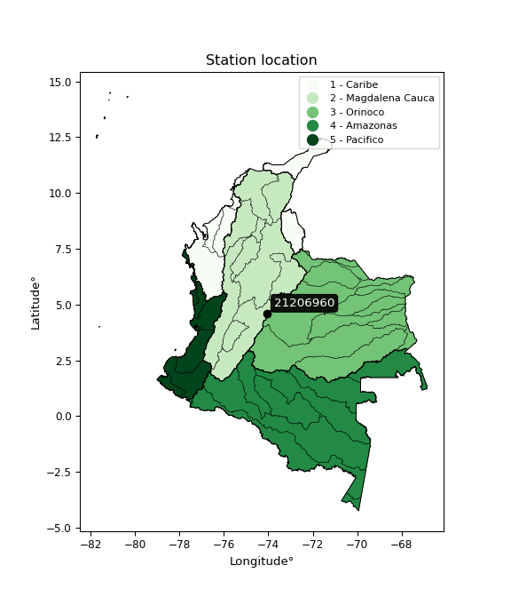

<div align="center">


</div>

# PMP Station (rain, Pmax24h): 21206960

Probable Maximum Precipitation (PMP) is the greatest amount of rainfall for a specific duration that is meteorologically possible for a given location, acting as a "worst-case" scenario for extreme storms, crucial for designing safety-critical infrastructure like bridges, river deviations, dams, spillways, and nuclear plants to prevent catastrophic failure. PMP is calculated by hydrologists using meteorological data to determine the upper limit of extreme rainfall, often leading to the Probable Maximum Flood (PMF) for flood control design, and is increasingly being studied for climate change impacts.

<div align="center">

</img>

</div>


## A. General information


### 1. General running parameters

• app_version: _v20251227_. • runtime: _2025-12-27 09:02:11.367833_. • Python version: _3.14.0_. • SciPy version: _1.16.3_. • Pandas version: _2.3.3_. • NumPy version: _2.3.5_. • Stations dataset (station_dataset_file): _dataset/pmax24h_in/automatic_colombia_2003_2024_filter.csv_. • Stations catalog (station_catalog_file): _dataset/CNE_IDEAM.xls_. • Minimum year to eval til year_max (date_min): _2003_. • Maximum year to eval since year_min (date_max): _2024_. • Creates, save and include plots into reports (create_plot): _False_. • Plot only fit distributions with Δo > Δ (plot_only_fit): _True_. • Eval low extreme values, if False, evaluates high extreme values (low_extreme): _False_. • Eval every SciPy distribution as logarithmic (pdist_logarithmic_on): _True_. • Standard deviation normalized (ddof): _1.0_. • Return periods to eval in years (Tr): _[2, 2.33, 5, 10, 15, 20, 25, 50, 75, 100, 200, 250, 500, 750, 1000]_. • Minimum data sample per station, 0 means any (minimum_sample): _5_. • Z-Score threshold to adjust a value, 0 means disable (zscore): _3.5_. • Avoid zeros, e.g. rain = 0 (avoid_zeros): _True_. • Avoid null values (avoid_nans): _True_. [:file_folder:Dataset file.](../../dataset/pmax24h_in/automatic_colombia_2003_2024_filter.csv)

> Delta Degrees of Freedom (DDOF): is a parameter used in the formulas for calculating variance and standard deviation. When ddof=0, the divisor is $N$ (the total number of observations) and this is used when your data set is the entire population. When ddof=1, the divisor is $N-1$ and this is used when your data set is a sample drawn from a larger population. Using $N-1$ provides an unbiased estimate of the population variance (known as Bessel´s correction).


### 2. Station info and location

|   id |   CODIGO | NOMBRE                              | CATEGORIA               | TECNOLOGIA                | ESTADO     | FECHA_INSTALACION   |   FECHA_SUSPENSION |   ALTITUD |   LATITUD |   LONGITUD | DEPARTAMENTO   | MUNICIPIO   | AREA_OPERATIVA                            | ENTIDAD                                                     | AREA_HIDROGRAFICA   | ZONA_HIDROGRAFICA   | SUBZONA_HIDROGRAFICA   |   CORRIENTE | Catalogo   |
|-----:|---------:|:------------------------------------|:------------------------|:--------------------------|:-----------|:--------------------|-------------------:|----------:|----------:|-----------:|:---------------|:------------|:------------------------------------------|:------------------------------------------------------------|:--------------------|:--------------------|:-----------------------|------------:|:-----------|
|    0 | 21206960 | IDEAM BOGOTA CENTRO- AUT [21206960] | Climatológica Principal | Automática con Telemetría | Suspendida | 11/04/2005          |                nan |      2646 |       4.6 |   -74.0667 | Bogotá         | Bogotá, D.C | Area Operativa 11 - Cundinamarca-Amazonas | INSTITUTO DE HIDROLOGIA METEOROLOGIA Y ESTUDIOS AMBIENTALES | Magdalena Cauca     | Alto Magdalena      | Río Bogotá             |         nan | CNE_IDEAM  |

<div align="center">

Map location in: [:earth_americas:Google](http://maps.google.com/maps?q=4.6,-74.06666667) [:earth_americas:OSM](https://www.openstreetmap.org/#map=18/4.6/-74.06666667&layers=P) [:earth_americas:Bing](https://www.bing.com/maps?cp=4.6~-74.06666667&lvl=18) [:earth_americas:Apple](https://maps.apple.com/frame?center=4.6%2C-74.06666667&span=0.003%2C0.006)

</div>


<div align="center">

```geojson
{
  "type": "Feature",
  "geometry": {
    "type": "Point", 
    "coordinates": [-74.06666667, 4.6]
  }, 
  "properties": {
    "Name": "21206960"
  }
}
```

</div>


### 3. Discrete values table and plot

|               |          0 |           1 |           2 |           3 |          4 |           5 |          6 |           7 |           8 |           9 |           10 |          11 |         12 |
|:--------------|-----------:|------------:|------------:|------------:|-----------:|------------:|-----------:|------------:|------------:|------------:|-------------:|------------:|-----------:|
| Date          | 2008       | 2009        | 2011        | 2012        | 2013       | 2014        | 2015       | 2016        | 2017        | 2018        | 2019         | 2021        | 2022       |
| Value         |   73.5     |   49.4      |   39.5      |   27.7      |   46.1     |   32.8      |   19.1     |   28.2      |   34.8      |   29.3      |   35.4       |   40.6      |   21.2     |
| Value_initial |   73.5     |   49.4      |   39.5      |   27.7      |   46.1     |   32.8      |   19.1     |   28.2      |   34.8      |   29.3      |   35.4       |   40.6      |   21.2     |
| count         |   13       |   13        |   13        |   13        |   13       |   13        |   13       |   13        |   13        |   13        |   13         |   13        |   13       |
| mean          |   36.7385  |   36.7385   |   36.7385   |   36.7385   |   36.7385  |   36.7385   |   36.7385  |   36.7385   |   36.7385   |   36.7385   |   36.7385    |   36.7385   |   36.7385  |
| std           |   14.1582  |   14.1582   |   14.1582   |   14.1582   |   14.1582  |   14.1582   |   14.1582  |   14.1582   |   14.1582   |   14.1582   |   14.1582    |   14.1582   |   14.1582  |
| zscore        |    2.59649 |    0.894291 |    0.195049 |   -0.638391 |    0.66121 |   -0.278176 |   -1.24581 |   -0.603076 |   -0.136915 |   -0.525382 |   -0.0945362 |    0.272742 |   -1.09749 |

> The initial value (value_initial) correspond to the initial obtained or null completed value, and value (value) is adjusted only when the initial value is outside the valid range definite through the Z-Score value. If Z-Score is active, values out of range or outliers are replaced with the station mean value


### 4. Active continuous probability distributions from SciPy (45 of 104 available)

[scipy.stats](https://docs.scipy.org/doc/scipy/reference/stats.html) is a Python´s powerful submodule within the SciPy library for comprehensive statistical analysis, offering over 130 probability distributions (like Normal, Poisson), functions for descriptive stats (mean, variance), hypothesis testing (t-tests, chi-square), random variable generation, and statistical tests, making it essential for data science, modeling, and research. It provides tools to explore, model, and draw conclusions from data efficiently, working seamlessly with NumPy.

<div align="center">

|   id | p_dist             |   n_parameter | fit_method   | label                                                                       | active   | ref                                                                                                        |
|-----:|:-------------------|--------------:|:-------------|:----------------------------------------------------------------------------|:---------|:-----------------------------------------------------------------------------------------------------------|
|    0 | alpha              |             3 | MLE          | Alpha                                                                       | True     | [:mortar_board:](https://docs.scipy.org/doc/scipy/reference/generated/scipy.stats.alpha.html)              |
|    1 | betaprime          |             4 | MLE          | Beta prime                                                                  | True     | [:mortar_board:](https://docs.scipy.org/doc/scipy/reference/generated/scipy.stats.betaprime.html)          |
|    2 | chi2               |             3 | MLE          | Chi²                                                                        | True     | [:mortar_board:](https://docs.scipy.org/doc/scipy/reference/generated/scipy.stats.chi2.html)               |
|    3 | crystalball        |             4 | MLE          | Crystalball                                                                 | True     | [:mortar_board:](https://docs.scipy.org/doc/scipy/reference/generated/scipy.stats.crystalball.html)        |
|    4 | erlang             |             3 | MLE          | Erlang                                                                      | True     | [:mortar_board:](https://docs.scipy.org/doc/scipy/reference/generated/scipy.stats.erlang.html)             |
|    5 | expon              |             2 | MLE          | Exponential                                                                 | True     | [:mortar_board:](https://docs.scipy.org/doc/scipy/reference/generated/scipy.stats.expon.html)              |
|    6 | exponnorm          |             3 | MLE          | Exponentially modified Normal                                               | True     | [:mortar_board:](https://docs.scipy.org/doc/scipy/reference/generated/scipy.stats.exponnorm.html)          |
|    7 | f                  |             4 | MLE          | F                                                                           | True     | [:mortar_board:](https://docs.scipy.org/doc/scipy/reference/generated/scipy.stats.f.html)                  |
|    8 | fatiguelife        |             3 | MLE          | Fatigue-life (Birnbaum-Saunders)                                            | True     | [:mortar_board:](https://docs.scipy.org/doc/scipy/reference/generated/scipy.stats.fatiguelife.html)        |
|    9 | fisk               |             3 | MLE          | Fisk                                                                        | True     | [:mortar_board:](https://docs.scipy.org/doc/scipy/reference/generated/scipy.stats.fisk.html)               |
|   10 | gamma              |             3 | MLE          | Gamma                                                                       | True     | [:mortar_board:](https://docs.scipy.org/doc/scipy/reference/generated/scipy.stats.gamma.html)              |
|   11 | genexpon           |             5 | MLE          | Generalized exponential                                                     | True     | [:mortar_board:](https://docs.scipy.org/doc/scipy/reference/generated/scipy.stats.genexpon.html)           |
|   12 | genlogistic        |             3 | MLE          | Generalized logistic                                                        | True     | [:mortar_board:](https://docs.scipy.org/doc/scipy/reference/generated/scipy.stats.genlogistic.html)        |
|   13 | gibrat             |             2 | MM           | Gibrat                                                                      | True     | [:mortar_board:](https://docs.scipy.org/doc/scipy/reference/generated/scipy.stats.gibrat.html)             |
|   14 | gompertz           |             3 | MLE          | Gompertz (or truncated Gumbel)                                              | True     | [:mortar_board:](https://docs.scipy.org/doc/scipy/reference/generated/scipy.stats.gompertz.html)           |
|   15 | gumbel_l           |             2 | MM           | Gumbel Left Skew                                                            | True     | [:mortar_board:](https://docs.scipy.org/doc/scipy/reference/generated/scipy.stats.gumbel_l.html)           |
|   16 | gumbel_r           |             2 | MM           | Gumbel Right Skew                                                           | True     | [:mortar_board:](https://docs.scipy.org/doc/scipy/reference/generated/scipy.stats.gumbel_r.html)           |
|   17 | halflogistic       |             2 | MM           | Half-logistic                                                               | True     | [:mortar_board:](https://docs.scipy.org/doc/scipy/reference/generated/scipy.stats.halflogistic.html)       |
|   18 | halfnorm           |             2 | MM           | Half Normal                                                                 | True     | [:mortar_board:](https://docs.scipy.org/doc/scipy/reference/generated/scipy.stats.halfnorm.html)           |
|   19 | hypsecant          |             2 | MM           | hyperbolic secant                                                           | True     | [:mortar_board:](https://docs.scipy.org/doc/scipy/reference/generated/scipy.stats.hypsecant.html)          |
|   20 | invgamma           |             3 | MLE          | Inverted gamma                                                              | True     | [:mortar_board:](https://docs.scipy.org/doc/scipy/reference/generated/scipy.stats.invgamma.html)           |
|   21 | invgauss           |             3 | MLE          | Inverse Gaussian                                                            | True     | [:mortar_board:](https://docs.scipy.org/doc/scipy/reference/generated/scipy.stats.invgauss.html)           |
|   22 | invweibull         |             3 | MLE          | Inverted Weibull                                                            | True     | [:mortar_board:](https://docs.scipy.org/doc/scipy/reference/generated/scipy.stats.invweibull.html)         |
|   23 | johnsonsu          |             4 | MLE          | Johnson Su                                                                  | True     | [:mortar_board:](https://docs.scipy.org/doc/scipy/reference/generated/scipy.stats.johnsonsu.html)          |
|   24 | kstwobign          |             2 | MLE          | Limiting distribution of scaled Kolmogorov-Smirnov two-sided test statistic | True     | [:mortar_board:](https://docs.scipy.org/doc/scipy/reference/generated/scipy.stats.kstwobign.html)          |
|   25 | laplace            |             2 | MM           | Laplace                                                                     | True     | [:mortar_board:](https://docs.scipy.org/doc/scipy/reference/generated/scipy.stats.laplace.html)            |
|   26 | laplace_asymmetric |             3 | MLE          | Asymmetric Laplace                                                          | True     | [:mortar_board:](https://docs.scipy.org/doc/scipy/reference/generated/scipy.stats.laplace_asymmetric.html) |
|   27 | loggamma           |             3 | MLE          | Log gamma                                                                   | True     | [:mortar_board:](https://docs.scipy.org/doc/scipy/reference/generated/scipy.stats.loggamma.html)           |
|   28 | logistic           |             2 | MM           | Logistic (or Sech-squared)                                                  | True     | [:mortar_board:](https://docs.scipy.org/doc/scipy/reference/generated/scipy.stats.logistic.html)           |
|   29 | lognorm            |             3 | MLE          | Log Normal                                                                  | True     | [:mortar_board:](https://docs.scipy.org/doc/scipy/reference/generated/scipy.stats.lognorm.html)            |
|   30 | maxwell            |             2 | MM           | Maxwell                                                                     | True     | [:mortar_board:](https://docs.scipy.org/doc/scipy/reference/generated/scipy.stats.maxwell.html)            |
|   31 | mielke             |             4 | MLE          | Mielke Beta-Kappa / Dagum                                                   | True     | [:mortar_board:](https://docs.scipy.org/doc/scipy/reference/generated/scipy.stats.mielke.html)             |
|   32 | moyal              |             2 | MM           | Moyal                                                                       | True     | [:mortar_board:](https://docs.scipy.org/doc/scipy/reference/generated/scipy.stats.moyal.html)              |
|   33 | nakagami           |             3 | MLE          | Nakagami                                                                    | True     | [:mortar_board:](https://docs.scipy.org/doc/scipy/reference/generated/scipy.stats.nakagami.html)           |
|   34 | ncf                |             5 | MLE          | Non-central F distribution                                                  | True     | [:mortar_board:](https://docs.scipy.org/doc/scipy/reference/generated/scipy.stats.ncf.html)                |
|   35 | nct                |             4 | MLE          | Non-central Student’s t                                                     | True     | [:mortar_board:](https://docs.scipy.org/doc/scipy/reference/generated/scipy.stats.nct.html)                |
|   36 | norm               |             2 | MM           | Normal                                                                      | True     | [:mortar_board:](https://docs.scipy.org/doc/scipy/reference/generated/scipy.stats.norm.html)               |
|   37 | pareto             |             3 | MLE          | Pareto                                                                      | True     | [:mortar_board:](https://docs.scipy.org/doc/scipy/reference/generated/scipy.stats.pareto.html)             |
|   38 | pearson3           |             3 | MM           | Pearson type III                                                            | True     | [:mortar_board:](https://docs.scipy.org/doc/scipy/reference/generated/scipy.stats.pearson3.html)           |
|   39 | rayleigh           |             2 | MM           | Rayleigh                                                                    | True     | [:mortar_board:](https://docs.scipy.org/doc/scipy/reference/generated/scipy.stats.rayleigh.html)           |
|   40 | rice               |             3 | MLE          | Rice                                                                        | True     | [:mortar_board:](https://docs.scipy.org/doc/scipy/reference/generated/scipy.stats.rice.html)               |
|   41 | t                  |             3 | MLE          | Student’s t                                                                 | True     | [:mortar_board:](https://docs.scipy.org/doc/scipy/reference/generated/scipy.stats.t.html)                  |
|   42 | truncnorm          |             4 | MLE          | Truncated normal                                                            | True     | [:mortar_board:](https://docs.scipy.org/doc/scipy/reference/generated/scipy.stats.truncnorm.html)          |
|   43 | wald               |             2 | MM           | Wald                                                                        | True     | [:mortar_board:](https://docs.scipy.org/doc/scipy/reference/generated/scipy.stats.wald.html)               |
|   44 | weibull_min        |             3 | MLE          | Weibull minimum                                                             | True     | [:mortar_board:](https://docs.scipy.org/doc/scipy/reference/generated/scipy.stats.weibull_min.html)        |

</div>

> **n_parameter:** # arguments & localization & scale.
>
> **Fit methods:** (MLE) maximum likelihood, (MM) L-moments.
>
>**Inactive:** foldnorm, gennorm, norminvgauss, powernorm, powerlognorm, skewnorm, genextreme, anglit, arcsine, argus, beta, bradford, burr, burr12, cauchy, cosine, halfcauchy, foldcauchy, skewcauchy, wrapcauchy, dgamma, gengamma, exponweib, exponpow, truncexpon, gausshyper, genhalflogistic, genhyperbolic, geninvgauss, halfgennorm, johnsonsb, kappa4, kappa3, ksone, kstwo, loglaplace, levy, levy_l, levy_stable, ncx2, genpareto, truncpareto, lomax, powerlaw, rdist, rel_breitwigner, recipinvgauss, semicircular, studentized_range, trapezoid, triang, truncweibull_min, tukeylambda, uniform, loguniform, vonmises, vonmises_line, weibull_max, dweibull, 


## B. Probability distributions vs. Empirical distributions

A continuous probability distribution (CPD) describes probabilities for variables that can take any value within a range (like rain any time), unlike discrete variables with specific outcomes (like temperature). It uses a Probability Density Function (PDF), a curve where the total area under it equals 1, and the probability of the variable falling within an interval (a to b) is found by calculating the area under the curve between those points. A key feature is that the probability of hitting any single exact value is zero, so probabilities are always expressed for ranges, e.g., $P(a ≤ X ≤ b)$.

<div align="center">

Distributions parameters from station values
|    |   station | p_dist                |   n |             loc |         scale | shape                 | shape1                 | shape2                 | shape3   |
|---:|----------:|:----------------------|----:|----------------:|--------------:|:----------------------|:-----------------------|:-----------------------|:---------|
|  0 |  21206960 | alpha                 |  13 |   -18.5396      | 245.057       | 4.6676619411484275    |                        |                        |          |
|  1 |  21206960 | betaprime             |  13 |    -0.365102    |   4.4441      | 77.41412589434327     | 10.286600673852238     |                        |          |
|  2 |  21206960 | chi2                  |  13 |    17.695       |   5.54307     | 3.4355538765215354    |                        |                        |          |
|  3 |  21206960 | crystalball           |  13 |    36.7385      |  13.6027      | 3995.5044367284863    | 276.96309762201616     |                        |          |
|  4 |  21206960 | erlang                |  13 |    17.695       |  11.086       | 1.7177868008497361    |                        |                        |          |
|  5 |  21206960 | expon                 |  13 |    19.1         |  17.6385      |                       |                        |                        |          |
|  6 |  21206960 | exponnorm             |  13 |    24.42        |   5.75241     | 2.1414353814004286    |                        |                        |          |
|  7 |  21206960 | f                     |  13 |     0.542211    |  32.0931      | 1363.5910007288496    | 17.5076109923286       |                        |          |
|  8 |  21206960 | fatiguelife           |  13 |     9.19387     |  24.5807      | 0.49091274312701483   |                        |                        |          |
|  9 |  21206960 | fisk                  |  13 |     9.71904     |  24.2349      | 3.617236921520834     |                        |                        |          |
| 10 |  21206960 | gamma                 |  13 |    17.695       |  11.086       | 1.717796621573972     |                        |                        |          |
| 11 |  21206960 | genexpon              |  13 |    19.1         |   1.5618      | 0.08848901701753333   | 1.4159263487064176e-06 | 1.2462198675091787     |          |
| 12 |  21206960 | genlogistic           |  13 |   -33.1427      |   9.89677     | 639.157902351651      |                        |                        |          |
| 13 |  21206960 | gibrat                |  13 |    26.3613      |   6.29407     |                       |                        |                        |          |
| 14 |  21206960 | gompertz              |  13 |    19.1         |  35.4845      | 1.1110797764512192    |                        |                        |          |
| 15 |  21206960 | gumbel_l              |  13 |    42.8604      |  10.606       |                       |                        |                        |          |
| 16 |  21206960 | gumbel_r              |  13 |    30.6165      |  10.606       |                       |                        |                        |          |
| 17 |  21206960 | halflogistic          |  13 |    20.6161      |  11.6298      |                       |                        |                        |          |
| 18 |  21206960 | halfnorm              |  13 |    18.7338      |  22.5655      |                       |                        |                        |          |
| 19 |  21206960 | hypsecant             |  13 |    36.7385      |   8.65978     |                       |                        |                        |          |
| 20 |  21206960 | invgamma              |  13 |     0.339641    | 282.45        | 8.752504404873878     |                        |                        |          |
| 21 |  21206960 | invgauss              |  13 |     8.34154     | 120.853       | 0.23497109393796412   |                        |                        |          |
| 22 |  21206960 | invweibull            |  13 |   -83.6153      | 113.964       | 11.889985633157583    |                        |                        |          |
| 23 |  21206960 | johnsonsu             |  13 |     9.17459     |   1.25125     | -7.703988070743003    | 2.0970607575513336     |                        |          |
| 24 |  21206960 | kstwobign             |  13 |    -5.34762     |  48.6565      |                       |                        |                        |          |
| 25 |  21206960 | laplace               |  13 |    36.7385      |   9.61859     |                       |                        |                        |          |
| 26 |  21206960 | laplace_asymmetric    |  13 |    28.2         |   7.99825     | 0.6022652027607232    |                        |                        |          |
| 27 |  21206960 | loggamma              |  13 | -4838.88        | 635.57        | 2146.125329888606     |                        |                        |          |
| 28 |  21206960 | logistic              |  13 |    36.7385      |   7.49959     |                       |                        |                        |          |
| 29 |  21206960 | lognorm               |  13 |    19.1         |   0.933288    | 9.613900570639103     |                        |                        |          |
| 30 |  21206960 | maxwell               |  13 |     4.50567     |  20.1989      |                       |                        |                        |          |
| 31 |  21206960 | mielke                |  13 |    -0.138224    |  32.0412      | 6.495376526083671     | 5.142676953773673      |                        |          |
| 32 |  21206960 | moyal                 |  13 |    28.9595      |   6.12339     |                       |                        |                        |          |
| 33 |  21206960 | nakagami              |  13 |    19.1         |  22.5046      | 0.3635038016183324    |                        |                        |          |
| 34 |  21206960 | ncf                   |  13 |    -0.702702    |  33.5466      | 558.4954618461281     | 19.21192444737239      | 5.7248274766164646e-08 |          |
| 35 |  21206960 | nct                   |  13 |    -0.0742436   |   4.78412     | 6.164281306490112     | 6.724591781812297      |                        |          |
| 36 |  21206960 | norm                  |  13 |    36.7385      |  13.6027      |                       |                        |                        |          |
| 37 |  21206960 | pareto                |  13 |    19.1         |   3.35778e-05 | 0.08333691754683692   |                        |                        |          |
| 38 |  21206960 | pearson3              |  13 |    36.7385      |  13.6028      | 1.2690865359234542    |                        |                        |          |
| 39 |  21206960 | rayleigh              |  13 |    10.7156      |  20.7632      |                       |                        |                        |          |
| 40 |  21206960 | rice                  |  13 |    13.9598      |  18.7604      | 0.0004234230391684801 |                        |                        |          |
| 41 |  21206960 | t                     |  13 |    34.3237      |   9.07846     | 3.1208918689013005    |                        |                        |          |
| 42 |  21206960 | truncnorm             |  13 |  -776.755       | 179.124       | -6013.781295843326    | 4.746733116448448      |                        |          |
| 43 |  21206960 | wald                  |  13 |    23.1357      |  13.6028      |                       |                        |                        |          |
| 44 |  21206960 | weibull_min           |  13 |    18.4971      |  19.6091      | 1.2882268078908756    |                        |                        |          |
| 45 |  21206960 | logalpha              |  13 |    -2.21815     |  96.975       | 16.898137826799463    |                        |                        |          |
| 46 |  21206960 | logbetaprime          |  13 |    -1.67021     |   5.79378     | 415.6451344650294     | 462.8695633249373      |                        |          |
| 47 |  21206960 | logchi2               |  13 |     2.94969     |   0.944286    | 1.1245147591549571    |                        |                        |          |
| 48 |  21206960 | logcrystalball        |  13 |     3.54284     |   0.343652    | 7.631839201645017     | 18699.249694958184     |                        |          |
| 49 |  21206960 | logerlang             |  13 |     1.61012     |   0.0613583   | 31.498927825694288    |                        |                        |          |
| 50 |  21206960 | logexpon              |  13 |     2.94969     |   0.593151    |                       |                        |                        |          |
| 51 |  21206960 | logexponnorm          |  13 |     3.34411     |   0.282886    | 0.702513823993915     |                        |                        |          |
| 52 |  21206960 | logf                  |  13 |     0.120116    |   3.39996     | 598.8867168865642     | 300.625109031684       |                        |          |
| 53 |  21206960 | logfatiguelife        |  13 |     0.556092    |   2.96711     | 0.11504736059365789   |                        |                        |          |
| 54 |  21206960 | logfisk               |  13 |    -0.0269752   |   3.55524     | 18.394421347782938    |                        |                        |          |
| 55 |  21206960 | loggamma              |  13 |     1.61012     |   0.0613584   | 31.49878820900188     |                        |                        |          |
| 56 |  21206960 | loggenexpon           |  13 |     2.92534     |   0.0255064   | 0.010687122015313088  | 3.7576497360483163     | 0.0005151329325721789  |          |
| 57 |  21206960 | loggenlogistic        |  13 |     3.40328     |   0.220264    | 1.5291077970624518    |                        |                        |          |
| 58 |  21206960 | loggibrat             |  13 |     3.2807      |   0.158999    |                       |                        |                        |          |
| 59 |  21206960 | loggompertz           |  13 |     2.94969     |   0.542789    | 0.3722093741600663    |                        |                        |          |
| 60 |  21206960 | loggumbel_l           |  13 |     3.6975      |   0.267944    |                       |                        |                        |          |
| 61 |  21206960 | loggumbel_r           |  13 |     3.38818     |   0.267944    |                       |                        |                        |          |
| 62 |  21206960 | loghalflogistic       |  13 |     3.13555     |   0.293798    |                       |                        |                        |          |
| 63 |  21206960 | loghalfnorm           |  13 |     3.08802     |   0.570029    |                       |                        |                        |          |
| 64 |  21206960 | loghypsecant          |  13 |     3.54284     |   0.218776    |                       |                        |                        |          |
| 65 |  21206960 | loginvgamma           |  13 |    -0.565112    | 589.811       | 144.5770518611672     |                        |                        |          |
| 66 |  21206960 | loginvgauss           |  13 |     1.15231     | 113.799       | 0.020986810977174336  |                        |                        |          |
| 67 |  21206960 | loginvweibull         |  13 |    -1.57346e+07 |   1.57346e+07 | 50272829.61648609     |                        |                        |          |
| 68 |  21206960 | logjohnsonsu          |  13 |     0.876636    |   1.08157     | -13.665874130165687   | 8.396772967770197      |                        |          |
| 69 |  21206960 | logkstwobign          |  13 |     2.25612     |   1.47619     |                       |                        |                        |          |
| 70 |  21206960 | loglaplace            |  13 |     3.54284     |   0.242999    |                       |                        |                        |          |
| 71 |  21206960 | loglaplace_asymmetric |  13 |     3.54962     |   0.264706    | 1.0128598115455025    |                        |                        |          |
| 72 |  21206960 | logloggamma           |  13 |   -92.485       |  13.1912      | 1451.038208955793     |                        |                        |          |
| 73 |  21206960 | loglogistic           |  13 |     3.54284     |   0.189465    |                       |                        |                        |          |
| 74 |  21206960 | loglognorm            |  13 |     0.502882    |   3.02068     | 0.11283555514152727   |                        |                        |          |
| 75 |  21206960 | logmaxwell            |  13 |     2.72853     |   0.510294    |                       |                        |                        |          |
| 76 |  21206960 | logmielke             |  13 |    -0.209548    |   3.74178     | 19.19003935084556     | 19.43049865141849      |                        |          |
| 77 |  21206960 | logmoyal              |  13 |     3.34632     |   0.154698    |                       |                        |                        |          |
| 78 |  21206960 | lognakagami           |  13 |     2.77959     |   0.837046    | 1.2579744771691843    |                        |                        |          |
| 79 |  21206960 | logncf                |  13 |    -3.62186     |   7.13844     | 567.7168428778937     | 934.1041249402715      | 1.4760233545385093     |          |
| 80 |  21206960 | lognct                |  13 |    -0.237803    |   0.173499    | 83.20946233206627     | 21.594407160105042     |                        |          |
| 81 |  21206960 | lognorm               |  13 |     3.54284     |   0.343652    |                       |                        |                        |          |
| 82 |  21206960 | logpareto             |  13 |     2.94969     |   1.24829e-06 | 0.0833364848996033    |                        |                        |          |
| 83 |  21206960 | logpearson3           |  13 |     3.54284     |   0.343652    | 0.2956441095334278    |                        |                        |          |
| 84 |  21206960 | lograyleigh           |  13 |     2.88541     |   0.52455     |                       |                        |                        |          |
| 85 |  21206960 | logrice               |  13 |     2.81027     |   0.399208    | 1.452064038813524     |                        |                        |          |
| 86 |  21206960 | logt                  |  13 |     3.54285     |   0.343653    | 8129466.996403325     |                        |                        |          |
| 87 |  21206960 | logtruncnorm          |  13 |    -0.150459    |   1.09883     | 3.1596132728330506    | 4.047710307224612      |                        |          |
| 88 |  21206960 | logwald               |  13 |     3.19917     |   0.343665    |                       |                        |                        |          |
| 89 |  21206960 | logweibull_min        |  13 |     2.77263     |   0.868087    | 2.383012913780222     |                        |                        |          |

</div>

> **loc** (Location parameter): This shifts the distribution along the x-axis. For many common distributions, like the normal (Gaussian) distribution, loc represents the mean $μ$. For others, like the uniform distribution, it might represent the minimum value, or for the beta distribution, the left end of the support interval.
>
> **scale** (Scale parameter): This determines the width or spread of the distribution. For the normal distribution, scale represents the standard deviation $σ$. For a uniform distribution, it defines the length of the interval (from $loc$ to $loc + scale$).
>
> **shape** (Shape parameters): Refers to parameters that define the specific form of a probability distribution, distinct from its location (loc) and scale (scale). These parameters are required arguments for most distribution functions. For example, a normal (Gaussian) distribution is fully defined by its location (mean) and scale (standard deviation), so it has no specific shape parameters beyond loc and scale. However, other distributions have intrinsic properties that need specification, as Gamma distribution that takes a shape parameter, often named $a$ or $alpha$.


### 0. Cumulative distribution values - CDF (90 evaluated)

Cumulative Distribution Function (CDF), denoted as $F$<sub>$X$</sub>$(x)$, is a function that gives the probability that a random variable $X$ will take a value less than or equal to a specific value, $x$ (i.e., $(P(X≥x)$. It essentially "accumulates" probabilities from a given point up to the far right (positive infinity), providing a complete picture of the distribution´s probabilities for both discrete (like rain) and continuous (like temperature) variables, helping to find probabilities over ranges or above certain values.

<div align="center">

CDF ordered by x ascending and calculating $log(f(x))$ separately
|   id |   Station |   date |    x |   count |    mean |     std |     zscore |   Value_initial |   station |   m |     alpha |   alpha_pdf |   betaprime |   betaprime_pdf |      chi2 |   chi2_pdf |   crystalball |   crystalball_pdf |    erlang |   erlang_pdf |    expon |   expon_pdf |   exponnorm |   exponnorm_pdf |         f |      f_pdf |   fatiguelife |   fatiguelife_pdf |      fisk |   fisk_pdf |     gamma |   gamma_pdf |    genexpon |   genexpon_pdf |   genlogistic |   genlogistic_pdf |    gibrat |   gibrat_pdf |    gompertz |   gompertz_pdf |   gumbel_l |   gumbel_l_pdf |   gumbel_r |   gumbel_r_pdf |   halflogistic |   halflogistic_pdf |   halfnorm |   halfnorm_pdf |   hypsecant |   hypsecant_pdf |   invgamma |   invgamma_pdf |   invgauss |   invgauss_pdf |   invweibull |   invweibull_pdf |   johnsonsu |   johnsonsu_pdf |   kstwobign |   kstwobign_pdf |   laplace |   laplace_pdf |   laplace_asymmetric |   laplace_asymmetric_pdf |   loggamma |   loggamma_pdf |   logistic |   logistic_pdf |   lognorm |   lognorm_pdf |   maxwell |   maxwell_pdf |    mielke |   mielke_pdf |     moyal |   moyal_pdf |    nakagami |   nakagami_pdf |       ncf |    ncf_pdf |       nct |    nct_pdf |     norm |    norm_pdf |   pareto |     pareto_pdf |   pearson3 |   pearson3_pdf |   rayleigh |   rayleigh_pdf |      rice |   rice_pdf |         t |       t_pdf |   truncnorm |   truncnorm_pdf |     wald |   wald_pdf |   weibull_min |   weibull_min_pdf |   logalpha |   logalpha_pdf |   logbetaprime |   logbetaprime_pdf |     logchi2 |   logchi2_pdf |   logcrystalball |   logcrystalball_pdf |   logerlang |   logerlang_pdf |   logexpon |   logexpon_pdf |   logexponnorm |   logexponnorm_pdf |      logf |   logf_pdf |   logfatiguelife |   logfatiguelife_pdf |   logfisk |   logfisk_pdf |   loggenexpon |   loggenexpon_pdf |   loggenlogistic |   loggenlogistic_pdf |   loggibrat |   loggibrat_pdf |   loggompertz |   loggompertz_pdf |   loggumbel_l |   loggumbel_l_pdf |   loggumbel_r |   loggumbel_r_pdf |   loghalflogistic |   loghalflogistic_pdf |   loghalfnorm |   loghalfnorm_pdf |   loghypsecant |   loghypsecant_pdf |   loginvgamma |   loginvgamma_pdf |   loginvgauss |   loginvgauss_pdf |   loginvweibull |   loginvweibull_pdf |   logjohnsonsu |   logjohnsonsu_pdf |   logkstwobign |   logkstwobign_pdf |   loglaplace |   loglaplace_pdf |   loglaplace_asymmetric |   loglaplace_asymmetric_pdf |   logloggamma |   logloggamma_pdf |   loglogistic |   loglogistic_pdf |   loglognorm |   loglognorm_pdf |   logmaxwell |   logmaxwell_pdf |   logmielke |   logmielke_pdf |    logmoyal |   logmoyal_pdf |   lognakagami |   lognakagami_pdf |   logncf |   logncf_pdf |    lognct |   lognct_pdf |   logpareto |   logpareto_pdf |   logpearson3 |   logpearson3_pdf |   lograyleigh |   lograyleigh_pdf |   logrice |   logrice_pdf |      logt |   logt_pdf |   logtruncnorm |   logtruncnorm_pdf |   logwald |   logwald_pdf |   logweibull_min |   logweibull_min_pdf |
|-----:|----------:|-------:|-----:|--------:|--------:|--------:|-----------:|----------------:|----------:|----:|----------:|------------:|------------:|----------------:|----------:|-----------:|--------------:|------------------:|----------:|-------------:|---------:|------------:|------------:|----------------:|----------:|-----------:|--------------:|------------------:|----------:|-----------:|----------:|------------:|------------:|---------------:|--------------:|------------------:|----------:|-------------:|------------:|---------------:|-----------:|---------------:|-----------:|---------------:|---------------:|-------------------:|-----------:|---------------:|------------:|----------------:|-----------:|---------------:|-----------:|---------------:|-------------:|-----------------:|------------:|----------------:|------------:|----------------:|----------:|--------------:|---------------------:|-------------------------:|-----------:|---------------:|-----------:|---------------:|----------:|--------------:|----------:|--------------:|----------:|-------------:|----------:|------------:|------------:|---------------:|----------:|-----------:|----------:|-----------:|---------:|------------:|---------:|---------------:|-----------:|---------------:|-----------:|---------------:|----------:|-----------:|----------:|------------:|------------:|----------------:|---------:|-----------:|--------------:|------------------:|-----------:|---------------:|---------------:|-------------------:|------------:|--------------:|-----------------:|---------------------:|------------:|----------------:|-----------:|---------------:|---------------:|-------------------:|----------:|-----------:|-----------------:|---------------------:|----------:|--------------:|--------------:|------------------:|-----------------:|---------------------:|------------:|----------------:|--------------:|------------------:|--------------:|------------------:|--------------:|------------------:|------------------:|----------------------:|--------------:|------------------:|---------------:|-------------------:|--------------:|------------------:|--------------:|------------------:|----------------:|--------------------:|---------------:|-------------------:|---------------:|-------------------:|-------------:|-----------------:|------------------------:|----------------------------:|--------------:|------------------:|--------------:|------------------:|-------------:|-----------------:|-------------:|-----------------:|------------:|----------------:|------------:|---------------:|--------------:|------------------:|---------:|-------------:|----------:|-------------:|------------:|----------------:|--------------:|------------------:|--------------:|------------------:|----------:|--------------:|----------:|-----------:|---------------:|-------------------:|----------:|--------------:|-----------------:|---------------------:|
|    0 |  21206960 |   2015 | 19.1 |      13 | 36.7385 | 14.1582 | -1.24581   |            19.1 |  21206960 |   1 | 0.0326676 |  0.0126284  |   0.034128  |      0.0133269  | 0.0169579 |  0.0197788 |      0.09737  |       0.0126524   | 0.0169581 |   0.0197788  | 0        |  0.0566943  |   0.0367029 |      0.0114319  | 0.0306449 | 0.0131491  |     0.0277062 |        0.0144719  | 0.0312751 | 0.0116823  | 0.0169581 |  0.0197786  | 4.22539e-07 |     0.0566582  |     0.0387502 |        0.0126953  | 0         |   0          | 6.49317e-13 |     0.0313117  |   0.100961 |     0.00902165 |  0.0517182 |     0.0144434  |      0         |         0          |  0.0129492 |     0.0353539  |   0.0825757 |      0.00942895 |  0.0306501 |     0.0131515  |  0.0281562 |     0.0142333  |    0.0320439 |       0.0127624  |   0.0287677 |      0.0137749  |   0.0376455 |      0.0135097  | 0.0799035 |    0.0083072  |            0.0402471 |               0.00835511 |  0.030198  |       0.254404 |  0.0869129 |    0.0105818   | 0.0421719 |      0.261744 | 0.0859791 |    0.0158841  | 0.0333097 |   0.0104855  | 0.0252956 |  0.0119413  | 2.52903e-12 |    517.526     | 0.0325711 | 0.0132089  | 0.031042  | 0.012569   | 0.09737  | 0.0126524   | 0        | 2481.9         |  0.0292868 |     0.0167995  |  0.0782958 |     0.0179256  | 0.0368402 | 0.0140668  | 0.0943076 | 0.0108095   |    0.999997 |     1.1512e-07  | 0        | 0          |     0.0112075 |        0.0238114  |  0.0309535 |       0.253557 |      0.0397203 |           0.273561 | 1.83385e-09 |   2.32182e+06 |        0.0421719 |             0.261744 |   0.0301981 |        0.254403 |   0        |       1.68591  |      0.0331535 |           0.243874 | 0.0311116 |   0.252391 |        0.030702  |             0.253322 | 0.0367134 |      0.218543 |     0.0110243 |          0.486017 |        0.0357046 |             0.219829 |   0         |       0         |   6.31603e-09 |          0.685735 |     0.0595197 |        0.215388   |    0.00587461 |          0.11263  |          0        |              0        |      0        |          0        |      0.0422446 |          0.192529  |     0.0311144 |          0.252232 |     0.0285908 |          0.254322 |       0.0203464 |            0.253195 |      0.031297  |           0.25306  |      0.0199505 |           0.292761 |    0.0435385 |        0.179172  |               0.0540377 |                    0.20155  |     0.044163  |          0.265578 |     0.0418603 |         0.211691  |    0.03093   |         0.252764 |    0.020471  |         0.267366 |   0.0374885 |        0.219522 | 0.000313787 |      0.0140682 |     0.0206769 |          0.298846 | 0.130641 |     0.425905 | 0.0308865 |     0.251871 |    0        |   66760.7       |     0.0322254 |          0.256124 |    0.00747933 |          0.231853 | 0.0212782 |      0.305542 | 0.0421708 |   0.261738 |    0           |           0        |  0        |     0         |        0.0223731 |             0.297731 |
|    1 |  21206960 |   2022 | 21.2 |      13 | 36.7385 | 14.1582 | -1.09749   |            21.2 |  21206960 |   2 | 0.0669486 |  0.0201307  |   0.0699213 |      0.0208091  | 0.0725294 |  0.0315429 |      0.126664 |       0.0152735   | 0.0725298 |   0.031543   | 0.112244 |  0.0503307  |   0.0672763 |      0.0179034  | 0.0667307 | 0.0212685  |     0.0679754 |        0.0237157  | 0.0628291 | 0.0185515  | 0.0725293 |  0.0315427  | 0.112178    |     0.0503031  |     0.0720487 |        0.0191101  | 0         |   0          | 0.0654959   |     0.0310449  |   0.12167  |     0.0107437  |  0.0880467 |     0.0201719  |      0.0250978 |         0.0429658  |  0.0870294 |     0.035148   |   0.104872  |      0.0118924  |  0.0667423 |     0.0212721  |  0.0676818 |     0.0232905  |    0.0668846 |       0.0205218  |   0.0668881 |      0.0224858  |   0.0728454 |      0.019999   | 0.0993995 |    0.0103341  |            0.0622394 |               0.0129206  |  0.0668171 |       0.457553 |  0.111857  |    0.0132468   | 0.0774437 |      0.42209  | 0.122828  |    0.0191762  | 0.0615616 |   0.0166778  | 0.0595137 |  0.020798   | 0.138578    |      0.0478638 | 0.0683596 | 0.0209255  | 0.0656281 | 0.0204917  | 0.126664 | 0.0152735   | 0.601616 |    0.0158093   |  0.0739336 |     0.0253036  |  0.119695  |     0.0214085  | 0.0717658 | 0.0190953  | 0.120344  | 0.0141244   |    0.999997 |     1.0927e-07  | 0        | 0          |     0.0749073 |        0.0343293  |  0.0673682 |       0.454801 |      0.0771522 |           0.4519   | 0.216231    |   1.12487     |        0.0774437 |             0.42209  |   0.0668171 |        0.457552 |   0.161267 |       1.41403  |      0.0676275 |           0.427369 | 0.0672458 |   0.450363 |        0.0670596 |             0.453679 | 0.0670045 |      0.373234 |     0.0755134 |          0.740811 |        0.0665596 |             0.383522 |   0         |       0         |   0.0758369   |          0.768011 |     0.086591  |        0.308754   |    0.0307911  |          0.399969 |          0        |              0        |      0        |          0        |      0.067894  |          0.307988  |     0.0672256 |          0.45009  |     0.0657506 |          0.46866  |       0.0613648 |            0.547198 |      0.0674949 |           0.45088  |      0.0679626 |           0.634245 |    0.0668813 |        0.275233  |               0.0797382 |                    0.297409 |     0.0796864 |          0.422738 |     0.0704308 |         0.345553  |    0.0671572 |         0.45176  |    0.0611676 |         0.519006 |   0.0678054 |        0.372566 | 0.0101029   |      0.242637  |     0.0657904 |          0.567747 | 0.179949 |     0.518912 | 0.0670297 |     0.451219 |    0.61112  |       0.310676  |     0.0685971 |          0.450657 |    0.0503368  |          0.581867 | 0.0650768 |      0.533571 | 0.0774419 |   0.422081 |    0           |           0        |  0        |     0         |        0.0659601 |             0.539801 |
|    2 |  21206960 |   2012 | 27.7 |      13 | 36.7385 | 14.1582 | -0.638391  |            27.7 |  21206960 |   3 | 0.263674  |  0.0374455  |   0.266696  |      0.0367114  | 0.310523  |  0.0372594 |      0.253198 |       0.0235186   | 0.310524  |   0.0372596  | 0.385884 |  0.0348169  |   0.25335   |      0.0375353  | 0.269722  | 0.0376643  |     0.2809    |        0.0374851  | 0.253568  | 0.0380758  | 0.310522  |  0.0372595  | 0.385698    |     0.0348058  |     0.255312  |        0.035183   | 0.0608215 |   0.0899366  | 0.262667    |     0.0294188  |   0.212938 |     0.0177692  |  0.268069  |     0.033275   |      0.295477  |         0.0392393  |  0.308885  |     0.0326746  |   0.215546  |      0.0230314  |  0.269758  |     0.0376673  |  0.27904   |     0.0375315  |    0.266428  |       0.0376402  |   0.275435  |      0.0377149  |   0.25448   |      0.0334861  | 0.195375  |    0.0203122  |            0.239932  |               0.0498088  |  0.27118   |       1.04307  |  0.230552  |    0.0236544   | 0.259698  |      0.943312 | 0.275275  |    0.0269397  | 0.243424  |   0.0382412  | 0.267723  |  0.0390702  | 0.381152    |      0.030987  | 0.267212  | 0.037054   | 0.266918  | 0.0380888  | 0.253198 | 0.0235186   | 0.645777 |    0.00343253  |  0.28448   |     0.0358734  |  0.28435   |     0.0281943  | 0.235252  | 0.0298558  | 0.258279  | 0.0293575   |    0.999997 |     9.28984e-08 | 0.203751 | 0.0781522  |     0.314343  |        0.0362201  |  0.271695  |       1.04815  |      0.270562  |           0.980156 | 0.42052     |   0.55977     |        0.259698  |             0.943312 |   0.271179  |        1.04307  |   0.465663 |       0.900846 |      0.263262  |           1.03052  | 0.269302  |   1.03798  |        0.270181  |             1.04029  | 0.249268  |      1.02802  |     0.328838  |          1.06904  |        0.254043  |             1.04378  |   0.0866374 |       3.87477   |   0.306552    |          0.943212 |     0.217865  |        0.717284   |    0.277241   |          1.32738  |          0.3062   |              1.54229  |      0.317805 |          1.28717  |      0.221948  |          0.934269  |     0.269225  |          1.03797  |     0.27615   |          1.06811  |       0.30496   |            1.15713  |      0.269582  |           1.03772  |      0.325062  |           1.14052  |    0.201032  |        0.827297  |               0.216203  |                    0.806396 |     0.260469  |          0.932197 |     0.237111  |         0.954735  |    0.269674  |         1.03903  |    0.282701  |         1.07474  |   0.249075  |        1.02232  | 0.278475    |      1.5535    |     0.295817  |          1.07611  | 0.346041 |     0.703859 | 0.269905  |     1.0422   |    0.650198 |       0.0784172 |     0.268867  |          1.02604  |    0.292111   |          1.12175  | 0.278248  |      1.01914  | 0.259693  |   0.943299 |    3.20603e-06 |           3.22887  |  0.225102 |     3.05287   |        0.28487   |             1.04117  |
|    3 |  21206960 |   2016 | 28.2 |      13 | 36.7385 | 14.1582 | -0.603076  |            28.2 |  21206960 |   4 | 0.282522  |  0.0379247  |   0.285157  |      0.0371098  | 0.329061  |  0.0368851 |      0.2651   |       0.0240838   | 0.329063  |   0.0368853  | 0.403048 |  0.0338438  |   0.272322  |      0.0383266  | 0.288641  | 0.037992   |     0.299665  |        0.0375542  | 0.272801  | 0.0388286  | 0.329061  |  0.0368852  | 0.402856    |     0.0338337  |     0.273057  |        0.0357782  | 0.109245  |   0.101762   | 0.277333    |     0.0292429  |   0.221983 |     0.0184129  |  0.284823  |     0.0337267  |      0.31497   |         0.0387277  |  0.325149  |     0.0323803  |   0.227322  |      0.0240752  |  0.288679  |     0.0379947  |  0.297837  |     0.0376395  |    0.285357  |       0.0380514  |   0.294347  |      0.0379104  |   0.271328  |      0.0338911  | 0.2058    |    0.021396   |            0.266175  |               0.0552567  |  0.290086  |       1.07013  |  0.242591  |    0.0245001   | 0.276852  |      0.974165 | 0.288841  |    0.0273175  | 0.262823  |   0.0393284  | 0.287336  |  0.0393577  | 0.396477    |      0.0303194 | 0.285838  | 0.0374294  | 0.286071  | 0.0384998  | 0.2651   | 0.0240838   | 0.647441 |    0.00322869  |  0.302426  |     0.0358994  |  0.298513  |     0.0284499  | 0.250302  | 0.0303333  | 0.273289  | 0.0306806   |    0.999998 |     9.17408e-08 | 0.242347 | 0.0760563  |     0.332352  |        0.0358107  |  0.290699  |       1.07599  |      0.288344  |           1.00741  | 0.430384    |   0.5432      |        0.276852  |             0.974165 |   0.290086  |        1.07013  |   0.481538 |       0.874082 |      0.281992  |           1.06305  | 0.288126  |   1.06612  |        0.289043  |             1.06791  | 0.268057  |      1.07211  |     0.348001  |          1.07293  |        0.273085  |             1.08457  |   0.159211  |       4.13678   |   0.323496    |          0.950997 |     0.231023  |        0.753909   |    0.30119    |          1.34891  |          0.333527 |              1.51254  |      0.340681 |          1.27011  |      0.239188  |          0.99328   |     0.28805   |          1.06615  |     0.295492  |          1.09383  |       0.325758  |            1.16738  |      0.288402  |           1.06583  |      0.34549   |           1.14267  |    0.216391  |        0.890501  |               0.231121  |                    0.862038 |     0.277419  |          0.962615 |     0.254612  |         1.00169   |    0.288515  |         1.06695  |    0.302107  |         1.09438  |   0.267763  |        1.06655  | 0.306372    |      1.56334   |     0.315206  |          1.09113  | 0.358701 |     0.711336 | 0.288804  |     1.07021  |    0.651566 |       0.0745243 |     0.287477  |          1.05407  |    0.312297   |          1.13448  | 0.296669  |      1.03995  | 0.276847  |   0.974153 |    0.0563032   |           3.06657  |  0.278428 |     2.89973   |        0.303666  |             1.05979  |
|    4 |  21206960 |   2018 | 29.3 |      13 | 36.7385 | 14.1582 | -0.525382  |            29.3 |  21206960 |   5 | 0.324623  |  0.0385199  |   0.326284  |      0.0375747  | 0.369101  |  0.0358759 |      0.292246 |       0.0252552   | 0.369103  |   0.035876   | 0.439139 |  0.0317976  |   0.315202  |      0.0395077  | 0.330641  | 0.0382758  |     0.340903  |        0.0373476  | 0.316193  | 0.0399419  | 0.369101  |  0.035876   | 0.438937    |     0.0317893  |     0.31297   |        0.036702   | 0.223137  |   0.101576   | 0.309276    |     0.0288303  |   0.243035 |     0.0198725  |  0.322336  |     0.0344084  |      0.356915  |         0.0375161  |  0.360392  |     0.0316872  |   0.255083  |      0.0264031  |  0.330682  |     0.038278   |  0.339211  |     0.0375045  |    0.327514  |       0.0384955  |   0.336111  |      0.0379373  |   0.308967  |      0.034475   | 0.230734  |    0.0239883  |            0.324508  |               0.0508643  |  0.331998  |       1.11817  |  0.270547  |    0.026315    | 0.315305  |      1.03414  | 0.319293  |    0.02802    | 0.307162  |   0.0411549  | 0.330761  |  0.0394859  | 0.429062    |      0.0289451 | 0.327284  | 0.0378332  | 0.328713  | 0.0389247  | 0.292246 | 0.0252552   | 0.650778 |    0.00285323  |  0.34183   |     0.0356838  |  0.330061  |     0.0288798  | 0.284168  | 0.0312004  | 0.308599  | 0.0334882   |    0.999998 |     8.9242e-08  | 0.322375 | 0.0691209  |     0.371195  |        0.0347875  |  0.332864  |       1.12545  |      0.327896  |           1.05803  | 0.450539    |   0.510918    |        0.315305  |             1.03414  |   0.331998  |        1.11817  |   0.513929 |       0.819473 |      0.323867  |           1.12333  | 0.329931  |   1.11659  |        0.330894  |             1.11722  | 0.310755  |      1.15722  |     0.389112  |          1.07423  |        0.316102  |             1.16114  |   0.310195  |       3.64209   |   0.360169    |          0.965142 |     0.261416  |        0.835271   |    0.353344   |          1.37188  |          0.390097 |              1.44287  |      0.388534 |          1.23029  |      0.279626  |          1.11998   |     0.329858  |          1.1167   |     0.338243  |          1.13807  |       0.37064   |            1.17536  |      0.330195  |           1.11627  |      0.38914   |           1.13646  |    0.253296  |        1.04237   |               0.266578  |                    0.994284 |     0.315417  |          1.022    |     0.294797  |         1.09725   |    0.330343  |         1.11694  |    0.344643  |         1.12653  |   0.31026   |        1.15232  | 0.366065    |      1.54927   |     0.357436  |          1.11396  | 0.386188 |     0.724719 | 0.330758  |     1.12022  |    0.654275 |       0.0673322 |     0.328824  |          1.10484  |    0.356082   |          1.1518   | 0.337208  |      1.07718  | 0.315299  |   1.03413  |    0.167369    |           2.74383  |  0.381565 |     2.48383   |        0.34486   |             1.0914   |
|    5 |  21206960 |   2014 | 32.8 |      13 | 36.7385 | 14.1582 | -0.278176  |            32.8 |  21206960 |   6 | 0.457953  |  0.0368852  |   0.456135  |      0.0359386  | 0.48754   |  0.0316125 |      0.386086 |       0.0281242   | 0.487542  |   0.0316127  | 0.540084 |  0.0260746  |   0.453603  |      0.0384634  | 0.461832  | 0.0360098  |     0.46716   |        0.0343159  | 0.455998  | 0.0388764  | 0.48754   |  0.0316127  | 0.539862    |     0.026071   |     0.442269  |        0.0364351  | 0.509062  |   0.0619442  | 0.407586    |     0.0272902  |   0.321112 |     0.0247909  |  0.443111  |     0.0340056  |      0.480643  |         0.0330608  |  0.466946  |     0.0291151  |   0.35998   |      0.033258   |  0.461877  |     0.0360101  |  0.466246  |     0.0345745  |    0.460028  |       0.036482   |   0.465172  |      0.0352269  |   0.42965   |      0.0339472  | 0.332003  |    0.0345168  |            0.481006  |               0.03908    |  0.462547  |       1.1737   |  0.371647  |    0.0311385   | 0.439392  |      1.14747  | 0.419711  |    0.0290582  | 0.454311  |   0.0416197  | 0.46489   |  0.0364545  | 0.523522    |      0.0251492 | 0.457648  | 0.0359735  | 0.462463  | 0.0367388  | 0.386086 | 0.0281242   | 0.659259 |    0.00207272  |  0.462933  |     0.0331249  |  0.432011  |     0.0290961  | 0.396051  | 0.0323299  | 0.438502  | 0.0398662   |    0.999998 |     8.17146e-08 | 0.522368 | 0.0461685  |     0.486237  |        0.0308177  |  0.464361  |       1.18243  |      0.452727  |           1.13546  | 0.503653    |   0.434417    |        0.439392  |             1.14747  |   0.462547  |        1.1737   |   0.598136 |       0.677508 |      0.456916  |           1.21064  | 0.4607    |   1.17884  |        0.461544  |             1.17627  | 0.450956  |      1.29481  |     0.508368  |          1.02789  |        0.455146  |             1.27134  |   0.609087  |       1.83058   |   0.470462    |          0.983353 |     0.369795  |        1.08594    |    0.505221   |          1.28737  |          0.539856 |              1.20586  |      0.519774 |          1.09101  |      0.424464  |          1.41419   |     0.46065   |          1.17913  |     0.470181  |          1.17765  |       0.500528  |            1.1068   |      0.460926  |           1.17853  |      0.513393  |           1.052    |    0.402996  |        1.65843   |               0.406076  |                    1.51459  |     0.43816   |          1.13651  |     0.431282  |         1.29458   |    0.461069  |         1.17781  |    0.473787  |         1.14341  |   0.450124  |        1.29419  | 0.530238    |      1.32922   |     0.483897  |          1.11049  | 0.469277 |     0.742471 | 0.4618    |     1.1798   |    0.660953 |       0.0522522 |     0.458474  |          1.17159  |    0.485811   |          1.13062  | 0.462294  |      1.12348  | 0.439385  |   1.14746  |    0.430694    |           1.96279  |  0.599602 |     1.4676    |        0.470434  |             1.11763  |
|    6 |  21206960 |   2017 | 34.8 |      13 | 36.7385 | 14.1582 | -0.136915  |            34.8 |  21206960 |   7 | 0.52925   |  0.0342696  |   0.525726  |      0.0335255  | 0.548025  |  0.0288584 |      0.44334  |       0.0290318   | 0.548027  |   0.0288585  | 0.589385 |  0.0232795  |   0.527717  |      0.0354512  | 0.531259  | 0.0333055  |     0.533178  |        0.0316335  | 0.530993  | 0.0359171  | 0.548025  |  0.0288585  | 0.589159    |     0.0232779  |     0.513432  |        0.0345663  | 0.615323  |   0.0452861  | 0.461156    |     0.0262617  |   0.373542 |     0.0276237  |  0.509639  |     0.0323895  |      0.543991  |         0.0302702  |  0.523523  |     0.0274422  |   0.429335  |      0.0358552  |  0.531304  |     0.033305   |  0.532779  |     0.0318838  |    0.530408  |       0.0337713  |   0.532986  |      0.0324971  |   0.49614   |      0.0324287  | 0.408738  |    0.0424946  |            0.553565  |               0.0336164  |  0.531516  |       1.15116  |  0.435738  |    0.0327845   | 0.507868  |      1.16066  | 0.477717  |    0.0288554  | 0.535058  |   0.0388456  | 0.534793  |  0.0333536  | 0.571878    |      0.0232295 | 0.527197  | 0.0334534  | 0.53323   | 0.0339018  | 0.44334  | 0.0290318   | 0.663107 |    0.00178825  |  0.526973  |     0.0308499  |  0.489695  |     0.0285086  | 0.460444  | 0.0319489  | 0.519332  | 0.0405375   |    0.999998 |     7.76886e-08 | 0.604605 | 0.0365     |     0.545385  |        0.0283181  |  0.533819  |       1.15875  |      0.519912  |           1.12936  | 0.528393    |   0.402299    |        0.507868  |             1.16066  |   0.531516  |        1.15116  |   0.636301 |       0.613165 |      0.528367  |           1.1969   | 0.530047  |   1.15862  |        0.530704  |             1.15496  | 0.527509  |      1.28186  |     0.567826  |          0.97878  |        0.530033  |             1.25018  |   0.700391  |       1.29215   |   0.528521    |          0.976411 |     0.43777   |        1.2083     |    0.578432   |          1.18179  |          0.607332 |              1.07412  |      0.58193  |          1.00844  |      0.509861  |          1.45426   |     0.530016  |          1.15894  |     0.539116  |          1.14617  |       0.563922  |            1.03212  |      0.530257  |           1.15838  |      0.57364   |           0.98173  |    0.513755  |        2.00102   |               0.506389  |                    1.88873  |     0.506049  |          1.15194  |     0.508943  |         1.31908   |    0.53034   |         1.1571   |    0.540588  |         1.10932  |   0.526721  |        1.2839   | 0.604209    |      1.16872   |     0.548572  |          1.07108  | 0.513154 |     0.738632 | 0.531151  |     1.15779  |    0.663876 |       0.0466911 |     0.527502  |          1.15519  |    0.551424   |          1.08284  | 0.528473  |      1.10825  | 0.507861  |   1.16066  |    0.537044    |           1.63958  |  0.675856 |     1.12711   |        0.535972  |             1.09273  |
|    7 |  21206960 |   2019 | 35.4 |      13 | 36.7385 | 14.1582 | -0.0945362 |            35.4 |  21206960 |   8 | 0.549536  |  0.0333425  |   0.545588  |      0.0326742  | 0.565089  |  0.028023  |      0.460809 |       0.0291864   | 0.565091  |   0.0280231  | 0.603118 |  0.0225009  |   0.548662  |      0.0343544  | 0.550968  | 0.0323837  |     0.551898  |        0.0307631  | 0.55222   | 0.0348291  | 0.565089  |  0.0280231  | 0.602891    |     0.0224999  |     0.533956  |        0.0338355  | 0.641289  |   0.0413393  | 0.476815    |     0.0259333  |   0.390364 |     0.0284466  |  0.528887  |     0.0317641  |      0.561898  |         0.0294188  |  0.539832  |     0.026918   |   0.450997  |      0.0363226  |  0.551012  |     0.0323829  |  0.551647  |     0.0310048  |    0.550391  |       0.0328334  |   0.552214  |      0.031591   |   0.515427  |      0.0318533  | 0.435047  |    0.0452298  |            0.573286  |               0.0321314  |  0.551091  |       1.13861  |  0.4555    |    0.0330711   | 0.527691  |      1.15809  | 0.494982  |    0.0286895  | 0.558035  |   0.0377255  | 0.554501  |  0.0323351  | 0.58565     |      0.0226782 | 0.547008  | 0.032576   | 0.553281  | 0.0329271  | 0.460809 | 0.0291864   | 0.664158 |    0.00171705  |  0.54526   |     0.0301017  |  0.506723  |     0.0282438  | 0.479543  | 0.0317053  | 0.543576  | 0.0402369   |    0.999998 |     7.65181e-08 | 0.625768 | 0.0340743  |     0.562148  |        0.0275595  |  0.553519  |       1.14565  |      0.539156  |           1.1217   | 0.535197    |   0.393801    |        0.527691  |             1.15809  |   0.55109   |        1.13861  |   0.646633 |       0.595746 |      0.548735  |           1.18551  | 0.549753  |   1.14651  |        0.550346  |             1.14265  | 0.549302  |      1.26719  |     0.584416  |          0.962075 |        0.551275  |             1.23451  |   0.721449  |       1.17397   |   0.545176    |          0.972055 |     0.458699  |        1.23996    |    0.598338   |          1.1469   |          0.62537  |              1.03628  |      0.598958 |          0.983808 |      0.534665  |          1.44634   |     0.549728  |          1.14684  |     0.558585  |          1.13121  |       0.581356  |            1.00747  |      0.549959  |           1.1463   |      0.590233  |           0.959453 |    0.546786  |        1.86509   |               0.537642  |                    1.76915  |     0.525729  |          1.15018  |     0.531459  |         1.31428   |    0.550019  |         1.1449   |    0.559429  |         1.09471  |   0.548556  |        1.26992  | 0.623784    |      1.12155   |     0.566752  |          1.05566  | 0.525758 |     0.735881 | 0.550839  |     1.14517  |    0.664662 |       0.0452914 |     0.54716   |          1.14425  |    0.569786   |          1.06524  | 0.547341  |      1.09894  | 0.527684  |   1.15809  |    0.564349    |           1.55572  |  0.694431 |     1.04723   |        0.554554  |             1.08102  |
|    8 |  21206960 |   2011 | 39.5 |      13 | 36.7385 | 14.1582 |  0.195049  |            39.5 |  21206960 |   9 | 0.671994  |  0.0262813  |   0.666442  |      0.0261611  | 0.668475  |  0.0224817 |      0.580438 |       0.0287299   | 0.668477  |   0.0224817  | 0.685435 |  0.0178341  |   0.67287   |      0.0262008  | 0.669956  | 0.0255999  |     0.665423  |        0.0246094  | 0.678182  | 0.0265091  | 0.668476  |  0.0224818  | 0.685209    |     0.0178358  |     0.660542  |        0.0276691  | 0.769121  |   0.0231603  | 0.578213    |     0.023468   |   0.517342 |     0.0331501  |  0.648721  |     0.0264695  |      0.670622  |         0.0236575  |  0.642565  |     0.0231524  |   0.599829  |      0.0349644  |  0.669995  |     0.0255982  |  0.665985  |     0.0247576  |    0.670867  |       0.025863   |   0.668425  |      0.0250696  |   0.63655   |      0.027032   | 0.624783  |    0.0390095  |            0.68663   |               0.0235966  |  0.669337  |       1.00589  |  0.59103   |    0.0322302   | 0.651126  |      1.07656  | 0.608607  |    0.0264352  | 0.694376  |   0.0285401  | 0.672385  |  0.0251943  | 0.671262    |      0.0191472 | 0.667206  | 0.0259614  | 0.673689  | 0.0257521  | 0.580438 | 0.0287299   | 0.670379 |    0.00134655  |  0.657619  |     0.0246555  |  0.617465  |     0.025541   | 0.60414   | 0.0287266  | 0.696483  | 0.0331111   |    0.999998 |     6.89571e-08 | 0.738143 | 0.0218493  |     0.66462   |        0.0224733  |  0.672282  |       1.00797  |      0.657182  |           1.01752  | 0.575634    |   0.345936    |        0.651126  |             1.07656  |   0.669337  |        1.00589  |   0.706244 |       0.495247 |      0.671965  |           1.04613  | 0.66893   |   1.01432  |        0.669073  |             1.0103   | 0.679267  |      1.08214  |     0.683171  |          0.835323 |        0.677858  |             1.05656  |   0.818989  |       0.665621  |   0.649144    |          0.917616 |     0.603043  |        1.36879    |    0.710922   |          0.905266 |          0.726029 |              0.804773 |      0.697934 |          0.821807 |      0.683149  |          1.22069   |     0.668938  |          1.01458  |     0.675314  |          0.986825 |       0.682384  |            0.833211 |      0.669121  |           1.01426  |      0.687091  |           0.806198 |    0.711302  |        1.18806   |               0.696004  |                    1.1632   |     0.648617  |          1.07462  |     0.669165  |         1.16846   |    0.669006  |         1.0126   |    0.672641  |         0.961209 |   0.67899   |        1.08741  | 0.730699    |      0.836577  |     0.675663  |          0.923536 | 0.604792 |     0.701989 | 0.669709  |     1.01028  |    0.6692   |       0.03794   |     0.666489  |          1.01908  |    0.679107   |          0.922361 | 0.662654  |      0.993064 | 0.651119  |   1.07657  |    0.708838    |           1.10471  |  0.786772 |     0.672105  |        0.667279  |             0.965538 |
|    9 |  21206960 |   2021 | 40.6 |      13 | 36.7385 | 14.1582 |  0.272742  |            40.6 |  21206960 |  10 | 0.699847  |  0.0243673  |   0.694234  |      0.0243755  | 0.692435  |  0.0210901 |      0.611749 |       0.0281698   | 0.692437  |   0.0210901  | 0.704453 |  0.0167558  |   0.700532  |      0.0241112  | 0.697119  | 0.0237954  |     0.691606  |        0.0230021  | 0.706123  | 0.0243071  | 0.692436  |  0.0210902  | 0.704229    |     0.0167581  |     0.689986  |        0.0258638  | 0.792852  |   0.0200782  | 0.603634    |     0.0227479  |   0.554275 |     0.033959   |  0.676977  |     0.0249011  |      0.695827  |         0.0221768  |  0.66746   |     0.0221104  |   0.637457  |      0.033383   |  0.697156  |     0.0237937  |  0.692315  |     0.0231222  |    0.69829   |       0.024004   |   0.695054  |      0.0233542  |   0.665498  |      0.0255967  | 0.665331  |    0.034794   |            0.71154   |               0.0217209  |  0.696367  |       0.961747 |  0.625954  |    0.0312198   | 0.680212  |      1.04033  | 0.63721   |    0.0255532  | 0.724378  |   0.0260224  | 0.699089  |  0.0233711  | 0.691834    |      0.0182604 | 0.694774  | 0.0241686  | 0.700968  | 0.0238557  | 0.611749 | 0.0281698   | 0.671819 |    0.00127207  |  0.683929  |     0.0231851  |  0.645052  |     0.0246048  | 0.635138  | 0.0276174  | 0.731363  | 0.0302786   |    0.999999 |     6.70529e-08 | 0.760877 | 0.0195374  |     0.688622  |        0.0211742  |  0.69935   |       0.9624   |      0.684611  |           0.978967 | 0.584991    |   0.335448    |        0.680212  |             1.04033  |   0.696367  |        0.961748 |   0.719537 |       0.472837 |      0.700037  |           0.997178 | 0.696187  |   0.969747 |        0.696222  |             0.965963 | 0.708133  |      1.01904  |     0.705629  |          0.799799 |        0.706079  |             0.997785 |   0.836123  |       0.584147  |   0.674067    |          0.896678 |     0.640725  |        1.37259    |    0.734953   |          0.844682 |          0.747394 |              0.751201 |      0.719947 |          0.781032 |      0.715502  |          1.13406   |     0.696201  |          0.969977 |     0.701796  |          0.941002 |       0.70465   |            0.788109 |      0.696376  |           0.969718 |      0.708694  |           0.76682  |    0.742159  |        1.06108   |               0.726333  |                    1.04715  |     0.677669  |          1.03989  |     0.700438  |         1.10746   |    0.696216  |         0.968111 |    0.698477  |         0.919572 |   0.708003  |        1.02439  | 0.752795    |      0.772922  |     0.700488  |          0.883727 | 0.623906 |     0.689471 | 0.696848  |     0.965275 |    0.670221 |       0.0364452 |     0.693896  |          0.975892 |    0.703874   |          0.880733 | 0.689429  |      0.955932 | 0.680205  |   1.04034  |    0.737895    |           1.01229  |  0.804299 |     0.605527  |        0.693287  |             0.927697 |
|   10 |  21206960 |   2013 | 46.1 |      13 | 36.7385 | 14.1582 |  0.66121   |            46.1 |  21206960 |  11 | 0.809631  |  0.0159347  |   0.805345  |      0.0163393  | 0.790965  |  0.0149867 |      0.75434  |       0.0231438   | 0.790967  |   0.0149867  | 0.783626 |  0.0122672  |   0.808139  |      0.0155685  | 0.805211  | 0.0158621  |     0.797744  |        0.015879   | 0.812983  | 0.015117   | 0.790966  |  0.0149867  | 0.78342     |     0.0122712  |     0.808238  |        0.0173838  | 0.873475  |   0.0105175  | 0.718281    |     0.0188789  |   0.742628 |     0.0329354  |  0.792736  |     0.0173604  |      0.798922  |         0.0155515  |  0.774772  |     0.0169483  |   0.791787  |      0.0223654  |  0.805238  |     0.0158603  |  0.798774  |     0.0158848  |    0.806909  |       0.0158684  |   0.801842  |      0.0158021  |   0.786498  |      0.0184905  | 0.811078  |    0.0196413  |            0.809356  |               0.0143554  |  0.804199  |       0.731384 |  0.777001  |    0.023104    | 0.798979  |      0.817161 | 0.763357  |    0.0201012  | 0.836673  |   0.0154758  | 0.805142  |  0.0155908  | 0.780758    |      0.0141696 | 0.804813  | 0.0161718  | 0.808469  | 0.0156359  | 0.75434  | 0.0231438   | 0.67799  |    0.0009939   |  0.792276  |     0.0164144  |  0.765927  |     0.019212   | 0.769504  | 0.0210489  | 0.85893   | 0.0167017   |    0.999999 |     5.82592e-08 | 0.844257 | 0.0116204  |     0.788484  |        0.0153348  |  0.806882  |       0.726411 |      0.795751  |           0.763064 | 0.624813    |   0.292961    |        0.798979  |             0.817161 |   0.804199  |        0.731385 |   0.773611 |       0.381673 |      0.810604  |           0.738314 | 0.804828  |   0.735821 |        0.80449   |             0.733867 | 0.817917  |      0.710111 |     0.796423  |          0.62877  |        0.814543  |             0.709888 |   0.89274   |       0.335663  |   0.780163    |          0.764293 |     0.806923  |        1.18512    |    0.825577   |          0.590571 |          0.828469 |              0.533766 |      0.80745  |          0.598862 |      0.833228  |          0.727896  |     0.804861  |          0.735887 |     0.80681   |          0.709438 |       0.791944  |            0.590229 |      0.805019  |           0.735847 |      0.794796  |           0.591211 |    0.84714   |        0.629058  |               0.831692  |                    0.644005 |     0.796759  |          0.822135 |     0.820528  |         0.777249  |    0.804692  |         0.734931 |    0.802049  |         0.707705 |   0.818393  |        0.71389  | 0.834534    |      0.527072  |     0.800262  |          0.684587 | 0.707026 |     0.61496  | 0.804865  |     0.73088  |    0.674472 |       0.0307883 |     0.803585  |          0.745294 |    0.802922   |          0.677143 | 0.798274  |      0.750536 | 0.798973  |   0.817172 |    0.843408    |           0.67032  |  0.865926 |     0.384871  |        0.798705  |             0.726658 |
|   11 |  21206960 |   2009 | 49.4 |      13 | 36.7385 | 14.1582 |  0.894291  |            49.4 |  21206960 |  12 | 0.855583  |  0.0120679  |   0.85276   |      0.0125324  | 0.835417  |  0.0120418 |      0.824023 |       0.0190172   | 0.835419  |   0.0120417  | 0.820546 |  0.010174   |   0.853221  |      0.0119148  | 0.851259  | 0.0121828  |     0.844345  |        0.0124746  | 0.856139  | 0.0112275  | 0.835418  |  0.0120418  | 0.820355    |     0.0101785  |     0.858526  |        0.0132309  | 0.902782  |   0.00746183 | 0.776557    |     0.016433   |   0.843172 |     0.027394   |  0.843531  |     0.0135333  |      0.844742  |         0.0123136  |  0.825849  |     0.0140429  |   0.855025  |      0.0161684  |  0.85128   |     0.0121812  |  0.845323  |     0.0124413  |    0.852873  |       0.0121327  |   0.847938  |      0.0122602  |   0.841094  |      0.0146767  | 0.865945  |    0.013937   |            0.851302  |               0.0111969  |  0.850323  |       0.603778 |  0.844     |    0.0175561   | 0.850636  |      0.676552 | 0.823757  |    0.0165056  | 0.880136  |   0.0110956  | 0.850543  |  0.0120601  | 0.823861    |      0.0119879 | 0.851755  | 0.0124138  | 0.85367   | 0.0119079  | 0.824023 | 0.0190172   | 0.681069 |    0.000877183 |  0.840697  |     0.0130247  |  0.823707  |     0.0158191  | 0.832094  | 0.0169075  | 0.904084  | 0.0110158   |    0.999999 |     5.35225e-08 | 0.877569 | 0.00873445 |     0.834157  |        0.0124214  |  0.852595  |       0.597051 |      0.844106  |           0.635887 | 0.644374    |   0.273244    |        0.850636  |             0.676552 |   0.850323  |        0.603778 |   0.798519 |       0.33968  |      0.856703  |           0.596709 | 0.85118   |   0.605991 |        0.850747  |             0.605141 | 0.861647  |      0.558408 |     0.83671   |          0.537296 |        0.858543  |             0.565798 |   0.913025  |       0.25564   |   0.829874    |          0.671813 |     0.881022  |        0.94528    |    0.862361   |          0.476588 |          0.861954 |              0.437435 |      0.845658 |          0.507567 |      0.877106  |          0.547884  |     0.851215  |          0.605982 |     0.851505  |          0.584696 |       0.829418  |            0.495638 |      0.851373  |           0.605989 |      0.832619  |           0.504166 |    0.884992  |        0.473288  |               0.870815  |                    0.49431  |     0.848814  |          0.682894 |     0.868166  |         0.604089  |    0.851     |         0.605567 |    0.84692   |         0.591022 |   0.862336  |        0.560789 | 0.867323    |      0.424852  |     0.843809  |          0.575829 | 0.747872 |     0.56589  | 0.850896  |     0.601715 |    0.676515 |       0.0283691 |     0.85059   |          0.615176 |    0.845936   |          0.56806  | 0.845964  |      0.62898  | 0.850631  |   0.676565 |    0.884823    |           0.53262  |  0.889681 |     0.305929  |        0.844938  |             0.610964 |
|   12 |  21206960 |   2008 | 73.5 |      13 | 36.7385 | 14.1582 |  2.59649   |            73.5 |  21206960 |  13 | 0.977528  |  0.00154584 |   0.980563  |      0.00156625 | 0.974117  |  0.0020551 |      0.996559 |       0.000760916 | 0.974118  |   0.00205505 | 0.954232 |  0.00259479 |   0.979251  |      0.00168442 | 0.977906  | 0.00164777 |     0.979093  |        0.00178018 | 0.970695  | 0.00161327 | 0.974118  |  0.00205507 | 0.954144    |     0.00259814 |     0.986727  |        0.00133217 | 0.977968  |   0.00111478 | 0.982329    |     0.00256312 |   1        |     2.6508e-08 |  0.982614  |     0.00162495 |      0.97903   |         0.00178423 |  0.984775  |     0.00185969 |   0.990875  |      0.00105357 |  0.977909  |     0.00164752 |  0.979027  |     0.00176243 |    0.978264  |       0.00162692 |   0.977879  |      0.00171865 |   0.989526  |      0.00139534 | 0.989057  |    0.00113767 |            0.97578   |               0.00182379 |  0.978035  |       0.122445 |  0.992622  |    0.000976566 | 0.985932  |      0.104282 | 0.991386  |    0.00134914 | 0.982777  |   0.00118425 | 0.978991  |  0.00171505 | 0.97538     |      0.0023609 | 0.97942   | 0.00160559 | 0.976598  | 0.00162386 | 0.996559 | 0.000760916 | 0.696251 |    0.000465322 |  0.981193  |     0.00176454 |  0.98966   |     0.00150581 | 0.993502  | 0.00109928 | 0.989428  | 0.000744076 |    1        |     2.85173e-08 | 0.973595 | 0.00153531 |     0.977086  |        0.00202647 |  0.978008  |       0.119859 |      0.978925  |           0.125642 | 0.735003    |   0.190006    |        0.985932  |             0.104282 |   0.978035  |        0.122445 |   0.896887 |       0.173839 |      0.977461  |           0.111518 | 0.978439  |   0.120466 |        0.978281  |             0.121436 | 0.973454  |      0.109923 |     0.964891  |          0.156056 |        0.974157  |             0.114812 |   0.968224  |       0.0701946 |   0.98317     |          0.138191 |     0.999916  |        0.00295725 |    0.966947   |          0.121295 |          0.962374 |              0.12566  |      0.966112 |          0.147504 |      0.979766  |          0.0924232 |     0.978443  |          0.120406 |     0.976298  |          0.124111 |       0.948807  |            0.159305 |      0.978564  |           0.12018  |      0.956314  |           0.163677 |    0.977582  |        0.0922565 |               0.971755  |                    0.108074 |     0.985914  |          0.105587 |     0.981693  |         0.0948574 |    0.978363  |         0.12088  |    0.97614   |         0.131028 |   0.974102  |        0.108745 | 0.963109    |      0.119151  |     0.973126  |          0.138932 | 0.912377 |     0.269052 | 0.977677  |     0.121655 |    0.685797 |       0.0194306 |     0.979463  |          0.119661 |    0.973279   |          0.13711  | 0.980275  |      0.124098 | 0.985931  |   0.104288 |    0.999998    |           0.131572 |  0.960223 |     0.0956079 |        0.978233  |             0.130211 |


</div>

An Empirical Distribution Function (EDF) is a step-function estimate of a true cumulative distribution function (CDF) based on observed sample data, representing the proportion of data points less than or equal to a given value. It is calculated by ordering your data and jumping up by $1/n$ (where $n$ is sample size) at each unique data point, allowing analysis without assuming an underlying population distribution, and it gets closer to the true CDF as the sample size grows.


### 1. Empirical - EDF California (1923)

California´s estimates the true probability distribution of water-related data (like rainfall, streamflow) using observed samples, crucial for risk assessment.

<div align="center">


$P=m/n$


</div>


**1.1. Empirical values**

<div align="center">

|                | 0                   | 1                   | 2                   | 3                  | 4                   | 5                   | 6                  | 7                  | 8                  | 9                  | 10                 | 11                 | 12             |
|:---------------|:--------------------|:--------------------|:--------------------|:-------------------|:--------------------|:--------------------|:-------------------|:-------------------|:-------------------|:-------------------|:-------------------|:-------------------|:---------------|
| date           | 2015                | 2022                | 2012                | 2016               | 2018                | 2014                | 2017               | 2019               | 2011               | 2021               | 2013               | 2009               | 2008           |
| x              | 19.1                | 21.2                | 27.7                | 28.2               | 29.3                | 32.8                | 34.8               | 35.4               | 39.5               | 40.6               | 46.1               | 49.4               | 73.5           |
| m              | 1                   | 2                   | 3                   | 4                  | 5                   | 6                   | 7                  | 8                  | 9                  | 10                 | 11                 | 12                 | 13             |
| empirical_dist | edf_california      | edf_california      | edf_california      | edf_california     | edf_california      | edf_california      | edf_california     | edf_california     | edf_california     | edf_california     | edf_california     | edf_california     | edf_california |
| empirical      | 0.07692307692307693 | 0.15384615384615385 | 0.23076923076923078 | 0.3076923076923077 | 0.38461538461538464 | 0.46153846153846156 | 0.5384615384615384 | 0.6153846153846154 | 0.6923076923076923 | 0.7692307692307693 | 0.8461538461538461 | 0.9230769230769231 | 1.0            |
| empirical_tr   | 1.0833333333333333  | 1.1818181818181819  | 1.3                 | 1.4444444444444444 | 1.625               | 1.8571428571428572  | 2.1666666666666665 | 2.6                | 3.25               | 4.333333333333334  | 6.5                | 13.000000000000009 | inf            |

</div>


**1.2. Kolmogorov-Smirnov fit test (sorted by Δ)**


<div align="center">

|                | 0                   | 1                   | 2                   | 3                   | 4                   | 5                   | 6                   | 7                   | 8                   | 9                   | 10                  | 11                  | 12                  | 13                  | 14                  | 15                  | 16                  | 17                  | 18                  | 19                  | 20                  | 21                  | 22                  | 23                  | 24                  | 25                  | 26                  | 27                  | 28                  | 29                  | 30                  | 31                  | 32                  | 33                  | 34                  | 35                  | 36                  | 37                  | 38                  | 39                  | 40                  | 41                  | 42                  | 43                  | 44                  | 45                  | 46                  | 47                  | 48                  | 49                  | 50                  | 51                  | 52                  | 53                  | 54                  | 55                  | 56                  | 57                  | 58                    | 59                  | 60                  | 61                  | 62                  | 63                  | 64                  | 65                  | 66                  | 67                  | 68                  | 69                  | 70                  | 71                  | 72                  | 73                  | 74                  | 75                  | 76                  | 77                  | 78                  | 79                  | 80                  | 81                  | 82                  | 83                  | 84                  | 85                  | 86                  | 87                  | 88                  | 89                  |
|:---------------|:--------------------|:--------------------|:--------------------|:--------------------|:--------------------|:--------------------|:--------------------|:--------------------|:--------------------|:--------------------|:--------------------|:--------------------|:--------------------|:--------------------|:--------------------|:--------------------|:--------------------|:--------------------|:--------------------|:--------------------|:--------------------|:--------------------|:--------------------|:--------------------|:--------------------|:--------------------|:--------------------|:--------------------|:--------------------|:--------------------|:--------------------|:--------------------|:--------------------|:--------------------|:--------------------|:--------------------|:--------------------|:--------------------|:--------------------|:--------------------|:--------------------|:--------------------|:--------------------|:--------------------|:--------------------|:--------------------|:--------------------|:--------------------|:--------------------|:--------------------|:--------------------|:--------------------|:--------------------|:--------------------|:--------------------|:--------------------|:--------------------|:--------------------|:----------------------|:--------------------|:--------------------|:--------------------|:--------------------|:--------------------|:--------------------|:--------------------|:--------------------|:--------------------|:--------------------|:--------------------|:--------------------|:--------------------|:--------------------|:--------------------|:--------------------|:--------------------|:--------------------|:--------------------|:--------------------|:--------------------|:--------------------|:--------------------|:--------------------|:--------------------|:--------------------|:--------------------|:--------------------|:--------------------|:--------------------|:--------------------|
| station        | 21206960            | 21206960            | 21206960            | 21206960            | 21206960            | 21206960            | 21206960            | 21206960            | 21206960            | 21206960            | 21206960            | 21206960            | 21206960            | 21206960            | 21206960            | 21206960            | 21206960            | 21206960            | 21206960            | 21206960            | 21206960            | 21206960            | 21206960            | 21206960            | 21206960            | 21206960            | 21206960            | 21206960            | 21206960            | 21206960            | 21206960            | 21206960            | 21206960            | 21206960            | 21206960            | 21206960            | 21206960            | 21206960            | 21206960            | 21206960            | 21206960            | 21206960            | 21206960            | 21206960            | 21206960            | 21206960            | 21206960            | 21206960            | 21206960            | 21206960            | 21206960            | 21206960            | 21206960            | 21206960            | 21206960            | 21206960            | 21206960            | 21206960            | 21206960              | 21206960            | 21206960            | 21206960            | 21206960            | 21206960            | 21206960            | 21206960            | 21206960            | 21206960            | 21206960            | 21206960            | 21206960            | 21206960            | 21206960            | 21206960            | 21206960            | 21206960            | 21206960            | 21206960            | 21206960            | 21206960            | 21206960            | 21206960            | 21206960            | 21206960            | 21206960            | 21206960            | 21206960            | 21206960            | 21206960            | 21206960            |
| empirical_dist | edf_california      | edf_california      | edf_california      | edf_california      | edf_california      | edf_california      | edf_california      | edf_california      | edf_california      | edf_california      | edf_california      | edf_california      | edf_california      | edf_california      | edf_california      | edf_california      | edf_california      | edf_california      | edf_california      | edf_california      | edf_california      | edf_california      | edf_california      | edf_california      | edf_california      | edf_california      | edf_california      | edf_california      | edf_california      | edf_california      | edf_california      | edf_california      | edf_california      | edf_california      | edf_california      | edf_california      | edf_california      | edf_california      | edf_california      | edf_california      | edf_california      | edf_california      | edf_california      | edf_california      | edf_california      | edf_california      | edf_california      | edf_california      | edf_california      | edf_california      | edf_california      | edf_california      | edf_california      | edf_california      | edf_california      | edf_california      | edf_california      | edf_california      | edf_california        | edf_california      | edf_california      | edf_california      | edf_california      | edf_california      | edf_california      | edf_california      | edf_california      | edf_california      | edf_california      | edf_california      | edf_california      | edf_california      | edf_california      | edf_california      | edf_california      | edf_california      | edf_california      | edf_california      | edf_california      | edf_california      | edf_california      | edf_california      | edf_california      | edf_california      | edf_california      | edf_california      | edf_california      | edf_california      | edf_california      | edf_california      |
| p_dist         | t                   | genlogistic         | betaprime           | logbetaprime        | logpearson3         | pearson3            | ncf                 | fatiguelife         | logmielke           | invgauss            | logexponnorm        | logjohnsonsu        | logalpha            | exponnorm           | logf                | loginvgamma         | loglognorm          | logfatiguelife      | lognct              | logfisk             | alpha               | johnsonsu           | invweibull          | loggamma            | loggamma            | logerlang           | invgamma            | f                   | loggenlogistic      | erlang              | gamma               | chi2                | logweibull_min      | lognakagami         | loginvgauss         | nct                 | logrice             | weibull_min         | logcrystalball      | lognorm             | lognorm             | logt                | loglogistic         | fisk                | logloggamma         | laplace_asymmetric  | gumbel_r            | mielke              | logmaxwell          | loginvweibull       | logkstwobign        | moyal               | loggompertz         | loggenexpon         | halfnorm            | lograyleigh         | kstwobign           | loghypsecant        | loglaplace_asymmetric | loggumbel_r         | rayleigh            | halflogistic        | loglaplace          | maxwell             | rice                | logmoyal            | nakagami            | loghalflogistic     | loghalfnorm         | wald                | logwald             | genexpon            | expon               | loggumbel_l         | norm                | crystalball         | logistic            | loggibrat           | hypsecant           | gompertz            | logncf              | laplace             | gibrat              | gumbel_l            | logexpon            | logtruncnorm        | logchi2             | pareto              | logpareto           | truncnorm           |
| delta          | 0.07601635635997894 | 0.08179740952373145 | 0.08392489877802708 | 0.08461982493882536 | 0.08524905950643365 | 0.08530139402921633 | 0.08548656393671336 | 0.08587078841630362 | 0.08604070605257653 | 0.08616434766560925 | 0.08621868339150734 | 0.08635121569987707 | 0.08647792055568616 | 0.08656989958633904 | 0.08660031958416128 | 0.08662057257105986 | 0.08668893055142729 | 0.08678655994492397 | 0.08681646818964806 | 0.08684161881181343 | 0.08689759400247271 | 0.08695800410800252 | 0.08696150732908814 | 0.08702903678056316 | 0.08702903678056316 | 0.08702904441758688 | 0.08710383511109199 | 0.08711546379466537 | 0.08728657913067174 | 0.08765783890008039 | 0.0876589133606418  | 0.08766010017385195 | 0.0878860209618775  | 0.08805575219889872 | 0.08809557981810222 | 0.08821806154512885 | 0.08876938906065969 | 0.08892018643026867 | 0.0890191239533481  | 0.08901912456236405 | 0.08901912456236405 | 0.08902612183627723 | 0.08981841855417899 | 0.0910170906871303  | 0.09156137207585568 | 0.09160674610566538 | 0.09225403164285373 | 0.09228453383800975 | 0.09267854396983649 | 0.0936588664882736  | 0.09429291602256096 | 0.09433249894766228 | 0.09516350582012267 | 0.0980690987079324  | 0.10177099360271591 | 0.10350934089629614 | 0.1037328890574799  | 0.1049889050199459  | 0.11803784264253692   | 0.12305501261919165 | 0.12417898872024824 | 0.12874838879909067 | 0.1313197257564283  | 0.1320208341363539  | 0.13584143327543358 | 0.14374322234215248 | 0.15038228013879174 | 0.15384615384615385 | 0.15384615384615385 | 0.15384615384615385 | 0.15384615384615385 | 0.154928359648753   | 0.15511441566016215 | 0.1566857257159252  | 0.15748218966925986 | 0.15748219746046455 | 0.1598844055636205  | 0.16192910789679604 | 0.16438810860863468 | 0.1655969293174776  | 0.17520465868518487 | 0.18033741381052576 | 0.19844722229695388 | 0.22502083664493083 | 0.2348934416583392  | 0.25138907365300683 | 0.2787030156383389  | 0.4477700321246626  | 0.45727402223048663 | 0.9230735217457873  |
| deltao         | 0.35149047353100005 | 0.35149047353100005 | 0.35149047353100005 | 0.35149047353100005 | 0.35149047353100005 | 0.35149047353100005 | 0.35149047353100005 | 0.35149047353100005 | 0.35149047353100005 | 0.35149047353100005 | 0.35149047353100005 | 0.35149047353100005 | 0.35149047353100005 | 0.35149047353100005 | 0.35149047353100005 | 0.35149047353100005 | 0.35149047353100005 | 0.35149047353100005 | 0.35149047353100005 | 0.35149047353100005 | 0.35149047353100005 | 0.35149047353100005 | 0.35149047353100005 | 0.35149047353100005 | 0.35149047353100005 | 0.35149047353100005 | 0.35149047353100005 | 0.35149047353100005 | 0.35149047353100005 | 0.35149047353100005 | 0.35149047353100005 | 0.35149047353100005 | 0.35149047353100005 | 0.35149047353100005 | 0.35149047353100005 | 0.35149047353100005 | 0.35149047353100005 | 0.35149047353100005 | 0.35149047353100005 | 0.35149047353100005 | 0.35149047353100005 | 0.35149047353100005 | 0.35149047353100005 | 0.35149047353100005 | 0.35149047353100005 | 0.35149047353100005 | 0.35149047353100005 | 0.35149047353100005 | 0.35149047353100005 | 0.35149047353100005 | 0.35149047353100005 | 0.35149047353100005 | 0.35149047353100005 | 0.35149047353100005 | 0.35149047353100005 | 0.35149047353100005 | 0.35149047353100005 | 0.35149047353100005 | 0.35149047353100005   | 0.35149047353100005 | 0.35149047353100005 | 0.35149047353100005 | 0.35149047353100005 | 0.35149047353100005 | 0.35149047353100005 | 0.35149047353100005 | 0.35149047353100005 | 0.35149047353100005 | 0.35149047353100005 | 0.35149047353100005 | 0.35149047353100005 | 0.35149047353100005 | 0.35149047353100005 | 0.35149047353100005 | 0.35149047353100005 | 0.35149047353100005 | 0.35149047353100005 | 0.35149047353100005 | 0.35149047353100005 | 0.35149047353100005 | 0.35149047353100005 | 0.35149047353100005 | 0.35149047353100005 | 0.35149047353100005 | 0.35149047353100005 | 0.35149047353100005 | 0.35149047353100005 | 0.35149047353100005 | 0.35149047353100005 | 0.35149047353100005 |
| eval           | Δo > Δ              | Δo > Δ              | Δo > Δ              | Δo > Δ              | Δo > Δ              | Δo > Δ              | Δo > Δ              | Δo > Δ              | Δo > Δ              | Δo > Δ              | Δo > Δ              | Δo > Δ              | Δo > Δ              | Δo > Δ              | Δo > Δ              | Δo > Δ              | Δo > Δ              | Δo > Δ              | Δo > Δ              | Δo > Δ              | Δo > Δ              | Δo > Δ              | Δo > Δ              | Δo > Δ              | Δo > Δ              | Δo > Δ              | Δo > Δ              | Δo > Δ              | Δo > Δ              | Δo > Δ              | Δo > Δ              | Δo > Δ              | Δo > Δ              | Δo > Δ              | Δo > Δ              | Δo > Δ              | Δo > Δ              | Δo > Δ              | Δo > Δ              | Δo > Δ              | Δo > Δ              | Δo > Δ              | Δo > Δ              | Δo > Δ              | Δo > Δ              | Δo > Δ              | Δo > Δ              | Δo > Δ              | Δo > Δ              | Δo > Δ              | Δo > Δ              | Δo > Δ              | Δo > Δ              | Δo > Δ              | Δo > Δ              | Δo > Δ              | Δo > Δ              | Δo > Δ              | Δo > Δ                | Δo > Δ              | Δo > Δ              | Δo > Δ              | Δo > Δ              | Δo > Δ              | Δo > Δ              | Δo > Δ              | Δo > Δ              | Δo > Δ              | Δo > Δ              | Δo > Δ              | Δo > Δ              | Δo > Δ              | Δo > Δ              | Δo > Δ              | Δo > Δ              | Δo > Δ              | Δo > Δ              | Δo > Δ              | Δo > Δ              | Δo > Δ              | Δo > Δ              | Δo > Δ              | Δo > Δ              | Δo > Δ              | Δo > Δ              | Δo > Δ              | Δo > Δ              | Δo <= Δ             | Δo <= Δ             | Δo <= Δ             |
| fit            | 1                   | 1                   | 1                   | 1                   | 1                   | 1                   | 1                   | 1                   | 1                   | 1                   | 1                   | 1                   | 1                   | 1                   | 1                   | 1                   | 1                   | 1                   | 1                   | 1                   | 1                   | 1                   | 1                   | 1                   | 1                   | 1                   | 1                   | 1                   | 1                   | 1                   | 1                   | 1                   | 1                   | 1                   | 1                   | 1                   | 1                   | 1                   | 1                   | 1                   | 1                   | 1                   | 1                   | 1                   | 1                   | 1                   | 1                   | 1                   | 1                   | 1                   | 1                   | 1                   | 1                   | 1                   | 1                   | 1                   | 1                   | 1                   | 1                     | 1                   | 1                   | 1                   | 1                   | 1                   | 1                   | 1                   | 1                   | 1                   | 1                   | 1                   | 1                   | 1                   | 1                   | 1                   | 1                   | 1                   | 1                   | 1                   | 1                   | 1                   | 1                   | 1                   | 1                   | 1                   | 1                   | 1                   | 1                   | 0                   | 0                   | 0                   |
| n              | 13                  | 13                  | 13                  | 13                  | 13                  | 13                  | 13                  | 13                  | 13                  | 13                  | 13                  | 13                  | 13                  | 13                  | 13                  | 13                  | 13                  | 13                  | 13                  | 13                  | 13                  | 13                  | 13                  | 13                  | 13                  | 13                  | 13                  | 13                  | 13                  | 13                  | 13                  | 13                  | 13                  | 13                  | 13                  | 13                  | 13                  | 13                  | 13                  | 13                  | 13                  | 13                  | 13                  | 13                  | 13                  | 13                  | 13                  | 13                  | 13                  | 13                  | 13                  | 13                  | 13                  | 13                  | 13                  | 13                  | 13                  | 13                  | 13                    | 13                  | 13                  | 13                  | 13                  | 13                  | 13                  | 13                  | 13                  | 13                  | 13                  | 13                  | 13                  | 13                  | 13                  | 13                  | 13                  | 13                  | 13                  | 13                  | 13                  | 13                  | 13                  | 13                  | 13                  | 13                  | 13                  | 13                  | 13                  | 13                  | 13                  | 13                  |
| best_fit       | 1                   | 0                   | 0                   | 0                   | 0                   | 0                   | 0                   | 0                   | 0                   | 0                   | 0                   | 0                   | 0                   | 0                   | 0                   | 0                   | 0                   | 0                   | 0                   | 0                   | 0                   | 0                   | 0                   | 0                   | 0                   | 0                   | 0                   | 0                   | 0                   | 0                   | 0                   | 0                   | 0                   | 0                   | 0                   | 0                   | 0                   | 0                   | 0                   | 0                   | 0                   | 0                   | 0                   | 0                   | 0                   | 0                   | 0                   | 0                   | 0                   | 0                   | 0                   | 0                   | 0                   | 0                   | 0                   | 0                   | 0                   | 0                   | 0                     | 0                   | 0                   | 0                   | 0                   | 0                   | 0                   | 0                   | 0                   | 0                   | 0                   | 0                   | 0                   | 0                   | 0                   | 0                   | 0                   | 0                   | 0                   | 0                   | 0                   | 0                   | 0                   | 0                   | 0                   | 0                   | 0                   | 0                   | 0                   | 0                   | 0                   | 0                   |
| best_fit_sort  | 1                   | 2                   | 3                   | 4                   | 5                   | 6                   | 7                   | 8                   | 9                   | 10                  | 11                  | 12                  | 13                  | 14                  | 15                  | 16                  | 17                  | 18                  | 19                  | 20                  | 21                  | 22                  | 23                  | 24                  | 25                  | 26                  | 27                  | 28                  | 29                  | 30                  | 31                  | 32                  | 33                  | 34                  | 35                  | 36                  | 37                  | 38                  | 39                  | 40                  | 41                  | 42                  | 43                  | 44                  | 45                  | 46                  | 47                  | 48                  | 49                  | 50                  | 51                  | 52                  | 53                  | 54                  | 55                  | 56                  | 57                  | 58                  | 59                    | 60                  | 61                  | 62                  | 63                  | 64                  | 65                  | 66                  | 67                  | 68                  | 69                  | 70                  | 71                  | 72                  | 73                  | 74                  | 75                  | 76                  | 77                  | 78                  | 79                  | 80                  | 81                  | 82                  | 83                  | 84                  | 85                  | 86                  | 87                  | 88                  | 89                  | 90                  |

</div>


**1.3. Best fit**

<div align="center">

|   id |   station | empirical_dist   | p_dist   |     delta |   deltao | eval   |   fit |   n |   best_fit |   best_fit_sort |
|-----:|----------:|:-----------------|:---------|----------:|---------:|:-------|------:|----:|-----------:|----------------:|
|    0 |  21206960 | edf_california   | t        | 0.0760164 |  0.35149 | Δo > Δ |     1 |  13 |          1 |               1 |

</div>


### 2. Empirical - EDF Hazen (1930)

Hazen method for plotting positions is a formula used to estimate the empirical cumulative probability distribution of flood events or other hydrological data. This formula often results in biased estimations, particularly when extrapolating to extreme events (high return periods).

<div align="center">


$P=(m-0.5)/n$


</div>


**2.1. Empirical values**

<div align="center">

|                | 0                    | 1                   | 2                   | 3                  | 4                   | 5                  | 6         | 7                  | 8                  | 9                  | 10                 | 11                 | 12                 |
|:---------------|:---------------------|:--------------------|:--------------------|:-------------------|:--------------------|:-------------------|:----------|:-------------------|:-------------------|:-------------------|:-------------------|:-------------------|:-------------------|
| date           | 2015                 | 2022                | 2012                | 2016               | 2018                | 2014               | 2017      | 2019               | 2011               | 2021               | 2013               | 2009               | 2008               |
| x              | 19.1                 | 21.2                | 27.7                | 28.2               | 29.3                | 32.8               | 34.8      | 35.4               | 39.5               | 40.6               | 46.1               | 49.4               | 73.5               |
| m              | 1                    | 2                   | 3                   | 4                  | 5                   | 6                  | 7         | 8                  | 9                  | 10                 | 11                 | 12                 | 13                 |
| empirical_dist | edf_hazen            | edf_hazen           | edf_hazen           | edf_hazen          | edf_hazen           | edf_hazen          | edf_hazen | edf_hazen          | edf_hazen          | edf_hazen          | edf_hazen          | edf_hazen          | edf_hazen          |
| empirical      | 0.038461538461538464 | 0.11538461538461539 | 0.19230769230769232 | 0.2692307692307692 | 0.34615384615384615 | 0.4230769230769231 | 0.5       | 0.5769230769230769 | 0.6538461538461539 | 0.7307692307692307 | 0.8076923076923077 | 0.8846153846153846 | 0.9615384615384616 |
| empirical_tr   | 1.04                 | 1.1304347826086958  | 1.2380952380952381  | 1.3684210526315788 | 1.5294117647058822  | 1.7333333333333334 | 2.0       | 2.3636363636363633 | 2.888888888888889  | 3.7142857142857135 | 5.2                | 8.666666666666664  | 26.000000000000018 |

</div>


**2.2. Kolmogorov-Smirnov fit test (sorted by Δ)**


<div align="center">

|                | 0                   | 1                    | 2                   | 3                    | 4                   | 5                   | 6                   | 7                   | 8                   | 9                   | 10                  | 11                  | 12                  | 13                  | 14                  | 15                  | 16                  | 17                  | 18                  | 19                  | 20                  | 21                  | 22                  | 23                  | 24                  | 25                  | 26                  | 27                  | 28                  | 29                  | 30                  | 31                  | 32                  | 33                  | 34                  | 35                  | 36                  | 37                  | 38                  | 39                    | 40                  | 41                  | 42                  | 43                  | 44                  | 45                  | 46                  | 47                  | 48                  | 49                  | 50                  | 51                  | 52                  | 53                  | 54                  | 55                  | 56                  | 57                  | 58                  | 59                  | 60                  | 61                  | 62                  | 63                  | 64                  | 65                  | 66                  | 67                  | 68                  | 69                  | 70                  | 71                  | 72                  | 73                  | 74                  | 75                  | 76                  | 77                  | 78                  | 79                  | 80                  | 81                  | 82                  | 83                  | 84                  | 85                  | 86                  | 87                  | 88                  | 89                  |
|:---------------|:--------------------|:---------------------|:--------------------|:---------------------|:--------------------|:--------------------|:--------------------|:--------------------|:--------------------|:--------------------|:--------------------|:--------------------|:--------------------|:--------------------|:--------------------|:--------------------|:--------------------|:--------------------|:--------------------|:--------------------|:--------------------|:--------------------|:--------------------|:--------------------|:--------------------|:--------------------|:--------------------|:--------------------|:--------------------|:--------------------|:--------------------|:--------------------|:--------------------|:--------------------|:--------------------|:--------------------|:--------------------|:--------------------|:--------------------|:----------------------|:--------------------|:--------------------|:--------------------|:--------------------|:--------------------|:--------------------|:--------------------|:--------------------|:--------------------|:--------------------|:--------------------|:--------------------|:--------------------|:--------------------|:--------------------|:--------------------|:--------------------|:--------------------|:--------------------|:--------------------|:--------------------|:--------------------|:--------------------|:--------------------|:--------------------|:--------------------|:--------------------|:--------------------|:--------------------|:--------------------|:--------------------|:--------------------|:--------------------|:--------------------|:--------------------|:--------------------|:--------------------|:--------------------|:--------------------|:--------------------|:--------------------|:--------------------|:--------------------|:--------------------|:--------------------|:--------------------|:--------------------|:--------------------|:--------------------|:--------------------|
| station        | 21206960            | 21206960             | 21206960            | 21206960             | 21206960            | 21206960            | 21206960            | 21206960            | 21206960            | 21206960            | 21206960            | 21206960            | 21206960            | 21206960            | 21206960            | 21206960            | 21206960            | 21206960            | 21206960            | 21206960            | 21206960            | 21206960            | 21206960            | 21206960            | 21206960            | 21206960            | 21206960            | 21206960            | 21206960            | 21206960            | 21206960            | 21206960            | 21206960            | 21206960            | 21206960            | 21206960            | 21206960            | 21206960            | 21206960            | 21206960              | 21206960            | 21206960            | 21206960            | 21206960            | 21206960            | 21206960            | 21206960            | 21206960            | 21206960            | 21206960            | 21206960            | 21206960            | 21206960            | 21206960            | 21206960            | 21206960            | 21206960            | 21206960            | 21206960            | 21206960            | 21206960            | 21206960            | 21206960            | 21206960            | 21206960            | 21206960            | 21206960            | 21206960            | 21206960            | 21206960            | 21206960            | 21206960            | 21206960            | 21206960            | 21206960            | 21206960            | 21206960            | 21206960            | 21206960            | 21206960            | 21206960            | 21206960            | 21206960            | 21206960            | 21206960            | 21206960            | 21206960            | 21206960            | 21206960            | 21206960            |
| empirical_dist | edf_hazen           | edf_hazen            | edf_hazen           | edf_hazen            | edf_hazen           | edf_hazen           | edf_hazen           | edf_hazen           | edf_hazen           | edf_hazen           | edf_hazen           | edf_hazen           | edf_hazen           | edf_hazen           | edf_hazen           | edf_hazen           | edf_hazen           | edf_hazen           | edf_hazen           | edf_hazen           | edf_hazen           | edf_hazen           | edf_hazen           | edf_hazen           | edf_hazen           | edf_hazen           | edf_hazen           | edf_hazen           | edf_hazen           | edf_hazen           | edf_hazen           | edf_hazen           | edf_hazen           | edf_hazen           | edf_hazen           | edf_hazen           | edf_hazen           | edf_hazen           | edf_hazen           | edf_hazen             | edf_hazen           | edf_hazen           | edf_hazen           | edf_hazen           | edf_hazen           | edf_hazen           | edf_hazen           | edf_hazen           | edf_hazen           | edf_hazen           | edf_hazen           | edf_hazen           | edf_hazen           | edf_hazen           | edf_hazen           | edf_hazen           | edf_hazen           | edf_hazen           | edf_hazen           | edf_hazen           | edf_hazen           | edf_hazen           | edf_hazen           | edf_hazen           | edf_hazen           | edf_hazen           | edf_hazen           | edf_hazen           | edf_hazen           | edf_hazen           | edf_hazen           | edf_hazen           | edf_hazen           | edf_hazen           | edf_hazen           | edf_hazen           | edf_hazen           | edf_hazen           | edf_hazen           | edf_hazen           | edf_hazen           | edf_hazen           | edf_hazen           | edf_hazen           | edf_hazen           | edf_hazen           | edf_hazen           | edf_hazen           | edf_hazen           | edf_hazen           |
| p_dist         | loglogistic         | mielke               | logmielke           | logfisk              | laplace_asymmetric  | exponnorm           | fisk                | loggenlogistic      | genlogistic         | kstwobign           | t                   | loghypsecant        | logt                | lognorm             | lognorm             | logcrystalball      | logloggamma         | logexponnorm        | alpha               | invweibull          | betaprime           | nct                 | ncf                 | moyal               | gumbel_r            | logpearson3         | loginvgamma         | logf                | logjohnsonsu        | loglognorm          | f                   | invgamma            | lognct              | logfatiguelife      | logbetaprime        | logerlang           | loggamma            | loggamma            | logalpha            | loglaplace_asymmetric | johnsonsu           | loginvgauss         | loggumbel_r         | logrice             | invgauss            | fatiguelife         | logmaxwell          | rayleigh            | pearson3            | logweibull_min      | loglaplace          | maxwell             | rice                | lograyleigh         | halflogistic        | lognakagami         | logmoyal            | loginvweibull       | loggompertz         | wald                | halfnorm            | loghalflogistic     | gamma               | chi2                | erlang              | loggumbel_l         | norm                | crystalball         | logistic            | weibull_min         | loghalfnorm         | hypsecant           | gompertz            | logkstwobign        | loggenexpon         | laplace             | logncf              | gibrat              | logwald             | gumbel_l            | nakagami            | genexpon            | expon               | loggibrat           | logtruncnorm        | logchi2             | logexpon            | pareto              | logpareto           | truncnorm           |
| delta          | 0.0513568800926405  | 0.053822995376471276 | 0.05676774034289306 | 0.056960522837680355 | 0.05792919591251783 | 0.06104205611802907 | 0.06126065705061687 | 0.06173522082072183 | 0.06300460386734039 | 0.06527135059594136 | 0.06597085621627316 | 0.06652736655840741 | 0.06738579414629683 | 0.0673907795064018  | 0.0673907795064018  | 0.06739078053380446 | 0.06816082468260329 | 0.07095429142210477 | 0.07136613011491941 | 0.07412033823774486 | 0.07438875548371829 | 0.07461022530020181 | 0.07490452302833414 | 0.07541536854751804 | 0.07576106164527494 | 0.07655889889354309 | 0.07691734463624453 | 0.07699395513195609 | 0.07727435182650064 | 0.07736607793002123 | 0.07741394136882726 | 0.07745069695734744 | 0.07759719492948472 | 0.07787359185482598 | 0.07825455613853557 | 0.07887167181948715 | 0.07887180803916818 | 0.07887180803916818 | 0.07938734357673136 | 0.07957630418099843   | 0.08312763087533095 | 0.08384187492967418 | 0.08493288168168381 | 0.08594040818070156 | 0.08673189171901127 | 0.08859251713656549 | 0.09039311817944015 | 0.09204265513045765 | 0.09217198295510606 | 0.09256188549968034 | 0.09285818729488982 | 0.09355929567481536 | 0.09737989481389503 | 0.09980353809504364 | 0.1031695264073196  | 0.1035088204563763  | 0.10716149222890309 | 0.11265193307065194 | 0.11424437836447507 | 0.11538461538461539 | 0.11657707550105731 | 0.11677924752077268 | 0.11821450280757981 | 0.11821494715882949 | 0.11821630783265516 | 0.11822418725438666 | 0.11902065120772132 | 0.119020658998926   | 0.12142286710208194 | 0.12203532058188063 | 0.12549735171396806 | 0.12592657014709613 | 0.12713539085593906 | 0.13275445448409942 | 0.13653063716947086 | 0.1418758753489872  | 0.15373352834040663 | 0.1599856838354154  | 0.1765252946747175  | 0.18655929818339229 | 0.1888438186003302  | 0.19338989811029147 | 0.19357595412170062 | 0.20039064635833448 | 0.21292753519146834 | 0.24024147717680033 | 0.2733549801198777  | 0.48623157058620103 | 0.49573556069202507 | 0.9615350602073258  |
| deltao         | 0.35149047353100005 | 0.35149047353100005  | 0.35149047353100005 | 0.35149047353100005  | 0.35149047353100005 | 0.35149047353100005 | 0.35149047353100005 | 0.35149047353100005 | 0.35149047353100005 | 0.35149047353100005 | 0.35149047353100005 | 0.35149047353100005 | 0.35149047353100005 | 0.35149047353100005 | 0.35149047353100005 | 0.35149047353100005 | 0.35149047353100005 | 0.35149047353100005 | 0.35149047353100005 | 0.35149047353100005 | 0.35149047353100005 | 0.35149047353100005 | 0.35149047353100005 | 0.35149047353100005 | 0.35149047353100005 | 0.35149047353100005 | 0.35149047353100005 | 0.35149047353100005 | 0.35149047353100005 | 0.35149047353100005 | 0.35149047353100005 | 0.35149047353100005 | 0.35149047353100005 | 0.35149047353100005 | 0.35149047353100005 | 0.35149047353100005 | 0.35149047353100005 | 0.35149047353100005 | 0.35149047353100005 | 0.35149047353100005   | 0.35149047353100005 | 0.35149047353100005 | 0.35149047353100005 | 0.35149047353100005 | 0.35149047353100005 | 0.35149047353100005 | 0.35149047353100005 | 0.35149047353100005 | 0.35149047353100005 | 0.35149047353100005 | 0.35149047353100005 | 0.35149047353100005 | 0.35149047353100005 | 0.35149047353100005 | 0.35149047353100005 | 0.35149047353100005 | 0.35149047353100005 | 0.35149047353100005 | 0.35149047353100005 | 0.35149047353100005 | 0.35149047353100005 | 0.35149047353100005 | 0.35149047353100005 | 0.35149047353100005 | 0.35149047353100005 | 0.35149047353100005 | 0.35149047353100005 | 0.35149047353100005 | 0.35149047353100005 | 0.35149047353100005 | 0.35149047353100005 | 0.35149047353100005 | 0.35149047353100005 | 0.35149047353100005 | 0.35149047353100005 | 0.35149047353100005 | 0.35149047353100005 | 0.35149047353100005 | 0.35149047353100005 | 0.35149047353100005 | 0.35149047353100005 | 0.35149047353100005 | 0.35149047353100005 | 0.35149047353100005 | 0.35149047353100005 | 0.35149047353100005 | 0.35149047353100005 | 0.35149047353100005 | 0.35149047353100005 | 0.35149047353100005 |
| eval           | Δo > Δ              | Δo > Δ               | Δo > Δ              | Δo > Δ               | Δo > Δ              | Δo > Δ              | Δo > Δ              | Δo > Δ              | Δo > Δ              | Δo > Δ              | Δo > Δ              | Δo > Δ              | Δo > Δ              | Δo > Δ              | Δo > Δ              | Δo > Δ              | Δo > Δ              | Δo > Δ              | Δo > Δ              | Δo > Δ              | Δo > Δ              | Δo > Δ              | Δo > Δ              | Δo > Δ              | Δo > Δ              | Δo > Δ              | Δo > Δ              | Δo > Δ              | Δo > Δ              | Δo > Δ              | Δo > Δ              | Δo > Δ              | Δo > Δ              | Δo > Δ              | Δo > Δ              | Δo > Δ              | Δo > Δ              | Δo > Δ              | Δo > Δ              | Δo > Δ                | Δo > Δ              | Δo > Δ              | Δo > Δ              | Δo > Δ              | Δo > Δ              | Δo > Δ              | Δo > Δ              | Δo > Δ              | Δo > Δ              | Δo > Δ              | Δo > Δ              | Δo > Δ              | Δo > Δ              | Δo > Δ              | Δo > Δ              | Δo > Δ              | Δo > Δ              | Δo > Δ              | Δo > Δ              | Δo > Δ              | Δo > Δ              | Δo > Δ              | Δo > Δ              | Δo > Δ              | Δo > Δ              | Δo > Δ              | Δo > Δ              | Δo > Δ              | Δo > Δ              | Δo > Δ              | Δo > Δ              | Δo > Δ              | Δo > Δ              | Δo > Δ              | Δo > Δ              | Δo > Δ              | Δo > Δ              | Δo > Δ              | Δo > Δ              | Δo > Δ              | Δo > Δ              | Δo > Δ              | Δo > Δ              | Δo > Δ              | Δo > Δ              | Δo > Δ              | Δo > Δ              | Δo <= Δ             | Δo <= Δ             | Δo <= Δ             |
| fit            | 1                   | 1                    | 1                   | 1                    | 1                   | 1                   | 1                   | 1                   | 1                   | 1                   | 1                   | 1                   | 1                   | 1                   | 1                   | 1                   | 1                   | 1                   | 1                   | 1                   | 1                   | 1                   | 1                   | 1                   | 1                   | 1                   | 1                   | 1                   | 1                   | 1                   | 1                   | 1                   | 1                   | 1                   | 1                   | 1                   | 1                   | 1                   | 1                   | 1                     | 1                   | 1                   | 1                   | 1                   | 1                   | 1                   | 1                   | 1                   | 1                   | 1                   | 1                   | 1                   | 1                   | 1                   | 1                   | 1                   | 1                   | 1                   | 1                   | 1                   | 1                   | 1                   | 1                   | 1                   | 1                   | 1                   | 1                   | 1                   | 1                   | 1                   | 1                   | 1                   | 1                   | 1                   | 1                   | 1                   | 1                   | 1                   | 1                   | 1                   | 1                   | 1                   | 1                   | 1                   | 1                   | 1                   | 1                   | 0                   | 0                   | 0                   |
| n              | 13                  | 13                   | 13                  | 13                   | 13                  | 13                  | 13                  | 13                  | 13                  | 13                  | 13                  | 13                  | 13                  | 13                  | 13                  | 13                  | 13                  | 13                  | 13                  | 13                  | 13                  | 13                  | 13                  | 13                  | 13                  | 13                  | 13                  | 13                  | 13                  | 13                  | 13                  | 13                  | 13                  | 13                  | 13                  | 13                  | 13                  | 13                  | 13                  | 13                    | 13                  | 13                  | 13                  | 13                  | 13                  | 13                  | 13                  | 13                  | 13                  | 13                  | 13                  | 13                  | 13                  | 13                  | 13                  | 13                  | 13                  | 13                  | 13                  | 13                  | 13                  | 13                  | 13                  | 13                  | 13                  | 13                  | 13                  | 13                  | 13                  | 13                  | 13                  | 13                  | 13                  | 13                  | 13                  | 13                  | 13                  | 13                  | 13                  | 13                  | 13                  | 13                  | 13                  | 13                  | 13                  | 13                  | 13                  | 13                  | 13                  | 13                  |
| best_fit       | 1                   | 0                    | 0                   | 0                    | 0                   | 0                   | 0                   | 0                   | 0                   | 0                   | 0                   | 0                   | 0                   | 0                   | 0                   | 0                   | 0                   | 0                   | 0                   | 0                   | 0                   | 0                   | 0                   | 0                   | 0                   | 0                   | 0                   | 0                   | 0                   | 0                   | 0                   | 0                   | 0                   | 0                   | 0                   | 0                   | 0                   | 0                   | 0                   | 0                     | 0                   | 0                   | 0                   | 0                   | 0                   | 0                   | 0                   | 0                   | 0                   | 0                   | 0                   | 0                   | 0                   | 0                   | 0                   | 0                   | 0                   | 0                   | 0                   | 0                   | 0                   | 0                   | 0                   | 0                   | 0                   | 0                   | 0                   | 0                   | 0                   | 0                   | 0                   | 0                   | 0                   | 0                   | 0                   | 0                   | 0                   | 0                   | 0                   | 0                   | 0                   | 0                   | 0                   | 0                   | 0                   | 0                   | 0                   | 0                   | 0                   | 0                   |
| best_fit_sort  | 1                   | 2                    | 3                   | 4                    | 5                   | 6                   | 7                   | 8                   | 9                   | 10                  | 11                  | 12                  | 13                  | 14                  | 15                  | 16                  | 17                  | 18                  | 19                  | 20                  | 21                  | 22                  | 23                  | 24                  | 25                  | 26                  | 27                  | 28                  | 29                  | 30                  | 31                  | 32                  | 33                  | 34                  | 35                  | 36                  | 37                  | 38                  | 39                  | 40                    | 41                  | 42                  | 43                  | 44                  | 45                  | 46                  | 47                  | 48                  | 49                  | 50                  | 51                  | 52                  | 53                  | 54                  | 55                  | 56                  | 57                  | 58                  | 59                  | 60                  | 61                  | 62                  | 63                  | 64                  | 65                  | 66                  | 67                  | 68                  | 69                  | 70                  | 71                  | 72                  | 73                  | 74                  | 75                  | 76                  | 77                  | 78                  | 79                  | 80                  | 81                  | 82                  | 83                  | 84                  | 85                  | 86                  | 87                  | 88                  | 89                  | 90                  |

</div>


**2.3. Best fit**

<div align="center">

|   id |   station | empirical_dist   | p_dist      |     delta |   deltao | eval   |   fit |   n |   best_fit |   best_fit_sort |
|-----:|----------:|:-----------------|:------------|----------:|---------:|:-------|------:|----:|-----------:|----------------:|
|    0 |  21206960 | edf_hazen        | loglogistic | 0.0513569 |  0.35149 | Δo > Δ |     1 |  13 |          1 |               1 |

</div>


### 3. Empirical - EDF Weibull (1939)

Weibull plotting position formula is an empirical method used to estimate the non-exceedance probability or plotting position for a set of observed data, is often recommended or widely used in practice, particularly in flood frequency analysis.

<div align="center">


$P=m/(n+1)$


</div>


**3.1. Empirical values**

<div align="center">

|                | 0                   | 1                   | 2                   | 3                  | 4                   | 5                   | 6           | 7                  | 8                  | 9                  | 10                 | 11                 | 12                 |
|:---------------|:--------------------|:--------------------|:--------------------|:-------------------|:--------------------|:--------------------|:------------|:-------------------|:-------------------|:-------------------|:-------------------|:-------------------|:-------------------|
| date           | 2015                | 2022                | 2012                | 2016               | 2018                | 2014                | 2017        | 2019               | 2011               | 2021               | 2013               | 2009               | 2008               |
| x              | 19.1                | 21.2                | 27.7                | 28.2               | 29.3                | 32.8                | 34.8        | 35.4               | 39.5               | 40.6               | 46.1               | 49.4               | 73.5               |
| m              | 1                   | 2                   | 3                   | 4                  | 5                   | 6                   | 7           | 8                  | 9                  | 10                 | 11                 | 12                 | 13                 |
| empirical_dist | edf_weibull         | edf_weibull         | edf_weibull         | edf_weibull        | edf_weibull         | edf_weibull         | edf_weibull | edf_weibull        | edf_weibull        | edf_weibull        | edf_weibull        | edf_weibull        | edf_weibull        |
| empirical      | 0.07142857142857142 | 0.14285714285714285 | 0.21428571428571427 | 0.2857142857142857 | 0.35714285714285715 | 0.42857142857142855 | 0.5         | 0.5714285714285714 | 0.6428571428571429 | 0.7142857142857143 | 0.7857142857142857 | 0.8571428571428571 | 0.9285714285714286 |
| empirical_tr   | 1.0769230769230769  | 1.1666666666666665  | 1.2727272727272727  | 1.4                | 1.5555555555555558  | 1.75                | 2.0         | 2.333333333333333  | 2.8000000000000003 | 3.5                | 4.666666666666666  | 6.999999999999997  | 14.000000000000007 |

</div>


**3.2. Kolmogorov-Smirnov fit test (sorted by Δ)**


<div align="center">

|                | 0                   | 1                   | 2                   | 3                   | 4                   | 5                   | 6                   | 7                   | 8                   | 9                   | 10                  | 11                  | 12                  | 13                  | 14                  | 15                  | 16                  | 17                  | 18                  | 19                  | 20                  | 21                  | 22                  | 23                  | 24                  | 25                  | 26                  | 27                  | 28                  | 29                  | 30                  | 31                  | 32                  | 33                  | 34                  | 35                  | 36                  | 37                  | 38                  | 39                  | 40                  | 41                  | 42                  | 43                  | 44                  | 45                  | 46                  | 47                  | 48                  | 49                  | 50                    | 51                  | 52                  | 53                  | 54                  | 55                  | 56                  | 57                  | 58                  | 59                  | 60                  | 61                  | 62                  | 63                  | 64                  | 65                  | 66                  | 67                  | 68                  | 69                  | 70                  | 71                  | 72                  | 73                  | 74                  | 75                  | 76                  | 77                  | 78                  | 79                  | 80                  | 81                  | 82                  | 83                  | 84                  | 85                  | 86                  | 87                  | 88                  | 89                  |
|:---------------|:--------------------|:--------------------|:--------------------|:--------------------|:--------------------|:--------------------|:--------------------|:--------------------|:--------------------|:--------------------|:--------------------|:--------------------|:--------------------|:--------------------|:--------------------|:--------------------|:--------------------|:--------------------|:--------------------|:--------------------|:--------------------|:--------------------|:--------------------|:--------------------|:--------------------|:--------------------|:--------------------|:--------------------|:--------------------|:--------------------|:--------------------|:--------------------|:--------------------|:--------------------|:--------------------|:--------------------|:--------------------|:--------------------|:--------------------|:--------------------|:--------------------|:--------------------|:--------------------|:--------------------|:--------------------|:--------------------|:--------------------|:--------------------|:--------------------|:--------------------|:----------------------|:--------------------|:--------------------|:--------------------|:--------------------|:--------------------|:--------------------|:--------------------|:--------------------|:--------------------|:--------------------|:--------------------|:--------------------|:--------------------|:--------------------|:--------------------|:--------------------|:--------------------|:--------------------|:--------------------|:--------------------|:--------------------|:--------------------|:--------------------|:--------------------|:--------------------|:--------------------|:--------------------|:--------------------|:--------------------|:--------------------|:--------------------|:--------------------|:--------------------|:--------------------|:--------------------|:--------------------|:--------------------|:--------------------|:--------------------|
| station        | 21206960            | 21206960            | 21206960            | 21206960            | 21206960            | 21206960            | 21206960            | 21206960            | 21206960            | 21206960            | 21206960            | 21206960            | 21206960            | 21206960            | 21206960            | 21206960            | 21206960            | 21206960            | 21206960            | 21206960            | 21206960            | 21206960            | 21206960            | 21206960            | 21206960            | 21206960            | 21206960            | 21206960            | 21206960            | 21206960            | 21206960            | 21206960            | 21206960            | 21206960            | 21206960            | 21206960            | 21206960            | 21206960            | 21206960            | 21206960            | 21206960            | 21206960            | 21206960            | 21206960            | 21206960            | 21206960            | 21206960            | 21206960            | 21206960            | 21206960            | 21206960              | 21206960            | 21206960            | 21206960            | 21206960            | 21206960            | 21206960            | 21206960            | 21206960            | 21206960            | 21206960            | 21206960            | 21206960            | 21206960            | 21206960            | 21206960            | 21206960            | 21206960            | 21206960            | 21206960            | 21206960            | 21206960            | 21206960            | 21206960            | 21206960            | 21206960            | 21206960            | 21206960            | 21206960            | 21206960            | 21206960            | 21206960            | 21206960            | 21206960            | 21206960            | 21206960            | 21206960            | 21206960            | 21206960            | 21206960            |
| empirical_dist | edf_weibull         | edf_weibull         | edf_weibull         | edf_weibull         | edf_weibull         | edf_weibull         | edf_weibull         | edf_weibull         | edf_weibull         | edf_weibull         | edf_weibull         | edf_weibull         | edf_weibull         | edf_weibull         | edf_weibull         | edf_weibull         | edf_weibull         | edf_weibull         | edf_weibull         | edf_weibull         | edf_weibull         | edf_weibull         | edf_weibull         | edf_weibull         | edf_weibull         | edf_weibull         | edf_weibull         | edf_weibull         | edf_weibull         | edf_weibull         | edf_weibull         | edf_weibull         | edf_weibull         | edf_weibull         | edf_weibull         | edf_weibull         | edf_weibull         | edf_weibull         | edf_weibull         | edf_weibull         | edf_weibull         | edf_weibull         | edf_weibull         | edf_weibull         | edf_weibull         | edf_weibull         | edf_weibull         | edf_weibull         | edf_weibull         | edf_weibull         | edf_weibull           | edf_weibull         | edf_weibull         | edf_weibull         | edf_weibull         | edf_weibull         | edf_weibull         | edf_weibull         | edf_weibull         | edf_weibull         | edf_weibull         | edf_weibull         | edf_weibull         | edf_weibull         | edf_weibull         | edf_weibull         | edf_weibull         | edf_weibull         | edf_weibull         | edf_weibull         | edf_weibull         | edf_weibull         | edf_weibull         | edf_weibull         | edf_weibull         | edf_weibull         | edf_weibull         | edf_weibull         | edf_weibull         | edf_weibull         | edf_weibull         | edf_weibull         | edf_weibull         | edf_weibull         | edf_weibull         | edf_weibull         | edf_weibull         | edf_weibull         | edf_weibull         | edf_weibull         |
| p_dist         | gumbel_r            | logloggamma         | logcrystalball      | lognorm             | lognorm             | logt                | logbetaprime        | kstwobign           | rayleigh            | pearson3            | genlogistic         | loglogistic         | betaprime           | t                   | logpearson3         | ncf                 | fatiguelife         | logmielke           | invgauss            | logexponnorm        | logjohnsonsu        | logalpha            | exponnorm           | logf                | loginvgamma         | loglognorm          | logfatiguelife      | lognct              | logfisk             | alpha               | johnsonsu           | invweibull          | loggamma            | loggamma            | logerlang           | invgamma            | f                   | loggenlogistic      | logweibull_min      | maxwell             | loginvgauss         | nct                 | loghypsecant        | logrice             | fisk                | laplace_asymmetric  | mielke              | lognakagami         | logmaxwell          | moyal               | loglaplace_asymmetric | loginvweibull       | rice                | loggompertz         | lograyleigh         | halfnorm            | gamma               | chi2                | erlang              | weibull_min         | loglaplace          | norm                | crystalball         | gompertz            | logkstwobign        | loggumbel_r         | loggumbel_l         | loggenexpon         | logistic            | halflogistic        | hypsecant           | logncf              | logmoyal            | laplace             | wald                | loghalfnorm         | loghalflogistic     | nakagami            | genexpon            | expon               | logwald             | gibrat              | gumbel_l            | loggibrat           | logchi2             | logtruncnorm        | logexpon            | pareto              | logpareto           | truncnorm           |
| delta          | 0.0548104834993169  | 0.06317073975203598 | 0.06541346888248964 | 0.06541346949092994 | 0.06541346949092994 | 0.06541526428556287 | 0.06570495476658415 | 0.07001175972625813 | 0.07006463315243569 | 0.07019396097708411 | 0.07080839853472044 | 0.07242636089971739 | 0.07293588778901608 | 0.0732152622376242  | 0.07426004851742264 | 0.07449755294770236 | 0.07488177742729261 | 0.07505169506356553 | 0.07517533667659825 | 0.07522967240249634 | 0.07536220471086606 | 0.07548890956667516 | 0.07558088859732803 | 0.07561130859515028 | 0.07563156158204885 | 0.07569991956241628 | 0.07579754895591297 | 0.07582745720063705 | 0.07585260782280243 | 0.0759085830134617  | 0.07596899311899151 | 0.07597249634007713 | 0.07604002579155215 | 0.07604002579155215 | 0.07604003342857588 | 0.07611482412208098 | 0.07612645280565436 | 0.07629756814166073 | 0.0768970099728665  | 0.07707577919129893 | 0.07710656882909121 | 0.07722905055611784 | 0.07751637754741841 | 0.07778037807164868 | 0.0800280796981193  | 0.08061773511665438 | 0.08129552284899874 | 0.08153079847835434 | 0.08168953298082549 | 0.08334348795865128 | 0.09056531517000943   | 0.09067391109262998 | 0.09188538931938955 | 0.09226635638645311 | 0.09252032990728513 | 0.09459905352303535 | 0.09623648082955785 | 0.09623692518080754 | 0.0962382858546332  | 0.10005729860385867 | 0.10384719828390082 | 0.11061981619744499 | 0.11061982411245413 | 0.11065187437242263 | 0.11077643250607747 | 0.11206600163018064 | 0.11272968175988118 | 0.11455261519144891 | 0.11592836160757647 | 0.11775937781007965 | 0.12043206465259065 | 0.13175550636238467 | 0.13275421135314147 | 0.13638136985448174 | 0.14285714285714285 | 0.14285714285714285 | 0.14285714285714285 | 0.16686579662230824 | 0.17141187613226952 | 0.17159793214367866 | 0.1758564716103882  | 0.17646920031893187 | 0.1810647926888868  | 0.20039064635833448 | 0.21276894970427285 | 0.22941105167498482 | 0.2513769581418557  | 0.4587590431136736  | 0.46826303321949764 | 0.9285680272402929  |
| deltao         | 0.35149047353100005 | 0.35149047353100005 | 0.35149047353100005 | 0.35149047353100005 | 0.35149047353100005 | 0.35149047353100005 | 0.35149047353100005 | 0.35149047353100005 | 0.35149047353100005 | 0.35149047353100005 | 0.35149047353100005 | 0.35149047353100005 | 0.35149047353100005 | 0.35149047353100005 | 0.35149047353100005 | 0.35149047353100005 | 0.35149047353100005 | 0.35149047353100005 | 0.35149047353100005 | 0.35149047353100005 | 0.35149047353100005 | 0.35149047353100005 | 0.35149047353100005 | 0.35149047353100005 | 0.35149047353100005 | 0.35149047353100005 | 0.35149047353100005 | 0.35149047353100005 | 0.35149047353100005 | 0.35149047353100005 | 0.35149047353100005 | 0.35149047353100005 | 0.35149047353100005 | 0.35149047353100005 | 0.35149047353100005 | 0.35149047353100005 | 0.35149047353100005 | 0.35149047353100005 | 0.35149047353100005 | 0.35149047353100005 | 0.35149047353100005 | 0.35149047353100005 | 0.35149047353100005 | 0.35149047353100005 | 0.35149047353100005 | 0.35149047353100005 | 0.35149047353100005 | 0.35149047353100005 | 0.35149047353100005 | 0.35149047353100005 | 0.35149047353100005   | 0.35149047353100005 | 0.35149047353100005 | 0.35149047353100005 | 0.35149047353100005 | 0.35149047353100005 | 0.35149047353100005 | 0.35149047353100005 | 0.35149047353100005 | 0.35149047353100005 | 0.35149047353100005 | 0.35149047353100005 | 0.35149047353100005 | 0.35149047353100005 | 0.35149047353100005 | 0.35149047353100005 | 0.35149047353100005 | 0.35149047353100005 | 0.35149047353100005 | 0.35149047353100005 | 0.35149047353100005 | 0.35149047353100005 | 0.35149047353100005 | 0.35149047353100005 | 0.35149047353100005 | 0.35149047353100005 | 0.35149047353100005 | 0.35149047353100005 | 0.35149047353100005 | 0.35149047353100005 | 0.35149047353100005 | 0.35149047353100005 | 0.35149047353100005 | 0.35149047353100005 | 0.35149047353100005 | 0.35149047353100005 | 0.35149047353100005 | 0.35149047353100005 | 0.35149047353100005 | 0.35149047353100005 |
| eval           | Δo > Δ              | Δo > Δ              | Δo > Δ              | Δo > Δ              | Δo > Δ              | Δo > Δ              | Δo > Δ              | Δo > Δ              | Δo > Δ              | Δo > Δ              | Δo > Δ              | Δo > Δ              | Δo > Δ              | Δo > Δ              | Δo > Δ              | Δo > Δ              | Δo > Δ              | Δo > Δ              | Δo > Δ              | Δo > Δ              | Δo > Δ              | Δo > Δ              | Δo > Δ              | Δo > Δ              | Δo > Δ              | Δo > Δ              | Δo > Δ              | Δo > Δ              | Δo > Δ              | Δo > Δ              | Δo > Δ              | Δo > Δ              | Δo > Δ              | Δo > Δ              | Δo > Δ              | Δo > Δ              | Δo > Δ              | Δo > Δ              | Δo > Δ              | Δo > Δ              | Δo > Δ              | Δo > Δ              | Δo > Δ              | Δo > Δ              | Δo > Δ              | Δo > Δ              | Δo > Δ              | Δo > Δ              | Δo > Δ              | Δo > Δ              | Δo > Δ                | Δo > Δ              | Δo > Δ              | Δo > Δ              | Δo > Δ              | Δo > Δ              | Δo > Δ              | Δo > Δ              | Δo > Δ              | Δo > Δ              | Δo > Δ              | Δo > Δ              | Δo > Δ              | Δo > Δ              | Δo > Δ              | Δo > Δ              | Δo > Δ              | Δo > Δ              | Δo > Δ              | Δo > Δ              | Δo > Δ              | Δo > Δ              | Δo > Δ              | Δo > Δ              | Δo > Δ              | Δo > Δ              | Δo > Δ              | Δo > Δ              | Δo > Δ              | Δo > Δ              | Δo > Δ              | Δo > Δ              | Δo > Δ              | Δo > Δ              | Δo > Δ              | Δo > Δ              | Δo > Δ              | Δo <= Δ             | Δo <= Δ             | Δo <= Δ             |
| fit            | 1                   | 1                   | 1                   | 1                   | 1                   | 1                   | 1                   | 1                   | 1                   | 1                   | 1                   | 1                   | 1                   | 1                   | 1                   | 1                   | 1                   | 1                   | 1                   | 1                   | 1                   | 1                   | 1                   | 1                   | 1                   | 1                   | 1                   | 1                   | 1                   | 1                   | 1                   | 1                   | 1                   | 1                   | 1                   | 1                   | 1                   | 1                   | 1                   | 1                   | 1                   | 1                   | 1                   | 1                   | 1                   | 1                   | 1                   | 1                   | 1                   | 1                   | 1                     | 1                   | 1                   | 1                   | 1                   | 1                   | 1                   | 1                   | 1                   | 1                   | 1                   | 1                   | 1                   | 1                   | 1                   | 1                   | 1                   | 1                   | 1                   | 1                   | 1                   | 1                   | 1                   | 1                   | 1                   | 1                   | 1                   | 1                   | 1                   | 1                   | 1                   | 1                   | 1                   | 1                   | 1                   | 1                   | 1                   | 0                   | 0                   | 0                   |
| n              | 13                  | 13                  | 13                  | 13                  | 13                  | 13                  | 13                  | 13                  | 13                  | 13                  | 13                  | 13                  | 13                  | 13                  | 13                  | 13                  | 13                  | 13                  | 13                  | 13                  | 13                  | 13                  | 13                  | 13                  | 13                  | 13                  | 13                  | 13                  | 13                  | 13                  | 13                  | 13                  | 13                  | 13                  | 13                  | 13                  | 13                  | 13                  | 13                  | 13                  | 13                  | 13                  | 13                  | 13                  | 13                  | 13                  | 13                  | 13                  | 13                  | 13                  | 13                    | 13                  | 13                  | 13                  | 13                  | 13                  | 13                  | 13                  | 13                  | 13                  | 13                  | 13                  | 13                  | 13                  | 13                  | 13                  | 13                  | 13                  | 13                  | 13                  | 13                  | 13                  | 13                  | 13                  | 13                  | 13                  | 13                  | 13                  | 13                  | 13                  | 13                  | 13                  | 13                  | 13                  | 13                  | 13                  | 13                  | 13                  | 13                  | 13                  |
| best_fit       | 1                   | 0                   | 0                   | 0                   | 0                   | 0                   | 0                   | 0                   | 0                   | 0                   | 0                   | 0                   | 0                   | 0                   | 0                   | 0                   | 0                   | 0                   | 0                   | 0                   | 0                   | 0                   | 0                   | 0                   | 0                   | 0                   | 0                   | 0                   | 0                   | 0                   | 0                   | 0                   | 0                   | 0                   | 0                   | 0                   | 0                   | 0                   | 0                   | 0                   | 0                   | 0                   | 0                   | 0                   | 0                   | 0                   | 0                   | 0                   | 0                   | 0                   | 0                     | 0                   | 0                   | 0                   | 0                   | 0                   | 0                   | 0                   | 0                   | 0                   | 0                   | 0                   | 0                   | 0                   | 0                   | 0                   | 0                   | 0                   | 0                   | 0                   | 0                   | 0                   | 0                   | 0                   | 0                   | 0                   | 0                   | 0                   | 0                   | 0                   | 0                   | 0                   | 0                   | 0                   | 0                   | 0                   | 0                   | 0                   | 0                   | 0                   |
| best_fit_sort  | 1                   | 2                   | 3                   | 4                   | 5                   | 6                   | 7                   | 8                   | 9                   | 10                  | 11                  | 12                  | 13                  | 14                  | 15                  | 16                  | 17                  | 18                  | 19                  | 20                  | 21                  | 22                  | 23                  | 24                  | 25                  | 26                  | 27                  | 28                  | 29                  | 30                  | 31                  | 32                  | 33                  | 34                  | 35                  | 36                  | 37                  | 38                  | 39                  | 40                  | 41                  | 42                  | 43                  | 44                  | 45                  | 46                  | 47                  | 48                  | 49                  | 50                  | 51                    | 52                  | 53                  | 54                  | 55                  | 56                  | 57                  | 58                  | 59                  | 60                  | 61                  | 62                  | 63                  | 64                  | 65                  | 66                  | 67                  | 68                  | 69                  | 70                  | 71                  | 72                  | 73                  | 74                  | 75                  | 76                  | 77                  | 78                  | 79                  | 80                  | 81                  | 82                  | 83                  | 84                  | 85                  | 86                  | 87                  | 88                  | 89                  | 90                  |

</div>


**3.3. Best fit**

<div align="center">

|   id |   station | empirical_dist   | p_dist   |     delta |   deltao | eval   |   fit |   n |   best_fit |   best_fit_sort |
|-----:|----------:|:-----------------|:---------|----------:|---------:|:-------|------:|----:|-----------:|----------------:|
|    0 |  21206960 | edf_weibull      | gumbel_r | 0.0548105 |  0.35149 | Δo > Δ |     1 |  13 |          1 |               1 |

</div>


### 4. Empirical - EDF Beard (1943)

The Beard formula (or Beard´s plotting position formula) in hydrology is used to estimate the empirical non-exceedance probability _(P)_ of a flood event (or other extreme hydrological data point) within a given dataset.

<div align="center">


$P=(m-0.31)/(n+0.38)$


</div>


**4.1. Empirical values**

<div align="center">

|                | 0                    | 1                   | 2                   | 3                   | 4                  | 5                  | 6         | 7                  | 8                  | 9                  | 10                 | 11                 | 12                 |
|:---------------|:---------------------|:--------------------|:--------------------|:--------------------|:-------------------|:-------------------|:----------|:-------------------|:-------------------|:-------------------|:-------------------|:-------------------|:-------------------|
| date           | 2015                 | 2022                | 2012                | 2016                | 2018               | 2014               | 2017      | 2019               | 2011               | 2021               | 2013               | 2009               | 2008               |
| x              | 19.1                 | 21.2                | 27.7                | 28.2                | 29.3               | 32.8               | 34.8      | 35.4               | 39.5               | 40.6               | 46.1               | 49.4               | 73.5               |
| m              | 1                    | 2                   | 3                   | 4                   | 5                  | 6                  | 7         | 8                  | 9                  | 10                 | 11                 | 12                 | 13                 |
| empirical_dist | edf_beard            | edf_beard           | edf_beard           | edf_beard           | edf_beard          | edf_beard          | edf_beard | edf_beard          | edf_beard          | edf_beard          | edf_beard          | edf_beard          | edf_beard          |
| empirical      | 0.051569506726457395 | 0.12630792227204782 | 0.20104633781763825 | 0.27578475336322866 | 0.3505231689088191 | 0.4252615844544096 | 0.5       | 0.5747384155455905 | 0.6494768310911808 | 0.7242152466367712 | 0.7989536621823616 | 0.8736920777279521 | 0.9484304932735426 |
| empirical_tr   | 1.0543735224586288   | 1.1445680068434558  | 1.2516370439663236  | 1.3808049535603715  | 1.5397008055235901 | 1.739921976592978  | 2.0       | 2.351493848857645  | 2.852878464818763  | 3.6260162601626    | 4.973977695167283  | 7.917159763313605  | 19.391304347826072 |

</div>


**4.2. Kolmogorov-Smirnov fit test (sorted by Δ)**


<div align="center">

|                | 0                   | 1                   | 2                   | 3                   | 4                   | 5                   | 6                   | 7                   | 8                    | 9                   | 10                  | 11                   | 12                   | 13                   | 14                  | 15                  | 16                  | 17                  | 18                  | 19                  | 20                  | 21                  | 22                  | 23                  | 24                  | 25                  | 26                  | 27                  | 28                  | 29                  | 30                  | 31                  | 32                  | 33                  | 34                  | 35                  | 36                  | 37                  | 38                  | 39                  | 40                  | 41                  | 42                  | 43                  | 44                  | 45                  | 46                  | 47                  | 48                    | 49                  | 50                  | 51                  | 52                  | 53                  | 54                  | 55                  | 56                  | 57                  | 58                  | 59                  | 60                  | 61                  | 62                  | 63                  | 64                  | 65                  | 66                  | 67                  | 68                  | 69                  | 70                  | 71                  | 72                  | 73                  | 74                  | 75                  | 76                  | 77                  | 78                  | 79                  | 80                  | 81                  | 82                  | 83                  | 84                  | 85                  | 86                  | 87                  | 88                  | 89                  |
|:---------------|:--------------------|:--------------------|:--------------------|:--------------------|:--------------------|:--------------------|:--------------------|:--------------------|:---------------------|:--------------------|:--------------------|:---------------------|:---------------------|:---------------------|:--------------------|:--------------------|:--------------------|:--------------------|:--------------------|:--------------------|:--------------------|:--------------------|:--------------------|:--------------------|:--------------------|:--------------------|:--------------------|:--------------------|:--------------------|:--------------------|:--------------------|:--------------------|:--------------------|:--------------------|:--------------------|:--------------------|:--------------------|:--------------------|:--------------------|:--------------------|:--------------------|:--------------------|:--------------------|:--------------------|:--------------------|:--------------------|:--------------------|:--------------------|:----------------------|:--------------------|:--------------------|:--------------------|:--------------------|:--------------------|:--------------------|:--------------------|:--------------------|:--------------------|:--------------------|:--------------------|:--------------------|:--------------------|:--------------------|:--------------------|:--------------------|:--------------------|:--------------------|:--------------------|:--------------------|:--------------------|:--------------------|:--------------------|:--------------------|:--------------------|:--------------------|:--------------------|:--------------------|:--------------------|:--------------------|:--------------------|:--------------------|:--------------------|:--------------------|:--------------------|:--------------------|:--------------------|:--------------------|:--------------------|:--------------------|:--------------------|
| station        | 21206960            | 21206960            | 21206960            | 21206960            | 21206960            | 21206960            | 21206960            | 21206960            | 21206960             | 21206960            | 21206960            | 21206960             | 21206960             | 21206960             | 21206960            | 21206960            | 21206960            | 21206960            | 21206960            | 21206960            | 21206960            | 21206960            | 21206960            | 21206960            | 21206960            | 21206960            | 21206960            | 21206960            | 21206960            | 21206960            | 21206960            | 21206960            | 21206960            | 21206960            | 21206960            | 21206960            | 21206960            | 21206960            | 21206960            | 21206960            | 21206960            | 21206960            | 21206960            | 21206960            | 21206960            | 21206960            | 21206960            | 21206960            | 21206960              | 21206960            | 21206960            | 21206960            | 21206960            | 21206960            | 21206960            | 21206960            | 21206960            | 21206960            | 21206960            | 21206960            | 21206960            | 21206960            | 21206960            | 21206960            | 21206960            | 21206960            | 21206960            | 21206960            | 21206960            | 21206960            | 21206960            | 21206960            | 21206960            | 21206960            | 21206960            | 21206960            | 21206960            | 21206960            | 21206960            | 21206960            | 21206960            | 21206960            | 21206960            | 21206960            | 21206960            | 21206960            | 21206960            | 21206960            | 21206960            | 21206960            |
| empirical_dist | edf_beard           | edf_beard           | edf_beard           | edf_beard           | edf_beard           | edf_beard           | edf_beard           | edf_beard           | edf_beard            | edf_beard           | edf_beard           | edf_beard            | edf_beard            | edf_beard            | edf_beard           | edf_beard           | edf_beard           | edf_beard           | edf_beard           | edf_beard           | edf_beard           | edf_beard           | edf_beard           | edf_beard           | edf_beard           | edf_beard           | edf_beard           | edf_beard           | edf_beard           | edf_beard           | edf_beard           | edf_beard           | edf_beard           | edf_beard           | edf_beard           | edf_beard           | edf_beard           | edf_beard           | edf_beard           | edf_beard           | edf_beard           | edf_beard           | edf_beard           | edf_beard           | edf_beard           | edf_beard           | edf_beard           | edf_beard           | edf_beard             | edf_beard           | edf_beard           | edf_beard           | edf_beard           | edf_beard           | edf_beard           | edf_beard           | edf_beard           | edf_beard           | edf_beard           | edf_beard           | edf_beard           | edf_beard           | edf_beard           | edf_beard           | edf_beard           | edf_beard           | edf_beard           | edf_beard           | edf_beard           | edf_beard           | edf_beard           | edf_beard           | edf_beard           | edf_beard           | edf_beard           | edf_beard           | edf_beard           | edf_beard           | edf_beard           | edf_beard           | edf_beard           | edf_beard           | edf_beard           | edf_beard           | edf_beard           | edf_beard           | edf_beard           | edf_beard           | edf_beard           | edf_beard           |
| p_dist         | genlogistic         | loglogistic         | logmielke           | logt                | lognorm             | lognorm             | logcrystalball      | exponnorm           | logfisk              | kstwobign           | logloggamma         | loggenlogistic       | t                    | logexponnorm         | alpha               | fisk                | laplace_asymmetric  | mielke              | invweibull          | betaprime           | nct                 | ncf                 | moyal               | gumbel_r            | logpearson3         | loginvgamma         | logf                | logjohnsonsu        | loglognorm          | f                   | invgamma            | lognct              | logfatiguelife      | logbetaprime        | logerlang           | loggamma            | loggamma            | logalpha            | loghypsecant        | johnsonsu           | loginvgauss         | logrice             | invgauss            | fatiguelife         | logmaxwell          | rayleigh            | pearson3            | logweibull_min      | loglaplace_asymmetric | maxwell             | lograyleigh         | lognakagami         | rice                | loggumbel_r         | loglaplace          | halflogistic        | loginvweibull       | loggompertz         | halfnorm            | gamma               | chi2                | erlang              | weibull_min         | norm                | crystalball         | loggumbel_l         | logmoyal            | logistic            | gompertz            | hypsecant           | logkstwobign        | loghalfnorm         | loghalflogistic     | wald                | loggenexpon         | laplace             | logncf              | gibrat              | logwald             | nakagami            | gumbel_l            | genexpon            | expon               | loggibrat           | logtruncnorm        | logchi2             | logexpon            | pareto              | logpareto           | truncnorm           |
| delta          | 0.05426595835739445 | 0.05587714031462236 | 0.0585024744784705  | 0.0586471486363509  | 0.05865213399645586 | 0.05865213399645586 | 0.05865213502385852 | 0.059031668012233   | 0.059303387237707395 | 0.05931153550107793 | 0.05942217917265735 | 0.059748347556565704 | 0.059975885769548265 | 0.062215645912158835 | 0.06262748460497347 | 0.06347885911302427 | 0.06406851453155935 | 0.06474630226390371 | 0.06538169272779892 | 0.06565010997377235 | 0.06587157979025587 | 0.0661658775183882  | 0.06679426737355625 | 0.067022416135329   | 0.06782025338359715 | 0.06817869912629859 | 0.06825530962201015 | 0.0685357063165547  | 0.0686274324200753  | 0.06867529585888132 | 0.0687120514474015  | 0.06885854941953878 | 0.06913494634488004 | 0.06951591062858964 | 0.07013302630954121 | 0.07013316252922225 | 0.07013316252922225 | 0.07064869806678542 | 0.07089668931338039 | 0.07438898536538502 | 0.07510322941972825 | 0.07720176267075562 | 0.07799324620906534 | 0.07985387162661955 | 0.08165447266949422 | 0.08330400962051171 | 0.08343333744516013 | 0.0838232399897344  | 0.0839456269359714    | 0.0870053115423558  | 0.0910648925850977  | 0.09477017494643036 | 0.09519523343640862 | 0.09551678104508561 | 0.0972275100498628  | 0.10121015722498462 | 0.103913287560706   | 0.10550573285452913 | 0.10783842999111137 | 0.10947585729763387 | 0.10947630164888356 | 0.10947766232270922 | 0.1132966750719347  | 0.11392966031446405 | 0.1139296682294732  | 0.11603952587690025 | 0.11620499076804643 | 0.11923820572459554 | 0.1205814067234795  | 0.12374190876960972 | 0.12401580897415349 | 0.12630792227204782 | 0.12630792227204782 | 0.12630792227204782 | 0.12779199165952493 | 0.1396912139715008  | 0.1449948828304607  | 0.16653966796787484 | 0.1758564716103882  | 0.18010517309038426 | 0.18437463680590588 | 0.18465125260034554 | 0.18483730861175468 | 0.20039064635833448 | 0.2194815193239278  | 0.22931817028936785 | 0.2646163346099317  | 0.47530826369876866 | 0.4848122538045927  | 0.9484270919424068  |
| deltao         | 0.35149047353100005 | 0.35149047353100005 | 0.35149047353100005 | 0.35149047353100005 | 0.35149047353100005 | 0.35149047353100005 | 0.35149047353100005 | 0.35149047353100005 | 0.35149047353100005  | 0.35149047353100005 | 0.35149047353100005 | 0.35149047353100005  | 0.35149047353100005  | 0.35149047353100005  | 0.35149047353100005 | 0.35149047353100005 | 0.35149047353100005 | 0.35149047353100005 | 0.35149047353100005 | 0.35149047353100005 | 0.35149047353100005 | 0.35149047353100005 | 0.35149047353100005 | 0.35149047353100005 | 0.35149047353100005 | 0.35149047353100005 | 0.35149047353100005 | 0.35149047353100005 | 0.35149047353100005 | 0.35149047353100005 | 0.35149047353100005 | 0.35149047353100005 | 0.35149047353100005 | 0.35149047353100005 | 0.35149047353100005 | 0.35149047353100005 | 0.35149047353100005 | 0.35149047353100005 | 0.35149047353100005 | 0.35149047353100005 | 0.35149047353100005 | 0.35149047353100005 | 0.35149047353100005 | 0.35149047353100005 | 0.35149047353100005 | 0.35149047353100005 | 0.35149047353100005 | 0.35149047353100005 | 0.35149047353100005   | 0.35149047353100005 | 0.35149047353100005 | 0.35149047353100005 | 0.35149047353100005 | 0.35149047353100005 | 0.35149047353100005 | 0.35149047353100005 | 0.35149047353100005 | 0.35149047353100005 | 0.35149047353100005 | 0.35149047353100005 | 0.35149047353100005 | 0.35149047353100005 | 0.35149047353100005 | 0.35149047353100005 | 0.35149047353100005 | 0.35149047353100005 | 0.35149047353100005 | 0.35149047353100005 | 0.35149047353100005 | 0.35149047353100005 | 0.35149047353100005 | 0.35149047353100005 | 0.35149047353100005 | 0.35149047353100005 | 0.35149047353100005 | 0.35149047353100005 | 0.35149047353100005 | 0.35149047353100005 | 0.35149047353100005 | 0.35149047353100005 | 0.35149047353100005 | 0.35149047353100005 | 0.35149047353100005 | 0.35149047353100005 | 0.35149047353100005 | 0.35149047353100005 | 0.35149047353100005 | 0.35149047353100005 | 0.35149047353100005 | 0.35149047353100005 |
| eval           | Δo > Δ              | Δo > Δ              | Δo > Δ              | Δo > Δ              | Δo > Δ              | Δo > Δ              | Δo > Δ              | Δo > Δ              | Δo > Δ               | Δo > Δ              | Δo > Δ              | Δo > Δ               | Δo > Δ               | Δo > Δ               | Δo > Δ              | Δo > Δ              | Δo > Δ              | Δo > Δ              | Δo > Δ              | Δo > Δ              | Δo > Δ              | Δo > Δ              | Δo > Δ              | Δo > Δ              | Δo > Δ              | Δo > Δ              | Δo > Δ              | Δo > Δ              | Δo > Δ              | Δo > Δ              | Δo > Δ              | Δo > Δ              | Δo > Δ              | Δo > Δ              | Δo > Δ              | Δo > Δ              | Δo > Δ              | Δo > Δ              | Δo > Δ              | Δo > Δ              | Δo > Δ              | Δo > Δ              | Δo > Δ              | Δo > Δ              | Δo > Δ              | Δo > Δ              | Δo > Δ              | Δo > Δ              | Δo > Δ                | Δo > Δ              | Δo > Δ              | Δo > Δ              | Δo > Δ              | Δo > Δ              | Δo > Δ              | Δo > Δ              | Δo > Δ              | Δo > Δ              | Δo > Δ              | Δo > Δ              | Δo > Δ              | Δo > Δ              | Δo > Δ              | Δo > Δ              | Δo > Δ              | Δo > Δ              | Δo > Δ              | Δo > Δ              | Δo > Δ              | Δo > Δ              | Δo > Δ              | Δo > Δ              | Δo > Δ              | Δo > Δ              | Δo > Δ              | Δo > Δ              | Δo > Δ              | Δo > Δ              | Δo > Δ              | Δo > Δ              | Δo > Δ              | Δo > Δ              | Δo > Δ              | Δo > Δ              | Δo > Δ              | Δo > Δ              | Δo > Δ              | Δo <= Δ             | Δo <= Δ             | Δo <= Δ             |
| fit            | 1                   | 1                   | 1                   | 1                   | 1                   | 1                   | 1                   | 1                   | 1                    | 1                   | 1                   | 1                    | 1                    | 1                    | 1                   | 1                   | 1                   | 1                   | 1                   | 1                   | 1                   | 1                   | 1                   | 1                   | 1                   | 1                   | 1                   | 1                   | 1                   | 1                   | 1                   | 1                   | 1                   | 1                   | 1                   | 1                   | 1                   | 1                   | 1                   | 1                   | 1                   | 1                   | 1                   | 1                   | 1                   | 1                   | 1                   | 1                   | 1                     | 1                   | 1                   | 1                   | 1                   | 1                   | 1                   | 1                   | 1                   | 1                   | 1                   | 1                   | 1                   | 1                   | 1                   | 1                   | 1                   | 1                   | 1                   | 1                   | 1                   | 1                   | 1                   | 1                   | 1                   | 1                   | 1                   | 1                   | 1                   | 1                   | 1                   | 1                   | 1                   | 1                   | 1                   | 1                   | 1                   | 1                   | 1                   | 0                   | 0                   | 0                   |
| n              | 13                  | 13                  | 13                  | 13                  | 13                  | 13                  | 13                  | 13                  | 13                   | 13                  | 13                  | 13                   | 13                   | 13                   | 13                  | 13                  | 13                  | 13                  | 13                  | 13                  | 13                  | 13                  | 13                  | 13                  | 13                  | 13                  | 13                  | 13                  | 13                  | 13                  | 13                  | 13                  | 13                  | 13                  | 13                  | 13                  | 13                  | 13                  | 13                  | 13                  | 13                  | 13                  | 13                  | 13                  | 13                  | 13                  | 13                  | 13                  | 13                    | 13                  | 13                  | 13                  | 13                  | 13                  | 13                  | 13                  | 13                  | 13                  | 13                  | 13                  | 13                  | 13                  | 13                  | 13                  | 13                  | 13                  | 13                  | 13                  | 13                  | 13                  | 13                  | 13                  | 13                  | 13                  | 13                  | 13                  | 13                  | 13                  | 13                  | 13                  | 13                  | 13                  | 13                  | 13                  | 13                  | 13                  | 13                  | 13                  | 13                  | 13                  |
| best_fit       | 1                   | 0                   | 0                   | 0                   | 0                   | 0                   | 0                   | 0                   | 0                    | 0                   | 0                   | 0                    | 0                    | 0                    | 0                   | 0                   | 0                   | 0                   | 0                   | 0                   | 0                   | 0                   | 0                   | 0                   | 0                   | 0                   | 0                   | 0                   | 0                   | 0                   | 0                   | 0                   | 0                   | 0                   | 0                   | 0                   | 0                   | 0                   | 0                   | 0                   | 0                   | 0                   | 0                   | 0                   | 0                   | 0                   | 0                   | 0                   | 0                     | 0                   | 0                   | 0                   | 0                   | 0                   | 0                   | 0                   | 0                   | 0                   | 0                   | 0                   | 0                   | 0                   | 0                   | 0                   | 0                   | 0                   | 0                   | 0                   | 0                   | 0                   | 0                   | 0                   | 0                   | 0                   | 0                   | 0                   | 0                   | 0                   | 0                   | 0                   | 0                   | 0                   | 0                   | 0                   | 0                   | 0                   | 0                   | 0                   | 0                   | 0                   |
| best_fit_sort  | 1                   | 2                   | 3                   | 4                   | 5                   | 6                   | 7                   | 8                   | 9                    | 10                  | 11                  | 12                   | 13                   | 14                   | 15                  | 16                  | 17                  | 18                  | 19                  | 20                  | 21                  | 22                  | 23                  | 24                  | 25                  | 26                  | 27                  | 28                  | 29                  | 30                  | 31                  | 32                  | 33                  | 34                  | 35                  | 36                  | 37                  | 38                  | 39                  | 40                  | 41                  | 42                  | 43                  | 44                  | 45                  | 46                  | 47                  | 48                  | 49                    | 50                  | 51                  | 52                  | 53                  | 54                  | 55                  | 56                  | 57                  | 58                  | 59                  | 60                  | 61                  | 62                  | 63                  | 64                  | 65                  | 66                  | 67                  | 68                  | 69                  | 70                  | 71                  | 72                  | 73                  | 74                  | 75                  | 76                  | 77                  | 78                  | 79                  | 80                  | 81                  | 82                  | 83                  | 84                  | 85                  | 86                  | 87                  | 88                  | 89                  | 90                  |

</div>


**4.3. Best fit**

<div align="center">

|   id |   station | empirical_dist   | p_dist      |    delta |   deltao | eval   |   fit |   n |   best_fit |   best_fit_sort |
|-----:|----------:|:-----------------|:------------|---------:|---------:|:-------|------:|----:|-----------:|----------------:|
|    0 |  21206960 | edf_beard        | genlogistic | 0.054266 |  0.35149 | Δo > Δ |     1 |  13 |          1 |               1 |

</div>


### 5. Empirical - EDF Chegodayev (1955)

The Chegodayev formula is an empirical plotting position formula used in hydrological frequency analysis to estimate the exceedance probability or return period of a specific event from a set of observed data. It is primarily used for plotting observed data points on probability paper to fit a theoretical distribution, particularly for analyzing extreme events like maximum flood flows or rainfall intensities. The constant _b_ value in the generalized plotting position formula is 0.3.

<div align="center">


$P=(m-b)/(n+1-2b)$


</div>


**5.1. Empirical values**

<div align="center">

|                | 0                   | 1                   | 2                   | 3                   | 4                   | 5                  | 6              | 7                  | 8                  | 9                  | 10                 | 11                 | 12                 |
|:---------------|:--------------------|:--------------------|:--------------------|:--------------------|:--------------------|:-------------------|:---------------|:-------------------|:-------------------|:-------------------|:-------------------|:-------------------|:-------------------|
| date           | 2015                | 2022                | 2012                | 2016                | 2018                | 2014               | 2017           | 2019               | 2011               | 2021               | 2013               | 2009               | 2008               |
| x              | 19.1                | 21.2                | 27.7                | 28.2                | 29.3                | 32.8               | 34.8           | 35.4               | 39.5               | 40.6               | 46.1               | 49.4               | 73.5               |
| m              | 1                   | 2                   | 3                   | 4                   | 5                   | 6                  | 7              | 8                  | 9                  | 10                 | 11                 | 12                 | 13                 |
| empirical_dist | edf_chegodayev      | edf_chegodayev      | edf_chegodayev      | edf_chegodayev      | edf_chegodayev      | edf_chegodayev     | edf_chegodayev | edf_chegodayev     | edf_chegodayev     | edf_chegodayev     | edf_chegodayev     | edf_chegodayev     | edf_chegodayev     |
| empirical      | 0.05223880597014925 | 0.12686567164179105 | 0.20149253731343283 | 0.27611940298507465 | 0.35074626865671643 | 0.4253731343283582 | 0.5            | 0.5746268656716418 | 0.6492537313432835 | 0.7238805970149254 | 0.7985074626865671 | 0.8731343283582089 | 0.9477611940298507 |
| empirical_tr   | 1.0551181102362206  | 1.1452991452991454  | 1.252336448598131   | 1.3814432989690721  | 1.5402298850574714  | 1.7402597402597402 | 2.0            | 2.350877192982456  | 2.851063829787233  | 3.6216216216216215 | 4.962962962962962  | 7.882352941176468  | 19.142857142857128 |

</div>


**5.2. Kolmogorov-Smirnov fit test (sorted by Δ)**


<div align="center">

|                | 0                    | 1                    | 2                   | 3                   | 4                   | 5                   | 6                   | 7                   | 8                   | 9                    | 10                  | 11                   | 12                  | 13                   | 14                  | 15                  | 16                  | 17                  | 18                  | 19                  | 20                  | 21                  | 22                  | 23                  | 24                  | 25                  | 26                  | 27                  | 28                  | 29                  | 30                  | 31                  | 32                  | 33                  | 34                  | 35                  | 36                  | 37                  | 38                  | 39                  | 40                  | 41                  | 42                  | 43                  | 44                  | 45                  | 46                  | 47                  | 48                    | 49                  | 50                  | 51                  | 52                  | 53                  | 54                  | 55                  | 56                  | 57                  | 58                  | 59                  | 60                  | 61                  | 62                  | 63                  | 64                  | 65                  | 66                  | 67                  | 68                  | 69                  | 70                  | 71                  | 72                  | 73                  | 74                  | 75                  | 76                  | 77                  | 78                  | 79                  | 80                  | 81                  | 82                  | 83                  | 84                  | 85                  | 86                  | 87                  | 88                  | 89                  |
|:---------------|:---------------------|:---------------------|:--------------------|:--------------------|:--------------------|:--------------------|:--------------------|:--------------------|:--------------------|:---------------------|:--------------------|:---------------------|:--------------------|:---------------------|:--------------------|:--------------------|:--------------------|:--------------------|:--------------------|:--------------------|:--------------------|:--------------------|:--------------------|:--------------------|:--------------------|:--------------------|:--------------------|:--------------------|:--------------------|:--------------------|:--------------------|:--------------------|:--------------------|:--------------------|:--------------------|:--------------------|:--------------------|:--------------------|:--------------------|:--------------------|:--------------------|:--------------------|:--------------------|:--------------------|:--------------------|:--------------------|:--------------------|:--------------------|:----------------------|:--------------------|:--------------------|:--------------------|:--------------------|:--------------------|:--------------------|:--------------------|:--------------------|:--------------------|:--------------------|:--------------------|:--------------------|:--------------------|:--------------------|:--------------------|:--------------------|:--------------------|:--------------------|:--------------------|:--------------------|:--------------------|:--------------------|:--------------------|:--------------------|:--------------------|:--------------------|:--------------------|:--------------------|:--------------------|:--------------------|:--------------------|:--------------------|:--------------------|:--------------------|:--------------------|:--------------------|:--------------------|:--------------------|:--------------------|:--------------------|:--------------------|
| station        | 21206960             | 21206960             | 21206960            | 21206960            | 21206960            | 21206960            | 21206960            | 21206960            | 21206960            | 21206960             | 21206960            | 21206960             | 21206960            | 21206960             | 21206960            | 21206960            | 21206960            | 21206960            | 21206960            | 21206960            | 21206960            | 21206960            | 21206960            | 21206960            | 21206960            | 21206960            | 21206960            | 21206960            | 21206960            | 21206960            | 21206960            | 21206960            | 21206960            | 21206960            | 21206960            | 21206960            | 21206960            | 21206960            | 21206960            | 21206960            | 21206960            | 21206960            | 21206960            | 21206960            | 21206960            | 21206960            | 21206960            | 21206960            | 21206960              | 21206960            | 21206960            | 21206960            | 21206960            | 21206960            | 21206960            | 21206960            | 21206960            | 21206960            | 21206960            | 21206960            | 21206960            | 21206960            | 21206960            | 21206960            | 21206960            | 21206960            | 21206960            | 21206960            | 21206960            | 21206960            | 21206960            | 21206960            | 21206960            | 21206960            | 21206960            | 21206960            | 21206960            | 21206960            | 21206960            | 21206960            | 21206960            | 21206960            | 21206960            | 21206960            | 21206960            | 21206960            | 21206960            | 21206960            | 21206960            | 21206960            |
| empirical_dist | edf_chegodayev       | edf_chegodayev       | edf_chegodayev      | edf_chegodayev      | edf_chegodayev      | edf_chegodayev      | edf_chegodayev      | edf_chegodayev      | edf_chegodayev      | edf_chegodayev       | edf_chegodayev      | edf_chegodayev       | edf_chegodayev      | edf_chegodayev       | edf_chegodayev      | edf_chegodayev      | edf_chegodayev      | edf_chegodayev      | edf_chegodayev      | edf_chegodayev      | edf_chegodayev      | edf_chegodayev      | edf_chegodayev      | edf_chegodayev      | edf_chegodayev      | edf_chegodayev      | edf_chegodayev      | edf_chegodayev      | edf_chegodayev      | edf_chegodayev      | edf_chegodayev      | edf_chegodayev      | edf_chegodayev      | edf_chegodayev      | edf_chegodayev      | edf_chegodayev      | edf_chegodayev      | edf_chegodayev      | edf_chegodayev      | edf_chegodayev      | edf_chegodayev      | edf_chegodayev      | edf_chegodayev      | edf_chegodayev      | edf_chegodayev      | edf_chegodayev      | edf_chegodayev      | edf_chegodayev      | edf_chegodayev        | edf_chegodayev      | edf_chegodayev      | edf_chegodayev      | edf_chegodayev      | edf_chegodayev      | edf_chegodayev      | edf_chegodayev      | edf_chegodayev      | edf_chegodayev      | edf_chegodayev      | edf_chegodayev      | edf_chegodayev      | edf_chegodayev      | edf_chegodayev      | edf_chegodayev      | edf_chegodayev      | edf_chegodayev      | edf_chegodayev      | edf_chegodayev      | edf_chegodayev      | edf_chegodayev      | edf_chegodayev      | edf_chegodayev      | edf_chegodayev      | edf_chegodayev      | edf_chegodayev      | edf_chegodayev      | edf_chegodayev      | edf_chegodayev      | edf_chegodayev      | edf_chegodayev      | edf_chegodayev      | edf_chegodayev      | edf_chegodayev      | edf_chegodayev      | edf_chegodayev      | edf_chegodayev      | edf_chegodayev      | edf_chegodayev      | edf_chegodayev      | edf_chegodayev      |
| p_dist         | genlogistic          | loglogistic          | logt                | lognorm             | lognorm             | logcrystalball      | logloggamma         | logmielke           | kstwobign           | exponnorm            | logfisk             | loggenlogistic       | t                   | logexponnorm         | alpha               | fisk                | laplace_asymmetric  | invweibull          | betaprime           | mielke              | nct                 | ncf                 | gumbel_r            | moyal               | logpearson3         | loginvgamma         | logf                | logjohnsonsu        | loglognorm          | f                   | invgamma            | lognct              | logfatiguelife      | logbetaprime        | logerlang           | loggamma            | loggamma            | logalpha            | loghypsecant        | johnsonsu           | loginvgauss         | logrice             | invgauss            | fatiguelife         | logmaxwell          | rayleigh            | pearson3            | logweibull_min      | loglaplace_asymmetric | maxwell             | lograyleigh         | lognakagami         | rice                | loggumbel_r         | loglaplace          | halflogistic        | loginvweibull       | loggompertz         | halfnorm            | gamma               | chi2                | erlang              | weibull_min         | norm                | crystalball         | loggumbel_l         | logmoyal            | logistic            | gompertz            | logkstwobign        | hypsecant           | loghalfnorm         | loghalflogistic     | wald                | loggenexpon         | laplace             | logncf              | gibrat              | logwald             | nakagami            | genexpon            | gumbel_l            | expon               | loggibrat           | logtruncnorm        | logchi2             | logexpon            | pareto              | logpareto           | truncnorm           |
| delta          | 0.054816927319368644 | 0.056434889684365594 | 0.05820094914055632 | 0.05820593450066128 | 0.05820593450066128 | 0.05820593552806394 | 0.05897597967686277 | 0.05906022384821373 | 0.05919998562712925 | 0.059589417381976234 | 0.05986113660745063 | 0.060306096926308936 | 0.06042208526534276 | 0.061769446416364254 | 0.06218128510917889 | 0.0640366084827675  | 0.06462626390130258 | 0.06493549323200434 | 0.06520391047797777 | 0.06530405163364694 | 0.0654253802944613  | 0.06571967802259363 | 0.06657621663953442 | 0.06735201674329948 | 0.06737405388780257 | 0.06773249963050401 | 0.06780911012621557 | 0.06808950682076012 | 0.06818123292428072 | 0.06822909636308674 | 0.06826585195160692 | 0.0684123499237442  | 0.06868874684908546 | 0.06906971113279506 | 0.06968682681374663 | 0.06968696303342767 | 0.06968696303342767 | 0.07020249857099084 | 0.0711197890612777  | 0.07394278586959044 | 0.07465702992393367 | 0.07675556317496104 | 0.07754704671327076 | 0.07940767213082497 | 0.08120827317369964 | 0.08285781012471713 | 0.08298713794936555 | 0.08337704049393982 | 0.08416872668386871   | 0.08667066192050998 | 0.09061869308930312 | 0.09432397545063578 | 0.09508368356245994 | 0.09607453041482884 | 0.0974506097977601  | 0.10176790659472786 | 0.10346708806491142 | 0.10505953335873455 | 0.10739223049531679 | 0.10902965780183929 | 0.10903010215308898 | 0.10903146282691464 | 0.11285047557614011 | 0.11381811044051537 | 0.11381811835552452 | 0.11592797600295157 | 0.11676274013778966 | 0.11912665585064686 | 0.12024675710163368 | 0.1235696094783589  | 0.12363035889566104 | 0.12686567164179105 | 0.12686567164179105 | 0.12686567164179105 | 0.12734579216373035 | 0.13957966409755213 | 0.1445486833346661  | 0.16687431758972082 | 0.1758564716103882  | 0.17965897359458968 | 0.18420505310455096 | 0.1842630869319572  | 0.1843911091159601  | 0.20039064635833448 | 0.21981616894577377 | 0.22876042091962467 | 0.2641701351141371  | 0.4747505143290254  | 0.4842545044348494  | 0.947757792698715   |
| deltao         | 0.35149047353100005  | 0.35149047353100005  | 0.35149047353100005 | 0.35149047353100005 | 0.35149047353100005 | 0.35149047353100005 | 0.35149047353100005 | 0.35149047353100005 | 0.35149047353100005 | 0.35149047353100005  | 0.35149047353100005 | 0.35149047353100005  | 0.35149047353100005 | 0.35149047353100005  | 0.35149047353100005 | 0.35149047353100005 | 0.35149047353100005 | 0.35149047353100005 | 0.35149047353100005 | 0.35149047353100005 | 0.35149047353100005 | 0.35149047353100005 | 0.35149047353100005 | 0.35149047353100005 | 0.35149047353100005 | 0.35149047353100005 | 0.35149047353100005 | 0.35149047353100005 | 0.35149047353100005 | 0.35149047353100005 | 0.35149047353100005 | 0.35149047353100005 | 0.35149047353100005 | 0.35149047353100005 | 0.35149047353100005 | 0.35149047353100005 | 0.35149047353100005 | 0.35149047353100005 | 0.35149047353100005 | 0.35149047353100005 | 0.35149047353100005 | 0.35149047353100005 | 0.35149047353100005 | 0.35149047353100005 | 0.35149047353100005 | 0.35149047353100005 | 0.35149047353100005 | 0.35149047353100005 | 0.35149047353100005   | 0.35149047353100005 | 0.35149047353100005 | 0.35149047353100005 | 0.35149047353100005 | 0.35149047353100005 | 0.35149047353100005 | 0.35149047353100005 | 0.35149047353100005 | 0.35149047353100005 | 0.35149047353100005 | 0.35149047353100005 | 0.35149047353100005 | 0.35149047353100005 | 0.35149047353100005 | 0.35149047353100005 | 0.35149047353100005 | 0.35149047353100005 | 0.35149047353100005 | 0.35149047353100005 | 0.35149047353100005 | 0.35149047353100005 | 0.35149047353100005 | 0.35149047353100005 | 0.35149047353100005 | 0.35149047353100005 | 0.35149047353100005 | 0.35149047353100005 | 0.35149047353100005 | 0.35149047353100005 | 0.35149047353100005 | 0.35149047353100005 | 0.35149047353100005 | 0.35149047353100005 | 0.35149047353100005 | 0.35149047353100005 | 0.35149047353100005 | 0.35149047353100005 | 0.35149047353100005 | 0.35149047353100005 | 0.35149047353100005 | 0.35149047353100005 |
| eval           | Δo > Δ               | Δo > Δ               | Δo > Δ              | Δo > Δ              | Δo > Δ              | Δo > Δ              | Δo > Δ              | Δo > Δ              | Δo > Δ              | Δo > Δ               | Δo > Δ              | Δo > Δ               | Δo > Δ              | Δo > Δ               | Δo > Δ              | Δo > Δ              | Δo > Δ              | Δo > Δ              | Δo > Δ              | Δo > Δ              | Δo > Δ              | Δo > Δ              | Δo > Δ              | Δo > Δ              | Δo > Δ              | Δo > Δ              | Δo > Δ              | Δo > Δ              | Δo > Δ              | Δo > Δ              | Δo > Δ              | Δo > Δ              | Δo > Δ              | Δo > Δ              | Δo > Δ              | Δo > Δ              | Δo > Δ              | Δo > Δ              | Δo > Δ              | Δo > Δ              | Δo > Δ              | Δo > Δ              | Δo > Δ              | Δo > Δ              | Δo > Δ              | Δo > Δ              | Δo > Δ              | Δo > Δ              | Δo > Δ                | Δo > Δ              | Δo > Δ              | Δo > Δ              | Δo > Δ              | Δo > Δ              | Δo > Δ              | Δo > Δ              | Δo > Δ              | Δo > Δ              | Δo > Δ              | Δo > Δ              | Δo > Δ              | Δo > Δ              | Δo > Δ              | Δo > Δ              | Δo > Δ              | Δo > Δ              | Δo > Δ              | Δo > Δ              | Δo > Δ              | Δo > Δ              | Δo > Δ              | Δo > Δ              | Δo > Δ              | Δo > Δ              | Δo > Δ              | Δo > Δ              | Δo > Δ              | Δo > Δ              | Δo > Δ              | Δo > Δ              | Δo > Δ              | Δo > Δ              | Δo > Δ              | Δo > Δ              | Δo > Δ              | Δo > Δ              | Δo > Δ              | Δo <= Δ             | Δo <= Δ             | Δo <= Δ             |
| fit            | 1                    | 1                    | 1                   | 1                   | 1                   | 1                   | 1                   | 1                   | 1                   | 1                    | 1                   | 1                    | 1                   | 1                    | 1                   | 1                   | 1                   | 1                   | 1                   | 1                   | 1                   | 1                   | 1                   | 1                   | 1                   | 1                   | 1                   | 1                   | 1                   | 1                   | 1                   | 1                   | 1                   | 1                   | 1                   | 1                   | 1                   | 1                   | 1                   | 1                   | 1                   | 1                   | 1                   | 1                   | 1                   | 1                   | 1                   | 1                   | 1                     | 1                   | 1                   | 1                   | 1                   | 1                   | 1                   | 1                   | 1                   | 1                   | 1                   | 1                   | 1                   | 1                   | 1                   | 1                   | 1                   | 1                   | 1                   | 1                   | 1                   | 1                   | 1                   | 1                   | 1                   | 1                   | 1                   | 1                   | 1                   | 1                   | 1                   | 1                   | 1                   | 1                   | 1                   | 1                   | 1                   | 1                   | 1                   | 0                   | 0                   | 0                   |
| n              | 13                   | 13                   | 13                  | 13                  | 13                  | 13                  | 13                  | 13                  | 13                  | 13                   | 13                  | 13                   | 13                  | 13                   | 13                  | 13                  | 13                  | 13                  | 13                  | 13                  | 13                  | 13                  | 13                  | 13                  | 13                  | 13                  | 13                  | 13                  | 13                  | 13                  | 13                  | 13                  | 13                  | 13                  | 13                  | 13                  | 13                  | 13                  | 13                  | 13                  | 13                  | 13                  | 13                  | 13                  | 13                  | 13                  | 13                  | 13                  | 13                    | 13                  | 13                  | 13                  | 13                  | 13                  | 13                  | 13                  | 13                  | 13                  | 13                  | 13                  | 13                  | 13                  | 13                  | 13                  | 13                  | 13                  | 13                  | 13                  | 13                  | 13                  | 13                  | 13                  | 13                  | 13                  | 13                  | 13                  | 13                  | 13                  | 13                  | 13                  | 13                  | 13                  | 13                  | 13                  | 13                  | 13                  | 13                  | 13                  | 13                  | 13                  |
| best_fit       | 1                    | 0                    | 0                   | 0                   | 0                   | 0                   | 0                   | 0                   | 0                   | 0                    | 0                   | 0                    | 0                   | 0                    | 0                   | 0                   | 0                   | 0                   | 0                   | 0                   | 0                   | 0                   | 0                   | 0                   | 0                   | 0                   | 0                   | 0                   | 0                   | 0                   | 0                   | 0                   | 0                   | 0                   | 0                   | 0                   | 0                   | 0                   | 0                   | 0                   | 0                   | 0                   | 0                   | 0                   | 0                   | 0                   | 0                   | 0                   | 0                     | 0                   | 0                   | 0                   | 0                   | 0                   | 0                   | 0                   | 0                   | 0                   | 0                   | 0                   | 0                   | 0                   | 0                   | 0                   | 0                   | 0                   | 0                   | 0                   | 0                   | 0                   | 0                   | 0                   | 0                   | 0                   | 0                   | 0                   | 0                   | 0                   | 0                   | 0                   | 0                   | 0                   | 0                   | 0                   | 0                   | 0                   | 0                   | 0                   | 0                   | 0                   |
| best_fit_sort  | 1                    | 2                    | 3                   | 4                   | 5                   | 6                   | 7                   | 8                   | 9                   | 10                   | 11                  | 12                   | 13                  | 14                   | 15                  | 16                  | 17                  | 18                  | 19                  | 20                  | 21                  | 22                  | 23                  | 24                  | 25                  | 26                  | 27                  | 28                  | 29                  | 30                  | 31                  | 32                  | 33                  | 34                  | 35                  | 36                  | 37                  | 38                  | 39                  | 40                  | 41                  | 42                  | 43                  | 44                  | 45                  | 46                  | 47                  | 48                  | 49                    | 50                  | 51                  | 52                  | 53                  | 54                  | 55                  | 56                  | 57                  | 58                  | 59                  | 60                  | 61                  | 62                  | 63                  | 64                  | 65                  | 66                  | 67                  | 68                  | 69                  | 70                  | 71                  | 72                  | 73                  | 74                  | 75                  | 76                  | 77                  | 78                  | 79                  | 80                  | 81                  | 82                  | 83                  | 84                  | 85                  | 86                  | 87                  | 88                  | 89                  | 90                  |

</div>


**5.3. Best fit**

<div align="center">

|   id |   station | empirical_dist   | p_dist      |     delta |   deltao | eval   |   fit |   n |   best_fit |   best_fit_sort |
|-----:|----------:|:-----------------|:------------|----------:|---------:|:-------|------:|----:|-----------:|----------------:|
|    0 |  21206960 | edf_chegodayev   | genlogistic | 0.0548169 |  0.35149 | Δo > Δ |     1 |  13 |          1 |               1 |

</div>


### 6. Empirical - EDF Blom (1958)

The Blom formula is a specific "plotting position" formula used in hydrology and statistical analysis to estimate the empirical cumulative probability (or non-exceedance probability) of a data series. It is particularly recommended for data that are approximately normally distributed. The constant _a_ is set to 0.375 (or 3/8).

<div align="center">


$P=(m-a)/(n+1-2a)$


</div>


**6.1. Empirical values**

<div align="center">

|                | 0                   | 1                   | 2                   | 3                   | 4                  | 5                   | 6        | 7                  | 8                  | 9                  | 10                 | 11                 | 12                 |
|:---------------|:--------------------|:--------------------|:--------------------|:--------------------|:-------------------|:--------------------|:---------|:-------------------|:-------------------|:-------------------|:-------------------|:-------------------|:-------------------|
| date           | 2015                | 2022                | 2012                | 2016                | 2018               | 2014                | 2017     | 2019               | 2011               | 2021               | 2013               | 2009               | 2008               |
| x              | 19.1                | 21.2                | 27.7                | 28.2                | 29.3               | 32.8                | 34.8     | 35.4               | 39.5               | 40.6               | 46.1               | 49.4               | 73.5               |
| m              | 1                   | 2                   | 3                   | 4                   | 5                  | 6                   | 7        | 8                  | 9                  | 10                 | 11                 | 12                 | 13                 |
| empirical_dist | edf_blom            | edf_blom            | edf_blom            | edf_blom            | edf_blom           | edf_blom            | edf_blom | edf_blom           | edf_blom           | edf_blom           | edf_blom           | edf_blom           | edf_blom           |
| empirical      | 0.04716981132075472 | 0.12264150943396226 | 0.19811320754716982 | 0.27358490566037735 | 0.3490566037735849 | 0.42452830188679247 | 0.5      | 0.5754716981132075 | 0.6509433962264151 | 0.7264150943396226 | 0.8018867924528302 | 0.8773584905660378 | 0.9528301886792453 |
| empirical_tr   | 1.0495049504950495  | 1.139784946236559   | 1.2470588235294118  | 1.3766233766233766  | 1.5362318840579712 | 1.737704918032787   | 2.0      | 2.3555555555555556 | 2.8648648648648645 | 3.6551724137931028 | 5.047619047619048  | 8.153846153846155  | 21.200000000000006 |

</div>


**6.2. Kolmogorov-Smirnov fit test (sorted by Δ)**


<div align="center">

|                | 0                   | 1                    | 2                   | 3                   | 4                   | 5                   | 6                    | 7                    | 8                   | 9                   | 10                  | 11                  | 12                  | 13                  | 14                  | 15                   | 16                  | 17                  | 18                  | 19                  | 20                  | 21                  | 22                  | 23                  | 24                  | 25                  | 26                  | 27                  | 28                  | 29                  | 30                  | 31                  | 32                  | 33                  | 34                  | 35                  | 36                  | 37                  | 38                  | 39                  | 40                  | 41                  | 42                  | 43                    | 44                  | 45                  | 46                  | 47                  | 48                  | 49                  | 50                  | 51                  | 52                  | 53                  | 54                  | 55                  | 56                  | 57                  | 58                  | 59                  | 60                  | 61                  | 62                  | 63                  | 64                  | 65                  | 66                  | 67                  | 68                  | 69                  | 70                  | 71                  | 72                  | 73                  | 74                  | 75                  | 76                  | 77                  | 78                  | 79                  | 80                  | 81                  | 82                  | 83                  | 84                  | 85                  | 86                  | 87                  | 88                  | 89                  |
|:---------------|:--------------------|:---------------------|:--------------------|:--------------------|:--------------------|:--------------------|:---------------------|:---------------------|:--------------------|:--------------------|:--------------------|:--------------------|:--------------------|:--------------------|:--------------------|:---------------------|:--------------------|:--------------------|:--------------------|:--------------------|:--------------------|:--------------------|:--------------------|:--------------------|:--------------------|:--------------------|:--------------------|:--------------------|:--------------------|:--------------------|:--------------------|:--------------------|:--------------------|:--------------------|:--------------------|:--------------------|:--------------------|:--------------------|:--------------------|:--------------------|:--------------------|:--------------------|:--------------------|:----------------------|:--------------------|:--------------------|:--------------------|:--------------------|:--------------------|:--------------------|:--------------------|:--------------------|:--------------------|:--------------------|:--------------------|:--------------------|:--------------------|:--------------------|:--------------------|:--------------------|:--------------------|:--------------------|:--------------------|:--------------------|:--------------------|:--------------------|:--------------------|:--------------------|:--------------------|:--------------------|:--------------------|:--------------------|:--------------------|:--------------------|:--------------------|:--------------------|:--------------------|:--------------------|:--------------------|:--------------------|:--------------------|:--------------------|:--------------------|:--------------------|:--------------------|:--------------------|:--------------------|:--------------------|:--------------------|:--------------------|
| station        | 21206960            | 21206960             | 21206960            | 21206960            | 21206960            | 21206960            | 21206960             | 21206960             | 21206960            | 21206960            | 21206960            | 21206960            | 21206960            | 21206960            | 21206960            | 21206960             | 21206960            | 21206960            | 21206960            | 21206960            | 21206960            | 21206960            | 21206960            | 21206960            | 21206960            | 21206960            | 21206960            | 21206960            | 21206960            | 21206960            | 21206960            | 21206960            | 21206960            | 21206960            | 21206960            | 21206960            | 21206960            | 21206960            | 21206960            | 21206960            | 21206960            | 21206960            | 21206960            | 21206960              | 21206960            | 21206960            | 21206960            | 21206960            | 21206960            | 21206960            | 21206960            | 21206960            | 21206960            | 21206960            | 21206960            | 21206960            | 21206960            | 21206960            | 21206960            | 21206960            | 21206960            | 21206960            | 21206960            | 21206960            | 21206960            | 21206960            | 21206960            | 21206960            | 21206960            | 21206960            | 21206960            | 21206960            | 21206960            | 21206960            | 21206960            | 21206960            | 21206960            | 21206960            | 21206960            | 21206960            | 21206960            | 21206960            | 21206960            | 21206960            | 21206960            | 21206960            | 21206960            | 21206960            | 21206960            | 21206960            |
| empirical_dist | edf_blom            | edf_blom             | edf_blom            | edf_blom            | edf_blom            | edf_blom            | edf_blom             | edf_blom             | edf_blom            | edf_blom            | edf_blom            | edf_blom            | edf_blom            | edf_blom            | edf_blom            | edf_blom             | edf_blom            | edf_blom            | edf_blom            | edf_blom            | edf_blom            | edf_blom            | edf_blom            | edf_blom            | edf_blom            | edf_blom            | edf_blom            | edf_blom            | edf_blom            | edf_blom            | edf_blom            | edf_blom            | edf_blom            | edf_blom            | edf_blom            | edf_blom            | edf_blom            | edf_blom            | edf_blom            | edf_blom            | edf_blom            | edf_blom            | edf_blom            | edf_blom              | edf_blom            | edf_blom            | edf_blom            | edf_blom            | edf_blom            | edf_blom            | edf_blom            | edf_blom            | edf_blom            | edf_blom            | edf_blom            | edf_blom            | edf_blom            | edf_blom            | edf_blom            | edf_blom            | edf_blom            | edf_blom            | edf_blom            | edf_blom            | edf_blom            | edf_blom            | edf_blom            | edf_blom            | edf_blom            | edf_blom            | edf_blom            | edf_blom            | edf_blom            | edf_blom            | edf_blom            | edf_blom            | edf_blom            | edf_blom            | edf_blom            | edf_blom            | edf_blom            | edf_blom            | edf_blom            | edf_blom            | edf_blom            | edf_blom            | edf_blom            | edf_blom            | edf_blom            | edf_blom            |
| p_dist         | loglogistic         | logmielke            | exponnorm           | logfisk             | loggenlogistic      | genlogistic         | fisk                 | t                    | laplace_asymmetric  | kstwobign           | mielke              | logt                | lognorm             | lognorm             | logcrystalball      | logloggamma          | logexponnorm        | alpha               | invweibull          | betaprime           | nct                 | ncf                 | loghypsecant        | moyal               | gumbel_r            | logpearson3         | loginvgamma         | logf                | logjohnsonsu        | loglognorm          | f                   | invgamma            | lognct              | logfatiguelife      | logbetaprime        | logerlang           | loggamma            | loggamma            | logalpha            | johnsonsu           | loginvgauss         | logrice             | invgauss            | loglaplace_asymmetric | fatiguelife         | logmaxwell          | rayleigh            | pearson3            | logweibull_min      | maxwell             | loggumbel_r         | lograyleigh         | loglaplace          | rice                | halflogistic        | lognakagami         | loginvweibull       | loggompertz         | halfnorm            | gamma               | chi2                | erlang              | logmoyal            | norm                | crystalball         | weibull_min         | loggumbel_l         | logistic            | wald                | loghalfnorm         | loghalflogistic     | gompertz            | hypsecant           | logkstwobign        | loggenexpon         | laplace             | logncf              | gibrat              | logwald             | nakagami            | gumbel_l            | genexpon            | expon               | loggibrat           | logtruncnorm        | logchi2             | logexpon            | pareto              | logpareto           | truncnorm           |
| delta          | 0.05425963771237924 | 0.054836061640384945 | 0.05536525517414745 | 0.05563697439962184 | 0.05608193471848015 | 0.05719908862786288 | 0.059812446274938716 | 0.060165340976795656 | 0.0604021016934738  | 0.06091721416633322 | 0.06107988942581815 | 0.06158027890681933 | 0.06158526426692429 | 0.06158526426692429 | 0.06158526529432695 | 0.062355309443125784 | 0.06514877618262727 | 0.0655606148754419  | 0.06831482299826735 | 0.06858324024424078 | 0.0688047100607243  | 0.06909900778885664 | 0.06943012417814615 | 0.06960985330804054 | 0.06995554640579743 | 0.07075338365406558 | 0.07111182939676702 | 0.07118843989247858 | 0.07146883658702313 | 0.07156056269054373 | 0.07160842612934976 | 0.07164518171786993 | 0.07179167969000722 | 0.07206807661534848 | 0.07244904089905807 | 0.07306615658000964 | 0.07306629279969068 | 0.07306629279969068 | 0.07358182833725385 | 0.07732211563585345 | 0.07803635969019668 | 0.08013489294122406 | 0.08092637647953377 | 0.08247906180073716   | 0.08278700189708799 | 0.08458760293996265 | 0.08623713989098014 | 0.08636646771562856 | 0.08675637026020283 | 0.08920515924520722 | 0.09185036820700006 | 0.09399802285556613 | 0.09576094491462855 | 0.09592851600402569 | 0.09754374438689907 | 0.0977033052168988  | 0.10684641783117443 | 0.10843886312499756 | 0.1107715602615798  | 0.1124089875681023  | 0.11240943191935199 | 0.11241079259317766 | 0.11253857792996087 | 0.11466651477811318 | 0.11466652256931786 | 0.11622980534240313 | 0.11677280844451732 | 0.1199714882922126  | 0.12264150943396226 | 0.12264150943396226 | 0.12264150943396226 | 0.12278125442633092 | 0.12447519133722679 | 0.12694893924462192 | 0.13072512192999336 | 0.14042449653911787 | 0.14792801310092912 | 0.16433982026502353 | 0.1758564716103882  | 0.1830383033608527  | 0.18510791937352294 | 0.18758438287081397 | 0.1877704388822231  | 0.20039064635833448 | 0.21728167162107648 | 0.23298458312745352 | 0.26754946488040016 | 0.4789746765368542  | 0.48847866664267825 | 0.9528267873481095  |
| deltao         | 0.35149047353100005 | 0.35149047353100005  | 0.35149047353100005 | 0.35149047353100005 | 0.35149047353100005 | 0.35149047353100005 | 0.35149047353100005  | 0.35149047353100005  | 0.35149047353100005 | 0.35149047353100005 | 0.35149047353100005 | 0.35149047353100005 | 0.35149047353100005 | 0.35149047353100005 | 0.35149047353100005 | 0.35149047353100005  | 0.35149047353100005 | 0.35149047353100005 | 0.35149047353100005 | 0.35149047353100005 | 0.35149047353100005 | 0.35149047353100005 | 0.35149047353100005 | 0.35149047353100005 | 0.35149047353100005 | 0.35149047353100005 | 0.35149047353100005 | 0.35149047353100005 | 0.35149047353100005 | 0.35149047353100005 | 0.35149047353100005 | 0.35149047353100005 | 0.35149047353100005 | 0.35149047353100005 | 0.35149047353100005 | 0.35149047353100005 | 0.35149047353100005 | 0.35149047353100005 | 0.35149047353100005 | 0.35149047353100005 | 0.35149047353100005 | 0.35149047353100005 | 0.35149047353100005 | 0.35149047353100005   | 0.35149047353100005 | 0.35149047353100005 | 0.35149047353100005 | 0.35149047353100005 | 0.35149047353100005 | 0.35149047353100005 | 0.35149047353100005 | 0.35149047353100005 | 0.35149047353100005 | 0.35149047353100005 | 0.35149047353100005 | 0.35149047353100005 | 0.35149047353100005 | 0.35149047353100005 | 0.35149047353100005 | 0.35149047353100005 | 0.35149047353100005 | 0.35149047353100005 | 0.35149047353100005 | 0.35149047353100005 | 0.35149047353100005 | 0.35149047353100005 | 0.35149047353100005 | 0.35149047353100005 | 0.35149047353100005 | 0.35149047353100005 | 0.35149047353100005 | 0.35149047353100005 | 0.35149047353100005 | 0.35149047353100005 | 0.35149047353100005 | 0.35149047353100005 | 0.35149047353100005 | 0.35149047353100005 | 0.35149047353100005 | 0.35149047353100005 | 0.35149047353100005 | 0.35149047353100005 | 0.35149047353100005 | 0.35149047353100005 | 0.35149047353100005 | 0.35149047353100005 | 0.35149047353100005 | 0.35149047353100005 | 0.35149047353100005 | 0.35149047353100005 |
| eval           | Δo > Δ              | Δo > Δ               | Δo > Δ              | Δo > Δ              | Δo > Δ              | Δo > Δ              | Δo > Δ               | Δo > Δ               | Δo > Δ              | Δo > Δ              | Δo > Δ              | Δo > Δ              | Δo > Δ              | Δo > Δ              | Δo > Δ              | Δo > Δ               | Δo > Δ              | Δo > Δ              | Δo > Δ              | Δo > Δ              | Δo > Δ              | Δo > Δ              | Δo > Δ              | Δo > Δ              | Δo > Δ              | Δo > Δ              | Δo > Δ              | Δo > Δ              | Δo > Δ              | Δo > Δ              | Δo > Δ              | Δo > Δ              | Δo > Δ              | Δo > Δ              | Δo > Δ              | Δo > Δ              | Δo > Δ              | Δo > Δ              | Δo > Δ              | Δo > Δ              | Δo > Δ              | Δo > Δ              | Δo > Δ              | Δo > Δ                | Δo > Δ              | Δo > Δ              | Δo > Δ              | Δo > Δ              | Δo > Δ              | Δo > Δ              | Δo > Δ              | Δo > Δ              | Δo > Δ              | Δo > Δ              | Δo > Δ              | Δo > Δ              | Δo > Δ              | Δo > Δ              | Δo > Δ              | Δo > Δ              | Δo > Δ              | Δo > Δ              | Δo > Δ              | Δo > Δ              | Δo > Δ              | Δo > Δ              | Δo > Δ              | Δo > Δ              | Δo > Δ              | Δo > Δ              | Δo > Δ              | Δo > Δ              | Δo > Δ              | Δo > Δ              | Δo > Δ              | Δo > Δ              | Δo > Δ              | Δo > Δ              | Δo > Δ              | Δo > Δ              | Δo > Δ              | Δo > Δ              | Δo > Δ              | Δo > Δ              | Δo > Δ              | Δo > Δ              | Δo > Δ              | Δo <= Δ             | Δo <= Δ             | Δo <= Δ             |
| fit            | 1                   | 1                    | 1                   | 1                   | 1                   | 1                   | 1                    | 1                    | 1                   | 1                   | 1                   | 1                   | 1                   | 1                   | 1                   | 1                    | 1                   | 1                   | 1                   | 1                   | 1                   | 1                   | 1                   | 1                   | 1                   | 1                   | 1                   | 1                   | 1                   | 1                   | 1                   | 1                   | 1                   | 1                   | 1                   | 1                   | 1                   | 1                   | 1                   | 1                   | 1                   | 1                   | 1                   | 1                     | 1                   | 1                   | 1                   | 1                   | 1                   | 1                   | 1                   | 1                   | 1                   | 1                   | 1                   | 1                   | 1                   | 1                   | 1                   | 1                   | 1                   | 1                   | 1                   | 1                   | 1                   | 1                   | 1                   | 1                   | 1                   | 1                   | 1                   | 1                   | 1                   | 1                   | 1                   | 1                   | 1                   | 1                   | 1                   | 1                   | 1                   | 1                   | 1                   | 1                   | 1                   | 1                   | 1                   | 0                   | 0                   | 0                   |
| n              | 13                  | 13                   | 13                  | 13                  | 13                  | 13                  | 13                   | 13                   | 13                  | 13                  | 13                  | 13                  | 13                  | 13                  | 13                  | 13                   | 13                  | 13                  | 13                  | 13                  | 13                  | 13                  | 13                  | 13                  | 13                  | 13                  | 13                  | 13                  | 13                  | 13                  | 13                  | 13                  | 13                  | 13                  | 13                  | 13                  | 13                  | 13                  | 13                  | 13                  | 13                  | 13                  | 13                  | 13                    | 13                  | 13                  | 13                  | 13                  | 13                  | 13                  | 13                  | 13                  | 13                  | 13                  | 13                  | 13                  | 13                  | 13                  | 13                  | 13                  | 13                  | 13                  | 13                  | 13                  | 13                  | 13                  | 13                  | 13                  | 13                  | 13                  | 13                  | 13                  | 13                  | 13                  | 13                  | 13                  | 13                  | 13                  | 13                  | 13                  | 13                  | 13                  | 13                  | 13                  | 13                  | 13                  | 13                  | 13                  | 13                  | 13                  |
| best_fit       | 1                   | 0                    | 0                   | 0                   | 0                   | 0                   | 0                    | 0                    | 0                   | 0                   | 0                   | 0                   | 0                   | 0                   | 0                   | 0                    | 0                   | 0                   | 0                   | 0                   | 0                   | 0                   | 0                   | 0                   | 0                   | 0                   | 0                   | 0                   | 0                   | 0                   | 0                   | 0                   | 0                   | 0                   | 0                   | 0                   | 0                   | 0                   | 0                   | 0                   | 0                   | 0                   | 0                   | 0                     | 0                   | 0                   | 0                   | 0                   | 0                   | 0                   | 0                   | 0                   | 0                   | 0                   | 0                   | 0                   | 0                   | 0                   | 0                   | 0                   | 0                   | 0                   | 0                   | 0                   | 0                   | 0                   | 0                   | 0                   | 0                   | 0                   | 0                   | 0                   | 0                   | 0                   | 0                   | 0                   | 0                   | 0                   | 0                   | 0                   | 0                   | 0                   | 0                   | 0                   | 0                   | 0                   | 0                   | 0                   | 0                   | 0                   |
| best_fit_sort  | 1                   | 2                    | 3                   | 4                   | 5                   | 6                   | 7                    | 8                    | 9                   | 10                  | 11                  | 12                  | 13                  | 14                  | 15                  | 16                   | 17                  | 18                  | 19                  | 20                  | 21                  | 22                  | 23                  | 24                  | 25                  | 26                  | 27                  | 28                  | 29                  | 30                  | 31                  | 32                  | 33                  | 34                  | 35                  | 36                  | 37                  | 38                  | 39                  | 40                  | 41                  | 42                  | 43                  | 44                    | 45                  | 46                  | 47                  | 48                  | 49                  | 50                  | 51                  | 52                  | 53                  | 54                  | 55                  | 56                  | 57                  | 58                  | 59                  | 60                  | 61                  | 62                  | 63                  | 64                  | 65                  | 66                  | 67                  | 68                  | 69                  | 70                  | 71                  | 72                  | 73                  | 74                  | 75                  | 76                  | 77                  | 78                  | 79                  | 80                  | 81                  | 82                  | 83                  | 84                  | 85                  | 86                  | 87                  | 88                  | 89                  | 90                  |

</div>


**6.3. Best fit**

<div align="center">

|   id |   station | empirical_dist   | p_dist      |     delta |   deltao | eval   |   fit |   n |   best_fit |   best_fit_sort |
|-----:|----------:|:-----------------|:------------|----------:|---------:|:-------|------:|----:|-----------:|----------------:|
|    0 |  21206960 | edf_blom         | loglogistic | 0.0542596 |  0.35149 | Δo > Δ |     1 |  13 |          1 |               1 |

</div>


### 7. Empirical - EDF Tukey (1962)

In hydrology, the Tukey formula is used as a plotting position formula to estimate the empirical probability or frequency of a flood event (or other hydrological data). The formula parameter is given as _c=0.333_ (or 1/3).

<div align="center">


$P=(m-c)/(n+1-2c)$


</div>


**7.1. Empirical values**

<div align="center">

|                | 0                  | 1                  | 2         | 3                  | 4                  | 5                  | 6         | 7                 | 8                 | 9                  | 10                | 11        | 12                 |
|:---------------|:-------------------|:-------------------|:----------|:-------------------|:-------------------|:-------------------|:----------|:------------------|:------------------|:-------------------|:------------------|:----------|:-------------------|
| date           | 2015               | 2022               | 2012      | 2016               | 2018               | 2014               | 2017      | 2019              | 2011              | 2021               | 2013              | 2009      | 2008               |
| x              | 19.1               | 21.2               | 27.7      | 28.2               | 29.3               | 32.8               | 34.8      | 35.4              | 39.5              | 40.6               | 46.1              | 49.4      | 73.5               |
| m              | 1                  | 2                  | 3         | 4                  | 5                  | 6                  | 7         | 8                 | 9                 | 10                 | 11                | 12        | 13                 |
| empirical_dist | edf_tukey          | edf_tukey          | edf_tukey | edf_tukey          | edf_tukey          | edf_tukey          | edf_tukey | edf_tukey         | edf_tukey         | edf_tukey          | edf_tukey         | edf_tukey | edf_tukey          |
| empirical      | 0.05               | 0.125              | 0.2       | 0.275              | 0.35               | 0.425              | 0.5       | 0.575             | 0.65              | 0.725              | 0.8               | 0.875     | 0.95               |
| empirical_tr   | 1.0526315789473684 | 1.1428571428571428 | 1.25      | 1.3793103448275863 | 1.5384615384615383 | 1.7391304347826089 | 2.0       | 2.352941176470588 | 2.857142857142857 | 3.6363636363636362 | 5.000000000000001 | 8.0       | 19.999999999999982 |

</div>


**7.2. Kolmogorov-Smirnov fit test (sorted by Δ)**


<div align="center">

|                | 0                   | 1                    | 2                   | 3                    | 4                   | 5                    | 6                    | 7                   | 8                   | 9                   | 10                  | 11                   | 12                   | 13                  | 14                  | 15                  | 16                  | 17                  | 18                  | 19                  | 20                  | 21                  | 22                  | 23                  | 24                  | 25                  | 26                  | 27                  | 28                  | 29                  | 30                  | 31                  | 32                  | 33                  | 34                  | 35                  | 36                  | 37                  | 38                  | 39                  | 40                  | 41                  | 42                  | 43                  | 44                  | 45                    | 46                  | 47                  | 48                  | 49                  | 50                  | 51                  | 52                  | 53                  | 54                  | 55                  | 56                  | 57                  | 58                  | 59                  | 60                  | 61                  | 62                  | 63                  | 64                  | 65                  | 66                  | 67                  | 68                  | 69                  | 70                  | 71                  | 72                  | 73                  | 74                  | 75                  | 76                  | 77                  | 78                  | 79                  | 80                  | 81                  | 82                  | 83                  | 84                  | 85                  | 86                  | 87                  | 88                  | 89                  |
|:---------------|:--------------------|:---------------------|:--------------------|:---------------------|:--------------------|:---------------------|:---------------------|:--------------------|:--------------------|:--------------------|:--------------------|:---------------------|:---------------------|:--------------------|:--------------------|:--------------------|:--------------------|:--------------------|:--------------------|:--------------------|:--------------------|:--------------------|:--------------------|:--------------------|:--------------------|:--------------------|:--------------------|:--------------------|:--------------------|:--------------------|:--------------------|:--------------------|:--------------------|:--------------------|:--------------------|:--------------------|:--------------------|:--------------------|:--------------------|:--------------------|:--------------------|:--------------------|:--------------------|:--------------------|:--------------------|:----------------------|:--------------------|:--------------------|:--------------------|:--------------------|:--------------------|:--------------------|:--------------------|:--------------------|:--------------------|:--------------------|:--------------------|:--------------------|:--------------------|:--------------------|:--------------------|:--------------------|:--------------------|:--------------------|:--------------------|:--------------------|:--------------------|:--------------------|:--------------------|:--------------------|:--------------------|:--------------------|:--------------------|:--------------------|:--------------------|:--------------------|:--------------------|:--------------------|:--------------------|:--------------------|:--------------------|:--------------------|:--------------------|:--------------------|:--------------------|:--------------------|:--------------------|:--------------------|:--------------------|:--------------------|
| station        | 21206960            | 21206960             | 21206960            | 21206960             | 21206960            | 21206960             | 21206960             | 21206960            | 21206960            | 21206960            | 21206960            | 21206960             | 21206960             | 21206960            | 21206960            | 21206960            | 21206960            | 21206960            | 21206960            | 21206960            | 21206960            | 21206960            | 21206960            | 21206960            | 21206960            | 21206960            | 21206960            | 21206960            | 21206960            | 21206960            | 21206960            | 21206960            | 21206960            | 21206960            | 21206960            | 21206960            | 21206960            | 21206960            | 21206960            | 21206960            | 21206960            | 21206960            | 21206960            | 21206960            | 21206960            | 21206960              | 21206960            | 21206960            | 21206960            | 21206960            | 21206960            | 21206960            | 21206960            | 21206960            | 21206960            | 21206960            | 21206960            | 21206960            | 21206960            | 21206960            | 21206960            | 21206960            | 21206960            | 21206960            | 21206960            | 21206960            | 21206960            | 21206960            | 21206960            | 21206960            | 21206960            | 21206960            | 21206960            | 21206960            | 21206960            | 21206960            | 21206960            | 21206960            | 21206960            | 21206960            | 21206960            | 21206960            | 21206960            | 21206960            | 21206960            | 21206960            | 21206960            | 21206960            | 21206960            | 21206960            |
| empirical_dist | edf_tukey           | edf_tukey            | edf_tukey           | edf_tukey            | edf_tukey           | edf_tukey            | edf_tukey            | edf_tukey           | edf_tukey           | edf_tukey           | edf_tukey           | edf_tukey            | edf_tukey            | edf_tukey           | edf_tukey           | edf_tukey           | edf_tukey           | edf_tukey           | edf_tukey           | edf_tukey           | edf_tukey           | edf_tukey           | edf_tukey           | edf_tukey           | edf_tukey           | edf_tukey           | edf_tukey           | edf_tukey           | edf_tukey           | edf_tukey           | edf_tukey           | edf_tukey           | edf_tukey           | edf_tukey           | edf_tukey           | edf_tukey           | edf_tukey           | edf_tukey           | edf_tukey           | edf_tukey           | edf_tukey           | edf_tukey           | edf_tukey           | edf_tukey           | edf_tukey           | edf_tukey             | edf_tukey           | edf_tukey           | edf_tukey           | edf_tukey           | edf_tukey           | edf_tukey           | edf_tukey           | edf_tukey           | edf_tukey           | edf_tukey           | edf_tukey           | edf_tukey           | edf_tukey           | edf_tukey           | edf_tukey           | edf_tukey           | edf_tukey           | edf_tukey           | edf_tukey           | edf_tukey           | edf_tukey           | edf_tukey           | edf_tukey           | edf_tukey           | edf_tukey           | edf_tukey           | edf_tukey           | edf_tukey           | edf_tukey           | edf_tukey           | edf_tukey           | edf_tukey           | edf_tukey           | edf_tukey           | edf_tukey           | edf_tukey           | edf_tukey           | edf_tukey           | edf_tukey           | edf_tukey           | edf_tukey           | edf_tukey           | edf_tukey           | edf_tukey           |
| p_dist         | loglogistic         | genlogistic          | logmielke           | exponnorm            | logfisk             | loggenlogistic       | t                    | kstwobign           | logt                | lognorm             | lognorm             | logcrystalball       | logloggamma          | fisk                | laplace_asymmetric  | logexponnorm        | mielke              | alpha               | invweibull          | betaprime           | nct                 | ncf                 | moyal               | gumbel_r            | logpearson3         | loginvgamma         | logf                | logjohnsonsu        | loglognorm          | f                   | invgamma            | lognct              | logfatiguelife      | loghypsecant        | logbetaprime        | logerlang           | loggamma            | loggamma            | logalpha            | johnsonsu           | loginvgauss         | logrice             | invgauss            | fatiguelife         | logmaxwell          | loglaplace_asymmetric | rayleigh            | pearson3            | logweibull_min      | maxwell             | lograyleigh         | loggumbel_r         | rice                | lognakagami         | loglaplace          | halflogistic        | loginvweibull       | loggompertz         | halfnorm            | gamma               | chi2                | erlang              | norm                | crystalball         | weibull_min         | logmoyal            | loggumbel_l         | logistic            | gompertz            | hypsecant           | loghalfnorm         | wald                | loghalflogistic     | logkstwobign        | loggenexpon         | laplace             | logncf              | gibrat              | logwald             | nakagami            | gumbel_l            | genexpon            | expon               | loggibrat           | logtruncnorm        | logchi2             | logexpon            | pareto              | logpareto           | truncnorm           |
| delta          | 0.05520303393879433 | 0.055312296175032694 | 0.05719455220642268 | 0.057723745740185184 | 0.05799546496565958 | 0.058440425284517886 | 0.058929547951909855 | 0.05957311995548742 | 0.05969348645398914 | 0.0596984718140941  | 0.0596984718140941  | 0.059698472841496764 | 0.060468516990295595 | 0.06217093684097645 | 0.06276059225951153 | 0.06326198372979708 | 0.06343837999185589 | 0.06367382242261171 | 0.06642803054543717 | 0.0666964477914106  | 0.06691791760789412 | 0.06721221533602645 | 0.06772306085521035 | 0.06806875395296724 | 0.0688665912012354  | 0.06922503694393684 | 0.0693016474396484  | 0.06958204413419294 | 0.06967377023771354 | 0.06972163367651957 | 0.06975838926503974 | 0.06990488723717703 | 0.07018128416251829 | 0.07037352040456124 | 0.07056224844622788 | 0.07117936412717946 | 0.07117950034686049 | 0.07117950034686049 | 0.07169503588442366 | 0.07543532318302326 | 0.07614956723736649 | 0.07824810048839387 | 0.07903958402670358 | 0.0809002094442578  | 0.08270081048713246 | 0.08342245802715226   | 0.08435034743814995 | 0.08447967526279837 | 0.08486957780737264 | 0.08779006490558461 | 0.09211123040273594 | 0.09420885877303779 | 0.09545681789081811 | 0.0958165127640686  | 0.09670434114104365 | 0.0999022349529368  | 0.10495962537834425 | 0.10655207067216738 | 0.10888476780874962 | 0.11052219511527211 | 0.1105226394665218  | 0.11052400014034747 | 0.11419124476887355 | 0.1141912526838827  | 0.11434301288957294 | 0.11489706849599861 | 0.11630111033130974 | 0.11949979017900503 | 0.12136616008670831 | 0.12400349322401921 | 0.125               | 0.125               | 0.125               | 0.12506214679179173 | 0.12883832947716317 | 0.1399527984259103  | 0.14604122064809893 | 0.1657549146046462  | 0.1758564716103882  | 0.1811515109080225  | 0.18463622126031537 | 0.18569759041798378 | 0.18588364642939292 | 0.20039064635833448 | 0.21869676596069915 | 0.23062609256141575 | 0.26566267242756997 | 0.47661618597081645 | 0.4861201760766405  | 0.9499965986688642  |
| deltao         | 0.35149047353100005 | 0.35149047353100005  | 0.35149047353100005 | 0.35149047353100005  | 0.35149047353100005 | 0.35149047353100005  | 0.35149047353100005  | 0.35149047353100005 | 0.35149047353100005 | 0.35149047353100005 | 0.35149047353100005 | 0.35149047353100005  | 0.35149047353100005  | 0.35149047353100005 | 0.35149047353100005 | 0.35149047353100005 | 0.35149047353100005 | 0.35149047353100005 | 0.35149047353100005 | 0.35149047353100005 | 0.35149047353100005 | 0.35149047353100005 | 0.35149047353100005 | 0.35149047353100005 | 0.35149047353100005 | 0.35149047353100005 | 0.35149047353100005 | 0.35149047353100005 | 0.35149047353100005 | 0.35149047353100005 | 0.35149047353100005 | 0.35149047353100005 | 0.35149047353100005 | 0.35149047353100005 | 0.35149047353100005 | 0.35149047353100005 | 0.35149047353100005 | 0.35149047353100005 | 0.35149047353100005 | 0.35149047353100005 | 0.35149047353100005 | 0.35149047353100005 | 0.35149047353100005 | 0.35149047353100005 | 0.35149047353100005 | 0.35149047353100005   | 0.35149047353100005 | 0.35149047353100005 | 0.35149047353100005 | 0.35149047353100005 | 0.35149047353100005 | 0.35149047353100005 | 0.35149047353100005 | 0.35149047353100005 | 0.35149047353100005 | 0.35149047353100005 | 0.35149047353100005 | 0.35149047353100005 | 0.35149047353100005 | 0.35149047353100005 | 0.35149047353100005 | 0.35149047353100005 | 0.35149047353100005 | 0.35149047353100005 | 0.35149047353100005 | 0.35149047353100005 | 0.35149047353100005 | 0.35149047353100005 | 0.35149047353100005 | 0.35149047353100005 | 0.35149047353100005 | 0.35149047353100005 | 0.35149047353100005 | 0.35149047353100005 | 0.35149047353100005 | 0.35149047353100005 | 0.35149047353100005 | 0.35149047353100005 | 0.35149047353100005 | 0.35149047353100005 | 0.35149047353100005 | 0.35149047353100005 | 0.35149047353100005 | 0.35149047353100005 | 0.35149047353100005 | 0.35149047353100005 | 0.35149047353100005 | 0.35149047353100005 | 0.35149047353100005 | 0.35149047353100005 |
| eval           | Δo > Δ              | Δo > Δ               | Δo > Δ              | Δo > Δ               | Δo > Δ              | Δo > Δ               | Δo > Δ               | Δo > Δ              | Δo > Δ              | Δo > Δ              | Δo > Δ              | Δo > Δ               | Δo > Δ               | Δo > Δ              | Δo > Δ              | Δo > Δ              | Δo > Δ              | Δo > Δ              | Δo > Δ              | Δo > Δ              | Δo > Δ              | Δo > Δ              | Δo > Δ              | Δo > Δ              | Δo > Δ              | Δo > Δ              | Δo > Δ              | Δo > Δ              | Δo > Δ              | Δo > Δ              | Δo > Δ              | Δo > Δ              | Δo > Δ              | Δo > Δ              | Δo > Δ              | Δo > Δ              | Δo > Δ              | Δo > Δ              | Δo > Δ              | Δo > Δ              | Δo > Δ              | Δo > Δ              | Δo > Δ              | Δo > Δ              | Δo > Δ              | Δo > Δ                | Δo > Δ              | Δo > Δ              | Δo > Δ              | Δo > Δ              | Δo > Δ              | Δo > Δ              | Δo > Δ              | Δo > Δ              | Δo > Δ              | Δo > Δ              | Δo > Δ              | Δo > Δ              | Δo > Δ              | Δo > Δ              | Δo > Δ              | Δo > Δ              | Δo > Δ              | Δo > Δ              | Δo > Δ              | Δo > Δ              | Δo > Δ              | Δo > Δ              | Δo > Δ              | Δo > Δ              | Δo > Δ              | Δo > Δ              | Δo > Δ              | Δo > Δ              | Δo > Δ              | Δo > Δ              | Δo > Δ              | Δo > Δ              | Δo > Δ              | Δo > Δ              | Δo > Δ              | Δo > Δ              | Δo > Δ              | Δo > Δ              | Δo > Δ              | Δo > Δ              | Δo > Δ              | Δo <= Δ             | Δo <= Δ             | Δo <= Δ             |
| fit            | 1                   | 1                    | 1                   | 1                    | 1                   | 1                    | 1                    | 1                   | 1                   | 1                   | 1                   | 1                    | 1                    | 1                   | 1                   | 1                   | 1                   | 1                   | 1                   | 1                   | 1                   | 1                   | 1                   | 1                   | 1                   | 1                   | 1                   | 1                   | 1                   | 1                   | 1                   | 1                   | 1                   | 1                   | 1                   | 1                   | 1                   | 1                   | 1                   | 1                   | 1                   | 1                   | 1                   | 1                   | 1                   | 1                     | 1                   | 1                   | 1                   | 1                   | 1                   | 1                   | 1                   | 1                   | 1                   | 1                   | 1                   | 1                   | 1                   | 1                   | 1                   | 1                   | 1                   | 1                   | 1                   | 1                   | 1                   | 1                   | 1                   | 1                   | 1                   | 1                   | 1                   | 1                   | 1                   | 1                   | 1                   | 1                   | 1                   | 1                   | 1                   | 1                   | 1                   | 1                   | 1                   | 1                   | 1                   | 0                   | 0                   | 0                   |
| n              | 13                  | 13                   | 13                  | 13                   | 13                  | 13                   | 13                   | 13                  | 13                  | 13                  | 13                  | 13                   | 13                   | 13                  | 13                  | 13                  | 13                  | 13                  | 13                  | 13                  | 13                  | 13                  | 13                  | 13                  | 13                  | 13                  | 13                  | 13                  | 13                  | 13                  | 13                  | 13                  | 13                  | 13                  | 13                  | 13                  | 13                  | 13                  | 13                  | 13                  | 13                  | 13                  | 13                  | 13                  | 13                  | 13                    | 13                  | 13                  | 13                  | 13                  | 13                  | 13                  | 13                  | 13                  | 13                  | 13                  | 13                  | 13                  | 13                  | 13                  | 13                  | 13                  | 13                  | 13                  | 13                  | 13                  | 13                  | 13                  | 13                  | 13                  | 13                  | 13                  | 13                  | 13                  | 13                  | 13                  | 13                  | 13                  | 13                  | 13                  | 13                  | 13                  | 13                  | 13                  | 13                  | 13                  | 13                  | 13                  | 13                  | 13                  |
| best_fit       | 1                   | 0                    | 0                   | 0                    | 0                   | 0                    | 0                    | 0                   | 0                   | 0                   | 0                   | 0                    | 0                    | 0                   | 0                   | 0                   | 0                   | 0                   | 0                   | 0                   | 0                   | 0                   | 0                   | 0                   | 0                   | 0                   | 0                   | 0                   | 0                   | 0                   | 0                   | 0                   | 0                   | 0                   | 0                   | 0                   | 0                   | 0                   | 0                   | 0                   | 0                   | 0                   | 0                   | 0                   | 0                   | 0                     | 0                   | 0                   | 0                   | 0                   | 0                   | 0                   | 0                   | 0                   | 0                   | 0                   | 0                   | 0                   | 0                   | 0                   | 0                   | 0                   | 0                   | 0                   | 0                   | 0                   | 0                   | 0                   | 0                   | 0                   | 0                   | 0                   | 0                   | 0                   | 0                   | 0                   | 0                   | 0                   | 0                   | 0                   | 0                   | 0                   | 0                   | 0                   | 0                   | 0                   | 0                   | 0                   | 0                   | 0                   |
| best_fit_sort  | 1                   | 2                    | 3                   | 4                    | 5                   | 6                    | 7                    | 8                   | 9                   | 10                  | 11                  | 12                   | 13                   | 14                  | 15                  | 16                  | 17                  | 18                  | 19                  | 20                  | 21                  | 22                  | 23                  | 24                  | 25                  | 26                  | 27                  | 28                  | 29                  | 30                  | 31                  | 32                  | 33                  | 34                  | 35                  | 36                  | 37                  | 38                  | 39                  | 40                  | 41                  | 42                  | 43                  | 44                  | 45                  | 46                    | 47                  | 48                  | 49                  | 50                  | 51                  | 52                  | 53                  | 54                  | 55                  | 56                  | 57                  | 58                  | 59                  | 60                  | 61                  | 62                  | 63                  | 64                  | 65                  | 66                  | 67                  | 68                  | 69                  | 70                  | 71                  | 72                  | 73                  | 74                  | 75                  | 76                  | 77                  | 78                  | 79                  | 80                  | 81                  | 82                  | 83                  | 84                  | 85                  | 86                  | 87                  | 88                  | 89                  | 90                  |

</div>


**7.3. Best fit**

<div align="center">

|   id |   station | empirical_dist   | p_dist      |    delta |   deltao | eval   |   fit |   n |   best_fit |   best_fit_sort |
|-----:|----------:|:-----------------|:------------|---------:|---------:|:-------|------:|----:|-----------:|----------------:|
|    0 |  21206960 | edf_tukey        | loglogistic | 0.055203 |  0.35149 | Δo > Δ |     1 |  13 |          1 |               1 |

</div>


### 8. Empirical - EDF Gringorten (1963)

Gringorten plotting position formula is essential for estimating the probability and return periods of extreme events like floods and heavy rainfall. The constant _a=0.44_.

<div align="center">


$P=(m-a)/(n+1-2a)$


</div>


**8.1. Empirical values**

<div align="center">

|                | 0                    | 1                   | 2                  | 3                   | 4                  | 5                   | 6              | 7                  | 8                  | 9                  | 10                 | 11                 | 12                 |
|:---------------|:---------------------|:--------------------|:-------------------|:--------------------|:-------------------|:--------------------|:---------------|:-------------------|:-------------------|:-------------------|:-------------------|:-------------------|:-------------------|
| date           | 2015                 | 2022                | 2012               | 2016                | 2018               | 2014                | 2017           | 2019               | 2011               | 2021               | 2013               | 2009               | 2008               |
| x              | 19.1                 | 21.2                | 27.7               | 28.2                | 29.3               | 32.8                | 34.8           | 35.4               | 39.5               | 40.6               | 46.1               | 49.4               | 73.5               |
| m              | 1                    | 2                   | 3                  | 4                   | 5                  | 6                   | 7              | 8                  | 9                  | 10                 | 11                 | 12                 | 13                 |
| empirical_dist | edf_gringorten       | edf_gringorten      | edf_gringorten     | edf_gringorten      | edf_gringorten     | edf_gringorten      | edf_gringorten | edf_gringorten     | edf_gringorten     | edf_gringorten     | edf_gringorten     | edf_gringorten     | edf_gringorten     |
| empirical      | 0.042682926829268296 | 0.11890243902439025 | 0.1951219512195122 | 0.27134146341463417 | 0.3475609756097561 | 0.42378048780487804 | 0.5            | 0.5762195121951219 | 0.6524390243902439 | 0.728658536585366  | 0.8048780487804879 | 0.8810975609756099 | 0.9573170731707318 |
| empirical_tr   | 1.0445859872611465   | 1.1349480968858132  | 1.2424242424242424 | 1.3723849372384938  | 1.5327102803738317 | 1.7354497354497356  | 2.0            | 2.359712230215827  | 2.8771929824561404 | 3.6853932584269677 | 5.125000000000001  | 8.410256410256418  | 23.42857142857147  |

</div>


**8.2. Kolmogorov-Smirnov fit test (sorted by Δ)**


<div align="center">

|                | 0                   | 1                    | 2                   | 3                    | 4                   | 5                    | 6                    | 7                   | 8                   | 9                   | 10                  | 11                  | 12                  | 13                  | 14                  | 15                  | 16                  | 17                  | 18                  | 19                  | 20                  | 21                  | 22                  | 23                  | 24                  | 25                  | 26                  | 27                  | 28                  | 29                  | 30                  | 31                  | 32                  | 33                  | 34                  | 35                  | 36                  | 37                  | 38                  | 39                  | 40                    | 41                  | 42                  | 43                  | 44                  | 45                  | 46                  | 47                  | 48                  | 49                  | 50                  | 51                  | 52                  | 53                  | 54                  | 55                  | 56                  | 57                  | 58                  | 59                  | 60                  | 61                  | 62                  | 63                  | 64                  | 65                  | 66                  | 67                  | 68                  | 69                  | 70                  | 71                  | 72                  | 73                  | 74                  | 75                  | 76                  | 77                  | 78                  | 79                  | 80                  | 81                  | 82                  | 83                  | 84                  | 85                  | 86                  | 87                  | 88                  | 89                  |
|:---------------|:--------------------|:---------------------|:--------------------|:---------------------|:--------------------|:---------------------|:---------------------|:--------------------|:--------------------|:--------------------|:--------------------|:--------------------|:--------------------|:--------------------|:--------------------|:--------------------|:--------------------|:--------------------|:--------------------|:--------------------|:--------------------|:--------------------|:--------------------|:--------------------|:--------------------|:--------------------|:--------------------|:--------------------|:--------------------|:--------------------|:--------------------|:--------------------|:--------------------|:--------------------|:--------------------|:--------------------|:--------------------|:--------------------|:--------------------|:--------------------|:----------------------|:--------------------|:--------------------|:--------------------|:--------------------|:--------------------|:--------------------|:--------------------|:--------------------|:--------------------|:--------------------|:--------------------|:--------------------|:--------------------|:--------------------|:--------------------|:--------------------|:--------------------|:--------------------|:--------------------|:--------------------|:--------------------|:--------------------|:--------------------|:--------------------|:--------------------|:--------------------|:--------------------|:--------------------|:--------------------|:--------------------|:--------------------|:--------------------|:--------------------|:--------------------|:--------------------|:--------------------|:--------------------|:--------------------|:--------------------|:--------------------|:--------------------|:--------------------|:--------------------|:--------------------|:--------------------|:--------------------|:--------------------|:--------------------|:--------------------|
| station        | 21206960            | 21206960             | 21206960            | 21206960             | 21206960            | 21206960             | 21206960             | 21206960            | 21206960            | 21206960            | 21206960            | 21206960            | 21206960            | 21206960            | 21206960            | 21206960            | 21206960            | 21206960            | 21206960            | 21206960            | 21206960            | 21206960            | 21206960            | 21206960            | 21206960            | 21206960            | 21206960            | 21206960            | 21206960            | 21206960            | 21206960            | 21206960            | 21206960            | 21206960            | 21206960            | 21206960            | 21206960            | 21206960            | 21206960            | 21206960            | 21206960              | 21206960            | 21206960            | 21206960            | 21206960            | 21206960            | 21206960            | 21206960            | 21206960            | 21206960            | 21206960            | 21206960            | 21206960            | 21206960            | 21206960            | 21206960            | 21206960            | 21206960            | 21206960            | 21206960            | 21206960            | 21206960            | 21206960            | 21206960            | 21206960            | 21206960            | 21206960            | 21206960            | 21206960            | 21206960            | 21206960            | 21206960            | 21206960            | 21206960            | 21206960            | 21206960            | 21206960            | 21206960            | 21206960            | 21206960            | 21206960            | 21206960            | 21206960            | 21206960            | 21206960            | 21206960            | 21206960            | 21206960            | 21206960            | 21206960            |
| empirical_dist | edf_gringorten      | edf_gringorten       | edf_gringorten      | edf_gringorten       | edf_gringorten      | edf_gringorten       | edf_gringorten       | edf_gringorten      | edf_gringorten      | edf_gringorten      | edf_gringorten      | edf_gringorten      | edf_gringorten      | edf_gringorten      | edf_gringorten      | edf_gringorten      | edf_gringorten      | edf_gringorten      | edf_gringorten      | edf_gringorten      | edf_gringorten      | edf_gringorten      | edf_gringorten      | edf_gringorten      | edf_gringorten      | edf_gringorten      | edf_gringorten      | edf_gringorten      | edf_gringorten      | edf_gringorten      | edf_gringorten      | edf_gringorten      | edf_gringorten      | edf_gringorten      | edf_gringorten      | edf_gringorten      | edf_gringorten      | edf_gringorten      | edf_gringorten      | edf_gringorten      | edf_gringorten        | edf_gringorten      | edf_gringorten      | edf_gringorten      | edf_gringorten      | edf_gringorten      | edf_gringorten      | edf_gringorten      | edf_gringorten      | edf_gringorten      | edf_gringorten      | edf_gringorten      | edf_gringorten      | edf_gringorten      | edf_gringorten      | edf_gringorten      | edf_gringorten      | edf_gringorten      | edf_gringorten      | edf_gringorten      | edf_gringorten      | edf_gringorten      | edf_gringorten      | edf_gringorten      | edf_gringorten      | edf_gringorten      | edf_gringorten      | edf_gringorten      | edf_gringorten      | edf_gringorten      | edf_gringorten      | edf_gringorten      | edf_gringorten      | edf_gringorten      | edf_gringorten      | edf_gringorten      | edf_gringorten      | edf_gringorten      | edf_gringorten      | edf_gringorten      | edf_gringorten      | edf_gringorten      | edf_gringorten      | edf_gringorten      | edf_gringorten      | edf_gringorten      | edf_gringorten      | edf_gringorten      | edf_gringorten      | edf_gringorten      |
| p_dist         | loglogistic         | logmielke            | logfisk             | laplace_asymmetric   | mielke              | exponnorm            | fisk                 | loggenlogistic      | genlogistic         | t                   | kstwobign           | logt                | lognorm             | lognorm             | logcrystalball      | logloggamma         | loghypsecant        | logexponnorm        | alpha               | invweibull          | betaprime           | nct                 | ncf                 | moyal               | gumbel_r            | logpearson3         | loginvgamma         | logf                | logjohnsonsu        | loglognorm          | f                   | invgamma            | lognct              | logfatiguelife      | logbetaprime        | logerlang           | loggamma            | loggamma            | logalpha            | johnsonsu           | loglaplace_asymmetric | loginvgauss         | logrice             | invgauss            | fatiguelife         | logmaxwell          | loggumbel_r         | rayleigh            | pearson3            | logweibull_min      | maxwell             | loglaplace          | rice                | lograyleigh         | halflogistic        | lognakagami         | logmoyal            | loginvweibull       | loggompertz         | halfnorm            | gamma               | chi2                | erlang              | norm                | crystalball         | loggumbel_l         | wald                | loghalflogistic     | weibull_min         | logistic            | loghalfnorm         | gompertz            | hypsecant           | logkstwobign        | loggenexpon         | laplace             | logncf              | gibrat              | logwald             | gumbel_l            | nakagami            | genexpon            | expon               | loggibrat           | logtruncnorm        | logchi2             | logexpon            | pareto              | logpareto           | truncnorm           |
| delta          | 0.05276400954855043 | 0.053953481431073175 | 0.05414626392586047 | 0.057225631184562864 | 0.05734081901624614 | 0.058227797206209186 | 0.058446398138796984 | 0.05892096190890195 | 0.0601903449555205  | 0.06315659730445328 | 0.06316065641207658 | 0.06457153523447695 | 0.06457652059458191 | 0.06457652059458191 | 0.06457652162198457 | 0.0653465657707834  | 0.06793449601431734 | 0.06814003251028489 | 0.06855187120309952 | 0.07130607932592498 | 0.0715744965718984  | 0.07179596638838193 | 0.07209026411651426 | 0.07260110963569816 | 0.07294680273345505 | 0.0737446399817232  | 0.07410308572442464 | 0.0741796962201362  | 0.07446009291468075 | 0.07455181901820135 | 0.07459968245700738 | 0.07463643804552755 | 0.07478293601766484 | 0.0750593329430061  | 0.07544029722671569 | 0.07605741290766727 | 0.0760575491273483  | 0.0760575491273483  | 0.07657308466491147 | 0.08031337196351107 | 0.08098343363690835   | 0.0810276160178543  | 0.08312614926888168 | 0.08391763280719139 | 0.08577825822474561 | 0.08757885926762027 | 0.08811129779742805 | 0.08922839621863776 | 0.08935772404328618 | 0.08974762658786045 | 0.09144860149095058 | 0.09426531675079974 | 0.09667633008594007 | 0.09698927918322375 | 0.10035526749549972 | 0.10069456154455642 | 0.10879950752038886 | 0.10983767415883205 | 0.11143011945265519 | 0.11376281658923743 | 0.11540024389575992 | 0.11540068824700961 | 0.11540204892083528 | 0.11690995702385654 | 0.11690996481506122 | 0.1175206225264317  | 0.11890243902439025 | 0.11890243902439025 | 0.11922106167006075 | 0.12071930237412698 | 0.12268309280214817 | 0.12502469667207428 | 0.12522300541914116 | 0.12994019557227954 | 0.13371637825765098 | 0.14117231062103225 | 0.15091926942858674 | 0.16209637801928034 | 0.1758564716103882  | 0.18585573345543732 | 0.18602955968851032 | 0.1905756391984716  | 0.19076169520988073 | 0.20039064635833448 | 0.2150382293753333  | 0.23672365353702562 | 0.2705407212080578  | 0.4827137469464262  | 0.49221773705225025 | 0.9573136718395959  |
| deltao         | 0.35149047353100005 | 0.35149047353100005  | 0.35149047353100005 | 0.35149047353100005  | 0.35149047353100005 | 0.35149047353100005  | 0.35149047353100005  | 0.35149047353100005 | 0.35149047353100005 | 0.35149047353100005 | 0.35149047353100005 | 0.35149047353100005 | 0.35149047353100005 | 0.35149047353100005 | 0.35149047353100005 | 0.35149047353100005 | 0.35149047353100005 | 0.35149047353100005 | 0.35149047353100005 | 0.35149047353100005 | 0.35149047353100005 | 0.35149047353100005 | 0.35149047353100005 | 0.35149047353100005 | 0.35149047353100005 | 0.35149047353100005 | 0.35149047353100005 | 0.35149047353100005 | 0.35149047353100005 | 0.35149047353100005 | 0.35149047353100005 | 0.35149047353100005 | 0.35149047353100005 | 0.35149047353100005 | 0.35149047353100005 | 0.35149047353100005 | 0.35149047353100005 | 0.35149047353100005 | 0.35149047353100005 | 0.35149047353100005 | 0.35149047353100005   | 0.35149047353100005 | 0.35149047353100005 | 0.35149047353100005 | 0.35149047353100005 | 0.35149047353100005 | 0.35149047353100005 | 0.35149047353100005 | 0.35149047353100005 | 0.35149047353100005 | 0.35149047353100005 | 0.35149047353100005 | 0.35149047353100005 | 0.35149047353100005 | 0.35149047353100005 | 0.35149047353100005 | 0.35149047353100005 | 0.35149047353100005 | 0.35149047353100005 | 0.35149047353100005 | 0.35149047353100005 | 0.35149047353100005 | 0.35149047353100005 | 0.35149047353100005 | 0.35149047353100005 | 0.35149047353100005 | 0.35149047353100005 | 0.35149047353100005 | 0.35149047353100005 | 0.35149047353100005 | 0.35149047353100005 | 0.35149047353100005 | 0.35149047353100005 | 0.35149047353100005 | 0.35149047353100005 | 0.35149047353100005 | 0.35149047353100005 | 0.35149047353100005 | 0.35149047353100005 | 0.35149047353100005 | 0.35149047353100005 | 0.35149047353100005 | 0.35149047353100005 | 0.35149047353100005 | 0.35149047353100005 | 0.35149047353100005 | 0.35149047353100005 | 0.35149047353100005 | 0.35149047353100005 | 0.35149047353100005 |
| eval           | Δo > Δ              | Δo > Δ               | Δo > Δ              | Δo > Δ               | Δo > Δ              | Δo > Δ               | Δo > Δ               | Δo > Δ              | Δo > Δ              | Δo > Δ              | Δo > Δ              | Δo > Δ              | Δo > Δ              | Δo > Δ              | Δo > Δ              | Δo > Δ              | Δo > Δ              | Δo > Δ              | Δo > Δ              | Δo > Δ              | Δo > Δ              | Δo > Δ              | Δo > Δ              | Δo > Δ              | Δo > Δ              | Δo > Δ              | Δo > Δ              | Δo > Δ              | Δo > Δ              | Δo > Δ              | Δo > Δ              | Δo > Δ              | Δo > Δ              | Δo > Δ              | Δo > Δ              | Δo > Δ              | Δo > Δ              | Δo > Δ              | Δo > Δ              | Δo > Δ              | Δo > Δ                | Δo > Δ              | Δo > Δ              | Δo > Δ              | Δo > Δ              | Δo > Δ              | Δo > Δ              | Δo > Δ              | Δo > Δ              | Δo > Δ              | Δo > Δ              | Δo > Δ              | Δo > Δ              | Δo > Δ              | Δo > Δ              | Δo > Δ              | Δo > Δ              | Δo > Δ              | Δo > Δ              | Δo > Δ              | Δo > Δ              | Δo > Δ              | Δo > Δ              | Δo > Δ              | Δo > Δ              | Δo > Δ              | Δo > Δ              | Δo > Δ              | Δo > Δ              | Δo > Δ              | Δo > Δ              | Δo > Δ              | Δo > Δ              | Δo > Δ              | Δo > Δ              | Δo > Δ              | Δo > Δ              | Δo > Δ              | Δo > Δ              | Δo > Δ              | Δo > Δ              | Δo > Δ              | Δo > Δ              | Δo > Δ              | Δo > Δ              | Δo > Δ              | Δo > Δ              | Δo <= Δ             | Δo <= Δ             | Δo <= Δ             |
| fit            | 1                   | 1                    | 1                   | 1                    | 1                   | 1                    | 1                    | 1                   | 1                   | 1                   | 1                   | 1                   | 1                   | 1                   | 1                   | 1                   | 1                   | 1                   | 1                   | 1                   | 1                   | 1                   | 1                   | 1                   | 1                   | 1                   | 1                   | 1                   | 1                   | 1                   | 1                   | 1                   | 1                   | 1                   | 1                   | 1                   | 1                   | 1                   | 1                   | 1                   | 1                     | 1                   | 1                   | 1                   | 1                   | 1                   | 1                   | 1                   | 1                   | 1                   | 1                   | 1                   | 1                   | 1                   | 1                   | 1                   | 1                   | 1                   | 1                   | 1                   | 1                   | 1                   | 1                   | 1                   | 1                   | 1                   | 1                   | 1                   | 1                   | 1                   | 1                   | 1                   | 1                   | 1                   | 1                   | 1                   | 1                   | 1                   | 1                   | 1                   | 1                   | 1                   | 1                   | 1                   | 1                   | 1                   | 1                   | 0                   | 0                   | 0                   |
| n              | 13                  | 13                   | 13                  | 13                   | 13                  | 13                   | 13                   | 13                  | 13                  | 13                  | 13                  | 13                  | 13                  | 13                  | 13                  | 13                  | 13                  | 13                  | 13                  | 13                  | 13                  | 13                  | 13                  | 13                  | 13                  | 13                  | 13                  | 13                  | 13                  | 13                  | 13                  | 13                  | 13                  | 13                  | 13                  | 13                  | 13                  | 13                  | 13                  | 13                  | 13                    | 13                  | 13                  | 13                  | 13                  | 13                  | 13                  | 13                  | 13                  | 13                  | 13                  | 13                  | 13                  | 13                  | 13                  | 13                  | 13                  | 13                  | 13                  | 13                  | 13                  | 13                  | 13                  | 13                  | 13                  | 13                  | 13                  | 13                  | 13                  | 13                  | 13                  | 13                  | 13                  | 13                  | 13                  | 13                  | 13                  | 13                  | 13                  | 13                  | 13                  | 13                  | 13                  | 13                  | 13                  | 13                  | 13                  | 13                  | 13                  | 13                  |
| best_fit       | 1                   | 0                    | 0                   | 0                    | 0                   | 0                    | 0                    | 0                   | 0                   | 0                   | 0                   | 0                   | 0                   | 0                   | 0                   | 0                   | 0                   | 0                   | 0                   | 0                   | 0                   | 0                   | 0                   | 0                   | 0                   | 0                   | 0                   | 0                   | 0                   | 0                   | 0                   | 0                   | 0                   | 0                   | 0                   | 0                   | 0                   | 0                   | 0                   | 0                   | 0                     | 0                   | 0                   | 0                   | 0                   | 0                   | 0                   | 0                   | 0                   | 0                   | 0                   | 0                   | 0                   | 0                   | 0                   | 0                   | 0                   | 0                   | 0                   | 0                   | 0                   | 0                   | 0                   | 0                   | 0                   | 0                   | 0                   | 0                   | 0                   | 0                   | 0                   | 0                   | 0                   | 0                   | 0                   | 0                   | 0                   | 0                   | 0                   | 0                   | 0                   | 0                   | 0                   | 0                   | 0                   | 0                   | 0                   | 0                   | 0                   | 0                   |
| best_fit_sort  | 1                   | 2                    | 3                   | 4                    | 5                   | 6                    | 7                    | 8                   | 9                   | 10                  | 11                  | 12                  | 13                  | 14                  | 15                  | 16                  | 17                  | 18                  | 19                  | 20                  | 21                  | 22                  | 23                  | 24                  | 25                  | 26                  | 27                  | 28                  | 29                  | 30                  | 31                  | 32                  | 33                  | 34                  | 35                  | 36                  | 37                  | 38                  | 39                  | 40                  | 41                    | 42                  | 43                  | 44                  | 45                  | 46                  | 47                  | 48                  | 49                  | 50                  | 51                  | 52                  | 53                  | 54                  | 55                  | 56                  | 57                  | 58                  | 59                  | 60                  | 61                  | 62                  | 63                  | 64                  | 65                  | 66                  | 67                  | 68                  | 69                  | 70                  | 71                  | 72                  | 73                  | 74                  | 75                  | 76                  | 77                  | 78                  | 79                  | 80                  | 81                  | 82                  | 83                  | 84                  | 85                  | 86                  | 87                  | 88                  | 89                  | 90                  |

</div>


**8.3. Best fit**

<div align="center">

|   id |   station | empirical_dist   | p_dist      |    delta |   deltao | eval   |   fit |   n |   best_fit |   best_fit_sort |
|-----:|----------:|:-----------------|:------------|---------:|---------:|:-------|------:|----:|-----------:|----------------:|
|    0 |  21206960 | edf_gringorten   | loglogistic | 0.052764 |  0.35149 | Δo > Δ |     1 |  13 |          1 |               1 |

</div>


### 9. Empirical - EDF Filliben (1975)

The specific values of the constants (0.3175) (often denoted as $alpha$) and (0.365) are derived from a method proposed by James J. Filliben in a 1975 paper. This particular formula is the mean value of the $i$-th order statistic of the normal distribution and is considered a robust and effective plotting position formula for the normal probability plot correlation coefficient test for normality.

<div align="center">


$P=(m-0.3175)/(n+0.365)$


</div>


**9.1. Empirical values**

<div align="center">

|                | 0                    | 1                   | 2                   | 3                  | 4                  | 5                   | 6            | 7                  | 8                  | 9                  | 10                | 11                 | 12                 |
|:---------------|:---------------------|:--------------------|:--------------------|:-------------------|:-------------------|:--------------------|:-------------|:-------------------|:-------------------|:-------------------|:------------------|:-------------------|:-------------------|
| date           | 2015                 | 2022                | 2012                | 2016               | 2018               | 2014                | 2017         | 2019               | 2011               | 2021               | 2013              | 2009               | 2008               |
| x              | 19.1                 | 21.2                | 27.7                | 28.2               | 29.3               | 32.8                | 34.8         | 35.4               | 39.5               | 40.6               | 46.1              | 49.4               | 73.5               |
| m              | 1                    | 2                   | 3                   | 4                  | 5                  | 6                   | 7            | 8                  | 9                  | 10                 | 11                | 12                 | 13                 |
| empirical_dist | edf_filliben         | edf_filliben        | edf_filliben        | edf_filliben       | edf_filliben       | edf_filliben        | edf_filliben | edf_filliben       | edf_filliben       | edf_filliben       | edf_filliben      | edf_filliben       | edf_filliben       |
| empirical      | 0.051066217732884396 | 0.12588851477740368 | 0.20071081182192294 | 0.2755331088664422 | 0.3503554059109615 | 0.42517770295548074 | 0.5          | 0.5748222970445193 | 0.6496445940890385 | 0.7244668911335578 | 0.799289188178077 | 0.8741114852225963 | 0.9489337822671156 |
| empirical_tr   | 1.0538143110585454   | 1.1440188315857052  | 1.2511116311724784  | 1.3803253292021689 | 1.5393031960840773 | 1.7396680767979174  | 2.0          | 2.351957765068192  | 2.8542445274959958 | 3.6293279022403255 | 4.982292637465051 | 7.943536404160473  | 19.582417582417566 |

</div>


**9.2. Kolmogorov-Smirnov fit test (sorted by Δ)**


<div align="center">

|                | 0                   | 1                    | 2                    | 3                   | 4                   | 5                   | 6                    | 7                    | 8                   | 9                   | 10                  | 11                  | 12                  | 13                  | 14                  | 15                  | 16                  | 17                  | 18                  | 19                  | 20                  | 21                  | 22                  | 23                  | 24                  | 25                  | 26                  | 27                  | 28                  | 29                  | 30                  | 31                  | 32                  | 33                  | 34                  | 35                  | 36                  | 37                  | 38                  | 39                  | 40                  | 41                  | 42                  | 43                  | 44                  | 45                  | 46                  | 47                    | 48                  | 49                  | 50                  | 51                  | 52                  | 53                  | 54                  | 55                  | 56                  | 57                  | 58                  | 59                  | 60                  | 61                  | 62                  | 63                  | 64                  | 65                  | 66                  | 67                  | 68                  | 69                  | 70                  | 71                  | 72                  | 73                  | 74                  | 75                  | 76                  | 77                  | 78                  | 79                  | 80                  | 81                  | 82                  | 83                  | 84                  | 85                  | 86                  | 87                  | 88                  | 89                  |
|:---------------|:--------------------|:---------------------|:---------------------|:--------------------|:--------------------|:--------------------|:---------------------|:---------------------|:--------------------|:--------------------|:--------------------|:--------------------|:--------------------|:--------------------|:--------------------|:--------------------|:--------------------|:--------------------|:--------------------|:--------------------|:--------------------|:--------------------|:--------------------|:--------------------|:--------------------|:--------------------|:--------------------|:--------------------|:--------------------|:--------------------|:--------------------|:--------------------|:--------------------|:--------------------|:--------------------|:--------------------|:--------------------|:--------------------|:--------------------|:--------------------|:--------------------|:--------------------|:--------------------|:--------------------|:--------------------|:--------------------|:--------------------|:----------------------|:--------------------|:--------------------|:--------------------|:--------------------|:--------------------|:--------------------|:--------------------|:--------------------|:--------------------|:--------------------|:--------------------|:--------------------|:--------------------|:--------------------|:--------------------|:--------------------|:--------------------|:--------------------|:--------------------|:--------------------|:--------------------|:--------------------|:--------------------|:--------------------|:--------------------|:--------------------|:--------------------|:--------------------|:--------------------|:--------------------|:--------------------|:--------------------|:--------------------|:--------------------|:--------------------|:--------------------|:--------------------|:--------------------|:--------------------|:--------------------|:--------------------|:--------------------|
| station        | 21206960            | 21206960             | 21206960             | 21206960            | 21206960            | 21206960            | 21206960             | 21206960             | 21206960            | 21206960            | 21206960            | 21206960            | 21206960            | 21206960            | 21206960            | 21206960            | 21206960            | 21206960            | 21206960            | 21206960            | 21206960            | 21206960            | 21206960            | 21206960            | 21206960            | 21206960            | 21206960            | 21206960            | 21206960            | 21206960            | 21206960            | 21206960            | 21206960            | 21206960            | 21206960            | 21206960            | 21206960            | 21206960            | 21206960            | 21206960            | 21206960            | 21206960            | 21206960            | 21206960            | 21206960            | 21206960            | 21206960            | 21206960              | 21206960            | 21206960            | 21206960            | 21206960            | 21206960            | 21206960            | 21206960            | 21206960            | 21206960            | 21206960            | 21206960            | 21206960            | 21206960            | 21206960            | 21206960            | 21206960            | 21206960            | 21206960            | 21206960            | 21206960            | 21206960            | 21206960            | 21206960            | 21206960            | 21206960            | 21206960            | 21206960            | 21206960            | 21206960            | 21206960            | 21206960            | 21206960            | 21206960            | 21206960            | 21206960            | 21206960            | 21206960            | 21206960            | 21206960            | 21206960            | 21206960            | 21206960            |
| empirical_dist | edf_filliben        | edf_filliben         | edf_filliben         | edf_filliben        | edf_filliben        | edf_filliben        | edf_filliben         | edf_filliben         | edf_filliben        | edf_filliben        | edf_filliben        | edf_filliben        | edf_filliben        | edf_filliben        | edf_filliben        | edf_filliben        | edf_filliben        | edf_filliben        | edf_filliben        | edf_filliben        | edf_filliben        | edf_filliben        | edf_filliben        | edf_filliben        | edf_filliben        | edf_filliben        | edf_filliben        | edf_filliben        | edf_filliben        | edf_filliben        | edf_filliben        | edf_filliben        | edf_filliben        | edf_filliben        | edf_filliben        | edf_filliben        | edf_filliben        | edf_filliben        | edf_filliben        | edf_filliben        | edf_filliben        | edf_filliben        | edf_filliben        | edf_filliben        | edf_filliben        | edf_filliben        | edf_filliben        | edf_filliben          | edf_filliben        | edf_filliben        | edf_filliben        | edf_filliben        | edf_filliben        | edf_filliben        | edf_filliben        | edf_filliben        | edf_filliben        | edf_filliben        | edf_filliben        | edf_filliben        | edf_filliben        | edf_filliben        | edf_filliben        | edf_filliben        | edf_filliben        | edf_filliben        | edf_filliben        | edf_filliben        | edf_filliben        | edf_filliben        | edf_filliben        | edf_filliben        | edf_filliben        | edf_filliben        | edf_filliben        | edf_filliben        | edf_filliben        | edf_filliben        | edf_filliben        | edf_filliben        | edf_filliben        | edf_filliben        | edf_filliben        | edf_filliben        | edf_filliben        | edf_filliben        | edf_filliben        | edf_filliben        | edf_filliben        | edf_filliben        |
| p_dist         | genlogistic         | loglogistic          | logmielke            | exponnorm           | logfisk             | logt                | lognorm              | lognorm              | logcrystalball      | loggenlogistic      | kstwobign           | t                   | logloggamma         | logexponnorm        | alpha               | fisk                | laplace_asymmetric  | mielke              | invweibull          | betaprime           | nct                 | ncf                 | moyal               | gumbel_r            | logpearson3         | loginvgamma         | logf                | logjohnsonsu        | loglognorm          | f                   | invgamma            | lognct              | logfatiguelife      | logbetaprime        | logerlang           | loggamma            | loggamma            | loghypsecant        | logalpha            | johnsonsu           | loginvgauss         | logrice             | invgauss            | fatiguelife         | logmaxwell          | rayleigh            | pearson3            | loglaplace_asymmetric | logweibull_min      | maxwell             | lograyleigh         | loggumbel_r         | lognakagami         | rice                | loglaplace          | halflogistic        | loginvweibull       | loggompertz         | halfnorm            | gamma               | chi2                | erlang              | weibull_min         | norm                | crystalball         | logmoyal            | loggumbel_l         | logistic            | gompertz            | hypsecant           | logkstwobign        | loghalfnorm         | loghalflogistic     | wald                | loggenexpon         | laplace             | logncf              | gibrat              | logwald             | nakagami            | gumbel_l            | genexpon            | expon               | loggibrat           | logtruncnorm        | logchi2             | logexpon            | pareto              | logpareto           | truncnorm           |
| delta          | 0.05460148435310977 | 0.055558439849755836 | 0.058083066983826356 | 0.05861226051758886 | 0.05888397974306325 | 0.05898267463206622 | 0.058987659992171176 | 0.058987659992171176 | 0.05898766101957384 | 0.05932894006192156 | 0.05939541700000672 | 0.05964035977383286 | 0.05975770516837267 | 0.06255117190787415 | 0.06296301060068879 | 0.06305945161838013 | 0.0636491070369152  | 0.06432689476925957 | 0.06571721872351424 | 0.06598563596948767 | 0.0662071057859712  | 0.06650140351410352 | 0.06701224903328742 | 0.06735794213104432 | 0.06815577937931247 | 0.06851422512201391 | 0.06859083561772547 | 0.06887123231227002 | 0.06896295841579062 | 0.06901082185459664 | 0.06904757744311682 | 0.0691940754152541  | 0.06947047234059536 | 0.06985143662430496 | 0.07046855230525653 | 0.07046868852493757 | 0.07046868852493757 | 0.07072892631552274 | 0.07098422406250074 | 0.07472451136110034 | 0.07543875541544356 | 0.07753728866647094 | 0.07832877220478066 | 0.08018939762233487 | 0.08198999866520953 | 0.08363953561622703 | 0.08376886344087545 | 0.08377786393811376   | 0.08415876598544972 | 0.08725695603914241 | 0.09140041858081302 | 0.09509737355044147 | 0.09510570094214568 | 0.09527911493533742 | 0.09705974705200515 | 0.10079074973034048 | 0.10424881355642132 | 0.10584125885024445 | 0.10817395598682669 | 0.10981138329334919 | 0.10981182764459888 | 0.10981318831842454 | 0.11363220106765001 | 0.11401354181339285 | 0.114013549728402   | 0.11578558327340228 | 0.11612340737582905 | 0.11932208722352433 | 0.12083305122026611 | 0.12382579026853852 | 0.1243513349698688  | 0.12588851477740368 | 0.12588851477740368 | 0.12588851477740368 | 0.12812751765524025 | 0.1397750954704296  | 0.145330408826176   | 0.1662880234710884  | 0.1758564716103882  | 0.18044069908609958 | 0.18445851830483467 | 0.18498677859606086 | 0.18517283460747    | 0.20039064635833448 | 0.21922987482714135 | 0.22973757778401205 | 0.264951860605647   | 0.47572767119341275 | 0.4852316612992368  | 0.9489303809359798  |
| deltao         | 0.35149047353100005 | 0.35149047353100005  | 0.35149047353100005  | 0.35149047353100005 | 0.35149047353100005 | 0.35149047353100005 | 0.35149047353100005  | 0.35149047353100005  | 0.35149047353100005 | 0.35149047353100005 | 0.35149047353100005 | 0.35149047353100005 | 0.35149047353100005 | 0.35149047353100005 | 0.35149047353100005 | 0.35149047353100005 | 0.35149047353100005 | 0.35149047353100005 | 0.35149047353100005 | 0.35149047353100005 | 0.35149047353100005 | 0.35149047353100005 | 0.35149047353100005 | 0.35149047353100005 | 0.35149047353100005 | 0.35149047353100005 | 0.35149047353100005 | 0.35149047353100005 | 0.35149047353100005 | 0.35149047353100005 | 0.35149047353100005 | 0.35149047353100005 | 0.35149047353100005 | 0.35149047353100005 | 0.35149047353100005 | 0.35149047353100005 | 0.35149047353100005 | 0.35149047353100005 | 0.35149047353100005 | 0.35149047353100005 | 0.35149047353100005 | 0.35149047353100005 | 0.35149047353100005 | 0.35149047353100005 | 0.35149047353100005 | 0.35149047353100005 | 0.35149047353100005 | 0.35149047353100005   | 0.35149047353100005 | 0.35149047353100005 | 0.35149047353100005 | 0.35149047353100005 | 0.35149047353100005 | 0.35149047353100005 | 0.35149047353100005 | 0.35149047353100005 | 0.35149047353100005 | 0.35149047353100005 | 0.35149047353100005 | 0.35149047353100005 | 0.35149047353100005 | 0.35149047353100005 | 0.35149047353100005 | 0.35149047353100005 | 0.35149047353100005 | 0.35149047353100005 | 0.35149047353100005 | 0.35149047353100005 | 0.35149047353100005 | 0.35149047353100005 | 0.35149047353100005 | 0.35149047353100005 | 0.35149047353100005 | 0.35149047353100005 | 0.35149047353100005 | 0.35149047353100005 | 0.35149047353100005 | 0.35149047353100005 | 0.35149047353100005 | 0.35149047353100005 | 0.35149047353100005 | 0.35149047353100005 | 0.35149047353100005 | 0.35149047353100005 | 0.35149047353100005 | 0.35149047353100005 | 0.35149047353100005 | 0.35149047353100005 | 0.35149047353100005 | 0.35149047353100005 |
| eval           | Δo > Δ              | Δo > Δ               | Δo > Δ               | Δo > Δ              | Δo > Δ              | Δo > Δ              | Δo > Δ               | Δo > Δ               | Δo > Δ              | Δo > Δ              | Δo > Δ              | Δo > Δ              | Δo > Δ              | Δo > Δ              | Δo > Δ              | Δo > Δ              | Δo > Δ              | Δo > Δ              | Δo > Δ              | Δo > Δ              | Δo > Δ              | Δo > Δ              | Δo > Δ              | Δo > Δ              | Δo > Δ              | Δo > Δ              | Δo > Δ              | Δo > Δ              | Δo > Δ              | Δo > Δ              | Δo > Δ              | Δo > Δ              | Δo > Δ              | Δo > Δ              | Δo > Δ              | Δo > Δ              | Δo > Δ              | Δo > Δ              | Δo > Δ              | Δo > Δ              | Δo > Δ              | Δo > Δ              | Δo > Δ              | Δo > Δ              | Δo > Δ              | Δo > Δ              | Δo > Δ              | Δo > Δ                | Δo > Δ              | Δo > Δ              | Δo > Δ              | Δo > Δ              | Δo > Δ              | Δo > Δ              | Δo > Δ              | Δo > Δ              | Δo > Δ              | Δo > Δ              | Δo > Δ              | Δo > Δ              | Δo > Δ              | Δo > Δ              | Δo > Δ              | Δo > Δ              | Δo > Δ              | Δo > Δ              | Δo > Δ              | Δo > Δ              | Δo > Δ              | Δo > Δ              | Δo > Δ              | Δo > Δ              | Δo > Δ              | Δo > Δ              | Δo > Δ              | Δo > Δ              | Δo > Δ              | Δo > Δ              | Δo > Δ              | Δo > Δ              | Δo > Δ              | Δo > Δ              | Δo > Δ              | Δo > Δ              | Δo > Δ              | Δo > Δ              | Δo > Δ              | Δo <= Δ             | Δo <= Δ             | Δo <= Δ             |
| fit            | 1                   | 1                    | 1                    | 1                   | 1                   | 1                   | 1                    | 1                    | 1                   | 1                   | 1                   | 1                   | 1                   | 1                   | 1                   | 1                   | 1                   | 1                   | 1                   | 1                   | 1                   | 1                   | 1                   | 1                   | 1                   | 1                   | 1                   | 1                   | 1                   | 1                   | 1                   | 1                   | 1                   | 1                   | 1                   | 1                   | 1                   | 1                   | 1                   | 1                   | 1                   | 1                   | 1                   | 1                   | 1                   | 1                   | 1                   | 1                     | 1                   | 1                   | 1                   | 1                   | 1                   | 1                   | 1                   | 1                   | 1                   | 1                   | 1                   | 1                   | 1                   | 1                   | 1                   | 1                   | 1                   | 1                   | 1                   | 1                   | 1                   | 1                   | 1                   | 1                   | 1                   | 1                   | 1                   | 1                   | 1                   | 1                   | 1                   | 1                   | 1                   | 1                   | 1                   | 1                   | 1                   | 1                   | 1                   | 0                   | 0                   | 0                   |
| n              | 13                  | 13                   | 13                   | 13                  | 13                  | 13                  | 13                   | 13                   | 13                  | 13                  | 13                  | 13                  | 13                  | 13                  | 13                  | 13                  | 13                  | 13                  | 13                  | 13                  | 13                  | 13                  | 13                  | 13                  | 13                  | 13                  | 13                  | 13                  | 13                  | 13                  | 13                  | 13                  | 13                  | 13                  | 13                  | 13                  | 13                  | 13                  | 13                  | 13                  | 13                  | 13                  | 13                  | 13                  | 13                  | 13                  | 13                  | 13                    | 13                  | 13                  | 13                  | 13                  | 13                  | 13                  | 13                  | 13                  | 13                  | 13                  | 13                  | 13                  | 13                  | 13                  | 13                  | 13                  | 13                  | 13                  | 13                  | 13                  | 13                  | 13                  | 13                  | 13                  | 13                  | 13                  | 13                  | 13                  | 13                  | 13                  | 13                  | 13                  | 13                  | 13                  | 13                  | 13                  | 13                  | 13                  | 13                  | 13                  | 13                  | 13                  |
| best_fit       | 1                   | 0                    | 0                    | 0                   | 0                   | 0                   | 0                    | 0                    | 0                   | 0                   | 0                   | 0                   | 0                   | 0                   | 0                   | 0                   | 0                   | 0                   | 0                   | 0                   | 0                   | 0                   | 0                   | 0                   | 0                   | 0                   | 0                   | 0                   | 0                   | 0                   | 0                   | 0                   | 0                   | 0                   | 0                   | 0                   | 0                   | 0                   | 0                   | 0                   | 0                   | 0                   | 0                   | 0                   | 0                   | 0                   | 0                   | 0                     | 0                   | 0                   | 0                   | 0                   | 0                   | 0                   | 0                   | 0                   | 0                   | 0                   | 0                   | 0                   | 0                   | 0                   | 0                   | 0                   | 0                   | 0                   | 0                   | 0                   | 0                   | 0                   | 0                   | 0                   | 0                   | 0                   | 0                   | 0                   | 0                   | 0                   | 0                   | 0                   | 0                   | 0                   | 0                   | 0                   | 0                   | 0                   | 0                   | 0                   | 0                   | 0                   |
| best_fit_sort  | 1                   | 2                    | 3                    | 4                   | 5                   | 6                   | 7                    | 8                    | 9                   | 10                  | 11                  | 12                  | 13                  | 14                  | 15                  | 16                  | 17                  | 18                  | 19                  | 20                  | 21                  | 22                  | 23                  | 24                  | 25                  | 26                  | 27                  | 28                  | 29                  | 30                  | 31                  | 32                  | 33                  | 34                  | 35                  | 36                  | 37                  | 38                  | 39                  | 40                  | 41                  | 42                  | 43                  | 44                  | 45                  | 46                  | 47                  | 48                    | 49                  | 50                  | 51                  | 52                  | 53                  | 54                  | 55                  | 56                  | 57                  | 58                  | 59                  | 60                  | 61                  | 62                  | 63                  | 64                  | 65                  | 66                  | 67                  | 68                  | 69                  | 70                  | 71                  | 72                  | 73                  | 74                  | 75                  | 76                  | 77                  | 78                  | 79                  | 80                  | 81                  | 82                  | 83                  | 84                  | 85                  | 86                  | 87                  | 88                  | 89                  | 90                  |

</div>


**9.3. Best fit**

<div align="center">

|   id |   station | empirical_dist   | p_dist      |     delta |   deltao | eval   |   fit |   n |   best_fit |   best_fit_sort |
|-----:|----------:|:-----------------|:------------|----------:|---------:|:-------|------:|----:|-----------:|----------------:|
|    0 |  21206960 | edf_filliben     | genlogistic | 0.0546015 |  0.35149 | Δo > Δ |     1 |  13 |          1 |               1 |

</div>


### 10. Empirical - EDF Jenkinson (1977)

The Jenkinson formula in hydrology is an empirical plotting position formula used to estimate the non-exceedance probability _(P)_ or return period _(T)_ of a given ordered observation within a sample. It is a widely used method in the frequency analysis of extreme events such as floods and rainfall, as it provides a distribution-free way to plot data. _a≈0.31_ and _b≈0.38_ are constants derived to approximate the median of the probability distribution for the given rank.

<div align="center">


$P=(m-a)/(n+b)$


</div>


**10.1. Empirical values**

<div align="center">

|                | 0                    | 1                   | 2                   | 3                   | 4                  | 5                  | 6             | 7                  | 8                  | 9                  | 10                 | 11                 | 12                 |
|:---------------|:---------------------|:--------------------|:--------------------|:--------------------|:-------------------|:-------------------|:--------------|:-------------------|:-------------------|:-------------------|:-------------------|:-------------------|:-------------------|
| date           | 2015                 | 2022                | 2012                | 2016                | 2018               | 2014               | 2017          | 2019               | 2011               | 2021               | 2013               | 2009               | 2008               |
| x              | 19.1                 | 21.2                | 27.7                | 28.2                | 29.3               | 32.8               | 34.8          | 35.4               | 39.5               | 40.6               | 46.1               | 49.4               | 73.5               |
| m              | 1                    | 2                   | 3                   | 4                   | 5                  | 6                  | 7             | 8                  | 9                  | 10                 | 11                 | 12                 | 13                 |
| empirical_dist | edf_jenkinson        | edf_jenkinson       | edf_jenkinson       | edf_jenkinson       | edf_jenkinson      | edf_jenkinson      | edf_jenkinson | edf_jenkinson      | edf_jenkinson      | edf_jenkinson      | edf_jenkinson      | edf_jenkinson      | edf_jenkinson      |
| empirical      | 0.051569506726457395 | 0.12630792227204782 | 0.20104633781763825 | 0.27578475336322866 | 0.3505231689088191 | 0.4252615844544096 | 0.5           | 0.5747384155455905 | 0.6494768310911808 | 0.7242152466367712 | 0.7989536621823616 | 0.8736920777279521 | 0.9484304932735426 |
| empirical_tr   | 1.0543735224586288   | 1.1445680068434558  | 1.2516370439663236  | 1.3808049535603715  | 1.5397008055235901 | 1.739921976592978  | 2.0           | 2.351493848857645  | 2.852878464818763  | 3.6260162601626    | 4.973977695167283  | 7.917159763313605  | 19.391304347826072 |

</div>


**10.2. Kolmogorov-Smirnov fit test (sorted by Δ)**


<div align="center">

|                | 0                   | 1                   | 2                   | 3                   | 4                   | 5                   | 6                   | 7                   | 8                    | 9                   | 10                  | 11                   | 12                   | 13                   | 14                  | 15                  | 16                  | 17                  | 18                  | 19                  | 20                  | 21                  | 22                  | 23                  | 24                  | 25                  | 26                  | 27                  | 28                  | 29                  | 30                  | 31                  | 32                  | 33                  | 34                  | 35                  | 36                  | 37                  | 38                  | 39                  | 40                  | 41                  | 42                  | 43                  | 44                  | 45                  | 46                  | 47                  | 48                    | 49                  | 50                  | 51                  | 52                  | 53                  | 54                  | 55                  | 56                  | 57                  | 58                  | 59                  | 60                  | 61                  | 62                  | 63                  | 64                  | 65                  | 66                  | 67                  | 68                  | 69                  | 70                  | 71                  | 72                  | 73                  | 74                  | 75                  | 76                  | 77                  | 78                  | 79                  | 80                  | 81                  | 82                  | 83                  | 84                  | 85                  | 86                  | 87                  | 88                  | 89                  |
|:---------------|:--------------------|:--------------------|:--------------------|:--------------------|:--------------------|:--------------------|:--------------------|:--------------------|:---------------------|:--------------------|:--------------------|:---------------------|:---------------------|:---------------------|:--------------------|:--------------------|:--------------------|:--------------------|:--------------------|:--------------------|:--------------------|:--------------------|:--------------------|:--------------------|:--------------------|:--------------------|:--------------------|:--------------------|:--------------------|:--------------------|:--------------------|:--------------------|:--------------------|:--------------------|:--------------------|:--------------------|:--------------------|:--------------------|:--------------------|:--------------------|:--------------------|:--------------------|:--------------------|:--------------------|:--------------------|:--------------------|:--------------------|:--------------------|:----------------------|:--------------------|:--------------------|:--------------------|:--------------------|:--------------------|:--------------------|:--------------------|:--------------------|:--------------------|:--------------------|:--------------------|:--------------------|:--------------------|:--------------------|:--------------------|:--------------------|:--------------------|:--------------------|:--------------------|:--------------------|:--------------------|:--------------------|:--------------------|:--------------------|:--------------------|:--------------------|:--------------------|:--------------------|:--------------------|:--------------------|:--------------------|:--------------------|:--------------------|:--------------------|:--------------------|:--------------------|:--------------------|:--------------------|:--------------------|:--------------------|:--------------------|
| station        | 21206960            | 21206960            | 21206960            | 21206960            | 21206960            | 21206960            | 21206960            | 21206960            | 21206960             | 21206960            | 21206960            | 21206960             | 21206960             | 21206960             | 21206960            | 21206960            | 21206960            | 21206960            | 21206960            | 21206960            | 21206960            | 21206960            | 21206960            | 21206960            | 21206960            | 21206960            | 21206960            | 21206960            | 21206960            | 21206960            | 21206960            | 21206960            | 21206960            | 21206960            | 21206960            | 21206960            | 21206960            | 21206960            | 21206960            | 21206960            | 21206960            | 21206960            | 21206960            | 21206960            | 21206960            | 21206960            | 21206960            | 21206960            | 21206960              | 21206960            | 21206960            | 21206960            | 21206960            | 21206960            | 21206960            | 21206960            | 21206960            | 21206960            | 21206960            | 21206960            | 21206960            | 21206960            | 21206960            | 21206960            | 21206960            | 21206960            | 21206960            | 21206960            | 21206960            | 21206960            | 21206960            | 21206960            | 21206960            | 21206960            | 21206960            | 21206960            | 21206960            | 21206960            | 21206960            | 21206960            | 21206960            | 21206960            | 21206960            | 21206960            | 21206960            | 21206960            | 21206960            | 21206960            | 21206960            | 21206960            |
| empirical_dist | edf_jenkinson       | edf_jenkinson       | edf_jenkinson       | edf_jenkinson       | edf_jenkinson       | edf_jenkinson       | edf_jenkinson       | edf_jenkinson       | edf_jenkinson        | edf_jenkinson       | edf_jenkinson       | edf_jenkinson        | edf_jenkinson        | edf_jenkinson        | edf_jenkinson       | edf_jenkinson       | edf_jenkinson       | edf_jenkinson       | edf_jenkinson       | edf_jenkinson       | edf_jenkinson       | edf_jenkinson       | edf_jenkinson       | edf_jenkinson       | edf_jenkinson       | edf_jenkinson       | edf_jenkinson       | edf_jenkinson       | edf_jenkinson       | edf_jenkinson       | edf_jenkinson       | edf_jenkinson       | edf_jenkinson       | edf_jenkinson       | edf_jenkinson       | edf_jenkinson       | edf_jenkinson       | edf_jenkinson       | edf_jenkinson       | edf_jenkinson       | edf_jenkinson       | edf_jenkinson       | edf_jenkinson       | edf_jenkinson       | edf_jenkinson       | edf_jenkinson       | edf_jenkinson       | edf_jenkinson       | edf_jenkinson         | edf_jenkinson       | edf_jenkinson       | edf_jenkinson       | edf_jenkinson       | edf_jenkinson       | edf_jenkinson       | edf_jenkinson       | edf_jenkinson       | edf_jenkinson       | edf_jenkinson       | edf_jenkinson       | edf_jenkinson       | edf_jenkinson       | edf_jenkinson       | edf_jenkinson       | edf_jenkinson       | edf_jenkinson       | edf_jenkinson       | edf_jenkinson       | edf_jenkinson       | edf_jenkinson       | edf_jenkinson       | edf_jenkinson       | edf_jenkinson       | edf_jenkinson       | edf_jenkinson       | edf_jenkinson       | edf_jenkinson       | edf_jenkinson       | edf_jenkinson       | edf_jenkinson       | edf_jenkinson       | edf_jenkinson       | edf_jenkinson       | edf_jenkinson       | edf_jenkinson       | edf_jenkinson       | edf_jenkinson       | edf_jenkinson       | edf_jenkinson       | edf_jenkinson       |
| p_dist         | genlogistic         | loglogistic         | logmielke           | logt                | lognorm             | lognorm             | logcrystalball      | exponnorm           | logfisk              | kstwobign           | logloggamma         | loggenlogistic       | t                    | logexponnorm         | alpha               | fisk                | laplace_asymmetric  | mielke              | invweibull          | betaprime           | nct                 | ncf                 | moyal               | gumbel_r            | logpearson3         | loginvgamma         | logf                | logjohnsonsu        | loglognorm          | f                   | invgamma            | lognct              | logfatiguelife      | logbetaprime        | logerlang           | loggamma            | loggamma            | logalpha            | loghypsecant        | johnsonsu           | loginvgauss         | logrice             | invgauss            | fatiguelife         | logmaxwell          | rayleigh            | pearson3            | logweibull_min      | loglaplace_asymmetric | maxwell             | lograyleigh         | lognakagami         | rice                | loggumbel_r         | loglaplace          | halflogistic        | loginvweibull       | loggompertz         | halfnorm            | gamma               | chi2                | erlang              | weibull_min         | norm                | crystalball         | loggumbel_l         | logmoyal            | logistic            | gompertz            | hypsecant           | logkstwobign        | loghalfnorm         | loghalflogistic     | wald                | loggenexpon         | laplace             | logncf              | gibrat              | logwald             | nakagami            | gumbel_l            | genexpon            | expon               | loggibrat           | logtruncnorm        | logchi2             | logexpon            | pareto              | logpareto           | truncnorm           |
| delta          | 0.05426595835739445 | 0.05587714031462236 | 0.0585024744784705  | 0.0586471486363509  | 0.05865213399645586 | 0.05865213399645586 | 0.05865213502385852 | 0.059031668012233   | 0.059303387237707395 | 0.05931153550107793 | 0.05942217917265735 | 0.059748347556565704 | 0.059975885769548265 | 0.062215645912158835 | 0.06262748460497347 | 0.06347885911302427 | 0.06406851453155935 | 0.06474630226390371 | 0.06538169272779892 | 0.06565010997377235 | 0.06587157979025587 | 0.0661658775183882  | 0.06679426737355625 | 0.067022416135329   | 0.06782025338359715 | 0.06817869912629859 | 0.06825530962201015 | 0.0685357063165547  | 0.0686274324200753  | 0.06867529585888132 | 0.0687120514474015  | 0.06885854941953878 | 0.06913494634488004 | 0.06951591062858964 | 0.07013302630954121 | 0.07013316252922225 | 0.07013316252922225 | 0.07064869806678542 | 0.07089668931338039 | 0.07438898536538502 | 0.07510322941972825 | 0.07720176267075562 | 0.07799324620906534 | 0.07985387162661955 | 0.08165447266949422 | 0.08330400962051171 | 0.08343333744516013 | 0.0838232399897344  | 0.0839456269359714    | 0.0870053115423558  | 0.0910648925850977  | 0.09477017494643036 | 0.09519523343640862 | 0.09551678104508561 | 0.0972275100498628  | 0.10121015722498462 | 0.103913287560706   | 0.10550573285452913 | 0.10783842999111137 | 0.10947585729763387 | 0.10947630164888356 | 0.10947766232270922 | 0.1132966750719347  | 0.11392966031446405 | 0.1139296682294732  | 0.11603952587690025 | 0.11620499076804643 | 0.11923820572459554 | 0.1205814067234795  | 0.12374190876960972 | 0.12401580897415349 | 0.12630792227204782 | 0.12630792227204782 | 0.12630792227204782 | 0.12779199165952493 | 0.1396912139715008  | 0.1449948828304607  | 0.16653966796787484 | 0.1758564716103882  | 0.18010517309038426 | 0.18437463680590588 | 0.18465125260034554 | 0.18483730861175468 | 0.20039064635833448 | 0.2194815193239278  | 0.22931817028936785 | 0.2646163346099317  | 0.47530826369876866 | 0.4848122538045927  | 0.9484270919424068  |
| deltao         | 0.35149047353100005 | 0.35149047353100005 | 0.35149047353100005 | 0.35149047353100005 | 0.35149047353100005 | 0.35149047353100005 | 0.35149047353100005 | 0.35149047353100005 | 0.35149047353100005  | 0.35149047353100005 | 0.35149047353100005 | 0.35149047353100005  | 0.35149047353100005  | 0.35149047353100005  | 0.35149047353100005 | 0.35149047353100005 | 0.35149047353100005 | 0.35149047353100005 | 0.35149047353100005 | 0.35149047353100005 | 0.35149047353100005 | 0.35149047353100005 | 0.35149047353100005 | 0.35149047353100005 | 0.35149047353100005 | 0.35149047353100005 | 0.35149047353100005 | 0.35149047353100005 | 0.35149047353100005 | 0.35149047353100005 | 0.35149047353100005 | 0.35149047353100005 | 0.35149047353100005 | 0.35149047353100005 | 0.35149047353100005 | 0.35149047353100005 | 0.35149047353100005 | 0.35149047353100005 | 0.35149047353100005 | 0.35149047353100005 | 0.35149047353100005 | 0.35149047353100005 | 0.35149047353100005 | 0.35149047353100005 | 0.35149047353100005 | 0.35149047353100005 | 0.35149047353100005 | 0.35149047353100005 | 0.35149047353100005   | 0.35149047353100005 | 0.35149047353100005 | 0.35149047353100005 | 0.35149047353100005 | 0.35149047353100005 | 0.35149047353100005 | 0.35149047353100005 | 0.35149047353100005 | 0.35149047353100005 | 0.35149047353100005 | 0.35149047353100005 | 0.35149047353100005 | 0.35149047353100005 | 0.35149047353100005 | 0.35149047353100005 | 0.35149047353100005 | 0.35149047353100005 | 0.35149047353100005 | 0.35149047353100005 | 0.35149047353100005 | 0.35149047353100005 | 0.35149047353100005 | 0.35149047353100005 | 0.35149047353100005 | 0.35149047353100005 | 0.35149047353100005 | 0.35149047353100005 | 0.35149047353100005 | 0.35149047353100005 | 0.35149047353100005 | 0.35149047353100005 | 0.35149047353100005 | 0.35149047353100005 | 0.35149047353100005 | 0.35149047353100005 | 0.35149047353100005 | 0.35149047353100005 | 0.35149047353100005 | 0.35149047353100005 | 0.35149047353100005 | 0.35149047353100005 |
| eval           | Δo > Δ              | Δo > Δ              | Δo > Δ              | Δo > Δ              | Δo > Δ              | Δo > Δ              | Δo > Δ              | Δo > Δ              | Δo > Δ               | Δo > Δ              | Δo > Δ              | Δo > Δ               | Δo > Δ               | Δo > Δ               | Δo > Δ              | Δo > Δ              | Δo > Δ              | Δo > Δ              | Δo > Δ              | Δo > Δ              | Δo > Δ              | Δo > Δ              | Δo > Δ              | Δo > Δ              | Δo > Δ              | Δo > Δ              | Δo > Δ              | Δo > Δ              | Δo > Δ              | Δo > Δ              | Δo > Δ              | Δo > Δ              | Δo > Δ              | Δo > Δ              | Δo > Δ              | Δo > Δ              | Δo > Δ              | Δo > Δ              | Δo > Δ              | Δo > Δ              | Δo > Δ              | Δo > Δ              | Δo > Δ              | Δo > Δ              | Δo > Δ              | Δo > Δ              | Δo > Δ              | Δo > Δ              | Δo > Δ                | Δo > Δ              | Δo > Δ              | Δo > Δ              | Δo > Δ              | Δo > Δ              | Δo > Δ              | Δo > Δ              | Δo > Δ              | Δo > Δ              | Δo > Δ              | Δo > Δ              | Δo > Δ              | Δo > Δ              | Δo > Δ              | Δo > Δ              | Δo > Δ              | Δo > Δ              | Δo > Δ              | Δo > Δ              | Δo > Δ              | Δo > Δ              | Δo > Δ              | Δo > Δ              | Δo > Δ              | Δo > Δ              | Δo > Δ              | Δo > Δ              | Δo > Δ              | Δo > Δ              | Δo > Δ              | Δo > Δ              | Δo > Δ              | Δo > Δ              | Δo > Δ              | Δo > Δ              | Δo > Δ              | Δo > Δ              | Δo > Δ              | Δo <= Δ             | Δo <= Δ             | Δo <= Δ             |
| fit            | 1                   | 1                   | 1                   | 1                   | 1                   | 1                   | 1                   | 1                   | 1                    | 1                   | 1                   | 1                    | 1                    | 1                    | 1                   | 1                   | 1                   | 1                   | 1                   | 1                   | 1                   | 1                   | 1                   | 1                   | 1                   | 1                   | 1                   | 1                   | 1                   | 1                   | 1                   | 1                   | 1                   | 1                   | 1                   | 1                   | 1                   | 1                   | 1                   | 1                   | 1                   | 1                   | 1                   | 1                   | 1                   | 1                   | 1                   | 1                   | 1                     | 1                   | 1                   | 1                   | 1                   | 1                   | 1                   | 1                   | 1                   | 1                   | 1                   | 1                   | 1                   | 1                   | 1                   | 1                   | 1                   | 1                   | 1                   | 1                   | 1                   | 1                   | 1                   | 1                   | 1                   | 1                   | 1                   | 1                   | 1                   | 1                   | 1                   | 1                   | 1                   | 1                   | 1                   | 1                   | 1                   | 1                   | 1                   | 0                   | 0                   | 0                   |
| n              | 13                  | 13                  | 13                  | 13                  | 13                  | 13                  | 13                  | 13                  | 13                   | 13                  | 13                  | 13                   | 13                   | 13                   | 13                  | 13                  | 13                  | 13                  | 13                  | 13                  | 13                  | 13                  | 13                  | 13                  | 13                  | 13                  | 13                  | 13                  | 13                  | 13                  | 13                  | 13                  | 13                  | 13                  | 13                  | 13                  | 13                  | 13                  | 13                  | 13                  | 13                  | 13                  | 13                  | 13                  | 13                  | 13                  | 13                  | 13                  | 13                    | 13                  | 13                  | 13                  | 13                  | 13                  | 13                  | 13                  | 13                  | 13                  | 13                  | 13                  | 13                  | 13                  | 13                  | 13                  | 13                  | 13                  | 13                  | 13                  | 13                  | 13                  | 13                  | 13                  | 13                  | 13                  | 13                  | 13                  | 13                  | 13                  | 13                  | 13                  | 13                  | 13                  | 13                  | 13                  | 13                  | 13                  | 13                  | 13                  | 13                  | 13                  |
| best_fit       | 1                   | 0                   | 0                   | 0                   | 0                   | 0                   | 0                   | 0                   | 0                    | 0                   | 0                   | 0                    | 0                    | 0                    | 0                   | 0                   | 0                   | 0                   | 0                   | 0                   | 0                   | 0                   | 0                   | 0                   | 0                   | 0                   | 0                   | 0                   | 0                   | 0                   | 0                   | 0                   | 0                   | 0                   | 0                   | 0                   | 0                   | 0                   | 0                   | 0                   | 0                   | 0                   | 0                   | 0                   | 0                   | 0                   | 0                   | 0                   | 0                     | 0                   | 0                   | 0                   | 0                   | 0                   | 0                   | 0                   | 0                   | 0                   | 0                   | 0                   | 0                   | 0                   | 0                   | 0                   | 0                   | 0                   | 0                   | 0                   | 0                   | 0                   | 0                   | 0                   | 0                   | 0                   | 0                   | 0                   | 0                   | 0                   | 0                   | 0                   | 0                   | 0                   | 0                   | 0                   | 0                   | 0                   | 0                   | 0                   | 0                   | 0                   |
| best_fit_sort  | 1                   | 2                   | 3                   | 4                   | 5                   | 6                   | 7                   | 8                   | 9                    | 10                  | 11                  | 12                   | 13                   | 14                   | 15                  | 16                  | 17                  | 18                  | 19                  | 20                  | 21                  | 22                  | 23                  | 24                  | 25                  | 26                  | 27                  | 28                  | 29                  | 30                  | 31                  | 32                  | 33                  | 34                  | 35                  | 36                  | 37                  | 38                  | 39                  | 40                  | 41                  | 42                  | 43                  | 44                  | 45                  | 46                  | 47                  | 48                  | 49                    | 50                  | 51                  | 52                  | 53                  | 54                  | 55                  | 56                  | 57                  | 58                  | 59                  | 60                  | 61                  | 62                  | 63                  | 64                  | 65                  | 66                  | 67                  | 68                  | 69                  | 70                  | 71                  | 72                  | 73                  | 74                  | 75                  | 76                  | 77                  | 78                  | 79                  | 80                  | 81                  | 82                  | 83                  | 84                  | 85                  | 86                  | 87                  | 88                  | 89                  | 90                  |

</div>


**10.3. Best fit**

<div align="center">

|   id |   station | empirical_dist   | p_dist      |    delta |   deltao | eval   |   fit |   n |   best_fit |   best_fit_sort |
|-----:|----------:|:-----------------|:------------|---------:|---------:|:-------|------:|----:|-----------:|----------------:|
|    0 |  21206960 | edf_jenkinson    | genlogistic | 0.054266 |  0.35149 | Δo > Δ |     1 |  13 |          1 |               1 |

</div>


### 11. Empirical - EDF Cunnane (1978)

Cunnane´s work in statistical hydrology has focused on the performance and evaluation of different probability distributions (such as GEV, Gumbel, Lognormal) for flood frequency estimation. _b_ is a constant, typically set to 0.4.

<div align="center">


$P=(m-b)/(n+1-2b)$


</div>


**11.1. Empirical values**

<div align="center">

|                | 0                    | 1                   | 2                  | 3                   | 4                   | 5                   | 6           | 7                  | 8                  | 9                  | 10                 | 11                 | 12                 |
|:---------------|:---------------------|:--------------------|:-------------------|:--------------------|:--------------------|:--------------------|:------------|:-------------------|:-------------------|:-------------------|:-------------------|:-------------------|:-------------------|
| date           | 2015                 | 2022                | 2012               | 2016                | 2018                | 2014                | 2017        | 2019               | 2011               | 2021               | 2013               | 2009               | 2008               |
| x              | 19.1                 | 21.2                | 27.7               | 28.2                | 29.3                | 32.8                | 34.8        | 35.4               | 39.5               | 40.6               | 46.1               | 49.4               | 73.5               |
| m              | 1                    | 2                   | 3                  | 4                   | 5                   | 6                   | 7           | 8                  | 9                  | 10                 | 11                 | 12                 | 13                 |
| empirical_dist | edf_cunnane          | edf_cunnane         | edf_cunnane        | edf_cunnane         | edf_cunnane         | edf_cunnane         | edf_cunnane | edf_cunnane        | edf_cunnane        | edf_cunnane        | edf_cunnane        | edf_cunnane        | edf_cunnane        |
| empirical      | 0.045454545454545456 | 0.12121212121212123 | 0.196969696969697  | 0.27272727272727276 | 0.34848484848484845 | 0.42424242424242425 | 0.5         | 0.5757575757575758 | 0.6515151515151515 | 0.7272727272727273 | 0.8030303030303031 | 0.8787878787878788 | 0.9545454545454546 |
| empirical_tr   | 1.0476190476190477   | 1.1379310344827587  | 1.2452830188679247 | 1.375               | 1.5348837209302324  | 1.7368421052631582  | 2.0         | 2.357142857142857  | 2.869565217391304  | 3.666666666666667  | 5.076923076923078  | 8.25               | 22.00000000000002  |

</div>


**11.2. Kolmogorov-Smirnov fit test (sorted by Δ)**


<div align="center">

|                | 0                   | 1                   | 2                    | 3                   | 4                   | 5                    | 6                   | 7                    | 8                    | 9                   | 10                   | 11                  | 12                  | 13                  | 14                  | 15                  | 16                  | 17                  | 18                  | 19                  | 20                  | 21                  | 22                  | 23                  | 24                  | 25                  | 26                  | 27                  | 28                  | 29                  | 30                  | 31                  | 32                  | 33                  | 34                  | 35                  | 36                  | 37                  | 38                  | 39                  | 40                  | 41                  | 42                    | 43                  | 44                  | 45                  | 46                  | 47                  | 48                  | 49                  | 50                  | 51                  | 52                  | 53                  | 54                  | 55                  | 56                  | 57                  | 58                  | 59                  | 60                  | 61                  | 62                  | 63                  | 64                  | 65                  | 66                  | 67                  | 68                  | 69                  | 70                  | 71                  | 72                  | 73                  | 74                  | 75                  | 76                  | 77                  | 78                  | 79                  | 80                  | 81                  | 82                  | 83                  | 84                  | 85                  | 86                  | 87                  | 88                  | 89                  |
|:---------------|:--------------------|:--------------------|:---------------------|:--------------------|:--------------------|:---------------------|:--------------------|:---------------------|:---------------------|:--------------------|:---------------------|:--------------------|:--------------------|:--------------------|:--------------------|:--------------------|:--------------------|:--------------------|:--------------------|:--------------------|:--------------------|:--------------------|:--------------------|:--------------------|:--------------------|:--------------------|:--------------------|:--------------------|:--------------------|:--------------------|:--------------------|:--------------------|:--------------------|:--------------------|:--------------------|:--------------------|:--------------------|:--------------------|:--------------------|:--------------------|:--------------------|:--------------------|:----------------------|:--------------------|:--------------------|:--------------------|:--------------------|:--------------------|:--------------------|:--------------------|:--------------------|:--------------------|:--------------------|:--------------------|:--------------------|:--------------------|:--------------------|:--------------------|:--------------------|:--------------------|:--------------------|:--------------------|:--------------------|:--------------------|:--------------------|:--------------------|:--------------------|:--------------------|:--------------------|:--------------------|:--------------------|:--------------------|:--------------------|:--------------------|:--------------------|:--------------------|:--------------------|:--------------------|:--------------------|:--------------------|:--------------------|:--------------------|:--------------------|:--------------------|:--------------------|:--------------------|:--------------------|:--------------------|:--------------------|:--------------------|
| station        | 21206960            | 21206960            | 21206960             | 21206960            | 21206960            | 21206960             | 21206960            | 21206960             | 21206960             | 21206960            | 21206960             | 21206960            | 21206960            | 21206960            | 21206960            | 21206960            | 21206960            | 21206960            | 21206960            | 21206960            | 21206960            | 21206960            | 21206960            | 21206960            | 21206960            | 21206960            | 21206960            | 21206960            | 21206960            | 21206960            | 21206960            | 21206960            | 21206960            | 21206960            | 21206960            | 21206960            | 21206960            | 21206960            | 21206960            | 21206960            | 21206960            | 21206960            | 21206960              | 21206960            | 21206960            | 21206960            | 21206960            | 21206960            | 21206960            | 21206960            | 21206960            | 21206960            | 21206960            | 21206960            | 21206960            | 21206960            | 21206960            | 21206960            | 21206960            | 21206960            | 21206960            | 21206960            | 21206960            | 21206960            | 21206960            | 21206960            | 21206960            | 21206960            | 21206960            | 21206960            | 21206960            | 21206960            | 21206960            | 21206960            | 21206960            | 21206960            | 21206960            | 21206960            | 21206960            | 21206960            | 21206960            | 21206960            | 21206960            | 21206960            | 21206960            | 21206960            | 21206960            | 21206960            | 21206960            | 21206960            |
| empirical_dist | edf_cunnane         | edf_cunnane         | edf_cunnane          | edf_cunnane         | edf_cunnane         | edf_cunnane          | edf_cunnane         | edf_cunnane          | edf_cunnane          | edf_cunnane         | edf_cunnane          | edf_cunnane         | edf_cunnane         | edf_cunnane         | edf_cunnane         | edf_cunnane         | edf_cunnane         | edf_cunnane         | edf_cunnane         | edf_cunnane         | edf_cunnane         | edf_cunnane         | edf_cunnane         | edf_cunnane         | edf_cunnane         | edf_cunnane         | edf_cunnane         | edf_cunnane         | edf_cunnane         | edf_cunnane         | edf_cunnane         | edf_cunnane         | edf_cunnane         | edf_cunnane         | edf_cunnane         | edf_cunnane         | edf_cunnane         | edf_cunnane         | edf_cunnane         | edf_cunnane         | edf_cunnane         | edf_cunnane         | edf_cunnane           | edf_cunnane         | edf_cunnane         | edf_cunnane         | edf_cunnane         | edf_cunnane         | edf_cunnane         | edf_cunnane         | edf_cunnane         | edf_cunnane         | edf_cunnane         | edf_cunnane         | edf_cunnane         | edf_cunnane         | edf_cunnane         | edf_cunnane         | edf_cunnane         | edf_cunnane         | edf_cunnane         | edf_cunnane         | edf_cunnane         | edf_cunnane         | edf_cunnane         | edf_cunnane         | edf_cunnane         | edf_cunnane         | edf_cunnane         | edf_cunnane         | edf_cunnane         | edf_cunnane         | edf_cunnane         | edf_cunnane         | edf_cunnane         | edf_cunnane         | edf_cunnane         | edf_cunnane         | edf_cunnane         | edf_cunnane         | edf_cunnane         | edf_cunnane         | edf_cunnane         | edf_cunnane         | edf_cunnane         | edf_cunnane         | edf_cunnane         | edf_cunnane         | edf_cunnane         | edf_cunnane         |
| p_dist         | logmielke           | loglogistic         | logfisk              | exponnorm           | loggenlogistic      | genlogistic          | fisk                | laplace_asymmetric   | mielke               | t                   | kstwobign            | logt                | lognorm             | lognorm             | logcrystalball      | logloggamma         | logexponnorm        | alpha               | loghypsecant        | invweibull          | betaprime           | nct                 | ncf                 | moyal               | gumbel_r            | logpearson3         | loginvgamma         | logf                | logjohnsonsu        | loglognorm          | f                   | invgamma            | lognct              | logfatiguelife      | logbetaprime        | logerlang           | loggamma            | loggamma            | logalpha            | johnsonsu           | loginvgauss         | logrice             | loglaplace_asymmetric | invgauss            | fatiguelife         | logmaxwell          | rayleigh            | pearson3            | logweibull_min      | maxwell             | loggumbel_r         | lograyleigh         | loglaplace          | rice                | halflogistic        | lognakagami         | loginvweibull       | loggompertz         | logmoyal            | halfnorm            | gamma               | chi2                | erlang              | norm                | crystalball         | loggumbel_l         | weibull_min         | logistic            | wald                | loghalfnorm         | loghalflogistic     | gompertz            | hypsecant           | logkstwobign        | loggenexpon         | laplace             | logncf              | gibrat              | logwald             | nakagami            | gumbel_l            | genexpon            | expon               | loggibrat           | logtruncnorm        | logchi2             | logexpon            | pareto              | logpareto           | truncnorm           |
| delta          | 0.05340667341854391 | 0.05368788242364281 | 0.054207586177780806 | 0.0563800514560244  | 0.05707321615871716 | 0.058342599205335716 | 0.05838305805309768 | 0.058972713471632764 | 0.059650501203977115 | 0.06130885155426849 | 0.061774847099437924 | 0.06272378948429216 | 0.06272877484439712 | 0.06272877484439712 | 0.06272877587179979 | 0.06349882002059862 | 0.0662922867601001  | 0.06670412545291474 | 0.06885836888940972 | 0.06945833357574019 | 0.06972675082171362 | 0.06994822063819714 | 0.07024251836632947 | 0.07075336388551337 | 0.07109905698327026 | 0.07189689423153842 | 0.07225533997423986 | 0.07233195046995142 | 0.07261234716449597 | 0.07270407326801656 | 0.07275193670682259 | 0.07278869229534277 | 0.07293519026748005 | 0.07321158719282131 | 0.0735925514765309  | 0.07420966715748248 | 0.07420980337716351 | 0.07420980337716351 | 0.07472533891472669 | 0.07846562621332628 | 0.07917987026766951 | 0.08127840351869689 | 0.08190730651200073   | 0.0820698870570066  | 0.08393051247456082 | 0.08573111351743548 | 0.08738065046845298 | 0.08750997829310139 | 0.08789988083767566 | 0.09006279217831192 | 0.09042097998515902 | 0.09514153343303897 | 0.09518918962589212 | 0.09621439364839396 | 0.09850752174531494 | 0.09884681579437163 | 0.10798992840864727 | 0.1095823737024704  | 0.11110918970811984 | 0.11191507083905264 | 0.11355249814557514 | 0.11355294249682482 | 0.11355430317065049 | 0.11552414771121788 | 0.11552415550242257 | 0.11705868608888559 | 0.11737331591987596 | 0.12025736593658087 | 0.12121212121212123 | 0.12121212121212123 | 0.12121212121212123 | 0.12363888735943562 | 0.12476106898159506 | 0.12809244982209475 | 0.1318686325074662  | 0.14071037418348614 | 0.14907152367840196 | 0.16348218733191894 | 0.1758564716103882  | 0.18418181393832553 | 0.18539379701789122 | 0.1887278934482868  | 0.18891394945969595 | 0.20039064635833448 | 0.2164240386879719  | 0.23441397134929454 | 0.26869297545787296 | 0.48040406475869524 | 0.48990805486451927 | 0.9545420532143188  |
| deltao         | 0.35149047353100005 | 0.35149047353100005 | 0.35149047353100005  | 0.35149047353100005 | 0.35149047353100005 | 0.35149047353100005  | 0.35149047353100005 | 0.35149047353100005  | 0.35149047353100005  | 0.35149047353100005 | 0.35149047353100005  | 0.35149047353100005 | 0.35149047353100005 | 0.35149047353100005 | 0.35149047353100005 | 0.35149047353100005 | 0.35149047353100005 | 0.35149047353100005 | 0.35149047353100005 | 0.35149047353100005 | 0.35149047353100005 | 0.35149047353100005 | 0.35149047353100005 | 0.35149047353100005 | 0.35149047353100005 | 0.35149047353100005 | 0.35149047353100005 | 0.35149047353100005 | 0.35149047353100005 | 0.35149047353100005 | 0.35149047353100005 | 0.35149047353100005 | 0.35149047353100005 | 0.35149047353100005 | 0.35149047353100005 | 0.35149047353100005 | 0.35149047353100005 | 0.35149047353100005 | 0.35149047353100005 | 0.35149047353100005 | 0.35149047353100005 | 0.35149047353100005 | 0.35149047353100005   | 0.35149047353100005 | 0.35149047353100005 | 0.35149047353100005 | 0.35149047353100005 | 0.35149047353100005 | 0.35149047353100005 | 0.35149047353100005 | 0.35149047353100005 | 0.35149047353100005 | 0.35149047353100005 | 0.35149047353100005 | 0.35149047353100005 | 0.35149047353100005 | 0.35149047353100005 | 0.35149047353100005 | 0.35149047353100005 | 0.35149047353100005 | 0.35149047353100005 | 0.35149047353100005 | 0.35149047353100005 | 0.35149047353100005 | 0.35149047353100005 | 0.35149047353100005 | 0.35149047353100005 | 0.35149047353100005 | 0.35149047353100005 | 0.35149047353100005 | 0.35149047353100005 | 0.35149047353100005 | 0.35149047353100005 | 0.35149047353100005 | 0.35149047353100005 | 0.35149047353100005 | 0.35149047353100005 | 0.35149047353100005 | 0.35149047353100005 | 0.35149047353100005 | 0.35149047353100005 | 0.35149047353100005 | 0.35149047353100005 | 0.35149047353100005 | 0.35149047353100005 | 0.35149047353100005 | 0.35149047353100005 | 0.35149047353100005 | 0.35149047353100005 | 0.35149047353100005 |
| eval           | Δo > Δ              | Δo > Δ              | Δo > Δ               | Δo > Δ              | Δo > Δ              | Δo > Δ               | Δo > Δ              | Δo > Δ               | Δo > Δ               | Δo > Δ              | Δo > Δ               | Δo > Δ              | Δo > Δ              | Δo > Δ              | Δo > Δ              | Δo > Δ              | Δo > Δ              | Δo > Δ              | Δo > Δ              | Δo > Δ              | Δo > Δ              | Δo > Δ              | Δo > Δ              | Δo > Δ              | Δo > Δ              | Δo > Δ              | Δo > Δ              | Δo > Δ              | Δo > Δ              | Δo > Δ              | Δo > Δ              | Δo > Δ              | Δo > Δ              | Δo > Δ              | Δo > Δ              | Δo > Δ              | Δo > Δ              | Δo > Δ              | Δo > Δ              | Δo > Δ              | Δo > Δ              | Δo > Δ              | Δo > Δ                | Δo > Δ              | Δo > Δ              | Δo > Δ              | Δo > Δ              | Δo > Δ              | Δo > Δ              | Δo > Δ              | Δo > Δ              | Δo > Δ              | Δo > Δ              | Δo > Δ              | Δo > Δ              | Δo > Δ              | Δo > Δ              | Δo > Δ              | Δo > Δ              | Δo > Δ              | Δo > Δ              | Δo > Δ              | Δo > Δ              | Δo > Δ              | Δo > Δ              | Δo > Δ              | Δo > Δ              | Δo > Δ              | Δo > Δ              | Δo > Δ              | Δo > Δ              | Δo > Δ              | Δo > Δ              | Δo > Δ              | Δo > Δ              | Δo > Δ              | Δo > Δ              | Δo > Δ              | Δo > Δ              | Δo > Δ              | Δo > Δ              | Δo > Δ              | Δo > Δ              | Δo > Δ              | Δo > Δ              | Δo > Δ              | Δo > Δ              | Δo <= Δ             | Δo <= Δ             | Δo <= Δ             |
| fit            | 1                   | 1                   | 1                    | 1                   | 1                   | 1                    | 1                   | 1                    | 1                    | 1                   | 1                    | 1                   | 1                   | 1                   | 1                   | 1                   | 1                   | 1                   | 1                   | 1                   | 1                   | 1                   | 1                   | 1                   | 1                   | 1                   | 1                   | 1                   | 1                   | 1                   | 1                   | 1                   | 1                   | 1                   | 1                   | 1                   | 1                   | 1                   | 1                   | 1                   | 1                   | 1                   | 1                     | 1                   | 1                   | 1                   | 1                   | 1                   | 1                   | 1                   | 1                   | 1                   | 1                   | 1                   | 1                   | 1                   | 1                   | 1                   | 1                   | 1                   | 1                   | 1                   | 1                   | 1                   | 1                   | 1                   | 1                   | 1                   | 1                   | 1                   | 1                   | 1                   | 1                   | 1                   | 1                   | 1                   | 1                   | 1                   | 1                   | 1                   | 1                   | 1                   | 1                   | 1                   | 1                   | 1                   | 1                   | 0                   | 0                   | 0                   |
| n              | 13                  | 13                  | 13                   | 13                  | 13                  | 13                   | 13                  | 13                   | 13                   | 13                  | 13                   | 13                  | 13                  | 13                  | 13                  | 13                  | 13                  | 13                  | 13                  | 13                  | 13                  | 13                  | 13                  | 13                  | 13                  | 13                  | 13                  | 13                  | 13                  | 13                  | 13                  | 13                  | 13                  | 13                  | 13                  | 13                  | 13                  | 13                  | 13                  | 13                  | 13                  | 13                  | 13                    | 13                  | 13                  | 13                  | 13                  | 13                  | 13                  | 13                  | 13                  | 13                  | 13                  | 13                  | 13                  | 13                  | 13                  | 13                  | 13                  | 13                  | 13                  | 13                  | 13                  | 13                  | 13                  | 13                  | 13                  | 13                  | 13                  | 13                  | 13                  | 13                  | 13                  | 13                  | 13                  | 13                  | 13                  | 13                  | 13                  | 13                  | 13                  | 13                  | 13                  | 13                  | 13                  | 13                  | 13                  | 13                  | 13                  | 13                  |
| best_fit       | 1                   | 0                   | 0                    | 0                   | 0                   | 0                    | 0                   | 0                    | 0                    | 0                   | 0                    | 0                   | 0                   | 0                   | 0                   | 0                   | 0                   | 0                   | 0                   | 0                   | 0                   | 0                   | 0                   | 0                   | 0                   | 0                   | 0                   | 0                   | 0                   | 0                   | 0                   | 0                   | 0                   | 0                   | 0                   | 0                   | 0                   | 0                   | 0                   | 0                   | 0                   | 0                   | 0                     | 0                   | 0                   | 0                   | 0                   | 0                   | 0                   | 0                   | 0                   | 0                   | 0                   | 0                   | 0                   | 0                   | 0                   | 0                   | 0                   | 0                   | 0                   | 0                   | 0                   | 0                   | 0                   | 0                   | 0                   | 0                   | 0                   | 0                   | 0                   | 0                   | 0                   | 0                   | 0                   | 0                   | 0                   | 0                   | 0                   | 0                   | 0                   | 0                   | 0                   | 0                   | 0                   | 0                   | 0                   | 0                   | 0                   | 0                   |
| best_fit_sort  | 1                   | 2                   | 3                    | 4                   | 5                   | 6                    | 7                   | 8                    | 9                    | 10                  | 11                   | 12                  | 13                  | 14                  | 15                  | 16                  | 17                  | 18                  | 19                  | 20                  | 21                  | 22                  | 23                  | 24                  | 25                  | 26                  | 27                  | 28                  | 29                  | 30                  | 31                  | 32                  | 33                  | 34                  | 35                  | 36                  | 37                  | 38                  | 39                  | 40                  | 41                  | 42                  | 43                    | 44                  | 45                  | 46                  | 47                  | 48                  | 49                  | 50                  | 51                  | 52                  | 53                  | 54                  | 55                  | 56                  | 57                  | 58                  | 59                  | 60                  | 61                  | 62                  | 63                  | 64                  | 65                  | 66                  | 67                  | 68                  | 69                  | 70                  | 71                  | 72                  | 73                  | 74                  | 75                  | 76                  | 77                  | 78                  | 79                  | 80                  | 81                  | 82                  | 83                  | 84                  | 85                  | 86                  | 87                  | 88                  | 89                  | 90                  |

</div>


**11.3. Best fit**

<div align="center">

|   id |   station | empirical_dist   | p_dist    |     delta |   deltao | eval   |   fit |   n |   best_fit |   best_fit_sort |
|-----:|----------:|:-----------------|:----------|----------:|---------:|:-------|------:|----:|-----------:|----------------:|
|    0 |  21206960 | edf_cunnane      | logmielke | 0.0534067 |  0.35149 | Δo > Δ |     1 |  13 |          1 |               1 |

</div>


### 12. Empirical - EDF Adamowski (1981)

The Adamowski formula in hydrology refers to a specific plotting position formula used for estimating the non-parametric empirical distribution of hydrological events (like flood peaks) to calculate their return periods. This formula provides an alternative to traditional parametric methods (like the Gumbel or Log Pearson Type III distributions). 

<div align="center">


$P=(m-0.25)/(n+0.5)$


</div>


**12.1. Empirical values**

<div align="center">

|                | 0                   | 1                   | 2                  | 3                  | 4                   | 5                   | 6             | 7                  | 8                  | 9                  | 10                 | 11                 | 12                 |
|:---------------|:--------------------|:--------------------|:-------------------|:-------------------|:--------------------|:--------------------|:--------------|:-------------------|:-------------------|:-------------------|:-------------------|:-------------------|:-------------------|
| date           | 2015                | 2022                | 2012               | 2016               | 2018                | 2014                | 2017          | 2019               | 2011               | 2021               | 2013               | 2009               | 2008               |
| x              | 19.1                | 21.2                | 27.7               | 28.2               | 29.3                | 32.8                | 34.8          | 35.4               | 39.5               | 40.6               | 46.1               | 49.4               | 73.5               |
| m              | 1                   | 2                   | 3                  | 4                  | 5                   | 6                   | 7             | 8                  | 9                  | 10                 | 11                 | 12                 | 13                 |
| empirical_dist | edf_adamowski       | edf_adamowski       | edf_adamowski      | edf_adamowski      | edf_adamowski       | edf_adamowski       | edf_adamowski | edf_adamowski      | edf_adamowski      | edf_adamowski      | edf_adamowski      | edf_adamowski      | edf_adamowski      |
| empirical      | 0.05555555555555555 | 0.12962962962962962 | 0.2037037037037037 | 0.2777777777777778 | 0.35185185185185186 | 0.42592592592592593 | 0.5           | 0.5740740740740741 | 0.6481481481481481 | 0.7222222222222222 | 0.7962962962962963 | 0.8703703703703703 | 0.9444444444444444 |
| empirical_tr   | 1.0588235294117647  | 1.148936170212766   | 1.255813953488372  | 1.3846153846153846 | 1.542857142857143   | 1.7419354838709677  | 2.0           | 2.3478260869565215 | 2.8421052631578947 | 3.5999999999999996 | 4.909090909090908  | 7.714285714285713  | 17.999999999999993 |

</div>


**12.2. Kolmogorov-Smirnov fit test (sorted by Δ)**


<div align="center">

|                | 0                   | 1                   | 2                   | 3                   | 4                    | 5                    | 6                    | 7                    | 8                   | 9                   | 10                   | 11                  | 12                  | 13                  | 14                  | 15                  | 16                  | 17                  | 18                  | 19                  | 20                  | 21                  | 22                  | 23                  | 24                  | 25                  | 26                  | 27                  | 28                  | 29                  | 30                  | 31                  | 32                  | 33                  | 34                  | 35                  | 36                  | 37                  | 38                  | 39                  | 40                  | 41                  | 42                  | 43                  | 44                  | 45                  | 46                  | 47                  | 48                  | 49                    | 50                  | 51                  | 52                  | 53                  | 54                  | 55                  | 56                  | 57                  | 58                  | 59                  | 60                  | 61                  | 62                  | 63                  | 64                  | 65                  | 66                  | 67                  | 68                  | 69                  | 70                  | 71                  | 72                  | 73                  | 74                  | 75                  | 76                  | 77                  | 78                  | 79                  | 80                  | 81                  | 82                  | 83                  | 84                  | 85                  | 86                  | 87                  | 88                  | 89                  |
|:---------------|:--------------------|:--------------------|:--------------------|:--------------------|:---------------------|:---------------------|:---------------------|:---------------------|:--------------------|:--------------------|:---------------------|:--------------------|:--------------------|:--------------------|:--------------------|:--------------------|:--------------------|:--------------------|:--------------------|:--------------------|:--------------------|:--------------------|:--------------------|:--------------------|:--------------------|:--------------------|:--------------------|:--------------------|:--------------------|:--------------------|:--------------------|:--------------------|:--------------------|:--------------------|:--------------------|:--------------------|:--------------------|:--------------------|:--------------------|:--------------------|:--------------------|:--------------------|:--------------------|:--------------------|:--------------------|:--------------------|:--------------------|:--------------------|:--------------------|:----------------------|:--------------------|:--------------------|:--------------------|:--------------------|:--------------------|:--------------------|:--------------------|:--------------------|:--------------------|:--------------------|:--------------------|:--------------------|:--------------------|:--------------------|:--------------------|:--------------------|:--------------------|:--------------------|:--------------------|:--------------------|:--------------------|:--------------------|:--------------------|:--------------------|:--------------------|:--------------------|:--------------------|:--------------------|:--------------------|:--------------------|:--------------------|:--------------------|:--------------------|:--------------------|:--------------------|:--------------------|:--------------------|:--------------------|:--------------------|:--------------------|
| station        | 21206960            | 21206960            | 21206960            | 21206960            | 21206960             | 21206960             | 21206960             | 21206960             | 21206960            | 21206960            | 21206960             | 21206960            | 21206960            | 21206960            | 21206960            | 21206960            | 21206960            | 21206960            | 21206960            | 21206960            | 21206960            | 21206960            | 21206960            | 21206960            | 21206960            | 21206960            | 21206960            | 21206960            | 21206960            | 21206960            | 21206960            | 21206960            | 21206960            | 21206960            | 21206960            | 21206960            | 21206960            | 21206960            | 21206960            | 21206960            | 21206960            | 21206960            | 21206960            | 21206960            | 21206960            | 21206960            | 21206960            | 21206960            | 21206960            | 21206960              | 21206960            | 21206960            | 21206960            | 21206960            | 21206960            | 21206960            | 21206960            | 21206960            | 21206960            | 21206960            | 21206960            | 21206960            | 21206960            | 21206960            | 21206960            | 21206960            | 21206960            | 21206960            | 21206960            | 21206960            | 21206960            | 21206960            | 21206960            | 21206960            | 21206960            | 21206960            | 21206960            | 21206960            | 21206960            | 21206960            | 21206960            | 21206960            | 21206960            | 21206960            | 21206960            | 21206960            | 21206960            | 21206960            | 21206960            | 21206960            |
| empirical_dist | edf_adamowski       | edf_adamowski       | edf_adamowski       | edf_adamowski       | edf_adamowski        | edf_adamowski        | edf_adamowski        | edf_adamowski        | edf_adamowski       | edf_adamowski       | edf_adamowski        | edf_adamowski       | edf_adamowski       | edf_adamowski       | edf_adamowski       | edf_adamowski       | edf_adamowski       | edf_adamowski       | edf_adamowski       | edf_adamowski       | edf_adamowski       | edf_adamowski       | edf_adamowski       | edf_adamowski       | edf_adamowski       | edf_adamowski       | edf_adamowski       | edf_adamowski       | edf_adamowski       | edf_adamowski       | edf_adamowski       | edf_adamowski       | edf_adamowski       | edf_adamowski       | edf_adamowski       | edf_adamowski       | edf_adamowski       | edf_adamowski       | edf_adamowski       | edf_adamowski       | edf_adamowski       | edf_adamowski       | edf_adamowski       | edf_adamowski       | edf_adamowski       | edf_adamowski       | edf_adamowski       | edf_adamowski       | edf_adamowski       | edf_adamowski         | edf_adamowski       | edf_adamowski       | edf_adamowski       | edf_adamowski       | edf_adamowski       | edf_adamowski       | edf_adamowski       | edf_adamowski       | edf_adamowski       | edf_adamowski       | edf_adamowski       | edf_adamowski       | edf_adamowski       | edf_adamowski       | edf_adamowski       | edf_adamowski       | edf_adamowski       | edf_adamowski       | edf_adamowski       | edf_adamowski       | edf_adamowski       | edf_adamowski       | edf_adamowski       | edf_adamowski       | edf_adamowski       | edf_adamowski       | edf_adamowski       | edf_adamowski       | edf_adamowski       | edf_adamowski       | edf_adamowski       | edf_adamowski       | edf_adamowski       | edf_adamowski       | edf_adamowski       | edf_adamowski       | edf_adamowski       | edf_adamowski       | edf_adamowski       | edf_adamowski       |
| p_dist         | logt                | lognorm             | lognorm             | logcrystalball      | logloggamma          | genlogistic          | kstwobign            | loglogistic          | logmielke           | logexponnorm        | exponnorm            | logfisk             | t                   | alpha               | invweibull          | betaprime           | loggenlogistic      | ncf                 | nct                 | gumbel_r            | logpearson3         | loginvgamma         | logf                | logjohnsonsu        | loglognorm          | f                   | invgamma            | lognct              | logfatiguelife      | fisk                | logbetaprime        | laplace_asymmetric  | logerlang           | loggamma            | loggamma            | logalpha            | mielke              | moyal               | johnsonsu           | loghypsecant        | loginvgauss         | logrice             | invgauss            | fatiguelife         | logmaxwell          | rayleigh            | pearson3            | logweibull_min      | maxwell             | loglaplace_asymmetric | lograyleigh         | lognakagami         | rice                | loglaplace          | loggumbel_r         | loginvweibull       | loggompertz         | halflogistic        | halfnorm            | gamma               | chi2                | erlang              | weibull_min         | norm                | crystalball         | loggumbel_l         | logistic            | gompertz            | logmoyal            | logkstwobign        | hypsecant           | loggenexpon         | wald                | loghalfnorm         | loghalflogistic     | laplace             | logncf              | gibrat              | logwald             | nakagami            | genexpon            | expon               | gumbel_l            | loggibrat           | logtruncnorm        | logchi2             | logexpon            | pareto              | logpareto           | truncnorm           |
| delta          | 0.05598978275028546 | 0.05599476811039042 | 0.05599476811039042 | 0.05599476913779308 | 0.056764813286591914 | 0.057580885307207216 | 0.058647194029561533 | 0.059198847672204166 | 0.0618241818360523  | 0.06200215917498311 | 0.062353375369814806 | 0.0626250945952892  | 0.06263325165561362 | 0.06268106978594848 | 0.0627449831125639  | 0.06299274408770691 | 0.06307005491414751 | 0.06350851163232277 | 0.06400153732860461 | 0.06436505024926356 | 0.06516288749753171 | 0.06552133324023315 | 0.06559794373594471 | 0.06587834043048926 | 0.06597006653400986 | 0.06601792997281589 | 0.06605468556133606 | 0.06620118353347335 | 0.0664775804588146  | 0.06680056647060607 | 0.0668585447425242  | 0.06739022188914115 | 0.06747566042347578 | 0.06747579664315681 | 0.06747579664315681 | 0.06799133218071998 | 0.06806800962148551 | 0.07011597473113805 | 0.07173161947931958 | 0.07222537225641312 | 0.07244586353366281 | 0.07454439678469019 | 0.0753358803229999  | 0.07719650574055412 | 0.07899710678342878 | 0.08064664373444627 | 0.08077597155909469 | 0.08116587410366896 | 0.08501228712780684 | 0.08527430987900414   | 0.08840752669903226 | 0.09211280906036493 | 0.09453089196489223 | 0.09855619299289553 | 0.09883848840266742 | 0.10125592167464056 | 0.1028483669684637  | 0.10453186458256643 | 0.10518106410504593 | 0.10681849141156843 | 0.10681893576281812 | 0.10682029643664379 | 0.11063930918586926 | 0.11326531884294766 | 0.11326532675795681 | 0.11537518440538386 | 0.11857386425307914 | 0.11858838230893054 | 0.11952669812562823 | 0.12135844308808805 | 0.12307756729809333 | 0.1251346257734595  | 0.12962962962962962 | 0.12962962962962962 | 0.12962962962962962 | 0.1390268724999844  | 0.14233751694439525 | 0.16853269238242397 | 0.1758564716103882  | 0.17744780720431882 | 0.1819938867142801  | 0.18217994272568924 | 0.18371029533438948 | 0.20039064635833448 | 0.22147454373847691 | 0.2259964629317861  | 0.26195896872386626 | 0.4719865563411868  | 0.48149054644701084 | 0.9444410431133087  |
| deltao         | 0.35149047353100005 | 0.35149047353100005 | 0.35149047353100005 | 0.35149047353100005 | 0.35149047353100005  | 0.35149047353100005  | 0.35149047353100005  | 0.35149047353100005  | 0.35149047353100005 | 0.35149047353100005 | 0.35149047353100005  | 0.35149047353100005 | 0.35149047353100005 | 0.35149047353100005 | 0.35149047353100005 | 0.35149047353100005 | 0.35149047353100005 | 0.35149047353100005 | 0.35149047353100005 | 0.35149047353100005 | 0.35149047353100005 | 0.35149047353100005 | 0.35149047353100005 | 0.35149047353100005 | 0.35149047353100005 | 0.35149047353100005 | 0.35149047353100005 | 0.35149047353100005 | 0.35149047353100005 | 0.35149047353100005 | 0.35149047353100005 | 0.35149047353100005 | 0.35149047353100005 | 0.35149047353100005 | 0.35149047353100005 | 0.35149047353100005 | 0.35149047353100005 | 0.35149047353100005 | 0.35149047353100005 | 0.35149047353100005 | 0.35149047353100005 | 0.35149047353100005 | 0.35149047353100005 | 0.35149047353100005 | 0.35149047353100005 | 0.35149047353100005 | 0.35149047353100005 | 0.35149047353100005 | 0.35149047353100005 | 0.35149047353100005   | 0.35149047353100005 | 0.35149047353100005 | 0.35149047353100005 | 0.35149047353100005 | 0.35149047353100005 | 0.35149047353100005 | 0.35149047353100005 | 0.35149047353100005 | 0.35149047353100005 | 0.35149047353100005 | 0.35149047353100005 | 0.35149047353100005 | 0.35149047353100005 | 0.35149047353100005 | 0.35149047353100005 | 0.35149047353100005 | 0.35149047353100005 | 0.35149047353100005 | 0.35149047353100005 | 0.35149047353100005 | 0.35149047353100005 | 0.35149047353100005 | 0.35149047353100005 | 0.35149047353100005 | 0.35149047353100005 | 0.35149047353100005 | 0.35149047353100005 | 0.35149047353100005 | 0.35149047353100005 | 0.35149047353100005 | 0.35149047353100005 | 0.35149047353100005 | 0.35149047353100005 | 0.35149047353100005 | 0.35149047353100005 | 0.35149047353100005 | 0.35149047353100005 | 0.35149047353100005 | 0.35149047353100005 | 0.35149047353100005 |
| eval           | Δo > Δ              | Δo > Δ              | Δo > Δ              | Δo > Δ              | Δo > Δ               | Δo > Δ               | Δo > Δ               | Δo > Δ               | Δo > Δ              | Δo > Δ              | Δo > Δ               | Δo > Δ              | Δo > Δ              | Δo > Δ              | Δo > Δ              | Δo > Δ              | Δo > Δ              | Δo > Δ              | Δo > Δ              | Δo > Δ              | Δo > Δ              | Δo > Δ              | Δo > Δ              | Δo > Δ              | Δo > Δ              | Δo > Δ              | Δo > Δ              | Δo > Δ              | Δo > Δ              | Δo > Δ              | Δo > Δ              | Δo > Δ              | Δo > Δ              | Δo > Δ              | Δo > Δ              | Δo > Δ              | Δo > Δ              | Δo > Δ              | Δo > Δ              | Δo > Δ              | Δo > Δ              | Δo > Δ              | Δo > Δ              | Δo > Δ              | Δo > Δ              | Δo > Δ              | Δo > Δ              | Δo > Δ              | Δo > Δ              | Δo > Δ                | Δo > Δ              | Δo > Δ              | Δo > Δ              | Δo > Δ              | Δo > Δ              | Δo > Δ              | Δo > Δ              | Δo > Δ              | Δo > Δ              | Δo > Δ              | Δo > Δ              | Δo > Δ              | Δo > Δ              | Δo > Δ              | Δo > Δ              | Δo > Δ              | Δo > Δ              | Δo > Δ              | Δo > Δ              | Δo > Δ              | Δo > Δ              | Δo > Δ              | Δo > Δ              | Δo > Δ              | Δo > Δ              | Δo > Δ              | Δo > Δ              | Δo > Δ              | Δo > Δ              | Δo > Δ              | Δo > Δ              | Δo > Δ              | Δo > Δ              | Δo > Δ              | Δo > Δ              | Δo > Δ              | Δo > Δ              | Δo <= Δ             | Δo <= Δ             | Δo <= Δ             |
| fit            | 1                   | 1                   | 1                   | 1                   | 1                    | 1                    | 1                    | 1                    | 1                   | 1                   | 1                    | 1                   | 1                   | 1                   | 1                   | 1                   | 1                   | 1                   | 1                   | 1                   | 1                   | 1                   | 1                   | 1                   | 1                   | 1                   | 1                   | 1                   | 1                   | 1                   | 1                   | 1                   | 1                   | 1                   | 1                   | 1                   | 1                   | 1                   | 1                   | 1                   | 1                   | 1                   | 1                   | 1                   | 1                   | 1                   | 1                   | 1                   | 1                   | 1                     | 1                   | 1                   | 1                   | 1                   | 1                   | 1                   | 1                   | 1                   | 1                   | 1                   | 1                   | 1                   | 1                   | 1                   | 1                   | 1                   | 1                   | 1                   | 1                   | 1                   | 1                   | 1                   | 1                   | 1                   | 1                   | 1                   | 1                   | 1                   | 1                   | 1                   | 1                   | 1                   | 1                   | 1                   | 1                   | 1                   | 1                   | 0                   | 0                   | 0                   |
| n              | 13                  | 13                  | 13                  | 13                  | 13                   | 13                   | 13                   | 13                   | 13                  | 13                  | 13                   | 13                  | 13                  | 13                  | 13                  | 13                  | 13                  | 13                  | 13                  | 13                  | 13                  | 13                  | 13                  | 13                  | 13                  | 13                  | 13                  | 13                  | 13                  | 13                  | 13                  | 13                  | 13                  | 13                  | 13                  | 13                  | 13                  | 13                  | 13                  | 13                  | 13                  | 13                  | 13                  | 13                  | 13                  | 13                  | 13                  | 13                  | 13                  | 13                    | 13                  | 13                  | 13                  | 13                  | 13                  | 13                  | 13                  | 13                  | 13                  | 13                  | 13                  | 13                  | 13                  | 13                  | 13                  | 13                  | 13                  | 13                  | 13                  | 13                  | 13                  | 13                  | 13                  | 13                  | 13                  | 13                  | 13                  | 13                  | 13                  | 13                  | 13                  | 13                  | 13                  | 13                  | 13                  | 13                  | 13                  | 13                  | 13                  | 13                  |
| best_fit       | 1                   | 0                   | 0                   | 0                   | 0                    | 0                    | 0                    | 0                    | 0                   | 0                   | 0                    | 0                   | 0                   | 0                   | 0                   | 0                   | 0                   | 0                   | 0                   | 0                   | 0                   | 0                   | 0                   | 0                   | 0                   | 0                   | 0                   | 0                   | 0                   | 0                   | 0                   | 0                   | 0                   | 0                   | 0                   | 0                   | 0                   | 0                   | 0                   | 0                   | 0                   | 0                   | 0                   | 0                   | 0                   | 0                   | 0                   | 0                   | 0                   | 0                     | 0                   | 0                   | 0                   | 0                   | 0                   | 0                   | 0                   | 0                   | 0                   | 0                   | 0                   | 0                   | 0                   | 0                   | 0                   | 0                   | 0                   | 0                   | 0                   | 0                   | 0                   | 0                   | 0                   | 0                   | 0                   | 0                   | 0                   | 0                   | 0                   | 0                   | 0                   | 0                   | 0                   | 0                   | 0                   | 0                   | 0                   | 0                   | 0                   | 0                   |
| best_fit_sort  | 1                   | 2                   | 3                   | 4                   | 5                    | 6                    | 7                    | 8                    | 9                   | 10                  | 11                   | 12                  | 13                  | 14                  | 15                  | 16                  | 17                  | 18                  | 19                  | 20                  | 21                  | 22                  | 23                  | 24                  | 25                  | 26                  | 27                  | 28                  | 29                  | 30                  | 31                  | 32                  | 33                  | 34                  | 35                  | 36                  | 37                  | 38                  | 39                  | 40                  | 41                  | 42                  | 43                  | 44                  | 45                  | 46                  | 47                  | 48                  | 49                  | 50                    | 51                  | 52                  | 53                  | 54                  | 55                  | 56                  | 57                  | 58                  | 59                  | 60                  | 61                  | 62                  | 63                  | 64                  | 65                  | 66                  | 67                  | 68                  | 69                  | 70                  | 71                  | 72                  | 73                  | 74                  | 75                  | 76                  | 77                  | 78                  | 79                  | 80                  | 81                  | 82                  | 83                  | 84                  | 85                  | 86                  | 87                  | 88                  | 89                  | 90                  |

</div>


**12.3. Best fit**

<div align="center">

|   id |   station | empirical_dist   | p_dist   |     delta |   deltao | eval   |   fit |   n |   best_fit |   best_fit_sort |
|-----:|----------:|:-----------------|:---------|----------:|---------:|:-------|------:|----:|-----------:|----------------:|
|    0 |  21206960 | edf_adamowski    | logt     | 0.0559898 |  0.35149 | Δo > Δ |     1 |  13 |          1 |               1 |

</div>


## C. Best fit & Estimate extreme values for specific return periods - Tr


### 1. Best fit (ordered by delta Δ)

<div align="center">

|   id |   station | empirical_dist   | p_dist      |     delta |   deltao | eval   |   fit |   n |   best_fit |   best_fit_sort |
|-----:|----------:|:-----------------|:------------|----------:|---------:|:-------|------:|----:|-----------:|----------------:|
|    0 |  21206960 | edf_hazen        | loglogistic | 0.0513569 |  0.35149 | Δo > Δ |     1 |  13 |          1 |               1 |
|    1 |  21206960 | edf_gringorten   | loglogistic | 0.052764  |  0.35149 | Δo > Δ |     1 |  13 |          1 |               2 |
|    2 |  21206960 | edf_cunnane      | logmielke   | 0.0534067 |  0.35149 | Δo > Δ |     1 |  13 |          1 |               3 |
|    3 |  21206960 | edf_blom         | loglogistic | 0.0542596 |  0.35149 | Δo > Δ |     1 |  13 |          1 |               4 |
|    4 |  21206960 | edf_beard        | genlogistic | 0.054266  |  0.35149 | Δo > Δ |     1 |  13 |          1 |               5 |
|    5 |  21206960 | edf_jenkinson    | genlogistic | 0.054266  |  0.35149 | Δo > Δ |     1 |  13 |          1 |               6 |
|    6 |  21206960 | edf_filliben     | genlogistic | 0.0546015 |  0.35149 | Δo > Δ |     1 |  13 |          1 |               7 |
|    7 |  21206960 | edf_weibull      | gumbel_r    | 0.0548105 |  0.35149 | Δo > Δ |     1 |  13 |          1 |               8 |
|    8 |  21206960 | edf_chegodayev   | genlogistic | 0.0548169 |  0.35149 | Δo > Δ |     1 |  13 |          1 |               9 |
|    9 |  21206960 | edf_tukey        | loglogistic | 0.055203  |  0.35149 | Δo > Δ |     1 |  13 |          1 |              10 |
|   10 |  21206960 | edf_adamowski    | logt        | 0.0559898 |  0.35149 | Δo > Δ |     1 |  13 |          1 |              11 |
|   11 |  21206960 | edf_california   | t           | 0.0760164 |  0.35149 | Δo > Δ |     1 |  13 |          1 |              12 |

</div>

:file_folder:Tables: [bestfit_21206960.csv](table/bestfit_21206960.csv) | [extreme_21206960.csv](table/extreme_21206960.csv)


### 2. Extreme values

In hydrology, a return period (or recurrence interval $Tr$) is the statistical average time between extreme events like floods or droughts of a specific magnitude, indicating how rare an event is, with a 100-year flood, for example, having a 1% chance of occurring in any given year, not that it happens exactly every century. It is a key tool for infrastructure design (like bridges or dams) and risk assessment, calculated from historical data to determine the probability of future events, although it is important to remember it is statistical average, and events can cluster or be missed.

> risk_rate: assuming the return period as the project useful life.

|   id |      tr |   prob_l |     prob_g |    alpha |   betaprime |     chi2 |   crystalball |   erlang |    expon |   exponnorm |        f |   fatiguelife |     fisk |    gamma |   genexpon |   genlogistic |   gibrat |   gompertz |   gumbel_l |   gumbel_r |   halflogistic |   halfnorm |   hypsecant |   invgamma |   invgauss |   invweibull |   johnsonsu |   kstwobign |   laplace |   laplace_asymmetric |   loggamma |   logistic |   lognorm |   maxwell |   mielke |    moyal |   nakagami |      ncf |      nct |    norm |         pareto |   pearson3 |   rayleigh |    rice |        t |   truncnorm |     wald |   weibull_min |   logalpha |   logbetaprime |     logchi2 |   logcrystalball |   logerlang |   logexpon |   logexponnorm |     logf |   logfatiguelife |   logfisk |   loggenexpon |   loggenlogistic |   loggibrat |   loggompertz |   loggumbel_l |   loggumbel_r |   loghalflogistic |   loghalfnorm |   loghypsecant |   loginvgamma |   loginvgauss |   loginvweibull |   logjohnsonsu |   logkstwobign |   loglaplace |   loglaplace_asymmetric |   logloggamma |   loglogistic |   loglognorm |   logmaxwell |   logmielke |   logmoyal |   lognakagami |   logncf |   lognct |      logpareto |   logpearson3 |   lograyleigh |   logrice |    logt |   logtruncnorm |   logwald |   logweibull_min |   station |   n |   risk_rate |
|-----:|--------:|---------:|-----------:|---------:|------------:|---------:|--------------:|---------:|---------:|------------:|---------:|--------------:|---------:|---------:|-----------:|--------------:|---------:|-----------:|-----------:|-----------:|---------------:|-----------:|------------:|-----------:|-----------:|-------------:|------------:|------------:|----------:|---------------------:|-----------:|-----------:|----------:|----------:|---------:|---------:|-----------:|---------:|---------:|--------:|---------------:|-----------:|-----------:|--------:|---------:|------------:|---------:|--------------:|-----------:|---------------:|------------:|-----------------:|------------:|-----------:|---------------:|---------:|-----------------:|----------:|--------------:|-----------------:|------------:|--------------:|--------------:|--------------:|------------------:|--------------:|---------------:|--------------:|--------------:|----------------:|---------------:|---------------:|-------------:|------------------------:|--------------:|--------------:|-------------:|-------------:|------------:|-----------:|--------------:|---------:|---------:|---------------:|--------------:|--------------:|----------:|--------:|---------------:|----------:|-----------------:|----------:|----:|------------:|
|    0 |    2    | 0.5      | 0.5        |  33.9614 |     34.0441 |  33.1975 |       36.7385 |  33.1975 |  31.326  |     34.0324 |  33.88   |       33.7745 |  33.9539 |  33.1975 |    31.3336 |       34.4139 |  32.6554 |    36.3029 |    38.9732 |    34.5037 |        33.3928 |    33.954  |     36.7385 |    33.8787 |    33.7944 |      33.9167 |     33.807  |     34.9192 |   36.7385 |              33.2951 |    33.8665 |    36.7385 |   34.5649 |   35.5751 |  33.9144 |  33.7823 |    31.8816 |  34.0003 |  33.8407 | 36.7385 |   19.2375      |    33.9401 |    35.1624 | 36.0484 |  34.3237 |    -776.755 |  32.329  |       33.2506 |    33.8063 |        34.1933 |     32.5269 |          34.5649 |     33.8665 |    28.8131 |        33.9887 |  33.9144 |          33.8928 |   34.0648 |       32.5348 |          33.9793 |     31.1774 |       33.801  |       36.5725 |       32.6676 |           31.7635 |       32.2172 |        34.5649 |       33.9156 |       33.6442 |         32.7844 |        33.9082 |        32.3877 |      34.5649 |                 34.6817 |       34.6178 |       34.5649 |      33.9049 |      33.5638 |     34.0864 |    32.0775 |       33.2807 |  34.1867 |  33.8822 |  19.1979       |       33.9853 |       33.2157 |   33.9215 | 34.5651 |        34.048  |   30.921  |          33.6822 |  21206960 |  13 |    0.75     |
|    1 |    2.33 | 0.570815 | 0.429185   |  36.0484 |     36.1861 |  35.6054 |       39.1659 |  35.6053 |  34.0198 |     36.0568 |  36.0224 |       36.0243 |  35.9419 |  35.6054 |    34.0291 |       36.5137 |  33.885  |    39.1861 |    41.0851 |    36.753  |        35.7054 |    36.5738 |     38.6811 |    36.021  |    36.0277 |      36.0319 |     35.9976 |     37.1925 |   38.2074 |              35.3233 |    36.0227 |    38.8772 |   36.7509 |   38.097  |  35.7418 |  35.9115 |    34.7543 |  36.1438 |  35.9399 | 39.1659 |   19.9592      |    36.2649 |    37.7217 | 38.3608 |  36.0818 |    -744.791 |  33.9207 |       35.7168 |    35.9417 |        36.4213 |     38.9578 |          36.7509 |     36.0227 |    31.545  |        36.0699 |  36.0608 |          36.0442 |   36.0106 |       34.9066 |          35.9689 |     32.1611 |       36.3503 |       38.5767 |       34.5776 |           33.6745 |       34.4215 |        36.3036 |       36.0615 |       35.7866 |         35.0343 |        36.0544 |        34.7002 |      35.8717 |                 36.0955 |       36.8229 |       36.4839 |      36.0533 |      35.7718 |     36.0306 |    33.8503 |       35.5368 |  37.6579 |  36.0271 |  19.72         |       36.1448 |       35.4342 |   36.1693 | 36.7512 |        35.5484 |   32.1898 |          35.9395 |  21206960 |  13 |    0.729209 |
|    2 |    5    | 0.8      | 0.2        |  45.5101 |     45.777  |  46.715  |       48.1868 |  46.7149 |  47.488  |     45.588  |  45.7756 |       46.2428 |  45.2726 |  46.715  |    47.5056 |       45.6348 |  40.9643 |    50.876  |    47.9077 |    46.5249 |        46.1695 |    47.6527 |     46.4736 |    45.7739 |    46.1774 |      45.672  |     45.9839 |     46.8486 |   45.5519 |              45.4637 |    45.838  |    47.1351 |   46.1577 |   48.0231 |  43.9708 |  45.7743 |    47.5057 |  45.8058 |  45.5699 | 48.1868 | 8210.01        |    46.5783 |    47.9674 | 47.6182 |  43.1526 |    -626.001 |  42.831  |       46.8691 |    45.6706 |        46.3592 |    109.878  |          46.1577 |     45.838  |    49.6167 |        45.4555 |  45.8011 |          45.821  |   44.9954 |       46.3646 |          45.193  |     38.459  |       47.3399 |       45.8333 |       44.2598 |           43.8638 |       45.5379 |        44.2025 |       45.7991 |       45.665  |         46.7445 |        45.7894 |        46.5117 |      43.1851 |                 44.0676 |       46.2829 |       44.9474 |      45.809  |      45.9672 |     44.9734 |    43.4285 |       46.0824 |  54.521  |  45.7968 |   3.45793e+133 |       45.8802 |       45.9025 |   46.2064 | 46.158  |        43.471  |   40.3165 |          46.1824 |  21206960 |  13 |    0.67232  |
|    3 |   10    | 0.9      | 0.1        |  53.8315 |     53.9276 |  56.0964 |       54.1711 |  56.0962 |  59.7141 |     54.1274 |  54.2536 |       54.8506 |  54.2073 |  56.0963 |    59.7393 |       53.0625 |  49.0339 |    58.9297 |    51.7062 |    54.4839 |        54.8594 |    55.8508 |     52.6961 |    54.2519 |    54.7637 |      54.0949 |     54.5802 |     54.2006 |   52.219  |              54.6689 |    54.3371 |    53.2167 |   53.6911 |   55.0085 |  51.3756 |  54.3614 |    57.2293 |  54.0926 |  54.115  | 54.1711 |    3.3538e+07  |    54.9605 |    55.2728 | 54.2189 |  49.0378 |    -547.199 |  52.2869 |       55.9626 |    54.1411 |        54.7329 |    314.676  |          53.6911 |     54.3371 |    74.8487 |        53.707  |  54.2221 |          54.2774 |   53.482  |       56.8409 |          53.7783 |     47.1552 |       55.71   |       50.4496 |       54.1171 |           54.6319 |       56.016  |        51.7272 |       54.2183 |       54.3834 |         59.1199 |        54.1992 |        58.1342 |      51.1075 |                 52.8192 |       53.8244 |       52.4121 |      54.2457 |      54.8391 |     53.3768 |    53.9498 |       55.3825 |  70.3599 |  54.2978 | inf            |       54.2003 |       55.2065 |   54.5588 | 53.6915 |        50.9021 |   51.1959 |          54.8443 |  21206960 |  13 |    0.651322 |
|    4 |   15    | 0.933333 | 0.0666667  |  58.8488 |     58.673  |  61.4121 |       57.1574 |  61.4118 |  66.8658 |     59.1221 |  59.2626 |       59.7525 |  59.9872 |  61.4119 |    66.8955 |       57.2529 |  54.6    |    62.9123 |    53.4264 |    58.9744 |        59.7772 |    60.117  |     56.2472 |    59.2608 |    59.6745 |      59.0869 |     59.5931 |     58.1036 |   56.119  |              60.0536 |    59.3349 |    56.5303 |   57.8984 |   58.5927 |  55.9547 |  59.3449 |    62.3255 |  58.9461 |  59.2614 | 57.1574 |    4.35052e+09 |    59.6259 |    59.0369 | 57.6199 |  52.6466 |    -507.876 |  58.359  |       60.9896 |    59.1534 |        59.5713 |    598.973  |          57.8984 |     59.3349 |    95.1991 |        58.7135 |  59.1769 |          59.2498 |   58.9531 |       63.15   |          59.1911 |     54.2744 |       60.1457 |       52.6905 |       60.6181 |           61.8587 |       62.3902 |        56.5824 |       59.1726 |       59.5793 |         67.4968 |        59.1441 |        65.4421 |      56.3994 |                 58.7236 |       58.0231 |       56.9885 |      59.2089 |      60.0365 |     58.7755 |    61.1883 |       60.8706 |  80.145  |  59.3253 | inf            |       59.0513 |       60.7139 |   59.3189 | 57.8989 |        55.0826 |   59.6843 |          59.8153 |  21206960 |  13 |    0.644736 |
|    5 |   20    | 0.95     | 0.05       |  62.5293 |     62.065  |  65.1283 |       59.113  |  65.128  |  71.9401 |     62.6658 |  62.8741 |       63.1932 |  64.4153 |  65.1281 |    71.9729 |       60.1869 |  58.9662 |    65.4894 |    54.4972 |    62.1184 |        63.2227 |    62.9614 |     58.7524 |    62.8723 |    63.1315 |      62.6895 |     63.1719 |     60.7327 |   58.8861 |              63.8741 |    62.9257 |    58.8205 |   60.8308 |   60.9714 |  59.3647 |  62.8744 |    65.73   |  62.4277 |  63.021  | 59.113  |    1.37322e+11 |    62.8594 |    61.5387 | 59.8804 |  55.3554 |    -482.124 |  62.884  |       64.4537 |    62.7713 |        63.0122 |    954.338  |          60.8308 |     62.9257 |   112.912  |        62.4087 |  62.7399 |          62.823  |   63.1454 |       67.7324 |          63.2661 |     60.6033 |       63.1325 |       54.1353 |       65.6295 |           67.4843 |       67.038  |        60.2792 |       62.7357 |       63.3431 |         74.059  |        62.6986 |        70.8761 |      60.4831 |                 63.3089 |       60.9439 |       60.383  |      62.7771 |      63.7549 |     62.9035 |    66.8948 |       64.8124 |  87.3738 |  62.9527 | inf            |       62.519  |       64.6753 |   62.6722 | 60.8313 |        57.8651 |   66.9127 |          63.328  |  21206960 |  13 |    0.641514 |
|    6 |   25    | 0.96     | 0.04       |  65.4705 |     64.7196 |  67.9844 |       60.5526 |  67.9841 |  75.876  |     65.4146 |  65.7177 |       65.8459 |  68.0643 |  67.9842 |    75.9112 |       62.4468 |  62.606  |    67.3669 |    55.2592 |    64.5402 |        65.8773 |    65.0777 |     60.6912 |    65.716  |    65.8026 |      65.5263 |     65.9676 |     62.7021 |   61.0324 |              66.8375 |    65.745  |    60.5726 |   63.0839 |   62.7373 |  62.1167 |  65.61   |    68.2651 |  65.1591 |  66.011  | 60.5526 |    1.99807e+12 |    65.3311 |    63.3976 | 61.5599 |  57.5643 |    -463.167 |  66.5084 |       67.0895 |    65.6224 |        65.6944 |   1375.6    |          63.0839 |     65.745  |   128.891  |        65.3767 |  65.54   |          65.6291 |   66.6043 |       71.3541 |          66.5799 |     66.44   |       65.3695 |       55.1875 |       69.7702 |           72.1651 |       70.7194 |        63.3052 |       65.5359 |       66.3159 |         79.5455 |        65.4909 |        75.2399 |      63.8533 |                 67.1107 |       63.185  |       63.1157 |      65.5806 |      66.6636 |     66.3037 |    71.6816 |       67.9041 |  93.1602 |  65.8105 | inf            |       65.232  |       67.7849 |   65.2675 | 63.0845 |        59.8792 |   73.3291 |          66.0514 |  21206960 |  13 |    0.639603 |
|    7 |   50    | 0.98     | 0.02       |  75.2103 |     73.1459 |  76.737  |       64.6751 |  76.7365 |  88.1021 |     73.9531 |  74.8404 |       74.0209 |  80.7917 |  76.7366 |    88.1449 |       69.4084 |  75.4366 |    72.636  |    57.3276 |    72.0005 |        74.0566 |    71.2291 |     66.7023 |    74.839  |    74.0653 |      74.6156 |     74.7999 |     68.4851 |   67.6995 |              76.0427 |    74.7399 |    65.9255 |   70.0083 |   67.8588 |  71.3555 |  74.1027 |    75.6382 |  73.8671 |  75.7857 | 64.6751 |    8.18118e+15 |    72.8437 |    68.7935 | 66.4353 |  65.1877 |    -408.883 |  78.3421 |       75.0319 |    74.7853 |        74.1463 |   4367.2    |          70.0083 |     74.7399 |   194.437  |        75.294  |  74.4914 |          74.5869 |   78.7253 |       83.018  |          77.8534 |     91.8744 |       71.9414 |       58.148  |       84.2409 |           88.7288 |       82.6082 |        73.6871 |       74.489  |       75.9019 |         99.135  |        74.4116 |        89.6696 |      75.5672 |                 80.4386 |       70.0564 |       72.2552 |      74.5382 |      75.8719 |     78.1832 |    88.8357 |       77.7345 | 112.234  |  74.9888 | inf            |       73.8344 |       77.6847 |   73.3381 | 70.0089 |        65.1289 |   98.882  |          74.5407 |  21206960 |  13 |    0.63583  |
|    8 |   75    | 0.986667 | 0.0133333  |  81.4289 |     78.2326 |  81.7887 |       66.8871 |  81.7882 |  95.2538 |     78.9478 |  80.415  |       78.7705 |  89.3712 |  81.7883 |    95.3011 |       73.4547 |  84.1025 |    75.3906 |    58.3736 |    76.3368 |        78.8111 |    74.5776 |     70.2151 |    80.4137 |    78.8873 |      80.1511 |     80.0922 |     71.6669 |   71.5995 |              81.4274 |    80.1975 |    69.0172 |   74.0319 |   70.6433 |  77.3118 |  79.0691 |    79.6522 |  79.1499 |  81.8975 | 66.8871 |    1.06126e+18 |    77.1438 |    71.729  | 69.0877 |  70.3068 |    -379.756 |  85.624  |       79.5298 |    80.3971 |        79.2024 |   8679.18   |          74.0319 |     80.1975 |   247.302  |        81.6784 |  79.9381 |          80.0266 |   86.967  |       90.1556 |          85.2315 |    114.358  |       75.5605 |       59.705  |       93.9937 |          100.053  |       89.8999 |        80.5254 |       79.9379 |       81.7909 |        112.668  |        79.8353 |        98.7571 |      83.3917 |                 89.4304 |       74.0382 |       78.125  |      79.9848 |      81.4014 |     86.2311 |   100.711  |       83.6657 | 124.234  |  80.6053 | inf            |       79.017  |       83.6651 |   78.0889 | 74.0326 |        67.4308 |  118.854  |          79.5479 |  21206960 |  13 |    0.634587 |
|    9 |  100    | 0.99     | 0.01       |  86.1243 |     81.9244 |  85.348  |       68.3832 |  85.3475 | 100.328  |     82.4916 |  84.4911 |       82.1303 |  96.0452 |  85.3476 |   100.379  |       76.3185 |  90.8155 |    77.2229 |    59.0577 |    79.4058 |        82.1763 |    76.8588 |     72.7069 |    84.49   |    82.3075 |      84.1856 |     83.9115 |     73.8469 |   74.3666 |              85.2479 |    84.1691 |    71.2    |   76.8837 |   72.5399 |  81.8159 |  82.5925 |    82.3862 |  82.9958 |  86.4337 | 68.3832 |    3.34981e+19 |    80.1601 |    73.729  | 70.8948 |  74.2964 |    -360.057 |  90.9332 |       82.6638 |    84.5068 |        82.8504 |  14185.7    |          76.8837 |     84.1691 |   293.315  |        86.5105 |  83.9101 |          83.9876 |   93.4268 |       95.3706 |          90.8629 |    135.493  |       78.0422 |       60.7459 |      101.571  |          108.931  |       95.2325 |        85.7576 |       83.9119 |       86.11   |        123.348  |        83.7882 |       105.51   |      89.4299 |                 96.4133 |       76.8554 |       82.5542 |      83.9545 |      85.3966 |     92.5236 |   110.087  |       87.9633 | 133.157  |  84.7161 | inf            |       82.772  |       88.0009 |   81.4815 | 76.8844 |        68.7344 |  135.915  |          83.1265 |  21206960 |  13 |    0.633968 |
|   10 |  200    | 0.995    | 0.005      |  98.6039 |     91.1367 |  93.852  |       71.7768 |  93.8515 | 112.554  |     91.0301 |  94.7681 |       90.2004 | 114.424  |  93.8516 |   112.612  |       83.2033 | 109.079  |    81.2842 |    60.5448 |    86.784  |        90.2667 |    82.076  |     78.7099 |    94.7675 |    90.5529 |      94.2962 |     93.3545 |     78.868  |   81.0337 |              94.4531 |    94.1112 |    76.4361 |   83.7661 |   76.8791 |  93.7233 |  91.0815 |    88.6361 |  92.6329 |  98.122  | 71.7768 |    1.37159e+23 |    87.3279 |    78.3051 | 75.0294 |  85.364  |    -315.374 | 104.158  |       90.0418 |    94.8936 |        91.8749 |  46870      |          83.7661 |     94.1112 |   442.477  |        99.3163 |  93.8861 |          93.9128 |  111.469  |      108.479  |         105.948  |    214.926  |       83.7652 |       63.0715 |      122.384  |          133.632  |      108.648  |        99.8014 |       93.8948 |       97.0415 |        153.353  |        93.7083 |       122.871  |     105.836  |                115.561  |       83.6385 |       94.2298 |      93.9163 |      95.2905 |    110.033  |   136.419  |       98.6449 | 156.155  |  95.0963 | inf            |       92.1154 |       98.7858 |   89.751  | 83.7669 |        70.9324 |  189.833  |          91.8558 |  21206960 |  13 |    0.633042 |
|   11 |  250    | 0.996    | 0.004      | 103.033  |     94.2063 |  96.571  |       72.8139 |  96.5704 | 116.49   |     93.7788 |  98.2244 |       92.7928 | 121.118  |  96.5705 |   116.55   |       85.4167 | 115.632  |    82.4985 |    60.9823 |    89.156  |        92.8677 |    83.6811 |     80.6424 |    98.2241 |    93.2102 |      97.6743 |     96.4716 |     80.4219 |   83.18   |              97.4165 |    97.432  |    78.1171 |   85.9898 |   78.2148 |  97.9028 |  93.8144 |    90.5578 |  95.8563 | 102.134  | 72.8139 |    1.9957e+24  |    89.6093 |    79.7137 | 76.3021 |  89.4329 |    -301.721 | 108.533  |       92.37   |    98.3952 |        94.8573 |  69067      |          85.9898 |     97.432  |   505.095  |       103.823  |  97.2294 |          97.2314 |  118.14   |      112.87   |         111.305  |    253.62   |       85.5385 |       63.7725 |      129.942  |          142.708  |      113.144  |       104.795  |       97.241  |      100.73   |        164.472  |        97.0301 |       128.803  |     111.733  |                122.5    |       85.8254 |       98.3178 |      97.2519 |      98.5609 |    116.484  |   146.17   |      102.187  | 164.037  |  98.5926 | inf            |       95.2192 |      102.365  |   92.4465 | 85.9906 |        71.4131 |  212.02   |          94.7021 |  21206960 |  13 |    0.632858 |
|   12 |  500    | 0.998    | 0.002      | 118.384  |    104.096  | 104.968  |       75.8894 | 104.967  | 128.716  |    102.317  | 109.464  |      100.834  | 144.722  | 104.967  |   128.784  |       92.2865 | 138.28   |    86.0257 |    62.2366 |    96.5181 |       100.94   |    88.4665 |     86.6449 |   109.465  |   101.478  |     108.573  |    106.41   |     85.0786 |   89.8471 |             106.622  |   108.152  |    83.3304 |   92.9373 |   82.2006 | 112.088  | 102.303  |    96.2841 | 106.281  | 115.455  | 75.8894 |    8.17146e+27 |    96.6277 |    83.9166 | 80.0996 | 103.966  |    -261.236 | 122.444  |       99.4726 |   109.812  |       104.385  | 232064      |          92.9373 |    108.152  |   761.955  |       119.161  | 108.062  |         107.956  |  142.123  |      127.066  |         129.712  |    449.414  |       90.8601 |       65.8256 |      156.504  |          174.992  |      127.682  |       121.955  |      108.085  |      112.758  |        204.383  |       107.784  |       148.348  |     132.231  |                146.828  |       92.6432 |      112.158  |     108.049  |     109.002  |    139.587  |   181.133  |      113.531  | 190.125  | 109.98   | inf            |      105.185  |      113.832  |  100.938  | 92.9383 |        72.422  |  301.31   |         103.669  |  21206960 |  13 |    0.632489 |
|   13 |  750    | 0.998667 | 0.00133333 | 128.708  |    110.148  | 109.85   |       77.5978 | 109.849  | 135.868  |    107.312  | 116.416  |      105.532  | 160.763  | 109.849  |   135.94   |       96.3026 | 153.257  |    87.9373 |    62.9069 |   100.822  |       105.66   |    91.14   |     90.1562 |   116.418  |   106.326  |     115.246  |    112.412  |     87.6947 |   93.7472 |             112.006  |   114.724  |    86.3763 |   97.0365 |   84.4299 | 121.309  | 107.269  |    99.4809 | 112.688  | 123.903  | 77.5978 |    1.06e+30    |   100.691  |    86.2668 | 82.2231 | 114.012  |    -238.751 | 130.785  |      103.545  |   116.897  |       110.156  | 473716      |          97.0365 |    114.724  |   969.121  |       129.161  | 114.733  |         114.54   |  158.849  |      135.776  |         141.847  |    656.092  |       93.8544 |       66.9499 |      174.48   |          197.149  |      136.603  |       133.267  |      114.766  |      120.222  |        232.062  |       114.4    |       160.602  |     145.922  |                163.241  |       96.6557 |      121.13   |     114.691  |     115.318  |    155.622  |   205.342  |      120.417  | 206.58   | 117.039  | inf            |      111.256  |      120.795  |  105.996  | 97.0375 |        72.7735 |  371.99   |         109.008  |  21206960 |  13 |    0.632366 |
|   14 | 1000    | 0.999    | 0.001      | 136.768  |    114.569  | 113.301  |       78.7741 | 113.301  | 140.942  |    110.856  | 121.53   |      108.863  | 173.281  | 113.301  |   141.018  |       99.1514 | 164.719  |    89.2337 |    63.3581 |   103.875  |       109.007  |    92.9863 |     92.6475 |   121.532  |   109.77   |     120.119  |    116.759  |     89.507  |   96.5142 |             115.827  |   119.529  |    88.5363 |   99.9634 |   85.9707 | 128.304  | 110.792  |   101.688  | 117.382  | 130.218  | 78.7741 |    3.34583e+31 |   103.557  |    87.8909 | 83.6906 | 121.945  |    -223.274 | 136.785  |      106.4    |   122.12   |       114.344  | 787393      |          99.9634 |    119.529  |  1149.44   |       136.76   | 119.627  |         119.359  |  172.148  |      142.145  |         151.136  |    876.415  |       95.931  |       67.7173 |      188.47   |          214.547  |      143.125  |       141.924  |      119.667  |      125.721  |        253.94   |       119.25   |       169.68   |     156.488  |                175.988  |       99.5162 |      127.923  |     119.559  |     119.895  |    168.331  |   224.458  |      125.417  | 218.823  | 122.238  | inf            |      115.678  |      125.854  |  109.628  | 99.9644 |        72.9523 |  432.875  |         112.842  |  21206960 |  13 |    0.632305 |

<sub>**APP DISCLAIMER**: NO WARRANTY - This software is provided by [github.com/rcfdtools](https://github.com/rcfdtools) "as is", without any express or implied warranty, including warranties of merchantability, fitness for a particular purpose, or non-infringement. There is no guarantee that the software will be error-free or operate without interruption. LIMITATION OF LIABILITY - Neither the authors nor copyright holders will be liable for claims or damages arising from the software or its use. You are responsible for determining if the software is appropriate for your use and assume all associated risks, including errors, legal compliance, and data loss. NO PROFESSIONAL ADVICE - The software provides general information and does not offer professional advice. It should not replace consultation with professional advisors.</sub>