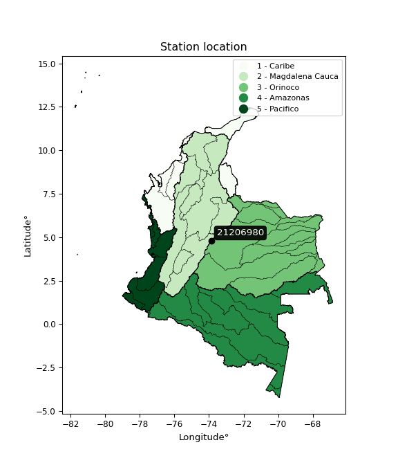

<div align="center">


</div>

# PMP Station (Rain, Pmax24h): 21206980

Probable Maximum Precipitation (PMP) is the greatest amount of rainfall for a specific duration that is meteorologically possible for a given location, acting as a "worst-case" scenario for extreme storms, crucial for designing safety-critical infrastructure like bridges, river deviations, dams, spillways, and nuclear plants to prevent catastrophic failure. PMP is calculated by hydrologists using meteorological data to determine the upper limit of extreme rainfall, often leading to the Probable Maximum Flood (PMF) for flood control design, and is increasingly being studied for climate change impacts. Probable Maximum Precipitation (PMP) is the theoretical upper limit of rainfall, a deterministic estimate for extreme events, while probability distributions (like GEV, Gumbel) describe the likelihood and frequency of various precipitation amounts, including rare ones, showing how often events occur, with PMP representing the extreme end of these distributions, used for critical infrastructure design to ensure safety against the worst conceivable weather, unlike standard statistical forecasts which cover typical probabilities.

The most common probability distributions in hydrology, used for analyzing floods, rainfall, and streamflow, include the Normal, Log-Normal, Gumbel, Gamma (including Log-Pearson Type III), and Generalized Extreme Value (GEV) distributions, often chosen based on the data´s skewness and whether modeling extremes or general conditions, with Gumbel and GEV popular for extreme events like floods, while the Normal distribution serves as a baseline, though often requiring transformations for skewed hydrological data. These distributions help in designing water infrastructure, managing water resources, and forecasting hydrologic events.

> Hydrological data often isn´t perfectly normal (it´s skewed), so different distributions are needed for different applications, such as: **Flood Frequency Analysis**: Using Gumbel, GEV, or Log-Pearson Type III for predicting extreme flood magnitudes and their return periods, **Rainfall Analysis**: Normal for annual totals, but Log-Normal, Weibull, or GEV for intensity or extreme daily rainfall, **Streamflow Modeling**: Gamma and Log-Normal for maximum flows, GEV for minimum flows, and Kappa for daily flows.

<div align="center">

</img>

</div>


## A. General information


### 1. General running parameters

• app_version: _v20260113_. • runtime: _2026-01-13 16:28:34.738620_. • Python version: _3.14.0_. • SciPy version: _1.16.3_. • Pandas version: _2.3.3_. • NumPy version: _2.3.5_. • Stations dataset (station_dataset_file): _dataset/pmax24h_in/automatic_colombia_2003_2025.csv_. • Stations catalog (station_catalog_file): _dataset/CNE.xls_. • Minimum year to eval til year_max (date_min): _1900_. • Maximum year to eval since year_min (date_max): _2025_. • Creates, save and include plots into reports (create_plot): _False_. • Plot only fit distributions with Δo > Δ (plot_only_fit): _True_. • Plot only simple graphs avoiding multiple CDFs and multiple Extreme values plots (plot_only_simple): _True_. • Eval low extreme values, if False, evaluates high extreme values (low_extreme): _False_. • Eval every SciPy distribution as logarithmic (pdist_logarithmic_on): _True_. • Standard deviation normalized (ddof): _1.0_. • Return periods to eval in years (Tr): _[2, 2.33, 5, 10, 15, 20, 25, 50, 75, 100, 200, 250, 500, 750, 1000]_. • Minimum data sample per station, 0 means any (minimum_sample): _5_. • Z-Score maximum threshold to adjust a value, 0 means disable (zscore_max): _3.5_. • Z-Score minimum threshold to adjust a value, 0 means disable (zscore_min): _-2.5_. • Avoid zeros, e.g. rain = 0 (avoid_zeros): _True_. • Avoid null values (avoid_nans): _True_. 

:file_folder:Table: [dataset.csv](../../dataset/pmax24h_in/automatic_colombia_2003_2025.csv)

> Delta Degrees of Freedom (DDOF): is a parameter used in the formulas for calculating variance and standard deviation. When ddof=0, the divisor is $N$ (the total number of observations) and this is used when your data set is the entire population. When ddof=1, the divisor is $N-1$ and this is used when your data set is a sample drawn from a larger population. Using $N-1$ provides an unbiased estimate of the population variance (known as Bessel´s correction).


### 2. Station info and location

|   id |   CODIGO | NOMBRE                          | CATEGORIA         | TECNOLOGIA                              | ESTADO   | FECHA_INSTALACION   |   FECHA_SUSPENSION |   ALTITUD |   LATITUD |   LONGITUD | DEPARTAMENTO   | MUNICIPIO   | AREA_OPERATIVA                            | ENTIDAD                                                     | AREA_HIDROGRAFICA   | ZONA_HIDROGRAFICA   | SUBZONA_HIDROGRAFICA   |   CORRIENTE | Catalogo   |   Version |
|-----:|---------:|:--------------------------------|:------------------|:----------------------------------------|:---------|:--------------------|-------------------:|----------:|----------:|-----------:|:---------------|:------------|:------------------------------------------|:------------------------------------------------------------|:--------------------|:--------------------|:-----------------------|------------:|:-----------|----------:|
|    0 | 21206980 | SANTA CRUZ DE SIECHA [21206980] | Agrometeorológica | Automática con Telemetría, Convencional | Activa   | 08/11/2005          |                nan |      3100 |   4.78502 |   -73.8701 | Cundinamarca   | Guasca      | Area Operativa 11 - Cundinamarca-Amazonas | INSTITUTO DE HIDROLOGIA METEOROLOGIA Y ESTUDIOS AMBIENTALES | Magdalena Cauca     | Alto Magdalena      | Río Bogotá             |         nan | CNE_IDEAM  |  20251226 |

<div align="center">

Dynamic map: [:earth_americas:Google](http://maps.google.com/maps?q=4.785022,-73.870106) [:earth_americas:OSM](https://www.openstreetmap.org/#map=18/4.785022/-73.870106&layers=P) [:earth_americas:Bing](https://www.bing.com/maps?cp=4.785022~-73.870106&lvl=18) [:earth_americas:Apple](https://maps.apple.com/frame?center=4.785022%2C-73.870106&span=0.003%2C0.006)

</div>


<div align="center">

```geojson
{
  "type": "Feature",
  "geometry": {
    "type": "Point", 
    "coordinates": [-73.870106, 4.785022]
  }, 
  "properties": {
    "Name": "21206980"
  }
}
```

</div>


### 3. Discrete values table and plot

<div align="center">

|               |           0 |          1 |           2 |           3 |           4 |            5 |          6 |           7 |           8 |           9 |         10 |          11 |          12 |         13 |         14 |         15 |         16 |          17 |          18 |
|:--------------|------------:|-----------:|------------:|------------:|------------:|-------------:|-----------:|------------:|------------:|------------:|-----------:|------------:|------------:|-----------:|-----------:|-----------:|-----------:|------------:|------------:|
| Date          | 2005        | 2006       | 2007        | 2008        | 2009        | 2010         | 2012       | 2013        | 2014        | 2015        | 2016       | 2017        | 2018        | 2019       | 2020       | 2021       | 2022       | 2023        | 2025        |
| Value         |   40.5      |   37.6     |   37.5      |   34.1      |   29.2      |   31.1       |   50.8     |   36.1      |   35.4      |   28.2      |   59.8     |   24.4      |   43.8      |   19.1     |   19.2     |    9       |   24.3     |   24.2      |   27.5      |
| Value_initial |   40.5      |   37.6     |   37.5      |   34.1      |   29.2      |   31.1       |   50.8     |   36.1      |   35.4      |   28.2      |   59.8     |   24.4      |   43.8      |   19.1     |   19.2     |    9       |   24.3     |   24.2      |   27.5      |
| count         |   19        |   19       |   19        |   19        |   19        |   19         |   19       |   19        |   19        |   19        |   19       |   19        |   19        |   19       |   19       |   19       |   19       |   19        |   19        |
| mean          |   32.2      |   32.2     |   32.2      |   32.2      |   32.2      |   32.2       |   32.2     |   32.2      |   32.2      |   32.2      |   32.2     |   32.2      |   32.2      |   32.2     |   32.2     |   32.2     |   32.2     |   32.2      |   32.2      |
| std           |   11.8131   |   11.8131  |   11.8131   |   11.8131   |   11.8131   |   11.8131    |   11.8131  |   11.8131   |   11.8131   |   11.8131   |   11.8131  |   11.8131   |   11.8131   |   11.8131  |   11.8131  |   11.8131  |   11.8131  |   11.8131   |   11.8131   |
| zscore        |    0.702611 |    0.45712 |    0.448655 |    0.160839 |   -0.253956 |   -0.0931171 |    1.57453 |    0.330142 |    0.270886 |   -0.338608 |    2.33639 |   -0.660285 |    0.981962 |   -1.10894 |   -1.10047 |   -1.96392 |   -0.66875 |   -0.677215 |   -0.397864 |


</div>


> The initial value (value_initial) correspond to the initial obtained or null completed value, and value (value) is adjusted only when the initial value is outside the valid range (outlier) definite through the Z-Score value. If Z-Score is active, values out of range or outliers are replaced with the station mean value. A Z-Score (or standard score) measures how many standard deviations a data point is from the mean of a dataset, indicating its relative position; positive scores mean above the mean, negative mean below, and a score of zero is exactly at the mean, allowing for comparison of values from different distributions. It´s calculated using the formula $z=(x–μ)/σ$, where $x$ is the data point, $μ$ is the mean, and $σ$ is the standard deviation, helping identify outliers and understand probability.
>
> <sub>**Note**: In this study, "completing" (filling gaps in) and "extending" (forecasting or lengthening the historical record) rainfall data series are avoided for certain critical analyses because they introduce artificial bias and uncertainty, which can distort the statistics of rare events (extremes), alter day-to-day variability, and compromise the integrity and homogeneity of the original data. Some reasons against Completing/Extending rainfall data are: **Distortion of Extremes and Variability**: The primary issue is that most gap-filling or extension methods rely on averaging or regression with nearby stations, which inherently smooths the data. Rainfall is highly variable in space and time, with a large percentage of zero values and occasional large storms. Infilling methods often underestimate the highest values and overestimate the lowest (zero) values, which severely distorts analyses focused on flood frequency, drought severity, and intensity-duration-frequency (IDF) curves, **Loss of Data Homogeneity**: Infilled or extended data are synthetic estimates, not actual measurements. Combining these estimates with observed data can violate the assumption of data homogeneity, which requires that the data properties do not change over time. Inhomogeneity can lead to incorrect conclusions about long-term trends or changes in climate patterns, **Propagation of Errors**: Errors and biases from the original data (e.g., wind-induced undercatch, instrument errors, site changes) or the data used for imputation can propagate through the analysis, leading to unreliable hydrological models and inaccurate predictions, **Compromised Statistical Integrity**: For statistical analyses, especially those involving the frequency of events, using artificial data can introduce time bias or autocorrelation that doesn´t exist in reality, making it difficult to assess the true probability of events, **Difficulty in Validation**: It is difficult to accurately validate the quality of filled or extended data, especially for past periods where ground-truth measurements are unavailable. The reliability of imputation techniques heavily depends on the density of the surrounding station network and the complexity of the local topography.</sub>


### 4. Active continuous probability distributions from SciPy (45 of 104 available)

A Probability Density Function (PDF) describes the relative likelihood of a continuous random variable falling within a specific range, where the total area under its curve equals 1, and the area over any interval gives the actual probability for that range. Unlike discrete probabilities (like rolling a die), a PDF shows density, not direct probability for a single point (which is zero), with higher points indicating higher likelihood, often visualized as a bell curve for normal distributions.

A log of a probability density function (log-PDF) is simply the logarithm of the PDF´s value, denoted as $log(f(x))$, useful for converting multiplication of probabilities into addition, improving numerical stability with tiny numbers, and connecting to information theory concepts like entropy. Instead of dealing with very small probabilities (e.g., 0.000001), log-PDFs use negative numbers (e.g., $log(0.00001) ≈ -11.51$ that are easier for computers to handle, preventing underflow errors and simplifying complex calculations. In this study, each active probability distribution from SciPy is also evaluated in the $log$ form.

[scipy.stats](https://docs.scipy.org/doc/scipy/reference/stats.html) is a Python´s powerful submodule within the SciPy library for comprehensive statistical analysis, offering over 130 probability distributions (like Normal, Poisson), functions for descriptive stats (mean, variance), hypothesis testing (t-tests, chi-square), random variable generation, and statistical tests, making it essential for data science, modeling, and research. It provides tools to explore, model, and draw conclusions from data efficiently, working seamlessly with NumPy.

<div align="center">

|   id | p_dist             |   n_parameter | fit_method   | label                                                                       | active   | ref                                                                                                        |
|-----:|:-------------------|--------------:|:-------------|:----------------------------------------------------------------------------|:---------|:-----------------------------------------------------------------------------------------------------------|
|    0 | alpha              |             3 | MLE          | Alpha                                                                       | True     | [:mortar_board:](https://docs.scipy.org/doc/scipy/reference/generated/scipy.stats.alpha.html)              |
|    1 | betaprime          |             4 | MLE          | Beta prime                                                                  | True     | [:mortar_board:](https://docs.scipy.org/doc/scipy/reference/generated/scipy.stats.betaprime.html)          |
|    2 | chi2               |             3 | MLE          | Chi²                                                                        | True     | [:mortar_board:](https://docs.scipy.org/doc/scipy/reference/generated/scipy.stats.chi2.html)               |
|    3 | crystalball        |             4 | MLE          | Crystalball                                                                 | True     | [:mortar_board:](https://docs.scipy.org/doc/scipy/reference/generated/scipy.stats.crystalball.html)        |
|    4 | dweibull           |             3 | MLE          | Double Weibull                                                              | True     | [:mortar_board:](https://docs.scipy.org/doc/scipy/reference/generated/scipy.stats.dweibull.html)           |
|    5 | erlang             |             3 | MLE          | Erlang                                                                      | True     | [:mortar_board:](https://docs.scipy.org/doc/scipy/reference/generated/scipy.stats.erlang.html)             |
|    6 | expon              |             2 | MLE          | Exponential                                                                 | True     | [:mortar_board:](https://docs.scipy.org/doc/scipy/reference/generated/scipy.stats.expon.html)              |
|    7 | exponnorm          |             3 | MLE          | Exponentially modified Normal                                               | True     | [:mortar_board:](https://docs.scipy.org/doc/scipy/reference/generated/scipy.stats.exponnorm.html)          |
|    8 | f                  |             4 | MLE          | F                                                                           | True     | [:mortar_board:](https://docs.scipy.org/doc/scipy/reference/generated/scipy.stats.f.html)                  |
|    9 | fatiguelife        |             3 | MLE          | Fatigue-life (Birnbaum-Saunders)                                            | True     | [:mortar_board:](https://docs.scipy.org/doc/scipy/reference/generated/scipy.stats.fatiguelife.html)        |
|   10 | fisk               |             3 | MLE          | Fisk                                                                        | True     | [:mortar_board:](https://docs.scipy.org/doc/scipy/reference/generated/scipy.stats.fisk.html)               |
|   11 | gamma              |             3 | MLE          | Gamma                                                                       | True     | [:mortar_board:](https://docs.scipy.org/doc/scipy/reference/generated/scipy.stats.gamma.html)              |
|   12 | genexpon           |             5 | MLE          | Generalized exponential                                                     | True     | [:mortar_board:](https://docs.scipy.org/doc/scipy/reference/generated/scipy.stats.genexpon.html)           |
|   13 | genlogistic        |             3 | MLE          | Generalized logistic                                                        | True     | [:mortar_board:](https://docs.scipy.org/doc/scipy/reference/generated/scipy.stats.genlogistic.html)        |
|   14 | gibrat             |             2 | MM           | Gibrat                                                                      | True     | [:mortar_board:](https://docs.scipy.org/doc/scipy/reference/generated/scipy.stats.gibrat.html)             |
|   15 | gompertz           |             3 | MLE          | Gompertz (or truncated Gumbel)                                              | True     | [:mortar_board:](https://docs.scipy.org/doc/scipy/reference/generated/scipy.stats.gompertz.html)           |
|   16 | gumbel_l           |             2 | MM           | Gumbel Left Skew                                                            | True     | [:mortar_board:](https://docs.scipy.org/doc/scipy/reference/generated/scipy.stats.gumbel_l.html)           |
|   17 | gumbel_r           |             2 | MM           | Gumbel Right Skew                                                           | True     | [:mortar_board:](https://docs.scipy.org/doc/scipy/reference/generated/scipy.stats.gumbel_r.html)           |
|   18 | halflogistic       |             2 | MM           | Half-logistic                                                               | True     | [:mortar_board:](https://docs.scipy.org/doc/scipy/reference/generated/scipy.stats.halflogistic.html)       |
|   19 | halfnorm           |             2 | MM           | Half Normal                                                                 | True     | [:mortar_board:](https://docs.scipy.org/doc/scipy/reference/generated/scipy.stats.halfnorm.html)           |
|   20 | hypsecant          |             2 | MM           | hyperbolic secant                                                           | True     | [:mortar_board:](https://docs.scipy.org/doc/scipy/reference/generated/scipy.stats.hypsecant.html)          |
|   21 | invgamma           |             3 | MLE          | Inverted gamma                                                              | True     | [:mortar_board:](https://docs.scipy.org/doc/scipy/reference/generated/scipy.stats.invgamma.html)           |
|   22 | invgauss           |             3 | MLE          | Inverse Gaussian                                                            | True     | [:mortar_board:](https://docs.scipy.org/doc/scipy/reference/generated/scipy.stats.invgauss.html)           |
|   23 | invweibull         |             3 | MLE          | Inverted Weibull                                                            | True     | [:mortar_board:](https://docs.scipy.org/doc/scipy/reference/generated/scipy.stats.invweibull.html)         |
|   24 | kappa4             |             4 | MLE          | Kappa 4                                                                     | True     | [:mortar_board:](https://docs.scipy.org/doc/scipy/reference/generated/scipy.stats.kappa4.html)             |
|   25 | kstwobign          |             2 | MLE          | Limiting distribution of scaled Kolmogorov-Smirnov two-sided test statistic | True     | [:mortar_board:](https://docs.scipy.org/doc/scipy/reference/generated/scipy.stats.kstwobign.html)          |
|   26 | laplace            |             2 | MM           | Laplace                                                                     | True     | [:mortar_board:](https://docs.scipy.org/doc/scipy/reference/generated/scipy.stats.laplace.html)            |
|   27 | laplace_asymmetric |             3 | MLE          | Asymmetric Laplace                                                          | True     | [:mortar_board:](https://docs.scipy.org/doc/scipy/reference/generated/scipy.stats.laplace_asymmetric.html) |
|   28 | loggamma           |             3 | MLE          | Log gamma                                                                   | True     | [:mortar_board:](https://docs.scipy.org/doc/scipy/reference/generated/scipy.stats.loggamma.html)           |
|   29 | logistic           |             2 | MM           | Logistic (or Sech-squared)                                                  | True     | [:mortar_board:](https://docs.scipy.org/doc/scipy/reference/generated/scipy.stats.logistic.html)           |
|   30 | lognorm            |             3 | MLE          | Log Normal                                                                  | True     | [:mortar_board:](https://docs.scipy.org/doc/scipy/reference/generated/scipy.stats.lognorm.html)            |
|   31 | maxwell            |             2 | MM           | Maxwell                                                                     | True     | [:mortar_board:](https://docs.scipy.org/doc/scipy/reference/generated/scipy.stats.maxwell.html)            |
|   32 | mielke             |             4 | MLE          | Mielke Beta-Kappa / Dagum                                                   | True     | [:mortar_board:](https://docs.scipy.org/doc/scipy/reference/generated/scipy.stats.mielke.html)             |
|   33 | moyal              |             2 | MM           | Moyal                                                                       | True     | [:mortar_board:](https://docs.scipy.org/doc/scipy/reference/generated/scipy.stats.moyal.html)              |
|   34 | nakagami           |             3 | MLE          | Nakagami                                                                    | True     | [:mortar_board:](https://docs.scipy.org/doc/scipy/reference/generated/scipy.stats.nakagami.html)           |
|   35 | ncf                |             5 | MLE          | Non-central F distribution                                                  | True     | [:mortar_board:](https://docs.scipy.org/doc/scipy/reference/generated/scipy.stats.ncf.html)                |
|   36 | nct                |             4 | MLE          | Non-central Student’s t                                                     | True     | [:mortar_board:](https://docs.scipy.org/doc/scipy/reference/generated/scipy.stats.nct.html)                |
|   37 | norm               |             2 | MM           | Normal                                                                      | True     | [:mortar_board:](https://docs.scipy.org/doc/scipy/reference/generated/scipy.stats.norm.html)               |
|   38 | pearson3           |             3 | MM           | Pearson type III                                                            | True     | [:mortar_board:](https://docs.scipy.org/doc/scipy/reference/generated/scipy.stats.pearson3.html)           |
|   39 | rayleigh           |             2 | MM           | Rayleigh                                                                    | True     | [:mortar_board:](https://docs.scipy.org/doc/scipy/reference/generated/scipy.stats.rayleigh.html)           |
|   40 | rice               |             3 | MLE          | Rice                                                                        | True     | [:mortar_board:](https://docs.scipy.org/doc/scipy/reference/generated/scipy.stats.rice.html)               |
|   41 | t                  |             3 | MLE          | Student’s t                                                                 | True     | [:mortar_board:](https://docs.scipy.org/doc/scipy/reference/generated/scipy.stats.t.html)                  |
|   42 | truncnorm          |             4 | MLE          | Truncated normal                                                            | True     | [:mortar_board:](https://docs.scipy.org/doc/scipy/reference/generated/scipy.stats.truncnorm.html)          |
|   43 | wald               |             2 | MM           | Wald                                                                        | True     | [:mortar_board:](https://docs.scipy.org/doc/scipy/reference/generated/scipy.stats.wald.html)               |
|   44 | weibull_min        |             3 | MLE          | Weibull minimum                                                             | True     | [:mortar_board:](https://docs.scipy.org/doc/scipy/reference/generated/scipy.stats.weibull_min.html)        |

</div>

> **n_parameter:** # arguments & localization & scale.
>
> **Fit methods:** (MLE) maximum likelihood, (MM) L-moments.
>
>**Inactive** (With the only purpose of prevent loops, zero divisions, infinite values, over high estimated values or horizontal trending for recurrence intervals estimations, the follow distributions were disabled.)**:** foldnorm, gennorm, norminvgauss, powernorm, powerlognorm, skewnorm, genextreme, anglit, arcsine, argus, beta, bradford, burr, burr12, cauchy, cosine, halfcauchy, foldcauchy, skewcauchy, wrapcauchy, dgamma, gengamma, exponweib, exponpow, truncexpon, gausshyper, genhalflogistic, genhyperbolic, geninvgauss, halfgennorm, johnsonsb, johnsonsu, kappa3, ksone, kstwo, loglaplace, levy, levy_l, levy_stable, ncx2, pareto, genpareto, truncpareto, lomax, powerlaw, rdist, rel_breitwigner, recipinvgauss, semicircular, studentized_range, trapezoid, triang, truncweibull_min, tukeylambda, uniform, loguniform, vonmises, vonmises_line, weibull_max, 


## B. Probability (PDF) vs. Empirical (EDF) distributions functions

A continuous probability distribution (CPD) describes probabilities for variables that can take any value within a range (like rain any time), unlike discrete variables with specific outcomes (like temperature). It uses a Probability Density Function (PDF), a curve where the total area under it equals 1, and the probability of the variable falling within an interval (a to b) is found by calculating the area under the curve between those points. A key feature is that the probability of hitting any single exact value is zero, so probabilities are always expressed for ranges, e.g., $P(a ≤ X ≤ b)$.

<div align="center">

Distributions parameters from station values
|    |   station | p_dist                |   n |              loc |           scale | shape                 | shape1              | shape2                 | shape3   |
|---:|----------:|:----------------------|----:|-----------------:|----------------:|:----------------------|:--------------------|:-----------------------|:---------|
|  0 |  21206980 | alpha                 |  19 |   -109.041       |  1742.49        | 12.422847428275979    |                     |                        |          |
|  1 |  21206980 | betaprime             |  19 |    -34.5612      |  3558.65        | 34.465227938232765    | 1838.140738672058   |                        |          |
|  2 |  21206980 | chi2                  |  19 |    -33.6331      |     1.00107     | 65.76282034927732     |                     |                        |          |
|  3 |  21206980 | crystalball           |  19 |     32.2         |    11.498       | 2144.04595211636      | 79.20023437244814   |                        |          |
|  4 |  21206980 | dweibull              |  19 |     32.3244      |     9.91766     | 1.35097671607278      |                     |                        |          |
|  5 |  21206980 | erlang                |  19 |    -33.6331      |     2.00214     | 32.88141529960181     |                     |                        |          |
|  6 |  21206980 | expon                 |  19 |      9           |    23.2         |                       |                     |                        |          |
|  7 |  21206980 | exponnorm             |  19 |     24.6012      |     8.76071     | 0.8673770439825321    |                     |                        |          |
|  8 |  21206980 | f                     |  19 |    -34.0063      |    66.1922      | 66.99838954635783     | 9407.341887035407   |                        |          |
|  9 |  21206980 | fatiguelife           |  19 |    -63.7793      |    95.2996      | 0.11943634680287679   |                     |                        |          |
| 10 |  21206980 | fisk                  |  19 |    -49.7045      |    81.1114      | 12.766015244829504    |                     |                        |          |
| 11 |  21206980 | gamma                 |  19 |    -33.633       |     2.00214     | 32.881360722093596    |                     |                        |          |
| 12 |  21206980 | genexpon              |  19 |      9           |     2.47532     | 0.07204929063099443   | 0.03769041007955937 | 1.2804633611924818     |          |
| 13 |  21206980 | genlogistic           |  19 |     25.6714      |     7.51356     | 1.8084438420478623    |                     |                        |          |
| 14 |  21206980 | gibrat                |  19 |     23.4285      |     5.32019     |                       |                     |                        |          |
| 15 |  21206980 | gompertz              |  19 |     -7.24396     |    12.9171      | 0.03139356109459138   |                     |                        |          |
| 16 |  21206980 | gumbel_l              |  19 |     37.3747      |     8.96496     |                       |                     |                        |          |
| 17 |  21206980 | gumbel_r              |  19 |     27.0253      |     8.96496     |                       |                     |                        |          |
| 18 |  21206980 | halflogistic          |  19 |     18.5722      |     9.83036     |                       |                     |                        |          |
| 19 |  21206980 | halfnorm              |  19 |     16.9811      |    19.074       |                       |                     |                        |          |
| 20 |  21206980 | hypsecant             |  19 |     32.2         |     7.31986     |                       |                     |                        |          |
| 21 |  21206980 | invgamma              |  19 |    -74.9822      |  9337.62        | 88.17935754763477     |                     |                        |          |
| 22 |  21206980 | invgauss              |  19 |    -38.0916      |  2560.92        | 0.027477857346866683  |                     |                        |          |
| 23 |  21206980 | invweibull            |  19 |     -1.47007e+09 |     1.47007e+09 | 139129496.1453864     |                     |                        |          |
| 24 |  21206980 | kappa4                |  19 |      4.22848     |    53.9956      | 1.096786602205615     | 0.969369773185476   |                        |          |
| 25 |  21206980 | kstwobign             |  19 |    -12.4239      |    51.383       |                       |                     |                        |          |
| 26 |  21206980 | laplace               |  19 |     32.2         |     8.13032     |                       |                     |                        |          |
| 27 |  21206980 | laplace_asymmetric    |  19 |     28.2         |     8.54478     | 0.7929695918181029    |                     |                        |          |
| 28 |  21206980 | loggamma              |  19 |  -3441.34        |   468.842       | 1650.6242876824285    |                     |                        |          |
| 29 |  21206980 | logistic              |  19 |     32.2         |     6.33918     |                       |                     |                        |          |
| 30 |  21206980 | lognorm               |  19 |    -62.6784      |    94.1904      | 0.12061528330847547   |                     |                        |          |
| 31 |  21206980 | maxwell               |  19 |      4.95455     |    17.0736      |                       |                     |                        |          |
| 32 |  21206980 | mielke                |  19 |     -0.235147    |    38.1979      | 3.117089487811844     | 6.764603263831594   |                        |          |
| 33 |  21206980 | moyal                 |  19 |     25.6247      |     5.17592     |                       |                     |                        |          |
| 34 |  21206980 | nakagami              |  19 |     19.1         |    16.2         | 0.33307114742593413   |                     |                        |          |
| 35 |  21206980 | ncf                   |  19 |      0.147951    |     4.13984e-06 | 5.034258665252144e-06 | 57.79861666048397   | 37.82760410557833      |          |
| 36 |  21206980 | nct                   |  19 |     -0.0922107   |     9.81074     | 21.892755337086108    | 3.1774670109061005  |                        |          |
| 37 |  21206980 | norm                  |  19 |     32.2         |    11.498       |                       |                     |                        |          |
| 38 |  21206980 | pearson3              |  19 |     32.2         |    11.498       | 0.39433943521646464   |                     |                        |          |
| 39 |  21206980 | rayleigh              |  19 |     10.2036      |    17.5506      |                       |                     |                        |          |
| 40 |  21206980 | rice                  |  19 |      4.44167     |    12.6162      | 1.9161216647736214    |                     |                        |          |
| 41 |  21206980 | t                     |  19 |     32.1995      |    11.4966      | 9316.758689639108     |                     |                        |          |
| 42 |  21206980 | truncnorm             |  19 |     31.8138      |    12.0312      | -1.8962227758858279   | 2.353365350757973   |                        |          |
| 43 |  21206980 | wald                  |  19 |     20.702       |    11.498       |                       |                     |                        |          |
| 44 |  21206980 | weibull_min           |  19 |      2.95484     |    32.8265      | 2.707005344204271     |                     |                        |          |
| 45 |  21206980 | logalpha              |  19 |     -8.63127     |   334.276       | 27.838191276869054    |                     |                        |          |
| 46 |  21206980 | logbetaprime          |  19 |     -3.89026     |    40.7594      | 324.89134120430333    | 1813.4769925954984  |                        |          |
| 47 |  21206980 | logchi2               |  19 |      2.19722     |     0.932247    | 1.1063133972712185    |                     |                        |          |
| 48 |  21206980 | logcrystalball        |  19 |      3.45148     |     0.320807    | 1.5978704614424366    | 3.4561209460362297  |                        |          |
| 49 |  21206980 | logdweibull           |  19 |      3.41363     |     0.323691    | 1.2024754870301542    |                     |                        |          |
| 50 |  21206980 | logerlang             |  19 |     -3.50417     |     0.026054    | 264.57533391784784    |                     |                        |          |
| 51 |  21206980 | logexpon              |  19 |      2.19722     |     1.20128     |                       |                     |                        |          |
| 52 |  21206980 | logexponnorm          |  19 |      3.39821     |     0.40811     | 0.0007321523371248279 |                     |                        |          |
| 53 |  21206980 | logf                  |  19 |   -518.106       |   521.505       | 9069195.441631485     | 5046133.068272427   |                        |          |
| 54 |  21206980 | logfatiguelife        |  19 |   -281.336       |   284.737       | 0.0014353098096882267 |                     |                        |          |
| 55 |  21206980 | logfisk               |  19 |     -4.34709e+07 |     4.34709e+07 | 202332096.86339605    |                     |                        |          |
| 56 |  21206980 | loggamma              |  19 |     -3.10681     |     0.027953    | 232.39332123589975    |                     |                        |          |
| 57 |  21206980 | loggenexpon           |  19 |      2.18279     |     0.0076099   | 0.0006079589773382351 | 3.5933642621441395  | 1.7662085865275185e-05 |          |
| 58 |  21206980 | loggenlogistic        |  19 |      3.63875     |     0.148286    | 0.4562483925257508    |                     |                        |          |
| 59 |  21206980 | loggibrat             |  19 |      3.0872      |     0.188816    |                       |                     |                        |          |
| 60 |  21206980 | loggompertz           |  19 |      2.19722     |     0.351671    | 0.020209942618172563  |                     |                        |          |
| 61 |  21206980 | loggumbel_l           |  19 |      3.58218     |     0.318201    |                       |                     |                        |          |
| 62 |  21206980 | loggumbel_r           |  19 |      3.21484     |     0.318201    |                       |                     |                        |          |
| 63 |  21206980 | loghalflogistic       |  19 |      2.91481     |     0.348912    |                       |                     |                        |          |
| 64 |  21206980 | loghalfnorm           |  19 |      2.85833     |     0.677006    |                       |                     |                        |          |
| 65 |  21206980 | loghypsecant          |  19 |      3.39851     |     0.25981     |                       |                     |                        |          |
| 66 |  21206980 | loginvgamma           |  19 |     -7.95657     |  8015.17        | 707.1599400381035     |                     |                        |          |
| 67 |  21206980 | loginvgauss           |  19 |     -2.05544     |   858.684       | 0.006345956815028269  |                     |                        |          |
| 68 |  21206980 | loginvweibull         |  19 |     -6.25993e+07 |     6.25993e+07 | 124619184.01244569    |                     |                        |          |
| 69 |  21206980 | logkappa4             |  19 |      2.14283     |     2.06937     | 1.0179573054457722    | 1.0622117951339551  |                        |          |
| 70 |  21206980 | logkstwobign          |  19 |      1.23055     |     2.50359     |                       |                     |                        |          |
| 71 |  21206980 | loglaplace            |  19 |      3.39851     |     0.288576    |                       |                     |                        |          |
| 72 |  21206980 | loglaplace_asymmetric |  19 |      3.58629     |     0.271109    | 1.4046459921761478    |                     |                        |          |
| 73 |  21206980 | logloggamma           |  19 |      3.32261     |     0.443809    | 1.6535235747257513    |                     |                        |          |
| 74 |  21206980 | loglogistic           |  19 |      3.39851     |     0.225002    |                       |                     |                        |          |
| 75 |  21206980 | loglognorm            |  19 | -65533.8         | 65537.2         | 6.22714331912475e-06  |                     |                        |          |
| 76 |  21206980 | logmaxwell            |  19 |      2.43141     |     0.606037    |                       |                     |                        |          |
| 77 |  21206980 | logmielke             |  19 | -13848.1         | 13851.7         | 44287.83115486008     | 90311.70573381579   |                        |          |
| 78 |  21206980 | logmoyal              |  19 |      3.16512     |     0.183713    |                       |                     |                        |          |
| 79 |  21206980 | lognakagami           |  19 |      2.90216     |     0.627944    | 0.7860371705210132    |                     |                        |          |
| 80 |  21206980 | logncf                |  19 |     -3.59556     |     6.98315     | 454.60446399452985    | 597.6222216069064   | 0.02237189577405463    |          |
| 81 |  21206980 | lognct                |  19 |    -11.738       |     0.359267    | 2720.553359314147     | 42.11988932581693   |                        |          |
| 82 |  21206980 | lognorm               |  19 |      3.39851     |     0.408108    |                       |                     |                        |          |
| 83 |  21206980 | logpearson3           |  19 |      3.39851     |     0.408108    | -1.0363460051720792   |                     |                        |          |
| 84 |  21206980 | lograyleigh           |  19 |      2.61774     |     0.622962    |                       |                     |                        |          |
| 85 |  21206980 | logrice               |  19 |   -301.285       |     0.408563    | 745.7426825156535     |                     |                        |          |
| 86 |  21206980 | logt                  |  19 |      3.44134     |     0.295927    | 3.8848161504904235    |                     |                        |          |
| 87 |  21206980 | logtruncnorm          |  19 |     -0.236308    |     1.41597     | 2.250030883126315     | 3.0560673796216378  |                        |          |
| 88 |  21206980 | logwald               |  19 |      2.99039     |     0.40812     |                       |                     |                        |          |
| 89 |  21206980 | logweibull_min        |  19 |     -2.8308      |     6.40528     | 18.992169692572034    |                     |                        |          |

</div>

> **loc** (Location parameter): This shifts the distribution along the x-axis. For many common distributions, like the normal (Gaussian) distribution, loc represents the mean $μ$. For others, like the uniform distribution, it might represent the minimum value, or for the beta distribution, the left end of the support interval.
>
> **scale** (Scale parameter): This determines the width or spread of the distribution. For the normal distribution, scale represents the standard deviation $σ$. For a uniform distribution, it defines the length of the interval (from $loc$ to $loc + scale$).
>
> **shape** (Shape parameters): Refers to parameters that define the specific form of a probability distribution, distinct from its location (loc) and scale (scale). These parameters are required arguments for most distribution functions. For example, a normal (Gaussian) distribution is fully defined by its location (mean) and scale (standard deviation), so it has no specific shape parameters beyond loc and scale. However, other distributions have intrinsic properties that need specification, as Gamma distribution that takes a shape parameter, often named $a$ or $alpha$.


### 0. Cumulative distribution values - CDF (90 evaluated)

Cumulative Distribution Function (CDF), denoted as $F$<sub>$X$</sub>$(x)$, is a function that gives the probability that a random variable $X$ will take a value less than or equal to a specific value, $x$ (i.e., $(P(X≥x)$. It essentially "accumulates" probabilities from a given point up to the far right (positive infinity), providing a complete picture of the distribution´s probabilities for both discrete (like rain) and continuous (like temperature) variables, helping to find probabilities over ranges or above certain values. Each station is evaluated separately ordering the $x$ values ascending, calculating the CDF and PDF values for the activated distributions and their logarithmic forms.

<div align="center">

CDF ordered by x ascending and calculating $log(f(x))$ separately
|   id |   Station |   date |    x |   count |   mean |     std |     zscore |   Value_initial |   station |   m |      alpha |   alpha_pdf |   betaprime |   betaprime_pdf |      chi2 |   chi2_pdf |   crystalball |   crystalball_pdf |   dweibull |   dweibull_pdf |    erlang |   erlang_pdf |    expon |   expon_pdf |   exponnorm |   exponnorm_pdf |         f |      f_pdf |   fatiguelife |   fatiguelife_pdf |      fisk |   fisk_pdf |     gamma |   gamma_pdf |    genexpon |   genexpon_pdf |   genlogistic |   genlogistic_pdf |    gibrat |   gibrat_pdf |   gompertz |   gompertz_pdf |   gumbel_l |   gumbel_l_pdf |    gumbel_r |   gumbel_r_pdf |   halflogistic |   halflogistic_pdf |   halfnorm |   halfnorm_pdf |   hypsecant |   hypsecant_pdf |   invgamma |   invgamma_pdf |   invgauss |   invgauss_pdf |   invweibull |   invweibull_pdf |      kappa4 |   kappa4_pdf |   kstwobign |   kstwobign_pdf |   laplace |   laplace_pdf |   laplace_asymmetric |   laplace_asymmetric_pdf |   loggamma |   loggamma_pdf |   logistic |   logistic_pdf |    lognorm |   lognorm_pdf |    maxwell |   maxwell_pdf |    mielke |   mielke_pdf |       moyal |   moyal_pdf |    nakagami |   nakagami_pdf |        ncf |    ncf_pdf |       nct |    nct_pdf |      norm |   norm_pdf |   pearson3 |   pearson3_pdf |   rayleigh |   rayleigh_pdf |     rice |   rice_pdf |        t |      t_pdf |   truncnorm |   truncnorm_pdf |     wald |   wald_pdf |   weibull_min |   weibull_min_pdf |   logalpha |   logalpha_pdf |   logbetaprime |   logbetaprime_pdf |     logchi2 |   logchi2_pdf |   logcrystalball |   logcrystalball_pdf |   logdweibull |   logdweibull_pdf |   logerlang |   logerlang_pdf |   logexpon |   logexpon_pdf |   logexponnorm |   logexponnorm_pdf |       logf |   logf_pdf |   logfatiguelife |   logfatiguelife_pdf |    logfisk |   logfisk_pdf |   loggenexpon |   loggenexpon_pdf |   loggenlogistic |   loggenlogistic_pdf |   loggibrat |   loggibrat_pdf |   loggompertz |   loggompertz_pdf |   loggumbel_l |   loggumbel_l_pdf |   loggumbel_r |   loggumbel_r_pdf |   loghalflogistic |   loghalflogistic_pdf |   loghalfnorm |   loghalfnorm_pdf |   loghypsecant |   loghypsecant_pdf |   loginvgamma |   loginvgamma_pdf |   loginvgauss |   loginvgauss_pdf |   loginvweibull |   loginvweibull_pdf |   logkappa4 |   logkappa4_pdf |   logkstwobign |   logkstwobign_pdf |   loglaplace |   loglaplace_pdf |   loglaplace_asymmetric |   loglaplace_asymmetric_pdf |   logloggamma |   logloggamma_pdf |   loglogistic |   loglogistic_pdf |   loglognorm |   loglognorm_pdf |   logmaxwell |   logmaxwell_pdf |   logmielke |   logmielke_pdf |    logmoyal |   logmoyal_pdf |   lognakagami |   lognakagami_pdf |    logncf |   logncf_pdf |     lognct |   lognct_pdf |   logpearson3 |   logpearson3_pdf |   lograyleigh |   lograyleigh_pdf |    logrice |   logrice_pdf |       logt |   logt_pdf |   logtruncnorm |   logtruncnorm_pdf |   logwald |   logwald_pdf |   logweibull_min |   logweibull_min_pdf |
|-----:|----------:|-------:|-----:|--------:|-------:|--------:|-----------:|----------------:|----------:|----:|-----------:|------------:|------------:|----------------:|----------:|-----------:|--------------:|------------------:|-----------:|---------------:|----------:|-------------:|---------:|------------:|------------:|----------------:|----------:|-----------:|--------------:|------------------:|----------:|-----------:|----------:|------------:|------------:|---------------:|--------------:|------------------:|----------:|-------------:|-----------:|---------------:|-----------:|---------------:|------------:|---------------:|---------------:|-------------------:|-----------:|---------------:|------------:|----------------:|-----------:|---------------:|-----------:|---------------:|-------------:|-----------------:|------------:|-------------:|------------:|----------------:|----------:|--------------:|---------------------:|-------------------------:|-----------:|---------------:|-----------:|---------------:|-----------:|--------------:|-----------:|--------------:|----------:|-------------:|------------:|------------:|------------:|---------------:|-----------:|-----------:|----------:|-----------:|----------:|-----------:|-----------:|---------------:|-----------:|---------------:|---------:|-----------:|---------:|-----------:|------------:|----------------:|---------:|-----------:|--------------:|------------------:|-----------:|---------------:|---------------:|-------------------:|------------:|--------------:|-----------------:|---------------------:|--------------:|------------------:|------------:|----------------:|-----------:|---------------:|---------------:|-------------------:|-----------:|-----------:|-----------------:|---------------------:|-----------:|--------------:|--------------:|------------------:|-----------------:|---------------------:|------------:|----------------:|--------------:|------------------:|--------------:|------------------:|--------------:|------------------:|------------------:|----------------------:|--------------:|------------------:|---------------:|-------------------:|--------------:|------------------:|--------------:|------------------:|----------------:|--------------------:|------------:|----------------:|---------------:|-------------------:|-------------:|-----------------:|------------------------:|----------------------------:|--------------:|------------------:|--------------:|------------------:|-------------:|-----------------:|-------------:|-----------------:|------------:|----------------:|------------:|---------------:|--------------:|------------------:|----------:|-------------:|-----------:|-------------:|--------------:|------------------:|--------------:|------------------:|-----------:|--------------:|-----------:|-----------:|---------------:|-------------------:|----------:|--------------:|-----------------:|---------------------:|
|    0 |  21206980 |   2021 |  9   |      19 |   32.2 | 11.8131 | -1.96392   |             9   |  21206980 |   1 | 0.00967074 |  0.00323696 |   0.0117986 |      0.00359532 | 0.0118085 | 0.0036003  |     0.0218091 |        0.00453128 |  0.0208955 |     0.00384276 | 0.0118086 |   0.0036003  | 0        |  0.0431034  |   0.0121083 |      0.00333781 | 0.0118064 | 0.0035985  |     0.0117852 |        0.00356953 | 0.0158698 | 0.00339631 | 0.0118085 |  0.0036003  | 2.92935e-08 |     0.0291071  |      0.015006 |        0.00325758 | 0         |   0          |  0.0759708 |     0.00789787 |  0.0413328 |    0.00451386  | 0.000571027 |    0.000475682 |      0         |         0          |  0         |     0          |    0.026739 |      0.00364865 |  0.0107462 |     0.00343198 | 0.00899997 |     0.00318833 |   0.00495129 |       0.00248737 | 2.84009e-15 |    0.472428  |  0.00497711 |      0.00306502 | 0.0288206 |    0.00354484 |            0.0226993 |               0.00335009 | 0.00150209 |      0.0131386 |  0.0250924 |     0.00385898 | 0.00162243 |     0.0128435 | 0.00347893 |    0.00255101 | 0.0119675 |   0.00403905 | 6.27144e-07 | 1.56056e-06 | 0           |     0          | 0.00398138 | 0.00220177 | 0.0125667 | 0.0033987  | 0.0218091 | 0.00453128 |  0.0106117 |     0.00344459 |   0        |     0          | 0.010687 | 0.00480727 | 0.021813 | 0.00453089 | 1.66033e-11 |      0.00571162 | 0        | 0          |     0.0102005 |        0.00454438 | 0.00121522 |      0.0114765 |     0.00162959 |          0.0137468 | 2.56466e-09 |   3.19454e+06 |        0.0157602 |            0.0269648 |    0.00367461 |         0.0178472 |  0.00147812 |       0.0129055 |   0        |       0.832445 |      0.0016225 |          0.0128439 | 0.00165775 |  0.0130834 |        0.0015803 |            0.0125747 | 0.00321428 |     0.0149125 |    0.00126651 |         0.0955879 |        0.0118513 |            0.0364621 |    0        |       0         |   4.97305e-08 |         0.0574685 |     0.0127927 |         0.0399451 |   2.32695e-11 |       1.79046e-09 |         0         |              0        |      0        |          0        |     0.00624915 |          0.0240513 |    0.00138643 |         0.0123413 |    0.00102497 |         0.0102533 |     0.000914121 |            0.012734 |  0.00958807 |        0.526168 |     0.00165388 |          0.0266052 |   0.00778206 |        0.0269671 |               0.0172895 |                   0.0454015 |    0.00965442 |         0.0349052 |    0.00477782 |         0.0211331 |   0.00162236 |        0.0128432 |     0        |         0        |   0.0104842 |       0.0335213 | 3.98915e-44 |    2.11842e-41 |     0         |          0        | 0.0174913 |    0.0838007 | 0.00158567 |     0.012865 |     0.0115864 |         0.0406825 |      0        |          0        | 0.00163996 |     0.0129554 | 0.00725717 |  0.0192421 |    0           |           0        |  0        |      0        |        0.0100221 |            0.0376659 |
|    1 |  21206980 |   2019 | 19.1 |      19 |   32.2 | 11.8131 | -1.10894   |            19.1 |  21206980 |   2 | 0.119923   |  0.0212185  |   0.121383  |      0.0203848  | 0.121454  | 0.0203849  |     0.127283  |        0.0181307  |  0.114376  |     0.0172359  | 0.121454  |   0.0203849  | 0.352958 |  0.0278897  |   0.114808  |      0.0197681  | 0.121425  | 0.0203841  |     0.120979  |        0.020374   | 0.109029  | 0.0180236  | 0.121454  |  0.0203849  | 0.341962    |     0.0291192  |      0.109479 |        0.0185957  | 0         |   0          |  0.189345  |     0.015144   |  0.122106  |    0.0127527   | 0.0888654   |    0.0239946   |      0.0268372 |         0.0508262  |  0.0884529 |     0.0415736  |    0.105355 |      0.0141316  |  0.121398  |     0.0209404  | 0.119991   |     0.0212889  |   0.129921   |       0.0250939  | 0.234606    |    0.0211019 |  0.154092   |      0.0271555  | 0.0998187 |    0.0122773  |            0.100781  |               0.0148737  | 0.150613   |      0.574891  |  0.112395  |     0.0157374  | 0.13572    |     0.533956  | 0.123605   |    0.0227588  | 0.11921   |   0.0190281  | 0.0603591   | 0.0248125   | 2.87754e-11 |  5395.46       | 0.121298   | 0.0240076  | 0.116489  | 0.0198862  | 0.127283  | 0.0181307  |  0.120835  |     0.0207303  |   0.120563 |     0.0254001  | 0.13063  | 0.0200436  | 0.127278 | 0.0181301  | 0.12098     |      0.0197269  | 0        | 0          |     0.136248  |        0.0212121  | 0.152419   |      0.587342  |     0.143861   |          0.54177   | 0.593941    |   0.334314    |        0.0976725 |            0.350856  |    0.107014   |         0.427601  |  0.149386   |       0.573312  |   0.465479 |       0.444959 |      0.135721  |          0.533955  | 0.136411   |  0.534374  |        0.134553  |            0.530894  | 0.0966822  |     0.406493  |    0.318429   |         0.626783  |        0.119498  |            0.364179  |    0        |       0         |   0.14059     |         0.419646  |     0.128039  |         0.375447  |   0.100176    |       0.724346    |         0.049939  |              1.42945  |      0.10734  |          1.16787  |     0.111978   |          0.422164  |    0.148508   |         0.572018  |    0.151874   |         0.590638  |     0.209182    |            0.651522 |  0.391206   |        0.507086 |     0.266701   |          0.656685  |   0.105565   |        0.365813  |               0.124716  |                   0.327501  |    0.128662   |         0.404941  |    0.119758   |         0.468511  |   0.135721   |        0.53396   |     0.134196 |         0.667973 |   0.115571  |       0.364995  | 0.0722742   |    0.77606     |     0.0153938 |          0.507839 | 0.232419  |    0.528258  | 0.138796   |     0.542197 |     0.133968  |         0.391115  |      0.132352 |          0.742154 | 0.135998   |     0.53411   | 0.0870388  |  0.340929  |    1.96165e-05 |           2.01884  |  0        |      0        |        0.132708  |            0.405717  |
|    2 |  21206980 |   2020 | 19.2 |      19 |   32.2 | 11.8131 | -1.10047   |            19.2 |  21206980 |   3 | 0.122056   |  0.0214499  |   0.123432  |      0.0205992  | 0.123503  | 0.0205991  |     0.129105  |        0.0183106  |  0.11611   |     0.0174507  | 0.123503  |   0.0205991  | 0.355741 |  0.0277698  |   0.116797  |      0.0200003  | 0.123474  | 0.0205984  |     0.123027  |        0.02059    | 0.110843  | 0.0182597  | 0.123503  |  0.0205991  | 0.344867    |     0.0289934  |      0.111351 |        0.0188393  | 0         |   0          |  0.190864  |     0.0152331  |  0.123387  |    0.0128769   | 0.0912838   |    0.0243742   |      0.0319191 |         0.050811   |  0.092609  |     0.0415488  |    0.106777 |      0.0143153  |  0.123503  |     0.0211645  | 0.122132   |     0.0215157  |   0.132443   |       0.02534    | 0.236715    |    0.021082  |  0.156817   |      0.027343   | 0.101054  |    0.0124293  |            0.102279  |               0.0150949  | 0.153634   |      0.582187  |  0.113978  |     0.0159306  | 0.138528   |     0.541479  | 0.125892   |    0.0229696  | 0.121123  |   0.0192272  | 0.0628706   | 0.0254174   | 0.0261976   |     0.174512   | 0.123711   | 0.0242596  | 0.118489  | 0.0201148  | 0.129105  | 0.0183106  |  0.122919  |     0.0209493  |   0.123114 |     0.0256111  | 0.132643 | 0.0202184  | 0.1291   | 0.01831    | 0.122961    |      0.0199003  | 0        | 0          |     0.138378  |        0.021384   | 0.155506   |      0.594648  |     0.146708   |          0.548639  | 0.595682    |   0.33235     |        0.099528  |            0.359856  |    0.109267   |         0.435607  |  0.152399   |       0.580668  |   0.467798 |       0.443029 |      0.138529  |          0.541478  | 0.139221   |  0.541854  |        0.137345  |            0.538402  | 0.0988258  |     0.41452   |    0.321704   |         0.627645  |        0.121415  |            0.369894  |    0        |       0         |   0.142795    |         0.424831  |     0.130013  |         0.380795  |   0.103999    |       0.739748    |         0.0574006 |              1.4283   |      0.113435 |          1.16662  |     0.114203   |          0.430195  |    0.151514   |         0.579343  |    0.154977   |         0.597968  |     0.212594    |            0.655302 |  0.393854   |        0.507161 |     0.270135   |          0.658166  |   0.107493   |        0.372493  |               0.126438  |                   0.332023  |    0.130792   |         0.410793  |    0.122226   |         0.476826  |   0.138529   |        0.541483  |     0.137706 |         0.676473 |   0.117492  |       0.370905  | 0.0763907   |    0.800539    |     0.0181264 |          0.53848  | 0.235185  |    0.531333  | 0.141647   |     0.549648 |     0.136024  |         0.396297  |      0.136249 |          0.750443 | 0.138807   |     0.541617  | 0.0888384  |  0.348349  |    0.0105182   |           2.00214  |  0        |      0        |        0.134841  |            0.411348  |
|    3 |  21206980 |   2023 | 24.2 |      19 |   32.2 | 11.8131 | -0.677215  |            24.2 |  21206980 |   4 | 0.256272   |  0.0315992  |   0.251888  |      0.0303014  | 0.251923  | 0.0302877  |     0.243286  |        0.0272375  |  0.232946  |     0.0295864  | 0.251923  |   0.0302877  | 0.480647 |  0.0223859  |   0.245433  |      0.0310976  | 0.251904  | 0.0302924  |     0.251635  |        0.0303704  | 0.23364   | 0.0309288  | 0.251923  |  0.0302877  | 0.475047    |     0.02327    |      0.237107 |        0.0313198  | 0.0267466 |   0.0801582  |  0.278725  |     0.0199975  |  0.205484  |    0.0203856   | 0.25399     |    0.0388271   |      0.278674  |         0.0469129  |  0.294916  |     0.0389398  |    0.205923 |      0.0262105  |  0.255613  |     0.0311058  | 0.25588    |     0.0313218  |   0.283807   |       0.0338291  | 0.339971    |    0.0202721 |  0.310102   |      0.0326563  | 0.186912  |    0.0229895  |            0.213926  |               0.0315723  | 0.323005   |      0.860415  |  0.220631  |     0.0271254  | 0.301586   |     0.853991  | 0.263874   |    0.031457   | 0.243049  |   0.029565   | 0.251155    | 0.0457867   | 0.356602    |     0.0454368  | 0.271631   | 0.0337338  | 0.246895  | 0.030828   | 0.243286  | 0.0272375  |  0.253397  |     0.0306984  |   0.272393 |     0.0330621  | 0.254824 | 0.0283679  | 0.243282 | 0.0272387  | 0.243782    |      0.0282216  | 0.170265 | 0.0933157  |     0.265043  |        0.0288378  | 0.327053   |      0.863695  |     0.306803   |          0.817642  | 0.663781    |   0.26059     |        0.23707   |            0.847387  |    0.260078   |         0.899403  |  0.321838   |       0.862793  |   0.561061 |       0.365393 |      0.301586  |          0.853987  | 0.302095   |  0.851916  |        0.299667  |            0.850971  | 0.243588   |     0.857591  |    0.468273   |         0.626614  |        0.243406  |            0.715077  |    0.25974  |       3.2698    |   0.271209    |         0.697515  |     0.250423  |         0.679013  |   0.334995    |       1.15136     |         0.370607  |              1.2362   |      0.371978 |          1.04802  |     0.26492    |          0.905963  |    0.320367   |         0.858678  |    0.327181   |         0.865138  |     0.376538    |            0.732152 |  0.5117     |        0.511562 |     0.424987   |          0.661259  |   0.239712   |        0.830671  |               0.23218   |                   0.609698  |    0.260137   |         0.721584  |    0.280316   |         0.89661   |   0.301587   |        0.853993  |     0.329629 |         0.940387 |   0.241034  |       0.728333  | 0.345242    |    1.31289     |     0.239242  |          1.20794  | 0.371293  |    0.632104  | 0.305751   |     0.853018 |     0.257984  |         0.671359  |      0.340693 |          0.966013 | 0.301805   |     0.853319  | 0.219402   |  0.825178  |    0.396569    |           1.36682  |  0.347289 |      2.21731  |        0.262936  |            0.709747  |
|    4 |  21206980 |   2022 | 24.3 |      19 |   32.2 | 11.8131 | -0.66875   |            24.3 |  21206980 |   5 | 0.25944    |  0.0317536  |   0.254926  |      0.0304575  | 0.254959  | 0.0304435  |     0.246018  |        0.0274017  |  0.235917  |     0.0298338  | 0.254959  |   0.0304435  | 0.482881 |  0.0222896  |   0.248552  |      0.0312859  | 0.254941  | 0.0304484  |     0.25468   |        0.0305278  | 0.236744  | 0.0311707  | 0.254959  |  0.0304435  | 0.477369    |     0.0231672  |      0.24025  |        0.0315443  | 0.0352224 |   0.0891244  |  0.28073   |     0.0200969  |  0.207531  |    0.0205612   | 0.25788     |    0.0389845   |      0.283359  |         0.0467789  |  0.298806  |     0.0388621  |    0.208558 |      0.0264968  |  0.258731  |     0.0312604  | 0.259019   |     0.0314687  |   0.287194   |       0.0339103  | 0.341998    |    0.0202586 |  0.313369   |      0.0326851  | 0.189225  |    0.023274   |            0.217107  |               0.0320417  | 0.32656    |      0.863908  |  0.223356  |     0.0273644  | 0.305117   |     0.858445  | 0.267025   |    0.0315751  | 0.246015  |   0.0297652  | 0.255741    | 0.0459214   | 0.361128    |     0.0450842  | 0.27501    | 0.0338449  | 0.249987  | 0.0310055  | 0.246018  | 0.0274017  |  0.256474  |     0.0308516  |   0.275703 |     0.0331468  | 0.257668 | 0.0285077  | 0.246014 | 0.0274031  | 0.246612    |      0.0283695  | 0.179593 | 0.0932271  |     0.267933  |        0.0289556  | 0.330622   |      0.866875  |     0.310182   |          0.82121   | 0.664854    |   0.259532    |        0.240583  |            0.856366  |    0.263806   |         0.908921  |  0.325403   |       0.866363  |   0.562565 |       0.36414  |      0.305117  |          0.85844   | 0.305618   |  0.856324  |        0.303185  |            0.855441  | 0.247142   |     0.866015  |    0.470856   |         0.625956  |        0.246371  |            0.722866  |    0.273122 |       3.22005   |   0.274097    |         0.702946  |     0.253236  |         0.685289  |   0.339746    |       1.15265     |         0.375694  |              1.23076  |      0.376294 |          1.04492  |     0.268676   |          0.915631  |    0.323915   |         0.862184  |    0.330755   |         0.868242  |     0.379557    |            0.731988 |  0.513809   |        0.511662 |     0.427712   |          0.66039   |   0.243162   |        0.842626  |               0.234708  |                   0.616336  |    0.263125   |         0.727741  |    0.284028   |         0.903798  |   0.305118   |        0.858446  |     0.333512 |         0.942642 |   0.244054  |       0.736356  | 0.350653    |    1.31113     |     0.244233  |          1.21222  | 0.373901  |    0.633156  | 0.309277   |     0.857223 |     0.260764  |         0.676913  |      0.344679 |          0.967136 | 0.305333   |     0.857759  | 0.222826   |  0.835646  |    0.402185    |           1.35722  |  0.356366 |      2.18468  |        0.265875  |            0.715684  |
|    5 |  21206980 |   2017 | 24.4 |      19 |   32.2 | 11.8131 | -0.660285  |            24.4 |  21206980 |   6 | 0.262623   |  0.0319054  |   0.257979  |      0.0306114  | 0.258011  | 0.0305973  |     0.248766  |        0.0275649  |  0.238913  |     0.03008    | 0.258012  |   0.0305973  | 0.485105 |  0.0221937  |   0.25169   |      0.031472   | 0.257994  | 0.0306022  |     0.257741  |        0.030683   | 0.239874  | 0.0314108  | 0.258012  |  0.0305973  | 0.47968     |     0.0230649  |      0.243416 |        0.0317664  | 0.0445264 |   0.0967389  |  0.282745  |     0.0201963  |  0.209596  |    0.0207376   | 0.261786    |    0.039136    |      0.28803   |         0.0466432  |  0.302688  |     0.0387835  |    0.211222 |      0.0267845  |  0.261865  |     0.0314126  | 0.262173   |     0.0316132  |   0.290589   |       0.033988   | 0.344023    |    0.0202453 |  0.316639   |      0.0327112  | 0.191567  |    0.023562   |            0.220335  |               0.0325181  | 0.330115   |      0.867316  |  0.226104  |     0.0276031  | 0.308651   |     0.862816  | 0.270189   |    0.0316908  | 0.249002  |   0.0299644  | 0.260339    | 0.0460455   | 0.36562     |     0.0447388  | 0.278399   | 0.0339526  | 0.253096  | 0.0311807  | 0.248766  | 0.0275649  |  0.259567  |     0.0310025  |   0.279022 |     0.033229   | 0.260525 | 0.0286461  | 0.248762 | 0.0275663  | 0.249456    |      0.0285162  | 0.188906 | 0.0930164  |     0.270834  |        0.0290718  | 0.334188   |      0.869966  |     0.313562   |          0.824702  | 0.665917    |   0.258484    |        0.244118  |            0.865261  |    0.267558   |         0.918388  |  0.328968   |       0.869847  |   0.564058 |       0.362898 |      0.308651  |          0.862811  | 0.309143   |  0.860651  |        0.306707  |            0.859829  | 0.250715   |     0.874367  |    0.473425   |         0.625281  |        0.249356  |            0.730671  |    0.286241 |       3.16823   |   0.276995    |         0.708364  |     0.256063  |         0.691562  |   0.344482    |       1.15373     |         0.380737  |              1.22529  |      0.380579 |          1.04179  |     0.272456   |          0.925233  |    0.327463   |         0.865604  |    0.334327   |         0.871257  |     0.382563    |            0.731778 |  0.515911   |        0.511761 |     0.430423   |          0.659499  |   0.246647   |        0.854703  |               0.237253  |                   0.623019  |    0.266126   |         0.733879  |    0.287755   |         0.91089   |   0.308653   |        0.862817  |     0.337387 |         0.944795 |   0.247094  |       0.744391  | 0.356033    |    1.3091      |     0.249219  |          1.21627  | 0.376504  |    0.634174  | 0.312806   |     0.861345 |     0.263556  |         0.682459  |      0.348653 |          0.968164 | 0.308865   |     0.862116  | 0.226279   |  0.846083  |    0.407739    |           1.34773  |  0.365271 |      2.15216  |        0.268826  |            0.721605  |
|    6 |  21206980 |   2025 | 27.5 |      19 |   32.2 | 11.8131 | -0.397864  |            27.5 |  21206980 |   7 | 0.367376   |  0.0352068  |   0.359058  |      0.0341989  | 0.35904   | 0.034181   |     0.341356  |        0.0319157  |  0.342705  |     0.0362506  | 0.35904   |   0.034181   | 0.549507 |  0.0194178  |   0.35684   |      0.0358997  | 0.359041  | 0.0341878  |     0.359087  |        0.0342941  | 0.347465  | 0.037491   | 0.35904   |  0.034181   | 0.54649     |     0.0201052  |      0.351057 |        0.0371322  | 0.394543  |   0.0945403  |  0.350126  |     0.0232624  |  0.282785  |    0.026591    | 0.387351    |    0.0409788   |      0.425256  |         0.0416646  |  0.418693  |     0.03593    |    0.308367 |      0.0358404  |  0.365205  |     0.034816   | 0.365713   |     0.0347347  |   0.397878   |       0.034704   | 0.406178    |    0.0198651 |  0.418001   |      0.0323217  | 0.280486  |    0.0344988  |            0.34816   |               0.0513832  | 0.438413   |      0.932115  |  0.322694  |     0.034478   | 0.418157   |     0.956897  | 0.372736   |    0.0340759  | 0.350722  |   0.0353601  | 0.404109    | 0.0454045   | 0.490375    |     0.0363499  | 0.387056   | 0.0356143  | 0.356825  | 0.0352843  | 0.341356  | 0.0319157  |  0.361647  |     0.0344362  |   0.384685 |     0.0345518  | 0.355172 | 0.0321404  | 0.341358 | 0.0319184  | 0.34417     |      0.0323318  | 0.439753 | 0.066264   |     0.365688  |        0.0318451  | 0.442213   |      0.924744  |     0.417086   |          0.896282  | 0.695111    |   0.23046     |        0.361772  |            1.08798   |    0.39256    |         1.14835   |  0.437691   |       0.936568  |   0.605371 |       0.328507 |      0.418156  |          0.956892  | 0.418321   |  0.953675  |        0.415897  |            0.954676  | 0.368626   |     1.08327   |    0.546701   |         0.597539  |        0.350965  |            0.97104   |    0.573033 |       1.72806   |   0.371181    |         0.865653  |     0.349985  |         0.879949  |   0.481035    |       1.10631     |         0.517057  |              1.04991  |      0.499266 |          0.939501 |     0.398462   |          1.16336   |    0.435574   |         0.93068   |    0.442365   |         0.923657  |     0.468941    |            0.706951 |  0.577307   |        0.51503  |     0.507343   |          0.623883  |   0.373313   |        1.29364   |               0.324797  |                   0.852906  |    0.364501   |         0.908836  |    0.407394   |         1.07299   |   0.418158   |        0.956896  |     0.452485 |         0.966946 |   0.350655  |       0.988859  | 0.505083    |    1.15908     |     0.398294  |          1.25105  | 0.453606  |    0.650937  | 0.421688   |     0.947949 |     0.354978  |         0.846471  |      0.464696 |          0.960652 | 0.418267   |     0.955887  | 0.345087   |  1.12931   |    0.553342    |           1.09438  |  0.571113 |      1.3465   |        0.365419  |            0.891973  |
|    7 |  21206980 |   2015 | 28.2 |      19 |   32.2 | 11.8131 | -0.338608  |            28.2 |  21206980 |   8 | 0.39215    |  0.0355503  |   0.383166  |      0.0346584  | 0.383135  | 0.0346406  |     0.363963  |        0.0326593  |  0.368325  |     0.0368749  | 0.383135  |   0.0346406  | 0.562897 |  0.0188407  |   0.382183  |      0.0364799  | 0.383141  | 0.0346475  |     0.383262  |        0.0347542  | 0.374028  | 0.0383664  | 0.383135  |  0.0346406  | 0.560347    |     0.019491   |      0.377309 |        0.0378379  | 0.456662  |   0.0831154  |  0.366646  |     0.0239336  |  0.301885  |    0.0279848   | 0.415951    |    0.0406992   |      0.453975  |         0.0403804  |  0.443586  |     0.0351864  |    0.334119 |      0.0377133  |  0.38972   |     0.0352034  | 0.390148   |     0.0350558  |   0.422092   |       0.034456   | 0.420056    |    0.0197869 |  0.440505   |      0.0319607  | 0.305706  |    0.0376007  |            0.386051  |               0.0569754  | 0.461907   |      0.93663   |  0.347285  |     0.0357582  | 0.442348   |     0.967315  | 0.39667    |    0.0342869  | 0.375801  |   0.0362703  | 0.435536    | 0.0443456   | 0.515287    |     0.0348454  | 0.411976   | 0.0355615  | 0.381716  | 0.0358074  | 0.363963  | 0.0326593  |  0.385905  |     0.0348492  |   0.408873 |     0.0345369  | 0.377866 | 0.032681   | 0.363967 | 0.0326622  | 0.367027    |      0.0329576  | 0.48393  | 0.0600482  |     0.38812   |        0.0322294  | 0.465494   |      0.927162  |     0.439709   |          0.90324   | 0.700836    |   0.225124    |        0.389554  |            1.12163   |    0.421658   |         1.1628    |  0.4613     |       0.941378  |   0.613542 |       0.321705 |      0.442347  |          0.96731   | 0.442426   |  0.963952  |        0.440034  |            0.965319  | 0.396248   |     1.1135    |    0.561626   |         0.589909  |        0.376008  |            1.02132   |    0.613758 |       1.51758   |   0.393336    |         0.897031  |     0.372598  |         0.919151  |   0.50853     |       1.08071     |         0.542954  |              1.01057  |      0.522583 |          0.915673 |     0.428109   |          1.19405   |    0.459032   |         0.935244  |    0.465613   |         0.925598  |     0.486597    |            0.697765 |  0.590263   |        0.515818 |     0.522907   |          0.614427  |   0.407288   |        1.41137   |               0.346959  |                   0.911103  |    0.387773   |         0.942597  |    0.434618   |         1.0921    |   0.442349   |        0.967313  |     0.476735 |         0.962004 |   0.376144  |       1.0389    | 0.533652    |    1.11362     |     0.429616  |          1.24024  | 0.469974  |    0.651257  | 0.445635   |     0.956897 |     0.376682  |         0.880284  |      0.488723 |          0.950649 | 0.442432   |     0.966268  | 0.374065   |  1.17516   |    0.580246    |           1.04657  |  0.603356 |      1.22136  |        0.388262  |            0.925395  |
|    8 |  21206980 |   2009 | 29.2 |      19 |   32.2 | 11.8131 | -0.253956  |            29.2 |  21206980 |   9 | 0.42784    |  0.0357786  |   0.418057  |      0.0350765  | 0.418009  | 0.0350593  |     0.397079  |        0.0335355  |  0.405278  |     0.0368067  | 0.418009  |   0.0350592  | 0.581337 |  0.0180458  |   0.418958  |      0.0370096  | 0.418021  | 0.0350661  |     0.418248  |        0.0351699  | 0.412861  | 0.0392191  | 0.418009  |  0.0350593  | 0.579413    |     0.0186459  |      0.415501 |        0.038473   | 0.532447  |   0.068894   |  0.391048  |     0.0248637  |  0.330872  |    0.0299881   | 0.456302    |    0.0399349   |      0.49341   |         0.0384801  |  0.478219  |     0.0340711  |    0.373049 |      0.0400729  |  0.425099  |     0.0355042  | 0.425333   |     0.0352667  |   0.456282   |       0.0338835  | 0.439789    |    0.0196793 |  0.472152   |      0.0313082  | 0.345716  |    0.0425219  |            0.440463  |               0.051926   | 0.494578   |      0.937459  |  0.383848  |     0.037309   | 0.476224   |     0.975804  | 0.431025   |    0.0343824  | 0.412613  |   0.0372957  | 0.478975    | 0.042471    | 0.549119    |     0.0328432  | 0.4474     | 0.0352414  | 0.417785  | 0.0362751  | 0.397079  | 0.0335355  |  0.420952  |     0.0351971  |   0.443324 |     0.0343313  | 0.410861 | 0.0332726  | 0.397087 | 0.0335387  | 0.400361    |      0.0336742  | 0.539932 | 0.0521486  |     0.420557  |        0.0326133  | 0.497787   |      0.925237  |     0.471283   |          0.907968  | 0.708556    |   0.218008    |        0.429312  |            1.15819   |    0.461737   |         1.12017   |  0.494142   |       0.942532  |   0.624592 |       0.312507 |      0.476223  |          0.975799  | 0.476109   |  0.972305  |        0.473847  |            0.974152  | 0.435626   |     1.14432   |    0.581986   |         0.578432  |        0.412764  |            1.0874    |    0.662242 |       1.2736    |   0.425322    |         0.938249  |     0.40555   |         0.971665  |   0.545482    |       1.03899     |         0.577212  |              0.955579 |      0.553901 |          0.881625 |     0.470227   |          1.21981   |    0.491656   |         0.936147  |    0.49784    |         0.923063  |     0.510664    |            0.6832   |  0.608257   |        0.516975 |     0.544077   |          0.600447  |   0.459562   |        1.59252   |               0.380206  |                   0.998408  |    0.421389   |         0.985997  |    0.472986   |         1.10786   |   0.476225   |        0.975801  |     0.510066 |         0.950085 |   0.413495  |       1.10373   | 0.571311    |    1.04733     |     0.47245   |          1.21656  | 0.49265   |    0.649881  | 0.479115   |     0.96351  |     0.408154  |         0.925693  |      0.521548 |          0.932575 | 0.47627    |     0.974725  | 0.415933   |  1.22486   |    0.615602    |           0.983215 |  0.643208 |      1.06993  |        0.421277  |            0.96881   |
|    9 |  21206980 |   2010 | 31.1 |      19 |   32.2 | 11.8131 | -0.0931171 |            31.1 |  21206980 |  10 | 0.495618   |  0.0353935  |   0.484884  |      0.0351011  | 0.484805  | 0.0350867  |     0.461892  |        0.0345382  |  0.471238  |     0.030805   | 0.484805  |   0.0350867  | 0.614258 |  0.0166268  |   0.4895    |      0.0370321  | 0.48483   | 0.0350927  |     0.48524   |        0.0351808  | 0.487904  | 0.0394735  | 0.484805  |  0.0350867  | 0.613389    |     0.0171398  |      0.488834 |        0.0384553  | 0.642819  |   0.0486341  |  0.439871  |     0.0264942  |  0.39142   |    0.0337132   | 0.530065    |    0.0375307   |      0.562988  |         0.0347416  |  0.54083   |     0.0318067  |    0.452345 |      0.0429994  |  0.492502  |     0.035276   | 0.492143   |     0.0348963  |   0.519178   |       0.032209   | 0.476994    |    0.0194859 |  0.530185   |      0.0297102  | 0.436729  |    0.053716   |            0.530914  |               0.043532   | 0.553329   |      0.923181  |  0.456728  |     0.0391419  | 0.537776   |     0.973155  | 0.496047   |    0.0339272  | 0.484562  |   0.0381971  | 0.5557      | 0.0381787   | 0.608183    |     0.0293974  | 0.513253   | 0.0339373  | 0.486878  | 0.0362594  | 0.461892  | 0.0345382  |  0.487878  |     0.0350863  |   0.50777  |     0.0333931  | 0.474691 | 0.0337799  | 0.461906 | 0.0345416  | 0.46518     |      0.0344177  | 0.627029 | 0.0401418  |     0.482811  |        0.0327981  | 0.555628   |      0.906694  |     0.52843    |          0.90201   | 0.721913    |   0.205903    |        0.503596  |            1.19113   |    0.520977   |         1.04704   |  0.553225   |       0.928568  |   0.643784 |       0.29653  |      0.537775  |          0.97315   | 0.53752    |  0.969603  |        0.535317  |            0.972207  | 0.508619   |     1.16326   |    0.617735   |         0.555298  |        0.48461   |            1.18631   |    0.73144  |       0.942159  |   0.486584    |         1.0028    |     0.469574  |         1.05697   |   0.608256    |       0.950344    |         0.634318  |              0.856434 |      0.607476 |          0.81769  |     0.547242   |          1.2117    |    0.55033    |         0.922045  |    0.555514   |         0.903637  |     0.552787    |            0.652331 |  0.640918   |        0.519282 |     0.581078   |          0.573057  |   0.562755   |        1.51518   |               0.448654  |                   1.17815   |    0.48569    |         1.05058   |    0.542896   |         1.10292   |   0.537778   |        0.973151  |     0.568936 |         0.914868 |   0.486223  |       1.19733   | 0.633456    |    0.924247    |     0.547231  |          1.15164  | 0.53341   |    0.642165  | 0.539801   |     0.958141 |     0.468932  |         1.0007    |      0.57903  |          0.888917 | 0.537755   |     0.972077  | 0.494767   |  1.26477   |    0.674175    |           0.876835 |  0.703392 |      0.849804 |        0.484535  |            1.03503   |
|   10 |  21206980 |   2008 | 34.1 |      19 |   32.2 | 11.8131 |  0.160839  |            34.1 |  21206980 |  11 | 0.598554   |  0.0328869  |   0.58794   |      0.0332459  | 0.587829  | 0.033239   |     0.565625  |        0.0342261  |  0.546625  |     0.0337671  | 0.587829  |   0.033239   | 0.661048 |  0.01461    |   0.597684  |      0.0346356  | 0.587868  | 0.0332425  |     0.588481  |        0.033286   | 0.60276   | 0.0364741  | 0.587829  |  0.033239   | 0.661536    |     0.0150053  |      0.600575 |        0.0355136  | 0.756807  |   0.029341   |  0.522562  |     0.0284869  |  0.500428  |    0.0386733   | 0.634937    |    0.0321705   |      0.658288  |         0.0288218  |  0.630546  |     0.0279631  |    0.581711 |      0.0420609  |  0.595467  |     0.0330172  | 0.593761   |     0.0325244  |   0.610497   |       0.0285126  | 0.535022    |    0.0192038 |  0.614727   |      0.0265567  | 0.604198  |    0.0486823  |            0.644906  |               0.0329533  | 0.636119   |      0.868633  |  0.574375  |     0.0385646  | 0.625699   |     0.928606  | 0.594929   |    0.0317203  | 0.597569  |   0.0365029  | 0.659217    | 0.0308408   | 0.689042    |     0.0246213  | 0.610236   | 0.0304911  | 0.592938  | 0.0340393  | 0.565625  | 0.0342261  |  0.590602  |     0.0330485  |   0.604237 |     0.0307033  | 0.575224 | 0.0329058  | 0.565648 | 0.034229   | 0.568129    |      0.0338615  | 0.726615 | 0.0272628  |     0.579931  |        0.031667   | 0.636698   |      0.848322  |     0.609904   |          0.861465  | 0.74012     |   0.189806    |        0.612488  |            1.15774   |    0.625917   |         1.1283    |  0.636508   |       0.873817  |   0.670071 |       0.274648 |      0.625697  |          0.928603  | 0.625124   |  0.92543   |        0.623205  |            0.928811  | 0.61375    |     1.10338   |    0.667145   |         0.517014  |        0.597493  |            1.2438    |    0.802546 |       0.62839   |   0.582004    |         1.06082   |     0.571255  |         1.14111   |   0.689198    |       0.806215    |         0.706707  |              0.717322 |      0.678351 |          0.721206 |     0.653873   |          1.08478   |    0.633033   |         0.867921  |    0.636267   |         0.844617  |     0.610493    |            0.599754 |  0.688915   |        0.523241 |     0.631877   |          0.529673  |   0.682215   |        1.10122   |               0.571392  |                   1.50046   |    0.585137   |         1.09846   |    0.641365   |         1.02228   |   0.6257     |        0.928601  |     0.649823 |         0.837365 |   0.599542  |       1.24156   | 0.710526    |    0.752327    |     0.647449  |          1.01887  | 0.591605  |    0.619605  | 0.626233   |     0.91169  |     0.565151  |         1.08189   |      0.657189 |          0.805225 | 0.625583   |     0.927664  | 0.609241   |  1.19734   |    0.748428    |           0.739133 |  0.770364 |      0.619639 |        0.582802  |            1.08908   |
|   11 |  21206980 |   2014 | 35.4 |      19 |   32.2 | 11.8131 |  0.270886  |            35.4 |  21206980 |  12 | 0.640266   |  0.0312382  |   0.630278  |      0.0318365  | 0.63016   | 0.0318335  |     0.609612  |        0.0333786  |  0.592927  |     0.036766   | 0.63016   |   0.0318335  | 0.679519 |  0.0138139  |   0.641585  |      0.0328419  | 0.630203  | 0.0318355  |     0.630857  |        0.0318564  | 0.648736  | 0.0341825  | 0.63016   |  0.0318335  | 0.680491    |     0.0141649  |      0.645413 |        0.0334053  | 0.791323  |   0.0239846  |  0.559975  |     0.0290345  |  0.551704  |    0.0401194   | 0.675086    |    0.0295876   |      0.694143  |         0.0263553  |  0.665782  |     0.0262429  |    0.634923 |      0.0396374  |  0.637407  |     0.0314582  | 0.635056   |     0.0309634  |   0.646389   |       0.0266941  | 0.559911    |    0.0190883 |  0.648282   |      0.0250587  | 0.662684  |    0.0414886  |            0.685262  |               0.0292082  | 0.668035   |      0.836625  |  0.623586  |     0.0370279  | 0.659889   |     0.897938  | 0.635271   |    0.0303063  | 0.643887  |   0.034657   | 0.697313    | 0.0277949   | 0.719817    |     0.0227422  | 0.648698   | 0.028658   | 0.63616   | 0.0323998  | 0.609612  | 0.0333786  |  0.632644  |     0.0315828  |   0.643185 |     0.0291877  | 0.617401 | 0.0319253  | 0.609639 | 0.0333809  | 0.611616    |      0.0329803  | 0.759391 | 0.0232903  |     0.620485  |        0.0306782  | 0.667842   |      0.815729  |     0.641662   |          0.835355  | 0.747107    |   0.183747    |        0.655101  |            1.11782   |    0.666977   |         1.0631    |  0.668613   |       0.841515  |   0.680188 |       0.266226 |      0.659888  |          0.897935  | 0.6592     |  0.895054  |        0.657412  |            0.898624  | 0.65413    |     1.05304   |    0.686178   |         0.500279  |        0.643783  |            1.22634   |    0.824329 |       0.538888  |   0.621853    |         1.06742   |     0.614249  |         1.15478   |   0.718252    |       0.746996    |         0.732542  |              0.664039 |      0.704595 |          0.681725 |     0.69303    |          1.00671   |    0.664927   |         0.836157  |    0.667271   |         0.811996  |     0.632504    |            0.576778 |  0.708526   |        0.525092 |     0.651352   |          0.511348  |   0.720857   |        0.967312  |               0.630381  |                   1.65536   |    0.626261   |         1.09766   |    0.678651   |         0.969254  |   0.65989    |        0.897933  |     0.680447 |         0.79914  |   0.64564   |       1.21843   | 0.737461    |    0.688168    |     0.684413  |          0.956477 | 0.614557  |    0.606983  | 0.659789   |     0.881044 |     0.60601   |         1.10059   |      0.686595 |          0.766366 | 0.65974    |     0.89709   | 0.652887   |  1.13282   |    0.77513     |           0.688737 |  0.792183 |      0.548506 |        0.62364   |            1.09183   |
|   12 |  21206980 |   2013 | 36.1 |      19 |   32.2 | 11.8131 |  0.330142  |            36.1 |  21206980 |  13 | 0.661789   |  0.0302466  |   0.65226   |      0.0309563  | 0.652141  | 0.0309553  |     0.632766  |        0.032757   |  0.618787  |     0.0369997  | 0.652141  |   0.0309553  | 0.689044 |  0.0134033  |   0.664192  |      0.0317338  | 0.652185  | 0.0309566  |     0.652849  |        0.0309653  | 0.67218   | 0.0327843  | 0.652141  |  0.0309553  | 0.690254    |     0.0137321  |      0.668356 |        0.0321301  | 0.807261  |   0.0216041  |  0.580372  |     0.0292305  |  0.579982  |    0.0406413   | 0.695306    |    0.0281849   |      0.71214   |         0.0250681  |  0.683826  |     0.0253121  |    0.662097 |      0.037968   |  0.6591    |     0.0305078  | 0.656405   |     0.030023   |   0.664725   |       0.0256916  | 0.573252    |    0.0190274 |  0.665536   |      0.0242367  | 0.690511  |    0.038066   |            0.705058  |               0.0273711  | 0.684236   |      0.817967  |  0.649131  |     0.0359289  | 0.677293   |     0.879343  | 0.656191   |    0.0294552  | 0.667729  |   0.0334388  | 0.716218    | 0.0262273   | 0.735395    |     0.0217714  | 0.668397   | 0.027621   | 0.65849   | 0.0313881  | 0.632766  | 0.0327571  |  0.65444   |     0.0306792  |   0.66331  |     0.0283065  | 0.639522 | 0.0312622  | 0.632795 | 0.032759   | 0.63449     |      0.0323584  | 0.775038 | 0.0214471  |     0.641739  |        0.0300348  | 0.683633   |      0.796996  |     0.657869   |          0.819757  | 0.750675    |   0.180678    |        0.676738  |            1.09155   |    0.687401   |         1.02252   |  0.684908   |       0.822661  |   0.685359 |       0.261921 |      0.677291  |          0.87934   | 0.676549   |  0.876638  |        0.674831  |            0.880278  | 0.67445    |     1.02196   |    0.695886   |         0.491307  |        0.667617  |            1.20685   |    0.834478 |       0.498389  |   0.642747    |         1.06618   |     0.63688   |         1.15603   |   0.732579    |       0.716426    |         0.745279  |              0.637064 |      0.717742 |          0.661126 |     0.712313   |          0.962588  |    0.681121   |         0.817644  |    0.682989   |         0.793301  |     0.643679    |            0.564528 |  0.718818   |        0.526128 |     0.66127    |          0.501665  |   0.73917    |        0.903853  |               0.663643  |                   1.7427    |    0.647704   |         1.09193   |    0.697327   |         0.938045  |   0.677293   |        0.879337  |     0.695889 |         0.77797  |   0.669293  |       1.19631   | 0.750621    |    0.656171    |     0.702811  |          0.922627 | 0.626371  |    0.599661  | 0.676864   |     0.862645 |     0.627621  |         1.10619   |      0.701396 |          0.745242 | 0.677127   |     0.878551  | 0.674682   |  1.0927    |    0.788368    |           0.663563 |  0.802594 |      0.515288 |        0.644989  |            1.08811   |
|   13 |  21206980 |   2007 | 37.5 |      19 |   32.2 | 11.8131 |  0.448655  |            37.5 |  21206980 |  14 | 0.702653   |  0.0280991  |   0.694251  |      0.0289891  | 0.694133  | 0.028992   |     0.677583  |        0.0311996  |  0.669947  |     0.0357841  | 0.694133  |   0.028992   | 0.707254 |  0.0126184  |   0.706941  |      0.0292934  | 0.694178  | 0.0289918  |     0.694838  |        0.0289774  | 0.715994  | 0.0297683  | 0.694133  |  0.028992   | 0.708895    |     0.0129057  |      0.71144  |        0.0293849  | 0.834634  |   0.0176661  |  0.621443  |     0.0293882  |  0.637261  |    0.0410312   | 0.732815    |    0.0254105   |      0.745488  |         0.0225957  |  0.717961  |     0.0234534  |    0.712631 |      0.0341391  |  0.700378  |     0.0284261  | 0.69703    |     0.0279815  |   0.69928    |       0.0236732  | 0.599806    |    0.018908  |  0.698308   |      0.0225806  | 0.739468  |    0.0320445  |            0.740993  |               0.0240363  | 0.71462    |      0.778481  |  0.697637  |     0.0332755  | 0.709995   |     0.838764  | 0.696152   |    0.0276014  | 0.712636  |   0.0306461  | 0.750838    | 0.0232712   | 0.76456     |     0.0199112  | 0.705579   | 0.0254855  | 0.7009    | 0.0291564  | 0.677583  | 0.0311996  |  0.696018  |     0.0286801  |   0.701647 |     0.0264395  | 0.682221 | 0.0296835  | 0.677613 | 0.0312008  | 0.678767    |      0.0308349  | 0.802767 | 0.0182706  |     0.682773  |        0.0285408  | 0.713222   |      0.757809  |     0.688431   |          0.78607   | 0.757438    |   0.174903    |        0.717157  |            1.0312    |    0.724707   |         0.937544  |  0.715462   |       0.782721  |   0.695168 |       0.253756 |      0.709994  |          0.838763  | 0.709156   |  0.836454  |        0.707578  |            0.840172  | 0.712073   |     0.954273  |    0.714243   |         0.473528  |        0.71252   |            1.14935   |    0.8521   |       0.430007  |   0.68312     |         1.05375   |     0.680721  |         1.14556   |   0.758727    |       0.658374    |         0.76855   |              0.586582 |      0.742139 |          0.621375 |     0.747256   |          0.873759  |    0.711498   |         0.778474  |    0.712441   |         0.754285  |     0.6647      |            0.540439 |  0.738876   |        0.528288 |     0.679998   |          0.482741  |   0.771389   |        0.792204  |               0.723823  |                   1.4309    |    0.688877   |         1.06989   |    0.731786   |         0.872327  |   0.709996   |        0.838758  |     0.724679 |         0.735026 |   0.713714  |       1.13482   | 0.774453    |    0.597238    |     0.73664   |          0.85536  | 0.648897  |    0.584134  | 0.708944   |     0.822795 |     0.669779  |         1.10771   |      0.728952 |          0.703042 | 0.709802   |     0.838093  | 0.714634   |  1.00572   |    0.812719    |           0.616909 |  0.821074 |      0.457522 |        0.686093  |            1.0701    |
|   14 |  21206980 |   2006 | 37.6 |      19 |   32.2 | 11.8131 |  0.45712   |            37.6 |  21206980 |  15 | 0.705455   |  0.0279391  |   0.697142  |      0.0288397  | 0.697025  | 0.0288428  |     0.680696  |        0.0310736  |  0.673518  |     0.0356354  | 0.697025  |   0.0288428  | 0.708513 |  0.0125641  |   0.709861  |      0.0291102  | 0.697069  | 0.0288425  |     0.697728  |        0.0288266  | 0.718959  | 0.0295456  | 0.697025  |  0.0288428  | 0.710183    |     0.0128486  |      0.714369 |        0.0291819  | 0.836389  |   0.0174206  |  0.624382  |     0.0293867  |  0.641364  |    0.0410222   | 0.735346    |    0.0252155   |      0.747739  |         0.0224248  |  0.720299  |     0.0233212  |    0.71603  |      0.0338495  |  0.703213  |     0.0282698  | 0.699821   |     0.0278291  |   0.70164    |       0.0235293  | 0.601697    |    0.0188995 |  0.700561   |      0.0224622  | 0.742652  |    0.0316528  |            0.743385  |               0.0238143  | 0.716689   |      0.775574  |  0.700954  |     0.033067   | 0.712225   |     0.835723  | 0.698905   |    0.0274624  | 0.71569   |   0.0304325  | 0.753155    | 0.0230697   | 0.766545    |     0.0197823  | 0.708119   | 0.0253311  | 0.703807  | 0.0289885  | 0.680696  | 0.0310736  |  0.698879  |     0.0285291  |   0.704284 |     0.0263018  | 0.685183 | 0.0295591  | 0.680727 | 0.0310748  | 0.681844    |      0.030713   | 0.804584 | 0.0180666  |     0.685621  |        0.0284244  | 0.715237   |      0.754945  |     0.690521   |          0.783559  | 0.757904    |   0.174508    |        0.719897  |            1.02656   |    0.727195   |         0.931434  |  0.717542   |       0.779779  |   0.695843 |       0.253194 |      0.712223  |          0.835721  | 0.71138    |  0.833442  |        0.709812  |            0.837163  | 0.714608   |     0.949239  |    0.715502   |         0.472269  |        0.715575  |            1.14441   |    0.853239 |       0.425673  |   0.685925    |         1.05236   |     0.68377   |         1.14416   |   0.760475    |       0.654391    |         0.770107  |              0.583148 |      0.74379  |          0.618611 |     0.749574   |          0.86748   |    0.713567   |         0.77559   |    0.714446   |         0.751437  |     0.666137    |            0.538744 |  0.740283   |        0.528447 |     0.681282   |          0.481414  |   0.773489   |        0.784927  |               0.727607  |                   1.4113    |    0.691724   |         1.0678    |    0.734103   |         0.86753   |   0.712225   |        0.835717  |     0.726633 |         0.731946 |   0.71673   |       1.12967   | 0.776038    |    0.593276    |     0.738912  |          0.850604 | 0.650451  |    0.582987  | 0.711131   |     0.819821 |     0.672729  |         1.10732   |      0.73082  |          0.700043 | 0.71203    |     0.835061  | 0.717304   |  0.999298  |    0.814357    |           0.613753 |  0.822288 |      0.453784 |        0.68894   |            1.0683    |
|   15 |  21206980 |   2005 | 40.5 |      19 |   32.2 | 11.8131 |  0.702611  |            40.5 |  21206980 |  16 | 0.779526   |  0.0231001  |   0.774137  |      0.0241729  | 0.774038  | 0.0241823  |     0.764811  |        0.0267384  |  0.768566  |     0.0294593  | 0.774038  |   0.0241823  | 0.742763 |  0.0110878  |   0.786288  |      0.0235475  | 0.774078  | 0.0241794  |     0.774633  |        0.0241269  | 0.795184  | 0.0230493  | 0.774038  |  0.0241823  | 0.745148    |     0.0112985  |      0.790331 |        0.0232083  | 0.878173  |   0.0118431  |  0.708744  |     0.0285221  |  0.757583  |    0.038319    | 0.800553    |    0.0198646   |      0.805931  |         0.0178262  |  0.782436  |     0.0195593  |    0.801812 |      0.0253596  |  0.778351  |     0.0234888  | 0.773881   |     0.0231966  |   0.763923   |       0.0194692  | 0.656155    |    0.0186595 |  0.760769   |      0.0190827  | 0.819859  |    0.0221567  |            0.803934  |               0.0181952  | 0.771146   |      0.688661  |  0.787399  |     0.0264075  | 0.770942   |     0.74233   | 0.772446   |    0.0231928  | 0.794548  |   0.0238895  | 0.812155    | 0.017807    | 0.818717    |     0.01627    | 0.775092   | 0.0208766  | 0.780511  | 0.0238484  | 0.764811  | 0.0267384  |  0.774949  |     0.0238585  |   0.774614 |     0.0221684  | 0.765126 | 0.0254219  | 0.764843 | 0.0267378  | 0.765159    |      0.0265681  | 0.84947  | 0.0132     |     0.762706  |        0.0246104  | 0.768231   |      0.670234  |     0.745964   |          0.70693   | 0.770471    |   0.163938    |        0.790919  |            0.880451  |    0.790052   |         0.761524  |  0.772272   |       0.691758  |   0.714085 |       0.238008 |      0.77094   |          0.74233   | 0.769959   |  0.740939  |        0.768667  |            0.744604  | 0.77966    |     0.799586  |    0.74927    |         0.436559  |        0.794465  |            0.968166  |    0.880877 |       0.324065  |   0.761961    |         0.98522   |     0.766385  |         1.06755   |   0.805095    |       0.548523    |         0.810011  |              0.492791 |      0.78692  |          0.54286  |     0.807595   |          0.696283  |    0.768052   |         0.689403  |    0.767202   |         0.667382  |     0.704404    |            0.491366 |  0.779723   |        0.533378 |     0.715674   |          0.444403  |   0.824905   |        0.606756  |               0.81464   |                   0.96037   |    0.768165   |         0.98077   |    0.793434   |         0.728423  |   0.770941   |        0.742325  |     0.777753 |         0.643492 |   0.794403  |       0.951433  | 0.816225    |    0.491228    |     0.797166  |          0.717703 | 0.692504  |    0.54816   | 0.768755   |     0.729067 |     0.753866  |         1.06697   |      0.779688 |          0.615133 | 0.770707   |     0.74193   | 0.784664   |  0.812598  |    0.856825    |           0.531155 |  0.852479 |      0.363042 |        0.765699  |            0.988571  |
|   16 |  21206980 |   2018 | 43.8 |      19 |   32.2 | 11.8131 |  0.981962  |            43.8 |  21206980 |  17 | 0.846651   |  0.0176488  |   0.844734  |      0.0186383  | 0.844673  | 0.0186508  |     0.843482  |        0.0208579  |  0.852072  |     0.0212094  | 0.844673  |   0.0186508  | 0.77687  |  0.00961768 |   0.853651  |      0.0173895  | 0.8447    | 0.0186464  |     0.845045  |        0.0185759  | 0.859983  | 0.0164397  | 0.844673  |  0.0186508  | 0.779834    |     0.00976075 |      0.856307 |        0.0169424  | 0.910304  |   0.00795146 |  0.798456  |     0.0254817  |  0.870967  |    0.0294724   | 0.857317    |    0.014722    |      0.857323  |         0.0134785  |  0.840288  |     0.0155671  |    0.871274 |      0.0171104  |  0.846719  |     0.0179981  | 0.841626   |     0.0179128  |   0.821149   |       0.0153138  | 0.717289    |    0.0183908 |  0.817719   |      0.0154914  | 0.879957  |    0.0147649  |            0.855655  |               0.0133954  | 0.82124    |      0.589697  |  0.861748  |     0.0187939  | 0.82482    |     0.632047  | 0.840677   |    0.0181801  | 0.86146   |   0.0168598  | 0.862827    | 0.0131197   | 0.866512    |     0.0127862  | 0.836063   | 0.0161711  | 0.849453  | 0.0180056  | 0.843482  | 0.0208579  |  0.844605  |     0.0183911  |   0.839939 |     0.0174581  | 0.840186 | 0.0200131  | 0.843509 | 0.0208558  | 0.843761    |      0.0209905  | 0.886445 | 0.00945886 |     0.83584   |        0.0196586  | 0.817031   |      0.57532   |     0.797846   |          0.616655  | 0.782905    |   0.153667    |        0.853136  |            0.706611  |    0.843132   |         0.597426  |  0.822558   |       0.591476  |   0.732134 |       0.222984 |      0.824818  |          0.632048  | 0.823767   |  0.631642  |        0.822752  |            0.635014  | 0.835933   |     0.638349  |    0.781969   |         0.398276  |        0.861431  |            0.739117  |    0.903103 |       0.24767   |   0.834449    |         0.856158  |     0.844318  |         0.909988  |   0.844097    |       0.449603    |         0.84526   |              0.40918  |      0.826437 |          0.466889 |     0.855701   |          0.536574  |    0.818237   |         0.591292  |    0.815816   |         0.573452  |     0.74096     |            0.442236 |  0.821749   |        0.539925 |     0.748972   |          0.405916  |   0.866529   |        0.462517  |               0.876474  |                   0.640002  |    0.83959    |         0.8347    |    0.844735   |         0.582919  |   0.824819   |        0.632043  |     0.824438 |         0.548634 |   0.860213  |       0.727153  | 0.851047    |    0.400652    |     0.848041  |          0.582743 | 0.733843  |    0.506643  | 0.821744   |     0.622753 |     0.833582  |         0.956107  |      0.824361 |          0.525852 | 0.824565   |     0.631927  | 0.840753   |  0.623001  |    0.89537     |           0.454722 |  0.877932 |      0.290107 |        0.837949  |            0.847286  |
|   17 |  21206980 |   2012 | 50.8 |      19 |   32.2 | 11.8131 |  1.57453   |            50.8 |  21206980 |  18 | 0.935927   |  0.00855161 |   0.938873  |      0.00891676 | 0.938889  | 0.00892457 |     0.947133  |        0.00937656 |  0.95074   |     0.00834761 | 0.938889  |   0.00892457 | 0.834986 |  0.00711268 |   0.938809  |      0.00786944 | 0.938888  | 0.00892145 |     0.9388    |        0.00887813 | 0.939162  | 0.00725752 | 0.938889  |  0.00892457 | 0.838574    |     0.0071566  |      0.939223 |        0.00770369 | 0.949288  |   0.00381067 |  0.937742  |     0.0135334  |  0.98856   |    0.00570495  | 0.931916    |    0.00732988  |      0.92736   |         0.00712097 |  0.923777  |     0.00868688 |    0.949947 |      0.00680979 |  0.937632  |     0.00865973 | 0.933175   |     0.00887887 |   0.903397   |       0.00868607 | 0.843953    |    0.017781  |  0.903184   |      0.00927043 | 0.949252  |    0.00624184 |            0.924616  |               0.00699575 | 0.894786   |      0.405267  |  0.949508  |     0.00756287 | 0.902716   |     0.421449  | 0.934507   |    0.00916    | 0.94108   |   0.00709709 | 0.929985    | 0.00674618  | 0.934877    |     0.00712788 | 0.920602   | 0.008564   | 0.939107  | 0.00839801 | 0.947133  | 0.00937656 |  0.937749  |     0.00887495 |   0.93111  |     0.00907955 | 0.941667 | 0.00951333 | 0.947142 | 0.0093742  | 0.95012     |      0.0099261  | 0.93497  | 0.00496976 |     0.937506  |        0.00980366 | 0.889159   |      0.400677  |     0.876168   |          0.441017  | 0.804373    |   0.136353    |        0.93407   |            0.395814  |    0.912668   |         0.356312  |  0.896188   |       0.404744  |   0.763235 |       0.197093 |      0.902714  |          0.421452  | 0.901725   |  0.422579  |        0.901145  |            0.425034  | 0.910386   |     0.379725  |    0.835681   |         0.326756  |        0.941111  |            0.360676  |    0.932341 |       0.155577  |   0.936211    |         0.502878  |     0.94838   |         0.480811  |   0.8991      |       0.300531    |         0.896044  |              0.282457 |      0.885857 |          0.338353 |     0.917488   |          0.314041  |    0.892135   |         0.408366  |    0.887819   |         0.40083   |     0.799968    |            0.355426 |  0.903099   |        0.559813 |     0.803942   |          0.336529  |   0.920153   |        0.276694  |               0.942701  |                   0.296874  |    0.937376   |         0.477566  |    0.913159   |         0.352441  |   0.902715   |        0.421448  |     0.893036 |         0.380667 |   0.939098  |       0.361096  | 0.900181    |    0.270248    |     0.917458  |          0.363057 | 0.802649  |    0.420495  | 0.898887   |     0.420482 |     0.948551  |         0.559911  |      0.890468 |          0.369778 | 0.902476   |     0.421741  | 0.911202   |  0.348181  |    0.953601    |           0.336043 |  0.91331  |      0.194664 |        0.93754   |            0.486742  |
|   18 |  21206980 |   2016 | 59.8 |      19 |   32.2 | 11.8131 |  2.33639   |            59.8 |  21206980 |  19 | 0.982247   |  0.00267412 |   0.985637  |      0.00251722 | 0.985679  | 0.00251622 |     0.991812  |        0.00194575 |  0.990483  |     0.00185386 | 0.985679  |   0.00251622 | 0.888045 |  0.00482566 |   0.98109   |      0.00248464 | 0.985666  | 0.00251635 |     0.985439  |        0.00252222 | 0.978785  | 0.00242074 | 0.985679  |  0.00251622 | 0.891685    |     0.004802   |      0.981026 |        0.00248803 | 0.972714  |   0.00172885 |  0.996319  |     0.00160605 |  0.999995  |    6.84564e-06 | 0.974492    |    0.00280871  |      0.970274  |         0.00297891 |  0.975224  |     0.00336658 |    0.985335 |      0.00200268 |  0.983883  |     0.00259281 | 0.981658   |     0.00281813 |   0.957581   |       0.00392825 | 0.998069    |    0.0152962 |  0.961545   |      0.00420768 | 0.983225  |    0.0020633  |            0.9673    |               0.00303463 | 0.946588   |      0.238252  |  0.987306  |     0.001977   | 0.955138   |     0.231686  | 0.983959   |    0.00277032 | 0.979079  |   0.00227979 | 0.970619    | 0.002837    | 0.977635    |     0.002868   | 0.970971   | 0.00333828 | 0.983632  | 0.00249653 | 0.991812  | 0.00194575 |  0.984782  |     0.00258338 |   0.981554 |     0.00297013 | 0.989305 | 0.0022915  | 0.99181  | 0.00194549 | 0.999268    |      0.00230455 | 0.966369 | 0.00237157 |     0.98798   |        0.00253075 | 0.94101    |      0.242769  |     0.933837   |          0.272838  | 0.825245    |   0.120004    |        0.977848  |            0.163471  |    0.955988   |         0.189866  |  0.947766   |       0.236243  |   0.793296 |       0.17207  |      0.955137  |          0.231689  | 0.954405   |  0.233534  |        0.954137  |            0.234932  | 0.955956   |     0.195969  |    0.88291    |         0.253681  |        0.979108  |            0.136231  |    0.952617 |       0.0984227 |   0.987577    |         0.155727  |     0.992906  |         0.110323  |   0.938283    |       0.187843    |         0.933574  |              0.184057 |      0.931358 |          0.224627 |     0.955781   |          0.16965   |    0.944529   |         0.242239  |    0.939834   |         0.244444  |     0.851034    |            0.273278 |  1          |        4.15521  |     0.853107   |          0.267826  |   0.954628   |        0.157227  |               0.975389  |                   0.127513  |    0.98654    |         0.154354  |    0.955966   |         0.187089  |   0.955137   |        0.231687  |     0.942418 |         0.232299 |   0.977637  |       0.140884  | 0.935866    |    0.174172    |     0.961715  |          0.192272 | 0.863359  |    0.324678  | 0.951732   |     0.237075 |     0.997756  |         0.0796563 |      0.938975 |          0.231668 | 0.954964   |     0.232151  | 0.952426   |  0.176332  |    1           |           0.237897 |  0.939319 |      0.129425 |        0.987246  |            0.152642  |


</div>

An Empirical Distribution Function (EDF) is a step-function estimate of a true cumulative distribution function (CDF) based on observed sample data, representing the proportion of data points less than or equal to a given value. It is calculated by ordering your data and jumping up by $1/n$ (where $n$ is sample size) at each unique data point, allowing analysis without assuming an underlying population distribution, and it gets closer to the true CDF as the sample size grows. For the empirical probability calculations, the parameter $m$ correspond to the order number which means the position of the $x$ values in an ascending order list.

The Kolmogorov-Smirnov (K-S) test is a non-parametric statistical test used to determine if a sample data set comes from a specific theoretical distribution (one-sample) or if two different samples come from the same underlying distribution (two-sample), by comparing their cumulative distribution functions (CDFs). It calculates the maximum vertical difference (D statistic) between these functions, with a small p-value indicating a significant difference and rejection of the null hypothesis (that the data/samples match).


### 1. EDF California (1923)

California´s estimates the true probability distribution of water-related data (like rainfall, streamflow) using observed samples, crucial for risk assessment.

<div align="center">


$P=m/n$


</div>


**1.1. Empirical values**

<div align="center">

|                | 0                   | 1                   | 2                   | 3                   | 4                  | 5                  | 6                  | 7                   | 8                   | 9                  | 10                 | 11                | 12                 | 13                 | 14                 | 15                 | 16                 | 17                 | 18             |
|:---------------|:--------------------|:--------------------|:--------------------|:--------------------|:-------------------|:-------------------|:-------------------|:--------------------|:--------------------|:-------------------|:-------------------|:------------------|:-------------------|:-------------------|:-------------------|:-------------------|:-------------------|:-------------------|:---------------|
| date           | 2021                | 2019                | 2020                | 2023                | 2022               | 2017               | 2025               | 2015                | 2009                | 2010               | 2008               | 2014              | 2013               | 2007               | 2006               | 2005               | 2018               | 2012               | 2016           |
| x              | 9.0                 | 19.1                | 19.2                | 24.2                | 24.3               | 24.4               | 27.5               | 28.2                | 29.2                | 31.1               | 34.1               | 35.4              | 36.1               | 37.5               | 37.6               | 40.5               | 43.8               | 50.8               | 59.8           |
| m              | 1                   | 2                   | 3                   | 4                   | 5                  | 6                  | 7                  | 8                   | 9                   | 10                 | 11                 | 12                | 13                 | 14                 | 15                 | 16                 | 17                 | 18                 | 19             |
| empirical_dist | edf_california      | edf_california      | edf_california      | edf_california      | edf_california     | edf_california     | edf_california     | edf_california      | edf_california      | edf_california     | edf_california     | edf_california    | edf_california     | edf_california     | edf_california     | edf_california     | edf_california     | edf_california     | edf_california |
| empirical      | 0.05263157894736842 | 0.10526315789473684 | 0.15789473684210525 | 0.21052631578947367 | 0.2631578947368421 | 0.3157894736842105 | 0.3684210526315789 | 0.42105263157894735 | 0.47368421052631576 | 0.5263157894736842 | 0.5789473684210527 | 0.631578947368421 | 0.6842105263157895 | 0.7368421052631579 | 0.7894736842105263 | 0.8421052631578947 | 0.8947368421052632 | 0.9473684210526315 | 1.0            |
| empirical_tr   | 1.0555555555555556  | 1.1176470588235294  | 1.1875              | 1.2666666666666666  | 1.357142857142857  | 1.4615384615384615 | 1.5833333333333335 | 1.7272727272727273  | 1.8999999999999997  | 2.111111111111111  | 2.375              | 2.714285714285714 | 3.166666666666667  | 3.7999999999999994 | 4.75               | 6.333333333333331  | 9.5                | 18.999999999999982 | inf            |

</div>


**1.2. Kolmogorov-Smirnov fit test (sorted by Δ)**


<div align="center">

|                | 0                    | 1                   | 2                   | 3                   | 4                   | 5                   | 6                   | 7                   | 8                   | 9                   | 10                  | 11                  | 12                  | 13                  | 14                  | 15                  | 16                  | 17                  | 18                  | 19                  | 20                  | 21                  | 22                  | 23                  | 24                  | 25                  | 26                  | 27                  | 28                  | 29                  | 30                  | 31                  | 32                  | 33                  | 34                  | 35                  | 36                  | 37                    | 38                  | 39                  | 40                  | 41                  | 42                  | 43                  | 44                  | 45                  | 46                  | 47                  | 48                  | 49                  | 50                  | 51                  | 52                  | 53                  | 54                  | 55                  | 56                  | 57                  | 58                  | 59                  | 60                  | 61                  | 62                  | 63                  | 64                  | 65                  | 66                  | 67                  | 68                  | 69                  | 70                  | 71                  | 72                  | 73                  | 74                  | 75                  | 76                  | 77                  | 78                  | 79                  | 80                  | 81                  | 82                  | 83                  | 84                  | 85                  | 86                  | 87                  | 88                  | 89                  |
|:---------------|:---------------------|:--------------------|:--------------------|:--------------------|:--------------------|:--------------------|:--------------------|:--------------------|:--------------------|:--------------------|:--------------------|:--------------------|:--------------------|:--------------------|:--------------------|:--------------------|:--------------------|:--------------------|:--------------------|:--------------------|:--------------------|:--------------------|:--------------------|:--------------------|:--------------------|:--------------------|:--------------------|:--------------------|:--------------------|:--------------------|:--------------------|:--------------------|:--------------------|:--------------------|:--------------------|:--------------------|:--------------------|:----------------------|:--------------------|:--------------------|:--------------------|:--------------------|:--------------------|:--------------------|:--------------------|:--------------------|:--------------------|:--------------------|:--------------------|:--------------------|:--------------------|:--------------------|:--------------------|:--------------------|:--------------------|:--------------------|:--------------------|:--------------------|:--------------------|:--------------------|:--------------------|:--------------------|:--------------------|:--------------------|:--------------------|:--------------------|:--------------------|:--------------------|:--------------------|:--------------------|:--------------------|:--------------------|:--------------------|:--------------------|:--------------------|:--------------------|:--------------------|:--------------------|:--------------------|:--------------------|:--------------------|:--------------------|:--------------------|:--------------------|:--------------------|:--------------------|:--------------------|:--------------------|:--------------------|:--------------------|
| station        | 21206980             | 21206980            | 21206980            | 21206980            | 21206980            | 21206980            | 21206980            | 21206980            | 21206980            | 21206980            | 21206980            | 21206980            | 21206980            | 21206980            | 21206980            | 21206980            | 21206980            | 21206980            | 21206980            | 21206980            | 21206980            | 21206980            | 21206980            | 21206980            | 21206980            | 21206980            | 21206980            | 21206980            | 21206980            | 21206980            | 21206980            | 21206980            | 21206980            | 21206980            | 21206980            | 21206980            | 21206980            | 21206980              | 21206980            | 21206980            | 21206980            | 21206980            | 21206980            | 21206980            | 21206980            | 21206980            | 21206980            | 21206980            | 21206980            | 21206980            | 21206980            | 21206980            | 21206980            | 21206980            | 21206980            | 21206980            | 21206980            | 21206980            | 21206980            | 21206980            | 21206980            | 21206980            | 21206980            | 21206980            | 21206980            | 21206980            | 21206980            | 21206980            | 21206980            | 21206980            | 21206980            | 21206980            | 21206980            | 21206980            | 21206980            | 21206980            | 21206980            | 21206980            | 21206980            | 21206980            | 21206980            | 21206980            | 21206980            | 21206980            | 21206980            | 21206980            | 21206980            | 21206980            | 21206980            | 21206980            |
| empirical_dist | edf_california       | edf_california      | edf_california      | edf_california      | edf_california      | edf_california      | edf_california      | edf_california      | edf_california      | edf_california      | edf_california      | edf_california      | edf_california      | edf_california      | edf_california      | edf_california      | edf_california      | edf_california      | edf_california      | edf_california      | edf_california      | edf_california      | edf_california      | edf_california      | edf_california      | edf_california      | edf_california      | edf_california      | edf_california      | edf_california      | edf_california      | edf_california      | edf_california      | edf_california      | edf_california      | edf_california      | edf_california      | edf_california        | edf_california      | edf_california      | edf_california      | edf_california      | edf_california      | edf_california      | edf_california      | edf_california      | edf_california      | edf_california      | edf_california      | edf_california      | edf_california      | edf_california      | edf_california      | edf_california      | edf_california      | edf_california      | edf_california      | edf_california      | edf_california      | edf_california      | edf_california      | edf_california      | edf_california      | edf_california      | edf_california      | edf_california      | edf_california      | edf_california      | edf_california      | edf_california      | edf_california      | edf_california      | edf_california      | edf_california      | edf_california      | edf_california      | edf_california      | edf_california      | edf_california      | edf_california      | edf_california      | edf_california      | edf_california      | edf_california      | edf_california      | edf_california      | edf_california      | edf_california      | edf_california      | edf_california      |
| p_dist         | logdweibull          | gumbel_r            | loglogistic         | logcrystalball      | logmielke           | mielke              | loggenlogistic      | logfisk             | loghypsecant        | genlogistic         | fisk                | exponnorm           | ncf                 | alpha               | halfnorm            | rayleigh            | nct                 | invgamma            | invweibull          | logfatiguelife      | logt                | invgauss            | logistic            | maxwell             | pearson3            | lognorm             | lognorm             | logexponnorm        | loglognorm          | logrice             | logf                | fatiguelife         | betaprime           | f                   | gamma               | erlang              | chi2                | loglaplace_asymmetric | moyal               | lognct              | laplace_asymmetric  | logloggamma         | logbetaprime        | kstwobign           | logweibull_min      | loglaplace          | loggompertz         | weibull_min         | rice                | hypsecant           | loggumbel_l         | truncnorm           | t                   | norm                | crystalball         | loginvgamma         | logerlang           | loggamma            | loggamma            | dweibull            | logalpha            | loginvgauss         | logpearson3         | logmaxwell          | loggumbel_r         | halflogistic        | laplace             | lograyleigh         | logmoyal            | lognakagami         | nakagami            | gumbel_l            | wald                | loghalflogistic     | logncf              | loghalfnorm         | gompertz            | loginvweibull       | logtruncnorm        | kappa4              | logwald             | logkstwobign        | loggibrat           | loggenexpon         | genexpon            | expon               | gibrat              | logkappa4           | logexpon            | logchi2             |
| delta          | 0.062278296870737604 | 0.06661089575794751 | 0.06978984671123728 | 0.07167159230013309 | 0.0727441455825325  | 0.07378415034870378 | 0.07389896985174094 | 0.07486564217664304 | 0.07492563255230067 | 0.07510496299045999 | 0.07591588834348678 | 0.07961251970851735 | 0.08135429791177395 | 0.08401860521329418 | 0.08438959095260357 | 0.08518975013752872 | 0.08566670073826699 | 0.08626078919643587 | 0.08783333718511332 | 0.0891404640703572  | 0.08950998033262095 | 0.08965283735753438 | 0.08983619641364243 | 0.09056859694519259 | 0.09059477285800288 | 0.09105961468253232 | 0.09105961468253232 | 0.09105962467698298 | 0.09106099120016553 | 0.09127891386889325 | 0.09156916983125524 | 0.09174541348597398 | 0.09233139408089208 | 0.09240444504757206 | 0.0924490314370855  | 0.09244909622153075 | 0.09244913085646211 | 0.09347824369779778   | 0.09502417369847807 | 0.09522450428993146 | 0.09545495324303582 | 0.09775006489669469 | 0.09895227435764054 | 0.09957529686114519 | 0.10053355202939596 | 0.10326724876362703 | 0.10354902554458967 | 0.10385290480694842 | 0.10429055291053846 | 0.10456711633414345 | 0.10570335317007729 | 0.10762952560320271 | 0.1087467535692046  | 0.1087774725311117  | 0.10877749026962047 | 0.10984065923819386 | 0.11131123460213344 | 0.1124785820523333  | 0.1124785820523333  | 0.11595585727636404 | 0.11652704425449434 | 0.11665470359703989 | 0.11674505882094555 | 0.11910274432786905 | 0.1244687901401127  | 0.12597562332082948 | 0.12796775810273947 | 0.13016644472243305 | 0.1366618039485346  | 0.1397683864293988  | 0.14607613754545712 | 0.14810951103343872 | 0.15789473684210525 | 0.1600807317045717  | 0.1608933666243475  | 0.16145210446963376 | 0.16509144563452738 | 0.16601214530201508 | 0.18604223407325382 | 0.18777708047957686 | 0.20269186224791663 | 0.21446105658082576 | 0.22359870357541545 | 0.25774710946764023 | 0.2645205663046897  | 0.27012117287962856 | 0.27126310725325453 | 0.3011733584288613  | 0.36021597103514436 | 0.48867828938248614 |
| deltao         | 0.31564497164100014  | 0.31564497164100014 | 0.31564497164100014 | 0.31564497164100014 | 0.31564497164100014 | 0.31564497164100014 | 0.31564497164100014 | 0.31564497164100014 | 0.31564497164100014 | 0.31564497164100014 | 0.31564497164100014 | 0.31564497164100014 | 0.31564497164100014 | 0.31564497164100014 | 0.31564497164100014 | 0.31564497164100014 | 0.31564497164100014 | 0.31564497164100014 | 0.31564497164100014 | 0.31564497164100014 | 0.31564497164100014 | 0.31564497164100014 | 0.31564497164100014 | 0.31564497164100014 | 0.31564497164100014 | 0.31564497164100014 | 0.31564497164100014 | 0.31564497164100014 | 0.31564497164100014 | 0.31564497164100014 | 0.31564497164100014 | 0.31564497164100014 | 0.31564497164100014 | 0.31564497164100014 | 0.31564497164100014 | 0.31564497164100014 | 0.31564497164100014 | 0.31564497164100014   | 0.31564497164100014 | 0.31564497164100014 | 0.31564497164100014 | 0.31564497164100014 | 0.31564497164100014 | 0.31564497164100014 | 0.31564497164100014 | 0.31564497164100014 | 0.31564497164100014 | 0.31564497164100014 | 0.31564497164100014 | 0.31564497164100014 | 0.31564497164100014 | 0.31564497164100014 | 0.31564497164100014 | 0.31564497164100014 | 0.31564497164100014 | 0.31564497164100014 | 0.31564497164100014 | 0.31564497164100014 | 0.31564497164100014 | 0.31564497164100014 | 0.31564497164100014 | 0.31564497164100014 | 0.31564497164100014 | 0.31564497164100014 | 0.31564497164100014 | 0.31564497164100014 | 0.31564497164100014 | 0.31564497164100014 | 0.31564497164100014 | 0.31564497164100014 | 0.31564497164100014 | 0.31564497164100014 | 0.31564497164100014 | 0.31564497164100014 | 0.31564497164100014 | 0.31564497164100014 | 0.31564497164100014 | 0.31564497164100014 | 0.31564497164100014 | 0.31564497164100014 | 0.31564497164100014 | 0.31564497164100014 | 0.31564497164100014 | 0.31564497164100014 | 0.31564497164100014 | 0.31564497164100014 | 0.31564497164100014 | 0.31564497164100014 | 0.31564497164100014 | 0.31564497164100014 |
| eval           | Δo > Δ               | Δo > Δ              | Δo > Δ              | Δo > Δ              | Δo > Δ              | Δo > Δ              | Δo > Δ              | Δo > Δ              | Δo > Δ              | Δo > Δ              | Δo > Δ              | Δo > Δ              | Δo > Δ              | Δo > Δ              | Δo > Δ              | Δo > Δ              | Δo > Δ              | Δo > Δ              | Δo > Δ              | Δo > Δ              | Δo > Δ              | Δo > Δ              | Δo > Δ              | Δo > Δ              | Δo > Δ              | Δo > Δ              | Δo > Δ              | Δo > Δ              | Δo > Δ              | Δo > Δ              | Δo > Δ              | Δo > Δ              | Δo > Δ              | Δo > Δ              | Δo > Δ              | Δo > Δ              | Δo > Δ              | Δo > Δ                | Δo > Δ              | Δo > Δ              | Δo > Δ              | Δo > Δ              | Δo > Δ              | Δo > Δ              | Δo > Δ              | Δo > Δ              | Δo > Δ              | Δo > Δ              | Δo > Δ              | Δo > Δ              | Δo > Δ              | Δo > Δ              | Δo > Δ              | Δo > Δ              | Δo > Δ              | Δo > Δ              | Δo > Δ              | Δo > Δ              | Δo > Δ              | Δo > Δ              | Δo > Δ              | Δo > Δ              | Δo > Δ              | Δo > Δ              | Δo > Δ              | Δo > Δ              | Δo > Δ              | Δo > Δ              | Δo > Δ              | Δo > Δ              | Δo > Δ              | Δo > Δ              | Δo > Δ              | Δo > Δ              | Δo > Δ              | Δo > Δ              | Δo > Δ              | Δo > Δ              | Δo > Δ              | Δo > Δ              | Δo > Δ              | Δo > Δ              | Δo > Δ              | Δo > Δ              | Δo > Δ              | Δo > Δ              | Δo > Δ              | Δo > Δ              | Δo <= Δ             | Δo <= Δ             |
| fit            | 1                    | 1                   | 1                   | 1                   | 1                   | 1                   | 1                   | 1                   | 1                   | 1                   | 1                   | 1                   | 1                   | 1                   | 1                   | 1                   | 1                   | 1                   | 1                   | 1                   | 1                   | 1                   | 1                   | 1                   | 1                   | 1                   | 1                   | 1                   | 1                   | 1                   | 1                   | 1                   | 1                   | 1                   | 1                   | 1                   | 1                   | 1                     | 1                   | 1                   | 1                   | 1                   | 1                   | 1                   | 1                   | 1                   | 1                   | 1                   | 1                   | 1                   | 1                   | 1                   | 1                   | 1                   | 1                   | 1                   | 1                   | 1                   | 1                   | 1                   | 1                   | 1                   | 1                   | 1                   | 1                   | 1                   | 1                   | 1                   | 1                   | 1                   | 1                   | 1                   | 1                   | 1                   | 1                   | 1                   | 1                   | 1                   | 1                   | 1                   | 1                   | 1                   | 1                   | 1                   | 1                   | 1                   | 1                   | 1                   | 0                   | 0                   |
| n              | 19                   | 19                  | 19                  | 19                  | 19                  | 19                  | 19                  | 19                  | 19                  | 19                  | 19                  | 19                  | 19                  | 19                  | 19                  | 19                  | 19                  | 19                  | 19                  | 19                  | 19                  | 19                  | 19                  | 19                  | 19                  | 19                  | 19                  | 19                  | 19                  | 19                  | 19                  | 19                  | 19                  | 19                  | 19                  | 19                  | 19                  | 19                    | 19                  | 19                  | 19                  | 19                  | 19                  | 19                  | 19                  | 19                  | 19                  | 19                  | 19                  | 19                  | 19                  | 19                  | 19                  | 19                  | 19                  | 19                  | 19                  | 19                  | 19                  | 19                  | 19                  | 19                  | 19                  | 19                  | 19                  | 19                  | 19                  | 19                  | 19                  | 19                  | 19                  | 19                  | 19                  | 19                  | 19                  | 19                  | 19                  | 19                  | 19                  | 19                  | 19                  | 19                  | 19                  | 19                  | 19                  | 19                  | 19                  | 19                  | 19                  | 19                  |
| best_fit       | 1                    | 0                   | 0                   | 0                   | 0                   | 0                   | 0                   | 0                   | 0                   | 0                   | 0                   | 0                   | 0                   | 0                   | 0                   | 0                   | 0                   | 0                   | 0                   | 0                   | 0                   | 0                   | 0                   | 0                   | 0                   | 0                   | 0                   | 0                   | 0                   | 0                   | 0                   | 0                   | 0                   | 0                   | 0                   | 0                   | 0                   | 0                     | 0                   | 0                   | 0                   | 0                   | 0                   | 0                   | 0                   | 0                   | 0                   | 0                   | 0                   | 0                   | 0                   | 0                   | 0                   | 0                   | 0                   | 0                   | 0                   | 0                   | 0                   | 0                   | 0                   | 0                   | 0                   | 0                   | 0                   | 0                   | 0                   | 0                   | 0                   | 0                   | 0                   | 0                   | 0                   | 0                   | 0                   | 0                   | 0                   | 0                   | 0                   | 0                   | 0                   | 0                   | 0                   | 0                   | 0                   | 0                   | 0                   | 0                   | 0                   | 0                   |
| best_fit_sort  | 1                    | 2                   | 3                   | 4                   | 5                   | 6                   | 7                   | 8                   | 9                   | 10                  | 11                  | 12                  | 13                  | 14                  | 15                  | 16                  | 17                  | 18                  | 19                  | 20                  | 21                  | 22                  | 23                  | 24                  | 25                  | 26                  | 27                  | 28                  | 29                  | 30                  | 31                  | 32                  | 33                  | 34                  | 35                  | 36                  | 37                  | 38                    | 39                  | 40                  | 41                  | 42                  | 43                  | 44                  | 45                  | 46                  | 47                  | 48                  | 49                  | 50                  | 51                  | 52                  | 53                  | 54                  | 55                  | 56                  | 57                  | 58                  | 59                  | 60                  | 61                  | 62                  | 63                  | 64                  | 65                  | 66                  | 67                  | 68                  | 69                  | 70                  | 71                  | 72                  | 73                  | 74                  | 75                  | 76                  | 77                  | 78                  | 79                  | 80                  | 81                  | 82                  | 83                  | 84                  | 85                  | 86                  | 87                  | 88                  | 89                  | 90                  |

</div>


**1.3. Best fit**

<div align="center">

|   id |   station | empirical_dist   | p_dist      |     delta |   deltao | eval   |   fit |   n |   best_fit |   best_fit_sort |
|-----:|----------:|:-----------------|:------------|----------:|---------:|:-------|------:|----:|-----------:|----------------:|
|    0 |  21206980 | edf_california   | logdweibull | 0.0622783 | 0.315645 | Δo > Δ |     1 |  19 |          1 |               1 |

</div>


### 2. EDF Hazen (1930)

Hazen method for plotting positions is a formula used to estimate the empirical cumulative probability distribution of flood events or other hydrological data. This formula often results in biased estimations, particularly when extrapolating to extreme events (high return periods).

<div align="center">


$P=(m-0.5)/n$


</div>


**2.1. Empirical values**

<div align="center">

|                | 0                   | 1                   | 2                   | 3                   | 4                   | 5                  | 6                   | 7                   | 8                  | 9         | 10                 | 11                 | 12                 | 13                 | 14                 | 15                 | 16                | 17                 | 18                 |
|:---------------|:--------------------|:--------------------|:--------------------|:--------------------|:--------------------|:-------------------|:--------------------|:--------------------|:-------------------|:----------|:-------------------|:-------------------|:-------------------|:-------------------|:-------------------|:-------------------|:------------------|:-------------------|:-------------------|
| date           | 2021                | 2019                | 2020                | 2023                | 2022                | 2017               | 2025                | 2015                | 2009               | 2010      | 2008               | 2014               | 2013               | 2007               | 2006               | 2005               | 2018              | 2012               | 2016               |
| x              | 9.0                 | 19.1                | 19.2                | 24.2                | 24.3                | 24.4               | 27.5                | 28.2                | 29.2               | 31.1      | 34.1               | 35.4               | 36.1               | 37.5               | 37.6               | 40.5               | 43.8              | 50.8               | 59.8               |
| m              | 1                   | 2                   | 3                   | 4                   | 5                   | 6                  | 7                   | 8                   | 9                  | 10        | 11                 | 12                 | 13                 | 14                 | 15                 | 16                 | 17                | 18                 | 19                 |
| empirical_dist | edf_hazen           | edf_hazen           | edf_hazen           | edf_hazen           | edf_hazen           | edf_hazen          | edf_hazen           | edf_hazen           | edf_hazen          | edf_hazen | edf_hazen          | edf_hazen          | edf_hazen          | edf_hazen          | edf_hazen          | edf_hazen          | edf_hazen         | edf_hazen          | edf_hazen          |
| empirical      | 0.02631578947368421 | 0.07894736842105263 | 0.13157894736842105 | 0.18421052631578946 | 0.23684210526315788 | 0.2894736842105263 | 0.34210526315789475 | 0.39473684210526316 | 0.4473684210526316 | 0.5       | 0.5526315789473685 | 0.6052631578947368 | 0.6578947368421053 | 0.7105263157894737 | 0.7631578947368421 | 0.8157894736842105 | 0.868421052631579 | 0.9210526315789473 | 0.9736842105263158 |
| empirical_tr   | 1.027027027027027   | 1.0857142857142856  | 1.1515151515151514  | 1.2258064516129032  | 1.3103448275862069  | 1.4074074074074074 | 1.5199999999999998  | 1.6521739130434783  | 1.8095238095238098 | 2.0       | 2.235294117647059  | 2.533333333333333  | 2.9230769230769234 | 3.4545454545454546 | 4.222222222222223  | 5.428571428571428  | 7.600000000000002 | 12.666666666666663 | 38.00000000000004  |

</div>


**2.2. Kolmogorov-Smirnov fit test (sorted by Δ)**


<div align="center">

|                | 0                   | 1                   | 2                   | 3                   | 4                    | 5                   | 6                   | 7                   | 8                   | 9                   | 10                  | 11                    | 12                  | 13                  | 14                  | 15                  | 16                  | 17                  | 18                  | 19                  | 20                  | 21                  | 22                  | 23                  | 24                  | 25                  | 26                  | 27                  | 28                  | 29                  | 30                  | 31                  | 32                  | 33                  | 34                  | 35                  | 36                  | 37                  | 38                  | 39                  | 40                  | 41                  | 42                  | 43                  | 44                  | 45                  | 46                  | 47                  | 48                  | 49                  | 50                  | 51                  | 52                  | 53                  | 54                  | 55                  | 56                  | 57                  | 58                  | 59                  | 60                  | 61                  | 62                  | 63                  | 64                  | 65                  | 66                  | 67                  | 68                  | 69                  | 70                  | 71                  | 72                  | 73                  | 74                  | 75                  | 76                  | 77                  | 78                  | 79                  | 80                  | 81                  | 82                  | 83                  | 84                  | 85                  | 86                  | 87                  | 88                  | 89                  |
|:---------------|:--------------------|:--------------------|:--------------------|:--------------------|:---------------------|:--------------------|:--------------------|:--------------------|:--------------------|:--------------------|:--------------------|:----------------------|:--------------------|:--------------------|:--------------------|:--------------------|:--------------------|:--------------------|:--------------------|:--------------------|:--------------------|:--------------------|:--------------------|:--------------------|:--------------------|:--------------------|:--------------------|:--------------------|:--------------------|:--------------------|:--------------------|:--------------------|:--------------------|:--------------------|:--------------------|:--------------------|:--------------------|:--------------------|:--------------------|:--------------------|:--------------------|:--------------------|:--------------------|:--------------------|:--------------------|:--------------------|:--------------------|:--------------------|:--------------------|:--------------------|:--------------------|:--------------------|:--------------------|:--------------------|:--------------------|:--------------------|:--------------------|:--------------------|:--------------------|:--------------------|:--------------------|:--------------------|:--------------------|:--------------------|:--------------------|:--------------------|:--------------------|:--------------------|:--------------------|:--------------------|:--------------------|:--------------------|:--------------------|:--------------------|:--------------------|:--------------------|:--------------------|:--------------------|:--------------------|:--------------------|:--------------------|:--------------------|:--------------------|:--------------------|:--------------------|:--------------------|:--------------------|:--------------------|:--------------------|:--------------------|
| station        | 21206980            | 21206980            | 21206980            | 21206980            | 21206980             | 21206980            | 21206980            | 21206980            | 21206980            | 21206980            | 21206980            | 21206980              | 21206980            | 21206980            | 21206980            | 21206980            | 21206980            | 21206980            | 21206980            | 21206980            | 21206980            | 21206980            | 21206980            | 21206980            | 21206980            | 21206980            | 21206980            | 21206980            | 21206980            | 21206980            | 21206980            | 21206980            | 21206980            | 21206980            | 21206980            | 21206980            | 21206980            | 21206980            | 21206980            | 21206980            | 21206980            | 21206980            | 21206980            | 21206980            | 21206980            | 21206980            | 21206980            | 21206980            | 21206980            | 21206980            | 21206980            | 21206980            | 21206980            | 21206980            | 21206980            | 21206980            | 21206980            | 21206980            | 21206980            | 21206980            | 21206980            | 21206980            | 21206980            | 21206980            | 21206980            | 21206980            | 21206980            | 21206980            | 21206980            | 21206980            | 21206980            | 21206980            | 21206980            | 21206980            | 21206980            | 21206980            | 21206980            | 21206980            | 21206980            | 21206980            | 21206980            | 21206980            | 21206980            | 21206980            | 21206980            | 21206980            | 21206980            | 21206980            | 21206980            | 21206980            |
| empirical_dist | edf_hazen           | edf_hazen           | edf_hazen           | edf_hazen           | edf_hazen            | edf_hazen           | edf_hazen           | edf_hazen           | edf_hazen           | edf_hazen           | edf_hazen           | edf_hazen             | edf_hazen           | edf_hazen           | edf_hazen           | edf_hazen           | edf_hazen           | edf_hazen           | edf_hazen           | edf_hazen           | edf_hazen           | edf_hazen           | edf_hazen           | edf_hazen           | edf_hazen           | edf_hazen           | edf_hazen           | edf_hazen           | edf_hazen           | edf_hazen           | edf_hazen           | edf_hazen           | edf_hazen           | edf_hazen           | edf_hazen           | edf_hazen           | edf_hazen           | edf_hazen           | edf_hazen           | edf_hazen           | edf_hazen           | edf_hazen           | edf_hazen           | edf_hazen           | edf_hazen           | edf_hazen           | edf_hazen           | edf_hazen           | edf_hazen           | edf_hazen           | edf_hazen           | edf_hazen           | edf_hazen           | edf_hazen           | edf_hazen           | edf_hazen           | edf_hazen           | edf_hazen           | edf_hazen           | edf_hazen           | edf_hazen           | edf_hazen           | edf_hazen           | edf_hazen           | edf_hazen           | edf_hazen           | edf_hazen           | edf_hazen           | edf_hazen           | edf_hazen           | edf_hazen           | edf_hazen           | edf_hazen           | edf_hazen           | edf_hazen           | edf_hazen           | edf_hazen           | edf_hazen           | edf_hazen           | edf_hazen           | edf_hazen           | edf_hazen           | edf_hazen           | edf_hazen           | edf_hazen           | edf_hazen           | edf_hazen           | edf_hazen           | edf_hazen           | edf_hazen           |
| p_dist         | fisk                | genlogistic         | logmielke           | mielke              | loggenlogistic       | logcrystalball      | logfisk             | exponnorm           | nct                 | logt                | logistic            | loglaplace_asymmetric | fatiguelife         | betaprime           | f                   | chi2                | erlang              | gamma               | pearson3            | invgamma            | invgauss            | alpha               | logdweibull         | logloggamma         | rice                | hypsecant           | logweibull_min      | loggumbel_l         | maxwell             | weibull_min         | truncnorm           | gumbel_r            | t                   | norm                | crystalball         | loggompertz         | ncf                 | rayleigh            | dweibull            | logpearson3         | laplace_asymmetric  | loglogistic         | invweibull          | loghypsecant        | laplace             | halflogistic        | moyal               | halfnorm            | lognakagami         | logfatiguelife      | lognorm             | lognorm             | logexponnorm        | loglognorm          | logrice             | logf                | lognct              | gumbel_l            | logbetaprime        | kstwobign           | loglaplace          | loginvgamma         | logerlang           | gompertz            | loggamma            | loggamma            | logalpha            | loginvgauss         | logmaxwell          | loggumbel_r         | lograyleigh         | kappa4              | logmoyal            | nakagami            | wald                | loghalflogistic     | logncf              | loghalfnorm         | loginvweibull       | logtruncnorm        | logwald             | logkstwobign        | gibrat              | loggibrat           | loggenexpon         | genexpon            | expon               | logkappa4           | logexpon            | logchi2             |
| delta          | 0.05012869933056585 | 0.05289646402234624 | 0.05682341588892417 | 0.0588383358935444  | 0.059195524431751634 | 0.059856083768003   | 0.06111827816240478 | 0.06122202289073325 | 0.06268447771196026 | 0.06319419085893677 | 0.06352040693995825 | 0.0671624542241136    | 0.06742467376075709 | 0.06767711446329913 | 0.06769348619670337 | 0.06771226878081507 | 0.06771235590735056 | 0.06771235990240812 | 0.06918605594740476 | 0.07140249424965708 | 0.07166899567478499 | 0.07206152781567068 | 0.07586727460026402 | 0.07592606059831294 | 0.07797476343685428 | 0.07825132686045927 | 0.07872542750466469 | 0.0793875636963931  | 0.07966316070618126 | 0.08083255526781644 | 0.08131373612951853 | 0.08230518677969734 | 0.08243096409552042 | 0.08246168305742752 | 0.08246170079593629 | 0.08699886937502241 | 0.08742008946225491 | 0.08818218291965971 | 0.08964006780267986 | 0.09042926934726137 | 0.09227477728653366 | 0.09610563618492149 | 0.09959674590230952 | 0.10124142202598485 | 0.10165196862905529 | 0.10565633856838375 | 0.10658562540921135 | 0.11070538042628777 | 0.11345259695571457 | 0.1154562535440414  | 0.11737540415621653 | 0.11737540415621653 | 0.11737541415066718 | 0.11737678067384974 | 0.11759470334257746 | 0.11788495930493945 | 0.12154029376361566 | 0.12179372155975454 | 0.12259256519657977 | 0.1258910863348294  | 0.1295830382373112  | 0.13615644871187807 | 0.13762702407581764 | 0.1387756561608432  | 0.1387943715260175  | 0.1387943715260175  | 0.14284283372817855 | 0.1429704930707241  | 0.14541853380155326 | 0.1507845796137969  | 0.15648223419611726 | 0.16146129100589268 | 0.1629775934222188  | 0.17239192701914133 | 0.17398325309849538 | 0.18639652117825592 | 0.1870820790180399  | 0.18776789394331797 | 0.1923279347756993  | 0.21235802354693803 | 0.2290076517216008  | 0.24077684605450997 | 0.24494731777957038 | 0.24991449304909963 | 0.2840628989413244  | 0.29083635577837386 | 0.29643696235331274 | 0.32748914790254546 | 0.38653176050882854 | 0.5149940788561703  |
| deltao         | 0.31564497164100014 | 0.31564497164100014 | 0.31564497164100014 | 0.31564497164100014 | 0.31564497164100014  | 0.31564497164100014 | 0.31564497164100014 | 0.31564497164100014 | 0.31564497164100014 | 0.31564497164100014 | 0.31564497164100014 | 0.31564497164100014   | 0.31564497164100014 | 0.31564497164100014 | 0.31564497164100014 | 0.31564497164100014 | 0.31564497164100014 | 0.31564497164100014 | 0.31564497164100014 | 0.31564497164100014 | 0.31564497164100014 | 0.31564497164100014 | 0.31564497164100014 | 0.31564497164100014 | 0.31564497164100014 | 0.31564497164100014 | 0.31564497164100014 | 0.31564497164100014 | 0.31564497164100014 | 0.31564497164100014 | 0.31564497164100014 | 0.31564497164100014 | 0.31564497164100014 | 0.31564497164100014 | 0.31564497164100014 | 0.31564497164100014 | 0.31564497164100014 | 0.31564497164100014 | 0.31564497164100014 | 0.31564497164100014 | 0.31564497164100014 | 0.31564497164100014 | 0.31564497164100014 | 0.31564497164100014 | 0.31564497164100014 | 0.31564497164100014 | 0.31564497164100014 | 0.31564497164100014 | 0.31564497164100014 | 0.31564497164100014 | 0.31564497164100014 | 0.31564497164100014 | 0.31564497164100014 | 0.31564497164100014 | 0.31564497164100014 | 0.31564497164100014 | 0.31564497164100014 | 0.31564497164100014 | 0.31564497164100014 | 0.31564497164100014 | 0.31564497164100014 | 0.31564497164100014 | 0.31564497164100014 | 0.31564497164100014 | 0.31564497164100014 | 0.31564497164100014 | 0.31564497164100014 | 0.31564497164100014 | 0.31564497164100014 | 0.31564497164100014 | 0.31564497164100014 | 0.31564497164100014 | 0.31564497164100014 | 0.31564497164100014 | 0.31564497164100014 | 0.31564497164100014 | 0.31564497164100014 | 0.31564497164100014 | 0.31564497164100014 | 0.31564497164100014 | 0.31564497164100014 | 0.31564497164100014 | 0.31564497164100014 | 0.31564497164100014 | 0.31564497164100014 | 0.31564497164100014 | 0.31564497164100014 | 0.31564497164100014 | 0.31564497164100014 | 0.31564497164100014 |
| eval           | Δo > Δ              | Δo > Δ              | Δo > Δ              | Δo > Δ              | Δo > Δ               | Δo > Δ              | Δo > Δ              | Δo > Δ              | Δo > Δ              | Δo > Δ              | Δo > Δ              | Δo > Δ                | Δo > Δ              | Δo > Δ              | Δo > Δ              | Δo > Δ              | Δo > Δ              | Δo > Δ              | Δo > Δ              | Δo > Δ              | Δo > Δ              | Δo > Δ              | Δo > Δ              | Δo > Δ              | Δo > Δ              | Δo > Δ              | Δo > Δ              | Δo > Δ              | Δo > Δ              | Δo > Δ              | Δo > Δ              | Δo > Δ              | Δo > Δ              | Δo > Δ              | Δo > Δ              | Δo > Δ              | Δo > Δ              | Δo > Δ              | Δo > Δ              | Δo > Δ              | Δo > Δ              | Δo > Δ              | Δo > Δ              | Δo > Δ              | Δo > Δ              | Δo > Δ              | Δo > Δ              | Δo > Δ              | Δo > Δ              | Δo > Δ              | Δo > Δ              | Δo > Δ              | Δo > Δ              | Δo > Δ              | Δo > Δ              | Δo > Δ              | Δo > Δ              | Δo > Δ              | Δo > Δ              | Δo > Δ              | Δo > Δ              | Δo > Δ              | Δo > Δ              | Δo > Δ              | Δo > Δ              | Δo > Δ              | Δo > Δ              | Δo > Δ              | Δo > Δ              | Δo > Δ              | Δo > Δ              | Δo > Δ              | Δo > Δ              | Δo > Δ              | Δo > Δ              | Δo > Δ              | Δo > Δ              | Δo > Δ              | Δo > Δ              | Δo > Δ              | Δo > Δ              | Δo > Δ              | Δo > Δ              | Δo > Δ              | Δo > Δ              | Δo > Δ              | Δo > Δ              | Δo <= Δ             | Δo <= Δ             | Δo <= Δ             |
| fit            | 1                   | 1                   | 1                   | 1                   | 1                    | 1                   | 1                   | 1                   | 1                   | 1                   | 1                   | 1                     | 1                   | 1                   | 1                   | 1                   | 1                   | 1                   | 1                   | 1                   | 1                   | 1                   | 1                   | 1                   | 1                   | 1                   | 1                   | 1                   | 1                   | 1                   | 1                   | 1                   | 1                   | 1                   | 1                   | 1                   | 1                   | 1                   | 1                   | 1                   | 1                   | 1                   | 1                   | 1                   | 1                   | 1                   | 1                   | 1                   | 1                   | 1                   | 1                   | 1                   | 1                   | 1                   | 1                   | 1                   | 1                   | 1                   | 1                   | 1                   | 1                   | 1                   | 1                   | 1                   | 1                   | 1                   | 1                   | 1                   | 1                   | 1                   | 1                   | 1                   | 1                   | 1                   | 1                   | 1                   | 1                   | 1                   | 1                   | 1                   | 1                   | 1                   | 1                   | 1                   | 1                   | 1                   | 1                   | 0                   | 0                   | 0                   |
| n              | 19                  | 19                  | 19                  | 19                  | 19                   | 19                  | 19                  | 19                  | 19                  | 19                  | 19                  | 19                    | 19                  | 19                  | 19                  | 19                  | 19                  | 19                  | 19                  | 19                  | 19                  | 19                  | 19                  | 19                  | 19                  | 19                  | 19                  | 19                  | 19                  | 19                  | 19                  | 19                  | 19                  | 19                  | 19                  | 19                  | 19                  | 19                  | 19                  | 19                  | 19                  | 19                  | 19                  | 19                  | 19                  | 19                  | 19                  | 19                  | 19                  | 19                  | 19                  | 19                  | 19                  | 19                  | 19                  | 19                  | 19                  | 19                  | 19                  | 19                  | 19                  | 19                  | 19                  | 19                  | 19                  | 19                  | 19                  | 19                  | 19                  | 19                  | 19                  | 19                  | 19                  | 19                  | 19                  | 19                  | 19                  | 19                  | 19                  | 19                  | 19                  | 19                  | 19                  | 19                  | 19                  | 19                  | 19                  | 19                  | 19                  | 19                  |
| best_fit       | 1                   | 0                   | 0                   | 0                   | 0                    | 0                   | 0                   | 0                   | 0                   | 0                   | 0                   | 0                     | 0                   | 0                   | 0                   | 0                   | 0                   | 0                   | 0                   | 0                   | 0                   | 0                   | 0                   | 0                   | 0                   | 0                   | 0                   | 0                   | 0                   | 0                   | 0                   | 0                   | 0                   | 0                   | 0                   | 0                   | 0                   | 0                   | 0                   | 0                   | 0                   | 0                   | 0                   | 0                   | 0                   | 0                   | 0                   | 0                   | 0                   | 0                   | 0                   | 0                   | 0                   | 0                   | 0                   | 0                   | 0                   | 0                   | 0                   | 0                   | 0                   | 0                   | 0                   | 0                   | 0                   | 0                   | 0                   | 0                   | 0                   | 0                   | 0                   | 0                   | 0                   | 0                   | 0                   | 0                   | 0                   | 0                   | 0                   | 0                   | 0                   | 0                   | 0                   | 0                   | 0                   | 0                   | 0                   | 0                   | 0                   | 0                   |
| best_fit_sort  | 1                   | 2                   | 3                   | 4                   | 5                    | 6                   | 7                   | 8                   | 9                   | 10                  | 11                  | 12                    | 13                  | 14                  | 15                  | 16                  | 17                  | 18                  | 19                  | 20                  | 21                  | 22                  | 23                  | 24                  | 25                  | 26                  | 27                  | 28                  | 29                  | 30                  | 31                  | 32                  | 33                  | 34                  | 35                  | 36                  | 37                  | 38                  | 39                  | 40                  | 41                  | 42                  | 43                  | 44                  | 45                  | 46                  | 47                  | 48                  | 49                  | 50                  | 51                  | 52                  | 53                  | 54                  | 55                  | 56                  | 57                  | 58                  | 59                  | 60                  | 61                  | 62                  | 63                  | 64                  | 65                  | 66                  | 67                  | 68                  | 69                  | 70                  | 71                  | 72                  | 73                  | 74                  | 75                  | 76                  | 77                  | 78                  | 79                  | 80                  | 81                  | 82                  | 83                  | 84                  | 85                  | 86                  | 87                  | 88                  | 89                  | 90                  |

</div>


**2.3. Best fit**

<div align="center">

|   id |   station | empirical_dist   | p_dist   |     delta |   deltao | eval   |   fit |   n |   best_fit |   best_fit_sort |
|-----:|----------:|:-----------------|:---------|----------:|---------:|:-------|------:|----:|-----------:|----------------:|
|    0 |  21206980 | edf_hazen        | fisk     | 0.0501287 | 0.315645 | Δo > Δ |     1 |  19 |          1 |               1 |

</div>


### 3. EDF Weibull (1939)

Weibull plotting position formula is an empirical method used to estimate the non-exceedance probability or plotting position for a set of observed data, is often recommended or widely used in practice, particularly in flood frequency analysis.

<div align="center">


$P=m/(n+1)$


</div>


**3.1. Empirical values**

<div align="center">

|                | 0                  | 1                  | 2                  | 3           | 4                  | 5                  | 6                  | 7                  | 8                  | 9           | 10                 | 11          | 12                | 13                | 14          | 15                | 16                | 17                 | 18                 |
|:---------------|:-------------------|:-------------------|:-------------------|:------------|:-------------------|:-------------------|:-------------------|:-------------------|:-------------------|:------------|:-------------------|:------------|:------------------|:------------------|:------------|:------------------|:------------------|:-------------------|:-------------------|
| date           | 2021               | 2019               | 2020               | 2023        | 2022               | 2017               | 2025               | 2015               | 2009               | 2010        | 2008               | 2014        | 2013              | 2007              | 2006        | 2005              | 2018              | 2012               | 2016               |
| x              | 9.0                | 19.1               | 19.2               | 24.2        | 24.3               | 24.4               | 27.5               | 28.2               | 29.2               | 31.1        | 34.1               | 35.4        | 36.1              | 37.5              | 37.6        | 40.5              | 43.8              | 50.8               | 59.8               |
| m              | 1                  | 2                  | 3                  | 4           | 5                  | 6                  | 7                  | 8                  | 9                  | 10          | 11                 | 12          | 13                | 14                | 15          | 16                | 17                | 18                 | 19                 |
| empirical_dist | edf_weibull        | edf_weibull        | edf_weibull        | edf_weibull | edf_weibull        | edf_weibull        | edf_weibull        | edf_weibull        | edf_weibull        | edf_weibull | edf_weibull        | edf_weibull | edf_weibull       | edf_weibull       | edf_weibull | edf_weibull       | edf_weibull       | edf_weibull        | edf_weibull        |
| empirical      | 0.05               | 0.1                | 0.15               | 0.2         | 0.25               | 0.3                | 0.35               | 0.4                | 0.45               | 0.5         | 0.55               | 0.6         | 0.65              | 0.7               | 0.75        | 0.8               | 0.85              | 0.9                | 0.95               |
| empirical_tr   | 1.0526315789473684 | 1.1111111111111112 | 1.1764705882352942 | 1.25        | 1.3333333333333333 | 1.4285714285714286 | 1.5384615384615383 | 1.6666666666666667 | 1.8181818181818181 | 2.0         | 2.2222222222222223 | 2.5         | 2.857142857142857 | 3.333333333333333 | 4.0         | 5.000000000000001 | 6.666666666666666 | 10.000000000000002 | 19.999999999999982 |

</div>


**3.2. Kolmogorov-Smirnov fit test (sorted by Δ)**


<div align="center">

|                | 0                   | 1                   | 2                    | 3                    | 4                    | 5                    | 6                   | 7                   | 8                    | 9                   | 10                   | 11                   | 12                   | 13                  | 14                   | 15                   | 16                  | 17                  | 18                  | 19                  | 20                  | 21                  | 22                  | 23                  | 24                  | 25                  | 26                  | 27                  | 28                  | 29                    | 30                  | 31                  | 32                  | 33                  | 34                  | 35                  | 36                  | 37                  | 38                  | 39                  | 40                  | 41                  | 42                  | 43                  | 44                  | 45                  | 46                  | 47                  | 48                  | 49                  | 50                  | 51                  | 52                  | 53                  | 54                  | 55                  | 56                  | 57                  | 58                  | 59                  | 60                  | 61                  | 62                  | 63                  | 64                  | 65                  | 66                  | 67                  | 68                  | 69                  | 70                  | 71                  | 72                  | 73                  | 74                  | 75                  | 76                  | 77                  | 78                  | 79                  | 80                  | 81                  | 82                  | 83                  | 84                  | 85                  | 86                  | 87                  | 88                  | 89                  |
|:---------------|:--------------------|:--------------------|:---------------------|:---------------------|:---------------------|:---------------------|:--------------------|:--------------------|:---------------------|:--------------------|:---------------------|:---------------------|:---------------------|:--------------------|:---------------------|:---------------------|:--------------------|:--------------------|:--------------------|:--------------------|:--------------------|:--------------------|:--------------------|:--------------------|:--------------------|:--------------------|:--------------------|:--------------------|:--------------------|:----------------------|:--------------------|:--------------------|:--------------------|:--------------------|:--------------------|:--------------------|:--------------------|:--------------------|:--------------------|:--------------------|:--------------------|:--------------------|:--------------------|:--------------------|:--------------------|:--------------------|:--------------------|:--------------------|:--------------------|:--------------------|:--------------------|:--------------------|:--------------------|:--------------------|:--------------------|:--------------------|:--------------------|:--------------------|:--------------------|:--------------------|:--------------------|:--------------------|:--------------------|:--------------------|:--------------------|:--------------------|:--------------------|:--------------------|:--------------------|:--------------------|:--------------------|:--------------------|:--------------------|:--------------------|:--------------------|:--------------------|:--------------------|:--------------------|:--------------------|:--------------------|:--------------------|:--------------------|:--------------------|:--------------------|:--------------------|:--------------------|:--------------------|:--------------------|:--------------------|:--------------------|
| station        | 21206980            | 21206980            | 21206980             | 21206980             | 21206980             | 21206980             | 21206980            | 21206980            | 21206980             | 21206980            | 21206980             | 21206980             | 21206980             | 21206980            | 21206980             | 21206980             | 21206980            | 21206980            | 21206980            | 21206980            | 21206980            | 21206980            | 21206980            | 21206980            | 21206980            | 21206980            | 21206980            | 21206980            | 21206980            | 21206980              | 21206980            | 21206980            | 21206980            | 21206980            | 21206980            | 21206980            | 21206980            | 21206980            | 21206980            | 21206980            | 21206980            | 21206980            | 21206980            | 21206980            | 21206980            | 21206980            | 21206980            | 21206980            | 21206980            | 21206980            | 21206980            | 21206980            | 21206980            | 21206980            | 21206980            | 21206980            | 21206980            | 21206980            | 21206980            | 21206980            | 21206980            | 21206980            | 21206980            | 21206980            | 21206980            | 21206980            | 21206980            | 21206980            | 21206980            | 21206980            | 21206980            | 21206980            | 21206980            | 21206980            | 21206980            | 21206980            | 21206980            | 21206980            | 21206980            | 21206980            | 21206980            | 21206980            | 21206980            | 21206980            | 21206980            | 21206980            | 21206980            | 21206980            | 21206980            | 21206980            |
| empirical_dist | edf_weibull         | edf_weibull         | edf_weibull          | edf_weibull          | edf_weibull          | edf_weibull          | edf_weibull         | edf_weibull         | edf_weibull          | edf_weibull         | edf_weibull          | edf_weibull          | edf_weibull          | edf_weibull         | edf_weibull          | edf_weibull          | edf_weibull         | edf_weibull         | edf_weibull         | edf_weibull         | edf_weibull         | edf_weibull         | edf_weibull         | edf_weibull         | edf_weibull         | edf_weibull         | edf_weibull         | edf_weibull         | edf_weibull         | edf_weibull           | edf_weibull         | edf_weibull         | edf_weibull         | edf_weibull         | edf_weibull         | edf_weibull         | edf_weibull         | edf_weibull         | edf_weibull         | edf_weibull         | edf_weibull         | edf_weibull         | edf_weibull         | edf_weibull         | edf_weibull         | edf_weibull         | edf_weibull         | edf_weibull         | edf_weibull         | edf_weibull         | edf_weibull         | edf_weibull         | edf_weibull         | edf_weibull         | edf_weibull         | edf_weibull         | edf_weibull         | edf_weibull         | edf_weibull         | edf_weibull         | edf_weibull         | edf_weibull         | edf_weibull         | edf_weibull         | edf_weibull         | edf_weibull         | edf_weibull         | edf_weibull         | edf_weibull         | edf_weibull         | edf_weibull         | edf_weibull         | edf_weibull         | edf_weibull         | edf_weibull         | edf_weibull         | edf_weibull         | edf_weibull         | edf_weibull         | edf_weibull         | edf_weibull         | edf_weibull         | edf_weibull         | edf_weibull         | edf_weibull         | edf_weibull         | edf_weibull         | edf_weibull         | edf_weibull         | edf_weibull         |
| p_dist         | nct                 | exponnorm           | loggenlogistic       | mielke               | fatiguelife          | betaprime            | logmielke           | f                   | gamma                | erlang              | chi2                 | pearson3             | invgamma             | invgauss            | alpha                | genlogistic          | fisk                | logloggamma         | logcrystalball      | logweibull_min      | logfisk             | maxwell             | rice                | weibull_min         | loggumbel_l         | truncnorm           | t                   | norm                | crystalball         | loglaplace_asymmetric | loggompertz         | ncf                 | rayleigh            | logt                | logistic            | logdweibull         | dweibull            | logpearson3         | invweibull          | gumbel_r            | hypsecant           | loglogistic         | laplace_asymmetric  | halfnorm            | logfatiguelife      | lognorm             | lognorm             | logexponnorm        | loglognorm          | logrice             | logf                | loghypsecant        | lognct              | logbetaprime        | laplace             | moyal               | kstwobign           | halflogistic        | gumbel_l            | loginvgamma         | logerlang           | loggamma            | loggamma            | gompertz            | logalpha            | loginvgauss         | logmaxwell          | lognakagami         | loglaplace          | loggumbel_r         | lograyleigh         | kappa4              | nakagami            | logmoyal            | loghalflogistic     | logncf              | loghalfnorm         | loginvweibull       | wald                | logtruncnorm        | logwald             | logkstwobign        | loggibrat           | gibrat              | loggenexpon         | genexpon            | expon               | logkappa4           | logexpon            | logchi2             |
| delta          | 0.04690397044675909 | 0.0483103360505453  | 0.050644470694677396 | 0.050998137962240536 | 0.052271729275447654 | 0.052857709870365754 | 0.05290555425847723 | 0.05293076083704573 | 0.052975347226559166 | 0.05297541201100442 | 0.052975446645935786 | 0.053396582263194214 | 0.055613020565446536 | 0.05587952199057444 | 0.056272054131460136 | 0.056584236239978686 | 0.06012641465927626 | 0.0601365869141024  | 0.06248766271537143 | 0.06293595382045414 | 0.06374985710977321 | 0.06387368702197072 | 0.06481686870001213 | 0.06504308158360589 | 0.06622966895955096 | 0.06815584139267639 | 0.06927306935867827 | 0.06930378832058537 | 0.06930380605909414 | 0.06979403317148203   | 0.07120939569081186 | 0.07163061577804436 | 0.07239270923544916 | 0.07372050664841043 | 0.07389595377066407 | 0.07591680239156973 | 0.07648217306583771 | 0.07727137461041922 | 0.08380727221809897 | 0.08493676572706577 | 0.08877764264993293 | 0.09136473786201649 | 0.09490635623390209 | 0.09491590674207723 | 0.09966677985983086 | 0.10158593047200598 | 0.10158593047200598 | 0.10158594046645664 | 0.10158730698963919 | 0.10180522965836691 | 0.1020954856207289  | 0.10387300097335328 | 0.10575082007940512 | 0.10680309151236922 | 0.10843325613916702 | 0.10921720435657978 | 0.11010161265061885 | 0.11808088647872422 | 0.1191282639853688  | 0.12036697502766752 | 0.1218375503916071  | 0.12300489784180696 | 0.12300489784180696 | 0.12561776142400105 | 0.127053360043968   | 0.12718101938651355 | 0.1296290601173427  | 0.13187364958729353 | 0.13221461718467964 | 0.13919779765778595 | 0.1406927605119067  | 0.14830339626905054 | 0.15660245333493078 | 0.1605257819460808  | 0.17060704749404537 | 0.17129260533382934 | 0.17197842025910742 | 0.17653846109148874 | 0.1766148320458638  | 0.20334195945054256 | 0.22111291487949558 | 0.22498737237029942 | 0.25254607199646806 | 0.255473633569044   | 0.2682734252571139  | 0.27504688209416334 | 0.2806474886691022  | 0.31169967421833494 | 0.3654791289298812  | 0.493941447277223   |
| deltao         | 0.31564497164100014 | 0.31564497164100014 | 0.31564497164100014  | 0.31564497164100014  | 0.31564497164100014  | 0.31564497164100014  | 0.31564497164100014 | 0.31564497164100014 | 0.31564497164100014  | 0.31564497164100014 | 0.31564497164100014  | 0.31564497164100014  | 0.31564497164100014  | 0.31564497164100014 | 0.31564497164100014  | 0.31564497164100014  | 0.31564497164100014 | 0.31564497164100014 | 0.31564497164100014 | 0.31564497164100014 | 0.31564497164100014 | 0.31564497164100014 | 0.31564497164100014 | 0.31564497164100014 | 0.31564497164100014 | 0.31564497164100014 | 0.31564497164100014 | 0.31564497164100014 | 0.31564497164100014 | 0.31564497164100014   | 0.31564497164100014 | 0.31564497164100014 | 0.31564497164100014 | 0.31564497164100014 | 0.31564497164100014 | 0.31564497164100014 | 0.31564497164100014 | 0.31564497164100014 | 0.31564497164100014 | 0.31564497164100014 | 0.31564497164100014 | 0.31564497164100014 | 0.31564497164100014 | 0.31564497164100014 | 0.31564497164100014 | 0.31564497164100014 | 0.31564497164100014 | 0.31564497164100014 | 0.31564497164100014 | 0.31564497164100014 | 0.31564497164100014 | 0.31564497164100014 | 0.31564497164100014 | 0.31564497164100014 | 0.31564497164100014 | 0.31564497164100014 | 0.31564497164100014 | 0.31564497164100014 | 0.31564497164100014 | 0.31564497164100014 | 0.31564497164100014 | 0.31564497164100014 | 0.31564497164100014 | 0.31564497164100014 | 0.31564497164100014 | 0.31564497164100014 | 0.31564497164100014 | 0.31564497164100014 | 0.31564497164100014 | 0.31564497164100014 | 0.31564497164100014 | 0.31564497164100014 | 0.31564497164100014 | 0.31564497164100014 | 0.31564497164100014 | 0.31564497164100014 | 0.31564497164100014 | 0.31564497164100014 | 0.31564497164100014 | 0.31564497164100014 | 0.31564497164100014 | 0.31564497164100014 | 0.31564497164100014 | 0.31564497164100014 | 0.31564497164100014 | 0.31564497164100014 | 0.31564497164100014 | 0.31564497164100014 | 0.31564497164100014 | 0.31564497164100014 |
| eval           | Δo > Δ              | Δo > Δ              | Δo > Δ               | Δo > Δ               | Δo > Δ               | Δo > Δ               | Δo > Δ              | Δo > Δ              | Δo > Δ               | Δo > Δ              | Δo > Δ               | Δo > Δ               | Δo > Δ               | Δo > Δ              | Δo > Δ               | Δo > Δ               | Δo > Δ              | Δo > Δ              | Δo > Δ              | Δo > Δ              | Δo > Δ              | Δo > Δ              | Δo > Δ              | Δo > Δ              | Δo > Δ              | Δo > Δ              | Δo > Δ              | Δo > Δ              | Δo > Δ              | Δo > Δ                | Δo > Δ              | Δo > Δ              | Δo > Δ              | Δo > Δ              | Δo > Δ              | Δo > Δ              | Δo > Δ              | Δo > Δ              | Δo > Δ              | Δo > Δ              | Δo > Δ              | Δo > Δ              | Δo > Δ              | Δo > Δ              | Δo > Δ              | Δo > Δ              | Δo > Δ              | Δo > Δ              | Δo > Δ              | Δo > Δ              | Δo > Δ              | Δo > Δ              | Δo > Δ              | Δo > Δ              | Δo > Δ              | Δo > Δ              | Δo > Δ              | Δo > Δ              | Δo > Δ              | Δo > Δ              | Δo > Δ              | Δo > Δ              | Δo > Δ              | Δo > Δ              | Δo > Δ              | Δo > Δ              | Δo > Δ              | Δo > Δ              | Δo > Δ              | Δo > Δ              | Δo > Δ              | Δo > Δ              | Δo > Δ              | Δo > Δ              | Δo > Δ              | Δo > Δ              | Δo > Δ              | Δo > Δ              | Δo > Δ              | Δo > Δ              | Δo > Δ              | Δo > Δ              | Δo > Δ              | Δo > Δ              | Δo > Δ              | Δo > Δ              | Δo > Δ              | Δo > Δ              | Δo <= Δ             | Δo <= Δ             |
| fit            | 1                   | 1                   | 1                    | 1                    | 1                    | 1                    | 1                   | 1                   | 1                    | 1                   | 1                    | 1                    | 1                    | 1                   | 1                    | 1                    | 1                   | 1                   | 1                   | 1                   | 1                   | 1                   | 1                   | 1                   | 1                   | 1                   | 1                   | 1                   | 1                   | 1                     | 1                   | 1                   | 1                   | 1                   | 1                   | 1                   | 1                   | 1                   | 1                   | 1                   | 1                   | 1                   | 1                   | 1                   | 1                   | 1                   | 1                   | 1                   | 1                   | 1                   | 1                   | 1                   | 1                   | 1                   | 1                   | 1                   | 1                   | 1                   | 1                   | 1                   | 1                   | 1                   | 1                   | 1                   | 1                   | 1                   | 1                   | 1                   | 1                   | 1                   | 1                   | 1                   | 1                   | 1                   | 1                   | 1                   | 1                   | 1                   | 1                   | 1                   | 1                   | 1                   | 1                   | 1                   | 1                   | 1                   | 1                   | 1                   | 0                   | 0                   |
| n              | 19                  | 19                  | 19                   | 19                   | 19                   | 19                   | 19                  | 19                  | 19                   | 19                  | 19                   | 19                   | 19                   | 19                  | 19                   | 19                   | 19                  | 19                  | 19                  | 19                  | 19                  | 19                  | 19                  | 19                  | 19                  | 19                  | 19                  | 19                  | 19                  | 19                    | 19                  | 19                  | 19                  | 19                  | 19                  | 19                  | 19                  | 19                  | 19                  | 19                  | 19                  | 19                  | 19                  | 19                  | 19                  | 19                  | 19                  | 19                  | 19                  | 19                  | 19                  | 19                  | 19                  | 19                  | 19                  | 19                  | 19                  | 19                  | 19                  | 19                  | 19                  | 19                  | 19                  | 19                  | 19                  | 19                  | 19                  | 19                  | 19                  | 19                  | 19                  | 19                  | 19                  | 19                  | 19                  | 19                  | 19                  | 19                  | 19                  | 19                  | 19                  | 19                  | 19                  | 19                  | 19                  | 19                  | 19                  | 19                  | 19                  | 19                  |
| best_fit       | 1                   | 0                   | 0                    | 0                    | 0                    | 0                    | 0                   | 0                   | 0                    | 0                   | 0                    | 0                    | 0                    | 0                   | 0                    | 0                    | 0                   | 0                   | 0                   | 0                   | 0                   | 0                   | 0                   | 0                   | 0                   | 0                   | 0                   | 0                   | 0                   | 0                     | 0                   | 0                   | 0                   | 0                   | 0                   | 0                   | 0                   | 0                   | 0                   | 0                   | 0                   | 0                   | 0                   | 0                   | 0                   | 0                   | 0                   | 0                   | 0                   | 0                   | 0                   | 0                   | 0                   | 0                   | 0                   | 0                   | 0                   | 0                   | 0                   | 0                   | 0                   | 0                   | 0                   | 0                   | 0                   | 0                   | 0                   | 0                   | 0                   | 0                   | 0                   | 0                   | 0                   | 0                   | 0                   | 0                   | 0                   | 0                   | 0                   | 0                   | 0                   | 0                   | 0                   | 0                   | 0                   | 0                   | 0                   | 0                   | 0                   | 0                   |
| best_fit_sort  | 1                   | 2                   | 3                    | 4                    | 5                    | 6                    | 7                   | 8                   | 9                    | 10                  | 11                   | 12                   | 13                   | 14                  | 15                   | 16                   | 17                  | 18                  | 19                  | 20                  | 21                  | 22                  | 23                  | 24                  | 25                  | 26                  | 27                  | 28                  | 29                  | 30                    | 31                  | 32                  | 33                  | 34                  | 35                  | 36                  | 37                  | 38                  | 39                  | 40                  | 41                  | 42                  | 43                  | 44                  | 45                  | 46                  | 47                  | 48                  | 49                  | 50                  | 51                  | 52                  | 53                  | 54                  | 55                  | 56                  | 57                  | 58                  | 59                  | 60                  | 61                  | 62                  | 63                  | 64                  | 65                  | 66                  | 67                  | 68                  | 69                  | 70                  | 71                  | 72                  | 73                  | 74                  | 75                  | 76                  | 77                  | 78                  | 79                  | 80                  | 81                  | 82                  | 83                  | 84                  | 85                  | 86                  | 87                  | 88                  | 89                  | 90                  |

</div>


**3.3. Best fit**

<div align="center">

|   id |   station | empirical_dist   | p_dist   |    delta |   deltao | eval   |   fit |   n |   best_fit |   best_fit_sort |
|-----:|----------:|:-----------------|:---------|---------:|---------:|:-------|------:|----:|-----------:|----------------:|
|    0 |  21206980 | edf_weibull      | nct      | 0.046904 | 0.315645 | Δo > Δ |     1 |  19 |          1 |               1 |

</div>


### 4. EDF Beard (1943)

The Beard formula (or Beard´s plotting position formula) in hydrology is used to estimate the empirical non-exceedance probability _(P)_ of a flood event (or other extreme hydrological data point) within a given dataset.

<div align="center">


$P=(m-0.31)/(n+0.38)$


</div>


**4.1. Empirical values**

<div align="center">

|                | 0                   | 1                   | 2                  | 3                   | 4                   | 5                   | 6                  | 7                  | 8                  | 9         | 10                 | 11                 | 12                 | 13                 | 14                 | 15                 | 16                 | 17                 | 18                 |
|:---------------|:--------------------|:--------------------|:-------------------|:--------------------|:--------------------|:--------------------|:-------------------|:-------------------|:-------------------|:----------|:-------------------|:-------------------|:-------------------|:-------------------|:-------------------|:-------------------|:-------------------|:-------------------|:-------------------|
| date           | 2021                | 2019                | 2020               | 2023                | 2022                | 2017                | 2025               | 2015               | 2009               | 2010      | 2008               | 2014               | 2013               | 2007               | 2006               | 2005               | 2018               | 2012               | 2016               |
| x              | 9.0                 | 19.1                | 19.2               | 24.2                | 24.3                | 24.4                | 27.5               | 28.2               | 29.2               | 31.1      | 34.1               | 35.4               | 36.1               | 37.5               | 37.6               | 40.5               | 43.8               | 50.8               | 59.8               |
| m              | 1                   | 2                   | 3                  | 4                   | 5                   | 6                   | 7                  | 8                  | 9                  | 10        | 11                 | 12                 | 13                 | 14                 | 15                 | 16                 | 17                 | 18                 | 19                 |
| empirical_dist | edf_beard           | edf_beard           | edf_beard          | edf_beard           | edf_beard           | edf_beard           | edf_beard          | edf_beard          | edf_beard          | edf_beard | edf_beard          | edf_beard          | edf_beard          | edf_beard          | edf_beard          | edf_beard          | edf_beard          | edf_beard          | edf_beard          |
| empirical      | 0.03560371517027864 | 0.08720330237358101 | 0.1388028895768834 | 0.19040247678018576 | 0.24200206398348817 | 0.29360165118679055 | 0.3452012383900929 | 0.3968008255933953 | 0.4484004127966976 | 0.5       | 0.5515995872033024 | 0.6031991744066048 | 0.6547987616099071 | 0.7063983488132095 | 0.7579979360165119 | 0.8095975232198143 | 0.8611971104231168 | 0.9127966976264191 | 0.9643962848297215 |
| empirical_tr   | 1.0369181380417336  | 1.0955342001130581  | 1.1611743559017376 | 1.2351816443594645  | 1.3192648059904697  | 1.4156318480642804  | 1.5271867612293144 | 1.6578272027373824 | 1.812909260991581  | 2.0       | 2.230149597238205  | 2.5201560468140443 | 2.896860986547085  | 3.40597539543058   | 4.132196162046909  | 5.252032520325204  | 7.204460966542758  | 11.467455621301793 | 28.086956521739243 |

</div>


**4.2. Kolmogorov-Smirnov fit test (sorted by Δ)**


<div align="center">

|                | 0                   | 1                   | 2                    | 3                   | 4                   | 5                   | 6                    | 7                    | 8                    | 9                   | 10                  | 11                  | 12                  | 13                  | 14                  | 15                  | 16                  | 17                  | 18                  | 19                  | 20                  | 21                    | 22                  | 23                  | 24                  | 25                  | 26                  | 27                  | 28                  | 29                  | 30                  | 31                  | 32                  | 33                  | 34                  | 35                  | 36                  | 37                  | 38                  | 39                  | 40                  | 41                  | 42                  | 43                  | 44                  | 45                  | 46                  | 47                  | 48                  | 49                  | 50                  | 51                  | 52                  | 53                  | 54                  | 55                  | 56                  | 57                  | 58                  | 59                  | 60                  | 61                  | 62                  | 63                  | 64                  | 65                  | 66                  | 67                  | 68                  | 69                  | 70                  | 71                  | 72                  | 73                  | 74                  | 75                  | 76                  | 77                  | 78                  | 79                  | 80                  | 81                  | 82                  | 83                  | 84                  | 85                  | 86                  | 87                  | 88                  | 89                  |
|:---------------|:--------------------|:--------------------|:---------------------|:--------------------|:--------------------|:--------------------|:---------------------|:---------------------|:---------------------|:--------------------|:--------------------|:--------------------|:--------------------|:--------------------|:--------------------|:--------------------|:--------------------|:--------------------|:--------------------|:--------------------|:--------------------|:----------------------|:--------------------|:--------------------|:--------------------|:--------------------|:--------------------|:--------------------|:--------------------|:--------------------|:--------------------|:--------------------|:--------------------|:--------------------|:--------------------|:--------------------|:--------------------|:--------------------|:--------------------|:--------------------|:--------------------|:--------------------|:--------------------|:--------------------|:--------------------|:--------------------|:--------------------|:--------------------|:--------------------|:--------------------|:--------------------|:--------------------|:--------------------|:--------------------|:--------------------|:--------------------|:--------------------|:--------------------|:--------------------|:--------------------|:--------------------|:--------------------|:--------------------|:--------------------|:--------------------|:--------------------|:--------------------|:--------------------|:--------------------|:--------------------|:--------------------|:--------------------|:--------------------|:--------------------|:--------------------|:--------------------|:--------------------|:--------------------|:--------------------|:--------------------|:--------------------|:--------------------|:--------------------|:--------------------|:--------------------|:--------------------|:--------------------|:--------------------|:--------------------|:--------------------|
| station        | 21206980            | 21206980            | 21206980             | 21206980            | 21206980            | 21206980            | 21206980             | 21206980             | 21206980             | 21206980            | 21206980            | 21206980            | 21206980            | 21206980            | 21206980            | 21206980            | 21206980            | 21206980            | 21206980            | 21206980            | 21206980            | 21206980              | 21206980            | 21206980            | 21206980            | 21206980            | 21206980            | 21206980            | 21206980            | 21206980            | 21206980            | 21206980            | 21206980            | 21206980            | 21206980            | 21206980            | 21206980            | 21206980            | 21206980            | 21206980            | 21206980            | 21206980            | 21206980            | 21206980            | 21206980            | 21206980            | 21206980            | 21206980            | 21206980            | 21206980            | 21206980            | 21206980            | 21206980            | 21206980            | 21206980            | 21206980            | 21206980            | 21206980            | 21206980            | 21206980            | 21206980            | 21206980            | 21206980            | 21206980            | 21206980            | 21206980            | 21206980            | 21206980            | 21206980            | 21206980            | 21206980            | 21206980            | 21206980            | 21206980            | 21206980            | 21206980            | 21206980            | 21206980            | 21206980            | 21206980            | 21206980            | 21206980            | 21206980            | 21206980            | 21206980            | 21206980            | 21206980            | 21206980            | 21206980            | 21206980            |
| empirical_dist | edf_beard           | edf_beard           | edf_beard            | edf_beard           | edf_beard           | edf_beard           | edf_beard            | edf_beard            | edf_beard            | edf_beard           | edf_beard           | edf_beard           | edf_beard           | edf_beard           | edf_beard           | edf_beard           | edf_beard           | edf_beard           | edf_beard           | edf_beard           | edf_beard           | edf_beard             | edf_beard           | edf_beard           | edf_beard           | edf_beard           | edf_beard           | edf_beard           | edf_beard           | edf_beard           | edf_beard           | edf_beard           | edf_beard           | edf_beard           | edf_beard           | edf_beard           | edf_beard           | edf_beard           | edf_beard           | edf_beard           | edf_beard           | edf_beard           | edf_beard           | edf_beard           | edf_beard           | edf_beard           | edf_beard           | edf_beard           | edf_beard           | edf_beard           | edf_beard           | edf_beard           | edf_beard           | edf_beard           | edf_beard           | edf_beard           | edf_beard           | edf_beard           | edf_beard           | edf_beard           | edf_beard           | edf_beard           | edf_beard           | edf_beard           | edf_beard           | edf_beard           | edf_beard           | edf_beard           | edf_beard           | edf_beard           | edf_beard           | edf_beard           | edf_beard           | edf_beard           | edf_beard           | edf_beard           | edf_beard           | edf_beard           | edf_beard           | edf_beard           | edf_beard           | edf_beard           | edf_beard           | edf_beard           | edf_beard           | edf_beard           | edf_beard           | edf_beard           | edf_beard           | edf_beard           |
| p_dist         | genlogistic         | logmielke           | mielke               | loggenlogistic      | fisk                | exponnorm           | nct                  | logcrystalball       | fatiguelife          | betaprime           | f                   | chi2                | erlang              | gamma               | logfisk             | pearson3            | invgamma            | invgauss            | alpha               | logt                | logistic            | loglaplace_asymmetric | logloggamma         | logweibull_min      | rice                | maxwell             | loggumbel_l         | logdweibull         | weibull_min         | truncnorm           | t                   | norm                | crystalball         | loggompertz         | ncf                 | rayleigh            | hypsecant           | gumbel_r            | dweibull            | logpearson3         | loglogistic         | laplace_asymmetric  | invweibull          | loghypsecant        | laplace             | halfnorm            | halflogistic        | moyal               | logfatiguelife      | lognorm             | lognorm             | logexponnorm        | loglognorm          | logrice             | logf                | lognct              | logbetaprime        | gumbel_l            | kstwobign           | lognakagami         | loginvgamma         | loglaplace          | logerlang           | loggamma            | loggamma            | gompertz            | logalpha            | loginvgauss         | logmaxwell          | loggumbel_r         | lograyleigh         | kappa4              | logmoyal            | nakagami            | wald                | loghalflogistic     | logncf              | loghalfnorm         | loginvweibull       | logtruncnorm        | logwald             | logkstwobign        | gibrat              | loggibrat           | loggenexpon         | genexpon            | expon               | logkappa4           | logexpon            | logchi2             |
| delta          | 0.05018588742676924 | 0.05063146542452787 | 0.052646385429148096 | 0.05300357396735533 | 0.05372806584606682 | 0.05503007242633695 | 0.056492527247563956 | 0.060888075512069095 | 0.061232723296360786 | 0.06148516399890283 | 0.06150153573230707 | 0.06152031831641877 | 0.06152040544295426 | 0.06152040943801182 | 0.06215026990647088 | 0.06299410548300846 | 0.06521054378526078 | 0.06547704521038869 | 0.06586957735127438 | 0.06732215783520099 | 0.06749760495745463 | 0.06819444596817964   | 0.06973411013391664 | 0.07253347704026838 | 0.07281480471652402 | 0.07347121024178496 | 0.07422760497606284 | 0.0743172151882674  | 0.07464060480342014 | 0.07615377740918827 | 0.07727100537519016 | 0.07730172433709726 | 0.07730174207560603 | 0.08080691891062611 | 0.0812281389978586  | 0.0819902324552634  | 0.08237929383672349 | 0.08333717852376343 | 0.0844801090823496  | 0.0852693106269311  | 0.08991368572052519 | 0.09330676903059976 | 0.09340479543791322 | 0.10227341377005095 | 0.10268396037312133 | 0.10451342996189147 | 0.10688377605560762 | 0.10761761715327745 | 0.1092643030796451  | 0.11118345369182023 | 0.11118345369182023 | 0.11118346368627088 | 0.11118483020945344 | 0.11140275287818116 | 0.11169300884054315 | 0.11534834329921936 | 0.11640061473218347 | 0.11752867678206641 | 0.1196991358704331  | 0.12067653916417691 | 0.12996449824748177 | 0.1306150299813773  | 0.13143507361142134 | 0.1326024210616212  | 0.1326024210616212  | 0.13361569744051294 | 0.13665088326378225 | 0.1367785426063278  | 0.13922658333715696 | 0.1445926291494006  | 0.15029028373172096 | 0.15630133228556242 | 0.1598816181900206  | 0.16619997655474503 | 0.17501524484256148 | 0.18020457071385962 | 0.1808901285536436  | 0.18157594347892167 | 0.186135984311303   | 0.20814072106044962 | 0.22591167648940264 | 0.23458489559011367 | 0.2490752847558346  | 0.2509464847931657  | 0.27787094847692817 | 0.2846444053139776  | 0.2902450118889165  | 0.3212971974381492  | 0.3782758265563002  | 0.506738144903642   |
| deltao         | 0.31564497164100014 | 0.31564497164100014 | 0.31564497164100014  | 0.31564497164100014 | 0.31564497164100014 | 0.31564497164100014 | 0.31564497164100014  | 0.31564497164100014  | 0.31564497164100014  | 0.31564497164100014 | 0.31564497164100014 | 0.31564497164100014 | 0.31564497164100014 | 0.31564497164100014 | 0.31564497164100014 | 0.31564497164100014 | 0.31564497164100014 | 0.31564497164100014 | 0.31564497164100014 | 0.31564497164100014 | 0.31564497164100014 | 0.31564497164100014   | 0.31564497164100014 | 0.31564497164100014 | 0.31564497164100014 | 0.31564497164100014 | 0.31564497164100014 | 0.31564497164100014 | 0.31564497164100014 | 0.31564497164100014 | 0.31564497164100014 | 0.31564497164100014 | 0.31564497164100014 | 0.31564497164100014 | 0.31564497164100014 | 0.31564497164100014 | 0.31564497164100014 | 0.31564497164100014 | 0.31564497164100014 | 0.31564497164100014 | 0.31564497164100014 | 0.31564497164100014 | 0.31564497164100014 | 0.31564497164100014 | 0.31564497164100014 | 0.31564497164100014 | 0.31564497164100014 | 0.31564497164100014 | 0.31564497164100014 | 0.31564497164100014 | 0.31564497164100014 | 0.31564497164100014 | 0.31564497164100014 | 0.31564497164100014 | 0.31564497164100014 | 0.31564497164100014 | 0.31564497164100014 | 0.31564497164100014 | 0.31564497164100014 | 0.31564497164100014 | 0.31564497164100014 | 0.31564497164100014 | 0.31564497164100014 | 0.31564497164100014 | 0.31564497164100014 | 0.31564497164100014 | 0.31564497164100014 | 0.31564497164100014 | 0.31564497164100014 | 0.31564497164100014 | 0.31564497164100014 | 0.31564497164100014 | 0.31564497164100014 | 0.31564497164100014 | 0.31564497164100014 | 0.31564497164100014 | 0.31564497164100014 | 0.31564497164100014 | 0.31564497164100014 | 0.31564497164100014 | 0.31564497164100014 | 0.31564497164100014 | 0.31564497164100014 | 0.31564497164100014 | 0.31564497164100014 | 0.31564497164100014 | 0.31564497164100014 | 0.31564497164100014 | 0.31564497164100014 | 0.31564497164100014 |
| eval           | Δo > Δ              | Δo > Δ              | Δo > Δ               | Δo > Δ              | Δo > Δ              | Δo > Δ              | Δo > Δ               | Δo > Δ               | Δo > Δ               | Δo > Δ              | Δo > Δ              | Δo > Δ              | Δo > Δ              | Δo > Δ              | Δo > Δ              | Δo > Δ              | Δo > Δ              | Δo > Δ              | Δo > Δ              | Δo > Δ              | Δo > Δ              | Δo > Δ                | Δo > Δ              | Δo > Δ              | Δo > Δ              | Δo > Δ              | Δo > Δ              | Δo > Δ              | Δo > Δ              | Δo > Δ              | Δo > Δ              | Δo > Δ              | Δo > Δ              | Δo > Δ              | Δo > Δ              | Δo > Δ              | Δo > Δ              | Δo > Δ              | Δo > Δ              | Δo > Δ              | Δo > Δ              | Δo > Δ              | Δo > Δ              | Δo > Δ              | Δo > Δ              | Δo > Δ              | Δo > Δ              | Δo > Δ              | Δo > Δ              | Δo > Δ              | Δo > Δ              | Δo > Δ              | Δo > Δ              | Δo > Δ              | Δo > Δ              | Δo > Δ              | Δo > Δ              | Δo > Δ              | Δo > Δ              | Δo > Δ              | Δo > Δ              | Δo > Δ              | Δo > Δ              | Δo > Δ              | Δo > Δ              | Δo > Δ              | Δo > Δ              | Δo > Δ              | Δo > Δ              | Δo > Δ              | Δo > Δ              | Δo > Δ              | Δo > Δ              | Δo > Δ              | Δo > Δ              | Δo > Δ              | Δo > Δ              | Δo > Δ              | Δo > Δ              | Δo > Δ              | Δo > Δ              | Δo > Δ              | Δo > Δ              | Δo > Δ              | Δo > Δ              | Δo > Δ              | Δo > Δ              | Δo <= Δ             | Δo <= Δ             | Δo <= Δ             |
| fit            | 1                   | 1                   | 1                    | 1                   | 1                   | 1                   | 1                    | 1                    | 1                    | 1                   | 1                   | 1                   | 1                   | 1                   | 1                   | 1                   | 1                   | 1                   | 1                   | 1                   | 1                   | 1                     | 1                   | 1                   | 1                   | 1                   | 1                   | 1                   | 1                   | 1                   | 1                   | 1                   | 1                   | 1                   | 1                   | 1                   | 1                   | 1                   | 1                   | 1                   | 1                   | 1                   | 1                   | 1                   | 1                   | 1                   | 1                   | 1                   | 1                   | 1                   | 1                   | 1                   | 1                   | 1                   | 1                   | 1                   | 1                   | 1                   | 1                   | 1                   | 1                   | 1                   | 1                   | 1                   | 1                   | 1                   | 1                   | 1                   | 1                   | 1                   | 1                   | 1                   | 1                   | 1                   | 1                   | 1                   | 1                   | 1                   | 1                   | 1                   | 1                   | 1                   | 1                   | 1                   | 1                   | 1                   | 1                   | 0                   | 0                   | 0                   |
| n              | 19                  | 19                  | 19                   | 19                  | 19                  | 19                  | 19                   | 19                   | 19                   | 19                  | 19                  | 19                  | 19                  | 19                  | 19                  | 19                  | 19                  | 19                  | 19                  | 19                  | 19                  | 19                    | 19                  | 19                  | 19                  | 19                  | 19                  | 19                  | 19                  | 19                  | 19                  | 19                  | 19                  | 19                  | 19                  | 19                  | 19                  | 19                  | 19                  | 19                  | 19                  | 19                  | 19                  | 19                  | 19                  | 19                  | 19                  | 19                  | 19                  | 19                  | 19                  | 19                  | 19                  | 19                  | 19                  | 19                  | 19                  | 19                  | 19                  | 19                  | 19                  | 19                  | 19                  | 19                  | 19                  | 19                  | 19                  | 19                  | 19                  | 19                  | 19                  | 19                  | 19                  | 19                  | 19                  | 19                  | 19                  | 19                  | 19                  | 19                  | 19                  | 19                  | 19                  | 19                  | 19                  | 19                  | 19                  | 19                  | 19                  | 19                  |
| best_fit       | 1                   | 0                   | 0                    | 0                   | 0                   | 0                   | 0                    | 0                    | 0                    | 0                   | 0                   | 0                   | 0                   | 0                   | 0                   | 0                   | 0                   | 0                   | 0                   | 0                   | 0                   | 0                     | 0                   | 0                   | 0                   | 0                   | 0                   | 0                   | 0                   | 0                   | 0                   | 0                   | 0                   | 0                   | 0                   | 0                   | 0                   | 0                   | 0                   | 0                   | 0                   | 0                   | 0                   | 0                   | 0                   | 0                   | 0                   | 0                   | 0                   | 0                   | 0                   | 0                   | 0                   | 0                   | 0                   | 0                   | 0                   | 0                   | 0                   | 0                   | 0                   | 0                   | 0                   | 0                   | 0                   | 0                   | 0                   | 0                   | 0                   | 0                   | 0                   | 0                   | 0                   | 0                   | 0                   | 0                   | 0                   | 0                   | 0                   | 0                   | 0                   | 0                   | 0                   | 0                   | 0                   | 0                   | 0                   | 0                   | 0                   | 0                   |
| best_fit_sort  | 1                   | 2                   | 3                    | 4                   | 5                   | 6                   | 7                    | 8                    | 9                    | 10                  | 11                  | 12                  | 13                  | 14                  | 15                  | 16                  | 17                  | 18                  | 19                  | 20                  | 21                  | 22                    | 23                  | 24                  | 25                  | 26                  | 27                  | 28                  | 29                  | 30                  | 31                  | 32                  | 33                  | 34                  | 35                  | 36                  | 37                  | 38                  | 39                  | 40                  | 41                  | 42                  | 43                  | 44                  | 45                  | 46                  | 47                  | 48                  | 49                  | 50                  | 51                  | 52                  | 53                  | 54                  | 55                  | 56                  | 57                  | 58                  | 59                  | 60                  | 61                  | 62                  | 63                  | 64                  | 65                  | 66                  | 67                  | 68                  | 69                  | 70                  | 71                  | 72                  | 73                  | 74                  | 75                  | 76                  | 77                  | 78                  | 79                  | 80                  | 81                  | 82                  | 83                  | 84                  | 85                  | 86                  | 87                  | 88                  | 89                  | 90                  |

</div>


**4.3. Best fit**

<div align="center">

|   id |   station | empirical_dist   | p_dist      |     delta |   deltao | eval   |   fit |   n |   best_fit |   best_fit_sort |
|-----:|----------:|:-----------------|:------------|----------:|---------:|:-------|------:|----:|-----------:|----------------:|
|    0 |  21206980 | edf_beard        | genlogistic | 0.0501859 | 0.315645 | Δo > Δ |     1 |  19 |          1 |               1 |

</div>


### 5. EDF Chegodayev (1955)

The Chegodayev formula is an empirical plotting position formula used in hydrological frequency analysis to estimate the exceedance probability or return period of a specific event from a set of observed data. It is primarily used for plotting observed data points on probability paper to fit a theoretical distribution, particularly for analyzing extreme events like maximum flood flows or rainfall intensities. The constant _b_ value in the generalized plotting position formula is 0.3.

<div align="center">


$P=(m-b)/(n+1-2b)$


</div>


**5.1. Empirical values**

<div align="center">

|                | 0                   | 1                   | 2                  | 3                  | 4                   | 5                   | 6                  | 7                  | 8                  | 9              | 10                 | 11                 | 12                 | 13                 | 14                 | 15                 | 16                 | 17                 | 18                 |
|:---------------|:--------------------|:--------------------|:-------------------|:-------------------|:--------------------|:--------------------|:-------------------|:-------------------|:-------------------|:---------------|:-------------------|:-------------------|:-------------------|:-------------------|:-------------------|:-------------------|:-------------------|:-------------------|:-------------------|
| date           | 2021                | 2019                | 2020               | 2023               | 2022                | 2017                | 2025               | 2015               | 2009               | 2010           | 2008               | 2014               | 2013               | 2007               | 2006               | 2005               | 2018               | 2012               | 2016               |
| x              | 9.0                 | 19.1                | 19.2               | 24.2               | 24.3                | 24.4                | 27.5               | 28.2               | 29.2               | 31.1           | 34.1               | 35.4               | 36.1               | 37.5               | 37.6               | 40.5               | 43.8               | 50.8               | 59.8               |
| m              | 1                   | 2                   | 3                  | 4                  | 5                   | 6                   | 7                  | 8                  | 9                  | 10             | 11                 | 12                 | 13                 | 14                 | 15                 | 16                 | 17                 | 18                 | 19                 |
| empirical_dist | edf_chegodayev      | edf_chegodayev      | edf_chegodayev     | edf_chegodayev     | edf_chegodayev      | edf_chegodayev      | edf_chegodayev     | edf_chegodayev     | edf_chegodayev     | edf_chegodayev | edf_chegodayev     | edf_chegodayev     | edf_chegodayev     | edf_chegodayev     | edf_chegodayev     | edf_chegodayev     | edf_chegodayev     | edf_chegodayev     | edf_chegodayev     |
| empirical      | 0.03608247422680413 | 0.08762886597938145 | 0.1391752577319588 | 0.1907216494845361 | 0.24226804123711343 | 0.29381443298969073 | 0.3453608247422681 | 0.3969072164948454 | 0.4484536082474227 | 0.5            | 0.5515463917525774 | 0.6030927835051546 | 0.654639175257732  | 0.7061855670103093 | 0.7577319587628866 | 0.8092783505154639 | 0.8608247422680413 | 0.9123711340206185 | 0.9639175257731959 |
| empirical_tr   | 1.0374331550802138  | 1.096045197740113   | 1.1616766467065869 | 1.2356687898089171 | 1.3197278911564627  | 1.416058394160584   | 1.5275590551181104 | 1.6581196581196582 | 1.8130841121495327 | 2.0            | 2.2298850574712645 | 2.519480519480519  | 2.8955223880597014 | 3.403508771929825  | 4.127659574468085  | 5.243243243243244  | 7.185185185185188  | 11.41176470588235  | 27.714285714285726 |

</div>


**5.2. Kolmogorov-Smirnov fit test (sorted by Δ)**


<div align="center">

|                | 0                   | 1                   | 2                   | 3                   | 4                    | 5                   | 6                   | 7                   | 8                    | 9                    | 10                  | 11                   | 12                  | 13                   | 14                  | 15                  | 16                  | 17                  | 18                  | 19                  | 20                  | 21                    | 22                  | 23                  | 24                  | 25                  | 26                  | 27                  | 28                  | 29                  | 30                  | 31                  | 32                  | 33                  | 34                  | 35                  | 36                  | 37                  | 38                  | 39                  | 40                  | 41                  | 42                  | 43                  | 44                  | 45                  | 46                  | 47                  | 48                  | 49                  | 50                  | 51                  | 52                  | 53                  | 54                  | 55                  | 56                  | 57                  | 58                  | 59                  | 60                  | 61                  | 62                  | 63                  | 64                  | 65                  | 66                  | 67                  | 68                  | 69                  | 70                  | 71                  | 72                  | 73                  | 74                  | 75                  | 76                  | 77                  | 78                  | 79                  | 80                  | 81                  | 82                  | 83                  | 84                  | 85                  | 86                  | 87                  | 88                  | 89                  |
|:---------------|:--------------------|:--------------------|:--------------------|:--------------------|:---------------------|:--------------------|:--------------------|:--------------------|:---------------------|:---------------------|:--------------------|:---------------------|:--------------------|:---------------------|:--------------------|:--------------------|:--------------------|:--------------------|:--------------------|:--------------------|:--------------------|:----------------------|:--------------------|:--------------------|:--------------------|:--------------------|:--------------------|:--------------------|:--------------------|:--------------------|:--------------------|:--------------------|:--------------------|:--------------------|:--------------------|:--------------------|:--------------------|:--------------------|:--------------------|:--------------------|:--------------------|:--------------------|:--------------------|:--------------------|:--------------------|:--------------------|:--------------------|:--------------------|:--------------------|:--------------------|:--------------------|:--------------------|:--------------------|:--------------------|:--------------------|:--------------------|:--------------------|:--------------------|:--------------------|:--------------------|:--------------------|:--------------------|:--------------------|:--------------------|:--------------------|:--------------------|:--------------------|:--------------------|:--------------------|:--------------------|:--------------------|:--------------------|:--------------------|:--------------------|:--------------------|:--------------------|:--------------------|:--------------------|:--------------------|:--------------------|:--------------------|:--------------------|:--------------------|:--------------------|:--------------------|:--------------------|:--------------------|:--------------------|:--------------------|:--------------------|
| station        | 21206980            | 21206980            | 21206980            | 21206980            | 21206980             | 21206980            | 21206980            | 21206980            | 21206980             | 21206980             | 21206980            | 21206980             | 21206980            | 21206980             | 21206980            | 21206980            | 21206980            | 21206980            | 21206980            | 21206980            | 21206980            | 21206980              | 21206980            | 21206980            | 21206980            | 21206980            | 21206980            | 21206980            | 21206980            | 21206980            | 21206980            | 21206980            | 21206980            | 21206980            | 21206980            | 21206980            | 21206980            | 21206980            | 21206980            | 21206980            | 21206980            | 21206980            | 21206980            | 21206980            | 21206980            | 21206980            | 21206980            | 21206980            | 21206980            | 21206980            | 21206980            | 21206980            | 21206980            | 21206980            | 21206980            | 21206980            | 21206980            | 21206980            | 21206980            | 21206980            | 21206980            | 21206980            | 21206980            | 21206980            | 21206980            | 21206980            | 21206980            | 21206980            | 21206980            | 21206980            | 21206980            | 21206980            | 21206980            | 21206980            | 21206980            | 21206980            | 21206980            | 21206980            | 21206980            | 21206980            | 21206980            | 21206980            | 21206980            | 21206980            | 21206980            | 21206980            | 21206980            | 21206980            | 21206980            | 21206980            |
| empirical_dist | edf_chegodayev      | edf_chegodayev      | edf_chegodayev      | edf_chegodayev      | edf_chegodayev       | edf_chegodayev      | edf_chegodayev      | edf_chegodayev      | edf_chegodayev       | edf_chegodayev       | edf_chegodayev      | edf_chegodayev       | edf_chegodayev      | edf_chegodayev       | edf_chegodayev      | edf_chegodayev      | edf_chegodayev      | edf_chegodayev      | edf_chegodayev      | edf_chegodayev      | edf_chegodayev      | edf_chegodayev        | edf_chegodayev      | edf_chegodayev      | edf_chegodayev      | edf_chegodayev      | edf_chegodayev      | edf_chegodayev      | edf_chegodayev      | edf_chegodayev      | edf_chegodayev      | edf_chegodayev      | edf_chegodayev      | edf_chegodayev      | edf_chegodayev      | edf_chegodayev      | edf_chegodayev      | edf_chegodayev      | edf_chegodayev      | edf_chegodayev      | edf_chegodayev      | edf_chegodayev      | edf_chegodayev      | edf_chegodayev      | edf_chegodayev      | edf_chegodayev      | edf_chegodayev      | edf_chegodayev      | edf_chegodayev      | edf_chegodayev      | edf_chegodayev      | edf_chegodayev      | edf_chegodayev      | edf_chegodayev      | edf_chegodayev      | edf_chegodayev      | edf_chegodayev      | edf_chegodayev      | edf_chegodayev      | edf_chegodayev      | edf_chegodayev      | edf_chegodayev      | edf_chegodayev      | edf_chegodayev      | edf_chegodayev      | edf_chegodayev      | edf_chegodayev      | edf_chegodayev      | edf_chegodayev      | edf_chegodayev      | edf_chegodayev      | edf_chegodayev      | edf_chegodayev      | edf_chegodayev      | edf_chegodayev      | edf_chegodayev      | edf_chegodayev      | edf_chegodayev      | edf_chegodayev      | edf_chegodayev      | edf_chegodayev      | edf_chegodayev      | edf_chegodayev      | edf_chegodayev      | edf_chegodayev      | edf_chegodayev      | edf_chegodayev      | edf_chegodayev      | edf_chegodayev      | edf_chegodayev      |
| p_dist         | logmielke           | genlogistic         | mielke              | loggenlogistic      | fisk                 | exponnorm           | nct                 | fatiguelife         | logcrystalball       | betaprime            | f                   | chi2                 | erlang              | gamma                | logfisk             | pearson3            | invgamma            | invgauss            | alpha               | logt                | logistic            | loglaplace_asymmetric | logloggamma         | logweibull_min      | rice                | maxwell             | loggumbel_l         | weibull_min         | logdweibull         | truncnorm           | t                   | norm                | crystalball         | loggompertz         | ncf                 | rayleigh            | hypsecant           | gumbel_r            | dweibull            | logpearson3         | loglogistic         | invweibull          | laplace_asymmetric  | loghypsecant        | laplace             | halfnorm            | halflogistic        | moyal               | logfatiguelife      | lognorm             | lognorm             | logexponnorm        | loglognorm          | logrice             | logf                | lognct              | logbetaprime        | gumbel_l            | kstwobign           | lognakagami         | loginvgamma         | loglaplace          | logerlang           | loggamma            | loggamma            | gompertz            | logalpha            | loginvgauss         | logmaxwell          | loggumbel_r         | lograyleigh         | kappa4              | logmoyal            | nakagami            | wald                | loghalflogistic     | logncf              | loghalfnorm         | loginvweibull       | logtruncnorm        | logwald             | logkstwobign        | gibrat              | loggibrat           | loggenexpon         | genexpon            | expon               | logkappa4           | logexpon            | logchi2             |
| delta          | 0.05031229272017754 | 0.05039866922966943 | 0.05232721272479776 | 0.052684401263005   | 0.053940847648967005 | 0.05471089972198662 | 0.05617335454321362 | 0.06091355059201045 | 0.060941270962794114 | 0.061165991294552496 | 0.06118236302795674 | 0.061201145612068436 | 0.06120123273860392 | 0.061201236733661485 | 0.0622034653571959  | 0.06267493277865813 | 0.06489137108091045 | 0.06515787250603836 | 0.06555040464692405 | 0.06753493963810117 | 0.06771038676035482 | 0.06824764141890471   | 0.06941493742956631 | 0.07221430433591805 | 0.0725488274628987  | 0.07315203753743463 | 0.07396162772243753 | 0.0743214320990698  | 0.07437041063899241 | 0.07588780015556296 | 0.07700502812156484 | 0.07703574708347194 | 0.07703576482198071 | 0.08048774620627577 | 0.08090896629350827 | 0.08167105975091307 | 0.08259207563962367 | 0.08339037397448845 | 0.08421413182872428 | 0.08500333337330579 | 0.08981834610943917 | 0.09308562273356288 | 0.09335996448132478 | 0.10232660922077597 | 0.1027371558238464  | 0.10419425725754114 | 0.10725614421068302 | 0.10767081260400246 | 0.10894513037529477 | 0.1108642809874699  | 0.1108642809874699  | 0.11086429098192055 | 0.1108656575051031  | 0.11108358017383083 | 0.11137383613619281 | 0.11502917059486903 | 0.11608144202783313 | 0.11758187223279148 | 0.11937996316608276 | 0.12104890731925232 | 0.12964532554313143 | 0.13066822543210233 | 0.131115900907071   | 0.13228324835727087 | 0.13228324835727087 | 0.13334972018688762 | 0.1363317105594319  | 0.13645936990197746 | 0.13890741063280662 | 0.14427345644505027 | 0.14997111102737062 | 0.1560353550319371  | 0.15972203183784545 | 0.1658808038503947  | 0.1750684402932865  | 0.17988539800950928 | 0.18057095584929325 | 0.18125677077457134 | 0.18581681160695265 | 0.20798113470827445 | 0.22575209013722747 | 0.23426572288576333 | 0.24928806655873478 | 0.25099968024389074 | 0.27755177577257784 | 0.2843252326096273  | 0.28992583918456616 | 0.3209780247337989  | 0.3778502629504997  | 0.5063125812978415  |
| deltao         | 0.31564497164100014 | 0.31564497164100014 | 0.31564497164100014 | 0.31564497164100014 | 0.31564497164100014  | 0.31564497164100014 | 0.31564497164100014 | 0.31564497164100014 | 0.31564497164100014  | 0.31564497164100014  | 0.31564497164100014 | 0.31564497164100014  | 0.31564497164100014 | 0.31564497164100014  | 0.31564497164100014 | 0.31564497164100014 | 0.31564497164100014 | 0.31564497164100014 | 0.31564497164100014 | 0.31564497164100014 | 0.31564497164100014 | 0.31564497164100014   | 0.31564497164100014 | 0.31564497164100014 | 0.31564497164100014 | 0.31564497164100014 | 0.31564497164100014 | 0.31564497164100014 | 0.31564497164100014 | 0.31564497164100014 | 0.31564497164100014 | 0.31564497164100014 | 0.31564497164100014 | 0.31564497164100014 | 0.31564497164100014 | 0.31564497164100014 | 0.31564497164100014 | 0.31564497164100014 | 0.31564497164100014 | 0.31564497164100014 | 0.31564497164100014 | 0.31564497164100014 | 0.31564497164100014 | 0.31564497164100014 | 0.31564497164100014 | 0.31564497164100014 | 0.31564497164100014 | 0.31564497164100014 | 0.31564497164100014 | 0.31564497164100014 | 0.31564497164100014 | 0.31564497164100014 | 0.31564497164100014 | 0.31564497164100014 | 0.31564497164100014 | 0.31564497164100014 | 0.31564497164100014 | 0.31564497164100014 | 0.31564497164100014 | 0.31564497164100014 | 0.31564497164100014 | 0.31564497164100014 | 0.31564497164100014 | 0.31564497164100014 | 0.31564497164100014 | 0.31564497164100014 | 0.31564497164100014 | 0.31564497164100014 | 0.31564497164100014 | 0.31564497164100014 | 0.31564497164100014 | 0.31564497164100014 | 0.31564497164100014 | 0.31564497164100014 | 0.31564497164100014 | 0.31564497164100014 | 0.31564497164100014 | 0.31564497164100014 | 0.31564497164100014 | 0.31564497164100014 | 0.31564497164100014 | 0.31564497164100014 | 0.31564497164100014 | 0.31564497164100014 | 0.31564497164100014 | 0.31564497164100014 | 0.31564497164100014 | 0.31564497164100014 | 0.31564497164100014 | 0.31564497164100014 |
| eval           | Δo > Δ              | Δo > Δ              | Δo > Δ              | Δo > Δ              | Δo > Δ               | Δo > Δ              | Δo > Δ              | Δo > Δ              | Δo > Δ               | Δo > Δ               | Δo > Δ              | Δo > Δ               | Δo > Δ              | Δo > Δ               | Δo > Δ              | Δo > Δ              | Δo > Δ              | Δo > Δ              | Δo > Δ              | Δo > Δ              | Δo > Δ              | Δo > Δ                | Δo > Δ              | Δo > Δ              | Δo > Δ              | Δo > Δ              | Δo > Δ              | Δo > Δ              | Δo > Δ              | Δo > Δ              | Δo > Δ              | Δo > Δ              | Δo > Δ              | Δo > Δ              | Δo > Δ              | Δo > Δ              | Δo > Δ              | Δo > Δ              | Δo > Δ              | Δo > Δ              | Δo > Δ              | Δo > Δ              | Δo > Δ              | Δo > Δ              | Δo > Δ              | Δo > Δ              | Δo > Δ              | Δo > Δ              | Δo > Δ              | Δo > Δ              | Δo > Δ              | Δo > Δ              | Δo > Δ              | Δo > Δ              | Δo > Δ              | Δo > Δ              | Δo > Δ              | Δo > Δ              | Δo > Δ              | Δo > Δ              | Δo > Δ              | Δo > Δ              | Δo > Δ              | Δo > Δ              | Δo > Δ              | Δo > Δ              | Δo > Δ              | Δo > Δ              | Δo > Δ              | Δo > Δ              | Δo > Δ              | Δo > Δ              | Δo > Δ              | Δo > Δ              | Δo > Δ              | Δo > Δ              | Δo > Δ              | Δo > Δ              | Δo > Δ              | Δo > Δ              | Δo > Δ              | Δo > Δ              | Δo > Δ              | Δo > Δ              | Δo > Δ              | Δo > Δ              | Δo > Δ              | Δo <= Δ             | Δo <= Δ             | Δo <= Δ             |
| fit            | 1                   | 1                   | 1                   | 1                   | 1                    | 1                   | 1                   | 1                   | 1                    | 1                    | 1                   | 1                    | 1                   | 1                    | 1                   | 1                   | 1                   | 1                   | 1                   | 1                   | 1                   | 1                     | 1                   | 1                   | 1                   | 1                   | 1                   | 1                   | 1                   | 1                   | 1                   | 1                   | 1                   | 1                   | 1                   | 1                   | 1                   | 1                   | 1                   | 1                   | 1                   | 1                   | 1                   | 1                   | 1                   | 1                   | 1                   | 1                   | 1                   | 1                   | 1                   | 1                   | 1                   | 1                   | 1                   | 1                   | 1                   | 1                   | 1                   | 1                   | 1                   | 1                   | 1                   | 1                   | 1                   | 1                   | 1                   | 1                   | 1                   | 1                   | 1                   | 1                   | 1                   | 1                   | 1                   | 1                   | 1                   | 1                   | 1                   | 1                   | 1                   | 1                   | 1                   | 1                   | 1                   | 1                   | 1                   | 0                   | 0                   | 0                   |
| n              | 19                  | 19                  | 19                  | 19                  | 19                   | 19                  | 19                  | 19                  | 19                   | 19                   | 19                  | 19                   | 19                  | 19                   | 19                  | 19                  | 19                  | 19                  | 19                  | 19                  | 19                  | 19                    | 19                  | 19                  | 19                  | 19                  | 19                  | 19                  | 19                  | 19                  | 19                  | 19                  | 19                  | 19                  | 19                  | 19                  | 19                  | 19                  | 19                  | 19                  | 19                  | 19                  | 19                  | 19                  | 19                  | 19                  | 19                  | 19                  | 19                  | 19                  | 19                  | 19                  | 19                  | 19                  | 19                  | 19                  | 19                  | 19                  | 19                  | 19                  | 19                  | 19                  | 19                  | 19                  | 19                  | 19                  | 19                  | 19                  | 19                  | 19                  | 19                  | 19                  | 19                  | 19                  | 19                  | 19                  | 19                  | 19                  | 19                  | 19                  | 19                  | 19                  | 19                  | 19                  | 19                  | 19                  | 19                  | 19                  | 19                  | 19                  |
| best_fit       | 1                   | 0                   | 0                   | 0                   | 0                    | 0                   | 0                   | 0                   | 0                    | 0                    | 0                   | 0                    | 0                   | 0                    | 0                   | 0                   | 0                   | 0                   | 0                   | 0                   | 0                   | 0                     | 0                   | 0                   | 0                   | 0                   | 0                   | 0                   | 0                   | 0                   | 0                   | 0                   | 0                   | 0                   | 0                   | 0                   | 0                   | 0                   | 0                   | 0                   | 0                   | 0                   | 0                   | 0                   | 0                   | 0                   | 0                   | 0                   | 0                   | 0                   | 0                   | 0                   | 0                   | 0                   | 0                   | 0                   | 0                   | 0                   | 0                   | 0                   | 0                   | 0                   | 0                   | 0                   | 0                   | 0                   | 0                   | 0                   | 0                   | 0                   | 0                   | 0                   | 0                   | 0                   | 0                   | 0                   | 0                   | 0                   | 0                   | 0                   | 0                   | 0                   | 0                   | 0                   | 0                   | 0                   | 0                   | 0                   | 0                   | 0                   |
| best_fit_sort  | 1                   | 2                   | 3                   | 4                   | 5                    | 6                   | 7                   | 8                   | 9                    | 10                   | 11                  | 12                   | 13                  | 14                   | 15                  | 16                  | 17                  | 18                  | 19                  | 20                  | 21                  | 22                    | 23                  | 24                  | 25                  | 26                  | 27                  | 28                  | 29                  | 30                  | 31                  | 32                  | 33                  | 34                  | 35                  | 36                  | 37                  | 38                  | 39                  | 40                  | 41                  | 42                  | 43                  | 44                  | 45                  | 46                  | 47                  | 48                  | 49                  | 50                  | 51                  | 52                  | 53                  | 54                  | 55                  | 56                  | 57                  | 58                  | 59                  | 60                  | 61                  | 62                  | 63                  | 64                  | 65                  | 66                  | 67                  | 68                  | 69                  | 70                  | 71                  | 72                  | 73                  | 74                  | 75                  | 76                  | 77                  | 78                  | 79                  | 80                  | 81                  | 82                  | 83                  | 84                  | 85                  | 86                  | 87                  | 88                  | 89                  | 90                  |

</div>


**5.3. Best fit**

<div align="center">

|   id |   station | empirical_dist   | p_dist    |     delta |   deltao | eval   |   fit |   n |   best_fit |   best_fit_sort |
|-----:|----------:|:-----------------|:----------|----------:|---------:|:-------|------:|----:|-----------:|----------------:|
|    0 |  21206980 | edf_chegodayev   | logmielke | 0.0503123 | 0.315645 | Δo > Δ |     1 |  19 |          1 |               1 |

</div>


### 6. EDF Blom (1958)

The Blom formula is a specific "plotting position" formula used in hydrology and statistical analysis to estimate the empirical cumulative probability (or non-exceedance probability) of a data series. It is particularly recommended for data that are approximately normally distributed. The constant _a_ is set to 0.375 (or 3/8).

<div align="center">


$P=(m-a)/(n+1-2a)$


</div>


**6.1. Empirical values**

<div align="center">

|                | 0                    | 1                   | 2                   | 3                   | 4                   | 5                  | 6                   | 7                  | 8                   | 9        | 10                 | 11                 | 12                 | 13                 | 14                 | 15                 | 16                 | 17                 | 18                 |
|:---------------|:---------------------|:--------------------|:--------------------|:--------------------|:--------------------|:-------------------|:--------------------|:-------------------|:--------------------|:---------|:-------------------|:-------------------|:-------------------|:-------------------|:-------------------|:-------------------|:-------------------|:-------------------|:-------------------|
| date           | 2021                 | 2019                | 2020                | 2023                | 2022                | 2017               | 2025                | 2015               | 2009                | 2010     | 2008               | 2014               | 2013               | 2007               | 2006               | 2005               | 2018               | 2012               | 2016               |
| x              | 9.0                  | 19.1                | 19.2                | 24.2                | 24.3                | 24.4               | 27.5                | 28.2               | 29.2                | 31.1     | 34.1               | 35.4               | 36.1               | 37.5               | 37.6               | 40.5               | 43.8               | 50.8               | 59.8               |
| m              | 1                    | 2                   | 3                   | 4                   | 5                   | 6                  | 7                   | 8                  | 9                   | 10       | 11                 | 12                 | 13                 | 14                 | 15                 | 16                 | 17                 | 18                 | 19                 |
| empirical_dist | edf_blom             | edf_blom            | edf_blom            | edf_blom            | edf_blom            | edf_blom           | edf_blom            | edf_blom           | edf_blom            | edf_blom | edf_blom           | edf_blom           | edf_blom           | edf_blom           | edf_blom           | edf_blom           | edf_blom           | edf_blom           | edf_blom           |
| empirical      | 0.032467532467532464 | 0.08441558441558442 | 0.13636363636363635 | 0.18831168831168832 | 0.24025974025974026 | 0.2922077922077922 | 0.34415584415584416 | 0.3961038961038961 | 0.44805194805194803 | 0.5      | 0.551948051948052  | 0.6038961038961039 | 0.6558441558441559 | 0.7077922077922078 | 0.7597402597402597 | 0.8116883116883117 | 0.8636363636363636 | 0.9155844155844156 | 0.9675324675324676 |
| empirical_tr   | 1.0335570469798658   | 1.0921985815602837  | 1.1578947368421053  | 1.232               | 1.3162393162393162  | 1.4128440366972477 | 1.5247524752475246  | 1.6559139784946235 | 1.811764705882353   | 2.0      | 2.2318840579710146 | 2.5245901639344264 | 2.905660377358491  | 3.4222222222222216 | 4.162162162162161  | 5.310344827586206  | 7.333333333333334  | 11.84615384615385  | 30.800000000000043 |

</div>


**6.2. Kolmogorov-Smirnov fit test (sorted by Δ)**


<div align="center">

|                | 0                    | 1                   | 2                   | 3                   | 4                   | 5                   | 6                   | 7                   | 8                   | 9                   | 10                  | 11                  | 12                  | 13                  | 14                  | 15                  | 16                  | 17                  | 18                  | 19                  | 20                    | 21                  | 22                  | 23                  | 24                  | 25                  | 26                  | 27                  | 28                  | 29                  | 30                  | 31                  | 32                  | 33                  | 34                  | 35                  | 36                  | 37                  | 38                  | 39                  | 40                  | 41                  | 42                  | 43                  | 44                  | 45                  | 46                  | 47                  | 48                  | 49                  | 50                  | 51                  | 52                  | 53                  | 54                  | 55                  | 56                  | 57                  | 58                  | 59                  | 60                  | 61                  | 62                  | 63                  | 64                  | 65                  | 66                  | 67                  | 68                  | 69                  | 70                  | 71                  | 72                  | 73                  | 74                  | 75                  | 76                  | 77                  | 78                  | 79                  | 80                  | 81                  | 82                  | 83                  | 84                  | 85                  | 86                  | 87                  | 88                  | 89                  |
|:---------------|:---------------------|:--------------------|:--------------------|:--------------------|:--------------------|:--------------------|:--------------------|:--------------------|:--------------------|:--------------------|:--------------------|:--------------------|:--------------------|:--------------------|:--------------------|:--------------------|:--------------------|:--------------------|:--------------------|:--------------------|:----------------------|:--------------------|:--------------------|:--------------------|:--------------------|:--------------------|:--------------------|:--------------------|:--------------------|:--------------------|:--------------------|:--------------------|:--------------------|:--------------------|:--------------------|:--------------------|:--------------------|:--------------------|:--------------------|:--------------------|:--------------------|:--------------------|:--------------------|:--------------------|:--------------------|:--------------------|:--------------------|:--------------------|:--------------------|:--------------------|:--------------------|:--------------------|:--------------------|:--------------------|:--------------------|:--------------------|:--------------------|:--------------------|:--------------------|:--------------------|:--------------------|:--------------------|:--------------------|:--------------------|:--------------------|:--------------------|:--------------------|:--------------------|:--------------------|:--------------------|:--------------------|:--------------------|:--------------------|:--------------------|:--------------------|:--------------------|:--------------------|:--------------------|:--------------------|:--------------------|:--------------------|:--------------------|:--------------------|:--------------------|:--------------------|:--------------------|:--------------------|:--------------------|:--------------------|:--------------------|
| station        | 21206980             | 21206980            | 21206980            | 21206980            | 21206980            | 21206980            | 21206980            | 21206980            | 21206980            | 21206980            | 21206980            | 21206980            | 21206980            | 21206980            | 21206980            | 21206980            | 21206980            | 21206980            | 21206980            | 21206980            | 21206980              | 21206980            | 21206980            | 21206980            | 21206980            | 21206980            | 21206980            | 21206980            | 21206980            | 21206980            | 21206980            | 21206980            | 21206980            | 21206980            | 21206980            | 21206980            | 21206980            | 21206980            | 21206980            | 21206980            | 21206980            | 21206980            | 21206980            | 21206980            | 21206980            | 21206980            | 21206980            | 21206980            | 21206980            | 21206980            | 21206980            | 21206980            | 21206980            | 21206980            | 21206980            | 21206980            | 21206980            | 21206980            | 21206980            | 21206980            | 21206980            | 21206980            | 21206980            | 21206980            | 21206980            | 21206980            | 21206980            | 21206980            | 21206980            | 21206980            | 21206980            | 21206980            | 21206980            | 21206980            | 21206980            | 21206980            | 21206980            | 21206980            | 21206980            | 21206980            | 21206980            | 21206980            | 21206980            | 21206980            | 21206980            | 21206980            | 21206980            | 21206980            | 21206980            | 21206980            |
| empirical_dist | edf_blom             | edf_blom            | edf_blom            | edf_blom            | edf_blom            | edf_blom            | edf_blom            | edf_blom            | edf_blom            | edf_blom            | edf_blom            | edf_blom            | edf_blom            | edf_blom            | edf_blom            | edf_blom            | edf_blom            | edf_blom            | edf_blom            | edf_blom            | edf_blom              | edf_blom            | edf_blom            | edf_blom            | edf_blom            | edf_blom            | edf_blom            | edf_blom            | edf_blom            | edf_blom            | edf_blom            | edf_blom            | edf_blom            | edf_blom            | edf_blom            | edf_blom            | edf_blom            | edf_blom            | edf_blom            | edf_blom            | edf_blom            | edf_blom            | edf_blom            | edf_blom            | edf_blom            | edf_blom            | edf_blom            | edf_blom            | edf_blom            | edf_blom            | edf_blom            | edf_blom            | edf_blom            | edf_blom            | edf_blom            | edf_blom            | edf_blom            | edf_blom            | edf_blom            | edf_blom            | edf_blom            | edf_blom            | edf_blom            | edf_blom            | edf_blom            | edf_blom            | edf_blom            | edf_blom            | edf_blom            | edf_blom            | edf_blom            | edf_blom            | edf_blom            | edf_blom            | edf_blom            | edf_blom            | edf_blom            | edf_blom            | edf_blom            | edf_blom            | edf_blom            | edf_blom            | edf_blom            | edf_blom            | edf_blom            | edf_blom            | edf_blom            | edf_blom            | edf_blom            | edf_blom            |
| p_dist         | genlogistic          | fisk                | logmielke           | mielke              | loggenlogistic      | exponnorm           | nct                 | logcrystalball      | logfisk             | fatiguelife         | betaprime           | f                   | chi2                | erlang              | gamma               | pearson3            | logt                | logistic            | invgamma            | invgauss            | loglaplace_asymmetric | alpha               | logloggamma         | logdweibull         | rice                | logweibull_min      | maxwell             | loggumbel_l         | weibull_min         | truncnorm           | t                   | norm                | crystalball         | hypsecant           | loggompertz         | gumbel_r            | ncf                 | rayleigh            | dweibull            | logpearson3         | loglogistic         | laplace_asymmetric  | invweibull          | loghypsecant        | laplace             | halflogistic        | halfnorm            | moyal               | logfatiguelife      | lognorm             | lognorm             | logexponnorm        | loglognorm          | logrice             | logf                | lognct              | lognakagami         | gumbel_l            | logbetaprime        | kstwobign           | loglaplace          | loginvgamma         | logerlang           | loggamma            | loggamma            | gompertz            | logalpha            | loginvgauss         | logmaxwell          | loggumbel_r         | lograyleigh         | kappa4              | logmoyal            | nakagami            | wald                | loghalflogistic     | logncf              | loghalfnorm         | loginvweibull       | logtruncnorm        | logwald             | logkstwobign        | gibrat              | loggibrat           | loggenexpon         | genexpon            | expon               | logkappa4           | logexpon            | logchi2             |
| delta          | 0.048795302026447385 | 0.05233420686706847 | 0.05272225389302532 | 0.05473717389764554 | 0.05509436243585278 | 0.0571208608948344  | 0.0585833157160614  | 0.06053961076731951 | 0.06180180516172129 | 0.06332351176485823 | 0.06357595246740028 | 0.06359232420080452 | 0.06361110678491622 | 0.0636111939114517  | 0.06361119790650926 | 0.0650848939515059  | 0.06592829885620263 | 0.06610374597845628 | 0.06730133225375823 | 0.06756783367888614 | 0.06784598122343005   | 0.06796036581977183 | 0.07182489860241409 | 0.0739687504435178  | 0.07455712844027185 | 0.07462426550876583 | 0.07556199871028241 | 0.07596992869981067 | 0.07673139327191758 | 0.0778961011329361  | 0.07901332909893799 | 0.07904404806084508 | 0.07904406579935386 | 0.08098543485772514 | 0.08289770737912355 | 0.08298871377901385 | 0.08331892746635605 | 0.08408102092376085 | 0.08622243280609743 | 0.08701163435067893 | 0.09200447418902263 | 0.09295830428585017 | 0.09549558390641066 | 0.10192494902530136 | 0.10233549562837174 | 0.10633986556770025 | 0.10660421843038892 | 0.10726915240852786 | 0.11135509154814255 | 0.11327424216031767 | 0.11327424216031767 | 0.11327425215476833 | 0.11327561867795088 | 0.1134935413466786  | 0.11378379730904059 | 0.11743913176771681 | 0.11823728595092987 | 0.11837608656317211 | 0.11849140320068091 | 0.12178992433893054 | 0.13026656523662772 | 0.13205528671597921 | 0.1335258620799188  | 0.13469320953011865 | 0.13469320953011865 | 0.13535802116426077 | 0.1387416717322797  | 0.13886933107482524 | 0.1413173718056544  | 0.14668341761789805 | 0.1523810722002184  | 0.15804365600931025 | 0.16092701242426938 | 0.16829076502324247 | 0.1746667800978119  | 0.18229535918235706 | 0.18298091702214103 | 0.18366673194741912 | 0.18822677277980043 | 0.20918611529469838 | 0.2269570707236514  | 0.2366756840586111  | 0.24768142577683624 | 0.25059802004841614 | 0.2799617369454256  | 0.28673519378247503 | 0.2923358003574139  | 0.32338798590664664 | 0.3810635445142968  | 0.5095258628616386  |
| deltao         | 0.31564497164100014  | 0.31564497164100014 | 0.31564497164100014 | 0.31564497164100014 | 0.31564497164100014 | 0.31564497164100014 | 0.31564497164100014 | 0.31564497164100014 | 0.31564497164100014 | 0.31564497164100014 | 0.31564497164100014 | 0.31564497164100014 | 0.31564497164100014 | 0.31564497164100014 | 0.31564497164100014 | 0.31564497164100014 | 0.31564497164100014 | 0.31564497164100014 | 0.31564497164100014 | 0.31564497164100014 | 0.31564497164100014   | 0.31564497164100014 | 0.31564497164100014 | 0.31564497164100014 | 0.31564497164100014 | 0.31564497164100014 | 0.31564497164100014 | 0.31564497164100014 | 0.31564497164100014 | 0.31564497164100014 | 0.31564497164100014 | 0.31564497164100014 | 0.31564497164100014 | 0.31564497164100014 | 0.31564497164100014 | 0.31564497164100014 | 0.31564497164100014 | 0.31564497164100014 | 0.31564497164100014 | 0.31564497164100014 | 0.31564497164100014 | 0.31564497164100014 | 0.31564497164100014 | 0.31564497164100014 | 0.31564497164100014 | 0.31564497164100014 | 0.31564497164100014 | 0.31564497164100014 | 0.31564497164100014 | 0.31564497164100014 | 0.31564497164100014 | 0.31564497164100014 | 0.31564497164100014 | 0.31564497164100014 | 0.31564497164100014 | 0.31564497164100014 | 0.31564497164100014 | 0.31564497164100014 | 0.31564497164100014 | 0.31564497164100014 | 0.31564497164100014 | 0.31564497164100014 | 0.31564497164100014 | 0.31564497164100014 | 0.31564497164100014 | 0.31564497164100014 | 0.31564497164100014 | 0.31564497164100014 | 0.31564497164100014 | 0.31564497164100014 | 0.31564497164100014 | 0.31564497164100014 | 0.31564497164100014 | 0.31564497164100014 | 0.31564497164100014 | 0.31564497164100014 | 0.31564497164100014 | 0.31564497164100014 | 0.31564497164100014 | 0.31564497164100014 | 0.31564497164100014 | 0.31564497164100014 | 0.31564497164100014 | 0.31564497164100014 | 0.31564497164100014 | 0.31564497164100014 | 0.31564497164100014 | 0.31564497164100014 | 0.31564497164100014 | 0.31564497164100014 |
| eval           | Δo > Δ               | Δo > Δ              | Δo > Δ              | Δo > Δ              | Δo > Δ              | Δo > Δ              | Δo > Δ              | Δo > Δ              | Δo > Δ              | Δo > Δ              | Δo > Δ              | Δo > Δ              | Δo > Δ              | Δo > Δ              | Δo > Δ              | Δo > Δ              | Δo > Δ              | Δo > Δ              | Δo > Δ              | Δo > Δ              | Δo > Δ                | Δo > Δ              | Δo > Δ              | Δo > Δ              | Δo > Δ              | Δo > Δ              | Δo > Δ              | Δo > Δ              | Δo > Δ              | Δo > Δ              | Δo > Δ              | Δo > Δ              | Δo > Δ              | Δo > Δ              | Δo > Δ              | Δo > Δ              | Δo > Δ              | Δo > Δ              | Δo > Δ              | Δo > Δ              | Δo > Δ              | Δo > Δ              | Δo > Δ              | Δo > Δ              | Δo > Δ              | Δo > Δ              | Δo > Δ              | Δo > Δ              | Δo > Δ              | Δo > Δ              | Δo > Δ              | Δo > Δ              | Δo > Δ              | Δo > Δ              | Δo > Δ              | Δo > Δ              | Δo > Δ              | Δo > Δ              | Δo > Δ              | Δo > Δ              | Δo > Δ              | Δo > Δ              | Δo > Δ              | Δo > Δ              | Δo > Δ              | Δo > Δ              | Δo > Δ              | Δo > Δ              | Δo > Δ              | Δo > Δ              | Δo > Δ              | Δo > Δ              | Δo > Δ              | Δo > Δ              | Δo > Δ              | Δo > Δ              | Δo > Δ              | Δo > Δ              | Δo > Δ              | Δo > Δ              | Δo > Δ              | Δo > Δ              | Δo > Δ              | Δo > Δ              | Δo > Δ              | Δo > Δ              | Δo > Δ              | Δo <= Δ             | Δo <= Δ             | Δo <= Δ             |
| fit            | 1                    | 1                   | 1                   | 1                   | 1                   | 1                   | 1                   | 1                   | 1                   | 1                   | 1                   | 1                   | 1                   | 1                   | 1                   | 1                   | 1                   | 1                   | 1                   | 1                   | 1                     | 1                   | 1                   | 1                   | 1                   | 1                   | 1                   | 1                   | 1                   | 1                   | 1                   | 1                   | 1                   | 1                   | 1                   | 1                   | 1                   | 1                   | 1                   | 1                   | 1                   | 1                   | 1                   | 1                   | 1                   | 1                   | 1                   | 1                   | 1                   | 1                   | 1                   | 1                   | 1                   | 1                   | 1                   | 1                   | 1                   | 1                   | 1                   | 1                   | 1                   | 1                   | 1                   | 1                   | 1                   | 1                   | 1                   | 1                   | 1                   | 1                   | 1                   | 1                   | 1                   | 1                   | 1                   | 1                   | 1                   | 1                   | 1                   | 1                   | 1                   | 1                   | 1                   | 1                   | 1                   | 1                   | 1                   | 0                   | 0                   | 0                   |
| n              | 19                   | 19                  | 19                  | 19                  | 19                  | 19                  | 19                  | 19                  | 19                  | 19                  | 19                  | 19                  | 19                  | 19                  | 19                  | 19                  | 19                  | 19                  | 19                  | 19                  | 19                    | 19                  | 19                  | 19                  | 19                  | 19                  | 19                  | 19                  | 19                  | 19                  | 19                  | 19                  | 19                  | 19                  | 19                  | 19                  | 19                  | 19                  | 19                  | 19                  | 19                  | 19                  | 19                  | 19                  | 19                  | 19                  | 19                  | 19                  | 19                  | 19                  | 19                  | 19                  | 19                  | 19                  | 19                  | 19                  | 19                  | 19                  | 19                  | 19                  | 19                  | 19                  | 19                  | 19                  | 19                  | 19                  | 19                  | 19                  | 19                  | 19                  | 19                  | 19                  | 19                  | 19                  | 19                  | 19                  | 19                  | 19                  | 19                  | 19                  | 19                  | 19                  | 19                  | 19                  | 19                  | 19                  | 19                  | 19                  | 19                  | 19                  |
| best_fit       | 1                    | 0                   | 0                   | 0                   | 0                   | 0                   | 0                   | 0                   | 0                   | 0                   | 0                   | 0                   | 0                   | 0                   | 0                   | 0                   | 0                   | 0                   | 0                   | 0                   | 0                     | 0                   | 0                   | 0                   | 0                   | 0                   | 0                   | 0                   | 0                   | 0                   | 0                   | 0                   | 0                   | 0                   | 0                   | 0                   | 0                   | 0                   | 0                   | 0                   | 0                   | 0                   | 0                   | 0                   | 0                   | 0                   | 0                   | 0                   | 0                   | 0                   | 0                   | 0                   | 0                   | 0                   | 0                   | 0                   | 0                   | 0                   | 0                   | 0                   | 0                   | 0                   | 0                   | 0                   | 0                   | 0                   | 0                   | 0                   | 0                   | 0                   | 0                   | 0                   | 0                   | 0                   | 0                   | 0                   | 0                   | 0                   | 0                   | 0                   | 0                   | 0                   | 0                   | 0                   | 0                   | 0                   | 0                   | 0                   | 0                   | 0                   |
| best_fit_sort  | 1                    | 2                   | 3                   | 4                   | 5                   | 6                   | 7                   | 8                   | 9                   | 10                  | 11                  | 12                  | 13                  | 14                  | 15                  | 16                  | 17                  | 18                  | 19                  | 20                  | 21                    | 22                  | 23                  | 24                  | 25                  | 26                  | 27                  | 28                  | 29                  | 30                  | 31                  | 32                  | 33                  | 34                  | 35                  | 36                  | 37                  | 38                  | 39                  | 40                  | 41                  | 42                  | 43                  | 44                  | 45                  | 46                  | 47                  | 48                  | 49                  | 50                  | 51                  | 52                  | 53                  | 54                  | 55                  | 56                  | 57                  | 58                  | 59                  | 60                  | 61                  | 62                  | 63                  | 64                  | 65                  | 66                  | 67                  | 68                  | 69                  | 70                  | 71                  | 72                  | 73                  | 74                  | 75                  | 76                  | 77                  | 78                  | 79                  | 80                  | 81                  | 82                  | 83                  | 84                  | 85                  | 86                  | 87                  | 88                  | 89                  | 90                  |

</div>


**6.3. Best fit**

<div align="center">

|   id |   station | empirical_dist   | p_dist      |     delta |   deltao | eval   |   fit |   n |   best_fit |   best_fit_sort |
|-----:|----------:|:-----------------|:------------|----------:|---------:|:-------|------:|----:|-----------:|----------------:|
|    0 |  21206980 | edf_blom         | genlogistic | 0.0487953 | 0.315645 | Δo > Δ |     1 |  19 |          1 |               1 |

</div>


### 7. EDF Tukey (1962)

In hydrology, the Tukey formula is used as a plotting position formula to estimate the empirical probability or frequency of a flood event (or other hydrological data). The formula parameter is given as _c=0.333_ (or 1/3).

<div align="center">


$P=(m-c)/(n+1-2c)$


</div>


**7.1. Empirical values**

<div align="center">

|                | 0                    | 1                   | 2                   | 3                  | 4                  | 5                   | 6                  | 7                   | 8                  | 9         | 10                 | 11                 | 12                 | 13                 | 14                 | 15                 | 16                 | 17                 | 18                 |
|:---------------|:---------------------|:--------------------|:--------------------|:-------------------|:-------------------|:--------------------|:-------------------|:--------------------|:-------------------|:----------|:-------------------|:-------------------|:-------------------|:-------------------|:-------------------|:-------------------|:-------------------|:-------------------|:-------------------|
| date           | 2021                 | 2019                | 2020                | 2023               | 2022               | 2017                | 2025               | 2015                | 2009               | 2010      | 2008               | 2014               | 2013               | 2007               | 2006               | 2005               | 2018               | 2012               | 2016               |
| x              | 9.0                  | 19.1                | 19.2                | 24.2               | 24.3               | 24.4                | 27.5               | 28.2                | 29.2               | 31.1      | 34.1               | 35.4               | 36.1               | 37.5               | 37.6               | 40.5               | 43.8               | 50.8               | 59.8               |
| m              | 1                    | 2                   | 3                   | 4                  | 5                  | 6                   | 7                  | 8                   | 9                  | 10        | 11                 | 12                 | 13                 | 14                 | 15                 | 16                 | 17                 | 18                 | 19                 |
| empirical_dist | edf_tukey            | edf_tukey           | edf_tukey           | edf_tukey          | edf_tukey          | edf_tukey           | edf_tukey          | edf_tukey           | edf_tukey          | edf_tukey | edf_tukey          | edf_tukey          | edf_tukey          | edf_tukey          | edf_tukey          | edf_tukey          | edf_tukey          | edf_tukey          | edf_tukey          |
| empirical      | 0.034482758620689655 | 0.08620689655172414 | 0.13793103448275862 | 0.1896551724137931 | 0.2413793103448276 | 0.29310344827586204 | 0.3448275862068966 | 0.39655172413793105 | 0.4482758620689655 | 0.5       | 0.5517241379310345 | 0.603448275862069  | 0.6551724137931034 | 0.7068965517241379 | 0.7586206896551724 | 0.8103448275862069 | 0.8620689655172413 | 0.9137931034482759 | 0.9655172413793104 |
| empirical_tr   | 1.0357142857142856   | 1.0943396226415094  | 1.1600000000000001  | 1.2340425531914894 | 1.3181818181818183 | 1.4146341463414636  | 1.5263157894736843 | 1.6571428571428573  | 1.8125             | 2.0       | 2.230769230769231  | 2.5217391304347827 | 2.9                | 3.4117647058823524 | 4.142857142857142  | 5.272727272727272  | 7.249999999999997  | 11.600000000000007 | 29.000000000000036 |

</div>


**7.2. Kolmogorov-Smirnov fit test (sorted by Δ)**


<div align="center">

|                | 0                   | 1                   | 2                   | 3                    | 4                   | 5                   | 6                   | 7                   | 8                    | 9                   | 10                  | 11                  | 12                  | 13                  | 14                  | 15                  | 16                  | 17                  | 18                  | 19                  | 20                  | 21                    | 22                  | 23                  | 24                  | 25                  | 26                  | 27                  | 28                  | 29                  | 30                  | 31                  | 32                  | 33                  | 34                  | 35                  | 36                  | 37                  | 38                  | 39                  | 40                  | 41                  | 42                  | 43                  | 44                  | 45                  | 46                  | 47                  | 48                  | 49                  | 50                  | 51                  | 52                  | 53                  | 54                  | 55                  | 56                  | 57                  | 58                  | 59                  | 60                  | 61                  | 62                  | 63                  | 64                  | 65                  | 66                  | 67                  | 68                  | 69                  | 70                  | 71                  | 72                  | 73                  | 74                  | 75                  | 76                  | 77                  | 78                  | 79                  | 80                  | 81                  | 82                  | 83                  | 84                  | 85                  | 86                  | 87                  | 88                  | 89                  |
|:---------------|:--------------------|:--------------------|:--------------------|:---------------------|:--------------------|:--------------------|:--------------------|:--------------------|:---------------------|:--------------------|:--------------------|:--------------------|:--------------------|:--------------------|:--------------------|:--------------------|:--------------------|:--------------------|:--------------------|:--------------------|:--------------------|:----------------------|:--------------------|:--------------------|:--------------------|:--------------------|:--------------------|:--------------------|:--------------------|:--------------------|:--------------------|:--------------------|:--------------------|:--------------------|:--------------------|:--------------------|:--------------------|:--------------------|:--------------------|:--------------------|:--------------------|:--------------------|:--------------------|:--------------------|:--------------------|:--------------------|:--------------------|:--------------------|:--------------------|:--------------------|:--------------------|:--------------------|:--------------------|:--------------------|:--------------------|:--------------------|:--------------------|:--------------------|:--------------------|:--------------------|:--------------------|:--------------------|:--------------------|:--------------------|:--------------------|:--------------------|:--------------------|:--------------------|:--------------------|:--------------------|:--------------------|:--------------------|:--------------------|:--------------------|:--------------------|:--------------------|:--------------------|:--------------------|:--------------------|:--------------------|:--------------------|:--------------------|:--------------------|:--------------------|:--------------------|:--------------------|:--------------------|:--------------------|:--------------------|:--------------------|
| station        | 21206980            | 21206980            | 21206980            | 21206980             | 21206980            | 21206980            | 21206980            | 21206980            | 21206980             | 21206980            | 21206980            | 21206980            | 21206980            | 21206980            | 21206980            | 21206980            | 21206980            | 21206980            | 21206980            | 21206980            | 21206980            | 21206980              | 21206980            | 21206980            | 21206980            | 21206980            | 21206980            | 21206980            | 21206980            | 21206980            | 21206980            | 21206980            | 21206980            | 21206980            | 21206980            | 21206980            | 21206980            | 21206980            | 21206980            | 21206980            | 21206980            | 21206980            | 21206980            | 21206980            | 21206980            | 21206980            | 21206980            | 21206980            | 21206980            | 21206980            | 21206980            | 21206980            | 21206980            | 21206980            | 21206980            | 21206980            | 21206980            | 21206980            | 21206980            | 21206980            | 21206980            | 21206980            | 21206980            | 21206980            | 21206980            | 21206980            | 21206980            | 21206980            | 21206980            | 21206980            | 21206980            | 21206980            | 21206980            | 21206980            | 21206980            | 21206980            | 21206980            | 21206980            | 21206980            | 21206980            | 21206980            | 21206980            | 21206980            | 21206980            | 21206980            | 21206980            | 21206980            | 21206980            | 21206980            | 21206980            |
| empirical_dist | edf_tukey           | edf_tukey           | edf_tukey           | edf_tukey            | edf_tukey           | edf_tukey           | edf_tukey           | edf_tukey           | edf_tukey            | edf_tukey           | edf_tukey           | edf_tukey           | edf_tukey           | edf_tukey           | edf_tukey           | edf_tukey           | edf_tukey           | edf_tukey           | edf_tukey           | edf_tukey           | edf_tukey           | edf_tukey             | edf_tukey           | edf_tukey           | edf_tukey           | edf_tukey           | edf_tukey           | edf_tukey           | edf_tukey           | edf_tukey           | edf_tukey           | edf_tukey           | edf_tukey           | edf_tukey           | edf_tukey           | edf_tukey           | edf_tukey           | edf_tukey           | edf_tukey           | edf_tukey           | edf_tukey           | edf_tukey           | edf_tukey           | edf_tukey           | edf_tukey           | edf_tukey           | edf_tukey           | edf_tukey           | edf_tukey           | edf_tukey           | edf_tukey           | edf_tukey           | edf_tukey           | edf_tukey           | edf_tukey           | edf_tukey           | edf_tukey           | edf_tukey           | edf_tukey           | edf_tukey           | edf_tukey           | edf_tukey           | edf_tukey           | edf_tukey           | edf_tukey           | edf_tukey           | edf_tukey           | edf_tukey           | edf_tukey           | edf_tukey           | edf_tukey           | edf_tukey           | edf_tukey           | edf_tukey           | edf_tukey           | edf_tukey           | edf_tukey           | edf_tukey           | edf_tukey           | edf_tukey           | edf_tukey           | edf_tukey           | edf_tukey           | edf_tukey           | edf_tukey           | edf_tukey           | edf_tukey           | edf_tukey           | edf_tukey           | edf_tukey           |
| p_dist         | genlogistic         | logmielke           | fisk                | mielke               | loggenlogistic      | exponnorm           | nct                 | logcrystalball      | fatiguelife          | logfisk             | betaprime           | f                   | chi2                | erlang              | gamma               | pearson3            | invgamma            | invgauss            | alpha               | logt                | logistic            | loglaplace_asymmetric | logloggamma         | logweibull_min      | rice                | logdweibull         | maxwell             | loggumbel_l         | weibull_min         | truncnorm           | t                   | norm                | crystalball         | loggompertz         | hypsecant           | ncf                 | rayleigh            | gumbel_r            | dweibull            | logpearson3         | loglogistic         | laplace_asymmetric  | invweibull          | loghypsecant        | laplace             | halfnorm            | halflogistic        | moyal               | logfatiguelife      | lognorm             | lognorm             | logexponnorm        | loglognorm          | logrice             | logf                | lognct              | logbetaprime        | gumbel_l            | lognakagami         | kstwobign           | loglaplace          | loginvgamma         | logerlang           | loggamma            | loggamma            | gompertz            | logalpha            | loginvgauss         | logmaxwell          | loggumbel_r         | lograyleigh         | kappa4              | logmoyal            | nakagami            | wald                | loghalflogistic     | logncf              | loghalfnorm         | loginvweibull       | logtruncnorm        | logwald             | logkstwobign        | gibrat              | loggibrat           | loggenexpon         | genexpon            | expon               | logkappa4           | logexpon            | logchi2             |
| delta          | 0.04968768451584074 | 0.05137876979092054 | 0.05322986293513832 | 0.053393689795540766 | 0.053750878333748   | 0.05577737679272962 | 0.05723983161395663 | 0.060763524784337   | 0.061980027662753456 | 0.06202571917873878 | 0.0622324683652955  | 0.06224884009869974 | 0.06226762268281144 | 0.06226770980934693 | 0.06226771380440449 | 0.06374140984940113 | 0.06595784815165345 | 0.06622434957678136 | 0.06661688171766705 | 0.06682395492427248 | 0.06699940204652613 | 0.06806989524044754   | 0.07048141450030931 | 0.07328078140666106 | 0.0734375583551845  | 0.0741926644605353  | 0.07421851460817763 | 0.07485035861472333 | 0.0753879091698128  | 0.07677653104784876 | 0.07789375901385065 | 0.07792447797575774 | 0.07792449571426652 | 0.08155422327701878 | 0.08188109092579499 | 0.08197544336425128 | 0.08273753682165608 | 0.08321262779603134 | 0.08510286272101009 | 0.0858920642655916  | 0.09066099008691786 | 0.09318221830286766 | 0.09415209980430589 | 0.10214886304231885 | 0.10255940964538923 | 0.10526073432828414 | 0.10656377958471774 | 0.10749306642554535 | 0.11001160744603777 | 0.1119307580582129  | 0.1119307580582129  | 0.11193076805266355 | 0.11193213457584611 | 0.11215005724457383 | 0.11244031320693582 | 0.11609564766561203 | 0.11714791909857614 | 0.11740412605433431 | 0.11980468407005214 | 0.12044644023682577 | 0.1304904792536452  | 0.13071180261387444 | 0.13218237797781401 | 0.13334972542801388 | 0.13334972542801388 | 0.13423845107917343 | 0.13739818763017492 | 0.13752584697272047 | 0.13997388770354963 | 0.14533993351579327 | 0.15103758809811363 | 0.1569240859242229  | 0.16025527037321696 | 0.1669472809211377  | 0.17489069411482938 | 0.1809518750802523  | 0.18163743292003626 | 0.18232324784531434 | 0.18688328867769566 | 0.20851437324364597 | 0.22628532867259898 | 0.23533219995650634 | 0.2485770818449061  | 0.2508219340654336  | 0.2786182528433208  | 0.28539170968037025 | 0.29099231625530914 | 0.32204450180454186 | 0.37927223237815705 | 0.5077345507254989  |
| deltao         | 0.31564497164100014 | 0.31564497164100014 | 0.31564497164100014 | 0.31564497164100014  | 0.31564497164100014 | 0.31564497164100014 | 0.31564497164100014 | 0.31564497164100014 | 0.31564497164100014  | 0.31564497164100014 | 0.31564497164100014 | 0.31564497164100014 | 0.31564497164100014 | 0.31564497164100014 | 0.31564497164100014 | 0.31564497164100014 | 0.31564497164100014 | 0.31564497164100014 | 0.31564497164100014 | 0.31564497164100014 | 0.31564497164100014 | 0.31564497164100014   | 0.31564497164100014 | 0.31564497164100014 | 0.31564497164100014 | 0.31564497164100014 | 0.31564497164100014 | 0.31564497164100014 | 0.31564497164100014 | 0.31564497164100014 | 0.31564497164100014 | 0.31564497164100014 | 0.31564497164100014 | 0.31564497164100014 | 0.31564497164100014 | 0.31564497164100014 | 0.31564497164100014 | 0.31564497164100014 | 0.31564497164100014 | 0.31564497164100014 | 0.31564497164100014 | 0.31564497164100014 | 0.31564497164100014 | 0.31564497164100014 | 0.31564497164100014 | 0.31564497164100014 | 0.31564497164100014 | 0.31564497164100014 | 0.31564497164100014 | 0.31564497164100014 | 0.31564497164100014 | 0.31564497164100014 | 0.31564497164100014 | 0.31564497164100014 | 0.31564497164100014 | 0.31564497164100014 | 0.31564497164100014 | 0.31564497164100014 | 0.31564497164100014 | 0.31564497164100014 | 0.31564497164100014 | 0.31564497164100014 | 0.31564497164100014 | 0.31564497164100014 | 0.31564497164100014 | 0.31564497164100014 | 0.31564497164100014 | 0.31564497164100014 | 0.31564497164100014 | 0.31564497164100014 | 0.31564497164100014 | 0.31564497164100014 | 0.31564497164100014 | 0.31564497164100014 | 0.31564497164100014 | 0.31564497164100014 | 0.31564497164100014 | 0.31564497164100014 | 0.31564497164100014 | 0.31564497164100014 | 0.31564497164100014 | 0.31564497164100014 | 0.31564497164100014 | 0.31564497164100014 | 0.31564497164100014 | 0.31564497164100014 | 0.31564497164100014 | 0.31564497164100014 | 0.31564497164100014 | 0.31564497164100014 |
| eval           | Δo > Δ              | Δo > Δ              | Δo > Δ              | Δo > Δ               | Δo > Δ              | Δo > Δ              | Δo > Δ              | Δo > Δ              | Δo > Δ               | Δo > Δ              | Δo > Δ              | Δo > Δ              | Δo > Δ              | Δo > Δ              | Δo > Δ              | Δo > Δ              | Δo > Δ              | Δo > Δ              | Δo > Δ              | Δo > Δ              | Δo > Δ              | Δo > Δ                | Δo > Δ              | Δo > Δ              | Δo > Δ              | Δo > Δ              | Δo > Δ              | Δo > Δ              | Δo > Δ              | Δo > Δ              | Δo > Δ              | Δo > Δ              | Δo > Δ              | Δo > Δ              | Δo > Δ              | Δo > Δ              | Δo > Δ              | Δo > Δ              | Δo > Δ              | Δo > Δ              | Δo > Δ              | Δo > Δ              | Δo > Δ              | Δo > Δ              | Δo > Δ              | Δo > Δ              | Δo > Δ              | Δo > Δ              | Δo > Δ              | Δo > Δ              | Δo > Δ              | Δo > Δ              | Δo > Δ              | Δo > Δ              | Δo > Δ              | Δo > Δ              | Δo > Δ              | Δo > Δ              | Δo > Δ              | Δo > Δ              | Δo > Δ              | Δo > Δ              | Δo > Δ              | Δo > Δ              | Δo > Δ              | Δo > Δ              | Δo > Δ              | Δo > Δ              | Δo > Δ              | Δo > Δ              | Δo > Δ              | Δo > Δ              | Δo > Δ              | Δo > Δ              | Δo > Δ              | Δo > Δ              | Δo > Δ              | Δo > Δ              | Δo > Δ              | Δo > Δ              | Δo > Δ              | Δo > Δ              | Δo > Δ              | Δo > Δ              | Δo > Δ              | Δo > Δ              | Δo > Δ              | Δo <= Δ             | Δo <= Δ             | Δo <= Δ             |
| fit            | 1                   | 1                   | 1                   | 1                    | 1                   | 1                   | 1                   | 1                   | 1                    | 1                   | 1                   | 1                   | 1                   | 1                   | 1                   | 1                   | 1                   | 1                   | 1                   | 1                   | 1                   | 1                     | 1                   | 1                   | 1                   | 1                   | 1                   | 1                   | 1                   | 1                   | 1                   | 1                   | 1                   | 1                   | 1                   | 1                   | 1                   | 1                   | 1                   | 1                   | 1                   | 1                   | 1                   | 1                   | 1                   | 1                   | 1                   | 1                   | 1                   | 1                   | 1                   | 1                   | 1                   | 1                   | 1                   | 1                   | 1                   | 1                   | 1                   | 1                   | 1                   | 1                   | 1                   | 1                   | 1                   | 1                   | 1                   | 1                   | 1                   | 1                   | 1                   | 1                   | 1                   | 1                   | 1                   | 1                   | 1                   | 1                   | 1                   | 1                   | 1                   | 1                   | 1                   | 1                   | 1                   | 1                   | 1                   | 0                   | 0                   | 0                   |
| n              | 19                  | 19                  | 19                  | 19                   | 19                  | 19                  | 19                  | 19                  | 19                   | 19                  | 19                  | 19                  | 19                  | 19                  | 19                  | 19                  | 19                  | 19                  | 19                  | 19                  | 19                  | 19                    | 19                  | 19                  | 19                  | 19                  | 19                  | 19                  | 19                  | 19                  | 19                  | 19                  | 19                  | 19                  | 19                  | 19                  | 19                  | 19                  | 19                  | 19                  | 19                  | 19                  | 19                  | 19                  | 19                  | 19                  | 19                  | 19                  | 19                  | 19                  | 19                  | 19                  | 19                  | 19                  | 19                  | 19                  | 19                  | 19                  | 19                  | 19                  | 19                  | 19                  | 19                  | 19                  | 19                  | 19                  | 19                  | 19                  | 19                  | 19                  | 19                  | 19                  | 19                  | 19                  | 19                  | 19                  | 19                  | 19                  | 19                  | 19                  | 19                  | 19                  | 19                  | 19                  | 19                  | 19                  | 19                  | 19                  | 19                  | 19                  |
| best_fit       | 1                   | 0                   | 0                   | 0                    | 0                   | 0                   | 0                   | 0                   | 0                    | 0                   | 0                   | 0                   | 0                   | 0                   | 0                   | 0                   | 0                   | 0                   | 0                   | 0                   | 0                   | 0                     | 0                   | 0                   | 0                   | 0                   | 0                   | 0                   | 0                   | 0                   | 0                   | 0                   | 0                   | 0                   | 0                   | 0                   | 0                   | 0                   | 0                   | 0                   | 0                   | 0                   | 0                   | 0                   | 0                   | 0                   | 0                   | 0                   | 0                   | 0                   | 0                   | 0                   | 0                   | 0                   | 0                   | 0                   | 0                   | 0                   | 0                   | 0                   | 0                   | 0                   | 0                   | 0                   | 0                   | 0                   | 0                   | 0                   | 0                   | 0                   | 0                   | 0                   | 0                   | 0                   | 0                   | 0                   | 0                   | 0                   | 0                   | 0                   | 0                   | 0                   | 0                   | 0                   | 0                   | 0                   | 0                   | 0                   | 0                   | 0                   |
| best_fit_sort  | 1                   | 2                   | 3                   | 4                    | 5                   | 6                   | 7                   | 8                   | 9                    | 10                  | 11                  | 12                  | 13                  | 14                  | 15                  | 16                  | 17                  | 18                  | 19                  | 20                  | 21                  | 22                    | 23                  | 24                  | 25                  | 26                  | 27                  | 28                  | 29                  | 30                  | 31                  | 32                  | 33                  | 34                  | 35                  | 36                  | 37                  | 38                  | 39                  | 40                  | 41                  | 42                  | 43                  | 44                  | 45                  | 46                  | 47                  | 48                  | 49                  | 50                  | 51                  | 52                  | 53                  | 54                  | 55                  | 56                  | 57                  | 58                  | 59                  | 60                  | 61                  | 62                  | 63                  | 64                  | 65                  | 66                  | 67                  | 68                  | 69                  | 70                  | 71                  | 72                  | 73                  | 74                  | 75                  | 76                  | 77                  | 78                  | 79                  | 80                  | 81                  | 82                  | 83                  | 84                  | 85                  | 86                  | 87                  | 88                  | 89                  | 90                  |

</div>


**7.3. Best fit**

<div align="center">

|   id |   station | empirical_dist   | p_dist      |     delta |   deltao | eval   |   fit |   n |   best_fit |   best_fit_sort |
|-----:|----------:|:-----------------|:------------|----------:|---------:|:-------|------:|----:|-----------:|----------------:|
|    0 |  21206980 | edf_tukey        | genlogistic | 0.0496877 | 0.315645 | Δo > Δ |     1 |  19 |          1 |               1 |

</div>


### 8. EDF Gringorten (1963)

Gringorten plotting position formula is essential for estimating the probability and return periods of extreme events like floods and heavy rainfall. The constant _a=0.44_.

<div align="center">


$P=(m-a)/(n+1-2a)$


</div>


**8.1. Empirical values**

<div align="center">

|                | 0                    | 1                   | 2                   | 3                   | 4                   | 5                   | 6                  | 7                  | 8                  | 9              | 10                 | 11                | 12                 | 13                 | 14                 | 15                 | 16                 | 17                 | 18                 |
|:---------------|:---------------------|:--------------------|:--------------------|:--------------------|:--------------------|:--------------------|:-------------------|:-------------------|:-------------------|:---------------|:-------------------|:------------------|:-------------------|:-------------------|:-------------------|:-------------------|:-------------------|:-------------------|:-------------------|
| date           | 2021                 | 2019                | 2020                | 2023                | 2022                | 2017                | 2025               | 2015               | 2009               | 2010           | 2008               | 2014              | 2013               | 2007               | 2006               | 2005               | 2018               | 2012               | 2016               |
| x              | 9.0                  | 19.1                | 19.2                | 24.2                | 24.3                | 24.4                | 27.5               | 28.2               | 29.2               | 31.1           | 34.1               | 35.4              | 36.1               | 37.5               | 37.6               | 40.5               | 43.8               | 50.8               | 59.8               |
| m              | 1                    | 2                   | 3                   | 4                   | 5                   | 6                   | 7                  | 8                  | 9                  | 10             | 11                 | 12                | 13                 | 14                 | 15                 | 16                 | 17                 | 18                 | 19                 |
| empirical_dist | edf_gringorten       | edf_gringorten      | edf_gringorten      | edf_gringorten      | edf_gringorten      | edf_gringorten      | edf_gringorten     | edf_gringorten     | edf_gringorten     | edf_gringorten | edf_gringorten     | edf_gringorten    | edf_gringorten     | edf_gringorten     | edf_gringorten     | edf_gringorten     | edf_gringorten     | edf_gringorten     | edf_gringorten     |
| empirical      | 0.029288702928870293 | 0.08158995815899582 | 0.13389121338912133 | 0.18619246861924685 | 0.23849372384937234 | 0.29079497907949786 | 0.3430962343096234 | 0.3953974895397489 | 0.4476987447698745 | 0.5            | 0.5523012552301255 | 0.604602510460251 | 0.6569037656903766 | 0.7092050209205021 | 0.7615062761506276 | 0.8138075313807531 | 0.8661087866108785 | 0.918410041841004  | 0.9707112970711296 |
| empirical_tr   | 1.0301724137931034   | 1.0888382687927107  | 1.1545893719806763  | 1.2287917737789202  | 1.313186813186813   | 1.4100294985250739  | 1.522292993630573  | 1.6539792387543253 | 1.8106060606060606 | 2.0            | 2.2336448598130842 | 2.529100529100529 | 2.9146341463414633 | 3.4388489208633093 | 4.192982456140351  | 5.370786516853932  | 7.468749999999993  | 12.256410256410238 | 34.14285714285699  |

</div>


**8.2. Kolmogorov-Smirnov fit test (sorted by Δ)**


<div align="center">

|                | 0                    | 1                    | 2                   | 3                   | 4                   | 5                   | 6                   | 7                   | 8                    | 9                   | 10                  | 11                  | 12                  | 13                  | 14                  | 15                  | 16                  | 17                  | 18                    | 19                  | 20                  | 21                  | 22                  | 23                  | 24                  | 25                  | 26                  | 27                  | 28                  | 29                  | 30                  | 31                  | 32                  | 33                  | 34                  | 35                  | 36                  | 37                  | 38                  | 39                  | 40                  | 41                  | 42                  | 43                  | 44                  | 45                  | 46                  | 47                  | 48                  | 49                  | 50                  | 51                  | 52                  | 53                  | 54                  | 55                  | 56                  | 57                  | 58                  | 59                  | 60                  | 61                  | 62                  | 63                  | 64                  | 65                  | 66                  | 67                  | 68                  | 69                  | 70                  | 71                  | 72                  | 73                  | 74                  | 75                  | 76                  | 77                  | 78                  | 79                  | 80                  | 81                  | 82                  | 83                  | 84                  | 85                  | 86                  | 87                  | 88                  | 89                  |
|:---------------|:---------------------|:---------------------|:--------------------|:--------------------|:--------------------|:--------------------|:--------------------|:--------------------|:---------------------|:--------------------|:--------------------|:--------------------|:--------------------|:--------------------|:--------------------|:--------------------|:--------------------|:--------------------|:----------------------|:--------------------|:--------------------|:--------------------|:--------------------|:--------------------|:--------------------|:--------------------|:--------------------|:--------------------|:--------------------|:--------------------|:--------------------|:--------------------|:--------------------|:--------------------|:--------------------|:--------------------|:--------------------|:--------------------|:--------------------|:--------------------|:--------------------|:--------------------|:--------------------|:--------------------|:--------------------|:--------------------|:--------------------|:--------------------|:--------------------|:--------------------|:--------------------|:--------------------|:--------------------|:--------------------|:--------------------|:--------------------|:--------------------|:--------------------|:--------------------|:--------------------|:--------------------|:--------------------|:--------------------|:--------------------|:--------------------|:--------------------|:--------------------|:--------------------|:--------------------|:--------------------|:--------------------|:--------------------|:--------------------|:--------------------|:--------------------|:--------------------|:--------------------|:--------------------|:--------------------|:--------------------|:--------------------|:--------------------|:--------------------|:--------------------|:--------------------|:--------------------|:--------------------|:--------------------|:--------------------|:--------------------|
| station        | 21206980             | 21206980             | 21206980            | 21206980            | 21206980            | 21206980            | 21206980            | 21206980            | 21206980             | 21206980            | 21206980            | 21206980            | 21206980            | 21206980            | 21206980            | 21206980            | 21206980            | 21206980            | 21206980              | 21206980            | 21206980            | 21206980            | 21206980            | 21206980            | 21206980            | 21206980            | 21206980            | 21206980            | 21206980            | 21206980            | 21206980            | 21206980            | 21206980            | 21206980            | 21206980            | 21206980            | 21206980            | 21206980            | 21206980            | 21206980            | 21206980            | 21206980            | 21206980            | 21206980            | 21206980            | 21206980            | 21206980            | 21206980            | 21206980            | 21206980            | 21206980            | 21206980            | 21206980            | 21206980            | 21206980            | 21206980            | 21206980            | 21206980            | 21206980            | 21206980            | 21206980            | 21206980            | 21206980            | 21206980            | 21206980            | 21206980            | 21206980            | 21206980            | 21206980            | 21206980            | 21206980            | 21206980            | 21206980            | 21206980            | 21206980            | 21206980            | 21206980            | 21206980            | 21206980            | 21206980            | 21206980            | 21206980            | 21206980            | 21206980            | 21206980            | 21206980            | 21206980            | 21206980            | 21206980            | 21206980            |
| empirical_dist | edf_gringorten       | edf_gringorten       | edf_gringorten      | edf_gringorten      | edf_gringorten      | edf_gringorten      | edf_gringorten      | edf_gringorten      | edf_gringorten       | edf_gringorten      | edf_gringorten      | edf_gringorten      | edf_gringorten      | edf_gringorten      | edf_gringorten      | edf_gringorten      | edf_gringorten      | edf_gringorten      | edf_gringorten        | edf_gringorten      | edf_gringorten      | edf_gringorten      | edf_gringorten      | edf_gringorten      | edf_gringorten      | edf_gringorten      | edf_gringorten      | edf_gringorten      | edf_gringorten      | edf_gringorten      | edf_gringorten      | edf_gringorten      | edf_gringorten      | edf_gringorten      | edf_gringorten      | edf_gringorten      | edf_gringorten      | edf_gringorten      | edf_gringorten      | edf_gringorten      | edf_gringorten      | edf_gringorten      | edf_gringorten      | edf_gringorten      | edf_gringorten      | edf_gringorten      | edf_gringorten      | edf_gringorten      | edf_gringorten      | edf_gringorten      | edf_gringorten      | edf_gringorten      | edf_gringorten      | edf_gringorten      | edf_gringorten      | edf_gringorten      | edf_gringorten      | edf_gringorten      | edf_gringorten      | edf_gringorten      | edf_gringorten      | edf_gringorten      | edf_gringorten      | edf_gringorten      | edf_gringorten      | edf_gringorten      | edf_gringorten      | edf_gringorten      | edf_gringorten      | edf_gringorten      | edf_gringorten      | edf_gringorten      | edf_gringorten      | edf_gringorten      | edf_gringorten      | edf_gringorten      | edf_gringorten      | edf_gringorten      | edf_gringorten      | edf_gringorten      | edf_gringorten      | edf_gringorten      | edf_gringorten      | edf_gringorten      | edf_gringorten      | edf_gringorten      | edf_gringorten      | edf_gringorten      | edf_gringorten      | edf_gringorten      |
| p_dist         | genlogistic          | fisk                 | logmielke           | mielke              | loggenlogistic      | exponnorm           | logcrystalball      | nct                 | logfisk              | logt                | logistic            | fatiguelife         | betaprime           | f                   | chi2                | erlang              | gamma               | pearson3            | loglaplace_asymmetric | invgamma            | invgauss            | alpha               | logdweibull         | logloggamma         | rice                | logweibull_min      | maxwell             | loggumbel_l         | weibull_min         | hypsecant           | truncnorm           | t                   | norm                | crystalball         | gumbel_r            | loggompertz         | ncf                 | rayleigh            | dweibull            | logpearson3         | laplace_asymmetric  | loglogistic         | invweibull          | loghypsecant        | laplace             | halflogistic        | moyal               | halfnorm            | logfatiguelife      | lognorm             | lognorm             | logexponnorm        | loglognorm          | logrice             | lognakagami         | logf                | lognct              | gumbel_l            | logbetaprime        | kstwobign           | loglaplace          | loginvgamma         | logerlang           | loggamma            | loggamma            | gompertz            | logalpha            | loginvgauss         | logmaxwell          | loggumbel_r         | lograyleigh         | kappa4              | logmoyal            | nakagami            | wald                | loghalflogistic     | logncf              | loghalfnorm         | loginvweibull       | logtruncnorm        | logwald             | logkstwobign        | gibrat              | loggibrat           | loggenexpon         | genexpon            | expon               | logkappa4           | logexpon            | logchi2             |
| delta          | 0.050914521718888855 | 0.050921393738774134 | 0.05484147358546679 | 0.05685639359008701 | 0.05721358212829425 | 0.05924008058727587 | 0.06018640748524595 | 0.06070253540850287 | 0.061448601879647735 | 0.0645154857279083  | 0.06469093285016195 | 0.0654427314572997  | 0.06569517215984175 | 0.06571154389324599 | 0.06573032647735769 | 0.06573041360389317 | 0.06573041759895074 | 0.06720411364394738 | 0.0674927779413565    | 0.0694205519461997  | 0.0696870533713276  | 0.0700795855122133  | 0.07388533229680663 | 0.07394411829485556 | 0.07632314485063973 | 0.0767434852012073  | 0.07768121840272388 | 0.07773594511017856 | 0.07885061296435905 | 0.0795726217294308  | 0.07966211754330399 | 0.08077934550930588 | 0.08081006447121297 | 0.08081008220972175 | 0.08263551049694029 | 0.08501692707156502 | 0.08543814715879752 | 0.08620024061620232 | 0.08798844921646531 | 0.08877765076104682 | 0.09260510100377661 | 0.0941236938814641  | 0.09761480359885213 | 0.1015717457432278  | 0.10198229234629819 | 0.1059866622856267  | 0.1069159491264543  | 0.10872343812283039 | 0.11347431124058402 | 0.11539346185275914 | 0.11539346185275914 | 0.1153934718472098  | 0.11539483837039236 | 0.11561276103912008 | 0.11576486297641485 | 0.11590301700148206 | 0.11955835146015828 | 0.12014210297354    | 0.12061062289312238 | 0.12390914403137201 | 0.12991336195455416 | 0.13417450640842069 | 0.13564508177236026 | 0.13681242922256012 | 0.13681242922256012 | 0.13712403757462865 | 0.14086089142472116 | 0.1409885507672667  | 0.14343659149809587 | 0.14880263731033952 | 0.15450029189265987 | 0.15980967241967814 | 0.16198662227049015 | 0.17040998471568394 | 0.17431357681573834 | 0.18441457887479853 | 0.1851001367145825  | 0.18578595163986059 | 0.1903459924722419  | 0.21037608124348064 | 0.22801668056987218 | 0.23879490375105258 | 0.2462686126485419  | 0.2502448167663426  | 0.28208095663786703 | 0.28885441347491647 | 0.29445502004985535 | 0.3255072055990881  | 0.38388917077088536 | 0.5123514891182271  |
| deltao         | 0.31564497164100014  | 0.31564497164100014  | 0.31564497164100014 | 0.31564497164100014 | 0.31564497164100014 | 0.31564497164100014 | 0.31564497164100014 | 0.31564497164100014 | 0.31564497164100014  | 0.31564497164100014 | 0.31564497164100014 | 0.31564497164100014 | 0.31564497164100014 | 0.31564497164100014 | 0.31564497164100014 | 0.31564497164100014 | 0.31564497164100014 | 0.31564497164100014 | 0.31564497164100014   | 0.31564497164100014 | 0.31564497164100014 | 0.31564497164100014 | 0.31564497164100014 | 0.31564497164100014 | 0.31564497164100014 | 0.31564497164100014 | 0.31564497164100014 | 0.31564497164100014 | 0.31564497164100014 | 0.31564497164100014 | 0.31564497164100014 | 0.31564497164100014 | 0.31564497164100014 | 0.31564497164100014 | 0.31564497164100014 | 0.31564497164100014 | 0.31564497164100014 | 0.31564497164100014 | 0.31564497164100014 | 0.31564497164100014 | 0.31564497164100014 | 0.31564497164100014 | 0.31564497164100014 | 0.31564497164100014 | 0.31564497164100014 | 0.31564497164100014 | 0.31564497164100014 | 0.31564497164100014 | 0.31564497164100014 | 0.31564497164100014 | 0.31564497164100014 | 0.31564497164100014 | 0.31564497164100014 | 0.31564497164100014 | 0.31564497164100014 | 0.31564497164100014 | 0.31564497164100014 | 0.31564497164100014 | 0.31564497164100014 | 0.31564497164100014 | 0.31564497164100014 | 0.31564497164100014 | 0.31564497164100014 | 0.31564497164100014 | 0.31564497164100014 | 0.31564497164100014 | 0.31564497164100014 | 0.31564497164100014 | 0.31564497164100014 | 0.31564497164100014 | 0.31564497164100014 | 0.31564497164100014 | 0.31564497164100014 | 0.31564497164100014 | 0.31564497164100014 | 0.31564497164100014 | 0.31564497164100014 | 0.31564497164100014 | 0.31564497164100014 | 0.31564497164100014 | 0.31564497164100014 | 0.31564497164100014 | 0.31564497164100014 | 0.31564497164100014 | 0.31564497164100014 | 0.31564497164100014 | 0.31564497164100014 | 0.31564497164100014 | 0.31564497164100014 | 0.31564497164100014 |
| eval           | Δo > Δ               | Δo > Δ               | Δo > Δ              | Δo > Δ              | Δo > Δ              | Δo > Δ              | Δo > Δ              | Δo > Δ              | Δo > Δ               | Δo > Δ              | Δo > Δ              | Δo > Δ              | Δo > Δ              | Δo > Δ              | Δo > Δ              | Δo > Δ              | Δo > Δ              | Δo > Δ              | Δo > Δ                | Δo > Δ              | Δo > Δ              | Δo > Δ              | Δo > Δ              | Δo > Δ              | Δo > Δ              | Δo > Δ              | Δo > Δ              | Δo > Δ              | Δo > Δ              | Δo > Δ              | Δo > Δ              | Δo > Δ              | Δo > Δ              | Δo > Δ              | Δo > Δ              | Δo > Δ              | Δo > Δ              | Δo > Δ              | Δo > Δ              | Δo > Δ              | Δo > Δ              | Δo > Δ              | Δo > Δ              | Δo > Δ              | Δo > Δ              | Δo > Δ              | Δo > Δ              | Δo > Δ              | Δo > Δ              | Δo > Δ              | Δo > Δ              | Δo > Δ              | Δo > Δ              | Δo > Δ              | Δo > Δ              | Δo > Δ              | Δo > Δ              | Δo > Δ              | Δo > Δ              | Δo > Δ              | Δo > Δ              | Δo > Δ              | Δo > Δ              | Δo > Δ              | Δo > Δ              | Δo > Δ              | Δo > Δ              | Δo > Δ              | Δo > Δ              | Δo > Δ              | Δo > Δ              | Δo > Δ              | Δo > Δ              | Δo > Δ              | Δo > Δ              | Δo > Δ              | Δo > Δ              | Δo > Δ              | Δo > Δ              | Δo > Δ              | Δo > Δ              | Δo > Δ              | Δo > Δ              | Δo > Δ              | Δo > Δ              | Δo > Δ              | Δo > Δ              | Δo <= Δ             | Δo <= Δ             | Δo <= Δ             |
| fit            | 1                    | 1                    | 1                   | 1                   | 1                   | 1                   | 1                   | 1                   | 1                    | 1                   | 1                   | 1                   | 1                   | 1                   | 1                   | 1                   | 1                   | 1                   | 1                     | 1                   | 1                   | 1                   | 1                   | 1                   | 1                   | 1                   | 1                   | 1                   | 1                   | 1                   | 1                   | 1                   | 1                   | 1                   | 1                   | 1                   | 1                   | 1                   | 1                   | 1                   | 1                   | 1                   | 1                   | 1                   | 1                   | 1                   | 1                   | 1                   | 1                   | 1                   | 1                   | 1                   | 1                   | 1                   | 1                   | 1                   | 1                   | 1                   | 1                   | 1                   | 1                   | 1                   | 1                   | 1                   | 1                   | 1                   | 1                   | 1                   | 1                   | 1                   | 1                   | 1                   | 1                   | 1                   | 1                   | 1                   | 1                   | 1                   | 1                   | 1                   | 1                   | 1                   | 1                   | 1                   | 1                   | 1                   | 1                   | 0                   | 0                   | 0                   |
| n              | 19                   | 19                   | 19                  | 19                  | 19                  | 19                  | 19                  | 19                  | 19                   | 19                  | 19                  | 19                  | 19                  | 19                  | 19                  | 19                  | 19                  | 19                  | 19                    | 19                  | 19                  | 19                  | 19                  | 19                  | 19                  | 19                  | 19                  | 19                  | 19                  | 19                  | 19                  | 19                  | 19                  | 19                  | 19                  | 19                  | 19                  | 19                  | 19                  | 19                  | 19                  | 19                  | 19                  | 19                  | 19                  | 19                  | 19                  | 19                  | 19                  | 19                  | 19                  | 19                  | 19                  | 19                  | 19                  | 19                  | 19                  | 19                  | 19                  | 19                  | 19                  | 19                  | 19                  | 19                  | 19                  | 19                  | 19                  | 19                  | 19                  | 19                  | 19                  | 19                  | 19                  | 19                  | 19                  | 19                  | 19                  | 19                  | 19                  | 19                  | 19                  | 19                  | 19                  | 19                  | 19                  | 19                  | 19                  | 19                  | 19                  | 19                  |
| best_fit       | 1                    | 0                    | 0                   | 0                   | 0                   | 0                   | 0                   | 0                   | 0                    | 0                   | 0                   | 0                   | 0                   | 0                   | 0                   | 0                   | 0                   | 0                   | 0                     | 0                   | 0                   | 0                   | 0                   | 0                   | 0                   | 0                   | 0                   | 0                   | 0                   | 0                   | 0                   | 0                   | 0                   | 0                   | 0                   | 0                   | 0                   | 0                   | 0                   | 0                   | 0                   | 0                   | 0                   | 0                   | 0                   | 0                   | 0                   | 0                   | 0                   | 0                   | 0                   | 0                   | 0                   | 0                   | 0                   | 0                   | 0                   | 0                   | 0                   | 0                   | 0                   | 0                   | 0                   | 0                   | 0                   | 0                   | 0                   | 0                   | 0                   | 0                   | 0                   | 0                   | 0                   | 0                   | 0                   | 0                   | 0                   | 0                   | 0                   | 0                   | 0                   | 0                   | 0                   | 0                   | 0                   | 0                   | 0                   | 0                   | 0                   | 0                   |
| best_fit_sort  | 1                    | 2                    | 3                   | 4                   | 5                   | 6                   | 7                   | 8                   | 9                    | 10                  | 11                  | 12                  | 13                  | 14                  | 15                  | 16                  | 17                  | 18                  | 19                    | 20                  | 21                  | 22                  | 23                  | 24                  | 25                  | 26                  | 27                  | 28                  | 29                  | 30                  | 31                  | 32                  | 33                  | 34                  | 35                  | 36                  | 37                  | 38                  | 39                  | 40                  | 41                  | 42                  | 43                  | 44                  | 45                  | 46                  | 47                  | 48                  | 49                  | 50                  | 51                  | 52                  | 53                  | 54                  | 55                  | 56                  | 57                  | 58                  | 59                  | 60                  | 61                  | 62                  | 63                  | 64                  | 65                  | 66                  | 67                  | 68                  | 69                  | 70                  | 71                  | 72                  | 73                  | 74                  | 75                  | 76                  | 77                  | 78                  | 79                  | 80                  | 81                  | 82                  | 83                  | 84                  | 85                  | 86                  | 87                  | 88                  | 89                  | 90                  |

</div>


**8.3. Best fit**

<div align="center">

|   id |   station | empirical_dist   | p_dist      |     delta |   deltao | eval   |   fit |   n |   best_fit |   best_fit_sort |
|-----:|----------:|:-----------------|:------------|----------:|---------:|:-------|------:|----:|-----------:|----------------:|
|    0 |  21206980 | edf_gringorten   | genlogistic | 0.0509145 | 0.315645 | Δo > Δ |     1 |  19 |          1 |               1 |

</div>


### 9. EDF Filliben (1975)

The specific values of the constants (0.3175) (often denoted as $alpha$) and (0.365) are derived from a method proposed by James J. Filliben in a 1975 paper. This particular formula is the mean value of the $i$-th order statistic of the normal distribution and is considered a robust and effective plotting position formula for the normal probability plot correlation coefficient test for normality.

<div align="center">


$P=(m-0.3175)/(n+0.365)$


</div>


**9.1. Empirical values**

<div align="center">

|                | 0                   | 1                   | 2                  | 3                   | 4                   | 5                  | 6                  | 7                  | 8                  | 9            | 10                 | 11                 | 12                 | 13                 | 14                 | 15                 | 16                | 17                 | 18                 |
|:---------------|:--------------------|:--------------------|:-------------------|:--------------------|:--------------------|:-------------------|:-------------------|:-------------------|:-------------------|:-------------|:-------------------|:-------------------|:-------------------|:-------------------|:-------------------|:-------------------|:------------------|:-------------------|:-------------------|
| date           | 2021                | 2019                | 2020               | 2023                | 2022                | 2017               | 2025               | 2015               | 2009               | 2010         | 2008               | 2014               | 2013               | 2007               | 2006               | 2005               | 2018              | 2012               | 2016               |
| x              | 9.0                 | 19.1                | 19.2               | 24.2                | 24.3                | 24.4               | 27.5               | 28.2               | 29.2               | 31.1         | 34.1               | 35.4               | 36.1               | 37.5               | 37.6               | 40.5               | 43.8              | 50.8               | 59.8               |
| m              | 1                   | 2                   | 3                  | 4                   | 5                   | 6                  | 7                  | 8                  | 9                  | 10           | 11                 | 12                 | 13                 | 14                 | 15                 | 16                 | 17                | 18                 | 19                 |
| empirical_dist | edf_filliben        | edf_filliben        | edf_filliben       | edf_filliben        | edf_filliben        | edf_filliben       | edf_filliben       | edf_filliben       | edf_filliben       | edf_filliben | edf_filliben       | edf_filliben       | edf_filliben       | edf_filliben       | edf_filliben       | edf_filliben       | edf_filliben      | edf_filliben       | edf_filliben       |
| empirical      | 0.03524399690162665 | 0.08688355280144593 | 0.1385231087012652 | 0.19016266460108444 | 0.24180222050090372 | 0.293441776400723  | 0.3450813323005423 | 0.3967208882003615 | 0.4483604441001807 | 0.5          | 0.5516395558998193 | 0.6032791117996386 | 0.6549186676994578 | 0.7065582235992771 | 0.7581977794990963 | 0.8098373353989156 | 0.861476891298735 | 0.9131164471985542 | 0.9647560030983735 |
| empirical_tr   | 1.0365315134484143  | 1.0951505726000283  | 1.1607972426195114 | 1.2348158775705405  | 1.3189170781542654  | 1.4153115293257812 | 1.5269071555292728 | 1.6576075326342818 | 1.8127779077931194 | 2.0          | 2.2303484019579614 | 2.5206638464041657 | 2.8978675645342316 | 3.407831060272768  | 4.135611318739989  | 5.258655804480651  | 7.219012115563846 | 11.509658246656779 | 28.373626373626497 |

</div>


**9.2. Kolmogorov-Smirnov fit test (sorted by Δ)**


<div align="center">

|                | 0                    | 1                    | 2                   | 3                    | 4                   | 5                    | 6                   | 7                    | 8                   | 9                    | 10                   | 11                   | 12                  | 13                  | 14                  | 15                  | 16                  | 17                  | 18                  | 19                  | 20                  | 21                    | 22                  | 23                  | 24                  | 25                  | 26                  | 27                  | 28                  | 29                  | 30                  | 31                  | 32                  | 33                  | 34                  | 35                  | 36                  | 37                  | 38                  | 39                  | 40                  | 41                  | 42                  | 43                  | 44                  | 45                  | 46                  | 47                  | 48                  | 49                  | 50                  | 51                  | 52                  | 53                  | 54                  | 55                  | 56                  | 57                  | 58                  | 59                  | 60                  | 61                  | 62                  | 63                  | 64                  | 65                  | 66                  | 67                  | 68                  | 69                  | 70                  | 71                  | 72                  | 73                  | 74                  | 75                  | 76                  | 77                  | 78                  | 79                  | 80                  | 81                  | 82                  | 83                  | 84                  | 85                  | 86                  | 87                  | 88                  | 89                  |
|:---------------|:---------------------|:---------------------|:--------------------|:---------------------|:--------------------|:---------------------|:--------------------|:---------------------|:--------------------|:---------------------|:---------------------|:---------------------|:--------------------|:--------------------|:--------------------|:--------------------|:--------------------|:--------------------|:--------------------|:--------------------|:--------------------|:----------------------|:--------------------|:--------------------|:--------------------|:--------------------|:--------------------|:--------------------|:--------------------|:--------------------|:--------------------|:--------------------|:--------------------|:--------------------|:--------------------|:--------------------|:--------------------|:--------------------|:--------------------|:--------------------|:--------------------|:--------------------|:--------------------|:--------------------|:--------------------|:--------------------|:--------------------|:--------------------|:--------------------|:--------------------|:--------------------|:--------------------|:--------------------|:--------------------|:--------------------|:--------------------|:--------------------|:--------------------|:--------------------|:--------------------|:--------------------|:--------------------|:--------------------|:--------------------|:--------------------|:--------------------|:--------------------|:--------------------|:--------------------|:--------------------|:--------------------|:--------------------|:--------------------|:--------------------|:--------------------|:--------------------|:--------------------|:--------------------|:--------------------|:--------------------|:--------------------|:--------------------|:--------------------|:--------------------|:--------------------|:--------------------|:--------------------|:--------------------|:--------------------|:--------------------|
| station        | 21206980             | 21206980             | 21206980            | 21206980             | 21206980            | 21206980             | 21206980            | 21206980             | 21206980            | 21206980             | 21206980             | 21206980             | 21206980            | 21206980            | 21206980            | 21206980            | 21206980            | 21206980            | 21206980            | 21206980            | 21206980            | 21206980              | 21206980            | 21206980            | 21206980            | 21206980            | 21206980            | 21206980            | 21206980            | 21206980            | 21206980            | 21206980            | 21206980            | 21206980            | 21206980            | 21206980            | 21206980            | 21206980            | 21206980            | 21206980            | 21206980            | 21206980            | 21206980            | 21206980            | 21206980            | 21206980            | 21206980            | 21206980            | 21206980            | 21206980            | 21206980            | 21206980            | 21206980            | 21206980            | 21206980            | 21206980            | 21206980            | 21206980            | 21206980            | 21206980            | 21206980            | 21206980            | 21206980            | 21206980            | 21206980            | 21206980            | 21206980            | 21206980            | 21206980            | 21206980            | 21206980            | 21206980            | 21206980            | 21206980            | 21206980            | 21206980            | 21206980            | 21206980            | 21206980            | 21206980            | 21206980            | 21206980            | 21206980            | 21206980            | 21206980            | 21206980            | 21206980            | 21206980            | 21206980            | 21206980            |
| empirical_dist | edf_filliben         | edf_filliben         | edf_filliben        | edf_filliben         | edf_filliben        | edf_filliben         | edf_filliben        | edf_filliben         | edf_filliben        | edf_filliben         | edf_filliben         | edf_filliben         | edf_filliben        | edf_filliben        | edf_filliben        | edf_filliben        | edf_filliben        | edf_filliben        | edf_filliben        | edf_filliben        | edf_filliben        | edf_filliben          | edf_filliben        | edf_filliben        | edf_filliben        | edf_filliben        | edf_filliben        | edf_filliben        | edf_filliben        | edf_filliben        | edf_filliben        | edf_filliben        | edf_filliben        | edf_filliben        | edf_filliben        | edf_filliben        | edf_filliben        | edf_filliben        | edf_filliben        | edf_filliben        | edf_filliben        | edf_filliben        | edf_filliben        | edf_filliben        | edf_filliben        | edf_filliben        | edf_filliben        | edf_filliben        | edf_filliben        | edf_filliben        | edf_filliben        | edf_filliben        | edf_filliben        | edf_filliben        | edf_filliben        | edf_filliben        | edf_filliben        | edf_filliben        | edf_filliben        | edf_filliben        | edf_filliben        | edf_filliben        | edf_filliben        | edf_filliben        | edf_filliben        | edf_filliben        | edf_filliben        | edf_filliben        | edf_filliben        | edf_filliben        | edf_filliben        | edf_filliben        | edf_filliben        | edf_filliben        | edf_filliben        | edf_filliben        | edf_filliben        | edf_filliben        | edf_filliben        | edf_filliben        | edf_filliben        | edf_filliben        | edf_filliben        | edf_filliben        | edf_filliben        | edf_filliben        | edf_filliben        | edf_filliben        | edf_filliben        | edf_filliben        |
| p_dist         | genlogistic          | logmielke            | mielke              | loggenlogistic       | fisk                | exponnorm            | nct                 | logcrystalball       | fatiguelife         | betaprime            | f                    | chi2                 | erlang              | gamma               | logfisk             | pearson3            | invgamma            | invgauss            | alpha               | logt                | logistic            | loglaplace_asymmetric | logloggamma         | logweibull_min      | rice                | maxwell             | logdweibull         | loggumbel_l         | weibull_min         | truncnorm           | t                   | norm                | crystalball         | loggompertz         | ncf                 | hypsecant           | rayleigh            | gumbel_r            | dweibull            | logpearson3         | loglogistic         | laplace_asymmetric  | invweibull          | loghypsecant        | laplace             | halfnorm            | halflogistic        | moyal               | logfatiguelife      | lognorm             | lognorm             | logexponnorm        | loglognorm          | logrice             | logf                | lognct              | logbetaprime        | gumbel_l            | kstwobign           | lognakagami         | loginvgamma         | loglaplace          | logerlang           | loggamma            | loggamma            | gompertz            | logalpha            | loginvgauss         | logmaxwell          | loggumbel_r         | lograyleigh         | kappa4              | logmoyal            | nakagami            | wald                | loghalflogistic     | logncf              | loghalfnorm         | loginvweibull       | logtruncnorm        | logwald             | logkstwobign        | gibrat              | loggibrat           | loggenexpon         | genexpon            | expon               | logkappa4           | logexpon            | logchi2             |
| delta          | 0.050026012640701695 | 0.050871277603629195 | 0.05288619760824942 | 0.053243386146456656 | 0.05356819105999927 | 0.055269884605438274 | 0.05673233942666528 | 0.060848106815552194 | 0.06147253547546211 | 0.061724976178004154 | 0.061741347911408395 | 0.061760130495520094 | 0.06176021762205558 | 0.06176022161711314 | 0.06211030120995398 | 0.06323391766210978 | 0.0654503559643621  | 0.06571685738949001 | 0.0661093895303757  | 0.06716228304913344 | 0.06733773017138708 | 0.06815447727166274   | 0.06997392231301797 | 0.07277328921936971 | 0.07301464819910841 | 0.07371102242088629 | 0.07427724649175049 | 0.07442744845864724 | 0.07488041698252146 | 0.07635362089177267 | 0.07747084885777455 | 0.07750156781968165 | 0.07750158555819042 | 0.08104673108972743 | 0.08146795117695993 | 0.08221941905065594 | 0.08223004463436473 | 0.08329720982724653 | 0.08467995256493399 | 0.0854691541095155  | 0.09015349789962651 | 0.09326680033408286 | 0.09364460761701454 | 0.10223344507353405 | 0.10264399167660443 | 0.1047532421409928  | 0.10664836161593294 | 0.10757764845676054 | 0.10950411525874643 | 0.11142326587092155 | 0.11142326587092155 | 0.1114232758653722  | 0.11142464238855476 | 0.11164256505728248 | 0.11193282101964447 | 0.11558815547832069 | 0.11664042691128479 | 0.11748870808554951 | 0.11993894804953442 | 0.12039675828855871 | 0.1302043104265831  | 0.1305750612848604  | 0.13167488579052267 | 0.13284223324072253 | 0.13284223324072253 | 0.13381554092309733 | 0.13689069544288357 | 0.13701835478542912 | 0.13946639551625828 | 0.14483244132850193 | 0.15053009591082228 | 0.15650117576814682 | 0.16000152427957126 | 0.16643978873384635 | 0.17497527614604458 | 0.18044438289296094 | 0.1811299407327449  | 0.181815755658023   | 0.1863757964904043  | 0.20826062715000027 | 0.22603158257895328 | 0.234824707769215   | 0.24891540996976705 | 0.2509065160966488  | 0.27811076065602947 | 0.2848842174930789  | 0.2904848240680178  | 0.3215370096172505  | 0.37859557612843525 | 0.5070578944757771  |
| deltao         | 0.31564497164100014  | 0.31564497164100014  | 0.31564497164100014 | 0.31564497164100014  | 0.31564497164100014 | 0.31564497164100014  | 0.31564497164100014 | 0.31564497164100014  | 0.31564497164100014 | 0.31564497164100014  | 0.31564497164100014  | 0.31564497164100014  | 0.31564497164100014 | 0.31564497164100014 | 0.31564497164100014 | 0.31564497164100014 | 0.31564497164100014 | 0.31564497164100014 | 0.31564497164100014 | 0.31564497164100014 | 0.31564497164100014 | 0.31564497164100014   | 0.31564497164100014 | 0.31564497164100014 | 0.31564497164100014 | 0.31564497164100014 | 0.31564497164100014 | 0.31564497164100014 | 0.31564497164100014 | 0.31564497164100014 | 0.31564497164100014 | 0.31564497164100014 | 0.31564497164100014 | 0.31564497164100014 | 0.31564497164100014 | 0.31564497164100014 | 0.31564497164100014 | 0.31564497164100014 | 0.31564497164100014 | 0.31564497164100014 | 0.31564497164100014 | 0.31564497164100014 | 0.31564497164100014 | 0.31564497164100014 | 0.31564497164100014 | 0.31564497164100014 | 0.31564497164100014 | 0.31564497164100014 | 0.31564497164100014 | 0.31564497164100014 | 0.31564497164100014 | 0.31564497164100014 | 0.31564497164100014 | 0.31564497164100014 | 0.31564497164100014 | 0.31564497164100014 | 0.31564497164100014 | 0.31564497164100014 | 0.31564497164100014 | 0.31564497164100014 | 0.31564497164100014 | 0.31564497164100014 | 0.31564497164100014 | 0.31564497164100014 | 0.31564497164100014 | 0.31564497164100014 | 0.31564497164100014 | 0.31564497164100014 | 0.31564497164100014 | 0.31564497164100014 | 0.31564497164100014 | 0.31564497164100014 | 0.31564497164100014 | 0.31564497164100014 | 0.31564497164100014 | 0.31564497164100014 | 0.31564497164100014 | 0.31564497164100014 | 0.31564497164100014 | 0.31564497164100014 | 0.31564497164100014 | 0.31564497164100014 | 0.31564497164100014 | 0.31564497164100014 | 0.31564497164100014 | 0.31564497164100014 | 0.31564497164100014 | 0.31564497164100014 | 0.31564497164100014 | 0.31564497164100014 |
| eval           | Δo > Δ               | Δo > Δ               | Δo > Δ              | Δo > Δ               | Δo > Δ              | Δo > Δ               | Δo > Δ              | Δo > Δ               | Δo > Δ              | Δo > Δ               | Δo > Δ               | Δo > Δ               | Δo > Δ              | Δo > Δ              | Δo > Δ              | Δo > Δ              | Δo > Δ              | Δo > Δ              | Δo > Δ              | Δo > Δ              | Δo > Δ              | Δo > Δ                | Δo > Δ              | Δo > Δ              | Δo > Δ              | Δo > Δ              | Δo > Δ              | Δo > Δ              | Δo > Δ              | Δo > Δ              | Δo > Δ              | Δo > Δ              | Δo > Δ              | Δo > Δ              | Δo > Δ              | Δo > Δ              | Δo > Δ              | Δo > Δ              | Δo > Δ              | Δo > Δ              | Δo > Δ              | Δo > Δ              | Δo > Δ              | Δo > Δ              | Δo > Δ              | Δo > Δ              | Δo > Δ              | Δo > Δ              | Δo > Δ              | Δo > Δ              | Δo > Δ              | Δo > Δ              | Δo > Δ              | Δo > Δ              | Δo > Δ              | Δo > Δ              | Δo > Δ              | Δo > Δ              | Δo > Δ              | Δo > Δ              | Δo > Δ              | Δo > Δ              | Δo > Δ              | Δo > Δ              | Δo > Δ              | Δo > Δ              | Δo > Δ              | Δo > Δ              | Δo > Δ              | Δo > Δ              | Δo > Δ              | Δo > Δ              | Δo > Δ              | Δo > Δ              | Δo > Δ              | Δo > Δ              | Δo > Δ              | Δo > Δ              | Δo > Δ              | Δo > Δ              | Δo > Δ              | Δo > Δ              | Δo > Δ              | Δo > Δ              | Δo > Δ              | Δo > Δ              | Δo > Δ              | Δo <= Δ             | Δo <= Δ             | Δo <= Δ             |
| fit            | 1                    | 1                    | 1                   | 1                    | 1                   | 1                    | 1                   | 1                    | 1                   | 1                    | 1                    | 1                    | 1                   | 1                   | 1                   | 1                   | 1                   | 1                   | 1                   | 1                   | 1                   | 1                     | 1                   | 1                   | 1                   | 1                   | 1                   | 1                   | 1                   | 1                   | 1                   | 1                   | 1                   | 1                   | 1                   | 1                   | 1                   | 1                   | 1                   | 1                   | 1                   | 1                   | 1                   | 1                   | 1                   | 1                   | 1                   | 1                   | 1                   | 1                   | 1                   | 1                   | 1                   | 1                   | 1                   | 1                   | 1                   | 1                   | 1                   | 1                   | 1                   | 1                   | 1                   | 1                   | 1                   | 1                   | 1                   | 1                   | 1                   | 1                   | 1                   | 1                   | 1                   | 1                   | 1                   | 1                   | 1                   | 1                   | 1                   | 1                   | 1                   | 1                   | 1                   | 1                   | 1                   | 1                   | 1                   | 0                   | 0                   | 0                   |
| n              | 19                   | 19                   | 19                  | 19                   | 19                  | 19                   | 19                  | 19                   | 19                  | 19                   | 19                   | 19                   | 19                  | 19                  | 19                  | 19                  | 19                  | 19                  | 19                  | 19                  | 19                  | 19                    | 19                  | 19                  | 19                  | 19                  | 19                  | 19                  | 19                  | 19                  | 19                  | 19                  | 19                  | 19                  | 19                  | 19                  | 19                  | 19                  | 19                  | 19                  | 19                  | 19                  | 19                  | 19                  | 19                  | 19                  | 19                  | 19                  | 19                  | 19                  | 19                  | 19                  | 19                  | 19                  | 19                  | 19                  | 19                  | 19                  | 19                  | 19                  | 19                  | 19                  | 19                  | 19                  | 19                  | 19                  | 19                  | 19                  | 19                  | 19                  | 19                  | 19                  | 19                  | 19                  | 19                  | 19                  | 19                  | 19                  | 19                  | 19                  | 19                  | 19                  | 19                  | 19                  | 19                  | 19                  | 19                  | 19                  | 19                  | 19                  |
| best_fit       | 1                    | 0                    | 0                   | 0                    | 0                   | 0                    | 0                   | 0                    | 0                   | 0                    | 0                    | 0                    | 0                   | 0                   | 0                   | 0                   | 0                   | 0                   | 0                   | 0                   | 0                   | 0                     | 0                   | 0                   | 0                   | 0                   | 0                   | 0                   | 0                   | 0                   | 0                   | 0                   | 0                   | 0                   | 0                   | 0                   | 0                   | 0                   | 0                   | 0                   | 0                   | 0                   | 0                   | 0                   | 0                   | 0                   | 0                   | 0                   | 0                   | 0                   | 0                   | 0                   | 0                   | 0                   | 0                   | 0                   | 0                   | 0                   | 0                   | 0                   | 0                   | 0                   | 0                   | 0                   | 0                   | 0                   | 0                   | 0                   | 0                   | 0                   | 0                   | 0                   | 0                   | 0                   | 0                   | 0                   | 0                   | 0                   | 0                   | 0                   | 0                   | 0                   | 0                   | 0                   | 0                   | 0                   | 0                   | 0                   | 0                   | 0                   |
| best_fit_sort  | 1                    | 2                    | 3                   | 4                    | 5                   | 6                    | 7                   | 8                    | 9                   | 10                   | 11                   | 12                   | 13                  | 14                  | 15                  | 16                  | 17                  | 18                  | 19                  | 20                  | 21                  | 22                    | 23                  | 24                  | 25                  | 26                  | 27                  | 28                  | 29                  | 30                  | 31                  | 32                  | 33                  | 34                  | 35                  | 36                  | 37                  | 38                  | 39                  | 40                  | 41                  | 42                  | 43                  | 44                  | 45                  | 46                  | 47                  | 48                  | 49                  | 50                  | 51                  | 52                  | 53                  | 54                  | 55                  | 56                  | 57                  | 58                  | 59                  | 60                  | 61                  | 62                  | 63                  | 64                  | 65                  | 66                  | 67                  | 68                  | 69                  | 70                  | 71                  | 72                  | 73                  | 74                  | 75                  | 76                  | 77                  | 78                  | 79                  | 80                  | 81                  | 82                  | 83                  | 84                  | 85                  | 86                  | 87                  | 88                  | 89                  | 90                  |

</div>


**9.3. Best fit**

<div align="center">

|   id |   station | empirical_dist   | p_dist      |    delta |   deltao | eval   |   fit |   n |   best_fit |   best_fit_sort |
|-----:|----------:|:-----------------|:------------|---------:|---------:|:-------|------:|----:|-----------:|----------------:|
|    0 |  21206980 | edf_filliben     | genlogistic | 0.050026 | 0.315645 | Δo > Δ |     1 |  19 |          1 |               1 |

</div>


### 10. EDF Jenkinson (1977)

The Jenkinson formula in hydrology is an empirical plotting position formula used to estimate the non-exceedance probability _(P)_ or return period _(T)_ of a given ordered observation within a sample. It is a widely used method in the frequency analysis of extreme events such as floods and rainfall, as it provides a distribution-free way to plot data. _a≈0.31_ and _b≈0.38_ are constants derived to approximate the median of the probability distribution for the given rank.

<div align="center">


$P=(m-a)/(n+b)$


</div>


**10.1. Empirical values**

<div align="center">

|                | 0                   | 1                   | 2                  | 3                   | 4                   | 5                   | 6                  | 7                  | 8                  | 9             | 10                 | 11                 | 12                 | 13                 | 14                 | 15                 | 16                 | 17                 | 18                 |
|:---------------|:--------------------|:--------------------|:-------------------|:--------------------|:--------------------|:--------------------|:-------------------|:-------------------|:-------------------|:--------------|:-------------------|:-------------------|:-------------------|:-------------------|:-------------------|:-------------------|:-------------------|:-------------------|:-------------------|
| date           | 2021                | 2019                | 2020               | 2023                | 2022                | 2017                | 2025               | 2015               | 2009               | 2010          | 2008               | 2014               | 2013               | 2007               | 2006               | 2005               | 2018               | 2012               | 2016               |
| x              | 9.0                 | 19.1                | 19.2               | 24.2                | 24.3                | 24.4                | 27.5               | 28.2               | 29.2               | 31.1          | 34.1               | 35.4               | 36.1               | 37.5               | 37.6               | 40.5               | 43.8               | 50.8               | 59.8               |
| m              | 1                   | 2                   | 3                  | 4                   | 5                   | 6                   | 7                  | 8                  | 9                  | 10            | 11                 | 12                 | 13                 | 14                 | 15                 | 16                 | 17                 | 18                 | 19                 |
| empirical_dist | edf_jenkinson       | edf_jenkinson       | edf_jenkinson      | edf_jenkinson       | edf_jenkinson       | edf_jenkinson       | edf_jenkinson      | edf_jenkinson      | edf_jenkinson      | edf_jenkinson | edf_jenkinson      | edf_jenkinson      | edf_jenkinson      | edf_jenkinson      | edf_jenkinson      | edf_jenkinson      | edf_jenkinson      | edf_jenkinson      | edf_jenkinson      |
| empirical      | 0.03560371517027864 | 0.08720330237358101 | 0.1388028895768834 | 0.19040247678018576 | 0.24200206398348817 | 0.29360165118679055 | 0.3452012383900929 | 0.3968008255933953 | 0.4484004127966976 | 0.5           | 0.5515995872033024 | 0.6031991744066048 | 0.6547987616099071 | 0.7063983488132095 | 0.7579979360165119 | 0.8095975232198143 | 0.8611971104231168 | 0.9127966976264191 | 0.9643962848297215 |
| empirical_tr   | 1.0369181380417336  | 1.0955342001130581  | 1.1611743559017376 | 1.2351816443594645  | 1.3192648059904697  | 1.4156318480642804  | 1.5271867612293144 | 1.6578272027373824 | 1.812909260991581  | 2.0           | 2.230149597238205  | 2.5201560468140443 | 2.896860986547085  | 3.40597539543058   | 4.132196162046909  | 5.252032520325204  | 7.204460966542758  | 11.467455621301793 | 28.086956521739243 |

</div>


**10.2. Kolmogorov-Smirnov fit test (sorted by Δ)**


<div align="center">

|                | 0                   | 1                   | 2                    | 3                   | 4                   | 5                   | 6                    | 7                    | 8                    | 9                   | 10                  | 11                  | 12                  | 13                  | 14                  | 15                  | 16                  | 17                  | 18                  | 19                  | 20                  | 21                    | 22                  | 23                  | 24                  | 25                  | 26                  | 27                  | 28                  | 29                  | 30                  | 31                  | 32                  | 33                  | 34                  | 35                  | 36                  | 37                  | 38                  | 39                  | 40                  | 41                  | 42                  | 43                  | 44                  | 45                  | 46                  | 47                  | 48                  | 49                  | 50                  | 51                  | 52                  | 53                  | 54                  | 55                  | 56                  | 57                  | 58                  | 59                  | 60                  | 61                  | 62                  | 63                  | 64                  | 65                  | 66                  | 67                  | 68                  | 69                  | 70                  | 71                  | 72                  | 73                  | 74                  | 75                  | 76                  | 77                  | 78                  | 79                  | 80                  | 81                  | 82                  | 83                  | 84                  | 85                  | 86                  | 87                  | 88                  | 89                  |
|:---------------|:--------------------|:--------------------|:---------------------|:--------------------|:--------------------|:--------------------|:---------------------|:---------------------|:---------------------|:--------------------|:--------------------|:--------------------|:--------------------|:--------------------|:--------------------|:--------------------|:--------------------|:--------------------|:--------------------|:--------------------|:--------------------|:----------------------|:--------------------|:--------------------|:--------------------|:--------------------|:--------------------|:--------------------|:--------------------|:--------------------|:--------------------|:--------------------|:--------------------|:--------------------|:--------------------|:--------------------|:--------------------|:--------------------|:--------------------|:--------------------|:--------------------|:--------------------|:--------------------|:--------------------|:--------------------|:--------------------|:--------------------|:--------------------|:--------------------|:--------------------|:--------------------|:--------------------|:--------------------|:--------------------|:--------------------|:--------------------|:--------------------|:--------------------|:--------------------|:--------------------|:--------------------|:--------------------|:--------------------|:--------------------|:--------------------|:--------------------|:--------------------|:--------------------|:--------------------|:--------------------|:--------------------|:--------------------|:--------------------|:--------------------|:--------------------|:--------------------|:--------------------|:--------------------|:--------------------|:--------------------|:--------------------|:--------------------|:--------------------|:--------------------|:--------------------|:--------------------|:--------------------|:--------------------|:--------------------|:--------------------|
| station        | 21206980            | 21206980            | 21206980             | 21206980            | 21206980            | 21206980            | 21206980             | 21206980             | 21206980             | 21206980            | 21206980            | 21206980            | 21206980            | 21206980            | 21206980            | 21206980            | 21206980            | 21206980            | 21206980            | 21206980            | 21206980            | 21206980              | 21206980            | 21206980            | 21206980            | 21206980            | 21206980            | 21206980            | 21206980            | 21206980            | 21206980            | 21206980            | 21206980            | 21206980            | 21206980            | 21206980            | 21206980            | 21206980            | 21206980            | 21206980            | 21206980            | 21206980            | 21206980            | 21206980            | 21206980            | 21206980            | 21206980            | 21206980            | 21206980            | 21206980            | 21206980            | 21206980            | 21206980            | 21206980            | 21206980            | 21206980            | 21206980            | 21206980            | 21206980            | 21206980            | 21206980            | 21206980            | 21206980            | 21206980            | 21206980            | 21206980            | 21206980            | 21206980            | 21206980            | 21206980            | 21206980            | 21206980            | 21206980            | 21206980            | 21206980            | 21206980            | 21206980            | 21206980            | 21206980            | 21206980            | 21206980            | 21206980            | 21206980            | 21206980            | 21206980            | 21206980            | 21206980            | 21206980            | 21206980            | 21206980            |
| empirical_dist | edf_jenkinson       | edf_jenkinson       | edf_jenkinson        | edf_jenkinson       | edf_jenkinson       | edf_jenkinson       | edf_jenkinson        | edf_jenkinson        | edf_jenkinson        | edf_jenkinson       | edf_jenkinson       | edf_jenkinson       | edf_jenkinson       | edf_jenkinson       | edf_jenkinson       | edf_jenkinson       | edf_jenkinson       | edf_jenkinson       | edf_jenkinson       | edf_jenkinson       | edf_jenkinson       | edf_jenkinson         | edf_jenkinson       | edf_jenkinson       | edf_jenkinson       | edf_jenkinson       | edf_jenkinson       | edf_jenkinson       | edf_jenkinson       | edf_jenkinson       | edf_jenkinson       | edf_jenkinson       | edf_jenkinson       | edf_jenkinson       | edf_jenkinson       | edf_jenkinson       | edf_jenkinson       | edf_jenkinson       | edf_jenkinson       | edf_jenkinson       | edf_jenkinson       | edf_jenkinson       | edf_jenkinson       | edf_jenkinson       | edf_jenkinson       | edf_jenkinson       | edf_jenkinson       | edf_jenkinson       | edf_jenkinson       | edf_jenkinson       | edf_jenkinson       | edf_jenkinson       | edf_jenkinson       | edf_jenkinson       | edf_jenkinson       | edf_jenkinson       | edf_jenkinson       | edf_jenkinson       | edf_jenkinson       | edf_jenkinson       | edf_jenkinson       | edf_jenkinson       | edf_jenkinson       | edf_jenkinson       | edf_jenkinson       | edf_jenkinson       | edf_jenkinson       | edf_jenkinson       | edf_jenkinson       | edf_jenkinson       | edf_jenkinson       | edf_jenkinson       | edf_jenkinson       | edf_jenkinson       | edf_jenkinson       | edf_jenkinson       | edf_jenkinson       | edf_jenkinson       | edf_jenkinson       | edf_jenkinson       | edf_jenkinson       | edf_jenkinson       | edf_jenkinson       | edf_jenkinson       | edf_jenkinson       | edf_jenkinson       | edf_jenkinson       | edf_jenkinson       | edf_jenkinson       | edf_jenkinson       |
| p_dist         | genlogistic         | logmielke           | mielke               | loggenlogistic      | fisk                | exponnorm           | nct                  | logcrystalball       | fatiguelife          | betaprime           | f                   | chi2                | erlang              | gamma               | logfisk             | pearson3            | invgamma            | invgauss            | alpha               | logt                | logistic            | loglaplace_asymmetric | logloggamma         | logweibull_min      | rice                | maxwell             | loggumbel_l         | logdweibull         | weibull_min         | truncnorm           | t                   | norm                | crystalball         | loggompertz         | ncf                 | rayleigh            | hypsecant           | gumbel_r            | dweibull            | logpearson3         | loglogistic         | laplace_asymmetric  | invweibull          | loghypsecant        | laplace             | halfnorm            | halflogistic        | moyal               | logfatiguelife      | lognorm             | lognorm             | logexponnorm        | loglognorm          | logrice             | logf                | lognct              | logbetaprime        | gumbel_l            | kstwobign           | lognakagami         | loginvgamma         | loglaplace          | logerlang           | loggamma            | loggamma            | gompertz            | logalpha            | loginvgauss         | logmaxwell          | loggumbel_r         | lograyleigh         | kappa4              | logmoyal            | nakagami            | wald                | loghalflogistic     | logncf              | loghalfnorm         | loginvweibull       | logtruncnorm        | logwald             | logkstwobign        | gibrat              | loggibrat           | loggenexpon         | genexpon            | expon               | logkappa4           | logexpon            | logchi2             |
| delta          | 0.05018588742676924 | 0.05063146542452787 | 0.052646385429148096 | 0.05300357396735533 | 0.05372806584606682 | 0.05503007242633695 | 0.056492527247563956 | 0.060888075512069095 | 0.061232723296360786 | 0.06148516399890283 | 0.06150153573230707 | 0.06152031831641877 | 0.06152040544295426 | 0.06152040943801182 | 0.06215026990647088 | 0.06299410548300846 | 0.06521054378526078 | 0.06547704521038869 | 0.06586957735127438 | 0.06732215783520099 | 0.06749760495745463 | 0.06819444596817964   | 0.06973411013391664 | 0.07253347704026838 | 0.07281480471652402 | 0.07347121024178496 | 0.07422760497606284 | 0.0743172151882674  | 0.07464060480342014 | 0.07615377740918827 | 0.07727100537519016 | 0.07730172433709726 | 0.07730174207560603 | 0.08080691891062611 | 0.0812281389978586  | 0.0819902324552634  | 0.08237929383672349 | 0.08333717852376343 | 0.0844801090823496  | 0.0852693106269311  | 0.08991368572052519 | 0.09330676903059976 | 0.09340479543791322 | 0.10227341377005095 | 0.10268396037312133 | 0.10451342996189147 | 0.10688377605560762 | 0.10761761715327745 | 0.1092643030796451  | 0.11118345369182023 | 0.11118345369182023 | 0.11118346368627088 | 0.11118483020945344 | 0.11140275287818116 | 0.11169300884054315 | 0.11534834329921936 | 0.11640061473218347 | 0.11752867678206641 | 0.1196991358704331  | 0.12067653916417691 | 0.12996449824748177 | 0.1306150299813773  | 0.13143507361142134 | 0.1326024210616212  | 0.1326024210616212  | 0.13361569744051294 | 0.13665088326378225 | 0.1367785426063278  | 0.13922658333715696 | 0.1445926291494006  | 0.15029028373172096 | 0.15630133228556242 | 0.1598816181900206  | 0.16619997655474503 | 0.17501524484256148 | 0.18020457071385962 | 0.1808901285536436  | 0.18157594347892167 | 0.186135984311303   | 0.20814072106044962 | 0.22591167648940264 | 0.23458489559011367 | 0.2490752847558346  | 0.2509464847931657  | 0.27787094847692817 | 0.2846444053139776  | 0.2902450118889165  | 0.3212971974381492  | 0.3782758265563002  | 0.506738144903642   |
| deltao         | 0.31564497164100014 | 0.31564497164100014 | 0.31564497164100014  | 0.31564497164100014 | 0.31564497164100014 | 0.31564497164100014 | 0.31564497164100014  | 0.31564497164100014  | 0.31564497164100014  | 0.31564497164100014 | 0.31564497164100014 | 0.31564497164100014 | 0.31564497164100014 | 0.31564497164100014 | 0.31564497164100014 | 0.31564497164100014 | 0.31564497164100014 | 0.31564497164100014 | 0.31564497164100014 | 0.31564497164100014 | 0.31564497164100014 | 0.31564497164100014   | 0.31564497164100014 | 0.31564497164100014 | 0.31564497164100014 | 0.31564497164100014 | 0.31564497164100014 | 0.31564497164100014 | 0.31564497164100014 | 0.31564497164100014 | 0.31564497164100014 | 0.31564497164100014 | 0.31564497164100014 | 0.31564497164100014 | 0.31564497164100014 | 0.31564497164100014 | 0.31564497164100014 | 0.31564497164100014 | 0.31564497164100014 | 0.31564497164100014 | 0.31564497164100014 | 0.31564497164100014 | 0.31564497164100014 | 0.31564497164100014 | 0.31564497164100014 | 0.31564497164100014 | 0.31564497164100014 | 0.31564497164100014 | 0.31564497164100014 | 0.31564497164100014 | 0.31564497164100014 | 0.31564497164100014 | 0.31564497164100014 | 0.31564497164100014 | 0.31564497164100014 | 0.31564497164100014 | 0.31564497164100014 | 0.31564497164100014 | 0.31564497164100014 | 0.31564497164100014 | 0.31564497164100014 | 0.31564497164100014 | 0.31564497164100014 | 0.31564497164100014 | 0.31564497164100014 | 0.31564497164100014 | 0.31564497164100014 | 0.31564497164100014 | 0.31564497164100014 | 0.31564497164100014 | 0.31564497164100014 | 0.31564497164100014 | 0.31564497164100014 | 0.31564497164100014 | 0.31564497164100014 | 0.31564497164100014 | 0.31564497164100014 | 0.31564497164100014 | 0.31564497164100014 | 0.31564497164100014 | 0.31564497164100014 | 0.31564497164100014 | 0.31564497164100014 | 0.31564497164100014 | 0.31564497164100014 | 0.31564497164100014 | 0.31564497164100014 | 0.31564497164100014 | 0.31564497164100014 | 0.31564497164100014 |
| eval           | Δo > Δ              | Δo > Δ              | Δo > Δ               | Δo > Δ              | Δo > Δ              | Δo > Δ              | Δo > Δ               | Δo > Δ               | Δo > Δ               | Δo > Δ              | Δo > Δ              | Δo > Δ              | Δo > Δ              | Δo > Δ              | Δo > Δ              | Δo > Δ              | Δo > Δ              | Δo > Δ              | Δo > Δ              | Δo > Δ              | Δo > Δ              | Δo > Δ                | Δo > Δ              | Δo > Δ              | Δo > Δ              | Δo > Δ              | Δo > Δ              | Δo > Δ              | Δo > Δ              | Δo > Δ              | Δo > Δ              | Δo > Δ              | Δo > Δ              | Δo > Δ              | Δo > Δ              | Δo > Δ              | Δo > Δ              | Δo > Δ              | Δo > Δ              | Δo > Δ              | Δo > Δ              | Δo > Δ              | Δo > Δ              | Δo > Δ              | Δo > Δ              | Δo > Δ              | Δo > Δ              | Δo > Δ              | Δo > Δ              | Δo > Δ              | Δo > Δ              | Δo > Δ              | Δo > Δ              | Δo > Δ              | Δo > Δ              | Δo > Δ              | Δo > Δ              | Δo > Δ              | Δo > Δ              | Δo > Δ              | Δo > Δ              | Δo > Δ              | Δo > Δ              | Δo > Δ              | Δo > Δ              | Δo > Δ              | Δo > Δ              | Δo > Δ              | Δo > Δ              | Δo > Δ              | Δo > Δ              | Δo > Δ              | Δo > Δ              | Δo > Δ              | Δo > Δ              | Δo > Δ              | Δo > Δ              | Δo > Δ              | Δo > Δ              | Δo > Δ              | Δo > Δ              | Δo > Δ              | Δo > Δ              | Δo > Δ              | Δo > Δ              | Δo > Δ              | Δo > Δ              | Δo <= Δ             | Δo <= Δ             | Δo <= Δ             |
| fit            | 1                   | 1                   | 1                    | 1                   | 1                   | 1                   | 1                    | 1                    | 1                    | 1                   | 1                   | 1                   | 1                   | 1                   | 1                   | 1                   | 1                   | 1                   | 1                   | 1                   | 1                   | 1                     | 1                   | 1                   | 1                   | 1                   | 1                   | 1                   | 1                   | 1                   | 1                   | 1                   | 1                   | 1                   | 1                   | 1                   | 1                   | 1                   | 1                   | 1                   | 1                   | 1                   | 1                   | 1                   | 1                   | 1                   | 1                   | 1                   | 1                   | 1                   | 1                   | 1                   | 1                   | 1                   | 1                   | 1                   | 1                   | 1                   | 1                   | 1                   | 1                   | 1                   | 1                   | 1                   | 1                   | 1                   | 1                   | 1                   | 1                   | 1                   | 1                   | 1                   | 1                   | 1                   | 1                   | 1                   | 1                   | 1                   | 1                   | 1                   | 1                   | 1                   | 1                   | 1                   | 1                   | 1                   | 1                   | 0                   | 0                   | 0                   |
| n              | 19                  | 19                  | 19                   | 19                  | 19                  | 19                  | 19                   | 19                   | 19                   | 19                  | 19                  | 19                  | 19                  | 19                  | 19                  | 19                  | 19                  | 19                  | 19                  | 19                  | 19                  | 19                    | 19                  | 19                  | 19                  | 19                  | 19                  | 19                  | 19                  | 19                  | 19                  | 19                  | 19                  | 19                  | 19                  | 19                  | 19                  | 19                  | 19                  | 19                  | 19                  | 19                  | 19                  | 19                  | 19                  | 19                  | 19                  | 19                  | 19                  | 19                  | 19                  | 19                  | 19                  | 19                  | 19                  | 19                  | 19                  | 19                  | 19                  | 19                  | 19                  | 19                  | 19                  | 19                  | 19                  | 19                  | 19                  | 19                  | 19                  | 19                  | 19                  | 19                  | 19                  | 19                  | 19                  | 19                  | 19                  | 19                  | 19                  | 19                  | 19                  | 19                  | 19                  | 19                  | 19                  | 19                  | 19                  | 19                  | 19                  | 19                  |
| best_fit       | 1                   | 0                   | 0                    | 0                   | 0                   | 0                   | 0                    | 0                    | 0                    | 0                   | 0                   | 0                   | 0                   | 0                   | 0                   | 0                   | 0                   | 0                   | 0                   | 0                   | 0                   | 0                     | 0                   | 0                   | 0                   | 0                   | 0                   | 0                   | 0                   | 0                   | 0                   | 0                   | 0                   | 0                   | 0                   | 0                   | 0                   | 0                   | 0                   | 0                   | 0                   | 0                   | 0                   | 0                   | 0                   | 0                   | 0                   | 0                   | 0                   | 0                   | 0                   | 0                   | 0                   | 0                   | 0                   | 0                   | 0                   | 0                   | 0                   | 0                   | 0                   | 0                   | 0                   | 0                   | 0                   | 0                   | 0                   | 0                   | 0                   | 0                   | 0                   | 0                   | 0                   | 0                   | 0                   | 0                   | 0                   | 0                   | 0                   | 0                   | 0                   | 0                   | 0                   | 0                   | 0                   | 0                   | 0                   | 0                   | 0                   | 0                   |
| best_fit_sort  | 1                   | 2                   | 3                    | 4                   | 5                   | 6                   | 7                    | 8                    | 9                    | 10                  | 11                  | 12                  | 13                  | 14                  | 15                  | 16                  | 17                  | 18                  | 19                  | 20                  | 21                  | 22                    | 23                  | 24                  | 25                  | 26                  | 27                  | 28                  | 29                  | 30                  | 31                  | 32                  | 33                  | 34                  | 35                  | 36                  | 37                  | 38                  | 39                  | 40                  | 41                  | 42                  | 43                  | 44                  | 45                  | 46                  | 47                  | 48                  | 49                  | 50                  | 51                  | 52                  | 53                  | 54                  | 55                  | 56                  | 57                  | 58                  | 59                  | 60                  | 61                  | 62                  | 63                  | 64                  | 65                  | 66                  | 67                  | 68                  | 69                  | 70                  | 71                  | 72                  | 73                  | 74                  | 75                  | 76                  | 77                  | 78                  | 79                  | 80                  | 81                  | 82                  | 83                  | 84                  | 85                  | 86                  | 87                  | 88                  | 89                  | 90                  |

</div>


**10.3. Best fit**

<div align="center">

|   id |   station | empirical_dist   | p_dist      |     delta |   deltao | eval   |   fit |   n |   best_fit |   best_fit_sort |
|-----:|----------:|:-----------------|:------------|----------:|---------:|:-------|------:|----:|-----------:|----------------:|
|    0 |  21206980 | edf_jenkinson    | genlogistic | 0.0501859 | 0.315645 | Δo > Δ |     1 |  19 |          1 |               1 |

</div>


### 11. EDF Cunnane (1978)

Cunnane´s work in statistical hydrology has focused on the performance and evaluation of different probability distributions (such as GEV, Gumbel, Lognormal) for flood frequency estimation. _b_ is a constant, typically set to 0.4.

<div align="center">


$P=(m-b)/(n+1-2b)$


</div>


**11.1. Empirical values**

<div align="center">

|                | 0                 | 1                   | 2                   | 3                  | 4                   | 5                  | 6                  | 7                  | 8                  | 9           | 10                 | 11                 | 12                | 13                 | 14                 | 15                | 16                 | 17                 | 18                 |
|:---------------|:------------------|:--------------------|:--------------------|:-------------------|:--------------------|:-------------------|:-------------------|:-------------------|:-------------------|:------------|:-------------------|:-------------------|:------------------|:-------------------|:-------------------|:------------------|:-------------------|:-------------------|:-------------------|
| date           | 2021              | 2019                | 2020                | 2023               | 2022                | 2017               | 2025               | 2015               | 2009               | 2010        | 2008               | 2014               | 2013              | 2007               | 2006               | 2005              | 2018               | 2012               | 2016               |
| x              | 9.0               | 19.1                | 19.2                | 24.2               | 24.3                | 24.4               | 27.5               | 28.2               | 29.2               | 31.1        | 34.1               | 35.4               | 36.1              | 37.5               | 37.6               | 40.5              | 43.8               | 50.8               | 59.8               |
| m              | 1                 | 2                   | 3                   | 4                  | 5                   | 6                  | 7                  | 8                  | 9                  | 10          | 11                 | 12                 | 13                | 14                 | 15                 | 16                | 17                 | 18                 | 19                 |
| empirical_dist | edf_cunnane       | edf_cunnane         | edf_cunnane         | edf_cunnane        | edf_cunnane         | edf_cunnane        | edf_cunnane        | edf_cunnane        | edf_cunnane        | edf_cunnane | edf_cunnane        | edf_cunnane        | edf_cunnane       | edf_cunnane        | edf_cunnane        | edf_cunnane       | edf_cunnane        | edf_cunnane        | edf_cunnane        |
| empirical      | 0.03125           | 0.08333333333333334 | 0.13541666666666669 | 0.1875             | 0.23958333333333331 | 0.2916666666666667 | 0.34375            | 0.3958333333333333 | 0.4479166666666667 | 0.5         | 0.5520833333333334 | 0.6041666666666666 | 0.65625           | 0.7083333333333334 | 0.7604166666666666 | 0.8125            | 0.8645833333333335 | 0.9166666666666667 | 0.9687500000000001 |
| empirical_tr   | 1.032258064516129 | 1.090909090909091   | 1.1566265060240966  | 1.2307692307692308 | 1.3150684931506849  | 1.411764705882353  | 1.5238095238095237 | 1.6551724137931032 | 1.8113207547169814 | 2.0         | 2.2325581395348837 | 2.526315789473684  | 2.909090909090909 | 3.428571428571429  | 4.17391304347826   | 5.333333333333333 | 7.384615384615393  | 12.00000000000001  | 32.000000000000114 |

</div>


**11.2. Kolmogorov-Smirnov fit test (sorted by Δ)**


<div align="center">

|                | 0                    | 1                   | 2                    | 3                   | 4                   | 5                    | 6                   | 7                   | 8                    | 9                   | 10                  | 11                  | 12                  | 13                  | 14                  | 15                  | 16                  | 17                  | 18                    | 19                  | 20                  | 21                  | 22                  | 23                  | 24                  | 25                  | 26                  | 27                  | 28                  | 29                  | 30                  | 31                  | 32                  | 33                  | 34                  | 35                  | 36                  | 37                  | 38                  | 39                  | 40                  | 41                  | 42                  | 43                  | 44                  | 45                  | 46                  | 47                  | 48                  | 49                  | 50                  | 51                  | 52                  | 53                  | 54                  | 55                  | 56                  | 57                  | 58                  | 59                  | 60                  | 61                  | 62                  | 63                  | 64                  | 65                  | 66                  | 67                  | 68                  | 69                  | 70                  | 71                  | 72                  | 73                  | 74                  | 75                  | 76                  | 77                  | 78                  | 79                  | 80                  | 81                  | 82                  | 83                  | 84                  | 85                  | 86                  | 87                  | 88                  | 89                  |
|:---------------|:---------------------|:--------------------|:---------------------|:--------------------|:--------------------|:---------------------|:--------------------|:--------------------|:---------------------|:--------------------|:--------------------|:--------------------|:--------------------|:--------------------|:--------------------|:--------------------|:--------------------|:--------------------|:----------------------|:--------------------|:--------------------|:--------------------|:--------------------|:--------------------|:--------------------|:--------------------|:--------------------|:--------------------|:--------------------|:--------------------|:--------------------|:--------------------|:--------------------|:--------------------|:--------------------|:--------------------|:--------------------|:--------------------|:--------------------|:--------------------|:--------------------|:--------------------|:--------------------|:--------------------|:--------------------|:--------------------|:--------------------|:--------------------|:--------------------|:--------------------|:--------------------|:--------------------|:--------------------|:--------------------|:--------------------|:--------------------|:--------------------|:--------------------|:--------------------|:--------------------|:--------------------|:--------------------|:--------------------|:--------------------|:--------------------|:--------------------|:--------------------|:--------------------|:--------------------|:--------------------|:--------------------|:--------------------|:--------------------|:--------------------|:--------------------|:--------------------|:--------------------|:--------------------|:--------------------|:--------------------|:--------------------|:--------------------|:--------------------|:--------------------|:--------------------|:--------------------|:--------------------|:--------------------|:--------------------|:--------------------|
| station        | 21206980             | 21206980            | 21206980             | 21206980            | 21206980            | 21206980             | 21206980            | 21206980            | 21206980             | 21206980            | 21206980            | 21206980            | 21206980            | 21206980            | 21206980            | 21206980            | 21206980            | 21206980            | 21206980              | 21206980            | 21206980            | 21206980            | 21206980            | 21206980            | 21206980            | 21206980            | 21206980            | 21206980            | 21206980            | 21206980            | 21206980            | 21206980            | 21206980            | 21206980            | 21206980            | 21206980            | 21206980            | 21206980            | 21206980            | 21206980            | 21206980            | 21206980            | 21206980            | 21206980            | 21206980            | 21206980            | 21206980            | 21206980            | 21206980            | 21206980            | 21206980            | 21206980            | 21206980            | 21206980            | 21206980            | 21206980            | 21206980            | 21206980            | 21206980            | 21206980            | 21206980            | 21206980            | 21206980            | 21206980            | 21206980            | 21206980            | 21206980            | 21206980            | 21206980            | 21206980            | 21206980            | 21206980            | 21206980            | 21206980            | 21206980            | 21206980            | 21206980            | 21206980            | 21206980            | 21206980            | 21206980            | 21206980            | 21206980            | 21206980            | 21206980            | 21206980            | 21206980            | 21206980            | 21206980            | 21206980            |
| empirical_dist | edf_cunnane          | edf_cunnane         | edf_cunnane          | edf_cunnane         | edf_cunnane         | edf_cunnane          | edf_cunnane         | edf_cunnane         | edf_cunnane          | edf_cunnane         | edf_cunnane         | edf_cunnane         | edf_cunnane         | edf_cunnane         | edf_cunnane         | edf_cunnane         | edf_cunnane         | edf_cunnane         | edf_cunnane           | edf_cunnane         | edf_cunnane         | edf_cunnane         | edf_cunnane         | edf_cunnane         | edf_cunnane         | edf_cunnane         | edf_cunnane         | edf_cunnane         | edf_cunnane         | edf_cunnane         | edf_cunnane         | edf_cunnane         | edf_cunnane         | edf_cunnane         | edf_cunnane         | edf_cunnane         | edf_cunnane         | edf_cunnane         | edf_cunnane         | edf_cunnane         | edf_cunnane         | edf_cunnane         | edf_cunnane         | edf_cunnane         | edf_cunnane         | edf_cunnane         | edf_cunnane         | edf_cunnane         | edf_cunnane         | edf_cunnane         | edf_cunnane         | edf_cunnane         | edf_cunnane         | edf_cunnane         | edf_cunnane         | edf_cunnane         | edf_cunnane         | edf_cunnane         | edf_cunnane         | edf_cunnane         | edf_cunnane         | edf_cunnane         | edf_cunnane         | edf_cunnane         | edf_cunnane         | edf_cunnane         | edf_cunnane         | edf_cunnane         | edf_cunnane         | edf_cunnane         | edf_cunnane         | edf_cunnane         | edf_cunnane         | edf_cunnane         | edf_cunnane         | edf_cunnane         | edf_cunnane         | edf_cunnane         | edf_cunnane         | edf_cunnane         | edf_cunnane         | edf_cunnane         | edf_cunnane         | edf_cunnane         | edf_cunnane         | edf_cunnane         | edf_cunnane         | edf_cunnane         | edf_cunnane         | edf_cunnane         |
| p_dist         | genlogistic          | fisk                | logmielke            | mielke              | loggenlogistic      | exponnorm            | nct                 | logcrystalball      | logfisk              | fatiguelife         | betaprime           | f                   | chi2                | erlang              | gamma               | logt                | logistic            | pearson3            | loglaplace_asymmetric | invgamma            | invgauss            | alpha               | logloggamma         | logdweibull         | rice                | logweibull_min      | maxwell             | loggumbel_l         | weibull_min         | truncnorm           | t                   | norm                | crystalball         | hypsecant           | gumbel_r            | loggompertz         | ncf                 | rayleigh            | dweibull            | logpearson3         | loglogistic         | laplace_asymmetric  | invweibull          | loghypsecant        | laplace             | halflogistic        | moyal               | halfnorm            | logfatiguelife      | lognorm             | lognorm             | logexponnorm        | loglognorm          | logrice             | logf                | lognakagami         | lognct              | gumbel_l            | logbetaprime        | kstwobign           | loglaplace          | loginvgamma         | logerlang           | loggamma            | loggamma            | gompertz            | logalpha            | loginvgauss         | logmaxwell          | loggumbel_r         | lograyleigh         | kappa4              | logmoyal            | nakagami            | wald                | loghalflogistic     | logncf              | loghalfnorm         | loginvweibull       | logtruncnorm        | logwald             | logkstwobign        | gibrat              | loggibrat           | loggenexpon         | genexpon            | expon               | logkappa4           | logexpon            | logchi2             |
| delta          | 0.049606990338135704 | 0.05179308132594296 | 0.053533942204713636 | 0.05554886220933386 | 0.0559060507475411  | 0.057932549206522715 | 0.05939500402774972 | 0.0604043293820381  | 0.061666523776439885 | 0.06413520007654655 | 0.0643876407790886  | 0.06440401251249284 | 0.06442279509660453 | 0.06442288222314002 | 0.06442288621819758 | 0.06538717331507712 | 0.06556262043733077 | 0.06589658226319423 | 0.0677106998381487    | 0.06811302056544655 | 0.06837952199057445 | 0.06877205413146015 | 0.07263658691410241 | 0.0738334690582364  | 0.07523353536667876 | 0.07543595382045415 | 0.07637368702197073 | 0.07664633562621759 | 0.0775430815836059  | 0.07857250805934302 | 0.0796897360253449  | 0.079720454987252   | 0.07972047272576077 | 0.08044430931659963 | 0.08285343239373244 | 0.08370939569081187 | 0.08413061577804437 | 0.08489270923544917 | 0.08689883973250434 | 0.08768804127708585 | 0.09281616250071095 | 0.09282302290056876 | 0.09630727221809898 | 0.10178966764001995 | 0.10220021424309039 | 0.10620458418241885 | 0.10713387102324645 | 0.10741590674207724 | 0.11216677985983087 | 0.11408593047200599 | 0.11408593047200599 | 0.11408594046645665 | 0.1140873069896392  | 0.11430522965836692 | 0.11459548562072891 | 0.1172903162539602  | 0.11825082007940513 | 0.11905249348957903 | 0.11930309151236923 | 0.12260161265061886 | 0.1301312838513463  | 0.13286697502766753 | 0.1343375503916071  | 0.13550489784180697 | 0.13550489784180697 | 0.13603442809066768 | 0.139553360043968   | 0.13968101938651356 | 0.14212906011734272 | 0.14749510592958637 | 0.15319276051190672 | 0.15872006293571717 | 0.16133285658011354 | 0.1691024533349308  | 0.1745314987125305  | 0.18310704749404538 | 0.18379260533382935 | 0.18447842025910743 | 0.18903846109148875 | 0.20959195945054254 | 0.22736291487949556 | 0.23748737237029943 | 0.24714030023571074 | 0.25046273866313473 | 0.2807734252571139  | 0.28754688209416335 | 0.29314748866910223 | 0.32419967421833495 | 0.3821457955965478  | 0.5106081139438896  |
| deltao         | 0.31564497164100014  | 0.31564497164100014 | 0.31564497164100014  | 0.31564497164100014 | 0.31564497164100014 | 0.31564497164100014  | 0.31564497164100014 | 0.31564497164100014 | 0.31564497164100014  | 0.31564497164100014 | 0.31564497164100014 | 0.31564497164100014 | 0.31564497164100014 | 0.31564497164100014 | 0.31564497164100014 | 0.31564497164100014 | 0.31564497164100014 | 0.31564497164100014 | 0.31564497164100014   | 0.31564497164100014 | 0.31564497164100014 | 0.31564497164100014 | 0.31564497164100014 | 0.31564497164100014 | 0.31564497164100014 | 0.31564497164100014 | 0.31564497164100014 | 0.31564497164100014 | 0.31564497164100014 | 0.31564497164100014 | 0.31564497164100014 | 0.31564497164100014 | 0.31564497164100014 | 0.31564497164100014 | 0.31564497164100014 | 0.31564497164100014 | 0.31564497164100014 | 0.31564497164100014 | 0.31564497164100014 | 0.31564497164100014 | 0.31564497164100014 | 0.31564497164100014 | 0.31564497164100014 | 0.31564497164100014 | 0.31564497164100014 | 0.31564497164100014 | 0.31564497164100014 | 0.31564497164100014 | 0.31564497164100014 | 0.31564497164100014 | 0.31564497164100014 | 0.31564497164100014 | 0.31564497164100014 | 0.31564497164100014 | 0.31564497164100014 | 0.31564497164100014 | 0.31564497164100014 | 0.31564497164100014 | 0.31564497164100014 | 0.31564497164100014 | 0.31564497164100014 | 0.31564497164100014 | 0.31564497164100014 | 0.31564497164100014 | 0.31564497164100014 | 0.31564497164100014 | 0.31564497164100014 | 0.31564497164100014 | 0.31564497164100014 | 0.31564497164100014 | 0.31564497164100014 | 0.31564497164100014 | 0.31564497164100014 | 0.31564497164100014 | 0.31564497164100014 | 0.31564497164100014 | 0.31564497164100014 | 0.31564497164100014 | 0.31564497164100014 | 0.31564497164100014 | 0.31564497164100014 | 0.31564497164100014 | 0.31564497164100014 | 0.31564497164100014 | 0.31564497164100014 | 0.31564497164100014 | 0.31564497164100014 | 0.31564497164100014 | 0.31564497164100014 | 0.31564497164100014 |
| eval           | Δo > Δ               | Δo > Δ              | Δo > Δ               | Δo > Δ              | Δo > Δ              | Δo > Δ               | Δo > Δ              | Δo > Δ              | Δo > Δ               | Δo > Δ              | Δo > Δ              | Δo > Δ              | Δo > Δ              | Δo > Δ              | Δo > Δ              | Δo > Δ              | Δo > Δ              | Δo > Δ              | Δo > Δ                | Δo > Δ              | Δo > Δ              | Δo > Δ              | Δo > Δ              | Δo > Δ              | Δo > Δ              | Δo > Δ              | Δo > Δ              | Δo > Δ              | Δo > Δ              | Δo > Δ              | Δo > Δ              | Δo > Δ              | Δo > Δ              | Δo > Δ              | Δo > Δ              | Δo > Δ              | Δo > Δ              | Δo > Δ              | Δo > Δ              | Δo > Δ              | Δo > Δ              | Δo > Δ              | Δo > Δ              | Δo > Δ              | Δo > Δ              | Δo > Δ              | Δo > Δ              | Δo > Δ              | Δo > Δ              | Δo > Δ              | Δo > Δ              | Δo > Δ              | Δo > Δ              | Δo > Δ              | Δo > Δ              | Δo > Δ              | Δo > Δ              | Δo > Δ              | Δo > Δ              | Δo > Δ              | Δo > Δ              | Δo > Δ              | Δo > Δ              | Δo > Δ              | Δo > Δ              | Δo > Δ              | Δo > Δ              | Δo > Δ              | Δo > Δ              | Δo > Δ              | Δo > Δ              | Δo > Δ              | Δo > Δ              | Δo > Δ              | Δo > Δ              | Δo > Δ              | Δo > Δ              | Δo > Δ              | Δo > Δ              | Δo > Δ              | Δo > Δ              | Δo > Δ              | Δo > Δ              | Δo > Δ              | Δo > Δ              | Δo > Δ              | Δo > Δ              | Δo <= Δ             | Δo <= Δ             | Δo <= Δ             |
| fit            | 1                    | 1                   | 1                    | 1                   | 1                   | 1                    | 1                   | 1                   | 1                    | 1                   | 1                   | 1                   | 1                   | 1                   | 1                   | 1                   | 1                   | 1                   | 1                     | 1                   | 1                   | 1                   | 1                   | 1                   | 1                   | 1                   | 1                   | 1                   | 1                   | 1                   | 1                   | 1                   | 1                   | 1                   | 1                   | 1                   | 1                   | 1                   | 1                   | 1                   | 1                   | 1                   | 1                   | 1                   | 1                   | 1                   | 1                   | 1                   | 1                   | 1                   | 1                   | 1                   | 1                   | 1                   | 1                   | 1                   | 1                   | 1                   | 1                   | 1                   | 1                   | 1                   | 1                   | 1                   | 1                   | 1                   | 1                   | 1                   | 1                   | 1                   | 1                   | 1                   | 1                   | 1                   | 1                   | 1                   | 1                   | 1                   | 1                   | 1                   | 1                   | 1                   | 1                   | 1                   | 1                   | 1                   | 1                   | 0                   | 0                   | 0                   |
| n              | 19                   | 19                  | 19                   | 19                  | 19                  | 19                   | 19                  | 19                  | 19                   | 19                  | 19                  | 19                  | 19                  | 19                  | 19                  | 19                  | 19                  | 19                  | 19                    | 19                  | 19                  | 19                  | 19                  | 19                  | 19                  | 19                  | 19                  | 19                  | 19                  | 19                  | 19                  | 19                  | 19                  | 19                  | 19                  | 19                  | 19                  | 19                  | 19                  | 19                  | 19                  | 19                  | 19                  | 19                  | 19                  | 19                  | 19                  | 19                  | 19                  | 19                  | 19                  | 19                  | 19                  | 19                  | 19                  | 19                  | 19                  | 19                  | 19                  | 19                  | 19                  | 19                  | 19                  | 19                  | 19                  | 19                  | 19                  | 19                  | 19                  | 19                  | 19                  | 19                  | 19                  | 19                  | 19                  | 19                  | 19                  | 19                  | 19                  | 19                  | 19                  | 19                  | 19                  | 19                  | 19                  | 19                  | 19                  | 19                  | 19                  | 19                  |
| best_fit       | 1                    | 0                   | 0                    | 0                   | 0                   | 0                    | 0                   | 0                   | 0                    | 0                   | 0                   | 0                   | 0                   | 0                   | 0                   | 0                   | 0                   | 0                   | 0                     | 0                   | 0                   | 0                   | 0                   | 0                   | 0                   | 0                   | 0                   | 0                   | 0                   | 0                   | 0                   | 0                   | 0                   | 0                   | 0                   | 0                   | 0                   | 0                   | 0                   | 0                   | 0                   | 0                   | 0                   | 0                   | 0                   | 0                   | 0                   | 0                   | 0                   | 0                   | 0                   | 0                   | 0                   | 0                   | 0                   | 0                   | 0                   | 0                   | 0                   | 0                   | 0                   | 0                   | 0                   | 0                   | 0                   | 0                   | 0                   | 0                   | 0                   | 0                   | 0                   | 0                   | 0                   | 0                   | 0                   | 0                   | 0                   | 0                   | 0                   | 0                   | 0                   | 0                   | 0                   | 0                   | 0                   | 0                   | 0                   | 0                   | 0                   | 0                   |
| best_fit_sort  | 1                    | 2                   | 3                    | 4                   | 5                   | 6                    | 7                   | 8                   | 9                    | 10                  | 11                  | 12                  | 13                  | 14                  | 15                  | 16                  | 17                  | 18                  | 19                    | 20                  | 21                  | 22                  | 23                  | 24                  | 25                  | 26                  | 27                  | 28                  | 29                  | 30                  | 31                  | 32                  | 33                  | 34                  | 35                  | 36                  | 37                  | 38                  | 39                  | 40                  | 41                  | 42                  | 43                  | 44                  | 45                  | 46                  | 47                  | 48                  | 49                  | 50                  | 51                  | 52                  | 53                  | 54                  | 55                  | 56                  | 57                  | 58                  | 59                  | 60                  | 61                  | 62                  | 63                  | 64                  | 65                  | 66                  | 67                  | 68                  | 69                  | 70                  | 71                  | 72                  | 73                  | 74                  | 75                  | 76                  | 77                  | 78                  | 79                  | 80                  | 81                  | 82                  | 83                  | 84                  | 85                  | 86                  | 87                  | 88                  | 89                  | 90                  |

</div>


**11.3. Best fit**

<div align="center">

|   id |   station | empirical_dist   | p_dist      |    delta |   deltao | eval   |   fit |   n |   best_fit |   best_fit_sort |
|-----:|----------:|:-----------------|:------------|---------:|---------:|:-------|------:|----:|-----------:|----------------:|
|    0 |  21206980 | edf_cunnane      | genlogistic | 0.049607 | 0.315645 | Δo > Δ |     1 |  19 |          1 |               1 |

</div>


### 12. EDF Adamowski (1981)

The Adamowski formula in hydrology refers to a specific plotting position formula used for estimating the non-parametric empirical distribution of hydrological events (like flood peaks) to calculate their return periods. This formula provides an alternative to traditional parametric methods (like the Gumbel or Log Pearson Type III distributions). 

<div align="center">


$P=(m-0.25)/(n+0.5)$


</div>


**12.1. Empirical values**

<div align="center">

|                | 0                    | 1                   | 2                   | 3                   | 4                   | 5                  | 6                   | 7                  | 8                   | 9             | 10                 | 11                 | 12                 | 13                 | 14                 | 15                 | 16                 | 17                 | 18                 |
|:---------------|:---------------------|:--------------------|:--------------------|:--------------------|:--------------------|:-------------------|:--------------------|:-------------------|:--------------------|:--------------|:-------------------|:-------------------|:-------------------|:-------------------|:-------------------|:-------------------|:-------------------|:-------------------|:-------------------|
| date           | 2021                 | 2019                | 2020                | 2023                | 2022                | 2017               | 2025                | 2015               | 2009                | 2010          | 2008               | 2014               | 2013               | 2007               | 2006               | 2005               | 2018               | 2012               | 2016               |
| x              | 9.0                  | 19.1                | 19.2                | 24.2                | 24.3                | 24.4               | 27.5                | 28.2               | 29.2                | 31.1          | 34.1               | 35.4               | 36.1               | 37.5               | 37.6               | 40.5               | 43.8               | 50.8               | 59.8               |
| m              | 1                    | 2                   | 3                   | 4                   | 5                   | 6                  | 7                   | 8                  | 9                   | 10            | 11                 | 12                 | 13                 | 14                 | 15                 | 16                 | 17                 | 18                 | 19                 |
| empirical_dist | edf_adamowski        | edf_adamowski       | edf_adamowski       | edf_adamowski       | edf_adamowski       | edf_adamowski      | edf_adamowski       | edf_adamowski      | edf_adamowski       | edf_adamowski | edf_adamowski      | edf_adamowski      | edf_adamowski      | edf_adamowski      | edf_adamowski      | edf_adamowski      | edf_adamowski      | edf_adamowski      | edf_adamowski      |
| empirical      | 0.038461538461538464 | 0.08974358974358974 | 0.14102564102564102 | 0.19230769230769232 | 0.24358974358974358 | 0.2948717948717949 | 0.34615384615384615 | 0.3974358974358974 | 0.44871794871794873 | 0.5           | 0.5512820512820513 | 0.6025641025641025 | 0.6538461538461539 | 0.7051282051282052 | 0.7564102564102564 | 0.8076923076923077 | 0.8589743589743589 | 0.9102564102564102 | 0.9615384615384616 |
| empirical_tr   | 1.04                 | 1.0985915492957747  | 1.164179104477612   | 1.2380952380952381  | 1.3220338983050848  | 1.4181818181818182 | 1.5294117647058822  | 1.6595744680851061 | 1.813953488372093   | 2.0           | 2.2285714285714286 | 2.5161290322580645 | 2.888888888888889  | 3.3913043478260874 | 4.105263157894736  | 5.2                | 7.090909090909088  | 11.14285714285714  | 26.000000000000018 |

</div>


**12.2. Kolmogorov-Smirnov fit test (sorted by Δ)**


<div align="center">

|                | 0                   | 1                   | 2                   | 3                    | 4                   | 5                   | 6                   | 7                   | 8                   | 9                   | 10                   | 11                  | 12                   | 13                  | 14                  | 15                   | 16                  | 17                  | 18                  | 19                  | 20                    | 21                  | 22                  | 23                  | 24                  | 25                  | 26                  | 27                  | 28                  | 29                  | 30                  | 31                  | 32                  | 33                  | 34                  | 35                  | 36                  | 37                  | 38                  | 39                  | 40                  | 41                  | 42                  | 43                  | 44                  | 45                  | 46                  | 47                  | 48                  | 49                  | 50                  | 51                  | 52                  | 53                  | 54                  | 55                  | 56                  | 57                  | 58                  | 59                  | 60                  | 61                  | 62                  | 63                  | 64                  | 65                  | 66                  | 67                  | 68                  | 69                  | 70                  | 71                  | 72                  | 73                  | 74                  | 75                  | 76                  | 77                  | 78                  | 79                  | 80                  | 81                  | 82                  | 83                  | 84                  | 85                  | 86                  | 87                  | 88                  | 89                  |
|:---------------|:--------------------|:--------------------|:--------------------|:---------------------|:--------------------|:--------------------|:--------------------|:--------------------|:--------------------|:--------------------|:---------------------|:--------------------|:---------------------|:--------------------|:--------------------|:---------------------|:--------------------|:--------------------|:--------------------|:--------------------|:----------------------|:--------------------|:--------------------|:--------------------|:--------------------|:--------------------|:--------------------|:--------------------|:--------------------|:--------------------|:--------------------|:--------------------|:--------------------|:--------------------|:--------------------|:--------------------|:--------------------|:--------------------|:--------------------|:--------------------|:--------------------|:--------------------|:--------------------|:--------------------|:--------------------|:--------------------|:--------------------|:--------------------|:--------------------|:--------------------|:--------------------|:--------------------|:--------------------|:--------------------|:--------------------|:--------------------|:--------------------|:--------------------|:--------------------|:--------------------|:--------------------|:--------------------|:--------------------|:--------------------|:--------------------|:--------------------|:--------------------|:--------------------|:--------------------|:--------------------|:--------------------|:--------------------|:--------------------|:--------------------|:--------------------|:--------------------|:--------------------|:--------------------|:--------------------|:--------------------|:--------------------|:--------------------|:--------------------|:--------------------|:--------------------|:--------------------|:--------------------|:--------------------|:--------------------|:--------------------|
| station        | 21206980            | 21206980            | 21206980            | 21206980             | 21206980            | 21206980            | 21206980            | 21206980            | 21206980            | 21206980            | 21206980             | 21206980            | 21206980             | 21206980            | 21206980            | 21206980             | 21206980            | 21206980            | 21206980            | 21206980            | 21206980              | 21206980            | 21206980            | 21206980            | 21206980            | 21206980            | 21206980            | 21206980            | 21206980            | 21206980            | 21206980            | 21206980            | 21206980            | 21206980            | 21206980            | 21206980            | 21206980            | 21206980            | 21206980            | 21206980            | 21206980            | 21206980            | 21206980            | 21206980            | 21206980            | 21206980            | 21206980            | 21206980            | 21206980            | 21206980            | 21206980            | 21206980            | 21206980            | 21206980            | 21206980            | 21206980            | 21206980            | 21206980            | 21206980            | 21206980            | 21206980            | 21206980            | 21206980            | 21206980            | 21206980            | 21206980            | 21206980            | 21206980            | 21206980            | 21206980            | 21206980            | 21206980            | 21206980            | 21206980            | 21206980            | 21206980            | 21206980            | 21206980            | 21206980            | 21206980            | 21206980            | 21206980            | 21206980            | 21206980            | 21206980            | 21206980            | 21206980            | 21206980            | 21206980            | 21206980            |
| empirical_dist | edf_adamowski       | edf_adamowski       | edf_adamowski       | edf_adamowski        | edf_adamowski       | edf_adamowski       | edf_adamowski       | edf_adamowski       | edf_adamowski       | edf_adamowski       | edf_adamowski        | edf_adamowski       | edf_adamowski        | edf_adamowski       | edf_adamowski       | edf_adamowski        | edf_adamowski       | edf_adamowski       | edf_adamowski       | edf_adamowski       | edf_adamowski         | edf_adamowski       | edf_adamowski       | edf_adamowski       | edf_adamowski       | edf_adamowski       | edf_adamowski       | edf_adamowski       | edf_adamowski       | edf_adamowski       | edf_adamowski       | edf_adamowski       | edf_adamowski       | edf_adamowski       | edf_adamowski       | edf_adamowski       | edf_adamowski       | edf_adamowski       | edf_adamowski       | edf_adamowski       | edf_adamowski       | edf_adamowski       | edf_adamowski       | edf_adamowski       | edf_adamowski       | edf_adamowski       | edf_adamowski       | edf_adamowski       | edf_adamowski       | edf_adamowski       | edf_adamowski       | edf_adamowski       | edf_adamowski       | edf_adamowski       | edf_adamowski       | edf_adamowski       | edf_adamowski       | edf_adamowski       | edf_adamowski       | edf_adamowski       | edf_adamowski       | edf_adamowski       | edf_adamowski       | edf_adamowski       | edf_adamowski       | edf_adamowski       | edf_adamowski       | edf_adamowski       | edf_adamowski       | edf_adamowski       | edf_adamowski       | edf_adamowski       | edf_adamowski       | edf_adamowski       | edf_adamowski       | edf_adamowski       | edf_adamowski       | edf_adamowski       | edf_adamowski       | edf_adamowski       | edf_adamowski       | edf_adamowski       | edf_adamowski       | edf_adamowski       | edf_adamowski       | edf_adamowski       | edf_adamowski       | edf_adamowski       | edf_adamowski       | edf_adamowski       |
| p_dist         | logmielke           | mielke              | loggenlogistic      | genlogistic          | exponnorm           | nct                 | fisk                | fatiguelife         | betaprime           | f                   | chi2                 | erlang              | gamma                | pearson3            | logcrystalball      | logfisk              | invgamma            | invgauss            | alpha               | logloggamma         | loglaplace_asymmetric | logt                | logistic            | logweibull_min      | rice                | maxwell             | loggumbel_l         | weibull_min         | truncnorm           | logdweibull         | t                   | norm                | crystalball         | loggompertz         | ncf                 | rayleigh            | dweibull            | hypsecant           | gumbel_r            | logpearson3         | loglogistic         | invweibull          | laplace_asymmetric  | loghypsecant        | halfnorm            | laplace             | logfatiguelife      | moyal               | halflogistic        | lognorm             | lognorm             | logexponnorm        | loglognorm          | logrice             | logf                | lognct              | logbetaprime        | kstwobign           | gumbel_l            | lognakagami         | loginvgamma         | logerlang           | loggamma            | loggamma            | loglaplace          | gompertz            | logalpha            | loginvgauss         | logmaxwell          | loggumbel_r         | lograyleigh         | kappa4              | logmoyal            | nakagami            | wald                | loghalflogistic     | logncf              | loghalfnorm         | loginvweibull       | logtruncnorm        | logwald             | logkstwobign        | gibrat              | loggibrat           | loggenexpon         | genexpon            | expon               | logkappa4           | logexpon            | logchi2             |
| delta          | 0.04872624989702132 | 0.05074116990164154 | 0.05109835843984878 | 0.051456031111773576 | 0.0531248568988304  | 0.0545873117200574  | 0.05499820953107115 | 0.05932750776885423 | 0.05957994847139628 | 0.05959632020480052 | 0.059615102788912216 | 0.0596151899154477  | 0.059615193910505265 | 0.06108888995550191 | 0.06120561143332015 | 0.062467805827721934 | 0.06330532825775423 | 0.06357182968288214 | 0.06396436182376783 | 0.06782889460641009 | 0.06851198188943075   | 0.06859230152020532 | 0.06876774864245896 | 0.07062826151276183 | 0.07122712511026852 | 0.07156599471427841 | 0.07263992536980735 | 0.07273538927591358 | 0.07456609780293277 | 0.07463475110951845 | 0.07568332576893466 | 0.07571404473084176 | 0.07571406246935053 | 0.07890170338311955 | 0.07932292347035205 | 0.08008501692775685 | 0.0828924294760941  | 0.08364943752172782 | 0.08365471444501449 | 0.0836816310206756  | 0.09008268657996521 | 0.09149957991040666 | 0.09362430495185081 | 0.102590949691302   | 0.10260821443438492 | 0.1033050510109619  | 0.10735908755213855 | 0.1079351530745285  | 0.10910652750436525 | 0.10927823816431367 | 0.10927823816431367 | 0.10927824815876433 | 0.10927961468194688 | 0.1094975373506746  | 0.10978779331303659 | 0.11344312777171281 | 0.11449539920467691 | 0.11779392034292654 | 0.11784621270331752 | 0.12289929061293454 | 0.12805928271997521 | 0.1295298580839148  | 0.13069720553411465 | 0.13069720553411465 | 0.13093256590262836 | 0.13202801783425744 | 0.1347456677362757  | 0.13487332707882124 | 0.1373213678096504  | 0.14268741362189405 | 0.1483850682042144  | 0.15471365267930692 | 0.15924373066402953 | 0.16429476102723847 | 0.17533278076381253 | 0.17829935518635306 | 0.17898491302613703 | 0.17967072795141512 | 0.18423076878379643 | 0.2071881132966964  | 0.2249590687256494  | 0.2326796800626071  | 0.2503454284408389  | 0.2512640207144168  | 0.2759657329494216  | 0.28273918978647106 | 0.28833979636140994 | 0.31939198191064266 | 0.37573553918629143 | 0.5041978575336332  |
| deltao         | 0.31564497164100014 | 0.31564497164100014 | 0.31564497164100014 | 0.31564497164100014  | 0.31564497164100014 | 0.31564497164100014 | 0.31564497164100014 | 0.31564497164100014 | 0.31564497164100014 | 0.31564497164100014 | 0.31564497164100014  | 0.31564497164100014 | 0.31564497164100014  | 0.31564497164100014 | 0.31564497164100014 | 0.31564497164100014  | 0.31564497164100014 | 0.31564497164100014 | 0.31564497164100014 | 0.31564497164100014 | 0.31564497164100014   | 0.31564497164100014 | 0.31564497164100014 | 0.31564497164100014 | 0.31564497164100014 | 0.31564497164100014 | 0.31564497164100014 | 0.31564497164100014 | 0.31564497164100014 | 0.31564497164100014 | 0.31564497164100014 | 0.31564497164100014 | 0.31564497164100014 | 0.31564497164100014 | 0.31564497164100014 | 0.31564497164100014 | 0.31564497164100014 | 0.31564497164100014 | 0.31564497164100014 | 0.31564497164100014 | 0.31564497164100014 | 0.31564497164100014 | 0.31564497164100014 | 0.31564497164100014 | 0.31564497164100014 | 0.31564497164100014 | 0.31564497164100014 | 0.31564497164100014 | 0.31564497164100014 | 0.31564497164100014 | 0.31564497164100014 | 0.31564497164100014 | 0.31564497164100014 | 0.31564497164100014 | 0.31564497164100014 | 0.31564497164100014 | 0.31564497164100014 | 0.31564497164100014 | 0.31564497164100014 | 0.31564497164100014 | 0.31564497164100014 | 0.31564497164100014 | 0.31564497164100014 | 0.31564497164100014 | 0.31564497164100014 | 0.31564497164100014 | 0.31564497164100014 | 0.31564497164100014 | 0.31564497164100014 | 0.31564497164100014 | 0.31564497164100014 | 0.31564497164100014 | 0.31564497164100014 | 0.31564497164100014 | 0.31564497164100014 | 0.31564497164100014 | 0.31564497164100014 | 0.31564497164100014 | 0.31564497164100014 | 0.31564497164100014 | 0.31564497164100014 | 0.31564497164100014 | 0.31564497164100014 | 0.31564497164100014 | 0.31564497164100014 | 0.31564497164100014 | 0.31564497164100014 | 0.31564497164100014 | 0.31564497164100014 | 0.31564497164100014 |
| eval           | Δo > Δ              | Δo > Δ              | Δo > Δ              | Δo > Δ               | Δo > Δ              | Δo > Δ              | Δo > Δ              | Δo > Δ              | Δo > Δ              | Δo > Δ              | Δo > Δ               | Δo > Δ              | Δo > Δ               | Δo > Δ              | Δo > Δ              | Δo > Δ               | Δo > Δ              | Δo > Δ              | Δo > Δ              | Δo > Δ              | Δo > Δ                | Δo > Δ              | Δo > Δ              | Δo > Δ              | Δo > Δ              | Δo > Δ              | Δo > Δ              | Δo > Δ              | Δo > Δ              | Δo > Δ              | Δo > Δ              | Δo > Δ              | Δo > Δ              | Δo > Δ              | Δo > Δ              | Δo > Δ              | Δo > Δ              | Δo > Δ              | Δo > Δ              | Δo > Δ              | Δo > Δ              | Δo > Δ              | Δo > Δ              | Δo > Δ              | Δo > Δ              | Δo > Δ              | Δo > Δ              | Δo > Δ              | Δo > Δ              | Δo > Δ              | Δo > Δ              | Δo > Δ              | Δo > Δ              | Δo > Δ              | Δo > Δ              | Δo > Δ              | Δo > Δ              | Δo > Δ              | Δo > Δ              | Δo > Δ              | Δo > Δ              | Δo > Δ              | Δo > Δ              | Δo > Δ              | Δo > Δ              | Δo > Δ              | Δo > Δ              | Δo > Δ              | Δo > Δ              | Δo > Δ              | Δo > Δ              | Δo > Δ              | Δo > Δ              | Δo > Δ              | Δo > Δ              | Δo > Δ              | Δo > Δ              | Δo > Δ              | Δo > Δ              | Δo > Δ              | Δo > Δ              | Δo > Δ              | Δo > Δ              | Δo > Δ              | Δo > Δ              | Δo > Δ              | Δo > Δ              | Δo <= Δ             | Δo <= Δ             | Δo <= Δ             |
| fit            | 1                   | 1                   | 1                   | 1                    | 1                   | 1                   | 1                   | 1                   | 1                   | 1                   | 1                    | 1                   | 1                    | 1                   | 1                   | 1                    | 1                   | 1                   | 1                   | 1                   | 1                     | 1                   | 1                   | 1                   | 1                   | 1                   | 1                   | 1                   | 1                   | 1                   | 1                   | 1                   | 1                   | 1                   | 1                   | 1                   | 1                   | 1                   | 1                   | 1                   | 1                   | 1                   | 1                   | 1                   | 1                   | 1                   | 1                   | 1                   | 1                   | 1                   | 1                   | 1                   | 1                   | 1                   | 1                   | 1                   | 1                   | 1                   | 1                   | 1                   | 1                   | 1                   | 1                   | 1                   | 1                   | 1                   | 1                   | 1                   | 1                   | 1                   | 1                   | 1                   | 1                   | 1                   | 1                   | 1                   | 1                   | 1                   | 1                   | 1                   | 1                   | 1                   | 1                   | 1                   | 1                   | 1                   | 1                   | 0                   | 0                   | 0                   |
| n              | 19                  | 19                  | 19                  | 19                   | 19                  | 19                  | 19                  | 19                  | 19                  | 19                  | 19                   | 19                  | 19                   | 19                  | 19                  | 19                   | 19                  | 19                  | 19                  | 19                  | 19                    | 19                  | 19                  | 19                  | 19                  | 19                  | 19                  | 19                  | 19                  | 19                  | 19                  | 19                  | 19                  | 19                  | 19                  | 19                  | 19                  | 19                  | 19                  | 19                  | 19                  | 19                  | 19                  | 19                  | 19                  | 19                  | 19                  | 19                  | 19                  | 19                  | 19                  | 19                  | 19                  | 19                  | 19                  | 19                  | 19                  | 19                  | 19                  | 19                  | 19                  | 19                  | 19                  | 19                  | 19                  | 19                  | 19                  | 19                  | 19                  | 19                  | 19                  | 19                  | 19                  | 19                  | 19                  | 19                  | 19                  | 19                  | 19                  | 19                  | 19                  | 19                  | 19                  | 19                  | 19                  | 19                  | 19                  | 19                  | 19                  | 19                  |
| best_fit       | 1                   | 0                   | 0                   | 0                    | 0                   | 0                   | 0                   | 0                   | 0                   | 0                   | 0                    | 0                   | 0                    | 0                   | 0                   | 0                    | 0                   | 0                   | 0                   | 0                   | 0                     | 0                   | 0                   | 0                   | 0                   | 0                   | 0                   | 0                   | 0                   | 0                   | 0                   | 0                   | 0                   | 0                   | 0                   | 0                   | 0                   | 0                   | 0                   | 0                   | 0                   | 0                   | 0                   | 0                   | 0                   | 0                   | 0                   | 0                   | 0                   | 0                   | 0                   | 0                   | 0                   | 0                   | 0                   | 0                   | 0                   | 0                   | 0                   | 0                   | 0                   | 0                   | 0                   | 0                   | 0                   | 0                   | 0                   | 0                   | 0                   | 0                   | 0                   | 0                   | 0                   | 0                   | 0                   | 0                   | 0                   | 0                   | 0                   | 0                   | 0                   | 0                   | 0                   | 0                   | 0                   | 0                   | 0                   | 0                   | 0                   | 0                   |
| best_fit_sort  | 1                   | 2                   | 3                   | 4                    | 5                   | 6                   | 7                   | 8                   | 9                   | 10                  | 11                   | 12                  | 13                   | 14                  | 15                  | 16                   | 17                  | 18                  | 19                  | 20                  | 21                    | 22                  | 23                  | 24                  | 25                  | 26                  | 27                  | 28                  | 29                  | 30                  | 31                  | 32                  | 33                  | 34                  | 35                  | 36                  | 37                  | 38                  | 39                  | 40                  | 41                  | 42                  | 43                  | 44                  | 45                  | 46                  | 47                  | 48                  | 49                  | 50                  | 51                  | 52                  | 53                  | 54                  | 55                  | 56                  | 57                  | 58                  | 59                  | 60                  | 61                  | 62                  | 63                  | 64                  | 65                  | 66                  | 67                  | 68                  | 69                  | 70                  | 71                  | 72                  | 73                  | 74                  | 75                  | 76                  | 77                  | 78                  | 79                  | 80                  | 81                  | 82                  | 83                  | 84                  | 85                  | 86                  | 87                  | 88                  | 89                  | 90                  |

</div>


**12.3. Best fit**

<div align="center">

|   id |   station | empirical_dist   | p_dist    |     delta |   deltao | eval   |   fit |   n |   best_fit |   best_fit_sort |
|-----:|----------:|:-----------------|:----------|----------:|---------:|:-------|------:|----:|-----------:|----------------:|
|    0 |  21206980 | edf_adamowski    | logmielke | 0.0487262 | 0.315645 | Δo > Δ |     1 |  19 |          1 |               1 |

</div>


## C. Best fit & Estimate extreme values for specific return periods - Tr

Best fit in probability distribution analysis means finding the theoretical distribution (like Normal, Poisson, Exponential) that most accurately mirrors your real-world data´s patterns (shape, center, spread) for better predictions, using methods like visual checks (Q-Q plots), goodness-of-fit tests (Kolmogorov-Smirnov, Chi-Squared), and information criteria (AIC) to score and select the simplest, most representative model.


### 1. Best fit (ordered by delta Δ)

:file_folder:Table: [bestfit_21206980.csv](table/bestfit_21206980.csv)

<div align="center">

|   id |   station | empirical_dist   | p_dist      |     delta |   deltao | eval   |   fit |   n |   best_fit |   best_fit_sort |
|-----:|----------:|:-----------------|:------------|----------:|---------:|:-------|------:|----:|-----------:|----------------:|
|    0 |  21206980 | edf_weibull      | nct         | 0.046904  | 0.315645 | Δo > Δ |     1 |  19 |          1 |               1 |
|    1 |  21206980 | edf_adamowski    | logmielke   | 0.0487262 | 0.315645 | Δo > Δ |     1 |  19 |          1 |               2 |
|    2 |  21206980 | edf_blom         | genlogistic | 0.0487953 | 0.315645 | Δo > Δ |     1 |  19 |          1 |               3 |
|    3 |  21206980 | edf_cunnane      | genlogistic | 0.049607  | 0.315645 | Δo > Δ |     1 |  19 |          1 |               4 |
|    4 |  21206980 | edf_tukey        | genlogistic | 0.0496877 | 0.315645 | Δo > Δ |     1 |  19 |          1 |               5 |
|    5 |  21206980 | edf_filliben     | genlogistic | 0.050026  | 0.315645 | Δo > Δ |     1 |  19 |          1 |               6 |
|    6 |  21206980 | edf_hazen        | fisk        | 0.0501287 | 0.315645 | Δo > Δ |     1 |  19 |          1 |               7 |
|    7 |  21206980 | edf_jenkinson    | genlogistic | 0.0501859 | 0.315645 | Δo > Δ |     1 |  19 |          1 |               8 |
|    8 |  21206980 | edf_beard        | genlogistic | 0.0501859 | 0.315645 | Δo > Δ |     1 |  19 |          1 |               9 |
|    9 |  21206980 | edf_chegodayev   | logmielke   | 0.0503123 | 0.315645 | Δo > Δ |     1 |  19 |          1 |              10 |
|   10 |  21206980 | edf_gringorten   | genlogistic | 0.0509145 | 0.315645 | Δo > Δ |     1 |  19 |          1 |              11 |
|   11 |  21206980 | edf_california   | logdweibull | 0.0622783 | 0.315645 | Δo > Δ |     1 |  19 |          1 |              12 |

</div>


### 2. Extreme values and % difference analysis

In hydrology, a return period (or recurrence interval $Tr$) is the statistical average time between extreme events like floods or droughts of a specific magnitude, indicating how rare an event is, with a 100-year flood, for example, having a 1% chance of occurring in any given year, not that it happens exactly every century. It is a key tool for infrastructure design (like bridges or dams) and risk assessment, calculated from historical data to determine the probability of future events, although it is important to remember it is statistical average, and events can cluster or be missed.

The extreme value porcentage difference is evaluated as $pdiff = 1 - (ETrBf / ETr) * 100$, where _ETrBf_ correspond to the bestfit extreme value for a specific recurrence interval and _ETr_ correspond to the extreme value for one of the most used PDFsused in hydrology.

> risk_rate: assuming the return period as the project useful life.

:file_folder:Table: [extreme_21206980.csv](table/extreme_21206980.csv), all PDFs.  
:file_folder:Table: [extremepdiff_21206980.csv](table/extremepdiff_21206980.csv), % difference between bestfit and most used PDFs in Hydrology.

<div align="center">

Extreme values table for only best fit PDFs
|   id |      tr |   prob_l |     prob_g |   alpha |   betaprime |    chi2 |   crystalball |   dweibull |   erlang |    expon |   exponnorm |       f |   fatiguelife |    fisk |   gamma |   genexpon |   genlogistic |   gibrat |   gompertz |   gumbel_l |   gumbel_r |   halflogistic |   halfnorm |   hypsecant |   invgamma |   invgauss |   invweibull |   kappa4 |   kstwobign |   laplace |   laplace_asymmetric |   loggamma |   logistic |   lognorm |   maxwell |   mielke |   moyal |   nakagami |     ncf |     nct |    norm |   pearson3 |   rayleigh |    rice |       t |   truncnorm |     wald |   weibull_min |   logalpha |   logbetaprime |     logchi2 |   logcrystalball |   logdweibull |   logerlang |   logexpon |   logexponnorm |     logf |   logfatiguelife |   logfisk |   loggenexpon |   loggenlogistic |   loggibrat |   loggompertz |   loggumbel_l |   loggumbel_r |   loghalflogistic |   loghalfnorm |   loghypsecant |   loginvgamma |   loginvgauss |   loginvweibull |   logkappa4 |   logkstwobign |   loglaplace |   loglaplace_asymmetric |   logloggamma |   loglogistic |   loglognorm |   logmaxwell |   logmielke |   logmoyal |   lognakagami |   logncf |   lognct |   logpearson3 |   lograyleigh |   logrice |     logt |   logtruncnorm |   logwald |   logweibull_min |   station |   n |   risk_rate |
|-----:|--------:|---------:|-----------:|--------:|------------:|--------:|--------------:|-----------:|---------:|---------:|------------:|--------:|--------------:|--------:|--------:|-----------:|--------------:|---------:|-----------:|-----------:|-----------:|---------------:|-----------:|------------:|-----------:|-----------:|-------------:|---------:|------------:|----------:|---------------------:|-----------:|-----------:|----------:|----------:|---------:|--------:|-----------:|--------:|--------:|--------:|-----------:|-----------:|--------:|--------:|------------:|---------:|--------------:|-----------:|---------------:|------------:|-----------------:|--------------:|------------:|-----------:|---------------:|---------:|-----------------:|----------:|--------------:|-----------------:|------------:|--------------:|--------------:|--------------:|------------------:|--------------:|---------------:|--------------:|--------------:|----------------:|------------:|---------------:|-------------:|------------------------:|--------------:|--------------:|-------------:|-------------:|------------:|-----------:|--------------:|---------:|---------:|--------------:|--------------:|----------:|---------:|---------------:|----------:|-----------------:|----------:|----:|------------:|
|    0 |    2    | 0.5      | 0.5        | 31.2239 |     31.5314 | 31.5338 |       32.2    |    32.3244 |  31.5338 |  25.081  |     31.3839 | 31.5331 |       31.5203 | 31.4069 | 31.5338 |    25.2986 |       31.3909 |  28.7487 |    33.302  |    34.0889 |    30.3111 |        29.372  |    29.8464 |     32.2    |    31.3128 |    31.3255 |      30.5101 |  32.2842 |     30.0994 |   32.2    |              30.4123 |    29.3694 |    32.2    |   29.9194 |   31.2166 |  31.5041 | 29.7012 |    27.767  | 30.7114 | 31.4625 | 32.2    |    31.4461 |    30.8678 | 31.8493 | 32.1995 |     32.1104 |  28.4728 |       31.6246 |    29.2699 |        30.1382 |     14.9958 |          31.0062 |       30.3753 |     29.3821 |    20.6949 |        29.9194 |  29.9222 |          29.9934 |   30.8705 |       25.4662 |          31.5034 |     26.4702 |       31.5165 |       31.9941 |       27.9792 |           27.062  |       27.5215 |        29.9194 |       29.4615 |       29.2684 |         28.75   |     23.6525 |        27.1793 |      29.9194 |                 32.4101 |       31.5243 |       29.9194 |      29.9193 |      28.8929 |     31.458  |    27.3801 |       29.8744 |  29.5323 |  29.8395 |       32.0649 |       28.5375 |   29.9187 |  31.2289 |        26.2437 |   26.2118 |          31.5653 |  21206980 |  19 |    0.75     |
|    1 |    2.33 | 0.570815 | 0.429185   | 33.2682 |     33.5885 | 33.5917 |       34.2518 |    34.7923 |  33.5917 |  28.6241 |     33.3341 | 33.5906 |       33.5732 | 33.2392 | 33.5917 |    28.7436 |       33.2753 |  29.7881 |    35.7726 |    35.8741 |    32.2123 |        31.3268 |    32.0608 |     33.8421 |    33.3619 |    33.4024 |      32.7509 |  35.972  |     32.5    |   33.4417 |              32.058  |    31.6973 |    34.0078 |   32.1796 |   33.3483 |  33.3749 | 31.501  |    29.8737 | 32.841  | 33.4566 | 34.2518 |    33.5065 |    33.0311 | 33.9662 | 34.2511 |     34.1794 |  29.8182 |       33.813  |    31.6276 |        32.6089 |     17.87   |          32.9079 |       32.5073 |     31.6973 |    24.8622 |        32.1796 |  32.1924 |          32.2629 |   32.8211 |       28.6446 |          33.3764 |     27.4648 |       33.7416 |       34.0869 |       29.9324 |           29.0062 |       29.772  |        31.715  |       31.8023 |       31.6335 |         31.9818 |     27.1554 |        30.5518 |      31.2674 |                 34.0869 |       33.6578 |       31.9021 |      32.1796 |      31.164  |     33.3211 |    29.1862 |       31.7509 |  32.9836 |  32.1288 |       34.2787 |       30.8151 |   32.1815 |  33.0412 |        27.949  |   27.4939 |          33.7262 |  21206980 |  19 |    0.729209 |
|    2 |    5    | 0.8      | 0.2        | 41.4172 |     41.6132 | 41.6171 |       41.877  |    41.6206 |  41.6171 |  46.339  |     41.097  | 41.6155 |       41.5934 | 40.711  | 41.6171 |    45.9669 |       40.9245 |  35.772  |    43.8607 |    41.641  |    40.4722 |        40.1717 |    41.4255 |     40.4288 |    41.4545 |    41.6745 |      42.4861 |  48.3441 |     42.6972 |   39.6497 |              40.2859 |    42.3057 |    40.988  |   42.1813 |   41.7386 |  40.7308 | 39.8377 |    39.3931 | 41.7487 | 41.3443 | 41.877  |    41.5918 |    41.6915 | 41.9366 | 41.8757 |     41.8689 |  37.3498 |       42.0905 |    42.5597 |        43.9538 |     49.2166 |          40.9253 |       41.0431 |     42.2232 |    62.216  |        42.1815 |  42.2448 |          42.3152 |   41.581  |       45.8897 |          40.7341 |     33.9633 |       42.1417 |       41.8295 |       40.1297 |           39.7039 |       41.5108 |        40.068  |       42.5104 |       42.6408 |         50.8045 |     42.065  |        50.213  |      38.9752 |                 39.9101 |       41.875  |       40.8711 |      42.1814 |      41.9753 |     40.741  |    39.2361 |       40.661  |  50.4824 |  42.3504 |       42.3332 |       41.9051 |   42.1966 |  41.2958 |        36.7494 |   35.9201 |          41.9722 |  21206980 |  19 |    0.67232  |
|    3 |   10    | 0.9      | 0.1        | 47.3582 |     47.2736 | 47.275  |       46.9353 |    46.43   |  47.275  |  62.42   |     46.9255 | 47.2741 |       47.2662 | 46.6408 | 47.275  |    61.6017 |       46.8112 |  42.593  |    48.4123 |    44.8518 |    47.1997 |        47.5171 |    48.3551 |     45.6885 |    47.2708 |    47.6682 |      50.4152 |  53.9819 |     50.4611 |   45.2852 |              47.7551 |    51.4705 |    46.1286 |   50.477  |   47.6432 |  46.4622 | 47.0961 |    46.7304 | 48.6372 | 47.0876 | 46.9353 |    47.3351 |    47.8665 | 47.2865 | 46.934  |     46.8643 |  45.3426 |       47.6265 |    52.2493 |        53.8533 |    138.145  |          47.2226 |       49.1302 |     51.2875 |   143.062  |        50.4772 |  50.5943 |          50.6639 |   49.495  |       64.2344 |          46.4618 |     43.2657 |       47.7354 |       46.8788 |       50.953  |           51.5298 |       53.0858 |        48.2919 |       51.8165 |       52.4382 |         74.0651 |     50.5193 |        73.3002 |      47.6056 |                 45.6231 |       47.5202 |       49.0522 |      50.4771 |      51.7627 |     46.6084 |    50.766  |       48.59   |  67.8586 |  50.9352 |       47.2624 |       52.1745 |   50.5054 |  49.2877 |        44.2529 |   47.7033 |          47.562  |  21206980 |  19 |    0.651322 |
|    4 |   15    | 0.933333 | 0.0666667  | 50.5019 |     50.2009 | 50.1998 |       49.4595 |    48.9823 |  50.1998 |  71.8268 |     50.1323 | 50.1997 |       50.2061 | 50.0337 | 50.1998 |    70.7475 |       50.0685 |  47.2979 |    50.4814 |    46.3059 |    50.9954 |        51.674  |    51.9613 |     48.6902 |    50.3176 |    50.8179 |      54.8888 |  55.9085 |     54.5828 |   48.5818 |              52.1242 |    56.8397 |    48.9295 |   55.2082 |   50.6728 |  49.7784 | 51.3086 |    50.5855 | 52.4081 | 50.1397 | 49.4595 |    50.3166 |    51.0482 | 49.9695 | 49.4584 |     49.2687 |  50.4753 |       50.3849 |    58.0293 |        59.6901 |    259.986  |          50.7059 |       54.2315 |     56.5867 |   232.84   |        55.2084 |  55.3606 |          55.4295 |   54.4237 |       76.3921 |          49.7749 |     51.1282 |       50.5142 |       49.3618 |       58.3013 |           59.722  |       60.3346 |        53.7211 |       57.2921 |       58.2951 |         91.6174 |     53.5886 |        89.6029 |      53.5148 |                 49.3369 |       50.3807 |       54.1793 |      55.2084 |      57.6394 |     50.0276 |    58.9531 |       53.2755 |  78.9818 |  55.8723 |       49.5292 |       58.4124 |   55.2447 |  54.6899 |        47.9931 |   57.236  |          50.3721 |  21206980 |  19 |    0.644736 |
|    5 |   20    | 0.95     | 0.05       | 52.6301 |     52.1555 | 52.1521 |       51.1125 |    50.7119 |  52.1521 |  78.501  |     52.3643 | 52.1528 |       52.1715 | 52.4483 | 52.1521 |    77.2365 |       52.3328 |  50.9884 |    51.7713 |    47.211  |    53.653  |        54.5864 |    54.3655 |     50.8077 |    52.3676 |    52.9393 |      58.0211 |  56.8848 |     57.3593 |   50.9208 |              55.2242 |    60.6861 |    50.8653 |   58.5443 |   52.6834 |  52.1706 | 54.2919 |    53.1624 | 55.0082 | 52.2139 | 51.1125 |    52.3112 |    53.163  | 51.7304 | 51.1116 |     50.788  |  54.3001 |       52.1872 |    62.216  |        63.8868 |    410.967  |          53.1217 |       58.0498 |     60.3784 |   328.961  |        58.5446 |  58.7231 |          58.7917 |   58.1142 |       85.7224 |          52.1648 |     58.2834 |       52.3268 |       50.9733 |       64.0685 |           66.2259 |       65.7094 |        57.9144 |       61.2252 |       62.542  |        106.328  |     55.1578 |       102.583  |      58.1471 |                 52.1538 |       52.2671 |       58.0329 |      58.5446 |      61.9034 |     52.5028 |    65.5381 |       56.6405 |  87.3716 |  59.3709 |       50.9326 |       62.9658 |   58.5869 |  59.0054 |        50.2644 |   65.5585 |          52.2174 |  21206980 |  19 |    0.641514 |
|    6 |   25    | 0.96     | 0.04       | 54.2333 |     53.6134 | 53.608  |       52.3294 |    52.015  |  53.608  |  83.6779 |     54.0809 | 53.6094 |       53.6389 | 54.3349 | 53.608  |    82.2698 |       54.0703 |  54.0651 |    52.69   |    47.855  |    55.7    |        56.8302 |    56.1544 |     52.4466 |    53.9051 |    54.5313 |      60.4337 |  57.476  |     59.439  |   52.735  |              57.6287 |    63.699  |    52.3463 |   61.1283 |   54.1761 |  54.0624 | 56.6043 |    55.0818 | 56.9915 | 53.7817 | 52.3294 |    53.8009 |    54.7342 | 53.0285 | 52.3286 |     51.8681 |  57.3637 |       53.5113 |    65.522  |        67.1828 |    588.787  |          54.9717 |       61.1352 |     63.3458 |   430.092  |        61.1286 |  61.3286 |          61.3969 |   61.1056 |       93.386  |          54.0548 |     65.0079 |       53.6569 |       52.152  |       68.8969 |           71.716  |       70.0168 |        61.383  |       64.3121 |       65.8976 |        119.251  |     56.1061 |       113.523  |      62.0146 |                 54.449  |       53.6617 |       61.1649 |      61.1286 |      65.2717 |     54.4647 |    71.1441 |       59.2788 |  94.1867 |  62.0902 |       51.922  |       66.5772 |   61.1757 |  62.6972 |        51.7966 |   73.0895 |          53.5779 |  21206980 |  19 |    0.639603 |
|    7 |   50    | 0.98     | 0.02       | 59.0054 |     57.8785 | 57.866  |       55.814  |    55.8865 |  57.866  |  99.7589 |     59.3733 | 57.8699 |       57.9387 | 60.3176 | 57.866  |    97.9046 |       59.3983 |  64.9105 |    55.187  |    49.6034 |    62.006  |        63.7439 |    61.354  |     57.5275 |    58.4459 |    59.2345 |      67.866  |  58.6756 |     65.5461 |   58.3705 |              65.0978 |    73.267  |    56.871  |   69.1762 |   58.5051 |  60.2142 | 63.7829 |    60.6654 | 63.0165 | 58.4793 | 55.814  |    58.1682 |    59.2952 | 56.7533 | 55.8139 |     54.7062 |  67.3664 |       57.288  |    76.172  |        77.6965 |   1834.82   |          60.627  |       71.4771 |     72.7555 |   988.969  |        69.1766 |  69.4483 |          69.5159 |   71.2329 |      119.743  |          60.2012 |     95.5275 |       57.4437 |       55.4909 |       86.1797 |           91.6616 |       84.2077 |        73.514  |       74.1499 |       76.7177 |        169.791  |     58.0013 |       152.866  |      75.7468 |                 62.2432 |       57.68   |       71.8207 |      69.1767 |      76.1132 |     60.8676 |    91.79   |       67.6585 | 117.231  |  70.6113 |       54.5402 |       78.2772 |   69.2394 |  76.7191 |        55.352  |  104.243  |          57.4805 |  21206980 |  19 |    0.63583  |
|    8 |   75    | 0.986667 | 0.0133333  | 61.6828 |     60.2227 | 60.2053 |       57.6838 |    58.0493 |  60.2053 | 109.166  |     62.4578 | 60.2109 |       60.3064 | 63.9285 | 60.2053 |   107.05   |       62.4843 |  72.2354 |    56.4512 |    50.4875 |    65.6713 |        67.7628 |    64.1844 |     60.4968 |    60.9696 |    61.848  |      72.186  |  59.0831 |     68.9062 |   61.6671 |              69.467  |    79.0379 |    59.4843 |   73.9228 |   60.8588 |  64.0507 | 67.9808 |    63.7053 | 66.4739 | 61.138  | 57.6838 |    60.5738 |    61.7765 | 58.7561 | 57.6842 |     56.0171 |  73.5216 |       59.3039 |    82.7045 |        84.0701 |   3607.55   |          63.8941 |       78.1097 |     78.4212 |  1609.6    |        73.9232 |  74.2406 |          74.3079 |   77.8299 |      137.089  |          64.0348 |    123.888  |       59.4608 |       57.2599 |       98.1532 |          105.715  |       93.1069 |        81.6848 |       80.1085 |       83.3599 |        208.501  |     58.6244 |       180.058  |      85.1491 |                 67.3099 |       59.8494 |       78.8012 |      73.9234 |      82.7452 |     64.8759 |   106.538  |       72.7062 | 132.151  |  75.6724 |       55.8092 |       85.4843 |   73.9958 |  87.3577 |        56.7177 |  129.697  |          59.5773 |  21206980 |  19 |    0.634587 |
|    9 |  100    | 0.99     | 0.01       | 63.5426 |     61.8304 | 61.8092 |       58.9484 |    59.5456 |  61.8092 | 115.84   |     64.6447 | 61.8162 |       61.9322 | 66.549  | 61.8092 |   113.539  |       64.6655 |  77.9098 |    57.2786 |    51.0658 |    68.2654 |        70.6073 |    66.1126 |     62.6031 |    62.7124 |    63.652  |      75.2434 |  59.2891 |     71.2083 |   64.006  |              72.567  |    83.2206 |    61.3293 |   77.3165 |   62.4619 |  66.8967 | 70.9591 |    65.7755 | 68.9069 | 62.9956 | 58.9484 |    62.2257 |    63.467  | 60.1122 | 58.9492 |     56.7978 |  78.0093 |       60.6628 |    87.4895 |        88.704  |   5852.01   |          66.2018 |       83.1009 |     82.5235 |  2274.07   |        77.3169 |  77.6684 |          77.7356 |   82.8522 |      150.326  |          66.8791 |    151.527  |       60.8188 |       58.4473 |      107.62   |          116.946  |       99.7021 |        88.0255 |       84.4387 |       88.227  |        241.121  |     58.9317 |       201.432  |      92.5197 |                 71.153  |       61.3212 |       84.1344 |      77.3172 |      87.5903 |     67.8561 |   118.417  |       76.3592 | 143.441  |  79.3066 |       56.613  |       90.7708 |   77.3967 |  96.4048 |        57.4413 |  152.093  |          60.9962 |  21206980 |  19 |    0.633968 |
|   10 |  200    | 0.995    | 0.005      | 67.9151 |     65.5442 | 65.5127 |       61.8169 |    63.0392 |  65.5127 | 131.921  |     69.9123 | 65.5234 |       65.6937 | 73.0841 | 65.5127 |   129.174  |       69.9029 |  93.3476 |    59.0782 |    52.3228 |    74.502  |        77.4459 |    70.5226 |     67.6773 |    66.7761 |    67.8541 |      82.5939 |  59.6027 |     76.5108 |   69.6415 |              80.0361 |    93.6284 |    65.7552 |   85.6032 |   66.1297 |  74.2283 | 78.1346 |    70.5075 | 74.7257 | 67.4008 | 61.8169 |    66.0475 |    67.335  | 63.1922 | 61.8189 |     58.2126 |  89.1877 |       63.7306 |    99.5756 |       100.284  |  18989.7    |          71.7468 |       96.1855 |     92.7167 |  5229.09   |        85.6037 |  86.0433 |          86.1105 |   96.261  |      185.628  |          74.2074 |    262.083  |       63.8799 |       61.114  |      134.285  |          149.072  |      116.596  |       105.396  |       95.2544 |      100.524  |        341.978  |     59.3825 |       260.814  |     113.007  |                 81.3382 |       64.6717 |       98.4461 |      85.6041 |      99.7694 |     75.5566 |   152.765  |       85.4226 | 173.254  |  88.2337 |       58.2735 |      104.129  |   85.7017 | 125.437  |        58.5833 |  226.166  |          64.2157 |  21206980 |  19 |    0.633042 |
|   11 |  250    | 0.996    | 0.004      | 69.2959 |     66.6977 | 66.6627 |       62.6935 |    64.134  |  66.6627 | 137.098  |     71.6079 | 66.6747 |       66.8638 | 75.2591 | 66.6627 |   134.208  |       71.5854 |  98.8868 |    59.608  |    52.6926 |    76.507  |        79.6444 |    71.8793 |     69.3107 |    68.0494 |    69.1692 |      84.957  |  59.6664 |     78.1518 |   71.4557 |              82.4406 |    97.0849 |    67.1762 |   88.3086 |   67.2588 |  76.7437 | 80.4446 |    71.9623 | 76.5911 | 68.8035 | 62.6935 |    67.2362 |    68.5257 | 64.1345 | 62.6959 |     58.5445 |  92.8858 |       64.6638 |   103.645  |       104.144  |  27822.2    |          73.5314 |      100.74   |     96.0975 |  6836.63   |        88.3091 |  88.7788 |          88.8463 |  101.01   |      198.082  |          76.7222 |    319.018  |       64.8099 |       61.9215 |      144.19   |          161.171  |      122.348  |       111.688  |       98.8589 |      104.664  |        382.638  |     59.4704 |       282.524  |     120.523  |                 84.9178 |       65.6986 |      103.538  |      88.3095 |     103.849  |     78.2058 |   165.818  |       88.423  | 183.696  |  91.164  |       58.7365 |      108.624  |   88.4133 | 137.745  |        58.8204 |  257.89   |          65.1997 |  21206980 |  19 |    0.632858 |
|   12 |  500    | 0.998    | 0.002      | 73.5203 |     70.1703 | 70.1233 |       65.2931 |    67.4547 |  70.1233 | 153.179  |     76.8751 | 70.1397 |       70.3913 | 82.2524 | 70.1233 |   149.842  |       76.8051 | 118.03   |    61.1275 |    53.7528 |    82.73   |        86.4681 |    75.9243 |     74.3845 |    71.9151 |    73.1556 |      92.2915 |  59.7955 |     83.0695 |   77.0912 |              89.9097 |   108.175  |    71.5829 |   96.8445 |   70.6279 |  85.0899 | 87.62   |    76.2963 | 82.3785 | 73.1318 | 65.2931 |    70.8191 |    72.0783 | 66.9314 | 65.2968 |     59.2768 | 104.645  |       67.4195 |   116.885  |       116.577  |  91832.8    |          79.0868 |      116.051  |    106.932  | 15720.4    |        96.8452 |  97.4145 |          97.4827 |  117.281  |      240.439  |          85.0679 |    629.321  |       67.5525 |       64.296  |      179.829  |          205.339  |      141.237  |       133.726  |      110.466  |      118.136  |        542.278  |     59.6419 |       359.018  |     147.211  |                 97.0734 |       68.751  |      121.068  |      96.8458 |     117.041  |     87.0193 |   213.914  |       98.0146 | 219.005  | 100.459  |       59.9904 |      123.223  |   96.9694 | 190.295  |        59.3038 |  391.471  |          68.1172 |  21206980 |  19 |    0.632489 |
|   13 |  750    | 0.998667 | 0.00133333 | 75.9546 |     72.133  | 72.0784 |       66.7372 |    69.3466 |  72.0784 | 162.586  |     79.9561 | 72.0976 |       72.3883 | 86.5179 | 72.0784 |   158.988  |       79.8554 | 130.69   |    61.9399 |    54.3194 |    86.368  |        90.4573 |    78.1841 |     77.3525 |    74.122  |    75.4266 |      96.5793 |  59.8393 |     85.8321 |   80.3878 |              94.2789 |   114.924  |    74.1574 |  101.938  |   72.5122 |  90.3748 | 91.8173 |    78.7152 | 85.7668 | 75.652  | 66.7372 |    72.8468 |    74.0649 | 68.4867 | 66.7418 |     59.5452 | 111.695  |       68.9423 |   125.076  |       124.176  | 185530      |          82.351  |      125.889  |    113.515  | 25585.8    |       101.939  | 102.57   |         102.639  |  127.975  |      267.961  |          90.3538 |    986.291  |       69.0659 |       65.6022 |      204.616  |          236.571  |      153.032  |       148.582  |      117.558  |      126.467  |        664.89   |     59.6972 |       410.747  |     165.484  |                104.975  |       70.4507 |      132.653  |     101.939  |     125.137  |     92.6175 |   248.279  |      103.823  | 241.834  | 106.04   |       60.6123 |      132.226  |  102.075  | 235.917  |        59.4678 |  502.784  |          69.7374 |  21206980 |  19 |    0.632366 |
|   14 | 1000    | 0.999    | 0.001      | 77.6687 |     73.4984 | 73.4381 |       67.7315 |    70.6685 |  73.4381 | 169.26   |     82.1422 | 73.4594 |       73.779  | 89.6262 | 73.4381 |   165.477  |       82.0189 | 140.378  |    62.4868 |    54.7008 |    88.9486 |        93.2869 |    79.7447 |     79.4583 |    75.6668 |    77.014  |      99.6207 |  59.8614 |     87.746  |   82.7268 |              97.3789 |   119.835  |    75.9832 |  105.6    |   73.8146 |  94.3187 | 94.7954 |    80.3848 | 88.1753 | 77.4385 | 67.7315 |    74.2584 |    75.4377 | 69.5581 | 67.7367 |     59.6848 | 116.767  |       69.9874 |   131.1    |       129.721  | 306132      |          84.6758 |      133.294  |    118.301  | 36148.1    |       105.6    | 106.278  |         106.348  |  136.144  |      288.802  |          94.2991 |   1391.01   |       70.1038 |       66.4962 |      224.243  |          261.565  |      161.748  |       160.113  |      122.734  |      132.591  |        768.327  |     59.7242 |       450.894  |     179.809  |                110.969  |       71.6225 |      141.534  |     105.601  |     131.058  |     96.8035 |   275.959  |      108.037  | 259.083  | 110.068  |       61.0108 |      138.829  |  105.746  | 278.422  |        59.5503 |  601.949  |          70.8526 |  21206980 |  19 |    0.632305 |


</div>


<sub>**APP DISCLAIMER**: NO WARRANTY - This software is provided by [github.com/rcfdtools](https://github.com/rcfdtools) "as is", without any express or implied warranty, including warranties of merchantability, fitness for a particular purpose, or non-infringement. There is no guarantee that the software will be error-free or operate without interruption. LIMITATION OF LIABILITY - Neither the authors nor copyright holders will be liable for claims or damages arising from the software or its use. You are responsible for determining if the software is appropriate for your use and assume all associated risks, including errors, legal compliance, and data loss. NO PROFESSIONAL ADVICE - The software provides general information and does not offer professional advice. It should not replace consultation with professional advisors.</sub>