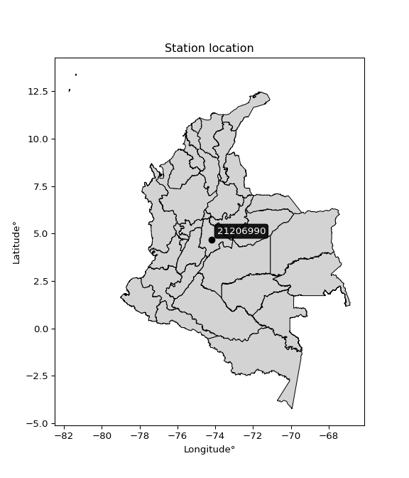

<div align="center">


</div>

# Station (rain, Pmax24h): 21206990

Probable Maximum Precipitation (PMP) is the greatest amount of rainfall for a specific duration that is meteorologically possible for a given location, acting as a "worst-case" scenario for extreme storms, crucial for designing safety-critical infrastructure like bridges, river deviations, dams, spillways, and nuclear plants to prevent catastrophic failure. PMP is calculated by hydrologists using meteorological data to determine the upper limit of extreme rainfall, often leading to the Probable Maximum Flood (PMF) for flood control design, and is increasingly being studied for climate change impacts.

<div align="center">

</img>

</div>


## A. General information


### 1. General running parameters

• app_version: _v20251226_. • runtime: _2025-12-26 15:38:16.554582_. • Python version: _3.14.0_. • SciPy version: _1.16.3_. • Pandas version: _2.3.3_. • NumPy version: _2.3.5_. • Stations dataset (station_dataset_file): _dataset/pmax24h_in/automatic_colombia_2003_2024.csv_. • Stations catalog (station_catalog_file): _dataset/CNE_IDEAM.xls_. • Minimum year to eval til year_max (date_min): _2003_. • Maximum year to eval since year_min (date_max): _2024_. • Creates, save and include plots into reports (create_plot): _False_. • Plot only fit distributions with Δo > Δ (plot_only_fit): _True_. • Eval low extreme values, if False, evaluates high extreme values (low_extreme): _False_. • Eval every SciPy distribution as logarithmic (pdist_logarithmic_on): _True_. • Standard deviation normalized (ddof): _1.0_. • Return periods to eval in years (Tr): _[2, 2.33, 5, 10, 15, 20, 25, 50, 75, 100, 200, 250, 500, 750, 1000]_. • Minimum data sample per station, 0 means any (minimum_sample): _5_. • Z-Score threshold to adjust a value, 0 means disable (zscore): _3.5_. • Avoid zeros, e.g. rain = 0 (avoid_zeros): _True_. • Avoid null values (avoid_nans): _True_. [:file_folder:Dataset file.](../../dataset/pmax24h_in/automatic_colombia_2003_2024.csv)


### 2. Station info and location

|   id |   CODIGO | NOMBRE                     | CATEGORIA         | TECNOLOGIA                | ESTADO     | FECHA_INSTALACION   |   FECHA_SUSPENSION |   ALTITUD |   LATITUD |   LONGITUD | DEPARTAMENTO   | MUNICIPIO   | AREA_OPERATIVA                            | ENTIDAD                                                     | AREA_HIDROGRAFICA   | ZONA_HIDROGRAFICA   | SUBZONA_HIDROGRAFICA   |   CORRIENTE | OBSERVACION                                                                                                                                                                                                                                                                                                                                                                                                                                                                                                                                                    | SUBRED                                                                            | Catalogo   |
|-----:|---------:|:---------------------------|:------------------|:--------------------------|:-----------|:--------------------|-------------------:|----------:|----------:|-----------:|:---------------|:------------|:------------------------------------------|:------------------------------------------------------------|:--------------------|:--------------------|:-----------------------|------------:|:---------------------------------------------------------------------------------------------------------------------------------------------------------------------------------------------------------------------------------------------------------------------------------------------------------------------------------------------------------------------------------------------------------------------------------------------------------------------------------------------------------------------------------------------------------------|:----------------------------------------------------------------------------------|:-----------|
|    0 | 21206990 | TIBAITATA - AUT [21206990] | Agrometeorológica | Automática con Telemetría | Suspendida | 27/10/2004          |                nan |      2543 |   4.68863 |   -74.2056 | Cundinamarca   | Mosquera    | Area Operativa 11 - Cundinamarca-Amazonas | INSTITUTO DE HIDROLOGIA METEOROLOGIA Y ESTUDIOS AMBIENTALES | Magdalena Cauca     | Alto Magdalena      | Río Bogotá             |         nan | 16/08/2022$Migracion$Esta estación [21206990] fue homologada con la estación de código [21205420]. La información automática y convencional esta disponible consultando la estación con este código [21205420]|16/11/2022$Migracion$16/08/2022$Migracion$Esta estación [21206990] fue homologada con la estación de código [21205420]. La información automática y convencional esta disponible consultando la estación con este código [21205420]|16/11/2022$Migracion$Se ajustan coordenadas según análisis y solicitud de Julián Urrea_Planeacion Operativa | Altiplano Cundiboyacense,Radiación Ultravioleta,Radiación Visible,Radición Global | CNE_IDEAM  |

<div align="center">

Map location in: [:earth_americas:Google](http://maps.google.com/maps?q=4.68863,-74.20559) [:earth_americas:OSM](https://www.openstreetmap.org/#map=18/4.68863/-74.20559&layers=P) [:earth_americas:Bing](https://www.bing.com/maps?cp=4.68863~-74.20559&lvl=18) [:earth_americas:Apple](https://maps.apple.com/frame?center=4.68863%2C-74.20559&span=0.003%2C0.006)

</div>


<div align="center">

```geojson
{
  "type": "Feature",
  "geometry": {
    "type": "Point", 
    "coordinates": [-74.20559, 4.68863]
  }, 
  "properties": {
    "Name": "21206990"
  }
}
```

</div>


### 3. Discrete values table and plot

|               |           0 |           1 |           2 |           3 |          4 |         5 |           6 |           7 |           8 |          9 |          10 |          11 |          12 |         13 |          14 |          15 |          16 |         17 |        18 |         19 |
|:--------------|------------:|------------:|------------:|------------:|-----------:|----------:|------------:|------------:|------------:|-----------:|------------:|------------:|------------:|-----------:|------------:|------------:|------------:|-----------:|----------:|-----------:|
| Date          | 2005        | 2006        | 2007        | 2008        | 2009       | 2010      | 2011        | 2012        | 2013        | 2014       | 2015        | 2016        | 2017        | 2018       | 2019        | 2020        | 2021        | 2022       | 2023      | 2024       |
| Value         |   40.5      |   29.7      |   34.2      |   22        |   45.5     |   51      |   35.6      |   32.3      |   17.6      |   11.6     |   12.1      |   22.2      |   29.4      |   10.3     |   14.4      |   22        |   24.6      |   67.1     |   29.5    |    0.2     |
| Value_initial |   40.5      |   29.7      |   34.2      |   22        |   45.5     |   51      |   35.6      |   32.3      |   17.6      |   11.6     |   12.1      |   22.2      |   29.4      |   10.3     |   14.4      |   22        |   24.6      |   67.1     |   29.5    |    0.2     |
| count         |   20        |   20        |   20        |   20        |   20       |   20      |   20        |   20        |   20        |   20       |   20        |   20        |   20        |   20       |   20        |   20        |   20        |   20       |   20      |   20       |
| mean          |   27.59     |   27.59     |   27.59     |   27.59     |   27.59    |   27.59   |   27.59     |   27.59     |   27.59     |   27.59    |   27.59     |   27.59     |   27.59     |   27.59    |   27.59     |   27.59     |   27.59     |   27.59    |   27.59   |   27.59    |
| std           |   15.6558   |   15.6558   |   15.6558   |   15.6558   |   15.6558  |   15.6558 |   15.6558   |   15.6558   |   15.6558   |   15.6558  |   15.6558   |   15.6558   |   15.6558   |   15.6558  |   15.6558   |   15.6558   |   15.6558   |   15.6558  |   15.6558 |   15.6558  |
| zscore        |    0.824616 |    0.134775 |    0.422209 |   -0.357057 |    1.14399 |    1.4953 |    0.511633 |    0.300848 |   -0.638104 |   -1.02135 |   -0.989412 |   -0.344282 |    0.115612 |   -1.10439 |   -0.842501 |   -0.357057 |   -0.190984 |    2.52367 |    0.122  |   -1.74952 |
> If Z-Score is active, values out of range or outliers are replaced with the station mean value.


### 4. Active continuous probability distributions from SciPy (45 of 104 available)

[scipy.stats](https://docs.scipy.org/doc/scipy/reference/stats.html) is a Python´s powerful submodule within the SciPy library for comprehensive statistical analysis, offering over 130 probability distributions (like Normal, Poisson), functions for descriptive stats (mean, variance), hypothesis testing (t-tests, chi-square), random variable generation, and statistical tests, making it essential for data science, modeling, and research. It provides tools to explore, model, and draw conclusions from data efficiently, working seamlessly with NumPy.

<div align="center">

|   id | p_dist             |   n_parameter | fit_method   | label                                                                       | active   | ref                                                                                                        |
|-----:|:-------------------|--------------:|:-------------|:----------------------------------------------------------------------------|:---------|:-----------------------------------------------------------------------------------------------------------|
|    0 | alpha              |             3 | MLE          | Alpha                                                                       | True     | [:mortar_board:](https://docs.scipy.org/doc/scipy/reference/generated/scipy.stats.alpha.html)              |
|    1 | betaprime          |             4 | MLE          | Beta prime                                                                  | True     | [:mortar_board:](https://docs.scipy.org/doc/scipy/reference/generated/scipy.stats.betaprime.html)          |
|    2 | chi2               |             3 | MLE          | Chi²                                                                        | True     | [:mortar_board:](https://docs.scipy.org/doc/scipy/reference/generated/scipy.stats.chi2.html)               |
|    3 | crystalball        |             4 | MLE          | Crystalball                                                                 | True     | [:mortar_board:](https://docs.scipy.org/doc/scipy/reference/generated/scipy.stats.crystalball.html)        |
|    4 | erlang             |             3 | MLE          | Erlang                                                                      | True     | [:mortar_board:](https://docs.scipy.org/doc/scipy/reference/generated/scipy.stats.erlang.html)             |
|    5 | expon              |             2 | MLE          | Exponential                                                                 | True     | [:mortar_board:](https://docs.scipy.org/doc/scipy/reference/generated/scipy.stats.expon.html)              |
|    6 | exponnorm          |             3 | MLE          | Exponentially modified Normal                                               | True     | [:mortar_board:](https://docs.scipy.org/doc/scipy/reference/generated/scipy.stats.exponnorm.html)          |
|    7 | f                  |             4 | MLE          | F                                                                           | True     | [:mortar_board:](https://docs.scipy.org/doc/scipy/reference/generated/scipy.stats.f.html)                  |
|    8 | fatiguelife        |             3 | MLE          | Fatigue-life (Birnbaum-Saunders)                                            | True     | [:mortar_board:](https://docs.scipy.org/doc/scipy/reference/generated/scipy.stats.fatiguelife.html)        |
|    9 | fisk               |             3 | MLE          | Fisk                                                                        | True     | [:mortar_board:](https://docs.scipy.org/doc/scipy/reference/generated/scipy.stats.fisk.html)               |
|   10 | gamma              |             3 | MLE          | Gamma                                                                       | True     | [:mortar_board:](https://docs.scipy.org/doc/scipy/reference/generated/scipy.stats.gamma.html)              |
|   11 | genexpon           |             5 | MLE          | Generalized exponential                                                     | True     | [:mortar_board:](https://docs.scipy.org/doc/scipy/reference/generated/scipy.stats.genexpon.html)           |
|   12 | genlogistic        |             3 | MLE          | Generalized logistic                                                        | True     | [:mortar_board:](https://docs.scipy.org/doc/scipy/reference/generated/scipy.stats.genlogistic.html)        |
|   13 | gibrat             |             2 | MM           | Gibrat                                                                      | True     | [:mortar_board:](https://docs.scipy.org/doc/scipy/reference/generated/scipy.stats.gibrat.html)             |
|   14 | gompertz           |             3 | MLE          | Gompertz (or truncated Gumbel)                                              | True     | [:mortar_board:](https://docs.scipy.org/doc/scipy/reference/generated/scipy.stats.gompertz.html)           |
|   15 | gumbel_l           |             2 | MM           | Gumbel Left Skew                                                            | True     | [:mortar_board:](https://docs.scipy.org/doc/scipy/reference/generated/scipy.stats.gumbel_l.html)           |
|   16 | gumbel_r           |             2 | MM           | Gumbel Right Skew                                                           | True     | [:mortar_board:](https://docs.scipy.org/doc/scipy/reference/generated/scipy.stats.gumbel_r.html)           |
|   17 | halflogistic       |             2 | MM           | Half-logistic                                                               | True     | [:mortar_board:](https://docs.scipy.org/doc/scipy/reference/generated/scipy.stats.halflogistic.html)       |
|   18 | halfnorm           |             2 | MM           | Half Normal                                                                 | True     | [:mortar_board:](https://docs.scipy.org/doc/scipy/reference/generated/scipy.stats.halfnorm.html)           |
|   19 | hypsecant          |             2 | MM           | hyperbolic secant                                                           | True     | [:mortar_board:](https://docs.scipy.org/doc/scipy/reference/generated/scipy.stats.hypsecant.html)          |
|   20 | invgamma           |             3 | MLE          | Inverted gamma                                                              | True     | [:mortar_board:](https://docs.scipy.org/doc/scipy/reference/generated/scipy.stats.invgamma.html)           |
|   21 | invgauss           |             3 | MLE          | Inverse Gaussian                                                            | True     | [:mortar_board:](https://docs.scipy.org/doc/scipy/reference/generated/scipy.stats.invgauss.html)           |
|   22 | invweibull         |             3 | MLE          | Inverted Weibull                                                            | True     | [:mortar_board:](https://docs.scipy.org/doc/scipy/reference/generated/scipy.stats.invweibull.html)         |
|   23 | johnsonsu          |             4 | MLE          | Johnson Su                                                                  | True     | [:mortar_board:](https://docs.scipy.org/doc/scipy/reference/generated/scipy.stats.johnsonsu.html)          |
|   24 | kstwobign          |             2 | MLE          | Limiting distribution of scaled Kolmogorov-Smirnov two-sided test statistic | True     | [:mortar_board:](https://docs.scipy.org/doc/scipy/reference/generated/scipy.stats.kstwobign.html)          |
|   25 | laplace            |             2 | MM           | Laplace                                                                     | True     | [:mortar_board:](https://docs.scipy.org/doc/scipy/reference/generated/scipy.stats.laplace.html)            |
|   26 | laplace_asymmetric |             3 | MLE          | Asymmetric Laplace                                                          | True     | [:mortar_board:](https://docs.scipy.org/doc/scipy/reference/generated/scipy.stats.laplace_asymmetric.html) |
|   27 | loggamma           |             3 | MLE          | Log gamma                                                                   | True     | [:mortar_board:](https://docs.scipy.org/doc/scipy/reference/generated/scipy.stats.loggamma.html)           |
|   28 | logistic           |             2 | MM           | Logistic (or Sech-squared)                                                  | True     | [:mortar_board:](https://docs.scipy.org/doc/scipy/reference/generated/scipy.stats.logistic.html)           |
|   29 | lognorm            |             3 | MLE          | Log Normal                                                                  | True     | [:mortar_board:](https://docs.scipy.org/doc/scipy/reference/generated/scipy.stats.lognorm.html)            |
|   30 | maxwell            |             2 | MM           | Maxwell                                                                     | True     | [:mortar_board:](https://docs.scipy.org/doc/scipy/reference/generated/scipy.stats.maxwell.html)            |
|   31 | mielke             |             4 | MLE          | Mielke Beta-Kappa / Dagum                                                   | True     | [:mortar_board:](https://docs.scipy.org/doc/scipy/reference/generated/scipy.stats.mielke.html)             |
|   32 | moyal              |             2 | MM           | Moyal                                                                       | True     | [:mortar_board:](https://docs.scipy.org/doc/scipy/reference/generated/scipy.stats.moyal.html)              |
|   33 | nakagami           |             3 | MLE          | Nakagami                                                                    | True     | [:mortar_board:](https://docs.scipy.org/doc/scipy/reference/generated/scipy.stats.nakagami.html)           |
|   34 | ncf                |             5 | MLE          | Non-central F distribution                                                  | True     | [:mortar_board:](https://docs.scipy.org/doc/scipy/reference/generated/scipy.stats.ncf.html)                |
|   35 | nct                |             4 | MLE          | Non-central Student’s t                                                     | True     | [:mortar_board:](https://docs.scipy.org/doc/scipy/reference/generated/scipy.stats.nct.html)                |
|   36 | norm               |             2 | MM           | Normal                                                                      | True     | [:mortar_board:](https://docs.scipy.org/doc/scipy/reference/generated/scipy.stats.norm.html)               |
|   37 | pareto             |             3 | MLE          | Pareto                                                                      | True     | [:mortar_board:](https://docs.scipy.org/doc/scipy/reference/generated/scipy.stats.pareto.html)             |
|   38 | pearson3           |             3 | MM           | Pearson type III                                                            | True     | [:mortar_board:](https://docs.scipy.org/doc/scipy/reference/generated/scipy.stats.pearson3.html)           |
|   39 | rayleigh           |             2 | MM           | Rayleigh                                                                    | True     | [:mortar_board:](https://docs.scipy.org/doc/scipy/reference/generated/scipy.stats.rayleigh.html)           |
|   40 | rice               |             3 | MLE          | Rice                                                                        | True     | [:mortar_board:](https://docs.scipy.org/doc/scipy/reference/generated/scipy.stats.rice.html)               |
|   41 | t                  |             3 | MLE          | Student’s t                                                                 | True     | [:mortar_board:](https://docs.scipy.org/doc/scipy/reference/generated/scipy.stats.t.html)                  |
|   42 | truncnorm          |             4 | MLE          | Truncated normal                                                            | True     | [:mortar_board:](https://docs.scipy.org/doc/scipy/reference/generated/scipy.stats.truncnorm.html)          |
|   43 | wald               |             2 | MM           | Wald                                                                        | True     | [:mortar_board:](https://docs.scipy.org/doc/scipy/reference/generated/scipy.stats.wald.html)               |
|   44 | weibull_min        |             3 | MLE          | Weibull minimum                                                             | True     | [:mortar_board:](https://docs.scipy.org/doc/scipy/reference/generated/scipy.stats.weibull_min.html)        |

</div>

> **n_parameter:** # arguments & localization & scale.
>
> **Fit methods:** (MLE) maximum likelihood, (MM) L-moments.
>
>**Inactive:** foldnorm, gennorm, norminvgauss, powernorm, powerlognorm, skewnorm, genextreme, anglit, arcsine, argus, beta, bradford, burr, burr12, cauchy, cosine, halfcauchy, foldcauchy, skewcauchy, wrapcauchy, dgamma, gengamma, exponweib, exponpow, truncexpon, gausshyper, genhalflogistic, genhyperbolic, geninvgauss, halfgennorm, johnsonsb, kappa4, kappa3, ksone, kstwo, loglaplace, levy, levy_l, levy_stable, ncx2, genpareto, truncpareto, lomax, powerlaw, rdist, rel_breitwigner, recipinvgauss, semicircular, studentized_range, trapezoid, triang, truncweibull_min, tukeylambda, uniform, loguniform, vonmises, vonmises_line, weibull_max, dweibull, 


## B. Probability distributions vs. Empirical distributions

A continuous probability distribution (CPD) describes probabilities for variables that can take any value within a range (like rain any time), unlike discrete variables with specific outcomes (like temperature). It uses a Probability Density Function (PDF), a curve where the total area under it equals 1, and the probability of the variable falling within an interval (a to b) is found by calculating the area under the curve between those points. A key feature is that the probability of hitting any single exact value is zero, so probabilities are always expressed for ranges, e.g., $P(a ≤ X ≤ b)$.

<div align="center">

Distributions parameters
|    |   station | p_dist                |   n |             loc |           scale | shape                  | shape1              | shape2                | shape3   |
|---:|----------:|:----------------------|----:|----------------:|----------------:|:-----------------------|:--------------------|:----------------------|:---------|
|  0 |  21206990 | alpha                 |  20 |  -102.897       |  1138.04        | 8.836286907166645      |                     |                       |          |
|  1 |  21206990 | betaprime             |  20 |   -20.1667      |  1843.49        | 10.07273056772349      | 389.8238674673306   |                       |          |
|  2 |  21206990 | chi2                  |  20 |   -19.2558      |     2.48465     | 18.854067207578083     |                     |                       |          |
|  3 |  21206990 | crystalball           |  20 |    27.59        |    15.2594      | 1713.3966884588244     | 3499.6091941567884  |                       |          |
|  4 |  21206990 | erlang                |  20 |   -19.2558      |     4.9693      | 9.427043249574272      |                     |                       |          |
|  5 |  21206990 | expon                 |  20 |     0.2         |    27.39        |                        |                     |                       |          |
|  6 |  21206990 | exponnorm             |  20 |    15.7665      |    10.0236      | 1.1795703761946348     |                     |                       |          |
|  7 |  21206990 | f                     |  20 |   -19.4991      |    47.0555      | 19.19240338093043      | 2803.5677034919954  |                       |          |
|  8 |  21206990 | fatiguelife           |  20 |   -39.9969      |    65.9242      | 0.22458851640027522    |                     |                       |          |
|  9 |  21206990 | fisk                  |  20 |   -34.2901      |    60.1549      | 7.196022627177189      |                     |                       |          |
| 10 |  21206990 | gamma                 |  20 |   -19.2558      |     4.9693      | 9.42705514645013       |                     |                       |          |
| 11 |  21206990 | genexpon              |  20 |     0.2         |     2.84569     | 0.037879214082751744   | 0.07578489367426078 | 0.6962124515848299    |          |
| 12 |  21206990 | genlogistic           |  20 |     6.85204     |    11.23        | 4.0625765540776495     |                     |                       |          |
| 13 |  21206990 | gibrat                |  20 |    15.949       |     7.0606      |                        |                     |                       |          |
| 14 |  21206990 | gompertz              |  20 |    10.3         |     4.96177     | 0.00019085194815596262 |                     |                       |          |
| 15 |  21206990 | gumbel_l              |  20 |    34.4575      |    11.8977      |                        |                     |                       |          |
| 16 |  21206990 | gumbel_r              |  20 |    20.7225      |    11.8977      |                        |                     |                       |          |
| 17 |  21206990 | halflogistic          |  20 |     9.50409     |    13.0462      |                        |                     |                       |          |
| 18 |  21206990 | halfnorm              |  20 |     7.39262     |    25.3137      |                        |                     |                       |          |
| 19 |  21206990 | hypsecant             |  20 |    27.59        |     9.71441     |                        |                     |                       |          |
| 20 |  21206990 | invgamma              |  20 |   -61.3281      |  3095.24        | 35.80945636493316      |                     |                       |          |
| 21 |  21206990 | invgauss              |  20 |   -40.4761      |  1353.05        | 0.050306061212092024   |                     |                       |          |
| 22 |  21206990 | invweibull            |  20 |    -8.78554e+08 |     8.78554e+08 | 67550804.89089715      |                     |                       |          |
| 23 |  21206990 | johnsonsu             |  20 |   -36.098       |    15.0174      | -9.229383731884901     | 4.341830767345511   |                       |          |
| 24 |  21206990 | kstwobign             |  20 |   -26.9125      |    62.7308      |                        |                     |                       |          |
| 25 |  21206990 | laplace               |  20 |    27.59        |    10.79        |                        |                     |                       |          |
| 26 |  21206990 | laplace_asymmetric    |  20 |    22           |    11.1451      | 0.7801885853955874     |                     |                       |          |
| 27 |  21206990 | loggamma              |  20 | -4586.65        |   623.062       | 1645.7381267719102     |                     |                       |          |
| 28 |  21206990 | logistic              |  20 |    27.59        |     8.41292     |                        |                     |                       |          |
| 29 |  21206990 | lognorm               |  20 |   -39.7328      |    65.6536      | 0.22413442748533793    |                     |                       |          |
| 30 |  21206990 | maxwell               |  20 |    -8.56826     |    22.6588      |                        |                     |                       |          |
| 31 |  21206990 | mielke                |  20 |    -3.36261     |    41.5102      | 1.87783132404674       | 5.438752554570839   |                       |          |
| 32 |  21206990 | moyal                 |  20 |    18.8637      |     6.86912     |                        |                     |                       |          |
| 33 |  21206990 | nakagami              |  20 |    -5.58971     |    36.5204      | 1.273834614512827      |                     |                       |          |
| 34 |  21206990 | ncf                   |  20 |     0.2         |     1.95301     | 0.9514660700931524     | 29.063229377498963  | 11.378258039472701    |          |
| 35 |  21206990 | nct                   |  20 |    -0.063412    |    11.9379      | 9.043345950229696      | 2.1163339517658897  |                       |          |
| 36 |  21206990 | norm                  |  20 |    27.59        |    15.2594      |                        |                     |                       |          |
| 37 |  21206990 | pareto                |  20 |     0.2         |     5.25202e-08 | 0.05263158147919436    |                     |                       |          |
| 38 |  21206990 | pearson3              |  20 |    27.59        |    15.2594      | 0.6470752845890964     |                     |                       |          |
| 39 |  21206990 | rayleigh              |  20 |    -1.60204     |    23.2919      |                        |                     |                       |          |
| 40 |  21206990 | rice                  |  20 |    -3.37351     |    19.5983      | 1.0499183967049388     |                     |                       |          |
| 41 |  21206990 | t                     |  20 |    27.1223      |    15.1111      | 30.59039688939481      |                     |                       |          |
| 42 |  21206990 | truncnorm             |  20 |    22.6742      |    19.1696      | -1.172388751361158     | 204.4711318924617   |                       |          |
| 43 |  21206990 | wald                  |  20 |    12.3306      |    15.2594      |                        |                     |                       |          |
| 44 |  21206990 | weibull_min           |  20 |    -4.03709     |    35.6658      | 2.168684655915338      |                     |                       |          |
| 45 |  21206990 | logalpha              |  20 |   -55.7486      |  2720.58        | 46.31625594295379      |                     |                       |          |
| 46 |  21206990 | logbetaprime          |  20 | -1109.05        |   276.822       | 4508934.621775728      | 1122394.3643040406  |                       |          |
| 47 |  21206990 | logchi2               |  20 |   -22.283       |     0.033692    | 749.8399362388634      |                     |                       |          |
| 48 |  21206990 | logcrystalball        |  20 |     3.00401     |     1.16647     | 243.06552065102537     | 1.0593845690750947  |                       |          |
| 49 |  21206990 | logerlang             |  20 |    -1.60944     |    94.9381      | 0.1734860734535179     |                     |                       |          |
| 50 |  21206990 | logexpon              |  20 |    -1.60944     |     4.61345     |                        |                     |                       |          |
| 51 |  21206990 | logexponnorm          |  20 |     3.00321     |     1.16647     | 0.0006911264248469175  |                     |                       |          |
| 52 |  21206990 | logf                  |  20 |    -1.60944     |     1.20401     | 1.048230617731375      | 1.0447548656333092  |                       |          |
| 53 |  21206990 | logfatiguelife        |  20 | -1129.55        |  1132.55        | 0.001026386546696378   |                     |                       |          |
| 54 |  21206990 | logfisk               |  20 |    -9.95621e+07 |     9.95621e+07 | 215783164.98755544     |                     |                       |          |
| 55 |  21206990 | loggamma              |  20 |   -20.4663      |     0.0697647   | 335.8285482450393      |                     |                       |          |
| 56 |  21206990 | loggenexpon           |  20 |    -1.951       |     0.29182     | 3.509280711941211e-08  | 7.922622403941835   | 0.0008322583039896535 |          |
| 57 |  21206990 | loggenlogistic        |  20 |     3.79761     |     0.167473    | 0.19890673033489792    |                     |                       |          |
| 58 |  21206990 | loggibrat             |  20 |     2.11417     |     0.539718    |                        |                     |                       |          |
| 59 |  21206990 | loggompertz           |  20 |    -1.60944     |     1.63509e+10 | 22016590739.18074      |                     |                       |          |
| 60 |  21206990 | loggumbel_l           |  20 |     3.52898     |     0.90949     |                        |                     |                       |          |
| 61 |  21206990 | loggumbel_r           |  20 |     2.47904     |     0.90949     |                        |                     |                       |          |
| 62 |  21206990 | loghalflogistic       |  20 |     1.62145     |     0.997305    |                        |                     |                       |          |
| 63 |  21206990 | loghalfnorm           |  20 |     1.46003     |     1.93508     |                        |                     |                       |          |
| 64 |  21206990 | loghypsecant          |  20 |     3.00401     |     0.742595    |                        |                     |                       |          |
| 65 |  21206990 | loginvgamma           |  20 |   -34.8617      | 33155.4         | 876.8341635783045      |                     |                       |          |
| 66 |  21206990 | loginvgauss           |  20 |   -13.2388      |  2208.19        | 0.0073597920503969995  |                     |                       |          |
| 67 |  21206990 | loginvweibull         |  20 |    -2.93663e+06 |     2.93664e+06 | 1591228.5834196634     |                     |                       |          |
| 68 |  21206990 | logjohnsonsu          |  20 |     3.60389     |     0.383498    | 0.7445811177908628     | 0.9612544914546628  |                       |          |
| 69 |  21206990 | logkstwobign          |  20 |    -5.0786      |     9.37784     |                        |                     |                       |          |
| 70 |  21206990 | loglaplace            |  20 |     3.00401     |     0.824816    |                        |                     |                       |          |
| 71 |  21206990 | loglaplace_asymmetric |  20 |     3.53223     |     0.494467    | 1.6676526572043173     |                     |                       |          |
| 72 |  21206990 | logloggamma           |  20 |     3.88094     |     0.314904    | 0.3712666304582253     |                     |                       |          |
| 73 |  21206990 | loglogistic           |  20 |     3.00401     |     0.643106    |                        |                     |                       |          |
| 74 |  21206990 | loglognorm            |  20 | -1511.79        |  1514.79        | 0.0007689398354490083  |                     |                       |          |
| 75 |  21206990 | logmaxwell            |  20 |     0.240026    |     1.73207     |                        |                     |                       |          |
| 76 |  21206990 | logmielke             |  20 |    -1.60944     |     2.65149     | 0.46139696925642953    | 1.5035349142886811  |                       |          |
| 77 |  21206990 | logmoyal              |  20 |     2.33695     |     0.525094    |                        |                     |                       |          |
| 78 |  21206990 | lognakagami           |  20 | -1464.63        |  1467.63        | 394900.1313037146      |                     |                       |          |
| 79 |  21206990 | logncf                |  20 |    -1.60944     |     1.09655     | 1.0383909649877388     | 1.111920919843313   | 1.0951237828733893    |          |
| 80 |  21206990 | lognct                |  20 |   -71.0908      |     1.09759     | 14238.948326264435     | 67.50346027187348   |                       |          |
| 81 |  21206990 | lognorm               |  20 |     3.00401     |     1.16647     |                        |                     |                       |          |
| 82 |  21206990 | logpareto             |  20 |    -1.60944     |     9.95465e-09 | 0.052631579531620835   |                     |                       |          |
| 83 |  21206990 | logpearson3           |  20 |     3.00401     |     1.16647     | -2.9869230184178366    |                     |                       |          |
| 84 |  21206990 | lograyleigh           |  20 |     0.772452    |     1.78051     |                        |                     |                       |          |
| 85 |  21206990 | logrice               |  20 |  -476.664       |     1.16719     | 410.95756482372803     |                     |                       |          |
| 86 |  21206990 | logt                  |  20 |     3.28426     |     0.413634    | 1.8670149361315223     |                     |                       |          |
| 87 |  21206990 | logtruncnorm          |  20 |     1.76207     |     6.72599     | -0.501522170862643     | 0.3633839524045632  |                       |          |
| 88 |  21206990 | logwald               |  20 |     1.83757     |     1.16644     |                        |                     |                       |          |
| 89 |  21206990 | logweibull_min        |  20 |    -1.60944     |     1.56653     | 0.5481730449276303     |                     |                       |          |

</div>

> **loc** (Location parameter): This shifts the distribution along the x-axis. For many common distributions, like the normal (Gaussian) distribution, loc represents the mean $μ$. For others, like the uniform distribution, it might represent the minimum value, or for the beta distribution, the left end of the support interval.
>
> **scale** (Scale parameter): This determines the width or spread of the distribution. For the normal distribution, scale represents the standard deviation $σ$. For a uniform distribution, it defines the length of the interval (from $loc$ to $loc + scale$).
>
> **shape** (Shape parameters): Refers to parameters that define the specific form of a probability distribution, distinct from its location (loc) and scale (scale). These parameters are required arguments for most distribution functions. For example, a normal (Gaussian) distribution is fully defined by its location (mean) and scale (standard deviation), so it has no specific shape parameters beyond loc and scale. However, other distributions have intrinsic properties that need specification, as Gamma distribution that takes a shape parameter, often named $a$ or $alpha$.


### 0. Cumulative distribution values - CDF (90 evaluated)

> Ordered by x ascending and calculating $log(f(x))$ separately. 

|   id |   Station |   date |    x |   count |   mean |     std |    zscore |   Value_initial |   station |   m |     alpha |   alpha_pdf |   betaprime |   betaprime_pdf |      chi2 |   chi2_pdf |   crystalball |   crystalball_pdf |    erlang |   erlang_pdf |    expon |   expon_pdf |   exponnorm |   exponnorm_pdf |         f |      f_pdf |   fatiguelife |   fatiguelife_pdf |      fisk |   fisk_pdf |     gamma |   gamma_pdf |    genexpon |   genexpon_pdf |   genlogistic |   genlogistic_pdf |    gibrat |   gibrat_pdf |    gompertz |   gompertz_pdf |   gumbel_l |   gumbel_l_pdf |   gumbel_r |   gumbel_r_pdf |   halflogistic |   halflogistic_pdf |   halfnorm |   halfnorm_pdf |   hypsecant |   hypsecant_pdf |   invgamma |   invgamma_pdf |   invgauss |   invgauss_pdf |   invweibull |   invweibull_pdf |   johnsonsu |   johnsonsu_pdf |   kstwobign |   kstwobign_pdf |   laplace |   laplace_pdf |   laplace_asymmetric |   laplace_asymmetric_pdf |   loggamma |   loggamma_pdf |   logistic |   logistic_pdf |     lognorm |   lognorm_pdf |   maxwell |   maxwell_pdf |     mielke |   mielke_pdf |       moyal |   moyal_pdf |   nakagami |   nakagami_pdf |         ncf |         ncf_pdf |       nct |    nct_pdf |      norm |    norm_pdf |   pareto |   pareto_pdf |   pearson3 |   pearson3_pdf |   rayleigh |   rayleigh_pdf |       rice |   rice_pdf |         t |      t_pdf |   truncnorm |   truncnorm_pdf |      wald |   wald_pdf |   weibull_min |   weibull_min_pdf |   logalpha |   logalpha_pdf |   logbetaprime |   logbetaprime_pdf |     logchi2 |   logchi2_pdf |   logcrystalball |   logcrystalball_pdf |   logerlang |   logerlang_pdf |   logexpon |   logexpon_pdf |   logexponnorm |   logexponnorm_pdf |        logf |    logf_pdf |   logfatiguelife |   logfatiguelife_pdf |     logfisk |   logfisk_pdf |   loggenexpon |   loggenexpon_pdf |   loggenlogistic |   loggenlogistic_pdf |   loggibrat |   loggibrat_pdf |   loggompertz |   loggompertz_pdf |   loggumbel_l |   loggumbel_l_pdf |   loggumbel_r |   loggumbel_r_pdf |   loghalflogistic |   loghalflogistic_pdf |   loghalfnorm |   loghalfnorm_pdf |   loghypsecant |   loghypsecant_pdf |   loginvgamma |   loginvgamma_pdf |   loginvgauss |   loginvgauss_pdf |   loginvweibull |   loginvweibull_pdf |   logjohnsonsu |   logjohnsonsu_pdf |   logkstwobign |   logkstwobign_pdf |   loglaplace |   loglaplace_pdf |   loglaplace_asymmetric |   loglaplace_asymmetric_pdf |   logloggamma |   logloggamma_pdf |   loglogistic |   loglogistic_pdf |   loglognorm |   loglognorm_pdf |   logmaxwell |   logmaxwell_pdf |   logmielke |   logmielke_pdf |   logmoyal |   logmoyal_pdf |   lognakagami |   lognakagami_pdf |      logncf |   logncf_pdf |      lognct |   lognct_pdf |   logpareto |   logpareto_pdf |   logpearson3 |   logpearson3_pdf |   lograyleigh |   lograyleigh_pdf |     logrice |   logrice_pdf |       logt |   logt_pdf |   logtruncnorm |   logtruncnorm_pdf |   logwald |   logwald_pdf |   logweibull_min |   logweibull_min_pdf |
|-----:|----------:|-------:|-----:|--------:|-------:|--------:|----------:|----------------:|----------:|----:|----------:|------------:|------------:|----------------:|----------:|-----------:|--------------:|------------------:|----------:|-------------:|---------:|------------:|------------:|----------------:|----------:|-----------:|--------------:|------------------:|----------:|-----------:|----------:|------------:|------------:|---------------:|--------------:|------------------:|----------:|-------------:|------------:|---------------:|-----------:|---------------:|-----------:|---------------:|---------------:|-------------------:|-----------:|---------------:|------------:|----------------:|-----------:|---------------:|-----------:|---------------:|-------------:|-----------------:|------------:|----------------:|------------:|----------------:|----------:|--------------:|---------------------:|-------------------------:|-----------:|---------------:|-----------:|---------------:|------------:|--------------:|----------:|--------------:|-----------:|-------------:|------------:|------------:|-----------:|---------------:|------------:|----------------:|----------:|-----------:|----------:|------------:|---------:|-------------:|-----------:|---------------:|-----------:|---------------:|-----------:|-----------:|----------:|-----------:|------------:|----------------:|----------:|-----------:|--------------:|------------------:|-----------:|---------------:|---------------:|-------------------:|------------:|--------------:|-----------------:|---------------------:|------------:|----------------:|-----------:|---------------:|---------------:|-------------------:|------------:|------------:|-----------------:|---------------------:|------------:|--------------:|--------------:|------------------:|-----------------:|---------------------:|------------:|----------------:|--------------:|------------------:|--------------:|------------------:|--------------:|------------------:|------------------:|----------------------:|--------------:|------------------:|---------------:|-------------------:|--------------:|------------------:|--------------:|------------------:|----------------:|--------------------:|---------------:|-------------------:|---------------:|-------------------:|-------------:|-----------------:|------------------------:|----------------------------:|--------------:|------------------:|--------------:|------------------:|-------------:|-----------------:|-------------:|-----------------:|------------:|----------------:|-----------:|---------------:|--------------:|------------------:|------------:|-------------:|------------:|-------------:|------------:|----------------:|--------------:|------------------:|--------------:|------------------:|------------:|--------------:|-----------:|-----------:|---------------:|-------------------:|----------:|--------------:|-----------------:|---------------------:|
|    0 |  21206990 |   2024 |  0.2 |      20 |  27.59 | 15.6558 | -1.74952  |             0.2 |  21206990 |   1 | 0.0138221 |  0.00377912 |   0.0126407 |      0.00389022 | 0.0125725 | 0.00390312 |     0.0363297 |       0.00522093  | 0.0125725 |   0.00390312 | 0        |  0.0365097  |   0.0164977 |      0.00369731 | 0.0125909 | 0.00389948 |     0.0130304 |        0.00382978 | 0.0179368 | 0.00367522 | 0.0125725 |  0.00390312 | 5.71378e-09 |     0.0133111  |     0.0150734 |        0.00351118 | 0         |   0          | 0           |    0           |  0.0546229 |    0.00446333  | 0.00365358 |     0.00172337 |      0         |         0          |  0         |     0          |   0.0379195 |      0.0038942  |  0.0135448 |     0.00378707 |  0.0130428 |     0.00382732 |   0.00880604 |       0.00320418 |   0.0134467 |      0.00380962 |  0.00785511 |      0.00353716 | 0.0394938 |    0.00366023 |            0.0308391 |               0.00354665 | 6.6453e-05 |     0.00024391 |  0.0371224 |     0.00424874 | 3.82572e-05 |   0.000137185 | 0.0147374 |    0.00489258 | 0.00994271 |   0.00524074 | 0.000100062 | 0.000116779 |  0.0106677 |     0.00462834 | 2.56981e-11 | 440468          | 0.0180925 | 0.00363229 | 0.0363297 | 0.00522093  | 0        |  1.00212e+06 |  0.0127625 |     0.00392701 |  0.0029884 |     0.00331173 | 0.00954405 | 0.00532157 | 0.0423708 | 0.00550586 | 1.27392e-11 |      0.0119016  | 0         | 0          |    0.00980459 |        0.00499364 | 4.1546e-05 |    0.000160574 |    3.97616e-05 |        0.000142187 | 9.22065e-05 |   0.000321658 |      3.82574e-05 |          0.000137186 | 0.000943671 |     7.37302e+11 |   0        |      0.216758  |    3.82587e-05 |         0.00013719 | 3.67507e-09 | 8.67465e+06 |      3.60892e-05 |          0.000130804 | 3.01437e-05 |   6.53292e-05 |    0.00450504 |         0.0263149 |       0.00162556 |           0.00193066 |    0        |       0         |   1.34893e-11 |       1.34651     |    0.00351211 |        0.00385483 |   1.22302e-39 |       1.20487e-37 |          0        |              0        |      0        |          0        |      0.0012758 |         0.00171802 |   4.80838e-05 |       0.000184681 |   5.21785e-05 |       0.000218266 |     0.000257675 |          0.00115381 |     0.00751749 |          0.003816  |    0.000823753 |         0.00404378 |   0.00186135 |       0.00225669 |              0.00144086 |                  0.00174734 |     0.0017369 |        0.00204778 |   0.000765902 |        0.00119003 |  3.70545e-05 |      0.000133702 |     0        |         0        |  3.8203e-08 |     7.93839e+07 |   0        |       0        |   3.81374e-05 |       0.000136774 | 2.69091e-09 |  6.29203e+06 | 4.20367e-05 |  0.000150393 |    0        |     5.28714e+06 |     0.0107239 |        0.00704101 |      0        |          0        | 3.86585e-05 |   0.000138459 | 0.00452032 | 0.00170772 |    0.000270609 |           0.156695 |  0        |     0         |      2.05249e-09 |          5.06708e+06 |
|    1 |  21206990 |   2018 | 10.3 |      20 |  27.59 | 15.6558 | -1.10439  |            10.3 |  21206990 |   2 | 0.111731  |  0.0168884  |   0.11463   |      0.0173088  | 0.114902  | 0.0173386  |     0.128591  |       0.013759    | 0.114902  |   0.0173386  | 0.3084   |  0.0252501  |   0.106732  |      0.015733   | 0.114827  | 0.0173305  |     0.113449  |        0.0171738  | 0.103904  | 0.015026   | 0.114902  |  0.0173386  | 0.261965    |     0.0278181  |     0.106461  |        0.0163235  | 0         |   0          | 1.60404e-10 |    3.84645e-05 |  0.123026  |    0.00967644  | 0.0906001  |     0.0182858  |      0.0304939 |         0.0382896  |  0.0914391 |     0.0313127  |   0.106375  |      0.0107476  |  0.112043  |     0.01695    |  0.113391  |     0.0171669  |   0.113408   |       0.0189809  |   0.112647  |      0.0170283  |  0.126855   |      0.0204936  | 0.100705  |    0.0093332  |            0.0985274 |               0.0113311  | 0.315817   |     0.283253   |  0.113531  |     0.0119627  | 0.282313    |   0.289733    | 0.125247  |    0.0172631  | 0.123983   |   0.0170003  | 0.0621584   | 0.0190242   |  0.124502  |     0.017914   | 0.131594    |      0.02316    | 0.106254  | 0.0155062  | 0.128591  | 0.013759    | 0.633562 |  0.00190952  |  0.115093  |     0.0173101  |  0.122394  |     0.0192536  | 0.132682   | 0.0183142  | 0.137138  | 0.0139842  | 0.157795    |      0.0192128  | 0         | 0          |    0.129394   |        0.0182479  | 0.299778   |    0.280315    |    0.282255    |        0.288283    | 0.314153    |   0.276692    |      0.282314    |          0.289733    | 0.618289    |     0.0262663   |   0.574448 |      0.0922417 |    0.282312    |         0.289731   | 0.683367    | 0.0350109   |      0.284246    |          0.291862    | 0.133909    |   0.251361    |    0.507045   |         0.162487  |       0.175423   |           0.208315   |    0.18229  |       1.21339   |   0.995045    |       0.00667188  |    0.235262   |        0.225532   |   0.308731    |       0.398957    |          0.341959 |              0.442725 |      0.347784 |          0.372508 |      0.244782  |         0.298088   |   0.308134    |       0.281669    |   0.323999    |       0.269404    |     0.376663    |          0.199281   |     0.13671    |          0.158481  |    0.439899    |         0.175179   |   0.221416   |       0.268444   |              0.171611   |                  0.208115   |     0.180764  |        0.211984   |   0.260241    |        0.299353   |  0.283383    |      0.290808    |     0.308224 |         0.324047 |  0.873996   |     0.0363441   |   0.315097 |       0.460804 |   0.281507    |       0.289064    | 0.581436    |  0.0432732   | 0.285433    |  0.288091    |    0.647229 |     0.00471051  |     0.17282   |        0.139491   |      0.318643 |          0.335215 | 0.282448    |   0.28962     | 0.0784451  | 0.12332    |    0.676287    |           0.177034 |  0.294415 |     0.837681  |      0.809543    |          0.0439253   |
|    2 |  21206990 |   2014 | 11.6 |      20 |  27.59 | 15.6558 | -1.02135  |            11.6 |  21206990 |   3 | 0.134964  |  0.0188448  |   0.138347  |      0.0191632  | 0.138653  | 0.0191839  |     0.147347  |       0.0150985   | 0.138653  |   0.0191838  | 0.340458 |  0.0240796  |   0.128518  |      0.0177872  | 0.138568  | 0.0191783  |     0.137017  |        0.0190699  | 0.124796  | 0.0171271  | 0.138653  |  0.0191838  | 0.297552    |     0.0269075  |     0.129089  |        0.0184859  | 0         |   0          | 5.71646e-05 |    4.9983e-05  |  0.136218  |    0.0106313   | 0.116165   |     0.0210186  |      0.0801538 |         0.038079   |  0.132008  |     0.0310875  |   0.121264  |      0.0121831  |  0.135345  |     0.0188874  |  0.136952  |     0.0190648  |   0.139498   |       0.0211267  |   0.136042  |      0.018951   |  0.154686   |      0.0222769  | 0.1136    |    0.0105282  |            0.114416  |               0.0131584  | 0.350147   |     0.294039   |  0.130035  |     0.0134467  | 0.31772     |   0.305656    | 0.14868   |    0.0187728  | 0.146981   |   0.0183749  | 0.0897414   | 0.0233594   |  0.148781  |     0.0194184  | 0.162913    |      0.0249605  | 0.127767  | 0.017594   | 0.147347  | 0.0150985   | 0.63589  |  0.00168103  |  0.138803  |     0.01915    |  0.148398  |     0.0207238  | 0.157332   | 0.0195885  | 0.156187  | 0.0153263  | 0.183306    |      0.0200264  | 0         | 0          |    0.154024   |        0.0196247  | 0.333825   |    0.292211    |    0.317478    |        0.30402     | 0.347686    |   0.287208    |      0.31772     |          0.305656    | 0.621371    |     0.0255971   |   0.585272 |      0.0898955 |    0.317718    |         0.305654   | 0.68745     | 0.0337036   |      0.319904    |          0.307749    | 0.166697    |   0.301061    |    0.526241   |         0.160466  |       0.202014   |           0.239853   |    0.318659 |       1.05981   |   0.995778    |       0.00568513  |    0.26337    |        0.247573   |   0.356543    |       0.404296    |          0.393471 |              0.423732 |      0.391426 |          0.361654 |      0.282247  |         0.332197   |   0.342298    |       0.292818    |   0.35651     |       0.277303    |     0.400316    |          0.198584   |     0.157375   |          0.190421  |    0.460592    |         0.172953   |   0.255738   |       0.310054   |              0.19822    |                  0.240383   |     0.207768  |        0.243057   |   0.297362    |        0.324888   |  0.318915    |      0.306694    |     0.347267 |         0.332342 |  0.878201   |     0.0344356   |   0.369674 |       0.455779 |   0.316834    |       0.305002    | 0.586492    |  0.0418174   | 0.320605    |  0.303349    |    0.647781 |     0.00456548  |     0.190388  |        0.15654    |      0.358775 |          0.339512 | 0.317839    |   0.305515    | 0.0952727  | 0.161944   |    0.697312    |           0.176741 |  0.3873   |     0.724233  |      0.814659    |          0.0421755   |
|    3 |  21206990 |   2015 | 12.1 |      20 |  27.59 | 15.6558 | -0.989412 |            12.1 |  21206990 |   4 | 0.14457   |  0.0195752  |   0.148101  |      0.0198474  | 0.148416  | 0.0198641  |     0.155026  |       0.0156175   | 0.148415  |   0.019864   | 0.352389 |  0.0236441  |   0.137609  |      0.0185775  | 0.148328  | 0.0198596  |     0.146728  |        0.0197719  | 0.133565  | 0.0179513  | 0.148415  |  0.019864   | 0.310911    |     0.0265256  |     0.138538  |        0.0193079  | 0         |   0          | 8.34584e-05 |    5.52809e-05 |  0.14163   |    0.0110181   | 0.126926   |     0.0220206  |      0.0991618 |         0.0379484  |  0.147525  |     0.0309796  |   0.127503  |      0.0127769  |  0.14497   |     0.0196091  |  0.14666   |     0.0197676  |   0.150255   |       0.0218976  |   0.145697  |      0.0196658  |  0.165979   |      0.0228876  | 0.118988  |    0.0110276  |            0.121188  |               0.0139372  | 0.362626   |     0.29732    |  0.136908  |     0.0140455  | 0.330727    |   0.31074     | 0.158206  |    0.019327   | 0.156298   |   0.0188935  | 0.101814    | 0.0249198   |  0.158627  |     0.0199641  | 0.175544    |      0.0255511  | 0.136765  | 0.0183986  | 0.155026  | 0.0156175   | 0.636712 |  0.00160676  |  0.148548  |     0.0198285  |  0.158891  |     0.0212436  | 0.167241   | 0.020047   | 0.163981  | 0.0158472  | 0.193394    |      0.0203235  | 0         | 0          |    0.163961   |        0.0201208  | 0.346235   |    0.295893    |    0.330415    |        0.309045    | 0.359875    |   0.290431    |      0.330727    |          0.31074     | 0.622447    |     0.025368    |   0.589048 |      0.089077  |    0.330725    |         0.310738   | 0.688863    | 0.0332589   |      0.332999    |          0.312807    | 0.179792    |   0.319609    |    0.532996   |         0.159684  |       0.212393   |           0.252153   |    0.361888 |       0.988799  |   0.996011    |       0.00537109  |    0.273986   |        0.255594   |   0.37361     |       0.404441    |          0.411203 |              0.416579 |      0.406602 |          0.357553 |      0.296515  |         0.344002   |   0.354728    |       0.296229    |   0.368262    |       0.279621    |     0.408687    |          0.198154   |     0.165685   |          0.203617  |    0.467873    |         0.172079   |   0.269162   |       0.32633    |              0.208628   |                  0.253005   |     0.218277  |        0.255065   |   0.311252    |        0.333342   |  0.331966    |      0.311758    |     0.361339 |         0.334481 |  0.879641   |     0.0337906   |   0.388825 |       0.451646 |   0.329814    |       0.310095    | 0.588246    |  0.04132     | 0.33351     |  0.308203    |    0.647972 |     0.00451606  |     0.197134  |        0.163248   |      0.37312  |          0.340261 | 0.33084     |   0.31059     | 0.10246    | 0.17904    |    0.704768    |           0.176624 |  0.417016 |     0.684318  |      0.816426    |          0.0415786   |
|    4 |  21206990 |   2019 | 14.4 |      20 |  27.59 | 15.6558 | -0.842501 |            14.4 |  21206990 |   5 | 0.193256  |  0.022681   |   0.197139  |      0.0227083  | 0.197469  | 0.0227051  |     0.193687  |       0.017994    | 0.197469  |   0.022705   | 0.40455  |  0.0217397  |   0.184441  |      0.0221033  | 0.197378  | 0.0227061  |     0.195694  |        0.0227211  | 0.179228  | 0.0217411  | 0.197469  |  0.022705   | 0.369791    |     0.024652   |     0.18714   |        0.022884   | 0         |   0          | 0.000245194 |    8.78657e-05 |  0.169136  |    0.0129395   | 0.182442   |     0.0260886  |      0.185465  |         0.037007   |  0.218083  |     0.0303351  |   0.160284  |      0.0158111  |  0.193682  |     0.0226683  |  0.19562   |     0.0227209  |   0.204294   |       0.0249472  |   0.194496  |      0.0226863  |  0.221376   |      0.0251266  | 0.147257  |    0.0136475  |            0.157883  |               0.0181574  | 0.415336   |     0.307557   |  0.172527  |     0.0169693  | 0.386399    |   0.328048    | 0.205402  |    0.0216454  | 0.202426   |   0.0211906  | 0.166386    | 0.0308486   |  0.207211  |     0.0222056  | 0.236826    |      0.0275413  | 0.183261  | 0.0219884  | 0.193687  | 0.017994    | 0.640075 |  0.00133405  |  0.197515  |     0.022665   |  0.210219  |     0.0232955  | 0.215575   | 0.0219147  | 0.203184  | 0.0182359  | 0.241602    |      0.0215584  | 0.0170091 | 0.0333081  |    0.212648   |        0.022142   | 0.398841   |    0.30778     |    0.385774    |        0.326166    | 0.41138     |   0.300658    |      0.386399    |          0.328048    | 0.626782    |     0.0244669   |   0.604261 |      0.0857795 |    0.386396    |         0.328046   | 0.694498    | 0.0315243   |      0.389015    |          0.329924    | 0.242212    |   0.397802    |    0.560484   |         0.156132  |       0.261119   |           0.309765   |    0.50974  |       0.721124  |   0.996844    |       0.0042491   |    0.321387   |        0.289285   |   0.443488    |       0.396479    |          0.481015 |              0.385351 |      0.467273 |          0.339415 |      0.360349  |         0.38805    |   0.407295    |       0.306999    |   0.417577    |       0.286377    |     0.442956    |          0.195443   |     0.20666    |          0.271137  |    0.497478    |         0.168058   |   0.332387   |       0.402983   |              0.257648   |                  0.312452   |     0.267337  |        0.310347   |   0.371993    |        0.363259   |  0.387804    |      0.328941    |     0.420031 |         0.338874 |  0.8853     |     0.031296    |   0.465294 |       0.424934 |   0.385378    |       0.327463    | 0.595265    |  0.0393684   | 0.388661    |  0.324632    |    0.648741 |     0.00432283  |     0.228226  |        0.195387   |      0.43234  |          0.339278 | 0.386483    |   0.327865    | 0.141321   | 0.27528    |    0.735459    |           0.176069 |  0.522875 |     0.5377    |      0.823455    |          0.0392429   |
|    5 |  21206990 |   2013 | 17.6 |      20 |  27.59 | 15.6558 | -0.638104 |            17.6 |  21206990 |   6 | 0.271495  |  0.0259877  |   0.274894  |      0.0256669  | 0.275171  | 0.0256371  |     0.256337  |       0.021101    | 0.275171  |   0.0256371  | 0.470207 |  0.0193426  |   0.262137  |      0.0262554  | 0.275095  | 0.0256455  |     0.273678  |        0.0257923  | 0.256633  | 0.026456   | 0.275171  |  0.0256371  | 0.44439     |     0.0219829  |     0.267059  |        0.0268062  | 0.0730877 |   0.0840661  | 0.000640042 |    0.000167393 |  0.215313  |    0.0159916   | 0.272503   |     0.0297775  |      0.30069   |         0.0348601  |  0.313225  |     0.0290588  |   0.218628  |      0.0207773  |  0.271772  |     0.0259099  |  0.273614  |     0.0257978  |   0.288867   |       0.0275808  |   0.272548  |      0.0258677  |  0.304766   |      0.0267055  | 0.198096  |    0.0183592  |            0.22812   |               0.0262349  | 0.477665   |     0.312372   |  0.233714  |     0.0212877  | 0.453555    |   0.339689    | 0.278865  |    0.0241078  | 0.274931   |   0.0240432  | 0.272926    | 0.0349101   |  0.282196  |     0.0244882  | 0.326982    |      0.0284787  | 0.260681  | 0.0261857  | 0.256337  | 0.021101    | 0.643904 |  0.00107712  |  0.275089  |     0.0255992  |  0.288105  |     0.0251973  | 0.288958   | 0.0238087  | 0.266637  | 0.0213595  | 0.312799    |      0.0228485  | 0.214118  | 0.069266   |    0.287007   |        0.0241749  | 0.461399   |    0.314407    |    0.452542    |        0.337725    | 0.472361    |   0.305917    |      0.453555    |          0.339689    | 0.631594    |     0.0235072   |   0.621105 |      0.0821283 |    0.453552    |         0.339687   | 0.700638    | 0.0297039   |      0.456513    |          0.341193    | 0.330556    |   0.479604    |    0.591353   |         0.15143   |       0.331216   |           0.391861   |    0.630805 |       0.500579  |   0.997592    |       0.00324301  |    0.383329   |        0.327778   |   0.520952    |       0.373519    |          0.554538 |              0.347179 |      0.533111 |          0.316446 |      0.441981  |         0.421545   |   0.469572    |       0.31241     |   0.475354    |       0.288433    |     0.481722    |          0.190648   |     0.271661   |          0.384146  |    0.530676    |         0.162702   |   0.423939   |       0.513981   |              0.328635   |                  0.398539   |     0.336983  |        0.385829   |   0.447286    |        0.384417   |  0.455119    |      0.340364    |     0.487834 |         0.335437 |  0.891317   |     0.0287184   |   0.546404 |       0.382037 |   0.452427    |       0.339217    | 0.602954    |  0.0373006   | 0.455048    |  0.335486    |    0.649588 |     0.00411913  |     0.272101  |        0.244527   |      0.499687 |          0.330695 | 0.4536      |   0.339483    | 0.213249   | 0.455446   |    0.770714    |           0.175286 |  0.617167 |     0.408816  |      0.831079    |          0.0367784   |
|    6 |  21206990 |   2020 | 22   |      20 |  27.59 | 15.6558 | -0.357057 |            22   |  21206990 |   7 | 0.391438  |  0.0280205  |   0.392673  |      0.027408   | 0.392764  | 0.0273576  |     0.357058  |       0.0244474   | 0.392764  |   0.0273576  | 0.54883  |  0.0164721  |   0.3858    |      0.0293644  | 0.39274   | 0.0273717  |     0.392222  |        0.0276128  | 0.382759  | 0.0302024  | 0.392764  |  0.0273576  | 0.533464    |     0.0185747  |     0.391649  |        0.0291942  | 0.438681  |   0.0651501  | 0.00182481  |    0.000405832 |  0.295995  |    0.0207675   | 0.407307   |     0.0307487  |      0.445369  |         0.0307233  |  0.436098  |     0.0266856  |   0.326178  |      0.0280015  |  0.391246  |     0.0278964  |  0.392194  |     0.0276231  |   0.412564   |       0.028085   |   0.391689  |      0.0277949  |  0.422539   |      0.0264211  | 0.297834  |    0.0276028  |            0.378378  |               0.0435153  | 0.547135   |     0.308711   |  0.33974   |     0.0266633  | 0.529739    |   0.341059    | 0.389403  |    0.0257968  | 0.387497   |   0.0268483  | 0.426093    | 0.0336754   |  0.393766  |     0.0258855  | 0.450167    |      0.0270958  | 0.383968  | 0.0292491  | 0.357058  | 0.0244474   | 0.648104 |  0.00084958  |  0.392543  |     0.027334   |  0.401546  |     0.0260358  | 0.396938   | 0.0249973  | 0.368472  | 0.0246801  | 0.415532    |      0.0236485  | 0.471002  | 0.0466221  |    0.396732   |        0.0253947  | 0.531527   |    0.312516    |    0.528295    |        0.339197    | 0.540495    |   0.30328     |      0.529739    |          0.341059    | 0.636729    |     0.022528    |   0.638996 |      0.0782505 |    0.529736    |         0.341057   | 0.707059    | 0.0278767   |      0.532972    |          0.341994    | 0.444715    |   0.535206    |    0.624499   |         0.145545  |       0.430808   |           0.504248   |    0.723513 |       0.342478  |   0.998217    |       0.00240137  |    0.460894   |        0.366231   |   0.600363    |       0.336802    |          0.627198 |              0.304131 |      0.600696 |          0.289052 |      0.537222  |         0.425718   |   0.539121    |       0.309372    |   0.539316    |       0.283647    |     0.523506    |          0.183589   |     0.376855   |          0.570078  |    0.566251    |         0.156036   |   0.550072   |       0.545489   |              0.430762   |                  0.52239    |     0.433605  |        0.481619   |   0.533782    |        0.386964   |  0.53142     |      0.34142     |     0.561363 |         0.322041 |  0.897436   |     0.0261778   |   0.625763 |       0.328985 |   0.528524    |       0.340758    | 0.61104     |  0.0352041   | 0.530233    |  0.336388    |    0.650484 |     0.00391356  |     0.334908  |        0.324151   |      0.571672 |          0.313263 | 0.529737    |   0.340847    | 0.344608   | 0.723647   |    0.809715    |           0.174236 |  0.696276 |     0.306226  |      0.839004    |          0.0342911   |
|    7 |  21206990 |   2008 | 22   |      20 |  27.59 | 15.6558 | -0.357057 |            22   |  21206990 |   8 | 0.391438  |  0.0280205  |   0.392673  |      0.027408   | 0.392764  | 0.0273576  |     0.357058  |       0.0244474   | 0.392764  |   0.0273576  | 0.54883  |  0.0164721  |   0.3858    |      0.0293644  | 0.39274   | 0.0273717  |     0.392222  |        0.0276128  | 0.382759  | 0.0302024  | 0.392764  |  0.0273576  | 0.533464    |     0.0185747  |     0.391649  |        0.0291942  | 0.438681  |   0.0651501  | 0.00182481  |    0.000405832 |  0.295995  |    0.0207675   | 0.407307   |     0.0307487  |      0.445369  |         0.0307233  |  0.436098  |     0.0266856  |   0.326178  |      0.0280015  |  0.391246  |     0.0278964  |  0.392194  |     0.0276231  |   0.412564   |       0.028085   |   0.391689  |      0.0277949  |  0.422539   |      0.0264211  | 0.297834  |    0.0276028  |            0.378378  |               0.0435153  | 0.547135   |     0.308711   |  0.33974   |     0.0266633  | 0.529739    |   0.341059    | 0.389403  |    0.0257968  | 0.387497   |   0.0268483  | 0.426093    | 0.0336754   |  0.393766  |     0.0258855  | 0.450167    |      0.0270958  | 0.383968  | 0.0292491  | 0.357058  | 0.0244474   | 0.648104 |  0.00084958  |  0.392543  |     0.027334   |  0.401546  |     0.0260358  | 0.396938   | 0.0249973  | 0.368472  | 0.0246801  | 0.415532    |      0.0236485  | 0.471002  | 0.0466221  |    0.396732   |        0.0253947  | 0.531527   |    0.312516    |    0.528295    |        0.339197    | 0.540495    |   0.30328     |      0.529739    |          0.341059    | 0.636729    |     0.022528    |   0.638996 |      0.0782505 |    0.529736    |         0.341057   | 0.707059    | 0.0278767   |      0.532972    |          0.341994    | 0.444715    |   0.535206    |    0.624499   |         0.145545  |       0.430808   |           0.504248   |    0.723513 |       0.342478  |   0.998217    |       0.00240137  |    0.460894   |        0.366231   |   0.600363    |       0.336802    |          0.627198 |              0.304131 |      0.600696 |          0.289052 |      0.537222  |         0.425718   |   0.539121    |       0.309372    |   0.539316    |       0.283647    |     0.523506    |          0.183589   |     0.376855   |          0.570078  |    0.566251    |         0.156036   |   0.550072   |       0.545489   |              0.430762   |                  0.52239    |     0.433605  |        0.481619   |   0.533782    |        0.386964   |  0.53142     |      0.34142     |     0.561363 |         0.322041 |  0.897436   |     0.0261778   |   0.625763 |       0.328985 |   0.528524    |       0.340758    | 0.61104     |  0.0352041   | 0.530233    |  0.336388    |    0.650484 |     0.00391356  |     0.334908  |        0.324151   |      0.571672 |          0.313263 | 0.529737    |   0.340847    | 0.344608   | 0.723647   |    0.809715    |           0.174236 |  0.696276 |     0.306226  |      0.839004    |          0.0342911   |
|    8 |  21206990 |   2016 | 22.2 |      20 |  27.59 | 15.6558 | -0.344282 |            22.2 |  21206990 |   9 | 0.397044  |  0.0280404  |   0.398156  |      0.0274222  | 0.398237  | 0.0273715  |     0.36196   |       0.024563    | 0.398237  |   0.0273715  | 0.552112 |  0.0163522  |   0.391678  |      0.0294186  | 0.398216  | 0.0273856  |     0.397746  |        0.0276281  | 0.388807  | 0.0302714  | 0.398237  |  0.0273715  | 0.537164    |     0.0184302  |     0.39749   |        0.0292129  | 0.451531  |   0.0633494  | 0.00190763  |    0.00042249  |  0.300171  |    0.0209942   | 0.413451   |     0.0306923  |      0.451493  |         0.0305128  |  0.441422  |     0.0265634  |   0.331808  |      0.0282981  |  0.396827  |     0.0279159  |  0.39772   |     0.0276384  |   0.418176   |       0.0280327  |   0.397249  |      0.0278128  |  0.427817   |      0.0263548  | 0.303406  |    0.0281192  |            0.38702   |               0.0429103  | 0.549927   |     0.308367   |  0.345093  |     0.0268639  | 0.532825    |   0.340851    | 0.394565  |    0.0258251  | 0.392875   |   0.0269325  | 0.43281     | 0.0334917   |  0.398945  |     0.025901   | 0.455574    |      0.0269795  | 0.389823  | 0.0293     | 0.36196   | 0.024563    | 0.648273 |  0.000841452 |  0.398012  |     0.0273487  |  0.406752  |     0.026028   | 0.401939   | 0.0250122  | 0.373419  | 0.0247921  | 0.420263    |      0.0236559  | 0.480228  | 0.0456408  |    0.401812   |        0.0254071  | 0.534354   |    0.312236    |    0.531364    |        0.338998    | 0.543239    |   0.302988    |      0.532825    |          0.340851    | 0.636932    |     0.0224901   |   0.639703 |      0.0780971 |    0.532821    |         0.34085    | 0.707311    | 0.0278066   |      0.536066    |          0.341761    | 0.449563    |   0.536317    |    0.625815   |         0.145293  |       0.435394   |           0.509205   |    0.72659  |       0.337469  |   0.998238    |       0.00237228  |    0.464215   |        0.367615   |   0.603403    |       0.335156    |          0.629943 |              0.302401 |      0.603307 |          0.287911 |      0.541072  |         0.425082   |   0.541919    |       0.309052    |   0.541881    |       0.283303    |     0.525166    |          0.18327    |     0.382055   |          0.579005  |    0.567662    |         0.155753   |   0.554981   |       0.539537   |              0.435516   |                  0.528154   |     0.437982  |        0.485631   |   0.537282    |        0.386577   |  0.534509    |      0.341199    |     0.564274 |         0.321309 |  0.897672   |     0.0260812   |   0.62873  |       0.326826 |   0.531607    |       0.340558    | 0.611358    |  0.0351232   | 0.533277    |  0.336172    |    0.650519 |     0.00390564  |     0.33786   |        0.328207   |      0.574504 |          0.312408 | 0.532821    |   0.34064     | 0.351202   | 0.733694   |    0.811291    |           0.17419  |  0.699032 |     0.302775  |      0.839314    |          0.0341953   |
|    9 |  21206990 |   2021 | 24.6 |      20 |  27.59 | 15.6558 | -0.190984 |            24.6 |  21206990 |  10 | 0.464239  |  0.0278177  |   0.463832  |      0.0271854  | 0.46379   | 0.0271344  |     0.422326  |       0.025647    | 0.46379   |   0.0271344  | 0.589687 |  0.0149804  |   0.462557  |      0.029463   | 0.463803  | 0.0271486  |     0.463917  |        0.0273875  | 0.461844  | 0.0303706  | 0.46379   |  0.0271344  | 0.579379    |     0.016772   |     0.467391  |        0.028869   | 0.580487  |   0.0451736  | 0.0032108   |    0.00068441  |  0.35383   |    0.0237171   | 0.485841   |     0.0294777  |      0.521614  |         0.0278977  |  0.503347  |     0.0250176  |   0.403539  |      0.0312737  |  0.463729  |     0.0277008  |  0.463917  |     0.027398   |   0.484354   |       0.0269977  |   0.463889  |      0.0275882  |  0.489882   |      0.0252882  | 0.378986  |    0.0351238  |            0.481819  |               0.0362742  | 0.581346   |     0.30344    |  0.412072  |     0.0287972  | 0.567643    |   0.337081    | 0.456686  |    0.0258453  | 0.458421   |   0.0275697  | 0.510111    | 0.030794    |  0.461073  |     0.0257796  | 0.518437    |      0.0253364  | 0.460376  | 0.029314   | 0.422326  | 0.025647    | 0.650185 |  0.000754563 |  0.463522  |     0.027122   |  0.46887   |     0.0256523  | 0.461969   | 0.0249346  | 0.434267  | 0.0258119  | 0.476977    |      0.023544   | 0.576922  | 0.0354059  |    0.462734   |        0.0252774  | 0.566205   |    0.307998    |    0.565998    |        0.335348    | 0.574137    |   0.298698    |      0.567643    |          0.337081    | 0.639219    |     0.0220689   |   0.647632 |      0.0763786 |    0.567639    |         0.33708    | 0.710125    | 0.0270311   |      0.570963    |          0.33769     | 0.505012    |   0.541776    |    0.640581   |         0.142375  |       0.490593   |           0.566435   |    0.758529 |       0.286529  |   0.998466    |       0.00206603  |    0.502711   |        0.38197    |   0.636831    |       0.315969    |          0.659985 |              0.282973 |      0.632195 |          0.274866 |      0.584189  |         0.41374    |   0.573422    |       0.304394    |   0.570736    |       0.278637    |     0.543789    |          0.179502   |     0.446872   |          0.684866  |    0.583483    |         0.152479   |   0.607059   |       0.476398   |              0.493252   |                  0.598172   |     0.490158  |        0.530697   |   0.576648    |        0.379603   |  0.569355    |      0.33727     |     0.596799 |         0.312095 |  0.900294   |     0.0250195   |   0.661032 |       0.302607 |   0.5664      |       0.33688     | 0.614917    |  0.0342267   | 0.567612    |  0.332365    |    0.650915 |     0.00381799  |     0.374138  |        0.380749   |      0.60605  |          0.302002 | 0.567617    |   0.336876    | 0.431561   | 0.823235   |    0.829145    |           0.173642 |  0.728218 |     0.266791  |      0.842769    |          0.0331356   |
|   10 |  21206990 |   2017 | 29.4 |      20 |  27.59 | 15.6558 |  0.115612 |            29.4 |  21206990 |  11 | 0.592545  |  0.0252389  |   0.589506  |      0.0248168  | 0.589253  | 0.0247825  |     0.54721   |       0.0259608   | 0.589253  |   0.0247825  | 0.655645 |  0.0125723  |   0.598495  |      0.0266091  | 0.589325  | 0.024792   |     0.59041   |        0.0249447  | 0.601311  | 0.0270866  | 0.589253  |  0.0247826  | 0.652696    |     0.0138649  |     0.599372  |        0.0256689  | 0.740381  |   0.0240964  | 0.00873442  |    0.00179076  |  0.47989   |    0.0285773   | 0.617409   |     0.0250242  |      0.642557  |         0.0225016  |  0.615364  |     0.0216002  |   0.558968  |      0.0322061  |  0.591611  |     0.0251877  |  0.590454  |     0.0249518  |   0.605798   |       0.0233458  |   0.59127   |      0.0250993  |  0.604065   |      0.0221194  | 0.577217  |    0.0391829  |            0.629701  |               0.025922   | 0.634373   |     0.290699   |  0.55358   |     0.029375   | 0.626723    |   0.324606    | 0.577783  |    0.0242864  | 0.589451   |   0.0264759  | 0.642335    | 0.0242157   |  0.581334  |     0.024026   | 0.630481    |      0.0212397  | 0.595672  | 0.0265241  | 0.54721   | 0.0259608   | 0.653476 |  0.000624593 |  0.588971  |     0.0247885  |  0.587621  |     0.0235656  | 0.578797   | 0.0234741  | 0.559411  | 0.0258805  | 0.58743     |      0.0222506  | 0.711501  | 0.0219594  |    0.580803   |        0.0236381  | 0.620137   |    0.296244    |    0.624795    |        0.323175    | 0.626429    |   0.28723     |      0.626723    |          0.324606    | 0.643091    |     0.0213752   |   0.660986 |      0.0734838 |    0.62672     |         0.324606   | 0.714829    | 0.0257672   |      0.630103    |          0.324669    | 0.600217    |   0.520063    |    0.66549    |         0.137056  |       0.60008    |           0.658025   |    0.803232 |       0.218833  |   0.998793    |       0.00162518  |    0.572515   |        0.399446   |   0.690086    |       0.281454    |          0.707496 |              0.2504   |      0.679147 |          0.251913 |      0.655069  |         0.378779   |   0.626658    |       0.292088    |   0.619458    |       0.267423    |     0.575159    |          0.172377   |     0.584466   |          0.84509   |    0.61014     |         0.146574   |   0.683427   |       0.38381    |              0.612277   |                  0.742514   |     0.591175  |        0.599436   |   0.642492    |        0.357167   |  0.628444    |      0.324513    |     0.650752 |         0.292607 |  0.904599   |     0.0233107   |   0.711355 |       0.262534 |   0.62546     |       0.324574    | 0.620886    |  0.0327569   | 0.625864    |  0.320086    |    0.651583 |     0.00367458  |     0.452963  |        0.515973   |      0.658083 |          0.281338 | 0.626663    |   0.324422    | 0.580896   | 0.813515   |    0.860005    |           0.172598 |  0.77105  |     0.216008  |      0.848519    |          0.0314034   |
|   11 |  21206990 |   2023 | 29.5 |      20 |  27.59 | 15.6558 |  0.122    |            29.5 |  21206990 |  12 | 0.595065  |  0.025162   |   0.591985  |      0.0247464  | 0.591728  | 0.0247127  |     0.549805  |       0.0259401   | 0.591727  |   0.0247127  | 0.6569   |  0.0125265  |   0.601151  |      0.026517   | 0.5918    | 0.024722   |     0.592901  |        0.0248723  | 0.604015  | 0.0269815  | 0.591727  |  0.0247127  | 0.65408     |     0.0138098  |     0.601935  |        0.0255769  | 0.742776  |   0.023804   | 0.0089153   |    0.00182689  |  0.482751  |    0.02866     | 0.619906   |     0.0249151  |      0.644801  |         0.0223908  |  0.617521  |     0.021526   |   0.562185  |      0.0321435  |  0.594126  |     0.0251126  |  0.592945  |     0.0248793  |   0.608128   |       0.0232561  |   0.593776  |      0.0250251  |  0.606273   |      0.0220444  | 0.581117  |    0.0388215  |            0.632284  |               0.0257412  | 0.635359   |     0.290409   |  0.556515  |     0.0293365  | 0.627825    |   0.3243      | 0.580209  |    0.0242343  | 0.592095   |   0.0264182  | 0.64475     | 0.0240775   |  0.583734  |     0.0239714  | 0.632601    |      0.0211493  | 0.59832   | 0.0264355  | 0.549805  | 0.0259401   | 0.653538 |  0.00062235  |  0.591447  |     0.024719   |  0.589974  |     0.0235067  | 0.581142   | 0.0234273  | 0.561997  | 0.0258533  | 0.589653    |      0.0222096  | 0.713686  | 0.0217532  |    0.583164   |        0.0235871  | 0.621142   |    0.29597     |    0.625891    |        0.322875    | 0.627404    |   0.286966    |      0.627825    |          0.3243      | 0.643163    |     0.0213624   |   0.661236 |      0.0734298 |    0.627821    |         0.324299   | 0.714916    | 0.0257441   |      0.631205    |          0.324352    | 0.601982    |   0.51929     |    0.665955   |         0.136952  |       0.602317   |           0.659441   |    0.803973 |       0.217749  |   0.998799    |       0.00161776  |    0.573872   |        0.399668   |   0.691041    |       0.280793    |          0.708345 |              0.249797 |      0.680001 |          0.251474 |      0.656354  |         0.377966   |   0.627649    |       0.291805    |   0.620366    |       0.267174    |     0.575744    |          0.172236   |     0.587339   |          0.846978  |    0.610637    |         0.146459   |   0.684728   |       0.382233   |              0.614803   |                  0.745578   |     0.593212  |        0.600509   |   0.643704    |        0.356627   |  0.629545    |      0.324201    |     0.651745 |         0.292199 |  0.904678   |     0.0232797   |   0.712245 |       0.261802 |   0.626561    |       0.324271    | 0.620997    |  0.03273     | 0.626951    |  0.319786    |    0.651595 |     0.00367195  |     0.454721  |        0.519392   |      0.659038 |          0.280918 | 0.627764    |   0.324116    | 0.583654   | 0.81115    |    0.860591    |           0.172577 |  0.771782 |     0.215163  |      0.848626    |          0.0313717   |
|   12 |  21206990 |   2006 | 29.7 |      20 |  27.59 | 15.6558 |  0.134775 |            29.7 |  21206990 |  13 | 0.600082  |  0.0250059  |   0.59692   |      0.0246037  | 0.596656  | 0.024571   |     0.554989  |       0.0258954   | 0.596656  |   0.024571   | 0.659396 |  0.0124353  |   0.606436  |      0.0263298  | 0.596731  | 0.0245801  |     0.597861  |        0.0247253  | 0.60939   | 0.0267682  | 0.596656  |  0.024571   | 0.656831    |     0.0137003  |     0.607032  |        0.0253908  | 0.747479  |   0.0232323  | 0.00928807  |    0.00190131  |  0.4885    |    0.0288219   | 0.624867   |     0.0246958  |      0.649257  |         0.0221698  |  0.621811  |     0.0213773  |   0.568601  |      0.0320088  |  0.599134  |     0.0249601  |  0.597906  |     0.0247321  |   0.612761   |       0.0230757  |   0.598766  |      0.0248745  |  0.610667   |      0.0218937  | 0.58881   |    0.0381085  |            0.637396  |               0.0253833  | 0.63732    |     0.289826   |  0.562375  |     0.0292537  | 0.630014    |   0.323682    | 0.585045  |    0.0241282  | 0.597367   |   0.0262988  | 0.649538    | 0.023802    |  0.588517  |     0.0238603  | 0.636812    |      0.0209685  | 0.603589  | 0.0262554  | 0.554989  | 0.0258954   | 0.653662 |  0.000617909 |  0.596376  |     0.0245779  |  0.594664  |     0.0233872  | 0.585818   | 0.0233318  | 0.567162  | 0.0257955  | 0.594087    |      0.022126   | 0.717996  | 0.0213478  |    0.587871   |        0.0234834  | 0.62314    |    0.295419    |    0.628071    |        0.322272    | 0.629341    |   0.286434    |      0.630014    |          0.323682    | 0.643307    |     0.021337    |   0.661732 |      0.0733223 |    0.63001     |         0.323682   | 0.71509     | 0.0256982   |      0.633394    |          0.323714    | 0.605485    |   0.517714    |    0.666879   |         0.136745  |       0.606782   |           0.662199   |    0.805437 |       0.215613  |   0.998809    |       0.00160311  |    0.576573   |        0.400095   |   0.692934    |       0.279478    |          0.710029 |              0.2486   |      0.681698 |          0.250601 |      0.658902  |         0.376335   |   0.629619    |       0.291238    |   0.62217     |       0.266675    |     0.576907    |          0.171953   |     0.593074   |          0.850518  |    0.611626    |         0.146231   |   0.6873     |       0.379115   |              0.619862   |                  0.751712   |     0.597277  |        0.602605   |   0.64611     |        0.355543   |  0.631733    |      0.323573    |     0.653717 |         0.291383 |  0.904836   |     0.0232182   |   0.714009 |       0.260349 |   0.62875     |       0.32366     | 0.621218    |  0.0326764   | 0.629109    |  0.319183    |    0.65162  |     0.00366673  |     0.458254  |        0.526325   |      0.660933 |          0.280079 | 0.629952    |   0.323499    | 0.589119   | 0.806239   |    0.861757    |           0.172535 |  0.77323  |     0.213492  |      0.848838    |          0.0313087   |
|   13 |  21206990 |   2012 | 32.3 |      20 |  27.59 | 15.6558 |  0.300848 |            32.3 |  21206990 |  14 | 0.662252  |  0.0227554  |   0.658282  |      0.0225391  | 0.657952  | 0.0225206  |     0.621211  |       0.0249279   | 0.657951  |   0.0225206  | 0.690241 |  0.0113092  |   0.671448  |      0.0235991  | 0.658045  | 0.0225256  |     0.659466  |        0.0226039  | 0.675101  | 0.0237028  | 0.657951  |  0.0225206  | 0.690669    |     0.0123523  |     0.669707  |        0.022767   | 0.799477  |   0.0171489  | 0.0157647   |    0.00318991  |  0.565757  |    0.030445    | 0.68529    |     0.0217673  |      0.703229  |         0.0193723  |  0.67486   |     0.0194246  |   0.648618  |      0.0292597  |  0.661246  |     0.0227573  |  0.659525  |     0.0226077  |   0.669627   |       0.0206479  |   0.660692  |      0.0227005  |  0.664985   |      0.0198743  | 0.676858  |    0.0299483  |            0.697735  |               0.0211594  | 0.661322   |     0.282052   |  0.636419  |     0.0275041  | 0.656833    |   0.315228    | 0.645776  |    0.0225216  | 0.663308   |   0.0242904  | 0.706876    | 0.0203494   |  0.648485  |     0.0222094  | 0.688274    |      0.0186221  | 0.668548  | 0.0236379  | 0.621211  | 0.0249279   | 0.655198 |  0.000565342 |  0.657699  |     0.022534   |  0.653296  |     0.0216658  | 0.644685   | 0.0218918  | 0.632894  | 0.0246484  | 0.650038    |      0.0208602  | 0.767354  | 0.0168392  |    0.646994   |        0.0219377  | 0.647628   |    0.288006    |    0.654779    |        0.313997    | 0.653087    |   0.279314    |      0.656833    |          0.315228    | 0.645085    |     0.021027    |   0.667829 |      0.0720006 |    0.656829    |         0.315228   | 0.717223    | 0.0251393   |      0.660205    |          0.315004    | 0.647999    |   0.494358    |    0.678246   |         0.134138  |       0.663554   |           0.687851   |    0.822479 |       0.191138  |   0.998937    |       0.00143182  |    0.610326   |        0.403794   |   0.715704    |       0.263219    |          0.730274 |              0.23398  |      0.702273 |          0.239761 |      0.689597  |         0.354829   |   0.653749    |       0.283654    |   0.644278    |       0.26009     |     0.591188    |          0.168376   |     0.665476   |          0.865149  |    0.623778    |         0.143368   |   0.71755    |       0.342439   |              0.686267   |                  0.832243   |     0.648803  |        0.62374    |   0.675348    |        0.340928   |  0.658538    |      0.314991    |     0.677733 |         0.280868 |  0.906753   |     0.0224723   |   0.735113 |       0.24275  |   0.65557     |       0.315287    | 0.623932    |  0.0320228   | 0.655559    |  0.310937    |    0.651925 |     0.00360305  |     0.506529  |        0.63034    |      0.683992 |          0.269396 | 0.656756    |   0.315059    | 0.653643   | 0.726349   |    0.876214    |           0.172001 |  0.790314 |     0.194018  |      0.851433    |          0.0305407   |
|   14 |  21206990 |   2007 | 34.2 |      20 |  27.59 | 15.6558 |  0.422209 |            34.2 |  21206990 |  15 | 0.70377   |  0.0209314  |   0.699521  |      0.0208519  | 0.699165  | 0.0208439  |     0.667557  |       0.0238028   | 0.699165  |   0.0208439  | 0.711    |  0.0105513  |   0.7142    |      0.0213848  | 0.699265  | 0.020846   |     0.700789  |        0.0208767  | 0.717845  | 0.0212806  | 0.699165  |  0.0208439  | 0.713271    |     0.0114508  |     0.711021  |        0.0207121  | 0.828864  |   0.0139244  | 0.0231218   |    0.00464327  |  0.624159  |    0.0309131   | 0.724601   |     0.0196189  |      0.738184  |         0.0174412  |  0.710404  |     0.017991   |   0.701583  |      0.0264128  |  0.7028    |     0.0209662  |  0.700854  |     0.0208784  |   0.70714    |       0.018841   |   0.70216   |      0.020932   |  0.701315   |      0.0183663  | 0.729031  |    0.025113   |            0.735379  |               0.0185242  | 0.67728    |     0.276225   |  0.686906  |     0.0255638  | 0.674667    |   0.308681    | 0.687268  |    0.0211281  | 0.707694   |   0.0223817  | 0.743303    | 0.0180264   |  0.689372  |     0.0208068  | 0.722059    |      0.0169502  | 0.711462  | 0.0215175  | 0.667557  | 0.0238028   | 0.65624  |  0.000532136 |  0.698941  |     0.0208605  |  0.693134  |     0.020251   | 0.685113   | 0.0206395  | 0.678582  | 0.0233909  | 0.68864     |      0.0197502  | 0.796827  | 0.0142723  |    0.687442   |        0.0206162  | 0.663932   |    0.28239     |    0.672546    |        0.307582    | 0.6689      |   0.273942    |      0.674667    |          0.308681    | 0.646281    |     0.020821    |   0.671919 |      0.0711141 |    0.674663    |         0.308681   | 0.71865     | 0.0247701   |      0.678021    |          0.308286    | 0.675712    |   0.474915    |    0.685862   |         0.132331  |       0.703074   |           0.692964   |    0.832977 |       0.176436  |   0.999015    |       0.00132576  |    0.633433   |        0.404487   |   0.730436    |       0.252273    |          0.743371 |              0.224304 |      0.715767 |          0.232397 |      0.709433  |         0.339163   |   0.669801    |       0.277951    |   0.659006    |       0.255215    |     0.600741    |          0.165879   |     0.714293   |          0.837479  |    0.631916    |         0.141396   |   0.736461   |       0.319513   |              0.735524   |                  0.891978   |     0.684709  |        0.631612   |   0.694524    |        0.3299     |  0.676355    |      0.308359    |     0.693573 |         0.273345 |  0.908023   |     0.0219828   |   0.748658 |       0.231252 |   0.673409    |       0.308794    | 0.62575     |  0.0315899   | 0.673152    |  0.304568    |    0.65213  |     0.0035609   |     0.545232  |        0.728877   |      0.699176 |          0.261876 | 0.67458     |   0.308523    | 0.69326    | 0.658786   |    0.886034    |           0.171623 |  0.801055 |     0.181999  |      0.853164    |          0.0300327   |
|   15 |  21206990 |   2011 | 35.6 |      20 |  27.59 | 15.6558 |  0.511633 |            35.6 |  21206990 |  16 | 0.732103  |  0.0195406  |   0.727809  |      0.0195551  | 0.727447  | 0.0195542  |     0.700182  |       0.0227793   | 0.727447  |   0.0195542  | 0.725401 |  0.0100255  |   0.74297   |      0.0197153  | 0.727549  | 0.0195544  |     0.729093  |        0.0195531  | 0.746382  | 0.0194903  | 0.727447  |  0.0195542  | 0.728863    |     0.0108286  |     0.738947  |        0.0191837  | 0.846987  |   0.0120229  | 0.0306033   |    0.00610976  |  0.667391  |    0.0307734   | 0.750982   |     0.0180759  |      0.76165   |         0.0160924  |  0.734855  |     0.0169416  |   0.736953  |      0.0240996  |  0.731197  |     0.0195968  |  0.729159  |     0.0195532  |   0.732595   |       0.0175272  |   0.73052   |      0.0195788  |  0.726252   |      0.0172595  | 0.762004  |    0.0220571  |            0.760083  |               0.0167949  | 0.688275   |     0.271898   |  0.721539  |     0.0238824  | 0.686952    |   0.303731    | 0.716075  |    0.0200152  | 0.737945   |   0.0208158  | 0.767418    | 0.0164417   |  0.717732  |     0.019698   | 0.744952    |      0.0157613  | 0.740465  | 0.0199137  | 0.700182  | 0.0227793   | 0.656969 |  0.000510007 |  0.727248  |     0.0195723  |  0.72072   |     0.0191513  | 0.713312   | 0.0196333  | 0.710566  | 0.0222764  | 0.715669    |      0.0188514  | 0.815669  | 0.0126842  |    0.715576   |        0.0195657  | 0.675178   |    0.278194    |    0.68479     |        0.302728    | 0.679811    |   0.269937    |      0.686952    |          0.303731    | 0.647113    |     0.020679    |   0.67476  |      0.0704983 |    0.686949    |         0.303731   | 0.719638    | 0.0245163   |      0.690289    |          0.303218    | 0.694468    |   0.459868    |    0.691145   |         0.13105   |       0.730812   |           0.68859    |    0.839863 |       0.166954  |   0.999067    |       0.00125604  |    0.649655   |        0.404023   |   0.740405    |       0.244681    |          0.752236 |              0.217657 |      0.724987 |          0.227246 |      0.722814  |         0.327848   |   0.680868    |       0.273709    |   0.669174    |       0.251621    |     0.607361    |          0.1641     |     0.747164   |          0.798586  |    0.637561    |         0.140003   |   0.748973   |       0.304343   |              0.768995   |                  0.779094   |     0.710092  |        0.633132   |   0.707596    |        0.321726   |  0.688627    |      0.303351    |     0.704431 |         0.267914 |  0.908898   |     0.0216478   |   0.757778 |       0.223426 |   0.6857      |       0.303882    | 0.627012    |  0.0312917   | 0.685276    |  0.299759    |    0.652272 |     0.00353188  |     0.576233  |        0.82045    |      0.709575 |          0.256499 | 0.68686     |   0.303581    | 0.718693   | 0.608907   |    0.892914    |           0.171351 |  0.808197 |     0.174106  |      0.854362    |          0.0296833   |
|   16 |  21206990 |   2005 | 40.5 |      20 |  27.59 | 15.6558 |  0.824616 |            40.5 |  21206990 |  17 | 0.815933  |  0.0147269  |   0.812365  |      0.0149833  | 0.81205   | 0.0150014  |     0.801234  |       0.0182786   | 0.81205   |   0.0150014  | 0.770382 |  0.00838326 |   0.825671  |      0.0141689  | 0.812138  | 0.0149963  |     0.813458  |        0.0149151  | 0.827358  | 0.0137432  | 0.81205   |  0.0150014  | 0.777056    |     0.00890462 |     0.820279  |        0.0141236  | 0.893658  |   0.00747477 | 0.080352    |    0.0155608   |  0.810193  |    0.0265103   | 0.827206   |     0.0131893  |      0.829935  |         0.0119271  |  0.809088  |     0.0134011  |   0.835233  |      0.0162138  |  0.815437  |     0.0148306  |  0.813514  |     0.0149113  |   0.807765   |       0.013259   |   0.814792  |      0.0148581  |  0.801606   |      0.0135547  | 0.848872  |    0.0140063  |            0.829748  |               0.0119181  | 0.722384   |     0.256821   |  0.82267   |     0.0173405  | 0.725008    |   0.28605     | 0.804002  |    0.0158313  | 0.825776   |   0.0150464  | 0.835987    | 0.0117688   |  0.80424   |     0.0155805  | 0.812681    |      0.0119943  | 0.824554  | 0.0145088  | 0.801234  | 0.0182786   | 0.659302 |  0.00044495  |  0.811943  |     0.0150197  |  0.80479   |     0.0151494  | 0.800222   | 0.0157828  | 0.808547  | 0.0175602  | 0.799642    |      0.0153568  | 0.86699   | 0.00858649 |    0.801879   |        0.0156178  | 0.710121   |    0.263443    |    0.722737    |        0.285376    | 0.713734    |   0.255896    |      0.725008    |          0.28605     | 0.649751    |     0.0202356   |   0.683725 |      0.068555  |    0.725004    |         0.28605    | 0.722749    | 0.0237292   |      0.728255    |          0.285181    | 0.750369    |   0.405973    |    0.707776   |         0.126865  |       0.816133   |           0.620298   |    0.859625 |       0.140493  |   0.999216    |       0.00105582  |    0.701388   |        0.396822   |   0.770415    |       0.220942    |          0.778967 |              0.197136 |      0.753231 |          0.210833 |      0.762705  |         0.290761   |   0.715227    |       0.258886    |   0.700835    |       0.239212    |     0.628148    |          0.158262   |     0.837979   |          0.595964  |    0.655325    |         0.135486   |   0.785306   |       0.260293   |              0.850467   |                  0.504319   |     0.79073   |        0.609581   |   0.747299    |        0.293642   |  0.726622    |      0.285499    |     0.737821 |         0.249783 |  0.911623   |     0.0206168   |   0.785035 |       0.199665 |   0.723783    |       0.286319    | 0.630987    |  0.0303642   | 0.722852    |  0.282611    |    0.652722 |     0.00344167  |     0.714659  |        1.4774     |      0.741517 |          0.238802 | 0.724898    |   0.285929    | 0.78706    | 0.454697   |    0.914953    |           0.170438 |  0.829145 |     0.151425  |      0.858119    |          0.0285981   |
|   17 |  21206990 |   2009 | 45.5 |      20 |  27.59 | 15.6558 |  1.14399  |            45.5 |  21206990 |  18 | 0.878471  |  0.0104304  |   0.876459  |      0.0107702  | 0.876257  | 0.0107956  |     0.879744  |       0.0131291   | 0.876257  |   0.0107956  | 0.808695 |  0.00698447 |   0.884615  |      0.00963146 | 0.876314  | 0.0107884  |     0.877142  |        0.0106814  | 0.884188  | 0.0092351  | 0.876257  |  0.0107956  | 0.817416    |     0.00729279 |     0.879826  |        0.00987434 | 0.923869  |   0.00484517 | 0.205298    |    0.0368346   |  0.920321  |    0.0169418   | 0.88284    |     0.00924653 |      0.880851  |         0.00858875 |  0.86778   |     0.0101502  |   0.900091  |      0.0101166  |  0.878519  |     0.0105374  |  0.877174  |     0.0106762  |   0.864723   |       0.00966367 |   0.878076  |      0.0105862  |  0.860847   |      0.0102321  | 0.904918  |    0.00881203 |            0.880027  |               0.00839844 | 0.751425   |     0.24194    |  0.893677  |     0.0112943  | 0.75728     |   0.268145    | 0.87251   |    0.0116332  | 0.887717   |   0.00995317 | 0.885603    | 0.00826963  |  0.871754  |     0.0114885  | 0.864543    |      0.00887459 | 0.885179  | 0.00993696 | 0.879744  | 0.0131291   | 0.661393 |  0.000393409 |  0.876231  |     0.0108093  |  0.870588  |     0.0112359  | 0.869073   | 0.0117935  | 0.88339   | 0.0124211  | 0.867104    |      0.0116464  | 0.902828  | 0.00594231 |    0.869846   |        0.0116184  | 0.739944   |    0.248738    |    0.754949    |        0.26778     | 0.742721    |   0.241928    |      0.75728     |          0.268145    | 0.652084    |     0.0198518   |   0.691606 |      0.0668468 |    0.757277    |         0.268146   | 0.725471    | 0.0230541   |      0.760409    |          0.266991    | 0.7946      |   0.353731    |    0.722321   |         0.123013  |       0.881356   |           0.49202    |    0.874808 |       0.120968  |   0.99933     |       0.000902644 |    0.746817   |        0.382393   |   0.794939    |       0.200585    |          0.800894 |              0.179769 |      0.776925 |          0.196287 |      0.794621  |         0.257775   |   0.74452     |       0.244214    |   0.727983    |       0.227075    |     0.646258    |          0.152872   |     0.895451   |          0.396848  |    0.670857    |         0.13137    |   0.813566   |       0.226032   |              0.899021   |                  0.340563   |     0.858267  |        0.543048   |   0.779932    |        0.266889   |  0.758823    |      0.267461    |     0.765914 |         0.232801 |  0.913971   |     0.0197426   |   0.80712  |       0.180042 |   0.756092    |       0.268512    | 0.634474    |  0.0295652   | 0.754757    |  0.265272    |    0.653118 |     0.003364    |     1         |        0          |      0.768369 |          0.2225   | 0.757158    |   0.268052    | 0.833054   | 0.34021    |    0.934743    |           0.169564 |  0.845732 |     0.133982  |      0.861393    |          0.0276657   |
|   18 |  21206990 |   2010 | 51   |      20 |  27.59 | 15.6558 |  1.4953   |            51   |  21206990 |  19 | 0.925271  |  0.00678308 |   0.925037  |      0.00707197 | 0.924971  | 0.00709442 |     0.937503  |       0.00805933  | 0.924971  |   0.00709443 | 0.843499 |  0.00571381 |   0.927299  |      0.00613027 | 0.92499   | 0.00708814 |     0.92526   |        0.00699804 | 0.925005  | 0.00585287 | 0.924971  |  0.00709443 | 0.853426    |     0.0058545  |     0.924103  |        0.0064325  | 0.945452  |   0.00315306 | 0.501716    |    0.0699735   |  0.981983  |    0.0060822   | 0.924514   |     0.00609884 |      0.920202  |         0.00587254 |  0.915054  |     0.0071478  |   0.942965  |      0.00583983 |  0.925834  |     0.00685965 |  0.925265  |     0.00699359 |   0.909169   |       0.00665659 |   0.925665  |      0.00690685 |  0.908567   |      0.00723912 | 0.942889  |    0.005293   |            0.918366  |               0.00571463 | 0.778159   |     0.226493   |  0.94173   |     0.0065227  | 0.786812    |   0.249261    | 0.925218  |    0.00768254 | 0.93086    |   0.00602555 | 0.923198    | 0.00557309  |  0.923973  |     0.00764422 | 0.905797    |      0.00625988 | 0.929145  | 0.00628359 | 0.937503  | 0.00805933  | 0.663429 |  0.000348706 |  0.925003  |     0.00710181 |  0.92193   |     0.00756966 | 0.922913   | 0.00790883 | 0.93782   | 0.0075829  | 0.92069     |      0.00794227 | 0.929991  | 0.00407335 |    0.922854   |        0.0077883  | 0.767458   |    0.233362    |    0.784456    |        0.249198    | 0.769502    |   0.227328    |      0.786812    |          0.249261    | 0.654329    |     0.0194898   |   0.69914  |      0.0652136 |    0.786809    |         0.249262   | 0.728066    | 0.0224227   |      0.789795    |          0.247867    | 0.832046    |   0.302873    |    0.73614    |         0.119184  |       0.928924   |           0.341714   |    0.887675 |       0.10501   |   0.999425    |       0.000774079 |    0.78929    |        0.360788   |   0.816745    |       0.181786    |          0.820489 |              0.163841 |      0.798525 |          0.182361 |      0.822267  |         0.227096   |   0.771524    |       0.228948    |   0.753184    |       0.214531    |     0.663398    |          0.147517   |     0.931845   |          0.250574  |    0.685617    |         0.127318   |   0.837654   |       0.196827   |              0.931279   |                  0.231769   |     0.91442   |        0.434609   |   0.808874    |        0.24039    |  0.78827     |      0.24847     |     0.791516 |         0.215881 |  0.916178   |     0.0189339   |   0.826646 |       0.162447 |   0.785671    |       0.249713    | 0.637805    |  0.0288151   | 0.783995    |  0.246992    |    0.653498 |     0.00329112  |     1         |        0          |      0.792843 |          0.206448 | 0.786681    |   0.249196    | 0.866769   | 0.254892   |    0.954042    |           0.168663 |  0.860158 |     0.1192    |      0.8645      |          0.0267925   |
|   19 |  21206990 |   2022 | 67.1 |      20 |  27.59 | 15.6558 |  2.52367  |            67.1 |  21206990 |  20 | 0.983895  |  0.00158514 |   0.985747  |      0.00158069 | 0.985854  | 0.00158122 |     0.99519   |       0.000915362 | 0.985854  |   0.00158122 | 0.913057 |  0.00317428 |   0.981357  |      0.00157675 | 0.985824  | 0.00158108 |     0.985437  |        0.00158035 | 0.977173  | 0.00158317 | 0.985854  |  0.00158122 | 0.92295     |     0.00307757 |     0.981219  |        0.00165274 | 0.976162  |   0.00109783 | 1           |    6.20639e-08 |  1         |    2.32211e-07 | 0.979923   |     0.00167046 |      0.976094  |         0.00181049 |  0.981661  |     0.00195206 |   0.989098  |      0.001122   |  0.984824  |     0.00156769 |  0.98541   |     0.00158047 |   0.972764   |       0.00206537 |   0.985056  |      0.00157164 |  0.977604   |      0.00214023 | 0.987156  |    0.00119037 |            0.973551  |               0.00185148 | 0.834992   |     0.187586   |  0.990954  |     0.00106552 | 0.848639    |   0.201091    | 0.989068  |    0.00148741 | 0.981281   |   0.00139276 | 0.976175    | 0.00173367  |  0.988353  |     0.0015427  | 0.96784     |      0.00214032 | 0.983     | 0.00148299 | 0.99519   | 0.000915362 | 0.66827  |  0.000260978 |  0.985907  |     0.00157913 |  0.987095  |     0.0016343  | 0.989101   | 0.0015338  | 0.993621  | 0.00101085 | 0.988359    |      0.0016136  | 0.971108  | 0.00151104 |    0.988548   |        0.00156044 | 0.826162   |    0.194275    |    0.84636     |        0.20169     | 0.826814    |   0.190159    |      0.848639    |          0.201091    | 0.659562    |     0.0186727   |   0.716511 |      0.0614485 |    0.848636    |         0.201092   | 0.734021    | 0.021017    |      0.85118     |          0.199311    | 0.899783    |   0.195434    |    0.767561   |         0.109845  |       0.983509   |           0.0936834  |    0.912265 |       0.0761648 |   0.999603    |       0.00053499  |    0.878227   |        0.281922   |   0.860954    |       0.141724    |          0.860654 |              0.129988 |      0.844143 |          0.150631 |      0.875486  |         0.163431   |   0.829081    |       0.19038     |   0.807735    |       0.182922    |     0.702092    |          0.134555   |     0.9732     |          0.0833959 |    0.719211    |         0.117583   |   0.883592   |       0.141132   |              0.972759   |                  0.0918752  |     0.988846  |        0.117246   |   0.86638     |        0.18001    |  0.849855    |      0.200143    |     0.84518  |         0.175551 |  0.921124   |     0.0171655   |   0.866069 |       0.126326 |   0.847645    |       0.201693    | 0.645477    |  0.0271346   | 0.845407    |  0.200332    |    0.654378 |     0.00312789  |     1         |        0          |      0.84426  |          0.168685 | 0.848499    |   0.20109     | 0.917703   | 0.131963   |    1           |           0.166319 |  0.888783 |     0.0909938 |      0.871579    |          0.0248444   |

An Empirical Distribution Function (EDF) is a step-function estimate of a true cumulative distribution function (CDF) based on observed sample data, representing the proportion of data points less than or equal to a given value. It is calculated by ordering your data and jumping up by $1/n$ (where $n$ is sample size) at each unique data point, allowing analysis without assuming an underlying population distribution, and it gets closer to the true CDF as the sample size grows.


### 1. Empirical - EDF California (1923)

California´s estimates the true probability distribution of water-related data (like rainfall, streamflow) using observed samples, crucial for risk assessment.

<div align="center">


$P=m/n$


</div>


**1.1. Empirical values**

<div align="center">

|                | 0                  | 1                  | 2                  | 3              | 4                  | 5                  | 6                  | 7                  | 8                  | 9              | 10                 | 11             | 12                | 13                | 14             | 15                | 16                | 17                 | 18                 | 19             |
|:---------------|:-------------------|:-------------------|:-------------------|:---------------|:-------------------|:-------------------|:-------------------|:-------------------|:-------------------|:---------------|:-------------------|:---------------|:------------------|:------------------|:---------------|:------------------|:------------------|:-------------------|:-------------------|:---------------|
| date           | 2024               | 2018               | 2014               | 2015           | 2019               | 2013               | 2020               | 2008               | 2016               | 2021           | 2017               | 2023           | 2006              | 2012              | 2007           | 2011              | 2005              | 2009               | 2010               | 2022           |
| x              | 0.2                | 10.3               | 11.6               | 12.1           | 14.4               | 17.6               | 22.0               | 22.0               | 22.2               | 24.6           | 29.4               | 29.5           | 29.7              | 32.3              | 34.2           | 35.6              | 40.5              | 45.5               | 51.0               | 67.1           |
| m              | 1                  | 2                  | 3                  | 4              | 5                  | 6                  | 7                  | 8                  | 9                  | 10             | 11                 | 12             | 13                | 14                | 15             | 16                | 17                | 18                 | 19                 | 20             |
| empirical_dist | edf_california     | edf_california     | edf_california     | edf_california | edf_california     | edf_california     | edf_california     | edf_california     | edf_california     | edf_california | edf_california     | edf_california | edf_california    | edf_california    | edf_california | edf_california    | edf_california    | edf_california     | edf_california     | edf_california |
| empirical      | 0.05               | 0.1                | 0.15               | 0.2            | 0.25               | 0.3                | 0.35               | 0.4                | 0.45               | 0.5            | 0.55               | 0.6            | 0.65              | 0.7               | 0.75           | 0.8               | 0.85              | 0.9                | 0.95               | 1.0            |
| empirical_tr   | 1.0526315789473684 | 1.1111111111111112 | 1.1764705882352942 | 1.25           | 1.3333333333333333 | 1.4285714285714286 | 1.5384615384615383 | 1.6666666666666667 | 1.8181818181818181 | 2.0            | 2.2222222222222223 | 2.5            | 2.857142857142857 | 3.333333333333333 | 4.0            | 5.000000000000001 | 6.666666666666666 | 10.000000000000002 | 19.999999999999982 | inf            |

</div>


**1.2. Kolmogorov-Smirnov fit test (sorted by Δ)**


<div align="center">

|                | 0                  | 1                   | 2                   | 3                  | 4                  | 5                   | 6                   | 7                   | 8                   | 9                   | 10                  | 11                  | 12                  | 13                 | 14                  | 15                  | 16                 | 17                  | 18                  | 19                  | 20                  | 21                    | 22                  | 23                  | 24                  | 25                  | 26                  | 27                  | 28                  | 29                  | 30                  | 31                  | 32                  | 33                  | 34                 | 35                  | 36                  | 37                 | 38                  | 39                  | 40                 | 41                  | 42                  | 43                  | 44                 | 45                  | 46                 | 47                 | 48                 | 49                  | 50                  | 51                  | 52                  | 53                  | 54                  | 55                  | 56                  | 57                  | 58                  | 59                  | 60                  | 61                  | 62                 | 63                  | 64                  | 65                  | 66                  | 67                  | 68                  | 69                 | 70                 | 71                 | 72                  | 73                 | 74                 | 75                  | 76                 | 77                 | 78                  | 79                  | 80                  | 81                 | 82                 | 83                 | 84                 | 85                 | 86                 | 87                 | 88                 | 89                 |
|:---------------|:-------------------|:--------------------|:--------------------|:-------------------|:-------------------|:--------------------|:--------------------|:--------------------|:--------------------|:--------------------|:--------------------|:--------------------|:--------------------|:-------------------|:--------------------|:--------------------|:-------------------|:--------------------|:--------------------|:--------------------|:--------------------|:----------------------|:--------------------|:--------------------|:--------------------|:--------------------|:--------------------|:--------------------|:--------------------|:--------------------|:--------------------|:--------------------|:--------------------|:--------------------|:-------------------|:--------------------|:--------------------|:-------------------|:--------------------|:--------------------|:-------------------|:--------------------|:--------------------|:--------------------|:-------------------|:--------------------|:-------------------|:-------------------|:-------------------|:--------------------|:--------------------|:--------------------|:--------------------|:--------------------|:--------------------|:--------------------|:--------------------|:--------------------|:--------------------|:--------------------|:--------------------|:--------------------|:-------------------|:--------------------|:--------------------|:--------------------|:--------------------|:--------------------|:--------------------|:-------------------|:-------------------|:-------------------|:--------------------|:-------------------|:-------------------|:--------------------|:-------------------|:-------------------|:--------------------|:--------------------|:--------------------|:-------------------|:-------------------|:-------------------|:-------------------|:-------------------|:-------------------|:-------------------|:-------------------|:-------------------|
| station        | 21206990           | 21206990            | 21206990            | 21206990           | 21206990           | 21206990            | 21206990            | 21206990            | 21206990            | 21206990            | 21206990            | 21206990            | 21206990            | 21206990           | 21206990            | 21206990            | 21206990           | 21206990            | 21206990            | 21206990            | 21206990            | 21206990              | 21206990            | 21206990            | 21206990            | 21206990            | 21206990            | 21206990            | 21206990            | 21206990            | 21206990            | 21206990            | 21206990            | 21206990            | 21206990           | 21206990            | 21206990            | 21206990           | 21206990            | 21206990            | 21206990           | 21206990            | 21206990            | 21206990            | 21206990           | 21206990            | 21206990           | 21206990           | 21206990           | 21206990            | 21206990            | 21206990            | 21206990            | 21206990            | 21206990            | 21206990            | 21206990            | 21206990            | 21206990            | 21206990            | 21206990            | 21206990            | 21206990           | 21206990            | 21206990            | 21206990            | 21206990            | 21206990            | 21206990            | 21206990           | 21206990           | 21206990           | 21206990            | 21206990           | 21206990           | 21206990            | 21206990           | 21206990           | 21206990            | 21206990            | 21206990            | 21206990           | 21206990           | 21206990           | 21206990           | 21206990           | 21206990           | 21206990           | 21206990           | 21206990           |
| empirical_dist | edf_california     | edf_california      | edf_california      | edf_california     | edf_california     | edf_california      | edf_california      | edf_california      | edf_california      | edf_california      | edf_california      | edf_california      | edf_california      | edf_california     | edf_california      | edf_california      | edf_california     | edf_california      | edf_california      | edf_california      | edf_california      | edf_california        | edf_california      | edf_california      | edf_california      | edf_california      | edf_california      | edf_california      | edf_california      | edf_california      | edf_california      | edf_california      | edf_california      | edf_california      | edf_california     | edf_california      | edf_california      | edf_california     | edf_california      | edf_california      | edf_california     | edf_california      | edf_california      | edf_california      | edf_california     | edf_california      | edf_california     | edf_california     | edf_california     | edf_california      | edf_california      | edf_california      | edf_california      | edf_california      | edf_california      | edf_california      | edf_california      | edf_california      | edf_california      | edf_california      | edf_california      | edf_california      | edf_california     | edf_california      | edf_california      | edf_california      | edf_california      | edf_california      | edf_california      | edf_california     | edf_california     | edf_california     | edf_california      | edf_california     | edf_california     | edf_california      | edf_california     | edf_california     | edf_california      | edf_california      | edf_california      | edf_california     | edf_california     | edf_california     | edf_california     | edf_california     | edf_california     | edf_california     | edf_california     | edf_california     |
| p_dist         | mielke             | genlogistic         | exponnorm           | nct                | invweibull         | alpha               | logjohnsonsu        | invgamma            | johnsonsu           | fisk                | invgauss            | fatiguelife         | betaprime           | f                  | chi2                | gamma               | erlang             | pearson3            | gumbel_r            | kstwobign           | rayleigh            | loglaplace_asymmetric | loggenlogistic      | nakagami            | maxwell             | truncnorm           | weibull_min         | halfnorm            | rice                | t                   | logloggamma         | laplace_asymmetric  | moyal               | crystalball         | norm               | ncf                 | halflogistic        | logistic           | logt                | logfisk             | hypsecant          | laplace             | loggumbel_l         | gumbel_l            | lognakagami        | logbetaprime        | logexponnorm       | lognorm            | lognorm            | logcrystalball      | logrice             | loglognorm          | genexpon            | loglogistic         | logfatiguelife      | lognct              | loghypsecant        | logalpha            | loglaplace          | loginvgamma         | expon               | logmaxwell          | logchi2            | loggamma            | loggamma            | lograyleigh         | logpearson3         | loginvgauss         | wald                | gibrat             | loggumbel_r        | loghalfnorm        | logmoyal            | loghalflogistic    | loginvweibull      | logkstwobign        | logwald            | loggibrat          | loggenexpon         | logexpon            | logncf              | logerlang          | pareto             | logpareto          | logtruncnorm       | logf               | logweibull_min     | gompertz           | logmielke          | loggompertz        |
| delta          | 0.0620554403252519 | 0.06286008279535465 | 0.06555853206099016 | 0.0667389187911735 | 0.0674048540138038 | 0.06789670025401628 | 0.06794516047470828 | 0.06880258157343411 | 0.06947971980049805 | 0.07077188041647037 | 0.07084088141566725 | 0.07090671352465983 | 0.07219071591891857 | 0.0724510644505687 | 0.07255254188246552 | 0.07255259280920501 | 0.0725527381441402 | 0.07275187283657858 | 0.07307423900343174 | 0.07374846126923162 | 0.07927975169103674 | 0.08076223566699653   | 0.08080797950494867 | 0.08226822652934929 | 0.08392476690323347 | 0.08433140814402484 | 0.08442448808420688 | 0.08609756049632417 | 0.08668848143109698 | 0.08943394150870854 | 0.08990826102006588 | 0.09211683399141554 | 0.09818562613999518 | 0.09981803907401532 | 0.0998180443455925 | 0.10016689640652804 | 0.10083815610766655 | 0.1049073863619141 | 0.10867929876344049 | 0.11795393290316325 | 0.1181916960245249 | 0.14659420447753246 | 0.16070992656801608 | 0.16150026105389848 | 0.1815065036786145 | 0.18225545832949744 | 0.1823115006642302 | 0.1823134284727468 | 0.1823134284727468 | 0.18231356033359306 | 0.18244807545963462 | 0.18338293892000376 | 0.18346362028581986 | 0.18378203737423104 | 0.18424598223369928 | 0.18543348109105748 | 0.18722174436081995 | 0.19977816984244354 | 0.20007164720720427 | 0.20813393294229784 | 0.20840013345963457 | 0.21136311413830944 | 0.2141526294808105 | 0.21581657847244065 | 0.21581657847244065 | 0.22167243645168233 | 0.22376736170354095 | 0.22399948201131928 | 0.23299091301382943 | 0.25               | 0.2503629371654118 | 0.2506964638165431 | 0.27576291142740494 | 0.2771980382075959 | 0.2979075690080871 | 0.33989915247400426 | 0.346275981340987  | 0.3735130674992214 | 0.40704520958273005 | 0.47444805341582075 | 0.48143567783747176 | 0.5182894221809763 | 0.5335622379693545 | 0.547229401892139  | 0.5762867427893897 | 0.5833670655873031 | 0.7095426910305932 | 0.7696480468418486 | 0.7739959725739268 | 0.8950450486423674 |
| deltao         | 0.3096406529800002 | 0.3096406529800002  | 0.3096406529800002  | 0.3096406529800002 | 0.3096406529800002 | 0.3096406529800002  | 0.3096406529800002  | 0.3096406529800002  | 0.3096406529800002  | 0.3096406529800002  | 0.3096406529800002  | 0.3096406529800002  | 0.3096406529800002  | 0.3096406529800002 | 0.3096406529800002  | 0.3096406529800002  | 0.3096406529800002 | 0.3096406529800002  | 0.3096406529800002  | 0.3096406529800002  | 0.3096406529800002  | 0.3096406529800002    | 0.3096406529800002  | 0.3096406529800002  | 0.3096406529800002  | 0.3096406529800002  | 0.3096406529800002  | 0.3096406529800002  | 0.3096406529800002  | 0.3096406529800002  | 0.3096406529800002  | 0.3096406529800002  | 0.3096406529800002  | 0.3096406529800002  | 0.3096406529800002 | 0.3096406529800002  | 0.3096406529800002  | 0.3096406529800002 | 0.3096406529800002  | 0.3096406529800002  | 0.3096406529800002 | 0.3096406529800002  | 0.3096406529800002  | 0.3096406529800002  | 0.3096406529800002 | 0.3096406529800002  | 0.3096406529800002 | 0.3096406529800002 | 0.3096406529800002 | 0.3096406529800002  | 0.3096406529800002  | 0.3096406529800002  | 0.3096406529800002  | 0.3096406529800002  | 0.3096406529800002  | 0.3096406529800002  | 0.3096406529800002  | 0.3096406529800002  | 0.3096406529800002  | 0.3096406529800002  | 0.3096406529800002  | 0.3096406529800002  | 0.3096406529800002 | 0.3096406529800002  | 0.3096406529800002  | 0.3096406529800002  | 0.3096406529800002  | 0.3096406529800002  | 0.3096406529800002  | 0.3096406529800002 | 0.3096406529800002 | 0.3096406529800002 | 0.3096406529800002  | 0.3096406529800002 | 0.3096406529800002 | 0.3096406529800002  | 0.3096406529800002 | 0.3096406529800002 | 0.3096406529800002  | 0.3096406529800002  | 0.3096406529800002  | 0.3096406529800002 | 0.3096406529800002 | 0.3096406529800002 | 0.3096406529800002 | 0.3096406529800002 | 0.3096406529800002 | 0.3096406529800002 | 0.3096406529800002 | 0.3096406529800002 |
| eval           | Δo > Δ             | Δo > Δ              | Δo > Δ              | Δo > Δ             | Δo > Δ             | Δo > Δ              | Δo > Δ              | Δo > Δ              | Δo > Δ              | Δo > Δ              | Δo > Δ              | Δo > Δ              | Δo > Δ              | Δo > Δ             | Δo > Δ              | Δo > Δ              | Δo > Δ             | Δo > Δ              | Δo > Δ              | Δo > Δ              | Δo > Δ              | Δo > Δ                | Δo > Δ              | Δo > Δ              | Δo > Δ              | Δo > Δ              | Δo > Δ              | Δo > Δ              | Δo > Δ              | Δo > Δ              | Δo > Δ              | Δo > Δ              | Δo > Δ              | Δo > Δ              | Δo > Δ             | Δo > Δ              | Δo > Δ              | Δo > Δ             | Δo > Δ              | Δo > Δ              | Δo > Δ             | Δo > Δ              | Δo > Δ              | Δo > Δ              | Δo > Δ             | Δo > Δ              | Δo > Δ             | Δo > Δ             | Δo > Δ             | Δo > Δ              | Δo > Δ              | Δo > Δ              | Δo > Δ              | Δo > Δ              | Δo > Δ              | Δo > Δ              | Δo > Δ              | Δo > Δ              | Δo > Δ              | Δo > Δ              | Δo > Δ              | Δo > Δ              | Δo > Δ             | Δo > Δ              | Δo > Δ              | Δo > Δ              | Δo > Δ              | Δo > Δ              | Δo > Δ              | Δo > Δ             | Δo > Δ             | Δo > Δ             | Δo > Δ              | Δo > Δ             | Δo > Δ             | Δo <= Δ             | Δo <= Δ            | Δo <= Δ            | Δo <= Δ             | Δo <= Δ             | Δo <= Δ             | Δo <= Δ            | Δo <= Δ            | Δo <= Δ            | Δo <= Δ            | Δo <= Δ            | Δo <= Δ            | Δo <= Δ            | Δo <= Δ            | Δo <= Δ            |
| fit            | 1                  | 1                   | 1                   | 1                  | 1                  | 1                   | 1                   | 1                   | 1                   | 1                   | 1                   | 1                   | 1                   | 1                  | 1                   | 1                   | 1                  | 1                   | 1                   | 1                   | 1                   | 1                     | 1                   | 1                   | 1                   | 1                   | 1                   | 1                   | 1                   | 1                   | 1                   | 1                   | 1                   | 1                   | 1                  | 1                   | 1                   | 1                  | 1                   | 1                   | 1                  | 1                   | 1                   | 1                   | 1                  | 1                   | 1                  | 1                  | 1                  | 1                   | 1                   | 1                   | 1                   | 1                   | 1                   | 1                   | 1                   | 1                   | 1                   | 1                   | 1                   | 1                   | 1                  | 1                   | 1                   | 1                   | 1                   | 1                   | 1                   | 1                  | 1                  | 1                  | 1                   | 1                  | 1                  | 0                   | 0                  | 0                  | 0                   | 0                   | 0                   | 0                  | 0                  | 0                  | 0                  | 0                  | 0                  | 0                  | 0                  | 0                  |
| n              | 20                 | 20                  | 20                  | 20                 | 20                 | 20                  | 20                  | 20                  | 20                  | 20                  | 20                  | 20                  | 20                  | 20                 | 20                  | 20                  | 20                 | 20                  | 20                  | 20                  | 20                  | 20                    | 20                  | 20                  | 20                  | 20                  | 20                  | 20                  | 20                  | 20                  | 20                  | 20                  | 20                  | 20                  | 20                 | 20                  | 20                  | 20                 | 20                  | 20                  | 20                 | 20                  | 20                  | 20                  | 20                 | 20                  | 20                 | 20                 | 20                 | 20                  | 20                  | 20                  | 20                  | 20                  | 20                  | 20                  | 20                  | 20                  | 20                  | 20                  | 20                  | 20                  | 20                 | 20                  | 20                  | 20                  | 20                  | 20                  | 20                  | 20                 | 20                 | 20                 | 20                  | 20                 | 20                 | 20                  | 20                 | 20                 | 20                  | 20                  | 20                  | 20                 | 20                 | 20                 | 20                 | 20                 | 20                 | 20                 | 20                 | 20                 |
| best_fit       | 1                  | 0                   | 0                   | 0                  | 0                  | 0                   | 0                   | 0                   | 0                   | 0                   | 0                   | 0                   | 0                   | 0                  | 0                   | 0                   | 0                  | 0                   | 0                   | 0                   | 0                   | 0                     | 0                   | 0                   | 0                   | 0                   | 0                   | 0                   | 0                   | 0                   | 0                   | 0                   | 0                   | 0                   | 0                  | 0                   | 0                   | 0                  | 0                   | 0                   | 0                  | 0                   | 0                   | 0                   | 0                  | 0                   | 0                  | 0                  | 0                  | 0                   | 0                   | 0                   | 0                   | 0                   | 0                   | 0                   | 0                   | 0                   | 0                   | 0                   | 0                   | 0                   | 0                  | 0                   | 0                   | 0                   | 0                   | 0                   | 0                   | 0                  | 0                  | 0                  | 0                   | 0                  | 0                  | 0                   | 0                  | 0                  | 0                   | 0                   | 0                   | 0                  | 0                  | 0                  | 0                  | 0                  | 0                  | 0                  | 0                  | 0                  |
| best_fit_sort  | 1                  | 2                   | 3                   | 4                  | 5                  | 6                   | 7                   | 8                   | 9                   | 10                  | 11                  | 12                  | 13                  | 14                 | 15                  | 16                  | 17                 | 18                  | 19                  | 20                  | 21                  | 22                    | 23                  | 24                  | 25                  | 26                  | 27                  | 28                  | 29                  | 30                  | 31                  | 32                  | 33                  | 34                  | 35                 | 36                  | 37                  | 38                 | 39                  | 40                  | 41                 | 42                  | 43                  | 44                  | 45                 | 46                  | 47                 | 48                 | 49                 | 50                  | 51                  | 52                  | 53                  | 54                  | 55                  | 56                  | 57                  | 58                  | 59                  | 60                  | 61                  | 62                  | 63                 | 64                  | 65                  | 66                  | 67                  | 68                  | 69                  | 70                 | 71                 | 72                 | 73                  | 74                 | 75                 | 76                  | 77                 | 78                 | 79                  | 80                  | 81                  | 82                 | 83                 | 84                 | 85                 | 86                 | 87                 | 88                 | 89                 | 90                 |

</div>


**1.3. Best fit**

<div align="center">

|   id |   station | empirical_dist   | p_dist   |     delta |   deltao | eval   |   fit |   n |   best_fit |   best_fit_sort |
|-----:|----------:|:-----------------|:---------|----------:|---------:|:-------|------:|----:|-----------:|----------------:|
|    0 |  21206990 | edf_california   | mielke   | 0.0620554 | 0.309641 | Δo > Δ |     1 |  20 |          1 |               1 |

</div>


### 2. Empirical - EDF Hazen (1930)

Hazen method for plotting positions is a formula used to estimate the empirical cumulative probability distribution of flood events or other hydrological data. This formula often results in biased estimations, particularly when extrapolating to extreme events (high return periods).

<div align="center">


$P=(m-0.5)/n$


</div>


**2.1. Empirical values**

<div align="center">

|                | 0                  | 1                 | 2                  | 3                  | 4                  | 5                  | 6                  | 7         | 8                  | 9                  | 10                 | 11                | 12                 | 13                 | 14                 | 15                | 16                | 17        | 18                 | 19                 |
|:---------------|:-------------------|:------------------|:-------------------|:-------------------|:-------------------|:-------------------|:-------------------|:----------|:-------------------|:-------------------|:-------------------|:------------------|:-------------------|:-------------------|:-------------------|:------------------|:------------------|:----------|:-------------------|:-------------------|
| date           | 2024               | 2018              | 2014               | 2015               | 2019               | 2013               | 2020               | 2008      | 2016               | 2021               | 2017               | 2023              | 2006               | 2012               | 2007               | 2011              | 2005              | 2009      | 2010               | 2022               |
| x              | 0.2                | 10.3              | 11.6               | 12.1               | 14.4               | 17.6               | 22.0               | 22.0      | 22.2               | 24.6               | 29.4               | 29.5              | 29.7               | 32.3               | 34.2               | 35.6              | 40.5              | 45.5      | 51.0               | 67.1               |
| m              | 1                  | 2                 | 3                  | 4                  | 5                  | 6                  | 7                  | 8         | 9                  | 10                 | 11                 | 12                | 13                 | 14                 | 15                 | 16                | 17                | 18        | 19                 | 20                 |
| empirical_dist | edf_hazen          | edf_hazen         | edf_hazen          | edf_hazen          | edf_hazen          | edf_hazen          | edf_hazen          | edf_hazen | edf_hazen          | edf_hazen          | edf_hazen          | edf_hazen         | edf_hazen          | edf_hazen          | edf_hazen          | edf_hazen         | edf_hazen         | edf_hazen | edf_hazen          | edf_hazen          |
| empirical      | 0.025              | 0.075             | 0.125              | 0.175              | 0.225              | 0.275              | 0.325              | 0.375     | 0.425              | 0.475              | 0.525              | 0.575             | 0.625              | 0.675              | 0.725              | 0.775             | 0.825             | 0.875     | 0.925              | 0.975              |
| empirical_tr   | 1.0256410256410258 | 1.081081081081081 | 1.1428571428571428 | 1.2121212121212122 | 1.2903225806451613 | 1.3793103448275863 | 1.4814814814814814 | 1.6       | 1.7391304347826089 | 1.9047619047619047 | 2.1052631578947367 | 2.352941176470588 | 2.6666666666666665 | 3.0769230769230775 | 3.6363636363636362 | 4.444444444444445 | 5.714285714285713 | 8.0       | 13.333333333333341 | 39.999999999999964 |

</div>


**2.2. Kolmogorov-Smirnov fit test (sorted by Δ)**


<div align="center">

|                | 0                   | 1                   | 2                   | 3                   | 4                   | 5                   | 6                   | 7                   | 8                   | 9                   | 10                  | 11                 | 12                  | 13                  | 14                  | 15                 | 16                  | 17                 | 18                  | 19                 | 20                  | 21                 | 22                  | 23                 | 24                  | 25                  | 26                  | 27                 | 28                  | 29                  | 30                  | 31                  | 32                  | 33                    | 34                  | 35                  | 36                  | 37                  | 38                  | 39                  | 40                  | 41                 | 42                  | 43                 | 44                  | 45                 | 46                  | 47                 | 48                 | 49                 | 50                  | 51                  | 52                  | 53                  | 54                  | 55                 | 56                  | 57                  | 58                  | 59                  | 60                 | 61                  | 62                  | 63                  | 64                 | 65                 | 66                  | 67                  | 68                 | 69                  | 70                  | 71                  | 72                 | 73                  | 74                 | 75                 | 76                 | 77                 | 78                 | 79                 | 80                 | 81                 | 82                 | 83                 | 84                 | 85                 | 86                 | 87                 | 88                 | 89                 |
|:---------------|:--------------------|:--------------------|:--------------------|:--------------------|:--------------------|:--------------------|:--------------------|:--------------------|:--------------------|:--------------------|:--------------------|:-------------------|:--------------------|:--------------------|:--------------------|:-------------------|:--------------------|:-------------------|:--------------------|:-------------------|:--------------------|:-------------------|:--------------------|:-------------------|:--------------------|:--------------------|:--------------------|:-------------------|:--------------------|:--------------------|:--------------------|:--------------------|:--------------------|:----------------------|:--------------------|:--------------------|:--------------------|:--------------------|:--------------------|:--------------------|:--------------------|:-------------------|:--------------------|:-------------------|:--------------------|:-------------------|:--------------------|:-------------------|:-------------------|:-------------------|:--------------------|:--------------------|:--------------------|:--------------------|:--------------------|:-------------------|:--------------------|:--------------------|:--------------------|:--------------------|:-------------------|:--------------------|:--------------------|:--------------------|:-------------------|:-------------------|:--------------------|:--------------------|:-------------------|:--------------------|:--------------------|:--------------------|:-------------------|:--------------------|:-------------------|:-------------------|:-------------------|:-------------------|:-------------------|:-------------------|:-------------------|:-------------------|:-------------------|:-------------------|:-------------------|:-------------------|:-------------------|:-------------------|:-------------------|:-------------------|
| station        | 21206990            | 21206990            | 21206990            | 21206990            | 21206990            | 21206990            | 21206990            | 21206990            | 21206990            | 21206990            | 21206990            | 21206990           | 21206990            | 21206990            | 21206990            | 21206990           | 21206990            | 21206990           | 21206990            | 21206990           | 21206990            | 21206990           | 21206990            | 21206990           | 21206990            | 21206990            | 21206990            | 21206990           | 21206990            | 21206990            | 21206990            | 21206990            | 21206990            | 21206990              | 21206990            | 21206990            | 21206990            | 21206990            | 21206990            | 21206990            | 21206990            | 21206990           | 21206990            | 21206990           | 21206990            | 21206990           | 21206990            | 21206990           | 21206990           | 21206990           | 21206990            | 21206990            | 21206990            | 21206990            | 21206990            | 21206990           | 21206990            | 21206990            | 21206990            | 21206990            | 21206990           | 21206990            | 21206990            | 21206990            | 21206990           | 21206990           | 21206990            | 21206990            | 21206990           | 21206990            | 21206990            | 21206990            | 21206990           | 21206990            | 21206990           | 21206990           | 21206990           | 21206990           | 21206990           | 21206990           | 21206990           | 21206990           | 21206990           | 21206990           | 21206990           | 21206990           | 21206990           | 21206990           | 21206990           | 21206990           |
| empirical_dist | edf_hazen           | edf_hazen           | edf_hazen           | edf_hazen           | edf_hazen           | edf_hazen           | edf_hazen           | edf_hazen           | edf_hazen           | edf_hazen           | edf_hazen           | edf_hazen          | edf_hazen           | edf_hazen           | edf_hazen           | edf_hazen          | edf_hazen           | edf_hazen          | edf_hazen           | edf_hazen          | edf_hazen           | edf_hazen          | edf_hazen           | edf_hazen          | edf_hazen           | edf_hazen           | edf_hazen           | edf_hazen          | edf_hazen           | edf_hazen           | edf_hazen           | edf_hazen           | edf_hazen           | edf_hazen             | edf_hazen           | edf_hazen           | edf_hazen           | edf_hazen           | edf_hazen           | edf_hazen           | edf_hazen           | edf_hazen          | edf_hazen           | edf_hazen          | edf_hazen           | edf_hazen          | edf_hazen           | edf_hazen          | edf_hazen          | edf_hazen          | edf_hazen           | edf_hazen           | edf_hazen           | edf_hazen           | edf_hazen           | edf_hazen          | edf_hazen           | edf_hazen           | edf_hazen           | edf_hazen           | edf_hazen          | edf_hazen           | edf_hazen           | edf_hazen           | edf_hazen          | edf_hazen          | edf_hazen           | edf_hazen           | edf_hazen          | edf_hazen           | edf_hazen           | edf_hazen           | edf_hazen          | edf_hazen           | edf_hazen          | edf_hazen          | edf_hazen          | edf_hazen          | edf_hazen          | edf_hazen          | edf_hazen          | edf_hazen          | edf_hazen          | edf_hazen          | edf_hazen          | edf_hazen          | edf_hazen          | edf_hazen          | edf_hazen          | edf_hazen          |
| p_dist         | logjohnsonsu        | maxwell             | t                   | mielke              | invgamma            | johnsonsu           | invgauss            | fatiguelife         | pearson3            | alpha               | betaprime           | f                  | erlang              | gamma               | chi2                | nakagami           | nct                 | weibull_min        | rice                | exponnorm          | genlogistic         | crystalball        | norm                | fisk               | rayleigh            | logistic            | logt                | invweibull         | truncnorm           | gumbel_r            | hypsecant           | kstwobign           | laplace_asymmetric  | loglaplace_asymmetric | loggenlogistic      | logloggamma         | halfnorm            | moyal               | logfisk             | halflogistic        | laplace             | ncf                | gumbel_l            | loggumbel_l        | logpearson3         | lognakagami        | logbetaprime        | logexponnorm       | lognorm            | lognorm            | logcrystalball      | logrice             | wald                | loglognorm          | genexpon            | loglogistic        | logfatiguelife      | lognct              | loghypsecant        | logalpha            | gibrat             | loglaplace          | loginvgamma         | expon               | logmaxwell         | logchi2            | loggamma            | loggamma            | lograyleigh        | loginvgauss         | loggumbel_r         | loghalfnorm         | logmoyal           | loginvweibull       | loghalflogistic    | logkstwobign       | logwald            | loggibrat          | loggenexpon        | logexpon           | logncf             | logerlang          | pareto             | logpareto          | logtruncnorm       | logf               | logweibull_min     | gompertz           | logmielke          | loggompertz        |
| delta          | 0.06171046691332667 | 0.06440316663405166 | 0.06443394150870851 | 0.06445068113388974 | 0.06661125575109339 | 0.06668859659934184 | 0.06719407277130529 | 0.06722200107109971 | 0.06754326543411526 | 0.06754521409210479 | 0.06767307494085667 | 0.0677403814275725 | 0.06776414940932457 | 0.06776423147738997 | 0.06776431160992152 | 0.0687658063012963 | 0.07067165583128643 | 0.0717316685506138 | 0.07193808824204734 | 0.0734945260084412 | 0.07437245003879889 | 0.0748180390740153 | 0.07481804434559247 | 0.0763113015218495 | 0.07654559799018806 | 0.07990738636191408 | 0.08367929876344049 | 0.0875639952548059 | 0.09053220872844076 | 0.09240867253800356 | 0.09319169602452487 | 0.09753904751756326 | 0.10470084950276703 | 0.1057622356669965    | 0.10580797950494863 | 0.10860507329824681 | 0.11109756049632413 | 0.11733503641246645 | 0.11971457317210238 | 0.12036940291800363 | 0.12159420447753244 | 0.125166896406528  | 0.13650026105389845 | 0.1602616136528633 | 0.19876736170354092 | 0.2065065036786145 | 0.20725545832949743 | 0.2073115006642302 | 0.2073134284727468 | 0.2073134284727468 | 0.20731356033359305 | 0.20744807545963462 | 0.20799091301382944 | 0.20838293892000376 | 0.20846362028581983 | 0.208782037374231  | 0.20924598223369928 | 0.21043348109105747 | 0.21222174436081992 | 0.22477816984244353 | 0.225              | 0.22507164720720424 | 0.23313393294229784 | 0.23340013345963456 | 0.2363631141383094 | 0.2391526294808105 | 0.24081657847244065 | 0.24081657847244065 | 0.2466724364516823 | 0.24899948201131927 | 0.27536293716541177 | 0.27569646381654306 | 0.3007629114274049 | 0.30166278204483504 | 0.3021980382075959 | 0.3648991524740043 | 0.371275981340987  | 0.3985130674992214 | 0.43204520958273   | 0.4994480534158207 | 0.5064356778374718 | 0.5432894221809763 | 0.5585622379693546 | 0.572229401892139  | 0.6012867427893898 | 0.6083670655873031 | 0.7345426910305932 | 0.7446480468418486 | 0.7989959725739268 | 0.9200450486423675 |
| deltao         | 0.3096406529800002  | 0.3096406529800002  | 0.3096406529800002  | 0.3096406529800002  | 0.3096406529800002  | 0.3096406529800002  | 0.3096406529800002  | 0.3096406529800002  | 0.3096406529800002  | 0.3096406529800002  | 0.3096406529800002  | 0.3096406529800002 | 0.3096406529800002  | 0.3096406529800002  | 0.3096406529800002  | 0.3096406529800002 | 0.3096406529800002  | 0.3096406529800002 | 0.3096406529800002  | 0.3096406529800002 | 0.3096406529800002  | 0.3096406529800002 | 0.3096406529800002  | 0.3096406529800002 | 0.3096406529800002  | 0.3096406529800002  | 0.3096406529800002  | 0.3096406529800002 | 0.3096406529800002  | 0.3096406529800002  | 0.3096406529800002  | 0.3096406529800002  | 0.3096406529800002  | 0.3096406529800002    | 0.3096406529800002  | 0.3096406529800002  | 0.3096406529800002  | 0.3096406529800002  | 0.3096406529800002  | 0.3096406529800002  | 0.3096406529800002  | 0.3096406529800002 | 0.3096406529800002  | 0.3096406529800002 | 0.3096406529800002  | 0.3096406529800002 | 0.3096406529800002  | 0.3096406529800002 | 0.3096406529800002 | 0.3096406529800002 | 0.3096406529800002  | 0.3096406529800002  | 0.3096406529800002  | 0.3096406529800002  | 0.3096406529800002  | 0.3096406529800002 | 0.3096406529800002  | 0.3096406529800002  | 0.3096406529800002  | 0.3096406529800002  | 0.3096406529800002 | 0.3096406529800002  | 0.3096406529800002  | 0.3096406529800002  | 0.3096406529800002 | 0.3096406529800002 | 0.3096406529800002  | 0.3096406529800002  | 0.3096406529800002 | 0.3096406529800002  | 0.3096406529800002  | 0.3096406529800002  | 0.3096406529800002 | 0.3096406529800002  | 0.3096406529800002 | 0.3096406529800002 | 0.3096406529800002 | 0.3096406529800002 | 0.3096406529800002 | 0.3096406529800002 | 0.3096406529800002 | 0.3096406529800002 | 0.3096406529800002 | 0.3096406529800002 | 0.3096406529800002 | 0.3096406529800002 | 0.3096406529800002 | 0.3096406529800002 | 0.3096406529800002 | 0.3096406529800002 |
| eval           | Δo > Δ              | Δo > Δ              | Δo > Δ              | Δo > Δ              | Δo > Δ              | Δo > Δ              | Δo > Δ              | Δo > Δ              | Δo > Δ              | Δo > Δ              | Δo > Δ              | Δo > Δ             | Δo > Δ              | Δo > Δ              | Δo > Δ              | Δo > Δ             | Δo > Δ              | Δo > Δ             | Δo > Δ              | Δo > Δ             | Δo > Δ              | Δo > Δ             | Δo > Δ              | Δo > Δ             | Δo > Δ              | Δo > Δ              | Δo > Δ              | Δo > Δ             | Δo > Δ              | Δo > Δ              | Δo > Δ              | Δo > Δ              | Δo > Δ              | Δo > Δ                | Δo > Δ              | Δo > Δ              | Δo > Δ              | Δo > Δ              | Δo > Δ              | Δo > Δ              | Δo > Δ              | Δo > Δ             | Δo > Δ              | Δo > Δ             | Δo > Δ              | Δo > Δ             | Δo > Δ              | Δo > Δ             | Δo > Δ             | Δo > Δ             | Δo > Δ              | Δo > Δ              | Δo > Δ              | Δo > Δ              | Δo > Δ              | Δo > Δ             | Δo > Δ              | Δo > Δ              | Δo > Δ              | Δo > Δ              | Δo > Δ             | Δo > Δ              | Δo > Δ              | Δo > Δ              | Δo > Δ             | Δo > Δ             | Δo > Δ              | Δo > Δ              | Δo > Δ             | Δo > Δ              | Δo > Δ              | Δo > Δ              | Δo > Δ             | Δo > Δ              | Δo > Δ             | Δo <= Δ            | Δo <= Δ            | Δo <= Δ            | Δo <= Δ            | Δo <= Δ            | Δo <= Δ            | Δo <= Δ            | Δo <= Δ            | Δo <= Δ            | Δo <= Δ            | Δo <= Δ            | Δo <= Δ            | Δo <= Δ            | Δo <= Δ            | Δo <= Δ            |
| fit            | 1                   | 1                   | 1                   | 1                   | 1                   | 1                   | 1                   | 1                   | 1                   | 1                   | 1                   | 1                  | 1                   | 1                   | 1                   | 1                  | 1                   | 1                  | 1                   | 1                  | 1                   | 1                  | 1                   | 1                  | 1                   | 1                   | 1                   | 1                  | 1                   | 1                   | 1                   | 1                   | 1                   | 1                     | 1                   | 1                   | 1                   | 1                   | 1                   | 1                   | 1                   | 1                  | 1                   | 1                  | 1                   | 1                  | 1                   | 1                  | 1                  | 1                  | 1                   | 1                   | 1                   | 1                   | 1                   | 1                  | 1                   | 1                   | 1                   | 1                   | 1                  | 1                   | 1                   | 1                   | 1                  | 1                  | 1                   | 1                   | 1                  | 1                   | 1                   | 1                   | 1                  | 1                   | 1                  | 0                  | 0                  | 0                  | 0                  | 0                  | 0                  | 0                  | 0                  | 0                  | 0                  | 0                  | 0                  | 0                  | 0                  | 0                  |
| n              | 20                  | 20                  | 20                  | 20                  | 20                  | 20                  | 20                  | 20                  | 20                  | 20                  | 20                  | 20                 | 20                  | 20                  | 20                  | 20                 | 20                  | 20                 | 20                  | 20                 | 20                  | 20                 | 20                  | 20                 | 20                  | 20                  | 20                  | 20                 | 20                  | 20                  | 20                  | 20                  | 20                  | 20                    | 20                  | 20                  | 20                  | 20                  | 20                  | 20                  | 20                  | 20                 | 20                  | 20                 | 20                  | 20                 | 20                  | 20                 | 20                 | 20                 | 20                  | 20                  | 20                  | 20                  | 20                  | 20                 | 20                  | 20                  | 20                  | 20                  | 20                 | 20                  | 20                  | 20                  | 20                 | 20                 | 20                  | 20                  | 20                 | 20                  | 20                  | 20                  | 20                 | 20                  | 20                 | 20                 | 20                 | 20                 | 20                 | 20                 | 20                 | 20                 | 20                 | 20                 | 20                 | 20                 | 20                 | 20                 | 20                 | 20                 |
| best_fit       | 1                   | 0                   | 0                   | 0                   | 0                   | 0                   | 0                   | 0                   | 0                   | 0                   | 0                   | 0                  | 0                   | 0                   | 0                   | 0                  | 0                   | 0                  | 0                   | 0                  | 0                   | 0                  | 0                   | 0                  | 0                   | 0                   | 0                   | 0                  | 0                   | 0                   | 0                   | 0                   | 0                   | 0                     | 0                   | 0                   | 0                   | 0                   | 0                   | 0                   | 0                   | 0                  | 0                   | 0                  | 0                   | 0                  | 0                   | 0                  | 0                  | 0                  | 0                   | 0                   | 0                   | 0                   | 0                   | 0                  | 0                   | 0                   | 0                   | 0                   | 0                  | 0                   | 0                   | 0                   | 0                  | 0                  | 0                   | 0                   | 0                  | 0                   | 0                   | 0                   | 0                  | 0                   | 0                  | 0                  | 0                  | 0                  | 0                  | 0                  | 0                  | 0                  | 0                  | 0                  | 0                  | 0                  | 0                  | 0                  | 0                  | 0                  |
| best_fit_sort  | 1                   | 2                   | 3                   | 4                   | 5                   | 6                   | 7                   | 8                   | 9                   | 10                  | 11                  | 12                 | 13                  | 14                  | 15                  | 16                 | 17                  | 18                 | 19                  | 20                 | 21                  | 22                 | 23                  | 24                 | 25                  | 26                  | 27                  | 28                 | 29                  | 30                  | 31                  | 32                  | 33                  | 34                    | 35                  | 36                  | 37                  | 38                  | 39                  | 40                  | 41                  | 42                 | 43                  | 44                 | 45                  | 46                 | 47                  | 48                 | 49                 | 50                 | 51                  | 52                  | 53                  | 54                  | 55                  | 56                 | 57                  | 58                  | 59                  | 60                  | 61                 | 62                  | 63                  | 64                  | 65                 | 66                 | 67                  | 68                  | 69                 | 70                  | 71                  | 72                  | 73                 | 74                  | 75                 | 76                 | 77                 | 78                 | 79                 | 80                 | 81                 | 82                 | 83                 | 84                 | 85                 | 86                 | 87                 | 88                 | 89                 | 90                 |

</div>


**2.3. Best fit**

<div align="center">

|   id |   station | empirical_dist   | p_dist       |     delta |   deltao | eval   |   fit |   n |   best_fit |   best_fit_sort |
|-----:|----------:|:-----------------|:-------------|----------:|---------:|:-------|------:|----:|-----------:|----------------:|
|    0 |  21206990 | edf_hazen        | logjohnsonsu | 0.0617105 | 0.309641 | Δo > Δ |     1 |  20 |          1 |               1 |

</div>


### 3. Empirical - EDF Weibull (1939)

Weibull plotting position formula is an empirical method used to estimate the non-exceedance probability or plotting position for a set of observed data, is often recommended or widely used in practice, particularly in flood frequency analysis.

<div align="center">


$P=m/(n+1)$


</div>


**3.1. Empirical values**

<div align="center">

|                | 0                    | 1                   | 2                   | 3                   | 4                   | 5                  | 6                  | 7                   | 8                   | 9                   | 10                 | 11                 | 12                 | 13                 | 14                 | 15                 | 16                 | 17                 | 18                 | 19                 |
|:---------------|:---------------------|:--------------------|:--------------------|:--------------------|:--------------------|:-------------------|:-------------------|:--------------------|:--------------------|:--------------------|:-------------------|:-------------------|:-------------------|:-------------------|:-------------------|:-------------------|:-------------------|:-------------------|:-------------------|:-------------------|
| date           | 2024                 | 2018                | 2014                | 2015                | 2019                | 2013               | 2020               | 2008                | 2016                | 2021                | 2017               | 2023               | 2006               | 2012               | 2007               | 2011               | 2005               | 2009               | 2010               | 2022               |
| x              | 0.2                  | 10.3                | 11.6                | 12.1                | 14.4                | 17.6               | 22.0               | 22.0                | 22.2                | 24.6                | 29.4               | 29.5               | 29.7               | 32.3               | 34.2               | 35.6               | 40.5               | 45.5               | 51.0               | 67.1               |
| m              | 1                    | 2                   | 3                   | 4                   | 5                   | 6                  | 7                  | 8                   | 9                   | 10                  | 11                 | 12                 | 13                 | 14                 | 15                 | 16                 | 17                 | 18                 | 19                 | 20                 |
| empirical_dist | edf_weibull          | edf_weibull         | edf_weibull         | edf_weibull         | edf_weibull         | edf_weibull        | edf_weibull        | edf_weibull         | edf_weibull         | edf_weibull         | edf_weibull        | edf_weibull        | edf_weibull        | edf_weibull        | edf_weibull        | edf_weibull        | edf_weibull        | edf_weibull        | edf_weibull        | edf_weibull        |
| empirical      | 0.047619047619047616 | 0.09523809523809523 | 0.14285714285714285 | 0.19047619047619047 | 0.23809523809523808 | 0.2857142857142857 | 0.3333333333333333 | 0.38095238095238093 | 0.42857142857142855 | 0.47619047619047616 | 0.5238095238095238 | 0.5714285714285714 | 0.6190476190476191 | 0.6666666666666666 | 0.7142857142857143 | 0.7619047619047619 | 0.8095238095238095 | 0.8571428571428571 | 0.9047619047619048 | 0.9523809523809523 |
| empirical_tr   | 1.05                 | 1.1052631578947367  | 1.1666666666666665  | 1.2352941176470589  | 1.3125              | 1.4                | 1.4999999999999998 | 1.6153846153846154  | 1.75                | 1.909090909090909   | 2.1                | 2.333333333333333  | 2.625              | 2.9999999999999996 | 3.5                | 4.199999999999999  | 5.25               | 6.999999999999997  | 10.5               | 20.999999999999975 |

</div>


**3.2. Kolmogorov-Smirnov fit test (sorted by Δ)**


<div align="center">

|                | 0                   | 1                   | 2                  | 3                   | 4                  | 5                   | 6                   | 7                   | 8                   | 9                   | 10                  | 11                  | 12                  | 13                  | 14                  | 15                  | 16                  | 17                  | 18                  | 19                  | 20                  | 21                  | 22                  | 23                  | 24                  | 25                  | 26                  | 27                  | 28                  | 29                  | 30                  | 31                  | 32                    | 33                  | 34                  | 35                  | 36                  | 37                  | 38                 | 39                  | 40                 | 41                 | 42                  | 43                  | 44                  | 45                 | 46                  | 47                  | 48                  | 49                  | 50                  | 51                  | 52                  | 53                  | 54                  | 55                  | 56                 | 57                  | 58                 | 59                  | 60                  | 61                  | 62                 | 63                  | 64                  | 65                 | 66                 | 67                  | 68                  | 69                 | 70                  | 71                  | 72                 | 73                 | 74                 | 75                  | 76                 | 77                 | 78                 | 79                 | 80                 | 81                 | 82                 | 83                 | 84                 | 85                 | 86                 | 87                 | 88                 | 89                 |
|:---------------|:--------------------|:--------------------|:-------------------|:--------------------|:-------------------|:--------------------|:--------------------|:--------------------|:--------------------|:--------------------|:--------------------|:--------------------|:--------------------|:--------------------|:--------------------|:--------------------|:--------------------|:--------------------|:--------------------|:--------------------|:--------------------|:--------------------|:--------------------|:--------------------|:--------------------|:--------------------|:--------------------|:--------------------|:--------------------|:--------------------|:--------------------|:--------------------|:----------------------|:--------------------|:--------------------|:--------------------|:--------------------|:--------------------|:-------------------|:--------------------|:-------------------|:-------------------|:--------------------|:--------------------|:--------------------|:-------------------|:--------------------|:--------------------|:--------------------|:--------------------|:--------------------|:--------------------|:--------------------|:--------------------|:--------------------|:--------------------|:-------------------|:--------------------|:-------------------|:--------------------|:--------------------|:--------------------|:-------------------|:--------------------|:--------------------|:-------------------|:-------------------|:--------------------|:--------------------|:-------------------|:--------------------|:--------------------|:-------------------|:-------------------|:-------------------|:--------------------|:-------------------|:-------------------|:-------------------|:-------------------|:-------------------|:-------------------|:-------------------|:-------------------|:-------------------|:-------------------|:-------------------|:-------------------|:-------------------|:-------------------|
| station        | 21206990            | 21206990            | 21206990           | 21206990            | 21206990           | 21206990            | 21206990            | 21206990            | 21206990            | 21206990            | 21206990            | 21206990            | 21206990            | 21206990            | 21206990            | 21206990            | 21206990            | 21206990            | 21206990            | 21206990            | 21206990            | 21206990            | 21206990            | 21206990            | 21206990            | 21206990            | 21206990            | 21206990            | 21206990            | 21206990            | 21206990            | 21206990            | 21206990              | 21206990            | 21206990            | 21206990            | 21206990            | 21206990            | 21206990           | 21206990            | 21206990           | 21206990           | 21206990            | 21206990            | 21206990            | 21206990           | 21206990            | 21206990            | 21206990            | 21206990            | 21206990            | 21206990            | 21206990            | 21206990            | 21206990            | 21206990            | 21206990           | 21206990            | 21206990           | 21206990            | 21206990            | 21206990            | 21206990           | 21206990            | 21206990            | 21206990           | 21206990           | 21206990            | 21206990            | 21206990           | 21206990            | 21206990            | 21206990           | 21206990           | 21206990           | 21206990            | 21206990           | 21206990           | 21206990           | 21206990           | 21206990           | 21206990           | 21206990           | 21206990           | 21206990           | 21206990           | 21206990           | 21206990           | 21206990           | 21206990           |
| empirical_dist | edf_weibull         | edf_weibull         | edf_weibull        | edf_weibull         | edf_weibull        | edf_weibull         | edf_weibull         | edf_weibull         | edf_weibull         | edf_weibull         | edf_weibull         | edf_weibull         | edf_weibull         | edf_weibull         | edf_weibull         | edf_weibull         | edf_weibull         | edf_weibull         | edf_weibull         | edf_weibull         | edf_weibull         | edf_weibull         | edf_weibull         | edf_weibull         | edf_weibull         | edf_weibull         | edf_weibull         | edf_weibull         | edf_weibull         | edf_weibull         | edf_weibull         | edf_weibull         | edf_weibull           | edf_weibull         | edf_weibull         | edf_weibull         | edf_weibull         | edf_weibull         | edf_weibull        | edf_weibull         | edf_weibull        | edf_weibull        | edf_weibull         | edf_weibull         | edf_weibull         | edf_weibull        | edf_weibull         | edf_weibull         | edf_weibull         | edf_weibull         | edf_weibull         | edf_weibull         | edf_weibull         | edf_weibull         | edf_weibull         | edf_weibull         | edf_weibull        | edf_weibull         | edf_weibull        | edf_weibull         | edf_weibull         | edf_weibull         | edf_weibull        | edf_weibull         | edf_weibull         | edf_weibull        | edf_weibull        | edf_weibull         | edf_weibull         | edf_weibull        | edf_weibull         | edf_weibull         | edf_weibull        | edf_weibull        | edf_weibull        | edf_weibull         | edf_weibull        | edf_weibull        | edf_weibull        | edf_weibull        | edf_weibull        | edf_weibull        | edf_weibull        | edf_weibull        | edf_weibull        | edf_weibull        | edf_weibull        | edf_weibull        | edf_weibull        | edf_weibull        |
| p_dist         | t                   | maxwell             | nakagami           | logjohnsonsu        | weibull_min        | rice                | pearson3            | erlang              | gamma               | chi2                | f                   | mielke              | betaprime           | fatiguelife         | crystalball         | norm                | invgauss            | johnsonsu           | invgamma            | rayleigh            | alpha               | nct                 | exponnorm           | genlogistic         | fisk                | invweibull          | truncnorm           | logistic            | kstwobign           | gumbel_r            | hypsecant           | logt                | loglaplace_asymmetric | loggenlogistic      | logloggamma         | halfnorm            | laplace_asymmetric  | logfisk             | ncf                | moyal               | halflogistic       | laplace            | gumbel_l            | loggumbel_l         | logpearson3         | logbetaprime       | lognakagami         | logexponnorm        | logrice             | lognorm             | lognorm             | logcrystalball      | lognct              | loglognorm          | logfatiguelife      | genexpon            | loglogistic        | loghypsecant        | logalpha           | loginvgamma         | expon               | loglaplace          | logchi2            | loggamma            | loggamma            | wald               | logmaxwell         | loginvgauss         | gibrat              | lograyleigh        | loggumbel_r         | loghalfnorm         | loginvweibull      | logmoyal           | loghalflogistic    | logkstwobign        | logwald            | loggibrat          | loggenexpon        | logexpon           | logncf             | logerlang          | pareto             | logpareto          | logtruncnorm       | logf               | logweibull_min     | gompertz           | logmielke          | loggompertz        |
| delta          | 0.05515255393979551 | 0.05606983330071835 | 0.060432472967963  | 0.06065688608552655 | 0.0633983352172805 | 0.06360475490871403 | 0.06516182844940988 | 0.06544307406829286 | 0.06544320316502217 | 0.06544328046334591 | 0.06551513974035272 | 0.06564115732436593 | 0.06569697250996664 | 0.06660059451655054 | 0.06661189737389389 | 0.06661190130767597 | 0.06664405536590756 | 0.06745997647868096 | 0.06780173194156958 | 0.06821226465685476 | 0.06873569028258097 | 0.07186213202176261 | 0.07468500219891738 | 0.07556292622927507 | 0.07750177771232569 | 0.08198828744966358 | 0.08219887539510745 | 0.08347881493334264 | 0.08920571418422996 | 0.09359914872847974 | 0.09676312459595343 | 0.09677453685867857 | 0.09742890233366319   | 0.09747464617161533 | 0.10027173996491351 | 0.10276422716299083 | 0.10589132569324322 | 0.11138123983876907 | 0.1168335630731947 | 0.11852551260294264 | 0.1187469881373826 | 0.125165633048961  | 0.13054788010151752 | 0.14002351841476804 | 0.18567212360830276 | 0.1949618697518975 | 0.19519108400997703 | 0.19640222044309924 | 0.19640349725193212 | 0.19640564057716153 | 0.19640564057716153 | 0.19640573018187707 | 0.19690007576178786 | 0.19808674806313692 | 0.19963889641166638 | 0.20013028695248652 | 0.2004487040408977 | 0.20388841102748662 | 0.2045400746043483 | 0.21289583770420262 | 0.21549659719655972 | 0.21673831387387094 | 0.2189145342427153 | 0.22057848323434542 | 0.22057848323434542 | 0.2210861511090675 | 0.2280297808049761 | 0.22876138677322405 | 0.23809523809523808 | 0.238339103118349  | 0.26702960383207847 | 0.26736313048320975 | 0.2814246868067398 | 0.2924295780940716 | 0.2938647048742626 | 0.34466105723590906 | 0.3629426480076537 | 0.3901797341658881 | 0.4118071143446348 | 0.4792099581777255 | 0.4861975825993765 | 0.523051326942881  | 0.5383241427312593 | 0.5519913066540437 | 0.5810486475512945 | 0.5881289703492079 | 0.7143045957924979 | 0.7313014258054146 | 0.7787578773358316 | 0.8998069534042722 |
| deltao         | 0.3096406529800002  | 0.3096406529800002  | 0.3096406529800002 | 0.3096406529800002  | 0.3096406529800002 | 0.3096406529800002  | 0.3096406529800002  | 0.3096406529800002  | 0.3096406529800002  | 0.3096406529800002  | 0.3096406529800002  | 0.3096406529800002  | 0.3096406529800002  | 0.3096406529800002  | 0.3096406529800002  | 0.3096406529800002  | 0.3096406529800002  | 0.3096406529800002  | 0.3096406529800002  | 0.3096406529800002  | 0.3096406529800002  | 0.3096406529800002  | 0.3096406529800002  | 0.3096406529800002  | 0.3096406529800002  | 0.3096406529800002  | 0.3096406529800002  | 0.3096406529800002  | 0.3096406529800002  | 0.3096406529800002  | 0.3096406529800002  | 0.3096406529800002  | 0.3096406529800002    | 0.3096406529800002  | 0.3096406529800002  | 0.3096406529800002  | 0.3096406529800002  | 0.3096406529800002  | 0.3096406529800002 | 0.3096406529800002  | 0.3096406529800002 | 0.3096406529800002 | 0.3096406529800002  | 0.3096406529800002  | 0.3096406529800002  | 0.3096406529800002 | 0.3096406529800002  | 0.3096406529800002  | 0.3096406529800002  | 0.3096406529800002  | 0.3096406529800002  | 0.3096406529800002  | 0.3096406529800002  | 0.3096406529800002  | 0.3096406529800002  | 0.3096406529800002  | 0.3096406529800002 | 0.3096406529800002  | 0.3096406529800002 | 0.3096406529800002  | 0.3096406529800002  | 0.3096406529800002  | 0.3096406529800002 | 0.3096406529800002  | 0.3096406529800002  | 0.3096406529800002 | 0.3096406529800002 | 0.3096406529800002  | 0.3096406529800002  | 0.3096406529800002 | 0.3096406529800002  | 0.3096406529800002  | 0.3096406529800002 | 0.3096406529800002 | 0.3096406529800002 | 0.3096406529800002  | 0.3096406529800002 | 0.3096406529800002 | 0.3096406529800002 | 0.3096406529800002 | 0.3096406529800002 | 0.3096406529800002 | 0.3096406529800002 | 0.3096406529800002 | 0.3096406529800002 | 0.3096406529800002 | 0.3096406529800002 | 0.3096406529800002 | 0.3096406529800002 | 0.3096406529800002 |
| eval           | Δo > Δ              | Δo > Δ              | Δo > Δ             | Δo > Δ              | Δo > Δ             | Δo > Δ              | Δo > Δ              | Δo > Δ              | Δo > Δ              | Δo > Δ              | Δo > Δ              | Δo > Δ              | Δo > Δ              | Δo > Δ              | Δo > Δ              | Δo > Δ              | Δo > Δ              | Δo > Δ              | Δo > Δ              | Δo > Δ              | Δo > Δ              | Δo > Δ              | Δo > Δ              | Δo > Δ              | Δo > Δ              | Δo > Δ              | Δo > Δ              | Δo > Δ              | Δo > Δ              | Δo > Δ              | Δo > Δ              | Δo > Δ              | Δo > Δ                | Δo > Δ              | Δo > Δ              | Δo > Δ              | Δo > Δ              | Δo > Δ              | Δo > Δ             | Δo > Δ              | Δo > Δ             | Δo > Δ             | Δo > Δ              | Δo > Δ              | Δo > Δ              | Δo > Δ             | Δo > Δ              | Δo > Δ              | Δo > Δ              | Δo > Δ              | Δo > Δ              | Δo > Δ              | Δo > Δ              | Δo > Δ              | Δo > Δ              | Δo > Δ              | Δo > Δ             | Δo > Δ              | Δo > Δ             | Δo > Δ              | Δo > Δ              | Δo > Δ              | Δo > Δ             | Δo > Δ              | Δo > Δ              | Δo > Δ             | Δo > Δ             | Δo > Δ              | Δo > Δ              | Δo > Δ             | Δo > Δ              | Δo > Δ              | Δo > Δ             | Δo > Δ             | Δo > Δ             | Δo <= Δ             | Δo <= Δ            | Δo <= Δ            | Δo <= Δ            | Δo <= Δ            | Δo <= Δ            | Δo <= Δ            | Δo <= Δ            | Δo <= Δ            | Δo <= Δ            | Δo <= Δ            | Δo <= Δ            | Δo <= Δ            | Δo <= Δ            | Δo <= Δ            |
| fit            | 1                   | 1                   | 1                  | 1                   | 1                  | 1                   | 1                   | 1                   | 1                   | 1                   | 1                   | 1                   | 1                   | 1                   | 1                   | 1                   | 1                   | 1                   | 1                   | 1                   | 1                   | 1                   | 1                   | 1                   | 1                   | 1                   | 1                   | 1                   | 1                   | 1                   | 1                   | 1                   | 1                     | 1                   | 1                   | 1                   | 1                   | 1                   | 1                  | 1                   | 1                  | 1                  | 1                   | 1                   | 1                   | 1                  | 1                   | 1                   | 1                   | 1                   | 1                   | 1                   | 1                   | 1                   | 1                   | 1                   | 1                  | 1                   | 1                  | 1                   | 1                   | 1                   | 1                  | 1                   | 1                   | 1                  | 1                  | 1                   | 1                   | 1                  | 1                   | 1                   | 1                  | 1                  | 1                  | 0                   | 0                  | 0                  | 0                  | 0                  | 0                  | 0                  | 0                  | 0                  | 0                  | 0                  | 0                  | 0                  | 0                  | 0                  |
| n              | 20                  | 20                  | 20                 | 20                  | 20                 | 20                  | 20                  | 20                  | 20                  | 20                  | 20                  | 20                  | 20                  | 20                  | 20                  | 20                  | 20                  | 20                  | 20                  | 20                  | 20                  | 20                  | 20                  | 20                  | 20                  | 20                  | 20                  | 20                  | 20                  | 20                  | 20                  | 20                  | 20                    | 20                  | 20                  | 20                  | 20                  | 20                  | 20                 | 20                  | 20                 | 20                 | 20                  | 20                  | 20                  | 20                 | 20                  | 20                  | 20                  | 20                  | 20                  | 20                  | 20                  | 20                  | 20                  | 20                  | 20                 | 20                  | 20                 | 20                  | 20                  | 20                  | 20                 | 20                  | 20                  | 20                 | 20                 | 20                  | 20                  | 20                 | 20                  | 20                  | 20                 | 20                 | 20                 | 20                  | 20                 | 20                 | 20                 | 20                 | 20                 | 20                 | 20                 | 20                 | 20                 | 20                 | 20                 | 20                 | 20                 | 20                 |
| best_fit       | 1                   | 0                   | 0                  | 0                   | 0                  | 0                   | 0                   | 0                   | 0                   | 0                   | 0                   | 0                   | 0                   | 0                   | 0                   | 0                   | 0                   | 0                   | 0                   | 0                   | 0                   | 0                   | 0                   | 0                   | 0                   | 0                   | 0                   | 0                   | 0                   | 0                   | 0                   | 0                   | 0                     | 0                   | 0                   | 0                   | 0                   | 0                   | 0                  | 0                   | 0                  | 0                  | 0                   | 0                   | 0                   | 0                  | 0                   | 0                   | 0                   | 0                   | 0                   | 0                   | 0                   | 0                   | 0                   | 0                   | 0                  | 0                   | 0                  | 0                   | 0                   | 0                   | 0                  | 0                   | 0                   | 0                  | 0                  | 0                   | 0                   | 0                  | 0                   | 0                   | 0                  | 0                  | 0                  | 0                   | 0                  | 0                  | 0                  | 0                  | 0                  | 0                  | 0                  | 0                  | 0                  | 0                  | 0                  | 0                  | 0                  | 0                  |
| best_fit_sort  | 1                   | 2                   | 3                  | 4                   | 5                  | 6                   | 7                   | 8                   | 9                   | 10                  | 11                  | 12                  | 13                  | 14                  | 15                  | 16                  | 17                  | 18                  | 19                  | 20                  | 21                  | 22                  | 23                  | 24                  | 25                  | 26                  | 27                  | 28                  | 29                  | 30                  | 31                  | 32                  | 33                    | 34                  | 35                  | 36                  | 37                  | 38                  | 39                 | 40                  | 41                 | 42                 | 43                  | 44                  | 45                  | 46                 | 47                  | 48                  | 49                  | 50                  | 51                  | 52                  | 53                  | 54                  | 55                  | 56                  | 57                 | 58                  | 59                 | 60                  | 61                  | 62                  | 63                 | 64                  | 65                  | 66                 | 67                 | 68                  | 69                  | 70                 | 71                  | 72                  | 73                 | 74                 | 75                 | 76                  | 77                 | 78                 | 79                 | 80                 | 81                 | 82                 | 83                 | 84                 | 85                 | 86                 | 87                 | 88                 | 89                 | 90                 |

</div>


**3.3. Best fit**

<div align="center">

|   id |   station | empirical_dist   | p_dist   |     delta |   deltao | eval   |   fit |   n |   best_fit |   best_fit_sort |
|-----:|----------:|:-----------------|:---------|----------:|---------:|:-------|------:|----:|-----------:|----------------:|
|    0 |  21206990 | edf_weibull      | t        | 0.0551526 | 0.309641 | Δo > Δ |     1 |  20 |          1 |               1 |

</div>


### 4. Empirical - EDF Beard (1943)

The Beard formula (or Beard´s plotting position formula) in hydrology is used to estimate the empirical non-exceedance probability _(P)_ of a flood event (or other extreme hydrological data point) within a given dataset.

<div align="center">


$P=(m-0.31)/(n+0.38)$


</div>


**4.1. Empirical values**

<div align="center">

|                | 0                    | 1                   | 2                   | 3                   | 4                   | 5                   | 6                   | 7                  | 8                  | 9                   | 10                 | 11                 | 12                 | 13                 | 14                 | 15                 | 16                 | 17                 | 18                 | 19                 |
|:---------------|:---------------------|:--------------------|:--------------------|:--------------------|:--------------------|:--------------------|:--------------------|:-------------------|:-------------------|:--------------------|:-------------------|:-------------------|:-------------------|:-------------------|:-------------------|:-------------------|:-------------------|:-------------------|:-------------------|:-------------------|
| date           | 2024                 | 2018                | 2014                | 2015                | 2019                | 2013                | 2020                | 2008               | 2016               | 2021                | 2017               | 2023               | 2006               | 2012               | 2007               | 2011               | 2005               | 2009               | 2010               | 2022               |
| x              | 0.2                  | 10.3                | 11.6                | 12.1                | 14.4                | 17.6                | 22.0                | 22.0               | 22.2               | 24.6                | 29.4               | 29.5               | 29.7               | 32.3               | 34.2               | 35.6               | 40.5               | 45.5               | 51.0               | 67.1               |
| m              | 1                    | 2                   | 3                   | 4                   | 5                   | 6                   | 7                   | 8                  | 9                  | 10                  | 11                 | 12                 | 13                 | 14                 | 15                 | 16                 | 17                 | 18                 | 19                 | 20                 |
| empirical_dist | edf_beard            | edf_beard           | edf_beard           | edf_beard           | edf_beard           | edf_beard           | edf_beard           | edf_beard          | edf_beard          | edf_beard           | edf_beard          | edf_beard          | edf_beard          | edf_beard          | edf_beard          | edf_beard          | edf_beard          | edf_beard          | edf_beard          | edf_beard          |
| empirical      | 0.033856722276741906 | 0.08292443572129539 | 0.13199214916584887 | 0.18105986261040236 | 0.23012757605495587 | 0.27919528949950934 | 0.32826300294406285 | 0.3773307163886163 | 0.4263984298331698 | 0.47546614327772324 | 0.5245338567222767 | 0.5736015701668302 | 0.6226692836113837 | 0.6717369970559373 | 0.7208047105004907 | 0.7698724239450442 | 0.8189401373895977 | 0.8680078508341512 | 0.9170755642787047 | 0.9661432777232583 |
| empirical_tr   | 1.0350431691213813   | 1.090422685928304   | 1.152063312605992   | 1.2210904733373276  | 1.2989165073295095  | 1.3873383253914227  | 1.4886778670562455  | 1.6059889676910957 | 1.7433704020530367 | 1.9064546304957901  | 2.1031991744066048 | 2.3452243958573074 | 2.6501950585175553 | 3.0463378176382667 | 3.581722319859402  | 4.345415778251599  | 5.523035230352305  | 7.576208178438667  | 12.059171597633155 | 29.536231884058108 |

</div>


**4.2. Kolmogorov-Smirnov fit test (sorted by Δ)**


<div align="center">

|                | 0                    | 1                    | 2                   | 3                   | 4                  | 5                  | 6                   | 7                   | 8                   | 9                   | 10                  | 11                  | 12                 | 13                 | 14                  | 15                  | 16                  | 17                 | 18                  | 19                  | 20                  | 21                  | 22                  | 23                 | 24                  | 25                  | 26                  | 27                  | 28                  | 29                  | 30                  | 31                  | 32                    | 33                  | 34                  | 35                  | 36                  | 37                  | 38                  | 39                  | 40                  | 41                  | 42                 | 43                  | 44                  | 45                  | 46                 | 47                 | 48                  | 49                 | 50                 | 51                  | 52                 | 53                  | 54                  | 55                  | 56                  | 57                  | 58                 | 59                  | 60                 | 61                  | 62                 | 63                  | 64                  | 65                  | 66                  | 67                  | 68                 | 69                  | 70                 | 71                 | 72                 | 73                  | 74                  | 75                 | 76                  | 77                  | 78                  | 79                  | 80                  | 81                 | 82                 | 83                 | 84                 | 85                 | 86                 | 87                 | 88                 | 89                 |
|:---------------|:---------------------|:---------------------|:--------------------|:--------------------|:-------------------|:-------------------|:--------------------|:--------------------|:--------------------|:--------------------|:--------------------|:--------------------|:-------------------|:-------------------|:--------------------|:--------------------|:--------------------|:-------------------|:--------------------|:--------------------|:--------------------|:--------------------|:--------------------|:-------------------|:--------------------|:--------------------|:--------------------|:--------------------|:--------------------|:--------------------|:--------------------|:--------------------|:----------------------|:--------------------|:--------------------|:--------------------|:--------------------|:--------------------|:--------------------|:--------------------|:--------------------|:--------------------|:-------------------|:--------------------|:--------------------|:--------------------|:-------------------|:-------------------|:--------------------|:-------------------|:-------------------|:--------------------|:-------------------|:--------------------|:--------------------|:--------------------|:--------------------|:--------------------|:-------------------|:--------------------|:-------------------|:--------------------|:-------------------|:--------------------|:--------------------|:--------------------|:--------------------|:--------------------|:-------------------|:--------------------|:-------------------|:-------------------|:-------------------|:--------------------|:--------------------|:-------------------|:--------------------|:--------------------|:--------------------|:--------------------|:--------------------|:-------------------|:-------------------|:-------------------|:-------------------|:-------------------|:-------------------|:-------------------|:-------------------|:-------------------|
| station        | 21206990             | 21206990             | 21206990            | 21206990            | 21206990           | 21206990           | 21206990            | 21206990            | 21206990            | 21206990            | 21206990            | 21206990            | 21206990           | 21206990           | 21206990            | 21206990            | 21206990            | 21206990           | 21206990            | 21206990            | 21206990            | 21206990            | 21206990            | 21206990           | 21206990            | 21206990            | 21206990            | 21206990            | 21206990            | 21206990            | 21206990            | 21206990            | 21206990              | 21206990            | 21206990            | 21206990            | 21206990            | 21206990            | 21206990            | 21206990            | 21206990            | 21206990            | 21206990           | 21206990            | 21206990            | 21206990            | 21206990           | 21206990           | 21206990            | 21206990           | 21206990           | 21206990            | 21206990           | 21206990            | 21206990            | 21206990            | 21206990            | 21206990            | 21206990           | 21206990            | 21206990           | 21206990            | 21206990           | 21206990            | 21206990            | 21206990            | 21206990            | 21206990            | 21206990           | 21206990            | 21206990           | 21206990           | 21206990           | 21206990            | 21206990            | 21206990           | 21206990            | 21206990            | 21206990            | 21206990            | 21206990            | 21206990           | 21206990           | 21206990           | 21206990           | 21206990           | 21206990           | 21206990           | 21206990           | 21206990           |
| empirical_dist | edf_beard            | edf_beard            | edf_beard           | edf_beard           | edf_beard          | edf_beard          | edf_beard           | edf_beard           | edf_beard           | edf_beard           | edf_beard           | edf_beard           | edf_beard          | edf_beard          | edf_beard           | edf_beard           | edf_beard           | edf_beard          | edf_beard           | edf_beard           | edf_beard           | edf_beard           | edf_beard           | edf_beard          | edf_beard           | edf_beard           | edf_beard           | edf_beard           | edf_beard           | edf_beard           | edf_beard           | edf_beard           | edf_beard             | edf_beard           | edf_beard           | edf_beard           | edf_beard           | edf_beard           | edf_beard           | edf_beard           | edf_beard           | edf_beard           | edf_beard          | edf_beard           | edf_beard           | edf_beard           | edf_beard          | edf_beard          | edf_beard           | edf_beard          | edf_beard          | edf_beard           | edf_beard          | edf_beard           | edf_beard           | edf_beard           | edf_beard           | edf_beard           | edf_beard          | edf_beard           | edf_beard          | edf_beard           | edf_beard          | edf_beard           | edf_beard           | edf_beard           | edf_beard           | edf_beard           | edf_beard          | edf_beard           | edf_beard          | edf_beard          | edf_beard          | edf_beard           | edf_beard           | edf_beard          | edf_beard           | edf_beard           | edf_beard           | edf_beard           | edf_beard           | edf_beard          | edf_beard          | edf_beard          | edf_beard          | edf_beard          | edf_beard          | edf_beard          | edf_beard          | edf_beard          |
| p_dist         | t                    | logjohnsonsu         | maxwell             | pearson3            | erlang             | gamma              | chi2                | f                   | mielke              | betaprime           | nakagami            | fatiguelife         | invgauss           | johnsonsu          | invgamma            | alpha               | weibull_min         | rice               | crystalball         | norm                | nct                 | rayleigh            | exponnorm           | genlogistic        | fisk                | logistic            | invweibull          | truncnorm           | logt                | gumbel_r            | kstwobign           | hypsecant           | loglaplace_asymmetric | loggenlogistic      | laplace_asymmetric  | logloggamma         | halfnorm            | logfisk             | moyal               | halflogistic        | ncf                 | laplace             | gumbel_l           | loggumbel_l         | logpearson3         | logbetaprime        | lognakagami        | logexponnorm       | logrice             | lognorm            | lognorm            | logcrystalball      | lognct             | loglognorm          | logfatiguelife      | genexpon            | loglogistic         | loghypsecant        | wald               | logalpha            | loglaplace         | loginvgamma         | expon              | gibrat              | logchi2             | loggamma            | loggamma            | logmaxwell          | loginvgauss        | lograyleigh         | loggumbel_r        | loghalfnorm        | loginvweibull      | logmoyal            | loghalflogistic     | logkstwobign       | logwald             | loggibrat           | loggenexpon         | logexpon            | logncf              | logerlang          | pareto             | logpareto          | logtruncnorm       | logf               | logweibull_min     | gompertz           | logmielke          | loggompertz        |
| delta          | 0.059306365453752674 | 0.059932553172773684 | 0.06114016368998881 | 0.06443749553665701 | 0.06471874115554   | 0.0647188702522693 | 0.06471894755059304 | 0.06479080682759986 | 0.06491682441161306 | 0.06497263959721378 | 0.06550280335723346 | 0.06587626160379767 | 0.0659197224531547 | 0.0667356435659281 | 0.06707739902881671 | 0.06801135736982811 | 0.06846866560655096 | 0.0686750852979845 | 0.06969046301905946 | 0.06969046829063663 | 0.07113779910900975 | 0.07328259504612522 | 0.07396066928616452 | 0.0748385933165222 | 0.07677744479957282 | 0.08130581619508387 | 0.08430099231074306 | 0.08726920578437791 | 0.08880687481839636 | 0.09287481581572687 | 0.09427604457350042 | 0.09459012585769466 | 0.10249923272293365   | 0.10254497656088579 | 0.10516699278049035 | 0.10534207035418397 | 0.10783455755226129 | 0.11645157022803954 | 0.11780117969018977 | 0.11802265522462974 | 0.12190389346246516 | 0.12299263431070223 | 0.1341695446652822 | 0.15233717793156787 | 0.19363978564858508 | 0.20003220014116796 | 0.2002614143992475 | 0.2014725508323697 | 0.20147382764120259 | 0.201475970966432  | 0.201475970966432  | 0.20147606057114753 | 0.2025090453697621 | 0.20315707845240738 | 0.20470922680093684 | 0.20520061734175699 | 0.20551903443016817 | 0.20895874141675708 | 0.2131184890687853 | 0.21685373412114817 | 0.2218086442631414 | 0.22520949722100247 | 0.2254756977383392 | 0.23012757605495587 | 0.23122819375951514 | 0.23289214275114528 | 0.23289214275114528 | 0.23310011119424656 | 0.2410750462900239 | 0.24340943350761945 | 0.2720999342213489 | 0.2724334608724802 | 0.2937383463235397 | 0.29749990848334207 | 0.29893503526353304 | 0.3569747167527089 | 0.36801297839692415 | 0.39525006455515854 | 0.42412077386143465 | 0.49152361769452535 | 0.49851124211617637 | 0.5353649864596809 | 0.5506378022480591 | 0.5643049661708436 | 0.5933623070680943 | 0.6004426298660077 | 0.7266182553092978 | 0.7392690878456969 | 0.7910715368526314 | 0.912120612921072  |
| deltao         | 0.3096406529800002   | 0.3096406529800002   | 0.3096406529800002  | 0.3096406529800002  | 0.3096406529800002 | 0.3096406529800002 | 0.3096406529800002  | 0.3096406529800002  | 0.3096406529800002  | 0.3096406529800002  | 0.3096406529800002  | 0.3096406529800002  | 0.3096406529800002 | 0.3096406529800002 | 0.3096406529800002  | 0.3096406529800002  | 0.3096406529800002  | 0.3096406529800002 | 0.3096406529800002  | 0.3096406529800002  | 0.3096406529800002  | 0.3096406529800002  | 0.3096406529800002  | 0.3096406529800002 | 0.3096406529800002  | 0.3096406529800002  | 0.3096406529800002  | 0.3096406529800002  | 0.3096406529800002  | 0.3096406529800002  | 0.3096406529800002  | 0.3096406529800002  | 0.3096406529800002    | 0.3096406529800002  | 0.3096406529800002  | 0.3096406529800002  | 0.3096406529800002  | 0.3096406529800002  | 0.3096406529800002  | 0.3096406529800002  | 0.3096406529800002  | 0.3096406529800002  | 0.3096406529800002 | 0.3096406529800002  | 0.3096406529800002  | 0.3096406529800002  | 0.3096406529800002 | 0.3096406529800002 | 0.3096406529800002  | 0.3096406529800002 | 0.3096406529800002 | 0.3096406529800002  | 0.3096406529800002 | 0.3096406529800002  | 0.3096406529800002  | 0.3096406529800002  | 0.3096406529800002  | 0.3096406529800002  | 0.3096406529800002 | 0.3096406529800002  | 0.3096406529800002 | 0.3096406529800002  | 0.3096406529800002 | 0.3096406529800002  | 0.3096406529800002  | 0.3096406529800002  | 0.3096406529800002  | 0.3096406529800002  | 0.3096406529800002 | 0.3096406529800002  | 0.3096406529800002 | 0.3096406529800002 | 0.3096406529800002 | 0.3096406529800002  | 0.3096406529800002  | 0.3096406529800002 | 0.3096406529800002  | 0.3096406529800002  | 0.3096406529800002  | 0.3096406529800002  | 0.3096406529800002  | 0.3096406529800002 | 0.3096406529800002 | 0.3096406529800002 | 0.3096406529800002 | 0.3096406529800002 | 0.3096406529800002 | 0.3096406529800002 | 0.3096406529800002 | 0.3096406529800002 |
| eval           | Δo > Δ               | Δo > Δ               | Δo > Δ              | Δo > Δ              | Δo > Δ             | Δo > Δ             | Δo > Δ              | Δo > Δ              | Δo > Δ              | Δo > Δ              | Δo > Δ              | Δo > Δ              | Δo > Δ             | Δo > Δ             | Δo > Δ              | Δo > Δ              | Δo > Δ              | Δo > Δ             | Δo > Δ              | Δo > Δ              | Δo > Δ              | Δo > Δ              | Δo > Δ              | Δo > Δ             | Δo > Δ              | Δo > Δ              | Δo > Δ              | Δo > Δ              | Δo > Δ              | Δo > Δ              | Δo > Δ              | Δo > Δ              | Δo > Δ                | Δo > Δ              | Δo > Δ              | Δo > Δ              | Δo > Δ              | Δo > Δ              | Δo > Δ              | Δo > Δ              | Δo > Δ              | Δo > Δ              | Δo > Δ             | Δo > Δ              | Δo > Δ              | Δo > Δ              | Δo > Δ             | Δo > Δ             | Δo > Δ              | Δo > Δ             | Δo > Δ             | Δo > Δ              | Δo > Δ             | Δo > Δ              | Δo > Δ              | Δo > Δ              | Δo > Δ              | Δo > Δ              | Δo > Δ             | Δo > Δ              | Δo > Δ             | Δo > Δ              | Δo > Δ             | Δo > Δ              | Δo > Δ              | Δo > Δ              | Δo > Δ              | Δo > Δ              | Δo > Δ             | Δo > Δ              | Δo > Δ             | Δo > Δ             | Δo > Δ             | Δo > Δ              | Δo > Δ              | Δo <= Δ            | Δo <= Δ             | Δo <= Δ             | Δo <= Δ             | Δo <= Δ             | Δo <= Δ             | Δo <= Δ            | Δo <= Δ            | Δo <= Δ            | Δo <= Δ            | Δo <= Δ            | Δo <= Δ            | Δo <= Δ            | Δo <= Δ            | Δo <= Δ            |
| fit            | 1                    | 1                    | 1                   | 1                   | 1                  | 1                  | 1                   | 1                   | 1                   | 1                   | 1                   | 1                   | 1                  | 1                  | 1                   | 1                   | 1                   | 1                  | 1                   | 1                   | 1                   | 1                   | 1                   | 1                  | 1                   | 1                   | 1                   | 1                   | 1                   | 1                   | 1                   | 1                   | 1                     | 1                   | 1                   | 1                   | 1                   | 1                   | 1                   | 1                   | 1                   | 1                   | 1                  | 1                   | 1                   | 1                   | 1                  | 1                  | 1                   | 1                  | 1                  | 1                   | 1                  | 1                   | 1                   | 1                   | 1                   | 1                   | 1                  | 1                   | 1                  | 1                   | 1                  | 1                   | 1                   | 1                   | 1                   | 1                   | 1                  | 1                   | 1                  | 1                  | 1                  | 1                   | 1                   | 0                  | 0                   | 0                   | 0                   | 0                   | 0                   | 0                  | 0                  | 0                  | 0                  | 0                  | 0                  | 0                  | 0                  | 0                  |
| n              | 20                   | 20                   | 20                  | 20                  | 20                 | 20                 | 20                  | 20                  | 20                  | 20                  | 20                  | 20                  | 20                 | 20                 | 20                  | 20                  | 20                  | 20                 | 20                  | 20                  | 20                  | 20                  | 20                  | 20                 | 20                  | 20                  | 20                  | 20                  | 20                  | 20                  | 20                  | 20                  | 20                    | 20                  | 20                  | 20                  | 20                  | 20                  | 20                  | 20                  | 20                  | 20                  | 20                 | 20                  | 20                  | 20                  | 20                 | 20                 | 20                  | 20                 | 20                 | 20                  | 20                 | 20                  | 20                  | 20                  | 20                  | 20                  | 20                 | 20                  | 20                 | 20                  | 20                 | 20                  | 20                  | 20                  | 20                  | 20                  | 20                 | 20                  | 20                 | 20                 | 20                 | 20                  | 20                  | 20                 | 20                  | 20                  | 20                  | 20                  | 20                  | 20                 | 20                 | 20                 | 20                 | 20                 | 20                 | 20                 | 20                 | 20                 |
| best_fit       | 1                    | 0                    | 0                   | 0                   | 0                  | 0                  | 0                   | 0                   | 0                   | 0                   | 0                   | 0                   | 0                  | 0                  | 0                   | 0                   | 0                   | 0                  | 0                   | 0                   | 0                   | 0                   | 0                   | 0                  | 0                   | 0                   | 0                   | 0                   | 0                   | 0                   | 0                   | 0                   | 0                     | 0                   | 0                   | 0                   | 0                   | 0                   | 0                   | 0                   | 0                   | 0                   | 0                  | 0                   | 0                   | 0                   | 0                  | 0                  | 0                   | 0                  | 0                  | 0                   | 0                  | 0                   | 0                   | 0                   | 0                   | 0                   | 0                  | 0                   | 0                  | 0                   | 0                  | 0                   | 0                   | 0                   | 0                   | 0                   | 0                  | 0                   | 0                  | 0                  | 0                  | 0                   | 0                   | 0                  | 0                   | 0                   | 0                   | 0                   | 0                   | 0                  | 0                  | 0                  | 0                  | 0                  | 0                  | 0                  | 0                  | 0                  |
| best_fit_sort  | 1                    | 2                    | 3                   | 4                   | 5                  | 6                  | 7                   | 8                   | 9                   | 10                  | 11                  | 12                  | 13                 | 14                 | 15                  | 16                  | 17                  | 18                 | 19                  | 20                  | 21                  | 22                  | 23                  | 24                 | 25                  | 26                  | 27                  | 28                  | 29                  | 30                  | 31                  | 32                  | 33                    | 34                  | 35                  | 36                  | 37                  | 38                  | 39                  | 40                  | 41                  | 42                  | 43                 | 44                  | 45                  | 46                  | 47                 | 48                 | 49                  | 50                 | 51                 | 52                  | 53                 | 54                  | 55                  | 56                  | 57                  | 58                  | 59                 | 60                  | 61                 | 62                  | 63                 | 64                  | 65                  | 66                  | 67                  | 68                  | 69                 | 70                  | 71                 | 72                 | 73                 | 74                  | 75                  | 76                 | 77                  | 78                  | 79                  | 80                  | 81                  | 82                 | 83                 | 84                 | 85                 | 86                 | 87                 | 88                 | 89                 | 90                 |

</div>


**4.3. Best fit**

<div align="center">

|   id |   station | empirical_dist   | p_dist   |     delta |   deltao | eval   |   fit |   n |   best_fit |   best_fit_sort |
|-----:|----------:|:-----------------|:---------|----------:|---------:|:-------|------:|----:|-----------:|----------------:|
|    0 |  21206990 | edf_beard        | t        | 0.0593064 | 0.309641 | Δo > Δ |     1 |  20 |          1 |               1 |

</div>


### 5. Empirical - EDF Chegodayev (1955)

The Chegodayev formula is an empirical plotting position formula used in hydrological frequency analysis to estimate the exceedance probability or return period of a specific event from a set of observed data. It is primarily used for plotting observed data points on probability paper to fit a theoretical distribution, particularly for analyzing extreme events like maximum flood flows or rainfall intensities. The constant _b_ value in the generalized plotting position formula is 0.3.

<div align="center">


$P=(m-b)/(n+1-2b)$


</div>


**5.1. Empirical values**

<div align="center">

|                | 0                   | 1                   | 2                   | 3                   | 4                  | 5                   | 6                   | 7                  | 8                  | 9                   | 10                 | 11                 | 12                 | 13                 | 14                 | 15                 | 16                 | 17                 | 18                 | 19                 |
|:---------------|:--------------------|:--------------------|:--------------------|:--------------------|:-------------------|:--------------------|:--------------------|:-------------------|:-------------------|:--------------------|:-------------------|:-------------------|:-------------------|:-------------------|:-------------------|:-------------------|:-------------------|:-------------------|:-------------------|:-------------------|
| date           | 2024                | 2018                | 2014                | 2015                | 2019               | 2013                | 2020                | 2008               | 2016               | 2021                | 2017               | 2023               | 2006               | 2012               | 2007               | 2011               | 2005               | 2009               | 2010               | 2022               |
| x              | 0.2                 | 10.3                | 11.6                | 12.1                | 14.4               | 17.6                | 22.0                | 22.0               | 22.2               | 24.6                | 29.4               | 29.5               | 29.7               | 32.3               | 34.2               | 35.6               | 40.5               | 45.5               | 51.0               | 67.1               |
| m              | 1                   | 2                   | 3                   | 4                   | 5                  | 6                   | 7                   | 8                  | 9                  | 10                  | 11                 | 12                 | 13                 | 14                 | 15                 | 16                 | 17                 | 18                 | 19                 | 20                 |
| empirical_dist | edf_chegodayev      | edf_chegodayev      | edf_chegodayev      | edf_chegodayev      | edf_chegodayev     | edf_chegodayev      | edf_chegodayev      | edf_chegodayev     | edf_chegodayev     | edf_chegodayev      | edf_chegodayev     | edf_chegodayev     | edf_chegodayev     | edf_chegodayev     | edf_chegodayev     | edf_chegodayev     | edf_chegodayev     | edf_chegodayev     | edf_chegodayev     | edf_chegodayev     |
| empirical      | 0.03431372549019608 | 0.08333333333333334 | 0.13235294117647062 | 0.18137254901960786 | 0.2303921568627451 | 0.27941176470588236 | 0.32843137254901966 | 0.3774509803921569 | 0.4264705882352941 | 0.47549019607843135 | 0.5245098039215687 | 0.5735294117647058 | 0.6225490196078431 | 0.6715686274509804 | 0.7205882352941176 | 0.7696078431372549 | 0.8186274509803921 | 0.8676470588235294 | 0.9166666666666667 | 0.9656862745098039 |
| empirical_tr   | 1.0355329949238579  | 1.090909090909091   | 1.152542372881356   | 1.221556886227545   | 1.299363057324841  | 1.3877551020408163  | 1.4890510948905111  | 1.6062992125984252 | 1.7435897435897436 | 1.9065420560747663  | 2.1030927835051547 | 2.3448275862068964 | 2.6493506493506493 | 3.0447761194029854 | 3.5789473684210527 | 4.340425531914894  | 5.513513513513513  | 7.555555555555557  | 12.00000000000001  | 29.142857142857153 |

</div>


**5.2. Kolmogorov-Smirnov fit test (sorted by Δ)**


<div align="center">

|                | 0                    | 1                    | 2                    | 3                   | 4                   | 5                   | 6                  | 7                   | 8                   | 9                   | 10                  | 11                  | 12                  | 13                  | 14                  | 15                  | 16                  | 17                  | 18                  | 19                  | 20                 | 21                  | 22                  | 23                  | 24                  | 25                  | 26                  | 27                 | 28                 | 29                  | 30                  | 31                  | 32                    | 33                  | 34                  | 35                 | 36                  | 37                  | 38                  | 39                  | 40                  | 41                  | 42                 | 43                  | 44                  | 45                  | 46                 | 47                 | 48                  | 49                  | 50                  | 51                  | 52                  | 53                  | 54                  | 55                  | 56                  | 57                  | 58                  | 59                 | 60                 | 61                 | 62                  | 63                 | 64                  | 65                  | 66                  | 67                  | 68                  | 69                  | 70                 | 71                 | 72                 | 73                  | 74                  | 75                 | 76                  | 77                  | 78                  | 79                  | 80                 | 81                 | 82                 | 83                 | 84                 | 85                 | 86                 | 87                 | 88                 | 89                 |
|:---------------|:---------------------|:---------------------|:---------------------|:--------------------|:--------------------|:--------------------|:-------------------|:--------------------|:--------------------|:--------------------|:--------------------|:--------------------|:--------------------|:--------------------|:--------------------|:--------------------|:--------------------|:--------------------|:--------------------|:--------------------|:-------------------|:--------------------|:--------------------|:--------------------|:--------------------|:--------------------|:--------------------|:-------------------|:-------------------|:--------------------|:--------------------|:--------------------|:----------------------|:--------------------|:--------------------|:-------------------|:--------------------|:--------------------|:--------------------|:--------------------|:--------------------|:--------------------|:-------------------|:--------------------|:--------------------|:--------------------|:-------------------|:-------------------|:--------------------|:--------------------|:--------------------|:--------------------|:--------------------|:--------------------|:--------------------|:--------------------|:--------------------|:--------------------|:--------------------|:-------------------|:-------------------|:-------------------|:--------------------|:-------------------|:--------------------|:--------------------|:--------------------|:--------------------|:--------------------|:--------------------|:-------------------|:-------------------|:-------------------|:--------------------|:--------------------|:-------------------|:--------------------|:--------------------|:--------------------|:--------------------|:-------------------|:-------------------|:-------------------|:-------------------|:-------------------|:-------------------|:-------------------|:-------------------|:-------------------|:-------------------|
| station        | 21206990             | 21206990             | 21206990             | 21206990            | 21206990            | 21206990            | 21206990           | 21206990            | 21206990            | 21206990            | 21206990            | 21206990            | 21206990            | 21206990            | 21206990            | 21206990            | 21206990            | 21206990            | 21206990            | 21206990            | 21206990           | 21206990            | 21206990            | 21206990            | 21206990            | 21206990            | 21206990            | 21206990           | 21206990           | 21206990            | 21206990            | 21206990            | 21206990              | 21206990            | 21206990            | 21206990           | 21206990            | 21206990            | 21206990            | 21206990            | 21206990            | 21206990            | 21206990           | 21206990            | 21206990            | 21206990            | 21206990           | 21206990           | 21206990            | 21206990            | 21206990            | 21206990            | 21206990            | 21206990            | 21206990            | 21206990            | 21206990            | 21206990            | 21206990            | 21206990           | 21206990           | 21206990           | 21206990            | 21206990           | 21206990            | 21206990            | 21206990            | 21206990            | 21206990            | 21206990            | 21206990           | 21206990           | 21206990           | 21206990            | 21206990            | 21206990           | 21206990            | 21206990            | 21206990            | 21206990            | 21206990           | 21206990           | 21206990           | 21206990           | 21206990           | 21206990           | 21206990           | 21206990           | 21206990           | 21206990           |
| empirical_dist | edf_chegodayev       | edf_chegodayev       | edf_chegodayev       | edf_chegodayev      | edf_chegodayev      | edf_chegodayev      | edf_chegodayev     | edf_chegodayev      | edf_chegodayev      | edf_chegodayev      | edf_chegodayev      | edf_chegodayev      | edf_chegodayev      | edf_chegodayev      | edf_chegodayev      | edf_chegodayev      | edf_chegodayev      | edf_chegodayev      | edf_chegodayev      | edf_chegodayev      | edf_chegodayev     | edf_chegodayev      | edf_chegodayev      | edf_chegodayev      | edf_chegodayev      | edf_chegodayev      | edf_chegodayev      | edf_chegodayev     | edf_chegodayev     | edf_chegodayev      | edf_chegodayev      | edf_chegodayev      | edf_chegodayev        | edf_chegodayev      | edf_chegodayev      | edf_chegodayev     | edf_chegodayev      | edf_chegodayev      | edf_chegodayev      | edf_chegodayev      | edf_chegodayev      | edf_chegodayev      | edf_chegodayev     | edf_chegodayev      | edf_chegodayev      | edf_chegodayev      | edf_chegodayev     | edf_chegodayev     | edf_chegodayev      | edf_chegodayev      | edf_chegodayev      | edf_chegodayev      | edf_chegodayev      | edf_chegodayev      | edf_chegodayev      | edf_chegodayev      | edf_chegodayev      | edf_chegodayev      | edf_chegodayev      | edf_chegodayev     | edf_chegodayev     | edf_chegodayev     | edf_chegodayev      | edf_chegodayev     | edf_chegodayev      | edf_chegodayev      | edf_chegodayev      | edf_chegodayev      | edf_chegodayev      | edf_chegodayev      | edf_chegodayev     | edf_chegodayev     | edf_chegodayev     | edf_chegodayev      | edf_chegodayev      | edf_chegodayev     | edf_chegodayev      | edf_chegodayev      | edf_chegodayev      | edf_chegodayev      | edf_chegodayev     | edf_chegodayev     | edf_chegodayev     | edf_chegodayev     | edf_chegodayev     | edf_chegodayev     | edf_chegodayev     | edf_chegodayev     | edf_chegodayev     | edf_chegodayev     |
| p_dist         | t                    | logjohnsonsu         | maxwell              | pearson3            | erlang              | gamma               | chi2               | f                   | mielke              | betaprime           | nakagami            | fatiguelife         | invgauss            | johnsonsu           | invgamma            | alpha               | weibull_min         | rice                | crystalball         | norm                | nct                | rayleigh            | exponnorm           | genlogistic         | fisk                | logistic            | invweibull          | truncnorm          | logt               | gumbel_r            | kstwobign           | hypsecant           | loglaplace_asymmetric | loggenlogistic      | logloggamma         | laplace_asymmetric | halfnorm            | logfisk             | moyal               | halflogistic        | ncf                 | laplace             | gumbel_l           | loggumbel_l         | logpearson3         | logbetaprime        | lognakagami        | logexponnorm       | logrice             | lognorm             | lognorm             | logcrystalball      | lognct              | loglognorm          | logfatiguelife      | genexpon            | loglogistic         | loghypsecant        | wald                | logalpha           | loglaplace         | loginvgamma        | expon               | gibrat             | logchi2             | loggamma            | loggamma            | logmaxwell          | loginvgauss         | lograyleigh         | loggumbel_r        | loghalfnorm        | loginvweibull      | logmoyal            | loghalflogistic     | logkstwobign       | logwald             | loggibrat           | loggenexpon         | logexpon            | logncf             | logerlang          | pareto             | logpareto          | logtruncnorm       | logf               | logweibull_min     | gompertz           | logmielke          | loggompertz        |
| delta          | 0.059041784645963435 | 0.059956605973481736 | 0.060971794085032005 | 0.06446154833736506 | 0.06474279395624805 | 0.06474292305297735 | 0.0647430003513011 | 0.06481485962830791 | 0.06494087721232111 | 0.06499669239792183 | 0.06533443375227665 | 0.06590031440450572 | 0.06594377525386275 | 0.06675969636663615 | 0.06710145182952476 | 0.06803541017053616 | 0.06830029600159415 | 0.06850671569302769 | 0.06942588221127022 | 0.06942588748284739 | 0.0711618519097178 | 0.07311422544116841 | 0.07398472208687257 | 0.07486264611723026 | 0.07680149760028088 | 0.08137797459720819 | 0.08413262270578625 | 0.0871008361794211 | 0.0890714556261856 | 0.09289886861643493 | 0.09410767496854361 | 0.09466228425981899 | 0.10233086311797684   | 0.10237660695592898 | 0.10517370074922716 | 0.1051910455811984 | 0.10766618794730448 | 0.11628320062308273 | 0.11782523249089782 | 0.11804670802533779 | 0.12173552385750835 | 0.12306479271282655 | 0.1340492806617416 | 0.15192828031952993 | 0.19337520484079584 | 0.19986383053621115 | 0.2000930447942907 | 0.2013041812274129 | 0.20130545803624578 | 0.20130760136147519 | 0.20130760136147519 | 0.20130769096619072 | 0.20210014775772414 | 0.20298870884745057 | 0.20454085719598003 | 0.20503224773680018 | 0.20535066482521136 | 0.20879037181180027 | 0.21338306987657454 | 0.2164448365091102 | 0.2216402746581846 | 0.2248005996089645 | 0.22506680012630123 | 0.2303921568627451 | 0.23081929614747718 | 0.23248324513910731 | 0.23248324513910731 | 0.23293174158928975 | 0.24066614867798594 | 0.24324106390266265 | 0.2719315646163921 | 0.2722650912675234 | 0.2933294487115017 | 0.29733153887838526 | 0.29876666565857624 | 0.356565819140671  | 0.36784460879196734 | 0.39508169495020173 | 0.42371187624939666 | 0.49111472008248735 | 0.4981023445041384 | 0.5349560888476429 | 0.5502289046360211 | 0.5638960685588056 | 0.5929534094560563 | 0.6000337322539697 | 0.7262093576972598 | 0.7390045070379077 | 0.7906626392405934 | 0.911711715309034  |
| deltao         | 0.3096406529800002   | 0.3096406529800002   | 0.3096406529800002   | 0.3096406529800002  | 0.3096406529800002  | 0.3096406529800002  | 0.3096406529800002 | 0.3096406529800002  | 0.3096406529800002  | 0.3096406529800002  | 0.3096406529800002  | 0.3096406529800002  | 0.3096406529800002  | 0.3096406529800002  | 0.3096406529800002  | 0.3096406529800002  | 0.3096406529800002  | 0.3096406529800002  | 0.3096406529800002  | 0.3096406529800002  | 0.3096406529800002 | 0.3096406529800002  | 0.3096406529800002  | 0.3096406529800002  | 0.3096406529800002  | 0.3096406529800002  | 0.3096406529800002  | 0.3096406529800002 | 0.3096406529800002 | 0.3096406529800002  | 0.3096406529800002  | 0.3096406529800002  | 0.3096406529800002    | 0.3096406529800002  | 0.3096406529800002  | 0.3096406529800002 | 0.3096406529800002  | 0.3096406529800002  | 0.3096406529800002  | 0.3096406529800002  | 0.3096406529800002  | 0.3096406529800002  | 0.3096406529800002 | 0.3096406529800002  | 0.3096406529800002  | 0.3096406529800002  | 0.3096406529800002 | 0.3096406529800002 | 0.3096406529800002  | 0.3096406529800002  | 0.3096406529800002  | 0.3096406529800002  | 0.3096406529800002  | 0.3096406529800002  | 0.3096406529800002  | 0.3096406529800002  | 0.3096406529800002  | 0.3096406529800002  | 0.3096406529800002  | 0.3096406529800002 | 0.3096406529800002 | 0.3096406529800002 | 0.3096406529800002  | 0.3096406529800002 | 0.3096406529800002  | 0.3096406529800002  | 0.3096406529800002  | 0.3096406529800002  | 0.3096406529800002  | 0.3096406529800002  | 0.3096406529800002 | 0.3096406529800002 | 0.3096406529800002 | 0.3096406529800002  | 0.3096406529800002  | 0.3096406529800002 | 0.3096406529800002  | 0.3096406529800002  | 0.3096406529800002  | 0.3096406529800002  | 0.3096406529800002 | 0.3096406529800002 | 0.3096406529800002 | 0.3096406529800002 | 0.3096406529800002 | 0.3096406529800002 | 0.3096406529800002 | 0.3096406529800002 | 0.3096406529800002 | 0.3096406529800002 |
| eval           | Δo > Δ               | Δo > Δ               | Δo > Δ               | Δo > Δ              | Δo > Δ              | Δo > Δ              | Δo > Δ             | Δo > Δ              | Δo > Δ              | Δo > Δ              | Δo > Δ              | Δo > Δ              | Δo > Δ              | Δo > Δ              | Δo > Δ              | Δo > Δ              | Δo > Δ              | Δo > Δ              | Δo > Δ              | Δo > Δ              | Δo > Δ             | Δo > Δ              | Δo > Δ              | Δo > Δ              | Δo > Δ              | Δo > Δ              | Δo > Δ              | Δo > Δ             | Δo > Δ             | Δo > Δ              | Δo > Δ              | Δo > Δ              | Δo > Δ                | Δo > Δ              | Δo > Δ              | Δo > Δ             | Δo > Δ              | Δo > Δ              | Δo > Δ              | Δo > Δ              | Δo > Δ              | Δo > Δ              | Δo > Δ             | Δo > Δ              | Δo > Δ              | Δo > Δ              | Δo > Δ             | Δo > Δ             | Δo > Δ              | Δo > Δ              | Δo > Δ              | Δo > Δ              | Δo > Δ              | Δo > Δ              | Δo > Δ              | Δo > Δ              | Δo > Δ              | Δo > Δ              | Δo > Δ              | Δo > Δ             | Δo > Δ             | Δo > Δ             | Δo > Δ              | Δo > Δ             | Δo > Δ              | Δo > Δ              | Δo > Δ              | Δo > Δ              | Δo > Δ              | Δo > Δ              | Δo > Δ             | Δo > Δ             | Δo > Δ             | Δo > Δ              | Δo > Δ              | Δo <= Δ            | Δo <= Δ             | Δo <= Δ             | Δo <= Δ             | Δo <= Δ             | Δo <= Δ            | Δo <= Δ            | Δo <= Δ            | Δo <= Δ            | Δo <= Δ            | Δo <= Δ            | Δo <= Δ            | Δo <= Δ            | Δo <= Δ            | Δo <= Δ            |
| fit            | 1                    | 1                    | 1                    | 1                   | 1                   | 1                   | 1                  | 1                   | 1                   | 1                   | 1                   | 1                   | 1                   | 1                   | 1                   | 1                   | 1                   | 1                   | 1                   | 1                   | 1                  | 1                   | 1                   | 1                   | 1                   | 1                   | 1                   | 1                  | 1                  | 1                   | 1                   | 1                   | 1                     | 1                   | 1                   | 1                  | 1                   | 1                   | 1                   | 1                   | 1                   | 1                   | 1                  | 1                   | 1                   | 1                   | 1                  | 1                  | 1                   | 1                   | 1                   | 1                   | 1                   | 1                   | 1                   | 1                   | 1                   | 1                   | 1                   | 1                  | 1                  | 1                  | 1                   | 1                  | 1                   | 1                   | 1                   | 1                   | 1                   | 1                   | 1                  | 1                  | 1                  | 1                   | 1                   | 0                  | 0                   | 0                   | 0                   | 0                   | 0                  | 0                  | 0                  | 0                  | 0                  | 0                  | 0                  | 0                  | 0                  | 0                  |
| n              | 20                   | 20                   | 20                   | 20                  | 20                  | 20                  | 20                 | 20                  | 20                  | 20                  | 20                  | 20                  | 20                  | 20                  | 20                  | 20                  | 20                  | 20                  | 20                  | 20                  | 20                 | 20                  | 20                  | 20                  | 20                  | 20                  | 20                  | 20                 | 20                 | 20                  | 20                  | 20                  | 20                    | 20                  | 20                  | 20                 | 20                  | 20                  | 20                  | 20                  | 20                  | 20                  | 20                 | 20                  | 20                  | 20                  | 20                 | 20                 | 20                  | 20                  | 20                  | 20                  | 20                  | 20                  | 20                  | 20                  | 20                  | 20                  | 20                  | 20                 | 20                 | 20                 | 20                  | 20                 | 20                  | 20                  | 20                  | 20                  | 20                  | 20                  | 20                 | 20                 | 20                 | 20                  | 20                  | 20                 | 20                  | 20                  | 20                  | 20                  | 20                 | 20                 | 20                 | 20                 | 20                 | 20                 | 20                 | 20                 | 20                 | 20                 |
| best_fit       | 1                    | 0                    | 0                    | 0                   | 0                   | 0                   | 0                  | 0                   | 0                   | 0                   | 0                   | 0                   | 0                   | 0                   | 0                   | 0                   | 0                   | 0                   | 0                   | 0                   | 0                  | 0                   | 0                   | 0                   | 0                   | 0                   | 0                   | 0                  | 0                  | 0                   | 0                   | 0                   | 0                     | 0                   | 0                   | 0                  | 0                   | 0                   | 0                   | 0                   | 0                   | 0                   | 0                  | 0                   | 0                   | 0                   | 0                  | 0                  | 0                   | 0                   | 0                   | 0                   | 0                   | 0                   | 0                   | 0                   | 0                   | 0                   | 0                   | 0                  | 0                  | 0                  | 0                   | 0                  | 0                   | 0                   | 0                   | 0                   | 0                   | 0                   | 0                  | 0                  | 0                  | 0                   | 0                   | 0                  | 0                   | 0                   | 0                   | 0                   | 0                  | 0                  | 0                  | 0                  | 0                  | 0                  | 0                  | 0                  | 0                  | 0                  |
| best_fit_sort  | 1                    | 2                    | 3                    | 4                   | 5                   | 6                   | 7                  | 8                   | 9                   | 10                  | 11                  | 12                  | 13                  | 14                  | 15                  | 16                  | 17                  | 18                  | 19                  | 20                  | 21                 | 22                  | 23                  | 24                  | 25                  | 26                  | 27                  | 28                 | 29                 | 30                  | 31                  | 32                  | 33                    | 34                  | 35                  | 36                 | 37                  | 38                  | 39                  | 40                  | 41                  | 42                  | 43                 | 44                  | 45                  | 46                  | 47                 | 48                 | 49                  | 50                  | 51                  | 52                  | 53                  | 54                  | 55                  | 56                  | 57                  | 58                  | 59                  | 60                 | 61                 | 62                 | 63                  | 64                 | 65                  | 66                  | 67                  | 68                  | 69                  | 70                  | 71                 | 72                 | 73                 | 74                  | 75                  | 76                 | 77                  | 78                  | 79                  | 80                  | 81                 | 82                 | 83                 | 84                 | 85                 | 86                 | 87                 | 88                 | 89                 | 90                 |

</div>


**5.3. Best fit**

<div align="center">

|   id |   station | empirical_dist   | p_dist   |     delta |   deltao | eval   |   fit |   n |   best_fit |   best_fit_sort |
|-----:|----------:|:-----------------|:---------|----------:|---------:|:-------|------:|----:|-----------:|----------------:|
|    0 |  21206990 | edf_chegodayev   | t        | 0.0590418 | 0.309641 | Δo > Δ |     1 |  20 |          1 |               1 |

</div>


### 6. Empirical - EDF Blom (1958)

The Blom formula is a specific "plotting position" formula used in hydrology and statistical analysis to estimate the empirical cumulative probability (or non-exceedance probability) of a data series. It is particularly recommended for data that are approximately normally distributed. The constant _a_ is set to 0.375 (or 3/8).

<div align="center">


$P=(m-a)/(n+1-2a)$


</div>


**6.1. Empirical values**

<div align="center">

|                | 0                    | 1                   | 2                   | 3                   | 4                   | 5                  | 6                  | 7                  | 8                   | 9                   | 10                 | 11                 | 12                 | 13                 | 14                 | 15                 | 16                 | 17                 | 18                 | 19                 |
|:---------------|:---------------------|:--------------------|:--------------------|:--------------------|:--------------------|:-------------------|:-------------------|:-------------------|:--------------------|:--------------------|:-------------------|:-------------------|:-------------------|:-------------------|:-------------------|:-------------------|:-------------------|:-------------------|:-------------------|:-------------------|
| date           | 2024                 | 2018                | 2014                | 2015                | 2019                | 2013               | 2020               | 2008               | 2016                | 2021                | 2017               | 2023               | 2006               | 2012               | 2007               | 2011               | 2005               | 2009               | 2010               | 2022               |
| x              | 0.2                  | 10.3                | 11.6                | 12.1                | 14.4                | 17.6               | 22.0               | 22.0               | 22.2                | 24.6                | 29.4               | 29.5               | 29.7               | 32.3               | 34.2               | 35.6               | 40.5               | 45.5               | 51.0               | 67.1               |
| m              | 1                    | 2                   | 3                   | 4                   | 5                   | 6                  | 7                  | 8                  | 9                   | 10                  | 11                 | 12                 | 13                 | 14                 | 15                 | 16                 | 17                 | 18                 | 19                 | 20                 |
| empirical_dist | edf_blom             | edf_blom            | edf_blom            | edf_blom            | edf_blom            | edf_blom           | edf_blom           | edf_blom           | edf_blom            | edf_blom            | edf_blom           | edf_blom           | edf_blom           | edf_blom           | edf_blom           | edf_blom           | edf_blom           | edf_blom           | edf_blom           | edf_blom           |
| empirical      | 0.030864197530864196 | 0.08024691358024691 | 0.12962962962962962 | 0.17901234567901234 | 0.22839506172839505 | 0.2777777777777778 | 0.3271604938271605 | 0.3765432098765432 | 0.42592592592592593 | 0.47530864197530864 | 0.5246913580246914 | 0.5740740740740741 | 0.6234567901234568 | 0.6728395061728395 | 0.7222222222222222 | 0.7716049382716049 | 0.8209876543209876 | 0.8703703703703703 | 0.9197530864197531 | 0.9691358024691358 |
| empirical_tr   | 1.0318471337579618   | 1.087248322147651   | 1.148936170212766   | 1.218045112781955   | 1.296               | 1.3846153846153846 | 1.4862385321100917 | 1.603960396039604  | 1.7419354838709677  | 1.9058823529411766  | 2.103896103896104  | 2.3478260869565215 | 2.6557377049180326 | 3.0566037735849054 | 3.5999999999999996 | 4.378378378378378  | 5.586206896551723  | 7.714285714285713  | 12.461538461538458 | 32.39999999999997  |

</div>


**6.2. Kolmogorov-Smirnov fit test (sorted by Δ)**


<div align="center">

|                | 0                   | 1                    | 2                    | 3                   | 4                   | 5                   | 6                  | 7                   | 8                   | 9                   | 10                  | 11                  | 12                  | 13                  | 14                  | 15                  | 16                  | 17                  | 18                 | 19                 | 20                  | 21                  | 22                  | 23                  | 24                  | 25                  | 26                  | 27                  | 28                  | 29                  | 30                  | 31                  | 32                    | 33                  | 34                 | 35                  | 36                  | 37                  | 38                  | 39                  | 40                  | 41                  | 42                  | 43                  | 44                  | 45                  | 46                  | 47                  | 48                  | 49                  | 50                  | 51                  | 52                  | 53                  | 54                 | 55                  | 56                  | 57                  | 58                  | 59                  | 60                  | 61                  | 62                  | 63                  | 64                 | 65                 | 66                  | 67                  | 68                  | 69                 | 70                 | 71                  | 72                 | 73                 | 74                 | 75                 | 76                 | 77                 | 78                 | 79                 | 80                 | 81                 | 82                 | 83                 | 84                 | 85                 | 86                 | 87                 | 88                 | 89                 |
|:---------------|:--------------------|:---------------------|:---------------------|:--------------------|:--------------------|:--------------------|:-------------------|:--------------------|:--------------------|:--------------------|:--------------------|:--------------------|:--------------------|:--------------------|:--------------------|:--------------------|:--------------------|:--------------------|:-------------------|:-------------------|:--------------------|:--------------------|:--------------------|:--------------------|:--------------------|:--------------------|:--------------------|:--------------------|:--------------------|:--------------------|:--------------------|:--------------------|:----------------------|:--------------------|:-------------------|:--------------------|:--------------------|:--------------------|:--------------------|:--------------------|:--------------------|:--------------------|:--------------------|:--------------------|:--------------------|:--------------------|:--------------------|:--------------------|:--------------------|:--------------------|:--------------------|:--------------------|:--------------------|:--------------------|:-------------------|:--------------------|:--------------------|:--------------------|:--------------------|:--------------------|:--------------------|:--------------------|:--------------------|:--------------------|:-------------------|:-------------------|:--------------------|:--------------------|:--------------------|:-------------------|:-------------------|:--------------------|:-------------------|:-------------------|:-------------------|:-------------------|:-------------------|:-------------------|:-------------------|:-------------------|:-------------------|:-------------------|:-------------------|:-------------------|:-------------------|:-------------------|:-------------------|:-------------------|:-------------------|:-------------------|
| station        | 21206990            | 21206990             | 21206990             | 21206990            | 21206990            | 21206990            | 21206990           | 21206990            | 21206990            | 21206990            | 21206990            | 21206990            | 21206990            | 21206990            | 21206990            | 21206990            | 21206990            | 21206990            | 21206990           | 21206990           | 21206990            | 21206990            | 21206990            | 21206990            | 21206990            | 21206990            | 21206990            | 21206990            | 21206990            | 21206990            | 21206990            | 21206990            | 21206990              | 21206990            | 21206990           | 21206990            | 21206990            | 21206990            | 21206990            | 21206990            | 21206990            | 21206990            | 21206990            | 21206990            | 21206990            | 21206990            | 21206990            | 21206990            | 21206990            | 21206990            | 21206990            | 21206990            | 21206990            | 21206990            | 21206990           | 21206990            | 21206990            | 21206990            | 21206990            | 21206990            | 21206990            | 21206990            | 21206990            | 21206990            | 21206990           | 21206990           | 21206990            | 21206990            | 21206990            | 21206990           | 21206990           | 21206990            | 21206990           | 21206990           | 21206990           | 21206990           | 21206990           | 21206990           | 21206990           | 21206990           | 21206990           | 21206990           | 21206990           | 21206990           | 21206990           | 21206990           | 21206990           | 21206990           | 21206990           | 21206990           |
| empirical_dist | edf_blom            | edf_blom             | edf_blom             | edf_blom            | edf_blom            | edf_blom            | edf_blom           | edf_blom            | edf_blom            | edf_blom            | edf_blom            | edf_blom            | edf_blom            | edf_blom            | edf_blom            | edf_blom            | edf_blom            | edf_blom            | edf_blom           | edf_blom           | edf_blom            | edf_blom            | edf_blom            | edf_blom            | edf_blom            | edf_blom            | edf_blom            | edf_blom            | edf_blom            | edf_blom            | edf_blom            | edf_blom            | edf_blom              | edf_blom            | edf_blom           | edf_blom            | edf_blom            | edf_blom            | edf_blom            | edf_blom            | edf_blom            | edf_blom            | edf_blom            | edf_blom            | edf_blom            | edf_blom            | edf_blom            | edf_blom            | edf_blom            | edf_blom            | edf_blom            | edf_blom            | edf_blom            | edf_blom            | edf_blom           | edf_blom            | edf_blom            | edf_blom            | edf_blom            | edf_blom            | edf_blom            | edf_blom            | edf_blom            | edf_blom            | edf_blom           | edf_blom           | edf_blom            | edf_blom            | edf_blom            | edf_blom           | edf_blom           | edf_blom            | edf_blom           | edf_blom           | edf_blom           | edf_blom           | edf_blom           | edf_blom           | edf_blom           | edf_blom           | edf_blom           | edf_blom           | edf_blom           | edf_blom           | edf_blom           | edf_blom           | edf_blom           | edf_blom           | edf_blom           | edf_blom           |
| p_dist         | logjohnsonsu        | t                    | maxwell              | mielke              | pearson3            | betaprime           | f                  | erlang              | gamma               | chi2                | fatiguelife         | invgauss            | johnsonsu           | nakagami            | invgamma            | alpha               | weibull_min         | rice                | nct                | crystalball        | norm                | exponnorm           | rayleigh            | genlogistic         | fisk                | logistic            | invweibull          | logt                | truncnorm           | gumbel_r            | hypsecant           | kstwobign           | loglaplace_asymmetric | loggenlogistic      | laplace_asymmetric | logloggamma         | halfnorm            | logfisk             | moyal               | halflogistic        | laplace             | ncf                 | gumbel_l            | loggumbel_l         | logpearson3         | lognakagami         | logbetaprime        | logexponnorm        | logrice             | lognorm             | lognorm             | logcrystalball      | loglognorm          | lognct              | logfatiguelife     | genexpon            | loglogistic         | loghypsecant        | wald                | logalpha            | loglaplace          | loginvgamma         | expon               | gibrat              | logchi2            | logmaxwell         | loggamma            | loggamma            | loginvgauss         | lograyleigh        | loggumbel_r        | loghalfnorm         | loginvweibull      | logmoyal           | loghalflogistic    | logkstwobign       | logwald            | loggibrat          | loggenexpon        | logexpon           | logncf             | logerlang          | pareto             | logpareto          | logtruncnorm       | logf               | logweibull_min     | gompertz           | logmielke          | loggompertz        |
| delta          | 0.05977505187035903 | 0.061038879780313415 | 0.062242672806891164 | 0.06475932310919841 | 0.06538277160695477 | 0.06551258111369618 | 0.065579887600412  | 0.06560365558216408 | 0.06560373765022948 | 0.06560381778276103 | 0.06571876030138302 | 0.06576222115074004 | 0.06657814226351344 | 0.06660531247413581 | 0.06691989772640206 | 0.06785385606741345 | 0.06957117472345331 | 0.06977759441488685 | 0.0709802978065951 | 0.0714229773456202 | 0.07142298261719737 | 0.07380316798374986 | 0.07438510416302757 | 0.07468109201410755 | 0.07661994349715817 | 0.08083331228784002 | 0.08540350142764541 | 0.08707436049183553 | 0.08837171490128026 | 0.09271731451331222 | 0.09411762195045081 | 0.09537855369040277 | 0.103601741839836     | 0.10364748567778814 | 0.1050094914780757 | 0.10644457947108632 | 0.10893706666916364 | 0.11755407934494189 | 0.11764367838777512 | 0.11820890909084314 | 0.12252013040345838 | 0.12300640257936751 | 0.13495705117735524 | 0.15501470007261636 | 0.19537229997514582 | 0.20136392351614985 | 0.20200854474925053 | 0.20257505994927205 | 0.20257633675810494 | 0.20257848008333434 | 0.20257848008333434 | 0.20257856968804988 | 0.20425958756930973 | 0.20518656751081057 | 0.2058117359178392 | 0.20630312645865934 | 0.20662154354707052 | 0.21006125053365943 | 0.21138597474222448 | 0.21953125626219663 | 0.22291115338004375 | 0.22788701936205094 | 0.22815321987938766 | 0.22839506172839505 | 0.2339057159005636 | 0.2342026203111489 | 0.23556966489219375 | 0.23556966489219375 | 0.24375256843107238 | 0.2445119426245218 | 0.2732024433382513 | 0.27353596998938257 | 0.2964158684645881 | 0.2986024176002444 | 0.3000375443804354 | 0.3596522388937574 | 0.3691154875138265 | 0.3963525736720609 | 0.4267982960024831 | 0.4942011398355738 | 0.5011887642572248 | 0.5380425086007293 | 0.5533153243891076 | 0.566982488311892  | 0.5960398292091428 | 0.6031201520070562 | 0.7292957774503462 | 0.7410016021722576 | 0.7937490589936799 | 0.9147981350621205 |
| deltao         | 0.3096406529800002  | 0.3096406529800002   | 0.3096406529800002   | 0.3096406529800002  | 0.3096406529800002  | 0.3096406529800002  | 0.3096406529800002 | 0.3096406529800002  | 0.3096406529800002  | 0.3096406529800002  | 0.3096406529800002  | 0.3096406529800002  | 0.3096406529800002  | 0.3096406529800002  | 0.3096406529800002  | 0.3096406529800002  | 0.3096406529800002  | 0.3096406529800002  | 0.3096406529800002 | 0.3096406529800002 | 0.3096406529800002  | 0.3096406529800002  | 0.3096406529800002  | 0.3096406529800002  | 0.3096406529800002  | 0.3096406529800002  | 0.3096406529800002  | 0.3096406529800002  | 0.3096406529800002  | 0.3096406529800002  | 0.3096406529800002  | 0.3096406529800002  | 0.3096406529800002    | 0.3096406529800002  | 0.3096406529800002 | 0.3096406529800002  | 0.3096406529800002  | 0.3096406529800002  | 0.3096406529800002  | 0.3096406529800002  | 0.3096406529800002  | 0.3096406529800002  | 0.3096406529800002  | 0.3096406529800002  | 0.3096406529800002  | 0.3096406529800002  | 0.3096406529800002  | 0.3096406529800002  | 0.3096406529800002  | 0.3096406529800002  | 0.3096406529800002  | 0.3096406529800002  | 0.3096406529800002  | 0.3096406529800002  | 0.3096406529800002 | 0.3096406529800002  | 0.3096406529800002  | 0.3096406529800002  | 0.3096406529800002  | 0.3096406529800002  | 0.3096406529800002  | 0.3096406529800002  | 0.3096406529800002  | 0.3096406529800002  | 0.3096406529800002 | 0.3096406529800002 | 0.3096406529800002  | 0.3096406529800002  | 0.3096406529800002  | 0.3096406529800002 | 0.3096406529800002 | 0.3096406529800002  | 0.3096406529800002 | 0.3096406529800002 | 0.3096406529800002 | 0.3096406529800002 | 0.3096406529800002 | 0.3096406529800002 | 0.3096406529800002 | 0.3096406529800002 | 0.3096406529800002 | 0.3096406529800002 | 0.3096406529800002 | 0.3096406529800002 | 0.3096406529800002 | 0.3096406529800002 | 0.3096406529800002 | 0.3096406529800002 | 0.3096406529800002 | 0.3096406529800002 |
| eval           | Δo > Δ              | Δo > Δ               | Δo > Δ               | Δo > Δ              | Δo > Δ              | Δo > Δ              | Δo > Δ             | Δo > Δ              | Δo > Δ              | Δo > Δ              | Δo > Δ              | Δo > Δ              | Δo > Δ              | Δo > Δ              | Δo > Δ              | Δo > Δ              | Δo > Δ              | Δo > Δ              | Δo > Δ             | Δo > Δ             | Δo > Δ              | Δo > Δ              | Δo > Δ              | Δo > Δ              | Δo > Δ              | Δo > Δ              | Δo > Δ              | Δo > Δ              | Δo > Δ              | Δo > Δ              | Δo > Δ              | Δo > Δ              | Δo > Δ                | Δo > Δ              | Δo > Δ             | Δo > Δ              | Δo > Δ              | Δo > Δ              | Δo > Δ              | Δo > Δ              | Δo > Δ              | Δo > Δ              | Δo > Δ              | Δo > Δ              | Δo > Δ              | Δo > Δ              | Δo > Δ              | Δo > Δ              | Δo > Δ              | Δo > Δ              | Δo > Δ              | Δo > Δ              | Δo > Δ              | Δo > Δ              | Δo > Δ             | Δo > Δ              | Δo > Δ              | Δo > Δ              | Δo > Δ              | Δo > Δ              | Δo > Δ              | Δo > Δ              | Δo > Δ              | Δo > Δ              | Δo > Δ             | Δo > Δ             | Δo > Δ              | Δo > Δ              | Δo > Δ              | Δo > Δ             | Δo > Δ             | Δo > Δ              | Δo > Δ             | Δo > Δ             | Δo > Δ             | Δo <= Δ            | Δo <= Δ            | Δo <= Δ            | Δo <= Δ            | Δo <= Δ            | Δo <= Δ            | Δo <= Δ            | Δo <= Δ            | Δo <= Δ            | Δo <= Δ            | Δo <= Δ            | Δo <= Δ            | Δo <= Δ            | Δo <= Δ            | Δo <= Δ            |
| fit            | 1                   | 1                    | 1                    | 1                   | 1                   | 1                   | 1                  | 1                   | 1                   | 1                   | 1                   | 1                   | 1                   | 1                   | 1                   | 1                   | 1                   | 1                   | 1                  | 1                  | 1                   | 1                   | 1                   | 1                   | 1                   | 1                   | 1                   | 1                   | 1                   | 1                   | 1                   | 1                   | 1                     | 1                   | 1                  | 1                   | 1                   | 1                   | 1                   | 1                   | 1                   | 1                   | 1                   | 1                   | 1                   | 1                   | 1                   | 1                   | 1                   | 1                   | 1                   | 1                   | 1                   | 1                   | 1                  | 1                   | 1                   | 1                   | 1                   | 1                   | 1                   | 1                   | 1                   | 1                   | 1                  | 1                  | 1                   | 1                   | 1                   | 1                  | 1                  | 1                   | 1                  | 1                  | 1                  | 0                  | 0                  | 0                  | 0                  | 0                  | 0                  | 0                  | 0                  | 0                  | 0                  | 0                  | 0                  | 0                  | 0                  | 0                  |
| n              | 20                  | 20                   | 20                   | 20                  | 20                  | 20                  | 20                 | 20                  | 20                  | 20                  | 20                  | 20                  | 20                  | 20                  | 20                  | 20                  | 20                  | 20                  | 20                 | 20                 | 20                  | 20                  | 20                  | 20                  | 20                  | 20                  | 20                  | 20                  | 20                  | 20                  | 20                  | 20                  | 20                    | 20                  | 20                 | 20                  | 20                  | 20                  | 20                  | 20                  | 20                  | 20                  | 20                  | 20                  | 20                  | 20                  | 20                  | 20                  | 20                  | 20                  | 20                  | 20                  | 20                  | 20                  | 20                 | 20                  | 20                  | 20                  | 20                  | 20                  | 20                  | 20                  | 20                  | 20                  | 20                 | 20                 | 20                  | 20                  | 20                  | 20                 | 20                 | 20                  | 20                 | 20                 | 20                 | 20                 | 20                 | 20                 | 20                 | 20                 | 20                 | 20                 | 20                 | 20                 | 20                 | 20                 | 20                 | 20                 | 20                 | 20                 |
| best_fit       | 1                   | 0                    | 0                    | 0                   | 0                   | 0                   | 0                  | 0                   | 0                   | 0                   | 0                   | 0                   | 0                   | 0                   | 0                   | 0                   | 0                   | 0                   | 0                  | 0                  | 0                   | 0                   | 0                   | 0                   | 0                   | 0                   | 0                   | 0                   | 0                   | 0                   | 0                   | 0                   | 0                     | 0                   | 0                  | 0                   | 0                   | 0                   | 0                   | 0                   | 0                   | 0                   | 0                   | 0                   | 0                   | 0                   | 0                   | 0                   | 0                   | 0                   | 0                   | 0                   | 0                   | 0                   | 0                  | 0                   | 0                   | 0                   | 0                   | 0                   | 0                   | 0                   | 0                   | 0                   | 0                  | 0                  | 0                   | 0                   | 0                   | 0                  | 0                  | 0                   | 0                  | 0                  | 0                  | 0                  | 0                  | 0                  | 0                  | 0                  | 0                  | 0                  | 0                  | 0                  | 0                  | 0                  | 0                  | 0                  | 0                  | 0                  |
| best_fit_sort  | 1                   | 2                    | 3                    | 4                   | 5                   | 6                   | 7                  | 8                   | 9                   | 10                  | 11                  | 12                  | 13                  | 14                  | 15                  | 16                  | 17                  | 18                  | 19                 | 20                 | 21                  | 22                  | 23                  | 24                  | 25                  | 26                  | 27                  | 28                  | 29                  | 30                  | 31                  | 32                  | 33                    | 34                  | 35                 | 36                  | 37                  | 38                  | 39                  | 40                  | 41                  | 42                  | 43                  | 44                  | 45                  | 46                  | 47                  | 48                  | 49                  | 50                  | 51                  | 52                  | 53                  | 54                  | 55                 | 56                  | 57                  | 58                  | 59                  | 60                  | 61                  | 62                  | 63                  | 64                  | 65                 | 66                 | 67                  | 68                  | 69                  | 70                 | 71                 | 72                  | 73                 | 74                 | 75                 | 76                 | 77                 | 78                 | 79                 | 80                 | 81                 | 82                 | 83                 | 84                 | 85                 | 86                 | 87                 | 88                 | 89                 | 90                 |

</div>


**6.3. Best fit**

<div align="center">

|   id |   station | empirical_dist   | p_dist       |     delta |   deltao | eval   |   fit |   n |   best_fit |   best_fit_sort |
|-----:|----------:|:-----------------|:-------------|----------:|---------:|:-------|------:|----:|-----------:|----------------:|
|    0 |  21206990 | edf_blom         | logjohnsonsu | 0.0597751 | 0.309641 | Δo > Δ |     1 |  20 |          1 |               1 |

</div>


### 7. Empirical - EDF Tukey (1962)

In hydrology, the Tukey formula is used as a plotting position formula to estimate the empirical probability or frequency of a flood event (or other hydrological data). The formula parameter is given as _c=0.333_ (or 1/3).

<div align="center">


$P=(m-c)/(n+1-2c)$


</div>


**7.1. Empirical values**

<div align="center">

|                | 0                   | 1                   | 2                   | 3                   | 4                   | 5                  | 6                   | 7                  | 8                  | 9                   | 10                 | 11                 | 12                 | 13                 | 14                 | 15                 | 16                | 17                 | 18                 | 19                 |
|:---------------|:--------------------|:--------------------|:--------------------|:--------------------|:--------------------|:-------------------|:--------------------|:-------------------|:-------------------|:--------------------|:-------------------|:-------------------|:-------------------|:-------------------|:-------------------|:-------------------|:------------------|:-------------------|:-------------------|:-------------------|
| date           | 2024                | 2018                | 2014                | 2015                | 2019                | 2013               | 2020                | 2008               | 2016               | 2021                | 2017               | 2023               | 2006               | 2012               | 2007               | 2011               | 2005              | 2009               | 2010               | 2022               |
| x              | 0.2                 | 10.3                | 11.6                | 12.1                | 14.4                | 17.6               | 22.0                | 22.0               | 22.2               | 24.6                | 29.4               | 29.5               | 29.7               | 32.3               | 34.2               | 35.6               | 40.5              | 45.5               | 51.0               | 67.1               |
| m              | 1                   | 2                   | 3                   | 4                   | 5                   | 6                  | 7                   | 8                  | 9                  | 10                  | 11                 | 12                 | 13                 | 14                 | 15                 | 16                 | 17                | 18                 | 19                 | 20                 |
| empirical_dist | edf_tukey           | edf_tukey           | edf_tukey           | edf_tukey           | edf_tukey           | edf_tukey          | edf_tukey           | edf_tukey          | edf_tukey          | edf_tukey           | edf_tukey          | edf_tukey          | edf_tukey          | edf_tukey          | edf_tukey          | edf_tukey          | edf_tukey         | edf_tukey          | edf_tukey          | edf_tukey          |
| empirical      | 0.03278688524590164 | 0.08196721311475409 | 0.13114754098360656 | 0.18032786885245902 | 0.22950819672131148 | 0.2786885245901639 | 0.32786885245901637 | 0.3770491803278688 | 0.4262295081967213 | 0.47540983606557374 | 0.5245901639344263 | 0.5737704918032787 | 0.6229508196721312 | 0.6721311475409836 | 0.7213114754098361 | 0.7704918032786885 | 0.819672131147541 | 0.8688524590163934 | 0.9180327868852459 | 0.9672131147540983 |
| empirical_tr   | 1.033898305084746   | 1.0892857142857142  | 1.150943396226415   | 1.22                | 1.297872340425532   | 1.3863636363636362 | 1.4878048780487803  | 1.6052631578947367 | 1.7428571428571429 | 1.90625             | 2.103448275862069  | 2.346153846153846  | 2.6521739130434785 | 3.05               | 3.588235294117647  | 4.357142857142857  | 5.545454545454546 | 7.624999999999998  | 12.200000000000003 | 30.499999999999964 |

</div>


**7.2. Kolmogorov-Smirnov fit test (sorted by Δ)**


<div align="center">

|                | 0                   | 1                    | 2                  | 3                  | 4                   | 5                   | 6                   | 7                   | 8                   | 9                   | 10                  | 11                  | 12                  | 13                  | 14                  | 15                  | 16                  | 17                  | 18                  | 19                  | 20                 | 21                 | 22                  | 23                  | 24                  | 25                  | 26                  | 27                 | 28                  | 29                  | 30                  | 31                 | 32                    | 33                  | 34                 | 35                  | 36                  | 37                  | 38                  | 39                  | 40                  | 41                  | 42                  | 43                  | 44                 | 45                  | 46                  | 47                 | 48                  | 49                  | 50                  | 51                  | 52                 | 53                  | 54                  | 55                  | 56                  | 57                  | 58                 | 59                  | 60                  | 61                  | 62                 | 63                  | 64                  | 65                  | 66                  | 67                  | 68                 | 69                  | 70                 | 71                 | 72                 | 73                  | 74                  | 75                 | 76                  | 77                 | 78                  | 79                  | 80                  | 81                 | 82                 | 83                 | 84                 | 85                 | 86                 | 87                 | 88                 | 89                 |
|:---------------|:--------------------|:---------------------|:-------------------|:-------------------|:--------------------|:--------------------|:--------------------|:--------------------|:--------------------|:--------------------|:--------------------|:--------------------|:--------------------|:--------------------|:--------------------|:--------------------|:--------------------|:--------------------|:--------------------|:--------------------|:-------------------|:-------------------|:--------------------|:--------------------|:--------------------|:--------------------|:--------------------|:-------------------|:--------------------|:--------------------|:--------------------|:-------------------|:----------------------|:--------------------|:-------------------|:--------------------|:--------------------|:--------------------|:--------------------|:--------------------|:--------------------|:--------------------|:--------------------|:--------------------|:-------------------|:--------------------|:--------------------|:-------------------|:--------------------|:--------------------|:--------------------|:--------------------|:-------------------|:--------------------|:--------------------|:--------------------|:--------------------|:--------------------|:-------------------|:--------------------|:--------------------|:--------------------|:-------------------|:--------------------|:--------------------|:--------------------|:--------------------|:--------------------|:-------------------|:--------------------|:-------------------|:-------------------|:-------------------|:--------------------|:--------------------|:-------------------|:--------------------|:-------------------|:--------------------|:--------------------|:--------------------|:-------------------|:-------------------|:-------------------|:-------------------|:-------------------|:-------------------|:-------------------|:-------------------|:-------------------|
| station        | 21206990            | 21206990             | 21206990           | 21206990           | 21206990            | 21206990            | 21206990            | 21206990            | 21206990            | 21206990            | 21206990            | 21206990            | 21206990            | 21206990            | 21206990            | 21206990            | 21206990            | 21206990            | 21206990            | 21206990            | 21206990           | 21206990           | 21206990            | 21206990            | 21206990            | 21206990            | 21206990            | 21206990           | 21206990            | 21206990            | 21206990            | 21206990           | 21206990              | 21206990            | 21206990           | 21206990            | 21206990            | 21206990            | 21206990            | 21206990            | 21206990            | 21206990            | 21206990            | 21206990            | 21206990           | 21206990            | 21206990            | 21206990           | 21206990            | 21206990            | 21206990            | 21206990            | 21206990           | 21206990            | 21206990            | 21206990            | 21206990            | 21206990            | 21206990           | 21206990            | 21206990            | 21206990            | 21206990           | 21206990            | 21206990            | 21206990            | 21206990            | 21206990            | 21206990           | 21206990            | 21206990           | 21206990           | 21206990           | 21206990            | 21206990            | 21206990           | 21206990            | 21206990           | 21206990            | 21206990            | 21206990            | 21206990           | 21206990           | 21206990           | 21206990           | 21206990           | 21206990           | 21206990           | 21206990           | 21206990           |
| empirical_dist | edf_tukey           | edf_tukey            | edf_tukey          | edf_tukey          | edf_tukey           | edf_tukey           | edf_tukey           | edf_tukey           | edf_tukey           | edf_tukey           | edf_tukey           | edf_tukey           | edf_tukey           | edf_tukey           | edf_tukey           | edf_tukey           | edf_tukey           | edf_tukey           | edf_tukey           | edf_tukey           | edf_tukey          | edf_tukey          | edf_tukey           | edf_tukey           | edf_tukey           | edf_tukey           | edf_tukey           | edf_tukey          | edf_tukey           | edf_tukey           | edf_tukey           | edf_tukey          | edf_tukey             | edf_tukey           | edf_tukey          | edf_tukey           | edf_tukey           | edf_tukey           | edf_tukey           | edf_tukey           | edf_tukey           | edf_tukey           | edf_tukey           | edf_tukey           | edf_tukey          | edf_tukey           | edf_tukey           | edf_tukey          | edf_tukey           | edf_tukey           | edf_tukey           | edf_tukey           | edf_tukey          | edf_tukey           | edf_tukey           | edf_tukey           | edf_tukey           | edf_tukey           | edf_tukey          | edf_tukey           | edf_tukey           | edf_tukey           | edf_tukey          | edf_tukey           | edf_tukey           | edf_tukey           | edf_tukey           | edf_tukey           | edf_tukey          | edf_tukey           | edf_tukey          | edf_tukey          | edf_tukey          | edf_tukey           | edf_tukey           | edf_tukey          | edf_tukey           | edf_tukey          | edf_tukey           | edf_tukey           | edf_tukey           | edf_tukey          | edf_tukey          | edf_tukey          | edf_tukey          | edf_tukey          | edf_tukey          | edf_tukey          | edf_tukey          | edf_tukey          |
| p_dist         | logjohnsonsu        | t                    | maxwell            | pearson3           | mielke              | f                   | erlang              | gamma               | chi2                | betaprime           | fatiguelife         | invgauss            | nakagami            | johnsonsu           | invgamma            | alpha               | weibull_min         | rice                | crystalball         | norm                | nct                | rayleigh           | exponnorm           | genlogistic         | fisk                | logistic            | invweibull          | truncnorm          | logt                | gumbel_r            | hypsecant           | kstwobign          | loglaplace_asymmetric | loggenlogistic      | laplace_asymmetric | logloggamma         | halfnorm            | logfisk             | moyal               | halflogistic        | ncf                 | laplace             | gumbel_l            | loggumbel_l         | logpearson3        | logbetaprime        | lognakagami         | logexponnorm       | logrice             | lognorm             | lognorm             | logcrystalball      | lognct             | loglognorm          | logfatiguelife      | genexpon            | loglogistic         | loghypsecant        | wald               | logalpha            | loglaplace          | loginvgamma         | expon              | gibrat              | logchi2             | logmaxwell          | loggamma            | loggamma            | loginvgauss        | lograyleigh         | loggumbel_r        | loghalfnorm        | loginvweibull      | logmoyal            | loghalflogistic     | logkstwobign       | logwald             | loggibrat          | loggenexpon         | logexpon            | logncf              | logerlang          | pareto             | logpareto          | logtruncnorm       | logf               | logweibull_min     | gompertz           | logmielke          | loggompertz        |
| delta          | 0.05987624596062413 | 0.059925744787396984 | 0.0615343141750353 | 0.0646744129750989 | 0.06486051719946351 | 0.06487152896855614 | 0.06489529695030821 | 0.06489537901837361 | 0.06489545915090517 | 0.06491633238506422 | 0.06581995439164812 | 0.06586341524100514 | 0.06589695384227995 | 0.06667933635377854 | 0.06702109181666716 | 0.06795505015767855 | 0.06886281609159745 | 0.06906923578303098 | 0.07030984235270377 | 0.07030984762428094 | 0.0710814918968602 | 0.0736767455311717 | 0.07390436207401496 | 0.07478228610437265 | 0.07672113758742327 | 0.08113689455863538 | 0.08469514279578955 | 0.0876633562694244 | 0.08818749548475197 | 0.09281850860357732 | 0.09442120422124617 | 0.0946701950585469 | 0.10289338320798014   | 0.10293912704593228 | 0.1051106855683408 | 0.10573622083923045 | 0.10822870803730777 | 0.11684572071308602 | 0.11774487247804022 | 0.11796634801248018 | 0.12229804394751165 | 0.12282371267425374 | 0.13445108072602963 | 0.15329440053810917 | 0.1942591649822294 | 0.20042635062621444 | 0.20065556488429398 | 0.2018667013174162 | 0.20186797812624907 | 0.20187012145147848 | 0.20187012145147848 | 0.20187021105619402 | 0.2034662679763034 | 0.20355122893745387 | 0.20510337728598332 | 0.20559476782680347 | 0.20591318491521465 | 0.20935289190180356 | 0.2124991097351409 | 0.21781095672768946 | 0.22220279474818788 | 0.22616671982754377 | 0.2264329203448805 | 0.22950819672131148 | 0.23218541636605644 | 0.23349426167929305 | 0.23384936535768658 | 0.23384936535768658 | 0.2420322688965652 | 0.24380358399266594 | 0.2724940847063954 | 0.2728276113575267 | 0.294695568930081  | 0.29789405896838855 | 0.29932918574857953 | 0.3579319393592502 | 0.36840712888197064 | 0.395644215040205  | 0.42507799646797595 | 0.49248084030106665 | 0.49946846472271766 | 0.5363222090662222 | 0.5515950248546004 | 0.5652621887773849 | 0.5943195296746356 | 0.601399852472549  | 0.7275754779158391 | 0.7398884671793412 | 0.7920287594591727 | 0.9130778355276133 |
| deltao         | 0.3096406529800002  | 0.3096406529800002   | 0.3096406529800002 | 0.3096406529800002 | 0.3096406529800002  | 0.3096406529800002  | 0.3096406529800002  | 0.3096406529800002  | 0.3096406529800002  | 0.3096406529800002  | 0.3096406529800002  | 0.3096406529800002  | 0.3096406529800002  | 0.3096406529800002  | 0.3096406529800002  | 0.3096406529800002  | 0.3096406529800002  | 0.3096406529800002  | 0.3096406529800002  | 0.3096406529800002  | 0.3096406529800002 | 0.3096406529800002 | 0.3096406529800002  | 0.3096406529800002  | 0.3096406529800002  | 0.3096406529800002  | 0.3096406529800002  | 0.3096406529800002 | 0.3096406529800002  | 0.3096406529800002  | 0.3096406529800002  | 0.3096406529800002 | 0.3096406529800002    | 0.3096406529800002  | 0.3096406529800002 | 0.3096406529800002  | 0.3096406529800002  | 0.3096406529800002  | 0.3096406529800002  | 0.3096406529800002  | 0.3096406529800002  | 0.3096406529800002  | 0.3096406529800002  | 0.3096406529800002  | 0.3096406529800002 | 0.3096406529800002  | 0.3096406529800002  | 0.3096406529800002 | 0.3096406529800002  | 0.3096406529800002  | 0.3096406529800002  | 0.3096406529800002  | 0.3096406529800002 | 0.3096406529800002  | 0.3096406529800002  | 0.3096406529800002  | 0.3096406529800002  | 0.3096406529800002  | 0.3096406529800002 | 0.3096406529800002  | 0.3096406529800002  | 0.3096406529800002  | 0.3096406529800002 | 0.3096406529800002  | 0.3096406529800002  | 0.3096406529800002  | 0.3096406529800002  | 0.3096406529800002  | 0.3096406529800002 | 0.3096406529800002  | 0.3096406529800002 | 0.3096406529800002 | 0.3096406529800002 | 0.3096406529800002  | 0.3096406529800002  | 0.3096406529800002 | 0.3096406529800002  | 0.3096406529800002 | 0.3096406529800002  | 0.3096406529800002  | 0.3096406529800002  | 0.3096406529800002 | 0.3096406529800002 | 0.3096406529800002 | 0.3096406529800002 | 0.3096406529800002 | 0.3096406529800002 | 0.3096406529800002 | 0.3096406529800002 | 0.3096406529800002 |
| eval           | Δo > Δ              | Δo > Δ               | Δo > Δ             | Δo > Δ             | Δo > Δ              | Δo > Δ              | Δo > Δ              | Δo > Δ              | Δo > Δ              | Δo > Δ              | Δo > Δ              | Δo > Δ              | Δo > Δ              | Δo > Δ              | Δo > Δ              | Δo > Δ              | Δo > Δ              | Δo > Δ              | Δo > Δ              | Δo > Δ              | Δo > Δ             | Δo > Δ             | Δo > Δ              | Δo > Δ              | Δo > Δ              | Δo > Δ              | Δo > Δ              | Δo > Δ             | Δo > Δ              | Δo > Δ              | Δo > Δ              | Δo > Δ             | Δo > Δ                | Δo > Δ              | Δo > Δ             | Δo > Δ              | Δo > Δ              | Δo > Δ              | Δo > Δ              | Δo > Δ              | Δo > Δ              | Δo > Δ              | Δo > Δ              | Δo > Δ              | Δo > Δ             | Δo > Δ              | Δo > Δ              | Δo > Δ             | Δo > Δ              | Δo > Δ              | Δo > Δ              | Δo > Δ              | Δo > Δ             | Δo > Δ              | Δo > Δ              | Δo > Δ              | Δo > Δ              | Δo > Δ              | Δo > Δ             | Δo > Δ              | Δo > Δ              | Δo > Δ              | Δo > Δ             | Δo > Δ              | Δo > Δ              | Δo > Δ              | Δo > Δ              | Δo > Δ              | Δo > Δ             | Δo > Δ              | Δo > Δ             | Δo > Δ             | Δo > Δ             | Δo > Δ              | Δo > Δ              | Δo <= Δ            | Δo <= Δ             | Δo <= Δ            | Δo <= Δ             | Δo <= Δ             | Δo <= Δ             | Δo <= Δ            | Δo <= Δ            | Δo <= Δ            | Δo <= Δ            | Δo <= Δ            | Δo <= Δ            | Δo <= Δ            | Δo <= Δ            | Δo <= Δ            |
| fit            | 1                   | 1                    | 1                  | 1                  | 1                   | 1                   | 1                   | 1                   | 1                   | 1                   | 1                   | 1                   | 1                   | 1                   | 1                   | 1                   | 1                   | 1                   | 1                   | 1                   | 1                  | 1                  | 1                   | 1                   | 1                   | 1                   | 1                   | 1                  | 1                   | 1                   | 1                   | 1                  | 1                     | 1                   | 1                  | 1                   | 1                   | 1                   | 1                   | 1                   | 1                   | 1                   | 1                   | 1                   | 1                  | 1                   | 1                   | 1                  | 1                   | 1                   | 1                   | 1                   | 1                  | 1                   | 1                   | 1                   | 1                   | 1                   | 1                  | 1                   | 1                   | 1                   | 1                  | 1                   | 1                   | 1                   | 1                   | 1                   | 1                  | 1                   | 1                  | 1                  | 1                  | 1                   | 1                   | 0                  | 0                   | 0                  | 0                   | 0                   | 0                   | 0                  | 0                  | 0                  | 0                  | 0                  | 0                  | 0                  | 0                  | 0                  |
| n              | 20                  | 20                   | 20                 | 20                 | 20                  | 20                  | 20                  | 20                  | 20                  | 20                  | 20                  | 20                  | 20                  | 20                  | 20                  | 20                  | 20                  | 20                  | 20                  | 20                  | 20                 | 20                 | 20                  | 20                  | 20                  | 20                  | 20                  | 20                 | 20                  | 20                  | 20                  | 20                 | 20                    | 20                  | 20                 | 20                  | 20                  | 20                  | 20                  | 20                  | 20                  | 20                  | 20                  | 20                  | 20                 | 20                  | 20                  | 20                 | 20                  | 20                  | 20                  | 20                  | 20                 | 20                  | 20                  | 20                  | 20                  | 20                  | 20                 | 20                  | 20                  | 20                  | 20                 | 20                  | 20                  | 20                  | 20                  | 20                  | 20                 | 20                  | 20                 | 20                 | 20                 | 20                  | 20                  | 20                 | 20                  | 20                 | 20                  | 20                  | 20                  | 20                 | 20                 | 20                 | 20                 | 20                 | 20                 | 20                 | 20                 | 20                 |
| best_fit       | 1                   | 0                    | 0                  | 0                  | 0                   | 0                   | 0                   | 0                   | 0                   | 0                   | 0                   | 0                   | 0                   | 0                   | 0                   | 0                   | 0                   | 0                   | 0                   | 0                   | 0                  | 0                  | 0                   | 0                   | 0                   | 0                   | 0                   | 0                  | 0                   | 0                   | 0                   | 0                  | 0                     | 0                   | 0                  | 0                   | 0                   | 0                   | 0                   | 0                   | 0                   | 0                   | 0                   | 0                   | 0                  | 0                   | 0                   | 0                  | 0                   | 0                   | 0                   | 0                   | 0                  | 0                   | 0                   | 0                   | 0                   | 0                   | 0                  | 0                   | 0                   | 0                   | 0                  | 0                   | 0                   | 0                   | 0                   | 0                   | 0                  | 0                   | 0                  | 0                  | 0                  | 0                   | 0                   | 0                  | 0                   | 0                  | 0                   | 0                   | 0                   | 0                  | 0                  | 0                  | 0                  | 0                  | 0                  | 0                  | 0                  | 0                  |
| best_fit_sort  | 1                   | 2                    | 3                  | 4                  | 5                   | 6                   | 7                   | 8                   | 9                   | 10                  | 11                  | 12                  | 13                  | 14                  | 15                  | 16                  | 17                  | 18                  | 19                  | 20                  | 21                 | 22                 | 23                  | 24                  | 25                  | 26                  | 27                  | 28                 | 29                  | 30                  | 31                  | 32                 | 33                    | 34                  | 35                 | 36                  | 37                  | 38                  | 39                  | 40                  | 41                  | 42                  | 43                  | 44                  | 45                 | 46                  | 47                  | 48                 | 49                  | 50                  | 51                  | 52                  | 53                 | 54                  | 55                  | 56                  | 57                  | 58                  | 59                 | 60                  | 61                  | 62                  | 63                 | 64                  | 65                  | 66                  | 67                  | 68                  | 69                 | 70                  | 71                 | 72                 | 73                 | 74                  | 75                  | 76                 | 77                  | 78                 | 79                  | 80                  | 81                  | 82                 | 83                 | 84                 | 85                 | 86                 | 87                 | 88                 | 89                 | 90                 |

</div>


**7.3. Best fit**

<div align="center">

|   id |   station | empirical_dist   | p_dist       |     delta |   deltao | eval   |   fit |   n |   best_fit |   best_fit_sort |
|-----:|----------:|:-----------------|:-------------|----------:|---------:|:-------|------:|----:|-----------:|----------------:|
|    0 |  21206990 | edf_tukey        | logjohnsonsu | 0.0598762 | 0.309641 | Δo > Δ |     1 |  20 |          1 |               1 |

</div>


### 8. Empirical - EDF Gringorten (1963)

Gringorten plotting position formula is essential for estimating the probability and return periods of extreme events like floods and heavy rainfall. The constant _a=0.44_.

<div align="center">


$P=(m-a)/(n+1-2a)$


</div>


**8.1. Empirical values**

<div align="center">

|                | 0                    | 1                  | 2                  | 3                  | 4                   | 5                   | 6                   | 7                   | 8                  | 9                   | 10                 | 11                 | 12                 | 13                 | 14                 | 15                 | 16                 | 17                 | 18                 | 19                 |
|:---------------|:---------------------|:-------------------|:-------------------|:-------------------|:--------------------|:--------------------|:--------------------|:--------------------|:-------------------|:--------------------|:-------------------|:-------------------|:-------------------|:-------------------|:-------------------|:-------------------|:-------------------|:-------------------|:-------------------|:-------------------|
| date           | 2024                 | 2018               | 2014               | 2015               | 2019                | 2013                | 2020                | 2008                | 2016               | 2021                | 2017               | 2023               | 2006               | 2012               | 2007               | 2011               | 2005               | 2009               | 2010               | 2022               |
| x              | 0.2                  | 10.3               | 11.6               | 12.1               | 14.4                | 17.6                | 22.0                | 22.0                | 22.2               | 24.6                | 29.4               | 29.5               | 29.7               | 32.3               | 34.2               | 35.6               | 40.5               | 45.5               | 51.0               | 67.1               |
| m              | 1                    | 2                  | 3                  | 4                  | 5                   | 6                   | 7                   | 8                   | 9                  | 10                  | 11                 | 12                 | 13                 | 14                 | 15                 | 16                 | 17                 | 18                 | 19                 | 20                 |
| empirical_dist | edf_gringorten       | edf_gringorten     | edf_gringorten     | edf_gringorten     | edf_gringorten      | edf_gringorten      | edf_gringorten      | edf_gringorten      | edf_gringorten     | edf_gringorten      | edf_gringorten     | edf_gringorten     | edf_gringorten     | edf_gringorten     | edf_gringorten     | edf_gringorten     | edf_gringorten     | edf_gringorten     | edf_gringorten     | edf_gringorten     |
| empirical      | 0.027833001988071572 | 0.0775347912524851 | 0.1272365805168986 | 0.1769383697813121 | 0.22664015904572563 | 0.27634194831013914 | 0.32604373757455263 | 0.37574552683896617 | 0.4254473161033797 | 0.47514910536779326 | 0.5248508946322068 | 0.5745526838966203 | 0.6242544731610338 | 0.6739562624254473 | 0.7236580516898609 | 0.7733598409542743 | 0.8230616302186877 | 0.8727634194831013 | 0.9224652087475148 | 0.9721669980119283 |
| empirical_tr   | 1.0286298568507157   | 1.084051724137931  | 1.1457858769931661 | 1.2149758454106279 | 1.2930591259640103  | 1.3818681318681318  | 1.4837758112094395  | 1.6019108280254777  | 1.740484429065744  | 1.90530303030303    | 2.1046025104602513 | 2.350467289719626  | 2.6613756613756614 | 3.0670731707317067 | 3.618705035971223  | 4.412280701754386  | 5.651685393258422  | 7.859374999999996  | 12.89743589743588  | 35.92857142857125  |

</div>


**8.2. Kolmogorov-Smirnov fit test (sorted by Δ)**


<div align="center">

|                | 0                   | 1                   | 2                   | 3                   | 4                   | 5                  | 6                  | 7                   | 8                   | 9                   | 10                  | 11                  | 12                  | 13                  | 14                  | 15                  | 16                  | 17                  | 18                  | 19                  | 20                 | 21                  | 22                  | 23                  | 24                  | 25                 | 26                  | 27                  | 28                  | 29                  | 30                 | 31                  | 32                    | 33                  | 34                  | 35                 | 36                  | 37                  | 38                  | 39                  | 40                  | 41                  | 42                  | 43                  | 44                  | 45                  | 46                  | 47                  | 48                  | 49                  | 50                  | 51                  | 52                 | 53                  | 54                 | 55                 | 56                 | 57                  | 58                 | 59                  | 60                  | 61                  | 62                  | 63                 | 64                 | 65                  | 66                  | 67                  | 68                  | 69                 | 70                  | 71                  | 72                 | 73                 | 74                  | 75                 | 76                 | 77                  | 78                  | 79                  | 80                 | 81                 | 82                 | 83                 | 84                 | 85                 | 86                 | 87                 | 88                 | 89                 |
|:---------------|:--------------------|:--------------------|:--------------------|:--------------------|:--------------------|:-------------------|:-------------------|:--------------------|:--------------------|:--------------------|:--------------------|:--------------------|:--------------------|:--------------------|:--------------------|:--------------------|:--------------------|:--------------------|:--------------------|:--------------------|:-------------------|:--------------------|:--------------------|:--------------------|:--------------------|:-------------------|:--------------------|:--------------------|:--------------------|:--------------------|:-------------------|:--------------------|:----------------------|:--------------------|:--------------------|:-------------------|:--------------------|:--------------------|:--------------------|:--------------------|:--------------------|:--------------------|:--------------------|:--------------------|:--------------------|:--------------------|:--------------------|:--------------------|:--------------------|:--------------------|:--------------------|:--------------------|:-------------------|:--------------------|:-------------------|:-------------------|:-------------------|:--------------------|:-------------------|:--------------------|:--------------------|:--------------------|:--------------------|:-------------------|:-------------------|:--------------------|:--------------------|:--------------------|:--------------------|:-------------------|:--------------------|:--------------------|:-------------------|:-------------------|:--------------------|:-------------------|:-------------------|:--------------------|:--------------------|:--------------------|:-------------------|:-------------------|:-------------------|:-------------------|:-------------------|:-------------------|:-------------------|:-------------------|:-------------------|:-------------------|
| station        | 21206990            | 21206990            | 21206990            | 21206990            | 21206990            | 21206990           | 21206990           | 21206990            | 21206990            | 21206990            | 21206990            | 21206990            | 21206990            | 21206990            | 21206990            | 21206990            | 21206990            | 21206990            | 21206990            | 21206990            | 21206990           | 21206990            | 21206990            | 21206990            | 21206990            | 21206990           | 21206990            | 21206990            | 21206990            | 21206990            | 21206990           | 21206990            | 21206990              | 21206990            | 21206990            | 21206990           | 21206990            | 21206990            | 21206990            | 21206990            | 21206990            | 21206990            | 21206990            | 21206990            | 21206990            | 21206990            | 21206990            | 21206990            | 21206990            | 21206990            | 21206990            | 21206990            | 21206990           | 21206990            | 21206990           | 21206990           | 21206990           | 21206990            | 21206990           | 21206990            | 21206990            | 21206990            | 21206990            | 21206990           | 21206990           | 21206990            | 21206990            | 21206990            | 21206990            | 21206990           | 21206990            | 21206990            | 21206990           | 21206990           | 21206990            | 21206990           | 21206990           | 21206990            | 21206990            | 21206990            | 21206990           | 21206990           | 21206990           | 21206990           | 21206990           | 21206990           | 21206990           | 21206990           | 21206990           | 21206990           |
| empirical_dist | edf_gringorten      | edf_gringorten      | edf_gringorten      | edf_gringorten      | edf_gringorten      | edf_gringorten     | edf_gringorten     | edf_gringorten      | edf_gringorten      | edf_gringorten      | edf_gringorten      | edf_gringorten      | edf_gringorten      | edf_gringorten      | edf_gringorten      | edf_gringorten      | edf_gringorten      | edf_gringorten      | edf_gringorten      | edf_gringorten      | edf_gringorten     | edf_gringorten      | edf_gringorten      | edf_gringorten      | edf_gringorten      | edf_gringorten     | edf_gringorten      | edf_gringorten      | edf_gringorten      | edf_gringorten      | edf_gringorten     | edf_gringorten      | edf_gringorten        | edf_gringorten      | edf_gringorten      | edf_gringorten     | edf_gringorten      | edf_gringorten      | edf_gringorten      | edf_gringorten      | edf_gringorten      | edf_gringorten      | edf_gringorten      | edf_gringorten      | edf_gringorten      | edf_gringorten      | edf_gringorten      | edf_gringorten      | edf_gringorten      | edf_gringorten      | edf_gringorten      | edf_gringorten      | edf_gringorten     | edf_gringorten      | edf_gringorten     | edf_gringorten     | edf_gringorten     | edf_gringorten      | edf_gringorten     | edf_gringorten      | edf_gringorten      | edf_gringorten      | edf_gringorten      | edf_gringorten     | edf_gringorten     | edf_gringorten      | edf_gringorten      | edf_gringorten      | edf_gringorten      | edf_gringorten     | edf_gringorten      | edf_gringorten      | edf_gringorten     | edf_gringorten     | edf_gringorten      | edf_gringorten     | edf_gringorten     | edf_gringorten      | edf_gringorten      | edf_gringorten      | edf_gringorten     | edf_gringorten     | edf_gringorten     | edf_gringorten     | edf_gringorten     | edf_gringorten     | edf_gringorten     | edf_gringorten     | edf_gringorten     | edf_gringorten     |
| p_dist         | logjohnsonsu        | t                   | maxwell             | mielke              | invgauss            | fatiguelife        | johnsonsu          | pearson3            | betaprime           | f                   | erlang              | gamma               | chi2                | invgamma            | alpha               | nakagami            | weibull_min         | nct                 | rice                | crystalball         | norm               | exponnorm           | genlogistic         | rayleigh            | fisk                | logistic           | logt                | invweibull          | truncnorm           | gumbel_r            | hypsecant          | kstwobign           | loglaplace_asymmetric | loggenlogistic      | laplace_asymmetric  | logloggamma        | halfnorm            | moyal               | logfisk             | halflogistic        | laplace             | ncf                 | gumbel_l            | loggumbel_l         | logpearson3         | lognakagami         | logbetaprime        | logexponnorm        | lognorm             | lognorm             | logcrystalball      | logrice             | loglognorm         | logfatiguelife      | genexpon           | loglogistic        | lognct             | wald                | loghypsecant       | logalpha            | loglaplace          | gibrat              | loginvgamma         | expon              | logmaxwell         | logchi2             | loggamma            | loggamma            | lograyleigh         | loginvgauss        | loggumbel_r         | loghalfnorm         | loginvweibull      | logmoyal           | loghalflogistic     | logkstwobign       | logwald            | loggibrat           | loggenexpon         | logexpon            | logncf             | logerlang          | pareto             | logpareto          | logtruncnorm       | logf               | logweibull_min     | gompertz           | logmielke          | loggompertz        |
| delta          | 0.05961551526284359 | 0.06279378246298284 | 0.06335942905949904 | 0.06459978650168297 | 0.06615033519675267 | 0.0661782634965471 | 0.066418605655998  | 0.06649952785956265 | 0.06662933736630405 | 0.06669664385301988 | 0.06672041183477195 | 0.06672049390283735 | 0.06672057403536891 | 0.06676036111888661 | 0.06769431945989801 | 0.06772206872674369 | 0.07068793097606119 | 0.07082076119907965 | 0.07089435066749472 | 0.07317788002828962 | 0.0731778852998668 | 0.07364363137623442 | 0.07452155540659211 | 0.07550186041563545 | 0.07646040688964273 | 0.0803547024652938 | 0.08531945780916611 | 0.08652025768025329 | 0.08948847115388814 | 0.09255777790579678 | 0.0936390121279046 | 0.09649530994301064 | 0.10471849809244388   | 0.10476424193039602 | 0.10484995487056026 | 0.1075613357236942 | 0.11005382292177152 | 0.11748414178025968 | 0.11867083559754976 | 0.11932566534345102 | 0.12204152058091217 | 0.12412315883197539 | 0.13575473421493223 | 0.15772682240037816 | 0.19712720265781525 | 0.20397171242612944 | 0.20472066707701236 | 0.20477670941174514 | 0.20477863722026174 | 0.20477863722026174 | 0.20477876908110798 | 0.20491328420714955 | 0.2058481476675187 | 0.20692849217044706 | 0.2074198827112672 | 0.2077382997996784 | 0.2078986898385724 | 0.20963107205955506 | 0.2111780067862673 | 0.22224337858995846 | 0.22402790963265162 | 0.22664015904572563 | 0.23059914168981277 | 0.2308653422071495 | 0.2353193765637568 | 0.23661783822832544 | 0.23828178721995558 | 0.23828178721995558 | 0.24562869887712968 | 0.2464646907588342 | 0.27431919959085915 | 0.27465272624199044 | 0.29912799079235   | 0.2997191738528523 | 0.30115430063304327 | 0.3623643612215192 | 0.3702322437664344 | 0.39746932992466877 | 0.42951041833024495 | 0.49691326216333565 | 0.5039008865849867 | 0.5407546309284912 | 0.5560274467168694 | 0.5696946106396539 | 0.5987519515369046 | 0.605832274334818  | 0.7320078997781081 | 0.7427565048549271 | 0.7964611813214417 | 0.9175102573898823 |
| deltao         | 0.3096406529800002  | 0.3096406529800002  | 0.3096406529800002  | 0.3096406529800002  | 0.3096406529800002  | 0.3096406529800002 | 0.3096406529800002 | 0.3096406529800002  | 0.3096406529800002  | 0.3096406529800002  | 0.3096406529800002  | 0.3096406529800002  | 0.3096406529800002  | 0.3096406529800002  | 0.3096406529800002  | 0.3096406529800002  | 0.3096406529800002  | 0.3096406529800002  | 0.3096406529800002  | 0.3096406529800002  | 0.3096406529800002 | 0.3096406529800002  | 0.3096406529800002  | 0.3096406529800002  | 0.3096406529800002  | 0.3096406529800002 | 0.3096406529800002  | 0.3096406529800002  | 0.3096406529800002  | 0.3096406529800002  | 0.3096406529800002 | 0.3096406529800002  | 0.3096406529800002    | 0.3096406529800002  | 0.3096406529800002  | 0.3096406529800002 | 0.3096406529800002  | 0.3096406529800002  | 0.3096406529800002  | 0.3096406529800002  | 0.3096406529800002  | 0.3096406529800002  | 0.3096406529800002  | 0.3096406529800002  | 0.3096406529800002  | 0.3096406529800002  | 0.3096406529800002  | 0.3096406529800002  | 0.3096406529800002  | 0.3096406529800002  | 0.3096406529800002  | 0.3096406529800002  | 0.3096406529800002 | 0.3096406529800002  | 0.3096406529800002 | 0.3096406529800002 | 0.3096406529800002 | 0.3096406529800002  | 0.3096406529800002 | 0.3096406529800002  | 0.3096406529800002  | 0.3096406529800002  | 0.3096406529800002  | 0.3096406529800002 | 0.3096406529800002 | 0.3096406529800002  | 0.3096406529800002  | 0.3096406529800002  | 0.3096406529800002  | 0.3096406529800002 | 0.3096406529800002  | 0.3096406529800002  | 0.3096406529800002 | 0.3096406529800002 | 0.3096406529800002  | 0.3096406529800002 | 0.3096406529800002 | 0.3096406529800002  | 0.3096406529800002  | 0.3096406529800002  | 0.3096406529800002 | 0.3096406529800002 | 0.3096406529800002 | 0.3096406529800002 | 0.3096406529800002 | 0.3096406529800002 | 0.3096406529800002 | 0.3096406529800002 | 0.3096406529800002 | 0.3096406529800002 |
| eval           | Δo > Δ              | Δo > Δ              | Δo > Δ              | Δo > Δ              | Δo > Δ              | Δo > Δ             | Δo > Δ             | Δo > Δ              | Δo > Δ              | Δo > Δ              | Δo > Δ              | Δo > Δ              | Δo > Δ              | Δo > Δ              | Δo > Δ              | Δo > Δ              | Δo > Δ              | Δo > Δ              | Δo > Δ              | Δo > Δ              | Δo > Δ             | Δo > Δ              | Δo > Δ              | Δo > Δ              | Δo > Δ              | Δo > Δ             | Δo > Δ              | Δo > Δ              | Δo > Δ              | Δo > Δ              | Δo > Δ             | Δo > Δ              | Δo > Δ                | Δo > Δ              | Δo > Δ              | Δo > Δ             | Δo > Δ              | Δo > Δ              | Δo > Δ              | Δo > Δ              | Δo > Δ              | Δo > Δ              | Δo > Δ              | Δo > Δ              | Δo > Δ              | Δo > Δ              | Δo > Δ              | Δo > Δ              | Δo > Δ              | Δo > Δ              | Δo > Δ              | Δo > Δ              | Δo > Δ             | Δo > Δ              | Δo > Δ             | Δo > Δ             | Δo > Δ             | Δo > Δ              | Δo > Δ             | Δo > Δ              | Δo > Δ              | Δo > Δ              | Δo > Δ              | Δo > Δ             | Δo > Δ             | Δo > Δ              | Δo > Δ              | Δo > Δ              | Δo > Δ              | Δo > Δ             | Δo > Δ              | Δo > Δ              | Δo > Δ             | Δo > Δ             | Δo > Δ              | Δo <= Δ            | Δo <= Δ            | Δo <= Δ             | Δo <= Δ             | Δo <= Δ             | Δo <= Δ            | Δo <= Δ            | Δo <= Δ            | Δo <= Δ            | Δo <= Δ            | Δo <= Δ            | Δo <= Δ            | Δo <= Δ            | Δo <= Δ            | Δo <= Δ            |
| fit            | 1                   | 1                   | 1                   | 1                   | 1                   | 1                  | 1                  | 1                   | 1                   | 1                   | 1                   | 1                   | 1                   | 1                   | 1                   | 1                   | 1                   | 1                   | 1                   | 1                   | 1                  | 1                   | 1                   | 1                   | 1                   | 1                  | 1                   | 1                   | 1                   | 1                   | 1                  | 1                   | 1                     | 1                   | 1                   | 1                  | 1                   | 1                   | 1                   | 1                   | 1                   | 1                   | 1                   | 1                   | 1                   | 1                   | 1                   | 1                   | 1                   | 1                   | 1                   | 1                   | 1                  | 1                   | 1                  | 1                  | 1                  | 1                   | 1                  | 1                   | 1                   | 1                   | 1                   | 1                  | 1                  | 1                   | 1                   | 1                   | 1                   | 1                  | 1                   | 1                   | 1                  | 1                  | 1                   | 0                  | 0                  | 0                   | 0                   | 0                   | 0                  | 0                  | 0                  | 0                  | 0                  | 0                  | 0                  | 0                  | 0                  | 0                  |
| n              | 20                  | 20                  | 20                  | 20                  | 20                  | 20                 | 20                 | 20                  | 20                  | 20                  | 20                  | 20                  | 20                  | 20                  | 20                  | 20                  | 20                  | 20                  | 20                  | 20                  | 20                 | 20                  | 20                  | 20                  | 20                  | 20                 | 20                  | 20                  | 20                  | 20                  | 20                 | 20                  | 20                    | 20                  | 20                  | 20                 | 20                  | 20                  | 20                  | 20                  | 20                  | 20                  | 20                  | 20                  | 20                  | 20                  | 20                  | 20                  | 20                  | 20                  | 20                  | 20                  | 20                 | 20                  | 20                 | 20                 | 20                 | 20                  | 20                 | 20                  | 20                  | 20                  | 20                  | 20                 | 20                 | 20                  | 20                  | 20                  | 20                  | 20                 | 20                  | 20                  | 20                 | 20                 | 20                  | 20                 | 20                 | 20                  | 20                  | 20                  | 20                 | 20                 | 20                 | 20                 | 20                 | 20                 | 20                 | 20                 | 20                 | 20                 |
| best_fit       | 1                   | 0                   | 0                   | 0                   | 0                   | 0                  | 0                  | 0                   | 0                   | 0                   | 0                   | 0                   | 0                   | 0                   | 0                   | 0                   | 0                   | 0                   | 0                   | 0                   | 0                  | 0                   | 0                   | 0                   | 0                   | 0                  | 0                   | 0                   | 0                   | 0                   | 0                  | 0                   | 0                     | 0                   | 0                   | 0                  | 0                   | 0                   | 0                   | 0                   | 0                   | 0                   | 0                   | 0                   | 0                   | 0                   | 0                   | 0                   | 0                   | 0                   | 0                   | 0                   | 0                  | 0                   | 0                  | 0                  | 0                  | 0                   | 0                  | 0                   | 0                   | 0                   | 0                   | 0                  | 0                  | 0                   | 0                   | 0                   | 0                   | 0                  | 0                   | 0                   | 0                  | 0                  | 0                   | 0                  | 0                  | 0                   | 0                   | 0                   | 0                  | 0                  | 0                  | 0                  | 0                  | 0                  | 0                  | 0                  | 0                  | 0                  |
| best_fit_sort  | 1                   | 2                   | 3                   | 4                   | 5                   | 6                  | 7                  | 8                   | 9                   | 10                  | 11                  | 12                  | 13                  | 14                  | 15                  | 16                  | 17                  | 18                  | 19                  | 20                  | 21                 | 22                  | 23                  | 24                  | 25                  | 26                 | 27                  | 28                  | 29                  | 30                  | 31                 | 32                  | 33                    | 34                  | 35                  | 36                 | 37                  | 38                  | 39                  | 40                  | 41                  | 42                  | 43                  | 44                  | 45                  | 46                  | 47                  | 48                  | 49                  | 50                  | 51                  | 52                  | 53                 | 54                  | 55                 | 56                 | 57                 | 58                  | 59                 | 60                  | 61                  | 62                  | 63                  | 64                 | 65                 | 66                  | 67                  | 68                  | 69                  | 70                 | 71                  | 72                  | 73                 | 74                 | 75                  | 76                 | 77                 | 78                  | 79                  | 80                  | 81                 | 82                 | 83                 | 84                 | 85                 | 86                 | 87                 | 88                 | 89                 | 90                 |

</div>


**8.3. Best fit**

<div align="center">

|   id |   station | empirical_dist   | p_dist       |     delta |   deltao | eval   |   fit |   n |   best_fit |   best_fit_sort |
|-----:|----------:|:-----------------|:-------------|----------:|---------:|:-------|------:|----:|-----------:|----------------:|
|    0 |  21206990 | edf_gringorten   | logjohnsonsu | 0.0596155 | 0.309641 | Δo > Δ |     1 |  20 |          1 |               1 |

</div>


### 9. Empirical - EDF Filliben (1975)

The specific values of the constants (0.3175) (often denoted as $alpha$) and (0.365) are derived from a method proposed by James J. Filliben in a 1975 paper. This particular formula is the mean value of the $i$-th order statistic of the normal distribution and is considered a robust and effective plotting position formula for the normal probability plot correlation coefficient test for normality.

<div align="center">


$P=(m-0.3175)/(n+0.365)$


</div>


**9.1. Empirical values**

<div align="center">

|                | 0                   | 1                   | 2                  | 3                   | 4                   | 5                  | 6                   | 7                   | 8                   | 9                   | 10                 | 11                 | 12                 | 13                 | 14                | 15                 | 16                 | 17                 | 18                 | 19                 |
|:---------------|:--------------------|:--------------------|:-------------------|:--------------------|:--------------------|:-------------------|:--------------------|:--------------------|:--------------------|:--------------------|:-------------------|:-------------------|:-------------------|:-------------------|:------------------|:-------------------|:-------------------|:-------------------|:-------------------|:-------------------|
| date           | 2024                | 2018                | 2014               | 2015                | 2019                | 2013               | 2020                | 2008                | 2016                | 2021                | 2017               | 2023               | 2006               | 2012               | 2007              | 2011               | 2005               | 2009               | 2010               | 2022               |
| x              | 0.2                 | 10.3                | 11.6               | 12.1                | 14.4                | 17.6               | 22.0                | 22.0                | 22.2                | 24.6                | 29.4               | 29.5               | 29.7               | 32.3               | 34.2              | 35.6               | 40.5               | 45.5               | 51.0               | 67.1               |
| m              | 1                   | 2                   | 3                  | 4                   | 5                   | 6                  | 7                   | 8                   | 9                   | 10                  | 11                 | 12                 | 13                 | 14                 | 15                | 16                 | 17                 | 18                 | 19                 | 20                 |
| empirical_dist | edf_filliben        | edf_filliben        | edf_filliben       | edf_filliben        | edf_filliben        | edf_filliben       | edf_filliben        | edf_filliben        | edf_filliben        | edf_filliben        | edf_filliben       | edf_filliben       | edf_filliben       | edf_filliben       | edf_filliben      | edf_filliben       | edf_filliben       | edf_filliben       | edf_filliben       | edf_filliben       |
| empirical      | 0.03351338080039283 | 0.08261723545298306 | 0.1317210901055733 | 0.18082494475816355 | 0.22992879941075375 | 0.279032654063344  | 0.32813650871593425 | 0.37724036336852446 | 0.42634421802111466 | 0.47544807267370487 | 0.5245519273262951 | 0.5736557819788853 | 0.6227596366314756 | 0.6718634912840659 | 0.720967345936656 | 0.7700712005892463 | 0.8191750552418366 | 0.8682789098944268 | 0.9173827645470171 | 0.9664866191996073 |
| empirical_tr   | 1.0346754731360346  | 1.090057540479058   | 1.1517036618125265 | 1.2207402967181178  | 1.2985812211063288  | 1.3870253703388389 | 1.4883975881600586  | 1.6057559629410605  | 1.7432056494757115  | 1.90638895389656    | 2.1032791117996386 | 2.345522602936942  | 2.6508298080052066 | 3.0475121586232703 | 3.583809942806863 | 4.349172450613988  | 5.5302104548540445 | 7.591798695246976  | 12.104011887072826 | 29.838827838827974 |

</div>


**9.2. Kolmogorov-Smirnov fit test (sorted by Δ)**


<div align="center">

|                | 0                    | 1                   | 2                   | 3                   | 4                   | 5                   | 6                   | 7                   | 8                   | 9                  | 10                  | 11                 | 12                  | 13                  | 14                  | 15                  | 16                  | 17                 | 18                  | 19                  | 20                  | 21                  | 22                  | 23                  | 24                  | 25                  | 26                  | 27                  | 28                  | 29                 | 30                  | 31                  | 32                    | 33                 | 34                  | 35                  | 36                 | 37                  | 38                 | 39                  | 40                  | 41                  | 42                  | 43                 | 44                  | 45                  | 46                 | 47                 | 48                 | 49                 | 50                 | 51                  | 52                  | 53                  | 54                  | 55                 | 56                  | 57                  | 58                  | 59                 | 60                 | 61                 | 62                  | 63                  | 64                  | 65                 | 66                 | 67                  | 68                  | 69                  | 70                  | 71                 | 72                 | 73                 | 74                  | 75                  | 76                  | 77                  | 78                 | 79                 | 80                 | 81                 | 82                 | 83                 | 84                 | 85                 | 86                 | 87                 | 88                 | 89                 |
|:---------------|:---------------------|:--------------------|:--------------------|:--------------------|:--------------------|:--------------------|:--------------------|:--------------------|:--------------------|:-------------------|:--------------------|:-------------------|:--------------------|:--------------------|:--------------------|:--------------------|:--------------------|:-------------------|:--------------------|:--------------------|:--------------------|:--------------------|:--------------------|:--------------------|:--------------------|:--------------------|:--------------------|:--------------------|:--------------------|:-------------------|:--------------------|:--------------------|:----------------------|:-------------------|:--------------------|:--------------------|:-------------------|:--------------------|:-------------------|:--------------------|:--------------------|:--------------------|:--------------------|:-------------------|:--------------------|:--------------------|:-------------------|:-------------------|:-------------------|:-------------------|:-------------------|:--------------------|:--------------------|:--------------------|:--------------------|:-------------------|:--------------------|:--------------------|:--------------------|:-------------------|:-------------------|:-------------------|:--------------------|:--------------------|:--------------------|:-------------------|:-------------------|:--------------------|:--------------------|:--------------------|:--------------------|:-------------------|:-------------------|:-------------------|:--------------------|:--------------------|:--------------------|:--------------------|:-------------------|:-------------------|:-------------------|:-------------------|:-------------------|:-------------------|:-------------------|:-------------------|:-------------------|:-------------------|:-------------------|:-------------------|
| station        | 21206990             | 21206990            | 21206990            | 21206990            | 21206990            | 21206990            | 21206990            | 21206990            | 21206990            | 21206990           | 21206990            | 21206990           | 21206990            | 21206990            | 21206990            | 21206990            | 21206990            | 21206990           | 21206990            | 21206990            | 21206990            | 21206990            | 21206990            | 21206990            | 21206990            | 21206990            | 21206990            | 21206990            | 21206990            | 21206990           | 21206990            | 21206990            | 21206990              | 21206990           | 21206990            | 21206990            | 21206990           | 21206990            | 21206990           | 21206990            | 21206990            | 21206990            | 21206990            | 21206990           | 21206990            | 21206990            | 21206990           | 21206990           | 21206990           | 21206990           | 21206990           | 21206990            | 21206990            | 21206990            | 21206990            | 21206990           | 21206990            | 21206990            | 21206990            | 21206990           | 21206990           | 21206990           | 21206990            | 21206990            | 21206990            | 21206990           | 21206990           | 21206990            | 21206990            | 21206990            | 21206990            | 21206990           | 21206990           | 21206990           | 21206990            | 21206990            | 21206990            | 21206990            | 21206990           | 21206990           | 21206990           | 21206990           | 21206990           | 21206990           | 21206990           | 21206990           | 21206990           | 21206990           | 21206990           | 21206990           |
| empirical_dist | edf_filliben         | edf_filliben        | edf_filliben        | edf_filliben        | edf_filliben        | edf_filliben        | edf_filliben        | edf_filliben        | edf_filliben        | edf_filliben       | edf_filliben        | edf_filliben       | edf_filliben        | edf_filliben        | edf_filliben        | edf_filliben        | edf_filliben        | edf_filliben       | edf_filliben        | edf_filliben        | edf_filliben        | edf_filliben        | edf_filliben        | edf_filliben        | edf_filliben        | edf_filliben        | edf_filliben        | edf_filliben        | edf_filliben        | edf_filliben       | edf_filliben        | edf_filliben        | edf_filliben          | edf_filliben       | edf_filliben        | edf_filliben        | edf_filliben       | edf_filliben        | edf_filliben       | edf_filliben        | edf_filliben        | edf_filliben        | edf_filliben        | edf_filliben       | edf_filliben        | edf_filliben        | edf_filliben       | edf_filliben       | edf_filliben       | edf_filliben       | edf_filliben       | edf_filliben        | edf_filliben        | edf_filliben        | edf_filliben        | edf_filliben       | edf_filliben        | edf_filliben        | edf_filliben        | edf_filliben       | edf_filliben       | edf_filliben       | edf_filliben        | edf_filliben        | edf_filliben        | edf_filliben       | edf_filliben       | edf_filliben        | edf_filliben        | edf_filliben        | edf_filliben        | edf_filliben       | edf_filliben       | edf_filliben       | edf_filliben        | edf_filliben        | edf_filliben        | edf_filliben        | edf_filliben       | edf_filliben       | edf_filliben       | edf_filliben       | edf_filliben       | edf_filliben       | edf_filliben       | edf_filliben       | edf_filliben       | edf_filliben       | edf_filliben       | edf_filliben       |
| p_dist         | t                    | logjohnsonsu        | maxwell             | pearson3            | erlang              | gamma               | chi2                | f                   | mielke              | betaprime          | nakagami            | fatiguelife        | invgauss            | johnsonsu           | invgamma            | alpha               | weibull_min         | rice               | crystalball         | norm                | nct                 | rayleigh            | exponnorm           | genlogistic         | fisk                | logistic            | invweibull          | truncnorm           | logt                | gumbel_r           | kstwobign           | hypsecant           | loglaplace_asymmetric | loggenlogistic     | laplace_asymmetric  | logloggamma         | halfnorm           | logfisk             | moyal              | halflogistic        | ncf                 | laplace             | gumbel_l            | loggumbel_l        | logpearson3         | logbetaprime        | lognakagami        | logexponnorm       | logrice            | lognorm            | lognorm            | logcrystalball      | lognct              | loglognorm          | logfatiguelife      | genexpon           | loglogistic         | loghypsecant        | wald                | logalpha           | loglaplace         | loginvgamma        | expon               | gibrat              | logchi2             | loggamma           | loggamma           | logmaxwell          | loginvgauss         | lograyleigh         | loggumbel_r         | loghalfnorm        | loginvweibull      | logmoyal           | loghalflogistic     | logkstwobign        | logwald             | loggibrat           | loggenexpon        | logexpon           | logncf             | logerlang          | pareto             | logpareto          | logtruncnorm       | logf               | logweibull_min     | gompertz           | logmielke          | loggompertz        |
| delta          | 0.059505142097954766 | 0.05991448256875531 | 0.06126665791811742 | 0.06441942493263864 | 0.06470067055152162 | 0.06470079964825093 | 0.06470087694657467 | 0.06477273622358148 | 0.06489875380759469 | 0.0649545689931954 | 0.06562929758536207 | 0.0658581909997793 | 0.06590165184913632 | 0.06671757296190972 | 0.06705932842479834 | 0.06799328676580974 | 0.06859515983467956 | 0.0688015795261131 | 0.06988923966326155 | 0.06988924493483872 | 0.07111972850499138 | 0.07340908927425382 | 0.07394259868214614 | 0.07482052271250383 | 0.07675937419555445 | 0.08125160438302875 | 0.08442748653887167 | 0.08739570001250652 | 0.08860809817419424 | 0.0928567452117085 | 0.09440253880162902 | 0.09453591404563955 | 0.10262572695106226   | 0.1026714707890144 | 0.10514892217647198 | 0.10546856458231257 | 0.1079610517803899 | 0.11657806445616814 | 0.1177831090861714 | 0.11800458462061136 | 0.12203038769059377 | 0.12293842249864712 | 0.13425989768537405 | 0.1526443781998802 | 0.19383856229278718 | 0.20015869436929656 | 0.2003879086273761 | 0.2015990450604983 | 0.2016003218693312 | 0.2016024651945606 | 0.2016024651945606 | 0.20160255479927613 | 0.20281624563807443 | 0.20328357268053598 | 0.20483572102906544 | 0.2053271115698856 | 0.20564552865829677 | 0.20908523564488568 | 0.21291971242458319 | 0.2171609343894605 | 0.22193513849127   | 0.2255166974893148 | 0.22578289800665152 | 0.22992879941075375 | 0.23153539402782747 | 0.2331993430194576 | 0.2331993430194576 | 0.23322660542237517 | 0.24138224655833623 | 0.24353592773574806 | 0.27222642844947753 | 0.2725599551006088 | 0.294045546591852  | 0.2976264027114707 | 0.29906152949166165 | 0.35728191702102124 | 0.36813947262505275 | 0.39537655878328715 | 0.424427974129747  | 0.4918308179628377 | 0.4988184423844887 | 0.5356721867279932 | 0.5509450025163715 | 0.5646121664391559 | 0.5936695073364067 | 0.60074983013432   | 0.7269254555776101 | 0.739467864489899  | 0.7913787371209438 | 0.9124278131893844 |
| deltao         | 0.3096406529800002   | 0.3096406529800002  | 0.3096406529800002  | 0.3096406529800002  | 0.3096406529800002  | 0.3096406529800002  | 0.3096406529800002  | 0.3096406529800002  | 0.3096406529800002  | 0.3096406529800002 | 0.3096406529800002  | 0.3096406529800002 | 0.3096406529800002  | 0.3096406529800002  | 0.3096406529800002  | 0.3096406529800002  | 0.3096406529800002  | 0.3096406529800002 | 0.3096406529800002  | 0.3096406529800002  | 0.3096406529800002  | 0.3096406529800002  | 0.3096406529800002  | 0.3096406529800002  | 0.3096406529800002  | 0.3096406529800002  | 0.3096406529800002  | 0.3096406529800002  | 0.3096406529800002  | 0.3096406529800002 | 0.3096406529800002  | 0.3096406529800002  | 0.3096406529800002    | 0.3096406529800002 | 0.3096406529800002  | 0.3096406529800002  | 0.3096406529800002 | 0.3096406529800002  | 0.3096406529800002 | 0.3096406529800002  | 0.3096406529800002  | 0.3096406529800002  | 0.3096406529800002  | 0.3096406529800002 | 0.3096406529800002  | 0.3096406529800002  | 0.3096406529800002 | 0.3096406529800002 | 0.3096406529800002 | 0.3096406529800002 | 0.3096406529800002 | 0.3096406529800002  | 0.3096406529800002  | 0.3096406529800002  | 0.3096406529800002  | 0.3096406529800002 | 0.3096406529800002  | 0.3096406529800002  | 0.3096406529800002  | 0.3096406529800002 | 0.3096406529800002 | 0.3096406529800002 | 0.3096406529800002  | 0.3096406529800002  | 0.3096406529800002  | 0.3096406529800002 | 0.3096406529800002 | 0.3096406529800002  | 0.3096406529800002  | 0.3096406529800002  | 0.3096406529800002  | 0.3096406529800002 | 0.3096406529800002 | 0.3096406529800002 | 0.3096406529800002  | 0.3096406529800002  | 0.3096406529800002  | 0.3096406529800002  | 0.3096406529800002 | 0.3096406529800002 | 0.3096406529800002 | 0.3096406529800002 | 0.3096406529800002 | 0.3096406529800002 | 0.3096406529800002 | 0.3096406529800002 | 0.3096406529800002 | 0.3096406529800002 | 0.3096406529800002 | 0.3096406529800002 |
| eval           | Δo > Δ               | Δo > Δ              | Δo > Δ              | Δo > Δ              | Δo > Δ              | Δo > Δ              | Δo > Δ              | Δo > Δ              | Δo > Δ              | Δo > Δ             | Δo > Δ              | Δo > Δ             | Δo > Δ              | Δo > Δ              | Δo > Δ              | Δo > Δ              | Δo > Δ              | Δo > Δ             | Δo > Δ              | Δo > Δ              | Δo > Δ              | Δo > Δ              | Δo > Δ              | Δo > Δ              | Δo > Δ              | Δo > Δ              | Δo > Δ              | Δo > Δ              | Δo > Δ              | Δo > Δ             | Δo > Δ              | Δo > Δ              | Δo > Δ                | Δo > Δ             | Δo > Δ              | Δo > Δ              | Δo > Δ             | Δo > Δ              | Δo > Δ             | Δo > Δ              | Δo > Δ              | Δo > Δ              | Δo > Δ              | Δo > Δ             | Δo > Δ              | Δo > Δ              | Δo > Δ             | Δo > Δ             | Δo > Δ             | Δo > Δ             | Δo > Δ             | Δo > Δ              | Δo > Δ              | Δo > Δ              | Δo > Δ              | Δo > Δ             | Δo > Δ              | Δo > Δ              | Δo > Δ              | Δo > Δ             | Δo > Δ             | Δo > Δ             | Δo > Δ              | Δo > Δ              | Δo > Δ              | Δo > Δ             | Δo > Δ             | Δo > Δ              | Δo > Δ              | Δo > Δ              | Δo > Δ              | Δo > Δ             | Δo > Δ             | Δo > Δ             | Δo > Δ              | Δo <= Δ             | Δo <= Δ             | Δo <= Δ             | Δo <= Δ            | Δo <= Δ            | Δo <= Δ            | Δo <= Δ            | Δo <= Δ            | Δo <= Δ            | Δo <= Δ            | Δo <= Δ            | Δo <= Δ            | Δo <= Δ            | Δo <= Δ            | Δo <= Δ            |
| fit            | 1                    | 1                   | 1                   | 1                   | 1                   | 1                   | 1                   | 1                   | 1                   | 1                  | 1                   | 1                  | 1                   | 1                   | 1                   | 1                   | 1                   | 1                  | 1                   | 1                   | 1                   | 1                   | 1                   | 1                   | 1                   | 1                   | 1                   | 1                   | 1                   | 1                  | 1                   | 1                   | 1                     | 1                  | 1                   | 1                   | 1                  | 1                   | 1                  | 1                   | 1                   | 1                   | 1                   | 1                  | 1                   | 1                   | 1                  | 1                  | 1                  | 1                  | 1                  | 1                   | 1                   | 1                   | 1                   | 1                  | 1                   | 1                   | 1                   | 1                  | 1                  | 1                  | 1                   | 1                   | 1                   | 1                  | 1                  | 1                   | 1                   | 1                   | 1                   | 1                  | 1                  | 1                  | 1                   | 0                   | 0                   | 0                   | 0                  | 0                  | 0                  | 0                  | 0                  | 0                  | 0                  | 0                  | 0                  | 0                  | 0                  | 0                  |
| n              | 20                   | 20                  | 20                  | 20                  | 20                  | 20                  | 20                  | 20                  | 20                  | 20                 | 20                  | 20                 | 20                  | 20                  | 20                  | 20                  | 20                  | 20                 | 20                  | 20                  | 20                  | 20                  | 20                  | 20                  | 20                  | 20                  | 20                  | 20                  | 20                  | 20                 | 20                  | 20                  | 20                    | 20                 | 20                  | 20                  | 20                 | 20                  | 20                 | 20                  | 20                  | 20                  | 20                  | 20                 | 20                  | 20                  | 20                 | 20                 | 20                 | 20                 | 20                 | 20                  | 20                  | 20                  | 20                  | 20                 | 20                  | 20                  | 20                  | 20                 | 20                 | 20                 | 20                  | 20                  | 20                  | 20                 | 20                 | 20                  | 20                  | 20                  | 20                  | 20                 | 20                 | 20                 | 20                  | 20                  | 20                  | 20                  | 20                 | 20                 | 20                 | 20                 | 20                 | 20                 | 20                 | 20                 | 20                 | 20                 | 20                 | 20                 |
| best_fit       | 1                    | 0                   | 0                   | 0                   | 0                   | 0                   | 0                   | 0                   | 0                   | 0                  | 0                   | 0                  | 0                   | 0                   | 0                   | 0                   | 0                   | 0                  | 0                   | 0                   | 0                   | 0                   | 0                   | 0                   | 0                   | 0                   | 0                   | 0                   | 0                   | 0                  | 0                   | 0                   | 0                     | 0                  | 0                   | 0                   | 0                  | 0                   | 0                  | 0                   | 0                   | 0                   | 0                   | 0                  | 0                   | 0                   | 0                  | 0                  | 0                  | 0                  | 0                  | 0                   | 0                   | 0                   | 0                   | 0                  | 0                   | 0                   | 0                   | 0                  | 0                  | 0                  | 0                   | 0                   | 0                   | 0                  | 0                  | 0                   | 0                   | 0                   | 0                   | 0                  | 0                  | 0                  | 0                   | 0                   | 0                   | 0                   | 0                  | 0                  | 0                  | 0                  | 0                  | 0                  | 0                  | 0                  | 0                  | 0                  | 0                  | 0                  |
| best_fit_sort  | 1                    | 2                   | 3                   | 4                   | 5                   | 6                   | 7                   | 8                   | 9                   | 10                 | 11                  | 12                 | 13                  | 14                  | 15                  | 16                  | 17                  | 18                 | 19                  | 20                  | 21                  | 22                  | 23                  | 24                  | 25                  | 26                  | 27                  | 28                  | 29                  | 30                 | 31                  | 32                  | 33                    | 34                 | 35                  | 36                  | 37                 | 38                  | 39                 | 40                  | 41                  | 42                  | 43                  | 44                 | 45                  | 46                  | 47                 | 48                 | 49                 | 50                 | 51                 | 52                  | 53                  | 54                  | 55                  | 56                 | 57                  | 58                  | 59                  | 60                 | 61                 | 62                 | 63                  | 64                  | 65                  | 66                 | 67                 | 68                  | 69                  | 70                  | 71                  | 72                 | 73                 | 74                 | 75                  | 76                  | 77                  | 78                  | 79                 | 80                 | 81                 | 82                 | 83                 | 84                 | 85                 | 86                 | 87                 | 88                 | 89                 | 90                 |

</div>


**9.3. Best fit**

<div align="center">

|   id |   station | empirical_dist   | p_dist   |     delta |   deltao | eval   |   fit |   n |   best_fit |   best_fit_sort |
|-----:|----------:|:-----------------|:---------|----------:|---------:|:-------|------:|----:|-----------:|----------------:|
|    0 |  21206990 | edf_filliben     | t        | 0.0595051 | 0.309641 | Δo > Δ |     1 |  20 |          1 |               1 |

</div>


### 10. Empirical - EDF Jenkinson (1977)

The Jenkinson formula in hydrology is an empirical plotting position formula used to estimate the non-exceedance probability _(P)_ or return period _(T)_ of a given ordered observation within a sample. It is a widely used method in the frequency analysis of extreme events such as floods and rainfall, as it provides a distribution-free way to plot data. _a≈0.31_ and _b≈0.38_ are constants derived to approximate the median of the probability distribution for the given rank.

<div align="center">


$P=(m-a)/(n+b)$


</div>


**10.1. Empirical values**

<div align="center">

|                | 0                    | 1                   | 2                   | 3                   | 4                   | 5                   | 6                   | 7                  | 8                  | 9                   | 10                 | 11                 | 12                 | 13                 | 14                 | 15                 | 16                 | 17                 | 18                 | 19                 |
|:---------------|:---------------------|:--------------------|:--------------------|:--------------------|:--------------------|:--------------------|:--------------------|:-------------------|:-------------------|:--------------------|:-------------------|:-------------------|:-------------------|:-------------------|:-------------------|:-------------------|:-------------------|:-------------------|:-------------------|:-------------------|
| date           | 2024                 | 2018                | 2014                | 2015                | 2019                | 2013                | 2020                | 2008               | 2016               | 2021                | 2017               | 2023               | 2006               | 2012               | 2007               | 2011               | 2005               | 2009               | 2010               | 2022               |
| x              | 0.2                  | 10.3                | 11.6                | 12.1                | 14.4                | 17.6                | 22.0                | 22.0               | 22.2               | 24.6                | 29.4               | 29.5               | 29.7               | 32.3               | 34.2               | 35.6               | 40.5               | 45.5               | 51.0               | 67.1               |
| m              | 1                    | 2                   | 3                   | 4                   | 5                   | 6                   | 7                   | 8                  | 9                  | 10                  | 11                 | 12                 | 13                 | 14                 | 15                 | 16                 | 17                 | 18                 | 19                 | 20                 |
| empirical_dist | edf_jenkinson        | edf_jenkinson       | edf_jenkinson       | edf_jenkinson       | edf_jenkinson       | edf_jenkinson       | edf_jenkinson       | edf_jenkinson      | edf_jenkinson      | edf_jenkinson       | edf_jenkinson      | edf_jenkinson      | edf_jenkinson      | edf_jenkinson      | edf_jenkinson      | edf_jenkinson      | edf_jenkinson      | edf_jenkinson      | edf_jenkinson      | edf_jenkinson      |
| empirical      | 0.033856722276741906 | 0.08292443572129539 | 0.13199214916584887 | 0.18105986261040236 | 0.23012757605495587 | 0.27919528949950934 | 0.32826300294406285 | 0.3773307163886163 | 0.4263984298331698 | 0.47546614327772324 | 0.5245338567222767 | 0.5736015701668302 | 0.6226692836113837 | 0.6717369970559373 | 0.7208047105004907 | 0.7698724239450442 | 0.8189401373895977 | 0.8680078508341512 | 0.9170755642787047 | 0.9661432777232583 |
| empirical_tr   | 1.0350431691213813   | 1.090422685928304   | 1.152063312605992   | 1.2210904733373276  | 1.2989165073295095  | 1.3873383253914227  | 1.4886778670562455  | 1.6059889676910957 | 1.7433704020530367 | 1.9064546304957901  | 2.1031991744066048 | 2.3452243958573074 | 2.6501950585175553 | 3.0463378176382667 | 3.581722319859402  | 4.345415778251599  | 5.523035230352305  | 7.576208178438667  | 12.059171597633155 | 29.536231884058108 |

</div>


**10.2. Kolmogorov-Smirnov fit test (sorted by Δ)**


<div align="center">

|                | 0                    | 1                    | 2                   | 3                   | 4                  | 5                  | 6                   | 7                   | 8                   | 9                   | 10                  | 11                  | 12                 | 13                 | 14                  | 15                  | 16                  | 17                 | 18                  | 19                  | 20                  | 21                  | 22                  | 23                 | 24                  | 25                  | 26                  | 27                  | 28                  | 29                  | 30                  | 31                  | 32                    | 33                  | 34                  | 35                  | 36                  | 37                  | 38                  | 39                  | 40                  | 41                  | 42                 | 43                  | 44                  | 45                  | 46                 | 47                 | 48                  | 49                 | 50                 | 51                  | 52                 | 53                  | 54                  | 55                  | 56                  | 57                  | 58                 | 59                  | 60                 | 61                  | 62                 | 63                  | 64                  | 65                  | 66                  | 67                  | 68                 | 69                  | 70                 | 71                 | 72                 | 73                  | 74                  | 75                 | 76                  | 77                  | 78                  | 79                  | 80                  | 81                 | 82                 | 83                 | 84                 | 85                 | 86                 | 87                 | 88                 | 89                 |
|:---------------|:---------------------|:---------------------|:--------------------|:--------------------|:-------------------|:-------------------|:--------------------|:--------------------|:--------------------|:--------------------|:--------------------|:--------------------|:-------------------|:-------------------|:--------------------|:--------------------|:--------------------|:-------------------|:--------------------|:--------------------|:--------------------|:--------------------|:--------------------|:-------------------|:--------------------|:--------------------|:--------------------|:--------------------|:--------------------|:--------------------|:--------------------|:--------------------|:----------------------|:--------------------|:--------------------|:--------------------|:--------------------|:--------------------|:--------------------|:--------------------|:--------------------|:--------------------|:-------------------|:--------------------|:--------------------|:--------------------|:-------------------|:-------------------|:--------------------|:-------------------|:-------------------|:--------------------|:-------------------|:--------------------|:--------------------|:--------------------|:--------------------|:--------------------|:-------------------|:--------------------|:-------------------|:--------------------|:-------------------|:--------------------|:--------------------|:--------------------|:--------------------|:--------------------|:-------------------|:--------------------|:-------------------|:-------------------|:-------------------|:--------------------|:--------------------|:-------------------|:--------------------|:--------------------|:--------------------|:--------------------|:--------------------|:-------------------|:-------------------|:-------------------|:-------------------|:-------------------|:-------------------|:-------------------|:-------------------|:-------------------|
| station        | 21206990             | 21206990             | 21206990            | 21206990            | 21206990           | 21206990           | 21206990            | 21206990            | 21206990            | 21206990            | 21206990            | 21206990            | 21206990           | 21206990           | 21206990            | 21206990            | 21206990            | 21206990           | 21206990            | 21206990            | 21206990            | 21206990            | 21206990            | 21206990           | 21206990            | 21206990            | 21206990            | 21206990            | 21206990            | 21206990            | 21206990            | 21206990            | 21206990              | 21206990            | 21206990            | 21206990            | 21206990            | 21206990            | 21206990            | 21206990            | 21206990            | 21206990            | 21206990           | 21206990            | 21206990            | 21206990            | 21206990           | 21206990           | 21206990            | 21206990           | 21206990           | 21206990            | 21206990           | 21206990            | 21206990            | 21206990            | 21206990            | 21206990            | 21206990           | 21206990            | 21206990           | 21206990            | 21206990           | 21206990            | 21206990            | 21206990            | 21206990            | 21206990            | 21206990           | 21206990            | 21206990           | 21206990           | 21206990           | 21206990            | 21206990            | 21206990           | 21206990            | 21206990            | 21206990            | 21206990            | 21206990            | 21206990           | 21206990           | 21206990           | 21206990           | 21206990           | 21206990           | 21206990           | 21206990           | 21206990           |
| empirical_dist | edf_jenkinson        | edf_jenkinson        | edf_jenkinson       | edf_jenkinson       | edf_jenkinson      | edf_jenkinson      | edf_jenkinson       | edf_jenkinson       | edf_jenkinson       | edf_jenkinson       | edf_jenkinson       | edf_jenkinson       | edf_jenkinson      | edf_jenkinson      | edf_jenkinson       | edf_jenkinson       | edf_jenkinson       | edf_jenkinson      | edf_jenkinson       | edf_jenkinson       | edf_jenkinson       | edf_jenkinson       | edf_jenkinson       | edf_jenkinson      | edf_jenkinson       | edf_jenkinson       | edf_jenkinson       | edf_jenkinson       | edf_jenkinson       | edf_jenkinson       | edf_jenkinson       | edf_jenkinson       | edf_jenkinson         | edf_jenkinson       | edf_jenkinson       | edf_jenkinson       | edf_jenkinson       | edf_jenkinson       | edf_jenkinson       | edf_jenkinson       | edf_jenkinson       | edf_jenkinson       | edf_jenkinson      | edf_jenkinson       | edf_jenkinson       | edf_jenkinson       | edf_jenkinson      | edf_jenkinson      | edf_jenkinson       | edf_jenkinson      | edf_jenkinson      | edf_jenkinson       | edf_jenkinson      | edf_jenkinson       | edf_jenkinson       | edf_jenkinson       | edf_jenkinson       | edf_jenkinson       | edf_jenkinson      | edf_jenkinson       | edf_jenkinson      | edf_jenkinson       | edf_jenkinson      | edf_jenkinson       | edf_jenkinson       | edf_jenkinson       | edf_jenkinson       | edf_jenkinson       | edf_jenkinson      | edf_jenkinson       | edf_jenkinson      | edf_jenkinson      | edf_jenkinson      | edf_jenkinson       | edf_jenkinson       | edf_jenkinson      | edf_jenkinson       | edf_jenkinson       | edf_jenkinson       | edf_jenkinson       | edf_jenkinson       | edf_jenkinson      | edf_jenkinson      | edf_jenkinson      | edf_jenkinson      | edf_jenkinson      | edf_jenkinson      | edf_jenkinson      | edf_jenkinson      | edf_jenkinson      |
| p_dist         | t                    | logjohnsonsu         | maxwell             | pearson3            | erlang             | gamma              | chi2                | f                   | mielke              | betaprime           | nakagami            | fatiguelife         | invgauss           | johnsonsu          | invgamma            | alpha               | weibull_min         | rice               | crystalball         | norm                | nct                 | rayleigh            | exponnorm           | genlogistic        | fisk                | logistic            | invweibull          | truncnorm           | logt                | gumbel_r            | kstwobign           | hypsecant           | loglaplace_asymmetric | loggenlogistic      | laplace_asymmetric  | logloggamma         | halfnorm            | logfisk             | moyal               | halflogistic        | ncf                 | laplace             | gumbel_l           | loggumbel_l         | logpearson3         | logbetaprime        | lognakagami        | logexponnorm       | logrice             | lognorm            | lognorm            | logcrystalball      | lognct             | loglognorm          | logfatiguelife      | genexpon            | loglogistic         | loghypsecant        | wald               | logalpha            | loglaplace         | loginvgamma         | expon              | gibrat              | logchi2             | loggamma            | loggamma            | logmaxwell          | loginvgauss        | lograyleigh         | loggumbel_r        | loghalfnorm        | loginvweibull      | logmoyal            | loghalflogistic     | logkstwobign       | logwald             | loggibrat           | loggenexpon         | logexpon            | logncf              | logerlang          | pareto             | logpareto          | logtruncnorm       | logf               | logweibull_min     | gompertz           | logmielke          | loggompertz        |
| delta          | 0.059306365453752674 | 0.059932553172773684 | 0.06114016368998881 | 0.06443749553665701 | 0.06471874115554   | 0.0647188702522693 | 0.06471894755059304 | 0.06479080682759986 | 0.06491682441161306 | 0.06497263959721378 | 0.06550280335723346 | 0.06587626160379767 | 0.0659197224531547 | 0.0667356435659281 | 0.06707739902881671 | 0.06801135736982811 | 0.06846866560655096 | 0.0686750852979845 | 0.06969046301905946 | 0.06969046829063663 | 0.07113779910900975 | 0.07328259504612522 | 0.07396066928616452 | 0.0748385933165222 | 0.07677744479957282 | 0.08130581619508387 | 0.08430099231074306 | 0.08726920578437791 | 0.08880687481839636 | 0.09287481581572687 | 0.09427604457350042 | 0.09459012585769466 | 0.10249923272293365   | 0.10254497656088579 | 0.10516699278049035 | 0.10534207035418397 | 0.10783455755226129 | 0.11645157022803954 | 0.11780117969018977 | 0.11802265522462974 | 0.12190389346246516 | 0.12299263431070223 | 0.1341695446652822 | 0.15233717793156787 | 0.19363978564858508 | 0.20003220014116796 | 0.2002614143992475 | 0.2014725508323697 | 0.20147382764120259 | 0.201475970966432  | 0.201475970966432  | 0.20147606057114753 | 0.2025090453697621 | 0.20315707845240738 | 0.20470922680093684 | 0.20520061734175699 | 0.20551903443016817 | 0.20895874141675708 | 0.2131184890687853 | 0.21685373412114817 | 0.2218086442631414 | 0.22520949722100247 | 0.2254756977383392 | 0.23012757605495587 | 0.23122819375951514 | 0.23289214275114528 | 0.23289214275114528 | 0.23310011119424656 | 0.2410750462900239 | 0.24340943350761945 | 0.2720999342213489 | 0.2724334608724802 | 0.2937383463235397 | 0.29749990848334207 | 0.29893503526353304 | 0.3569747167527089 | 0.36801297839692415 | 0.39525006455515854 | 0.42412077386143465 | 0.49152361769452535 | 0.49851124211617637 | 0.5353649864596809 | 0.5506378022480591 | 0.5643049661708436 | 0.5933623070680943 | 0.6004426298660077 | 0.7266182553092978 | 0.7392690878456969 | 0.7910715368526314 | 0.912120612921072  |
| deltao         | 0.3096406529800002   | 0.3096406529800002   | 0.3096406529800002  | 0.3096406529800002  | 0.3096406529800002 | 0.3096406529800002 | 0.3096406529800002  | 0.3096406529800002  | 0.3096406529800002  | 0.3096406529800002  | 0.3096406529800002  | 0.3096406529800002  | 0.3096406529800002 | 0.3096406529800002 | 0.3096406529800002  | 0.3096406529800002  | 0.3096406529800002  | 0.3096406529800002 | 0.3096406529800002  | 0.3096406529800002  | 0.3096406529800002  | 0.3096406529800002  | 0.3096406529800002  | 0.3096406529800002 | 0.3096406529800002  | 0.3096406529800002  | 0.3096406529800002  | 0.3096406529800002  | 0.3096406529800002  | 0.3096406529800002  | 0.3096406529800002  | 0.3096406529800002  | 0.3096406529800002    | 0.3096406529800002  | 0.3096406529800002  | 0.3096406529800002  | 0.3096406529800002  | 0.3096406529800002  | 0.3096406529800002  | 0.3096406529800002  | 0.3096406529800002  | 0.3096406529800002  | 0.3096406529800002 | 0.3096406529800002  | 0.3096406529800002  | 0.3096406529800002  | 0.3096406529800002 | 0.3096406529800002 | 0.3096406529800002  | 0.3096406529800002 | 0.3096406529800002 | 0.3096406529800002  | 0.3096406529800002 | 0.3096406529800002  | 0.3096406529800002  | 0.3096406529800002  | 0.3096406529800002  | 0.3096406529800002  | 0.3096406529800002 | 0.3096406529800002  | 0.3096406529800002 | 0.3096406529800002  | 0.3096406529800002 | 0.3096406529800002  | 0.3096406529800002  | 0.3096406529800002  | 0.3096406529800002  | 0.3096406529800002  | 0.3096406529800002 | 0.3096406529800002  | 0.3096406529800002 | 0.3096406529800002 | 0.3096406529800002 | 0.3096406529800002  | 0.3096406529800002  | 0.3096406529800002 | 0.3096406529800002  | 0.3096406529800002  | 0.3096406529800002  | 0.3096406529800002  | 0.3096406529800002  | 0.3096406529800002 | 0.3096406529800002 | 0.3096406529800002 | 0.3096406529800002 | 0.3096406529800002 | 0.3096406529800002 | 0.3096406529800002 | 0.3096406529800002 | 0.3096406529800002 |
| eval           | Δo > Δ               | Δo > Δ               | Δo > Δ              | Δo > Δ              | Δo > Δ             | Δo > Δ             | Δo > Δ              | Δo > Δ              | Δo > Δ              | Δo > Δ              | Δo > Δ              | Δo > Δ              | Δo > Δ             | Δo > Δ             | Δo > Δ              | Δo > Δ              | Δo > Δ              | Δo > Δ             | Δo > Δ              | Δo > Δ              | Δo > Δ              | Δo > Δ              | Δo > Δ              | Δo > Δ             | Δo > Δ              | Δo > Δ              | Δo > Δ              | Δo > Δ              | Δo > Δ              | Δo > Δ              | Δo > Δ              | Δo > Δ              | Δo > Δ                | Δo > Δ              | Δo > Δ              | Δo > Δ              | Δo > Δ              | Δo > Δ              | Δo > Δ              | Δo > Δ              | Δo > Δ              | Δo > Δ              | Δo > Δ             | Δo > Δ              | Δo > Δ              | Δo > Δ              | Δo > Δ             | Δo > Δ             | Δo > Δ              | Δo > Δ             | Δo > Δ             | Δo > Δ              | Δo > Δ             | Δo > Δ              | Δo > Δ              | Δo > Δ              | Δo > Δ              | Δo > Δ              | Δo > Δ             | Δo > Δ              | Δo > Δ             | Δo > Δ              | Δo > Δ             | Δo > Δ              | Δo > Δ              | Δo > Δ              | Δo > Δ              | Δo > Δ              | Δo > Δ             | Δo > Δ              | Δo > Δ             | Δo > Δ             | Δo > Δ             | Δo > Δ              | Δo > Δ              | Δo <= Δ            | Δo <= Δ             | Δo <= Δ             | Δo <= Δ             | Δo <= Δ             | Δo <= Δ             | Δo <= Δ            | Δo <= Δ            | Δo <= Δ            | Δo <= Δ            | Δo <= Δ            | Δo <= Δ            | Δo <= Δ            | Δo <= Δ            | Δo <= Δ            |
| fit            | 1                    | 1                    | 1                   | 1                   | 1                  | 1                  | 1                   | 1                   | 1                   | 1                   | 1                   | 1                   | 1                  | 1                  | 1                   | 1                   | 1                   | 1                  | 1                   | 1                   | 1                   | 1                   | 1                   | 1                  | 1                   | 1                   | 1                   | 1                   | 1                   | 1                   | 1                   | 1                   | 1                     | 1                   | 1                   | 1                   | 1                   | 1                   | 1                   | 1                   | 1                   | 1                   | 1                  | 1                   | 1                   | 1                   | 1                  | 1                  | 1                   | 1                  | 1                  | 1                   | 1                  | 1                   | 1                   | 1                   | 1                   | 1                   | 1                  | 1                   | 1                  | 1                   | 1                  | 1                   | 1                   | 1                   | 1                   | 1                   | 1                  | 1                   | 1                  | 1                  | 1                  | 1                   | 1                   | 0                  | 0                   | 0                   | 0                   | 0                   | 0                   | 0                  | 0                  | 0                  | 0                  | 0                  | 0                  | 0                  | 0                  | 0                  |
| n              | 20                   | 20                   | 20                  | 20                  | 20                 | 20                 | 20                  | 20                  | 20                  | 20                  | 20                  | 20                  | 20                 | 20                 | 20                  | 20                  | 20                  | 20                 | 20                  | 20                  | 20                  | 20                  | 20                  | 20                 | 20                  | 20                  | 20                  | 20                  | 20                  | 20                  | 20                  | 20                  | 20                    | 20                  | 20                  | 20                  | 20                  | 20                  | 20                  | 20                  | 20                  | 20                  | 20                 | 20                  | 20                  | 20                  | 20                 | 20                 | 20                  | 20                 | 20                 | 20                  | 20                 | 20                  | 20                  | 20                  | 20                  | 20                  | 20                 | 20                  | 20                 | 20                  | 20                 | 20                  | 20                  | 20                  | 20                  | 20                  | 20                 | 20                  | 20                 | 20                 | 20                 | 20                  | 20                  | 20                 | 20                  | 20                  | 20                  | 20                  | 20                  | 20                 | 20                 | 20                 | 20                 | 20                 | 20                 | 20                 | 20                 | 20                 |
| best_fit       | 1                    | 0                    | 0                   | 0                   | 0                  | 0                  | 0                   | 0                   | 0                   | 0                   | 0                   | 0                   | 0                  | 0                  | 0                   | 0                   | 0                   | 0                  | 0                   | 0                   | 0                   | 0                   | 0                   | 0                  | 0                   | 0                   | 0                   | 0                   | 0                   | 0                   | 0                   | 0                   | 0                     | 0                   | 0                   | 0                   | 0                   | 0                   | 0                   | 0                   | 0                   | 0                   | 0                  | 0                   | 0                   | 0                   | 0                  | 0                  | 0                   | 0                  | 0                  | 0                   | 0                  | 0                   | 0                   | 0                   | 0                   | 0                   | 0                  | 0                   | 0                  | 0                   | 0                  | 0                   | 0                   | 0                   | 0                   | 0                   | 0                  | 0                   | 0                  | 0                  | 0                  | 0                   | 0                   | 0                  | 0                   | 0                   | 0                   | 0                   | 0                   | 0                  | 0                  | 0                  | 0                  | 0                  | 0                  | 0                  | 0                  | 0                  |
| best_fit_sort  | 1                    | 2                    | 3                   | 4                   | 5                  | 6                  | 7                   | 8                   | 9                   | 10                  | 11                  | 12                  | 13                 | 14                 | 15                  | 16                  | 17                  | 18                 | 19                  | 20                  | 21                  | 22                  | 23                  | 24                 | 25                  | 26                  | 27                  | 28                  | 29                  | 30                  | 31                  | 32                  | 33                    | 34                  | 35                  | 36                  | 37                  | 38                  | 39                  | 40                  | 41                  | 42                  | 43                 | 44                  | 45                  | 46                  | 47                 | 48                 | 49                  | 50                 | 51                 | 52                  | 53                 | 54                  | 55                  | 56                  | 57                  | 58                  | 59                 | 60                  | 61                 | 62                  | 63                 | 64                  | 65                  | 66                  | 67                  | 68                  | 69                 | 70                  | 71                 | 72                 | 73                 | 74                  | 75                  | 76                 | 77                  | 78                  | 79                  | 80                  | 81                  | 82                 | 83                 | 84                 | 85                 | 86                 | 87                 | 88                 | 89                 | 90                 |

</div>


**10.3. Best fit**

<div align="center">

|   id |   station | empirical_dist   | p_dist   |     delta |   deltao | eval   |   fit |   n |   best_fit |   best_fit_sort |
|-----:|----------:|:-----------------|:---------|----------:|---------:|:-------|------:|----:|-----------:|----------------:|
|    0 |  21206990 | edf_jenkinson    | t        | 0.0593064 | 0.309641 | Δo > Δ |     1 |  20 |          1 |               1 |

</div>


### 11. Empirical - EDF Cunnane (1978)

Cunnane´s work in statistical hydrology has focused on the performance and evaluation of different probability distributions (such as GEV, Gumbel, Lognormal) for flood frequency estimation. _b_ is a constant, typically set to 0.4.

<div align="center">


$P=(m-b)/(n+1-2b)$


</div>


**11.1. Empirical values**

<div align="center">

|                | 0                  | 1                   | 2                   | 3                   | 4                  | 5                  | 6                   | 7                   | 8                   | 9                  | 10                 | 11                 | 12                 | 13                 | 14                 | 15                 | 16                 | 17                 | 18                 | 19                 |
|:---------------|:-------------------|:--------------------|:--------------------|:--------------------|:-------------------|:-------------------|:--------------------|:--------------------|:--------------------|:-------------------|:-------------------|:-------------------|:-------------------|:-------------------|:-------------------|:-------------------|:-------------------|:-------------------|:-------------------|:-------------------|
| date           | 2024               | 2018                | 2014                | 2015                | 2019               | 2013               | 2020                | 2008                | 2016                | 2021               | 2017               | 2023               | 2006               | 2012               | 2007               | 2011               | 2005               | 2009               | 2010               | 2022               |
| x              | 0.2                | 10.3                | 11.6                | 12.1                | 14.4               | 17.6               | 22.0                | 22.0                | 22.2                | 24.6               | 29.4               | 29.5               | 29.7               | 32.3               | 34.2               | 35.6               | 40.5               | 45.5               | 51.0               | 67.1               |
| m              | 1                  | 2                   | 3                   | 4                   | 5                  | 6                  | 7                   | 8                   | 9                   | 10                 | 11                 | 12                 | 13                 | 14                 | 15                 | 16                 | 17                 | 18                 | 19                 | 20                 |
| empirical_dist | edf_cunnane        | edf_cunnane         | edf_cunnane         | edf_cunnane         | edf_cunnane        | edf_cunnane        | edf_cunnane         | edf_cunnane         | edf_cunnane         | edf_cunnane        | edf_cunnane        | edf_cunnane        | edf_cunnane        | edf_cunnane        | edf_cunnane        | edf_cunnane        | edf_cunnane        | edf_cunnane        | edf_cunnane        | edf_cunnane        |
| empirical      | 0.0297029702970297 | 0.07920792079207921 | 0.12871287128712872 | 0.17821782178217824 | 0.2277227722772277 | 0.2772277227722772 | 0.32673267326732675 | 0.37623762376237624 | 0.42574257425742573 | 0.4752475247524752 | 0.5247524752475248 | 0.5742574257425742 | 0.6237623762376238 | 0.6732673267326733 | 0.7227722772277227 | 0.7722772277227723 | 0.8217821782178218 | 0.8712871287128714 | 0.9207920792079209 | 0.9702970297029704 |
| empirical_tr   | 1.030612244897959  | 1.086021505376344   | 1.1477272727272727  | 1.216867469879518   | 1.294871794871795  | 1.3835616438356164 | 1.4852941176470589  | 1.6031746031746033  | 1.7413793103448274  | 1.9056603773584906 | 2.104166666666667  | 2.3488372093023253 | 2.6578947368421053 | 3.060606060606061  | 3.6071428571428568 | 4.391304347826087  | 5.611111111111113  | 7.769230769230775  | 12.625000000000025 | 33.666666666666764 |

</div>


**11.2. Kolmogorov-Smirnov fit test (sorted by Δ)**


<div align="center">

|                | 0                   | 1                   | 2                   | 3                   | 4                  | 5                   | 6                   | 7                   | 8                   | 9                   | 10                  | 11                  | 12                  | 13                  | 14                  | 15                  | 16                  | 17                 | 18                  | 19                  | 20                  | 21                  | 22                  | 23                  | 24                  | 25                  | 26                  | 27                  | 28                  | 29                 | 30                  | 31                  | 32                    | 33                 | 34                  | 35                  | 36                 | 37                 | 38                  | 39                 | 40                  | 41                  | 42                  | 43                  | 44                 | 45                 | 46                  | 47                 | 48                 | 49                 | 50                  | 51                 | 52                 | 53                  | 54                  | 55                 | 56                  | 57                  | 58                  | 59                  | 60                 | 61                 | 62                  | 63                  | 64                  | 65                 | 66                  | 67                  | 68                  | 69                  | 70                  | 71                 | 72                  | 73                 | 74                  | 75                 | 76                  | 77                  | 78                 | 79                 | 80                 | 81                 | 82                 | 83                 | 84                 | 85                 | 86                 | 87                 | 88                 | 89                 |
|:---------------|:--------------------|:--------------------|:--------------------|:--------------------|:-------------------|:--------------------|:--------------------|:--------------------|:--------------------|:--------------------|:--------------------|:--------------------|:--------------------|:--------------------|:--------------------|:--------------------|:--------------------|:-------------------|:--------------------|:--------------------|:--------------------|:--------------------|:--------------------|:--------------------|:--------------------|:--------------------|:--------------------|:--------------------|:--------------------|:-------------------|:--------------------|:--------------------|:----------------------|:-------------------|:--------------------|:--------------------|:-------------------|:-------------------|:--------------------|:-------------------|:--------------------|:--------------------|:--------------------|:--------------------|:-------------------|:-------------------|:--------------------|:-------------------|:-------------------|:-------------------|:--------------------|:-------------------|:-------------------|:--------------------|:--------------------|:-------------------|:--------------------|:--------------------|:--------------------|:--------------------|:-------------------|:-------------------|:--------------------|:--------------------|:--------------------|:-------------------|:--------------------|:--------------------|:--------------------|:--------------------|:--------------------|:-------------------|:--------------------|:-------------------|:--------------------|:-------------------|:--------------------|:--------------------|:-------------------|:-------------------|:-------------------|:-------------------|:-------------------|:-------------------|:-------------------|:-------------------|:-------------------|:-------------------|:-------------------|:-------------------|
| station        | 21206990            | 21206990            | 21206990            | 21206990            | 21206990           | 21206990            | 21206990            | 21206990            | 21206990            | 21206990            | 21206990            | 21206990            | 21206990            | 21206990            | 21206990            | 21206990            | 21206990            | 21206990           | 21206990            | 21206990            | 21206990            | 21206990            | 21206990            | 21206990            | 21206990            | 21206990            | 21206990            | 21206990            | 21206990            | 21206990           | 21206990            | 21206990            | 21206990              | 21206990           | 21206990            | 21206990            | 21206990           | 21206990           | 21206990            | 21206990           | 21206990            | 21206990            | 21206990            | 21206990            | 21206990           | 21206990           | 21206990            | 21206990           | 21206990           | 21206990           | 21206990            | 21206990           | 21206990           | 21206990            | 21206990            | 21206990           | 21206990            | 21206990            | 21206990            | 21206990            | 21206990           | 21206990           | 21206990            | 21206990            | 21206990            | 21206990           | 21206990            | 21206990            | 21206990            | 21206990            | 21206990            | 21206990           | 21206990            | 21206990           | 21206990            | 21206990           | 21206990            | 21206990            | 21206990           | 21206990           | 21206990           | 21206990           | 21206990           | 21206990           | 21206990           | 21206990           | 21206990           | 21206990           | 21206990           | 21206990           |
| empirical_dist | edf_cunnane         | edf_cunnane         | edf_cunnane         | edf_cunnane         | edf_cunnane        | edf_cunnane         | edf_cunnane         | edf_cunnane         | edf_cunnane         | edf_cunnane         | edf_cunnane         | edf_cunnane         | edf_cunnane         | edf_cunnane         | edf_cunnane         | edf_cunnane         | edf_cunnane         | edf_cunnane        | edf_cunnane         | edf_cunnane         | edf_cunnane         | edf_cunnane         | edf_cunnane         | edf_cunnane         | edf_cunnane         | edf_cunnane         | edf_cunnane         | edf_cunnane         | edf_cunnane         | edf_cunnane        | edf_cunnane         | edf_cunnane         | edf_cunnane           | edf_cunnane        | edf_cunnane         | edf_cunnane         | edf_cunnane        | edf_cunnane        | edf_cunnane         | edf_cunnane        | edf_cunnane         | edf_cunnane         | edf_cunnane         | edf_cunnane         | edf_cunnane        | edf_cunnane        | edf_cunnane         | edf_cunnane        | edf_cunnane        | edf_cunnane        | edf_cunnane         | edf_cunnane        | edf_cunnane        | edf_cunnane         | edf_cunnane         | edf_cunnane        | edf_cunnane         | edf_cunnane         | edf_cunnane         | edf_cunnane         | edf_cunnane        | edf_cunnane        | edf_cunnane         | edf_cunnane         | edf_cunnane         | edf_cunnane        | edf_cunnane         | edf_cunnane         | edf_cunnane         | edf_cunnane         | edf_cunnane         | edf_cunnane        | edf_cunnane         | edf_cunnane        | edf_cunnane         | edf_cunnane        | edf_cunnane         | edf_cunnane         | edf_cunnane        | edf_cunnane        | edf_cunnane        | edf_cunnane        | edf_cunnane        | edf_cunnane        | edf_cunnane        | edf_cunnane        | edf_cunnane        | edf_cunnane        | edf_cunnane        | edf_cunnane        |
| p_dist         | logjohnsonsu        | t                   | maxwell             | mielke              | fatiguelife        | invgauss            | pearson3            | betaprime           | f                   | erlang              | gamma               | chi2                | johnsonsu           | invgamma            | nakagami            | alpha               | weibull_min         | rice               | nct                 | crystalball         | norm                | exponnorm           | genlogistic         | rayleigh            | fisk                | logistic            | invweibull          | logt                | truncnorm           | gumbel_r           | hypsecant           | kstwobign           | loglaplace_asymmetric | loggenlogistic     | laplace_asymmetric  | logloggamma         | halfnorm           | moyal              | logfisk             | halflogistic       | laplace             | ncf                 | gumbel_l            | loggumbel_l         | logpearson3        | lognakagami        | logbetaprime        | logexponnorm       | lognorm            | lognorm            | logcrystalball      | logrice            | loglognorm         | lognct              | logfatiguelife      | genexpon           | loglogistic         | loghypsecant        | wald                | logalpha            | loglaplace         | gibrat             | loginvgamma         | expon               | logmaxwell          | logchi2            | loggamma            | loggamma            | loginvgauss         | lograyleigh         | loggumbel_r         | loghalfnorm        | loginvweibull       | logmoyal           | loghalflogistic     | logkstwobign       | logwald             | loggibrat           | loggenexpon        | logexpon           | logncf             | logerlang          | pareto             | logpareto          | logtruncnorm       | logf               | logweibull_min     | gompertz           | logmielke          | loggompertz        |
| delta          | 0.05971393464752561 | 0.06171116923148079 | 0.06267049336672492 | 0.06469820588636499 | 0.0656576430785496 | 0.06570110392790662 | 0.06581059216678853 | 0.06594040167352994 | 0.06600770816024576 | 0.06603147614199784 | 0.06603155821006323 | 0.06603163834259479 | 0.06651702504068002 | 0.06685878050356864 | 0.06703313303396957 | 0.06779273884458004 | 0.06999899528328707 | 0.0702054149747206 | 0.07091918058376168 | 0.07209526679678757 | 0.07209527206836475 | 0.07374205076091644 | 0.07461997479127414 | 0.07481292472286133 | 0.07655882627432475 | 0.08064996061933982 | 0.08583132198747917 | 0.08640207104066819 | 0.08879953546111402 | 0.0926561972904788 | 0.09393427028195062 | 0.09580637425023653 | 0.10402956239966976   | 0.1040753062376219 | 0.10494837425524228 | 0.10687240003092008 | 0.1093648872289974 | 0.1175825611649417 | 0.11798189990477564 | 0.1186367296506769 | 0.12233677873495818 | 0.12343422313920127 | 0.13526263729152221 | 0.15605369286078408 | 0.1960445894263132 | 0.2022985828865353 | 0.20304753753741822 | 0.203103579872151  | 0.2031055076806676 | 0.2031055076806676 | 0.20310563954151384 | 0.2032401546675554 | 0.2046874081291435 | 0.20622556029897826 | 0.20623955647767295 | 0.2067309470184931 | 0.20704936410690428 | 0.21048907109349319 | 0.21071368529105713 | 0.22057024905036432 | 0.2233389739398775 | 0.2277227722772277 | 0.22892601215021863 | 0.22919221266755535 | 0.23463044087098267 | 0.2349447086887313 | 0.23660865768036143 | 0.23660865768036143 | 0.24479156121924006 | 0.24493976318435556 | 0.27363026389808504 | 0.2739637905492163 | 0.29745486125275583 | 0.2990302381600782 | 0.30046536494026915 | 0.3606912316819251 | 0.36954330807366026 | 0.39678039423189465 | 0.4278372887906508 | 0.4952401326237415 | 0.5022277570453926 | 0.5390815013888971 | 0.5543543171772753 | 0.5680214811000598 | 0.5970788219973105 | 0.6041591447952239 | 0.730334770238514  | 0.741673891623425  | 0.7947880517818476 | 0.9158371278502883 |
| deltao         | 0.3096406529800002  | 0.3096406529800002  | 0.3096406529800002  | 0.3096406529800002  | 0.3096406529800002 | 0.3096406529800002  | 0.3096406529800002  | 0.3096406529800002  | 0.3096406529800002  | 0.3096406529800002  | 0.3096406529800002  | 0.3096406529800002  | 0.3096406529800002  | 0.3096406529800002  | 0.3096406529800002  | 0.3096406529800002  | 0.3096406529800002  | 0.3096406529800002 | 0.3096406529800002  | 0.3096406529800002  | 0.3096406529800002  | 0.3096406529800002  | 0.3096406529800002  | 0.3096406529800002  | 0.3096406529800002  | 0.3096406529800002  | 0.3096406529800002  | 0.3096406529800002  | 0.3096406529800002  | 0.3096406529800002 | 0.3096406529800002  | 0.3096406529800002  | 0.3096406529800002    | 0.3096406529800002 | 0.3096406529800002  | 0.3096406529800002  | 0.3096406529800002 | 0.3096406529800002 | 0.3096406529800002  | 0.3096406529800002 | 0.3096406529800002  | 0.3096406529800002  | 0.3096406529800002  | 0.3096406529800002  | 0.3096406529800002 | 0.3096406529800002 | 0.3096406529800002  | 0.3096406529800002 | 0.3096406529800002 | 0.3096406529800002 | 0.3096406529800002  | 0.3096406529800002 | 0.3096406529800002 | 0.3096406529800002  | 0.3096406529800002  | 0.3096406529800002 | 0.3096406529800002  | 0.3096406529800002  | 0.3096406529800002  | 0.3096406529800002  | 0.3096406529800002 | 0.3096406529800002 | 0.3096406529800002  | 0.3096406529800002  | 0.3096406529800002  | 0.3096406529800002 | 0.3096406529800002  | 0.3096406529800002  | 0.3096406529800002  | 0.3096406529800002  | 0.3096406529800002  | 0.3096406529800002 | 0.3096406529800002  | 0.3096406529800002 | 0.3096406529800002  | 0.3096406529800002 | 0.3096406529800002  | 0.3096406529800002  | 0.3096406529800002 | 0.3096406529800002 | 0.3096406529800002 | 0.3096406529800002 | 0.3096406529800002 | 0.3096406529800002 | 0.3096406529800002 | 0.3096406529800002 | 0.3096406529800002 | 0.3096406529800002 | 0.3096406529800002 | 0.3096406529800002 |
| eval           | Δo > Δ              | Δo > Δ              | Δo > Δ              | Δo > Δ              | Δo > Δ             | Δo > Δ              | Δo > Δ              | Δo > Δ              | Δo > Δ              | Δo > Δ              | Δo > Δ              | Δo > Δ              | Δo > Δ              | Δo > Δ              | Δo > Δ              | Δo > Δ              | Δo > Δ              | Δo > Δ             | Δo > Δ              | Δo > Δ              | Δo > Δ              | Δo > Δ              | Δo > Δ              | Δo > Δ              | Δo > Δ              | Δo > Δ              | Δo > Δ              | Δo > Δ              | Δo > Δ              | Δo > Δ             | Δo > Δ              | Δo > Δ              | Δo > Δ                | Δo > Δ             | Δo > Δ              | Δo > Δ              | Δo > Δ             | Δo > Δ             | Δo > Δ              | Δo > Δ             | Δo > Δ              | Δo > Δ              | Δo > Δ              | Δo > Δ              | Δo > Δ             | Δo > Δ             | Δo > Δ              | Δo > Δ             | Δo > Δ             | Δo > Δ             | Δo > Δ              | Δo > Δ             | Δo > Δ             | Δo > Δ              | Δo > Δ              | Δo > Δ             | Δo > Δ              | Δo > Δ              | Δo > Δ              | Δo > Δ              | Δo > Δ             | Δo > Δ             | Δo > Δ              | Δo > Δ              | Δo > Δ              | Δo > Δ             | Δo > Δ              | Δo > Δ              | Δo > Δ              | Δo > Δ              | Δo > Δ              | Δo > Δ             | Δo > Δ              | Δo > Δ             | Δo > Δ              | Δo <= Δ            | Δo <= Δ             | Δo <= Δ             | Δo <= Δ            | Δo <= Δ            | Δo <= Δ            | Δo <= Δ            | Δo <= Δ            | Δo <= Δ            | Δo <= Δ            | Δo <= Δ            | Δo <= Δ            | Δo <= Δ            | Δo <= Δ            | Δo <= Δ            |
| fit            | 1                   | 1                   | 1                   | 1                   | 1                  | 1                   | 1                   | 1                   | 1                   | 1                   | 1                   | 1                   | 1                   | 1                   | 1                   | 1                   | 1                   | 1                  | 1                   | 1                   | 1                   | 1                   | 1                   | 1                   | 1                   | 1                   | 1                   | 1                   | 1                   | 1                  | 1                   | 1                   | 1                     | 1                  | 1                   | 1                   | 1                  | 1                  | 1                   | 1                  | 1                   | 1                   | 1                   | 1                   | 1                  | 1                  | 1                   | 1                  | 1                  | 1                  | 1                   | 1                  | 1                  | 1                   | 1                   | 1                  | 1                   | 1                   | 1                   | 1                   | 1                  | 1                  | 1                   | 1                   | 1                   | 1                  | 1                   | 1                   | 1                   | 1                   | 1                   | 1                  | 1                   | 1                  | 1                   | 0                  | 0                   | 0                   | 0                  | 0                  | 0                  | 0                  | 0                  | 0                  | 0                  | 0                  | 0                  | 0                  | 0                  | 0                  |
| n              | 20                  | 20                  | 20                  | 20                  | 20                 | 20                  | 20                  | 20                  | 20                  | 20                  | 20                  | 20                  | 20                  | 20                  | 20                  | 20                  | 20                  | 20                 | 20                  | 20                  | 20                  | 20                  | 20                  | 20                  | 20                  | 20                  | 20                  | 20                  | 20                  | 20                 | 20                  | 20                  | 20                    | 20                 | 20                  | 20                  | 20                 | 20                 | 20                  | 20                 | 20                  | 20                  | 20                  | 20                  | 20                 | 20                 | 20                  | 20                 | 20                 | 20                 | 20                  | 20                 | 20                 | 20                  | 20                  | 20                 | 20                  | 20                  | 20                  | 20                  | 20                 | 20                 | 20                  | 20                  | 20                  | 20                 | 20                  | 20                  | 20                  | 20                  | 20                  | 20                 | 20                  | 20                 | 20                  | 20                 | 20                  | 20                  | 20                 | 20                 | 20                 | 20                 | 20                 | 20                 | 20                 | 20                 | 20                 | 20                 | 20                 | 20                 |
| best_fit       | 1                   | 0                   | 0                   | 0                   | 0                  | 0                   | 0                   | 0                   | 0                   | 0                   | 0                   | 0                   | 0                   | 0                   | 0                   | 0                   | 0                   | 0                  | 0                   | 0                   | 0                   | 0                   | 0                   | 0                   | 0                   | 0                   | 0                   | 0                   | 0                   | 0                  | 0                   | 0                   | 0                     | 0                  | 0                   | 0                   | 0                  | 0                  | 0                   | 0                  | 0                   | 0                   | 0                   | 0                   | 0                  | 0                  | 0                   | 0                  | 0                  | 0                  | 0                   | 0                  | 0                  | 0                   | 0                   | 0                  | 0                   | 0                   | 0                   | 0                   | 0                  | 0                  | 0                   | 0                   | 0                   | 0                  | 0                   | 0                   | 0                   | 0                   | 0                   | 0                  | 0                   | 0                  | 0                   | 0                  | 0                   | 0                   | 0                  | 0                  | 0                  | 0                  | 0                  | 0                  | 0                  | 0                  | 0                  | 0                  | 0                  | 0                  |
| best_fit_sort  | 1                   | 2                   | 3                   | 4                   | 5                  | 6                   | 7                   | 8                   | 9                   | 10                  | 11                  | 12                  | 13                  | 14                  | 15                  | 16                  | 17                  | 18                 | 19                  | 20                  | 21                  | 22                  | 23                  | 24                  | 25                  | 26                  | 27                  | 28                  | 29                  | 30                 | 31                  | 32                  | 33                    | 34                 | 35                  | 36                  | 37                 | 38                 | 39                  | 40                 | 41                  | 42                  | 43                  | 44                  | 45                 | 46                 | 47                  | 48                 | 49                 | 50                 | 51                  | 52                 | 53                 | 54                  | 55                  | 56                 | 57                  | 58                  | 59                  | 60                  | 61                 | 62                 | 63                  | 64                  | 65                  | 66                 | 67                  | 68                  | 69                  | 70                  | 71                  | 72                 | 73                  | 74                 | 75                  | 76                 | 77                  | 78                  | 79                 | 80                 | 81                 | 82                 | 83                 | 84                 | 85                 | 86                 | 87                 | 88                 | 89                 | 90                 |

</div>


**11.3. Best fit**

<div align="center">

|   id |   station | empirical_dist   | p_dist       |     delta |   deltao | eval   |   fit |   n |   best_fit |   best_fit_sort |
|-----:|----------:|:-----------------|:-------------|----------:|---------:|:-------|------:|----:|-----------:|----------------:|
|    0 |  21206990 | edf_cunnane      | logjohnsonsu | 0.0597139 | 0.309641 | Δo > Δ |     1 |  20 |          1 |               1 |

</div>


### 12. Empirical - EDF Adamowski (1981)

The Adamowski formula in hydrology refers to a specific plotting position formula used for estimating the non-parametric empirical distribution of hydrological events (like flood peaks) to calculate their return periods. This formula provides an alternative to traditional parametric methods (like the Gumbel or Log Pearson Type III distributions). 

<div align="center">


$P=(m-0.25)/(n+0.5)$


</div>


**12.1. Empirical values**

<div align="center">

|                | 0                    | 1                   | 2                   | 3                   | 4                   | 5                  | 6                   | 7                  | 8                  | 9                   | 10                 | 11                 | 12                 | 13                 | 14                 | 15                 | 16                 | 17                 | 18                 | 19                 |
|:---------------|:---------------------|:--------------------|:--------------------|:--------------------|:--------------------|:-------------------|:--------------------|:-------------------|:-------------------|:--------------------|:-------------------|:-------------------|:-------------------|:-------------------|:-------------------|:-------------------|:-------------------|:-------------------|:-------------------|:-------------------|
| date           | 2024                 | 2018                | 2014                | 2015                | 2019                | 2013               | 2020                | 2008               | 2016               | 2021                | 2017               | 2023               | 2006               | 2012               | 2007               | 2011               | 2005               | 2009               | 2010               | 2022               |
| x              | 0.2                  | 10.3                | 11.6                | 12.1                | 14.4                | 17.6               | 22.0                | 22.0               | 22.2               | 24.6                | 29.4               | 29.5               | 29.7               | 32.3               | 34.2               | 35.6               | 40.5               | 45.5               | 51.0               | 67.1               |
| m              | 1                    | 2                   | 3                   | 4                   | 5                   | 6                  | 7                   | 8                  | 9                  | 10                  | 11                 | 12                 | 13                 | 14                 | 15                 | 16                 | 17                 | 18                 | 19                 | 20                 |
| empirical_dist | edf_adamowski        | edf_adamowski       | edf_adamowski       | edf_adamowski       | edf_adamowski       | edf_adamowski      | edf_adamowski       | edf_adamowski      | edf_adamowski      | edf_adamowski       | edf_adamowski      | edf_adamowski      | edf_adamowski      | edf_adamowski      | edf_adamowski      | edf_adamowski      | edf_adamowski      | edf_adamowski      | edf_adamowski      | edf_adamowski      |
| empirical      | 0.036585365853658534 | 0.08536585365853659 | 0.13414634146341464 | 0.18292682926829268 | 0.23170731707317074 | 0.2804878048780488 | 0.32926829268292684 | 0.3780487804878049 | 0.4268292682926829 | 0.47560975609756095 | 0.524390243902439  | 0.573170731707317  | 0.6219512195121951 | 0.6707317073170732 | 0.7195121951219512 | 0.7682926829268293 | 0.8170731707317073 | 0.8658536585365854 | 0.9146341463414634 | 0.9634146341463414 |
| empirical_tr   | 1.0379746835443038   | 1.0933333333333333  | 1.1549295774647887  | 1.2238805970149254  | 1.3015873015873016  | 1.3898305084745763 | 1.490909090909091   | 1.607843137254902  | 1.7446808510638296 | 1.9069767441860463  | 2.1025641025641026 | 2.3428571428571425 | 2.6451612903225805 | 3.037037037037037  | 3.5652173913043477 | 4.315789473684211  | 5.466666666666665  | 7.454545454545454  | 11.714285714285719 | 27.33333333333331  |

</div>


**12.2. Kolmogorov-Smirnov fit test (sorted by Δ)**


<div align="center">

|                | 0                   | 1                   | 2                   | 3                   | 4                   | 5                   | 6                   | 7                  | 8                   | 9                   | 10                  | 11                  | 12                  | 13                  | 14                  | 15                  | 16                 | 17                  | 18                  | 19                  | 20                 | 21                  | 22                  | 23                  | 24                  | 25                  | 26                  | 27                  | 28                  | 29                  | 30                  | 31                 | 32                    | 33                 | 34                  | 35                  | 36                 | 37                  | 38                  | 39                  | 40                  | 41                  | 42                  | 43                 | 44                  | 45                  | 46                 | 47                 | 48                 | 49                 | 50                 | 51                  | 52                  | 53                 | 54                  | 55                 | 56                  | 57                 | 58                  | 59                  | 60                 | 61                  | 62                  | 63                 | 64                  | 65                  | 66                  | 67                  | 68                  | 69                  | 70                  | 71                 | 72                  | 73                 | 74                  | 75                 | 76                  | 77                  | 78                 | 79                 | 80                  | 81                 | 82                 | 83                 | 84                 | 85                 | 86                 | 87                 | 88                 | 89                 |
|:---------------|:--------------------|:--------------------|:--------------------|:--------------------|:--------------------|:--------------------|:--------------------|:-------------------|:--------------------|:--------------------|:--------------------|:--------------------|:--------------------|:--------------------|:--------------------|:--------------------|:-------------------|:--------------------|:--------------------|:--------------------|:-------------------|:--------------------|:--------------------|:--------------------|:--------------------|:--------------------|:--------------------|:--------------------|:--------------------|:--------------------|:--------------------|:-------------------|:----------------------|:-------------------|:--------------------|:--------------------|:-------------------|:--------------------|:--------------------|:--------------------|:--------------------|:--------------------|:--------------------|:-------------------|:--------------------|:--------------------|:-------------------|:-------------------|:-------------------|:-------------------|:-------------------|:--------------------|:--------------------|:-------------------|:--------------------|:-------------------|:--------------------|:-------------------|:--------------------|:--------------------|:-------------------|:--------------------|:--------------------|:-------------------|:--------------------|:--------------------|:--------------------|:--------------------|:--------------------|:--------------------|:--------------------|:-------------------|:--------------------|:-------------------|:--------------------|:-------------------|:--------------------|:--------------------|:-------------------|:-------------------|:--------------------|:-------------------|:-------------------|:-------------------|:-------------------|:-------------------|:-------------------|:-------------------|:-------------------|:-------------------|
| station        | 21206990            | 21206990            | 21206990            | 21206990            | 21206990            | 21206990            | 21206990            | 21206990           | 21206990            | 21206990            | 21206990            | 21206990            | 21206990            | 21206990            | 21206990            | 21206990            | 21206990           | 21206990            | 21206990            | 21206990            | 21206990           | 21206990            | 21206990            | 21206990            | 21206990            | 21206990            | 21206990            | 21206990            | 21206990            | 21206990            | 21206990            | 21206990           | 21206990              | 21206990           | 21206990            | 21206990            | 21206990           | 21206990            | 21206990            | 21206990            | 21206990            | 21206990            | 21206990            | 21206990           | 21206990            | 21206990            | 21206990           | 21206990           | 21206990           | 21206990           | 21206990           | 21206990            | 21206990            | 21206990           | 21206990            | 21206990           | 21206990            | 21206990           | 21206990            | 21206990            | 21206990           | 21206990            | 21206990            | 21206990           | 21206990            | 21206990            | 21206990            | 21206990            | 21206990            | 21206990            | 21206990            | 21206990           | 21206990            | 21206990           | 21206990            | 21206990           | 21206990            | 21206990            | 21206990           | 21206990           | 21206990            | 21206990           | 21206990           | 21206990           | 21206990           | 21206990           | 21206990           | 21206990           | 21206990           | 21206990           |
| empirical_dist | edf_adamowski       | edf_adamowski       | edf_adamowski       | edf_adamowski       | edf_adamowski       | edf_adamowski       | edf_adamowski       | edf_adamowski      | edf_adamowski       | edf_adamowski       | edf_adamowski       | edf_adamowski       | edf_adamowski       | edf_adamowski       | edf_adamowski       | edf_adamowski       | edf_adamowski      | edf_adamowski       | edf_adamowski       | edf_adamowski       | edf_adamowski      | edf_adamowski       | edf_adamowski       | edf_adamowski       | edf_adamowski       | edf_adamowski       | edf_adamowski       | edf_adamowski       | edf_adamowski       | edf_adamowski       | edf_adamowski       | edf_adamowski      | edf_adamowski         | edf_adamowski      | edf_adamowski       | edf_adamowski       | edf_adamowski      | edf_adamowski       | edf_adamowski       | edf_adamowski       | edf_adamowski       | edf_adamowski       | edf_adamowski       | edf_adamowski      | edf_adamowski       | edf_adamowski       | edf_adamowski      | edf_adamowski      | edf_adamowski      | edf_adamowski      | edf_adamowski      | edf_adamowski       | edf_adamowski       | edf_adamowski      | edf_adamowski       | edf_adamowski      | edf_adamowski       | edf_adamowski      | edf_adamowski       | edf_adamowski       | edf_adamowski      | edf_adamowski       | edf_adamowski       | edf_adamowski      | edf_adamowski       | edf_adamowski       | edf_adamowski       | edf_adamowski       | edf_adamowski       | edf_adamowski       | edf_adamowski       | edf_adamowski      | edf_adamowski       | edf_adamowski      | edf_adamowski       | edf_adamowski      | edf_adamowski       | edf_adamowski       | edf_adamowski      | edf_adamowski      | edf_adamowski       | edf_adamowski      | edf_adamowski      | edf_adamowski      | edf_adamowski      | edf_adamowski      | edf_adamowski      | edf_adamowski      | edf_adamowski      | edf_adamowski      |
| p_dist         | t                   | logjohnsonsu        | maxwell             | nakagami            | pearson3            | erlang              | gamma               | chi2               | f                   | mielke              | betaprime           | fatiguelife         | invgauss            | johnsonsu           | invgamma            | weibull_min         | rice               | crystalball         | norm                | alpha               | nct                | rayleigh            | exponnorm           | genlogistic         | fisk                | logistic            | invweibull          | truncnorm           | logt                | gumbel_r            | kstwobign           | hypsecant          | loglaplace_asymmetric | loggenlogistic     | logloggamma         | laplace_asymmetric  | halfnorm           | logfisk             | moyal               | halflogistic        | ncf                 | laplace             | gumbel_l            | loggumbel_l        | logpearson3         | logbetaprime        | lognakagami        | logexponnorm       | logrice            | lognorm            | lognorm            | logcrystalball      | lognct              | loglognorm         | logfatiguelife      | genexpon           | loglogistic         | loghypsecant       | logalpha            | wald                | loglaplace         | loginvgamma         | expon               | logchi2            | loggamma            | loggamma            | gibrat              | logmaxwell          | loginvgauss         | lograyleigh         | loggumbel_r         | loghalfnorm        | loginvweibull       | logmoyal           | loghalflogistic     | logkstwobign       | logwald             | loggibrat           | loggenexpon        | logexpon           | logncf              | logerlang          | pareto             | logpareto          | logtruncnorm       | logf               | logweibull_min     | gompertz           | logmielke          | loggompertz        |
| delta          | 0.05772662443553778 | 0.06007616599261134 | 0.06013487395112482 | 0.06449751361836947 | 0.06458110835649467 | 0.06486235397537765 | 0.06486248307210696 | 0.0648625603704307 | 0.06493441964743751 | 0.06506043723145072 | 0.06511625241705143 | 0.06601987442363533 | 0.06606333527299235 | 0.06687925638576575 | 0.06722101184865437 | 0.06746337586768697 | 0.0676697955591205 | 0.06811072200084456 | 0.06811072727242173 | 0.06815497018966576 | 0.0712814119288474 | 0.07227730530726123 | 0.07410428210600217 | 0.07498220613635986 | 0.07692105761941048 | 0.08173665465459701 | 0.08329570257187907 | 0.08626391604551392 | 0.09038661583661123 | 0.09301842863556453 | 0.09327075483463643 | 0.0950209643172078 | 0.10149394298406966   | 0.1015396868220218 | 0.10433678061531998 | 0.10531060560032801 | 0.1068292678133973 | 0.11544628048917555 | 0.11794479251002743 | 0.11816626804446739 | 0.12089860372360117 | 0.12342347277021537 | 0.13345148056609357 | 0.1498957599943267 | 0.19206004463037019 | 0.19902691040230397 | 0.1992561246603835 | 0.2004672610935057 | 0.2004685379023386 | 0.200470681227568  | 0.200470681227568  | 0.20047077083228354 | 0.20096511641219433 | 0.2021517887135434 | 0.20370393706207285 | 0.204195327602893  | 0.20451374469130418 | 0.2079534516778931 | 0.21441231618390694 | 0.21469823008700017 | 0.2208033545242774 | 0.22276807928376124 | 0.22303427980109797 | 0.2287867758222739 | 0.23045072481390405 | 0.23045072481390405 | 0.23170731707317074 | 0.23209482145538257 | 0.23863362835278268 | 0.24240414376875546 | 0.27109464448248494 | 0.2714281711336162 | 0.29129692838629845 | 0.2964946187444781 | 0.29792974552466905 | 0.3545332988154677 | 0.36700768865806016 | 0.39424477481629455 | 0.4216793559241934 | 0.4890821997572841 | 0.49606982417893514 | 0.5329235685224397 | 0.548196384310818  | 0.5618635482336024 | 0.5909208891308532 | 0.5980012119287665 | 0.7241768373720566 | 0.737689346827482  | 0.7886301189153903 | 0.9096791949838309 |
| deltao         | 0.3096406529800002  | 0.3096406529800002  | 0.3096406529800002  | 0.3096406529800002  | 0.3096406529800002  | 0.3096406529800002  | 0.3096406529800002  | 0.3096406529800002 | 0.3096406529800002  | 0.3096406529800002  | 0.3096406529800002  | 0.3096406529800002  | 0.3096406529800002  | 0.3096406529800002  | 0.3096406529800002  | 0.3096406529800002  | 0.3096406529800002 | 0.3096406529800002  | 0.3096406529800002  | 0.3096406529800002  | 0.3096406529800002 | 0.3096406529800002  | 0.3096406529800002  | 0.3096406529800002  | 0.3096406529800002  | 0.3096406529800002  | 0.3096406529800002  | 0.3096406529800002  | 0.3096406529800002  | 0.3096406529800002  | 0.3096406529800002  | 0.3096406529800002 | 0.3096406529800002    | 0.3096406529800002 | 0.3096406529800002  | 0.3096406529800002  | 0.3096406529800002 | 0.3096406529800002  | 0.3096406529800002  | 0.3096406529800002  | 0.3096406529800002  | 0.3096406529800002  | 0.3096406529800002  | 0.3096406529800002 | 0.3096406529800002  | 0.3096406529800002  | 0.3096406529800002 | 0.3096406529800002 | 0.3096406529800002 | 0.3096406529800002 | 0.3096406529800002 | 0.3096406529800002  | 0.3096406529800002  | 0.3096406529800002 | 0.3096406529800002  | 0.3096406529800002 | 0.3096406529800002  | 0.3096406529800002 | 0.3096406529800002  | 0.3096406529800002  | 0.3096406529800002 | 0.3096406529800002  | 0.3096406529800002  | 0.3096406529800002 | 0.3096406529800002  | 0.3096406529800002  | 0.3096406529800002  | 0.3096406529800002  | 0.3096406529800002  | 0.3096406529800002  | 0.3096406529800002  | 0.3096406529800002 | 0.3096406529800002  | 0.3096406529800002 | 0.3096406529800002  | 0.3096406529800002 | 0.3096406529800002  | 0.3096406529800002  | 0.3096406529800002 | 0.3096406529800002 | 0.3096406529800002  | 0.3096406529800002 | 0.3096406529800002 | 0.3096406529800002 | 0.3096406529800002 | 0.3096406529800002 | 0.3096406529800002 | 0.3096406529800002 | 0.3096406529800002 | 0.3096406529800002 |
| eval           | Δo > Δ              | Δo > Δ              | Δo > Δ              | Δo > Δ              | Δo > Δ              | Δo > Δ              | Δo > Δ              | Δo > Δ             | Δo > Δ              | Δo > Δ              | Δo > Δ              | Δo > Δ              | Δo > Δ              | Δo > Δ              | Δo > Δ              | Δo > Δ              | Δo > Δ             | Δo > Δ              | Δo > Δ              | Δo > Δ              | Δo > Δ             | Δo > Δ              | Δo > Δ              | Δo > Δ              | Δo > Δ              | Δo > Δ              | Δo > Δ              | Δo > Δ              | Δo > Δ              | Δo > Δ              | Δo > Δ              | Δo > Δ             | Δo > Δ                | Δo > Δ             | Δo > Δ              | Δo > Δ              | Δo > Δ             | Δo > Δ              | Δo > Δ              | Δo > Δ              | Δo > Δ              | Δo > Δ              | Δo > Δ              | Δo > Δ             | Δo > Δ              | Δo > Δ              | Δo > Δ             | Δo > Δ             | Δo > Δ             | Δo > Δ             | Δo > Δ             | Δo > Δ              | Δo > Δ              | Δo > Δ             | Δo > Δ              | Δo > Δ             | Δo > Δ              | Δo > Δ             | Δo > Δ              | Δo > Δ              | Δo > Δ             | Δo > Δ              | Δo > Δ              | Δo > Δ             | Δo > Δ              | Δo > Δ              | Δo > Δ              | Δo > Δ              | Δo > Δ              | Δo > Δ              | Δo > Δ              | Δo > Δ             | Δo > Δ              | Δo > Δ             | Δo > Δ              | Δo <= Δ            | Δo <= Δ             | Δo <= Δ             | Δo <= Δ            | Δo <= Δ            | Δo <= Δ             | Δo <= Δ            | Δo <= Δ            | Δo <= Δ            | Δo <= Δ            | Δo <= Δ            | Δo <= Δ            | Δo <= Δ            | Δo <= Δ            | Δo <= Δ            |
| fit            | 1                   | 1                   | 1                   | 1                   | 1                   | 1                   | 1                   | 1                  | 1                   | 1                   | 1                   | 1                   | 1                   | 1                   | 1                   | 1                   | 1                  | 1                   | 1                   | 1                   | 1                  | 1                   | 1                   | 1                   | 1                   | 1                   | 1                   | 1                   | 1                   | 1                   | 1                   | 1                  | 1                     | 1                  | 1                   | 1                   | 1                  | 1                   | 1                   | 1                   | 1                   | 1                   | 1                   | 1                  | 1                   | 1                   | 1                  | 1                  | 1                  | 1                  | 1                  | 1                   | 1                   | 1                  | 1                   | 1                  | 1                   | 1                  | 1                   | 1                   | 1                  | 1                   | 1                   | 1                  | 1                   | 1                   | 1                   | 1                   | 1                   | 1                   | 1                   | 1                  | 1                   | 1                  | 1                   | 0                  | 0                   | 0                   | 0                  | 0                  | 0                   | 0                  | 0                  | 0                  | 0                  | 0                  | 0                  | 0                  | 0                  | 0                  |
| n              | 20                  | 20                  | 20                  | 20                  | 20                  | 20                  | 20                  | 20                 | 20                  | 20                  | 20                  | 20                  | 20                  | 20                  | 20                  | 20                  | 20                 | 20                  | 20                  | 20                  | 20                 | 20                  | 20                  | 20                  | 20                  | 20                  | 20                  | 20                  | 20                  | 20                  | 20                  | 20                 | 20                    | 20                 | 20                  | 20                  | 20                 | 20                  | 20                  | 20                  | 20                  | 20                  | 20                  | 20                 | 20                  | 20                  | 20                 | 20                 | 20                 | 20                 | 20                 | 20                  | 20                  | 20                 | 20                  | 20                 | 20                  | 20                 | 20                  | 20                  | 20                 | 20                  | 20                  | 20                 | 20                  | 20                  | 20                  | 20                  | 20                  | 20                  | 20                  | 20                 | 20                  | 20                 | 20                  | 20                 | 20                  | 20                  | 20                 | 20                 | 20                  | 20                 | 20                 | 20                 | 20                 | 20                 | 20                 | 20                 | 20                 | 20                 |
| best_fit       | 1                   | 0                   | 0                   | 0                   | 0                   | 0                   | 0                   | 0                  | 0                   | 0                   | 0                   | 0                   | 0                   | 0                   | 0                   | 0                   | 0                  | 0                   | 0                   | 0                   | 0                  | 0                   | 0                   | 0                   | 0                   | 0                   | 0                   | 0                   | 0                   | 0                   | 0                   | 0                  | 0                     | 0                  | 0                   | 0                   | 0                  | 0                   | 0                   | 0                   | 0                   | 0                   | 0                   | 0                  | 0                   | 0                   | 0                  | 0                  | 0                  | 0                  | 0                  | 0                   | 0                   | 0                  | 0                   | 0                  | 0                   | 0                  | 0                   | 0                   | 0                  | 0                   | 0                   | 0                  | 0                   | 0                   | 0                   | 0                   | 0                   | 0                   | 0                   | 0                  | 0                   | 0                  | 0                   | 0                  | 0                   | 0                   | 0                  | 0                  | 0                   | 0                  | 0                  | 0                  | 0                  | 0                  | 0                  | 0                  | 0                  | 0                  |
| best_fit_sort  | 1                   | 2                   | 3                   | 4                   | 5                   | 6                   | 7                   | 8                  | 9                   | 10                  | 11                  | 12                  | 13                  | 14                  | 15                  | 16                  | 17                 | 18                  | 19                  | 20                  | 21                 | 22                  | 23                  | 24                  | 25                  | 26                  | 27                  | 28                  | 29                  | 30                  | 31                  | 32                 | 33                    | 34                 | 35                  | 36                  | 37                 | 38                  | 39                  | 40                  | 41                  | 42                  | 43                  | 44                 | 45                  | 46                  | 47                 | 48                 | 49                 | 50                 | 51                 | 52                  | 53                  | 54                 | 55                  | 56                 | 57                  | 58                 | 59                  | 60                  | 61                 | 62                  | 63                  | 64                 | 65                  | 66                  | 67                  | 68                  | 69                  | 70                  | 71                  | 72                 | 73                  | 74                 | 75                  | 76                 | 77                  | 78                  | 79                 | 80                 | 81                  | 82                 | 83                 | 84                 | 85                 | 86                 | 87                 | 88                 | 89                 | 90                 |

</div>


**12.3. Best fit**

<div align="center">

|   id |   station | empirical_dist   | p_dist   |     delta |   deltao | eval   |   fit |   n |   best_fit |   best_fit_sort |
|-----:|----------:|:-----------------|:---------|----------:|---------:|:-------|------:|----:|-----------:|----------------:|
|    0 |  21206990 | edf_adamowski    | t        | 0.0577266 | 0.309641 | Δo > Δ |     1 |  20 |          1 |               1 |

</div>


## C. Best fit & Estimate extreme values for specific return periods - Tr


### 1. Best fit (ordered by delta Δ)

<div align="center">

|   id |   station | empirical_dist   | p_dist       |     delta |   deltao | eval   |   fit |   n |   best_fit |   best_fit_sort |
|-----:|----------:|:-----------------|:-------------|----------:|---------:|:-------|------:|----:|-----------:|----------------:|
|    0 |  21206990 | edf_weibull      | t            | 0.0551526 | 0.309641 | Δo > Δ |     1 |  20 |          1 |               1 |
|    1 |  21206990 | edf_adamowski    | t            | 0.0577266 | 0.309641 | Δo > Δ |     1 |  20 |          1 |               2 |
|    2 |  21206990 | edf_chegodayev   | t            | 0.0590418 | 0.309641 | Δo > Δ |     1 |  20 |          1 |               3 |
|    3 |  21206990 | edf_jenkinson    | t            | 0.0593064 | 0.309641 | Δo > Δ |     1 |  20 |          1 |               4 |
|    4 |  21206990 | edf_beard        | t            | 0.0593064 | 0.309641 | Δo > Δ |     1 |  20 |          1 |               5 |
|    5 |  21206990 | edf_filliben     | t            | 0.0595051 | 0.309641 | Δo > Δ |     1 |  20 |          1 |               6 |
|    6 |  21206990 | edf_gringorten   | logjohnsonsu | 0.0596155 | 0.309641 | Δo > Δ |     1 |  20 |          1 |               7 |
|    7 |  21206990 | edf_cunnane      | logjohnsonsu | 0.0597139 | 0.309641 | Δo > Δ |     1 |  20 |          1 |               8 |
|    8 |  21206990 | edf_blom         | logjohnsonsu | 0.0597751 | 0.309641 | Δo > Δ |     1 |  20 |          1 |               9 |
|    9 |  21206990 | edf_tukey        | logjohnsonsu | 0.0598762 | 0.309641 | Δo > Δ |     1 |  20 |          1 |              10 |
|   10 |  21206990 | edf_hazen        | logjohnsonsu | 0.0617105 | 0.309641 | Δo > Δ |     1 |  20 |          1 |              11 |
|   11 |  21206990 | edf_california   | mielke       | 0.0620554 | 0.309641 | Δo > Δ |     1 |  20 |          1 |              12 |

</div>

:file_folder:Tables: [bestfit_21206990.csv](table/bestfit_21206990.csv) | [extreme_21206990.csv](table/extreme_21206990.csv)


### 2. Extreme values

In hydrology, a return period (or recurrence interval $Tr$) is the statistical average time between extreme events like floods or droughts of a specific magnitude, indicating how rare an event is, with a 100-year flood, for example, having a 1% chance of occurring in any given year, not that it happens exactly every century. It is a key tool for infrastructure design (like bridges or dams) and risk assessment, calculated from historical data to determine the probability of future events, although it is important to remember it is statistical average, and events can cluster or be missed.

> risk_rate: assuming the return period as the project useful life.

|   id |      tr |   prob_l |     prob_g |   alpha |   betaprime |    chi2 |   crystalball |   erlang |    expon |   exponnorm |       f |   fatiguelife |     fisk |   gamma |   genexpon |   genlogistic |   gibrat |   gompertz |   gumbel_l |   gumbel_r |   halflogistic |   halfnorm |   hypsecant |   invgamma |   invgauss |   invweibull |   johnsonsu |   kstwobign |   laplace |   laplace_asymmetric |   loggamma |   logistic |   lognorm |   maxwell |   mielke |    moyal |   nakagami |      ncf |      nct |    norm |      pareto |   pearson3 |   rayleigh |    rice |       t |   truncnorm |     wald |   weibull_min |   logalpha |   logbetaprime |   logchi2 |   logcrystalball |    logerlang |         logexpon |   logexponnorm |            logf |   logfatiguelife |   logfisk |   loggenexpon |   loggenlogistic |        loggibrat |   loggompertz |   loggumbel_l |   loggumbel_r |   loghalflogistic |   loghalfnorm |   loghypsecant |   loginvgamma |   loginvgauss |    loginvweibull |   logjohnsonsu |   logkstwobign |   loglaplace |   loglaplace_asymmetric |   logloggamma |   loglogistic |   loglognorm |   logmaxwell |      logmielke |   logmoyal |   lognakagami |         logncf |   lognct |   logpareto |   logpearson3 |   lograyleigh |   logrice |             logt |   logtruncnorm |     logwald |   logweibull_min |   station |   n |   risk_rate |
|-----:|--------:|---------:|-----------:|--------:|------------:|--------:|--------------:|---------:|---------:|------------:|--------:|--------------:|---------:|--------:|-----------:|--------------:|---------:|-----------:|-----------:|-----------:|---------------:|-----------:|------------:|-----------:|-----------:|-------------:|------------:|------------:|----------:|---------------------:|-----------:|-----------:|----------:|----------:|---------:|---------:|-----------:|---------:|---------:|--------:|------------:|-----------:|-----------:|--------:|--------:|------------:|---------:|--------------:|-----------:|---------------:|----------:|-----------------:|-------------:|-----------------:|---------------:|----------------:|-----------------:|----------:|--------------:|-----------------:|-----------------:|--------------:|--------------:|--------------:|------------------:|--------------:|---------------:|--------------:|--------------:|-----------------:|---------------:|---------------:|-------------:|------------------------:|--------------:|--------------:|-------------:|-------------:|---------------:|-----------:|--------------:|---------------:|---------:|------------:|--------------:|--------------:|----------:|-----------------:|---------------:|------------:|-----------------:|----------:|----:|------------:|
|    0 |    2    | 0.5      | 0.5        | 25.8951 |     25.9403 | 25.9444 |       27.59   |  25.9444 |  19.1853 |     25.8788 | 25.9432 |       25.9274 |  25.8649 | 25.9444 |    20.2587 |       25.7387 |  23.0096 |    50.9755 |    30.0969 |    25.0831 |        23.8368 |    24.4664 |     27.59   |    25.9191 |    25.9269 |      25.1833 |     25.9187 |     25.0018 |   27.59   |              25.1102 |    18.9045 |    27.59   |   20.1662 |   26.2849 |  26.1064 |  24.2738 |    26.1194 |  23.88   |  25.961  | 27.59   | 0.227536    |    25.9549 |    25.8221 | 26.1332 | 27.1223 |     25.5808 |  22.6435 |       26.0829 |    19.8965 |        20.2422 |   19.2635 |          20.1662 | 0.619401     |      4.89571     |        20.1664 |    0.668808     |          19.9825 |   24.3735 |       9.86383 |          25.0086 |     14.2092      |      0.334652 |       24.4258 |       16.6494 |           15.1363 |       15.8826 |        20.1662 |       19.4    |       19.1723 |     19.3847      |        26.4758 |        14.618  |      20.1662 |                 24.8772 |       25.057  |       20.1662 |      20.0696 |      18.2515 |    0.377493    |    15.6506 |       20.2363 |   2.37124      |  20.1127 |    0.201047 |       31.9631 |       17.6167 |   20.1652 |     26.6892      |        3.81513 |     13.817  |      0.446322    |  21206990 |  20 |    0.75     |
|    1 |    2.33 | 0.570815 | 0.429185   | 28.5497 |     28.6545 | 28.6635 |       30.313  |  28.6635 |  23.3683 |     28.3771 | 28.6609 |       28.623  |  28.2967 | 28.6635 |    24.0945 |       28.3081 |  24.389  |    51.9632 |    32.466  |    27.6063 |        26.4311 |    27.4053 |     29.7692 |    28.584  |    28.6215 |      27.9415 |     28.5944 |     27.9326 |   29.2379 |              27.2919 |    23.7635 |    29.9892 |   24.8328 |   29.114  |  28.7011 |  26.6624 |    28.9643 |  26.7395 |  28.4766 | 30.313  | 0.701289    |    28.6747 |    28.693  | 29.0611 | 29.8417 |     28.6582 |  24.4291 |       28.9793 |    24.9715 |        24.9563 |   24.3282 |          24.8328 | 2.32803      |      9.90391     |        24.833  |    1.2908       |          24.5893 |   27.8011 |      15.39    |          28.1018 |     15.7892      |      0.374845 |       29.2751 |       20.1914 |           18.4564 |       19.8833 |        23.8217 |       24.3904 |       24.607  |     28.6706      |        28.9262 |        22.6551 |      22.8734 |                 27.7483 |       28.4091 |       24.2256 |      24.7068 |      22.6578 |    0.484061    |    18.7857 |       24.9248 |   8.12721      |  24.8384 |    0.219935 |       35.3633 |       21.9399 |   24.8348 |     29.0397      |        5.68499 |     15.8376 |      0.634365    |  21206990 |  20 |    0.729209 |
|    2 |    5    | 0.8      | 0.2        | 39.4534 |     39.6944 | 39.7154 |       40.4326 |  39.7154 |  44.2825 |     38.7972 | 39.7095 |       39.6215 |  38.6451 | 39.7154 |    43.219  |       39.1289 |  32.3305 |    55.1545 |    40.1194 |    38.5683 |        38.1696 |    39.8334 |     38.5107 |    39.4914 |    39.6177 |      39.9244 |     39.5338 |     40.3819 |   37.4768 |              38.1996 |    56.3344 |    39.2528 |   53.8246 |   40.2489 |  38.887  |  37.7263 |    40.2298 |  39.4738 |  38.9001 | 40.4326 | 1.00174e+06 |    39.7231 |    40.1864 | 40.4859 | 40.0201 |     40.5233 |  34.4245 |       40.3801 |    59.0071 |        54.3572 |   58.6572 |          53.8246 | 9.30577e+07  |    335.498       |        53.8253 | 8184.39         |          53.1759 |   46.207  |      91.5145  |          39.4773 |     28.9735      |      0.660889 |       52.5514 |       46.6754 |           45.2748 |       51.4152 |        46.4705 |       58.0479 |       64.3574 |    156.999       |        38.1939 |       145.688  |      42.9389 |                 37.1543 |       41.1237 |       49.1827 |      53.5079 |      53.0732 |    2.52612     |    43.7657 |       54.0753 |   3.25459e+07  |  54.4946 |  inf        |       42.429  |       52.8211 |   53.8548 |     41.7123      |       20.8079  |     34.0029 |      8.35402     |  21206990 |  20 |    0.67232  |
|    3 |   10    | 0.9      | 0.1        | 47.7428 |     47.8807 | 47.8963 |       47.1456 |  47.8963 |  63.2678 |     47.2102 | 47.892  |       47.8279 |  47.3452 | 47.8963 |    60.5727 |       47.72   |  41.3829 |    56.9313 |    44.3806 |    47.4966 |        47.9179 |    49.0299 |     45.491  |    47.7115 |    47.8257 |      49.6843 |     47.7486 |     49.8604 |   44.9558 |              48.1012 |   101.018  |    46.0751 |   89.9176 |   48.0851 |  46.807  |  47.3591 |    48.1962 |  50.1006 |  47.0892 | 47.1456 | 5.252e+11   |    47.8959 |    48.3815 | 48.3871 | 46.9155 |     48.6202 |  45.032  |       48.3558 |   105.856  |        91.1349 |  106.328  |          89.9177 | 6.71934e+20  |   8212.51        |        89.9191 |    4.62027e+17  |          88.7259 |   67.1745 |     326.849   |          47.3575 |     57.879       |      1.10584  |       72.786  |       92.3626 |           95.3878 |      103.85   |        79.2344 |      104.693  |      125.532  |    627.138       |        46.0367 |       600.912  |      76.0581 |                 45.6316 |       49.3983 |       82.8521 |      89.3598 |      96.6099 |   24.3129      |    91.3969 |       90.4    |   2.8116e+29   |  91.8886 |  inf        |       43.6943 |       98.8272 |   89.9969 |     59.6975      |       37.1042  |     76.5003 |    260.78        |  21206990 |  20 |    0.651322 |
|    4 |   15    | 0.933333 | 0.0666667  | 52.2512 |     52.2335 | 52.2396 |       50.4956 |  52.2396 |  74.3735 |     52.0272 | 52.2379 |       52.212  |  52.5147 | 52.2396 |    70.7239 |       52.5251 |  47.6268 |    57.7361 |    46.3103 |    52.5339 |        53.4346 |    53.8157 |     49.4746 |    52.146  |    52.212  |      55.1908 |     52.1646 |     54.8924 |   49.3308 |              53.8934 |   135.659  |    49.7922 |  116.161  |   52.1058 |  51.4185 |  52.9496 |    52.2902 |  56.1855 |  51.6865 | 50.4956 | 1.16428e+15 |    52.2333 |    52.604  | 52.3937 | 50.425  |     52.7006 |  51.8436 |       52.4245 |   142.311  |       117.958  |  143.547  |         116.161  | 1.58625e+30  |  53316.7         |       116.163  |    4.23843e+39  |         114.561  |   82.3645 |     630.181   |          51.6792 |     93.2837      |      1.49441  |       84.3555 |      135.746  |          145.426  |      149.725  |       107.44   |      141.145  |      176.842  |   1369.95        |        51.3077 |      1274.99   |     106.265  |                 51.4609 |       53.419  |      110.079  |     115.429  |     131.371  |  151.466       |   140.129  |      116.827  |   3.18106e+62  | 119.305  |  inf        |       43.8989 |      136.477  |  116.281  |     76.9778      |       45.1233  |    128.765  |   3082.51        |  21206990 |  20 |    0.644736 |
|    5 |   20    | 0.95     | 0.05       | 55.3529 |     55.1827 | 55.1795 |       52.6894 |  55.1795 |  82.2531 |     55.4333 | 55.1804 |       55.191  |  56.2778 | 55.1795 |    77.9263 |       55.8786 |  52.5247 |    58.237  |    47.5115 |    56.0609 |        57.2997 |    57.0065 |     52.2849 |    55.1795 |    55.1932 |      59.0463 |     55.1781 |     58.2821 |   52.4349 |              58.0029 |   164.757  |    52.3613 |  137.369  |   54.7741 |  54.7685 |  56.9088 |    55.0089 |  60.4879 |  54.9173 | 52.6894 | 2.75356e+17 |    55.1688 |    55.4106 | 55.0357 | 52.754  |     55.3836 |  56.9197 |       55.1152 |   173.017  |       139.674  |  174.934  |         137.369  | 2.94909e+37  | 201030           |       137.372  |    3.23035e+69  |         135.436  |   94.8273 |     975.153   |          54.7364 |    135.645       |      1.85036  |       92.4679 |      177.754  |          195.417  |      191.084  |       133.187  |      171.926  |      222.09   |   2367.58        |        55.5855 |      2116.31   |     134.722  |                 56.0431 |       56.0079 |      133.967  |     136.499  |     161.096  |  755.074       |   189.657  |      138.193  |   5.88942e+105 | 141.572  |  inf        |       43.9649 |      169.135  |  137.527  |     94.9005      |       49.7931  |    189.806  |  21667.2         |  21206990 |  20 |    0.641514 |
|    6 |   25    | 0.96     | 0.04       | 57.7165 |     57.4044 | 57.3925 |       54.3043 |  57.3925 |  88.365  |     58.073  | 57.3959 |       57.4396 |  59.2662 | 57.3925 |    83.5129 |       58.4574 |  56.6079 |    58.5934 |    48.3663 |    58.7776 |        60.2776 |    59.3806 |     54.4598 |    57.4812 |    57.4439 |      62.016  |     57.4602 |     60.8211 |   54.8426 |              61.1906 |   190.214  |    54.3267 |  155.419  |   56.7551 |  57.4341 |  59.9777 |    57.0278 |  63.8273 |  57.4194 | 54.3043 | 1.91067e+19 |    57.3781 |    57.4958 | 56.9886 | 54.4858 |     57.3633 |  60.9855 |       57.1076 |   199.94   |       158.179  |  202.467  |         155.419  | 2.52878e+43  | 562796           |       155.422  |    1.30241e+107 |         153.199  |  105.62   |    1348.96    |          57.131  |    185.335       |      2.18387  |       98.7116 |      218.781  |          245.373  |      229.108  |       157.277  |      198.963  |      263.1    |   3608.42        |        59.305  |      3093.31   |     161.947  |                 59.8765 |       57.8906 |      155.685  |     154.431  |     187.434  | 3260.96        |   239.801  |      156.38   |   4.64332e+158 | 160.59   |  inf        |       43.9937 |      198.363  |  155.609  |    113.916       |       52.8354  |    258.992  | 109863           |  21206990 |  20 |    0.639603 |
|    7 |   50    | 0.98     | 0.02       | 64.8932 |     64.0073 | 63.9608 |       58.9289 |  63.9609 | 107.35   |     66.2692 | 63.9738 |       64.1457 |  69.0218 | 63.9608 |   100.867  |       66.3851 |  71.0011 |    59.561  |    50.6866 |    67.1465 |        69.4531 |    66.281  |     61.2029 |    64.4117 |    64.158  |      71.1644 |     64.3076 |     68.2769 |   62.3216 |              71.0923 |   287.879  |    60.3316 |  221.326  |   62.5004 |  66.2147 |  69.5046 |    62.8855 |  74.2721 |  65.243  | 58.9289 | 1.00174e+25 |    63.9342 |    63.5488 | 62.6139 | 59.537  |     63.0508 |  74.2603 |       62.8609 |   303.687  |       225.902  |  308.587  |         221.326  | 1.4189e+63   |      1.37764e+07 |       221.33   |  inf            |         218.048  |  146.816  |    3461.98    |          64.8483 |    556.903       |      3.65419  |      117.869  |      414.805  |          494.815  |      388.267  |       263.346  |      303.477  |      430.959  |  13215.9         |        73.9445 |      9429.38   |     286.858  |                 73.5383 |       63.1738 |      246.377  |     219.921  |     290.79   |    1.51576e+06 |   496.744  |      222.82   | inf            | 230.471  |  inf        |       44.0287 |      315.076  |  221.645  |    232.266       |       59.5202  |    714.47   |      3.11417e+07 |  21206990 |  20 |    0.63583  |
|    8 |   75    | 0.986667 | 0.0133333  | 69.0148 |     67.6997 | 67.6279 |       61.4103 |  67.6279 | 118.456  |     71.0633 | 67.6479 |       67.9107 |  75.1132 | 67.6279 |   111.018  |       70.9858 |  80.7223 |    60.0503 |    51.8599 |    72.0108 |        74.7867 |    70.0374 |     65.1436 |    68.35   |    67.9289 |      76.4818 |     68.1813 |     72.379  |   66.6966 |              76.8844 |   360.213  |    63.7998 |  267.554  |   65.6239 |  71.7832 |  75.0758 |    66.0711 |  80.4665 |  69.8996 | 61.4103 | 2.22069e+28 |    67.5937 |    66.8419 | 65.6496 | 62.3104 |     66.1119 |  82.429  |       65.9733 |   380.94   |       273.52   |  387.56   |         267.554  | 2.76613e+75  |      8.94384e+07 |       267.559  |  inf            |         263.528  |  177.574  |    5783.2     |          69.6454 |   1170.85        |      4.93818  |      128.93   |      601.635  |          743.902  |      517.414  |       355.919  |      381.561  |      564.471  |  28105.1         |        85.5354 |     17410.4    |     400.784  |                 82.9326 |       65.943  |      321.173  |     265.865  |     369.212  |    2.49805e+08 |   760.481  |      269.444  | inf            | 279.828  |  inf        |       44.0344 |      405.268  |  267.971  |    401.947       |       61.9414  |   1334.04   |      1.28256e+09 |  21206990 |  20 |    0.634587 |
|    9 |  100    | 0.99     | 0.01       | 71.9192 |     70.2572 | 70.1651 |       63.0886 |  70.1652 | 126.336  |     74.4647 | 70.1908 |       70.5246 |  79.6289 | 70.1651 |   118.22   |       74.2401 |  88.2529 |    60.3704 |    52.6274 |    75.4535 |        78.5617 |    72.5963 |     67.9388 |    71.1058 |    70.5474 |      80.2452 |     70.8838 |     75.1896 |   69.8007 |              80.994  |   419.483  |    66.2484 |  304.178  |   67.7515 |  75.9612 |  79.0283 |    68.2412 |  84.9122 |  73.2563 | 63.0886 | 5.25199e+30 |    70.1255 |    69.0854 | 67.7088 | 64.2141 |     68.1855 |  88.3848 |       68.087  |   444.471  |       311.303  |  452.452  |         304.178  | 2.6607e+84   |      3.37227e+08 |       304.185  |  inf            |         299.558  |  203.096  |    8204.43    |          73.2085 |   2082.11        |      6.11441  |      136.72   |      782.759  |          992.759  |      629.207  |       440.707  |      445.906  |      678.89   |  47941.4         |        95.6674 |     26502.4    |     508.115  |                 90.3172 |       67.7905 |      387.284  |     302.27   |     434.418  |    2.33746e+10 |  1028.74   |      306.394  | inf            | 319.099  |  inf        |       44.0362 |      481.088  |  304.677  |    640.035       |       63.1906  |   2103.24   |      2.15159e+10 |  21206990 |  20 |    0.633968 |
|   10 |  200    | 0.995    | 0.005      | 78.8857 |     76.2408 | 76.0925 |       66.8955 |  76.0925 | 145.321  |     82.6601 | 76.1338 |       76.6593 |  91.2357 | 76.0925 |   135.574  |       82.0593 | 108.741  |    61.066  |    54.2956 |    83.7303 |        87.6374 |    78.449  |     74.673  |    77.6468 |    76.6949 |      89.2929 |     77.2713 |     81.6631 |   77.2798 |              90.8957 |   593.893  |    72.1222 |  406.923  |   72.6192 |  86.9063 |  88.5512 |    73.2064 |  95.8318 |  81.5701 | 66.8955 | 2.75356e+36 |    76.039  |    74.2188 | 72.3955 | 68.6239 |     72.8971 | 103.22   |       72.904  |   632.47   |       417.522  |  644.14   |         406.924  | 6.36226e+106 |      8.25482e+09 |       406.933  |  inf            |         400.632  |  280.289  |   18270.7     |          82.4301 |   9969.19        |     10.231    |      155.315  |     1473.69   |         1986.78   |      984.229  |       737.418  |      636.854  |     1038.23   | 173095           |       129.526  |     69754.4    |     900.028  |                110.924  |       71.9075 |      606.78   |     404.422  |     630.237  |    9.48137e+16 |  2130.36   |      410.095  | inf            | 429.934  |  inf        |       44.0378 |      712.274  |  407.664  |   2746.29        |       65.1144  |   6537.13   |      3.53272e+13 |  21206990 |  20 |    0.633042 |
|   11 |  250    | 0.996    | 0.004      | 81.1268 |     78.1203 | 77.9518 |       68.0589 |  77.9518 | 151.433  |     85.2985 | 77.9987 |       78.5917 |  95.2072 | 77.9518 |   141.16   |       84.5722 | 116.092  |    61.2707 |    54.7864 |    86.3912 |        90.5551 |    80.2495 |     76.8407 |    79.7298 |    78.632  |      92.2016 |     79.297  |     83.6665 |   79.6875 |              94.0833 |   660.861  |    74.0079 |  444.77   |   74.1176 |  90.7208 |  91.6169 |    74.7348 |  99.4173 |  84.3255 | 68.0589 | 1.91066e+38 |    77.8938 |    75.7989 | 73.8317 | 69.9989 |     74.3389 | 108.128  |       74.3816 |   705.026  |       456.719  |  717.978  |         444.77   | 1.56785e+114 |      2.31098e+10 |       444.78   |  inf            |         437.863  |  310.829  |   23379.7     |          85.6123 |  17486.5         |     12.0751   |      161.253  |     1806.1    |         2483.22   |     1129.46   |       870.324  |      710.726  |     1184.19   | 261539           |       144.375  |     94110.9    |    1081.9    |                118.512  |       73.1456 |      700.866  |     442.058  |     706.72   |    6.82486e+19 |  2692.95   |      448.308  | inf            | 470.976  |  inf        |       44.038  |      803.724  |  445.604  |   4976.03        |       65.5065  |   9513.04   |      4.58838e+14 |  21206990 |  20 |    0.632858 |
|   12 |  500    | 0.998    | 0.002      | 88.1099 |     83.8367 | 83.5987 |       71.5089 |  83.5987 | 170.418  |     93.4939 | 83.6649 |       84.4841 | 108.341  | 83.5987 |   158.514  |       92.3703 | 141.498  |    61.8575 |    56.1934 |    94.6499 |        99.6112 |    85.6178 |     83.5743 |    86.1512 |    84.5401 |     101.23   |     85.5159 |     89.6702 |   87.1665 |             103.985  |   908.722  |    79.8562 |  578.99   |   78.5888 | 103.586  | 101.14   |    79.2957 | 110.802  |  93.1703 | 71.5089 | 1.00174e+44 |    83.5262 |    80.5137 | 78.1006 | 74.159  |     78.6193 | 123.733  |       78.7765 |   975.097  |       595.989  |  992.126  |         578.991  | 4.27547e+137 |      5.65695e+11 |       579.004  |  inf            |         569.904  |  428.369  |   48808.7     |          96.248  | 121929           |     20.2047   |      179.564  |     3395.64   |         4962.13   |     1702.53   |      1456.22   |      986.362  |     1757.54   | 941666           |       210.149  |    230902      |    1916.39   |                145.552  |       76.7647 |     1095.95   |     575.564  |     994.681  |    8.9656e+31  |  5576.59   |      583.876  | inf            | 617.311  |  inf        |       44.0382 |     1152.48   |  580.171  |  53098.5         |       66.2982  |  31361.1    |      2.29137e+18 |  21206990 |  20 |    0.632489 |
|   13 |  750    | 0.998667 | 0.00133333 | 92.223  |     87.1052 | 86.8221 |       73.4254 |  86.8221 | 181.524  |     98.2879 | 86.9008 |       87.8633 | 116.622  | 86.8221 |   168.665  |       96.9283 | 158.299  |    62.1711 |    56.9454 |    99.478  |       104.905  |    88.6168 |     87.5132 |    89.8835 |    87.9295 |     106.507  |     89.1119 |     93.0429 |   91.5415 |             109.777  |  1085.76   |    83.2729 |  670.343  |   81.0896 | 111.891  | 106.71   |    81.8464 | 117.648  |  98.5665 | 73.4254 | 2.22069e+47 |    86.7409 |    83.1501 | 80.4778 | 76.5271 |     80.9999 | 133.09   |       81.2255 |  1169.29   |       690.977  | 1188.61   |         670.344  | 4.2242e+151  |      3.67257e+12 |       670.36   |  inf            |         659.781  |  516.655  |   73679.1     |         103.045  | 440433           |     27.3042   |      190.188  |     4911.42   |         7437.54   |     2141.21   |      1967.85   |     1185.09   |     2195.41   |      1.99134e+06 |       269.533  |    382296      |    2677.48   |                164.146  |       78.742  |     1423.05   |     666.456  |    1204.22   |    1.25882e+42 |  8536.85   |      676.185  | inf            | 717.517  |  inf        |       44.0382 |     1409.81   |  671.771  | 337430           |       66.5643  |  64123.1    |      4.88968e+20 |  21206990 |  20 |    0.632366 |
|   14 | 1000    | 0.999    | 0.001      | 95.1594 |     89.3947 | 89.0775 |       74.7449 |  89.0775 | 189.403  |    101.689  | 89.1657 |       90.2345 | 122.785  | 89.0775 |   175.868  |      100.161  | 171.156  |    62.3821 |    57.4515 |   102.903  |       108.661  |    90.6879 |     90.3079 |    92.525  |    90.3083 |     110.251  |     91.6485 |     95.3795 |   94.6456 |             113.887  |  1227.86   |    85.696  |  741.488  |   82.818  | 118.166  | 110.662  |    83.6093 | 122.596  | 102.504  | 74.745  | 5.25198e+49 |    88.9901 |    84.9721 | 82.1167 | 78.1831 |     82.6399 | 139.821  |       82.9145 |  1325.85   |       765.048  | 1346.64   |         741.488  | 4.62207e+161 |      1.38474e+13 |       741.507  |  inf            |         729.779  |  590.084  |   97943.9     |         108.15   |      1.17684e+06 |     33.8078   |      197.69   |     6381.21   |         9910.68   |     2508.54   |      2436.53   |     1345.57   |     2562.11   |      3.38732e+06 |       326.218  |    542128      |    3394.51   |                178.762  |       80.0902 |     1712.63   |     737.254  |    1374.31   |    1.41053e+51 | 11548      |      748.093  | inf            | 795.851  |  inf        |       44.0382 |     1620.48   |  743.114  |      1.63381e+06 |       66.6978  | 107264      |      2.60081e+22 |  21206990 |  20 |    0.632305 |

<sub>**APP DISCLAIMER**: NO WARRANTY - This software is provided by [github.com/rcfdtools](https://github.com/rcfdtools) "as is", without any express or implied warranty, including warranties of merchantability, fitness for a particular purpose, or non-infringement. There is no guarantee that the software will be error-free or operate without interruption. LIMITATION OF LIABILITY - Neither the authors nor copyright holders will be liable for claims or damages arising from the software or its use. You are responsible for determining if the software is appropriate for your use and assume all associated risks, including errors, legal compliance, and data loss. NO PROFESSIONAL ADVICE - The software provides general information and does not offer professional advice. It should not replace consultation with professional advisors.</sub>