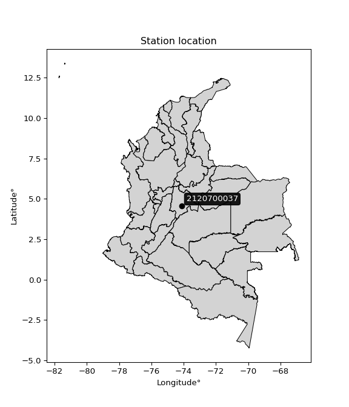

<div align="center">


</div>

# PMP Station (rain, Pmax24h): 2120700037

Probable Maximum Precipitation (PMP) is the greatest amount of rainfall for a specific duration that is meteorologically possible for a given location, acting as a "worst-case" scenario for extreme storms, crucial for designing safety-critical infrastructure like bridges, river deviations, dams, spillways, and nuclear plants to prevent catastrophic failure. PMP is calculated by hydrologists using meteorological data to determine the upper limit of extreme rainfall, often leading to the Probable Maximum Flood (PMF) for flood control design, and is increasingly being studied for climate change impacts.

<div align="center">

</img>

</div>


## A. General information


### 1. General running parameters

• app_version: _v20251228_. • runtime: _2025-12-28 08:43:48.795225_. • Python version: _3.14.0_. • SciPy version: _1.16.3_. • Pandas version: _2.3.3_. • NumPy version: _2.3.5_. • Stations dataset (station_dataset_file): _dataset/pmax24h_in/automatic_colombia_2003_2024.csv_. • Stations catalog (station_catalog_file): _dataset/CNE_IDEAM.xls_. • Minimum year to eval til year_max (date_min): _1900_. • Maximum year to eval since year_min (date_max): _2024_. • Creates, save and include plots into reports (create_plot): _False_. • Plot only fit distributions with Δo > Δ (plot_only_fit): _True_. • Eval low extreme values, if False, evaluates high extreme values (low_extreme): _False_. • Eval every SciPy distribution as logarithmic (pdist_logarithmic_on): _True_. • Standard deviation normalized (ddof): _1.0_. • Return periods to eval in years (Tr): _[2, 2.33, 5, 10, 15, 20, 25, 50, 75, 100, 200, 250, 500, 750, 1000]_. • Minimum data sample per station, 0 means any (minimum_sample): _5_. • Z-Score maximum threshold to adjust a value, 0 means disable (zscore_max): _3.5_. • Z-Score minimum threshold to adjust a value, 0 means disable (zscore_min): _-2.5_. • Avoid zeros, e.g. rain = 0 (avoid_zeros): _True_. • Avoid null values (avoid_nans): _True_. [:file_folder:Dataset file.](../../dataset/pmax24h_in/automatic_colombia_2003_2024.csv)

> Delta Degrees of Freedom (DDOF): is a parameter used in the formulas for calculating variance and standard deviation. When ddof=0, the divisor is $N$ (the total number of observations) and this is used when your data set is the entire population. When ddof=1, the divisor is $N-1$ and this is used when your data set is a sample drawn from a larger population. Using $N-1$ provides an unbiased estimate of the population variance (known as Bessel´s correction).


### 2. Station info and location

|   id |     CODIGO | NOMBRE                                            | CATEGORIA    | TECNOLOGIA                | ESTADO   | FECHA_INSTALACION   |   FECHA_SUSPENSION |   ALTITUD |   LATITUD |   LONGITUD | DEPARTAMENTO   | MUNICIPIO   | AREA_OPERATIVA                            | ENTIDAD                                                      | AREA_HIDROGRAFICA   | ZONA_HIDROGRAFICA   | SUBZONA_HIDROGRAFICA   | CORRIENTE   | Catalogo   |
|-----:|-----------:|:--------------------------------------------------|:-------------|:--------------------------|:---------|:--------------------|-------------------:|----------:|----------:|-----------:|:---------------|:------------|:------------------------------------------|:-------------------------------------------------------------|:--------------------|:--------------------|:-----------------------|:------------|:-----------|
|    0 | 2120700037 | CASAS FISCALES ESCUELA DE ARTILLERÍA [2120700037] | Limnigráfica | Automática con Telemetría | Activa   | 01/09/2014          |                nan |      2567 |   4.55644 |   -74.1252 | Bogotá         | Bogotá, D.C | Area Operativa 11 - Cundinamarca-Amazonas | INSTITUTO DISTRITAL DE GESTIÓN DE RIESGOS Y CAMBIO CLIMÁTICO | Magdalena Cauca     | Alto Magdalena      | Río Bogotá             | Chingaza    | CNE_OE     |

<div align="center">

Map location in: [:earth_americas:Google](http://maps.google.com/maps?q=4.556439,-74.125173) [:earth_americas:OSM](https://www.openstreetmap.org/#map=18/4.556439/-74.125173&layers=P) [:earth_americas:Bing](https://www.bing.com/maps?cp=4.556439~-74.125173&lvl=18) [:earth_americas:Apple](https://maps.apple.com/frame?center=4.556439%2C-74.125173&span=0.003%2C0.006)

</div>


<div align="center">

```geojson
{
  "type": "Feature",
  "geometry": {
    "type": "Point", 
    "coordinates": [-74.125173, 4.556439]
  }, 
  "properties": {
    "Name": "2120700037"
  }
}
```

</div>


### 3. Discrete values table and plot

|               |           0 |           1 |           2 |          3 |           4 |
|:--------------|------------:|------------:|------------:|-----------:|------------:|
| Date          | 2018        | 2019        | 2020        | 2023       | 2024        |
| Value         |    6.3      |   53.4      |   42.9      |    0.1     |   44.4      |
| Value_initial |    6.3      |   53.4      |   42.9      |    0.1     |   44.4      |
| count         |    5        |    5        |    5        |    5       |    5        |
| mean          |   29.42     |   29.42     |   29.42     |   29.42    |   29.42     |
| std           |   24.3688   |   24.3688   |   24.3688   |   24.3688  |   24.3688   |
| zscore        |   -0.948755 |    0.984046 |    0.553167 |   -1.20318 |    0.614721 |

> The initial value (value_initial) correspond to the initial obtained or null completed value, and value (value) is adjusted only when the initial value is outside the valid range definite through the Z-Score value. If Z-Score is active, values out of range or outliers are replaced with the station mean value


### 4. Active continuous probability distributions from SciPy (44 of 104 available)

[scipy.stats](https://docs.scipy.org/doc/scipy/reference/stats.html) is a Python´s powerful submodule within the SciPy library for comprehensive statistical analysis, offering over 130 probability distributions (like Normal, Poisson), functions for descriptive stats (mean, variance), hypothesis testing (t-tests, chi-square), random variable generation, and statistical tests, making it essential for data science, modeling, and research. It provides tools to explore, model, and draw conclusions from data efficiently, working seamlessly with NumPy.

<div align="center">

|   id | p_dist             |   n_parameter | fit_method   | label                                                                       | active   | ref                                                                                                        |
|-----:|:-------------------|--------------:|:-------------|:----------------------------------------------------------------------------|:---------|:-----------------------------------------------------------------------------------------------------------|
|    0 | alpha              |             3 | MLE          | Alpha                                                                       | True     | [:mortar_board:](https://docs.scipy.org/doc/scipy/reference/generated/scipy.stats.alpha.html)              |
|    1 | betaprime          |             4 | MLE          | Beta prime                                                                  | True     | [:mortar_board:](https://docs.scipy.org/doc/scipy/reference/generated/scipy.stats.betaprime.html)          |
|    2 | chi2               |             3 | MLE          | Chi²                                                                        | True     | [:mortar_board:](https://docs.scipy.org/doc/scipy/reference/generated/scipy.stats.chi2.html)               |
|    3 | crystalball        |             4 | MLE          | Crystalball                                                                 | True     | [:mortar_board:](https://docs.scipy.org/doc/scipy/reference/generated/scipy.stats.crystalball.html)        |
|    4 | erlang             |             3 | MLE          | Erlang                                                                      | True     | [:mortar_board:](https://docs.scipy.org/doc/scipy/reference/generated/scipy.stats.erlang.html)             |
|    5 | expon              |             2 | MLE          | Exponential                                                                 | True     | [:mortar_board:](https://docs.scipy.org/doc/scipy/reference/generated/scipy.stats.expon.html)              |
|    6 | exponnorm          |             3 | MLE          | Exponentially modified Normal                                               | True     | [:mortar_board:](https://docs.scipy.org/doc/scipy/reference/generated/scipy.stats.exponnorm.html)          |
|    7 | f                  |             4 | MLE          | F                                                                           | True     | [:mortar_board:](https://docs.scipy.org/doc/scipy/reference/generated/scipy.stats.f.html)                  |
|    8 | fatiguelife        |             3 | MLE          | Fatigue-life (Birnbaum-Saunders)                                            | True     | [:mortar_board:](https://docs.scipy.org/doc/scipy/reference/generated/scipy.stats.fatiguelife.html)        |
|    9 | fisk               |             3 | MLE          | Fisk                                                                        | True     | [:mortar_board:](https://docs.scipy.org/doc/scipy/reference/generated/scipy.stats.fisk.html)               |
|   10 | gamma              |             3 | MLE          | Gamma                                                                       | True     | [:mortar_board:](https://docs.scipy.org/doc/scipy/reference/generated/scipy.stats.gamma.html)              |
|   11 | genexpon           |             5 | MLE          | Generalized exponential                                                     | True     | [:mortar_board:](https://docs.scipy.org/doc/scipy/reference/generated/scipy.stats.genexpon.html)           |
|   12 | genlogistic        |             3 | MLE          | Generalized logistic                                                        | True     | [:mortar_board:](https://docs.scipy.org/doc/scipy/reference/generated/scipy.stats.genlogistic.html)        |
|   13 | gibrat             |             2 | MM           | Gibrat                                                                      | True     | [:mortar_board:](https://docs.scipy.org/doc/scipy/reference/generated/scipy.stats.gibrat.html)             |
|   14 | gompertz           |             3 | MLE          | Gompertz (or truncated Gumbel)                                              | True     | [:mortar_board:](https://docs.scipy.org/doc/scipy/reference/generated/scipy.stats.gompertz.html)           |
|   15 | gumbel_l           |             2 | MM           | Gumbel Left Skew                                                            | True     | [:mortar_board:](https://docs.scipy.org/doc/scipy/reference/generated/scipy.stats.gumbel_l.html)           |
|   16 | gumbel_r           |             2 | MM           | Gumbel Right Skew                                                           | True     | [:mortar_board:](https://docs.scipy.org/doc/scipy/reference/generated/scipy.stats.gumbel_r.html)           |
|   17 | halflogistic       |             2 | MM           | Half-logistic                                                               | True     | [:mortar_board:](https://docs.scipy.org/doc/scipy/reference/generated/scipy.stats.halflogistic.html)       |
|   18 | halfnorm           |             2 | MM           | Half Normal                                                                 | True     | [:mortar_board:](https://docs.scipy.org/doc/scipy/reference/generated/scipy.stats.halfnorm.html)           |
|   19 | hypsecant          |             2 | MM           | hyperbolic secant                                                           | True     | [:mortar_board:](https://docs.scipy.org/doc/scipy/reference/generated/scipy.stats.hypsecant.html)          |
|   20 | invgamma           |             3 | MLE          | Inverted gamma                                                              | True     | [:mortar_board:](https://docs.scipy.org/doc/scipy/reference/generated/scipy.stats.invgamma.html)           |
|   21 | invgauss           |             3 | MLE          | Inverse Gaussian                                                            | True     | [:mortar_board:](https://docs.scipy.org/doc/scipy/reference/generated/scipy.stats.invgauss.html)           |
|   22 | invweibull         |             3 | MLE          | Inverted Weibull                                                            | True     | [:mortar_board:](https://docs.scipy.org/doc/scipy/reference/generated/scipy.stats.invweibull.html)         |
|   23 | johnsonsu          |             4 | MLE          | Johnson Su                                                                  | True     | [:mortar_board:](https://docs.scipy.org/doc/scipy/reference/generated/scipy.stats.johnsonsu.html)          |
|   24 | kstwobign          |             2 | MLE          | Limiting distribution of scaled Kolmogorov-Smirnov two-sided test statistic | True     | [:mortar_board:](https://docs.scipy.org/doc/scipy/reference/generated/scipy.stats.kstwobign.html)          |
|   25 | laplace            |             2 | MM           | Laplace                                                                     | True     | [:mortar_board:](https://docs.scipy.org/doc/scipy/reference/generated/scipy.stats.laplace.html)            |
|   26 | laplace_asymmetric |             3 | MLE          | Asymmetric Laplace                                                          | True     | [:mortar_board:](https://docs.scipy.org/doc/scipy/reference/generated/scipy.stats.laplace_asymmetric.html) |
|   27 | loggamma           |             3 | MLE          | Log gamma                                                                   | True     | [:mortar_board:](https://docs.scipy.org/doc/scipy/reference/generated/scipy.stats.loggamma.html)           |
|   28 | logistic           |             2 | MM           | Logistic (or Sech-squared)                                                  | True     | [:mortar_board:](https://docs.scipy.org/doc/scipy/reference/generated/scipy.stats.logistic.html)           |
|   29 | lognorm            |             3 | MLE          | Log Normal                                                                  | True     | [:mortar_board:](https://docs.scipy.org/doc/scipy/reference/generated/scipy.stats.lognorm.html)            |
|   30 | maxwell            |             2 | MM           | Maxwell                                                                     | True     | [:mortar_board:](https://docs.scipy.org/doc/scipy/reference/generated/scipy.stats.maxwell.html)            |
|   31 | mielke             |             4 | MLE          | Mielke Beta-Kappa / Dagum                                                   | True     | [:mortar_board:](https://docs.scipy.org/doc/scipy/reference/generated/scipy.stats.mielke.html)             |
|   32 | moyal              |             2 | MM           | Moyal                                                                       | True     | [:mortar_board:](https://docs.scipy.org/doc/scipy/reference/generated/scipy.stats.moyal.html)              |
|   33 | nakagami           |             3 | MLE          | Nakagami                                                                    | True     | [:mortar_board:](https://docs.scipy.org/doc/scipy/reference/generated/scipy.stats.nakagami.html)           |
|   34 | ncf                |             5 | MLE          | Non-central F distribution                                                  | True     | [:mortar_board:](https://docs.scipy.org/doc/scipy/reference/generated/scipy.stats.ncf.html)                |
|   35 | nct                |             4 | MLE          | Non-central Student’s t                                                     | True     | [:mortar_board:](https://docs.scipy.org/doc/scipy/reference/generated/scipy.stats.nct.html)                |
|   36 | norm               |             2 | MM           | Normal                                                                      | True     | [:mortar_board:](https://docs.scipy.org/doc/scipy/reference/generated/scipy.stats.norm.html)               |
|   37 | pearson3           |             3 | MM           | Pearson type III                                                            | True     | [:mortar_board:](https://docs.scipy.org/doc/scipy/reference/generated/scipy.stats.pearson3.html)           |
|   38 | rayleigh           |             2 | MM           | Rayleigh                                                                    | True     | [:mortar_board:](https://docs.scipy.org/doc/scipy/reference/generated/scipy.stats.rayleigh.html)           |
|   39 | rice               |             3 | MLE          | Rice                                                                        | True     | [:mortar_board:](https://docs.scipy.org/doc/scipy/reference/generated/scipy.stats.rice.html)               |
|   40 | t                  |             3 | MLE          | Student’s t                                                                 | True     | [:mortar_board:](https://docs.scipy.org/doc/scipy/reference/generated/scipy.stats.t.html)                  |
|   41 | truncnorm          |             4 | MLE          | Truncated normal                                                            | True     | [:mortar_board:](https://docs.scipy.org/doc/scipy/reference/generated/scipy.stats.truncnorm.html)          |
|   42 | wald               |             2 | MM           | Wald                                                                        | True     | [:mortar_board:](https://docs.scipy.org/doc/scipy/reference/generated/scipy.stats.wald.html)               |
|   43 | weibull_min        |             3 | MLE          | Weibull minimum                                                             | True     | [:mortar_board:](https://docs.scipy.org/doc/scipy/reference/generated/scipy.stats.weibull_min.html)        |

</div>

> **n_parameter:** # arguments & localization & scale.
>
> **Fit methods:** (MLE) maximum likelihood, (MM) L-moments.
>
>**Inactive:** foldnorm, gennorm, norminvgauss, powernorm, powerlognorm, skewnorm, genextreme, anglit, arcsine, argus, beta, bradford, burr, burr12, cauchy, cosine, halfcauchy, foldcauchy, skewcauchy, wrapcauchy, dgamma, gengamma, exponweib, exponpow, truncexpon, gausshyper, genhalflogistic, genhyperbolic, geninvgauss, halfgennorm, johnsonsb, kappa4, kappa3, ksone, kstwo, loglaplace, levy, levy_l, levy_stable, ncx2, pareto, genpareto, truncpareto, lomax, powerlaw, rdist, rel_breitwigner, recipinvgauss, semicircular, studentized_range, trapezoid, triang, truncweibull_min, tukeylambda, uniform, loguniform, vonmises, vonmises_line, weibull_max, dweibull, 


## B. Probability distributions vs. Empirical distributions

A continuous probability distribution (CPD) describes probabilities for variables that can take any value within a range (like rain any time), unlike discrete variables with specific outcomes (like temperature). It uses a Probability Density Function (PDF), a curve where the total area under it equals 1, and the probability of the variable falling within an interval (a to b) is found by calculating the area under the curve between those points. A key feature is that the probability of hitting any single exact value is zero, so probabilities are always expressed for ranges, e.g., $P(a ≤ X ≤ b)$.

<div align="center">

Distributions parameters from station values
|    |    station | p_dist                |   n |             loc |           scale | shape                 | shape1                 | shape2               | shape3   |
|---:|-----------:|:----------------------|----:|----------------:|----------------:|:----------------------|:-----------------------|:---------------------|:---------|
|  0 | 2120700037 | alpha                 |   5 |    -9.5548      |    17.8656      | 2.52572207126255e-09  |                        |                      |          |
|  1 | 2120700037 | betaprime             |   5 |     0.1         |    22.842       | 0.4143495482283541    | 0.600883845008858      |                      |          |
|  2 | 2120700037 | chi2                  |   5 |     0.1         |     2.67881     | 1.1119891431606517    |                        |                      |          |
|  3 | 2120700037 | crystalball           |   5 |    29.42        |    21.7961      | 1990.561366001984     | 3626.1011380609953     |                      |          |
|  4 | 2120700037 | erlang                |   5 |  -307.927       |     1.45814     | 231.25834074513926    |                        |                      |          |
|  5 | 2120700037 | expon                 |   5 |     0.1         |    29.32        |                       |                        |                      |          |
|  6 | 2120700037 | exponnorm             |   5 |    29.3971      |    21.796       | 0.0010446632337933793 |                        |                      |          |
|  7 | 2120700037 | f                     |   5 |     0.1         |     9.00772     | 0.3064118528650032    | 67.5983505192253       |                      |          |
|  8 | 2120700037 | fatiguelife           |   5 |     0.1         |     3.80768e-05 | 977.5947644727325     |                        |                      |          |
|  9 | 2120700037 | fisk                  |   5 |     0.1         |    19.5298      | 0.6335045619528357    |                        |                      |          |
| 10 | 2120700037 | gamma                 |   5 |  -303.345       |     1.4662      | 226.9601728131498     |                        |                      |          |
| 11 | 2120700037 | genexpon              |   5 |     0.1         |     1.32104     | 0.04505563526417603   | 1.4754812399600667e-09 | 11.208097542412927   |          |
| 12 | 2120700037 | genlogistic           |   5 |    53.4002      |     1.55897e-05 | 6.50080524017137e-07  |                        |                      |          |
| 13 | 2120700037 | gibrat                |   5 |    12.7923      |    10.0852      |                       |                        |                      |          |
| 14 | 2120700037 | gompertz              |   5 |     0.1         |    30.7462      | 0.4491803204571242    |                        |                      |          |
| 15 | 2120700037 | gumbel_l              |   5 |    39.2294      |    16.9943      |                       |                        |                      |          |
| 16 | 2120700037 | gumbel_r              |   5 |    19.6106      |    16.9943      |                       |                        |                      |          |
| 17 | 2120700037 | halflogistic          |   5 |     3.58647     |    18.6349      |                       |                        |                      |          |
| 18 | 2120700037 | halfnorm              |   5 |     0.570535    |    36.1575      |                       |                        |                      |          |
| 19 | 2120700037 | hypsecant             |   5 |    29.42        |    13.8758      |                       |                        |                      |          |
| 20 | 2120700037 | invgamma              |   5 |     0.1         |     1.63166e-16 | 0.10945682920742253   |                        |                      |          |
| 21 | 2120700037 | invgauss              |   5 |   -49.2944      |   808.994       | 0.0971369743659169    |                        |                      |          |
| 22 | 2120700037 | invweibull            |   5 |     0.1         |     2.59861     | 0.07412819377190881   |                        |                      |          |
| 23 | 2120700037 | johnsonsu             |   5 |    53.4026      |     2.9744e-07  | 6.032961789679984     | 0.35880730063928934    |                      |          |
| 24 | 2120700037 | kstwobign             |   5 |   -49.6795      |    89.8118      |                       |                        |                      |          |
| 25 | 2120700037 | laplace               |   5 |    29.42        |    15.4122      |                       |                        |                      |          |
| 26 | 2120700037 | laplace_asymmetric    |   5 |    44.4         |    12.7485      | 1.7473390550465915    |                        |                      |          |
| 27 | 2120700037 | loggamma              |   5 |    53.4012      |     1.31418e-05 | 5.473233182100679e-07 |                        |                      |          |
| 28 | 2120700037 | logistic              |   5 |    29.42        |    12.0168      |                       |                        |                      |          |
| 29 | 2120700037 | lognorm               |   5 |     0.1         |     0.0061356   | 16.879541813496353    |                        |                      |          |
| 30 | 2120700037 | maxwell               |   5 |   -22.2276      |    32.3653      |                       |                        |                      |          |
| 31 | 2120700037 | mielke                |   5 |     0.1         |    56.8785      | 0.5074874679786855    | 37.88653092066704      |                      |          |
| 32 | 2120700037 | moyal                 |   5 |    16.9556      |     9.81169     |                       |                        |                      |          |
| 33 | 2120700037 | nakagami              |   5 |     0.1         |    33.7779      | 0.135947315026396     |                        |                      |          |
| 34 | 2120700037 | ncf                   |   5 |     0.1         |     1.56167     | 0.2260907096827235    | 19.838116501451122     | 5.334857287928463    |          |
| 35 | 2120700037 | nct                   |   5 |     0.1         |     8.47924e-12 | 0.11762700192931111   | 21.293663197416446     |                      |          |
| 36 | 2120700037 | norm                  |   5 |    29.42        |    21.7961      |                       |                        |                      |          |
| 37 | 2120700037 | pearson3              |   5 |    29.42        |    21.7961      | -0.3469675242505099   |                        |                      |          |
| 38 | 2120700037 | rayleigh              |   5 |   -12.2772      |    33.2695      |                       |                        |                      |          |
| 39 | 2120700037 | rice                  |   5 |   -13.2823      |    25.688       | 1.2179253390239997    |                        |                      |          |
| 40 | 2120700037 | t                     |   5 |    29.4275      |    21.7966      | 1623148.1321006296    |                        |                      |          |
| 41 | 2120700037 | truncnorm             |   5 |    20.6359      |    27.0694      | -0.7586394615245562   | 1384.869000538607      |                      |          |
| 42 | 2120700037 | wald                  |   5 |     7.6239      |    21.7961      |                       |                        |                      |          |
| 43 | 2120700037 | weibull_min           |   5 |    -5.47292e+08 |     5.47292e+08 | 32672751.026619613    |                        |                      |          |
| 44 | 2120700037 | logalpha              |   5 |   -63.135       |  1703.53        | 26.093395264303666    |                        |                      |          |
| 45 | 2120700037 | logbetaprime          |   5 |    -2.30259     |     2.24469     | 0.13252995711395427   | 1.0183210527378765     |                      |          |
| 46 | 2120700037 | logchi2               |   5 |    -2.30259     |     1.27178     | 0.9866940362475685    |                        |                      |          |
| 47 | 2120700037 | logcrystalball        |   5 |     2.21358     |     2.38875     | 7.445577746804451     | 98.29304064331377      |                      |          |
| 48 | 2120700037 | logerlang             |   5 |   -38.0011      |     0.151979    | 264.3319185840405     |                        |                      |          |
| 49 | 2120700037 | logexpon              |   5 |    -2.30259     |     4.51616     |                       |                        |                      |          |
| 50 | 2120700037 | logexponnorm          |   5 |     2.21194     |     2.38875     | 0.000691378200828711  |                        |                      |          |
| 51 | 2120700037 | logf                  |   5 |    -2.30259     |     1.02716     | 1.1231750700333214    | 1.0968284210946289     |                      |          |
| 52 | 2120700037 | logfatiguelife        |   5 |    -2.30259     |     1.75499e-06 | 1362.1702989371595    |                        |                      |          |
| 53 | 2120700037 | logfisk               |   5 |    -2.30259     |     3.45443     | 0.13845378911592815   |                        |                      |          |
| 54 | 2120700037 | loggamma              |   5 |   -38.4187      |     0.154242    | 263.1244432277032     |                        |                      |          |
| 55 | 2120700037 | loggenexpon           |   5 |    -2.36144     |     2.04954     | 0.18347042234331656   | 11.825521134159466     | 0.015625390584124967 |          |
| 56 | 2120700037 | loggenlogistic        |   5 |     3.97793     |     1.2473e-05  | 7.055872075242397e-06 |                        |                      |          |
| 57 | 2120700037 | loggibrat             |   5 |     0.391217    |     1.10531     |                       |                        |                      |          |
| 58 | 2120700037 | loggompertz           |   5 |    -2.30259     |     2.43277     | 0.13006536857253978   |                        |                      |          |
| 59 | 2120700037 | loggumbel_l           |   5 |     3.28864     |     1.8625      |                       |                        |                      |          |
| 60 | 2120700037 | loggumbel_r           |   5 |     1.13851     |     1.8625      |                       |                        |                      |          |
| 61 | 2120700037 | loghalflogistic       |   5 |    -0.617688    |     2.04231     |                       |                        |                      |          |
| 62 | 2120700037 | loghalfnorm           |   5 |    -0.948223    |     3.96271     |                       |                        |                      |          |
| 63 | 2120700037 | loghypsecant          |   5 |     2.21358     |     1.52073     |                       |                        |                      |          |
| 64 | 2120700037 | loginvgamma           |   5 |   -52.5798      | 26314.9         | 481.66833647787564    |                        |                      |          |
| 65 | 2120700037 | loginvgauss           |   5 |   -18.4364      |  1262.79        | 0.016363395179986015  |                        |                      |          |
| 66 | 2120700037 | loginvweibull         |   5 |    -2.83523e+08 |     2.83523e+08 | 104656620.81444138    |                        |                      |          |
| 67 | 2120700037 | logjohnsonsu          |   5 |     3.97781     |     1.79433e-15 | 2.136291712291337     | 0.12152648715078455    |                      |          |
| 68 | 2120700037 | logkstwobign          |   5 |    -8.51395     |    12.2237      |                       |                        |                      |          |
| 69 | 2120700037 | loglaplace            |   5 |     2.21358     |     1.6891      |                       |                        |                      |          |
| 70 | 2120700037 | loglaplace_asymmetric |   5 |     3.97791     |     0.020306    | 86.9368107257965      |                        |                      |          |
| 71 | 2120700037 | logloggamma           |   5 |     3.97786     |     1.47369e-06 | 8.366171250398359e-07 |                        |                      |          |
| 72 | 2120700037 | loglogistic           |   5 |     2.21358     |     1.31699     |                       |                        |                      |          |
| 73 | 2120700037 | loglognorm            |   5 |    -2.30259     |     0.0090531   | 4.388421719740872     |                        |                      |          |
| 74 | 2120700037 | logmaxwell            |   5 |    -3.44676     |     3.54709     |                       |                        |                      |          |
| 75 | 2120700037 | logmielke             |   5 |    -2.30259     |     1.81083     | 0.9071623721239754    | 0.7863939866597546     |                      |          |
| 76 | 2120700037 | logmoyal              |   5 |     0.847536    |     1.07532     |                       |                        |                      |          |
| 77 | 2120700037 | lognakagami           |   5 | -1537.38        |  1539.61        | 103398.46195541075    |                        |                      |          |
| 78 | 2120700037 | logncf                |   5 |    -2.30259     |     1.02297     | 1.0984343049139431    | 1.1027823351717814     | 1.026952994433527    |          |
| 79 | 2120700037 | lognct                |   5 |  -121.319       |     2.33467     | 26553.051778213878    | 52.91064175225401      |                      |          |
| 80 | 2120700037 | lognorm               |   5 |     2.21358     |     2.38875     |                       |                        |                      |          |
| 81 | 2120700037 | logpearson3           |   5 |     2.21359     |     2.38872     | -1.1597677277304883   |                        |                      |          |
| 82 | 2120700037 | lograyleigh           |   5 |    -2.35624     |     3.64619     |                       |                        |                      |          |
| 83 | 2120700037 | logrice               |   5 |    -4.12405     |     2.57861     | 2.2133247991707434    |                        |                      |          |
| 84 | 2120700037 | logt                  |   5 |     2.21358     |     2.38875     | 425107788147.0337     |                        |                      |          |
| 85 | 2120700037 | logtruncnorm          |   5 |     1.86672     |     2.69725     | -1.5457620971892736   | 4.285478969701378      |                      |          |
| 86 | 2120700037 | logwald               |   5 |    -0.175133    |     2.38873     |                       |                        |                      |          |
| 87 | 2120700037 | logweibull_min        |   5 |    -2.30259     |     1.60115     | 0.3845668127028177    |                        |                      |          |

</div>

> **loc** (Location parameter): This shifts the distribution along the x-axis. For many common distributions, like the normal (Gaussian) distribution, loc represents the mean $μ$. For others, like the uniform distribution, it might represent the minimum value, or for the beta distribution, the left end of the support interval.
>
> **scale** (Scale parameter): This determines the width or spread of the distribution. For the normal distribution, scale represents the standard deviation $σ$. For a uniform distribution, it defines the length of the interval (from $loc$ to $loc + scale$).
>
> **shape** (Shape parameters): Refers to parameters that define the specific form of a probability distribution, distinct from its location (loc) and scale (scale). These parameters are required arguments for most distribution functions. For example, a normal (Gaussian) distribution is fully defined by its location (mean) and scale (standard deviation), so it has no specific shape parameters beyond loc and scale. However, other distributions have intrinsic properties that need specification, as Gamma distribution that takes a shape parameter, often named $a$ or $alpha$.


### 0. Cumulative distribution values - CDF (88 evaluated)

Cumulative Distribution Function (CDF), denoted as $F$<sub>$X$</sub>$(x)$, is a function that gives the probability that a random variable $X$ will take a value less than or equal to a specific value, $x$ (i.e., $(P(X≥x)$. It essentially "accumulates" probabilities from a given point up to the far right (positive infinity), providing a complete picture of the distribution´s probabilities for both discrete (like rain) and continuous (like temperature) variables, helping to find probabilities over ranges or above certain values.

<div align="center">

CDF ordered by x ascending and calculating $log(f(x))$ separately
|   id |    Station |   date |    x |   count |   mean |     std |    zscore |   Value_initial |    station |   m |     alpha |   alpha_pdf |   betaprime |   betaprime_pdf |        chi2 |    chi2_pdf |   crystalball |   crystalball_pdf |    erlang |   erlang_pdf |    expon |   expon_pdf |   exponnorm |   exponnorm_pdf |          f |       f_pdf |   fatiguelife |   fatiguelife_pdf |        fisk |        fisk_pdf |     gamma |   gamma_pdf |    genexpon |   genexpon_pdf |   genlogistic |   genlogistic_pdf |   gibrat |   gibrat_pdf |   gompertz |   gompertz_pdf |   gumbel_l |   gumbel_l_pdf |   gumbel_r |   gumbel_r_pdf |   halflogistic |   halflogistic_pdf |   halfnorm |   halfnorm_pdf |   hypsecant |   hypsecant_pdf |   invgamma |   invgamma_pdf |   invgauss |   invgauss_pdf |   invweibull |   invweibull_pdf |   johnsonsu |   johnsonsu_pdf |   kstwobign |   kstwobign_pdf |   laplace |   laplace_pdf |   laplace_asymmetric |   laplace_asymmetric_pdf |   loggamma |   loggamma_pdf |   logistic |   logistic_pdf |   lognorm |   lognorm_pdf |   maxwell |   maxwell_pdf |      mielke |     mielke_pdf |     moyal |   moyal_pdf |    nakagami |   nakagami_pdf |         ncf |    ncf_pdf |       nct |     nct_pdf |      norm |   norm_pdf |   pearson3 |   pearson3_pdf |   rayleigh |   rayleigh_pdf |      rice |   rice_pdf |         t |      t_pdf |   truncnorm |   truncnorm_pdf |     wald |   wald_pdf |   weibull_min |   weibull_min_pdf |   logalpha |   logalpha_pdf |   logbetaprime |   logbetaprime_pdf |     logchi2 |   logchi2_pdf |   logcrystalball |   logcrystalball_pdf |   logerlang |   logerlang_pdf |   logexpon |   logexpon_pdf |   logexponnorm |   logexponnorm_pdf |        logf |    logf_pdf |   logfatiguelife |   logfatiguelife_pdf |    logfisk |   logfisk_pdf |   loggenexpon |   loggenexpon_pdf |   loggenlogistic |   loggenlogistic_pdf |   loggibrat |   loggibrat_pdf |   loggompertz |   loggompertz_pdf |   loggumbel_l |   loggumbel_l_pdf |   loggumbel_r |   loggumbel_r_pdf |   loghalflogistic |   loghalflogistic_pdf |   loghalfnorm |   loghalfnorm_pdf |   loghypsecant |   loghypsecant_pdf |   loginvgamma |   loginvgamma_pdf |   loginvgauss |   loginvgauss_pdf |   loginvweibull |   loginvweibull_pdf |   logjohnsonsu |   logjohnsonsu_pdf |   logkstwobign |   logkstwobign_pdf |   loglaplace |   loglaplace_pdf |   loglaplace_asymmetric |   loglaplace_asymmetric_pdf |   logloggamma |   logloggamma_pdf |   loglogistic |   loglogistic_pdf |   loglognorm |   loglognorm_pdf |   logmaxwell |   logmaxwell_pdf |   logmielke |   logmielke_pdf |    logmoyal |   logmoyal_pdf |   lognakagami |   lognakagami_pdf |      logncf |   logncf_pdf |   lognct |   lognct_pdf |   logpearson3 |   logpearson3_pdf |   lograyleigh |   lograyleigh_pdf |   logrice |   logrice_pdf |      logt |   logt_pdf |   logtruncnorm |   logtruncnorm_pdf |   logwald |   logwald_pdf |   logweibull_min |   logweibull_min_pdf |
|-----:|-----------:|-------:|-----:|--------:|-------:|--------:|----------:|----------------:|-----------:|----:|----------:|------------:|------------:|----------------:|------------:|------------:|--------------:|------------------:|----------:|-------------:|---------:|------------:|------------:|----------------:|-----------:|------------:|--------------:|------------------:|------------:|----------------:|----------:|------------:|------------:|---------------:|--------------:|------------------:|---------:|-------------:|-----------:|---------------:|-----------:|---------------:|-----------:|---------------:|---------------:|-------------------:|-----------:|---------------:|------------:|----------------:|-----------:|---------------:|-----------:|---------------:|-------------:|-----------------:|------------:|----------------:|------------:|----------------:|----------:|--------------:|---------------------:|-------------------------:|-----------:|---------------:|-----------:|---------------:|----------:|--------------:|----------:|--------------:|------------:|---------------:|----------:|------------:|------------:|---------------:|------------:|-----------:|----------:|------------:|----------:|-----------:|-----------:|---------------:|-----------:|---------------:|----------:|-----------:|----------:|-----------:|------------:|----------------:|---------:|-----------:|--------------:|------------------:|-----------:|---------------:|---------------:|-------------------:|------------:|--------------:|-----------------:|---------------------:|------------:|----------------:|-----------:|---------------:|---------------:|-------------------:|------------:|------------:|-----------------:|---------------------:|-----------:|--------------:|--------------:|------------------:|-----------------:|---------------------:|------------:|----------------:|--------------:|------------------:|--------------:|------------------:|--------------:|------------------:|------------------:|----------------------:|--------------:|------------------:|---------------:|-------------------:|--------------:|------------------:|--------------:|------------------:|----------------:|--------------------:|---------------:|-------------------:|---------------:|-------------------:|-------------:|-----------------:|------------------------:|----------------------------:|--------------:|------------------:|--------------:|------------------:|-------------:|-----------------:|-------------:|-----------------:|------------:|----------------:|------------:|---------------:|--------------:|------------------:|------------:|-------------:|---------:|-------------:|--------------:|------------------:|--------------:|------------------:|----------:|--------------:|----------:|-----------:|---------------:|-------------------:|----------:|--------------:|-----------------:|---------------------:|
|    0 | 2120700037 |   2023 |  0.1 |       5 |  29.42 | 24.3688 | -1.20318  |             0.1 | 2120700037 |   1 | 0.0642511 |  0.0276017  | 2.12924e-08 |     6.35728e+08 | 1.87439e-10 | 7.50947e+06 |     0.0892811 |        0.00740615 | 0.0911309 |   0.00785221 | 0        |  0.0341064  |   0.0892816 |      0.00740619 | 0.00149963 | 1.65554e+13 |     0.0691102 |       5.43579e+09 | 3.18361e-12 | 145328          | 0.0890899 |  0.00776013 | 6.60657e-10 |     0.0341062  |      0        |        0.00451724 | 0        |   0          | 2.8684e-12 |      0.0146093 |  0.0951707 |     0.00532477 |  0.0427628 |     0.00793159 |      0         |         0          |   0        |     0          |   0.0765777 |      0.0054657  |  0.0876929 |    1.57757e+14 |  0.0855261 |     0.0105606  |  5.00195e-07 |      9.69077e+08 |    0.150444 |      0.0015726  |   0.0815302 |      0.0115167  | 0.0746055 |    0.00484069 |             0.103104 |               0.00462852 |   0.033222 |      0.0319894 |  0.0801792 |     0.00613728 | 0.0293392 |     0.0279627 | 0.0758486 |    0.00924786 | 1.32874e-07 | 42084.5        | 0.0182409 |  0.00591661 | 8.14561e-06 |    1.59589e+11 | 0.000674129 | 5.4913e+12 | 0.0240586 | 1.13242e+09 | 0.0892811 | 0.00740615 |  0.0951569 |     0.00675333 |  0.0668621 |     0.0104346  | 0.0634642 | 0.00930447 | 0.0892304 | 0.00740285 | 5.62886e-08 |      0.0142434  | 0        | 0          |     0.0892371 |        0.00508225 |  0.0280514 |      0.0296223 |     0.00832446 |        2.48428e+12 | 1.89847e-08 |   2.10905e+07 |        0.0293392 |            0.0279627 |   0.0312917 |       0.0308597 |   0        |      0.221427  |      0.0293387 |          0.0279623 | 1.56691e-09 | 1.98149e+06 |         0.034597 |           2.4278e+11 | 0.00626777 |   1.94186e+12 |    0.00533018 |         0.0916153 |         0        |            0.0162032 |    0        |       0         |   3.30183e-07 |         0.0534639 |     0.0484734 |         0.0253847 |    0.00175661 |        0.00598367 |          0        |             0         |      0        |         0         |      0.0326405 |          0.0214262 |      0.031154 |         0.0315095 |     0.0300761 |         0.0333629 |       0.0378482 |           0.045743  |      0.0107932 |        0.000551204 |      0.0415017 |          0.057167  |     0.034498 |        0.0204239 |               0.0285013 |                    0.016145 |     0.0282852 |         0.0160576 |     0.0313964 |         0.0230911 |  5.73789e-06 |  152644          |   0.00865293 |        0.0222185 | 6.89961e-15 |      14.0942    | 1.51547e-05 |    0.000138339 |     0.0293389 |         0.0279287 | 1.44797e-09 |  1.79075e+06 | 0.029522 |    0.0281281 |     0.0508284 |         0.0268648 |   0.000108277 |        0.00403561 | 0.0252333 |     0.0315352 | 0.0293392 |  0.0279627 |    2.69954e-11 |           0.0477   |  0        |     0         |      1.04066e-06 |          9.01178e+08 |
|    1 | 2120700037 |   2018 |  6.3 |       5 |  29.42 | 24.3688 | -0.948755 |             6.3 | 2120700037 |   2 | 0.259817  |  0.030055   | 0.407448    |     0.0229413   | 0.852956    | 0.0343797   |     0.144404  |        0.0104281  | 0.149454  |   0.0109949  | 0.190598 |  0.0276058  |   0.144405  |      0.0104281  | 0.748342   | 0.0168667   |     0.660111  |       0.0121955   | 0.32588     |      0.0224467  | 0.146887  |  0.0109208  | 0.190597    |     0.0276057  |      0        |        0.00584997 | 0        |   0          | 0.095485   |      0.0161667 |  0.134146  |     0.00733874 |  0.11208   |     0.0144337  |      0.0726793 |         0.0266896  |   0.125905 |     0.0217916  |   0.118895  |      0.00837066 |  0.983834  |    0.000285401 |  0.164357  |     0.0146863  |  0.391577    |      0.00438949  |    0.161047 |      0.00186136 |   0.167985  |      0.0160578  | 0.111552  |    0.00723794 |             0.136193 |               0.0061139  |   0.45625  |      0.159328  |  0.127419  |     0.00925235 | 0.437953  |     0.164985  | 0.145018  |    0.0129875  | 0.324724    |     0.0265796  | 0.0852197 |  0.0159113  | 0.512443    |    0.0223822   | 0.13903     | 0.0144788  | 0.94967   | 0.000954868 | 0.144404  | 0.0104281  |  0.144822  |     0.00933515 |  0.144352  |     0.0143609  | 0.132862  | 0.0129747  | 0.144331  | 0.0104243  | 0.0955727   |      0.0165076  | 0        | 0          |     0.126583  |        0.00705699 |  0.450421  |      0.159731  |     0.945998   |        0.0104499   | 0.930245    |   0.0335349   |        0.437953  |            0.164985  |   0.454631  |       0.161281  |   0.600444 |      0.0884724 |      0.437951  |          0.164985  | 0.716465    | 0.0321611   |         0.870333 |           0.0287455  | 0.506292   |   0.00835309  |    0.532514   |         0.126889  |         0        |            0.16884   |    0.606794 |       0.265337  |   0.442382    |         0.16369   |     0.368435  |         0.155833  |    0.503605   |        0.185479   |          0.538349 |             0.173867  |      0.518414 |         0.157181  |      0.422691  |          0.203171  |      0.459871 |         0.160272  |     0.466464  |         0.153582  |       0.491922  |           0.128821  |      0.0151337 |        0.00216982  |      0.530238  |          0.124881  |     0.400921 |        0.237357  |               0.297938  |                    0.168771 |     0.297199  |         0.16872   |     0.429659  |         0.18607   |  0.918638    |       0.00828154 |   0.472353   |        0.164556  | 0.616178    |       0.0462481 | 0.528569    |    0.191694    |     0.436819  |         0.164562  | 0.608059    |  0.0401196   | 0.438438 |    0.164604  |     0.365076  |         0.147223  |   0.484393    |        0.162764   | 0.448562  |     0.161775  | 0.437953  |  0.164985  |    0.463355    |           0.157523 |  0.597748 |     0.212366  |      0.763406    |          0.0316544   |
|    2 | 2120700037 |   2020 | 42.9 |       5 |  29.42 | 24.3688 |  0.553167 |            42.9 | 2120700037 |   3 | 0.733413  |  0.00488874 | 0.699391    |     0.00323353  | 0.99992     | 1.57369e-05 |     0.731864  |        0.0151173  | 0.735009  |   0.0143852  | 0.767707 |  0.00792269 |   0.731866  |      0.0151173  | 0.93789    | 0.00177113  |     0.86093   |       0.00280718  | 0.621765    |      0.00348092 | 0.733724  |  0.0144754  | 0.767705    |     0.00792271 |      0        |        0.0269137  | 0.862959 |   0.00728584 | 0.7428     |      0.0151167 |  0.710931  |     0.0211106  |  0.775692  |     0.0115936  |      0.783679  |         0.0103528  |   0.75828  |     0.0111208  |   0.769635  |      0.0151902  |  0.986915  |    3.34629e-05 |  0.749154  |     0.0112373  |  0.44376     |      0.000624447 |    0.325743 |      0.0123075  |   0.76158   |      0.0108899  | 0.791493  |    0.0135288  |             0.704227 |               0.0316139  |   0.74182  |      0.125893  |  0.754315  |     0.015422   | 0.741153  |     0.135477  | 0.743801  |    0.0131812  | 0.865611    |     0.0102635  | 0.7898    |  0.0104604  | 0.8456      |    0.00442772  | 0.616413    | 0.00969458 | 0.959901  | 0.000110204 | 0.731864  | 0.0151173  |  0.72028   |     0.0166422  |  0.747235  |     0.0126004  | 0.740216  | 0.0138518  | 0.731745  | 0.0151203  | 0.735296    |      0.0135423  | 0.832749 | 0.00789878 |     0.699783  |        0.0215654  |  0.734755  |      0.124753  |     0.960605   |        0.00555284  | 0.971574    |   0.0130087   |        0.741153  |            0.135477  |   0.743577  |       0.127002  |   0.738722 |      0.057854  |      0.741152  |          0.135478  | 0.763911    | 0.0191493   |         0.913768 |           0.0177021  | 0.519453   |   0.00570177  |    0.743103   |         0.0905711 |         0        |            0.499763  |    0.867379 |       0.0636885 |   0.763351    |         0.152843  |     0.723958  |         0.190777  |    0.782782   |        0.102928   |          0.790016 |             0.0920221 |      0.765106 |         0.0994391 |      0.778895  |          0.133981  |      0.744127 |         0.124031  |     0.733698  |         0.115955  |       0.705076  |           0.0909492 |      0.0294005 |        0.0371408   |      0.734282  |          0.0866811 |     0.799714 |        0.118575  |               0.883194  |                    0.500297 |     0.883097  |         0.501335  |     0.763751  |         0.137006  |  0.930919    |       0.00499649 |   0.751893   |        0.117916  | 0.685821    |       0.028623  | 0.796191    |    0.0926785   |     0.739618  |         0.135549  | 0.668622    |  0.0249837   | 0.740701 |    0.135051  |     0.709139  |         0.195898  |   0.75497     |        0.112706   | 0.741315  |     0.129961  | 0.741153  |  0.135477  |    0.742806    |           0.123169 |  0.837561 |     0.0695926 |      0.811477    |          0.019957    |
|    3 | 2120700037 |   2024 | 44.4 |       5 |  29.42 | 24.3688 |  0.614721 |            44.4 | 2120700037 |   4 | 0.740553  |  0.00463541 | 0.704137    |     0.00309708  | 0.99994     | 1.17135e-05 |     0.754047  |        0.0144531  | 0.756102  |   0.0137342  | 0.779292 |  0.00752756 |   0.754049  |      0.0144531  | 0.940476   | 0.00167761  |     0.865062  |       0.00270296  | 0.626883    |      0.00334486 | 0.75495   |  0.0138209  | 0.77929     |     0.00752759 |      0        |        0.0286509  | 0.873342 |   0.0065729  | 0.765018   |      0.0145013 |  0.742211  |     0.0205635  |  0.792517  |     0.0108444  |      0.798725  |         0.00971396 |   0.774558 |     0.0105845  |   0.791504  |      0.0139742  |  0.986965  |    3.22081e-05 |  0.76558   |     0.0106655  |  0.44468     |      0.000603013 |    0.345903 |      0.0146988  |   0.777499  |      0.0103374  | 0.81083   |    0.0122741  |             0.753281 |               0.033816   |   0.746126 |      0.124725  |  0.776708  |     0.0144325  | 0.745787  |     0.134208  | 0.763103  |    0.0125535  | 0.880875    |     0.0100903  | 0.804944  |  0.00973953 | 0.852108    |    0.00425135  | 0.630719    | 0.00938096 | 0.960063  | 0.000106042 | 0.754047  | 0.0144531  |  0.744796  |     0.0160343  |  0.765684  |     0.0119982  | 0.760517  | 0.0132126  | 0.753933  | 0.0144564  | 0.755144    |      0.0129191  | 0.84411  | 0.00726041 |     0.731786  |        0.0210714  |  0.739022  |      0.123596  |     0.960795   |        0.00549947  | 0.972017    |   0.0127974   |        0.745787  |            0.134208  |   0.747921  |       0.125801  |   0.740703 |      0.0574154 |      0.745786  |          0.134209  | 0.764567    | 0.0189993   |         0.914374 |           0.0175593  | 0.519648   |   0.00566945  |    0.746203   |         0.0898442 |         0        |            0.509575  |    0.869545 |       0.0623328 |   0.768582    |         0.151591  |     0.730497  |         0.189726  |    0.786295   |        0.1015     |          0.793158 |             0.0908044 |      0.768506 |         0.0984162 |      0.78346   |          0.131661  |      0.74837  |         0.122848  |     0.737665  |         0.114897  |       0.708189  |           0.0901992 |      0.0308165 |        0.0458085   |      0.737248  |          0.0859738 |     0.803748 |        0.116187  |               0.900557  |                    0.510133 |     0.900496  |         0.511213  |     0.768427  |         0.135117  |  0.931091    |       0.00495884 |   0.755925   |        0.116718  | 0.686801    |       0.028411  | 0.799352    |    0.091305    |     0.744255  |         0.134291  | 0.669478    |  0.0248023   | 0.745321 |    0.13379   |     0.715866  |         0.195561  |   0.758824    |        0.111557   | 0.745761  |     0.128764  | 0.745788  |  0.134208  |    0.74702     |           0.122063 |  0.839932 |     0.0683777 |      0.812161    |          0.0198155   |
|    4 | 2120700037 |   2019 | 53.4 |       5 |  29.42 | 24.3688 |  0.984046 |            53.4 | 2120700037 |   5 | 0.776576  |  0.00345471 | 0.728891    |     0.00244596  | 0.99999     | 2.01127e-06 |     0.864377  |        0.00999284 | 0.860968  |   0.00954082 | 0.837629 |  0.00553789 |   0.864378  |      0.00999278 | 0.953447   | 0.00123451  |     0.886908  |       0.00217757  | 0.653856    |      0.00269006 | 0.860471  |  0.00959793 | 0.837627    |     0.00553792 |      0.999991 |        0.0416989  | 0.918173 |   0.00372397 | 0.876745   |      0.0101931 |  0.899956  |     0.0135525  |  0.87203   |     0.00702637 |      0.870844  |         0.00648326 |   0.856011 |     0.00758886 |   0.888099  |      0.00789936 |  0.987226  |    2.62331e-05 |  0.847004  |     0.00752532 |  0.449615    |      0.000499852 |    0.994237 |      2.25489    |   0.856552  |      0.00732453 | 0.894502  |    0.00684513 |             0.928142 |               0.00984899 |   0.768557 |      0.118287  |  0.880328  |     0.00876695 | 0.769913  |     0.127143  | 0.858955  |    0.0087784  | 0.9665      |     0.00847935 | 0.875946  |  0.00627055 | 0.88612     |    0.00334648  | 0.707031    | 0.00761361 | 0.960923  | 8.62392e-05 | 0.864377  | 0.00999284 |  0.868718  |     0.0112584  |  0.857516  |     0.00845451 | 0.861495  | 0.00922425 | 0.864296  | 0.00999668 | 0.854288    |      0.00912992 | 0.895888 | 0.00450807 |     0.894822  |        0.0141409  |  0.761251  |      0.117242  |     0.961784   |        0.00522569  | 0.974279    |   0.0117231   |        0.769913  |            0.127143  |   0.770533  |       0.119177  |   0.751086 |      0.0551162 |      0.769911  |          0.127143  | 0.768001    | 0.0182257   |         0.917546 |           0.0168159  | 0.520679   |   0.00550192  |    0.762425   |         0.0859406 |         0.999935 |            0.565603  |    0.880417 |       0.0556378 |   0.795899    |         0.144235  |     0.764906  |         0.182745  |    0.804335   |        0.0940325  |          0.809327 |             0.0844608 |      0.786168 |         0.0929806 |      0.806629  |          0.119479  |      0.770447 |         0.116348  |     0.758342  |         0.109135  |       0.724467  |           0.0861953 |      0.98242   |        2.85234e+12 |      0.752768  |          0.0822043 |     0.824063 |        0.10416   |               0.999811  |                    0.566357 |     0.999972  |         0.567685  |     0.792424  |         0.124897  |  0.931988    |       0.00476469 |   0.77687    |        0.110227  | 0.691943    |       0.0273144 | 0.815544    |    0.0842239   |     0.7684    |         0.127281  | 0.673968    |  0.0238642   | 0.769373 |    0.126772  |     0.751713  |         0.192518  |   0.778843    |        0.105367   | 0.76892   |     0.122131  | 0.769913  |  0.127143  |    0.768991    |           0.115969 |  0.851979 |     0.0622773 |      0.81575     |          0.0190833   |


</div>

An Empirical Distribution Function (EDF) is a step-function estimate of a true cumulative distribution function (CDF) based on observed sample data, representing the proportion of data points less than or equal to a given value. It is calculated by ordering your data and jumping up by $1/n$ (where $n$ is sample size) at each unique data point, allowing analysis without assuming an underlying population distribution, and it gets closer to the true CDF as the sample size grows.


### 1. Empirical - EDF California (1923)

California´s estimates the true probability distribution of water-related data (like rainfall, streamflow) using observed samples, crucial for risk assessment.

<div align="center">


$P=m/n$


</div>


**1.1. Empirical values**

<div align="center">

|                | 0              | 1                  | 2              | 3                 | 4              |
|:---------------|:---------------|:-------------------|:---------------|:------------------|:---------------|
| date           | 2023           | 2018               | 2020           | 2024              | 2019           |
| x              | 0.1            | 6.3                | 42.9           | 44.4              | 53.4           |
| m              | 1              | 2                  | 3              | 4                 | 5              |
| empirical_dist | edf_california | edf_california     | edf_california | edf_california    | edf_california |
| empirical      | 0.2            | 0.4                | 0.6            | 0.8               | 1.0            |
| empirical_tr   | 1.25           | 1.6666666666666667 | 2.5            | 5.000000000000001 | inf            |

</div>


**1.2. Kolmogorov-Smirnov fit test (sorted by Δ)**


<div align="center">

|                | 0                   | 1                   | 2                  | 3                  | 4                  | 5                   | 6                   | 7                   | 8                  | 9                   | 10                 | 11                  | 12                  | 13                  | 14                  | 15                  | 16                  | 17                  | 18                  | 19                 | 20                  | 21                  | 22                  | 23                  | 24                  | 25                 | 26                 | 27                  | 28                 | 29                  | 30                 | 31                  | 32                  | 33                  | 34                  | 35                  | 36                 | 37                 | 38                 | 39                  | 40                 | 41                 | 42                  | 43                 | 44                  | 45                 | 46                 | 47                  | 48                  | 49                 | 50                 | 51                  | 52                 | 53                  | 54                 | 55                 | 56                  | 57                 | 58                  | 59                    | 60                  | 61                  | 62                 | 63                 | 64                 | 65                  | 66                 | 67                 | 68                 | 69                 | 70                  | 71                 | 72                  | 73                 | 74                 | 75                 | 76                  | 77                 | 78                  | 79                 | 80                 | 81                 | 82                 | 83                 | 84                 | 85                 | 86                 | 87                 |
|:---------------|:--------------------|:--------------------|:-------------------|:-------------------|:-------------------|:--------------------|:--------------------|:--------------------|:-------------------|:--------------------|:-------------------|:--------------------|:--------------------|:--------------------|:--------------------|:--------------------|:--------------------|:--------------------|:--------------------|:-------------------|:--------------------|:--------------------|:--------------------|:--------------------|:--------------------|:-------------------|:-------------------|:--------------------|:-------------------|:--------------------|:-------------------|:--------------------|:--------------------|:--------------------|:--------------------|:--------------------|:-------------------|:-------------------|:-------------------|:--------------------|:-------------------|:-------------------|:--------------------|:-------------------|:--------------------|:-------------------|:-------------------|:--------------------|:--------------------|:-------------------|:-------------------|:--------------------|:-------------------|:--------------------|:-------------------|:-------------------|:--------------------|:-------------------|:--------------------|:----------------------|:--------------------|:--------------------|:-------------------|:-------------------|:-------------------|:--------------------|:-------------------|:-------------------|:-------------------|:-------------------|:--------------------|:-------------------|:--------------------|:-------------------|:-------------------|:-------------------|:--------------------|:-------------------|:--------------------|:-------------------|:-------------------|:-------------------|:-------------------|:-------------------|:-------------------|:-------------------|:-------------------|:-------------------|
| station        | 2120700037          | 2120700037          | 2120700037         | 2120700037         | 2120700037         | 2120700037          | 2120700037          | 2120700037          | 2120700037         | 2120700037          | 2120700037         | 2120700037          | 2120700037          | 2120700037          | 2120700037          | 2120700037          | 2120700037          | 2120700037          | 2120700037          | 2120700037         | 2120700037          | 2120700037          | 2120700037          | 2120700037          | 2120700037          | 2120700037         | 2120700037         | 2120700037          | 2120700037         | 2120700037          | 2120700037         | 2120700037          | 2120700037          | 2120700037          | 2120700037          | 2120700037          | 2120700037         | 2120700037         | 2120700037         | 2120700037          | 2120700037         | 2120700037         | 2120700037          | 2120700037         | 2120700037          | 2120700037         | 2120700037         | 2120700037          | 2120700037          | 2120700037         | 2120700037         | 2120700037          | 2120700037         | 2120700037          | 2120700037         | 2120700037         | 2120700037          | 2120700037         | 2120700037          | 2120700037            | 2120700037          | 2120700037          | 2120700037         | 2120700037         | 2120700037         | 2120700037          | 2120700037         | 2120700037         | 2120700037         | 2120700037         | 2120700037          | 2120700037         | 2120700037          | 2120700037         | 2120700037         | 2120700037         | 2120700037          | 2120700037         | 2120700037          | 2120700037         | 2120700037         | 2120700037         | 2120700037         | 2120700037         | 2120700037         | 2120700037         | 2120700037         | 2120700037         |
| empirical_dist | edf_california      | edf_california      | edf_california     | edf_california     | edf_california     | edf_california      | edf_california      | edf_california      | edf_california     | edf_california      | edf_california     | edf_california      | edf_california      | edf_california      | edf_california      | edf_california      | edf_california      | edf_california      | edf_california      | edf_california     | edf_california      | edf_california      | edf_california      | edf_california      | edf_california      | edf_california     | edf_california     | edf_california      | edf_california     | edf_california      | edf_california     | edf_california      | edf_california      | edf_california      | edf_california      | edf_california      | edf_california     | edf_california     | edf_california     | edf_california      | edf_california     | edf_california     | edf_california      | edf_california     | edf_california      | edf_california     | edf_california     | edf_california      | edf_california      | edf_california     | edf_california     | edf_california      | edf_california     | edf_california      | edf_california     | edf_california     | edf_california      | edf_california     | edf_california      | edf_california        | edf_california      | edf_california      | edf_california     | edf_california     | edf_california     | edf_california      | edf_california     | edf_california     | edf_california     | edf_california     | edf_california      | edf_california     | edf_california      | edf_california     | edf_california     | edf_california     | edf_california      | edf_california     | edf_california      | edf_california     | edf_california     | edf_california     | edf_california     | edf_california     | edf_california     | edf_california     | edf_california     | edf_california     |
| p_dist         | loghypsecant        | loggumbel_r         | loglaplace         | logmoyal           | loghalflogistic    | loggompertz         | loglogistic         | expon               | genexpon           | loghalfnorm         | lograyleigh        | logmaxwell          | alpha               | logerlang           | loginvgamma         | logt                | logcrystalball      | lognorm             | lognorm             | logexponnorm       | lognct              | logtruncnorm        | logrice             | loggamma            | loggamma            | lognakagami        | kstwobign          | loggumbel_l         | invgauss           | logwald             | loggenexpon        | logalpha            | loginvgauss         | nakagami            | logkstwobign        | logpearson3         | logexpon           | erlang             | gamma              | maxwell             | pearson3           | exponnorm          | crystalball         | norm               | rayleigh            | t                  | fatiguelife        | laplace_asymmetric  | mielke              | gumbel_l           | rice               | loggibrat           | betaprime          | logistic            | weibull_min        | halfnorm           | loginvweibull       | hypsecant          | logloggamma         | loglaplace_asymmetric | gumbel_r            | laplace             | ncf                | truncnorm          | gompertz           | logmielke           | moyal              | logf               | logncf             | halflogistic       | fisk                | f                  | logweibull_min      | wald               | gibrat             | chi2               | johnsonsu           | logfatiguelife     | logfisk             | loglognorm         | logchi2            | logbetaprime       | nct                | invweibull         | invgamma           | logjohnsonsu       | loggenlogistic     | genlogistic        |
| delta          | 0.19337147528992105 | 0.19824338663820046 | 0.1997139502520976 | 0.1999848453376215 | 0.2                | 0.20410103358203657 | 0.20757622759550942 | 0.20940185523315832 | 0.2094029186618726 | 0.21383207416621386 | 0.2211572155472059 | 0.22313010985320147 | 0.22342399849572459 | 0.22946698703548285 | 0.22955251654291853 | 0.23008739399562927 | 0.23008743882492966 | 0.23008744158858152 | 0.23008744158858152 | 0.2300888252019735 | 0.23062695506569408 | 0.23100928477272886 | 0.23107993679992966 | 0.23144291784663185 | 0.23144291784663185 | 0.2315998842035336 | 0.23201473984402   | 0.23509447485564294 | 0.235642881207492  | 0.23756147415764461 | 0.2375746238150609 | 0.23874860438968737 | 0.24165833271505632 | 0.24559977536467115 | 0.24723193361937923 | 0.24828726833111792 | 0.2489137567761347 | 0.2505464897783637 | 0.2531131749922022 | 0.25498177058365457 | 0.2551782021012954 | 0.2555953039797835 | 0.25559610697541346 | 0.2555961080086146 | 0.25564770777211354 | 0.2556690476539393 | 0.2609298458313166 | 0.26380745364819663 | 0.26561102882533205 | 0.2658536316038103 | 0.2671383501328336 | 0.26737917662522137 | 0.2711086768121217 | 0.27258056484338566 | 0.2734174540503837 | 0.2740953273914673 | 0.27553344302914196 | 0.2811047274539057 | 0.28309710691486456 | 0.28319419975085613   | 0.28792032519861976 | 0.28844761570758776 | 0.2929687619007858 | 0.3044273402633437 | 0.3045149933454825 | 0.30805718823188755 | 0.3147803046036385 | 0.3164652882425173 | 0.3260320712230258 | 0.3273207446542761 | 0.34614351279262323 | 0.348342446857123  | 0.36340561116256453 | 0.4                | 0.4                | 0.4529562579318437 | 0.45409653597824085 | 0.4703325961235899 | 0.47932070128614546 | 0.5186381028488398 | 0.5302449711558738 | 0.5459981269579032 | 0.5496698729413309 | 0.5503853862280248 | 0.5838339534307293 | 0.7691834709674081 | 0.8                | 0.8                |
| deltao         | 0.5865427407550001  | 0.5865427407550001  | 0.5865427407550001 | 0.5865427407550001 | 0.5865427407550001 | 0.5865427407550001  | 0.5865427407550001  | 0.5865427407550001  | 0.5865427407550001 | 0.5865427407550001  | 0.5865427407550001 | 0.5865427407550001  | 0.5865427407550001  | 0.5865427407550001  | 0.5865427407550001  | 0.5865427407550001  | 0.5865427407550001  | 0.5865427407550001  | 0.5865427407550001  | 0.5865427407550001 | 0.5865427407550001  | 0.5865427407550001  | 0.5865427407550001  | 0.5865427407550001  | 0.5865427407550001  | 0.5865427407550001 | 0.5865427407550001 | 0.5865427407550001  | 0.5865427407550001 | 0.5865427407550001  | 0.5865427407550001 | 0.5865427407550001  | 0.5865427407550001  | 0.5865427407550001  | 0.5865427407550001  | 0.5865427407550001  | 0.5865427407550001 | 0.5865427407550001 | 0.5865427407550001 | 0.5865427407550001  | 0.5865427407550001 | 0.5865427407550001 | 0.5865427407550001  | 0.5865427407550001 | 0.5865427407550001  | 0.5865427407550001 | 0.5865427407550001 | 0.5865427407550001  | 0.5865427407550001  | 0.5865427407550001 | 0.5865427407550001 | 0.5865427407550001  | 0.5865427407550001 | 0.5865427407550001  | 0.5865427407550001 | 0.5865427407550001 | 0.5865427407550001  | 0.5865427407550001 | 0.5865427407550001  | 0.5865427407550001    | 0.5865427407550001  | 0.5865427407550001  | 0.5865427407550001 | 0.5865427407550001 | 0.5865427407550001 | 0.5865427407550001  | 0.5865427407550001 | 0.5865427407550001 | 0.5865427407550001 | 0.5865427407550001 | 0.5865427407550001  | 0.5865427407550001 | 0.5865427407550001  | 0.5865427407550001 | 0.5865427407550001 | 0.5865427407550001 | 0.5865427407550001  | 0.5865427407550001 | 0.5865427407550001  | 0.5865427407550001 | 0.5865427407550001 | 0.5865427407550001 | 0.5865427407550001 | 0.5865427407550001 | 0.5865427407550001 | 0.5865427407550001 | 0.5865427407550001 | 0.5865427407550001 |
| eval           | Δo > Δ              | Δo > Δ              | Δo > Δ             | Δo > Δ             | Δo > Δ             | Δo > Δ              | Δo > Δ              | Δo > Δ              | Δo > Δ             | Δo > Δ              | Δo > Δ             | Δo > Δ              | Δo > Δ              | Δo > Δ              | Δo > Δ              | Δo > Δ              | Δo > Δ              | Δo > Δ              | Δo > Δ              | Δo > Δ             | Δo > Δ              | Δo > Δ              | Δo > Δ              | Δo > Δ              | Δo > Δ              | Δo > Δ             | Δo > Δ             | Δo > Δ              | Δo > Δ             | Δo > Δ              | Δo > Δ             | Δo > Δ              | Δo > Δ              | Δo > Δ              | Δo > Δ              | Δo > Δ              | Δo > Δ             | Δo > Δ             | Δo > Δ             | Δo > Δ              | Δo > Δ             | Δo > Δ             | Δo > Δ              | Δo > Δ             | Δo > Δ              | Δo > Δ             | Δo > Δ             | Δo > Δ              | Δo > Δ              | Δo > Δ             | Δo > Δ             | Δo > Δ              | Δo > Δ             | Δo > Δ              | Δo > Δ             | Δo > Δ             | Δo > Δ              | Δo > Δ             | Δo > Δ              | Δo > Δ                | Δo > Δ              | Δo > Δ              | Δo > Δ             | Δo > Δ             | Δo > Δ             | Δo > Δ              | Δo > Δ             | Δo > Δ             | Δo > Δ             | Δo > Δ             | Δo > Δ              | Δo > Δ             | Δo > Δ              | Δo > Δ             | Δo > Δ             | Δo > Δ             | Δo > Δ              | Δo > Δ             | Δo > Δ              | Δo > Δ             | Δo > Δ             | Δo > Δ             | Δo > Δ             | Δo > Δ             | Δo > Δ             | Δo <= Δ            | Δo <= Δ            | Δo <= Δ            |
| fit            | 1                   | 1                   | 1                  | 1                  | 1                  | 1                   | 1                   | 1                   | 1                  | 1                   | 1                  | 1                   | 1                   | 1                   | 1                   | 1                   | 1                   | 1                   | 1                   | 1                  | 1                   | 1                   | 1                   | 1                   | 1                   | 1                  | 1                  | 1                   | 1                  | 1                   | 1                  | 1                   | 1                   | 1                   | 1                   | 1                   | 1                  | 1                  | 1                  | 1                   | 1                  | 1                  | 1                   | 1                  | 1                   | 1                  | 1                  | 1                   | 1                   | 1                  | 1                  | 1                   | 1                  | 1                   | 1                  | 1                  | 1                   | 1                  | 1                   | 1                     | 1                   | 1                   | 1                  | 1                  | 1                  | 1                   | 1                  | 1                  | 1                  | 1                  | 1                   | 1                  | 1                   | 1                  | 1                  | 1                  | 1                   | 1                  | 1                   | 1                  | 1                  | 1                  | 1                  | 1                  | 1                  | 0                  | 0                  | 0                  |
| n              | 5                   | 5                   | 5                  | 5                  | 5                  | 5                   | 5                   | 5                   | 5                  | 5                   | 5                  | 5                   | 5                   | 5                   | 5                   | 5                   | 5                   | 5                   | 5                   | 5                  | 5                   | 5                   | 5                   | 5                   | 5                   | 5                  | 5                  | 5                   | 5                  | 5                   | 5                  | 5                   | 5                   | 5                   | 5                   | 5                   | 5                  | 5                  | 5                  | 5                   | 5                  | 5                  | 5                   | 5                  | 5                   | 5                  | 5                  | 5                   | 5                   | 5                  | 5                  | 5                   | 5                  | 5                   | 5                  | 5                  | 5                   | 5                  | 5                   | 5                     | 5                   | 5                   | 5                  | 5                  | 5                  | 5                   | 5                  | 5                  | 5                  | 5                  | 5                   | 5                  | 5                   | 5                  | 5                  | 5                  | 5                   | 5                  | 5                   | 5                  | 5                  | 5                  | 5                  | 5                  | 5                  | 5                  | 5                  | 5                  |
| best_fit       | 1                   | 0                   | 0                  | 0                  | 0                  | 0                   | 0                   | 0                   | 0                  | 0                   | 0                  | 0                   | 0                   | 0                   | 0                   | 0                   | 0                   | 0                   | 0                   | 0                  | 0                   | 0                   | 0                   | 0                   | 0                   | 0                  | 0                  | 0                   | 0                  | 0                   | 0                  | 0                   | 0                   | 0                   | 0                   | 0                   | 0                  | 0                  | 0                  | 0                   | 0                  | 0                  | 0                   | 0                  | 0                   | 0                  | 0                  | 0                   | 0                   | 0                  | 0                  | 0                   | 0                  | 0                   | 0                  | 0                  | 0                   | 0                  | 0                   | 0                     | 0                   | 0                   | 0                  | 0                  | 0                  | 0                   | 0                  | 0                  | 0                  | 0                  | 0                   | 0                  | 0                   | 0                  | 0                  | 0                  | 0                   | 0                  | 0                   | 0                  | 0                  | 0                  | 0                  | 0                  | 0                  | 0                  | 0                  | 0                  |
| best_fit_sort  | 1                   | 2                   | 3                  | 4                  | 5                  | 6                   | 7                   | 8                   | 9                  | 10                  | 11                 | 12                  | 13                  | 14                  | 15                  | 16                  | 17                  | 18                  | 19                  | 20                 | 21                  | 22                  | 23                  | 24                  | 25                  | 26                 | 27                 | 28                  | 29                 | 30                  | 31                 | 32                  | 33                  | 34                  | 35                  | 36                  | 37                 | 38                 | 39                 | 40                  | 41                 | 42                 | 43                  | 44                 | 45                  | 46                 | 47                 | 48                  | 49                  | 50                 | 51                 | 52                  | 53                 | 54                  | 55                 | 56                 | 57                  | 58                 | 59                  | 60                    | 61                  | 62                  | 63                 | 64                 | 65                 | 66                  | 67                 | 68                 | 69                 | 70                 | 71                  | 72                 | 73                  | 74                 | 75                 | 76                 | 77                  | 78                 | 79                  | 80                 | 81                 | 82                 | 83                 | 84                 | 85                 | 86                 | 87                 | 88                 |

</div>


**1.3. Best fit**

<div align="center">

|   id |    station | empirical_dist   | p_dist       |    delta |   deltao | eval   |   fit |   n |   best_fit |   best_fit_sort |
|-----:|-----------:|:-----------------|:-------------|---------:|---------:|:-------|------:|----:|-----------:|----------------:|
|    0 | 2120700037 | edf_california   | loghypsecant | 0.193371 | 0.586543 | Δo > Δ |     1 |   5 |          1 |               1 |

</div>


### 2. Empirical - EDF Hazen (1930)

Hazen method for plotting positions is a formula used to estimate the empirical cumulative probability distribution of flood events or other hydrological data. This formula often results in biased estimations, particularly when extrapolating to extreme events (high return periods).

<div align="center">


$P=(m-0.5)/n$


</div>


**2.1. Empirical values**

<div align="center">

|                | 0                  | 1                  | 2         | 3                 | 4                  |
|:---------------|:-------------------|:-------------------|:----------|:------------------|:-------------------|
| date           | 2023               | 2018               | 2020      | 2024              | 2019               |
| x              | 0.1                | 6.3                | 42.9      | 44.4              | 53.4               |
| m              | 1                  | 2                  | 3         | 4                 | 5                  |
| empirical_dist | edf_hazen          | edf_hazen          | edf_hazen | edf_hazen         | edf_hazen          |
| empirical      | 0.1                | 0.3                | 0.5       | 0.7               | 0.9                |
| empirical_tr   | 1.1111111111111112 | 1.4285714285714286 | 2.0       | 3.333333333333333 | 10.000000000000002 |

</div>


**2.2. Kolmogorov-Smirnov fit test (sorted by Δ)**


<div align="center">

|                | 0                   | 1                  | 2                   | 3                   | 4                  | 5                   | 6                   | 7                   | 8                   | 9                   | 10                  | 11                 | 12                  | 13                  | 14                 | 15                  | 16                 | 17                 | 18                  | 19                  | 20                  | 21                 | 22                  | 23                  | 24                  | 25                  | 26                  | 27                  | 28                  | 29                  | 30                  | 31                  | 32                  | 33                 | 34                  | 35                  | 36                  | 37                  | 38                  | 39                  | 40                  | 41                 | 42                  | 43                  | 44                  | 45                 | 46                 | 47                  | 48                  | 49                  | 50                  | 51                  | 52                  | 53                 | 54                 | 55                  | 56                 | 57                  | 58                  | 59                  | 60                  | 61                  | 62                  | 63                 | 64                 | 65                 | 66                  | 67                 | 68                 | 69                  | 70                  | 71                 | 72                  | 73                    | 74                  | 75                  | 76                  | 77                  | 78                 | 79                 | 80                 | 81                 | 82                 | 83                 | 84                 | 85                 | 86                 | 87                 |
|:---------------|:--------------------|:-------------------|:--------------------|:--------------------|:-------------------|:--------------------|:--------------------|:--------------------|:--------------------|:--------------------|:--------------------|:-------------------|:--------------------|:--------------------|:-------------------|:--------------------|:-------------------|:-------------------|:--------------------|:--------------------|:--------------------|:-------------------|:--------------------|:--------------------|:--------------------|:--------------------|:--------------------|:--------------------|:--------------------|:--------------------|:--------------------|:--------------------|:--------------------|:-------------------|:--------------------|:--------------------|:--------------------|:--------------------|:--------------------|:--------------------|:--------------------|:-------------------|:--------------------|:--------------------|:--------------------|:-------------------|:-------------------|:--------------------|:--------------------|:--------------------|:--------------------|:--------------------|:--------------------|:-------------------|:-------------------|:--------------------|:-------------------|:--------------------|:--------------------|:--------------------|:--------------------|:--------------------|:--------------------|:-------------------|:-------------------|:-------------------|:--------------------|:-------------------|:-------------------|:--------------------|:--------------------|:-------------------|:--------------------|:----------------------|:--------------------|:--------------------|:--------------------|:--------------------|:-------------------|:-------------------|:-------------------|:-------------------|:-------------------|:-------------------|:-------------------|:-------------------|:-------------------|:-------------------|
| station        | 2120700037          | 2120700037         | 2120700037          | 2120700037          | 2120700037         | 2120700037          | 2120700037          | 2120700037          | 2120700037          | 2120700037          | 2120700037          | 2120700037         | 2120700037          | 2120700037          | 2120700037         | 2120700037          | 2120700037         | 2120700037         | 2120700037          | 2120700037          | 2120700037          | 2120700037         | 2120700037          | 2120700037          | 2120700037          | 2120700037          | 2120700037          | 2120700037          | 2120700037          | 2120700037          | 2120700037          | 2120700037          | 2120700037          | 2120700037         | 2120700037          | 2120700037          | 2120700037          | 2120700037          | 2120700037          | 2120700037          | 2120700037          | 2120700037         | 2120700037          | 2120700037          | 2120700037          | 2120700037         | 2120700037         | 2120700037          | 2120700037          | 2120700037          | 2120700037          | 2120700037          | 2120700037          | 2120700037         | 2120700037         | 2120700037          | 2120700037         | 2120700037          | 2120700037          | 2120700037          | 2120700037          | 2120700037          | 2120700037          | 2120700037         | 2120700037         | 2120700037         | 2120700037          | 2120700037         | 2120700037         | 2120700037          | 2120700037          | 2120700037         | 2120700037          | 2120700037            | 2120700037          | 2120700037          | 2120700037          | 2120700037          | 2120700037         | 2120700037         | 2120700037         | 2120700037         | 2120700037         | 2120700037         | 2120700037         | 2120700037         | 2120700037         | 2120700037         |
| empirical_dist | edf_hazen           | edf_hazen          | edf_hazen           | edf_hazen           | edf_hazen          | edf_hazen           | edf_hazen           | edf_hazen           | edf_hazen           | edf_hazen           | edf_hazen           | edf_hazen          | edf_hazen           | edf_hazen           | edf_hazen          | edf_hazen           | edf_hazen          | edf_hazen          | edf_hazen           | edf_hazen           | edf_hazen           | edf_hazen          | edf_hazen           | edf_hazen           | edf_hazen           | edf_hazen           | edf_hazen           | edf_hazen           | edf_hazen           | edf_hazen           | edf_hazen           | edf_hazen           | edf_hazen           | edf_hazen          | edf_hazen           | edf_hazen           | edf_hazen           | edf_hazen           | edf_hazen           | edf_hazen           | edf_hazen           | edf_hazen          | edf_hazen           | edf_hazen           | edf_hazen           | edf_hazen          | edf_hazen          | edf_hazen           | edf_hazen           | edf_hazen           | edf_hazen           | edf_hazen           | edf_hazen           | edf_hazen          | edf_hazen          | edf_hazen           | edf_hazen          | edf_hazen           | edf_hazen           | edf_hazen           | edf_hazen           | edf_hazen           | edf_hazen           | edf_hazen          | edf_hazen          | edf_hazen          | edf_hazen           | edf_hazen          | edf_hazen          | edf_hazen           | edf_hazen           | edf_hazen          | edf_hazen           | edf_hazen             | edf_hazen           | edf_hazen           | edf_hazen           | edf_hazen           | edf_hazen          | edf_hazen          | edf_hazen          | edf_hazen          | edf_hazen          | edf_hazen          | edf_hazen          | edf_hazen          | edf_hazen          | edf_hazen          |
| p_dist         | ncf                 | betaprime          | weibull_min         | laplace_asymmetric  | loginvweibull      | logpearson3         | gumbel_l            | pearson3            | loggumbel_l         | t                   | norm                | crystalball        | exponnorm           | alpha               | loginvgauss        | gamma               | logkstwobign       | logalpha           | erlang              | truncnorm           | lognakagami         | rice               | lognct              | logexponnorm        | lognorm             | lognorm             | logcrystalball      | logt                | logrice             | loggamma            | loggamma            | gompertz            | logtruncnorm        | loggenexpon        | logerlang           | maxwell             | loginvgamma         | fisk                | rayleigh            | invgauss            | logmaxwell          | logistic           | lograyleigh         | halfnorm            | kstwobign           | loggompertz        | loglogistic        | loghalfnorm         | genexpon            | expon               | hypsecant           | gumbel_r            | loghypsecant        | loggumbel_r        | halflogistic       | moyal               | loghalflogistic    | laplace             | logmoyal            | loglaplace          | logexpon            | logncf              | logmielke           | wald               | logwald            | nakagami           | johnsonsu           | fatiguelife        | gibrat             | mielke              | loggibrat           | logfisk            | logloggamma         | loglaplace_asymmetric | logf                | f                   | invweibull          | logweibull_min      | chi2               | logfatiguelife     | loglognorm         | logchi2            | logbetaprime       | nct                | logjohnsonsu       | invgamma           | loggenlogistic     | genlogistic        |
| delta          | 0.19296876190078582 | 0.1993905755298403 | 0.19978328098225895 | 0.20422714721231527 | 0.2050757648695929 | 0.20913886485679456 | 0.21093084122825378 | 0.22027952106487247 | 0.22395831187910975 | 0.23174530089425183 | 0.23186375984591334 | 0.2318637691382055 | 0.23186574804938942 | 0.23341257631212087 | 0.2336978150526393 | 0.23372445341884174 | 0.234281566803494  | 0.2347545467234342 | 0.23500894122224503 | 0.23529625177527957 | 0.23961770068394717 | 0.2402162590045599 | 0.24070111487765933 | 0.24115171300707994 | 0.24115321205677076 | 0.24115321205677076 | 0.24115321489723363 | 0.24115325737625826 | 0.24131518887995973 | 0.24181982138765712 | 0.24181982138765712 | 0.24279981365008563 | 0.24280590523855894 | 0.2431027973452914 | 0.24357678888003587 | 0.24380059304826007 | 0.24412745902441735 | 0.24614351279262325 | 0.24723463836327864 | 0.24915441173688901 | 0.25189296580590215 | 0.2543153040746383 | 0.25496987381928493 | 0.25827983610139615 | 0.26158012091213456 | 0.26335096698953   | 0.2637509966732646 | 0.26510640646862815 | 0.26770458131526165 | 0.26770668889573235 | 0.26963452642796404 | 0.27569176112303373 | 0.27889512683210516 | 0.2827824211337042 | 0.2836788583533786 | 0.28980001394847477 | 0.2900159087008841 | 0.29149265430399773 | 0.29619101123837455 | 0.29971395025209757 | 0.30044410993196174 | 0.30805895381844045 | 0.31617775325104297 | 0.3327490369061542 | 0.3375614741576446 | 0.3455997753646711 | 0.35409653597824076 | 0.3609298458313166 | 0.3629593957956595 | 0.36561102882533203 | 0.36737917662522135 | 0.3793207012861455 | 0.38309710691486454 | 0.3831941997508561    | 0.41646528824251733 | 0.44834244685712304 | 0.45038538622802476 | 0.46340561116256457 | 0.5529562579318437 | 0.5703325961235899 | 0.6186381028488399 | 0.6302449711558737 | 0.6459981269579032 | 0.6496698729413308 | 0.669183470967408  | 0.6838339534307294 | 0.7                | 0.7                |
| deltao         | 0.5865427407550001  | 0.5865427407550001 | 0.5865427407550001  | 0.5865427407550001  | 0.5865427407550001 | 0.5865427407550001  | 0.5865427407550001  | 0.5865427407550001  | 0.5865427407550001  | 0.5865427407550001  | 0.5865427407550001  | 0.5865427407550001 | 0.5865427407550001  | 0.5865427407550001  | 0.5865427407550001 | 0.5865427407550001  | 0.5865427407550001 | 0.5865427407550001 | 0.5865427407550001  | 0.5865427407550001  | 0.5865427407550001  | 0.5865427407550001 | 0.5865427407550001  | 0.5865427407550001  | 0.5865427407550001  | 0.5865427407550001  | 0.5865427407550001  | 0.5865427407550001  | 0.5865427407550001  | 0.5865427407550001  | 0.5865427407550001  | 0.5865427407550001  | 0.5865427407550001  | 0.5865427407550001 | 0.5865427407550001  | 0.5865427407550001  | 0.5865427407550001  | 0.5865427407550001  | 0.5865427407550001  | 0.5865427407550001  | 0.5865427407550001  | 0.5865427407550001 | 0.5865427407550001  | 0.5865427407550001  | 0.5865427407550001  | 0.5865427407550001 | 0.5865427407550001 | 0.5865427407550001  | 0.5865427407550001  | 0.5865427407550001  | 0.5865427407550001  | 0.5865427407550001  | 0.5865427407550001  | 0.5865427407550001 | 0.5865427407550001 | 0.5865427407550001  | 0.5865427407550001 | 0.5865427407550001  | 0.5865427407550001  | 0.5865427407550001  | 0.5865427407550001  | 0.5865427407550001  | 0.5865427407550001  | 0.5865427407550001 | 0.5865427407550001 | 0.5865427407550001 | 0.5865427407550001  | 0.5865427407550001 | 0.5865427407550001 | 0.5865427407550001  | 0.5865427407550001  | 0.5865427407550001 | 0.5865427407550001  | 0.5865427407550001    | 0.5865427407550001  | 0.5865427407550001  | 0.5865427407550001  | 0.5865427407550001  | 0.5865427407550001 | 0.5865427407550001 | 0.5865427407550001 | 0.5865427407550001 | 0.5865427407550001 | 0.5865427407550001 | 0.5865427407550001 | 0.5865427407550001 | 0.5865427407550001 | 0.5865427407550001 |
| eval           | Δo > Δ              | Δo > Δ             | Δo > Δ              | Δo > Δ              | Δo > Δ             | Δo > Δ              | Δo > Δ              | Δo > Δ              | Δo > Δ              | Δo > Δ              | Δo > Δ              | Δo > Δ             | Δo > Δ              | Δo > Δ              | Δo > Δ             | Δo > Δ              | Δo > Δ             | Δo > Δ             | Δo > Δ              | Δo > Δ              | Δo > Δ              | Δo > Δ             | Δo > Δ              | Δo > Δ              | Δo > Δ              | Δo > Δ              | Δo > Δ              | Δo > Δ              | Δo > Δ              | Δo > Δ              | Δo > Δ              | Δo > Δ              | Δo > Δ              | Δo > Δ             | Δo > Δ              | Δo > Δ              | Δo > Δ              | Δo > Δ              | Δo > Δ              | Δo > Δ              | Δo > Δ              | Δo > Δ             | Δo > Δ              | Δo > Δ              | Δo > Δ              | Δo > Δ             | Δo > Δ             | Δo > Δ              | Δo > Δ              | Δo > Δ              | Δo > Δ              | Δo > Δ              | Δo > Δ              | Δo > Δ             | Δo > Δ             | Δo > Δ              | Δo > Δ             | Δo > Δ              | Δo > Δ              | Δo > Δ              | Δo > Δ              | Δo > Δ              | Δo > Δ              | Δo > Δ             | Δo > Δ             | Δo > Δ             | Δo > Δ              | Δo > Δ             | Δo > Δ             | Δo > Δ              | Δo > Δ              | Δo > Δ             | Δo > Δ              | Δo > Δ                | Δo > Δ              | Δo > Δ              | Δo > Δ              | Δo > Δ              | Δo > Δ             | Δo > Δ             | Δo <= Δ            | Δo <= Δ            | Δo <= Δ            | Δo <= Δ            | Δo <= Δ            | Δo <= Δ            | Δo <= Δ            | Δo <= Δ            |
| fit            | 1                   | 1                  | 1                   | 1                   | 1                  | 1                   | 1                   | 1                   | 1                   | 1                   | 1                   | 1                  | 1                   | 1                   | 1                  | 1                   | 1                  | 1                  | 1                   | 1                   | 1                   | 1                  | 1                   | 1                   | 1                   | 1                   | 1                   | 1                   | 1                   | 1                   | 1                   | 1                   | 1                   | 1                  | 1                   | 1                   | 1                   | 1                   | 1                   | 1                   | 1                   | 1                  | 1                   | 1                   | 1                   | 1                  | 1                  | 1                   | 1                   | 1                   | 1                   | 1                   | 1                   | 1                  | 1                  | 1                   | 1                  | 1                   | 1                   | 1                   | 1                   | 1                   | 1                   | 1                  | 1                  | 1                  | 1                   | 1                  | 1                  | 1                   | 1                   | 1                  | 1                   | 1                     | 1                   | 1                   | 1                   | 1                   | 1                  | 1                  | 0                  | 0                  | 0                  | 0                  | 0                  | 0                  | 0                  | 0                  |
| n              | 5                   | 5                  | 5                   | 5                   | 5                  | 5                   | 5                   | 5                   | 5                   | 5                   | 5                   | 5                  | 5                   | 5                   | 5                  | 5                   | 5                  | 5                  | 5                   | 5                   | 5                   | 5                  | 5                   | 5                   | 5                   | 5                   | 5                   | 5                   | 5                   | 5                   | 5                   | 5                   | 5                   | 5                  | 5                   | 5                   | 5                   | 5                   | 5                   | 5                   | 5                   | 5                  | 5                   | 5                   | 5                   | 5                  | 5                  | 5                   | 5                   | 5                   | 5                   | 5                   | 5                   | 5                  | 5                  | 5                   | 5                  | 5                   | 5                   | 5                   | 5                   | 5                   | 5                   | 5                  | 5                  | 5                  | 5                   | 5                  | 5                  | 5                   | 5                   | 5                  | 5                   | 5                     | 5                   | 5                   | 5                   | 5                   | 5                  | 5                  | 5                  | 5                  | 5                  | 5                  | 5                  | 5                  | 5                  | 5                  |
| best_fit       | 1                   | 0                  | 0                   | 0                   | 0                  | 0                   | 0                   | 0                   | 0                   | 0                   | 0                   | 0                  | 0                   | 0                   | 0                  | 0                   | 0                  | 0                  | 0                   | 0                   | 0                   | 0                  | 0                   | 0                   | 0                   | 0                   | 0                   | 0                   | 0                   | 0                   | 0                   | 0                   | 0                   | 0                  | 0                   | 0                   | 0                   | 0                   | 0                   | 0                   | 0                   | 0                  | 0                   | 0                   | 0                   | 0                  | 0                  | 0                   | 0                   | 0                   | 0                   | 0                   | 0                   | 0                  | 0                  | 0                   | 0                  | 0                   | 0                   | 0                   | 0                   | 0                   | 0                   | 0                  | 0                  | 0                  | 0                   | 0                  | 0                  | 0                   | 0                   | 0                  | 0                   | 0                     | 0                   | 0                   | 0                   | 0                   | 0                  | 0                  | 0                  | 0                  | 0                  | 0                  | 0                  | 0                  | 0                  | 0                  |
| best_fit_sort  | 1                   | 2                  | 3                   | 4                   | 5                  | 6                   | 7                   | 8                   | 9                   | 10                  | 11                  | 12                 | 13                  | 14                  | 15                 | 16                  | 17                 | 18                 | 19                  | 20                  | 21                  | 22                 | 23                  | 24                  | 25                  | 26                  | 27                  | 28                  | 29                  | 30                  | 31                  | 32                  | 33                  | 34                 | 35                  | 36                  | 37                  | 38                  | 39                  | 40                  | 41                  | 42                 | 43                  | 44                  | 45                  | 46                 | 47                 | 48                  | 49                  | 50                  | 51                  | 52                  | 53                  | 54                 | 55                 | 56                  | 57                 | 58                  | 59                  | 60                  | 61                  | 62                  | 63                  | 64                 | 65                 | 66                 | 67                  | 68                 | 69                 | 70                  | 71                  | 72                 | 73                  | 74                    | 75                  | 76                  | 77                  | 78                  | 79                 | 80                 | 81                 | 82                 | 83                 | 84                 | 85                 | 86                 | 87                 | 88                 |

</div>


**2.3. Best fit**

<div align="center">

|   id |    station | empirical_dist   | p_dist   |    delta |   deltao | eval   |   fit |   n |   best_fit |   best_fit_sort |
|-----:|-----------:|:-----------------|:---------|---------:|---------:|:-------|------:|----:|-----------:|----------------:|
|    0 | 2120700037 | edf_hazen        | ncf      | 0.192969 | 0.586543 | Δo > Δ |     1 |   5 |          1 |               1 |

</div>


### 3. Empirical - EDF Weibull (1939)

Weibull plotting position formula is an empirical method used to estimate the non-exceedance probability or plotting position for a set of observed data, is often recommended or widely used in practice, particularly in flood frequency analysis.

<div align="center">


$P=m/(n+1)$


</div>


**3.1. Empirical values**

<div align="center">

|                | 0                   | 1                  | 2           | 3                  | 4                  |
|:---------------|:--------------------|:-------------------|:------------|:-------------------|:-------------------|
| date           | 2023                | 2018               | 2020        | 2024               | 2019               |
| x              | 0.1                 | 6.3                | 42.9        | 44.4               | 53.4               |
| m              | 1                   | 2                  | 3           | 4                  | 5                  |
| empirical_dist | edf_weibull         | edf_weibull        | edf_weibull | edf_weibull        | edf_weibull        |
| empirical      | 0.16666666666666666 | 0.3333333333333333 | 0.5         | 0.6666666666666666 | 0.8333333333333334 |
| empirical_tr   | 1.2                 | 1.4999999999999998 | 2.0         | 2.9999999999999996 | 6.000000000000002  |

</div>


**3.2. Kolmogorov-Smirnov fit test (sorted by Δ)**


<div align="center">

|                | 0                  | 1                   | 2                  | 3                   | 4                  | 5                  | 6                   | 7                   | 8                   | 9                   | 10                  | 11                  | 12                 | 13                  | 14                  | 15                 | 16                  | 17                 | 18                 | 19                  | 20                  | 21                  | 22                 | 23                  | 24                  | 25                  | 26                  | 27                  | 28                  | 29                  | 30                  | 31                  | 32                  | 33                  | 34                 | 35                  | 36                  | 37                  | 38                  | 39                  | 40                  | 41                 | 42                  | 43                  | 44                  | 45                 | 46                 | 47                  | 48                 | 49                  | 50                  | 51                  | 52                 | 53                  | 54                  | 55                 | 56                  | 57                 | 58                  | 59                 | 60                  | 61                  | 62                  | 63                 | 64                  | 65                 | 66                 | 67                 | 68                 | 69                 | 70                  | 71                  | 72                  | 73                 | 74                    | 75                 | 76                  | 77                  | 78                 | 79                 | 80                 | 81                 | 82                 | 83                 | 84                 | 85                 | 86                 | 87                 |
|:---------------|:-------------------|:--------------------|:-------------------|:--------------------|:-------------------|:-------------------|:--------------------|:--------------------|:--------------------|:--------------------|:--------------------|:--------------------|:-------------------|:--------------------|:--------------------|:-------------------|:--------------------|:-------------------|:-------------------|:--------------------|:--------------------|:--------------------|:-------------------|:--------------------|:--------------------|:--------------------|:--------------------|:--------------------|:--------------------|:--------------------|:--------------------|:--------------------|:--------------------|:--------------------|:-------------------|:--------------------|:--------------------|:--------------------|:--------------------|:--------------------|:--------------------|:-------------------|:--------------------|:--------------------|:--------------------|:-------------------|:-------------------|:--------------------|:-------------------|:--------------------|:--------------------|:--------------------|:-------------------|:--------------------|:--------------------|:-------------------|:--------------------|:-------------------|:--------------------|:-------------------|:--------------------|:--------------------|:--------------------|:-------------------|:--------------------|:-------------------|:-------------------|:-------------------|:-------------------|:-------------------|:--------------------|:--------------------|:--------------------|:-------------------|:----------------------|:-------------------|:--------------------|:--------------------|:-------------------|:-------------------|:-------------------|:-------------------|:-------------------|:-------------------|:-------------------|:-------------------|:-------------------|:-------------------|
| station        | 2120700037         | 2120700037          | 2120700037         | 2120700037          | 2120700037         | 2120700037         | 2120700037          | 2120700037          | 2120700037          | 2120700037          | 2120700037          | 2120700037          | 2120700037         | 2120700037          | 2120700037          | 2120700037         | 2120700037          | 2120700037         | 2120700037         | 2120700037          | 2120700037          | 2120700037          | 2120700037         | 2120700037          | 2120700037          | 2120700037          | 2120700037          | 2120700037          | 2120700037          | 2120700037          | 2120700037          | 2120700037          | 2120700037          | 2120700037          | 2120700037         | 2120700037          | 2120700037          | 2120700037          | 2120700037          | 2120700037          | 2120700037          | 2120700037         | 2120700037          | 2120700037          | 2120700037          | 2120700037         | 2120700037         | 2120700037          | 2120700037         | 2120700037          | 2120700037          | 2120700037          | 2120700037         | 2120700037          | 2120700037          | 2120700037         | 2120700037          | 2120700037         | 2120700037          | 2120700037         | 2120700037          | 2120700037          | 2120700037          | 2120700037         | 2120700037          | 2120700037         | 2120700037         | 2120700037         | 2120700037         | 2120700037         | 2120700037          | 2120700037          | 2120700037          | 2120700037         | 2120700037            | 2120700037         | 2120700037          | 2120700037          | 2120700037         | 2120700037         | 2120700037         | 2120700037         | 2120700037         | 2120700037         | 2120700037         | 2120700037         | 2120700037         | 2120700037         |
| empirical_dist | edf_weibull        | edf_weibull         | edf_weibull        | edf_weibull         | edf_weibull        | edf_weibull        | edf_weibull         | edf_weibull         | edf_weibull         | edf_weibull         | edf_weibull         | edf_weibull         | edf_weibull        | edf_weibull         | edf_weibull         | edf_weibull        | edf_weibull         | edf_weibull        | edf_weibull        | edf_weibull         | edf_weibull         | edf_weibull         | edf_weibull        | edf_weibull         | edf_weibull         | edf_weibull         | edf_weibull         | edf_weibull         | edf_weibull         | edf_weibull         | edf_weibull         | edf_weibull         | edf_weibull         | edf_weibull         | edf_weibull        | edf_weibull         | edf_weibull         | edf_weibull         | edf_weibull         | edf_weibull         | edf_weibull         | edf_weibull        | edf_weibull         | edf_weibull         | edf_weibull         | edf_weibull        | edf_weibull        | edf_weibull         | edf_weibull        | edf_weibull         | edf_weibull         | edf_weibull         | edf_weibull        | edf_weibull         | edf_weibull         | edf_weibull        | edf_weibull         | edf_weibull        | edf_weibull         | edf_weibull        | edf_weibull         | edf_weibull         | edf_weibull         | edf_weibull        | edf_weibull         | edf_weibull        | edf_weibull        | edf_weibull        | edf_weibull        | edf_weibull        | edf_weibull         | edf_weibull         | edf_weibull         | edf_weibull        | edf_weibull           | edf_weibull        | edf_weibull         | edf_weibull         | edf_weibull        | edf_weibull        | edf_weibull        | edf_weibull        | edf_weibull        | edf_weibull        | edf_weibull        | edf_weibull        | edf_weibull        | edf_weibull        |
| p_dist         | fisk               | ncf                 | betaprime          | laplace_asymmetric  | loginvweibull      | weibull_min        | logpearson3         | gumbel_l            | pearson3            | loggumbel_l         | t                   | norm                | crystalball        | exponnorm           | alpha               | loginvgauss        | gamma               | logkstwobign       | logalpha           | erlang              | truncnorm           | lognakagami         | rice               | lognct              | logexponnorm        | lognorm             | lognorm             | logcrystalball      | logt                | logrice             | loggamma            | loggamma            | gompertz            | logtruncnorm        | loggenexpon        | logerlang           | maxwell             | loginvgamma         | rayleigh            | invgauss            | logmaxwell          | logistic           | lograyleigh         | halfnorm            | kstwobign           | loggompertz        | loglogistic        | loghalfnorm         | logexpon           | genexpon            | expon               | hypsecant           | logncf             | gumbel_r            | loghypsecant        | loggumbel_r        | logmielke           | halflogistic       | moyal               | loghalflogistic    | laplace             | logmoyal            | loglaplace          | logfisk            | johnsonsu           | wald               | logwald            | nakagami           | fatiguelife        | gibrat             | mielke              | loggibrat           | logloggamma         | logf               | loglaplace_asymmetric | invweibull         | logweibull_min      | f                   | chi2               | logfatiguelife     | loglognorm         | logchi2            | logbetaprime       | nct                | logjohnsonsu       | invgamma           | loggenlogistic     | genlogistic        |
| delta          | 0.1794768461259566 | 0.19430342922507488 | 0.1993905755298403 | 0.20422714721231527 | 0.2050757648695929 | 0.206750787383717  | 0.20913886485679456 | 0.21093084122825378 | 0.22027952106487247 | 0.22395831187910975 | 0.23174530089425183 | 0.23186375984591334 | 0.2318637691382055 | 0.23186574804938942 | 0.23341257631212087 | 0.2336978150526393 | 0.23372445341884174 | 0.234281566803494  | 0.2347545467234342 | 0.23500894122224503 | 0.23776067359667702 | 0.23961770068394717 | 0.2402162590045599 | 0.24070111487765933 | 0.24115171300707994 | 0.24115321205677076 | 0.24115321205677076 | 0.24115321489723363 | 0.24115325737625826 | 0.24131518887995973 | 0.24181982138765712 | 0.24181982138765712 | 0.24279981365008563 | 0.24280590523855894 | 0.2431027973452914 | 0.24357678888003587 | 0.24380059304826007 | 0.24412745902441735 | 0.24723463836327864 | 0.24915441173688901 | 0.25189296580590215 | 0.2543153040746383 | 0.25496987381928493 | 0.25827983610139615 | 0.26158012091213456 | 0.26335096698953   | 0.2637509966732646 | 0.26510640646862815 | 0.2671107765986284 | 0.26770458131526165 | 0.26770668889573235 | 0.26963452642796404 | 0.2747256204851071 | 0.27569176112303373 | 0.27889512683210516 | 0.2827824211337042 | 0.28284441991770964 | 0.2836788583533786 | 0.28980001394847477 | 0.2900159087008841 | 0.29149265430399773 | 0.29619101123837455 | 0.29971395025209757 | 0.3126540346194788 | 0.32076320264490743 | 0.3333333333333333 | 0.3375614741576446 | 0.3455997753646711 | 0.3609298458313166 | 0.3629593957956595 | 0.36561102882533203 | 0.36737917662522135 | 0.38309710691486454 | 0.383131954909184  | 0.3831941997508561    | 0.3837187195613581 | 0.43007227782923124 | 0.43789013000493004 | 0.5196229245985104 | 0.5369992627902567 | 0.5853047695155065 | 0.5969116378225405 | 0.6126647936245699 | 0.6163365396079976 | 0.6358501376340747 | 0.650500620097396  | 0.6666666666666666 | 0.6666666666666666 |
| deltao         | 0.5865427407550001 | 0.5865427407550001  | 0.5865427407550001 | 0.5865427407550001  | 0.5865427407550001 | 0.5865427407550001 | 0.5865427407550001  | 0.5865427407550001  | 0.5865427407550001  | 0.5865427407550001  | 0.5865427407550001  | 0.5865427407550001  | 0.5865427407550001 | 0.5865427407550001  | 0.5865427407550001  | 0.5865427407550001 | 0.5865427407550001  | 0.5865427407550001 | 0.5865427407550001 | 0.5865427407550001  | 0.5865427407550001  | 0.5865427407550001  | 0.5865427407550001 | 0.5865427407550001  | 0.5865427407550001  | 0.5865427407550001  | 0.5865427407550001  | 0.5865427407550001  | 0.5865427407550001  | 0.5865427407550001  | 0.5865427407550001  | 0.5865427407550001  | 0.5865427407550001  | 0.5865427407550001  | 0.5865427407550001 | 0.5865427407550001  | 0.5865427407550001  | 0.5865427407550001  | 0.5865427407550001  | 0.5865427407550001  | 0.5865427407550001  | 0.5865427407550001 | 0.5865427407550001  | 0.5865427407550001  | 0.5865427407550001  | 0.5865427407550001 | 0.5865427407550001 | 0.5865427407550001  | 0.5865427407550001 | 0.5865427407550001  | 0.5865427407550001  | 0.5865427407550001  | 0.5865427407550001 | 0.5865427407550001  | 0.5865427407550001  | 0.5865427407550001 | 0.5865427407550001  | 0.5865427407550001 | 0.5865427407550001  | 0.5865427407550001 | 0.5865427407550001  | 0.5865427407550001  | 0.5865427407550001  | 0.5865427407550001 | 0.5865427407550001  | 0.5865427407550001 | 0.5865427407550001 | 0.5865427407550001 | 0.5865427407550001 | 0.5865427407550001 | 0.5865427407550001  | 0.5865427407550001  | 0.5865427407550001  | 0.5865427407550001 | 0.5865427407550001    | 0.5865427407550001 | 0.5865427407550001  | 0.5865427407550001  | 0.5865427407550001 | 0.5865427407550001 | 0.5865427407550001 | 0.5865427407550001 | 0.5865427407550001 | 0.5865427407550001 | 0.5865427407550001 | 0.5865427407550001 | 0.5865427407550001 | 0.5865427407550001 |
| eval           | Δo > Δ             | Δo > Δ              | Δo > Δ             | Δo > Δ              | Δo > Δ             | Δo > Δ             | Δo > Δ              | Δo > Δ              | Δo > Δ              | Δo > Δ              | Δo > Δ              | Δo > Δ              | Δo > Δ             | Δo > Δ              | Δo > Δ              | Δo > Δ             | Δo > Δ              | Δo > Δ             | Δo > Δ             | Δo > Δ              | Δo > Δ              | Δo > Δ              | Δo > Δ             | Δo > Δ              | Δo > Δ              | Δo > Δ              | Δo > Δ              | Δo > Δ              | Δo > Δ              | Δo > Δ              | Δo > Δ              | Δo > Δ              | Δo > Δ              | Δo > Δ              | Δo > Δ             | Δo > Δ              | Δo > Δ              | Δo > Δ              | Δo > Δ              | Δo > Δ              | Δo > Δ              | Δo > Δ             | Δo > Δ              | Δo > Δ              | Δo > Δ              | Δo > Δ             | Δo > Δ             | Δo > Δ              | Δo > Δ             | Δo > Δ              | Δo > Δ              | Δo > Δ              | Δo > Δ             | Δo > Δ              | Δo > Δ              | Δo > Δ             | Δo > Δ              | Δo > Δ             | Δo > Δ              | Δo > Δ             | Δo > Δ              | Δo > Δ              | Δo > Δ              | Δo > Δ             | Δo > Δ              | Δo > Δ             | Δo > Δ             | Δo > Δ             | Δo > Δ             | Δo > Δ             | Δo > Δ              | Δo > Δ              | Δo > Δ              | Δo > Δ             | Δo > Δ                | Δo > Δ             | Δo > Δ              | Δo > Δ              | Δo > Δ             | Δo > Δ             | Δo > Δ             | Δo <= Δ            | Δo <= Δ            | Δo <= Δ            | Δo <= Δ            | Δo <= Δ            | Δo <= Δ            | Δo <= Δ            |
| fit            | 1                  | 1                   | 1                  | 1                   | 1                  | 1                  | 1                   | 1                   | 1                   | 1                   | 1                   | 1                   | 1                  | 1                   | 1                   | 1                  | 1                   | 1                  | 1                  | 1                   | 1                   | 1                   | 1                  | 1                   | 1                   | 1                   | 1                   | 1                   | 1                   | 1                   | 1                   | 1                   | 1                   | 1                   | 1                  | 1                   | 1                   | 1                   | 1                   | 1                   | 1                   | 1                  | 1                   | 1                   | 1                   | 1                  | 1                  | 1                   | 1                  | 1                   | 1                   | 1                   | 1                  | 1                   | 1                   | 1                  | 1                   | 1                  | 1                   | 1                  | 1                   | 1                   | 1                   | 1                  | 1                   | 1                  | 1                  | 1                  | 1                  | 1                  | 1                   | 1                   | 1                   | 1                  | 1                     | 1                  | 1                   | 1                   | 1                  | 1                  | 1                  | 0                  | 0                  | 0                  | 0                  | 0                  | 0                  | 0                  |
| n              | 5                  | 5                   | 5                  | 5                   | 5                  | 5                  | 5                   | 5                   | 5                   | 5                   | 5                   | 5                   | 5                  | 5                   | 5                   | 5                  | 5                   | 5                  | 5                  | 5                   | 5                   | 5                   | 5                  | 5                   | 5                   | 5                   | 5                   | 5                   | 5                   | 5                   | 5                   | 5                   | 5                   | 5                   | 5                  | 5                   | 5                   | 5                   | 5                   | 5                   | 5                   | 5                  | 5                   | 5                   | 5                   | 5                  | 5                  | 5                   | 5                  | 5                   | 5                   | 5                   | 5                  | 5                   | 5                   | 5                  | 5                   | 5                  | 5                   | 5                  | 5                   | 5                   | 5                   | 5                  | 5                   | 5                  | 5                  | 5                  | 5                  | 5                  | 5                   | 5                   | 5                   | 5                  | 5                     | 5                  | 5                   | 5                   | 5                  | 5                  | 5                  | 5                  | 5                  | 5                  | 5                  | 5                  | 5                  | 5                  |
| best_fit       | 1                  | 0                   | 0                  | 0                   | 0                  | 0                  | 0                   | 0                   | 0                   | 0                   | 0                   | 0                   | 0                  | 0                   | 0                   | 0                  | 0                   | 0                  | 0                  | 0                   | 0                   | 0                   | 0                  | 0                   | 0                   | 0                   | 0                   | 0                   | 0                   | 0                   | 0                   | 0                   | 0                   | 0                   | 0                  | 0                   | 0                   | 0                   | 0                   | 0                   | 0                   | 0                  | 0                   | 0                   | 0                   | 0                  | 0                  | 0                   | 0                  | 0                   | 0                   | 0                   | 0                  | 0                   | 0                   | 0                  | 0                   | 0                  | 0                   | 0                  | 0                   | 0                   | 0                   | 0                  | 0                   | 0                  | 0                  | 0                  | 0                  | 0                  | 0                   | 0                   | 0                   | 0                  | 0                     | 0                  | 0                   | 0                   | 0                  | 0                  | 0                  | 0                  | 0                  | 0                  | 0                  | 0                  | 0                  | 0                  |
| best_fit_sort  | 1                  | 2                   | 3                  | 4                   | 5                  | 6                  | 7                   | 8                   | 9                   | 10                  | 11                  | 12                  | 13                 | 14                  | 15                  | 16                 | 17                  | 18                 | 19                 | 20                  | 21                  | 22                  | 23                 | 24                  | 25                  | 26                  | 27                  | 28                  | 29                  | 30                  | 31                  | 32                  | 33                  | 34                  | 35                 | 36                  | 37                  | 38                  | 39                  | 40                  | 41                  | 42                 | 43                  | 44                  | 45                  | 46                 | 47                 | 48                  | 49                 | 50                  | 51                  | 52                  | 53                 | 54                  | 55                  | 56                 | 57                  | 58                 | 59                  | 60                 | 61                  | 62                  | 63                  | 64                 | 65                  | 66                 | 67                 | 68                 | 69                 | 70                 | 71                  | 72                  | 73                  | 74                 | 75                    | 76                 | 77                  | 78                  | 79                 | 80                 | 81                 | 82                 | 83                 | 84                 | 85                 | 86                 | 87                 | 88                 |

</div>


**3.3. Best fit**

<div align="center">

|   id |    station | empirical_dist   | p_dist   |    delta |   deltao | eval   |   fit |   n |   best_fit |   best_fit_sort |
|-----:|-----------:|:-----------------|:---------|---------:|---------:|:-------|------:|----:|-----------:|----------------:|
|    0 | 2120700037 | edf_weibull      | fisk     | 0.179477 | 0.586543 | Δo > Δ |     1 |   5 |          1 |               1 |

</div>


### 4. Empirical - EDF Beard (1943)

The Beard formula (or Beard´s plotting position formula) in hydrology is used to estimate the empirical non-exceedance probability _(P)_ of a flood event (or other extreme hydrological data point) within a given dataset.

<div align="center">


$P=(m-0.31)/(n+0.38)$


</div>


**4.1. Empirical values**

<div align="center">

|                | 0                   | 1                  | 2         | 3                  | 4                  |
|:---------------|:--------------------|:-------------------|:----------|:-------------------|:-------------------|
| date           | 2023                | 2018               | 2020      | 2024               | 2019               |
| x              | 0.1                 | 6.3                | 42.9      | 44.4               | 53.4               |
| m              | 1                   | 2                  | 3         | 4                  | 5                  |
| empirical_dist | edf_beard           | edf_beard          | edf_beard | edf_beard          | edf_beard          |
| empirical      | 0.12825278810408922 | 0.3141263940520446 | 0.5       | 0.6858736059479554 | 0.8717472118959109 |
| empirical_tr   | 1.1471215351812367  | 1.4579945799457996 | 2.0       | 3.183431952662722  | 7.797101449275368  |

</div>


**4.2. Kolmogorov-Smirnov fit test (sorted by Δ)**


<div align="center">

|                | 0                   | 1                  | 2                   | 3                   | 4                  | 5                   | 6                   | 7                  | 8                   | 9                   | 10                  | 11                  | 12                 | 13                  | 14                  | 15                 | 16                  | 17                 | 18                 | 19                  | 20                  | 21                  | 22                 | 23                  | 24                  | 25                  | 26                  | 27                  | 28                  | 29                  | 30                  | 31                  | 32                  | 33                  | 34                 | 35                  | 36                  | 37                  | 38                  | 39                  | 40                  | 41                 | 42                  | 43                  | 44                  | 45                 | 46                 | 47                  | 48                  | 49                  | 50                  | 51                  | 52                  | 53                 | 54                 | 55                 | 56                  | 57                 | 58                  | 59                 | 60                  | 61                  | 62                  | 63                 | 64                 | 65                  | 66                 | 67                 | 68                 | 69                 | 70                  | 71                  | 72                  | 73                    | 74                 | 75                 | 76                  | 77                  | 78                 | 79                 | 80                 | 81                 | 82                 | 83                 | 84                 | 85                 | 86                 | 87                 |
|:---------------|:--------------------|:-------------------|:--------------------|:--------------------|:-------------------|:--------------------|:--------------------|:-------------------|:--------------------|:--------------------|:--------------------|:--------------------|:-------------------|:--------------------|:--------------------|:-------------------|:--------------------|:-------------------|:-------------------|:--------------------|:--------------------|:--------------------|:-------------------|:--------------------|:--------------------|:--------------------|:--------------------|:--------------------|:--------------------|:--------------------|:--------------------|:--------------------|:--------------------|:--------------------|:-------------------|:--------------------|:--------------------|:--------------------|:--------------------|:--------------------|:--------------------|:-------------------|:--------------------|:--------------------|:--------------------|:-------------------|:-------------------|:--------------------|:--------------------|:--------------------|:--------------------|:--------------------|:--------------------|:-------------------|:-------------------|:-------------------|:--------------------|:-------------------|:--------------------|:-------------------|:--------------------|:--------------------|:--------------------|:-------------------|:-------------------|:--------------------|:-------------------|:-------------------|:-------------------|:-------------------|:--------------------|:--------------------|:--------------------|:----------------------|:-------------------|:-------------------|:--------------------|:--------------------|:-------------------|:-------------------|:-------------------|:-------------------|:-------------------|:-------------------|:-------------------|:-------------------|:-------------------|:-------------------|
| station        | 2120700037          | 2120700037         | 2120700037          | 2120700037          | 2120700037         | 2120700037          | 2120700037          | 2120700037         | 2120700037          | 2120700037          | 2120700037          | 2120700037          | 2120700037         | 2120700037          | 2120700037          | 2120700037         | 2120700037          | 2120700037         | 2120700037         | 2120700037          | 2120700037          | 2120700037          | 2120700037         | 2120700037          | 2120700037          | 2120700037          | 2120700037          | 2120700037          | 2120700037          | 2120700037          | 2120700037          | 2120700037          | 2120700037          | 2120700037          | 2120700037         | 2120700037          | 2120700037          | 2120700037          | 2120700037          | 2120700037          | 2120700037          | 2120700037         | 2120700037          | 2120700037          | 2120700037          | 2120700037         | 2120700037         | 2120700037          | 2120700037          | 2120700037          | 2120700037          | 2120700037          | 2120700037          | 2120700037         | 2120700037         | 2120700037         | 2120700037          | 2120700037         | 2120700037          | 2120700037         | 2120700037          | 2120700037          | 2120700037          | 2120700037         | 2120700037         | 2120700037          | 2120700037         | 2120700037         | 2120700037         | 2120700037         | 2120700037          | 2120700037          | 2120700037          | 2120700037            | 2120700037         | 2120700037         | 2120700037          | 2120700037          | 2120700037         | 2120700037         | 2120700037         | 2120700037         | 2120700037         | 2120700037         | 2120700037         | 2120700037         | 2120700037         | 2120700037         |
| empirical_dist | edf_beard           | edf_beard          | edf_beard           | edf_beard           | edf_beard          | edf_beard           | edf_beard           | edf_beard          | edf_beard           | edf_beard           | edf_beard           | edf_beard           | edf_beard          | edf_beard           | edf_beard           | edf_beard          | edf_beard           | edf_beard          | edf_beard          | edf_beard           | edf_beard           | edf_beard           | edf_beard          | edf_beard           | edf_beard           | edf_beard           | edf_beard           | edf_beard           | edf_beard           | edf_beard           | edf_beard           | edf_beard           | edf_beard           | edf_beard           | edf_beard          | edf_beard           | edf_beard           | edf_beard           | edf_beard           | edf_beard           | edf_beard           | edf_beard          | edf_beard           | edf_beard           | edf_beard           | edf_beard          | edf_beard          | edf_beard           | edf_beard           | edf_beard           | edf_beard           | edf_beard           | edf_beard           | edf_beard          | edf_beard          | edf_beard          | edf_beard           | edf_beard          | edf_beard           | edf_beard          | edf_beard           | edf_beard           | edf_beard           | edf_beard          | edf_beard          | edf_beard           | edf_beard          | edf_beard          | edf_beard          | edf_beard          | edf_beard           | edf_beard           | edf_beard           | edf_beard             | edf_beard          | edf_beard          | edf_beard           | edf_beard           | edf_beard          | edf_beard          | edf_beard          | edf_beard          | edf_beard          | edf_beard          | edf_beard          | edf_beard          | edf_beard          | edf_beard          |
| p_dist         | ncf                 | betaprime          | weibull_min         | laplace_asymmetric  | loginvweibull      | logpearson3         | gumbel_l            | fisk               | pearson3            | loggumbel_l         | t                   | norm                | crystalball        | exponnorm           | alpha               | loginvgauss        | gamma               | logkstwobign       | logalpha           | erlang              | truncnorm           | lognakagami         | rice               | lognct              | logexponnorm        | lognorm             | lognorm             | logcrystalball      | logt                | logrice             | loggamma            | loggamma            | gompertz            | logtruncnorm        | loggenexpon        | logerlang           | maxwell             | loginvgamma         | rayleigh            | invgauss            | logmaxwell          | logistic           | lograyleigh         | halfnorm            | kstwobign           | loggompertz        | loglogistic        | loghalfnorm         | genexpon            | expon               | hypsecant           | gumbel_r            | loghypsecant        | loggumbel_r        | halflogistic       | logexpon           | moyal               | loghalflogistic    | laplace             | logncf             | logmoyal            | loglaplace          | logmielke           | wald               | logwald            | johnsonsu           | nakagami           | logfisk            | fatiguelife        | gibrat             | mielke              | loggibrat           | logloggamma         | loglaplace_asymmetric | logf               | invweibull         | f                   | logweibull_min      | chi2               | logfatiguelife     | loglognorm         | logchi2            | logbetaprime       | nct                | logjohnsonsu       | invgamma           | loggenlogistic     | genlogistic        |
| delta          | 0.17509648994378618 | 0.1993905755298403 | 0.19978328098225895 | 0.20422714721231527 | 0.2050757648695929 | 0.20913886485679456 | 0.21093084122825378 | 0.2178907246885341 | 0.22027952106487247 | 0.22395831187910975 | 0.23174530089425183 | 0.23186375984591334 | 0.2318637691382055 | 0.23186574804938942 | 0.23341257631212087 | 0.2336978150526393 | 0.23372445341884174 | 0.234281566803494  | 0.2347545467234342 | 0.23500894122224503 | 0.23529625177527957 | 0.23961770068394717 | 0.2402162590045599 | 0.24070111487765933 | 0.24115171300707994 | 0.24115321205677076 | 0.24115321205677076 | 0.24115321489723363 | 0.24115325737625826 | 0.24131518887995973 | 0.24181982138765712 | 0.24181982138765712 | 0.24279981365008563 | 0.24280590523855894 | 0.2431027973452914 | 0.24357678888003587 | 0.24380059304826007 | 0.24412745902441735 | 0.24723463836327864 | 0.24915441173688901 | 0.25189296580590215 | 0.2543153040746383 | 0.25496987381928493 | 0.25827983610139615 | 0.26158012091213456 | 0.26335096698953   | 0.2637509966732646 | 0.26510640646862815 | 0.26770458131526165 | 0.26770668889573235 | 0.26963452642796404 | 0.27569176112303373 | 0.27889512683210516 | 0.2827824211337042 | 0.2836788583533786 | 0.2863177158799171 | 0.28980001394847477 | 0.2900159087008841 | 0.29149265430399773 | 0.2939325597663958 | 0.29619101123837455 | 0.29971395025209757 | 0.30205135919899834 | 0.3327490369061542 | 0.3375614741576446 | 0.33997014192619623 | 0.3455997753646711 | 0.3510679131820563 | 0.3609298458313166 | 0.3629593957956595 | 0.36561102882533203 | 0.36737917662522135 | 0.38309710691486454 | 0.3831941997508561    | 0.4023388941904727 | 0.4221325981239356 | 0.43789013000493004 | 0.44927921711051994 | 0.538829863879799  | 0.5562062020715453 | 0.6045117087967953 | 0.6161185771038291 | 0.6318717329058585 | 0.6355434788892862 | 0.6550570769153635 | 0.6697075593786848 | 0.6858736059479554 | 0.6858736059479554 |
| deltao         | 0.5865427407550001  | 0.5865427407550001 | 0.5865427407550001  | 0.5865427407550001  | 0.5865427407550001 | 0.5865427407550001  | 0.5865427407550001  | 0.5865427407550001 | 0.5865427407550001  | 0.5865427407550001  | 0.5865427407550001  | 0.5865427407550001  | 0.5865427407550001 | 0.5865427407550001  | 0.5865427407550001  | 0.5865427407550001 | 0.5865427407550001  | 0.5865427407550001 | 0.5865427407550001 | 0.5865427407550001  | 0.5865427407550001  | 0.5865427407550001  | 0.5865427407550001 | 0.5865427407550001  | 0.5865427407550001  | 0.5865427407550001  | 0.5865427407550001  | 0.5865427407550001  | 0.5865427407550001  | 0.5865427407550001  | 0.5865427407550001  | 0.5865427407550001  | 0.5865427407550001  | 0.5865427407550001  | 0.5865427407550001 | 0.5865427407550001  | 0.5865427407550001  | 0.5865427407550001  | 0.5865427407550001  | 0.5865427407550001  | 0.5865427407550001  | 0.5865427407550001 | 0.5865427407550001  | 0.5865427407550001  | 0.5865427407550001  | 0.5865427407550001 | 0.5865427407550001 | 0.5865427407550001  | 0.5865427407550001  | 0.5865427407550001  | 0.5865427407550001  | 0.5865427407550001  | 0.5865427407550001  | 0.5865427407550001 | 0.5865427407550001 | 0.5865427407550001 | 0.5865427407550001  | 0.5865427407550001 | 0.5865427407550001  | 0.5865427407550001 | 0.5865427407550001  | 0.5865427407550001  | 0.5865427407550001  | 0.5865427407550001 | 0.5865427407550001 | 0.5865427407550001  | 0.5865427407550001 | 0.5865427407550001 | 0.5865427407550001 | 0.5865427407550001 | 0.5865427407550001  | 0.5865427407550001  | 0.5865427407550001  | 0.5865427407550001    | 0.5865427407550001 | 0.5865427407550001 | 0.5865427407550001  | 0.5865427407550001  | 0.5865427407550001 | 0.5865427407550001 | 0.5865427407550001 | 0.5865427407550001 | 0.5865427407550001 | 0.5865427407550001 | 0.5865427407550001 | 0.5865427407550001 | 0.5865427407550001 | 0.5865427407550001 |
| eval           | Δo > Δ              | Δo > Δ             | Δo > Δ              | Δo > Δ              | Δo > Δ             | Δo > Δ              | Δo > Δ              | Δo > Δ             | Δo > Δ              | Δo > Δ              | Δo > Δ              | Δo > Δ              | Δo > Δ             | Δo > Δ              | Δo > Δ              | Δo > Δ             | Δo > Δ              | Δo > Δ             | Δo > Δ             | Δo > Δ              | Δo > Δ              | Δo > Δ              | Δo > Δ             | Δo > Δ              | Δo > Δ              | Δo > Δ              | Δo > Δ              | Δo > Δ              | Δo > Δ              | Δo > Δ              | Δo > Δ              | Δo > Δ              | Δo > Δ              | Δo > Δ              | Δo > Δ             | Δo > Δ              | Δo > Δ              | Δo > Δ              | Δo > Δ              | Δo > Δ              | Δo > Δ              | Δo > Δ             | Δo > Δ              | Δo > Δ              | Δo > Δ              | Δo > Δ             | Δo > Δ             | Δo > Δ              | Δo > Δ              | Δo > Δ              | Δo > Δ              | Δo > Δ              | Δo > Δ              | Δo > Δ             | Δo > Δ             | Δo > Δ             | Δo > Δ              | Δo > Δ             | Δo > Δ              | Δo > Δ             | Δo > Δ              | Δo > Δ              | Δo > Δ              | Δo > Δ             | Δo > Δ             | Δo > Δ              | Δo > Δ             | Δo > Δ             | Δo > Δ             | Δo > Δ             | Δo > Δ              | Δo > Δ              | Δo > Δ              | Δo > Δ                | Δo > Δ             | Δo > Δ             | Δo > Δ              | Δo > Δ              | Δo > Δ             | Δo > Δ             | Δo <= Δ            | Δo <= Δ            | Δo <= Δ            | Δo <= Δ            | Δo <= Δ            | Δo <= Δ            | Δo <= Δ            | Δo <= Δ            |
| fit            | 1                   | 1                  | 1                   | 1                   | 1                  | 1                   | 1                   | 1                  | 1                   | 1                   | 1                   | 1                   | 1                  | 1                   | 1                   | 1                  | 1                   | 1                  | 1                  | 1                   | 1                   | 1                   | 1                  | 1                   | 1                   | 1                   | 1                   | 1                   | 1                   | 1                   | 1                   | 1                   | 1                   | 1                   | 1                  | 1                   | 1                   | 1                   | 1                   | 1                   | 1                   | 1                  | 1                   | 1                   | 1                   | 1                  | 1                  | 1                   | 1                   | 1                   | 1                   | 1                   | 1                   | 1                  | 1                  | 1                  | 1                   | 1                  | 1                   | 1                  | 1                   | 1                   | 1                   | 1                  | 1                  | 1                   | 1                  | 1                  | 1                  | 1                  | 1                   | 1                   | 1                   | 1                     | 1                  | 1                  | 1                   | 1                   | 1                  | 1                  | 0                  | 0                  | 0                  | 0                  | 0                  | 0                  | 0                  | 0                  |
| n              | 5                   | 5                  | 5                   | 5                   | 5                  | 5                   | 5                   | 5                  | 5                   | 5                   | 5                   | 5                   | 5                  | 5                   | 5                   | 5                  | 5                   | 5                  | 5                  | 5                   | 5                   | 5                   | 5                  | 5                   | 5                   | 5                   | 5                   | 5                   | 5                   | 5                   | 5                   | 5                   | 5                   | 5                   | 5                  | 5                   | 5                   | 5                   | 5                   | 5                   | 5                   | 5                  | 5                   | 5                   | 5                   | 5                  | 5                  | 5                   | 5                   | 5                   | 5                   | 5                   | 5                   | 5                  | 5                  | 5                  | 5                   | 5                  | 5                   | 5                  | 5                   | 5                   | 5                   | 5                  | 5                  | 5                   | 5                  | 5                  | 5                  | 5                  | 5                   | 5                   | 5                   | 5                     | 5                  | 5                  | 5                   | 5                   | 5                  | 5                  | 5                  | 5                  | 5                  | 5                  | 5                  | 5                  | 5                  | 5                  |
| best_fit       | 1                   | 0                  | 0                   | 0                   | 0                  | 0                   | 0                   | 0                  | 0                   | 0                   | 0                   | 0                   | 0                  | 0                   | 0                   | 0                  | 0                   | 0                  | 0                  | 0                   | 0                   | 0                   | 0                  | 0                   | 0                   | 0                   | 0                   | 0                   | 0                   | 0                   | 0                   | 0                   | 0                   | 0                   | 0                  | 0                   | 0                   | 0                   | 0                   | 0                   | 0                   | 0                  | 0                   | 0                   | 0                   | 0                  | 0                  | 0                   | 0                   | 0                   | 0                   | 0                   | 0                   | 0                  | 0                  | 0                  | 0                   | 0                  | 0                   | 0                  | 0                   | 0                   | 0                   | 0                  | 0                  | 0                   | 0                  | 0                  | 0                  | 0                  | 0                   | 0                   | 0                   | 0                     | 0                  | 0                  | 0                   | 0                   | 0                  | 0                  | 0                  | 0                  | 0                  | 0                  | 0                  | 0                  | 0                  | 0                  |
| best_fit_sort  | 1                   | 2                  | 3                   | 4                   | 5                  | 6                   | 7                   | 8                  | 9                   | 10                  | 11                  | 12                  | 13                 | 14                  | 15                  | 16                 | 17                  | 18                 | 19                 | 20                  | 21                  | 22                  | 23                 | 24                  | 25                  | 26                  | 27                  | 28                  | 29                  | 30                  | 31                  | 32                  | 33                  | 34                  | 35                 | 36                  | 37                  | 38                  | 39                  | 40                  | 41                  | 42                 | 43                  | 44                  | 45                  | 46                 | 47                 | 48                  | 49                  | 50                  | 51                  | 52                  | 53                  | 54                 | 55                 | 56                 | 57                  | 58                 | 59                  | 60                 | 61                  | 62                  | 63                  | 64                 | 65                 | 66                  | 67                 | 68                 | 69                 | 70                 | 71                  | 72                  | 73                  | 74                    | 75                 | 76                 | 77                  | 78                  | 79                 | 80                 | 81                 | 82                 | 83                 | 84                 | 85                 | 86                 | 87                 | 88                 |

</div>


**4.3. Best fit**

<div align="center">

|   id |    station | empirical_dist   | p_dist   |    delta |   deltao | eval   |   fit |   n |   best_fit |   best_fit_sort |
|-----:|-----------:|:-----------------|:---------|---------:|---------:|:-------|------:|----:|-----------:|----------------:|
|    0 | 2120700037 | edf_beard        | ncf      | 0.175096 | 0.586543 | Δo > Δ |     1 |   5 |          1 |               1 |

</div>


### 5. Empirical - EDF Chegodayev (1955)

The Chegodayev formula is an empirical plotting position formula used in hydrological frequency analysis to estimate the exceedance probability or return period of a specific event from a set of observed data. It is primarily used for plotting observed data points on probability paper to fit a theoretical distribution, particularly for analyzing extreme events like maximum flood flows or rainfall intensities. The constant _b_ value in the generalized plotting position formula is 0.3.

<div align="center">


$P=(m-b)/(n+1-2b)$


</div>


**5.1. Empirical values**

<div align="center">

|                | 0                   | 1                   | 2              | 3                  | 4                  |
|:---------------|:--------------------|:--------------------|:---------------|:-------------------|:-------------------|
| date           | 2023                | 2018                | 2020           | 2024               | 2019               |
| x              | 0.1                 | 6.3                 | 42.9           | 44.4               | 53.4               |
| m              | 1                   | 2                   | 3              | 4                  | 5                  |
| empirical_dist | edf_chegodayev      | edf_chegodayev      | edf_chegodayev | edf_chegodayev     | edf_chegodayev     |
| empirical      | 0.12962962962962962 | 0.31481481481481477 | 0.5            | 0.6851851851851851 | 0.8703703703703703 |
| empirical_tr   | 1.148936170212766   | 1.4594594594594594  | 2.0            | 3.1764705882352935 | 7.714285714285713  |

</div>


**5.2. Kolmogorov-Smirnov fit test (sorted by Δ)**


<div align="center">

|                | 0                   | 1                  | 2                   | 3                   | 4                  | 5                   | 6                   | 7                   | 8                   | 9                   | 10                  | 11                  | 12                 | 13                  | 14                  | 15                 | 16                  | 17                 | 18                 | 19                  | 20                  | 21                  | 22                 | 23                  | 24                  | 25                  | 26                  | 27                  | 28                  | 29                  | 30                  | 31                  | 32                  | 33                  | 34                 | 35                  | 36                  | 37                  | 38                  | 39                  | 40                  | 41                 | 42                  | 43                  | 44                  | 45                 | 46                 | 47                  | 48                  | 49                  | 50                  | 51                  | 52                  | 53                 | 54                 | 55                  | 56                  | 57                 | 58                  | 59                  | 60                  | 61                  | 62                 | 63                 | 64                 | 65                 | 66                 | 67                 | 68                 | 69                 | 70                  | 71                  | 72                  | 73                    | 74                  | 75                 | 76                  | 77                 | 78                 | 79                 | 80                 | 81                 | 82                 | 83                 | 84                 | 85                 | 86                 | 87                 |
|:---------------|:--------------------|:-------------------|:--------------------|:--------------------|:-------------------|:--------------------|:--------------------|:--------------------|:--------------------|:--------------------|:--------------------|:--------------------|:-------------------|:--------------------|:--------------------|:-------------------|:--------------------|:-------------------|:-------------------|:--------------------|:--------------------|:--------------------|:-------------------|:--------------------|:--------------------|:--------------------|:--------------------|:--------------------|:--------------------|:--------------------|:--------------------|:--------------------|:--------------------|:--------------------|:-------------------|:--------------------|:--------------------|:--------------------|:--------------------|:--------------------|:--------------------|:-------------------|:--------------------|:--------------------|:--------------------|:-------------------|:-------------------|:--------------------|:--------------------|:--------------------|:--------------------|:--------------------|:--------------------|:-------------------|:-------------------|:--------------------|:--------------------|:-------------------|:--------------------|:--------------------|:--------------------|:--------------------|:-------------------|:-------------------|:-------------------|:-------------------|:-------------------|:-------------------|:-------------------|:-------------------|:--------------------|:--------------------|:--------------------|:----------------------|:--------------------|:-------------------|:--------------------|:-------------------|:-------------------|:-------------------|:-------------------|:-------------------|:-------------------|:-------------------|:-------------------|:-------------------|:-------------------|:-------------------|
| station        | 2120700037          | 2120700037         | 2120700037          | 2120700037          | 2120700037         | 2120700037          | 2120700037          | 2120700037          | 2120700037          | 2120700037          | 2120700037          | 2120700037          | 2120700037         | 2120700037          | 2120700037          | 2120700037         | 2120700037          | 2120700037         | 2120700037         | 2120700037          | 2120700037          | 2120700037          | 2120700037         | 2120700037          | 2120700037          | 2120700037          | 2120700037          | 2120700037          | 2120700037          | 2120700037          | 2120700037          | 2120700037          | 2120700037          | 2120700037          | 2120700037         | 2120700037          | 2120700037          | 2120700037          | 2120700037          | 2120700037          | 2120700037          | 2120700037         | 2120700037          | 2120700037          | 2120700037          | 2120700037         | 2120700037         | 2120700037          | 2120700037          | 2120700037          | 2120700037          | 2120700037          | 2120700037          | 2120700037         | 2120700037         | 2120700037          | 2120700037          | 2120700037         | 2120700037          | 2120700037          | 2120700037          | 2120700037          | 2120700037         | 2120700037         | 2120700037         | 2120700037         | 2120700037         | 2120700037         | 2120700037         | 2120700037         | 2120700037          | 2120700037          | 2120700037          | 2120700037            | 2120700037          | 2120700037         | 2120700037          | 2120700037         | 2120700037         | 2120700037         | 2120700037         | 2120700037         | 2120700037         | 2120700037         | 2120700037         | 2120700037         | 2120700037         | 2120700037         |
| empirical_dist | edf_chegodayev      | edf_chegodayev     | edf_chegodayev      | edf_chegodayev      | edf_chegodayev     | edf_chegodayev      | edf_chegodayev      | edf_chegodayev      | edf_chegodayev      | edf_chegodayev      | edf_chegodayev      | edf_chegodayev      | edf_chegodayev     | edf_chegodayev      | edf_chegodayev      | edf_chegodayev     | edf_chegodayev      | edf_chegodayev     | edf_chegodayev     | edf_chegodayev      | edf_chegodayev      | edf_chegodayev      | edf_chegodayev     | edf_chegodayev      | edf_chegodayev      | edf_chegodayev      | edf_chegodayev      | edf_chegodayev      | edf_chegodayev      | edf_chegodayev      | edf_chegodayev      | edf_chegodayev      | edf_chegodayev      | edf_chegodayev      | edf_chegodayev     | edf_chegodayev      | edf_chegodayev      | edf_chegodayev      | edf_chegodayev      | edf_chegodayev      | edf_chegodayev      | edf_chegodayev     | edf_chegodayev      | edf_chegodayev      | edf_chegodayev      | edf_chegodayev     | edf_chegodayev     | edf_chegodayev      | edf_chegodayev      | edf_chegodayev      | edf_chegodayev      | edf_chegodayev      | edf_chegodayev      | edf_chegodayev     | edf_chegodayev     | edf_chegodayev      | edf_chegodayev      | edf_chegodayev     | edf_chegodayev      | edf_chegodayev      | edf_chegodayev      | edf_chegodayev      | edf_chegodayev     | edf_chegodayev     | edf_chegodayev     | edf_chegodayev     | edf_chegodayev     | edf_chegodayev     | edf_chegodayev     | edf_chegodayev     | edf_chegodayev      | edf_chegodayev      | edf_chegodayev      | edf_chegodayev        | edf_chegodayev      | edf_chegodayev     | edf_chegodayev      | edf_chegodayev     | edf_chegodayev     | edf_chegodayev     | edf_chegodayev     | edf_chegodayev     | edf_chegodayev     | edf_chegodayev     | edf_chegodayev     | edf_chegodayev     | edf_chegodayev     | edf_chegodayev     |
| p_dist         | ncf                 | betaprime          | weibull_min         | laplace_asymmetric  | loginvweibull      | logpearson3         | gumbel_l            | fisk                | pearson3            | loggumbel_l         | t                   | norm                | crystalball        | exponnorm           | alpha               | loginvgauss        | gamma               | logkstwobign       | logalpha           | erlang              | truncnorm           | lognakagami         | rice               | lognct              | logexponnorm        | lognorm             | lognorm             | logcrystalball      | logt                | logrice             | loggamma            | loggamma            | gompertz            | logtruncnorm        | loggenexpon        | logerlang           | maxwell             | loginvgamma         | rayleigh            | invgauss            | logmaxwell          | logistic           | lograyleigh         | halfnorm            | kstwobign           | loggompertz        | loglogistic        | loghalfnorm         | genexpon            | expon               | hypsecant           | gumbel_r            | loghypsecant        | loggumbel_r        | halflogistic       | logexpon            | moyal               | loghalflogistic    | laplace             | logncf              | logmoyal            | loglaplace          | logmielke          | wald               | logwald            | johnsonsu          | nakagami           | logfisk            | fatiguelife        | gibrat             | mielke              | loggibrat           | logloggamma         | loglaplace_asymmetric | logf                | invweibull         | f                   | logweibull_min     | chi2               | logfatiguelife     | loglognorm         | logchi2            | logbetaprime       | nct                | logjohnsonsu       | invgamma           | loggenlogistic     | genlogistic        |
| delta          | 0.17578491070655633 | 0.1993905755298403 | 0.19978328098225895 | 0.20422714721231527 | 0.2050757648695929 | 0.20913886485679456 | 0.21093084122825378 | 0.21651388316299358 | 0.22027952106487247 | 0.22395831187910975 | 0.23174530089425183 | 0.23186375984591334 | 0.2318637691382055 | 0.23186574804938942 | 0.23341257631212087 | 0.2336978150526393 | 0.23372445341884174 | 0.234281566803494  | 0.2347545467234342 | 0.23500894122224503 | 0.23529625177527957 | 0.23961770068394717 | 0.2402162590045599 | 0.24070111487765933 | 0.24115171300707994 | 0.24115321205677076 | 0.24115321205677076 | 0.24115321489723363 | 0.24115325737625826 | 0.24131518887995973 | 0.24181982138765712 | 0.24181982138765712 | 0.24279981365008563 | 0.24280590523855894 | 0.2431027973452914 | 0.24357678888003587 | 0.24380059304826007 | 0.24412745902441735 | 0.24723463836327864 | 0.24915441173688901 | 0.25189296580590215 | 0.2543153040746383 | 0.25496987381928493 | 0.25827983610139615 | 0.26158012091213456 | 0.26335096698953   | 0.2637509966732646 | 0.26510640646862815 | 0.26770458131526165 | 0.26770668889573235 | 0.26963452642796404 | 0.27569176112303373 | 0.27889512683210516 | 0.2827824211337042 | 0.2836788583533786 | 0.28562929511714696 | 0.28980001394847477 | 0.2900159087008841 | 0.29149265430399773 | 0.29324413900362567 | 0.29619101123837455 | 0.29971395025209757 | 0.3013629384362282 | 0.3327490369061542 | 0.3375614741576446 | 0.3392817211634259 | 0.3455997753646711 | 0.3496910716565158 | 0.3609298458313166 | 0.3629593957956595 | 0.36561102882533203 | 0.36737917662522135 | 0.38309710691486454 | 0.3831941997508561    | 0.40165047342770255 | 0.4207557565983951 | 0.43789013000493004 | 0.4485907963477498 | 0.5381414431170289 | 0.5555177813087752 | 0.6038232880340251 | 0.615430156341059  | 0.6311833121430884 | 0.6348550581265161 | 0.6543686561525932 | 0.6690191386159146 | 0.6851851851851851 | 0.6851851851851851 |
| deltao         | 0.5865427407550001  | 0.5865427407550001 | 0.5865427407550001  | 0.5865427407550001  | 0.5865427407550001 | 0.5865427407550001  | 0.5865427407550001  | 0.5865427407550001  | 0.5865427407550001  | 0.5865427407550001  | 0.5865427407550001  | 0.5865427407550001  | 0.5865427407550001 | 0.5865427407550001  | 0.5865427407550001  | 0.5865427407550001 | 0.5865427407550001  | 0.5865427407550001 | 0.5865427407550001 | 0.5865427407550001  | 0.5865427407550001  | 0.5865427407550001  | 0.5865427407550001 | 0.5865427407550001  | 0.5865427407550001  | 0.5865427407550001  | 0.5865427407550001  | 0.5865427407550001  | 0.5865427407550001  | 0.5865427407550001  | 0.5865427407550001  | 0.5865427407550001  | 0.5865427407550001  | 0.5865427407550001  | 0.5865427407550001 | 0.5865427407550001  | 0.5865427407550001  | 0.5865427407550001  | 0.5865427407550001  | 0.5865427407550001  | 0.5865427407550001  | 0.5865427407550001 | 0.5865427407550001  | 0.5865427407550001  | 0.5865427407550001  | 0.5865427407550001 | 0.5865427407550001 | 0.5865427407550001  | 0.5865427407550001  | 0.5865427407550001  | 0.5865427407550001  | 0.5865427407550001  | 0.5865427407550001  | 0.5865427407550001 | 0.5865427407550001 | 0.5865427407550001  | 0.5865427407550001  | 0.5865427407550001 | 0.5865427407550001  | 0.5865427407550001  | 0.5865427407550001  | 0.5865427407550001  | 0.5865427407550001 | 0.5865427407550001 | 0.5865427407550001 | 0.5865427407550001 | 0.5865427407550001 | 0.5865427407550001 | 0.5865427407550001 | 0.5865427407550001 | 0.5865427407550001  | 0.5865427407550001  | 0.5865427407550001  | 0.5865427407550001    | 0.5865427407550001  | 0.5865427407550001 | 0.5865427407550001  | 0.5865427407550001 | 0.5865427407550001 | 0.5865427407550001 | 0.5865427407550001 | 0.5865427407550001 | 0.5865427407550001 | 0.5865427407550001 | 0.5865427407550001 | 0.5865427407550001 | 0.5865427407550001 | 0.5865427407550001 |
| eval           | Δo > Δ              | Δo > Δ             | Δo > Δ              | Δo > Δ              | Δo > Δ             | Δo > Δ              | Δo > Δ              | Δo > Δ              | Δo > Δ              | Δo > Δ              | Δo > Δ              | Δo > Δ              | Δo > Δ             | Δo > Δ              | Δo > Δ              | Δo > Δ             | Δo > Δ              | Δo > Δ             | Δo > Δ             | Δo > Δ              | Δo > Δ              | Δo > Δ              | Δo > Δ             | Δo > Δ              | Δo > Δ              | Δo > Δ              | Δo > Δ              | Δo > Δ              | Δo > Δ              | Δo > Δ              | Δo > Δ              | Δo > Δ              | Δo > Δ              | Δo > Δ              | Δo > Δ             | Δo > Δ              | Δo > Δ              | Δo > Δ              | Δo > Δ              | Δo > Δ              | Δo > Δ              | Δo > Δ             | Δo > Δ              | Δo > Δ              | Δo > Δ              | Δo > Δ             | Δo > Δ             | Δo > Δ              | Δo > Δ              | Δo > Δ              | Δo > Δ              | Δo > Δ              | Δo > Δ              | Δo > Δ             | Δo > Δ             | Δo > Δ              | Δo > Δ              | Δo > Δ             | Δo > Δ              | Δo > Δ              | Δo > Δ              | Δo > Δ              | Δo > Δ             | Δo > Δ             | Δo > Δ             | Δo > Δ             | Δo > Δ             | Δo > Δ             | Δo > Δ             | Δo > Δ             | Δo > Δ              | Δo > Δ              | Δo > Δ              | Δo > Δ                | Δo > Δ              | Δo > Δ             | Δo > Δ              | Δo > Δ             | Δo > Δ             | Δo > Δ             | Δo <= Δ            | Δo <= Δ            | Δo <= Δ            | Δo <= Δ            | Δo <= Δ            | Δo <= Δ            | Δo <= Δ            | Δo <= Δ            |
| fit            | 1                   | 1                  | 1                   | 1                   | 1                  | 1                   | 1                   | 1                   | 1                   | 1                   | 1                   | 1                   | 1                  | 1                   | 1                   | 1                  | 1                   | 1                  | 1                  | 1                   | 1                   | 1                   | 1                  | 1                   | 1                   | 1                   | 1                   | 1                   | 1                   | 1                   | 1                   | 1                   | 1                   | 1                   | 1                  | 1                   | 1                   | 1                   | 1                   | 1                   | 1                   | 1                  | 1                   | 1                   | 1                   | 1                  | 1                  | 1                   | 1                   | 1                   | 1                   | 1                   | 1                   | 1                  | 1                  | 1                   | 1                   | 1                  | 1                   | 1                   | 1                   | 1                   | 1                  | 1                  | 1                  | 1                  | 1                  | 1                  | 1                  | 1                  | 1                   | 1                   | 1                   | 1                     | 1                   | 1                  | 1                   | 1                  | 1                  | 1                  | 0                  | 0                  | 0                  | 0                  | 0                  | 0                  | 0                  | 0                  |
| n              | 5                   | 5                  | 5                   | 5                   | 5                  | 5                   | 5                   | 5                   | 5                   | 5                   | 5                   | 5                   | 5                  | 5                   | 5                   | 5                  | 5                   | 5                  | 5                  | 5                   | 5                   | 5                   | 5                  | 5                   | 5                   | 5                   | 5                   | 5                   | 5                   | 5                   | 5                   | 5                   | 5                   | 5                   | 5                  | 5                   | 5                   | 5                   | 5                   | 5                   | 5                   | 5                  | 5                   | 5                   | 5                   | 5                  | 5                  | 5                   | 5                   | 5                   | 5                   | 5                   | 5                   | 5                  | 5                  | 5                   | 5                   | 5                  | 5                   | 5                   | 5                   | 5                   | 5                  | 5                  | 5                  | 5                  | 5                  | 5                  | 5                  | 5                  | 5                   | 5                   | 5                   | 5                     | 5                   | 5                  | 5                   | 5                  | 5                  | 5                  | 5                  | 5                  | 5                  | 5                  | 5                  | 5                  | 5                  | 5                  |
| best_fit       | 1                   | 0                  | 0                   | 0                   | 0                  | 0                   | 0                   | 0                   | 0                   | 0                   | 0                   | 0                   | 0                  | 0                   | 0                   | 0                  | 0                   | 0                  | 0                  | 0                   | 0                   | 0                   | 0                  | 0                   | 0                   | 0                   | 0                   | 0                   | 0                   | 0                   | 0                   | 0                   | 0                   | 0                   | 0                  | 0                   | 0                   | 0                   | 0                   | 0                   | 0                   | 0                  | 0                   | 0                   | 0                   | 0                  | 0                  | 0                   | 0                   | 0                   | 0                   | 0                   | 0                   | 0                  | 0                  | 0                   | 0                   | 0                  | 0                   | 0                   | 0                   | 0                   | 0                  | 0                  | 0                  | 0                  | 0                  | 0                  | 0                  | 0                  | 0                   | 0                   | 0                   | 0                     | 0                   | 0                  | 0                   | 0                  | 0                  | 0                  | 0                  | 0                  | 0                  | 0                  | 0                  | 0                  | 0                  | 0                  |
| best_fit_sort  | 1                   | 2                  | 3                   | 4                   | 5                  | 6                   | 7                   | 8                   | 9                   | 10                  | 11                  | 12                  | 13                 | 14                  | 15                  | 16                 | 17                  | 18                 | 19                 | 20                  | 21                  | 22                  | 23                 | 24                  | 25                  | 26                  | 27                  | 28                  | 29                  | 30                  | 31                  | 32                  | 33                  | 34                  | 35                 | 36                  | 37                  | 38                  | 39                  | 40                  | 41                  | 42                 | 43                  | 44                  | 45                  | 46                 | 47                 | 48                  | 49                  | 50                  | 51                  | 52                  | 53                  | 54                 | 55                 | 56                  | 57                  | 58                 | 59                  | 60                  | 61                  | 62                  | 63                 | 64                 | 65                 | 66                 | 67                 | 68                 | 69                 | 70                 | 71                  | 72                  | 73                  | 74                    | 75                  | 76                 | 77                  | 78                 | 79                 | 80                 | 81                 | 82                 | 83                 | 84                 | 85                 | 86                 | 87                 | 88                 |

</div>


**5.3. Best fit**

<div align="center">

|   id |    station | empirical_dist   | p_dist   |    delta |   deltao | eval   |   fit |   n |   best_fit |   best_fit_sort |
|-----:|-----------:|:-----------------|:---------|---------:|---------:|:-------|------:|----:|-----------:|----------------:|
|    0 | 2120700037 | edf_chegodayev   | ncf      | 0.175785 | 0.586543 | Δo > Δ |     1 |   5 |          1 |               1 |

</div>


### 6. Empirical - EDF Blom (1958)

The Blom formula is a specific "plotting position" formula used in hydrology and statistical analysis to estimate the empirical cumulative probability (or non-exceedance probability) of a data series. It is particularly recommended for data that are approximately normally distributed. The constant _a_ is set to 0.375 (or 3/8).

<div align="center">


$P=(m-a)/(n+1-2a)$


</div>


**6.1. Empirical values**

<div align="center">

|                | 0                   | 1                   | 2        | 3                  | 4                  |
|:---------------|:--------------------|:--------------------|:---------|:-------------------|:-------------------|
| date           | 2023                | 2018                | 2020     | 2024               | 2019               |
| x              | 0.1                 | 6.3                 | 42.9     | 44.4               | 53.4               |
| m              | 1                   | 2                   | 3        | 4                  | 5                  |
| empirical_dist | edf_blom            | edf_blom            | edf_blom | edf_blom           | edf_blom           |
| empirical      | 0.11904761904761904 | 0.30952380952380953 | 0.5      | 0.6904761904761905 | 0.8809523809523809 |
| empirical_tr   | 1.135135135135135   | 1.4482758620689655  | 2.0      | 3.230769230769231  | 8.399999999999999  |

</div>


**6.2. Kolmogorov-Smirnov fit test (sorted by Δ)**


<div align="center">

|                | 0                   | 1                  | 2                   | 3                   | 4                  | 5                   | 6                   | 7                   | 8                   | 9                   | 10                  | 11                  | 12                 | 13                  | 14                  | 15                 | 16                  | 17                 | 18                 | 19                  | 20                  | 21                  | 22                 | 23                  | 24                  | 25                  | 26                  | 27                  | 28                  | 29                  | 30                  | 31                  | 32                  | 33                  | 34                 | 35                  | 36                  | 37                  | 38                  | 39                  | 40                  | 41                 | 42                  | 43                  | 44                  | 45                 | 46                 | 47                  | 48                  | 49                  | 50                  | 51                  | 52                  | 53                 | 54                 | 55                  | 56                 | 57                 | 58                  | 59                  | 60                 | 61                  | 62                 | 63                 | 64                 | 65                  | 66                 | 67                 | 68                 | 69                 | 70                  | 71                  | 72                  | 73                    | 74                 | 75                 | 76                 | 77                 | 78                 | 79                 | 80                 | 81                 | 82                 | 83                 | 84                 | 85                 | 86                 | 87                 |
|:---------------|:--------------------|:-------------------|:--------------------|:--------------------|:-------------------|:--------------------|:--------------------|:--------------------|:--------------------|:--------------------|:--------------------|:--------------------|:-------------------|:--------------------|:--------------------|:-------------------|:--------------------|:-------------------|:-------------------|:--------------------|:--------------------|:--------------------|:-------------------|:--------------------|:--------------------|:--------------------|:--------------------|:--------------------|:--------------------|:--------------------|:--------------------|:--------------------|:--------------------|:--------------------|:-------------------|:--------------------|:--------------------|:--------------------|:--------------------|:--------------------|:--------------------|:-------------------|:--------------------|:--------------------|:--------------------|:-------------------|:-------------------|:--------------------|:--------------------|:--------------------|:--------------------|:--------------------|:--------------------|:-------------------|:-------------------|:--------------------|:-------------------|:-------------------|:--------------------|:--------------------|:-------------------|:--------------------|:-------------------|:-------------------|:-------------------|:--------------------|:-------------------|:-------------------|:-------------------|:-------------------|:--------------------|:--------------------|:--------------------|:----------------------|:-------------------|:-------------------|:-------------------|:-------------------|:-------------------|:-------------------|:-------------------|:-------------------|:-------------------|:-------------------|:-------------------|:-------------------|:-------------------|:-------------------|
| station        | 2120700037          | 2120700037         | 2120700037          | 2120700037          | 2120700037         | 2120700037          | 2120700037          | 2120700037          | 2120700037          | 2120700037          | 2120700037          | 2120700037          | 2120700037         | 2120700037          | 2120700037          | 2120700037         | 2120700037          | 2120700037         | 2120700037         | 2120700037          | 2120700037          | 2120700037          | 2120700037         | 2120700037          | 2120700037          | 2120700037          | 2120700037          | 2120700037          | 2120700037          | 2120700037          | 2120700037          | 2120700037          | 2120700037          | 2120700037          | 2120700037         | 2120700037          | 2120700037          | 2120700037          | 2120700037          | 2120700037          | 2120700037          | 2120700037         | 2120700037          | 2120700037          | 2120700037          | 2120700037         | 2120700037         | 2120700037          | 2120700037          | 2120700037          | 2120700037          | 2120700037          | 2120700037          | 2120700037         | 2120700037         | 2120700037          | 2120700037         | 2120700037         | 2120700037          | 2120700037          | 2120700037         | 2120700037          | 2120700037         | 2120700037         | 2120700037         | 2120700037          | 2120700037         | 2120700037         | 2120700037         | 2120700037         | 2120700037          | 2120700037          | 2120700037          | 2120700037            | 2120700037         | 2120700037         | 2120700037         | 2120700037         | 2120700037         | 2120700037         | 2120700037         | 2120700037         | 2120700037         | 2120700037         | 2120700037         | 2120700037         | 2120700037         | 2120700037         |
| empirical_dist | edf_blom            | edf_blom           | edf_blom            | edf_blom            | edf_blom           | edf_blom            | edf_blom            | edf_blom            | edf_blom            | edf_blom            | edf_blom            | edf_blom            | edf_blom           | edf_blom            | edf_blom            | edf_blom           | edf_blom            | edf_blom           | edf_blom           | edf_blom            | edf_blom            | edf_blom            | edf_blom           | edf_blom            | edf_blom            | edf_blom            | edf_blom            | edf_blom            | edf_blom            | edf_blom            | edf_blom            | edf_blom            | edf_blom            | edf_blom            | edf_blom           | edf_blom            | edf_blom            | edf_blom            | edf_blom            | edf_blom            | edf_blom            | edf_blom           | edf_blom            | edf_blom            | edf_blom            | edf_blom           | edf_blom           | edf_blom            | edf_blom            | edf_blom            | edf_blom            | edf_blom            | edf_blom            | edf_blom           | edf_blom           | edf_blom            | edf_blom           | edf_blom           | edf_blom            | edf_blom            | edf_blom           | edf_blom            | edf_blom           | edf_blom           | edf_blom           | edf_blom            | edf_blom           | edf_blom           | edf_blom           | edf_blom           | edf_blom            | edf_blom            | edf_blom            | edf_blom              | edf_blom           | edf_blom           | edf_blom           | edf_blom           | edf_blom           | edf_blom           | edf_blom           | edf_blom           | edf_blom           | edf_blom           | edf_blom           | edf_blom           | edf_blom           | edf_blom           |
| p_dist         | ncf                 | betaprime          | weibull_min         | laplace_asymmetric  | loginvweibull      | logpearson3         | gumbel_l            | pearson3            | loggumbel_l         | fisk                | t                   | norm                | crystalball        | exponnorm           | alpha               | loginvgauss        | gamma               | logkstwobign       | logalpha           | erlang              | truncnorm           | lognakagami         | rice               | lognct              | logexponnorm        | lognorm             | lognorm             | logcrystalball      | logt                | logrice             | loggamma            | loggamma            | gompertz            | logtruncnorm        | loggenexpon        | logerlang           | maxwell             | loginvgamma         | rayleigh            | invgauss            | logmaxwell          | logistic           | lograyleigh         | halfnorm            | kstwobign           | loggompertz        | loglogistic        | loghalfnorm         | genexpon            | expon               | hypsecant           | gumbel_r            | loghypsecant        | loggumbel_r        | halflogistic       | moyal               | loghalflogistic    | logexpon           | laplace             | logmoyal            | logncf             | loglaplace          | logmielke          | wald               | logwald            | johnsonsu           | nakagami           | logfisk            | fatiguelife        | gibrat             | mielke              | loggibrat           | logloggamma         | loglaplace_asymmetric | logf               | invweibull         | f                  | logweibull_min     | chi2               | logfatiguelife     | loglognorm         | logchi2            | logbetaprime       | nct                | logjohnsonsu       | invgamma           | loggenlogistic     | genlogistic        |
| delta          | 0.17392114285316673 | 0.1993905755298403 | 0.19978328098225895 | 0.20422714721231527 | 0.2050757648695929 | 0.20913886485679456 | 0.21093084122825378 | 0.22027952106487247 | 0.22395831187910975 | 0.22709589374500416 | 0.23174530089425183 | 0.23186375984591334 | 0.2318637691382055 | 0.23186574804938942 | 0.23341257631212087 | 0.2336978150526393 | 0.23372445341884174 | 0.234281566803494  | 0.2347545467234342 | 0.23500894122224503 | 0.23529625177527957 | 0.23961770068394717 | 0.2402162590045599 | 0.24070111487765933 | 0.24115171300707994 | 0.24115321205677076 | 0.24115321205677076 | 0.24115321489723363 | 0.24115325737625826 | 0.24131518887995973 | 0.24181982138765712 | 0.24181982138765712 | 0.24279981365008563 | 0.24280590523855894 | 0.2431027973452914 | 0.24357678888003587 | 0.24380059304826007 | 0.24412745902441735 | 0.24723463836327864 | 0.24915441173688901 | 0.25189296580590215 | 0.2543153040746383 | 0.25496987381928493 | 0.25827983610139615 | 0.26158012091213456 | 0.26335096698953   | 0.2637509966732646 | 0.26510640646862815 | 0.26770458131526165 | 0.26770668889573235 | 0.26963452642796404 | 0.27569176112303373 | 0.27889512683210516 | 0.2827824211337042 | 0.2836788583533786 | 0.28980001394847477 | 0.2900159087008841 | 0.2909203004081522 | 0.29149265430399773 | 0.29619101123837455 | 0.2985351442946309 | 0.29971395025209757 | 0.3066539437272334 | 0.3327490369061542 | 0.3375614741576446 | 0.34457272645443127 | 0.3455997753646711 | 0.3602730822385264 | 0.3609298458313166 | 0.3629593957956595 | 0.36561102882533203 | 0.36737917662522135 | 0.38309710691486454 | 0.3831941997508561    | 0.4069414787187078 | 0.4313377671804057 | 0.4388186373333135 | 0.453881801638755  | 0.5434324484080342 | 0.5608087865997804 | 0.6091142933250303 | 0.6207211616320643 | 0.6364743174340937 | 0.6401460634175213 | 0.6596596614435986 | 0.6743101439069198 | 0.6904761904761905 | 0.6904761904761905 |
| deltao         | 0.5865427407550001  | 0.5865427407550001 | 0.5865427407550001  | 0.5865427407550001  | 0.5865427407550001 | 0.5865427407550001  | 0.5865427407550001  | 0.5865427407550001  | 0.5865427407550001  | 0.5865427407550001  | 0.5865427407550001  | 0.5865427407550001  | 0.5865427407550001 | 0.5865427407550001  | 0.5865427407550001  | 0.5865427407550001 | 0.5865427407550001  | 0.5865427407550001 | 0.5865427407550001 | 0.5865427407550001  | 0.5865427407550001  | 0.5865427407550001  | 0.5865427407550001 | 0.5865427407550001  | 0.5865427407550001  | 0.5865427407550001  | 0.5865427407550001  | 0.5865427407550001  | 0.5865427407550001  | 0.5865427407550001  | 0.5865427407550001  | 0.5865427407550001  | 0.5865427407550001  | 0.5865427407550001  | 0.5865427407550001 | 0.5865427407550001  | 0.5865427407550001  | 0.5865427407550001  | 0.5865427407550001  | 0.5865427407550001  | 0.5865427407550001  | 0.5865427407550001 | 0.5865427407550001  | 0.5865427407550001  | 0.5865427407550001  | 0.5865427407550001 | 0.5865427407550001 | 0.5865427407550001  | 0.5865427407550001  | 0.5865427407550001  | 0.5865427407550001  | 0.5865427407550001  | 0.5865427407550001  | 0.5865427407550001 | 0.5865427407550001 | 0.5865427407550001  | 0.5865427407550001 | 0.5865427407550001 | 0.5865427407550001  | 0.5865427407550001  | 0.5865427407550001 | 0.5865427407550001  | 0.5865427407550001 | 0.5865427407550001 | 0.5865427407550001 | 0.5865427407550001  | 0.5865427407550001 | 0.5865427407550001 | 0.5865427407550001 | 0.5865427407550001 | 0.5865427407550001  | 0.5865427407550001  | 0.5865427407550001  | 0.5865427407550001    | 0.5865427407550001 | 0.5865427407550001 | 0.5865427407550001 | 0.5865427407550001 | 0.5865427407550001 | 0.5865427407550001 | 0.5865427407550001 | 0.5865427407550001 | 0.5865427407550001 | 0.5865427407550001 | 0.5865427407550001 | 0.5865427407550001 | 0.5865427407550001 | 0.5865427407550001 |
| eval           | Δo > Δ              | Δo > Δ             | Δo > Δ              | Δo > Δ              | Δo > Δ             | Δo > Δ              | Δo > Δ              | Δo > Δ              | Δo > Δ              | Δo > Δ              | Δo > Δ              | Δo > Δ              | Δo > Δ             | Δo > Δ              | Δo > Δ              | Δo > Δ             | Δo > Δ              | Δo > Δ             | Δo > Δ             | Δo > Δ              | Δo > Δ              | Δo > Δ              | Δo > Δ             | Δo > Δ              | Δo > Δ              | Δo > Δ              | Δo > Δ              | Δo > Δ              | Δo > Δ              | Δo > Δ              | Δo > Δ              | Δo > Δ              | Δo > Δ              | Δo > Δ              | Δo > Δ             | Δo > Δ              | Δo > Δ              | Δo > Δ              | Δo > Δ              | Δo > Δ              | Δo > Δ              | Δo > Δ             | Δo > Δ              | Δo > Δ              | Δo > Δ              | Δo > Δ             | Δo > Δ             | Δo > Δ              | Δo > Δ              | Δo > Δ              | Δo > Δ              | Δo > Δ              | Δo > Δ              | Δo > Δ             | Δo > Δ             | Δo > Δ              | Δo > Δ             | Δo > Δ             | Δo > Δ              | Δo > Δ              | Δo > Δ             | Δo > Δ              | Δo > Δ             | Δo > Δ             | Δo > Δ             | Δo > Δ              | Δo > Δ             | Δo > Δ             | Δo > Δ             | Δo > Δ             | Δo > Δ              | Δo > Δ              | Δo > Δ              | Δo > Δ                | Δo > Δ             | Δo > Δ             | Δo > Δ             | Δo > Δ             | Δo > Δ             | Δo > Δ             | Δo <= Δ            | Δo <= Δ            | Δo <= Δ            | Δo <= Δ            | Δo <= Δ            | Δo <= Δ            | Δo <= Δ            | Δo <= Δ            |
| fit            | 1                   | 1                  | 1                   | 1                   | 1                  | 1                   | 1                   | 1                   | 1                   | 1                   | 1                   | 1                   | 1                  | 1                   | 1                   | 1                  | 1                   | 1                  | 1                  | 1                   | 1                   | 1                   | 1                  | 1                   | 1                   | 1                   | 1                   | 1                   | 1                   | 1                   | 1                   | 1                   | 1                   | 1                   | 1                  | 1                   | 1                   | 1                   | 1                   | 1                   | 1                   | 1                  | 1                   | 1                   | 1                   | 1                  | 1                  | 1                   | 1                   | 1                   | 1                   | 1                   | 1                   | 1                  | 1                  | 1                   | 1                  | 1                  | 1                   | 1                   | 1                  | 1                   | 1                  | 1                  | 1                  | 1                   | 1                  | 1                  | 1                  | 1                  | 1                   | 1                   | 1                   | 1                     | 1                  | 1                  | 1                  | 1                  | 1                  | 1                  | 0                  | 0                  | 0                  | 0                  | 0                  | 0                  | 0                  | 0                  |
| n              | 5                   | 5                  | 5                   | 5                   | 5                  | 5                   | 5                   | 5                   | 5                   | 5                   | 5                   | 5                   | 5                  | 5                   | 5                   | 5                  | 5                   | 5                  | 5                  | 5                   | 5                   | 5                   | 5                  | 5                   | 5                   | 5                   | 5                   | 5                   | 5                   | 5                   | 5                   | 5                   | 5                   | 5                   | 5                  | 5                   | 5                   | 5                   | 5                   | 5                   | 5                   | 5                  | 5                   | 5                   | 5                   | 5                  | 5                  | 5                   | 5                   | 5                   | 5                   | 5                   | 5                   | 5                  | 5                  | 5                   | 5                  | 5                  | 5                   | 5                   | 5                  | 5                   | 5                  | 5                  | 5                  | 5                   | 5                  | 5                  | 5                  | 5                  | 5                   | 5                   | 5                   | 5                     | 5                  | 5                  | 5                  | 5                  | 5                  | 5                  | 5                  | 5                  | 5                  | 5                  | 5                  | 5                  | 5                  | 5                  |
| best_fit       | 1                   | 0                  | 0                   | 0                   | 0                  | 0                   | 0                   | 0                   | 0                   | 0                   | 0                   | 0                   | 0                  | 0                   | 0                   | 0                  | 0                   | 0                  | 0                  | 0                   | 0                   | 0                   | 0                  | 0                   | 0                   | 0                   | 0                   | 0                   | 0                   | 0                   | 0                   | 0                   | 0                   | 0                   | 0                  | 0                   | 0                   | 0                   | 0                   | 0                   | 0                   | 0                  | 0                   | 0                   | 0                   | 0                  | 0                  | 0                   | 0                   | 0                   | 0                   | 0                   | 0                   | 0                  | 0                  | 0                   | 0                  | 0                  | 0                   | 0                   | 0                  | 0                   | 0                  | 0                  | 0                  | 0                   | 0                  | 0                  | 0                  | 0                  | 0                   | 0                   | 0                   | 0                     | 0                  | 0                  | 0                  | 0                  | 0                  | 0                  | 0                  | 0                  | 0                  | 0                  | 0                  | 0                  | 0                  | 0                  |
| best_fit_sort  | 1                   | 2                  | 3                   | 4                   | 5                  | 6                   | 7                   | 8                   | 9                   | 10                  | 11                  | 12                  | 13                 | 14                  | 15                  | 16                 | 17                  | 18                 | 19                 | 20                  | 21                  | 22                  | 23                 | 24                  | 25                  | 26                  | 27                  | 28                  | 29                  | 30                  | 31                  | 32                  | 33                  | 34                  | 35                 | 36                  | 37                  | 38                  | 39                  | 40                  | 41                  | 42                 | 43                  | 44                  | 45                  | 46                 | 47                 | 48                  | 49                  | 50                  | 51                  | 52                  | 53                  | 54                 | 55                 | 56                  | 57                 | 58                 | 59                  | 60                  | 61                 | 62                  | 63                 | 64                 | 65                 | 66                  | 67                 | 68                 | 69                 | 70                 | 71                  | 72                  | 73                  | 74                    | 75                 | 76                 | 77                 | 78                 | 79                 | 80                 | 81                 | 82                 | 83                 | 84                 | 85                 | 86                 | 87                 | 88                 |

</div>


**6.3. Best fit**

<div align="center">

|   id |    station | empirical_dist   | p_dist   |    delta |   deltao | eval   |   fit |   n |   best_fit |   best_fit_sort |
|-----:|-----------:|:-----------------|:---------|---------:|---------:|:-------|------:|----:|-----------:|----------------:|
|    0 | 2120700037 | edf_blom         | ncf      | 0.173921 | 0.586543 | Δo > Δ |     1 |   5 |          1 |               1 |

</div>


### 7. Empirical - EDF Tukey (1962)

In hydrology, the Tukey formula is used as a plotting position formula to estimate the empirical probability or frequency of a flood event (or other hydrological data). The formula parameter is given as _c=0.333_ (or 1/3).

<div align="center">


$P=(m-c)/(n+1-2c)$


</div>


**7.1. Empirical values**

<div align="center">

|                | 0                  | 1                  | 2         | 3         | 4         |
|:---------------|:-------------------|:-------------------|:----------|:----------|:----------|
| date           | 2023               | 2018               | 2020      | 2024      | 2019      |
| x              | 0.1                | 6.3                | 42.9      | 44.4      | 53.4      |
| m              | 1                  | 2                  | 3         | 4         | 5         |
| empirical_dist | edf_tukey          | edf_tukey          | edf_tukey | edf_tukey | edf_tukey |
| empirical      | 0.125              | 0.3125             | 0.5       | 0.6875    | 0.875     |
| empirical_tr   | 1.1428571428571428 | 1.4545454545454546 | 2.0       | 3.2       | 8.0       |

</div>


**7.2. Kolmogorov-Smirnov fit test (sorted by Δ)**


<div align="center">

|                | 0                   | 1                  | 2                   | 3                   | 4                  | 5                   | 6                   | 7                   | 8                   | 9                   | 10                  | 11                  | 12                 | 13                  | 14                  | 15                 | 16                  | 17                 | 18                 | 19                  | 20                  | 21                  | 22                 | 23                  | 24                  | 25                  | 26                  | 27                  | 28                  | 29                  | 30                  | 31                  | 32                  | 33                  | 34                 | 35                  | 36                  | 37                  | 38                  | 39                  | 40                  | 41                 | 42                  | 43                  | 44                  | 45                 | 46                 | 47                  | 48                  | 49                  | 50                  | 51                  | 52                  | 53                 | 54                 | 55                  | 56                  | 57                 | 58                  | 59                  | 60                  | 61                  | 62                  | 63                 | 64                 | 65                 | 66                 | 67                  | 68                 | 69                 | 70                  | 71                  | 72                  | 73                    | 74                 | 75                  | 76                  | 77                  | 78                 | 79                 | 80                 | 81                 | 82                 | 83                 | 84                 | 85                 | 86                 | 87                 |
|:---------------|:--------------------|:-------------------|:--------------------|:--------------------|:-------------------|:--------------------|:--------------------|:--------------------|:--------------------|:--------------------|:--------------------|:--------------------|:-------------------|:--------------------|:--------------------|:-------------------|:--------------------|:-------------------|:-------------------|:--------------------|:--------------------|:--------------------|:-------------------|:--------------------|:--------------------|:--------------------|:--------------------|:--------------------|:--------------------|:--------------------|:--------------------|:--------------------|:--------------------|:--------------------|:-------------------|:--------------------|:--------------------|:--------------------|:--------------------|:--------------------|:--------------------|:-------------------|:--------------------|:--------------------|:--------------------|:-------------------|:-------------------|:--------------------|:--------------------|:--------------------|:--------------------|:--------------------|:--------------------|:-------------------|:-------------------|:--------------------|:--------------------|:-------------------|:--------------------|:--------------------|:--------------------|:--------------------|:--------------------|:-------------------|:-------------------|:-------------------|:-------------------|:--------------------|:-------------------|:-------------------|:--------------------|:--------------------|:--------------------|:----------------------|:-------------------|:--------------------|:--------------------|:--------------------|:-------------------|:-------------------|:-------------------|:-------------------|:-------------------|:-------------------|:-------------------|:-------------------|:-------------------|:-------------------|
| station        | 2120700037          | 2120700037         | 2120700037          | 2120700037          | 2120700037         | 2120700037          | 2120700037          | 2120700037          | 2120700037          | 2120700037          | 2120700037          | 2120700037          | 2120700037         | 2120700037          | 2120700037          | 2120700037         | 2120700037          | 2120700037         | 2120700037         | 2120700037          | 2120700037          | 2120700037          | 2120700037         | 2120700037          | 2120700037          | 2120700037          | 2120700037          | 2120700037          | 2120700037          | 2120700037          | 2120700037          | 2120700037          | 2120700037          | 2120700037          | 2120700037         | 2120700037          | 2120700037          | 2120700037          | 2120700037          | 2120700037          | 2120700037          | 2120700037         | 2120700037          | 2120700037          | 2120700037          | 2120700037         | 2120700037         | 2120700037          | 2120700037          | 2120700037          | 2120700037          | 2120700037          | 2120700037          | 2120700037         | 2120700037         | 2120700037          | 2120700037          | 2120700037         | 2120700037          | 2120700037          | 2120700037          | 2120700037          | 2120700037          | 2120700037         | 2120700037         | 2120700037         | 2120700037         | 2120700037          | 2120700037         | 2120700037         | 2120700037          | 2120700037          | 2120700037          | 2120700037            | 2120700037         | 2120700037          | 2120700037          | 2120700037          | 2120700037         | 2120700037         | 2120700037         | 2120700037         | 2120700037         | 2120700037         | 2120700037         | 2120700037         | 2120700037         | 2120700037         |
| empirical_dist | edf_tukey           | edf_tukey          | edf_tukey           | edf_tukey           | edf_tukey          | edf_tukey           | edf_tukey           | edf_tukey           | edf_tukey           | edf_tukey           | edf_tukey           | edf_tukey           | edf_tukey          | edf_tukey           | edf_tukey           | edf_tukey          | edf_tukey           | edf_tukey          | edf_tukey          | edf_tukey           | edf_tukey           | edf_tukey           | edf_tukey          | edf_tukey           | edf_tukey           | edf_tukey           | edf_tukey           | edf_tukey           | edf_tukey           | edf_tukey           | edf_tukey           | edf_tukey           | edf_tukey           | edf_tukey           | edf_tukey          | edf_tukey           | edf_tukey           | edf_tukey           | edf_tukey           | edf_tukey           | edf_tukey           | edf_tukey          | edf_tukey           | edf_tukey           | edf_tukey           | edf_tukey          | edf_tukey          | edf_tukey           | edf_tukey           | edf_tukey           | edf_tukey           | edf_tukey           | edf_tukey           | edf_tukey          | edf_tukey          | edf_tukey           | edf_tukey           | edf_tukey          | edf_tukey           | edf_tukey           | edf_tukey           | edf_tukey           | edf_tukey           | edf_tukey          | edf_tukey          | edf_tukey          | edf_tukey          | edf_tukey           | edf_tukey          | edf_tukey          | edf_tukey           | edf_tukey           | edf_tukey           | edf_tukey             | edf_tukey          | edf_tukey           | edf_tukey           | edf_tukey           | edf_tukey          | edf_tukey          | edf_tukey          | edf_tukey          | edf_tukey          | edf_tukey          | edf_tukey          | edf_tukey          | edf_tukey          | edf_tukey          |
| p_dist         | ncf                 | betaprime          | weibull_min         | laplace_asymmetric  | loginvweibull      | logpearson3         | gumbel_l            | pearson3            | fisk                | loggumbel_l         | t                   | norm                | crystalball        | exponnorm           | alpha               | loginvgauss        | gamma               | logkstwobign       | logalpha           | erlang              | truncnorm           | lognakagami         | rice               | lognct              | logexponnorm        | lognorm             | lognorm             | logcrystalball      | logt                | logrice             | loggamma            | loggamma            | gompertz            | logtruncnorm        | loggenexpon        | logerlang           | maxwell             | loginvgamma         | rayleigh            | invgauss            | logmaxwell          | logistic           | lograyleigh         | halfnorm            | kstwobign           | loggompertz        | loglogistic        | loghalfnorm         | genexpon            | expon               | hypsecant           | gumbel_r            | loghypsecant        | loggumbel_r        | halflogistic       | logexpon            | moyal               | loghalflogistic    | laplace             | logncf              | logmoyal            | loglaplace          | logmielke           | wald               | logwald            | johnsonsu          | nakagami           | logfisk             | fatiguelife        | gibrat             | mielke              | loggibrat           | logloggamma         | loglaplace_asymmetric | logf               | invweibull          | f                   | logweibull_min      | chi2               | logfatiguelife     | loglognorm         | logchi2            | logbetaprime       | nct                | logjohnsonsu       | invgamma           | loggenlogistic     | genlogistic        |
| delta          | 0.17347009589174156 | 0.1993905755298403 | 0.19978328098225895 | 0.20422714721231527 | 0.2050757648695929 | 0.20913886485679456 | 0.21093084122825378 | 0.22027952106487247 | 0.22114351279262323 | 0.22395831187910975 | 0.23174530089425183 | 0.23186375984591334 | 0.2318637691382055 | 0.23186574804938942 | 0.23341257631212087 | 0.2336978150526393 | 0.23372445341884174 | 0.234281566803494  | 0.2347545467234342 | 0.23500894122224503 | 0.23529625177527957 | 0.23961770068394717 | 0.2402162590045599 | 0.24070111487765933 | 0.24115171300707994 | 0.24115321205677076 | 0.24115321205677076 | 0.24115321489723363 | 0.24115325737625826 | 0.24131518887995973 | 0.24181982138765712 | 0.24181982138765712 | 0.24279981365008563 | 0.24280590523855894 | 0.2431027973452914 | 0.24357678888003587 | 0.24380059304826007 | 0.24412745902441735 | 0.24723463836327864 | 0.24915441173688901 | 0.25189296580590215 | 0.2543153040746383 | 0.25496987381928493 | 0.25827983610139615 | 0.26158012091213456 | 0.26335096698953   | 0.2637509966732646 | 0.26510640646862815 | 0.26770458131526165 | 0.26770668889573235 | 0.26963452642796404 | 0.27569176112303373 | 0.27889512683210516 | 0.2827824211337042 | 0.2836788583533786 | 0.28794410993196173 | 0.28980001394847477 | 0.2900159087008841 | 0.29149265430399773 | 0.29555895381844044 | 0.29619101123837455 | 0.29971395025209757 | 0.30367775325104296 | 0.3327490369061542 | 0.3375614741576446 | 0.3415965359782408 | 0.3455997753646711 | 0.35432070128614546 | 0.3609298458313166 | 0.3629593957956595 | 0.36561102882533203 | 0.36737917662522135 | 0.38309710691486454 | 0.3831941997508561    | 0.4039652882425173 | 0.42538538622802474 | 0.43789013000493004 | 0.45090561116256456 | 0.5404562579318437 | 0.5578325961235899 | 0.6061381028488398 | 0.6177449711558738 | 0.6334981269579032 | 0.6371698729413309 | 0.6566834709674081 | 0.6713339534307293 | 0.6875             | 0.6875             |
| deltao         | 0.5865427407550001  | 0.5865427407550001 | 0.5865427407550001  | 0.5865427407550001  | 0.5865427407550001 | 0.5865427407550001  | 0.5865427407550001  | 0.5865427407550001  | 0.5865427407550001  | 0.5865427407550001  | 0.5865427407550001  | 0.5865427407550001  | 0.5865427407550001 | 0.5865427407550001  | 0.5865427407550001  | 0.5865427407550001 | 0.5865427407550001  | 0.5865427407550001 | 0.5865427407550001 | 0.5865427407550001  | 0.5865427407550001  | 0.5865427407550001  | 0.5865427407550001 | 0.5865427407550001  | 0.5865427407550001  | 0.5865427407550001  | 0.5865427407550001  | 0.5865427407550001  | 0.5865427407550001  | 0.5865427407550001  | 0.5865427407550001  | 0.5865427407550001  | 0.5865427407550001  | 0.5865427407550001  | 0.5865427407550001 | 0.5865427407550001  | 0.5865427407550001  | 0.5865427407550001  | 0.5865427407550001  | 0.5865427407550001  | 0.5865427407550001  | 0.5865427407550001 | 0.5865427407550001  | 0.5865427407550001  | 0.5865427407550001  | 0.5865427407550001 | 0.5865427407550001 | 0.5865427407550001  | 0.5865427407550001  | 0.5865427407550001  | 0.5865427407550001  | 0.5865427407550001  | 0.5865427407550001  | 0.5865427407550001 | 0.5865427407550001 | 0.5865427407550001  | 0.5865427407550001  | 0.5865427407550001 | 0.5865427407550001  | 0.5865427407550001  | 0.5865427407550001  | 0.5865427407550001  | 0.5865427407550001  | 0.5865427407550001 | 0.5865427407550001 | 0.5865427407550001 | 0.5865427407550001 | 0.5865427407550001  | 0.5865427407550001 | 0.5865427407550001 | 0.5865427407550001  | 0.5865427407550001  | 0.5865427407550001  | 0.5865427407550001    | 0.5865427407550001 | 0.5865427407550001  | 0.5865427407550001  | 0.5865427407550001  | 0.5865427407550001 | 0.5865427407550001 | 0.5865427407550001 | 0.5865427407550001 | 0.5865427407550001 | 0.5865427407550001 | 0.5865427407550001 | 0.5865427407550001 | 0.5865427407550001 | 0.5865427407550001 |
| eval           | Δo > Δ              | Δo > Δ             | Δo > Δ              | Δo > Δ              | Δo > Δ             | Δo > Δ              | Δo > Δ              | Δo > Δ              | Δo > Δ              | Δo > Δ              | Δo > Δ              | Δo > Δ              | Δo > Δ             | Δo > Δ              | Δo > Δ              | Δo > Δ             | Δo > Δ              | Δo > Δ             | Δo > Δ             | Δo > Δ              | Δo > Δ              | Δo > Δ              | Δo > Δ             | Δo > Δ              | Δo > Δ              | Δo > Δ              | Δo > Δ              | Δo > Δ              | Δo > Δ              | Δo > Δ              | Δo > Δ              | Δo > Δ              | Δo > Δ              | Δo > Δ              | Δo > Δ             | Δo > Δ              | Δo > Δ              | Δo > Δ              | Δo > Δ              | Δo > Δ              | Δo > Δ              | Δo > Δ             | Δo > Δ              | Δo > Δ              | Δo > Δ              | Δo > Δ             | Δo > Δ             | Δo > Δ              | Δo > Δ              | Δo > Δ              | Δo > Δ              | Δo > Δ              | Δo > Δ              | Δo > Δ             | Δo > Δ             | Δo > Δ              | Δo > Δ              | Δo > Δ             | Δo > Δ              | Δo > Δ              | Δo > Δ              | Δo > Δ              | Δo > Δ              | Δo > Δ             | Δo > Δ             | Δo > Δ             | Δo > Δ             | Δo > Δ              | Δo > Δ             | Δo > Δ             | Δo > Δ              | Δo > Δ              | Δo > Δ              | Δo > Δ                | Δo > Δ             | Δo > Δ              | Δo > Δ              | Δo > Δ              | Δo > Δ             | Δo > Δ             | Δo <= Δ            | Δo <= Δ            | Δo <= Δ            | Δo <= Δ            | Δo <= Δ            | Δo <= Δ            | Δo <= Δ            | Δo <= Δ            |
| fit            | 1                   | 1                  | 1                   | 1                   | 1                  | 1                   | 1                   | 1                   | 1                   | 1                   | 1                   | 1                   | 1                  | 1                   | 1                   | 1                  | 1                   | 1                  | 1                  | 1                   | 1                   | 1                   | 1                  | 1                   | 1                   | 1                   | 1                   | 1                   | 1                   | 1                   | 1                   | 1                   | 1                   | 1                   | 1                  | 1                   | 1                   | 1                   | 1                   | 1                   | 1                   | 1                  | 1                   | 1                   | 1                   | 1                  | 1                  | 1                   | 1                   | 1                   | 1                   | 1                   | 1                   | 1                  | 1                  | 1                   | 1                   | 1                  | 1                   | 1                   | 1                   | 1                   | 1                   | 1                  | 1                  | 1                  | 1                  | 1                   | 1                  | 1                  | 1                   | 1                   | 1                   | 1                     | 1                  | 1                   | 1                   | 1                   | 1                  | 1                  | 0                  | 0                  | 0                  | 0                  | 0                  | 0                  | 0                  | 0                  |
| n              | 5                   | 5                  | 5                   | 5                   | 5                  | 5                   | 5                   | 5                   | 5                   | 5                   | 5                   | 5                   | 5                  | 5                   | 5                   | 5                  | 5                   | 5                  | 5                  | 5                   | 5                   | 5                   | 5                  | 5                   | 5                   | 5                   | 5                   | 5                   | 5                   | 5                   | 5                   | 5                   | 5                   | 5                   | 5                  | 5                   | 5                   | 5                   | 5                   | 5                   | 5                   | 5                  | 5                   | 5                   | 5                   | 5                  | 5                  | 5                   | 5                   | 5                   | 5                   | 5                   | 5                   | 5                  | 5                  | 5                   | 5                   | 5                  | 5                   | 5                   | 5                   | 5                   | 5                   | 5                  | 5                  | 5                  | 5                  | 5                   | 5                  | 5                  | 5                   | 5                   | 5                   | 5                     | 5                  | 5                   | 5                   | 5                   | 5                  | 5                  | 5                  | 5                  | 5                  | 5                  | 5                  | 5                  | 5                  | 5                  |
| best_fit       | 1                   | 0                  | 0                   | 0                   | 0                  | 0                   | 0                   | 0                   | 0                   | 0                   | 0                   | 0                   | 0                  | 0                   | 0                   | 0                  | 0                   | 0                  | 0                  | 0                   | 0                   | 0                   | 0                  | 0                   | 0                   | 0                   | 0                   | 0                   | 0                   | 0                   | 0                   | 0                   | 0                   | 0                   | 0                  | 0                   | 0                   | 0                   | 0                   | 0                   | 0                   | 0                  | 0                   | 0                   | 0                   | 0                  | 0                  | 0                   | 0                   | 0                   | 0                   | 0                   | 0                   | 0                  | 0                  | 0                   | 0                   | 0                  | 0                   | 0                   | 0                   | 0                   | 0                   | 0                  | 0                  | 0                  | 0                  | 0                   | 0                  | 0                  | 0                   | 0                   | 0                   | 0                     | 0                  | 0                   | 0                   | 0                   | 0                  | 0                  | 0                  | 0                  | 0                  | 0                  | 0                  | 0                  | 0                  | 0                  |
| best_fit_sort  | 1                   | 2                  | 3                   | 4                   | 5                  | 6                   | 7                   | 8                   | 9                   | 10                  | 11                  | 12                  | 13                 | 14                  | 15                  | 16                 | 17                  | 18                 | 19                 | 20                  | 21                  | 22                  | 23                 | 24                  | 25                  | 26                  | 27                  | 28                  | 29                  | 30                  | 31                  | 32                  | 33                  | 34                  | 35                 | 36                  | 37                  | 38                  | 39                  | 40                  | 41                  | 42                 | 43                  | 44                  | 45                  | 46                 | 47                 | 48                  | 49                  | 50                  | 51                  | 52                  | 53                  | 54                 | 55                 | 56                  | 57                  | 58                 | 59                  | 60                  | 61                  | 62                  | 63                  | 64                 | 65                 | 66                 | 67                 | 68                  | 69                 | 70                 | 71                  | 72                  | 73                  | 74                    | 75                 | 76                  | 77                  | 78                  | 79                 | 80                 | 81                 | 82                 | 83                 | 84                 | 85                 | 86                 | 87                 | 88                 |

</div>


**7.3. Best fit**

<div align="center">

|   id |    station | empirical_dist   | p_dist   |   delta |   deltao | eval   |   fit |   n |   best_fit |   best_fit_sort |
|-----:|-----------:|:-----------------|:---------|--------:|---------:|:-------|------:|----:|-----------:|----------------:|
|    0 | 2120700037 | edf_tukey        | ncf      | 0.17347 | 0.586543 | Δo > Δ |     1 |   5 |          1 |               1 |

</div>


### 8. Empirical - EDF Gringorten (1963)

Gringorten plotting position formula is essential for estimating the probability and return periods of extreme events like floods and heavy rainfall. The constant _a=0.44_.

<div align="center">


$P=(m-a)/(n+1-2a)$


</div>


**8.1. Empirical values**

<div align="center">

|                | 0                   | 1                  | 2              | 3                 | 4                  |
|:---------------|:--------------------|:-------------------|:---------------|:------------------|:-------------------|
| date           | 2023                | 2018               | 2020           | 2024              | 2019               |
| x              | 0.1                 | 6.3                | 42.9           | 44.4              | 53.4               |
| m              | 1                   | 2                  | 3              | 4                 | 5                  |
| empirical_dist | edf_gringorten      | edf_gringorten     | edf_gringorten | edf_gringorten    | edf_gringorten     |
| empirical      | 0.10937500000000001 | 0.3046875          | 0.5            | 0.6953125         | 0.8906249999999999 |
| empirical_tr   | 1.1228070175438596  | 1.4382022471910112 | 2.0            | 3.282051282051282 | 9.142857142857133  |

</div>


**8.2. Kolmogorov-Smirnov fit test (sorted by Δ)**


<div align="center">

|                | 0                  | 1                  | 2                   | 3                   | 4                  | 5                   | 6                   | 7                   | 8                   | 9                   | 10                  | 11                 | 12                  | 13                  | 14                 | 15                  | 16                 | 17                 | 18                  | 19                  | 20                  | 21                  | 22                 | 23                  | 24                  | 25                  | 26                  | 27                  | 28                  | 29                  | 30                  | 31                  | 32                  | 33                  | 34                 | 35                  | 36                  | 37                  | 38                  | 39                  | 40                  | 41                 | 42                  | 43                  | 44                  | 45                 | 46                 | 47                  | 48                  | 49                  | 50                  | 51                  | 52                  | 53                 | 54                 | 55                  | 56                 | 57                  | 58                  | 59                  | 60                  | 61                  | 62                  | 63                 | 64                 | 65                 | 66                 | 67                 | 68                 | 69                  | 70                  | 71                  | 72                  | 73                    | 74                 | 75                  | 76                  | 77                  | 78                 | 79                 | 80                 | 81                 | 82                 | 83                 | 84                 | 85                 | 86                 | 87                 |
|:---------------|:-------------------|:-------------------|:--------------------|:--------------------|:-------------------|:--------------------|:--------------------|:--------------------|:--------------------|:--------------------|:--------------------|:-------------------|:--------------------|:--------------------|:-------------------|:--------------------|:-------------------|:-------------------|:--------------------|:--------------------|:--------------------|:--------------------|:-------------------|:--------------------|:--------------------|:--------------------|:--------------------|:--------------------|:--------------------|:--------------------|:--------------------|:--------------------|:--------------------|:--------------------|:-------------------|:--------------------|:--------------------|:--------------------|:--------------------|:--------------------|:--------------------|:-------------------|:--------------------|:--------------------|:--------------------|:-------------------|:-------------------|:--------------------|:--------------------|:--------------------|:--------------------|:--------------------|:--------------------|:-------------------|:-------------------|:--------------------|:-------------------|:--------------------|:--------------------|:--------------------|:--------------------|:--------------------|:--------------------|:-------------------|:-------------------|:-------------------|:-------------------|:-------------------|:-------------------|:--------------------|:--------------------|:--------------------|:--------------------|:----------------------|:-------------------|:--------------------|:--------------------|:--------------------|:-------------------|:-------------------|:-------------------|:-------------------|:-------------------|:-------------------|:-------------------|:-------------------|:-------------------|:-------------------|
| station        | 2120700037         | 2120700037         | 2120700037          | 2120700037          | 2120700037         | 2120700037          | 2120700037          | 2120700037          | 2120700037          | 2120700037          | 2120700037          | 2120700037         | 2120700037          | 2120700037          | 2120700037         | 2120700037          | 2120700037         | 2120700037         | 2120700037          | 2120700037          | 2120700037          | 2120700037          | 2120700037         | 2120700037          | 2120700037          | 2120700037          | 2120700037          | 2120700037          | 2120700037          | 2120700037          | 2120700037          | 2120700037          | 2120700037          | 2120700037          | 2120700037         | 2120700037          | 2120700037          | 2120700037          | 2120700037          | 2120700037          | 2120700037          | 2120700037         | 2120700037          | 2120700037          | 2120700037          | 2120700037         | 2120700037         | 2120700037          | 2120700037          | 2120700037          | 2120700037          | 2120700037          | 2120700037          | 2120700037         | 2120700037         | 2120700037          | 2120700037         | 2120700037          | 2120700037          | 2120700037          | 2120700037          | 2120700037          | 2120700037          | 2120700037         | 2120700037         | 2120700037         | 2120700037         | 2120700037         | 2120700037         | 2120700037          | 2120700037          | 2120700037          | 2120700037          | 2120700037            | 2120700037         | 2120700037          | 2120700037          | 2120700037          | 2120700037         | 2120700037         | 2120700037         | 2120700037         | 2120700037         | 2120700037         | 2120700037         | 2120700037         | 2120700037         | 2120700037         |
| empirical_dist | edf_gringorten     | edf_gringorten     | edf_gringorten      | edf_gringorten      | edf_gringorten     | edf_gringorten      | edf_gringorten      | edf_gringorten      | edf_gringorten      | edf_gringorten      | edf_gringorten      | edf_gringorten     | edf_gringorten      | edf_gringorten      | edf_gringorten     | edf_gringorten      | edf_gringorten     | edf_gringorten     | edf_gringorten      | edf_gringorten      | edf_gringorten      | edf_gringorten      | edf_gringorten     | edf_gringorten      | edf_gringorten      | edf_gringorten      | edf_gringorten      | edf_gringorten      | edf_gringorten      | edf_gringorten      | edf_gringorten      | edf_gringorten      | edf_gringorten      | edf_gringorten      | edf_gringorten     | edf_gringorten      | edf_gringorten      | edf_gringorten      | edf_gringorten      | edf_gringorten      | edf_gringorten      | edf_gringorten     | edf_gringorten      | edf_gringorten      | edf_gringorten      | edf_gringorten     | edf_gringorten     | edf_gringorten      | edf_gringorten      | edf_gringorten      | edf_gringorten      | edf_gringorten      | edf_gringorten      | edf_gringorten     | edf_gringorten     | edf_gringorten      | edf_gringorten     | edf_gringorten      | edf_gringorten      | edf_gringorten      | edf_gringorten      | edf_gringorten      | edf_gringorten      | edf_gringorten     | edf_gringorten     | edf_gringorten     | edf_gringorten     | edf_gringorten     | edf_gringorten     | edf_gringorten      | edf_gringorten      | edf_gringorten      | edf_gringorten      | edf_gringorten        | edf_gringorten     | edf_gringorten      | edf_gringorten      | edf_gringorten      | edf_gringorten     | edf_gringorten     | edf_gringorten     | edf_gringorten     | edf_gringorten     | edf_gringorten     | edf_gringorten     | edf_gringorten     | edf_gringorten     | edf_gringorten     |
| p_dist         | ncf                | betaprime          | weibull_min         | laplace_asymmetric  | loginvweibull      | logpearson3         | gumbel_l            | pearson3            | loggumbel_l         | t                   | norm                | crystalball        | exponnorm           | alpha               | loginvgauss        | gamma               | logkstwobign       | logalpha           | erlang              | truncnorm           | fisk                | lognakagami         | rice               | lognct              | logexponnorm        | lognorm             | lognorm             | logcrystalball      | logt                | logrice             | loggamma            | loggamma            | gompertz            | logtruncnorm        | loggenexpon        | logerlang           | maxwell             | loginvgamma         | rayleigh            | invgauss            | logmaxwell          | logistic           | lograyleigh         | halfnorm            | kstwobign           | loggompertz        | loglogistic        | loghalfnorm         | genexpon            | expon               | hypsecant           | gumbel_r            | loghypsecant        | loggumbel_r        | halflogistic       | moyal               | loghalflogistic    | laplace             | logexpon            | logmoyal            | loglaplace          | logncf              | logmielke           | wald               | logwald            | nakagami           | johnsonsu          | fatiguelife        | gibrat             | mielke              | loggibrat           | logfisk             | logloggamma         | loglaplace_asymmetric | logf               | invweibull          | f                   | logweibull_min      | chi2               | logfatiguelife     | loglognorm         | logchi2            | logbetaprime       | nct                | logjohnsonsu       | invgamma           | loggenlogistic     | genlogistic        |
| delta          | 0.1835937619007857 | 0.1993905755298403 | 0.19978328098225895 | 0.20422714721231527 | 0.2050757648695929 | 0.20913886485679456 | 0.21093084122825378 | 0.22027952106487247 | 0.22395831187910975 | 0.23174530089425183 | 0.23186375984591334 | 0.2318637691382055 | 0.23186574804938942 | 0.23341257631212087 | 0.2336978150526393 | 0.23372445341884174 | 0.234281566803494  | 0.2347545467234342 | 0.23500894122224503 | 0.23529625177527957 | 0.23676851279262312 | 0.23961770068394717 | 0.2402162590045599 | 0.24070111487765933 | 0.24115171300707994 | 0.24115321205677076 | 0.24115321205677076 | 0.24115321489723363 | 0.24115325737625826 | 0.24131518887995973 | 0.24181982138765712 | 0.24181982138765712 | 0.24279981365008563 | 0.24280590523855894 | 0.2431027973452914 | 0.24357678888003587 | 0.24380059304826007 | 0.24412745902441735 | 0.24723463836327864 | 0.24915441173688901 | 0.25189296580590215 | 0.2543153040746383 | 0.25496987381928493 | 0.25827983610139615 | 0.26158012091213456 | 0.26335096698953   | 0.2637509966732646 | 0.26510640646862815 | 0.26770458131526165 | 0.26770668889573235 | 0.26963452642796404 | 0.27569176112303373 | 0.27889512683210516 | 0.2827824211337042 | 0.2836788583533786 | 0.28980001394847477 | 0.2900159087008841 | 0.29149265430399773 | 0.29575660993196173 | 0.29619101123837455 | 0.29971395025209757 | 0.30337145381844044 | 0.31149025325104296 | 0.3327490369061542 | 0.3375614741576446 | 0.3455997753646711 | 0.3494090359782408 | 0.3609298458313166 | 0.3629593957956595 | 0.36561102882533203 | 0.36737917662522135 | 0.36994570128614535 | 0.38309710691486454 | 0.3831941997508561    | 0.4117777882425173 | 0.44101038622802463 | 0.44365494685712303 | 0.45871811116256456 | 0.5482687579318437 | 0.5656450961235899 | 0.6139506028488398 | 0.6255574711558738 | 0.6413106269579032 | 0.6449823729413309 | 0.6644959709674081 | 0.6791464534307293 | 0.6953125          | 0.6953125          |
| deltao         | 0.5865427407550001 | 0.5865427407550001 | 0.5865427407550001  | 0.5865427407550001  | 0.5865427407550001 | 0.5865427407550001  | 0.5865427407550001  | 0.5865427407550001  | 0.5865427407550001  | 0.5865427407550001  | 0.5865427407550001  | 0.5865427407550001 | 0.5865427407550001  | 0.5865427407550001  | 0.5865427407550001 | 0.5865427407550001  | 0.5865427407550001 | 0.5865427407550001 | 0.5865427407550001  | 0.5865427407550001  | 0.5865427407550001  | 0.5865427407550001  | 0.5865427407550001 | 0.5865427407550001  | 0.5865427407550001  | 0.5865427407550001  | 0.5865427407550001  | 0.5865427407550001  | 0.5865427407550001  | 0.5865427407550001  | 0.5865427407550001  | 0.5865427407550001  | 0.5865427407550001  | 0.5865427407550001  | 0.5865427407550001 | 0.5865427407550001  | 0.5865427407550001  | 0.5865427407550001  | 0.5865427407550001  | 0.5865427407550001  | 0.5865427407550001  | 0.5865427407550001 | 0.5865427407550001  | 0.5865427407550001  | 0.5865427407550001  | 0.5865427407550001 | 0.5865427407550001 | 0.5865427407550001  | 0.5865427407550001  | 0.5865427407550001  | 0.5865427407550001  | 0.5865427407550001  | 0.5865427407550001  | 0.5865427407550001 | 0.5865427407550001 | 0.5865427407550001  | 0.5865427407550001 | 0.5865427407550001  | 0.5865427407550001  | 0.5865427407550001  | 0.5865427407550001  | 0.5865427407550001  | 0.5865427407550001  | 0.5865427407550001 | 0.5865427407550001 | 0.5865427407550001 | 0.5865427407550001 | 0.5865427407550001 | 0.5865427407550001 | 0.5865427407550001  | 0.5865427407550001  | 0.5865427407550001  | 0.5865427407550001  | 0.5865427407550001    | 0.5865427407550001 | 0.5865427407550001  | 0.5865427407550001  | 0.5865427407550001  | 0.5865427407550001 | 0.5865427407550001 | 0.5865427407550001 | 0.5865427407550001 | 0.5865427407550001 | 0.5865427407550001 | 0.5865427407550001 | 0.5865427407550001 | 0.5865427407550001 | 0.5865427407550001 |
| eval           | Δo > Δ             | Δo > Δ             | Δo > Δ              | Δo > Δ              | Δo > Δ             | Δo > Δ              | Δo > Δ              | Δo > Δ              | Δo > Δ              | Δo > Δ              | Δo > Δ              | Δo > Δ             | Δo > Δ              | Δo > Δ              | Δo > Δ             | Δo > Δ              | Δo > Δ             | Δo > Δ             | Δo > Δ              | Δo > Δ              | Δo > Δ              | Δo > Δ              | Δo > Δ             | Δo > Δ              | Δo > Δ              | Δo > Δ              | Δo > Δ              | Δo > Δ              | Δo > Δ              | Δo > Δ              | Δo > Δ              | Δo > Δ              | Δo > Δ              | Δo > Δ              | Δo > Δ             | Δo > Δ              | Δo > Δ              | Δo > Δ              | Δo > Δ              | Δo > Δ              | Δo > Δ              | Δo > Δ             | Δo > Δ              | Δo > Δ              | Δo > Δ              | Δo > Δ             | Δo > Δ             | Δo > Δ              | Δo > Δ              | Δo > Δ              | Δo > Δ              | Δo > Δ              | Δo > Δ              | Δo > Δ             | Δo > Δ             | Δo > Δ              | Δo > Δ             | Δo > Δ              | Δo > Δ              | Δo > Δ              | Δo > Δ              | Δo > Δ              | Δo > Δ              | Δo > Δ             | Δo > Δ             | Δo > Δ             | Δo > Δ             | Δo > Δ             | Δo > Δ             | Δo > Δ              | Δo > Δ              | Δo > Δ              | Δo > Δ              | Δo > Δ                | Δo > Δ             | Δo > Δ              | Δo > Δ              | Δo > Δ              | Δo > Δ             | Δo > Δ             | Δo <= Δ            | Δo <= Δ            | Δo <= Δ            | Δo <= Δ            | Δo <= Δ            | Δo <= Δ            | Δo <= Δ            | Δo <= Δ            |
| fit            | 1                  | 1                  | 1                   | 1                   | 1                  | 1                   | 1                   | 1                   | 1                   | 1                   | 1                   | 1                  | 1                   | 1                   | 1                  | 1                   | 1                  | 1                  | 1                   | 1                   | 1                   | 1                   | 1                  | 1                   | 1                   | 1                   | 1                   | 1                   | 1                   | 1                   | 1                   | 1                   | 1                   | 1                   | 1                  | 1                   | 1                   | 1                   | 1                   | 1                   | 1                   | 1                  | 1                   | 1                   | 1                   | 1                  | 1                  | 1                   | 1                   | 1                   | 1                   | 1                   | 1                   | 1                  | 1                  | 1                   | 1                  | 1                   | 1                   | 1                   | 1                   | 1                   | 1                   | 1                  | 1                  | 1                  | 1                  | 1                  | 1                  | 1                   | 1                   | 1                   | 1                   | 1                     | 1                  | 1                   | 1                   | 1                   | 1                  | 1                  | 0                  | 0                  | 0                  | 0                  | 0                  | 0                  | 0                  | 0                  |
| n              | 5                  | 5                  | 5                   | 5                   | 5                  | 5                   | 5                   | 5                   | 5                   | 5                   | 5                   | 5                  | 5                   | 5                   | 5                  | 5                   | 5                  | 5                  | 5                   | 5                   | 5                   | 5                   | 5                  | 5                   | 5                   | 5                   | 5                   | 5                   | 5                   | 5                   | 5                   | 5                   | 5                   | 5                   | 5                  | 5                   | 5                   | 5                   | 5                   | 5                   | 5                   | 5                  | 5                   | 5                   | 5                   | 5                  | 5                  | 5                   | 5                   | 5                   | 5                   | 5                   | 5                   | 5                  | 5                  | 5                   | 5                  | 5                   | 5                   | 5                   | 5                   | 5                   | 5                   | 5                  | 5                  | 5                  | 5                  | 5                  | 5                  | 5                   | 5                   | 5                   | 5                   | 5                     | 5                  | 5                   | 5                   | 5                   | 5                  | 5                  | 5                  | 5                  | 5                  | 5                  | 5                  | 5                  | 5                  | 5                  |
| best_fit       | 1                  | 0                  | 0                   | 0                   | 0                  | 0                   | 0                   | 0                   | 0                   | 0                   | 0                   | 0                  | 0                   | 0                   | 0                  | 0                   | 0                  | 0                  | 0                   | 0                   | 0                   | 0                   | 0                  | 0                   | 0                   | 0                   | 0                   | 0                   | 0                   | 0                   | 0                   | 0                   | 0                   | 0                   | 0                  | 0                   | 0                   | 0                   | 0                   | 0                   | 0                   | 0                  | 0                   | 0                   | 0                   | 0                  | 0                  | 0                   | 0                   | 0                   | 0                   | 0                   | 0                   | 0                  | 0                  | 0                   | 0                  | 0                   | 0                   | 0                   | 0                   | 0                   | 0                   | 0                  | 0                  | 0                  | 0                  | 0                  | 0                  | 0                   | 0                   | 0                   | 0                   | 0                     | 0                  | 0                   | 0                   | 0                   | 0                  | 0                  | 0                  | 0                  | 0                  | 0                  | 0                  | 0                  | 0                  | 0                  |
| best_fit_sort  | 1                  | 2                  | 3                   | 4                   | 5                  | 6                   | 7                   | 8                   | 9                   | 10                  | 11                  | 12                 | 13                  | 14                  | 15                 | 16                  | 17                 | 18                 | 19                  | 20                  | 21                  | 22                  | 23                 | 24                  | 25                  | 26                  | 27                  | 28                  | 29                  | 30                  | 31                  | 32                  | 33                  | 34                  | 35                 | 36                  | 37                  | 38                  | 39                  | 40                  | 41                  | 42                 | 43                  | 44                  | 45                  | 46                 | 47                 | 48                  | 49                  | 50                  | 51                  | 52                  | 53                  | 54                 | 55                 | 56                  | 57                 | 58                  | 59                  | 60                  | 61                  | 62                  | 63                  | 64                 | 65                 | 66                 | 67                 | 68                 | 69                 | 70                  | 71                  | 72                  | 73                  | 74                    | 75                 | 76                  | 77                  | 78                  | 79                 | 80                 | 81                 | 82                 | 83                 | 84                 | 85                 | 86                 | 87                 | 88                 |

</div>


**8.3. Best fit**

<div align="center">

|   id |    station | empirical_dist   | p_dist   |    delta |   deltao | eval   |   fit |   n |   best_fit |   best_fit_sort |
|-----:|-----------:|:-----------------|:---------|---------:|---------:|:-------|------:|----:|-----------:|----------------:|
|    0 | 2120700037 | edf_gringorten   | ncf      | 0.183594 | 0.586543 | Δo > Δ |     1 |   5 |          1 |               1 |

</div>


### 9. Empirical - EDF Filliben (1975)

The specific values of the constants (0.3175) (often denoted as $alpha$) and (0.365) are derived from a method proposed by James J. Filliben in a 1975 paper. This particular formula is the mean value of the $i$-th order statistic of the normal distribution and is considered a robust and effective plotting position formula for the normal probability plot correlation coefficient test for normality.

<div align="center">


$P=(m-0.3175)/(n+0.365)$


</div>


**9.1. Empirical values**

<div align="center">

|                | 0                   | 1                  | 2            | 3                  | 4                  |
|:---------------|:--------------------|:-------------------|:-------------|:-------------------|:-------------------|
| date           | 2023                | 2018               | 2020         | 2024               | 2019               |
| x              | 0.1                 | 6.3                | 42.9         | 44.4               | 53.4               |
| m              | 1                   | 2                  | 3            | 4                  | 5                  |
| empirical_dist | edf_filliben        | edf_filliben       | edf_filliben | edf_filliben       | edf_filliben       |
| empirical      | 0.12721342031686858 | 0.3136067101584343 | 0.5          | 0.6863932898415657 | 0.8727865796831314 |
| empirical_tr   | 1.1457554725040042  | 1.456890699253225  | 2.0          | 3.188707280832095  | 7.860805860805863  |

</div>


**9.2. Kolmogorov-Smirnov fit test (sorted by Δ)**


<div align="center">

|                | 0                   | 1                  | 2                   | 3                   | 4                  | 5                   | 6                   | 7                   | 8                   | 9                   | 10                  | 11                  | 12                 | 13                  | 14                  | 15                 | 16                  | 17                 | 18                 | 19                  | 20                  | 21                  | 22                 | 23                  | 24                  | 25                  | 26                  | 27                  | 28                  | 29                  | 30                  | 31                  | 32                  | 33                  | 34                 | 35                  | 36                  | 37                  | 38                  | 39                  | 40                  | 41                 | 42                  | 43                  | 44                  | 45                 | 46                 | 47                  | 48                  | 49                  | 50                  | 51                  | 52                  | 53                 | 54                 | 55                  | 56                  | 57                 | 58                  | 59                  | 60                  | 61                  | 62                 | 63                 | 64                 | 65                  | 66                 | 67                 | 68                 | 69                 | 70                  | 71                  | 72                  | 73                    | 74                  | 75                 | 76                  | 77                 | 78                 | 79                 | 80                 | 81                 | 82                 | 83                 | 84                 | 85                 | 86                 | 87                 |
|:---------------|:--------------------|:-------------------|:--------------------|:--------------------|:-------------------|:--------------------|:--------------------|:--------------------|:--------------------|:--------------------|:--------------------|:--------------------|:-------------------|:--------------------|:--------------------|:-------------------|:--------------------|:-------------------|:-------------------|:--------------------|:--------------------|:--------------------|:-------------------|:--------------------|:--------------------|:--------------------|:--------------------|:--------------------|:--------------------|:--------------------|:--------------------|:--------------------|:--------------------|:--------------------|:-------------------|:--------------------|:--------------------|:--------------------|:--------------------|:--------------------|:--------------------|:-------------------|:--------------------|:--------------------|:--------------------|:-------------------|:-------------------|:--------------------|:--------------------|:--------------------|:--------------------|:--------------------|:--------------------|:-------------------|:-------------------|:--------------------|:--------------------|:-------------------|:--------------------|:--------------------|:--------------------|:--------------------|:-------------------|:-------------------|:-------------------|:--------------------|:-------------------|:-------------------|:-------------------|:-------------------|:--------------------|:--------------------|:--------------------|:----------------------|:--------------------|:-------------------|:--------------------|:-------------------|:-------------------|:-------------------|:-------------------|:-------------------|:-------------------|:-------------------|:-------------------|:-------------------|:-------------------|:-------------------|
| station        | 2120700037          | 2120700037         | 2120700037          | 2120700037          | 2120700037         | 2120700037          | 2120700037          | 2120700037          | 2120700037          | 2120700037          | 2120700037          | 2120700037          | 2120700037         | 2120700037          | 2120700037          | 2120700037         | 2120700037          | 2120700037         | 2120700037         | 2120700037          | 2120700037          | 2120700037          | 2120700037         | 2120700037          | 2120700037          | 2120700037          | 2120700037          | 2120700037          | 2120700037          | 2120700037          | 2120700037          | 2120700037          | 2120700037          | 2120700037          | 2120700037         | 2120700037          | 2120700037          | 2120700037          | 2120700037          | 2120700037          | 2120700037          | 2120700037         | 2120700037          | 2120700037          | 2120700037          | 2120700037         | 2120700037         | 2120700037          | 2120700037          | 2120700037          | 2120700037          | 2120700037          | 2120700037          | 2120700037         | 2120700037         | 2120700037          | 2120700037          | 2120700037         | 2120700037          | 2120700037          | 2120700037          | 2120700037          | 2120700037         | 2120700037         | 2120700037         | 2120700037          | 2120700037         | 2120700037         | 2120700037         | 2120700037         | 2120700037          | 2120700037          | 2120700037          | 2120700037            | 2120700037          | 2120700037         | 2120700037          | 2120700037         | 2120700037         | 2120700037         | 2120700037         | 2120700037         | 2120700037         | 2120700037         | 2120700037         | 2120700037         | 2120700037         | 2120700037         |
| empirical_dist | edf_filliben        | edf_filliben       | edf_filliben        | edf_filliben        | edf_filliben       | edf_filliben        | edf_filliben        | edf_filliben        | edf_filliben        | edf_filliben        | edf_filliben        | edf_filliben        | edf_filliben       | edf_filliben        | edf_filliben        | edf_filliben       | edf_filliben        | edf_filliben       | edf_filliben       | edf_filliben        | edf_filliben        | edf_filliben        | edf_filliben       | edf_filliben        | edf_filliben        | edf_filliben        | edf_filliben        | edf_filliben        | edf_filliben        | edf_filliben        | edf_filliben        | edf_filliben        | edf_filliben        | edf_filliben        | edf_filliben       | edf_filliben        | edf_filliben        | edf_filliben        | edf_filliben        | edf_filliben        | edf_filliben        | edf_filliben       | edf_filliben        | edf_filliben        | edf_filliben        | edf_filliben       | edf_filliben       | edf_filliben        | edf_filliben        | edf_filliben        | edf_filliben        | edf_filliben        | edf_filliben        | edf_filliben       | edf_filliben       | edf_filliben        | edf_filliben        | edf_filliben       | edf_filliben        | edf_filliben        | edf_filliben        | edf_filliben        | edf_filliben       | edf_filliben       | edf_filliben       | edf_filliben        | edf_filliben       | edf_filliben       | edf_filliben       | edf_filliben       | edf_filliben        | edf_filliben        | edf_filliben        | edf_filliben          | edf_filliben        | edf_filliben       | edf_filliben        | edf_filliben       | edf_filliben       | edf_filliben       | edf_filliben       | edf_filliben       | edf_filliben       | edf_filliben       | edf_filliben       | edf_filliben       | edf_filliben       | edf_filliben       |
| p_dist         | ncf                 | betaprime          | weibull_min         | laplace_asymmetric  | loginvweibull      | logpearson3         | gumbel_l            | fisk                | pearson3            | loggumbel_l         | t                   | norm                | crystalball        | exponnorm           | alpha               | loginvgauss        | gamma               | logkstwobign       | logalpha           | erlang              | truncnorm           | lognakagami         | rice               | lognct              | logexponnorm        | lognorm             | lognorm             | logcrystalball      | logt                | logrice             | loggamma            | loggamma            | gompertz            | logtruncnorm        | loggenexpon        | logerlang           | maxwell             | loginvgamma         | rayleigh            | invgauss            | logmaxwell          | logistic           | lograyleigh         | halfnorm            | kstwobign           | loggompertz        | loglogistic        | loghalfnorm         | genexpon            | expon               | hypsecant           | gumbel_r            | loghypsecant        | loggumbel_r        | halflogistic       | logexpon            | moyal               | loghalflogistic    | laplace             | logncf              | logmoyal            | loglaplace          | logmielke          | wald               | logwald            | johnsonsu           | nakagami           | logfisk            | fatiguelife        | gibrat             | mielke              | loggibrat           | logloggamma         | loglaplace_asymmetric | logf                | invweibull         | f                   | logweibull_min     | chi2               | logfatiguelife     | loglognorm         | logchi2            | logbetaprime       | nct                | logjohnsonsu       | invgamma           | loggenlogistic     | genlogistic        |
| delta          | 0.17457680605017584 | 0.1993905755298403 | 0.19978328098225895 | 0.20422714721231527 | 0.2050757648695929 | 0.20913886485679456 | 0.21093084122825378 | 0.21893009247575468 | 0.22027952106487247 | 0.22395831187910975 | 0.23174530089425183 | 0.23186375984591334 | 0.2318637691382055 | 0.23186574804938942 | 0.23341257631212087 | 0.2336978150526393 | 0.23372445341884174 | 0.234281566803494  | 0.2347545467234342 | 0.23500894122224503 | 0.23529625177527957 | 0.23961770068394717 | 0.2402162590045599 | 0.24070111487765933 | 0.24115171300707994 | 0.24115321205677076 | 0.24115321205677076 | 0.24115321489723363 | 0.24115325737625826 | 0.24131518887995973 | 0.24181982138765712 | 0.24181982138765712 | 0.24279981365008563 | 0.24280590523855894 | 0.2431027973452914 | 0.24357678888003587 | 0.24380059304826007 | 0.24412745902441735 | 0.24723463836327864 | 0.24915441173688901 | 0.25189296580590215 | 0.2543153040746383 | 0.25496987381928493 | 0.25827983610139615 | 0.26158012091213456 | 0.26335096698953   | 0.2637509966732646 | 0.26510640646862815 | 0.26770458131526165 | 0.26770668889573235 | 0.26963452642796404 | 0.27569176112303373 | 0.27889512683210516 | 0.2827824211337042 | 0.2836788583533786 | 0.28683739977352746 | 0.28980001394847477 | 0.2900159087008841 | 0.29149265430399773 | 0.29445224366000616 | 0.29619101123837455 | 0.29971395025209757 | 0.3025710430926087 | 0.3327490369061542 | 0.3375614741576446 | 0.34048982581980647 | 0.3455997753646711 | 0.3521072809692769 | 0.3609298458313166 | 0.3629593957956595 | 0.36561102882533203 | 0.36737917662522135 | 0.38309710691486454 | 0.3831941997508561    | 0.40285857808408304 | 0.4231719659111562 | 0.43789013000493004 | 0.4497989010041303 | 0.5393495477734094 | 0.5567258859651556 | 0.6050313926904056 | 0.6166382609974395 | 0.6323914167994689 | 0.6360631627828965 | 0.6555767608089738 | 0.6702272432722951 | 0.6863932898415657 | 0.6863932898415657 |
| deltao         | 0.5865427407550001  | 0.5865427407550001 | 0.5865427407550001  | 0.5865427407550001  | 0.5865427407550001 | 0.5865427407550001  | 0.5865427407550001  | 0.5865427407550001  | 0.5865427407550001  | 0.5865427407550001  | 0.5865427407550001  | 0.5865427407550001  | 0.5865427407550001 | 0.5865427407550001  | 0.5865427407550001  | 0.5865427407550001 | 0.5865427407550001  | 0.5865427407550001 | 0.5865427407550001 | 0.5865427407550001  | 0.5865427407550001  | 0.5865427407550001  | 0.5865427407550001 | 0.5865427407550001  | 0.5865427407550001  | 0.5865427407550001  | 0.5865427407550001  | 0.5865427407550001  | 0.5865427407550001  | 0.5865427407550001  | 0.5865427407550001  | 0.5865427407550001  | 0.5865427407550001  | 0.5865427407550001  | 0.5865427407550001 | 0.5865427407550001  | 0.5865427407550001  | 0.5865427407550001  | 0.5865427407550001  | 0.5865427407550001  | 0.5865427407550001  | 0.5865427407550001 | 0.5865427407550001  | 0.5865427407550001  | 0.5865427407550001  | 0.5865427407550001 | 0.5865427407550001 | 0.5865427407550001  | 0.5865427407550001  | 0.5865427407550001  | 0.5865427407550001  | 0.5865427407550001  | 0.5865427407550001  | 0.5865427407550001 | 0.5865427407550001 | 0.5865427407550001  | 0.5865427407550001  | 0.5865427407550001 | 0.5865427407550001  | 0.5865427407550001  | 0.5865427407550001  | 0.5865427407550001  | 0.5865427407550001 | 0.5865427407550001 | 0.5865427407550001 | 0.5865427407550001  | 0.5865427407550001 | 0.5865427407550001 | 0.5865427407550001 | 0.5865427407550001 | 0.5865427407550001  | 0.5865427407550001  | 0.5865427407550001  | 0.5865427407550001    | 0.5865427407550001  | 0.5865427407550001 | 0.5865427407550001  | 0.5865427407550001 | 0.5865427407550001 | 0.5865427407550001 | 0.5865427407550001 | 0.5865427407550001 | 0.5865427407550001 | 0.5865427407550001 | 0.5865427407550001 | 0.5865427407550001 | 0.5865427407550001 | 0.5865427407550001 |
| eval           | Δo > Δ              | Δo > Δ             | Δo > Δ              | Δo > Δ              | Δo > Δ             | Δo > Δ              | Δo > Δ              | Δo > Δ              | Δo > Δ              | Δo > Δ              | Δo > Δ              | Δo > Δ              | Δo > Δ             | Δo > Δ              | Δo > Δ              | Δo > Δ             | Δo > Δ              | Δo > Δ             | Δo > Δ             | Δo > Δ              | Δo > Δ              | Δo > Δ              | Δo > Δ             | Δo > Δ              | Δo > Δ              | Δo > Δ              | Δo > Δ              | Δo > Δ              | Δo > Δ              | Δo > Δ              | Δo > Δ              | Δo > Δ              | Δo > Δ              | Δo > Δ              | Δo > Δ             | Δo > Δ              | Δo > Δ              | Δo > Δ              | Δo > Δ              | Δo > Δ              | Δo > Δ              | Δo > Δ             | Δo > Δ              | Δo > Δ              | Δo > Δ              | Δo > Δ             | Δo > Δ             | Δo > Δ              | Δo > Δ              | Δo > Δ              | Δo > Δ              | Δo > Δ              | Δo > Δ              | Δo > Δ             | Δo > Δ             | Δo > Δ              | Δo > Δ              | Δo > Δ             | Δo > Δ              | Δo > Δ              | Δo > Δ              | Δo > Δ              | Δo > Δ             | Δo > Δ             | Δo > Δ             | Δo > Δ              | Δo > Δ             | Δo > Δ             | Δo > Δ             | Δo > Δ             | Δo > Δ              | Δo > Δ              | Δo > Δ              | Δo > Δ                | Δo > Δ              | Δo > Δ             | Δo > Δ              | Δo > Δ             | Δo > Δ             | Δo > Δ             | Δo <= Δ            | Δo <= Δ            | Δo <= Δ            | Δo <= Δ            | Δo <= Δ            | Δo <= Δ            | Δo <= Δ            | Δo <= Δ            |
| fit            | 1                   | 1                  | 1                   | 1                   | 1                  | 1                   | 1                   | 1                   | 1                   | 1                   | 1                   | 1                   | 1                  | 1                   | 1                   | 1                  | 1                   | 1                  | 1                  | 1                   | 1                   | 1                   | 1                  | 1                   | 1                   | 1                   | 1                   | 1                   | 1                   | 1                   | 1                   | 1                   | 1                   | 1                   | 1                  | 1                   | 1                   | 1                   | 1                   | 1                   | 1                   | 1                  | 1                   | 1                   | 1                   | 1                  | 1                  | 1                   | 1                   | 1                   | 1                   | 1                   | 1                   | 1                  | 1                  | 1                   | 1                   | 1                  | 1                   | 1                   | 1                   | 1                   | 1                  | 1                  | 1                  | 1                   | 1                  | 1                  | 1                  | 1                  | 1                   | 1                   | 1                   | 1                     | 1                   | 1                  | 1                   | 1                  | 1                  | 1                  | 0                  | 0                  | 0                  | 0                  | 0                  | 0                  | 0                  | 0                  |
| n              | 5                   | 5                  | 5                   | 5                   | 5                  | 5                   | 5                   | 5                   | 5                   | 5                   | 5                   | 5                   | 5                  | 5                   | 5                   | 5                  | 5                   | 5                  | 5                  | 5                   | 5                   | 5                   | 5                  | 5                   | 5                   | 5                   | 5                   | 5                   | 5                   | 5                   | 5                   | 5                   | 5                   | 5                   | 5                  | 5                   | 5                   | 5                   | 5                   | 5                   | 5                   | 5                  | 5                   | 5                   | 5                   | 5                  | 5                  | 5                   | 5                   | 5                   | 5                   | 5                   | 5                   | 5                  | 5                  | 5                   | 5                   | 5                  | 5                   | 5                   | 5                   | 5                   | 5                  | 5                  | 5                  | 5                   | 5                  | 5                  | 5                  | 5                  | 5                   | 5                   | 5                   | 5                     | 5                   | 5                  | 5                   | 5                  | 5                  | 5                  | 5                  | 5                  | 5                  | 5                  | 5                  | 5                  | 5                  | 5                  |
| best_fit       | 1                   | 0                  | 0                   | 0                   | 0                  | 0                   | 0                   | 0                   | 0                   | 0                   | 0                   | 0                   | 0                  | 0                   | 0                   | 0                  | 0                   | 0                  | 0                  | 0                   | 0                   | 0                   | 0                  | 0                   | 0                   | 0                   | 0                   | 0                   | 0                   | 0                   | 0                   | 0                   | 0                   | 0                   | 0                  | 0                   | 0                   | 0                   | 0                   | 0                   | 0                   | 0                  | 0                   | 0                   | 0                   | 0                  | 0                  | 0                   | 0                   | 0                   | 0                   | 0                   | 0                   | 0                  | 0                  | 0                   | 0                   | 0                  | 0                   | 0                   | 0                   | 0                   | 0                  | 0                  | 0                  | 0                   | 0                  | 0                  | 0                  | 0                  | 0                   | 0                   | 0                   | 0                     | 0                   | 0                  | 0                   | 0                  | 0                  | 0                  | 0                  | 0                  | 0                  | 0                  | 0                  | 0                  | 0                  | 0                  |
| best_fit_sort  | 1                   | 2                  | 3                   | 4                   | 5                  | 6                   | 7                   | 8                   | 9                   | 10                  | 11                  | 12                  | 13                 | 14                  | 15                  | 16                 | 17                  | 18                 | 19                 | 20                  | 21                  | 22                  | 23                 | 24                  | 25                  | 26                  | 27                  | 28                  | 29                  | 30                  | 31                  | 32                  | 33                  | 34                  | 35                 | 36                  | 37                  | 38                  | 39                  | 40                  | 41                  | 42                 | 43                  | 44                  | 45                  | 46                 | 47                 | 48                  | 49                  | 50                  | 51                  | 52                  | 53                  | 54                 | 55                 | 56                  | 57                  | 58                 | 59                  | 60                  | 61                  | 62                  | 63                 | 64                 | 65                 | 66                  | 67                 | 68                 | 69                 | 70                 | 71                  | 72                  | 73                  | 74                    | 75                  | 76                 | 77                  | 78                 | 79                 | 80                 | 81                 | 82                 | 83                 | 84                 | 85                 | 86                 | 87                 | 88                 |

</div>


**9.3. Best fit**

<div align="center">

|   id |    station | empirical_dist   | p_dist   |    delta |   deltao | eval   |   fit |   n |   best_fit |   best_fit_sort |
|-----:|-----------:|:-----------------|:---------|---------:|---------:|:-------|------:|----:|-----------:|----------------:|
|    0 | 2120700037 | edf_filliben     | ncf      | 0.174577 | 0.586543 | Δo > Δ |     1 |   5 |          1 |               1 |

</div>


### 10. Empirical - EDF Jenkinson (1977)

The Jenkinson formula in hydrology is an empirical plotting position formula used to estimate the non-exceedance probability _(P)_ or return period _(T)_ of a given ordered observation within a sample. It is a widely used method in the frequency analysis of extreme events such as floods and rainfall, as it provides a distribution-free way to plot data. _a≈0.31_ and _b≈0.38_ are constants derived to approximate the median of the probability distribution for the given rank.

<div align="center">


$P=(m-a)/(n+b)$


</div>


**10.1. Empirical values**

<div align="center">

|                | 0                   | 1                  | 2             | 3                  | 4                  |
|:---------------|:--------------------|:-------------------|:--------------|:-------------------|:-------------------|
| date           | 2023                | 2018               | 2020          | 2024               | 2019               |
| x              | 0.1                 | 6.3                | 42.9          | 44.4               | 53.4               |
| m              | 1                   | 2                  | 3             | 4                  | 5                  |
| empirical_dist | edf_jenkinson       | edf_jenkinson      | edf_jenkinson | edf_jenkinson      | edf_jenkinson      |
| empirical      | 0.12825278810408922 | 0.3141263940520446 | 0.5           | 0.6858736059479554 | 0.8717472118959109 |
| empirical_tr   | 1.1471215351812367  | 1.4579945799457996 | 2.0           | 3.183431952662722  | 7.797101449275368  |

</div>


**10.2. Kolmogorov-Smirnov fit test (sorted by Δ)**


<div align="center">

|                | 0                   | 1                  | 2                   | 3                   | 4                  | 5                   | 6                   | 7                  | 8                   | 9                   | 10                  | 11                  | 12                 | 13                  | 14                  | 15                 | 16                  | 17                 | 18                 | 19                  | 20                  | 21                  | 22                 | 23                  | 24                  | 25                  | 26                  | 27                  | 28                  | 29                  | 30                  | 31                  | 32                  | 33                  | 34                 | 35                  | 36                  | 37                  | 38                  | 39                  | 40                  | 41                 | 42                  | 43                  | 44                  | 45                 | 46                 | 47                  | 48                  | 49                  | 50                  | 51                  | 52                  | 53                 | 54                 | 55                 | 56                  | 57                 | 58                  | 59                 | 60                  | 61                  | 62                  | 63                 | 64                 | 65                  | 66                 | 67                 | 68                 | 69                 | 70                  | 71                  | 72                  | 73                    | 74                 | 75                 | 76                  | 77                  | 78                 | 79                 | 80                 | 81                 | 82                 | 83                 | 84                 | 85                 | 86                 | 87                 |
|:---------------|:--------------------|:-------------------|:--------------------|:--------------------|:-------------------|:--------------------|:--------------------|:-------------------|:--------------------|:--------------------|:--------------------|:--------------------|:-------------------|:--------------------|:--------------------|:-------------------|:--------------------|:-------------------|:-------------------|:--------------------|:--------------------|:--------------------|:-------------------|:--------------------|:--------------------|:--------------------|:--------------------|:--------------------|:--------------------|:--------------------|:--------------------|:--------------------|:--------------------|:--------------------|:-------------------|:--------------------|:--------------------|:--------------------|:--------------------|:--------------------|:--------------------|:-------------------|:--------------------|:--------------------|:--------------------|:-------------------|:-------------------|:--------------------|:--------------------|:--------------------|:--------------------|:--------------------|:--------------------|:-------------------|:-------------------|:-------------------|:--------------------|:-------------------|:--------------------|:-------------------|:--------------------|:--------------------|:--------------------|:-------------------|:-------------------|:--------------------|:-------------------|:-------------------|:-------------------|:-------------------|:--------------------|:--------------------|:--------------------|:----------------------|:-------------------|:-------------------|:--------------------|:--------------------|:-------------------|:-------------------|:-------------------|:-------------------|:-------------------|:-------------------|:-------------------|:-------------------|:-------------------|:-------------------|
| station        | 2120700037          | 2120700037         | 2120700037          | 2120700037          | 2120700037         | 2120700037          | 2120700037          | 2120700037         | 2120700037          | 2120700037          | 2120700037          | 2120700037          | 2120700037         | 2120700037          | 2120700037          | 2120700037         | 2120700037          | 2120700037         | 2120700037         | 2120700037          | 2120700037          | 2120700037          | 2120700037         | 2120700037          | 2120700037          | 2120700037          | 2120700037          | 2120700037          | 2120700037          | 2120700037          | 2120700037          | 2120700037          | 2120700037          | 2120700037          | 2120700037         | 2120700037          | 2120700037          | 2120700037          | 2120700037          | 2120700037          | 2120700037          | 2120700037         | 2120700037          | 2120700037          | 2120700037          | 2120700037         | 2120700037         | 2120700037          | 2120700037          | 2120700037          | 2120700037          | 2120700037          | 2120700037          | 2120700037         | 2120700037         | 2120700037         | 2120700037          | 2120700037         | 2120700037          | 2120700037         | 2120700037          | 2120700037          | 2120700037          | 2120700037         | 2120700037         | 2120700037          | 2120700037         | 2120700037         | 2120700037         | 2120700037         | 2120700037          | 2120700037          | 2120700037          | 2120700037            | 2120700037         | 2120700037         | 2120700037          | 2120700037          | 2120700037         | 2120700037         | 2120700037         | 2120700037         | 2120700037         | 2120700037         | 2120700037         | 2120700037         | 2120700037         | 2120700037         |
| empirical_dist | edf_jenkinson       | edf_jenkinson      | edf_jenkinson       | edf_jenkinson       | edf_jenkinson      | edf_jenkinson       | edf_jenkinson       | edf_jenkinson      | edf_jenkinson       | edf_jenkinson       | edf_jenkinson       | edf_jenkinson       | edf_jenkinson      | edf_jenkinson       | edf_jenkinson       | edf_jenkinson      | edf_jenkinson       | edf_jenkinson      | edf_jenkinson      | edf_jenkinson       | edf_jenkinson       | edf_jenkinson       | edf_jenkinson      | edf_jenkinson       | edf_jenkinson       | edf_jenkinson       | edf_jenkinson       | edf_jenkinson       | edf_jenkinson       | edf_jenkinson       | edf_jenkinson       | edf_jenkinson       | edf_jenkinson       | edf_jenkinson       | edf_jenkinson      | edf_jenkinson       | edf_jenkinson       | edf_jenkinson       | edf_jenkinson       | edf_jenkinson       | edf_jenkinson       | edf_jenkinson      | edf_jenkinson       | edf_jenkinson       | edf_jenkinson       | edf_jenkinson      | edf_jenkinson      | edf_jenkinson       | edf_jenkinson       | edf_jenkinson       | edf_jenkinson       | edf_jenkinson       | edf_jenkinson       | edf_jenkinson      | edf_jenkinson      | edf_jenkinson      | edf_jenkinson       | edf_jenkinson      | edf_jenkinson       | edf_jenkinson      | edf_jenkinson       | edf_jenkinson       | edf_jenkinson       | edf_jenkinson      | edf_jenkinson      | edf_jenkinson       | edf_jenkinson      | edf_jenkinson      | edf_jenkinson      | edf_jenkinson      | edf_jenkinson       | edf_jenkinson       | edf_jenkinson       | edf_jenkinson         | edf_jenkinson      | edf_jenkinson      | edf_jenkinson       | edf_jenkinson       | edf_jenkinson      | edf_jenkinson      | edf_jenkinson      | edf_jenkinson      | edf_jenkinson      | edf_jenkinson      | edf_jenkinson      | edf_jenkinson      | edf_jenkinson      | edf_jenkinson      |
| p_dist         | ncf                 | betaprime          | weibull_min         | laplace_asymmetric  | loginvweibull      | logpearson3         | gumbel_l            | fisk               | pearson3            | loggumbel_l         | t                   | norm                | crystalball        | exponnorm           | alpha               | loginvgauss        | gamma               | logkstwobign       | logalpha           | erlang              | truncnorm           | lognakagami         | rice               | lognct              | logexponnorm        | lognorm             | lognorm             | logcrystalball      | logt                | logrice             | loggamma            | loggamma            | gompertz            | logtruncnorm        | loggenexpon        | logerlang           | maxwell             | loginvgamma         | rayleigh            | invgauss            | logmaxwell          | logistic           | lograyleigh         | halfnorm            | kstwobign           | loggompertz        | loglogistic        | loghalfnorm         | genexpon            | expon               | hypsecant           | gumbel_r            | loghypsecant        | loggumbel_r        | halflogistic       | logexpon           | moyal               | loghalflogistic    | laplace             | logncf             | logmoyal            | loglaplace          | logmielke           | wald               | logwald            | johnsonsu           | nakagami           | logfisk            | fatiguelife        | gibrat             | mielke              | loggibrat           | logloggamma         | loglaplace_asymmetric | logf               | invweibull         | f                   | logweibull_min      | chi2               | logfatiguelife     | loglognorm         | logchi2            | logbetaprime       | nct                | logjohnsonsu       | invgamma           | loggenlogistic     | genlogistic        |
| delta          | 0.17509648994378618 | 0.1993905755298403 | 0.19978328098225895 | 0.20422714721231527 | 0.2050757648695929 | 0.20913886485679456 | 0.21093084122825378 | 0.2178907246885341 | 0.22027952106487247 | 0.22395831187910975 | 0.23174530089425183 | 0.23186375984591334 | 0.2318637691382055 | 0.23186574804938942 | 0.23341257631212087 | 0.2336978150526393 | 0.23372445341884174 | 0.234281566803494  | 0.2347545467234342 | 0.23500894122224503 | 0.23529625177527957 | 0.23961770068394717 | 0.2402162590045599 | 0.24070111487765933 | 0.24115171300707994 | 0.24115321205677076 | 0.24115321205677076 | 0.24115321489723363 | 0.24115325737625826 | 0.24131518887995973 | 0.24181982138765712 | 0.24181982138765712 | 0.24279981365008563 | 0.24280590523855894 | 0.2431027973452914 | 0.24357678888003587 | 0.24380059304826007 | 0.24412745902441735 | 0.24723463836327864 | 0.24915441173688901 | 0.25189296580590215 | 0.2543153040746383 | 0.25496987381928493 | 0.25827983610139615 | 0.26158012091213456 | 0.26335096698953   | 0.2637509966732646 | 0.26510640646862815 | 0.26770458131526165 | 0.26770668889573235 | 0.26963452642796404 | 0.27569176112303373 | 0.27889512683210516 | 0.2827824211337042 | 0.2836788583533786 | 0.2863177158799171 | 0.28980001394847477 | 0.2900159087008841 | 0.29149265430399773 | 0.2939325597663958 | 0.29619101123837455 | 0.29971395025209757 | 0.30205135919899834 | 0.3327490369061542 | 0.3375614741576446 | 0.33997014192619623 | 0.3455997753646711 | 0.3510679131820563 | 0.3609298458313166 | 0.3629593957956595 | 0.36561102882533203 | 0.36737917662522135 | 0.38309710691486454 | 0.3831941997508561    | 0.4023388941904727 | 0.4221325981239356 | 0.43789013000493004 | 0.44927921711051994 | 0.538829863879799  | 0.5562062020715453 | 0.6045117087967953 | 0.6161185771038291 | 0.6318717329058585 | 0.6355434788892862 | 0.6550570769153635 | 0.6697075593786848 | 0.6858736059479554 | 0.6858736059479554 |
| deltao         | 0.5865427407550001  | 0.5865427407550001 | 0.5865427407550001  | 0.5865427407550001  | 0.5865427407550001 | 0.5865427407550001  | 0.5865427407550001  | 0.5865427407550001 | 0.5865427407550001  | 0.5865427407550001  | 0.5865427407550001  | 0.5865427407550001  | 0.5865427407550001 | 0.5865427407550001  | 0.5865427407550001  | 0.5865427407550001 | 0.5865427407550001  | 0.5865427407550001 | 0.5865427407550001 | 0.5865427407550001  | 0.5865427407550001  | 0.5865427407550001  | 0.5865427407550001 | 0.5865427407550001  | 0.5865427407550001  | 0.5865427407550001  | 0.5865427407550001  | 0.5865427407550001  | 0.5865427407550001  | 0.5865427407550001  | 0.5865427407550001  | 0.5865427407550001  | 0.5865427407550001  | 0.5865427407550001  | 0.5865427407550001 | 0.5865427407550001  | 0.5865427407550001  | 0.5865427407550001  | 0.5865427407550001  | 0.5865427407550001  | 0.5865427407550001  | 0.5865427407550001 | 0.5865427407550001  | 0.5865427407550001  | 0.5865427407550001  | 0.5865427407550001 | 0.5865427407550001 | 0.5865427407550001  | 0.5865427407550001  | 0.5865427407550001  | 0.5865427407550001  | 0.5865427407550001  | 0.5865427407550001  | 0.5865427407550001 | 0.5865427407550001 | 0.5865427407550001 | 0.5865427407550001  | 0.5865427407550001 | 0.5865427407550001  | 0.5865427407550001 | 0.5865427407550001  | 0.5865427407550001  | 0.5865427407550001  | 0.5865427407550001 | 0.5865427407550001 | 0.5865427407550001  | 0.5865427407550001 | 0.5865427407550001 | 0.5865427407550001 | 0.5865427407550001 | 0.5865427407550001  | 0.5865427407550001  | 0.5865427407550001  | 0.5865427407550001    | 0.5865427407550001 | 0.5865427407550001 | 0.5865427407550001  | 0.5865427407550001  | 0.5865427407550001 | 0.5865427407550001 | 0.5865427407550001 | 0.5865427407550001 | 0.5865427407550001 | 0.5865427407550001 | 0.5865427407550001 | 0.5865427407550001 | 0.5865427407550001 | 0.5865427407550001 |
| eval           | Δo > Δ              | Δo > Δ             | Δo > Δ              | Δo > Δ              | Δo > Δ             | Δo > Δ              | Δo > Δ              | Δo > Δ             | Δo > Δ              | Δo > Δ              | Δo > Δ              | Δo > Δ              | Δo > Δ             | Δo > Δ              | Δo > Δ              | Δo > Δ             | Δo > Δ              | Δo > Δ             | Δo > Δ             | Δo > Δ              | Δo > Δ              | Δo > Δ              | Δo > Δ             | Δo > Δ              | Δo > Δ              | Δo > Δ              | Δo > Δ              | Δo > Δ              | Δo > Δ              | Δo > Δ              | Δo > Δ              | Δo > Δ              | Δo > Δ              | Δo > Δ              | Δo > Δ             | Δo > Δ              | Δo > Δ              | Δo > Δ              | Δo > Δ              | Δo > Δ              | Δo > Δ              | Δo > Δ             | Δo > Δ              | Δo > Δ              | Δo > Δ              | Δo > Δ             | Δo > Δ             | Δo > Δ              | Δo > Δ              | Δo > Δ              | Δo > Δ              | Δo > Δ              | Δo > Δ              | Δo > Δ             | Δo > Δ             | Δo > Δ             | Δo > Δ              | Δo > Δ             | Δo > Δ              | Δo > Δ             | Δo > Δ              | Δo > Δ              | Δo > Δ              | Δo > Δ             | Δo > Δ             | Δo > Δ              | Δo > Δ             | Δo > Δ             | Δo > Δ             | Δo > Δ             | Δo > Δ              | Δo > Δ              | Δo > Δ              | Δo > Δ                | Δo > Δ             | Δo > Δ             | Δo > Δ              | Δo > Δ              | Δo > Δ             | Δo > Δ             | Δo <= Δ            | Δo <= Δ            | Δo <= Δ            | Δo <= Δ            | Δo <= Δ            | Δo <= Δ            | Δo <= Δ            | Δo <= Δ            |
| fit            | 1                   | 1                  | 1                   | 1                   | 1                  | 1                   | 1                   | 1                  | 1                   | 1                   | 1                   | 1                   | 1                  | 1                   | 1                   | 1                  | 1                   | 1                  | 1                  | 1                   | 1                   | 1                   | 1                  | 1                   | 1                   | 1                   | 1                   | 1                   | 1                   | 1                   | 1                   | 1                   | 1                   | 1                   | 1                  | 1                   | 1                   | 1                   | 1                   | 1                   | 1                   | 1                  | 1                   | 1                   | 1                   | 1                  | 1                  | 1                   | 1                   | 1                   | 1                   | 1                   | 1                   | 1                  | 1                  | 1                  | 1                   | 1                  | 1                   | 1                  | 1                   | 1                   | 1                   | 1                  | 1                  | 1                   | 1                  | 1                  | 1                  | 1                  | 1                   | 1                   | 1                   | 1                     | 1                  | 1                  | 1                   | 1                   | 1                  | 1                  | 0                  | 0                  | 0                  | 0                  | 0                  | 0                  | 0                  | 0                  |
| n              | 5                   | 5                  | 5                   | 5                   | 5                  | 5                   | 5                   | 5                  | 5                   | 5                   | 5                   | 5                   | 5                  | 5                   | 5                   | 5                  | 5                   | 5                  | 5                  | 5                   | 5                   | 5                   | 5                  | 5                   | 5                   | 5                   | 5                   | 5                   | 5                   | 5                   | 5                   | 5                   | 5                   | 5                   | 5                  | 5                   | 5                   | 5                   | 5                   | 5                   | 5                   | 5                  | 5                   | 5                   | 5                   | 5                  | 5                  | 5                   | 5                   | 5                   | 5                   | 5                   | 5                   | 5                  | 5                  | 5                  | 5                   | 5                  | 5                   | 5                  | 5                   | 5                   | 5                   | 5                  | 5                  | 5                   | 5                  | 5                  | 5                  | 5                  | 5                   | 5                   | 5                   | 5                     | 5                  | 5                  | 5                   | 5                   | 5                  | 5                  | 5                  | 5                  | 5                  | 5                  | 5                  | 5                  | 5                  | 5                  |
| best_fit       | 1                   | 0                  | 0                   | 0                   | 0                  | 0                   | 0                   | 0                  | 0                   | 0                   | 0                   | 0                   | 0                  | 0                   | 0                   | 0                  | 0                   | 0                  | 0                  | 0                   | 0                   | 0                   | 0                  | 0                   | 0                   | 0                   | 0                   | 0                   | 0                   | 0                   | 0                   | 0                   | 0                   | 0                   | 0                  | 0                   | 0                   | 0                   | 0                   | 0                   | 0                   | 0                  | 0                   | 0                   | 0                   | 0                  | 0                  | 0                   | 0                   | 0                   | 0                   | 0                   | 0                   | 0                  | 0                  | 0                  | 0                   | 0                  | 0                   | 0                  | 0                   | 0                   | 0                   | 0                  | 0                  | 0                   | 0                  | 0                  | 0                  | 0                  | 0                   | 0                   | 0                   | 0                     | 0                  | 0                  | 0                   | 0                   | 0                  | 0                  | 0                  | 0                  | 0                  | 0                  | 0                  | 0                  | 0                  | 0                  |
| best_fit_sort  | 1                   | 2                  | 3                   | 4                   | 5                  | 6                   | 7                   | 8                  | 9                   | 10                  | 11                  | 12                  | 13                 | 14                  | 15                  | 16                 | 17                  | 18                 | 19                 | 20                  | 21                  | 22                  | 23                 | 24                  | 25                  | 26                  | 27                  | 28                  | 29                  | 30                  | 31                  | 32                  | 33                  | 34                  | 35                 | 36                  | 37                  | 38                  | 39                  | 40                  | 41                  | 42                 | 43                  | 44                  | 45                  | 46                 | 47                 | 48                  | 49                  | 50                  | 51                  | 52                  | 53                  | 54                 | 55                 | 56                 | 57                  | 58                 | 59                  | 60                 | 61                  | 62                  | 63                  | 64                 | 65                 | 66                  | 67                 | 68                 | 69                 | 70                 | 71                  | 72                  | 73                  | 74                    | 75                 | 76                 | 77                  | 78                  | 79                 | 80                 | 81                 | 82                 | 83                 | 84                 | 85                 | 86                 | 87                 | 88                 |

</div>


**10.3. Best fit**

<div align="center">

|   id |    station | empirical_dist   | p_dist   |    delta |   deltao | eval   |   fit |   n |   best_fit |   best_fit_sort |
|-----:|-----------:|:-----------------|:---------|---------:|---------:|:-------|------:|----:|-----------:|----------------:|
|    0 | 2120700037 | edf_jenkinson    | ncf      | 0.175096 | 0.586543 | Δo > Δ |     1 |   5 |          1 |               1 |

</div>


### 11. Empirical - EDF Cunnane (1978)

Cunnane´s work in statistical hydrology has focused on the performance and evaluation of different probability distributions (such as GEV, Gumbel, Lognormal) for flood frequency estimation. _b_ is a constant, typically set to 0.4.

<div align="center">


$P=(m-b)/(n+1-2b)$


</div>


**11.1. Empirical values**

<div align="center">

|                | 0                   | 1                  | 2           | 3                  | 4                  |
|:---------------|:--------------------|:-------------------|:------------|:-------------------|:-------------------|
| date           | 2023                | 2018               | 2020        | 2024               | 2019               |
| x              | 0.1                 | 6.3                | 42.9        | 44.4               | 53.4               |
| m              | 1                   | 2                  | 3           | 4                  | 5                  |
| empirical_dist | edf_cunnane         | edf_cunnane        | edf_cunnane | edf_cunnane        | edf_cunnane        |
| empirical      | 0.11538461538461538 | 0.3076923076923077 | 0.5         | 0.6923076923076923 | 0.8846153846153845 |
| empirical_tr   | 1.1304347826086958  | 1.4444444444444444 | 2.0         | 3.25               | 8.666666666666655  |

</div>


**11.2. Kolmogorov-Smirnov fit test (sorted by Δ)**


<div align="center">

|                | 0                   | 1                  | 2                   | 3                   | 4                  | 5                   | 6                   | 7                   | 8                   | 9                  | 10                  | 11                  | 12                 | 13                  | 14                  | 15                 | 16                  | 17                 | 18                 | 19                  | 20                  | 21                  | 22                 | 23                  | 24                  | 25                  | 26                  | 27                  | 28                  | 29                  | 30                  | 31                  | 32                  | 33                  | 34                 | 35                  | 36                  | 37                  | 38                  | 39                  | 40                  | 41                 | 42                  | 43                  | 44                  | 45                 | 46                 | 47                  | 48                  | 49                  | 50                  | 51                  | 52                  | 53                 | 54                 | 55                  | 56                 | 57                  | 58                 | 59                  | 60                  | 61                  | 62                  | 63                 | 64                 | 65                 | 66                 | 67                 | 68                 | 69                 | 70                  | 71                  | 72                  | 73                    | 74                 | 75                 | 76                 | 77                  | 78                 | 79                 | 80                 | 81                 | 82                 | 83                 | 84                 | 85                 | 86                 | 87                 |
|:---------------|:--------------------|:-------------------|:--------------------|:--------------------|:-------------------|:--------------------|:--------------------|:--------------------|:--------------------|:-------------------|:--------------------|:--------------------|:-------------------|:--------------------|:--------------------|:-------------------|:--------------------|:-------------------|:-------------------|:--------------------|:--------------------|:--------------------|:-------------------|:--------------------|:--------------------|:--------------------|:--------------------|:--------------------|:--------------------|:--------------------|:--------------------|:--------------------|:--------------------|:--------------------|:-------------------|:--------------------|:--------------------|:--------------------|:--------------------|:--------------------|:--------------------|:-------------------|:--------------------|:--------------------|:--------------------|:-------------------|:-------------------|:--------------------|:--------------------|:--------------------|:--------------------|:--------------------|:--------------------|:-------------------|:-------------------|:--------------------|:-------------------|:--------------------|:-------------------|:--------------------|:--------------------|:--------------------|:--------------------|:-------------------|:-------------------|:-------------------|:-------------------|:-------------------|:-------------------|:-------------------|:--------------------|:--------------------|:--------------------|:----------------------|:-------------------|:-------------------|:-------------------|:--------------------|:-------------------|:-------------------|:-------------------|:-------------------|:-------------------|:-------------------|:-------------------|:-------------------|:-------------------|:-------------------|
| station        | 2120700037          | 2120700037         | 2120700037          | 2120700037          | 2120700037         | 2120700037          | 2120700037          | 2120700037          | 2120700037          | 2120700037         | 2120700037          | 2120700037          | 2120700037         | 2120700037          | 2120700037          | 2120700037         | 2120700037          | 2120700037         | 2120700037         | 2120700037          | 2120700037          | 2120700037          | 2120700037         | 2120700037          | 2120700037          | 2120700037          | 2120700037          | 2120700037          | 2120700037          | 2120700037          | 2120700037          | 2120700037          | 2120700037          | 2120700037          | 2120700037         | 2120700037          | 2120700037          | 2120700037          | 2120700037          | 2120700037          | 2120700037          | 2120700037         | 2120700037          | 2120700037          | 2120700037          | 2120700037         | 2120700037         | 2120700037          | 2120700037          | 2120700037          | 2120700037          | 2120700037          | 2120700037          | 2120700037         | 2120700037         | 2120700037          | 2120700037         | 2120700037          | 2120700037         | 2120700037          | 2120700037          | 2120700037          | 2120700037          | 2120700037         | 2120700037         | 2120700037         | 2120700037         | 2120700037         | 2120700037         | 2120700037         | 2120700037          | 2120700037          | 2120700037          | 2120700037            | 2120700037         | 2120700037         | 2120700037         | 2120700037          | 2120700037         | 2120700037         | 2120700037         | 2120700037         | 2120700037         | 2120700037         | 2120700037         | 2120700037         | 2120700037         | 2120700037         |
| empirical_dist | edf_cunnane         | edf_cunnane        | edf_cunnane         | edf_cunnane         | edf_cunnane        | edf_cunnane         | edf_cunnane         | edf_cunnane         | edf_cunnane         | edf_cunnane        | edf_cunnane         | edf_cunnane         | edf_cunnane        | edf_cunnane         | edf_cunnane         | edf_cunnane        | edf_cunnane         | edf_cunnane        | edf_cunnane        | edf_cunnane         | edf_cunnane         | edf_cunnane         | edf_cunnane        | edf_cunnane         | edf_cunnane         | edf_cunnane         | edf_cunnane         | edf_cunnane         | edf_cunnane         | edf_cunnane         | edf_cunnane         | edf_cunnane         | edf_cunnane         | edf_cunnane         | edf_cunnane        | edf_cunnane         | edf_cunnane         | edf_cunnane         | edf_cunnane         | edf_cunnane         | edf_cunnane         | edf_cunnane        | edf_cunnane         | edf_cunnane         | edf_cunnane         | edf_cunnane        | edf_cunnane        | edf_cunnane         | edf_cunnane         | edf_cunnane         | edf_cunnane         | edf_cunnane         | edf_cunnane         | edf_cunnane        | edf_cunnane        | edf_cunnane         | edf_cunnane        | edf_cunnane         | edf_cunnane        | edf_cunnane         | edf_cunnane         | edf_cunnane         | edf_cunnane         | edf_cunnane        | edf_cunnane        | edf_cunnane        | edf_cunnane        | edf_cunnane        | edf_cunnane        | edf_cunnane        | edf_cunnane         | edf_cunnane         | edf_cunnane         | edf_cunnane           | edf_cunnane        | edf_cunnane        | edf_cunnane        | edf_cunnane         | edf_cunnane        | edf_cunnane        | edf_cunnane        | edf_cunnane        | edf_cunnane        | edf_cunnane        | edf_cunnane        | edf_cunnane        | edf_cunnane        | edf_cunnane        |
| p_dist         | ncf                 | betaprime          | weibull_min         | laplace_asymmetric  | loginvweibull      | logpearson3         | gumbel_l            | pearson3            | loggumbel_l         | fisk               | t                   | norm                | crystalball        | exponnorm           | alpha               | loginvgauss        | gamma               | logkstwobign       | logalpha           | erlang              | truncnorm           | lognakagami         | rice               | lognct              | logexponnorm        | lognorm             | lognorm             | logcrystalball      | logt                | logrice             | loggamma            | loggamma            | gompertz            | logtruncnorm        | loggenexpon        | logerlang           | maxwell             | loginvgamma         | rayleigh            | invgauss            | logmaxwell          | logistic           | lograyleigh         | halfnorm            | kstwobign           | loggompertz        | loglogistic        | loghalfnorm         | genexpon            | expon               | hypsecant           | gumbel_r            | loghypsecant        | loggumbel_r        | halflogistic       | moyal               | loghalflogistic    | laplace             | logexpon           | logmoyal            | loglaplace          | logncf              | logmielke           | wald               | logwald            | nakagami           | johnsonsu          | fatiguelife        | gibrat             | logfisk            | mielke              | loggibrat           | logloggamma         | loglaplace_asymmetric | logf               | invweibull         | f                  | logweibull_min      | chi2               | logfatiguelife     | loglognorm         | logchi2            | logbetaprime       | nct                | logjohnsonsu       | invgamma           | loggenlogistic     | genlogistic        |
| delta          | 0.17758414651617027 | 0.1993905755298403 | 0.19978328098225895 | 0.20422714721231527 | 0.2050757648695929 | 0.20913886485679456 | 0.21093084122825378 | 0.22027952106487247 | 0.22395831187910975 | 0.2307588974080077 | 0.23174530089425183 | 0.23186375984591334 | 0.2318637691382055 | 0.23186574804938942 | 0.23341257631212087 | 0.2336978150526393 | 0.23372445341884174 | 0.234281566803494  | 0.2347545467234342 | 0.23500894122224503 | 0.23529625177527957 | 0.23961770068394717 | 0.2402162590045599 | 0.24070111487765933 | 0.24115171300707994 | 0.24115321205677076 | 0.24115321205677076 | 0.24115321489723363 | 0.24115325737625826 | 0.24131518887995973 | 0.24181982138765712 | 0.24181982138765712 | 0.24279981365008563 | 0.24280590523855894 | 0.2431027973452914 | 0.24357678888003587 | 0.24380059304826007 | 0.24412745902441735 | 0.24723463836327864 | 0.24915441173688901 | 0.25189296580590215 | 0.2543153040746383 | 0.25496987381928493 | 0.25827983610139615 | 0.26158012091213456 | 0.26335096698953   | 0.2637509966732646 | 0.26510640646862815 | 0.26770458131526165 | 0.26770668889573235 | 0.26963452642796404 | 0.27569176112303373 | 0.27889512683210516 | 0.2827824211337042 | 0.2836788583533786 | 0.28980001394847477 | 0.2900159087008841 | 0.29149265430399773 | 0.292751802239654  | 0.29619101123837455 | 0.29971395025209757 | 0.30036664612613273 | 0.30848544555873525 | 0.3327490369061542 | 0.3375614741576446 | 0.3455997753646711 | 0.3464042282859331 | 0.3609298458313166 | 0.3629593957956595 | 0.3639360859015299 | 0.36561102882533203 | 0.36737917662522135 | 0.38309710691486454 | 0.3831941997508561    | 0.4087729805502096 | 0.4350007708434092 | 0.4406501391648153 | 0.45571330347025685 | 0.545263950239536  | 0.5626402884312822 | 0.6109457951565321 | 0.6225526634635661 | 0.6383058192655955 | 0.6419775652490232 | 0.6614911632751004 | 0.6761416457384216 | 0.6923076923076923 | 0.6923076923076923 |
| deltao         | 0.5865427407550001  | 0.5865427407550001 | 0.5865427407550001  | 0.5865427407550001  | 0.5865427407550001 | 0.5865427407550001  | 0.5865427407550001  | 0.5865427407550001  | 0.5865427407550001  | 0.5865427407550001 | 0.5865427407550001  | 0.5865427407550001  | 0.5865427407550001 | 0.5865427407550001  | 0.5865427407550001  | 0.5865427407550001 | 0.5865427407550001  | 0.5865427407550001 | 0.5865427407550001 | 0.5865427407550001  | 0.5865427407550001  | 0.5865427407550001  | 0.5865427407550001 | 0.5865427407550001  | 0.5865427407550001  | 0.5865427407550001  | 0.5865427407550001  | 0.5865427407550001  | 0.5865427407550001  | 0.5865427407550001  | 0.5865427407550001  | 0.5865427407550001  | 0.5865427407550001  | 0.5865427407550001  | 0.5865427407550001 | 0.5865427407550001  | 0.5865427407550001  | 0.5865427407550001  | 0.5865427407550001  | 0.5865427407550001  | 0.5865427407550001  | 0.5865427407550001 | 0.5865427407550001  | 0.5865427407550001  | 0.5865427407550001  | 0.5865427407550001 | 0.5865427407550001 | 0.5865427407550001  | 0.5865427407550001  | 0.5865427407550001  | 0.5865427407550001  | 0.5865427407550001  | 0.5865427407550001  | 0.5865427407550001 | 0.5865427407550001 | 0.5865427407550001  | 0.5865427407550001 | 0.5865427407550001  | 0.5865427407550001 | 0.5865427407550001  | 0.5865427407550001  | 0.5865427407550001  | 0.5865427407550001  | 0.5865427407550001 | 0.5865427407550001 | 0.5865427407550001 | 0.5865427407550001 | 0.5865427407550001 | 0.5865427407550001 | 0.5865427407550001 | 0.5865427407550001  | 0.5865427407550001  | 0.5865427407550001  | 0.5865427407550001    | 0.5865427407550001 | 0.5865427407550001 | 0.5865427407550001 | 0.5865427407550001  | 0.5865427407550001 | 0.5865427407550001 | 0.5865427407550001 | 0.5865427407550001 | 0.5865427407550001 | 0.5865427407550001 | 0.5865427407550001 | 0.5865427407550001 | 0.5865427407550001 | 0.5865427407550001 |
| eval           | Δo > Δ              | Δo > Δ             | Δo > Δ              | Δo > Δ              | Δo > Δ             | Δo > Δ              | Δo > Δ              | Δo > Δ              | Δo > Δ              | Δo > Δ             | Δo > Δ              | Δo > Δ              | Δo > Δ             | Δo > Δ              | Δo > Δ              | Δo > Δ             | Δo > Δ              | Δo > Δ             | Δo > Δ             | Δo > Δ              | Δo > Δ              | Δo > Δ              | Δo > Δ             | Δo > Δ              | Δo > Δ              | Δo > Δ              | Δo > Δ              | Δo > Δ              | Δo > Δ              | Δo > Δ              | Δo > Δ              | Δo > Δ              | Δo > Δ              | Δo > Δ              | Δo > Δ             | Δo > Δ              | Δo > Δ              | Δo > Δ              | Δo > Δ              | Δo > Δ              | Δo > Δ              | Δo > Δ             | Δo > Δ              | Δo > Δ              | Δo > Δ              | Δo > Δ             | Δo > Δ             | Δo > Δ              | Δo > Δ              | Δo > Δ              | Δo > Δ              | Δo > Δ              | Δo > Δ              | Δo > Δ             | Δo > Δ             | Δo > Δ              | Δo > Δ             | Δo > Δ              | Δo > Δ             | Δo > Δ              | Δo > Δ              | Δo > Δ              | Δo > Δ              | Δo > Δ             | Δo > Δ             | Δo > Δ             | Δo > Δ             | Δo > Δ             | Δo > Δ             | Δo > Δ             | Δo > Δ              | Δo > Δ              | Δo > Δ              | Δo > Δ                | Δo > Δ             | Δo > Δ             | Δo > Δ             | Δo > Δ              | Δo > Δ             | Δo > Δ             | Δo <= Δ            | Δo <= Δ            | Δo <= Δ            | Δo <= Δ            | Δo <= Δ            | Δo <= Δ            | Δo <= Δ            | Δo <= Δ            |
| fit            | 1                   | 1                  | 1                   | 1                   | 1                  | 1                   | 1                   | 1                   | 1                   | 1                  | 1                   | 1                   | 1                  | 1                   | 1                   | 1                  | 1                   | 1                  | 1                  | 1                   | 1                   | 1                   | 1                  | 1                   | 1                   | 1                   | 1                   | 1                   | 1                   | 1                   | 1                   | 1                   | 1                   | 1                   | 1                  | 1                   | 1                   | 1                   | 1                   | 1                   | 1                   | 1                  | 1                   | 1                   | 1                   | 1                  | 1                  | 1                   | 1                   | 1                   | 1                   | 1                   | 1                   | 1                  | 1                  | 1                   | 1                  | 1                   | 1                  | 1                   | 1                   | 1                   | 1                   | 1                  | 1                  | 1                  | 1                  | 1                  | 1                  | 1                  | 1                   | 1                   | 1                   | 1                     | 1                  | 1                  | 1                  | 1                   | 1                  | 1                  | 0                  | 0                  | 0                  | 0                  | 0                  | 0                  | 0                  | 0                  |
| n              | 5                   | 5                  | 5                   | 5                   | 5                  | 5                   | 5                   | 5                   | 5                   | 5                  | 5                   | 5                   | 5                  | 5                   | 5                   | 5                  | 5                   | 5                  | 5                  | 5                   | 5                   | 5                   | 5                  | 5                   | 5                   | 5                   | 5                   | 5                   | 5                   | 5                   | 5                   | 5                   | 5                   | 5                   | 5                  | 5                   | 5                   | 5                   | 5                   | 5                   | 5                   | 5                  | 5                   | 5                   | 5                   | 5                  | 5                  | 5                   | 5                   | 5                   | 5                   | 5                   | 5                   | 5                  | 5                  | 5                   | 5                  | 5                   | 5                  | 5                   | 5                   | 5                   | 5                   | 5                  | 5                  | 5                  | 5                  | 5                  | 5                  | 5                  | 5                   | 5                   | 5                   | 5                     | 5                  | 5                  | 5                  | 5                   | 5                  | 5                  | 5                  | 5                  | 5                  | 5                  | 5                  | 5                  | 5                  | 5                  |
| best_fit       | 1                   | 0                  | 0                   | 0                   | 0                  | 0                   | 0                   | 0                   | 0                   | 0                  | 0                   | 0                   | 0                  | 0                   | 0                   | 0                  | 0                   | 0                  | 0                  | 0                   | 0                   | 0                   | 0                  | 0                   | 0                   | 0                   | 0                   | 0                   | 0                   | 0                   | 0                   | 0                   | 0                   | 0                   | 0                  | 0                   | 0                   | 0                   | 0                   | 0                   | 0                   | 0                  | 0                   | 0                   | 0                   | 0                  | 0                  | 0                   | 0                   | 0                   | 0                   | 0                   | 0                   | 0                  | 0                  | 0                   | 0                  | 0                   | 0                  | 0                   | 0                   | 0                   | 0                   | 0                  | 0                  | 0                  | 0                  | 0                  | 0                  | 0                  | 0                   | 0                   | 0                   | 0                     | 0                  | 0                  | 0                  | 0                   | 0                  | 0                  | 0                  | 0                  | 0                  | 0                  | 0                  | 0                  | 0                  | 0                  |
| best_fit_sort  | 1                   | 2                  | 3                   | 4                   | 5                  | 6                   | 7                   | 8                   | 9                   | 10                 | 11                  | 12                  | 13                 | 14                  | 15                  | 16                 | 17                  | 18                 | 19                 | 20                  | 21                  | 22                  | 23                 | 24                  | 25                  | 26                  | 27                  | 28                  | 29                  | 30                  | 31                  | 32                  | 33                  | 34                  | 35                 | 36                  | 37                  | 38                  | 39                  | 40                  | 41                  | 42                 | 43                  | 44                  | 45                  | 46                 | 47                 | 48                  | 49                  | 50                  | 51                  | 52                  | 53                  | 54                 | 55                 | 56                  | 57                 | 58                  | 59                 | 60                  | 61                  | 62                  | 63                  | 64                 | 65                 | 66                 | 67                 | 68                 | 69                 | 70                 | 71                  | 72                  | 73                  | 74                    | 75                 | 76                 | 77                 | 78                  | 79                 | 80                 | 81                 | 82                 | 83                 | 84                 | 85                 | 86                 | 87                 | 88                 |

</div>


**11.3. Best fit**

<div align="center">

|   id |    station | empirical_dist   | p_dist   |    delta |   deltao | eval   |   fit |   n |   best_fit |   best_fit_sort |
|-----:|-----------:|:-----------------|:---------|---------:|---------:|:-------|------:|----:|-----------:|----------------:|
|    0 | 2120700037 | edf_cunnane      | ncf      | 0.177584 | 0.586543 | Δo > Δ |     1 |   5 |          1 |               1 |

</div>


### 12. Empirical - EDF Adamowski (1981)

The Adamowski formula in hydrology refers to a specific plotting position formula used for estimating the non-parametric empirical distribution of hydrological events (like flood peaks) to calculate their return periods. This formula provides an alternative to traditional parametric methods (like the Gumbel or Log Pearson Type III distributions). 

<div align="center">


$P=(m-0.25)/(n+0.5)$


</div>


**12.1. Empirical values**

<div align="center">

|                | 0                   | 1                  | 2             | 3                  | 4                  |
|:---------------|:--------------------|:-------------------|:--------------|:-------------------|:-------------------|
| date           | 2023                | 2018               | 2020          | 2024               | 2019               |
| x              | 0.1                 | 6.3                | 42.9          | 44.4               | 53.4               |
| m              | 1                   | 2                  | 3             | 4                  | 5                  |
| empirical_dist | edf_adamowski       | edf_adamowski      | edf_adamowski | edf_adamowski      | edf_adamowski      |
| empirical      | 0.13636363636363635 | 0.3181818181818182 | 0.5           | 0.6818181818181818 | 0.8636363636363636 |
| empirical_tr   | 1.1578947368421053  | 1.4666666666666666 | 2.0           | 3.1428571428571423 | 7.333333333333334  |

</div>


**12.2. Kolmogorov-Smirnov fit test (sorted by Δ)**


<div align="center">

|                | 0                   | 1                  | 2                   | 3                   | 4                  | 5                   | 6                   | 7                   | 8                   | 9                   | 10                  | 11                  | 12                 | 13                  | 14                  | 15                 | 16                  | 17                 | 18                 | 19                  | 20                  | 21                  | 22                 | 23                  | 24                  | 25                  | 26                  | 27                  | 28                  | 29                  | 30                  | 31                  | 32                  | 33                  | 34                 | 35                  | 36                  | 37                  | 38                  | 39                  | 40                  | 41                 | 42                  | 43                  | 44                  | 45                 | 46                 | 47                  | 48                  | 49                  | 50                  | 51                  | 52                  | 53                  | 54                 | 55                 | 56                  | 57                  | 58                 | 59                  | 60                  | 61                 | 62                  | 63                 | 64                  | 65                 | 66                 | 67                 | 68                 | 69                 | 70                  | 71                  | 72                  | 73                    | 74                  | 75                 | 76                  | 77                 | 78                 | 79                 | 80                 | 81                 | 82                 | 83                 | 84                 | 85                 | 86                 | 87                 |
|:---------------|:--------------------|:-------------------|:--------------------|:--------------------|:-------------------|:--------------------|:--------------------|:--------------------|:--------------------|:--------------------|:--------------------|:--------------------|:-------------------|:--------------------|:--------------------|:-------------------|:--------------------|:-------------------|:-------------------|:--------------------|:--------------------|:--------------------|:-------------------|:--------------------|:--------------------|:--------------------|:--------------------|:--------------------|:--------------------|:--------------------|:--------------------|:--------------------|:--------------------|:--------------------|:-------------------|:--------------------|:--------------------|:--------------------|:--------------------|:--------------------|:--------------------|:-------------------|:--------------------|:--------------------|:--------------------|:-------------------|:-------------------|:--------------------|:--------------------|:--------------------|:--------------------|:--------------------|:--------------------|:--------------------|:-------------------|:-------------------|:--------------------|:--------------------|:-------------------|:--------------------|:--------------------|:-------------------|:--------------------|:-------------------|:--------------------|:-------------------|:-------------------|:-------------------|:-------------------|:-------------------|:--------------------|:--------------------|:--------------------|:----------------------|:--------------------|:-------------------|:--------------------|:-------------------|:-------------------|:-------------------|:-------------------|:-------------------|:-------------------|:-------------------|:-------------------|:-------------------|:-------------------|:-------------------|
| station        | 2120700037          | 2120700037         | 2120700037          | 2120700037          | 2120700037         | 2120700037          | 2120700037          | 2120700037          | 2120700037          | 2120700037          | 2120700037          | 2120700037          | 2120700037         | 2120700037          | 2120700037          | 2120700037         | 2120700037          | 2120700037         | 2120700037         | 2120700037          | 2120700037          | 2120700037          | 2120700037         | 2120700037          | 2120700037          | 2120700037          | 2120700037          | 2120700037          | 2120700037          | 2120700037          | 2120700037          | 2120700037          | 2120700037          | 2120700037          | 2120700037         | 2120700037          | 2120700037          | 2120700037          | 2120700037          | 2120700037          | 2120700037          | 2120700037         | 2120700037          | 2120700037          | 2120700037          | 2120700037         | 2120700037         | 2120700037          | 2120700037          | 2120700037          | 2120700037          | 2120700037          | 2120700037          | 2120700037          | 2120700037         | 2120700037         | 2120700037          | 2120700037          | 2120700037         | 2120700037          | 2120700037          | 2120700037         | 2120700037          | 2120700037         | 2120700037          | 2120700037         | 2120700037         | 2120700037         | 2120700037         | 2120700037         | 2120700037          | 2120700037          | 2120700037          | 2120700037            | 2120700037          | 2120700037         | 2120700037          | 2120700037         | 2120700037         | 2120700037         | 2120700037         | 2120700037         | 2120700037         | 2120700037         | 2120700037         | 2120700037         | 2120700037         | 2120700037         |
| empirical_dist | edf_adamowski       | edf_adamowski      | edf_adamowski       | edf_adamowski       | edf_adamowski      | edf_adamowski       | edf_adamowski       | edf_adamowski       | edf_adamowski       | edf_adamowski       | edf_adamowski       | edf_adamowski       | edf_adamowski      | edf_adamowski       | edf_adamowski       | edf_adamowski      | edf_adamowski       | edf_adamowski      | edf_adamowski      | edf_adamowski       | edf_adamowski       | edf_adamowski       | edf_adamowski      | edf_adamowski       | edf_adamowski       | edf_adamowski       | edf_adamowski       | edf_adamowski       | edf_adamowski       | edf_adamowski       | edf_adamowski       | edf_adamowski       | edf_adamowski       | edf_adamowski       | edf_adamowski      | edf_adamowski       | edf_adamowski       | edf_adamowski       | edf_adamowski       | edf_adamowski       | edf_adamowski       | edf_adamowski      | edf_adamowski       | edf_adamowski       | edf_adamowski       | edf_adamowski      | edf_adamowski      | edf_adamowski       | edf_adamowski       | edf_adamowski       | edf_adamowski       | edf_adamowski       | edf_adamowski       | edf_adamowski       | edf_adamowski      | edf_adamowski      | edf_adamowski       | edf_adamowski       | edf_adamowski      | edf_adamowski       | edf_adamowski       | edf_adamowski      | edf_adamowski       | edf_adamowski      | edf_adamowski       | edf_adamowski      | edf_adamowski      | edf_adamowski      | edf_adamowski      | edf_adamowski      | edf_adamowski       | edf_adamowski       | edf_adamowski       | edf_adamowski         | edf_adamowski       | edf_adamowski      | edf_adamowski       | edf_adamowski      | edf_adamowski      | edf_adamowski      | edf_adamowski      | edf_adamowski      | edf_adamowski      | edf_adamowski      | edf_adamowski      | edf_adamowski      | edf_adamowski      | edf_adamowski      |
| p_dist         | ncf                 | betaprime          | weibull_min         | laplace_asymmetric  | loginvweibull      | logpearson3         | fisk                | gumbel_l            | pearson3            | loggumbel_l         | t                   | norm                | crystalball        | exponnorm           | alpha               | loginvgauss        | gamma               | logkstwobign       | logalpha           | erlang              | truncnorm           | lognakagami         | rice               | lognct              | logexponnorm        | lognorm             | lognorm             | logcrystalball      | logt                | logrice             | loggamma            | loggamma            | gompertz            | logtruncnorm        | loggenexpon        | logerlang           | maxwell             | loginvgamma         | rayleigh            | invgauss            | logmaxwell          | logistic           | lograyleigh         | halfnorm            | kstwobign           | loggompertz        | loglogistic        | loghalfnorm         | genexpon            | expon               | hypsecant           | gumbel_r            | loghypsecant        | logexpon            | loggumbel_r        | halflogistic       | moyal               | logncf              | loghalflogistic    | laplace             | logmoyal            | logmielke          | loglaplace          | wald               | johnsonsu           | logwald            | logfisk            | nakagami           | fatiguelife        | gibrat             | mielke              | loggibrat           | logloggamma         | loglaplace_asymmetric | logf                | invweibull         | f                   | logweibull_min     | chi2               | logfatiguelife     | loglognorm         | logchi2            | logbetaprime       | nct                | logjohnsonsu       | invgamma           | loggenlogistic     | genlogistic        |
| delta          | 0.17915191407355974 | 0.1993905755298403 | 0.19978328098225895 | 0.20422714721231527 | 0.2050757648695929 | 0.20913886485679456 | 0.20977987642898688 | 0.21093084122825378 | 0.22027952106487247 | 0.22395831187910975 | 0.23174530089425183 | 0.23186375984591334 | 0.2318637691382055 | 0.23186574804938942 | 0.23341257631212087 | 0.2336978150526393 | 0.23372445341884174 | 0.234281566803494  | 0.2347545467234342 | 0.23500894122224503 | 0.23529625177527957 | 0.23961770068394717 | 0.2402162590045599 | 0.24070111487765933 | 0.24115171300707994 | 0.24115321205677076 | 0.24115321205677076 | 0.24115321489723363 | 0.24115325737625826 | 0.24131518887995973 | 0.24181982138765712 | 0.24181982138765712 | 0.24279981365008563 | 0.24280590523855894 | 0.2431027973452914 | 0.24357678888003587 | 0.24380059304826007 | 0.24412745902441735 | 0.24723463836327864 | 0.24915441173688901 | 0.25189296580590215 | 0.2543153040746383 | 0.25496987381928493 | 0.25827983610139615 | 0.26158012091213456 | 0.26335096698953   | 0.2637509966732646 | 0.26510640646862815 | 0.26770458131526165 | 0.26770668889573235 | 0.26963452642796404 | 0.27569176112303373 | 0.27889512683210516 | 0.28226229175014356 | 0.2827824211337042 | 0.2836788583533786 | 0.28980001394847477 | 0.28987713563662226 | 0.2900159087008841 | 0.29149265430399773 | 0.29619101123837455 | 0.2979959350692248 | 0.29971395025209757 | 0.3327490369061542 | 0.33591471779642257 | 0.3375614741576446 | 0.3429570649225091 | 0.3455997753646711 | 0.3609298458313166 | 0.3629593957956595 | 0.36561102882533203 | 0.36737917662522135 | 0.38309710691486454 | 0.3831941997508561    | 0.39828347006069914 | 0.4140217498643884 | 0.43789013000493004 | 0.4452237929807464 | 0.5347744397500256 | 0.5521507779417718 | 0.6004562846670216 | 0.6120631529740557 | 0.6278163087760851 | 0.6314880547595128 | 0.6510016527855899 | 0.6656521352489111 | 0.6818181818181818 | 0.6818181818181818 |
| deltao         | 0.5865427407550001  | 0.5865427407550001 | 0.5865427407550001  | 0.5865427407550001  | 0.5865427407550001 | 0.5865427407550001  | 0.5865427407550001  | 0.5865427407550001  | 0.5865427407550001  | 0.5865427407550001  | 0.5865427407550001  | 0.5865427407550001  | 0.5865427407550001 | 0.5865427407550001  | 0.5865427407550001  | 0.5865427407550001 | 0.5865427407550001  | 0.5865427407550001 | 0.5865427407550001 | 0.5865427407550001  | 0.5865427407550001  | 0.5865427407550001  | 0.5865427407550001 | 0.5865427407550001  | 0.5865427407550001  | 0.5865427407550001  | 0.5865427407550001  | 0.5865427407550001  | 0.5865427407550001  | 0.5865427407550001  | 0.5865427407550001  | 0.5865427407550001  | 0.5865427407550001  | 0.5865427407550001  | 0.5865427407550001 | 0.5865427407550001  | 0.5865427407550001  | 0.5865427407550001  | 0.5865427407550001  | 0.5865427407550001  | 0.5865427407550001  | 0.5865427407550001 | 0.5865427407550001  | 0.5865427407550001  | 0.5865427407550001  | 0.5865427407550001 | 0.5865427407550001 | 0.5865427407550001  | 0.5865427407550001  | 0.5865427407550001  | 0.5865427407550001  | 0.5865427407550001  | 0.5865427407550001  | 0.5865427407550001  | 0.5865427407550001 | 0.5865427407550001 | 0.5865427407550001  | 0.5865427407550001  | 0.5865427407550001 | 0.5865427407550001  | 0.5865427407550001  | 0.5865427407550001 | 0.5865427407550001  | 0.5865427407550001 | 0.5865427407550001  | 0.5865427407550001 | 0.5865427407550001 | 0.5865427407550001 | 0.5865427407550001 | 0.5865427407550001 | 0.5865427407550001  | 0.5865427407550001  | 0.5865427407550001  | 0.5865427407550001    | 0.5865427407550001  | 0.5865427407550001 | 0.5865427407550001  | 0.5865427407550001 | 0.5865427407550001 | 0.5865427407550001 | 0.5865427407550001 | 0.5865427407550001 | 0.5865427407550001 | 0.5865427407550001 | 0.5865427407550001 | 0.5865427407550001 | 0.5865427407550001 | 0.5865427407550001 |
| eval           | Δo > Δ              | Δo > Δ             | Δo > Δ              | Δo > Δ              | Δo > Δ             | Δo > Δ              | Δo > Δ              | Δo > Δ              | Δo > Δ              | Δo > Δ              | Δo > Δ              | Δo > Δ              | Δo > Δ             | Δo > Δ              | Δo > Δ              | Δo > Δ             | Δo > Δ              | Δo > Δ             | Δo > Δ             | Δo > Δ              | Δo > Δ              | Δo > Δ              | Δo > Δ             | Δo > Δ              | Δo > Δ              | Δo > Δ              | Δo > Δ              | Δo > Δ              | Δo > Δ              | Δo > Δ              | Δo > Δ              | Δo > Δ              | Δo > Δ              | Δo > Δ              | Δo > Δ             | Δo > Δ              | Δo > Δ              | Δo > Δ              | Δo > Δ              | Δo > Δ              | Δo > Δ              | Δo > Δ             | Δo > Δ              | Δo > Δ              | Δo > Δ              | Δo > Δ             | Δo > Δ             | Δo > Δ              | Δo > Δ              | Δo > Δ              | Δo > Δ              | Δo > Δ              | Δo > Δ              | Δo > Δ              | Δo > Δ             | Δo > Δ             | Δo > Δ              | Δo > Δ              | Δo > Δ             | Δo > Δ              | Δo > Δ              | Δo > Δ             | Δo > Δ              | Δo > Δ             | Δo > Δ              | Δo > Δ             | Δo > Δ             | Δo > Δ             | Δo > Δ             | Δo > Δ             | Δo > Δ              | Δo > Δ              | Δo > Δ              | Δo > Δ                | Δo > Δ              | Δo > Δ             | Δo > Δ              | Δo > Δ             | Δo > Δ             | Δo > Δ             | Δo <= Δ            | Δo <= Δ            | Δo <= Δ            | Δo <= Δ            | Δo <= Δ            | Δo <= Δ            | Δo <= Δ            | Δo <= Δ            |
| fit            | 1                   | 1                  | 1                   | 1                   | 1                  | 1                   | 1                   | 1                   | 1                   | 1                   | 1                   | 1                   | 1                  | 1                   | 1                   | 1                  | 1                   | 1                  | 1                  | 1                   | 1                   | 1                   | 1                  | 1                   | 1                   | 1                   | 1                   | 1                   | 1                   | 1                   | 1                   | 1                   | 1                   | 1                   | 1                  | 1                   | 1                   | 1                   | 1                   | 1                   | 1                   | 1                  | 1                   | 1                   | 1                   | 1                  | 1                  | 1                   | 1                   | 1                   | 1                   | 1                   | 1                   | 1                   | 1                  | 1                  | 1                   | 1                   | 1                  | 1                   | 1                   | 1                  | 1                   | 1                  | 1                   | 1                  | 1                  | 1                  | 1                  | 1                  | 1                   | 1                   | 1                   | 1                     | 1                   | 1                  | 1                   | 1                  | 1                  | 1                  | 0                  | 0                  | 0                  | 0                  | 0                  | 0                  | 0                  | 0                  |
| n              | 5                   | 5                  | 5                   | 5                   | 5                  | 5                   | 5                   | 5                   | 5                   | 5                   | 5                   | 5                   | 5                  | 5                   | 5                   | 5                  | 5                   | 5                  | 5                  | 5                   | 5                   | 5                   | 5                  | 5                   | 5                   | 5                   | 5                   | 5                   | 5                   | 5                   | 5                   | 5                   | 5                   | 5                   | 5                  | 5                   | 5                   | 5                   | 5                   | 5                   | 5                   | 5                  | 5                   | 5                   | 5                   | 5                  | 5                  | 5                   | 5                   | 5                   | 5                   | 5                   | 5                   | 5                   | 5                  | 5                  | 5                   | 5                   | 5                  | 5                   | 5                   | 5                  | 5                   | 5                  | 5                   | 5                  | 5                  | 5                  | 5                  | 5                  | 5                   | 5                   | 5                   | 5                     | 5                   | 5                  | 5                   | 5                  | 5                  | 5                  | 5                  | 5                  | 5                  | 5                  | 5                  | 5                  | 5                  | 5                  |
| best_fit       | 1                   | 0                  | 0                   | 0                   | 0                  | 0                   | 0                   | 0                   | 0                   | 0                   | 0                   | 0                   | 0                  | 0                   | 0                   | 0                  | 0                   | 0                  | 0                  | 0                   | 0                   | 0                   | 0                  | 0                   | 0                   | 0                   | 0                   | 0                   | 0                   | 0                   | 0                   | 0                   | 0                   | 0                   | 0                  | 0                   | 0                   | 0                   | 0                   | 0                   | 0                   | 0                  | 0                   | 0                   | 0                   | 0                  | 0                  | 0                   | 0                   | 0                   | 0                   | 0                   | 0                   | 0                   | 0                  | 0                  | 0                   | 0                   | 0                  | 0                   | 0                   | 0                  | 0                   | 0                  | 0                   | 0                  | 0                  | 0                  | 0                  | 0                  | 0                   | 0                   | 0                   | 0                     | 0                   | 0                  | 0                   | 0                  | 0                  | 0                  | 0                  | 0                  | 0                  | 0                  | 0                  | 0                  | 0                  | 0                  |
| best_fit_sort  | 1                   | 2                  | 3                   | 4                   | 5                  | 6                   | 7                   | 8                   | 9                   | 10                  | 11                  | 12                  | 13                 | 14                  | 15                  | 16                 | 17                  | 18                 | 19                 | 20                  | 21                  | 22                  | 23                 | 24                  | 25                  | 26                  | 27                  | 28                  | 29                  | 30                  | 31                  | 32                  | 33                  | 34                  | 35                 | 36                  | 37                  | 38                  | 39                  | 40                  | 41                  | 42                 | 43                  | 44                  | 45                  | 46                 | 47                 | 48                  | 49                  | 50                  | 51                  | 52                  | 53                  | 54                  | 55                 | 56                 | 57                  | 58                  | 59                 | 60                  | 61                  | 62                 | 63                  | 64                 | 65                  | 66                 | 67                 | 68                 | 69                 | 70                 | 71                  | 72                  | 73                  | 74                    | 75                  | 76                 | 77                  | 78                 | 79                 | 80                 | 81                 | 82                 | 83                 | 84                 | 85                 | 86                 | 87                 | 88                 |

</div>


**12.3. Best fit**

<div align="center">

|   id |    station | empirical_dist   | p_dist   |    delta |   deltao | eval   |   fit |   n |   best_fit |   best_fit_sort |
|-----:|-----------:|:-----------------|:---------|---------:|---------:|:-------|------:|----:|-----------:|----------------:|
|    0 | 2120700037 | edf_adamowski    | ncf      | 0.179152 | 0.586543 | Δo > Δ |     1 |   5 |          1 |               1 |

</div>


## C. Best fit & Estimate extreme values for specific return periods - Tr


### 1. Best fit (ordered by delta Δ)

<div align="center">

|   id |    station | empirical_dist   | p_dist       |    delta |   deltao | eval   |   fit |   n |   best_fit |   best_fit_sort |
|-----:|-----------:|:-----------------|:-------------|---------:|---------:|:-------|------:|----:|-----------:|----------------:|
|    0 | 2120700037 | edf_tukey        | ncf          | 0.17347  | 0.586543 | Δo > Δ |     1 |   5 |          1 |               1 |
|    1 | 2120700037 | edf_blom         | ncf          | 0.173921 | 0.586543 | Δo > Δ |     1 |   5 |          1 |               2 |
|    2 | 2120700037 | edf_filliben     | ncf          | 0.174577 | 0.586543 | Δo > Δ |     1 |   5 |          1 |               3 |
|    3 | 2120700037 | edf_jenkinson    | ncf          | 0.175096 | 0.586543 | Δo > Δ |     1 |   5 |          1 |               4 |
|    4 | 2120700037 | edf_beard        | ncf          | 0.175096 | 0.586543 | Δo > Δ |     1 |   5 |          1 |               5 |
|    5 | 2120700037 | edf_chegodayev   | ncf          | 0.175785 | 0.586543 | Δo > Δ |     1 |   5 |          1 |               6 |
|    6 | 2120700037 | edf_cunnane      | ncf          | 0.177584 | 0.586543 | Δo > Δ |     1 |   5 |          1 |               7 |
|    7 | 2120700037 | edf_adamowski    | ncf          | 0.179152 | 0.586543 | Δo > Δ |     1 |   5 |          1 |               8 |
|    8 | 2120700037 | edf_weibull      | fisk         | 0.179477 | 0.586543 | Δo > Δ |     1 |   5 |          1 |               9 |
|    9 | 2120700037 | edf_gringorten   | ncf          | 0.183594 | 0.586543 | Δo > Δ |     1 |   5 |          1 |              10 |
|   10 | 2120700037 | edf_hazen        | ncf          | 0.192969 | 0.586543 | Δo > Δ |     1 |   5 |          1 |              11 |
|   11 | 2120700037 | edf_california   | loghypsecant | 0.193371 | 0.586543 | Δo > Δ |     1 |   5 |          1 |              12 |

</div>

:file_folder:Tables: [bestfit_2120700037.csv](table/bestfit_2120700037.csv) | [extreme_2120700037.csv](table/extreme_2120700037.csv)


### 2. Extreme values

In hydrology, a return period (or recurrence interval $Tr$) is the statistical average time between extreme events like floods or droughts of a specific magnitude, indicating how rare an event is, with a 100-year flood, for example, having a 1% chance of occurring in any given year, not that it happens exactly every century. It is a key tool for infrastructure design (like bridges or dams) and risk assessment, calculated from historical data to determine the probability of future events, although it is important to remember it is statistical average, and events can cluster or be missed.

> risk_rate: assuming the return period as the project useful life.

|   id |      tr |   prob_l |     prob_g |      alpha |   betaprime |     chi2 |   crystalball |   erlang |    expon |   exponnorm |          f |   fatiguelife |             fisk |    gamma |   genexpon |   genlogistic |   gibrat |   gompertz |   gumbel_l |   gumbel_r |   halflogistic |   halfnorm |   hypsecant |         invgamma |   invgauss |     invweibull |   johnsonsu |   kstwobign |   laplace |   laplace_asymmetric |    loggamma |   logistic |     lognorm |   maxwell |   mielke |    moyal |   nakagami |      ncf |              nct |    norm |   pearson3 |   rayleigh |     rice |       t |   truncnorm |     wald |   weibull_min |    logalpha |     logbetaprime |      logchi2 |   logcrystalball |   logerlang |         logexpon |   logexponnorm |           logf |   logfatiguelife |       logfisk |   loggenexpon |   loggenlogistic |        loggibrat |   loggompertz |   loggumbel_l |      loggumbel_r |   loghalflogistic |   loghalfnorm |   loghypsecant |   loginvgamma |   loginvgauss |    loginvweibull |   logjohnsonsu |     logkstwobign |   loglaplace |   loglaplace_asymmetric |   logloggamma |   loglogistic |       loglognorm |   logmaxwell |        logmielke |         logmoyal |   lognakagami |         logncf |      lognct |   logpearson3 |   lograyleigh |     logrice |        logt |   logtruncnorm |          logwald |    logweibull_min |    station |   n |   risk_rate |
|-----:|--------:|---------:|-----------:|-----------:|------------:|---------:|--------------:|---------:|---------:|------------:|-----------:|--------------:|-----------------:|---------:|-----------:|--------------:|---------:|-----------:|-----------:|-----------:|---------------:|-----------:|------------:|-----------------:|-----------:|---------------:|------------:|------------:|----------:|---------------------:|------------:|-----------:|------------:|----------:|---------:|---------:|-----------:|---------:|-----------------:|--------:|-----------:|-----------:|---------:|--------:|------------:|---------:|--------------:|------------:|-----------------:|-------------:|-----------------:|------------:|-----------------:|---------------:|---------------:|-----------------:|--------------:|--------------:|-----------------:|-----------------:|--------------:|--------------:|-----------------:|------------------:|--------------:|---------------:|--------------:|--------------:|-----------------:|---------------:|-----------------:|-------------:|------------------------:|--------------:|--------------:|-----------------:|-------------:|-----------------:|-----------------:|--------------:|---------------:|------------:|--------------:|--------------:|------------:|------------:|---------------:|-----------------:|------------------:|-----------:|----:|------------:|
|    0 |    2    | 0.5      | 0.5        |    16.9327 |     11.6158 |  1.58052 |       29.42   |  28.7933 |  20.4231 |     29.4199 |   0.510108 |      0.100038 |     19.6298      |  28.935  |    20.4232 |           inf |  22.8775 |    28.7984 |    33.0008 |    25.8392 |        24.059  |    24.9584 |     29.42   |      0.1         |    25.6742 |  364.878       |     50.4202 |     24.6464 |   29.42   |              35.2707 |     8.28672 |    29.42   |     9.14838 |   27.5559 |  14.6135 |  24.6833 |    5.76219 |  32.165  |      0.1         | 29.42   |    30.6781 |    26.8947 |  28.22   | 29.4275 |     28.3393 |  22.3546 |       33.6613 |     8.59186 |     0.101182     |     0.175784 |          9.14838 |     8.34191 |      2.28823     |         9.1485 |   0.284451     |      0.1         |   3.16402     |       4.89302 |         inf      |      4.46617     |       8.90229 |       13.5449 |      6.17892     |       5.08358     |       5.61019 |        9.14838 |       8.09176 |       7.84262 |      6.70915     |           53.4 |      4.96332     |      9.14838 |                 15.7133 |       15.7508 |       9.14838 |     0.100909     |      7.45792 |     1.01484      |      5.44366     |       9.21906 |   0.924511     |     9.13054 |       14.3676 |       6.93663 |     8.64838 |     9.14838 |        7.95159 |      4.21761     |      0.185399     | 2120700037 |   5 |    0.75     |
|    1 |    2.33 | 0.570815 | 0.429185   |    21.9624 |     18.2127 |  2.08687 |       33.3095 |  32.7624 |  24.9009 |     33.3094 |   1.08183  |      1.25889  |     30.7338      |  32.8889 |    24.901  |           inf |  24.8478 |    32.6565 |    36.3847 |    29.4433 |        27.7646 |    29.1562 |     32.5328 |      0.1         |    29.9101 | 6375.59        |     51.5889 |     28.8424 |   31.7738 |              38.2213 |    12.9674  |    32.8469 |    14.0111  |   31.5968 |  18.9419 |  28.095  |    9.34208 |  38.4171 |      0.1         | 33.3095 |    34.5049 |    30.9954 |  32.1956 | 33.3171 |     32.3178 |  24.905  |       36.9967 |    13.4688  |     0.103276     |     0.217586 |         14.0111  |    12.9814  |      4.56078     |        14.0113 |   0.489328     |      0.110927    |   5.85839e+10 |       8.56828 |         inf      |      5.54263     |      13.468   |       19.6264 |      9.1718      |       7.63033     |       8.88752 |       12.8677  |      12.6534  |      12.5767  |     11.9174      |           53.4 |      8.78606     |     11.8407  |                 19.8527 |       19.8899 |      13.3185  |     0.102001     |     11.6132  |     2.67363      |      7.91185     |      14.1329  |   2.7826       |    14.0015  |       21.083  |      10.8725  |    13.4169  |    14.0111  |       12.5448  |      5.5777      |      0.281815     | 2120700037 |   5 |    0.729209 |
|    2 |    5    | 0.8      | 0.2        |    60.9633 |     97.4577 |  5.00754 |       47.7641 |  47.7856 |  47.2887 |     47.7639 |  10.2263   |     25.8759   |    174.306       |  47.857  |    47.289  |           inf |  36.1912 |    46.9069 |    47.3168 |    45.1011 |        44.5316 |    46.9082 |     45.0189 |      0.1         |    47.8326 |    1.59379e+09 |     53.1169 |     46.6661 |   43.542  |              45.9317 |    70.4837  |    46.0788 |    68.3062  |   47.5017 |  36.7428 |  43.8984 |   33.8454  |  67.9486 |      0.10005     | 47.7641 |    48.0338 |    47.4125 |  47.5532 | 47.772  |     48.0954 |  39.1822 |       47.7721 |    75.6971  |     0.164369     |     0.784349 |         68.3062  |    69.0879  |    143.437       |        68.307  | 467.804        |      1.00402     | inf           |      84.8862  |         inf      |     19.2148      |      54.9468  |       65.0385 |     51.0167      |      47.929       |      62.19    |       50.5591  |      69.597   |      80.1171  |    144.607       |           53.4 |     99.3882      |     43.0037  |                 36.0253 |       36.046  |      56.7871  |     0.143873     |     66.3701  | 40353.9          |     44.7165      |      69.1686  |   2.49136e+06  |    68.6712  |       68.9519 |      65.7242  |    69.621   |    68.3062  |       70.5734  |     26.6683      |     24.9358       | 2120700037 |   5 |    0.67232  |
|    3 |   10    | 0.9      | 0.1        |   132.617  |    339.111  |  7.97921 |       57.3528 |  57.9904 |  67.6118 |     57.3527 |  27.4104   |     59.8656   |    626.699       |  58.0266 |    67.6122 |           inf |  49.1214 |    55.8297 |    53.4032 |    57.8541 |        58.4559 |    60.0443 |     54.9894 |      0.1         |    61.8004 |    3.97152e+13 |     53.3188 |     60.2365 |   54.2249 |              50.9888 |   222.221   |    55.8236 |   195.368   |   58.6947 |  46.3155 |  57.6577 |   57.7923  |  94.2381 |      0.118092    | 57.3528 |    56.4186 |    59.1181 |  58.0766 | 57.361  |     59.113  |  54.3337 |       53.7713 |   250.355   |     0.59655      |     3.00982  |        195.368   |   214.716   |   3282.18        |       195.37   |   5.92088e+12  |     21.0236      | inf           |     449.59    |         inf      |     79.2656      |     124.247   |      126.726  |    206.402       |     220.47        |     262.396   |      150.787   |     224.202   |     298.601   |   1104.32        |           53.4 |    630.19        |    138.668   |                 44.3516 |       44.3569 |     165.223   |     1.22759      |    226.32    |     3.60949e+14  |    202.007       |     198.406   |   2.41064e+26  |   197.423   |      125.025  |     237.07    |   209.451   |   195.368   |      225.721   |    140.329       | 120970            | 2120700037 |   5 |    0.651322 |
|    4 |   15    | 0.933333 | 0.0666667  |   204.016  |    679.587  |  9.79902 |       62.1378 |  63.1545 |  79.5    |     62.1376 |  40.4421   |     82.0955   |   1258.69        |  63.1735 |    79.5005 |           inf |  58.0401 |    60.0558 |    56.1597 |    65.0493 |        66.3358 |    66.8802 |     60.6795 |      0.100015    |    69.4458 |    1.20071e+16 |     53.3571 |     67.4408 |   60.474  |              53.9471 |   397.134   |    61.1331 |   330.068   |   64.4377 |  49.7561 |  65.643  |   71.06    | 109.849  |      0.668236    | 62.1378 |    60.4307 |    65.1494 |  63.3935 | 62.1461 |     64.7129 |  64.0633 |       56.4882 |   462.103   |     2.36463      |     6.92333  |        330.068   |   380.94    |  20484.2         |       330.071  |   1.53984e+28  |    153.689       | inf           |    1068.98    |         inf      |    210.665       |     180.785   |      171.421  |    454.128       |     522.888       |     555.045   |      281.315   |     406.795   |     591.519   |   3477.15        |           53.4 |   1680           |    275.05    |                 47.2924 |       47.2915 |     295.652   |    71.4476       |    424.689   |     1.5856e+26   |    484.663       |     335.713   |   5.28549e+56  |   334.51    |      159.904  |     459.141   |   363.622   |   330.068   |      404.381   |    407.605       |      1.8791e+08   | 2120700037 |   5 |    0.644736 |
|    5 |   20    | 0.95     | 0.05       |   275.352  |   1105.69   | 11.1165  |       65.2714 |  66.5624 |  87.9349 |     65.2712 |  50.7287   |     98.554    |   2038.26        |  66.5703 |    87.9354 |           inf |  65.0362 |    62.737  |    57.8754 |    70.0871 |        71.8567 |    71.4378 |     64.6936 |      0.100205    |    74.7079 |    6.54952e+17 |     53.3722 |     72.2938 |   64.9078 |              56.046  |   582.447   |    64.8028 |   465.319   |   68.2491 |  51.5405 |  71.2983 |   80.0518  | 121.109  |      6.65676     | 65.2714 |    62.9968 |    69.1582 |  66.894  | 65.2797 |     68.4081 |  71.3138 |       58.1794 |   694.456   |     9.52902      |    12.6914   |        465.319   |   556.019   |  75103.9         |       465.323  |   3.41987e+48  |    670.315       | inf           |    1905.38    |         inf      |    453.511       |     228.649   |      206.884  |    788.794       |     957.603       |     914.655   |      436.767   |     603.578   |     934.812   |   7762.47        |           53.4 |   3252.13        |    447.143   |                 48.7934 |       48.7891 |     442.025   | 23097.9          |    644.885   |     1.1118e+39   |    900.77        |     473.767   |   4.34669e+96  |   472.54    |      184.709  |     712.446   |   522.158   |   465.319   |      592.854   |    902.265       |      1.14318e+11  | 2120700037 |   5 |    0.641514 |
|    6 |   25    | 0.96     | 0.04       |   346.662  |   1609.36   | 12.151   |       67.5781 |  69.0842 |  94.4774 |     67.5779 |  59.2175   |    111.631    |   2947.17        |  69.084  |    94.478  |           inf |  70.8684 |    64.6667 |    59.0963 |    73.9676 |        76.1103 |    74.8289 |     67.8002 |      0.101577    |    78.7139 |    1.42554e+19 |     53.3799 |     75.9289 |   68.3469 |              57.674  |   773.205   |    67.6101 |   599.161   |   71.0787 |  52.6499 |  75.6818 |   86.7869  | 129.972  |     43.8084      | 67.5781 |    64.8552 |    72.1367 |  69.4793 | 67.5865 |     71.1404 |  77.1213 |       59.3828 |   940.172   |    38.5361       |    20.4528   |        599.161   |   735.501   | 205743           |       599.166  |   3.65996e+73  |   2160.21        | inf           |    2930.59    |         inf      |    859.39        |     270.41    |      236.504  |   1206.87        |    1526.31        |    1326.35    |      613.923   |     808.829   |    1316.01    |  14409.5         |           53.4 |   5333.79        |    651.835   |                 49.7037 |       49.6974 |     601.264   |     3.42044e+07  |    879.35    |     7.07864e+52  |   1456.3         |     610.514   |   4.15844e+145 |   609.408   |      203.734  |     987.456   |   681.724   |   599.161   |      785.961   |   1705.09        |      3.42711e+13  | 2120700037 |   5 |    0.639603 |
|    7 |   50    | 0.98     | 0.02       |   703.103  |   5131.87   | 15.4206  |       74.1837 |  76.3676 | 114.801  |     74.1835 |  87.9626   |    153.588    |   9093.11        |  76.3447 |   114.801  |           inf |  91.4273 |    69.9885 |    62.4106 |    85.9215 |        89.2162 |    84.6854 |     77.4319 |      0.987124    |    90.8249 |    1.88369e+23 |     53.3929 |     86.6034 |   79.0298 |              62.7312 |  1751.74    |    76.1873 |  1235.8     |   79.2851 |  55.1208 |  89.2899 |  106.465   | 158.342  |  15840.1         | 74.1837 |    70.0341 |    80.7827 |  76.9163 | 74.1923 |     79.0131 |  96.0827 |       62.6496 |  2271.74    | 40938.1          |    92.986    |       1235.8     |  1649.27    |      4.70787e+06 |      1235.81   |   4.90267e+263 |  92275.5         | inf           |   10275.7     |         inf      |   8179.87        |     427.343   |      340.085  |   4473.29        |    6418.64        |    3906.59    |     1764.21    |    1890.42    |    3590.72    |  96879.5         |           53.4 |  22803.1         |   2101.88    |                 51.5463 |       51.5356 |    1539.26    |     1.84794e+31  |   2161.51    |     1.70216e+132 |   6470.68        |    1262.12    | inf            |  1262.93    |      260.329  |    2547.06    |  1464.7     |  1235.8     |     1764.36    |  13621.9         |      1.36564e+23  | 2120700037 |   5 |    0.63583  |
|    8 |   75    | 0.986667 | 0.0133333  |  1059.49   |  10090.8    | 17.3651  |       77.728  |  80.3136 | 126.689  |     77.7279 | 106.176    |    178.856    |  17431           |  80.2787 |   126.69   |           inf | 105.313  |    72.7218 |    64.0866 |    92.8695 |        96.8346 |    90.0508 |     83.0606 |     36.1378      |    97.725  |    4.6807e+25  |     53.3964 |     92.4764 |   85.2789 |              65.6894 |  2727.64    |    81.1412 |  1822.41    |   83.7468 |  56.1667 |  97.2476 |  117.19    | 175.613  | 497493           | 77.728  |    72.7268 |    85.4865 |  80.9249 | 77.7367 |     83.2623 | 107.751  |       64.3015 |  3680.9     |     4.15329e+07  |   229.614    |       1822.41    |  2553.8     |      2.9382e+07  |      1822.43   | inf            | 885326           | inf           |   20392.1     |         inf      |  37468.5         |     539.23    |      408.656  |   9579.25        |   14793           |    7033.6     |     3269.32    |    3001.13    |    6246.67    | 293261           |           53.4 |  50715.6         |   4169.12    |                 52.1669 |       52.1548 |    2649.11    |     7.37999e+64  |   3524.66    |     8.25122e+223 |  15477.9         |    1863.61    | inf            |  1867.54    |      290.999  |    4265.03    |  2209.26    |  1822.41    |     2724.41    |  48931.7         |      1.55122e+30  | 2120700037 |   5 |    0.634587 |
|    9 |  100    | 0.99     | 0.01       |  1415.87   |  16296.2    | 18.7563  |       80.1253 |  82.9977 | 135.124  |     80.1251 | 119.63     |    197.037    |  27596.3         |  82.9547 |   135.124  |           inf | 116.069  |    74.5236 |    65.1828 |    97.7871 |       102.227  |    93.706  |     87.0533 |    499.215       |   102.555  |    2.32067e+27 |     53.3981 |     96.5003 |   89.7127 |              67.7883 |  3685.98    |    84.6387 |  2370       |   86.7858 |  56.8118 | 102.893  |  124.488   | 188.204  |      5.74047e+06 | 80.1253 |    74.5142 |    88.691  |  83.6424 | 80.134  |     86.1446 | 116.258  |       65.382  |  5120.85    |     4.05899e+10  |   438.93     |       2370       |  3438       |      1.07727e+08 |      2370.01   | inf            |      4.50504e+06 | inf           |   32561.6     |         inf      | 121802           |     628.052   |      460.824  |  16420.7         |   26712.1         |   10499.1     |     5064.05    |    4113.5     |    9139.62    | 642249           |           53.4 |  87698.7         |   6777.64    |                 52.4784 |       52.4656 |    3886.61    |     5.38656e+105 |   4917.72    |   inf            |  28736.1         |    2425.72    | inf            |  2433.37    |      311.473  |    6059.66    |  2917.95    |  2369.99    |     3655.6     | 124307           |      7.70666e+35  | 2120700037 |   5 |    0.633968 |
|   10 |  200    | 0.995    | 0.005      |  2841.36   |  51680.6    | 22.1412  |       85.563  |  89.1311 | 155.447  |     85.5628 | 153.631    |    241.542    |  83078           |  89.0701 |   155.448  |           inf | 145.334  |    78.4749 |    67.5656 |   109.609  |       115.19   |   102.066  |     96.6721 | 280813           |   114.012  |    2.76242e+31 |     53.4003 |    105.768  |  100.396  |              72.8455 |  7332.39    |    93.0287 |  4300.96    |   93.7386 |  58.177  | 116.496  |  141.136   | 219.796  |      2.08036e+09 | 85.563  |    78.4688 |    96.0234 |  89.8233 | 85.5719 |     92.7041 | 137.448  |       67.7307 | 10953.7     |     2.89549e+22  |  2130.54     |       4300.96    |  6779.99    |      2.46505e+09 |      4300.99   | inf            |      2.4172e+08  | inf           |   95301.4     |         inf      |      3.01009e+06 |     875.647   |      598.339  |  59992.3         |  110593           |   26245.2     |    14531.9     |    8478.68    |   22071.5     |      4.22842e+06 |           53.4 | 309616           |  21854.9     |                 52.9472 |       52.9332 |    9747.77    |   inf            |  10536.5     |   inf            | 127600           |    4411.18    | inf            |  4436.29    |      356.154  |   13534.6     |  5488.33    |  4300.95    |     7123.51    |      1.26785e+06 |      1.30115e+52  | 2120700037 |   5 |    0.633042 |
|   11 |  250    | 0.996    | 0.004      |  3554.09   |  74928      | 23.2395  |       87.2248 |  91.018  | 161.989  |     87.2246 | 165.008    |    256.046    | 118345           |  90.9516 |   161.99   |           inf | 155.834  |    79.646  |    68.2667 |   113.41   |       119.358  |   104.638  |     99.7685 |      2.1567e+06  |   117.654  |    5.64365e+32 |     53.4008 |    108.637  |  103.835  |              74.4735 |  9059.41    |    95.7222 |  5160.1     |   95.8788 |  58.5819 | 120.874  |  146.242   | 230.37   |      1.3868e+10  | 87.2248 |    79.6499 |    98.2805 |  91.7163 | 87.2337 |     94.714  | 144.458  |       68.4217 | 13863.7     |     2.21001e+28  |  3560.05     |       5160.1     |  8354.55    |      6.75284e+09 |      5160.14   | inf            |      8.85106e+08 | inf           |  132749       |          53.0291 |      9.51407e+06 |     965.809   |      646.124  |  90990.5         |  174620           |   34790.5     |    20403.3     |   10600       |   29045.8     |      7.75006e+06 |           53.4 | 457470           |  31859.5     |                 53.0412 |       53.027  |   13095.1     |   inf            |  13321.8     |   inf            | 206192           |    5295.77    | inf            |  5330.28    |      369.128  |   17333       |  6658.18    |  5160.1     |     8734.41    |      2.73357e+06 |      1.34532e+58  | 2120700037 |   5 |    0.632858 |
|   12 |  500    | 0.998    | 0.002      |  7117.76   | 237509      | 26.6729  |       92.1527 |  96.6482 | 182.312  |     92.1525 | 201.542    |    301.546    | 354573           |  96.566  |   182.313  |           inf | 192.123  |    83.023  |    70.2764 |   125.207  |       132.293  |   112.305  |    109.387  |      1.21341e+09 |   128.85   |    6.5822e+36  |     53.4016 |    117.232  |  114.518  |              79.5307 | 17024.8     |   104.076  |  8855.46    |  102.265  |  59.7856 | 134.476  |  161.416   | 264.577  |      5.0258e+12  | 92.1527 |    83.0779 |   105.015  |  97.3406 | 92.1617 |    100.687  | 166.749  |       70.4026 | 28135.3     |     3.16003e+57  | 17760.7      |       8855.46    | 15575.4     |      1.54521e+11 |      8855.52   | inf            |      5.19126e+10 | inf           |  357646       |          53.2175 |      5.07705e+08 |    1279.74    |      805.33   | 331494           |  720739           |   80617.6     |    58545.3     |   20685       |   66522.4     |      5.08158e+07 |           53.4 |      1.4738e+06  | 102733       |                 53.2294 |       53.2147 |   32712.2     |   inf            |  26825.3     |   inf            | 915543           |    9106.1     | inf            |  9188.9     |      405.192  |   36258.6     | 11813.8     |  8855.45    |    15981.8     |      3.1454e+07  |      2.61617e+79  | 2120700037 |   5 |    0.632489 |
|   13 |  750    | 0.998667 | 0.00133333 | 10681.4    | 466387      | 28.6948  |       94.8902 |  99.7983 | 194.201  |     94.89   | 223.69     |    328.429    | 673174           |  99.7074 |   194.202  |           inf | 216.122  |    84.8391 |    71.3505 |   132.103  |       139.855  |   116.589  |    115.013  |      4.92924e+10 |   135.329  |    1.56972e+39 |     53.4019 |    122.061  |  120.767  |              82.4889 | 24227.6     |   108.956  | 11953.9     |  105.838  |  60.4688 | 142.433  |  169.858   | 285.601  |      1.57847e+14 | 94.8902 |    84.9344 |   108.781  | 100.471  | 94.8993 |    104.013  | 180.114  |       71.4613 | 41937.3     |     2.41288e+86  | 45821        |      11953.9     | 22066.3     |      9.6437e+11  |     11953.9    | inf            |      5.75496e+11 | inf           |  623400       |          53.2804 |      7.04537e+09 |    1487.9     |      905.936  | 705856           |       1.65085e+06 |  128921       |   108463       |   30112.5     |  106406       |      1.52559e+08 |           53.4 |      2.84356e+06 | 203773       |                 53.2922 |       53.2773 |   55847.2     |   inf            |  39679.3     |   inf            |      2.18971e+06 |   12305.9     | inf            | 12436.5     |      423.477  |   54783.8     | 16249.5     | 11953.8     |    22342.8     |      1.36079e+08 |      6.05989e+93  | 2120700037 |   5 |    0.632366 |
|   14 | 1000    | 0.999    | 0.001      | 14245.1    | 752795      | 30.1346  |       96.775  | 101.976  | 202.635  |     96.7748 | 239.73     |    347.605    |      1.06066e+06 | 101.88   |   202.637  |           inf | 234.487  |    86.0655 |    72.0734 |   136.995  |       145.219  |   119.548  |    119.005  |      6.82689e+11 |   139.9    |    7.62504e+40 |     53.4021 |    125.406  |  125.201  |              84.5878 | 30919.7     |   112.417  | 14696.6     |  108.306  |  60.9495 | 148.078  |  175.674   | 300.999  |      1.82136e+15 | 96.775  |    86.1929 |   111.383  | 102.629  | 96.7841 |    106.305  | 189.727  |       72.1739 | 55341.7     |     1.22892e+115 | 90029.7      |      14696.6     | 28074.5     |      3.5358e+12  |     14696.7    | inf            |      3.20111e+12 | inf           |  915756       |          53.3118 |      5.27285e+10 |    1646.9     |      980.631  |      1.20656e+06 |       2.97179e+06 |  178293       |   167988       |   39065.3     |  147614       |      3.32738e+08 |           53.4 |      4.48334e+06 | 331269       |                 53.3236 |       53.3086 |   81608.4     |   inf            |  52008.4     |   inf            |      4.06522e+06 |   15141.2     | inf            | 15318.3     |      435.283  |   72864.6     | 20239.9     | 14696.6     |    28127.3     |      3.90273e+08 |      7.38795e+104 | 2120700037 |   5 |    0.632305 |

<sub>**APP DISCLAIMER**: NO WARRANTY - This software is provided by [github.com/rcfdtools](https://github.com/rcfdtools) "as is", without any express or implied warranty, including warranties of merchantability, fitness for a particular purpose, or non-infringement. There is no guarantee that the software will be error-free or operate without interruption. LIMITATION OF LIABILITY - Neither the authors nor copyright holders will be liable for claims or damages arising from the software or its use. You are responsible for determining if the software is appropriate for your use and assume all associated risks, including errors, legal compliance, and data loss. NO PROFESSIONAL ADVICE - The software provides general information and does not offer professional advice. It should not replace consultation with professional advisors.</sub>