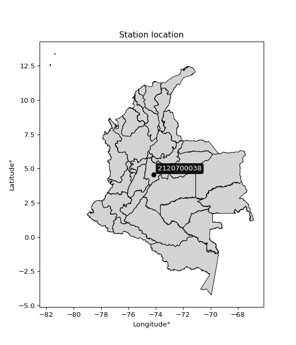

<div align="center">


</div>

# Station (rain, Pmax24h): 2120700038

Probable Maximum Precipitation (PMP) is the greatest amount of rainfall for a specific duration that is meteorologically possible for a given location, acting as a "worst-case" scenario for extreme storms, crucial for designing safety-critical infrastructure like bridges, river deviations, dams, spillways, and nuclear plants to prevent catastrophic failure. PMP is calculated by hydrologists using meteorological data to determine the upper limit of extreme rainfall, often leading to the Probable Maximum Flood (PMF) for flood control design, and is increasingly being studied for climate change impacts.

<div align="center">

</img>

</div>


## A. General information


### 1. General running parameters

• app_version: _v20251226_. • runtime: _2025-12-26 15:38:16.554582_. • Python version: _3.14.0_. • SciPy version: _1.16.3_. • Pandas version: _2.3.3_. • NumPy version: _2.3.5_. • Stations dataset (station_dataset_file): _dataset/pmax24h_in/automatic_colombia_2003_2024.csv_. • Stations catalog (station_catalog_file): _dataset/CNE_IDEAM.xls_. • Minimum year to eval til year_max (date_min): _2003_. • Maximum year to eval since year_min (date_max): _2024_. • Creates, save and include plots into reports (create_plot): _False_. • Plot only fit distributions with Δo > Δ (plot_only_fit): _True_. • Eval low extreme values, if False, evaluates high extreme values (low_extreme): _False_. • Eval every SciPy distribution as logarithmic (pdist_logarithmic_on): _True_. • Standard deviation normalized (ddof): _1.0_. • Return periods to eval in years (Tr): _[2, 2.33, 5, 10, 15, 20, 25, 50, 75, 100, 200, 250, 500, 750, 1000]_. • Minimum data sample per station, 0 means any (minimum_sample): _5_. • Z-Score threshold to adjust a value, 0 means disable (zscore): _3.5_. • Avoid zeros, e.g. rain = 0 (avoid_zeros): _True_. • Avoid null values (avoid_nans): _True_. [:file_folder:Dataset file.](../../dataset/pmax24h_in/automatic_colombia_2003_2024.csv)


### 2. Station info and location

|   id |     CODIGO | NOMBRE                            | CATEGORIA          | TECNOLOGIA                | ESTADO   | FECHA_INSTALACION   |   FECHA_SUSPENSION |   ALTITUD |   LATITUD |   LONGITUD | DEPARTAMENTO   | MUNICIPIO   | AREA_OPERATIVA                            | ENTIDAD                                                      | AREA_HIDROGRAFICA   | ZONA_HIDROGRAFICA   | SUBZONA_HIDROGRAFICA   | CORRIENTE   | OBSERVACION                                                                                                                                |   SUBRED | Catalogo   |
|-----:|-----------:|:----------------------------------|:-------------------|:--------------------------|:---------|:--------------------|-------------------:|----------:|----------:|-----------:|:---------------|:------------|:------------------------------------------|:-------------------------------------------------------------|:--------------------|:--------------------|:-----------------------|:------------|:-------------------------------------------------------------------------------------------------------------------------------------------|---------:|:-----------|
|    0 | 2120700038 | SAN FRANCISCO - AUT  [2120700038] | HidroMeteorologica | Automática con Telemetría | Activa   | 01/11/2012          |                nan |      2577 |   4.56235 |   -74.1489 | Bogotá         | Bogotá, D.C | Area Operativa 11 - Cundinamarca-Amazonas | INSTITUTO DISTRITAL DE GESTIÓN DE RIESGOS Y CAMBIO CLIMÁTICO | Magdalena Cauca     | Alto Magdalena      | Río Bogotá             | Chingaza    | Solicitado mediante correo electrónico|03/11/2022$Migracion$DATOS ACTUALIZADOS A LA FECHA 03/11/2022, SEGÚN INFORMACIÓN ENVIADA POR IDIGER |      nan | CNE_OE     |

<div align="center">

Map location in: [:earth_americas:Google](http://maps.google.com/maps?q=4.56235,-74.148869) [:earth_americas:OSM](https://www.openstreetmap.org/#map=18/4.56235/-74.148869&layers=P) [:earth_americas:Bing](https://www.bing.com/maps?cp=4.56235~-74.148869&lvl=18) [:earth_americas:Apple](https://maps.apple.com/frame?center=4.56235%2C-74.148869&span=0.003%2C0.006)

</div>


<div align="center">

```geojson
{
  "type": "Feature",
  "geometry": {
    "type": "Point", 
    "coordinates": [-74.148869, 4.56235]
  }, 
  "properties": {
    "Name": "2120700038"
  }
}
```

</div>


### 3. Discrete values table and plot

|               |           0 |          1 |           2 |          3 |           4 |
|:--------------|------------:|-----------:|------------:|-----------:|------------:|
| Date          | 2018        | 2019       | 2020        | 2023       | 2024        |
| Value         |   16.4      |   53.7     |   19.4      |    0.6     |   26.2      |
| Value_initial |   16.4      |   53.7     |   19.4      |    0.6     |   26.2      |
| count         |    5        |    5       |    5        |    5       |    5        |
| mean          |   23.26     |   23.26    |   23.26     |   23.26    |   23.26     |
| std           |   19.4337   |   19.4337  |   19.4337   |   19.4337  |   19.4337   |
| zscore        |   -0.352995 |    1.56635 |   -0.198624 |   -1.16602 |    0.151284 |
> If Z-Score is active, values out of range or outliers are replaced with the station mean value.


### 4. Active continuous probability distributions from SciPy (45 of 104 available)

[scipy.stats](https://docs.scipy.org/doc/scipy/reference/stats.html) is a Python´s powerful submodule within the SciPy library for comprehensive statistical analysis, offering over 130 probability distributions (like Normal, Poisson), functions for descriptive stats (mean, variance), hypothesis testing (t-tests, chi-square), random variable generation, and statistical tests, making it essential for data science, modeling, and research. It provides tools to explore, model, and draw conclusions from data efficiently, working seamlessly with NumPy.

<div align="center">

|   id | p_dist             |   n_parameter | fit_method   | label                                                                       | active   | ref                                                                                                        |
|-----:|:-------------------|--------------:|:-------------|:----------------------------------------------------------------------------|:---------|:-----------------------------------------------------------------------------------------------------------|
|    0 | alpha              |             3 | MLE          | Alpha                                                                       | True     | [:mortar_board:](https://docs.scipy.org/doc/scipy/reference/generated/scipy.stats.alpha.html)              |
|    1 | betaprime          |             4 | MLE          | Beta prime                                                                  | True     | [:mortar_board:](https://docs.scipy.org/doc/scipy/reference/generated/scipy.stats.betaprime.html)          |
|    2 | chi2               |             3 | MLE          | Chi²                                                                        | True     | [:mortar_board:](https://docs.scipy.org/doc/scipy/reference/generated/scipy.stats.chi2.html)               |
|    3 | crystalball        |             4 | MLE          | Crystalball                                                                 | True     | [:mortar_board:](https://docs.scipy.org/doc/scipy/reference/generated/scipy.stats.crystalball.html)        |
|    4 | erlang             |             3 | MLE          | Erlang                                                                      | True     | [:mortar_board:](https://docs.scipy.org/doc/scipy/reference/generated/scipy.stats.erlang.html)             |
|    5 | expon              |             2 | MLE          | Exponential                                                                 | True     | [:mortar_board:](https://docs.scipy.org/doc/scipy/reference/generated/scipy.stats.expon.html)              |
|    6 | exponnorm          |             3 | MLE          | Exponentially modified Normal                                               | True     | [:mortar_board:](https://docs.scipy.org/doc/scipy/reference/generated/scipy.stats.exponnorm.html)          |
|    7 | f                  |             4 | MLE          | F                                                                           | True     | [:mortar_board:](https://docs.scipy.org/doc/scipy/reference/generated/scipy.stats.f.html)                  |
|    8 | fatiguelife        |             3 | MLE          | Fatigue-life (Birnbaum-Saunders)                                            | True     | [:mortar_board:](https://docs.scipy.org/doc/scipy/reference/generated/scipy.stats.fatiguelife.html)        |
|    9 | fisk               |             3 | MLE          | Fisk                                                                        | True     | [:mortar_board:](https://docs.scipy.org/doc/scipy/reference/generated/scipy.stats.fisk.html)               |
|   10 | gamma              |             3 | MLE          | Gamma                                                                       | True     | [:mortar_board:](https://docs.scipy.org/doc/scipy/reference/generated/scipy.stats.gamma.html)              |
|   11 | genexpon           |             5 | MLE          | Generalized exponential                                                     | True     | [:mortar_board:](https://docs.scipy.org/doc/scipy/reference/generated/scipy.stats.genexpon.html)           |
|   12 | genlogistic        |             3 | MLE          | Generalized logistic                                                        | True     | [:mortar_board:](https://docs.scipy.org/doc/scipy/reference/generated/scipy.stats.genlogistic.html)        |
|   13 | gibrat             |             2 | MM           | Gibrat                                                                      | True     | [:mortar_board:](https://docs.scipy.org/doc/scipy/reference/generated/scipy.stats.gibrat.html)             |
|   14 | gompertz           |             3 | MLE          | Gompertz (or truncated Gumbel)                                              | True     | [:mortar_board:](https://docs.scipy.org/doc/scipy/reference/generated/scipy.stats.gompertz.html)           |
|   15 | gumbel_l           |             2 | MM           | Gumbel Left Skew                                                            | True     | [:mortar_board:](https://docs.scipy.org/doc/scipy/reference/generated/scipy.stats.gumbel_l.html)           |
|   16 | gumbel_r           |             2 | MM           | Gumbel Right Skew                                                           | True     | [:mortar_board:](https://docs.scipy.org/doc/scipy/reference/generated/scipy.stats.gumbel_r.html)           |
|   17 | halflogistic       |             2 | MM           | Half-logistic                                                               | True     | [:mortar_board:](https://docs.scipy.org/doc/scipy/reference/generated/scipy.stats.halflogistic.html)       |
|   18 | halfnorm           |             2 | MM           | Half Normal                                                                 | True     | [:mortar_board:](https://docs.scipy.org/doc/scipy/reference/generated/scipy.stats.halfnorm.html)           |
|   19 | hypsecant          |             2 | MM           | hyperbolic secant                                                           | True     | [:mortar_board:](https://docs.scipy.org/doc/scipy/reference/generated/scipy.stats.hypsecant.html)          |
|   20 | invgamma           |             3 | MLE          | Inverted gamma                                                              | True     | [:mortar_board:](https://docs.scipy.org/doc/scipy/reference/generated/scipy.stats.invgamma.html)           |
|   21 | invgauss           |             3 | MLE          | Inverse Gaussian                                                            | True     | [:mortar_board:](https://docs.scipy.org/doc/scipy/reference/generated/scipy.stats.invgauss.html)           |
|   22 | invweibull         |             3 | MLE          | Inverted Weibull                                                            | True     | [:mortar_board:](https://docs.scipy.org/doc/scipy/reference/generated/scipy.stats.invweibull.html)         |
|   23 | johnsonsu          |             4 | MLE          | Johnson Su                                                                  | True     | [:mortar_board:](https://docs.scipy.org/doc/scipy/reference/generated/scipy.stats.johnsonsu.html)          |
|   24 | kstwobign          |             2 | MLE          | Limiting distribution of scaled Kolmogorov-Smirnov two-sided test statistic | True     | [:mortar_board:](https://docs.scipy.org/doc/scipy/reference/generated/scipy.stats.kstwobign.html)          |
|   25 | laplace            |             2 | MM           | Laplace                                                                     | True     | [:mortar_board:](https://docs.scipy.org/doc/scipy/reference/generated/scipy.stats.laplace.html)            |
|   26 | laplace_asymmetric |             3 | MLE          | Asymmetric Laplace                                                          | True     | [:mortar_board:](https://docs.scipy.org/doc/scipy/reference/generated/scipy.stats.laplace_asymmetric.html) |
|   27 | loggamma           |             3 | MLE          | Log gamma                                                                   | True     | [:mortar_board:](https://docs.scipy.org/doc/scipy/reference/generated/scipy.stats.loggamma.html)           |
|   28 | logistic           |             2 | MM           | Logistic (or Sech-squared)                                                  | True     | [:mortar_board:](https://docs.scipy.org/doc/scipy/reference/generated/scipy.stats.logistic.html)           |
|   29 | lognorm            |             3 | MLE          | Log Normal                                                                  | True     | [:mortar_board:](https://docs.scipy.org/doc/scipy/reference/generated/scipy.stats.lognorm.html)            |
|   30 | maxwell            |             2 | MM           | Maxwell                                                                     | True     | [:mortar_board:](https://docs.scipy.org/doc/scipy/reference/generated/scipy.stats.maxwell.html)            |
|   31 | mielke             |             4 | MLE          | Mielke Beta-Kappa / Dagum                                                   | True     | [:mortar_board:](https://docs.scipy.org/doc/scipy/reference/generated/scipy.stats.mielke.html)             |
|   32 | moyal              |             2 | MM           | Moyal                                                                       | True     | [:mortar_board:](https://docs.scipy.org/doc/scipy/reference/generated/scipy.stats.moyal.html)              |
|   33 | nakagami           |             3 | MLE          | Nakagami                                                                    | True     | [:mortar_board:](https://docs.scipy.org/doc/scipy/reference/generated/scipy.stats.nakagami.html)           |
|   34 | ncf                |             5 | MLE          | Non-central F distribution                                                  | True     | [:mortar_board:](https://docs.scipy.org/doc/scipy/reference/generated/scipy.stats.ncf.html)                |
|   35 | nct                |             4 | MLE          | Non-central Student’s t                                                     | True     | [:mortar_board:](https://docs.scipy.org/doc/scipy/reference/generated/scipy.stats.nct.html)                |
|   36 | norm               |             2 | MM           | Normal                                                                      | True     | [:mortar_board:](https://docs.scipy.org/doc/scipy/reference/generated/scipy.stats.norm.html)               |
|   37 | pareto             |             3 | MLE          | Pareto                                                                      | True     | [:mortar_board:](https://docs.scipy.org/doc/scipy/reference/generated/scipy.stats.pareto.html)             |
|   38 | pearson3           |             3 | MM           | Pearson type III                                                            | True     | [:mortar_board:](https://docs.scipy.org/doc/scipy/reference/generated/scipy.stats.pearson3.html)           |
|   39 | rayleigh           |             2 | MM           | Rayleigh                                                                    | True     | [:mortar_board:](https://docs.scipy.org/doc/scipy/reference/generated/scipy.stats.rayleigh.html)           |
|   40 | rice               |             3 | MLE          | Rice                                                                        | True     | [:mortar_board:](https://docs.scipy.org/doc/scipy/reference/generated/scipy.stats.rice.html)               |
|   41 | t                  |             3 | MLE          | Student’s t                                                                 | True     | [:mortar_board:](https://docs.scipy.org/doc/scipy/reference/generated/scipy.stats.t.html)                  |
|   42 | truncnorm          |             4 | MLE          | Truncated normal                                                            | True     | [:mortar_board:](https://docs.scipy.org/doc/scipy/reference/generated/scipy.stats.truncnorm.html)          |
|   43 | wald               |             2 | MM           | Wald                                                                        | True     | [:mortar_board:](https://docs.scipy.org/doc/scipy/reference/generated/scipy.stats.wald.html)               |
|   44 | weibull_min        |             3 | MLE          | Weibull minimum                                                             | True     | [:mortar_board:](https://docs.scipy.org/doc/scipy/reference/generated/scipy.stats.weibull_min.html)        |

</div>

> **n_parameter:** # arguments & localization & scale.
>
> **Fit methods:** (MLE) maximum likelihood, (MM) L-moments.
>
>**Inactive:** foldnorm, gennorm, norminvgauss, powernorm, powerlognorm, skewnorm, genextreme, anglit, arcsine, argus, beta, bradford, burr, burr12, cauchy, cosine, halfcauchy, foldcauchy, skewcauchy, wrapcauchy, dgamma, gengamma, exponweib, exponpow, truncexpon, gausshyper, genhalflogistic, genhyperbolic, geninvgauss, halfgennorm, johnsonsb, kappa4, kappa3, ksone, kstwo, loglaplace, levy, levy_l, levy_stable, ncx2, genpareto, truncpareto, lomax, powerlaw, rdist, rel_breitwigner, recipinvgauss, semicircular, studentized_range, trapezoid, triang, truncweibull_min, tukeylambda, uniform, loguniform, vonmises, vonmises_line, weibull_max, dweibull, 


## B. Probability distributions vs. Empirical distributions

A continuous probability distribution (CPD) describes probabilities for variables that can take any value within a range (like rain any time), unlike discrete variables with specific outcomes (like temperature). It uses a Probability Density Function (PDF), a curve where the total area under it equals 1, and the probability of the variable falling within an interval (a to b) is found by calculating the area under the curve between those points. A key feature is that the probability of hitting any single exact value is zero, so probabilities are always expressed for ranges, e.g., $P(a ≤ X ≤ b)$.

<div align="center">

Distributions parameters
|    |    station | p_dist                |   n |             loc |           scale | shape                  | shape1                 | shape2              | shape3   |
|---:|-----------:|:----------------------|----:|----------------:|----------------:|:-----------------------|:-----------------------|:--------------------|:---------|
|  0 | 2120700038 | alpha                 |   5 |     0.00167032  |     1.33709     | 3.2003533464316833e-09 |                        |                     |          |
|  1 | 2120700038 | betaprime             |   5 |    -4.84672     |     7.68912e+06 | 2.273759208953007      | 629139.0867058756      |                     |          |
|  2 | 2120700038 | chi2                  |   5 |     0.6         |     3.08412     | 0.28919998345539055    |                        |                     |          |
|  3 | 2120700038 | crystalball           |   5 |    23.26        |    17.382       | 2060.102090318861      | 887.2554884178696      |                     |          |
|  4 | 2120700038 | erlang                |   5 |     0.6         |    29.1702      | 0.1257668224689159     |                        |                     |          |
|  5 | 2120700038 | expon                 |   5 |     0.6         |    22.66        |                        |                        |                     |          |
|  6 | 2120700038 | exponnorm             |   5 |     7.28675     |     8.99472     | 1.7758521798055533     |                        |                     |          |
|  7 | 2120700038 | f                     |   5 |     0.6         |    22.2463      | 0.20954565772898792    | 66.94506471831984      |                     |          |
|  8 | 2120700038 | fatiguelife           |   5 |     0.6         |     0.000436734 | 224.4021391911824      |                        |                     |          |
|  9 | 2120700038 | fisk                  |   5 |   -21.2892      |    41.5633      | 4.397748960660735      |                        |                     |          |
| 10 | 2120700038 | gamma                 |   5 |     0.6         |    25.615       | 0.4508227926266641     |                        |                     |          |
| 11 | 2120700038 | genexpon              |   5 |     0.599986    |     1.80655     | 0.0795803052683346     | 3.1976582120366493e-08 | 1.9441831029908914  |          |
| 12 | 2120700038 | genlogistic           |   5 |   -70.8732      |    13.9715      | 472.43002417490993     |                        |                     |          |
| 13 | 2120700038 | gibrat                |   5 |     9.99971     |     8.04278     |                        |                        |                     |          |
| 14 | 2120700038 | gompertz              |   5 |     0.6         |    47.441       | 1.3658714712609936     |                        |                     |          |
| 15 | 2120700038 | gumbel_l              |   5 |    31.0828      |    13.5527      |                        |                        |                     |          |
| 16 | 2120700038 | gumbel_r              |   5 |    15.4372      |    13.5527      |                        |                        |                     |          |
| 17 | 2120700038 | halflogistic          |   5 |     2.65832     |    14.861       |                        |                        |                     |          |
| 18 | 2120700038 | halfnorm              |   5 |     0.253026    |    28.835       |                        |                        |                     |          |
| 19 | 2120700038 | hypsecant             |   5 |    23.26        |    11.0657      |                        |                        |                     |          |
| 20 | 2120700038 | invgamma              |   5 |   -40.8957      |   869.984       | 14.548323621082929     |                        |                     |          |
| 21 | 2120700038 | invgauss              |   5 |   -22.7276      |   294.809       | 0.15599134006791157    |                        |                     |          |
| 22 | 2120700038 | invweibull            |   5 |     0.6         |     2.55085     | 0.039175299370628164   |                        |                     |          |
| 23 | 2120700038 | johnsonsu             |   5 |   -23.2841      |     2.58855     | -9.337964642703845     | 2.65810071007083       |                     |          |
| 24 | 2120700038 | kstwobign             |   5 |   -34.5399      |    66.4092      |                        |                        |                     |          |
| 25 | 2120700038 | laplace               |   5 |    23.26        |    12.2909      |                        |                        |                     |          |
| 26 | 2120700038 | laplace_asymmetric    |   5 |    19.4         |    12.1318      | 0.8532234375982977     |                        |                     |          |
| 27 | 2120700038 | loggamma              |   5 | -6010.58        |   793.663       | 2003.5975278596504     |                        |                     |          |
| 28 | 2120700038 | logistic              |   5 |    23.26        |     9.58321     |                        |                        |                     |          |
| 29 | 2120700038 | lognorm               |   5 |     0.6         |     0.0085175   | 15.990959929330753     |                        |                     |          |
| 30 | 2120700038 | maxwell               |   5 |   -17.9281      |    25.8108      |                        |                        |                     |          |
| 31 | 2120700038 | mielke                |   5 |     0.6         |    54.026       | 0.6057822122760761     | 136.10382155489734     |                     |          |
| 32 | 2120700038 | moyal                 |   5 |    13.3198      |     7.82466     |                        |                        |                     |          |
| 33 | 2120700038 | nakagami              |   5 |     0.6         |    22.7781      | 0.0532967495988099     |                        |                     |          |
| 34 | 2120700038 | ncf                   |   5 |     0.6         |    11.7886      | 1.300966380974246      | 484.0139298499517      | 1.7083422017929035  |          |
| 35 | 2120700038 | nct                   |   5 |   -27.5896      |     0.10505     | 7.860112417606512      | 408.0059137597667      |                     |          |
| 36 | 2120700038 | norm                  |   5 |    23.26        |    17.382       |                        |                        |                     |          |
| 37 | 2120700038 | pareto                |   5 |     0.38579     |     0.21421     | 0.26165711813185477    |                        |                     |          |
| 38 | 2120700038 | pearson3              |   5 |    23.26        |    17.3821      | 0.6175062433257505     |                        |                     |          |
| 39 | 2120700038 | rayleigh              |   5 |    -9.99281     |    26.5319      |                        |                        |                     |          |
| 40 | 2120700038 | rice                  |   5 |    -7.63717     |    25.0676      | 0.000542225760140387   |                        |                     |          |
| 41 | 2120700038 | t                     |   5 |    23.2601      |    17.3821      | 368881322.4413581      |                        |                     |          |
| 42 | 2120700038 | truncnorm             |   5 |     7.01781     |    11.6172      | -3.0082219868195654    | 4.018380802463479      |                     |          |
| 43 | 2120700038 | wald                  |   5 |     5.87796     |    17.382       |                        |                        |                     |          |
| 44 | 2120700038 | weibull_min           |   5 |     0.6         |    23.1883      | 0.1258414132495838     |                        |                     |          |
| 45 | 2120700038 | logalpha              |   5 |   -39.3287      |  1058.84        | 25.382674441483978     |                        |                     |          |
| 46 | 2120700038 | logbetaprime          |   5 |    -0.510826    |     1.59585     | 0.2971520152355656     | 1.370360540260391      |                     |          |
| 47 | 2120700038 | logchi2               |   5 |    -0.510826    |     1.32353     | 1.2877365151570408     |                        |                     |          |
| 48 | 2120700038 | logcrystalball        |   5 |     2.50018     |     1.55928     | 135.49046474109636     | 242.26774730383283     |                     |          |
| 49 | 2120700038 | logerlang             |   5 |   -22.854       |     0.106219    | 238.67508451542943     |                        |                     |          |
| 50 | 2120700038 | logexpon              |   5 |    -0.510826    |     3.01101     |                        |                        |                     |          |
| 51 | 2120700038 | logexponnorm          |   5 |     2.499       |     1.55928     | 0.0007547746277309923  |                        |                     |          |
| 52 | 2120700038 | logf                  |   5 |    -0.510826    |     1.0777      | 1.2433631637099432     | 1.1304397813463603     |                     |          |
| 53 | 2120700038 | logfatiguelife        |   5 |  -783.904       |   786.407       | 0.001980159625770129   |                        |                     |          |
| 54 | 2120700038 | logfisk               |   5 |    -0.510826    |     1.35407     | 0.3000784502284455     |                        |                     |          |
| 55 | 2120700038 | loggamma              |   5 |   -25.2012      |     0.0973589   | 284.1824490578132      |                        |                     |          |
| 56 | 2120700038 | loggenexpon           |   5 |    -0.510826    |     2.72438     | 0.5112507161051205     | 1.7221809464462514     | 0.36247130977850417 |          |
| 57 | 2120700038 | loggenlogistic        |   5 |     3.98363     |     2.1355e-05  | 1.4358611616354012e-05 |                        |                     |          |
| 58 | 2120700038 | loggibrat             |   5 |     1.31068     |     0.72148     |                        |                        |                     |          |
| 59 | 2120700038 | loggompertz           |   5 |    -0.510827    |     1.07822     | 0.035602893067514324   |                        |                     |          |
| 60 | 2120700038 | loggumbel_l           |   5 |     3.20194     |     1.21577     |                        |                        |                     |          |
| 61 | 2120700038 | loggumbel_r           |   5 |     1.79842     |     1.21577     |                        |                        |                     |          |
| 62 | 2120700038 | loghalflogistic       |   5 |     0.652013    |     1.33315     |                        |                        |                     |          |
| 63 | 2120700038 | loghalfnorm           |   5 |     0.43631     |     2.58668     |                        |                        |                     |          |
| 64 | 2120700038 | loghypsecant          |   5 |     2.50018     |     0.992671    |                        |                        |                     |          |
| 65 | 2120700038 | loginvgamma           |   5 |   -30.9161      | 13666.6         | 409.937828354487       |                        |                     |          |
| 66 | 2120700038 | loginvgauss           |   5 |   -12.1373      |  1049.67        | 0.013895151026806038   |                        |                     |          |
| 67 | 2120700038 | loginvweibull         |   5 |    -1.38495e+08 |     1.38495e+08 | 91406269.0181561       |                        |                     |          |
| 68 | 2120700038 | logjohnsonsu          |   5 |     4.18076     |     0.00570461  | 5.844457161598701      | 0.9855921423140774     |                     |          |
| 69 | 2120700038 | logkstwobign          |   5 |    -4.6274      |     8.12446     |                        |                        |                     |          |
| 70 | 2120700038 | loglaplace            |   5 |     2.50018     |     1.10258     |                        |                        |                     |          |
| 71 | 2120700038 | loglaplace_asymmetric |   5 |     3.26576     |     0.80063     | 1.5863173544421598     |                        |                     |          |
| 72 | 2120700038 | logloggamma           |   5 |     3.98346     |     2.26233e-06 | 1.524874451428803e-06  |                        |                     |          |
| 73 | 2120700038 | loglogistic           |   5 |     2.50018     |     0.859678    |                        |                        |                     |          |
| 74 | 2120700038 | loglognorm            |   5 | -1038.92        |  1041.43        | 0.0014945301497860932  |                        |                     |          |
| 75 | 2120700038 | logmaxwell            |   5 |    -1.19467     |     2.3154      |                        |                        |                     |          |
| 76 | 2120700038 | logmielke             |   5 |    -0.510826    |     1.42506     | 0.9237325148161025     | 1.12784626799127       |                     |          |
| 77 | 2120700038 | logmoyal              |   5 |     1.60848     |     0.701924    |                        |                        |                     |          |
| 78 | 2120700038 | lognakagami           |   5 |  -907.551       |   910.057       | 84769.20929762682      |                        |                     |          |
| 79 | 2120700038 | logncf                |   5 |    -0.510826    |     1.09814     | 1.215033625238013      | 1.2193003806884652     | 1.0040038611188833  |          |
| 80 | 2120700038 | lognct                |   5 |  -106.788       |     1.51889     | 43443.85868532854      | 71.95109726857274      |                     |          |
| 81 | 2120700038 | lognorm               |   5 |     2.50018     |     1.55928     |                        |                        |                     |          |
| 82 | 2120700038 | logpareto             |   5 |    -0.54186     |     0.0310347   | 0.260446574646193      |                        |                     |          |
| 83 | 2120700038 | logpearson3           |   5 |     2.50017     |     1.55929     | -1.2375510750370289    |                        |                     |          |
| 84 | 2120700038 | lograyleigh           |   5 |    -0.482858    |     2.38012     |                        |                        |                     |          |
| 85 | 2120700038 | logrice               |   5 |  -505.302       |     1.55929     | 325.66136868759645     |                        |                     |          |
| 86 | 2120700038 | logt                  |   5 |     3.03127     |     0.329298    | 0.8645711739405073     |                        |                     |          |
| 87 | 2120700038 | logtruncnorm          |   5 |     0.686945    |     4.10979     | -0.2914442647182584    | 0.8021013573546864     |                     |          |
| 88 | 2120700038 | logwald               |   5 |     0.940915    |     1.55928     |                        |                        |                     |          |
| 89 | 2120700038 | logweibull_min        |   5 |    -0.510826    |     2.0474      | 0.5151177138149745     |                        |                     |          |

</div>

> **loc** (Location parameter): This shifts the distribution along the x-axis. For many common distributions, like the normal (Gaussian) distribution, loc represents the mean $μ$. For others, like the uniform distribution, it might represent the minimum value, or for the beta distribution, the left end of the support interval.
>
> **scale** (Scale parameter): This determines the width or spread of the distribution. For the normal distribution, scale represents the standard deviation $σ$. For a uniform distribution, it defines the length of the interval (from $loc$ to $loc + scale$).
>
> **shape** (Shape parameters): Refers to parameters that define the specific form of a probability distribution, distinct from its location (loc) and scale (scale). These parameters are required arguments for most distribution functions. For example, a normal (Gaussian) distribution is fully defined by its location (mean) and scale (standard deviation), so it has no specific shape parameters beyond loc and scale. However, other distributions have intrinsic properties that need specification, as Gamma distribution that takes a shape parameter, often named $a$ or $alpha$.


### 0. Cumulative distribution values - CDF (90 evaluated)

> Ordered by x ascending and calculating $log(f(x))$ separately. 

|   id |    Station |   date |    x |   count |   mean |     std |    zscore |   Value_initial |    station |   m |     alpha |   alpha_pdf |   betaprime |   betaprime_pdf |      chi2 |    chi2_pdf |   crystalball |   crystalball_pdf |     erlang |   erlang_pdf |    expon |   expon_pdf |   exponnorm |   exponnorm_pdf |         f |       f_pdf |   fatiguelife |   fatiguelife_pdf |      fisk |   fisk_pdf |       gamma |   gamma_pdf |   genexpon |   genexpon_pdf |   genlogistic |   genlogistic_pdf |   gibrat |   gibrat_pdf |   gompertz |   gompertz_pdf |   gumbel_l |   gumbel_l_pdf |   gumbel_r |   gumbel_r_pdf |   halflogistic |   halflogistic_pdf |   halfnorm |   halfnorm_pdf |   hypsecant |   hypsecant_pdf |   invgamma |   invgamma_pdf |   invgauss |   invgauss_pdf |   invweibull |   invweibull_pdf |   johnsonsu |   johnsonsu_pdf |   kstwobign |   kstwobign_pdf |   laplace |   laplace_pdf |   laplace_asymmetric |   laplace_asymmetric_pdf |   loggamma |   loggamma_pdf |   logistic |   logistic_pdf |   lognorm |   lognorm_pdf |   maxwell |   maxwell_pdf |      mielke |   mielke_pdf |     moyal |   moyal_pdf |   nakagami |   nakagami_pdf |         ncf |       ncf_pdf |       nct |    nct_pdf |      norm |   norm_pdf |      pareto |   pareto_pdf |   pearson3 |   pearson3_pdf |   rayleigh |   rayleigh_pdf |      rice |   rice_pdf |        t |      t_pdf |   truncnorm |   truncnorm_pdf |     wald |   wald_pdf |   weibull_min |   weibull_min_pdf |   logalpha |   logalpha_pdf |   logbetaprime |   logbetaprime_pdf |     logchi2 |    logchi2_pdf |   logcrystalball |   logcrystalball_pdf |   logerlang |   logerlang_pdf |   logexpon |   logexpon_pdf |   logexponnorm |   logexponnorm_pdf |        logf |       logf_pdf |   logfatiguelife |   logfatiguelife_pdf |     logfisk |   logfisk_pdf |   loggenexpon |   loggenexpon_pdf |   loggenlogistic |   loggenlogistic_pdf |   loggibrat |   loggibrat_pdf |   loggompertz |   loggompertz_pdf |   loggumbel_l |   loggumbel_l_pdf |   loggumbel_r |   loggumbel_r_pdf |   loghalflogistic |   loghalflogistic_pdf |   loghalfnorm |   loghalfnorm_pdf |   loghypsecant |   loghypsecant_pdf |   loginvgamma |   loginvgamma_pdf |   loginvgauss |   loginvgauss_pdf |   loginvweibull |   loginvweibull_pdf |   logjohnsonsu |   logjohnsonsu_pdf |   logkstwobign |   logkstwobign_pdf |   loglaplace |   loglaplace_pdf |   loglaplace_asymmetric |   loglaplace_asymmetric_pdf |   logloggamma |   logloggamma_pdf |   loglogistic |   loglogistic_pdf |   loglognorm |   loglognorm_pdf |   logmaxwell |   logmaxwell_pdf |   logmielke |   logmielke_pdf |    logmoyal |   logmoyal_pdf |   lognakagami |   lognakagami_pdf |      logncf |     logncf_pdf |    lognct |   lognct_pdf |   logpareto |   logpareto_pdf |   logpearson3 |   logpearson3_pdf |   lograyleigh |   lograyleigh_pdf |   logrice |   logrice_pdf |      logt |   logt_pdf |   logtruncnorm |   logtruncnorm_pdf |   logwald |   logwald_pdf |   logweibull_min |   logweibull_min_pdf |
|-----:|-----------:|-------:|-----:|--------:|-------:|--------:|----------:|----------------:|-----------:|----:|----------:|------------:|------------:|----------------:|----------:|------------:|--------------:|------------------:|-----------:|-------------:|---------:|------------:|------------:|----------------:|----------:|------------:|--------------:|------------------:|----------:|-----------:|------------:|------------:|-----------:|---------------:|--------------:|------------------:|---------:|-------------:|-----------:|---------------:|-----------:|---------------:|-----------:|---------------:|---------------:|-------------------:|-----------:|---------------:|------------:|----------------:|-----------:|---------------:|-----------:|---------------:|-------------:|-----------------:|------------:|----------------:|------------:|----------------:|----------:|--------------:|---------------------:|-------------------------:|-----------:|---------------:|-----------:|---------------:|----------:|--------------:|----------:|--------------:|------------:|-------------:|----------:|------------:|-----------:|---------------:|------------:|--------------:|----------:|-----------:|----------:|-----------:|------------:|-------------:|-----------:|---------------:|-----------:|---------------:|----------:|-----------:|---------:|-----------:|------------:|----------------:|---------:|-----------:|--------------:|------------------:|-----------:|---------------:|---------------:|-------------------:|------------:|---------------:|-----------------:|---------------------:|------------:|----------------:|-----------:|---------------:|---------------:|-------------------:|------------:|---------------:|-----------------:|---------------------:|------------:|--------------:|--------------:|------------------:|-----------------:|---------------------:|------------:|----------------:|--------------:|------------------:|--------------:|------------------:|--------------:|------------------:|------------------:|----------------------:|--------------:|------------------:|---------------:|-------------------:|--------------:|------------------:|--------------:|------------------:|----------------:|--------------------:|---------------:|-------------------:|---------------:|-------------------:|-------------:|-----------------:|------------------------:|----------------------------:|--------------:|------------------:|--------------:|------------------:|-------------:|-----------------:|-------------:|-----------------:|------------:|----------------:|------------:|---------------:|--------------:|------------------:|------------:|---------------:|----------:|-------------:|------------:|----------------:|--------------:|------------------:|--------------:|------------------:|----------:|--------------:|----------:|-----------:|---------------:|-------------------:|----------:|--------------:|-----------------:|---------------------:|
|    0 | 2120700038 |   2023 |  0.6 |       5 |  23.26 | 19.4337 | -1.16602  |             0.6 | 2120700038 |   1 | 0.0254364 | 0.24536     |   0.0449501 |      0.0162942  | 0.0040548 | 5.28113e+12 |     0.0961771 |        0.00981227 | 0.00684539 |  7.7545e+12  | 0        |  0.0441306  |   0.0581979 |      0.010669   | 0.0127792 | 1.20599e+13 |     0.0726944 |        2.4597e+07 | 0.0562564 | 0.0106666  | 1.67905e-08 | 6.81802e+07 | 6.2629e-07 |     0.0440509  |     0.0591824 |        0.0119398  | 0        |    0         | 1.0453e-08 |     0.0287909  |   0.10011  |     0.00700399 |  0.0503623 |      0.0111054 |       0        |         0          | 0.00960079 |     0.0276687  |   0.0816874 |      0.00730126 |  0.0583497 |     0.0121218  |  0.0554603 |     0.0131095  |    0.0125907 |      1.94361e+13 |   0.0569236 |      0.0126465  |   0.0577997 |      0.0128502  | 0.0791206 |    0.00643731 |            0.0685186 |               0.00661942 |  0.0311908 |      0.0462042 |  0.0859159 |     0.008195   | 0.0267404 |     0.0396533 | 0.0844819 |    0.0123112  | 1.64896e-09 | 5823.55      | 0.0241821 |  0.00905738 |  0.0125647 |    1.20634e+13 | 3.36467e-11 | 4808.22       | 0.0185201 | 0.00853775 | 0.0961771 | 0.00981227 | 1.11022e-16 |   1.2215     |  0.0764647 |     0.0117081  |  0.0766062 |     0.0138951  | 0.0525569 | 0.0124195  | 0.096177 | 0.00981224 |    0.289398 |      0.0295204  | 0        | 0          |    0.00659188 |       7.44707e+12 |  0.0290767 |      0.0465882 |    1.78691e-05 |        4.78267e+10 | 3.17163e-11 | 183937         |        0.0267404 |            0.0396533 |   0.0294062 |       0.0443799 |   0        |       0.332115 |      0.0267404 |          0.0396534 | 7.97734e-11 | 446700         |        0.0262076 |            0.0391942 | 1.48889e-05 |   4.02421e+10 |   3.41703e-09 |          0.187658 |         0        |            0.0327482 |    0        |       0         |   3.56638e-08 |          0.03302  |     0.0460817 |         0.0370163 |    0.00125331 |        0.00688832 |          0        |              0        |      0        |          0        |      0.0306356 |          0.0308142 |     0.0280785 |         0.0442284 |     0.0305894 |         0.0508715 |       0.0244737 |           0.0599285 |      0.0729391 |          0.0291111 |      0.0404954 |           0.084705 |    0.0325812 |         0.02955  |               0.0365829 |                   0.0288043 |     0.0483505 |         0.0325897 |     0.0292417 |         0.0330201 |    0.0260249 |        0.0389483 |   0.00667528 |         0.028776 | 1.31864e-15 |      10.9714    | 6.03652e-06 |    9.20056e-05 |     0.0267634 |         0.0396349 | 8.06182e-11 | 441145         | 0.0269383 |    0.0399109 | 1.11022e-16 |       8.39211   |     0.0490598 |         0.0388294 |      0        |          0        | 0.0267404 |     0.0396533 | 0.0399447 | 0.00970275 |    1.13225e-06 |           0.230629 |  0        |     0         |      4.18025e-09 |          1.93954e+07 |
|    1 | 2120700038 |   2018 | 16.4 |       5 |  23.26 | 19.4337 | -0.352995 |            16.4 | 2120700038 |   2 | 0.935014  | 0.0039542   |   0.436372  |      0.0253263  | 0.995778  | 0.000865745 |     0.346547  |        0.0212318  | 0.93143    |  0.00455388  | 0.502054 |  0.0219747  |   0.398318  |      0.0279338  | 0.795564  | 0.0049307   |     0.801664  |        0.0074719  | 0.394057  | 0.0278615  | 0.761691    | 0.013983    | 0.501427   |     0.0219626  |     0.400792  |        0.0262029  | 0.409656 |    0.0607266 | 0.417139   |     0.0234132  |   0.287123 |     0.0178024  |  0.393993  |      0.0270775 |       0.43199  |         0.0273664  | 0.424506   |     0.0236553  |   0.314216  |      0.0240033  |  0.400697  |     0.0260522  |  0.41079   |     0.0257365  |    0.394139  |      0.000909868 |   0.406535  |      0.0259299  |   0.401463  |      0.0251686  | 0.286138  |    0.0232804  |            0.315294  |               0.0304598  |  0.587266  |      0.235339  |  0.328311  |     0.0230114  | 0.575556  |     0.251247  | 0.378268  |    0.0225803  | 0.474838    |    0.0182056 | 0.411455  |  0.0298868  |  0.845308  |    0.0055656   | 0.44873     |    0.0180584  | 0.473063  | 0.0350198  | 0.346547  | 0.0212318  | 0.676598    |   0.00528408 |  0.379149  |     0.0238201  |  0.39029   |     0.0228598  | 0.368551  | 0.0241544  | 0.346545 | 0.0212317  |    0.790091 |      0.0248177  | 0.450378 | 0.0428487  |    0.614367   |       0.00292667  |  0.597743  |      0.230855  |    0.938626    |        0.0194013   | 0.840647    |      0.0716055 |        0.575556  |            0.251247  |   0.580581  |       0.236251  |   0.666686 |       0.110698 |      0.575556  |          0.251247  | 0.677282    |      0.0453537 |        0.574701  |            0.251592  | 0.566614    |   0.022275    |   0.639512    |          0.148785 |         0        |            0.302823  |    0.765143 |       0.206645  |   0.518044    |          0.342174 |     0.511728  |         0.287912  |    0.644209   |        0.233004   |          0.666592 |              0.208399 |      0.638623 |          0.203373 |      0.593877  |          0.306815  |     0.583069  |         0.233488  |     0.602527  |         0.219479  |       0.658359  |           0.181629  |      0.401034  |          0.275415  |      0.62613   |           0.164833 |    0.618104  |         0.346366 |               0.494864  |                   0.38964   |     0.449546  |         0.303008  |     0.585549  |         0.282293  |    0.573581  |        0.251875  |   0.60411    |         0.231722 | 0.765042    |       0.0595842 | 0.668084    |    0.222295    |     0.574215  |         0.250808  | 0.576184    |      0.0553739 | 0.575702  |    0.250477  | 0.704316    |       0.0230628 |     0.495531  |         0.275493  |      0.613119 |          0.224013 | 0.575556  |     0.251247  | 0.310577  | 0.611251   |    0.770556    |           0.210912 |  0.734399 |     0.19398   |      0.722068    |          0.055412    |
|    2 | 2120700038 |   2020 | 19.4 |       5 |  23.26 | 19.4337 | -0.198624 |            19.4 | 2120700038 |   3 | 0.945047  | 0.0028284   |   0.509626  |      0.023444   | 0.997696  | 0.000458756 |     0.41213   |        0.0223924  | 0.943463   |  0.00352948  | 0.563801 |  0.0192498  |   0.480958  |      0.0269202  | 0.809138  | 0.00416081  |     0.822402  |        0.00639819 | 0.47665   | 0.0269614  | 0.799429    | 0.0113051   | 0.563147   |     0.0192438  |     0.478178  |        0.0252307  | 0.56197  |    0.0419263 | 0.485318   |     0.0220241  |   0.344465 |     0.0204266  |  0.474038  |      0.0261095 |       0.510404 |         0.0248802  | 0.493322   |     0.0221961  |   0.391151  |      0.0270998  |  0.477621  |     0.02508    |  0.486238  |     0.0244413  |    0.396637  |      0.000764301 |   0.482796  |      0.024775   |   0.47563   |      0.0241611  | 0.36524   |    0.0297162  |            0.421293  |               0.0407001  |  0.626218  |      0.22805   |  0.400643  |     0.0250572  | 0.617253  |     0.244718  | 0.446376  |    0.0227213  | 0.527573    |    0.0169997 | 0.497736  |  0.027471   |  0.86066   |    0.00471442  | 0.500411    |    0.0164289  | 0.572337  | 0.0309566  | 0.41213   | 0.0223924  | 0.690807    |   0.00425485 |  0.450809  |     0.0238222  |  0.458625  |     0.0226049  | 0.441028  | 0.0240506  | 0.412129 | 0.0223924  |    0.856592 |      0.0194852  | 0.56251  | 0.0324065  |    0.622409   |       0.00246162  |  0.635835  |      0.222324  |    0.94174     |        0.017714    | 0.8522      |      0.0660273 |        0.617253  |            0.244718  |   0.619711  |       0.229248  |   0.684774 |       0.104691 |      0.617253  |          0.244718  | 0.684659    |      0.042527  |        0.616455  |            0.245052  | 0.57026     |   0.0211554   |   0.663914    |          0.141737 |         0        |            0.339035  |    0.796732 |       0.170854  |   0.576399    |          0.351448 |     0.560936  |         0.297259  |    0.681825   |        0.214783   |          0.700147 |              0.191198 |      0.671772 |          0.191264 |      0.643962  |          0.28842   |     0.621691  |         0.225987  |     0.638689  |         0.210802  |       0.687883  |           0.169858  |      0.451021  |          0.321044  |      0.653168  |           0.157033 |    0.672075  |         0.297416 |               0.564846  |                   0.444742  |     0.503443  |         0.339336  |     0.632047  |         0.270524  |    0.615389  |        0.245411  |   0.642197   |         0.221464 | 0.774671    |       0.055134  | 0.703634    |    0.201121    |     0.615847  |         0.244384  | 0.585224    |      0.0522934 | 0.617269  |    0.24394   | 0.708072    |       0.0216791 |     0.542967  |         0.288881  |      0.649853 |          0.213127 | 0.617253  |     0.244718  | 0.438926  | 0.89963    |    0.805608    |           0.206359 |  0.764662 |     0.167133  |      0.731115    |          0.0523361   |
|    3 | 2120700038 |   2024 | 26.2 |       5 |  23.26 | 19.4337 |  0.151284 |            26.2 | 2120700038 |   4 | 0.959296  | 0.00155235  |   0.652179  |      0.018414   | 0.999386  | 0.00011698  |     0.567157  |        0.0226255  | 0.962194   |  0.00213428  | 0.676884 |  0.0142593  |   0.645813  |      0.0210627  | 0.833312  | 0.00305657  |     0.859682  |        0.00469756 | 0.642483  | 0.0212713  | 0.861494    | 0.00731723  | 0.676224   |     0.0142626  |     0.635332  |        0.0206172  | 0.758116 |    0.0192711 | 0.62359    |     0.0185896  |   0.502161 |     0.0256209  |  0.636375  |      0.0212224 |       0.659576 |         0.0190081  | 0.631797   |     0.0184583  |   0.583592  |      0.0277791  |  0.634006  |     0.0205508  |  0.637399  |     0.0197698  |    0.401071  |      0.000560735 |   0.63652   |      0.0201348  |   0.627151  |      0.0201308  | 0.606372  |    0.0320259  |            0.641275  |               0.0252289  |  0.692207  |      0.210238  |  0.576101  |     0.025483   | 0.68828   |     0.226798  | 0.596348  |    0.020953   | 0.636073    |    0.0150516 | 0.660596  |  0.0203298  |  0.888093  |    0.00346872  | 0.60118     |    0.0133227  | 0.746181  | 0.0202793  | 0.567157  | 0.0226255  | 0.714578    |   0.00289308 |  0.606032  |     0.0213426  |  0.605611  |     0.0202773  | 0.59789   | 0.0216528  | 0.567155 | 0.0226254  |    0.950613 |      0.0087974  | 0.727832 | 0.0179348  |    0.636701   |       0.00180824  |  0.699847  |      0.202965  |    0.946669    |        0.015182    | 0.870683    |      0.0572269 |        0.68828   |            0.226798  |   0.686127  |       0.211869  |   0.714713 |       0.094748 |      0.68828   |          0.226798  | 0.696759    |      0.038142  |        0.687578  |            0.2271    | 0.576346    |   0.0194013   |   0.704614    |          0.129181 |         0        |            0.414944  |    0.840589 |       0.124151  |   0.682244    |          0.348361 |     0.651422  |         0.302166  |    0.741473   |        0.182425   |          0.75319  |              0.162286 |      0.725982 |          0.169581 |      0.724246  |          0.244324  |     0.687036  |         0.208081  |     0.699309  |         0.19209   |       0.735774  |           0.149     |      0.562298  |          0.424464  |      0.698225  |           0.142838 |    0.750301  |         0.226468 |               0.715618  |                   0.563456  |     0.616469  |         0.415518  |     0.709002  |         0.239995  |    0.686637  |        0.227562  |   0.7056     |         0.199969 | 0.790178    |       0.0482969 | 0.758754    |    0.166511    |     0.686805  |         0.226677  | 0.600188    |      0.0474363 | 0.688068  |    0.226076  | 0.714256    |       0.0195453 |     0.632577  |         0.30571   |      0.710694 |          0.19144  | 0.68828   |     0.226798  | 0.689723  | 0.610369   |    0.866323    |           0.197633 |  0.808953 |     0.129621  |      0.746092    |          0.0474736   |
|    4 | 2120700038 |   2019 | 53.7 |       5 |  23.26 | 19.4337 |  1.56635  |            53.7 | 2120700038 |   5 | 0.980135  | 0.000369867 |   0.931928  |      0.00435358 | 0.999996  | 7.25854e-07 |     0.960047  |        0.00495287 | 0.990578   |  0.000439358 | 0.903993 |  0.00423684 |   0.935889  |      0.00401366 | 0.889353  | 0.00139786  |     0.93989   |        0.00174547 | 0.930554  | 0.00378984 | 0.96423     | 0.00167526  | 0.903586   |     0.00424712 |     0.938574  |        0.00425832 | 0.954732 |    0.0021794 | 0.940235   |     0.00526992 |   0.995038 |     0.00194262 |  0.942319  |      0.0041309 |       0.937538 |         0.00407184 | 0.936196   |     0.00496571 |   0.959391  |      0.00365982 |  0.937561  |     0.00427005 |  0.934893  |     0.00440369 |    0.41153   |      0.000269569 |   0.936102  |      0.00431774 |   0.941453  |      0.00468534 | 0.957987  |    0.00341824 |            0.948143  |               0.0036471  |  0.823186  |      0.15256   |  0.959936  |     0.00401315 | 0.829255  |     0.162743  | 0.947394  |    0.00506276 | 0.989182    |    0.010305  | 0.939618  |  0.00385108 |  0.95001   |    0.00144723  | 0.846113    |    0.00550534 | 0.972092  | 0.00212496 | 0.960047  | 0.00495287 | 0.763915    |   0.00115867 |  0.946046  |     0.00473709 |  0.943948  |     0.00507163 | 0.949893  | 0.00489103 | 0.960046 | 0.00495294 |    1        |      1.0716e-05 | 0.942118 | 0.00288047 |    0.670406   |       0.000866941 |  0.825326  |      0.145325  |    0.955906    |        0.0108999   | 0.905581    |      0.0410156 |        0.829255  |            0.162743  |   0.818516  |       0.154737  |   0.775213 |       0.074655 |      0.829255  |          0.162743  | 0.721111    |      0.0302261 |        0.828741  |            0.162967  | 0.58904     |   0.016163    |   0.786905    |          0.100614 |         0.999856 |            0.672251  |    0.904826 |       0.0633232 |   0.896096    |          0.221631 |     0.850695  |         0.23355   |    0.847249   |        0.115516   |          0.848127 |              0.105269 |      0.829718 |          0.120465 |      0.859451  |          0.13703   |     0.816792  |         0.151591  |     0.818505  |         0.139208  |       0.826073  |           0.104173  |      0.95239   |          0.495115  |      0.788738  |           0.109848 |    0.869761  |         0.118122 |               0.931392  |                   0.135935  |     0.999972  |         0.674011  |     0.848815  |         0.149275  |    0.828163  |        0.163475  |   0.828299   |         0.141376 | 0.820209    |       0.0362347 | 0.853856    |    0.10293     |     0.82788   |         0.163118  | 0.630806    |      0.0384079 | 0.828654  |    0.162423  | 0.726822    |       0.0157224 |     0.848807  |         0.275494  |      0.828061 |          0.135558 | 0.829255  |     0.162743  | 0.878787  | 0.103256   |    1           |           0.174443 |  0.879966 |     0.0744445 |      0.776714    |          0.0383708   |

An Empirical Distribution Function (EDF) is a step-function estimate of a true cumulative distribution function (CDF) based on observed sample data, representing the proportion of data points less than or equal to a given value. It is calculated by ordering your data and jumping up by $1/n$ (where $n$ is sample size) at each unique data point, allowing analysis without assuming an underlying population distribution, and it gets closer to the true CDF as the sample size grows.


### 1. Empirical - EDF California (1923)

California´s estimates the true probability distribution of water-related data (like rainfall, streamflow) using observed samples, crucial for risk assessment.

<div align="center">


$P=m/n$


</div>


**1.1. Empirical values**

<div align="center">

|                | 0              | 1                  | 2              | 3                 | 4              |
|:---------------|:---------------|:-------------------|:---------------|:------------------|:---------------|
| date           | 2023           | 2018               | 2020           | 2024              | 2019           |
| x              | 0.6            | 16.4               | 19.4           | 26.2              | 53.7           |
| m              | 1              | 2                  | 3              | 4                 | 5              |
| empirical_dist | edf_california | edf_california     | edf_california | edf_california    | edf_california |
| empirical      | 0.2            | 0.4                | 0.6            | 0.8               | 1.0            |
| empirical_tr   | 1.25           | 1.6666666666666667 | 2.5            | 5.000000000000001 | inf            |

</div>


**1.2. Kolmogorov-Smirnov fit test (sorted by Δ)**


<div align="center">

|                | 0                   | 1                  | 2                   | 3                  | 4                   | 5                   | 6                     | 7                   | 8                   | 9                   | 10                  | 11                  | 12                  | 13                  | 14                 | 15                  | 16                  | 17                  | 18                  | 19                 | 20                  | 21                 | 22                  | 23                  | 24                  | 25                 | 26                 | 27                  | 28                  | 29                 | 30                 | 31                 | 32                  | 33                  | 34                  | 35                  | 36                  | 37                  | 38                 | 39                  | 40                  | 41                 | 42                 | 43                 | 44                 | 45                  | 46                  | 47                  | 48                  | 49                 | 50                  | 51                  | 52                  | 53                  | 54                 | 55                  | 56                  | 57                  | 58                  | 59                 | 60                  | 61                  | 62                 | 63                 | 64                  | 65                 | 66                  | 67                 | 68                  | 69                  | 70                 | 71                 | 72                  | 73                  | 74                 | 75                  | 76                  | 77                 | 78                  | 79                  | 80                 | 81                  | 82                 | 83                 | 84                 | 85                 | 86                 | 87                 | 88                 | 89                 |
|:---------------|:--------------------|:-------------------|:--------------------|:-------------------|:--------------------|:--------------------|:----------------------|:--------------------|:--------------------|:--------------------|:--------------------|:--------------------|:--------------------|:--------------------|:-------------------|:--------------------|:--------------------|:--------------------|:--------------------|:-------------------|:--------------------|:-------------------|:--------------------|:--------------------|:--------------------|:-------------------|:-------------------|:--------------------|:--------------------|:-------------------|:-------------------|:-------------------|:--------------------|:--------------------|:--------------------|:--------------------|:--------------------|:--------------------|:-------------------|:--------------------|:--------------------|:-------------------|:-------------------|:-------------------|:-------------------|:--------------------|:--------------------|:--------------------|:--------------------|:-------------------|:--------------------|:--------------------|:--------------------|:--------------------|:-------------------|:--------------------|:--------------------|:--------------------|:--------------------|:-------------------|:--------------------|:--------------------|:-------------------|:-------------------|:--------------------|:-------------------|:--------------------|:-------------------|:--------------------|:--------------------|:-------------------|:-------------------|:--------------------|:--------------------|:-------------------|:--------------------|:--------------------|:-------------------|:--------------------|:--------------------|:-------------------|:--------------------|:-------------------|:-------------------|:-------------------|:-------------------|:-------------------|:-------------------|:-------------------|:-------------------|
| station        | 2120700038          | 2120700038         | 2120700038          | 2120700038         | 2120700038          | 2120700038          | 2120700038            | 2120700038          | 2120700038          | 2120700038          | 2120700038          | 2120700038          | 2120700038          | 2120700038          | 2120700038         | 2120700038          | 2120700038          | 2120700038          | 2120700038          | 2120700038         | 2120700038          | 2120700038         | 2120700038          | 2120700038          | 2120700038          | 2120700038         | 2120700038         | 2120700038          | 2120700038          | 2120700038         | 2120700038         | 2120700038         | 2120700038          | 2120700038          | 2120700038          | 2120700038          | 2120700038          | 2120700038          | 2120700038         | 2120700038          | 2120700038          | 2120700038         | 2120700038         | 2120700038         | 2120700038         | 2120700038          | 2120700038          | 2120700038          | 2120700038          | 2120700038         | 2120700038          | 2120700038          | 2120700038          | 2120700038          | 2120700038         | 2120700038          | 2120700038          | 2120700038          | 2120700038          | 2120700038         | 2120700038          | 2120700038          | 2120700038         | 2120700038         | 2120700038          | 2120700038         | 2120700038          | 2120700038         | 2120700038          | 2120700038          | 2120700038         | 2120700038         | 2120700038          | 2120700038          | 2120700038         | 2120700038          | 2120700038          | 2120700038         | 2120700038          | 2120700038          | 2120700038         | 2120700038          | 2120700038         | 2120700038         | 2120700038         | 2120700038         | 2120700038         | 2120700038         | 2120700038         | 2120700038         |
| empirical_dist | edf_california      | edf_california     | edf_california      | edf_california     | edf_california      | edf_california      | edf_california        | edf_california      | edf_california      | edf_california      | edf_california      | edf_california      | edf_california      | edf_california      | edf_california     | edf_california      | edf_california      | edf_california      | edf_california      | edf_california     | edf_california      | edf_california     | edf_california      | edf_california      | edf_california      | edf_california     | edf_california     | edf_california      | edf_california      | edf_california     | edf_california     | edf_california     | edf_california      | edf_california      | edf_california      | edf_california      | edf_california      | edf_california      | edf_california     | edf_california      | edf_california      | edf_california     | edf_california     | edf_california     | edf_california     | edf_california      | edf_california      | edf_california      | edf_california      | edf_california     | edf_california      | edf_california      | edf_california      | edf_california      | edf_california     | edf_california      | edf_california      | edf_california      | edf_california      | edf_california     | edf_california      | edf_california      | edf_california     | edf_california     | edf_california      | edf_california     | edf_california      | edf_california     | edf_california      | edf_california      | edf_california     | edf_california     | edf_california      | edf_california      | edf_california     | edf_california      | edf_california      | edf_california     | edf_california      | edf_california      | edf_california     | edf_california      | edf_california     | edf_california     | edf_california     | edf_california     | edf_california     | edf_california     | edf_california     | edf_california     |
| p_dist         | loggumbel_l         | exponnorm          | betaprime           | fisk               | logt                | invgauss            | loglaplace_asymmetric | johnsonsu           | gumbel_r            | genlogistic         | invgamma            | logpearson3         | kstwobign           | loglognorm          | lognakagami        | logfatiguelife      | logcrystalball      | lognorm             | lognorm             | logrice            | logexponnorm        | lognct             | moyal               | laplace_asymmetric  | nct                 | logerlang          | loginvgamma        | logloggamma         | loglogistic         | loggamma           | loggamma           | halfnorm           | loghypsecant        | pearson3            | rayleigh            | logalpha            | genexpon            | loggompertz         | gompertz           | mielke              | ncf                 | gibrat             | halflogistic       | expon              | wald               | rice                | loginvgauss         | maxwell             | logmaxwell          | lograyleigh        | hypsecant           | loglaplace          | logistic            | logkstwobign        | norm               | crystalball         | t                   | laplace             | logjohnsonsu        | loghalfnorm        | loggenexpon         | loggumbel_r         | loginvweibull      | loghalflogistic    | logexpon            | logmoyal           | pareto              | logf               | gumbel_l            | logpareto           | logweibull_min     | weibull_min        | logwald             | gamma               | logmielke          | loggibrat           | logncf              | logtruncnorm       | truncnorm           | f                   | fatiguelife        | logfisk             | logchi2            | nakagami           | erlang             | alpha              | logbetaprime       | invweibull         | chi2               | loggenlogistic     |
| delta          | 0.15391829366469445 | 0.1541870419316238 | 0.15504988840640024 | 0.1575172550607673 | 0.16107393159145922 | 0.16260084137950825 | 0.16341707517162296   | 0.16348007406946885 | 0.16362468922480844 | 0.16466814895573645 | 0.16599354062280658 | 0.16742336575033434 | 0.17284941642607432 | 0.17397505680603725 | 0.1742147490145023 | 0.17470107056072004 | 0.17555576659569272 | 0.17555579037424296 | 0.17555579037424296 | 0.1755557956862035 | 0.17555596487380287 | 0.1757020605741485 | 0.17581790640975137 | 0.17870697179358308 | 0.18147990444406645 | 0.1814837772171939 | 0.1832078915039279 | 0.18353144855014392 | 0.18554915019496965 | 0.187265730614536  | 0.187265730614536  | 0.1903992060405478 | 0.19387718774936324 | 0.19396829112332847 | 0.19438908483398665 | 0.19774343103926595 | 0.19999937371020518 | 0.19999996433615744 | 0.1999999895470474 | 0.19999999835104154 | 0.19999999996635334 | 0.2                | 0.2                | 0.2                | 0.2                | 0.20211005513214064 | 0.20252659663437422 | 0.20365189212296608 | 0.20411017757021632 | 0.2131193092608673 | 0.21640756340599454 | 0.21810404227116198 | 0.22389926896658285 | 0.22613035276030746 | 0.2328431209868741 | 0.23284312961225206 | 0.23284509202113024 | 0.23475965094379447 | 0.23770180696491217 | 0.2386225326154896 | 0.23951170418632384 | 0.24420874114318125 | 0.2583591099619068 | 0.2665915461821542 | 0.26668647316205407 | 0.2680843999016106 | 0.27659836058721055 | 0.2788892780556991 | 0.29783941899752375 | 0.30431596204665623 | 0.3220683767963085 | 0.3295943727461843 | 0.33439878424816016 | 0.36169102859273417 | 0.3650419770742187 | 0.36514269796546406 | 0.36919399259351493 | 0.3705556225872011 | 0.39009113127206463 | 0.39556398429678463 | 0.4016642341630545 | 0.41095997921792515 | 0.4406467935769348 | 0.4453078632319043 | 0.5314301281207833 | 0.5350138040897493 | 0.5386259100046973 | 0.5884699165738034 | 0.5957778407280437 | 0.8                |
| deltao         | 0.5865427407550001  | 0.5865427407550001 | 0.5865427407550001  | 0.5865427407550001 | 0.5865427407550001  | 0.5865427407550001  | 0.5865427407550001    | 0.5865427407550001  | 0.5865427407550001  | 0.5865427407550001  | 0.5865427407550001  | 0.5865427407550001  | 0.5865427407550001  | 0.5865427407550001  | 0.5865427407550001 | 0.5865427407550001  | 0.5865427407550001  | 0.5865427407550001  | 0.5865427407550001  | 0.5865427407550001 | 0.5865427407550001  | 0.5865427407550001 | 0.5865427407550001  | 0.5865427407550001  | 0.5865427407550001  | 0.5865427407550001 | 0.5865427407550001 | 0.5865427407550001  | 0.5865427407550001  | 0.5865427407550001 | 0.5865427407550001 | 0.5865427407550001 | 0.5865427407550001  | 0.5865427407550001  | 0.5865427407550001  | 0.5865427407550001  | 0.5865427407550001  | 0.5865427407550001  | 0.5865427407550001 | 0.5865427407550001  | 0.5865427407550001  | 0.5865427407550001 | 0.5865427407550001 | 0.5865427407550001 | 0.5865427407550001 | 0.5865427407550001  | 0.5865427407550001  | 0.5865427407550001  | 0.5865427407550001  | 0.5865427407550001 | 0.5865427407550001  | 0.5865427407550001  | 0.5865427407550001  | 0.5865427407550001  | 0.5865427407550001 | 0.5865427407550001  | 0.5865427407550001  | 0.5865427407550001  | 0.5865427407550001  | 0.5865427407550001 | 0.5865427407550001  | 0.5865427407550001  | 0.5865427407550001 | 0.5865427407550001 | 0.5865427407550001  | 0.5865427407550001 | 0.5865427407550001  | 0.5865427407550001 | 0.5865427407550001  | 0.5865427407550001  | 0.5865427407550001 | 0.5865427407550001 | 0.5865427407550001  | 0.5865427407550001  | 0.5865427407550001 | 0.5865427407550001  | 0.5865427407550001  | 0.5865427407550001 | 0.5865427407550001  | 0.5865427407550001  | 0.5865427407550001 | 0.5865427407550001  | 0.5865427407550001 | 0.5865427407550001 | 0.5865427407550001 | 0.5865427407550001 | 0.5865427407550001 | 0.5865427407550001 | 0.5865427407550001 | 0.5865427407550001 |
| eval           | Δo > Δ              | Δo > Δ             | Δo > Δ              | Δo > Δ             | Δo > Δ              | Δo > Δ              | Δo > Δ                | Δo > Δ              | Δo > Δ              | Δo > Δ              | Δo > Δ              | Δo > Δ              | Δo > Δ              | Δo > Δ              | Δo > Δ             | Δo > Δ              | Δo > Δ              | Δo > Δ              | Δo > Δ              | Δo > Δ             | Δo > Δ              | Δo > Δ             | Δo > Δ              | Δo > Δ              | Δo > Δ              | Δo > Δ             | Δo > Δ             | Δo > Δ              | Δo > Δ              | Δo > Δ             | Δo > Δ             | Δo > Δ             | Δo > Δ              | Δo > Δ              | Δo > Δ              | Δo > Δ              | Δo > Δ              | Δo > Δ              | Δo > Δ             | Δo > Δ              | Δo > Δ              | Δo > Δ             | Δo > Δ             | Δo > Δ             | Δo > Δ             | Δo > Δ              | Δo > Δ              | Δo > Δ              | Δo > Δ              | Δo > Δ             | Δo > Δ              | Δo > Δ              | Δo > Δ              | Δo > Δ              | Δo > Δ             | Δo > Δ              | Δo > Δ              | Δo > Δ              | Δo > Δ              | Δo > Δ             | Δo > Δ              | Δo > Δ              | Δo > Δ             | Δo > Δ             | Δo > Δ              | Δo > Δ             | Δo > Δ              | Δo > Δ             | Δo > Δ              | Δo > Δ              | Δo > Δ             | Δo > Δ             | Δo > Δ              | Δo > Δ              | Δo > Δ             | Δo > Δ              | Δo > Δ              | Δo > Δ             | Δo > Δ              | Δo > Δ              | Δo > Δ             | Δo > Δ              | Δo > Δ             | Δo > Δ             | Δo > Δ             | Δo > Δ             | Δo > Δ             | Δo <= Δ            | Δo <= Δ            | Δo <= Δ            |
| fit            | 1                   | 1                  | 1                   | 1                  | 1                   | 1                   | 1                     | 1                   | 1                   | 1                   | 1                   | 1                   | 1                   | 1                   | 1                  | 1                   | 1                   | 1                   | 1                   | 1                  | 1                   | 1                  | 1                   | 1                   | 1                   | 1                  | 1                  | 1                   | 1                   | 1                  | 1                  | 1                  | 1                   | 1                   | 1                   | 1                   | 1                   | 1                   | 1                  | 1                   | 1                   | 1                  | 1                  | 1                  | 1                  | 1                   | 1                   | 1                   | 1                   | 1                  | 1                   | 1                   | 1                   | 1                   | 1                  | 1                   | 1                   | 1                   | 1                   | 1                  | 1                   | 1                   | 1                  | 1                  | 1                   | 1                  | 1                   | 1                  | 1                   | 1                   | 1                  | 1                  | 1                   | 1                   | 1                  | 1                   | 1                   | 1                  | 1                   | 1                   | 1                  | 1                   | 1                  | 1                  | 1                  | 1                  | 1                  | 0                  | 0                  | 0                  |
| n              | 5                   | 5                  | 5                   | 5                  | 5                   | 5                   | 5                     | 5                   | 5                   | 5                   | 5                   | 5                   | 5                   | 5                   | 5                  | 5                   | 5                   | 5                   | 5                   | 5                  | 5                   | 5                  | 5                   | 5                   | 5                   | 5                  | 5                  | 5                   | 5                   | 5                  | 5                  | 5                  | 5                   | 5                   | 5                   | 5                   | 5                   | 5                   | 5                  | 5                   | 5                   | 5                  | 5                  | 5                  | 5                  | 5                   | 5                   | 5                   | 5                   | 5                  | 5                   | 5                   | 5                   | 5                   | 5                  | 5                   | 5                   | 5                   | 5                   | 5                  | 5                   | 5                   | 5                  | 5                  | 5                   | 5                  | 5                   | 5                  | 5                   | 5                   | 5                  | 5                  | 5                   | 5                   | 5                  | 5                   | 5                   | 5                  | 5                   | 5                   | 5                  | 5                   | 5                  | 5                  | 5                  | 5                  | 5                  | 5                  | 5                  | 5                  |
| best_fit       | 1                   | 0                  | 0                   | 0                  | 0                   | 0                   | 0                     | 0                   | 0                   | 0                   | 0                   | 0                   | 0                   | 0                   | 0                  | 0                   | 0                   | 0                   | 0                   | 0                  | 0                   | 0                  | 0                   | 0                   | 0                   | 0                  | 0                  | 0                   | 0                   | 0                  | 0                  | 0                  | 0                   | 0                   | 0                   | 0                   | 0                   | 0                   | 0                  | 0                   | 0                   | 0                  | 0                  | 0                  | 0                  | 0                   | 0                   | 0                   | 0                   | 0                  | 0                   | 0                   | 0                   | 0                   | 0                  | 0                   | 0                   | 0                   | 0                   | 0                  | 0                   | 0                   | 0                  | 0                  | 0                   | 0                  | 0                   | 0                  | 0                   | 0                   | 0                  | 0                  | 0                   | 0                   | 0                  | 0                   | 0                   | 0                  | 0                   | 0                   | 0                  | 0                   | 0                  | 0                  | 0                  | 0                  | 0                  | 0                  | 0                  | 0                  |
| best_fit_sort  | 1                   | 2                  | 3                   | 4                  | 5                   | 6                   | 7                     | 8                   | 9                   | 10                  | 11                  | 12                  | 13                  | 14                  | 15                 | 16                  | 17                  | 18                  | 19                  | 20                 | 21                  | 22                 | 23                  | 24                  | 25                  | 26                 | 27                 | 28                  | 29                  | 30                 | 31                 | 32                 | 33                  | 34                  | 35                  | 36                  | 37                  | 38                  | 39                 | 40                  | 41                  | 42                 | 43                 | 44                 | 45                 | 46                  | 47                  | 48                  | 49                  | 50                 | 51                  | 52                  | 53                  | 54                  | 55                 | 56                  | 57                  | 58                  | 59                  | 60                 | 61                  | 62                  | 63                 | 64                 | 65                  | 66                 | 67                  | 68                 | 69                  | 70                  | 71                 | 72                 | 73                  | 74                  | 75                 | 76                  | 77                  | 78                 | 79                  | 80                  | 81                 | 82                  | 83                 | 84                 | 85                 | 86                 | 87                 | 88                 | 89                 | 90                 |

</div>


**1.3. Best fit**

<div align="center">

|   id |    station | empirical_dist   | p_dist      |    delta |   deltao | eval   |   fit |   n |   best_fit |   best_fit_sort |
|-----:|-----------:|:-----------------|:------------|---------:|---------:|:-------|------:|----:|-----------:|----------------:|
|    0 | 2120700038 | edf_california   | loggumbel_l | 0.153918 | 0.586543 | Δo > Δ |     1 |   5 |          1 |               1 |

</div>


### 2. Empirical - EDF Hazen (1930)

Hazen method for plotting positions is a formula used to estimate the empirical cumulative probability distribution of flood events or other hydrological data. This formula often results in biased estimations, particularly when extrapolating to extreme events (high return periods).

<div align="center">


$P=(m-0.5)/n$


</div>


**2.1. Empirical values**

<div align="center">

|                | 0                  | 1                  | 2         | 3                 | 4                  |
|:---------------|:-------------------|:-------------------|:----------|:------------------|:-------------------|
| date           | 2023               | 2018               | 2020      | 2024              | 2019               |
| x              | 0.6                | 16.4               | 19.4      | 26.2              | 53.7               |
| m              | 1                  | 2                  | 3         | 4                 | 5                  |
| empirical_dist | edf_hazen          | edf_hazen          | edf_hazen | edf_hazen         | edf_hazen          |
| empirical      | 0.1                | 0.3                | 0.5       | 0.7               | 0.9                |
| empirical_tr   | 1.1111111111111112 | 1.4285714285714286 | 2.0       | 3.333333333333333 | 10.000000000000002 |

</div>


**2.2. Kolmogorov-Smirnov fit test (sorted by Δ)**


<div align="center">

|                | 0                   | 1                  | 2                   | 3                   | 4                   | 5                   | 6                   | 7                   | 8                   | 9                   | 10                  | 11                 | 12                  | 13                  | 14                  | 15                  | 16                  | 17                  | 18                  | 19                  | 20                  | 21                 | 22                  | 23                  | 24                 | 25                  | 26                  | 27                  | 28                  | 29                  | 30                 | 31                  | 32                    | 33                  | 34                  | 35                 | 36                 | 37                  | 38                 | 39                 | 40                 | 41                 | 42                  | 43                 | 44                 | 45                  | 46                 | 47                  | 48                 | 49                 | 50                  | 51                 | 52                  | 53                  | 54                 | 55                 | 56                  | 57                  | 58                 | 59                  | 60                  | 61                 | 62                 | 63                  | 64                  | 65                 | 66                  | 67                 | 68                 | 69                 | 70                 | 71                  | 72                  | 73                  | 74                 | 75                 | 76                  | 77                 | 78                  | 79                 | 80                  | 81                  | 82                 | 83                 | 84                 | 85                 | 86                 | 87                 | 88                 | 89                 |
|:---------------|:--------------------|:-------------------|:--------------------|:--------------------|:--------------------|:--------------------|:--------------------|:--------------------|:--------------------|:--------------------|:--------------------|:-------------------|:--------------------|:--------------------|:--------------------|:--------------------|:--------------------|:--------------------|:--------------------|:--------------------|:--------------------|:-------------------|:--------------------|:--------------------|:-------------------|:--------------------|:--------------------|:--------------------|:--------------------|:--------------------|:-------------------|:--------------------|:----------------------|:--------------------|:--------------------|:-------------------|:-------------------|:--------------------|:-------------------|:-------------------|:-------------------|:-------------------|:--------------------|:-------------------|:-------------------|:--------------------|:-------------------|:--------------------|:-------------------|:-------------------|:--------------------|:-------------------|:--------------------|:--------------------|:-------------------|:-------------------|:--------------------|:--------------------|:-------------------|:--------------------|:--------------------|:-------------------|:-------------------|:--------------------|:--------------------|:-------------------|:--------------------|:-------------------|:-------------------|:-------------------|:-------------------|:--------------------|:--------------------|:--------------------|:-------------------|:-------------------|:--------------------|:-------------------|:--------------------|:-------------------|:--------------------|:--------------------|:-------------------|:-------------------|:-------------------|:-------------------|:-------------------|:-------------------|:-------------------|:-------------------|
| station        | 2120700038          | 2120700038         | 2120700038          | 2120700038          | 2120700038          | 2120700038          | 2120700038          | 2120700038          | 2120700038          | 2120700038          | 2120700038          | 2120700038         | 2120700038          | 2120700038          | 2120700038          | 2120700038          | 2120700038          | 2120700038          | 2120700038          | 2120700038          | 2120700038          | 2120700038         | 2120700038          | 2120700038          | 2120700038         | 2120700038          | 2120700038          | 2120700038          | 2120700038          | 2120700038          | 2120700038         | 2120700038          | 2120700038            | 2120700038          | 2120700038          | 2120700038         | 2120700038         | 2120700038          | 2120700038         | 2120700038         | 2120700038         | 2120700038         | 2120700038          | 2120700038         | 2120700038         | 2120700038          | 2120700038         | 2120700038          | 2120700038         | 2120700038         | 2120700038          | 2120700038         | 2120700038          | 2120700038          | 2120700038         | 2120700038         | 2120700038          | 2120700038          | 2120700038         | 2120700038          | 2120700038          | 2120700038         | 2120700038         | 2120700038          | 2120700038          | 2120700038         | 2120700038          | 2120700038         | 2120700038         | 2120700038         | 2120700038         | 2120700038          | 2120700038          | 2120700038          | 2120700038         | 2120700038         | 2120700038          | 2120700038         | 2120700038          | 2120700038         | 2120700038          | 2120700038          | 2120700038         | 2120700038         | 2120700038         | 2120700038         | 2120700038         | 2120700038         | 2120700038         | 2120700038         |
| empirical_dist | edf_hazen           | edf_hazen          | edf_hazen           | edf_hazen           | edf_hazen           | edf_hazen           | edf_hazen           | edf_hazen           | edf_hazen           | edf_hazen           | edf_hazen           | edf_hazen          | edf_hazen           | edf_hazen           | edf_hazen           | edf_hazen           | edf_hazen           | edf_hazen           | edf_hazen           | edf_hazen           | edf_hazen           | edf_hazen          | edf_hazen           | edf_hazen           | edf_hazen          | edf_hazen           | edf_hazen           | edf_hazen           | edf_hazen           | edf_hazen           | edf_hazen          | edf_hazen           | edf_hazen             | edf_hazen           | edf_hazen           | edf_hazen          | edf_hazen          | edf_hazen           | edf_hazen          | edf_hazen          | edf_hazen          | edf_hazen          | edf_hazen           | edf_hazen          | edf_hazen          | edf_hazen           | edf_hazen          | edf_hazen           | edf_hazen          | edf_hazen          | edf_hazen           | edf_hazen          | edf_hazen           | edf_hazen           | edf_hazen          | edf_hazen          | edf_hazen           | edf_hazen           | edf_hazen          | edf_hazen           | edf_hazen           | edf_hazen          | edf_hazen          | edf_hazen           | edf_hazen           | edf_hazen          | edf_hazen           | edf_hazen          | edf_hazen          | edf_hazen          | edf_hazen          | edf_hazen           | edf_hazen           | edf_hazen           | edf_hazen          | edf_hazen          | edf_hazen           | edf_hazen          | edf_hazen           | edf_hazen          | edf_hazen           | edf_hazen           | edf_hazen          | edf_hazen          | edf_hazen          | edf_hazen          | edf_hazen          | edf_hazen          | edf_hazen          | edf_hazen          |
| p_dist         | logt                | laplace_asymmetric | pearson3            | gumbel_r            | fisk                | rayleigh            | exponnorm           | invgamma            | genlogistic         | kstwobign           | rice                | maxwell            | johnsonsu           | gibrat              | invgauss            | moyal               | hypsecant           | gompertz            | logistic            | halfnorm            | halflogistic        | norm               | crystalball         | t                   | laplace            | betaprime           | logjohnsonsu        | ncf                 | logloggamma         | wald                | nct                | mielke              | loglaplace_asymmetric | logpearson3         | gumbel_l            | genexpon           | expon              | loggumbel_l         | loggompertz        | loglognorm         | lognakagami        | logfatiguelife     | logcrystalball      | lognorm            | lognorm            | logrice             | logexponnorm       | lognct              | logncf             | logerlang          | loginvgamma         | loglogistic        | loggamma            | loggamma            | loghypsecant       | logalpha           | loginvgauss         | logmaxwell          | logfisk            | lograyleigh         | weibull_min         | loglaplace         | logkstwobign       | loghalfnorm         | loggenexpon         | loggumbel_r        | loginvweibull       | loghalflogistic    | logexpon           | logmoyal           | pareto             | logf                | logpareto           | logweibull_min      | logwald            | gamma              | logmielke           | loggibrat          | logtruncnorm        | invweibull         | truncnorm           | f                   | fatiguelife        | logchi2            | nakagami           | erlang             | alpha              | logbetaprime       | chi2               | loggenlogistic     |
| delta          | 0.06107393159145924 | 0.0787069717935831 | 0.09396829112332838 | 0.09399329314259541 | 0.09405736901835371 | 0.09438908483398656 | 0.09831774434844776 | 0.10069723031351857 | 0.10079227663483753 | 0.10146324703710408 | 0.10211005513214055 | 0.103651892122966  | 0.10653542803657673 | 0.10965575391371873 | 0.11079011078296741 | 0.11145512071859914 | 0.11640756340599445 | 0.11713870316422187 | 0.12389926896658277 | 0.12450620803648299 | 0.13199030943306667 | 0.132843120986874  | 0.13284312961225198 | 0.13284509202113015 | 0.1347596509437945 | 0.13637179785611975 | 0.13770180696491208 | 0.14873034988268813 | 0.14954646047929587 | 0.15037827030177475 | 0.1730625235246785 | 0.17483792137423665 | 0.19486354837199787   | 0.19553129469200575 | 0.19783941899752366 | 0.201427081498264  | 0.2020541292546199 | 0.21172818923274322 | 0.2180439169442912 | 0.2735808845437047 | 0.2742147490145023 | 0.2747010705607201 | 0.27555576659569275 | 0.275555790374243  | 0.275555790374243  | 0.27555579568620353 | 0.2755559648738029 | 0.27570206057414853 | 0.2761843636936549 | 0.2805809964524933 | 0.28306885124975883 | 0.2855491501949697 | 0.28726573061453603 | 0.28726573061453603 | 0.2938771877493633 | 0.297743431039266  | 0.30252659663437426 | 0.30411017757021636 | 0.3109599792179252 | 0.31311930926086734 | 0.31436703864591703 | 0.318104042271162  | 0.3261303527603075 | 0.33862253261548964 | 0.33951170418632387 | 0.3442087411431813 | 0.35835910996190684 | 0.3665915461821542 | 0.3666864731620541 | 0.3680843999016106 | 0.3765983605872106 | 0.37728160468209576 | 0.40431596204665626 | 0.42206837679630854 | 0.4343987842481602 | 0.4616910285927342 | 0.46504197707421874 | 0.4651426979654641 | 0.47055562258720113 | 0.4884699165738035 | 0.49009113127206466 | 0.49556398429678467 | 0.5016642341630546 | 0.5406467935769348 | 0.5453078632319044 | 0.6314301281207833 | 0.6350138040897493 | 0.6386259100046974 | 0.6957778407280437 | 0.7                |
| deltao         | 0.5865427407550001  | 0.5865427407550001 | 0.5865427407550001  | 0.5865427407550001  | 0.5865427407550001  | 0.5865427407550001  | 0.5865427407550001  | 0.5865427407550001  | 0.5865427407550001  | 0.5865427407550001  | 0.5865427407550001  | 0.5865427407550001 | 0.5865427407550001  | 0.5865427407550001  | 0.5865427407550001  | 0.5865427407550001  | 0.5865427407550001  | 0.5865427407550001  | 0.5865427407550001  | 0.5865427407550001  | 0.5865427407550001  | 0.5865427407550001 | 0.5865427407550001  | 0.5865427407550001  | 0.5865427407550001 | 0.5865427407550001  | 0.5865427407550001  | 0.5865427407550001  | 0.5865427407550001  | 0.5865427407550001  | 0.5865427407550001 | 0.5865427407550001  | 0.5865427407550001    | 0.5865427407550001  | 0.5865427407550001  | 0.5865427407550001 | 0.5865427407550001 | 0.5865427407550001  | 0.5865427407550001 | 0.5865427407550001 | 0.5865427407550001 | 0.5865427407550001 | 0.5865427407550001  | 0.5865427407550001 | 0.5865427407550001 | 0.5865427407550001  | 0.5865427407550001 | 0.5865427407550001  | 0.5865427407550001 | 0.5865427407550001 | 0.5865427407550001  | 0.5865427407550001 | 0.5865427407550001  | 0.5865427407550001  | 0.5865427407550001 | 0.5865427407550001 | 0.5865427407550001  | 0.5865427407550001  | 0.5865427407550001 | 0.5865427407550001  | 0.5865427407550001  | 0.5865427407550001 | 0.5865427407550001 | 0.5865427407550001  | 0.5865427407550001  | 0.5865427407550001 | 0.5865427407550001  | 0.5865427407550001 | 0.5865427407550001 | 0.5865427407550001 | 0.5865427407550001 | 0.5865427407550001  | 0.5865427407550001  | 0.5865427407550001  | 0.5865427407550001 | 0.5865427407550001 | 0.5865427407550001  | 0.5865427407550001 | 0.5865427407550001  | 0.5865427407550001 | 0.5865427407550001  | 0.5865427407550001  | 0.5865427407550001 | 0.5865427407550001 | 0.5865427407550001 | 0.5865427407550001 | 0.5865427407550001 | 0.5865427407550001 | 0.5865427407550001 | 0.5865427407550001 |
| eval           | Δo > Δ              | Δo > Δ             | Δo > Δ              | Δo > Δ              | Δo > Δ              | Δo > Δ              | Δo > Δ              | Δo > Δ              | Δo > Δ              | Δo > Δ              | Δo > Δ              | Δo > Δ             | Δo > Δ              | Δo > Δ              | Δo > Δ              | Δo > Δ              | Δo > Δ              | Δo > Δ              | Δo > Δ              | Δo > Δ              | Δo > Δ              | Δo > Δ             | Δo > Δ              | Δo > Δ              | Δo > Δ             | Δo > Δ              | Δo > Δ              | Δo > Δ              | Δo > Δ              | Δo > Δ              | Δo > Δ             | Δo > Δ              | Δo > Δ                | Δo > Δ              | Δo > Δ              | Δo > Δ             | Δo > Δ             | Δo > Δ              | Δo > Δ             | Δo > Δ             | Δo > Δ             | Δo > Δ             | Δo > Δ              | Δo > Δ             | Δo > Δ             | Δo > Δ              | Δo > Δ             | Δo > Δ              | Δo > Δ             | Δo > Δ             | Δo > Δ              | Δo > Δ             | Δo > Δ              | Δo > Δ              | Δo > Δ             | Δo > Δ             | Δo > Δ              | Δo > Δ              | Δo > Δ             | Δo > Δ              | Δo > Δ              | Δo > Δ             | Δo > Δ             | Δo > Δ              | Δo > Δ              | Δo > Δ             | Δo > Δ              | Δo > Δ             | Δo > Δ             | Δo > Δ             | Δo > Δ             | Δo > Δ              | Δo > Δ              | Δo > Δ              | Δo > Δ             | Δo > Δ             | Δo > Δ              | Δo > Δ             | Δo > Δ              | Δo > Δ             | Δo > Δ              | Δo > Δ              | Δo > Δ             | Δo > Δ             | Δo > Δ             | Δo <= Δ            | Δo <= Δ            | Δo <= Δ            | Δo <= Δ            | Δo <= Δ            |
| fit            | 1                   | 1                  | 1                   | 1                   | 1                   | 1                   | 1                   | 1                   | 1                   | 1                   | 1                   | 1                  | 1                   | 1                   | 1                   | 1                   | 1                   | 1                   | 1                   | 1                   | 1                   | 1                  | 1                   | 1                   | 1                  | 1                   | 1                   | 1                   | 1                   | 1                   | 1                  | 1                   | 1                     | 1                   | 1                   | 1                  | 1                  | 1                   | 1                  | 1                  | 1                  | 1                  | 1                   | 1                  | 1                  | 1                   | 1                  | 1                   | 1                  | 1                  | 1                   | 1                  | 1                   | 1                   | 1                  | 1                  | 1                   | 1                   | 1                  | 1                   | 1                   | 1                  | 1                  | 1                   | 1                   | 1                  | 1                   | 1                  | 1                  | 1                  | 1                  | 1                   | 1                   | 1                   | 1                  | 1                  | 1                   | 1                  | 1                   | 1                  | 1                   | 1                   | 1                  | 1                  | 1                  | 0                  | 0                  | 0                  | 0                  | 0                  |
| n              | 5                   | 5                  | 5                   | 5                   | 5                   | 5                   | 5                   | 5                   | 5                   | 5                   | 5                   | 5                  | 5                   | 5                   | 5                   | 5                   | 5                   | 5                   | 5                   | 5                   | 5                   | 5                  | 5                   | 5                   | 5                  | 5                   | 5                   | 5                   | 5                   | 5                   | 5                  | 5                   | 5                     | 5                   | 5                   | 5                  | 5                  | 5                   | 5                  | 5                  | 5                  | 5                  | 5                   | 5                  | 5                  | 5                   | 5                  | 5                   | 5                  | 5                  | 5                   | 5                  | 5                   | 5                   | 5                  | 5                  | 5                   | 5                   | 5                  | 5                   | 5                   | 5                  | 5                  | 5                   | 5                   | 5                  | 5                   | 5                  | 5                  | 5                  | 5                  | 5                   | 5                   | 5                   | 5                  | 5                  | 5                   | 5                  | 5                   | 5                  | 5                   | 5                   | 5                  | 5                  | 5                  | 5                  | 5                  | 5                  | 5                  | 5                  |
| best_fit       | 1                   | 0                  | 0                   | 0                   | 0                   | 0                   | 0                   | 0                   | 0                   | 0                   | 0                   | 0                  | 0                   | 0                   | 0                   | 0                   | 0                   | 0                   | 0                   | 0                   | 0                   | 0                  | 0                   | 0                   | 0                  | 0                   | 0                   | 0                   | 0                   | 0                   | 0                  | 0                   | 0                     | 0                   | 0                   | 0                  | 0                  | 0                   | 0                  | 0                  | 0                  | 0                  | 0                   | 0                  | 0                  | 0                   | 0                  | 0                   | 0                  | 0                  | 0                   | 0                  | 0                   | 0                   | 0                  | 0                  | 0                   | 0                   | 0                  | 0                   | 0                   | 0                  | 0                  | 0                   | 0                   | 0                  | 0                   | 0                  | 0                  | 0                  | 0                  | 0                   | 0                   | 0                   | 0                  | 0                  | 0                   | 0                  | 0                   | 0                  | 0                   | 0                   | 0                  | 0                  | 0                  | 0                  | 0                  | 0                  | 0                  | 0                  |
| best_fit_sort  | 1                   | 2                  | 3                   | 4                   | 5                   | 6                   | 7                   | 8                   | 9                   | 10                  | 11                  | 12                 | 13                  | 14                  | 15                  | 16                  | 17                  | 18                  | 19                  | 20                  | 21                  | 22                 | 23                  | 24                  | 25                 | 26                  | 27                  | 28                  | 29                  | 30                  | 31                 | 32                  | 33                    | 34                  | 35                  | 36                 | 37                 | 38                  | 39                 | 40                 | 41                 | 42                 | 43                  | 44                 | 45                 | 46                  | 47                 | 48                  | 49                 | 50                 | 51                  | 52                 | 53                  | 54                  | 55                 | 56                 | 57                  | 58                  | 59                 | 60                  | 61                  | 62                 | 63                 | 64                  | 65                  | 66                 | 67                  | 68                 | 69                 | 70                 | 71                 | 72                  | 73                  | 74                  | 75                 | 76                 | 77                  | 78                 | 79                  | 80                 | 81                  | 82                  | 83                 | 84                 | 85                 | 86                 | 87                 | 88                 | 89                 | 90                 |

</div>


**2.3. Best fit**

<div align="center">

|   id |    station | empirical_dist   | p_dist   |     delta |   deltao | eval   |   fit |   n |   best_fit |   best_fit_sort |
|-----:|-----------:|:-----------------|:---------|----------:|---------:|:-------|------:|----:|-----------:|----------------:|
|    0 | 2120700038 | edf_hazen        | logt     | 0.0610739 | 0.586543 | Δo > Δ |     1 |   5 |          1 |               1 |

</div>


### 3. Empirical - EDF Weibull (1939)

Weibull plotting position formula is an empirical method used to estimate the non-exceedance probability or plotting position for a set of observed data, is often recommended or widely used in practice, particularly in flood frequency analysis.

<div align="center">


$P=m/(n+1)$


</div>


**3.1. Empirical values**

<div align="center">

|                | 0                   | 1                  | 2           | 3                  | 4                  |
|:---------------|:--------------------|:-------------------|:------------|:-------------------|:-------------------|
| date           | 2023                | 2018               | 2020        | 2024               | 2019               |
| x              | 0.6                 | 16.4               | 19.4        | 26.2               | 53.7               |
| m              | 1                   | 2                  | 3           | 4                  | 5                  |
| empirical_dist | edf_weibull         | edf_weibull        | edf_weibull | edf_weibull        | edf_weibull        |
| empirical      | 0.16666666666666666 | 0.3333333333333333 | 0.5         | 0.6666666666666666 | 0.8333333333333334 |
| empirical_tr   | 1.2                 | 1.4999999999999998 | 2.0         | 2.9999999999999996 | 6.000000000000002  |

</div>


**3.2. Kolmogorov-Smirnov fit test (sorted by Δ)**


<div align="center">

|                | 0                  | 1                  | 2                   | 3                   | 4                   | 5                   | 6                   | 7                   | 8                  | 9                   | 10                 | 11                  | 12                  | 13                 | 14                  | 15                  | 16                 | 17                  | 18                 | 19                 | 20                  | 21                 | 22                  | 23                 | 24                  | 25                    | 26                  | 27                  | 28                  | 29                  | 30                 | 31                 | 32                  | 33                  | 34                  | 35                  | 36                  | 37                 | 38                  | 39                 | 40                 | 41                  | 42                  | 43                  | 44                  | 45                 | 46                  | 47                 | 48                  | 49                  | 50                  | 51                 | 52                  | 53                 | 54                 | 55                  | 56                  | 57                  | 58                  | 59                 | 60                 | 61                 | 62                  | 63                 | 64                  | 65                  | 66                 | 67                 | 68                 | 69                 | 70                  | 71                  | 72                  | 73                 | 74                  | 75                  | 76                 | 77                 | 78                  | 79                 | 80                  | 81                  | 82                  | 83                 | 84                 | 85                 | 86                 | 87                 | 88                 | 89                 |
|:---------------|:-------------------|:-------------------|:--------------------|:--------------------|:--------------------|:--------------------|:--------------------|:--------------------|:-------------------|:--------------------|:-------------------|:--------------------|:--------------------|:-------------------|:--------------------|:--------------------|:-------------------|:--------------------|:-------------------|:-------------------|:--------------------|:-------------------|:--------------------|:-------------------|:--------------------|:----------------------|:--------------------|:--------------------|:--------------------|:--------------------|:-------------------|:-------------------|:--------------------|:--------------------|:--------------------|:--------------------|:--------------------|:-------------------|:--------------------|:-------------------|:-------------------|:--------------------|:--------------------|:--------------------|:--------------------|:-------------------|:--------------------|:-------------------|:--------------------|:--------------------|:--------------------|:-------------------|:--------------------|:-------------------|:-------------------|:--------------------|:--------------------|:--------------------|:--------------------|:-------------------|:-------------------|:-------------------|:--------------------|:-------------------|:--------------------|:--------------------|:-------------------|:-------------------|:-------------------|:-------------------|:--------------------|:--------------------|:--------------------|:-------------------|:--------------------|:--------------------|:-------------------|:-------------------|:--------------------|:-------------------|:--------------------|:--------------------|:--------------------|:-------------------|:-------------------|:-------------------|:-------------------|:-------------------|:-------------------|:-------------------|
| station        | 2120700038         | 2120700038         | 2120700038          | 2120700038          | 2120700038          | 2120700038          | 2120700038          | 2120700038          | 2120700038         | 2120700038          | 2120700038         | 2120700038          | 2120700038          | 2120700038         | 2120700038          | 2120700038          | 2120700038         | 2120700038          | 2120700038         | 2120700038         | 2120700038          | 2120700038         | 2120700038          | 2120700038         | 2120700038          | 2120700038            | 2120700038          | 2120700038          | 2120700038          | 2120700038          | 2120700038         | 2120700038         | 2120700038          | 2120700038          | 2120700038          | 2120700038          | 2120700038          | 2120700038         | 2120700038          | 2120700038         | 2120700038         | 2120700038          | 2120700038          | 2120700038          | 2120700038          | 2120700038         | 2120700038          | 2120700038         | 2120700038          | 2120700038          | 2120700038          | 2120700038         | 2120700038          | 2120700038         | 2120700038         | 2120700038          | 2120700038          | 2120700038          | 2120700038          | 2120700038         | 2120700038         | 2120700038         | 2120700038          | 2120700038         | 2120700038          | 2120700038          | 2120700038         | 2120700038         | 2120700038         | 2120700038         | 2120700038          | 2120700038          | 2120700038          | 2120700038         | 2120700038          | 2120700038          | 2120700038         | 2120700038         | 2120700038          | 2120700038         | 2120700038          | 2120700038          | 2120700038          | 2120700038         | 2120700038         | 2120700038         | 2120700038         | 2120700038         | 2120700038         | 2120700038         |
| empirical_dist | edf_weibull        | edf_weibull        | edf_weibull         | edf_weibull         | edf_weibull         | edf_weibull         | edf_weibull         | edf_weibull         | edf_weibull        | edf_weibull         | edf_weibull        | edf_weibull         | edf_weibull         | edf_weibull        | edf_weibull         | edf_weibull         | edf_weibull        | edf_weibull         | edf_weibull        | edf_weibull        | edf_weibull         | edf_weibull        | edf_weibull         | edf_weibull        | edf_weibull         | edf_weibull           | edf_weibull         | edf_weibull         | edf_weibull         | edf_weibull         | edf_weibull        | edf_weibull        | edf_weibull         | edf_weibull         | edf_weibull         | edf_weibull         | edf_weibull         | edf_weibull        | edf_weibull         | edf_weibull        | edf_weibull        | edf_weibull         | edf_weibull         | edf_weibull         | edf_weibull         | edf_weibull        | edf_weibull         | edf_weibull        | edf_weibull         | edf_weibull         | edf_weibull         | edf_weibull        | edf_weibull         | edf_weibull        | edf_weibull        | edf_weibull         | edf_weibull         | edf_weibull         | edf_weibull         | edf_weibull        | edf_weibull        | edf_weibull        | edf_weibull         | edf_weibull        | edf_weibull         | edf_weibull         | edf_weibull        | edf_weibull        | edf_weibull        | edf_weibull        | edf_weibull         | edf_weibull         | edf_weibull         | edf_weibull        | edf_weibull         | edf_weibull         | edf_weibull        | edf_weibull        | edf_weibull         | edf_weibull        | edf_weibull         | edf_weibull         | edf_weibull         | edf_weibull        | edf_weibull        | edf_weibull        | edf_weibull        | edf_weibull        | edf_weibull        | edf_weibull        |
| p_dist         | genlogistic        | invgamma           | exponnorm           | kstwobign           | johnsonsu           | fisk                | rayleigh            | invgauss            | pearson3           | maxwell             | laplace_asymmetric | gumbel_r            | rice                | logjohnsonsu       | betaprime           | hypsecant           | logistic           | t                   | crystalball        | norm               | logt                | laplace            | moyal               | nct                | halfnorm            | loglaplace_asymmetric | logpearson3         | gumbel_l            | logloggamma         | gompertz            | mielke             | ncf                | halflogistic        | wald                | gibrat              | genexpon            | expon               | loggumbel_l        | loggompertz         | loglognorm         | lognakagami        | logfatiguelife      | logcrystalball      | lognorm             | lognorm             | logrice            | logexponnorm        | lognct             | logncf              | logfisk             | logerlang           | loginvgamma        | loglogistic         | loggamma           | loggamma           | loghypsecant        | logalpha            | loginvgauss         | logmaxwell          | lograyleigh        | weibull_min        | loglaplace         | logkstwobign        | loghalfnorm        | loggenexpon         | loggumbel_r         | loginvweibull      | loghalflogistic    | logexpon           | logmoyal           | pareto              | logf                | logpareto           | logweibull_min     | logwald             | invweibull          | gamma              | logmielke          | loggibrat           | logtruncnorm       | truncnorm           | f                   | fatiguelife         | logchi2            | nakagami           | erlang             | alpha              | logbetaprime       | chi2               | loggenlogistic     |
| delta          | 0.1074842345022949 | 0.1083169368085012 | 0.10846872273322553 | 0.10886699966772256 | 0.10974305254008168 | 0.11041028441776023 | 0.11061433686428512 | 0.11120641000607412 | 0.1127124731046355 | 0.11406086978290397 | 0.1148092444056128 | 0.11630438126325193 | 0.11655928001212912 | 0.1190561844138548 | 0.12171655507306689 | 0.12605803507246804 | 0.1266027226211891 | 0.12671311992064538 | 0.1267139874374893 | 0.1267139930258563 | 0.12672197662615156 | 0.1347596509437945 | 0.14248457307641801 | 0.1481465711107331 | 0.15706587270721445 | 0.16153021503866455   | 0.16219796135867243 | 0.16450608566419034 | 0.16663847721968905 | 0.16666665621371404 | 0.1666666650177082 | 0.16666666663302   | 0.16666666666666666 | 0.16666666666666666 | 0.16666666666666666 | 0.16809374816493067 | 0.16872079592128658 | 0.1783948558994099 | 0.18471058361095788 | 0.2402475512103714 | 0.240881415681169  | 0.24136773722738675 | 0.24222243326235943 | 0.24222245704090967 | 0.24222245704090967 | 0.2422224623528702 | 0.24222263154046958 | 0.2423687272408152 | 0.24285103036032157 | 0.24429331255125852 | 0.24724766311915997 | 0.2497355179164255 | 0.25221581686163635 | 0.2539323972812027 | 0.2539323972812027 | 0.26054385441602995 | 0.26441009770593266 | 0.26919326330104093 | 0.27077684423688303 | 0.279785975927534  | 0.2810337053125837 | 0.2847707089378287 | 0.29279701942697417 | 0.3052891992821563 | 0.30617837085299054 | 0.31087540780984796 | 0.3250257766285735 | 0.3332582128488209 | 0.3333531398287208 | 0.3347510665682773 | 0.34326502725387725 | 0.34394827134876244 | 0.37098262871332294 | 0.3887350434629752 | 0.40106545091482687 | 0.42180324990713686 | 0.4283576952594009 | 0.4317086437408854 | 0.43180936463213077 | 0.4372222892538678 | 0.45675779793873134 | 0.46223065096345134 | 0.46833090082972123 | 0.5073134602436016 | 0.511974529898571  | 0.59809679478745   | 0.6016804707564161 | 0.6052925766713639 | 0.6624445073947105 | 0.6666666666666666 |
| deltao         | 0.5865427407550001 | 0.5865427407550001 | 0.5865427407550001  | 0.5865427407550001  | 0.5865427407550001  | 0.5865427407550001  | 0.5865427407550001  | 0.5865427407550001  | 0.5865427407550001 | 0.5865427407550001  | 0.5865427407550001 | 0.5865427407550001  | 0.5865427407550001  | 0.5865427407550001 | 0.5865427407550001  | 0.5865427407550001  | 0.5865427407550001 | 0.5865427407550001  | 0.5865427407550001 | 0.5865427407550001 | 0.5865427407550001  | 0.5865427407550001 | 0.5865427407550001  | 0.5865427407550001 | 0.5865427407550001  | 0.5865427407550001    | 0.5865427407550001  | 0.5865427407550001  | 0.5865427407550001  | 0.5865427407550001  | 0.5865427407550001 | 0.5865427407550001 | 0.5865427407550001  | 0.5865427407550001  | 0.5865427407550001  | 0.5865427407550001  | 0.5865427407550001  | 0.5865427407550001 | 0.5865427407550001  | 0.5865427407550001 | 0.5865427407550001 | 0.5865427407550001  | 0.5865427407550001  | 0.5865427407550001  | 0.5865427407550001  | 0.5865427407550001 | 0.5865427407550001  | 0.5865427407550001 | 0.5865427407550001  | 0.5865427407550001  | 0.5865427407550001  | 0.5865427407550001 | 0.5865427407550001  | 0.5865427407550001 | 0.5865427407550001 | 0.5865427407550001  | 0.5865427407550001  | 0.5865427407550001  | 0.5865427407550001  | 0.5865427407550001 | 0.5865427407550001 | 0.5865427407550001 | 0.5865427407550001  | 0.5865427407550001 | 0.5865427407550001  | 0.5865427407550001  | 0.5865427407550001 | 0.5865427407550001 | 0.5865427407550001 | 0.5865427407550001 | 0.5865427407550001  | 0.5865427407550001  | 0.5865427407550001  | 0.5865427407550001 | 0.5865427407550001  | 0.5865427407550001  | 0.5865427407550001 | 0.5865427407550001 | 0.5865427407550001  | 0.5865427407550001 | 0.5865427407550001  | 0.5865427407550001  | 0.5865427407550001  | 0.5865427407550001 | 0.5865427407550001 | 0.5865427407550001 | 0.5865427407550001 | 0.5865427407550001 | 0.5865427407550001 | 0.5865427407550001 |
| eval           | Δo > Δ             | Δo > Δ             | Δo > Δ              | Δo > Δ              | Δo > Δ              | Δo > Δ              | Δo > Δ              | Δo > Δ              | Δo > Δ             | Δo > Δ              | Δo > Δ             | Δo > Δ              | Δo > Δ              | Δo > Δ             | Δo > Δ              | Δo > Δ              | Δo > Δ             | Δo > Δ              | Δo > Δ             | Δo > Δ             | Δo > Δ              | Δo > Δ             | Δo > Δ              | Δo > Δ             | Δo > Δ              | Δo > Δ                | Δo > Δ              | Δo > Δ              | Δo > Δ              | Δo > Δ              | Δo > Δ             | Δo > Δ             | Δo > Δ              | Δo > Δ              | Δo > Δ              | Δo > Δ              | Δo > Δ              | Δo > Δ             | Δo > Δ              | Δo > Δ             | Δo > Δ             | Δo > Δ              | Δo > Δ              | Δo > Δ              | Δo > Δ              | Δo > Δ             | Δo > Δ              | Δo > Δ             | Δo > Δ              | Δo > Δ              | Δo > Δ              | Δo > Δ             | Δo > Δ              | Δo > Δ             | Δo > Δ             | Δo > Δ              | Δo > Δ              | Δo > Δ              | Δo > Δ              | Δo > Δ             | Δo > Δ             | Δo > Δ             | Δo > Δ              | Δo > Δ             | Δo > Δ              | Δo > Δ              | Δo > Δ             | Δo > Δ             | Δo > Δ             | Δo > Δ             | Δo > Δ              | Δo > Δ              | Δo > Δ              | Δo > Δ             | Δo > Δ              | Δo > Δ              | Δo > Δ             | Δo > Δ             | Δo > Δ              | Δo > Δ             | Δo > Δ              | Δo > Δ              | Δo > Δ              | Δo > Δ             | Δo > Δ             | Δo <= Δ            | Δo <= Δ            | Δo <= Δ            | Δo <= Δ            | Δo <= Δ            |
| fit            | 1                  | 1                  | 1                   | 1                   | 1                   | 1                   | 1                   | 1                   | 1                  | 1                   | 1                  | 1                   | 1                   | 1                  | 1                   | 1                   | 1                  | 1                   | 1                  | 1                  | 1                   | 1                  | 1                   | 1                  | 1                   | 1                     | 1                   | 1                   | 1                   | 1                   | 1                  | 1                  | 1                   | 1                   | 1                   | 1                   | 1                   | 1                  | 1                   | 1                  | 1                  | 1                   | 1                   | 1                   | 1                   | 1                  | 1                   | 1                  | 1                   | 1                   | 1                   | 1                  | 1                   | 1                  | 1                  | 1                   | 1                   | 1                   | 1                   | 1                  | 1                  | 1                  | 1                   | 1                  | 1                   | 1                   | 1                  | 1                  | 1                  | 1                  | 1                   | 1                   | 1                   | 1                  | 1                   | 1                   | 1                  | 1                  | 1                   | 1                  | 1                   | 1                   | 1                   | 1                  | 1                  | 0                  | 0                  | 0                  | 0                  | 0                  |
| n              | 5                  | 5                  | 5                   | 5                   | 5                   | 5                   | 5                   | 5                   | 5                  | 5                   | 5                  | 5                   | 5                   | 5                  | 5                   | 5                   | 5                  | 5                   | 5                  | 5                  | 5                   | 5                  | 5                   | 5                  | 5                   | 5                     | 5                   | 5                   | 5                   | 5                   | 5                  | 5                  | 5                   | 5                   | 5                   | 5                   | 5                   | 5                  | 5                   | 5                  | 5                  | 5                   | 5                   | 5                   | 5                   | 5                  | 5                   | 5                  | 5                   | 5                   | 5                   | 5                  | 5                   | 5                  | 5                  | 5                   | 5                   | 5                   | 5                   | 5                  | 5                  | 5                  | 5                   | 5                  | 5                   | 5                   | 5                  | 5                  | 5                  | 5                  | 5                   | 5                   | 5                   | 5                  | 5                   | 5                   | 5                  | 5                  | 5                   | 5                  | 5                   | 5                   | 5                   | 5                  | 5                  | 5                  | 5                  | 5                  | 5                  | 5                  |
| best_fit       | 1                  | 0                  | 0                   | 0                   | 0                   | 0                   | 0                   | 0                   | 0                  | 0                   | 0                  | 0                   | 0                   | 0                  | 0                   | 0                   | 0                  | 0                   | 0                  | 0                  | 0                   | 0                  | 0                   | 0                  | 0                   | 0                     | 0                   | 0                   | 0                   | 0                   | 0                  | 0                  | 0                   | 0                   | 0                   | 0                   | 0                   | 0                  | 0                   | 0                  | 0                  | 0                   | 0                   | 0                   | 0                   | 0                  | 0                   | 0                  | 0                   | 0                   | 0                   | 0                  | 0                   | 0                  | 0                  | 0                   | 0                   | 0                   | 0                   | 0                  | 0                  | 0                  | 0                   | 0                  | 0                   | 0                   | 0                  | 0                  | 0                  | 0                  | 0                   | 0                   | 0                   | 0                  | 0                   | 0                   | 0                  | 0                  | 0                   | 0                  | 0                   | 0                   | 0                   | 0                  | 0                  | 0                  | 0                  | 0                  | 0                  | 0                  |
| best_fit_sort  | 1                  | 2                  | 3                   | 4                   | 5                   | 6                   | 7                   | 8                   | 9                  | 10                  | 11                 | 12                  | 13                  | 14                 | 15                  | 16                  | 17                 | 18                  | 19                 | 20                 | 21                  | 22                 | 23                  | 24                 | 25                  | 26                    | 27                  | 28                  | 29                  | 30                  | 31                 | 32                 | 33                  | 34                  | 35                  | 36                  | 37                  | 38                 | 39                  | 40                 | 41                 | 42                  | 43                  | 44                  | 45                  | 46                 | 47                  | 48                 | 49                  | 50                  | 51                  | 52                 | 53                  | 54                 | 55                 | 56                  | 57                  | 58                  | 59                  | 60                 | 61                 | 62                 | 63                  | 64                 | 65                  | 66                  | 67                 | 68                 | 69                 | 70                 | 71                  | 72                  | 73                  | 74                 | 75                  | 76                  | 77                 | 78                 | 79                  | 80                 | 81                  | 82                  | 83                  | 84                 | 85                 | 86                 | 87                 | 88                 | 89                 | 90                 |

</div>


**3.3. Best fit**

<div align="center">

|   id |    station | empirical_dist   | p_dist      |    delta |   deltao | eval   |   fit |   n |   best_fit |   best_fit_sort |
|-----:|-----------:|:-----------------|:------------|---------:|---------:|:-------|------:|----:|-----------:|----------------:|
|    0 | 2120700038 | edf_weibull      | genlogistic | 0.107484 | 0.586543 | Δo > Δ |     1 |   5 |          1 |               1 |

</div>


### 4. Empirical - EDF Beard (1943)

The Beard formula (or Beard´s plotting position formula) in hydrology is used to estimate the empirical non-exceedance probability _(P)_ of a flood event (or other extreme hydrological data point) within a given dataset.

<div align="center">


$P=(m-0.31)/(n+0.38)$


</div>


**4.1. Empirical values**

<div align="center">

|                | 0                   | 1                  | 2         | 3                  | 4                  |
|:---------------|:--------------------|:-------------------|:----------|:-------------------|:-------------------|
| date           | 2023                | 2018               | 2020      | 2024               | 2019               |
| x              | 0.6                 | 16.4               | 19.4      | 26.2               | 53.7               |
| m              | 1                   | 2                  | 3         | 4                  | 5                  |
| empirical_dist | edf_beard           | edf_beard          | edf_beard | edf_beard          | edf_beard          |
| empirical      | 0.12825278810408922 | 0.3141263940520446 | 0.5       | 0.6858736059479554 | 0.8717472118959109 |
| empirical_tr   | 1.1471215351812367  | 1.4579945799457996 | 2.0       | 3.183431952662722  | 7.797101449275368  |

</div>


**4.2. Kolmogorov-Smirnov fit test (sorted by Δ)**


<div align="center">

|                | 0                  | 1                   | 2                   | 3                   | 4                   | 5                   | 6                   | 7                  | 8                   | 9                   | 10                  | 11                  | 12                 | 13                  | 14                  | 15                 | 16                  | 17                  | 18                  | 19                  | 20                  | 21                  | 22                  | 23                 | 24                  | 25                  | 26                 | 27                 | 28                  | 29                  | 30                  | 31                  | 32                    | 33                  | 34                  | 35                  | 36                  | 37                 | 38                  | 39                 | 40                 | 41                  | 42                 | 43                  | 44                  | 45                 | 46                 | 47                 | 48                  | 49                  | 50                 | 51                  | 52                 | 53                 | 54                  | 55                 | 56                  | 57                 | 58                 | 59                 | 60                 | 61                 | 62                  | 63                 | 64                  | 65                  | 66                 | 67                 | 68                  | 69                 | 70                  | 71                  | 72                  | 73                 | 74                  | 75                  | 76                 | 77                  | 78                 | 79                  | 80                  | 81                  | 82                 | 83                 | 84                 | 85                 | 86                 | 87                 | 88                 | 89                 |
|:---------------|:-------------------|:--------------------|:--------------------|:--------------------|:--------------------|:--------------------|:--------------------|:-------------------|:--------------------|:--------------------|:--------------------|:--------------------|:-------------------|:--------------------|:--------------------|:-------------------|:--------------------|:--------------------|:--------------------|:--------------------|:--------------------|:--------------------|:--------------------|:-------------------|:--------------------|:--------------------|:-------------------|:-------------------|:--------------------|:--------------------|:--------------------|:--------------------|:----------------------|:--------------------|:--------------------|:--------------------|:--------------------|:-------------------|:--------------------|:-------------------|:-------------------|:--------------------|:-------------------|:--------------------|:--------------------|:-------------------|:-------------------|:-------------------|:--------------------|:--------------------|:-------------------|:--------------------|:-------------------|:-------------------|:--------------------|:-------------------|:--------------------|:-------------------|:-------------------|:-------------------|:-------------------|:-------------------|:--------------------|:-------------------|:--------------------|:--------------------|:-------------------|:-------------------|:--------------------|:-------------------|:--------------------|:--------------------|:--------------------|:-------------------|:--------------------|:--------------------|:-------------------|:--------------------|:-------------------|:--------------------|:--------------------|:--------------------|:-------------------|:-------------------|:-------------------|:-------------------|:-------------------|:-------------------|:-------------------|:-------------------|
| station        | 2120700038         | 2120700038          | 2120700038          | 2120700038          | 2120700038          | 2120700038          | 2120700038          | 2120700038         | 2120700038          | 2120700038          | 2120700038          | 2120700038          | 2120700038         | 2120700038          | 2120700038          | 2120700038         | 2120700038          | 2120700038          | 2120700038          | 2120700038          | 2120700038          | 2120700038          | 2120700038          | 2120700038         | 2120700038          | 2120700038          | 2120700038         | 2120700038         | 2120700038          | 2120700038          | 2120700038          | 2120700038          | 2120700038            | 2120700038          | 2120700038          | 2120700038          | 2120700038          | 2120700038         | 2120700038          | 2120700038         | 2120700038         | 2120700038          | 2120700038         | 2120700038          | 2120700038          | 2120700038         | 2120700038         | 2120700038         | 2120700038          | 2120700038          | 2120700038         | 2120700038          | 2120700038         | 2120700038         | 2120700038          | 2120700038         | 2120700038          | 2120700038         | 2120700038         | 2120700038         | 2120700038         | 2120700038         | 2120700038          | 2120700038         | 2120700038          | 2120700038          | 2120700038         | 2120700038         | 2120700038          | 2120700038         | 2120700038          | 2120700038          | 2120700038          | 2120700038         | 2120700038          | 2120700038          | 2120700038         | 2120700038          | 2120700038         | 2120700038          | 2120700038          | 2120700038          | 2120700038         | 2120700038         | 2120700038         | 2120700038         | 2120700038         | 2120700038         | 2120700038         | 2120700038         |
| empirical_dist | edf_beard          | edf_beard           | edf_beard           | edf_beard           | edf_beard           | edf_beard           | edf_beard           | edf_beard          | edf_beard           | edf_beard           | edf_beard           | edf_beard           | edf_beard          | edf_beard           | edf_beard           | edf_beard          | edf_beard           | edf_beard           | edf_beard           | edf_beard           | edf_beard           | edf_beard           | edf_beard           | edf_beard          | edf_beard           | edf_beard           | edf_beard          | edf_beard          | edf_beard           | edf_beard           | edf_beard           | edf_beard           | edf_beard             | edf_beard           | edf_beard           | edf_beard           | edf_beard           | edf_beard          | edf_beard           | edf_beard          | edf_beard          | edf_beard           | edf_beard          | edf_beard           | edf_beard           | edf_beard          | edf_beard          | edf_beard          | edf_beard           | edf_beard           | edf_beard          | edf_beard           | edf_beard          | edf_beard          | edf_beard           | edf_beard          | edf_beard           | edf_beard          | edf_beard          | edf_beard          | edf_beard          | edf_beard          | edf_beard           | edf_beard          | edf_beard           | edf_beard           | edf_beard          | edf_beard          | edf_beard           | edf_beard          | edf_beard           | edf_beard           | edf_beard           | edf_beard          | edf_beard           | edf_beard           | edf_beard          | edf_beard           | edf_beard          | edf_beard           | edf_beard           | edf_beard           | edf_beard          | edf_beard          | edf_beard          | edf_beard          | edf_beard          | edf_beard          | edf_beard          | edf_beard          |
| p_dist         | laplace_asymmetric | pearson3            | gumbel_r            | fisk                | rayleigh            | exponnorm           | invgamma            | genlogistic        | kstwobign           | rice                | logt                | maxwell             | johnsonsu          | invgauss            | moyal               | hypsecant          | logistic            | halfnorm            | norm                | crystalball         | t                   | betaprime           | logjohnsonsu        | gompertz           | halflogistic        | gibrat              | ncf                | laplace            | logloggamma         | wald                | nct                 | mielke              | loglaplace_asymmetric | logpearson3         | gumbel_l            | genexpon            | expon               | loggumbel_l        | loggompertz         | loglognorm         | lognakagami        | logfatiguelife      | logcrystalball     | lognorm             | lognorm             | logrice            | logexponnorm       | lognct             | logncf              | logerlang           | loginvgamma        | loglogistic         | loggamma           | loggamma           | loghypsecant        | logfisk            | logalpha            | loginvgauss        | logmaxwell         | lograyleigh        | weibull_min        | loglaplace         | logkstwobign        | loghalfnorm        | loggenexpon         | loggumbel_r         | loginvweibull      | loghalflogistic    | logexpon            | logmoyal           | pareto              | logf                | logpareto           | logweibull_min     | logwald             | gamma               | logmielke          | loggibrat           | logtruncnorm       | invweibull          | truncnorm           | f                   | fatiguelife        | logchi2            | nakagami           | erlang             | alpha              | logbetaprime       | chi2               | loggenlogistic     |
| delta          | 0.0787069717935831 | 0.07984189707128386 | 0.07986689909055078 | 0.07993097496630908 | 0.08026269078194204 | 0.08419135029640312 | 0.08657083626147394 | 0.0866658825827929 | 0.08733685298505944 | 0.08798366108009603 | 0.08830809806357412 | 0.08952549807092147 | 0.0924090339845321 | 0.09666371673092278 | 0.10407069451384057 | 0.108848731722271  | 0.10977287491453824 | 0.11865199414463701 | 0.11871672693482949 | 0.11871673556020745 | 0.11871869796908563 | 0.12224540380407511 | 0.12357541291286755 | 0.1282527776511366 | 0.12825278810408922 | 0.12825278810408922 | 0.1346039558306435 | 0.1347596509437945 | 0.13542006642725124 | 0.13625187624973012 | 0.15893612947263386 | 0.16071152732219202 | 0.18073715431995324   | 0.18140490063996112 | 0.18371302494547914 | 0.18730068744621936 | 0.18792773520257527 | 0.1976017951806986 | 0.20391752289224657 | 0.2594544904916601 | 0.2600883549624577 | 0.26057467650867544 | 0.2614293725436481 | 0.26142939632219836 | 0.26142939632219836 | 0.2614294016341589 | 0.2614295708217583 | 0.2615756665221039 | 0.26205796964161027 | 0.26645460240044866 | 0.2689424571977142 | 0.27142275614292505 | 0.2731393365624914 | 0.2731393365624914 | 0.27975079369731864 | 0.282707191113836  | 0.28361703698722135 | 0.2884002025823296 | 0.2899837835181717 | 0.2989929152088227 | 0.3002406445938724 | 0.3039776482191174 | 0.31200395870826286 | 0.324496138563445  | 0.32538531013427924 | 0.33008234709113665 | 0.3442327159098622 | 0.3524651521301096 | 0.35256007911000947 | 0.353958005849566  | 0.36247196653516595 | 0.36315521063005113 | 0.39018956799461163 | 0.4079419827442639 | 0.42027239019611556 | 0.44756463454068957 | 0.4509155830221741 | 0.45101630391341946 | 0.4564292285351565 | 0.46021712846971435 | 0.47596473722002003 | 0.48143759024474003 | 0.4875378401110099 | 0.5265203995248902 | 0.5311814691798598 | 0.6173037340687386 | 0.6208874100377046 | 0.6244995159526527 | 0.6816514466759991 | 0.6858736059479554 |
| deltao         | 0.5865427407550001 | 0.5865427407550001  | 0.5865427407550001  | 0.5865427407550001  | 0.5865427407550001  | 0.5865427407550001  | 0.5865427407550001  | 0.5865427407550001 | 0.5865427407550001  | 0.5865427407550001  | 0.5865427407550001  | 0.5865427407550001  | 0.5865427407550001 | 0.5865427407550001  | 0.5865427407550001  | 0.5865427407550001 | 0.5865427407550001  | 0.5865427407550001  | 0.5865427407550001  | 0.5865427407550001  | 0.5865427407550001  | 0.5865427407550001  | 0.5865427407550001  | 0.5865427407550001 | 0.5865427407550001  | 0.5865427407550001  | 0.5865427407550001 | 0.5865427407550001 | 0.5865427407550001  | 0.5865427407550001  | 0.5865427407550001  | 0.5865427407550001  | 0.5865427407550001    | 0.5865427407550001  | 0.5865427407550001  | 0.5865427407550001  | 0.5865427407550001  | 0.5865427407550001 | 0.5865427407550001  | 0.5865427407550001 | 0.5865427407550001 | 0.5865427407550001  | 0.5865427407550001 | 0.5865427407550001  | 0.5865427407550001  | 0.5865427407550001 | 0.5865427407550001 | 0.5865427407550001 | 0.5865427407550001  | 0.5865427407550001  | 0.5865427407550001 | 0.5865427407550001  | 0.5865427407550001 | 0.5865427407550001 | 0.5865427407550001  | 0.5865427407550001 | 0.5865427407550001  | 0.5865427407550001 | 0.5865427407550001 | 0.5865427407550001 | 0.5865427407550001 | 0.5865427407550001 | 0.5865427407550001  | 0.5865427407550001 | 0.5865427407550001  | 0.5865427407550001  | 0.5865427407550001 | 0.5865427407550001 | 0.5865427407550001  | 0.5865427407550001 | 0.5865427407550001  | 0.5865427407550001  | 0.5865427407550001  | 0.5865427407550001 | 0.5865427407550001  | 0.5865427407550001  | 0.5865427407550001 | 0.5865427407550001  | 0.5865427407550001 | 0.5865427407550001  | 0.5865427407550001  | 0.5865427407550001  | 0.5865427407550001 | 0.5865427407550001 | 0.5865427407550001 | 0.5865427407550001 | 0.5865427407550001 | 0.5865427407550001 | 0.5865427407550001 | 0.5865427407550001 |
| eval           | Δo > Δ             | Δo > Δ              | Δo > Δ              | Δo > Δ              | Δo > Δ              | Δo > Δ              | Δo > Δ              | Δo > Δ             | Δo > Δ              | Δo > Δ              | Δo > Δ              | Δo > Δ              | Δo > Δ             | Δo > Δ              | Δo > Δ              | Δo > Δ             | Δo > Δ              | Δo > Δ              | Δo > Δ              | Δo > Δ              | Δo > Δ              | Δo > Δ              | Δo > Δ              | Δo > Δ             | Δo > Δ              | Δo > Δ              | Δo > Δ             | Δo > Δ             | Δo > Δ              | Δo > Δ              | Δo > Δ              | Δo > Δ              | Δo > Δ                | Δo > Δ              | Δo > Δ              | Δo > Δ              | Δo > Δ              | Δo > Δ             | Δo > Δ              | Δo > Δ             | Δo > Δ             | Δo > Δ              | Δo > Δ             | Δo > Δ              | Δo > Δ              | Δo > Δ             | Δo > Δ             | Δo > Δ             | Δo > Δ              | Δo > Δ              | Δo > Δ             | Δo > Δ              | Δo > Δ             | Δo > Δ             | Δo > Δ              | Δo > Δ             | Δo > Δ              | Δo > Δ             | Δo > Δ             | Δo > Δ             | Δo > Δ             | Δo > Δ             | Δo > Δ              | Δo > Δ             | Δo > Δ              | Δo > Δ              | Δo > Δ             | Δo > Δ             | Δo > Δ              | Δo > Δ             | Δo > Δ              | Δo > Δ              | Δo > Δ              | Δo > Δ             | Δo > Δ              | Δo > Δ              | Δo > Δ             | Δo > Δ              | Δo > Δ             | Δo > Δ              | Δo > Δ              | Δo > Δ              | Δo > Δ             | Δo > Δ             | Δo > Δ             | Δo <= Δ            | Δo <= Δ            | Δo <= Δ            | Δo <= Δ            | Δo <= Δ            |
| fit            | 1                  | 1                   | 1                   | 1                   | 1                   | 1                   | 1                   | 1                  | 1                   | 1                   | 1                   | 1                   | 1                  | 1                   | 1                   | 1                  | 1                   | 1                   | 1                   | 1                   | 1                   | 1                   | 1                   | 1                  | 1                   | 1                   | 1                  | 1                  | 1                   | 1                   | 1                   | 1                   | 1                     | 1                   | 1                   | 1                   | 1                   | 1                  | 1                   | 1                  | 1                  | 1                   | 1                  | 1                   | 1                   | 1                  | 1                  | 1                  | 1                   | 1                   | 1                  | 1                   | 1                  | 1                  | 1                   | 1                  | 1                   | 1                  | 1                  | 1                  | 1                  | 1                  | 1                   | 1                  | 1                   | 1                   | 1                  | 1                  | 1                   | 1                  | 1                   | 1                   | 1                   | 1                  | 1                   | 1                   | 1                  | 1                   | 1                  | 1                   | 1                   | 1                   | 1                  | 1                  | 1                  | 0                  | 0                  | 0                  | 0                  | 0                  |
| n              | 5                  | 5                   | 5                   | 5                   | 5                   | 5                   | 5                   | 5                  | 5                   | 5                   | 5                   | 5                   | 5                  | 5                   | 5                   | 5                  | 5                   | 5                   | 5                   | 5                   | 5                   | 5                   | 5                   | 5                  | 5                   | 5                   | 5                  | 5                  | 5                   | 5                   | 5                   | 5                   | 5                     | 5                   | 5                   | 5                   | 5                   | 5                  | 5                   | 5                  | 5                  | 5                   | 5                  | 5                   | 5                   | 5                  | 5                  | 5                  | 5                   | 5                   | 5                  | 5                   | 5                  | 5                  | 5                   | 5                  | 5                   | 5                  | 5                  | 5                  | 5                  | 5                  | 5                   | 5                  | 5                   | 5                   | 5                  | 5                  | 5                   | 5                  | 5                   | 5                   | 5                   | 5                  | 5                   | 5                   | 5                  | 5                   | 5                  | 5                   | 5                   | 5                   | 5                  | 5                  | 5                  | 5                  | 5                  | 5                  | 5                  | 5                  |
| best_fit       | 1                  | 0                   | 0                   | 0                   | 0                   | 0                   | 0                   | 0                  | 0                   | 0                   | 0                   | 0                   | 0                  | 0                   | 0                   | 0                  | 0                   | 0                   | 0                   | 0                   | 0                   | 0                   | 0                   | 0                  | 0                   | 0                   | 0                  | 0                  | 0                   | 0                   | 0                   | 0                   | 0                     | 0                   | 0                   | 0                   | 0                   | 0                  | 0                   | 0                  | 0                  | 0                   | 0                  | 0                   | 0                   | 0                  | 0                  | 0                  | 0                   | 0                   | 0                  | 0                   | 0                  | 0                  | 0                   | 0                  | 0                   | 0                  | 0                  | 0                  | 0                  | 0                  | 0                   | 0                  | 0                   | 0                   | 0                  | 0                  | 0                   | 0                  | 0                   | 0                   | 0                   | 0                  | 0                   | 0                   | 0                  | 0                   | 0                  | 0                   | 0                   | 0                   | 0                  | 0                  | 0                  | 0                  | 0                  | 0                  | 0                  | 0                  |
| best_fit_sort  | 1                  | 2                   | 3                   | 4                   | 5                   | 6                   | 7                   | 8                  | 9                   | 10                  | 11                  | 12                  | 13                 | 14                  | 15                  | 16                 | 17                  | 18                  | 19                  | 20                  | 21                  | 22                  | 23                  | 24                 | 25                  | 26                  | 27                 | 28                 | 29                  | 30                  | 31                  | 32                  | 33                    | 34                  | 35                  | 36                  | 37                  | 38                 | 39                  | 40                 | 41                 | 42                  | 43                 | 44                  | 45                  | 46                 | 47                 | 48                 | 49                  | 50                  | 51                 | 52                  | 53                 | 54                 | 55                  | 56                 | 57                  | 58                 | 59                 | 60                 | 61                 | 62                 | 63                  | 64                 | 65                  | 66                  | 67                 | 68                 | 69                  | 70                 | 71                  | 72                  | 73                  | 74                 | 75                  | 76                  | 77                 | 78                  | 79                 | 80                  | 81                  | 82                  | 83                 | 84                 | 85                 | 86                 | 87                 | 88                 | 89                 | 90                 |

</div>


**4.3. Best fit**

<div align="center">

|   id |    station | empirical_dist   | p_dist             |    delta |   deltao | eval   |   fit |   n |   best_fit |   best_fit_sort |
|-----:|-----------:|:-----------------|:-------------------|---------:|---------:|:-------|------:|----:|-----------:|----------------:|
|    0 | 2120700038 | edf_beard        | laplace_asymmetric | 0.078707 | 0.586543 | Δo > Δ |     1 |   5 |          1 |               1 |

</div>


### 5. Empirical - EDF Chegodayev (1955)

The Chegodayev formula is an empirical plotting position formula used in hydrological frequency analysis to estimate the exceedance probability or return period of a specific event from a set of observed data. It is primarily used for plotting observed data points on probability paper to fit a theoretical distribution, particularly for analyzing extreme events like maximum flood flows or rainfall intensities. The constant _b_ value in the generalized plotting position formula is 0.3.

<div align="center">


$P=(m-b)/(n+1-2b)$


</div>


**5.1. Empirical values**

<div align="center">

|                | 0                   | 1                   | 2              | 3                  | 4                  |
|:---------------|:--------------------|:--------------------|:---------------|:-------------------|:-------------------|
| date           | 2023                | 2018                | 2020           | 2024               | 2019               |
| x              | 0.6                 | 16.4                | 19.4           | 26.2               | 53.7               |
| m              | 1                   | 2                   | 3              | 4                  | 5                  |
| empirical_dist | edf_chegodayev      | edf_chegodayev      | edf_chegodayev | edf_chegodayev     | edf_chegodayev     |
| empirical      | 0.12962962962962962 | 0.31481481481481477 | 0.5            | 0.6851851851851851 | 0.8703703703703703 |
| empirical_tr   | 1.148936170212766   | 1.4594594594594594  | 2.0            | 3.1764705882352935 | 7.714285714285713  |

</div>


**5.2. Kolmogorov-Smirnov fit test (sorted by Δ)**


<div align="center">

|                | 0                  | 1                   | 2                   | 3                  | 4                   | 5                   | 6                   | 7                   | 8                  | 9                   | 10                  | 11                  | 12                  | 13                  | 14                  | 15                 | 16                  | 17                  | 18                  | 19                  | 20                  | 21                  | 22                  | 23                 | 24                  | 25                  | 26                  | 27                 | 28                 | 29                  | 30                 | 31                  | 32                    | 33                  | 34                  | 35                 | 36                  | 37                  | 38                  | 39                  | 40                  | 41                 | 42                  | 43                 | 44                 | 45                  | 46                 | 47                  | 48                 | 49                 | 50                  | 51                 | 52                  | 53                  | 54                 | 55                 | 56                 | 57                 | 58                 | 59                  | 60                  | 61                  | 62                 | 63                  | 64                 | 65                 | 66                  | 67                  | 68                 | 69                  | 70                 | 71                 | 72                 | 73                  | 74                 | 75                 | 76                  | 77                 | 78                  | 79                  | 80                 | 81                 | 82                 | 83                 | 84                 | 85                 | 86                 | 87                 | 88                 | 89                 |
|:---------------|:-------------------|:--------------------|:--------------------|:-------------------|:--------------------|:--------------------|:--------------------|:--------------------|:-------------------|:--------------------|:--------------------|:--------------------|:--------------------|:--------------------|:--------------------|:-------------------|:--------------------|:--------------------|:--------------------|:--------------------|:--------------------|:--------------------|:--------------------|:-------------------|:--------------------|:--------------------|:--------------------|:-------------------|:-------------------|:--------------------|:-------------------|:--------------------|:----------------------|:--------------------|:--------------------|:-------------------|:--------------------|:--------------------|:--------------------|:--------------------|:--------------------|:-------------------|:--------------------|:-------------------|:-------------------|:--------------------|:-------------------|:--------------------|:-------------------|:-------------------|:--------------------|:-------------------|:--------------------|:--------------------|:-------------------|:-------------------|:-------------------|:-------------------|:-------------------|:--------------------|:--------------------|:--------------------|:-------------------|:--------------------|:-------------------|:-------------------|:--------------------|:--------------------|:-------------------|:--------------------|:-------------------|:-------------------|:-------------------|:--------------------|:-------------------|:-------------------|:--------------------|:-------------------|:--------------------|:--------------------|:-------------------|:-------------------|:-------------------|:-------------------|:-------------------|:-------------------|:-------------------|:-------------------|:-------------------|:-------------------|
| station        | 2120700038         | 2120700038          | 2120700038          | 2120700038         | 2120700038          | 2120700038          | 2120700038          | 2120700038          | 2120700038         | 2120700038          | 2120700038          | 2120700038          | 2120700038          | 2120700038          | 2120700038          | 2120700038         | 2120700038          | 2120700038          | 2120700038          | 2120700038          | 2120700038          | 2120700038          | 2120700038          | 2120700038         | 2120700038          | 2120700038          | 2120700038          | 2120700038         | 2120700038         | 2120700038          | 2120700038         | 2120700038          | 2120700038            | 2120700038          | 2120700038          | 2120700038         | 2120700038          | 2120700038          | 2120700038          | 2120700038          | 2120700038          | 2120700038         | 2120700038          | 2120700038         | 2120700038         | 2120700038          | 2120700038         | 2120700038          | 2120700038         | 2120700038         | 2120700038          | 2120700038         | 2120700038          | 2120700038          | 2120700038         | 2120700038         | 2120700038         | 2120700038         | 2120700038         | 2120700038          | 2120700038          | 2120700038          | 2120700038         | 2120700038          | 2120700038         | 2120700038         | 2120700038          | 2120700038          | 2120700038         | 2120700038          | 2120700038         | 2120700038         | 2120700038         | 2120700038          | 2120700038         | 2120700038         | 2120700038          | 2120700038         | 2120700038          | 2120700038          | 2120700038         | 2120700038         | 2120700038         | 2120700038         | 2120700038         | 2120700038         | 2120700038         | 2120700038         | 2120700038         | 2120700038         |
| empirical_dist | edf_chegodayev     | edf_chegodayev      | edf_chegodayev      | edf_chegodayev     | edf_chegodayev      | edf_chegodayev      | edf_chegodayev      | edf_chegodayev      | edf_chegodayev     | edf_chegodayev      | edf_chegodayev      | edf_chegodayev      | edf_chegodayev      | edf_chegodayev      | edf_chegodayev      | edf_chegodayev     | edf_chegodayev      | edf_chegodayev      | edf_chegodayev      | edf_chegodayev      | edf_chegodayev      | edf_chegodayev      | edf_chegodayev      | edf_chegodayev     | edf_chegodayev      | edf_chegodayev      | edf_chegodayev      | edf_chegodayev     | edf_chegodayev     | edf_chegodayev      | edf_chegodayev     | edf_chegodayev      | edf_chegodayev        | edf_chegodayev      | edf_chegodayev      | edf_chegodayev     | edf_chegodayev      | edf_chegodayev      | edf_chegodayev      | edf_chegodayev      | edf_chegodayev      | edf_chegodayev     | edf_chegodayev      | edf_chegodayev     | edf_chegodayev     | edf_chegodayev      | edf_chegodayev     | edf_chegodayev      | edf_chegodayev     | edf_chegodayev     | edf_chegodayev      | edf_chegodayev     | edf_chegodayev      | edf_chegodayev      | edf_chegodayev     | edf_chegodayev     | edf_chegodayev     | edf_chegodayev     | edf_chegodayev     | edf_chegodayev      | edf_chegodayev      | edf_chegodayev      | edf_chegodayev     | edf_chegodayev      | edf_chegodayev     | edf_chegodayev     | edf_chegodayev      | edf_chegodayev      | edf_chegodayev     | edf_chegodayev      | edf_chegodayev     | edf_chegodayev     | edf_chegodayev     | edf_chegodayev      | edf_chegodayev     | edf_chegodayev     | edf_chegodayev      | edf_chegodayev     | edf_chegodayev      | edf_chegodayev      | edf_chegodayev     | edf_chegodayev     | edf_chegodayev     | edf_chegodayev     | edf_chegodayev     | edf_chegodayev     | edf_chegodayev     | edf_chegodayev     | edf_chegodayev     | edf_chegodayev     |
| p_dist         | laplace_asymmetric | pearson3            | fisk                | gumbel_r           | rayleigh            | exponnorm           | invgamma            | genlogistic         | kstwobign          | rice                | maxwell             | logt                | johnsonsu           | invgauss            | moyal               | hypsecant          | logistic            | norm                | crystalball         | t                   | halfnorm            | betaprime           | logjohnsonsu        | gompertz           | halflogistic        | gibrat              | ncf                 | logloggamma        | laplace            | wald                | nct                | mielke              | loglaplace_asymmetric | logpearson3         | gumbel_l            | genexpon           | expon               | loggumbel_l         | loggompertz         | loglognorm          | lognakagami         | logfatiguelife     | logcrystalball      | lognorm            | lognorm            | logrice             | logexponnorm       | lognct              | logncf             | logerlang          | loginvgamma         | loglogistic        | loggamma            | loggamma            | loghypsecant       | logfisk            | logalpha           | loginvgauss        | logmaxwell         | lograyleigh         | weibull_min         | loglaplace          | logkstwobign       | loghalfnorm         | loggenexpon        | loggumbel_r        | loginvweibull       | loghalflogistic     | logexpon           | logmoyal            | pareto             | logf               | logpareto          | logweibull_min      | logwald            | gamma              | logmielke           | loggibrat          | logtruncnorm        | invweibull          | truncnorm          | f                  | fatiguelife        | logchi2            | nakagami           | erlang             | alpha              | logbetaprime       | chi2               | loggenlogistic     |
| delta          | 0.0787069717935831 | 0.07915347630851355 | 0.07924255420353893 | 0.0792673442262149 | 0.07957427001917172 | 0.08350292953363297 | 0.08588241549870379 | 0.08597746182002275 | 0.0866484322222893 | 0.08729524031732572 | 0.08883707730815116 | 0.08968493958911453 | 0.09172061322176195 | 0.09597529596815263 | 0.10544753603938098 | 0.108848731722271  | 0.10908445415176793 | 0.11802830617205917 | 0.11802831479743714 | 0.11803027720631531 | 0.12002883567017741 | 0.12155698304130497 | 0.12288699215009724 | 0.129629619176677  | 0.12962962962962962 | 0.12962962962962962 | 0.13391553506787335 | 0.1347316456644811 | 0.1347596509437945 | 0.13556345548695997 | 0.1582477087098637 | 0.16002310655942187 | 0.1800487335571831    | 0.18071647987719097 | 0.18302460418270883 | 0.1866122666834492 | 0.18723931443980513 | 0.19691337441792844 | 0.20322910212947642 | 0.25876606972888994 | 0.25939993419968754 | 0.2598862557459053 | 0.26074095178087797 | 0.2607409755594282 | 0.2607409755594282 | 0.26074098087138875 | 0.2607411500589881 | 0.26088724575933375 | 0.2613695488788401 | 0.2657661816376785 | 0.26825403643494405 | 0.2707343353801549 | 0.27245091579972125 | 0.27245091579972125 | 0.2790623729345485 | 0.2813303495882955 | 0.2829286162244512 | 0.2877117818195595 | 0.2892953627554016 | 0.29830449444605256 | 0.29955222383110225 | 0.30328922745634723 | 0.3113155379454927 | 0.32380771780067485 | 0.3246968893715091 | 0.3293939263283665 | 0.34354429514709206 | 0.35177673136733945 | 0.3518716583472393 | 0.35326958508679585 | 0.3617835457723958 | 0.362466789867281  | 0.3895011472318415 | 0.40725356198149376 | 0.4195839694333454 | 0.4468762137779194 | 0.45022716225940396 | 0.4503278831506493 | 0.45574080777238635 | 0.45884028694417384 | 0.4752763164572499 | 0.4807491694819699 | 0.4868494193482398 | 0.5258319787621201 | 0.5304930484170896 | 0.6166153133059685 | 0.6201989892749346 | 0.6238110951898825 | 0.680963025913229  | 0.6851851851851851 |
| deltao         | 0.5865427407550001 | 0.5865427407550001  | 0.5865427407550001  | 0.5865427407550001 | 0.5865427407550001  | 0.5865427407550001  | 0.5865427407550001  | 0.5865427407550001  | 0.5865427407550001 | 0.5865427407550001  | 0.5865427407550001  | 0.5865427407550001  | 0.5865427407550001  | 0.5865427407550001  | 0.5865427407550001  | 0.5865427407550001 | 0.5865427407550001  | 0.5865427407550001  | 0.5865427407550001  | 0.5865427407550001  | 0.5865427407550001  | 0.5865427407550001  | 0.5865427407550001  | 0.5865427407550001 | 0.5865427407550001  | 0.5865427407550001  | 0.5865427407550001  | 0.5865427407550001 | 0.5865427407550001 | 0.5865427407550001  | 0.5865427407550001 | 0.5865427407550001  | 0.5865427407550001    | 0.5865427407550001  | 0.5865427407550001  | 0.5865427407550001 | 0.5865427407550001  | 0.5865427407550001  | 0.5865427407550001  | 0.5865427407550001  | 0.5865427407550001  | 0.5865427407550001 | 0.5865427407550001  | 0.5865427407550001 | 0.5865427407550001 | 0.5865427407550001  | 0.5865427407550001 | 0.5865427407550001  | 0.5865427407550001 | 0.5865427407550001 | 0.5865427407550001  | 0.5865427407550001 | 0.5865427407550001  | 0.5865427407550001  | 0.5865427407550001 | 0.5865427407550001 | 0.5865427407550001 | 0.5865427407550001 | 0.5865427407550001 | 0.5865427407550001  | 0.5865427407550001  | 0.5865427407550001  | 0.5865427407550001 | 0.5865427407550001  | 0.5865427407550001 | 0.5865427407550001 | 0.5865427407550001  | 0.5865427407550001  | 0.5865427407550001 | 0.5865427407550001  | 0.5865427407550001 | 0.5865427407550001 | 0.5865427407550001 | 0.5865427407550001  | 0.5865427407550001 | 0.5865427407550001 | 0.5865427407550001  | 0.5865427407550001 | 0.5865427407550001  | 0.5865427407550001  | 0.5865427407550001 | 0.5865427407550001 | 0.5865427407550001 | 0.5865427407550001 | 0.5865427407550001 | 0.5865427407550001 | 0.5865427407550001 | 0.5865427407550001 | 0.5865427407550001 | 0.5865427407550001 |
| eval           | Δo > Δ             | Δo > Δ              | Δo > Δ              | Δo > Δ             | Δo > Δ              | Δo > Δ              | Δo > Δ              | Δo > Δ              | Δo > Δ             | Δo > Δ              | Δo > Δ              | Δo > Δ              | Δo > Δ              | Δo > Δ              | Δo > Δ              | Δo > Δ             | Δo > Δ              | Δo > Δ              | Δo > Δ              | Δo > Δ              | Δo > Δ              | Δo > Δ              | Δo > Δ              | Δo > Δ             | Δo > Δ              | Δo > Δ              | Δo > Δ              | Δo > Δ             | Δo > Δ             | Δo > Δ              | Δo > Δ             | Δo > Δ              | Δo > Δ                | Δo > Δ              | Δo > Δ              | Δo > Δ             | Δo > Δ              | Δo > Δ              | Δo > Δ              | Δo > Δ              | Δo > Δ              | Δo > Δ             | Δo > Δ              | Δo > Δ             | Δo > Δ             | Δo > Δ              | Δo > Δ             | Δo > Δ              | Δo > Δ             | Δo > Δ             | Δo > Δ              | Δo > Δ             | Δo > Δ              | Δo > Δ              | Δo > Δ             | Δo > Δ             | Δo > Δ             | Δo > Δ             | Δo > Δ             | Δo > Δ              | Δo > Δ              | Δo > Δ              | Δo > Δ             | Δo > Δ              | Δo > Δ             | Δo > Δ             | Δo > Δ              | Δo > Δ              | Δo > Δ             | Δo > Δ              | Δo > Δ             | Δo > Δ             | Δo > Δ             | Δo > Δ              | Δo > Δ             | Δo > Δ             | Δo > Δ              | Δo > Δ             | Δo > Δ              | Δo > Δ              | Δo > Δ             | Δo > Δ             | Δo > Δ             | Δo > Δ             | Δo > Δ             | Δo <= Δ            | Δo <= Δ            | Δo <= Δ            | Δo <= Δ            | Δo <= Δ            |
| fit            | 1                  | 1                   | 1                   | 1                  | 1                   | 1                   | 1                   | 1                   | 1                  | 1                   | 1                   | 1                   | 1                   | 1                   | 1                   | 1                  | 1                   | 1                   | 1                   | 1                   | 1                   | 1                   | 1                   | 1                  | 1                   | 1                   | 1                   | 1                  | 1                  | 1                   | 1                  | 1                   | 1                     | 1                   | 1                   | 1                  | 1                   | 1                   | 1                   | 1                   | 1                   | 1                  | 1                   | 1                  | 1                  | 1                   | 1                  | 1                   | 1                  | 1                  | 1                   | 1                  | 1                   | 1                   | 1                  | 1                  | 1                  | 1                  | 1                  | 1                   | 1                   | 1                   | 1                  | 1                   | 1                  | 1                  | 1                   | 1                   | 1                  | 1                   | 1                  | 1                  | 1                  | 1                   | 1                  | 1                  | 1                   | 1                  | 1                   | 1                   | 1                  | 1                  | 1                  | 1                  | 1                  | 0                  | 0                  | 0                  | 0                  | 0                  |
| n              | 5                  | 5                   | 5                   | 5                  | 5                   | 5                   | 5                   | 5                   | 5                  | 5                   | 5                   | 5                   | 5                   | 5                   | 5                   | 5                  | 5                   | 5                   | 5                   | 5                   | 5                   | 5                   | 5                   | 5                  | 5                   | 5                   | 5                   | 5                  | 5                  | 5                   | 5                  | 5                   | 5                     | 5                   | 5                   | 5                  | 5                   | 5                   | 5                   | 5                   | 5                   | 5                  | 5                   | 5                  | 5                  | 5                   | 5                  | 5                   | 5                  | 5                  | 5                   | 5                  | 5                   | 5                   | 5                  | 5                  | 5                  | 5                  | 5                  | 5                   | 5                   | 5                   | 5                  | 5                   | 5                  | 5                  | 5                   | 5                   | 5                  | 5                   | 5                  | 5                  | 5                  | 5                   | 5                  | 5                  | 5                   | 5                  | 5                   | 5                   | 5                  | 5                  | 5                  | 5                  | 5                  | 5                  | 5                  | 5                  | 5                  | 5                  |
| best_fit       | 1                  | 0                   | 0                   | 0                  | 0                   | 0                   | 0                   | 0                   | 0                  | 0                   | 0                   | 0                   | 0                   | 0                   | 0                   | 0                  | 0                   | 0                   | 0                   | 0                   | 0                   | 0                   | 0                   | 0                  | 0                   | 0                   | 0                   | 0                  | 0                  | 0                   | 0                  | 0                   | 0                     | 0                   | 0                   | 0                  | 0                   | 0                   | 0                   | 0                   | 0                   | 0                  | 0                   | 0                  | 0                  | 0                   | 0                  | 0                   | 0                  | 0                  | 0                   | 0                  | 0                   | 0                   | 0                  | 0                  | 0                  | 0                  | 0                  | 0                   | 0                   | 0                   | 0                  | 0                   | 0                  | 0                  | 0                   | 0                   | 0                  | 0                   | 0                  | 0                  | 0                  | 0                   | 0                  | 0                  | 0                   | 0                  | 0                   | 0                   | 0                  | 0                  | 0                  | 0                  | 0                  | 0                  | 0                  | 0                  | 0                  | 0                  |
| best_fit_sort  | 1                  | 2                   | 3                   | 4                  | 5                   | 6                   | 7                   | 8                   | 9                  | 10                  | 11                  | 12                  | 13                  | 14                  | 15                  | 16                 | 17                  | 18                  | 19                  | 20                  | 21                  | 22                  | 23                  | 24                 | 25                  | 26                  | 27                  | 28                 | 29                 | 30                  | 31                 | 32                  | 33                    | 34                  | 35                  | 36                 | 37                  | 38                  | 39                  | 40                  | 41                  | 42                 | 43                  | 44                 | 45                 | 46                  | 47                 | 48                  | 49                 | 50                 | 51                  | 52                 | 53                  | 54                  | 55                 | 56                 | 57                 | 58                 | 59                 | 60                  | 61                  | 62                  | 63                 | 64                  | 65                 | 66                 | 67                  | 68                  | 69                 | 70                  | 71                 | 72                 | 73                 | 74                  | 75                 | 76                 | 77                  | 78                 | 79                  | 80                  | 81                 | 82                 | 83                 | 84                 | 85                 | 86                 | 87                 | 88                 | 89                 | 90                 |

</div>


**5.3. Best fit**

<div align="center">

|   id |    station | empirical_dist   | p_dist             |    delta |   deltao | eval   |   fit |   n |   best_fit |   best_fit_sort |
|-----:|-----------:|:-----------------|:-------------------|---------:|---------:|:-------|------:|----:|-----------:|----------------:|
|    0 | 2120700038 | edf_chegodayev   | laplace_asymmetric | 0.078707 | 0.586543 | Δo > Δ |     1 |   5 |          1 |               1 |

</div>


### 6. Empirical - EDF Blom (1958)

The Blom formula is a specific "plotting position" formula used in hydrology and statistical analysis to estimate the empirical cumulative probability (or non-exceedance probability) of a data series. It is particularly recommended for data that are approximately normally distributed. The constant _a_ is set to 0.375 (or 3/8).

<div align="center">


$P=(m-a)/(n+1-2a)$


</div>


**6.1. Empirical values**

<div align="center">

|                | 0                   | 1                   | 2        | 3                  | 4                  |
|:---------------|:--------------------|:--------------------|:---------|:-------------------|:-------------------|
| date           | 2023                | 2018                | 2020     | 2024               | 2019               |
| x              | 0.6                 | 16.4                | 19.4     | 26.2               | 53.7               |
| m              | 1                   | 2                   | 3        | 4                  | 5                  |
| empirical_dist | edf_blom            | edf_blom            | edf_blom | edf_blom           | edf_blom           |
| empirical      | 0.11904761904761904 | 0.30952380952380953 | 0.5      | 0.6904761904761905 | 0.8809523809523809 |
| empirical_tr   | 1.135135135135135   | 1.4482758620689655  | 2.0      | 3.230769230769231  | 8.399999999999999  |

</div>


**6.2. Kolmogorov-Smirnov fit test (sorted by Δ)**


<div align="center">

|                | 0                  | 1                   | 2                  | 3                   | 4                   | 5                   | 6                   | 7                   | 8                   | 9                   | 10                  | 11                 | 12                  | 13                  | 14                 | 15                 | 16                  | 17                  | 18                  | 19                  | 20                  | 21                  | 22                  | 23                  | 24                 | 25                 | 26                 | 27                  | 28                  | 29                 | 30                  | 31                 | 32                    | 33                 | 34                  | 35                  | 36                  | 37                  | 38                  | 39                  | 40                 | 41                 | 42                 | 43                  | 44                  | 45                 | 46                  | 47                 | 48                  | 49                  | 50                 | 51                  | 52                 | 53                 | 54                  | 55                  | 56                 | 57                 | 58                 | 59                 | 60                 | 61                  | 62                  | 63                 | 64                 | 65                  | 66                 | 67                 | 68                  | 69                 | 70                  | 71                 | 72                 | 73                 | 74                  | 75                  | 76                 | 77                  | 78                 | 79                 | 80                 | 81                 | 82                 | 83                 | 84                 | 85                 | 86                 | 87                 | 88                 | 89                 |
|:---------------|:-------------------|:--------------------|:-------------------|:--------------------|:--------------------|:--------------------|:--------------------|:--------------------|:--------------------|:--------------------|:--------------------|:-------------------|:--------------------|:--------------------|:-------------------|:-------------------|:--------------------|:--------------------|:--------------------|:--------------------|:--------------------|:--------------------|:--------------------|:--------------------|:-------------------|:-------------------|:-------------------|:--------------------|:--------------------|:-------------------|:--------------------|:-------------------|:----------------------|:-------------------|:--------------------|:--------------------|:--------------------|:--------------------|:--------------------|:--------------------|:-------------------|:-------------------|:-------------------|:--------------------|:--------------------|:-------------------|:--------------------|:-------------------|:--------------------|:--------------------|:-------------------|:--------------------|:-------------------|:-------------------|:--------------------|:--------------------|:-------------------|:-------------------|:-------------------|:-------------------|:-------------------|:--------------------|:--------------------|:-------------------|:-------------------|:--------------------|:-------------------|:-------------------|:--------------------|:-------------------|:--------------------|:-------------------|:-------------------|:-------------------|:--------------------|:--------------------|:-------------------|:--------------------|:-------------------|:-------------------|:-------------------|:-------------------|:-------------------|:-------------------|:-------------------|:-------------------|:-------------------|:-------------------|:-------------------|:-------------------|
| station        | 2120700038         | 2120700038          | 2120700038         | 2120700038          | 2120700038          | 2120700038          | 2120700038          | 2120700038          | 2120700038          | 2120700038          | 2120700038          | 2120700038         | 2120700038          | 2120700038          | 2120700038         | 2120700038         | 2120700038          | 2120700038          | 2120700038          | 2120700038          | 2120700038          | 2120700038          | 2120700038          | 2120700038          | 2120700038         | 2120700038         | 2120700038         | 2120700038          | 2120700038          | 2120700038         | 2120700038          | 2120700038         | 2120700038            | 2120700038         | 2120700038          | 2120700038          | 2120700038          | 2120700038          | 2120700038          | 2120700038          | 2120700038         | 2120700038         | 2120700038         | 2120700038          | 2120700038          | 2120700038         | 2120700038          | 2120700038         | 2120700038          | 2120700038          | 2120700038         | 2120700038          | 2120700038         | 2120700038         | 2120700038          | 2120700038          | 2120700038         | 2120700038         | 2120700038         | 2120700038         | 2120700038         | 2120700038          | 2120700038          | 2120700038         | 2120700038         | 2120700038          | 2120700038         | 2120700038         | 2120700038          | 2120700038         | 2120700038          | 2120700038         | 2120700038         | 2120700038         | 2120700038          | 2120700038          | 2120700038         | 2120700038          | 2120700038         | 2120700038         | 2120700038         | 2120700038         | 2120700038         | 2120700038         | 2120700038         | 2120700038         | 2120700038         | 2120700038         | 2120700038         | 2120700038         |
| empirical_dist | edf_blom           | edf_blom            | edf_blom           | edf_blom            | edf_blom            | edf_blom            | edf_blom            | edf_blom            | edf_blom            | edf_blom            | edf_blom            | edf_blom           | edf_blom            | edf_blom            | edf_blom           | edf_blom           | edf_blom            | edf_blom            | edf_blom            | edf_blom            | edf_blom            | edf_blom            | edf_blom            | edf_blom            | edf_blom           | edf_blom           | edf_blom           | edf_blom            | edf_blom            | edf_blom           | edf_blom            | edf_blom           | edf_blom              | edf_blom           | edf_blom            | edf_blom            | edf_blom            | edf_blom            | edf_blom            | edf_blom            | edf_blom           | edf_blom           | edf_blom           | edf_blom            | edf_blom            | edf_blom           | edf_blom            | edf_blom           | edf_blom            | edf_blom            | edf_blom           | edf_blom            | edf_blom           | edf_blom           | edf_blom            | edf_blom            | edf_blom           | edf_blom           | edf_blom           | edf_blom           | edf_blom           | edf_blom            | edf_blom            | edf_blom           | edf_blom           | edf_blom            | edf_blom           | edf_blom           | edf_blom            | edf_blom           | edf_blom            | edf_blom           | edf_blom           | edf_blom           | edf_blom            | edf_blom            | edf_blom           | edf_blom            | edf_blom           | edf_blom           | edf_blom           | edf_blom           | edf_blom           | edf_blom           | edf_blom           | edf_blom           | edf_blom           | edf_blom           | edf_blom           | edf_blom           |
| p_dist         | laplace_asymmetric | logt                | pearson3           | gumbel_r            | fisk                | rayleigh            | exponnorm           | invgamma            | genlogistic         | kstwobign           | rice                | maxwell            | johnsonsu           | invgauss            | moyal              | hypsecant          | logistic            | halfnorm            | gompertz            | gibrat              | halflogistic        | norm                | crystalball         | t                   | betaprime          | logjohnsonsu       | laplace            | ncf                 | logloggamma         | wald               | nct                 | mielke             | loglaplace_asymmetric | logpearson3        | gumbel_l            | genexpon            | expon               | loggumbel_l         | loggompertz         | loglognorm          | lognakagami        | logfatiguelife     | logcrystalball     | lognorm             | lognorm             | logrice            | logexponnorm        | lognct             | logncf              | logerlang           | loginvgamma        | loglogistic         | loggamma           | loggamma           | loghypsecant        | logalpha            | logfisk            | loginvgauss        | logmaxwell         | lograyleigh        | weibull_min        | loglaplace          | logkstwobign        | loghalfnorm        | loggenexpon        | loggumbel_r         | loginvweibull      | loghalflogistic    | logexpon            | logmoyal           | pareto              | logf               | logpareto          | logweibull_min     | logwald             | gamma               | logmielke          | loggibrat           | logtruncnorm       | invweibull         | truncnorm          | f                  | fatiguelife        | logchi2            | nakagami           | erlang             | alpha              | logbetaprime       | chi2               | loggenlogistic     |
| delta          | 0.0787069717935831 | 0.07910292900710394 | 0.0844444815995189 | 0.08446948361878587 | 0.08453355949454416 | 0.08486527531017707 | 0.08879393482463821 | 0.09117342078970903 | 0.09126846711102798 | 0.09193943751329453 | 0.09258624560833106 | 0.0941280825991565 | 0.09701161851276718 | 0.10126630125915786 | 0.1019313111947896 | 0.108848731722271  | 0.11437545944277328 | 0.11498239851267344 | 0.11904760859466641 | 0.11904761904761904 | 0.12246649990925712 | 0.12331931146306452 | 0.12331932008844249 | 0.12332128249732066 | 0.1268479883323102 | 0.1281779974411026 | 0.1347596509437945 | 0.13920654035887858 | 0.14002265095548633 | 0.1408544607779652 | 0.16353871400086895 | 0.1653141118504271 | 0.18533973884818833   | 0.1860074851681962 | 0.18831560947371417 | 0.19190327197445445 | 0.19253031973081036 | 0.20220437970893368 | 0.20852010742048166 | 0.26405707501989517 | 0.2646909394906928 | 0.2651772610369105 | 0.2660319570718832 | 0.26603198085043345 | 0.26603198085043345 | 0.266031986162394  | 0.26603215534999336 | 0.266178251050339  | 0.26666055416984535 | 0.27105718692868375 | 0.2735450417259493 | 0.27602534067116014 | 0.2777419210907265 | 0.2777419210907265 | 0.28435337822555373 | 0.28821962151545644 | 0.2919123601703061 | 0.2930027871105647 | 0.2945863680464068 | 0.3035954997370578 | 0.3048432291221075 | 0.30858023274735247 | 0.31660654323649795 | 0.3290987230916801 | 0.3299878946625143 | 0.33468493161937174 | 0.3488353004380973 | 0.3570677366583447 | 0.35716266363824456 | 0.3585605903778011 | 0.36707455106340103 | 0.3677577951582862 | 0.3947921525228467 | 0.412544567272499  | 0.42487497472435065 | 0.45216721906892465 | 0.4555181675504092 | 0.45561888844165455 | 0.4610318130633916 | 0.4694222975261844 | 0.4805673217482551 | 0.4860401747729751 | 0.492140424639245  | 0.5311229840531253 | 0.5357840537080948 | 0.6219063185969738 | 0.6254899945659398 | 0.6291021004808878 | 0.6862540312042342 | 0.6904761904761905 |
| deltao         | 0.5865427407550001 | 0.5865427407550001  | 0.5865427407550001 | 0.5865427407550001  | 0.5865427407550001  | 0.5865427407550001  | 0.5865427407550001  | 0.5865427407550001  | 0.5865427407550001  | 0.5865427407550001  | 0.5865427407550001  | 0.5865427407550001 | 0.5865427407550001  | 0.5865427407550001  | 0.5865427407550001 | 0.5865427407550001 | 0.5865427407550001  | 0.5865427407550001  | 0.5865427407550001  | 0.5865427407550001  | 0.5865427407550001  | 0.5865427407550001  | 0.5865427407550001  | 0.5865427407550001  | 0.5865427407550001 | 0.5865427407550001 | 0.5865427407550001 | 0.5865427407550001  | 0.5865427407550001  | 0.5865427407550001 | 0.5865427407550001  | 0.5865427407550001 | 0.5865427407550001    | 0.5865427407550001 | 0.5865427407550001  | 0.5865427407550001  | 0.5865427407550001  | 0.5865427407550001  | 0.5865427407550001  | 0.5865427407550001  | 0.5865427407550001 | 0.5865427407550001 | 0.5865427407550001 | 0.5865427407550001  | 0.5865427407550001  | 0.5865427407550001 | 0.5865427407550001  | 0.5865427407550001 | 0.5865427407550001  | 0.5865427407550001  | 0.5865427407550001 | 0.5865427407550001  | 0.5865427407550001 | 0.5865427407550001 | 0.5865427407550001  | 0.5865427407550001  | 0.5865427407550001 | 0.5865427407550001 | 0.5865427407550001 | 0.5865427407550001 | 0.5865427407550001 | 0.5865427407550001  | 0.5865427407550001  | 0.5865427407550001 | 0.5865427407550001 | 0.5865427407550001  | 0.5865427407550001 | 0.5865427407550001 | 0.5865427407550001  | 0.5865427407550001 | 0.5865427407550001  | 0.5865427407550001 | 0.5865427407550001 | 0.5865427407550001 | 0.5865427407550001  | 0.5865427407550001  | 0.5865427407550001 | 0.5865427407550001  | 0.5865427407550001 | 0.5865427407550001 | 0.5865427407550001 | 0.5865427407550001 | 0.5865427407550001 | 0.5865427407550001 | 0.5865427407550001 | 0.5865427407550001 | 0.5865427407550001 | 0.5865427407550001 | 0.5865427407550001 | 0.5865427407550001 |
| eval           | Δo > Δ             | Δo > Δ              | Δo > Δ             | Δo > Δ              | Δo > Δ              | Δo > Δ              | Δo > Δ              | Δo > Δ              | Δo > Δ              | Δo > Δ              | Δo > Δ              | Δo > Δ             | Δo > Δ              | Δo > Δ              | Δo > Δ             | Δo > Δ             | Δo > Δ              | Δo > Δ              | Δo > Δ              | Δo > Δ              | Δo > Δ              | Δo > Δ              | Δo > Δ              | Δo > Δ              | Δo > Δ             | Δo > Δ             | Δo > Δ             | Δo > Δ              | Δo > Δ              | Δo > Δ             | Δo > Δ              | Δo > Δ             | Δo > Δ                | Δo > Δ             | Δo > Δ              | Δo > Δ              | Δo > Δ              | Δo > Δ              | Δo > Δ              | Δo > Δ              | Δo > Δ             | Δo > Δ             | Δo > Δ             | Δo > Δ              | Δo > Δ              | Δo > Δ             | Δo > Δ              | Δo > Δ             | Δo > Δ              | Δo > Δ              | Δo > Δ             | Δo > Δ              | Δo > Δ             | Δo > Δ             | Δo > Δ              | Δo > Δ              | Δo > Δ             | Δo > Δ             | Δo > Δ             | Δo > Δ             | Δo > Δ             | Δo > Δ              | Δo > Δ              | Δo > Δ             | Δo > Δ             | Δo > Δ              | Δo > Δ             | Δo > Δ             | Δo > Δ              | Δo > Δ             | Δo > Δ              | Δo > Δ             | Δo > Δ             | Δo > Δ             | Δo > Δ              | Δo > Δ              | Δo > Δ             | Δo > Δ              | Δo > Δ             | Δo > Δ             | Δo > Δ             | Δo > Δ             | Δo > Δ             | Δo > Δ             | Δo > Δ             | Δo <= Δ            | Δo <= Δ            | Δo <= Δ            | Δo <= Δ            | Δo <= Δ            |
| fit            | 1                  | 1                   | 1                  | 1                   | 1                   | 1                   | 1                   | 1                   | 1                   | 1                   | 1                   | 1                  | 1                   | 1                   | 1                  | 1                  | 1                   | 1                   | 1                   | 1                   | 1                   | 1                   | 1                   | 1                   | 1                  | 1                  | 1                  | 1                   | 1                   | 1                  | 1                   | 1                  | 1                     | 1                  | 1                   | 1                   | 1                   | 1                   | 1                   | 1                   | 1                  | 1                  | 1                  | 1                   | 1                   | 1                  | 1                   | 1                  | 1                   | 1                   | 1                  | 1                   | 1                  | 1                  | 1                   | 1                   | 1                  | 1                  | 1                  | 1                  | 1                  | 1                   | 1                   | 1                  | 1                  | 1                   | 1                  | 1                  | 1                   | 1                  | 1                   | 1                  | 1                  | 1                  | 1                   | 1                   | 1                  | 1                   | 1                  | 1                  | 1                  | 1                  | 1                  | 1                  | 1                  | 0                  | 0                  | 0                  | 0                  | 0                  |
| n              | 5                  | 5                   | 5                  | 5                   | 5                   | 5                   | 5                   | 5                   | 5                   | 5                   | 5                   | 5                  | 5                   | 5                   | 5                  | 5                  | 5                   | 5                   | 5                   | 5                   | 5                   | 5                   | 5                   | 5                   | 5                  | 5                  | 5                  | 5                   | 5                   | 5                  | 5                   | 5                  | 5                     | 5                  | 5                   | 5                   | 5                   | 5                   | 5                   | 5                   | 5                  | 5                  | 5                  | 5                   | 5                   | 5                  | 5                   | 5                  | 5                   | 5                   | 5                  | 5                   | 5                  | 5                  | 5                   | 5                   | 5                  | 5                  | 5                  | 5                  | 5                  | 5                   | 5                   | 5                  | 5                  | 5                   | 5                  | 5                  | 5                   | 5                  | 5                   | 5                  | 5                  | 5                  | 5                   | 5                   | 5                  | 5                   | 5                  | 5                  | 5                  | 5                  | 5                  | 5                  | 5                  | 5                  | 5                  | 5                  | 5                  | 5                  |
| best_fit       | 1                  | 0                   | 0                  | 0                   | 0                   | 0                   | 0                   | 0                   | 0                   | 0                   | 0                   | 0                  | 0                   | 0                   | 0                  | 0                  | 0                   | 0                   | 0                   | 0                   | 0                   | 0                   | 0                   | 0                   | 0                  | 0                  | 0                  | 0                   | 0                   | 0                  | 0                   | 0                  | 0                     | 0                  | 0                   | 0                   | 0                   | 0                   | 0                   | 0                   | 0                  | 0                  | 0                  | 0                   | 0                   | 0                  | 0                   | 0                  | 0                   | 0                   | 0                  | 0                   | 0                  | 0                  | 0                   | 0                   | 0                  | 0                  | 0                  | 0                  | 0                  | 0                   | 0                   | 0                  | 0                  | 0                   | 0                  | 0                  | 0                   | 0                  | 0                   | 0                  | 0                  | 0                  | 0                   | 0                   | 0                  | 0                   | 0                  | 0                  | 0                  | 0                  | 0                  | 0                  | 0                  | 0                  | 0                  | 0                  | 0                  | 0                  |
| best_fit_sort  | 1                  | 2                   | 3                  | 4                   | 5                   | 6                   | 7                   | 8                   | 9                   | 10                  | 11                  | 12                 | 13                  | 14                  | 15                 | 16                 | 17                  | 18                  | 19                  | 20                  | 21                  | 22                  | 23                  | 24                  | 25                 | 26                 | 27                 | 28                  | 29                  | 30                 | 31                  | 32                 | 33                    | 34                 | 35                  | 36                  | 37                  | 38                  | 39                  | 40                  | 41                 | 42                 | 43                 | 44                  | 45                  | 46                 | 47                  | 48                 | 49                  | 50                  | 51                 | 52                  | 53                 | 54                 | 55                  | 56                  | 57                 | 58                 | 59                 | 60                 | 61                 | 62                  | 63                  | 64                 | 65                 | 66                  | 67                 | 68                 | 69                  | 70                 | 71                  | 72                 | 73                 | 74                 | 75                  | 76                  | 77                 | 78                  | 79                 | 80                 | 81                 | 82                 | 83                 | 84                 | 85                 | 86                 | 87                 | 88                 | 89                 | 90                 |

</div>


**6.3. Best fit**

<div align="center">

|   id |    station | empirical_dist   | p_dist             |    delta |   deltao | eval   |   fit |   n |   best_fit |   best_fit_sort |
|-----:|-----------:|:-----------------|:-------------------|---------:|---------:|:-------|------:|----:|-----------:|----------------:|
|    0 | 2120700038 | edf_blom         | laplace_asymmetric | 0.078707 | 0.586543 | Δo > Δ |     1 |   5 |          1 |               1 |

</div>


### 7. Empirical - EDF Tukey (1962)

In hydrology, the Tukey formula is used as a plotting position formula to estimate the empirical probability or frequency of a flood event (or other hydrological data). The formula parameter is given as _c=0.333_ (or 1/3).

<div align="center">


$P=(m-c)/(n+1-2c)$


</div>


**7.1. Empirical values**

<div align="center">

|                | 0                  | 1                  | 2         | 3         | 4         |
|:---------------|:-------------------|:-------------------|:----------|:----------|:----------|
| date           | 2023               | 2018               | 2020      | 2024      | 2019      |
| x              | 0.6                | 16.4               | 19.4      | 26.2      | 53.7      |
| m              | 1                  | 2                  | 3         | 4         | 5         |
| empirical_dist | edf_tukey          | edf_tukey          | edf_tukey | edf_tukey | edf_tukey |
| empirical      | 0.125              | 0.3125             | 0.5       | 0.6875    | 0.875     |
| empirical_tr   | 1.1428571428571428 | 1.4545454545454546 | 2.0       | 3.2       | 8.0       |

</div>


**7.2. Kolmogorov-Smirnov fit test (sorted by Δ)**


<div align="center">

|                | 0                  | 1                   | 2                  | 3                  | 4                  | 5                  | 6                   | 7                   | 8                   | 9                   | 10                 | 11                  | 12                  | 13                 | 14                  | 15                 | 16                  | 17                  | 18                  | 19                  | 20                 | 21                  | 22                  | 23                 | 24                 | 25                  | 26                 | 27                  | 28                  | 29                  | 30                  | 31                  | 32                    | 33                  | 34                 | 35                  | 36                 | 37                 | 38                 | 39                 | 40                 | 41                  | 42                  | 43                 | 44                 | 45                 | 46                 | 47                 | 48                 | 49                 | 50                 | 51                  | 52                 | 53                 | 54                  | 55                  | 56                  | 57                  | 58                  | 59                  | 60                 | 61                 | 62                 | 63                 | 64                  | 65                 | 66                  | 67                 | 68                 | 69                 | 70                  | 71                  | 72                  | 73                  | 74                 | 75                 | 76                 | 77                 | 78                 | 79                 | 80                  | 81                  | 82                  | 83                 | 84                 | 85                 | 86                 | 87                 | 88                 | 89                 |
|:---------------|:-------------------|:--------------------|:-------------------|:-------------------|:-------------------|:-------------------|:--------------------|:--------------------|:--------------------|:--------------------|:-------------------|:--------------------|:--------------------|:-------------------|:--------------------|:-------------------|:--------------------|:--------------------|:--------------------|:--------------------|:-------------------|:--------------------|:--------------------|:-------------------|:-------------------|:--------------------|:-------------------|:--------------------|:--------------------|:--------------------|:--------------------|:--------------------|:----------------------|:--------------------|:-------------------|:--------------------|:-------------------|:-------------------|:-------------------|:-------------------|:-------------------|:--------------------|:--------------------|:-------------------|:-------------------|:-------------------|:-------------------|:-------------------|:-------------------|:-------------------|:-------------------|:--------------------|:-------------------|:-------------------|:--------------------|:--------------------|:--------------------|:--------------------|:--------------------|:--------------------|:-------------------|:-------------------|:-------------------|:-------------------|:--------------------|:-------------------|:--------------------|:-------------------|:-------------------|:-------------------|:--------------------|:--------------------|:--------------------|:--------------------|:-------------------|:-------------------|:-------------------|:-------------------|:-------------------|:-------------------|:--------------------|:--------------------|:--------------------|:-------------------|:-------------------|:-------------------|:-------------------|:-------------------|:-------------------|:-------------------|
| station        | 2120700038         | 2120700038          | 2120700038         | 2120700038         | 2120700038         | 2120700038         | 2120700038          | 2120700038          | 2120700038          | 2120700038          | 2120700038         | 2120700038          | 2120700038          | 2120700038         | 2120700038          | 2120700038         | 2120700038          | 2120700038          | 2120700038          | 2120700038          | 2120700038         | 2120700038          | 2120700038          | 2120700038         | 2120700038         | 2120700038          | 2120700038         | 2120700038          | 2120700038          | 2120700038          | 2120700038          | 2120700038          | 2120700038            | 2120700038          | 2120700038         | 2120700038          | 2120700038         | 2120700038         | 2120700038         | 2120700038         | 2120700038         | 2120700038          | 2120700038          | 2120700038         | 2120700038         | 2120700038         | 2120700038         | 2120700038         | 2120700038         | 2120700038         | 2120700038         | 2120700038          | 2120700038         | 2120700038         | 2120700038          | 2120700038          | 2120700038          | 2120700038          | 2120700038          | 2120700038          | 2120700038         | 2120700038         | 2120700038         | 2120700038         | 2120700038          | 2120700038         | 2120700038          | 2120700038         | 2120700038         | 2120700038         | 2120700038          | 2120700038          | 2120700038          | 2120700038          | 2120700038         | 2120700038         | 2120700038         | 2120700038         | 2120700038         | 2120700038         | 2120700038          | 2120700038          | 2120700038          | 2120700038         | 2120700038         | 2120700038         | 2120700038         | 2120700038         | 2120700038         | 2120700038         |
| empirical_dist | edf_tukey          | edf_tukey           | edf_tukey          | edf_tukey          | edf_tukey          | edf_tukey          | edf_tukey           | edf_tukey           | edf_tukey           | edf_tukey           | edf_tukey          | edf_tukey           | edf_tukey           | edf_tukey          | edf_tukey           | edf_tukey          | edf_tukey           | edf_tukey           | edf_tukey           | edf_tukey           | edf_tukey          | edf_tukey           | edf_tukey           | edf_tukey          | edf_tukey          | edf_tukey           | edf_tukey          | edf_tukey           | edf_tukey           | edf_tukey           | edf_tukey           | edf_tukey           | edf_tukey             | edf_tukey           | edf_tukey          | edf_tukey           | edf_tukey          | edf_tukey          | edf_tukey          | edf_tukey          | edf_tukey          | edf_tukey           | edf_tukey           | edf_tukey          | edf_tukey          | edf_tukey          | edf_tukey          | edf_tukey          | edf_tukey          | edf_tukey          | edf_tukey          | edf_tukey           | edf_tukey          | edf_tukey          | edf_tukey           | edf_tukey           | edf_tukey           | edf_tukey           | edf_tukey           | edf_tukey           | edf_tukey          | edf_tukey          | edf_tukey          | edf_tukey          | edf_tukey           | edf_tukey          | edf_tukey           | edf_tukey          | edf_tukey          | edf_tukey          | edf_tukey           | edf_tukey           | edf_tukey           | edf_tukey           | edf_tukey          | edf_tukey          | edf_tukey          | edf_tukey          | edf_tukey          | edf_tukey          | edf_tukey           | edf_tukey           | edf_tukey           | edf_tukey          | edf_tukey          | edf_tukey          | edf_tukey          | edf_tukey          | edf_tukey          | edf_tukey          |
| p_dist         | laplace_asymmetric | pearson3            | gumbel_r           | fisk               | rayleigh           | logt               | exponnorm           | invgamma            | genlogistic         | kstwobign           | rice               | maxwell             | johnsonsu           | invgauss           | moyal               | hypsecant          | logistic            | halfnorm            | norm                | crystalball         | t                  | betaprime           | gompertz            | halflogistic       | gibrat             | logjohnsonsu        | laplace            | ncf                 | logloggamma         | wald                | nct                 | mielke              | loglaplace_asymmetric | logpearson3         | gumbel_l           | genexpon            | expon              | loggumbel_l        | loggompertz        | loglognorm         | lognakagami        | logfatiguelife      | logcrystalball      | lognorm            | lognorm            | logrice            | logexponnorm       | lognct             | logncf             | logerlang          | loginvgamma        | loglogistic         | loggamma           | loggamma           | loghypsecant        | logalpha            | logfisk             | loginvgauss         | logmaxwell          | lograyleigh         | weibull_min        | loglaplace         | logkstwobign       | loghalfnorm        | loggenexpon         | loggumbel_r        | loginvweibull       | loghalflogistic    | logexpon           | logmoyal           | pareto              | logf                | logpareto           | logweibull_min      | logwald            | gamma              | logmielke          | loggibrat          | logtruncnorm       | invweibull         | truncnorm           | f                   | fatiguelife         | logchi2            | nakagami           | erlang             | alpha              | logbetaprime       | chi2               | loggenlogistic     |
| delta          | 0.0787069717935831 | 0.08146829112332843 | 0.0814932931425954 | 0.0815573690183537 | 0.0818890848339866 | 0.0850553099594849 | 0.08581774434844774 | 0.08819723031351856 | 0.08829227663483752 | 0.08896324703710407 | 0.0896100551321406 | 0.09115189212296604 | 0.09403542803657672 | 0.0982901107829674 | 0.10081790640975136 | 0.108848731722271  | 0.11139926896658281 | 0.11539920604054779 | 0.12034312098687405 | 0.12034312961225202 | 0.1203450920211302 | 0.12387179785611974 | 0.12499998954704737 | 0.125              | 0.125              | 0.12520180696491212 | 0.1347596509437945 | 0.13623034988268812 | 0.13704646047929586 | 0.13787827030177474 | 0.16056252352467848 | 0.16233792137423664 | 0.18236354837199786   | 0.18303129469200574 | 0.1853394189975237 | 0.18892708149826398 | 0.1895541292546199 | 0.1992281892327432 | 0.2055439169442912 | 0.2610808845437047 | 0.2617147490145023 | 0.26220107056072006 | 0.26305576659569274 | 0.263055790374243  | 0.263055790374243  | 0.2630557956862035 | 0.2630559648738029 | 0.2632020605741485 | 0.2636843636936549 | 0.2680809964524933 | 0.2705688512497588 | 0.27304915019496967 | 0.274765730614536  | 0.274765730614536  | 0.28137718774936327 | 0.28524343103926597 | 0.28595997921792515 | 0.29002659663437425 | 0.29161017757021634 | 0.30061930926086733 | 0.301867038645917  | 0.305604042271162  | 0.3136303527603075 | 0.3261225326154896 | 0.32701170418632386 | 0.3317087411431813 | 0.34585910996190683 | 0.3540915461821542 | 0.3541864731620541 | 0.3555843999016106 | 0.36409836058721057 | 0.36478160468209575 | 0.39181596204665625 | 0.40956837679630853 | 0.4218987842481602 | 0.4491910285927342 | 0.4525419770742187 | 0.4526426979654641 | 0.4580556225872011 | 0.4634699165738035 | 0.47759113127206465 | 0.48306398429678465 | 0.48916423416305455 | 0.5281467935769348 | 0.5328078632319043 | 0.6189301281207833 | 0.6225138040897493 | 0.6261259100046973 | 0.6832778407280438 | 0.6875             |
| deltao         | 0.5865427407550001 | 0.5865427407550001  | 0.5865427407550001 | 0.5865427407550001 | 0.5865427407550001 | 0.5865427407550001 | 0.5865427407550001  | 0.5865427407550001  | 0.5865427407550001  | 0.5865427407550001  | 0.5865427407550001 | 0.5865427407550001  | 0.5865427407550001  | 0.5865427407550001 | 0.5865427407550001  | 0.5865427407550001 | 0.5865427407550001  | 0.5865427407550001  | 0.5865427407550001  | 0.5865427407550001  | 0.5865427407550001 | 0.5865427407550001  | 0.5865427407550001  | 0.5865427407550001 | 0.5865427407550001 | 0.5865427407550001  | 0.5865427407550001 | 0.5865427407550001  | 0.5865427407550001  | 0.5865427407550001  | 0.5865427407550001  | 0.5865427407550001  | 0.5865427407550001    | 0.5865427407550001  | 0.5865427407550001 | 0.5865427407550001  | 0.5865427407550001 | 0.5865427407550001 | 0.5865427407550001 | 0.5865427407550001 | 0.5865427407550001 | 0.5865427407550001  | 0.5865427407550001  | 0.5865427407550001 | 0.5865427407550001 | 0.5865427407550001 | 0.5865427407550001 | 0.5865427407550001 | 0.5865427407550001 | 0.5865427407550001 | 0.5865427407550001 | 0.5865427407550001  | 0.5865427407550001 | 0.5865427407550001 | 0.5865427407550001  | 0.5865427407550001  | 0.5865427407550001  | 0.5865427407550001  | 0.5865427407550001  | 0.5865427407550001  | 0.5865427407550001 | 0.5865427407550001 | 0.5865427407550001 | 0.5865427407550001 | 0.5865427407550001  | 0.5865427407550001 | 0.5865427407550001  | 0.5865427407550001 | 0.5865427407550001 | 0.5865427407550001 | 0.5865427407550001  | 0.5865427407550001  | 0.5865427407550001  | 0.5865427407550001  | 0.5865427407550001 | 0.5865427407550001 | 0.5865427407550001 | 0.5865427407550001 | 0.5865427407550001 | 0.5865427407550001 | 0.5865427407550001  | 0.5865427407550001  | 0.5865427407550001  | 0.5865427407550001 | 0.5865427407550001 | 0.5865427407550001 | 0.5865427407550001 | 0.5865427407550001 | 0.5865427407550001 | 0.5865427407550001 |
| eval           | Δo > Δ             | Δo > Δ              | Δo > Δ             | Δo > Δ             | Δo > Δ             | Δo > Δ             | Δo > Δ              | Δo > Δ              | Δo > Δ              | Δo > Δ              | Δo > Δ             | Δo > Δ              | Δo > Δ              | Δo > Δ             | Δo > Δ              | Δo > Δ             | Δo > Δ              | Δo > Δ              | Δo > Δ              | Δo > Δ              | Δo > Δ             | Δo > Δ              | Δo > Δ              | Δo > Δ             | Δo > Δ             | Δo > Δ              | Δo > Δ             | Δo > Δ              | Δo > Δ              | Δo > Δ              | Δo > Δ              | Δo > Δ              | Δo > Δ                | Δo > Δ              | Δo > Δ             | Δo > Δ              | Δo > Δ             | Δo > Δ             | Δo > Δ             | Δo > Δ             | Δo > Δ             | Δo > Δ              | Δo > Δ              | Δo > Δ             | Δo > Δ             | Δo > Δ             | Δo > Δ             | Δo > Δ             | Δo > Δ             | Δo > Δ             | Δo > Δ             | Δo > Δ              | Δo > Δ             | Δo > Δ             | Δo > Δ              | Δo > Δ              | Δo > Δ              | Δo > Δ              | Δo > Δ              | Δo > Δ              | Δo > Δ             | Δo > Δ             | Δo > Δ             | Δo > Δ             | Δo > Δ              | Δo > Δ             | Δo > Δ              | Δo > Δ             | Δo > Δ             | Δo > Δ             | Δo > Δ              | Δo > Δ              | Δo > Δ              | Δo > Δ              | Δo > Δ             | Δo > Δ             | Δo > Δ             | Δo > Δ             | Δo > Δ             | Δo > Δ             | Δo > Δ              | Δo > Δ              | Δo > Δ              | Δo > Δ             | Δo > Δ             | Δo <= Δ            | Δo <= Δ            | Δo <= Δ            | Δo <= Δ            | Δo <= Δ            |
| fit            | 1                  | 1                   | 1                  | 1                  | 1                  | 1                  | 1                   | 1                   | 1                   | 1                   | 1                  | 1                   | 1                   | 1                  | 1                   | 1                  | 1                   | 1                   | 1                   | 1                   | 1                  | 1                   | 1                   | 1                  | 1                  | 1                   | 1                  | 1                   | 1                   | 1                   | 1                   | 1                   | 1                     | 1                   | 1                  | 1                   | 1                  | 1                  | 1                  | 1                  | 1                  | 1                   | 1                   | 1                  | 1                  | 1                  | 1                  | 1                  | 1                  | 1                  | 1                  | 1                   | 1                  | 1                  | 1                   | 1                   | 1                   | 1                   | 1                   | 1                   | 1                  | 1                  | 1                  | 1                  | 1                   | 1                  | 1                   | 1                  | 1                  | 1                  | 1                   | 1                   | 1                   | 1                   | 1                  | 1                  | 1                  | 1                  | 1                  | 1                  | 1                   | 1                   | 1                   | 1                  | 1                  | 0                  | 0                  | 0                  | 0                  | 0                  |
| n              | 5                  | 5                   | 5                  | 5                  | 5                  | 5                  | 5                   | 5                   | 5                   | 5                   | 5                  | 5                   | 5                   | 5                  | 5                   | 5                  | 5                   | 5                   | 5                   | 5                   | 5                  | 5                   | 5                   | 5                  | 5                  | 5                   | 5                  | 5                   | 5                   | 5                   | 5                   | 5                   | 5                     | 5                   | 5                  | 5                   | 5                  | 5                  | 5                  | 5                  | 5                  | 5                   | 5                   | 5                  | 5                  | 5                  | 5                  | 5                  | 5                  | 5                  | 5                  | 5                   | 5                  | 5                  | 5                   | 5                   | 5                   | 5                   | 5                   | 5                   | 5                  | 5                  | 5                  | 5                  | 5                   | 5                  | 5                   | 5                  | 5                  | 5                  | 5                   | 5                   | 5                   | 5                   | 5                  | 5                  | 5                  | 5                  | 5                  | 5                  | 5                   | 5                   | 5                   | 5                  | 5                  | 5                  | 5                  | 5                  | 5                  | 5                  |
| best_fit       | 1                  | 0                   | 0                  | 0                  | 0                  | 0                  | 0                   | 0                   | 0                   | 0                   | 0                  | 0                   | 0                   | 0                  | 0                   | 0                  | 0                   | 0                   | 0                   | 0                   | 0                  | 0                   | 0                   | 0                  | 0                  | 0                   | 0                  | 0                   | 0                   | 0                   | 0                   | 0                   | 0                     | 0                   | 0                  | 0                   | 0                  | 0                  | 0                  | 0                  | 0                  | 0                   | 0                   | 0                  | 0                  | 0                  | 0                  | 0                  | 0                  | 0                  | 0                  | 0                   | 0                  | 0                  | 0                   | 0                   | 0                   | 0                   | 0                   | 0                   | 0                  | 0                  | 0                  | 0                  | 0                   | 0                  | 0                   | 0                  | 0                  | 0                  | 0                   | 0                   | 0                   | 0                   | 0                  | 0                  | 0                  | 0                  | 0                  | 0                  | 0                   | 0                   | 0                   | 0                  | 0                  | 0                  | 0                  | 0                  | 0                  | 0                  |
| best_fit_sort  | 1                  | 2                   | 3                  | 4                  | 5                  | 6                  | 7                   | 8                   | 9                   | 10                  | 11                 | 12                  | 13                  | 14                 | 15                  | 16                 | 17                  | 18                  | 19                  | 20                  | 21                 | 22                  | 23                  | 24                 | 25                 | 26                  | 27                 | 28                  | 29                  | 30                  | 31                  | 32                  | 33                    | 34                  | 35                 | 36                  | 37                 | 38                 | 39                 | 40                 | 41                 | 42                  | 43                  | 44                 | 45                 | 46                 | 47                 | 48                 | 49                 | 50                 | 51                 | 52                  | 53                 | 54                 | 55                  | 56                  | 57                  | 58                  | 59                  | 60                  | 61                 | 62                 | 63                 | 64                 | 65                  | 66                 | 67                  | 68                 | 69                 | 70                 | 71                  | 72                  | 73                  | 74                  | 75                 | 76                 | 77                 | 78                 | 79                 | 80                 | 81                  | 82                  | 83                  | 84                 | 85                 | 86                 | 87                 | 88                 | 89                 | 90                 |

</div>


**7.3. Best fit**

<div align="center">

|   id |    station | empirical_dist   | p_dist             |    delta |   deltao | eval   |   fit |   n |   best_fit |   best_fit_sort |
|-----:|-----------:|:-----------------|:-------------------|---------:|---------:|:-------|------:|----:|-----------:|----------------:|
|    0 | 2120700038 | edf_tukey        | laplace_asymmetric | 0.078707 | 0.586543 | Δo > Δ |     1 |   5 |          1 |               1 |

</div>


### 8. Empirical - EDF Gringorten (1963)

Gringorten plotting position formula is essential for estimating the probability and return periods of extreme events like floods and heavy rainfall. The constant _a=0.44_.

<div align="center">


$P=(m-a)/(n+1-2a)$


</div>


**8.1. Empirical values**

<div align="center">

|                | 0                   | 1                  | 2              | 3                 | 4                  |
|:---------------|:--------------------|:-------------------|:---------------|:------------------|:-------------------|
| date           | 2023                | 2018               | 2020           | 2024              | 2019               |
| x              | 0.6                 | 16.4               | 19.4           | 26.2              | 53.7               |
| m              | 1                   | 2                  | 3              | 4                 | 5                  |
| empirical_dist | edf_gringorten      | edf_gringorten     | edf_gringorten | edf_gringorten    | edf_gringorten     |
| empirical      | 0.10937500000000001 | 0.3046875          | 0.5            | 0.6953125         | 0.8906249999999999 |
| empirical_tr   | 1.1228070175438596  | 1.4382022471910112 | 2.0            | 3.282051282051282 | 9.142857142857133  |

</div>


**8.2. Kolmogorov-Smirnov fit test (sorted by Δ)**


<div align="center">

|                | 0                   | 1                  | 2                   | 3                  | 4                  | 5                  | 6                   | 7                   | 8                   | 9                   | 10                 | 11                  | 12                  | 13                 | 14                  | 15                  | 16                 | 17                  | 18                  | 19                  | 20                  | 21                  | 22                  | 23                 | 24                  | 25                  | 26                 | 27                  | 28                  | 29                  | 30                  | 31                  | 32                    | 33                  | 34                 | 35                  | 36                 | 37                 | 38                 | 39                 | 40                 | 41                  | 42                  | 43                 | 44                 | 45                 | 46                 | 47                 | 48                 | 49                 | 50                 | 51                  | 52                 | 53                 | 54                  | 55                  | 56                  | 57                  | 58                  | 59                  | 60                 | 61                 | 62                 | 63                 | 64                  | 65                 | 66                  | 67                 | 68                 | 69                 | 70                  | 71                  | 72                  | 73                  | 74                 | 75                 | 76                 | 77                 | 78                 | 79                 | 80                  | 81                  | 82                  | 83                 | 84                 | 85                 | 86                 | 87                 | 88                 | 89                 |
|:---------------|:--------------------|:-------------------|:--------------------|:-------------------|:-------------------|:-------------------|:--------------------|:--------------------|:--------------------|:--------------------|:-------------------|:--------------------|:--------------------|:-------------------|:--------------------|:--------------------|:-------------------|:--------------------|:--------------------|:--------------------|:--------------------|:--------------------|:--------------------|:-------------------|:--------------------|:--------------------|:-------------------|:--------------------|:--------------------|:--------------------|:--------------------|:--------------------|:----------------------|:--------------------|:-------------------|:--------------------|:-------------------|:-------------------|:-------------------|:-------------------|:-------------------|:--------------------|:--------------------|:-------------------|:-------------------|:-------------------|:-------------------|:-------------------|:-------------------|:-------------------|:-------------------|:--------------------|:-------------------|:-------------------|:--------------------|:--------------------|:--------------------|:--------------------|:--------------------|:--------------------|:-------------------|:-------------------|:-------------------|:-------------------|:--------------------|:-------------------|:--------------------|:-------------------|:-------------------|:-------------------|:--------------------|:--------------------|:--------------------|:--------------------|:-------------------|:-------------------|:-------------------|:-------------------|:-------------------|:-------------------|:--------------------|:--------------------|:--------------------|:-------------------|:-------------------|:-------------------|:-------------------|:-------------------|:-------------------|:-------------------|
| station        | 2120700038          | 2120700038         | 2120700038          | 2120700038         | 2120700038         | 2120700038         | 2120700038          | 2120700038          | 2120700038          | 2120700038          | 2120700038         | 2120700038          | 2120700038          | 2120700038         | 2120700038          | 2120700038          | 2120700038         | 2120700038          | 2120700038          | 2120700038          | 2120700038          | 2120700038          | 2120700038          | 2120700038         | 2120700038          | 2120700038          | 2120700038         | 2120700038          | 2120700038          | 2120700038          | 2120700038          | 2120700038          | 2120700038            | 2120700038          | 2120700038         | 2120700038          | 2120700038         | 2120700038         | 2120700038         | 2120700038         | 2120700038         | 2120700038          | 2120700038          | 2120700038         | 2120700038         | 2120700038         | 2120700038         | 2120700038         | 2120700038         | 2120700038         | 2120700038         | 2120700038          | 2120700038         | 2120700038         | 2120700038          | 2120700038          | 2120700038          | 2120700038          | 2120700038          | 2120700038          | 2120700038         | 2120700038         | 2120700038         | 2120700038         | 2120700038          | 2120700038         | 2120700038          | 2120700038         | 2120700038         | 2120700038         | 2120700038          | 2120700038          | 2120700038          | 2120700038          | 2120700038         | 2120700038         | 2120700038         | 2120700038         | 2120700038         | 2120700038         | 2120700038          | 2120700038          | 2120700038          | 2120700038         | 2120700038         | 2120700038         | 2120700038         | 2120700038         | 2120700038         | 2120700038         |
| empirical_dist | edf_gringorten      | edf_gringorten     | edf_gringorten      | edf_gringorten     | edf_gringorten     | edf_gringorten     | edf_gringorten      | edf_gringorten      | edf_gringorten      | edf_gringorten      | edf_gringorten     | edf_gringorten      | edf_gringorten      | edf_gringorten     | edf_gringorten      | edf_gringorten      | edf_gringorten     | edf_gringorten      | edf_gringorten      | edf_gringorten      | edf_gringorten      | edf_gringorten      | edf_gringorten      | edf_gringorten     | edf_gringorten      | edf_gringorten      | edf_gringorten     | edf_gringorten      | edf_gringorten      | edf_gringorten      | edf_gringorten      | edf_gringorten      | edf_gringorten        | edf_gringorten      | edf_gringorten     | edf_gringorten      | edf_gringorten     | edf_gringorten     | edf_gringorten     | edf_gringorten     | edf_gringorten     | edf_gringorten      | edf_gringorten      | edf_gringorten     | edf_gringorten     | edf_gringorten     | edf_gringorten     | edf_gringorten     | edf_gringorten     | edf_gringorten     | edf_gringorten     | edf_gringorten      | edf_gringorten     | edf_gringorten     | edf_gringorten      | edf_gringorten      | edf_gringorten      | edf_gringorten      | edf_gringorten      | edf_gringorten      | edf_gringorten     | edf_gringorten     | edf_gringorten     | edf_gringorten     | edf_gringorten      | edf_gringorten     | edf_gringorten      | edf_gringorten     | edf_gringorten     | edf_gringorten     | edf_gringorten      | edf_gringorten      | edf_gringorten      | edf_gringorten      | edf_gringorten     | edf_gringorten     | edf_gringorten     | edf_gringorten     | edf_gringorten     | edf_gringorten     | edf_gringorten      | edf_gringorten      | edf_gringorten      | edf_gringorten     | edf_gringorten     | edf_gringorten     | edf_gringorten     | edf_gringorten     | edf_gringorten     | edf_gringorten     |
| p_dist         | logt                | laplace_asymmetric | pearson3            | gumbel_r           | fisk               | rayleigh           | exponnorm           | invgamma            | genlogistic         | kstwobign           | rice               | maxwell             | johnsonsu           | invgauss           | moyal               | gibrat              | hypsecant          | gompertz            | logistic            | halfnorm            | halflogistic        | norm                | crystalball         | t                  | betaprime           | logjohnsonsu        | laplace            | ncf                 | logloggamma         | wald                | nct                 | mielke              | loglaplace_asymmetric | logpearson3         | gumbel_l           | genexpon            | expon              | loggumbel_l        | loggompertz        | loglognorm         | lognakagami        | logfatiguelife      | logcrystalball      | lognorm            | lognorm            | logrice            | logexponnorm       | lognct             | logncf             | logerlang          | loginvgamma        | loglogistic         | loggamma           | loggamma           | loghypsecant        | logalpha            | loginvgauss         | logmaxwell          | logfisk             | lograyleigh         | weibull_min        | loglaplace         | logkstwobign       | loghalfnorm        | loggenexpon         | loggumbel_r        | loginvweibull       | loghalflogistic    | logexpon           | logmoyal           | pareto              | logf                | logpareto           | logweibull_min      | logwald            | gamma              | logmielke          | loggibrat          | logtruncnorm       | invweibull         | truncnorm           | f                   | fatiguelife         | logchi2            | nakagami           | erlang             | alpha              | logbetaprime       | chi2               | loggenlogistic     |
| delta          | 0.06943030995948493 | 0.0787069717935831 | 0.08928079112332843 | 0.0893057931425954 | 0.0893698690183537 | 0.0897015848339866 | 0.09363024434844774 | 0.09600973031351856 | 0.09610477663483752 | 0.09677574703710407 | 0.0974225551321406 | 0.09896439212296604 | 0.10184792803657672 | 0.1061026107829674 | 0.10676762071859913 | 0.10937500000000001 | 0.1117200634059945 | 0.11245120316422186 | 0.11921176896658281 | 0.11981870803648298 | 0.12730280943306665 | 0.12815562098687405 | 0.12815562961225202 | 0.1281575920211302 | 0.13168429785611974 | 0.13301430696491212 | 0.1347596509437945 | 0.14404284988268812 | 0.14485896047929586 | 0.14569077030177474 | 0.16837502352467848 | 0.17015042137423664 | 0.19017604837199786   | 0.19084379469200574 | 0.1931519189975237 | 0.19673958149826398 | 0.1973666292546199 | 0.2070406892327432 | 0.2133564169442912 | 0.2688933845437047 | 0.2695272490145023 | 0.27001357056072006 | 0.27086826659569274 | 0.270868290374243  | 0.270868290374243  | 0.2708682956862035 | 0.2708684648738029 | 0.2710145605741485 | 0.2714968636936549 | 0.2758934964524933 | 0.2783813512497588 | 0.28086165019496967 | 0.282578230614536  | 0.282578230614536  | 0.28918968774936327 | 0.29305593103926597 | 0.29783909663437425 | 0.29942267757021634 | 0.30158497921792504 | 0.30843180926086733 | 0.309679538645917  | 0.313416542271162  | 0.3214428527603075 | 0.3339350326154896 | 0.33482420418632386 | 0.3395212411431813 | 0.35367160996190683 | 0.3619040461821542 | 0.3619989731620541 | 0.3633968999016106 | 0.37191086058721057 | 0.37259410468209575 | 0.39962846204665625 | 0.41738087679630853 | 0.4297112842481602 | 0.4570035285927342 | 0.4603544770742187 | 0.4604551979654641 | 0.4658681225872011 | 0.4790949165738034 | 0.48540363127206465 | 0.49087648429678465 | 0.49697673416305455 | 0.5359592935769348 | 0.5406203632319043 | 0.6267426281207833 | 0.6303263040897493 | 0.6339384100046973 | 0.6910903407280438 | 0.6953125          |
| deltao         | 0.5865427407550001  | 0.5865427407550001 | 0.5865427407550001  | 0.5865427407550001 | 0.5865427407550001 | 0.5865427407550001 | 0.5865427407550001  | 0.5865427407550001  | 0.5865427407550001  | 0.5865427407550001  | 0.5865427407550001 | 0.5865427407550001  | 0.5865427407550001  | 0.5865427407550001 | 0.5865427407550001  | 0.5865427407550001  | 0.5865427407550001 | 0.5865427407550001  | 0.5865427407550001  | 0.5865427407550001  | 0.5865427407550001  | 0.5865427407550001  | 0.5865427407550001  | 0.5865427407550001 | 0.5865427407550001  | 0.5865427407550001  | 0.5865427407550001 | 0.5865427407550001  | 0.5865427407550001  | 0.5865427407550001  | 0.5865427407550001  | 0.5865427407550001  | 0.5865427407550001    | 0.5865427407550001  | 0.5865427407550001 | 0.5865427407550001  | 0.5865427407550001 | 0.5865427407550001 | 0.5865427407550001 | 0.5865427407550001 | 0.5865427407550001 | 0.5865427407550001  | 0.5865427407550001  | 0.5865427407550001 | 0.5865427407550001 | 0.5865427407550001 | 0.5865427407550001 | 0.5865427407550001 | 0.5865427407550001 | 0.5865427407550001 | 0.5865427407550001 | 0.5865427407550001  | 0.5865427407550001 | 0.5865427407550001 | 0.5865427407550001  | 0.5865427407550001  | 0.5865427407550001  | 0.5865427407550001  | 0.5865427407550001  | 0.5865427407550001  | 0.5865427407550001 | 0.5865427407550001 | 0.5865427407550001 | 0.5865427407550001 | 0.5865427407550001  | 0.5865427407550001 | 0.5865427407550001  | 0.5865427407550001 | 0.5865427407550001 | 0.5865427407550001 | 0.5865427407550001  | 0.5865427407550001  | 0.5865427407550001  | 0.5865427407550001  | 0.5865427407550001 | 0.5865427407550001 | 0.5865427407550001 | 0.5865427407550001 | 0.5865427407550001 | 0.5865427407550001 | 0.5865427407550001  | 0.5865427407550001  | 0.5865427407550001  | 0.5865427407550001 | 0.5865427407550001 | 0.5865427407550001 | 0.5865427407550001 | 0.5865427407550001 | 0.5865427407550001 | 0.5865427407550001 |
| eval           | Δo > Δ              | Δo > Δ             | Δo > Δ              | Δo > Δ             | Δo > Δ             | Δo > Δ             | Δo > Δ              | Δo > Δ              | Δo > Δ              | Δo > Δ              | Δo > Δ             | Δo > Δ              | Δo > Δ              | Δo > Δ             | Δo > Δ              | Δo > Δ              | Δo > Δ             | Δo > Δ              | Δo > Δ              | Δo > Δ              | Δo > Δ              | Δo > Δ              | Δo > Δ              | Δo > Δ             | Δo > Δ              | Δo > Δ              | Δo > Δ             | Δo > Δ              | Δo > Δ              | Δo > Δ              | Δo > Δ              | Δo > Δ              | Δo > Δ                | Δo > Δ              | Δo > Δ             | Δo > Δ              | Δo > Δ             | Δo > Δ             | Δo > Δ             | Δo > Δ             | Δo > Δ             | Δo > Δ              | Δo > Δ              | Δo > Δ             | Δo > Δ             | Δo > Δ             | Δo > Δ             | Δo > Δ             | Δo > Δ             | Δo > Δ             | Δo > Δ             | Δo > Δ              | Δo > Δ             | Δo > Δ             | Δo > Δ              | Δo > Δ              | Δo > Δ              | Δo > Δ              | Δo > Δ              | Δo > Δ              | Δo > Δ             | Δo > Δ             | Δo > Δ             | Δo > Δ             | Δo > Δ              | Δo > Δ             | Δo > Δ              | Δo > Δ             | Δo > Δ             | Δo > Δ             | Δo > Δ              | Δo > Δ              | Δo > Δ              | Δo > Δ              | Δo > Δ             | Δo > Δ             | Δo > Δ             | Δo > Δ             | Δo > Δ             | Δo > Δ             | Δo > Δ              | Δo > Δ              | Δo > Δ              | Δo > Δ             | Δo > Δ             | Δo <= Δ            | Δo <= Δ            | Δo <= Δ            | Δo <= Δ            | Δo <= Δ            |
| fit            | 1                   | 1                  | 1                   | 1                  | 1                  | 1                  | 1                   | 1                   | 1                   | 1                   | 1                  | 1                   | 1                   | 1                  | 1                   | 1                   | 1                  | 1                   | 1                   | 1                   | 1                   | 1                   | 1                   | 1                  | 1                   | 1                   | 1                  | 1                   | 1                   | 1                   | 1                   | 1                   | 1                     | 1                   | 1                  | 1                   | 1                  | 1                  | 1                  | 1                  | 1                  | 1                   | 1                   | 1                  | 1                  | 1                  | 1                  | 1                  | 1                  | 1                  | 1                  | 1                   | 1                  | 1                  | 1                   | 1                   | 1                   | 1                   | 1                   | 1                   | 1                  | 1                  | 1                  | 1                  | 1                   | 1                  | 1                   | 1                  | 1                  | 1                  | 1                   | 1                   | 1                   | 1                   | 1                  | 1                  | 1                  | 1                  | 1                  | 1                  | 1                   | 1                   | 1                   | 1                  | 1                  | 0                  | 0                  | 0                  | 0                  | 0                  |
| n              | 5                   | 5                  | 5                   | 5                  | 5                  | 5                  | 5                   | 5                   | 5                   | 5                   | 5                  | 5                   | 5                   | 5                  | 5                   | 5                   | 5                  | 5                   | 5                   | 5                   | 5                   | 5                   | 5                   | 5                  | 5                   | 5                   | 5                  | 5                   | 5                   | 5                   | 5                   | 5                   | 5                     | 5                   | 5                  | 5                   | 5                  | 5                  | 5                  | 5                  | 5                  | 5                   | 5                   | 5                  | 5                  | 5                  | 5                  | 5                  | 5                  | 5                  | 5                  | 5                   | 5                  | 5                  | 5                   | 5                   | 5                   | 5                   | 5                   | 5                   | 5                  | 5                  | 5                  | 5                  | 5                   | 5                  | 5                   | 5                  | 5                  | 5                  | 5                   | 5                   | 5                   | 5                   | 5                  | 5                  | 5                  | 5                  | 5                  | 5                  | 5                   | 5                   | 5                   | 5                  | 5                  | 5                  | 5                  | 5                  | 5                  | 5                  |
| best_fit       | 1                   | 0                  | 0                   | 0                  | 0                  | 0                  | 0                   | 0                   | 0                   | 0                   | 0                  | 0                   | 0                   | 0                  | 0                   | 0                   | 0                  | 0                   | 0                   | 0                   | 0                   | 0                   | 0                   | 0                  | 0                   | 0                   | 0                  | 0                   | 0                   | 0                   | 0                   | 0                   | 0                     | 0                   | 0                  | 0                   | 0                  | 0                  | 0                  | 0                  | 0                  | 0                   | 0                   | 0                  | 0                  | 0                  | 0                  | 0                  | 0                  | 0                  | 0                  | 0                   | 0                  | 0                  | 0                   | 0                   | 0                   | 0                   | 0                   | 0                   | 0                  | 0                  | 0                  | 0                  | 0                   | 0                  | 0                   | 0                  | 0                  | 0                  | 0                   | 0                   | 0                   | 0                   | 0                  | 0                  | 0                  | 0                  | 0                  | 0                  | 0                   | 0                   | 0                   | 0                  | 0                  | 0                  | 0                  | 0                  | 0                  | 0                  |
| best_fit_sort  | 1                   | 2                  | 3                   | 4                  | 5                  | 6                  | 7                   | 8                   | 9                   | 10                  | 11                 | 12                  | 13                  | 14                 | 15                  | 16                  | 17                 | 18                  | 19                  | 20                  | 21                  | 22                  | 23                  | 24                 | 25                  | 26                  | 27                 | 28                  | 29                  | 30                  | 31                  | 32                  | 33                    | 34                  | 35                 | 36                  | 37                 | 38                 | 39                 | 40                 | 41                 | 42                  | 43                  | 44                 | 45                 | 46                 | 47                 | 48                 | 49                 | 50                 | 51                 | 52                  | 53                 | 54                 | 55                  | 56                  | 57                  | 58                  | 59                  | 60                  | 61                 | 62                 | 63                 | 64                 | 65                  | 66                 | 67                  | 68                 | 69                 | 70                 | 71                  | 72                  | 73                  | 74                  | 75                 | 76                 | 77                 | 78                 | 79                 | 80                 | 81                  | 82                  | 83                  | 84                 | 85                 | 86                 | 87                 | 88                 | 89                 | 90                 |

</div>


**8.3. Best fit**

<div align="center">

|   id |    station | empirical_dist   | p_dist   |     delta |   deltao | eval   |   fit |   n |   best_fit |   best_fit_sort |
|-----:|-----------:|:-----------------|:---------|----------:|---------:|:-------|------:|----:|-----------:|----------------:|
|    0 | 2120700038 | edf_gringorten   | logt     | 0.0694303 | 0.586543 | Δo > Δ |     1 |   5 |          1 |               1 |

</div>


### 9. Empirical - EDF Filliben (1975)

The specific values of the constants (0.3175) (often denoted as $alpha$) and (0.365) are derived from a method proposed by James J. Filliben in a 1975 paper. This particular formula is the mean value of the $i$-th order statistic of the normal distribution and is considered a robust and effective plotting position formula for the normal probability plot correlation coefficient test for normality.

<div align="center">


$P=(m-0.3175)/(n+0.365)$


</div>


**9.1. Empirical values**

<div align="center">

|                | 0                   | 1                  | 2            | 3                  | 4                  |
|:---------------|:--------------------|:-------------------|:-------------|:-------------------|:-------------------|
| date           | 2023                | 2018               | 2020         | 2024               | 2019               |
| x              | 0.6                 | 16.4               | 19.4         | 26.2               | 53.7               |
| m              | 1                   | 2                  | 3            | 4                  | 5                  |
| empirical_dist | edf_filliben        | edf_filliben       | edf_filliben | edf_filliben       | edf_filliben       |
| empirical      | 0.12721342031686858 | 0.3136067101584343 | 0.5          | 0.6863932898415657 | 0.8727865796831314 |
| empirical_tr   | 1.1457554725040042  | 1.456890699253225  | 2.0          | 3.188707280832095  | 7.860805860805863  |

</div>


**9.2. Kolmogorov-Smirnov fit test (sorted by Δ)**


<div align="center">

|                | 0                  | 1                  | 2                   | 3                   | 4                   | 5                   | 6                   | 7                   | 8                   | 9                   | 10                  | 11                 | 12                  | 13                  | 14                  | 15                 | 16                  | 17                  | 18                  | 19                  | 20                  | 21                  | 22                  | 23                  | 24                  | 25                  | 26                 | 27                  | 28                  | 29                  | 30                 | 31                  | 32                    | 33                  | 34                  | 35                 | 36                  | 37                  | 38                  | 39                  | 40                  | 41                 | 42                  | 43                 | 44                 | 45                  | 46                 | 47                  | 48                 | 49                 | 50                  | 51                 | 52                  | 53                  | 54                 | 55                 | 56                 | 57                  | 58                  | 59                  | 60                  | 61                 | 62                 | 63                  | 64                 | 65                 | 66                  | 67                  | 68                 | 69                  | 70                 | 71                 | 72                 | 73                  | 74                 | 75                 | 76                  | 77                 | 78                  | 79                  | 80                 | 81                 | 82                  | 83                 | 84                 | 85                 | 86                 | 87                 | 88                 | 89                 |
|:---------------|:-------------------|:-------------------|:--------------------|:--------------------|:--------------------|:--------------------|:--------------------|:--------------------|:--------------------|:--------------------|:--------------------|:-------------------|:--------------------|:--------------------|:--------------------|:-------------------|:--------------------|:--------------------|:--------------------|:--------------------|:--------------------|:--------------------|:--------------------|:--------------------|:--------------------|:--------------------|:-------------------|:--------------------|:--------------------|:--------------------|:-------------------|:--------------------|:----------------------|:--------------------|:--------------------|:-------------------|:--------------------|:--------------------|:--------------------|:--------------------|:--------------------|:-------------------|:--------------------|:-------------------|:-------------------|:--------------------|:-------------------|:--------------------|:-------------------|:-------------------|:--------------------|:-------------------|:--------------------|:--------------------|:-------------------|:-------------------|:-------------------|:--------------------|:--------------------|:--------------------|:--------------------|:-------------------|:-------------------|:--------------------|:-------------------|:-------------------|:--------------------|:--------------------|:-------------------|:--------------------|:-------------------|:-------------------|:-------------------|:--------------------|:-------------------|:-------------------|:--------------------|:-------------------|:--------------------|:--------------------|:-------------------|:-------------------|:--------------------|:-------------------|:-------------------|:-------------------|:-------------------|:-------------------|:-------------------|:-------------------|
| station        | 2120700038         | 2120700038         | 2120700038          | 2120700038          | 2120700038          | 2120700038          | 2120700038          | 2120700038          | 2120700038          | 2120700038          | 2120700038          | 2120700038         | 2120700038          | 2120700038          | 2120700038          | 2120700038         | 2120700038          | 2120700038          | 2120700038          | 2120700038          | 2120700038          | 2120700038          | 2120700038          | 2120700038          | 2120700038          | 2120700038          | 2120700038         | 2120700038          | 2120700038          | 2120700038          | 2120700038         | 2120700038          | 2120700038            | 2120700038          | 2120700038          | 2120700038         | 2120700038          | 2120700038          | 2120700038          | 2120700038          | 2120700038          | 2120700038         | 2120700038          | 2120700038         | 2120700038         | 2120700038          | 2120700038         | 2120700038          | 2120700038         | 2120700038         | 2120700038          | 2120700038         | 2120700038          | 2120700038          | 2120700038         | 2120700038         | 2120700038         | 2120700038          | 2120700038          | 2120700038          | 2120700038          | 2120700038         | 2120700038         | 2120700038          | 2120700038         | 2120700038         | 2120700038          | 2120700038          | 2120700038         | 2120700038          | 2120700038         | 2120700038         | 2120700038         | 2120700038          | 2120700038         | 2120700038         | 2120700038          | 2120700038         | 2120700038          | 2120700038          | 2120700038         | 2120700038         | 2120700038          | 2120700038         | 2120700038         | 2120700038         | 2120700038         | 2120700038         | 2120700038         | 2120700038         |
| empirical_dist | edf_filliben       | edf_filliben       | edf_filliben        | edf_filliben        | edf_filliben        | edf_filliben        | edf_filliben        | edf_filliben        | edf_filliben        | edf_filliben        | edf_filliben        | edf_filliben       | edf_filliben        | edf_filliben        | edf_filliben        | edf_filliben       | edf_filliben        | edf_filliben        | edf_filliben        | edf_filliben        | edf_filliben        | edf_filliben        | edf_filliben        | edf_filliben        | edf_filliben        | edf_filliben        | edf_filliben       | edf_filliben        | edf_filliben        | edf_filliben        | edf_filliben       | edf_filliben        | edf_filliben          | edf_filliben        | edf_filliben        | edf_filliben       | edf_filliben        | edf_filliben        | edf_filliben        | edf_filliben        | edf_filliben        | edf_filliben       | edf_filliben        | edf_filliben       | edf_filliben       | edf_filliben        | edf_filliben       | edf_filliben        | edf_filliben       | edf_filliben       | edf_filliben        | edf_filliben       | edf_filliben        | edf_filliben        | edf_filliben       | edf_filliben       | edf_filliben       | edf_filliben        | edf_filliben        | edf_filliben        | edf_filliben        | edf_filliben       | edf_filliben       | edf_filliben        | edf_filliben       | edf_filliben       | edf_filliben        | edf_filliben        | edf_filliben       | edf_filliben        | edf_filliben       | edf_filliben       | edf_filliben       | edf_filliben        | edf_filliben       | edf_filliben       | edf_filliben        | edf_filliben       | edf_filliben        | edf_filliben        | edf_filliben       | edf_filliben       | edf_filliben        | edf_filliben       | edf_filliben       | edf_filliben       | edf_filliben       | edf_filliben       | edf_filliben       | edf_filliben       |
| p_dist         | laplace_asymmetric | pearson3           | gumbel_r            | fisk                | rayleigh            | exponnorm           | invgamma            | genlogistic         | logt                | kstwobign           | rice                | maxwell            | johnsonsu           | invgauss            | moyal               | hypsecant          | logistic            | halfnorm            | norm                | crystalball         | t                   | betaprime           | logjohnsonsu        | gompertz            | halflogistic        | gibrat              | laplace            | ncf                 | logloggamma         | wald                | nct                | mielke              | loglaplace_asymmetric | logpearson3         | gumbel_l            | genexpon           | expon               | loggumbel_l         | loggompertz         | loglognorm          | lognakagami         | logfatiguelife     | logcrystalball      | lognorm            | lognorm            | logrice             | logexponnorm       | lognct              | logncf             | logerlang          | loginvgamma         | loglogistic        | loggamma            | loggamma            | loghypsecant       | logfisk            | logalpha           | loginvgauss         | logmaxwell          | lograyleigh         | weibull_min         | loglaplace         | logkstwobign       | loghalfnorm         | loggenexpon        | loggumbel_r        | loginvweibull       | loghalflogistic     | logexpon           | logmoyal            | pareto             | logf               | logpareto          | logweibull_min      | logwald            | gamma              | logmielke           | loggibrat          | logtruncnorm        | invweibull          | truncnorm          | f                  | fatiguelife         | logchi2            | nakagami           | erlang             | alpha              | logbetaprime       | chi2               | loggenlogistic     |
| delta          | 0.0787069717935831 | 0.0803615809648941 | 0.08038658298416113 | 0.08045065885991942 | 0.08078237467555227 | 0.08471103419001347 | 0.08709052015508428 | 0.08718556647640324 | 0.08726873027635348 | 0.08785653687866979 | 0.08850334497370627 | 0.0900451819645317 | 0.09292871787814244 | 0.09718340062453312 | 0.10303132672661994 | 0.108848731722271  | 0.11029255880814848 | 0.11761262635741637 | 0.11923641082843972 | 0.11923641945381769 | 0.11923838186269586 | 0.12276508769768546 | 0.12409509680647779 | 0.12721340986391597 | 0.12721342031686858 | 0.12721342031686858 | 0.1347596509437945 | 0.13512363972425384 | 0.13593975032086159 | 0.13677156014334046 | 0.1594558133662442 | 0.16123121121580236 | 0.1812568382135636    | 0.18192458453357147 | 0.18423270883908938 | 0.1878203713398297 | 0.18844741909618562 | 0.19812147907430894 | 0.20443720678585692 | 0.25997417438527043 | 0.26060803885606804 | 0.2610943604022858 | 0.26194905643725847 | 0.2619490802158087 | 0.2619490802158087 | 0.26194908552776924 | 0.2619492547153686 | 0.26209535041571425 | 0.2625776535352206 | 0.266974286294059  | 0.26946214109132455 | 0.2719424400365354 | 0.27365902045610174 | 0.27365902045610174 | 0.280270477590929  | 0.2837465589010566 | 0.2841367208808317 | 0.28891988647593997 | 0.29050346741178207 | 0.29951259910243305 | 0.30076032848748274 | 0.3044973321127277 | 0.3125236426018732 | 0.32501582245705535 | 0.3259049940278896 | 0.330602030984747  | 0.34475239980347255 | 0.35298483602371994 | 0.3530797630036198 | 0.35447768974317634 | 0.3629916504287763 | 0.3636748945236615 | 0.390709251888222  | 0.40846166663787425 | 0.4207920740897259 | 0.4480843184342999 | 0.45143526691578445 | 0.4515359878070298 | 0.45694891242876684 | 0.46125649625693493 | 0.4764844211136304 | 0.4819572741383504 | 0.48805752400462027 | 0.5270400834185005 | 0.5317011530734701 | 0.617823417962349  | 0.621407093931315  | 0.6250191998462631 | 0.6821711305696094 | 0.6863932898415657 |
| deltao         | 0.5865427407550001 | 0.5865427407550001 | 0.5865427407550001  | 0.5865427407550001  | 0.5865427407550001  | 0.5865427407550001  | 0.5865427407550001  | 0.5865427407550001  | 0.5865427407550001  | 0.5865427407550001  | 0.5865427407550001  | 0.5865427407550001 | 0.5865427407550001  | 0.5865427407550001  | 0.5865427407550001  | 0.5865427407550001 | 0.5865427407550001  | 0.5865427407550001  | 0.5865427407550001  | 0.5865427407550001  | 0.5865427407550001  | 0.5865427407550001  | 0.5865427407550001  | 0.5865427407550001  | 0.5865427407550001  | 0.5865427407550001  | 0.5865427407550001 | 0.5865427407550001  | 0.5865427407550001  | 0.5865427407550001  | 0.5865427407550001 | 0.5865427407550001  | 0.5865427407550001    | 0.5865427407550001  | 0.5865427407550001  | 0.5865427407550001 | 0.5865427407550001  | 0.5865427407550001  | 0.5865427407550001  | 0.5865427407550001  | 0.5865427407550001  | 0.5865427407550001 | 0.5865427407550001  | 0.5865427407550001 | 0.5865427407550001 | 0.5865427407550001  | 0.5865427407550001 | 0.5865427407550001  | 0.5865427407550001 | 0.5865427407550001 | 0.5865427407550001  | 0.5865427407550001 | 0.5865427407550001  | 0.5865427407550001  | 0.5865427407550001 | 0.5865427407550001 | 0.5865427407550001 | 0.5865427407550001  | 0.5865427407550001  | 0.5865427407550001  | 0.5865427407550001  | 0.5865427407550001 | 0.5865427407550001 | 0.5865427407550001  | 0.5865427407550001 | 0.5865427407550001 | 0.5865427407550001  | 0.5865427407550001  | 0.5865427407550001 | 0.5865427407550001  | 0.5865427407550001 | 0.5865427407550001 | 0.5865427407550001 | 0.5865427407550001  | 0.5865427407550001 | 0.5865427407550001 | 0.5865427407550001  | 0.5865427407550001 | 0.5865427407550001  | 0.5865427407550001  | 0.5865427407550001 | 0.5865427407550001 | 0.5865427407550001  | 0.5865427407550001 | 0.5865427407550001 | 0.5865427407550001 | 0.5865427407550001 | 0.5865427407550001 | 0.5865427407550001 | 0.5865427407550001 |
| eval           | Δo > Δ             | Δo > Δ             | Δo > Δ              | Δo > Δ              | Δo > Δ              | Δo > Δ              | Δo > Δ              | Δo > Δ              | Δo > Δ              | Δo > Δ              | Δo > Δ              | Δo > Δ             | Δo > Δ              | Δo > Δ              | Δo > Δ              | Δo > Δ             | Δo > Δ              | Δo > Δ              | Δo > Δ              | Δo > Δ              | Δo > Δ              | Δo > Δ              | Δo > Δ              | Δo > Δ              | Δo > Δ              | Δo > Δ              | Δo > Δ             | Δo > Δ              | Δo > Δ              | Δo > Δ              | Δo > Δ             | Δo > Δ              | Δo > Δ                | Δo > Δ              | Δo > Δ              | Δo > Δ             | Δo > Δ              | Δo > Δ              | Δo > Δ              | Δo > Δ              | Δo > Δ              | Δo > Δ             | Δo > Δ              | Δo > Δ             | Δo > Δ             | Δo > Δ              | Δo > Δ             | Δo > Δ              | Δo > Δ             | Δo > Δ             | Δo > Δ              | Δo > Δ             | Δo > Δ              | Δo > Δ              | Δo > Δ             | Δo > Δ             | Δo > Δ             | Δo > Δ              | Δo > Δ              | Δo > Δ              | Δo > Δ              | Δo > Δ             | Δo > Δ             | Δo > Δ              | Δo > Δ             | Δo > Δ             | Δo > Δ              | Δo > Δ              | Δo > Δ             | Δo > Δ              | Δo > Δ             | Δo > Δ             | Δo > Δ             | Δo > Δ              | Δo > Δ             | Δo > Δ             | Δo > Δ              | Δo > Δ             | Δo > Δ              | Δo > Δ              | Δo > Δ             | Δo > Δ             | Δo > Δ              | Δo > Δ             | Δo > Δ             | Δo <= Δ            | Δo <= Δ            | Δo <= Δ            | Δo <= Δ            | Δo <= Δ            |
| fit            | 1                  | 1                  | 1                   | 1                   | 1                   | 1                   | 1                   | 1                   | 1                   | 1                   | 1                   | 1                  | 1                   | 1                   | 1                   | 1                  | 1                   | 1                   | 1                   | 1                   | 1                   | 1                   | 1                   | 1                   | 1                   | 1                   | 1                  | 1                   | 1                   | 1                   | 1                  | 1                   | 1                     | 1                   | 1                   | 1                  | 1                   | 1                   | 1                   | 1                   | 1                   | 1                  | 1                   | 1                  | 1                  | 1                   | 1                  | 1                   | 1                  | 1                  | 1                   | 1                  | 1                   | 1                   | 1                  | 1                  | 1                  | 1                   | 1                   | 1                   | 1                   | 1                  | 1                  | 1                   | 1                  | 1                  | 1                   | 1                   | 1                  | 1                   | 1                  | 1                  | 1                  | 1                   | 1                  | 1                  | 1                   | 1                  | 1                   | 1                   | 1                  | 1                  | 1                   | 1                  | 1                  | 0                  | 0                  | 0                  | 0                  | 0                  |
| n              | 5                  | 5                  | 5                   | 5                   | 5                   | 5                   | 5                   | 5                   | 5                   | 5                   | 5                   | 5                  | 5                   | 5                   | 5                   | 5                  | 5                   | 5                   | 5                   | 5                   | 5                   | 5                   | 5                   | 5                   | 5                   | 5                   | 5                  | 5                   | 5                   | 5                   | 5                  | 5                   | 5                     | 5                   | 5                   | 5                  | 5                   | 5                   | 5                   | 5                   | 5                   | 5                  | 5                   | 5                  | 5                  | 5                   | 5                  | 5                   | 5                  | 5                  | 5                   | 5                  | 5                   | 5                   | 5                  | 5                  | 5                  | 5                   | 5                   | 5                   | 5                   | 5                  | 5                  | 5                   | 5                  | 5                  | 5                   | 5                   | 5                  | 5                   | 5                  | 5                  | 5                  | 5                   | 5                  | 5                  | 5                   | 5                  | 5                   | 5                   | 5                  | 5                  | 5                   | 5                  | 5                  | 5                  | 5                  | 5                  | 5                  | 5                  |
| best_fit       | 1                  | 0                  | 0                   | 0                   | 0                   | 0                   | 0                   | 0                   | 0                   | 0                   | 0                   | 0                  | 0                   | 0                   | 0                   | 0                  | 0                   | 0                   | 0                   | 0                   | 0                   | 0                   | 0                   | 0                   | 0                   | 0                   | 0                  | 0                   | 0                   | 0                   | 0                  | 0                   | 0                     | 0                   | 0                   | 0                  | 0                   | 0                   | 0                   | 0                   | 0                   | 0                  | 0                   | 0                  | 0                  | 0                   | 0                  | 0                   | 0                  | 0                  | 0                   | 0                  | 0                   | 0                   | 0                  | 0                  | 0                  | 0                   | 0                   | 0                   | 0                   | 0                  | 0                  | 0                   | 0                  | 0                  | 0                   | 0                   | 0                  | 0                   | 0                  | 0                  | 0                  | 0                   | 0                  | 0                  | 0                   | 0                  | 0                   | 0                   | 0                  | 0                  | 0                   | 0                  | 0                  | 0                  | 0                  | 0                  | 0                  | 0                  |
| best_fit_sort  | 1                  | 2                  | 3                   | 4                   | 5                   | 6                   | 7                   | 8                   | 9                   | 10                  | 11                  | 12                 | 13                  | 14                  | 15                  | 16                 | 17                  | 18                  | 19                  | 20                  | 21                  | 22                  | 23                  | 24                  | 25                  | 26                  | 27                 | 28                  | 29                  | 30                  | 31                 | 32                  | 33                    | 34                  | 35                  | 36                 | 37                  | 38                  | 39                  | 40                  | 41                  | 42                 | 43                  | 44                 | 45                 | 46                  | 47                 | 48                  | 49                 | 50                 | 51                  | 52                 | 53                  | 54                  | 55                 | 56                 | 57                 | 58                  | 59                  | 60                  | 61                  | 62                 | 63                 | 64                  | 65                 | 66                 | 67                  | 68                  | 69                 | 70                  | 71                 | 72                 | 73                 | 74                  | 75                 | 76                 | 77                  | 78                 | 79                  | 80                  | 81                 | 82                 | 83                  | 84                 | 85                 | 86                 | 87                 | 88                 | 89                 | 90                 |

</div>


**9.3. Best fit**

<div align="center">

|   id |    station | empirical_dist   | p_dist             |    delta |   deltao | eval   |   fit |   n |   best_fit |   best_fit_sort |
|-----:|-----------:|:-----------------|:-------------------|---------:|---------:|:-------|------:|----:|-----------:|----------------:|
|    0 | 2120700038 | edf_filliben     | laplace_asymmetric | 0.078707 | 0.586543 | Δo > Δ |     1 |   5 |          1 |               1 |

</div>


### 10. Empirical - EDF Jenkinson (1977)

The Jenkinson formula in hydrology is an empirical plotting position formula used to estimate the non-exceedance probability _(P)_ or return period _(T)_ of a given ordered observation within a sample. It is a widely used method in the frequency analysis of extreme events such as floods and rainfall, as it provides a distribution-free way to plot data. _a≈0.31_ and _b≈0.38_ are constants derived to approximate the median of the probability distribution for the given rank.

<div align="center">


$P=(m-a)/(n+b)$


</div>


**10.1. Empirical values**

<div align="center">

|                | 0                   | 1                  | 2             | 3                  | 4                  |
|:---------------|:--------------------|:-------------------|:--------------|:-------------------|:-------------------|
| date           | 2023                | 2018               | 2020          | 2024               | 2019               |
| x              | 0.6                 | 16.4               | 19.4          | 26.2               | 53.7               |
| m              | 1                   | 2                  | 3             | 4                  | 5                  |
| empirical_dist | edf_jenkinson       | edf_jenkinson      | edf_jenkinson | edf_jenkinson      | edf_jenkinson      |
| empirical      | 0.12825278810408922 | 0.3141263940520446 | 0.5           | 0.6858736059479554 | 0.8717472118959109 |
| empirical_tr   | 1.1471215351812367  | 1.4579945799457996 | 2.0           | 3.183431952662722  | 7.797101449275368  |

</div>


**10.2. Kolmogorov-Smirnov fit test (sorted by Δ)**


<div align="center">

|                | 0                  | 1                   | 2                   | 3                   | 4                   | 5                   | 6                   | 7                  | 8                   | 9                   | 10                  | 11                  | 12                 | 13                  | 14                  | 15                 | 16                  | 17                  | 18                  | 19                  | 20                  | 21                  | 22                  | 23                 | 24                  | 25                  | 26                 | 27                 | 28                  | 29                  | 30                  | 31                  | 32                    | 33                  | 34                  | 35                  | 36                  | 37                 | 38                  | 39                 | 40                 | 41                  | 42                 | 43                  | 44                  | 45                 | 46                 | 47                 | 48                  | 49                  | 50                 | 51                  | 52                 | 53                 | 54                  | 55                 | 56                  | 57                 | 58                 | 59                 | 60                 | 61                 | 62                  | 63                 | 64                  | 65                  | 66                 | 67                 | 68                  | 69                 | 70                  | 71                  | 72                  | 73                 | 74                  | 75                  | 76                 | 77                  | 78                 | 79                  | 80                  | 81                  | 82                 | 83                 | 84                 | 85                 | 86                 | 87                 | 88                 | 89                 |
|:---------------|:-------------------|:--------------------|:--------------------|:--------------------|:--------------------|:--------------------|:--------------------|:-------------------|:--------------------|:--------------------|:--------------------|:--------------------|:-------------------|:--------------------|:--------------------|:-------------------|:--------------------|:--------------------|:--------------------|:--------------------|:--------------------|:--------------------|:--------------------|:-------------------|:--------------------|:--------------------|:-------------------|:-------------------|:--------------------|:--------------------|:--------------------|:--------------------|:----------------------|:--------------------|:--------------------|:--------------------|:--------------------|:-------------------|:--------------------|:-------------------|:-------------------|:--------------------|:-------------------|:--------------------|:--------------------|:-------------------|:-------------------|:-------------------|:--------------------|:--------------------|:-------------------|:--------------------|:-------------------|:-------------------|:--------------------|:-------------------|:--------------------|:-------------------|:-------------------|:-------------------|:-------------------|:-------------------|:--------------------|:-------------------|:--------------------|:--------------------|:-------------------|:-------------------|:--------------------|:-------------------|:--------------------|:--------------------|:--------------------|:-------------------|:--------------------|:--------------------|:-------------------|:--------------------|:-------------------|:--------------------|:--------------------|:--------------------|:-------------------|:-------------------|:-------------------|:-------------------|:-------------------|:-------------------|:-------------------|:-------------------|
| station        | 2120700038         | 2120700038          | 2120700038          | 2120700038          | 2120700038          | 2120700038          | 2120700038          | 2120700038         | 2120700038          | 2120700038          | 2120700038          | 2120700038          | 2120700038         | 2120700038          | 2120700038          | 2120700038         | 2120700038          | 2120700038          | 2120700038          | 2120700038          | 2120700038          | 2120700038          | 2120700038          | 2120700038         | 2120700038          | 2120700038          | 2120700038         | 2120700038         | 2120700038          | 2120700038          | 2120700038          | 2120700038          | 2120700038            | 2120700038          | 2120700038          | 2120700038          | 2120700038          | 2120700038         | 2120700038          | 2120700038         | 2120700038         | 2120700038          | 2120700038         | 2120700038          | 2120700038          | 2120700038         | 2120700038         | 2120700038         | 2120700038          | 2120700038          | 2120700038         | 2120700038          | 2120700038         | 2120700038         | 2120700038          | 2120700038         | 2120700038          | 2120700038         | 2120700038         | 2120700038         | 2120700038         | 2120700038         | 2120700038          | 2120700038         | 2120700038          | 2120700038          | 2120700038         | 2120700038         | 2120700038          | 2120700038         | 2120700038          | 2120700038          | 2120700038          | 2120700038         | 2120700038          | 2120700038          | 2120700038         | 2120700038          | 2120700038         | 2120700038          | 2120700038          | 2120700038          | 2120700038         | 2120700038         | 2120700038         | 2120700038         | 2120700038         | 2120700038         | 2120700038         | 2120700038         |
| empirical_dist | edf_jenkinson      | edf_jenkinson       | edf_jenkinson       | edf_jenkinson       | edf_jenkinson       | edf_jenkinson       | edf_jenkinson       | edf_jenkinson      | edf_jenkinson       | edf_jenkinson       | edf_jenkinson       | edf_jenkinson       | edf_jenkinson      | edf_jenkinson       | edf_jenkinson       | edf_jenkinson      | edf_jenkinson       | edf_jenkinson       | edf_jenkinson       | edf_jenkinson       | edf_jenkinson       | edf_jenkinson       | edf_jenkinson       | edf_jenkinson      | edf_jenkinson       | edf_jenkinson       | edf_jenkinson      | edf_jenkinson      | edf_jenkinson       | edf_jenkinson       | edf_jenkinson       | edf_jenkinson       | edf_jenkinson         | edf_jenkinson       | edf_jenkinson       | edf_jenkinson       | edf_jenkinson       | edf_jenkinson      | edf_jenkinson       | edf_jenkinson      | edf_jenkinson      | edf_jenkinson       | edf_jenkinson      | edf_jenkinson       | edf_jenkinson       | edf_jenkinson      | edf_jenkinson      | edf_jenkinson      | edf_jenkinson       | edf_jenkinson       | edf_jenkinson      | edf_jenkinson       | edf_jenkinson      | edf_jenkinson      | edf_jenkinson       | edf_jenkinson      | edf_jenkinson       | edf_jenkinson      | edf_jenkinson      | edf_jenkinson      | edf_jenkinson      | edf_jenkinson      | edf_jenkinson       | edf_jenkinson      | edf_jenkinson       | edf_jenkinson       | edf_jenkinson      | edf_jenkinson      | edf_jenkinson       | edf_jenkinson      | edf_jenkinson       | edf_jenkinson       | edf_jenkinson       | edf_jenkinson      | edf_jenkinson       | edf_jenkinson       | edf_jenkinson      | edf_jenkinson       | edf_jenkinson      | edf_jenkinson       | edf_jenkinson       | edf_jenkinson       | edf_jenkinson      | edf_jenkinson      | edf_jenkinson      | edf_jenkinson      | edf_jenkinson      | edf_jenkinson      | edf_jenkinson      | edf_jenkinson      |
| p_dist         | laplace_asymmetric | pearson3            | gumbel_r            | fisk                | rayleigh            | exponnorm           | invgamma            | genlogistic        | kstwobign           | rice                | logt                | maxwell             | johnsonsu          | invgauss            | moyal               | hypsecant          | logistic            | halfnorm            | norm                | crystalball         | t                   | betaprime           | logjohnsonsu        | gompertz           | halflogistic        | gibrat              | ncf                | laplace            | logloggamma         | wald                | nct                 | mielke              | loglaplace_asymmetric | logpearson3         | gumbel_l            | genexpon            | expon               | loggumbel_l        | loggompertz         | loglognorm         | lognakagami        | logfatiguelife      | logcrystalball     | lognorm             | lognorm             | logrice            | logexponnorm       | lognct             | logncf              | logerlang           | loginvgamma        | loglogistic         | loggamma           | loggamma           | loghypsecant        | logfisk            | logalpha            | loginvgauss        | logmaxwell         | lograyleigh        | weibull_min        | loglaplace         | logkstwobign        | loghalfnorm        | loggenexpon         | loggumbel_r         | loginvweibull      | loghalflogistic    | logexpon            | logmoyal           | pareto              | logf                | logpareto           | logweibull_min     | logwald             | gamma               | logmielke          | loggibrat           | logtruncnorm       | invweibull          | truncnorm           | f                   | fatiguelife        | logchi2            | nakagami           | erlang             | alpha              | logbetaprime       | chi2               | loggenlogistic     |
| delta          | 0.0787069717935831 | 0.07984189707128386 | 0.07986689909055078 | 0.07993097496630908 | 0.08026269078194204 | 0.08419135029640312 | 0.08657083626147394 | 0.0866658825827929 | 0.08733685298505944 | 0.08798366108009603 | 0.08830809806357412 | 0.08952549807092147 | 0.0924090339845321 | 0.09666371673092278 | 0.10407069451384057 | 0.108848731722271  | 0.10977287491453824 | 0.11865199414463701 | 0.11871672693482949 | 0.11871673556020745 | 0.11871869796908563 | 0.12224540380407511 | 0.12357541291286755 | 0.1282527776511366 | 0.12825278810408922 | 0.12825278810408922 | 0.1346039558306435 | 0.1347596509437945 | 0.13542006642725124 | 0.13625187624973012 | 0.15893612947263386 | 0.16071152732219202 | 0.18073715431995324   | 0.18140490063996112 | 0.18371302494547914 | 0.18730068744621936 | 0.18792773520257527 | 0.1976017951806986 | 0.20391752289224657 | 0.2594544904916601 | 0.2600883549624577 | 0.26057467650867544 | 0.2614293725436481 | 0.26142939632219836 | 0.26142939632219836 | 0.2614294016341589 | 0.2614295708217583 | 0.2615756665221039 | 0.26205796964161027 | 0.26645460240044866 | 0.2689424571977142 | 0.27142275614292505 | 0.2731393365624914 | 0.2731393365624914 | 0.27975079369731864 | 0.282707191113836  | 0.28361703698722135 | 0.2884002025823296 | 0.2899837835181717 | 0.2989929152088227 | 0.3002406445938724 | 0.3039776482191174 | 0.31200395870826286 | 0.324496138563445  | 0.32538531013427924 | 0.33008234709113665 | 0.3442327159098622 | 0.3524651521301096 | 0.35256007911000947 | 0.353958005849566  | 0.36247196653516595 | 0.36315521063005113 | 0.39018956799461163 | 0.4079419827442639 | 0.42027239019611556 | 0.44756463454068957 | 0.4509155830221741 | 0.45101630391341946 | 0.4564292285351565 | 0.46021712846971435 | 0.47596473722002003 | 0.48143759024474003 | 0.4875378401110099 | 0.5265203995248902 | 0.5311814691798598 | 0.6173037340687386 | 0.6208874100377046 | 0.6244995159526527 | 0.6816514466759991 | 0.6858736059479554 |
| deltao         | 0.5865427407550001 | 0.5865427407550001  | 0.5865427407550001  | 0.5865427407550001  | 0.5865427407550001  | 0.5865427407550001  | 0.5865427407550001  | 0.5865427407550001 | 0.5865427407550001  | 0.5865427407550001  | 0.5865427407550001  | 0.5865427407550001  | 0.5865427407550001 | 0.5865427407550001  | 0.5865427407550001  | 0.5865427407550001 | 0.5865427407550001  | 0.5865427407550001  | 0.5865427407550001  | 0.5865427407550001  | 0.5865427407550001  | 0.5865427407550001  | 0.5865427407550001  | 0.5865427407550001 | 0.5865427407550001  | 0.5865427407550001  | 0.5865427407550001 | 0.5865427407550001 | 0.5865427407550001  | 0.5865427407550001  | 0.5865427407550001  | 0.5865427407550001  | 0.5865427407550001    | 0.5865427407550001  | 0.5865427407550001  | 0.5865427407550001  | 0.5865427407550001  | 0.5865427407550001 | 0.5865427407550001  | 0.5865427407550001 | 0.5865427407550001 | 0.5865427407550001  | 0.5865427407550001 | 0.5865427407550001  | 0.5865427407550001  | 0.5865427407550001 | 0.5865427407550001 | 0.5865427407550001 | 0.5865427407550001  | 0.5865427407550001  | 0.5865427407550001 | 0.5865427407550001  | 0.5865427407550001 | 0.5865427407550001 | 0.5865427407550001  | 0.5865427407550001 | 0.5865427407550001  | 0.5865427407550001 | 0.5865427407550001 | 0.5865427407550001 | 0.5865427407550001 | 0.5865427407550001 | 0.5865427407550001  | 0.5865427407550001 | 0.5865427407550001  | 0.5865427407550001  | 0.5865427407550001 | 0.5865427407550001 | 0.5865427407550001  | 0.5865427407550001 | 0.5865427407550001  | 0.5865427407550001  | 0.5865427407550001  | 0.5865427407550001 | 0.5865427407550001  | 0.5865427407550001  | 0.5865427407550001 | 0.5865427407550001  | 0.5865427407550001 | 0.5865427407550001  | 0.5865427407550001  | 0.5865427407550001  | 0.5865427407550001 | 0.5865427407550001 | 0.5865427407550001 | 0.5865427407550001 | 0.5865427407550001 | 0.5865427407550001 | 0.5865427407550001 | 0.5865427407550001 |
| eval           | Δo > Δ             | Δo > Δ              | Δo > Δ              | Δo > Δ              | Δo > Δ              | Δo > Δ              | Δo > Δ              | Δo > Δ             | Δo > Δ              | Δo > Δ              | Δo > Δ              | Δo > Δ              | Δo > Δ             | Δo > Δ              | Δo > Δ              | Δo > Δ             | Δo > Δ              | Δo > Δ              | Δo > Δ              | Δo > Δ              | Δo > Δ              | Δo > Δ              | Δo > Δ              | Δo > Δ             | Δo > Δ              | Δo > Δ              | Δo > Δ             | Δo > Δ             | Δo > Δ              | Δo > Δ              | Δo > Δ              | Δo > Δ              | Δo > Δ                | Δo > Δ              | Δo > Δ              | Δo > Δ              | Δo > Δ              | Δo > Δ             | Δo > Δ              | Δo > Δ             | Δo > Δ             | Δo > Δ              | Δo > Δ             | Δo > Δ              | Δo > Δ              | Δo > Δ             | Δo > Δ             | Δo > Δ             | Δo > Δ              | Δo > Δ              | Δo > Δ             | Δo > Δ              | Δo > Δ             | Δo > Δ             | Δo > Δ              | Δo > Δ             | Δo > Δ              | Δo > Δ             | Δo > Δ             | Δo > Δ             | Δo > Δ             | Δo > Δ             | Δo > Δ              | Δo > Δ             | Δo > Δ              | Δo > Δ              | Δo > Δ             | Δo > Δ             | Δo > Δ              | Δo > Δ             | Δo > Δ              | Δo > Δ              | Δo > Δ              | Δo > Δ             | Δo > Δ              | Δo > Δ              | Δo > Δ             | Δo > Δ              | Δo > Δ             | Δo > Δ              | Δo > Δ              | Δo > Δ              | Δo > Δ             | Δo > Δ             | Δo > Δ             | Δo <= Δ            | Δo <= Δ            | Δo <= Δ            | Δo <= Δ            | Δo <= Δ            |
| fit            | 1                  | 1                   | 1                   | 1                   | 1                   | 1                   | 1                   | 1                  | 1                   | 1                   | 1                   | 1                   | 1                  | 1                   | 1                   | 1                  | 1                   | 1                   | 1                   | 1                   | 1                   | 1                   | 1                   | 1                  | 1                   | 1                   | 1                  | 1                  | 1                   | 1                   | 1                   | 1                   | 1                     | 1                   | 1                   | 1                   | 1                   | 1                  | 1                   | 1                  | 1                  | 1                   | 1                  | 1                   | 1                   | 1                  | 1                  | 1                  | 1                   | 1                   | 1                  | 1                   | 1                  | 1                  | 1                   | 1                  | 1                   | 1                  | 1                  | 1                  | 1                  | 1                  | 1                   | 1                  | 1                   | 1                   | 1                  | 1                  | 1                   | 1                  | 1                   | 1                   | 1                   | 1                  | 1                   | 1                   | 1                  | 1                   | 1                  | 1                   | 1                   | 1                   | 1                  | 1                  | 1                  | 0                  | 0                  | 0                  | 0                  | 0                  |
| n              | 5                  | 5                   | 5                   | 5                   | 5                   | 5                   | 5                   | 5                  | 5                   | 5                   | 5                   | 5                   | 5                  | 5                   | 5                   | 5                  | 5                   | 5                   | 5                   | 5                   | 5                   | 5                   | 5                   | 5                  | 5                   | 5                   | 5                  | 5                  | 5                   | 5                   | 5                   | 5                   | 5                     | 5                   | 5                   | 5                   | 5                   | 5                  | 5                   | 5                  | 5                  | 5                   | 5                  | 5                   | 5                   | 5                  | 5                  | 5                  | 5                   | 5                   | 5                  | 5                   | 5                  | 5                  | 5                   | 5                  | 5                   | 5                  | 5                  | 5                  | 5                  | 5                  | 5                   | 5                  | 5                   | 5                   | 5                  | 5                  | 5                   | 5                  | 5                   | 5                   | 5                   | 5                  | 5                   | 5                   | 5                  | 5                   | 5                  | 5                   | 5                   | 5                   | 5                  | 5                  | 5                  | 5                  | 5                  | 5                  | 5                  | 5                  |
| best_fit       | 1                  | 0                   | 0                   | 0                   | 0                   | 0                   | 0                   | 0                  | 0                   | 0                   | 0                   | 0                   | 0                  | 0                   | 0                   | 0                  | 0                   | 0                   | 0                   | 0                   | 0                   | 0                   | 0                   | 0                  | 0                   | 0                   | 0                  | 0                  | 0                   | 0                   | 0                   | 0                   | 0                     | 0                   | 0                   | 0                   | 0                   | 0                  | 0                   | 0                  | 0                  | 0                   | 0                  | 0                   | 0                   | 0                  | 0                  | 0                  | 0                   | 0                   | 0                  | 0                   | 0                  | 0                  | 0                   | 0                  | 0                   | 0                  | 0                  | 0                  | 0                  | 0                  | 0                   | 0                  | 0                   | 0                   | 0                  | 0                  | 0                   | 0                  | 0                   | 0                   | 0                   | 0                  | 0                   | 0                   | 0                  | 0                   | 0                  | 0                   | 0                   | 0                   | 0                  | 0                  | 0                  | 0                  | 0                  | 0                  | 0                  | 0                  |
| best_fit_sort  | 1                  | 2                   | 3                   | 4                   | 5                   | 6                   | 7                   | 8                  | 9                   | 10                  | 11                  | 12                  | 13                 | 14                  | 15                  | 16                 | 17                  | 18                  | 19                  | 20                  | 21                  | 22                  | 23                  | 24                 | 25                  | 26                  | 27                 | 28                 | 29                  | 30                  | 31                  | 32                  | 33                    | 34                  | 35                  | 36                  | 37                  | 38                 | 39                  | 40                 | 41                 | 42                  | 43                 | 44                  | 45                  | 46                 | 47                 | 48                 | 49                  | 50                  | 51                 | 52                  | 53                 | 54                 | 55                  | 56                 | 57                  | 58                 | 59                 | 60                 | 61                 | 62                 | 63                  | 64                 | 65                  | 66                  | 67                 | 68                 | 69                  | 70                 | 71                  | 72                  | 73                  | 74                 | 75                  | 76                  | 77                 | 78                  | 79                 | 80                  | 81                  | 82                  | 83                 | 84                 | 85                 | 86                 | 87                 | 88                 | 89                 | 90                 |

</div>


**10.3. Best fit**

<div align="center">

|   id |    station | empirical_dist   | p_dist             |    delta |   deltao | eval   |   fit |   n |   best_fit |   best_fit_sort |
|-----:|-----------:|:-----------------|:-------------------|---------:|---------:|:-------|------:|----:|-----------:|----------------:|
|    0 | 2120700038 | edf_jenkinson    | laplace_asymmetric | 0.078707 | 0.586543 | Δo > Δ |     1 |   5 |          1 |               1 |

</div>


### 11. Empirical - EDF Cunnane (1978)

Cunnane´s work in statistical hydrology has focused on the performance and evaluation of different probability distributions (such as GEV, Gumbel, Lognormal) for flood frequency estimation. _b_ is a constant, typically set to 0.4.

<div align="center">


$P=(m-b)/(n+1-2b)$


</div>


**11.1. Empirical values**

<div align="center">

|                | 0                   | 1                  | 2           | 3                  | 4                  |
|:---------------|:--------------------|:-------------------|:------------|:-------------------|:-------------------|
| date           | 2023                | 2018               | 2020        | 2024               | 2019               |
| x              | 0.6                 | 16.4               | 19.4        | 26.2               | 53.7               |
| m              | 1                   | 2                  | 3           | 4                  | 5                  |
| empirical_dist | edf_cunnane         | edf_cunnane        | edf_cunnane | edf_cunnane        | edf_cunnane        |
| empirical      | 0.11538461538461538 | 0.3076923076923077 | 0.5         | 0.6923076923076923 | 0.8846153846153845 |
| empirical_tr   | 1.1304347826086958  | 1.4444444444444444 | 2.0         | 3.25               | 8.666666666666655  |

</div>


**11.2. Kolmogorov-Smirnov fit test (sorted by Δ)**


<div align="center">

|                | 0                  | 1                  | 2                   | 3                   | 4                   | 5                  | 6                   | 7                   | 8                   | 9                   | 10                  | 11                  | 12                  | 13                  | 14                  | 15                 | 16                  | 17                  | 18                 | 19                  | 20                  | 21                  | 22                 | 23                 | 24                  | 25                 | 26                 | 27                 | 28                  | 29                  | 30                  | 31                  | 32                    | 33                  | 34                 | 35                  | 36                 | 37                 | 38                  | 39                 | 40                 | 41                  | 42                  | 43                  | 44                  | 45                 | 46                 | 47                 | 48                 | 49                  | 50                 | 51                  | 52                 | 53                 | 54                  | 55                  | 56                  | 57                 | 58                  | 59                 | 60                 | 61                 | 62                 | 63                 | 64                  | 65                  | 66                 | 67                 | 68                 | 69                 | 70                  | 71                  | 72                  | 73                 | 74                 | 75                 | 76                 | 77                  | 78                 | 79                  | 80                  | 81                  | 82                  | 83                 | 84                 | 85                 | 86                 | 87                 | 88                 | 89                 |
|:---------------|:-------------------|:-------------------|:--------------------|:--------------------|:--------------------|:-------------------|:--------------------|:--------------------|:--------------------|:--------------------|:--------------------|:--------------------|:--------------------|:--------------------|:--------------------|:-------------------|:--------------------|:--------------------|:-------------------|:--------------------|:--------------------|:--------------------|:-------------------|:-------------------|:--------------------|:-------------------|:-------------------|:-------------------|:--------------------|:--------------------|:--------------------|:--------------------|:----------------------|:--------------------|:-------------------|:--------------------|:-------------------|:-------------------|:--------------------|:-------------------|:-------------------|:--------------------|:--------------------|:--------------------|:--------------------|:-------------------|:-------------------|:-------------------|:-------------------|:--------------------|:-------------------|:--------------------|:-------------------|:-------------------|:--------------------|:--------------------|:--------------------|:-------------------|:--------------------|:-------------------|:-------------------|:-------------------|:-------------------|:-------------------|:--------------------|:--------------------|:-------------------|:-------------------|:-------------------|:-------------------|:--------------------|:--------------------|:--------------------|:-------------------|:-------------------|:-------------------|:-------------------|:--------------------|:-------------------|:--------------------|:--------------------|:--------------------|:--------------------|:-------------------|:-------------------|:-------------------|:-------------------|:-------------------|:-------------------|:-------------------|
| station        | 2120700038         | 2120700038         | 2120700038          | 2120700038          | 2120700038          | 2120700038         | 2120700038          | 2120700038          | 2120700038          | 2120700038          | 2120700038          | 2120700038          | 2120700038          | 2120700038          | 2120700038          | 2120700038         | 2120700038          | 2120700038          | 2120700038         | 2120700038          | 2120700038          | 2120700038          | 2120700038         | 2120700038         | 2120700038          | 2120700038         | 2120700038         | 2120700038         | 2120700038          | 2120700038          | 2120700038          | 2120700038          | 2120700038            | 2120700038          | 2120700038         | 2120700038          | 2120700038         | 2120700038         | 2120700038          | 2120700038         | 2120700038         | 2120700038          | 2120700038          | 2120700038          | 2120700038          | 2120700038         | 2120700038         | 2120700038         | 2120700038         | 2120700038          | 2120700038         | 2120700038          | 2120700038         | 2120700038         | 2120700038          | 2120700038          | 2120700038          | 2120700038         | 2120700038          | 2120700038         | 2120700038         | 2120700038         | 2120700038         | 2120700038         | 2120700038          | 2120700038          | 2120700038         | 2120700038         | 2120700038         | 2120700038         | 2120700038          | 2120700038          | 2120700038          | 2120700038         | 2120700038         | 2120700038         | 2120700038         | 2120700038          | 2120700038         | 2120700038          | 2120700038          | 2120700038          | 2120700038          | 2120700038         | 2120700038         | 2120700038         | 2120700038         | 2120700038         | 2120700038         | 2120700038         |
| empirical_dist | edf_cunnane        | edf_cunnane        | edf_cunnane         | edf_cunnane         | edf_cunnane         | edf_cunnane        | edf_cunnane         | edf_cunnane         | edf_cunnane         | edf_cunnane         | edf_cunnane         | edf_cunnane         | edf_cunnane         | edf_cunnane         | edf_cunnane         | edf_cunnane        | edf_cunnane         | edf_cunnane         | edf_cunnane        | edf_cunnane         | edf_cunnane         | edf_cunnane         | edf_cunnane        | edf_cunnane        | edf_cunnane         | edf_cunnane        | edf_cunnane        | edf_cunnane        | edf_cunnane         | edf_cunnane         | edf_cunnane         | edf_cunnane         | edf_cunnane           | edf_cunnane         | edf_cunnane        | edf_cunnane         | edf_cunnane        | edf_cunnane        | edf_cunnane         | edf_cunnane        | edf_cunnane        | edf_cunnane         | edf_cunnane         | edf_cunnane         | edf_cunnane         | edf_cunnane        | edf_cunnane        | edf_cunnane        | edf_cunnane        | edf_cunnane         | edf_cunnane        | edf_cunnane         | edf_cunnane        | edf_cunnane        | edf_cunnane         | edf_cunnane         | edf_cunnane         | edf_cunnane        | edf_cunnane         | edf_cunnane        | edf_cunnane        | edf_cunnane        | edf_cunnane        | edf_cunnane        | edf_cunnane         | edf_cunnane         | edf_cunnane        | edf_cunnane        | edf_cunnane        | edf_cunnane        | edf_cunnane         | edf_cunnane         | edf_cunnane         | edf_cunnane        | edf_cunnane        | edf_cunnane        | edf_cunnane        | edf_cunnane         | edf_cunnane        | edf_cunnane         | edf_cunnane         | edf_cunnane         | edf_cunnane         | edf_cunnane        | edf_cunnane        | edf_cunnane        | edf_cunnane        | edf_cunnane        | edf_cunnane        | edf_cunnane        |
| p_dist         | logt               | laplace_asymmetric | pearson3            | gumbel_r            | fisk                | rayleigh           | exponnorm           | invgamma            | genlogistic         | kstwobign           | rice                | maxwell             | johnsonsu           | invgauss            | moyal               | hypsecant          | gompertz            | gibrat              | logistic           | halfnorm            | halflogistic        | norm                | crystalball        | t                  | betaprime           | logjohnsonsu       | laplace            | ncf                | logloggamma         | wald                | nct                 | mielke              | loglaplace_asymmetric | logpearson3         | gumbel_l           | genexpon            | expon              | loggumbel_l        | loggompertz         | loglognorm         | lognakagami        | logfatiguelife      | logcrystalball      | lognorm             | lognorm             | logrice            | logexponnorm       | lognct             | logncf             | logerlang           | loginvgamma        | loglogistic         | loggamma           | loggamma           | loghypsecant        | logalpha            | loginvgauss         | logfisk            | logmaxwell          | lograyleigh        | weibull_min        | loglaplace         | logkstwobign       | loghalfnorm        | loggenexpon         | loggumbel_r         | loginvweibull      | loghalflogistic    | logexpon           | logmoyal           | pareto              | logf                | logpareto           | logweibull_min     | logwald            | gamma              | logmielke          | loggibrat           | logtruncnorm       | invweibull          | truncnorm           | f                   | fatiguelife         | logchi2            | nakagami           | erlang             | alpha              | logbetaprime       | chi2               | loggenlogistic     |
| delta          | 0.0754399253441003 | 0.0787069717935831 | 0.08627598343102072 | 0.08630098545028769 | 0.08636506132604599 | 0.0866967771416789 | 0.09062543665614003 | 0.09300492262121085 | 0.09309996894252981 | 0.09377093934479636 | 0.09441774743983289 | 0.09595958443065833 | 0.09884312034426901 | 0.10309780309065969 | 0.10376281302629142 | 0.108848731722271  | 0.11538460493166275 | 0.11538461538461538 | 0.1162069612742751 | 0.11681390034417527 | 0.12429800174075895 | 0.12515081329456634 | 0.1251508219199443 | 0.1251527843288225 | 0.12867949016381203 | 0.1300094992726044 | 0.1347596509437945 | 0.1410380421903804 | 0.14185415278698815 | 0.14268596260946703 | 0.16537021583237077 | 0.16714561368192893 | 0.18717124067969015   | 0.18783898699969803 | 0.190147111305216  | 0.19373477380595627 | 0.1943618215623122 | 0.2040358815404355 | 0.21035160925198348 | 0.265888576851397  | 0.2665224413221946 | 0.26700876286841235 | 0.26786345890338503 | 0.26786348268193527 | 0.26786348268193527 | 0.2678634879938958 | 0.2678636571814952 | 0.2680097528818408 | 0.2684920560013472 | 0.27288868876018557 | 0.2753765435574511 | 0.27785684250266196 | 0.2795734229222283 | 0.2795734229222283 | 0.28618488005705556 | 0.29005112334695826 | 0.29483428894206654 | 0.2955753638333096 | 0.29641786987790864 | 0.3054270015685596 | 0.3066747309536093 | 0.3104117345788543 | 0.3184380450679998 | 0.3309302249231819 | 0.33181939649401615 | 0.33651643345087356 | 0.3506668022695991 | 0.3588992384898465 | 0.3589941654697464 | 0.3603920922093029 | 0.36890605289490286 | 0.36958929698978804 | 0.39662365435434854 | 0.4143760691040008 | 0.4267064765558525 | 0.4539987209004265 | 0.457349669381911  | 0.45745039027315637 | 0.4628633148948934 | 0.47308530118918796 | 0.48239882357975694 | 0.48787167660447694 | 0.49397192647074684 | 0.5329544858846271 | 0.5376155555395966 | 0.6237378204284756 | 0.6273214963974416 | 0.6309336023123896 | 0.688085533035736  | 0.6923076923076923 |
| deltao         | 0.5865427407550001 | 0.5865427407550001 | 0.5865427407550001  | 0.5865427407550001  | 0.5865427407550001  | 0.5865427407550001 | 0.5865427407550001  | 0.5865427407550001  | 0.5865427407550001  | 0.5865427407550001  | 0.5865427407550001  | 0.5865427407550001  | 0.5865427407550001  | 0.5865427407550001  | 0.5865427407550001  | 0.5865427407550001 | 0.5865427407550001  | 0.5865427407550001  | 0.5865427407550001 | 0.5865427407550001  | 0.5865427407550001  | 0.5865427407550001  | 0.5865427407550001 | 0.5865427407550001 | 0.5865427407550001  | 0.5865427407550001 | 0.5865427407550001 | 0.5865427407550001 | 0.5865427407550001  | 0.5865427407550001  | 0.5865427407550001  | 0.5865427407550001  | 0.5865427407550001    | 0.5865427407550001  | 0.5865427407550001 | 0.5865427407550001  | 0.5865427407550001 | 0.5865427407550001 | 0.5865427407550001  | 0.5865427407550001 | 0.5865427407550001 | 0.5865427407550001  | 0.5865427407550001  | 0.5865427407550001  | 0.5865427407550001  | 0.5865427407550001 | 0.5865427407550001 | 0.5865427407550001 | 0.5865427407550001 | 0.5865427407550001  | 0.5865427407550001 | 0.5865427407550001  | 0.5865427407550001 | 0.5865427407550001 | 0.5865427407550001  | 0.5865427407550001  | 0.5865427407550001  | 0.5865427407550001 | 0.5865427407550001  | 0.5865427407550001 | 0.5865427407550001 | 0.5865427407550001 | 0.5865427407550001 | 0.5865427407550001 | 0.5865427407550001  | 0.5865427407550001  | 0.5865427407550001 | 0.5865427407550001 | 0.5865427407550001 | 0.5865427407550001 | 0.5865427407550001  | 0.5865427407550001  | 0.5865427407550001  | 0.5865427407550001 | 0.5865427407550001 | 0.5865427407550001 | 0.5865427407550001 | 0.5865427407550001  | 0.5865427407550001 | 0.5865427407550001  | 0.5865427407550001  | 0.5865427407550001  | 0.5865427407550001  | 0.5865427407550001 | 0.5865427407550001 | 0.5865427407550001 | 0.5865427407550001 | 0.5865427407550001 | 0.5865427407550001 | 0.5865427407550001 |
| eval           | Δo > Δ             | Δo > Δ             | Δo > Δ              | Δo > Δ              | Δo > Δ              | Δo > Δ             | Δo > Δ              | Δo > Δ              | Δo > Δ              | Δo > Δ              | Δo > Δ              | Δo > Δ              | Δo > Δ              | Δo > Δ              | Δo > Δ              | Δo > Δ             | Δo > Δ              | Δo > Δ              | Δo > Δ             | Δo > Δ              | Δo > Δ              | Δo > Δ              | Δo > Δ             | Δo > Δ             | Δo > Δ              | Δo > Δ             | Δo > Δ             | Δo > Δ             | Δo > Δ              | Δo > Δ              | Δo > Δ              | Δo > Δ              | Δo > Δ                | Δo > Δ              | Δo > Δ             | Δo > Δ              | Δo > Δ             | Δo > Δ             | Δo > Δ              | Δo > Δ             | Δo > Δ             | Δo > Δ              | Δo > Δ              | Δo > Δ              | Δo > Δ              | Δo > Δ             | Δo > Δ             | Δo > Δ             | Δo > Δ             | Δo > Δ              | Δo > Δ             | Δo > Δ              | Δo > Δ             | Δo > Δ             | Δo > Δ              | Δo > Δ              | Δo > Δ              | Δo > Δ             | Δo > Δ              | Δo > Δ             | Δo > Δ             | Δo > Δ             | Δo > Δ             | Δo > Δ             | Δo > Δ              | Δo > Δ              | Δo > Δ             | Δo > Δ             | Δo > Δ             | Δo > Δ             | Δo > Δ              | Δo > Δ              | Δo > Δ              | Δo > Δ             | Δo > Δ             | Δo > Δ             | Δo > Δ             | Δo > Δ              | Δo > Δ             | Δo > Δ              | Δo > Δ              | Δo > Δ              | Δo > Δ              | Δo > Δ             | Δo > Δ             | Δo <= Δ            | Δo <= Δ            | Δo <= Δ            | Δo <= Δ            | Δo <= Δ            |
| fit            | 1                  | 1                  | 1                   | 1                   | 1                   | 1                  | 1                   | 1                   | 1                   | 1                   | 1                   | 1                   | 1                   | 1                   | 1                   | 1                  | 1                   | 1                   | 1                  | 1                   | 1                   | 1                   | 1                  | 1                  | 1                   | 1                  | 1                  | 1                  | 1                   | 1                   | 1                   | 1                   | 1                     | 1                   | 1                  | 1                   | 1                  | 1                  | 1                   | 1                  | 1                  | 1                   | 1                   | 1                   | 1                   | 1                  | 1                  | 1                  | 1                  | 1                   | 1                  | 1                   | 1                  | 1                  | 1                   | 1                   | 1                   | 1                  | 1                   | 1                  | 1                  | 1                  | 1                  | 1                  | 1                   | 1                   | 1                  | 1                  | 1                  | 1                  | 1                   | 1                   | 1                   | 1                  | 1                  | 1                  | 1                  | 1                   | 1                  | 1                   | 1                   | 1                   | 1                   | 1                  | 1                  | 0                  | 0                  | 0                  | 0                  | 0                  |
| n              | 5                  | 5                  | 5                   | 5                   | 5                   | 5                  | 5                   | 5                   | 5                   | 5                   | 5                   | 5                   | 5                   | 5                   | 5                   | 5                  | 5                   | 5                   | 5                  | 5                   | 5                   | 5                   | 5                  | 5                  | 5                   | 5                  | 5                  | 5                  | 5                   | 5                   | 5                   | 5                   | 5                     | 5                   | 5                  | 5                   | 5                  | 5                  | 5                   | 5                  | 5                  | 5                   | 5                   | 5                   | 5                   | 5                  | 5                  | 5                  | 5                  | 5                   | 5                  | 5                   | 5                  | 5                  | 5                   | 5                   | 5                   | 5                  | 5                   | 5                  | 5                  | 5                  | 5                  | 5                  | 5                   | 5                   | 5                  | 5                  | 5                  | 5                  | 5                   | 5                   | 5                   | 5                  | 5                  | 5                  | 5                  | 5                   | 5                  | 5                   | 5                   | 5                   | 5                   | 5                  | 5                  | 5                  | 5                  | 5                  | 5                  | 5                  |
| best_fit       | 1                  | 0                  | 0                   | 0                   | 0                   | 0                  | 0                   | 0                   | 0                   | 0                   | 0                   | 0                   | 0                   | 0                   | 0                   | 0                  | 0                   | 0                   | 0                  | 0                   | 0                   | 0                   | 0                  | 0                  | 0                   | 0                  | 0                  | 0                  | 0                   | 0                   | 0                   | 0                   | 0                     | 0                   | 0                  | 0                   | 0                  | 0                  | 0                   | 0                  | 0                  | 0                   | 0                   | 0                   | 0                   | 0                  | 0                  | 0                  | 0                  | 0                   | 0                  | 0                   | 0                  | 0                  | 0                   | 0                   | 0                   | 0                  | 0                   | 0                  | 0                  | 0                  | 0                  | 0                  | 0                   | 0                   | 0                  | 0                  | 0                  | 0                  | 0                   | 0                   | 0                   | 0                  | 0                  | 0                  | 0                  | 0                   | 0                  | 0                   | 0                   | 0                   | 0                   | 0                  | 0                  | 0                  | 0                  | 0                  | 0                  | 0                  |
| best_fit_sort  | 1                  | 2                  | 3                   | 4                   | 5                   | 6                  | 7                   | 8                   | 9                   | 10                  | 11                  | 12                  | 13                  | 14                  | 15                  | 16                 | 17                  | 18                  | 19                 | 20                  | 21                  | 22                  | 23                 | 24                 | 25                  | 26                 | 27                 | 28                 | 29                  | 30                  | 31                  | 32                  | 33                    | 34                  | 35                 | 36                  | 37                 | 38                 | 39                  | 40                 | 41                 | 42                  | 43                  | 44                  | 45                  | 46                 | 47                 | 48                 | 49                 | 50                  | 51                 | 52                  | 53                 | 54                 | 55                  | 56                  | 57                  | 58                 | 59                  | 60                 | 61                 | 62                 | 63                 | 64                 | 65                  | 66                  | 67                 | 68                 | 69                 | 70                 | 71                  | 72                  | 73                  | 74                 | 75                 | 76                 | 77                 | 78                  | 79                 | 80                  | 81                  | 82                  | 83                  | 84                 | 85                 | 86                 | 87                 | 88                 | 89                 | 90                 |

</div>


**11.3. Best fit**

<div align="center">

|   id |    station | empirical_dist   | p_dist   |     delta |   deltao | eval   |   fit |   n |   best_fit |   best_fit_sort |
|-----:|-----------:|:-----------------|:---------|----------:|---------:|:-------|------:|----:|-----------:|----------------:|
|    0 | 2120700038 | edf_cunnane      | logt     | 0.0754399 | 0.586543 | Δo > Δ |     1 |   5 |          1 |               1 |

</div>


### 12. Empirical - EDF Adamowski (1981)

The Adamowski formula in hydrology refers to a specific plotting position formula used for estimating the non-parametric empirical distribution of hydrological events (like flood peaks) to calculate their return periods. This formula provides an alternative to traditional parametric methods (like the Gumbel or Log Pearson Type III distributions). 

<div align="center">


$P=(m-0.25)/(n+0.5)$


</div>


**12.1. Empirical values**

<div align="center">

|                | 0                   | 1                  | 2             | 3                  | 4                  |
|:---------------|:--------------------|:-------------------|:--------------|:-------------------|:-------------------|
| date           | 2023                | 2018               | 2020          | 2024               | 2019               |
| x              | 0.6                 | 16.4               | 19.4          | 26.2               | 53.7               |
| m              | 1                   | 2                  | 3             | 4                  | 5                  |
| empirical_dist | edf_adamowski       | edf_adamowski      | edf_adamowski | edf_adamowski      | edf_adamowski      |
| empirical      | 0.13636363636363635 | 0.3181818181818182 | 0.5           | 0.6818181818181818 | 0.8636363636363636 |
| empirical_tr   | 1.1578947368421053  | 1.4666666666666666 | 2.0           | 3.1428571428571423 | 7.333333333333334  |

</div>


**12.2. Kolmogorov-Smirnov fit test (sorted by Δ)**


<div align="center">

|                | 0                   | 1                   | 2                   | 3                   | 4                   | 5                   | 6                   | 7                   | 8                  | 9                   | 10                  | 11                  | 12                  | 13                  | 14                  | 15                 | 16                  | 17                  | 18                  | 19                  | 20                  | 21                  | 22                  | 23                 | 24                  | 25                  | 26                  | 27                  | 28                  | 29                  | 30                 | 31                  | 32                    | 33                  | 34                  | 35                 | 36                  | 37                  | 38                  | 39                  | 40                  | 41                 | 42                  | 43                 | 44                 | 45                  | 46                 | 47                  | 48                 | 49                 | 50                  | 51                 | 52                  | 53                  | 54                 | 55                 | 56                 | 57                  | 58                  | 59                  | 60                  | 61                 | 62                 | 63                  | 64                 | 65                 | 66                  | 67                  | 68                 | 69                  | 70                 | 71                 | 72                 | 73                  | 74                 | 75                 | 76                  | 77                 | 78                  | 79                  | 80                 | 81                 | 82                  | 83                 | 84                 | 85                 | 86                 | 87                 | 88                 | 89                 |
|:---------------|:--------------------|:--------------------|:--------------------|:--------------------|:--------------------|:--------------------|:--------------------|:--------------------|:-------------------|:--------------------|:--------------------|:--------------------|:--------------------|:--------------------|:--------------------|:-------------------|:--------------------|:--------------------|:--------------------|:--------------------|:--------------------|:--------------------|:--------------------|:-------------------|:--------------------|:--------------------|:--------------------|:--------------------|:--------------------|:--------------------|:-------------------|:--------------------|:----------------------|:--------------------|:--------------------|:-------------------|:--------------------|:--------------------|:--------------------|:--------------------|:--------------------|:-------------------|:--------------------|:-------------------|:-------------------|:--------------------|:-------------------|:--------------------|:-------------------|:-------------------|:--------------------|:-------------------|:--------------------|:--------------------|:-------------------|:-------------------|:-------------------|:--------------------|:--------------------|:--------------------|:--------------------|:-------------------|:-------------------|:--------------------|:-------------------|:-------------------|:--------------------|:--------------------|:-------------------|:--------------------|:-------------------|:-------------------|:-------------------|:--------------------|:-------------------|:-------------------|:--------------------|:-------------------|:--------------------|:--------------------|:-------------------|:-------------------|:--------------------|:-------------------|:-------------------|:-------------------|:-------------------|:-------------------|:-------------------|:-------------------|
| station        | 2120700038          | 2120700038          | 2120700038          | 2120700038          | 2120700038          | 2120700038          | 2120700038          | 2120700038          | 2120700038         | 2120700038          | 2120700038          | 2120700038          | 2120700038          | 2120700038          | 2120700038          | 2120700038         | 2120700038          | 2120700038          | 2120700038          | 2120700038          | 2120700038          | 2120700038          | 2120700038          | 2120700038         | 2120700038          | 2120700038          | 2120700038          | 2120700038          | 2120700038          | 2120700038          | 2120700038         | 2120700038          | 2120700038            | 2120700038          | 2120700038          | 2120700038         | 2120700038          | 2120700038          | 2120700038          | 2120700038          | 2120700038          | 2120700038         | 2120700038          | 2120700038         | 2120700038         | 2120700038          | 2120700038         | 2120700038          | 2120700038         | 2120700038         | 2120700038          | 2120700038         | 2120700038          | 2120700038          | 2120700038         | 2120700038         | 2120700038         | 2120700038          | 2120700038          | 2120700038          | 2120700038          | 2120700038         | 2120700038         | 2120700038          | 2120700038         | 2120700038         | 2120700038          | 2120700038          | 2120700038         | 2120700038          | 2120700038         | 2120700038         | 2120700038         | 2120700038          | 2120700038         | 2120700038         | 2120700038          | 2120700038         | 2120700038          | 2120700038          | 2120700038         | 2120700038         | 2120700038          | 2120700038         | 2120700038         | 2120700038         | 2120700038         | 2120700038         | 2120700038         | 2120700038         |
| empirical_dist | edf_adamowski       | edf_adamowski       | edf_adamowski       | edf_adamowski       | edf_adamowski       | edf_adamowski       | edf_adamowski       | edf_adamowski       | edf_adamowski      | edf_adamowski       | edf_adamowski       | edf_adamowski       | edf_adamowski       | edf_adamowski       | edf_adamowski       | edf_adamowski      | edf_adamowski       | edf_adamowski       | edf_adamowski       | edf_adamowski       | edf_adamowski       | edf_adamowski       | edf_adamowski       | edf_adamowski      | edf_adamowski       | edf_adamowski       | edf_adamowski       | edf_adamowski       | edf_adamowski       | edf_adamowski       | edf_adamowski      | edf_adamowski       | edf_adamowski         | edf_adamowski       | edf_adamowski       | edf_adamowski      | edf_adamowski       | edf_adamowski       | edf_adamowski       | edf_adamowski       | edf_adamowski       | edf_adamowski      | edf_adamowski       | edf_adamowski      | edf_adamowski      | edf_adamowski       | edf_adamowski      | edf_adamowski       | edf_adamowski      | edf_adamowski      | edf_adamowski       | edf_adamowski      | edf_adamowski       | edf_adamowski       | edf_adamowski      | edf_adamowski      | edf_adamowski      | edf_adamowski       | edf_adamowski       | edf_adamowski       | edf_adamowski       | edf_adamowski      | edf_adamowski      | edf_adamowski       | edf_adamowski      | edf_adamowski      | edf_adamowski       | edf_adamowski       | edf_adamowski      | edf_adamowski       | edf_adamowski      | edf_adamowski      | edf_adamowski      | edf_adamowski       | edf_adamowski      | edf_adamowski      | edf_adamowski       | edf_adamowski      | edf_adamowski       | edf_adamowski       | edf_adamowski      | edf_adamowski      | edf_adamowski       | edf_adamowski      | edf_adamowski      | edf_adamowski      | edf_adamowski      | edf_adamowski      | edf_adamowski      | edf_adamowski      |
| p_dist         | fisk                | exponnorm           | rayleigh            | pearson3            | invgamma            | genlogistic         | kstwobign           | laplace_asymmetric  | maxwell            | gumbel_r            | rice                | johnsonsu           | invgauss            | logt                | logistic            | hypsecant          | moyal               | norm                | crystalball         | t                   | betaprime           | logjohnsonsu        | halfnorm            | laplace            | logloggamma         | gompertz            | ncf                 | wald                | halflogistic        | gibrat              | nct                | mielke              | loglaplace_asymmetric | logpearson3         | gumbel_l            | genexpon           | expon               | loggumbel_l         | loggompertz         | loglognorm          | lognakagami         | logfatiguelife     | logcrystalball      | lognorm            | lognorm            | logrice             | logexponnorm       | lognct              | logncf             | logerlang          | loginvgamma         | loglogistic        | loggamma            | loggamma            | logfisk            | loghypsecant       | logalpha           | loginvgauss         | logmaxwell          | lograyleigh         | weibull_min         | loglaplace         | logkstwobign       | loghalfnorm         | loggenexpon        | loggumbel_r        | loginvweibull       | loghalflogistic     | logexpon           | logmoyal            | pareto             | logf               | logpareto          | logweibull_min      | logwald            | gamma              | logmielke           | loggibrat          | invweibull          | logtruncnorm        | truncnorm          | f                  | fatiguelife         | logchi2            | nakagami           | erlang             | alpha              | logbetaprime       | chi2               | loggenlogistic     |
| delta          | 0.08010725411472992 | 0.08013592616662957 | 0.08031130656125485 | 0.08240944280160523 | 0.08251541213170038 | 0.08261045845301934 | 0.08328142885528589 | 0.08450621410258252 | 0.0854700739411478 | 0.08600135096022163 | 0.08625624970909884 | 0.08835360985475854 | 0.09260829260114922 | 0.09641894632312126 | 0.10571745078476458 | 0.108848731722271  | 0.11218154277338771 | 0.11466130280505582 | 0.11466131143043379 | 0.11466327383931196 | 0.11818997967430156 | 0.11951998878309389 | 0.12676284240418415 | 0.1347596509437945 | 0.13633544691665878 | 0.13636362591068374 | 0.13636363632998968 | 0.13636363636363635 | 0.13636363636363635 | 0.13636363636363635 | 0.1548807053428603 | 0.15665610319241846 | 0.1766817301901797    | 0.17734947651018756 | 0.17965760081570548 | 0.1832452633164458 | 0.18387231107280172 | 0.19354637105092504 | 0.19986209876247302 | 0.25539906636188653 | 0.25603293083268414 | 0.2565192523789019 | 0.25737394841387456 | 0.2573739721924248 | 0.2573739721924248 | 0.25737397750438534 | 0.2573741466919847 | 0.25752024239233035 | 0.2580025455118367 | 0.2623991782706751 | 0.26488703306794065 | 0.2673673320131515 | 0.26908391243271784 | 0.26908391243271784 | 0.2745963428542888 | 0.2756953695675451 | 0.2795616128574478 | 0.28434477845255607 | 0.28592835938839817 | 0.29493749107904915 | 0.29618522046409884 | 0.2999222240893438 | 0.3079485345784893 | 0.32044071443367145 | 0.3213298860045057 | 0.3260269229613631 | 0.34017729178008865 | 0.34840972800033604 | 0.3485046549802359 | 0.34990258171979244 | 0.3584165424053924 | 0.3590997865002776 | 0.3861341438648381 | 0.40388655861449035 | 0.416216966066342  | 0.443509210410916  | 0.44686015889240055 | 0.4469608797836459 | 0.45210628021016713 | 0.45237380440538294 | 0.4719093130902465 | 0.4773821661149665 | 0.48348241598123637 | 0.5224649753951167 | 0.5271260450500861 | 0.6132483099389652 | 0.6168319859079312 | 0.6204440918228791 | 0.6775960225462256 | 0.6818181818181818 |
| deltao         | 0.5865427407550001  | 0.5865427407550001  | 0.5865427407550001  | 0.5865427407550001  | 0.5865427407550001  | 0.5865427407550001  | 0.5865427407550001  | 0.5865427407550001  | 0.5865427407550001 | 0.5865427407550001  | 0.5865427407550001  | 0.5865427407550001  | 0.5865427407550001  | 0.5865427407550001  | 0.5865427407550001  | 0.5865427407550001 | 0.5865427407550001  | 0.5865427407550001  | 0.5865427407550001  | 0.5865427407550001  | 0.5865427407550001  | 0.5865427407550001  | 0.5865427407550001  | 0.5865427407550001 | 0.5865427407550001  | 0.5865427407550001  | 0.5865427407550001  | 0.5865427407550001  | 0.5865427407550001  | 0.5865427407550001  | 0.5865427407550001 | 0.5865427407550001  | 0.5865427407550001    | 0.5865427407550001  | 0.5865427407550001  | 0.5865427407550001 | 0.5865427407550001  | 0.5865427407550001  | 0.5865427407550001  | 0.5865427407550001  | 0.5865427407550001  | 0.5865427407550001 | 0.5865427407550001  | 0.5865427407550001 | 0.5865427407550001 | 0.5865427407550001  | 0.5865427407550001 | 0.5865427407550001  | 0.5865427407550001 | 0.5865427407550001 | 0.5865427407550001  | 0.5865427407550001 | 0.5865427407550001  | 0.5865427407550001  | 0.5865427407550001 | 0.5865427407550001 | 0.5865427407550001 | 0.5865427407550001  | 0.5865427407550001  | 0.5865427407550001  | 0.5865427407550001  | 0.5865427407550001 | 0.5865427407550001 | 0.5865427407550001  | 0.5865427407550001 | 0.5865427407550001 | 0.5865427407550001  | 0.5865427407550001  | 0.5865427407550001 | 0.5865427407550001  | 0.5865427407550001 | 0.5865427407550001 | 0.5865427407550001 | 0.5865427407550001  | 0.5865427407550001 | 0.5865427407550001 | 0.5865427407550001  | 0.5865427407550001 | 0.5865427407550001  | 0.5865427407550001  | 0.5865427407550001 | 0.5865427407550001 | 0.5865427407550001  | 0.5865427407550001 | 0.5865427407550001 | 0.5865427407550001 | 0.5865427407550001 | 0.5865427407550001 | 0.5865427407550001 | 0.5865427407550001 |
| eval           | Δo > Δ              | Δo > Δ              | Δo > Δ              | Δo > Δ              | Δo > Δ              | Δo > Δ              | Δo > Δ              | Δo > Δ              | Δo > Δ             | Δo > Δ              | Δo > Δ              | Δo > Δ              | Δo > Δ              | Δo > Δ              | Δo > Δ              | Δo > Δ             | Δo > Δ              | Δo > Δ              | Δo > Δ              | Δo > Δ              | Δo > Δ              | Δo > Δ              | Δo > Δ              | Δo > Δ             | Δo > Δ              | Δo > Δ              | Δo > Δ              | Δo > Δ              | Δo > Δ              | Δo > Δ              | Δo > Δ             | Δo > Δ              | Δo > Δ                | Δo > Δ              | Δo > Δ              | Δo > Δ             | Δo > Δ              | Δo > Δ              | Δo > Δ              | Δo > Δ              | Δo > Δ              | Δo > Δ             | Δo > Δ              | Δo > Δ             | Δo > Δ             | Δo > Δ              | Δo > Δ             | Δo > Δ              | Δo > Δ             | Δo > Δ             | Δo > Δ              | Δo > Δ             | Δo > Δ              | Δo > Δ              | Δo > Δ             | Δo > Δ             | Δo > Δ             | Δo > Δ              | Δo > Δ              | Δo > Δ              | Δo > Δ              | Δo > Δ             | Δo > Δ             | Δo > Δ              | Δo > Δ             | Δo > Δ             | Δo > Δ              | Δo > Δ              | Δo > Δ             | Δo > Δ              | Δo > Δ             | Δo > Δ             | Δo > Δ             | Δo > Δ              | Δo > Δ             | Δo > Δ             | Δo > Δ              | Δo > Δ             | Δo > Δ              | Δo > Δ              | Δo > Δ             | Δo > Δ             | Δo > Δ              | Δo > Δ             | Δo > Δ             | Δo <= Δ            | Δo <= Δ            | Δo <= Δ            | Δo <= Δ            | Δo <= Δ            |
| fit            | 1                   | 1                   | 1                   | 1                   | 1                   | 1                   | 1                   | 1                   | 1                  | 1                   | 1                   | 1                   | 1                   | 1                   | 1                   | 1                  | 1                   | 1                   | 1                   | 1                   | 1                   | 1                   | 1                   | 1                  | 1                   | 1                   | 1                   | 1                   | 1                   | 1                   | 1                  | 1                   | 1                     | 1                   | 1                   | 1                  | 1                   | 1                   | 1                   | 1                   | 1                   | 1                  | 1                   | 1                  | 1                  | 1                   | 1                  | 1                   | 1                  | 1                  | 1                   | 1                  | 1                   | 1                   | 1                  | 1                  | 1                  | 1                   | 1                   | 1                   | 1                   | 1                  | 1                  | 1                   | 1                  | 1                  | 1                   | 1                   | 1                  | 1                   | 1                  | 1                  | 1                  | 1                   | 1                  | 1                  | 1                   | 1                  | 1                   | 1                   | 1                  | 1                  | 1                   | 1                  | 1                  | 0                  | 0                  | 0                  | 0                  | 0                  |
| n              | 5                   | 5                   | 5                   | 5                   | 5                   | 5                   | 5                   | 5                   | 5                  | 5                   | 5                   | 5                   | 5                   | 5                   | 5                   | 5                  | 5                   | 5                   | 5                   | 5                   | 5                   | 5                   | 5                   | 5                  | 5                   | 5                   | 5                   | 5                   | 5                   | 5                   | 5                  | 5                   | 5                     | 5                   | 5                   | 5                  | 5                   | 5                   | 5                   | 5                   | 5                   | 5                  | 5                   | 5                  | 5                  | 5                   | 5                  | 5                   | 5                  | 5                  | 5                   | 5                  | 5                   | 5                   | 5                  | 5                  | 5                  | 5                   | 5                   | 5                   | 5                   | 5                  | 5                  | 5                   | 5                  | 5                  | 5                   | 5                   | 5                  | 5                   | 5                  | 5                  | 5                  | 5                   | 5                  | 5                  | 5                   | 5                  | 5                   | 5                   | 5                  | 5                  | 5                   | 5                  | 5                  | 5                  | 5                  | 5                  | 5                  | 5                  |
| best_fit       | 1                   | 0                   | 0                   | 0                   | 0                   | 0                   | 0                   | 0                   | 0                  | 0                   | 0                   | 0                   | 0                   | 0                   | 0                   | 0                  | 0                   | 0                   | 0                   | 0                   | 0                   | 0                   | 0                   | 0                  | 0                   | 0                   | 0                   | 0                   | 0                   | 0                   | 0                  | 0                   | 0                     | 0                   | 0                   | 0                  | 0                   | 0                   | 0                   | 0                   | 0                   | 0                  | 0                   | 0                  | 0                  | 0                   | 0                  | 0                   | 0                  | 0                  | 0                   | 0                  | 0                   | 0                   | 0                  | 0                  | 0                  | 0                   | 0                   | 0                   | 0                   | 0                  | 0                  | 0                   | 0                  | 0                  | 0                   | 0                   | 0                  | 0                   | 0                  | 0                  | 0                  | 0                   | 0                  | 0                  | 0                   | 0                  | 0                   | 0                   | 0                  | 0                  | 0                   | 0                  | 0                  | 0                  | 0                  | 0                  | 0                  | 0                  |
| best_fit_sort  | 1                   | 2                   | 3                   | 4                   | 5                   | 6                   | 7                   | 8                   | 9                  | 10                  | 11                  | 12                  | 13                  | 14                  | 15                  | 16                 | 17                  | 18                  | 19                  | 20                  | 21                  | 22                  | 23                  | 24                 | 25                  | 26                  | 27                  | 28                  | 29                  | 30                  | 31                 | 32                  | 33                    | 34                  | 35                  | 36                 | 37                  | 38                  | 39                  | 40                  | 41                  | 42                 | 43                  | 44                 | 45                 | 46                  | 47                 | 48                  | 49                 | 50                 | 51                  | 52                 | 53                  | 54                  | 55                 | 56                 | 57                 | 58                  | 59                  | 60                  | 61                  | 62                 | 63                 | 64                  | 65                 | 66                 | 67                  | 68                  | 69                 | 70                  | 71                 | 72                 | 73                 | 74                  | 75                 | 76                 | 77                  | 78                 | 79                  | 80                  | 81                 | 82                 | 83                  | 84                 | 85                 | 86                 | 87                 | 88                 | 89                 | 90                 |

</div>


**12.3. Best fit**

<div align="center">

|   id |    station | empirical_dist   | p_dist   |     delta |   deltao | eval   |   fit |   n |   best_fit |   best_fit_sort |
|-----:|-----------:|:-----------------|:---------|----------:|---------:|:-------|------:|----:|-----------:|----------------:|
|    0 | 2120700038 | edf_adamowski    | fisk     | 0.0801073 | 0.586543 | Δo > Δ |     1 |   5 |          1 |               1 |

</div>


## C. Best fit & Estimate extreme values for specific return periods - Tr


### 1. Best fit (ordered by delta Δ)

<div align="center">

|   id |    station | empirical_dist   | p_dist             |     delta |   deltao | eval   |   fit |   n |   best_fit |   best_fit_sort |
|-----:|-----------:|:-----------------|:-------------------|----------:|---------:|:-------|------:|----:|-----------:|----------------:|
|    0 | 2120700038 | edf_hazen        | logt               | 0.0610739 | 0.586543 | Δo > Δ |     1 |   5 |          1 |               1 |
|    1 | 2120700038 | edf_gringorten   | logt               | 0.0694303 | 0.586543 | Δo > Δ |     1 |   5 |          1 |               2 |
|    2 | 2120700038 | edf_cunnane      | logt               | 0.0754399 | 0.586543 | Δo > Δ |     1 |   5 |          1 |               3 |
|    3 | 2120700038 | edf_filliben     | laplace_asymmetric | 0.078707  | 0.586543 | Δo > Δ |     1 |   5 |          1 |               4 |
|    4 | 2120700038 | edf_blom         | laplace_asymmetric | 0.078707  | 0.586543 | Δo > Δ |     1 |   5 |          1 |               5 |
|    5 | 2120700038 | edf_tukey        | laplace_asymmetric | 0.078707  | 0.586543 | Δo > Δ |     1 |   5 |          1 |               6 |
|    6 | 2120700038 | edf_chegodayev   | laplace_asymmetric | 0.078707  | 0.586543 | Δo > Δ |     1 |   5 |          1 |               7 |
|    7 | 2120700038 | edf_jenkinson    | laplace_asymmetric | 0.078707  | 0.586543 | Δo > Δ |     1 |   5 |          1 |               8 |
|    8 | 2120700038 | edf_beard        | laplace_asymmetric | 0.078707  | 0.586543 | Δo > Δ |     1 |   5 |          1 |               9 |
|    9 | 2120700038 | edf_adamowski    | fisk               | 0.0801073 | 0.586543 | Δo > Δ |     1 |   5 |          1 |              10 |
|   10 | 2120700038 | edf_weibull      | genlogistic        | 0.107484  | 0.586543 | Δo > Δ |     1 |   5 |          1 |              11 |
|   11 | 2120700038 | edf_california   | loggumbel_l        | 0.153918  | 0.586543 | Δo > Δ |     1 |   5 |          1 |              12 |

</div>

:file_folder:Tables: [bestfit_2120700038.csv](table/bestfit_2120700038.csv) | [extreme_2120700038.csv](table/extreme_2120700038.csv)


### 2. Extreme values

In hydrology, a return period (or recurrence interval $Tr$) is the statistical average time between extreme events like floods or droughts of a specific magnitude, indicating how rare an event is, with a 100-year flood, for example, having a 1% chance of occurring in any given year, not that it happens exactly every century. It is a key tool for infrastructure design (like bridges or dams) and risk assessment, calculated from historical data to determine the probability of future events, although it is important to remember it is statistical average, and events can cluster or be missed.

> risk_rate: assuming the return period as the project useful life.

|   id |      tr |   prob_l |     prob_g |      alpha |   betaprime |      chi2 |   crystalball |     erlang |    expon |   exponnorm |          f |   fatiguelife |     fisk |     gamma |   genexpon |   genlogistic |   gibrat |   gompertz |   gumbel_l |   gumbel_r |   halflogistic |   halfnorm |   hypsecant |   invgamma |   invgauss |      invweibull |   johnsonsu |   kstwobign |   laplace |   laplace_asymmetric |   loggamma |   logistic |   lognorm |   maxwell |   mielke |    moyal |   nakagami |      ncf |      nct |    norm |           pareto |   pearson3 |   rayleigh |    rice |       t |   truncnorm |     wald |      weibull_min |   logalpha |     logbetaprime |          logchi2 |   logcrystalball |   logerlang |         logexpon |   logexponnorm |            logf |   logfatiguelife |       logfisk |   loggenexpon |   loggenlogistic |        loggibrat |   loggompertz |   loggumbel_l |   loggumbel_r |   loghalflogistic |   loghalfnorm |   loghypsecant |   loginvgamma |   loginvgauss |   loginvweibull |   logjohnsonsu |   logkstwobign |   loglaplace |   loglaplace_asymmetric |   logloggamma |   loglogistic |   loglognorm |   logmaxwell |         logmielke |    logmoyal |   lognakagami |         logncf |    lognct |     logpareto |   logpearson3 |   lograyleigh |   logrice |             logt |   logtruncnorm |          logwald |   logweibull_min |    station |   n |   risk_rate |
|-----:|--------:|---------:|-----------:|-----------:|------------:|----------:|--------------:|-----------:|---------:|------------:|-----------:|--------------:|---------:|----------:|-----------:|--------------:|---------:|-----------:|-----------:|-----------:|---------------:|-----------:|------------:|-----------:|-----------:|----------------:|------------:|------------:|----------:|---------------------:|-----------:|-----------:|----------:|----------:|---------:|---------:|-----------:|---------:|---------:|--------:|-----------------:|-----------:|-----------:|--------:|--------:|------------:|---------:|-----------------:|-----------:|-----------------:|-----------------:|-----------------:|------------:|-----------------:|---------------:|----------------:|-----------------:|--------------:|--------------:|-----------------:|-----------------:|--------------:|--------------:|--------------:|------------------:|--------------:|---------------:|--------------:|--------------:|----------------:|---------------:|---------------:|-------------:|------------------------:|--------------:|--------------:|-------------:|-------------:|------------------:|------------:|--------------:|---------------:|----------:|--------------:|--------------:|--------------:|----------:|-----------------:|---------------:|-----------------:|-----------------:|-----------:|----:|------------:|
|    0 |    2    | 0.5      | 0.5        |    1.98405 |     18.9918 |  0.632209 |       23.26   |   0.673123 |  16.3067 |     20.113  |   0.775774 |      0.600437 |  20.2741 |   5.36459 |    16.3351 |       20.2724 |  18.0425 |    20.0716 |    26.1156 |    20.4044 |        18.9848 |    19.7019 |     23.26   |    20.3002 |    19.9667 | 29500.5         |     20.0996 |     20.4186 |   23.26   |              21.4786 |    11.4047 |    23.26   |   12.1847 |   21.7734 |  17.8058 |  19.4825 |   0.713244 |  19.375  |  17.1793 | 23.26   |      3.4149      |    21.4815 |    21.2461 | 21.8777 | 23.2601 |     7.03651 |  17.6255 |      1.86005     |    10.8754 |      0.670893    |      1.53799     |          12.1847 |     11.7323 |      4.83676     |        12.1847 |    1.89646      |          12.2303 |   2.3239      |       7.07434 |         inf      |      7.63055     |       15.5526 |       15.7422 |       9.43112 |           8.30313 |       8.85512 |        12.1847 |       11.578  |       10.459  |         7.62162 |        22.3756 |        8.13507 |      12.1847 |                 16.6165 |       19.2035 |       12.1847 |      12.2868 |      10.6634 |      1.8132       |     8.68255 |       12.2415 |   5.4242       |   12.1673 |   0.907041    |       16.6675 |       10.1707 |   12.1847 |    20.7236       |        4.90862 |      7.35032     |      1.63926     | 2120700038 |   5 |    0.75     |
|    1 |    2.33 | 0.570815 | 0.429185   |    2.36048 |     22.1222 |  0.681058 |       26.3618 |   0.810506 |  19.7674 |     22.8964 |   1.2235   |      1.30121  |  23.0586 |   7.31451 |    19.802  |       23.2374 |  19.6138 |    23.466  |    28.8142 |    23.2786 |        21.9399 |    23.0496 |     25.7424 |    23.2842 |    23.0242 |     6.62023e+06 |     23.1174 |     23.5212 |   25.1371 |              23.6501 |    15.2983 |    25.9929 |   16.0938 |   24.996  |  22.0109 |  22.2033 |   0.992365 |  23.9972 |  19.3509 | 26.3618 |      5.81579     |    24.5826 |    24.5164 | 24.9675 | 26.3619 |     9.10709 |  19.6594 |      6.73168     |    14.6122 |      0.721089    |      2.04758     |          16.0938 |     15.7378 |      7.66059     |        16.0938 |    3.34814      |          16.1489 |  19.9181      |      10.612   |         inf      |      8.78557     |       19.094  |       20.0541 |      12.205   |          10.8236  |      11.9568  |        15.2239 |       15.5649 |       14.2227 |        10.5099  |        26.7261 |       11.8907  |      14.4193 |                 19.6608 |       23.3736 |       15.5699 |      16.221  |      14.2379 |      2.55012      |    11.0827  |       16.1794 |  14.9085       |   16.0835 |   1.29271     |       21.3399 |       13.6383 |   16.0938 |    22.3803       |        6.65404 |      8.82156     |      2.63409     | 2120700038 |   5 |    0.729209 |
|    2 |    5    | 0.8      | 0.2        |    5.27938 |     36.1287 |  1.54139  |       37.8891 |   3.987    |  37.0699 |     35.5151 |  17.325    |     16.1786   |  35.6763 |  19.4506  |    37.1358 |       36.1151 |  28.66   |    37.5355 |    37.5324 |    35.7654 |        35.3112 |    37.2065 |     35.6998 |    36.2275 |    36.414  |     1.0837e+17  |     36.2844 |     36.7005 |   34.5221 |              34.5072 |    46.4079 |    36.5451 |   45.2637 |   37.6798 |  37.979  |  34.8063 |   9.94973  |  46.3146 |  29.1536 | 37.8891 |    100.885       |    37.129  |    37.6087 | 37.3372 | 37.8892 |    16.805   |  31.0452 |   1018.27        |    45.4723 |      1.40493     |      9.9404      |          45.2638 |     47.8224 |     76.3403      |        45.2637 | 3512.69         |          45.4036 |   2.81683e+59 |      61.3664  |         inf      |     19.7787      |       37.4163 |       43.8383 |      37.4123  |          35.9185  |      42.575   |        37.1929 |       48.2234 |       47.2265 |        42.4495  |        41.4315 |       59.6267  |      33.4638 |                 31.2937 |       38.567  |       40.1229 |      45.5715 |      44.4221 |     32.4076       |    34.3279  |       45.6262 |   1.40307e+06  |   45.3997 |   1.86846e+06 |       45.2771 |       44.1398 |   45.2638 |    33.983        |       18.8808  |     24.4978      |    104.213       | 2120700038 |   5 |    0.67232  |
|    3 |   10    | 0.9      | 0.1        |   10.6421  |     47.6099 |  3.23047  |       45.5359 |  11.1215   |  52.7766 |     46.599  |  61.9902   |     36.7205   |  47.2114 |  32.5004  |    52.871  |       46.6014 |  38.9716 |    47.4707 |    42.3862 |    45.9357 |        46.4156 |    47.6823 |     43.6512 |    46.7691 |    47.2748 |     2.25991e+25 |     47.0154 |     46.7349 |   43.0415 |              44.3629 |    98.4511 |    44.3165 |   89.8806 |   46.6061 |  46.0013 |  45.7791 |  29.8842   |  65.6073 |  37.6153 | 45.5359 |   1421.52        |    46.3668 |    46.9438 | 46.1571 | 45.5361 |    21.9128  |  43.1283 |  17524           |    99.9495 |      4.505       |     47.059       |          89.8807 |    101.715  |    615.399       |        89.8806 |    2.45305e+13  |          90.2062 | inf           |     240.483   |         inf      |     49.8796      |       54.6649 |       67.7572 |      93.1625  |          97.2615  |     108.963   |        75.8991 |      105.009  |      110.298  |       132.334   |        48.8374 |      203.507   |      71.8596 |                 44.4007 |       45.931  |       80.5668 |      90.4772 |      98.9368 |   2386.18         |    91.8627  |       90.7809 |   7.99478e+20  |   90.424  |   8.2477e+92  |       65.4292 |      101.981  |   89.8807 |    69.0448       |       31.1392  |     72.4223      |  18502.4         | 2120700038 |   5 |    0.651322 |
|    4 |   15    | 0.933333 | 0.0666667  |   15.9857  |     54.0259 |  4.52287  |       49.3519 |  16.8259   |  61.9644 |     53.0757 | 100.464    |     50.1553   |  54.4511 |  40.6592  |    62.0754 |       52.5173 |  46.0841 |    52.4442 |    44.5844 |    51.6737 |        52.6996 |    53.1339 |     48.1889 |    52.7413 |    53.3497 |     1.1161e+30  |     53.072  |     52.0619 |   48.0251 |              50.1281 |   143.976  |    48.5506 |  126.57   |   51.186  |  48.8104 |  52.1472 |  43.7236   |  76.5834 |  42.6055 | 49.3519 |   6693.39        |    51.2574 |    51.7536 | 50.7015 | 49.3521 |    24.4616  |  50.8874 |  63589.3         |   149.684  |     12.7248      |    120.46        |         126.57   |    149.008  |   2086.26        |       126.57   |    1.01334e+28  |         127.091  | inf           |     503.594   |         inf      |     94.4095      |       64.9517 |       82.5269 |     155.879   |         170.91    |     177.692   |       114.031  |      156.186  |      171.157  |       251.346   |        51.773  |      390.49    |     112.367  |                 54.4835 |       48.4773 |      117.792  |     127.422  |     149.207  | 132907            |   162.643   |      127.973  |   2.66711e+41  |  127.552  | inf           |       75.9655 |      157.004  |  126.57   |   145.352        |       37.1268  |    145.266       | 848335           | 2120700038 |   5 |    0.644736 |
|    5 |   20    | 0.95     | 0.05       |   21.3246  |     58.4816 |  5.54331  |       51.8509 |  21.4028   |  68.4833 |     57.671  | 132.261    |     60.102    |  59.8974 |  46.618   |    68.6061 |       56.6593 |  51.6633 |    55.6813 |    45.9527 |    55.6913 |        57.1024 |    56.7685 |     51.3901 |    56.9433 |    57.5779 |     2.158e+33   |     57.3179 |     55.6504 |   51.5609 |              54.2186 |   184.988  |    51.4772 |  158.376  |   54.2256 |  50.2397 |  56.6573 |  53.6933   |  84.2613 |  46.2029 | 51.8509 |  20096.5         |    54.5629 |    54.9506 | 53.722  | 51.851  |    26.1306  |  56.6696 | 141843           |   195.793  |     33.0445      |    236.988       |         158.376  |    191.702  |   4960.9         |       158.376  |    8.93014e+46  |         159.091  | inf           |     834.079   |         inf      |    155.73        |       72.3241 |       93.3045 |     223.517   |         253.688   |     246.189   |       151.963  |      203.209  |      229.583  |       393.857   |        53.4434 |      605.718   |     154.31   |                 62.9974 |       49.7672 |      153.155  |     159.46   |     195.978  |      6.28382e+06  |   243.749   |      160.246  |   7.99233e+66  |  159.792  | inf           |       82.8257 |      209.152  |  158.376  |   316.943        |       40.6218  |    244.023       |      1.82075e+07 | 2120700038 |   5 |    0.641514 |
|    6 |   25    | 0.96     | 0.04       |   26.6616  |     61.8918 |  6.38425  |       53.6905 |  25.2068   |  73.5397 |     61.2353 | 159.143    |     68.0052   |  64.3268 |  51.3207  |    73.6717 |       59.8497 |  56.3145 |    58.0484 |    46.9264 |    58.7859 |        60.4946 |    59.4728 |     53.8676 |    60.195  |    60.8207 |     7.33501e+35 |     60.5935 |     58.3383 |   54.3036 |              57.3915 |   222.667  |    53.7159 |  186.792  |   56.4821 |  51.1053 |  60.153  |  61.3553   |  90.1621 |  49.036  | 53.6904 |  47150.4         |    57.0486 |    57.3259 | 55.9662 | 53.6906 |    27.3591  |  61.3009 | 251042           |   239.084  |     80.8125      |    402.444       |         186.792  |    230.988  |   9713.08        |       186.792  |    8.74872e+69  |         187.698  | inf           |    1221.84    |         inf      |    236.361       |       78.0806 |      101.821  |     295.036   |         343.92    |     313.78    |       189.783  |      247.055  |      285.858  |       556.662   |        54.5552 |      841.554   |     197.354  |                 70.5073 |       50.5463 |      187.22   |     188.093  |     239.95   |      2.6478e+08   |   333.529   |      189.1    |   6.86187e+96  |  188.632  | inf           |       87.794  |      258.823  |  186.792  |   711.719        |       42.9049  |    369.712       |      2.39913e+08 | 2120700038 |   5 |    0.639603 |
|    7 |   50    | 0.98     | 0.02       |   53.3384  |     72.2765 |  9.21772  |       58.9583 |  38.161    |  89.2464 |     72.3071 | 252.93     |     93.3619   |  79.4137 |  66.2914  |    89.4068 |       69.6776 |  72.7099 |    64.7277 |    49.5695 |    68.319  |        70.9463 |    67.3332 |     61.5487 |    70.32   |    70.7382 |     4.60564e+43 |     70.7278 |     66.2313 |   62.823  |              67.2472 |   380.189  |    60.5561 |  299.633  |   63.0266 |  52.858  |  71.0052 |  84.2541   | 108.234  |  58.1356 | 58.9583 | 666740           |    64.4152 |    64.2209 | 62.4807 | 58.9585 |    30.876   |  76.4224 |      1.18248e+06 |   427.895  |   4120.54        |   2129.22        |         299.633  |    395.723  |  78299.7         |       299.633  |    5.27815e+239 |         301.434  | inf           |    3827.9     |         inf      |   1028.76        |       96.1518 |      129.065  |     693.862   |         878.324   |     635.122   |       378.014  |      435.674  |      543.345  |      1616.03    |        57.2425 |     2210.27    |     423.794  |                100.038  |       52.1165 |      345.811  |     301.864  |     431.605  |      1.22839e+16  |   882.93    |      303.819  |   4.06769e+303 |  303.415  | inf           |      101.333  |      480.43   |  299.633  | 55860.3          |       47.943   |   1435.43        |      2.18251e+12 | 2120700038 |   5 |    0.63583  |
|    8 |   75    | 0.986667 | 0.0133333  |   80.0114  |     78.2322 | 10.9987   |       61.7848 |  46.3735   |  98.4343 |     78.7838 | 313.777    |    108.633    |  89.3102 |  75.2539  |    98.6113 |       75.3899 |  83.7834 |    68.2391 |    50.906  |    73.8599 |        77.0219 |    71.6121 |     66.0375 |    76.2987 |    76.4579 |     1.56935e+48 |     76.6609 |     70.5739 |   67.8066 |              73.0124 |   507.886  |    64.5067 |  386.109  |   66.5847 |  53.4615 |  77.3514 |  96.8779   | 118.654  |  63.7077 | 61.7848 |      3.14008e+06 |    68.5212 |    67.9721 | 66.0248 | 61.7851 |    32.7618  |  85.7274 |      2.58905e+06 |   588.438  | 125533           |   5709.94        |         386.109  |    529.717  | 265443           |       386.109  |  inf            |         388.715  | inf           |    7278.79    |         inf      |   2777.94        |      106.842  |      145.505  |    1140.63    |        1514.81    |     932.304   |       565.441  |      593.55   |      773.799  |      3002.49    |        58.4176 |     3759.91    |     662.689  |                122.756  |       52.6434 |      492.892  |     389.119  |     593.89   |      2.00659e+23  |  1560.15    |      391.853  | inf            |  391.597  | inf           |      108.016  |      672.627  |  386.109  |     6.33128e+06  |       49.7764  |   3307.48        |      9.75745e+14 | 2120700038 |   5 |    0.634587 |
|    9 |  100    | 0.99     | 0.01       |  106.683   |     82.414  | 12.3064   |       63.6966 |  52.4258   | 104.953  |     83.379  | 359.188    |    119.621    |  96.8776 |  81.6872  |   105.142  |       79.4329 |  92.3616 |    70.5817 |    51.7802 |    77.7816 |        81.322  |    74.527  |     69.2216 |    80.58   |    80.4889 |     2.5328e+51  |     80.8845 |     73.5493 |   71.3424 |              77.1029 |   618.395  |    67.296  |  458.342  |   69.0082 |  53.7802 |  81.8537 | 105.482    | 125.99   |  67.7891 | 63.6966 |      9.42826e+06 |    71.3596 |    70.5276 | 68.4394 | 63.6968 |    34.0365  |  92.5117 |      4.32272e+06 |   731.797  |      2.83695e+06 |  11547.2         |         458.343  |    645.926  | 631194           |       458.343  |  inf            |         461.687  | inf           |   11376.7     |          52.9146 |   5996.76        |      114.474  |      157.376  |    1621.55    |        2227.87    |    1210.93    |       752.382  |      733.051  |      986.386  |      4654.69    |        59.1206 |     5410.84    |     910.049  |                141.938  |       52.9074 |      633.021  |     462.041  |     738.118  |      1.73214e+30  |  2336.55    |      465.448  | inf            |  465.37   | inf           |      112.255  |      845.938  |  458.342  |     9.28213e+08  |       50.7243  |   6078.63        |      1.04368e+17 | 2120700038 |   5 |    0.633968 |
|   10 |  200    | 0.995    | 0.005      |  213.369   |     92.3644 | 15.5793   |       68.0331 |  67.6336   | 120.66   |     94.4508 | 475.173    |    146.518    | 117.209  |  97.398   |   120.877  |       89.1524 | 115.7    |    75.792  |    53.6805 |    87.2097 |        91.6602 |    81.1937 |     76.8924 |    91.0678 |    90.1302 |     1.30517e+59 |     91.138  |     80.4024 |   79.8619 |              86.9586 |   969.42   |    73.9868 |  676.295  |   74.553  |  54.3353 |  92.7013 | 125.083    | 143.498  |  78.11   | 68.0331 |      1.33323e+08 |    77.9825 |    76.3751 | 73.9641 | 68.0333 |    36.9235  | 109.411  |      1.31716e+07 |  1209.38   |      1.45442e+11 |  63789.4         |         676.295  |   1016.25   |      5.08822e+06 |       676.295  |  inf            |         682.166  | inf           |   32482.4     |          53.3126 |  48655.5         |      133.013  |      186.625  |    3777.82    |        5632       |    2202.16    |      1497.23   |     1190.29   |     1729.42   |     13355.4     |        60.476  |    12513.5     |    1954.23   |                201.387  |       53.3044 |     1153.69   |     682.241  |    1213.79   |      2.37533e+56  |  6182.83    |      687.767  | inf            |  688.461  | inf           |      120.945  |     1429.4    |  676.295  |     2.37247e+18  |       52.1869  |  27680.2         |      2.58219e+22 | 2120700038 |   5 |    0.633042 |
|   11 |  250    | 0.996    | 0.004      |  266.712   |     95.5348 | 16.664    |       69.3583 |  72.6882   | 125.716  |     98.0152 | 514.274    |    155.283    | 124.451  | 102.51    |   125.943  |       92.2771 | 124.073  |    77.3545 |    54.2396 |    90.2407 |        94.9837 |    83.2447 |     79.3618 |    94.5043 |    93.217  |     3.93537e+61 |     94.4683 |     82.5233 |   82.6045 |              90.1315 |  1113.12   |    76.1349 |  761.667  |   76.2598 |  54.4757 |  96.1934 | 131.079    | 149.09   |  81.5919 | 69.3583 |      3.12807e+08 |    80.058  |    78.1751 | 75.6647 | 69.3585 |    37.8039  | 115.001  |      1.82814e+07 |  1413.16   |      1.82475e+13 | 110942           |         761.667  |   1168.28   |      9.96237e+06 |       761.667  |  inf            |         768.631  | inf           |   45214       |          53.3923 | 103124           |      139.022  |      196.224  |    4958.22    |        7588.38    |    2647       |      1868.49   |     1382.63   |     2059.42   |     18742.2     |        60.8314 |    16220.4     |    2499.34   |                225.395  |       53.3839 |     1398.86   |     768.554  |    1414.62   |      6.70402e+68  |  8457.37    |      774.937  | inf            |  776.014  | inf           |      123.332  |     1679.88   |  761.667  |     2.50365e+23  |       52.4854  |  45706.1         |      1.99149e+24 | 2120700038 |   5 |    0.632858 |
|   12 |  500    | 0.998    | 0.002      |  533.424   |    105.297  | 20.112    |       73.2882 |  88.7884   | 141.423  |    109.087  | 640.539    |    182.781    | 149.409  | 118.53    |   141.678  |      101.975  | 153.013  |    81.9037 |    55.8423 |    99.6483 |       105.299  |    89.3598 |     87.0321 |   105.396  |   102.767  |     1.95109e+69 |    104.925  |     88.8791 |   91.1239 |              99.9872 |  1680.96   |    82.7967 | 1083.61   |   81.353  |  54.851  | 107.041  | 148.838    | 166.345  |  92.9543 | 73.2882 |      4.42336e+09 |    86.3554 |    83.5457 | 80.7389 | 73.2885 |    40.4054  | 132.777  |      4.67885e+07 |  2256.5    |      2.85657e+22 | 624148           |        1083.61   |   1770.87   |      8.03093e+07 |      1083.61   |  inf            |        1095.12   | inf           |  124005       |          53.5518 |      1.38293e+06 |      157.807  |      226.565  |   11530.2     |       19144.7     |    4581.3     |      3718.09   |     2165.87   |     3486.17   |     53652.4     |        61.7473 |    35298.3     |    5367.05   |                319.798  |       53.543  |     2542.8    |    1094.3    |    2233.92   |      4.9188e+127  | 22378.9     |     1103.99   | inf            | 1106.84   | inf           |      129.664  |     2719.66   | 1083.61   |     3.51842e+50  |       53.0886  | 225177           |      4.23959e+30 | 2120700038 |   5 |    0.632489 |
|   13 |  750    | 0.998667 | 0.00133333 |  800.136   |    110.954  | 22.1761   |       75.4714 |  98.4455   | 150.611  |    115.564  | 717.484    |    199.028    | 165.924  | 127.987   |   150.882  |      107.645  | 172.152  |    84.3757 |    56.6989 |   105.148  |       111.33   |    92.776  |     91.5189 |   111.934  |   108.331  |     6.15084e+73 |    111.129  |     92.4496 |   96.1075 |             105.752  |  2116.66   |    86.6887 | 1318.03   |   84.2017 |  55.0448 | 113.386  | 158.676    | 176.367  | 100.014  | 75.4714 |      2.08323e+10 |    89.9466 |    86.5489 | 83.5763 | 75.4716 |    41.8407  | 143.436  |      7.73149e+07 |  2938.43   |      2.69768e+30 |      1.72316e+06 |        1318.03   |   2234.82   |      2.72256e+08 |      1318.03   |  inf            |        1333.2    | inf           |  221236       |          53.605  |      7.69869e+06 |      168.873  |      244.661  |   18884.3     |       32885       |    6224.16    |      5560.59   |     2787.61   |     4696.23   |     99223.7     |        62.1774 |    54633.6     |    8392.47   |                392.42   |       53.596  |     3605.32   |    1331.7    |    2884.36   |      1.41328e+183 | 39540.6     |     1343.87   | inf            | 1348.28   | inf           |      132.706  |     3560.56   | 1318.03   |     1.00848e+80  |       53.2915  | 585816           |      4.5129e+34  | 2120700038 |   5 |    0.632366 |
|   14 | 1000    | 0.999    | 0.001      | 1066.85    |    114.947  | 23.6587   |       76.9745 | 105.388    | 157.13   |    120.159  | 773.352    |    210.617    | 178.595  | 134.729   |   157.413  |      111.667  | 186.798  |    86.0546 |    57.2754 |   109.049  |       115.608  |    95.1353 |     94.7023 |   116.654  |   112.272  |     9.55006e+76 |    115.575  |     94.9232 |   99.6434 |             109.843  |  2482.19   |    89.4489 | 1508.29   |   86.1705 |  55.1758 | 117.888  | 165.434    | 183.449  | 105.223  | 76.9745 |      6.255e+10   |    92.4579 |    88.6242 | 85.5372 | 76.9747 |    42.8223  | 151.103  |      1.0841e+08  |  3530.4    |      5.06656e+37 |      3.549e+06   |        1508.29   |   2624.91   |      6.47394e+08 |      1508.29   |  inf            |        1526.62   | inf           |  332144       |          53.6316 |      2.86419e+07 |      176.756  |      257.647  |   26796.9     |       48267.8     |    7691.23    |      7398.51   |     3320.8    |     5778.96   |    153471       |        62.4448 |    73941.1     |   11525.1    |                453.742  |       53.6226 |     4618.23   |    1524.5    |    3441.56   |      3.21817e+236 | 59216       |     1538.69   | inf            | 1544.52   | inf           |      134.61   |     4289.16   | 1508.29   |     1.17167e+111 |       53.3933  |      1.16534e+06 |      4.53726e+37 | 2120700038 |   5 |    0.632305 |

<sub>**APP DISCLAIMER**: NO WARRANTY - This software is provided by [github.com/rcfdtools](https://github.com/rcfdtools) "as is", without any express or implied warranty, including warranties of merchantability, fitness for a particular purpose, or non-infringement. There is no guarantee that the software will be error-free or operate without interruption. LIMITATION OF LIABILITY - Neither the authors nor copyright holders will be liable for claims or damages arising from the software or its use. You are responsible for determining if the software is appropriate for your use and assume all associated risks, including errors, legal compliance, and data loss. NO PROFESSIONAL ADVICE - The software provides general information and does not offer professional advice. It should not replace consultation with professional advisors.</sub>