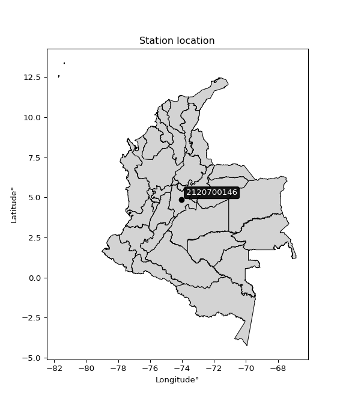

<div align="center">


</div>

# PMP Station (Rain, Pmax24h): 2120700146

Probable Maximum Precipitation (PMP) is the greatest amount of rainfall for a specific duration that is meteorologically possible for a given location, acting as a "worst-case" scenario for extreme storms, crucial for designing safety-critical infrastructure like bridges, river deviations, dams, spillways, and nuclear plants to prevent catastrophic failure. PMP is calculated by hydrologists using meteorological data to determine the upper limit of extreme rainfall, often leading to the Probable Maximum Flood (PMF) for flood control design, and is increasingly being studied for climate change impacts. Probable Maximum Precipitation (PMP) is the theoretical upper limit of rainfall, a deterministic estimate for extreme events, while probability distributions (like GEV, Gumbel) describe the likelihood and frequency of various precipitation amounts, including rare ones, showing how often events occur, with PMP representing the extreme end of these distributions, used for critical infrastructure design to ensure safety against the worst conceivable weather, unlike standard statistical forecasts which cover typical probabilities.

The most common probability distributions in hydrology, used for analyzing floods, rainfall, and streamflow, include the Normal, Log-Normal, Gumbel, Gamma (including Log-Pearson Type III), and Generalized Extreme Value (GEV) distributions, often chosen based on the data´s skewness and whether modeling extremes or general conditions, with Gumbel and GEV popular for extreme events like floods, while the Normal distribution serves as a baseline, though often requiring transformations for skewed hydrological data. These distributions help in designing water infrastructure, managing water resources, and forecasting hydrologic events.

> Hydrological data often isn´t perfectly normal (it´s skewed), so different distributions are needed for different applications, such as: **Flood Frequency Analysis**: Using Gumbel, GEV, or Log-Pearson Type III for predicting extreme flood magnitudes and their return periods, **Rainfall Analysis**: Normal for annual totals, but Log-Normal, Weibull, or GEV for intensity or extreme daily rainfall, **Streamflow Modeling**: Gamma and Log-Normal for maximum flows, GEV for minimum flows, and Kappa for daily flows.

<div align="center">

</img>

</div>


## A. General information


### 1. General running parameters

• app_version: _v20260108_. • runtime: _2026-01-08 13:24:42.400241_. • Python version: _3.14.0_. • SciPy version: _1.16.3_. • Pandas version: _2.3.3_. • NumPy version: _2.3.5_. • Stations dataset (station_dataset_file): _dataset/pmax24h_in/automatic_colombia_2003_2024.csv_. • Stations catalog (station_catalog_file): _dataset/CNE.xls_. • Minimum year to eval til year_max (date_min): _1900_. • Maximum year to eval since year_min (date_max): _2024_. • Creates, save and include plots into reports (create_plot): _False_. • Plot only fit distributions with Δo > Δ (plot_only_fit): _True_. • Plot only simple graphs avoiding multiple CDFs and multiple Extreme values plots (plot_only_simple): _True_. • Eval low extreme values, if False, evaluates high extreme values (low_extreme): _False_. • Eval every SciPy distribution as logarithmic (pdist_logarithmic_on): _True_. • Standard deviation normalized (ddof): _1.0_. • Return periods to eval in years (Tr): _[2, 2.33, 5, 10, 15, 20, 25, 50, 75, 100, 200, 250, 500, 750, 1000]_. • Minimum data sample per station, 0 means any (minimum_sample): _5_. • Z-Score maximum threshold to adjust a value, 0 means disable (zscore_max): _3.5_. • Z-Score minimum threshold to adjust a value, 0 means disable (zscore_min): _-2.5_. • Avoid zeros, e.g. rain = 0 (avoid_zeros): _True_. • Avoid null values (avoid_nans): _True_. 

:file_folder:Table: [dataset.csv](../../dataset/pmax24h_in/automatic_colombia_2003_2024.csv)

> Delta Degrees of Freedom (DDOF): is a parameter used in the formulas for calculating variance and standard deviation. When ddof=0, the divisor is $N$ (the total number of observations) and this is used when your data set is the entire population. When ddof=1, the divisor is $N-1$ and this is used when your data set is a sample drawn from a larger population. Using $N-1$ provides an unbiased estimate of the population variance (known as Bessel´s correction).


### 2. Station info and location

|   id |     CODIGO | NOMBRE                                | CATEGORIA    | TECNOLOGIA                              | ESTADO   | FECHA_INSTALACION   |   FECHA_SUSPENSION |   ALTITUD |   LATITUD |   LONGITUD | DEPARTAMENTO   | MUNICIPIO   | AREA_OPERATIVA                            | ENTIDAD                                                     | AREA_HIDROGRAFICA   | ZONA_HIDROGRAFICA   | SUBZONA_HIDROGRAFICA   | CORRIENTE   | Catalogo   |   Version |
|-----:|-----------:|:--------------------------------------|:-------------|:----------------------------------------|:---------|:--------------------|-------------------:|----------:|----------:|-----------:|:---------------|:------------|:------------------------------------------|:------------------------------------------------------------|:--------------------|:--------------------|:-----------------------|:------------|:-----------|----------:|
|    0 | 2120700146 | UNIVERSIDAD DE LA SABANA [2120700146] | Limnigráfica | Automática con Telemetría, Convencional | Activa   | 17/10/2018          |                nan |      2553 |   4.85453 |     -74.04 | Cundinamarca   | Chía        | Area Operativa 11 - Cundinamarca-Amazonas | INSTITUTO DE HIDROLOGIA METEOROLOGIA Y ESTUDIOS AMBIENTALES | Magdalena Cauca     | Alto Magdalena      | Río Bogotá             | Bogota      | CNE_IDEAM  |  20251226 |

<div align="center">

Dynamic map: [:earth_americas:Google](http://maps.google.com/maps?q=4.854528,-74.040049) [:earth_americas:OSM](https://www.openstreetmap.org/#map=18/4.854528/-74.040049&layers=P) [:earth_americas:Bing](https://www.bing.com/maps?cp=4.854528~-74.040049&lvl=18) [:earth_americas:Apple](https://maps.apple.com/frame?center=4.854528%2C-74.040049&span=0.003%2C0.006)

</div>


<div align="center">

```geojson
{
  "type": "Feature",
  "geometry": {
    "type": "Point", 
    "coordinates": [-74.040049, 4.854528]
  }, 
  "properties": {
    "Name": "2120700146"
  }
}
```

</div>


### 3. Discrete values table and plot

<div align="center">

|               |           0 |           1 |           2 |           3 |          4 |          5 |
|:--------------|------------:|------------:|------------:|------------:|-----------:|-----------:|
| Date          | 2019        | 2020        | 2021        | 2022        | 2023       | 2024       |
| Value         |   23        |   31.6      |   34.2      |   30.6      |   20       |   39.2     |
| Value_initial |   23        |   31.6      |   34.2      |   30.6      |   20       |   39.2     |
| count         |    6        |    6        |    6        |    6        |    6       |    6       |
| mean          |   29.7667   |   29.7667   |   29.7667   |   29.7667   |   29.7667  |   29.7667  |
| std           |    7.12563  |    7.12563  |    7.12563  |    7.12563  |    7.12563 |    7.12563 |
| zscore        |   -0.949623 |    0.257287 |    0.622167 |    0.116949 |   -1.37064 |    1.32386 |


</div>


> The initial value (value_initial) correspond to the initial obtained or null completed value, and value (value) is adjusted only when the initial value is outside the valid range (outlier) definite through the Z-Score value. If Z-Score is active, values out of range or outliers are replaced with the station mean value. A Z-Score (or standard score) measures how many standard deviations a data point is from the mean of a dataset, indicating its relative position; positive scores mean above the mean, negative mean below, and a score of zero is exactly at the mean, allowing for comparison of values from different distributions. It´s calculated using the formula $z=(x–μ)/σ$, where $x$ is the data point, $μ$ is the mean, and $σ$ is the standard deviation, helping identify outliers and understand probability.
>
> <sub>**Note**: In this study, "completing" (filling gaps in) and "extending" (forecasting or lengthening the historical record) rainfall data series are avoided for certain critical analyses because they introduce artificial bias and uncertainty, which can distort the statistics of rare events (extremes), alter day-to-day variability, and compromise the integrity and homogeneity of the original data. Some reasons against Completing/Extending rainfall data are: **Distortion of Extremes and Variability**: The primary issue is that most gap-filling or extension methods rely on averaging or regression with nearby stations, which inherently smooths the data. Rainfall is highly variable in space and time, with a large percentage of zero values and occasional large storms. Infilling methods often underestimate the highest values and overestimate the lowest (zero) values, which severely distorts analyses focused on flood frequency, drought severity, and intensity-duration-frequency (IDF) curves, **Loss of Data Homogeneity**: Infilled or extended data are synthetic estimates, not actual measurements. Combining these estimates with observed data can violate the assumption of data homogeneity, which requires that the data properties do not change over time. Inhomogeneity can lead to incorrect conclusions about long-term trends or changes in climate patterns, **Propagation of Errors**: Errors and biases from the original data (e.g., wind-induced undercatch, instrument errors, site changes) or the data used for imputation can propagate through the analysis, leading to unreliable hydrological models and inaccurate predictions, **Compromised Statistical Integrity**: For statistical analyses, especially those involving the frequency of events, using artificial data can introduce time bias or autocorrelation that doesn´t exist in reality, making it difficult to assess the true probability of events, **Difficulty in Validation**: It is difficult to accurately validate the quality of filled or extended data, especially for past periods where ground-truth measurements are unavailable. The reliability of imputation techniques heavily depends on the density of the surrounding station network and the complexity of the local topography.</sub>


### 4. Active continuous probability distributions from SciPy (43 of 104 available)

A Probability Density Function (PDF) describes the relative likelihood of a continuous random variable falling within a specific range, where the total area under its curve equals 1, and the area over any interval gives the actual probability for that range. Unlike discrete probabilities (like rolling a die), a PDF shows density, not direct probability for a single point (which is zero), with higher points indicating higher likelihood, often visualized as a bell curve for normal distributions.

A log of a probability density function (log-PDF) is simply the logarithm of the PDF´s value, denoted as $log(f(x))$, useful for converting multiplication of probabilities into addition, improving numerical stability with tiny numbers, and connecting to information theory concepts like entropy. Instead of dealing with very small probabilities (e.g., 0.000001), log-PDFs use negative numbers (e.g., $log(0.00001) ≈ -11.51$ that are easier for computers to handle, preventing underflow errors and simplifying complex calculations. In this study, each active probability distribution from SciPy is also evaluated in the $log$ form.

[scipy.stats](https://docs.scipy.org/doc/scipy/reference/stats.html) is a Python´s powerful submodule within the SciPy library for comprehensive statistical analysis, offering over 130 probability distributions (like Normal, Poisson), functions for descriptive stats (mean, variance), hypothesis testing (t-tests, chi-square), random variable generation, and statistical tests, making it essential for data science, modeling, and research. It provides tools to explore, model, and draw conclusions from data efficiently, working seamlessly with NumPy.

<div align="center">

|   id | p_dist             |   n_parameter | fit_method   | label                                                                       | active   | ref                                                                                                        |
|-----:|:-------------------|--------------:|:-------------|:----------------------------------------------------------------------------|:---------|:-----------------------------------------------------------------------------------------------------------|
|    0 | alpha              |             3 | MLE          | Alpha                                                                       | True     | [:mortar_board:](https://docs.scipy.org/doc/scipy/reference/generated/scipy.stats.alpha.html)              |
|    1 | betaprime          |             4 | MLE          | Beta prime                                                                  | True     | [:mortar_board:](https://docs.scipy.org/doc/scipy/reference/generated/scipy.stats.betaprime.html)          |
|    2 | chi2               |             3 | MLE          | Chi²                                                                        | True     | [:mortar_board:](https://docs.scipy.org/doc/scipy/reference/generated/scipy.stats.chi2.html)               |
|    3 | crystalball        |             4 | MLE          | Crystalball                                                                 | True     | [:mortar_board:](https://docs.scipy.org/doc/scipy/reference/generated/scipy.stats.crystalball.html)        |
|    4 | erlang             |             3 | MLE          | Erlang                                                                      | True     | [:mortar_board:](https://docs.scipy.org/doc/scipy/reference/generated/scipy.stats.erlang.html)             |
|    5 | expon              |             2 | MLE          | Exponential                                                                 | True     | [:mortar_board:](https://docs.scipy.org/doc/scipy/reference/generated/scipy.stats.expon.html)              |
|    6 | exponnorm          |             3 | MLE          | Exponentially modified Normal                                               | True     | [:mortar_board:](https://docs.scipy.org/doc/scipy/reference/generated/scipy.stats.exponnorm.html)          |
|    7 | f                  |             4 | MLE          | F                                                                           | True     | [:mortar_board:](https://docs.scipy.org/doc/scipy/reference/generated/scipy.stats.f.html)                  |
|    8 | fatiguelife        |             3 | MLE          | Fatigue-life (Birnbaum-Saunders)                                            | True     | [:mortar_board:](https://docs.scipy.org/doc/scipy/reference/generated/scipy.stats.fatiguelife.html)        |
|    9 | fisk               |             3 | MLE          | Fisk                                                                        | True     | [:mortar_board:](https://docs.scipy.org/doc/scipy/reference/generated/scipy.stats.fisk.html)               |
|   10 | gamma              |             3 | MLE          | Gamma                                                                       | True     | [:mortar_board:](https://docs.scipy.org/doc/scipy/reference/generated/scipy.stats.gamma.html)              |
|   11 | genexpon           |             5 | MLE          | Generalized exponential                                                     | True     | [:mortar_board:](https://docs.scipy.org/doc/scipy/reference/generated/scipy.stats.genexpon.html)           |
|   12 | genlogistic        |             3 | MLE          | Generalized logistic                                                        | True     | [:mortar_board:](https://docs.scipy.org/doc/scipy/reference/generated/scipy.stats.genlogistic.html)        |
|   13 | gibrat             |             2 | MM           | Gibrat                                                                      | True     | [:mortar_board:](https://docs.scipy.org/doc/scipy/reference/generated/scipy.stats.gibrat.html)             |
|   14 | gompertz           |             3 | MLE          | Gompertz (or truncated Gumbel)                                              | True     | [:mortar_board:](https://docs.scipy.org/doc/scipy/reference/generated/scipy.stats.gompertz.html)           |
|   15 | gumbel_l           |             2 | MM           | Gumbel Left Skew                                                            | True     | [:mortar_board:](https://docs.scipy.org/doc/scipy/reference/generated/scipy.stats.gumbel_l.html)           |
|   16 | gumbel_r           |             2 | MM           | Gumbel Right Skew                                                           | True     | [:mortar_board:](https://docs.scipy.org/doc/scipy/reference/generated/scipy.stats.gumbel_r.html)           |
|   17 | halflogistic       |             2 | MM           | Half-logistic                                                               | True     | [:mortar_board:](https://docs.scipy.org/doc/scipy/reference/generated/scipy.stats.halflogistic.html)       |
|   18 | halfnorm           |             2 | MM           | Half Normal                                                                 | True     | [:mortar_board:](https://docs.scipy.org/doc/scipy/reference/generated/scipy.stats.halfnorm.html)           |
|   19 | hypsecant          |             2 | MM           | hyperbolic secant                                                           | True     | [:mortar_board:](https://docs.scipy.org/doc/scipy/reference/generated/scipy.stats.hypsecant.html)          |
|   20 | invgamma           |             3 | MLE          | Inverted gamma                                                              | True     | [:mortar_board:](https://docs.scipy.org/doc/scipy/reference/generated/scipy.stats.invgamma.html)           |
|   21 | invgauss           |             3 | MLE          | Inverse Gaussian                                                            | True     | [:mortar_board:](https://docs.scipy.org/doc/scipy/reference/generated/scipy.stats.invgauss.html)           |
|   22 | invweibull         |             3 | MLE          | Inverted Weibull                                                            | True     | [:mortar_board:](https://docs.scipy.org/doc/scipy/reference/generated/scipy.stats.invweibull.html)         |
|   23 | kstwobign          |             2 | MLE          | Limiting distribution of scaled Kolmogorov-Smirnov two-sided test statistic | True     | [:mortar_board:](https://docs.scipy.org/doc/scipy/reference/generated/scipy.stats.kstwobign.html)          |
|   24 | laplace            |             2 | MM           | Laplace                                                                     | True     | [:mortar_board:](https://docs.scipy.org/doc/scipy/reference/generated/scipy.stats.laplace.html)            |
|   25 | laplace_asymmetric |             3 | MLE          | Asymmetric Laplace                                                          | True     | [:mortar_board:](https://docs.scipy.org/doc/scipy/reference/generated/scipy.stats.laplace_asymmetric.html) |
|   26 | loggamma           |             3 | MLE          | Log gamma                                                                   | True     | [:mortar_board:](https://docs.scipy.org/doc/scipy/reference/generated/scipy.stats.loggamma.html)           |
|   27 | logistic           |             2 | MM           | Logistic (or Sech-squared)                                                  | True     | [:mortar_board:](https://docs.scipy.org/doc/scipy/reference/generated/scipy.stats.logistic.html)           |
|   28 | lognorm            |             3 | MLE          | Log Normal                                                                  | True     | [:mortar_board:](https://docs.scipy.org/doc/scipy/reference/generated/scipy.stats.lognorm.html)            |
|   29 | maxwell            |             2 | MM           | Maxwell                                                                     | True     | [:mortar_board:](https://docs.scipy.org/doc/scipy/reference/generated/scipy.stats.maxwell.html)            |
|   30 | mielke             |             4 | MLE          | Mielke Beta-Kappa / Dagum                                                   | True     | [:mortar_board:](https://docs.scipy.org/doc/scipy/reference/generated/scipy.stats.mielke.html)             |
|   31 | moyal              |             2 | MM           | Moyal                                                                       | True     | [:mortar_board:](https://docs.scipy.org/doc/scipy/reference/generated/scipy.stats.moyal.html)              |
|   32 | nakagami           |             3 | MLE          | Nakagami                                                                    | True     | [:mortar_board:](https://docs.scipy.org/doc/scipy/reference/generated/scipy.stats.nakagami.html)           |
|   33 | ncf                |             5 | MLE          | Non-central F distribution                                                  | True     | [:mortar_board:](https://docs.scipy.org/doc/scipy/reference/generated/scipy.stats.ncf.html)                |
|   34 | nct                |             4 | MLE          | Non-central Student’s t                                                     | True     | [:mortar_board:](https://docs.scipy.org/doc/scipy/reference/generated/scipy.stats.nct.html)                |
|   35 | norm               |             2 | MM           | Normal                                                                      | True     | [:mortar_board:](https://docs.scipy.org/doc/scipy/reference/generated/scipy.stats.norm.html)               |
|   36 | pearson3           |             3 | MM           | Pearson type III                                                            | True     | [:mortar_board:](https://docs.scipy.org/doc/scipy/reference/generated/scipy.stats.pearson3.html)           |
|   37 | rayleigh           |             2 | MM           | Rayleigh                                                                    | True     | [:mortar_board:](https://docs.scipy.org/doc/scipy/reference/generated/scipy.stats.rayleigh.html)           |
|   38 | rice               |             3 | MLE          | Rice                                                                        | True     | [:mortar_board:](https://docs.scipy.org/doc/scipy/reference/generated/scipy.stats.rice.html)               |
|   39 | t                  |             3 | MLE          | Student’s t                                                                 | True     | [:mortar_board:](https://docs.scipy.org/doc/scipy/reference/generated/scipy.stats.t.html)                  |
|   40 | truncnorm          |             4 | MLE          | Truncated normal                                                            | True     | [:mortar_board:](https://docs.scipy.org/doc/scipy/reference/generated/scipy.stats.truncnorm.html)          |
|   41 | wald               |             2 | MM           | Wald                                                                        | True     | [:mortar_board:](https://docs.scipy.org/doc/scipy/reference/generated/scipy.stats.wald.html)               |
|   42 | weibull_min        |             3 | MLE          | Weibull minimum                                                             | True     | [:mortar_board:](https://docs.scipy.org/doc/scipy/reference/generated/scipy.stats.weibull_min.html)        |

</div>

> **n_parameter:** # arguments & localization & scale.
>
> **Fit methods:** (MLE) maximum likelihood, (MM) L-moments.
>
>**Inactive** (With the only purpose of prevent loops, zero divisions, infinite values, over high estimated values or horizontal trending for recurrence intervals estimations, the follow distributions were disabled.)**:** foldnorm, gennorm, norminvgauss, powernorm, powerlognorm, skewnorm, genextreme, anglit, arcsine, argus, beta, bradford, burr, burr12, cauchy, cosine, halfcauchy, foldcauchy, skewcauchy, wrapcauchy, dgamma, gengamma, exponweib, exponpow, truncexpon, gausshyper, genhalflogistic, genhyperbolic, geninvgauss, halfgennorm, johnsonsb, johnsonsu, kappa4, kappa3, ksone, kstwo, loglaplace, levy, levy_l, levy_stable, ncx2, pareto, genpareto, truncpareto, lomax, powerlaw, rdist, rel_breitwigner, recipinvgauss, semicircular, studentized_range, trapezoid, triang, truncweibull_min, tukeylambda, uniform, loguniform, vonmises, vonmises_line, weibull_max, dweibull, 


## B. Probability (PDF) vs. Empirical (EDF) distributions functions

A continuous probability distribution (CPD) describes probabilities for variables that can take any value within a range (like rain any time), unlike discrete variables with specific outcomes (like temperature). It uses a Probability Density Function (PDF), a curve where the total area under it equals 1, and the probability of the variable falling within an interval (a to b) is found by calculating the area under the curve between those points. A key feature is that the probability of hitting any single exact value is zero, so probabilities are always expressed for ranges, e.g., $P(a ≤ X ≤ b)$.

<div align="center">

Distributions parameters from station values
|    |    station | p_dist                |   n |              loc |           scale | shape                  | shape1                 | shape2             | shape3   |
|---:|-----------:|:----------------------|----:|-----------------:|----------------:|:-----------------------|:-----------------------|:-------------------|:---------|
|  0 | 2120700146 | alpha                 |   6 |   -110.933       |  3031.17        | 21.596714518466932     |                        |                    |          |
|  1 | 2120700146 | betaprime             |   6 |     -0.785463    |    56.2407      | 31.694715011911228     | 59.44443229747867      |                    |          |
|  2 | 2120700146 | chi2                  |   6 |     20           |     2.76834     | 0.42922936288105606    |                        |                    |          |
|  3 | 2120700146 | crystalball           |   6 |     29.7667      |     6.50478     | 2596.150381110606      | 83.90416517823287      |                    |          |
|  4 | 2120700146 | erlang                |   6 |   -101.273       |     0.328964    | 398.39198356806764     |                        |                    |          |
|  5 | 2120700146 | expon                 |   6 |     20           |     9.76667     |                        |                        |                    |          |
|  6 | 2120700146 | exponnorm             |   6 |     29.7605      |     6.5048      | 0.000954605096096105   |                        |                    |          |
|  7 | 2120700146 | f                     |   6 |   -776.932       |   806.682       | 36633.469635305315     | 187833.61286257632     |                    |          |
|  8 | 2120700146 | fatiguelife           |   6 |     20           |     2.30903e-05 | 666.6385006618775      |                        |                    |          |
|  9 | 2120700146 | fisk                  |   6 |     -0.0495182   |    29.6204      | 7.2119793908269045     |                        |                    |          |
| 10 | 2120700146 | gamma                 |   6 |    -88.0305      |     0.363221    | 324.30560168057787     |                        |                    |          |
| 11 | 2120700146 | genexpon              |   6 |     20           |     1.67115     | 0.16859366404431886    | 1.7609081677051333e-05 | 1.2592675097591715 |          |
| 12 | 2120700146 | genlogistic           |   6 |     34.3381      |     2.59436     | 0.4352967303423583     |                        |                    |          |
| 13 | 2120700146 | gibrat                |   6 |     24.8043      |     3.00981     |                        |                        |                    |          |
| 14 | 2120700146 | gompertz              |   6 |     30.6         |     3.68332     | 0.354058608910893      |                        |                    |          |
| 15 | 2120700146 | gumbel_l              |   6 |     32.6942      |     5.07176     |                        |                        |                    |          |
| 16 | 2120700146 | gumbel_r              |   6 |     26.8392      |     5.07176     |                        |                        |                    |          |
| 17 | 2120700146 | halflogistic          |   6 |     22.057       |     5.56135     |                        |                        |                    |          |
| 18 | 2120700146 | halfnorm              |   6 |     21.1569      |    10.7908      |                        |                        |                    |          |
| 19 | 2120700146 | hypsecant             |   6 |     29.7667      |     4.14107     |                        |                        |                    |          |
| 20 | 2120700146 | invgamma              |   6 |    -54.8803      | 13684.1         | 162.6494589635288      |                        |                    |          |
| 21 | 2120700146 | invgauss              |   6 |     -6.43824     |   982.507       | 0.03681269480102467    |                        |                    |          |
| 22 | 2120700146 | invweibull            |   6 |     -3.77934e+08 |     3.77934e+08 | 62027891.610709265     |                        |                    |          |
| 23 | 2120700146 | kstwobign             |   6 |      5.525       |    27.6287      |                        |                        |                    |          |
| 24 | 2120700146 | laplace               |   6 |     29.7667      |     4.59958     |                        |                        |                    |          |
| 25 | 2120700146 | laplace_asymmetric    |   6 |     31.6         |     4.9841      | 1.2006636042490748     |                        |                    |          |
| 26 | 2120700146 | loggamma              |   6 |     10.4538      |    13.4815      | 4.679449774252172      |                        |                    |          |
| 27 | 2120700146 | logistic              |   6 |     29.7667      |     3.58628     |                        |                        |                    |          |
| 28 | 2120700146 | lognorm               |   6 |     20           |     0.0266383   | 13.270653650156667     |                        |                    |          |
| 29 | 2120700146 | maxwell               |   6 |     14.3531      |     9.65905     |                        |                        |                    |          |
| 30 | 2120700146 | mielke                |   6 |     -0.219174    |    36.8516      | 4.0222993283318225     | 17.81389445189712      |                    |          |
| 31 | 2120700146 | moyal                 |   6 |     26.0468      |     2.92818     |                        |                        |                    |          |
| 32 | 2120700146 | nakagami              |   6 |     23           |     8.6898      | 0.34016817702187974    |                        |                    |          |
| 33 | 2120700146 | ncf                   |   6 |     -6.8774      |     0.50787     | 1.7391098595814265     | 3212.7483953659485     | 123.66103249125611 |          |
| 34 | 2120700146 | nct                   |   6 |   -291.537       |     6.45663     | 79905.93261434842      | 49.76268430943452      |                    |          |
| 35 | 2120700146 | norm                  |   6 |     29.7667      |     6.50478     |                        |                        |                    |          |
| 36 | 2120700146 | pearson3              |   6 |     29.7667      |     6.50478     | -0.1865656658860923    |                        |                    |          |
| 37 | 2120700146 | rayleigh              |   6 |     17.3226      |     9.9289      |                        |                        |                    |          |
| 38 | 2120700146 | rice                  |   6 |     16.4494      |     7.59913     | 1.3430786192882935     |                        |                    |          |
| 39 | 2120700146 | t                     |   6 |     29.7676      |     6.50414     | 987723.3072904199      |                        |                    |          |
| 40 | 2120700146 | truncnorm             |   6 |     29.7667      |     6.50478     | -88.2532280645596      | 686.245484773084       |                    |          |
| 41 | 2120700146 | wald                  |   6 |     23.2619      |     6.5048      |                        |                        |                    |          |
| 42 | 2120700146 | weibull_min           |   6 |     11.0062      |    20.9912      | 3.3121982335029485     |                        |                    |          |
| 43 | 2120700146 | logalpha              |   6 |     -3.61999     |   207.742       | 29.773806652617935     |                        |                    |          |
| 44 | 2120700146 | logbetaprime          |   6 |      0.107353    |     2.72598     | 405.12444130350127     | 339.29335648911433     |                    |          |
| 45 | 2120700146 | logchi2               |   6 |      2.99573     |     0.962159    | 1.0424713391115272     |                        |                    |          |
| 46 | 2120700146 | logcrystalball        |   6 |      3.36771     |     0.230969    | 21.003873692167556     | 3335.690926596525      |                    |          |
| 47 | 2120700146 | logerlang             |   6 |     -0.263329    |     0.0152627   | 237.94562070044253     |                        |                    |          |
| 48 | 2120700146 | logexpon              |   6 |      2.99573     |     0.371982    |                        |                        |                    |          |
| 49 | 2120700146 | logexponnorm          |   6 |      3.36765     |     0.230968    | 0.00026233476132155064 |                        |                    |          |
| 50 | 2120700146 | logf                  |   6 |   -150.879       |   154.247       | 2479746.208205019      | 1387449.1677799271     |                    |          |
| 51 | 2120700146 | logfatiguelife        |   6 |    -52.7836      |    56.1494      | 0.00411950857758306    |                        |                    |          |
| 52 | 2120700146 | logfisk               |   6 | -11953.6         | 11957           | 86037.63146621903      |                        |                    |          |
| 53 | 2120700146 | loggamma              |   6 |     -0.166529    |     0.0154438   | 228.8778402510115      |                        |                    |          |
| 54 | 2120700146 | loggenexpon           |   6 |      2.99573     |     0.587894    | 1.1584289446687255     | 1.2405582847298549     | 0.9990387924190192 |          |
| 55 | 2120700146 | loggenlogistic        |   6 |      3.60151     |     0.0562889   | 0.2243557024096641     |                        |                    |          |
| 56 | 2120700146 | loggibrat             |   6 |      3.19147     |     0.1069      |                        |                        |                    |          |
| 57 | 2120700146 | loggompertz           |   6 |      2.99573     |     0.262823    | 0.21363880157937104    |                        |                    |          |
| 58 | 2120700146 | loggumbel_l           |   6 |      3.47166     |     0.180085    |                        |                        |                    |          |
| 59 | 2120700146 | loggumbel_r           |   6 |      3.26377     |     0.180085    |                        |                        |                    |          |
| 60 | 2120700146 | loghalflogistic       |   6 |      3.09398     |     0.19746     |                        |                        |                    |          |
| 61 | 2120700146 | loghalfnorm           |   6 |      3.06198     |     0.383185    |                        |                        |                    |          |
| 62 | 2120700146 | loghypsecant          |   6 |      3.36771     |     0.147039    |                        |                        |                    |          |
| 63 | 2120700146 | loginvgamma           |   6 |     -3.25864     |  5294.9         | 800.148495784445       |                        |                    |          |
| 64 | 2120700146 | loginvgauss           |   6 |      1.74509     |    70.9481      | 0.02290179537586936    |                        |                    |          |
| 65 | 2120700146 | loginvweibull         |   6 |     -2.31729e+07 |     2.31729e+07 | 102203669.37515487     |                        |                    |          |
| 66 | 2120700146 | logkstwobign          |   6 |      2.46713     |     1.02576     |                        |                        |                    |          |
| 67 | 2120700146 | loglaplace            |   6 |      3.36771     |     0.163319    |                        |                        |                    |          |
| 68 | 2120700146 | loglaplace_asymmetric |   6 |      3.45316     |     0.167711    | 1.2867840133518202     |                        |                    |          |
| 69 | 2120700146 | logloggamma           |   6 |      3.6204      |     0.0969005   | 0.39372874891086734    |                        |                    |          |
| 70 | 2120700146 | loglogistic           |   6 |      3.36771     |     0.12734     |                        |                        |                    |          |
| 71 | 2120700146 | loglognorm            |   6 |      2.99573     |     0.0012781   | 12.839353832261134     |                        |                    |          |
| 72 | 2120700146 | logmaxwell            |   6 |      2.82042     |     0.342969    |                        |                        |                    |          |
| 73 | 2120700146 | logmielke             |   6 |      2.99573     |     0.661151    | 0.793110036767253      | 19.887428328151735     |                    |          |
| 74 | 2120700146 | logmoyal              |   6 |      3.23563     |     0.103972    |                        |                        |                    |          |
| 75 | 2120700146 | lognakagami           |   6 |      2.99573     |     0.349924    | 0.07189112036440183    |                        |                    |          |
| 76 | 2120700146 | logncf                |   6 |     -3.3507      |     6.67849     | 434.5956786720866      | 546.8808729125028      | 2.365975942659942  |          |
| 77 | 2120700146 | lognct                |   6 |     -0.536031    |     0.0354448   | 140.57718697470528     | 109.52192937305121     |                    |          |
| 78 | 2120700146 | lognorm               |   6 |      3.36771     |     0.230969    |                        |                        |                    |          |
| 79 | 2120700146 | logpearson3           |   6 |      3.36771     |     0.230969    | -0.4261419898507087    |                        |                    |          |
| 80 | 2120700146 | lograyleigh           |   6 |      2.92586     |     0.35255     |                        |                        |                    |          |
| 81 | 2120700146 | logrice               |   6 |      2.86357     |     0.262301    | 1.5714668541762211     |                        |                    |          |
| 82 | 2120700146 | logt                  |   6 |      3.36771     |     0.230969    | 3759421053.284817      |                        |                    |          |
| 83 | 2120700146 | logtruncnorm          |   6 |     -0.0712069   |     1.20009     | 2.5506874855577264     | 3.1163400626288102     |                    |          |
| 84 | 2120700146 | logwald               |   6 |      3.13671     |     0.231005    |                        |                        |                    |          |
| 85 | 2120700146 | logweibull_min        |   6 |     -1.78322e+06 |     1.78323e+06 | 9605866.948462414      |                        |                    |          |

</div>

> **loc** (Location parameter): This shifts the distribution along the x-axis. For many common distributions, like the normal (Gaussian) distribution, loc represents the mean $μ$. For others, like the uniform distribution, it might represent the minimum value, or for the beta distribution, the left end of the support interval.
>
> **scale** (Scale parameter): This determines the width or spread of the distribution. For the normal distribution, scale represents the standard deviation $σ$. For a uniform distribution, it defines the length of the interval (from $loc$ to $loc + scale$).
>
> **shape** (Shape parameters): Refers to parameters that define the specific form of a probability distribution, distinct from its location (loc) and scale (scale). These parameters are required arguments for most distribution functions. For example, a normal (Gaussian) distribution is fully defined by its location (mean) and scale (standard deviation), so it has no specific shape parameters beyond loc and scale. However, other distributions have intrinsic properties that need specification, as Gamma distribution that takes a shape parameter, often named $a$ or $alpha$.


### 0. Cumulative distribution values - CDF (86 evaluated)

Cumulative Distribution Function (CDF), denoted as $F$<sub>$X$</sub>$(x)$, is a function that gives the probability that a random variable $X$ will take a value less than or equal to a specific value, $x$ (i.e., $(P(X≥x)$. It essentially "accumulates" probabilities from a given point up to the far right (positive infinity), providing a complete picture of the distribution´s probabilities for both discrete (like rain) and continuous (like temperature) variables, helping to find probabilities over ranges or above certain values. Each station is evaluated separately ordering the $x$ values ascending, calculating the CDF and PDF values for the activated distributions and their logarithmic forms.

<div align="center">

CDF ordered by x ascending and calculating $log(f(x))$ separately
|   id |    Station |   date |    x |   count |    mean |     std |    zscore |   Value_initial |    station |   m |     alpha |   alpha_pdf |   betaprime |   betaprime_pdf |        chi2 |    chi2_pdf |   crystalball |   crystalball_pdf |    erlang |   erlang_pdf |    expon |   expon_pdf |   exponnorm |   exponnorm_pdf |         f |     f_pdf |   fatiguelife |   fatiguelife_pdf |      fisk |   fisk_pdf |    gamma |   gamma_pdf |   genexpon |   genexpon_pdf |   genlogistic |   genlogistic_pdf |   gibrat |   gibrat_pdf |    gompertz |   gompertz_pdf |   gumbel_l |   gumbel_l_pdf |   gumbel_r |   gumbel_r_pdf |   halflogistic |   halflogistic_pdf |   halfnorm |   halfnorm_pdf |   hypsecant |   hypsecant_pdf |   invgamma |   invgamma_pdf |   invgauss |   invgauss_pdf |   invweibull |   invweibull_pdf |   kstwobign |   kstwobign_pdf |   laplace |   laplace_pdf |   laplace_asymmetric |   laplace_asymmetric_pdf |   loggamma |   loggamma_pdf |   logistic |   logistic_pdf |   lognorm |   lognorm_pdf |   maxwell |   maxwell_pdf |    mielke |   mielke_pdf |      moyal |   moyal_pdf |    nakagami |   nakagami_pdf |       ncf |   ncf_pdf |       nct |   nct_pdf |      norm |   norm_pdf |   pearson3 |   pearson3_pdf |   rayleigh |   rayleigh_pdf |      rice |   rice_pdf |         t |     t_pdf |   truncnorm |   truncnorm_pdf |     wald |   wald_pdf |   weibull_min |   weibull_min_pdf |   logalpha |   logalpha_pdf |   logbetaprime |   logbetaprime_pdf |     logchi2 |   logchi2_pdf |   logcrystalball |   logcrystalball_pdf |   logerlang |   logerlang_pdf |   logexpon |   logexpon_pdf |   logexponnorm |   logexponnorm_pdf |      logf |   logf_pdf |   logfatiguelife |   logfatiguelife_pdf |   logfisk |   logfisk_pdf |   loggenexpon |   loggenexpon_pdf |   loggenlogistic |   loggenlogistic_pdf |   loggibrat |   loggibrat_pdf |   loggompertz |   loggompertz_pdf |   loggumbel_l |   loggumbel_l_pdf |   loggumbel_r |   loggumbel_r_pdf |   loghalflogistic |   loghalflogistic_pdf |   loghalfnorm |   loghalfnorm_pdf |   loghypsecant |   loghypsecant_pdf |   loginvgamma |   loginvgamma_pdf |   loginvgauss |   loginvgauss_pdf |   loginvweibull |   loginvweibull_pdf |   logkstwobign |   logkstwobign_pdf |   loglaplace |   loglaplace_pdf |   loglaplace_asymmetric |   loglaplace_asymmetric_pdf |   logloggamma |   logloggamma_pdf |   loglogistic |   loglogistic_pdf |   loglognorm |   loglognorm_pdf |   logmaxwell |   logmaxwell_pdf |   logmielke |   logmielke_pdf |   logmoyal |   logmoyal_pdf |   lognakagami |   lognakagami_pdf |   logncf |   logncf_pdf |    lognct |   lognct_pdf |   logpearson3 |   logpearson3_pdf |   lograyleigh |   lograyleigh_pdf |   logrice |   logrice_pdf |      logt |   logt_pdf |   logtruncnorm |   logtruncnorm_pdf |   logwald |   logwald_pdf |   logweibull_min |   logweibull_min_pdf |
|-----:|-----------:|-------:|-----:|--------:|--------:|--------:|----------:|----------------:|-----------:|----:|----------:|------------:|------------:|----------------:|------------:|------------:|--------------:|------------------:|----------:|-------------:|---------:|------------:|------------:|----------------:|----------:|----------:|--------------:|------------------:|----------:|-----------:|---------:|------------:|-----------:|---------------:|--------------:|------------------:|---------:|-------------:|------------:|---------------:|-----------:|---------------:|-----------:|---------------:|---------------:|-------------------:|-----------:|---------------:|------------:|----------------:|-----------:|---------------:|-----------:|---------------:|-------------:|-----------------:|------------:|----------------:|----------:|--------------:|---------------------:|-------------------------:|-----------:|---------------:|-----------:|---------------:|----------:|--------------:|----------:|--------------:|----------:|-------------:|-----------:|------------:|------------:|---------------:|----------:|----------:|----------:|----------:|----------:|-----------:|-----------:|---------------:|-----------:|---------------:|----------:|-----------:|----------:|----------:|------------:|----------------:|---------:|-----------:|--------------:|------------------:|-----------:|---------------:|---------------:|-------------------:|------------:|--------------:|-----------------:|---------------------:|------------:|----------------:|-----------:|---------------:|---------------:|-------------------:|----------:|-----------:|-----------------:|---------------------:|----------:|--------------:|--------------:|------------------:|-----------------:|---------------------:|------------:|----------------:|--------------:|------------------:|--------------:|------------------:|--------------:|------------------:|------------------:|----------------------:|--------------:|------------------:|---------------:|-------------------:|--------------:|------------------:|--------------:|------------------:|----------------:|--------------------:|---------------:|-------------------:|-------------:|-----------------:|------------------------:|----------------------------:|--------------:|------------------:|--------------:|------------------:|-------------:|-----------------:|-------------:|-----------------:|------------:|----------------:|-----------:|---------------:|--------------:|------------------:|---------:|-------------:|----------:|-------------:|--------------:|------------------:|--------------:|------------------:|----------:|--------------:|----------:|-----------:|---------------:|-------------------:|----------:|--------------:|-----------------:|---------------------:|
|    0 | 2120700146 |   2023 | 20   |       6 | 29.7667 | 7.12563 | -1.37064  |            20   | 2120700146 |   1 | 0.0601103 |   0.0210927 |   0.0542449 |       0.0229687 | 0.000600177 | 3.62559e+10 |     0.0666185 |         0.0198676 | 0.0652742 |    0.0204042 | 0        |   0.102389  |   0.0666187 |       0.0198676 | 0.0665919 | 0.0200156 |     0.0273799 |       4.30055e+09 | 0.0565442 |  0.0191893 | 0.064579 |   0.0204346 | 2.0254e-07 |      0.100885  |     0.0900441 |         0.0150482 | 0        |   0          | 0           |      0         |  0.0785865 |      0.0148695 |  0.0212464 |      0.0161348 |      0         |          0         |   0        |      0         |   0.0600224 |       0.0144086 |  0.0616405 |      0.0215462 |  0.0602644 |      0.0239699 |     0.055554 |        0.0263539 |   0.0534369 |       0.0294937 | 0.0598131 |     0.013004  |            0.0849809 |                0.0142008 |  0.0513675 |       0.485874 |  0.0616098 |      0.0161209 |  0.053641 |      0.472192 | 0.0480133 |     0.0237983 | 0.0894157 |    0.0177875 | 0.00498295 |  0.00741977 | 0           |      0         | 0.0603135 | 0.0212806 | 0.0666572 | 0.0198893 | 0.0666185 |  0.0198676 |  0.0711422 |      0.0191554 |  0.0357036 |      0.0261888 | 0.0440224 |  0.0246269 | 0.0665818 | 0.019861  |   0.0666184 |       0.0198676 | 0        |  0         |      0.058581 |         0.0209293 |  0.0518189 |       0.503655 |      0.0518362 |           0.50049  | 7.97198e-09 |   9.35686e+06 |        0.0536411 |             0.472192 |   0.0527699 |        0.491586 |   0        |       2.6883   |      0.0536433 |           0.472209 | 0.0534952 |   0.471809 |        0.0542328 |             0.478771 |  0.05702  |      0.38691  |   6.31711e-10 |          1.97047  |        0.0894119 |             0.35637  |    0        |        0        |   4.69807e-09 |          0.812861 |     0.0686886 |          0.368012 |      0.011916 |          0.293119 |          0        |              0        |      0        |          0        |      0.0506149 |           0.342779 |     0.0523088 |          0.492721 |     0.0480177 |          0.533729 |       0.0476621 |            0.639807 |       0.046711 |           0.732686 |    0.0512632 |         0.313883 |               0.0748661 |                    0.346911 |      0.088974 |          0.36111  |     0.0511165 |          0.380899 |    0.0127287 |      5.76487e+12 |    0.0328652 |         0.533437 | 1.74133e-05 |       20.9167   | 0.00152544 |      0.0800218 |    0.00619712 |       2.00643e+12 | 0.268803 |     0.570377 | 0.0490692 |     0.506486 |     0.0635729 |          0.443741 |     0.0194494 |          0.551246 | 0.0374085 |      0.572407 | 0.0536415 |   0.472195 |      0.0168616 |           2.84552  |  0        |      0        |         0.072018 |             0.373628 |
|    1 | 2120700146 |   2019 | 23   |       6 | 29.7667 | 7.12563 | -0.949623 |            23   | 2120700146 |   2 | 0.150266  |   0.0394458 |   0.155107  |       0.0442621 | 0.879129    | 0.0398987   |     0.14911   |         0.0357021 | 0.150408  |    0.0368575 | 0.264472 |   0.07531   |   0.14911   |       0.035702  | 0.149737  | 0.0359752 |     0.705641  |       0.0310624   | 0.140772  |  0.0378458 | 0.150112 |   0.0370977 | 0.26116    |      0.0745447 |     0.1484    |         0.0245885 | 0        |   0          | 0           |      0         |  0.137459  |      0.0251484 |  0.118623  |      0.0498606 |      0.0845791 |          0.089263  |   0.135624 |      0.0728706 |   0.122688  |       0.028899  |  0.152995  |      0.039695  |  0.16235   |      0.0439289 |     0.170923 |        0.049556  |   0.181437  |       0.0536548 | 0.114831  |     0.0249655 |            0.140294  |                0.023444  |  0.159466  |       1.08737  |  0.131607  |      0.0318678 |  0.157348 |      1.04196  | 0.150871  |     0.0443443 | 0.155978  |    0.0270131 | 0.0924797  |  0.0556653  | 4.22393e-11 |   4044.36      | 0.15082   | 0.0394252 | 0.149234  | 0.0357351 | 0.14911   |  0.0357021 |  0.149343  |      0.0335994 |  0.150815  |      0.0489042 | 0.146821  |  0.0433095 | 0.149054  | 0.0356967 |   0.149109  |       0.035702  | 0        |  0         |      0.144978 |         0.0369833 |  0.164082  |       1.12591  |      0.162564  |           1.10485  | 0.280345    |   0.996555    |        0.157348  |             1.04196  |   0.161245  |        1.08563  |   0.313207 |       1.84631  |      0.157353  |           1.04198  | 0.157149  |   1.04146  |        0.159224  |             1.05287  |  0.141857 |      0.875965 |   0.264941    |          1.77633  |        0.156064  |             0.621879 |    0        |        0        |   0.13926     |          1.19079  |     0.143269  |          0.735634 |      0.130205 |          1.47398  |          0.10474  |              2.50438  |      0.152149 |          2.04427  |      0.129406  |           0.856038 |     0.161533  |          1.09556  |     0.168942  |          1.20503  |       0.193365  |            1.40135  |       0.210432 |           1.51498  |    0.12063   |         0.738616 |               0.143069  |                    0.662945 |      0.156771 |          0.633934 |     0.138999  |          0.939836 |    0.642683  |      0.207944    |    0.161077  |         1.2875   | 0.291556    |        1.65449  | 0.105535   |      1.67586   |    0.752315   |       0.765718    | 0.352971 |     0.629094 | 0.163746  |     1.1551   |     0.155922  |          0.909816 |     0.162045  |          1.41333  | 0.161545  |      1.19713  | 0.157349  |   1.04196  |      0.360116  |           2.09875  |  0        |      0        |         0.146735 |             0.729375 |
|    2 | 2120700146 |   2022 | 30.6 |       6 | 29.7667 | 7.12563 |  0.116949 |            30.6 | 2120700146 |   3 | 0.571422  |   0.0593978 |   0.590779  |       0.0563832 | 0.984128    | 0.00375217  |     0.550969  |         0.0608294 | 0.555998  |    0.0599061 | 0.662208 |   0.0345862 |   0.550969  |       0.0608292 | 0.552568  | 0.0606448 |     0.845271  |       0.0114107   | 0.561271  |  0.0579428 | 0.558047 |   0.0600548 | 0.656812   |      0.0346261 |     0.486905  |         0.0660581 | 0.743842 |   0.0555364  | 2.21643e-10 |      0.0961247 |  0.484039  |      0.0673186 |  0.621023  |      0.0583323 |      0.645805  |          0.0524095 |   0.618487 |      0.0504187 |   0.563627  |       0.0753359 |  0.569827  |      0.0582878 |  0.586907  |      0.055052  |     0.602017 |        0.0501407 |   0.617637  |       0.0491576 | 0.582856  |     0.0906919 |            0.49957   |                0.083481  |  0.597461  |       1.63979  |  0.557832  |      0.0687776 |  0.591228 |      1.6819   | 0.581296  |     0.0567952 | 0.482781  |    0.0605042 | 0.645829   |  0.0563374  | 0.665457    |      0.0489274 | 0.568521  | 0.0588813 | 0.551189  | 0.0608044 | 0.550969  |  0.0608294 |  0.538833  |      0.0615164 |  0.591029  |      0.055081  | 0.570193  |  0.0578204 | 0.55092   | 0.0608363 |   0.550969  |       0.0608294 | 0.714661 |  0.0508146 |      0.548861 |         0.060703  |  0.606087  |       1.61227  |      0.595154  |           1.58781  | 0.476812    |   0.504304    |        0.591228  |             1.6819   |   0.596413  |        1.62888  |   0.681218 |       0.856982 |      0.591238  |           1.68189  | 0.59059   |   1.67972  |        0.594287  |             1.67468  |  0.563272 |      1.77008  |   0.665937    |          1.02099  |        0.482694  |             1.84906  |    0.777615 |        1.29796  |   0.578451    |          1.72816  |     0.529887  |          1.97036  |      0.658591 |          1.5274   |          0.679439 |              1.36322  |      0.651214 |          1.34247  |      0.612908  |           2.03003  |     0.599715  |          1.63123  |     0.610406  |          1.51679  |       0.62722   |            1.29038  |       0.647224 |           1.25772  |    0.639194  |         2.20921  |               0.537156  |                    2.48905  |      0.483644 |          1.79183  |     0.603113  |          1.87976  |    0.674477  |      0.0659599   |    0.618511  |         1.53974  | 0.704705    |        1.31405  | 0.681756   |      1.44655   |    0.877402   |       0.268626    | 0.538317 |     0.645143 | 0.608814  |     1.58838  |     0.564821  |          1.76057  |     0.627027  |          1.48581  | 0.604426  |      1.58968  | 0.591229  |   1.68189  |      0.800037  |           1.08042  |  0.746207 |      1.2379   |         0.522262 |             1.90101  |
|    3 | 2120700146 |   2020 | 31.6 |       6 | 29.7667 | 7.12563 |  0.257287 |            31.6 | 2120700146 |   4 | 0.629395  |   0.0563646 |   0.645278  |       0.0524943 | 0.987444    | 0.00291806  |     0.610968  |         0.0589424 | 0.614898  |    0.0576851 | 0.695082 |   0.0312202 |   0.610968  |       0.0589423 | 0.612341  | 0.0586784 |     0.856159  |       0.010389    | 0.617245  |  0.0538352 | 0.617051 |   0.057743  | 0.689748   |      0.0313029 |     0.554649  |         0.0690345 | 0.792295 |   0.0421358  | 0.104559    |      0.112922  |  0.553335  |      0.0709789 |  0.676287  |      0.0521558 |      0.695213  |          0.0464527 |   0.666847 |      0.0462921 |   0.636532  |       0.0699033 |  0.626718  |      0.0553212 |  0.640239  |      0.0514947 |     0.650081 |        0.0459485 |   0.664799  |       0.0451412 | 0.664366  |     0.0729706 |            0.590431  |                0.0986645 |  0.649007  |       1.56185  |  0.62509   |      0.0653471 |  0.644284 |      1.61302  | 0.636502  |     0.0534856 | 0.545241  |    0.064228  | 0.698441   |  0.0489674  | 0.711749    |      0.0437217 | 0.626043  | 0.0559834 | 0.611158  | 0.0589085 | 0.610968  |  0.0589424 |  0.599937  |      0.0604471 |  0.64437   |      0.0515043 | 0.62672   |  0.0550789 | 0.610926  | 0.05895   |   0.610968  |       0.0589424 | 0.760335 |  0.04097   |      0.608845 |         0.0590518 |  0.656626  |       1.5272   |      0.645024  |           1.51017  | 0.492614    |   0.478937    |        0.644284  |             1.61302  |   0.647638  |        1.55285  |   0.707619 |       0.78601  |      0.644293  |           1.61301  | 0.643579  |   1.61108  |        0.647075  |             1.60365  |  0.619126 |      1.69677  |   0.697474    |          0.94108  |        0.545077  |             2.02725  |    0.81468  |        1.02111  |   0.633609    |          1.69753  |     0.594382  |          2.03241  |      0.705144 |          1.36793  |          0.720891 |              1.21623  |      0.692682 |          1.23659  |      0.675358  |           1.84452  |     0.650964  |          1.55209  |     0.657756  |          1.42548  |       0.667124  |            1.191    |       0.686144 |           1.16264  |    0.703679  |         1.81437  |               0.623467  |                    2.889    |      0.543727 |          1.94183  |     0.661723  |          1.75786  |    0.676519  |      0.0611646   |    0.666524  |         1.4439   | 0.746632    |        1.2937   | 0.725352   |      1.26732   |    0.885706   |       0.248201    | 0.558955 |     0.638126 | 0.658497  |     1.49821  |     0.621168  |          1.73778  |     0.673235  |          1.38628  | 0.654342  |      1.51126  | 0.644284  |   1.61302  |      0.833456  |           0.999017 |  0.782453 |      1.02466  |         0.584554 |             1.96579  |
|    4 | 2120700146 |   2021 | 34.2 |       6 | 29.7667 | 7.12563 |  0.622167 |            34.2 | 2120700146 |   5 | 0.76153   |   0.0445804 |   0.766254  |       0.0402773 | 0.993062    | 0.00155658  |     0.752238  |         0.0486195 | 0.752353  |    0.0470997 | 0.766349 |   0.0239234 |   0.752237  |       0.0486194 | 0.752776  | 0.0482744 |     0.880274  |       0.00827257  | 0.740247  |  0.040489  | 0.754373 |   0.0469525 | 0.761336   |      0.0240801 |     0.73091   |         0.0629497 | 0.872517 |   0.0222118  | 0.443921    |      0.14205   |  0.73964   |      0.0690813 |  0.791159  |      0.0365424 |      0.797509  |          0.032724  |   0.773233 |      0.0356147 |   0.789752  |       0.0471593 |  0.756665  |      0.0439922 |  0.759761  |      0.0401334 |     0.754978 |        0.0348269 |   0.768404  |       0.0346364 | 0.80929   |     0.0414624 |            0.781066  |                0.0527408 |  0.762174  |       1.28442  |  0.774901  |      0.0486381 |  0.76185  |      1.34027  | 0.761532  |     0.0422404 | 0.716586  |    0.0646011 | 0.803725   |  0.0328305  | 0.809513    |      0.0318647 | 0.757736  | 0.0446225 | 0.752324  | 0.0485772 | 0.752238  |  0.0486195 |  0.747066  |      0.0513491 |  0.764183  |      0.0403718 | 0.75702   |  0.0444867 | 0.752216  | 0.0486265 |   0.752238  |       0.0486195 | 0.8432   |  0.0244978 |      0.751337 |         0.0494183 |  0.766683  |       1.24302  |      0.754528  |           1.24608  | 0.528308    |   0.425874    |        0.76185   |             1.34027  |   0.760315  |        1.28114  |   0.763606 |       0.635498 |      0.761859  |           1.34025  | 0.761033  |   1.33948  |        0.763774  |             1.32842  |  0.741691 |      1.37855  |   0.764602    |          0.760967 |        0.716317  |             2.20974  |    0.87683  |        0.597898 |   0.76104     |          1.49573  |     0.753344  |          1.9172   |      0.798351 |          0.998384 |          0.80396  |              0.895491 |      0.780257 |          0.980611 |      0.798997  |           1.27795  |     0.763313  |          1.27404  |     0.76003   |          1.15383  |       0.751559  |            0.946706 |       0.768859 |           0.931549 |    0.817398  |         1.11807  |               0.794727  |                    1.57498  |      0.707396 |          2.13906  |     0.78447   |          1.32776  |    0.680967  |      0.0518504   |    0.769877  |         1.16294  | 0.846773    |        1.23247  | 0.81018    |      0.895417  |    0.903621   |       0.206765    | 0.608527 |     0.614279 | 0.76608   |     1.21182  |     0.751694  |          1.52912  |     0.772159  |          1.11154  | 0.763906  |      1.24636  | 0.761851  |   1.34027  |      0.905225  |           0.821483 |  0.847989 |      0.664737 |         0.739419 |             1.88775  |
|    5 | 2120700146 |   2024 | 39.2 |       6 | 29.7667 | 7.12563 |  1.32386  |            39.2 | 2120700146 |   6 | 0.920256  |   0.0199442 |   0.910554  |       0.0187829 | 0.997678    | 0.000497826 |     0.926501  |         0.0214284 | 0.921874  |    0.0212349 | 0.859966 |   0.0143379 |   0.9265    |       0.0214285 | 0.925845  | 0.0213441 |     0.914324  |       0.00557605  | 0.883912  |  0.0188546 | 0.922801 |   0.0210162 | 0.855889   |      0.0145401 |     0.93973   |         0.0209826 | 0.941214 |   0.00814332 | 0.963213    |      0.0365206 |  0.972855  |      0.0193029 |  0.916305  |      0.0157915 |      0.912332  |          0.0150728 |   0.905493 |      0.0182713 |   0.93498   |       0.0155923 |  0.915091  |      0.0203102 |  0.905791  |      0.0193929 |     0.883632 |        0.0179416 |   0.897525  |       0.0180755 | 0.935691  |     0.0139814 |            0.934354  |                0.015814  |  0.898508  |       0.71914  |  0.932793  |      0.0174807 |  0.90372  |      0.739022 | 0.914849  |     0.0199879 | 0.942276  |    0.0222589 | 0.915721   |  0.0143374  | 0.924037    |      0.0152771 | 0.917981  | 0.0203692 | 0.926439  | 0.021417  | 0.926501  |  0.0214284 |  0.931868  |      0.0222804 |  0.911742  |      0.019586  | 0.918862  |  0.0208195 | 0.926501  | 0.0214303 |   0.926501  |       0.0214284 | 0.924545 |  0.0104108 |      0.929822 |         0.0219033 |  0.898266  |       0.694935 |      0.888434  |           0.722251 | 0.581395    |   0.355933    |        0.90372   |             0.739022 |   0.89679   |        0.723466 |   0.836195 |       0.440358 |      0.903725  |           0.738996 | 0.902971  |   0.740696 |        0.904216  |             0.731201 |  0.884587 |      0.734599 |   0.850434    |          0.509747 |        0.942312  |             0.873887 |    0.932682 |        0.273009 |   0.92201     |          0.820426 |     0.949521  |          0.837043 |      0.899817 |          0.527463 |          0.896722 |              0.496025 |      0.886649 |          0.594528 |      0.918236  |           0.549974 |     0.898503  |          0.713485 |     0.883956  |          0.675259 |       0.855166  |            0.590117 |       0.871436 |           0.586786 |    0.920812  |         0.484866 |               0.927947  |                    0.552836 |      0.950057 |          1.07421  |     0.913998  |          0.617289 |    0.687244  |      0.0409887   |    0.893953  |         0.668205 | 0.97898     |        0.476499 | 0.900826   |      0.474462  |    0.928056   |       0.154573    | 0.688516 |     0.554779 | 0.894562  |     0.683403 |     0.915445  |          0.835007 |     0.891358  |          0.649291 | 0.897332  |      0.712997 | 0.90372   |   0.73902  |      1         |           0.580126 |  0.913761 |      0.34185  |         0.939477 |             0.914409 |


</div>

An Empirical Distribution Function (EDF) is a step-function estimate of a true cumulative distribution function (CDF) based on observed sample data, representing the proportion of data points less than or equal to a given value. It is calculated by ordering your data and jumping up by $1/n$ (where $n$ is sample size) at each unique data point, allowing analysis without assuming an underlying population distribution, and it gets closer to the true CDF as the sample size grows. For the empirical probability calculations, the parameter $m$ correspond to the order number which means the position of the $x$ values in an ascending order list.

The Kolmogorov-Smirnov (K-S) test is a non-parametric statistical test used to determine if a sample data set comes from a specific theoretical distribution (one-sample) or if two different samples come from the same underlying distribution (two-sample), by comparing their cumulative distribution functions (CDFs). It calculates the maximum vertical difference (D statistic) between these functions, with a small p-value indicating a significant difference and rejection of the null hypothesis (that the data/samples match).


### 1. EDF California (1923)

California´s estimates the true probability distribution of water-related data (like rainfall, streamflow) using observed samples, crucial for risk assessment.

<div align="center">


$P=m/n$


</div>


**1.1. Empirical values**

<div align="center">

|                | 0                   | 1                  | 2              | 3                  | 4                  | 5              |
|:---------------|:--------------------|:-------------------|:---------------|:-------------------|:-------------------|:---------------|
| date           | 2023                | 2019               | 2022           | 2020               | 2021               | 2024           |
| x              | 20.0                | 23.0               | 30.6           | 31.6               | 34.2               | 39.2           |
| m              | 1                   | 2                  | 3              | 4                  | 5                  | 6              |
| empirical_dist | edf_california      | edf_california     | edf_california | edf_california     | edf_california     | edf_california |
| empirical      | 0.16666666666666666 | 0.3333333333333333 | 0.5            | 0.6666666666666666 | 0.8333333333333334 | 1.0            |
| empirical_tr   | 1.2                 | 1.4999999999999998 | 2.0            | 2.9999999999999996 | 6.000000000000002  | inf            |

</div>


**1.2. Kolmogorov-Smirnov fit test (sorted by Δ)**


<div align="center">

|                | 0                 | 1                   | 2                  | 3                   | 4                   | 5                  | 6                   | 7                   | 8                   | 9                   | 10                  | 11                  | 12                  | 13                  | 14                  | 15                  | 16                  | 17                  | 18                  | 19                  | 20                  | 21                 | 22                 | 23                 | 24                 | 25                  | 26                  | 27                | 28                  | 29                 | 30                  | 31                  | 32                | 33                 | 34               | 35                | 36                 | 37                  | 38                  | 39                 | 40                 | 41                 | 42                  | 43                  | 44                | 45                 | 46                  | 47                  | 48                  | 49                  | 50                 | 51                 | 52                  | 53                    | 54                  | 55                  | 56                  | 57                  | 58                  | 59                 | 60                  | 61                  | 62                  | 63                 | 64                  | 65                  | 66                  | 67                  | 68                  | 69                  | 70                  | 71                 | 72                  | 73                 | 74                | 75                 | 76                  | 77                 | 78                 | 79                 | 80                 | 81                 | 82                 | 83                  | 84                 | 85                 |
|:---------------|:------------------|:--------------------|:-------------------|:--------------------|:--------------------|:-------------------|:--------------------|:--------------------|:--------------------|:--------------------|:--------------------|:--------------------|:--------------------|:--------------------|:--------------------|:--------------------|:--------------------|:--------------------|:--------------------|:--------------------|:--------------------|:-------------------|:-------------------|:-------------------|:-------------------|:--------------------|:--------------------|:------------------|:--------------------|:-------------------|:--------------------|:--------------------|:------------------|:-------------------|:-----------------|:------------------|:-------------------|:--------------------|:--------------------|:-------------------|:-------------------|:-------------------|:--------------------|:--------------------|:------------------|:-------------------|:--------------------|:--------------------|:--------------------|:--------------------|:-------------------|:-------------------|:--------------------|:----------------------|:--------------------|:--------------------|:--------------------|:--------------------|:--------------------|:-------------------|:--------------------|:--------------------|:--------------------|:-------------------|:--------------------|:--------------------|:--------------------|:--------------------|:--------------------|:--------------------|:--------------------|:-------------------|:--------------------|:-------------------|:------------------|:-------------------|:--------------------|:-------------------|:-------------------|:-------------------|:-------------------|:-------------------|:-------------------|:--------------------|:-------------------|:-------------------|
| station        | 2120700146        | 2120700146          | 2120700146         | 2120700146          | 2120700146          | 2120700146         | 2120700146          | 2120700146          | 2120700146          | 2120700146          | 2120700146          | 2120700146          | 2120700146          | 2120700146          | 2120700146          | 2120700146          | 2120700146          | 2120700146          | 2120700146          | 2120700146          | 2120700146          | 2120700146         | 2120700146         | 2120700146         | 2120700146         | 2120700146          | 2120700146          | 2120700146        | 2120700146          | 2120700146         | 2120700146          | 2120700146          | 2120700146        | 2120700146         | 2120700146       | 2120700146        | 2120700146         | 2120700146          | 2120700146          | 2120700146         | 2120700146         | 2120700146         | 2120700146          | 2120700146          | 2120700146        | 2120700146         | 2120700146          | 2120700146          | 2120700146          | 2120700146          | 2120700146         | 2120700146         | 2120700146          | 2120700146            | 2120700146          | 2120700146          | 2120700146          | 2120700146          | 2120700146          | 2120700146         | 2120700146          | 2120700146          | 2120700146          | 2120700146         | 2120700146          | 2120700146          | 2120700146          | 2120700146          | 2120700146          | 2120700146          | 2120700146          | 2120700146         | 2120700146          | 2120700146         | 2120700146        | 2120700146         | 2120700146          | 2120700146         | 2120700146         | 2120700146         | 2120700146         | 2120700146         | 2120700146         | 2120700146          | 2120700146         | 2120700146         |
| empirical_dist | edf_california    | edf_california      | edf_california     | edf_california      | edf_california      | edf_california     | edf_california      | edf_california      | edf_california      | edf_california      | edf_california      | edf_california      | edf_california      | edf_california      | edf_california      | edf_california      | edf_california      | edf_california      | edf_california      | edf_california      | edf_california      | edf_california     | edf_california     | edf_california     | edf_california     | edf_california      | edf_california      | edf_california    | edf_california      | edf_california     | edf_california      | edf_california      | edf_california    | edf_california     | edf_california   | edf_california    | edf_california     | edf_california      | edf_california      | edf_california     | edf_california     | edf_california     | edf_california      | edf_california      | edf_california    | edf_california     | edf_california      | edf_california      | edf_california      | edf_california      | edf_california     | edf_california     | edf_california      | edf_california        | edf_california      | edf_california      | edf_california      | edf_california      | edf_california      | edf_california     | edf_california      | edf_california      | edf_california      | edf_california     | edf_california      | edf_california      | edf_california      | edf_california      | edf_california      | edf_california      | edf_california      | edf_california     | edf_california      | edf_california     | edf_california    | edf_california     | edf_california      | edf_california     | edf_california     | edf_california     | edf_california     | edf_california     | edf_california     | edf_california      | edf_california     | edf_california     |
| p_dist         | loginvweibull     | logkstwobign        | kstwobign          | invweibull          | loginvgauss         | genexpon           | loggenexpon         | expon               | logalpha            | lognct              | logbetaprime        | invgauss            | lograyleigh         | logrice             | loginvgamma         | logerlang           | logmaxwell          | loggamma            | loggamma            | logfatiguelife      | logexponnorm        | logt               | logcrystalball     | lognorm            | lognorm            | logf                | logloggamma         | loggenlogistic    | mielke              | logpearson3        | betaprime           | invgamma            | loghalfnorm       | logexpon           | maxwell          | ncf               | rayleigh           | erlang              | alpha               | gamma              | f                  | pearson3           | nct                 | exponnorm           | crystalball       | norm               | truncnorm           | t                   | genlogistic         | rice                | logweibull_min     | weibull_min        | loggumbel_l         | loglaplace_asymmetric | logfisk             | fisk                | laplace_asymmetric  | loggompertz         | loglogistic         | gumbel_l           | halfnorm            | logistic            | loggumbel_r         | loghypsecant       | logmielke           | hypsecant           | loglaplace          | gumbel_r            | laplace             | logmoyal            | loghalflogistic     | moyal              | halflogistic        | logtruncnorm       | logncf            | loglognorm         | nakagami            | gibrat             | wald               | loggibrat          | logwald            | fatiguelife        | logchi2            | lognakagami         | chi2               | gompertz           |
| delta          | 0.144833806276091 | 0.14722420130987168 | 0.1518966720727714 | 0.16241009764234557 | 0.16439150251141194 | 0.1666664641268607 | 0.16666666603495547 | 0.16666666666666666 | 0.16925088094691448 | 0.16958709364100802 | 0.17076892804222224 | 0.17098359574132332 | 0.17128808511566682 | 0.17178878671336967 | 0.17180068348876568 | 0.17208865806682141 | 0.17225603288707983 | 0.17386760214640032 | 0.17386760214640032 | 0.17410965520088284 | 0.17598016127201424 | 0.1759847429345677 | 0.1759856049232963 | 0.1759856433211297 | 0.1759856433211297 | 0.17618404788269615 | 0.17656280302868035 | 0.177269750910502 | 0.17735537813665306 | 0.1774109520367644 | 0.17822677416281574 | 0.18033847596270788 | 0.181184598291508 | 0.1812180546327451 | 0.18246230091435 | 0.182513594153044 | 0.1825178551102456 | 0.18292487230264712 | 0.18306718961078272 | 0.1832212611883416 | 0.1835964892866197 | 0.1839899549552773 | 0.18409973634070864 | 0.18422348706934516 | 0.184223749205928 | 0.1842237533595681 | 0.18422383930686753 | 0.18427929882834565 | 0.18493289897766615 | 0.18651196933505804 | 0.1865981318639944 | 0.1883556658926441 | 0.19006476298552227 | 0.19026471631232647   | 0.19147586500913313 | 0.19256107915103993 | 0.19303887360518548 | 0.19407357197910624 | 0.19433415280882915 | 0.1958739031496691 | 0.19770970336760266 | 0.20172617474868626 | 0.20312785694891605 | 0.2039269754355606 | 0.20470540911369173 | 0.21064496371255204 | 0.21270289617834925 | 0.21471046856962772 | 0.21850268590785876 | 0.22779864119147203 | 0.22859303155274863 | 0.2408536031330726 | 0.24875419179634944 | 0.3000367576946328 | 0.311483927070594 | 0.3127560226353798 | 0.33333333329109405 | 0.3333333333333333 | 0.3333333333333333 | 0.3333333333333333 | 0.3333333333333333 | 0.3723077756516618 | 0.4186045767187828 | 0.41898199148956333 | 0.5457961290995943 | 0.5621076664786264 |
| deltao         | 0.530385761606    | 0.530385761606      | 0.530385761606     | 0.530385761606      | 0.530385761606      | 0.530385761606     | 0.530385761606      | 0.530385761606      | 0.530385761606      | 0.530385761606      | 0.530385761606      | 0.530385761606      | 0.530385761606      | 0.530385761606      | 0.530385761606      | 0.530385761606      | 0.530385761606      | 0.530385761606      | 0.530385761606      | 0.530385761606      | 0.530385761606      | 0.530385761606     | 0.530385761606     | 0.530385761606     | 0.530385761606     | 0.530385761606      | 0.530385761606      | 0.530385761606    | 0.530385761606      | 0.530385761606     | 0.530385761606      | 0.530385761606      | 0.530385761606    | 0.530385761606     | 0.530385761606   | 0.530385761606    | 0.530385761606     | 0.530385761606      | 0.530385761606      | 0.530385761606     | 0.530385761606     | 0.530385761606     | 0.530385761606      | 0.530385761606      | 0.530385761606    | 0.530385761606     | 0.530385761606      | 0.530385761606      | 0.530385761606      | 0.530385761606      | 0.530385761606     | 0.530385761606     | 0.530385761606      | 0.530385761606        | 0.530385761606      | 0.530385761606      | 0.530385761606      | 0.530385761606      | 0.530385761606      | 0.530385761606     | 0.530385761606      | 0.530385761606      | 0.530385761606      | 0.530385761606     | 0.530385761606      | 0.530385761606      | 0.530385761606      | 0.530385761606      | 0.530385761606      | 0.530385761606      | 0.530385761606      | 0.530385761606     | 0.530385761606      | 0.530385761606     | 0.530385761606    | 0.530385761606     | 0.530385761606      | 0.530385761606     | 0.530385761606     | 0.530385761606     | 0.530385761606     | 0.530385761606     | 0.530385761606     | 0.530385761606      | 0.530385761606     | 0.530385761606     |
| eval           | Δo > Δ            | Δo > Δ              | Δo > Δ             | Δo > Δ              | Δo > Δ              | Δo > Δ             | Δo > Δ              | Δo > Δ              | Δo > Δ              | Δo > Δ              | Δo > Δ              | Δo > Δ              | Δo > Δ              | Δo > Δ              | Δo > Δ              | Δo > Δ              | Δo > Δ              | Δo > Δ              | Δo > Δ              | Δo > Δ              | Δo > Δ              | Δo > Δ             | Δo > Δ             | Δo > Δ             | Δo > Δ             | Δo > Δ              | Δo > Δ              | Δo > Δ            | Δo > Δ              | Δo > Δ             | Δo > Δ              | Δo > Δ              | Δo > Δ            | Δo > Δ             | Δo > Δ           | Δo > Δ            | Δo > Δ             | Δo > Δ              | Δo > Δ              | Δo > Δ             | Δo > Δ             | Δo > Δ             | Δo > Δ              | Δo > Δ              | Δo > Δ            | Δo > Δ             | Δo > Δ              | Δo > Δ              | Δo > Δ              | Δo > Δ              | Δo > Δ             | Δo > Δ             | Δo > Δ              | Δo > Δ                | Δo > Δ              | Δo > Δ              | Δo > Δ              | Δo > Δ              | Δo > Δ              | Δo > Δ             | Δo > Δ              | Δo > Δ              | Δo > Δ              | Δo > Δ             | Δo > Δ              | Δo > Δ              | Δo > Δ              | Δo > Δ              | Δo > Δ              | Δo > Δ              | Δo > Δ              | Δo > Δ             | Δo > Δ              | Δo > Δ             | Δo > Δ            | Δo > Δ             | Δo > Δ              | Δo > Δ             | Δo > Δ             | Δo > Δ             | Δo > Δ             | Δo > Δ             | Δo > Δ             | Δo > Δ              | Δo <= Δ            | Δo <= Δ            |
| fit            | 1                 | 1                   | 1                  | 1                   | 1                   | 1                  | 1                   | 1                   | 1                   | 1                   | 1                   | 1                   | 1                   | 1                   | 1                   | 1                   | 1                   | 1                   | 1                   | 1                   | 1                   | 1                  | 1                  | 1                  | 1                  | 1                   | 1                   | 1                 | 1                   | 1                  | 1                   | 1                   | 1                 | 1                  | 1                | 1                 | 1                  | 1                   | 1                   | 1                  | 1                  | 1                  | 1                   | 1                   | 1                 | 1                  | 1                   | 1                   | 1                   | 1                   | 1                  | 1                  | 1                   | 1                     | 1                   | 1                   | 1                   | 1                   | 1                   | 1                  | 1                   | 1                   | 1                   | 1                  | 1                   | 1                   | 1                   | 1                   | 1                   | 1                   | 1                   | 1                  | 1                   | 1                  | 1                 | 1                  | 1                   | 1                  | 1                  | 1                  | 1                  | 1                  | 1                  | 1                   | 0                  | 0                  |
| n              | 6                 | 6                   | 6                  | 6                   | 6                   | 6                  | 6                   | 6                   | 6                   | 6                   | 6                   | 6                   | 6                   | 6                   | 6                   | 6                   | 6                   | 6                   | 6                   | 6                   | 6                   | 6                  | 6                  | 6                  | 6                  | 6                   | 6                   | 6                 | 6                   | 6                  | 6                   | 6                   | 6                 | 6                  | 6                | 6                 | 6                  | 6                   | 6                   | 6                  | 6                  | 6                  | 6                   | 6                   | 6                 | 6                  | 6                   | 6                   | 6                   | 6                   | 6                  | 6                  | 6                   | 6                     | 6                   | 6                   | 6                   | 6                   | 6                   | 6                  | 6                   | 6                   | 6                   | 6                  | 6                   | 6                   | 6                   | 6                   | 6                   | 6                   | 6                   | 6                  | 6                   | 6                  | 6                 | 6                  | 6                   | 6                  | 6                  | 6                  | 6                  | 6                  | 6                  | 6                   | 6                  | 6                  |
| best_fit       | 1                 | 0                   | 0                  | 0                   | 0                   | 0                  | 0                   | 0                   | 0                   | 0                   | 0                   | 0                   | 0                   | 0                   | 0                   | 0                   | 0                   | 0                   | 0                   | 0                   | 0                   | 0                  | 0                  | 0                  | 0                  | 0                   | 0                   | 0                 | 0                   | 0                  | 0                   | 0                   | 0                 | 0                  | 0                | 0                 | 0                  | 0                   | 0                   | 0                  | 0                  | 0                  | 0                   | 0                   | 0                 | 0                  | 0                   | 0                   | 0                   | 0                   | 0                  | 0                  | 0                   | 0                     | 0                   | 0                   | 0                   | 0                   | 0                   | 0                  | 0                   | 0                   | 0                   | 0                  | 0                   | 0                   | 0                   | 0                   | 0                   | 0                   | 0                   | 0                  | 0                   | 0                  | 0                 | 0                  | 0                   | 0                  | 0                  | 0                  | 0                  | 0                  | 0                  | 0                   | 0                  | 0                  |
| best_fit_sort  | 1                 | 2                   | 3                  | 4                   | 5                   | 6                  | 7                   | 8                   | 9                   | 10                  | 11                  | 12                  | 13                  | 14                  | 15                  | 16                  | 17                  | 18                  | 19                  | 20                  | 21                  | 22                 | 23                 | 24                 | 25                 | 26                  | 27                  | 28                | 29                  | 30                 | 31                  | 32                  | 33                | 34                 | 35               | 36                | 37                 | 38                  | 39                  | 40                 | 41                 | 42                 | 43                  | 44                  | 45                | 46                 | 47                  | 48                  | 49                  | 50                  | 51                 | 52                 | 53                  | 54                    | 55                  | 56                  | 57                  | 58                  | 59                  | 60                 | 61                  | 62                  | 63                  | 64                 | 65                  | 66                  | 67                  | 68                  | 69                  | 70                  | 71                  | 72                 | 73                  | 74                 | 75                | 76                 | 77                  | 78                 | 79                 | 80                 | 81                 | 82                 | 83                 | 84                  | 85                 | 86                 |

</div>


<div align="center">

</img>

</div>


**1.3. Best fit**

<div align="center">

|   id |    station | empirical_dist   | p_dist        |    delta |   deltao | eval   |   fit |   n |   best_fit |   best_fit_sort |
|-----:|-----------:|:-----------------|:--------------|---------:|---------:|:-------|------:|----:|-----------:|----------------:|
|    0 | 2120700146 | edf_california   | loginvweibull | 0.144834 | 0.530386 | Δo > Δ |     1 |   6 |          1 |               1 |

</div>


### 2. EDF Hazen (1930)

Hazen method for plotting positions is a formula used to estimate the empirical cumulative probability distribution of flood events or other hydrological data. This formula often results in biased estimations, particularly when extrapolating to extreme events (high return periods).

<div align="center">


$P=(m-0.5)/n$


</div>


**2.1. Empirical values**

<div align="center">

|                | 0                   | 1                  | 2                  | 3                  | 4         | 5                  |
|:---------------|:--------------------|:-------------------|:-------------------|:-------------------|:----------|:-------------------|
| date           | 2023                | 2019               | 2022               | 2020               | 2021      | 2024               |
| x              | 20.0                | 23.0               | 30.6               | 31.6               | 34.2      | 39.2               |
| m              | 1                   | 2                  | 3                  | 4                  | 5         | 6                  |
| empirical_dist | edf_hazen           | edf_hazen          | edf_hazen          | edf_hazen          | edf_hazen | edf_hazen          |
| empirical      | 0.08333333333333333 | 0.25               | 0.4166666666666667 | 0.5833333333333334 | 0.75      | 0.9166666666666666 |
| empirical_tr   | 1.090909090909091   | 1.3333333333333333 | 1.7142857142857144 | 2.4000000000000004 | 4.0       | 11.999999999999995 |

</div>


**2.2. Kolmogorov-Smirnov fit test (sorted by Δ)**


<div align="center">

|                | 0                   | 1                  | 2                   | 3                   | 4                   | 5                   | 6                   | 7                  | 8                     | 9                   | 10                  | 11                  | 12                  | 13                  | 14                  | 15                  | 16                  | 17                  | 18                  | 19                  | 20                  | 21                  | 22                  | 23                  | 24                  | 25                 | 26                  | 27                 | 28                  | 29                  | 30                  | 31                  | 32                  | 33                 | 34                  | 35                  | 36                  | 37                  | 38                  | 39                  | 40                  | 41                 | 42                  | 43                  | 44                  | 45                  | 46                  | 47                  | 48                  | 49                 | 50                  | 51                  | 52                  | 53                  | 54                  | 55                 | 56                  | 57                  | 58                  | 59                 | 60                  | 61                  | 62                 | 63                 | 64                | 65                  | 66                  | 67                  | 68                  | 69                  | 70                 | 71                  | 72                 | 73                | 74                  | 75                 | 76                 | 77                 | 78                  | 79                 | 80                 | 81                  | 82                 | 83                 | 84                 | 85                 |
|:---------------|:--------------------|:-------------------|:--------------------|:--------------------|:--------------------|:--------------------|:--------------------|:-------------------|:----------------------|:--------------------|:--------------------|:--------------------|:--------------------|:--------------------|:--------------------|:--------------------|:--------------------|:--------------------|:--------------------|:--------------------|:--------------------|:--------------------|:--------------------|:--------------------|:--------------------|:-------------------|:--------------------|:-------------------|:--------------------|:--------------------|:--------------------|:--------------------|:--------------------|:-------------------|:--------------------|:--------------------|:--------------------|:--------------------|:--------------------|:--------------------|:--------------------|:-------------------|:--------------------|:--------------------|:--------------------|:--------------------|:--------------------|:--------------------|:--------------------|:-------------------|:--------------------|:--------------------|:--------------------|:--------------------|:--------------------|:-------------------|:--------------------|:--------------------|:--------------------|:-------------------|:--------------------|:--------------------|:-------------------|:-------------------|:------------------|:--------------------|:--------------------|:--------------------|:--------------------|:--------------------|:-------------------|:--------------------|:-------------------|:------------------|:--------------------|:-------------------|:-------------------|:-------------------|:--------------------|:-------------------|:-------------------|:--------------------|:-------------------|:-------------------|:-------------------|:-------------------|
| station        | 2120700146          | 2120700146         | 2120700146          | 2120700146          | 2120700146          | 2120700146          | 2120700146          | 2120700146         | 2120700146            | 2120700146          | 2120700146          | 2120700146          | 2120700146          | 2120700146          | 2120700146          | 2120700146          | 2120700146          | 2120700146          | 2120700146          | 2120700146          | 2120700146          | 2120700146          | 2120700146          | 2120700146          | 2120700146          | 2120700146         | 2120700146          | 2120700146         | 2120700146          | 2120700146          | 2120700146          | 2120700146          | 2120700146          | 2120700146         | 2120700146          | 2120700146          | 2120700146          | 2120700146          | 2120700146          | 2120700146          | 2120700146          | 2120700146         | 2120700146          | 2120700146          | 2120700146          | 2120700146          | 2120700146          | 2120700146          | 2120700146          | 2120700146         | 2120700146          | 2120700146          | 2120700146          | 2120700146          | 2120700146          | 2120700146         | 2120700146          | 2120700146          | 2120700146          | 2120700146         | 2120700146          | 2120700146          | 2120700146         | 2120700146         | 2120700146        | 2120700146          | 2120700146          | 2120700146          | 2120700146          | 2120700146          | 2120700146         | 2120700146          | 2120700146         | 2120700146        | 2120700146          | 2120700146         | 2120700146         | 2120700146         | 2120700146          | 2120700146         | 2120700146         | 2120700146          | 2120700146         | 2120700146         | 2120700146         | 2120700146         |
| empirical_dist | edf_hazen           | edf_hazen          | edf_hazen           | edf_hazen           | edf_hazen           | edf_hazen           | edf_hazen           | edf_hazen          | edf_hazen             | edf_hazen           | edf_hazen           | edf_hazen           | edf_hazen           | edf_hazen           | edf_hazen           | edf_hazen           | edf_hazen           | edf_hazen           | edf_hazen           | edf_hazen           | edf_hazen           | edf_hazen           | edf_hazen           | edf_hazen           | edf_hazen           | edf_hazen          | edf_hazen           | edf_hazen          | edf_hazen           | edf_hazen           | edf_hazen           | edf_hazen           | edf_hazen           | edf_hazen          | edf_hazen           | edf_hazen           | edf_hazen           | edf_hazen           | edf_hazen           | edf_hazen           | edf_hazen           | edf_hazen          | edf_hazen           | edf_hazen           | edf_hazen           | edf_hazen           | edf_hazen           | edf_hazen           | edf_hazen           | edf_hazen          | edf_hazen           | edf_hazen           | edf_hazen           | edf_hazen           | edf_hazen           | edf_hazen          | edf_hazen           | edf_hazen           | edf_hazen           | edf_hazen          | edf_hazen           | edf_hazen           | edf_hazen          | edf_hazen          | edf_hazen         | edf_hazen           | edf_hazen           | edf_hazen           | edf_hazen           | edf_hazen           | edf_hazen          | edf_hazen           | edf_hazen          | edf_hazen         | edf_hazen           | edf_hazen          | edf_hazen          | edf_hazen          | edf_hazen           | edf_hazen          | edf_hazen          | edf_hazen           | edf_hazen          | edf_hazen          | edf_hazen          | edf_hazen          |
| p_dist         | logloggamma         | loggenlogistic     | mielke              | genlogistic         | logweibull_min      | laplace_asymmetric  | gumbel_l            | loggumbel_l        | loglaplace_asymmetric | pearson3            | weibull_min         | t                   | exponnorm           | truncnorm           | crystalball         | norm                | nct                 | f                   | erlang              | logistic            | gamma               | fisk                | logfisk             | hypsecant           | logpearson3         | ncf                | invgamma            | rice               | alpha               | loggompertz         | maxwell             | laplace             | invgauss            | logf               | betaprime           | rayleigh            | logcrystalball      | lognorm             | lognorm             | logt                | logexponnorm        | logfatiguelife     | logbetaprime        | logerlang           | loggamma            | loggamma            | loginvgamma         | invweibull          | loglogistic         | logrice            | logalpha            | lognct              | loginvgauss         | loghypsecant        | kstwobign           | halfnorm           | logmaxwell          | gumbel_r            | lograyleigh         | loginvweibull      | loglaplace          | logncf              | halflogistic       | moyal              | logkstwobign      | loghalfnorm         | genexpon            | loggumbel_r         | expon               | loggenexpon         | nakagami           | loghalflogistic     | logexpon           | logmoyal          | logmielke           | wald               | gibrat             | logwald            | logchi2             | loggibrat          | logtruncnorm       | loglognorm          | fatiguelife        | gompertz           | lognakagami        | chi2               |
| delta          | 0.09322946969534704 | 0.0939364175771687 | 0.09402204480331974 | 0.10159956564433284 | 0.10559554487280859 | 0.10970554027185217 | 0.11254056981633578 | 0.1132208250706998 | 0.12048925414668427   | 0.12216595611450326 | 0.13219464392604102 | 0.13425341918611805 | 0.13430207755866658 | 0.13430258566177916 | 0.13430268528655814 | 0.13430269956637436 | 0.13452192533706847 | 0.13590139205455293 | 0.13933100954079197 | 0.14116518437597975 | 0.14138081853716838 | 0.14460436908798086 | 0.14660519567086744 | 0.14696074252413566 | 0.14815450521836598 | 0.1518544724796171 | 0.15316082328664066 | 0.1535259720326852 | 0.15475496612060707 | 0.16178465805798053 | 0.16462948508594138 | 0.16618910693947647 | 0.17024063150136454 | 0.1739232034505836 | 0.17411192465621556 | 0.17436233176624355 | 0.17456139210703098 | 0.17456143813010055 | 0.17456143813010055 | 0.17456219845808613 | 0.17457143339280384 | 0.1776206606296618 | 0.17848707767667765 | 0.17974659308477997 | 0.18079478617718042 | 0.18079478617718042 | 0.18304804135001856 | 0.18535009521619078 | 0.18644635141454352 | 0.1877598102492672 | 0.18942018871163097 | 0.19214740836851424 | 0.19373937415829695 | 0.19624099564674485 | 0.20097062731220344 | 0.2018199120019834 | 0.20184408067546517 | 0.20435627192771505 | 0.21036079825803827 | 0.2105529230385394 | 0.22252690776205147 | 0.22815059373726065 | 0.2291382969483025 | 0.2291624419027956 | 0.230557534643205 | 0.23454699293658848 | 0.24014490703979036 | 0.24192469022730073 | 0.24554108827885562 | 0.24926985324279055 | 0.2499999999577607 | 0.26277221059021966 | 0.2645513879660784 | 0.265088874108486 | 0.28803874244702504 | 0.2979940717037421 | 0.3271749308229937 | 0.3295404265762539 | 0.33527124338544945 | 0.3609478501651054 | 0.3833700910279661 | 0.39268273720998326 | 0.4556411089849951 | 0.4787743331452931 | 0.5023153248228966 | 0.6291294624329277 |
| deltao         | 0.530385761606      | 0.530385761606     | 0.530385761606      | 0.530385761606      | 0.530385761606      | 0.530385761606      | 0.530385761606      | 0.530385761606     | 0.530385761606        | 0.530385761606      | 0.530385761606      | 0.530385761606      | 0.530385761606      | 0.530385761606      | 0.530385761606      | 0.530385761606      | 0.530385761606      | 0.530385761606      | 0.530385761606      | 0.530385761606      | 0.530385761606      | 0.530385761606      | 0.530385761606      | 0.530385761606      | 0.530385761606      | 0.530385761606     | 0.530385761606      | 0.530385761606     | 0.530385761606      | 0.530385761606      | 0.530385761606      | 0.530385761606      | 0.530385761606      | 0.530385761606     | 0.530385761606      | 0.530385761606      | 0.530385761606      | 0.530385761606      | 0.530385761606      | 0.530385761606      | 0.530385761606      | 0.530385761606     | 0.530385761606      | 0.530385761606      | 0.530385761606      | 0.530385761606      | 0.530385761606      | 0.530385761606      | 0.530385761606      | 0.530385761606     | 0.530385761606      | 0.530385761606      | 0.530385761606      | 0.530385761606      | 0.530385761606      | 0.530385761606     | 0.530385761606      | 0.530385761606      | 0.530385761606      | 0.530385761606     | 0.530385761606      | 0.530385761606      | 0.530385761606     | 0.530385761606     | 0.530385761606    | 0.530385761606      | 0.530385761606      | 0.530385761606      | 0.530385761606      | 0.530385761606      | 0.530385761606     | 0.530385761606      | 0.530385761606     | 0.530385761606    | 0.530385761606      | 0.530385761606     | 0.530385761606     | 0.530385761606     | 0.530385761606      | 0.530385761606     | 0.530385761606     | 0.530385761606      | 0.530385761606     | 0.530385761606     | 0.530385761606     | 0.530385761606     |
| eval           | Δo > Δ              | Δo > Δ             | Δo > Δ              | Δo > Δ              | Δo > Δ              | Δo > Δ              | Δo > Δ              | Δo > Δ             | Δo > Δ                | Δo > Δ              | Δo > Δ              | Δo > Δ              | Δo > Δ              | Δo > Δ              | Δo > Δ              | Δo > Δ              | Δo > Δ              | Δo > Δ              | Δo > Δ              | Δo > Δ              | Δo > Δ              | Δo > Δ              | Δo > Δ              | Δo > Δ              | Δo > Δ              | Δo > Δ             | Δo > Δ              | Δo > Δ             | Δo > Δ              | Δo > Δ              | Δo > Δ              | Δo > Δ              | Δo > Δ              | Δo > Δ             | Δo > Δ              | Δo > Δ              | Δo > Δ              | Δo > Δ              | Δo > Δ              | Δo > Δ              | Δo > Δ              | Δo > Δ             | Δo > Δ              | Δo > Δ              | Δo > Δ              | Δo > Δ              | Δo > Δ              | Δo > Δ              | Δo > Δ              | Δo > Δ             | Δo > Δ              | Δo > Δ              | Δo > Δ              | Δo > Δ              | Δo > Δ              | Δo > Δ             | Δo > Δ              | Δo > Δ              | Δo > Δ              | Δo > Δ             | Δo > Δ              | Δo > Δ              | Δo > Δ             | Δo > Δ             | Δo > Δ            | Δo > Δ              | Δo > Δ              | Δo > Δ              | Δo > Δ              | Δo > Δ              | Δo > Δ             | Δo > Δ              | Δo > Δ             | Δo > Δ            | Δo > Δ              | Δo > Δ             | Δo > Δ             | Δo > Δ             | Δo > Δ              | Δo > Δ             | Δo > Δ             | Δo > Δ              | Δo > Δ             | Δo > Δ             | Δo > Δ             | Δo <= Δ            |
| fit            | 1                   | 1                  | 1                   | 1                   | 1                   | 1                   | 1                   | 1                  | 1                     | 1                   | 1                   | 1                   | 1                   | 1                   | 1                   | 1                   | 1                   | 1                   | 1                   | 1                   | 1                   | 1                   | 1                   | 1                   | 1                   | 1                  | 1                   | 1                  | 1                   | 1                   | 1                   | 1                   | 1                   | 1                  | 1                   | 1                   | 1                   | 1                   | 1                   | 1                   | 1                   | 1                  | 1                   | 1                   | 1                   | 1                   | 1                   | 1                   | 1                   | 1                  | 1                   | 1                   | 1                   | 1                   | 1                   | 1                  | 1                   | 1                   | 1                   | 1                  | 1                   | 1                   | 1                  | 1                  | 1                 | 1                   | 1                   | 1                   | 1                   | 1                   | 1                  | 1                   | 1                  | 1                 | 1                   | 1                  | 1                  | 1                  | 1                   | 1                  | 1                  | 1                   | 1                  | 1                  | 1                  | 0                  |
| n              | 6                   | 6                  | 6                   | 6                   | 6                   | 6                   | 6                   | 6                  | 6                     | 6                   | 6                   | 6                   | 6                   | 6                   | 6                   | 6                   | 6                   | 6                   | 6                   | 6                   | 6                   | 6                   | 6                   | 6                   | 6                   | 6                  | 6                   | 6                  | 6                   | 6                   | 6                   | 6                   | 6                   | 6                  | 6                   | 6                   | 6                   | 6                   | 6                   | 6                   | 6                   | 6                  | 6                   | 6                   | 6                   | 6                   | 6                   | 6                   | 6                   | 6                  | 6                   | 6                   | 6                   | 6                   | 6                   | 6                  | 6                   | 6                   | 6                   | 6                  | 6                   | 6                   | 6                  | 6                  | 6                 | 6                   | 6                   | 6                   | 6                   | 6                   | 6                  | 6                   | 6                  | 6                 | 6                   | 6                  | 6                  | 6                  | 6                   | 6                  | 6                  | 6                   | 6                  | 6                  | 6                  | 6                  |
| best_fit       | 1                   | 0                  | 0                   | 0                   | 0                   | 0                   | 0                   | 0                  | 0                     | 0                   | 0                   | 0                   | 0                   | 0                   | 0                   | 0                   | 0                   | 0                   | 0                   | 0                   | 0                   | 0                   | 0                   | 0                   | 0                   | 0                  | 0                   | 0                  | 0                   | 0                   | 0                   | 0                   | 0                   | 0                  | 0                   | 0                   | 0                   | 0                   | 0                   | 0                   | 0                   | 0                  | 0                   | 0                   | 0                   | 0                   | 0                   | 0                   | 0                   | 0                  | 0                   | 0                   | 0                   | 0                   | 0                   | 0                  | 0                   | 0                   | 0                   | 0                  | 0                   | 0                   | 0                  | 0                  | 0                 | 0                   | 0                   | 0                   | 0                   | 0                   | 0                  | 0                   | 0                  | 0                 | 0                   | 0                  | 0                  | 0                  | 0                   | 0                  | 0                  | 0                   | 0                  | 0                  | 0                  | 0                  |
| best_fit_sort  | 1                   | 2                  | 3                   | 4                   | 5                   | 6                   | 7                   | 8                  | 9                     | 10                  | 11                  | 12                  | 13                  | 14                  | 15                  | 16                  | 17                  | 18                  | 19                  | 20                  | 21                  | 22                  | 23                  | 24                  | 25                  | 26                 | 27                  | 28                 | 29                  | 30                  | 31                  | 32                  | 33                  | 34                 | 35                  | 36                  | 37                  | 38                  | 39                  | 40                  | 41                  | 42                 | 43                  | 44                  | 45                  | 46                  | 47                  | 48                  | 49                  | 50                 | 51                  | 52                  | 53                  | 54                  | 55                  | 56                 | 57                  | 58                  | 59                  | 60                 | 61                  | 62                  | 63                 | 64                 | 65                | 66                  | 67                  | 68                  | 69                  | 70                  | 71                 | 72                  | 73                 | 74                | 75                  | 76                 | 77                 | 78                 | 79                  | 80                 | 81                 | 82                  | 83                 | 84                 | 85                 | 86                 |

</div>


<div align="center">

</img>

</div>


**2.3. Best fit**

<div align="center">

|   id |    station | empirical_dist   | p_dist      |     delta |   deltao | eval   |   fit |   n |   best_fit |   best_fit_sort |
|-----:|-----------:|:-----------------|:------------|----------:|---------:|:-------|------:|----:|-----------:|----------------:|
|    0 | 2120700146 | edf_hazen        | logloggamma | 0.0932295 | 0.530386 | Δo > Δ |     1 |   6 |          1 |               1 |

</div>


### 3. EDF Weibull (1939)

Weibull plotting position formula is an empirical method used to estimate the non-exceedance probability or plotting position for a set of observed data, is often recommended or widely used in practice, particularly in flood frequency analysis.

<div align="center">


$P=m/(n+1)$


</div>


**3.1. Empirical values**

<div align="center">

|                | 0                   | 1                  | 2                   | 3                  | 4                  | 5                  |
|:---------------|:--------------------|:-------------------|:--------------------|:-------------------|:-------------------|:-------------------|
| date           | 2023                | 2019               | 2022                | 2020               | 2021               | 2024               |
| x              | 20.0                | 23.0               | 30.6                | 31.6               | 34.2               | 39.2               |
| m              | 1                   | 2                  | 3                   | 4                  | 5                  | 6                  |
| empirical_dist | edf_weibull         | edf_weibull        | edf_weibull         | edf_weibull        | edf_weibull        | edf_weibull        |
| empirical      | 0.14285714285714285 | 0.2857142857142857 | 0.42857142857142855 | 0.5714285714285714 | 0.7142857142857143 | 0.8571428571428571 |
| empirical_tr   | 1.1666666666666665  | 1.4                | 1.75                | 2.333333333333333  | 3.5                | 6.999999999999997  |

</div>


**3.2. Kolmogorov-Smirnov fit test (sorted by Δ)**


<div align="center">

|                | 0                   | 1                  | 2                   | 3                  | 4                   | 5                   | 6                   | 7                  | 8                   | 9                   | 10                  | 11                  | 12                  | 13                  | 14                  | 15                 | 16                  | 17                 | 18                 | 19                  | 20                  | 21                    | 22                 | 23                  | 24                 | 25                  | 26                  | 27                  | 28                  | 29                  | 30                  | 31                  | 32                 | 33                 | 34                  | 35                 | 36                 | 37                  | 38                  | 39                  | 40                  | 41                 | 42                 | 43                  | 44                  | 45                  | 46                  | 47                 | 48                  | 49                  | 50                  | 51                 | 52                  | 53                 | 54                | 55                  | 56                  | 57                 | 58                 | 59                 | 60                  | 61                 | 62                  | 63                  | 64                  | 65                  | 66                 | 67                  | 68                  | 69                 | 70                 | 71                  | 72                 | 73                 | 74                 | 75                  | 76                  | 77                  | 78                | 79                 | 80                  | 81                  | 82                 | 83                  | 84                  | 85                |
|:---------------|:--------------------|:-------------------|:--------------------|:-------------------|:--------------------|:--------------------|:--------------------|:-------------------|:--------------------|:--------------------|:--------------------|:--------------------|:--------------------|:--------------------|:--------------------|:-------------------|:--------------------|:-------------------|:-------------------|:--------------------|:--------------------|:----------------------|:-------------------|:--------------------|:-------------------|:--------------------|:--------------------|:--------------------|:--------------------|:--------------------|:--------------------|:--------------------|:-------------------|:-------------------|:--------------------|:-------------------|:-------------------|:--------------------|:--------------------|:--------------------|:--------------------|:-------------------|:-------------------|:--------------------|:--------------------|:--------------------|:--------------------|:-------------------|:--------------------|:--------------------|:--------------------|:-------------------|:--------------------|:-------------------|:------------------|:--------------------|:--------------------|:-------------------|:-------------------|:-------------------|:--------------------|:-------------------|:--------------------|:--------------------|:--------------------|:--------------------|:-------------------|:--------------------|:--------------------|:-------------------|:-------------------|:--------------------|:-------------------|:-------------------|:-------------------|:--------------------|:--------------------|:--------------------|:------------------|:-------------------|:--------------------|:--------------------|:-------------------|:--------------------|:--------------------|:------------------|
| station        | 2120700146          | 2120700146         | 2120700146          | 2120700146         | 2120700146          | 2120700146          | 2120700146          | 2120700146         | 2120700146          | 2120700146          | 2120700146          | 2120700146          | 2120700146          | 2120700146          | 2120700146          | 2120700146         | 2120700146          | 2120700146         | 2120700146         | 2120700146          | 2120700146          | 2120700146            | 2120700146         | 2120700146          | 2120700146         | 2120700146          | 2120700146          | 2120700146          | 2120700146          | 2120700146          | 2120700146          | 2120700146          | 2120700146         | 2120700146         | 2120700146          | 2120700146         | 2120700146         | 2120700146          | 2120700146          | 2120700146          | 2120700146          | 2120700146         | 2120700146         | 2120700146          | 2120700146          | 2120700146          | 2120700146          | 2120700146         | 2120700146          | 2120700146          | 2120700146          | 2120700146         | 2120700146          | 2120700146         | 2120700146        | 2120700146          | 2120700146          | 2120700146         | 2120700146         | 2120700146         | 2120700146          | 2120700146         | 2120700146          | 2120700146          | 2120700146          | 2120700146          | 2120700146         | 2120700146          | 2120700146          | 2120700146         | 2120700146         | 2120700146          | 2120700146         | 2120700146         | 2120700146         | 2120700146          | 2120700146          | 2120700146          | 2120700146        | 2120700146         | 2120700146          | 2120700146          | 2120700146         | 2120700146          | 2120700146          | 2120700146        |
| empirical_dist | edf_weibull         | edf_weibull        | edf_weibull         | edf_weibull        | edf_weibull         | edf_weibull         | edf_weibull         | edf_weibull        | edf_weibull         | edf_weibull         | edf_weibull         | edf_weibull         | edf_weibull         | edf_weibull         | edf_weibull         | edf_weibull        | edf_weibull         | edf_weibull        | edf_weibull        | edf_weibull         | edf_weibull         | edf_weibull           | edf_weibull        | edf_weibull         | edf_weibull        | edf_weibull         | edf_weibull         | edf_weibull         | edf_weibull         | edf_weibull         | edf_weibull         | edf_weibull         | edf_weibull        | edf_weibull        | edf_weibull         | edf_weibull        | edf_weibull        | edf_weibull         | edf_weibull         | edf_weibull         | edf_weibull         | edf_weibull        | edf_weibull        | edf_weibull         | edf_weibull         | edf_weibull         | edf_weibull         | edf_weibull        | edf_weibull         | edf_weibull         | edf_weibull         | edf_weibull        | edf_weibull         | edf_weibull        | edf_weibull       | edf_weibull         | edf_weibull         | edf_weibull        | edf_weibull        | edf_weibull        | edf_weibull         | edf_weibull        | edf_weibull         | edf_weibull         | edf_weibull         | edf_weibull         | edf_weibull        | edf_weibull         | edf_weibull         | edf_weibull        | edf_weibull        | edf_weibull         | edf_weibull        | edf_weibull        | edf_weibull        | edf_weibull         | edf_weibull         | edf_weibull         | edf_weibull       | edf_weibull        | edf_weibull         | edf_weibull         | edf_weibull        | edf_weibull         | edf_weibull         | edf_weibull       |
| p_dist         | logloggamma         | loggenlogistic     | mielke              | erlang             | gamma               | f                   | logpearson3         | pearson3           | nct                 | exponnorm           | crystalball         | norm                | truncnorm           | t                   | genlogistic         | logweibull_min     | ncf                 | weibull_min        | invgamma           | rice                | loggumbel_l         | loglaplace_asymmetric | alpha              | logfisk             | fisk               | laplace_asymmetric  | gumbel_l            | loggompertz         | maxwell             | logistic            | invgauss            | logf                | betaprime          | rayleigh           | logcrystalball      | lognorm            | lognorm            | logt                | logexponnorm        | hypsecant           | logfatiguelife      | logbetaprime       | logerlang          | logncf              | loggamma            | loggamma            | laplace             | loginvgamma        | invweibull          | loglogistic         | logrice             | logalpha           | lognct              | loginvgauss        | loghypsecant      | kstwobign           | halfnorm            | logmaxwell         | gumbel_r           | lograyleigh        | loginvweibull       | loglaplace         | halflogistic        | moyal               | logkstwobign        | loghalfnorm         | genexpon           | loggumbel_r         | expon               | loggenexpon        | loghalflogistic    | logexpon            | logmoyal           | logchi2            | logmielke          | nakagami            | wald                | gibrat              | logwald           | loggibrat          | loglognorm          | logtruncnorm        | fatiguelife        | lognakagami         | gompertz            | chi2              |
| delta          | 0.12894375540963274 | 0.1296507032914544 | 0.12973633051760544 | 0.1353058246835995 | 0.13560221356929397 | 0.13597744166757209 | 0.13624974331360412 | 0.1363709073362297 | 0.13648068872166103 | 0.13660443945029754 | 0.13660470158688037 | 0.13660470574052047 | 0.13660479168781992 | 0.13666025120929803 | 0.13731385135861854 | 0.1389790842449468 | 0.13994971057485522 | 0.1407366182735965 | 0.1412560613818788 | 0.14162121012792334 | 0.14244571536647466 | 0.14264566869327885   | 0.1428502042158452 | 0.14385681739008552 | 0.1449420315319923 | 0.14541982598613787 | 0.14825485553062148 | 0.14987989615321867 | 0.15272472318117952 | 0.15410712712963864 | 0.15833586959660267 | 0.16201844154582173 | 0.1622071627514537 | 0.1624575698614817 | 0.16265663020226911 | 0.1626566762253387 | 0.1626566762253387 | 0.16265743655332426 | 0.16266667148804198 | 0.16302591609350442 | 0.16571589872489995 | 0.1665823157719158 | 0.1678418311800181 | 0.16862678421345112 | 0.16889002427241856 | 0.16889002427241856 | 0.17088363828881115 | 0.1711432794452567 | 0.17344533331142892 | 0.17454158950978166 | 0.17585504834450533 | 0.1775154268068691 | 0.18024264646375238 | 0.1818346122535351 | 0.184336233741983 | 0.18906586540744158 | 0.18991515009722154 | 0.1899393187707033 | 0.1924515100229532 | 0.1984560363532764 | 0.19864816113377753 | 0.2106221458572896 | 0.21723353504354065 | 0.21725767999803375 | 0.21865277273844314 | 0.22264223103182662 | 0.2282401451350285 | 0.23001992832253887 | 0.23363632637409376 | 0.2373650913380287 | 0.2508674486854578 | 0.25264662606131655 | 0.2531841122037241 | 0.2757474338616399 | 0.2761339805422632 | 0.28571428567204643 | 0.28608930979898023 | 0.31527016891823184 | 0.317635664671492 | 0.3490430882603435 | 0.35696845149569756 | 0.37146532912320424 | 0.4199268232707094 | 0.46660103910861095 | 0.46686957124053113 | 0.593415176718642 |
| deltao         | 0.530385761606      | 0.530385761606     | 0.530385761606      | 0.530385761606     | 0.530385761606      | 0.530385761606      | 0.530385761606      | 0.530385761606     | 0.530385761606      | 0.530385761606      | 0.530385761606      | 0.530385761606      | 0.530385761606      | 0.530385761606      | 0.530385761606      | 0.530385761606     | 0.530385761606      | 0.530385761606     | 0.530385761606     | 0.530385761606      | 0.530385761606      | 0.530385761606        | 0.530385761606     | 0.530385761606      | 0.530385761606     | 0.530385761606      | 0.530385761606      | 0.530385761606      | 0.530385761606      | 0.530385761606      | 0.530385761606      | 0.530385761606      | 0.530385761606     | 0.530385761606     | 0.530385761606      | 0.530385761606     | 0.530385761606     | 0.530385761606      | 0.530385761606      | 0.530385761606      | 0.530385761606      | 0.530385761606     | 0.530385761606     | 0.530385761606      | 0.530385761606      | 0.530385761606      | 0.530385761606      | 0.530385761606     | 0.530385761606      | 0.530385761606      | 0.530385761606      | 0.530385761606     | 0.530385761606      | 0.530385761606     | 0.530385761606    | 0.530385761606      | 0.530385761606      | 0.530385761606     | 0.530385761606     | 0.530385761606     | 0.530385761606      | 0.530385761606     | 0.530385761606      | 0.530385761606      | 0.530385761606      | 0.530385761606      | 0.530385761606     | 0.530385761606      | 0.530385761606      | 0.530385761606     | 0.530385761606     | 0.530385761606      | 0.530385761606     | 0.530385761606     | 0.530385761606     | 0.530385761606      | 0.530385761606      | 0.530385761606      | 0.530385761606    | 0.530385761606     | 0.530385761606      | 0.530385761606      | 0.530385761606     | 0.530385761606      | 0.530385761606      | 0.530385761606    |
| eval           | Δo > Δ              | Δo > Δ             | Δo > Δ              | Δo > Δ             | Δo > Δ              | Δo > Δ              | Δo > Δ              | Δo > Δ             | Δo > Δ              | Δo > Δ              | Δo > Δ              | Δo > Δ              | Δo > Δ              | Δo > Δ              | Δo > Δ              | Δo > Δ             | Δo > Δ              | Δo > Δ             | Δo > Δ             | Δo > Δ              | Δo > Δ              | Δo > Δ                | Δo > Δ             | Δo > Δ              | Δo > Δ             | Δo > Δ              | Δo > Δ              | Δo > Δ              | Δo > Δ              | Δo > Δ              | Δo > Δ              | Δo > Δ              | Δo > Δ             | Δo > Δ             | Δo > Δ              | Δo > Δ             | Δo > Δ             | Δo > Δ              | Δo > Δ              | Δo > Δ              | Δo > Δ              | Δo > Δ             | Δo > Δ             | Δo > Δ              | Δo > Δ              | Δo > Δ              | Δo > Δ              | Δo > Δ             | Δo > Δ              | Δo > Δ              | Δo > Δ              | Δo > Δ             | Δo > Δ              | Δo > Δ             | Δo > Δ            | Δo > Δ              | Δo > Δ              | Δo > Δ             | Δo > Δ             | Δo > Δ             | Δo > Δ              | Δo > Δ             | Δo > Δ              | Δo > Δ              | Δo > Δ              | Δo > Δ              | Δo > Δ             | Δo > Δ              | Δo > Δ              | Δo > Δ             | Δo > Δ             | Δo > Δ              | Δo > Δ             | Δo > Δ             | Δo > Δ             | Δo > Δ              | Δo > Δ              | Δo > Δ              | Δo > Δ            | Δo > Δ             | Δo > Δ              | Δo > Δ              | Δo > Δ             | Δo > Δ              | Δo > Δ              | Δo <= Δ           |
| fit            | 1                   | 1                  | 1                   | 1                  | 1                   | 1                   | 1                   | 1                  | 1                   | 1                   | 1                   | 1                   | 1                   | 1                   | 1                   | 1                  | 1                   | 1                  | 1                  | 1                   | 1                   | 1                     | 1                  | 1                   | 1                  | 1                   | 1                   | 1                   | 1                   | 1                   | 1                   | 1                   | 1                  | 1                  | 1                   | 1                  | 1                  | 1                   | 1                   | 1                   | 1                   | 1                  | 1                  | 1                   | 1                   | 1                   | 1                   | 1                  | 1                   | 1                   | 1                   | 1                  | 1                   | 1                  | 1                 | 1                   | 1                   | 1                  | 1                  | 1                  | 1                   | 1                  | 1                   | 1                   | 1                   | 1                   | 1                  | 1                   | 1                   | 1                  | 1                  | 1                   | 1                  | 1                  | 1                  | 1                   | 1                   | 1                   | 1                 | 1                  | 1                   | 1                   | 1                  | 1                   | 1                   | 0                 |
| n              | 6                   | 6                  | 6                   | 6                  | 6                   | 6                   | 6                   | 6                  | 6                   | 6                   | 6                   | 6                   | 6                   | 6                   | 6                   | 6                  | 6                   | 6                  | 6                  | 6                   | 6                   | 6                     | 6                  | 6                   | 6                  | 6                   | 6                   | 6                   | 6                   | 6                   | 6                   | 6                   | 6                  | 6                  | 6                   | 6                  | 6                  | 6                   | 6                   | 6                   | 6                   | 6                  | 6                  | 6                   | 6                   | 6                   | 6                   | 6                  | 6                   | 6                   | 6                   | 6                  | 6                   | 6                  | 6                 | 6                   | 6                   | 6                  | 6                  | 6                  | 6                   | 6                  | 6                   | 6                   | 6                   | 6                   | 6                  | 6                   | 6                   | 6                  | 6                  | 6                   | 6                  | 6                  | 6                  | 6                   | 6                   | 6                   | 6                 | 6                  | 6                   | 6                   | 6                  | 6                   | 6                   | 6                 |
| best_fit       | 1                   | 0                  | 0                   | 0                  | 0                   | 0                   | 0                   | 0                  | 0                   | 0                   | 0                   | 0                   | 0                   | 0                   | 0                   | 0                  | 0                   | 0                  | 0                  | 0                   | 0                   | 0                     | 0                  | 0                   | 0                  | 0                   | 0                   | 0                   | 0                   | 0                   | 0                   | 0                   | 0                  | 0                  | 0                   | 0                  | 0                  | 0                   | 0                   | 0                   | 0                   | 0                  | 0                  | 0                   | 0                   | 0                   | 0                   | 0                  | 0                   | 0                   | 0                   | 0                  | 0                   | 0                  | 0                 | 0                   | 0                   | 0                  | 0                  | 0                  | 0                   | 0                  | 0                   | 0                   | 0                   | 0                   | 0                  | 0                   | 0                   | 0                  | 0                  | 0                   | 0                  | 0                  | 0                  | 0                   | 0                   | 0                   | 0                 | 0                  | 0                   | 0                   | 0                  | 0                   | 0                   | 0                 |
| best_fit_sort  | 1                   | 2                  | 3                   | 4                  | 5                   | 6                   | 7                   | 8                  | 9                   | 10                  | 11                  | 12                  | 13                  | 14                  | 15                  | 16                 | 17                  | 18                 | 19                 | 20                  | 21                  | 22                    | 23                 | 24                  | 25                 | 26                  | 27                  | 28                  | 29                  | 30                  | 31                  | 32                  | 33                 | 34                 | 35                  | 36                 | 37                 | 38                  | 39                  | 40                  | 41                  | 42                 | 43                 | 44                  | 45                  | 46                  | 47                  | 48                 | 49                  | 50                  | 51                  | 52                 | 53                  | 54                 | 55                | 56                  | 57                  | 58                 | 59                 | 60                 | 61                  | 62                 | 63                  | 64                  | 65                  | 66                  | 67                 | 68                  | 69                  | 70                 | 71                 | 72                  | 73                 | 74                 | 75                 | 76                  | 77                  | 78                  | 79                | 80                 | 81                  | 82                  | 83                 | 84                  | 85                  | 86                |

</div>


<div align="center">

</img>

</div>


**3.3. Best fit**

<div align="center">

|   id |    station | empirical_dist   | p_dist      |    delta |   deltao | eval   |   fit |   n |   best_fit |   best_fit_sort |
|-----:|-----------:|:-----------------|:------------|---------:|---------:|:-------|------:|----:|-----------:|----------------:|
|    0 | 2120700146 | edf_weibull      | logloggamma | 0.128944 | 0.530386 | Δo > Δ |     1 |   6 |          1 |               1 |

</div>


### 4. EDF Beard (1943)

The Beard formula (or Beard´s plotting position formula) in hydrology is used to estimate the empirical non-exceedance probability _(P)_ of a flood event (or other extreme hydrological data point) within a given dataset.

<div align="center">


$P=(m-0.31)/(n+0.38)$


</div>


**4.1. Empirical values**

<div align="center">

|                | 0                   | 1                   | 2                  | 3                  | 4                  | 5                  |
|:---------------|:--------------------|:--------------------|:-------------------|:-------------------|:-------------------|:-------------------|
| date           | 2023                | 2019                | 2022               | 2020               | 2021               | 2024               |
| x              | 20.0                | 23.0                | 30.6               | 31.6               | 34.2               | 39.2               |
| m              | 1                   | 2                   | 3                  | 4                  | 5                  | 6                  |
| empirical_dist | edf_beard           | edf_beard           | edf_beard          | edf_beard          | edf_beard          | edf_beard          |
| empirical      | 0.10815047021943573 | 0.26489028213166144 | 0.4216300940438871 | 0.5783699059561128 | 0.7351097178683387 | 0.8918495297805643 |
| empirical_tr   | 1.1212653778558874  | 1.3603411513859276  | 1.7289972899728996 | 2.3717472118959106 | 3.7751479289940844 | 9.246376811594207  |

</div>


**4.2. Kolmogorov-Smirnov fit test (sorted by Δ)**


<div align="center">

|                | 0                   | 1                   | 2                   | 3                   | 4                   | 5                   | 6                  | 7                     | 8                  | 9                   | 10                  | 11                 | 12                  | 13                  | 14                 | 15                  | 16                  | 17                  | 18                  | 19                 | 20                  | 21                 | 22                | 23                  | 24                  | 25                  | 26                  | 27                  | 28                  | 29                 | 30                  | 31                  | 32                 | 33                  | 34                 | 35                 | 36                  | 37                 | 38                 | 39                  | 40                 | 41                  | 42                 | 43                  | 44                  | 45                  | 46                  | 47                  | 48                  | 49                  | 50                  | 51                 | 52                 | 53                 | 54                | 55                  | 56                  | 57                 | 58                  | 59                  | 60                  | 61                  | 62                  | 63                  | 64                  | 65                  | 66                  | 67                 | 68                  | 69                 | 70                 | 71                  | 72                  | 73                  | 74                 | 75                  | 76                 | 77                  | 78                  | 79                  | 80                 | 81                  | 82                  | 83                  | 84                 | 85                 |
|:---------------|:--------------------|:--------------------|:--------------------|:--------------------|:--------------------|:--------------------|:-------------------|:----------------------|:-------------------|:--------------------|:--------------------|:-------------------|:--------------------|:--------------------|:-------------------|:--------------------|:--------------------|:--------------------|:--------------------|:-------------------|:--------------------|:-------------------|:------------------|:--------------------|:--------------------|:--------------------|:--------------------|:--------------------|:--------------------|:-------------------|:--------------------|:--------------------|:-------------------|:--------------------|:-------------------|:-------------------|:--------------------|:-------------------|:-------------------|:--------------------|:-------------------|:--------------------|:-------------------|:--------------------|:--------------------|:--------------------|:--------------------|:--------------------|:--------------------|:--------------------|:--------------------|:-------------------|:-------------------|:-------------------|:------------------|:--------------------|:--------------------|:-------------------|:--------------------|:--------------------|:--------------------|:--------------------|:--------------------|:--------------------|:--------------------|:--------------------|:--------------------|:-------------------|:--------------------|:-------------------|:-------------------|:--------------------|:--------------------|:--------------------|:-------------------|:--------------------|:-------------------|:--------------------|:--------------------|:--------------------|:-------------------|:--------------------|:--------------------|:--------------------|:-------------------|:-------------------|
| station        | 2120700146          | 2120700146          | 2120700146          | 2120700146          | 2120700146          | 2120700146          | 2120700146         | 2120700146            | 2120700146         | 2120700146          | 2120700146          | 2120700146         | 2120700146          | 2120700146          | 2120700146         | 2120700146          | 2120700146          | 2120700146          | 2120700146          | 2120700146         | 2120700146          | 2120700146         | 2120700146        | 2120700146          | 2120700146          | 2120700146          | 2120700146          | 2120700146          | 2120700146          | 2120700146         | 2120700146          | 2120700146          | 2120700146         | 2120700146          | 2120700146         | 2120700146         | 2120700146          | 2120700146         | 2120700146         | 2120700146          | 2120700146         | 2120700146          | 2120700146         | 2120700146          | 2120700146          | 2120700146          | 2120700146          | 2120700146          | 2120700146          | 2120700146          | 2120700146          | 2120700146         | 2120700146         | 2120700146         | 2120700146        | 2120700146          | 2120700146          | 2120700146         | 2120700146          | 2120700146          | 2120700146          | 2120700146          | 2120700146          | 2120700146          | 2120700146          | 2120700146          | 2120700146          | 2120700146         | 2120700146          | 2120700146         | 2120700146         | 2120700146          | 2120700146          | 2120700146          | 2120700146         | 2120700146          | 2120700146         | 2120700146          | 2120700146          | 2120700146          | 2120700146         | 2120700146          | 2120700146          | 2120700146          | 2120700146         | 2120700146         |
| empirical_dist | edf_beard           | edf_beard           | edf_beard           | edf_beard           | edf_beard           | edf_beard           | edf_beard          | edf_beard             | edf_beard          | edf_beard           | edf_beard           | edf_beard          | edf_beard           | edf_beard           | edf_beard          | edf_beard           | edf_beard           | edf_beard           | edf_beard           | edf_beard          | edf_beard           | edf_beard          | edf_beard         | edf_beard           | edf_beard           | edf_beard           | edf_beard           | edf_beard           | edf_beard           | edf_beard          | edf_beard           | edf_beard           | edf_beard          | edf_beard           | edf_beard          | edf_beard          | edf_beard           | edf_beard          | edf_beard          | edf_beard           | edf_beard          | edf_beard           | edf_beard          | edf_beard           | edf_beard           | edf_beard           | edf_beard           | edf_beard           | edf_beard           | edf_beard           | edf_beard           | edf_beard          | edf_beard          | edf_beard          | edf_beard         | edf_beard           | edf_beard           | edf_beard          | edf_beard           | edf_beard           | edf_beard           | edf_beard           | edf_beard           | edf_beard           | edf_beard           | edf_beard           | edf_beard           | edf_beard          | edf_beard           | edf_beard          | edf_beard          | edf_beard           | edf_beard           | edf_beard           | edf_beard          | edf_beard           | edf_beard          | edf_beard           | edf_beard           | edf_beard           | edf_beard          | edf_beard           | edf_beard           | edf_beard           | edf_beard          | edf_beard          |
| p_dist         | logloggamma         | loggenlogistic      | mielke              | genlogistic         | pearson3            | logweibull_min      | loggumbel_l        | loglaplace_asymmetric | laplace_asymmetric | weibull_min         | gumbel_l            | t                  | exponnorm           | truncnorm           | crystalball        | norm                | nct                 | f                   | erlang              | logistic           | gamma               | fisk               | logfisk           | hypsecant           | logpearson3         | ncf                 | invgamma            | rice                | alpha               | loggompertz        | maxwell             | laplace             | invgauss           | logf                | betaprime          | rayleigh           | logcrystalball      | lognorm            | lognorm            | logt                | logexponnorm       | logfatiguelife      | logbetaprime       | logerlang           | loggamma            | loggamma            | loginvgamma         | invweibull          | loglogistic         | logrice             | logalpha            | lognct             | loginvgauss        | loghypsecant       | kstwobign         | halfnorm            | logmaxwell          | gumbel_r           | logncf              | lograyleigh         | loginvweibull       | loglaplace          | halflogistic        | moyal               | logkstwobign        | loghalfnorm         | genexpon            | loggumbel_r        | expon               | loggenexpon        | loghalflogistic    | logexpon            | logmoyal            | nakagami            | logmielke          | wald                | logchi2            | gibrat              | logwald             | loggibrat           | loglognorm         | logtruncnorm        | fatiguelife         | gompertz            | lognakagami        | chi2               |
| delta          | 0.10811975182700848 | 0.10882669970883013 | 0.10891232693498118 | 0.11648984777599428 | 0.11720252873728282 | 0.11815508066232253 | 0.1216217117838504 | 0.12182166511065459   | 0.1245958224035136 | 0.12723121654882058 | 0.12743085194799722 | 0.1292899918088976 | 0.12933865018144614 | 0.12933915828455872 | 0.1293392579093377 | 0.12933927218915392 | 0.12955849795984803 | 0.13093796467733249 | 0.13436758216357153 | 0.1362017569987593 | 0.13641739115994794 | 0.1396409417107604 | 0.141641768293647 | 0.14220191251088016 | 0.14319107784114554 | 0.14689104510239664 | 0.14819739590942022 | 0.14856254465546476 | 0.14979153874338663 | 0.1568212306807601 | 0.15966605770872094 | 0.16122567956225603 | 0.1652772041241441 | 0.16895977607336315 | 0.1691484972789951 | 0.1693989043890231 | 0.16959796472981054 | 0.1695980107528801 | 0.1695980107528801 | 0.16959877108086568 | 0.1696080060155834 | 0.17265723325244137 | 0.1735236502994572 | 0.17478316570755953 | 0.17583135879995998 | 0.17583135879995998 | 0.17808461397279812 | 0.18038666783897034 | 0.18148292403732308 | 0.18279638287204675 | 0.18445676133441052 | 0.1871839809912938 | 0.1887759467810765 | 0.1912775682695244 | 0.196007199934983 | 0.19685648462476296 | 0.19688065329824472 | 0.1993928445504946 | 0.20333345685115833 | 0.20539737088081783 | 0.20558949566131896 | 0.21756348038483103 | 0.22417486957108207 | 0.22419901452557517 | 0.22559410726598456 | 0.22958356555936804 | 0.23518147966256991 | 0.2369612628500803 | 0.24057766090163518 | 0.2443064258655701 | 0.2578087832129992 | 0.25958796058885797 | 0.26012544673126553 | 0.26489028208942217 | 0.2830753150698046 | 0.29303064432652165 | 0.3104541064993471 | 0.32221150344577326 | 0.32457699919903343 | 0.35598442278788495 | 0.3777924550783218 | 0.37840666365074566 | 0.44075082685333367 | 0.47381090576807255 | 0.4874250426912352 | 0.6142391803012662 |
| deltao         | 0.530385761606      | 0.530385761606      | 0.530385761606      | 0.530385761606      | 0.530385761606      | 0.530385761606      | 0.530385761606     | 0.530385761606        | 0.530385761606     | 0.530385761606      | 0.530385761606      | 0.530385761606     | 0.530385761606      | 0.530385761606      | 0.530385761606     | 0.530385761606      | 0.530385761606      | 0.530385761606      | 0.530385761606      | 0.530385761606     | 0.530385761606      | 0.530385761606     | 0.530385761606    | 0.530385761606      | 0.530385761606      | 0.530385761606      | 0.530385761606      | 0.530385761606      | 0.530385761606      | 0.530385761606     | 0.530385761606      | 0.530385761606      | 0.530385761606     | 0.530385761606      | 0.530385761606     | 0.530385761606     | 0.530385761606      | 0.530385761606     | 0.530385761606     | 0.530385761606      | 0.530385761606     | 0.530385761606      | 0.530385761606     | 0.530385761606      | 0.530385761606      | 0.530385761606      | 0.530385761606      | 0.530385761606      | 0.530385761606      | 0.530385761606      | 0.530385761606      | 0.530385761606     | 0.530385761606     | 0.530385761606     | 0.530385761606    | 0.530385761606      | 0.530385761606      | 0.530385761606     | 0.530385761606      | 0.530385761606      | 0.530385761606      | 0.530385761606      | 0.530385761606      | 0.530385761606      | 0.530385761606      | 0.530385761606      | 0.530385761606      | 0.530385761606     | 0.530385761606      | 0.530385761606     | 0.530385761606     | 0.530385761606      | 0.530385761606      | 0.530385761606      | 0.530385761606     | 0.530385761606      | 0.530385761606     | 0.530385761606      | 0.530385761606      | 0.530385761606      | 0.530385761606     | 0.530385761606      | 0.530385761606      | 0.530385761606      | 0.530385761606     | 0.530385761606     |
| eval           | Δo > Δ              | Δo > Δ              | Δo > Δ              | Δo > Δ              | Δo > Δ              | Δo > Δ              | Δo > Δ             | Δo > Δ                | Δo > Δ             | Δo > Δ              | Δo > Δ              | Δo > Δ             | Δo > Δ              | Δo > Δ              | Δo > Δ             | Δo > Δ              | Δo > Δ              | Δo > Δ              | Δo > Δ              | Δo > Δ             | Δo > Δ              | Δo > Δ             | Δo > Δ            | Δo > Δ              | Δo > Δ              | Δo > Δ              | Δo > Δ              | Δo > Δ              | Δo > Δ              | Δo > Δ             | Δo > Δ              | Δo > Δ              | Δo > Δ             | Δo > Δ              | Δo > Δ             | Δo > Δ             | Δo > Δ              | Δo > Δ             | Δo > Δ             | Δo > Δ              | Δo > Δ             | Δo > Δ              | Δo > Δ             | Δo > Δ              | Δo > Δ              | Δo > Δ              | Δo > Δ              | Δo > Δ              | Δo > Δ              | Δo > Δ              | Δo > Δ              | Δo > Δ             | Δo > Δ             | Δo > Δ             | Δo > Δ            | Δo > Δ              | Δo > Δ              | Δo > Δ             | Δo > Δ              | Δo > Δ              | Δo > Δ              | Δo > Δ              | Δo > Δ              | Δo > Δ              | Δo > Δ              | Δo > Δ              | Δo > Δ              | Δo > Δ             | Δo > Δ              | Δo > Δ             | Δo > Δ             | Δo > Δ              | Δo > Δ              | Δo > Δ              | Δo > Δ             | Δo > Δ              | Δo > Δ             | Δo > Δ              | Δo > Δ              | Δo > Δ              | Δo > Δ             | Δo > Δ              | Δo > Δ              | Δo > Δ              | Δo > Δ             | Δo <= Δ            |
| fit            | 1                   | 1                   | 1                   | 1                   | 1                   | 1                   | 1                  | 1                     | 1                  | 1                   | 1                   | 1                  | 1                   | 1                   | 1                  | 1                   | 1                   | 1                   | 1                   | 1                  | 1                   | 1                  | 1                 | 1                   | 1                   | 1                   | 1                   | 1                   | 1                   | 1                  | 1                   | 1                   | 1                  | 1                   | 1                  | 1                  | 1                   | 1                  | 1                  | 1                   | 1                  | 1                   | 1                  | 1                   | 1                   | 1                   | 1                   | 1                   | 1                   | 1                   | 1                   | 1                  | 1                  | 1                  | 1                 | 1                   | 1                   | 1                  | 1                   | 1                   | 1                   | 1                   | 1                   | 1                   | 1                   | 1                   | 1                   | 1                  | 1                   | 1                  | 1                  | 1                   | 1                   | 1                   | 1                  | 1                   | 1                  | 1                   | 1                   | 1                   | 1                  | 1                   | 1                   | 1                   | 1                  | 0                  |
| n              | 6                   | 6                   | 6                   | 6                   | 6                   | 6                   | 6                  | 6                     | 6                  | 6                   | 6                   | 6                  | 6                   | 6                   | 6                  | 6                   | 6                   | 6                   | 6                   | 6                  | 6                   | 6                  | 6                 | 6                   | 6                   | 6                   | 6                   | 6                   | 6                   | 6                  | 6                   | 6                   | 6                  | 6                   | 6                  | 6                  | 6                   | 6                  | 6                  | 6                   | 6                  | 6                   | 6                  | 6                   | 6                   | 6                   | 6                   | 6                   | 6                   | 6                   | 6                   | 6                  | 6                  | 6                  | 6                 | 6                   | 6                   | 6                  | 6                   | 6                   | 6                   | 6                   | 6                   | 6                   | 6                   | 6                   | 6                   | 6                  | 6                   | 6                  | 6                  | 6                   | 6                   | 6                   | 6                  | 6                   | 6                  | 6                   | 6                   | 6                   | 6                  | 6                   | 6                   | 6                   | 6                  | 6                  |
| best_fit       | 1                   | 0                   | 0                   | 0                   | 0                   | 0                   | 0                  | 0                     | 0                  | 0                   | 0                   | 0                  | 0                   | 0                   | 0                  | 0                   | 0                   | 0                   | 0                   | 0                  | 0                   | 0                  | 0                 | 0                   | 0                   | 0                   | 0                   | 0                   | 0                   | 0                  | 0                   | 0                   | 0                  | 0                   | 0                  | 0                  | 0                   | 0                  | 0                  | 0                   | 0                  | 0                   | 0                  | 0                   | 0                   | 0                   | 0                   | 0                   | 0                   | 0                   | 0                   | 0                  | 0                  | 0                  | 0                 | 0                   | 0                   | 0                  | 0                   | 0                   | 0                   | 0                   | 0                   | 0                   | 0                   | 0                   | 0                   | 0                  | 0                   | 0                  | 0                  | 0                   | 0                   | 0                   | 0                  | 0                   | 0                  | 0                   | 0                   | 0                   | 0                  | 0                   | 0                   | 0                   | 0                  | 0                  |
| best_fit_sort  | 1                   | 2                   | 3                   | 4                   | 5                   | 6                   | 7                  | 8                     | 9                  | 10                  | 11                  | 12                 | 13                  | 14                  | 15                 | 16                  | 17                  | 18                  | 19                  | 20                 | 21                  | 22                 | 23                | 24                  | 25                  | 26                  | 27                  | 28                  | 29                  | 30                 | 31                  | 32                  | 33                 | 34                  | 35                 | 36                 | 37                  | 38                 | 39                 | 40                  | 41                 | 42                  | 43                 | 44                  | 45                  | 46                  | 47                  | 48                  | 49                  | 50                  | 51                  | 52                 | 53                 | 54                 | 55                | 56                  | 57                  | 58                 | 59                  | 60                  | 61                  | 62                  | 63                  | 64                  | 65                  | 66                  | 67                  | 68                 | 69                  | 70                 | 71                 | 72                  | 73                  | 74                  | 75                 | 76                  | 77                 | 78                  | 79                  | 80                  | 81                 | 82                  | 83                  | 84                  | 85                 | 86                 |

</div>


<div align="center">

</img>

</div>


**4.3. Best fit**

<div align="center">

|   id |    station | empirical_dist   | p_dist      |   delta |   deltao | eval   |   fit |   n |   best_fit |   best_fit_sort |
|-----:|-----------:|:-----------------|:------------|--------:|---------:|:-------|------:|----:|-----------:|----------------:|
|    0 | 2120700146 | edf_beard        | logloggamma | 0.10812 | 0.530386 | Δo > Δ |     1 |   6 |          1 |               1 |

</div>


### 5. EDF Chegodayev (1955)

The Chegodayev formula is an empirical plotting position formula used in hydrological frequency analysis to estimate the exceedance probability or return period of a specific event from a set of observed data. It is primarily used for plotting observed data points on probability paper to fit a theoretical distribution, particularly for analyzing extreme events like maximum flood flows or rainfall intensities. The constant _b_ value in the generalized plotting position formula is 0.3.

<div align="center">


$P=(m-b)/(n+1-2b)$


</div>


**5.1. Empirical values**

<div align="center">

|                | 0                   | 1                  | 2                  | 3                  | 4                 | 5                 |
|:---------------|:--------------------|:-------------------|:-------------------|:-------------------|:------------------|:------------------|
| date           | 2023                | 2019               | 2022               | 2020               | 2021              | 2024              |
| x              | 20.0                | 23.0               | 30.6               | 31.6               | 34.2              | 39.2              |
| m              | 1                   | 2                  | 3                  | 4                  | 5                 | 6                 |
| empirical_dist | edf_chegodayev      | edf_chegodayev     | edf_chegodayev     | edf_chegodayev     | edf_chegodayev    | edf_chegodayev    |
| empirical      | 0.10937499999999999 | 0.265625           | 0.421875           | 0.578125           | 0.734375          | 0.890625          |
| empirical_tr   | 1.1228070175438596  | 1.3617021276595744 | 1.7297297297297298 | 2.3703703703703702 | 3.764705882352941 | 9.142857142857142 |

</div>


**5.2. Kolmogorov-Smirnov fit test (sorted by Δ)**


<div align="center">

|                | 0                   | 1                  | 2                   | 3                   | 4                   | 5                   | 6                   | 7                     | 8                   | 9                  | 10                  | 11                  | 12                  | 13                  | 14                  | 15                  | 16                  | 17                 | 18                  | 19                  | 20                  | 21                  | 22                  | 23                  | 24                  | 25                  | 26                  | 27                  | 28                  | 29                  | 30                  | 31                  | 32                  | 33                  | 34                  | 35                  | 36                  | 37                  | 38                  | 39                 | 40                  | 41                 | 42                  | 43                  | 44                 | 45                 | 46                  | 47                  | 48                 | 49                  | 50                  | 51                  | 52                  | 53                  | 54                  | 55                 | 56                  | 57                  | 58                  | 59                  | 60                  | 61                  | 62                 | 63                 | 64                  | 65                  | 66                  | 67                  | 68                 | 69                  | 70                  | 71                 | 72                  | 73                  | 74                 | 75                 | 76                 | 77                 | 78                  | 79                 | 80                  | 81                 | 82                 | 83                  | 84                  | 85                 |
|:---------------|:--------------------|:-------------------|:--------------------|:--------------------|:--------------------|:--------------------|:--------------------|:----------------------|:--------------------|:-------------------|:--------------------|:--------------------|:--------------------|:--------------------|:--------------------|:--------------------|:--------------------|:-------------------|:--------------------|:--------------------|:--------------------|:--------------------|:--------------------|:--------------------|:--------------------|:--------------------|:--------------------|:--------------------|:--------------------|:--------------------|:--------------------|:--------------------|:--------------------|:--------------------|:--------------------|:--------------------|:--------------------|:--------------------|:--------------------|:-------------------|:--------------------|:-------------------|:--------------------|:--------------------|:-------------------|:-------------------|:--------------------|:--------------------|:-------------------|:--------------------|:--------------------|:--------------------|:--------------------|:--------------------|:--------------------|:-------------------|:--------------------|:--------------------|:--------------------|:--------------------|:--------------------|:--------------------|:-------------------|:-------------------|:--------------------|:--------------------|:--------------------|:--------------------|:-------------------|:--------------------|:--------------------|:-------------------|:--------------------|:--------------------|:-------------------|:-------------------|:-------------------|:-------------------|:--------------------|:-------------------|:--------------------|:-------------------|:-------------------|:--------------------|:--------------------|:-------------------|
| station        | 2120700146          | 2120700146         | 2120700146          | 2120700146          | 2120700146          | 2120700146          | 2120700146          | 2120700146            | 2120700146          | 2120700146         | 2120700146          | 2120700146          | 2120700146          | 2120700146          | 2120700146          | 2120700146          | 2120700146          | 2120700146         | 2120700146          | 2120700146          | 2120700146          | 2120700146          | 2120700146          | 2120700146          | 2120700146          | 2120700146          | 2120700146          | 2120700146          | 2120700146          | 2120700146          | 2120700146          | 2120700146          | 2120700146          | 2120700146          | 2120700146          | 2120700146          | 2120700146          | 2120700146          | 2120700146          | 2120700146         | 2120700146          | 2120700146         | 2120700146          | 2120700146          | 2120700146         | 2120700146         | 2120700146          | 2120700146          | 2120700146         | 2120700146          | 2120700146          | 2120700146          | 2120700146          | 2120700146          | 2120700146          | 2120700146         | 2120700146          | 2120700146          | 2120700146          | 2120700146          | 2120700146          | 2120700146          | 2120700146         | 2120700146         | 2120700146          | 2120700146          | 2120700146          | 2120700146          | 2120700146         | 2120700146          | 2120700146          | 2120700146         | 2120700146          | 2120700146          | 2120700146         | 2120700146         | 2120700146         | 2120700146         | 2120700146          | 2120700146         | 2120700146          | 2120700146         | 2120700146         | 2120700146          | 2120700146          | 2120700146         |
| empirical_dist | edf_chegodayev      | edf_chegodayev     | edf_chegodayev      | edf_chegodayev      | edf_chegodayev      | edf_chegodayev      | edf_chegodayev      | edf_chegodayev        | edf_chegodayev      | edf_chegodayev     | edf_chegodayev      | edf_chegodayev      | edf_chegodayev      | edf_chegodayev      | edf_chegodayev      | edf_chegodayev      | edf_chegodayev      | edf_chegodayev     | edf_chegodayev      | edf_chegodayev      | edf_chegodayev      | edf_chegodayev      | edf_chegodayev      | edf_chegodayev      | edf_chegodayev      | edf_chegodayev      | edf_chegodayev      | edf_chegodayev      | edf_chegodayev      | edf_chegodayev      | edf_chegodayev      | edf_chegodayev      | edf_chegodayev      | edf_chegodayev      | edf_chegodayev      | edf_chegodayev      | edf_chegodayev      | edf_chegodayev      | edf_chegodayev      | edf_chegodayev     | edf_chegodayev      | edf_chegodayev     | edf_chegodayev      | edf_chegodayev      | edf_chegodayev     | edf_chegodayev     | edf_chegodayev      | edf_chegodayev      | edf_chegodayev     | edf_chegodayev      | edf_chegodayev      | edf_chegodayev      | edf_chegodayev      | edf_chegodayev      | edf_chegodayev      | edf_chegodayev     | edf_chegodayev      | edf_chegodayev      | edf_chegodayev      | edf_chegodayev      | edf_chegodayev      | edf_chegodayev      | edf_chegodayev     | edf_chegodayev     | edf_chegodayev      | edf_chegodayev      | edf_chegodayev      | edf_chegodayev      | edf_chegodayev     | edf_chegodayev      | edf_chegodayev      | edf_chegodayev     | edf_chegodayev      | edf_chegodayev      | edf_chegodayev     | edf_chegodayev     | edf_chegodayev     | edf_chegodayev     | edf_chegodayev      | edf_chegodayev     | edf_chegodayev      | edf_chegodayev     | edf_chegodayev     | edf_chegodayev      | edf_chegodayev      | edf_chegodayev     |
| p_dist         | logloggamma         | loggenlogistic     | mielke              | pearson3            | genlogistic         | logweibull_min      | loggumbel_l         | loglaplace_asymmetric | laplace_asymmetric  | weibull_min        | gumbel_l            | t                   | exponnorm           | truncnorm           | crystalball         | norm                | nct                 | f                  | erlang              | logistic            | gamma               | fisk                | logfisk             | hypsecant           | logpearson3         | ncf                 | invgamma            | rice                | alpha               | loggompertz         | maxwell             | laplace             | invgauss            | logf                | betaprime           | rayleigh            | logcrystalball      | lognorm             | lognorm             | logt               | logexponnorm        | logfatiguelife     | logbetaprime        | logerlang           | loggamma           | loggamma           | loginvgamma         | invweibull          | loglogistic        | logrice             | logalpha            | lognct              | loginvgauss         | loghypsecant        | kstwobign           | halfnorm           | logmaxwell          | gumbel_r            | logncf              | lograyleigh         | loginvweibull       | loglaplace          | halflogistic       | moyal              | logkstwobign        | loghalfnorm         | genexpon            | loggumbel_r         | expon              | loggenexpon         | loghalflogistic     | logexpon           | logmoyal            | nakagami            | logmielke          | wald               | logchi2            | gibrat             | logwald             | loggibrat          | loglognorm          | logtruncnorm       | fatiguelife        | gompertz            | lognakagami         | chi2               |
| delta          | 0.10885446969534704 | 0.1095614175771687 | 0.10964704480331974 | 0.11695762278116995 | 0.11722456564433284 | 0.11888979853066109 | 0.12235642965218896 | 0.12255638297899316   | 0.12533054027185217 | 0.1269863105927077 | 0.12816556981633578 | 0.12904508585278474 | 0.12909374422533326 | 0.12909425232844585 | 0.12909435195322483 | 0.12909436623304105 | 0.12931359200373516 | 0.1306930587212196 | 0.13412267620745866 | 0.13595685104264643 | 0.13617248520383507 | 0.13939603575464754 | 0.14139686233753412 | 0.14293663037921872 | 0.14294617188503267 | 0.14664613914628377 | 0.14795248995330734 | 0.14831763869935188 | 0.14954663278727376 | 0.15657632472464722 | 0.15942115175260807 | 0.16098077360614316 | 0.16503229816803122 | 0.16871487011725028 | 0.16890359132288224 | 0.16915399843291024 | 0.16935305877369766 | 0.16935310479676724 | 0.16935310479676724 | 0.1693538651247528 | 0.16936310005947053 | 0.1724123272963285 | 0.17327874434334434 | 0.17453825975144666 | 0.1755864528438471 | 0.1755864528438471 | 0.17783970801668525 | 0.18014176188285747 | 0.1812380180812102 | 0.18255147691593387 | 0.18421185537829765 | 0.18693907503518092 | 0.18853104082496364 | 0.19103266231341154 | 0.19576229397887013 | 0.1966115786686501 | 0.19663574734213185 | 0.19914793859438173 | 0.20210892707059402 | 0.20515246492470496 | 0.20534458970520608 | 0.21731857442871816 | 0.2239299636149692 | 0.2239541085694623 | 0.22534920130987168 | 0.22933865960325517 | 0.23493657370645704 | 0.23671635689396742 | 0.2403327549455223 | 0.24406151990945724 | 0.25756387725688634 | 0.2593430546327451 | 0.25988054077515266 | 0.26562499995776073 | 0.2828304091136917 | 0.2927857383704088 | 0.3092295767187828 | 0.3219665974896604 | 0.32433209324292056 | 0.3557395168317721 | 0.37705773720998326 | 0.3781617576946328 | 0.4400161089849951 | 0.47356599981195974 | 0.48669032482289665 | 0.6135044624329277 |
| deltao         | 0.530385761606      | 0.530385761606     | 0.530385761606      | 0.530385761606      | 0.530385761606      | 0.530385761606      | 0.530385761606      | 0.530385761606        | 0.530385761606      | 0.530385761606     | 0.530385761606      | 0.530385761606      | 0.530385761606      | 0.530385761606      | 0.530385761606      | 0.530385761606      | 0.530385761606      | 0.530385761606     | 0.530385761606      | 0.530385761606      | 0.530385761606      | 0.530385761606      | 0.530385761606      | 0.530385761606      | 0.530385761606      | 0.530385761606      | 0.530385761606      | 0.530385761606      | 0.530385761606      | 0.530385761606      | 0.530385761606      | 0.530385761606      | 0.530385761606      | 0.530385761606      | 0.530385761606      | 0.530385761606      | 0.530385761606      | 0.530385761606      | 0.530385761606      | 0.530385761606     | 0.530385761606      | 0.530385761606     | 0.530385761606      | 0.530385761606      | 0.530385761606     | 0.530385761606     | 0.530385761606      | 0.530385761606      | 0.530385761606     | 0.530385761606      | 0.530385761606      | 0.530385761606      | 0.530385761606      | 0.530385761606      | 0.530385761606      | 0.530385761606     | 0.530385761606      | 0.530385761606      | 0.530385761606      | 0.530385761606      | 0.530385761606      | 0.530385761606      | 0.530385761606     | 0.530385761606     | 0.530385761606      | 0.530385761606      | 0.530385761606      | 0.530385761606      | 0.530385761606     | 0.530385761606      | 0.530385761606      | 0.530385761606     | 0.530385761606      | 0.530385761606      | 0.530385761606     | 0.530385761606     | 0.530385761606     | 0.530385761606     | 0.530385761606      | 0.530385761606     | 0.530385761606      | 0.530385761606     | 0.530385761606     | 0.530385761606      | 0.530385761606      | 0.530385761606     |
| eval           | Δo > Δ              | Δo > Δ             | Δo > Δ              | Δo > Δ              | Δo > Δ              | Δo > Δ              | Δo > Δ              | Δo > Δ                | Δo > Δ              | Δo > Δ             | Δo > Δ              | Δo > Δ              | Δo > Δ              | Δo > Δ              | Δo > Δ              | Δo > Δ              | Δo > Δ              | Δo > Δ             | Δo > Δ              | Δo > Δ              | Δo > Δ              | Δo > Δ              | Δo > Δ              | Δo > Δ              | Δo > Δ              | Δo > Δ              | Δo > Δ              | Δo > Δ              | Δo > Δ              | Δo > Δ              | Δo > Δ              | Δo > Δ              | Δo > Δ              | Δo > Δ              | Δo > Δ              | Δo > Δ              | Δo > Δ              | Δo > Δ              | Δo > Δ              | Δo > Δ             | Δo > Δ              | Δo > Δ             | Δo > Δ              | Δo > Δ              | Δo > Δ             | Δo > Δ             | Δo > Δ              | Δo > Δ              | Δo > Δ             | Δo > Δ              | Δo > Δ              | Δo > Δ              | Δo > Δ              | Δo > Δ              | Δo > Δ              | Δo > Δ             | Δo > Δ              | Δo > Δ              | Δo > Δ              | Δo > Δ              | Δo > Δ              | Δo > Δ              | Δo > Δ             | Δo > Δ             | Δo > Δ              | Δo > Δ              | Δo > Δ              | Δo > Δ              | Δo > Δ             | Δo > Δ              | Δo > Δ              | Δo > Δ             | Δo > Δ              | Δo > Δ              | Δo > Δ             | Δo > Δ             | Δo > Δ             | Δo > Δ             | Δo > Δ              | Δo > Δ             | Δo > Δ              | Δo > Δ             | Δo > Δ             | Δo > Δ              | Δo > Δ              | Δo <= Δ            |
| fit            | 1                   | 1                  | 1                   | 1                   | 1                   | 1                   | 1                   | 1                     | 1                   | 1                  | 1                   | 1                   | 1                   | 1                   | 1                   | 1                   | 1                   | 1                  | 1                   | 1                   | 1                   | 1                   | 1                   | 1                   | 1                   | 1                   | 1                   | 1                   | 1                   | 1                   | 1                   | 1                   | 1                   | 1                   | 1                   | 1                   | 1                   | 1                   | 1                   | 1                  | 1                   | 1                  | 1                   | 1                   | 1                  | 1                  | 1                   | 1                   | 1                  | 1                   | 1                   | 1                   | 1                   | 1                   | 1                   | 1                  | 1                   | 1                   | 1                   | 1                   | 1                   | 1                   | 1                  | 1                  | 1                   | 1                   | 1                   | 1                   | 1                  | 1                   | 1                   | 1                  | 1                   | 1                   | 1                  | 1                  | 1                  | 1                  | 1                   | 1                  | 1                   | 1                  | 1                  | 1                   | 1                   | 0                  |
| n              | 6                   | 6                  | 6                   | 6                   | 6                   | 6                   | 6                   | 6                     | 6                   | 6                  | 6                   | 6                   | 6                   | 6                   | 6                   | 6                   | 6                   | 6                  | 6                   | 6                   | 6                   | 6                   | 6                   | 6                   | 6                   | 6                   | 6                   | 6                   | 6                   | 6                   | 6                   | 6                   | 6                   | 6                   | 6                   | 6                   | 6                   | 6                   | 6                   | 6                  | 6                   | 6                  | 6                   | 6                   | 6                  | 6                  | 6                   | 6                   | 6                  | 6                   | 6                   | 6                   | 6                   | 6                   | 6                   | 6                  | 6                   | 6                   | 6                   | 6                   | 6                   | 6                   | 6                  | 6                  | 6                   | 6                   | 6                   | 6                   | 6                  | 6                   | 6                   | 6                  | 6                   | 6                   | 6                  | 6                  | 6                  | 6                  | 6                   | 6                  | 6                   | 6                  | 6                  | 6                   | 6                   | 6                  |
| best_fit       | 1                   | 0                  | 0                   | 0                   | 0                   | 0                   | 0                   | 0                     | 0                   | 0                  | 0                   | 0                   | 0                   | 0                   | 0                   | 0                   | 0                   | 0                  | 0                   | 0                   | 0                   | 0                   | 0                   | 0                   | 0                   | 0                   | 0                   | 0                   | 0                   | 0                   | 0                   | 0                   | 0                   | 0                   | 0                   | 0                   | 0                   | 0                   | 0                   | 0                  | 0                   | 0                  | 0                   | 0                   | 0                  | 0                  | 0                   | 0                   | 0                  | 0                   | 0                   | 0                   | 0                   | 0                   | 0                   | 0                  | 0                   | 0                   | 0                   | 0                   | 0                   | 0                   | 0                  | 0                  | 0                   | 0                   | 0                   | 0                   | 0                  | 0                   | 0                   | 0                  | 0                   | 0                   | 0                  | 0                  | 0                  | 0                  | 0                   | 0                  | 0                   | 0                  | 0                  | 0                   | 0                   | 0                  |
| best_fit_sort  | 1                   | 2                  | 3                   | 4                   | 5                   | 6                   | 7                   | 8                     | 9                   | 10                 | 11                  | 12                  | 13                  | 14                  | 15                  | 16                  | 17                  | 18                 | 19                  | 20                  | 21                  | 22                  | 23                  | 24                  | 25                  | 26                  | 27                  | 28                  | 29                  | 30                  | 31                  | 32                  | 33                  | 34                  | 35                  | 36                  | 37                  | 38                  | 39                  | 40                 | 41                  | 42                 | 43                  | 44                  | 45                 | 46                 | 47                  | 48                  | 49                 | 50                  | 51                  | 52                  | 53                  | 54                  | 55                  | 56                 | 57                  | 58                  | 59                  | 60                  | 61                  | 62                  | 63                 | 64                 | 65                  | 66                  | 67                  | 68                  | 69                 | 70                  | 71                  | 72                 | 73                  | 74                  | 75                 | 76                 | 77                 | 78                 | 79                  | 80                 | 81                  | 82                 | 83                 | 84                  | 85                  | 86                 |

</div>


<div align="center">

</img>

</div>


**5.3. Best fit**

<div align="center">

|   id |    station | empirical_dist   | p_dist      |    delta |   deltao | eval   |   fit |   n |   best_fit |   best_fit_sort |
|-----:|-----------:|:-----------------|:------------|---------:|---------:|:-------|------:|----:|-----------:|----------------:|
|    0 | 2120700146 | edf_chegodayev   | logloggamma | 0.108854 | 0.530386 | Δo > Δ |     1 |   6 |          1 |               1 |

</div>


### 6. EDF Blom (1958)

The Blom formula is a specific "plotting position" formula used in hydrology and statistical analysis to estimate the empirical cumulative probability (or non-exceedance probability) of a data series. It is particularly recommended for data that are approximately normally distributed. The constant _a_ is set to 0.375 (or 3/8).

<div align="center">


$P=(m-a)/(n+1-2a)$


</div>


**6.1. Empirical values**

<div align="center">

|                | 0                  | 1                  | 2                  | 3                 | 4                 | 5                  |
|:---------------|:-------------------|:-------------------|:-------------------|:------------------|:------------------|:-------------------|
| date           | 2023               | 2019               | 2022               | 2020              | 2021              | 2024               |
| x              | 20.0               | 23.0               | 30.6               | 31.6              | 34.2              | 39.2               |
| m              | 1                  | 2                  | 3                  | 4                 | 5                 | 6                  |
| empirical_dist | edf_blom           | edf_blom           | edf_blom           | edf_blom          | edf_blom          | edf_blom           |
| empirical      | 0.1                | 0.26               | 0.42               | 0.58              | 0.74              | 0.9                |
| empirical_tr   | 1.1111111111111112 | 1.3513513513513513 | 1.7241379310344827 | 2.380952380952381 | 3.846153846153846 | 10.000000000000002 |

</div>


**6.2. Kolmogorov-Smirnov fit test (sorted by Δ)**


<div align="center">

|                | 0                   | 1                  | 2                   | 3                   | 4                  | 5                   | 6                     | 7                   | 8                   | 9                   | 10                  | 11                  | 12                  | 13                  | 14                  | 15                  | 16                  | 17                  | 18                  | 19                  | 20                  | 21                  | 22                  | 23                  | 24                  | 25                 | 26                  | 27                 | 28                  | 29                  | 30                  | 31                  | 32                  | 33                 | 34                  | 35                  | 36                  | 37                  | 38                  | 39                  | 40                  | 41                 | 42                  | 43                  | 44                  | 45                  | 46                  | 47                  | 48                  | 49                 | 50                  | 51                  | 52                  | 53                  | 54                  | 55                 | 56                  | 57                  | 58                  | 59                 | 60                  | 61                  | 62                 | 63                 | 64                 | 65                  | 66                  | 67                  | 68                  | 69                  | 70                  | 71                  | 72                 | 73                 | 74                  | 75                 | 76                  | 77                 | 78                 | 79                 | 80                 | 81                  | 82                 | 83                 | 84                  | 85                 |
|:---------------|:--------------------|:-------------------|:--------------------|:--------------------|:-------------------|:--------------------|:----------------------|:--------------------|:--------------------|:--------------------|:--------------------|:--------------------|:--------------------|:--------------------|:--------------------|:--------------------|:--------------------|:--------------------|:--------------------|:--------------------|:--------------------|:--------------------|:--------------------|:--------------------|:--------------------|:-------------------|:--------------------|:-------------------|:--------------------|:--------------------|:--------------------|:--------------------|:--------------------|:-------------------|:--------------------|:--------------------|:--------------------|:--------------------|:--------------------|:--------------------|:--------------------|:-------------------|:--------------------|:--------------------|:--------------------|:--------------------|:--------------------|:--------------------|:--------------------|:-------------------|:--------------------|:--------------------|:--------------------|:--------------------|:--------------------|:-------------------|:--------------------|:--------------------|:--------------------|:-------------------|:--------------------|:--------------------|:-------------------|:-------------------|:-------------------|:--------------------|:--------------------|:--------------------|:--------------------|:--------------------|:--------------------|:--------------------|:-------------------|:-------------------|:--------------------|:-------------------|:--------------------|:-------------------|:-------------------|:-------------------|:-------------------|:--------------------|:-------------------|:-------------------|:--------------------|:-------------------|
| station        | 2120700146          | 2120700146         | 2120700146          | 2120700146          | 2120700146         | 2120700146          | 2120700146            | 2120700146          | 2120700146          | 2120700146          | 2120700146          | 2120700146          | 2120700146          | 2120700146          | 2120700146          | 2120700146          | 2120700146          | 2120700146          | 2120700146          | 2120700146          | 2120700146          | 2120700146          | 2120700146          | 2120700146          | 2120700146          | 2120700146         | 2120700146          | 2120700146         | 2120700146          | 2120700146          | 2120700146          | 2120700146          | 2120700146          | 2120700146         | 2120700146          | 2120700146          | 2120700146          | 2120700146          | 2120700146          | 2120700146          | 2120700146          | 2120700146         | 2120700146          | 2120700146          | 2120700146          | 2120700146          | 2120700146          | 2120700146          | 2120700146          | 2120700146         | 2120700146          | 2120700146          | 2120700146          | 2120700146          | 2120700146          | 2120700146         | 2120700146          | 2120700146          | 2120700146          | 2120700146         | 2120700146          | 2120700146          | 2120700146         | 2120700146         | 2120700146         | 2120700146          | 2120700146          | 2120700146          | 2120700146          | 2120700146          | 2120700146          | 2120700146          | 2120700146         | 2120700146         | 2120700146          | 2120700146         | 2120700146          | 2120700146         | 2120700146         | 2120700146         | 2120700146         | 2120700146          | 2120700146         | 2120700146         | 2120700146          | 2120700146         |
| empirical_dist | edf_blom            | edf_blom           | edf_blom            | edf_blom            | edf_blom           | edf_blom            | edf_blom              | edf_blom            | edf_blom            | edf_blom            | edf_blom            | edf_blom            | edf_blom            | edf_blom            | edf_blom            | edf_blom            | edf_blom            | edf_blom            | edf_blom            | edf_blom            | edf_blom            | edf_blom            | edf_blom            | edf_blom            | edf_blom            | edf_blom           | edf_blom            | edf_blom           | edf_blom            | edf_blom            | edf_blom            | edf_blom            | edf_blom            | edf_blom           | edf_blom            | edf_blom            | edf_blom            | edf_blom            | edf_blom            | edf_blom            | edf_blom            | edf_blom           | edf_blom            | edf_blom            | edf_blom            | edf_blom            | edf_blom            | edf_blom            | edf_blom            | edf_blom           | edf_blom            | edf_blom            | edf_blom            | edf_blom            | edf_blom            | edf_blom           | edf_blom            | edf_blom            | edf_blom            | edf_blom           | edf_blom            | edf_blom            | edf_blom           | edf_blom           | edf_blom           | edf_blom            | edf_blom            | edf_blom            | edf_blom            | edf_blom            | edf_blom            | edf_blom            | edf_blom           | edf_blom           | edf_blom            | edf_blom           | edf_blom            | edf_blom           | edf_blom           | edf_blom           | edf_blom           | edf_blom            | edf_blom           | edf_blom           | edf_blom            | edf_blom           |
| p_dist         | logloggamma         | loggenlogistic     | mielke              | genlogistic         | logweibull_min     | loggumbel_l         | loglaplace_asymmetric | pearson3            | laplace_asymmetric  | gumbel_l            | weibull_min         | t                   | exponnorm           | truncnorm           | crystalball         | norm                | nct                 | f                   | erlang              | logistic            | gamma               | fisk                | logfisk             | hypsecant           | logpearson3         | ncf                | invgamma            | rice               | alpha               | loggompertz         | maxwell             | laplace             | invgauss            | logf               | betaprime           | rayleigh            | logcrystalball      | lognorm             | lognorm             | logt                | logexponnorm        | logfatiguelife     | logbetaprime        | logerlang           | loggamma            | loggamma            | loginvgamma         | invweibull          | loglogistic         | logrice            | logalpha            | lognct              | loginvgauss         | loghypsecant        | kstwobign           | halfnorm           | logmaxwell          | gumbel_r            | lograyleigh         | loginvweibull      | logncf              | loglaplace          | halflogistic       | moyal              | logkstwobign       | loghalfnorm         | genexpon            | loggumbel_r         | expon               | loggenexpon         | loghalflogistic     | nakagami            | logexpon           | logmoyal           | logmielke           | wald               | logchi2             | gibrat             | logwald            | loggibrat          | logtruncnorm       | loglognorm          | fatiguelife        | gompertz           | lognakagami         | chi2               |
| delta          | 0.10322946969534705 | 0.1039364175771687 | 0.10402204480331975 | 0.11159956564433285 | 0.1132647985306611 | 0.11673142965218897 | 0.11715592081335097   | 0.11883262278116996 | 0.11970554027185218 | 0.12254056981633579 | 0.12886131059270772 | 0.13092008585278475 | 0.13096874422533328 | 0.13096925232844586 | 0.13096935195322484 | 0.13096936623304106 | 0.13118859200373517 | 0.13256805872121963 | 0.13599767620745867 | 0.13783185104264645 | 0.13804748520383509 | 0.14127103575464756 | 0.14327186233753414 | 0.14362740919080236 | 0.14482117188503268 | 0.1485211391462838 | 0.14982748995330736 | 0.1501926386993519 | 0.15142163278727377 | 0.15845132472464724 | 0.16129615175260809 | 0.16285577360614317 | 0.16690729816803124 | 0.1705898701172503 | 0.17077859132288226 | 0.17102899843291025 | 0.17122805877369768 | 0.17122810479676726 | 0.17122810479676726 | 0.17122886512475283 | 0.17123810005947054 | 0.1742873272963285 | 0.17515374434334435 | 0.17641325975144667 | 0.17746145284384712 | 0.17746145284384712 | 0.17971470801668527 | 0.18201676188285748 | 0.18311301808121022 | 0.1844264769159339 | 0.18608685537829767 | 0.18881407503518094 | 0.19040604082496365 | 0.19290766231341155 | 0.19763729397887014 | 0.1984865786686501 | 0.19851074734213187 | 0.20102293859438175 | 0.20702746492470497 | 0.2072195897052061 | 0.21148392707059405 | 0.21919357442871817 | 0.2258049636149692 | 0.2258291085694623 | 0.2272242013098717 | 0.23121365960325518 | 0.23681157370645706 | 0.23859135689396743 | 0.24220775494552232 | 0.24593651990945725 | 0.25943887725688636 | 0.25999999995776074 | 0.2612180546327451 | 0.2617555407751527 | 0.28470540911369174 | 0.2946607383704088 | 0.31860457671878284 | 0.3238415974896604 | 0.3262070932429206 | 0.3576145168317721 | 0.3800367576946328 | 0.38268273720998325 | 0.4456411089849951 | 0.4754409998119597 | 0.49231532482289664 | 0.6191294624329277 |
| deltao         | 0.530385761606      | 0.530385761606     | 0.530385761606      | 0.530385761606      | 0.530385761606     | 0.530385761606      | 0.530385761606        | 0.530385761606      | 0.530385761606      | 0.530385761606      | 0.530385761606      | 0.530385761606      | 0.530385761606      | 0.530385761606      | 0.530385761606      | 0.530385761606      | 0.530385761606      | 0.530385761606      | 0.530385761606      | 0.530385761606      | 0.530385761606      | 0.530385761606      | 0.530385761606      | 0.530385761606      | 0.530385761606      | 0.530385761606     | 0.530385761606      | 0.530385761606     | 0.530385761606      | 0.530385761606      | 0.530385761606      | 0.530385761606      | 0.530385761606      | 0.530385761606     | 0.530385761606      | 0.530385761606      | 0.530385761606      | 0.530385761606      | 0.530385761606      | 0.530385761606      | 0.530385761606      | 0.530385761606     | 0.530385761606      | 0.530385761606      | 0.530385761606      | 0.530385761606      | 0.530385761606      | 0.530385761606      | 0.530385761606      | 0.530385761606     | 0.530385761606      | 0.530385761606      | 0.530385761606      | 0.530385761606      | 0.530385761606      | 0.530385761606     | 0.530385761606      | 0.530385761606      | 0.530385761606      | 0.530385761606     | 0.530385761606      | 0.530385761606      | 0.530385761606     | 0.530385761606     | 0.530385761606     | 0.530385761606      | 0.530385761606      | 0.530385761606      | 0.530385761606      | 0.530385761606      | 0.530385761606      | 0.530385761606      | 0.530385761606     | 0.530385761606     | 0.530385761606      | 0.530385761606     | 0.530385761606      | 0.530385761606     | 0.530385761606     | 0.530385761606     | 0.530385761606     | 0.530385761606      | 0.530385761606     | 0.530385761606     | 0.530385761606      | 0.530385761606     |
| eval           | Δo > Δ              | Δo > Δ             | Δo > Δ              | Δo > Δ              | Δo > Δ             | Δo > Δ              | Δo > Δ                | Δo > Δ              | Δo > Δ              | Δo > Δ              | Δo > Δ              | Δo > Δ              | Δo > Δ              | Δo > Δ              | Δo > Δ              | Δo > Δ              | Δo > Δ              | Δo > Δ              | Δo > Δ              | Δo > Δ              | Δo > Δ              | Δo > Δ              | Δo > Δ              | Δo > Δ              | Δo > Δ              | Δo > Δ             | Δo > Δ              | Δo > Δ             | Δo > Δ              | Δo > Δ              | Δo > Δ              | Δo > Δ              | Δo > Δ              | Δo > Δ             | Δo > Δ              | Δo > Δ              | Δo > Δ              | Δo > Δ              | Δo > Δ              | Δo > Δ              | Δo > Δ              | Δo > Δ             | Δo > Δ              | Δo > Δ              | Δo > Δ              | Δo > Δ              | Δo > Δ              | Δo > Δ              | Δo > Δ              | Δo > Δ             | Δo > Δ              | Δo > Δ              | Δo > Δ              | Δo > Δ              | Δo > Δ              | Δo > Δ             | Δo > Δ              | Δo > Δ              | Δo > Δ              | Δo > Δ             | Δo > Δ              | Δo > Δ              | Δo > Δ             | Δo > Δ             | Δo > Δ             | Δo > Δ              | Δo > Δ              | Δo > Δ              | Δo > Δ              | Δo > Δ              | Δo > Δ              | Δo > Δ              | Δo > Δ             | Δo > Δ             | Δo > Δ              | Δo > Δ             | Δo > Δ              | Δo > Δ             | Δo > Δ             | Δo > Δ             | Δo > Δ             | Δo > Δ              | Δo > Δ             | Δo > Δ             | Δo > Δ              | Δo <= Δ            |
| fit            | 1                   | 1                  | 1                   | 1                   | 1                  | 1                   | 1                     | 1                   | 1                   | 1                   | 1                   | 1                   | 1                   | 1                   | 1                   | 1                   | 1                   | 1                   | 1                   | 1                   | 1                   | 1                   | 1                   | 1                   | 1                   | 1                  | 1                   | 1                  | 1                   | 1                   | 1                   | 1                   | 1                   | 1                  | 1                   | 1                   | 1                   | 1                   | 1                   | 1                   | 1                   | 1                  | 1                   | 1                   | 1                   | 1                   | 1                   | 1                   | 1                   | 1                  | 1                   | 1                   | 1                   | 1                   | 1                   | 1                  | 1                   | 1                   | 1                   | 1                  | 1                   | 1                   | 1                  | 1                  | 1                  | 1                   | 1                   | 1                   | 1                   | 1                   | 1                   | 1                   | 1                  | 1                  | 1                   | 1                  | 1                   | 1                  | 1                  | 1                  | 1                  | 1                   | 1                  | 1                  | 1                   | 0                  |
| n              | 6                   | 6                  | 6                   | 6                   | 6                  | 6                   | 6                     | 6                   | 6                   | 6                   | 6                   | 6                   | 6                   | 6                   | 6                   | 6                   | 6                   | 6                   | 6                   | 6                   | 6                   | 6                   | 6                   | 6                   | 6                   | 6                  | 6                   | 6                  | 6                   | 6                   | 6                   | 6                   | 6                   | 6                  | 6                   | 6                   | 6                   | 6                   | 6                   | 6                   | 6                   | 6                  | 6                   | 6                   | 6                   | 6                   | 6                   | 6                   | 6                   | 6                  | 6                   | 6                   | 6                   | 6                   | 6                   | 6                  | 6                   | 6                   | 6                   | 6                  | 6                   | 6                   | 6                  | 6                  | 6                  | 6                   | 6                   | 6                   | 6                   | 6                   | 6                   | 6                   | 6                  | 6                  | 6                   | 6                  | 6                   | 6                  | 6                  | 6                  | 6                  | 6                   | 6                  | 6                  | 6                   | 6                  |
| best_fit       | 1                   | 0                  | 0                   | 0                   | 0                  | 0                   | 0                     | 0                   | 0                   | 0                   | 0                   | 0                   | 0                   | 0                   | 0                   | 0                   | 0                   | 0                   | 0                   | 0                   | 0                   | 0                   | 0                   | 0                   | 0                   | 0                  | 0                   | 0                  | 0                   | 0                   | 0                   | 0                   | 0                   | 0                  | 0                   | 0                   | 0                   | 0                   | 0                   | 0                   | 0                   | 0                  | 0                   | 0                   | 0                   | 0                   | 0                   | 0                   | 0                   | 0                  | 0                   | 0                   | 0                   | 0                   | 0                   | 0                  | 0                   | 0                   | 0                   | 0                  | 0                   | 0                   | 0                  | 0                  | 0                  | 0                   | 0                   | 0                   | 0                   | 0                   | 0                   | 0                   | 0                  | 0                  | 0                   | 0                  | 0                   | 0                  | 0                  | 0                  | 0                  | 0                   | 0                  | 0                  | 0                   | 0                  |
| best_fit_sort  | 1                   | 2                  | 3                   | 4                   | 5                  | 6                   | 7                     | 8                   | 9                   | 10                  | 11                  | 12                  | 13                  | 14                  | 15                  | 16                  | 17                  | 18                  | 19                  | 20                  | 21                  | 22                  | 23                  | 24                  | 25                  | 26                 | 27                  | 28                 | 29                  | 30                  | 31                  | 32                  | 33                  | 34                 | 35                  | 36                  | 37                  | 38                  | 39                  | 40                  | 41                  | 42                 | 43                  | 44                  | 45                  | 46                  | 47                  | 48                  | 49                  | 50                 | 51                  | 52                  | 53                  | 54                  | 55                  | 56                 | 57                  | 58                  | 59                  | 60                 | 61                  | 62                  | 63                 | 64                 | 65                 | 66                  | 67                  | 68                  | 69                  | 70                  | 71                  | 72                  | 73                 | 74                 | 75                  | 76                 | 77                  | 78                 | 79                 | 80                 | 81                 | 82                  | 83                 | 84                 | 85                  | 86                 |

</div>


<div align="center">

</img>

</div>


**6.3. Best fit**

<div align="center">

|   id |    station | empirical_dist   | p_dist      |    delta |   deltao | eval   |   fit |   n |   best_fit |   best_fit_sort |
|-----:|-----------:|:-----------------|:------------|---------:|---------:|:-------|------:|----:|-----------:|----------------:|
|    0 | 2120700146 | edf_blom         | logloggamma | 0.103229 | 0.530386 | Δo > Δ |     1 |   6 |          1 |               1 |

</div>


### 7. EDF Tukey (1962)

In hydrology, the Tukey formula is used as a plotting position formula to estimate the empirical probability or frequency of a flood event (or other hydrological data). The formula parameter is given as _c=0.333_ (or 1/3).

<div align="center">


$P=(m-c)/(n+1-2c)$


</div>


**7.1. Empirical values**

<div align="center">

|                | 0                   | 1                  | 2                   | 3                  | 4                  | 5                  |
|:---------------|:--------------------|:-------------------|:--------------------|:-------------------|:-------------------|:-------------------|
| date           | 2023                | 2019               | 2022                | 2020               | 2021               | 2024               |
| x              | 20.0                | 23.0               | 30.6                | 31.6               | 34.2               | 39.2               |
| m              | 1                   | 2                  | 3                   | 4                  | 5                  | 6                  |
| empirical_dist | edf_tukey           | edf_tukey          | edf_tukey           | edf_tukey          | edf_tukey          | edf_tukey          |
| empirical      | 0.10526315789473684 | 0.2631578947368421 | 0.42105263157894735 | 0.5789473684210527 | 0.7368421052631579 | 0.8947368421052632 |
| empirical_tr   | 1.1176470588235294  | 1.357142857142857  | 1.7272727272727273  | 2.375              | 3.7999999999999994 | 9.5                |

</div>


**7.2. Kolmogorov-Smirnov fit test (sorted by Δ)**


<div align="center">

|                | 0                   | 1                   | 2                   | 3                   | 4                   | 5                  | 6                   | 7                     | 8                   | 9                   | 10                  | 11                 | 12                  | 13                 | 14                  | 15                 | 16                 | 17                  | 18                 | 19                 | 20                  | 21                 | 22                  | 23                | 24                  | 25                  | 26               | 27                  | 28                 | 29                  | 30                  | 31                 | 32                  | 33                  | 34                 | 35                 | 36                  | 37                 | 38                 | 39                  | 40                  | 41                  | 42                | 43                 | 44                  | 45                  | 46                 | 47                  | 48                  | 49                  | 50                 | 51                  | 52                 | 53                 | 54                  | 55                  | 56                 | 57                 | 58                 | 59                  | 60                 | 61                 | 62                  | 63                  | 64                  | 65                  | 66                 | 67                  | 68                  | 69                 | 70                | 71                  | 72                 | 73                 | 74                 | 75                  | 76                | 77                  | 78                 | 79                  | 80                  | 81                  | 82                | 83                 | 84                  | 85                 |
|:---------------|:--------------------|:--------------------|:--------------------|:--------------------|:--------------------|:-------------------|:--------------------|:----------------------|:--------------------|:--------------------|:--------------------|:-------------------|:--------------------|:-------------------|:--------------------|:-------------------|:-------------------|:--------------------|:-------------------|:-------------------|:--------------------|:-------------------|:--------------------|:------------------|:--------------------|:--------------------|:-----------------|:--------------------|:-------------------|:--------------------|:--------------------|:-------------------|:--------------------|:--------------------|:-------------------|:-------------------|:--------------------|:-------------------|:-------------------|:--------------------|:--------------------|:--------------------|:------------------|:-------------------|:--------------------|:--------------------|:-------------------|:--------------------|:--------------------|:--------------------|:-------------------|:--------------------|:-------------------|:-------------------|:--------------------|:--------------------|:-------------------|:-------------------|:-------------------|:--------------------|:-------------------|:-------------------|:--------------------|:--------------------|:--------------------|:--------------------|:-------------------|:--------------------|:--------------------|:-------------------|:------------------|:--------------------|:-------------------|:-------------------|:-------------------|:--------------------|:------------------|:--------------------|:-------------------|:--------------------|:--------------------|:--------------------|:------------------|:-------------------|:--------------------|:-------------------|
| station        | 2120700146          | 2120700146          | 2120700146          | 2120700146          | 2120700146          | 2120700146         | 2120700146          | 2120700146            | 2120700146          | 2120700146          | 2120700146          | 2120700146         | 2120700146          | 2120700146         | 2120700146          | 2120700146         | 2120700146         | 2120700146          | 2120700146         | 2120700146         | 2120700146          | 2120700146         | 2120700146          | 2120700146        | 2120700146          | 2120700146          | 2120700146       | 2120700146          | 2120700146         | 2120700146          | 2120700146          | 2120700146         | 2120700146          | 2120700146          | 2120700146         | 2120700146         | 2120700146          | 2120700146         | 2120700146         | 2120700146          | 2120700146          | 2120700146          | 2120700146        | 2120700146         | 2120700146          | 2120700146          | 2120700146         | 2120700146          | 2120700146          | 2120700146          | 2120700146         | 2120700146          | 2120700146         | 2120700146         | 2120700146          | 2120700146          | 2120700146         | 2120700146         | 2120700146         | 2120700146          | 2120700146         | 2120700146         | 2120700146          | 2120700146          | 2120700146          | 2120700146          | 2120700146         | 2120700146          | 2120700146          | 2120700146         | 2120700146        | 2120700146          | 2120700146         | 2120700146         | 2120700146         | 2120700146          | 2120700146        | 2120700146          | 2120700146         | 2120700146          | 2120700146          | 2120700146          | 2120700146        | 2120700146         | 2120700146          | 2120700146         |
| empirical_dist | edf_tukey           | edf_tukey           | edf_tukey           | edf_tukey           | edf_tukey           | edf_tukey          | edf_tukey           | edf_tukey             | edf_tukey           | edf_tukey           | edf_tukey           | edf_tukey          | edf_tukey           | edf_tukey          | edf_tukey           | edf_tukey          | edf_tukey          | edf_tukey           | edf_tukey          | edf_tukey          | edf_tukey           | edf_tukey          | edf_tukey           | edf_tukey         | edf_tukey           | edf_tukey           | edf_tukey        | edf_tukey           | edf_tukey          | edf_tukey           | edf_tukey           | edf_tukey          | edf_tukey           | edf_tukey           | edf_tukey          | edf_tukey          | edf_tukey           | edf_tukey          | edf_tukey          | edf_tukey           | edf_tukey           | edf_tukey           | edf_tukey         | edf_tukey          | edf_tukey           | edf_tukey           | edf_tukey          | edf_tukey           | edf_tukey           | edf_tukey           | edf_tukey          | edf_tukey           | edf_tukey          | edf_tukey          | edf_tukey           | edf_tukey           | edf_tukey          | edf_tukey          | edf_tukey          | edf_tukey           | edf_tukey          | edf_tukey          | edf_tukey           | edf_tukey           | edf_tukey           | edf_tukey           | edf_tukey          | edf_tukey           | edf_tukey           | edf_tukey          | edf_tukey         | edf_tukey           | edf_tukey          | edf_tukey          | edf_tukey          | edf_tukey           | edf_tukey         | edf_tukey           | edf_tukey          | edf_tukey           | edf_tukey           | edf_tukey           | edf_tukey         | edf_tukey          | edf_tukey           | edf_tukey          |
| p_dist         | logloggamma         | loggenlogistic      | mielke              | genlogistic         | logweibull_min      | pearson3           | loggumbel_l         | loglaplace_asymmetric | laplace_asymmetric  | gumbel_l            | weibull_min         | t                  | exponnorm           | truncnorm          | crystalball         | norm               | nct                | f                   | erlang             | logistic           | gamma               | fisk               | logfisk             | hypsecant         | logpearson3         | ncf                 | invgamma         | rice                | alpha              | loggompertz         | maxwell             | laplace            | invgauss            | logf                | betaprime          | rayleigh           | logcrystalball      | lognorm            | lognorm            | logt                | logexponnorm        | logfatiguelife      | logbetaprime      | logerlang          | loggamma            | loggamma            | loginvgamma        | invweibull          | loglogistic         | logrice             | logalpha           | lognct              | loginvgauss        | loghypsecant       | kstwobign           | halfnorm            | logmaxwell         | gumbel_r           | lograyleigh        | loginvweibull       | logncf             | loglaplace         | halflogistic        | moyal               | logkstwobign        | loghalfnorm         | genexpon           | loggumbel_r         | expon               | loggenexpon        | loghalflogistic   | logexpon            | logmoyal           | nakagami           | logmielke          | wald                | logchi2           | gibrat              | logwald            | loggibrat           | logtruncnorm        | loglognorm          | fatiguelife       | gompertz           | lognakagami         | chi2               |
| delta          | 0.10638736443218913 | 0.10709431231401079 | 0.10717993954016183 | 0.11475746038117493 | 0.11642269326750318 | 0.1177799912022226 | 0.11988932438903105 | 0.12008927771583525   | 0.12286343500869426 | 0.12569846455317787 | 0.12780867901376036 | 0.1298674542738374 | 0.12991611264638592 | 0.1299166207494985 | 0.12991672037427748 | 0.1299167346540937 | 0.1301359604247878 | 0.13151542714227227 | 0.1349450446285113 | 0.1367792194636991 | 0.13699485362488772 | 0.1402184041757002 | 0.14221923075858678 | 0.142574777611855 | 0.14376854030608532 | 0.14746850756733643 | 0.14877485837436 | 0.14914000712040454 | 0.1503690012083264 | 0.15739869314569988 | 0.16024352017366073 | 0.1618031420271958 | 0.16585466658908388 | 0.16953723853830294 | 0.1697259597439349 | 0.1699763668539629 | 0.17017542719475032 | 0.1701754732178199 | 0.1701754732178199 | 0.17017623354580547 | 0.17018546848052318 | 0.17323469571738115 | 0.174101112764397 | 0.1753606281724993 | 0.17640882126489976 | 0.17640882126489976 | 0.1786620764377379 | 0.18096413030391012 | 0.18206038650226286 | 0.18337384533698653 | 0.1850342237993503 | 0.18776144345623358 | 0.1893534092460163 | 0.1918550307344642 | 0.19658466239992278 | 0.19743394708970274 | 0.1974581157631845 | 0.1999703070154344 | 0.2059748333457576 | 0.20616695812625874 | 0.2062207691758572 | 0.2181409428497708 | 0.22475233203602185 | 0.22477647699051495 | 0.22617156973092434 | 0.23016102802430782 | 0.2357589421275097 | 0.23753872531502007 | 0.24115512336657496 | 0.2448838883305099 | 0.258386245677939 | 0.26016542305379775 | 0.2607029091962053 | 0.2631578946946028 | 0.2836527775347444 | 0.29360810679146143 | 0.313341418824046 | 0.32278896591071304 | 0.3251544616639732 | 0.35656188525282473 | 0.37898412611568544 | 0.37952484247314117 | 0.442483214248153 | 0.4743883682330124 | 0.48915743008605456 | 0.6159715676960855 |
| deltao         | 0.530385761606      | 0.530385761606      | 0.530385761606      | 0.530385761606      | 0.530385761606      | 0.530385761606     | 0.530385761606      | 0.530385761606        | 0.530385761606      | 0.530385761606      | 0.530385761606      | 0.530385761606     | 0.530385761606      | 0.530385761606     | 0.530385761606      | 0.530385761606     | 0.530385761606     | 0.530385761606      | 0.530385761606     | 0.530385761606     | 0.530385761606      | 0.530385761606     | 0.530385761606      | 0.530385761606    | 0.530385761606      | 0.530385761606      | 0.530385761606   | 0.530385761606      | 0.530385761606     | 0.530385761606      | 0.530385761606      | 0.530385761606     | 0.530385761606      | 0.530385761606      | 0.530385761606     | 0.530385761606     | 0.530385761606      | 0.530385761606     | 0.530385761606     | 0.530385761606      | 0.530385761606      | 0.530385761606      | 0.530385761606    | 0.530385761606     | 0.530385761606      | 0.530385761606      | 0.530385761606     | 0.530385761606      | 0.530385761606      | 0.530385761606      | 0.530385761606     | 0.530385761606      | 0.530385761606     | 0.530385761606     | 0.530385761606      | 0.530385761606      | 0.530385761606     | 0.530385761606     | 0.530385761606     | 0.530385761606      | 0.530385761606     | 0.530385761606     | 0.530385761606      | 0.530385761606      | 0.530385761606      | 0.530385761606      | 0.530385761606     | 0.530385761606      | 0.530385761606      | 0.530385761606     | 0.530385761606    | 0.530385761606      | 0.530385761606     | 0.530385761606     | 0.530385761606     | 0.530385761606      | 0.530385761606    | 0.530385761606      | 0.530385761606     | 0.530385761606      | 0.530385761606      | 0.530385761606      | 0.530385761606    | 0.530385761606     | 0.530385761606      | 0.530385761606     |
| eval           | Δo > Δ              | Δo > Δ              | Δo > Δ              | Δo > Δ              | Δo > Δ              | Δo > Δ             | Δo > Δ              | Δo > Δ                | Δo > Δ              | Δo > Δ              | Δo > Δ              | Δo > Δ             | Δo > Δ              | Δo > Δ             | Δo > Δ              | Δo > Δ             | Δo > Δ             | Δo > Δ              | Δo > Δ             | Δo > Δ             | Δo > Δ              | Δo > Δ             | Δo > Δ              | Δo > Δ            | Δo > Δ              | Δo > Δ              | Δo > Δ           | Δo > Δ              | Δo > Δ             | Δo > Δ              | Δo > Δ              | Δo > Δ             | Δo > Δ              | Δo > Δ              | Δo > Δ             | Δo > Δ             | Δo > Δ              | Δo > Δ             | Δo > Δ             | Δo > Δ              | Δo > Δ              | Δo > Δ              | Δo > Δ            | Δo > Δ             | Δo > Δ              | Δo > Δ              | Δo > Δ             | Δo > Δ              | Δo > Δ              | Δo > Δ              | Δo > Δ             | Δo > Δ              | Δo > Δ             | Δo > Δ             | Δo > Δ              | Δo > Δ              | Δo > Δ             | Δo > Δ             | Δo > Δ             | Δo > Δ              | Δo > Δ             | Δo > Δ             | Δo > Δ              | Δo > Δ              | Δo > Δ              | Δo > Δ              | Δo > Δ             | Δo > Δ              | Δo > Δ              | Δo > Δ             | Δo > Δ            | Δo > Δ              | Δo > Δ             | Δo > Δ             | Δo > Δ             | Δo > Δ              | Δo > Δ            | Δo > Δ              | Δo > Δ             | Δo > Δ              | Δo > Δ              | Δo > Δ              | Δo > Δ            | Δo > Δ             | Δo > Δ              | Δo <= Δ            |
| fit            | 1                   | 1                   | 1                   | 1                   | 1                   | 1                  | 1                   | 1                     | 1                   | 1                   | 1                   | 1                  | 1                   | 1                  | 1                   | 1                  | 1                  | 1                   | 1                  | 1                  | 1                   | 1                  | 1                   | 1                 | 1                   | 1                   | 1                | 1                   | 1                  | 1                   | 1                   | 1                  | 1                   | 1                   | 1                  | 1                  | 1                   | 1                  | 1                  | 1                   | 1                   | 1                   | 1                 | 1                  | 1                   | 1                   | 1                  | 1                   | 1                   | 1                   | 1                  | 1                   | 1                  | 1                  | 1                   | 1                   | 1                  | 1                  | 1                  | 1                   | 1                  | 1                  | 1                   | 1                   | 1                   | 1                   | 1                  | 1                   | 1                   | 1                  | 1                 | 1                   | 1                  | 1                  | 1                  | 1                   | 1                 | 1                   | 1                  | 1                   | 1                   | 1                   | 1                 | 1                  | 1                   | 0                  |
| n              | 6                   | 6                   | 6                   | 6                   | 6                   | 6                  | 6                   | 6                     | 6                   | 6                   | 6                   | 6                  | 6                   | 6                  | 6                   | 6                  | 6                  | 6                   | 6                  | 6                  | 6                   | 6                  | 6                   | 6                 | 6                   | 6                   | 6                | 6                   | 6                  | 6                   | 6                   | 6                  | 6                   | 6                   | 6                  | 6                  | 6                   | 6                  | 6                  | 6                   | 6                   | 6                   | 6                 | 6                  | 6                   | 6                   | 6                  | 6                   | 6                   | 6                   | 6                  | 6                   | 6                  | 6                  | 6                   | 6                   | 6                  | 6                  | 6                  | 6                   | 6                  | 6                  | 6                   | 6                   | 6                   | 6                   | 6                  | 6                   | 6                   | 6                  | 6                 | 6                   | 6                  | 6                  | 6                  | 6                   | 6                 | 6                   | 6                  | 6                   | 6                   | 6                   | 6                 | 6                  | 6                   | 6                  |
| best_fit       | 1                   | 0                   | 0                   | 0                   | 0                   | 0                  | 0                   | 0                     | 0                   | 0                   | 0                   | 0                  | 0                   | 0                  | 0                   | 0                  | 0                  | 0                   | 0                  | 0                  | 0                   | 0                  | 0                   | 0                 | 0                   | 0                   | 0                | 0                   | 0                  | 0                   | 0                   | 0                  | 0                   | 0                   | 0                  | 0                  | 0                   | 0                  | 0                  | 0                   | 0                   | 0                   | 0                 | 0                  | 0                   | 0                   | 0                  | 0                   | 0                   | 0                   | 0                  | 0                   | 0                  | 0                  | 0                   | 0                   | 0                  | 0                  | 0                  | 0                   | 0                  | 0                  | 0                   | 0                   | 0                   | 0                   | 0                  | 0                   | 0                   | 0                  | 0                 | 0                   | 0                  | 0                  | 0                  | 0                   | 0                 | 0                   | 0                  | 0                   | 0                   | 0                   | 0                 | 0                  | 0                   | 0                  |
| best_fit_sort  | 1                   | 2                   | 3                   | 4                   | 5                   | 6                  | 7                   | 8                     | 9                   | 10                  | 11                  | 12                 | 13                  | 14                 | 15                  | 16                 | 17                 | 18                  | 19                 | 20                 | 21                  | 22                 | 23                  | 24                | 25                  | 26                  | 27               | 28                  | 29                 | 30                  | 31                  | 32                 | 33                  | 34                  | 35                 | 36                 | 37                  | 38                 | 39                 | 40                  | 41                  | 42                  | 43                | 44                 | 45                  | 46                  | 47                 | 48                  | 49                  | 50                  | 51                 | 52                  | 53                 | 54                 | 55                  | 56                  | 57                 | 58                 | 59                 | 60                  | 61                 | 62                 | 63                  | 64                  | 65                  | 66                  | 67                 | 68                  | 69                  | 70                 | 71                | 72                  | 73                 | 74                 | 75                 | 76                  | 77                | 78                  | 79                 | 80                  | 81                  | 82                  | 83                | 84                 | 85                  | 86                 |

</div>


<div align="center">

</img>

</div>


**7.3. Best fit**

<div align="center">

|   id |    station | empirical_dist   | p_dist      |    delta |   deltao | eval   |   fit |   n |   best_fit |   best_fit_sort |
|-----:|-----------:|:-----------------|:------------|---------:|---------:|:-------|------:|----:|-----------:|----------------:|
|    0 | 2120700146 | edf_tukey        | logloggamma | 0.106387 | 0.530386 | Δo > Δ |     1 |   6 |          1 |               1 |

</div>


### 8. EDF Gringorten (1963)

Gringorten plotting position formula is essential for estimating the probability and return periods of extreme events like floods and heavy rainfall. The constant _a=0.44_.

<div align="center">


$P=(m-a)/(n+1-2a)$


</div>


**8.1. Empirical values**

<div align="center">

|                | 0                   | 1                  | 2                   | 3                  | 4                  | 5                  |
|:---------------|:--------------------|:-------------------|:--------------------|:-------------------|:-------------------|:-------------------|
| date           | 2023                | 2019               | 2022                | 2020               | 2021               | 2024               |
| x              | 20.0                | 23.0               | 30.6                | 31.6               | 34.2               | 39.2               |
| m              | 1                   | 2                  | 3                   | 4                  | 5                  | 6                  |
| empirical_dist | edf_gringorten      | edf_gringorten     | edf_gringorten      | edf_gringorten     | edf_gringorten     | edf_gringorten     |
| empirical      | 0.09150326797385622 | 0.2549019607843137 | 0.41830065359477125 | 0.5816993464052288 | 0.7450980392156862 | 0.9084967320261437 |
| empirical_tr   | 1.1007194244604317  | 1.3421052631578947 | 1.7191011235955058  | 2.3906250000000004 | 3.9230769230769216 | 10.928571428571415 |

</div>


**8.2. Kolmogorov-Smirnov fit test (sorted by Δ)**


<div align="center">

|                | 0                   | 1                  | 2                   | 3                   | 4                  | 5                   | 6                   | 7                   | 8                     | 9                   | 10                  | 11                  | 12                | 13                 | 14                  | 15                 | 16                 | 17                  | 18                 | 19                  | 20                  | 21                  | 22                  | 23                 | 24                  | 25                  | 26                 | 27                  | 28                 | 29                  | 30                  | 31                 | 32                  | 33                  | 34                  | 35                  | 36                 | 37                  | 38                  | 39                  | 40                  | 41                  | 42                  | 43                 | 44                  | 45                  | 46                | 47                 | 48                  | 49                  | 50                 | 51                  | 52                  | 53                  | 54                  | 55                  | 56                 | 57                  | 58                 | 59                  | 60                 | 61                 | 62                  | 63                  | 64                  | 65                 | 66                 | 67                  | 68                  | 69                  | 70                  | 71                 | 72                  | 73                 | 74                 | 75                 | 76                  | 77                 | 78                 | 79                 | 80                  | 81                  | 82                 | 83                  | 84                  | 85                |
|:---------------|:--------------------|:-------------------|:--------------------|:--------------------|:-------------------|:--------------------|:--------------------|:--------------------|:----------------------|:--------------------|:--------------------|:--------------------|:------------------|:-------------------|:--------------------|:-------------------|:-------------------|:--------------------|:-------------------|:--------------------|:--------------------|:--------------------|:--------------------|:-------------------|:--------------------|:--------------------|:-------------------|:--------------------|:-------------------|:--------------------|:--------------------|:-------------------|:--------------------|:--------------------|:--------------------|:--------------------|:-------------------|:--------------------|:--------------------|:--------------------|:--------------------|:--------------------|:--------------------|:-------------------|:--------------------|:--------------------|:------------------|:-------------------|:--------------------|:--------------------|:-------------------|:--------------------|:--------------------|:--------------------|:--------------------|:--------------------|:-------------------|:--------------------|:-------------------|:--------------------|:-------------------|:-------------------|:--------------------|:--------------------|:--------------------|:-------------------|:-------------------|:--------------------|:--------------------|:--------------------|:--------------------|:-------------------|:--------------------|:-------------------|:-------------------|:-------------------|:--------------------|:-------------------|:-------------------|:-------------------|:--------------------|:--------------------|:-------------------|:--------------------|:--------------------|:------------------|
| station        | 2120700146          | 2120700146         | 2120700146          | 2120700146          | 2120700146         | 2120700146          | 2120700146          | 2120700146          | 2120700146            | 2120700146          | 2120700146          | 2120700146          | 2120700146        | 2120700146         | 2120700146          | 2120700146         | 2120700146         | 2120700146          | 2120700146         | 2120700146          | 2120700146          | 2120700146          | 2120700146          | 2120700146         | 2120700146          | 2120700146          | 2120700146         | 2120700146          | 2120700146         | 2120700146          | 2120700146          | 2120700146         | 2120700146          | 2120700146          | 2120700146          | 2120700146          | 2120700146         | 2120700146          | 2120700146          | 2120700146          | 2120700146          | 2120700146          | 2120700146          | 2120700146         | 2120700146          | 2120700146          | 2120700146        | 2120700146         | 2120700146          | 2120700146          | 2120700146         | 2120700146          | 2120700146          | 2120700146          | 2120700146          | 2120700146          | 2120700146         | 2120700146          | 2120700146         | 2120700146          | 2120700146         | 2120700146         | 2120700146          | 2120700146          | 2120700146          | 2120700146         | 2120700146         | 2120700146          | 2120700146          | 2120700146          | 2120700146          | 2120700146         | 2120700146          | 2120700146         | 2120700146         | 2120700146         | 2120700146          | 2120700146         | 2120700146         | 2120700146         | 2120700146          | 2120700146          | 2120700146         | 2120700146          | 2120700146          | 2120700146        |
| empirical_dist | edf_gringorten      | edf_gringorten     | edf_gringorten      | edf_gringorten      | edf_gringorten     | edf_gringorten      | edf_gringorten      | edf_gringorten      | edf_gringorten        | edf_gringorten      | edf_gringorten      | edf_gringorten      | edf_gringorten    | edf_gringorten     | edf_gringorten      | edf_gringorten     | edf_gringorten     | edf_gringorten      | edf_gringorten     | edf_gringorten      | edf_gringorten      | edf_gringorten      | edf_gringorten      | edf_gringorten     | edf_gringorten      | edf_gringorten      | edf_gringorten     | edf_gringorten      | edf_gringorten     | edf_gringorten      | edf_gringorten      | edf_gringorten     | edf_gringorten      | edf_gringorten      | edf_gringorten      | edf_gringorten      | edf_gringorten     | edf_gringorten      | edf_gringorten      | edf_gringorten      | edf_gringorten      | edf_gringorten      | edf_gringorten      | edf_gringorten     | edf_gringorten      | edf_gringorten      | edf_gringorten    | edf_gringorten     | edf_gringorten      | edf_gringorten      | edf_gringorten     | edf_gringorten      | edf_gringorten      | edf_gringorten      | edf_gringorten      | edf_gringorten      | edf_gringorten     | edf_gringorten      | edf_gringorten     | edf_gringorten      | edf_gringorten     | edf_gringorten     | edf_gringorten      | edf_gringorten      | edf_gringorten      | edf_gringorten     | edf_gringorten     | edf_gringorten      | edf_gringorten      | edf_gringorten      | edf_gringorten      | edf_gringorten     | edf_gringorten      | edf_gringorten     | edf_gringorten     | edf_gringorten     | edf_gringorten      | edf_gringorten     | edf_gringorten     | edf_gringorten     | edf_gringorten      | edf_gringorten      | edf_gringorten     | edf_gringorten      | edf_gringorten      | edf_gringorten    |
| p_dist         | logloggamma         | loggenlogistic     | mielke              | genlogistic         | logweibull_min     | loggumbel_l         | laplace_asymmetric  | gumbel_l            | loglaplace_asymmetric | pearson3            | weibull_min         | t                   | exponnorm         | truncnorm          | crystalball         | norm               | nct                | f                   | erlang             | logistic            | gamma               | fisk                | logfisk             | hypsecant          | logpearson3         | ncf                 | invgamma           | rice                | alpha              | loggompertz         | maxwell             | laplace            | invgauss            | logf                | betaprime           | rayleigh            | logcrystalball     | lognorm             | lognorm             | logt                | logexponnorm        | logfatiguelife      | logbetaprime        | logerlang          | loggamma            | loggamma            | loginvgamma       | invweibull         | loglogistic         | logrice             | logalpha           | lognct              | loginvgauss         | loghypsecant        | kstwobign           | halfnorm            | logmaxwell         | gumbel_r            | lograyleigh        | loginvweibull       | logncf             | loglaplace         | halflogistic        | moyal               | logkstwobign        | loghalfnorm        | genexpon           | loggumbel_r         | expon               | loggenexpon         | nakagami            | loghalflogistic    | logexpon            | logmoyal           | logmielke          | wald               | gibrat              | logchi2            | logwald            | loggibrat          | logtruncnorm        | loglognorm          | fatiguelife        | gompertz            | lognakagami         | chi2              |
| delta          | 0.09813143047966075 | 0.0988383783614824 | 0.09892400558763345 | 0.10650152642864655 | 0.1081667593149748 | 0.11163339043650267 | 0.11460750105616588 | 0.11744253060064949 | 0.1188552672185797    | 0.12053196918639869 | 0.13056065699793645 | 0.13261943225801348 | 0.132668090630562 | 0.1326685987336746 | 0.13266869835845357 | 0.1326687126382698 | 0.1328879384089639 | 0.13426740512644836 | 0.1376970226126874 | 0.13953119744787518 | 0.13974683160906382 | 0.14297038215987629 | 0.14497120874276287 | 0.1453267555960311 | 0.14652051829026141 | 0.15022048555151252 | 0.1515268363585361 | 0.15189198510458063 | 0.1531209791925025 | 0.16015067112987597 | 0.16299549815783682 | 0.1645551200113719 | 0.16860664457325997 | 0.17228921652247903 | 0.17247793772811099 | 0.17272834483813898 | 0.1729274051789264 | 0.17292745120199599 | 0.17292745120199599 | 0.17292821152998156 | 0.17293744646469927 | 0.17598667370155724 | 0.17685309074857308 | 0.1781126061566754 | 0.17916079924907585 | 0.17916079924907585 | 0.181414054421914 | 0.1837161082880862 | 0.18481236448643895 | 0.18612582332116262 | 0.1877862017835264 | 0.19051342144040967 | 0.19210538723019238 | 0.19460700871864028 | 0.19933664038409887 | 0.20018592507387883 | 0.2002100937473606 | 0.20272228499961048 | 0.2087268113299337 | 0.20891893611043483 | 0.2199806590967377 | 0.2208929208339469 | 0.22750431002019794 | 0.22752845497469104 | 0.22892354771510043 | 0.2329130060084839 | 0.2385109201116858 | 0.24029070329919616 | 0.24390710135075105 | 0.24763586631468598 | 0.25490196074207444 | 0.2611382236621151 | 0.26291740103797384 | 0.2634548871803814 | 0.2864047555189205 | 0.2963600847756375 | 0.32554094389488913 | 0.3271013087449265 | 0.3279064396481493 | 0.3593138632370008 | 0.38173610409986153 | 0.38778077642566955 | 0.4507391482006814 | 0.47714034621718854 | 0.49741336403858294 | 0.624227501648614 |
| deltao         | 0.530385761606      | 0.530385761606     | 0.530385761606      | 0.530385761606      | 0.530385761606     | 0.530385761606      | 0.530385761606      | 0.530385761606      | 0.530385761606        | 0.530385761606      | 0.530385761606      | 0.530385761606      | 0.530385761606    | 0.530385761606     | 0.530385761606      | 0.530385761606     | 0.530385761606     | 0.530385761606      | 0.530385761606     | 0.530385761606      | 0.530385761606      | 0.530385761606      | 0.530385761606      | 0.530385761606     | 0.530385761606      | 0.530385761606      | 0.530385761606     | 0.530385761606      | 0.530385761606     | 0.530385761606      | 0.530385761606      | 0.530385761606     | 0.530385761606      | 0.530385761606      | 0.530385761606      | 0.530385761606      | 0.530385761606     | 0.530385761606      | 0.530385761606      | 0.530385761606      | 0.530385761606      | 0.530385761606      | 0.530385761606      | 0.530385761606     | 0.530385761606      | 0.530385761606      | 0.530385761606    | 0.530385761606     | 0.530385761606      | 0.530385761606      | 0.530385761606     | 0.530385761606      | 0.530385761606      | 0.530385761606      | 0.530385761606      | 0.530385761606      | 0.530385761606     | 0.530385761606      | 0.530385761606     | 0.530385761606      | 0.530385761606     | 0.530385761606     | 0.530385761606      | 0.530385761606      | 0.530385761606      | 0.530385761606     | 0.530385761606     | 0.530385761606      | 0.530385761606      | 0.530385761606      | 0.530385761606      | 0.530385761606     | 0.530385761606      | 0.530385761606     | 0.530385761606     | 0.530385761606     | 0.530385761606      | 0.530385761606     | 0.530385761606     | 0.530385761606     | 0.530385761606      | 0.530385761606      | 0.530385761606     | 0.530385761606      | 0.530385761606      | 0.530385761606    |
| eval           | Δo > Δ              | Δo > Δ             | Δo > Δ              | Δo > Δ              | Δo > Δ             | Δo > Δ              | Δo > Δ              | Δo > Δ              | Δo > Δ                | Δo > Δ              | Δo > Δ              | Δo > Δ              | Δo > Δ            | Δo > Δ             | Δo > Δ              | Δo > Δ             | Δo > Δ             | Δo > Δ              | Δo > Δ             | Δo > Δ              | Δo > Δ              | Δo > Δ              | Δo > Δ              | Δo > Δ             | Δo > Δ              | Δo > Δ              | Δo > Δ             | Δo > Δ              | Δo > Δ             | Δo > Δ              | Δo > Δ              | Δo > Δ             | Δo > Δ              | Δo > Δ              | Δo > Δ              | Δo > Δ              | Δo > Δ             | Δo > Δ              | Δo > Δ              | Δo > Δ              | Δo > Δ              | Δo > Δ              | Δo > Δ              | Δo > Δ             | Δo > Δ              | Δo > Δ              | Δo > Δ            | Δo > Δ             | Δo > Δ              | Δo > Δ              | Δo > Δ             | Δo > Δ              | Δo > Δ              | Δo > Δ              | Δo > Δ              | Δo > Δ              | Δo > Δ             | Δo > Δ              | Δo > Δ             | Δo > Δ              | Δo > Δ             | Δo > Δ             | Δo > Δ              | Δo > Δ              | Δo > Δ              | Δo > Δ             | Δo > Δ             | Δo > Δ              | Δo > Δ              | Δo > Δ              | Δo > Δ              | Δo > Δ             | Δo > Δ              | Δo > Δ             | Δo > Δ             | Δo > Δ             | Δo > Δ              | Δo > Δ             | Δo > Δ             | Δo > Δ             | Δo > Δ              | Δo > Δ              | Δo > Δ             | Δo > Δ              | Δo > Δ              | Δo <= Δ           |
| fit            | 1                   | 1                  | 1                   | 1                   | 1                  | 1                   | 1                   | 1                   | 1                     | 1                   | 1                   | 1                   | 1                 | 1                  | 1                   | 1                  | 1                  | 1                   | 1                  | 1                   | 1                   | 1                   | 1                   | 1                  | 1                   | 1                   | 1                  | 1                   | 1                  | 1                   | 1                   | 1                  | 1                   | 1                   | 1                   | 1                   | 1                  | 1                   | 1                   | 1                   | 1                   | 1                   | 1                   | 1                  | 1                   | 1                   | 1                 | 1                  | 1                   | 1                   | 1                  | 1                   | 1                   | 1                   | 1                   | 1                   | 1                  | 1                   | 1                  | 1                   | 1                  | 1                  | 1                   | 1                   | 1                   | 1                  | 1                  | 1                   | 1                   | 1                   | 1                   | 1                  | 1                   | 1                  | 1                  | 1                  | 1                   | 1                  | 1                  | 1                  | 1                   | 1                   | 1                  | 1                   | 1                   | 0                 |
| n              | 6                   | 6                  | 6                   | 6                   | 6                  | 6                   | 6                   | 6                   | 6                     | 6                   | 6                   | 6                   | 6                 | 6                  | 6                   | 6                  | 6                  | 6                   | 6                  | 6                   | 6                   | 6                   | 6                   | 6                  | 6                   | 6                   | 6                  | 6                   | 6                  | 6                   | 6                   | 6                  | 6                   | 6                   | 6                   | 6                   | 6                  | 6                   | 6                   | 6                   | 6                   | 6                   | 6                   | 6                  | 6                   | 6                   | 6                 | 6                  | 6                   | 6                   | 6                  | 6                   | 6                   | 6                   | 6                   | 6                   | 6                  | 6                   | 6                  | 6                   | 6                  | 6                  | 6                   | 6                   | 6                   | 6                  | 6                  | 6                   | 6                   | 6                   | 6                   | 6                  | 6                   | 6                  | 6                  | 6                  | 6                   | 6                  | 6                  | 6                  | 6                   | 6                   | 6                  | 6                   | 6                   | 6                 |
| best_fit       | 1                   | 0                  | 0                   | 0                   | 0                  | 0                   | 0                   | 0                   | 0                     | 0                   | 0                   | 0                   | 0                 | 0                  | 0                   | 0                  | 0                  | 0                   | 0                  | 0                   | 0                   | 0                   | 0                   | 0                  | 0                   | 0                   | 0                  | 0                   | 0                  | 0                   | 0                   | 0                  | 0                   | 0                   | 0                   | 0                   | 0                  | 0                   | 0                   | 0                   | 0                   | 0                   | 0                   | 0                  | 0                   | 0                   | 0                 | 0                  | 0                   | 0                   | 0                  | 0                   | 0                   | 0                   | 0                   | 0                   | 0                  | 0                   | 0                  | 0                   | 0                  | 0                  | 0                   | 0                   | 0                   | 0                  | 0                  | 0                   | 0                   | 0                   | 0                   | 0                  | 0                   | 0                  | 0                  | 0                  | 0                   | 0                  | 0                  | 0                  | 0                   | 0                   | 0                  | 0                   | 0                   | 0                 |
| best_fit_sort  | 1                   | 2                  | 3                   | 4                   | 5                  | 6                   | 7                   | 8                   | 9                     | 10                  | 11                  | 12                  | 13                | 14                 | 15                  | 16                 | 17                 | 18                  | 19                 | 20                  | 21                  | 22                  | 23                  | 24                 | 25                  | 26                  | 27                 | 28                  | 29                 | 30                  | 31                  | 32                 | 33                  | 34                  | 35                  | 36                  | 37                 | 38                  | 39                  | 40                  | 41                  | 42                  | 43                  | 44                 | 45                  | 46                  | 47                | 48                 | 49                  | 50                  | 51                 | 52                  | 53                  | 54                  | 55                  | 56                  | 57                 | 58                  | 59                 | 60                  | 61                 | 62                 | 63                  | 64                  | 65                  | 66                 | 67                 | 68                  | 69                  | 70                  | 71                  | 72                 | 73                  | 74                 | 75                 | 76                 | 77                  | 78                 | 79                 | 80                 | 81                  | 82                  | 83                 | 84                  | 85                  | 86                |

</div>


<div align="center">

</img>

</div>


**8.3. Best fit**

<div align="center">

|   id |    station | empirical_dist   | p_dist      |     delta |   deltao | eval   |   fit |   n |   best_fit |   best_fit_sort |
|-----:|-----------:|:-----------------|:------------|----------:|---------:|:-------|------:|----:|-----------:|----------------:|
|    0 | 2120700146 | edf_gringorten   | logloggamma | 0.0981314 | 0.530386 | Δo > Δ |     1 |   6 |          1 |               1 |

</div>


### 9. EDF Filliben (1975)

The specific values of the constants (0.3175) (often denoted as $alpha$) and (0.365) are derived from a method proposed by James J. Filliben in a 1975 paper. This particular formula is the mean value of the $i$-th order statistic of the normal distribution and is considered a robust and effective plotting position formula for the normal probability plot correlation coefficient test for normality.

<div align="center">


$P=(m-0.3175)/(n+0.365)$


</div>


**9.1. Empirical values**

<div align="center">

|                | 0                   | 1                   | 2                  | 3                  | 4                  | 5                  |
|:---------------|:--------------------|:--------------------|:-------------------|:-------------------|:-------------------|:-------------------|
| date           | 2023                | 2019                | 2022               | 2020               | 2021               | 2024               |
| x              | 20.0                | 23.0                | 30.6               | 31.6               | 34.2               | 39.2               |
| m              | 1                   | 2                   | 3                  | 4                  | 5                  | 6                  |
| empirical_dist | edf_filliben        | edf_filliben        | edf_filliben       | edf_filliben       | edf_filliben       | edf_filliben       |
| empirical      | 0.10722702278083267 | 0.26433621366849963 | 0.4214454045561665 | 0.5785545954438335 | 0.7356637863315004 | 0.8927729772191673 |
| empirical_tr   | 1.1201055873295205  | 1.3593166043780034  | 1.7284453496266123 | 2.3727865796831313 | 3.783060921248143  | 9.326007326007321  |

</div>


**9.2. Kolmogorov-Smirnov fit test (sorted by Δ)**


<div align="center">

|                | 0                   | 1                   | 2                   | 3                   | 4                   | 5                   | 6                   | 7                     | 8                  | 9                   | 10                  | 11                 | 12                  | 13                  | 14                 | 15                  | 16                  | 17                 | 18                  | 19                 | 20                  | 21                  | 22                 | 23                  | 24                  | 25                  | 26                  | 27                  | 28                  | 29                 | 30                  | 31                  | 32                 | 33                  | 34                  | 35                 | 36                  | 37                  | 38                  | 39                 | 40                | 41                  | 42                 | 43                  | 44                  | 45                  | 46                  | 47                  | 48                  | 49                  | 50                  | 51                 | 52                 | 53                | 54                 | 55                  | 56                  | 57                 | 58                 | 59                  | 60                  | 61                  | 62                  | 63                  | 64                  | 65                  | 66                  | 67                 | 68                  | 69                 | 70                 | 71                  | 72                  | 73                  | 74                 | 75                  | 76                 | 77                  | 78                  | 79                  | 80                 | 81                  | 82                  | 83                 | 84                | 85                 |
|:---------------|:--------------------|:--------------------|:--------------------|:--------------------|:--------------------|:--------------------|:--------------------|:----------------------|:-------------------|:--------------------|:--------------------|:-------------------|:--------------------|:--------------------|:-------------------|:--------------------|:--------------------|:-------------------|:--------------------|:-------------------|:--------------------|:--------------------|:-------------------|:--------------------|:--------------------|:--------------------|:--------------------|:--------------------|:--------------------|:-------------------|:--------------------|:--------------------|:-------------------|:--------------------|:--------------------|:-------------------|:--------------------|:--------------------|:--------------------|:-------------------|:------------------|:--------------------|:-------------------|:--------------------|:--------------------|:--------------------|:--------------------|:--------------------|:--------------------|:--------------------|:--------------------|:-------------------|:-------------------|:------------------|:-------------------|:--------------------|:--------------------|:-------------------|:-------------------|:--------------------|:--------------------|:--------------------|:--------------------|:--------------------|:--------------------|:--------------------|:--------------------|:-------------------|:--------------------|:-------------------|:-------------------|:--------------------|:--------------------|:--------------------|:-------------------|:--------------------|:-------------------|:--------------------|:--------------------|:--------------------|:-------------------|:--------------------|:--------------------|:-------------------|:------------------|:-------------------|
| station        | 2120700146          | 2120700146          | 2120700146          | 2120700146          | 2120700146          | 2120700146          | 2120700146          | 2120700146            | 2120700146         | 2120700146          | 2120700146          | 2120700146         | 2120700146          | 2120700146          | 2120700146         | 2120700146          | 2120700146          | 2120700146         | 2120700146          | 2120700146         | 2120700146          | 2120700146          | 2120700146         | 2120700146          | 2120700146          | 2120700146          | 2120700146          | 2120700146          | 2120700146          | 2120700146         | 2120700146          | 2120700146          | 2120700146         | 2120700146          | 2120700146          | 2120700146         | 2120700146          | 2120700146          | 2120700146          | 2120700146         | 2120700146        | 2120700146          | 2120700146         | 2120700146          | 2120700146          | 2120700146          | 2120700146          | 2120700146          | 2120700146          | 2120700146          | 2120700146          | 2120700146         | 2120700146         | 2120700146        | 2120700146         | 2120700146          | 2120700146          | 2120700146         | 2120700146         | 2120700146          | 2120700146          | 2120700146          | 2120700146          | 2120700146          | 2120700146          | 2120700146          | 2120700146          | 2120700146         | 2120700146          | 2120700146         | 2120700146         | 2120700146          | 2120700146          | 2120700146          | 2120700146         | 2120700146          | 2120700146         | 2120700146          | 2120700146          | 2120700146          | 2120700146         | 2120700146          | 2120700146          | 2120700146         | 2120700146        | 2120700146         |
| empirical_dist | edf_filliben        | edf_filliben        | edf_filliben        | edf_filliben        | edf_filliben        | edf_filliben        | edf_filliben        | edf_filliben          | edf_filliben       | edf_filliben        | edf_filliben        | edf_filliben       | edf_filliben        | edf_filliben        | edf_filliben       | edf_filliben        | edf_filliben        | edf_filliben       | edf_filliben        | edf_filliben       | edf_filliben        | edf_filliben        | edf_filliben       | edf_filliben        | edf_filliben        | edf_filliben        | edf_filliben        | edf_filliben        | edf_filliben        | edf_filliben       | edf_filliben        | edf_filliben        | edf_filliben       | edf_filliben        | edf_filliben        | edf_filliben       | edf_filliben        | edf_filliben        | edf_filliben        | edf_filliben       | edf_filliben      | edf_filliben        | edf_filliben       | edf_filliben        | edf_filliben        | edf_filliben        | edf_filliben        | edf_filliben        | edf_filliben        | edf_filliben        | edf_filliben        | edf_filliben       | edf_filliben       | edf_filliben      | edf_filliben       | edf_filliben        | edf_filliben        | edf_filliben       | edf_filliben       | edf_filliben        | edf_filliben        | edf_filliben        | edf_filliben        | edf_filliben        | edf_filliben        | edf_filliben        | edf_filliben        | edf_filliben       | edf_filliben        | edf_filliben       | edf_filliben       | edf_filliben        | edf_filliben        | edf_filliben        | edf_filliben       | edf_filliben        | edf_filliben       | edf_filliben        | edf_filliben        | edf_filliben        | edf_filliben       | edf_filliben        | edf_filliben        | edf_filliben       | edf_filliben      | edf_filliben       |
| p_dist         | logloggamma         | loggenlogistic      | mielke              | genlogistic         | pearson3            | logweibull_min      | loggumbel_l         | loglaplace_asymmetric | laplace_asymmetric | gumbel_l            | weibull_min         | t                  | exponnorm           | truncnorm           | crystalball        | norm                | nct                 | f                  | erlang              | logistic           | gamma               | fisk                | logfisk            | hypsecant           | logpearson3         | ncf                 | invgamma            | rice                | alpha               | loggompertz        | maxwell             | laplace             | invgauss           | logf                | betaprime           | rayleigh           | logcrystalball      | lognorm             | lognorm             | logt               | logexponnorm      | logfatiguelife      | logbetaprime       | logerlang           | loggamma            | loggamma            | loginvgamma         | invweibull          | loglogistic         | logrice             | logalpha            | lognct             | loginvgauss        | loghypsecant      | kstwobign          | halfnorm            | logmaxwell          | gumbel_r           | logncf             | lograyleigh         | loginvweibull       | loglaplace          | halflogistic        | moyal               | logkstwobign        | loghalfnorm         | genexpon            | loggumbel_r        | expon               | loggenexpon        | loghalflogistic    | logexpon            | logmoyal            | nakagami            | logmielke          | wald                | logchi2            | gibrat              | logwald             | loggibrat           | loglognorm         | logtruncnorm        | fatiguelife         | gompertz           | lognakagami       | chi2               |
| delta          | 0.10756568336384667 | 0.10827263124566833 | 0.10835825847181937 | 0.11593577931283247 | 0.11738721822500342 | 0.11760101219916072 | 0.12106764332068859 | 0.12126759664749279   | 0.1240417539403518 | 0.12687678348483541 | 0.12741590603654118 | 0.1294746812966182 | 0.12952333966916674 | 0.12952384777227932 | 0.1295239473970583 | 0.12952396167687452 | 0.12974318744756863 | 0.1311226541650531 | 0.13455227165129213 | 0.1363864464864799 | 0.13660208064766854 | 0.13982563119848102 | 0.1418264577813676 | 0.14218200463463582 | 0.14337576732886614 | 0.14707573459011725 | 0.14838208539714082 | 0.14874723414318536 | 0.14997622823110723 | 0.1570059201684807 | 0.15985074719644154 | 0.16141036904997663 | 0.1654618936118647 | 0.16914446556108376 | 0.16933318676671572 | 0.1695835938767437 | 0.16978265421753114 | 0.16978270024060071 | 0.16978270024060071 | 0.1697834605685863 | 0.169792695503304 | 0.17284192274016197 | 0.1737083397871778 | 0.17496785519528013 | 0.17601604828768058 | 0.17601604828768058 | 0.17826930346051872 | 0.18057135732669094 | 0.18166761352504368 | 0.18298107235976735 | 0.18464145082213113 | 0.1873686704790144 | 0.1889606362687971 | 0.191462257757245 | 0.1961918894227036 | 0.19704117411248356 | 0.19706534278596533 | 0.1995775340382152 | 0.2042569042897613 | 0.20558206036853843 | 0.20577418514903956 | 0.21774816987255163 | 0.22435955905880267 | 0.22438370401329577 | 0.22577879675370516 | 0.22976825504708864 | 0.23536616915029052 | 0.2371459523378009 | 0.24076235038935578 | 0.2444911153532907 | 0.2579934727007198 | 0.25977265007657857 | 0.26031013621898613 | 0.26433621362626036 | 0.2832600045575252 | 0.29321533381424225 | 0.3113775539379501 | 0.32239619293349386 | 0.32476168868675404 | 0.35616911227560555 | 0.3783465235414836 | 0.37859135313846626 | 0.44130489531649547 | 0.4739955952557932 | 0.487979111154397 | 0.6147932487644281 |
| deltao         | 0.530385761606      | 0.530385761606      | 0.530385761606      | 0.530385761606      | 0.530385761606      | 0.530385761606      | 0.530385761606      | 0.530385761606        | 0.530385761606     | 0.530385761606      | 0.530385761606      | 0.530385761606     | 0.530385761606      | 0.530385761606      | 0.530385761606     | 0.530385761606      | 0.530385761606      | 0.530385761606     | 0.530385761606      | 0.530385761606     | 0.530385761606      | 0.530385761606      | 0.530385761606     | 0.530385761606      | 0.530385761606      | 0.530385761606      | 0.530385761606      | 0.530385761606      | 0.530385761606      | 0.530385761606     | 0.530385761606      | 0.530385761606      | 0.530385761606     | 0.530385761606      | 0.530385761606      | 0.530385761606     | 0.530385761606      | 0.530385761606      | 0.530385761606      | 0.530385761606     | 0.530385761606    | 0.530385761606      | 0.530385761606     | 0.530385761606      | 0.530385761606      | 0.530385761606      | 0.530385761606      | 0.530385761606      | 0.530385761606      | 0.530385761606      | 0.530385761606      | 0.530385761606     | 0.530385761606     | 0.530385761606    | 0.530385761606     | 0.530385761606      | 0.530385761606      | 0.530385761606     | 0.530385761606     | 0.530385761606      | 0.530385761606      | 0.530385761606      | 0.530385761606      | 0.530385761606      | 0.530385761606      | 0.530385761606      | 0.530385761606      | 0.530385761606     | 0.530385761606      | 0.530385761606     | 0.530385761606     | 0.530385761606      | 0.530385761606      | 0.530385761606      | 0.530385761606     | 0.530385761606      | 0.530385761606     | 0.530385761606      | 0.530385761606      | 0.530385761606      | 0.530385761606     | 0.530385761606      | 0.530385761606      | 0.530385761606     | 0.530385761606    | 0.530385761606     |
| eval           | Δo > Δ              | Δo > Δ              | Δo > Δ              | Δo > Δ              | Δo > Δ              | Δo > Δ              | Δo > Δ              | Δo > Δ                | Δo > Δ             | Δo > Δ              | Δo > Δ              | Δo > Δ             | Δo > Δ              | Δo > Δ              | Δo > Δ             | Δo > Δ              | Δo > Δ              | Δo > Δ             | Δo > Δ              | Δo > Δ             | Δo > Δ              | Δo > Δ              | Δo > Δ             | Δo > Δ              | Δo > Δ              | Δo > Δ              | Δo > Δ              | Δo > Δ              | Δo > Δ              | Δo > Δ             | Δo > Δ              | Δo > Δ              | Δo > Δ             | Δo > Δ              | Δo > Δ              | Δo > Δ             | Δo > Δ              | Δo > Δ              | Δo > Δ              | Δo > Δ             | Δo > Δ            | Δo > Δ              | Δo > Δ             | Δo > Δ              | Δo > Δ              | Δo > Δ              | Δo > Δ              | Δo > Δ              | Δo > Δ              | Δo > Δ              | Δo > Δ              | Δo > Δ             | Δo > Δ             | Δo > Δ            | Δo > Δ             | Δo > Δ              | Δo > Δ              | Δo > Δ             | Δo > Δ             | Δo > Δ              | Δo > Δ              | Δo > Δ              | Δo > Δ              | Δo > Δ              | Δo > Δ              | Δo > Δ              | Δo > Δ              | Δo > Δ             | Δo > Δ              | Δo > Δ             | Δo > Δ             | Δo > Δ              | Δo > Δ              | Δo > Δ              | Δo > Δ             | Δo > Δ              | Δo > Δ             | Δo > Δ              | Δo > Δ              | Δo > Δ              | Δo > Δ             | Δo > Δ              | Δo > Δ              | Δo > Δ             | Δo > Δ            | Δo <= Δ            |
| fit            | 1                   | 1                   | 1                   | 1                   | 1                   | 1                   | 1                   | 1                     | 1                  | 1                   | 1                   | 1                  | 1                   | 1                   | 1                  | 1                   | 1                   | 1                  | 1                   | 1                  | 1                   | 1                   | 1                  | 1                   | 1                   | 1                   | 1                   | 1                   | 1                   | 1                  | 1                   | 1                   | 1                  | 1                   | 1                   | 1                  | 1                   | 1                   | 1                   | 1                  | 1                 | 1                   | 1                  | 1                   | 1                   | 1                   | 1                   | 1                   | 1                   | 1                   | 1                   | 1                  | 1                  | 1                 | 1                  | 1                   | 1                   | 1                  | 1                  | 1                   | 1                   | 1                   | 1                   | 1                   | 1                   | 1                   | 1                   | 1                  | 1                   | 1                  | 1                  | 1                   | 1                   | 1                   | 1                  | 1                   | 1                  | 1                   | 1                   | 1                   | 1                  | 1                   | 1                   | 1                  | 1                 | 0                  |
| n              | 6                   | 6                   | 6                   | 6                   | 6                   | 6                   | 6                   | 6                     | 6                  | 6                   | 6                   | 6                  | 6                   | 6                   | 6                  | 6                   | 6                   | 6                  | 6                   | 6                  | 6                   | 6                   | 6                  | 6                   | 6                   | 6                   | 6                   | 6                   | 6                   | 6                  | 6                   | 6                   | 6                  | 6                   | 6                   | 6                  | 6                   | 6                   | 6                   | 6                  | 6                 | 6                   | 6                  | 6                   | 6                   | 6                   | 6                   | 6                   | 6                   | 6                   | 6                   | 6                  | 6                  | 6                 | 6                  | 6                   | 6                   | 6                  | 6                  | 6                   | 6                   | 6                   | 6                   | 6                   | 6                   | 6                   | 6                   | 6                  | 6                   | 6                  | 6                  | 6                   | 6                   | 6                   | 6                  | 6                   | 6                  | 6                   | 6                   | 6                   | 6                  | 6                   | 6                   | 6                  | 6                 | 6                  |
| best_fit       | 1                   | 0                   | 0                   | 0                   | 0                   | 0                   | 0                   | 0                     | 0                  | 0                   | 0                   | 0                  | 0                   | 0                   | 0                  | 0                   | 0                   | 0                  | 0                   | 0                  | 0                   | 0                   | 0                  | 0                   | 0                   | 0                   | 0                   | 0                   | 0                   | 0                  | 0                   | 0                   | 0                  | 0                   | 0                   | 0                  | 0                   | 0                   | 0                   | 0                  | 0                 | 0                   | 0                  | 0                   | 0                   | 0                   | 0                   | 0                   | 0                   | 0                   | 0                   | 0                  | 0                  | 0                 | 0                  | 0                   | 0                   | 0                  | 0                  | 0                   | 0                   | 0                   | 0                   | 0                   | 0                   | 0                   | 0                   | 0                  | 0                   | 0                  | 0                  | 0                   | 0                   | 0                   | 0                  | 0                   | 0                  | 0                   | 0                   | 0                   | 0                  | 0                   | 0                   | 0                  | 0                 | 0                  |
| best_fit_sort  | 1                   | 2                   | 3                   | 4                   | 5                   | 6                   | 7                   | 8                     | 9                  | 10                  | 11                  | 12                 | 13                  | 14                  | 15                 | 16                  | 17                  | 18                 | 19                  | 20                 | 21                  | 22                  | 23                 | 24                  | 25                  | 26                  | 27                  | 28                  | 29                  | 30                 | 31                  | 32                  | 33                 | 34                  | 35                  | 36                 | 37                  | 38                  | 39                  | 40                 | 41                | 42                  | 43                 | 44                  | 45                  | 46                  | 47                  | 48                  | 49                  | 50                  | 51                  | 52                 | 53                 | 54                | 55                 | 56                  | 57                  | 58                 | 59                 | 60                  | 61                  | 62                  | 63                  | 64                  | 65                  | 66                  | 67                  | 68                 | 69                  | 70                 | 71                 | 72                  | 73                  | 74                  | 75                 | 76                  | 77                 | 78                  | 79                  | 80                  | 81                 | 82                  | 83                  | 84                 | 85                | 86                 |

</div>


<div align="center">

</img>

</div>


**9.3. Best fit**

<div align="center">

|   id |    station | empirical_dist   | p_dist      |    delta |   deltao | eval   |   fit |   n |   best_fit |   best_fit_sort |
|-----:|-----------:|:-----------------|:------------|---------:|---------:|:-------|------:|----:|-----------:|----------------:|
|    0 | 2120700146 | edf_filliben     | logloggamma | 0.107566 | 0.530386 | Δo > Δ |     1 |   6 |          1 |               1 |

</div>


### 10. EDF Jenkinson (1977)

The Jenkinson formula in hydrology is an empirical plotting position formula used to estimate the non-exceedance probability _(P)_ or return period _(T)_ of a given ordered observation within a sample. It is a widely used method in the frequency analysis of extreme events such as floods and rainfall, as it provides a distribution-free way to plot data. _a≈0.31_ and _b≈0.38_ are constants derived to approximate the median of the probability distribution for the given rank.

<div align="center">


$P=(m-a)/(n+b)$


</div>


**10.1. Empirical values**

<div align="center">

|                | 0                   | 1                   | 2                  | 3                  | 4                  | 5                  |
|:---------------|:--------------------|:--------------------|:-------------------|:-------------------|:-------------------|:-------------------|
| date           | 2023                | 2019                | 2022               | 2020               | 2021               | 2024               |
| x              | 20.0                | 23.0                | 30.6               | 31.6               | 34.2               | 39.2               |
| m              | 1                   | 2                   | 3                  | 4                  | 5                  | 6                  |
| empirical_dist | edf_jenkinson       | edf_jenkinson       | edf_jenkinson      | edf_jenkinson      | edf_jenkinson      | edf_jenkinson      |
| empirical      | 0.10815047021943573 | 0.26489028213166144 | 0.4216300940438871 | 0.5783699059561128 | 0.7351097178683387 | 0.8918495297805643 |
| empirical_tr   | 1.1212653778558874  | 1.3603411513859276  | 1.7289972899728996 | 2.3717472118959106 | 3.7751479289940844 | 9.246376811594207  |

</div>


**10.2. Kolmogorov-Smirnov fit test (sorted by Δ)**


<div align="center">

|                | 0                   | 1                   | 2                   | 3                   | 4                   | 5                   | 6                  | 7                     | 8                  | 9                   | 10                  | 11                 | 12                  | 13                  | 14                 | 15                  | 16                  | 17                  | 18                  | 19                 | 20                  | 21                 | 22                | 23                  | 24                  | 25                  | 26                  | 27                  | 28                  | 29                 | 30                  | 31                  | 32                 | 33                  | 34                 | 35                 | 36                  | 37                 | 38                 | 39                  | 40                 | 41                  | 42                 | 43                  | 44                  | 45                  | 46                  | 47                  | 48                  | 49                  | 50                  | 51                 | 52                 | 53                 | 54                | 55                  | 56                  | 57                 | 58                  | 59                  | 60                  | 61                  | 62                  | 63                  | 64                  | 65                  | 66                  | 67                 | 68                  | 69                 | 70                 | 71                  | 72                  | 73                  | 74                 | 75                  | 76                 | 77                  | 78                  | 79                  | 80                 | 81                  | 82                  | 83                  | 84                 | 85                 |
|:---------------|:--------------------|:--------------------|:--------------------|:--------------------|:--------------------|:--------------------|:-------------------|:----------------------|:-------------------|:--------------------|:--------------------|:-------------------|:--------------------|:--------------------|:-------------------|:--------------------|:--------------------|:--------------------|:--------------------|:-------------------|:--------------------|:-------------------|:------------------|:--------------------|:--------------------|:--------------------|:--------------------|:--------------------|:--------------------|:-------------------|:--------------------|:--------------------|:-------------------|:--------------------|:-------------------|:-------------------|:--------------------|:-------------------|:-------------------|:--------------------|:-------------------|:--------------------|:-------------------|:--------------------|:--------------------|:--------------------|:--------------------|:--------------------|:--------------------|:--------------------|:--------------------|:-------------------|:-------------------|:-------------------|:------------------|:--------------------|:--------------------|:-------------------|:--------------------|:--------------------|:--------------------|:--------------------|:--------------------|:--------------------|:--------------------|:--------------------|:--------------------|:-------------------|:--------------------|:-------------------|:-------------------|:--------------------|:--------------------|:--------------------|:-------------------|:--------------------|:-------------------|:--------------------|:--------------------|:--------------------|:-------------------|:--------------------|:--------------------|:--------------------|:-------------------|:-------------------|
| station        | 2120700146          | 2120700146          | 2120700146          | 2120700146          | 2120700146          | 2120700146          | 2120700146         | 2120700146            | 2120700146         | 2120700146          | 2120700146          | 2120700146         | 2120700146          | 2120700146          | 2120700146         | 2120700146          | 2120700146          | 2120700146          | 2120700146          | 2120700146         | 2120700146          | 2120700146         | 2120700146        | 2120700146          | 2120700146          | 2120700146          | 2120700146          | 2120700146          | 2120700146          | 2120700146         | 2120700146          | 2120700146          | 2120700146         | 2120700146          | 2120700146         | 2120700146         | 2120700146          | 2120700146         | 2120700146         | 2120700146          | 2120700146         | 2120700146          | 2120700146         | 2120700146          | 2120700146          | 2120700146          | 2120700146          | 2120700146          | 2120700146          | 2120700146          | 2120700146          | 2120700146         | 2120700146         | 2120700146         | 2120700146        | 2120700146          | 2120700146          | 2120700146         | 2120700146          | 2120700146          | 2120700146          | 2120700146          | 2120700146          | 2120700146          | 2120700146          | 2120700146          | 2120700146          | 2120700146         | 2120700146          | 2120700146         | 2120700146         | 2120700146          | 2120700146          | 2120700146          | 2120700146         | 2120700146          | 2120700146         | 2120700146          | 2120700146          | 2120700146          | 2120700146         | 2120700146          | 2120700146          | 2120700146          | 2120700146         | 2120700146         |
| empirical_dist | edf_jenkinson       | edf_jenkinson       | edf_jenkinson       | edf_jenkinson       | edf_jenkinson       | edf_jenkinson       | edf_jenkinson      | edf_jenkinson         | edf_jenkinson      | edf_jenkinson       | edf_jenkinson       | edf_jenkinson      | edf_jenkinson       | edf_jenkinson       | edf_jenkinson      | edf_jenkinson       | edf_jenkinson       | edf_jenkinson       | edf_jenkinson       | edf_jenkinson      | edf_jenkinson       | edf_jenkinson      | edf_jenkinson     | edf_jenkinson       | edf_jenkinson       | edf_jenkinson       | edf_jenkinson       | edf_jenkinson       | edf_jenkinson       | edf_jenkinson      | edf_jenkinson       | edf_jenkinson       | edf_jenkinson      | edf_jenkinson       | edf_jenkinson      | edf_jenkinson      | edf_jenkinson       | edf_jenkinson      | edf_jenkinson      | edf_jenkinson       | edf_jenkinson      | edf_jenkinson       | edf_jenkinson      | edf_jenkinson       | edf_jenkinson       | edf_jenkinson       | edf_jenkinson       | edf_jenkinson       | edf_jenkinson       | edf_jenkinson       | edf_jenkinson       | edf_jenkinson      | edf_jenkinson      | edf_jenkinson      | edf_jenkinson     | edf_jenkinson       | edf_jenkinson       | edf_jenkinson      | edf_jenkinson       | edf_jenkinson       | edf_jenkinson       | edf_jenkinson       | edf_jenkinson       | edf_jenkinson       | edf_jenkinson       | edf_jenkinson       | edf_jenkinson       | edf_jenkinson      | edf_jenkinson       | edf_jenkinson      | edf_jenkinson      | edf_jenkinson       | edf_jenkinson       | edf_jenkinson       | edf_jenkinson      | edf_jenkinson       | edf_jenkinson      | edf_jenkinson       | edf_jenkinson       | edf_jenkinson       | edf_jenkinson      | edf_jenkinson       | edf_jenkinson       | edf_jenkinson       | edf_jenkinson      | edf_jenkinson      |
| p_dist         | logloggamma         | loggenlogistic      | mielke              | genlogistic         | pearson3            | logweibull_min      | loggumbel_l        | loglaplace_asymmetric | laplace_asymmetric | weibull_min         | gumbel_l            | t                  | exponnorm           | truncnorm           | crystalball        | norm                | nct                 | f                   | erlang              | logistic           | gamma               | fisk               | logfisk           | hypsecant           | logpearson3         | ncf                 | invgamma            | rice                | alpha               | loggompertz        | maxwell             | laplace             | invgauss           | logf                | betaprime          | rayleigh           | logcrystalball      | lognorm            | lognorm            | logt                | logexponnorm       | logfatiguelife      | logbetaprime       | logerlang           | loggamma            | loggamma            | loginvgamma         | invweibull          | loglogistic         | logrice             | logalpha            | lognct             | loginvgauss        | loghypsecant       | kstwobign         | halfnorm            | logmaxwell          | gumbel_r           | logncf              | lograyleigh         | loginvweibull       | loglaplace          | halflogistic        | moyal               | logkstwobign        | loghalfnorm         | genexpon            | loggumbel_r        | expon               | loggenexpon        | loghalflogistic    | logexpon            | logmoyal            | nakagami            | logmielke          | wald                | logchi2            | gibrat              | logwald             | loggibrat           | loglognorm         | logtruncnorm        | fatiguelife         | gompertz            | lognakagami        | chi2               |
| delta          | 0.10811975182700848 | 0.10882669970883013 | 0.10891232693498118 | 0.11648984777599428 | 0.11720252873728282 | 0.11815508066232253 | 0.1216217117838504 | 0.12182166511065459   | 0.1245958224035136 | 0.12723121654882058 | 0.12743085194799722 | 0.1292899918088976 | 0.12933865018144614 | 0.12933915828455872 | 0.1293392579093377 | 0.12933927218915392 | 0.12955849795984803 | 0.13093796467733249 | 0.13436758216357153 | 0.1362017569987593 | 0.13641739115994794 | 0.1396409417107604 | 0.141641768293647 | 0.14220191251088016 | 0.14319107784114554 | 0.14689104510239664 | 0.14819739590942022 | 0.14856254465546476 | 0.14979153874338663 | 0.1568212306807601 | 0.15966605770872094 | 0.16122567956225603 | 0.1652772041241441 | 0.16895977607336315 | 0.1691484972789951 | 0.1693989043890231 | 0.16959796472981054 | 0.1695980107528801 | 0.1695980107528801 | 0.16959877108086568 | 0.1696080060155834 | 0.17265723325244137 | 0.1735236502994572 | 0.17478316570755953 | 0.17583135879995998 | 0.17583135879995998 | 0.17808461397279812 | 0.18038666783897034 | 0.18148292403732308 | 0.18279638287204675 | 0.18445676133441052 | 0.1871839809912938 | 0.1887759467810765 | 0.1912775682695244 | 0.196007199934983 | 0.19685648462476296 | 0.19688065329824472 | 0.1993928445504946 | 0.20333345685115833 | 0.20539737088081783 | 0.20558949566131896 | 0.21756348038483103 | 0.22417486957108207 | 0.22419901452557517 | 0.22559410726598456 | 0.22958356555936804 | 0.23518147966256991 | 0.2369612628500803 | 0.24057766090163518 | 0.2443064258655701 | 0.2578087832129992 | 0.25958796058885797 | 0.26012544673126553 | 0.26489028208942217 | 0.2830753150698046 | 0.29303064432652165 | 0.3104541064993471 | 0.32221150344577326 | 0.32457699919903343 | 0.35598442278788495 | 0.3777924550783218 | 0.37840666365074566 | 0.44075082685333367 | 0.47381090576807255 | 0.4874250426912352 | 0.6142391803012662 |
| deltao         | 0.530385761606      | 0.530385761606      | 0.530385761606      | 0.530385761606      | 0.530385761606      | 0.530385761606      | 0.530385761606     | 0.530385761606        | 0.530385761606     | 0.530385761606      | 0.530385761606      | 0.530385761606     | 0.530385761606      | 0.530385761606      | 0.530385761606     | 0.530385761606      | 0.530385761606      | 0.530385761606      | 0.530385761606      | 0.530385761606     | 0.530385761606      | 0.530385761606     | 0.530385761606    | 0.530385761606      | 0.530385761606      | 0.530385761606      | 0.530385761606      | 0.530385761606      | 0.530385761606      | 0.530385761606     | 0.530385761606      | 0.530385761606      | 0.530385761606     | 0.530385761606      | 0.530385761606     | 0.530385761606     | 0.530385761606      | 0.530385761606     | 0.530385761606     | 0.530385761606      | 0.530385761606     | 0.530385761606      | 0.530385761606     | 0.530385761606      | 0.530385761606      | 0.530385761606      | 0.530385761606      | 0.530385761606      | 0.530385761606      | 0.530385761606      | 0.530385761606      | 0.530385761606     | 0.530385761606     | 0.530385761606     | 0.530385761606    | 0.530385761606      | 0.530385761606      | 0.530385761606     | 0.530385761606      | 0.530385761606      | 0.530385761606      | 0.530385761606      | 0.530385761606      | 0.530385761606      | 0.530385761606      | 0.530385761606      | 0.530385761606      | 0.530385761606     | 0.530385761606      | 0.530385761606     | 0.530385761606     | 0.530385761606      | 0.530385761606      | 0.530385761606      | 0.530385761606     | 0.530385761606      | 0.530385761606     | 0.530385761606      | 0.530385761606      | 0.530385761606      | 0.530385761606     | 0.530385761606      | 0.530385761606      | 0.530385761606      | 0.530385761606     | 0.530385761606     |
| eval           | Δo > Δ              | Δo > Δ              | Δo > Δ              | Δo > Δ              | Δo > Δ              | Δo > Δ              | Δo > Δ             | Δo > Δ                | Δo > Δ             | Δo > Δ              | Δo > Δ              | Δo > Δ             | Δo > Δ              | Δo > Δ              | Δo > Δ             | Δo > Δ              | Δo > Δ              | Δo > Δ              | Δo > Δ              | Δo > Δ             | Δo > Δ              | Δo > Δ             | Δo > Δ            | Δo > Δ              | Δo > Δ              | Δo > Δ              | Δo > Δ              | Δo > Δ              | Δo > Δ              | Δo > Δ             | Δo > Δ              | Δo > Δ              | Δo > Δ             | Δo > Δ              | Δo > Δ             | Δo > Δ             | Δo > Δ              | Δo > Δ             | Δo > Δ             | Δo > Δ              | Δo > Δ             | Δo > Δ              | Δo > Δ             | Δo > Δ              | Δo > Δ              | Δo > Δ              | Δo > Δ              | Δo > Δ              | Δo > Δ              | Δo > Δ              | Δo > Δ              | Δo > Δ             | Δo > Δ             | Δo > Δ             | Δo > Δ            | Δo > Δ              | Δo > Δ              | Δo > Δ             | Δo > Δ              | Δo > Δ              | Δo > Δ              | Δo > Δ              | Δo > Δ              | Δo > Δ              | Δo > Δ              | Δo > Δ              | Δo > Δ              | Δo > Δ             | Δo > Δ              | Δo > Δ             | Δo > Δ             | Δo > Δ              | Δo > Δ              | Δo > Δ              | Δo > Δ             | Δo > Δ              | Δo > Δ             | Δo > Δ              | Δo > Δ              | Δo > Δ              | Δo > Δ             | Δo > Δ              | Δo > Δ              | Δo > Δ              | Δo > Δ             | Δo <= Δ            |
| fit            | 1                   | 1                   | 1                   | 1                   | 1                   | 1                   | 1                  | 1                     | 1                  | 1                   | 1                   | 1                  | 1                   | 1                   | 1                  | 1                   | 1                   | 1                   | 1                   | 1                  | 1                   | 1                  | 1                 | 1                   | 1                   | 1                   | 1                   | 1                   | 1                   | 1                  | 1                   | 1                   | 1                  | 1                   | 1                  | 1                  | 1                   | 1                  | 1                  | 1                   | 1                  | 1                   | 1                  | 1                   | 1                   | 1                   | 1                   | 1                   | 1                   | 1                   | 1                   | 1                  | 1                  | 1                  | 1                 | 1                   | 1                   | 1                  | 1                   | 1                   | 1                   | 1                   | 1                   | 1                   | 1                   | 1                   | 1                   | 1                  | 1                   | 1                  | 1                  | 1                   | 1                   | 1                   | 1                  | 1                   | 1                  | 1                   | 1                   | 1                   | 1                  | 1                   | 1                   | 1                   | 1                  | 0                  |
| n              | 6                   | 6                   | 6                   | 6                   | 6                   | 6                   | 6                  | 6                     | 6                  | 6                   | 6                   | 6                  | 6                   | 6                   | 6                  | 6                   | 6                   | 6                   | 6                   | 6                  | 6                   | 6                  | 6                 | 6                   | 6                   | 6                   | 6                   | 6                   | 6                   | 6                  | 6                   | 6                   | 6                  | 6                   | 6                  | 6                  | 6                   | 6                  | 6                  | 6                   | 6                  | 6                   | 6                  | 6                   | 6                   | 6                   | 6                   | 6                   | 6                   | 6                   | 6                   | 6                  | 6                  | 6                  | 6                 | 6                   | 6                   | 6                  | 6                   | 6                   | 6                   | 6                   | 6                   | 6                   | 6                   | 6                   | 6                   | 6                  | 6                   | 6                  | 6                  | 6                   | 6                   | 6                   | 6                  | 6                   | 6                  | 6                   | 6                   | 6                   | 6                  | 6                   | 6                   | 6                   | 6                  | 6                  |
| best_fit       | 1                   | 0                   | 0                   | 0                   | 0                   | 0                   | 0                  | 0                     | 0                  | 0                   | 0                   | 0                  | 0                   | 0                   | 0                  | 0                   | 0                   | 0                   | 0                   | 0                  | 0                   | 0                  | 0                 | 0                   | 0                   | 0                   | 0                   | 0                   | 0                   | 0                  | 0                   | 0                   | 0                  | 0                   | 0                  | 0                  | 0                   | 0                  | 0                  | 0                   | 0                  | 0                   | 0                  | 0                   | 0                   | 0                   | 0                   | 0                   | 0                   | 0                   | 0                   | 0                  | 0                  | 0                  | 0                 | 0                   | 0                   | 0                  | 0                   | 0                   | 0                   | 0                   | 0                   | 0                   | 0                   | 0                   | 0                   | 0                  | 0                   | 0                  | 0                  | 0                   | 0                   | 0                   | 0                  | 0                   | 0                  | 0                   | 0                   | 0                   | 0                  | 0                   | 0                   | 0                   | 0                  | 0                  |
| best_fit_sort  | 1                   | 2                   | 3                   | 4                   | 5                   | 6                   | 7                  | 8                     | 9                  | 10                  | 11                  | 12                 | 13                  | 14                  | 15                 | 16                  | 17                  | 18                  | 19                  | 20                 | 21                  | 22                 | 23                | 24                  | 25                  | 26                  | 27                  | 28                  | 29                  | 30                 | 31                  | 32                  | 33                 | 34                  | 35                 | 36                 | 37                  | 38                 | 39                 | 40                  | 41                 | 42                  | 43                 | 44                  | 45                  | 46                  | 47                  | 48                  | 49                  | 50                  | 51                  | 52                 | 53                 | 54                 | 55                | 56                  | 57                  | 58                 | 59                  | 60                  | 61                  | 62                  | 63                  | 64                  | 65                  | 66                  | 67                  | 68                 | 69                  | 70                 | 71                 | 72                  | 73                  | 74                  | 75                 | 76                  | 77                 | 78                  | 79                  | 80                  | 81                 | 82                  | 83                  | 84                  | 85                 | 86                 |

</div>


<div align="center">

</img>

</div>


**10.3. Best fit**

<div align="center">

|   id |    station | empirical_dist   | p_dist      |   delta |   deltao | eval   |   fit |   n |   best_fit |   best_fit_sort |
|-----:|-----------:|:-----------------|:------------|--------:|---------:|:-------|------:|----:|-----------:|----------------:|
|    0 | 2120700146 | edf_jenkinson    | logloggamma | 0.10812 | 0.530386 | Δo > Δ |     1 |   6 |          1 |               1 |

</div>


### 11. EDF Cunnane (1978)

Cunnane´s work in statistical hydrology has focused on the performance and evaluation of different probability distributions (such as GEV, Gumbel, Lognormal) for flood frequency estimation. _b_ is a constant, typically set to 0.4.

<div align="center">


$P=(m-b)/(n+1-2b)$


</div>


**11.1. Empirical values**

<div align="center">

|                | 0                  | 1                   | 2                   | 3                  | 4                  | 5                  |
|:---------------|:-------------------|:--------------------|:--------------------|:-------------------|:-------------------|:-------------------|
| date           | 2023               | 2019                | 2022                | 2020               | 2021               | 2024               |
| x              | 20.0               | 23.0                | 30.6                | 31.6               | 34.2               | 39.2               |
| m              | 1                  | 2                   | 3                   | 4                  | 5                  | 6                  |
| empirical_dist | edf_cunnane        | edf_cunnane         | edf_cunnane         | edf_cunnane        | edf_cunnane        | edf_cunnane        |
| empirical      | 0.0967741935483871 | 0.25806451612903225 | 0.41935483870967744 | 0.5806451612903226 | 0.7419354838709676 | 0.9032258064516128 |
| empirical_tr   | 1.1071428571428572 | 1.3478260869565217  | 1.7222222222222225  | 2.384615384615385  | 3.8749999999999982 | 10.333333333333318 |

</div>


**11.2. Kolmogorov-Smirnov fit test (sorted by Δ)**


<div align="center">

|                | 0                   | 1                   | 2                 | 3                   | 4                   | 5                   | 6                   | 7                     | 8                   | 9                   | 10                  | 11                 | 12                  | 13                 | 14                 | 15                 | 16                  | 17                  | 18                  | 19                | 20                  | 21                 | 22                 | 23                 | 24                  | 25                  | 26                 | 27                  | 28                  | 29                  | 30                  | 31                  | 32                 | 33                  | 34                 | 35                 | 36                  | 37                 | 38                 | 39                  | 40                 | 41                  | 42                 | 43                  | 44                  | 45                  | 46                  | 47                  | 48                  | 49                  | 50                  | 51                 | 52                 | 53                 | 54                 | 55                  | 56                  | 57                 | 58                  | 59                  | 60                 | 61                  | 62                  | 63                  | 64                  | 65                  | 66                 | 67                  | 68                  | 69                 | 70                | 71                 | 72                  | 73                 | 74                 | 75                  | 76                 | 77                  | 78                 | 79                  | 80                  | 81                | 82                  | 83                  | 84                 | 85                 |
|:---------------|:--------------------|:--------------------|:------------------|:--------------------|:--------------------|:--------------------|:--------------------|:----------------------|:--------------------|:--------------------|:--------------------|:-------------------|:--------------------|:-------------------|:-------------------|:-------------------|:--------------------|:--------------------|:--------------------|:------------------|:--------------------|:-------------------|:-------------------|:-------------------|:--------------------|:--------------------|:-------------------|:--------------------|:--------------------|:--------------------|:--------------------|:--------------------|:-------------------|:--------------------|:-------------------|:-------------------|:--------------------|:-------------------|:-------------------|:--------------------|:-------------------|:--------------------|:-------------------|:--------------------|:--------------------|:--------------------|:--------------------|:--------------------|:--------------------|:--------------------|:--------------------|:-------------------|:-------------------|:-------------------|:-------------------|:--------------------|:--------------------|:-------------------|:--------------------|:--------------------|:-------------------|:--------------------|:--------------------|:--------------------|:--------------------|:--------------------|:-------------------|:--------------------|:--------------------|:-------------------|:------------------|:-------------------|:--------------------|:-------------------|:-------------------|:--------------------|:-------------------|:--------------------|:-------------------|:--------------------|:--------------------|:------------------|:--------------------|:--------------------|:-------------------|:-------------------|
| station        | 2120700146          | 2120700146          | 2120700146        | 2120700146          | 2120700146          | 2120700146          | 2120700146          | 2120700146            | 2120700146          | 2120700146          | 2120700146          | 2120700146         | 2120700146          | 2120700146         | 2120700146         | 2120700146         | 2120700146          | 2120700146          | 2120700146          | 2120700146        | 2120700146          | 2120700146         | 2120700146         | 2120700146         | 2120700146          | 2120700146          | 2120700146         | 2120700146          | 2120700146          | 2120700146          | 2120700146          | 2120700146          | 2120700146         | 2120700146          | 2120700146         | 2120700146         | 2120700146          | 2120700146         | 2120700146         | 2120700146          | 2120700146         | 2120700146          | 2120700146         | 2120700146          | 2120700146          | 2120700146          | 2120700146          | 2120700146          | 2120700146          | 2120700146          | 2120700146          | 2120700146         | 2120700146         | 2120700146         | 2120700146         | 2120700146          | 2120700146          | 2120700146         | 2120700146          | 2120700146          | 2120700146         | 2120700146          | 2120700146          | 2120700146          | 2120700146          | 2120700146          | 2120700146         | 2120700146          | 2120700146          | 2120700146         | 2120700146        | 2120700146         | 2120700146          | 2120700146         | 2120700146         | 2120700146          | 2120700146         | 2120700146          | 2120700146         | 2120700146          | 2120700146          | 2120700146        | 2120700146          | 2120700146          | 2120700146         | 2120700146         |
| empirical_dist | edf_cunnane         | edf_cunnane         | edf_cunnane       | edf_cunnane         | edf_cunnane         | edf_cunnane         | edf_cunnane         | edf_cunnane           | edf_cunnane         | edf_cunnane         | edf_cunnane         | edf_cunnane        | edf_cunnane         | edf_cunnane        | edf_cunnane        | edf_cunnane        | edf_cunnane         | edf_cunnane         | edf_cunnane         | edf_cunnane       | edf_cunnane         | edf_cunnane        | edf_cunnane        | edf_cunnane        | edf_cunnane         | edf_cunnane         | edf_cunnane        | edf_cunnane         | edf_cunnane         | edf_cunnane         | edf_cunnane         | edf_cunnane         | edf_cunnane        | edf_cunnane         | edf_cunnane        | edf_cunnane        | edf_cunnane         | edf_cunnane        | edf_cunnane        | edf_cunnane         | edf_cunnane        | edf_cunnane         | edf_cunnane        | edf_cunnane         | edf_cunnane         | edf_cunnane         | edf_cunnane         | edf_cunnane         | edf_cunnane         | edf_cunnane         | edf_cunnane         | edf_cunnane        | edf_cunnane        | edf_cunnane        | edf_cunnane        | edf_cunnane         | edf_cunnane         | edf_cunnane        | edf_cunnane         | edf_cunnane         | edf_cunnane        | edf_cunnane         | edf_cunnane         | edf_cunnane         | edf_cunnane         | edf_cunnane         | edf_cunnane        | edf_cunnane         | edf_cunnane         | edf_cunnane        | edf_cunnane       | edf_cunnane        | edf_cunnane         | edf_cunnane        | edf_cunnane        | edf_cunnane         | edf_cunnane        | edf_cunnane         | edf_cunnane        | edf_cunnane         | edf_cunnane         | edf_cunnane       | edf_cunnane         | edf_cunnane         | edf_cunnane        | edf_cunnane        |
| p_dist         | logloggamma         | loggenlogistic      | mielke            | genlogistic         | logweibull_min      | loggumbel_l         | laplace_asymmetric  | loglaplace_asymmetric | pearson3            | gumbel_l            | weibull_min         | t                  | exponnorm           | truncnorm          | crystalball        | norm               | nct                 | f                   | erlang              | logistic          | gamma               | fisk               | logfisk            | hypsecant          | logpearson3         | ncf                 | invgamma           | rice                | alpha               | loggompertz         | maxwell             | laplace             | invgauss           | logf                | betaprime          | rayleigh           | logcrystalball      | lognorm            | lognorm            | logt                | logexponnorm       | logfatiguelife      | logbetaprime       | logerlang           | loggamma            | loggamma            | loginvgamma         | invweibull          | loglogistic         | logrice             | logalpha            | lognct             | loginvgauss        | loghypsecant       | kstwobign          | halfnorm            | logmaxwell          | gumbel_r           | lograyleigh         | loginvweibull       | logncf             | loglaplace          | halflogistic        | moyal               | logkstwobign        | loghalfnorm         | genexpon           | loggumbel_r         | expon               | loggenexpon        | nakagami          | loghalflogistic    | logexpon            | logmoyal           | logmielke          | wald                | logchi2            | gibrat              | logwald            | loggibrat           | logtruncnorm        | loglognorm        | fatiguelife         | gompertz            | lognakagami        | chi2               |
| delta          | 0.10129398582437929 | 0.10200093370620095 | 0.102086560932352 | 0.10966408177336509 | 0.11132931465969334 | 0.11479594578122121 | 0.11777005640088442 | 0.11780108210367352   | 0.11947778407149251 | 0.12060508594536803 | 0.12950647188303027 | 0.1315652471431073 | 0.13161390551565583 | 0.1316144136187684 | 0.1316145132435474 | 0.1316145275233636 | 0.13183375329405772 | 0.13321322001154218 | 0.13664283749778122 | 0.138477012332969 | 0.13869264649415763 | 0.1419161970449701 | 0.1439170236278567 | 0.1442725704811249 | 0.14546633317535523 | 0.14916630043660634 | 0.1504726512436299 | 0.15083779998967445 | 0.15206679407759632 | 0.15909648601496978 | 0.16194131304293063 | 0.16350093489646572 | 0.1675524594583538 | 0.17123503140757285 | 0.1714237526132048 | 0.1716741597232328 | 0.17187322006402023 | 0.1718732660870898 | 0.1718732660870898 | 0.17187402641507538 | 0.1718832613497931 | 0.17493248858665106 | 0.1757989056336669 | 0.17705842104176922 | 0.17810661413416967 | 0.17810661413416967 | 0.18035986930700781 | 0.18266192317318003 | 0.18375817937153277 | 0.18507163820625644 | 0.18673201666862022 | 0.1894592363255035 | 0.1910512021152862 | 0.1935528236037341 | 0.1982824552691927 | 0.19913173995897265 | 0.19915590863245441 | 0.2016680998847043 | 0.20767262621502752 | 0.20786475099552865 | 0.2147097335222068 | 0.21983873571904072 | 0.22645012490529176 | 0.22647426985978486 | 0.22786936260019425 | 0.23185882089357773 | 0.2374567349967796 | 0.23923651818428998 | 0.24285291623584487 | 0.2465816811997798 | 0.258064516086793 | 0.2600840385472089 | 0.26186321592306766 | 0.2624007020654752 | 0.2853505704040143 | 0.29530589966073134 | 0.3218303831703956 | 0.32448675877998295 | 0.3268522545332431 | 0.35825967812209464 | 0.38068191898495535 | 0.384618221080951 | 0.44757659285596285 | 0.47608616110228236 | 0.4942508086938644 | 0.6210649463038954 |
| deltao         | 0.530385761606      | 0.530385761606      | 0.530385761606    | 0.530385761606      | 0.530385761606      | 0.530385761606      | 0.530385761606      | 0.530385761606        | 0.530385761606      | 0.530385761606      | 0.530385761606      | 0.530385761606     | 0.530385761606      | 0.530385761606     | 0.530385761606     | 0.530385761606     | 0.530385761606      | 0.530385761606      | 0.530385761606      | 0.530385761606    | 0.530385761606      | 0.530385761606     | 0.530385761606     | 0.530385761606     | 0.530385761606      | 0.530385761606      | 0.530385761606     | 0.530385761606      | 0.530385761606      | 0.530385761606      | 0.530385761606      | 0.530385761606      | 0.530385761606     | 0.530385761606      | 0.530385761606     | 0.530385761606     | 0.530385761606      | 0.530385761606     | 0.530385761606     | 0.530385761606      | 0.530385761606     | 0.530385761606      | 0.530385761606     | 0.530385761606      | 0.530385761606      | 0.530385761606      | 0.530385761606      | 0.530385761606      | 0.530385761606      | 0.530385761606      | 0.530385761606      | 0.530385761606     | 0.530385761606     | 0.530385761606     | 0.530385761606     | 0.530385761606      | 0.530385761606      | 0.530385761606     | 0.530385761606      | 0.530385761606      | 0.530385761606     | 0.530385761606      | 0.530385761606      | 0.530385761606      | 0.530385761606      | 0.530385761606      | 0.530385761606     | 0.530385761606      | 0.530385761606      | 0.530385761606     | 0.530385761606    | 0.530385761606     | 0.530385761606      | 0.530385761606     | 0.530385761606     | 0.530385761606      | 0.530385761606     | 0.530385761606      | 0.530385761606     | 0.530385761606      | 0.530385761606      | 0.530385761606    | 0.530385761606      | 0.530385761606      | 0.530385761606     | 0.530385761606     |
| eval           | Δo > Δ              | Δo > Δ              | Δo > Δ            | Δo > Δ              | Δo > Δ              | Δo > Δ              | Δo > Δ              | Δo > Δ                | Δo > Δ              | Δo > Δ              | Δo > Δ              | Δo > Δ             | Δo > Δ              | Δo > Δ             | Δo > Δ             | Δo > Δ             | Δo > Δ              | Δo > Δ              | Δo > Δ              | Δo > Δ            | Δo > Δ              | Δo > Δ             | Δo > Δ             | Δo > Δ             | Δo > Δ              | Δo > Δ              | Δo > Δ             | Δo > Δ              | Δo > Δ              | Δo > Δ              | Δo > Δ              | Δo > Δ              | Δo > Δ             | Δo > Δ              | Δo > Δ             | Δo > Δ             | Δo > Δ              | Δo > Δ             | Δo > Δ             | Δo > Δ              | Δo > Δ             | Δo > Δ              | Δo > Δ             | Δo > Δ              | Δo > Δ              | Δo > Δ              | Δo > Δ              | Δo > Δ              | Δo > Δ              | Δo > Δ              | Δo > Δ              | Δo > Δ             | Δo > Δ             | Δo > Δ             | Δo > Δ             | Δo > Δ              | Δo > Δ              | Δo > Δ             | Δo > Δ              | Δo > Δ              | Δo > Δ             | Δo > Δ              | Δo > Δ              | Δo > Δ              | Δo > Δ              | Δo > Δ              | Δo > Δ             | Δo > Δ              | Δo > Δ              | Δo > Δ             | Δo > Δ            | Δo > Δ             | Δo > Δ              | Δo > Δ             | Δo > Δ             | Δo > Δ              | Δo > Δ             | Δo > Δ              | Δo > Δ             | Δo > Δ              | Δo > Δ              | Δo > Δ            | Δo > Δ              | Δo > Δ              | Δo > Δ             | Δo <= Δ            |
| fit            | 1                   | 1                   | 1                 | 1                   | 1                   | 1                   | 1                   | 1                     | 1                   | 1                   | 1                   | 1                  | 1                   | 1                  | 1                  | 1                  | 1                   | 1                   | 1                   | 1                 | 1                   | 1                  | 1                  | 1                  | 1                   | 1                   | 1                  | 1                   | 1                   | 1                   | 1                   | 1                   | 1                  | 1                   | 1                  | 1                  | 1                   | 1                  | 1                  | 1                   | 1                  | 1                   | 1                  | 1                   | 1                   | 1                   | 1                   | 1                   | 1                   | 1                   | 1                   | 1                  | 1                  | 1                  | 1                  | 1                   | 1                   | 1                  | 1                   | 1                   | 1                  | 1                   | 1                   | 1                   | 1                   | 1                   | 1                  | 1                   | 1                   | 1                  | 1                 | 1                  | 1                   | 1                  | 1                  | 1                   | 1                  | 1                   | 1                  | 1                   | 1                   | 1                 | 1                   | 1                   | 1                  | 0                  |
| n              | 6                   | 6                   | 6                 | 6                   | 6                   | 6                   | 6                   | 6                     | 6                   | 6                   | 6                   | 6                  | 6                   | 6                  | 6                  | 6                  | 6                   | 6                   | 6                   | 6                 | 6                   | 6                  | 6                  | 6                  | 6                   | 6                   | 6                  | 6                   | 6                   | 6                   | 6                   | 6                   | 6                  | 6                   | 6                  | 6                  | 6                   | 6                  | 6                  | 6                   | 6                  | 6                   | 6                  | 6                   | 6                   | 6                   | 6                   | 6                   | 6                   | 6                   | 6                   | 6                  | 6                  | 6                  | 6                  | 6                   | 6                   | 6                  | 6                   | 6                   | 6                  | 6                   | 6                   | 6                   | 6                   | 6                   | 6                  | 6                   | 6                   | 6                  | 6                 | 6                  | 6                   | 6                  | 6                  | 6                   | 6                  | 6                   | 6                  | 6                   | 6                   | 6                 | 6                   | 6                   | 6                  | 6                  |
| best_fit       | 1                   | 0                   | 0                 | 0                   | 0                   | 0                   | 0                   | 0                     | 0                   | 0                   | 0                   | 0                  | 0                   | 0                  | 0                  | 0                  | 0                   | 0                   | 0                   | 0                 | 0                   | 0                  | 0                  | 0                  | 0                   | 0                   | 0                  | 0                   | 0                   | 0                   | 0                   | 0                   | 0                  | 0                   | 0                  | 0                  | 0                   | 0                  | 0                  | 0                   | 0                  | 0                   | 0                  | 0                   | 0                   | 0                   | 0                   | 0                   | 0                   | 0                   | 0                   | 0                  | 0                  | 0                  | 0                  | 0                   | 0                   | 0                  | 0                   | 0                   | 0                  | 0                   | 0                   | 0                   | 0                   | 0                   | 0                  | 0                   | 0                   | 0                  | 0                 | 0                  | 0                   | 0                  | 0                  | 0                   | 0                  | 0                   | 0                  | 0                   | 0                   | 0                 | 0                   | 0                   | 0                  | 0                  |
| best_fit_sort  | 1                   | 2                   | 3                 | 4                   | 5                   | 6                   | 7                   | 8                     | 9                   | 10                  | 11                  | 12                 | 13                  | 14                 | 15                 | 16                 | 17                  | 18                  | 19                  | 20                | 21                  | 22                 | 23                 | 24                 | 25                  | 26                  | 27                 | 28                  | 29                  | 30                  | 31                  | 32                  | 33                 | 34                  | 35                 | 36                 | 37                  | 38                 | 39                 | 40                  | 41                 | 42                  | 43                 | 44                  | 45                  | 46                  | 47                  | 48                  | 49                  | 50                  | 51                  | 52                 | 53                 | 54                 | 55                 | 56                  | 57                  | 58                 | 59                  | 60                  | 61                 | 62                  | 63                  | 64                  | 65                  | 66                  | 67                 | 68                  | 69                  | 70                 | 71                | 72                 | 73                  | 74                 | 75                 | 76                  | 77                 | 78                  | 79                 | 80                  | 81                  | 82                | 83                  | 84                  | 85                 | 86                 |

</div>


<div align="center">

</img>

</div>


**11.3. Best fit**

<div align="center">

|   id |    station | empirical_dist   | p_dist      |    delta |   deltao | eval   |   fit |   n |   best_fit |   best_fit_sort |
|-----:|-----------:|:-----------------|:------------|---------:|---------:|:-------|------:|----:|-----------:|----------------:|
|    0 | 2120700146 | edf_cunnane      | logloggamma | 0.101294 | 0.530386 | Δo > Δ |     1 |   6 |          1 |               1 |

</div>


### 12. EDF Adamowski (1981)

The Adamowski formula in hydrology refers to a specific plotting position formula used for estimating the non-parametric empirical distribution of hydrological events (like flood peaks) to calculate their return periods. This formula provides an alternative to traditional parametric methods (like the Gumbel or Log Pearson Type III distributions). 

<div align="center">


$P=(m-0.25)/(n+0.5)$


</div>


**12.1. Empirical values**

<div align="center">

|                | 0                   | 1                  | 2                  | 3                  | 4                  | 5                  |
|:---------------|:--------------------|:-------------------|:-------------------|:-------------------|:-------------------|:-------------------|
| date           | 2023                | 2019               | 2022               | 2020               | 2021               | 2024               |
| x              | 20.0                | 23.0               | 30.6               | 31.6               | 34.2               | 39.2               |
| m              | 1                   | 2                  | 3                  | 4                  | 5                  | 6                  |
| empirical_dist | edf_adamowski       | edf_adamowski      | edf_adamowski      | edf_adamowski      | edf_adamowski      | edf_adamowski      |
| empirical      | 0.11538461538461539 | 0.2692307692307692 | 0.4230769230769231 | 0.5769230769230769 | 0.7307692307692307 | 0.8846153846153846 |
| empirical_tr   | 1.1304347826086958  | 1.3684210526315788 | 1.7333333333333334 | 2.3636363636363633 | 3.7142857142857135 | 8.666666666666664  |

</div>


**12.2. Kolmogorov-Smirnov fit test (sorted by Δ)**


<div align="center">

|                | 0                   | 1                   | 2                   | 3                   | 4                   | 5                   | 6                   | 7                   | 8                     | 9                   | 10                 | 11                  | 12                  | 13                  | 14                  | 15                 | 16                  | 17                | 18                  | 19                | 20                  | 21                  | 22                  | 23                 | 24                 | 25                  | 26                  | 27                 | 28                 | 29                  | 30                | 31                  | 32                  | 33                 | 34                  | 35                  | 36                 | 37                  | 38                  | 39                  | 40                  | 41                  | 42                  | 43                  | 44                  | 45                  | 46                  | 47                 | 48                  | 49                 | 50                  | 51                  | 52                  | 53                  | 54                  | 55                  | 56                  | 57                 | 58                  | 59                  | 60                | 61                  | 62                  | 63                  | 64                 | 65                 | 66                  | 67                  | 68                  | 69                  | 70                  | 71                | 72                 | 73                  | 74                  | 75                 | 76                 | 77                 | 78                 | 79                | 80                  | 81                 | 82                 | 83                 | 84                  | 85                 |
|:---------------|:--------------------|:--------------------|:--------------------|:--------------------|:--------------------|:--------------------|:--------------------|:--------------------|:----------------------|:--------------------|:-------------------|:--------------------|:--------------------|:--------------------|:--------------------|:-------------------|:--------------------|:------------------|:--------------------|:------------------|:--------------------|:--------------------|:--------------------|:-------------------|:-------------------|:--------------------|:--------------------|:-------------------|:-------------------|:--------------------|:------------------|:--------------------|:--------------------|:-------------------|:--------------------|:--------------------|:-------------------|:--------------------|:--------------------|:--------------------|:--------------------|:--------------------|:--------------------|:--------------------|:--------------------|:--------------------|:--------------------|:-------------------|:--------------------|:-------------------|:--------------------|:--------------------|:--------------------|:--------------------|:--------------------|:--------------------|:--------------------|:-------------------|:--------------------|:--------------------|:------------------|:--------------------|:--------------------|:--------------------|:-------------------|:-------------------|:--------------------|:--------------------|:--------------------|:--------------------|:--------------------|:------------------|:-------------------|:--------------------|:--------------------|:-------------------|:-------------------|:-------------------|:-------------------|:------------------|:--------------------|:-------------------|:-------------------|:-------------------|:--------------------|:-------------------|
| station        | 2120700146          | 2120700146          | 2120700146          | 2120700146          | 2120700146          | 2120700146          | 2120700146          | 2120700146          | 2120700146            | 2120700146          | 2120700146         | 2120700146          | 2120700146          | 2120700146          | 2120700146          | 2120700146         | 2120700146          | 2120700146        | 2120700146          | 2120700146        | 2120700146          | 2120700146          | 2120700146          | 2120700146         | 2120700146         | 2120700146          | 2120700146          | 2120700146         | 2120700146         | 2120700146          | 2120700146        | 2120700146          | 2120700146          | 2120700146         | 2120700146          | 2120700146          | 2120700146         | 2120700146          | 2120700146          | 2120700146          | 2120700146          | 2120700146          | 2120700146          | 2120700146          | 2120700146          | 2120700146          | 2120700146          | 2120700146         | 2120700146          | 2120700146         | 2120700146          | 2120700146          | 2120700146          | 2120700146          | 2120700146          | 2120700146          | 2120700146          | 2120700146         | 2120700146          | 2120700146          | 2120700146        | 2120700146          | 2120700146          | 2120700146          | 2120700146         | 2120700146         | 2120700146          | 2120700146          | 2120700146          | 2120700146          | 2120700146          | 2120700146        | 2120700146         | 2120700146          | 2120700146          | 2120700146         | 2120700146         | 2120700146         | 2120700146         | 2120700146        | 2120700146          | 2120700146         | 2120700146         | 2120700146         | 2120700146          | 2120700146         |
| empirical_dist | edf_adamowski       | edf_adamowski       | edf_adamowski       | edf_adamowski       | edf_adamowski       | edf_adamowski       | edf_adamowski       | edf_adamowski       | edf_adamowski         | edf_adamowski       | edf_adamowski      | edf_adamowski       | edf_adamowski       | edf_adamowski       | edf_adamowski       | edf_adamowski      | edf_adamowski       | edf_adamowski     | edf_adamowski       | edf_adamowski     | edf_adamowski       | edf_adamowski       | edf_adamowski       | edf_adamowski      | edf_adamowski      | edf_adamowski       | edf_adamowski       | edf_adamowski      | edf_adamowski      | edf_adamowski       | edf_adamowski     | edf_adamowski       | edf_adamowski       | edf_adamowski      | edf_adamowski       | edf_adamowski       | edf_adamowski      | edf_adamowski       | edf_adamowski       | edf_adamowski       | edf_adamowski       | edf_adamowski       | edf_adamowski       | edf_adamowski       | edf_adamowski       | edf_adamowski       | edf_adamowski       | edf_adamowski      | edf_adamowski       | edf_adamowski      | edf_adamowski       | edf_adamowski       | edf_adamowski       | edf_adamowski       | edf_adamowski       | edf_adamowski       | edf_adamowski       | edf_adamowski      | edf_adamowski       | edf_adamowski       | edf_adamowski     | edf_adamowski       | edf_adamowski       | edf_adamowski       | edf_adamowski      | edf_adamowski      | edf_adamowski       | edf_adamowski       | edf_adamowski       | edf_adamowski       | edf_adamowski       | edf_adamowski     | edf_adamowski      | edf_adamowski       | edf_adamowski       | edf_adamowski      | edf_adamowski      | edf_adamowski      | edf_adamowski      | edf_adamowski     | edf_adamowski       | edf_adamowski      | edf_adamowski      | edf_adamowski      | edf_adamowski       | edf_adamowski      |
| p_dist         | logloggamma         | loggenlogistic      | mielke              | pearson3            | genlogistic         | logweibull_min      | weibull_min         | loggumbel_l         | loglaplace_asymmetric | t                   | exponnorm          | truncnorm           | crystalball         | norm                | nct                 | laplace_asymmetric | f                   | gumbel_l          | erlang              | gamma             | logistic            | fisk                | logfisk             | logpearson3        | ncf                | hypsecant           | invgamma            | rice               | alpha              | loggompertz         | maxwell           | laplace             | invgauss            | logf               | betaprime           | rayleigh            | logcrystalball     | lognorm             | lognorm             | logt                | logexponnorm        | logfatiguelife      | logbetaprime        | logerlang           | loggamma            | loggamma            | loginvgamma         | invweibull         | loglogistic         | logrice            | logalpha            | lognct              | loginvgauss         | loghypsecant        | kstwobign           | halfnorm            | logmaxwell          | logncf             | gumbel_r            | lograyleigh         | loginvweibull     | loglaplace          | halflogistic        | moyal               | logkstwobign       | loghalfnorm        | genexpon            | loggumbel_r         | expon               | loggenexpon         | loghalflogistic     | logexpon          | logmoyal           | nakagami            | logmielke           | wald               | logchi2            | gibrat             | logwald            | loggibrat         | loglognorm          | logtruncnorm       | fatiguelife        | gompertz           | lognakagami         | chi2               |
| delta          | 0.11246023892611626 | 0.11316718680793791 | 0.11325281403408896 | 0.11988739085271322 | 0.12083033487510206 | 0.12249556776143031 | 0.12578438751578463 | 0.12596219888295818 | 0.12616215220976237   | 0.12784316277586166 | 0.1278918211484102 | 0.12789232925152277 | 0.12789242887630176 | 0.12789244315611797 | 0.12811166892681208 | 0.1289363095026214 | 0.12949113564429654 | 0.131771339047105 | 0.13292075313053558 | 0.134970562126912 | 0.13762361064612216 | 0.13819411267772447 | 0.14019493926061105 | 0.1417442488081096 | 0.1454442160693607 | 0.14654239960998794 | 0.14675056687638427 | 0.1471157156224288 | 0.1483447097103507 | 0.15537440164772415 | 0.158219228675685 | 0.15977885052922008 | 0.16383037509110815 | 0.1675129470403272 | 0.16770166824595917 | 0.16795207535598716 | 0.1681511356967746 | 0.16815118171984417 | 0.16815118171984417 | 0.16815194204782974 | 0.16816117698254746 | 0.17121040421940542 | 0.17207682126642126 | 0.17333633667452358 | 0.17438452976692403 | 0.17438452976692403 | 0.17663778493976218 | 0.1789398388059344 | 0.18003609500428713 | 0.1813495538390108 | 0.18300993230137458 | 0.18573715195825785 | 0.18732911774804056 | 0.18983073923648847 | 0.19456037090194706 | 0.19540965559172702 | 0.19543382426520878 | 0.1960993116859786 | 0.19794601551745866 | 0.20395054184778189 | 0.204142666628283 | 0.21611665135179509 | 0.22272804053804612 | 0.22275218549253922 | 0.2241472782329486 | 0.2281367365263321 | 0.23373465062953397 | 0.23551443381704434 | 0.23913083186859924 | 0.24285959683253416 | 0.25636195417996327 | 0.258141131555822 | 0.2586786176982296 | 0.26923076918852995 | 0.28162848603676865 | 0.2915838152934857 | 0.3032199613341674 | 0.3207646744127373 | 0.3231301701659975 | 0.354537593754849 | 0.37345196797921404 | 0.3769598346177097 | 0.4364103397542259 | 0.4723640767350366 | 0.48308455559212743 | 0.6098986932021584 |
| deltao         | 0.530385761606      | 0.530385761606      | 0.530385761606      | 0.530385761606      | 0.530385761606      | 0.530385761606      | 0.530385761606      | 0.530385761606      | 0.530385761606        | 0.530385761606      | 0.530385761606     | 0.530385761606      | 0.530385761606      | 0.530385761606      | 0.530385761606      | 0.530385761606     | 0.530385761606      | 0.530385761606    | 0.530385761606      | 0.530385761606    | 0.530385761606      | 0.530385761606      | 0.530385761606      | 0.530385761606     | 0.530385761606     | 0.530385761606      | 0.530385761606      | 0.530385761606     | 0.530385761606     | 0.530385761606      | 0.530385761606    | 0.530385761606      | 0.530385761606      | 0.530385761606     | 0.530385761606      | 0.530385761606      | 0.530385761606     | 0.530385761606      | 0.530385761606      | 0.530385761606      | 0.530385761606      | 0.530385761606      | 0.530385761606      | 0.530385761606      | 0.530385761606      | 0.530385761606      | 0.530385761606      | 0.530385761606     | 0.530385761606      | 0.530385761606     | 0.530385761606      | 0.530385761606      | 0.530385761606      | 0.530385761606      | 0.530385761606      | 0.530385761606      | 0.530385761606      | 0.530385761606     | 0.530385761606      | 0.530385761606      | 0.530385761606    | 0.530385761606      | 0.530385761606      | 0.530385761606      | 0.530385761606     | 0.530385761606     | 0.530385761606      | 0.530385761606      | 0.530385761606      | 0.530385761606      | 0.530385761606      | 0.530385761606    | 0.530385761606     | 0.530385761606      | 0.530385761606      | 0.530385761606     | 0.530385761606     | 0.530385761606     | 0.530385761606     | 0.530385761606    | 0.530385761606      | 0.530385761606     | 0.530385761606     | 0.530385761606     | 0.530385761606      | 0.530385761606     |
| eval           | Δo > Δ              | Δo > Δ              | Δo > Δ              | Δo > Δ              | Δo > Δ              | Δo > Δ              | Δo > Δ              | Δo > Δ              | Δo > Δ                | Δo > Δ              | Δo > Δ             | Δo > Δ              | Δo > Δ              | Δo > Δ              | Δo > Δ              | Δo > Δ             | Δo > Δ              | Δo > Δ            | Δo > Δ              | Δo > Δ            | Δo > Δ              | Δo > Δ              | Δo > Δ              | Δo > Δ             | Δo > Δ             | Δo > Δ              | Δo > Δ              | Δo > Δ             | Δo > Δ             | Δo > Δ              | Δo > Δ            | Δo > Δ              | Δo > Δ              | Δo > Δ             | Δo > Δ              | Δo > Δ              | Δo > Δ             | Δo > Δ              | Δo > Δ              | Δo > Δ              | Δo > Δ              | Δo > Δ              | Δo > Δ              | Δo > Δ              | Δo > Δ              | Δo > Δ              | Δo > Δ              | Δo > Δ             | Δo > Δ              | Δo > Δ             | Δo > Δ              | Δo > Δ              | Δo > Δ              | Δo > Δ              | Δo > Δ              | Δo > Δ              | Δo > Δ              | Δo > Δ             | Δo > Δ              | Δo > Δ              | Δo > Δ            | Δo > Δ              | Δo > Δ              | Δo > Δ              | Δo > Δ             | Δo > Δ             | Δo > Δ              | Δo > Δ              | Δo > Δ              | Δo > Δ              | Δo > Δ              | Δo > Δ            | Δo > Δ             | Δo > Δ              | Δo > Δ              | Δo > Δ             | Δo > Δ             | Δo > Δ             | Δo > Δ             | Δo > Δ            | Δo > Δ              | Δo > Δ             | Δo > Δ             | Δo > Δ             | Δo > Δ              | Δo <= Δ            |
| fit            | 1                   | 1                   | 1                   | 1                   | 1                   | 1                   | 1                   | 1                   | 1                     | 1                   | 1                  | 1                   | 1                   | 1                   | 1                   | 1                  | 1                   | 1                 | 1                   | 1                 | 1                   | 1                   | 1                   | 1                  | 1                  | 1                   | 1                   | 1                  | 1                  | 1                   | 1                 | 1                   | 1                   | 1                  | 1                   | 1                   | 1                  | 1                   | 1                   | 1                   | 1                   | 1                   | 1                   | 1                   | 1                   | 1                   | 1                   | 1                  | 1                   | 1                  | 1                   | 1                   | 1                   | 1                   | 1                   | 1                   | 1                   | 1                  | 1                   | 1                   | 1                 | 1                   | 1                   | 1                   | 1                  | 1                  | 1                   | 1                   | 1                   | 1                   | 1                   | 1                 | 1                  | 1                   | 1                   | 1                  | 1                  | 1                  | 1                  | 1                 | 1                   | 1                  | 1                  | 1                  | 1                   | 0                  |
| n              | 6                   | 6                   | 6                   | 6                   | 6                   | 6                   | 6                   | 6                   | 6                     | 6                   | 6                  | 6                   | 6                   | 6                   | 6                   | 6                  | 6                   | 6                 | 6                   | 6                 | 6                   | 6                   | 6                   | 6                  | 6                  | 6                   | 6                   | 6                  | 6                  | 6                   | 6                 | 6                   | 6                   | 6                  | 6                   | 6                   | 6                  | 6                   | 6                   | 6                   | 6                   | 6                   | 6                   | 6                   | 6                   | 6                   | 6                   | 6                  | 6                   | 6                  | 6                   | 6                   | 6                   | 6                   | 6                   | 6                   | 6                   | 6                  | 6                   | 6                   | 6                 | 6                   | 6                   | 6                   | 6                  | 6                  | 6                   | 6                   | 6                   | 6                   | 6                   | 6                 | 6                  | 6                   | 6                   | 6                  | 6                  | 6                  | 6                  | 6                 | 6                   | 6                  | 6                  | 6                  | 6                   | 6                  |
| best_fit       | 1                   | 0                   | 0                   | 0                   | 0                   | 0                   | 0                   | 0                   | 0                     | 0                   | 0                  | 0                   | 0                   | 0                   | 0                   | 0                  | 0                   | 0                 | 0                   | 0                 | 0                   | 0                   | 0                   | 0                  | 0                  | 0                   | 0                   | 0                  | 0                  | 0                   | 0                 | 0                   | 0                   | 0                  | 0                   | 0                   | 0                  | 0                   | 0                   | 0                   | 0                   | 0                   | 0                   | 0                   | 0                   | 0                   | 0                   | 0                  | 0                   | 0                  | 0                   | 0                   | 0                   | 0                   | 0                   | 0                   | 0                   | 0                  | 0                   | 0                   | 0                 | 0                   | 0                   | 0                   | 0                  | 0                  | 0                   | 0                   | 0                   | 0                   | 0                   | 0                 | 0                  | 0                   | 0                   | 0                  | 0                  | 0                  | 0                  | 0                 | 0                   | 0                  | 0                  | 0                  | 0                   | 0                  |
| best_fit_sort  | 1                   | 2                   | 3                   | 4                   | 5                   | 6                   | 7                   | 8                   | 9                     | 10                  | 11                 | 12                  | 13                  | 14                  | 15                  | 16                 | 17                  | 18                | 19                  | 20                | 21                  | 22                  | 23                  | 24                 | 25                 | 26                  | 27                  | 28                 | 29                 | 30                  | 31                | 32                  | 33                  | 34                 | 35                  | 36                  | 37                 | 38                  | 39                  | 40                  | 41                  | 42                  | 43                  | 44                  | 45                  | 46                  | 47                  | 48                 | 49                  | 50                 | 51                  | 52                  | 53                  | 54                  | 55                  | 56                  | 57                  | 58                 | 59                  | 60                  | 61                | 62                  | 63                  | 64                  | 65                 | 66                 | 67                  | 68                  | 69                  | 70                  | 71                  | 72                | 73                 | 74                  | 75                  | 76                 | 77                 | 78                 | 79                 | 80                | 81                  | 82                 | 83                 | 84                 | 85                  | 86                 |

</div>


<div align="center">

</img>

</div>


**12.3. Best fit**

<div align="center">

|   id |    station | empirical_dist   | p_dist      |   delta |   deltao | eval   |   fit |   n |   best_fit |   best_fit_sort |
|-----:|-----------:|:-----------------|:------------|--------:|---------:|:-------|------:|----:|-----------:|----------------:|
|    0 | 2120700146 | edf_adamowski    | logloggamma | 0.11246 | 0.530386 | Δo > Δ |     1 |   6 |          1 |               1 |

</div>


## C. Best fit & Estimate extreme values for specific return periods - Tr

Best fit in probability distribution analysis means finding the theoretical distribution (like Normal, Poisson, Exponential) that most accurately mirrors your real-world data´s patterns (shape, center, spread) for better predictions, using methods like visual checks (Q-Q plots), goodness-of-fit tests (Kolmogorov-Smirnov, Chi-Squared), and information criteria (AIC) to score and select the simplest, most representative model.


### 1. Best fit (ordered by delta Δ)

:file_folder:Table: [bestfit_2120700146.csv](table/bestfit_2120700146.csv)

<div align="center">

|   id |    station | empirical_dist   | p_dist        |     delta |   deltao | eval   |   fit |   n |   best_fit |   best_fit_sort |
|-----:|-----------:|:-----------------|:--------------|----------:|---------:|:-------|------:|----:|-----------:|----------------:|
|    0 | 2120700146 | edf_hazen        | logloggamma   | 0.0932295 | 0.530386 | Δo > Δ |     1 |   6 |          1 |               1 |
|    1 | 2120700146 | edf_gringorten   | logloggamma   | 0.0981314 | 0.530386 | Δo > Δ |     1 |   6 |          1 |               2 |
|    2 | 2120700146 | edf_cunnane      | logloggamma   | 0.101294  | 0.530386 | Δo > Δ |     1 |   6 |          1 |               3 |
|    3 | 2120700146 | edf_blom         | logloggamma   | 0.103229  | 0.530386 | Δo > Δ |     1 |   6 |          1 |               4 |
|    4 | 2120700146 | edf_tukey        | logloggamma   | 0.106387  | 0.530386 | Δo > Δ |     1 |   6 |          1 |               5 |
|    5 | 2120700146 | edf_filliben     | logloggamma   | 0.107566  | 0.530386 | Δo > Δ |     1 |   6 |          1 |               6 |
|    6 | 2120700146 | edf_beard        | logloggamma   | 0.10812   | 0.530386 | Δo > Δ |     1 |   6 |          1 |               7 |
|    7 | 2120700146 | edf_jenkinson    | logloggamma   | 0.10812   | 0.530386 | Δo > Δ |     1 |   6 |          1 |               8 |
|    8 | 2120700146 | edf_chegodayev   | logloggamma   | 0.108854  | 0.530386 | Δo > Δ |     1 |   6 |          1 |               9 |
|    9 | 2120700146 | edf_adamowski    | logloggamma   | 0.11246   | 0.530386 | Δo > Δ |     1 |   6 |          1 |              10 |
|   10 | 2120700146 | edf_weibull      | logloggamma   | 0.128944  | 0.530386 | Δo > Δ |     1 |   6 |          1 |              11 |
|   11 | 2120700146 | edf_california   | loginvweibull | 0.144834  | 0.530386 | Δo > Δ |     1 |   6 |          1 |              12 |

</div>


### 2. Extreme values and % difference analysis

In hydrology, a return period (or recurrence interval $Tr$) is the statistical average time between extreme events like floods or droughts of a specific magnitude, indicating how rare an event is, with a 100-year flood, for example, having a 1% chance of occurring in any given year, not that it happens exactly every century. It is a key tool for infrastructure design (like bridges or dams) and risk assessment, calculated from historical data to determine the probability of future events, although it is important to remember it is statistical average, and events can cluster or be missed.

> risk_rate: assuming the return period as the project useful life.

:file_folder:Table: [extreme_2120700146.csv](table/extreme_2120700146.csv), all PDFs.  
:file_folder:Table: [extremepdiff_2120700146.csv](table/extremepdiff_2120700146.csv), % difference between bestfit and most used PDFs in Hydrology.

<div align="center">

Extreme values table for only best fit PDFs
|   id |      tr |   prob_l |     prob_g |   alpha |   betaprime |    chi2 |   crystalball |   erlang |   expon |   exponnorm |       f |   fatiguelife |    fisk |   gamma |   genexpon |   genlogistic |   gibrat |   gompertz |   gumbel_l |   gumbel_r |   halflogistic |   halfnorm |   hypsecant |   invgamma |   invgauss |   invweibull |   kstwobign |   laplace |   laplace_asymmetric |   loggamma |   logistic |   lognorm |   maxwell |   mielke |   moyal |   nakagami |     ncf |     nct |    norm |   pearson3 |   rayleigh |    rice |       t |   truncnorm |    wald |   weibull_min |   logalpha |   logbetaprime |     logchi2 |   logcrystalball |   logerlang |   logexpon |   logexponnorm |    logf |   logfatiguelife |   logfisk |   loggenexpon |   loggenlogistic |   loggibrat |   loggompertz |   loggumbel_l |   loggumbel_r |   loghalflogistic |   loghalfnorm |   loghypsecant |   loginvgamma |   loginvgauss |   loginvweibull |   logkstwobign |   loglaplace |   loglaplace_asymmetric |   logloggamma |   loglogistic |    loglognorm |   logmaxwell |   logmielke |   logmoyal |   lognakagami |   logncf |   lognct |   logpearson3 |   lograyleigh |   logrice |    logt |   logtruncnorm |   logwald |   logweibull_min |    station |   n |   risk_rate |
|-----:|--------:|---------:|-----------:|--------:|------------:|--------:|--------------:|---------:|--------:|------------:|--------:|--------------:|--------:|--------:|-----------:|--------------:|---------:|-----------:|-----------:|-----------:|---------------:|-----------:|------------:|-----------:|-----------:|-------------:|------------:|----------:|---------------------:|-----------:|-----------:|----------:|----------:|---------:|--------:|-----------:|--------:|--------:|--------:|-----------:|-----------:|--------:|--------:|------------:|--------:|--------------:|-----------:|---------------:|------------:|-----------------:|------------:|-----------:|---------------:|--------:|-----------------:|----------:|--------------:|-----------------:|------------:|--------------:|--------------:|--------------:|------------------:|--------------:|---------------:|--------------:|--------------:|----------------:|---------------:|-------------:|------------------------:|--------------:|--------------:|--------------:|-------------:|------------:|-----------:|--------------:|---------:|---------:|--------------:|--------------:|----------:|--------:|---------------:|----------:|-----------------:|-----------:|----:|------------:|
|    0 |    2    | 0.5      | 0.5        | 29.4204 |     29.0535 | 20.1476 |       29.7667 |  29.6736 | 26.7697 |     29.7667 | 29.7386 |       20      | 29.5709 | 29.6429 |    26.8701 |       30.7971 |  27.8141 |    34.5943 |    30.8353 |    28.698  |        28.1668 |    28.4351 |     29.7667 |    29.4252 |    29.0787 |      28.7002 |     28.3898 |   29.7667 |              30.6051 |    28.8779 |    29.7667 |   29.0121 |   29.2103 |  30.8819 | 28.353  |    27.7193 | 29.457  | 29.7628 | 29.7667 |    29.9688 |    29.013  | 29.4087 | 29.7676 |     29.7667 | 27.6581 |       29.7985 |    28.7131 |        28.8686 |     32.0971 |          29.0121 |     28.8838 |    25.8826 |        29.012  | 29.0209 |          28.9562 |   29.5368 |       26.6608 |          30.8836 |     27.0684 |       29.244  |       30.1341 |       27.9319 |           27.4101 |       27.6723 |        29.0121 |       28.8329 |       28.5476 |         27.9718 |        27.5506 |      29.0121 |                 30.1303 |       30.8772 |       29.0121 |  20.0256      |      28.4447 |     26.3542 |    27.5918 |       20.1629 |  28.8479 |  28.6493 |       29.4907 |       28.2461 |   28.713  | 29.0121 |        24.7219 |   26.919  |          30.2406 | 2120700146 |   6 |    0.75     |
|    1 |    2.33 | 0.570815 | 0.429185   | 30.5898 |     30.2496 | 20.2789 |       30.9274 |  30.8482 | 28.2613 |     30.9275 | 30.902  |       20.3268 | 30.7656 | 30.8133 |    28.3838 |       31.8336 |  28.4021 |    35.0957 |    31.8452 |    29.7736 |        29.2726 |    29.6879 |     30.6956 |    30.617  |    30.3101 |      29.9924 |     29.6806 |   30.4691 |              31.3978 |    30.1112 |    30.7894 |   30.2329 |   30.4163 |  31.9947 | 29.3712 |    28.8447 | 30.639  | 30.924  | 30.9274 |    31.1212 |    30.2368 | 30.6108 | 30.9282 |     30.9275 | 28.4192 |       30.9629 |    29.9469 |        30.1388 |     38.0723 |          30.2329 |     30.127  |    27.3955 |        30.2327 | 30.2438 |          30.1769 |   30.731  |       28.1319 |          31.9976 |     27.6396 |       30.4652 |       31.2343 |       29.0193 |           28.5077 |       28.9311 |        29.9851 |       30.0681 |       29.8272 |         29.3497 |        28.9031 |      29.7449 |                 31.004  |       32.0374 |       30.0851 |  20.2543      |      29.6891 |     27.7095 |    28.6076 |       20.4118 |  32.195  |  29.8886 |       30.7044 |       29.5005 |   29.9678 | 30.2329 |        25.7724 |   27.6565 |          31.3794 | 2120700146 |   6 |    0.729209 |
|    2 |    5    | 0.8      | 0.2        | 35.1118 |     35.0854 | 21.6214 |       35.2412 |  35.2749 | 35.7188 |     35.2413 | 35.2368 |       27.2685 | 35.8485 | 35.2307 |    35.9517 |       35.3784 |  31.7875 |    36.9096 |    35.1077 |    34.4465 |        34.2765 |    34.9858 |     34.422  |    35.2476 |    35.2681 |      35.6061 |     35.1637 |   33.9812 |              34.5755 |    35.2763 |    34.7383 |   35.2372 |   35.1629 |  35.5668 | 34.0876 |    33.907  | 35.2048 | 35.2402 | 35.2412 |    35.2918 |    35.1363 | 35.2227 | 35.2416 |     35.2412 | 32.6801 |       35.2408 |    35.1745 |        35.5537 |    104.133  |          35.2372 |     35.3354 |    36.3944 |        35.237  | 35.2614 |          35.1912 |   35.8126 |       35.9488 |          35.5706 |     31.1709 |       35.1359 |       35.0706 |       34.2567 |           34.0504 |       34.9196 |        34.2269 |       35.251  |       35.4818 |         36.1683 |        35.4285 |      33.6954 |                 34.3162 |       35.7404 |       34.6135 |   4.69159e+28 |      35.1394 |     32.9449 |    33.8229 |       24.819  |  49.1638 |  35.221  |       35.3506 |       35.1062 |   35.2553 | 35.2372 |        30.599  |   32.1746 |          35.3595 | 2120700146 |   6 |    0.67232  |
|    3 |   10    | 0.9      | 0.1        | 38.2744 |     38.6644 | 23.592  |       38.1029 |  38.2652 | 42.4886 |     38.1029 | 38.1224 |       36.8532 | 40.1207 | 38.2205 |    42.8217 |       37.6983 |  35.6463 |    38.0232 |    36.9242 |    38.2525 |        38.4321 |    38.9061 |     37.3975 |    38.505  |    38.9088 |      40.1784 |     39.3383 |   37.1694 |              37.4528 |    39.2819 |    37.6465 |   39.0059 |   38.5034 |  37.7237 | 38.1939 |    37.7984 | 38.3852 | 38.1045 | 38.1029 |    37.9622 |    38.6297 | 38.3648 | 38.103  |     38.1029 | 37.2019 |       38.0082 |    39.2986 |        39.8598 |    294.684  |          39.0059 |     39.3764 |    47.099  |        39.0056 | 39.0448 |          38.9782 |   40.0849 |       44.0216 |          37.7249 |     35.7497 |       38.2412 |       37.4071 |       39.2136 |           39.4639 |       40.1354 |        38.0411 |       39.2828 |       40.2003 |         42.8767 |        41.368  |      37.7342 |                 37.5607 |       37.7493 |       38.3789 | inf           |      39.5645 |     35.7586 |    39.1321 |       33.6175 |  66.0191 |  39.5197 |       38.5203 |       39.7424 |   39.3484 | 39.0059 |        33.9848 |   37.7793 |          37.7904 | 2120700146 |   6 |    0.651322 |
|    4 |   15    | 0.933333 | 0.0666667  | 39.9044 |     40.5719 | 24.9633 |       39.5309 |  39.7736 | 46.4486 |     39.5309 | 39.5654 |       43.1218 | 42.6586 | 39.7303 |    46.8404 |       38.9087 |  38.308  |    38.5464 |    37.7468 |    40.3998 |        40.7837 |    40.9462 |     39.0957 |    40.189  |    40.8365 |      42.7581 |     41.5546 |   39.0344 |              39.1359 |    41.4792 |    39.2311 |   41.0347 |   40.2173 |  38.8237 | 40.577  |    39.8417 | 40.0179 | 39.5342 | 39.5309 |    39.2663 |    40.4297 | 39.9489 | 39.5308 |     39.5309 | 40.1056 |       39.3634 |    41.5876 |        42.2616 |    559.374  |          41.0347 |     41.5939 |    54.7665 |        41.0344 | 41.0831 |          41.0206 |   42.6234 |       49.3032 |          38.8229 |     39.2942 |       39.7727 |       38.5158 |       42.3204 |           42.9006 |       43.151  |        40.4054 |       41.4997 |       42.9143 |         47.1967 |        44.9157 |      40.3176 |                 39.599  |       38.6449 |       40.6001 | inf           |      42.0471 |     36.8839 |    42.5876 |       40.6125 |  76.8144 |  41.9402 |       40.1182 |       42.3654 |   41.5824 | 41.0347 |        35.4457 |   41.883  |          38.9455 | 2120700146 |   6 |    0.644736 |
|    5 |   20    | 0.95     | 0.05       | 40.9913 |     41.8674 | 26.0084 |       40.4661 |  40.7672 | 49.2583 |     40.4661 | 40.5114 |       47.7629 | 44.5059 | 40.7255 |    49.6917 |       39.7317 |  40.3959 |    38.8771 |    38.2588 |    41.9033 |        42.4314 |    42.3064 |     40.2937 |    41.3138 |    42.1402 |      44.5643 |     43.0475 |   40.3576 |              40.3302 |    42.9962 |    40.3262 |   42.4202 |   41.3548 |  39.5702 | 42.2648 |    41.2074 | 41.1036 | 40.4705 | 40.4661 |    40.1102 |    41.6261 | 40.991  | 40.4659 |     40.4661 | 42.2694 |       40.241  |    43.1791 |        43.9362 |    890.719  |          42.4202 |     43.125  |    60.9523 |        42.4199 | 42.4757 |          42.4168 |   44.4714 |       53.3413 |          39.5678 |     42.3189 |       40.7666 |       39.2225 |       44.6411 |           45.4851 |       45.2863 |        42.1612 |       43.0323 |       44.8403 |         50.478  |        47.4756 |      42.2571 |                 41.1119 |       39.1979 |       42.21   | inf           |      43.7801 |     37.5487 |    45.2178 |       46.3495 |  84.9599 |  43.6373 |       41.1682 |       44.2039 |   43.1189 | 42.4202 |        36.2648 |   45.2283 |          39.6823 | 2120700146 |   6 |    0.641514 |
|    6 |   25    | 0.96     | 0.04       | 41.8015 |     42.8453 | 26.8533 |       41.1545 |  41.5015 | 51.4377 |     41.1545 | 41.2083 |       51.4505 | 45.9728 | 41.4613 |    51.9033 |       40.3559 |  42.1365 |    39.1147 |    38.6232 |    43.0614 |        43.7008 |    43.3184 |     41.2208 |    42.153  |    43.1212 |      45.9556 |     44.1658 |   41.384  |              41.2565 |    44.1545 |    41.164  |   43.4699 |   42.1992 |  40.1377 | 43.5729 |    42.2245 | 41.9112 | 41.1599 | 41.1545 |    40.7262 |    42.515  | 41.7602 | 41.1543 |     41.1545 | 44.0026 |       40.8821 |    44.4004 |        45.2236 |   1284.14   |          43.4699 |     44.2941 |    66.2275 |        43.4696 | 43.5311 |          43.4754 |   45.9389 |       56.6555 |          40.1341 |     45.0176 |       41.4932 |       39.7332 |       46.515  |           47.5821 |       46.9434 |        43.5723 |       44.2036 |       46.3398 |         53.1602 |        49.4882 |      43.8255 |                 42.3251 |       39.5895 |       43.4846 | inf           |      45.1127 |     38.0131 |    47.3677 |       51.2375 |  91.5786 |  44.9476 |       41.9422 |       45.6213 |   44.2885 | 43.4699 |        36.7898 |   48.0996 |          40.2151 | 2120700146 |   6 |    0.639603 |
|    7 |   50    | 0.98     | 0.02       | 44.17   |     45.7641 | 29.6312 |       43.1259 |  43.6184 | 58.2074 |     43.1259 | 43.2067 |       63.2818 | 50.7606 | 43.5839 |    58.7733 |       42.2429 |  48.2721 |    39.7678 |    39.6123 |    46.6289 |        47.6121 |    46.26   |     44.0952 |    44.6106 |    46.0323 |      50.2414 |     47.4495 |   44.5721 |              44.1338 |    47.678  |    43.7238 |   46.6217 |   44.6483 |  41.8733 | 47.6341 |    45.1832 | 44.2633 | 43.1341 | 43.1259 |    42.4665 |    45.0953 | 43.9713 | 43.1255 |     43.1259 | 49.6614 |       42.694  |    48.1489 |        49.1878 |   4091.15   |          46.6217 |     47.8513 |    85.707  |        46.6214 | 46.7019 |          46.6582 |   50.7297 |       68.0853 |          41.8657 |     55.9787 |       43.5484 |       41.1535 |       52.7967 |           54.6709 |       52.1122 |        48.2544 |       47.7735 |       51.0568 |         62.3519 |        55.9047 |      49.0784 |                 46.3268 |       40.6449 |       47.6221 | inf           |      49.2114 |     39.2857 |    54.7153 |       68.9032 | 113.974  |  49.0115 |       44.1601 |       49.9986 |   47.827  | 46.6217 |        37.9267 |   58.8055 |          41.6978 | 2120700146 |   6 |    0.63583  |
|    8 |   75    | 0.986667 | 0.0133333  | 45.4714 |     47.4056 | 31.3421 |       44.1836 |  44.7627 | 62.1675 |     44.1837 | 44.2805 |       70.4071 | 53.7496 | 44.7322 |    62.7919 |       43.3239 |  52.4161 |    40.1022 |    40.1125 |    48.7024 |        49.8857 |    47.8612 |     45.7751 |    45.9633 |    47.6578 |      52.7325 |     49.2562 |   46.4371 |              45.8169 |    49.7031 |    45.2022 |   48.406  |   45.9798 |  42.8873 | 50.009  |    46.7939 | 45.5495 | 44.1936 | 44.1836 |    43.3857 |    46.499  | 45.1623 | 44.1831 |     44.1836 | 53.1436 |       43.6517 |    50.326  |        51.4984 |   8160.61   |          48.406  |     49.8962 |    99.6596 |        48.4057 | 48.4981 |          48.4627 |   53.7211 |       75.6682 |          42.8772 |     64.855  |       44.6347 |       41.8909 |       56.8307 |           59.2673 |       55.1612 |        51.2201 |       49.8298 |       53.8746 |         68.4082 |        59.7832 |      52.4384 |                 48.8408 |       41.1747 |       50.1888 | inf           |      51.5939 |     39.9666 |    59.5293 |       81.0458 | 128.485  |  51.4008 |       45.3487 |       52.5539 |   49.8469 | 48.406  |        38.3346 |   66.5463 |          42.4682 | 2120700146 |   6 |    0.634587 |
|    9 |  100    | 0.99     | 0.01       | 46.3641 |     48.547  | 32.5868 |       44.8991 |  45.5401 | 64.9772 |     44.8991 | 45.0073 |       75.5341 | 55.9651 | 45.5126 |    65.6432 |       44.0847 |  55.6262 |    40.3223 |    40.4397 |    50.17   |        51.4949 |    48.9521 |     46.9666 |    46.8921 |    48.7829 |      54.4956 |     50.4941 |   47.7603 |              47.0111 |    51.1295 |    46.246  |   49.6515 |   46.8868 |  43.6118 | 51.6939 |    47.8909 | 46.4291 | 44.9103 | 44.8991 |    44.0016 |    47.4554 | 45.9695 | 44.8985 |     44.8991 | 55.6824 |       44.2937 |    51.8694 |        53.1401 |  13381      |          49.6515 |     51.3367 |   110.916  |        49.6511 | 49.7522 |          49.7233 |   55.9388 |       81.5012 |          43.5999 |     72.6876 |       45.3626 |       42.3804 |       59.8706 |           62.7523 |       57.3399 |        53.4337 |       51.2802 |       55.9064 |         73.0469 |        62.5949 |      54.961  |                 50.7069 |       41.52   |       52.0839 | inf           |      53.2825 |     40.4375 |    63.1994 |       90.5147 | 139.472  |  53.1075 |       46.1511 |       54.3692 |   51.2634 | 49.6515 |        38.5445 |   72.8251 |          42.9798 | 2120700146 |   6 |    0.633968 |
|   10 |  200    | 0.995    | 0.005      | 48.4272 |     51.233  | 35.672  |       46.5219 |  47.3135 | 71.7469 |     46.5219 | 46.658  |       88.0839 | 61.659  | 47.294  |    72.5132 |       45.9046 |  64.3599 |    40.8042 |    41.1508 |    53.6983 |        55.3637 |    51.4469 |     49.8373 |    49.0411 |    51.4132 |      58.7342 |     53.3453 |   50.9485 |              49.8885 |    54.5447 |    48.7499 |   52.5965 |   48.9618 |  45.3861 | 55.7533 |    50.3985 | 48.453  | 46.536  | 46.5219 |    45.3818 |    49.6437 | 47.8046 | 46.5212 |     46.5219 | 62.0064 |       45.733  |    55.5984 |        57.1178 |  44628.5    |          52.5965 |     54.7861 |   143.54   |        52.5961 | 52.7195 |          52.7079 |   61.6389 |       97.2949 |          45.3699 |     99.1234 |       46.9936 |       43.4641 |       67.8612 |           71.9923 |       62.6517 |        59.1674 |       54.7597 |       60.9308 |         85.5269 |        69.5841 |      61.5487 |                 55.501  |       42.2674 |       56.9266 | inf           |      57.3564 |     41.5631 |    72.9983 |      116.425  | 168.51   |  57.2741 |       47.9638 |       58.7621 |   54.6338 | 52.5965 |        38.8673 |   91.1625 |          44.1132 | 2120700146 |   6 |    0.633042 |
|   11 |  250    | 0.996    | 0.004      | 49.0686 |     52.0816 | 36.6873 |       47.0178 |  47.8583 | 73.9263 |     47.0179 | 47.163  |       92.1739 | 63.607  | 47.8415 |    74.7248 |       46.4878 |  67.4936 |    40.9468 |    41.36   |    54.8325 |        56.6075 |    52.2145 |     50.7614 |    49.7098 |    52.2389 |      60.0969 |     54.2276 |   51.9749 |              50.8148 |    55.6406 |    49.5538 |   53.5309 |   49.6005 |  45.968  | 57.0602 |    51.1694 | 49.0795 | 47.0329 | 47.0178 |    45.7988 |    50.3173 | 48.3665 | 47.017  |     47.0178 | 64.0985 |       46.1683 |    56.8051 |        58.4082 |  65991.7    |          53.5309 |     55.893  |   155.963  |        53.5305 | 53.6613 |          53.6559 |   63.5893 |      102.959  |          45.9505 |    110.793  |       47.4863 |       43.7882 |       70.6502 |           75.2428 |       64.3827 |        61.141  |       55.8782 |       62.5911 |         89.9757 |        71.9014 |      63.8331 |                 57.1389 |       42.4865 |       58.5748 | inf           |      58.6721 |     41.9284 |    76.4654 |      125.752  | 178.687  |  58.6353 |       48.5152 |       60.1845 |   55.709  | 53.5309 |        38.933  |   98.1937 |          44.4523 | 2120700146 |   6 |    0.632858 |
|   12 |  500    | 0.998    | 0.002      | 51.0011 |     54.6774 | 39.8973 |       48.4885 |  49.4815 | 80.696  |     48.4885 | 48.6618 |      105.004  | 70.0483 | 49.4737 |    81.5948 |       48.2947 |  78.3235 |    41.3575 |    41.9598 |    58.3531 |        60.4679 |    54.5029 |     53.6318 |    51.7265 |    54.7491 |      64.3263 |     56.8719 |   55.1631 |              53.6921 |    59.0434 |    52.0468 |   56.4006 |   51.5065 |  47.8153 | 61.1195 |    53.4662 | 50.9595 | 48.5066 | 48.4885 |    47.0228 |    52.3271 | 50.0354 | 48.4876 |     48.4885 | 70.7509 |       47.4464 |    60.583  |        62.4582 | 224369      |          56.4006 |     59.3306 |   201.836  |        56.4002 | 56.5553 |          56.5704 |   70.0396 |      122.611  |          47.7935 |    162.766  |       48.9318 |       44.7307 |       80.0576 |           86.2963 |       69.8331 |        67.7012 |       59.3576 |       67.8964 |        105.312  |        79.3182 |      71.4842 |                 62.5411 |       43.1132 |       63.9963 | inf           |      62.7804 |     43.0878 |    88.3207 |      158.03   | 213.136  |  62.9374 |       50.1412 |       64.6364 |   59.0277 | 56.4006 |        39.0657 |  124.361  |          45.439  | 2120700146 |   6 |    0.632489 |
|   13 |  750    | 0.998667 | 0.00133333 | 52.095  |     56.1725 | 41.809  |       49.3055 |  50.3882 | 84.656  |     49.3055 | 49.4953 |      112.585  | 74.109  | 50.386  |    85.6135 |       49.3495 |  85.4857 |    41.5782 |    42.2803 |    60.4112 |        62.7247 |    55.7813 |     55.3108 |    52.869  |    56.1837 |      66.7988 |     58.3573 |   57.028  |              55.3752 |    61.0373 |    53.5033 |   58.0607 |   52.5726 |  48.9262 | 63.4941 |    54.7482 | 52.0182 | 49.3254 | 49.3055 |    47.6944 |    53.4509 | 50.9641 | 49.3045 |     49.3055 | 74.7395 |       48.1484 |    62.8188 |        64.8616 | 461498      |          58.0607 |     61.3451 |   234.694  |        58.0602 | 58.2303 |          58.2585 |   74.1068 |      135.72   |          48.9018 |    209.913  |       49.7248 |       45.2428 |       86.1272 |           93.4958 |       73.0764 |        71.8603 |       61.4009 |       71.1113 |        115.461  |        83.8155 |      76.3782 |                 65.9351 |       43.4472 |       67.3931 | inf           |      65.2023 |     43.7894 |    96.0904 |      179.387  | 235.431  |  65.5119 |       51.0376 |       67.2679 |   60.9587 | 58.0607 |        39.1103 |  143.285  |          45.9753 | 2120700146 |   6 |    0.632366 |
|   14 | 1000    | 0.999    | 0.001      | 52.8568 |     57.2246 | 43.1783 |       49.868  |  51.0146 | 87.4657 |     49.868  | 50.0696 |      117.992  | 77.1305 | 51.0164 |    88.4648 |       50.0972 |  90.9666 |    41.727  |    42.4961 |    61.8711 |        64.3255 |    56.6642 |     56.5022 |    53.665  |    57.1884 |      68.5527 |     59.3864 |   58.3512 |              56.5694 |    62.4553 |    54.5362 |   59.2319 |   53.3094 |  49.7288 | 65.1788 |    55.6331 | 52.753  | 49.8891 | 49.868  |    48.1533 |    54.2276 | 51.6041 | 49.8669 |     49.868  | 77.6086 |       48.6285 |    64.4186 |        66.5844 | 771427      |          59.232  |     62.7779 |   261.202  |        59.2315 | 59.4125 |          59.4506 |   77.1334 |      145.83   |          49.7027 |    255.024  |       50.2666 |       45.5907 |       90.7095 |           98.9639 |       75.4038 |        74.9652 |       62.856  |       73.4458 |        123.248  |        87.0798 |      80.0524 |                 68.4542 |       43.6718 |       69.9107 | inf           |      66.9306 |     44.3001 |   102.014  |      195.725  | 252.289  |  67.367  |       51.6514 |       69.1488 |   62.3258 | 59.232  |        39.1326 |  158.654  |          46.3397 | 2120700146 |   6 |    0.632305 |


</div>


<div align="center">

</img>

</div>


<sub>**APP DISCLAIMER**: NO WARRANTY - This software is provided by [github.com/rcfdtools](https://github.com/rcfdtools) "as is", without any express or implied warranty, including warranties of merchantability, fitness for a particular purpose, or non-infringement. There is no guarantee that the software will be error-free or operate without interruption. LIMITATION OF LIABILITY - Neither the authors nor copyright holders will be liable for claims or damages arising from the software or its use. You are responsible for determining if the software is appropriate for your use and assume all associated risks, including errors, legal compliance, and data loss. NO PROFESSIONAL ADVICE - The software provides general information and does not offer professional advice. It should not replace consultation with professional advisors.</sub>