<div align="center">


</div>

# PMP Station (Rain, Pmax24h): 2120700162

Probable Maximum Precipitation (PMP) is the greatest amount of rainfall for a specific duration that is meteorologically possible for a given location, acting as a "worst-case" scenario for extreme storms, crucial for designing safety-critical infrastructure like bridges, river deviations, dams, spillways, and nuclear plants to prevent catastrophic failure. PMP is calculated by hydrologists using meteorological data to determine the upper limit of extreme rainfall, often leading to the Probable Maximum Flood (PMF) for flood control design, and is increasingly being studied for climate change impacts. Probable Maximum Precipitation (PMP) is the theoretical upper limit of rainfall, a deterministic estimate for extreme events, while probability distributions (like GEV, Gumbel) describe the likelihood and frequency of various precipitation amounts, including rare ones, showing how often events occur, with PMP representing the extreme end of these distributions, used for critical infrastructure design to ensure safety against the worst conceivable weather, unlike standard statistical forecasts which cover typical probabilities.

The most common probability distributions in hydrology, used for analyzing floods, rainfall, and streamflow, include the Normal, Log-Normal, Gumbel, Gamma (including Log-Pearson Type III), and Generalized Extreme Value (GEV) distributions, often chosen based on the data´s skewness and whether modeling extremes or general conditions, with Gumbel and GEV popular for extreme events like floods, while the Normal distribution serves as a baseline, though often requiring transformations for skewed hydrological data. These distributions help in designing water infrastructure, managing water resources, and forecasting hydrologic events.

> Hydrological data often isn´t perfectly normal (it´s skewed), so different distributions are needed for different applications, such as: **Flood Frequency Analysis**: Using Gumbel, GEV, or Log-Pearson Type III for predicting extreme flood magnitudes and their return periods, **Rainfall Analysis**: Normal for annual totals, but Log-Normal, Weibull, or GEV for intensity or extreme daily rainfall, **Streamflow Modeling**: Gamma and Log-Normal for maximum flows, GEV for minimum flows, and Kappa for daily flows.

<div align="center">

</img>

</div>


## A. General information


### 1. General running parameters

• app_version: _v20260103_. • runtime: _2026-01-05 16:20:51.132608_. • Python version: _3.14.0_. • SciPy version: _1.16.3_. • Pandas version: _2.3.3_. • NumPy version: _2.3.5_. • Stations dataset (station_dataset_file): _dataset/pmax24h_in/automatic_colombia_2003_2024.csv_. • Stations catalog (station_catalog_file): _dataset/CNE.xls_. • Minimum year to eval til year_max (date_min): _1900_. • Maximum year to eval since year_min (date_max): _2024_. • Creates, save and include plots into reports (create_plot): _True_. • Plot only fit distributions with Δo > Δ (plot_only_fit): _True_. • Plot only simple graphs avoiding multiple CDFs and multiple Extreme values plots (plot_only_simple): _True_. • Eval low extreme values, if False, evaluates high extreme values (low_extreme): _False_. • Eval every SciPy distribution as logarithmic (pdist_logarithmic_on): _True_. • Standard deviation normalized (ddof): _1.0_. • Return periods to eval in years (Tr): _[2, 2.33, 5, 10, 15, 20, 25, 50, 75, 100, 200, 250, 500, 750, 1000]_. • Minimum data sample per station, 0 means any (minimum_sample): _5_. • Z-Score maximum threshold to adjust a value, 0 means disable (zscore_max): _3.5_. • Z-Score minimum threshold to adjust a value, 0 means disable (zscore_min): _-2.5_. • Avoid zeros, e.g. rain = 0 (avoid_zeros): _True_. • Avoid null values (avoid_nans): _True_. 

[:file_folder:Dataset file](../../dataset/pmax24h_in/automatic_colombia_2003_2024.csv)

> Delta Degrees of Freedom (DDOF): is a parameter used in the formulas for calculating variance and standard deviation. When ddof=0, the divisor is $N$ (the total number of observations) and this is used when your data set is the entire population. When ddof=1, the divisor is $N-1$ and this is used when your data set is a sample drawn from a larger population. Using $N-1$ provides an unbiased estimate of the population variance (known as Bessel´s correction).


### 2. Station info and location

|   id |     CODIGO | NOMBRE                   | CATEGORIA    | TECNOLOGIA                              | ESTADO           | FECHA_INSTALACION   |   FECHA_SUSPENSION |   ALTITUD |   LATITUD |   LONGITUD | DEPARTAMENTO   | MUNICIPIO   | AREA_OPERATIVA                            | ENTIDAD                                                     | AREA_HIDROGRAFICA   | ZONA_HIDROGRAFICA   | SUBZONA_HIDROGRAFICA   | CORRIENTE   | Catalogo   |   Version |
|-----:|-----------:|:-------------------------|:-------------|:----------------------------------------|:-----------------|:--------------------|-------------------:|----------:|----------:|-----------:|:---------------|:------------|:------------------------------------------|:------------------------------------------------------------|:--------------------|:--------------------|:-----------------------|:------------|:-----------|----------:|
|    0 | 2120700162 | SAN JOAQUIN [2120700162] | Limnigráfica | Automática con Telemetría, Convencional | En Mantenimiento | 06/03/2018          |                nan |       614 |   4.63814 |   -74.5201 | Cundinamarca   | La Mesa     | Area Operativa 11 - Cundinamarca-Amazonas | INSTITUTO DE HIDROLOGIA METEOROLOGIA Y ESTUDIOS AMBIENTALES | Magdalena Cauca     | Alto Magdalena      | Río Bogotá             | Apulo       | CNE_IDEAM  |  20251226 |

<div align="center">

Dynamic map: [:earth_americas:Google](http://maps.google.com/maps?q=4.63814,-74.52008) [:earth_americas:OSM](https://www.openstreetmap.org/#map=18/4.63814/-74.52008&layers=P) [:earth_americas:Bing](https://www.bing.com/maps?cp=4.63814~-74.52008&lvl=18) [:earth_americas:Apple](https://maps.apple.com/frame?center=4.63814%2C-74.52008&span=0.003%2C0.006)

</div>


<div align="center">

```geojson
{
  "type": "Feature",
  "geometry": {
    "type": "Point", 
    "coordinates": [-74.52008, 4.63814]
  }, 
  "properties": {
    "Name": "2120700162"
  }
}
```

</div>


### 3. Discrete values table and plot

<div align="center">

|               |           0 |            1 |          2 |           3 |          4 |
|:--------------|------------:|-------------:|-----------:|------------:|-----------:|
| Date          | 2019        | 2020         | 2021       | 2022        | 2023       |
| Value         |   34        |   57.8       |  104.4     |   74.2      |   15       |
| Value_initial |   34        |   57.8       |  104.4     |   74.2      |   15       |
| count         |    5        |    5         |    5       |    5        |    5       |
| mean          |   57.08     |   57.08      |   57.08    |   57.08     |   57.08    |
| std           |   34.7714   |   34.7714    |   34.7714  |   34.7714   |   34.7714  |
| zscore        |   -0.663763 |    0.0207067 |    1.36089 |    0.492358 |   -1.21019 |


</div>


<div align="center">

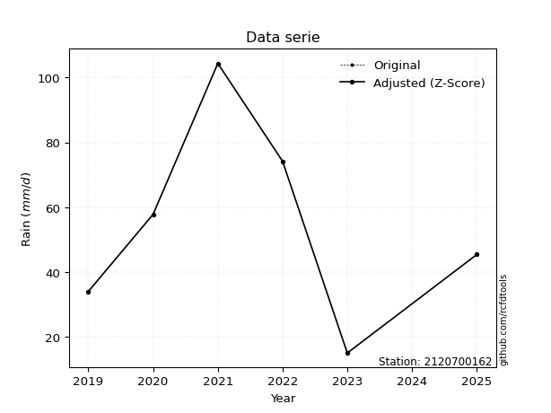</img>

</div>


> The initial value (value_initial) correspond to the initial obtained or null completed value, and value (value) is adjusted only when the initial value is outside the valid range (outlier) definite through the Z-Score value. If Z-Score is active, values out of range or outliers are replaced with the station mean value. A Z-Score (or standard score) measures how many standard deviations a data point is from the mean of a dataset, indicating its relative position; positive scores mean above the mean, negative mean below, and a score of zero is exactly at the mean, allowing for comparison of values from different distributions. It´s calculated using the formula $z=(x–μ)/σ$, where $x$ is the data point, $μ$ is the mean, and $σ$ is the standard deviation, helping identify outliers and understand probability.
>
> <sub>**Note**: In this study, "completing" (filling gaps in) and "extending" (forecasting or lengthening the historical record) rainfall data series are avoided for certain critical analyses because they introduce artificial bias and uncertainty, which can distort the statistics of rare events (extremes), alter day-to-day variability, and compromise the integrity and homogeneity of the original data. Some reasons against Completing/Extending rainfall data are: **Distortion of Extremes and Variability**: The primary issue is that most gap-filling or extension methods rely on averaging or regression with nearby stations, which inherently smooths the data. Rainfall is highly variable in space and time, with a large percentage of zero values and occasional large storms. Infilling methods often underestimate the highest values and overestimate the lowest (zero) values, which severely distorts analyses focused on flood frequency, drought severity, and intensity-duration-frequency (IDF) curves, **Loss of Data Homogeneity**: Infilled or extended data are synthetic estimates, not actual measurements. Combining these estimates with observed data can violate the assumption of data homogeneity, which requires that the data properties do not change over time. Inhomogeneity can lead to incorrect conclusions about long-term trends or changes in climate patterns, **Propagation of Errors**: Errors and biases from the original data (e.g., wind-induced undercatch, instrument errors, site changes) or the data used for imputation can propagate through the analysis, leading to unreliable hydrological models and inaccurate predictions, **Compromised Statistical Integrity**: For statistical analyses, especially those involving the frequency of events, using artificial data can introduce time bias or autocorrelation that doesn´t exist in reality, making it difficult to assess the true probability of events, **Difficulty in Validation**: It is difficult to accurately validate the quality of filled or extended data, especially for past periods where ground-truth measurements are unavailable. The reliability of imputation techniques heavily depends on the density of the surrounding station network and the complexity of the local topography.</sub>


### 4. Active continuous probability distributions from SciPy (44 of 104 available)

A Probability Density Function (PDF) describes the relative likelihood of a continuous random variable falling within a specific range, where the total area under its curve equals 1, and the area over any interval gives the actual probability for that range. Unlike discrete probabilities (like rolling a die), a PDF shows density, not direct probability for a single point (which is zero), with higher points indicating higher likelihood, often visualized as a bell curve for normal distributions.

A log of a probability density function (log-PDF) is simply the logarithm of the PDF´s value, denoted as $log(f(x))$, useful for converting multiplication of probabilities into addition, improving numerical stability with tiny numbers, and connecting to information theory concepts like entropy. Instead of dealing with very small probabilities (e.g., 0.000001), log-PDFs use negative numbers (e.g., $log(0.00001) ≈ -11.51$ that are easier for computers to handle, preventing underflow errors and simplifying complex calculations. In this study, each active probability distribution from SciPy is also evaluated in the $log$ form.

[scipy.stats](https://docs.scipy.org/doc/scipy/reference/stats.html) is a Python´s powerful submodule within the SciPy library for comprehensive statistical analysis, offering over 130 probability distributions (like Normal, Poisson), functions for descriptive stats (mean, variance), hypothesis testing (t-tests, chi-square), random variable generation, and statistical tests, making it essential for data science, modeling, and research. It provides tools to explore, model, and draw conclusions from data efficiently, working seamlessly with NumPy.

<div align="center">

|   id | p_dist             |   n_parameter | fit_method   | label                                                                       | active   | ref                                                                                                        |
|-----:|:-------------------|--------------:|:-------------|:----------------------------------------------------------------------------|:---------|:-----------------------------------------------------------------------------------------------------------|
|    0 | alpha              |             3 | MLE          | Alpha                                                                       | True     | [:mortar_board:](https://docs.scipy.org/doc/scipy/reference/generated/scipy.stats.alpha.html)              |
|    1 | betaprime          |             4 | MLE          | Beta prime                                                                  | True     | [:mortar_board:](https://docs.scipy.org/doc/scipy/reference/generated/scipy.stats.betaprime.html)          |
|    2 | chi2               |             3 | MLE          | Chi²                                                                        | True     | [:mortar_board:](https://docs.scipy.org/doc/scipy/reference/generated/scipy.stats.chi2.html)               |
|    3 | crystalball        |             4 | MLE          | Crystalball                                                                 | True     | [:mortar_board:](https://docs.scipy.org/doc/scipy/reference/generated/scipy.stats.crystalball.html)        |
|    4 | erlang             |             3 | MLE          | Erlang                                                                      | True     | [:mortar_board:](https://docs.scipy.org/doc/scipy/reference/generated/scipy.stats.erlang.html)             |
|    5 | expon              |             2 | MLE          | Exponential                                                                 | True     | [:mortar_board:](https://docs.scipy.org/doc/scipy/reference/generated/scipy.stats.expon.html)              |
|    6 | exponnorm          |             3 | MLE          | Exponentially modified Normal                                               | True     | [:mortar_board:](https://docs.scipy.org/doc/scipy/reference/generated/scipy.stats.exponnorm.html)          |
|    7 | f                  |             4 | MLE          | F                                                                           | True     | [:mortar_board:](https://docs.scipy.org/doc/scipy/reference/generated/scipy.stats.f.html)                  |
|    8 | fatiguelife        |             3 | MLE          | Fatigue-life (Birnbaum-Saunders)                                            | True     | [:mortar_board:](https://docs.scipy.org/doc/scipy/reference/generated/scipy.stats.fatiguelife.html)        |
|    9 | fisk               |             3 | MLE          | Fisk                                                                        | True     | [:mortar_board:](https://docs.scipy.org/doc/scipy/reference/generated/scipy.stats.fisk.html)               |
|   10 | gamma              |             3 | MLE          | Gamma                                                                       | True     | [:mortar_board:](https://docs.scipy.org/doc/scipy/reference/generated/scipy.stats.gamma.html)              |
|   11 | genexpon           |             5 | MLE          | Generalized exponential                                                     | True     | [:mortar_board:](https://docs.scipy.org/doc/scipy/reference/generated/scipy.stats.genexpon.html)           |
|   12 | genlogistic        |             3 | MLE          | Generalized logistic                                                        | True     | [:mortar_board:](https://docs.scipy.org/doc/scipy/reference/generated/scipy.stats.genlogistic.html)        |
|   13 | gibrat             |             2 | MM           | Gibrat                                                                      | True     | [:mortar_board:](https://docs.scipy.org/doc/scipy/reference/generated/scipy.stats.gibrat.html)             |
|   14 | gompertz           |             3 | MLE          | Gompertz (or truncated Gumbel)                                              | True     | [:mortar_board:](https://docs.scipy.org/doc/scipy/reference/generated/scipy.stats.gompertz.html)           |
|   15 | gumbel_l           |             2 | MM           | Gumbel Left Skew                                                            | True     | [:mortar_board:](https://docs.scipy.org/doc/scipy/reference/generated/scipy.stats.gumbel_l.html)           |
|   16 | gumbel_r           |             2 | MM           | Gumbel Right Skew                                                           | True     | [:mortar_board:](https://docs.scipy.org/doc/scipy/reference/generated/scipy.stats.gumbel_r.html)           |
|   17 | halflogistic       |             2 | MM           | Half-logistic                                                               | True     | [:mortar_board:](https://docs.scipy.org/doc/scipy/reference/generated/scipy.stats.halflogistic.html)       |
|   18 | halfnorm           |             2 | MM           | Half Normal                                                                 | True     | [:mortar_board:](https://docs.scipy.org/doc/scipy/reference/generated/scipy.stats.halfnorm.html)           |
|   19 | hypsecant          |             2 | MM           | hyperbolic secant                                                           | True     | [:mortar_board:](https://docs.scipy.org/doc/scipy/reference/generated/scipy.stats.hypsecant.html)          |
|   20 | invgamma           |             3 | MLE          | Inverted gamma                                                              | True     | [:mortar_board:](https://docs.scipy.org/doc/scipy/reference/generated/scipy.stats.invgamma.html)           |
|   21 | invgauss           |             3 | MLE          | Inverse Gaussian                                                            | True     | [:mortar_board:](https://docs.scipy.org/doc/scipy/reference/generated/scipy.stats.invgauss.html)           |
|   22 | invweibull         |             3 | MLE          | Inverted Weibull                                                            | True     | [:mortar_board:](https://docs.scipy.org/doc/scipy/reference/generated/scipy.stats.invweibull.html)         |
|   23 | johnsonsu          |             4 | MLE          | Johnson Su                                                                  | True     | [:mortar_board:](https://docs.scipy.org/doc/scipy/reference/generated/scipy.stats.johnsonsu.html)          |
|   24 | kstwobign          |             2 | MLE          | Limiting distribution of scaled Kolmogorov-Smirnov two-sided test statistic | True     | [:mortar_board:](https://docs.scipy.org/doc/scipy/reference/generated/scipy.stats.kstwobign.html)          |
|   25 | laplace            |             2 | MM           | Laplace                                                                     | True     | [:mortar_board:](https://docs.scipy.org/doc/scipy/reference/generated/scipy.stats.laplace.html)            |
|   26 | laplace_asymmetric |             3 | MLE          | Asymmetric Laplace                                                          | True     | [:mortar_board:](https://docs.scipy.org/doc/scipy/reference/generated/scipy.stats.laplace_asymmetric.html) |
|   27 | loggamma           |             3 | MLE          | Log gamma                                                                   | True     | [:mortar_board:](https://docs.scipy.org/doc/scipy/reference/generated/scipy.stats.loggamma.html)           |
|   28 | logistic           |             2 | MM           | Logistic (or Sech-squared)                                                  | True     | [:mortar_board:](https://docs.scipy.org/doc/scipy/reference/generated/scipy.stats.logistic.html)           |
|   29 | lognorm            |             3 | MLE          | Log Normal                                                                  | True     | [:mortar_board:](https://docs.scipy.org/doc/scipy/reference/generated/scipy.stats.lognorm.html)            |
|   30 | maxwell            |             2 | MM           | Maxwell                                                                     | True     | [:mortar_board:](https://docs.scipy.org/doc/scipy/reference/generated/scipy.stats.maxwell.html)            |
|   31 | mielke             |             4 | MLE          | Mielke Beta-Kappa / Dagum                                                   | True     | [:mortar_board:](https://docs.scipy.org/doc/scipy/reference/generated/scipy.stats.mielke.html)             |
|   32 | moyal              |             2 | MM           | Moyal                                                                       | True     | [:mortar_board:](https://docs.scipy.org/doc/scipy/reference/generated/scipy.stats.moyal.html)              |
|   33 | nakagami           |             3 | MLE          | Nakagami                                                                    | True     | [:mortar_board:](https://docs.scipy.org/doc/scipy/reference/generated/scipy.stats.nakagami.html)           |
|   34 | ncf                |             5 | MLE          | Non-central F distribution                                                  | True     | [:mortar_board:](https://docs.scipy.org/doc/scipy/reference/generated/scipy.stats.ncf.html)                |
|   35 | nct                |             4 | MLE          | Non-central Student’s t                                                     | True     | [:mortar_board:](https://docs.scipy.org/doc/scipy/reference/generated/scipy.stats.nct.html)                |
|   36 | norm               |             2 | MM           | Normal                                                                      | True     | [:mortar_board:](https://docs.scipy.org/doc/scipy/reference/generated/scipy.stats.norm.html)               |
|   37 | pearson3           |             3 | MM           | Pearson type III                                                            | True     | [:mortar_board:](https://docs.scipy.org/doc/scipy/reference/generated/scipy.stats.pearson3.html)           |
|   38 | rayleigh           |             2 | MM           | Rayleigh                                                                    | True     | [:mortar_board:](https://docs.scipy.org/doc/scipy/reference/generated/scipy.stats.rayleigh.html)           |
|   39 | rice               |             3 | MLE          | Rice                                                                        | True     | [:mortar_board:](https://docs.scipy.org/doc/scipy/reference/generated/scipy.stats.rice.html)               |
|   40 | t                  |             3 | MLE          | Student’s t                                                                 | True     | [:mortar_board:](https://docs.scipy.org/doc/scipy/reference/generated/scipy.stats.t.html)                  |
|   41 | truncnorm          |             4 | MLE          | Truncated normal                                                            | True     | [:mortar_board:](https://docs.scipy.org/doc/scipy/reference/generated/scipy.stats.truncnorm.html)          |
|   42 | wald               |             2 | MM           | Wald                                                                        | True     | [:mortar_board:](https://docs.scipy.org/doc/scipy/reference/generated/scipy.stats.wald.html)               |
|   43 | weibull_min        |             3 | MLE          | Weibull minimum                                                             | True     | [:mortar_board:](https://docs.scipy.org/doc/scipy/reference/generated/scipy.stats.weibull_min.html)        |

</div>

> **n_parameter:** # arguments & localization & scale.
>
> **Fit methods:** (MLE) maximum likelihood, (MM) L-moments.
>
>**Inactive** (With the only purpose of prevent loops, zero divisions, infinite values, over high estimated values or horizontal trending for recurrence intervals estimations, the follow distributions were disabled.)**:** foldnorm, gennorm, norminvgauss, powernorm, powerlognorm, skewnorm, genextreme, anglit, arcsine, argus, beta, bradford, burr, burr12, cauchy, cosine, halfcauchy, foldcauchy, skewcauchy, wrapcauchy, dgamma, gengamma, exponweib, exponpow, truncexpon, gausshyper, genhalflogistic, genhyperbolic, geninvgauss, halfgennorm, johnsonsb, kappa4, kappa3, ksone, kstwo, loglaplace, levy, levy_l, levy_stable, ncx2, pareto, genpareto, truncpareto, lomax, powerlaw, rdist, rel_breitwigner, recipinvgauss, semicircular, studentized_range, trapezoid, triang, truncweibull_min, tukeylambda, uniform, loguniform, vonmises, vonmises_line, weibull_max, dweibull, 


## B. Probability (PDF) vs. Empirical (EDF) distributions functions

A continuous probability distribution (CPD) describes probabilities for variables that can take any value within a range (like rain any time), unlike discrete variables with specific outcomes (like temperature). It uses a Probability Density Function (PDF), a curve where the total area under it equals 1, and the probability of the variable falling within an interval (a to b) is found by calculating the area under the curve between those points. A key feature is that the probability of hitting any single exact value is zero, so probabilities are always expressed for ranges, e.g., $P(a ≤ X ≤ b)$.

<div align="center">

Distributions parameters from station values
|    |    station | p_dist                |   n |             loc |           scale | shape                  | shape1                 | shape2                | shape3   |
|---:|-----------:|:----------------------|----:|----------------:|----------------:|:-----------------------|:-----------------------|:----------------------|:---------|
|  0 | 2120700162 | alpha                 |   5 |    -0.084699    |    29.2957      | 9.185431374400276e-09  |                        |                       |          |
|  1 | 2120700162 | betaprime             |   5 |    -0.767036    |   328.964       | 2.7026486333939967     | 15.799412803020324     |                       |          |
|  2 | 2120700162 | chi2                  |   5 |    15           |    16.7112      | 1.7142992984133474     |                        |                       |          |
|  3 | 2120700162 | crystalball           |   5 |    57.0796      |    31.1003      | 41273.454434297266     | 742.8587298843784      |                       |          |
|  4 | 2120700162 | erlang                |   5 |  -102.928       |     6.00113     | 26.595955114908527     |                        |                       |          |
|  5 | 2120700162 | expon                 |   5 |    15           |    42.08        |                        |                        |                       |          |
|  6 | 2120700162 | exponnorm             |   5 |    52.7419      |    30.7967      | 0.1408627319148748     |                        |                       |          |
|  7 | 2120700162 | f                     |   5 |     0.166581    |    57.0155      | 5.174857977872467      | 517.4494888786962      |                       |          |
|  8 | 2120700162 | fatiguelife           |   5 |    15           |     7.62273e-05 | 778.9898024513263      |                        |                       |          |
|  9 | 2120700162 | fisk                  |   5 |   -80.6336      |   134.816       | 7.16713043662625       |                        |                       |          |
| 10 | 2120700162 | gamma                 |   5 |  -106.147       |     5.93472     | 27.463461303678635     |                        |                       |          |
| 11 | 2120700162 | genexpon              |   5 |    15           |     0.755197    | 0.017946200292766553   | 3.6887213331099034e-10 | 6.052863083740114     |          |
| 12 | 2120700162 | genlogistic           |   5 |  -121.773       |    26.9129      | 437.4647445673759      |                        |                       |          |
| 13 | 2120700162 | gibrat                |   5 |    33.3542      |    14.3904      |                        |                        |                       |          |
| 14 | 2120700162 | gompertz              |   5 |    15           |    65.0124      | 0.8777905855887083     |                        |                       |          |
| 15 | 2120700162 | gumbel_l              |   5 |    71.0769      |    24.249       |                        |                        |                       |          |
| 16 | 2120700162 | gumbel_r              |   5 |    43.0831      |    24.249       |                        |                        |                       |          |
| 17 | 2120700162 | halflogistic          |   5 |    20.2187      |    26.5898      |                        |                        |                       |          |
| 18 | 2120700162 | halfnorm              |   5 |    15.9151      |    51.5925      |                        |                        |                       |          |
| 19 | 2120700162 | hypsecant             |   5 |    57.08        |    19.7992      |                        |                        |                       |          |
| 20 | 2120700162 | invgamma              |   5 |  -164.145       | 11022.7         | 50.82178172284097      |                        |                       |          |
| 21 | 2120700162 | invgauss              |   5 |   -56.6607      |  1383.74        | 0.08214497478972341    |                        |                       |          |
| 22 | 2120700162 | invweibull            |   5 |    15           |     3.11651e-05 | 0.0914681187800184     |                        |                       |          |
| 23 | 2120700162 | johnsonsu             |   5 |   -90.3077      |    18.4438      | -12.979404442948812    | 4.714871831394401      |                       |          |
| 24 | 2120700162 | kstwobign             |   5 |   -51.22        |   123.709       |                        |                        |                       |          |
| 25 | 2120700162 | laplace               |   5 |    57.08        |    21.9914      |                        |                        |                       |          |
| 26 | 2120700162 | laplace_asymmetric    |   5 |    57.8         |    25.9125      | 1.0139893518028702     |                        |                       |          |
| 27 | 2120700162 | loggamma              |   5 | -6593.38        |   968.34        | 961.4068663845333      |                        |                       |          |
| 28 | 2120700162 | logistic              |   5 |    57.08        |    17.1466      |                        |                        |                       |          |
| 29 | 2120700162 | lognorm               |   5 |    15           |     0.0238055   | 15.121731755060454     |                        |                       |          |
| 30 | 2120700162 | maxwell               |   5 |   -16.6151      |    46.1816      |                        |                        |                       |          |
| 31 | 2120700162 | mielke                |   5 |    -0.839313    |   105.35        | 1.2729700855076223     | 6615.246604371525      |                       |          |
| 32 | 2120700162 | moyal                 |   5 |    39.2947      |    14.0001      |                        |                        |                       |          |
| 33 | 2120700162 | nakagami              |   5 |    34           |    36.5157      | 0.1725922544531624     |                        |                       |          |
| 34 | 2120700162 | ncf                   |   5 |    -0.269593    |     7.04617e-06 | 1.6037958503415141e-06 | 164.01000201017365     | 12.923277930082289    |          |
| 35 | 2120700162 | nct                   |   5 | -1541.5         |    31.0347      | 314054.0514768814      | 51.50935152599217      |                       |          |
| 36 | 2120700162 | norm                  |   5 |    57.08        |    31.1005      |                        |                        |                       |          |
| 37 | 2120700162 | pearson3              |   5 |    57.08        |    31.1005      | 0.16069463900460934    |                        |                       |          |
| 38 | 2120700162 | rayleigh              |   5 |    -2.41709     |    47.4718      |                        |                        |                       |          |
| 39 | 2120700162 | rice                  |   5 |    -1.06662     |    39.4105      | 0.8941945406318663     |                        |                       |          |
| 40 | 2120700162 | t                     |   5 |    57.0795      |    31.1013      | 39782563.66383642      |                        |                       |          |
| 41 | 2120700162 | truncnorm             |   5 |    75.0844      |    42.6701      | -373.3292816160915     | 0.6870296453787934     |                       |          |
| 42 | 2120700162 | wald                  |   5 |    25.9795      |    31.1005      |                        |                        |                       |          |
| 43 | 2120700162 | weibull_min           |   5 |    15           |    40.6806      | 0.7144717899765444     |                        |                       |          |
| 44 | 2120700162 | logalpha              |   5 |   -12.2418      |   367.831       | 22.936071999752258     |                        |                       |          |
| 45 | 2120700162 | logbetaprime          |   5 |   -33.341       |   175.693       | 3569.085675682838      | 16860.274269369897     |                       |          |
| 46 | 2120700162 | logchi2               |   5 |     2.70805     |     0.97156     | 1.0418869094319558     |                        |                       |          |
| 47 | 2120700162 | logcrystalball        |   5 |     3.84928     |     0.677856    | 107.02152774079039     | 79.4984458740682       |                       |          |
| 48 | 2120700162 | logerlang             |   5 |    -7.57576     |     0.0429006   | 266.2846847749206      |                        |                       |          |
| 49 | 2120700162 | logexpon              |   5 |     2.70805     |     1.14123     |                        |                        |                       |          |
| 50 | 2120700162 | logexponnorm          |   5 |     3.84886     |     0.677854    | 0.0006297048462971576  |                        |                       |          |
| 51 | 2120700162 | logf                  |   5 |   -47.6046      |    51.4507      | 17618.875794365442     | 31938.367988248112     |                       |          |
| 52 | 2120700162 | logfatiguelife        |   5 |  -221.958       |   225.802       | 0.0029911904100453027  |                        |                       |          |
| 53 | 2120700162 | logfisk               |   5 |    -4.84726e+07 |     4.84726e+07 | 121627115.48765226     |                        |                       |          |
| 54 | 2120700162 | loggamma              |   5 |    -6.74923     |     0.0449582   | 235.76738585834937     |                        |                       |          |
| 55 | 2120700162 | loggenexpon           |   5 |     2.70702     |     0.0176293   | 0.0073529562034388395  | 1.8836805683526823     | 9.776072978203557e-05 |          |
| 56 | 2120700162 | loggenlogistic        |   5 |     4.64838     |     1.09994e-05 | 1.378087345884008e-05  |                        |                       |          |
| 57 | 2120700162 | loggibrat             |   5 |     3.3322      |     0.313628    |                        |                        |                       |          |
| 58 | 2120700162 | loggompertz           |   5 |     2.70805     |     1.30266     | 0.5999102187457583     |                        |                       |          |
| 59 | 2120700162 | loggumbel_l           |   5 |     4.15435     |     0.528521    |                        |                        |                       |          |
| 60 | 2120700162 | loggumbel_r           |   5 |     3.54421     |     0.528521    |                        |                        |                       |          |
| 61 | 2120700162 | loghalflogistic       |   5 |     3.04588     |     0.579537    |                        |                        |                       |          |
| 62 | 2120700162 | loghalfnorm           |   5 |     2.95205     |     1.12451     |                        |                        |                       |          |
| 63 | 2120700162 | loghypsecant          |   5 |     3.84928     |     0.431536    |                        |                        |                       |          |
| 64 | 2120700162 | loginvgamma           |   5 |    -9.70341     |  5058.66        | 374.30783548133127     |                        |                       |          |
| 65 | 2120700162 | loginvgauss           |   5 |    -2.12061     |   416.523       | 0.014315763307367769   |                        |                       |          |
| 66 | 2120700162 | loginvweibull         |   5 |    -1.06472e+08 |     1.06472e+08 | 153523556.42358142     |                        |                       |          |
| 67 | 2120700162 | logjohnsonsu          |   5 |     4.92313     |     0.00890334  | 7.369077647639479      | 1.4018440009279107     |                       |          |
| 68 | 2120700162 | logkstwobign          |   5 |     1.08418     |     3.15188     |                        |                        |                       |          |
| 69 | 2120700162 | loglaplace            |   5 |     3.84928     |     0.479316    |                        |                        |                       |          |
| 70 | 2120700162 | loglaplace_asymmetric |   5 |     4.30676     |     0.429376    | 1.6657206919591894     |                        |                       |          |
| 71 | 2120700162 | logloggamma           |   5 |     4.6483      |     6.08903e-06 | 7.5973767744032285e-06 |                        |                       |          |
| 72 | 2120700162 | loglogistic           |   5 |     3.84928     |     0.373721    |                        |                        |                       |          |
| 73 | 2120700162 | loglognorm            |   5 |     2.70805     |     0.00108742  | 14.266158762203842     |                        |                       |          |
| 74 | 2120700162 | logmaxwell            |   5 |     2.24305     |     1.00656     |                        |                        |                       |          |
| 75 | 2120700162 | logmielke             |   5 |     2.70805     |     1.94268     | 0.33719295481443345    | 3246.6834658727976     |                       |          |
| 76 | 2120700162 | logmoyal              |   5 |     3.46164     |     0.305142    |                        |                        |                       |          |
| 77 | 2120700162 | lognakagami           |   5 |     3.52636     |     0.542338    | 0.19895724275819374    |                        |                       |          |
| 78 | 2120700162 | logncf                |   5 |    -8.06555     |     2.28439     | 287.21881855459264     | 1823.4723655657608     | 1209.2866397152084    |          |
| 79 | 2120700162 | lognct                |   5 |    32.6029      |     0.670919    | 44011.14320759832      | -42.85479016618429     |                       |          |
| 80 | 2120700162 | lognorm               |   5 |     3.84928     |     0.677855    |                        |                        |                       |          |
| 81 | 2120700162 | logpearson3           |   5 |     3.84928     |     0.677854    | -0.5812969800466361    |                        |                       |          |
| 82 | 2120700162 | lograyleigh           |   5 |     2.5525      |     1.03468     |                        |                        |                       |          |
| 83 | 2120700162 | logrice               |   5 |     2.27062     |     0.751967    | 1.7944048096850818     |                        |                       |          |
| 84 | 2120700162 | logt                  |   5 |     3.84928     |     0.677855    | 102323040836.72044     |                        |                       |          |
| 85 | 2120700162 | logtruncnorm          |   5 |    -0.167616    |     1.58409     | 2.331929177000263      | 3.0401519582520296     |                       |          |
| 86 | 2120700162 | logwald               |   5 |     3.17138     |     0.677893    |                        |                        |                       |          |
| 87 | 2120700162 | logweibull_min        |   5 |    -3.04717e+07 |     3.04718e+07 | 58386560.81003167      |                        |                       |          |

</div>

> **loc** (Location parameter): This shifts the distribution along the x-axis. For many common distributions, like the normal (Gaussian) distribution, loc represents the mean $μ$. For others, like the uniform distribution, it might represent the minimum value, or for the beta distribution, the left end of the support interval.
>
> **scale** (Scale parameter): This determines the width or spread of the distribution. For the normal distribution, scale represents the standard deviation $σ$. For a uniform distribution, it defines the length of the interval (from $loc$ to $loc + scale$).
>
> **shape** (Shape parameters): Refers to parameters that define the specific form of a probability distribution, distinct from its location (loc) and scale (scale). These parameters are required arguments for most distribution functions. For example, a normal (Gaussian) distribution is fully defined by its location (mean) and scale (standard deviation), so it has no specific shape parameters beyond loc and scale. However, other distributions have intrinsic properties that need specification, as Gamma distribution that takes a shape parameter, often named $a$ or $alpha$.


### 0. Cumulative distribution values - CDF (88 evaluated)

Cumulative Distribution Function (CDF), denoted as $F$<sub>$X$</sub>$(x)$, is a function that gives the probability that a random variable $X$ will take a value less than or equal to a specific value, $x$ (i.e., $(P(X≥x)$. It essentially "accumulates" probabilities from a given point up to the far right (positive infinity), providing a complete picture of the distribution´s probabilities for both discrete (like rain) and continuous (like temperature) variables, helping to find probabilities over ranges or above certain values. Each station is evaluated separately ordering the $x$ values ascending, calculating the CDF and PDF values for the activated distributions and their logarithmic forms.

<div align="center">

CDF ordered by x ascending and calculating $log(f(x))$ separately
|   id |    Station |   date |     x |   count |   mean |     std |     zscore |   Value_initial |    station |   m |     alpha |   alpha_pdf |   betaprime |   betaprime_pdf |        chi2 |   chi2_pdf |   crystalball |   crystalball_pdf |    erlang |   erlang_pdf |    expon |   expon_pdf |   exponnorm |   exponnorm_pdf |         f |      f_pdf |   fatiguelife |   fatiguelife_pdf |      fisk |   fisk_pdf |     gamma |   gamma_pdf |    genexpon |   genexpon_pdf |   genlogistic |   genlogistic_pdf |      gibrat |   gibrat_pdf |    gompertz |   gompertz_pdf |   gumbel_l |   gumbel_l_pdf |   gumbel_r |   gumbel_r_pdf |   halflogistic |   halflogistic_pdf |   halfnorm |   halfnorm_pdf |   hypsecant |   hypsecant_pdf |   invgamma |   invgamma_pdf |   invgauss |   invgauss_pdf |   invweibull |   invweibull_pdf |   johnsonsu |   johnsonsu_pdf |   kstwobign |   kstwobign_pdf |   laplace |   laplace_pdf |   laplace_asymmetric |   laplace_asymmetric_pdf |   loggamma |   loggamma_pdf |   logistic |   logistic_pdf |   lognorm |   lognorm_pdf |   maxwell |   maxwell_pdf |    mielke |   mielke_pdf |     moyal |   moyal_pdf |    nakagami |   nakagami_pdf |       ncf |    ncf_pdf |       nct |    nct_pdf |      norm |   norm_pdf |   pearson3 |   pearson3_pdf |   rayleigh |   rayleigh_pdf |     rice |   rice_pdf |         t |      t_pdf |   truncnorm |   truncnorm_pdf |     wald |   wald_pdf |   weibull_min |   weibull_min_pdf |   logalpha |   logalpha_pdf |   logbetaprime |   logbetaprime_pdf |     logchi2 |   logchi2_pdf |   logcrystalball |   logcrystalball_pdf |   logerlang |   logerlang_pdf |   logexpon |   logexpon_pdf |   logexponnorm |   logexponnorm_pdf |      logf |   logf_pdf |   logfatiguelife |   logfatiguelife_pdf |   logfisk |   logfisk_pdf |   loggenexpon |   loggenexpon_pdf |   loggenlogistic |   loggenlogistic_pdf |   loggibrat |   loggibrat_pdf |   loggompertz |   loggompertz_pdf |   loggumbel_l |   loggumbel_l_pdf |   loggumbel_r |   loggumbel_r_pdf |   loghalflogistic |   loghalflogistic_pdf |   loghalfnorm |   loghalfnorm_pdf |   loghypsecant |   loghypsecant_pdf |   loginvgamma |   loginvgamma_pdf |   loginvgauss |   loginvgauss_pdf |   loginvweibull |   loginvweibull_pdf |   logjohnsonsu |   logjohnsonsu_pdf |   logkstwobign |   logkstwobign_pdf |   loglaplace |   loglaplace_pdf |   loglaplace_asymmetric |   loglaplace_asymmetric_pdf |   logloggamma |   logloggamma_pdf |   loglogistic |   loglogistic_pdf |   loglognorm |   loglognorm_pdf |   logmaxwell |   logmaxwell_pdf |   logmielke |   logmielke_pdf |    logmoyal |   logmoyal_pdf |   lognakagami |   lognakagami_pdf |    logncf |   logncf_pdf |    lognct |   lognct_pdf |   logpearson3 |   logpearson3_pdf |   lograyleigh |   lograyleigh_pdf |   logrice |   logrice_pdf |      logt |   logt_pdf |   logtruncnorm |   logtruncnorm_pdf |   logwald |   logwald_pdf |   logweibull_min |   logweibull_min_pdf |
|-----:|-----------:|-------:|------:|--------:|-------:|--------:|-----------:|----------------:|-----------:|----:|----------:|------------:|------------:|----------------:|------------:|-----------:|--------------:|------------------:|----------:|-------------:|---------:|------------:|------------:|----------------:|----------:|-----------:|--------------:|------------------:|----------:|-----------:|----------:|------------:|------------:|---------------:|--------------:|------------------:|------------:|-------------:|------------:|---------------:|-----------:|---------------:|-----------:|---------------:|---------------:|-------------------:|-----------:|---------------:|------------:|----------------:|-----------:|---------------:|-----------:|---------------:|-------------:|-----------------:|------------:|----------------:|------------:|----------------:|----------:|--------------:|---------------------:|-------------------------:|-----------:|---------------:|-----------:|---------------:|----------:|--------------:|----------:|--------------:|----------:|-------------:|----------:|------------:|------------:|---------------:|----------:|-----------:|----------:|-----------:|----------:|-----------:|-----------:|---------------:|-----------:|---------------:|---------:|-----------:|----------:|-----------:|------------:|----------------:|---------:|-----------:|--------------:|------------------:|-----------:|---------------:|---------------:|-------------------:|------------:|--------------:|-----------------:|---------------------:|------------:|----------------:|-----------:|---------------:|---------------:|-------------------:|----------:|-----------:|-----------------:|---------------------:|----------:|--------------:|--------------:|------------------:|-----------------:|---------------------:|------------:|----------------:|--------------:|------------------:|--------------:|------------------:|--------------:|------------------:|------------------:|----------------------:|--------------:|------------------:|---------------:|-------------------:|--------------:|------------------:|--------------:|------------------:|----------------:|--------------------:|---------------:|-------------------:|---------------:|-------------------:|-------------:|-----------------:|------------------------:|----------------------------:|--------------:|------------------:|--------------:|------------------:|-------------:|-----------------:|-------------:|-----------------:|------------:|----------------:|------------:|---------------:|--------------:|------------------:|----------:|-------------:|----------:|-------------:|--------------:|------------------:|--------------:|------------------:|----------:|--------------:|----------:|-----------:|---------------:|-------------------:|----------:|--------------:|-----------------:|---------------------:|
|    0 | 2120700162 |   2023 |  15   |       5 |  57.08 | 34.7714 | -1.21019   |            15   | 2120700162 |   1 | 0.0521273 |  0.0155834  |   0.0697719 |      0.00934182 | 2.14596e-14 | 5.17749    |     0.0880232 |        0.0051359  | 0.0778643 |   0.00576715 | 0        |  0.0237643  |   0.0878875 |      0.00514112 | 0.0611629 | 0.00873846 |     0.0540297 |       1.81179e+09 | 0.0786295 | 0.00542943 | 0.0783354 |  0.00574189 | 2.78798e-09 |     0.0237636  |     0.0667349 |        0.0066918  | 0           |   0          | 2.45454e-13 |     0.0135019  |  0.0942652 |     0.00369812 |  0.0414226 |     0.00543885 |       0        |         0          |   0        |     0          |   0.0756496 |      0.00378497 |  0.0729952 |     0.00588348 |  0.0668169 |     0.00654435 |  0.000297966 |      6.22807e+10 |   0.0719395 |      0.00604697 |   0.0631829 |      0.00726214 | 0.0737832 |    0.0033551  |            0.0994326 |               0.0037843  |  0.0448995 |       0.147924 |  0.0791371 |     0.00425008 | 0.0461307 |      0.142652 | 0.0742781 |    0.00640556 | 0.0896348 |   0.00720374 | 0.0172502 |  0.00398301 | 0           |    0           | 0.0628322 | 0.00718772 | 0.0880106 | 0.00513648 | 0.0880226 | 0.00513584 |  0.0840413 |     0.00535766 |  0.0650903 |     0.0072256  | 0.054343 | 0.00659621 | 0.0880308 | 0.00513607 |    0.105507 |      0.00460126 | 0        | 0          |   2.04806e-12 |      823.756      |  0.0476337 |       0.163289 |      0.0460877 |           0.144484 | 8.01573e-09 |   9.40293e+06 |        0.0461308 |             0.142652 |   0.0479239 |        0.152786 |   0        |       0.876249 |      0.0461297 |           0.142649 | 0.0462611 |   0.144826 |        0.0458868 |             0.143279 | 0.0462218 |      0.110619 |   0.000429696 |          0.417519 |         0        |             0.11019  |    0        |        0        |   5.22033e-08 |          0.460527 |      0.062742 |          0.114908 |    0.00771173 |         0.0709861 |          0        |              0        |      0        |          0        |      0.0451469 |           0.104269 |      0.04567  |          0.153846 |     0.0436163 |          0.161179 |       0.0448833 |            0.200864 |      0.0907666 |           0.10342  |      0.0466228 |           0.238174 |    0.0462312 |        0.0964525 |               0.0786257 |                    0.109932 |     0.0888441 |          0.110852 |     0.0450584 |          0.115134 |    0.0227719 |      8.52892e+12 |    0.0246058 |         0.152053 | 1.26358e-05 |     7.38018e+08 | 0.000586591 |      0.0122018 |   0           |       0           | 0.0485687 |     0.154687 | 0.0460841 |     0.142292 |     0.0592049 |          0.13362  |     0.0112366 |          0.143663 | 0.0354227 |      0.168633 | 0.0461306 |   0.142651 |    0           |           0        |  0        |      0        |        0.0594229 |             0.110407 |
|    1 | 2120700162 |   2019 |  34   |       5 |  57.08 | 34.7714 | -0.663763  |            34   | 2120700162 |   2 | 0.390066  |  0.0139063  |   0.301165  |      0.0133062  | 0.507142    | 0.0166132  |     0.229012  |        0.00973999 | 0.240354  |   0.0111301  | 0.363341 |  0.0151297  |   0.229086  |      0.00975526 | 0.289162  | 0.0135924  |     0.739205  |       0.0054793   | 0.238248  | 0.0113469  | 0.239666  |  0.0110416  | 0.363333    |     0.0151295  |     0.262279  |        0.0130229  | 0.000955124 |   0.00499869 | 0.257667    |     0.0134251  |  0.194869  |     0.0071967  |  0.233546  |     0.0140073  |       0.253497 |         0.0175958  |   0.274061 |     0.0145436  |   0.19236   |      0.00913491 |  0.241765  |     0.0115691  |  0.255309  |     0.0125758  |  0.744012    |      0.00105912  |   0.245274  |      0.0118015  |   0.270332  |      0.0133214  | 0.175056  |    0.00796021 |            0.204916  |               0.00779889 |  0.325428  |       0.532517 |  0.206519  |     0.00955692 | 0.316901  |      0.525405 | 0.247289  |    0.0113829  | 0.244487  |   0.00893316 | 0.226987  |  0.0165937  | 3.01015e-06 |    1.46234e+08 | 0.261466  | 0.0127862  | 0.22902   | 0.00974137 | 0.22901   | 0.00973988 |  0.23255   |     0.0102339  |  0.254906  |     0.0120405  | 0.235789 | 0.0118663  | 0.229021  | 0.0097399  |    0.222575 |      0.00780056 | 0.120912 | 0.0336721  |   0.440358    |        0.0122155  |  0.347762  |       0.546683 |      0.318779  |           0.524593 | 0.626735    |   0.300162    |        0.316901  |             0.525404 |   0.328748  |        0.526406 |   0.511806 |       0.427779 |      0.316898  |           0.525403 | 0.319789  |   0.526524 |        0.31895   |             0.529482 | 0.274147  |      0.499306 |   0.417439    |          0.525157 |         0        |             0.307185 |    0.315779 |        1.83156  |   0.408115    |          0.510868 |      0.262707 |          0.425157 |    0.355459   |         0.695653  |          0.392322 |              0.729965 |      0.390453 |          0.622786 |      0.281357  |           0.570346 |      0.333264 |          0.535437 |     0.346006  |          0.547091 |       0.385288  |            0.529865 |      0.245213  |           0.315648 |      0.414423  |           0.527719 |    0.254908  |        0.531816  |               0.246863  |                    0.345156 |     0.246633  |          0.307728 |     0.296491  |          0.558128 |    0.678775  |      0.0306816   |    0.34638   |         0.571632 | 0.747119    |     0.307858    | 0.368452    |      0.784701  |   7.83742e-07 |       7.02252e+08 | 0.330266  |     0.524451 | 0.316255  |     0.524683 |     0.290465  |          0.46264  |     0.357858  |          0.584139 | 0.332063  |      0.535835 | 0.316901  |   0.525404 |    1.02143e-06 |           1.91555  |  0.385389 |      1.25053  |        0.25462   |             0.419697 |
|    2 | 2120700162 |   2020 |  57.8 |       5 |  57.08 | 34.7714 |  0.0207067 |            57.8 | 2120700162 |   3 | 0.612783  |  0.00613756 |   0.585849  |      0.0100089  | 0.773914    | 0.00725788 |     0.50924   |        0.0128241  | 0.540159  |   0.0127521  | 0.638362 |  0.00859407 |   0.509587  |      0.0128266  | 0.588162  | 0.0107281  |     0.831952  |       0.00282262  | 0.5473    | 0.0128274  | 0.53761   |  0.0127075  | 0.638351    |     0.00859407 |     0.575096  |        0.0118141  | 0.701908    |   0.0141819  | 0.558567    |     0.0115126  |  0.439194  |     0.0133762  |  0.579822  |     0.0130324  |       0.608595 |         0.0118394  |   0.583117 |     0.0111233  |   0.511573  |      0.0160663  |  0.546484  |     0.012623   |  0.565729  |     0.012115   |  0.759929    |      0.00044585  |   0.551301  |      0.0124983  |   0.580883  |      0.0116005  | 0.516105  |    0.0220038  |            0.506946  |               0.0192938  |  0.625119  |       0.542169 |  0.510496  |     0.0145737  | 0.620359  |      0.561545 | 0.541893  |    0.0122472  | 0.474351  |   0.0102974  | 0.605583  |  0.0128781  | 0.680696    |    0.00927268  | 0.568352  | 0.0117933  | 0.509269  | 0.0128241  | 0.509235  | 0.0128241  |  0.519906  |     0.0127934  |  0.552698  |     0.0119522  | 0.538622 | 0.0124775  | 0.509242  | 0.0128238  |    0.454546 |      0.0114236  | 0.67718  | 0.0123914  |   0.645466    |        0.00613702 |  0.643595  |       0.51621  |      0.619503  |           0.553436 | 0.750121    |   0.179791    |        0.620358  |             0.561544 |   0.624418  |        0.535363 |   0.693337 |       0.268713 |      0.620355  |           0.561547 | 0.621549  |   0.554853 |        0.623686  |             0.561511 | 0.5885    |      0.607646 |   0.667668    |          0.403447 |         0        |             0.597207 |    0.798892 |        0.387552 |   0.663712    |          0.436203 |      0.564717 |          0.685025 |    0.684545   |         0.490884  |          0.702564 |              0.436904 |      0.674194 |          0.437848 |      0.647617  |           0.659714 |      0.629405 |          0.527922 |     0.639044  |          0.507585 |       0.641616  |            0.410551 |      0.492119  |           0.645525 |      0.664076  |           0.39627  |    0.675832  |        0.676313  |               0.518397  |                    0.724807 |     0.478174  |          0.596625 |     0.635478  |          0.619836 |    0.69122   |      0.0183009   |    0.645006  |         0.507519 | 0.884271    |     0.22104     | 0.70618     |      0.45907   |   0.759302    |       0.485223    | 0.623678  |     0.529976 | 0.619628  |     0.562011 |     0.586371  |          0.610297 |     0.652555  |          0.488274 | 0.628981  |      0.533548 | 0.620358  |   0.561545 |    0.694878    |           0.829246 |  0.766773 |      0.380211 |        0.556153  |             0.690799 |
|    3 | 2120700162 |   2022 |  74.2 |       5 |  57.08 | 34.7714 |  0.492358  |            74.2 | 2120700162 |   4 | 0.693307  |  0.00391898 |   0.725409  |      0.00707765 | 0.865896    | 0.0042421  |     0.709008  |        0.0110241  | 0.729338  |   0.00997175 | 0.755085 |  0.00582022 |   0.709258  |      0.0110112  | 0.738134  | 0.0075933  |     0.871033  |       0.00201013  | 0.729522  | 0.00913377 | 0.726613  |  0.00999219 | 0.755076    |     0.00582029 |     0.740177  |        0.0082718  | 0.851582    |   0.005668   | 0.728617    |     0.00910845 |  0.679366  |     0.0150401  |  0.757947  |     0.00866259 |       0.767853 |         0.00771728 |   0.741404 |     0.00816992 |   0.746221  |      0.0115023  |  0.730706  |     0.00956813 |  0.738152  |     0.00878388 |  0.766053    |      0.000315435 |   0.732591  |      0.00937195 |   0.744531  |      0.00832175 | 0.77045   |    0.0104382  |            0.740471  |               0.0101557  |  0.749655  |       0.447873 |  0.730753  |     0.0114747  | 0.750131  |      0.468667 | 0.723816  |    0.00966346 | 0.649284  |   0.0110145  | 0.773745  |  0.00786029 | 0.800414    |    0.00574295  | 0.736282  | 0.00858743 | 0.709024  | 0.0110228  | 0.709003  | 0.0110241  |  0.715407  |     0.0105972  |  0.728126  |     0.00924319 | 0.723697 | 0.00982497 | 0.709004  | 0.0110238  |    0.652192 |      0.0123977  | 0.820535 | 0.00602569 |   0.72948     |        0.00426849 |  0.760749  |       0.41684  |      0.747339  |           0.461887 | 0.790582    |   0.145746    |        0.75013   |             0.468667 |   0.747642  |        0.44434  |   0.753618 |       0.215892 |      0.750128  |           0.46867  | 0.749589  |   0.462042 |        0.753149  |             0.466366 | 0.728001  |      0.49686  |   0.759053    |          0.327875 |         0        |             0.816644 |    0.871557 |        0.215262 |   0.764706    |          0.36971  |      0.736648 |          0.664838 |    0.789573   |         0.35296   |          0.796089 |              0.315978 |      0.771688 |          0.343418 |      0.787705  |           0.456284 |      0.750217 |          0.433375 |     0.754239  |          0.410463 |       0.733772  |            0.327522 |      0.676209  |           0.81724  |      0.753274  |           0.318323 |    0.807489  |        0.401637  |               0.735073  |                    1.02776  |     0.65303   |          0.814796 |     0.772791  |          0.46983  |    0.695401  |      0.0153491   |    0.759701  |         0.407305 | 0.936404    |     0.197502    | 0.8023      |      0.317235  |   0.856684    |       0.308231    | 0.745683  |     0.440271 | 0.749571  |     0.469503 |     0.734391  |          0.55904  |     0.762433  |          0.389288 | 0.75168   |      0.442218 | 0.750131  |   0.468667 |    0.863341    |           0.537847 |  0.842131 |      0.23699  |        0.730409  |             0.677132 |
|    4 | 2120700162 |   2021 | 104.4 |       5 |  57.08 | 34.7714 |  1.36089   |           104.4 | 2120700162 |   5 | 0.779184  |  0.00205858 |   0.876519  |      0.00331763 | 0.947998    | 0.00162026 |     0.935938  |        0.00403118 | 0.929729  |   0.00365803 | 0.88051  |  0.00283959 |   0.935804  |      0.0040254  | 0.896975  | 0.00334491 |     0.917768  |       0.00118017  | 0.906301  | 0.00328929 | 0.928374  |  0.00370742 | 0.880503    |     0.00283967 |     0.906667  |        0.00330046 | 0.944841    |   0.00156936 | 0.925307    |     0.00398919 |  0.980783  |     0.00313191 |  0.923331  |     0.00303732 |       0.919063 |         0.00292072 |   0.913668 |     0.00355321 |   0.941829  |      0.00292173 |  0.922639  |     0.00358569 |  0.915354  |     0.0034405  |  0.773644    |      0.000203143 |   0.920895  |      0.00355355 |   0.915568  |      0.00343345 | 0.94186   |    0.00264377 |            0.920393  |               0.00311512 |  0.874818  |       0.284413 |  0.94046   |     0.00326563 | 0.88073   |      0.29384  | 0.923727  |    0.00382957 | 0.998665  |   0.0120681  | 0.922117  |  0.00277266 | 0.920118    |    0.00258241  | 0.911847  | 0.00348277 | 0.935923  | 0.00403087 | 0.935935  | 0.00403128 |  0.931903  |     0.00391441 |  0.920461  |     0.00377005 | 0.926453 | 0.00384632 | 0.935932  | 0.00403131 |    1        |      0.0097935  | 0.929202 | 0.00202435 |   0.827118    |        0.00242499 |  0.876585  |       0.263068 |      0.876556  |           0.292861 | 0.834163    |   0.11143     |        0.88073   |             0.293841 |   0.872383  |        0.285168 |   0.817331 |       0.160063 |      0.880729  |           0.293843 | 0.878552  |   0.291332 |        0.882698  |             0.290419 | 0.863103  |      0.296477 |   0.853694    |          0.228402 |         0.999818 |             1.25265  |    0.924238 |        0.108395 |   0.87259     |          0.260193 |      0.921592 |          0.377683 |    0.883535   |         0.206999  |          0.881497 |              0.192363 |      0.868542 |          0.227471 |      0.900851  |           0.226062 |      0.87153  |          0.277246 |     0.869031  |          0.263523 |       0.827625  |            0.225778 |      0.943938  |           0.575596 |      0.845041  |           0.222061 |    0.90558   |        0.196989  |               0.929559  |                    0.273268 |     0.99992   |          1.2476   |     0.894526  |          0.252459 |    0.700135  |      0.0125591   |    0.873384  |         0.26053  | 0.999564    |     0.171112    | 0.886224    |      0.185162  |   0.934303    |       0.159645    | 0.869618  |     0.28461  | 0.880462  |     0.294619 |     0.894112  |          0.357926 |     0.871432  |          0.251684 | 0.875766  |      0.283345 | 0.88073   |   0.29384  |    0.999995    |           0.285852 |  0.903269 |      0.133056 |        0.919681  |             0.388093 |


</div>

An Empirical Distribution Function (EDF) is a step-function estimate of a true cumulative distribution function (CDF) based on observed sample data, representing the proportion of data points less than or equal to a given value. It is calculated by ordering your data and jumping up by $1/n$ (where $n$ is sample size) at each unique data point, allowing analysis without assuming an underlying population distribution, and it gets closer to the true CDF as the sample size grows. For the empirical probability calculations, the parameter $m$ correspond to the order number which means the position of the $x$ values in an ascending order list.

The Kolmogorov-Smirnov (K-S) test is a non-parametric statistical test used to determine if a sample data set comes from a specific theoretical distribution (one-sample) or if two different samples come from the same underlying distribution (two-sample), by comparing their cumulative distribution functions (CDFs). It calculates the maximum vertical difference (D statistic) between these functions, with a small p-value indicating a significant difference and rejection of the null hypothesis (that the data/samples match).


### 1. EDF California (1923)

California´s estimates the true probability distribution of water-related data (like rainfall, streamflow) using observed samples, crucial for risk assessment.

<div align="center">


$P=m/n$


</div>


**1.1. Empirical values**

<div align="center">

|                | 0              | 1                  | 2              | 3                 | 4              |
|:---------------|:---------------|:-------------------|:---------------|:------------------|:---------------|
| date           | 2023           | 2019               | 2020           | 2022              | 2021           |
| x              | 15.0           | 34.0               | 57.8           | 74.2              | 104.4          |
| m              | 1              | 2                  | 3              | 4                 | 5              |
| empirical_dist | edf_california | edf_california     | edf_california | edf_california    | edf_california |
| empirical      | 0.2            | 0.4                | 0.6            | 0.8               | 1.0            |
| empirical_tr   | 1.25           | 1.6666666666666667 | 2.5            | 5.000000000000001 | inf            |

</div>


**1.2. Kolmogorov-Smirnov fit test (sorted by Δ)**


<div align="center">

|                | 0                   | 1                   | 2                   | 3                   | 4                  | 5                   | 6                  | 7                   | 8                  | 9                   | 10                  | 11                  | 12                  | 13                 | 14                    | 15                  | 16                 | 17                  | 18                  | 19                  | 20                  | 21                  | 22                 | 23                  | 24                  | 25                  | 26                  | 27                 | 28                 | 29                 | 30                  | 31                  | 32                  | 33                  | 34                  | 35                  | 36                  | 37                  | 38                 | 39                  | 40                  | 41                  | 42                  | 43                 | 44                  | 45                  | 46                 | 47                  | 48                  | 49                  | 50                  | 51                  | 52                  | 53                  | 54                  | 55                 | 56                  | 57                  | 58                 | 59                  | 60                 | 61                 | 62                  | 63                  | 64                  | 65                 | 66                 | 67                 | 68                 | 69                 | 70                 | 71                 | 72                 | 73                  | 74                 | 75                  | 76                  | 77                  | 78                  | 79                 | 80                 | 81                  | 82                  | 83                 | 84                 | 85                  | 86                 | 87                 |
|:---------------|:--------------------|:--------------------|:--------------------|:--------------------|:-------------------|:--------------------|:-------------------|:--------------------|:-------------------|:--------------------|:--------------------|:--------------------|:--------------------|:-------------------|:----------------------|:--------------------|:-------------------|:--------------------|:--------------------|:--------------------|:--------------------|:--------------------|:-------------------|:--------------------|:--------------------|:--------------------|:--------------------|:-------------------|:-------------------|:-------------------|:--------------------|:--------------------|:--------------------|:--------------------|:--------------------|:--------------------|:--------------------|:--------------------|:-------------------|:--------------------|:--------------------|:--------------------|:--------------------|:-------------------|:--------------------|:--------------------|:-------------------|:--------------------|:--------------------|:--------------------|:--------------------|:--------------------|:--------------------|:--------------------|:--------------------|:-------------------|:--------------------|:--------------------|:-------------------|:--------------------|:-------------------|:-------------------|:--------------------|:--------------------|:--------------------|:-------------------|:-------------------|:-------------------|:-------------------|:-------------------|:-------------------|:-------------------|:-------------------|:--------------------|:-------------------|:--------------------|:--------------------|:--------------------|:--------------------|:-------------------|:-------------------|:--------------------|:--------------------|:-------------------|:-------------------|:--------------------|:-------------------|:-------------------|
| station        | 2120700162          | 2120700162          | 2120700162          | 2120700162          | 2120700162         | 2120700162          | 2120700162         | 2120700162          | 2120700162         | 2120700162          | 2120700162          | 2120700162          | 2120700162          | 2120700162         | 2120700162            | 2120700162          | 2120700162         | 2120700162          | 2120700162          | 2120700162          | 2120700162          | 2120700162          | 2120700162         | 2120700162          | 2120700162          | 2120700162          | 2120700162          | 2120700162         | 2120700162         | 2120700162         | 2120700162          | 2120700162          | 2120700162          | 2120700162          | 2120700162          | 2120700162          | 2120700162          | 2120700162          | 2120700162         | 2120700162          | 2120700162          | 2120700162          | 2120700162          | 2120700162         | 2120700162          | 2120700162          | 2120700162         | 2120700162          | 2120700162          | 2120700162          | 2120700162          | 2120700162          | 2120700162          | 2120700162          | 2120700162          | 2120700162         | 2120700162          | 2120700162          | 2120700162         | 2120700162          | 2120700162         | 2120700162         | 2120700162          | 2120700162          | 2120700162          | 2120700162         | 2120700162         | 2120700162         | 2120700162         | 2120700162         | 2120700162         | 2120700162         | 2120700162         | 2120700162          | 2120700162         | 2120700162          | 2120700162          | 2120700162          | 2120700162          | 2120700162         | 2120700162         | 2120700162          | 2120700162          | 2120700162         | 2120700162         | 2120700162          | 2120700162         | 2120700162         |
| empirical_dist | edf_california      | edf_california      | edf_california      | edf_california      | edf_california     | edf_california      | edf_california     | edf_california      | edf_california     | edf_california      | edf_california      | edf_california      | edf_california      | edf_california     | edf_california        | edf_california      | edf_california     | edf_california      | edf_california      | edf_california      | edf_california      | edf_california      | edf_california     | edf_california      | edf_california      | edf_california      | edf_california      | edf_california     | edf_california     | edf_california     | edf_california      | edf_california      | edf_california      | edf_california      | edf_california      | edf_california      | edf_california      | edf_california      | edf_california     | edf_california      | edf_california      | edf_california      | edf_california      | edf_california     | edf_california      | edf_california      | edf_california     | edf_california      | edf_california      | edf_california      | edf_california      | edf_california      | edf_california      | edf_california      | edf_california      | edf_california     | edf_california      | edf_california      | edf_california     | edf_california      | edf_california     | edf_california     | edf_california      | edf_california      | edf_california      | edf_california     | edf_california     | edf_california     | edf_california     | edf_california     | edf_california     | edf_california     | edf_california     | edf_california      | edf_california     | edf_california      | edf_california      | edf_california      | edf_california      | edf_california     | edf_california     | edf_california      | edf_california      | edf_california     | edf_california     | edf_california      | edf_california     | edf_california     |
| p_dist         | betaprime           | kstwobign           | loggumbel_l         | genlogistic         | ncf                | f                   | logpearson3        | invgauss            | rayleigh           | logweibull_min      | logncf              | logerlang           | logalpha            | maxwell            | loglaplace_asymmetric | logloggamma         | logf               | loglaplace          | logfisk             | logcrystalball      | lognorm             | lognorm             | logt               | logexponnorm        | logbetaprime        | lognct              | logfatiguelife      | loginvgamma        | johnsonsu          | logjohnsonsu       | loghypsecant        | loglogistic         | logkstwobign        | loggamma            | loggamma            | mielke              | loginvgauss         | invgamma            | erlang             | gamma               | fisk                | rice                | logrice             | gumbel_r           | pearson3            | exponnorm           | t                  | nct                 | crystalball         | norm                | loginvweibull       | logmaxwell          | truncnorm           | moyal               | lograyleigh         | loggumbel_r        | logistic            | laplace_asymmetric  | logmoyal           | loggenexpon         | loggompertz        | genexpon           | weibull_min         | gompertz            | chi2                | halflogistic       | expon              | logwald            | logexpon           | loghalfnorm        | loggibrat          | loghalflogistic    | halfnorm           | gumbel_l            | hypsecant          | alpha               | laplace             | logchi2             | wald                | loglognorm         | fatiguelife        | invweibull          | logmielke           | gibrat             | nakagami           | logtruncnorm        | lognakagami        | loggenlogistic     |
| delta          | 0.13022813440923248 | 0.13681714853559845 | 0.13729332683487722 | 0.13772086791721627 | 0.1385339417436533 | 0.13883711750671673 | 0.1407950664990591 | 0.14469133941311357 | 0.1450940241806593 | 0.14537979544418417 | 0.15143129484865972 | 0.15207610635036756 | 0.15236626887373889 | 0.1527112030569717 | 0.1531368771867873    | 0.15336689719695684 | 0.153738894130236  | 0.15376876529171923 | 0.15377821940720066 | 0.15386924279079667 | 0.15386930402508966 | 0.15386930402508966 | 0.1538694011739946 | 0.15387032910931384 | 0.15391229069015613 | 0.15391592105202384 | 0.15411324262067658 | 0.1543299552198774 | 0.154725693839399  | 0.1547868240664953 | 0.15485312962572237 | 0.15494157432896458 | 0.15495889708585575 | 0.15510045838345238 | 0.15510045838345238 | 0.15551264737432438 | 0.15638371180604013 | 0.15823488716899312 | 0.1596457136193878 | 0.16033428847004336 | 0.16175248944606824 | 0.16421052842816428 | 0.16457730239344176 | 0.166454128390013  | 0.16744954703077192 | 0.17091398928737436 | 0.1709788398517334 | 0.17097962590849056 | 0.17098752445245807 | 0.17098967355325656 | 0.17237498278101127 | 0.17539424068426032 | 0.17742486657966125 | 0.18274983179173876 | 0.18876335613693296 | 0.1922882709333924 | 0.19348125965663387 | 0.19508392890584902 | 0.1994134092297761 | 0.19957030368521406 | 0.1999999477967208 | 0.1999999972120165 | 0.19999999999795195 | 0.19999999999975457 | 0.19999999999997856 | 0.2                | 0.2                | 0.2                | 0.2                | 0.2                | 0.2                | 0.2                | 0.2                | 0.20513090197667797 | 0.207639726146073  | 0.22081615166021695 | 0.22494398971315765 | 0.22673498479004173 | 0.27908827848366063 | 0.2998648993450257 | 0.3392051283146169 | 0.34401167154448464 | 0.34711866184293405 | 0.3990448764923687 | 0.3999969898507852 | 0.39999897856788974 | 0.3999992162575842 | 0.8                |
| deltao         | 0.5865427407550001  | 0.5865427407550001  | 0.5865427407550001  | 0.5865427407550001  | 0.5865427407550001 | 0.5865427407550001  | 0.5865427407550001 | 0.5865427407550001  | 0.5865427407550001 | 0.5865427407550001  | 0.5865427407550001  | 0.5865427407550001  | 0.5865427407550001  | 0.5865427407550001 | 0.5865427407550001    | 0.5865427407550001  | 0.5865427407550001 | 0.5865427407550001  | 0.5865427407550001  | 0.5865427407550001  | 0.5865427407550001  | 0.5865427407550001  | 0.5865427407550001 | 0.5865427407550001  | 0.5865427407550001  | 0.5865427407550001  | 0.5865427407550001  | 0.5865427407550001 | 0.5865427407550001 | 0.5865427407550001 | 0.5865427407550001  | 0.5865427407550001  | 0.5865427407550001  | 0.5865427407550001  | 0.5865427407550001  | 0.5865427407550001  | 0.5865427407550001  | 0.5865427407550001  | 0.5865427407550001 | 0.5865427407550001  | 0.5865427407550001  | 0.5865427407550001  | 0.5865427407550001  | 0.5865427407550001 | 0.5865427407550001  | 0.5865427407550001  | 0.5865427407550001 | 0.5865427407550001  | 0.5865427407550001  | 0.5865427407550001  | 0.5865427407550001  | 0.5865427407550001  | 0.5865427407550001  | 0.5865427407550001  | 0.5865427407550001  | 0.5865427407550001 | 0.5865427407550001  | 0.5865427407550001  | 0.5865427407550001 | 0.5865427407550001  | 0.5865427407550001 | 0.5865427407550001 | 0.5865427407550001  | 0.5865427407550001  | 0.5865427407550001  | 0.5865427407550001 | 0.5865427407550001 | 0.5865427407550001 | 0.5865427407550001 | 0.5865427407550001 | 0.5865427407550001 | 0.5865427407550001 | 0.5865427407550001 | 0.5865427407550001  | 0.5865427407550001 | 0.5865427407550001  | 0.5865427407550001  | 0.5865427407550001  | 0.5865427407550001  | 0.5865427407550001 | 0.5865427407550001 | 0.5865427407550001  | 0.5865427407550001  | 0.5865427407550001 | 0.5865427407550001 | 0.5865427407550001  | 0.5865427407550001 | 0.5865427407550001 |
| eval           | Δo > Δ              | Δo > Δ              | Δo > Δ              | Δo > Δ              | Δo > Δ             | Δo > Δ              | Δo > Δ             | Δo > Δ              | Δo > Δ             | Δo > Δ              | Δo > Δ              | Δo > Δ              | Δo > Δ              | Δo > Δ             | Δo > Δ                | Δo > Δ              | Δo > Δ             | Δo > Δ              | Δo > Δ              | Δo > Δ              | Δo > Δ              | Δo > Δ              | Δo > Δ             | Δo > Δ              | Δo > Δ              | Δo > Δ              | Δo > Δ              | Δo > Δ             | Δo > Δ             | Δo > Δ             | Δo > Δ              | Δo > Δ              | Δo > Δ              | Δo > Δ              | Δo > Δ              | Δo > Δ              | Δo > Δ              | Δo > Δ              | Δo > Δ             | Δo > Δ              | Δo > Δ              | Δo > Δ              | Δo > Δ              | Δo > Δ             | Δo > Δ              | Δo > Δ              | Δo > Δ             | Δo > Δ              | Δo > Δ              | Δo > Δ              | Δo > Δ              | Δo > Δ              | Δo > Δ              | Δo > Δ              | Δo > Δ              | Δo > Δ             | Δo > Δ              | Δo > Δ              | Δo > Δ             | Δo > Δ              | Δo > Δ             | Δo > Δ             | Δo > Δ              | Δo > Δ              | Δo > Δ              | Δo > Δ             | Δo > Δ             | Δo > Δ             | Δo > Δ             | Δo > Δ             | Δo > Δ             | Δo > Δ             | Δo > Δ             | Δo > Δ              | Δo > Δ             | Δo > Δ              | Δo > Δ              | Δo > Δ              | Δo > Δ              | Δo > Δ             | Δo > Δ             | Δo > Δ              | Δo > Δ              | Δo > Δ             | Δo > Δ             | Δo > Δ              | Δo > Δ             | Δo <= Δ            |
| fit            | 1                   | 1                   | 1                   | 1                   | 1                  | 1                   | 1                  | 1                   | 1                  | 1                   | 1                   | 1                   | 1                   | 1                  | 1                     | 1                   | 1                  | 1                   | 1                   | 1                   | 1                   | 1                   | 1                  | 1                   | 1                   | 1                   | 1                   | 1                  | 1                  | 1                  | 1                   | 1                   | 1                   | 1                   | 1                   | 1                   | 1                   | 1                   | 1                  | 1                   | 1                   | 1                   | 1                   | 1                  | 1                   | 1                   | 1                  | 1                   | 1                   | 1                   | 1                   | 1                   | 1                   | 1                   | 1                   | 1                  | 1                   | 1                   | 1                  | 1                   | 1                  | 1                  | 1                   | 1                   | 1                   | 1                  | 1                  | 1                  | 1                  | 1                  | 1                  | 1                  | 1                  | 1                   | 1                  | 1                   | 1                   | 1                   | 1                   | 1                  | 1                  | 1                   | 1                   | 1                  | 1                  | 1                   | 1                  | 0                  |
| n              | 5                   | 5                   | 5                   | 5                   | 5                  | 5                   | 5                  | 5                   | 5                  | 5                   | 5                   | 5                   | 5                   | 5                  | 5                     | 5                   | 5                  | 5                   | 5                   | 5                   | 5                   | 5                   | 5                  | 5                   | 5                   | 5                   | 5                   | 5                  | 5                  | 5                  | 5                   | 5                   | 5                   | 5                   | 5                   | 5                   | 5                   | 5                   | 5                  | 5                   | 5                   | 5                   | 5                   | 5                  | 5                   | 5                   | 5                  | 5                   | 5                   | 5                   | 5                   | 5                   | 5                   | 5                   | 5                   | 5                  | 5                   | 5                   | 5                  | 5                   | 5                  | 5                  | 5                   | 5                   | 5                   | 5                  | 5                  | 5                  | 5                  | 5                  | 5                  | 5                  | 5                  | 5                   | 5                  | 5                   | 5                   | 5                   | 5                   | 5                  | 5                  | 5                   | 5                   | 5                  | 5                  | 5                   | 5                  | 5                  |
| best_fit       | 1                   | 0                   | 0                   | 0                   | 0                  | 0                   | 0                  | 0                   | 0                  | 0                   | 0                   | 0                   | 0                   | 0                  | 0                     | 0                   | 0                  | 0                   | 0                   | 0                   | 0                   | 0                   | 0                  | 0                   | 0                   | 0                   | 0                   | 0                  | 0                  | 0                  | 0                   | 0                   | 0                   | 0                   | 0                   | 0                   | 0                   | 0                   | 0                  | 0                   | 0                   | 0                   | 0                   | 0                  | 0                   | 0                   | 0                  | 0                   | 0                   | 0                   | 0                   | 0                   | 0                   | 0                   | 0                   | 0                  | 0                   | 0                   | 0                  | 0                   | 0                  | 0                  | 0                   | 0                   | 0                   | 0                  | 0                  | 0                  | 0                  | 0                  | 0                  | 0                  | 0                  | 0                   | 0                  | 0                   | 0                   | 0                   | 0                   | 0                  | 0                  | 0                   | 0                   | 0                  | 0                  | 0                   | 0                  | 0                  |
| best_fit_sort  | 1                   | 2                   | 3                   | 4                   | 5                  | 6                   | 7                  | 8                   | 9                  | 10                  | 11                  | 12                  | 13                  | 14                 | 15                    | 16                  | 17                 | 18                  | 19                  | 20                  | 21                  | 22                  | 23                 | 24                  | 25                  | 26                  | 27                  | 28                 | 29                 | 30                 | 31                  | 32                  | 33                  | 34                  | 35                  | 36                  | 37                  | 38                  | 39                 | 40                  | 41                  | 42                  | 43                  | 44                 | 45                  | 46                  | 47                 | 48                  | 49                  | 50                  | 51                  | 52                  | 53                  | 54                  | 55                  | 56                 | 57                  | 58                  | 59                 | 60                  | 61                 | 62                 | 63                  | 64                  | 65                  | 66                 | 67                 | 68                 | 69                 | 70                 | 71                 | 72                 | 73                 | 74                  | 75                 | 76                  | 77                  | 78                  | 79                  | 80                 | 81                 | 82                  | 83                  | 84                 | 85                 | 86                  | 87                 | 88                 |

</div>


**1.3. Best fit**

<div align="center">

|   id |    station | empirical_dist   | p_dist    |    delta |   deltao | eval   |   fit |   n |   best_fit |   best_fit_sort |
|-----:|-----------:|:-----------------|:----------|---------:|---------:|:-------|------:|----:|-----------:|----------------:|
|    0 | 2120700162 | edf_california   | betaprime | 0.130228 | 0.586543 | Δo > Δ |     1 |   5 |          1 |               1 |

</div>


<div align="center">

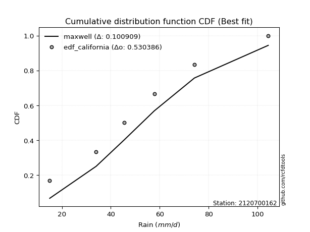</img>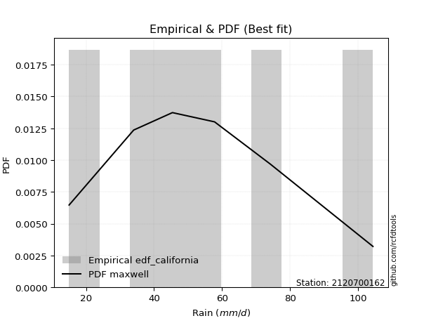</img>

</div>


### 2. EDF Hazen (1930)

Hazen method for plotting positions is a formula used to estimate the empirical cumulative probability distribution of flood events or other hydrological data. This formula often results in biased estimations, particularly when extrapolating to extreme events (high return periods).

<div align="center">


$P=(m-0.5)/n$


</div>


**2.1. Empirical values**

<div align="center">

|                | 0                  | 1                  | 2         | 3                 | 4                  |
|:---------------|:-------------------|:-------------------|:----------|:------------------|:-------------------|
| date           | 2023               | 2019               | 2020      | 2022              | 2021               |
| x              | 15.0               | 34.0               | 57.8      | 74.2              | 104.4              |
| m              | 1                  | 2                  | 3         | 4                 | 5                  |
| empirical_dist | edf_hazen          | edf_hazen          | edf_hazen | edf_hazen         | edf_hazen          |
| empirical      | 0.1                | 0.3                | 0.5       | 0.7               | 0.9                |
| empirical_tr   | 1.1111111111111112 | 1.4285714285714286 | 2.0       | 3.333333333333333 | 10.000000000000002 |

</div>


**2.2. Kolmogorov-Smirnov fit test (sorted by Δ)**


<div align="center">

|                | 0                   | 1                   | 2                     | 3                   | 4                    | 5                    | 6                   | 7                   | 8                    | 9                    | 10                  | 11                  | 12                  | 13                  | 14                  | 15                  | 16                  | 17                  | 18                  | 19                  | 20                 | 21                  | 22                  | 23                  | 24                  | 25                  | 26                  | 27                  | 28                  | 29                  | 30                  | 31                  | 32                  | 33                 | 34                  | 35                  | 36                  | 37                 | 38                  | 39                  | 40                 | 41                 | 42                  | 43                 | 44                 | 45                  | 46                  | 47                 | 48                  | 49                  | 50                  | 51                  | 52                  | 53                  | 54                  | 55                  | 56                 | 57                  | 58                  | 59                  | 60                 | 61                  | 62                 | 63                  | 64                  | 65                 | 66                  | 67                 | 68                  | 69                  | 70                 | 71                  | 72                  | 73                 | 74                  | 75                  | 76                  | 77                  | 78                  | 79                  | 80                 | 81                 | 82                  | 83                  | 84                  | 85                 | 86                 | 87                 |
|:---------------|:--------------------|:--------------------|:----------------------|:--------------------|:---------------------|:---------------------|:--------------------|:--------------------|:---------------------|:---------------------|:--------------------|:--------------------|:--------------------|:--------------------|:--------------------|:--------------------|:--------------------|:--------------------|:--------------------|:--------------------|:-------------------|:--------------------|:--------------------|:--------------------|:--------------------|:--------------------|:--------------------|:--------------------|:--------------------|:--------------------|:--------------------|:--------------------|:--------------------|:-------------------|:--------------------|:--------------------|:--------------------|:-------------------|:--------------------|:--------------------|:-------------------|:-------------------|:--------------------|:-------------------|:-------------------|:--------------------|:--------------------|:-------------------|:--------------------|:--------------------|:--------------------|:--------------------|:--------------------|:--------------------|:--------------------|:--------------------|:-------------------|:--------------------|:--------------------|:--------------------|:-------------------|:--------------------|:-------------------|:--------------------|:--------------------|:-------------------|:--------------------|:-------------------|:--------------------|:--------------------|:-------------------|:--------------------|:--------------------|:-------------------|:--------------------|:--------------------|:--------------------|:--------------------|:--------------------|:--------------------|:-------------------|:-------------------|:--------------------|:--------------------|:--------------------|:-------------------|:-------------------|:-------------------|
| station        | 2120700162          | 2120700162          | 2120700162            | 2120700162          | 2120700162           | 2120700162           | 2120700162          | 2120700162          | 2120700162           | 2120700162           | 2120700162          | 2120700162          | 2120700162          | 2120700162          | 2120700162          | 2120700162          | 2120700162          | 2120700162          | 2120700162          | 2120700162          | 2120700162         | 2120700162          | 2120700162          | 2120700162          | 2120700162          | 2120700162          | 2120700162          | 2120700162          | 2120700162          | 2120700162          | 2120700162          | 2120700162          | 2120700162          | 2120700162         | 2120700162          | 2120700162          | 2120700162          | 2120700162         | 2120700162          | 2120700162          | 2120700162         | 2120700162         | 2120700162          | 2120700162         | 2120700162         | 2120700162          | 2120700162          | 2120700162         | 2120700162          | 2120700162          | 2120700162          | 2120700162          | 2120700162          | 2120700162          | 2120700162          | 2120700162          | 2120700162         | 2120700162          | 2120700162          | 2120700162          | 2120700162         | 2120700162          | 2120700162         | 2120700162          | 2120700162          | 2120700162         | 2120700162          | 2120700162         | 2120700162          | 2120700162          | 2120700162         | 2120700162          | 2120700162          | 2120700162         | 2120700162          | 2120700162          | 2120700162          | 2120700162          | 2120700162          | 2120700162          | 2120700162         | 2120700162         | 2120700162          | 2120700162          | 2120700162          | 2120700162         | 2120700162         | 2120700162         |
| empirical_dist | edf_hazen           | edf_hazen           | edf_hazen             | edf_hazen           | edf_hazen            | edf_hazen            | edf_hazen           | edf_hazen           | edf_hazen            | edf_hazen            | edf_hazen           | edf_hazen           | edf_hazen           | edf_hazen           | edf_hazen           | edf_hazen           | edf_hazen           | edf_hazen           | edf_hazen           | edf_hazen           | edf_hazen          | edf_hazen           | edf_hazen           | edf_hazen           | edf_hazen           | edf_hazen           | edf_hazen           | edf_hazen           | edf_hazen           | edf_hazen           | edf_hazen           | edf_hazen           | edf_hazen           | edf_hazen          | edf_hazen           | edf_hazen           | edf_hazen           | edf_hazen          | edf_hazen           | edf_hazen           | edf_hazen          | edf_hazen          | edf_hazen           | edf_hazen          | edf_hazen          | edf_hazen           | edf_hazen           | edf_hazen          | edf_hazen           | edf_hazen           | edf_hazen           | edf_hazen           | edf_hazen           | edf_hazen           | edf_hazen           | edf_hazen           | edf_hazen          | edf_hazen           | edf_hazen           | edf_hazen           | edf_hazen          | edf_hazen           | edf_hazen          | edf_hazen           | edf_hazen           | edf_hazen          | edf_hazen           | edf_hazen          | edf_hazen           | edf_hazen           | edf_hazen          | edf_hazen           | edf_hazen           | edf_hazen          | edf_hazen           | edf_hazen           | edf_hazen           | edf_hazen           | edf_hazen           | edf_hazen           | edf_hazen          | edf_hazen          | edf_hazen           | edf_hazen           | edf_hazen           | edf_hazen          | edf_hazen          | edf_hazen          |
| p_dist         | rayleigh            | maxwell             | loglaplace_asymmetric | johnsonsu           | logjohnsonsu         | logweibull_min       | invgamma            | erlang              | gamma                | fisk                 | rice                | loggumbel_l         | invgauss            | pearson3            | ncf                 | exponnorm           | t                   | nct                 | crystalball         | norm                | genlogistic        | gumbel_r            | kstwobign           | betaprime           | logpearson3         | f                   | logfisk             | logistic            | laplace_asymmetric  | mielke              | logloggamma         | truncnorm           | gompertz            | halfnorm           | gumbel_l            | moyal               | hypsecant           | halflogistic       | logbetaprime        | lognct              | logexponnorm       | logcrystalball     | logt                | lognorm            | lognorm            | alpha               | logf                | logncf             | logfatiguelife      | logerlang           | laplace             | loggamma            | loggamma            | logrice             | loginvgamma         | loglogistic         | genexpon           | expon               | loginvgauss         | loginvweibull       | logalpha           | logmaxwell          | weibull_min        | loghypsecant        | lograyleigh         | loggompertz        | logkstwobign        | loggenexpon        | loghalfnorm         | loglaplace          | wald               | loggumbel_r         | loghalflogistic     | logmoyal           | logexpon            | logwald             | chi2                | loggibrat           | gibrat              | nakagami            | logtruncnorm       | lognakagami        | logchi2             | loglognorm          | fatiguelife         | invweibull         | logmielke          | loggenlogistic     |
| delta          | 0.05269834420473385 | 0.05271120305697166 | 0.05313687718678728   | 0.05472569383939896 | 0.054786824066495265 | 0.056152736391978375 | 0.05823488716899308 | 0.05964571361938778 | 0.060334288470043324 | 0.061752489446068204 | 0.06421052842816424 | 0.06471672708399745 | 0.06572872753585013 | 0.06744954703077188 | 0.06835186516156311 | 0.07091398928737433 | 0.07097883985173337 | 0.07097962590849052 | 0.07098752445245804 | 0.07098967355325653 | 0.0750961208614086 | 0.07982224314378616 | 0.08088293125336332 | 0.08584898090016413 | 0.08637092476749464 | 0.08816226181187203 | 0.08850011780042688 | 0.09348125965663384 | 0.09508392890584899 | 0.09866532902330083 | 0.09992014795288895 | 0.09999999682508787 | 0.09999999999975455 | 0.1                | 0.10513090197667793 | 0.10558293307222932 | 0.10763972614607298 | 0.1085945523647791 | 0.11950293703658676 | 0.11962849604123693 | 0.1203552319978397 | 0.1203579674844828 | 0.12035832519067446 | 0.1203585411210617 | 0.1203585411210617 | 0.12081615166021697 | 0.12154904478176864 | 0.1236781587529262 | 0.12368567846447764 | 0.12441817154827428 | 0.12494398971315762 | 0.12511944631939154 | 0.12511944631939154 | 0.12898138436432272 | 0.12940475150056285 | 0.13547765642804066 | 0.1383513878923196 | 0.13836152938922353 | 0.13904392595632697 | 0.14161591513044414 | 0.1435951672768938 | 0.14500576489396577 | 0.1454663123342067 | 0.14761653987030032 | 0.15255510159896768 | 0.1637123424842899 | 0.16407554072662678 | 0.1676675731237771 | 0.17419421056927864 | 0.17583224994183566 | 0.1790882784836606 | 0.18454530649963263 | 0.20256408123838698 | 0.2061795570761229 | 0.21180647646265688 | 0.26677304492626197 | 0.27391433556003264 | 0.29889206958565995 | 0.29904487649236866 | 0.29999698985078516 | 0.2999989785678897 | 0.2999992162575842 | 0.32673498479004176 | 0.37877488097103645 | 0.43920512831461694 | 0.4440116715444847 | 0.4471186618429341 | 0.7                |
| deltao         | 0.5865427407550001  | 0.5865427407550001  | 0.5865427407550001    | 0.5865427407550001  | 0.5865427407550001   | 0.5865427407550001   | 0.5865427407550001  | 0.5865427407550001  | 0.5865427407550001   | 0.5865427407550001   | 0.5865427407550001  | 0.5865427407550001  | 0.5865427407550001  | 0.5865427407550001  | 0.5865427407550001  | 0.5865427407550001  | 0.5865427407550001  | 0.5865427407550001  | 0.5865427407550001  | 0.5865427407550001  | 0.5865427407550001 | 0.5865427407550001  | 0.5865427407550001  | 0.5865427407550001  | 0.5865427407550001  | 0.5865427407550001  | 0.5865427407550001  | 0.5865427407550001  | 0.5865427407550001  | 0.5865427407550001  | 0.5865427407550001  | 0.5865427407550001  | 0.5865427407550001  | 0.5865427407550001 | 0.5865427407550001  | 0.5865427407550001  | 0.5865427407550001  | 0.5865427407550001 | 0.5865427407550001  | 0.5865427407550001  | 0.5865427407550001 | 0.5865427407550001 | 0.5865427407550001  | 0.5865427407550001 | 0.5865427407550001 | 0.5865427407550001  | 0.5865427407550001  | 0.5865427407550001 | 0.5865427407550001  | 0.5865427407550001  | 0.5865427407550001  | 0.5865427407550001  | 0.5865427407550001  | 0.5865427407550001  | 0.5865427407550001  | 0.5865427407550001  | 0.5865427407550001 | 0.5865427407550001  | 0.5865427407550001  | 0.5865427407550001  | 0.5865427407550001 | 0.5865427407550001  | 0.5865427407550001 | 0.5865427407550001  | 0.5865427407550001  | 0.5865427407550001 | 0.5865427407550001  | 0.5865427407550001 | 0.5865427407550001  | 0.5865427407550001  | 0.5865427407550001 | 0.5865427407550001  | 0.5865427407550001  | 0.5865427407550001 | 0.5865427407550001  | 0.5865427407550001  | 0.5865427407550001  | 0.5865427407550001  | 0.5865427407550001  | 0.5865427407550001  | 0.5865427407550001 | 0.5865427407550001 | 0.5865427407550001  | 0.5865427407550001  | 0.5865427407550001  | 0.5865427407550001 | 0.5865427407550001 | 0.5865427407550001 |
| eval           | Δo > Δ              | Δo > Δ              | Δo > Δ                | Δo > Δ              | Δo > Δ               | Δo > Δ               | Δo > Δ              | Δo > Δ              | Δo > Δ               | Δo > Δ               | Δo > Δ              | Δo > Δ              | Δo > Δ              | Δo > Δ              | Δo > Δ              | Δo > Δ              | Δo > Δ              | Δo > Δ              | Δo > Δ              | Δo > Δ              | Δo > Δ             | Δo > Δ              | Δo > Δ              | Δo > Δ              | Δo > Δ              | Δo > Δ              | Δo > Δ              | Δo > Δ              | Δo > Δ              | Δo > Δ              | Δo > Δ              | Δo > Δ              | Δo > Δ              | Δo > Δ             | Δo > Δ              | Δo > Δ              | Δo > Δ              | Δo > Δ             | Δo > Δ              | Δo > Δ              | Δo > Δ             | Δo > Δ             | Δo > Δ              | Δo > Δ             | Δo > Δ             | Δo > Δ              | Δo > Δ              | Δo > Δ             | Δo > Δ              | Δo > Δ              | Δo > Δ              | Δo > Δ              | Δo > Δ              | Δo > Δ              | Δo > Δ              | Δo > Δ              | Δo > Δ             | Δo > Δ              | Δo > Δ              | Δo > Δ              | Δo > Δ             | Δo > Δ              | Δo > Δ             | Δo > Δ              | Δo > Δ              | Δo > Δ             | Δo > Δ              | Δo > Δ             | Δo > Δ              | Δo > Δ              | Δo > Δ             | Δo > Δ              | Δo > Δ              | Δo > Δ             | Δo > Δ              | Δo > Δ              | Δo > Δ              | Δo > Δ              | Δo > Δ              | Δo > Δ              | Δo > Δ             | Δo > Δ             | Δo > Δ              | Δo > Δ              | Δo > Δ              | Δo > Δ             | Δo > Δ             | Δo <= Δ            |
| fit            | 1                   | 1                   | 1                     | 1                   | 1                    | 1                    | 1                   | 1                   | 1                    | 1                    | 1                   | 1                   | 1                   | 1                   | 1                   | 1                   | 1                   | 1                   | 1                   | 1                   | 1                  | 1                   | 1                   | 1                   | 1                   | 1                   | 1                   | 1                   | 1                   | 1                   | 1                   | 1                   | 1                   | 1                  | 1                   | 1                   | 1                   | 1                  | 1                   | 1                   | 1                  | 1                  | 1                   | 1                  | 1                  | 1                   | 1                   | 1                  | 1                   | 1                   | 1                   | 1                   | 1                   | 1                   | 1                   | 1                   | 1                  | 1                   | 1                   | 1                   | 1                  | 1                   | 1                  | 1                   | 1                   | 1                  | 1                   | 1                  | 1                   | 1                   | 1                  | 1                   | 1                   | 1                  | 1                   | 1                   | 1                   | 1                   | 1                   | 1                   | 1                  | 1                  | 1                   | 1                   | 1                   | 1                  | 1                  | 0                  |
| n              | 5                   | 5                   | 5                     | 5                   | 5                    | 5                    | 5                   | 5                   | 5                    | 5                    | 5                   | 5                   | 5                   | 5                   | 5                   | 5                   | 5                   | 5                   | 5                   | 5                   | 5                  | 5                   | 5                   | 5                   | 5                   | 5                   | 5                   | 5                   | 5                   | 5                   | 5                   | 5                   | 5                   | 5                  | 5                   | 5                   | 5                   | 5                  | 5                   | 5                   | 5                  | 5                  | 5                   | 5                  | 5                  | 5                   | 5                   | 5                  | 5                   | 5                   | 5                   | 5                   | 5                   | 5                   | 5                   | 5                   | 5                  | 5                   | 5                   | 5                   | 5                  | 5                   | 5                  | 5                   | 5                   | 5                  | 5                   | 5                  | 5                   | 5                   | 5                  | 5                   | 5                   | 5                  | 5                   | 5                   | 5                   | 5                   | 5                   | 5                   | 5                  | 5                  | 5                   | 5                   | 5                   | 5                  | 5                  | 5                  |
| best_fit       | 1                   | 0                   | 0                     | 0                   | 0                    | 0                    | 0                   | 0                   | 0                    | 0                    | 0                   | 0                   | 0                   | 0                   | 0                   | 0                   | 0                   | 0                   | 0                   | 0                   | 0                  | 0                   | 0                   | 0                   | 0                   | 0                   | 0                   | 0                   | 0                   | 0                   | 0                   | 0                   | 0                   | 0                  | 0                   | 0                   | 0                   | 0                  | 0                   | 0                   | 0                  | 0                  | 0                   | 0                  | 0                  | 0                   | 0                   | 0                  | 0                   | 0                   | 0                   | 0                   | 0                   | 0                   | 0                   | 0                   | 0                  | 0                   | 0                   | 0                   | 0                  | 0                   | 0                  | 0                   | 0                   | 0                  | 0                   | 0                  | 0                   | 0                   | 0                  | 0                   | 0                   | 0                  | 0                   | 0                   | 0                   | 0                   | 0                   | 0                   | 0                  | 0                  | 0                   | 0                   | 0                   | 0                  | 0                  | 0                  |
| best_fit_sort  | 1                   | 2                   | 3                     | 4                   | 5                    | 6                    | 7                   | 8                   | 9                    | 10                   | 11                  | 12                  | 13                  | 14                  | 15                  | 16                  | 17                  | 18                  | 19                  | 20                  | 21                 | 22                  | 23                  | 24                  | 25                  | 26                  | 27                  | 28                  | 29                  | 30                  | 31                  | 32                  | 33                  | 34                 | 35                  | 36                  | 37                  | 38                 | 39                  | 40                  | 41                 | 42                 | 43                  | 44                 | 45                 | 46                  | 47                  | 48                 | 49                  | 50                  | 51                  | 52                  | 53                  | 54                  | 55                  | 56                  | 57                 | 58                  | 59                  | 60                  | 61                 | 62                  | 63                 | 64                  | 65                  | 66                 | 67                  | 68                 | 69                  | 70                  | 71                 | 72                  | 73                  | 74                 | 75                  | 76                  | 77                  | 78                  | 79                  | 80                  | 81                 | 82                 | 83                  | 84                  | 85                  | 86                 | 87                 | 88                 |

</div>


**2.3. Best fit**

<div align="center">

|   id |    station | empirical_dist   | p_dist   |     delta |   deltao | eval   |   fit |   n |   best_fit |   best_fit_sort |
|-----:|-----------:|:-----------------|:---------|----------:|---------:|:-------|------:|----:|-----------:|----------------:|
|    0 | 2120700162 | edf_hazen        | rayleigh | 0.0526983 | 0.586543 | Δo > Δ |     1 |   5 |          1 |               1 |

</div>


<div align="center">

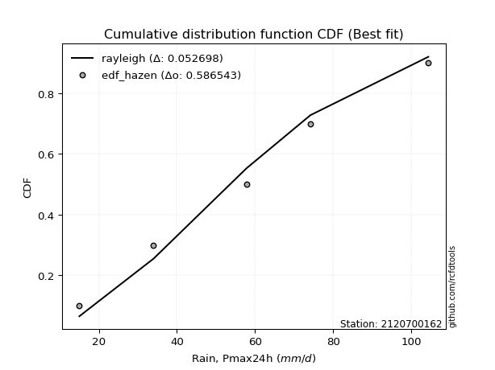</img>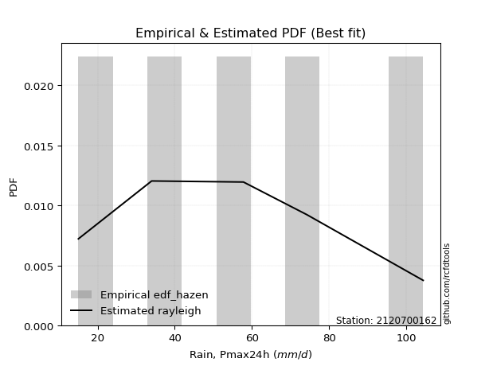</img>

</div>


### 3. EDF Weibull (1939)

Weibull plotting position formula is an empirical method used to estimate the non-exceedance probability or plotting position for a set of observed data, is often recommended or widely used in practice, particularly in flood frequency analysis.

<div align="center">


$P=m/(n+1)$


</div>


**3.1. Empirical values**

<div align="center">

|                | 0                   | 1                  | 2           | 3                  | 4                  |
|:---------------|:--------------------|:-------------------|:------------|:-------------------|:-------------------|
| date           | 2023                | 2019               | 2020        | 2022               | 2021               |
| x              | 15.0                | 34.0               | 57.8        | 74.2               | 104.4              |
| m              | 1                   | 2                  | 3           | 4                  | 5                  |
| empirical_dist | edf_weibull         | edf_weibull        | edf_weibull | edf_weibull        | edf_weibull        |
| empirical      | 0.16666666666666666 | 0.3333333333333333 | 0.5         | 0.6666666666666666 | 0.8333333333333334 |
| empirical_tr   | 1.2                 | 1.4999999999999998 | 2.0         | 2.9999999999999996 | 6.000000000000002  |

</div>


**3.2. Kolmogorov-Smirnov fit test (sorted by Δ)**


<div align="center">

|                | 0                   | 1                   | 2                   | 3                   | 4                   | 5                     | 6                   | 7                   | 8                   | 9                   | 10                  | 11                  | 12                  | 13                  | 14                  | 15                  | 16                  | 17                  | 18                  | 19                  | 20                  | 21                  | 22                  | 23                  | 24                  | 25                  | 26                 | 27                  | 28                  | 29                  | 30                  | 31                  | 32                  | 33                  | 34                  | 35                 | 36                  | 37                  | 38                  | 39                  | 40                  | 41                  | 42                  | 43                  | 44                  | 45                  | 46                  | 47                 | 48                  | 49                 | 50                  | 51                  | 52                  | 53                 | 54                 | 55                  | 56                  | 57                  | 58                 | 59                  | 60                  | 61                  | 62                 | 63                  | 64                  | 65                  | 66                  | 67                 | 68                  | 69                  | 70                  | 71                 | 72                  | 73                 | 74                  | 75                  | 76                  | 77                  | 78                  | 79                 | 80                 | 81                  | 82                 | 83                  | 84                 | 85                  | 86                  | 87                 |
|:---------------|:--------------------|:--------------------|:--------------------|:--------------------|:--------------------|:----------------------|:--------------------|:--------------------|:--------------------|:--------------------|:--------------------|:--------------------|:--------------------|:--------------------|:--------------------|:--------------------|:--------------------|:--------------------|:--------------------|:--------------------|:--------------------|:--------------------|:--------------------|:--------------------|:--------------------|:--------------------|:-------------------|:--------------------|:--------------------|:--------------------|:--------------------|:--------------------|:--------------------|:--------------------|:--------------------|:-------------------|:--------------------|:--------------------|:--------------------|:--------------------|:--------------------|:--------------------|:--------------------|:--------------------|:--------------------|:--------------------|:--------------------|:-------------------|:--------------------|:-------------------|:--------------------|:--------------------|:--------------------|:-------------------|:-------------------|:--------------------|:--------------------|:--------------------|:-------------------|:--------------------|:--------------------|:--------------------|:-------------------|:--------------------|:--------------------|:--------------------|:--------------------|:-------------------|:--------------------|:--------------------|:--------------------|:-------------------|:--------------------|:-------------------|:--------------------|:--------------------|:--------------------|:--------------------|:--------------------|:-------------------|:-------------------|:--------------------|:-------------------|:--------------------|:-------------------|:--------------------|:--------------------|:-------------------|
| station        | 2120700162          | 2120700162          | 2120700162          | 2120700162          | 2120700162          | 2120700162            | 2120700162          | 2120700162          | 2120700162          | 2120700162          | 2120700162          | 2120700162          | 2120700162          | 2120700162          | 2120700162          | 2120700162          | 2120700162          | 2120700162          | 2120700162          | 2120700162          | 2120700162          | 2120700162          | 2120700162          | 2120700162          | 2120700162          | 2120700162          | 2120700162         | 2120700162          | 2120700162          | 2120700162          | 2120700162          | 2120700162          | 2120700162          | 2120700162          | 2120700162          | 2120700162         | 2120700162          | 2120700162          | 2120700162          | 2120700162          | 2120700162          | 2120700162          | 2120700162          | 2120700162          | 2120700162          | 2120700162          | 2120700162          | 2120700162         | 2120700162          | 2120700162         | 2120700162          | 2120700162          | 2120700162          | 2120700162         | 2120700162         | 2120700162          | 2120700162          | 2120700162          | 2120700162         | 2120700162          | 2120700162          | 2120700162          | 2120700162         | 2120700162          | 2120700162          | 2120700162          | 2120700162          | 2120700162         | 2120700162          | 2120700162          | 2120700162          | 2120700162         | 2120700162          | 2120700162         | 2120700162          | 2120700162          | 2120700162          | 2120700162          | 2120700162          | 2120700162         | 2120700162         | 2120700162          | 2120700162         | 2120700162          | 2120700162         | 2120700162          | 2120700162          | 2120700162         |
| empirical_dist | edf_weibull         | edf_weibull         | edf_weibull         | edf_weibull         | edf_weibull         | edf_weibull           | edf_weibull         | edf_weibull         | edf_weibull         | edf_weibull         | edf_weibull         | edf_weibull         | edf_weibull         | edf_weibull         | edf_weibull         | edf_weibull         | edf_weibull         | edf_weibull         | edf_weibull         | edf_weibull         | edf_weibull         | edf_weibull         | edf_weibull         | edf_weibull         | edf_weibull         | edf_weibull         | edf_weibull        | edf_weibull         | edf_weibull         | edf_weibull         | edf_weibull         | edf_weibull         | edf_weibull         | edf_weibull         | edf_weibull         | edf_weibull        | edf_weibull         | edf_weibull         | edf_weibull         | edf_weibull         | edf_weibull         | edf_weibull         | edf_weibull         | edf_weibull         | edf_weibull         | edf_weibull         | edf_weibull         | edf_weibull        | edf_weibull         | edf_weibull        | edf_weibull         | edf_weibull         | edf_weibull         | edf_weibull        | edf_weibull        | edf_weibull         | edf_weibull         | edf_weibull         | edf_weibull        | edf_weibull         | edf_weibull         | edf_weibull         | edf_weibull        | edf_weibull         | edf_weibull         | edf_weibull         | edf_weibull         | edf_weibull        | edf_weibull         | edf_weibull         | edf_weibull         | edf_weibull        | edf_weibull         | edf_weibull        | edf_weibull         | edf_weibull         | edf_weibull         | edf_weibull         | edf_weibull         | edf_weibull        | edf_weibull        | edf_weibull         | edf_weibull        | edf_weibull         | edf_weibull        | edf_weibull         | edf_weibull         | edf_weibull        |
| p_dist         | maxwell             | invgamma            | johnsonsu           | gamma               | fisk                | loglaplace_asymmetric | erlang              | betaprime           | invgauss            | genlogistic         | pearson3            | rayleigh            | kstwobign           | ncf                 | loggumbel_l         | exponnorm           | t                   | nct                 | crystalball         | norm                | f                   | logweibull_min      | logpearson3         | logjohnsonsu        | rice                | alpha               | logfisk            | logcrystalball      | lognorm             | lognorm             | logt                | logexponnorm        | logbetaprime        | lognct              | logf                | logncf             | logfatiguelife      | logerlang           | loggamma            | loggamma            | gumbel_r            | logistic            | laplace_asymmetric  | loginvgamma         | logrice             | loglogistic         | loginvgauss         | hypsecant          | loginvweibull       | logalpha           | logmaxwell          | gumbel_l            | loghypsecant        | moyal              | lograyleigh        | laplace             | logkstwobign        | mielke              | logloggamma        | loggompertz         | truncnorm           | genexpon            | weibull_min        | gompertz            | halflogistic        | expon               | halfnorm            | loggenexpon        | loghalfnorm         | loglaplace          | loggumbel_r         | logexpon           | loghalflogistic     | logmoyal           | wald                | logwald             | chi2                | logchi2             | loggibrat           | gibrat             | nakagami           | logtruncnorm        | lognakagami        | loglognorm          | fatiguelife        | invweibull          | logmielke           | loggenlogistic     |
| delta          | 0.09238857791106653 | 0.09367150065419433 | 0.09472716216602714 | 0.09504085739961099 | 0.09508582277940153 | 0.09622571806454105   | 0.09639586837538272 | 0.09689480107589912 | 0.09984979291670715 | 0.09993171835927385 | 0.10078288036410521 | 0.10157635709759394 | 0.10348381520226509 | 0.10383443886955922 | 0.10392466036747866 | 0.10424732262070766 | 0.10431217318506669 | 0.10431295924182385 | 0.10432085778579137 | 0.10432300688658985 | 0.10550378417338338 | 0.10724379999187152 | 0.10746173316572576 | 0.11060516170434609 | 0.11232367792233547 | 0.11453939538317548 | 0.1204448860738673 | 0.12053590945746331 | 0.12053597069175631 | 0.12053597069175631 | 0.12053606784066125 | 0.12053699577598048 | 0.12057895735682278 | 0.12058258771869047 | 0.12154904478176864 | 0.1236781587529262 | 0.12368567846447764 | 0.12441817154827428 | 0.12511944631939154 | 0.12511944631939154 | 0.12524408712605922 | 0.12681459298996717 | 0.12841726223918232 | 0.12940475150056285 | 0.13124396906010843 | 0.13547765642804066 | 0.13904392595632697 | 0.1409730594794063 | 0.14161591513044414 | 0.1435951672768938 | 0.14500576489396577 | 0.14744936634229178 | 0.14761653987030032 | 0.1494164984584054 | 0.1554300228035996 | 0.15827732304649095 | 0.16407554072662678 | 0.16533199568996748 | 0.1665868146195556 | 0.16666661446338746 | 0.16666666349175452 | 0.16666666387868315 | 0.1666666666646186 | 0.16666666666642121 | 0.16666666666666666 | 0.16666666666666666 | 0.16666666666666666 | 0.1676675731237771 | 0.17419421056927864 | 0.17583224994183566 | 0.18454530649963263 | 0.1933369593683335 | 0.20256408123838698 | 0.2061795570761229 | 0.21242161181699393 | 0.26677304492626197 | 0.27391433556003264 | 0.29340165145670843 | 0.29889206958565995 | 0.332378209825702  | 0.3333303231841185 | 0.33333231190122303 | 0.3333325495909175 | 0.34544154763770313 | 0.4058717949812836 | 0.41067833821115135 | 0.41378532850960076 | 0.6666666666666666 |
| deltao         | 0.5865427407550001  | 0.5865427407550001  | 0.5865427407550001  | 0.5865427407550001  | 0.5865427407550001  | 0.5865427407550001    | 0.5865427407550001  | 0.5865427407550001  | 0.5865427407550001  | 0.5865427407550001  | 0.5865427407550001  | 0.5865427407550001  | 0.5865427407550001  | 0.5865427407550001  | 0.5865427407550001  | 0.5865427407550001  | 0.5865427407550001  | 0.5865427407550001  | 0.5865427407550001  | 0.5865427407550001  | 0.5865427407550001  | 0.5865427407550001  | 0.5865427407550001  | 0.5865427407550001  | 0.5865427407550001  | 0.5865427407550001  | 0.5865427407550001 | 0.5865427407550001  | 0.5865427407550001  | 0.5865427407550001  | 0.5865427407550001  | 0.5865427407550001  | 0.5865427407550001  | 0.5865427407550001  | 0.5865427407550001  | 0.5865427407550001 | 0.5865427407550001  | 0.5865427407550001  | 0.5865427407550001  | 0.5865427407550001  | 0.5865427407550001  | 0.5865427407550001  | 0.5865427407550001  | 0.5865427407550001  | 0.5865427407550001  | 0.5865427407550001  | 0.5865427407550001  | 0.5865427407550001 | 0.5865427407550001  | 0.5865427407550001 | 0.5865427407550001  | 0.5865427407550001  | 0.5865427407550001  | 0.5865427407550001 | 0.5865427407550001 | 0.5865427407550001  | 0.5865427407550001  | 0.5865427407550001  | 0.5865427407550001 | 0.5865427407550001  | 0.5865427407550001  | 0.5865427407550001  | 0.5865427407550001 | 0.5865427407550001  | 0.5865427407550001  | 0.5865427407550001  | 0.5865427407550001  | 0.5865427407550001 | 0.5865427407550001  | 0.5865427407550001  | 0.5865427407550001  | 0.5865427407550001 | 0.5865427407550001  | 0.5865427407550001 | 0.5865427407550001  | 0.5865427407550001  | 0.5865427407550001  | 0.5865427407550001  | 0.5865427407550001  | 0.5865427407550001 | 0.5865427407550001 | 0.5865427407550001  | 0.5865427407550001 | 0.5865427407550001  | 0.5865427407550001 | 0.5865427407550001  | 0.5865427407550001  | 0.5865427407550001 |
| eval           | Δo > Δ              | Δo > Δ              | Δo > Δ              | Δo > Δ              | Δo > Δ              | Δo > Δ                | Δo > Δ              | Δo > Δ              | Δo > Δ              | Δo > Δ              | Δo > Δ              | Δo > Δ              | Δo > Δ              | Δo > Δ              | Δo > Δ              | Δo > Δ              | Δo > Δ              | Δo > Δ              | Δo > Δ              | Δo > Δ              | Δo > Δ              | Δo > Δ              | Δo > Δ              | Δo > Δ              | Δo > Δ              | Δo > Δ              | Δo > Δ             | Δo > Δ              | Δo > Δ              | Δo > Δ              | Δo > Δ              | Δo > Δ              | Δo > Δ              | Δo > Δ              | Δo > Δ              | Δo > Δ             | Δo > Δ              | Δo > Δ              | Δo > Δ              | Δo > Δ              | Δo > Δ              | Δo > Δ              | Δo > Δ              | Δo > Δ              | Δo > Δ              | Δo > Δ              | Δo > Δ              | Δo > Δ             | Δo > Δ              | Δo > Δ             | Δo > Δ              | Δo > Δ              | Δo > Δ              | Δo > Δ             | Δo > Δ             | Δo > Δ              | Δo > Δ              | Δo > Δ              | Δo > Δ             | Δo > Δ              | Δo > Δ              | Δo > Δ              | Δo > Δ             | Δo > Δ              | Δo > Δ              | Δo > Δ              | Δo > Δ              | Δo > Δ             | Δo > Δ              | Δo > Δ              | Δo > Δ              | Δo > Δ             | Δo > Δ              | Δo > Δ             | Δo > Δ              | Δo > Δ              | Δo > Δ              | Δo > Δ              | Δo > Δ              | Δo > Δ             | Δo > Δ             | Δo > Δ              | Δo > Δ             | Δo > Δ              | Δo > Δ             | Δo > Δ              | Δo > Δ              | Δo <= Δ            |
| fit            | 1                   | 1                   | 1                   | 1                   | 1                   | 1                     | 1                   | 1                   | 1                   | 1                   | 1                   | 1                   | 1                   | 1                   | 1                   | 1                   | 1                   | 1                   | 1                   | 1                   | 1                   | 1                   | 1                   | 1                   | 1                   | 1                   | 1                  | 1                   | 1                   | 1                   | 1                   | 1                   | 1                   | 1                   | 1                   | 1                  | 1                   | 1                   | 1                   | 1                   | 1                   | 1                   | 1                   | 1                   | 1                   | 1                   | 1                   | 1                  | 1                   | 1                  | 1                   | 1                   | 1                   | 1                  | 1                  | 1                   | 1                   | 1                   | 1                  | 1                   | 1                   | 1                   | 1                  | 1                   | 1                   | 1                   | 1                   | 1                  | 1                   | 1                   | 1                   | 1                  | 1                   | 1                  | 1                   | 1                   | 1                   | 1                   | 1                   | 1                  | 1                  | 1                   | 1                  | 1                   | 1                  | 1                   | 1                   | 0                  |
| n              | 5                   | 5                   | 5                   | 5                   | 5                   | 5                     | 5                   | 5                   | 5                   | 5                   | 5                   | 5                   | 5                   | 5                   | 5                   | 5                   | 5                   | 5                   | 5                   | 5                   | 5                   | 5                   | 5                   | 5                   | 5                   | 5                   | 5                  | 5                   | 5                   | 5                   | 5                   | 5                   | 5                   | 5                   | 5                   | 5                  | 5                   | 5                   | 5                   | 5                   | 5                   | 5                   | 5                   | 5                   | 5                   | 5                   | 5                   | 5                  | 5                   | 5                  | 5                   | 5                   | 5                   | 5                  | 5                  | 5                   | 5                   | 5                   | 5                  | 5                   | 5                   | 5                   | 5                  | 5                   | 5                   | 5                   | 5                   | 5                  | 5                   | 5                   | 5                   | 5                  | 5                   | 5                  | 5                   | 5                   | 5                   | 5                   | 5                   | 5                  | 5                  | 5                   | 5                  | 5                   | 5                  | 5                   | 5                   | 5                  |
| best_fit       | 1                   | 0                   | 0                   | 0                   | 0                   | 0                     | 0                   | 0                   | 0                   | 0                   | 0                   | 0                   | 0                   | 0                   | 0                   | 0                   | 0                   | 0                   | 0                   | 0                   | 0                   | 0                   | 0                   | 0                   | 0                   | 0                   | 0                  | 0                   | 0                   | 0                   | 0                   | 0                   | 0                   | 0                   | 0                   | 0                  | 0                   | 0                   | 0                   | 0                   | 0                   | 0                   | 0                   | 0                   | 0                   | 0                   | 0                   | 0                  | 0                   | 0                  | 0                   | 0                   | 0                   | 0                  | 0                  | 0                   | 0                   | 0                   | 0                  | 0                   | 0                   | 0                   | 0                  | 0                   | 0                   | 0                   | 0                   | 0                  | 0                   | 0                   | 0                   | 0                  | 0                   | 0                  | 0                   | 0                   | 0                   | 0                   | 0                   | 0                  | 0                  | 0                   | 0                  | 0                   | 0                  | 0                   | 0                   | 0                  |
| best_fit_sort  | 1                   | 2                   | 3                   | 4                   | 5                   | 6                     | 7                   | 8                   | 9                   | 10                  | 11                  | 12                  | 13                  | 14                  | 15                  | 16                  | 17                  | 18                  | 19                  | 20                  | 21                  | 22                  | 23                  | 24                  | 25                  | 26                  | 27                 | 28                  | 29                  | 30                  | 31                  | 32                  | 33                  | 34                  | 35                  | 36                 | 37                  | 38                  | 39                  | 40                  | 41                  | 42                  | 43                  | 44                  | 45                  | 46                  | 47                  | 48                 | 49                  | 50                 | 51                  | 52                  | 53                  | 54                 | 55                 | 56                  | 57                  | 58                  | 59                 | 60                  | 61                  | 62                  | 63                 | 64                  | 65                  | 66                  | 67                  | 68                 | 69                  | 70                  | 71                  | 72                 | 73                  | 74                 | 75                  | 76                  | 77                  | 78                  | 79                  | 80                 | 81                 | 82                  | 83                 | 84                  | 85                 | 86                  | 87                  | 88                 |

</div>


**3.3. Best fit**

<div align="center">

|   id |    station | empirical_dist   | p_dist   |     delta |   deltao | eval   |   fit |   n |   best_fit |   best_fit_sort |
|-----:|-----------:|:-----------------|:---------|----------:|---------:|:-------|------:|----:|-----------:|----------------:|
|    0 | 2120700162 | edf_weibull      | maxwell  | 0.0923886 | 0.586543 | Δo > Δ |     1 |   5 |          1 |               1 |

</div>


<div align="center">

</img></img>

</div>


### 4. EDF Beard (1943)

The Beard formula (or Beard´s plotting position formula) in hydrology is used to estimate the empirical non-exceedance probability _(P)_ of a flood event (or other extreme hydrological data point) within a given dataset.

<div align="center">


$P=(m-0.31)/(n+0.38)$


</div>


**4.1. Empirical values**

<div align="center">

|                | 0                   | 1                  | 2         | 3                  | 4                  |
|:---------------|:--------------------|:-------------------|:----------|:-------------------|:-------------------|
| date           | 2023                | 2019               | 2020      | 2022               | 2021               |
| x              | 15.0                | 34.0               | 57.8      | 74.2               | 104.4              |
| m              | 1                   | 2                  | 3         | 4                  | 5                  |
| empirical_dist | edf_beard           | edf_beard          | edf_beard | edf_beard          | edf_beard          |
| empirical      | 0.12825278810408922 | 0.3141263940520446 | 0.5       | 0.6858736059479554 | 0.8717472118959109 |
| empirical_tr   | 1.1471215351812367  | 1.4579945799457996 | 2.0       | 3.183431952662722  | 7.797101449275368  |

</div>


**4.2. Kolmogorov-Smirnov fit test (sorted by Δ)**


<div align="center">

|                | 0                  | 1                   | 2                   | 3                  | 4                     | 5                   | 6                   | 7                   | 8                   | 9                   | 10                  | 11                  | 12                 | 13                  | 14                  | 15                  | 16                  | 17                  | 18                 | 19                  | 20                  | 21                  | 22                  | 23                  | 24                  | 25                  | 26                  | 27                  | 28                  | 29                  | 30                 | 31                  | 32                  | 33                  | 34                 | 35                 | 36                  | 37                 | 38                 | 39                  | 40                  | 41                 | 42                  | 43                  | 44                  | 45                  | 46                  | 47                 | 48                  | 49                  | 50                  | 51                  | 52                  | 53                  | 54                  | 55                 | 56                  | 57                  | 58                  | 59                  | 60                 | 61                  | 62                 | 63                  | 64                  | 65                 | 66                  | 67                 | 68                  | 69                  | 70                  | 71                  | 72                  | 73                  | 74                 | 75                  | 76                  | 77                  | 78                 | 79                 | 80                 | 81                  | 82                 | 83                 | 84                 | 85                  | 86                  | 87                 |
|:---------------|:-------------------|:--------------------|:--------------------|:-------------------|:----------------------|:--------------------|:--------------------|:--------------------|:--------------------|:--------------------|:--------------------|:--------------------|:-------------------|:--------------------|:--------------------|:--------------------|:--------------------|:--------------------|:-------------------|:--------------------|:--------------------|:--------------------|:--------------------|:--------------------|:--------------------|:--------------------|:--------------------|:--------------------|:--------------------|:--------------------|:-------------------|:--------------------|:--------------------|:--------------------|:-------------------|:-------------------|:--------------------|:-------------------|:-------------------|:--------------------|:--------------------|:-------------------|:--------------------|:--------------------|:--------------------|:--------------------|:--------------------|:-------------------|:--------------------|:--------------------|:--------------------|:--------------------|:--------------------|:--------------------|:--------------------|:-------------------|:--------------------|:--------------------|:--------------------|:--------------------|:-------------------|:--------------------|:-------------------|:--------------------|:--------------------|:-------------------|:--------------------|:-------------------|:--------------------|:--------------------|:--------------------|:--------------------|:--------------------|:--------------------|:-------------------|:--------------------|:--------------------|:--------------------|:-------------------|:-------------------|:-------------------|:--------------------|:-------------------|:-------------------|:-------------------|:--------------------|:--------------------|:-------------------|
| station        | 2120700162         | 2120700162          | 2120700162          | 2120700162         | 2120700162            | 2120700162          | 2120700162          | 2120700162          | 2120700162          | 2120700162          | 2120700162          | 2120700162          | 2120700162         | 2120700162          | 2120700162          | 2120700162          | 2120700162          | 2120700162          | 2120700162         | 2120700162          | 2120700162          | 2120700162          | 2120700162          | 2120700162          | 2120700162          | 2120700162          | 2120700162          | 2120700162          | 2120700162          | 2120700162          | 2120700162         | 2120700162          | 2120700162          | 2120700162          | 2120700162         | 2120700162         | 2120700162          | 2120700162         | 2120700162         | 2120700162          | 2120700162          | 2120700162         | 2120700162          | 2120700162          | 2120700162          | 2120700162          | 2120700162          | 2120700162         | 2120700162          | 2120700162          | 2120700162          | 2120700162          | 2120700162          | 2120700162          | 2120700162          | 2120700162         | 2120700162          | 2120700162          | 2120700162          | 2120700162          | 2120700162         | 2120700162          | 2120700162         | 2120700162          | 2120700162          | 2120700162         | 2120700162          | 2120700162         | 2120700162          | 2120700162          | 2120700162          | 2120700162          | 2120700162          | 2120700162          | 2120700162         | 2120700162          | 2120700162          | 2120700162          | 2120700162         | 2120700162         | 2120700162         | 2120700162          | 2120700162         | 2120700162         | 2120700162         | 2120700162          | 2120700162          | 2120700162         |
| empirical_dist | edf_beard          | edf_beard           | edf_beard           | edf_beard          | edf_beard             | edf_beard           | edf_beard           | edf_beard           | edf_beard           | edf_beard           | edf_beard           | edf_beard           | edf_beard          | edf_beard           | edf_beard           | edf_beard           | edf_beard           | edf_beard           | edf_beard          | edf_beard           | edf_beard           | edf_beard           | edf_beard           | edf_beard           | edf_beard           | edf_beard           | edf_beard           | edf_beard           | edf_beard           | edf_beard           | edf_beard          | edf_beard           | edf_beard           | edf_beard           | edf_beard          | edf_beard          | edf_beard           | edf_beard          | edf_beard          | edf_beard           | edf_beard           | edf_beard          | edf_beard           | edf_beard           | edf_beard           | edf_beard           | edf_beard           | edf_beard          | edf_beard           | edf_beard           | edf_beard           | edf_beard           | edf_beard           | edf_beard           | edf_beard           | edf_beard          | edf_beard           | edf_beard           | edf_beard           | edf_beard           | edf_beard          | edf_beard           | edf_beard          | edf_beard           | edf_beard           | edf_beard          | edf_beard           | edf_beard          | edf_beard           | edf_beard           | edf_beard           | edf_beard           | edf_beard           | edf_beard           | edf_beard          | edf_beard           | edf_beard           | edf_beard           | edf_beard          | edf_beard          | edf_beard          | edf_beard           | edf_beard          | edf_beard          | edf_beard          | edf_beard           | edf_beard           | edf_beard          |
| p_dist         | rayleigh           | loggumbel_l         | invgauss            | maxwell            | loglaplace_asymmetric | ncf                 | logweibull_min      | johnsonsu           | logjohnsonsu        | invgamma            | erlang              | gamma               | genlogistic        | fisk                | rice                | kstwobign           | pearson3            | exponnorm           | t                  | nct                 | crystalball         | norm                | betaprime           | logpearson3         | gumbel_r            | f                   | logfisk             | logistic            | laplace_asymmetric  | moyal               | alpha              | gumbel_l            | logbetaprime        | lognct              | logexponnorm       | logcrystalball     | logt                | lognorm            | lognorm            | logf                | hypsecant           | logncf             | logfatiguelife      | logerlang           | loggamma            | loggamma            | mielke              | logloggamma        | truncnorm           | gompertz            | halfnorm            | halflogistic        | logrice             | loginvgamma         | loglogistic         | genexpon           | expon               | loginvgauss         | laplace             | loginvweibull       | logalpha           | logmaxwell          | weibull_min        | loghypsecant        | lograyleigh         | loggompertz        | logkstwobign        | loggenexpon        | loghalfnorm         | loglaplace          | loggumbel_r         | wald                | logexpon            | loghalflogistic     | logmoyal           | logwald             | chi2                | loggibrat           | logchi2            | gibrat             | nakagami           | logtruncnorm        | lognakagami        | loglognorm         | fatiguelife        | invweibull          | logmielke           | loggenlogistic     |
| delta          | 0.0631624785350165 | 0.06551078180490122 | 0.06572872753585013 | 0.0668375971090163 | 0.06726327123883191   | 0.06835186516156311 | 0.06882992142929407 | 0.06885208789144359 | 0.07219128314176859 | 0.07236128122103772 | 0.07377210767143241 | 0.07446068252208796 | 0.0750961208614086 | 0.07587888349811284 | 0.07833692248020888 | 0.08088293125336332 | 0.08157594108281652 | 0.08504038333941896 | 0.085105233903778  | 0.08510601996053516 | 0.08511391850450267 | 0.08511606760530116 | 0.08584898090016413 | 0.08637092476749464 | 0.08683020856348177 | 0.08816226181187203 | 0.08850011780042688 | 0.10760765370867847 | 0.10921032295789362 | 0.11100261989582796 | 0.1127832484013378 | 0.11925729602872256 | 0.11950293703658676 | 0.11962849604123693 | 0.1203552319978397 | 0.1203579674844828 | 0.12035832519067446 | 0.1203585411210617 | 0.1203585411210617 | 0.12154904478176864 | 0.12176612019811761 | 0.1236781587529262 | 0.12368567846447764 | 0.12441817154827428 | 0.12511944631939154 | 0.12511944631939154 | 0.12691811712738998 | 0.1281729360569781 | 0.12825278492917702 | 0.12825278810384377 | 0.12825278810408922 | 0.12825278810408922 | 0.12898138436432272 | 0.12940475150056285 | 0.13547765642804066 | 0.1383513878923196 | 0.13836152938922353 | 0.13904392595632697 | 0.13907038376520225 | 0.14161591513044414 | 0.1435951672768938 | 0.14500576489396577 | 0.1454663123342067 | 0.14761653987030032 | 0.15255510159896768 | 0.1637123424842899 | 0.16407554072662678 | 0.1676675731237771 | 0.17419421056927864 | 0.17583224994183566 | 0.18454530649963263 | 0.19321467253570523 | 0.19768008241061225 | 0.20256408123838698 | 0.2061795570761229 | 0.26677304492626197 | 0.27391433556003264 | 0.29889206958565995 | 0.3126085907379971 | 0.3131712705444133 | 0.3141233839028298 | 0.31412537261993434 | 0.3141256103096288 | 0.3646484869189918 | 0.4250787342625723 | 0.42988527749244004 | 0.43299226779088945 | 0.6858736059479554 |
| deltao         | 0.5865427407550001 | 0.5865427407550001  | 0.5865427407550001  | 0.5865427407550001 | 0.5865427407550001    | 0.5865427407550001  | 0.5865427407550001  | 0.5865427407550001  | 0.5865427407550001  | 0.5865427407550001  | 0.5865427407550001  | 0.5865427407550001  | 0.5865427407550001 | 0.5865427407550001  | 0.5865427407550001  | 0.5865427407550001  | 0.5865427407550001  | 0.5865427407550001  | 0.5865427407550001 | 0.5865427407550001  | 0.5865427407550001  | 0.5865427407550001  | 0.5865427407550001  | 0.5865427407550001  | 0.5865427407550001  | 0.5865427407550001  | 0.5865427407550001  | 0.5865427407550001  | 0.5865427407550001  | 0.5865427407550001  | 0.5865427407550001 | 0.5865427407550001  | 0.5865427407550001  | 0.5865427407550001  | 0.5865427407550001 | 0.5865427407550001 | 0.5865427407550001  | 0.5865427407550001 | 0.5865427407550001 | 0.5865427407550001  | 0.5865427407550001  | 0.5865427407550001 | 0.5865427407550001  | 0.5865427407550001  | 0.5865427407550001  | 0.5865427407550001  | 0.5865427407550001  | 0.5865427407550001 | 0.5865427407550001  | 0.5865427407550001  | 0.5865427407550001  | 0.5865427407550001  | 0.5865427407550001  | 0.5865427407550001  | 0.5865427407550001  | 0.5865427407550001 | 0.5865427407550001  | 0.5865427407550001  | 0.5865427407550001  | 0.5865427407550001  | 0.5865427407550001 | 0.5865427407550001  | 0.5865427407550001 | 0.5865427407550001  | 0.5865427407550001  | 0.5865427407550001 | 0.5865427407550001  | 0.5865427407550001 | 0.5865427407550001  | 0.5865427407550001  | 0.5865427407550001  | 0.5865427407550001  | 0.5865427407550001  | 0.5865427407550001  | 0.5865427407550001 | 0.5865427407550001  | 0.5865427407550001  | 0.5865427407550001  | 0.5865427407550001 | 0.5865427407550001 | 0.5865427407550001 | 0.5865427407550001  | 0.5865427407550001 | 0.5865427407550001 | 0.5865427407550001 | 0.5865427407550001  | 0.5865427407550001  | 0.5865427407550001 |
| eval           | Δo > Δ             | Δo > Δ              | Δo > Δ              | Δo > Δ             | Δo > Δ                | Δo > Δ              | Δo > Δ              | Δo > Δ              | Δo > Δ              | Δo > Δ              | Δo > Δ              | Δo > Δ              | Δo > Δ             | Δo > Δ              | Δo > Δ              | Δo > Δ              | Δo > Δ              | Δo > Δ              | Δo > Δ             | Δo > Δ              | Δo > Δ              | Δo > Δ              | Δo > Δ              | Δo > Δ              | Δo > Δ              | Δo > Δ              | Δo > Δ              | Δo > Δ              | Δo > Δ              | Δo > Δ              | Δo > Δ             | Δo > Δ              | Δo > Δ              | Δo > Δ              | Δo > Δ             | Δo > Δ             | Δo > Δ              | Δo > Δ             | Δo > Δ             | Δo > Δ              | Δo > Δ              | Δo > Δ             | Δo > Δ              | Δo > Δ              | Δo > Δ              | Δo > Δ              | Δo > Δ              | Δo > Δ             | Δo > Δ              | Δo > Δ              | Δo > Δ              | Δo > Δ              | Δo > Δ              | Δo > Δ              | Δo > Δ              | Δo > Δ             | Δo > Δ              | Δo > Δ              | Δo > Δ              | Δo > Δ              | Δo > Δ             | Δo > Δ              | Δo > Δ             | Δo > Δ              | Δo > Δ              | Δo > Δ             | Δo > Δ              | Δo > Δ             | Δo > Δ              | Δo > Δ              | Δo > Δ              | Δo > Δ              | Δo > Δ              | Δo > Δ              | Δo > Δ             | Δo > Δ              | Δo > Δ              | Δo > Δ              | Δo > Δ             | Δo > Δ             | Δo > Δ             | Δo > Δ              | Δo > Δ             | Δo > Δ             | Δo > Δ             | Δo > Δ              | Δo > Δ              | Δo <= Δ            |
| fit            | 1                  | 1                   | 1                   | 1                  | 1                     | 1                   | 1                   | 1                   | 1                   | 1                   | 1                   | 1                   | 1                  | 1                   | 1                   | 1                   | 1                   | 1                   | 1                  | 1                   | 1                   | 1                   | 1                   | 1                   | 1                   | 1                   | 1                   | 1                   | 1                   | 1                   | 1                  | 1                   | 1                   | 1                   | 1                  | 1                  | 1                   | 1                  | 1                  | 1                   | 1                   | 1                  | 1                   | 1                   | 1                   | 1                   | 1                   | 1                  | 1                   | 1                   | 1                   | 1                   | 1                   | 1                   | 1                   | 1                  | 1                   | 1                   | 1                   | 1                   | 1                  | 1                   | 1                  | 1                   | 1                   | 1                  | 1                   | 1                  | 1                   | 1                   | 1                   | 1                   | 1                   | 1                   | 1                  | 1                   | 1                   | 1                   | 1                  | 1                  | 1                  | 1                   | 1                  | 1                  | 1                  | 1                   | 1                   | 0                  |
| n              | 5                  | 5                   | 5                   | 5                  | 5                     | 5                   | 5                   | 5                   | 5                   | 5                   | 5                   | 5                   | 5                  | 5                   | 5                   | 5                   | 5                   | 5                   | 5                  | 5                   | 5                   | 5                   | 5                   | 5                   | 5                   | 5                   | 5                   | 5                   | 5                   | 5                   | 5                  | 5                   | 5                   | 5                   | 5                  | 5                  | 5                   | 5                  | 5                  | 5                   | 5                   | 5                  | 5                   | 5                   | 5                   | 5                   | 5                   | 5                  | 5                   | 5                   | 5                   | 5                   | 5                   | 5                   | 5                   | 5                  | 5                   | 5                   | 5                   | 5                   | 5                  | 5                   | 5                  | 5                   | 5                   | 5                  | 5                   | 5                  | 5                   | 5                   | 5                   | 5                   | 5                   | 5                   | 5                  | 5                   | 5                   | 5                   | 5                  | 5                  | 5                  | 5                   | 5                  | 5                  | 5                  | 5                   | 5                   | 5                  |
| best_fit       | 1                  | 0                   | 0                   | 0                  | 0                     | 0                   | 0                   | 0                   | 0                   | 0                   | 0                   | 0                   | 0                  | 0                   | 0                   | 0                   | 0                   | 0                   | 0                  | 0                   | 0                   | 0                   | 0                   | 0                   | 0                   | 0                   | 0                   | 0                   | 0                   | 0                   | 0                  | 0                   | 0                   | 0                   | 0                  | 0                  | 0                   | 0                  | 0                  | 0                   | 0                   | 0                  | 0                   | 0                   | 0                   | 0                   | 0                   | 0                  | 0                   | 0                   | 0                   | 0                   | 0                   | 0                   | 0                   | 0                  | 0                   | 0                   | 0                   | 0                   | 0                  | 0                   | 0                  | 0                   | 0                   | 0                  | 0                   | 0                  | 0                   | 0                   | 0                   | 0                   | 0                   | 0                   | 0                  | 0                   | 0                   | 0                   | 0                  | 0                  | 0                  | 0                   | 0                  | 0                  | 0                  | 0                   | 0                   | 0                  |
| best_fit_sort  | 1                  | 2                   | 3                   | 4                  | 5                     | 6                   | 7                   | 8                   | 9                   | 10                  | 11                  | 12                  | 13                 | 14                  | 15                  | 16                  | 17                  | 18                  | 19                 | 20                  | 21                  | 22                  | 23                  | 24                  | 25                  | 26                  | 27                  | 28                  | 29                  | 30                  | 31                 | 32                  | 33                  | 34                  | 35                 | 36                 | 37                  | 38                 | 39                 | 40                  | 41                  | 42                 | 43                  | 44                  | 45                  | 46                  | 47                  | 48                 | 49                  | 50                  | 51                  | 52                  | 53                  | 54                  | 55                  | 56                 | 57                  | 58                  | 59                  | 60                  | 61                 | 62                  | 63                 | 64                  | 65                  | 66                 | 67                  | 68                 | 69                  | 70                  | 71                  | 72                  | 73                  | 74                  | 75                 | 76                  | 77                  | 78                  | 79                 | 80                 | 81                 | 82                  | 83                 | 84                 | 85                 | 86                  | 87                  | 88                 |

</div>


**4.3. Best fit**

<div align="center">

|   id |    station | empirical_dist   | p_dist   |     delta |   deltao | eval   |   fit |   n |   best_fit |   best_fit_sort |
|-----:|-----------:|:-----------------|:---------|----------:|---------:|:-------|------:|----:|-----------:|----------------:|
|    0 | 2120700162 | edf_beard        | rayleigh | 0.0631625 | 0.586543 | Δo > Δ |     1 |   5 |          1 |               1 |

</div>


<div align="center">

</img></img>

</div>


### 5. EDF Chegodayev (1955)

The Chegodayev formula is an empirical plotting position formula used in hydrological frequency analysis to estimate the exceedance probability or return period of a specific event from a set of observed data. It is primarily used for plotting observed data points on probability paper to fit a theoretical distribution, particularly for analyzing extreme events like maximum flood flows or rainfall intensities. The constant _b_ value in the generalized plotting position formula is 0.3.

<div align="center">


$P=(m-b)/(n+1-2b)$


</div>


**5.1. Empirical values**

<div align="center">

|                | 0                   | 1                   | 2              | 3                  | 4                  |
|:---------------|:--------------------|:--------------------|:---------------|:-------------------|:-------------------|
| date           | 2023                | 2019                | 2020           | 2022               | 2021               |
| x              | 15.0                | 34.0                | 57.8           | 74.2               | 104.4              |
| m              | 1                   | 2                   | 3              | 4                  | 5                  |
| empirical_dist | edf_chegodayev      | edf_chegodayev      | edf_chegodayev | edf_chegodayev     | edf_chegodayev     |
| empirical      | 0.12962962962962962 | 0.31481481481481477 | 0.5            | 0.6851851851851851 | 0.8703703703703703 |
| empirical_tr   | 1.148936170212766   | 1.4594594594594594  | 2.0            | 3.1764705882352935 | 7.714285714285713  |

</div>


**5.2. Kolmogorov-Smirnov fit test (sorted by Δ)**


<div align="center">

|                | 0                  | 1                   | 2                   | 3                   | 4                     | 5                   | 6                   | 7                   | 8                   | 9                   | 10                  | 11                 | 12                 | 13                  | 14                  | 15                  | 16                  | 17                  | 18                  | 19                 | 20                  | 21                  | 22                  | 23                  | 24                  | 25                  | 26                  | 27                  | 28                  | 29                  | 30                 | 31                  | 32                  | 33                  | 34                 | 35                 | 36                  | 37                 | 38                 | 39                  | 40                  | 41                 | 42                  | 43                  | 44                  | 45                  | 46                 | 47                  | 48                  | 49                  | 50                  | 51                  | 52                  | 53                  | 54                  | 55                 | 56                  | 57                  | 58                 | 59                  | 60                 | 61                  | 62                 | 63                  | 64                  | 65                 | 66                  | 67                 | 68                  | 69                  | 70                  | 71                  | 72                 | 73                  | 74                 | 75                  | 76                  | 77                  | 78                 | 79                  | 80                  | 81                 | 82                  | 83                 | 84                  | 85                 | 86                 | 87                 |
|:---------------|:-------------------|:--------------------|:--------------------|:--------------------|:----------------------|:--------------------|:--------------------|:--------------------|:--------------------|:--------------------|:--------------------|:-------------------|:-------------------|:--------------------|:--------------------|:--------------------|:--------------------|:--------------------|:--------------------|:-------------------|:--------------------|:--------------------|:--------------------|:--------------------|:--------------------|:--------------------|:--------------------|:--------------------|:--------------------|:--------------------|:-------------------|:--------------------|:--------------------|:--------------------|:-------------------|:-------------------|:--------------------|:-------------------|:-------------------|:--------------------|:--------------------|:-------------------|:--------------------|:--------------------|:--------------------|:--------------------|:-------------------|:--------------------|:--------------------|:--------------------|:--------------------|:--------------------|:--------------------|:--------------------|:--------------------|:-------------------|:--------------------|:--------------------|:-------------------|:--------------------|:-------------------|:--------------------|:-------------------|:--------------------|:--------------------|:-------------------|:--------------------|:-------------------|:--------------------|:--------------------|:--------------------|:--------------------|:-------------------|:--------------------|:-------------------|:--------------------|:--------------------|:--------------------|:-------------------|:--------------------|:--------------------|:-------------------|:--------------------|:-------------------|:--------------------|:-------------------|:-------------------|:-------------------|
| station        | 2120700162         | 2120700162          | 2120700162          | 2120700162          | 2120700162            | 2120700162          | 2120700162          | 2120700162          | 2120700162          | 2120700162          | 2120700162          | 2120700162         | 2120700162         | 2120700162          | 2120700162          | 2120700162          | 2120700162          | 2120700162          | 2120700162          | 2120700162         | 2120700162          | 2120700162          | 2120700162          | 2120700162          | 2120700162          | 2120700162          | 2120700162          | 2120700162          | 2120700162          | 2120700162          | 2120700162         | 2120700162          | 2120700162          | 2120700162          | 2120700162         | 2120700162         | 2120700162          | 2120700162         | 2120700162         | 2120700162          | 2120700162          | 2120700162         | 2120700162          | 2120700162          | 2120700162          | 2120700162          | 2120700162         | 2120700162          | 2120700162          | 2120700162          | 2120700162          | 2120700162          | 2120700162          | 2120700162          | 2120700162          | 2120700162         | 2120700162          | 2120700162          | 2120700162         | 2120700162          | 2120700162         | 2120700162          | 2120700162         | 2120700162          | 2120700162          | 2120700162         | 2120700162          | 2120700162         | 2120700162          | 2120700162          | 2120700162          | 2120700162          | 2120700162         | 2120700162          | 2120700162         | 2120700162          | 2120700162          | 2120700162          | 2120700162         | 2120700162          | 2120700162          | 2120700162         | 2120700162          | 2120700162         | 2120700162          | 2120700162         | 2120700162         | 2120700162         |
| empirical_dist | edf_chegodayev     | edf_chegodayev      | edf_chegodayev      | edf_chegodayev      | edf_chegodayev        | edf_chegodayev      | edf_chegodayev      | edf_chegodayev      | edf_chegodayev      | edf_chegodayev      | edf_chegodayev      | edf_chegodayev     | edf_chegodayev     | edf_chegodayev      | edf_chegodayev      | edf_chegodayev      | edf_chegodayev      | edf_chegodayev      | edf_chegodayev      | edf_chegodayev     | edf_chegodayev      | edf_chegodayev      | edf_chegodayev      | edf_chegodayev      | edf_chegodayev      | edf_chegodayev      | edf_chegodayev      | edf_chegodayev      | edf_chegodayev      | edf_chegodayev      | edf_chegodayev     | edf_chegodayev      | edf_chegodayev      | edf_chegodayev      | edf_chegodayev     | edf_chegodayev     | edf_chegodayev      | edf_chegodayev     | edf_chegodayev     | edf_chegodayev      | edf_chegodayev      | edf_chegodayev     | edf_chegodayev      | edf_chegodayev      | edf_chegodayev      | edf_chegodayev      | edf_chegodayev     | edf_chegodayev      | edf_chegodayev      | edf_chegodayev      | edf_chegodayev      | edf_chegodayev      | edf_chegodayev      | edf_chegodayev      | edf_chegodayev      | edf_chegodayev     | edf_chegodayev      | edf_chegodayev      | edf_chegodayev     | edf_chegodayev      | edf_chegodayev     | edf_chegodayev      | edf_chegodayev     | edf_chegodayev      | edf_chegodayev      | edf_chegodayev     | edf_chegodayev      | edf_chegodayev     | edf_chegodayev      | edf_chegodayev      | edf_chegodayev      | edf_chegodayev      | edf_chegodayev     | edf_chegodayev      | edf_chegodayev     | edf_chegodayev      | edf_chegodayev      | edf_chegodayev      | edf_chegodayev     | edf_chegodayev      | edf_chegodayev      | edf_chegodayev     | edf_chegodayev      | edf_chegodayev     | edf_chegodayev      | edf_chegodayev     | edf_chegodayev     | edf_chegodayev     |
| p_dist         | rayleigh           | invgauss            | loggumbel_l         | maxwell             | loglaplace_asymmetric | ncf                 | johnsonsu           | logweibull_min      | invgamma            | logjohnsonsu        | erlang              | genlogistic        | gamma              | fisk                | rice                | kstwobign           | pearson3            | exponnorm           | t                   | nct                | crystalball         | norm                | betaprime           | logpearson3         | f                   | gumbel_r            | logfisk             | logistic            | laplace_asymmetric  | moyal               | alpha              | logbetaprime        | lognct              | gumbel_l            | logexponnorm       | logcrystalball     | logt                | lognorm            | lognorm            | logf                | hypsecant           | logncf             | logfatiguelife      | logerlang           | loggamma            | loggamma            | mielke             | logrice             | loginvgamma         | logloggamma         | truncnorm           | gompertz            | halfnorm            | halflogistic        | loglogistic         | genexpon           | expon               | loginvgauss         | laplace            | loginvweibull       | logalpha           | logmaxwell          | weibull_min        | loghypsecant        | lograyleigh         | loggompertz        | logkstwobign        | loggenexpon        | loghalfnorm         | loglaplace          | loggumbel_r         | wald                | logexpon           | loghalflogistic     | logmoyal           | logwald             | chi2                | loggibrat           | logchi2            | gibrat              | nakagami            | logtruncnorm       | lognakagami         | loglognorm         | fatiguelife         | invweibull         | logmielke          | loggenlogistic     |
| delta          | 0.0645393200605569 | 0.06572872753585013 | 0.06688762333044163 | 0.06752601787178644 | 0.06795169200160206   | 0.06835186516156311 | 0.06954050865421374 | 0.07020676295483448 | 0.07304970198380786 | 0.07356812466730911 | 0.07446052843420256 | 0.0750961208614086 | 0.0751491032848581 | 0.07656730426088298 | 0.07902534324297902 | 0.08088293125336332 | 0.08226436184558666 | 0.08572880410218911 | 0.08579365466654815 | 0.0857944407233053 | 0.08580233926727282 | 0.08580448836807131 | 0.08584898090016413 | 0.08637092476749464 | 0.08816226181187203 | 0.08820705008902217 | 0.08850011780042688 | 0.10829607447144862 | 0.10989874372066377 | 0.11237946142136837 | 0.1127832484013378 | 0.11950293703658676 | 0.11962849604123693 | 0.11994571679149271 | 0.1203552319978397 | 0.1203579674844828 | 0.12035832519067446 | 0.1203585411210617 | 0.1203585411210617 | 0.12154904478176864 | 0.12245454096088776 | 0.1236781587529262 | 0.12368567846447764 | 0.12441817154827428 | 0.12511944631939154 | 0.12511944631939154 | 0.1282949586529305 | 0.12898138436432272 | 0.12940475150056285 | 0.12954977758251862 | 0.12962962645471754 | 0.12962962962938418 | 0.12962962962962962 | 0.12962962962962962 | 0.13547765642804066 | 0.1383513878923196 | 0.13836152938922353 | 0.13904392595632697 | 0.1397588045279724 | 0.14161591513044414 | 0.1435951672768938 | 0.14500576489396577 | 0.1454663123342067 | 0.14761653987030032 | 0.15255510159896768 | 0.1637123424842899 | 0.16407554072662678 | 0.1676675731237771 | 0.17419421056927864 | 0.17583224994183566 | 0.18454530649963263 | 0.19390309329847538 | 0.1969916616478421 | 0.20256408123838698 | 0.2061795570761229 | 0.26677304492626197 | 0.27391433556003264 | 0.29889206958565995 | 0.311920169975227  | 0.31385969130718344 | 0.31481180466559994 | 0.3148137933827045 | 0.31481403107239897 | 0.3639600661562217 | 0.42439031349980216 | 0.4291968567296699 | 0.4323038470281193 | 0.6851851851851851 |
| deltao         | 0.5865427407550001 | 0.5865427407550001  | 0.5865427407550001  | 0.5865427407550001  | 0.5865427407550001    | 0.5865427407550001  | 0.5865427407550001  | 0.5865427407550001  | 0.5865427407550001  | 0.5865427407550001  | 0.5865427407550001  | 0.5865427407550001 | 0.5865427407550001 | 0.5865427407550001  | 0.5865427407550001  | 0.5865427407550001  | 0.5865427407550001  | 0.5865427407550001  | 0.5865427407550001  | 0.5865427407550001 | 0.5865427407550001  | 0.5865427407550001  | 0.5865427407550001  | 0.5865427407550001  | 0.5865427407550001  | 0.5865427407550001  | 0.5865427407550001  | 0.5865427407550001  | 0.5865427407550001  | 0.5865427407550001  | 0.5865427407550001 | 0.5865427407550001  | 0.5865427407550001  | 0.5865427407550001  | 0.5865427407550001 | 0.5865427407550001 | 0.5865427407550001  | 0.5865427407550001 | 0.5865427407550001 | 0.5865427407550001  | 0.5865427407550001  | 0.5865427407550001 | 0.5865427407550001  | 0.5865427407550001  | 0.5865427407550001  | 0.5865427407550001  | 0.5865427407550001 | 0.5865427407550001  | 0.5865427407550001  | 0.5865427407550001  | 0.5865427407550001  | 0.5865427407550001  | 0.5865427407550001  | 0.5865427407550001  | 0.5865427407550001  | 0.5865427407550001 | 0.5865427407550001  | 0.5865427407550001  | 0.5865427407550001 | 0.5865427407550001  | 0.5865427407550001 | 0.5865427407550001  | 0.5865427407550001 | 0.5865427407550001  | 0.5865427407550001  | 0.5865427407550001 | 0.5865427407550001  | 0.5865427407550001 | 0.5865427407550001  | 0.5865427407550001  | 0.5865427407550001  | 0.5865427407550001  | 0.5865427407550001 | 0.5865427407550001  | 0.5865427407550001 | 0.5865427407550001  | 0.5865427407550001  | 0.5865427407550001  | 0.5865427407550001 | 0.5865427407550001  | 0.5865427407550001  | 0.5865427407550001 | 0.5865427407550001  | 0.5865427407550001 | 0.5865427407550001  | 0.5865427407550001 | 0.5865427407550001 | 0.5865427407550001 |
| eval           | Δo > Δ             | Δo > Δ              | Δo > Δ              | Δo > Δ              | Δo > Δ                | Δo > Δ              | Δo > Δ              | Δo > Δ              | Δo > Δ              | Δo > Δ              | Δo > Δ              | Δo > Δ             | Δo > Δ             | Δo > Δ              | Δo > Δ              | Δo > Δ              | Δo > Δ              | Δo > Δ              | Δo > Δ              | Δo > Δ             | Δo > Δ              | Δo > Δ              | Δo > Δ              | Δo > Δ              | Δo > Δ              | Δo > Δ              | Δo > Δ              | Δo > Δ              | Δo > Δ              | Δo > Δ              | Δo > Δ             | Δo > Δ              | Δo > Δ              | Δo > Δ              | Δo > Δ             | Δo > Δ             | Δo > Δ              | Δo > Δ             | Δo > Δ             | Δo > Δ              | Δo > Δ              | Δo > Δ             | Δo > Δ              | Δo > Δ              | Δo > Δ              | Δo > Δ              | Δo > Δ             | Δo > Δ              | Δo > Δ              | Δo > Δ              | Δo > Δ              | Δo > Δ              | Δo > Δ              | Δo > Δ              | Δo > Δ              | Δo > Δ             | Δo > Δ              | Δo > Δ              | Δo > Δ             | Δo > Δ              | Δo > Δ             | Δo > Δ              | Δo > Δ             | Δo > Δ              | Δo > Δ              | Δo > Δ             | Δo > Δ              | Δo > Δ             | Δo > Δ              | Δo > Δ              | Δo > Δ              | Δo > Δ              | Δo > Δ             | Δo > Δ              | Δo > Δ             | Δo > Δ              | Δo > Δ              | Δo > Δ              | Δo > Δ             | Δo > Δ              | Δo > Δ              | Δo > Δ             | Δo > Δ              | Δo > Δ             | Δo > Δ              | Δo > Δ             | Δo > Δ             | Δo <= Δ            |
| fit            | 1                  | 1                   | 1                   | 1                   | 1                     | 1                   | 1                   | 1                   | 1                   | 1                   | 1                   | 1                  | 1                  | 1                   | 1                   | 1                   | 1                   | 1                   | 1                   | 1                  | 1                   | 1                   | 1                   | 1                   | 1                   | 1                   | 1                   | 1                   | 1                   | 1                   | 1                  | 1                   | 1                   | 1                   | 1                  | 1                  | 1                   | 1                  | 1                  | 1                   | 1                   | 1                  | 1                   | 1                   | 1                   | 1                   | 1                  | 1                   | 1                   | 1                   | 1                   | 1                   | 1                   | 1                   | 1                   | 1                  | 1                   | 1                   | 1                  | 1                   | 1                  | 1                   | 1                  | 1                   | 1                   | 1                  | 1                   | 1                  | 1                   | 1                   | 1                   | 1                   | 1                  | 1                   | 1                  | 1                   | 1                   | 1                   | 1                  | 1                   | 1                   | 1                  | 1                   | 1                  | 1                   | 1                  | 1                  | 0                  |
| n              | 5                  | 5                   | 5                   | 5                   | 5                     | 5                   | 5                   | 5                   | 5                   | 5                   | 5                   | 5                  | 5                  | 5                   | 5                   | 5                   | 5                   | 5                   | 5                   | 5                  | 5                   | 5                   | 5                   | 5                   | 5                   | 5                   | 5                   | 5                   | 5                   | 5                   | 5                  | 5                   | 5                   | 5                   | 5                  | 5                  | 5                   | 5                  | 5                  | 5                   | 5                   | 5                  | 5                   | 5                   | 5                   | 5                   | 5                  | 5                   | 5                   | 5                   | 5                   | 5                   | 5                   | 5                   | 5                   | 5                  | 5                   | 5                   | 5                  | 5                   | 5                  | 5                   | 5                  | 5                   | 5                   | 5                  | 5                   | 5                  | 5                   | 5                   | 5                   | 5                   | 5                  | 5                   | 5                  | 5                   | 5                   | 5                   | 5                  | 5                   | 5                   | 5                  | 5                   | 5                  | 5                   | 5                  | 5                  | 5                  |
| best_fit       | 1                  | 0                   | 0                   | 0                   | 0                     | 0                   | 0                   | 0                   | 0                   | 0                   | 0                   | 0                  | 0                  | 0                   | 0                   | 0                   | 0                   | 0                   | 0                   | 0                  | 0                   | 0                   | 0                   | 0                   | 0                   | 0                   | 0                   | 0                   | 0                   | 0                   | 0                  | 0                   | 0                   | 0                   | 0                  | 0                  | 0                   | 0                  | 0                  | 0                   | 0                   | 0                  | 0                   | 0                   | 0                   | 0                   | 0                  | 0                   | 0                   | 0                   | 0                   | 0                   | 0                   | 0                   | 0                   | 0                  | 0                   | 0                   | 0                  | 0                   | 0                  | 0                   | 0                  | 0                   | 0                   | 0                  | 0                   | 0                  | 0                   | 0                   | 0                   | 0                   | 0                  | 0                   | 0                  | 0                   | 0                   | 0                   | 0                  | 0                   | 0                   | 0                  | 0                   | 0                  | 0                   | 0                  | 0                  | 0                  |
| best_fit_sort  | 1                  | 2                   | 3                   | 4                   | 5                     | 6                   | 7                   | 8                   | 9                   | 10                  | 11                  | 12                 | 13                 | 14                  | 15                  | 16                  | 17                  | 18                  | 19                  | 20                 | 21                  | 22                  | 23                  | 24                  | 25                  | 26                  | 27                  | 28                  | 29                  | 30                  | 31                 | 32                  | 33                  | 34                  | 35                 | 36                 | 37                  | 38                 | 39                 | 40                  | 41                  | 42                 | 43                  | 44                  | 45                  | 46                  | 47                 | 48                  | 49                  | 50                  | 51                  | 52                  | 53                  | 54                  | 55                  | 56                 | 57                  | 58                  | 59                 | 60                  | 61                 | 62                  | 63                 | 64                  | 65                  | 66                 | 67                  | 68                 | 69                  | 70                  | 71                  | 72                  | 73                 | 74                  | 75                 | 76                  | 77                  | 78                  | 79                 | 80                  | 81                  | 82                 | 83                  | 84                 | 85                  | 86                 | 87                 | 88                 |

</div>


**5.3. Best fit**

<div align="center">

|   id |    station | empirical_dist   | p_dist   |     delta |   deltao | eval   |   fit |   n |   best_fit |   best_fit_sort |
|-----:|-----------:|:-----------------|:---------|----------:|---------:|:-------|------:|----:|-----------:|----------------:|
|    0 | 2120700162 | edf_chegodayev   | rayleigh | 0.0645393 | 0.586543 | Δo > Δ |     1 |   5 |          1 |               1 |

</div>


<div align="center">

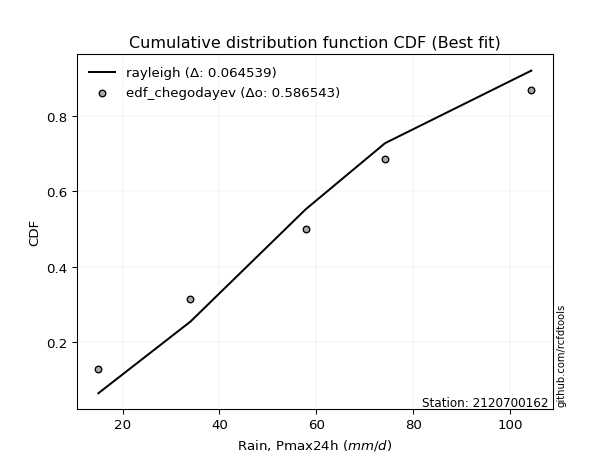</img>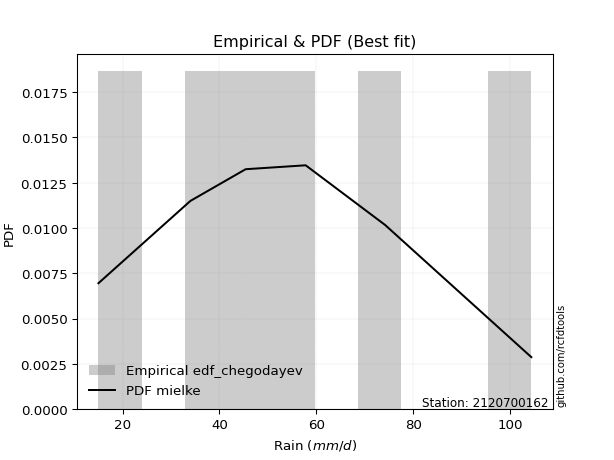</img>

</div>


### 6. EDF Blom (1958)

The Blom formula is a specific "plotting position" formula used in hydrology and statistical analysis to estimate the empirical cumulative probability (or non-exceedance probability) of a data series. It is particularly recommended for data that are approximately normally distributed. The constant _a_ is set to 0.375 (or 3/8).

<div align="center">


$P=(m-a)/(n+1-2a)$


</div>


**6.1. Empirical values**

<div align="center">

|                | 0                   | 1                   | 2        | 3                  | 4                  |
|:---------------|:--------------------|:--------------------|:---------|:-------------------|:-------------------|
| date           | 2023                | 2019                | 2020     | 2022               | 2021               |
| x              | 15.0                | 34.0                | 57.8     | 74.2               | 104.4              |
| m              | 1                   | 2                   | 3        | 4                  | 5                  |
| empirical_dist | edf_blom            | edf_blom            | edf_blom | edf_blom           | edf_blom           |
| empirical      | 0.11904761904761904 | 0.30952380952380953 | 0.5      | 0.6904761904761905 | 0.8809523809523809 |
| empirical_tr   | 1.135135135135135   | 1.4482758620689655  | 2.0      | 3.230769230769231  | 8.399999999999999  |

</div>


**6.2. Kolmogorov-Smirnov fit test (sorted by Δ)**


<div align="center">

|                | 0                   | 1                  | 2                   | 3                     | 4                  | 5                   | 6                   | 7                   | 8                   | 9                   | 10                  | 11                  | 12                  | 13                  | 14                 | 15                  | 16                  | 17                  | 18                  | 19                  | 20                  | 21                  | 22                  | 23                  | 24                  | 25                  | 26                  | 27                  | 28                  | 29                  | 30                 | 31                  | 32                  | 33                  | 34                  | 35                  | 36                  | 37                  | 38                  | 39                  | 40                  | 41                 | 42                 | 43                  | 44                 | 45                 | 46                  | 47                 | 48                  | 49                  | 50                  | 51                  | 52                  | 53                  | 54                  | 55                  | 56                 | 57                  | 58                  | 59                  | 60                 | 61                  | 62                 | 63                  | 64                  | 65                 | 66                  | 67                 | 68                  | 69                  | 70                  | 71                  | 72                  | 73                  | 74                 | 75                  | 76                  | 77                  | 78                 | 79                 | 80                  | 81                  | 82                 | 83                 | 84                 | 85                  | 86                  | 87                 |
|:---------------|:--------------------|:-------------------|:--------------------|:----------------------|:-------------------|:--------------------|:--------------------|:--------------------|:--------------------|:--------------------|:--------------------|:--------------------|:--------------------|:--------------------|:-------------------|:--------------------|:--------------------|:--------------------|:--------------------|:--------------------|:--------------------|:--------------------|:--------------------|:--------------------|:--------------------|:--------------------|:--------------------|:--------------------|:--------------------|:--------------------|:-------------------|:--------------------|:--------------------|:--------------------|:--------------------|:--------------------|:--------------------|:--------------------|:--------------------|:--------------------|:--------------------|:-------------------|:-------------------|:--------------------|:-------------------|:-------------------|:--------------------|:-------------------|:--------------------|:--------------------|:--------------------|:--------------------|:--------------------|:--------------------|:--------------------|:--------------------|:-------------------|:--------------------|:--------------------|:--------------------|:-------------------|:--------------------|:-------------------|:--------------------|:--------------------|:-------------------|:--------------------|:-------------------|:--------------------|:--------------------|:--------------------|:--------------------|:--------------------|:--------------------|:-------------------|:--------------------|:--------------------|:--------------------|:-------------------|:-------------------|:--------------------|:--------------------|:-------------------|:-------------------|:-------------------|:--------------------|:--------------------|:-------------------|
| station        | 2120700162          | 2120700162         | 2120700162          | 2120700162            | 2120700162         | 2120700162          | 2120700162          | 2120700162          | 2120700162          | 2120700162          | 2120700162          | 2120700162          | 2120700162          | 2120700162          | 2120700162         | 2120700162          | 2120700162          | 2120700162          | 2120700162          | 2120700162          | 2120700162          | 2120700162          | 2120700162          | 2120700162          | 2120700162          | 2120700162          | 2120700162          | 2120700162          | 2120700162          | 2120700162          | 2120700162         | 2120700162          | 2120700162          | 2120700162          | 2120700162          | 2120700162          | 2120700162          | 2120700162          | 2120700162          | 2120700162          | 2120700162          | 2120700162         | 2120700162         | 2120700162          | 2120700162         | 2120700162         | 2120700162          | 2120700162         | 2120700162          | 2120700162          | 2120700162          | 2120700162          | 2120700162          | 2120700162          | 2120700162          | 2120700162          | 2120700162         | 2120700162          | 2120700162          | 2120700162          | 2120700162         | 2120700162          | 2120700162         | 2120700162          | 2120700162          | 2120700162         | 2120700162          | 2120700162         | 2120700162          | 2120700162          | 2120700162          | 2120700162          | 2120700162          | 2120700162          | 2120700162         | 2120700162          | 2120700162          | 2120700162          | 2120700162         | 2120700162         | 2120700162          | 2120700162          | 2120700162         | 2120700162         | 2120700162         | 2120700162          | 2120700162          | 2120700162         |
| empirical_dist | edf_blom            | edf_blom           | edf_blom            | edf_blom              | edf_blom           | edf_blom            | edf_blom            | edf_blom            | edf_blom            | edf_blom            | edf_blom            | edf_blom            | edf_blom            | edf_blom            | edf_blom           | edf_blom            | edf_blom            | edf_blom            | edf_blom            | edf_blom            | edf_blom            | edf_blom            | edf_blom            | edf_blom            | edf_blom            | edf_blom            | edf_blom            | edf_blom            | edf_blom            | edf_blom            | edf_blom           | edf_blom            | edf_blom            | edf_blom            | edf_blom            | edf_blom            | edf_blom            | edf_blom            | edf_blom            | edf_blom            | edf_blom            | edf_blom           | edf_blom           | edf_blom            | edf_blom           | edf_blom           | edf_blom            | edf_blom           | edf_blom            | edf_blom            | edf_blom            | edf_blom            | edf_blom            | edf_blom            | edf_blom            | edf_blom            | edf_blom           | edf_blom            | edf_blom            | edf_blom            | edf_blom           | edf_blom            | edf_blom           | edf_blom            | edf_blom            | edf_blom           | edf_blom            | edf_blom           | edf_blom            | edf_blom            | edf_blom            | edf_blom            | edf_blom            | edf_blom            | edf_blom           | edf_blom            | edf_blom            | edf_blom            | edf_blom           | edf_blom           | edf_blom            | edf_blom            | edf_blom           | edf_blom           | edf_blom           | edf_blom            | edf_blom            | edf_blom           |
| p_dist         | rayleigh            | logweibull_min     | maxwell             | loglaplace_asymmetric | johnsonsu          | logjohnsonsu        | loggumbel_l         | invgauss            | invgamma            | ncf                 | erlang              | gamma               | fisk                | rice                | genlogistic        | pearson3            | gumbel_r            | exponnorm           | t                   | nct                 | crystalball         | norm                | kstwobign           | betaprime           | logpearson3         | f                   | logfisk             | logistic            | laplace_asymmetric  | moyal               | alpha              | gumbel_l            | hypsecant           | mielke              | logloggamma         | truncnorm           | gompertz            | halflogistic        | halfnorm            | logbetaprime        | lognct              | logexponnorm       | logcrystalball     | logt                | lognorm            | lognorm            | logf                | logncf             | logfatiguelife      | logerlang           | loggamma            | loggamma            | logrice             | loginvgamma         | laplace             | loglogistic         | genexpon           | expon               | loginvgauss         | loginvweibull       | logalpha           | logmaxwell          | weibull_min        | loghypsecant        | lograyleigh         | loggompertz        | logkstwobign        | loggenexpon        | loghalfnorm         | loglaplace          | loggumbel_r         | wald                | logexpon            | loghalflogistic     | logmoyal           | logwald             | chi2                | loggibrat           | gibrat             | nakagami           | logtruncnorm        | lognakagami         | logchi2            | loglognorm         | fatiguelife        | invweibull          | logmielke           | loggenlogistic     |
| delta          | 0.05461783370446882 | 0.0596247523728239 | 0.06223501258078121 | 0.06266068671059682   | 0.0642495033632085 | 0.06431063359030481 | 0.06471672708399745 | 0.06572872753585013 | 0.06775869669280263 | 0.06835186516156311 | 0.06916952314319733 | 0.06985809799385287 | 0.07127629896987775 | 0.07373433795197379 | 0.0750961208614086 | 0.07697335655458143 | 0.07982224314378616 | 0.08043779881118387 | 0.08050264937554291 | 0.08050343543230007 | 0.08051133397626759 | 0.08051348307706607 | 0.08088293125336332 | 0.08584898090016413 | 0.08637092476749464 | 0.08816226181187203 | 0.08850011780042688 | 0.10300506918044339 | 0.10460773842965854 | 0.10558293307222932 | 0.1127832484013378 | 0.11465471150048748 | 0.11716353566988252 | 0.11771294807091992 | 0.11896776700050804 | 0.11904761587270696 | 0.11904761904737358 | 0.11904761904761904 | 0.11904761904761904 | 0.11950293703658676 | 0.11962849604123693 | 0.1203552319978397 | 0.1203579674844828 | 0.12035832519067446 | 0.1203585411210617 | 0.1203585411210617 | 0.12154904478176864 | 0.1236781587529262 | 0.12368567846447764 | 0.12441817154827428 | 0.12511944631939154 | 0.12511944631939154 | 0.12898138436432272 | 0.12940475150056285 | 0.13446779923696717 | 0.13547765642804066 | 0.1383513878923196 | 0.13836152938922353 | 0.13904392595632697 | 0.14161591513044414 | 0.1435951672768938 | 0.14500576489396577 | 0.1454663123342067 | 0.14761653987030032 | 0.15255510159896768 | 0.1637123424842899 | 0.16407554072662678 | 0.1676675731237771 | 0.17419421056927864 | 0.17583224994183566 | 0.18454530649963263 | 0.18861208800747015 | 0.20228266693884733 | 0.20256408123838698 | 0.2061795570761229 | 0.26677304492626197 | 0.27391433556003264 | 0.29889206958565995 | 0.3085686860161782 | 0.3095207993745947 | 0.30952278809169925 | 0.30952302578139373 | 0.3172111752662322 | 0.3692510714472269 | 0.4296813187908074 | 0.43448786202067513 | 0.43759485231912454 | 0.6904761904761905 |
| deltao         | 0.5865427407550001  | 0.5865427407550001 | 0.5865427407550001  | 0.5865427407550001    | 0.5865427407550001 | 0.5865427407550001  | 0.5865427407550001  | 0.5865427407550001  | 0.5865427407550001  | 0.5865427407550001  | 0.5865427407550001  | 0.5865427407550001  | 0.5865427407550001  | 0.5865427407550001  | 0.5865427407550001 | 0.5865427407550001  | 0.5865427407550001  | 0.5865427407550001  | 0.5865427407550001  | 0.5865427407550001  | 0.5865427407550001  | 0.5865427407550001  | 0.5865427407550001  | 0.5865427407550001  | 0.5865427407550001  | 0.5865427407550001  | 0.5865427407550001  | 0.5865427407550001  | 0.5865427407550001  | 0.5865427407550001  | 0.5865427407550001 | 0.5865427407550001  | 0.5865427407550001  | 0.5865427407550001  | 0.5865427407550001  | 0.5865427407550001  | 0.5865427407550001  | 0.5865427407550001  | 0.5865427407550001  | 0.5865427407550001  | 0.5865427407550001  | 0.5865427407550001 | 0.5865427407550001 | 0.5865427407550001  | 0.5865427407550001 | 0.5865427407550001 | 0.5865427407550001  | 0.5865427407550001 | 0.5865427407550001  | 0.5865427407550001  | 0.5865427407550001  | 0.5865427407550001  | 0.5865427407550001  | 0.5865427407550001  | 0.5865427407550001  | 0.5865427407550001  | 0.5865427407550001 | 0.5865427407550001  | 0.5865427407550001  | 0.5865427407550001  | 0.5865427407550001 | 0.5865427407550001  | 0.5865427407550001 | 0.5865427407550001  | 0.5865427407550001  | 0.5865427407550001 | 0.5865427407550001  | 0.5865427407550001 | 0.5865427407550001  | 0.5865427407550001  | 0.5865427407550001  | 0.5865427407550001  | 0.5865427407550001  | 0.5865427407550001  | 0.5865427407550001 | 0.5865427407550001  | 0.5865427407550001  | 0.5865427407550001  | 0.5865427407550001 | 0.5865427407550001 | 0.5865427407550001  | 0.5865427407550001  | 0.5865427407550001 | 0.5865427407550001 | 0.5865427407550001 | 0.5865427407550001  | 0.5865427407550001  | 0.5865427407550001 |
| eval           | Δo > Δ              | Δo > Δ             | Δo > Δ              | Δo > Δ                | Δo > Δ             | Δo > Δ              | Δo > Δ              | Δo > Δ              | Δo > Δ              | Δo > Δ              | Δo > Δ              | Δo > Δ              | Δo > Δ              | Δo > Δ              | Δo > Δ             | Δo > Δ              | Δo > Δ              | Δo > Δ              | Δo > Δ              | Δo > Δ              | Δo > Δ              | Δo > Δ              | Δo > Δ              | Δo > Δ              | Δo > Δ              | Δo > Δ              | Δo > Δ              | Δo > Δ              | Δo > Δ              | Δo > Δ              | Δo > Δ             | Δo > Δ              | Δo > Δ              | Δo > Δ              | Δo > Δ              | Δo > Δ              | Δo > Δ              | Δo > Δ              | Δo > Δ              | Δo > Δ              | Δo > Δ              | Δo > Δ             | Δo > Δ             | Δo > Δ              | Δo > Δ             | Δo > Δ             | Δo > Δ              | Δo > Δ             | Δo > Δ              | Δo > Δ              | Δo > Δ              | Δo > Δ              | Δo > Δ              | Δo > Δ              | Δo > Δ              | Δo > Δ              | Δo > Δ             | Δo > Δ              | Δo > Δ              | Δo > Δ              | Δo > Δ             | Δo > Δ              | Δo > Δ             | Δo > Δ              | Δo > Δ              | Δo > Δ             | Δo > Δ              | Δo > Δ             | Δo > Δ              | Δo > Δ              | Δo > Δ              | Δo > Δ              | Δo > Δ              | Δo > Δ              | Δo > Δ             | Δo > Δ              | Δo > Δ              | Δo > Δ              | Δo > Δ             | Δo > Δ             | Δo > Δ              | Δo > Δ              | Δo > Δ             | Δo > Δ             | Δo > Δ             | Δo > Δ              | Δo > Δ              | Δo <= Δ            |
| fit            | 1                   | 1                  | 1                   | 1                     | 1                  | 1                   | 1                   | 1                   | 1                   | 1                   | 1                   | 1                   | 1                   | 1                   | 1                  | 1                   | 1                   | 1                   | 1                   | 1                   | 1                   | 1                   | 1                   | 1                   | 1                   | 1                   | 1                   | 1                   | 1                   | 1                   | 1                  | 1                   | 1                   | 1                   | 1                   | 1                   | 1                   | 1                   | 1                   | 1                   | 1                   | 1                  | 1                  | 1                   | 1                  | 1                  | 1                   | 1                  | 1                   | 1                   | 1                   | 1                   | 1                   | 1                   | 1                   | 1                   | 1                  | 1                   | 1                   | 1                   | 1                  | 1                   | 1                  | 1                   | 1                   | 1                  | 1                   | 1                  | 1                   | 1                   | 1                   | 1                   | 1                   | 1                   | 1                  | 1                   | 1                   | 1                   | 1                  | 1                  | 1                   | 1                   | 1                  | 1                  | 1                  | 1                   | 1                   | 0                  |
| n              | 5                   | 5                  | 5                   | 5                     | 5                  | 5                   | 5                   | 5                   | 5                   | 5                   | 5                   | 5                   | 5                   | 5                   | 5                  | 5                   | 5                   | 5                   | 5                   | 5                   | 5                   | 5                   | 5                   | 5                   | 5                   | 5                   | 5                   | 5                   | 5                   | 5                   | 5                  | 5                   | 5                   | 5                   | 5                   | 5                   | 5                   | 5                   | 5                   | 5                   | 5                   | 5                  | 5                  | 5                   | 5                  | 5                  | 5                   | 5                  | 5                   | 5                   | 5                   | 5                   | 5                   | 5                   | 5                   | 5                   | 5                  | 5                   | 5                   | 5                   | 5                  | 5                   | 5                  | 5                   | 5                   | 5                  | 5                   | 5                  | 5                   | 5                   | 5                   | 5                   | 5                   | 5                   | 5                  | 5                   | 5                   | 5                   | 5                  | 5                  | 5                   | 5                   | 5                  | 5                  | 5                  | 5                   | 5                   | 5                  |
| best_fit       | 1                   | 0                  | 0                   | 0                     | 0                  | 0                   | 0                   | 0                   | 0                   | 0                   | 0                   | 0                   | 0                   | 0                   | 0                  | 0                   | 0                   | 0                   | 0                   | 0                   | 0                   | 0                   | 0                   | 0                   | 0                   | 0                   | 0                   | 0                   | 0                   | 0                   | 0                  | 0                   | 0                   | 0                   | 0                   | 0                   | 0                   | 0                   | 0                   | 0                   | 0                   | 0                  | 0                  | 0                   | 0                  | 0                  | 0                   | 0                  | 0                   | 0                   | 0                   | 0                   | 0                   | 0                   | 0                   | 0                   | 0                  | 0                   | 0                   | 0                   | 0                  | 0                   | 0                  | 0                   | 0                   | 0                  | 0                   | 0                  | 0                   | 0                   | 0                   | 0                   | 0                   | 0                   | 0                  | 0                   | 0                   | 0                   | 0                  | 0                  | 0                   | 0                   | 0                  | 0                  | 0                  | 0                   | 0                   | 0                  |
| best_fit_sort  | 1                   | 2                  | 3                   | 4                     | 5                  | 6                   | 7                   | 8                   | 9                   | 10                  | 11                  | 12                  | 13                  | 14                  | 15                 | 16                  | 17                  | 18                  | 19                  | 20                  | 21                  | 22                  | 23                  | 24                  | 25                  | 26                  | 27                  | 28                  | 29                  | 30                  | 31                 | 32                  | 33                  | 34                  | 35                  | 36                  | 37                  | 38                  | 39                  | 40                  | 41                  | 42                 | 43                 | 44                  | 45                 | 46                 | 47                  | 48                 | 49                  | 50                  | 51                  | 52                  | 53                  | 54                  | 55                  | 56                  | 57                 | 58                  | 59                  | 60                  | 61                 | 62                  | 63                 | 64                  | 65                  | 66                 | 67                  | 68                 | 69                  | 70                  | 71                  | 72                  | 73                  | 74                  | 75                 | 76                  | 77                  | 78                  | 79                 | 80                 | 81                  | 82                  | 83                 | 84                 | 85                 | 86                  | 87                  | 88                 |

</div>


**6.3. Best fit**

<div align="center">

|   id |    station | empirical_dist   | p_dist   |     delta |   deltao | eval   |   fit |   n |   best_fit |   best_fit_sort |
|-----:|-----------:|:-----------------|:---------|----------:|---------:|:-------|------:|----:|-----------:|----------------:|
|    0 | 2120700162 | edf_blom         | rayleigh | 0.0546178 | 0.586543 | Δo > Δ |     1 |   5 |          1 |               1 |

</div>


<div align="center">

</img></img>

</div>


### 7. EDF Tukey (1962)

In hydrology, the Tukey formula is used as a plotting position formula to estimate the empirical probability or frequency of a flood event (or other hydrological data). The formula parameter is given as _c=0.333_ (or 1/3).

<div align="center">


$P=(m-c)/(n+1-2c)$


</div>


**7.1. Empirical values**

<div align="center">

|                | 0                  | 1                  | 2         | 3         | 4         |
|:---------------|:-------------------|:-------------------|:----------|:----------|:----------|
| date           | 2023               | 2019               | 2020      | 2022      | 2021      |
| x              | 15.0               | 34.0               | 57.8      | 74.2      | 104.4     |
| m              | 1                  | 2                  | 3         | 4         | 5         |
| empirical_dist | edf_tukey          | edf_tukey          | edf_tukey | edf_tukey | edf_tukey |
| empirical      | 0.125              | 0.3125             | 0.5       | 0.6875    | 0.875     |
| empirical_tr   | 1.1428571428571428 | 1.4545454545454546 | 2.0       | 3.2       | 8.0       |

</div>


**7.2. Kolmogorov-Smirnov fit test (sorted by Δ)**


<div align="center">

|                | 0                   | 1                   | 2                   | 3                   | 4                     | 5                   | 6                   | 7                   | 8                   | 9                  | 10                  | 11                  | 12                  | 13                 | 14                  | 15                 | 16                  | 17                  | 18                  | 19                  | 20                  | 21                  | 22                  | 23                  | 24                  | 25                  | 26                  | 27                  | 28                 | 29                  | 30                 | 31                  | 32                  | 33                  | 34                  | 35                 | 36                 | 37                  | 38                 | 39                 | 40                  | 41                  | 42                 | 43                  | 44                  | 45                  | 46                  | 47                  | 48                 | 49                 | 50                  | 51                  | 52                  | 53                  | 54                  | 55                  | 56                 | 57                  | 58                  | 59                  | 60                 | 61                  | 62                 | 63                  | 64                  | 65                 | 66                  | 67                 | 68                  | 69                  | 70                  | 71                 | 72                  | 73                  | 74                 | 75                  | 76                  | 77                  | 78                  | 79                  | 80                 | 81                 | 82                  | 83                  | 84                  | 85                  | 86                 | 87                 |
|:---------------|:--------------------|:--------------------|:--------------------|:--------------------|:----------------------|:--------------------|:--------------------|:--------------------|:--------------------|:-------------------|:--------------------|:--------------------|:--------------------|:-------------------|:--------------------|:-------------------|:--------------------|:--------------------|:--------------------|:--------------------|:--------------------|:--------------------|:--------------------|:--------------------|:--------------------|:--------------------|:--------------------|:--------------------|:-------------------|:--------------------|:-------------------|:--------------------|:--------------------|:--------------------|:--------------------|:-------------------|:-------------------|:--------------------|:-------------------|:-------------------|:--------------------|:--------------------|:-------------------|:--------------------|:--------------------|:--------------------|:--------------------|:--------------------|:-------------------|:-------------------|:--------------------|:--------------------|:--------------------|:--------------------|:--------------------|:--------------------|:-------------------|:--------------------|:--------------------|:--------------------|:-------------------|:--------------------|:-------------------|:--------------------|:--------------------|:-------------------|:--------------------|:-------------------|:--------------------|:--------------------|:--------------------|:-------------------|:--------------------|:--------------------|:-------------------|:--------------------|:--------------------|:--------------------|:--------------------|:--------------------|:-------------------|:-------------------|:--------------------|:--------------------|:--------------------|:--------------------|:-------------------|:-------------------|
| station        | 2120700162          | 2120700162          | 2120700162          | 2120700162          | 2120700162            | 2120700162          | 2120700162          | 2120700162          | 2120700162          | 2120700162         | 2120700162          | 2120700162          | 2120700162          | 2120700162         | 2120700162          | 2120700162         | 2120700162          | 2120700162          | 2120700162          | 2120700162          | 2120700162          | 2120700162          | 2120700162          | 2120700162          | 2120700162          | 2120700162          | 2120700162          | 2120700162          | 2120700162         | 2120700162          | 2120700162         | 2120700162          | 2120700162          | 2120700162          | 2120700162          | 2120700162         | 2120700162         | 2120700162          | 2120700162         | 2120700162         | 2120700162          | 2120700162          | 2120700162         | 2120700162          | 2120700162          | 2120700162          | 2120700162          | 2120700162          | 2120700162         | 2120700162         | 2120700162          | 2120700162          | 2120700162          | 2120700162          | 2120700162          | 2120700162          | 2120700162         | 2120700162          | 2120700162          | 2120700162          | 2120700162         | 2120700162          | 2120700162         | 2120700162          | 2120700162          | 2120700162         | 2120700162          | 2120700162         | 2120700162          | 2120700162          | 2120700162          | 2120700162         | 2120700162          | 2120700162          | 2120700162         | 2120700162          | 2120700162          | 2120700162          | 2120700162          | 2120700162          | 2120700162         | 2120700162         | 2120700162          | 2120700162          | 2120700162          | 2120700162          | 2120700162         | 2120700162         |
| empirical_dist | edf_tukey           | edf_tukey           | edf_tukey           | edf_tukey           | edf_tukey             | edf_tukey           | edf_tukey           | edf_tukey           | edf_tukey           | edf_tukey          | edf_tukey           | edf_tukey           | edf_tukey           | edf_tukey          | edf_tukey           | edf_tukey          | edf_tukey           | edf_tukey           | edf_tukey           | edf_tukey           | edf_tukey           | edf_tukey           | edf_tukey           | edf_tukey           | edf_tukey           | edf_tukey           | edf_tukey           | edf_tukey           | edf_tukey          | edf_tukey           | edf_tukey          | edf_tukey           | edf_tukey           | edf_tukey           | edf_tukey           | edf_tukey          | edf_tukey          | edf_tukey           | edf_tukey          | edf_tukey          | edf_tukey           | edf_tukey           | edf_tukey          | edf_tukey           | edf_tukey           | edf_tukey           | edf_tukey           | edf_tukey           | edf_tukey          | edf_tukey          | edf_tukey           | edf_tukey           | edf_tukey           | edf_tukey           | edf_tukey           | edf_tukey           | edf_tukey          | edf_tukey           | edf_tukey           | edf_tukey           | edf_tukey          | edf_tukey           | edf_tukey          | edf_tukey           | edf_tukey           | edf_tukey          | edf_tukey           | edf_tukey          | edf_tukey           | edf_tukey           | edf_tukey           | edf_tukey          | edf_tukey           | edf_tukey           | edf_tukey          | edf_tukey           | edf_tukey           | edf_tukey           | edf_tukey           | edf_tukey           | edf_tukey          | edf_tukey          | edf_tukey           | edf_tukey           | edf_tukey           | edf_tukey           | edf_tukey          | edf_tukey          |
| p_dist         | rayleigh            | loggumbel_l         | maxwell             | logweibull_min      | loglaplace_asymmetric | invgauss            | johnsonsu           | ncf                 | logjohnsonsu        | invgamma           | erlang              | gamma               | fisk                | genlogistic        | rice                | pearson3           | kstwobign           | exponnorm           | t                   | nct                 | crystalball         | norm                | gumbel_r            | betaprime           | logpearson3         | f                   | logfisk             | logistic            | laplace_asymmetric | moyal               | alpha              | gumbel_l            | logbetaprime        | lognct              | hypsecant           | logexponnorm       | logcrystalball     | logt                | lognorm            | lognorm            | logf                | mielke              | logncf             | logfatiguelife      | logerlang           | logloggamma         | truncnorm           | gompertz            | halflogistic       | halfnorm           | loggamma            | loggamma            | logrice             | loginvgamma         | loglogistic         | laplace             | genexpon           | expon               | loginvgauss         | loginvweibull       | logalpha           | logmaxwell          | weibull_min        | loghypsecant        | lograyleigh         | loggompertz        | logkstwobign        | loggenexpon        | loghalfnorm         | loglaplace          | loggumbel_r         | wald               | logexpon            | loghalflogistic     | logmoyal           | logwald             | chi2                | loggibrat           | gibrat              | nakagami            | logtruncnorm       | lognakagami        | logchi2             | loglognorm          | fatiguelife         | invweibull          | logmielke          | loggenlogistic     |
| delta          | 0.05990969043092728 | 0.06471672708399745 | 0.06521120305697167 | 0.06557713332520486 | 0.06563687718678729   | 0.06572872753585013 | 0.06722569383939897 | 0.06835186516156311 | 0.06893849503767946 | 0.0707348871689931 | 0.07214571361938779 | 0.07283428847004333 | 0.07425248944606821 | 0.0750961208614086 | 0.07671052842816425 | 0.0799495470307719 | 0.08088293125336332 | 0.08341398928737434 | 0.08347883985173338 | 0.08347962590849053 | 0.08348752445245805 | 0.08348967355325654 | 0.08357742045939255 | 0.08584898090016413 | 0.08637092476749464 | 0.08816226181187203 | 0.08850011780042688 | 0.10598125965663385 | 0.107583928905849  | 0.10774983179173875 | 0.1127832484013378 | 0.11763090197667794 | 0.11950293703658676 | 0.11962849604123693 | 0.12013972614607299 | 0.1203552319978397 | 0.1203579674844828 | 0.12035832519067446 | 0.1203585411210617 | 0.1203585411210617 | 0.12154904478176864 | 0.12366532902330085 | 0.1236781587529262 | 0.12368567846447764 | 0.12441817154827428 | 0.12492014795288897 | 0.12499999682508789 | 0.12499999999975454 | 0.125              | 0.125              | 0.12511944631939154 | 0.12511944631939154 | 0.12898138436432272 | 0.12940475150056285 | 0.13547765642804066 | 0.13744398971315763 | 0.1383513878923196 | 0.13836152938922353 | 0.13904392595632697 | 0.14161591513044414 | 0.1435951672768938 | 0.14500576489396577 | 0.1454663123342067 | 0.14761653987030032 | 0.15255510159896768 | 0.1637123424842899 | 0.16407554072662678 | 0.1676675731237771 | 0.17419421056927864 | 0.17583224994183566 | 0.18454530649963263 | 0.1915882784836606 | 0.19930647646265687 | 0.20256408123838698 | 0.2061795570761229 | 0.26677304492626197 | 0.27391433556003264 | 0.29889206958565995 | 0.31154487649236867 | 0.31249698985078517 | 0.3124989785678897 | 0.3124992162575842 | 0.31423498479004175 | 0.36627488097103644 | 0.42670512831461693 | 0.43151167154448467 | 0.4346186618429341 | 0.6875             |
| deltao         | 0.5865427407550001  | 0.5865427407550001  | 0.5865427407550001  | 0.5865427407550001  | 0.5865427407550001    | 0.5865427407550001  | 0.5865427407550001  | 0.5865427407550001  | 0.5865427407550001  | 0.5865427407550001 | 0.5865427407550001  | 0.5865427407550001  | 0.5865427407550001  | 0.5865427407550001 | 0.5865427407550001  | 0.5865427407550001 | 0.5865427407550001  | 0.5865427407550001  | 0.5865427407550001  | 0.5865427407550001  | 0.5865427407550001  | 0.5865427407550001  | 0.5865427407550001  | 0.5865427407550001  | 0.5865427407550001  | 0.5865427407550001  | 0.5865427407550001  | 0.5865427407550001  | 0.5865427407550001 | 0.5865427407550001  | 0.5865427407550001 | 0.5865427407550001  | 0.5865427407550001  | 0.5865427407550001  | 0.5865427407550001  | 0.5865427407550001 | 0.5865427407550001 | 0.5865427407550001  | 0.5865427407550001 | 0.5865427407550001 | 0.5865427407550001  | 0.5865427407550001  | 0.5865427407550001 | 0.5865427407550001  | 0.5865427407550001  | 0.5865427407550001  | 0.5865427407550001  | 0.5865427407550001  | 0.5865427407550001 | 0.5865427407550001 | 0.5865427407550001  | 0.5865427407550001  | 0.5865427407550001  | 0.5865427407550001  | 0.5865427407550001  | 0.5865427407550001  | 0.5865427407550001 | 0.5865427407550001  | 0.5865427407550001  | 0.5865427407550001  | 0.5865427407550001 | 0.5865427407550001  | 0.5865427407550001 | 0.5865427407550001  | 0.5865427407550001  | 0.5865427407550001 | 0.5865427407550001  | 0.5865427407550001 | 0.5865427407550001  | 0.5865427407550001  | 0.5865427407550001  | 0.5865427407550001 | 0.5865427407550001  | 0.5865427407550001  | 0.5865427407550001 | 0.5865427407550001  | 0.5865427407550001  | 0.5865427407550001  | 0.5865427407550001  | 0.5865427407550001  | 0.5865427407550001 | 0.5865427407550001 | 0.5865427407550001  | 0.5865427407550001  | 0.5865427407550001  | 0.5865427407550001  | 0.5865427407550001 | 0.5865427407550001 |
| eval           | Δo > Δ              | Δo > Δ              | Δo > Δ              | Δo > Δ              | Δo > Δ                | Δo > Δ              | Δo > Δ              | Δo > Δ              | Δo > Δ              | Δo > Δ             | Δo > Δ              | Δo > Δ              | Δo > Δ              | Δo > Δ             | Δo > Δ              | Δo > Δ             | Δo > Δ              | Δo > Δ              | Δo > Δ              | Δo > Δ              | Δo > Δ              | Δo > Δ              | Δo > Δ              | Δo > Δ              | Δo > Δ              | Δo > Δ              | Δo > Δ              | Δo > Δ              | Δo > Δ             | Δo > Δ              | Δo > Δ             | Δo > Δ              | Δo > Δ              | Δo > Δ              | Δo > Δ              | Δo > Δ             | Δo > Δ             | Δo > Δ              | Δo > Δ             | Δo > Δ             | Δo > Δ              | Δo > Δ              | Δo > Δ             | Δo > Δ              | Δo > Δ              | Δo > Δ              | Δo > Δ              | Δo > Δ              | Δo > Δ             | Δo > Δ             | Δo > Δ              | Δo > Δ              | Δo > Δ              | Δo > Δ              | Δo > Δ              | Δo > Δ              | Δo > Δ             | Δo > Δ              | Δo > Δ              | Δo > Δ              | Δo > Δ             | Δo > Δ              | Δo > Δ             | Δo > Δ              | Δo > Δ              | Δo > Δ             | Δo > Δ              | Δo > Δ             | Δo > Δ              | Δo > Δ              | Δo > Δ              | Δo > Δ             | Δo > Δ              | Δo > Δ              | Δo > Δ             | Δo > Δ              | Δo > Δ              | Δo > Δ              | Δo > Δ              | Δo > Δ              | Δo > Δ             | Δo > Δ             | Δo > Δ              | Δo > Δ              | Δo > Δ              | Δo > Δ              | Δo > Δ             | Δo <= Δ            |
| fit            | 1                   | 1                   | 1                   | 1                   | 1                     | 1                   | 1                   | 1                   | 1                   | 1                  | 1                   | 1                   | 1                   | 1                  | 1                   | 1                  | 1                   | 1                   | 1                   | 1                   | 1                   | 1                   | 1                   | 1                   | 1                   | 1                   | 1                   | 1                   | 1                  | 1                   | 1                  | 1                   | 1                   | 1                   | 1                   | 1                  | 1                  | 1                   | 1                  | 1                  | 1                   | 1                   | 1                  | 1                   | 1                   | 1                   | 1                   | 1                   | 1                  | 1                  | 1                   | 1                   | 1                   | 1                   | 1                   | 1                   | 1                  | 1                   | 1                   | 1                   | 1                  | 1                   | 1                  | 1                   | 1                   | 1                  | 1                   | 1                  | 1                   | 1                   | 1                   | 1                  | 1                   | 1                   | 1                  | 1                   | 1                   | 1                   | 1                   | 1                   | 1                  | 1                  | 1                   | 1                   | 1                   | 1                   | 1                  | 0                  |
| n              | 5                   | 5                   | 5                   | 5                   | 5                     | 5                   | 5                   | 5                   | 5                   | 5                  | 5                   | 5                   | 5                   | 5                  | 5                   | 5                  | 5                   | 5                   | 5                   | 5                   | 5                   | 5                   | 5                   | 5                   | 5                   | 5                   | 5                   | 5                   | 5                  | 5                   | 5                  | 5                   | 5                   | 5                   | 5                   | 5                  | 5                  | 5                   | 5                  | 5                  | 5                   | 5                   | 5                  | 5                   | 5                   | 5                   | 5                   | 5                   | 5                  | 5                  | 5                   | 5                   | 5                   | 5                   | 5                   | 5                   | 5                  | 5                   | 5                   | 5                   | 5                  | 5                   | 5                  | 5                   | 5                   | 5                  | 5                   | 5                  | 5                   | 5                   | 5                   | 5                  | 5                   | 5                   | 5                  | 5                   | 5                   | 5                   | 5                   | 5                   | 5                  | 5                  | 5                   | 5                   | 5                   | 5                   | 5                  | 5                  |
| best_fit       | 1                   | 0                   | 0                   | 0                   | 0                     | 0                   | 0                   | 0                   | 0                   | 0                  | 0                   | 0                   | 0                   | 0                  | 0                   | 0                  | 0                   | 0                   | 0                   | 0                   | 0                   | 0                   | 0                   | 0                   | 0                   | 0                   | 0                   | 0                   | 0                  | 0                   | 0                  | 0                   | 0                   | 0                   | 0                   | 0                  | 0                  | 0                   | 0                  | 0                  | 0                   | 0                   | 0                  | 0                   | 0                   | 0                   | 0                   | 0                   | 0                  | 0                  | 0                   | 0                   | 0                   | 0                   | 0                   | 0                   | 0                  | 0                   | 0                   | 0                   | 0                  | 0                   | 0                  | 0                   | 0                   | 0                  | 0                   | 0                  | 0                   | 0                   | 0                   | 0                  | 0                   | 0                   | 0                  | 0                   | 0                   | 0                   | 0                   | 0                   | 0                  | 0                  | 0                   | 0                   | 0                   | 0                   | 0                  | 0                  |
| best_fit_sort  | 1                   | 2                   | 3                   | 4                   | 5                     | 6                   | 7                   | 8                   | 9                   | 10                 | 11                  | 12                  | 13                  | 14                 | 15                  | 16                 | 17                  | 18                  | 19                  | 20                  | 21                  | 22                  | 23                  | 24                  | 25                  | 26                  | 27                  | 28                  | 29                 | 30                  | 31                 | 32                  | 33                  | 34                  | 35                  | 36                 | 37                 | 38                  | 39                 | 40                 | 41                  | 42                  | 43                 | 44                  | 45                  | 46                  | 47                  | 48                  | 49                 | 50                 | 51                  | 52                  | 53                  | 54                  | 55                  | 56                  | 57                 | 58                  | 59                  | 60                  | 61                 | 62                  | 63                 | 64                  | 65                  | 66                 | 67                  | 68                 | 69                  | 70                  | 71                  | 72                 | 73                  | 74                  | 75                 | 76                  | 77                  | 78                  | 79                  | 80                  | 81                 | 82                 | 83                  | 84                  | 85                  | 86                  | 87                 | 88                 |

</div>


**7.3. Best fit**

<div align="center">

|   id |    station | empirical_dist   | p_dist   |     delta |   deltao | eval   |   fit |   n |   best_fit |   best_fit_sort |
|-----:|-----------:|:-----------------|:---------|----------:|---------:|:-------|------:|----:|-----------:|----------------:|
|    0 | 2120700162 | edf_tukey        | rayleigh | 0.0599097 | 0.586543 | Δo > Δ |     1 |   5 |          1 |               1 |

</div>


<div align="center">

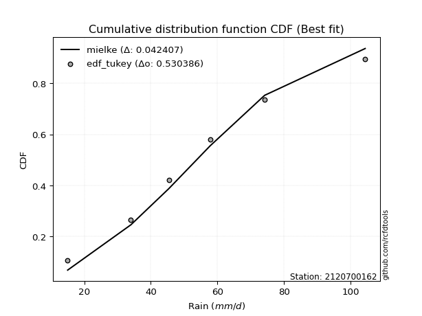</img></img>

</div>


### 8. EDF Gringorten (1963)

Gringorten plotting position formula is essential for estimating the probability and return periods of extreme events like floods and heavy rainfall. The constant _a=0.44_.

<div align="center">


$P=(m-a)/(n+1-2a)$


</div>


**8.1. Empirical values**

<div align="center">

|                | 0                   | 1                  | 2              | 3                 | 4                  |
|:---------------|:--------------------|:-------------------|:---------------|:------------------|:-------------------|
| date           | 2023                | 2019               | 2020           | 2022              | 2021               |
| x              | 15.0                | 34.0               | 57.8           | 74.2              | 104.4              |
| m              | 1                   | 2                  | 3              | 4                 | 5                  |
| empirical_dist | edf_gringorten      | edf_gringorten     | edf_gringorten | edf_gringorten    | edf_gringorten     |
| empirical      | 0.10937500000000001 | 0.3046875          | 0.5            | 0.6953125         | 0.8906249999999999 |
| empirical_tr   | 1.1228070175438596  | 1.4382022471910112 | 2.0            | 3.282051282051282 | 9.142857142857133  |

</div>


**8.2. Kolmogorov-Smirnov fit test (sorted by Δ)**


<div align="center">

|                | 0                   | 1                    | 2                   | 3                     | 4                   | 5                   | 6                  | 7                   | 8                   | 9                   | 10                  | 11                  | 12                  | 13                  | 14                 | 15                 | 16                  | 17                  | 18                  | 19                  | 20                  | 21                  | 22                  | 23                  | 24                  | 25                  | 26                  | 27                  | 28                 | 29                  | 30                  | 31                  | 32                 | 33                  | 34                  | 35                  | 36                  | 37                  | 38                 | 39                  | 40                  | 41                 | 42                 | 43                  | 44                 | 45                 | 46                  | 47                 | 48                  | 49                  | 50                  | 51                  | 52                  | 53                  | 54                  | 55                  | 56                 | 57                  | 58                  | 59                  | 60                 | 61                  | 62                 | 63                  | 64                  | 65                 | 66                  | 67                 | 68                  | 69                  | 70                 | 71                  | 72                  | 73                 | 74                  | 75                  | 76                  | 77                  | 78                  | 79                  | 80                 | 81                 | 82                  | 83                  | 84                  | 85                  | 86                 | 87                 |
|:---------------|:--------------------|:---------------------|:--------------------|:----------------------|:--------------------|:--------------------|:-------------------|:--------------------|:--------------------|:--------------------|:--------------------|:--------------------|:--------------------|:--------------------|:-------------------|:-------------------|:--------------------|:--------------------|:--------------------|:--------------------|:--------------------|:--------------------|:--------------------|:--------------------|:--------------------|:--------------------|:--------------------|:--------------------|:-------------------|:--------------------|:--------------------|:--------------------|:-------------------|:--------------------|:--------------------|:--------------------|:--------------------|:--------------------|:-------------------|:--------------------|:--------------------|:-------------------|:-------------------|:--------------------|:-------------------|:-------------------|:--------------------|:-------------------|:--------------------|:--------------------|:--------------------|:--------------------|:--------------------|:--------------------|:--------------------|:--------------------|:-------------------|:--------------------|:--------------------|:--------------------|:-------------------|:--------------------|:-------------------|:--------------------|:--------------------|:-------------------|:--------------------|:-------------------|:--------------------|:--------------------|:-------------------|:--------------------|:--------------------|:-------------------|:--------------------|:--------------------|:--------------------|:--------------------|:--------------------|:--------------------|:-------------------|:-------------------|:--------------------|:--------------------|:--------------------|:--------------------|:-------------------|:-------------------|
| station        | 2120700162          | 2120700162           | 2120700162          | 2120700162            | 2120700162          | 2120700162          | 2120700162         | 2120700162          | 2120700162          | 2120700162          | 2120700162          | 2120700162          | 2120700162          | 2120700162          | 2120700162         | 2120700162         | 2120700162          | 2120700162          | 2120700162          | 2120700162          | 2120700162          | 2120700162          | 2120700162          | 2120700162          | 2120700162          | 2120700162          | 2120700162          | 2120700162          | 2120700162         | 2120700162          | 2120700162          | 2120700162          | 2120700162         | 2120700162          | 2120700162          | 2120700162          | 2120700162          | 2120700162          | 2120700162         | 2120700162          | 2120700162          | 2120700162         | 2120700162         | 2120700162          | 2120700162         | 2120700162         | 2120700162          | 2120700162         | 2120700162          | 2120700162          | 2120700162          | 2120700162          | 2120700162          | 2120700162          | 2120700162          | 2120700162          | 2120700162         | 2120700162          | 2120700162          | 2120700162          | 2120700162         | 2120700162          | 2120700162         | 2120700162          | 2120700162          | 2120700162         | 2120700162          | 2120700162         | 2120700162          | 2120700162          | 2120700162         | 2120700162          | 2120700162          | 2120700162         | 2120700162          | 2120700162          | 2120700162          | 2120700162          | 2120700162          | 2120700162          | 2120700162         | 2120700162         | 2120700162          | 2120700162          | 2120700162          | 2120700162          | 2120700162         | 2120700162         |
| empirical_dist | edf_gringorten      | edf_gringorten       | edf_gringorten      | edf_gringorten        | edf_gringorten      | edf_gringorten      | edf_gringorten     | edf_gringorten      | edf_gringorten      | edf_gringorten      | edf_gringorten      | edf_gringorten      | edf_gringorten      | edf_gringorten      | edf_gringorten     | edf_gringorten     | edf_gringorten      | edf_gringorten      | edf_gringorten      | edf_gringorten      | edf_gringorten      | edf_gringorten      | edf_gringorten      | edf_gringorten      | edf_gringorten      | edf_gringorten      | edf_gringorten      | edf_gringorten      | edf_gringorten     | edf_gringorten      | edf_gringorten      | edf_gringorten      | edf_gringorten     | edf_gringorten      | edf_gringorten      | edf_gringorten      | edf_gringorten      | edf_gringorten      | edf_gringorten     | edf_gringorten      | edf_gringorten      | edf_gringorten     | edf_gringorten     | edf_gringorten      | edf_gringorten     | edf_gringorten     | edf_gringorten      | edf_gringorten     | edf_gringorten      | edf_gringorten      | edf_gringorten      | edf_gringorten      | edf_gringorten      | edf_gringorten      | edf_gringorten      | edf_gringorten      | edf_gringorten     | edf_gringorten      | edf_gringorten      | edf_gringorten      | edf_gringorten     | edf_gringorten      | edf_gringorten     | edf_gringorten      | edf_gringorten      | edf_gringorten     | edf_gringorten      | edf_gringorten     | edf_gringorten      | edf_gringorten      | edf_gringorten     | edf_gringorten      | edf_gringorten      | edf_gringorten     | edf_gringorten      | edf_gringorten      | edf_gringorten      | edf_gringorten      | edf_gringorten      | edf_gringorten      | edf_gringorten     | edf_gringorten     | edf_gringorten      | edf_gringorten      | edf_gringorten      | edf_gringorten      | edf_gringorten     | edf_gringorten     |
| p_dist         | rayleigh            | logweibull_min       | maxwell             | loglaplace_asymmetric | johnsonsu           | logjohnsonsu        | invgamma           | erlang              | loggumbel_l         | gamma               | invgauss            | fisk                | ncf                 | rice                | pearson3           | genlogistic        | exponnorm           | t                   | nct                 | crystalball         | norm                | gumbel_r            | kstwobign           | betaprime           | logpearson3         | f                   | logfisk             | logistic            | laplace_asymmetric | moyal               | mielke              | logloggamma         | truncnorm          | gompertz            | halflogistic        | halfnorm            | gumbel_l            | hypsecant           | alpha              | logbetaprime        | lognct              | logexponnorm       | logcrystalball     | logt                | lognorm            | lognorm            | logf                | logncf             | logfatiguelife      | logerlang           | loggamma            | loggamma            | logrice             | loginvgamma         | laplace             | loglogistic         | genexpon           | expon               | loginvgauss         | loginvweibull       | logalpha           | logmaxwell          | weibull_min        | loghypsecant        | lograyleigh         | loggompertz        | logkstwobign        | loggenexpon        | loghalfnorm         | loglaplace          | wald               | loggumbel_r         | loghalflogistic     | logmoyal           | logexpon            | logwald             | chi2                | loggibrat           | gibrat              | nakagami            | logtruncnorm       | lognakagami        | logchi2             | loglognorm          | fatiguelife         | invweibull          | logmielke          | loggenlogistic     |
| delta          | 0.05269834420473385 | 0.056152736391978375 | 0.05739870305697167 | 0.05782437718678729   | 0.05941319383939897 | 0.05947432406649528 | 0.0629223871689931 | 0.06433321361938779 | 0.06471672708399745 | 0.06502178847004333 | 0.06572872753585013 | 0.06643998944606821 | 0.06835186516156311 | 0.06889802842816425 | 0.0721370470307719 | 0.0750961208614086 | 0.07560148928737434 | 0.07566633985173338 | 0.07566712590849053 | 0.07567502445245805 | 0.07567717355325654 | 0.07982224314378616 | 0.08088293125336332 | 0.08584898090016413 | 0.08637092476749464 | 0.08816226181187203 | 0.08850011780042688 | 0.09816875965663385 | 0.099771428905849  | 0.10558293307222932 | 0.10804032902330096 | 0.10929514795288908 | 0.109374996825088  | 0.10937499999975456 | 0.10937500000000001 | 0.10937500000000001 | 0.10981840197667794 | 0.11232722614607299 | 0.1127832484013378 | 0.11950293703658676 | 0.11962849604123693 | 0.1203552319978397 | 0.1203579674844828 | 0.12035832519067446 | 0.1203585411210617 | 0.1203585411210617 | 0.12154904478176864 | 0.1236781587529262 | 0.12368567846447764 | 0.12441817154827428 | 0.12511944631939154 | 0.12511944631939154 | 0.12898138436432272 | 0.12940475150056285 | 0.12963148971315763 | 0.13547765642804066 | 0.1383513878923196 | 0.13836152938922353 | 0.13904392595632697 | 0.14161591513044414 | 0.1435951672768938 | 0.14500576489396577 | 0.1454663123342067 | 0.14761653987030032 | 0.15255510159896768 | 0.1637123424842899 | 0.16407554072662678 | 0.1676675731237771 | 0.17419421056927864 | 0.17583224994183566 | 0.1837757784836606 | 0.18454530649963263 | 0.20256408123838698 | 0.2061795570761229 | 0.20711897646265687 | 0.26677304492626197 | 0.27391433556003264 | 0.29889206958565995 | 0.30373237649236867 | 0.30468448985078517 | 0.3046864785678897 | 0.3046867162575842 | 0.32204748479004175 | 0.37408738097103644 | 0.43451762831461693 | 0.43932417154448467 | 0.4424311618429341 | 0.6953125          |
| deltao         | 0.5865427407550001  | 0.5865427407550001   | 0.5865427407550001  | 0.5865427407550001    | 0.5865427407550001  | 0.5865427407550001  | 0.5865427407550001 | 0.5865427407550001  | 0.5865427407550001  | 0.5865427407550001  | 0.5865427407550001  | 0.5865427407550001  | 0.5865427407550001  | 0.5865427407550001  | 0.5865427407550001 | 0.5865427407550001 | 0.5865427407550001  | 0.5865427407550001  | 0.5865427407550001  | 0.5865427407550001  | 0.5865427407550001  | 0.5865427407550001  | 0.5865427407550001  | 0.5865427407550001  | 0.5865427407550001  | 0.5865427407550001  | 0.5865427407550001  | 0.5865427407550001  | 0.5865427407550001 | 0.5865427407550001  | 0.5865427407550001  | 0.5865427407550001  | 0.5865427407550001 | 0.5865427407550001  | 0.5865427407550001  | 0.5865427407550001  | 0.5865427407550001  | 0.5865427407550001  | 0.5865427407550001 | 0.5865427407550001  | 0.5865427407550001  | 0.5865427407550001 | 0.5865427407550001 | 0.5865427407550001  | 0.5865427407550001 | 0.5865427407550001 | 0.5865427407550001  | 0.5865427407550001 | 0.5865427407550001  | 0.5865427407550001  | 0.5865427407550001  | 0.5865427407550001  | 0.5865427407550001  | 0.5865427407550001  | 0.5865427407550001  | 0.5865427407550001  | 0.5865427407550001 | 0.5865427407550001  | 0.5865427407550001  | 0.5865427407550001  | 0.5865427407550001 | 0.5865427407550001  | 0.5865427407550001 | 0.5865427407550001  | 0.5865427407550001  | 0.5865427407550001 | 0.5865427407550001  | 0.5865427407550001 | 0.5865427407550001  | 0.5865427407550001  | 0.5865427407550001 | 0.5865427407550001  | 0.5865427407550001  | 0.5865427407550001 | 0.5865427407550001  | 0.5865427407550001  | 0.5865427407550001  | 0.5865427407550001  | 0.5865427407550001  | 0.5865427407550001  | 0.5865427407550001 | 0.5865427407550001 | 0.5865427407550001  | 0.5865427407550001  | 0.5865427407550001  | 0.5865427407550001  | 0.5865427407550001 | 0.5865427407550001 |
| eval           | Δo > Δ              | Δo > Δ               | Δo > Δ              | Δo > Δ                | Δo > Δ              | Δo > Δ              | Δo > Δ             | Δo > Δ              | Δo > Δ              | Δo > Δ              | Δo > Δ              | Δo > Δ              | Δo > Δ              | Δo > Δ              | Δo > Δ             | Δo > Δ             | Δo > Δ              | Δo > Δ              | Δo > Δ              | Δo > Δ              | Δo > Δ              | Δo > Δ              | Δo > Δ              | Δo > Δ              | Δo > Δ              | Δo > Δ              | Δo > Δ              | Δo > Δ              | Δo > Δ             | Δo > Δ              | Δo > Δ              | Δo > Δ              | Δo > Δ             | Δo > Δ              | Δo > Δ              | Δo > Δ              | Δo > Δ              | Δo > Δ              | Δo > Δ             | Δo > Δ              | Δo > Δ              | Δo > Δ             | Δo > Δ             | Δo > Δ              | Δo > Δ             | Δo > Δ             | Δo > Δ              | Δo > Δ             | Δo > Δ              | Δo > Δ              | Δo > Δ              | Δo > Δ              | Δo > Δ              | Δo > Δ              | Δo > Δ              | Δo > Δ              | Δo > Δ             | Δo > Δ              | Δo > Δ              | Δo > Δ              | Δo > Δ             | Δo > Δ              | Δo > Δ             | Δo > Δ              | Δo > Δ              | Δo > Δ             | Δo > Δ              | Δo > Δ             | Δo > Δ              | Δo > Δ              | Δo > Δ             | Δo > Δ              | Δo > Δ              | Δo > Δ             | Δo > Δ              | Δo > Δ              | Δo > Δ              | Δo > Δ              | Δo > Δ              | Δo > Δ              | Δo > Δ             | Δo > Δ             | Δo > Δ              | Δo > Δ              | Δo > Δ              | Δo > Δ              | Δo > Δ             | Δo <= Δ            |
| fit            | 1                   | 1                    | 1                   | 1                     | 1                   | 1                   | 1                  | 1                   | 1                   | 1                   | 1                   | 1                   | 1                   | 1                   | 1                  | 1                  | 1                   | 1                   | 1                   | 1                   | 1                   | 1                   | 1                   | 1                   | 1                   | 1                   | 1                   | 1                   | 1                  | 1                   | 1                   | 1                   | 1                  | 1                   | 1                   | 1                   | 1                   | 1                   | 1                  | 1                   | 1                   | 1                  | 1                  | 1                   | 1                  | 1                  | 1                   | 1                  | 1                   | 1                   | 1                   | 1                   | 1                   | 1                   | 1                   | 1                   | 1                  | 1                   | 1                   | 1                   | 1                  | 1                   | 1                  | 1                   | 1                   | 1                  | 1                   | 1                  | 1                   | 1                   | 1                  | 1                   | 1                   | 1                  | 1                   | 1                   | 1                   | 1                   | 1                   | 1                   | 1                  | 1                  | 1                   | 1                   | 1                   | 1                   | 1                  | 0                  |
| n              | 5                   | 5                    | 5                   | 5                     | 5                   | 5                   | 5                  | 5                   | 5                   | 5                   | 5                   | 5                   | 5                   | 5                   | 5                  | 5                  | 5                   | 5                   | 5                   | 5                   | 5                   | 5                   | 5                   | 5                   | 5                   | 5                   | 5                   | 5                   | 5                  | 5                   | 5                   | 5                   | 5                  | 5                   | 5                   | 5                   | 5                   | 5                   | 5                  | 5                   | 5                   | 5                  | 5                  | 5                   | 5                  | 5                  | 5                   | 5                  | 5                   | 5                   | 5                   | 5                   | 5                   | 5                   | 5                   | 5                   | 5                  | 5                   | 5                   | 5                   | 5                  | 5                   | 5                  | 5                   | 5                   | 5                  | 5                   | 5                  | 5                   | 5                   | 5                  | 5                   | 5                   | 5                  | 5                   | 5                   | 5                   | 5                   | 5                   | 5                   | 5                  | 5                  | 5                   | 5                   | 5                   | 5                   | 5                  | 5                  |
| best_fit       | 1                   | 0                    | 0                   | 0                     | 0                   | 0                   | 0                  | 0                   | 0                   | 0                   | 0                   | 0                   | 0                   | 0                   | 0                  | 0                  | 0                   | 0                   | 0                   | 0                   | 0                   | 0                   | 0                   | 0                   | 0                   | 0                   | 0                   | 0                   | 0                  | 0                   | 0                   | 0                   | 0                  | 0                   | 0                   | 0                   | 0                   | 0                   | 0                  | 0                   | 0                   | 0                  | 0                  | 0                   | 0                  | 0                  | 0                   | 0                  | 0                   | 0                   | 0                   | 0                   | 0                   | 0                   | 0                   | 0                   | 0                  | 0                   | 0                   | 0                   | 0                  | 0                   | 0                  | 0                   | 0                   | 0                  | 0                   | 0                  | 0                   | 0                   | 0                  | 0                   | 0                   | 0                  | 0                   | 0                   | 0                   | 0                   | 0                   | 0                   | 0                  | 0                  | 0                   | 0                   | 0                   | 0                   | 0                  | 0                  |
| best_fit_sort  | 1                   | 2                    | 3                   | 4                     | 5                   | 6                   | 7                  | 8                   | 9                   | 10                  | 11                  | 12                  | 13                  | 14                  | 15                 | 16                 | 17                  | 18                  | 19                  | 20                  | 21                  | 22                  | 23                  | 24                  | 25                  | 26                  | 27                  | 28                  | 29                 | 30                  | 31                  | 32                  | 33                 | 34                  | 35                  | 36                  | 37                  | 38                  | 39                 | 40                  | 41                  | 42                 | 43                 | 44                  | 45                 | 46                 | 47                  | 48                 | 49                  | 50                  | 51                  | 52                  | 53                  | 54                  | 55                  | 56                  | 57                 | 58                  | 59                  | 60                  | 61                 | 62                  | 63                 | 64                  | 65                  | 66                 | 67                  | 68                 | 69                  | 70                  | 71                 | 72                  | 73                  | 74                 | 75                  | 76                  | 77                  | 78                  | 79                  | 80                  | 81                 | 82                 | 83                  | 84                  | 85                  | 86                  | 87                 | 88                 |

</div>


**8.3. Best fit**

<div align="center">

|   id |    station | empirical_dist   | p_dist   |     delta |   deltao | eval   |   fit |   n |   best_fit |   best_fit_sort |
|-----:|-----------:|:-----------------|:---------|----------:|---------:|:-------|------:|----:|-----------:|----------------:|
|    0 | 2120700162 | edf_gringorten   | rayleigh | 0.0526983 | 0.586543 | Δo > Δ |     1 |   5 |          1 |               1 |

</div>


<div align="center">

</img>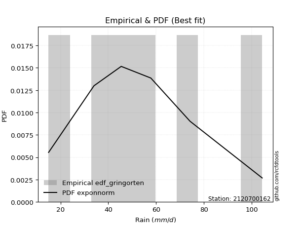</img>

</div>


### 9. EDF Filliben (1975)

The specific values of the constants (0.3175) (often denoted as $alpha$) and (0.365) are derived from a method proposed by James J. Filliben in a 1975 paper. This particular formula is the mean value of the $i$-th order statistic of the normal distribution and is considered a robust and effective plotting position formula for the normal probability plot correlation coefficient test for normality.

<div align="center">


$P=(m-0.3175)/(n+0.365)$


</div>


**9.1. Empirical values**

<div align="center">

|                | 0                   | 1                  | 2            | 3                  | 4                  |
|:---------------|:--------------------|:-------------------|:-------------|:-------------------|:-------------------|
| date           | 2023                | 2019               | 2020         | 2022               | 2021               |
| x              | 15.0                | 34.0               | 57.8         | 74.2               | 104.4              |
| m              | 1                   | 2                  | 3            | 4                  | 5                  |
| empirical_dist | edf_filliben        | edf_filliben       | edf_filliben | edf_filliben       | edf_filliben       |
| empirical      | 0.12721342031686858 | 0.3136067101584343 | 0.5          | 0.6863932898415657 | 0.8727865796831314 |
| empirical_tr   | 1.1457554725040042  | 1.456890699253225  | 2.0          | 3.188707280832095  | 7.860805860805863  |

</div>


**9.2. Kolmogorov-Smirnov fit test (sorted by Δ)**


<div align="center">

|                | 0                   | 1                   | 2                   | 3                   | 4                     | 5                   | 6                   | 7                   | 8                   | 9                   | 10                  | 11                  | 12                 | 13                  | 14                  | 15                  | 16                  | 17                  | 18                  | 19                  | 20                  | 21                  | 22                  | 23                  | 24                  | 25                  | 26                  | 27                  | 28                  | 29                  | 30                 | 31                  | 32                  | 33                  | 34                 | 35                 | 36                  | 37                 | 38                 | 39                  | 40                  | 41                 | 42                  | 43                  | 44                  | 45                  | 46                 | 47                  | 48                  | 49                  | 50                  | 51                  | 52                  | 53                  | 54                  | 55                 | 56                  | 57                 | 58                  | 59                  | 60                 | 61                  | 62                 | 63                  | 64                  | 65                 | 66                  | 67                 | 68                  | 69                  | 70                  | 71                 | 72                 | 73                  | 74                 | 75                  | 76                  | 77                  | 78                  | 79                 | 80                  | 81                 | 82                 | 83                  | 84                  | 85                 | 86                 | 87                 |
|:---------------|:--------------------|:--------------------|:--------------------|:--------------------|:----------------------|:--------------------|:--------------------|:--------------------|:--------------------|:--------------------|:--------------------|:--------------------|:-------------------|:--------------------|:--------------------|:--------------------|:--------------------|:--------------------|:--------------------|:--------------------|:--------------------|:--------------------|:--------------------|:--------------------|:--------------------|:--------------------|:--------------------|:--------------------|:--------------------|:--------------------|:-------------------|:--------------------|:--------------------|:--------------------|:-------------------|:-------------------|:--------------------|:-------------------|:-------------------|:--------------------|:--------------------|:-------------------|:--------------------|:--------------------|:--------------------|:--------------------|:-------------------|:--------------------|:--------------------|:--------------------|:--------------------|:--------------------|:--------------------|:--------------------|:--------------------|:-------------------|:--------------------|:-------------------|:--------------------|:--------------------|:-------------------|:--------------------|:-------------------|:--------------------|:--------------------|:-------------------|:--------------------|:-------------------|:--------------------|:--------------------|:--------------------|:-------------------|:-------------------|:--------------------|:-------------------|:--------------------|:--------------------|:--------------------|:--------------------|:-------------------|:--------------------|:-------------------|:-------------------|:--------------------|:--------------------|:-------------------|:-------------------|:-------------------|
| station        | 2120700162          | 2120700162          | 2120700162          | 2120700162          | 2120700162            | 2120700162          | 2120700162          | 2120700162          | 2120700162          | 2120700162          | 2120700162          | 2120700162          | 2120700162         | 2120700162          | 2120700162          | 2120700162          | 2120700162          | 2120700162          | 2120700162          | 2120700162          | 2120700162          | 2120700162          | 2120700162          | 2120700162          | 2120700162          | 2120700162          | 2120700162          | 2120700162          | 2120700162          | 2120700162          | 2120700162         | 2120700162          | 2120700162          | 2120700162          | 2120700162         | 2120700162         | 2120700162          | 2120700162         | 2120700162         | 2120700162          | 2120700162          | 2120700162         | 2120700162          | 2120700162          | 2120700162          | 2120700162          | 2120700162         | 2120700162          | 2120700162          | 2120700162          | 2120700162          | 2120700162          | 2120700162          | 2120700162          | 2120700162          | 2120700162         | 2120700162          | 2120700162         | 2120700162          | 2120700162          | 2120700162         | 2120700162          | 2120700162         | 2120700162          | 2120700162          | 2120700162         | 2120700162          | 2120700162         | 2120700162          | 2120700162          | 2120700162          | 2120700162         | 2120700162         | 2120700162          | 2120700162         | 2120700162          | 2120700162          | 2120700162          | 2120700162          | 2120700162         | 2120700162          | 2120700162         | 2120700162         | 2120700162          | 2120700162          | 2120700162         | 2120700162         | 2120700162         |
| empirical_dist | edf_filliben        | edf_filliben        | edf_filliben        | edf_filliben        | edf_filliben          | edf_filliben        | edf_filliben        | edf_filliben        | edf_filliben        | edf_filliben        | edf_filliben        | edf_filliben        | edf_filliben       | edf_filliben        | edf_filliben        | edf_filliben        | edf_filliben        | edf_filliben        | edf_filliben        | edf_filliben        | edf_filliben        | edf_filliben        | edf_filliben        | edf_filliben        | edf_filliben        | edf_filliben        | edf_filliben        | edf_filliben        | edf_filliben        | edf_filliben        | edf_filliben       | edf_filliben        | edf_filliben        | edf_filliben        | edf_filliben       | edf_filliben       | edf_filliben        | edf_filliben       | edf_filliben       | edf_filliben        | edf_filliben        | edf_filliben       | edf_filliben        | edf_filliben        | edf_filliben        | edf_filliben        | edf_filliben       | edf_filliben        | edf_filliben        | edf_filliben        | edf_filliben        | edf_filliben        | edf_filliben        | edf_filliben        | edf_filliben        | edf_filliben       | edf_filliben        | edf_filliben       | edf_filliben        | edf_filliben        | edf_filliben       | edf_filliben        | edf_filliben       | edf_filliben        | edf_filliben        | edf_filliben       | edf_filliben        | edf_filliben       | edf_filliben        | edf_filliben        | edf_filliben        | edf_filliben       | edf_filliben       | edf_filliben        | edf_filliben       | edf_filliben        | edf_filliben        | edf_filliben        | edf_filliben        | edf_filliben       | edf_filliben        | edf_filliben       | edf_filliben       | edf_filliben        | edf_filliben        | edf_filliben       | edf_filliben       | edf_filliben       |
| p_dist         | rayleigh            | loggumbel_l         | invgauss            | maxwell             | loglaplace_asymmetric | logweibull_min      | johnsonsu           | ncf                 | logjohnsonsu        | invgamma            | erlang              | gamma               | genlogistic        | fisk                | rice                | kstwobign           | pearson3            | exponnorm           | t                   | nct                 | crystalball         | norm                | gumbel_r            | betaprime           | logpearson3         | f                   | logfisk             | logistic            | laplace_asymmetric  | moyal               | alpha              | gumbel_l            | logbetaprime        | lognct              | logexponnorm       | logcrystalball     | logt                | lognorm            | lognorm            | hypsecant           | logf                | logncf             | logfatiguelife      | logerlang           | loggamma            | loggamma            | mielke             | logloggamma         | truncnorm           | gompertz            | halfnorm            | halflogistic        | logrice             | loginvgamma         | loglogistic         | genexpon           | expon               | laplace            | loginvgauss         | loginvweibull       | logalpha           | logmaxwell          | weibull_min        | loghypsecant        | lograyleigh         | loggompertz        | logkstwobign        | loggenexpon        | loghalfnorm         | loglaplace          | loggumbel_r         | wald               | logexpon           | loghalflogistic     | logmoyal           | logwald             | chi2                | loggibrat           | gibrat              | logchi2            | nakagami            | logtruncnorm       | lognakagami        | loglognorm          | fatiguelife         | invweibull         | logmielke          | loggenlogistic     |
| delta          | 0.06212311074779586 | 0.06471672708399745 | 0.06572872753585013 | 0.06631791321540595 | 0.06674358734522157   | 0.06779055364207344 | 0.06833240399783325 | 0.06835186516156311 | 0.07115191535454801 | 0.07184159732742737 | 0.07325242377782207 | 0.07394099862847761 | 0.0750961208614086 | 0.07535919960450249 | 0.07781723858659853 | 0.08088293125336332 | 0.08105625718920617 | 0.08452069944580862 | 0.08458555001016765 | 0.08458633606692481 | 0.08459423461089233 | 0.08459638371169081 | 0.08579084077626113 | 0.08584898090016413 | 0.08637092476749464 | 0.08816226181187203 | 0.08850011780042688 | 0.10708796981506813 | 0.10869063906428328 | 0.10996325210860733 | 0.1127832484013378 | 0.11873761213511222 | 0.11950293703658676 | 0.11962849604123693 | 0.1203552319978397 | 0.1203579674844828 | 0.12035832519067446 | 0.1203585411210617 | 0.1203585411210617 | 0.12124643630450727 | 0.12154904478176864 | 0.1236781587529262 | 0.12368567846447764 | 0.12441817154827428 | 0.12511944631939154 | 0.12511944631939154 | 0.1258787493401694 | 0.12713356826975752 | 0.12721341714195644 | 0.12721342031662314 | 0.12721342031686858 | 0.12721342031686858 | 0.12898138436432272 | 0.12940475150056285 | 0.13547765642804066 | 0.1383513878923196 | 0.13836152938922353 | 0.1385506998715919 | 0.13904392595632697 | 0.14161591513044414 | 0.1435951672768938 | 0.14500576489396577 | 0.1454663123342067 | 0.14761653987030032 | 0.15255510159896768 | 0.1637123424842899 | 0.16407554072662678 | 0.1676675731237771 | 0.17419421056927864 | 0.17583224994183566 | 0.18454530649963263 | 0.1926949886420949 | 0.1981997663042226 | 0.20256408123838698 | 0.2061795570761229 | 0.26677304492626197 | 0.27391433556003264 | 0.29889206958565995 | 0.31265158665080295 | 0.3131282746316075 | 0.31360370000921944 | 0.313605688726324  | 0.3136059264160185 | 0.36516817081260217 | 0.42559841815618266 | 0.4304049613860504 | 0.4335119516844998 | 0.6863932898415657 |
| deltao         | 0.5865427407550001  | 0.5865427407550001  | 0.5865427407550001  | 0.5865427407550001  | 0.5865427407550001    | 0.5865427407550001  | 0.5865427407550001  | 0.5865427407550001  | 0.5865427407550001  | 0.5865427407550001  | 0.5865427407550001  | 0.5865427407550001  | 0.5865427407550001 | 0.5865427407550001  | 0.5865427407550001  | 0.5865427407550001  | 0.5865427407550001  | 0.5865427407550001  | 0.5865427407550001  | 0.5865427407550001  | 0.5865427407550001  | 0.5865427407550001  | 0.5865427407550001  | 0.5865427407550001  | 0.5865427407550001  | 0.5865427407550001  | 0.5865427407550001  | 0.5865427407550001  | 0.5865427407550001  | 0.5865427407550001  | 0.5865427407550001 | 0.5865427407550001  | 0.5865427407550001  | 0.5865427407550001  | 0.5865427407550001 | 0.5865427407550001 | 0.5865427407550001  | 0.5865427407550001 | 0.5865427407550001 | 0.5865427407550001  | 0.5865427407550001  | 0.5865427407550001 | 0.5865427407550001  | 0.5865427407550001  | 0.5865427407550001  | 0.5865427407550001  | 0.5865427407550001 | 0.5865427407550001  | 0.5865427407550001  | 0.5865427407550001  | 0.5865427407550001  | 0.5865427407550001  | 0.5865427407550001  | 0.5865427407550001  | 0.5865427407550001  | 0.5865427407550001 | 0.5865427407550001  | 0.5865427407550001 | 0.5865427407550001  | 0.5865427407550001  | 0.5865427407550001 | 0.5865427407550001  | 0.5865427407550001 | 0.5865427407550001  | 0.5865427407550001  | 0.5865427407550001 | 0.5865427407550001  | 0.5865427407550001 | 0.5865427407550001  | 0.5865427407550001  | 0.5865427407550001  | 0.5865427407550001 | 0.5865427407550001 | 0.5865427407550001  | 0.5865427407550001 | 0.5865427407550001  | 0.5865427407550001  | 0.5865427407550001  | 0.5865427407550001  | 0.5865427407550001 | 0.5865427407550001  | 0.5865427407550001 | 0.5865427407550001 | 0.5865427407550001  | 0.5865427407550001  | 0.5865427407550001 | 0.5865427407550001 | 0.5865427407550001 |
| eval           | Δo > Δ              | Δo > Δ              | Δo > Δ              | Δo > Δ              | Δo > Δ                | Δo > Δ              | Δo > Δ              | Δo > Δ              | Δo > Δ              | Δo > Δ              | Δo > Δ              | Δo > Δ              | Δo > Δ             | Δo > Δ              | Δo > Δ              | Δo > Δ              | Δo > Δ              | Δo > Δ              | Δo > Δ              | Δo > Δ              | Δo > Δ              | Δo > Δ              | Δo > Δ              | Δo > Δ              | Δo > Δ              | Δo > Δ              | Δo > Δ              | Δo > Δ              | Δo > Δ              | Δo > Δ              | Δo > Δ             | Δo > Δ              | Δo > Δ              | Δo > Δ              | Δo > Δ             | Δo > Δ             | Δo > Δ              | Δo > Δ             | Δo > Δ             | Δo > Δ              | Δo > Δ              | Δo > Δ             | Δo > Δ              | Δo > Δ              | Δo > Δ              | Δo > Δ              | Δo > Δ             | Δo > Δ              | Δo > Δ              | Δo > Δ              | Δo > Δ              | Δo > Δ              | Δo > Δ              | Δo > Δ              | Δo > Δ              | Δo > Δ             | Δo > Δ              | Δo > Δ             | Δo > Δ              | Δo > Δ              | Δo > Δ             | Δo > Δ              | Δo > Δ             | Δo > Δ              | Δo > Δ              | Δo > Δ             | Δo > Δ              | Δo > Δ             | Δo > Δ              | Δo > Δ              | Δo > Δ              | Δo > Δ             | Δo > Δ             | Δo > Δ              | Δo > Δ             | Δo > Δ              | Δo > Δ              | Δo > Δ              | Δo > Δ              | Δo > Δ             | Δo > Δ              | Δo > Δ             | Δo > Δ             | Δo > Δ              | Δo > Δ              | Δo > Δ             | Δo > Δ             | Δo <= Δ            |
| fit            | 1                   | 1                   | 1                   | 1                   | 1                     | 1                   | 1                   | 1                   | 1                   | 1                   | 1                   | 1                   | 1                  | 1                   | 1                   | 1                   | 1                   | 1                   | 1                   | 1                   | 1                   | 1                   | 1                   | 1                   | 1                   | 1                   | 1                   | 1                   | 1                   | 1                   | 1                  | 1                   | 1                   | 1                   | 1                  | 1                  | 1                   | 1                  | 1                  | 1                   | 1                   | 1                  | 1                   | 1                   | 1                   | 1                   | 1                  | 1                   | 1                   | 1                   | 1                   | 1                   | 1                   | 1                   | 1                   | 1                  | 1                   | 1                  | 1                   | 1                   | 1                  | 1                   | 1                  | 1                   | 1                   | 1                  | 1                   | 1                  | 1                   | 1                   | 1                   | 1                  | 1                  | 1                   | 1                  | 1                   | 1                   | 1                   | 1                   | 1                  | 1                   | 1                  | 1                  | 1                   | 1                   | 1                  | 1                  | 0                  |
| n              | 5                   | 5                   | 5                   | 5                   | 5                     | 5                   | 5                   | 5                   | 5                   | 5                   | 5                   | 5                   | 5                  | 5                   | 5                   | 5                   | 5                   | 5                   | 5                   | 5                   | 5                   | 5                   | 5                   | 5                   | 5                   | 5                   | 5                   | 5                   | 5                   | 5                   | 5                  | 5                   | 5                   | 5                   | 5                  | 5                  | 5                   | 5                  | 5                  | 5                   | 5                   | 5                  | 5                   | 5                   | 5                   | 5                   | 5                  | 5                   | 5                   | 5                   | 5                   | 5                   | 5                   | 5                   | 5                   | 5                  | 5                   | 5                  | 5                   | 5                   | 5                  | 5                   | 5                  | 5                   | 5                   | 5                  | 5                   | 5                  | 5                   | 5                   | 5                   | 5                  | 5                  | 5                   | 5                  | 5                   | 5                   | 5                   | 5                   | 5                  | 5                   | 5                  | 5                  | 5                   | 5                   | 5                  | 5                  | 5                  |
| best_fit       | 1                   | 0                   | 0                   | 0                   | 0                     | 0                   | 0                   | 0                   | 0                   | 0                   | 0                   | 0                   | 0                  | 0                   | 0                   | 0                   | 0                   | 0                   | 0                   | 0                   | 0                   | 0                   | 0                   | 0                   | 0                   | 0                   | 0                   | 0                   | 0                   | 0                   | 0                  | 0                   | 0                   | 0                   | 0                  | 0                  | 0                   | 0                  | 0                  | 0                   | 0                   | 0                  | 0                   | 0                   | 0                   | 0                   | 0                  | 0                   | 0                   | 0                   | 0                   | 0                   | 0                   | 0                   | 0                   | 0                  | 0                   | 0                  | 0                   | 0                   | 0                  | 0                   | 0                  | 0                   | 0                   | 0                  | 0                   | 0                  | 0                   | 0                   | 0                   | 0                  | 0                  | 0                   | 0                  | 0                   | 0                   | 0                   | 0                   | 0                  | 0                   | 0                  | 0                  | 0                   | 0                   | 0                  | 0                  | 0                  |
| best_fit_sort  | 1                   | 2                   | 3                   | 4                   | 5                     | 6                   | 7                   | 8                   | 9                   | 10                  | 11                  | 12                  | 13                 | 14                  | 15                  | 16                  | 17                  | 18                  | 19                  | 20                  | 21                  | 22                  | 23                  | 24                  | 25                  | 26                  | 27                  | 28                  | 29                  | 30                  | 31                 | 32                  | 33                  | 34                  | 35                 | 36                 | 37                  | 38                 | 39                 | 40                  | 41                  | 42                 | 43                  | 44                  | 45                  | 46                  | 47                 | 48                  | 49                  | 50                  | 51                  | 52                  | 53                  | 54                  | 55                  | 56                 | 57                  | 58                 | 59                  | 60                  | 61                 | 62                  | 63                 | 64                  | 65                  | 66                 | 67                  | 68                 | 69                  | 70                  | 71                  | 72                 | 73                 | 74                  | 75                 | 76                  | 77                  | 78                  | 79                  | 80                 | 81                  | 82                 | 83                 | 84                  | 85                  | 86                 | 87                 | 88                 |

</div>


**9.3. Best fit**

<div align="center">

|   id |    station | empirical_dist   | p_dist   |     delta |   deltao | eval   |   fit |   n |   best_fit |   best_fit_sort |
|-----:|-----------:|:-----------------|:---------|----------:|---------:|:-------|------:|----:|-----------:|----------------:|
|    0 | 2120700162 | edf_filliben     | rayleigh | 0.0621231 | 0.586543 | Δo > Δ |     1 |   5 |          1 |               1 |

</div>


<div align="center">

</img></img>

</div>


### 10. EDF Jenkinson (1977)

The Jenkinson formula in hydrology is an empirical plotting position formula used to estimate the non-exceedance probability _(P)_ or return period _(T)_ of a given ordered observation within a sample. It is a widely used method in the frequency analysis of extreme events such as floods and rainfall, as it provides a distribution-free way to plot data. _a≈0.31_ and _b≈0.38_ are constants derived to approximate the median of the probability distribution for the given rank.

<div align="center">


$P=(m-a)/(n+b)$


</div>


**10.1. Empirical values**

<div align="center">

|                | 0                   | 1                  | 2             | 3                  | 4                  |
|:---------------|:--------------------|:-------------------|:--------------|:-------------------|:-------------------|
| date           | 2023                | 2019               | 2020          | 2022               | 2021               |
| x              | 15.0                | 34.0               | 57.8          | 74.2               | 104.4              |
| m              | 1                   | 2                  | 3             | 4                  | 5                  |
| empirical_dist | edf_jenkinson       | edf_jenkinson      | edf_jenkinson | edf_jenkinson      | edf_jenkinson      |
| empirical      | 0.12825278810408922 | 0.3141263940520446 | 0.5           | 0.6858736059479554 | 0.8717472118959109 |
| empirical_tr   | 1.1471215351812367  | 1.4579945799457996 | 2.0           | 3.183431952662722  | 7.797101449275368  |

</div>


**10.2. Kolmogorov-Smirnov fit test (sorted by Δ)**


<div align="center">

|                | 0                  | 1                   | 2                   | 3                  | 4                     | 5                   | 6                   | 7                   | 8                   | 9                   | 10                  | 11                  | 12                 | 13                  | 14                  | 15                  | 16                  | 17                  | 18                 | 19                  | 20                  | 21                  | 22                  | 23                  | 24                  | 25                  | 26                  | 27                  | 28                  | 29                  | 30                 | 31                  | 32                  | 33                  | 34                 | 35                 | 36                  | 37                 | 38                 | 39                  | 40                  | 41                 | 42                  | 43                  | 44                  | 45                  | 46                  | 47                 | 48                  | 49                  | 50                  | 51                  | 52                  | 53                  | 54                  | 55                 | 56                  | 57                  | 58                  | 59                  | 60                 | 61                  | 62                 | 63                  | 64                  | 65                 | 66                  | 67                 | 68                  | 69                  | 70                  | 71                  | 72                  | 73                  | 74                 | 75                  | 76                  | 77                  | 78                 | 79                 | 80                 | 81                  | 82                 | 83                 | 84                 | 85                  | 86                  | 87                 |
|:---------------|:-------------------|:--------------------|:--------------------|:-------------------|:----------------------|:--------------------|:--------------------|:--------------------|:--------------------|:--------------------|:--------------------|:--------------------|:-------------------|:--------------------|:--------------------|:--------------------|:--------------------|:--------------------|:-------------------|:--------------------|:--------------------|:--------------------|:--------------------|:--------------------|:--------------------|:--------------------|:--------------------|:--------------------|:--------------------|:--------------------|:-------------------|:--------------------|:--------------------|:--------------------|:-------------------|:-------------------|:--------------------|:-------------------|:-------------------|:--------------------|:--------------------|:-------------------|:--------------------|:--------------------|:--------------------|:--------------------|:--------------------|:-------------------|:--------------------|:--------------------|:--------------------|:--------------------|:--------------------|:--------------------|:--------------------|:-------------------|:--------------------|:--------------------|:--------------------|:--------------------|:-------------------|:--------------------|:-------------------|:--------------------|:--------------------|:-------------------|:--------------------|:-------------------|:--------------------|:--------------------|:--------------------|:--------------------|:--------------------|:--------------------|:-------------------|:--------------------|:--------------------|:--------------------|:-------------------|:-------------------|:-------------------|:--------------------|:-------------------|:-------------------|:-------------------|:--------------------|:--------------------|:-------------------|
| station        | 2120700162         | 2120700162          | 2120700162          | 2120700162         | 2120700162            | 2120700162          | 2120700162          | 2120700162          | 2120700162          | 2120700162          | 2120700162          | 2120700162          | 2120700162         | 2120700162          | 2120700162          | 2120700162          | 2120700162          | 2120700162          | 2120700162         | 2120700162          | 2120700162          | 2120700162          | 2120700162          | 2120700162          | 2120700162          | 2120700162          | 2120700162          | 2120700162          | 2120700162          | 2120700162          | 2120700162         | 2120700162          | 2120700162          | 2120700162          | 2120700162         | 2120700162         | 2120700162          | 2120700162         | 2120700162         | 2120700162          | 2120700162          | 2120700162         | 2120700162          | 2120700162          | 2120700162          | 2120700162          | 2120700162          | 2120700162         | 2120700162          | 2120700162          | 2120700162          | 2120700162          | 2120700162          | 2120700162          | 2120700162          | 2120700162         | 2120700162          | 2120700162          | 2120700162          | 2120700162          | 2120700162         | 2120700162          | 2120700162         | 2120700162          | 2120700162          | 2120700162         | 2120700162          | 2120700162         | 2120700162          | 2120700162          | 2120700162          | 2120700162          | 2120700162          | 2120700162          | 2120700162         | 2120700162          | 2120700162          | 2120700162          | 2120700162         | 2120700162         | 2120700162         | 2120700162          | 2120700162         | 2120700162         | 2120700162         | 2120700162          | 2120700162          | 2120700162         |
| empirical_dist | edf_jenkinson      | edf_jenkinson       | edf_jenkinson       | edf_jenkinson      | edf_jenkinson         | edf_jenkinson       | edf_jenkinson       | edf_jenkinson       | edf_jenkinson       | edf_jenkinson       | edf_jenkinson       | edf_jenkinson       | edf_jenkinson      | edf_jenkinson       | edf_jenkinson       | edf_jenkinson       | edf_jenkinson       | edf_jenkinson       | edf_jenkinson      | edf_jenkinson       | edf_jenkinson       | edf_jenkinson       | edf_jenkinson       | edf_jenkinson       | edf_jenkinson       | edf_jenkinson       | edf_jenkinson       | edf_jenkinson       | edf_jenkinson       | edf_jenkinson       | edf_jenkinson      | edf_jenkinson       | edf_jenkinson       | edf_jenkinson       | edf_jenkinson      | edf_jenkinson      | edf_jenkinson       | edf_jenkinson      | edf_jenkinson      | edf_jenkinson       | edf_jenkinson       | edf_jenkinson      | edf_jenkinson       | edf_jenkinson       | edf_jenkinson       | edf_jenkinson       | edf_jenkinson       | edf_jenkinson      | edf_jenkinson       | edf_jenkinson       | edf_jenkinson       | edf_jenkinson       | edf_jenkinson       | edf_jenkinson       | edf_jenkinson       | edf_jenkinson      | edf_jenkinson       | edf_jenkinson       | edf_jenkinson       | edf_jenkinson       | edf_jenkinson      | edf_jenkinson       | edf_jenkinson      | edf_jenkinson       | edf_jenkinson       | edf_jenkinson      | edf_jenkinson       | edf_jenkinson      | edf_jenkinson       | edf_jenkinson       | edf_jenkinson       | edf_jenkinson       | edf_jenkinson       | edf_jenkinson       | edf_jenkinson      | edf_jenkinson       | edf_jenkinson       | edf_jenkinson       | edf_jenkinson      | edf_jenkinson      | edf_jenkinson      | edf_jenkinson       | edf_jenkinson      | edf_jenkinson      | edf_jenkinson      | edf_jenkinson       | edf_jenkinson       | edf_jenkinson      |
| p_dist         | rayleigh           | loggumbel_l         | invgauss            | maxwell            | loglaplace_asymmetric | ncf                 | logweibull_min      | johnsonsu           | logjohnsonsu        | invgamma            | erlang              | gamma               | genlogistic        | fisk                | rice                | kstwobign           | pearson3            | exponnorm           | t                  | nct                 | crystalball         | norm                | betaprime           | logpearson3         | gumbel_r            | f                   | logfisk             | logistic            | laplace_asymmetric  | moyal               | alpha              | gumbel_l            | logbetaprime        | lognct              | logexponnorm       | logcrystalball     | logt                | lognorm            | lognorm            | logf                | hypsecant           | logncf             | logfatiguelife      | logerlang           | loggamma            | loggamma            | mielke              | logloggamma        | truncnorm           | gompertz            | halfnorm            | halflogistic        | logrice             | loginvgamma         | loglogistic         | genexpon           | expon               | loginvgauss         | laplace             | loginvweibull       | logalpha           | logmaxwell          | weibull_min        | loghypsecant        | lograyleigh         | loggompertz        | logkstwobign        | loggenexpon        | loghalfnorm         | loglaplace          | loggumbel_r         | wald                | logexpon            | loghalflogistic     | logmoyal           | logwald             | chi2                | loggibrat           | logchi2            | gibrat             | nakagami           | logtruncnorm        | lognakagami        | loglognorm         | fatiguelife        | invweibull          | logmielke           | loggenlogistic     |
| delta          | 0.0631624785350165 | 0.06551078180490122 | 0.06572872753585013 | 0.0668375971090163 | 0.06726327123883191   | 0.06835186516156311 | 0.06882992142929407 | 0.06885208789144359 | 0.07219128314176859 | 0.07236128122103772 | 0.07377210767143241 | 0.07446068252208796 | 0.0750961208614086 | 0.07587888349811284 | 0.07833692248020888 | 0.08088293125336332 | 0.08157594108281652 | 0.08504038333941896 | 0.085105233903778  | 0.08510601996053516 | 0.08511391850450267 | 0.08511606760530116 | 0.08584898090016413 | 0.08637092476749464 | 0.08683020856348177 | 0.08816226181187203 | 0.08850011780042688 | 0.10760765370867847 | 0.10921032295789362 | 0.11100261989582796 | 0.1127832484013378 | 0.11925729602872256 | 0.11950293703658676 | 0.11962849604123693 | 0.1203552319978397 | 0.1203579674844828 | 0.12035832519067446 | 0.1203585411210617 | 0.1203585411210617 | 0.12154904478176864 | 0.12176612019811761 | 0.1236781587529262 | 0.12368567846447764 | 0.12441817154827428 | 0.12511944631939154 | 0.12511944631939154 | 0.12691811712738998 | 0.1281729360569781 | 0.12825278492917702 | 0.12825278810384377 | 0.12825278810408922 | 0.12825278810408922 | 0.12898138436432272 | 0.12940475150056285 | 0.13547765642804066 | 0.1383513878923196 | 0.13836152938922353 | 0.13904392595632697 | 0.13907038376520225 | 0.14161591513044414 | 0.1435951672768938 | 0.14500576489396577 | 0.1454663123342067 | 0.14761653987030032 | 0.15255510159896768 | 0.1637123424842899 | 0.16407554072662678 | 0.1676675731237771 | 0.17419421056927864 | 0.17583224994183566 | 0.18454530649963263 | 0.19321467253570523 | 0.19768008241061225 | 0.20256408123838698 | 0.2061795570761229 | 0.26677304492626197 | 0.27391433556003264 | 0.29889206958565995 | 0.3126085907379971 | 0.3131712705444133 | 0.3141233839028298 | 0.31412537261993434 | 0.3141256103096288 | 0.3646484869189918 | 0.4250787342625723 | 0.42988527749244004 | 0.43299226779088945 | 0.6858736059479554 |
| deltao         | 0.5865427407550001 | 0.5865427407550001  | 0.5865427407550001  | 0.5865427407550001 | 0.5865427407550001    | 0.5865427407550001  | 0.5865427407550001  | 0.5865427407550001  | 0.5865427407550001  | 0.5865427407550001  | 0.5865427407550001  | 0.5865427407550001  | 0.5865427407550001 | 0.5865427407550001  | 0.5865427407550001  | 0.5865427407550001  | 0.5865427407550001  | 0.5865427407550001  | 0.5865427407550001 | 0.5865427407550001  | 0.5865427407550001  | 0.5865427407550001  | 0.5865427407550001  | 0.5865427407550001  | 0.5865427407550001  | 0.5865427407550001  | 0.5865427407550001  | 0.5865427407550001  | 0.5865427407550001  | 0.5865427407550001  | 0.5865427407550001 | 0.5865427407550001  | 0.5865427407550001  | 0.5865427407550001  | 0.5865427407550001 | 0.5865427407550001 | 0.5865427407550001  | 0.5865427407550001 | 0.5865427407550001 | 0.5865427407550001  | 0.5865427407550001  | 0.5865427407550001 | 0.5865427407550001  | 0.5865427407550001  | 0.5865427407550001  | 0.5865427407550001  | 0.5865427407550001  | 0.5865427407550001 | 0.5865427407550001  | 0.5865427407550001  | 0.5865427407550001  | 0.5865427407550001  | 0.5865427407550001  | 0.5865427407550001  | 0.5865427407550001  | 0.5865427407550001 | 0.5865427407550001  | 0.5865427407550001  | 0.5865427407550001  | 0.5865427407550001  | 0.5865427407550001 | 0.5865427407550001  | 0.5865427407550001 | 0.5865427407550001  | 0.5865427407550001  | 0.5865427407550001 | 0.5865427407550001  | 0.5865427407550001 | 0.5865427407550001  | 0.5865427407550001  | 0.5865427407550001  | 0.5865427407550001  | 0.5865427407550001  | 0.5865427407550001  | 0.5865427407550001 | 0.5865427407550001  | 0.5865427407550001  | 0.5865427407550001  | 0.5865427407550001 | 0.5865427407550001 | 0.5865427407550001 | 0.5865427407550001  | 0.5865427407550001 | 0.5865427407550001 | 0.5865427407550001 | 0.5865427407550001  | 0.5865427407550001  | 0.5865427407550001 |
| eval           | Δo > Δ             | Δo > Δ              | Δo > Δ              | Δo > Δ             | Δo > Δ                | Δo > Δ              | Δo > Δ              | Δo > Δ              | Δo > Δ              | Δo > Δ              | Δo > Δ              | Δo > Δ              | Δo > Δ             | Δo > Δ              | Δo > Δ              | Δo > Δ              | Δo > Δ              | Δo > Δ              | Δo > Δ             | Δo > Δ              | Δo > Δ              | Δo > Δ              | Δo > Δ              | Δo > Δ              | Δo > Δ              | Δo > Δ              | Δo > Δ              | Δo > Δ              | Δo > Δ              | Δo > Δ              | Δo > Δ             | Δo > Δ              | Δo > Δ              | Δo > Δ              | Δo > Δ             | Δo > Δ             | Δo > Δ              | Δo > Δ             | Δo > Δ             | Δo > Δ              | Δo > Δ              | Δo > Δ             | Δo > Δ              | Δo > Δ              | Δo > Δ              | Δo > Δ              | Δo > Δ              | Δo > Δ             | Δo > Δ              | Δo > Δ              | Δo > Δ              | Δo > Δ              | Δo > Δ              | Δo > Δ              | Δo > Δ              | Δo > Δ             | Δo > Δ              | Δo > Δ              | Δo > Δ              | Δo > Δ              | Δo > Δ             | Δo > Δ              | Δo > Δ             | Δo > Δ              | Δo > Δ              | Δo > Δ             | Δo > Δ              | Δo > Δ             | Δo > Δ              | Δo > Δ              | Δo > Δ              | Δo > Δ              | Δo > Δ              | Δo > Δ              | Δo > Δ             | Δo > Δ              | Δo > Δ              | Δo > Δ              | Δo > Δ             | Δo > Δ             | Δo > Δ             | Δo > Δ              | Δo > Δ             | Δo > Δ             | Δo > Δ             | Δo > Δ              | Δo > Δ              | Δo <= Δ            |
| fit            | 1                  | 1                   | 1                   | 1                  | 1                     | 1                   | 1                   | 1                   | 1                   | 1                   | 1                   | 1                   | 1                  | 1                   | 1                   | 1                   | 1                   | 1                   | 1                  | 1                   | 1                   | 1                   | 1                   | 1                   | 1                   | 1                   | 1                   | 1                   | 1                   | 1                   | 1                  | 1                   | 1                   | 1                   | 1                  | 1                  | 1                   | 1                  | 1                  | 1                   | 1                   | 1                  | 1                   | 1                   | 1                   | 1                   | 1                   | 1                  | 1                   | 1                   | 1                   | 1                   | 1                   | 1                   | 1                   | 1                  | 1                   | 1                   | 1                   | 1                   | 1                  | 1                   | 1                  | 1                   | 1                   | 1                  | 1                   | 1                  | 1                   | 1                   | 1                   | 1                   | 1                   | 1                   | 1                  | 1                   | 1                   | 1                   | 1                  | 1                  | 1                  | 1                   | 1                  | 1                  | 1                  | 1                   | 1                   | 0                  |
| n              | 5                  | 5                   | 5                   | 5                  | 5                     | 5                   | 5                   | 5                   | 5                   | 5                   | 5                   | 5                   | 5                  | 5                   | 5                   | 5                   | 5                   | 5                   | 5                  | 5                   | 5                   | 5                   | 5                   | 5                   | 5                   | 5                   | 5                   | 5                   | 5                   | 5                   | 5                  | 5                   | 5                   | 5                   | 5                  | 5                  | 5                   | 5                  | 5                  | 5                   | 5                   | 5                  | 5                   | 5                   | 5                   | 5                   | 5                   | 5                  | 5                   | 5                   | 5                   | 5                   | 5                   | 5                   | 5                   | 5                  | 5                   | 5                   | 5                   | 5                   | 5                  | 5                   | 5                  | 5                   | 5                   | 5                  | 5                   | 5                  | 5                   | 5                   | 5                   | 5                   | 5                   | 5                   | 5                  | 5                   | 5                   | 5                   | 5                  | 5                  | 5                  | 5                   | 5                  | 5                  | 5                  | 5                   | 5                   | 5                  |
| best_fit       | 1                  | 0                   | 0                   | 0                  | 0                     | 0                   | 0                   | 0                   | 0                   | 0                   | 0                   | 0                   | 0                  | 0                   | 0                   | 0                   | 0                   | 0                   | 0                  | 0                   | 0                   | 0                   | 0                   | 0                   | 0                   | 0                   | 0                   | 0                   | 0                   | 0                   | 0                  | 0                   | 0                   | 0                   | 0                  | 0                  | 0                   | 0                  | 0                  | 0                   | 0                   | 0                  | 0                   | 0                   | 0                   | 0                   | 0                   | 0                  | 0                   | 0                   | 0                   | 0                   | 0                   | 0                   | 0                   | 0                  | 0                   | 0                   | 0                   | 0                   | 0                  | 0                   | 0                  | 0                   | 0                   | 0                  | 0                   | 0                  | 0                   | 0                   | 0                   | 0                   | 0                   | 0                   | 0                  | 0                   | 0                   | 0                   | 0                  | 0                  | 0                  | 0                   | 0                  | 0                  | 0                  | 0                   | 0                   | 0                  |
| best_fit_sort  | 1                  | 2                   | 3                   | 4                  | 5                     | 6                   | 7                   | 8                   | 9                   | 10                  | 11                  | 12                  | 13                 | 14                  | 15                  | 16                  | 17                  | 18                  | 19                 | 20                  | 21                  | 22                  | 23                  | 24                  | 25                  | 26                  | 27                  | 28                  | 29                  | 30                  | 31                 | 32                  | 33                  | 34                  | 35                 | 36                 | 37                  | 38                 | 39                 | 40                  | 41                  | 42                 | 43                  | 44                  | 45                  | 46                  | 47                  | 48                 | 49                  | 50                  | 51                  | 52                  | 53                  | 54                  | 55                  | 56                 | 57                  | 58                  | 59                  | 60                  | 61                 | 62                  | 63                 | 64                  | 65                  | 66                 | 67                  | 68                 | 69                  | 70                  | 71                  | 72                  | 73                  | 74                  | 75                 | 76                  | 77                  | 78                  | 79                 | 80                 | 81                 | 82                  | 83                 | 84                 | 85                 | 86                  | 87                  | 88                 |

</div>


**10.3. Best fit**

<div align="center">

|   id |    station | empirical_dist   | p_dist   |     delta |   deltao | eval   |   fit |   n |   best_fit |   best_fit_sort |
|-----:|-----------:|:-----------------|:---------|----------:|---------:|:-------|------:|----:|-----------:|----------------:|
|    0 | 2120700162 | edf_jenkinson    | rayleigh | 0.0631625 | 0.586543 | Δo > Δ |     1 |   5 |          1 |               1 |

</div>


<div align="center">

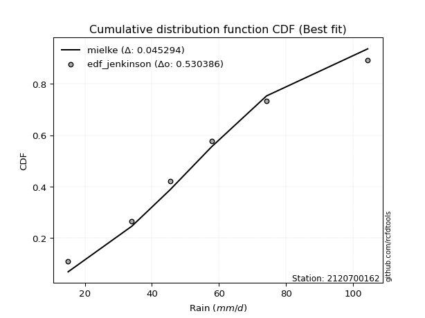</img></img>

</div>


### 11. EDF Cunnane (1978)

Cunnane´s work in statistical hydrology has focused on the performance and evaluation of different probability distributions (such as GEV, Gumbel, Lognormal) for flood frequency estimation. _b_ is a constant, typically set to 0.4.

<div align="center">


$P=(m-b)/(n+1-2b)$


</div>


**11.1. Empirical values**

<div align="center">

|                | 0                   | 1                  | 2           | 3                  | 4                  |
|:---------------|:--------------------|:-------------------|:------------|:-------------------|:-------------------|
| date           | 2023                | 2019               | 2020        | 2022               | 2021               |
| x              | 15.0                | 34.0               | 57.8        | 74.2               | 104.4              |
| m              | 1                   | 2                  | 3           | 4                  | 5                  |
| empirical_dist | edf_cunnane         | edf_cunnane        | edf_cunnane | edf_cunnane        | edf_cunnane        |
| empirical      | 0.11538461538461538 | 0.3076923076923077 | 0.5         | 0.6923076923076923 | 0.8846153846153845 |
| empirical_tr   | 1.1304347826086958  | 1.4444444444444444 | 2.0         | 3.25               | 8.666666666666655  |

</div>


**11.2. Kolmogorov-Smirnov fit test (sorted by Δ)**


<div align="center">

|                | 0                    | 1                    | 2                   | 3                     | 4                   | 5                    | 6                   | 7                   | 8                  | 9                  | 10                  | 11                  | 12                  | 13                  | 14                 | 15                 | 16                  | 17                  | 18                  | 19                  | 20                  | 21                  | 22                  | 23                  | 24                  | 25                  | 26                  | 27                  | 28                  | 29                  | 30                 | 31                  | 32                  | 33                 | 34                 | 35                  | 36                  | 37                  | 38                  | 39                  | 40                  | 41                 | 42                 | 43                  | 44                 | 45                 | 46                  | 47                 | 48                  | 49                  | 50                  | 51                  | 52                  | 53                  | 54                  | 55                  | 56                 | 57                  | 58                  | 59                  | 60                 | 61                  | 62                 | 63                  | 64                  | 65                 | 66                  | 67                 | 68                  | 69                  | 70                  | 71                  | 72                  | 73                  | 74                 | 75                  | 76                  | 77                  | 78                 | 79                 | 80                 | 81                 | 82                  | 83                  | 84                 | 85                  | 86                  | 87                 |
|:---------------|:---------------------|:---------------------|:--------------------|:----------------------|:--------------------|:---------------------|:--------------------|:--------------------|:-------------------|:-------------------|:--------------------|:--------------------|:--------------------|:--------------------|:-------------------|:-------------------|:--------------------|:--------------------|:--------------------|:--------------------|:--------------------|:--------------------|:--------------------|:--------------------|:--------------------|:--------------------|:--------------------|:--------------------|:--------------------|:--------------------|:-------------------|:--------------------|:--------------------|:-------------------|:-------------------|:--------------------|:--------------------|:--------------------|:--------------------|:--------------------|:--------------------|:-------------------|:-------------------|:--------------------|:-------------------|:-------------------|:--------------------|:-------------------|:--------------------|:--------------------|:--------------------|:--------------------|:--------------------|:--------------------|:--------------------|:--------------------|:-------------------|:--------------------|:--------------------|:--------------------|:-------------------|:--------------------|:-------------------|:--------------------|:--------------------|:-------------------|:--------------------|:-------------------|:--------------------|:--------------------|:--------------------|:--------------------|:--------------------|:--------------------|:-------------------|:--------------------|:--------------------|:--------------------|:-------------------|:-------------------|:-------------------|:-------------------|:--------------------|:--------------------|:-------------------|:--------------------|:--------------------|:-------------------|
| station        | 2120700162           | 2120700162           | 2120700162          | 2120700162            | 2120700162          | 2120700162           | 2120700162          | 2120700162          | 2120700162         | 2120700162         | 2120700162          | 2120700162          | 2120700162          | 2120700162          | 2120700162         | 2120700162         | 2120700162          | 2120700162          | 2120700162          | 2120700162          | 2120700162          | 2120700162          | 2120700162          | 2120700162          | 2120700162          | 2120700162          | 2120700162          | 2120700162          | 2120700162          | 2120700162          | 2120700162         | 2120700162          | 2120700162          | 2120700162         | 2120700162         | 2120700162          | 2120700162          | 2120700162          | 2120700162          | 2120700162          | 2120700162          | 2120700162         | 2120700162         | 2120700162          | 2120700162         | 2120700162         | 2120700162          | 2120700162         | 2120700162          | 2120700162          | 2120700162          | 2120700162          | 2120700162          | 2120700162          | 2120700162          | 2120700162          | 2120700162         | 2120700162          | 2120700162          | 2120700162          | 2120700162         | 2120700162          | 2120700162         | 2120700162          | 2120700162          | 2120700162         | 2120700162          | 2120700162         | 2120700162          | 2120700162          | 2120700162          | 2120700162          | 2120700162          | 2120700162          | 2120700162         | 2120700162          | 2120700162          | 2120700162          | 2120700162         | 2120700162         | 2120700162         | 2120700162         | 2120700162          | 2120700162          | 2120700162         | 2120700162          | 2120700162          | 2120700162         |
| empirical_dist | edf_cunnane          | edf_cunnane          | edf_cunnane         | edf_cunnane           | edf_cunnane         | edf_cunnane          | edf_cunnane         | edf_cunnane         | edf_cunnane        | edf_cunnane        | edf_cunnane         | edf_cunnane         | edf_cunnane         | edf_cunnane         | edf_cunnane        | edf_cunnane        | edf_cunnane         | edf_cunnane         | edf_cunnane         | edf_cunnane         | edf_cunnane         | edf_cunnane         | edf_cunnane         | edf_cunnane         | edf_cunnane         | edf_cunnane         | edf_cunnane         | edf_cunnane         | edf_cunnane         | edf_cunnane         | edf_cunnane        | edf_cunnane         | edf_cunnane         | edf_cunnane        | edf_cunnane        | edf_cunnane         | edf_cunnane         | edf_cunnane         | edf_cunnane         | edf_cunnane         | edf_cunnane         | edf_cunnane        | edf_cunnane        | edf_cunnane         | edf_cunnane        | edf_cunnane        | edf_cunnane         | edf_cunnane        | edf_cunnane         | edf_cunnane         | edf_cunnane         | edf_cunnane         | edf_cunnane         | edf_cunnane         | edf_cunnane         | edf_cunnane         | edf_cunnane        | edf_cunnane         | edf_cunnane         | edf_cunnane         | edf_cunnane        | edf_cunnane         | edf_cunnane        | edf_cunnane         | edf_cunnane         | edf_cunnane        | edf_cunnane         | edf_cunnane        | edf_cunnane         | edf_cunnane         | edf_cunnane         | edf_cunnane         | edf_cunnane         | edf_cunnane         | edf_cunnane        | edf_cunnane         | edf_cunnane         | edf_cunnane         | edf_cunnane        | edf_cunnane        | edf_cunnane        | edf_cunnane        | edf_cunnane         | edf_cunnane         | edf_cunnane        | edf_cunnane         | edf_cunnane         | edf_cunnane        |
| p_dist         | rayleigh             | logweibull_min       | maxwell             | loglaplace_asymmetric | johnsonsu           | logjohnsonsu         | loggumbel_l         | invgauss            | invgamma           | erlang             | gamma               | ncf                 | fisk                | rice                | genlogistic        | pearson3           | exponnorm           | t                   | nct                 | crystalball         | norm                | gumbel_r            | kstwobign           | betaprime           | logpearson3         | f                   | logfisk             | logistic            | laplace_asymmetric  | moyal               | alpha              | gumbel_l            | mielke              | logloggamma        | hypsecant          | truncnorm           | gompertz            | halflogistic        | halfnorm            | logbetaprime        | lognct              | logexponnorm       | logcrystalball     | logt                | lognorm            | lognorm            | logf                | logncf             | logfatiguelife      | logerlang           | loggamma            | loggamma            | logrice             | loginvgamma         | laplace             | loglogistic         | genexpon           | expon               | loginvgauss         | loginvweibull       | logalpha           | logmaxwell          | weibull_min        | loghypsecant        | lograyleigh         | loggompertz        | logkstwobign        | loggenexpon        | loghalfnorm         | loglaplace          | loggumbel_r         | wald                | loghalflogistic     | logexpon            | logmoyal           | logwald             | chi2                | loggibrat           | gibrat             | nakagami           | logtruncnorm       | lognakagami        | logchi2             | loglognorm          | fatiguelife        | invweibull          | logmielke           | loggenlogistic     |
| delta          | 0.052786331872966996 | 0.056152736391978375 | 0.06040351074927938 | 0.060829184879095     | 0.06241800153170668 | 0.062479131758802986 | 0.06471672708399745 | 0.06572872753585013 | 0.0659271948613008 | 0.0673380213116955 | 0.06802659616235104 | 0.06835186516156311 | 0.06944479713837592 | 0.07190283612047196 | 0.0750961208614086 | 0.0751418547230796 | 0.07860629697968205 | 0.07867114754404109 | 0.07867193360079824 | 0.07867983214476576 | 0.07868198124556425 | 0.07982224314378616 | 0.08088293125336332 | 0.08584898090016413 | 0.08637092476749464 | 0.08816226181187203 | 0.08850011780042688 | 0.10117356734894156 | 0.10277623659815671 | 0.10558293307222932 | 0.1127832484013378 | 0.11282320966898565 | 0.11404994440791638 | 0.1153047633375045 | 0.1153320338383807 | 0.11538461220970342 | 0.11538461538436992 | 0.11538461538461538 | 0.11538461538461538 | 0.11950293703658676 | 0.11962849604123693 | 0.1203552319978397 | 0.1203579674844828 | 0.12035832519067446 | 0.1203585411210617 | 0.1203585411210617 | 0.12154904478176864 | 0.1236781587529262 | 0.12368567846447764 | 0.12441817154827428 | 0.12511944631939154 | 0.12511944631939154 | 0.12898138436432272 | 0.12940475150056285 | 0.13263629740546534 | 0.13547765642804066 | 0.1383513878923196 | 0.13836152938922353 | 0.13904392595632697 | 0.14161591513044414 | 0.1435951672768938 | 0.14500576489396577 | 0.1454663123342067 | 0.14761653987030032 | 0.15255510159896768 | 0.1637123424842899 | 0.16407554072662678 | 0.1676675731237771 | 0.17419421056927864 | 0.17583224994183566 | 0.18454530649963263 | 0.18678058617596832 | 0.20256408123838698 | 0.20411416877034916 | 0.2061795570761229 | 0.26677304492626197 | 0.27391433556003264 | 0.29889206958565995 | 0.3067371841846764 | 0.3076892975430929 | 0.3076912862601974 | 0.3076915239498919 | 0.31904267709773404 | 0.37108257327872873 | 0.4315128206223092 | 0.43631936385217696 | 0.43942635415062636 | 0.6923076923076923 |
| deltao         | 0.5865427407550001   | 0.5865427407550001   | 0.5865427407550001  | 0.5865427407550001    | 0.5865427407550001  | 0.5865427407550001   | 0.5865427407550001  | 0.5865427407550001  | 0.5865427407550001 | 0.5865427407550001 | 0.5865427407550001  | 0.5865427407550001  | 0.5865427407550001  | 0.5865427407550001  | 0.5865427407550001 | 0.5865427407550001 | 0.5865427407550001  | 0.5865427407550001  | 0.5865427407550001  | 0.5865427407550001  | 0.5865427407550001  | 0.5865427407550001  | 0.5865427407550001  | 0.5865427407550001  | 0.5865427407550001  | 0.5865427407550001  | 0.5865427407550001  | 0.5865427407550001  | 0.5865427407550001  | 0.5865427407550001  | 0.5865427407550001 | 0.5865427407550001  | 0.5865427407550001  | 0.5865427407550001 | 0.5865427407550001 | 0.5865427407550001  | 0.5865427407550001  | 0.5865427407550001  | 0.5865427407550001  | 0.5865427407550001  | 0.5865427407550001  | 0.5865427407550001 | 0.5865427407550001 | 0.5865427407550001  | 0.5865427407550001 | 0.5865427407550001 | 0.5865427407550001  | 0.5865427407550001 | 0.5865427407550001  | 0.5865427407550001  | 0.5865427407550001  | 0.5865427407550001  | 0.5865427407550001  | 0.5865427407550001  | 0.5865427407550001  | 0.5865427407550001  | 0.5865427407550001 | 0.5865427407550001  | 0.5865427407550001  | 0.5865427407550001  | 0.5865427407550001 | 0.5865427407550001  | 0.5865427407550001 | 0.5865427407550001  | 0.5865427407550001  | 0.5865427407550001 | 0.5865427407550001  | 0.5865427407550001 | 0.5865427407550001  | 0.5865427407550001  | 0.5865427407550001  | 0.5865427407550001  | 0.5865427407550001  | 0.5865427407550001  | 0.5865427407550001 | 0.5865427407550001  | 0.5865427407550001  | 0.5865427407550001  | 0.5865427407550001 | 0.5865427407550001 | 0.5865427407550001 | 0.5865427407550001 | 0.5865427407550001  | 0.5865427407550001  | 0.5865427407550001 | 0.5865427407550001  | 0.5865427407550001  | 0.5865427407550001 |
| eval           | Δo > Δ               | Δo > Δ               | Δo > Δ              | Δo > Δ                | Δo > Δ              | Δo > Δ               | Δo > Δ              | Δo > Δ              | Δo > Δ             | Δo > Δ             | Δo > Δ              | Δo > Δ              | Δo > Δ              | Δo > Δ              | Δo > Δ             | Δo > Δ             | Δo > Δ              | Δo > Δ              | Δo > Δ              | Δo > Δ              | Δo > Δ              | Δo > Δ              | Δo > Δ              | Δo > Δ              | Δo > Δ              | Δo > Δ              | Δo > Δ              | Δo > Δ              | Δo > Δ              | Δo > Δ              | Δo > Δ             | Δo > Δ              | Δo > Δ              | Δo > Δ             | Δo > Δ             | Δo > Δ              | Δo > Δ              | Δo > Δ              | Δo > Δ              | Δo > Δ              | Δo > Δ              | Δo > Δ             | Δo > Δ             | Δo > Δ              | Δo > Δ             | Δo > Δ             | Δo > Δ              | Δo > Δ             | Δo > Δ              | Δo > Δ              | Δo > Δ              | Δo > Δ              | Δo > Δ              | Δo > Δ              | Δo > Δ              | Δo > Δ              | Δo > Δ             | Δo > Δ              | Δo > Δ              | Δo > Δ              | Δo > Δ             | Δo > Δ              | Δo > Δ             | Δo > Δ              | Δo > Δ              | Δo > Δ             | Δo > Δ              | Δo > Δ             | Δo > Δ              | Δo > Δ              | Δo > Δ              | Δo > Δ              | Δo > Δ              | Δo > Δ              | Δo > Δ             | Δo > Δ              | Δo > Δ              | Δo > Δ              | Δo > Δ             | Δo > Δ             | Δo > Δ             | Δo > Δ             | Δo > Δ              | Δo > Δ              | Δo > Δ             | Δo > Δ              | Δo > Δ              | Δo <= Δ            |
| fit            | 1                    | 1                    | 1                   | 1                     | 1                   | 1                    | 1                   | 1                   | 1                  | 1                  | 1                   | 1                   | 1                   | 1                   | 1                  | 1                  | 1                   | 1                   | 1                   | 1                   | 1                   | 1                   | 1                   | 1                   | 1                   | 1                   | 1                   | 1                   | 1                   | 1                   | 1                  | 1                   | 1                   | 1                  | 1                  | 1                   | 1                   | 1                   | 1                   | 1                   | 1                   | 1                  | 1                  | 1                   | 1                  | 1                  | 1                   | 1                  | 1                   | 1                   | 1                   | 1                   | 1                   | 1                   | 1                   | 1                   | 1                  | 1                   | 1                   | 1                   | 1                  | 1                   | 1                  | 1                   | 1                   | 1                  | 1                   | 1                  | 1                   | 1                   | 1                   | 1                   | 1                   | 1                   | 1                  | 1                   | 1                   | 1                   | 1                  | 1                  | 1                  | 1                  | 1                   | 1                   | 1                  | 1                   | 1                   | 0                  |
| n              | 5                    | 5                    | 5                   | 5                     | 5                   | 5                    | 5                   | 5                   | 5                  | 5                  | 5                   | 5                   | 5                   | 5                   | 5                  | 5                  | 5                   | 5                   | 5                   | 5                   | 5                   | 5                   | 5                   | 5                   | 5                   | 5                   | 5                   | 5                   | 5                   | 5                   | 5                  | 5                   | 5                   | 5                  | 5                  | 5                   | 5                   | 5                   | 5                   | 5                   | 5                   | 5                  | 5                  | 5                   | 5                  | 5                  | 5                   | 5                  | 5                   | 5                   | 5                   | 5                   | 5                   | 5                   | 5                   | 5                   | 5                  | 5                   | 5                   | 5                   | 5                  | 5                   | 5                  | 5                   | 5                   | 5                  | 5                   | 5                  | 5                   | 5                   | 5                   | 5                   | 5                   | 5                   | 5                  | 5                   | 5                   | 5                   | 5                  | 5                  | 5                  | 5                  | 5                   | 5                   | 5                  | 5                   | 5                   | 5                  |
| best_fit       | 1                    | 0                    | 0                   | 0                     | 0                   | 0                    | 0                   | 0                   | 0                  | 0                  | 0                   | 0                   | 0                   | 0                   | 0                  | 0                  | 0                   | 0                   | 0                   | 0                   | 0                   | 0                   | 0                   | 0                   | 0                   | 0                   | 0                   | 0                   | 0                   | 0                   | 0                  | 0                   | 0                   | 0                  | 0                  | 0                   | 0                   | 0                   | 0                   | 0                   | 0                   | 0                  | 0                  | 0                   | 0                  | 0                  | 0                   | 0                  | 0                   | 0                   | 0                   | 0                   | 0                   | 0                   | 0                   | 0                   | 0                  | 0                   | 0                   | 0                   | 0                  | 0                   | 0                  | 0                   | 0                   | 0                  | 0                   | 0                  | 0                   | 0                   | 0                   | 0                   | 0                   | 0                   | 0                  | 0                   | 0                   | 0                   | 0                  | 0                  | 0                  | 0                  | 0                   | 0                   | 0                  | 0                   | 0                   | 0                  |
| best_fit_sort  | 1                    | 2                    | 3                   | 4                     | 5                   | 6                    | 7                   | 8                   | 9                  | 10                 | 11                  | 12                  | 13                  | 14                  | 15                 | 16                 | 17                  | 18                  | 19                  | 20                  | 21                  | 22                  | 23                  | 24                  | 25                  | 26                  | 27                  | 28                  | 29                  | 30                  | 31                 | 32                  | 33                  | 34                 | 35                 | 36                  | 37                  | 38                  | 39                  | 40                  | 41                  | 42                 | 43                 | 44                  | 45                 | 46                 | 47                  | 48                 | 49                  | 50                  | 51                  | 52                  | 53                  | 54                  | 55                  | 56                  | 57                 | 58                  | 59                  | 60                  | 61                 | 62                  | 63                 | 64                  | 65                  | 66                 | 67                  | 68                 | 69                  | 70                  | 71                  | 72                  | 73                  | 74                  | 75                 | 76                  | 77                  | 78                  | 79                 | 80                 | 81                 | 82                 | 83                  | 84                  | 85                 | 86                  | 87                  | 88                 |

</div>


**11.3. Best fit**

<div align="center">

|   id |    station | empirical_dist   | p_dist   |     delta |   deltao | eval   |   fit |   n |   best_fit |   best_fit_sort |
|-----:|-----------:|:-----------------|:---------|----------:|---------:|:-------|------:|----:|-----------:|----------------:|
|    0 | 2120700162 | edf_cunnane      | rayleigh | 0.0527863 | 0.586543 | Δo > Δ |     1 |   5 |          1 |               1 |

</div>


<div align="center">

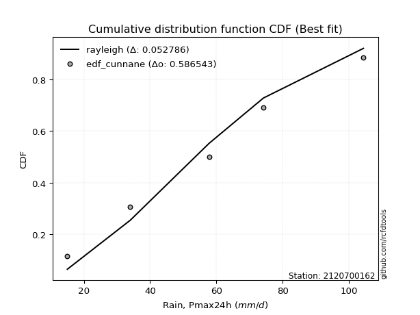</img></img>

</div>


### 12. EDF Adamowski (1981)

The Adamowski formula in hydrology refers to a specific plotting position formula used for estimating the non-parametric empirical distribution of hydrological events (like flood peaks) to calculate their return periods. This formula provides an alternative to traditional parametric methods (like the Gumbel or Log Pearson Type III distributions). 

<div align="center">


$P=(m-0.25)/(n+0.5)$


</div>


**12.1. Empirical values**

<div align="center">

|                | 0                   | 1                  | 2             | 3                  | 4                  |
|:---------------|:--------------------|:-------------------|:--------------|:-------------------|:-------------------|
| date           | 2023                | 2019               | 2020          | 2022               | 2021               |
| x              | 15.0                | 34.0               | 57.8          | 74.2               | 104.4              |
| m              | 1                   | 2                  | 3             | 4                  | 5                  |
| empirical_dist | edf_adamowski       | edf_adamowski      | edf_adamowski | edf_adamowski      | edf_adamowski      |
| empirical      | 0.13636363636363635 | 0.3181818181818182 | 0.5           | 0.6818181818181818 | 0.8636363636363636 |
| empirical_tr   | 1.1578947368421053  | 1.4666666666666666 | 2.0           | 3.1428571428571423 | 7.333333333333334  |

</div>


**12.2. Kolmogorov-Smirnov fit test (sorted by Δ)**


<div align="center">

|                | 0                   | 1                   | 2                   | 3                     | 4                   | 5                   | 6                   | 7                  | 8                   | 9                   | 10                  | 11                  | 12                  | 13                  | 14                  | 15                  | 16                  | 17                  | 18                  | 19                  | 20                  | 21                  | 22                  | 23                  | 24                  | 25                 | 26                 | 27                  | 28                 | 29                  | 30                 | 31                  | 32                  | 33                 | 34                 | 35                  | 36                 | 37                 | 38                  | 39                  | 40                 | 41                  | 42                  | 43                  | 44                  | 45                  | 46                  | 47                  | 48                 | 49                  | 50                  | 51                  | 52                 | 53                  | 54                  | 55                 | 56                  | 57                  | 58                  | 59                 | 60                 | 61                  | 62                 | 63                  | 64                  | 65                 | 66                  | 67                 | 68                  | 69                  | 70                  | 71                 | 72                 | 73                  | 74                 | 75                  | 76                  | 77                  | 78                 | 79                  | 80                  | 81                 | 82                 | 83                  | 84                  | 85                 | 86                 | 87                 |
|:---------------|:--------------------|:--------------------|:--------------------|:----------------------|:--------------------|:--------------------|:--------------------|:-------------------|:--------------------|:--------------------|:--------------------|:--------------------|:--------------------|:--------------------|:--------------------|:--------------------|:--------------------|:--------------------|:--------------------|:--------------------|:--------------------|:--------------------|:--------------------|:--------------------|:--------------------|:-------------------|:-------------------|:--------------------|:-------------------|:--------------------|:-------------------|:--------------------|:--------------------|:-------------------|:-------------------|:--------------------|:-------------------|:-------------------|:--------------------|:--------------------|:-------------------|:--------------------|:--------------------|:--------------------|:--------------------|:--------------------|:--------------------|:--------------------|:-------------------|:--------------------|:--------------------|:--------------------|:-------------------|:--------------------|:--------------------|:-------------------|:--------------------|:--------------------|:--------------------|:-------------------|:-------------------|:--------------------|:-------------------|:--------------------|:--------------------|:-------------------|:--------------------|:-------------------|:--------------------|:--------------------|:--------------------|:-------------------|:-------------------|:--------------------|:-------------------|:--------------------|:--------------------|:--------------------|:-------------------|:--------------------|:--------------------|:-------------------|:-------------------|:--------------------|:--------------------|:-------------------|:-------------------|:-------------------|
| station        | 2120700162          | 2120700162          | 2120700162          | 2120700162            | 2120700162          | 2120700162          | 2120700162          | 2120700162         | 2120700162          | 2120700162          | 2120700162          | 2120700162          | 2120700162          | 2120700162          | 2120700162          | 2120700162          | 2120700162          | 2120700162          | 2120700162          | 2120700162          | 2120700162          | 2120700162          | 2120700162          | 2120700162          | 2120700162          | 2120700162         | 2120700162         | 2120700162          | 2120700162         | 2120700162          | 2120700162         | 2120700162          | 2120700162          | 2120700162         | 2120700162         | 2120700162          | 2120700162         | 2120700162         | 2120700162          | 2120700162          | 2120700162         | 2120700162          | 2120700162          | 2120700162          | 2120700162          | 2120700162          | 2120700162          | 2120700162          | 2120700162         | 2120700162          | 2120700162          | 2120700162          | 2120700162         | 2120700162          | 2120700162          | 2120700162         | 2120700162          | 2120700162          | 2120700162          | 2120700162         | 2120700162         | 2120700162          | 2120700162         | 2120700162          | 2120700162          | 2120700162         | 2120700162          | 2120700162         | 2120700162          | 2120700162          | 2120700162          | 2120700162         | 2120700162         | 2120700162          | 2120700162         | 2120700162          | 2120700162          | 2120700162          | 2120700162         | 2120700162          | 2120700162          | 2120700162         | 2120700162         | 2120700162          | 2120700162          | 2120700162         | 2120700162         | 2120700162         |
| empirical_dist | edf_adamowski       | edf_adamowski       | edf_adamowski       | edf_adamowski         | edf_adamowski       | edf_adamowski       | edf_adamowski       | edf_adamowski      | edf_adamowski       | edf_adamowski       | edf_adamowski       | edf_adamowski       | edf_adamowski       | edf_adamowski       | edf_adamowski       | edf_adamowski       | edf_adamowski       | edf_adamowski       | edf_adamowski       | edf_adamowski       | edf_adamowski       | edf_adamowski       | edf_adamowski       | edf_adamowski       | edf_adamowski       | edf_adamowski      | edf_adamowski      | edf_adamowski       | edf_adamowski      | edf_adamowski       | edf_adamowski      | edf_adamowski       | edf_adamowski       | edf_adamowski      | edf_adamowski      | edf_adamowski       | edf_adamowski      | edf_adamowski      | edf_adamowski       | edf_adamowski       | edf_adamowski      | edf_adamowski       | edf_adamowski       | edf_adamowski       | edf_adamowski       | edf_adamowski       | edf_adamowski       | edf_adamowski       | edf_adamowski      | edf_adamowski       | edf_adamowski       | edf_adamowski       | edf_adamowski      | edf_adamowski       | edf_adamowski       | edf_adamowski      | edf_adamowski       | edf_adamowski       | edf_adamowski       | edf_adamowski      | edf_adamowski      | edf_adamowski       | edf_adamowski      | edf_adamowski       | edf_adamowski       | edf_adamowski      | edf_adamowski       | edf_adamowski      | edf_adamowski       | edf_adamowski       | edf_adamowski       | edf_adamowski      | edf_adamowski      | edf_adamowski       | edf_adamowski      | edf_adamowski       | edf_adamowski       | edf_adamowski       | edf_adamowski      | edf_adamowski       | edf_adamowski       | edf_adamowski      | edf_adamowski      | edf_adamowski       | edf_adamowski       | edf_adamowski      | edf_adamowski      | edf_adamowski      |
| p_dist         | invgauss            | maxwell             | rayleigh            | loglaplace_asymmetric | johnsonsu           | ncf                 | loggumbel_l         | genlogistic        | invgamma            | logweibull_min      | erlang              | gamma               | fisk                | logjohnsonsu        | kstwobign           | rice                | pearson3            | betaprime           | logpearson3         | f                   | exponnorm           | t                   | nct                 | crystalball         | norm                | logfisk            | gumbel_r           | logistic            | alpha              | laplace_asymmetric  | moyal              | logbetaprime        | lognct              | logexponnorm       | logcrystalball     | logt                | lognorm            | lognorm            | logf                | gumbel_l            | logncf             | logfatiguelife      | logerlang           | loggamma            | loggamma            | hypsecant           | logrice             | loginvgamma         | mielke             | loglogistic         | logloggamma         | truncnorm           | gompertz           | halflogistic        | halfnorm            | genexpon           | expon               | loginvgauss         | loginvweibull       | laplace            | logalpha           | logmaxwell          | weibull_min        | loghypsecant        | lograyleigh         | loggompertz        | logkstwobign        | loggenexpon        | loghalfnorm         | loglaplace          | loggumbel_r         | logexpon           | wald               | loghalflogistic     | logmoyal           | logwald             | chi2                | loggibrat           | logchi2            | gibrat              | nakagami            | logtruncnorm       | lognakagami        | loglognorm          | fatiguelife         | invweibull         | logmielke          | loggenlogistic     |
| delta          | 0.06954676261367684 | 0.07089302123878985 | 0.07127332679456364 | 0.07131869536860547   | 0.07290751202121715 | 0.07353140856652891 | 0.07362163006444836 | 0.0750961208614086 | 0.07641670535081127 | 0.07694076968884121 | 0.07782753180120597 | 0.07851610665186151 | 0.07993430762788639 | 0.08030213140131581 | 0.08088293125336332 | 0.08239234660998243 | 0.08563136521259007 | 0.08584898090016413 | 0.08637092476749464 | 0.08816226181187203 | 0.08909580746919252 | 0.08916065803355155 | 0.08916144409030871 | 0.08916934263427623 | 0.08917149173507471 | 0.090141855770837  | 0.0949410568230289 | 0.11166307783845203 | 0.1127832484013378 | 0.11326574708766718 | 0.1191134681553751 | 0.11950293703658676 | 0.11962849604123693 | 0.1203552319978397 | 0.1203579674844828 | 0.12035832519067446 | 0.1203585411210617 | 0.1203585411210617 | 0.12154904478176864 | 0.12331272015849612 | 0.1236781587529262 | 0.12368567846447764 | 0.12441817154827428 | 0.12511944631939154 | 0.12511944631939154 | 0.12582154432789117 | 0.12898138436432272 | 0.12940475150056285 | 0.1350289653869372 | 0.13547765642804066 | 0.13628378431652532 | 0.13636363318872424 | 0.1363636363633909 | 0.13636363636363635 | 0.13636363636363635 | 0.1383513878923196 | 0.13836152938922353 | 0.13904392595632697 | 0.14161591513044414 | 0.1431258078949758 | 0.1435951672768938 | 0.14500576489396577 | 0.1454663123342067 | 0.14761653987030032 | 0.15255510159896768 | 0.1637123424842899 | 0.16407554072662678 | 0.1676675731237771 | 0.17419421056927864 | 0.17583224994183566 | 0.18454530649963263 | 0.1936246582808387 | 0.1972700966654788 | 0.20256408123838698 | 0.2061795570761229 | 0.26677304492626197 | 0.27391433556003264 | 0.29889206958565995 | 0.3085531666082236 | 0.31722669467418685 | 0.31817880803260334 | 0.3181807967497079 | 0.3181810344394024 | 0.36059306278921827 | 0.42102331013279876 | 0.4258298533626665 | 0.4289368436611159 | 0.6818181818181818 |
| deltao         | 0.5865427407550001  | 0.5865427407550001  | 0.5865427407550001  | 0.5865427407550001    | 0.5865427407550001  | 0.5865427407550001  | 0.5865427407550001  | 0.5865427407550001 | 0.5865427407550001  | 0.5865427407550001  | 0.5865427407550001  | 0.5865427407550001  | 0.5865427407550001  | 0.5865427407550001  | 0.5865427407550001  | 0.5865427407550001  | 0.5865427407550001  | 0.5865427407550001  | 0.5865427407550001  | 0.5865427407550001  | 0.5865427407550001  | 0.5865427407550001  | 0.5865427407550001  | 0.5865427407550001  | 0.5865427407550001  | 0.5865427407550001 | 0.5865427407550001 | 0.5865427407550001  | 0.5865427407550001 | 0.5865427407550001  | 0.5865427407550001 | 0.5865427407550001  | 0.5865427407550001  | 0.5865427407550001 | 0.5865427407550001 | 0.5865427407550001  | 0.5865427407550001 | 0.5865427407550001 | 0.5865427407550001  | 0.5865427407550001  | 0.5865427407550001 | 0.5865427407550001  | 0.5865427407550001  | 0.5865427407550001  | 0.5865427407550001  | 0.5865427407550001  | 0.5865427407550001  | 0.5865427407550001  | 0.5865427407550001 | 0.5865427407550001  | 0.5865427407550001  | 0.5865427407550001  | 0.5865427407550001 | 0.5865427407550001  | 0.5865427407550001  | 0.5865427407550001 | 0.5865427407550001  | 0.5865427407550001  | 0.5865427407550001  | 0.5865427407550001 | 0.5865427407550001 | 0.5865427407550001  | 0.5865427407550001 | 0.5865427407550001  | 0.5865427407550001  | 0.5865427407550001 | 0.5865427407550001  | 0.5865427407550001 | 0.5865427407550001  | 0.5865427407550001  | 0.5865427407550001  | 0.5865427407550001 | 0.5865427407550001 | 0.5865427407550001  | 0.5865427407550001 | 0.5865427407550001  | 0.5865427407550001  | 0.5865427407550001  | 0.5865427407550001 | 0.5865427407550001  | 0.5865427407550001  | 0.5865427407550001 | 0.5865427407550001 | 0.5865427407550001  | 0.5865427407550001  | 0.5865427407550001 | 0.5865427407550001 | 0.5865427407550001 |
| eval           | Δo > Δ              | Δo > Δ              | Δo > Δ              | Δo > Δ                | Δo > Δ              | Δo > Δ              | Δo > Δ              | Δo > Δ             | Δo > Δ              | Δo > Δ              | Δo > Δ              | Δo > Δ              | Δo > Δ              | Δo > Δ              | Δo > Δ              | Δo > Δ              | Δo > Δ              | Δo > Δ              | Δo > Δ              | Δo > Δ              | Δo > Δ              | Δo > Δ              | Δo > Δ              | Δo > Δ              | Δo > Δ              | Δo > Δ             | Δo > Δ             | Δo > Δ              | Δo > Δ             | Δo > Δ              | Δo > Δ             | Δo > Δ              | Δo > Δ              | Δo > Δ             | Δo > Δ             | Δo > Δ              | Δo > Δ             | Δo > Δ             | Δo > Δ              | Δo > Δ              | Δo > Δ             | Δo > Δ              | Δo > Δ              | Δo > Δ              | Δo > Δ              | Δo > Δ              | Δo > Δ              | Δo > Δ              | Δo > Δ             | Δo > Δ              | Δo > Δ              | Δo > Δ              | Δo > Δ             | Δo > Δ              | Δo > Δ              | Δo > Δ             | Δo > Δ              | Δo > Δ              | Δo > Δ              | Δo > Δ             | Δo > Δ             | Δo > Δ              | Δo > Δ             | Δo > Δ              | Δo > Δ              | Δo > Δ             | Δo > Δ              | Δo > Δ             | Δo > Δ              | Δo > Δ              | Δo > Δ              | Δo > Δ             | Δo > Δ             | Δo > Δ              | Δo > Δ             | Δo > Δ              | Δo > Δ              | Δo > Δ              | Δo > Δ             | Δo > Δ              | Δo > Δ              | Δo > Δ             | Δo > Δ             | Δo > Δ              | Δo > Δ              | Δo > Δ             | Δo > Δ             | Δo <= Δ            |
| fit            | 1                   | 1                   | 1                   | 1                     | 1                   | 1                   | 1                   | 1                  | 1                   | 1                   | 1                   | 1                   | 1                   | 1                   | 1                   | 1                   | 1                   | 1                   | 1                   | 1                   | 1                   | 1                   | 1                   | 1                   | 1                   | 1                  | 1                  | 1                   | 1                  | 1                   | 1                  | 1                   | 1                   | 1                  | 1                  | 1                   | 1                  | 1                  | 1                   | 1                   | 1                  | 1                   | 1                   | 1                   | 1                   | 1                   | 1                   | 1                   | 1                  | 1                   | 1                   | 1                   | 1                  | 1                   | 1                   | 1                  | 1                   | 1                   | 1                   | 1                  | 1                  | 1                   | 1                  | 1                   | 1                   | 1                  | 1                   | 1                  | 1                   | 1                   | 1                   | 1                  | 1                  | 1                   | 1                  | 1                   | 1                   | 1                   | 1                  | 1                   | 1                   | 1                  | 1                  | 1                   | 1                   | 1                  | 1                  | 0                  |
| n              | 5                   | 5                   | 5                   | 5                     | 5                   | 5                   | 5                   | 5                  | 5                   | 5                   | 5                   | 5                   | 5                   | 5                   | 5                   | 5                   | 5                   | 5                   | 5                   | 5                   | 5                   | 5                   | 5                   | 5                   | 5                   | 5                  | 5                  | 5                   | 5                  | 5                   | 5                  | 5                   | 5                   | 5                  | 5                  | 5                   | 5                  | 5                  | 5                   | 5                   | 5                  | 5                   | 5                   | 5                   | 5                   | 5                   | 5                   | 5                   | 5                  | 5                   | 5                   | 5                   | 5                  | 5                   | 5                   | 5                  | 5                   | 5                   | 5                   | 5                  | 5                  | 5                   | 5                  | 5                   | 5                   | 5                  | 5                   | 5                  | 5                   | 5                   | 5                   | 5                  | 5                  | 5                   | 5                  | 5                   | 5                   | 5                   | 5                  | 5                   | 5                   | 5                  | 5                  | 5                   | 5                   | 5                  | 5                  | 5                  |
| best_fit       | 1                   | 0                   | 0                   | 0                     | 0                   | 0                   | 0                   | 0                  | 0                   | 0                   | 0                   | 0                   | 0                   | 0                   | 0                   | 0                   | 0                   | 0                   | 0                   | 0                   | 0                   | 0                   | 0                   | 0                   | 0                   | 0                  | 0                  | 0                   | 0                  | 0                   | 0                  | 0                   | 0                   | 0                  | 0                  | 0                   | 0                  | 0                  | 0                   | 0                   | 0                  | 0                   | 0                   | 0                   | 0                   | 0                   | 0                   | 0                   | 0                  | 0                   | 0                   | 0                   | 0                  | 0                   | 0                   | 0                  | 0                   | 0                   | 0                   | 0                  | 0                  | 0                   | 0                  | 0                   | 0                   | 0                  | 0                   | 0                  | 0                   | 0                   | 0                   | 0                  | 0                  | 0                   | 0                  | 0                   | 0                   | 0                   | 0                  | 0                   | 0                   | 0                  | 0                  | 0                   | 0                   | 0                  | 0                  | 0                  |
| best_fit_sort  | 1                   | 2                   | 3                   | 4                     | 5                   | 6                   | 7                   | 8                  | 9                   | 10                  | 11                  | 12                  | 13                  | 14                  | 15                  | 16                  | 17                  | 18                  | 19                  | 20                  | 21                  | 22                  | 23                  | 24                  | 25                  | 26                 | 27                 | 28                  | 29                 | 30                  | 31                 | 32                  | 33                  | 34                 | 35                 | 36                  | 37                 | 38                 | 39                  | 40                  | 41                 | 42                  | 43                  | 44                  | 45                  | 46                  | 47                  | 48                  | 49                 | 50                  | 51                  | 52                  | 53                 | 54                  | 55                  | 56                 | 57                  | 58                  | 59                  | 60                 | 61                 | 62                  | 63                 | 64                  | 65                  | 66                 | 67                  | 68                 | 69                  | 70                  | 71                  | 72                 | 73                 | 74                  | 75                 | 76                  | 77                  | 78                  | 79                 | 80                  | 81                  | 82                 | 83                 | 84                  | 85                  | 86                 | 87                 | 88                 |

</div>


**12.3. Best fit**

<div align="center">

|   id |    station | empirical_dist   | p_dist   |     delta |   deltao | eval   |   fit |   n |   best_fit |   best_fit_sort |
|-----:|-----------:|:-----------------|:---------|----------:|---------:|:-------|------:|----:|-----------:|----------------:|
|    0 | 2120700162 | edf_adamowski    | invgauss | 0.0695468 | 0.586543 | Δo > Δ |     1 |   5 |          1 |               1 |

</div>


<div align="center">

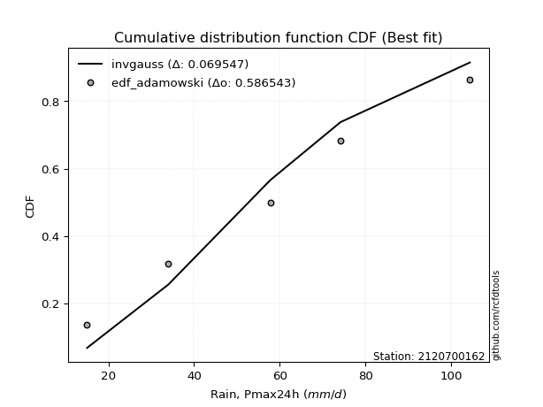</img>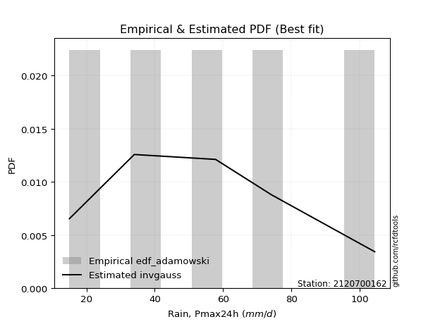</img>

</div>


## C. Best fit & Estimate extreme values for specific return periods - Tr

Best fit in probability distribution analysis means finding the theoretical distribution (like Normal, Poisson, Exponential) that most accurately mirrors your real-world data´s patterns (shape, center, spread) for better predictions, using methods like visual checks (Q-Q plots), goodness-of-fit tests (Kolmogorov-Smirnov, Chi-Squared), and information criteria (AIC) to score and select the simplest, most representative model.


### 1. Best fit (ordered by delta Δ)

<div align="center">

|   id |    station | empirical_dist   | p_dist    |     delta |   deltao | eval   |   fit |   n |   best_fit |   best_fit_sort |
|-----:|-----------:|:-----------------|:----------|----------:|---------:|:-------|------:|----:|-----------:|----------------:|
|    0 | 2120700162 | edf_gringorten   | rayleigh  | 0.0526983 | 0.586543 | Δo > Δ |     1 |   5 |          1 |               1 |
|    1 | 2120700162 | edf_hazen        | rayleigh  | 0.0526983 | 0.586543 | Δo > Δ |     1 |   5 |          1 |               2 |
|    2 | 2120700162 | edf_cunnane      | rayleigh  | 0.0527863 | 0.586543 | Δo > Δ |     1 |   5 |          1 |               3 |
|    3 | 2120700162 | edf_blom         | rayleigh  | 0.0546178 | 0.586543 | Δo > Δ |     1 |   5 |          1 |               4 |
|    4 | 2120700162 | edf_tukey        | rayleigh  | 0.0599097 | 0.586543 | Δo > Δ |     1 |   5 |          1 |               5 |
|    5 | 2120700162 | edf_filliben     | rayleigh  | 0.0621231 | 0.586543 | Δo > Δ |     1 |   5 |          1 |               6 |
|    6 | 2120700162 | edf_beard        | rayleigh  | 0.0631625 | 0.586543 | Δo > Δ |     1 |   5 |          1 |               7 |
|    7 | 2120700162 | edf_jenkinson    | rayleigh  | 0.0631625 | 0.586543 | Δo > Δ |     1 |   5 |          1 |               8 |
|    8 | 2120700162 | edf_chegodayev   | rayleigh  | 0.0645393 | 0.586543 | Δo > Δ |     1 |   5 |          1 |               9 |
|    9 | 2120700162 | edf_adamowski    | invgauss  | 0.0695468 | 0.586543 | Δo > Δ |     1 |   5 |          1 |              10 |
|   10 | 2120700162 | edf_weibull      | maxwell   | 0.0923886 | 0.586543 | Δo > Δ |     1 |   5 |          1 |              11 |
|   11 | 2120700162 | edf_california   | betaprime | 0.130228  | 0.586543 | Δo > Δ |     1 |   5 |          1 |              12 |

</div>

:file_folder:Tables: [bestfit_2120700162.csv](table/bestfit_2120700162.csv) | [extreme_2120700162.csv](table/extreme_2120700162.csv)


### 2. Extreme values

In hydrology, a return period (or recurrence interval $Tr$) is the statistical average time between extreme events like floods or droughts of a specific magnitude, indicating how rare an event is, with a 100-year flood, for example, having a 1% chance of occurring in any given year, not that it happens exactly every century. It is a key tool for infrastructure design (like bridges or dams) and risk assessment, calculated from historical data to determine the probability of future events, although it is important to remember it is statistical average, and events can cluster or be missed.

> risk_rate: assuming the return period as the project useful life.

|   id |      tr |   prob_l |     prob_g |      alpha |   betaprime |     chi2 |   crystalball |   erlang |    expon |   exponnorm |        f |   fatiguelife |     fisk |    gamma |   genexpon |   genlogistic |   gibrat |   gompertz |   gumbel_l |   gumbel_r |   halflogistic |   halfnorm |   hypsecant |   invgamma |   invgauss |    invweibull |   johnsonsu |   kstwobign |   laplace |   laplace_asymmetric |   loggamma |   logistic |   lognorm |   maxwell |     mielke |    moyal |   nakagami |      ncf |      nct |     norm |   pearson3 |   rayleigh |     rice |        t |   truncnorm |     wald |   weibull_min |   logalpha |   logbetaprime |     logchi2 |   logcrystalball |   logerlang |   logexpon |   logexponnorm |     logf |   logfatiguelife |   logfisk |   loggenexpon |   loggenlogistic |   loggibrat |   loggompertz |   loggumbel_l |   loggumbel_r |   loghalflogistic |   loghalfnorm |   loghypsecant |   loginvgamma |   loginvgauss |   loginvweibull |   logjohnsonsu |   logkstwobign |   loglaplace |   loglaplace_asymmetric |   logloggamma |   loglogistic |    loglognorm |   logmaxwell |   logmielke |   logmoyal |   lognakagami |   logncf |   lognct |   logpearson3 |   lograyleigh |   logrice |     logt |   logtruncnorm |   logwald |   logweibull_min |    station |   n |   risk_rate |
|-----:|--------:|---------:|-----------:|-----------:|------------:|---------:|--------------:|---------:|---------:|------------:|---------:|--------------:|---------:|---------:|-----------:|--------------:|---------:|-----------:|-----------:|-----------:|---------------:|-----------:|------------:|-----------:|-----------:|--------------:|------------:|------------:|----------:|---------------------:|-----------:|-----------:|----------:|----------:|-----------:|---------:|-----------:|---------:|---------:|---------:|-----------:|-----------:|---------:|---------:|------------:|---------:|--------------:|-----------:|---------------:|------------:|-----------------:|------------:|-----------:|---------------:|---------:|-----------------:|----------:|--------------:|-----------------:|------------:|--------------:|--------------:|--------------:|------------------:|--------------:|---------------:|--------------:|--------------:|----------------:|---------------:|---------------:|-------------:|------------------------:|--------------:|--------------:|--------------:|-------------:|------------:|-----------:|--------------:|---------:|---------:|--------------:|--------------:|----------:|---------:|---------------:|----------:|-----------------:|-----------:|----:|------------:|
|    0 |    2    | 0.5      | 0.5        |    43.3492 |     49.8107 |  33.5735 |       57.0796 |  54.6818 |  44.1676 |     57.0528 |  50.0942 |       15.0001 |  54.1827 |  54.8668 |    44.1684 |       51.7271 |  47.7446 |    52.8385 |    62.1893 |    51.9707 |        49.4306 |    50.7138 |     57.08   |    54.1742 |    52.5489 |  15.0017      |     53.7729 |     51.1584 |   57.08   |              57.4375 |    46.3149 |    57.08   |   46.9592 |   54.4201 |  -0.839313 |  50.3212 |    43.4885 |  52.2094 |  57.0774 |  57.08   |    56.2474 |    53.4767 |  54.7403 |  57.0795 |     61.7111 |  46.9985 |       39.3557 |    44.4969 |        46.9037 |     24.1724 |          46.9592 |     46.2341 |    33.0853 |        46.9595 |  46.7692 |          46.7126 |   50.1193 |       39.9412 |          inf     |     38.3146 |       40.7915 |       52.4909 |       42.0104 |           39.7481 |       40.8751 |        46.9592 |       45.7564 |       44.6969 |         42.424  |        58.5049 |        40.1488 |      46.9592 |                 56.3254 |       59.905  |       46.9592 |  15.0163      |      44.3142 |     15      |    40.5269 |       40.4399 |  46.1987 |  47.0212 |       50.1296 |       43.4123 |   45.8522 |  46.9592 |        47.3944 |   37.6952 |          53.2085 | 2120700162 |   5 |    0.75     |
|    1 |    2.33 | 0.570815 | 0.429185   |    51.5968 |     56.3185 |  38.1328 |       62.6295 |  60.228  |  50.5941 |     62.6021 |  56.2056 |       16.4732 |  59.6552 |  60.4406 |    50.5951 |       57.4387 |  50.556  |    58.8701 |    67.0178 |    57.1133 |        54.718  |    56.7035 |     61.5216 |    59.747  |    58.2211 |  15.0174      |     59.3752 |     56.938  |   60.4385 |              61.3453 |    52.4063 |    61.9699 |   52.9974 |   60.1861 |  -0.839313 |  55.1893 |    48.008  |  58.0092 |  62.6273 |  62.6299 |    61.8169 |    59.328  |  60.4107 |  62.6295 |     67.5994 |  50.6376 |       47.1838 |    50.4597 |        53.0129 |     28.7174 |          52.9974 |     52.4053 |    39.3848 |        52.9977 |  52.8367 |          52.6978 |   56.1518 |       46.2611 |          inf     |     40.7356 |       47.1767 |       58.3162 |       46.9933 |           44.6031 |       46.5754 |        51.7325 |       51.879  |       50.7771 |         49.1459 |        64.7929 |        46.5184 |      50.5256 |                 61.9224 |       66.6144 |       52.2404 |  15.2095      |      50.2483 |     15      |    45.0634 |       43.3941 |  52.4254 |  53.0671 |       56.3455 |       49.3173 |   51.9642 |  52.9974 |        50.5724 |   40.807  |          59.0355 | 2120700162 |   5 |    0.729209 |
|    2 |    5    | 0.8      | 0.2        |   115.55   |     86.3306 |  61.627  |       83.2543 |  81.9725 |  82.7251 |     83.2413 |  83.2924 |       47.7649 |  82.9522 |  82.275  |    82.727  |       82.2453 |  66.7418 |    82.7114 |    82.6166 |    79.4551 |        78.6425 |    82.0336 |     79.3378 |    82.1964 |    81.9737 | 427.522       |     82.1411 |     81.4888 |   77.2305 |              80.8583 |    83.6494 |    80.8502 |   83.0777 |   82.8805 |  -0.839313 |  77.739  |    74.1279 |  82.4109 |  83.2538 |  83.2548 |    82.9826 |    82.7532 |  82.738  |  83.255  |     86.2457 |  71.0095 |       94.1874 |    81.9665 |        83.7911 |     79.2922 |          83.0778 |     84.1538 |    94.1403 |        83.0781 |  83.3309 |          82.5311 |   87.0856 |       84.7598 |          inf     |     57.9661 |       81.9651 |       81.93   |       76.4746 |           75.1321 |       80.896  |        76.2793 |       83.8868 |       83.577  |         93.1092 |        86.0248 |        86.9522 |      72.855  |                 79.7769 |       87.3089 |       78.8357 |   3.59631e+78 |      82.4025 |     15      |    73.667  |       63.3113 |  84.6828 |  83.1706 |       83.9551 |       82.1742 |   83.3358 |  83.0777 |        66.6721 |   63.618  |          82.5878 | 2120700162 |   5 |    0.67232  |
|    3 |   10    | 0.9      | 0.1        |   233.048  |    112.24   |  83.5045 |       96.9363 |  97.402  | 111.893  |     96.9491 | 105.317  |       90.9708 | 102.549  |  97.7524 |   111.895  |      102.445  |  85.1917 |    98.6934 |    91.3013 |    97.6522 |        98.5108 |   100.777  |     93.5646 |    98.7602 |   100.26   |   1.50839e+06 |     99.0983 |    100.181  |   92.4738 |              98.5717 |   114.915  |    94.755  |  111.942  |   98.8516 |  96.142    |  97.372  |    97.3351 | 101.184  |  96.9382 |  96.9369 |    97.4336 |    99.4558 |  98.3236 |  96.9374 |     94.8708 |  92.6289 |      145.725  |   114.954  |       113.799  |    226.627  |         111.943  |    116.032  |   207.644  |       111.943  | 112.964  |         111.192  |  120.31   |      131.861  |          inf     |     86.6572 |      116.951  |       99.0033 |      113.701  |          115.849  |      121.717  |       104.01   |      116.832  |      118.903  |        156.681  |        97.5976 |       139.995  |     101.566  |                 95.3837 |       95.9523 |      106.743  | inf           |     116.713  |     15      |   113.009  |       87.3157 | 117.399  | 112.036  |      106.161  |      118.26   |  114.496  | 111.942  |        79.795  |  101.914  |          99.5618 | 2120700162 |   5 |    0.651322 |
|    4 |   15    | 0.933333 | 0.0666667  |   350.126  |    127.302  |  96.439  |      103.764  | 105.407  | 128.955  |    103.795  | 117.589  |      119.228  | 114.197  | 105.778  |   128.958  |      113.841  |  97.9177 |   106.495  |    95.2344 |   107.919  |       109.754  |   110.531  |    101.684  |   107.579  |   110.202  |   1.54439e+08 |    108.168  |    110.104  |  101.39   |             108.933  |   134.946  |   102.331  |  129.904  |  107.046  |  98.9526   | 108.766  |   109.919  | 111.362  | 103.767  | 103.765  |   104.768  |   108.062  | 106.259  | 103.765  |     97.9164 | 106.512  |      179.04   |   136.798  |       132.676  |    432.841  |         129.904  |    136.492  |   329.822  |       129.905  | 131.564  |         129.044  |  143.475  |      165.912  |          inf     |    114.355  |      138.669  |      107.865  |      142.215  |          148.02   |      150.551  |       124.144  |      138.368  |      142.74   |        210.154  |       102.564  |       180.266  |     123.353  |                105.893  |       98.7902 |      125.908  | inf           |     139.536  |     73.0591 |   144.866  |      103.771  | 138.547  | 129.988  |      118.335  |      142.659  |  134.285  | 129.904  |        86.0617 |  137.929  |         108.357  | 2120700162 |   5 |    0.644736 |
|    5 |   20    | 0.95     | 0.05       |   467.101  |    138.024  | 105.66   |      108.235  | 110.761  | 141.06   |    108.281  | 126.102  |      140.149  | 122.678  | 111.143  |   141.064  |      121.819  | 107.9    |   111.512  |    97.6826 |   115.107  |       117.632  |   117.035  |    107.411  |   113.567  |   117.021  |   3.94713e+09 |    114.339  |    116.789  |  107.717  |             116.285  |   150.04   |   107.567  |  143.201  |  112.485  | 100.35     | 116.836  |   118.401  | 118.329  | 108.24   | 108.236  |   109.617  |   113.782  | 111.502  | 108.237  |     99.4829 | 116.858  |      203.937  |   153.604  |       146.744  |    692.326  |         143.202  |    151.924  |   457.998  |       143.202  | 145.406  |         142.268  |  162.044  |      193.392  |          inf     |    142.149  |      154.582  |      113.777  |      166.338  |          175.747  |      173.477  |       140.651  |      154.8    |      161.287  |        258.121  |       105.533  |       213.737  |     141.591  |                114.044  |      100.202  |      141.129  | inf           |     157.096  |     79.5665 |   172.723  |      116.544  | 154.568  | 143.274  |      126.673  |      161.601  |  149.103  | 143.201  |        89.7662 |  172.818  |         114.219  | 2120700162 |   5 |    0.641514 |
|    6 |   25    | 0.96     | 0.04       |   584.035  |    146.38   | 112.834  |      111.527  | 114.758  | 150.45   |    111.584  | 132.614  |      156.772  | 129.414  | 115.149  |   150.454  |      127.965  | 116.222  |   115.153  |    99.4247 |   120.644  |       123.701  |   121.873  |    111.844  |   118.086  |   122.2    |   4.7912e+10  |    119.003  |    121.796  |  112.624  |             121.988  |   162.285  |   111.573  |  153.852  |  116.522  | 101.186    | 123.09   |   124.739  | 123.613  | 111.532  | 111.527  |   113.208  |   118.032  | 115.381  | 111.528  |    100.439  | 125.144  |      223.924  |   167.449  |       158.064  |   1001.65   |         153.852  |    164.453  |   590.827  |       153.853  | 156.536  |         152.865  |  177.855  |      216.772  |          inf     |    170.416  |      167.194  |      118.18   |      187.673  |          200.603  |      192.771  |       154.918  |      168.254  |      176.69   |        302.411  |       107.581  |       242.819  |     157.575  |                120.796  |      101.046  |      154.005  | inf           |     171.547  |     83.8661 |   197.95   |      127.095  | 167.615  | 153.913  |      132.985  |      177.286  |  161.065  | 153.852  |        92.2198 |  207.029  |         118.583  | 2120700162 |   5 |    0.639603 |
|    7 |   50    | 0.98     | 0.02       |  1168.52   |    172.668  | 135.212  |      120.952  | 126.474  | 179.618  |    121.049  | 152.435  |      210.105  | 151.409  | 126.885  |   179.622  |      146.896  | 145.557  |   125.315  |   104.154  |   137.701  |       142.402  |   135.937  |    125.587  |   131.577  |   137.799  |   1.0477e+14  |    132.951  |    136.499  |  127.868  |             139.701  |   203.554  |   123.812  |  188.939  |  128.232  | 102.852    | 142.507  |   143.224  | 139.494  | 120.96   | 120.953  |   123.6    |   130.369  | 126.573  | 120.954  |    102.39   | 152.2    |      289.494  |   215.435  |       195.672  |   3227.03   |         188.939  |    206.717  |  1303.18   |       188.94   | 193.447  |         187.808  |  236.377  |      302.237  |          inf     |    322.977  |      207.77   |      131.011  |      272.181  |          301.544  |      261.921  |       209.022  |      214.351  |      230.831  |        492.56   |       112.831  |       353.163  |     219.672  |                144.427  |      102.73   |      201.086  | inf           |     221.423  |     93.4807 |   302.24   |      163.608  | 211.883  | 188.947  |      151.811  |      231.98   |  201.001  | 188.939  |        97.7658 |  373.378  |         131.288  | 2120700162 |   5 |    0.63583  |
|    8 |   75    | 0.986667 | 0.0133333  |  1752.93   |    188.34   | 148.357  |      126.009  | 132.924  | 196.68   |    126.131  | 163.801  |      242.225  | 165.148  | 133.344  |   196.685  |      157.9    | 165.37   |   130.598  |   106.545  |   147.615  |       153.273  |   143.593  |    133.619  |   139.166  |   146.652  |   9.15069e+15 |    140.812  |    144.589  |  136.784  |             150.063  |   230.138  |   130.88   |  210.956  |  134.598  | 103.405    | 153.862  |   153.292  | 148.484  | 126.02   | 126.01   |   129.241  |   137.08   | 132.621  | 126.011  |    103.053  | 168.849  |      330.123  |   247.375  |       219.498  |   6480.09   |         210.957  |    233.971  |  2069.97   |       210.957  | 216.788  |         209.758  |  278.585  |      362.35   |          inf     |    497.399  |      232.416  |      138.021  |      337.832  |          382.163  |      309.486  |       249.01   |      244.619  |      267.437  |        654.034  |       115.297  |       433.998  |     266.796  |                160.34   |      103.289  |      234.58   | inf           |     254.381  |     97.0199 |   387.109  |      187.729  | 240.619  | 210.921  |      162.321  |      268.523  |  226.43   | 210.956  |        99.8397 |  536.724  |         138.222  | 2120700162 |   5 |    0.634587 |
|    9 |  100    | 0.99     | 0.01       |  2337.31   |    199.615  | 157.703  |      129.43   | 137.353  | 208.786  |    129.57   | 171.782  |      265.336  | 175.334  | 137.778  |   208.791  |      165.687  | 180.719  |   134.102  |   108.109  |   154.632  |       160.967  |   148.809  |    139.316  |   144.445  |   152.836  |   2.16457e+17 |    146.284  |    150.132  |  143.111  |             157.414  |   250.175  |   135.871  |  227.285  |  138.934  | 103.682    | 161.918  |   160.145  | 154.755  | 129.441  | 129.431  |   133.083  |   141.653  | 136.728  | 129.432  |    103.387  | 180.987  |      359.897  |   271.957  |       237.274  |  10676.4    |         227.286  |    254.526  |  2874.41   |       227.286  | 234.182  |         226.048  |  312.848  |      410.097  |          inf     |    694.991  |      250.283  |      142.807  |      393.659  |          451.936  |      346.744  |       281.932  |      267.713  |      295.882  |        799.384  |       116.837  |       499.825  |     306.241  |                172.682  |      103.569  |      261.536  | inf           |     279.596  |     98.8578 |   461.41   |      206.152  | 262.382  | 227.212  |      169.569  |      296.664  |  245.454  | 227.285  |       100.926  |  699.292  |         142.955  | 2120700162 |   5 |    0.633968 |
|   10 |  200    | 0.995    | 0.005      |  4674.8    |    227.377  | 180.277  |      137.189  | 147.597  | 237.953  |    137.377  | 190.782  |      321.908  | 201.524  | 148.031  |   237.959  |      184.41   | 222.476  |   141.841  |   111.509  |   171.501  |       179.464  |   160.737  |    153.041  |   156.874  |   167.461  |   4.34919e+20 |    159.178  |    162.898  |  158.354  |             175.128  |   302.755  |   147.842  |  269.163  |  148.855  | 104.096    | 181.327  |   175.785  | 169.565  | 137.204  | 137.19   |   141.875  |   152.115  | 146.081  | 137.191  |    103.892  | 211.223  |      434.678  |   338.436  |       283.243  |  36026.2    |         269.164  |    308.504  |  6340.04   |       269.164  | 279.09   |         267.866  |  413.216  |      544.665  |          103.998 |   1726.69   |      294.55   |      153.792  |      568.589  |          676.342  |      449.699  |       380.243  |      329.374  |      373.843  |       1295.04   |       119.976  |       691.951  |     426.926  |                206.464  |      103.988  |      339.508  | inf           |     347.087  |    101.704  |   704.378  |      255.278  | 319.875  | 268.976  |      186.367  |      372.648  |  294.82   | 269.163  |       102.621  | 1351.7    |         153.808  | 2120700162 |   5 |    0.633042 |
|   11 |  250    | 0.996    | 0.004      |  5843.54   |    236.509  | 187.559  |      139.56   | 150.782  | 247.343  |    139.764  | 196.839  |      340.345  | 210.488  | 151.218  |   247.349  |      190.429  | 237.459  |   144.149  |   112.51   |   176.924  |       185.411  |   164.407  |    157.459  |   160.803  |   172.1    |   5.01518e+21 |    163.256  |    166.849  |  163.261  |             180.83   |   321.053  |   151.686  |  283.439  |  151.909  | 104.179    | 187.575  |   180.586  | 174.256  | 139.576  | 139.561  |   144.583  |   155.336  | 148.95   | 139.562  |    103.993  | 221.226  |      459.624  |   362.215  |       299.031  |  53473.9    |         283.44   |    327.301  |  8178.78   |       283.44   | 294.492  |         282.135  |  451.827  |      594.466  |          104.082 |   2393.47   |      309.148  |      157.182  |      639.93   |          769.937  |      487.145  |       418.68   |      351.173  |      402.057  |       1512.32   |       120.844  |       765.229  |     475.12   |                218.688  |      104.072  |      369.174  | inf           |     370.976  |    102.286  |   807.14   |      272.593  | 340.004  | 283.208  |      191.584  |      399.746  |  311.823  | 283.439  |       102.97   | 1681.01   |         157.155  | 2120700162 |   5 |    0.632858 |
|   12 |  500    | 0.998    | 0.002      | 11687.2    |    265.531  | 210.216  |      146.591  | 160.38   | 276.511  |    146.848  | 215.504  |      398.181  | 240.139  | 160.821  |   276.518  |      209.11   | 289.238  |   150.835  |   115.377  |   193.757  |       203.868  |   175.348  |    171.183  |   172.831  |   186.329  |   9.91147e+24 |    175.743  |    178.688  |  178.505  |             198.544  |   382.489  |   163.605  |  330.384  |  161.022  | 104.345    | 206.983  |   194.862  | 188.636  | 146.611  | 146.592  |   152.675  |   164.945  | 157.48   | 146.594  |    104.196  | 253.032  |      539.659  |   444.364  |       351.342  | 183981      |         330.385  |    390.446  | 18039.8    |       330.385  | 345.448  |         329.099  |  596.061  |      772.061  |          104.248 |   7398.19   |      355.511  |      167.32   |      923.557  |         1151.24   |      618.339  |       564.663  |      425.558  |      500.669  |       2447.48   |       123.188  |      1034.66   |     662.356  |                261.47   |      104.239  |      478.694  | inf           |     452.488  |    103.465  |  1232.15   |      331.371  | 408.001  | 329.989  |      207.226  |      492.881  |  368.295  | 330.384  |       103.679  | 3362.43   |         167.16   | 2120700162 |   5 |    0.632489 |
|   13 |  750    | 0.998667 | 0.00133333 | 17530.9    |    282.998  | 223.493  |      150.498  | 165.811  | 293.573  |    150.786  | 226.332  |      432.354  | 258.841  | 166.253  |   293.58   |      220.032  | 323.482  |   154.449  |   116.91   |   203.597  |       214.658  |   181.46   |    179.211  |   179.766  |   194.545  |   8.37314e+26 |    182.943  |    185.34   |  187.421  |             208.905  |   421.852  |   170.569  |  359.744  |  166.119  | 104.4      | 218.336  |   202.813  | 196.933  | 150.519  | 150.498  |   157.209  |   170.319  | 162.233  | 150.5    |    104.264  | 272.102  |      588.187  |   498.797  |       384.344  | 381085      |         359.745  |    430.929  | 28654.5    |       359.745  | 377.543  |         358.504  |  700.785  |      893.767  |          104.304 |  15604.4    |      383.311  |      173.003  |     1144.48   |         1456.47   |      706.456  |       672.635  |      474.132  |      566.875  |       3242.97   |       124.352  |      1225.73   |     804.442  |                290.277  |      104.295  |      557.154  | inf           |     505.653  |    103.862  |  1578.08   |      369.46   | 451.878  | 359.233  |      215.997  |      554.123  |  404.016  | 359.744  |       103.918  | 5095.38   |         172.766  | 2120700162 |   5 |    0.632366 |
|   14 | 1000    | 0.999    | 0.001      | 23374.5    |    295.622  | 232.922  |      153.187  | 169.592  | 305.678  |    153.499  | 233.98   |      456.729  | 272.761  | 170.034  |   305.686  |      227.779  | 349.687  |   156.897  |   117.942  |   210.577  |       222.312  |   185.682  |    184.907  |   184.649  |   200.332  |   1.94808e+28 |    188.012  |    189.948  |  193.748  |             216.257  |   451.415  |   175.507  |  381.461  |  169.642  | 104.428    | 226.392  |   208.293  | 202.777  | 153.209  | 153.188  |   160.347  |   174.032  | 165.511  | 153.19   |    104.298  | 285.82   |      623.349  |   540.561  |       408.89   | 640197      |         381.462  |    461.343  | 39790.2    |       381.462  | 401.389  |         380.269  |  786.022  |      988.99   |          104.332 |  27623.6    |      403.326  |      176.937  |     1332.54   |         1720.87   |      774.539  |       761.545  |      511.054  |      618.085  |       3959.5    |       125.102  |      1378.42   |     923.379  |                312.621  |      104.323  |      620.471  | inf           |     546.008  |    104.061  |  1880.95   |      398.243  | 484.978  | 380.859  |      222.058  |      600.834  |  430.62   | 381.461  |       104.038  | 6871.18   |         176.645  | 2120700162 |   5 |    0.632305 |

<div align="center">

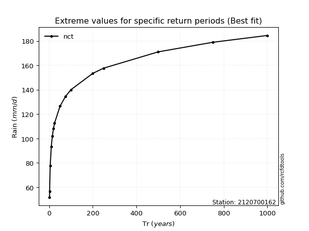</img>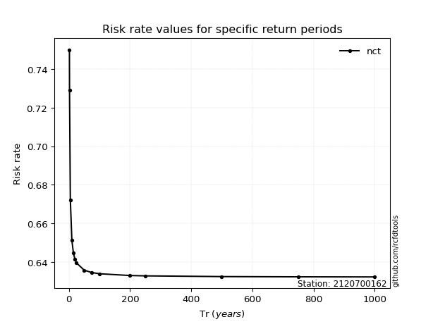</img>

</div>


<sub>**APP DISCLAIMER**: NO WARRANTY - This software is provided by [github.com/rcfdtools](https://github.com/rcfdtools) "as is", without any express or implied warranty, including warranties of merchantability, fitness for a particular purpose, or non-infringement. There is no guarantee that the software will be error-free or operate without interruption. LIMITATION OF LIABILITY - Neither the authors nor copyright holders will be liable for claims or damages arising from the software or its use. You are responsible for determining if the software is appropriate for your use and assume all associated risks, including errors, legal compliance, and data loss. NO PROFESSIONAL ADVICE - The software provides general information and does not offer professional advice. It should not replace consultation with professional advisors.</sub>