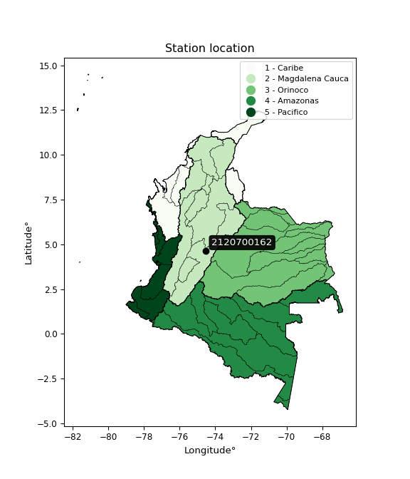

<div align="center">


</div>

# PMP Station (Rain, Pmax24h): 2120700162

Probable Maximum Precipitation (PMP) is the greatest amount of rainfall for a specific duration that is meteorologically possible for a given location, acting as a "worst-case" scenario for extreme storms, crucial for designing safety-critical infrastructure like bridges, river deviations, dams, spillways, and nuclear plants to prevent catastrophic failure. PMP is calculated by hydrologists using meteorological data to determine the upper limit of extreme rainfall, often leading to the Probable Maximum Flood (PMF) for flood control design, and is increasingly being studied for climate change impacts. Probable Maximum Precipitation (PMP) is the theoretical upper limit of rainfall, a deterministic estimate for extreme events, while probability distributions (like GEV, Gumbel) describe the likelihood and frequency of various precipitation amounts, including rare ones, showing how often events occur, with PMP representing the extreme end of these distributions, used for critical infrastructure design to ensure safety against the worst conceivable weather, unlike standard statistical forecasts which cover typical probabilities.

The most common probability distributions in hydrology, used for analyzing floods, rainfall, and streamflow, include the Normal, Log-Normal, Gumbel, Gamma (including Log-Pearson Type III), and Generalized Extreme Value (GEV) distributions, often chosen based on the data´s skewness and whether modeling extremes or general conditions, with Gumbel and GEV popular for extreme events like floods, while the Normal distribution serves as a baseline, though often requiring transformations for skewed hydrological data. These distributions help in designing water infrastructure, managing water resources, and forecasting hydrologic events.

> Hydrological data often isn´t perfectly normal (it´s skewed), so different distributions are needed for different applications, such as: **Flood Frequency Analysis**: Using Gumbel, GEV, or Log-Pearson Type III for predicting extreme flood magnitudes and their return periods, **Rainfall Analysis**: Normal for annual totals, but Log-Normal, Weibull, or GEV for intensity or extreme daily rainfall, **Streamflow Modeling**: Gamma and Log-Normal for maximum flows, GEV for minimum flows, and Kappa for daily flows.

<div align="center">

</img>

</div>


## A. General information


### 1. General running parameters

• app_version: _v20260113_. • runtime: _2026-01-17 18:24:04.630693_. • Python version: _3.14.0_. • SciPy version: _1.16.3_. • Pandas version: _2.3.3_. • NumPy version: _2.3.5_. • Stations dataset (station_dataset_file): _dataset/pmax24h_in/automatic_colombia_2003_2025.csv_. • Stations catalog (station_catalog_file): _dataset/CNE.xls_. • Minimum year to eval til year_max (date_min): _1900_. • Maximum year to eval since year_min (date_max): _2025_. • Creates, save and include plots into reports (create_plot): _False_. • Plot only fit distributions with Δo > Δ (plot_only_fit): _True_. • Plot only simple graphs avoiding multiple CDFs and multiple Extreme values plots (plot_only_simple): _True_. • Eval low extreme values, if False, evaluates high extreme values (low_extreme): _False_. • Eval every SciPy distribution as logarithmic (pdist_logarithmic_on): _True_. • Standard deviation normalized (ddof): _1.0_. • Return periods to eval in years (Tr): _[2, 2.33, 5, 10, 15, 20, 25, 50, 75, 100, 200, 250, 500, 750, 1000]_. • Minimum data sample per station, 0 means any (minimum_sample): _5_. • Z-Score maximum threshold to adjust a value, 0 means disable (zscore_max): _3.5_. • Z-Score minimum threshold to adjust a value, 0 means disable (zscore_min): _-2.5_. • Avoid zeros, e.g. rain = 0 (avoid_zeros): _True_. • Avoid null values (avoid_nans): _True_. 

:file_folder:Table: [dataset.csv](../../dataset/pmax24h_in/automatic_colombia_2003_2025.csv)

> Delta Degrees of Freedom (DDOF): is a parameter used in the formulas for calculating variance and standard deviation. When ddof=0, the divisor is $N$ (the total number of observations) and this is used when your data set is the entire population. When ddof=1, the divisor is $N-1$ and this is used when your data set is a sample drawn from a larger population. Using $N-1$ provides an unbiased estimate of the population variance (known as Bessel´s correction).


### 2. Station info and location

|   id |     CODIGO | NOMBRE                   | CATEGORIA    | TECNOLOGIA                              | ESTADO           | FECHA_INSTALACION   |   FECHA_SUSPENSION |   ALTITUD |   LATITUD |   LONGITUD | DEPARTAMENTO   | MUNICIPIO   | AREA_OPERATIVA                            | ENTIDAD                                                     | AREA_HIDROGRAFICA   | ZONA_HIDROGRAFICA   | SUBZONA_HIDROGRAFICA   | CORRIENTE   | Catalogo   |   Version |
|-----:|-----------:|:-------------------------|:-------------|:----------------------------------------|:-----------------|:--------------------|-------------------:|----------:|----------:|-----------:|:---------------|:------------|:------------------------------------------|:------------------------------------------------------------|:--------------------|:--------------------|:-----------------------|:------------|:-----------|----------:|
|    0 | 2120700162 | SAN JOAQUIN [2120700162] | Limnigráfica | Automática con Telemetría, Convencional | En Mantenimiento | 06/03/2018          |                nan |       614 |   4.63814 |   -74.5201 | Cundinamarca   | La Mesa     | Area Operativa 11 - Cundinamarca-Amazonas | INSTITUTO DE HIDROLOGIA METEOROLOGIA Y ESTUDIOS AMBIENTALES | Magdalena Cauca     | Alto Magdalena      | Río Bogotá             | Apulo       | CNE_IDEAM  |  20251226 |

<div align="center">

Dynamic map: [:earth_americas:Google](http://maps.google.com/maps?q=4.63814,-74.52008) [:earth_americas:OSM](https://www.openstreetmap.org/#map=18/4.63814/-74.52008&layers=P) [:earth_americas:Bing](https://www.bing.com/maps?cp=4.63814~-74.52008&lvl=18) [:earth_americas:Apple](https://maps.apple.com/frame?center=4.63814%2C-74.52008&span=0.003%2C0.006)

</div>


<div align="center">

```geojson
{
  "type": "Feature",
  "geometry": {
    "type": "Point", 
    "coordinates": [-74.52008, 4.63814]
  }, 
  "properties": {
    "Name": "2120700162"
  }
}
```

</div>


### 3. Discrete values table and plot

<div align="center">

|               |           0 |            1 |          2 |           3 |          4 |           5 |
|:--------------|------------:|-------------:|-----------:|------------:|-----------:|------------:|
| Date          | 2019        | 2020         | 2021       | 2022        | 2023       | 2025        |
| Value         |   34        |   57.8       |  104.4     |   74.2      |   15       |   45.4      |
| Value_initial |   34        |   57.8       |  104.4     |   74.2      |   15       |   45.4      |
| count         |    6        |    6         |    6       |    6        |    6       |    6        |
| mean          |   55.1333   |   55.1333    |   55.1333  |   55.1333   |   55.1333  |   55.1333   |
| std           |   31.4639   |   31.4639    |   31.4639  |   31.4639   |   31.4639  |   31.4639   |
| zscore        |   -0.671669 |    0.0847531 |    1.56581 |    0.605985 |   -1.27553 |   -0.309349 |


</div>


> The initial value (value_initial) correspond to the initial obtained or null completed value, and value (value) is adjusted only when the initial value is outside the valid range (outlier) definite through the Z-Score value. If Z-Score is active, values out of range or outliers are replaced with the station mean value. A Z-Score (or standard score) measures how many standard deviations a data point is from the mean of a dataset, indicating its relative position; positive scores mean above the mean, negative mean below, and a score of zero is exactly at the mean, allowing for comparison of values from different distributions. It´s calculated using the formula $z=(x–μ)/σ$, where $x$ is the data point, $μ$ is the mean, and $σ$ is the standard deviation, helping identify outliers and understand probability.
>
> <sub>**Note**: In this study, "completing" (filling gaps in) and "extending" (forecasting or lengthening the historical record) rainfall data series are avoided for certain critical analyses because they introduce artificial bias and uncertainty, which can distort the statistics of rare events (extremes), alter day-to-day variability, and compromise the integrity and homogeneity of the original data. Some reasons against Completing/Extending rainfall data are: **Distortion of Extremes and Variability**: The primary issue is that most gap-filling or extension methods rely on averaging or regression with nearby stations, which inherently smooths the data. Rainfall is highly variable in space and time, with a large percentage of zero values and occasional large storms. Infilling methods often underestimate the highest values and overestimate the lowest (zero) values, which severely distorts analyses focused on flood frequency, drought severity, and intensity-duration-frequency (IDF) curves, **Loss of Data Homogeneity**: Infilled or extended data are synthetic estimates, not actual measurements. Combining these estimates with observed data can violate the assumption of data homogeneity, which requires that the data properties do not change over time. Inhomogeneity can lead to incorrect conclusions about long-term trends or changes in climate patterns, **Propagation of Errors**: Errors and biases from the original data (e.g., wind-induced undercatch, instrument errors, site changes) or the data used for imputation can propagate through the analysis, leading to unreliable hydrological models and inaccurate predictions, **Compromised Statistical Integrity**: For statistical analyses, especially those involving the frequency of events, using artificial data can introduce time bias or autocorrelation that doesn´t exist in reality, making it difficult to assess the true probability of events, **Difficulty in Validation**: It is difficult to accurately validate the quality of filled or extended data, especially for past periods where ground-truth measurements are unavailable. The reliability of imputation techniques heavily depends on the density of the surrounding station network and the complexity of the local topography.</sub>


### 4. Active continuous probability distributions from SciPy (80 of 104 available)

A Probability Density Function (PDF) describes the relative likelihood of a continuous random variable falling within a specific range, where the total area under its curve equals 1, and the area over any interval gives the actual probability for that range. Unlike discrete probabilities (like rolling a die), a PDF shows density, not direct probability for a single point (which is zero), with higher points indicating higher likelihood, often visualized as a bell curve for normal distributions.

A log of a probability density function (log-PDF) is simply the logarithm of the PDF´s value, denoted as $log(f(x))$, useful for converting multiplication of probabilities into addition, improving numerical stability with tiny numbers, and connecting to information theory concepts like entropy. Instead of dealing with very small probabilities (e.g., 0.000001), log-PDFs use negative numbers (e.g., $log(0.00001) ≈ -11.51$ that are easier for computers to handle, preventing underflow errors and simplifying complex calculations. In this study, each active probability distribution from SciPy is also evaluated in the $log$ form.

[scipy.stats](https://docs.scipy.org/doc/scipy/reference/stats.html) is a Python´s powerful submodule within the SciPy library for comprehensive statistical analysis, offering over 130 probability distributions (like Normal, Poisson), functions for descriptive stats (mean, variance), hypothesis testing (t-tests, chi-square), random variable generation, and statistical tests, making it essential for data science, modeling, and research. It provides tools to explore, model, and draw conclusions from data efficiently, working seamlessly with NumPy.

<div align="center">

|   id | p_dist           |   n_parameter | fit_method   | label                                                                       | active   | ref                                                                                                      |
|-----:|:-----------------|--------------:|:-------------|:----------------------------------------------------------------------------|:---------|:---------------------------------------------------------------------------------------------------------|
|    0 | alpha            |             3 | MLE          | Alpha                                                                       | True     | [:mortar_board:](https://docs.scipy.org/doc/scipy/reference/generated/scipy.stats.alpha.html)            |
|    1 | anglit           |             2 | MM           | Anglit                                                                      | True     | [:mortar_board:](https://docs.scipy.org/doc/scipy/reference/generated/scipy.stats.anglit.html)           |
|    2 | arcsine          |             2 | MM           | Arcsine                                                                     | True     | [:mortar_board:](https://docs.scipy.org/doc/scipy/reference/generated/scipy.stats.arcsine.html)          |
|    3 | argus            |             3 | MLE          | Argus                                                                       | True     | [:mortar_board:](https://docs.scipy.org/doc/scipy/reference/generated/scipy.stats.argus.html)            |
|    4 | beta             |             4 | MLE          | Beta                                                                        | True     | [:mortar_board:](https://docs.scipy.org/doc/scipy/reference/generated/scipy.stats.beta.html)             |
|    5 | betaprime        |             4 | MLE          | Beta prime                                                                  | True     | [:mortar_board:](https://docs.scipy.org/doc/scipy/reference/generated/scipy.stats.betaprime.html)        |
|    6 | bradford         |             3 | MLE          | Bradford                                                                    | True     | [:mortar_board:](https://docs.scipy.org/doc/scipy/reference/generated/scipy.stats.bradford.html)         |
|    7 | burr             |             4 | MLE          | Burr (Type III)                                                             | True     | [:mortar_board:](https://docs.scipy.org/doc/scipy/reference/generated/scipy.stats.burr.html)             |
|    8 | burr12           |             4 | MLE          | Burr (Type III) 12                                                          | True     | [:mortar_board:](https://docs.scipy.org/doc/scipy/reference/generated/scipy.stats.burr12.html)           |
|    9 | cosine           |             2 | MLE          | Cosine                                                                      | True     | [:mortar_board:](https://docs.scipy.org/doc/scipy/reference/generated/scipy.stats.cosine.html)           |
|   10 | crystalball      |             4 | MLE          | Crystalball                                                                 | True     | [:mortar_board:](https://docs.scipy.org/doc/scipy/reference/generated/scipy.stats.crystalball.html)      |
|   11 | dgamma           |             3 | MLE          | Double gamma                                                                | True     | [:mortar_board:](https://docs.scipy.org/doc/scipy/reference/generated/scipy.stats.dgamma.html)           |
|   12 | dweibull         |             3 | MLE          | Double Weibull                                                              | True     | [:mortar_board:](https://docs.scipy.org/doc/scipy/reference/generated/scipy.stats.dweibull.html)         |
|   13 | erlang           |             3 | MLE          | Erlang                                                                      | True     | [:mortar_board:](https://docs.scipy.org/doc/scipy/reference/generated/scipy.stats.erlang.html)           |
|   14 | exponnorm        |             3 | MLE          | Exponentially modified Normal                                               | True     | [:mortar_board:](https://docs.scipy.org/doc/scipy/reference/generated/scipy.stats.exponnorm.html)        |
|   15 | exponpow         |             3 | MLE          | Exponential power                                                           | True     | [:mortar_board:](https://docs.scipy.org/doc/scipy/reference/generated/scipy.stats.exponpow.html)         |
|   16 | exponweib        |             4 | MLE          | Exponentiated Weibull                                                       | True     | [:mortar_board:](https://docs.scipy.org/doc/scipy/reference/generated/scipy.stats.exponweib.html)        |
|   17 | f                |             4 | MLE          | F                                                                           | True     | [:mortar_board:](https://docs.scipy.org/doc/scipy/reference/generated/scipy.stats.f.html)                |
|   18 | fatiguelife      |             3 | MLE          | Fatigue-life (Birnbaum-Saunders)                                            | True     | [:mortar_board:](https://docs.scipy.org/doc/scipy/reference/generated/scipy.stats.fatiguelife.html)      |
|   19 | foldnorm         |             3 | MM           | Fold Normal                                                                 | True     | [:mortar_board:](https://docs.scipy.org/doc/scipy/reference/generated/scipy.stats.foldnorm.html)         |
|   20 | gamma            |             3 | MLE          | Gamma                                                                       | True     | [:mortar_board:](https://docs.scipy.org/doc/scipy/reference/generated/scipy.stats.gamma.html)            |
|   21 | gausshyper       |             6 | MLE          | Gauss hypergeometric                                                        | True     | [:mortar_board:](https://docs.scipy.org/doc/scipy/reference/generated/scipy.stats.gausshyper.html)       |
|   22 | genexpon         |             5 | MLE          | Generalized exponential                                                     | True     | [:mortar_board:](https://docs.scipy.org/doc/scipy/reference/generated/scipy.stats.genexpon.html)         |
|   23 | genextreme       |             3 | MLE          | Generalized exponential                                                     | True     | [:mortar_board:](https://docs.scipy.org/doc/scipy/reference/generated/scipy.stats.genextreme.html)       |
|   24 | gengamma         |             4 | MLE          | Generalized gamma                                                           | True     | [:mortar_board:](https://docs.scipy.org/doc/scipy/reference/generated/scipy.stats.gengamma.html)         |
|   25 | genhalflogistic  |             3 | MLE          | Generalized half-logistic                                                   | True     | [:mortar_board:](https://docs.scipy.org/doc/scipy/reference/generated/scipy.stats.genhalflogistic.html)  |
|   26 | genlogistic      |             3 | MLE          | Generalized logistic                                                        | True     | [:mortar_board:](https://docs.scipy.org/doc/scipy/reference/generated/scipy.stats.genlogistic.html)      |
|   27 | gennorm          |             3 | MLE          | Generalized Normal                                                          | True     | [:mortar_board:](https://docs.scipy.org/doc/scipy/reference/generated/scipy.stats.gennorm.html)          |
|   28 | genpareto        |             3 | MLE          | Generalized Pareto                                                          | True     | [:mortar_board:](https://docs.scipy.org/doc/scipy/reference/generated/scipy.stats.genpareto.html)        |
|   29 | gompertz         |             3 | MLE          | Gompertz (or truncated Gumbel)                                              | True     | [:mortar_board:](https://docs.scipy.org/doc/scipy/reference/generated/scipy.stats.gompertz.html)         |
|   30 | gumbel_l         |             2 | MM           | Gumbel Left Skew                                                            | True     | [:mortar_board:](https://docs.scipy.org/doc/scipy/reference/generated/scipy.stats.gumbel_l.html)         |
|   31 | gumbel_r         |             2 | MM           | Gumbel Right Skew                                                           | True     | [:mortar_board:](https://docs.scipy.org/doc/scipy/reference/generated/scipy.stats.gumbel_r.html)         |
|   32 | halfgennorm      |             3 | MLE          | Upper half of a generalized normal                                          | True     | [:mortar_board:](https://docs.scipy.org/doc/scipy/reference/generated/scipy.stats.halfgennorm.html)      |
|   33 | halflogistic     |             2 | MM           | Half-logistic                                                               | True     | [:mortar_board:](https://docs.scipy.org/doc/scipy/reference/generated/scipy.stats.halflogistic.html)     |
|   34 | halfnorm         |             2 | MM           | Half Normal                                                                 | True     | [:mortar_board:](https://docs.scipy.org/doc/scipy/reference/generated/scipy.stats.halfnorm.html)         |
|   35 | hypsecant        |             2 | MM           | hyperbolic secant                                                           | True     | [:mortar_board:](https://docs.scipy.org/doc/scipy/reference/generated/scipy.stats.hypsecant.html)        |
|   36 | invgamma         |             3 | MLE          | Inverted gamma                                                              | True     | [:mortar_board:](https://docs.scipy.org/doc/scipy/reference/generated/scipy.stats.invgamma.html)         |
|   37 | invgauss         |             3 | MLE          | Inverse Gaussian                                                            | True     | [:mortar_board:](https://docs.scipy.org/doc/scipy/reference/generated/scipy.stats.invgauss.html)         |
|   38 | invweibull       |             3 | MLE          | Inverted Weibull                                                            | True     | [:mortar_board:](https://docs.scipy.org/doc/scipy/reference/generated/scipy.stats.invweibull.html)       |
|   39 | johnsonsb        |             4 | MLE          | Johnson SB                                                                  | True     | [:mortar_board:](https://docs.scipy.org/doc/scipy/reference/generated/scipy.stats.johnsonsb.html)        |
|   40 | johnsonsu        |             4 | MLE          | Johnson Su                                                                  | True     | [:mortar_board:](https://docs.scipy.org/doc/scipy/reference/generated/scipy.stats.johnsonsu.html)        |
|   41 | kappa3           |             3 | MLE          | Kappa 3                                                                     | True     | [:mortar_board:](https://docs.scipy.org/doc/scipy/reference/generated/scipy.stats.kappa3.html)           |
|   42 | kappa4           |             4 | MLE          | Kappa 4                                                                     | True     | [:mortar_board:](https://docs.scipy.org/doc/scipy/reference/generated/scipy.stats.kappa4.html)           |
|   43 | ksone            |             3 | MLE          | Kolmogorov-Smirnov one-sided test statistic distribution                    | True     | [:mortar_board:](https://docs.scipy.org/doc/scipy/reference/generated/scipy.stats.ksone.html)            |
|   44 | kstwobign        |             2 | MLE          | Limiting distribution of scaled Kolmogorov-Smirnov two-sided test statistic | True     | [:mortar_board:](https://docs.scipy.org/doc/scipy/reference/generated/scipy.stats.kstwobign.html)        |
|   45 | laplace          |             2 | MM           | Laplace                                                                     | True     | [:mortar_board:](https://docs.scipy.org/doc/scipy/reference/generated/scipy.stats.laplace.html)          |
|   46 | levy_l           |             2 | MLE          | Left-skewed Levy                                                            | True     | [:mortar_board:](https://docs.scipy.org/doc/scipy/reference/generated/scipy.stats.levy_l.html)           |
|   47 | loggamma         |             3 | MLE          | Log gamma                                                                   | True     | [:mortar_board:](https://docs.scipy.org/doc/scipy/reference/generated/scipy.stats.loggamma.html)         |
|   48 | logistic         |             2 | MM           | Logistic (or Sech-squared)                                                  | True     | [:mortar_board:](https://docs.scipy.org/doc/scipy/reference/generated/scipy.stats.logistic.html)         |
|   49 | loglaplace       |             3 | MLE          | Log-Laplace                                                                 | True     | [:mortar_board:](https://docs.scipy.org/doc/scipy/reference/generated/scipy.stats.loglaplace.html)       |
|   50 | lomax            |             3 | MLE          | Lomax (Pareto of the second kind)                                           | True     | [:mortar_board:](https://docs.scipy.org/doc/scipy/reference/generated/scipy.stats.lomax.html)            |
|   51 | maxwell          |             2 | MM           | Maxwell                                                                     | True     | [:mortar_board:](https://docs.scipy.org/doc/scipy/reference/generated/scipy.stats.maxwell.html)          |
|   52 | mielke           |             4 | MLE          | Mielke Beta-Kappa / Dagum                                                   | True     | [:mortar_board:](https://docs.scipy.org/doc/scipy/reference/generated/scipy.stats.mielke.html)           |
|   53 | moyal            |             2 | MM           | Moyal                                                                       | True     | [:mortar_board:](https://docs.scipy.org/doc/scipy/reference/generated/scipy.stats.moyal.html)            |
|   54 | nakagami         |             3 | MLE          | Nakagami                                                                    | True     | [:mortar_board:](https://docs.scipy.org/doc/scipy/reference/generated/scipy.stats.nakagami.html)         |
|   55 | ncf              |             5 | MLE          | Non-central F distribution                                                  | True     | [:mortar_board:](https://docs.scipy.org/doc/scipy/reference/generated/scipy.stats.ncf.html)              |
|   56 | nct              |             4 | MLE          | Non-central Student’s t                                                     | True     | [:mortar_board:](https://docs.scipy.org/doc/scipy/reference/generated/scipy.stats.nct.html)              |
|   57 | norm             |             2 | MM           | Normal                                                                      | True     | [:mortar_board:](https://docs.scipy.org/doc/scipy/reference/generated/scipy.stats.norm.html)             |
|   58 | pearson3         |             3 | MM           | Pearson type III                                                            | True     | [:mortar_board:](https://docs.scipy.org/doc/scipy/reference/generated/scipy.stats.pearson3.html)         |
|   59 | powerlaw         |             3 | MLE          | Power-function                                                              | True     | [:mortar_board:](https://docs.scipy.org/doc/scipy/reference/generated/scipy.stats.powerlaw.html)         |
|   60 | rayleigh         |             2 | MM           | Rayleigh                                                                    | True     | [:mortar_board:](https://docs.scipy.org/doc/scipy/reference/generated/scipy.stats.rayleigh.html)         |
|   61 | rdist            |             3 | MLE          | R-distributed (symmetric beta)                                              | True     | [:mortar_board:](https://docs.scipy.org/doc/scipy/reference/generated/scipy.stats.rdist.html)            |
|   62 | rice             |             3 | MLE          | Rice                                                                        | True     | [:mortar_board:](https://docs.scipy.org/doc/scipy/reference/generated/scipy.stats.rice.html)             |
|   63 | semicircular     |             2 | MM           | Semicircular                                                                | True     | [:mortar_board:](https://docs.scipy.org/doc/scipy/reference/generated/scipy.stats.semicircular.html)     |
|   64 | skewnorm         |             3 | MLE          | Skew normal                                                                 | True     | [:mortar_board:](https://docs.scipy.org/doc/scipy/reference/generated/scipy.stats.skewnorm.html)         |
|   65 | t                |             3 | MLE          | Student’s t                                                                 | True     | [:mortar_board:](https://docs.scipy.org/doc/scipy/reference/generated/scipy.stats.t.html)                |
|   66 | trapezoid        |             4 | MLE          | Trapezoid                                                                   | True     | [:mortar_board:](https://docs.scipy.org/doc/scipy/reference/generated/scipy.stats.trapezoid.html)        |
|   67 | triang           |             3 | MLE          | Triangular                                                                  | True     | [:mortar_board:](https://docs.scipy.org/doc/scipy/reference/generated/scipy.stats.triang.html)           |
|   68 | truncexpon       |             3 | MLE          | Truncated exponential                                                       | True     | [:mortar_board:](https://docs.scipy.org/doc/scipy/reference/generated/scipy.stats.truncexpon.html)       |
|   69 | truncnorm        |             4 | MLE          | Truncated normal                                                            | True     | [:mortar_board:](https://docs.scipy.org/doc/scipy/reference/generated/scipy.stats.truncnorm.html)        |
|   70 | truncpareto      |             4 | MLE          | Upper truncated Pareto                                                      | True     | [:mortar_board:](https://docs.scipy.org/doc/scipy/reference/generated/scipy.stats.truncpareto.html)      |
|   71 | truncweibull_min |             5 | MLE          | Doubly truncated Weibull minimum                                            | True     | [:mortar_board:](https://docs.scipy.org/doc/scipy/reference/generated/scipy.stats.truncweibull_min.html) |
|   72 | tukeylambda      |             3 | MLE          | Tukey-Lamdba                                                                | True     | [:mortar_board:](https://docs.scipy.org/doc/scipy/reference/generated/scipy.stats.tukeylambda.html)      |
|   73 | uniform          |             2 | MLE          | Uniform                                                                     | True     | [:mortar_board:](https://docs.scipy.org/doc/scipy/reference/generated/scipy.stats.uniform.html)          |
|   74 | vonmises         |             3 | MLE          | Von Mises                                                                   | True     | [:mortar_board:](https://docs.scipy.org/doc/scipy/reference/generated/scipy.stats.vonmises.html)         |
|   75 | vonmises_line    |             3 | MLE          | Von Mises line                                                              | True     | [:mortar_board:](https://docs.scipy.org/doc/scipy/reference/generated/scipy.stats.vonmises_line.html)    |
|   76 | wald             |             2 | MM           | Wald                                                                        | True     | [:mortar_board:](https://docs.scipy.org/doc/scipy/reference/generated/scipy.stats.wald.html)             |
|   77 | weibull_max      |             3 | MLE          | Weibull maximum                                                             | True     | [:mortar_board:](https://docs.scipy.org/doc/scipy/reference/generated/scipy.stats.weibull_max.html)      |
|   78 | weibull_min      |             3 | MLE          | Weibull minimum                                                             | True     | [:mortar_board:](https://docs.scipy.org/doc/scipy/reference/generated/scipy.stats.weibull_min.html)      |
|   79 | wrapcauchy       |             3 | MLE          | Wrapped  Cauchy                                                             | True     | [:mortar_board:](https://docs.scipy.org/doc/scipy/reference/generated/scipy.stats.wrapcauchy.html)       |

</div>

> **n_parameter:** # arguments & localization & scale.
>
> **Fit methods:** (MLE) maximum likelihood, (MM) L-moments.
>
>**Inactive** (With the only purpose of prevent loops, zero divisions, infinite values, over high estimated values or horizontal trending for recurrence intervals estimations, the follow distributions were disabled.)**:** lognorm, norminvgauss, powernorm, powerlognorm, cauchy, halfcauchy, foldcauchy, skewcauchy, chi2, expon, fisk, genhyperbolic, geninvgauss, gibrat, kstwo, laplace_asymmetric, levy, levy_stable, ncx2, pareto, rel_breitwigner, recipinvgauss, studentized_range, loguniform, 


## B. Probability (PDF) vs. Empirical (EDF) distributions functions

A continuous probability distribution (CPD) describes probabilities for variables that can take any value within a range (like rain any time), unlike discrete variables with specific outcomes (like temperature). It uses a Probability Density Function (PDF), a curve where the total area under it equals 1, and the probability of the variable falling within an interval (a to b) is found by calculating the area under the curve between those points. A key feature is that the probability of hitting any single exact value is zero, so probabilities are always expressed for ranges, e.g., $P(a ≤ X ≤ b)$.

<div align="center">

Distributions parameters from station values
|     |    station | p_dist              |   n |             loc |          scale | shape                  | shape1                | shape2                 | shape3             |
|----:|-----------:|:--------------------|----:|----------------:|---------------:|:-----------------------|:----------------------|:-----------------------|:-------------------|
|   0 | 2120700162 | alpha               |   6 |  -192.842       | 2157.42        | 8.815169164889692      |                       |                        |                    |
|   1 | 2120700162 | anglit              |   6 |    55.1333      |   84.0248      |                        |                       |                        |                    |
|   2 | 2120700162 | arcsine             |   6 |    14.5136      |   81.2395      |                        |                       |                        |                    |
|   3 | 2120700162 | argus               |   6 |    -9.62351     |  119.536       | 5.013319733199824e-07  |                       |                        |                    |
|   4 | 2120700162 | beta                |   6 |    14.9342      |   89.4658      | 0.9301098106860455     | 0.7333120643027504    |                        |                    |
|   5 | 2120700162 | betaprime           |   6 |   -12.7757      | 6883.27        | 5.398713699227095      | 551.6146138940146     |                        |                    |
|   6 | 2120700162 | bradford            |   6 |    15           |   89.4         | 0.9813061766941169     |                       |                        |                    |
|   7 | 2120700162 | burr                |   6 |    15           |  104.481       | 5.910397896236775      | 0.09267046128421408   |                        |                    |
|   8 | 2120700162 | burr12              |   6 |    -2.15202     |   16.9665      | 386.2988454370601      | 0.0024261593775207644 |                        |                    |
|   9 | 2120700162 | cosine              |   6 |    56.7366      |   23.9756      |                        |                       |                        |                    |
|  10 | 2120700162 | crystalball         |   6 |    -0.0759105   |   62.2349      | 5.185937698344468      | 1.1725998156334674    |                        |                    |
|  11 | 2120700162 | dgamma              |   6 |    51.9584      |   12.8954      | 1.8352827613939868     |                       |                        |                    |
|  12 | 2120700162 | dweibull            |   6 |    52.3692      |   26.1727      | 1.4496978453948817     |                       |                        |                    |
|  13 | 2120700162 | erlang              |   6 |    15           |   42.1412      | 0.35299879075626317    |                       |                        |                    |
|  14 | 2120700162 | exponnorm           |   6 |    32.0306      |   19.4686      | 1.1866651686087892     |                       |                        |                    |
|  15 | 2120700162 | exponpow            |   6 |    15           |   85.3638      | 0.5787290824793581     |                       |                        |                    |
|  16 | 2120700162 | exponweib           |   6 |    15           |    4.47279     | 1.9438006174348985     | 0.389658392262645     |                        |                    |
|  17 | 2120700162 | f                   |   6 |    -3.06851     |   58.0271      | 7.337491245787004      | 587.8529382410104     |                        |                    |
|  18 | 2120700162 | fatiguelife         |   6 |    15           |    1.52519e-05 | 1545.3133688410353     |                       |                        |                    |
|  19 | 2120700162 | foldnorm            |   6 |     4.23325     |   31.2787      | 1.578403415603036      |                       |                        |                    |
|  20 | 2120700162 | gamma               |   6 |    15           |   35.2967      | 0.8978900921338813     |                       |                        |                    |
|  21 | 2120700162 | gausshyper          |   6 |    14.7131      |   89.6869      | 1.0241308285087483     | 0.8430120696849321    | 0.9207593909907361     | 0.8461980048955664 |
|  22 | 2120700162 | genexpon            |   6 |    11.3527      |    2.21393     | 6.388928493834615e-10  | 0.053313610906312175  | 0.910508090481115      |                    |
|  23 | 2120700162 | genextreme          |   6 |    16.5482      |   12.1689      | -7.8598054764158745    |                       |                        |                    |
|  24 | 2120700162 | gengamma            |   6 |    15           |    0.53025     | 2.3425571981606463     | 0.28409492491123095   |                        |                    |
|  25 | 2120700162 | genhalflogistic     |   6 |     6.17049     |  102.381       | 1.0422659602885438     |                       |                        |                    |
|  26 | 2120700162 | genlogistic         |   6 |  -102.745       |   24.2673      | 379.71767173933756     |                       |                        |                    |
|  27 | 2120700162 | gennorm             |   6 |    59.7         |   44.7001      | 8591178.848237095      |                       |                        |                    |
|  28 | 2120700162 | genpareto           |   6 |    -0.908671    |  168.718       | -1.6021278781682264    |                       |                        |                    |
|  29 | 2120700162 | gompertz            |   6 |    15           |   66.6731      | 0.9813478038500256     |                       |                        |                    |
|  30 | 2120700162 | gumbel_l            |   6 |    68.06        |   22.3948      |                        |                       |                        |                    |
|  31 | 2120700162 | gumbel_r            |   6 |    42.2067      |   22.3948      |                        |                       |                        |                    |
|  32 | 2120700162 | halfgennorm         |   6 |    15           |    0.518877    | 0.3050870314113765     |                       |                        |                    |
|  33 | 2120700162 | halflogistic        |   6 |    21.0905      |   24.5567      |                        |                       |                        |                    |
|  34 | 2120700162 | halfnorm            |   6 |    17.116       |   47.6477      |                        |                       |                        |                    |
|  35 | 2120700162 | hypsecant           |   6 |    55.1333      |   18.2853      |                        |                       |                        |                    |
|  36 | 2120700162 | invgamma            |   6 |   -93.548       | 3925.73        | 27.39507611435031      |                       |                        |                    |
|  37 | 2120700162 | invgauss            |   6 |   -41.8462      | 1023.97        | 0.0947092678479173     |                       |                        |                    |
|  38 | 2120700162 | invweibull          |   6 |    15           |    4.14022e-07 | 0.09090424138317155    |                       |                        |                    |
|  39 | 2120700162 | johnsonsb           |   6 |     7.45113     |   96.9489      | -0.6901351986874308    | 0.12613626823245366   |                        |                    |
|  40 | 2120700162 | johnsonsu           |   6 |   -45.6892      |   11.25        | -9.920229441359531     | 3.4824880980635857    |                        |                    |
|  41 | 2120700162 | kappa3              |   6 |    15           |   89.3756      | 3211.143353498406      |                       |                        |                    |
|  42 | 2120700162 | kappa4              |   6 |     5.2213      |   99.6786      | 1.108784420305298      | 1.0018342067259638    |                        |                    |
|  43 | 2120700162 | ksone               |   6 |     5.3845      |   99.4977      | 1.0                    |                       |                        |                    |
|  44 | 2120700162 | kstwobign           |   6 |   -43.8383      |  113.37        |                        |                       |                        |                    |
|  45 | 2120700162 | laplace             |   6 |    55.1333      |   20.3099      |                        |                       |                        |                    |
|  46 | 2120700162 | levy_l              |   6 |   109.516       |   21.2358      |                        |                       |                        |                    |
|  47 | 2120700162 | loggamma            |   6 | -9921.65        | 1310.86        | 2020.3765302030988     |                       |                        |                    |
|  48 | 2120700162 | logistic            |   6 |    55.1333      |   15.8355      |                        |                       |                        |                    |
|  49 | 2120700162 | loglaplace          |   6 |    -0.126766    |   45.5268      | 2.0323533717818916     |                       |                        |                    |
|  50 | 2120700162 | lomax               |   6 |    15           |    7.33077e+08 | 17318143.494834837     |                       |                        |                    |
|  51 | 2120700162 | maxwell             |   6 |   -12.9269      |   42.6505      |                        |                       |                        |                    |
|  52 | 2120700162 | mielke              |   6 |    -0.878729    |   81.5814      | 1.6530859873983463     | 5.543860125774638     |                        |                    |
|  53 | 2120700162 | moyal               |   6 |    38.708       |   12.9297      |                        |                       |                        |                    |
|  54 | 2120700162 | nakagami            |   6 |    34           |   36.282       | 0.341779717105163      |                       |                        |                    |
|  55 | 2120700162 | ncf                 |   6 |     0.0366688   |    7.84585e-06 | 3.591422806898479e-06  | 11.947820616054731    | 21.931472120506932     |                    |
|  56 | 2120700162 | nct                 |   6 |  -103.7         |   13.6903      | 21.365803150641504     | 11.177554152266158    |                        |                    |
|  57 | 2120700162 | norm                |   6 |    55.1333      |   28.7225      |                        |                       |                        |                    |
|  58 | 2120700162 | pearson3            |   6 |    55.1333      |   28.7225      | 0.36242913655333614    |                       |                        |                    |
|  59 | 2120700162 | powerlaw            |   6 |    15           |   89.4         | 0.14206740360186107    |                       |                        |                    |
|  60 | 2120700162 | rayleigh            |   6 |     0.185507    |   43.842       |                        |                       |                        |                    |
|  61 | 2120700162 | rdist               |   6 |     7.37572     |   50.4243      | 1.0501995653011917     |                       |                        |                    |
|  62 | 2120700162 | rice                |   6 |     2.08673     |   38.7395      | 0.6517229093129986     |                       |                        |                    |
|  63 | 2120700162 | semicircular        |   6 |    55.1333      |   57.445       |                        |                       |                        |                    |
|  64 | 2120700162 | skewnorm            |   6 |    15           |   49.3508      | 12777612.378683537     |                       |                        |                    |
|  65 | 2120700162 | t                   |   6 |    55.1337      |   28.7222      | 114517678.9436939      |                       |                        |                    |
|  66 | 2120700162 | trapezoid           |   6 |     6.06        |  107.28        | 1.0                    | 1.0                   |                        |                    |
|  67 | 2120700162 | triang              |   6 |   -17.4169      |  121.885       | 0.9994416567213813     |                       |                        |                    |
|  68 | 2120700162 | truncexpon          |   6 |    14.9943      |   90.8872      | 0.9836988767192869     |                       |                        |                    |
|  69 | 2120700162 | truncnorm           |   6 |    61.3019      |   33.0652      | -338.71845248260433    | 1.3034291349749316    |                        |                    |
|  70 | 2120700162 | truncpareto         |   6 |   -57.4652      |   72.4652      | 1.294374384117225e-09  | 2.233696088432793     |                        |                    |
|  71 | 2120700162 | truncweibull_min    |   6 |    14.8308      |  107.915       | 0.7805207119278297     | 0.0015254101785344206 | 0.8299969150916071     |                    |
|  72 | 2120700162 | tukeylambda         |   6 |    60.6486      |   48.1146      | 1.0540213740438529     |                       |                        |                    |
|  73 | 2120700162 | uniform             |   6 |    15           |   89.4         |                        |                       |                        |                    |
|  74 | 2120700162 | vonmises            |   6 |     2.35746     |    1           | 0.7696684249629899     |                       |                        |                    |
|  75 | 2120700162 | vonmises_line       |   6 |    58.4336      |   14.6316      | 0.10696154336470687    |                       |                        |                    |
|  76 | 2120700162 | wald                |   6 |    26.4109      |   28.7225      |                        |                       |                        |                    |
|  77 | 2120700162 | weibull_max         |   6 |   104.4         |    1.61358     | 0.29534997533276697    |                       |                        |                    |
|  78 | 2120700162 | weibull_min         |   6 |    11.2084      |   47.865       | 1.412775558269785      |                       |                        |                    |
|  79 | 2120700162 | wrapcauchy          |   6 |    14.8679      |   14.2495      | 0.04423022893675051    |                       |                        |                    |
|  80 | 2120700162 | logalpha            |   6 |    -9.67446     |  280.597       | 20.829993131579997     |                       |                        |                    |
|  81 | 2120700162 | loganglit           |   6 |     3.84365     |    1.81059     |                        |                       |                        |                    |
|  82 | 2120700162 | logarcsine          |   6 |     2.96836     |    1.75058     |                        |                       |                        |                    |
|  83 | 2120700162 | logargus            |   6 |     2.18394     |    2.54964     | 1.526151283680695      |                       |                        |                    |
|  84 | 2120700162 | logbeta             |   6 |     2.10604     |    2.54219     | 2.0728043846014836     | 0.8078515927625827    |                        |                    |
|  85 | 2120700162 | logbetaprime        |   6 |    -3.03151     |  128.57        | 112.61376222230376     | 2099.8829589615425    |                        |                    |
|  86 | 2120700162 | logbradford         |   6 |     2.70621     |    1.94202     | 5.1985761587584444e-05 |                       |                        |                    |
|  87 | 2120700162 | logburr             |   6 |    -3.09353     |    7.75674     | 1832.5048619701138     | 0.004710994112793451  |                        |                    |
|  88 | 2120700162 | logburr12           |   6 |   -90.2656      |   99.8128      | 191.23611151544193     | 42979.223232965975    |                        |                    |
|  89 | 2120700162 | logcosine           |   6 |     3.78589     |    0.523731    |                        |                       |                        |                    |
|  90 | 2120700162 | logcrystalball      |   6 |     3.84365     |    0.618925    | 21.728907899020236     | 8.383490936477033     |                        |                    |
|  91 | 2120700162 | logdgamma           |   6 |     3.93071     |    0.301074    | 1.6397277058158477     |                       |                        |                    |
|  92 | 2120700162 | logdweibull         |   6 |     3.92271     |    0.538637    | 1.32357655382357       |                       |                        |                    |
|  93 | 2120700162 | logerlang           |   6 |    -5.94731     |    0.0415891   | 235.2029090430242      |                       |                        |                    |
|  94 | 2120700162 | logexponnorm        |   6 |     3.84314     |    0.618922    | 0.0008216989748747348  |                       |                        |                    |
|  95 | 2120700162 | logexponpow         |   6 |     2.70805     |    1.37558     | 0.7088996726138841     |                       |                        |                    |
|  96 | 2120700162 | logexponweib        |   6 |     2.70805     |    1.10086     | 0.8490776502736014     | 1.1414054741623134    |                        |                    |
|  97 | 2120700162 | logf                |   6 |  -509.82        |  513.664       | 4893318.607768553      | 1897975.9187118877    |                        |                    |
|  98 | 2120700162 | logfatiguelife      |   6 |  -251.617       |  255.46        | 0.0024208274553314995  |                       |                        |                    |
|  99 | 2120700162 | logfoldnorm         |   6 |     0.641391    |    0.604514    | 5.299703524803419      |                       |                        |                    |
| 100 | 2120700162 | loggamma            |   6 |    -6.69577     |    0.0382062   | 275.701118849851       |                       |                        |                    |
| 101 | 2120700162 | loggausshyper       |   6 |     2.6438      |    2.00443     | 1.1352579139968273     | 0.876021540276641     | 1.0762741159326483     | 0.9740413637631532 |
| 102 | 2120700162 | loggenexpon         |   6 |     2.69332     |    0.00647779  | 0.0021095229852682897  | 2.5716033387782415    | 1.1974252103455215e-05 |                    |
| 103 | 2120700162 | loggenextreme       |   6 |     3.83582     |    0.889235    | 1.0945661543259129     |                       |                        |                    |
| 104 | 2120700162 | loggengamma         |   6 |     2.70805     |    1.22695     | 0.7376595363191001     | 0.8529102238553783    |                        |                    |
| 105 | 2120700162 | loggenhalflogistic  |   6 |     2.704       |    2.06429     | 1.0617556200960525     |                       |                        |                    |
| 106 | 2120700162 | loggenlogistic      |   6 |     4.40926     |    0.17667     | 0.2803074403406077     |                       |                        |                    |
| 107 | 2120700162 | loggennorm          |   6 |     3.67814     |    0.970095    | 3114445.933565786      |                       |                        |                    |
| 108 | 2120700162 | loggenpareto        |   6 |    -0.00384138  |    9.94539     | -2.1378413124114073    |                       |                        |                    |
| 109 | 2120700162 | loggompertz         |   6 |     2.70805     |    1.30047     | 0.6208626907136094     |                       |                        |                    |
| 110 | 2120700162 | loggumbel_l         |   6 |     4.1222      |    0.482572    |                        |                       |                        |                    |
| 111 | 2120700162 | loggumbel_r         |   6 |     3.5651      |    0.482572    |                        |                       |                        |                    |
| 112 | 2120700162 | loghalfgennorm      |   6 |     2.70805     |    1.97921     | 156.4051699194108      |                       |                        |                    |
| 113 | 2120700162 | loghalflogistic     |   6 |     3.11007     |    0.529168    |                        |                       |                        |                    |
| 114 | 2120700162 | loghalfnorm         |   6 |     3.02443     |    1.02674     |                        |                       |                        |                    |
| 115 | 2120700162 | loghypsecant        |   6 |     3.84365     |    0.394018    |                        |                       |                        |                    |
| 116 | 2120700162 | loginvgamma         |   6 |   -10.7135      | 7540.99        | 519.2398197965003      |                       |                        |                    |
| 117 | 2120700162 | loginvgauss         |   6 |    -1.78405     |  401.82        | 0.013981637233767854   |                       |                        |                    |
| 118 | 2120700162 | loginvweibull       |   6 |    -5.1471e+07  |    5.1471e+07  | 81090322.9398458       |                       |                        |                    |
| 119 | 2120700162 | logjohnsonsb        |   6 |     2.70805     |    1.94202     | 0.2067520228808126     | 0.12875939978796397   |                        |                    |
| 120 | 2120700162 | logjohnsonsu        |   6 |     5.29023     |    0.0560776   | 8.780572556314773      | 2.280594944808752     |                        |                    |
| 121 | 2120700162 | logkappa3           |   6 |     2.70799     |    1.93996     | 14908.132677720449     |                       |                        |                    |
| 122 | 2120700162 | logkappa4           |   6 |     2.63451     |    2.13559     | 1.0356089770907666     | 1.060516856137614     |                        |                    |
| 123 | 2120700162 | logksone            |   6 |     2.51403     |    2.32822     | 1.0                    |                       |                        |                    |
| 124 | 2120700162 | logkstwobign        |   6 |     1.22311     |    2.99317     |                        |                       |                        |                    |
| 125 | 2120700162 | loglaplace          |   6 |     3.84365     |    0.437644    |                        |                       |                        |                    |
| 126 | 2120700162 | loglevy_l           |   6 |     4.71878     |    0.291894    |                        |                       |                        |                    |
| 127 | 2120700162 | logloggamma         |   6 |     4.36468     |    0.364619    | 0.632039573438145      |                       |                        |                    |
| 128 | 2120700162 | loglogistic         |   6 |     3.84365     |    0.34123     |                        |                       |                        |                    |
| 129 | 2120700162 | logloglaplace       |   6 |  -114.633       |  118.45        | 226.82694563644384     |                       |                        |                    |
| 130 | 2120700162 | loglomax            |   6 |     2.70805     |    7.9862      | 7.116838952532385      |                       |                        |                    |
| 131 | 2120700162 | logmaxwell          |   6 |     2.37707     |    0.919046    |                        |                       |                        |                    |
| 132 | 2120700162 | logmielke           |   6 |     2.70805     |    1.95296     | 0.4722655298595959     | 223.61894569052907    |                        |                    |
| 133 | 2120700162 | logmoyal            |   6 |     3.48971     |    0.278613    |                        |                       |                        |                    |
| 134 | 2120700162 | lognakagami         |   6 |     3.52636     |    0.684599    | 0.31519134578032204    |                       |                        |                    |
| 135 | 2120700162 | logncf              |   6 |   -10.6507      |   14.4826      | 1749.7647971845854     | 2412.746087071472     | 0.024078758874329323   |                    |
| 136 | 2120700162 | lognct              |   6 |    67.4462      |    0.618188    | 1737231.6430234164     | -102.88529926774646   |                        |                    |
| 137 | 2120700162 | lognorm             |   6 |     3.84365     |    0.618922    |                        |                       |                        |                    |
| 138 | 2120700162 | logpearson3         |   6 |     3.84365     |    0.618922    | -0.6091985102859241    |                       |                        |                    |
| 139 | 2120700162 | logpowerlaw         |   6 |     2.70805     |    1.94018     | 0.15791828382732612    |                       |                        |                    |
| 140 | 2120700162 | lograyleigh         |   6 |     2.65962     |    0.944723    |                        |                       |                        |                    |
| 141 | 2120700162 | logrdist            |   6 |     3.50014     |    1.14809     | 1.0590296459216395     |                       |                        |                    |
| 142 | 2120700162 | logrice             |   6 |     2.29988     |    0.674091    | 2.021852861712688      |                       |                        |                    |
| 143 | 2120700162 | logsemicircular     |   6 |     3.84365     |    1.23784     |                        |                       |                        |                    |
| 144 | 2120700162 | logskewnorm         |   6 |     4.64823     |    1.01504     | -21329854.10869781     |                       |                        |                    |
| 145 | 2120700162 | logt                |   6 |     3.84365     |    0.618922    | 2714823770.9548745     |                       |                        |                    |
| 146 | 2120700162 | logtrapezoid        |   6 |     2.09307     |    2.62586     | 0.9999999999999999     | 1.0                   |                        |                    |
| 147 | 2120700162 | logtriang           |   6 |     2.23452     |    2.41372     | 0.999999668676657      |                       |                        |                    |
| 148 | 2120700162 | logtruncexpon       |   6 |     2.70804     |    2.23077     | 0.8697442657993026     |                       |                        |                    |
| 149 | 2120700162 | logtruncnorm        |   6 |    -0.169192    |    1.55476     | 2.3739208840272874     | 3.098490800626328     |                        |                    |
| 150 | 2120700162 | logtruncpareto      |   6 |     2.70446     |    0.00359337  | 0.20345493759010871    | 540.933522326683      |                        |                    |
| 151 | 2120700162 | logtruncweibull_min |   6 |     2.70513     |    2.31846     | 0.821135276329847      | 0.001257545590087615  | 0.8380965463563395     |                    |
| 152 | 2120700162 | logtukeylambda      |   6 |     3.67822     |    1.03705     | 1.068942599770942      |                       |                        |                    |
| 153 | 2120700162 | loguniform          |   6 |     2.70805     |    1.94018     |                        |                       |                        |                    |
| 154 | 2120700162 | logvonmises         |   6 |    -2.41279     |    1           | 3.1895250854426083     |                       |                        |                    |
| 155 | 2120700162 | logvonmises_line    |   6 |     3.67814     |    0.308791    | 0.04878154107577112    |                       |                        |                    |
| 156 | 2120700162 | logwald             |   6 |     3.22474     |    0.618922    |                        |                       |                        |                    |
| 157 | 2120700162 | logweibull_max      |   6 |     4.64823     |    0.78324     | 0.8444965213361499     |                       |                        |                    |
| 158 | 2120700162 | logweibull_min      |   6 |    -2.25897e+06 |    2.25897e+06 | 4579529.939765898      |                       |                        |                    |
| 159 | 2120700162 | logwrapcauchy       |   6 |     2.70805     |    0.308789    | 0.5                    |                       |                        |                    |

</div>

> **loc** (Location parameter): This shifts the distribution along the x-axis. For many common distributions, like the normal (Gaussian) distribution, loc represents the mean $μ$. For others, like the uniform distribution, it might represent the minimum value, or for the beta distribution, the left end of the support interval.
>
> **scale** (Scale parameter): This determines the width or spread of the distribution. For the normal distribution, scale represents the standard deviation $σ$. For a uniform distribution, it defines the length of the interval (from $loc$ to $loc + scale$).
>
> **shape** (Shape parameters): Refers to parameters that define the specific form of a probability distribution, distinct from its location (loc) and scale (scale). These parameters are required arguments for most distribution functions. For example, a normal (Gaussian) distribution is fully defined by its location (mean) and scale (standard deviation), so it has no specific shape parameters beyond loc and scale. However, other distributions have intrinsic properties that need specification, as Gamma distribution that takes a shape parameter, often named $a$ or $alpha$.


### 0. Cumulative distribution values - CDF (160 evaluated)

Cumulative Distribution Function (CDF), denoted as $F$<sub>$X$</sub>$(x)$, is a function that gives the probability that a random variable $X$ will take a value less than or equal to a specific value, $x$ (i.e., $(P(X≥x)$. It essentially "accumulates" probabilities from a given point up to the far right (positive infinity), providing a complete picture of the distribution´s probabilities for both discrete (like rain) and continuous (like temperature) variables, helping to find probabilities over ranges or above certain values. Each station is evaluated separately ordering the $x$ values ascending, calculating the CDF and PDF values for the activated distributions and their logarithmic forms.

<div align="center">

CDF ordered by x ascending and calculating $log(f(x))$ separately
|   id |    Station |   date |     x |   count |    mean |     std |     zscore |   Value_initial |    station |   m |    alpha |   alpha_pdf |    anglit |   anglit_pdf |   arcsine |   arcsine_pdf |     argus |   argus_pdf |        beta |     beta_pdf |   betaprime |   betaprime_pdf |    bradford |   bradford_pdf |        burr |   burr_pdf |    burr12 |   burr12_pdf |    cosine |   cosine_pdf |   crystalball |   crystalball_pdf |    dgamma |   dgamma_pdf |   dweibull |   dweibull_pdf |      erlang |   erlang_pdf |   exponnorm |   exponnorm_pdf |    exponpow |   exponpow_pdf |   exponweib |   exponweib_pdf |         f |      f_pdf |   fatiguelife |   fatiguelife_pdf |   foldnorm |   foldnorm_pdf |       gamma |   gamma_pdf |   gausshyper |   gausshyper_pdf |   genexpon |   genexpon_pdf |   genextreme |   genextreme_pdf |   gengamma |   gengamma_pdf |   genhalflogistic |   genhalflogistic_pdf |   genlogistic |   genlogistic_pdf |     gennorm |   gennorm_pdf |   genpareto |   genpareto_pdf |    gompertz |   gompertz_pdf |   gumbel_l |   gumbel_l_pdf |   gumbel_r |   gumbel_r_pdf |   halfgennorm |   halfgennorm_pdf |   halflogistic |   halflogistic_pdf |   halfnorm |   halfnorm_pdf |   hypsecant |   hypsecant_pdf |   invgamma |   invgamma_pdf |   invgauss |   invgauss_pdf |   invweibull |   invweibull_pdf |   johnsonsb |   johnsonsb_pdf |   johnsonsu |   johnsonsu_pdf |      kappa3 |   kappa3_pdf |      kappa4 |   kappa4_pdf |     ksone |   ksone_pdf |   kstwobign |   kstwobign_pdf |   laplace |   laplace_pdf |   levy_l |   levy_l_pdf |   loggamma |   loggamma_pdf |   logistic |   logistic_pdf |   loglaplace |   loglaplace_pdf |       lomax |   lomax_pdf |   maxwell |   maxwell_pdf |    mielke |   mielke_pdf |     moyal |   moyal_pdf |    nakagami |   nakagami_pdf |       ncf |    ncf_pdf |       nct |    nct_pdf |      norm |   norm_pdf |   pearson3 |   pearson3_pdf |   powerlaw |   powerlaw_pdf |   rayleigh |   rayleigh_pdf |    rdist |      rdist_pdf |      rice |   rice_pdf |   semicircular |   semicircular_pdf |   skewnorm |   skewnorm_pdf |         t |      t_pdf |   trapezoid |   trapezoid_pdf |   triang |   triang_pdf |   truncexpon |   truncexpon_pdf |   truncnorm |   truncnorm_pdf |   truncpareto |   truncpareto_pdf |   truncweibull_min |   truncweibull_min_pdf |   tukeylambda |   tukeylambda_pdf |   uniform |   uniform_pdf |   vonmises |   vonmises_pdf |   vonmises_line |   vonmises_line_pdf |     wald |   wald_pdf |   weibull_max |   weibull_max_pdf |   weibull_min |   weibull_min_pdf |   wrapcauchy |   wrapcauchy_pdf |   logalpha |   logalpha_pdf |   loganglit |   loganglit_pdf |   logarcsine |   logarcsine_pdf |   logargus |   logargus_pdf |   logbeta |   logbeta_pdf |   logbetaprime |   logbetaprime_pdf |   logbradford |   logbradford_pdf |   logburr |   logburr_pdf |   logburr12 |   logburr12_pdf |   logcosine |   logcosine_pdf |   logcrystalball |   logcrystalball_pdf |   logdgamma |   logdgamma_pdf |   logdweibull |   logdweibull_pdf |   logerlang |   logerlang_pdf |   logexponnorm |   logexponnorm_pdf |   logexponpow |   logexponpow_pdf |   logexponweib |   logexponweib_pdf |      logf |   logf_pdf |   logfatiguelife |   logfatiguelife_pdf |   logfoldnorm |   logfoldnorm_pdf |   loggausshyper |   loggausshyper_pdf |   loggenexpon |   loggenexpon_pdf |   loggenextreme |   loggenextreme_pdf |   loggengamma |   loggengamma_pdf |   loggenhalflogistic |   loggenhalflogistic_pdf |   loggenlogistic |   loggenlogistic_pdf |   loggennorm |   loggennorm_pdf |   loggenpareto |   loggenpareto_pdf |   loggompertz |   loggompertz_pdf |   loggumbel_l |   loggumbel_l_pdf |   loggumbel_r |   loggumbel_r_pdf |   loghalfgennorm |   loghalfgennorm_pdf |   loghalflogistic |   loghalflogistic_pdf |   loghalfnorm |   loghalfnorm_pdf |   loghypsecant |   loghypsecant_pdf |   loginvgamma |   loginvgamma_pdf |   loginvgauss |   loginvgauss_pdf |   loginvweibull |   loginvweibull_pdf |   logjohnsonsb |   logjohnsonsb_pdf |   logjohnsonsu |   logjohnsonsu_pdf |   logkappa3 |   logkappa3_pdf |   logkappa4 |   logkappa4_pdf |   logksone |   logksone_pdf |   logkstwobign |   logkstwobign_pdf |   loglevy_l |   loglevy_l_pdf |   logloggamma |   logloggamma_pdf |   loglogistic |   loglogistic_pdf |   logloglaplace |   logloglaplace_pdf |    loglomax |   loglomax_pdf |   logmaxwell |   logmaxwell_pdf |   logmielke |   logmielke_pdf |    logmoyal |   logmoyal_pdf |   lognakagami |   lognakagami_pdf |    logncf |   logncf_pdf |    lognct |   lognct_pdf |   lognorm |   lognorm_pdf |   logpearson3 |   logpearson3_pdf |   logpowerlaw |   logpowerlaw_pdf |   lograyleigh |   lograyleigh_pdf |   logrdist |   logrdist_pdf |   logrice |   logrice_pdf |   logsemicircular |   logsemicircular_pdf |   logskewnorm |   logskewnorm_pdf |     logt |   logt_pdf |   logtrapezoid |   logtrapezoid_pdf |   logtriang |   logtriang_pdf |   logtruncexpon |   logtruncexpon_pdf |   logtruncnorm |   logtruncnorm_pdf |   logtruncpareto |   logtruncpareto_pdf |   logtruncweibull_min |   logtruncweibull_min_pdf |   logtukeylambda |   logtukeylambda_pdf |   loguniform |   loguniform_pdf |   logvonmises |   logvonmises_pdf |   logvonmises_line |   logvonmises_line_pdf |   logwald |   logwald_pdf |   logweibull_max |   logweibull_max_pdf |   logweibull_min |   logweibull_min_pdf |   logwrapcauchy |   logwrapcauchy_pdf |
|-----:|-----------:|-------:|------:|--------:|--------:|--------:|-----------:|----------------:|-----------:|----:|---------:|------------:|----------:|-------------:|----------:|--------------:|----------:|------------:|------------:|-------------:|------------:|----------------:|------------:|---------------:|------------:|-----------:|----------:|-------------:|----------:|-------------:|--------------:|------------------:|----------:|-------------:|-----------:|---------------:|------------:|-------------:|------------:|----------------:|------------:|---------------:|------------:|----------------:|----------:|-----------:|--------------:|------------------:|-----------:|---------------:|------------:|------------:|-------------:|-----------------:|-----------:|---------------:|-------------:|-----------------:|-----------:|---------------:|------------------:|----------------------:|--------------:|------------------:|------------:|--------------:|------------:|----------------:|------------:|---------------:|-----------:|---------------:|-----------:|---------------:|--------------:|------------------:|---------------:|-------------------:|-----------:|---------------:|------------:|----------------:|-----------:|---------------:|-----------:|---------------:|-------------:|-----------------:|------------:|----------------:|------------:|----------------:|------------:|-------------:|------------:|-------------:|----------:|------------:|------------:|----------------:|----------:|--------------:|---------:|-------------:|-----------:|---------------:|-----------:|---------------:|-------------:|-----------------:|------------:|------------:|----------:|--------------:|----------:|-------------:|----------:|------------:|------------:|---------------:|----------:|-----------:|----------:|-----------:|----------:|-----------:|-----------:|---------------:|-----------:|---------------:|-----------:|---------------:|---------:|---------------:|----------:|-----------:|---------------:|-------------------:|-----------:|---------------:|----------:|-----------:|------------:|----------------:|---------:|-------------:|-------------:|-----------------:|------------:|----------------:|--------------:|------------------:|-------------------:|-----------------------:|--------------:|------------------:|----------:|--------------:|-----------:|---------------:|----------------:|--------------------:|---------:|-----------:|--------------:|------------------:|--------------:|------------------:|-------------:|-----------------:|-----------:|---------------:|------------:|----------------:|-------------:|-----------------:|-----------:|---------------:|----------:|--------------:|---------------:|-------------------:|--------------:|------------------:|----------:|--------------:|------------:|----------------:|------------:|----------------:|-----------------:|---------------------:|------------:|----------------:|--------------:|------------------:|------------:|----------------:|---------------:|-------------------:|--------------:|------------------:|---------------:|-------------------:|----------:|-----------:|-----------------:|---------------------:|--------------:|------------------:|----------------:|--------------------:|--------------:|------------------:|----------------:|--------------------:|--------------:|------------------:|---------------------:|-------------------------:|-----------------:|---------------------:|-------------:|-----------------:|---------------:|-------------------:|--------------:|------------------:|--------------:|------------------:|--------------:|------------------:|-----------------:|---------------------:|------------------:|----------------------:|--------------:|------------------:|---------------:|-------------------:|--------------:|------------------:|--------------:|------------------:|----------------:|--------------------:|---------------:|-------------------:|---------------:|-------------------:|------------:|----------------:|------------:|----------------:|-----------:|---------------:|---------------:|-------------------:|------------:|----------------:|--------------:|------------------:|--------------:|------------------:|----------------:|--------------------:|------------:|---------------:|-------------:|-----------------:|------------:|----------------:|------------:|---------------:|--------------:|------------------:|----------:|-------------:|----------:|-------------:|----------:|--------------:|--------------:|------------------:|--------------:|------------------:|--------------:|------------------:|-----------:|---------------:|----------:|--------------:|------------------:|----------------------:|--------------:|------------------:|---------:|-----------:|---------------:|-------------------:|------------:|----------------:|----------------:|--------------------:|---------------:|-------------------:|-----------------:|---------------------:|----------------------:|--------------------------:|-----------------:|---------------------:|-------------:|-----------------:|--------------:|------------------:|-------------------:|-----------------------:|----------:|--------------:|-----------------:|---------------------:|-----------------:|---------------------:|----------------:|--------------------:|
|    0 | 2120700162 |   2023 |  15   |       6 | 55.1333 | 31.4639 | -1.27553   |            15   | 2120700162 |   1 | 0.0588   |  0.00585578 | 0.0917641 |   0.00687161 |  0.049311 |    0.0507875  | 0.0629697 |  0.00505896 | 0.000904732 |   0.0127972  |   0.0506427 |      0.00659344 | 3.98091e-09 |     0.0160533  | 0.000177164 | 6.56799    | 0.0101768 |   0.0532879  | 0.0660828 |   0.00551514 |      0.595704 |        0.00622491 | 0.0931884 |   0.00565072 |  0.0935808 |     0.00608371 | 1.47765e-05 |  8.29492e+06 |   0.0628274 |      0.00554139 | 2.21712e-10 | 72232.9        | 2.16254e-12 |    922.084      | 0.0462816 | 0.00718784 |     0.0776219 |       3.26568e+10 |  0.0813035 |     0.00796426 | 1.69755e-11 |  0.446185   |   0.00323319 |        0.0115315 |  0.0414573 |     0.0179321  |  0.000160843 |   2887.97        |  8.295e-11 | 31076.3        |         0.0451526 |            0.0053551  |     0.0520715 |        0.00631637 | 8.49343e-07 |     0.0111857 |   0.0971722 |      0.00630333 | 5.72345e-12 |     0.0147188  |  0.0893045 |     0.00380411 |  0.0343953 |     0.00517559 |   7.96475e-16 |        0.224185   |       0        |         0          |   0        |     0          |   0.0706134 |      0.00383016 |   0.056315 |     0.00600168 |  0.0519225 |     0.00636988 |   0.00621648 |      4.04063e+11 |    0.158194 |     0.00437619  |   0.0539784 |      0.006184   | 1.45053e-11 |    0.0111606 | 4.08073e-15 |    0.368814  | 0.0966405 |   0.0100505 |   0.0495196 |      0.00686794 | 0.0693078 |    0.00341252 | 0.364503 |   0.00178813 |  0.0337434 |       0.127517 |  0.0734827 |     0.00429938 |    0.0373302 |        0.0852982 | 2.24732e-09 |  0.0236239  | 0.0657576 |    0.00647314 | 0.0668362 |   0.00695732 | 0.0123744 |  0.00338003 | 0           |     0          | 0.0403189 | 0.00748944 | 0.0597306 | 0.00596264 | 0.0811649 | 0.00523278 |  0.0701598 |     0.00569761 | 0.00423855 |    3.38986e+11 |  0.0554912 |     0.00727967 | 0.549966 |     0.00660173 | 0.0439573 | 0.00666006 |      0.0946795 |         0.00792906 |   0        |     0.0161676  | 0.0811612 | 0.00523265 |  0.00694444 |      0.00155357 | 0.070776 |   0.00436661 |  9.97425e-05 |       0.0175729  |   0.0893003 |      0.00500805 |      0        |        0.0171712  |        0.000236899 |             0.0517979  |   7.10543e-15 |         0.0177326 |  0        |     0.0111857 |    2.52267 |      0.297188  |        0.024699 |          0.00976179 | 0        | 0          |     0.0378895 |       0.000409709 |     0.0274309 |        0.0100793  |   0.00161191 |        0.0122029 |  0.0335662 |       0.13663  |   0.0248193 |        0.171849 |     0        |         0        |  0.0384589 |       0.148782 | 0.0379304 |      0.132972 |      0.0347031 |           0.130836 |   0.000945761 |          0.514941 |  0.08149  |      0.12126  |   0.0532557 |        0.106571 |   0.0318229 |        0.161621 |        0.0332679 |             0.119743 |   0.0269481 |       0.0780581 |     0.0265973 |         0.0850284 |   0.0346107 |        0.13028  |      0.0332676 |           0.119743 |   1.04333e-11 |      16654.8      |    1.20441e-15 |           2.62841  | 0.0335437 |   0.120426 |        0.0329373 |             0.119388 |     0.0299866 |          0.112515 |        0.026459 |            0.461194 |    0.00486312 |          0.334825 |        0.109137 |            0.113839 |   2.10335e-10 |     297990        |           0.00098092 |                 0.242719 |        0.0672602 |             0.106709 |   2.8972e-06 |         0.515414 |       0.335734 |        0.160149    |    4.2302e-09 |          0.477413 |      0.051974 |          0.104854 |    0.00272237 |         0.0333194 |         0        |             0.507104 |          0        |              0        |      0        |          0        |      0.0356242 |           0.090224 |     0.0331818 |          0.128918 |     0.0328833 |          0.139317 |        0.029155 |            0.162377 |     4.7025e-06 |        6.32294e+09 |      0.0624689 |           0.108552 | 3.09985e-05 |        0.515143 | 0.000127118 |        0.645847 |  0.0833333 |       0.429514 |      0.0336212 |           0.204339 |    0.296803 |       0.0703021 |     0.0628098 |          0.108168 |     0.0346242 |         0.0979555 |       0.0590963 |            0.114237 | 1.33434e-11 |       0.891142 |    0.0119508 |         0.105531 | 7.65416e-06 |   126036        | 4.77324e-05 |     0.00149402 |   0           |          0        | 0.0349459 |     0.129468 | 0.0333165 |     0.119835 | 0.0332674 |      0.119742 |     0.0473027 |          0.118909 |    0.00338922 |       1.20521e+12 |    0.00131331 |         0.0541959 |   0.249395 |     0.390924   | 0.0258849 |      0.136691 |         0.0140703 |              0.204671 |     0.0559501 |          0.126502 | 0.033267 |   0.119741 |      0.0548493 |           0.178379 |   0.0384886 |        0.162559 |     6.03603e-06 |            0.771633 |     0          |           0        |         0        |           78.4124    |           3.44437e-06 |                  2.026    |      7.10543e-15 |             0.871995 |     0        |         0.515416 |       1.03273 |         0.0991486 |        5.47598e-06 |               0.490582 |  0        |      0        |         0.116341 |             0.108937 |        0.0541711 |             0.106789 |        0        |            1.54625  |
|    1 | 2120700162 |   2019 |  34   |       6 | 55.1333 | 31.4639 | -0.671669  |            34   | 2120700162 |   2 | 0.24337  |  0.0131328  | 0.25896   |   0.010427   |  0.325831 |    0.00917602 | 0.192967  |  0.0085273  | 0.181789    |   0.00917699 |   0.25789   |      0.0141462  | 0.277036    |     0.0132831  | 0.393124    | 0.0113322  | 0.507865  |   0.0127584  | 0.219766  |   0.0105086  |      0.707995 |        0.00551792 | 0.270737  |   0.0134951  |  0.274806  |     0.012981   | 0.759362    |  0.0100296   |   0.240118  |      0.0129928  | 0.405875    |     0.0115346  | 0.691984    |      0.0101078  | 0.268568  | 0.0146004  |     0.764935  |       0.00584179  |  0.259712  |     0.0109997  | 0.468289    |  0.0164601  |   0.226598   |        0.0113895 |  0.385422  |     0.0147983  |  0.483419    |      0.00235297  |  0.683348  |     0.00851869 |         0.158456  |            0.00664317 |     0.258329  |        0.0143828  | 0.5         |     0.0111857 |   0.222254  |      0.00689554 | 0.276443    |     0.0141614  |  0.196291  |     0.00784221 |  0.23631   |     0.0152224  |   0.5113      |        0.0111667  |       0.25696  |         0.0190166  |   0.276924 |     0.0157265  |   0.194167  |      0.00997236 |   0.246773 |     0.0134542  |  0.254906  |     0.0140262  |   0.817791   |      0.000787026 |    0.208068 |     0.00187541  |   0.251034  |      0.0137809  | 0.212052    |    0.0111606 | 0.246252    |    0.0116917 | 0.2876    |   0.0100505 |   0.26657   |      0.0145005  | 0.176631  |    0.00869681 | 0.40409  |   0.00243401 |  0.317186  |       0.572924 |  0.208408  |     0.0104179  |    0.242163  |        0.553334  | 0.361641    |  0.0150805  | 0.249535  |    0.0123634  | 0.244794  |   0.0114986  | 0.230261  |  0.0180244  | 1.42184e-11 |  1367.84       | 0.288487  | 0.0158968  | 0.246941  | 0.0132576  | 0.230933  | 0.0105957  |  0.238811  |     0.0118706  | 0.802505   |    0.00600052  |  0.25728   |     0.0130661  | 0.682657 |     0.00762595 | 0.240691  | 0.0131467  |      0.271191  |         0.0103051  |   0.299762 |     0.0150127  | 0.230928  | 0.0105957  |  0.067829   |      0.00485533 | 0.178055 |   0.00692593 |  0.301396    |       0.0142579  |   0.226256  |      0.00949351 |      0.289741 |        0.0136042  |        0.388299    |             0.0142406  |   0.211595    |         0.0109    |  0.212528 |     0.0111857 |    5.56706 |      0.292048  |        0.217355 |          0.0107323  | 0.127567 | 0.0367128  |     0.0473556 |       0.000605962 |     0.295696  |        0.0153039  |   0.227534   |        0.0113522 |  0.335032  |       0.586643 |   0.328325  |        0.518729 |     0.381925 |         0.390201 |  0.271087  |       0.435242 | 0.239056  |      0.371016 |      0.313735  |           0.55057  |   0.422322    |          0.514929 |  0.254572 |      0.331984 |   0.253535  |        0.44504  |   0.345455  |        0.57122  |        0.304099  |             0.565203 |   0.24613   |       0.582637  |     0.256803  |         0.571406  |   0.320402  |        0.573018 |      0.304099  |           0.565205 |   0.631263    |          0.441573 |    0.564301    |           0.458185 | 0.30446   |   0.563841 |        0.304225  |             0.566467 |     0.298984  |          0.574277 |        0.440641 |            0.495262 |    0.408902   |          0.553561 |        0.261076 |            0.285523 |   0.640114    |          0.320398 |           0.253306   |                 0.392828 |        0.24593   |             0.387579 |   0.5        |         0.515414 |       0.485883 |        0.21436     |    0.419573   |          0.519898 |      0.252423 |          0.450676 |    0.338377   |         0.759812  |         0.414969 |             0.507104 |          0.374243 |              0.812541 |      0.375059 |          0.689577 |      0.26759   |           0.60192  |     0.32098   |          0.576736 |     0.33787   |          0.583378 |        0.377613 |            0.579377 |     0.565888   |        0.107002    |      0.252868  |           0.413145 | 0.421578    |        0.515143 | 0.416256    |        0.499498 |  0.434809  |       0.429514 |      0.405541  |           0.557619 |    0.379233 |       0.146461  |     0.25071   |          0.408488 |     0.282956  |         0.594591  |       0.285866  |            0.548771 | 0.500547    |       0.403717 |    0.33238   |         0.62117  | 0.663116    |        0.382699 | 0.349095    |     0.864894   |   2.06902e-10 |     293696        | 0.316403  |     0.564613 | 0.304143  |     0.565035 | 0.304098  |      0.565204 |     0.278044  |          0.491084 |    0.872555   |       0.168386    |    0.343521   |         0.637533  |   0.507564 |     0.288505   | 0.316494  |      0.57315  |         0.338623  |              0.497115 |     0.269055  |          0.426773 | 0.304096 |   0.565203 |      0.297935  |           0.415737 |   0.28645   |        0.443474 |     0.52858     |            0.534687 |     0.00910516 |           1.9444   |         0.926332 |            0.113514  |           0.596803    |                  0.484289 |      0.423181    |             0.506122 |     0.42177  |         0.515416 |       1.28051 |         0.56251   |        0.418071    |               0.537743 |  0.353744 |      1.44684  |         0.258074 |             0.263137 |        0.253677  |             0.442698 |        0.473447 |            0.181347 |
|    2 | 2120700162 |   2025 |  45.4 |       6 | 55.1333 | 31.4639 | -0.309349  |            45.4 | 2120700162 |   3 | 0.405005 |  0.0147318  | 0.385195  |   0.0115833  |  0.422977 |    0.00807148 | 0.300346  |  0.0102558  | 0.286954    |   0.00930966 |   0.425624  |      0.0147801  | 0.421127    |     0.0120368  | 0.508516    | 0.00915576 | 0.619354  |   0.0075023  | 0.352264  |   0.0125481  |      0.767523 |        0.00490831 | 0.439312  |   0.0140831  |  0.431707  |     0.0131884  | 0.845305    |  0.00564591  |   0.403618  |      0.0151606  | 0.519798    |     0.00871885 | 0.777881    |      0.00564138 | 0.43704   | 0.0144914  |     0.819537  |       0.00394928  |  0.394655  |     0.0125165  | 0.624767    |  0.0113586  |   0.353726   |        0.0109292 |  0.532959  |     0.0112468  |  0.504251    |      0.00144494  |  0.756704  |     0.00490468 |         0.239787  |            0.0076634  |     0.428821  |        0.0149454  | 0.5         |     0.0111857 |   0.303452  |      0.00736889 | 0.432722    |     0.0131731  |  0.304796  |     0.0112857  |  0.420165  |     0.0162684  |   0.61195     |        0.00703187 |       0.458149 |         0.0160872  |   0.447225 |     0.0140405  |   0.33804   |      0.0152028  |   0.410661 |     0.0147862  |  0.42199   |     0.014766   |   0.8247     |      0.0004753   |    0.227894 |     0.00164991  |   0.416977  |      0.0148082  | 0.339283    |    0.0111606 | 0.376296    |    0.0111682 | 0.402175  |   0.0100505 |   0.434807  |      0.0145309  | 0.309626  |    0.0152451  | 0.435052 |   0.00303441 |  0.494042  |       0.629616 |  0.350999  |     0.0143853  |    0.468864  |        1.07134   | 0.512355    |  0.0115201  | 0.400224  |    0.013734   | 0.386832  |   0.0132461  | 0.440121  |  0.0176816  | 0.349038    |     0.0204081  | 0.46345   | 0.0143147  | 0.409429  | 0.0147495  | 0.367352  | 0.0131145  |  0.387706  |     0.0139     | 0.85792    |    0.00400929  |  0.412451  |     0.013821   | 0.779415 |     0.00973432 | 0.398668  | 0.014206   |      0.392651  |         0.010922   |   0.462105 |     0.0133736  | 0.367347  | 0.0131146  |  0.134472   |      0.00683639 | 0.265764 |   0.00846153 |  0.454155    |       0.0125771  |   0.348849  |      0.0118919  |      0.435898 |        0.0120965  |        0.53355     |             0.0114685  |   0.335336    |         0.01082   |  0.340045 |     0.0111857 |    7.24773 |      0.217244  |        0.344786 |          0.0116011  | 0.490105 | 0.0236889  |     0.0552984 |       0.000801397 |     0.462981  |        0.0137956  |   0.352575   |        0.0106182 |  0.511789  |       0.614868 |   0.484461  |        0.552038 |     0.489766 |         0.36385  |  0.414494  |       0.557774 | 0.361523  |      0.479291 |      0.482793  |           0.600355 |   0.571214    |          0.514925 |  0.368212 |      0.460085 |   0.409502  |        0.632295 |   0.518     |        0.607287 |        0.481869  |             0.643908 |   0.444364  |       0.681784  |     0.444333  |         0.64758   |   0.496754  |        0.626193 |      0.48187   |           0.64391  |   0.742656    |          0.333    |    0.679712    |           0.344793 | 0.481669  |   0.641588 |        0.482289  |             0.644528 |     0.480458  |          0.659147 |        0.581911 |            0.482712 |    0.562723   |          0.502127 |        0.359582 |            0.40351  |   0.719088    |          0.232508 |           0.379352   |                 0.484137 |        0.386118  |             0.592072 |   0.5        |         0.515414 |       0.552789 |        0.251211    |    0.565709   |          0.485863 |      0.411193 |          0.646258 |    0.551468   |         0.680144  |         0.561599 |             0.507104 |          0.582713 |              0.624041 |      0.558985 |          0.577525 |      0.477287  |           0.8058   |     0.497831  |          0.625562 |     0.512347  |          0.603288 |        0.539268 |            0.52466  |     0.596067   |        0.104789    |      0.398429  |           0.596412 | 0.570532    |        0.515143 | 0.56105     |        0.502695 |  0.559003  |       0.429514 |      0.558814  |           0.493479 |    0.43028  |       0.213611  |     0.395536  |          0.597208 |     0.479396  |         0.7314    |       0.497663  |            0.953021 | 0.603156    |       0.310576 |    0.51555   |         0.624842 | 0.76498     |        0.326218 | 0.577335    |     0.683197   |   0.444874    |          0.929169 | 0.49065   |     0.62074  | 0.481854  |     0.643692 | 0.481869  |      0.64391  |     0.441609  |          0.63023  |    0.915261   |       0.130511    |    0.52693    |         0.612683  |   0.592078 |     0.29928    | 0.492956  |      0.627888 |         0.48553   |              0.514164 |     0.412002  |          0.56145  | 0.481867 |   0.64391  |      0.430271  |           0.499607 |   0.429032  |        0.542736 |     0.673585    |            0.469685 |     0.461195   |           1.22827  |         0.95361  |            0.0789769 |           0.725097    |                  0.407018 |      0.569449    |             0.506051 |     0.570804 |         0.515416 |       1.46284 |         0.674864  |        0.574183    |               0.538295 |  0.649324 |      0.690434 |         0.348858 |             0.372576 |        0.408937  |             0.630075 |        0.523953 |            0.179574 |
|    3 | 2120700162 |   2020 |  57.8 |       6 | 55.1333 | 31.4639 |  0.0847531 |            57.8 | 2120700162 |   4 | 0.582226 |  0.0134085  | 0.531715  |   0.0118773  |  0.520912 |    0.00785327 | 0.436965  |  0.0116892  | 0.404453    |   0.00968046 |   0.598622  |      0.0127949  | 0.563248    |     0.0109221  | 0.613057    | 0.00780545 | 0.69366   |   0.00478897 | 0.514116  |   0.0132699  |      0.823804 |        0.00415989 | 0.550789  |   0.0135161  |  0.548621  |     0.0123264  | 0.899662    |  0.00337146  |   0.587082  |      0.0138558  | 0.615364    |     0.00682039 | 0.832994    |      0.00350321 | 0.603646  | 0.0121455  |     0.860825  |       0.00280739  |  0.552862  |     0.0126969  | 0.741485    |  0.00771937 |   0.486779   |        0.0105561 |  0.653524  |     0.00834348 |  0.519172    |      0.00101168  |  0.805497  |     0.00316873 |         0.343216  |            0.00908184 |     0.60159   |        0.0125894  | 0.5         |     0.0111857 |   0.398833  |      0.00805215 | 0.586612    |     0.0115616  |  0.468716  |     0.0150041  |  0.607483  |     0.0135204  |   0.683918    |        0.00480468 |       0.633621 |         0.0121866  |   0.606813 |     0.0116301  |   0.546258  |      0.0172245  |   0.58682  |     0.0132132  |  0.594908  |     0.0127843  |   0.829582   |      0.000329196 |    0.248133 |     0.00164967  |   0.59168   |      0.0129921  | 0.477675    |    0.0111606 | 0.512381    |    0.0108041 | 0.526801  |   0.0100505 |   0.602448  |      0.0122695  | 0.561522  |    0.0215894  | 0.478347 |   0.00402571 |  0.64182   |       0.580615 |  0.542     |     0.0156759  |    0.692911  |        0.701688  | 0.636183    |  0.00859479 | 0.568192  |    0.0130076  | 0.554757  |   0.0134622  | 0.632704  |  0.0131548  | 0.561315    |     0.0144354  | 0.620319  | 0.010917   | 0.586139  | 0.0133183  | 0.536986  | 0.0138298  |  0.560681  |     0.0135644  | 0.900645   |    0.00298954  |  0.578308  |     0.01264    | 1        | 91801.2        | 0.570304  | 0.0131492  |      0.529542  |         0.0110703  |   0.614201 |     0.0110999  | 0.536981  | 0.01383    |  0.232603   |      0.00899123 | 0.381042 |   0.0101318  |  0.59994     |       0.0109731  |   0.506566  |      0.0132751  |      0.577521 |        0.0107952  |        0.662797    |             0.00949849 |   0.469267    |         0.0107894 |  0.478747 |     0.0111857 |    9.21346 |      0.194774  |        0.492353 |          0.0120697  | 0.702701 | 0.0121099  |     0.0671958 |       0.00114995  |     0.618111  |        0.011147   |   0.481247   |        0.0102299 |  0.653705  |       0.549062 |   0.61674   |        0.53704  |     0.578373 |         0.374971 |  0.561507  |       0.657902 | 0.490106  |      0.589848 |      0.624066  |           0.557907 |   0.695556    |          0.514922 |  0.495334 |      0.598024 |   0.576866  |        0.737835 |   0.661138  |        0.567962 |        0.634837  |             0.607397 |   0.563275  |       0.696908  |     0.573521  |         0.668567  |   0.643498  |        0.575805 |      0.634838  |           0.607398 |   0.813833    |          0.258696 |    0.753606    |           0.269958 | 0.634088  |   0.60531  |        0.635298  |             0.607122 |     0.637     |          0.620632 |        0.697757 |            0.478003 |    0.675615   |          0.429843 |        0.473303 |            0.547074 |   0.768899    |          0.182709 |           0.508407   |                 0.590616 |        0.551729  |             0.770477 |   0.5        |         0.515414 |       0.618986 |        0.30144     |    0.677257   |          0.434741 |      0.582555 |          0.755703 |    0.697086   |         0.521252  |         0.684052 |             0.507104 |          0.713721 |              0.46356  |      0.685424 |          0.468665 |      0.664495  |           0.702364 |     0.643964  |          0.571684 |     0.651234  |          0.53662  |        0.655649 |            0.436037 |     0.622692   |        0.118747    |      0.559637  |           0.72874  | 0.694927    |        0.515143 | 0.683122    |        0.509034 |  0.662721  |       0.429514 |      0.668548  |           0.413541 |    0.493391 |       0.321116  |     0.55788   |          0.736986 |     0.651401  |         0.665469  |       0.683496  |            0.60487  | 0.670681    |       0.251063 |    0.658052  |         0.545722 | 0.839665    |        0.293968 | 0.717873    |     0.484656   |   0.632612    |          0.649864 | 0.636626  |     0.575039 | 0.634776  |     0.607242 | 0.634837  |      0.607399 |     0.600598  |          0.670393 |    0.944219   |       0.110538    |    0.665099   |         0.524349  |   0.667257 |     0.327226   | 0.640608  |      0.58167  |         0.609173  |              0.506601 |     0.560245  |          0.663409 | 0.634836 |   0.6074   |      0.559372  |           0.56965  |   0.570099  |        0.625632 |     0.78108     |            0.421497 |     0.70499    |           0.815048 |         0.970527 |            0.062332  |           0.817138    |                  0.357041 |      0.691873    |             0.508322 |     0.695265 |         0.515416 |       1.62423 |         0.641592  |        0.702603    |               0.523649 |  0.776388 |      0.395511 |         0.454477 |             0.511925 |        0.575961  |             0.73751  |        0.573375 |            0.243554 |
|    4 | 2120700162 |   2022 |  74.2 |       6 | 55.1333 | 31.4639 |  0.605985  |            74.2 | 2120700162 |   5 | 0.7692   |  0.00920427 | 0.719207  |   0.0106965  |  0.655528 |    0.00887478 | 0.637652  |  0.0125469  | 0.570039    |   0.0106243  |   0.774889  |      0.0086366  | 0.732223    |     0.0097304  | 0.730282    | 0.00652924 | 0.755781  |   0.00299779 | 0.72187   |   0.011592   |      0.883659 |        0.00314466 | 0.783019  |   0.011575   |  0.768208  |     0.0118332  | 0.941024    |  0.00185207  |   0.77632   |      0.00902602 | 0.712323    |     0.00511048 | 0.877831    |      0.00213038 | 0.77003   | 0.00815947 |     0.898831  |       0.00190584  |  0.744816  |     0.0102773  | 0.841123    |  0.00469256 |   0.657634   |        0.0103448 |  0.766569  |     0.00562124 |  0.533116    |      0.000720692 |  0.847056  |     0.00203144 |         0.512281  |            0.0117162  |     0.772117  |        0.00822573 | 0.5         |     0.0111857 |   0.541421  |      0.00947786 | 0.754236    |     0.00879037 |  0.731644  |     0.0157628  |  0.786908  |     0.00842058 |   0.748384    |        0.00322141 |       0.793705 |         0.00753426 |   0.7691   |     0.00817005 |   0.784255  |      0.010916   |   0.769994 |     0.00898708 |  0.770815  |     0.00861082 |   0.834098   |      0.000232342 |    0.277563 |     0.00203342  |   0.770818  |      0.00876415 | 0.66071     |    0.0111606 | 0.686689    |    0.0104736 | 0.691629  |   0.0100505 |   0.771556  |      0.00835432 | 0.804449  |    0.00962836 | 0.561921 |   0.0064851  |  0.772978  |       0.461534 |  0.769243  |     0.0112095  |    0.826459  |        0.396534  | 0.753042    |  0.00583412 | 0.75663   |    0.00968945 | 0.753387  |   0.0101707  | 0.799904  |  0.00757357 | 0.753821    |     0.00931195 | 0.764556  | 0.0068812  | 0.77124   | 0.00908743 | 0.746598  | 0.0111429  |  0.757661  |     0.0100814  | 0.943122   |    0.00226329  |  0.759497  |     0.00926094 | 1        |     0          | 0.759138  | 0.00964163 |      0.707355  |         0.010454   |   0.769696 |     0.00787363 | 0.746597  | 0.0111431  |  0.403429   |      0.0118412  | 0.565319 |   0.0123409  |  0.764597    |       0.00916143 |   0.721146  |      0.0123718  |      0.743048 |        0.00945057 |        0.802862    |             0.00769285 |   0.646307    |         0.010813  |  0.662192 |     0.0111857 |   11.973   |      0.0681908 |        0.686662 |          0.0114099  | 0.840345 | 0.00566913 |     0.0929709 |       0.00215986  |     0.77099   |        0.00757075 |   0.650954   |        0.0106359 |  0.776495  |       0.428888 |   0.744769  |        0.4816   |     0.67747  |         0.428564 |  0.735886  |       0.727888 | 0.655579  |      0.745899 |      0.751413  |           0.45462  |   0.824171    |          0.514919 |  0.666235 |      0.777207 |   0.759772  |        0.692775 |   0.791741  |        0.469469 |        0.772847  |             0.487186 |   0.736978  |       0.611028  |     0.736116  |         0.581209  |   0.773495  |        0.45736  |      0.772848  |           0.487186 |   0.870205    |          0.194752 |    0.813031    |           0.208295 | 0.77171   |   0.486274 |        0.773154  |             0.486325 |     0.777458  |          0.493034 |        0.817679 |            0.485366 |    0.772278   |          0.343379 |        0.635721 |            0.770498 |   0.809577    |          0.144872 |           0.674581   |                 0.751533 |        0.750336  |             0.763228 |   0.5        |         0.515414 |       0.705274 |        0.403735    |    0.777279   |          0.363537 |      0.769127 |          0.701313 |    0.806503   |         0.359401  |         0.810715 |             0.507104 |          0.811271 |              0.322997 |      0.788311 |          0.356256 |      0.809379  |           0.455384 |     0.772761  |          0.452428 |     0.771424  |          0.421202 |        0.752161 |            0.337492 |     0.657197   |        0.167456    |      0.74714   |           0.740145 | 0.823598    |        0.515143 | 0.811687    |        0.522018 |  0.770003  |       0.429514 |      0.761007  |           0.327344 |    0.60004  |       0.571886  |     0.747372  |          0.744301 |     0.795302  |         0.477088  |       0.803533  |            0.374679 | 0.727099    |       0.20263  |    0.779414  |         0.422264 | 0.909807    |        0.26876  | 0.817485    |     0.321768   |   0.769073    |          0.452125 | 0.767029  |     0.461144 | 0.772762  |     0.487149 | 0.772848  |      0.487187 |     0.761244  |          0.594748 |    0.969893   |       0.0958044   |    0.781275   |         0.403666  |   0.756334 |     0.39727    | 0.772443  |      0.46558  |         0.732498  |              0.476947 |     0.736566  |          0.742816 | 0.772846 |   0.487189 |      0.710704  |           0.642099 |   0.737075  |        0.711377 |     0.880679    |            0.376849 |     0.869309   |           0.519911 |         0.98457  |            0.0508322 |           0.900862    |                  0.314695 |      0.819474    |             0.514265 |     0.824003 |         0.515416 |       1.76872 |         0.502923  |        0.830903    |               0.503961 |  0.853412 |      0.23759  |         0.608936 |             0.747035 |        0.759134  |             0.695101 |        0.657642 |            0.482239 |
|    5 | 2120700162 |   2021 | 104.4 |       6 | 55.1333 | 31.4639 |  1.56581   |           104.4 | 2120700162 |   6 | 0.94027  |  0.00289853 | 0.960894  |   0.00461402 |  1        |    0          | 0.972956  |  0.00718586 | 1           | 138.968      |   0.938324  |      0.0028831  | 1           |     0.00810241 | 0.890092    | 0.00390082 | 0.8213    |   0.00157183 | 0.961904  |   0.00394837 |      0.953398 |        0.00156647 | 0.964784  |   0.00227818 |  0.966657  |     0.00251556 | 0.976305    |  0.000692789 |   0.937827  |      0.00268678 | 0.833531    |     0.00309133 | 0.923243    |      0.00105393 | 0.92843   | 0.00295668 |     0.941409  |       0.00102453  |  0.94781   |     0.00341183 | 0.934523    |  0.00191226 |   1          |        2.41244   |  0.887197  |     0.0027164  |  0.550528    |      0.000467644 |  0.892194  |     0.00110142 |         1         |            0.0842544  |     0.928185  |        0.00285015 | 0.999999    |     0.0111857 |   1         |   5875.62       | 0.937321    |     0.00352637 |  0.993697  |     0.00142603 |  0.939679  |     0.0026106  |   0.821591    |        0.00182444 |       0.934941 |         0.00256316 |   0.933028 |     0.00312761 |   0.957038  |      0.00234243 |   0.938125 |     0.00290269 |  0.9344    |     0.00292449 |   0.839681   |      0.000149189 |    0.99996  |     1.96129e+09 |   0.935891  |      0.00290247 | 0.997761    |    0.0111523 | 0.996775    |    0.0101419 | 0.995154  |   0.0100505 |   0.934542  |      0.00301956 | 0.955794  |    0.00217657 | 0.958389 |   0.0199386  |  0.897284  |       0.268509 |  0.95735   |     0.00257843 |    0.920467  |        0.181731  | 0.879002    |  0.00285846 | 0.944149  |    0.00321898 | 0.937143  |   0.00287892 | 0.937161  |  0.00242498 | 0.933748    |     0.0032765  | 0.90047   | 0.00273731 | 0.94017   | 0.00287363 | 0.956852  | 0.00319016 |  0.947721  |     0.00310961 | 1          |    0.00158912  |  0.940702  |     0.00321507 | 1        |     0          | 0.945071  | 0.00318513 |      0.968455  |         0.0056992  |   0.92994  |     0.00313366 | 0.956852  | 0.00319016 |  0.840278   |      0.0170892  | 0.999442 |   0.0164089  |  1           |       0.00657137 |   1         |      0.00570896 |      1        |        0.00768733 |        1           |             0.00554355 |   0.977746    |         0.0114639 |  1        |     0.0111857 |   16.855   |      0.144385  |        1        |          0.00974619 | 0.940285 | 0.00180584 |     0.999929  |       1.46721e+09 |     0.92295   |        0.00299412 |   1          |        0.0122029 |  0.892306  |       0.253313 |   0.888141  |        0.348165 |     0.871176 |         0.923576 |  0.969066  |       0.518195 | 1         |    602.785    |      0.877212  |           0.282592 |   0.999997    |          0.514914 |  0.983319 |      1.06566  |   0.941642  |        0.334058 |   0.920753  |        0.280892 |        0.903193  |             0.276895 |   0.889006  |       0.297167  |     0.88655   |         0.306984  |   0.896803  |        0.266941 |      0.903194  |           0.276893 |   0.924421    |          0.126247 |    0.872707    |           0.144777 | 0.902065  |   0.277741 |        0.90321   |             0.276213 |     0.907993  |          0.273062 |        1        |           31.7255   |    0.869603   |          0.229192 |        1        |           26.878    |   0.852308    |          0.107671 |           1          |                 8.20799  |        0.937573  |             0.305604 |   0.999998   |         0.515413 |       1        |        3.11906e+07 |    0.882253   |          0.249903 |      0.948924 |          0.314818 |    0.899441   |         0.197534  |         0.983599 |             0.485089 |          0.896359 |              0.185707 |      0.886238 |          0.222514 |      0.917844  |           0.2062   |     0.894823  |          0.265058 |     0.886152  |          0.25438  |        0.846786 |            0.221866 |     0.864952   |       15.191       |      0.949048  |           0.37051  | 0.999501    |        0.51484  | 1           |        3.80985  |  0.916667  |       0.429514 |      0.85429   |           0.222565 |    0.95805  |       1.45333   |     0.946765  |          0.358207 |     0.913559  |         0.231426  |       0.897463  |            0.194987 | 0.787279    |       0.152513 |    0.893477  |         0.250221 | 0.996467    |        0.197153 | 0.900488    |     0.177656   |   0.887756    |          0.255435 | 0.892228  |     0.273448 | 0.903119  |     0.276979 | 0.903194  |      0.276894 |     0.922397  |          0.330044 |    1          |       0.0813936   |    0.890896   |         0.243099  |   1        |     3.4798e+06 | 0.898201  |      0.272042 |         0.882455  |              0.390839 |     1         |          0.786059 | 0.903193 |   0.276895 |      0.946869  |           0.741144 |   0.999999  |        0.828598 |     0.999996    |            0.323363 |     1          |           0.269689 |         1        |            0.0402874 |           1           |                  0.267764 |      0.999899    |             0.630133 |     1        |         0.515416 |       1.90009 |         0.271002  |        0.999999    |               0.490582 |  0.913533 |      0.127981 |         1        |           227.386    |        0.941834  |             0.335414 |        1        |            1.54625  |


</div>

An Empirical Distribution Function (EDF) is a step-function estimate of a true cumulative distribution function (CDF) based on observed sample data, representing the proportion of data points less than or equal to a given value. It is calculated by ordering your data and jumping up by $1/n$ (where $n$ is sample size) at each unique data point, allowing analysis without assuming an underlying population distribution, and it gets closer to the true CDF as the sample size grows. For the empirical probability calculations, the parameter $m$ correspond to the order number which means the position of the $x$ values in an ascending order list.

The Kolmogorov-Smirnov (K-S) test is a non-parametric statistical test used to determine if a sample data set comes from a specific theoretical distribution (one-sample) or if two different samples come from the same underlying distribution (two-sample), by comparing their cumulative distribution functions (CDFs). It calculates the maximum vertical difference (D statistic) between these functions, with a small p-value indicating a significant difference and rejection of the null hypothesis (that the data/samples match).


### 1. EDF California (1923)

California´s estimates the true probability distribution of water-related data (like rainfall, streamflow) using observed samples, crucial for risk assessment.

<div align="center">


$P=m/n$


</div>


**1.1. Empirical values**

<div align="center">

|                | 0                   | 1                  | 2              | 3                  | 4                  | 5              |
|:---------------|:--------------------|:-------------------|:---------------|:-------------------|:-------------------|:---------------|
| date           | 2023                | 2019               | 2025           | 2020               | 2022               | 2021           |
| x              | 15.0                | 34.0               | 45.4           | 57.8               | 74.2               | 104.4          |
| m              | 1                   | 2                  | 3              | 4                  | 5                  | 6              |
| empirical_dist | edf_california      | edf_california     | edf_california | edf_california     | edf_california     | edf_california |
| empirical      | 0.16666666666666666 | 0.3333333333333333 | 0.5            | 0.6666666666666666 | 0.8333333333333334 | 1.0            |
| empirical_tr   | 1.2                 | 1.4999999999999998 | 2.0            | 2.9999999999999996 | 6.000000000000002  | inf            |

</div>


**1.2. Kolmogorov-Smirnov fit test (sorted by Δ)**


<div align="center">

|                | 0                   | 1                  | 2                 | 3                  | 4                   | 5                   | 6                   | 7                   | 8                   | 9                   | 10                  | 11                | 12                  | 13                  | 14                 | 15                  | 16                  | 17                  | 18                  | 19                  | 20                  | 21                  | 22                  | 23                  | 24                 | 25                  | 26                  | 27                  | 28                  | 29                  | 30                  | 31                  | 32                 | 33                 | 34                 | 35                 | 36                 | 37                  | 38                  | 39                  | 40                 | 41                  | 42                  | 43                  | 44                  | 45                  | 46                  | 47                 | 48                  | 49                  | 50                  | 51                 | 52                  | 53                  | 54                  | 55                  | 56                 | 57                 | 58                  | 59                  | 60                  | 61                  | 62                 | 63                 | 64                 | 65                  | 66                 | 67                 | 68                  | 69                  | 70                  | 71                  | 72                 | 73                  | 74                | 75                  | 76                  | 77                | 78                  | 79                 | 80                | 81                  | 82                 | 83                  | 84                 | 85                 | 86                  | 87                  | 88                 | 89                  | 90                  | 91                  | 92                 | 93                  | 94                  | 95                  | 96                  | 97                  | 98                  | 99                  | 100                 | 101                 | 102                 | 103                 | 104                 | 105                 | 106                | 107                 | 108                 | 109                 | 110                 | 111                 | 112                 | 113                 | 114                | 115                 | 116                 | 117                 | 118                 | 119                 | 120                 | 121                | 122                 | 123                 | 124                | 125                | 126                 | 127                 | 128                 | 129                | 130                | 131                 | 132                 | 133                 | 134                 | 135                | 136                | 137                | 138                | 139                | 140                | 141                 | 142                 | 143                 | 144                 | 145                | 146                | 147                | 148                | 149                 | 150                | 151                 | 152                | 153                | 154                | 155                | 156               | 157               | 158                | 159                |
|:---------------|:--------------------|:-------------------|:------------------|:-------------------|:--------------------|:--------------------|:--------------------|:--------------------|:--------------------|:--------------------|:--------------------|:------------------|:--------------------|:--------------------|:-------------------|:--------------------|:--------------------|:--------------------|:--------------------|:--------------------|:--------------------|:--------------------|:--------------------|:--------------------|:-------------------|:--------------------|:--------------------|:--------------------|:--------------------|:--------------------|:--------------------|:--------------------|:-------------------|:-------------------|:-------------------|:-------------------|:-------------------|:--------------------|:--------------------|:--------------------|:-------------------|:--------------------|:--------------------|:--------------------|:--------------------|:--------------------|:--------------------|:-------------------|:--------------------|:--------------------|:--------------------|:-------------------|:--------------------|:--------------------|:--------------------|:--------------------|:-------------------|:-------------------|:--------------------|:--------------------|:--------------------|:--------------------|:-------------------|:-------------------|:-------------------|:--------------------|:-------------------|:-------------------|:--------------------|:--------------------|:--------------------|:--------------------|:-------------------|:--------------------|:------------------|:--------------------|:--------------------|:------------------|:--------------------|:-------------------|:------------------|:--------------------|:-------------------|:--------------------|:-------------------|:-------------------|:--------------------|:--------------------|:-------------------|:--------------------|:--------------------|:--------------------|:-------------------|:--------------------|:--------------------|:--------------------|:--------------------|:--------------------|:--------------------|:--------------------|:--------------------|:--------------------|:--------------------|:--------------------|:--------------------|:--------------------|:-------------------|:--------------------|:--------------------|:--------------------|:--------------------|:--------------------|:--------------------|:--------------------|:-------------------|:--------------------|:--------------------|:--------------------|:--------------------|:--------------------|:--------------------|:-------------------|:--------------------|:--------------------|:-------------------|:-------------------|:--------------------|:--------------------|:--------------------|:-------------------|:-------------------|:--------------------|:--------------------|:--------------------|:--------------------|:-------------------|:-------------------|:-------------------|:-------------------|:-------------------|:-------------------|:--------------------|:--------------------|:--------------------|:--------------------|:-------------------|:-------------------|:-------------------|:-------------------|:--------------------|:-------------------|:--------------------|:-------------------|:-------------------|:-------------------|:-------------------|:------------------|:------------------|:-------------------|:-------------------|
| station        | 2120700162          | 2120700162         | 2120700162        | 2120700162         | 2120700162          | 2120700162          | 2120700162          | 2120700162          | 2120700162          | 2120700162          | 2120700162          | 2120700162        | 2120700162          | 2120700162          | 2120700162         | 2120700162          | 2120700162          | 2120700162          | 2120700162          | 2120700162          | 2120700162          | 2120700162          | 2120700162          | 2120700162          | 2120700162         | 2120700162          | 2120700162          | 2120700162          | 2120700162          | 2120700162          | 2120700162          | 2120700162          | 2120700162         | 2120700162         | 2120700162         | 2120700162         | 2120700162         | 2120700162          | 2120700162          | 2120700162          | 2120700162         | 2120700162          | 2120700162          | 2120700162          | 2120700162          | 2120700162          | 2120700162          | 2120700162         | 2120700162          | 2120700162          | 2120700162          | 2120700162         | 2120700162          | 2120700162          | 2120700162          | 2120700162          | 2120700162         | 2120700162         | 2120700162          | 2120700162          | 2120700162          | 2120700162          | 2120700162         | 2120700162         | 2120700162         | 2120700162          | 2120700162         | 2120700162         | 2120700162          | 2120700162          | 2120700162          | 2120700162          | 2120700162         | 2120700162          | 2120700162        | 2120700162          | 2120700162          | 2120700162        | 2120700162          | 2120700162         | 2120700162        | 2120700162          | 2120700162         | 2120700162          | 2120700162         | 2120700162         | 2120700162          | 2120700162          | 2120700162         | 2120700162          | 2120700162          | 2120700162          | 2120700162         | 2120700162          | 2120700162          | 2120700162          | 2120700162          | 2120700162          | 2120700162          | 2120700162          | 2120700162          | 2120700162          | 2120700162          | 2120700162          | 2120700162          | 2120700162          | 2120700162         | 2120700162          | 2120700162          | 2120700162          | 2120700162          | 2120700162          | 2120700162          | 2120700162          | 2120700162         | 2120700162          | 2120700162          | 2120700162          | 2120700162          | 2120700162          | 2120700162          | 2120700162         | 2120700162          | 2120700162          | 2120700162         | 2120700162         | 2120700162          | 2120700162          | 2120700162          | 2120700162         | 2120700162         | 2120700162          | 2120700162          | 2120700162          | 2120700162          | 2120700162         | 2120700162         | 2120700162         | 2120700162         | 2120700162         | 2120700162         | 2120700162          | 2120700162          | 2120700162          | 2120700162          | 2120700162         | 2120700162         | 2120700162         | 2120700162         | 2120700162          | 2120700162         | 2120700162          | 2120700162         | 2120700162         | 2120700162         | 2120700162         | 2120700162        | 2120700162        | 2120700162         | 2120700162         |
| empirical_dist | edf_california      | edf_california     | edf_california    | edf_california     | edf_california      | edf_california      | edf_california      | edf_california      | edf_california      | edf_california      | edf_california      | edf_california    | edf_california      | edf_california      | edf_california     | edf_california      | edf_california      | edf_california      | edf_california      | edf_california      | edf_california      | edf_california      | edf_california      | edf_california      | edf_california     | edf_california      | edf_california      | edf_california      | edf_california      | edf_california      | edf_california      | edf_california      | edf_california     | edf_california     | edf_california     | edf_california     | edf_california     | edf_california      | edf_california      | edf_california      | edf_california     | edf_california      | edf_california      | edf_california      | edf_california      | edf_california      | edf_california      | edf_california     | edf_california      | edf_california      | edf_california      | edf_california     | edf_california      | edf_california      | edf_california      | edf_california      | edf_california     | edf_california     | edf_california      | edf_california      | edf_california      | edf_california      | edf_california     | edf_california     | edf_california     | edf_california      | edf_california     | edf_california     | edf_california      | edf_california      | edf_california      | edf_california      | edf_california     | edf_california      | edf_california    | edf_california      | edf_california      | edf_california    | edf_california      | edf_california     | edf_california    | edf_california      | edf_california     | edf_california      | edf_california     | edf_california     | edf_california      | edf_california      | edf_california     | edf_california      | edf_california      | edf_california      | edf_california     | edf_california      | edf_california      | edf_california      | edf_california      | edf_california      | edf_california      | edf_california      | edf_california      | edf_california      | edf_california      | edf_california      | edf_california      | edf_california      | edf_california     | edf_california      | edf_california      | edf_california      | edf_california      | edf_california      | edf_california      | edf_california      | edf_california     | edf_california      | edf_california      | edf_california      | edf_california      | edf_california      | edf_california      | edf_california     | edf_california      | edf_california      | edf_california     | edf_california     | edf_california      | edf_california      | edf_california      | edf_california     | edf_california     | edf_california      | edf_california      | edf_california      | edf_california      | edf_california     | edf_california     | edf_california     | edf_california     | edf_california     | edf_california     | edf_california      | edf_california      | edf_california      | edf_california      | edf_california     | edf_california     | edf_california     | edf_california     | edf_california      | edf_california     | edf_california      | edf_california     | edf_california     | edf_california     | edf_california     | edf_california    | edf_california    | edf_california     | edf_california     |
| p_dist         | maxwell             | logksone           | exponnorm         | nct                | logjohnsonsu        | logloglaplace       | alpha               | logloggamma         | invgamma            | logskewnorm         | rayleigh            | pearson3          | logweibull_min      | johnsonsu           | mielke             | logburr12           | foldnorm            | genlogistic         | loggumbel_l         | invgauss            | loggenlogistic      | dgamma              | betaprime           | kstwobign           | dweibull           | logpearson3         | f                   | logtrapezoid        | rice                | genexpon            | ncf                 | logtriang           | logargus           | loglaplace         | loglaplace         | loghypsecant       | logncf             | logbetaprime        | loglogistic         | logerlang           | gumbel_r           | norm                | t                   | loggamma            | loggamma            | logalpha            | logf                | lognct             | logcrystalball      | logexponnorm        | lognorm             | logt               | loginvgamma         | logfatiguelife      | loginvgauss         | logcosine           | anglit             | logfoldnorm        | semicircular        | weibull_min         | logdgamma           | logdweibull         | loggausshyper      | logrice            | ksone              | loganglit           | logkstwobign       | logistic           | cosine              | logsemicircular     | loginvweibull       | moyal               | logmaxwell         | truncnorm           | loggenexpon       | hypsecant           | loggumbel_r         | lograyleigh       | loggenhalflogistic  | logbradford        | truncweibull_min  | burr                | logkappa4          | truncexpon          | logmoyal           | logkappa3          | logvonmises_line    | loggompertz         | bradford           | lomax               | exponpow            | gamma               | gompertz           | logtukeylambda      | kappa4              | skewnorm            | halflogistic        | halfnorm            | logarcsine          | loghalfnorm         | truncpareto         | logwald             | loghalfgennorm      | loghalflogistic     | loguniform          | loggenpareto        | logburr            | logrdist            | vonmises_line       | logwrapcauchy       | logbeta             | arcsine             | halfgennorm         | burr12              | gausshyper         | wrapcauchy          | uniform             | kappa3              | laplace             | logtruncexpon       | tukeylambda         | loggenextreme      | gumbel_l            | wald                | loglomax           | logweibull_max     | argus               | logexponweib        | logjohnsonsb        | loglevy_l          | beta               | logtruncweibull_min | levy_l              | triang              | genpareto           | logexponpow        | loggengamma        | genhalflogistic    | logtruncnorm       | logmielke          | lognakagami        | nakagami            | loggennorm          | gennorm             | gengamma            | exponweib          | rdist              | erlang             | crystalball        | fatiguelife         | trapezoid          | genextreme          | powerlaw           | invweibull         | logpowerlaw        | johnsonsb          | logtruncpareto    | weibull_max       | logvonmises        | vonmises           |
| delta          | 0.10090907176852174 | 0.1014753550440014 | 0.103839316434098 | 0.1069360392507363 | 0.10702955102755207 | 0.10757041029513986 | 0.10786665113426666 | 0.10878623049894953 | 0.11035167476805804 | 0.11071656621284182 | 0.11117542857692941 | 0.112294263090014 | 0.11249558503030013 | 0.11268823964231237 | 0.1131680417511578 | 0.11341093617024899 | 0.11380465539882689 | 0.11459520531780487 | 0.11469262610981679 | 0.11474416850625573 | 0.11493798555511414 | 0.11587783580610933 | 0.11602392487493512 | 0.11714709736906986 | 0.1180452764702783 | 0.11936395092617921 | 0.12038503231514505 | 0.12262922215119809 | 0.12270939119651048 | 0.12520932961956022 | 0.12634779881569747 | 0.12817809835724486 | 0.1282077633589094 | 0.1293364255584509 | 0.1293364255584509 | 0.1310424716859132 | 0.1317207519095265 | 0.13196352951969814 | 0.13204250938786075 | 0.13205596188359697 | 0.1322713190805997 | 0.13264798353979534 | 0.13265349487576183 | 0.13292322760194053 | 0.13292322760194053 | 0.13310050661238548 | 0.13312296148944686 | 0.1333501174890349 | 0.13339876434882564 | 0.13339906569775717 | 0.13339928022234718 | 0.1333996913894082 | 0.13348487508346074 | 0.13372940932140315 | 0.13378336767290067 | 0.13484375275955313 | 0.1349513064217993 | 0.1366801070638817 | 0.13712462494196642 | 0.13923574801357597 | 0.13971860634047495 | 0.14006933876247066 | 0.1402076600280729 | 0.1407817805824258 | 0.1417040585202639 | 0.14184738869605984 | 0.1457095113594008 | 0.1490010119906428 | 0.15255067370841924 | 0.15259634881630194 | 0.15321415614284484 | 0.15429231483803352 | 0.1547159017654314 | 0.16010082069957643 | 0.161803544295966 | 0.16195978504252162 | 0.16394429738091654 | 0.165353353826128 | 0.16568574666747565 | 0.1657209052096994 | 0.166429768089153 | 0.16648950248704292 | 0.1665395490965209 | 0.16656692412749113 | 0.1666189342456565 | 0.1666356681792326 | 0.16666119068945026 | 0.16666666243646502 | 0.1666666626857552 | 0.16666666441934613 | 0.16666666644495437 | 0.16666666664969113 | 0.1666666666609432 | 0.16666666666665955 | 0.16666666666666258 | 0.16666666666666666 | 0.16666666666666666 | 0.16666666666666666 | 0.16666666666666666 | 0.16666666666666666 | 0.16666666666666666 | 0.16666666666666666 | 0.16666666666666666 | 0.16666666666666666 | 0.16666666666666666 | 0.16906724244843005 | 0.1713324067741962 | 0.17423051141581197 | 0.17431411466943997 | 0.17569150314360604 | 0.17775435196695466 | 0.17780581399219075 | 0.17840894699270893 | 0.17870015609688317 | 0.1798878432443507 | 0.18541938033674865 | 0.18791946308724833 | 0.18899147304218844 | 0.19037350074197584 | 0.19524648112811877 | 0.19739935768211814 | 0.1976124955650802 | 0.19795068746358446 | 0.20576632194299863 | 0.2127206908723024 | 0.2243971914623396 | 0.22970192825091207 | 0.23096752354686417 | 0.23255508852250745 | 0.2332929680822281 | 0.2632948069784721 | 0.26346924638205865 | 0.27141206033977794 | 0.28562425565570654 | 0.29191274265765654 | 0.2979292725783213 | 0.3067802140733345 | 0.3234509076538777 | 0.3242281779365724 | 0.3297826832633243 | 0.3333333331264318 | 0.33333333331911497 | 0.33333333333333337 | 0.33333333333333337 | 0.35001486836637946 | 0.3586502646307142 | 0.3832990024168651 | 0.4260288579677595 | 0.4290372869327871 | 0.43160123565103786 | 0.4340636627423634 | 0.44947216282096003 | 0.4691716706109879 | 0.4844578598206489 | 0.5392213723174322 | 0.5557705583063888 | 0.592998271997929 | 0.740362391690179 | 0.9628395656683546 | 15.854977697569957 |
| deltao         | 0.530385761606      | 0.530385761606     | 0.530385761606    | 0.530385761606     | 0.530385761606      | 0.530385761606      | 0.530385761606      | 0.530385761606      | 0.530385761606      | 0.530385761606      | 0.530385761606      | 0.530385761606    | 0.530385761606      | 0.530385761606      | 0.530385761606     | 0.530385761606      | 0.530385761606      | 0.530385761606      | 0.530385761606      | 0.530385761606      | 0.530385761606      | 0.530385761606      | 0.530385761606      | 0.530385761606      | 0.530385761606     | 0.530385761606      | 0.530385761606      | 0.530385761606      | 0.530385761606      | 0.530385761606      | 0.530385761606      | 0.530385761606      | 0.530385761606     | 0.530385761606     | 0.530385761606     | 0.530385761606     | 0.530385761606     | 0.530385761606      | 0.530385761606      | 0.530385761606      | 0.530385761606     | 0.530385761606      | 0.530385761606      | 0.530385761606      | 0.530385761606      | 0.530385761606      | 0.530385761606      | 0.530385761606     | 0.530385761606      | 0.530385761606      | 0.530385761606      | 0.530385761606     | 0.530385761606      | 0.530385761606      | 0.530385761606      | 0.530385761606      | 0.530385761606     | 0.530385761606     | 0.530385761606      | 0.530385761606      | 0.530385761606      | 0.530385761606      | 0.530385761606     | 0.530385761606     | 0.530385761606     | 0.530385761606      | 0.530385761606     | 0.530385761606     | 0.530385761606      | 0.530385761606      | 0.530385761606      | 0.530385761606      | 0.530385761606     | 0.530385761606      | 0.530385761606    | 0.530385761606      | 0.530385761606      | 0.530385761606    | 0.530385761606      | 0.530385761606     | 0.530385761606    | 0.530385761606      | 0.530385761606     | 0.530385761606      | 0.530385761606     | 0.530385761606     | 0.530385761606      | 0.530385761606      | 0.530385761606     | 0.530385761606      | 0.530385761606      | 0.530385761606      | 0.530385761606     | 0.530385761606      | 0.530385761606      | 0.530385761606      | 0.530385761606      | 0.530385761606      | 0.530385761606      | 0.530385761606      | 0.530385761606      | 0.530385761606      | 0.530385761606      | 0.530385761606      | 0.530385761606      | 0.530385761606      | 0.530385761606     | 0.530385761606      | 0.530385761606      | 0.530385761606      | 0.530385761606      | 0.530385761606      | 0.530385761606      | 0.530385761606      | 0.530385761606     | 0.530385761606      | 0.530385761606      | 0.530385761606      | 0.530385761606      | 0.530385761606      | 0.530385761606      | 0.530385761606     | 0.530385761606      | 0.530385761606      | 0.530385761606     | 0.530385761606     | 0.530385761606      | 0.530385761606      | 0.530385761606      | 0.530385761606     | 0.530385761606     | 0.530385761606      | 0.530385761606      | 0.530385761606      | 0.530385761606      | 0.530385761606     | 0.530385761606     | 0.530385761606     | 0.530385761606     | 0.530385761606     | 0.530385761606     | 0.530385761606      | 0.530385761606      | 0.530385761606      | 0.530385761606      | 0.530385761606     | 0.530385761606     | 0.530385761606     | 0.530385761606     | 0.530385761606      | 0.530385761606     | 0.530385761606      | 0.530385761606     | 0.530385761606     | 0.530385761606     | 0.530385761606     | 0.530385761606    | 0.530385761606    | 0.530385761606     | 0.530385761606     |
| eval           | Δo > Δ              | Δo > Δ             | Δo > Δ            | Δo > Δ             | Δo > Δ              | Δo > Δ              | Δo > Δ              | Δo > Δ              | Δo > Δ              | Δo > Δ              | Δo > Δ              | Δo > Δ            | Δo > Δ              | Δo > Δ              | Δo > Δ             | Δo > Δ              | Δo > Δ              | Δo > Δ              | Δo > Δ              | Δo > Δ              | Δo > Δ              | Δo > Δ              | Δo > Δ              | Δo > Δ              | Δo > Δ             | Δo > Δ              | Δo > Δ              | Δo > Δ              | Δo > Δ              | Δo > Δ              | Δo > Δ              | Δo > Δ              | Δo > Δ             | Δo > Δ             | Δo > Δ             | Δo > Δ             | Δo > Δ             | Δo > Δ              | Δo > Δ              | Δo > Δ              | Δo > Δ             | Δo > Δ              | Δo > Δ              | Δo > Δ              | Δo > Δ              | Δo > Δ              | Δo > Δ              | Δo > Δ             | Δo > Δ              | Δo > Δ              | Δo > Δ              | Δo > Δ             | Δo > Δ              | Δo > Δ              | Δo > Δ              | Δo > Δ              | Δo > Δ             | Δo > Δ             | Δo > Δ              | Δo > Δ              | Δo > Δ              | Δo > Δ              | Δo > Δ             | Δo > Δ             | Δo > Δ             | Δo > Δ              | Δo > Δ             | Δo > Δ             | Δo > Δ              | Δo > Δ              | Δo > Δ              | Δo > Δ              | Δo > Δ             | Δo > Δ              | Δo > Δ            | Δo > Δ              | Δo > Δ              | Δo > Δ            | Δo > Δ              | Δo > Δ             | Δo > Δ            | Δo > Δ              | Δo > Δ             | Δo > Δ              | Δo > Δ             | Δo > Δ             | Δo > Δ              | Δo > Δ              | Δo > Δ             | Δo > Δ              | Δo > Δ              | Δo > Δ              | Δo > Δ             | Δo > Δ              | Δo > Δ              | Δo > Δ              | Δo > Δ              | Δo > Δ              | Δo > Δ              | Δo > Δ              | Δo > Δ              | Δo > Δ              | Δo > Δ              | Δo > Δ              | Δo > Δ              | Δo > Δ              | Δo > Δ             | Δo > Δ              | Δo > Δ              | Δo > Δ              | Δo > Δ              | Δo > Δ              | Δo > Δ              | Δo > Δ              | Δo > Δ             | Δo > Δ              | Δo > Δ              | Δo > Δ              | Δo > Δ              | Δo > Δ              | Δo > Δ              | Δo > Δ             | Δo > Δ              | Δo > Δ              | Δo > Δ             | Δo > Δ             | Δo > Δ              | Δo > Δ              | Δo > Δ              | Δo > Δ             | Δo > Δ             | Δo > Δ              | Δo > Δ              | Δo > Δ              | Δo > Δ              | Δo > Δ             | Δo > Δ             | Δo > Δ             | Δo > Δ             | Δo > Δ             | Δo > Δ             | Δo > Δ              | Δo > Δ              | Δo > Δ              | Δo > Δ              | Δo > Δ             | Δo > Δ             | Δo > Δ             | Δo > Δ             | Δo > Δ              | Δo > Δ             | Δo > Δ              | Δo > Δ             | Δo > Δ             | Δo <= Δ            | Δo <= Δ            | Δo <= Δ           | Δo <= Δ           | Δo <= Δ            | Δo <= Δ            |
| fit            | 1                   | 1                  | 1                 | 1                  | 1                   | 1                   | 1                   | 1                   | 1                   | 1                   | 1                   | 1                 | 1                   | 1                   | 1                  | 1                   | 1                   | 1                   | 1                   | 1                   | 1                   | 1                   | 1                   | 1                   | 1                  | 1                   | 1                   | 1                   | 1                   | 1                   | 1                   | 1                   | 1                  | 1                  | 1                  | 1                  | 1                  | 1                   | 1                   | 1                   | 1                  | 1                   | 1                   | 1                   | 1                   | 1                   | 1                   | 1                  | 1                   | 1                   | 1                   | 1                  | 1                   | 1                   | 1                   | 1                   | 1                  | 1                  | 1                   | 1                   | 1                   | 1                   | 1                  | 1                  | 1                  | 1                   | 1                  | 1                  | 1                   | 1                   | 1                   | 1                   | 1                  | 1                   | 1                 | 1                   | 1                   | 1                 | 1                   | 1                  | 1                 | 1                   | 1                  | 1                   | 1                  | 1                  | 1                   | 1                   | 1                  | 1                   | 1                   | 1                   | 1                  | 1                   | 1                   | 1                   | 1                   | 1                   | 1                   | 1                   | 1                   | 1                   | 1                   | 1                   | 1                   | 1                   | 1                  | 1                   | 1                   | 1                   | 1                   | 1                   | 1                   | 1                   | 1                  | 1                   | 1                   | 1                   | 1                   | 1                   | 1                   | 1                  | 1                   | 1                   | 1                  | 1                  | 1                   | 1                   | 1                   | 1                  | 1                  | 1                   | 1                   | 1                   | 1                   | 1                  | 1                  | 1                  | 1                  | 1                  | 1                  | 1                   | 1                   | 1                   | 1                   | 1                  | 1                  | 1                  | 1                  | 1                   | 1                  | 1                   | 1                  | 1                  | 0                  | 0                  | 0                 | 0                 | 0                  | 0                  |
| n              | 6                   | 6                  | 6                 | 6                  | 6                   | 6                   | 6                   | 6                   | 6                   | 6                   | 6                   | 6                 | 6                   | 6                   | 6                  | 6                   | 6                   | 6                   | 6                   | 6                   | 6                   | 6                   | 6                   | 6                   | 6                  | 6                   | 6                   | 6                   | 6                   | 6                   | 6                   | 6                   | 6                  | 6                  | 6                  | 6                  | 6                  | 6                   | 6                   | 6                   | 6                  | 6                   | 6                   | 6                   | 6                   | 6                   | 6                   | 6                  | 6                   | 6                   | 6                   | 6                  | 6                   | 6                   | 6                   | 6                   | 6                  | 6                  | 6                   | 6                   | 6                   | 6                   | 6                  | 6                  | 6                  | 6                   | 6                  | 6                  | 6                   | 6                   | 6                   | 6                   | 6                  | 6                   | 6                 | 6                   | 6                   | 6                 | 6                   | 6                  | 6                 | 6                   | 6                  | 6                   | 6                  | 6                  | 6                   | 6                   | 6                  | 6                   | 6                   | 6                   | 6                  | 6                   | 6                   | 6                   | 6                   | 6                   | 6                   | 6                   | 6                   | 6                   | 6                   | 6                   | 6                   | 6                   | 6                  | 6                   | 6                   | 6                   | 6                   | 6                   | 6                   | 6                   | 6                  | 6                   | 6                   | 6                   | 6                   | 6                   | 6                   | 6                  | 6                   | 6                   | 6                  | 6                  | 6                   | 6                   | 6                   | 6                  | 6                  | 6                   | 6                   | 6                   | 6                   | 6                  | 6                  | 6                  | 6                  | 6                  | 6                  | 6                   | 6                   | 6                   | 6                   | 6                  | 6                  | 6                  | 6                  | 6                   | 6                  | 6                   | 6                  | 6                  | 6                  | 6                  | 6                 | 6                 | 6                  | 6                  |
| best_fit       | 1                   | 0                  | 0                 | 0                  | 0                   | 0                   | 0                   | 0                   | 0                   | 0                   | 0                   | 0                 | 0                   | 0                   | 0                  | 0                   | 0                   | 0                   | 0                   | 0                   | 0                   | 0                   | 0                   | 0                   | 0                  | 0                   | 0                   | 0                   | 0                   | 0                   | 0                   | 0                   | 0                  | 0                  | 0                  | 0                  | 0                  | 0                   | 0                   | 0                   | 0                  | 0                   | 0                   | 0                   | 0                   | 0                   | 0                   | 0                  | 0                   | 0                   | 0                   | 0                  | 0                   | 0                   | 0                   | 0                   | 0                  | 0                  | 0                   | 0                   | 0                   | 0                   | 0                  | 0                  | 0                  | 0                   | 0                  | 0                  | 0                   | 0                   | 0                   | 0                   | 0                  | 0                   | 0                 | 0                   | 0                   | 0                 | 0                   | 0                  | 0                 | 0                   | 0                  | 0                   | 0                  | 0                  | 0                   | 0                   | 0                  | 0                   | 0                   | 0                   | 0                  | 0                   | 0                   | 0                   | 0                   | 0                   | 0                   | 0                   | 0                   | 0                   | 0                   | 0                   | 0                   | 0                   | 0                  | 0                   | 0                   | 0                   | 0                   | 0                   | 0                   | 0                   | 0                  | 0                   | 0                   | 0                   | 0                   | 0                   | 0                   | 0                  | 0                   | 0                   | 0                  | 0                  | 0                   | 0                   | 0                   | 0                  | 0                  | 0                   | 0                   | 0                   | 0                   | 0                  | 0                  | 0                  | 0                  | 0                  | 0                  | 0                   | 0                   | 0                   | 0                   | 0                  | 0                  | 0                  | 0                  | 0                   | 0                  | 0                   | 0                  | 0                  | 0                  | 0                  | 0                 | 0                 | 0                  | 0                  |
| best_fit_sort  | 1                   | 2                  | 3                 | 4                  | 5                   | 6                   | 7                   | 8                   | 9                   | 10                  | 11                  | 12                | 13                  | 14                  | 15                 | 16                  | 17                  | 18                  | 19                  | 20                  | 21                  | 22                  | 23                  | 24                  | 25                 | 26                  | 27                  | 28                  | 29                  | 30                  | 31                  | 32                  | 33                 | 34                 | 35                 | 36                 | 37                 | 38                  | 39                  | 40                  | 41                 | 42                  | 43                  | 44                  | 45                  | 46                  | 47                  | 48                 | 49                  | 50                  | 51                  | 52                 | 53                  | 54                  | 55                  | 56                  | 57                 | 58                 | 59                  | 60                  | 61                  | 62                  | 63                 | 64                 | 65                 | 66                  | 67                 | 68                 | 69                  | 70                  | 71                  | 72                  | 73                 | 74                  | 75                | 76                  | 77                  | 78                | 79                  | 80                 | 81                | 82                  | 83                 | 84                  | 85                 | 86                 | 87                  | 88                  | 89                 | 90                  | 91                  | 92                  | 93                 | 94                  | 95                  | 96                  | 97                  | 98                  | 99                  | 100                 | 101                 | 102                 | 103                 | 104                 | 105                 | 106                 | 107                | 108                 | 109                 | 110                 | 111                 | 112                 | 113                 | 114                 | 115                | 116                 | 117                 | 118                 | 119                 | 120                 | 121                 | 122                | 123                 | 124                 | 125                | 126                | 127                 | 128                 | 129                 | 130                | 131                | 132                 | 133                 | 134                 | 135                 | 136                | 137                | 138                | 139                | 140                | 141                | 142                 | 143                 | 144                 | 145                 | 146                | 147                | 148                | 149                | 150                 | 151                | 152                 | 153                | 154                | 155                | 156                | 157               | 158               | 159                | 160                |

</div>


**1.3. Best fit**

<div align="center">

|   id |    station | empirical_dist   | p_dist   |    delta |   deltao | eval   |   fit |   n |   best_fit |   best_fit_sort |
|-----:|-----------:|:-----------------|:---------|---------:|---------:|:-------|------:|----:|-----------:|----------------:|
|    0 | 2120700162 | edf_california   | maxwell  | 0.100909 | 0.530386 | Δo > Δ |     1 |   6 |          1 |               1 |

</div>


### 2. EDF Hazen (1930)

Hazen method for plotting positions is a formula used to estimate the empirical cumulative probability distribution of flood events or other hydrological data. This formula often results in biased estimations, particularly when extrapolating to extreme events (high return periods).

<div align="center">


$P=(m-0.5)/n$


</div>


**2.1. Empirical values**

<div align="center">

|                | 0                   | 1                  | 2                  | 3                  | 4         | 5                  |
|:---------------|:--------------------|:-------------------|:-------------------|:-------------------|:----------|:-------------------|
| date           | 2023                | 2019               | 2025               | 2020               | 2022      | 2021               |
| x              | 15.0                | 34.0               | 45.4               | 57.8               | 74.2      | 104.4              |
| m              | 1                   | 2                  | 3                  | 4                  | 5         | 6                  |
| empirical_dist | edf_hazen           | edf_hazen          | edf_hazen          | edf_hazen          | edf_hazen | edf_hazen          |
| empirical      | 0.08333333333333333 | 0.25               | 0.4166666666666667 | 0.5833333333333334 | 0.75      | 0.9166666666666666 |
| empirical_tr   | 1.090909090909091   | 1.3333333333333333 | 1.7142857142857144 | 2.4000000000000004 | 4.0       | 11.999999999999995 |

</div>


**2.2. Kolmogorov-Smirnov fit test (sorted by Δ)**


<div align="center">

|                | 0                   | 1                    | 2                   | 3                    | 4                    | 5                    | 6                   | 7                   | 8                    | 9                    | 10                  | 11                   | 12                   | 13                  | 14                 | 15                  | 16                  | 17                  | 18                  | 19                   | 20                  | 21                  | 22                  | 23                   | 24                  | 25                  | 26                  | 27                  | 28                  | 29                  | 30                  | 31                  | 32                  | 33                   | 34                   | 35                  | 36                  | 37                  | 38                  | 39                  | 40                  | 41                  | 42                 | 43                  | 44                  | 45                 | 46                  | 47                  | 48                  | 49                  | 50                  | 51                  | 52                  | 53                  | 54                  | 55                 | 56                  | 57                  | 58                  | 59                 | 60                  | 61                  | 62                  | 63                  | 64                  | 65                  | 66                 | 67                  | 68                  | 69                  | 70                  | 71                  | 72                  | 73                  | 74                  | 75                  | 76                  | 77                  | 78                  | 79                  | 80                 | 81                  | 82                  | 83                  | 84                  | 85                  | 86                  | 87                  | 88                  | 89                  | 90                  | 91                  | 92                 | 93                  | 94                  | 95                  | 96                  | 97                  | 98                  | 99                  | 100                 | 101                 | 102                | 103                 | 104                 | 105                | 106                 | 107                 | 108                | 109               | 110                | 111                 | 112                 | 113                 | 114                | 115                 | 116                | 117                 | 118                | 119                 | 120                 | 121                 | 122                 | 123                 | 124                 | 125                 | 126                 | 127                 | 128                 | 129            | 130            | 131                 | 132                | 133                | 134                | 135                | 136                | 137                 | 138                | 139                 | 140                 | 141                 | 142                 | 143                | 144                | 145                 | 146                | 147                | 148                | 149                | 150                | 151                | 152                | 153                | 154                | 155                | 156                | 157                | 158                | 159                |
|:---------------|:--------------------|:---------------------|:--------------------|:---------------------|:---------------------|:---------------------|:--------------------|:--------------------|:---------------------|:---------------------|:--------------------|:---------------------|:---------------------|:--------------------|:-------------------|:--------------------|:--------------------|:--------------------|:--------------------|:---------------------|:--------------------|:--------------------|:--------------------|:---------------------|:--------------------|:--------------------|:--------------------|:--------------------|:--------------------|:--------------------|:--------------------|:--------------------|:--------------------|:---------------------|:---------------------|:--------------------|:--------------------|:--------------------|:--------------------|:--------------------|:--------------------|:--------------------|:-------------------|:--------------------|:--------------------|:-------------------|:--------------------|:--------------------|:--------------------|:--------------------|:--------------------|:--------------------|:--------------------|:--------------------|:--------------------|:-------------------|:--------------------|:--------------------|:--------------------|:-------------------|:--------------------|:--------------------|:--------------------|:--------------------|:--------------------|:--------------------|:-------------------|:--------------------|:--------------------|:--------------------|:--------------------|:--------------------|:--------------------|:--------------------|:--------------------|:--------------------|:--------------------|:--------------------|:--------------------|:--------------------|:-------------------|:--------------------|:--------------------|:--------------------|:--------------------|:--------------------|:--------------------|:--------------------|:--------------------|:--------------------|:--------------------|:--------------------|:-------------------|:--------------------|:--------------------|:--------------------|:--------------------|:--------------------|:--------------------|:--------------------|:--------------------|:--------------------|:-------------------|:--------------------|:--------------------|:-------------------|:--------------------|:--------------------|:-------------------|:------------------|:-------------------|:--------------------|:--------------------|:--------------------|:-------------------|:--------------------|:-------------------|:--------------------|:-------------------|:--------------------|:--------------------|:--------------------|:--------------------|:--------------------|:--------------------|:--------------------|:--------------------|:--------------------|:--------------------|:---------------|:---------------|:--------------------|:-------------------|:-------------------|:-------------------|:-------------------|:-------------------|:--------------------|:-------------------|:--------------------|:--------------------|:--------------------|:--------------------|:-------------------|:-------------------|:--------------------|:-------------------|:-------------------|:-------------------|:-------------------|:-------------------|:-------------------|:-------------------|:-------------------|:-------------------|:-------------------|:-------------------|:-------------------|:-------------------|:-------------------|
| station        | 2120700162          | 2120700162           | 2120700162          | 2120700162           | 2120700162           | 2120700162           | 2120700162          | 2120700162          | 2120700162           | 2120700162           | 2120700162          | 2120700162           | 2120700162           | 2120700162          | 2120700162         | 2120700162          | 2120700162          | 2120700162          | 2120700162          | 2120700162           | 2120700162          | 2120700162          | 2120700162          | 2120700162           | 2120700162          | 2120700162          | 2120700162          | 2120700162          | 2120700162          | 2120700162          | 2120700162          | 2120700162          | 2120700162          | 2120700162           | 2120700162           | 2120700162          | 2120700162          | 2120700162          | 2120700162          | 2120700162          | 2120700162          | 2120700162          | 2120700162         | 2120700162          | 2120700162          | 2120700162         | 2120700162          | 2120700162          | 2120700162          | 2120700162          | 2120700162          | 2120700162          | 2120700162          | 2120700162          | 2120700162          | 2120700162         | 2120700162          | 2120700162          | 2120700162          | 2120700162         | 2120700162          | 2120700162          | 2120700162          | 2120700162          | 2120700162          | 2120700162          | 2120700162         | 2120700162          | 2120700162          | 2120700162          | 2120700162          | 2120700162          | 2120700162          | 2120700162          | 2120700162          | 2120700162          | 2120700162          | 2120700162          | 2120700162          | 2120700162          | 2120700162         | 2120700162          | 2120700162          | 2120700162          | 2120700162          | 2120700162          | 2120700162          | 2120700162          | 2120700162          | 2120700162          | 2120700162          | 2120700162          | 2120700162         | 2120700162          | 2120700162          | 2120700162          | 2120700162          | 2120700162          | 2120700162          | 2120700162          | 2120700162          | 2120700162          | 2120700162         | 2120700162          | 2120700162          | 2120700162         | 2120700162          | 2120700162          | 2120700162         | 2120700162        | 2120700162         | 2120700162          | 2120700162          | 2120700162          | 2120700162         | 2120700162          | 2120700162         | 2120700162          | 2120700162         | 2120700162          | 2120700162          | 2120700162          | 2120700162          | 2120700162          | 2120700162          | 2120700162          | 2120700162          | 2120700162          | 2120700162          | 2120700162     | 2120700162     | 2120700162          | 2120700162         | 2120700162         | 2120700162         | 2120700162         | 2120700162         | 2120700162          | 2120700162         | 2120700162          | 2120700162          | 2120700162          | 2120700162          | 2120700162         | 2120700162         | 2120700162          | 2120700162         | 2120700162         | 2120700162         | 2120700162         | 2120700162         | 2120700162         | 2120700162         | 2120700162         | 2120700162         | 2120700162         | 2120700162         | 2120700162         | 2120700162         | 2120700162         |
| empirical_dist | edf_hazen           | edf_hazen            | edf_hazen           | edf_hazen            | edf_hazen            | edf_hazen            | edf_hazen           | edf_hazen           | edf_hazen            | edf_hazen            | edf_hazen           | edf_hazen            | edf_hazen            | edf_hazen           | edf_hazen          | edf_hazen           | edf_hazen           | edf_hazen           | edf_hazen           | edf_hazen            | edf_hazen           | edf_hazen           | edf_hazen           | edf_hazen            | edf_hazen           | edf_hazen           | edf_hazen           | edf_hazen           | edf_hazen           | edf_hazen           | edf_hazen           | edf_hazen           | edf_hazen           | edf_hazen            | edf_hazen            | edf_hazen           | edf_hazen           | edf_hazen           | edf_hazen           | edf_hazen           | edf_hazen           | edf_hazen           | edf_hazen          | edf_hazen           | edf_hazen           | edf_hazen          | edf_hazen           | edf_hazen           | edf_hazen           | edf_hazen           | edf_hazen           | edf_hazen           | edf_hazen           | edf_hazen           | edf_hazen           | edf_hazen          | edf_hazen           | edf_hazen           | edf_hazen           | edf_hazen          | edf_hazen           | edf_hazen           | edf_hazen           | edf_hazen           | edf_hazen           | edf_hazen           | edf_hazen          | edf_hazen           | edf_hazen           | edf_hazen           | edf_hazen           | edf_hazen           | edf_hazen           | edf_hazen           | edf_hazen           | edf_hazen           | edf_hazen           | edf_hazen           | edf_hazen           | edf_hazen           | edf_hazen          | edf_hazen           | edf_hazen           | edf_hazen           | edf_hazen           | edf_hazen           | edf_hazen           | edf_hazen           | edf_hazen           | edf_hazen           | edf_hazen           | edf_hazen           | edf_hazen          | edf_hazen           | edf_hazen           | edf_hazen           | edf_hazen           | edf_hazen           | edf_hazen           | edf_hazen           | edf_hazen           | edf_hazen           | edf_hazen          | edf_hazen           | edf_hazen           | edf_hazen          | edf_hazen           | edf_hazen           | edf_hazen          | edf_hazen         | edf_hazen          | edf_hazen           | edf_hazen           | edf_hazen           | edf_hazen          | edf_hazen           | edf_hazen          | edf_hazen           | edf_hazen          | edf_hazen           | edf_hazen           | edf_hazen           | edf_hazen           | edf_hazen           | edf_hazen           | edf_hazen           | edf_hazen           | edf_hazen           | edf_hazen           | edf_hazen      | edf_hazen      | edf_hazen           | edf_hazen          | edf_hazen          | edf_hazen          | edf_hazen          | edf_hazen          | edf_hazen           | edf_hazen          | edf_hazen           | edf_hazen           | edf_hazen           | edf_hazen           | edf_hazen          | edf_hazen          | edf_hazen           | edf_hazen          | edf_hazen          | edf_hazen          | edf_hazen          | edf_hazen          | edf_hazen          | edf_hazen          | edf_hazen          | edf_hazen          | edf_hazen          | edf_hazen          | edf_hazen          | edf_hazen          | edf_hazen          |
| p_dist         | nct                 | alpha                | exponnorm           | invgamma             | maxwell              | rayleigh             | logweibull_min      | johnsonsu           | mielke               | logburr12            | logloggamma         | pearson3             | foldnorm             | genlogistic         | invgauss           | loggenlogistic      | loggumbel_l         | logjohnsonsu        | betaprime           | kstwobign            | logpearson3         | f                   | rice                | ncf                  | logtrapezoid        | dgamma              | gumbel_r            | norm                | t                   | dweibull            | anglit              | logargus            | semicircular        | weibull_min          | logdgamma            | logdweibull         | logfoldnorm         | logf                | lognct              | logt                | lognorm             | logcrystalball      | logexponnorm       | logfatiguelife      | logistic            | logbetaprime       | loglogistic         | cosine              | moyal               | logncf              | logrice             | loggamma            | loggamma            | loganglit           | ksone               | hypsecant          | logerlang           | loghypsecant        | loginvgamma         | logtriang          | logskewnorm         | truncnorm           | bradford            | gompertz            | truncexpon          | kappa4              | loggenhalflogistic | halfnorm            | skewnorm            | halflogistic        | truncpareto         | logburr             | logsemicircular     | vonmises_line       | logbeta             | arcsine             | logalpha            | loginvgauss         | gausshyper          | logmaxwell          | logloglaplace      | logcosine           | wrapcauchy          | uniform             | kappa3              | laplace             | loglaplace          | loglaplace          | lograyleigh         | lomax               | tukeylambda         | loggenextreme       | gumbel_l           | wald                | loginvweibull       | logarcsine          | loggumbel_r         | genexpon            | truncweibull_min    | logweibull_max      | loghalfnorm         | burr                | argus              | logkstwobign        | exponpow            | loggenexpon        | logmoyal            | loghalfgennorm      | loghalflogistic    | logkappa4         | logvonmises_line   | loggompertz         | logkappa3           | loguniform          | logbradford        | logtukeylambda      | beta               | logksone            | loggausshyper      | triang              | genpareto           | loglevy_l           | gamma               | logwrapcauchy       | logwald             | genhalflogistic     | logtruncnorm        | lognakagami         | nakagami            | gennorm        | loggennorm     | loglomax            | loggenpareto       | logrdist           | burr12             | halfgennorm        | logtruncexpon      | levy_l              | logexponweib       | logjohnsonsb        | logtruncweibull_min | trapezoid           | genextreme          | logexponpow        | loggengamma        | logmielke           | gengamma           | exponweib          | rdist              | johnsonsb          | erlang             | crystalball        | fatiguelife        | powerlaw           | invweibull         | logpowerlaw        | weibull_max        | logtruncpareto     | logvonmises        | vonmises           |
| delta          | 0.02360270591740298 | 0.024533317800933326 | 0.02631964300065026 | 0.027018341434724723 | 0.027482283706848687 | 0.027842095243596085 | 0.02916225169696681 | 0.02935490630897903 | 0.029834708417824485 | 0.030077602836915657 | 0.03009832729468942 | 0.031054335301853198 | 0.031143319822217963 | 0.03126187198447154 | 0.0314108351729224 | 0.03160465222178088 | 0.03225757800415463 | 0.03238095514679995 | 0.03269059154160179 | 0.033813764035736535 | 0.03603061759284588 | 0.03705169898181173 | 0.03937605786317715 | 0.046783330839947346 | 0.04793467690427894 | 0.04811769293465262 | 0.04893798574726635 | 0.04931465020646203 | 0.04932016154242852 | 0.04998986771862923 | 0.05161797308846605 | 0.05239928778567582 | 0.05379129160863316 | 0.055902414680242624 | 0.056385273007141634 | 0.05673600542913733 | 0.06379146769941291 | 0.06500246362667139 | 0.06518769680354491 | 0.06520023177984935 | 0.06520198859096926 | 0.06520201670384773 | 0.0652029151388347 | 0.06562246707391772 | 0.06566767865730949 | 0.0661263037462278 | 0.06806766653332297 | 0.06921734037508598 | 0.07095898150470019 | 0.07398358196670624 | 0.07628931185822074 | 0.07737519480948818 | 0.07737519480948818 | 0.07832472042762995 | 0.07848729867199877 | 0.0786264517091883 | 0.08008727163146812 | 0.08116116811630925 | 0.08116416465104787 | 0.0833324082007264 | 0.08333314003265035 | 0.08333317556310849 | 0.08333332935242188 | 0.08333333332760988 | 0.08333333333289838 | 0.08333333333332925 | 0.0833333333333316 | 0.08333333333333333 | 0.08333333333333333 | 0.08333333333333333 | 0.08333333333333337 | 0.08799907344086294 | 0.08862341343121494 | 0.09098078133610671 | 0.09442101863362129 | 0.09447248065885738 | 0.09512197365520109 | 0.09568056864733593 | 0.09655450991101744 | 0.09888328218279313 | 0.1001622160564587 | 0.10133363220286479 | 0.10208604700341539 | 0.10458612975391507 | 0.10565813970885518 | 0.10704016740864253 | 0.10957718014531526 | 0.10957718014531526 | 0.11026312444758918 | 0.11164089192564552 | 0.11406602434878488 | 0.11427916223174683 | 0.1146173541302512 | 0.12243298860966531 | 0.12761309023977668 | 0.13192491451658223 | 0.13480127647205215 | 0.13542208937528483 | 0.13829880104880177 | 0.14106385812900624 | 0.14231793865339043 | 0.14312415650708477 | 0.1463685949175788 | 0.15554135396179092 | 0.15587498615199913 | 0.1589021111693859 | 0.16066791905293637 | 0.16496858289365862 | 0.1660467283389087 | 0.166256043694675 | 0.1680707071949047 | 0.16957286333746735 | 0.17157794816706018 | 0.17177042605280152 | 0.1723223545679542 | 0.17318081928431894 | 0.1799614736451387 | 0.18480868837733472 | 0.1906406887567303 | 0.20229092232237328 | 0.20857940932432317 | 0.21347007545162494 | 0.21828854628613148 | 0.22344722157797048 | 0.23265743711178516 | 0.24011757432054442 | 0.24089484460323907 | 0.24999999979309848 | 0.24999999998578165 | 0.25           | 0.25           | 0.25054658567843924 | 0.2524005757817634 | 0.2575638447491453 | 0.2578647508966818 | 0.2612999024134611 | 0.2785798144614521 | 0.28116932389077837 | 0.3143008568801975 | 0.31588842185584076 | 0.34680257971539197 | 0.35073032940903015 | 0.36613882948762666 | 0.3812626059116546 | 0.3901135474066678 | 0.41311601659665764 | 0.4333482016997128 | 0.4419835979640475 | 0.4666323357501984 | 0.4724372249730554 | 0.5093621913010928 | 0.5123706202661203 | 0.5149345689843712 | 0.5525050039443212 | 0.5677911931539822 | 0.6225547056507655 | 0.6570290583568457 | 0.6763316053312624 | 1.0461728990016879 | 15.938311030903291 |
| deltao         | 0.530385761606      | 0.530385761606       | 0.530385761606      | 0.530385761606       | 0.530385761606       | 0.530385761606       | 0.530385761606      | 0.530385761606      | 0.530385761606       | 0.530385761606       | 0.530385761606      | 0.530385761606       | 0.530385761606       | 0.530385761606      | 0.530385761606     | 0.530385761606      | 0.530385761606      | 0.530385761606      | 0.530385761606      | 0.530385761606       | 0.530385761606      | 0.530385761606      | 0.530385761606      | 0.530385761606       | 0.530385761606      | 0.530385761606      | 0.530385761606      | 0.530385761606      | 0.530385761606      | 0.530385761606      | 0.530385761606      | 0.530385761606      | 0.530385761606      | 0.530385761606       | 0.530385761606       | 0.530385761606      | 0.530385761606      | 0.530385761606      | 0.530385761606      | 0.530385761606      | 0.530385761606      | 0.530385761606      | 0.530385761606     | 0.530385761606      | 0.530385761606      | 0.530385761606     | 0.530385761606      | 0.530385761606      | 0.530385761606      | 0.530385761606      | 0.530385761606      | 0.530385761606      | 0.530385761606      | 0.530385761606      | 0.530385761606      | 0.530385761606     | 0.530385761606      | 0.530385761606      | 0.530385761606      | 0.530385761606     | 0.530385761606      | 0.530385761606      | 0.530385761606      | 0.530385761606      | 0.530385761606      | 0.530385761606      | 0.530385761606     | 0.530385761606      | 0.530385761606      | 0.530385761606      | 0.530385761606      | 0.530385761606      | 0.530385761606      | 0.530385761606      | 0.530385761606      | 0.530385761606      | 0.530385761606      | 0.530385761606      | 0.530385761606      | 0.530385761606      | 0.530385761606     | 0.530385761606      | 0.530385761606      | 0.530385761606      | 0.530385761606      | 0.530385761606      | 0.530385761606      | 0.530385761606      | 0.530385761606      | 0.530385761606      | 0.530385761606      | 0.530385761606      | 0.530385761606     | 0.530385761606      | 0.530385761606      | 0.530385761606      | 0.530385761606      | 0.530385761606      | 0.530385761606      | 0.530385761606      | 0.530385761606      | 0.530385761606      | 0.530385761606     | 0.530385761606      | 0.530385761606      | 0.530385761606     | 0.530385761606      | 0.530385761606      | 0.530385761606     | 0.530385761606    | 0.530385761606     | 0.530385761606      | 0.530385761606      | 0.530385761606      | 0.530385761606     | 0.530385761606      | 0.530385761606     | 0.530385761606      | 0.530385761606     | 0.530385761606      | 0.530385761606      | 0.530385761606      | 0.530385761606      | 0.530385761606      | 0.530385761606      | 0.530385761606      | 0.530385761606      | 0.530385761606      | 0.530385761606      | 0.530385761606 | 0.530385761606 | 0.530385761606      | 0.530385761606     | 0.530385761606     | 0.530385761606     | 0.530385761606     | 0.530385761606     | 0.530385761606      | 0.530385761606     | 0.530385761606      | 0.530385761606      | 0.530385761606      | 0.530385761606      | 0.530385761606     | 0.530385761606     | 0.530385761606      | 0.530385761606     | 0.530385761606     | 0.530385761606     | 0.530385761606     | 0.530385761606     | 0.530385761606     | 0.530385761606     | 0.530385761606     | 0.530385761606     | 0.530385761606     | 0.530385761606     | 0.530385761606     | 0.530385761606     | 0.530385761606     |
| eval           | Δo > Δ              | Δo > Δ               | Δo > Δ              | Δo > Δ               | Δo > Δ               | Δo > Δ               | Δo > Δ              | Δo > Δ              | Δo > Δ               | Δo > Δ               | Δo > Δ              | Δo > Δ               | Δo > Δ               | Δo > Δ              | Δo > Δ             | Δo > Δ              | Δo > Δ              | Δo > Δ              | Δo > Δ              | Δo > Δ               | Δo > Δ              | Δo > Δ              | Δo > Δ              | Δo > Δ               | Δo > Δ              | Δo > Δ              | Δo > Δ              | Δo > Δ              | Δo > Δ              | Δo > Δ              | Δo > Δ              | Δo > Δ              | Δo > Δ              | Δo > Δ               | Δo > Δ               | Δo > Δ              | Δo > Δ              | Δo > Δ              | Δo > Δ              | Δo > Δ              | Δo > Δ              | Δo > Δ              | Δo > Δ             | Δo > Δ              | Δo > Δ              | Δo > Δ             | Δo > Δ              | Δo > Δ              | Δo > Δ              | Δo > Δ              | Δo > Δ              | Δo > Δ              | Δo > Δ              | Δo > Δ              | Δo > Δ              | Δo > Δ             | Δo > Δ              | Δo > Δ              | Δo > Δ              | Δo > Δ             | Δo > Δ              | Δo > Δ              | Δo > Δ              | Δo > Δ              | Δo > Δ              | Δo > Δ              | Δo > Δ             | Δo > Δ              | Δo > Δ              | Δo > Δ              | Δo > Δ              | Δo > Δ              | Δo > Δ              | Δo > Δ              | Δo > Δ              | Δo > Δ              | Δo > Δ              | Δo > Δ              | Δo > Δ              | Δo > Δ              | Δo > Δ             | Δo > Δ              | Δo > Δ              | Δo > Δ              | Δo > Δ              | Δo > Δ              | Δo > Δ              | Δo > Δ              | Δo > Δ              | Δo > Δ              | Δo > Δ              | Δo > Δ              | Δo > Δ             | Δo > Δ              | Δo > Δ              | Δo > Δ              | Δo > Δ              | Δo > Δ              | Δo > Δ              | Δo > Δ              | Δo > Δ              | Δo > Δ              | Δo > Δ             | Δo > Δ              | Δo > Δ              | Δo > Δ             | Δo > Δ              | Δo > Δ              | Δo > Δ             | Δo > Δ            | Δo > Δ             | Δo > Δ              | Δo > Δ              | Δo > Δ              | Δo > Δ             | Δo > Δ              | Δo > Δ             | Δo > Δ              | Δo > Δ             | Δo > Δ              | Δo > Δ              | Δo > Δ              | Δo > Δ              | Δo > Δ              | Δo > Δ              | Δo > Δ              | Δo > Δ              | Δo > Δ              | Δo > Δ              | Δo > Δ         | Δo > Δ         | Δo > Δ              | Δo > Δ             | Δo > Δ             | Δo > Δ             | Δo > Δ             | Δo > Δ             | Δo > Δ              | Δo > Δ             | Δo > Δ              | Δo > Δ              | Δo > Δ              | Δo > Δ              | Δo > Δ             | Δo > Δ             | Δo > Δ              | Δo > Δ             | Δo > Δ             | Δo > Δ             | Δo > Δ             | Δo > Δ             | Δo > Δ             | Δo > Δ             | Δo <= Δ            | Δo <= Δ            | Δo <= Δ            | Δo <= Δ            | Δo <= Δ            | Δo <= Δ            | Δo <= Δ            |
| fit            | 1                   | 1                    | 1                   | 1                    | 1                    | 1                    | 1                   | 1                   | 1                    | 1                    | 1                   | 1                    | 1                    | 1                   | 1                  | 1                   | 1                   | 1                   | 1                   | 1                    | 1                   | 1                   | 1                   | 1                    | 1                   | 1                   | 1                   | 1                   | 1                   | 1                   | 1                   | 1                   | 1                   | 1                    | 1                    | 1                   | 1                   | 1                   | 1                   | 1                   | 1                   | 1                   | 1                  | 1                   | 1                   | 1                  | 1                   | 1                   | 1                   | 1                   | 1                   | 1                   | 1                   | 1                   | 1                   | 1                  | 1                   | 1                   | 1                   | 1                  | 1                   | 1                   | 1                   | 1                   | 1                   | 1                   | 1                  | 1                   | 1                   | 1                   | 1                   | 1                   | 1                   | 1                   | 1                   | 1                   | 1                   | 1                   | 1                   | 1                   | 1                  | 1                   | 1                   | 1                   | 1                   | 1                   | 1                   | 1                   | 1                   | 1                   | 1                   | 1                   | 1                  | 1                   | 1                   | 1                   | 1                   | 1                   | 1                   | 1                   | 1                   | 1                   | 1                  | 1                   | 1                   | 1                  | 1                   | 1                   | 1                  | 1                 | 1                  | 1                   | 1                   | 1                   | 1                  | 1                   | 1                  | 1                   | 1                  | 1                   | 1                   | 1                   | 1                   | 1                   | 1                   | 1                   | 1                   | 1                   | 1                   | 1              | 1              | 1                   | 1                  | 1                  | 1                  | 1                  | 1                  | 1                   | 1                  | 1                   | 1                   | 1                   | 1                   | 1                  | 1                  | 1                   | 1                  | 1                  | 1                  | 1                  | 1                  | 1                  | 1                  | 0                  | 0                  | 0                  | 0                  | 0                  | 0                  | 0                  |
| n              | 6                   | 6                    | 6                   | 6                    | 6                    | 6                    | 6                   | 6                   | 6                    | 6                    | 6                   | 6                    | 6                    | 6                   | 6                  | 6                   | 6                   | 6                   | 6                   | 6                    | 6                   | 6                   | 6                   | 6                    | 6                   | 6                   | 6                   | 6                   | 6                   | 6                   | 6                   | 6                   | 6                   | 6                    | 6                    | 6                   | 6                   | 6                   | 6                   | 6                   | 6                   | 6                   | 6                  | 6                   | 6                   | 6                  | 6                   | 6                   | 6                   | 6                   | 6                   | 6                   | 6                   | 6                   | 6                   | 6                  | 6                   | 6                   | 6                   | 6                  | 6                   | 6                   | 6                   | 6                   | 6                   | 6                   | 6                  | 6                   | 6                   | 6                   | 6                   | 6                   | 6                   | 6                   | 6                   | 6                   | 6                   | 6                   | 6                   | 6                   | 6                  | 6                   | 6                   | 6                   | 6                   | 6                   | 6                   | 6                   | 6                   | 6                   | 6                   | 6                   | 6                  | 6                   | 6                   | 6                   | 6                   | 6                   | 6                   | 6                   | 6                   | 6                   | 6                  | 6                   | 6                   | 6                  | 6                   | 6                   | 6                  | 6                 | 6                  | 6                   | 6                   | 6                   | 6                  | 6                   | 6                  | 6                   | 6                  | 6                   | 6                   | 6                   | 6                   | 6                   | 6                   | 6                   | 6                   | 6                   | 6                   | 6              | 6              | 6                   | 6                  | 6                  | 6                  | 6                  | 6                  | 6                   | 6                  | 6                   | 6                   | 6                   | 6                   | 6                  | 6                  | 6                   | 6                  | 6                  | 6                  | 6                  | 6                  | 6                  | 6                  | 6                  | 6                  | 6                  | 6                  | 6                  | 6                  | 6                  |
| best_fit       | 1                   | 0                    | 0                   | 0                    | 0                    | 0                    | 0                   | 0                   | 0                    | 0                    | 0                   | 0                    | 0                    | 0                   | 0                  | 0                   | 0                   | 0                   | 0                   | 0                    | 0                   | 0                   | 0                   | 0                    | 0                   | 0                   | 0                   | 0                   | 0                   | 0                   | 0                   | 0                   | 0                   | 0                    | 0                    | 0                   | 0                   | 0                   | 0                   | 0                   | 0                   | 0                   | 0                  | 0                   | 0                   | 0                  | 0                   | 0                   | 0                   | 0                   | 0                   | 0                   | 0                   | 0                   | 0                   | 0                  | 0                   | 0                   | 0                   | 0                  | 0                   | 0                   | 0                   | 0                   | 0                   | 0                   | 0                  | 0                   | 0                   | 0                   | 0                   | 0                   | 0                   | 0                   | 0                   | 0                   | 0                   | 0                   | 0                   | 0                   | 0                  | 0                   | 0                   | 0                   | 0                   | 0                   | 0                   | 0                   | 0                   | 0                   | 0                   | 0                   | 0                  | 0                   | 0                   | 0                   | 0                   | 0                   | 0                   | 0                   | 0                   | 0                   | 0                  | 0                   | 0                   | 0                  | 0                   | 0                   | 0                  | 0                 | 0                  | 0                   | 0                   | 0                   | 0                  | 0                   | 0                  | 0                   | 0                  | 0                   | 0                   | 0                   | 0                   | 0                   | 0                   | 0                   | 0                   | 0                   | 0                   | 0              | 0              | 0                   | 0                  | 0                  | 0                  | 0                  | 0                  | 0                   | 0                  | 0                   | 0                   | 0                   | 0                   | 0                  | 0                  | 0                   | 0                  | 0                  | 0                  | 0                  | 0                  | 0                  | 0                  | 0                  | 0                  | 0                  | 0                  | 0                  | 0                  | 0                  |
| best_fit_sort  | 1                   | 2                    | 3                   | 4                    | 5                    | 6                    | 7                   | 8                   | 9                    | 10                   | 11                  | 12                   | 13                   | 14                  | 15                 | 16                  | 17                  | 18                  | 19                  | 20                   | 21                  | 22                  | 23                  | 24                   | 25                  | 26                  | 27                  | 28                  | 29                  | 30                  | 31                  | 32                  | 33                  | 34                   | 35                   | 36                  | 37                  | 38                  | 39                  | 40                  | 41                  | 42                  | 43                 | 44                  | 45                  | 46                 | 47                  | 48                  | 49                  | 50                  | 51                  | 52                  | 53                  | 54                  | 55                  | 56                 | 57                  | 58                  | 59                  | 60                 | 61                  | 62                  | 63                  | 64                  | 65                  | 66                  | 67                 | 68                  | 69                  | 70                  | 71                  | 72                  | 73                  | 74                  | 75                  | 76                  | 77                  | 78                  | 79                  | 80                  | 81                 | 82                  | 83                  | 84                  | 85                  | 86                  | 87                  | 88                  | 89                  | 90                  | 91                  | 92                  | 93                 | 94                  | 95                  | 96                  | 97                  | 98                  | 99                  | 100                 | 101                 | 102                 | 103                | 104                 | 105                 | 106                | 107                 | 108                 | 109                | 110               | 111                | 112                 | 113                 | 114                 | 115                | 116                 | 117                | 118                 | 119                | 120                 | 121                 | 122                 | 123                 | 124                 | 125                 | 126                 | 127                 | 128                 | 129                 | 130            | 131            | 132                 | 133                | 134                | 135                | 136                | 137                | 138                 | 139                | 140                 | 141                 | 142                 | 143                 | 144                | 145                | 146                 | 147                | 148                | 149                | 150                | 151                | 152                | 153                | 154                | 155                | 156                | 157                | 158                | 159                | 160                |

</div>


**2.3. Best fit**

<div align="center">

|   id |    station | empirical_dist   | p_dist   |     delta |   deltao | eval   |   fit |   n |   best_fit |   best_fit_sort |
|-----:|-----------:|:-----------------|:---------|----------:|---------:|:-------|------:|----:|-----------:|----------------:|
|    0 | 2120700162 | edf_hazen        | nct      | 0.0236027 | 0.530386 | Δo > Δ |     1 |   6 |          1 |               1 |

</div>


### 3. EDF Weibull (1939)

Weibull plotting position formula is an empirical method used to estimate the non-exceedance probability or plotting position for a set of observed data, is often recommended or widely used in practice, particularly in flood frequency analysis.

<div align="center">


$P=m/(n+1)$


</div>


**3.1. Empirical values**

<div align="center">

|                | 0                   | 1                  | 2                   | 3                  | 4                  | 5                  |
|:---------------|:--------------------|:-------------------|:--------------------|:-------------------|:-------------------|:-------------------|
| date           | 2023                | 2019               | 2025                | 2020               | 2022               | 2021               |
| x              | 15.0                | 34.0               | 45.4                | 57.8               | 74.2               | 104.4              |
| m              | 1                   | 2                  | 3                   | 4                  | 5                  | 6                  |
| empirical_dist | edf_weibull         | edf_weibull        | edf_weibull         | edf_weibull        | edf_weibull        | edf_weibull        |
| empirical      | 0.14285714285714285 | 0.2857142857142857 | 0.42857142857142855 | 0.5714285714285714 | 0.7142857142857143 | 0.8571428571428571 |
| empirical_tr   | 1.1666666666666665  | 1.4                | 1.75                | 2.333333333333333  | 3.5                | 6.999999999999997  |

</div>


**3.2. Kolmogorov-Smirnov fit test (sorted by Δ)**


<div align="center">

|                | 0                | 1                   | 2                   | 3                  | 4                   | 5                   | 6                   | 7                  | 8                   | 9                   | 10                  | 11                  | 12                | 13                  | 14                 | 15                  | 16                  | 17                  | 18                  | 19                  | 20                  | 21                 | 22                  | 23                  | 24                  | 25                  | 26                  | 27                  | 28                  | 29                  | 30                  | 31                  | 32                  | 33                  | 34                 | 35                  | 36                  | 37                  | 38                  | 39                  | 40                  | 41                  | 42                  | 43                  | 44                  | 45                  | 46                  | 47                  | 48                  | 49                  | 50                  | 51                  | 52                  | 53                  | 54                  | 55                  | 56                  | 57                  | 58                  | 59                  | 60                  | 61                  | 62                  | 63                  | 64                  | 65                  | 66                  | 67                  | 68                  | 69                 | 70                 | 71                  | 72                  | 73                 | 74                 | 75                  | 76                 | 77                 | 78                  | 79                 | 80                  | 81                 | 82                  | 83                 | 84                  | 85                 | 86                  | 87                  | 88                  | 89                  | 90                 | 91                  | 92                  | 93                  | 94                  | 95                  | 96                  | 97                  | 98                  | 99                  | 100                 | 101                 | 102                 | 103                 | 104                 | 105                 | 106                 | 107                | 108                | 109                | 110                | 111                 | 112                 | 113                | 114                 | 115                | 116                 | 117                | 118               | 119                | 120                 | 121                 | 122                | 123                 | 124                 | 125                | 126                | 127                 | 128                | 129                 | 130                | 131                 | 132                 | 133                 | 134                 | 135                 | 136                | 137                 | 138                | 139                 | 140                | 141                 | 142                | 143                | 144                | 145                 | 146                | 147                | 148                 | 149                | 150                 | 151                 | 152                | 153                | 154                | 155                | 156              | 157                | 158                | 159              |
|:---------------|:-----------------|:--------------------|:--------------------|:-------------------|:--------------------|:--------------------|:--------------------|:-------------------|:--------------------|:--------------------|:--------------------|:--------------------|:------------------|:--------------------|:-------------------|:--------------------|:--------------------|:--------------------|:--------------------|:--------------------|:--------------------|:-------------------|:--------------------|:--------------------|:--------------------|:--------------------|:--------------------|:--------------------|:--------------------|:--------------------|:--------------------|:--------------------|:--------------------|:--------------------|:-------------------|:--------------------|:--------------------|:--------------------|:--------------------|:--------------------|:--------------------|:--------------------|:--------------------|:--------------------|:--------------------|:--------------------|:--------------------|:--------------------|:--------------------|:--------------------|:--------------------|:--------------------|:--------------------|:--------------------|:--------------------|:--------------------|:--------------------|:--------------------|:--------------------|:--------------------|:--------------------|:--------------------|:--------------------|:--------------------|:--------------------|:--------------------|:--------------------|:--------------------|:--------------------|:-------------------|:-------------------|:--------------------|:--------------------|:-------------------|:-------------------|:--------------------|:-------------------|:-------------------|:--------------------|:-------------------|:--------------------|:-------------------|:--------------------|:-------------------|:--------------------|:-------------------|:--------------------|:--------------------|:--------------------|:--------------------|:-------------------|:--------------------|:--------------------|:--------------------|:--------------------|:--------------------|:--------------------|:--------------------|:--------------------|:--------------------|:--------------------|:--------------------|:--------------------|:--------------------|:--------------------|:--------------------|:--------------------|:-------------------|:-------------------|:-------------------|:-------------------|:--------------------|:--------------------|:-------------------|:--------------------|:-------------------|:--------------------|:-------------------|:------------------|:-------------------|:--------------------|:--------------------|:-------------------|:--------------------|:--------------------|:-------------------|:-------------------|:--------------------|:-------------------|:--------------------|:-------------------|:--------------------|:--------------------|:--------------------|:--------------------|:--------------------|:-------------------|:--------------------|:-------------------|:--------------------|:-------------------|:--------------------|:-------------------|:-------------------|:-------------------|:--------------------|:-------------------|:-------------------|:--------------------|:-------------------|:--------------------|:--------------------|:-------------------|:-------------------|:-------------------|:-------------------|:-----------------|:-------------------|:-------------------|:-----------------|
| station        | 2120700162       | 2120700162          | 2120700162          | 2120700162         | 2120700162          | 2120700162          | 2120700162          | 2120700162         | 2120700162          | 2120700162          | 2120700162          | 2120700162          | 2120700162        | 2120700162          | 2120700162         | 2120700162          | 2120700162          | 2120700162          | 2120700162          | 2120700162          | 2120700162          | 2120700162         | 2120700162          | 2120700162          | 2120700162          | 2120700162          | 2120700162          | 2120700162          | 2120700162          | 2120700162          | 2120700162          | 2120700162          | 2120700162          | 2120700162          | 2120700162         | 2120700162          | 2120700162          | 2120700162          | 2120700162          | 2120700162          | 2120700162          | 2120700162          | 2120700162          | 2120700162          | 2120700162          | 2120700162          | 2120700162          | 2120700162          | 2120700162          | 2120700162          | 2120700162          | 2120700162          | 2120700162          | 2120700162          | 2120700162          | 2120700162          | 2120700162          | 2120700162          | 2120700162          | 2120700162          | 2120700162          | 2120700162          | 2120700162          | 2120700162          | 2120700162          | 2120700162          | 2120700162          | 2120700162          | 2120700162          | 2120700162         | 2120700162         | 2120700162          | 2120700162          | 2120700162         | 2120700162         | 2120700162          | 2120700162         | 2120700162         | 2120700162          | 2120700162         | 2120700162          | 2120700162         | 2120700162          | 2120700162         | 2120700162          | 2120700162         | 2120700162          | 2120700162          | 2120700162          | 2120700162          | 2120700162         | 2120700162          | 2120700162          | 2120700162          | 2120700162          | 2120700162          | 2120700162          | 2120700162          | 2120700162          | 2120700162          | 2120700162          | 2120700162          | 2120700162          | 2120700162          | 2120700162          | 2120700162          | 2120700162          | 2120700162         | 2120700162         | 2120700162         | 2120700162         | 2120700162          | 2120700162          | 2120700162         | 2120700162          | 2120700162         | 2120700162          | 2120700162         | 2120700162        | 2120700162         | 2120700162          | 2120700162          | 2120700162         | 2120700162          | 2120700162          | 2120700162         | 2120700162         | 2120700162          | 2120700162         | 2120700162          | 2120700162         | 2120700162          | 2120700162          | 2120700162          | 2120700162          | 2120700162          | 2120700162         | 2120700162          | 2120700162         | 2120700162          | 2120700162         | 2120700162          | 2120700162         | 2120700162         | 2120700162         | 2120700162          | 2120700162         | 2120700162         | 2120700162          | 2120700162         | 2120700162          | 2120700162          | 2120700162         | 2120700162         | 2120700162         | 2120700162         | 2120700162       | 2120700162         | 2120700162         | 2120700162       |
| empirical_dist | edf_weibull      | edf_weibull         | edf_weibull         | edf_weibull        | edf_weibull         | edf_weibull         | edf_weibull         | edf_weibull        | edf_weibull         | edf_weibull         | edf_weibull         | edf_weibull         | edf_weibull       | edf_weibull         | edf_weibull        | edf_weibull         | edf_weibull         | edf_weibull         | edf_weibull         | edf_weibull         | edf_weibull         | edf_weibull        | edf_weibull         | edf_weibull         | edf_weibull         | edf_weibull         | edf_weibull         | edf_weibull         | edf_weibull         | edf_weibull         | edf_weibull         | edf_weibull         | edf_weibull         | edf_weibull         | edf_weibull        | edf_weibull         | edf_weibull         | edf_weibull         | edf_weibull         | edf_weibull         | edf_weibull         | edf_weibull         | edf_weibull         | edf_weibull         | edf_weibull         | edf_weibull         | edf_weibull         | edf_weibull         | edf_weibull         | edf_weibull         | edf_weibull         | edf_weibull         | edf_weibull         | edf_weibull         | edf_weibull         | edf_weibull         | edf_weibull         | edf_weibull         | edf_weibull         | edf_weibull         | edf_weibull         | edf_weibull         | edf_weibull         | edf_weibull         | edf_weibull         | edf_weibull         | edf_weibull         | edf_weibull         | edf_weibull         | edf_weibull        | edf_weibull        | edf_weibull         | edf_weibull         | edf_weibull        | edf_weibull        | edf_weibull         | edf_weibull        | edf_weibull        | edf_weibull         | edf_weibull        | edf_weibull         | edf_weibull        | edf_weibull         | edf_weibull        | edf_weibull         | edf_weibull        | edf_weibull         | edf_weibull         | edf_weibull         | edf_weibull         | edf_weibull        | edf_weibull         | edf_weibull         | edf_weibull         | edf_weibull         | edf_weibull         | edf_weibull         | edf_weibull         | edf_weibull         | edf_weibull         | edf_weibull         | edf_weibull         | edf_weibull         | edf_weibull         | edf_weibull         | edf_weibull         | edf_weibull         | edf_weibull        | edf_weibull        | edf_weibull        | edf_weibull        | edf_weibull         | edf_weibull         | edf_weibull        | edf_weibull         | edf_weibull        | edf_weibull         | edf_weibull        | edf_weibull       | edf_weibull        | edf_weibull         | edf_weibull         | edf_weibull        | edf_weibull         | edf_weibull         | edf_weibull        | edf_weibull        | edf_weibull         | edf_weibull        | edf_weibull         | edf_weibull        | edf_weibull         | edf_weibull         | edf_weibull         | edf_weibull         | edf_weibull         | edf_weibull        | edf_weibull         | edf_weibull        | edf_weibull         | edf_weibull        | edf_weibull         | edf_weibull        | edf_weibull        | edf_weibull        | edf_weibull         | edf_weibull        | edf_weibull        | edf_weibull         | edf_weibull        | edf_weibull         | edf_weibull         | edf_weibull        | edf_weibull        | edf_weibull        | edf_weibull        | edf_weibull      | edf_weibull        | edf_weibull        | edf_weibull      |
| p_dist         | mielke           | loggenlogistic      | exponnorm           | nct                | alpha               | invgamma            | maxwell             | rayleigh           | logweibull_min      | johnsonsu           | logburr12           | logloggamma         | logtrapezoid      | pearson3            | foldnorm           | genlogistic         | invgauss            | loggumbel_l         | logjohnsonsu        | betaprime           | kstwobign           | logpearson3        | f                   | rice                | norm                | t                   | hypsecant           | logistic            | ncf                 | anglit              | genexpon            | cosine              | loghypsecant        | dgamma              | logncf             | logbetaprime        | loglogistic         | logerlang           | gumbel_r            | loggamma            | loggamma            | logalpha            | logf                | dweibull            | lognct              | logcrystalball      | logexponnorm        | lognorm             | logt                | loginvgamma         | logfatiguelife      | loginvgauss         | logcosine           | semicircular        | logargus            | logloglaplace       | logfoldnorm         | loginvweibull       | weibull_min         | logdgamma           | logdweibull         | logrice             | loganglit           | laplace             | loglaplace          | loglaplace          | logburr             | logsemicircular     | logkstwobign        | moyal              | logmaxwell         | argus               | gumbel_l            | loggenexpon        | ksone              | loggumbel_r         | lograyleigh        | burr               | logkappa3           | logbradford        | logtriang           | logskewnorm        | truncnorm           | wrapcauchy         | loggompertz         | bradford           | lomax               | vonmises_line       | exponpow            | kappa3              | gompertz           | truncweibull_min    | truncexpon          | logbeta             | logweibull_max      | tukeylambda         | logtukeylambda      | kappa4              | loggenextreme       | loggenhalflogistic  | logkappa4           | skewnorm            | halflogistic        | halfnorm            | loghalfgennorm      | loghalfnorm         | logarcsine          | truncpareto        | arcsine            | uniform            | loguniform         | gausshyper          | logvonmises_line    | logmoyal           | logksone            | loglevy_l          | loghalflogistic     | loggausshyper      | wald              | beta               | genpareto           | logwrapcauchy       | triang             | gamma               | loggenpareto        | loggennorm         | gennorm            | loglomax            | logwald            | levy_l              | logrdist           | burr12              | halfgennorm         | genhalflogistic     | logtruncexpon       | logtruncnorm        | logexponweib       | logjohnsonsb        | lognakagami        | nakagami            | genextreme         | logtruncweibull_min | trapezoid          | logexponpow        | loggengamma        | logmielke           | gengamma           | exponweib          | rdist               | johnsonsb          | crystalball         | erlang              | fatiguelife        | powerlaw           | invweibull         | logpowerlaw        | weibull_max      | logtruncpareto     | logvonmises        | vonmises         |
| delta          | 0.08000062797647 | 0.08043007667539748 | 0.08068455095337768 | 0.0831265154412125 | 0.08405712732474285 | 0.08654215095853424 | 0.08700609323065822 | 0.0873659047674056 | 0.08868606122077632 | 0.08887871583278856 | 0.08960141236072518 | 0.08962213681849895 | 0.089726207490196 | 0.09057814482566273 | 0.0906671293460275 | 0.09078568150828106 | 0.09093464469673192 | 0.09178138752796416 | 0.09190476467060948 | 0.09221440106541132 | 0.09333757355954606 | 0.0955544271166554 | 0.09657550850562124 | 0.09889986738698667 | 0.09970869304208219 | 0.09970916406022012 | 0.09989484059588005 | 0.10020723852100277 | 0.10253827500617366 | 0.10375161843527914 | 0.10438717177785245 | 0.10476070681395322 | 0.10723294787638941 | 0.10764150245846216 | 0.1079112281000027 | 0.10815400571017433 | 0.10823298557833694 | 0.10824643807407316 | 0.10846179527107587 | 0.10911370379241671 | 0.10911370379241671 | 0.10929098280286166 | 0.10931343767992303 | 0.10951367724243877 | 0.10954059367951108 | 0.10958924053930184 | 0.10958954188823335 | 0.10958975641282337 | 0.10959016757988438 | 0.10967535127393693 | 0.10991988551187933 | 0.10997384386337686 | 0.11103422895002932 | 0.11131259013100125 | 0.11192309730948535 | 0.11206697796122067 | 0.11287058325435789 | 0.11370215557368134 | 0.11542622420405214 | 0.11590908253095115 | 0.11625981495294685 | 0.11697225677290199 | 0.11803786488653603 | 0.11894492931340439 | 0.12148194205007723 | 0.12148194205007723 | 0.12617572127051957 | 0.12878682500677813 | 0.13024234747319524 | 0.1304827910285097 | 0.1309063779559076 | 0.13446383301281684 | 0.13655413920147874 | 0.1379940204864422 | 0.1380111081958083 | 0.14013477357139273 | 0.1415438300166042 | 0.1426799786775191 | 0.14282614436970878 | 0.1428541419210152 | 0.14285621772453594 | 0.1428569495564599 | 0.14285698508691802 | 0.1428571212770985 | 0.14285713862694122 | 0.1428571388762314 | 0.14285714060982233 | 0.14285714227927948 | 0.14285714263543056 | 0.14285714284263756 | 0.1428571428514194 | 0.14285714285654327 | 0.14285714285670792 | 0.14285714285672169 | 0.14285714285690376 | 0.14285714285713574 | 0.14285714285713574 | 0.14285714285713877 | 0.14285714285714024 | 0.14285714285714113 | 0.14285714285714202 | 0.14285714285714285 | 0.14285714285714285 | 0.14285714285714285 | 0.14285714285714285 | 0.14285714285714285 | 0.14285714285714285 | 0.1428571428571429 | 0.1428571428571429 | 0.1428571428571429 | 0.1428571428571429 | 0.14285714285740625 | 0.14561172279633777 | 0.1487631571481745 | 0.14909440266304902 | 0.1539462659278154 | 0.15414196643414685 | 0.1549264030424446 | 0.158147274323951 | 0.1669757236058087 | 0.17286512361003747 | 0.18773293586368478 | 0.1903861604176113 | 0.19619552251999767 | 0.20016897165784825 | 0.2142857142857143 | 0.2142857142857143 | 0.21483229996415354 | 0.2207526752070233 | 0.22164551436696883 | 0.2218495590348596 | 0.22215046518239612 | 0.22558561669917543 | 0.22821281241578245 | 0.24501325448419836 | 0.27660913031752477 | 0.2785865711659118 | 0.28017413614155506 | 0.2857142855073842 | 0.28571428570006735 | 0.3066150199638171 | 0.31108829400110627 | 0.3388255675042682 | 0.3455483201973689 | 0.3543992616923821 | 0.37740173088237194 | 0.3976339159854271 | 0.4062693122497618 | 0.42857142465656695 | 0.4367229392587697 | 0.45284681074231087 | 0.47364790558680714 | 0.4792202832700855 | 0.5167907182300355 | 0.5320769074396965 | 0.5868404199364798 | 0.62131477264256 | 0.6406173196169767 | 1.0544386775943932 | 15.9978348404271 |
| deltao         | 0.530385761606   | 0.530385761606      | 0.530385761606      | 0.530385761606     | 0.530385761606      | 0.530385761606      | 0.530385761606      | 0.530385761606     | 0.530385761606      | 0.530385761606      | 0.530385761606      | 0.530385761606      | 0.530385761606    | 0.530385761606      | 0.530385761606     | 0.530385761606      | 0.530385761606      | 0.530385761606      | 0.530385761606      | 0.530385761606      | 0.530385761606      | 0.530385761606     | 0.530385761606      | 0.530385761606      | 0.530385761606      | 0.530385761606      | 0.530385761606      | 0.530385761606      | 0.530385761606      | 0.530385761606      | 0.530385761606      | 0.530385761606      | 0.530385761606      | 0.530385761606      | 0.530385761606     | 0.530385761606      | 0.530385761606      | 0.530385761606      | 0.530385761606      | 0.530385761606      | 0.530385761606      | 0.530385761606      | 0.530385761606      | 0.530385761606      | 0.530385761606      | 0.530385761606      | 0.530385761606      | 0.530385761606      | 0.530385761606      | 0.530385761606      | 0.530385761606      | 0.530385761606      | 0.530385761606      | 0.530385761606      | 0.530385761606      | 0.530385761606      | 0.530385761606      | 0.530385761606      | 0.530385761606      | 0.530385761606      | 0.530385761606      | 0.530385761606      | 0.530385761606      | 0.530385761606      | 0.530385761606      | 0.530385761606      | 0.530385761606      | 0.530385761606      | 0.530385761606      | 0.530385761606     | 0.530385761606     | 0.530385761606      | 0.530385761606      | 0.530385761606     | 0.530385761606     | 0.530385761606      | 0.530385761606     | 0.530385761606     | 0.530385761606      | 0.530385761606     | 0.530385761606      | 0.530385761606     | 0.530385761606      | 0.530385761606     | 0.530385761606      | 0.530385761606     | 0.530385761606      | 0.530385761606      | 0.530385761606      | 0.530385761606      | 0.530385761606     | 0.530385761606      | 0.530385761606      | 0.530385761606      | 0.530385761606      | 0.530385761606      | 0.530385761606      | 0.530385761606      | 0.530385761606      | 0.530385761606      | 0.530385761606      | 0.530385761606      | 0.530385761606      | 0.530385761606      | 0.530385761606      | 0.530385761606      | 0.530385761606      | 0.530385761606     | 0.530385761606     | 0.530385761606     | 0.530385761606     | 0.530385761606      | 0.530385761606      | 0.530385761606     | 0.530385761606      | 0.530385761606     | 0.530385761606      | 0.530385761606     | 0.530385761606    | 0.530385761606     | 0.530385761606      | 0.530385761606      | 0.530385761606     | 0.530385761606      | 0.530385761606      | 0.530385761606     | 0.530385761606     | 0.530385761606      | 0.530385761606     | 0.530385761606      | 0.530385761606     | 0.530385761606      | 0.530385761606      | 0.530385761606      | 0.530385761606      | 0.530385761606      | 0.530385761606     | 0.530385761606      | 0.530385761606     | 0.530385761606      | 0.530385761606     | 0.530385761606      | 0.530385761606     | 0.530385761606     | 0.530385761606     | 0.530385761606      | 0.530385761606     | 0.530385761606     | 0.530385761606      | 0.530385761606     | 0.530385761606      | 0.530385761606      | 0.530385761606     | 0.530385761606     | 0.530385761606     | 0.530385761606     | 0.530385761606   | 0.530385761606     | 0.530385761606     | 0.530385761606   |
| eval           | Δo > Δ           | Δo > Δ              | Δo > Δ              | Δo > Δ             | Δo > Δ              | Δo > Δ              | Δo > Δ              | Δo > Δ             | Δo > Δ              | Δo > Δ              | Δo > Δ              | Δo > Δ              | Δo > Δ            | Δo > Δ              | Δo > Δ             | Δo > Δ              | Δo > Δ              | Δo > Δ              | Δo > Δ              | Δo > Δ              | Δo > Δ              | Δo > Δ             | Δo > Δ              | Δo > Δ              | Δo > Δ              | Δo > Δ              | Δo > Δ              | Δo > Δ              | Δo > Δ              | Δo > Δ              | Δo > Δ              | Δo > Δ              | Δo > Δ              | Δo > Δ              | Δo > Δ             | Δo > Δ              | Δo > Δ              | Δo > Δ              | Δo > Δ              | Δo > Δ              | Δo > Δ              | Δo > Δ              | Δo > Δ              | Δo > Δ              | Δo > Δ              | Δo > Δ              | Δo > Δ              | Δo > Δ              | Δo > Δ              | Δo > Δ              | Δo > Δ              | Δo > Δ              | Δo > Δ              | Δo > Δ              | Δo > Δ              | Δo > Δ              | Δo > Δ              | Δo > Δ              | Δo > Δ              | Δo > Δ              | Δo > Δ              | Δo > Δ              | Δo > Δ              | Δo > Δ              | Δo > Δ              | Δo > Δ              | Δo > Δ              | Δo > Δ              | Δo > Δ              | Δo > Δ             | Δo > Δ             | Δo > Δ              | Δo > Δ              | Δo > Δ             | Δo > Δ             | Δo > Δ              | Δo > Δ             | Δo > Δ             | Δo > Δ              | Δo > Δ             | Δo > Δ              | Δo > Δ             | Δo > Δ              | Δo > Δ             | Δo > Δ              | Δo > Δ             | Δo > Δ              | Δo > Δ              | Δo > Δ              | Δo > Δ              | Δo > Δ             | Δo > Δ              | Δo > Δ              | Δo > Δ              | Δo > Δ              | Δo > Δ              | Δo > Δ              | Δo > Δ              | Δo > Δ              | Δo > Δ              | Δo > Δ              | Δo > Δ              | Δo > Δ              | Δo > Δ              | Δo > Δ              | Δo > Δ              | Δo > Δ              | Δo > Δ             | Δo > Δ             | Δo > Δ             | Δo > Δ             | Δo > Δ              | Δo > Δ              | Δo > Δ             | Δo > Δ              | Δo > Δ             | Δo > Δ              | Δo > Δ             | Δo > Δ            | Δo > Δ             | Δo > Δ              | Δo > Δ              | Δo > Δ             | Δo > Δ              | Δo > Δ              | Δo > Δ             | Δo > Δ             | Δo > Δ              | Δo > Δ             | Δo > Δ              | Δo > Δ             | Δo > Δ              | Δo > Δ              | Δo > Δ              | Δo > Δ              | Δo > Δ              | Δo > Δ             | Δo > Δ              | Δo > Δ             | Δo > Δ              | Δo > Δ             | Δo > Δ              | Δo > Δ             | Δo > Δ             | Δo > Δ             | Δo > Δ              | Δo > Δ             | Δo > Δ             | Δo > Δ              | Δo > Δ             | Δo > Δ              | Δo > Δ              | Δo > Δ             | Δo > Δ             | Δo <= Δ            | Δo <= Δ            | Δo <= Δ          | Δo <= Δ            | Δo <= Δ            | Δo <= Δ          |
| fit            | 1                | 1                   | 1                   | 1                  | 1                   | 1                   | 1                   | 1                  | 1                   | 1                   | 1                   | 1                   | 1                 | 1                   | 1                  | 1                   | 1                   | 1                   | 1                   | 1                   | 1                   | 1                  | 1                   | 1                   | 1                   | 1                   | 1                   | 1                   | 1                   | 1                   | 1                   | 1                   | 1                   | 1                   | 1                  | 1                   | 1                   | 1                   | 1                   | 1                   | 1                   | 1                   | 1                   | 1                   | 1                   | 1                   | 1                   | 1                   | 1                   | 1                   | 1                   | 1                   | 1                   | 1                   | 1                   | 1                   | 1                   | 1                   | 1                   | 1                   | 1                   | 1                   | 1                   | 1                   | 1                   | 1                   | 1                   | 1                   | 1                   | 1                  | 1                  | 1                   | 1                   | 1                  | 1                  | 1                   | 1                  | 1                  | 1                   | 1                  | 1                   | 1                  | 1                   | 1                  | 1                   | 1                  | 1                   | 1                   | 1                   | 1                   | 1                  | 1                   | 1                   | 1                   | 1                   | 1                   | 1                   | 1                   | 1                   | 1                   | 1                   | 1                   | 1                   | 1                   | 1                   | 1                   | 1                   | 1                  | 1                  | 1                  | 1                  | 1                   | 1                   | 1                  | 1                   | 1                  | 1                   | 1                  | 1                 | 1                  | 1                   | 1                   | 1                  | 1                   | 1                   | 1                  | 1                  | 1                   | 1                  | 1                   | 1                  | 1                   | 1                   | 1                   | 1                   | 1                   | 1                  | 1                   | 1                  | 1                   | 1                  | 1                   | 1                  | 1                  | 1                  | 1                   | 1                  | 1                  | 1                   | 1                  | 1                   | 1                   | 1                  | 1                  | 0                  | 0                  | 0                | 0                  | 0                  | 0                |
| n              | 6                | 6                   | 6                   | 6                  | 6                   | 6                   | 6                   | 6                  | 6                   | 6                   | 6                   | 6                   | 6                 | 6                   | 6                  | 6                   | 6                   | 6                   | 6                   | 6                   | 6                   | 6                  | 6                   | 6                   | 6                   | 6                   | 6                   | 6                   | 6                   | 6                   | 6                   | 6                   | 6                   | 6                   | 6                  | 6                   | 6                   | 6                   | 6                   | 6                   | 6                   | 6                   | 6                   | 6                   | 6                   | 6                   | 6                   | 6                   | 6                   | 6                   | 6                   | 6                   | 6                   | 6                   | 6                   | 6                   | 6                   | 6                   | 6                   | 6                   | 6                   | 6                   | 6                   | 6                   | 6                   | 6                   | 6                   | 6                   | 6                   | 6                  | 6                  | 6                   | 6                   | 6                  | 6                  | 6                   | 6                  | 6                  | 6                   | 6                  | 6                   | 6                  | 6                   | 6                  | 6                   | 6                  | 6                   | 6                   | 6                   | 6                   | 6                  | 6                   | 6                   | 6                   | 6                   | 6                   | 6                   | 6                   | 6                   | 6                   | 6                   | 6                   | 6                   | 6                   | 6                   | 6                   | 6                   | 6                  | 6                  | 6                  | 6                  | 6                   | 6                   | 6                  | 6                   | 6                  | 6                   | 6                  | 6                 | 6                  | 6                   | 6                   | 6                  | 6                   | 6                   | 6                  | 6                  | 6                   | 6                  | 6                   | 6                  | 6                   | 6                   | 6                   | 6                   | 6                   | 6                  | 6                   | 6                  | 6                   | 6                  | 6                   | 6                  | 6                  | 6                  | 6                   | 6                  | 6                  | 6                   | 6                  | 6                   | 6                   | 6                  | 6                  | 6                  | 6                  | 6                | 6                  | 6                  | 6                |
| best_fit       | 1                | 0                   | 0                   | 0                  | 0                   | 0                   | 0                   | 0                  | 0                   | 0                   | 0                   | 0                   | 0                 | 0                   | 0                  | 0                   | 0                   | 0                   | 0                   | 0                   | 0                   | 0                  | 0                   | 0                   | 0                   | 0                   | 0                   | 0                   | 0                   | 0                   | 0                   | 0                   | 0                   | 0                   | 0                  | 0                   | 0                   | 0                   | 0                   | 0                   | 0                   | 0                   | 0                   | 0                   | 0                   | 0                   | 0                   | 0                   | 0                   | 0                   | 0                   | 0                   | 0                   | 0                   | 0                   | 0                   | 0                   | 0                   | 0                   | 0                   | 0                   | 0                   | 0                   | 0                   | 0                   | 0                   | 0                   | 0                   | 0                   | 0                  | 0                  | 0                   | 0                   | 0                  | 0                  | 0                   | 0                  | 0                  | 0                   | 0                  | 0                   | 0                  | 0                   | 0                  | 0                   | 0                  | 0                   | 0                   | 0                   | 0                   | 0                  | 0                   | 0                   | 0                   | 0                   | 0                   | 0                   | 0                   | 0                   | 0                   | 0                   | 0                   | 0                   | 0                   | 0                   | 0                   | 0                   | 0                  | 0                  | 0                  | 0                  | 0                   | 0                   | 0                  | 0                   | 0                  | 0                   | 0                  | 0                 | 0                  | 0                   | 0                   | 0                  | 0                   | 0                   | 0                  | 0                  | 0                   | 0                  | 0                   | 0                  | 0                   | 0                   | 0                   | 0                   | 0                   | 0                  | 0                   | 0                  | 0                   | 0                  | 0                   | 0                  | 0                  | 0                  | 0                   | 0                  | 0                  | 0                   | 0                  | 0                   | 0                   | 0                  | 0                  | 0                  | 0                  | 0                | 0                  | 0                  | 0                |
| best_fit_sort  | 1                | 2                   | 3                   | 4                  | 5                   | 6                   | 7                   | 8                  | 9                   | 10                  | 11                  | 12                  | 13                | 14                  | 15                 | 16                  | 17                  | 18                  | 19                  | 20                  | 21                  | 22                 | 23                  | 24                  | 25                  | 26                  | 27                  | 28                  | 29                  | 30                  | 31                  | 32                  | 33                  | 34                  | 35                 | 36                  | 37                  | 38                  | 39                  | 40                  | 41                  | 42                  | 43                  | 44                  | 45                  | 46                  | 47                  | 48                  | 49                  | 50                  | 51                  | 52                  | 53                  | 54                  | 55                  | 56                  | 57                  | 58                  | 59                  | 60                  | 61                  | 62                  | 63                  | 64                  | 65                  | 66                  | 67                  | 68                  | 69                  | 70                 | 71                 | 72                  | 73                  | 74                 | 75                 | 76                  | 77                 | 78                 | 79                  | 80                 | 81                  | 82                 | 83                  | 84                 | 85                  | 86                 | 87                  | 88                  | 89                  | 90                  | 91                 | 92                  | 93                  | 94                  | 95                  | 96                  | 97                  | 98                  | 99                  | 100                 | 101                 | 102                 | 103                 | 104                 | 105                 | 106                 | 107                 | 108                | 109                | 110                | 111                | 112                 | 113                 | 114                | 115                 | 116                | 117                 | 118                | 119               | 120                | 121                 | 122                 | 123                | 124                 | 125                 | 126                | 127                | 128                 | 129                | 130                 | 131                | 132                 | 133                 | 134                 | 135                 | 136                 | 137                | 138                 | 139                | 140                 | 141                | 142                 | 143                | 144                | 145                | 146                 | 147                | 148                | 149                 | 150                | 151                 | 152                 | 153                | 154                | 155                | 156                | 157              | 158                | 159                | 160              |

</div>


**3.3. Best fit**

<div align="center">

|   id |    station | empirical_dist   | p_dist   |     delta |   deltao | eval   |   fit |   n |   best_fit |   best_fit_sort |
|-----:|-----------:|:-----------------|:---------|----------:|---------:|:-------|------:|----:|-----------:|----------------:|
|    0 | 2120700162 | edf_weibull      | mielke   | 0.0800006 | 0.530386 | Δo > Δ |     1 |   6 |          1 |               1 |

</div>


### 4. EDF Beard (1943)

The Beard formula (or Beard´s plotting position formula) in hydrology is used to estimate the empirical non-exceedance probability _(P)_ of a flood event (or other extreme hydrological data point) within a given dataset.

<div align="center">


$P=(m-0.31)/(n+0.38)$


</div>


**4.1. Empirical values**

<div align="center">

|                | 0                   | 1                   | 2                  | 3                  | 4                  | 5                  |
|:---------------|:--------------------|:--------------------|:-------------------|:-------------------|:-------------------|:-------------------|
| date           | 2023                | 2019                | 2025               | 2020               | 2022               | 2021               |
| x              | 15.0                | 34.0                | 45.4               | 57.8               | 74.2               | 104.4              |
| m              | 1                   | 2                   | 3                  | 4                  | 5                  | 6                  |
| empirical_dist | edf_beard           | edf_beard           | edf_beard          | edf_beard          | edf_beard          | edf_beard          |
| empirical      | 0.10815047021943573 | 0.26489028213166144 | 0.4216300940438871 | 0.5783699059561128 | 0.7351097178683387 | 0.8918495297805643 |
| empirical_tr   | 1.1212653778558874  | 1.3603411513859276  | 1.7289972899728996 | 2.3717472118959106 | 3.7751479289940844 | 9.246376811594207  |

</div>


**4.2. Kolmogorov-Smirnov fit test (sorted by Δ)**


<div align="center">

|                | 0                   | 1                   | 2                   | 3                    | 4                   | 5                    | 6                   | 7                   | 8                    | 9                   | 10                  | 11                  | 12                  | 13                  | 14                  | 15                   | 16                 | 17                  | 18                  | 19                  | 20                  | 21                  | 22                  | 23                  | 24                  | 25                  | 26                  | 27                  | 28                | 29                  | 30                  | 31                  | 32                 | 33                  | 34                  | 35                  | 36                  | 37                  | 38                  | 39                  | 40                  | 41                  | 42                  | 43                  | 44                  | 45                  | 46                  | 47                  | 48                  | 49                  | 50                  | 51                  | 52                  | 53                  | 54                  | 55                  | 56                 | 57                  | 58                  | 59                  | 60                  | 61                  | 62                  | 63                  | 64                 | 65                  | 66                 | 67                  | 68                  | 69                 | 70                  | 71                  | 72                 | 73                  | 74                  | 75                  | 76                 | 77                  | 78                  | 79                  | 80                  | 81                  | 82                  | 83                  | 84                  | 85                  | 86                  | 87                  | 88                  | 89                  | 90                  | 91                  | 92                  | 93                  | 94                 | 95                  | 96                  | 97                 | 98                  | 99                 | 100                 | 101              | 102                 | 103                | 104                 | 105                 | 106                 | 107                 | 108                 | 109                | 110                 | 111                 | 112                 | 113                 | 114                | 115                 | 116                 | 117                 | 118                 | 119                | 120                 | 121                 | 122                 | 123                 | 124                 | 125                 | 126                 | 127                 | 128                 | 129                | 130                 | 131                 | 132                | 133                | 134                 | 135                 | 136                 | 137                | 138                 | 139                | 140                 | 141                 | 142                | 143                | 144                | 145                | 146                 | 147                | 148               | 149                | 150                 | 151                | 152                | 153                | 154                | 155                | 156                | 157                | 158                | 159                |
|:---------------|:--------------------|:--------------------|:--------------------|:---------------------|:--------------------|:---------------------|:--------------------|:--------------------|:---------------------|:--------------------|:--------------------|:--------------------|:--------------------|:--------------------|:--------------------|:---------------------|:-------------------|:--------------------|:--------------------|:--------------------|:--------------------|:--------------------|:--------------------|:--------------------|:--------------------|:--------------------|:--------------------|:--------------------|:------------------|:--------------------|:--------------------|:--------------------|:-------------------|:--------------------|:--------------------|:--------------------|:--------------------|:--------------------|:--------------------|:--------------------|:--------------------|:--------------------|:--------------------|:--------------------|:--------------------|:--------------------|:--------------------|:--------------------|:--------------------|:--------------------|:--------------------|:--------------------|:--------------------|:--------------------|:--------------------|:--------------------|:-------------------|:--------------------|:--------------------|:--------------------|:--------------------|:--------------------|:--------------------|:--------------------|:-------------------|:--------------------|:-------------------|:--------------------|:--------------------|:-------------------|:--------------------|:--------------------|:-------------------|:--------------------|:--------------------|:--------------------|:-------------------|:--------------------|:--------------------|:--------------------|:--------------------|:--------------------|:--------------------|:--------------------|:--------------------|:--------------------|:--------------------|:--------------------|:--------------------|:--------------------|:--------------------|:--------------------|:--------------------|:--------------------|:-------------------|:--------------------|:--------------------|:-------------------|:--------------------|:-------------------|:--------------------|:-----------------|:--------------------|:-------------------|:--------------------|:--------------------|:--------------------|:--------------------|:--------------------|:-------------------|:--------------------|:--------------------|:--------------------|:--------------------|:-------------------|:--------------------|:--------------------|:--------------------|:--------------------|:-------------------|:--------------------|:--------------------|:--------------------|:--------------------|:--------------------|:--------------------|:--------------------|:--------------------|:--------------------|:-------------------|:--------------------|:--------------------|:-------------------|:-------------------|:--------------------|:--------------------|:--------------------|:-------------------|:--------------------|:-------------------|:--------------------|:--------------------|:-------------------|:-------------------|:-------------------|:-------------------|:--------------------|:-------------------|:------------------|:-------------------|:--------------------|:-------------------|:-------------------|:-------------------|:-------------------|:-------------------|:-------------------|:-------------------|:-------------------|:-------------------|
| station        | 2120700162          | 2120700162          | 2120700162          | 2120700162           | 2120700162          | 2120700162           | 2120700162          | 2120700162          | 2120700162           | 2120700162          | 2120700162          | 2120700162          | 2120700162          | 2120700162          | 2120700162          | 2120700162           | 2120700162         | 2120700162          | 2120700162          | 2120700162          | 2120700162          | 2120700162          | 2120700162          | 2120700162          | 2120700162          | 2120700162          | 2120700162          | 2120700162          | 2120700162        | 2120700162          | 2120700162          | 2120700162          | 2120700162         | 2120700162          | 2120700162          | 2120700162          | 2120700162          | 2120700162          | 2120700162          | 2120700162          | 2120700162          | 2120700162          | 2120700162          | 2120700162          | 2120700162          | 2120700162          | 2120700162          | 2120700162          | 2120700162          | 2120700162          | 2120700162          | 2120700162          | 2120700162          | 2120700162          | 2120700162          | 2120700162          | 2120700162         | 2120700162          | 2120700162          | 2120700162          | 2120700162          | 2120700162          | 2120700162          | 2120700162          | 2120700162         | 2120700162          | 2120700162         | 2120700162          | 2120700162          | 2120700162         | 2120700162          | 2120700162          | 2120700162         | 2120700162          | 2120700162          | 2120700162          | 2120700162         | 2120700162          | 2120700162          | 2120700162          | 2120700162          | 2120700162          | 2120700162          | 2120700162          | 2120700162          | 2120700162          | 2120700162          | 2120700162          | 2120700162          | 2120700162          | 2120700162          | 2120700162          | 2120700162          | 2120700162          | 2120700162         | 2120700162          | 2120700162          | 2120700162         | 2120700162          | 2120700162         | 2120700162          | 2120700162       | 2120700162          | 2120700162         | 2120700162          | 2120700162          | 2120700162          | 2120700162          | 2120700162          | 2120700162         | 2120700162          | 2120700162          | 2120700162          | 2120700162          | 2120700162         | 2120700162          | 2120700162          | 2120700162          | 2120700162          | 2120700162         | 2120700162          | 2120700162          | 2120700162          | 2120700162          | 2120700162          | 2120700162          | 2120700162          | 2120700162          | 2120700162          | 2120700162         | 2120700162          | 2120700162          | 2120700162         | 2120700162         | 2120700162          | 2120700162          | 2120700162          | 2120700162         | 2120700162          | 2120700162         | 2120700162          | 2120700162          | 2120700162         | 2120700162         | 2120700162         | 2120700162         | 2120700162          | 2120700162         | 2120700162        | 2120700162         | 2120700162          | 2120700162         | 2120700162         | 2120700162         | 2120700162         | 2120700162         | 2120700162         | 2120700162         | 2120700162         | 2120700162         |
| empirical_dist | edf_beard           | edf_beard           | edf_beard           | edf_beard            | edf_beard           | edf_beard            | edf_beard           | edf_beard           | edf_beard            | edf_beard           | edf_beard           | edf_beard           | edf_beard           | edf_beard           | edf_beard           | edf_beard            | edf_beard          | edf_beard           | edf_beard           | edf_beard           | edf_beard           | edf_beard           | edf_beard           | edf_beard           | edf_beard           | edf_beard           | edf_beard           | edf_beard           | edf_beard         | edf_beard           | edf_beard           | edf_beard           | edf_beard          | edf_beard           | edf_beard           | edf_beard           | edf_beard           | edf_beard           | edf_beard           | edf_beard           | edf_beard           | edf_beard           | edf_beard           | edf_beard           | edf_beard           | edf_beard           | edf_beard           | edf_beard           | edf_beard           | edf_beard           | edf_beard           | edf_beard           | edf_beard           | edf_beard           | edf_beard           | edf_beard           | edf_beard          | edf_beard           | edf_beard           | edf_beard           | edf_beard           | edf_beard           | edf_beard           | edf_beard           | edf_beard          | edf_beard           | edf_beard          | edf_beard           | edf_beard           | edf_beard          | edf_beard           | edf_beard           | edf_beard          | edf_beard           | edf_beard           | edf_beard           | edf_beard          | edf_beard           | edf_beard           | edf_beard           | edf_beard           | edf_beard           | edf_beard           | edf_beard           | edf_beard           | edf_beard           | edf_beard           | edf_beard           | edf_beard           | edf_beard           | edf_beard           | edf_beard           | edf_beard           | edf_beard           | edf_beard          | edf_beard           | edf_beard           | edf_beard          | edf_beard           | edf_beard          | edf_beard           | edf_beard        | edf_beard           | edf_beard          | edf_beard           | edf_beard           | edf_beard           | edf_beard           | edf_beard           | edf_beard          | edf_beard           | edf_beard           | edf_beard           | edf_beard           | edf_beard          | edf_beard           | edf_beard           | edf_beard           | edf_beard           | edf_beard          | edf_beard           | edf_beard           | edf_beard           | edf_beard           | edf_beard           | edf_beard           | edf_beard           | edf_beard           | edf_beard           | edf_beard          | edf_beard           | edf_beard           | edf_beard          | edf_beard          | edf_beard           | edf_beard           | edf_beard           | edf_beard          | edf_beard           | edf_beard          | edf_beard           | edf_beard           | edf_beard          | edf_beard          | edf_beard          | edf_beard          | edf_beard           | edf_beard          | edf_beard         | edf_beard          | edf_beard           | edf_beard          | edf_beard          | edf_beard          | edf_beard          | edf_beard          | edf_beard          | edf_beard          | edf_beard          | edf_beard          |
| p_dist         | mielke              | loggenlogistic      | exponnorm           | nct                  | alpha               | invgamma             | maxwell             | rayleigh            | logweibull_min       | johnsonsu           | logburr12           | logloggamma         | logtrapezoid        | pearson3            | foldnorm            | genlogistic          | invgauss           | loggumbel_l         | logjohnsonsu        | betaprime           | kstwobign           | logpearson3         | f                   | rice                | norm                | t                   | ncf                 | anglit              | cosine            | logistic            | dgamma              | logncf              | logbetaprime       | loglogistic         | gumbel_r            | loggamma            | loggamma            | logf                | dweibull            | lognct              | logcrystalball      | logexponnorm        | lognorm             | logt                | logerlang           | logfatiguelife      | loginvgamma         | semicircular        | logargus            | logfoldnorm         | weibull_min         | logdgamma           | logdweibull         | logrice             | loganglit           | hypsecant           | loghypsecant       | logalpha            | loginvgauss         | logburr             | logsemicircular     | moyal               | logmaxwell          | logcosine           | ksone              | logloglaplace       | lograyleigh        | logtriang           | logskewnorm         | truncnorm          | wrapcauchy          | bradford            | lomax              | vonmises_line       | kappa3              | gompertz            | truncexpon         | logbeta             | kappa4              | loggenextreme       | loggenhalflogistic  | arcsine             | halflogistic        | truncpareto         | uniform             | skewnorm            | halfnorm            | gausshyper          | tukeylambda         | laplace             | loglaplace          | loglaplace          | gumbel_l            | logarcsine          | loginvweibull      | genexpon            | truncweibull_min    | logweibull_max     | burr                | loggumbel_r        | wald                | loghalfnorm      | logkstwobign        | exponpow           | argus               | loggenexpon         | loghalfgennorm      | logkappa4           | logvonmises_line    | loggompertz        | logmoyal            | logkappa3           | loguniform          | logbradford         | logtukeylambda     | loghalflogistic     | logksone            | beta                | loggausshyper       | loglevy_l          | genpareto           | triang              | gamma               | logwrapcauchy       | loggenpareto        | logwald             | loggennorm          | gennorm             | genhalflogistic     | loglomax           | logrdist            | burr12              | halfgennorm        | logtruncnorm       | levy_l              | logtruncexpon       | lognakagami         | nakagami           | logexponweib        | logjohnsonsb       | logtruncweibull_min | genextreme          | trapezoid          | logexponpow        | loggengamma        | logmielke          | gengamma            | exponweib          | rdist             | johnsonsb          | crystalball         | erlang             | fatiguelife        | powerlaw           | invweibull         | logpowerlaw        | weibull_max        | logtruncpareto     | logvonmises        | vonmises           |
| delta          | 0.04529395533876279 | 0.04572340403769026 | 0.04597787831567046 | 0.048419842803505385 | 0.04935045468703573 | 0.051835478320827126 | 0.05229942059295101 | 0.05265923212969849 | 0.053979388583069214 | 0.05417204319508143 | 0.05489473972301806 | 0.05491546418079174 | 0.05501953485248878 | 0.05587147218795552 | 0.05596045670832028 | 0.056079008870573946 | 0.0562279720590248 | 0.05707471489025695 | 0.05719809203290227 | 0.05750772842770419 | 0.05863090092183894 | 0.06084775447894828 | 0.06186883586791413 | 0.06419319474927955 | 0.06500202040437497 | 0.06500249142251291 | 0.06783160236846653 | 0.06904494579757192 | 0.070054034176246 | 0.07063110603452993 | 0.07293482982075494 | 0.07320455546229557 | 0.0734473330724672 | 0.07352631294062982 | 0.07375512263336875 | 0.07440703115470959 | 0.07440703115470959 | 0.07460676504221592 | 0.07480700460473155 | 0.07483392104180397 | 0.07488256790159473 | 0.07488286925052623 | 0.07488308377511625 | 0.07488349494217728 | 0.07512384425424767 | 0.07521321287417221 | 0.07620073727382742 | 0.07660591749329404 | 0.07721642467177814 | 0.07816391061665078 | 0.08071955156634503 | 0.08120240989324404 | 0.08155314231523973 | 0.08226558413519489 | 0.08333119224882891 | 0.08358987908640875 | 0.0861245954935298 | 0.09015854627798064 | 0.09071714127011549 | 0.09146904863281236 | 0.09408015236907101 | 0.09577611839080259 | 0.09619970531820046 | 0.09637020482564435 | 0.1033044355581011 | 0.10512564343367925 | 0.1068371573788971 | 0.10814954508682872 | 0.10815027691875267 | 0.1081503124492108 | 0.10815044863939127 | 0.10815046623852428 | 0.1081504679721152 | 0.10815046964157227 | 0.10815047020493046 | 0.10815047021371228 | 0.1081504702190007 | 0.10815047021901447 | 0.10815047021943165 | 0.10815047021943303 | 0.10815047021943391 | 0.10815047021943569 | 0.10815047021943573 | 0.10815047021943573 | 0.10815047021943573 | 0.10815047021943573 | 0.10815047021943573 | 0.10815047021969904 | 0.10910259697156433 | 0.11200359478586297 | 0.11454060752253581 | 0.11454060752253581 | 0.11683433055535902 | 0.11703463238492079 | 0.1176379637130906 | 0.12053180724362339 | 0.12340851891714033 | 0.1261735759973449 | 0.12823387437542333 | 0.1298378490948317 | 0.13732327074132675 | 0.13735451127617 | 0.14065107183012948 | 0.1409847040203377 | 0.14140516754035826 | 0.14401182903772447 | 0.15007830076199719 | 0.15136576156301357 | 0.15318042506324325 | 0.1546825812058059 | 0.15570449167571593 | 0.15668766603539874 | 0.15688014392114008 | 0.15743207243629276 | 0.1582905371526575 | 0.16108330096168827 | 0.16991840624567328 | 0.17391705813335012 | 0.17575040662506886 | 0.1886529385655225 | 0.19368912719266185 | 0.19732749494515273 | 0.20339826415447004 | 0.20855693944630904 | 0.22758343889566096 | 0.22769400973456472 | 0.23510971786833867 | 0.23510971786833867 | 0.23515414694332387 | 0.2356563035467778 | 0.24267356261748385 | 0.24297446876502038 | 0.2464096202817997 | 0.2557851267349005 | 0.25635218700467594 | 0.26368953232979064 | 0.26489028192475994 | 0.2648902821174431 | 0.29941057474853605 | 0.3009981397241793 | 0.33191229758373053 | 0.34132169260152434 | 0.3457669020318096 | 0.3663723237799932 | 0.3752232652750064 | 0.3982257344649962 | 0.41845791956805134 | 0.4270933158323861 | 0.441815198864096 | 0.4575469428413941 | 0.48755348338001797 | 0.4944719091694314 | 0.5000442868527097 | 0.5376147218126598 | 0.5529009110223208 | 0.6076644235191041 | 0.6421387762251843 | 0.6614413231996009 | 1.0458593823623374 | 15.963128167789392 |
| deltao         | 0.530385761606      | 0.530385761606      | 0.530385761606      | 0.530385761606       | 0.530385761606      | 0.530385761606       | 0.530385761606      | 0.530385761606      | 0.530385761606       | 0.530385761606      | 0.530385761606      | 0.530385761606      | 0.530385761606      | 0.530385761606      | 0.530385761606      | 0.530385761606       | 0.530385761606     | 0.530385761606      | 0.530385761606      | 0.530385761606      | 0.530385761606      | 0.530385761606      | 0.530385761606      | 0.530385761606      | 0.530385761606      | 0.530385761606      | 0.530385761606      | 0.530385761606      | 0.530385761606    | 0.530385761606      | 0.530385761606      | 0.530385761606      | 0.530385761606     | 0.530385761606      | 0.530385761606      | 0.530385761606      | 0.530385761606      | 0.530385761606      | 0.530385761606      | 0.530385761606      | 0.530385761606      | 0.530385761606      | 0.530385761606      | 0.530385761606      | 0.530385761606      | 0.530385761606      | 0.530385761606      | 0.530385761606      | 0.530385761606      | 0.530385761606      | 0.530385761606      | 0.530385761606      | 0.530385761606      | 0.530385761606      | 0.530385761606      | 0.530385761606      | 0.530385761606     | 0.530385761606      | 0.530385761606      | 0.530385761606      | 0.530385761606      | 0.530385761606      | 0.530385761606      | 0.530385761606      | 0.530385761606     | 0.530385761606      | 0.530385761606     | 0.530385761606      | 0.530385761606      | 0.530385761606     | 0.530385761606      | 0.530385761606      | 0.530385761606     | 0.530385761606      | 0.530385761606      | 0.530385761606      | 0.530385761606     | 0.530385761606      | 0.530385761606      | 0.530385761606      | 0.530385761606      | 0.530385761606      | 0.530385761606      | 0.530385761606      | 0.530385761606      | 0.530385761606      | 0.530385761606      | 0.530385761606      | 0.530385761606      | 0.530385761606      | 0.530385761606      | 0.530385761606      | 0.530385761606      | 0.530385761606      | 0.530385761606     | 0.530385761606      | 0.530385761606      | 0.530385761606     | 0.530385761606      | 0.530385761606     | 0.530385761606      | 0.530385761606   | 0.530385761606      | 0.530385761606     | 0.530385761606      | 0.530385761606      | 0.530385761606      | 0.530385761606      | 0.530385761606      | 0.530385761606     | 0.530385761606      | 0.530385761606      | 0.530385761606      | 0.530385761606      | 0.530385761606     | 0.530385761606      | 0.530385761606      | 0.530385761606      | 0.530385761606      | 0.530385761606     | 0.530385761606      | 0.530385761606      | 0.530385761606      | 0.530385761606      | 0.530385761606      | 0.530385761606      | 0.530385761606      | 0.530385761606      | 0.530385761606      | 0.530385761606     | 0.530385761606      | 0.530385761606      | 0.530385761606     | 0.530385761606     | 0.530385761606      | 0.530385761606      | 0.530385761606      | 0.530385761606     | 0.530385761606      | 0.530385761606     | 0.530385761606      | 0.530385761606      | 0.530385761606     | 0.530385761606     | 0.530385761606     | 0.530385761606     | 0.530385761606      | 0.530385761606     | 0.530385761606    | 0.530385761606     | 0.530385761606      | 0.530385761606     | 0.530385761606     | 0.530385761606     | 0.530385761606     | 0.530385761606     | 0.530385761606     | 0.530385761606     | 0.530385761606     | 0.530385761606     |
| eval           | Δo > Δ              | Δo > Δ              | Δo > Δ              | Δo > Δ               | Δo > Δ              | Δo > Δ               | Δo > Δ              | Δo > Δ              | Δo > Δ               | Δo > Δ              | Δo > Δ              | Δo > Δ              | Δo > Δ              | Δo > Δ              | Δo > Δ              | Δo > Δ               | Δo > Δ             | Δo > Δ              | Δo > Δ              | Δo > Δ              | Δo > Δ              | Δo > Δ              | Δo > Δ              | Δo > Δ              | Δo > Δ              | Δo > Δ              | Δo > Δ              | Δo > Δ              | Δo > Δ            | Δo > Δ              | Δo > Δ              | Δo > Δ              | Δo > Δ             | Δo > Δ              | Δo > Δ              | Δo > Δ              | Δo > Δ              | Δo > Δ              | Δo > Δ              | Δo > Δ              | Δo > Δ              | Δo > Δ              | Δo > Δ              | Δo > Δ              | Δo > Δ              | Δo > Δ              | Δo > Δ              | Δo > Δ              | Δo > Δ              | Δo > Δ              | Δo > Δ              | Δo > Δ              | Δo > Δ              | Δo > Δ              | Δo > Δ              | Δo > Δ              | Δo > Δ             | Δo > Δ              | Δo > Δ              | Δo > Δ              | Δo > Δ              | Δo > Δ              | Δo > Δ              | Δo > Δ              | Δo > Δ             | Δo > Δ              | Δo > Δ             | Δo > Δ              | Δo > Δ              | Δo > Δ             | Δo > Δ              | Δo > Δ              | Δo > Δ             | Δo > Δ              | Δo > Δ              | Δo > Δ              | Δo > Δ             | Δo > Δ              | Δo > Δ              | Δo > Δ              | Δo > Δ              | Δo > Δ              | Δo > Δ              | Δo > Δ              | Δo > Δ              | Δo > Δ              | Δo > Δ              | Δo > Δ              | Δo > Δ              | Δo > Δ              | Δo > Δ              | Δo > Δ              | Δo > Δ              | Δo > Δ              | Δo > Δ             | Δo > Δ              | Δo > Δ              | Δo > Δ             | Δo > Δ              | Δo > Δ             | Δo > Δ              | Δo > Δ           | Δo > Δ              | Δo > Δ             | Δo > Δ              | Δo > Δ              | Δo > Δ              | Δo > Δ              | Δo > Δ              | Δo > Δ             | Δo > Δ              | Δo > Δ              | Δo > Δ              | Δo > Δ              | Δo > Δ             | Δo > Δ              | Δo > Δ              | Δo > Δ              | Δo > Δ              | Δo > Δ             | Δo > Δ              | Δo > Δ              | Δo > Δ              | Δo > Δ              | Δo > Δ              | Δo > Δ              | Δo > Δ              | Δo > Δ              | Δo > Δ              | Δo > Δ             | Δo > Δ              | Δo > Δ              | Δo > Δ             | Δo > Δ             | Δo > Δ              | Δo > Δ              | Δo > Δ              | Δo > Δ             | Δo > Δ              | Δo > Δ             | Δo > Δ              | Δo > Δ              | Δo > Δ             | Δo > Δ             | Δo > Δ             | Δo > Δ             | Δo > Δ              | Δo > Δ             | Δo > Δ            | Δo > Δ             | Δo > Δ              | Δo > Δ             | Δo > Δ             | Δo <= Δ            | Δo <= Δ            | Δo <= Δ            | Δo <= Δ            | Δo <= Δ            | Δo <= Δ            | Δo <= Δ            |
| fit            | 1                   | 1                   | 1                   | 1                    | 1                   | 1                    | 1                   | 1                   | 1                    | 1                   | 1                   | 1                   | 1                   | 1                   | 1                   | 1                    | 1                  | 1                   | 1                   | 1                   | 1                   | 1                   | 1                   | 1                   | 1                   | 1                   | 1                   | 1                   | 1                 | 1                   | 1                   | 1                   | 1                  | 1                   | 1                   | 1                   | 1                   | 1                   | 1                   | 1                   | 1                   | 1                   | 1                   | 1                   | 1                   | 1                   | 1                   | 1                   | 1                   | 1                   | 1                   | 1                   | 1                   | 1                   | 1                   | 1                   | 1                  | 1                   | 1                   | 1                   | 1                   | 1                   | 1                   | 1                   | 1                  | 1                   | 1                  | 1                   | 1                   | 1                  | 1                   | 1                   | 1                  | 1                   | 1                   | 1                   | 1                  | 1                   | 1                   | 1                   | 1                   | 1                   | 1                   | 1                   | 1                   | 1                   | 1                   | 1                   | 1                   | 1                   | 1                   | 1                   | 1                   | 1                   | 1                  | 1                   | 1                   | 1                  | 1                   | 1                  | 1                   | 1                | 1                   | 1                  | 1                   | 1                   | 1                   | 1                   | 1                   | 1                  | 1                   | 1                   | 1                   | 1                   | 1                  | 1                   | 1                   | 1                   | 1                   | 1                  | 1                   | 1                   | 1                   | 1                   | 1                   | 1                   | 1                   | 1                   | 1                   | 1                  | 1                   | 1                   | 1                  | 1                  | 1                   | 1                   | 1                   | 1                  | 1                   | 1                  | 1                   | 1                   | 1                  | 1                  | 1                  | 1                  | 1                   | 1                  | 1                 | 1                  | 1                   | 1                  | 1                  | 0                  | 0                  | 0                  | 0                  | 0                  | 0                  | 0                  |
| n              | 6                   | 6                   | 6                   | 6                    | 6                   | 6                    | 6                   | 6                   | 6                    | 6                   | 6                   | 6                   | 6                   | 6                   | 6                   | 6                    | 6                  | 6                   | 6                   | 6                   | 6                   | 6                   | 6                   | 6                   | 6                   | 6                   | 6                   | 6                   | 6                 | 6                   | 6                   | 6                   | 6                  | 6                   | 6                   | 6                   | 6                   | 6                   | 6                   | 6                   | 6                   | 6                   | 6                   | 6                   | 6                   | 6                   | 6                   | 6                   | 6                   | 6                   | 6                   | 6                   | 6                   | 6                   | 6                   | 6                   | 6                  | 6                   | 6                   | 6                   | 6                   | 6                   | 6                   | 6                   | 6                  | 6                   | 6                  | 6                   | 6                   | 6                  | 6                   | 6                   | 6                  | 6                   | 6                   | 6                   | 6                  | 6                   | 6                   | 6                   | 6                   | 6                   | 6                   | 6                   | 6                   | 6                   | 6                   | 6                   | 6                   | 6                   | 6                   | 6                   | 6                   | 6                   | 6                  | 6                   | 6                   | 6                  | 6                   | 6                  | 6                   | 6                | 6                   | 6                  | 6                   | 6                   | 6                   | 6                   | 6                   | 6                  | 6                   | 6                   | 6                   | 6                   | 6                  | 6                   | 6                   | 6                   | 6                   | 6                  | 6                   | 6                   | 6                   | 6                   | 6                   | 6                   | 6                   | 6                   | 6                   | 6                  | 6                   | 6                   | 6                  | 6                  | 6                   | 6                   | 6                   | 6                  | 6                   | 6                  | 6                   | 6                   | 6                  | 6                  | 6                  | 6                  | 6                   | 6                  | 6                 | 6                  | 6                   | 6                  | 6                  | 6                  | 6                  | 6                  | 6                  | 6                  | 6                  | 6                  |
| best_fit       | 1                   | 0                   | 0                   | 0                    | 0                   | 0                    | 0                   | 0                   | 0                    | 0                   | 0                   | 0                   | 0                   | 0                   | 0                   | 0                    | 0                  | 0                   | 0                   | 0                   | 0                   | 0                   | 0                   | 0                   | 0                   | 0                   | 0                   | 0                   | 0                 | 0                   | 0                   | 0                   | 0                  | 0                   | 0                   | 0                   | 0                   | 0                   | 0                   | 0                   | 0                   | 0                   | 0                   | 0                   | 0                   | 0                   | 0                   | 0                   | 0                   | 0                   | 0                   | 0                   | 0                   | 0                   | 0                   | 0                   | 0                  | 0                   | 0                   | 0                   | 0                   | 0                   | 0                   | 0                   | 0                  | 0                   | 0                  | 0                   | 0                   | 0                  | 0                   | 0                   | 0                  | 0                   | 0                   | 0                   | 0                  | 0                   | 0                   | 0                   | 0                   | 0                   | 0                   | 0                   | 0                   | 0                   | 0                   | 0                   | 0                   | 0                   | 0                   | 0                   | 0                   | 0                   | 0                  | 0                   | 0                   | 0                  | 0                   | 0                  | 0                   | 0                | 0                   | 0                  | 0                   | 0                   | 0                   | 0                   | 0                   | 0                  | 0                   | 0                   | 0                   | 0                   | 0                  | 0                   | 0                   | 0                   | 0                   | 0                  | 0                   | 0                   | 0                   | 0                   | 0                   | 0                   | 0                   | 0                   | 0                   | 0                  | 0                   | 0                   | 0                  | 0                  | 0                   | 0                   | 0                   | 0                  | 0                   | 0                  | 0                   | 0                   | 0                  | 0                  | 0                  | 0                  | 0                   | 0                  | 0                 | 0                  | 0                   | 0                  | 0                  | 0                  | 0                  | 0                  | 0                  | 0                  | 0                  | 0                  |
| best_fit_sort  | 1                   | 2                   | 3                   | 4                    | 5                   | 6                    | 7                   | 8                   | 9                    | 10                  | 11                  | 12                  | 13                  | 14                  | 15                  | 16                   | 17                 | 18                  | 19                  | 20                  | 21                  | 22                  | 23                  | 24                  | 25                  | 26                  | 27                  | 28                  | 29                | 30                  | 31                  | 32                  | 33                 | 34                  | 35                  | 36                  | 37                  | 38                  | 39                  | 40                  | 41                  | 42                  | 43                  | 44                  | 45                  | 46                  | 47                  | 48                  | 49                  | 50                  | 51                  | 52                  | 53                  | 54                  | 55                  | 56                  | 57                 | 58                  | 59                  | 60                  | 61                  | 62                  | 63                  | 64                  | 65                 | 66                  | 67                 | 68                  | 69                  | 70                 | 71                  | 72                  | 73                 | 74                  | 75                  | 76                  | 77                 | 78                  | 79                  | 80                  | 81                  | 82                  | 83                  | 84                  | 85                  | 86                  | 87                  | 88                  | 89                  | 90                  | 91                  | 92                  | 93                  | 94                  | 95                 | 96                  | 97                  | 98                 | 99                  | 100                | 101                 | 102              | 103                 | 104                | 105                 | 106                 | 107                 | 108                 | 109                 | 110                | 111                 | 112                 | 113                 | 114                 | 115                | 116                 | 117                 | 118                 | 119                 | 120                | 121                 | 122                 | 123                 | 124                 | 125                 | 126                 | 127                 | 128                 | 129                 | 130                | 131                 | 132                 | 133                | 134                | 135                 | 136                 | 137                 | 138                | 139                 | 140                | 141                 | 142                 | 143                | 144                | 145                | 146                | 147                 | 148                | 149               | 150                | 151                 | 152                | 153                | 154                | 155                | 156                | 157                | 158                | 159                | 160                |

</div>


**4.3. Best fit**

<div align="center">

|   id |    station | empirical_dist   | p_dist   |    delta |   deltao | eval   |   fit |   n |   best_fit |   best_fit_sort |
|-----:|-----------:|:-----------------|:---------|---------:|---------:|:-------|------:|----:|-----------:|----------------:|
|    0 | 2120700162 | edf_beard        | mielke   | 0.045294 | 0.530386 | Δo > Δ |     1 |   6 |          1 |               1 |

</div>


### 5. EDF Chegodayev (1955)

The Chegodayev formula is an empirical plotting position formula used in hydrological frequency analysis to estimate the exceedance probability or return period of a specific event from a set of observed data. It is primarily used for plotting observed data points on probability paper to fit a theoretical distribution, particularly for analyzing extreme events like maximum flood flows or rainfall intensities. The constant _b_ value in the generalized plotting position formula is 0.3.

<div align="center">


$P=(m-b)/(n+1-2b)$


</div>


**5.1. Empirical values**

<div align="center">

|                | 0                   | 1                  | 2                  | 3                  | 4                 | 5                 |
|:---------------|:--------------------|:-------------------|:-------------------|:-------------------|:------------------|:------------------|
| date           | 2023                | 2019               | 2025               | 2020               | 2022              | 2021              |
| x              | 15.0                | 34.0               | 45.4               | 57.8               | 74.2              | 104.4             |
| m              | 1                   | 2                  | 3                  | 4                  | 5                 | 6                 |
| empirical_dist | edf_chegodayev      | edf_chegodayev     | edf_chegodayev     | edf_chegodayev     | edf_chegodayev    | edf_chegodayev    |
| empirical      | 0.10937499999999999 | 0.265625           | 0.421875           | 0.578125           | 0.734375          | 0.890625          |
| empirical_tr   | 1.1228070175438596  | 1.3617021276595744 | 1.7297297297297298 | 2.3703703703703702 | 3.764705882352941 | 9.142857142857142 |

</div>


**5.2. Kolmogorov-Smirnov fit test (sorted by Δ)**


<div align="center">

|                | 0                  | 1                   | 2                   | 3                   | 4                   | 5                   | 6                   | 7                   | 8                   | 9                   | 10                   | 11                  | 12                  | 13                  | 14                  | 15                 | 16                   | 17                  | 18                  | 19                  | 20                  | 21                   | 22                 | 23                 | 24                  | 25                  | 26                  | 27                  | 28                 | 29                  | 30                  | 31                  | 32                  | 33                  | 34                 | 35                | 36                  | 37                  | 38                  | 39                  | 40                  | 41                  | 42                  | 43                 | 44                  | 45                  | 46                  | 47                  | 48                  | 49                  | 50                  | 51                  | 52                  | 53                  | 54                  | 55                  | 56                  | 57                  | 58                  | 59                  | 60                  | 61                  | 62                  | 63                  | 64                 | 65                  | 66                  | 67                  | 68                  | 69                  | 70                  | 71                  | 72                  | 73                  | 74                  | 75                  | 76                  | 77                  | 78                  | 79                 | 80                  | 81                  | 82                  | 83                  | 84                  | 85             | 86             | 87             | 88                  | 89                  | 90                  | 91                  | 92                  | 93                 | 94                  | 95                  | 96                  | 97                  | 98                  | 99                  | 100                 | 101                | 102                 | 103                 | 104                 | 105                | 106                 | 107               | 108                | 109                 | 110                 | 111                 | 112                 | 113                | 114                 | 115                | 116                 | 117                | 118                | 119                 | 120                 | 121                | 122                 | 123                 | 124                | 125                 | 126            | 127            | 128                 | 129                 | 130                | 131                 | 132                 | 133                | 134                 | 135                | 136                | 137                 | 138                | 139                 | 140                 | 141                 | 142                | 143                | 144                | 145                 | 146                | 147                | 148                | 149                | 150                | 151                 | 152                | 153                | 154                | 155                | 156                | 157                | 158                | 159                |
|:---------------|:-------------------|:--------------------|:--------------------|:--------------------|:--------------------|:--------------------|:--------------------|:--------------------|:--------------------|:--------------------|:---------------------|:--------------------|:--------------------|:--------------------|:--------------------|:-------------------|:---------------------|:--------------------|:--------------------|:--------------------|:--------------------|:---------------------|:-------------------|:-------------------|:--------------------|:--------------------|:--------------------|:--------------------|:-------------------|:--------------------|:--------------------|:--------------------|:--------------------|:--------------------|:-------------------|:------------------|:--------------------|:--------------------|:--------------------|:--------------------|:--------------------|:--------------------|:--------------------|:-------------------|:--------------------|:--------------------|:--------------------|:--------------------|:--------------------|:--------------------|:--------------------|:--------------------|:--------------------|:--------------------|:--------------------|:--------------------|:--------------------|:--------------------|:--------------------|:--------------------|:--------------------|:--------------------|:--------------------|:--------------------|:-------------------|:--------------------|:--------------------|:--------------------|:--------------------|:--------------------|:--------------------|:--------------------|:--------------------|:--------------------|:--------------------|:--------------------|:--------------------|:--------------------|:--------------------|:-------------------|:--------------------|:--------------------|:--------------------|:--------------------|:--------------------|:---------------|:---------------|:---------------|:--------------------|:--------------------|:--------------------|:--------------------|:--------------------|:-------------------|:--------------------|:--------------------|:--------------------|:--------------------|:--------------------|:--------------------|:--------------------|:-------------------|:--------------------|:--------------------|:--------------------|:-------------------|:--------------------|:------------------|:-------------------|:--------------------|:--------------------|:--------------------|:--------------------|:-------------------|:--------------------|:-------------------|:--------------------|:-------------------|:-------------------|:--------------------|:--------------------|:-------------------|:--------------------|:--------------------|:-------------------|:--------------------|:---------------|:---------------|:--------------------|:--------------------|:-------------------|:--------------------|:--------------------|:-------------------|:--------------------|:-------------------|:-------------------|:--------------------|:-------------------|:--------------------|:--------------------|:--------------------|:-------------------|:-------------------|:-------------------|:--------------------|:-------------------|:-------------------|:-------------------|:-------------------|:-------------------|:--------------------|:-------------------|:-------------------|:-------------------|:-------------------|:-------------------|:-------------------|:-------------------|:-------------------|
| station        | 2120700162         | 2120700162          | 2120700162          | 2120700162          | 2120700162          | 2120700162          | 2120700162          | 2120700162          | 2120700162          | 2120700162          | 2120700162           | 2120700162          | 2120700162          | 2120700162          | 2120700162          | 2120700162         | 2120700162           | 2120700162          | 2120700162          | 2120700162          | 2120700162          | 2120700162           | 2120700162         | 2120700162         | 2120700162          | 2120700162          | 2120700162          | 2120700162          | 2120700162         | 2120700162          | 2120700162          | 2120700162          | 2120700162          | 2120700162          | 2120700162         | 2120700162        | 2120700162          | 2120700162          | 2120700162          | 2120700162          | 2120700162          | 2120700162          | 2120700162          | 2120700162         | 2120700162          | 2120700162          | 2120700162          | 2120700162          | 2120700162          | 2120700162          | 2120700162          | 2120700162          | 2120700162          | 2120700162          | 2120700162          | 2120700162          | 2120700162          | 2120700162          | 2120700162          | 2120700162          | 2120700162          | 2120700162          | 2120700162          | 2120700162          | 2120700162         | 2120700162          | 2120700162          | 2120700162          | 2120700162          | 2120700162          | 2120700162          | 2120700162          | 2120700162          | 2120700162          | 2120700162          | 2120700162          | 2120700162          | 2120700162          | 2120700162          | 2120700162         | 2120700162          | 2120700162          | 2120700162          | 2120700162          | 2120700162          | 2120700162     | 2120700162     | 2120700162     | 2120700162          | 2120700162          | 2120700162          | 2120700162          | 2120700162          | 2120700162         | 2120700162          | 2120700162          | 2120700162          | 2120700162          | 2120700162          | 2120700162          | 2120700162          | 2120700162         | 2120700162          | 2120700162          | 2120700162          | 2120700162         | 2120700162          | 2120700162        | 2120700162         | 2120700162          | 2120700162          | 2120700162          | 2120700162          | 2120700162         | 2120700162          | 2120700162         | 2120700162          | 2120700162         | 2120700162         | 2120700162          | 2120700162          | 2120700162         | 2120700162          | 2120700162          | 2120700162         | 2120700162          | 2120700162     | 2120700162     | 2120700162          | 2120700162          | 2120700162         | 2120700162          | 2120700162          | 2120700162         | 2120700162          | 2120700162         | 2120700162         | 2120700162          | 2120700162         | 2120700162          | 2120700162          | 2120700162          | 2120700162         | 2120700162         | 2120700162         | 2120700162          | 2120700162         | 2120700162         | 2120700162         | 2120700162         | 2120700162         | 2120700162          | 2120700162         | 2120700162         | 2120700162         | 2120700162         | 2120700162         | 2120700162         | 2120700162         | 2120700162         |
| empirical_dist | edf_chegodayev     | edf_chegodayev      | edf_chegodayev      | edf_chegodayev      | edf_chegodayev      | edf_chegodayev      | edf_chegodayev      | edf_chegodayev      | edf_chegodayev      | edf_chegodayev      | edf_chegodayev       | edf_chegodayev      | edf_chegodayev      | edf_chegodayev      | edf_chegodayev      | edf_chegodayev     | edf_chegodayev       | edf_chegodayev      | edf_chegodayev      | edf_chegodayev      | edf_chegodayev      | edf_chegodayev       | edf_chegodayev     | edf_chegodayev     | edf_chegodayev      | edf_chegodayev      | edf_chegodayev      | edf_chegodayev      | edf_chegodayev     | edf_chegodayev      | edf_chegodayev      | edf_chegodayev      | edf_chegodayev      | edf_chegodayev      | edf_chegodayev     | edf_chegodayev    | edf_chegodayev      | edf_chegodayev      | edf_chegodayev      | edf_chegodayev      | edf_chegodayev      | edf_chegodayev      | edf_chegodayev      | edf_chegodayev     | edf_chegodayev      | edf_chegodayev      | edf_chegodayev      | edf_chegodayev      | edf_chegodayev      | edf_chegodayev      | edf_chegodayev      | edf_chegodayev      | edf_chegodayev      | edf_chegodayev      | edf_chegodayev      | edf_chegodayev      | edf_chegodayev      | edf_chegodayev      | edf_chegodayev      | edf_chegodayev      | edf_chegodayev      | edf_chegodayev      | edf_chegodayev      | edf_chegodayev      | edf_chegodayev     | edf_chegodayev      | edf_chegodayev      | edf_chegodayev      | edf_chegodayev      | edf_chegodayev      | edf_chegodayev      | edf_chegodayev      | edf_chegodayev      | edf_chegodayev      | edf_chegodayev      | edf_chegodayev      | edf_chegodayev      | edf_chegodayev      | edf_chegodayev      | edf_chegodayev     | edf_chegodayev      | edf_chegodayev      | edf_chegodayev      | edf_chegodayev      | edf_chegodayev      | edf_chegodayev | edf_chegodayev | edf_chegodayev | edf_chegodayev      | edf_chegodayev      | edf_chegodayev      | edf_chegodayev      | edf_chegodayev      | edf_chegodayev     | edf_chegodayev      | edf_chegodayev      | edf_chegodayev      | edf_chegodayev      | edf_chegodayev      | edf_chegodayev      | edf_chegodayev      | edf_chegodayev     | edf_chegodayev      | edf_chegodayev      | edf_chegodayev      | edf_chegodayev     | edf_chegodayev      | edf_chegodayev    | edf_chegodayev     | edf_chegodayev      | edf_chegodayev      | edf_chegodayev      | edf_chegodayev      | edf_chegodayev     | edf_chegodayev      | edf_chegodayev     | edf_chegodayev      | edf_chegodayev     | edf_chegodayev     | edf_chegodayev      | edf_chegodayev      | edf_chegodayev     | edf_chegodayev      | edf_chegodayev      | edf_chegodayev     | edf_chegodayev      | edf_chegodayev | edf_chegodayev | edf_chegodayev      | edf_chegodayev      | edf_chegodayev     | edf_chegodayev      | edf_chegodayev      | edf_chegodayev     | edf_chegodayev      | edf_chegodayev     | edf_chegodayev     | edf_chegodayev      | edf_chegodayev     | edf_chegodayev      | edf_chegodayev      | edf_chegodayev      | edf_chegodayev     | edf_chegodayev     | edf_chegodayev     | edf_chegodayev      | edf_chegodayev     | edf_chegodayev     | edf_chegodayev     | edf_chegodayev     | edf_chegodayev     | edf_chegodayev      | edf_chegodayev     | edf_chegodayev     | edf_chegodayev     | edf_chegodayev     | edf_chegodayev     | edf_chegodayev     | edf_chegodayev     | edf_chegodayev     |
| p_dist         | mielke             | loggenlogistic      | exponnorm           | nct                 | alpha               | invgamma            | maxwell             | rayleigh            | logweibull_min      | johnsonsu           | logburr12            | logloggamma         | logtrapezoid        | pearson3            | foldnorm            | genlogistic        | invgauss             | loggumbel_l         | logjohnsonsu        | betaprime           | kstwobign           | logpearson3          | f                  | rice               | norm                | t                   | ncf                 | anglit              | logistic           | cosine              | dgamma              | logncf              | logbetaprime        | loglogistic         | logerlang          | gumbel_r          | loggamma            | loggamma            | logf                | dweibull            | lognct              | logcrystalball      | logexponnorm        | lognorm            | logt                | loginvgamma         | logfatiguelife      | semicircular        | logargus            | logfoldnorm         | weibull_min         | logdgamma           | logdweibull         | logrice             | hypsecant           | loganglit           | loghypsecant        | logalpha            | loginvgauss         | logburr             | logsemicircular     | logcosine           | moyal               | logmaxwell          | ksone              | logloglaplace       | lograyleigh         | logtriang           | logskewnorm         | truncnorm           | wrapcauchy          | bradford            | lomax               | vonmises_line       | kappa3              | gompertz            | truncexpon          | logbeta             | tukeylambda         | kappa4             | loggenextreme       | loggenhalflogistic  | halflogistic        | skewnorm            | halfnorm            | arcsine        | uniform        | truncpareto    | gausshyper          | laplace             | loglaplace          | loglaplace          | logarcsine          | gumbel_l           | loginvweibull       | genexpon            | truncweibull_min    | logweibull_max      | burr                | loggumbel_r         | loghalfnorm         | wald               | logkstwobign        | exponpow            | argus               | loggenexpon        | loghalfgennorm      | logkappa4         | logvonmises_line   | loggompertz         | logmoyal            | logkappa3           | loguniform          | logbradford        | logtukeylambda      | loghalflogistic    | logksone            | beta               | loggausshyper      | loglevy_l           | genpareto           | triang             | gamma               | logwrapcauchy       | loggenpareto       | logwald             | loggennorm     | gennorm        | genhalflogistic     | loglomax            | logrdist           | burr12              | halfgennorm         | levy_l             | logtruncnorm        | logtruncexpon      | lognakagami        | nakagami            | logexponweib       | logjohnsonsb        | logtruncweibull_min | genextreme          | trapezoid          | logexponpow        | loggengamma        | logmielke           | gengamma           | exponweib          | rdist              | johnsonsb          | crystalball        | erlang              | fatiguelife        | powerlaw           | invweibull         | logpowerlaw        | weibull_max        | logtruncpareto     | logvonmises        | vonmises           |
| delta          | 0.0465184851193271 | 0.04694793381825457 | 0.04720240809623477 | 0.04964437258406964 | 0.05057498446759998 | 0.05306000810139138 | 0.05352395037351532 | 0.05388376191026274 | 0.05520391836363347 | 0.05539657297564569 | 0.056119269503582314 | 0.05613999396135605 | 0.05624406463305309 | 0.05709600196851983 | 0.05718498648888459 | 0.0573035386511382 | 0.057452501839589054 | 0.05829924467082126 | 0.05842262181346658 | 0.05873225820826845 | 0.05985543070240319 | 0.062072284259512535 | 0.0630933656484784 | 0.0654177245298438 | 0.06622655018493928 | 0.06622702120307722 | 0.06905613214903078 | 0.07026947557813623 | 0.0708760119906428 | 0.07127856395681031 | 0.07415935960131925 | 0.07442908524285982 | 0.07467186285303146 | 0.07475084272119407 | 0.0748789382981348 | 0.074979652413933 | 0.07563156093527384 | 0.07563156093527384 | 0.07583129482278017 | 0.07603153438529586 | 0.07605845082236823 | 0.07610709768215898 | 0.07610739903109048 | 0.0761076135556805 | 0.07610802472274153 | 0.07619320841679408 | 0.07643774265473646 | 0.07783044727385835 | 0.07844095445234245 | 0.07938844039721503 | 0.08194408134690928 | 0.08242693967380829 | 0.08277767209580399 | 0.08349011391575914 | 0.08383478504252162 | 0.08455572202939317 | 0.08636950144964262 | 0.08991364032186777 | 0.09047223531400261 | 0.09269357841337666 | 0.09530468214963526 | 0.09612529886953147 | 0.09700064817136685 | 0.09742423509876472 | 0.1045289653386654 | 0.10537054938979207 | 0.10806168715946135 | 0.10937407486739303 | 0.10937480669931698 | 0.10937484222977512 | 0.10937497841995558 | 0.10937499601908854 | 0.10937499775267945 | 0.10937499942213658 | 0.10937499998549471 | 0.10937499999427654 | 0.10937499999956501 | 0.10937499999957878 | 0.10937499999999288 | 0.1093749999999959 | 0.10937499999999734 | 0.10937499999999822 | 0.10937499999999999 | 0.10937499999999999 | 0.10937499999999999 | 0.109375       | 0.109375       | 0.109375       | 0.10937500000026334 | 0.11224850074197584 | 0.11478551347864863 | 0.11478551347864863 | 0.11629991451658223 | 0.1170792365114719 | 0.11739305775697773 | 0.11979708937528483 | 0.12267380104880177 | 0.12543885812900624 | 0.12749915650708477 | 0.12959294313871883 | 0.13710960532005712 | 0.1380579886096653 | 0.13991635396179092 | 0.14024998615199913 | 0.14116026158424544 | 0.1432771111693859 | 0.14934358289365862 | 0.150631043694675 | 0.1524457071949047 | 0.15394786333746735 | 0.15545958571960306 | 0.15595294816706018 | 0.15614542605280152 | 0.1566973545679542 | 0.15755581928431894 | 0.1608383950055754 | 0.16918368837733472 | 0.1736721521772373 | 0.1750156887567303 | 0.18742840878495826 | 0.19295440932432317 | 0.1970825889890399 | 0.20289195109142621 | 0.20782222157797048 | 0.2263589091150967 | 0.22744910377845184 | 0.234375       | 0.234375       | 0.23490924098721105 | 0.23492158567843924 | 0.2419388447491453 | 0.24223975089668182 | 0.24567490241346113 | 0.2551276572241117 | 0.25651984460323907 | 0.2629548144614521 | 0.2656249997930985 | 0.26562499998578165 | 0.2986758568801975 | 0.30026342185584076 | 0.33117757971539197 | 0.34009716282096003 | 0.3455219960756968 | 0.3656376059116546 | 0.3744885474066678 | 0.39749101659665764 | 0.4177232016997128 | 0.4263585979640475 | 0.4405906690835317 | 0.4568122249730554 | 0.4863289535994537 | 0.49373719130109284 | 0.4993095689843712 | 0.5368800039443212 | 0.5521661931539822 | 0.6069297056507655 | 0.6414040583568457 | 0.6607066053312624 | 1.0461042883184501 | 15.964352697569957 |
| deltao         | 0.530385761606     | 0.530385761606      | 0.530385761606      | 0.530385761606      | 0.530385761606      | 0.530385761606      | 0.530385761606      | 0.530385761606      | 0.530385761606      | 0.530385761606      | 0.530385761606       | 0.530385761606      | 0.530385761606      | 0.530385761606      | 0.530385761606      | 0.530385761606     | 0.530385761606       | 0.530385761606      | 0.530385761606      | 0.530385761606      | 0.530385761606      | 0.530385761606       | 0.530385761606     | 0.530385761606     | 0.530385761606      | 0.530385761606      | 0.530385761606      | 0.530385761606      | 0.530385761606     | 0.530385761606      | 0.530385761606      | 0.530385761606      | 0.530385761606      | 0.530385761606      | 0.530385761606     | 0.530385761606    | 0.530385761606      | 0.530385761606      | 0.530385761606      | 0.530385761606      | 0.530385761606      | 0.530385761606      | 0.530385761606      | 0.530385761606     | 0.530385761606      | 0.530385761606      | 0.530385761606      | 0.530385761606      | 0.530385761606      | 0.530385761606      | 0.530385761606      | 0.530385761606      | 0.530385761606      | 0.530385761606      | 0.530385761606      | 0.530385761606      | 0.530385761606      | 0.530385761606      | 0.530385761606      | 0.530385761606      | 0.530385761606      | 0.530385761606      | 0.530385761606      | 0.530385761606      | 0.530385761606     | 0.530385761606      | 0.530385761606      | 0.530385761606      | 0.530385761606      | 0.530385761606      | 0.530385761606      | 0.530385761606      | 0.530385761606      | 0.530385761606      | 0.530385761606      | 0.530385761606      | 0.530385761606      | 0.530385761606      | 0.530385761606      | 0.530385761606     | 0.530385761606      | 0.530385761606      | 0.530385761606      | 0.530385761606      | 0.530385761606      | 0.530385761606 | 0.530385761606 | 0.530385761606 | 0.530385761606      | 0.530385761606      | 0.530385761606      | 0.530385761606      | 0.530385761606      | 0.530385761606     | 0.530385761606      | 0.530385761606      | 0.530385761606      | 0.530385761606      | 0.530385761606      | 0.530385761606      | 0.530385761606      | 0.530385761606     | 0.530385761606      | 0.530385761606      | 0.530385761606      | 0.530385761606     | 0.530385761606      | 0.530385761606    | 0.530385761606     | 0.530385761606      | 0.530385761606      | 0.530385761606      | 0.530385761606      | 0.530385761606     | 0.530385761606      | 0.530385761606     | 0.530385761606      | 0.530385761606     | 0.530385761606     | 0.530385761606      | 0.530385761606      | 0.530385761606     | 0.530385761606      | 0.530385761606      | 0.530385761606     | 0.530385761606      | 0.530385761606 | 0.530385761606 | 0.530385761606      | 0.530385761606      | 0.530385761606     | 0.530385761606      | 0.530385761606      | 0.530385761606     | 0.530385761606      | 0.530385761606     | 0.530385761606     | 0.530385761606      | 0.530385761606     | 0.530385761606      | 0.530385761606      | 0.530385761606      | 0.530385761606     | 0.530385761606     | 0.530385761606     | 0.530385761606      | 0.530385761606     | 0.530385761606     | 0.530385761606     | 0.530385761606     | 0.530385761606     | 0.530385761606      | 0.530385761606     | 0.530385761606     | 0.530385761606     | 0.530385761606     | 0.530385761606     | 0.530385761606     | 0.530385761606     | 0.530385761606     |
| eval           | Δo > Δ             | Δo > Δ              | Δo > Δ              | Δo > Δ              | Δo > Δ              | Δo > Δ              | Δo > Δ              | Δo > Δ              | Δo > Δ              | Δo > Δ              | Δo > Δ               | Δo > Δ              | Δo > Δ              | Δo > Δ              | Δo > Δ              | Δo > Δ             | Δo > Δ               | Δo > Δ              | Δo > Δ              | Δo > Δ              | Δo > Δ              | Δo > Δ               | Δo > Δ             | Δo > Δ             | Δo > Δ              | Δo > Δ              | Δo > Δ              | Δo > Δ              | Δo > Δ             | Δo > Δ              | Δo > Δ              | Δo > Δ              | Δo > Δ              | Δo > Δ              | Δo > Δ             | Δo > Δ            | Δo > Δ              | Δo > Δ              | Δo > Δ              | Δo > Δ              | Δo > Δ              | Δo > Δ              | Δo > Δ              | Δo > Δ             | Δo > Δ              | Δo > Δ              | Δo > Δ              | Δo > Δ              | Δo > Δ              | Δo > Δ              | Δo > Δ              | Δo > Δ              | Δo > Δ              | Δo > Δ              | Δo > Δ              | Δo > Δ              | Δo > Δ              | Δo > Δ              | Δo > Δ              | Δo > Δ              | Δo > Δ              | Δo > Δ              | Δo > Δ              | Δo > Δ              | Δo > Δ             | Δo > Δ              | Δo > Δ              | Δo > Δ              | Δo > Δ              | Δo > Δ              | Δo > Δ              | Δo > Δ              | Δo > Δ              | Δo > Δ              | Δo > Δ              | Δo > Δ              | Δo > Δ              | Δo > Δ              | Δo > Δ              | Δo > Δ             | Δo > Δ              | Δo > Δ              | Δo > Δ              | Δo > Δ              | Δo > Δ              | Δo > Δ         | Δo > Δ         | Δo > Δ         | Δo > Δ              | Δo > Δ              | Δo > Δ              | Δo > Δ              | Δo > Δ              | Δo > Δ             | Δo > Δ              | Δo > Δ              | Δo > Δ              | Δo > Δ              | Δo > Δ              | Δo > Δ              | Δo > Δ              | Δo > Δ             | Δo > Δ              | Δo > Δ              | Δo > Δ              | Δo > Δ             | Δo > Δ              | Δo > Δ            | Δo > Δ             | Δo > Δ              | Δo > Δ              | Δo > Δ              | Δo > Δ              | Δo > Δ             | Δo > Δ              | Δo > Δ             | Δo > Δ              | Δo > Δ             | Δo > Δ             | Δo > Δ              | Δo > Δ              | Δo > Δ             | Δo > Δ              | Δo > Δ              | Δo > Δ             | Δo > Δ              | Δo > Δ         | Δo > Δ         | Δo > Δ              | Δo > Δ              | Δo > Δ             | Δo > Δ              | Δo > Δ              | Δo > Δ             | Δo > Δ              | Δo > Δ             | Δo > Δ             | Δo > Δ              | Δo > Δ             | Δo > Δ              | Δo > Δ              | Δo > Δ              | Δo > Δ             | Δo > Δ             | Δo > Δ             | Δo > Δ              | Δo > Δ             | Δo > Δ             | Δo > Δ             | Δo > Δ             | Δo > Δ             | Δo > Δ              | Δo > Δ             | Δo <= Δ            | Δo <= Δ            | Δo <= Δ            | Δo <= Δ            | Δo <= Δ            | Δo <= Δ            | Δo <= Δ            |
| fit            | 1                  | 1                   | 1                   | 1                   | 1                   | 1                   | 1                   | 1                   | 1                   | 1                   | 1                    | 1                   | 1                   | 1                   | 1                   | 1                  | 1                    | 1                   | 1                   | 1                   | 1                   | 1                    | 1                  | 1                  | 1                   | 1                   | 1                   | 1                   | 1                  | 1                   | 1                   | 1                   | 1                   | 1                   | 1                  | 1                 | 1                   | 1                   | 1                   | 1                   | 1                   | 1                   | 1                   | 1                  | 1                   | 1                   | 1                   | 1                   | 1                   | 1                   | 1                   | 1                   | 1                   | 1                   | 1                   | 1                   | 1                   | 1                   | 1                   | 1                   | 1                   | 1                   | 1                   | 1                   | 1                  | 1                   | 1                   | 1                   | 1                   | 1                   | 1                   | 1                   | 1                   | 1                   | 1                   | 1                   | 1                   | 1                   | 1                   | 1                  | 1                   | 1                   | 1                   | 1                   | 1                   | 1              | 1              | 1              | 1                   | 1                   | 1                   | 1                   | 1                   | 1                  | 1                   | 1                   | 1                   | 1                   | 1                   | 1                   | 1                   | 1                  | 1                   | 1                   | 1                   | 1                  | 1                   | 1                 | 1                  | 1                   | 1                   | 1                   | 1                   | 1                  | 1                   | 1                  | 1                   | 1                  | 1                  | 1                   | 1                   | 1                  | 1                   | 1                   | 1                  | 1                   | 1              | 1              | 1                   | 1                   | 1                  | 1                   | 1                   | 1                  | 1                   | 1                  | 1                  | 1                   | 1                  | 1                   | 1                   | 1                   | 1                  | 1                  | 1                  | 1                   | 1                  | 1                  | 1                  | 1                  | 1                  | 1                   | 1                  | 0                  | 0                  | 0                  | 0                  | 0                  | 0                  | 0                  |
| n              | 6                  | 6                   | 6                   | 6                   | 6                   | 6                   | 6                   | 6                   | 6                   | 6                   | 6                    | 6                   | 6                   | 6                   | 6                   | 6                  | 6                    | 6                   | 6                   | 6                   | 6                   | 6                    | 6                  | 6                  | 6                   | 6                   | 6                   | 6                   | 6                  | 6                   | 6                   | 6                   | 6                   | 6                   | 6                  | 6                 | 6                   | 6                   | 6                   | 6                   | 6                   | 6                   | 6                   | 6                  | 6                   | 6                   | 6                   | 6                   | 6                   | 6                   | 6                   | 6                   | 6                   | 6                   | 6                   | 6                   | 6                   | 6                   | 6                   | 6                   | 6                   | 6                   | 6                   | 6                   | 6                  | 6                   | 6                   | 6                   | 6                   | 6                   | 6                   | 6                   | 6                   | 6                   | 6                   | 6                   | 6                   | 6                   | 6                   | 6                  | 6                   | 6                   | 6                   | 6                   | 6                   | 6              | 6              | 6              | 6                   | 6                   | 6                   | 6                   | 6                   | 6                  | 6                   | 6                   | 6                   | 6                   | 6                   | 6                   | 6                   | 6                  | 6                   | 6                   | 6                   | 6                  | 6                   | 6                 | 6                  | 6                   | 6                   | 6                   | 6                   | 6                  | 6                   | 6                  | 6                   | 6                  | 6                  | 6                   | 6                   | 6                  | 6                   | 6                   | 6                  | 6                   | 6              | 6              | 6                   | 6                   | 6                  | 6                   | 6                   | 6                  | 6                   | 6                  | 6                  | 6                   | 6                  | 6                   | 6                   | 6                   | 6                  | 6                  | 6                  | 6                   | 6                  | 6                  | 6                  | 6                  | 6                  | 6                   | 6                  | 6                  | 6                  | 6                  | 6                  | 6                  | 6                  | 6                  |
| best_fit       | 1                  | 0                   | 0                   | 0                   | 0                   | 0                   | 0                   | 0                   | 0                   | 0                   | 0                    | 0                   | 0                   | 0                   | 0                   | 0                  | 0                    | 0                   | 0                   | 0                   | 0                   | 0                    | 0                  | 0                  | 0                   | 0                   | 0                   | 0                   | 0                  | 0                   | 0                   | 0                   | 0                   | 0                   | 0                  | 0                 | 0                   | 0                   | 0                   | 0                   | 0                   | 0                   | 0                   | 0                  | 0                   | 0                   | 0                   | 0                   | 0                   | 0                   | 0                   | 0                   | 0                   | 0                   | 0                   | 0                   | 0                   | 0                   | 0                   | 0                   | 0                   | 0                   | 0                   | 0                   | 0                  | 0                   | 0                   | 0                   | 0                   | 0                   | 0                   | 0                   | 0                   | 0                   | 0                   | 0                   | 0                   | 0                   | 0                   | 0                  | 0                   | 0                   | 0                   | 0                   | 0                   | 0              | 0              | 0              | 0                   | 0                   | 0                   | 0                   | 0                   | 0                  | 0                   | 0                   | 0                   | 0                   | 0                   | 0                   | 0                   | 0                  | 0                   | 0                   | 0                   | 0                  | 0                   | 0                 | 0                  | 0                   | 0                   | 0                   | 0                   | 0                  | 0                   | 0                  | 0                   | 0                  | 0                  | 0                   | 0                   | 0                  | 0                   | 0                   | 0                  | 0                   | 0              | 0              | 0                   | 0                   | 0                  | 0                   | 0                   | 0                  | 0                   | 0                  | 0                  | 0                   | 0                  | 0                   | 0                   | 0                   | 0                  | 0                  | 0                  | 0                   | 0                  | 0                  | 0                  | 0                  | 0                  | 0                   | 0                  | 0                  | 0                  | 0                  | 0                  | 0                  | 0                  | 0                  |
| best_fit_sort  | 1                  | 2                   | 3                   | 4                   | 5                   | 6                   | 7                   | 8                   | 9                   | 10                  | 11                   | 12                  | 13                  | 14                  | 15                  | 16                 | 17                   | 18                  | 19                  | 20                  | 21                  | 22                   | 23                 | 24                 | 25                  | 26                  | 27                  | 28                  | 29                 | 30                  | 31                  | 32                  | 33                  | 34                  | 35                 | 36                | 37                  | 38                  | 39                  | 40                  | 41                  | 42                  | 43                  | 44                 | 45                  | 46                  | 47                  | 48                  | 49                  | 50                  | 51                  | 52                  | 53                  | 54                  | 55                  | 56                  | 57                  | 58                  | 59                  | 60                  | 61                  | 62                  | 63                  | 64                  | 65                 | 66                  | 67                  | 68                  | 69                  | 70                  | 71                  | 72                  | 73                  | 74                  | 75                  | 76                  | 77                  | 78                  | 79                  | 80                 | 81                  | 82                  | 83                  | 84                  | 85                  | 86             | 87             | 88             | 89                  | 90                  | 91                  | 92                  | 93                  | 94                 | 95                  | 96                  | 97                  | 98                  | 99                  | 100                 | 101                 | 102                | 103                 | 104                 | 105                 | 106                | 107                 | 108               | 109                | 110                 | 111                 | 112                 | 113                 | 114                | 115                 | 116                | 117                 | 118                | 119                | 120                 | 121                 | 122                | 123                 | 124                 | 125                | 126                 | 127            | 128            | 129                 | 130                 | 131                | 132                 | 133                 | 134                | 135                 | 136                | 137                | 138                 | 139                | 140                 | 141                 | 142                 | 143                | 144                | 145                | 146                 | 147                | 148                | 149                | 150                | 151                | 152                 | 153                | 154                | 155                | 156                | 157                | 158                | 159                | 160                |

</div>


**5.3. Best fit**

<div align="center">

|   id |    station | empirical_dist   | p_dist   |     delta |   deltao | eval   |   fit |   n |   best_fit |   best_fit_sort |
|-----:|-----------:|:-----------------|:---------|----------:|---------:|:-------|------:|----:|-----------:|----------------:|
|    0 | 2120700162 | edf_chegodayev   | mielke   | 0.0465185 | 0.530386 | Δo > Δ |     1 |   6 |          1 |               1 |

</div>


### 6. EDF Blom (1958)

The Blom formula is a specific "plotting position" formula used in hydrology and statistical analysis to estimate the empirical cumulative probability (or non-exceedance probability) of a data series. It is particularly recommended for data that are approximately normally distributed. The constant _a_ is set to 0.375 (or 3/8).

<div align="center">


$P=(m-a)/(n+1-2a)$


</div>


**6.1. Empirical values**

<div align="center">

|                | 0                  | 1                  | 2                  | 3                 | 4                 | 5                  |
|:---------------|:-------------------|:-------------------|:-------------------|:------------------|:------------------|:-------------------|
| date           | 2023               | 2019               | 2025               | 2020              | 2022              | 2021               |
| x              | 15.0               | 34.0               | 45.4               | 57.8              | 74.2              | 104.4              |
| m              | 1                  | 2                  | 3                  | 4                 | 5                 | 6                  |
| empirical_dist | edf_blom           | edf_blom           | edf_blom           | edf_blom          | edf_blom          | edf_blom           |
| empirical      | 0.1                | 0.26               | 0.42               | 0.58              | 0.74              | 0.9                |
| empirical_tr   | 1.1111111111111112 | 1.3513513513513513 | 1.7241379310344827 | 2.380952380952381 | 3.846153846153846 | 10.000000000000002 |

</div>


**6.2. Kolmogorov-Smirnov fit test (sorted by Δ)**


<div align="center">

|                | 0                   | 1                   | 2                   | 3                   | 4               | 5                  | 6                    | 7                   | 8                   | 9                   | 10                   | 11                  | 12                  | 13                   | 14                  | 15                  | 16                   | 17                  | 18                  | 19                   | 20                  | 21                   | 22                  | 23                   | 24                  | 25                 | 26                   | 27                  | 28                  | 29                  | 30                  | 31                  | 32                  | 33                  | 34                | 35                 | 36                  | 37                  | 38                  | 39                 | 40                  | 41                  | 42                  | 43                  | 44                  | 45                  | 46                 | 47                  | 48                | 49                  | 50                  | 51                  | 52                  | 53                  | 54                  | 55                 | 56                  | 57                  | 58                  | 59                  | 60                  | 61                  | 62                  | 63                  | 64                  | 65                  | 66                  | 67                 | 68                  | 69                  | 70                  | 71                  | 72                  | 73                  | 74                  | 75                 | 76                  | 77             | 78             | 79             | 80             | 81                  | 82                  | 83                  | 84                  | 85                  | 86                  | 87                  | 88                  | 89                  | 90                  | 91                  | 92                  | 93                  | 94                  | 95                  | 96                  | 97                  | 98                  | 99                  | 100                 | 101                 | 102                | 103                | 104                 | 105                | 106                | 107               | 108                 | 109                 | 110                 | 111                 | 112                | 113                 | 114                | 115                 | 116                | 117                 | 118                 | 119                 | 120                 | 121                 | 122                 | 123                 | 124                 | 125                | 126                 | 127            | 128            | 129                 | 130                 | 131                | 132                | 133                | 134                | 135                 | 136                | 137                 | 138                | 139                 | 140                 | 141                 | 142                 | 143                | 144                | 145                 | 146                 | 147                | 148                 | 149                | 150                 | 151                 | 152                | 153                | 154                | 155                | 156                | 157                | 158              | 159                |
|:---------------|:--------------------|:--------------------|:--------------------|:--------------------|:----------------|:-------------------|:---------------------|:--------------------|:--------------------|:--------------------|:---------------------|:--------------------|:--------------------|:---------------------|:--------------------|:--------------------|:---------------------|:--------------------|:--------------------|:---------------------|:--------------------|:---------------------|:--------------------|:---------------------|:--------------------|:-------------------|:---------------------|:--------------------|:--------------------|:--------------------|:--------------------|:--------------------|:--------------------|:--------------------|:------------------|:-------------------|:--------------------|:--------------------|:--------------------|:-------------------|:--------------------|:--------------------|:--------------------|:--------------------|:--------------------|:--------------------|:-------------------|:--------------------|:------------------|:--------------------|:--------------------|:--------------------|:--------------------|:--------------------|:--------------------|:-------------------|:--------------------|:--------------------|:--------------------|:--------------------|:--------------------|:--------------------|:--------------------|:--------------------|:--------------------|:--------------------|:--------------------|:-------------------|:--------------------|:--------------------|:--------------------|:--------------------|:--------------------|:--------------------|:--------------------|:-------------------|:--------------------|:---------------|:---------------|:---------------|:---------------|:--------------------|:--------------------|:--------------------|:--------------------|:--------------------|:--------------------|:--------------------|:--------------------|:--------------------|:--------------------|:--------------------|:--------------------|:--------------------|:--------------------|:--------------------|:--------------------|:--------------------|:--------------------|:--------------------|:--------------------|:--------------------|:-------------------|:-------------------|:--------------------|:-------------------|:-------------------|:------------------|:--------------------|:--------------------|:--------------------|:--------------------|:-------------------|:--------------------|:-------------------|:--------------------|:-------------------|:--------------------|:--------------------|:--------------------|:--------------------|:--------------------|:--------------------|:--------------------|:--------------------|:-------------------|:--------------------|:---------------|:---------------|:--------------------|:--------------------|:-------------------|:-------------------|:-------------------|:-------------------|:--------------------|:-------------------|:--------------------|:-------------------|:--------------------|:--------------------|:--------------------|:--------------------|:-------------------|:-------------------|:--------------------|:--------------------|:-------------------|:--------------------|:-------------------|:--------------------|:--------------------|:-------------------|:-------------------|:-------------------|:-------------------|:-------------------|:-------------------|:-----------------|:-------------------|
| station        | 2120700162          | 2120700162          | 2120700162          | 2120700162          | 2120700162      | 2120700162         | 2120700162           | 2120700162          | 2120700162          | 2120700162          | 2120700162           | 2120700162          | 2120700162          | 2120700162           | 2120700162          | 2120700162          | 2120700162           | 2120700162          | 2120700162          | 2120700162           | 2120700162          | 2120700162           | 2120700162          | 2120700162           | 2120700162          | 2120700162         | 2120700162           | 2120700162          | 2120700162          | 2120700162          | 2120700162          | 2120700162          | 2120700162          | 2120700162          | 2120700162        | 2120700162         | 2120700162          | 2120700162          | 2120700162          | 2120700162         | 2120700162          | 2120700162          | 2120700162          | 2120700162          | 2120700162          | 2120700162          | 2120700162         | 2120700162          | 2120700162        | 2120700162          | 2120700162          | 2120700162          | 2120700162          | 2120700162          | 2120700162          | 2120700162         | 2120700162          | 2120700162          | 2120700162          | 2120700162          | 2120700162          | 2120700162          | 2120700162          | 2120700162          | 2120700162          | 2120700162          | 2120700162          | 2120700162         | 2120700162          | 2120700162          | 2120700162          | 2120700162          | 2120700162          | 2120700162          | 2120700162          | 2120700162         | 2120700162          | 2120700162     | 2120700162     | 2120700162     | 2120700162     | 2120700162          | 2120700162          | 2120700162          | 2120700162          | 2120700162          | 2120700162          | 2120700162          | 2120700162          | 2120700162          | 2120700162          | 2120700162          | 2120700162          | 2120700162          | 2120700162          | 2120700162          | 2120700162          | 2120700162          | 2120700162          | 2120700162          | 2120700162          | 2120700162          | 2120700162         | 2120700162         | 2120700162          | 2120700162         | 2120700162         | 2120700162        | 2120700162          | 2120700162          | 2120700162          | 2120700162          | 2120700162         | 2120700162          | 2120700162         | 2120700162          | 2120700162         | 2120700162          | 2120700162          | 2120700162          | 2120700162          | 2120700162          | 2120700162          | 2120700162          | 2120700162          | 2120700162         | 2120700162          | 2120700162     | 2120700162     | 2120700162          | 2120700162          | 2120700162         | 2120700162         | 2120700162         | 2120700162         | 2120700162          | 2120700162         | 2120700162          | 2120700162         | 2120700162          | 2120700162          | 2120700162          | 2120700162          | 2120700162         | 2120700162         | 2120700162          | 2120700162          | 2120700162         | 2120700162          | 2120700162         | 2120700162          | 2120700162          | 2120700162         | 2120700162         | 2120700162         | 2120700162         | 2120700162         | 2120700162         | 2120700162       | 2120700162         |
| empirical_dist | edf_blom            | edf_blom            | edf_blom            | edf_blom            | edf_blom        | edf_blom           | edf_blom             | edf_blom            | edf_blom            | edf_blom            | edf_blom             | edf_blom            | edf_blom            | edf_blom             | edf_blom            | edf_blom            | edf_blom             | edf_blom            | edf_blom            | edf_blom             | edf_blom            | edf_blom             | edf_blom            | edf_blom             | edf_blom            | edf_blom           | edf_blom             | edf_blom            | edf_blom            | edf_blom            | edf_blom            | edf_blom            | edf_blom            | edf_blom            | edf_blom          | edf_blom           | edf_blom            | edf_blom            | edf_blom            | edf_blom           | edf_blom            | edf_blom            | edf_blom            | edf_blom            | edf_blom            | edf_blom            | edf_blom           | edf_blom            | edf_blom          | edf_blom            | edf_blom            | edf_blom            | edf_blom            | edf_blom            | edf_blom            | edf_blom           | edf_blom            | edf_blom            | edf_blom            | edf_blom            | edf_blom            | edf_blom            | edf_blom            | edf_blom            | edf_blom            | edf_blom            | edf_blom            | edf_blom           | edf_blom            | edf_blom            | edf_blom            | edf_blom            | edf_blom            | edf_blom            | edf_blom            | edf_blom           | edf_blom            | edf_blom       | edf_blom       | edf_blom       | edf_blom       | edf_blom            | edf_blom            | edf_blom            | edf_blom            | edf_blom            | edf_blom            | edf_blom            | edf_blom            | edf_blom            | edf_blom            | edf_blom            | edf_blom            | edf_blom            | edf_blom            | edf_blom            | edf_blom            | edf_blom            | edf_blom            | edf_blom            | edf_blom            | edf_blom            | edf_blom           | edf_blom           | edf_blom            | edf_blom           | edf_blom           | edf_blom          | edf_blom            | edf_blom            | edf_blom            | edf_blom            | edf_blom           | edf_blom            | edf_blom           | edf_blom            | edf_blom           | edf_blom            | edf_blom            | edf_blom            | edf_blom            | edf_blom            | edf_blom            | edf_blom            | edf_blom            | edf_blom           | edf_blom            | edf_blom       | edf_blom       | edf_blom            | edf_blom            | edf_blom           | edf_blom           | edf_blom           | edf_blom           | edf_blom            | edf_blom           | edf_blom            | edf_blom           | edf_blom            | edf_blom            | edf_blom            | edf_blom            | edf_blom           | edf_blom           | edf_blom            | edf_blom            | edf_blom           | edf_blom            | edf_blom           | edf_blom            | edf_blom            | edf_blom           | edf_blom           | edf_blom           | edf_blom           | edf_blom           | edf_blom           | edf_blom         | edf_blom           |
| p_dist         | mielke              | loggenlogistic      | exponnorm           | nct                 | alpha           | invgamma           | maxwell              | rayleigh            | logweibull_min      | johnsonsu           | logburr12            | logloggamma         | logtrapezoid        | pearson3             | foldnorm            | genlogistic         | invgauss             | loggumbel_l         | logjohnsonsu        | betaprime            | kstwobign           | logpearson3          | f                   | rice                 | norm                | t                  | ncf                  | anglit              | dgamma              | logbetaprime        | gumbel_r            | logf                | dweibull            | lognct              | logcrystalball    | logexponnorm       | lognorm             | logt                | logfatiguelife      | cosine             | semicircular        | logistic            | logargus            | logfoldnorm         | logncf              | loglogistic         | weibull_min        | logdgamma           | logdweibull       | loggamma            | loggamma            | logrice             | loganglit           | logerlang           | loginvgamma         | hypsecant          | loghypsecant        | logburr             | logsemicircular     | moyal               | logalpha            | loginvgauss         | ksone               | logmaxwell          | logcosine           | logtriang           | logskewnorm         | truncnorm          | wrapcauchy          | bradford            | vonmises_line       | gompertz            | truncexpon          | logbeta             | kappa4              | loggenhalflogistic | arcsine             | skewnorm       | halflogistic   | halfnorm       | truncpareto    | gausshyper          | uniform             | lomax               | kappa3              | logloglaplace       | loggenextreme       | lograyleigh         | laplace             | tukeylambda         | loglaplace          | loglaplace          | gumbel_l            | loginvweibull       | logarcsine          | genexpon            | truncweibull_min    | logweibull_max      | loggumbel_r         | wald                | burr                | loghalfnorm         | argus              | logkstwobign       | exponpow            | loggenexpon        | loghalfgennorm     | logkappa4         | logmoyal            | logvonmises_line    | loggompertz         | logkappa3           | loguniform         | logbradford         | loghalflogistic    | logtukeylambda      | logksone           | beta                | loggausshyper       | loglevy_l           | genpareto           | triang              | gamma               | logwrapcauchy       | logwald             | loggenpareto       | genhalflogistic     | loggennorm     | gennorm        | loglomax            | logrdist            | burr12             | logtruncnorm       | halfgennorm        | lognakagami        | nakagami            | levy_l             | logtruncexpon       | logexponweib       | logjohnsonsb        | logtruncweibull_min | trapezoid           | genextreme          | logexponpow        | loggengamma        | logmielke           | gengamma            | exponweib          | rdist               | johnsonsb          | crystalball         | erlang              | fatiguelife        | powerlaw           | invweibull         | logpowerlaw        | weibull_max        | logtruncpareto     | logvonmises      | vonmises           |
| delta          | 0.03714348511932708 | 0.03757293381825455 | 0.03782740809623475 | 0.04026937258406966 | 0.0411999844676 | 0.0436850081013914 | 0.044148950373515294 | 0.04450876191026276 | 0.04582891836363349 | 0.04602157297564571 | 0.046744269503582334 | 0.04676499396135603 | 0.04686906463305307 | 0.047721001968519805 | 0.04780998648888457 | 0.04792853865113822 | 0.048077501839589074 | 0.04892424467082124 | 0.04904762181346656 | 0.049357258208268466 | 0.05048043070240321 | 0.052697284259512554 | 0.05371836564847841 | 0.056042724529843824 | 0.05685155018493926 | 0.0568520212030772 | 0.059681132149030806 | 0.06089447557813621 | 0.06478435960131923 | 0.06529686285303149 | 0.06560465241393303 | 0.06645629482278019 | 0.06665653438529584 | 0.06668345082236823 | 0.066732097682159 | 0.0667323990310905 | 0.06673261355568053 | 0.06673302472274154 | 0.06706274265473648 | 0.0677364411060562 | 0.06845544727385833 | 0.06900101199064279 | 0.06906595445234243 | 0.07001344039721505 | 0.07065024863337294 | 0.07140099986665638 | 0.0725690813469093 | 0.07305193967380831 | 0.073402672095804 | 0.07404186147615488 | 0.07404186147615488 | 0.07411511391575915 | 0.07518072202939319 | 0.07675393829813482 | 0.07783083131771457 | 0.0819597850425216 | 0.08449450144964266 | 0.08466574010752953 | 0.08592968214963528 | 0.08762564817136687 | 0.09178864032186779 | 0.09234723531400263 | 0.09515396533866538 | 0.09554994884945983 | 0.09800029886953149 | 0.09999907486739301 | 0.09999980669931696 | 0.0999998422297751 | 0.09999997841995556 | 0.09999999601908856 | 0.09999999942213655 | 0.09999999999427656 | 0.09999999999956499 | 0.09999999999957876 | 0.09999999999999593 | 0.0999999999999982 | 0.09999999999999998 | 0.1            | 0.1            | 0.1            | 0.1            | 0.10000000000026332 | 0.10125279642058166 | 0.10164089192564552 | 0.10232480637552177 | 0.10349554938979211 | 0.10669738886009161 | 0.10692979111425588 | 0.11037350074197583 | 0.11073269101545147 | 0.11291051347864867 | 0.11291051347864867 | 0.11520423651147188 | 0.11926805775697774 | 0.12192491451658222 | 0.12542208937528482 | 0.12829880104880176 | 0.13106385812900623 | 0.13146794313871885 | 0.13243298860966532 | 0.13312415650708476 | 0.13898460532005713 | 0.1430352615842454 | 0.1455413539617909 | 0.14587498615199912 | 0.1489021111693859 | 0.1549685828936586 | 0.156256043694675 | 0.15733458571960307 | 0.15807070719490468 | 0.15957286333746734 | 0.16157794816706017 | 0.1617704260528015 | 0.16232235456795419 | 0.1627133950055754 | 0.16318081928431893 | 0.1748086883773347 | 0.17554715217723726 | 0.18064068875673028 | 0.19680340878495825 | 0.19857940932432316 | 0.19895758898903987 | 0.20828854628613147 | 0.21344722157797047 | 0.22932410377845186 | 0.2357339091150967 | 0.23678424098721101 | 0.24           | 0.24           | 0.24054658567843923 | 0.24756384474914528 | 0.2478647508966818 | 0.2508948446032391 | 0.2512999024134611 | 0.2599999997930985 | 0.25999999998578166 | 0.2645026572241117 | 0.26857981446145207 | 0.3043008568801975 | 0.30588842185584075 | 0.33680257971539196 | 0.34739699607569674 | 0.34947216282096005 | 0.3712626059116546 | 0.3801135474066678 | 0.40311601659665763 | 0.42334820169971277 | 0.4319835979640475 | 0.44996566908353175 | 0.4624372249730554 | 0.49570395359945374 | 0.49936219130109283 | 0.5049345689843712 | 0.5425050039443212 | 0.5577911931539822 | 0.6125547056507655 | 0.6470290583568457 | 0.6663316053312623 | 1.04422928831845 | 15.954977697569957 |
| deltao         | 0.530385761606      | 0.530385761606      | 0.530385761606      | 0.530385761606      | 0.530385761606  | 0.530385761606     | 0.530385761606       | 0.530385761606      | 0.530385761606      | 0.530385761606      | 0.530385761606       | 0.530385761606      | 0.530385761606      | 0.530385761606       | 0.530385761606      | 0.530385761606      | 0.530385761606       | 0.530385761606      | 0.530385761606      | 0.530385761606       | 0.530385761606      | 0.530385761606       | 0.530385761606      | 0.530385761606       | 0.530385761606      | 0.530385761606     | 0.530385761606       | 0.530385761606      | 0.530385761606      | 0.530385761606      | 0.530385761606      | 0.530385761606      | 0.530385761606      | 0.530385761606      | 0.530385761606    | 0.530385761606     | 0.530385761606      | 0.530385761606      | 0.530385761606      | 0.530385761606     | 0.530385761606      | 0.530385761606      | 0.530385761606      | 0.530385761606      | 0.530385761606      | 0.530385761606      | 0.530385761606     | 0.530385761606      | 0.530385761606    | 0.530385761606      | 0.530385761606      | 0.530385761606      | 0.530385761606      | 0.530385761606      | 0.530385761606      | 0.530385761606     | 0.530385761606      | 0.530385761606      | 0.530385761606      | 0.530385761606      | 0.530385761606      | 0.530385761606      | 0.530385761606      | 0.530385761606      | 0.530385761606      | 0.530385761606      | 0.530385761606      | 0.530385761606     | 0.530385761606      | 0.530385761606      | 0.530385761606      | 0.530385761606      | 0.530385761606      | 0.530385761606      | 0.530385761606      | 0.530385761606     | 0.530385761606      | 0.530385761606 | 0.530385761606 | 0.530385761606 | 0.530385761606 | 0.530385761606      | 0.530385761606      | 0.530385761606      | 0.530385761606      | 0.530385761606      | 0.530385761606      | 0.530385761606      | 0.530385761606      | 0.530385761606      | 0.530385761606      | 0.530385761606      | 0.530385761606      | 0.530385761606      | 0.530385761606      | 0.530385761606      | 0.530385761606      | 0.530385761606      | 0.530385761606      | 0.530385761606      | 0.530385761606      | 0.530385761606      | 0.530385761606     | 0.530385761606     | 0.530385761606      | 0.530385761606     | 0.530385761606     | 0.530385761606    | 0.530385761606      | 0.530385761606      | 0.530385761606      | 0.530385761606      | 0.530385761606     | 0.530385761606      | 0.530385761606     | 0.530385761606      | 0.530385761606     | 0.530385761606      | 0.530385761606      | 0.530385761606      | 0.530385761606      | 0.530385761606      | 0.530385761606      | 0.530385761606      | 0.530385761606      | 0.530385761606     | 0.530385761606      | 0.530385761606 | 0.530385761606 | 0.530385761606      | 0.530385761606      | 0.530385761606     | 0.530385761606     | 0.530385761606     | 0.530385761606     | 0.530385761606      | 0.530385761606     | 0.530385761606      | 0.530385761606     | 0.530385761606      | 0.530385761606      | 0.530385761606      | 0.530385761606      | 0.530385761606     | 0.530385761606     | 0.530385761606      | 0.530385761606      | 0.530385761606     | 0.530385761606      | 0.530385761606     | 0.530385761606      | 0.530385761606      | 0.530385761606     | 0.530385761606     | 0.530385761606     | 0.530385761606     | 0.530385761606     | 0.530385761606     | 0.530385761606   | 0.530385761606     |
| eval           | Δo > Δ              | Δo > Δ              | Δo > Δ              | Δo > Δ              | Δo > Δ          | Δo > Δ             | Δo > Δ               | Δo > Δ              | Δo > Δ              | Δo > Δ              | Δo > Δ               | Δo > Δ              | Δo > Δ              | Δo > Δ               | Δo > Δ              | Δo > Δ              | Δo > Δ               | Δo > Δ              | Δo > Δ              | Δo > Δ               | Δo > Δ              | Δo > Δ               | Δo > Δ              | Δo > Δ               | Δo > Δ              | Δo > Δ             | Δo > Δ               | Δo > Δ              | Δo > Δ              | Δo > Δ              | Δo > Δ              | Δo > Δ              | Δo > Δ              | Δo > Δ              | Δo > Δ            | Δo > Δ             | Δo > Δ              | Δo > Δ              | Δo > Δ              | Δo > Δ             | Δo > Δ              | Δo > Δ              | Δo > Δ              | Δo > Δ              | Δo > Δ              | Δo > Δ              | Δo > Δ             | Δo > Δ              | Δo > Δ            | Δo > Δ              | Δo > Δ              | Δo > Δ              | Δo > Δ              | Δo > Δ              | Δo > Δ              | Δo > Δ             | Δo > Δ              | Δo > Δ              | Δo > Δ              | Δo > Δ              | Δo > Δ              | Δo > Δ              | Δo > Δ              | Δo > Δ              | Δo > Δ              | Δo > Δ              | Δo > Δ              | Δo > Δ             | Δo > Δ              | Δo > Δ              | Δo > Δ              | Δo > Δ              | Δo > Δ              | Δo > Δ              | Δo > Δ              | Δo > Δ             | Δo > Δ              | Δo > Δ         | Δo > Δ         | Δo > Δ         | Δo > Δ         | Δo > Δ              | Δo > Δ              | Δo > Δ              | Δo > Δ              | Δo > Δ              | Δo > Δ              | Δo > Δ              | Δo > Δ              | Δo > Δ              | Δo > Δ              | Δo > Δ              | Δo > Δ              | Δo > Δ              | Δo > Δ              | Δo > Δ              | Δo > Δ              | Δo > Δ              | Δo > Δ              | Δo > Δ              | Δo > Δ              | Δo > Δ              | Δo > Δ             | Δo > Δ             | Δo > Δ              | Δo > Δ             | Δo > Δ             | Δo > Δ            | Δo > Δ              | Δo > Δ              | Δo > Δ              | Δo > Δ              | Δo > Δ             | Δo > Δ              | Δo > Δ             | Δo > Δ              | Δo > Δ             | Δo > Δ              | Δo > Δ              | Δo > Δ              | Δo > Δ              | Δo > Δ              | Δo > Δ              | Δo > Δ              | Δo > Δ              | Δo > Δ             | Δo > Δ              | Δo > Δ         | Δo > Δ         | Δo > Δ              | Δo > Δ              | Δo > Δ             | Δo > Δ             | Δo > Δ             | Δo > Δ             | Δo > Δ              | Δo > Δ             | Δo > Δ              | Δo > Δ             | Δo > Δ              | Δo > Δ              | Δo > Δ              | Δo > Δ              | Δo > Δ             | Δo > Δ             | Δo > Δ              | Δo > Δ              | Δo > Δ             | Δo > Δ              | Δo > Δ             | Δo > Δ              | Δo > Δ              | Δo > Δ             | Δo <= Δ            | Δo <= Δ            | Δo <= Δ            | Δo <= Δ            | Δo <= Δ            | Δo <= Δ          | Δo <= Δ            |
| fit            | 1                   | 1                   | 1                   | 1                   | 1               | 1                  | 1                    | 1                   | 1                   | 1                   | 1                    | 1                   | 1                   | 1                    | 1                   | 1                   | 1                    | 1                   | 1                   | 1                    | 1                   | 1                    | 1                   | 1                    | 1                   | 1                  | 1                    | 1                   | 1                   | 1                   | 1                   | 1                   | 1                   | 1                   | 1                 | 1                  | 1                   | 1                   | 1                   | 1                  | 1                   | 1                   | 1                   | 1                   | 1                   | 1                   | 1                  | 1                   | 1                 | 1                   | 1                   | 1                   | 1                   | 1                   | 1                   | 1                  | 1                   | 1                   | 1                   | 1                   | 1                   | 1                   | 1                   | 1                   | 1                   | 1                   | 1                   | 1                  | 1                   | 1                   | 1                   | 1                   | 1                   | 1                   | 1                   | 1                  | 1                   | 1              | 1              | 1              | 1              | 1                   | 1                   | 1                   | 1                   | 1                   | 1                   | 1                   | 1                   | 1                   | 1                   | 1                   | 1                   | 1                   | 1                   | 1                   | 1                   | 1                   | 1                   | 1                   | 1                   | 1                   | 1                  | 1                  | 1                   | 1                  | 1                  | 1                 | 1                   | 1                   | 1                   | 1                   | 1                  | 1                   | 1                  | 1                   | 1                  | 1                   | 1                   | 1                   | 1                   | 1                   | 1                   | 1                   | 1                   | 1                  | 1                   | 1              | 1              | 1                   | 1                   | 1                  | 1                  | 1                  | 1                  | 1                   | 1                  | 1                   | 1                  | 1                   | 1                   | 1                   | 1                   | 1                  | 1                  | 1                   | 1                   | 1                  | 1                   | 1                  | 1                   | 1                   | 1                  | 0                  | 0                  | 0                  | 0                  | 0                  | 0                | 0                  |
| n              | 6                   | 6                   | 6                   | 6                   | 6               | 6                  | 6                    | 6                   | 6                   | 6                   | 6                    | 6                   | 6                   | 6                    | 6                   | 6                   | 6                    | 6                   | 6                   | 6                    | 6                   | 6                    | 6                   | 6                    | 6                   | 6                  | 6                    | 6                   | 6                   | 6                   | 6                   | 6                   | 6                   | 6                   | 6                 | 6                  | 6                   | 6                   | 6                   | 6                  | 6                   | 6                   | 6                   | 6                   | 6                   | 6                   | 6                  | 6                   | 6                 | 6                   | 6                   | 6                   | 6                   | 6                   | 6                   | 6                  | 6                   | 6                   | 6                   | 6                   | 6                   | 6                   | 6                   | 6                   | 6                   | 6                   | 6                   | 6                  | 6                   | 6                   | 6                   | 6                   | 6                   | 6                   | 6                   | 6                  | 6                   | 6              | 6              | 6              | 6              | 6                   | 6                   | 6                   | 6                   | 6                   | 6                   | 6                   | 6                   | 6                   | 6                   | 6                   | 6                   | 6                   | 6                   | 6                   | 6                   | 6                   | 6                   | 6                   | 6                   | 6                   | 6                  | 6                  | 6                   | 6                  | 6                  | 6                 | 6                   | 6                   | 6                   | 6                   | 6                  | 6                   | 6                  | 6                   | 6                  | 6                   | 6                   | 6                   | 6                   | 6                   | 6                   | 6                   | 6                   | 6                  | 6                   | 6              | 6              | 6                   | 6                   | 6                  | 6                  | 6                  | 6                  | 6                   | 6                  | 6                   | 6                  | 6                   | 6                   | 6                   | 6                   | 6                  | 6                  | 6                   | 6                   | 6                  | 6                   | 6                  | 6                   | 6                   | 6                  | 6                  | 6                  | 6                  | 6                  | 6                  | 6                | 6                  |
| best_fit       | 1                   | 0                   | 0                   | 0                   | 0               | 0                  | 0                    | 0                   | 0                   | 0                   | 0                    | 0                   | 0                   | 0                    | 0                   | 0                   | 0                    | 0                   | 0                   | 0                    | 0                   | 0                    | 0                   | 0                    | 0                   | 0                  | 0                    | 0                   | 0                   | 0                   | 0                   | 0                   | 0                   | 0                   | 0                 | 0                  | 0                   | 0                   | 0                   | 0                  | 0                   | 0                   | 0                   | 0                   | 0                   | 0                   | 0                  | 0                   | 0                 | 0                   | 0                   | 0                   | 0                   | 0                   | 0                   | 0                  | 0                   | 0                   | 0                   | 0                   | 0                   | 0                   | 0                   | 0                   | 0                   | 0                   | 0                   | 0                  | 0                   | 0                   | 0                   | 0                   | 0                   | 0                   | 0                   | 0                  | 0                   | 0              | 0              | 0              | 0              | 0                   | 0                   | 0                   | 0                   | 0                   | 0                   | 0                   | 0                   | 0                   | 0                   | 0                   | 0                   | 0                   | 0                   | 0                   | 0                   | 0                   | 0                   | 0                   | 0                   | 0                   | 0                  | 0                  | 0                   | 0                  | 0                  | 0                 | 0                   | 0                   | 0                   | 0                   | 0                  | 0                   | 0                  | 0                   | 0                  | 0                   | 0                   | 0                   | 0                   | 0                   | 0                   | 0                   | 0                   | 0                  | 0                   | 0              | 0              | 0                   | 0                   | 0                  | 0                  | 0                  | 0                  | 0                   | 0                  | 0                   | 0                  | 0                   | 0                   | 0                   | 0                   | 0                  | 0                  | 0                   | 0                   | 0                  | 0                   | 0                  | 0                   | 0                   | 0                  | 0                  | 0                  | 0                  | 0                  | 0                  | 0                | 0                  |
| best_fit_sort  | 1                   | 2                   | 3                   | 4                   | 5               | 6                  | 7                    | 8                   | 9                   | 10                  | 11                   | 12                  | 13                  | 14                   | 15                  | 16                  | 17                   | 18                  | 19                  | 20                   | 21                  | 22                   | 23                  | 24                   | 25                  | 26                 | 27                   | 28                  | 29                  | 30                  | 31                  | 32                  | 33                  | 34                  | 35                | 36                 | 37                  | 38                  | 39                  | 40                 | 41                  | 42                  | 43                  | 44                  | 45                  | 46                  | 47                 | 48                  | 49                | 50                  | 51                  | 52                  | 53                  | 54                  | 55                  | 56                 | 57                  | 58                  | 59                  | 60                  | 61                  | 62                  | 63                  | 64                  | 65                  | 66                  | 67                  | 68                 | 69                  | 70                  | 71                  | 72                  | 73                  | 74                  | 75                  | 76                 | 77                  | 78             | 79             | 80             | 81             | 82                  | 83                  | 84                  | 85                  | 86                  | 87                  | 88                  | 89                  | 90                  | 91                  | 92                  | 93                  | 94                  | 95                  | 96                  | 97                  | 98                  | 99                  | 100                 | 101                 | 102                 | 103                | 104                | 105                 | 106                | 107                | 108               | 109                 | 110                 | 111                 | 112                 | 113                | 114                 | 115                | 116                 | 117                | 118                 | 119                 | 120                 | 121                 | 122                 | 123                 | 124                 | 125                 | 126                | 127                 | 128            | 129            | 130                 | 131                 | 132                | 133                | 134                | 135                | 136                 | 137                | 138                 | 139                | 140                 | 141                 | 142                 | 143                 | 144                | 145                | 146                 | 147                 | 148                | 149                 | 150                | 151                 | 152                 | 153                | 154                | 155                | 156                | 157                | 158                | 159              | 160                |

</div>


**6.3. Best fit**

<div align="center">

|   id |    station | empirical_dist   | p_dist   |     delta |   deltao | eval   |   fit |   n |   best_fit |   best_fit_sort |
|-----:|-----------:|:-----------------|:---------|----------:|---------:|:-------|------:|----:|-----------:|----------------:|
|    0 | 2120700162 | edf_blom         | mielke   | 0.0371435 | 0.530386 | Δo > Δ |     1 |   6 |          1 |               1 |

</div>


### 7. EDF Tukey (1962)

In hydrology, the Tukey formula is used as a plotting position formula to estimate the empirical probability or frequency of a flood event (or other hydrological data). The formula parameter is given as _c=0.333_ (or 1/3).

<div align="center">


$P=(m-c)/(n+1-2c)$


</div>


**7.1. Empirical values**

<div align="center">

|                | 0                   | 1                  | 2                   | 3                  | 4                  | 5                  |
|:---------------|:--------------------|:-------------------|:--------------------|:-------------------|:-------------------|:-------------------|
| date           | 2023                | 2019               | 2025                | 2020               | 2022               | 2021               |
| x              | 15.0                | 34.0               | 45.4                | 57.8               | 74.2               | 104.4              |
| m              | 1                   | 2                  | 3                   | 4                  | 5                  | 6                  |
| empirical_dist | edf_tukey           | edf_tukey          | edf_tukey           | edf_tukey          | edf_tukey          | edf_tukey          |
| empirical      | 0.10526315789473684 | 0.2631578947368421 | 0.42105263157894735 | 0.5789473684210527 | 0.7368421052631579 | 0.8947368421052632 |
| empirical_tr   | 1.1176470588235294  | 1.357142857142857  | 1.7272727272727273  | 2.375              | 3.7999999999999994 | 9.5                |

</div>


**7.2. Kolmogorov-Smirnov fit test (sorted by Δ)**


<div align="center">

|                | 0                   | 1                   | 2                   | 3                   | 4                   | 5                   | 6                   | 7                   | 8                   | 9                   | 10                   | 11                   | 12                  | 13                   | 14                  | 15                  | 16                   | 17                   | 18                   | 19                 | 20                  | 21                   | 22                  | 23                   | 24                  | 25                   | 26                  | 27                  | 28                  | 29                  | 30                  | 31                  | 32                  | 33                  | 34                  | 35                 | 36                  | 37                  | 38                  | 39                  | 40                  | 41                  | 42                  | 43                  | 44                  | 45                  | 46                  | 47                  | 48                  | 49                 | 50                  | 51                  | 52                  | 53                  | 54                  | 55                  | 56                  | 57                 | 58                  | 59                  | 60                  | 61                 | 62                  | 63                  | 64                  | 65                  | 66                  | 67                  | 68                  | 69                  | 70                  | 71                 | 72                  | 73                  | 74                  | 75                  | 76                  | 77                  | 78                  | 79                  | 80                  | 81                  | 82                  | 83                  | 84                  | 85                  | 86                  | 87                  | 88                  | 89                  | 90                  | 91                  | 92                  | 93                  | 94                  | 95                  | 96                  | 97                 | 98                  | 99                  | 100                | 101                 | 102                | 103                 | 104                 | 105                 | 106                 | 107                | 108                | 109                | 110                 | 111                | 112                 | 113                | 114                 | 115                 | 116                 | 117                 | 118                | 119                 | 120                 | 121                 | 122                | 123                | 124                | 125                 | 126                | 127                | 128                | 129                 | 130                | 131                 | 132                 | 133                 | 134                 | 135                | 136                 | 137              | 138                | 139                 | 140                 | 141                | 142                 | 143                | 144                | 145                 | 146                | 147                | 148                | 149                 | 150                | 151                 | 152                | 153                | 154              | 155                | 156                | 157                | 158                | 159                |
|:---------------|:--------------------|:--------------------|:--------------------|:--------------------|:--------------------|:--------------------|:--------------------|:--------------------|:--------------------|:--------------------|:---------------------|:---------------------|:--------------------|:---------------------|:--------------------|:--------------------|:---------------------|:---------------------|:---------------------|:-------------------|:--------------------|:---------------------|:--------------------|:---------------------|:--------------------|:---------------------|:--------------------|:--------------------|:--------------------|:--------------------|:--------------------|:--------------------|:--------------------|:--------------------|:--------------------|:-------------------|:--------------------|:--------------------|:--------------------|:--------------------|:--------------------|:--------------------|:--------------------|:--------------------|:--------------------|:--------------------|:--------------------|:--------------------|:--------------------|:-------------------|:--------------------|:--------------------|:--------------------|:--------------------|:--------------------|:--------------------|:--------------------|:-------------------|:--------------------|:--------------------|:--------------------|:-------------------|:--------------------|:--------------------|:--------------------|:--------------------|:--------------------|:--------------------|:--------------------|:--------------------|:--------------------|:-------------------|:--------------------|:--------------------|:--------------------|:--------------------|:--------------------|:--------------------|:--------------------|:--------------------|:--------------------|:--------------------|:--------------------|:--------------------|:--------------------|:--------------------|:--------------------|:--------------------|:--------------------|:--------------------|:--------------------|:--------------------|:--------------------|:--------------------|:--------------------|:--------------------|:--------------------|:-------------------|:--------------------|:--------------------|:-------------------|:--------------------|:-------------------|:--------------------|:--------------------|:--------------------|:--------------------|:-------------------|:-------------------|:-------------------|:--------------------|:-------------------|:--------------------|:-------------------|:--------------------|:--------------------|:--------------------|:--------------------|:-------------------|:--------------------|:--------------------|:--------------------|:-------------------|:-------------------|:-------------------|:--------------------|:-------------------|:-------------------|:-------------------|:--------------------|:-------------------|:--------------------|:--------------------|:--------------------|:--------------------|:-------------------|:--------------------|:-----------------|:-------------------|:--------------------|:--------------------|:-------------------|:--------------------|:-------------------|:-------------------|:--------------------|:-------------------|:-------------------|:-------------------|:--------------------|:-------------------|:--------------------|:-------------------|:-------------------|:-----------------|:-------------------|:-------------------|:-------------------|:-------------------|:-------------------|
| station        | 2120700162          | 2120700162          | 2120700162          | 2120700162          | 2120700162          | 2120700162          | 2120700162          | 2120700162          | 2120700162          | 2120700162          | 2120700162           | 2120700162           | 2120700162          | 2120700162           | 2120700162          | 2120700162          | 2120700162           | 2120700162           | 2120700162           | 2120700162         | 2120700162          | 2120700162           | 2120700162          | 2120700162           | 2120700162          | 2120700162           | 2120700162          | 2120700162          | 2120700162          | 2120700162          | 2120700162          | 2120700162          | 2120700162          | 2120700162          | 2120700162          | 2120700162         | 2120700162          | 2120700162          | 2120700162          | 2120700162          | 2120700162          | 2120700162          | 2120700162          | 2120700162          | 2120700162          | 2120700162          | 2120700162          | 2120700162          | 2120700162          | 2120700162         | 2120700162          | 2120700162          | 2120700162          | 2120700162          | 2120700162          | 2120700162          | 2120700162          | 2120700162         | 2120700162          | 2120700162          | 2120700162          | 2120700162         | 2120700162          | 2120700162          | 2120700162          | 2120700162          | 2120700162          | 2120700162          | 2120700162          | 2120700162          | 2120700162          | 2120700162         | 2120700162          | 2120700162          | 2120700162          | 2120700162          | 2120700162          | 2120700162          | 2120700162          | 2120700162          | 2120700162          | 2120700162          | 2120700162          | 2120700162          | 2120700162          | 2120700162          | 2120700162          | 2120700162          | 2120700162          | 2120700162          | 2120700162          | 2120700162          | 2120700162          | 2120700162          | 2120700162          | 2120700162          | 2120700162          | 2120700162         | 2120700162          | 2120700162          | 2120700162         | 2120700162          | 2120700162         | 2120700162          | 2120700162          | 2120700162          | 2120700162          | 2120700162         | 2120700162         | 2120700162         | 2120700162          | 2120700162         | 2120700162          | 2120700162         | 2120700162          | 2120700162          | 2120700162          | 2120700162          | 2120700162         | 2120700162          | 2120700162          | 2120700162          | 2120700162         | 2120700162         | 2120700162         | 2120700162          | 2120700162         | 2120700162         | 2120700162         | 2120700162          | 2120700162         | 2120700162          | 2120700162          | 2120700162          | 2120700162          | 2120700162         | 2120700162          | 2120700162       | 2120700162         | 2120700162          | 2120700162          | 2120700162         | 2120700162          | 2120700162         | 2120700162         | 2120700162          | 2120700162         | 2120700162         | 2120700162         | 2120700162          | 2120700162         | 2120700162          | 2120700162         | 2120700162         | 2120700162       | 2120700162         | 2120700162         | 2120700162         | 2120700162         | 2120700162         |
| empirical_dist | edf_tukey           | edf_tukey           | edf_tukey           | edf_tukey           | edf_tukey           | edf_tukey           | edf_tukey           | edf_tukey           | edf_tukey           | edf_tukey           | edf_tukey            | edf_tukey            | edf_tukey           | edf_tukey            | edf_tukey           | edf_tukey           | edf_tukey            | edf_tukey            | edf_tukey            | edf_tukey          | edf_tukey           | edf_tukey            | edf_tukey           | edf_tukey            | edf_tukey           | edf_tukey            | edf_tukey           | edf_tukey           | edf_tukey           | edf_tukey           | edf_tukey           | edf_tukey           | edf_tukey           | edf_tukey           | edf_tukey           | edf_tukey          | edf_tukey           | edf_tukey           | edf_tukey           | edf_tukey           | edf_tukey           | edf_tukey           | edf_tukey           | edf_tukey           | edf_tukey           | edf_tukey           | edf_tukey           | edf_tukey           | edf_tukey           | edf_tukey          | edf_tukey           | edf_tukey           | edf_tukey           | edf_tukey           | edf_tukey           | edf_tukey           | edf_tukey           | edf_tukey          | edf_tukey           | edf_tukey           | edf_tukey           | edf_tukey          | edf_tukey           | edf_tukey           | edf_tukey           | edf_tukey           | edf_tukey           | edf_tukey           | edf_tukey           | edf_tukey           | edf_tukey           | edf_tukey          | edf_tukey           | edf_tukey           | edf_tukey           | edf_tukey           | edf_tukey           | edf_tukey           | edf_tukey           | edf_tukey           | edf_tukey           | edf_tukey           | edf_tukey           | edf_tukey           | edf_tukey           | edf_tukey           | edf_tukey           | edf_tukey           | edf_tukey           | edf_tukey           | edf_tukey           | edf_tukey           | edf_tukey           | edf_tukey           | edf_tukey           | edf_tukey           | edf_tukey           | edf_tukey          | edf_tukey           | edf_tukey           | edf_tukey          | edf_tukey           | edf_tukey          | edf_tukey           | edf_tukey           | edf_tukey           | edf_tukey           | edf_tukey          | edf_tukey          | edf_tukey          | edf_tukey           | edf_tukey          | edf_tukey           | edf_tukey          | edf_tukey           | edf_tukey           | edf_tukey           | edf_tukey           | edf_tukey          | edf_tukey           | edf_tukey           | edf_tukey           | edf_tukey          | edf_tukey          | edf_tukey          | edf_tukey           | edf_tukey          | edf_tukey          | edf_tukey          | edf_tukey           | edf_tukey          | edf_tukey           | edf_tukey           | edf_tukey           | edf_tukey           | edf_tukey          | edf_tukey           | edf_tukey        | edf_tukey          | edf_tukey           | edf_tukey           | edf_tukey          | edf_tukey           | edf_tukey          | edf_tukey          | edf_tukey           | edf_tukey          | edf_tukey          | edf_tukey          | edf_tukey           | edf_tukey          | edf_tukey           | edf_tukey          | edf_tukey          | edf_tukey        | edf_tukey          | edf_tukey          | edf_tukey          | edf_tukey          | edf_tukey          |
| p_dist         | mielke              | loggenlogistic      | exponnorm           | nct                 | alpha               | invgamma            | maxwell             | rayleigh            | logweibull_min      | johnsonsu           | logburr12            | logloggamma          | logtrapezoid        | pearson3             | foldnorm            | genlogistic         | invgauss             | loggumbel_l          | logjohnsonsu         | betaprime          | kstwobign           | logpearson3          | f                   | rice                 | norm                | t                    | ncf                 | anglit              | cosine              | dgamma              | logistic            | logncf              | logbetaprime        | gumbel_r            | logf                | dweibull           | lognct              | logcrystalball      | logexponnorm        | lognorm             | logt                | logfatiguelife      | loglogistic         | loggamma            | loggamma            | semicircular        | logargus            | logfoldnorm         | logerlang           | loginvgamma        | weibull_min         | logdgamma           | logdweibull         | logrice             | loganglit           | hypsecant           | loghypsecant        | logburr            | logalpha            | logsemicircular     | loginvgauss         | moyal              | logmaxwell          | logcosine           | ksone               | logloglaplace       | logtriang           | logskewnorm         | truncnorm           | wrapcauchy          | bradford            | lomax              | vonmises_line       | kappa3              | gompertz            | truncexpon          | logbeta             | kappa4              | loggenhalflogistic  | skewnorm            | halflogistic        | arcsine             | uniform             | halfnorm            | truncpareto         | gausshyper          | loggenextreme       | lograyleigh         | tukeylambda         | laplace             | loglaplace          | loglaplace          | gumbel_l            | loginvweibull       | logarcsine          | genexpon            | truncweibull_min    | logweibull_max     | burr                | loggumbel_r         | wald               | loghalfnorm         | argus              | logkstwobign        | exponpow            | loggenexpon         | loghalfgennorm      | logkappa4          | logvonmises_line   | logmoyal           | loggompertz         | logkappa3          | loguniform          | logbradford        | logtukeylambda      | loghalflogistic     | logksone            | beta                | loggausshyper      | loglevy_l           | genpareto           | triang              | gamma              | logwrapcauchy      | logwald            | loggenpareto        | genhalflogistic    | loggennorm         | gennorm            | loglomax            | logrdist           | burr12              | halfgennorm         | logtruncnorm        | levy_l              | lognakagami        | nakagami            | logtruncexpon    | logexponweib       | logjohnsonsb        | logtruncweibull_min | genextreme         | trapezoid           | logexponpow        | loggengamma        | logmielke           | gengamma           | exponweib          | rdist              | johnsonsb           | crystalball        | erlang              | fatiguelife        | powerlaw           | invweibull       | logpowerlaw        | weibull_max        | logtruncpareto     | logvonmises        | vonmises           |
| delta          | 0.04240664301406394 | 0.04283609171299141 | 0.04309056599097161 | 0.04553253047880649 | 0.04646314236233683 | 0.04894816599612823 | 0.04941210826825215 | 0.04977191980499959 | 0.05109207625837032 | 0.05128473087038254 | 0.052007427398319164 | 0.052028151856092886 | 0.05213222252778993 | 0.052984159863256663 | 0.05307314438362143 | 0.05319169654587505 | 0.053340659734325904 | 0.054187402565558096 | 0.054310779708203416 | 0.0546204161030053 | 0.05574358859714004 | 0.057960442154249385 | 0.05898152354321524 | 0.061305882424580654 | 0.06211470807967612 | 0.062115179097814055 | 0.06494429004376764 | 0.06615763347287307 | 0.06878907268500356 | 0.07004751749605609 | 0.07005364356959015 | 0.07031724313759669 | 0.07056002074776832 | 0.07086781030866986 | 0.07171945271751702 | 0.0719196922800327 | 0.07194660871710507 | 0.07199525557689583 | 0.07199555692582733 | 0.07199577145041736 | 0.07199618261747837 | 0.07232590054947331 | 0.07245363144560368 | 0.07298922989720752 | 0.07298922989720752 | 0.07371860516859519 | 0.07432911234707928 | 0.07527659829195188 | 0.07570130671918746 | 0.0767781997387672 | 0.07783223924164613 | 0.07831509756854514 | 0.07866582999054084 | 0.07937827181049598 | 0.08044387992413002 | 0.08301241662146897 | 0.08554713302858996 | 0.0885817363081135 | 0.09073600874292043 | 0.09119284004437211 | 0.09129460373505527 | 0.0928888060661037 | 0.09449731727051247 | 0.09694766729058413 | 0.10041712323340224 | 0.10454818096873941 | 0.10526223276212987 | 0.10526296459405382 | 0.10526300012451195 | 0.10526313631469242 | 0.10526315391382539 | 0.1052631556474163 | 0.10526315731687341 | 0.10526315788023156 | 0.10526315788901339 | 0.10526315789430185 | 0.10526315789431562 | 0.10526315789473276 | 0.10526315789473506 | 0.10526315789473684 | 0.10526315789473684 | 0.10526315789473684 | 0.10526315789473684 | 0.10526315789473684 | 0.10526315789473684 | 0.10526315789500018 | 0.10564475728114431 | 0.10587715953530852 | 0.10968005943650416 | 0.11142613232092319 | 0.11396314505759597 | 0.11396314505759597 | 0.11625686809041924 | 0.11821542617803038 | 0.11876701977974014 | 0.12226419463844274 | 0.12514090631195968 | 0.1279059633921641 | 0.12996626177024267 | 0.13041531155977149 | 0.1355908833465074 | 0.13793197374110977 | 0.1419826300052981 | 0.14238345922494883 | 0.14271709141515704 | 0.14574421643254382 | 0.15181068815681653 | 0.1530981489578329 | 0.1549128124580626 | 0.1562819541406557 | 0.15641496860062526 | 0.1584200534302181 | 0.15861253131595943 | 0.1591644598311121 | 0.16002292454747685 | 0.16166076342662805 | 0.17165079364049263 | 0.17449452059828996 | 0.1774827940198882 | 0.19154025089022142 | 0.19542151458748103 | 0.19790495741009256 | 0.2051306515492894 | 0.2102893268411284 | 0.2282714721995045 | 0.23047075122035987 | 0.2357316094082637 | 0.2368421052631579 | 0.2368421052631579 | 0.23738869094159715 | 0.2444059500123032 | 0.24470685615983973 | 0.24814200767661904 | 0.25405273934008116 | 0.25923949932937485 | 0.2631578945299406 | 0.26315789472262374 | 0.26542191972461 | 0.3011429621433554 | 0.30273052711899867 | 0.3336446849785499  | 0.3442090049262232 | 0.34634436449674944 | 0.3681047111748125 | 0.3769556526698257 | 0.39995812185981555 | 0.4201903069628707 | 0.4288257032272054 | 0.4447025111887949 | 0.45927933023621326 | 0.4904407957047169 | 0.49620429656425075 | 0.5017766742475291 | 0.5393471092074791 | 0.55463329841714 | 0.6093968109139234 | 0.6438711636200035 | 0.6631737105944202 | 1.0452819198973975 | 15.960240855464694 |
| deltao         | 0.530385761606      | 0.530385761606      | 0.530385761606      | 0.530385761606      | 0.530385761606      | 0.530385761606      | 0.530385761606      | 0.530385761606      | 0.530385761606      | 0.530385761606      | 0.530385761606       | 0.530385761606       | 0.530385761606      | 0.530385761606       | 0.530385761606      | 0.530385761606      | 0.530385761606       | 0.530385761606       | 0.530385761606       | 0.530385761606     | 0.530385761606      | 0.530385761606       | 0.530385761606      | 0.530385761606       | 0.530385761606      | 0.530385761606       | 0.530385761606      | 0.530385761606      | 0.530385761606      | 0.530385761606      | 0.530385761606      | 0.530385761606      | 0.530385761606      | 0.530385761606      | 0.530385761606      | 0.530385761606     | 0.530385761606      | 0.530385761606      | 0.530385761606      | 0.530385761606      | 0.530385761606      | 0.530385761606      | 0.530385761606      | 0.530385761606      | 0.530385761606      | 0.530385761606      | 0.530385761606      | 0.530385761606      | 0.530385761606      | 0.530385761606     | 0.530385761606      | 0.530385761606      | 0.530385761606      | 0.530385761606      | 0.530385761606      | 0.530385761606      | 0.530385761606      | 0.530385761606     | 0.530385761606      | 0.530385761606      | 0.530385761606      | 0.530385761606     | 0.530385761606      | 0.530385761606      | 0.530385761606      | 0.530385761606      | 0.530385761606      | 0.530385761606      | 0.530385761606      | 0.530385761606      | 0.530385761606      | 0.530385761606     | 0.530385761606      | 0.530385761606      | 0.530385761606      | 0.530385761606      | 0.530385761606      | 0.530385761606      | 0.530385761606      | 0.530385761606      | 0.530385761606      | 0.530385761606      | 0.530385761606      | 0.530385761606      | 0.530385761606      | 0.530385761606      | 0.530385761606      | 0.530385761606      | 0.530385761606      | 0.530385761606      | 0.530385761606      | 0.530385761606      | 0.530385761606      | 0.530385761606      | 0.530385761606      | 0.530385761606      | 0.530385761606      | 0.530385761606     | 0.530385761606      | 0.530385761606      | 0.530385761606     | 0.530385761606      | 0.530385761606     | 0.530385761606      | 0.530385761606      | 0.530385761606      | 0.530385761606      | 0.530385761606     | 0.530385761606     | 0.530385761606     | 0.530385761606      | 0.530385761606     | 0.530385761606      | 0.530385761606     | 0.530385761606      | 0.530385761606      | 0.530385761606      | 0.530385761606      | 0.530385761606     | 0.530385761606      | 0.530385761606      | 0.530385761606      | 0.530385761606     | 0.530385761606     | 0.530385761606     | 0.530385761606      | 0.530385761606     | 0.530385761606     | 0.530385761606     | 0.530385761606      | 0.530385761606     | 0.530385761606      | 0.530385761606      | 0.530385761606      | 0.530385761606      | 0.530385761606     | 0.530385761606      | 0.530385761606   | 0.530385761606     | 0.530385761606      | 0.530385761606      | 0.530385761606     | 0.530385761606      | 0.530385761606     | 0.530385761606     | 0.530385761606      | 0.530385761606     | 0.530385761606     | 0.530385761606     | 0.530385761606      | 0.530385761606     | 0.530385761606      | 0.530385761606     | 0.530385761606     | 0.530385761606   | 0.530385761606     | 0.530385761606     | 0.530385761606     | 0.530385761606     | 0.530385761606     |
| eval           | Δo > Δ              | Δo > Δ              | Δo > Δ              | Δo > Δ              | Δo > Δ              | Δo > Δ              | Δo > Δ              | Δo > Δ              | Δo > Δ              | Δo > Δ              | Δo > Δ               | Δo > Δ               | Δo > Δ              | Δo > Δ               | Δo > Δ              | Δo > Δ              | Δo > Δ               | Δo > Δ               | Δo > Δ               | Δo > Δ             | Δo > Δ              | Δo > Δ               | Δo > Δ              | Δo > Δ               | Δo > Δ              | Δo > Δ               | Δo > Δ              | Δo > Δ              | Δo > Δ              | Δo > Δ              | Δo > Δ              | Δo > Δ              | Δo > Δ              | Δo > Δ              | Δo > Δ              | Δo > Δ             | Δo > Δ              | Δo > Δ              | Δo > Δ              | Δo > Δ              | Δo > Δ              | Δo > Δ              | Δo > Δ              | Δo > Δ              | Δo > Δ              | Δo > Δ              | Δo > Δ              | Δo > Δ              | Δo > Δ              | Δo > Δ             | Δo > Δ              | Δo > Δ              | Δo > Δ              | Δo > Δ              | Δo > Δ              | Δo > Δ              | Δo > Δ              | Δo > Δ             | Δo > Δ              | Δo > Δ              | Δo > Δ              | Δo > Δ             | Δo > Δ              | Δo > Δ              | Δo > Δ              | Δo > Δ              | Δo > Δ              | Δo > Δ              | Δo > Δ              | Δo > Δ              | Δo > Δ              | Δo > Δ             | Δo > Δ              | Δo > Δ              | Δo > Δ              | Δo > Δ              | Δo > Δ              | Δo > Δ              | Δo > Δ              | Δo > Δ              | Δo > Δ              | Δo > Δ              | Δo > Δ              | Δo > Δ              | Δo > Δ              | Δo > Δ              | Δo > Δ              | Δo > Δ              | Δo > Δ              | Δo > Δ              | Δo > Δ              | Δo > Δ              | Δo > Δ              | Δo > Δ              | Δo > Δ              | Δo > Δ              | Δo > Δ              | Δo > Δ             | Δo > Δ              | Δo > Δ              | Δo > Δ             | Δo > Δ              | Δo > Δ             | Δo > Δ              | Δo > Δ              | Δo > Δ              | Δo > Δ              | Δo > Δ             | Δo > Δ             | Δo > Δ             | Δo > Δ              | Δo > Δ             | Δo > Δ              | Δo > Δ             | Δo > Δ              | Δo > Δ              | Δo > Δ              | Δo > Δ              | Δo > Δ             | Δo > Δ              | Δo > Δ              | Δo > Δ              | Δo > Δ             | Δo > Δ             | Δo > Δ             | Δo > Δ              | Δo > Δ             | Δo > Δ             | Δo > Δ             | Δo > Δ              | Δo > Δ             | Δo > Δ              | Δo > Δ              | Δo > Δ              | Δo > Δ              | Δo > Δ             | Δo > Δ              | Δo > Δ           | Δo > Δ             | Δo > Δ              | Δo > Δ              | Δo > Δ             | Δo > Δ              | Δo > Δ             | Δo > Δ             | Δo > Δ              | Δo > Δ             | Δo > Δ             | Δo > Δ             | Δo > Δ              | Δo > Δ             | Δo > Δ              | Δo > Δ             | Δo <= Δ            | Δo <= Δ          | Δo <= Δ            | Δo <= Δ            | Δo <= Δ            | Δo <= Δ            | Δo <= Δ            |
| fit            | 1                   | 1                   | 1                   | 1                   | 1                   | 1                   | 1                   | 1                   | 1                   | 1                   | 1                    | 1                    | 1                   | 1                    | 1                   | 1                   | 1                    | 1                    | 1                    | 1                  | 1                   | 1                    | 1                   | 1                    | 1                   | 1                    | 1                   | 1                   | 1                   | 1                   | 1                   | 1                   | 1                   | 1                   | 1                   | 1                  | 1                   | 1                   | 1                   | 1                   | 1                   | 1                   | 1                   | 1                   | 1                   | 1                   | 1                   | 1                   | 1                   | 1                  | 1                   | 1                   | 1                   | 1                   | 1                   | 1                   | 1                   | 1                  | 1                   | 1                   | 1                   | 1                  | 1                   | 1                   | 1                   | 1                   | 1                   | 1                   | 1                   | 1                   | 1                   | 1                  | 1                   | 1                   | 1                   | 1                   | 1                   | 1                   | 1                   | 1                   | 1                   | 1                   | 1                   | 1                   | 1                   | 1                   | 1                   | 1                   | 1                   | 1                   | 1                   | 1                   | 1                   | 1                   | 1                   | 1                   | 1                   | 1                  | 1                   | 1                   | 1                  | 1                   | 1                  | 1                   | 1                   | 1                   | 1                   | 1                  | 1                  | 1                  | 1                   | 1                  | 1                   | 1                  | 1                   | 1                   | 1                   | 1                   | 1                  | 1                   | 1                   | 1                   | 1                  | 1                  | 1                  | 1                   | 1                  | 1                  | 1                  | 1                   | 1                  | 1                   | 1                   | 1                   | 1                   | 1                  | 1                   | 1                | 1                  | 1                   | 1                   | 1                  | 1                   | 1                  | 1                  | 1                   | 1                  | 1                  | 1                  | 1                   | 1                  | 1                   | 1                  | 0                  | 0                | 0                  | 0                  | 0                  | 0                  | 0                  |
| n              | 6                   | 6                   | 6                   | 6                   | 6                   | 6                   | 6                   | 6                   | 6                   | 6                   | 6                    | 6                    | 6                   | 6                    | 6                   | 6                   | 6                    | 6                    | 6                    | 6                  | 6                   | 6                    | 6                   | 6                    | 6                   | 6                    | 6                   | 6                   | 6                   | 6                   | 6                   | 6                   | 6                   | 6                   | 6                   | 6                  | 6                   | 6                   | 6                   | 6                   | 6                   | 6                   | 6                   | 6                   | 6                   | 6                   | 6                   | 6                   | 6                   | 6                  | 6                   | 6                   | 6                   | 6                   | 6                   | 6                   | 6                   | 6                  | 6                   | 6                   | 6                   | 6                  | 6                   | 6                   | 6                   | 6                   | 6                   | 6                   | 6                   | 6                   | 6                   | 6                  | 6                   | 6                   | 6                   | 6                   | 6                   | 6                   | 6                   | 6                   | 6                   | 6                   | 6                   | 6                   | 6                   | 6                   | 6                   | 6                   | 6                   | 6                   | 6                   | 6                   | 6                   | 6                   | 6                   | 6                   | 6                   | 6                  | 6                   | 6                   | 6                  | 6                   | 6                  | 6                   | 6                   | 6                   | 6                   | 6                  | 6                  | 6                  | 6                   | 6                  | 6                   | 6                  | 6                   | 6                   | 6                   | 6                   | 6                  | 6                   | 6                   | 6                   | 6                  | 6                  | 6                  | 6                   | 6                  | 6                  | 6                  | 6                   | 6                  | 6                   | 6                   | 6                   | 6                   | 6                  | 6                   | 6                | 6                  | 6                   | 6                   | 6                  | 6                   | 6                  | 6                  | 6                   | 6                  | 6                  | 6                  | 6                   | 6                  | 6                   | 6                  | 6                  | 6                | 6                  | 6                  | 6                  | 6                  | 6                  |
| best_fit       | 1                   | 0                   | 0                   | 0                   | 0                   | 0                   | 0                   | 0                   | 0                   | 0                   | 0                    | 0                    | 0                   | 0                    | 0                   | 0                   | 0                    | 0                    | 0                    | 0                  | 0                   | 0                    | 0                   | 0                    | 0                   | 0                    | 0                   | 0                   | 0                   | 0                   | 0                   | 0                   | 0                   | 0                   | 0                   | 0                  | 0                   | 0                   | 0                   | 0                   | 0                   | 0                   | 0                   | 0                   | 0                   | 0                   | 0                   | 0                   | 0                   | 0                  | 0                   | 0                   | 0                   | 0                   | 0                   | 0                   | 0                   | 0                  | 0                   | 0                   | 0                   | 0                  | 0                   | 0                   | 0                   | 0                   | 0                   | 0                   | 0                   | 0                   | 0                   | 0                  | 0                   | 0                   | 0                   | 0                   | 0                   | 0                   | 0                   | 0                   | 0                   | 0                   | 0                   | 0                   | 0                   | 0                   | 0                   | 0                   | 0                   | 0                   | 0                   | 0                   | 0                   | 0                   | 0                   | 0                   | 0                   | 0                  | 0                   | 0                   | 0                  | 0                   | 0                  | 0                   | 0                   | 0                   | 0                   | 0                  | 0                  | 0                  | 0                   | 0                  | 0                   | 0                  | 0                   | 0                   | 0                   | 0                   | 0                  | 0                   | 0                   | 0                   | 0                  | 0                  | 0                  | 0                   | 0                  | 0                  | 0                  | 0                   | 0                  | 0                   | 0                   | 0                   | 0                   | 0                  | 0                   | 0                | 0                  | 0                   | 0                   | 0                  | 0                   | 0                  | 0                  | 0                   | 0                  | 0                  | 0                  | 0                   | 0                  | 0                   | 0                  | 0                  | 0                | 0                  | 0                  | 0                  | 0                  | 0                  |
| best_fit_sort  | 1                   | 2                   | 3                   | 4                   | 5                   | 6                   | 7                   | 8                   | 9                   | 10                  | 11                   | 12                   | 13                  | 14                   | 15                  | 16                  | 17                   | 18                   | 19                   | 20                 | 21                  | 22                   | 23                  | 24                   | 25                  | 26                   | 27                  | 28                  | 29                  | 30                  | 31                  | 32                  | 33                  | 34                  | 35                  | 36                 | 37                  | 38                  | 39                  | 40                  | 41                  | 42                  | 43                  | 44                  | 45                  | 46                  | 47                  | 48                  | 49                  | 50                 | 51                  | 52                  | 53                  | 54                  | 55                  | 56                  | 57                  | 58                 | 59                  | 60                  | 61                  | 62                 | 63                  | 64                  | 65                  | 66                  | 67                  | 68                  | 69                  | 70                  | 71                  | 72                 | 73                  | 74                  | 75                  | 76                  | 77                  | 78                  | 79                  | 80                  | 81                  | 82                  | 83                  | 84                  | 85                  | 86                  | 87                  | 88                  | 89                  | 90                  | 91                  | 92                  | 93                  | 94                  | 95                  | 96                  | 97                  | 98                 | 99                  | 100                 | 101                | 102                 | 103                | 104                 | 105                 | 106                 | 107                 | 108                | 109                | 110                | 111                 | 112                | 113                 | 114                | 115                 | 116                 | 117                 | 118                 | 119                | 120                 | 121                 | 122                 | 123                | 124                | 125                | 126                 | 127                | 128                | 129                | 130                 | 131                | 132                 | 133                 | 134                 | 135                 | 136                | 137                 | 138              | 139                | 140                 | 141                 | 142                | 143                 | 144                | 145                | 146                 | 147                | 148                | 149                | 150                 | 151                | 152                 | 153                | 154                | 155              | 156                | 157                | 158                | 159                | 160                |

</div>


**7.3. Best fit**

<div align="center">

|   id |    station | empirical_dist   | p_dist   |     delta |   deltao | eval   |   fit |   n |   best_fit |   best_fit_sort |
|-----:|-----------:|:-----------------|:---------|----------:|---------:|:-------|------:|----:|-----------:|----------------:|
|    0 | 2120700162 | edf_tukey        | mielke   | 0.0424066 | 0.530386 | Δo > Δ |     1 |   6 |          1 |               1 |

</div>


### 8. EDF Gringorten (1963)

Gringorten plotting position formula is essential for estimating the probability and return periods of extreme events like floods and heavy rainfall. The constant _a=0.44_.

<div align="center">


$P=(m-a)/(n+1-2a)$


</div>


**8.1. Empirical values**

<div align="center">

|                | 0                   | 1                  | 2                   | 3                  | 4                  | 5                  |
|:---------------|:--------------------|:-------------------|:--------------------|:-------------------|:-------------------|:-------------------|
| date           | 2023                | 2019               | 2025                | 2020               | 2022               | 2021               |
| x              | 15.0                | 34.0               | 45.4                | 57.8               | 74.2               | 104.4              |
| m              | 1                   | 2                  | 3                   | 4                  | 5                  | 6                  |
| empirical_dist | edf_gringorten      | edf_gringorten     | edf_gringorten      | edf_gringorten     | edf_gringorten     | edf_gringorten     |
| empirical      | 0.09150326797385622 | 0.2549019607843137 | 0.41830065359477125 | 0.5816993464052288 | 0.7450980392156862 | 0.9084967320261437 |
| empirical_tr   | 1.1007194244604317  | 1.3421052631578947 | 1.7191011235955058  | 2.3906250000000004 | 3.9230769230769216 | 10.928571428571415 |

</div>


**8.2. Kolmogorov-Smirnov fit test (sorted by Δ)**


<div align="center">

|                | 0                   | 1                    | 2                   | 3                   | 4                    | 5                   | 6                    | 7                   | 8                  | 9                   | 10                   | 11                  | 12                   | 13                  | 14                  | 15                   | 16                  | 17                  | 18                  | 19                  | 20                  | 21                   | 22                  | 23                   | 24                 | 25                  | 26                  | 27                  | 28                  | 29                  | 30                  | 31                  | 32                  | 33                  | 34                  | 35                  | 36                  | 37                  | 38                  | 39                  | 40                  | 41                  | 42                  | 43                  | 44                  | 45                  | 46                  | 47                  | 48                  | 49                  | 50                  | 51                  | 52                  | 53                  | 54                  | 55                 | 56                  | 57                  | 58                  | 59                  | 60                  | 61                  | 62                  | 63                  | 64                  | 65                 | 66                  | 67                  | 68                  | 69                  | 70                  | 71                  | 72                  | 73                  | 74                  | 75                  | 76                  | 77                  | 78                  | 79                  | 80                  | 81                  | 82                  | 83                 | 84                  | 85                  | 86                  | 87                 | 88                  | 89                  | 90                  | 91                  | 92                  | 93                  | 94                  | 95                  | 96                  | 97                  | 98                  | 99                  | 100                 | 101                 | 102                 | 103                | 104                 | 105                | 106                | 107                | 108                | 109                 | 110                 | 111                 | 112                 | 113                | 114                | 115                 | 116                | 117               | 118                 | 119                | 120                 | 121                 | 122                 | 123                 | 124                | 125                 | 126                | 127                | 128                | 129                 | 130                 | 131                | 132                | 133                | 134                 | 135                | 136                 | 137                 | 138                | 139                 | 140                 | 141                | 142                | 143                | 144                | 145                 | 146                 | 147                | 148                | 149                | 150                | 151                | 152                | 153                | 154                | 155                | 156                | 157                | 158                | 159                |
|:---------------|:--------------------|:---------------------|:--------------------|:--------------------|:---------------------|:--------------------|:---------------------|:--------------------|:-------------------|:--------------------|:---------------------|:--------------------|:---------------------|:--------------------|:--------------------|:---------------------|:--------------------|:--------------------|:--------------------|:--------------------|:--------------------|:---------------------|:--------------------|:---------------------|:-------------------|:--------------------|:--------------------|:--------------------|:--------------------|:--------------------|:--------------------|:--------------------|:--------------------|:--------------------|:--------------------|:--------------------|:--------------------|:--------------------|:--------------------|:--------------------|:--------------------|:--------------------|:--------------------|:--------------------|:--------------------|:--------------------|:--------------------|:--------------------|:--------------------|:--------------------|:--------------------|:--------------------|:--------------------|:--------------------|:--------------------|:-------------------|:--------------------|:--------------------|:--------------------|:--------------------|:--------------------|:--------------------|:--------------------|:--------------------|:--------------------|:-------------------|:--------------------|:--------------------|:--------------------|:--------------------|:--------------------|:--------------------|:--------------------|:--------------------|:--------------------|:--------------------|:--------------------|:--------------------|:--------------------|:--------------------|:--------------------|:--------------------|:--------------------|:-------------------|:--------------------|:--------------------|:--------------------|:-------------------|:--------------------|:--------------------|:--------------------|:--------------------|:--------------------|:--------------------|:--------------------|:--------------------|:--------------------|:--------------------|:--------------------|:--------------------|:--------------------|:--------------------|:--------------------|:-------------------|:--------------------|:-------------------|:-------------------|:-------------------|:-------------------|:--------------------|:--------------------|:--------------------|:--------------------|:-------------------|:-------------------|:--------------------|:-------------------|:------------------|:--------------------|:-------------------|:--------------------|:--------------------|:--------------------|:--------------------|:-------------------|:--------------------|:-------------------|:-------------------|:-------------------|:--------------------|:--------------------|:-------------------|:-------------------|:-------------------|:--------------------|:-------------------|:--------------------|:--------------------|:-------------------|:--------------------|:--------------------|:-------------------|:-------------------|:-------------------|:-------------------|:--------------------|:--------------------|:-------------------|:-------------------|:-------------------|:-------------------|:-------------------|:-------------------|:-------------------|:-------------------|:-------------------|:-------------------|:-------------------|:-------------------|:-------------------|
| station        | 2120700162          | 2120700162           | 2120700162          | 2120700162          | 2120700162           | 2120700162          | 2120700162           | 2120700162          | 2120700162         | 2120700162          | 2120700162           | 2120700162          | 2120700162           | 2120700162          | 2120700162          | 2120700162           | 2120700162          | 2120700162          | 2120700162          | 2120700162          | 2120700162          | 2120700162           | 2120700162          | 2120700162           | 2120700162         | 2120700162          | 2120700162          | 2120700162          | 2120700162          | 2120700162          | 2120700162          | 2120700162          | 2120700162          | 2120700162          | 2120700162          | 2120700162          | 2120700162          | 2120700162          | 2120700162          | 2120700162          | 2120700162          | 2120700162          | 2120700162          | 2120700162          | 2120700162          | 2120700162          | 2120700162          | 2120700162          | 2120700162          | 2120700162          | 2120700162          | 2120700162          | 2120700162          | 2120700162          | 2120700162          | 2120700162         | 2120700162          | 2120700162          | 2120700162          | 2120700162          | 2120700162          | 2120700162          | 2120700162          | 2120700162          | 2120700162          | 2120700162         | 2120700162          | 2120700162          | 2120700162          | 2120700162          | 2120700162          | 2120700162          | 2120700162          | 2120700162          | 2120700162          | 2120700162          | 2120700162          | 2120700162          | 2120700162          | 2120700162          | 2120700162          | 2120700162          | 2120700162          | 2120700162         | 2120700162          | 2120700162          | 2120700162          | 2120700162         | 2120700162          | 2120700162          | 2120700162          | 2120700162          | 2120700162          | 2120700162          | 2120700162          | 2120700162          | 2120700162          | 2120700162          | 2120700162          | 2120700162          | 2120700162          | 2120700162          | 2120700162          | 2120700162         | 2120700162          | 2120700162         | 2120700162         | 2120700162         | 2120700162         | 2120700162          | 2120700162          | 2120700162          | 2120700162          | 2120700162         | 2120700162         | 2120700162          | 2120700162         | 2120700162        | 2120700162          | 2120700162         | 2120700162          | 2120700162          | 2120700162          | 2120700162          | 2120700162         | 2120700162          | 2120700162         | 2120700162         | 2120700162         | 2120700162          | 2120700162          | 2120700162         | 2120700162         | 2120700162         | 2120700162          | 2120700162         | 2120700162          | 2120700162          | 2120700162         | 2120700162          | 2120700162          | 2120700162         | 2120700162         | 2120700162         | 2120700162         | 2120700162          | 2120700162          | 2120700162         | 2120700162         | 2120700162         | 2120700162         | 2120700162         | 2120700162         | 2120700162         | 2120700162         | 2120700162         | 2120700162         | 2120700162         | 2120700162         | 2120700162         |
| empirical_dist | edf_gringorten      | edf_gringorten       | edf_gringorten      | edf_gringorten      | edf_gringorten       | edf_gringorten      | edf_gringorten       | edf_gringorten      | edf_gringorten     | edf_gringorten      | edf_gringorten       | edf_gringorten      | edf_gringorten       | edf_gringorten      | edf_gringorten      | edf_gringorten       | edf_gringorten      | edf_gringorten      | edf_gringorten      | edf_gringorten      | edf_gringorten      | edf_gringorten       | edf_gringorten      | edf_gringorten       | edf_gringorten     | edf_gringorten      | edf_gringorten      | edf_gringorten      | edf_gringorten      | edf_gringorten      | edf_gringorten      | edf_gringorten      | edf_gringorten      | edf_gringorten      | edf_gringorten      | edf_gringorten      | edf_gringorten      | edf_gringorten      | edf_gringorten      | edf_gringorten      | edf_gringorten      | edf_gringorten      | edf_gringorten      | edf_gringorten      | edf_gringorten      | edf_gringorten      | edf_gringorten      | edf_gringorten      | edf_gringorten      | edf_gringorten      | edf_gringorten      | edf_gringorten      | edf_gringorten      | edf_gringorten      | edf_gringorten      | edf_gringorten     | edf_gringorten      | edf_gringorten      | edf_gringorten      | edf_gringorten      | edf_gringorten      | edf_gringorten      | edf_gringorten      | edf_gringorten      | edf_gringorten      | edf_gringorten     | edf_gringorten      | edf_gringorten      | edf_gringorten      | edf_gringorten      | edf_gringorten      | edf_gringorten      | edf_gringorten      | edf_gringorten      | edf_gringorten      | edf_gringorten      | edf_gringorten      | edf_gringorten      | edf_gringorten      | edf_gringorten      | edf_gringorten      | edf_gringorten      | edf_gringorten      | edf_gringorten     | edf_gringorten      | edf_gringorten      | edf_gringorten      | edf_gringorten     | edf_gringorten      | edf_gringorten      | edf_gringorten      | edf_gringorten      | edf_gringorten      | edf_gringorten      | edf_gringorten      | edf_gringorten      | edf_gringorten      | edf_gringorten      | edf_gringorten      | edf_gringorten      | edf_gringorten      | edf_gringorten      | edf_gringorten      | edf_gringorten     | edf_gringorten      | edf_gringorten     | edf_gringorten     | edf_gringorten     | edf_gringorten     | edf_gringorten      | edf_gringorten      | edf_gringorten      | edf_gringorten      | edf_gringorten     | edf_gringorten     | edf_gringorten      | edf_gringorten     | edf_gringorten    | edf_gringorten      | edf_gringorten     | edf_gringorten      | edf_gringorten      | edf_gringorten      | edf_gringorten      | edf_gringorten     | edf_gringorten      | edf_gringorten     | edf_gringorten     | edf_gringorten     | edf_gringorten      | edf_gringorten      | edf_gringorten     | edf_gringorten     | edf_gringorten     | edf_gringorten      | edf_gringorten     | edf_gringorten      | edf_gringorten      | edf_gringorten     | edf_gringorten      | edf_gringorten      | edf_gringorten     | edf_gringorten     | edf_gringorten     | edf_gringorten     | edf_gringorten      | edf_gringorten      | edf_gringorten     | edf_gringorten     | edf_gringorten     | edf_gringorten     | edf_gringorten     | edf_gringorten     | edf_gringorten     | edf_gringorten     | edf_gringorten     | edf_gringorten     | edf_gringorten     | edf_gringorten     | edf_gringorten     |
| p_dist         | exponnorm           | mielke               | nct                 | loggenlogistic      | alpha                | invgamma            | maxwell              | rayleigh            | logweibull_min     | johnsonsu           | logburr12            | logloggamma         | pearson3             | foldnorm            | genlogistic         | invgauss             | loggumbel_l         | logjohnsonsu        | betaprime           | kstwobign           | logtrapezoid        | logpearson3          | f                   | rice                 | norm               | t                   | ncf                 | anglit              | dgamma              | gumbel_r            | dweibull            | semicircular        | logargus            | logfoldnorm         | logf                | lognct              | logt                | lognorm             | logcrystalball      | logexponnorm        | logfatiguelife      | weibull_min         | logbetaprime        | logdgamma           | logdweibull         | logistic            | cosine              | loglogistic         | logncf              | loganglit           | logrice             | loggamma            | loggamma            | logerlang           | moyal               | loginvgamma        | hypsecant           | loghypsecant        | logsemicircular     | logburr             | ksone               | logtriang           | logskewnorm         | truncnorm           | bradford            | vonmises_line      | gompertz            | truncexpon          | kappa4              | loggenhalflogistic  | halfnorm            | halflogistic        | skewnorm            | truncpareto         | arcsine             | logbeta             | logalpha            | loginvgauss         | gausshyper          | logmaxwell          | logcosine           | wrapcauchy          | logloglaplace       | uniform            | kappa3              | lomax               | lograyleigh         | laplace            | loggenextreme       | loglaplace          | loglaplace          | tukeylambda         | gumbel_l            | loginvweibull       | logarcsine          | wald                | genexpon            | loggumbel_r         | truncweibull_min    | logweibull_max      | burr                | loghalfnorm         | argus               | logkstwobign       | exponpow            | loggenexpon        | logmoyal           | loghalfgennorm     | logkappa4          | logvonmises_line    | loghalflogistic     | loggompertz         | logkappa3           | loguniform         | logbradford        | logtukeylambda      | beta               | logksone          | loggausshyper       | triang             | genpareto           | loglevy_l           | gamma               | logwrapcauchy       | logwald            | genhalflogistic     | loggenpareto       | loggennorm         | gennorm            | loglomax            | logtruncnorm        | logrdist           | burr12             | lognakagami        | nakagami            | halfgennorm        | levy_l              | logtruncexpon       | logexponweib       | logjohnsonsb        | logtruncweibull_min | trapezoid          | genextreme         | logexponpow        | loggengamma        | logmielke           | gengamma            | exponweib          | rdist              | johnsonsb          | crystalball        | erlang             | fatiguelife        | powerlaw           | invweibull         | logpowerlaw        | weibull_max        | logtruncpareto     | logvonmises        | vonmises           |
| delta          | 0.03122160378496408 | 0.031468695345929054 | 0.03177264055792587 | 0.03218275437576135 | 0.032703252441456214 | 0.03518827607524761 | 0.035652218347371645 | 0.03601202988411897 | 0.0373321863374897 | 0.03752484094950192 | 0.038247537477438545 | 0.03826826193521238 | 0.039224269942376155 | 0.03931325446274092 | 0.03943180662499443 | 0.039580769813445285 | 0.04042751264467759 | 0.04055088978732291 | 0.04086052618212468 | 0.04198369867625942 | 0.04303271611996523 | 0.044200552233368766 | 0.04522163362233462 | 0.047545992503700035 | 0.0509486371345666 | 0.05095414847053309 | 0.05118440012288702 | 0.05239774355199256 | 0.05628762757517558 | 0.05710792038778924 | 0.05815980235915219 | 0.05995871524771468 | 0.06056922242619878 | 0.06215748077130834 | 0.06336847669856682 | 0.06355370987544035 | 0.06356624485174478 | 0.06356800166286469 | 0.06356802977574316 | 0.06356892821073012 | 0.06398848014581315 | 0.06407234932076551 | 0.06449231681812323 | 0.06455520764766452 | 0.06490594006966022 | 0.06730166558541406 | 0.06758335344698141 | 0.06970165346142754 | 0.07234959503860167 | 0.07342275964331624 | 0.07465532493011617 | 0.07574120788138361 | 0.07574120788138361 | 0.07845328470336355 | 0.07912891614522308 | 0.0795301777229433 | 0.08026043863729287 | 0.08279515504441382 | 0.08372145264690123 | 0.08636508651275837 | 0.08665723331252173 | 0.09150234284124936 | 0.09150307467317331 | 0.09150311020363144 | 0.09150326399294477 | 0.0915032673959929 | 0.09150326796813277 | 0.09150326797342134 | 0.09150326797385214 | 0.09150326797385455 | 0.09150326797385622 | 0.09150326797385622 | 0.09150326797385622 | 0.09150326797385633 | 0.09150326797385633 | 0.09159317941706635 | 0.09348798672709652 | 0.09404658171923136 | 0.09492052298291287 | 0.09724929525468856 | 0.09969964527476022 | 0.10045206007531082 | 0.10179620298456327 | 0.1029521428258105 | 0.10402415278075061 | 0.10673893114133182 | 0.10862913751948461 | 0.1086741543367471 | 0.10937720144743301 | 0.11121116707341983 | 0.11121116707341983 | 0.11243203742068031 | 0.11350489010624315 | 0.12271112945546298 | 0.12702295373226852 | 0.12733494939397902 | 0.13052012859097112 | 0.13316728954394758 | 0.13339684026448806 | 0.13616189734469242 | 0.13822219572277106 | 0.14068395172528586 | 0.14473460798947424 | 0.1506393931774772 | 0.15097302536768542 | 0.1540001503850722 | 0.1590339321248318 | 0.1600666221093449 | 0.1613540829103613 | 0.16316874641059098 | 0.16441274141080414 | 0.16467090255315364 | 0.16667598738274647 | 0.1668684652684878 | 0.1674203937836405 | 0.16827885850000524 | 0.1772464985824661 | 0.179906727593021 | 0.18573872797241658 | 0.2006569353942687 | 0.20367744854000935 | 0.20530014081110204 | 0.21338658550181777 | 0.21854526079365677 | 0.2310234501836806 | 0.23848358739243986 | 0.2442306411412405 | 0.2450980392156863 | 0.2450980392156863 | 0.24564462489412553 | 0.24579680538755277 | 0.2526618839648316 | 0.2529627901123681 | 0.2549019605774122 | 0.25490196077009536 | 0.2563979416291474 | 0.27299938925025546 | 0.27367785367713837 | 0.3093988960958838 | 0.31098646107152705 | 0.34190061893107826 | 0.3490963424809256 | 0.3579688948471037 | 0.3763606451273409 | 0.3852115866223541 | 0.40821405581234393 | 0.42844624091539907 | 0.4370816371797338 | 0.4584624011096755 | 0.4675352641887416 | 0.5042006856255975 | 0.5044602305167791 | 0.5100326082000575 | 0.5476030431600075 | 0.5628892323696685 | 0.6176527448664518 | 0.6521270975725318 | 0.6714296445469486 | 1.0445389120735833 | 15.946480965543813 |
| deltao         | 0.530385761606      | 0.530385761606       | 0.530385761606      | 0.530385761606      | 0.530385761606       | 0.530385761606      | 0.530385761606       | 0.530385761606      | 0.530385761606     | 0.530385761606      | 0.530385761606       | 0.530385761606      | 0.530385761606       | 0.530385761606      | 0.530385761606      | 0.530385761606       | 0.530385761606      | 0.530385761606      | 0.530385761606      | 0.530385761606      | 0.530385761606      | 0.530385761606       | 0.530385761606      | 0.530385761606       | 0.530385761606     | 0.530385761606      | 0.530385761606      | 0.530385761606      | 0.530385761606      | 0.530385761606      | 0.530385761606      | 0.530385761606      | 0.530385761606      | 0.530385761606      | 0.530385761606      | 0.530385761606      | 0.530385761606      | 0.530385761606      | 0.530385761606      | 0.530385761606      | 0.530385761606      | 0.530385761606      | 0.530385761606      | 0.530385761606      | 0.530385761606      | 0.530385761606      | 0.530385761606      | 0.530385761606      | 0.530385761606      | 0.530385761606      | 0.530385761606      | 0.530385761606      | 0.530385761606      | 0.530385761606      | 0.530385761606      | 0.530385761606     | 0.530385761606      | 0.530385761606      | 0.530385761606      | 0.530385761606      | 0.530385761606      | 0.530385761606      | 0.530385761606      | 0.530385761606      | 0.530385761606      | 0.530385761606     | 0.530385761606      | 0.530385761606      | 0.530385761606      | 0.530385761606      | 0.530385761606      | 0.530385761606      | 0.530385761606      | 0.530385761606      | 0.530385761606      | 0.530385761606      | 0.530385761606      | 0.530385761606      | 0.530385761606      | 0.530385761606      | 0.530385761606      | 0.530385761606      | 0.530385761606      | 0.530385761606     | 0.530385761606      | 0.530385761606      | 0.530385761606      | 0.530385761606     | 0.530385761606      | 0.530385761606      | 0.530385761606      | 0.530385761606      | 0.530385761606      | 0.530385761606      | 0.530385761606      | 0.530385761606      | 0.530385761606      | 0.530385761606      | 0.530385761606      | 0.530385761606      | 0.530385761606      | 0.530385761606      | 0.530385761606      | 0.530385761606     | 0.530385761606      | 0.530385761606     | 0.530385761606     | 0.530385761606     | 0.530385761606     | 0.530385761606      | 0.530385761606      | 0.530385761606      | 0.530385761606      | 0.530385761606     | 0.530385761606     | 0.530385761606      | 0.530385761606     | 0.530385761606    | 0.530385761606      | 0.530385761606     | 0.530385761606      | 0.530385761606      | 0.530385761606      | 0.530385761606      | 0.530385761606     | 0.530385761606      | 0.530385761606     | 0.530385761606     | 0.530385761606     | 0.530385761606      | 0.530385761606      | 0.530385761606     | 0.530385761606     | 0.530385761606     | 0.530385761606      | 0.530385761606     | 0.530385761606      | 0.530385761606      | 0.530385761606     | 0.530385761606      | 0.530385761606      | 0.530385761606     | 0.530385761606     | 0.530385761606     | 0.530385761606     | 0.530385761606      | 0.530385761606      | 0.530385761606     | 0.530385761606     | 0.530385761606     | 0.530385761606     | 0.530385761606     | 0.530385761606     | 0.530385761606     | 0.530385761606     | 0.530385761606     | 0.530385761606     | 0.530385761606     | 0.530385761606     | 0.530385761606     |
| eval           | Δo > Δ              | Δo > Δ               | Δo > Δ              | Δo > Δ              | Δo > Δ               | Δo > Δ              | Δo > Δ               | Δo > Δ              | Δo > Δ             | Δo > Δ              | Δo > Δ               | Δo > Δ              | Δo > Δ               | Δo > Δ              | Δo > Δ              | Δo > Δ               | Δo > Δ              | Δo > Δ              | Δo > Δ              | Δo > Δ              | Δo > Δ              | Δo > Δ               | Δo > Δ              | Δo > Δ               | Δo > Δ             | Δo > Δ              | Δo > Δ              | Δo > Δ              | Δo > Δ              | Δo > Δ              | Δo > Δ              | Δo > Δ              | Δo > Δ              | Δo > Δ              | Δo > Δ              | Δo > Δ              | Δo > Δ              | Δo > Δ              | Δo > Δ              | Δo > Δ              | Δo > Δ              | Δo > Δ              | Δo > Δ              | Δo > Δ              | Δo > Δ              | Δo > Δ              | Δo > Δ              | Δo > Δ              | Δo > Δ              | Δo > Δ              | Δo > Δ              | Δo > Δ              | Δo > Δ              | Δo > Δ              | Δo > Δ              | Δo > Δ             | Δo > Δ              | Δo > Δ              | Δo > Δ              | Δo > Δ              | Δo > Δ              | Δo > Δ              | Δo > Δ              | Δo > Δ              | Δo > Δ              | Δo > Δ             | Δo > Δ              | Δo > Δ              | Δo > Δ              | Δo > Δ              | Δo > Δ              | Δo > Δ              | Δo > Δ              | Δo > Δ              | Δo > Δ              | Δo > Δ              | Δo > Δ              | Δo > Δ              | Δo > Δ              | Δo > Δ              | Δo > Δ              | Δo > Δ              | Δo > Δ              | Δo > Δ             | Δo > Δ              | Δo > Δ              | Δo > Δ              | Δo > Δ             | Δo > Δ              | Δo > Δ              | Δo > Δ              | Δo > Δ              | Δo > Δ              | Δo > Δ              | Δo > Δ              | Δo > Δ              | Δo > Δ              | Δo > Δ              | Δo > Δ              | Δo > Δ              | Δo > Δ              | Δo > Δ              | Δo > Δ              | Δo > Δ             | Δo > Δ              | Δo > Δ             | Δo > Δ             | Δo > Δ             | Δo > Δ             | Δo > Δ              | Δo > Δ              | Δo > Δ              | Δo > Δ              | Δo > Δ             | Δo > Δ             | Δo > Δ              | Δo > Δ             | Δo > Δ            | Δo > Δ              | Δo > Δ             | Δo > Δ              | Δo > Δ              | Δo > Δ              | Δo > Δ              | Δo > Δ             | Δo > Δ              | Δo > Δ             | Δo > Δ             | Δo > Δ             | Δo > Δ              | Δo > Δ              | Δo > Δ             | Δo > Δ             | Δo > Δ             | Δo > Δ              | Δo > Δ             | Δo > Δ              | Δo > Δ              | Δo > Δ             | Δo > Δ              | Δo > Δ              | Δo > Δ             | Δo > Δ             | Δo > Δ             | Δo > Δ             | Δo > Δ              | Δo > Δ              | Δo > Δ             | Δo > Δ             | Δo > Δ             | Δo > Δ             | Δo > Δ             | Δo > Δ             | Δo <= Δ            | Δo <= Δ            | Δo <= Δ            | Δo <= Δ            | Δo <= Δ            | Δo <= Δ            | Δo <= Δ            |
| fit            | 1                   | 1                    | 1                   | 1                   | 1                    | 1                   | 1                    | 1                   | 1                  | 1                   | 1                    | 1                   | 1                    | 1                   | 1                   | 1                    | 1                   | 1                   | 1                   | 1                   | 1                   | 1                    | 1                   | 1                    | 1                  | 1                   | 1                   | 1                   | 1                   | 1                   | 1                   | 1                   | 1                   | 1                   | 1                   | 1                   | 1                   | 1                   | 1                   | 1                   | 1                   | 1                   | 1                   | 1                   | 1                   | 1                   | 1                   | 1                   | 1                   | 1                   | 1                   | 1                   | 1                   | 1                   | 1                   | 1                  | 1                   | 1                   | 1                   | 1                   | 1                   | 1                   | 1                   | 1                   | 1                   | 1                  | 1                   | 1                   | 1                   | 1                   | 1                   | 1                   | 1                   | 1                   | 1                   | 1                   | 1                   | 1                   | 1                   | 1                   | 1                   | 1                   | 1                   | 1                  | 1                   | 1                   | 1                   | 1                  | 1                   | 1                   | 1                   | 1                   | 1                   | 1                   | 1                   | 1                   | 1                   | 1                   | 1                   | 1                   | 1                   | 1                   | 1                   | 1                  | 1                   | 1                  | 1                  | 1                  | 1                  | 1                   | 1                   | 1                   | 1                   | 1                  | 1                  | 1                   | 1                  | 1                 | 1                   | 1                  | 1                   | 1                   | 1                   | 1                   | 1                  | 1                   | 1                  | 1                  | 1                  | 1                   | 1                   | 1                  | 1                  | 1                  | 1                   | 1                  | 1                   | 1                   | 1                  | 1                   | 1                   | 1                  | 1                  | 1                  | 1                  | 1                   | 1                   | 1                  | 1                  | 1                  | 1                  | 1                  | 1                  | 0                  | 0                  | 0                  | 0                  | 0                  | 0                  | 0                  |
| n              | 6                   | 6                    | 6                   | 6                   | 6                    | 6                   | 6                    | 6                   | 6                  | 6                   | 6                    | 6                   | 6                    | 6                   | 6                   | 6                    | 6                   | 6                   | 6                   | 6                   | 6                   | 6                    | 6                   | 6                    | 6                  | 6                   | 6                   | 6                   | 6                   | 6                   | 6                   | 6                   | 6                   | 6                   | 6                   | 6                   | 6                   | 6                   | 6                   | 6                   | 6                   | 6                   | 6                   | 6                   | 6                   | 6                   | 6                   | 6                   | 6                   | 6                   | 6                   | 6                   | 6                   | 6                   | 6                   | 6                  | 6                   | 6                   | 6                   | 6                   | 6                   | 6                   | 6                   | 6                   | 6                   | 6                  | 6                   | 6                   | 6                   | 6                   | 6                   | 6                   | 6                   | 6                   | 6                   | 6                   | 6                   | 6                   | 6                   | 6                   | 6                   | 6                   | 6                   | 6                  | 6                   | 6                   | 6                   | 6                  | 6                   | 6                   | 6                   | 6                   | 6                   | 6                   | 6                   | 6                   | 6                   | 6                   | 6                   | 6                   | 6                   | 6                   | 6                   | 6                  | 6                   | 6                  | 6                  | 6                  | 6                  | 6                   | 6                   | 6                   | 6                   | 6                  | 6                  | 6                   | 6                  | 6                 | 6                   | 6                  | 6                   | 6                   | 6                   | 6                   | 6                  | 6                   | 6                  | 6                  | 6                  | 6                   | 6                   | 6                  | 6                  | 6                  | 6                   | 6                  | 6                   | 6                   | 6                  | 6                   | 6                   | 6                  | 6                  | 6                  | 6                  | 6                   | 6                   | 6                  | 6                  | 6                  | 6                  | 6                  | 6                  | 6                  | 6                  | 6                  | 6                  | 6                  | 6                  | 6                  |
| best_fit       | 1                   | 0                    | 0                   | 0                   | 0                    | 0                   | 0                    | 0                   | 0                  | 0                   | 0                    | 0                   | 0                    | 0                   | 0                   | 0                    | 0                   | 0                   | 0                   | 0                   | 0                   | 0                    | 0                   | 0                    | 0                  | 0                   | 0                   | 0                   | 0                   | 0                   | 0                   | 0                   | 0                   | 0                   | 0                   | 0                   | 0                   | 0                   | 0                   | 0                   | 0                   | 0                   | 0                   | 0                   | 0                   | 0                   | 0                   | 0                   | 0                   | 0                   | 0                   | 0                   | 0                   | 0                   | 0                   | 0                  | 0                   | 0                   | 0                   | 0                   | 0                   | 0                   | 0                   | 0                   | 0                   | 0                  | 0                   | 0                   | 0                   | 0                   | 0                   | 0                   | 0                   | 0                   | 0                   | 0                   | 0                   | 0                   | 0                   | 0                   | 0                   | 0                   | 0                   | 0                  | 0                   | 0                   | 0                   | 0                  | 0                   | 0                   | 0                   | 0                   | 0                   | 0                   | 0                   | 0                   | 0                   | 0                   | 0                   | 0                   | 0                   | 0                   | 0                   | 0                  | 0                   | 0                  | 0                  | 0                  | 0                  | 0                   | 0                   | 0                   | 0                   | 0                  | 0                  | 0                   | 0                  | 0                 | 0                   | 0                  | 0                   | 0                   | 0                   | 0                   | 0                  | 0                   | 0                  | 0                  | 0                  | 0                   | 0                   | 0                  | 0                  | 0                  | 0                   | 0                  | 0                   | 0                   | 0                  | 0                   | 0                   | 0                  | 0                  | 0                  | 0                  | 0                   | 0                   | 0                  | 0                  | 0                  | 0                  | 0                  | 0                  | 0                  | 0                  | 0                  | 0                  | 0                  | 0                  | 0                  |
| best_fit_sort  | 1                   | 2                    | 3                   | 4                   | 5                    | 6                   | 7                    | 8                   | 9                  | 10                  | 11                   | 12                  | 13                   | 14                  | 15                  | 16                   | 17                  | 18                  | 19                  | 20                  | 21                  | 22                   | 23                  | 24                   | 25                 | 26                  | 27                  | 28                  | 29                  | 30                  | 31                  | 32                  | 33                  | 34                  | 35                  | 36                  | 37                  | 38                  | 39                  | 40                  | 41                  | 42                  | 43                  | 44                  | 45                  | 46                  | 47                  | 48                  | 49                  | 50                  | 51                  | 52                  | 53                  | 54                  | 55                  | 56                 | 57                  | 58                  | 59                  | 60                  | 61                  | 62                  | 63                  | 64                  | 65                  | 66                 | 67                  | 68                  | 69                  | 70                  | 71                  | 72                  | 73                  | 74                  | 75                  | 76                  | 77                  | 78                  | 79                  | 80                  | 81                  | 82                  | 83                  | 84                 | 85                  | 86                  | 87                  | 88                 | 89                  | 90                  | 91                  | 92                  | 93                  | 94                  | 95                  | 96                  | 97                  | 98                  | 99                  | 100                 | 101                 | 102                 | 103                 | 104                | 105                 | 106                | 107                | 108                | 109                | 110                 | 111                 | 112                 | 113                 | 114                | 115                | 116                 | 117                | 118               | 119                 | 120                | 121                 | 122                 | 123                 | 124                 | 125                | 126                 | 127                | 128                | 129                | 130                 | 131                 | 132                | 133                | 134                | 135                 | 136                | 137                 | 138                 | 139                | 140                 | 141                 | 142                | 143                | 144                | 145                | 146                 | 147                 | 148                | 149                | 150                | 151                | 152                | 153                | 154                | 155                | 156                | 157                | 158                | 159                | 160                |

</div>


**8.3. Best fit**

<div align="center">

|   id |    station | empirical_dist   | p_dist    |     delta |   deltao | eval   |   fit |   n |   best_fit |   best_fit_sort |
|-----:|-----------:|:-----------------|:----------|----------:|---------:|:-------|------:|----:|-----------:|----------------:|
|    0 | 2120700162 | edf_gringorten   | exponnorm | 0.0312216 | 0.530386 | Δo > Δ |     1 |   6 |          1 |               1 |

</div>


### 9. EDF Filliben (1975)

The specific values of the constants (0.3175) (often denoted as $alpha$) and (0.365) are derived from a method proposed by James J. Filliben in a 1975 paper. This particular formula is the mean value of the $i$-th order statistic of the normal distribution and is considered a robust and effective plotting position formula for the normal probability plot correlation coefficient test for normality.

<div align="center">


$P=(m-0.3175)/(n+0.365)$


</div>


**9.1. Empirical values**

<div align="center">

|                | 0                   | 1                   | 2                  | 3                  | 4                  | 5                  |
|:---------------|:--------------------|:--------------------|:-------------------|:-------------------|:-------------------|:-------------------|
| date           | 2023                | 2019                | 2025               | 2020               | 2022               | 2021               |
| x              | 15.0                | 34.0                | 45.4               | 57.8               | 74.2               | 104.4              |
| m              | 1                   | 2                   | 3                  | 4                  | 5                  | 6                  |
| empirical_dist | edf_filliben        | edf_filliben        | edf_filliben       | edf_filliben       | edf_filliben       | edf_filliben       |
| empirical      | 0.10722702278083267 | 0.26433621366849963 | 0.4214454045561665 | 0.5785545954438335 | 0.7356637863315004 | 0.8927729772191673 |
| empirical_tr   | 1.1201055873295205  | 1.3593166043780034  | 1.7284453496266123 | 2.3727865796831313 | 3.783060921248143  | 9.326007326007321  |

</div>


**9.2. Kolmogorov-Smirnov fit test (sorted by Δ)**


<div align="center">

|                | 0                   | 1                   | 2                   | 3                   | 4                    | 5                   | 6                    | 7                    | 8                   | 9                   | 10                   | 11                   | 12                  | 13                   | 14                  | 15                  | 16                   | 17                | 18                  | 19                  | 20                   | 21                   | 22                  | 23                  | 24                  | 25                  | 26                  | 27                  | 28                  | 29                  | 30                  | 31                 | 32                  | 33                  | 34                  | 35                  | 36                  | 37                  | 38                 | 39                  | 40                  | 41                  | 42                  | 43                  | 44                  | 45                  | 46                  | 47                  | 48                  | 49                  | 50                  | 51                  | 52                  | 53                  | 54                  | 55                  | 56                  | 57                  | 58                 | 59                  | 60                  | 61                  | 62                 | 63                  | 64                  | 65                  | 66                  | 67                  | 68                  | 69                  | 70                  | 71                  | 72                  | 73                  | 74                 | 75                  | 76                  | 77                  | 78                  | 79                  | 80                  | 81                  | 82                  | 83                  | 84                  | 85                  | 86                  | 87                  | 88                  | 89                  | 90                  | 91                  | 92                  | 93                 | 94                 | 95                 | 96                  | 97                  | 98                  | 99                 | 100                 | 101                | 102                | 103                | 104                | 105                 | 106               | 107                 | 108                 | 109                 | 110                 | 111                 | 112                 | 113                 | 114                | 115                 | 116                | 117                 | 118                 | 119                 | 120                | 121                 | 122                 | 123                 | 124                 | 125                 | 126                 | 127                 | 128                 | 129                | 130                 | 131                 | 132                | 133                | 134               | 135                 | 136                 | 137                | 138                 | 139                 | 140                 | 141                | 142                 | 143               | 144                | 145               | 146                 | 147                | 148                 | 149                | 150                 | 151                | 152                | 153                | 154                | 155               | 156                | 157                | 158                | 159               |
|:---------------|:--------------------|:--------------------|:--------------------|:--------------------|:---------------------|:--------------------|:---------------------|:---------------------|:--------------------|:--------------------|:---------------------|:---------------------|:--------------------|:---------------------|:--------------------|:--------------------|:---------------------|:------------------|:--------------------|:--------------------|:---------------------|:---------------------|:--------------------|:--------------------|:--------------------|:--------------------|:--------------------|:--------------------|:--------------------|:--------------------|:--------------------|:-------------------|:--------------------|:--------------------|:--------------------|:--------------------|:--------------------|:--------------------|:-------------------|:--------------------|:--------------------|:--------------------|:--------------------|:--------------------|:--------------------|:--------------------|:--------------------|:--------------------|:--------------------|:--------------------|:--------------------|:--------------------|:--------------------|:--------------------|:--------------------|:--------------------|:--------------------|:--------------------|:-------------------|:--------------------|:--------------------|:--------------------|:-------------------|:--------------------|:--------------------|:--------------------|:--------------------|:--------------------|:--------------------|:--------------------|:--------------------|:--------------------|:--------------------|:--------------------|:-------------------|:--------------------|:--------------------|:--------------------|:--------------------|:--------------------|:--------------------|:--------------------|:--------------------|:--------------------|:--------------------|:--------------------|:--------------------|:--------------------|:--------------------|:--------------------|:--------------------|:--------------------|:--------------------|:-------------------|:-------------------|:-------------------|:--------------------|:--------------------|:--------------------|:-------------------|:--------------------|:-------------------|:-------------------|:-------------------|:-------------------|:--------------------|:------------------|:--------------------|:--------------------|:--------------------|:--------------------|:--------------------|:--------------------|:--------------------|:-------------------|:--------------------|:-------------------|:--------------------|:--------------------|:--------------------|:-------------------|:--------------------|:--------------------|:--------------------|:--------------------|:--------------------|:--------------------|:--------------------|:--------------------|:-------------------|:--------------------|:--------------------|:-------------------|:-------------------|:------------------|:--------------------|:--------------------|:-------------------|:--------------------|:--------------------|:--------------------|:-------------------|:--------------------|:------------------|:-------------------|:------------------|:--------------------|:-------------------|:--------------------|:-------------------|:--------------------|:-------------------|:-------------------|:-------------------|:-------------------|:------------------|:-------------------|:-------------------|:-------------------|:------------------|
| station        | 2120700162          | 2120700162          | 2120700162          | 2120700162          | 2120700162           | 2120700162          | 2120700162           | 2120700162           | 2120700162          | 2120700162          | 2120700162           | 2120700162           | 2120700162          | 2120700162           | 2120700162          | 2120700162          | 2120700162           | 2120700162        | 2120700162          | 2120700162          | 2120700162           | 2120700162           | 2120700162          | 2120700162          | 2120700162          | 2120700162          | 2120700162          | 2120700162          | 2120700162          | 2120700162          | 2120700162          | 2120700162         | 2120700162          | 2120700162          | 2120700162          | 2120700162          | 2120700162          | 2120700162          | 2120700162         | 2120700162          | 2120700162          | 2120700162          | 2120700162          | 2120700162          | 2120700162          | 2120700162          | 2120700162          | 2120700162          | 2120700162          | 2120700162          | 2120700162          | 2120700162          | 2120700162          | 2120700162          | 2120700162          | 2120700162          | 2120700162          | 2120700162          | 2120700162         | 2120700162          | 2120700162          | 2120700162          | 2120700162         | 2120700162          | 2120700162          | 2120700162          | 2120700162          | 2120700162          | 2120700162          | 2120700162          | 2120700162          | 2120700162          | 2120700162          | 2120700162          | 2120700162         | 2120700162          | 2120700162          | 2120700162          | 2120700162          | 2120700162          | 2120700162          | 2120700162          | 2120700162          | 2120700162          | 2120700162          | 2120700162          | 2120700162          | 2120700162          | 2120700162          | 2120700162          | 2120700162          | 2120700162          | 2120700162          | 2120700162         | 2120700162         | 2120700162         | 2120700162          | 2120700162          | 2120700162          | 2120700162         | 2120700162          | 2120700162         | 2120700162         | 2120700162         | 2120700162         | 2120700162          | 2120700162        | 2120700162          | 2120700162          | 2120700162          | 2120700162          | 2120700162          | 2120700162          | 2120700162          | 2120700162         | 2120700162          | 2120700162         | 2120700162          | 2120700162          | 2120700162          | 2120700162         | 2120700162          | 2120700162          | 2120700162          | 2120700162          | 2120700162          | 2120700162          | 2120700162          | 2120700162          | 2120700162         | 2120700162          | 2120700162          | 2120700162         | 2120700162         | 2120700162        | 2120700162          | 2120700162          | 2120700162         | 2120700162          | 2120700162          | 2120700162          | 2120700162         | 2120700162          | 2120700162        | 2120700162         | 2120700162        | 2120700162          | 2120700162         | 2120700162          | 2120700162         | 2120700162          | 2120700162         | 2120700162         | 2120700162         | 2120700162         | 2120700162        | 2120700162         | 2120700162         | 2120700162         | 2120700162        |
| empirical_dist | edf_filliben        | edf_filliben        | edf_filliben        | edf_filliben        | edf_filliben         | edf_filliben        | edf_filliben         | edf_filliben         | edf_filliben        | edf_filliben        | edf_filliben         | edf_filliben         | edf_filliben        | edf_filliben         | edf_filliben        | edf_filliben        | edf_filliben         | edf_filliben      | edf_filliben        | edf_filliben        | edf_filliben         | edf_filliben         | edf_filliben        | edf_filliben        | edf_filliben        | edf_filliben        | edf_filliben        | edf_filliben        | edf_filliben        | edf_filliben        | edf_filliben        | edf_filliben       | edf_filliben        | edf_filliben        | edf_filliben        | edf_filliben        | edf_filliben        | edf_filliben        | edf_filliben       | edf_filliben        | edf_filliben        | edf_filliben        | edf_filliben        | edf_filliben        | edf_filliben        | edf_filliben        | edf_filliben        | edf_filliben        | edf_filliben        | edf_filliben        | edf_filliben        | edf_filliben        | edf_filliben        | edf_filliben        | edf_filliben        | edf_filliben        | edf_filliben        | edf_filliben        | edf_filliben       | edf_filliben        | edf_filliben        | edf_filliben        | edf_filliben       | edf_filliben        | edf_filliben        | edf_filliben        | edf_filliben        | edf_filliben        | edf_filliben        | edf_filliben        | edf_filliben        | edf_filliben        | edf_filliben        | edf_filliben        | edf_filliben       | edf_filliben        | edf_filliben        | edf_filliben        | edf_filliben        | edf_filliben        | edf_filliben        | edf_filliben        | edf_filliben        | edf_filliben        | edf_filliben        | edf_filliben        | edf_filliben        | edf_filliben        | edf_filliben        | edf_filliben        | edf_filliben        | edf_filliben        | edf_filliben        | edf_filliben       | edf_filliben       | edf_filliben       | edf_filliben        | edf_filliben        | edf_filliben        | edf_filliben       | edf_filliben        | edf_filliben       | edf_filliben       | edf_filliben       | edf_filliben       | edf_filliben        | edf_filliben      | edf_filliben        | edf_filliben        | edf_filliben        | edf_filliben        | edf_filliben        | edf_filliben        | edf_filliben        | edf_filliben       | edf_filliben        | edf_filliben       | edf_filliben        | edf_filliben        | edf_filliben        | edf_filliben       | edf_filliben        | edf_filliben        | edf_filliben        | edf_filliben        | edf_filliben        | edf_filliben        | edf_filliben        | edf_filliben        | edf_filliben       | edf_filliben        | edf_filliben        | edf_filliben       | edf_filliben       | edf_filliben      | edf_filliben        | edf_filliben        | edf_filliben       | edf_filliben        | edf_filliben        | edf_filliben        | edf_filliben       | edf_filliben        | edf_filliben      | edf_filliben       | edf_filliben      | edf_filliben        | edf_filliben       | edf_filliben        | edf_filliben       | edf_filliben        | edf_filliben       | edf_filliben       | edf_filliben       | edf_filliben       | edf_filliben      | edf_filliben       | edf_filliben       | edf_filliben       | edf_filliben      |
| p_dist         | mielke              | loggenlogistic      | exponnorm           | nct                 | alpha                | invgamma            | maxwell              | rayleigh             | logweibull_min      | johnsonsu           | logburr12            | logloggamma          | logtrapezoid        | pearson3             | foldnorm            | genlogistic         | invgauss             | loggumbel_l       | logjohnsonsu        | betaprime           | kstwobign            | logpearson3          | f                   | rice                | norm                | t                   | ncf                 | anglit              | cosine              | logistic            | dgamma              | logncf             | logbetaprime        | gumbel_r            | loglogistic         | loggamma            | loggamma            | logf                | dweibull           | lognct              | logcrystalball      | logexponnorm        | lognorm             | logt                | logfatiguelife      | logerlang           | semicircular        | logargus            | loginvgamma         | logfoldnorm         | weibull_min         | logdgamma           | logdweibull         | logrice             | loganglit           | hypsecant           | loghypsecant        | logalpha            | logburr            | loginvgauss         | logsemicircular     | moyal               | logmaxwell         | logcosine           | ksone               | logloglaplace       | lograyleigh         | logtriang           | logskewnorm         | truncnorm           | wrapcauchy          | bradford            | lomax               | vonmises_line       | kappa3             | gompertz            | truncexpon          | logbeta             | kappa4              | loggenextreme       | loggenhalflogistic  | halflogistic        | skewnorm            | halfnorm            | uniform             | truncpareto         | arcsine             | gausshyper          | tukeylambda         | laplace             | loglaplace          | loglaplace          | gumbel_l            | logarcsine         | loginvweibull      | genexpon           | truncweibull_min    | logweibull_max      | burr                | loggumbel_r        | wald                | loghalfnorm        | logkstwobign       | exponpow           | argus              | loggenexpon         | loghalfgennorm    | logkappa4           | logvonmises_line    | loggompertz         | logmoyal            | logkappa3           | loguniform          | logbradford         | logtukeylambda     | loghalflogistic     | logksone           | beta                | loggausshyper       | loglevy_l           | genpareto          | triang              | gamma               | logwrapcauchy       | logwald             | loggenpareto        | genhalflogistic     | loggennorm          | gennorm             | loglomax           | logrdist            | burr12              | halfgennorm        | logtruncnorm       | levy_l            | logtruncexpon       | lognakagami         | nakagami           | logexponweib        | logjohnsonsb        | logtruncweibull_min | genextreme         | trapezoid           | logexponpow       | loggengamma        | logmielke         | gengamma            | exponweib          | rdist               | johnsonsb          | crystalball         | erlang             | fatiguelife        | powerlaw           | invweibull         | logpowerlaw       | weibull_max        | logtruncpareto     | logvonmises        | vonmises          |
| delta          | 0.04437050790015984 | 0.04479995659908731 | 0.04505443087706751 | 0.04749639536490232 | 0.048427007248432664 | 0.05091203088222406 | 0.051375973154348054 | 0.051735784691095424 | 0.05305594114446615 | 0.05324859575647837 | 0.053971292284414996 | 0.053992016742188786 | 0.05409608741388583 | 0.054948024749352564 | 0.05503700926971733 | 0.05515556143197088 | 0.055304524620421736 | 0.056151267451654 | 0.05627464459429932 | 0.05658428098910113 | 0.057707453483235874 | 0.059924307040345216 | 0.06094538842931107 | 0.06326974731067649 | 0.06407857296577202 | 0.06407904398390996 | 0.06690815492986346 | 0.06812149835896897 | 0.06918184566222274 | 0.07044641654680933 | 0.07201138238215199 | 0.0722811080236925 | 0.07252388563386414 | 0.07283167519476569 | 0.07284640442282286 | 0.07348358371610653 | 0.07348358371610653 | 0.07368331760361285 | 0.0738835571661286 | 0.07391047360320091 | 0.07395912046299166 | 0.07395942181192317 | 0.07395963633651319 | 0.07396004750357421 | 0.07428976543556914 | 0.07530853374196828 | 0.07568247005469109 | 0.07629297723317519 | 0.07638542676154803 | 0.07724046317804771 | 0.07979610412774196 | 0.08027896245464097 | 0.08062969487663667 | 0.08134213669659182 | 0.08240774481022585 | 0.08340518959868815 | 0.08593990600580914 | 0.09034323576570125 | 0.0905456011942094 | 0.09090183075783609 | 0.09315670493046795 | 0.09485267095219953 | 0.0952762578795974 | 0.09655489431336495 | 0.10238098811949814 | 0.10494095394595859 | 0.10591370994029403 | 0.10722609764822577 | 0.10722682948014972 | 0.10722686501060785 | 0.10722700120078832 | 0.10722701879992122 | 0.10722702053351213 | 0.10722702220296931 | 0.1072270227663274 | 0.10722702277510922 | 0.10722702278039775 | 0.10722702278041152 | 0.10722702278082859 | 0.10722702278083007 | 0.10722702278083096 | 0.10722702278083267 | 0.10722702278083267 | 0.10722702278083267 | 0.10722702278083274 | 0.10722702278083274 | 0.10722702278083274 | 0.10722702278109608 | 0.10928728645928498 | 0.11181890529814237 | 0.11435591803481515 | 0.11435591803481515 | 0.11664964106763842 | 0.1175887008480826 | 0.1178226532008112 | 0.1210858757067852 | 0.12396258738030214 | 0.12672764446050666 | 0.12878794283858513 | 0.1300225385825523 | 0.13676920227816494 | 0.1375392007638906 | 0.1412051402932913 | 0.1415387724834995 | 0.1415898570280789 | 0.14456589750088628 | 0.150632369225159 | 0.15191983002617537 | 0.15373449352640506 | 0.15523664966896772 | 0.15588918116343653 | 0.15724173449856055 | 0.15743421238430189 | 0.15798614089945456 | 0.1588446056158193 | 0.16126799044940887 | 0.1704724747088351 | 0.17410174762107078 | 0.17630447508823066 | 0.18957638600412557 | 0.1942431956558236 | 0.19751218443287338 | 0.20395233261763185 | 0.20911100790947085 | 0.22787869922228532 | 0.22850688633426403 | 0.23533883643104453 | 0.23566378633150042 | 0.23566378633150042 | 0.2362103720099396 | 0.24322763108064566 | 0.24352853722818218 | 0.2469636887449615 | 0.2552310582717387 | 0.257275634443279 | 0.26424360079295245 | 0.26433621346159814 | 0.2643362136542813 | 0.29996464321169786 | 0.30155220818734113 | 0.33246636604689234 | 0.3422451400401273 | 0.34595159151953025 | 0.366926392243155 | 0.3757773337381682 | 0.398779802928158 | 0.41901198803121315 | 0.4276473842955479 | 0.44273864630269905 | 0.4581010113045558 | 0.48847693081862104 | 0.4950259776325932 | 0.5005983553158715 | 0.5381687902758217 | 0.5534549794854826 | 0.608218491982266 | 0.6426928446883461 | 0.6619953916627628 | 1.0456746928746168 | 15.96220472035079 |
| deltao         | 0.530385761606      | 0.530385761606      | 0.530385761606      | 0.530385761606      | 0.530385761606       | 0.530385761606      | 0.530385761606       | 0.530385761606       | 0.530385761606      | 0.530385761606      | 0.530385761606       | 0.530385761606       | 0.530385761606      | 0.530385761606       | 0.530385761606      | 0.530385761606      | 0.530385761606       | 0.530385761606    | 0.530385761606      | 0.530385761606      | 0.530385761606       | 0.530385761606       | 0.530385761606      | 0.530385761606      | 0.530385761606      | 0.530385761606      | 0.530385761606      | 0.530385761606      | 0.530385761606      | 0.530385761606      | 0.530385761606      | 0.530385761606     | 0.530385761606      | 0.530385761606      | 0.530385761606      | 0.530385761606      | 0.530385761606      | 0.530385761606      | 0.530385761606     | 0.530385761606      | 0.530385761606      | 0.530385761606      | 0.530385761606      | 0.530385761606      | 0.530385761606      | 0.530385761606      | 0.530385761606      | 0.530385761606      | 0.530385761606      | 0.530385761606      | 0.530385761606      | 0.530385761606      | 0.530385761606      | 0.530385761606      | 0.530385761606      | 0.530385761606      | 0.530385761606      | 0.530385761606      | 0.530385761606     | 0.530385761606      | 0.530385761606      | 0.530385761606      | 0.530385761606     | 0.530385761606      | 0.530385761606      | 0.530385761606      | 0.530385761606      | 0.530385761606      | 0.530385761606      | 0.530385761606      | 0.530385761606      | 0.530385761606      | 0.530385761606      | 0.530385761606      | 0.530385761606     | 0.530385761606      | 0.530385761606      | 0.530385761606      | 0.530385761606      | 0.530385761606      | 0.530385761606      | 0.530385761606      | 0.530385761606      | 0.530385761606      | 0.530385761606      | 0.530385761606      | 0.530385761606      | 0.530385761606      | 0.530385761606      | 0.530385761606      | 0.530385761606      | 0.530385761606      | 0.530385761606      | 0.530385761606     | 0.530385761606     | 0.530385761606     | 0.530385761606      | 0.530385761606      | 0.530385761606      | 0.530385761606     | 0.530385761606      | 0.530385761606     | 0.530385761606     | 0.530385761606     | 0.530385761606     | 0.530385761606      | 0.530385761606    | 0.530385761606      | 0.530385761606      | 0.530385761606      | 0.530385761606      | 0.530385761606      | 0.530385761606      | 0.530385761606      | 0.530385761606     | 0.530385761606      | 0.530385761606     | 0.530385761606      | 0.530385761606      | 0.530385761606      | 0.530385761606     | 0.530385761606      | 0.530385761606      | 0.530385761606      | 0.530385761606      | 0.530385761606      | 0.530385761606      | 0.530385761606      | 0.530385761606      | 0.530385761606     | 0.530385761606      | 0.530385761606      | 0.530385761606     | 0.530385761606     | 0.530385761606    | 0.530385761606      | 0.530385761606      | 0.530385761606     | 0.530385761606      | 0.530385761606      | 0.530385761606      | 0.530385761606     | 0.530385761606      | 0.530385761606    | 0.530385761606     | 0.530385761606    | 0.530385761606      | 0.530385761606     | 0.530385761606      | 0.530385761606     | 0.530385761606      | 0.530385761606     | 0.530385761606     | 0.530385761606     | 0.530385761606     | 0.530385761606    | 0.530385761606     | 0.530385761606     | 0.530385761606     | 0.530385761606    |
| eval           | Δo > Δ              | Δo > Δ              | Δo > Δ              | Δo > Δ              | Δo > Δ               | Δo > Δ              | Δo > Δ               | Δo > Δ               | Δo > Δ              | Δo > Δ              | Δo > Δ               | Δo > Δ               | Δo > Δ              | Δo > Δ               | Δo > Δ              | Δo > Δ              | Δo > Δ               | Δo > Δ            | Δo > Δ              | Δo > Δ              | Δo > Δ               | Δo > Δ               | Δo > Δ              | Δo > Δ              | Δo > Δ              | Δo > Δ              | Δo > Δ              | Δo > Δ              | Δo > Δ              | Δo > Δ              | Δo > Δ              | Δo > Δ             | Δo > Δ              | Δo > Δ              | Δo > Δ              | Δo > Δ              | Δo > Δ              | Δo > Δ              | Δo > Δ             | Δo > Δ              | Δo > Δ              | Δo > Δ              | Δo > Δ              | Δo > Δ              | Δo > Δ              | Δo > Δ              | Δo > Δ              | Δo > Δ              | Δo > Δ              | Δo > Δ              | Δo > Δ              | Δo > Δ              | Δo > Δ              | Δo > Δ              | Δo > Δ              | Δo > Δ              | Δo > Δ              | Δo > Δ              | Δo > Δ             | Δo > Δ              | Δo > Δ              | Δo > Δ              | Δo > Δ             | Δo > Δ              | Δo > Δ              | Δo > Δ              | Δo > Δ              | Δo > Δ              | Δo > Δ              | Δo > Δ              | Δo > Δ              | Δo > Δ              | Δo > Δ              | Δo > Δ              | Δo > Δ             | Δo > Δ              | Δo > Δ              | Δo > Δ              | Δo > Δ              | Δo > Δ              | Δo > Δ              | Δo > Δ              | Δo > Δ              | Δo > Δ              | Δo > Δ              | Δo > Δ              | Δo > Δ              | Δo > Δ              | Δo > Δ              | Δo > Δ              | Δo > Δ              | Δo > Δ              | Δo > Δ              | Δo > Δ             | Δo > Δ             | Δo > Δ             | Δo > Δ              | Δo > Δ              | Δo > Δ              | Δo > Δ             | Δo > Δ              | Δo > Δ             | Δo > Δ             | Δo > Δ             | Δo > Δ             | Δo > Δ              | Δo > Δ            | Δo > Δ              | Δo > Δ              | Δo > Δ              | Δo > Δ              | Δo > Δ              | Δo > Δ              | Δo > Δ              | Δo > Δ             | Δo > Δ              | Δo > Δ             | Δo > Δ              | Δo > Δ              | Δo > Δ              | Δo > Δ             | Δo > Δ              | Δo > Δ              | Δo > Δ              | Δo > Δ              | Δo > Δ              | Δo > Δ              | Δo > Δ              | Δo > Δ              | Δo > Δ             | Δo > Δ              | Δo > Δ              | Δo > Δ             | Δo > Δ             | Δo > Δ            | Δo > Δ              | Δo > Δ              | Δo > Δ             | Δo > Δ              | Δo > Δ              | Δo > Δ              | Δo > Δ             | Δo > Δ              | Δo > Δ            | Δo > Δ             | Δo > Δ            | Δo > Δ              | Δo > Δ             | Δo > Δ              | Δo > Δ             | Δo > Δ              | Δo > Δ             | Δo > Δ             | Δo <= Δ            | Δo <= Δ            | Δo <= Δ           | Δo <= Δ            | Δo <= Δ            | Δo <= Δ            | Δo <= Δ           |
| fit            | 1                   | 1                   | 1                   | 1                   | 1                    | 1                   | 1                    | 1                    | 1                   | 1                   | 1                    | 1                    | 1                   | 1                    | 1                   | 1                   | 1                    | 1                 | 1                   | 1                   | 1                    | 1                    | 1                   | 1                   | 1                   | 1                   | 1                   | 1                   | 1                   | 1                   | 1                   | 1                  | 1                   | 1                   | 1                   | 1                   | 1                   | 1                   | 1                  | 1                   | 1                   | 1                   | 1                   | 1                   | 1                   | 1                   | 1                   | 1                   | 1                   | 1                   | 1                   | 1                   | 1                   | 1                   | 1                   | 1                   | 1                   | 1                   | 1                  | 1                   | 1                   | 1                   | 1                  | 1                   | 1                   | 1                   | 1                   | 1                   | 1                   | 1                   | 1                   | 1                   | 1                   | 1                   | 1                  | 1                   | 1                   | 1                   | 1                   | 1                   | 1                   | 1                   | 1                   | 1                   | 1                   | 1                   | 1                   | 1                   | 1                   | 1                   | 1                   | 1                   | 1                   | 1                  | 1                  | 1                  | 1                   | 1                   | 1                   | 1                  | 1                   | 1                  | 1                  | 1                  | 1                  | 1                   | 1                 | 1                   | 1                   | 1                   | 1                   | 1                   | 1                   | 1                   | 1                  | 1                   | 1                  | 1                   | 1                   | 1                   | 1                  | 1                   | 1                   | 1                   | 1                   | 1                   | 1                   | 1                   | 1                   | 1                  | 1                   | 1                   | 1                  | 1                  | 1                 | 1                   | 1                   | 1                  | 1                   | 1                   | 1                   | 1                  | 1                   | 1                 | 1                  | 1                 | 1                   | 1                  | 1                   | 1                  | 1                   | 1                  | 1                  | 0                  | 0                  | 0                 | 0                  | 0                  | 0                  | 0                 |
| n              | 6                   | 6                   | 6                   | 6                   | 6                    | 6                   | 6                    | 6                    | 6                   | 6                   | 6                    | 6                    | 6                   | 6                    | 6                   | 6                   | 6                    | 6                 | 6                   | 6                   | 6                    | 6                    | 6                   | 6                   | 6                   | 6                   | 6                   | 6                   | 6                   | 6                   | 6                   | 6                  | 6                   | 6                   | 6                   | 6                   | 6                   | 6                   | 6                  | 6                   | 6                   | 6                   | 6                   | 6                   | 6                   | 6                   | 6                   | 6                   | 6                   | 6                   | 6                   | 6                   | 6                   | 6                   | 6                   | 6                   | 6                   | 6                   | 6                  | 6                   | 6                   | 6                   | 6                  | 6                   | 6                   | 6                   | 6                   | 6                   | 6                   | 6                   | 6                   | 6                   | 6                   | 6                   | 6                  | 6                   | 6                   | 6                   | 6                   | 6                   | 6                   | 6                   | 6                   | 6                   | 6                   | 6                   | 6                   | 6                   | 6                   | 6                   | 6                   | 6                   | 6                   | 6                  | 6                  | 6                  | 6                   | 6                   | 6                   | 6                  | 6                   | 6                  | 6                  | 6                  | 6                  | 6                   | 6                 | 6                   | 6                   | 6                   | 6                   | 6                   | 6                   | 6                   | 6                  | 6                   | 6                  | 6                   | 6                   | 6                   | 6                  | 6                   | 6                   | 6                   | 6                   | 6                   | 6                   | 6                   | 6                   | 6                  | 6                   | 6                   | 6                  | 6                  | 6                 | 6                   | 6                   | 6                  | 6                   | 6                   | 6                   | 6                  | 6                   | 6                 | 6                  | 6                 | 6                   | 6                  | 6                   | 6                  | 6                   | 6                  | 6                  | 6                  | 6                  | 6                 | 6                  | 6                  | 6                  | 6                 |
| best_fit       | 1                   | 0                   | 0                   | 0                   | 0                    | 0                   | 0                    | 0                    | 0                   | 0                   | 0                    | 0                    | 0                   | 0                    | 0                   | 0                   | 0                    | 0                 | 0                   | 0                   | 0                    | 0                    | 0                   | 0                   | 0                   | 0                   | 0                   | 0                   | 0                   | 0                   | 0                   | 0                  | 0                   | 0                   | 0                   | 0                   | 0                   | 0                   | 0                  | 0                   | 0                   | 0                   | 0                   | 0                   | 0                   | 0                   | 0                   | 0                   | 0                   | 0                   | 0                   | 0                   | 0                   | 0                   | 0                   | 0                   | 0                   | 0                   | 0                  | 0                   | 0                   | 0                   | 0                  | 0                   | 0                   | 0                   | 0                   | 0                   | 0                   | 0                   | 0                   | 0                   | 0                   | 0                   | 0                  | 0                   | 0                   | 0                   | 0                   | 0                   | 0                   | 0                   | 0                   | 0                   | 0                   | 0                   | 0                   | 0                   | 0                   | 0                   | 0                   | 0                   | 0                   | 0                  | 0                  | 0                  | 0                   | 0                   | 0                   | 0                  | 0                   | 0                  | 0                  | 0                  | 0                  | 0                   | 0                 | 0                   | 0                   | 0                   | 0                   | 0                   | 0                   | 0                   | 0                  | 0                   | 0                  | 0                   | 0                   | 0                   | 0                  | 0                   | 0                   | 0                   | 0                   | 0                   | 0                   | 0                   | 0                   | 0                  | 0                   | 0                   | 0                  | 0                  | 0                 | 0                   | 0                   | 0                  | 0                   | 0                   | 0                   | 0                  | 0                   | 0                 | 0                  | 0                 | 0                   | 0                  | 0                   | 0                  | 0                   | 0                  | 0                  | 0                  | 0                  | 0                 | 0                  | 0                  | 0                  | 0                 |
| best_fit_sort  | 1                   | 2                   | 3                   | 4                   | 5                    | 6                   | 7                    | 8                    | 9                   | 10                  | 11                   | 12                   | 13                  | 14                   | 15                  | 16                  | 17                   | 18                | 19                  | 20                  | 21                   | 22                   | 23                  | 24                  | 25                  | 26                  | 27                  | 28                  | 29                  | 30                  | 31                  | 32                 | 33                  | 34                  | 35                  | 36                  | 37                  | 38                  | 39                 | 40                  | 41                  | 42                  | 43                  | 44                  | 45                  | 46                  | 47                  | 48                  | 49                  | 50                  | 51                  | 52                  | 53                  | 54                  | 55                  | 56                  | 57                  | 58                  | 59                 | 60                  | 61                  | 62                  | 63                 | 64                  | 65                  | 66                  | 67                  | 68                  | 69                  | 70                  | 71                  | 72                  | 73                  | 74                  | 75                 | 76                  | 77                  | 78                  | 79                  | 80                  | 81                  | 82                  | 83                  | 84                  | 85                  | 86                  | 87                  | 88                  | 89                  | 90                  | 91                  | 92                  | 93                  | 94                 | 95                 | 96                 | 97                  | 98                  | 99                  | 100                | 101                 | 102                | 103                | 104                | 105                | 106                 | 107               | 108                 | 109                 | 110                 | 111                 | 112                 | 113                 | 114                 | 115                | 116                 | 117                | 118                 | 119                 | 120                 | 121                | 122                 | 123                 | 124                 | 125                 | 126                 | 127                 | 128                 | 129                 | 130                | 131                 | 132                 | 133                | 134                | 135               | 136                 | 137                 | 138                | 139                 | 140                 | 141                 | 142                | 143                 | 144               | 145                | 146               | 147                 | 148                | 149                 | 150                | 151                 | 152                | 153                | 154                | 155                | 156               | 157                | 158                | 159                | 160               |

</div>


**9.3. Best fit**

<div align="center">

|   id |    station | empirical_dist   | p_dist   |     delta |   deltao | eval   |   fit |   n |   best_fit |   best_fit_sort |
|-----:|-----------:|:-----------------|:---------|----------:|---------:|:-------|------:|----:|-----------:|----------------:|
|    0 | 2120700162 | edf_filliben     | mielke   | 0.0443705 | 0.530386 | Δo > Δ |     1 |   6 |          1 |               1 |

</div>


### 10. EDF Jenkinson (1977)

The Jenkinson formula in hydrology is an empirical plotting position formula used to estimate the non-exceedance probability _(P)_ or return period _(T)_ of a given ordered observation within a sample. It is a widely used method in the frequency analysis of extreme events such as floods and rainfall, as it provides a distribution-free way to plot data. _a≈0.31_ and _b≈0.38_ are constants derived to approximate the median of the probability distribution for the given rank.

<div align="center">


$P=(m-a)/(n+b)$


</div>


**10.1. Empirical values**

<div align="center">

|                | 0                   | 1                   | 2                  | 3                  | 4                  | 5                  |
|:---------------|:--------------------|:--------------------|:-------------------|:-------------------|:-------------------|:-------------------|
| date           | 2023                | 2019                | 2025               | 2020               | 2022               | 2021               |
| x              | 15.0                | 34.0                | 45.4               | 57.8               | 74.2               | 104.4              |
| m              | 1                   | 2                   | 3                  | 4                  | 5                  | 6                  |
| empirical_dist | edf_jenkinson       | edf_jenkinson       | edf_jenkinson      | edf_jenkinson      | edf_jenkinson      | edf_jenkinson      |
| empirical      | 0.10815047021943573 | 0.26489028213166144 | 0.4216300940438871 | 0.5783699059561128 | 0.7351097178683387 | 0.8918495297805643 |
| empirical_tr   | 1.1212653778558874  | 1.3603411513859276  | 1.7289972899728996 | 2.3717472118959106 | 3.7751479289940844 | 9.246376811594207  |

</div>


**10.2. Kolmogorov-Smirnov fit test (sorted by Δ)**


<div align="center">

|                | 0                   | 1                   | 2                   | 3                    | 4                   | 5                    | 6                   | 7                   | 8                    | 9                   | 10                  | 11                  | 12                  | 13                  | 14                  | 15                   | 16                 | 17                  | 18                  | 19                  | 20                  | 21                  | 22                  | 23                  | 24                  | 25                  | 26                  | 27                  | 28                | 29                  | 30                  | 31                  | 32                 | 33                  | 34                  | 35                  | 36                  | 37                  | 38                  | 39                  | 40                  | 41                  | 42                  | 43                  | 44                  | 45                  | 46                  | 47                  | 48                  | 49                  | 50                  | 51                  | 52                  | 53                  | 54                  | 55                  | 56                 | 57                  | 58                  | 59                  | 60                  | 61                  | 62                  | 63                  | 64                 | 65                  | 66                 | 67                  | 68                  | 69                 | 70                  | 71                  | 72                 | 73                  | 74                  | 75                  | 76                 | 77                  | 78                  | 79                  | 80                  | 81                  | 82                  | 83                  | 84                  | 85                  | 86                  | 87                  | 88                  | 89                  | 90                  | 91                  | 92                  | 93                  | 94                 | 95                  | 96                  | 97                 | 98                  | 99                 | 100                 | 101              | 102                 | 103                | 104                 | 105                 | 106                 | 107                 | 108                 | 109                | 110                 | 111                 | 112                 | 113                 | 114                | 115                 | 116                 | 117                 | 118                 | 119                | 120                 | 121                 | 122                 | 123                 | 124                 | 125                 | 126                 | 127                 | 128                 | 129                | 130                 | 131                 | 132                | 133                | 134                 | 135                 | 136                 | 137                | 138                 | 139                | 140                 | 141                 | 142                | 143                | 144                | 145                | 146                 | 147                | 148               | 149                | 150                 | 151                | 152                | 153                | 154                | 155                | 156                | 157                | 158                | 159                |
|:---------------|:--------------------|:--------------------|:--------------------|:---------------------|:--------------------|:---------------------|:--------------------|:--------------------|:---------------------|:--------------------|:--------------------|:--------------------|:--------------------|:--------------------|:--------------------|:---------------------|:-------------------|:--------------------|:--------------------|:--------------------|:--------------------|:--------------------|:--------------------|:--------------------|:--------------------|:--------------------|:--------------------|:--------------------|:------------------|:--------------------|:--------------------|:--------------------|:-------------------|:--------------------|:--------------------|:--------------------|:--------------------|:--------------------|:--------------------|:--------------------|:--------------------|:--------------------|:--------------------|:--------------------|:--------------------|:--------------------|:--------------------|:--------------------|:--------------------|:--------------------|:--------------------|:--------------------|:--------------------|:--------------------|:--------------------|:--------------------|:-------------------|:--------------------|:--------------------|:--------------------|:--------------------|:--------------------|:--------------------|:--------------------|:-------------------|:--------------------|:-------------------|:--------------------|:--------------------|:-------------------|:--------------------|:--------------------|:-------------------|:--------------------|:--------------------|:--------------------|:-------------------|:--------------------|:--------------------|:--------------------|:--------------------|:--------------------|:--------------------|:--------------------|:--------------------|:--------------------|:--------------------|:--------------------|:--------------------|:--------------------|:--------------------|:--------------------|:--------------------|:--------------------|:-------------------|:--------------------|:--------------------|:-------------------|:--------------------|:-------------------|:--------------------|:-----------------|:--------------------|:-------------------|:--------------------|:--------------------|:--------------------|:--------------------|:--------------------|:-------------------|:--------------------|:--------------------|:--------------------|:--------------------|:-------------------|:--------------------|:--------------------|:--------------------|:--------------------|:-------------------|:--------------------|:--------------------|:--------------------|:--------------------|:--------------------|:--------------------|:--------------------|:--------------------|:--------------------|:-------------------|:--------------------|:--------------------|:-------------------|:-------------------|:--------------------|:--------------------|:--------------------|:-------------------|:--------------------|:-------------------|:--------------------|:--------------------|:-------------------|:-------------------|:-------------------|:-------------------|:--------------------|:-------------------|:------------------|:-------------------|:--------------------|:-------------------|:-------------------|:-------------------|:-------------------|:-------------------|:-------------------|:-------------------|:-------------------|:-------------------|
| station        | 2120700162          | 2120700162          | 2120700162          | 2120700162           | 2120700162          | 2120700162           | 2120700162          | 2120700162          | 2120700162           | 2120700162          | 2120700162          | 2120700162          | 2120700162          | 2120700162          | 2120700162          | 2120700162           | 2120700162         | 2120700162          | 2120700162          | 2120700162          | 2120700162          | 2120700162          | 2120700162          | 2120700162          | 2120700162          | 2120700162          | 2120700162          | 2120700162          | 2120700162        | 2120700162          | 2120700162          | 2120700162          | 2120700162         | 2120700162          | 2120700162          | 2120700162          | 2120700162          | 2120700162          | 2120700162          | 2120700162          | 2120700162          | 2120700162          | 2120700162          | 2120700162          | 2120700162          | 2120700162          | 2120700162          | 2120700162          | 2120700162          | 2120700162          | 2120700162          | 2120700162          | 2120700162          | 2120700162          | 2120700162          | 2120700162          | 2120700162         | 2120700162          | 2120700162          | 2120700162          | 2120700162          | 2120700162          | 2120700162          | 2120700162          | 2120700162         | 2120700162          | 2120700162         | 2120700162          | 2120700162          | 2120700162         | 2120700162          | 2120700162          | 2120700162         | 2120700162          | 2120700162          | 2120700162          | 2120700162         | 2120700162          | 2120700162          | 2120700162          | 2120700162          | 2120700162          | 2120700162          | 2120700162          | 2120700162          | 2120700162          | 2120700162          | 2120700162          | 2120700162          | 2120700162          | 2120700162          | 2120700162          | 2120700162          | 2120700162          | 2120700162         | 2120700162          | 2120700162          | 2120700162         | 2120700162          | 2120700162         | 2120700162          | 2120700162       | 2120700162          | 2120700162         | 2120700162          | 2120700162          | 2120700162          | 2120700162          | 2120700162          | 2120700162         | 2120700162          | 2120700162          | 2120700162          | 2120700162          | 2120700162         | 2120700162          | 2120700162          | 2120700162          | 2120700162          | 2120700162         | 2120700162          | 2120700162          | 2120700162          | 2120700162          | 2120700162          | 2120700162          | 2120700162          | 2120700162          | 2120700162          | 2120700162         | 2120700162          | 2120700162          | 2120700162         | 2120700162         | 2120700162          | 2120700162          | 2120700162          | 2120700162         | 2120700162          | 2120700162         | 2120700162          | 2120700162          | 2120700162         | 2120700162         | 2120700162         | 2120700162         | 2120700162          | 2120700162         | 2120700162        | 2120700162         | 2120700162          | 2120700162         | 2120700162         | 2120700162         | 2120700162         | 2120700162         | 2120700162         | 2120700162         | 2120700162         | 2120700162         |
| empirical_dist | edf_jenkinson       | edf_jenkinson       | edf_jenkinson       | edf_jenkinson        | edf_jenkinson       | edf_jenkinson        | edf_jenkinson       | edf_jenkinson       | edf_jenkinson        | edf_jenkinson       | edf_jenkinson       | edf_jenkinson       | edf_jenkinson       | edf_jenkinson       | edf_jenkinson       | edf_jenkinson        | edf_jenkinson      | edf_jenkinson       | edf_jenkinson       | edf_jenkinson       | edf_jenkinson       | edf_jenkinson       | edf_jenkinson       | edf_jenkinson       | edf_jenkinson       | edf_jenkinson       | edf_jenkinson       | edf_jenkinson       | edf_jenkinson     | edf_jenkinson       | edf_jenkinson       | edf_jenkinson       | edf_jenkinson      | edf_jenkinson       | edf_jenkinson       | edf_jenkinson       | edf_jenkinson       | edf_jenkinson       | edf_jenkinson       | edf_jenkinson       | edf_jenkinson       | edf_jenkinson       | edf_jenkinson       | edf_jenkinson       | edf_jenkinson       | edf_jenkinson       | edf_jenkinson       | edf_jenkinson       | edf_jenkinson       | edf_jenkinson       | edf_jenkinson       | edf_jenkinson       | edf_jenkinson       | edf_jenkinson       | edf_jenkinson       | edf_jenkinson       | edf_jenkinson      | edf_jenkinson       | edf_jenkinson       | edf_jenkinson       | edf_jenkinson       | edf_jenkinson       | edf_jenkinson       | edf_jenkinson       | edf_jenkinson      | edf_jenkinson       | edf_jenkinson      | edf_jenkinson       | edf_jenkinson       | edf_jenkinson      | edf_jenkinson       | edf_jenkinson       | edf_jenkinson      | edf_jenkinson       | edf_jenkinson       | edf_jenkinson       | edf_jenkinson      | edf_jenkinson       | edf_jenkinson       | edf_jenkinson       | edf_jenkinson       | edf_jenkinson       | edf_jenkinson       | edf_jenkinson       | edf_jenkinson       | edf_jenkinson       | edf_jenkinson       | edf_jenkinson       | edf_jenkinson       | edf_jenkinson       | edf_jenkinson       | edf_jenkinson       | edf_jenkinson       | edf_jenkinson       | edf_jenkinson      | edf_jenkinson       | edf_jenkinson       | edf_jenkinson      | edf_jenkinson       | edf_jenkinson      | edf_jenkinson       | edf_jenkinson    | edf_jenkinson       | edf_jenkinson      | edf_jenkinson       | edf_jenkinson       | edf_jenkinson       | edf_jenkinson       | edf_jenkinson       | edf_jenkinson      | edf_jenkinson       | edf_jenkinson       | edf_jenkinson       | edf_jenkinson       | edf_jenkinson      | edf_jenkinson       | edf_jenkinson       | edf_jenkinson       | edf_jenkinson       | edf_jenkinson      | edf_jenkinson       | edf_jenkinson       | edf_jenkinson       | edf_jenkinson       | edf_jenkinson       | edf_jenkinson       | edf_jenkinson       | edf_jenkinson       | edf_jenkinson       | edf_jenkinson      | edf_jenkinson       | edf_jenkinson       | edf_jenkinson      | edf_jenkinson      | edf_jenkinson       | edf_jenkinson       | edf_jenkinson       | edf_jenkinson      | edf_jenkinson       | edf_jenkinson      | edf_jenkinson       | edf_jenkinson       | edf_jenkinson      | edf_jenkinson      | edf_jenkinson      | edf_jenkinson      | edf_jenkinson       | edf_jenkinson      | edf_jenkinson     | edf_jenkinson      | edf_jenkinson       | edf_jenkinson      | edf_jenkinson      | edf_jenkinson      | edf_jenkinson      | edf_jenkinson      | edf_jenkinson      | edf_jenkinson      | edf_jenkinson      | edf_jenkinson      |
| p_dist         | mielke              | loggenlogistic      | exponnorm           | nct                  | alpha               | invgamma             | maxwell             | rayleigh            | logweibull_min       | johnsonsu           | logburr12           | logloggamma         | logtrapezoid        | pearson3            | foldnorm            | genlogistic          | invgauss           | loggumbel_l         | logjohnsonsu        | betaprime           | kstwobign           | logpearson3         | f                   | rice                | norm                | t                   | ncf                 | anglit              | cosine            | logistic            | dgamma              | logncf              | logbetaprime       | loglogistic         | gumbel_r            | loggamma            | loggamma            | logf                | dweibull            | lognct              | logcrystalball      | logexponnorm        | lognorm             | logt                | logerlang           | logfatiguelife      | loginvgamma         | semicircular        | logargus            | logfoldnorm         | weibull_min         | logdgamma           | logdweibull         | logrice             | loganglit           | hypsecant           | loghypsecant       | logalpha            | loginvgauss         | logburr             | logsemicircular     | moyal               | logmaxwell          | logcosine           | ksone              | logloglaplace       | lograyleigh        | logtriang           | logskewnorm         | truncnorm          | wrapcauchy          | bradford            | lomax              | vonmises_line       | kappa3              | gompertz            | truncexpon         | logbeta             | kappa4              | loggenextreme       | loggenhalflogistic  | arcsine             | halflogistic        | truncpareto         | uniform             | skewnorm            | halfnorm            | gausshyper          | tukeylambda         | laplace             | loglaplace          | loglaplace          | gumbel_l            | logarcsine          | loginvweibull      | genexpon            | truncweibull_min    | logweibull_max     | burr                | loggumbel_r        | wald                | loghalfnorm      | logkstwobign        | exponpow           | argus               | loggenexpon         | loghalfgennorm      | logkappa4           | logvonmises_line    | loggompertz        | logmoyal            | logkappa3           | loguniform          | logbradford         | logtukeylambda     | loghalflogistic     | logksone            | beta                | loggausshyper       | loglevy_l          | genpareto           | triang              | gamma               | logwrapcauchy       | loggenpareto        | logwald             | loggennorm          | gennorm             | genhalflogistic     | loglomax           | logrdist            | burr12              | halfgennorm        | logtruncnorm       | levy_l              | logtruncexpon       | lognakagami         | nakagami           | logexponweib        | logjohnsonsb       | logtruncweibull_min | genextreme          | trapezoid          | logexponpow        | loggengamma        | logmielke          | gengamma            | exponweib          | rdist             | johnsonsb          | crystalball         | erlang             | fatiguelife        | powerlaw           | invweibull         | logpowerlaw        | weibull_max        | logtruncpareto     | logvonmises        | vonmises           |
| delta          | 0.04529395533876279 | 0.04572340403769026 | 0.04597787831567046 | 0.048419842803505385 | 0.04935045468703573 | 0.051835478320827126 | 0.05229942059295101 | 0.05265923212969849 | 0.053979388583069214 | 0.05417204319508143 | 0.05489473972301806 | 0.05491546418079174 | 0.05501953485248878 | 0.05587147218795552 | 0.05596045670832028 | 0.056079008870573946 | 0.0562279720590248 | 0.05707471489025695 | 0.05719809203290227 | 0.05750772842770419 | 0.05863090092183894 | 0.06084775447894828 | 0.06186883586791413 | 0.06419319474927955 | 0.06500202040437497 | 0.06500249142251291 | 0.06783160236846653 | 0.06904494579757192 | 0.070054034176246 | 0.07063110603452993 | 0.07293482982075494 | 0.07320455546229557 | 0.0734473330724672 | 0.07352631294062982 | 0.07375512263336875 | 0.07440703115470959 | 0.07440703115470959 | 0.07460676504221592 | 0.07480700460473155 | 0.07483392104180397 | 0.07488256790159473 | 0.07488286925052623 | 0.07488308377511625 | 0.07488349494217728 | 0.07512384425424767 | 0.07521321287417221 | 0.07620073727382742 | 0.07660591749329404 | 0.07721642467177814 | 0.07816391061665078 | 0.08071955156634503 | 0.08120240989324404 | 0.08155314231523973 | 0.08226558413519489 | 0.08333119224882891 | 0.08358987908640875 | 0.0861245954935298 | 0.09015854627798064 | 0.09071714127011549 | 0.09146904863281236 | 0.09408015236907101 | 0.09577611839080259 | 0.09619970531820046 | 0.09637020482564435 | 0.1033044355581011 | 0.10512564343367925 | 0.1068371573788971 | 0.10814954508682872 | 0.10815027691875267 | 0.1081503124492108 | 0.10815044863939127 | 0.10815046623852428 | 0.1081504679721152 | 0.10815046964157227 | 0.10815047020493046 | 0.10815047021371228 | 0.1081504702190007 | 0.10815047021901447 | 0.10815047021943165 | 0.10815047021943303 | 0.10815047021943391 | 0.10815047021943569 | 0.10815047021943573 | 0.10815047021943573 | 0.10815047021943573 | 0.10815047021943573 | 0.10815047021943573 | 0.10815047021969904 | 0.10910259697156433 | 0.11200359478586297 | 0.11454060752253581 | 0.11454060752253581 | 0.11683433055535902 | 0.11703463238492079 | 0.1176379637130906 | 0.12053180724362339 | 0.12340851891714033 | 0.1261735759973449 | 0.12823387437542333 | 0.1298378490948317 | 0.13732327074132675 | 0.13735451127617 | 0.14065107183012948 | 0.1409847040203377 | 0.14140516754035826 | 0.14401182903772447 | 0.15007830076199719 | 0.15136576156301357 | 0.15318042506324325 | 0.1546825812058059 | 0.15570449167571593 | 0.15668766603539874 | 0.15688014392114008 | 0.15743207243629276 | 0.1582905371526575 | 0.16108330096168827 | 0.16991840624567328 | 0.17391705813335012 | 0.17575040662506886 | 0.1886529385655225 | 0.19368912719266185 | 0.19732749494515273 | 0.20339826415447004 | 0.20855693944630904 | 0.22758343889566096 | 0.22769400973456472 | 0.23510971786833867 | 0.23510971786833867 | 0.23515414694332387 | 0.2356563035467778 | 0.24267356261748385 | 0.24297446876502038 | 0.2464096202817997 | 0.2557851267349005 | 0.25635218700467594 | 0.26368953232979064 | 0.26489028192475994 | 0.2648902821174431 | 0.29941057474853605 | 0.3009981397241793 | 0.33191229758373053 | 0.34132169260152434 | 0.3457669020318096 | 0.3663723237799932 | 0.3752232652750064 | 0.3982257344649962 | 0.41845791956805134 | 0.4270933158323861 | 0.441815198864096 | 0.4575469428413941 | 0.48755348338001797 | 0.4944719091694314 | 0.5000442868527097 | 0.5376147218126598 | 0.5529009110223208 | 0.6076644235191041 | 0.6421387762251843 | 0.6614413231996009 | 1.0458593823623374 | 15.963128167789392 |
| deltao         | 0.530385761606      | 0.530385761606      | 0.530385761606      | 0.530385761606       | 0.530385761606      | 0.530385761606       | 0.530385761606      | 0.530385761606      | 0.530385761606       | 0.530385761606      | 0.530385761606      | 0.530385761606      | 0.530385761606      | 0.530385761606      | 0.530385761606      | 0.530385761606       | 0.530385761606     | 0.530385761606      | 0.530385761606      | 0.530385761606      | 0.530385761606      | 0.530385761606      | 0.530385761606      | 0.530385761606      | 0.530385761606      | 0.530385761606      | 0.530385761606      | 0.530385761606      | 0.530385761606    | 0.530385761606      | 0.530385761606      | 0.530385761606      | 0.530385761606     | 0.530385761606      | 0.530385761606      | 0.530385761606      | 0.530385761606      | 0.530385761606      | 0.530385761606      | 0.530385761606      | 0.530385761606      | 0.530385761606      | 0.530385761606      | 0.530385761606      | 0.530385761606      | 0.530385761606      | 0.530385761606      | 0.530385761606      | 0.530385761606      | 0.530385761606      | 0.530385761606      | 0.530385761606      | 0.530385761606      | 0.530385761606      | 0.530385761606      | 0.530385761606      | 0.530385761606     | 0.530385761606      | 0.530385761606      | 0.530385761606      | 0.530385761606      | 0.530385761606      | 0.530385761606      | 0.530385761606      | 0.530385761606     | 0.530385761606      | 0.530385761606     | 0.530385761606      | 0.530385761606      | 0.530385761606     | 0.530385761606      | 0.530385761606      | 0.530385761606     | 0.530385761606      | 0.530385761606      | 0.530385761606      | 0.530385761606     | 0.530385761606      | 0.530385761606      | 0.530385761606      | 0.530385761606      | 0.530385761606      | 0.530385761606      | 0.530385761606      | 0.530385761606      | 0.530385761606      | 0.530385761606      | 0.530385761606      | 0.530385761606      | 0.530385761606      | 0.530385761606      | 0.530385761606      | 0.530385761606      | 0.530385761606      | 0.530385761606     | 0.530385761606      | 0.530385761606      | 0.530385761606     | 0.530385761606      | 0.530385761606     | 0.530385761606      | 0.530385761606   | 0.530385761606      | 0.530385761606     | 0.530385761606      | 0.530385761606      | 0.530385761606      | 0.530385761606      | 0.530385761606      | 0.530385761606     | 0.530385761606      | 0.530385761606      | 0.530385761606      | 0.530385761606      | 0.530385761606     | 0.530385761606      | 0.530385761606      | 0.530385761606      | 0.530385761606      | 0.530385761606     | 0.530385761606      | 0.530385761606      | 0.530385761606      | 0.530385761606      | 0.530385761606      | 0.530385761606      | 0.530385761606      | 0.530385761606      | 0.530385761606      | 0.530385761606     | 0.530385761606      | 0.530385761606      | 0.530385761606     | 0.530385761606     | 0.530385761606      | 0.530385761606      | 0.530385761606      | 0.530385761606     | 0.530385761606      | 0.530385761606     | 0.530385761606      | 0.530385761606      | 0.530385761606     | 0.530385761606     | 0.530385761606     | 0.530385761606     | 0.530385761606      | 0.530385761606     | 0.530385761606    | 0.530385761606     | 0.530385761606      | 0.530385761606     | 0.530385761606     | 0.530385761606     | 0.530385761606     | 0.530385761606     | 0.530385761606     | 0.530385761606     | 0.530385761606     | 0.530385761606     |
| eval           | Δo > Δ              | Δo > Δ              | Δo > Δ              | Δo > Δ               | Δo > Δ              | Δo > Δ               | Δo > Δ              | Δo > Δ              | Δo > Δ               | Δo > Δ              | Δo > Δ              | Δo > Δ              | Δo > Δ              | Δo > Δ              | Δo > Δ              | Δo > Δ               | Δo > Δ             | Δo > Δ              | Δo > Δ              | Δo > Δ              | Δo > Δ              | Δo > Δ              | Δo > Δ              | Δo > Δ              | Δo > Δ              | Δo > Δ              | Δo > Δ              | Δo > Δ              | Δo > Δ            | Δo > Δ              | Δo > Δ              | Δo > Δ              | Δo > Δ             | Δo > Δ              | Δo > Δ              | Δo > Δ              | Δo > Δ              | Δo > Δ              | Δo > Δ              | Δo > Δ              | Δo > Δ              | Δo > Δ              | Δo > Δ              | Δo > Δ              | Δo > Δ              | Δo > Δ              | Δo > Δ              | Δo > Δ              | Δo > Δ              | Δo > Δ              | Δo > Δ              | Δo > Δ              | Δo > Δ              | Δo > Δ              | Δo > Δ              | Δo > Δ              | Δo > Δ             | Δo > Δ              | Δo > Δ              | Δo > Δ              | Δo > Δ              | Δo > Δ              | Δo > Δ              | Δo > Δ              | Δo > Δ             | Δo > Δ              | Δo > Δ             | Δo > Δ              | Δo > Δ              | Δo > Δ             | Δo > Δ              | Δo > Δ              | Δo > Δ             | Δo > Δ              | Δo > Δ              | Δo > Δ              | Δo > Δ             | Δo > Δ              | Δo > Δ              | Δo > Δ              | Δo > Δ              | Δo > Δ              | Δo > Δ              | Δo > Δ              | Δo > Δ              | Δo > Δ              | Δo > Δ              | Δo > Δ              | Δo > Δ              | Δo > Δ              | Δo > Δ              | Δo > Δ              | Δo > Δ              | Δo > Δ              | Δo > Δ             | Δo > Δ              | Δo > Δ              | Δo > Δ             | Δo > Δ              | Δo > Δ             | Δo > Δ              | Δo > Δ           | Δo > Δ              | Δo > Δ             | Δo > Δ              | Δo > Δ              | Δo > Δ              | Δo > Δ              | Δo > Δ              | Δo > Δ             | Δo > Δ              | Δo > Δ              | Δo > Δ              | Δo > Δ              | Δo > Δ             | Δo > Δ              | Δo > Δ              | Δo > Δ              | Δo > Δ              | Δo > Δ             | Δo > Δ              | Δo > Δ              | Δo > Δ              | Δo > Δ              | Δo > Δ              | Δo > Δ              | Δo > Δ              | Δo > Δ              | Δo > Δ              | Δo > Δ             | Δo > Δ              | Δo > Δ              | Δo > Δ             | Δo > Δ             | Δo > Δ              | Δo > Δ              | Δo > Δ              | Δo > Δ             | Δo > Δ              | Δo > Δ             | Δo > Δ              | Δo > Δ              | Δo > Δ             | Δo > Δ             | Δo > Δ             | Δo > Δ             | Δo > Δ              | Δo > Δ             | Δo > Δ            | Δo > Δ             | Δo > Δ              | Δo > Δ             | Δo > Δ             | Δo <= Δ            | Δo <= Δ            | Δo <= Δ            | Δo <= Δ            | Δo <= Δ            | Δo <= Δ            | Δo <= Δ            |
| fit            | 1                   | 1                   | 1                   | 1                    | 1                   | 1                    | 1                   | 1                   | 1                    | 1                   | 1                   | 1                   | 1                   | 1                   | 1                   | 1                    | 1                  | 1                   | 1                   | 1                   | 1                   | 1                   | 1                   | 1                   | 1                   | 1                   | 1                   | 1                   | 1                 | 1                   | 1                   | 1                   | 1                  | 1                   | 1                   | 1                   | 1                   | 1                   | 1                   | 1                   | 1                   | 1                   | 1                   | 1                   | 1                   | 1                   | 1                   | 1                   | 1                   | 1                   | 1                   | 1                   | 1                   | 1                   | 1                   | 1                   | 1                  | 1                   | 1                   | 1                   | 1                   | 1                   | 1                   | 1                   | 1                  | 1                   | 1                  | 1                   | 1                   | 1                  | 1                   | 1                   | 1                  | 1                   | 1                   | 1                   | 1                  | 1                   | 1                   | 1                   | 1                   | 1                   | 1                   | 1                   | 1                   | 1                   | 1                   | 1                   | 1                   | 1                   | 1                   | 1                   | 1                   | 1                   | 1                  | 1                   | 1                   | 1                  | 1                   | 1                  | 1                   | 1                | 1                   | 1                  | 1                   | 1                   | 1                   | 1                   | 1                   | 1                  | 1                   | 1                   | 1                   | 1                   | 1                  | 1                   | 1                   | 1                   | 1                   | 1                  | 1                   | 1                   | 1                   | 1                   | 1                   | 1                   | 1                   | 1                   | 1                   | 1                  | 1                   | 1                   | 1                  | 1                  | 1                   | 1                   | 1                   | 1                  | 1                   | 1                  | 1                   | 1                   | 1                  | 1                  | 1                  | 1                  | 1                   | 1                  | 1                 | 1                  | 1                   | 1                  | 1                  | 0                  | 0                  | 0                  | 0                  | 0                  | 0                  | 0                  |
| n              | 6                   | 6                   | 6                   | 6                    | 6                   | 6                    | 6                   | 6                   | 6                    | 6                   | 6                   | 6                   | 6                   | 6                   | 6                   | 6                    | 6                  | 6                   | 6                   | 6                   | 6                   | 6                   | 6                   | 6                   | 6                   | 6                   | 6                   | 6                   | 6                 | 6                   | 6                   | 6                   | 6                  | 6                   | 6                   | 6                   | 6                   | 6                   | 6                   | 6                   | 6                   | 6                   | 6                   | 6                   | 6                   | 6                   | 6                   | 6                   | 6                   | 6                   | 6                   | 6                   | 6                   | 6                   | 6                   | 6                   | 6                  | 6                   | 6                   | 6                   | 6                   | 6                   | 6                   | 6                   | 6                  | 6                   | 6                  | 6                   | 6                   | 6                  | 6                   | 6                   | 6                  | 6                   | 6                   | 6                   | 6                  | 6                   | 6                   | 6                   | 6                   | 6                   | 6                   | 6                   | 6                   | 6                   | 6                   | 6                   | 6                   | 6                   | 6                   | 6                   | 6                   | 6                   | 6                  | 6                   | 6                   | 6                  | 6                   | 6                  | 6                   | 6                | 6                   | 6                  | 6                   | 6                   | 6                   | 6                   | 6                   | 6                  | 6                   | 6                   | 6                   | 6                   | 6                  | 6                   | 6                   | 6                   | 6                   | 6                  | 6                   | 6                   | 6                   | 6                   | 6                   | 6                   | 6                   | 6                   | 6                   | 6                  | 6                   | 6                   | 6                  | 6                  | 6                   | 6                   | 6                   | 6                  | 6                   | 6                  | 6                   | 6                   | 6                  | 6                  | 6                  | 6                  | 6                   | 6                  | 6                 | 6                  | 6                   | 6                  | 6                  | 6                  | 6                  | 6                  | 6                  | 6                  | 6                  | 6                  |
| best_fit       | 1                   | 0                   | 0                   | 0                    | 0                   | 0                    | 0                   | 0                   | 0                    | 0                   | 0                   | 0                   | 0                   | 0                   | 0                   | 0                    | 0                  | 0                   | 0                   | 0                   | 0                   | 0                   | 0                   | 0                   | 0                   | 0                   | 0                   | 0                   | 0                 | 0                   | 0                   | 0                   | 0                  | 0                   | 0                   | 0                   | 0                   | 0                   | 0                   | 0                   | 0                   | 0                   | 0                   | 0                   | 0                   | 0                   | 0                   | 0                   | 0                   | 0                   | 0                   | 0                   | 0                   | 0                   | 0                   | 0                   | 0                  | 0                   | 0                   | 0                   | 0                   | 0                   | 0                   | 0                   | 0                  | 0                   | 0                  | 0                   | 0                   | 0                  | 0                   | 0                   | 0                  | 0                   | 0                   | 0                   | 0                  | 0                   | 0                   | 0                   | 0                   | 0                   | 0                   | 0                   | 0                   | 0                   | 0                   | 0                   | 0                   | 0                   | 0                   | 0                   | 0                   | 0                   | 0                  | 0                   | 0                   | 0                  | 0                   | 0                  | 0                   | 0                | 0                   | 0                  | 0                   | 0                   | 0                   | 0                   | 0                   | 0                  | 0                   | 0                   | 0                   | 0                   | 0                  | 0                   | 0                   | 0                   | 0                   | 0                  | 0                   | 0                   | 0                   | 0                   | 0                   | 0                   | 0                   | 0                   | 0                   | 0                  | 0                   | 0                   | 0                  | 0                  | 0                   | 0                   | 0                   | 0                  | 0                   | 0                  | 0                   | 0                   | 0                  | 0                  | 0                  | 0                  | 0                   | 0                  | 0                 | 0                  | 0                   | 0                  | 0                  | 0                  | 0                  | 0                  | 0                  | 0                  | 0                  | 0                  |
| best_fit_sort  | 1                   | 2                   | 3                   | 4                    | 5                   | 6                    | 7                   | 8                   | 9                    | 10                  | 11                  | 12                  | 13                  | 14                  | 15                  | 16                   | 17                 | 18                  | 19                  | 20                  | 21                  | 22                  | 23                  | 24                  | 25                  | 26                  | 27                  | 28                  | 29                | 30                  | 31                  | 32                  | 33                 | 34                  | 35                  | 36                  | 37                  | 38                  | 39                  | 40                  | 41                  | 42                  | 43                  | 44                  | 45                  | 46                  | 47                  | 48                  | 49                  | 50                  | 51                  | 52                  | 53                  | 54                  | 55                  | 56                  | 57                 | 58                  | 59                  | 60                  | 61                  | 62                  | 63                  | 64                  | 65                 | 66                  | 67                 | 68                  | 69                  | 70                 | 71                  | 72                  | 73                 | 74                  | 75                  | 76                  | 77                 | 78                  | 79                  | 80                  | 81                  | 82                  | 83                  | 84                  | 85                  | 86                  | 87                  | 88                  | 89                  | 90                  | 91                  | 92                  | 93                  | 94                  | 95                 | 96                  | 97                  | 98                 | 99                  | 100                | 101                 | 102              | 103                 | 104                | 105                 | 106                 | 107                 | 108                 | 109                 | 110                | 111                 | 112                 | 113                 | 114                 | 115                | 116                 | 117                 | 118                 | 119                 | 120                | 121                 | 122                 | 123                 | 124                 | 125                 | 126                 | 127                 | 128                 | 129                 | 130                | 131                 | 132                 | 133                | 134                | 135                 | 136                 | 137                 | 138                | 139                 | 140                | 141                 | 142                 | 143                | 144                | 145                | 146                | 147                 | 148                | 149               | 150                | 151                 | 152                | 153                | 154                | 155                | 156                | 157                | 158                | 159                | 160                |

</div>


**10.3. Best fit**

<div align="center">

|   id |    station | empirical_dist   | p_dist   |    delta |   deltao | eval   |   fit |   n |   best_fit |   best_fit_sort |
|-----:|-----------:|:-----------------|:---------|---------:|---------:|:-------|------:|----:|-----------:|----------------:|
|    0 | 2120700162 | edf_jenkinson    | mielke   | 0.045294 | 0.530386 | Δo > Δ |     1 |   6 |          1 |               1 |

</div>


### 11. EDF Cunnane (1978)

Cunnane´s work in statistical hydrology has focused on the performance and evaluation of different probability distributions (such as GEV, Gumbel, Lognormal) for flood frequency estimation. _b_ is a constant, typically set to 0.4.

<div align="center">


$P=(m-b)/(n+1-2b)$


</div>


**11.1. Empirical values**

<div align="center">

|                | 0                  | 1                   | 2                   | 3                  | 4                  | 5                  |
|:---------------|:-------------------|:--------------------|:--------------------|:-------------------|:-------------------|:-------------------|
| date           | 2023               | 2019                | 2025                | 2020               | 2022               | 2021               |
| x              | 15.0               | 34.0                | 45.4                | 57.8               | 74.2               | 104.4              |
| m              | 1                  | 2                   | 3                   | 4                  | 5                  | 6                  |
| empirical_dist | edf_cunnane        | edf_cunnane         | edf_cunnane         | edf_cunnane        | edf_cunnane        | edf_cunnane        |
| empirical      | 0.0967741935483871 | 0.25806451612903225 | 0.41935483870967744 | 0.5806451612903226 | 0.7419354838709676 | 0.9032258064516128 |
| empirical_tr   | 1.1071428571428572 | 1.3478260869565217  | 1.7222222222222225  | 2.384615384615385  | 3.8749999999999982 | 10.333333333333318 |

</div>


**11.2. Kolmogorov-Smirnov fit test (sorted by Δ)**


<div align="center">

|                | 0                    | 1                    | 2                    | 3                   | 4                   | 5                   | 6                   | 7                   | 8                    | 9                    | 10                  | 11                  | 12                   | 13                  | 14                   | 15                  | 16                  | 17                  | 18                  | 19                   | 20                 | 21                  | 22                   | 23                  | 24                   | 25                  | 26                   | 27                   | 28                   | 29                   | 30                  | 31                 | 32                  | 33                  | 34                  | 35                  | 36                  | 37                  | 38                  | 39                  | 40                  | 41                  | 42                  | 43                  | 44                  | 45                 | 46                 | 47                  | 48                  | 49                  | 50                  | 51                  | 52                  | 53                  | 54                  | 55                  | 56                  | 57               | 58                  | 59                  | 60                  | 61                  | 62                  | 63                  | 64                  | 65                  | 66                  | 67                  | 68                  | 69                  | 70                  | 71                  | 72                  | 73                  | 74                 | 75                 | 76                 | 77                  | 78                  | 79                  | 80                  | 81                  | 82                  | 83                  | 84                  | 85                  | 86                  | 87                  | 88                  | 89                  | 90                | 91                | 92                  | 93                  | 94                  | 95                  | 96                  | 97                  | 98                 | 99                  | 100                 | 101                 | 102                 | 103                 | 104                 | 105                 | 106                 | 107                 | 108                 | 109                 | 110                | 111                 | 112                 | 113                 | 114                 | 115                | 116                 | 117                 | 118                 | 119                 | 120                 | 121                | 122                 | 123                 | 124                | 125                 | 126                | 127                 | 128                 | 129               | 130                 | 131                 | 132                 | 133                | 134                 | 135                | 136                 | 137                 | 138                 | 139                | 140                 | 141                | 142                | 143                 | 144                 | 145                | 146                | 147                 | 148                | 149                 | 150                | 151                | 152                | 153               | 154                | 155                | 156                | 157                | 158                | 159                |
|:---------------|:---------------------|:---------------------|:---------------------|:--------------------|:--------------------|:--------------------|:--------------------|:--------------------|:---------------------|:---------------------|:--------------------|:--------------------|:---------------------|:--------------------|:---------------------|:--------------------|:--------------------|:--------------------|:--------------------|:---------------------|:-------------------|:--------------------|:---------------------|:--------------------|:---------------------|:--------------------|:---------------------|:---------------------|:---------------------|:---------------------|:--------------------|:-------------------|:--------------------|:--------------------|:--------------------|:--------------------|:--------------------|:--------------------|:--------------------|:--------------------|:--------------------|:--------------------|:--------------------|:--------------------|:--------------------|:-------------------|:-------------------|:--------------------|:--------------------|:--------------------|:--------------------|:--------------------|:--------------------|:--------------------|:--------------------|:--------------------|:--------------------|:-----------------|:--------------------|:--------------------|:--------------------|:--------------------|:--------------------|:--------------------|:--------------------|:--------------------|:--------------------|:--------------------|:--------------------|:--------------------|:--------------------|:--------------------|:--------------------|:--------------------|:-------------------|:-------------------|:-------------------|:--------------------|:--------------------|:--------------------|:--------------------|:--------------------|:--------------------|:--------------------|:--------------------|:--------------------|:--------------------|:--------------------|:--------------------|:--------------------|:------------------|:------------------|:--------------------|:--------------------|:--------------------|:--------------------|:--------------------|:--------------------|:-------------------|:--------------------|:--------------------|:--------------------|:--------------------|:--------------------|:--------------------|:--------------------|:--------------------|:--------------------|:--------------------|:--------------------|:-------------------|:--------------------|:--------------------|:--------------------|:--------------------|:-------------------|:--------------------|:--------------------|:--------------------|:--------------------|:--------------------|:-------------------|:--------------------|:--------------------|:-------------------|:--------------------|:-------------------|:--------------------|:--------------------|:------------------|:--------------------|:--------------------|:--------------------|:-------------------|:--------------------|:-------------------|:--------------------|:--------------------|:--------------------|:-------------------|:--------------------|:-------------------|:-------------------|:--------------------|:--------------------|:-------------------|:-------------------|:--------------------|:-------------------|:--------------------|:-------------------|:-------------------|:-------------------|:------------------|:-------------------|:-------------------|:-------------------|:-------------------|:-------------------|:-------------------|
| station        | 2120700162           | 2120700162           | 2120700162           | 2120700162          | 2120700162          | 2120700162          | 2120700162          | 2120700162          | 2120700162           | 2120700162           | 2120700162          | 2120700162          | 2120700162           | 2120700162          | 2120700162           | 2120700162          | 2120700162          | 2120700162          | 2120700162          | 2120700162           | 2120700162         | 2120700162          | 2120700162           | 2120700162          | 2120700162           | 2120700162          | 2120700162           | 2120700162           | 2120700162           | 2120700162           | 2120700162          | 2120700162         | 2120700162          | 2120700162          | 2120700162          | 2120700162          | 2120700162          | 2120700162          | 2120700162          | 2120700162          | 2120700162          | 2120700162          | 2120700162          | 2120700162          | 2120700162          | 2120700162         | 2120700162         | 2120700162          | 2120700162          | 2120700162          | 2120700162          | 2120700162          | 2120700162          | 2120700162          | 2120700162          | 2120700162          | 2120700162          | 2120700162       | 2120700162          | 2120700162          | 2120700162          | 2120700162          | 2120700162          | 2120700162          | 2120700162          | 2120700162          | 2120700162          | 2120700162          | 2120700162          | 2120700162          | 2120700162          | 2120700162          | 2120700162          | 2120700162          | 2120700162         | 2120700162         | 2120700162         | 2120700162          | 2120700162          | 2120700162          | 2120700162          | 2120700162          | 2120700162          | 2120700162          | 2120700162          | 2120700162          | 2120700162          | 2120700162          | 2120700162          | 2120700162          | 2120700162        | 2120700162        | 2120700162          | 2120700162          | 2120700162          | 2120700162          | 2120700162          | 2120700162          | 2120700162         | 2120700162          | 2120700162          | 2120700162          | 2120700162          | 2120700162          | 2120700162          | 2120700162          | 2120700162          | 2120700162          | 2120700162          | 2120700162          | 2120700162         | 2120700162          | 2120700162          | 2120700162          | 2120700162          | 2120700162         | 2120700162          | 2120700162          | 2120700162          | 2120700162          | 2120700162          | 2120700162         | 2120700162          | 2120700162          | 2120700162         | 2120700162          | 2120700162         | 2120700162          | 2120700162          | 2120700162        | 2120700162          | 2120700162          | 2120700162          | 2120700162         | 2120700162          | 2120700162         | 2120700162          | 2120700162          | 2120700162          | 2120700162         | 2120700162          | 2120700162         | 2120700162         | 2120700162          | 2120700162          | 2120700162         | 2120700162         | 2120700162          | 2120700162         | 2120700162          | 2120700162         | 2120700162         | 2120700162         | 2120700162        | 2120700162         | 2120700162         | 2120700162         | 2120700162         | 2120700162         | 2120700162         |
| empirical_dist | edf_cunnane          | edf_cunnane          | edf_cunnane          | edf_cunnane         | edf_cunnane         | edf_cunnane         | edf_cunnane         | edf_cunnane         | edf_cunnane          | edf_cunnane          | edf_cunnane         | edf_cunnane         | edf_cunnane          | edf_cunnane         | edf_cunnane          | edf_cunnane         | edf_cunnane         | edf_cunnane         | edf_cunnane         | edf_cunnane          | edf_cunnane        | edf_cunnane         | edf_cunnane          | edf_cunnane         | edf_cunnane          | edf_cunnane         | edf_cunnane          | edf_cunnane          | edf_cunnane          | edf_cunnane          | edf_cunnane         | edf_cunnane        | edf_cunnane         | edf_cunnane         | edf_cunnane         | edf_cunnane         | edf_cunnane         | edf_cunnane         | edf_cunnane         | edf_cunnane         | edf_cunnane         | edf_cunnane         | edf_cunnane         | edf_cunnane         | edf_cunnane         | edf_cunnane        | edf_cunnane        | edf_cunnane         | edf_cunnane         | edf_cunnane         | edf_cunnane         | edf_cunnane         | edf_cunnane         | edf_cunnane         | edf_cunnane         | edf_cunnane         | edf_cunnane         | edf_cunnane      | edf_cunnane         | edf_cunnane         | edf_cunnane         | edf_cunnane         | edf_cunnane         | edf_cunnane         | edf_cunnane         | edf_cunnane         | edf_cunnane         | edf_cunnane         | edf_cunnane         | edf_cunnane         | edf_cunnane         | edf_cunnane         | edf_cunnane         | edf_cunnane         | edf_cunnane        | edf_cunnane        | edf_cunnane        | edf_cunnane         | edf_cunnane         | edf_cunnane         | edf_cunnane         | edf_cunnane         | edf_cunnane         | edf_cunnane         | edf_cunnane         | edf_cunnane         | edf_cunnane         | edf_cunnane         | edf_cunnane         | edf_cunnane         | edf_cunnane       | edf_cunnane       | edf_cunnane         | edf_cunnane         | edf_cunnane         | edf_cunnane         | edf_cunnane         | edf_cunnane         | edf_cunnane        | edf_cunnane         | edf_cunnane         | edf_cunnane         | edf_cunnane         | edf_cunnane         | edf_cunnane         | edf_cunnane         | edf_cunnane         | edf_cunnane         | edf_cunnane         | edf_cunnane         | edf_cunnane        | edf_cunnane         | edf_cunnane         | edf_cunnane         | edf_cunnane         | edf_cunnane        | edf_cunnane         | edf_cunnane         | edf_cunnane         | edf_cunnane         | edf_cunnane         | edf_cunnane        | edf_cunnane         | edf_cunnane         | edf_cunnane        | edf_cunnane         | edf_cunnane        | edf_cunnane         | edf_cunnane         | edf_cunnane       | edf_cunnane         | edf_cunnane         | edf_cunnane         | edf_cunnane        | edf_cunnane         | edf_cunnane        | edf_cunnane         | edf_cunnane         | edf_cunnane         | edf_cunnane        | edf_cunnane         | edf_cunnane        | edf_cunnane        | edf_cunnane         | edf_cunnane         | edf_cunnane        | edf_cunnane        | edf_cunnane         | edf_cunnane        | edf_cunnane         | edf_cunnane        | edf_cunnane        | edf_cunnane        | edf_cunnane       | edf_cunnane        | edf_cunnane        | edf_cunnane        | edf_cunnane        | edf_cunnane        | edf_cunnane        |
| p_dist         | mielke               | loggenlogistic       | exponnorm            | nct                 | alpha               | invgamma            | maxwell             | rayleigh            | logweibull_min       | johnsonsu            | logburr12           | logloggamma         | logtrapezoid         | pearson3            | foldnorm             | genlogistic         | invgauss            | loggumbel_l         | logjohnsonsu        | betaprime            | kstwobign          | logpearson3         | f                    | rice                | norm                 | t                   | ncf                  | anglit               | dgamma               | gumbel_r             | logf                | dweibull           | logbetaprime        | lognct              | logcrystalball      | logexponnorm        | lognorm             | logt                | logfatiguelife      | semicircular        | logargus            | logfoldnorm         | cosine              | logistic            | weibull_min         | logdgamma          | logdweibull        | loglogistic         | logncf              | loganglit           | logrice             | loggamma            | loggamma            | logerlang           | loginvgamma         | hypsecant           | logsemicircular     | loghypsecant     | moyal               | logburr             | ksone               | logalpha            | loginvgauss         | logmaxwell          | logtriang           | logskewnorm         | truncnorm           | bradford            | vonmises_line       | gompertz            | truncexpon          | logbeta             | kappa4              | loggenhalflogistic  | skewnorm           | halfnorm           | halflogistic       | truncpareto         | arcsine             | gausshyper          | logcosine           | wrapcauchy          | uniform             | logloglaplace       | kappa3              | lomax               | loggenextreme       | lograyleigh         | laplace             | tukeylambda         | loglaplace        | loglaplace        | gumbel_l            | loginvweibull       | logarcsine          | genexpon            | truncweibull_min    | wald                | loggumbel_r        | logweibull_max      | burr                | loghalfnorm         | argus               | logkstwobign        | exponpow            | loggenexpon         | loghalfgennorm      | logmoyal            | logkappa4           | logvonmises_line    | loggompertz        | loghalflogistic     | logkappa3           | loguniform          | logbradford         | logtukeylambda     | beta                | logksone            | loggausshyper       | triang              | loglevy_l           | genpareto          | gamma               | logwrapcauchy       | logwald            | genhalflogistic     | loggenpareto       | loggennorm          | gennorm             | loglomax          | logtruncnorm        | logrdist            | burr12              | halfgennorm        | lognakagami         | nakagami           | levy_l              | logtruncexpon       | logexponweib        | logjohnsonsb       | logtruncweibull_min | trapezoid          | genextreme         | logexponpow         | loggengamma         | logmielke          | gengamma           | exponweib           | rdist              | johnsonsb           | crystalball        | erlang             | fatiguelife        | powerlaw          | invweibull         | logpowerlaw        | weibull_max        | logtruncpareto     | logvonmises        | vonmises           |
| delta          | 0.033917678667714335 | 0.034347127366641805 | 0.034601601644622004 | 0.03704356613245675 | 0.03797417801598709 | 0.04045920164977849 | 0.04092314392190255 | 0.04128295545864985 | 0.042603111912020576 | 0.042795766524032795 | 0.04351846305196942 | 0.04353918750974328 | 0.043643258181440325 | 0.04449519551690706 | 0.044584180037271826 | 0.04470273219952531 | 0.04485169538797616 | 0.04569843821920849 | 0.04582181536185381 | 0.046131451756655555 | 0.0472546242507903 | 0.04947147780789964 | 0.050492559196865495 | 0.05281691807823091 | 0.053625743733326514 | 0.05362621475146445 | 0.056455325697417895 | 0.057668669126523464 | 0.061558553149706485 | 0.062378845962320115 | 0.06323048837116728 | 0.0634307279336831 | 0.06343813170321705 | 0.06345764437075532 | 0.06350629123054609 | 0.06350659257947759 | 0.06350680710406761 | 0.06350721827112862 | 0.06383693620312357 | 0.06522964082224558 | 0.06584014800072968 | 0.06678763394560214 | 0.06709127981573365 | 0.06835585070032024 | 0.06934327489529639 | 0.0698261332221954 | 0.0701768656441911 | 0.07075583857633372 | 0.07129540992369549 | 0.07195491557778028 | 0.07360113981520999 | 0.07468702276647743 | 0.07468702276647743 | 0.07739909958845737 | 0.07847599260803712 | 0.08131462375219906 | 0.08270387569802237 | 0.08384934015932 | 0.08439984171975395 | 0.08531090139785219 | 0.09192815888705264 | 0.09243380161219034 | 0.09299239660432518 | 0.09619511013978238 | 0.09677326841578027 | 0.09677400024770422 | 0.09677403577816235 | 0.09677418956747565 | 0.09677419297052381 | 0.09677419354266364 | 0.09677419354795225 | 0.09677419354796601 | 0.09677419354838301 | 0.09677419354838546 | 0.0967741935483871 | 0.0967741935483871 | 0.0967741935483871 | 0.09677419354838723 | 0.09677419354838723 | 0.09677419354865058 | 0.09864546015985404 | 0.09939787496040464 | 0.10189795771090432 | 0.10285038809946945 | 0.10296996766584443 | 0.10357637579661327 | 0.10734255015041427 | 0.10757495240457843 | 0.10972833945165328 | 0.11137785230577413 | 0.112265352188326 | 0.112265352188326 | 0.11455907522114933 | 0.11991321904730029 | 0.12386039838754997 | 0.12735757324625258 | 0.13023428491976952 | 0.13049750473869756 | 0.1321131044290414 | 0.13299934199997387 | 0.13505964037805251 | 0.13962976661037968 | 0.14368042287456806 | 0.14747683783275867 | 0.14781047002296688 | 0.15083759504035366 | 0.15690406676462637 | 0.15797974700992562 | 0.15819152756564275 | 0.16000619106587244 | 0.1615083472084351 | 0.16335855629589796 | 0.16351343203802793 | 0.16370590992376927 | 0.16425783843892194 | 0.1651163031552867 | 0.17619231346755992 | 0.17674417224830247 | 0.18257617262769804 | 0.19960275027936253 | 0.20002921523657116 | 0.2005148931952908 | 0.21022403015709923 | 0.21538270544893823 | 0.2299692650687744 | 0.23742940227753367 | 0.2389597155667096 | 0.24193548387096775 | 0.24193548387096775 | 0.242482069549407 | 0.24895936073227132 | 0.24949932862011304 | 0.24980023476764956 | 0.2532353862844289 | 0.25806451592213075 | 0.2580645161148139 | 0.26772846367572456 | 0.27051529833241983 | 0.30623634075116524 | 0.3078239057268085 | 0.3387380635863597  | 0.3480421573660194 | 0.3526979692725728 | 0.37319808978262237 | 0.38204903127763556 | 0.4050515004676254 | 0.4252836855706805 | 0.43391908183501526 | 0.4531914755351446 | 0.46437270884402304 | 0.4989297600510666 | 0.5012976751720606 | 0.5068700528553389 | 0.544440487815289 | 0.5597266770249499 | 0.6144901895217333 | 0.6489645422278133 | 0.6682670892022301 | 1.0435841270281276 | 15.951751891118345 |
| deltao         | 0.530385761606       | 0.530385761606       | 0.530385761606       | 0.530385761606      | 0.530385761606      | 0.530385761606      | 0.530385761606      | 0.530385761606      | 0.530385761606       | 0.530385761606       | 0.530385761606      | 0.530385761606      | 0.530385761606       | 0.530385761606      | 0.530385761606       | 0.530385761606      | 0.530385761606      | 0.530385761606      | 0.530385761606      | 0.530385761606       | 0.530385761606     | 0.530385761606      | 0.530385761606       | 0.530385761606      | 0.530385761606       | 0.530385761606      | 0.530385761606       | 0.530385761606       | 0.530385761606       | 0.530385761606       | 0.530385761606      | 0.530385761606     | 0.530385761606      | 0.530385761606      | 0.530385761606      | 0.530385761606      | 0.530385761606      | 0.530385761606      | 0.530385761606      | 0.530385761606      | 0.530385761606      | 0.530385761606      | 0.530385761606      | 0.530385761606      | 0.530385761606      | 0.530385761606     | 0.530385761606     | 0.530385761606      | 0.530385761606      | 0.530385761606      | 0.530385761606      | 0.530385761606      | 0.530385761606      | 0.530385761606      | 0.530385761606      | 0.530385761606      | 0.530385761606      | 0.530385761606   | 0.530385761606      | 0.530385761606      | 0.530385761606      | 0.530385761606      | 0.530385761606      | 0.530385761606      | 0.530385761606      | 0.530385761606      | 0.530385761606      | 0.530385761606      | 0.530385761606      | 0.530385761606      | 0.530385761606      | 0.530385761606      | 0.530385761606      | 0.530385761606      | 0.530385761606     | 0.530385761606     | 0.530385761606     | 0.530385761606      | 0.530385761606      | 0.530385761606      | 0.530385761606      | 0.530385761606      | 0.530385761606      | 0.530385761606      | 0.530385761606      | 0.530385761606      | 0.530385761606      | 0.530385761606      | 0.530385761606      | 0.530385761606      | 0.530385761606    | 0.530385761606    | 0.530385761606      | 0.530385761606      | 0.530385761606      | 0.530385761606      | 0.530385761606      | 0.530385761606      | 0.530385761606     | 0.530385761606      | 0.530385761606      | 0.530385761606      | 0.530385761606      | 0.530385761606      | 0.530385761606      | 0.530385761606      | 0.530385761606      | 0.530385761606      | 0.530385761606      | 0.530385761606      | 0.530385761606     | 0.530385761606      | 0.530385761606      | 0.530385761606      | 0.530385761606      | 0.530385761606     | 0.530385761606      | 0.530385761606      | 0.530385761606      | 0.530385761606      | 0.530385761606      | 0.530385761606     | 0.530385761606      | 0.530385761606      | 0.530385761606     | 0.530385761606      | 0.530385761606     | 0.530385761606      | 0.530385761606      | 0.530385761606    | 0.530385761606      | 0.530385761606      | 0.530385761606      | 0.530385761606     | 0.530385761606      | 0.530385761606     | 0.530385761606      | 0.530385761606      | 0.530385761606      | 0.530385761606     | 0.530385761606      | 0.530385761606     | 0.530385761606     | 0.530385761606      | 0.530385761606      | 0.530385761606     | 0.530385761606     | 0.530385761606      | 0.530385761606     | 0.530385761606      | 0.530385761606     | 0.530385761606     | 0.530385761606     | 0.530385761606    | 0.530385761606     | 0.530385761606     | 0.530385761606     | 0.530385761606     | 0.530385761606     | 0.530385761606     |
| eval           | Δo > Δ               | Δo > Δ               | Δo > Δ               | Δo > Δ              | Δo > Δ              | Δo > Δ              | Δo > Δ              | Δo > Δ              | Δo > Δ               | Δo > Δ               | Δo > Δ              | Δo > Δ              | Δo > Δ               | Δo > Δ              | Δo > Δ               | Δo > Δ              | Δo > Δ              | Δo > Δ              | Δo > Δ              | Δo > Δ               | Δo > Δ             | Δo > Δ              | Δo > Δ               | Δo > Δ              | Δo > Δ               | Δo > Δ              | Δo > Δ               | Δo > Δ               | Δo > Δ               | Δo > Δ               | Δo > Δ              | Δo > Δ             | Δo > Δ              | Δo > Δ              | Δo > Δ              | Δo > Δ              | Δo > Δ              | Δo > Δ              | Δo > Δ              | Δo > Δ              | Δo > Δ              | Δo > Δ              | Δo > Δ              | Δo > Δ              | Δo > Δ              | Δo > Δ             | Δo > Δ             | Δo > Δ              | Δo > Δ              | Δo > Δ              | Δo > Δ              | Δo > Δ              | Δo > Δ              | Δo > Δ              | Δo > Δ              | Δo > Δ              | Δo > Δ              | Δo > Δ           | Δo > Δ              | Δo > Δ              | Δo > Δ              | Δo > Δ              | Δo > Δ              | Δo > Δ              | Δo > Δ              | Δo > Δ              | Δo > Δ              | Δo > Δ              | Δo > Δ              | Δo > Δ              | Δo > Δ              | Δo > Δ              | Δo > Δ              | Δo > Δ              | Δo > Δ             | Δo > Δ             | Δo > Δ             | Δo > Δ              | Δo > Δ              | Δo > Δ              | Δo > Δ              | Δo > Δ              | Δo > Δ              | Δo > Δ              | Δo > Δ              | Δo > Δ              | Δo > Δ              | Δo > Δ              | Δo > Δ              | Δo > Δ              | Δo > Δ            | Δo > Δ            | Δo > Δ              | Δo > Δ              | Δo > Δ              | Δo > Δ              | Δo > Δ              | Δo > Δ              | Δo > Δ             | Δo > Δ              | Δo > Δ              | Δo > Δ              | Δo > Δ              | Δo > Δ              | Δo > Δ              | Δo > Δ              | Δo > Δ              | Δo > Δ              | Δo > Δ              | Δo > Δ              | Δo > Δ             | Δo > Δ              | Δo > Δ              | Δo > Δ              | Δo > Δ              | Δo > Δ             | Δo > Δ              | Δo > Δ              | Δo > Δ              | Δo > Δ              | Δo > Δ              | Δo > Δ             | Δo > Δ              | Δo > Δ              | Δo > Δ             | Δo > Δ              | Δo > Δ             | Δo > Δ              | Δo > Δ              | Δo > Δ            | Δo > Δ              | Δo > Δ              | Δo > Δ              | Δo > Δ             | Δo > Δ              | Δo > Δ             | Δo > Δ              | Δo > Δ              | Δo > Δ              | Δo > Δ             | Δo > Δ              | Δo > Δ             | Δo > Δ             | Δo > Δ              | Δo > Δ              | Δo > Δ             | Δo > Δ             | Δo > Δ              | Δo > Δ             | Δo > Δ              | Δo > Δ             | Δo > Δ             | Δo > Δ             | Δo <= Δ           | Δo <= Δ            | Δo <= Δ            | Δo <= Δ            | Δo <= Δ            | Δo <= Δ            | Δo <= Δ            |
| fit            | 1                    | 1                    | 1                    | 1                   | 1                   | 1                   | 1                   | 1                   | 1                    | 1                    | 1                   | 1                   | 1                    | 1                   | 1                    | 1                   | 1                   | 1                   | 1                   | 1                    | 1                  | 1                   | 1                    | 1                   | 1                    | 1                   | 1                    | 1                    | 1                    | 1                    | 1                   | 1                  | 1                   | 1                   | 1                   | 1                   | 1                   | 1                   | 1                   | 1                   | 1                   | 1                   | 1                   | 1                   | 1                   | 1                  | 1                  | 1                   | 1                   | 1                   | 1                   | 1                   | 1                   | 1                   | 1                   | 1                   | 1                   | 1                | 1                   | 1                   | 1                   | 1                   | 1                   | 1                   | 1                   | 1                   | 1                   | 1                   | 1                   | 1                   | 1                   | 1                   | 1                   | 1                   | 1                  | 1                  | 1                  | 1                   | 1                   | 1                   | 1                   | 1                   | 1                   | 1                   | 1                   | 1                   | 1                   | 1                   | 1                   | 1                   | 1                 | 1                 | 1                   | 1                   | 1                   | 1                   | 1                   | 1                   | 1                  | 1                   | 1                   | 1                   | 1                   | 1                   | 1                   | 1                   | 1                   | 1                   | 1                   | 1                   | 1                  | 1                   | 1                   | 1                   | 1                   | 1                  | 1                   | 1                   | 1                   | 1                   | 1                   | 1                  | 1                   | 1                   | 1                  | 1                   | 1                  | 1                   | 1                   | 1                 | 1                   | 1                   | 1                   | 1                  | 1                   | 1                  | 1                   | 1                   | 1                   | 1                  | 1                   | 1                  | 1                  | 1                   | 1                   | 1                  | 1                  | 1                   | 1                  | 1                   | 1                  | 1                  | 1                  | 0                 | 0                  | 0                  | 0                  | 0                  | 0                  | 0                  |
| n              | 6                    | 6                    | 6                    | 6                   | 6                   | 6                   | 6                   | 6                   | 6                    | 6                    | 6                   | 6                   | 6                    | 6                   | 6                    | 6                   | 6                   | 6                   | 6                   | 6                    | 6                  | 6                   | 6                    | 6                   | 6                    | 6                   | 6                    | 6                    | 6                    | 6                    | 6                   | 6                  | 6                   | 6                   | 6                   | 6                   | 6                   | 6                   | 6                   | 6                   | 6                   | 6                   | 6                   | 6                   | 6                   | 6                  | 6                  | 6                   | 6                   | 6                   | 6                   | 6                   | 6                   | 6                   | 6                   | 6                   | 6                   | 6                | 6                   | 6                   | 6                   | 6                   | 6                   | 6                   | 6                   | 6                   | 6                   | 6                   | 6                   | 6                   | 6                   | 6                   | 6                   | 6                   | 6                  | 6                  | 6                  | 6                   | 6                   | 6                   | 6                   | 6                   | 6                   | 6                   | 6                   | 6                   | 6                   | 6                   | 6                   | 6                   | 6                 | 6                 | 6                   | 6                   | 6                   | 6                   | 6                   | 6                   | 6                  | 6                   | 6                   | 6                   | 6                   | 6                   | 6                   | 6                   | 6                   | 6                   | 6                   | 6                   | 6                  | 6                   | 6                   | 6                   | 6                   | 6                  | 6                   | 6                   | 6                   | 6                   | 6                   | 6                  | 6                   | 6                   | 6                  | 6                   | 6                  | 6                   | 6                   | 6                 | 6                   | 6                   | 6                   | 6                  | 6                   | 6                  | 6                   | 6                   | 6                   | 6                  | 6                   | 6                  | 6                  | 6                   | 6                   | 6                  | 6                  | 6                   | 6                  | 6                   | 6                  | 6                  | 6                  | 6                 | 6                  | 6                  | 6                  | 6                  | 6                  | 6                  |
| best_fit       | 1                    | 0                    | 0                    | 0                   | 0                   | 0                   | 0                   | 0                   | 0                    | 0                    | 0                   | 0                   | 0                    | 0                   | 0                    | 0                   | 0                   | 0                   | 0                   | 0                    | 0                  | 0                   | 0                    | 0                   | 0                    | 0                   | 0                    | 0                    | 0                    | 0                    | 0                   | 0                  | 0                   | 0                   | 0                   | 0                   | 0                   | 0                   | 0                   | 0                   | 0                   | 0                   | 0                   | 0                   | 0                   | 0                  | 0                  | 0                   | 0                   | 0                   | 0                   | 0                   | 0                   | 0                   | 0                   | 0                   | 0                   | 0                | 0                   | 0                   | 0                   | 0                   | 0                   | 0                   | 0                   | 0                   | 0                   | 0                   | 0                   | 0                   | 0                   | 0                   | 0                   | 0                   | 0                  | 0                  | 0                  | 0                   | 0                   | 0                   | 0                   | 0                   | 0                   | 0                   | 0                   | 0                   | 0                   | 0                   | 0                   | 0                   | 0                 | 0                 | 0                   | 0                   | 0                   | 0                   | 0                   | 0                   | 0                  | 0                   | 0                   | 0                   | 0                   | 0                   | 0                   | 0                   | 0                   | 0                   | 0                   | 0                   | 0                  | 0                   | 0                   | 0                   | 0                   | 0                  | 0                   | 0                   | 0                   | 0                   | 0                   | 0                  | 0                   | 0                   | 0                  | 0                   | 0                  | 0                   | 0                   | 0                 | 0                   | 0                   | 0                   | 0                  | 0                   | 0                  | 0                   | 0                   | 0                   | 0                  | 0                   | 0                  | 0                  | 0                   | 0                   | 0                  | 0                  | 0                   | 0                  | 0                   | 0                  | 0                  | 0                  | 0                 | 0                  | 0                  | 0                  | 0                  | 0                  | 0                  |
| best_fit_sort  | 1                    | 2                    | 3                    | 4                   | 5                   | 6                   | 7                   | 8                   | 9                    | 10                   | 11                  | 12                  | 13                   | 14                  | 15                   | 16                  | 17                  | 18                  | 19                  | 20                   | 21                 | 22                  | 23                   | 24                  | 25                   | 26                  | 27                   | 28                   | 29                   | 30                   | 31                  | 32                 | 33                  | 34                  | 35                  | 36                  | 37                  | 38                  | 39                  | 40                  | 41                  | 42                  | 43                  | 44                  | 45                  | 46                 | 47                 | 48                  | 49                  | 50                  | 51                  | 52                  | 53                  | 54                  | 55                  | 56                  | 57                  | 58               | 59                  | 60                  | 61                  | 62                  | 63                  | 64                  | 65                  | 66                  | 67                  | 68                  | 69                  | 70                  | 71                  | 72                  | 73                  | 74                  | 75                 | 76                 | 77                 | 78                  | 79                  | 80                  | 81                  | 82                  | 83                  | 84                  | 85                  | 86                  | 87                  | 88                  | 89                  | 90                  | 91                | 92                | 93                  | 94                  | 95                  | 96                  | 97                  | 98                  | 99                 | 100                 | 101                 | 102                 | 103                 | 104                 | 105                 | 106                 | 107                 | 108                 | 109                 | 110                 | 111                | 112                 | 113                 | 114                 | 115                 | 116                | 117                 | 118                 | 119                 | 120                 | 121                 | 122                | 123                 | 124                 | 125                | 126                 | 127                | 128                 | 129                 | 130               | 131                 | 132                 | 133                 | 134                | 135                 | 136                | 137                 | 138                 | 139                 | 140                | 141                 | 142                | 143                | 144                 | 145                 | 146                | 147                | 148                 | 149                | 150                 | 151                | 152                | 153                | 154               | 155                | 156                | 157                | 158                | 159                | 160                |

</div>


**11.3. Best fit**

<div align="center">

|   id |    station | empirical_dist   | p_dist   |     delta |   deltao | eval   |   fit |   n |   best_fit |   best_fit_sort |
|-----:|-----------:|:-----------------|:---------|----------:|---------:|:-------|------:|----:|-----------:|----------------:|
|    0 | 2120700162 | edf_cunnane      | mielke   | 0.0339177 | 0.530386 | Δo > Δ |     1 |   6 |          1 |               1 |

</div>


### 12. EDF Adamowski (1981)

The Adamowski formula in hydrology refers to a specific plotting position formula used for estimating the non-parametric empirical distribution of hydrological events (like flood peaks) to calculate their return periods. This formula provides an alternative to traditional parametric methods (like the Gumbel or Log Pearson Type III distributions). 

<div align="center">


$P=(m-0.25)/(n+0.5)$


</div>


**12.1. Empirical values**

<div align="center">

|                | 0                   | 1                  | 2                  | 3                  | 4                  | 5                  |
|:---------------|:--------------------|:-------------------|:-------------------|:-------------------|:-------------------|:-------------------|
| date           | 2023                | 2019               | 2025               | 2020               | 2022               | 2021               |
| x              | 15.0                | 34.0               | 45.4               | 57.8               | 74.2               | 104.4              |
| m              | 1                   | 2                  | 3                  | 4                  | 5                  | 6                  |
| empirical_dist | edf_adamowski       | edf_adamowski      | edf_adamowski      | edf_adamowski      | edf_adamowski      | edf_adamowski      |
| empirical      | 0.11538461538461539 | 0.2692307692307692 | 0.4230769230769231 | 0.5769230769230769 | 0.7307692307692307 | 0.8846153846153846 |
| empirical_tr   | 1.1304347826086958  | 1.3684210526315788 | 1.7333333333333334 | 2.3636363636363633 | 3.7142857142857135 | 8.666666666666664  |

</div>


**12.2. Kolmogorov-Smirnov fit test (sorted by Δ)**


<div align="center">

|                | 0                   | 1                   | 2                   | 3                    | 4                   | 5                    | 6                    | 7                   | 8                   | 9                   | 10                  | 11                  | 12                  | 13                  | 14                  | 15                 | 16                  | 17                  | 18                | 19                  | 20                 | 21                  | 22                  | 23                  | 24                 | 25                  | 26                  | 27                 | 28                  | 29                  | 30                  | 31                  | 32                  | 33                  | 34                 | 35                  | 36                  | 37                  | 38                  | 39                  | 40                  | 41                  | 42                  | 43                  | 44                  | 45                  | 46                  | 47                  | 48                  | 49                  | 50                  | 51                  | 52                  | 53                 | 54                 | 55                  | 56                  | 57                  | 58                  | 59                 | 60                  | 61                  | 62                  | 63                  | 64                 | 65                  | 66                  | 67                  | 68                  | 69                 | 70                  | 71                | 72                  | 73                  | 74                | 75                  | 76                  | 77                  | 78                 | 79                  | 80                  | 81                  | 82                  | 83                  | 84                  | 85                  | 86                  | 87                  | 88                  | 89                  | 90                  | 91                  | 92                  | 93                  | 94                  | 95                  | 96                  | 97                 | 98                  | 99                  | 100                 | 101                | 102                | 103                | 104                | 105                 | 106                | 107                | 108                 | 109                 | 110                 | 111                | 112                 | 113                 | 114                 | 115                 | 116                | 117                 | 118                 | 119                 | 120                | 121                 | 122                 | 123                 | 124                 | 125                 | 126                 | 127                 | 128                 | 129                 | 130                 | 131                | 132                | 133                | 134                 | 135                | 136                | 137                 | 138                 | 139                 | 140                 | 141                | 142                 | 143                | 144                | 145                | 146                 | 147                | 148                | 149                 | 150                | 151                | 152                 | 153               | 154                | 155                | 156                | 157                | 158                | 159                |
|:---------------|:--------------------|:--------------------|:--------------------|:---------------------|:--------------------|:---------------------|:---------------------|:--------------------|:--------------------|:--------------------|:--------------------|:--------------------|:--------------------|:--------------------|:--------------------|:-------------------|:--------------------|:--------------------|:------------------|:--------------------|:-------------------|:--------------------|:--------------------|:--------------------|:-------------------|:--------------------|:--------------------|:-------------------|:--------------------|:--------------------|:--------------------|:--------------------|:--------------------|:--------------------|:-------------------|:--------------------|:--------------------|:--------------------|:--------------------|:--------------------|:--------------------|:--------------------|:--------------------|:--------------------|:--------------------|:--------------------|:--------------------|:--------------------|:--------------------|:--------------------|:--------------------|:--------------------|:--------------------|:-------------------|:-------------------|:--------------------|:--------------------|:--------------------|:--------------------|:-------------------|:--------------------|:--------------------|:--------------------|:--------------------|:-------------------|:--------------------|:--------------------|:--------------------|:--------------------|:-------------------|:--------------------|:------------------|:--------------------|:--------------------|:------------------|:--------------------|:--------------------|:--------------------|:-------------------|:--------------------|:--------------------|:--------------------|:--------------------|:--------------------|:--------------------|:--------------------|:--------------------|:--------------------|:--------------------|:--------------------|:--------------------|:--------------------|:--------------------|:--------------------|:--------------------|:--------------------|:--------------------|:-------------------|:--------------------|:--------------------|:--------------------|:-------------------|:-------------------|:-------------------|:-------------------|:--------------------|:-------------------|:-------------------|:--------------------|:--------------------|:--------------------|:-------------------|:--------------------|:--------------------|:--------------------|:--------------------|:-------------------|:--------------------|:--------------------|:--------------------|:-------------------|:--------------------|:--------------------|:--------------------|:--------------------|:--------------------|:--------------------|:--------------------|:--------------------|:--------------------|:--------------------|:-------------------|:-------------------|:-------------------|:--------------------|:-------------------|:-------------------|:--------------------|:--------------------|:--------------------|:--------------------|:-------------------|:--------------------|:-------------------|:-------------------|:-------------------|:--------------------|:-------------------|:-------------------|:--------------------|:-------------------|:-------------------|:--------------------|:------------------|:-------------------|:-------------------|:-------------------|:-------------------|:-------------------|:-------------------|
| station        | 2120700162          | 2120700162          | 2120700162          | 2120700162           | 2120700162          | 2120700162           | 2120700162           | 2120700162          | 2120700162          | 2120700162          | 2120700162          | 2120700162          | 2120700162          | 2120700162          | 2120700162          | 2120700162         | 2120700162          | 2120700162          | 2120700162        | 2120700162          | 2120700162         | 2120700162          | 2120700162          | 2120700162          | 2120700162         | 2120700162          | 2120700162          | 2120700162         | 2120700162          | 2120700162          | 2120700162          | 2120700162          | 2120700162          | 2120700162          | 2120700162         | 2120700162          | 2120700162          | 2120700162          | 2120700162          | 2120700162          | 2120700162          | 2120700162          | 2120700162          | 2120700162          | 2120700162          | 2120700162          | 2120700162          | 2120700162          | 2120700162          | 2120700162          | 2120700162          | 2120700162          | 2120700162          | 2120700162         | 2120700162         | 2120700162          | 2120700162          | 2120700162          | 2120700162          | 2120700162         | 2120700162          | 2120700162          | 2120700162          | 2120700162          | 2120700162         | 2120700162          | 2120700162          | 2120700162          | 2120700162          | 2120700162         | 2120700162          | 2120700162        | 2120700162          | 2120700162          | 2120700162        | 2120700162          | 2120700162          | 2120700162          | 2120700162         | 2120700162          | 2120700162          | 2120700162          | 2120700162          | 2120700162          | 2120700162          | 2120700162          | 2120700162          | 2120700162          | 2120700162          | 2120700162          | 2120700162          | 2120700162          | 2120700162          | 2120700162          | 2120700162          | 2120700162          | 2120700162          | 2120700162         | 2120700162          | 2120700162          | 2120700162          | 2120700162         | 2120700162         | 2120700162         | 2120700162         | 2120700162          | 2120700162         | 2120700162         | 2120700162          | 2120700162          | 2120700162          | 2120700162         | 2120700162          | 2120700162          | 2120700162          | 2120700162          | 2120700162         | 2120700162          | 2120700162          | 2120700162          | 2120700162         | 2120700162          | 2120700162          | 2120700162          | 2120700162          | 2120700162          | 2120700162          | 2120700162          | 2120700162          | 2120700162          | 2120700162          | 2120700162         | 2120700162         | 2120700162         | 2120700162          | 2120700162         | 2120700162         | 2120700162          | 2120700162          | 2120700162          | 2120700162          | 2120700162         | 2120700162          | 2120700162         | 2120700162         | 2120700162         | 2120700162          | 2120700162         | 2120700162         | 2120700162          | 2120700162         | 2120700162         | 2120700162          | 2120700162        | 2120700162         | 2120700162         | 2120700162         | 2120700162         | 2120700162         | 2120700162         |
| empirical_dist | edf_adamowski       | edf_adamowski       | edf_adamowski       | edf_adamowski        | edf_adamowski       | edf_adamowski        | edf_adamowski        | edf_adamowski       | edf_adamowski       | edf_adamowski       | edf_adamowski       | edf_adamowski       | edf_adamowski       | edf_adamowski       | edf_adamowski       | edf_adamowski      | edf_adamowski       | edf_adamowski       | edf_adamowski     | edf_adamowski       | edf_adamowski      | edf_adamowski       | edf_adamowski       | edf_adamowski       | edf_adamowski      | edf_adamowski       | edf_adamowski       | edf_adamowski      | edf_adamowski       | edf_adamowski       | edf_adamowski       | edf_adamowski       | edf_adamowski       | edf_adamowski       | edf_adamowski      | edf_adamowski       | edf_adamowski       | edf_adamowski       | edf_adamowski       | edf_adamowski       | edf_adamowski       | edf_adamowski       | edf_adamowski       | edf_adamowski       | edf_adamowski       | edf_adamowski       | edf_adamowski       | edf_adamowski       | edf_adamowski       | edf_adamowski       | edf_adamowski       | edf_adamowski       | edf_adamowski       | edf_adamowski      | edf_adamowski      | edf_adamowski       | edf_adamowski       | edf_adamowski       | edf_adamowski       | edf_adamowski      | edf_adamowski       | edf_adamowski       | edf_adamowski       | edf_adamowski       | edf_adamowski      | edf_adamowski       | edf_adamowski       | edf_adamowski       | edf_adamowski       | edf_adamowski      | edf_adamowski       | edf_adamowski     | edf_adamowski       | edf_adamowski       | edf_adamowski     | edf_adamowski       | edf_adamowski       | edf_adamowski       | edf_adamowski      | edf_adamowski       | edf_adamowski       | edf_adamowski       | edf_adamowski       | edf_adamowski       | edf_adamowski       | edf_adamowski       | edf_adamowski       | edf_adamowski       | edf_adamowski       | edf_adamowski       | edf_adamowski       | edf_adamowski       | edf_adamowski       | edf_adamowski       | edf_adamowski       | edf_adamowski       | edf_adamowski       | edf_adamowski      | edf_adamowski       | edf_adamowski       | edf_adamowski       | edf_adamowski      | edf_adamowski      | edf_adamowski      | edf_adamowski      | edf_adamowski       | edf_adamowski      | edf_adamowski      | edf_adamowski       | edf_adamowski       | edf_adamowski       | edf_adamowski      | edf_adamowski       | edf_adamowski       | edf_adamowski       | edf_adamowski       | edf_adamowski      | edf_adamowski       | edf_adamowski       | edf_adamowski       | edf_adamowski      | edf_adamowski       | edf_adamowski       | edf_adamowski       | edf_adamowski       | edf_adamowski       | edf_adamowski       | edf_adamowski       | edf_adamowski       | edf_adamowski       | edf_adamowski       | edf_adamowski      | edf_adamowski      | edf_adamowski      | edf_adamowski       | edf_adamowski      | edf_adamowski      | edf_adamowski       | edf_adamowski       | edf_adamowski       | edf_adamowski       | edf_adamowski      | edf_adamowski       | edf_adamowski      | edf_adamowski      | edf_adamowski      | edf_adamowski       | edf_adamowski      | edf_adamowski      | edf_adamowski       | edf_adamowski      | edf_adamowski      | edf_adamowski       | edf_adamowski     | edf_adamowski      | edf_adamowski      | edf_adamowski      | edf_adamowski      | edf_adamowski      | edf_adamowski      |
| p_dist         | mielke              | loggenlogistic      | exponnorm           | nct                  | alpha               | invgamma             | maxwell              | rayleigh            | logweibull_min      | johnsonsu           | logburr12           | logloggamma         | logtrapezoid        | pearson3            | foldnorm            | genlogistic        | invgauss            | loggumbel_l         | logjohnsonsu      | betaprime           | kstwobign          | logpearson3         | f                   | rice                | norm               | t                   | logistic            | ncf                | anglit              | cosine              | dgamma              | logncf              | logbetaprime        | loglogistic         | logerlang          | gumbel_r            | loggamma            | loggamma            | logf                | dweibull            | lognct              | logcrystalball      | logexponnorm        | lognorm             | logt                | loginvgamma         | logfatiguelife      | semicircular        | logargus            | hypsecant           | logfoldnorm         | loghypsecant        | weibull_min         | logdgamma          | logalpha           | logdweibull         | loginvgauss         | logrice             | loganglit           | logcosine          | logburr             | logsemicircular     | moyal               | logmaxwell          | logloglaplace      | ksone               | laplace             | lograyleigh         | logtriang           | logskewnorm        | truncnorm           | wrapcauchy        | bradford            | lomax               | vonmises_line     | kappa3              | gompertz            | truncexpon          | logbeta            | tukeylambda         | kappa4              | loggenextreme       | loggenhalflogistic  | halfnorm            | logarcsine          | skewnorm            | halflogistic        | uniform             | arcsine             | truncpareto         | gausshyper          | loglaplace          | loglaplace          | loginvweibull       | genexpon            | gumbel_l            | truncweibull_min    | logweibull_max     | burr                | loggumbel_r         | loghalfnorm         | logkstwobign       | exponpow           | loggenexpon        | argus              | wald                | loghalfgennorm     | logkappa4          | loggompertz         | logvonmises_line    | logkappa3           | loguniform         | logbradford         | logtukeylambda      | logmoyal            | loghalflogistic     | logksone           | loggausshyper       | beta                | loglevy_l           | genpareto          | triang              | gamma               | logwrapcauchy       | loggenpareto        | logwald             | loggennorm          | gennorm             | loglomax            | genhalflogistic     | logrdist            | burr12             | halfgennorm        | levy_l             | logtruncexpon       | logtruncnorm       | lognakagami        | nakagami            | logexponweib        | logjohnsonsb        | logtruncweibull_min | genextreme         | trapezoid           | logexponpow        | loggengamma        | logmielke          | gengamma            | exponweib          | rdist              | johnsonsb           | crystalball        | erlang             | fatiguelife         | powerlaw          | invweibull         | logpowerlaw        | weibull_max        | logtruncpareto     | logvonmises        | vonmises           |
| delta          | 0.05252810050394252 | 0.05295754920286999 | 0.05321202348085019 | 0.055653987968685044 | 0.05658459985221539 | 0.059069623486006785 | 0.059533565758130735 | 0.05989337729487815 | 0.06121353374824887 | 0.06140618836026109 | 0.06212888488819772 | 0.06214960934597147 | 0.06225368001766851 | 0.06310561735313525 | 0.06319460187350001 | 0.0633131540357536 | 0.06346211722420446 | 0.06430886005543668 | 0.064432237198082 | 0.06474187359288386 | 0.0658650460870186 | 0.06808189964412795 | 0.06910298103309379 | 0.07142733991445921 | 0.0722361655695547 | 0.07223663658769264 | 0.07273471104847529 | 0.0750657475336462 | 0.07627909096275165 | 0.07728817934142573 | 0.08016897498593467 | 0.08043870062747524 | 0.08068147823764688 | 0.08076045810580948 | 0.0807739106015457 | 0.08098926779854841 | 0.08164117631988925 | 0.08164117631988925 | 0.08184091020739558 | 0.08204114976991128 | 0.08206806620698362 | 0.08211671306677439 | 0.08211701441570589 | 0.08211722894029591 | 0.08211764010735692 | 0.08220282380140947 | 0.08244735803935187 | 0.08384006265847377 | 0.08445056983695787 | 0.08503670811944469 | 0.08539805578183043 | 0.08757142452656574 | 0.08795369673152469 | 0.0884365550584237 | 0.0887117172449447 | 0.08878728748041939 | 0.08927031223707954 | 0.08949972930037453 | 0.09056533741400857 | 0.0949233757926084 | 0.09870319379799208 | 0.10131429753425067 | 0.10301026355598225 | 0.10343385048338012 | 0.1065724724667152 | 0.11053858072328082 | 0.11345042381889892 | 0.11407130254407676 | 0.11538369025200845 | 0.1153844220839324 | 0.11538445761439053 | 0.115384593804571 | 0.11538461140370394 | 0.11538461313729485 | 0.115384614806752 | 0.11538461537011012 | 0.11538461537889194 | 0.11538461538418043 | 0.1153846153841942 | 0.11538461538460829 | 0.11538461538461131 | 0.11538461538461275 | 0.11538461538461364 | 0.11538461538461539 | 0.11538461538461539 | 0.11538461538461539 | 0.11538461538461539 | 0.11538461538461542 | 0.11538461538461542 | 0.11538461538461542 | 0.11538461538487876 | 0.11598743655557175 | 0.11598743655557175 | 0.11619113468005465 | 0.11619132014451561 | 0.11828115958839497 | 0.11906803181803255 | 0.1224460897730319 | 0.12389338727631555 | 0.12839102006179576 | 0.13590768224313404 | 0.1363105847310217 | 0.1366442169212299 | 0.1396713419386167 | 0.1399583385073223 | 0.14166375784043453 | 0.1457378136628894 | 0.1470252744639058 | 0.15034209410669813 | 0.15110622829084325 | 0.15234717893629096 | 0.1525396568220323 | 0.15309158533718498 | 0.15395005005354973 | 0.15425766264267998 | 0.15963647192865232 | 0.1655779191465655 | 0.17140991952596107 | 0.17247022910031418 | 0.18141879340034286 | 0.1893486400935539 | 0.19588066591211678 | 0.20169002801450314 | 0.20421645234720126 | 0.22034929373048132 | 0.22624718070152877 | 0.23076923076923078 | 0.23076923076923078 | 0.23131581644767002 | 0.23370731791028793 | 0.23833307551837607 | 0.2386339816659126 | 0.2420691331826919 | 0.2491180418394963 | 0.25934904523068286 | 0.2601256138340083 | 0.2692307690238677 | 0.26923076921655087 | 0.29507008764942827 | 0.29665765262507154 | 0.32757181048462275 | 0.3340875474363446 | 0.34432007299877365 | 0.3620318366808854 | 0.3708827781758986 | 0.3938852473658884 | 0.41411743246894356 | 0.4227528287332783 | 0.4345810536989163 | 0.45320645574228613 | 0.4803193382148383 | 0.4901314220703236 | 0.49570379975360196 | 0.533274234713552 | 0.5485604239232129 | 0.6033239364199963 | 0.6377982891260764 | 0.6571008361004931 | 1.0473062113953733 | 15.970362312954572 |
| deltao         | 0.530385761606      | 0.530385761606      | 0.530385761606      | 0.530385761606       | 0.530385761606      | 0.530385761606       | 0.530385761606       | 0.530385761606      | 0.530385761606      | 0.530385761606      | 0.530385761606      | 0.530385761606      | 0.530385761606      | 0.530385761606      | 0.530385761606      | 0.530385761606     | 0.530385761606      | 0.530385761606      | 0.530385761606    | 0.530385761606      | 0.530385761606     | 0.530385761606      | 0.530385761606      | 0.530385761606      | 0.530385761606     | 0.530385761606      | 0.530385761606      | 0.530385761606     | 0.530385761606      | 0.530385761606      | 0.530385761606      | 0.530385761606      | 0.530385761606      | 0.530385761606      | 0.530385761606     | 0.530385761606      | 0.530385761606      | 0.530385761606      | 0.530385761606      | 0.530385761606      | 0.530385761606      | 0.530385761606      | 0.530385761606      | 0.530385761606      | 0.530385761606      | 0.530385761606      | 0.530385761606      | 0.530385761606      | 0.530385761606      | 0.530385761606      | 0.530385761606      | 0.530385761606      | 0.530385761606      | 0.530385761606     | 0.530385761606     | 0.530385761606      | 0.530385761606      | 0.530385761606      | 0.530385761606      | 0.530385761606     | 0.530385761606      | 0.530385761606      | 0.530385761606      | 0.530385761606      | 0.530385761606     | 0.530385761606      | 0.530385761606      | 0.530385761606      | 0.530385761606      | 0.530385761606     | 0.530385761606      | 0.530385761606    | 0.530385761606      | 0.530385761606      | 0.530385761606    | 0.530385761606      | 0.530385761606      | 0.530385761606      | 0.530385761606     | 0.530385761606      | 0.530385761606      | 0.530385761606      | 0.530385761606      | 0.530385761606      | 0.530385761606      | 0.530385761606      | 0.530385761606      | 0.530385761606      | 0.530385761606      | 0.530385761606      | 0.530385761606      | 0.530385761606      | 0.530385761606      | 0.530385761606      | 0.530385761606      | 0.530385761606      | 0.530385761606      | 0.530385761606     | 0.530385761606      | 0.530385761606      | 0.530385761606      | 0.530385761606     | 0.530385761606     | 0.530385761606     | 0.530385761606     | 0.530385761606      | 0.530385761606     | 0.530385761606     | 0.530385761606      | 0.530385761606      | 0.530385761606      | 0.530385761606     | 0.530385761606      | 0.530385761606      | 0.530385761606      | 0.530385761606      | 0.530385761606     | 0.530385761606      | 0.530385761606      | 0.530385761606      | 0.530385761606     | 0.530385761606      | 0.530385761606      | 0.530385761606      | 0.530385761606      | 0.530385761606      | 0.530385761606      | 0.530385761606      | 0.530385761606      | 0.530385761606      | 0.530385761606      | 0.530385761606     | 0.530385761606     | 0.530385761606     | 0.530385761606      | 0.530385761606     | 0.530385761606     | 0.530385761606      | 0.530385761606      | 0.530385761606      | 0.530385761606      | 0.530385761606     | 0.530385761606      | 0.530385761606     | 0.530385761606     | 0.530385761606     | 0.530385761606      | 0.530385761606     | 0.530385761606     | 0.530385761606      | 0.530385761606     | 0.530385761606     | 0.530385761606      | 0.530385761606    | 0.530385761606     | 0.530385761606     | 0.530385761606     | 0.530385761606     | 0.530385761606     | 0.530385761606     |
| eval           | Δo > Δ              | Δo > Δ              | Δo > Δ              | Δo > Δ               | Δo > Δ              | Δo > Δ               | Δo > Δ               | Δo > Δ              | Δo > Δ              | Δo > Δ              | Δo > Δ              | Δo > Δ              | Δo > Δ              | Δo > Δ              | Δo > Δ              | Δo > Δ             | Δo > Δ              | Δo > Δ              | Δo > Δ            | Δo > Δ              | Δo > Δ             | Δo > Δ              | Δo > Δ              | Δo > Δ              | Δo > Δ             | Δo > Δ              | Δo > Δ              | Δo > Δ             | Δo > Δ              | Δo > Δ              | Δo > Δ              | Δo > Δ              | Δo > Δ              | Δo > Δ              | Δo > Δ             | Δo > Δ              | Δo > Δ              | Δo > Δ              | Δo > Δ              | Δo > Δ              | Δo > Δ              | Δo > Δ              | Δo > Δ              | Δo > Δ              | Δo > Δ              | Δo > Δ              | Δo > Δ              | Δo > Δ              | Δo > Δ              | Δo > Δ              | Δo > Δ              | Δo > Δ              | Δo > Δ              | Δo > Δ             | Δo > Δ             | Δo > Δ              | Δo > Δ              | Δo > Δ              | Δo > Δ              | Δo > Δ             | Δo > Δ              | Δo > Δ              | Δo > Δ              | Δo > Δ              | Δo > Δ             | Δo > Δ              | Δo > Δ              | Δo > Δ              | Δo > Δ              | Δo > Δ             | Δo > Δ              | Δo > Δ            | Δo > Δ              | Δo > Δ              | Δo > Δ            | Δo > Δ              | Δo > Δ              | Δo > Δ              | Δo > Δ             | Δo > Δ              | Δo > Δ              | Δo > Δ              | Δo > Δ              | Δo > Δ              | Δo > Δ              | Δo > Δ              | Δo > Δ              | Δo > Δ              | Δo > Δ              | Δo > Δ              | Δo > Δ              | Δo > Δ              | Δo > Δ              | Δo > Δ              | Δo > Δ              | Δo > Δ              | Δo > Δ              | Δo > Δ             | Δo > Δ              | Δo > Δ              | Δo > Δ              | Δo > Δ             | Δo > Δ             | Δo > Δ             | Δo > Δ             | Δo > Δ              | Δo > Δ             | Δo > Δ             | Δo > Δ              | Δo > Δ              | Δo > Δ              | Δo > Δ             | Δo > Δ              | Δo > Δ              | Δo > Δ              | Δo > Δ              | Δo > Δ             | Δo > Δ              | Δo > Δ              | Δo > Δ              | Δo > Δ             | Δo > Δ              | Δo > Δ              | Δo > Δ              | Δo > Δ              | Δo > Δ              | Δo > Δ              | Δo > Δ              | Δo > Δ              | Δo > Δ              | Δo > Δ              | Δo > Δ             | Δo > Δ             | Δo > Δ             | Δo > Δ              | Δo > Δ             | Δo > Δ             | Δo > Δ              | Δo > Δ              | Δo > Δ              | Δo > Δ              | Δo > Δ             | Δo > Δ              | Δo > Δ             | Δo > Δ             | Δo > Δ             | Δo > Δ              | Δo > Δ             | Δo > Δ             | Δo > Δ              | Δo > Δ             | Δo > Δ             | Δo > Δ              | Δo <= Δ           | Δo <= Δ            | Δo <= Δ            | Δo <= Δ            | Δo <= Δ            | Δo <= Δ            | Δo <= Δ            |
| fit            | 1                   | 1                   | 1                   | 1                    | 1                   | 1                    | 1                    | 1                   | 1                   | 1                   | 1                   | 1                   | 1                   | 1                   | 1                   | 1                  | 1                   | 1                   | 1                 | 1                   | 1                  | 1                   | 1                   | 1                   | 1                  | 1                   | 1                   | 1                  | 1                   | 1                   | 1                   | 1                   | 1                   | 1                   | 1                  | 1                   | 1                   | 1                   | 1                   | 1                   | 1                   | 1                   | 1                   | 1                   | 1                   | 1                   | 1                   | 1                   | 1                   | 1                   | 1                   | 1                   | 1                   | 1                  | 1                  | 1                   | 1                   | 1                   | 1                   | 1                  | 1                   | 1                   | 1                   | 1                   | 1                  | 1                   | 1                   | 1                   | 1                   | 1                  | 1                   | 1                 | 1                   | 1                   | 1                 | 1                   | 1                   | 1                   | 1                  | 1                   | 1                   | 1                   | 1                   | 1                   | 1                   | 1                   | 1                   | 1                   | 1                   | 1                   | 1                   | 1                   | 1                   | 1                   | 1                   | 1                   | 1                   | 1                  | 1                   | 1                   | 1                   | 1                  | 1                  | 1                  | 1                  | 1                   | 1                  | 1                  | 1                   | 1                   | 1                   | 1                  | 1                   | 1                   | 1                   | 1                   | 1                  | 1                   | 1                   | 1                   | 1                  | 1                   | 1                   | 1                   | 1                   | 1                   | 1                   | 1                   | 1                   | 1                   | 1                   | 1                  | 1                  | 1                  | 1                   | 1                  | 1                  | 1                   | 1                   | 1                   | 1                   | 1                  | 1                   | 1                  | 1                  | 1                  | 1                   | 1                  | 1                  | 1                   | 1                  | 1                  | 1                   | 0                 | 0                  | 0                  | 0                  | 0                  | 0                  | 0                  |
| n              | 6                   | 6                   | 6                   | 6                    | 6                   | 6                    | 6                    | 6                   | 6                   | 6                   | 6                   | 6                   | 6                   | 6                   | 6                   | 6                  | 6                   | 6                   | 6                 | 6                   | 6                  | 6                   | 6                   | 6                   | 6                  | 6                   | 6                   | 6                  | 6                   | 6                   | 6                   | 6                   | 6                   | 6                   | 6                  | 6                   | 6                   | 6                   | 6                   | 6                   | 6                   | 6                   | 6                   | 6                   | 6                   | 6                   | 6                   | 6                   | 6                   | 6                   | 6                   | 6                   | 6                   | 6                  | 6                  | 6                   | 6                   | 6                   | 6                   | 6                  | 6                   | 6                   | 6                   | 6                   | 6                  | 6                   | 6                   | 6                   | 6                   | 6                  | 6                   | 6                 | 6                   | 6                   | 6                 | 6                   | 6                   | 6                   | 6                  | 6                   | 6                   | 6                   | 6                   | 6                   | 6                   | 6                   | 6                   | 6                   | 6                   | 6                   | 6                   | 6                   | 6                   | 6                   | 6                   | 6                   | 6                   | 6                  | 6                   | 6                   | 6                   | 6                  | 6                  | 6                  | 6                  | 6                   | 6                  | 6                  | 6                   | 6                   | 6                   | 6                  | 6                   | 6                   | 6                   | 6                   | 6                  | 6                   | 6                   | 6                   | 6                  | 6                   | 6                   | 6                   | 6                   | 6                   | 6                   | 6                   | 6                   | 6                   | 6                   | 6                  | 6                  | 6                  | 6                   | 6                  | 6                  | 6                   | 6                   | 6                   | 6                   | 6                  | 6                   | 6                  | 6                  | 6                  | 6                   | 6                  | 6                  | 6                   | 6                  | 6                  | 6                   | 6                 | 6                  | 6                  | 6                  | 6                  | 6                  | 6                  |
| best_fit       | 1                   | 0                   | 0                   | 0                    | 0                   | 0                    | 0                    | 0                   | 0                   | 0                   | 0                   | 0                   | 0                   | 0                   | 0                   | 0                  | 0                   | 0                   | 0                 | 0                   | 0                  | 0                   | 0                   | 0                   | 0                  | 0                   | 0                   | 0                  | 0                   | 0                   | 0                   | 0                   | 0                   | 0                   | 0                  | 0                   | 0                   | 0                   | 0                   | 0                   | 0                   | 0                   | 0                   | 0                   | 0                   | 0                   | 0                   | 0                   | 0                   | 0                   | 0                   | 0                   | 0                   | 0                  | 0                  | 0                   | 0                   | 0                   | 0                   | 0                  | 0                   | 0                   | 0                   | 0                   | 0                  | 0                   | 0                   | 0                   | 0                   | 0                  | 0                   | 0                 | 0                   | 0                   | 0                 | 0                   | 0                   | 0                   | 0                  | 0                   | 0                   | 0                   | 0                   | 0                   | 0                   | 0                   | 0                   | 0                   | 0                   | 0                   | 0                   | 0                   | 0                   | 0                   | 0                   | 0                   | 0                   | 0                  | 0                   | 0                   | 0                   | 0                  | 0                  | 0                  | 0                  | 0                   | 0                  | 0                  | 0                   | 0                   | 0                   | 0                  | 0                   | 0                   | 0                   | 0                   | 0                  | 0                   | 0                   | 0                   | 0                  | 0                   | 0                   | 0                   | 0                   | 0                   | 0                   | 0                   | 0                   | 0                   | 0                   | 0                  | 0                  | 0                  | 0                   | 0                  | 0                  | 0                   | 0                   | 0                   | 0                   | 0                  | 0                   | 0                  | 0                  | 0                  | 0                   | 0                  | 0                  | 0                   | 0                  | 0                  | 0                   | 0                 | 0                  | 0                  | 0                  | 0                  | 0                  | 0                  |
| best_fit_sort  | 1                   | 2                   | 3                   | 4                    | 5                   | 6                    | 7                    | 8                   | 9                   | 10                  | 11                  | 12                  | 13                  | 14                  | 15                  | 16                 | 17                  | 18                  | 19                | 20                  | 21                 | 22                  | 23                  | 24                  | 25                 | 26                  | 27                  | 28                 | 29                  | 30                  | 31                  | 32                  | 33                  | 34                  | 35                 | 36                  | 37                  | 38                  | 39                  | 40                  | 41                  | 42                  | 43                  | 44                  | 45                  | 46                  | 47                  | 48                  | 49                  | 50                  | 51                  | 52                  | 53                  | 54                 | 55                 | 56                  | 57                  | 58                  | 59                  | 60                 | 61                  | 62                  | 63                  | 64                  | 65                 | 66                  | 67                  | 68                  | 69                  | 70                 | 71                  | 72                | 73                  | 74                  | 75                | 76                  | 77                  | 78                  | 79                 | 80                  | 81                  | 82                  | 83                  | 84                  | 85                  | 86                  | 87                  | 88                  | 89                  | 90                  | 91                  | 92                  | 93                  | 94                  | 95                  | 96                  | 97                  | 98                 | 99                  | 100                 | 101                 | 102                | 103                | 104                | 105                | 106                 | 107                | 108                | 109                 | 110                 | 111                 | 112                | 113                 | 114                 | 115                 | 116                 | 117                | 118                 | 119                 | 120                 | 121                | 122                 | 123                 | 124                 | 125                 | 126                 | 127                 | 128                 | 129                 | 130                 | 131                 | 132                | 133                | 134                | 135                 | 136                | 137                | 138                 | 139                 | 140                 | 141                 | 142                | 143                 | 144                | 145                | 146                | 147                 | 148                | 149                | 150                 | 151                | 152                | 153                 | 154               | 155                | 156                | 157                | 158                | 159                | 160                |

</div>


**12.3. Best fit**

<div align="center">

|   id |    station | empirical_dist   | p_dist   |     delta |   deltao | eval   |   fit |   n |   best_fit |   best_fit_sort |
|-----:|-----------:|:-----------------|:---------|----------:|---------:|:-------|------:|----:|-----------:|----------------:|
|    0 | 2120700162 | edf_adamowski    | mielke   | 0.0525281 | 0.530386 | Δo > Δ |     1 |   6 |          1 |               1 |

</div>


## C. Best fit & Estimate extreme values for specific return periods - Tr

Best fit in probability distribution analysis means finding the theoretical distribution (like Normal, Poisson, Exponential) that most accurately mirrors your real-world data´s patterns (shape, center, spread) for better predictions, using methods like visual checks (Q-Q plots), goodness-of-fit tests (Kolmogorov-Smirnov, Chi-Squared), and information criteria (AIC) to score and select the simplest, most representative model.


### 1. Best fit (ordered by delta Δ)

:file_folder:Table: [bestfit_2120700162.csv](table/bestfit_2120700162.csv)

<div align="center">

|   id |    station | empirical_dist   | p_dist    |     delta |   deltao | eval   |   fit |   n |   best_fit |   best_fit_sort |
|-----:|-----------:|:-----------------|:----------|----------:|---------:|:-------|------:|----:|-----------:|----------------:|
|    0 | 2120700162 | edf_hazen        | nct       | 0.0236027 | 0.530386 | Δo > Δ |     1 |   6 |          1 |               1 |
|    1 | 2120700162 | edf_gringorten   | exponnorm | 0.0312216 | 0.530386 | Δo > Δ |     1 |   6 |          1 |               2 |
|    2 | 2120700162 | edf_cunnane      | mielke    | 0.0339177 | 0.530386 | Δo > Δ |     1 |   6 |          1 |               3 |
|    3 | 2120700162 | edf_blom         | mielke    | 0.0371435 | 0.530386 | Δo > Δ |     1 |   6 |          1 |               4 |
|    4 | 2120700162 | edf_tukey        | mielke    | 0.0424066 | 0.530386 | Δo > Δ |     1 |   6 |          1 |               5 |
|    5 | 2120700162 | edf_filliben     | mielke    | 0.0443705 | 0.530386 | Δo > Δ |     1 |   6 |          1 |               6 |
|    6 | 2120700162 | edf_beard        | mielke    | 0.045294  | 0.530386 | Δo > Δ |     1 |   6 |          1 |               7 |
|    7 | 2120700162 | edf_jenkinson    | mielke    | 0.045294  | 0.530386 | Δo > Δ |     1 |   6 |          1 |               8 |
|    8 | 2120700162 | edf_chegodayev   | mielke    | 0.0465185 | 0.530386 | Δo > Δ |     1 |   6 |          1 |               9 |
|    9 | 2120700162 | edf_adamowski    | mielke    | 0.0525281 | 0.530386 | Δo > Δ |     1 |   6 |          1 |              10 |
|   10 | 2120700162 | edf_weibull      | mielke    | 0.0800006 | 0.530386 | Δo > Δ |     1 |   6 |          1 |              11 |
|   11 | 2120700162 | edf_california   | maxwell   | 0.100909  | 0.530386 | Δo > Δ |     1 |   6 |          1 |              12 |

</div>


### 2. Extreme values and % difference analysis

In hydrology, a return period (or recurrence interval $Tr$) is the statistical average time between extreme events like floods or droughts of a specific magnitude, indicating how rare an event is, with a 100-year flood, for example, having a 1% chance of occurring in any given year, not that it happens exactly every century. It is a key tool for infrastructure design (like bridges or dams) and risk assessment, calculated from historical data to determine the probability of future events, although it is important to remember it is statistical average, and events can cluster or be missed.

The extreme value porcentage difference is evaluated as $pdiff = 1 - (ETrBf / ETr) * 100$, where _ETrBf_ correspond to the bestfit extreme value for a specific recurrence interval and _ETr_ correspond to the extreme value for one of the most used PDFsused in hydrology.

> risk_rate: assuming the return period as the project useful life.

:file_folder:Table: [extreme_2120700162.csv](table/extreme_2120700162.csv), all PDFs.  
:file_folder:Table: [extremepdiff_2120700162.csv](table/extremepdiff_2120700162.csv), % difference between bestfit and most used PDFs in Hydrology.

<div align="center">

Extreme values table for only best fit PDFs
|   id |      tr |   prob_l |     prob_g |    alpha |   anglit |   arcsine |    argus |     beta |   betaprime |   bradford |     burr |   burr12 |   cosine |   crystalball |   dgamma |   dweibull |   erlang |   exponnorm |   exponpow |   exponweib |        f |   fatiguelife |   foldnorm |    gamma |   gausshyper |   genexpon |       genextreme |   gengamma |   genhalflogistic |   genlogistic |   gennorm |   genpareto |   gompertz |   gumbel_l |   gumbel_r |   halfgennorm |   halflogistic |   halfnorm |   hypsecant |   invgamma |   invgauss |      invweibull |   johnsonsb |   johnsonsu |   kappa3 |   kappa4 |    ksone |   kstwobign |   laplace |   levy_l |   loggamma |   logistic |   loglaplace |    lomax |   maxwell |   mielke |    moyal |   nakagami |      ncf |      nct |     norm |   pearson3 |   powerlaw |   rayleigh |    rdist |     rice |   semicircular |   skewnorm |        t |   trapezoid |   triang |   truncexpon |   truncnorm |   truncpareto |   truncweibull_min |   tukeylambda |   uniform |   vonmises |   vonmises_line |     wald |   weibull_max |   weibull_min |   wrapcauchy |   logalpha |   loganglit |   logarcsine |   logargus |   logbeta |   logbetaprime |   logbradford |   logburr |   logburr12 |   logcosine |   logcrystalball |   logdgamma |   logdweibull |   logerlang |   logexponnorm |   logexponpow |   logexponweib |     logf |   logfatiguelife |   logfoldnorm |   loggausshyper |   loggenexpon |   loggenextreme |   loggengamma |   loggenhalflogistic |   loggenlogistic |   loggennorm |   loggenpareto |   loggompertz |   loggumbel_l |   loggumbel_r |   loghalfgennorm |   loghalflogistic |   loghalfnorm |   loghypsecant |   loginvgamma |   loginvgauss |   loginvweibull |   logjohnsonsb |   logjohnsonsu |   logkappa3 |   logkappa4 |   logksone |   logkstwobign |   loglevy_l |   logloggamma |   loglogistic |   logloglaplace |         loglomax |   logmaxwell |   logmielke |   logmoyal |   lognakagami |   logncf |   lognct |   lognorm |   logpearson3 |   logpowerlaw |   lograyleigh |   logrdist |   logrice |   logsemicircular |   logskewnorm |     logt |   logtrapezoid |   logtriang |   logtruncexpon |   logtruncnorm |   logtruncpareto |   logtruncweibull_min |   logtukeylambda |   loguniform |   logvonmises |   logvonmises_line |   logwald |   logweibull_max |   logweibull_min |   logwrapcauchy |    station |   n |   risk_rate |
|-----:|--------:|---------:|-----------:|---------:|---------:|----------:|---------:|---------:|------------:|-----------:|---------:|---------:|---------:|--------------:|---------:|-----------:|---------:|------------:|-----------:|------------:|---------:|--------------:|-----------:|---------:|-------------:|-----------:|-----------------:|-----------:|------------------:|--------------:|----------:|------------:|-----------:|-----------:|-----------:|--------------:|---------------:|-----------:|------------:|-----------:|-----------:|----------------:|------------:|------------:|---------:|---------:|---------:|------------:|----------:|---------:|-----------:|-----------:|-------------:|---------:|----------:|---------:|---------:|-----------:|---------:|---------:|---------:|-----------:|-----------:|-----------:|---------:|---------:|---------------:|-----------:|---------:|------------:|---------:|-------------:|------------:|--------------:|-------------------:|--------------:|----------:|-----------:|----------------:|---------:|--------------:|--------------:|-------------:|-----------:|------------:|-------------:|-----------:|----------:|---------------:|--------------:|----------:|------------:|------------:|-----------------:|------------:|--------------:|------------:|---------------:|--------------:|---------------:|---------:|-----------------:|--------------:|----------------:|--------------:|----------------:|--------------:|---------------------:|-----------------:|-------------:|---------------:|--------------:|--------------:|--------------:|-----------------:|------------------:|--------------:|---------------:|--------------:|--------------:|----------------:|---------------:|---------------:|------------:|------------:|-----------:|---------------:|------------:|--------------:|--------------:|----------------:|-----------------:|-------------:|------------:|-----------:|--------------:|---------:|---------:|----------:|--------------:|--------------:|--------------:|-----------:|----------:|------------------:|--------------:|---------:|---------------:|------------:|----------------:|---------------:|-----------------:|----------------------:|-----------------:|-------------:|--------------:|-------------------:|----------:|-----------------:|-----------------:|----------------:|-----------:|----:|------------:|
|    0 |    2    | 0.5      | 0.5        |  51.8975 |  55.1333 |   55.1333 |  63.091  |  67.4505 |     50.5194 |    52.1326 |  44.4764 |  33.3936 |  56.7366 |     -0.075961 |  51.9584 |    52.3692 |  19.6163 |     51.772  |    43.1837 |     22.2052 |  49.8406 |       15      |    53.6658 |  35.9916 |      59.0542 |    42.5683 |     42.6008      |    21.2882 |           73.1425 |       50.2613 |      59.7 |     69.7123 |    50.6261 |    59.852  |    50.4147 |       33.0122 |        48.0688 |    49.2539 |     55.1333 |    51.5136 |    50.7783 |    15           |     103.994 |     51.0933 |  15      |  56.6555 |  55.1333 |     49.9834 |   55.1333 |  62.8373 |    45.8318 |    55.1333 |      46.6956 |  44.3409 |   52.6768 |  53.7667 |  48.8913 |    53.7693 |  48.0131 |  51.596  |  55.1333 |    53.4017 |    15.6799 |    51.8055 |  7.37572 |  52.5978 |        55.1333 |    48.2866 |  55.1337 |     81.9184 |  68.7447 |      49.1202 |     57.305  |       50.838  |            42.5451 |       60.6486 |   59.7    |    2.35746 |         58.4336 |  45.8227 |       103.933 |       48.1359 |      59.634  |    44.5393 |     46.6956 |      46.6956 |    52.4954 |   58.7705 |        46.7212 |       39.536  |   58.2508 |     51.9679 |     44.0748 |          46.6956 |     50.9432 |       50.537  |     45.636  |        46.6956 |       26.1723 |        29.8059 |  46.7146 |          46.6641 |       46.765  |         38.357  |       40.2086 |         60.5999 |       24.0436 |              56.978  |          53.9445 |      39.5727 |        36.2772 |       39.7676 |       51.6934 |       42.1811 |          40.207  |           40.1016 |       41.1389 |        46.6956 |       45.5577 |       44.4822 |         42.1909 |        20.7537 |        53.1457 |     14.9991 |     40.1984 |    39.5727 |        40.4545 |     58.9782 |       53.3259 |       46.6956 |         45.5112 |     33.954       |      44.2881 |     23.5263 |    40.8189 |       48.3213 |  46.0892 |  46.6971 |   46.6956 |       49.7065 |       15.3655 |       43.4644 |    33.1201 |   45.9123 |           46.6956 |       52.6461 |  46.6958 |        51.9271 |     51.4839 |         32.2507 |        46.8973 |          15.4396 |               28.1843 |          39.5758 |      39.5727 |     0.0895654 |            39.5725 |   38.2074 |          62.8505 |          52.0281 |         39.5727 | 2120700162 |   6 |    0.75     |
|    1 |    2.33 | 0.570815 | 0.429185   |  56.9543 |  61.1037 |   64.0958 |  68.8542 |  74.2731 |     55.6663 |    58.4946 |  52.5521 |  39.6844 |  62.0927 |     11.0299   |  59.2244 |    59.529  |  21.9917 |     56.637  |    51.6404 |     25.2986 |  55.163  |       16.1599 |    59.2192 |  40.977  |      65.8237 |    48.9103 |    161.162       |    24.6398 |           78.9935 |       55.412  |      59.7 |     77.2411 |    56.4455 |    64.3113 |    55.1641 |       40.0953 |        52.9519 |    54.7857 |     59.2353 |    56.6002 |    55.9457 |    15.0002      |     104.301 |     56.2153 |  15      |  63.2404 |  62.1793 |     55.28   |   58.2351 |  75.5402 |    51.342  |    59.6493 |      49.9233 |  50.8056 |   58.0019 |  58.9974 |  53.3872 |    58.4638 |  53.5035 |  56.6594 |  60.2589 |    58.5499 |    16.7272 |    57.2094 | 18.1417  |  57.8389 |        61.5366 |    54.0161 |  60.2592 |     87.1125 |  74.6443 |      55.1838 |     62.6197 |       57.1805 |            48.7391 |       67.2115 |   66.0309 |    2.59696 |         64.317  |  49.1836 |       104.172 |       53.7252 |      66.5392 |    50.0376 |     53.1066 |      56.6434 |    58.6203 |   65.7664 |        52.6538 |       45.3648 |   65.0683 |     57.3274 |     49.5454 |          52.1487 |     58.4233 |       57.5662 |     51.1552 |        52.1486 |       29.8949 |        34.4903 |  52.1916 |          52.11   |       52.092  |         44.3692 |       46.1408 |         67.8279 |       28.072  |              63.9386 |          59.2375 |      39.5727 |        48.6975 |       45.8806 |       56.9071 |       46.7266 |          46.2327 |           44.5513 |       46.3471 |        51.011  |       51.0812 |       50.0917 |         48.2703 |        35.6153 |        58.6899 |     14.9991 |     46.2903 |    46.6659 |        46.5263 |     70.2299 |       58.8186 |       51.4681 |         49.2908 |     41.0979      |      49.6731 |     27.2166 |    44.9713 |       52.8663 |  51.7167 |  52.1522 |   52.1486 |       55.29   |       15.8593 |       48.8321 |    42.2624 |   51.4456 |           53.6044 |       58.7242 |  52.1488 |        58.9669 |     57.8662 |         36.8474 |        50.0045 |          15.6958 |               32.2532 |          45.5228 |      45.401  |     0.0994855 |            45.1169 |   41.077  |          70.3481 |          57.3977 |         57.1897 | 2120700162 |   6 |    0.729209 |
|    2 |    5    | 0.8      | 0.2        |  77.7302 |  82.1684 |   87.9954 |  87.3407 |  93.6545 |     77.2418 |    81.3294 |  85.6375 |  92.3369 |  81.3943 |     52.3023   |  75.7128 |    77.0102 |  38.5883 |     76.95   |    94.4261 |     49.6866 |  78.0835 |       40.7984 |    79.9321 |  66.4234 |      87.8505 |    80.6187 | 204114           |    56.1108 |           94.4536 |       77.7815 |      59.7 |     96.4086 |    79.7256 |    78.7174 |    75.7976 |       93.6123 |        75.0471 |    78.1789 |     75.6893 |    77.7214 |    77.7741 |    21.0671      |     104.399 |     77.7105 |  15      |  85.1073 |  84.9826 |     77.7789 |   73.7431 |  96.5859 |    78.8518 |    77.0861 |      69.7321 |  83.1275 |   78.9611 |  79.1359 |  74.2127 |    79.5592 |  79.7961 |  77.5293 |  79.3068 |    78.6639 |    33.5864 |    78.8435 | 47.4396  |  78.6969 |        83.3883 |    78.2455 |  79.3069 |    102.014  |  91.5699 |      78.149  |     80.872  |       80.3664 |            73.8288 |       88.3604 |   86.52   |    3.53439 |         84.4938 |  67.9978 |       104.39  |       78.2442 |      87.6756 |    78.5369 |     83.614  |      94.8004 |    81.0069 |   88.3454 |        83.1583 |       70.7975 |   86.9456 |     78.773  |     75.5293 |          78.6141 |     83.1488 |       83.6729 |     78.8007 |        78.6138 |       54.8722 |        69.8373 |  78.8201 |          78.5695 |       77.7818 |         71.5392 |       80.731  |         89.2034 |       69.586  |              86.4543 |          79.4073 |      39.5727 |        89.9425 |       79.1283 |       77.6217 |       72.8885 |          72.6487 |           71.7198 |       76.7269 |        72.7186 |       78.9935 |       79.6484 |         86.6287 |       103.146  |        79.8358 |     14.9991 |     72.5546 |    79.5674 |        84.2703 |     93.7898 |       79.7955 |       74.9406 |         73.5098 |    113.819       |      78.0304 |     50.6841 |    70.4413 |       79.7621 |  79.9632 |  78.6291 |   78.6139 |       79.3758 |       24.0539 |       77.833  |    82.2257 |   78.9026 |           85.8412 |       80.7269 |  78.6141 |        84.9208 |     80.9157 |         60.4814 |        65.8585 |          19.1634 |               55.1239 |          71.4393 |      70.8237 |     0.147883  |            69.8057 |   61.6125 |          91.4355 |          78.8319 |         90.1513 | 2120700162 |   6 |    0.67232  |
|    3 |   10    | 0.9      | 0.1        |  93.5305 |  94.0912 |   93.765  |  96.2553 | 100.211  |     93.7818 |    92.4705 | 107.028  | inf      |  93.0557 |     79.6813   |  87.7494 |    88.7114 |  57.9004 |     93.3747 |   131.085  |     86.3307 |  96.1766 |       74.8178 |    93.6898 |  89.9311 |      96.958  |   109.403  |      7.43707e+07 |   111.952  |           99.835  |       95.9961 |      59.7 |    101.768  |    95.5325 |    86.738  |    92.6033 |      171.311  |        93.3962 |    95.4894 |     88.8282 |    93.9467 |    94.7537 | 23357.1         |     104.4   |     94.3914 |  95.6406 |  94.8654 |  94.9324 |     94.9089 |   87.8208 | 101.667  |   105.472  |    89.9276 |      94.4445 | 112.468  |   93.711  |  94.366  |  92.3445 |    95.7655 | 104.229  |  93.4584 |  91.9427 |    92.8766 |    57.5848 |    94.269  | 54.9641  |  93.4428 |        94.6009 |    96.1747 |  91.9427 |    107.835  |  98.181  |      90.33   |     90.7472 |       91.9006 |            87.8498 |       97.4682 |   95.46   |    4.22533 |         94.2258 |  87.9641 |       104.399 |       97.5865 |      96.162  |   107.715  |    108.108  |     107.351  |    93.2424 |   97.423  |       113.884  |       85.9726 |   96.4589 |     94.0633 |     97.4419 |         103.217  |    108.528  |      109.333  |    105.673  |       103.217  |       87.8837 |       128.915  | 103.632  |         103.208  |      101.479  |         87.6238 |      120.877  |         97.421  |      180.945  |              95.8625 |          94.4327 |      39.5727 |       100.923  |      112.507  |       92.2663 |      104.697  |          88.485  |          106.503  |      111.416  |        96.5171 |      106.499  |      110.55   |        139.485  |       104.544  |        93.6908 |     14.9991 |     87.6536 |   100.426  |       132.462  |    100.574  |       93.8416 |       98.8308 |        105.785  |    316.992       |     107.226  |     71.557  |   104.114  |      109.775  | 107.496  | 103.244  |  103.217  |       98.0621 |       40.5955 |      108.523  |    97.7249 |  105.097  |          109.302  |       91.8979 | 103.217  |        97.9237 |     92.2375 |         78.1501 |        78.9879 |          27.9135 |               73.9972 |          86.6844 |      85.9883 |     0.194895  |            85.2078 |   94.7371 |          98.8598 |          94.0647 |         97.6707 | 2120700162 |   6 |    0.651322 |
|    4 |   15    | 0.933333 | 0.0666667  | 102.126  |  99.1826 |   94.8655 |  99.6444 | 101.988  |    102.729  |    96.3567 | 117.725  | inf      |  98.3676 |     93.344    |  94.3615 |    94.804  |  70.3224 |    102.785  |   151.207  |    115.012  | 106.113  |       97.0672 |   100.556  | 103.784  |      99.7675 |   126.24   |      2.07307e+09 |   159.802  |          101.462  |      106.272  |      59.7 |    103.025  |   103.295  |    90.3704 |   102.085  |      231.215  |       103.78   |   104.498  |     96.3265 |   102.805  |   104.038  |     2.45958e+06 |     104.4   |    103.535  |  98.6273 |  98.1417 |  98.249  |    104.003  |   96.0558 | 103.202  |   122.178  |    96.9242 |     112.783  | 129.632  |  101.279  | 103.117  | 102.867  |   104.274  | 119.299  | 102.137  |  98.2483 |   100.233  |    70.0084 |   102.217  | 56.4835  | 101      |        98.9733 |   105.505  |  98.2482 |    109.702  | 100.302  |      94.7823 |     94.6675 |       95.9559 |            93.0545 |      100.466  |   98.44   |    4.56574 |         97.5859 | 100.786  |       104.4   |      108.095  |      98.9239 |   126.788  |    120.643  |     109.927  |    98.1296 |  100.146  |       133.687  |       91.7222 |   99.6302 |    101.943  |    109.431  |         118.239  |    125.815  |      126.113  |    122.587  |       118.239  |      112.446  |       182.782  | 118.805  |         118.27   |      115.881  |         93.4285 |      148.956  |         99.9532 |      329.799  |              98.8669 |         103.001  |      39.5727 |       102.924  |      133.209  |       99.7783 |      128.429  |          94.4968 |          133.211  |      135.286  |       113.442  |      123.987  |      131.016  |        182.49   |       104.584  |       100.389  |     14.9991 |     93.1695 |   108.531  |       168.408  |    102.719  |      100.818  |      114.913  |        130.953  |    605.431       |     126.218  |     81.0906 |   130.613  |      129.868  | 124.857  | 118.274  |  118.239  |      108.09   |       52.5355 |      128.795  |   101.226  |  121.337  |          120.101  |       95.9013 | 118.239  |       102.504  |     96.1958 |         85.7172 |        85.3475 |          36.2677 |               82.4858 |          92.3651 |      91.7332 |     0.225289  |            91.1539 |  124.884  |         101.008  |         101.9    |         99.9376 | 2120700162 |   6 |    0.644736 |
|    5 |   20    | 0.95     | 0.05       | 108.04   | 102.178  |   95.253  | 101.505  | 102.77   |    108.844  |    98.3333 | 124.959  | inf      | 101.634  |    102.291    |  98.9328 |    98.8961 |  79.5014 |    109.439  |   164.903  |    138.882  | 112.956  |      113.54   |   105.053  | 113.645  |     101.096  |   138.187  |      2.13065e+10 |   201.628  |          102.243  |      113.466  |      59.7 |    103.533  |   108.301  |    92.6314 |   108.724  |      280.734  |       111.055  |   110.504  |    101.616  |   108.907  |   110.424  |     6.41378e+07 |     104.4   |    109.842  | 100.121  |  99.7836 |  99.9073 |    110.129  |  101.899  | 103.988  |   134.619  |   101.76   |     127.915  | 141.809  |  106.302  | 109.438  | 110.32   |   109.96   | 130.442  | 108.112  | 102.378  |   105.147  |    77.3069 |   107.5    | 57.0375  | 106.008  |       101.399  |   111.726  | 102.378  |    110.624  | 101.349  |      97.093  |     96.8151 |       98.0247 |            95.7688 |      101.953  |   99.93   |    4.7683  |         99.2809 | 110.34   |       104.4   |      115.272  |     100.297  |   141.359  |    128.686  |     110.848  |   100.866  |  101.411  |       148.671  |       94.7396 |  101.216  |    107.182  |    117.525  |         129.243  |    139.412  |      138.961  |    135.205  |       129.242  |      132.471  |       233.32   | 129.929  |         129.311  |      126.403  |         96.3525 |      171.185  |        101.166  |      512.674  |             100.331  |         109.168  |      39.5727 |       103.6    |      148.371  |      104.76   |      148.181  |          97.6544 |          155.821  |      153.978  |       127.139  |      137.116  |      146.768  |        220.271  |       104.59   |       104.67   |     14.9991 |     95.9972 |   112.825  |       197.973  |    103.834  |      105.366  |      127.534  |        152.4    |    980.36        |     140.646  |     86.4885 |   153.366  |      145.319  | 137.824  | 129.284  |  129.242  |      114.879  |       60.9559 |      144.324  |   102.541  |  133.334  |          126.544  |       97.962  | 129.242  |       104.842  |     98.2106 |         89.9039 |        89.1394 |          43.4194 |               87.2806 |          95.3131 |      94.748  |     0.248627  |            94.2924 |  153.434  |         102.001  |         107.103  |        101.054  | 2120700162 |   6 |    0.641514 |
|    6 |   25    | 0.96     | 0.04       | 112.548  | 104.207  |   95.4328 | 102.704  | 103.198  |    113.477  |    99.5301 | 130.479  | inf      | 103.925  |    108.878    | 102.425  |   101.961  |  86.7945 |    114.597  |   175.209  |    159.512  | 118.167  |      126.628  |   108.363  | 121.31   |     101.86   |   147.453  |      1.28216e+11 |   238.988  |          102.699  |      119.008  |      59.7 |    103.794  |   111.94   |    94.2403 |   113.837  |      323.363  |       116.661  |   114.972  |    105.71   |   113.558  |   115.285  |     7.90683e+08 |     104.4   |    114.653  | 101.017  | 100.77   | 100.902  |    114.717  |  106.431  | 104.481  |   144.629  |   105.46   |     141.037  | 151.255  |  110.03   | 114.451  | 116.096  |   114.195  | 139.376  | 112.667  | 105.417  |   108.813  |    82.0728 |   111.425  | 57.3011  | 109.721  |       102.972  |   116.354  | 105.417  |    111.173  | 101.972  |      98.5082 |     98.1788 |       99.2794 |            97.4351 |      102.84   |  100.824  |    4.90109 |        100.302  | 117.993  |       104.4   |      120.701  |     101.119  |   153.306  |    134.439  |     111.279  |   102.651  |  102.128  |       160.866  |       96.5975 |  102.168  |    111.075  |    123.556  |         137.992  |    150.811  |      149.517  |    145.37   |       137.991  |      149.587  |       281.43   | 138.779  |         138.094  |      134.754  |         98.0947 |      189.844  |        101.872  |      727.528  |             101.193  |         114.048  |      39.5727 |       103.903  |      160.385  |      108.456  |      165.443  |          99.6002 |          175.826  |      169.542  |       138.864  |      147.744  |      159.75   |        254.625  |       104.591  |       107.762  |     96.6938 |     97.7085 |   115.483  |       223.47   |    104.541  |      108.701  |      138.116  |        171.448  |   1444.36        |     152.413  |     89.9533 |   173.695  |      158.012  | 148.279  | 138.038  |  137.991  |      119.977  |       67.106  |      157.061  |   103.176  |  142.93   |          130.908  |       99.2182 | 137.991  |       106.26   |     99.431  |         92.5594 |        91.6654 |          49.4067 |               90.3572 |          97.1133 |      96.6042 |     0.267949  |            96.23   |  180.943  |         102.564  |         110.967  |        101.722  | 2120700162 |   6 |    0.639603 |
|    7 |   50    | 0.98     | 0.02       | 126.236  | 109.203  |   95.6729 | 105.424  | 103.933  |    127.368  |   101.948  | 147.682  | inf      | 109.924  |    127.739    | 113.04   |   110.991  | 110.227  |    130.612  |   205.576  |    236.099  | 133.916  |      168.622  |   117.842  | 145.188  |     103.28   |   176.237  |      3.22843e+13 |   385.554  |          103.583  |      136.078  |      59.7 |    104.2    |   122.124  |    98.6078 |   129.59   |      480.816  |       133.931  |   127.961  |    118.403  |   127.678  |   129.97   |     1.81348e+12 |     104.4   |    129.266  | 102.809  | 102.744  | 102.892  |    128.192  |  120.508  | 105.592  |   177.893  |   116.762  |     191.019  | 180.596  |  120.845  | 130.886  | 134.029  |   126.515  | 168.947  | 126.497  | 114.122  |   119.543  |    92.5494 |   122.818  | 57.6666  | 120.466  |       106.566  |   129.807  | 114.122  |    112.262  | 103.209  |     101.406  |    101.113  |      101.819  |           100.856  |      104.596  |  102.612  |    5.18986 |        102.349  | 142.98   |       104.4   |      136.908  |     102.761  |   194.38   |    149.721  |     111.856  |   106.756  |  103.433  |       202.21   |      100.423  |  104.078  |    122.378  |    140.855  |         166.462  |    191.679  |      185.957  |    179.227  |       166.461  |      212.295  |       499.15   | 167.61   |         166.705  |      161.848  |        101.483  |      256.464  |        103.222  |     2242.85   |             102.868  |         129.996  |      39.5727 |       104.287  |      199.018  |      119.158  |      232.309  |         103.637  |          255.101  |      224.302  |       182.545  |      183.438  |      204.775  |        397.927  |       104.592  |       116.304  |    100.522  |    101.135  |   120.987  |       318.947  |    106.149  |      118.185  |      176.206  |        247.364  |   5216.61        |     192.409  |     97.4394 |   255.626  |      201.606  | 183.149  | 166.524  |  166.461  |      134.984  |       82.7018 |      200.767  |   104.068  |  174.465  |          141.45   |      101.777  | 166.461  |       109.131  |    101.898  |         98.2225 |        97.421  |          68.0205 |               97.0077 |         100.77   |     100.426  |     0.336698  |           100.23   |  310.012  |         103.598  |         122.172  |        103.057  | 2120700162 |   6 |    0.63583  |
|    8 |   75    | 0.986667 | 0.0133333  | 134.099  | 111.402  |   95.7175 | 106.503  | 104.131  |    135.208  |   102.762  | 158.094  | inf      | 112.788  |    137.859    | 119.123  |   115.991  | 124.374  |    139.979  |   222.282  |    290.209  | 142.88   |      193.912  |   122.929  | 159.196  |     103.707  |   193.075  |      8.02737e+14 |   495.13   |          103.866  |      146      |      59.7 |    104.296  |   127.432  |   100.816  |   138.746  |      591.661  |       143.971  |   135.032  |    125.82   |   135.776  |   138.332  |     1.62843e+14 |     104.4   |    137.646  | 103.406  | 103.402  | 103.556  |    135.605  |  128.743  | 106.048  |   198.989  |   123.291  |     228.109  | 197.759  |  126.724  | 141.265  | 144.515  |   133.222  | 187.675  | 134.436  | 118.793  |   125.442  |    96.3399 |   129.017  | 57.7383  | 126.29   |       108.002  |   137.13   | 118.793  |    112.622  | 103.619  |     102.393  |    102.164  |      102.675  |           102.023  |      105.174  |  103.208  |    5.29153 |        103.032  | 158.356  |       104.4   |      145.996  |     103.307  |   221.489  |    156.985  |     111.963  |   108.405  |  103.814  |       229.035  |      101.732  |  104.733  |    128.529  |    149.951  |         184.088  |    220.022  |      210.122  |    200.752  |       184.087  |      256.246  |       693.865  | 185.481  |         184.437  |      178.566  |        102.552  |      302.135  |        103.645  |     4438.71   |             103.405  |         140.035  |      39.5727 |       104.352  |      222.474  |      124.966  |      282.977  |         105.072  |          316.713  |      261.217  |       214.183  |      206.361  |      234.773  |        515.831  |       104.593  |       120.683  |    101.831  |    102.264  |   122.88   |       387.904  |    106.817  |      123.229  |      202.821  |        306.683  |  11741.3         |     218.397  |    100.113  |   320.437  |      230.203  | 205.356  | 184.161  |  184.087  |      143.24   |       89.133  |      229.457  |   104.245  |  194.203  |          145.894  |      102.644  | 184.087  |       110.098  |    102.728  |        100.222  |        99.5908 |          77.3738 |               99.3844 |         101.999  |     101.734  |     0.385017  |           101.601  |  431.788  |         103.905  |         128.262  |        103.503  | 2120700162 |   6 |    0.634587 |
|    9 |  100    | 0.99     | 0.01       | 139.641  | 112.71   |   95.7331 | 107.105  | 104.218  |    140.667  |   103.17   | 165.747  | inf      | 114.584  |    144.704    | 123.395  |   119.433  | 134.569  |    146.626  |   233.704  |    333.011  | 149.15   |      212.11   |   126.369  | 169.15   |     103.907  |   205.021  |      7.80391e+15 |   584.717  |          104.005  |      153.022  |      59.7 |    104.334  |   130.957  |   102.261  |   145.226  |      679.252  |       151.077  |   139.848  |    131.081  |   141.474  |   144.183  |     3.92834e+15 |     104.4   |    143.54   | 103.705  | 103.731  | 103.887  |    140.685  |  134.586  | 106.315  |   214.743  |   127.9    |     258.714  | 209.937  |  130.729  | 149.035  | 151.955  |   137.789  | 201.672  | 140.027  | 121.952  |   129.489  |    98.2941 |   133.24   | 57.7643  | 130.25   |       108.806  |   142.119  | 121.952  |    112.802  | 103.823  |     102.891  |    102.705  |      103.104  |           102.612  |      105.46   |  103.506  |    5.34303 |        103.374  | 169.566  |       104.4   |      152.293  |     103.58   |   242.251  |    161.471  |     112.001  |   109.332  |  103.99   |       249.351  |      102.393  |  105.079  |    132.721  |    155.949  |         197.055  |    242.436  |      228.684  |    216.852  |       197.054  |      290.959  |       874.493  | 198.639  |         197.493  |      190.842  |        103.065  |      337.853  |        103.85   |     7273.88   |             103.667  |         147.538  |      39.5727 |       104.374  |      239.474  |      128.917  |      325.384  |         105.838  |          369.118  |      289.787  |       239.896  |      223.614  |      257.875  |        619.832  |       104.593  |       123.56   |    102.492  |    102.821  |   123.837  |       443.573  |    107.21   |      126.621  |      223.999  |        357.294  |  21485.9         |     238.081  |    101.49   |   376.154  |      251.966  | 221.983  | 197.136  |  197.054  |      148.885  |       92.6287 |      251.316  |   104.31   |  208.819  |          148.444  |      103.08   | 197.055  |       110.584  |    103.145  |        101.244  |       100.731  |          82.9302 |              100.605  |         102.612  |     102.394  |     0.424208  |           102.294  |  549.77   |         104.048  |         132.409  |        103.727  | 2120700162 |   6 |    0.633968 |
|   10 |  200    | 0.995    | 0.005      | 152.935  | 115.18   |   95.7481 | 108.151  | 104.329  |    153.521  |   103.784  | 185.369  | inf      | 118.235  |    160.231    | 133.563  |   127.42   | 159.581  |    162.639  |   259.892  |    451.977  | 164.003  |      256.653  |   134.172  | 193.174  |     104.183  |   233.805  |      1.849e+18   |   845.025  |          104.209  |      169.904  |      59.7 |    104.378  |   138.755  |   105.401  |   160.806  |      922.702  |       168.16   |   150.865  |    143.757  |   155.101  |   158.056  |     8.27437e+18 |     104.4   |    157.617  | 104.153  | 104.225  | 104.385  |    152.384  |  148.664  | 106.821  |   255.559  |   138.956  |     350.4    | 239.278  |  139.891  | 169.338  | 169.88   |   148.23   | 238.063  | 153.42   | 129.118  |   138.838  |   101.301  |   142.902  | 57.7905  | 139.286  |       110.208  |   153.529  | 129.117  |    113.071  | 104.129  |     103.642  |    103.539  |      103.751  |           103.502  |      105.885  |  103.953  |    5.42086 |        103.887  | 197.49   |       104.4   |      167.014  |     103.99   |   298.041  |    170.299  |     112.037  |   110.951  |  104.226  |       303.03   |      103.392  |  105.689  |    142.315  |    168.895  |         229.958  |    305.566  |      278.76   |    258.654  |       229.956  |      387.605  |      1516.21   | 232.06   |         230.651  |      221.907  |        103.792  |      436.376  |        104.143  |    24631.3    |             104.049  |         167.099  |      39.5727 |       104.394  |      281.579  |      137.942  |      455.189  |         107.153  |          533.38   |      367.43   |       315.243  |      268.821  |      320.409  |        963.924  |       104.593  |       129.821  |    103.492  |    103.64   |   125.287  |       604.102  |    107.958  |      134.26   |      284.258  |        516.66   | 102284           |     290.047  |    103.673  |   553.493  |      309.745  | 265.219  | 230.059  |  229.956  |      161.819  |       98.2596 |      309.489  |   104.376  |  246.228  |          152.997  |      103.738  | 229.957  |       111.315  |    103.771  |        102.805  |       102.516  |          92.6427 |              102.477  |         103.527  |     103.392  |     0.542141  |           103.342  | 1003.47   |         104.246  |         141.891  |        104.063  | 2120700162 |   6 |    0.633042 |
|   11 |  250    | 0.996    | 0.004      | 157.213  | 115.809  |   95.7499 | 108.396  | 104.348  |    157.581  |   103.907  | 192.103  | inf      | 119.236  |    164.975    | 136.805  |   129.91   | 167.748  |    167.794  |   267.952  |    495.239  | 168.718  |      271.17   |   136.557  | 200.918  |     104.234  |   243.072  |      1.07237e+19 |   943.281  |          104.249  |      175.331  |      59.7 |    104.385  |   141.083  |   106.325  |   165.814  |     1011.32   |       173.652  |   154.254  |    147.837  |   159.47   |   162.464  |     9.68723e+19 |     104.4   |    162.124  | 104.242  | 104.324  | 104.484  |    156.005  |  153.196  | 106.952  |   269.605  |   142.505  |     386.346  | 248.723  |  142.712  | 176.399  | 175.65   |   151.44   | 250.645  | 157.721  | 131.307  |   141.743  |   101.913  |   145.876  | 57.7938  | 142.062  |       110.537  |   157.039  | 131.307  |    113.125  | 104.19   |     103.793  |    103.709  |      103.881  |           103.681  |      105.969  |  104.042  |    5.43648 |        103.99   | 206.729  |       104.4   |      171.63   |     104.072  |   317.888  |    172.621  |     112.042  |   111.332  |  104.268  |       321.832  |      103.593  |  105.844  |    145.269  |    172.628  |         241.069  |    329.006  |      296.635  |    273.068  |       241.067  |      422.889  |      1806.54   | 243.356  |         241.858  |      232.374  |        103.929  |      472.166  |        104.198  |    36778.8    |             104.123  |         173.888  |      39.5727 |       104.396  |      295.461  |      140.716  |      507.064  |         107.47   |          600.391  |      395.268  |       344.216  |      284.538  |      342.795  |       1110.95   |       104.593  |       131.66   |    103.693  |    103.8    |   125.579  |       664.699  |    108.153  |      136.578  |      306.853  |        581.937  | 174737           |     308.221  |    104.159  |   626.778  |      330.039  | 280.147  | 241.177  |  241.067  |      165.795  |       99.4452 |      329.974  |   104.384  |  258.959  |          154.085  |      103.87   | 241.068  |       111.462  |    103.897  |        103.121  |       102.885  |          94.8146 |              102.857  |         103.709  |     103.593  |     0.589663  |           103.552  | 1224.49   |         104.281  |         144.808  |        104.13   | 2120700162 |   6 |    0.632858 |
|   12 |  500    | 0.998    | 0.002      | 170.543  | 117.367  |   95.7523 | 108.959  | 104.38   |    169.988  |   104.153  | 214.541  | inf      | 121.899  |    179.046    | 146.794  |   137.427  | 193.413  |    183.808  |   291.957  |    645.847  | 183.195  |      316.709  |   143.629  | 225.004  |     104.327  |   271.856  |      2.51075e+21 |  1298      |          104.327  |      192.177  |      59.7 |    104.395  |   147.836  |   108.973  |   181.359  |     1320.5    |       190.698  |   164.358  |    160.512  |   173.027  |   176.012  |     2.00676e+23 |     104.4   |    176.083  | 104.421  | 104.521  | 104.683  |    166.855  |  167.274  | 107.292  |   316.249  |   153.513  |     523.264  | 278.064  |  151.128  | 200.168  | 193.575  |   161.004  | 292.706  | 171.095  | 137.801  |   150.488  |   103.149  |   154.751  | 57.7983  | 150.326  |       111.294  |   167.505  | 137.801  |    113.233  | 104.312  |     104.096  |    104.052  |      104.14   |           104.04   |      106.136  |  104.221  |    5.46775 |        104.195  | 236.103  |       104.4   |      185.637  |     104.236  |   386.105  |    178.518  |     112.047  |   112.209  |  104.344  |       385.382  |      103.996  |  106.261  |    154.086  |    182.969  |         277.277  |    413.29   |      358.266  |    321.024  |       277.275  |      546.547  |      3096.04   | 280.202  |         278.415  |      266.407  |        104.186  |      597.449  |        104.306  |   130777      |             104.267  |         196.701  |      39.5727 |       104.399  |      339.538  |      148.98   |      708.828  |         108.247  |          866.881  |      491.423  |       452.318  |      337.286  |      420.185  |       1726.01   |       104.593  |       136.906  |    104.096  |    104.112  |   126.165  |       885.187  |    108.659  |      143.407  |      388.999  |        842.758  |      1.03074e+06 |     369.508  |    105.322  |   922.266  |      398.719  | 329.887  | 277.407  |  277.275  |      177.605  |      101.879  |      399.513  |   104.396  |  300.753  |          156.619  |      104.135  | 277.275  |       111.755  |    104.148  |        103.759  |       103.634  |          99.4187 |              103.624  |         104.068  |     103.996  |     0.781285  |           103.975  | 2305.94   |         104.348  |         153.506  |        104.265  | 2120700162 |   6 |    0.632489 |
|   13 |  750    | 0.998667 | 0.00133333 | 178.397  | 118.057  |   95.7527 | 109.186  | 104.388  |    177.12   |   104.236  | 228.853  | inf      | 123.19   |    186.863    | 152.588  |   141.688  | 208.607  |    193.175  |   305.332  |    745.772  | 191.559  |      343.616  |   147.557  | 239.111  |     104.355  |   288.693  |      6.09517e+22 |  1542.94   |          104.352  |      202.024  |      59.7 |    104.397  |   151.491  |   110.389  |   190.447  |     1526.34   |       200.663  |   170.003  |    167.926  |   180.967  |   183.85   |     1.7426e+25  |     104.4   |    184.238  | 104.482  | 104.586  | 104.75   |    172.95   |  175.508  | 107.453  |   345.765  |   159.945  |     624.865  | 295.228  |  155.835  | 215.48   | 204.06   |   166.343  | 319.573  | 178.949  | 141.409  |   155.431  |   103.564  |   159.714  | 57.7992  | 154.936  |       111.599  |   173.352  | 141.408  |    113.268  | 104.353  |     104.197  |    104.168  |      104.227  |           104.16   |      106.19   |  104.281  |    5.47818 |        104.263  | 253.715  |       104.4   |      193.617  |     104.291  |   431.055  |    181.193  |     112.048  |   112.563  |  104.366  |       426.428  |      104.131  |  106.478  |    159.018  |    188.201  |         299.691  |    471.844  |      399.013  |    351.44   |       299.688  |      629.392  |      4227.87   | 303.036  |         301.069  |      287.421  |        104.265  |      681.538  |        104.34   |   278868      |             104.314  |         211.365  |      39.5727 |       104.4    |      365.96   |      153.594  |      862.16   |         108.601  |         1074.53   |      554.989  |       530.674  |      371.08   |      471.503  |       2233.1    |       104.593  |       139.687  |    104.231  |    104.212  |   126.361  |      1039.74   |    108.9    |      147.171  |      446.822  |       1047.15   |      3.1628e+06  |     408.954  |    105.86   |  1156.06   |      443.08   | 361.485  | 299.836  |  299.689  |      184.155  |      102.71   |      444.602  |   104.398  |  326.843  |          157.651  |      104.223  | 299.689  |       111.853  |    104.232  |        103.972  |       103.888  |         101.035  |              103.882  |         104.187  |     104.13   |     0.932648  |           104.117  | 3370.29   |         104.368  |         158.367  |        104.31   | 2120700162 |   6 |    0.632366 |
|   14 | 1000    | 0.999    | 0.001      | 184.004  | 118.469  |   95.7529 | 109.313  | 104.392  |    182.13   |   104.277  | 239.594  | inf      | 124.004  |    192.244    | 156.68   |   144.657  | 219.456  |    199.822  |   314.547  |    822.168  | 197.454  |      362.809  |   150.262  | 249.126  |     104.368  |   300.64   |      5.8553e+23  |  1734.77   |          104.364  |      209.009  |      59.7 |    104.398  |   153.967  |   111.341  |   196.894  |     1684.13   |       207.731  |   173.902  |    173.186  |   186.612  |   189.378  |     4.13423e+26 |     104.4   |    190.025  | 104.512  | 104.619  | 104.783  |    177.173  |  181.351  | 107.555  |   367.763  |   164.506  |     708.703  | 307.405  |  159.088  | 227.033  | 211.499  |   170.027  | 339.735  | 184.544  | 143.893  |   158.87   |   103.773  |   163.143  | 57.7996  | 158.118  |       111.77   |   177.39   | 143.892  |    113.286  | 104.373  |     104.248  |    104.225  |      104.27   |           104.22   |      106.218  |  104.311  |    5.4834  |        104.297  | 266.383  |       104.4   |      199.193  |     104.318  |   465.432  |    182.806  |     112.049  |   112.762  |  104.376  |       457.413  |      104.198  |  106.624  |    162.426  |    191.578  |         316.167  |    518.169  |      430.234  |    374.139  |       316.165  |      693.189  |      5266.14   | 319.831  |         317.733  |      302.846  |        104.303  |      746.492  |        104.356  |   480269      |             104.337  |         222.415  |      39.5727 |       104.4    |      384.981  |      156.779  |      990.637  |         108.82   |         1251.33   |      603.627  |       594.368  |      396.463  |      510.895  |       2680.76   |       104.593  |       141.546  |    104.298  |    104.262  |   126.459  |      1162.37   |    109.052  |      149.75   |      492.966  |       1221.86   |      7.2906e+06  |     438.653  |    106.207  |  1357.06   |      476.543  | 385.093  | 316.323  |  316.165  |      188.652  |      103.129  |      478.701  |   104.399  |  346.121  |          158.234  |      104.267  | 316.165  |       111.902  |    104.274  |        104.079  |       104.015  |         101.86   |              104.011  |         104.245  |     104.198  |     1.05841   |           104.188  | 4428.18   |         104.377  |         161.726  |        104.333  | 2120700162 |   6 |    0.632305 |


</div>


<sub>**APP DISCLAIMER**: NO WARRANTY - This software is provided by [github.com/rcfdtools](https://github.com/rcfdtools) "as is", without any express or implied warranty, including warranties of merchantability, fitness for a particular purpose, or non-infringement. There is no guarantee that the software will be error-free or operate without interruption. LIMITATION OF LIABILITY - Neither the authors nor copyright holders will be liable for claims or damages arising from the software or its use. You are responsible for determining if the software is appropriate for your use and assume all associated risks, including errors, legal compliance, and data loss. NO PROFESSIONAL ADVICE - The software provides general information and does not offer professional advice. It should not replace consultation with professional advisors.</sub>