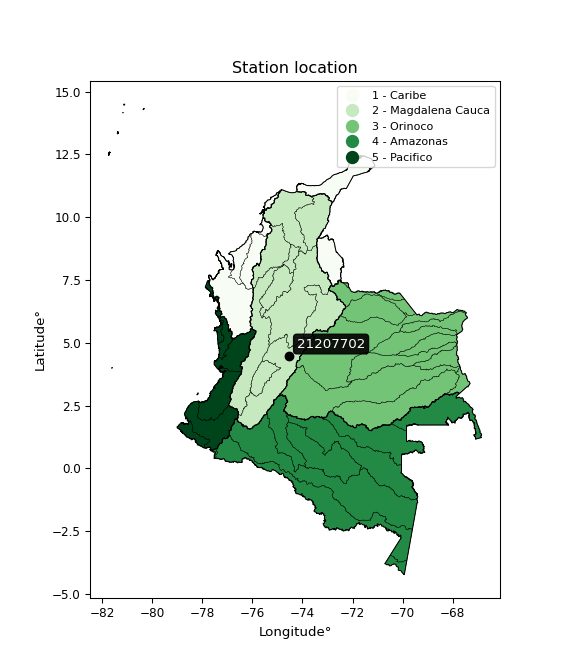

<div align="center">


</div>

# PMP Station (Rain, Pmax24h): 21207702

Probable Maximum Precipitation (PMP) is the greatest amount of rainfall for a specific duration that is meteorologically possible for a given location, acting as a "worst-case" scenario for extreme storms, crucial for designing safety-critical infrastructure like bridges, river deviations, dams, spillways, and nuclear plants to prevent catastrophic failure. PMP is calculated by hydrologists using meteorological data to determine the upper limit of extreme rainfall, often leading to the Probable Maximum Flood (PMF) for flood control design, and is increasingly being studied for climate change impacts. Probable Maximum Precipitation (PMP) is the theoretical upper limit of rainfall, a deterministic estimate for extreme events, while probability distributions (like GEV, Gumbel) describe the likelihood and frequency of various precipitation amounts, including rare ones, showing how often events occur, with PMP representing the extreme end of these distributions, used for critical infrastructure design to ensure safety against the worst conceivable weather, unlike standard statistical forecasts which cover typical probabilities.

The most common probability distributions in hydrology, used for analyzing floods, rainfall, and streamflow, include the Normal, Log-Normal, Gumbel, Gamma (including Log-Pearson Type III), and Generalized Extreme Value (GEV) distributions, often chosen based on the data´s skewness and whether modeling extremes or general conditions, with Gumbel and GEV popular for extreme events like floods, while the Normal distribution serves as a baseline, though often requiring transformations for skewed hydrological data. These distributions help in designing water infrastructure, managing water resources, and forecasting hydrologic events.

> Hydrological data often isn´t perfectly normal (it´s skewed), so different distributions are needed for different applications, such as: **Flood Frequency Analysis**: Using Gumbel, GEV, or Log-Pearson Type III for predicting extreme flood magnitudes and their return periods, **Rainfall Analysis**: Normal for annual totals, but Log-Normal, Weibull, or GEV for intensity or extreme daily rainfall, **Streamflow Modeling**: Gamma and Log-Normal for maximum flows, GEV for minimum flows, and Kappa for daily flows.

<div align="center">

</img>

</div>


## A. General information


### 1. General running parameters

• app_version: _v20260113_. • runtime: _2026-01-17 18:24:04.630693_. • Python version: _3.14.0_. • SciPy version: _1.16.3_. • Pandas version: _2.3.3_. • NumPy version: _2.3.5_. • Stations dataset (station_dataset_file): _dataset/pmax24h_in/automatic_colombia_2003_2025.csv_. • Stations catalog (station_catalog_file): _dataset/CNE.xls_. • Minimum year to eval til year_max (date_min): _1900_. • Maximum year to eval since year_min (date_max): _2025_. • Creates, save and include plots into reports (create_plot): _False_. • Plot only fit distributions with Δo > Δ (plot_only_fit): _True_. • Plot only simple graphs avoiding multiple CDFs and multiple Extreme values plots (plot_only_simple): _True_. • Eval low extreme values, if False, evaluates high extreme values (low_extreme): _False_. • Eval every SciPy distribution as logarithmic (pdist_logarithmic_on): _True_. • Standard deviation normalized (ddof): _1.0_. • Return periods to eval in years (Tr): _[2, 2.33, 5, 10, 15, 20, 25, 50, 75, 100, 200, 250, 500, 750, 1000]_. • Minimum data sample per station, 0 means any (minimum_sample): _5_. • Z-Score maximum threshold to adjust a value, 0 means disable (zscore_max): _3.5_. • Z-Score minimum threshold to adjust a value, 0 means disable (zscore_min): _-2.5_. • Avoid zeros, e.g. rain = 0 (avoid_zeros): _True_. • Avoid null values (avoid_nans): _True_. 

:file_folder:Table: [dataset.csv](../../dataset/pmax24h_in/automatic_colombia_2003_2025.csv)

> Delta Degrees of Freedom (DDOF): is a parameter used in the formulas for calculating variance and standard deviation. When ddof=0, the divisor is $N$ (the total number of observations) and this is used when your data set is the entire population. When ddof=1, the divisor is $N-1$ and this is used when your data set is a sample drawn from a larger population. Using $N-1$ provides an unbiased estimate of the population variance (known as Bessel´s correction).


### 2. Station info and location

|   id |   CODIGO | NOMBRE                             | CATEGORIA    | TECNOLOGIA                | ESTADO   |   FECHA_INSTALACION |   FECHA_SUSPENSION |   ALTITUD |   LATITUD |   LONGITUD | DEPARTAMENTO   | MUNICIPIO   | AREA_OPERATIVA                            | ENTIDAD                                       | AREA_HIDROGRAFICA   | ZONA_HIDROGRAFICA   | SUBZONA_HIDROGRAFICA   | CORRIENTE   | Catalogo   |   Version |
|-----:|---------:|:-----------------------------------|:-------------|:--------------------------|:---------|--------------------:|-------------------:|----------:|----------:|-----------:|:---------------|:------------|:------------------------------------------|:----------------------------------------------|:--------------------|:--------------------|:-----------------------|:------------|:-----------|----------:|
|    0 | 21207702 | GRANJA BOSCONIA  - AUT  [21207702] | Limnigráfica | Automática con Telemetría | Activa   |                 nan |                nan |       496 |   4.49338 |   -74.5433 | Cundinamarca   | Apulo       | Area Operativa 11 - Cundinamarca-Amazonas | CORPORACION AUTONOMA REGIONAL DE CUNDINAMARCA | Magdalena Cauca     | Alto Magdalena      | Río Bogotá             | Calandaima  | CNE_OE     |  20251226 |

<div align="center">

Dynamic map: [:earth_americas:Google](http://maps.google.com/maps?q=4.493377778,-74.54329444) [:earth_americas:OSM](https://www.openstreetmap.org/#map=18/4.493377778/-74.54329444&layers=P) [:earth_americas:Bing](https://www.bing.com/maps?cp=4.493377778~-74.54329444&lvl=18) [:earth_americas:Apple](https://maps.apple.com/frame?center=4.493377778%2C-74.54329444&span=0.003%2C0.006)

</div>


<div align="center">

```geojson
{
  "type": "Feature",
  "geometry": {
    "type": "Point", 
    "coordinates": [-74.54329444, 4.493377778]
  }, 
  "properties": {
    "Name": "21207702"
  }
}
```

</div>


### 3. Discrete values table and plot

<div align="center">

|               |          0 |          1 |           2 |           3 |           4 |           5 |           6 |
|:--------------|-----------:|-----------:|------------:|------------:|------------:|------------:|------------:|
| Date          | 2015       | 2016       | 2017        | 2018        | 2019        | 2020        | 2021        |
| Value         |   76.2     |   65.9     |   40.4      |   39.3      |   39.5      |   42.4      |   43.8      |
| Value_initial |   76.2     |   65.9     |   40.4      |   39.3      |   39.5      |   42.4      |   43.8      |
| count         |    7       |    7       |    7        |    7        |    7        |    7        |    7        |
| mean          |   49.6429  |   49.6429  |   49.6429   |   49.6429   |   49.6429   |   49.6429   |   49.6429   |
| std           |   15.0081  |   15.0081  |   15.0081   |   15.0081   |   15.0081   |   15.0081   |   15.0081   |
| zscore        |    1.76952 |    1.08323 |   -0.615858 |   -0.689152 |   -0.675826 |   -0.482597 |   -0.389314 |


</div>


> The initial value (value_initial) correspond to the initial obtained or null completed value, and value (value) is adjusted only when the initial value is outside the valid range (outlier) definite through the Z-Score value. If Z-Score is active, values out of range or outliers are replaced with the station mean value. A Z-Score (or standard score) measures how many standard deviations a data point is from the mean of a dataset, indicating its relative position; positive scores mean above the mean, negative mean below, and a score of zero is exactly at the mean, allowing for comparison of values from different distributions. It´s calculated using the formula $z=(x–μ)/σ$, where $x$ is the data point, $μ$ is the mean, and $σ$ is the standard deviation, helping identify outliers and understand probability.
>
> <sub>**Note**: In this study, "completing" (filling gaps in) and "extending" (forecasting or lengthening the historical record) rainfall data series are avoided for certain critical analyses because they introduce artificial bias and uncertainty, which can distort the statistics of rare events (extremes), alter day-to-day variability, and compromise the integrity and homogeneity of the original data. Some reasons against Completing/Extending rainfall data are: **Distortion of Extremes and Variability**: The primary issue is that most gap-filling or extension methods rely on averaging or regression with nearby stations, which inherently smooths the data. Rainfall is highly variable in space and time, with a large percentage of zero values and occasional large storms. Infilling methods often underestimate the highest values and overestimate the lowest (zero) values, which severely distorts analyses focused on flood frequency, drought severity, and intensity-duration-frequency (IDF) curves, **Loss of Data Homogeneity**: Infilled or extended data are synthetic estimates, not actual measurements. Combining these estimates with observed data can violate the assumption of data homogeneity, which requires that the data properties do not change over time. Inhomogeneity can lead to incorrect conclusions about long-term trends or changes in climate patterns, **Propagation of Errors**: Errors and biases from the original data (e.g., wind-induced undercatch, instrument errors, site changes) or the data used for imputation can propagate through the analysis, leading to unreliable hydrological models and inaccurate predictions, **Compromised Statistical Integrity**: For statistical analyses, especially those involving the frequency of events, using artificial data can introduce time bias or autocorrelation that doesn´t exist in reality, making it difficult to assess the true probability of events, **Difficulty in Validation**: It is difficult to accurately validate the quality of filled or extended data, especially for past periods where ground-truth measurements are unavailable. The reliability of imputation techniques heavily depends on the density of the surrounding station network and the complexity of the local topography.</sub>


### 4. Active continuous probability distributions from SciPy (80 of 104 available)

A Probability Density Function (PDF) describes the relative likelihood of a continuous random variable falling within a specific range, where the total area under its curve equals 1, and the area over any interval gives the actual probability for that range. Unlike discrete probabilities (like rolling a die), a PDF shows density, not direct probability for a single point (which is zero), with higher points indicating higher likelihood, often visualized as a bell curve for normal distributions.

A log of a probability density function (log-PDF) is simply the logarithm of the PDF´s value, denoted as $log(f(x))$, useful for converting multiplication of probabilities into addition, improving numerical stability with tiny numbers, and connecting to information theory concepts like entropy. Instead of dealing with very small probabilities (e.g., 0.000001), log-PDFs use negative numbers (e.g., $log(0.00001) ≈ -11.51$ that are easier for computers to handle, preventing underflow errors and simplifying complex calculations. In this study, each active probability distribution from SciPy is also evaluated in the $log$ form.

[scipy.stats](https://docs.scipy.org/doc/scipy/reference/stats.html) is a Python´s powerful submodule within the SciPy library for comprehensive statistical analysis, offering over 130 probability distributions (like Normal, Poisson), functions for descriptive stats (mean, variance), hypothesis testing (t-tests, chi-square), random variable generation, and statistical tests, making it essential for data science, modeling, and research. It provides tools to explore, model, and draw conclusions from data efficiently, working seamlessly with NumPy.

<div align="center">

|   id | p_dist           |   n_parameter | fit_method   | label                                                                       | active   | ref                                                                                                      |
|-----:|:-----------------|--------------:|:-------------|:----------------------------------------------------------------------------|:---------|:---------------------------------------------------------------------------------------------------------|
|    0 | alpha            |             3 | MLE          | Alpha                                                                       | True     | [:mortar_board:](https://docs.scipy.org/doc/scipy/reference/generated/scipy.stats.alpha.html)            |
|    1 | anglit           |             2 | MM           | Anglit                                                                      | True     | [:mortar_board:](https://docs.scipy.org/doc/scipy/reference/generated/scipy.stats.anglit.html)           |
|    2 | arcsine          |             2 | MM           | Arcsine                                                                     | True     | [:mortar_board:](https://docs.scipy.org/doc/scipy/reference/generated/scipy.stats.arcsine.html)          |
|    3 | argus            |             3 | MLE          | Argus                                                                       | True     | [:mortar_board:](https://docs.scipy.org/doc/scipy/reference/generated/scipy.stats.argus.html)            |
|    4 | beta             |             4 | MLE          | Beta                                                                        | True     | [:mortar_board:](https://docs.scipy.org/doc/scipy/reference/generated/scipy.stats.beta.html)             |
|    5 | betaprime        |             4 | MLE          | Beta prime                                                                  | True     | [:mortar_board:](https://docs.scipy.org/doc/scipy/reference/generated/scipy.stats.betaprime.html)        |
|    6 | bradford         |             3 | MLE          | Bradford                                                                    | True     | [:mortar_board:](https://docs.scipy.org/doc/scipy/reference/generated/scipy.stats.bradford.html)         |
|    7 | burr             |             4 | MLE          | Burr (Type III)                                                             | True     | [:mortar_board:](https://docs.scipy.org/doc/scipy/reference/generated/scipy.stats.burr.html)             |
|    8 | burr12           |             4 | MLE          | Burr (Type III) 12                                                          | True     | [:mortar_board:](https://docs.scipy.org/doc/scipy/reference/generated/scipy.stats.burr12.html)           |
|    9 | cosine           |             2 | MLE          | Cosine                                                                      | True     | [:mortar_board:](https://docs.scipy.org/doc/scipy/reference/generated/scipy.stats.cosine.html)           |
|   10 | crystalball      |             4 | MLE          | Crystalball                                                                 | True     | [:mortar_board:](https://docs.scipy.org/doc/scipy/reference/generated/scipy.stats.crystalball.html)      |
|   11 | dgamma           |             3 | MLE          | Double gamma                                                                | True     | [:mortar_board:](https://docs.scipy.org/doc/scipy/reference/generated/scipy.stats.dgamma.html)           |
|   12 | dweibull         |             3 | MLE          | Double Weibull                                                              | True     | [:mortar_board:](https://docs.scipy.org/doc/scipy/reference/generated/scipy.stats.dweibull.html)         |
|   13 | erlang           |             3 | MLE          | Erlang                                                                      | True     | [:mortar_board:](https://docs.scipy.org/doc/scipy/reference/generated/scipy.stats.erlang.html)           |
|   14 | exponnorm        |             3 | MLE          | Exponentially modified Normal                                               | True     | [:mortar_board:](https://docs.scipy.org/doc/scipy/reference/generated/scipy.stats.exponnorm.html)        |
|   15 | exponpow         |             3 | MLE          | Exponential power                                                           | True     | [:mortar_board:](https://docs.scipy.org/doc/scipy/reference/generated/scipy.stats.exponpow.html)         |
|   16 | exponweib        |             4 | MLE          | Exponentiated Weibull                                                       | True     | [:mortar_board:](https://docs.scipy.org/doc/scipy/reference/generated/scipy.stats.exponweib.html)        |
|   17 | f                |             4 | MLE          | F                                                                           | True     | [:mortar_board:](https://docs.scipy.org/doc/scipy/reference/generated/scipy.stats.f.html)                |
|   18 | fatiguelife      |             3 | MLE          | Fatigue-life (Birnbaum-Saunders)                                            | True     | [:mortar_board:](https://docs.scipy.org/doc/scipy/reference/generated/scipy.stats.fatiguelife.html)      |
|   19 | foldnorm         |             3 | MM           | Fold Normal                                                                 | True     | [:mortar_board:](https://docs.scipy.org/doc/scipy/reference/generated/scipy.stats.foldnorm.html)         |
|   20 | gamma            |             3 | MLE          | Gamma                                                                       | True     | [:mortar_board:](https://docs.scipy.org/doc/scipy/reference/generated/scipy.stats.gamma.html)            |
|   21 | gausshyper       |             6 | MLE          | Gauss hypergeometric                                                        | True     | [:mortar_board:](https://docs.scipy.org/doc/scipy/reference/generated/scipy.stats.gausshyper.html)       |
|   22 | genexpon         |             5 | MLE          | Generalized exponential                                                     | True     | [:mortar_board:](https://docs.scipy.org/doc/scipy/reference/generated/scipy.stats.genexpon.html)         |
|   23 | genextreme       |             3 | MLE          | Generalized exponential                                                     | True     | [:mortar_board:](https://docs.scipy.org/doc/scipy/reference/generated/scipy.stats.genextreme.html)       |
|   24 | gengamma         |             4 | MLE          | Generalized gamma                                                           | True     | [:mortar_board:](https://docs.scipy.org/doc/scipy/reference/generated/scipy.stats.gengamma.html)         |
|   25 | genhalflogistic  |             3 | MLE          | Generalized half-logistic                                                   | True     | [:mortar_board:](https://docs.scipy.org/doc/scipy/reference/generated/scipy.stats.genhalflogistic.html)  |
|   26 | genlogistic      |             3 | MLE          | Generalized logistic                                                        | True     | [:mortar_board:](https://docs.scipy.org/doc/scipy/reference/generated/scipy.stats.genlogistic.html)      |
|   27 | gennorm          |             3 | MLE          | Generalized Normal                                                          | True     | [:mortar_board:](https://docs.scipy.org/doc/scipy/reference/generated/scipy.stats.gennorm.html)          |
|   28 | genpareto        |             3 | MLE          | Generalized Pareto                                                          | True     | [:mortar_board:](https://docs.scipy.org/doc/scipy/reference/generated/scipy.stats.genpareto.html)        |
|   29 | gompertz         |             3 | MLE          | Gompertz (or truncated Gumbel)                                              | True     | [:mortar_board:](https://docs.scipy.org/doc/scipy/reference/generated/scipy.stats.gompertz.html)         |
|   30 | gumbel_l         |             2 | MM           | Gumbel Left Skew                                                            | True     | [:mortar_board:](https://docs.scipy.org/doc/scipy/reference/generated/scipy.stats.gumbel_l.html)         |
|   31 | gumbel_r         |             2 | MM           | Gumbel Right Skew                                                           | True     | [:mortar_board:](https://docs.scipy.org/doc/scipy/reference/generated/scipy.stats.gumbel_r.html)         |
|   32 | halfgennorm      |             3 | MLE          | Upper half of a generalized normal                                          | True     | [:mortar_board:](https://docs.scipy.org/doc/scipy/reference/generated/scipy.stats.halfgennorm.html)      |
|   33 | halflogistic     |             2 | MM           | Half-logistic                                                               | True     | [:mortar_board:](https://docs.scipy.org/doc/scipy/reference/generated/scipy.stats.halflogistic.html)     |
|   34 | halfnorm         |             2 | MM           | Half Normal                                                                 | True     | [:mortar_board:](https://docs.scipy.org/doc/scipy/reference/generated/scipy.stats.halfnorm.html)         |
|   35 | hypsecant        |             2 | MM           | hyperbolic secant                                                           | True     | [:mortar_board:](https://docs.scipy.org/doc/scipy/reference/generated/scipy.stats.hypsecant.html)        |
|   36 | invgamma         |             3 | MLE          | Inverted gamma                                                              | True     | [:mortar_board:](https://docs.scipy.org/doc/scipy/reference/generated/scipy.stats.invgamma.html)         |
|   37 | invgauss         |             3 | MLE          | Inverse Gaussian                                                            | True     | [:mortar_board:](https://docs.scipy.org/doc/scipy/reference/generated/scipy.stats.invgauss.html)         |
|   38 | invweibull       |             3 | MLE          | Inverted Weibull                                                            | True     | [:mortar_board:](https://docs.scipy.org/doc/scipy/reference/generated/scipy.stats.invweibull.html)       |
|   39 | johnsonsb        |             4 | MLE          | Johnson SB                                                                  | True     | [:mortar_board:](https://docs.scipy.org/doc/scipy/reference/generated/scipy.stats.johnsonsb.html)        |
|   40 | johnsonsu        |             4 | MLE          | Johnson Su                                                                  | True     | [:mortar_board:](https://docs.scipy.org/doc/scipy/reference/generated/scipy.stats.johnsonsu.html)        |
|   41 | kappa3           |             3 | MLE          | Kappa 3                                                                     | True     | [:mortar_board:](https://docs.scipy.org/doc/scipy/reference/generated/scipy.stats.kappa3.html)           |
|   42 | kappa4           |             4 | MLE          | Kappa 4                                                                     | True     | [:mortar_board:](https://docs.scipy.org/doc/scipy/reference/generated/scipy.stats.kappa4.html)           |
|   43 | ksone            |             3 | MLE          | Kolmogorov-Smirnov one-sided test statistic distribution                    | True     | [:mortar_board:](https://docs.scipy.org/doc/scipy/reference/generated/scipy.stats.ksone.html)            |
|   44 | kstwobign        |             2 | MLE          | Limiting distribution of scaled Kolmogorov-Smirnov two-sided test statistic | True     | [:mortar_board:](https://docs.scipy.org/doc/scipy/reference/generated/scipy.stats.kstwobign.html)        |
|   45 | laplace          |             2 | MM           | Laplace                                                                     | True     | [:mortar_board:](https://docs.scipy.org/doc/scipy/reference/generated/scipy.stats.laplace.html)          |
|   46 | levy_l           |             2 | MLE          | Left-skewed Levy                                                            | True     | [:mortar_board:](https://docs.scipy.org/doc/scipy/reference/generated/scipy.stats.levy_l.html)           |
|   47 | loggamma         |             3 | MLE          | Log gamma                                                                   | True     | [:mortar_board:](https://docs.scipy.org/doc/scipy/reference/generated/scipy.stats.loggamma.html)         |
|   48 | logistic         |             2 | MM           | Logistic (or Sech-squared)                                                  | True     | [:mortar_board:](https://docs.scipy.org/doc/scipy/reference/generated/scipy.stats.logistic.html)         |
|   49 | loglaplace       |             3 | MLE          | Log-Laplace                                                                 | True     | [:mortar_board:](https://docs.scipy.org/doc/scipy/reference/generated/scipy.stats.loglaplace.html)       |
|   50 | lomax            |             3 | MLE          | Lomax (Pareto of the second kind)                                           | True     | [:mortar_board:](https://docs.scipy.org/doc/scipy/reference/generated/scipy.stats.lomax.html)            |
|   51 | maxwell          |             2 | MM           | Maxwell                                                                     | True     | [:mortar_board:](https://docs.scipy.org/doc/scipy/reference/generated/scipy.stats.maxwell.html)          |
|   52 | mielke           |             4 | MLE          | Mielke Beta-Kappa / Dagum                                                   | True     | [:mortar_board:](https://docs.scipy.org/doc/scipy/reference/generated/scipy.stats.mielke.html)           |
|   53 | moyal            |             2 | MM           | Moyal                                                                       | True     | [:mortar_board:](https://docs.scipy.org/doc/scipy/reference/generated/scipy.stats.moyal.html)            |
|   54 | nakagami         |             3 | MLE          | Nakagami                                                                    | True     | [:mortar_board:](https://docs.scipy.org/doc/scipy/reference/generated/scipy.stats.nakagami.html)         |
|   55 | ncf              |             5 | MLE          | Non-central F distribution                                                  | True     | [:mortar_board:](https://docs.scipy.org/doc/scipy/reference/generated/scipy.stats.ncf.html)              |
|   56 | nct              |             4 | MLE          | Non-central Student’s t                                                     | True     | [:mortar_board:](https://docs.scipy.org/doc/scipy/reference/generated/scipy.stats.nct.html)              |
|   57 | norm             |             2 | MM           | Normal                                                                      | True     | [:mortar_board:](https://docs.scipy.org/doc/scipy/reference/generated/scipy.stats.norm.html)             |
|   58 | pearson3         |             3 | MM           | Pearson type III                                                            | True     | [:mortar_board:](https://docs.scipy.org/doc/scipy/reference/generated/scipy.stats.pearson3.html)         |
|   59 | powerlaw         |             3 | MLE          | Power-function                                                              | True     | [:mortar_board:](https://docs.scipy.org/doc/scipy/reference/generated/scipy.stats.powerlaw.html)         |
|   60 | rayleigh         |             2 | MM           | Rayleigh                                                                    | True     | [:mortar_board:](https://docs.scipy.org/doc/scipy/reference/generated/scipy.stats.rayleigh.html)         |
|   61 | rdist            |             3 | MLE          | R-distributed (symmetric beta)                                              | True     | [:mortar_board:](https://docs.scipy.org/doc/scipy/reference/generated/scipy.stats.rdist.html)            |
|   62 | rice             |             3 | MLE          | Rice                                                                        | True     | [:mortar_board:](https://docs.scipy.org/doc/scipy/reference/generated/scipy.stats.rice.html)             |
|   63 | semicircular     |             2 | MM           | Semicircular                                                                | True     | [:mortar_board:](https://docs.scipy.org/doc/scipy/reference/generated/scipy.stats.semicircular.html)     |
|   64 | skewnorm         |             3 | MLE          | Skew normal                                                                 | True     | [:mortar_board:](https://docs.scipy.org/doc/scipy/reference/generated/scipy.stats.skewnorm.html)         |
|   65 | t                |             3 | MLE          | Student’s t                                                                 | True     | [:mortar_board:](https://docs.scipy.org/doc/scipy/reference/generated/scipy.stats.t.html)                |
|   66 | trapezoid        |             4 | MLE          | Trapezoid                                                                   | True     | [:mortar_board:](https://docs.scipy.org/doc/scipy/reference/generated/scipy.stats.trapezoid.html)        |
|   67 | triang           |             3 | MLE          | Triangular                                                                  | True     | [:mortar_board:](https://docs.scipy.org/doc/scipy/reference/generated/scipy.stats.triang.html)           |
|   68 | truncexpon       |             3 | MLE          | Truncated exponential                                                       | True     | [:mortar_board:](https://docs.scipy.org/doc/scipy/reference/generated/scipy.stats.truncexpon.html)       |
|   69 | truncnorm        |             4 | MLE          | Truncated normal                                                            | True     | [:mortar_board:](https://docs.scipy.org/doc/scipy/reference/generated/scipy.stats.truncnorm.html)        |
|   70 | truncpareto      |             4 | MLE          | Upper truncated Pareto                                                      | True     | [:mortar_board:](https://docs.scipy.org/doc/scipy/reference/generated/scipy.stats.truncpareto.html)      |
|   71 | truncweibull_min |             5 | MLE          | Doubly truncated Weibull minimum                                            | True     | [:mortar_board:](https://docs.scipy.org/doc/scipy/reference/generated/scipy.stats.truncweibull_min.html) |
|   72 | tukeylambda      |             3 | MLE          | Tukey-Lamdba                                                                | True     | [:mortar_board:](https://docs.scipy.org/doc/scipy/reference/generated/scipy.stats.tukeylambda.html)      |
|   73 | uniform          |             2 | MLE          | Uniform                                                                     | True     | [:mortar_board:](https://docs.scipy.org/doc/scipy/reference/generated/scipy.stats.uniform.html)          |
|   74 | vonmises         |             3 | MLE          | Von Mises                                                                   | True     | [:mortar_board:](https://docs.scipy.org/doc/scipy/reference/generated/scipy.stats.vonmises.html)         |
|   75 | vonmises_line    |             3 | MLE          | Von Mises line                                                              | True     | [:mortar_board:](https://docs.scipy.org/doc/scipy/reference/generated/scipy.stats.vonmises_line.html)    |
|   76 | wald             |             2 | MM           | Wald                                                                        | True     | [:mortar_board:](https://docs.scipy.org/doc/scipy/reference/generated/scipy.stats.wald.html)             |
|   77 | weibull_max      |             3 | MLE          | Weibull maximum                                                             | True     | [:mortar_board:](https://docs.scipy.org/doc/scipy/reference/generated/scipy.stats.weibull_max.html)      |
|   78 | weibull_min      |             3 | MLE          | Weibull minimum                                                             | True     | [:mortar_board:](https://docs.scipy.org/doc/scipy/reference/generated/scipy.stats.weibull_min.html)      |
|   79 | wrapcauchy       |             3 | MLE          | Wrapped  Cauchy                                                             | True     | [:mortar_board:](https://docs.scipy.org/doc/scipy/reference/generated/scipy.stats.wrapcauchy.html)       |

</div>

> **n_parameter:** # arguments & localization & scale.
>
> **Fit methods:** (MLE) maximum likelihood, (MM) L-moments.
>
>**Inactive** (With the only purpose of prevent loops, zero divisions, infinite values, over high estimated values or horizontal trending for recurrence intervals estimations, the follow distributions were disabled.)**:** lognorm, norminvgauss, powernorm, powerlognorm, cauchy, halfcauchy, foldcauchy, skewcauchy, chi2, expon, fisk, genhyperbolic, geninvgauss, gibrat, kstwo, laplace_asymmetric, levy, levy_stable, ncx2, pareto, rel_breitwigner, recipinvgauss, studentized_range, loguniform, 


## B. Probability (PDF) vs. Empirical (EDF) distributions functions

A continuous probability distribution (CPD) describes probabilities for variables that can take any value within a range (like rain any time), unlike discrete variables with specific outcomes (like temperature). It uses a Probability Density Function (PDF), a curve where the total area under it equals 1, and the probability of the variable falling within an interval (a to b) is found by calculating the area under the curve between those points. A key feature is that the probability of hitting any single exact value is zero, so probabilities are always expressed for ranges, e.g., $P(a ≤ X ≤ b)$.

<div align="center">

Distributions parameters from station values
|     |   station | p_dist              |   n |              loc |            scale | shape                  | shape1                | shape2                | shape3             |
|----:|----------:|:--------------------|----:|-----------------:|-----------------:|:-----------------------|:----------------------|:----------------------|:-------------------|
|   0 |  21207702 | alpha               |   7 |     38.0757      |      2.21159     | 1.680262908591542e-07  |                       |                       |                    |
|   1 |  21207702 | anglit              |   7 |     49.6429      |     40.6478      |                        |                       |                       |                    |
|   2 |  21207702 | arcsine             |   7 |     29.9927      |     39.3004      |                        |                       |                       |                    |
|   3 |  21207702 | argus               |   7 |     19.8887      |     58.6795      | 1.2942439712843201e-05 |                       |                       |                    |
|   4 |  21207702 | beta                |   7 |     39.3         |     41.4775      | 0.08013753969384031    | 0.20066857298915095   |                       |                    |
|   5 |  21207702 | betaprime           |   7 |     -1.08798     |      2.10608     | 420.3725434545122      | 18.509518304998046    |                       |                    |
|   6 |  21207702 | bradford            |   7 |     38.2537      |     37.9463      | 0.7390767583733733     |                       |                       |                    |
|   7 |  21207702 | burr                |   7 |     -0.429015    |     17.0946      | 6.314962024332235      | 360.4568838703151     |                       |                    |
|   8 |  21207702 | burr12              |   7 |     -2.408       |     41.581       | 1114.5539885873536     | 0.004640310208076164  |                       |                    |
|   9 |  21207702 | cosine              |   7 |     51.6955      |     11.5624      |                        |                       |                       |                    |
|  10 |  21207702 | crystalball         |   7 |     49.6429      |     13.8948      | 4610.507905879649      | 1593.6339843496621    |                       |                    |
|  11 |  21207702 | dgamma              |   7 |     40.4         |     11.5487      | 0.7096929754411532     |                       |                       |                    |
|  12 |  21207702 | dweibull            |   7 |     40.4         |     12.8684      | 0.6742824138731456     |                       |                       |                    |
|  13 |  21207702 | erlang              |   7 |     39.3         |      9.11974     | 0.47875780629900866    |                       |                       |                    |
|  14 |  21207702 | exponnorm           |   7 |     39.2886      |      0.00374436  | 2753.3458253680246     |                       |                       |                    |
|  15 |  21207702 | exponpow            |   7 |     39.3         |     28.0958      | 0.3193994086586288     |                       |                       |                    |
|  16 |  21207702 | exponweib           |   7 |     39.3         |     16.1308      | 0.979541993970394      | 0.9206548087939054    |                       |                    |
|  17 |  21207702 | f                   |   7 |     39.3         |      4.86982     | 0.6320790895181723     | 2.455888236698287     |                       |                    |
|  18 |  21207702 | fatiguelife         |   7 |     39.3         |      1.9061e-06  | 2029.8334629381511     |                       |                       |                    |
|  19 |  21207702 | foldnorm            |   7 |     31.1596      |     22.144       | 0.30354082845263564    |                       |                       |                    |
|  20 |  21207702 | gamma               |   7 |     39.3         |      9.76401     | 0.4143147328431088     |                       |                       |                    |
|  21 |  21207702 | gausshyper          |   7 |     39.3         |     38.3924      | 0.6105449842678925     | 1.367243305170824     | 0.7957113506890814    | 0.9165200543216384 |
|  22 |  21207702 | genexpon            |   7 |     39.3         |     15.0822      | 1.4582035368606028     | 0.2975078558179375    | 2.961669128373664e-09 |                    |
|  23 |  21207702 | genextreme          |   7 |     39.565       |      2.44912     | -9.241219411294797     |                       |                       |                    |
|  24 |  21207702 | gengamma            |   7 |     39.3         |     31.8116      | 0.8966359158410013     | 0.4313375280931527    |                       |                    |
|  25 |  21207702 | genhalflogistic     |   7 |     39.3         |     35.9382      | 0.9711161037555918     |                       |                       |                    |
|  26 |  21207702 | genlogistic         |   7 |    -21.0862      |      8.53402     | 1973.2175556432621     |                       |                       |                    |
|  27 |  21207702 | gennorm             |   7 |     40.4         |      0.657266    | 0.4256146011056694     |                       |                       |                    |
|  28 |  21207702 | genpareto           |   7 |     -0.422375    |    136.496       | -1.781406751939909     |                       |                       |                    |
|  29 |  21207702 | gompertz            |   7 |     39.3         |      1.6683e+12  | 139769047332.3406      |                       |                       |                    |
|  30 |  21207702 | gumbel_l            |   7 |     55.8963      |     10.8337      |                        |                       |                       |                    |
|  31 |  21207702 | gumbel_r            |   7 |     43.3895      |     10.8337      |                        |                       |                       |                    |
|  32 |  21207702 | halfgennorm         |   7 |     39.3         |      0.237243    | 0.361143733545112      |                       |                       |                    |
|  33 |  21207702 | halflogistic        |   7 |     33.1743      |     11.8796      |                        |                       |                       |                    |
|  34 |  21207702 | halfnorm            |   7 |     31.2516      |     23.05        |                        |                       |                       |                    |
|  35 |  21207702 | hypsecant           |   7 |     49.6429      |      8.8457      |                        |                       |                       |                    |
|  36 |  21207702 | invgamma            |   7 |     39.1752      |      0.239487    | 0.42768073169305726    |                       |                       |                    |
|  37 |  21207702 | invgauss            |   7 |     39.0776      |      0.929127    | 11.371187917570172     |                       |                       |                    |
|  38 |  21207702 | invweibull          |   7 |     39.3         |      0.0977168   | 0.05256157916719327    |                       |                       |                    |
|  39 |  21207702 | johnsonsb           |   7 |     39.3         |     82.9078      | 1.1058392729737399     | 0.11028537107182793   |                       |                    |
|  40 |  21207702 | johnsonsu           |   7 |      2.96251e+08 |      5.12714e+08 | 23238555.153014444     | 42274656.98026273     |                       |                    |
|  41 |  21207702 | kappa3              |   7 |     39.0937      |     36.7026      | 227.12937497291966     |                       |                       |                    |
|  42 |  21207702 | kappa4              |   7 |     34.088       |     45.3616      | 1.1302174104801415     | 1.0457850973014309    |                       |                    |
|  43 |  21207702 | ksone               |   7 |     35.61        |     44.28        | 1.0                    |                       |                       |                    |
|  44 |  21207702 | kstwobign           |   7 |     12.6764      |     42.7352      |                        |                       |                       |                    |
|  45 |  21207702 | laplace             |   7 |     49.6429      |      9.8251      |                        |                       |                       |                    |
|  46 |  21207702 | levy_l              |   7 |     78.991       |     12.3488      |                        |                       |                       |                    |
|  47 |  21207702 | loggamma            |   7 |  -3147.53        |    458.585       | 1066.5209536067846     |                       |                       |                    |
|  48 |  21207702 | logistic            |   7 |     49.6429      |      7.6606      |                        |                       |                       |                    |
|  49 |  21207702 | loglaplace          |   7 |     -0.124493    |     42.5245      | 5.5920826283125775     |                       |                       |                    |
|  50 |  21207702 | lomax               |   7 |     39.0861      |      2.29653     | 0.8748499485469807     |                       |                       |                    |
|  51 |  21207702 | maxwell             |   7 |     16.718       |     20.6326      |                        |                       |                       |                    |
|  52 |  21207702 | mielke              |   7 |     34.8011      |      0.954166    | 70.03388770481982      | 1.8925490647636574    |                       |                    |
|  53 |  21207702 | moyal               |   7 |     41.6969      |      6.25485     |                        |                       |                       |                    |
|  54 |  21207702 | nakagami            |   7 |     39.3         |     23.0868      | 0.3437857398678039     |                       |                       |                    |
|  55 |  21207702 | ncf                 |   7 |     39.1753      |      0.0279161   | 372.1402765324209      | 0.8553729826705139    | 7094.233782878526     |                    |
|  56 |  21207702 | nct                 |   7 |     -0.234384    |      0.72212     | 9.757496694246491      | 63.29234100755542     |                       |                    |
|  57 |  21207702 | norm                |   7 |     49.6429      |     13.8948      |                        |                       |                       |                    |
|  58 |  21207702 | pearson3            |   7 |     49.6428      |     13.8948      | 1.0388442759764382     |                       |                       |                    |
|  59 |  21207702 | powerlaw            |   7 |     39.3         |     36.9         | 0.14049193588200692    |                       |                       |                    |
|  60 |  21207702 | rayleigh            |   7 |     23.0613      |     21.209       |                        |                       |                       |                    |
|  61 |  21207702 | rdist               |   7 |     41.5843      |      2.28428     | 1.595828200371694      |                       |                       |                    |
|  62 |  21207702 | rice                |   7 |     28.8673      |     17.6733      | 0.00037835585940510267 |                       |                       |                    |
|  63 |  21207702 | semicircular        |   7 |     49.6429      |     27.7896      |                        |                       |                       |                    |
|  64 |  21207702 | skewnorm            |   7 |     39.3         |     17.3226      | 5074157.069790289      |                       |                       |                    |
|  65 |  21207702 | t                   |   7 |     49.6433      |     13.8954      | 9087869.84963313       |                       |                       |                    |
|  66 |  21207702 | trapezoid           |   7 |     35.61        |     44.28        | 1.0                    | 1.0                   |                       |                    |
|  67 |  21207702 | triang              |   7 |     39.3         |     43.9358      | 8.199274181917164e-10  |                       |                       |                    |
|  68 |  21207702 | truncexpon          |   7 |     39.3         |     32.5386      | 1.1340380718406378     |                       |                       |                    |
|  69 |  21207702 | truncnorm           |   7 | -21461.8         |    547.124       | 39.29841676298108      | 457.71782061148065    |                       |                    |
|  70 |  21207702 | truncpareto         |   7 |     38.6987      |      0.601297    | 0.12466634431360143    | 62.36734396713737     |                       |                    |
|  71 |  21207702 | truncweibull_min    |   7 |     39.264       |     39.7685      | 0.5987260655284556     | 0.0009002069235441034 | 0.928776534140737     |                    |
|  72 |  21207702 | tukeylambda         |   7 |     41.55        |      3.12261     | 1.3878272278744634     |                       |                       |                    |
|  73 |  21207702 | uniform             |   7 |     39.3         |     36.9         |                        |                       |                       |                    |
|  74 |  21207702 | vonmises            |   7 |      1.81105     |      1           | 0.6193352435001651     |                       |                       |                    |
|  75 |  21207702 | vonmises_line       |   7 |     45.9757      |      9.6207      | 0.8793496828387537     |                       |                       |                    |
|  76 |  21207702 | wald                |   7 |     35.7481      |     13.8948      |                        |                       |                       |                    |
|  77 |  21207702 | weibull_max         |   7 |     76.2         |      1.51042     | 0.29265372287844627    |                       |                       |                    |
|  78 |  21207702 | weibull_min         |   7 |     39.3         |      6.20926     | 0.295553341962126      |                       |                       |                    |
|  79 |  21207702 | wrapcauchy          |   7 |     39.3         |      5.87282     | 0.8517818018348673     |                       |                       |                    |
|  80 |  21207702 | logalpha            |   7 |      3.4805      |      0.75591     | 2.69881571517303       |                       |                       |                    |
|  81 |  21207702 | loganglit           |   7 |      3.87066     |      0.738008    |                        |                       |                       |                    |
|  82 |  21207702 | logarcsine          |   7 |      3.51392     |      0.713497    |                        |                       |                       |                    |
|  83 |  21207702 | logargus            |   7 |      3.33964     |      1.03712     | 9.621036315462549e-05  |                       |                       |                    |
|  84 |  21207702 | logbeta             |   7 |      3.67122     |      0.746127    | 0.07801666274754814    | 0.19318934803959126   |                       |                    |
|  85 |  21207702 | logbetaprime        |   7 |     -2.82357     |      1.45734     | 2792.1357319068657     | 608.740431379123      |                       |                    |
|  86 |  21207702 | logbradford         |   7 |      3.67122     |      0.662156    | 1.0852009972696766     |                       |                       |                    |
|  87 |  21207702 | logburr             |   7 |      2.87436     |      0.413748    | 6.105689085951688      | 94.78461245765209     |                       |                    |
|  88 |  21207702 | logburr12           |   7 |    -13.9595      |     17.6258      | 10882.269414395876     | 0.00797755288401904   |                       |                    |
|  89 |  21207702 | logcosine           |   7 |      3.90453     |      0.20735     |                        |                       |                       |                    |
|  90 |  21207702 | logcrystalball      |   7 |      3.87066     |      0.252276    | 433.28137956135674     | 28.894526926985392    |                       |                    |
|  91 |  21207702 | logdgamma           |   7 |      3.74715     |      0.192592    | 0.9180940019396966     |                       |                       |                    |
|  92 |  21207702 | logdweibull         |   7 |      3.74715     |      0.145593    | 0.683935383095071      |                       |                       |                    |
|  93 |  21207702 | logerlang           |   7 |      3.67122     |      0.13782     | 0.6877199514513752     |                       |                       |                    |
|  94 |  21207702 | logexponnorm        |   7 |      3.67107     |      4.4089e-05  | 4515.451685908214      |                       |                       |                    |
|  95 |  21207702 | logexponpow         |   7 |      3.67122     |      0.390459    | 0.3787070204202272     |                       |                       |                    |
|  96 |  21207702 | logexponweib        |   7 |      3.67122     |      0.34671     | 0.46458613626642975    | 1.0572654563691093    |                       |                    |
|  97 |  21207702 | logf                |   7 |      3.66713     |      0.0171052   | 9285.153608858225      | 0.98291171688489      |                       |                    |
|  98 |  21207702 | logfatiguelife      |   7 |      3.67122     |      8.32562e-08 | 1585.6034278475665     |                       |                       |                    |
|  99 |  21207702 | logfoldnorm         |   7 |      3.52342     |      0.347898    | 0.7235134575325808     |                       |                       |                    |
| 100 |  21207702 | loggamma            |   7 |      3.67122     |      0.266171    | 0.40615996337967364    |                       |                       |                    |
| 101 |  21207702 | loggausshyper       |   7 |      3.67122     |      0.987354    | 0.5628434762519909     | 1.0912996702462334    | 1.16073556443104      | 0.9455932135937946 |
| 102 |  21207702 | loggenexpon         |   7 |      3.67122     |      0.183929    | 0.9231421469728325     | 1.273758284223461e-07 | 1.7997171828002743    |                    |
| 103 |  21207702 | loggenextreme       |   7 |      3.67976     |      0.0470753   | -5.512375939555703     |                       |                       |                    |
| 104 |  21207702 | loggengamma         |   7 |      3.67122     |      0.380681    | 0.2770277679380633     | 1.1430633322435373    |                       |                    |
| 105 |  21207702 | loggenhalflogistic  |   7 |      3.56734     |      0.796549    | 1.0398463046660276     |                       |                       |                    |
| 106 |  21207702 | loggenlogistic      |   7 |      2.5559      |      0.159162    | 1933.6348249720145     |                       |                       |                    |
| 107 |  21207702 | loggennorm          |   7 |      3.74715     |      1.37304e-08 | 0.13288603633869933    |                       |                       |                    |
| 108 |  21207702 | loggenpareto        |   7 |     -0.00380064  |     10.5992      | -2.443814577743672     |                       |                       |                    |
| 109 |  21207702 | loggompertz         |   7 |      3.67122     |      6.47866e+09 | 30040871638.09168      |                       |                       |                    |
| 110 |  21207702 | loggumbel_l         |   7 |      3.9842      |      0.196699    |                        |                       |                       |                    |
| 111 |  21207702 | loggumbel_r         |   7 |      3.75712     |      0.196699    |                        |                       |                       |                    |
| 112 |  21207702 | loghalfgennorm      |   7 |      3.67122     |      0.245325    | 0.9663720320294713     |                       |                       |                    |
| 113 |  21207702 | loghalflogistic     |   7 |      3.57166     |      0.215687    |                        |                       |                       |                    |
| 114 |  21207702 | loghalfnorm         |   7 |      3.53675     |      0.4185      |                        |                       |                       |                    |
| 115 |  21207702 | loghypsecant        |   7 |      3.87066     |      0.160604    |                        |                       |                       |                    |
| 116 |  21207702 | loginvgamma         |   7 |      3.66696     |      0.00850349  | 0.4998689096957638     |                       |                       |                    |
| 117 |  21207702 | loginvgauss         |   7 |      3.66526     |      0.0251666   | 8.161900866834184      |                       |                       |                    |
| 118 |  21207702 | loginvweibull       |   7 |      3.67122     |      4.81091e-05 | 0.07745564093458668    |                       |                       |                    |
| 119 |  21207702 | logjohnsonsb        |   7 |      3.67122     |      2.37195     | 2.042335487354027      | 0.1539959079688044    |                       |                    |
| 120 |  21207702 | logjohnsonsu        |   7 |      1.13588e+07 | 904045           | 153776177.04437083     | 47673712.290157944    |                       |                    |
| 121 |  21207702 | logkappa3           |   7 |      3.66742     |      0.662377    | 430.39989538077356     |                       |                       |                    |
| 122 |  21207702 | logkappa4           |   7 |      3.59705     |      0.756424    | 1.1088576767289449     | 1.0234415309382334    |                       |                    |
| 123 |  21207702 | logksone            |   7 |      3.60501     |      0.794564    | 1.0                    |                       |                       |                    |
| 124 |  21207702 | logkstwobign        |   7 |      3.1877      |      0.788325    |                        |                       |                       |                    |
| 125 |  21207702 | loglaplace          |   7 |      3.87066     |      0.178386    |                        |                       |                       |                    |
| 126 |  21207702 | loglevy_l           |   7 |      4.37947     |      0.20311     |                        |                       |                       |                    |
| 127 |  21207702 | logloggamma         |   7 |    -64.5165      |      9.45382     | 1385.8652522964767     |                       |                       |                    |
| 128 |  21207702 | loglogistic         |   7 |      3.87066     |      0.139087    |                        |                       |                       |                    |
| 129 |  21207702 | logloglaplace       |   7 |     -0.214222    |      3.96137     | 23.094380811542138     |                       |                       |                    |
| 130 |  21207702 | loglomax            |   7 |      3.67122     |      1.34393e+11 | 42778977785.46576      |                       |                       |                    |
| 131 |  21207702 | logmaxwell          |   7 |      3.27287     |      0.374608    |                        |                       |                       |                    |
| 132 |  21207702 | logmielke           |   7 |      3.65146     |      0.000676514 | 115.34234155977077     | 1.0794233546153746    |                       |                    |
| 133 |  21207702 | logmoyal            |   7 |      3.72639     |      0.113564    |                        |                       |                       |                    |
| 134 |  21207702 | lognakagami         |   7 |      3.67122     |      0.476868    | 0.22053783532538895    |                       |                       |                    |
| 135 |  21207702 | logncf              |   7 |      3.66713     |      0.0167535   | 535.6945690840737      | 0.983858405737194     | 12.075265929675968    |                    |
| 136 |  21207702 | lognct              |   7 |     -0.609485    |      0.0739651   | 183.105246382907       | 60.32776269010412     |                       |                    |
| 137 |  21207702 | lognorm             |   7 |      3.87066     |      0.252276    |                        |                       |                       |                    |
| 138 |  21207702 | logpearson3         |   7 |      3.87066     |      0.252276    | 0.961617624793651      |                       |                       |                    |
| 139 |  21207702 | logpowerlaw         |   7 |      3.67122     |      0.662137    | 0.14827522846511182    |                       |                       |                    |
| 140 |  21207702 | lograyleigh         |   7 |      3.38804     |      0.385074    |                        |                       |                       |                    |
| 141 |  21207702 | logrdist            |   7 |      4.60315     |      0.415007    | 1.0035900782466909     |                       |                       |                    |
| 142 |  21207702 | logrice             |   7 |      3.48908     |      0.323459    | 0.0005763101429733905  |                       |                       |                    |
| 143 |  21207702 | logsemicircular     |   7 |      3.87066     |      0.504552    |                        |                       |                       |                    |
| 144 |  21207702 | logskewnorm         |   7 |      3.67122     |      0.321572    | 26647991.690146536     |                       |                       |                    |
| 145 |  21207702 | logt                |   7 |      3.87066     |      0.252276    | 5853181662.202088      |                       |                       |                    |
| 146 |  21207702 | logtrapezoid        |   7 |      3.60501     |      0.794564    | 1.0                    | 1.0                   |                       |                    |
| 147 |  21207702 | logtriang           |   7 |      3.25618     |      1.07718     | 0.9999999811922933     |                       |                       |                    |
| 148 |  21207702 | logtruncexpon       |   7 |      3.67122     |      0.603788    | 1.096662810427153      |                       |                       |                    |
| 149 |  21207702 | logtruncnorm        |   7 |     -2.14145     |      1.531       | 3.796658827944219      | 4.229152125695807     |                       |                    |
| 150 |  21207702 | logtruncpareto      |   7 |      3.64738     |      0.0238404   | 0.17864773339501253    | 28.773747878926343    |                       |                    |
| 151 |  21207702 | logtruncweibull_min |   7 |      3.67122     |      1.70203     | 0.15720656068200384    | 6.911669209070691e-16 | 1.1634203302207333    |                    |
| 152 |  21207702 | logtukeylambda      |   7 |      4.00229     |      0.407731    | 1.231560144103681      |                       |                       |                    |
| 153 |  21207702 | loguniform          |   7 |      3.67122     |      0.662137    |                        |                       |                       |                    |
| 154 |  21207702 | logvonmises         |   7 |     -2.41515     |      1           | 16.15494515033696      |                       |                       |                    |
| 155 |  21207702 | logvonmises_line    |   7 |      3.77521     |      0.177664    | 1.1248340988374195     |                       |                       |                    |
| 156 |  21207702 | logwald             |   7 |      3.61839     |      0.252276    |                        |                       |                       |                    |
| 157 |  21207702 | logweibull_max      |   7 |      1.32902e+07 |      1.32902e+07 | 97674762.46723136      |                       |                       |                    |
| 158 |  21207702 | logweibull_min      |   7 |      3.67122     |      0.177724    | 0.7554824354937599     |                       |                       |                    |
| 159 |  21207702 | logwrapcauchy       |   7 |      3.67122     |      0.105534    | 0.7941183853344964     |                       |                       |                    |

</div>

> **loc** (Location parameter): This shifts the distribution along the x-axis. For many common distributions, like the normal (Gaussian) distribution, loc represents the mean $μ$. For others, like the uniform distribution, it might represent the minimum value, or for the beta distribution, the left end of the support interval.
>
> **scale** (Scale parameter): This determines the width or spread of the distribution. For the normal distribution, scale represents the standard deviation $σ$. For a uniform distribution, it defines the length of the interval (from $loc$ to $loc + scale$).
>
> **shape** (Shape parameters): Refers to parameters that define the specific form of a probability distribution, distinct from its location (loc) and scale (scale). These parameters are required arguments for most distribution functions. For example, a normal (Gaussian) distribution is fully defined by its location (mean) and scale (standard deviation), so it has no specific shape parameters beyond loc and scale. However, other distributions have intrinsic properties that need specification, as Gamma distribution that takes a shape parameter, often named $a$ or $alpha$.


### 0. Cumulative distribution values - CDF (160 evaluated)

Cumulative Distribution Function (CDF), denoted as $F$<sub>$X$</sub>$(x)$, is a function that gives the probability that a random variable $X$ will take a value less than or equal to a specific value, $x$ (i.e., $(P(X≥x)$. It essentially "accumulates" probabilities from a given point up to the far right (positive infinity), providing a complete picture of the distribution´s probabilities for both discrete (like rain) and continuous (like temperature) variables, helping to find probabilities over ranges or above certain values. Each station is evaluated separately ordering the $x$ values ascending, calculating the CDF and PDF values for the activated distributions and their logarithmic forms.

<div align="center">

CDF ordered by x ascending and calculating $log(f(x))$ separately
|   id |   Station |   date |    x |   count |    mean |     std |    zscore |   Value_initial |   station |   m |     alpha |   alpha_pdf |   anglit |   anglit_pdf |   arcsine |   arcsine_pdf |    argus |   argus_pdf |      beta |    beta_pdf |   betaprime |   betaprime_pdf |   bradford |   bradford_pdf |     burr |   burr_pdf |    burr12 |   burr12_pdf |   cosine |   cosine_pdf |   crystalball |   crystalball_pdf |   dgamma |   dgamma_pdf |   dweibull |   dweibull_pdf |     erlang |   erlang_pdf |   exponnorm |   exponnorm_pdf |    exponpow |   exponpow_pdf |   exponweib |   exponweib_pdf |          f |          f_pdf |   fatiguelife |   fatiguelife_pdf |   foldnorm |   foldnorm_pdf |       gamma |   gamma_pdf |   gausshyper |   gausshyper_pdf |    genexpon |   genexpon_pdf |   genextreme |   genextreme_pdf |    gengamma |   gengamma_pdf |   genhalflogistic |   genhalflogistic_pdf |   genlogistic |   genlogistic_pdf |   gennorm |   gennorm_pdf |   genpareto |   genpareto_pdf |    gompertz |   gompertz_pdf |   gumbel_l |   gumbel_l_pdf |   gumbel_r |   gumbel_r_pdf |   halfgennorm |   halfgennorm_pdf |   halflogistic |   halflogistic_pdf |   halfnorm |   halfnorm_pdf |   hypsecant |   hypsecant_pdf |   invgamma |   invgamma_pdf |   invgauss |   invgauss_pdf |   invweibull |   invweibull_pdf |   johnsonsb |   johnsonsb_pdf |   johnsonsu |   johnsonsu_pdf |     kappa3 |   kappa3_pdf |      kappa4 |   kappa4_pdf |     ksone |   ksone_pdf |   kstwobign |   kstwobign_pdf |   laplace |   laplace_pdf |   levy_l |   levy_l_pdf |    loggamma |   loggamma_pdf |   logistic |   logistic_pdf |   loglaplace |   loglaplace_pdf |     lomax |   lomax_pdf |   maxwell |   maxwell_pdf |   mielke |   mielke_pdf |    moyal |   moyal_pdf |    nakagami |   nakagami_pdf |       ncf |    ncf_pdf |      nct |    nct_pdf |     norm |   norm_pdf |   pearson3 |   pearson3_pdf |   powerlaw |   powerlaw_pdf |   rayleigh |   rayleigh_pdf |       rdist |   rdist_pdf |     rice |   rice_pdf |   semicircular |   semicircular_pdf |   skewnorm |   skewnorm_pdf |        t |     t_pdf |   trapezoid |   trapezoid_pdf |     triang |   triang_pdf |   truncexpon |   truncexpon_pdf |   truncnorm |   truncnorm_pdf |   truncpareto |   truncpareto_pdf |   truncweibull_min |   truncweibull_min_pdf |   tukeylambda |   tukeylambda_pdf |    uniform |   uniform_pdf |   vonmises |   vonmises_pdf |   vonmises_line |   vonmises_line_pdf |     wald |   wald_pdf |   weibull_max |   weibull_max_pdf |   weibull_min |   weibull_min_pdf |   wrapcauchy |   wrapcauchy_pdf |   logalpha |   logalpha_pdf |   loganglit |   loganglit_pdf |   logarcsine |   logarcsine_pdf |   logargus |   logargus_pdf |   logbeta |   logbeta_pdf |   logbetaprime |   logbetaprime_pdf |   logbradford |   logbradford_pdf |   logburr |   logburr_pdf |   logburr12 |   logburr12_pdf |   logcosine |   logcosine_pdf |   logcrystalball |   logcrystalball_pdf |   logdgamma |   logdgamma_pdf |   logdweibull |   logdweibull_pdf |   logerlang |   logerlang_pdf |   logexponnorm |   logexponnorm_pdf |   logexponpow |   logexponpow_pdf |   logexponweib |   logexponweib_pdf |      logf |   logf_pdf |   logfatiguelife |   logfatiguelife_pdf |   logfoldnorm |   logfoldnorm_pdf |   loggausshyper |   loggausshyper_pdf |   loggenexpon |   loggenexpon_pdf |   loggenextreme |   loggenextreme_pdf |   loggengamma |   loggengamma_pdf |   loggenhalflogistic |   loggenhalflogistic_pdf |   loggenlogistic |   loggenlogistic_pdf |   loggennorm |   loggennorm_pdf |   loggenpareto |   loggenpareto_pdf |   loggompertz |   loggompertz_pdf |   loggumbel_l |   loggumbel_l_pdf |   loggumbel_r |   loggumbel_r_pdf |   loghalfgennorm |   loghalfgennorm_pdf |   loghalflogistic |   loghalflogistic_pdf |   loghalfnorm |   loghalfnorm_pdf |   loghypsecant |   loghypsecant_pdf |   loginvgamma |   loginvgamma_pdf |   loginvgauss |   loginvgauss_pdf |   loginvweibull |   loginvweibull_pdf |   logjohnsonsb |   logjohnsonsb_pdf |   logjohnsonsu |   logjohnsonsu_pdf |   logkappa3 |   logkappa3_pdf |   logkappa4 |   logkappa4_pdf |   logksone |   logksone_pdf |   logkstwobign |   logkstwobign_pdf |   loglevy_l |   loglevy_l_pdf |   logloggamma |   logloggamma_pdf |   loglogistic |   loglogistic_pdf |   logloglaplace |   logloglaplace_pdf |    loglomax |   loglomax_pdf |   logmaxwell |   logmaxwell_pdf |   logmielke |   logmielke_pdf |   logmoyal |   logmoyal_pdf |   lognakagami |   lognakagami_pdf |    logncf |   logncf_pdf |   lognct |   lognct_pdf |   lognorm |   lognorm_pdf |   logpearson3 |   logpearson3_pdf |   logpowerlaw |   logpowerlaw_pdf |   lograyleigh |   lograyleigh_pdf |    logrdist |   logrdist_pdf |   logrice |   logrice_pdf |   logsemicircular |   logsemicircular_pdf |   logskewnorm |   logskewnorm_pdf |     logt |   logt_pdf |   logtrapezoid |   logtrapezoid_pdf |   logtriang |   logtriang_pdf |   logtruncexpon |   logtruncexpon_pdf |   logtruncnorm |   logtruncnorm_pdf |   logtruncpareto |   logtruncpareto_pdf |   logtruncweibull_min |   logtruncweibull_min_pdf |   logtukeylambda |   logtukeylambda_pdf |   loguniform |   loguniform_pdf |   logvonmises |   logvonmises_pdf |   logvonmises_line |   logvonmises_line_pdf |   logwald |   logwald_pdf |   logweibull_max |   logweibull_max_pdf |   logweibull_min |   logweibull_min_pdf |   logwrapcauchy |   logwrapcauchy_pdf |
|-----:|----------:|-------:|-----:|--------:|--------:|--------:|----------:|----------------:|----------:|----:|----------:|------------:|---------:|-------------:|----------:|--------------:|---------:|------------:|----------:|------------:|------------:|----------------:|-----------:|---------------:|---------:|-----------:|----------:|-------------:|---------:|-------------:|--------------:|------------------:|---------:|-------------:|-----------:|---------------:|-----------:|-------------:|------------:|----------------:|------------:|---------------:|------------:|----------------:|-----------:|---------------:|--------------:|------------------:|-----------:|---------------:|------------:|------------:|-------------:|-----------------:|------------:|---------------:|-------------:|-----------------:|------------:|---------------:|------------------:|----------------------:|--------------:|------------------:|----------:|--------------:|------------:|----------------:|------------:|---------------:|-----------:|---------------:|-----------:|---------------:|--------------:|------------------:|---------------:|-------------------:|-----------:|---------------:|------------:|----------------:|-----------:|---------------:|-----------:|---------------:|-------------:|-----------------:|------------:|----------------:|------------:|----------------:|-----------:|-------------:|------------:|-------------:|----------:|------------:|------------:|----------------:|----------:|--------------:|---------:|-------------:|------------:|---------------:|-----------:|---------------:|-------------:|-----------------:|----------:|------------:|----------:|--------------:|---------:|-------------:|---------:|------------:|------------:|---------------:|----------:|-----------:|---------:|-----------:|---------:|-----------:|-----------:|---------------:|-----------:|---------------:|-----------:|---------------:|------------:|------------:|---------:|-----------:|---------------:|-------------------:|-----------:|---------------:|---------:|----------:|------------:|----------------:|-----------:|-------------:|-------------:|-----------------:|------------:|----------------:|--------------:|------------------:|-------------------:|-----------------------:|--------------:|------------------:|-----------:|--------------:|-----------:|---------------:|----------------:|--------------------:|---------:|-----------:|--------------:|------------------:|--------------:|------------------:|-------------:|-----------------:|-----------:|---------------:|------------:|----------------:|-------------:|-----------------:|-----------:|---------------:|----------:|--------------:|---------------:|-------------------:|--------------:|------------------:|----------:|--------------:|------------:|----------------:|------------:|----------------:|-----------------:|---------------------:|------------:|----------------:|--------------:|------------------:|------------:|----------------:|---------------:|-------------------:|--------------:|------------------:|---------------:|-------------------:|----------:|-----------:|-----------------:|---------------------:|--------------:|------------------:|----------------:|--------------------:|--------------:|------------------:|----------------:|--------------------:|--------------:|------------------:|---------------------:|-------------------------:|-----------------:|---------------------:|-------------:|-----------------:|---------------:|-------------------:|--------------:|------------------:|--------------:|------------------:|--------------:|------------------:|-----------------:|---------------------:|------------------:|----------------------:|--------------:|------------------:|---------------:|-------------------:|--------------:|------------------:|--------------:|------------------:|----------------:|--------------------:|---------------:|-------------------:|---------------:|-------------------:|------------:|----------------:|------------:|----------------:|-----------:|---------------:|---------------:|-------------------:|------------:|----------------:|--------------:|------------------:|--------------:|------------------:|----------------:|--------------------:|------------:|---------------:|-------------:|-----------------:|------------:|----------------:|-----------:|---------------:|--------------:|------------------:|----------:|-------------:|---------:|-------------:|----------:|--------------:|--------------:|------------------:|--------------:|------------------:|--------------:|------------------:|------------:|---------------:|----------:|--------------:|------------------:|----------------------:|--------------:|------------------:|---------:|-----------:|---------------:|-------------------:|------------:|----------------:|----------------:|--------------------:|---------------:|-------------------:|-----------------:|---------------------:|----------------------:|--------------------------:|-----------------:|---------------------:|-------------:|-----------------:|--------------:|------------------:|-------------------:|-----------------------:|----------:|--------------:|-----------------:|---------------------:|-----------------:|---------------------:|----------------:|--------------------:|
|    0 |  21207702 |   2018 | 39.3 |       7 | 49.6429 | 15.0081 | -0.689152 |            39.3 |  21207702 |   1 | 0.0708459 |  0.23029    | 0.256391 |   0.0214841  |  0.32356  |     0.0190514 | 0.159569 |   0.0159602 | 0.0398263 | 4.49175e+11 |    0.21121  |      0.0316958  |  0.0364562 |      0.034495  | 0.173833 | 0.0482276  | 0.0158035 |   0.118101   | 0.189609 |   0.020349   |      0.228327 |        0.0217641  | 0.400461 |   0.0607156  |   0.413294 |     0.0482487  | 6.5984e-08 |  4.44595e+06 |  0.00110464 |      0.096777   | 1.04306e-05 |    4.68873e+08 | 1.41773e-14 |      1.79938    | 0.00111704 | 53534.3        |     0.0567733 |       4.88514e+11 |   0.274481 |     0.0323616  | 6.03075e-07 | 3.51651e+07 |  3.66096e-10 |   31577.1        | 2.44243e-10 |     0.0966838  |   0.00012691 | 297338           | 9.21264e-07 |     5.0145e+07 |       9.46489e-10 |             0.0139128 |      0.188804 |        0.0368656  |  0.371366 |    0.0775109  |    0.336462 |       0.0100943 | 1.23462e-12 |     0.0837791  |   0.194364 |     0.0160717  |   0.232562 |     0.031311   |   3.38291e-12 |        0.931675   |       0.25226  |         0.0394108  |   0.273039 |     0.0325682  |    0.191719 |      0.0203869  |  0.0399105 |     0.749994   |  0.0447016 |     0.495308   |   0.00741489 |      2.69003e+11 |  0.00146858 |     7.42902e+10 |    0.230137 |      0.0216852  | 0.00548873 |    0.0266029 | 7.64909e-15 |    1.52737   | 0.0833333 |   0.0225836 |    0.167541 |      0.0337138  |  0.174498 |    0.0177604  | 0.423008 |   0.00479871 | 1.48684e-06 |    6.79923e+08 |   0.205848 |     0.0213397  |     0.163464 |         0.916352 | 0.0749473 |  0.322369   |  0.246489 |    0.0254498  | 0.14721  |   0.115626   | 0.225822 |  0.0370983  | 1.67827e-11 |  1624.01       | 0.0399062 | 0.749925   | 0.20655  | 0.0348855  | 0.228327 | 0.0217641  |   0.245098 |     0.0313436  | 0.00619595 |    1.22509e+11 |   0.25406  |     0.0269286  | 1.53002e-13 |  240.694    | 0.159899 | 0.0280604  |       0.26865  |         0.0212628  | 0          |     0.0460602  | 0.228327 | 0.021763  |  0.00694444 |      0.00376393 | 1.3669e-09 |   0.0455209  |   3.2313e-07 |        0.0453105 |   0         |      0.0718737  |   3.19549e-09 |        0.514912   |        8.76637e-05 |             0.410597   |    3.8419e-11 |          0.320216 | 0          |     0.0271003 |    6.44368 |      0.265575  |        0.293143 |          0.0270388  | 0.118549 | 0.0751565  |     0.0782458 |       0.00158114  |   3.83704e-05 |        1.596e+09  |  2.94969e-08 |       0.33858    |   0.103378 |      3.73979   |    0.242728 |        1.16186  |     0.311167 |         1.07612  |   0.149345 |       0.876292 | 0.0471919 |   8.29057e+12 |       0.256262 |           1.11486  |   9.26421e-07 |           2.23019 |  0.179579 |      2.34143  |   0.0243265 |        4.58497  |    0.177305 |        1.09839  |         0.214602 |             1.15697  |    0.316841 |        1.79145  |      0.26348  |          1.52052  |  1.9204e-10 |  148697         |    0.000768591 |           5.0179   |   2.84816e-06 |       1.21442e+09 |    4.84108e-08 |        5.35454e+07 | 0.0417689 | 24.779     |        0.0181134 |          6.17335e+12 |      0.257184 |          1.68976  |     3.18717e-09 |         4.06454e+06 |     3.707e-08 |          5.019    |      0.00153252 |        6284.37      |   2.07226e-05 |       1.47763e+10 |            0.0699651 |                 0.72264  |         0.173903 |             1.91041  |     0.201526 |        0.93993   |       0.536563 |        0.286401    |   6.87771e-13 |          4.6369   |      0.184287 |         0.844718  |      0.212756 |          1.67395  |      2.45063e-09 |             4.01513  |          0.226802 |              2.19893  |      0.25204  |          1.81061  |       0.179023 |           1.05685  |     0.0456865 |        25.4121    |     0.0451936 |         18.8086   |      0.00113347 |         6.70428e+11 |    0.000204269 |        2.68032e+11 |       0.20203  |           1.17843  |  0.00566434 |         1.48859 | 4.08967e-15 |        48.8163  |  0.0833333 |        1.25855 |       0.153877 |           1.76902  |    0.407709 |        0.261354 |      0.216672 |          1.14755  |      0.192491 |          1.11756  |        0.319795 |            1.90081  | 8.59914e-11 |       0.318312 |     0.230349 |         1.36834  |   0.0632325 |         9.41037 |   0.202328 |       1.98697  |   1.84067e-07 |       1.82818e+08 | 0.0418372 |   24.7729    | 0.212451 |     1.26405  |  0.214602 |      1.15697  |      0.225249 |          1.63708  |    0.00562534 |       1.87822e+12 |      0.236927 |          1.45728  | 0           |    0           |  0.146625 |      1.48569  |          0.255074 |              1.159    |     0         |          2.4812   | 0.214602 |   1.15697  |     0.00694444 |           0.209759 |    0.14846  |        0.715396 |     1.15644e-05 |            2.48672  |    4.51263e-06 |           3.1351   |      1.79521e-09 |            16.6051   |           0.000127812 |               7.78503e+11 |      4.85057e-07 |              2.37079 |   0          |          1.51026 |       1.21668 |          1.16453  |           0.299024 |               1.70447  | 0.0724315 |      3.71081  |         0.161027 |             2.16119  |      9.29473e-12 |         15812.2      |     5.80313e-07 |           13.142    |
|    1 |  21207702 |   2019 | 39.5 |       7 | 49.6429 | 15.0081 | -0.675826 |            39.5 |  21207702 |   2 | 0.120472  |  0.260547   | 0.2607   |   0.021601   |  0.327357 |     0.0189131 | 0.162775 |   0.0161041 | 0.47654   | 0.191628    |    0.217584 |      0.0320407  |  0.0433421 |      0.0343638 | 0.183567 | 0.0490988  | 0.0397093 |   0.118491   | 0.1937   |   0.0205571  |      0.232703 |        0.0219962  | 0.413062 |   0.065482   |   0.423376 |     0.0527642  | 0.180048   |  0.424644    |  0.0202959  |      0.0950291  | 0.204562    |    0.321713    | 0.0189163   |      0.0845487  | 0.257594   |     0.402059   |     0.563394  |       0.157147    |   0.280943 |     0.032263   | 0.22391     | 0.457169    |  0.059675    |       0.181527   | 0.019151    |     0.0948322  |   0.356675   |      0.198949    | 0.13905     |     0.253293   |       0.00279009  |             0.0139883 |      0.196234 |        0.0374296  |  0.387669 |    0.0858278  |    0.338483 |       0.0101184 | 0.0166162   |     0.082387   |   0.197602 |     0.0163054  |   0.238851 |     0.0315694  |   0.0951935   |        0.363914   |       0.260126 |         0.0392411  |   0.279543 |     0.0324685  |    0.195835 |      0.0207685  |  0.187922  |     0.624047   |  0.150569  |     0.508321   |   0.381726   |      0.096614    |  0.670537   |     0.200051    |    0.234496 |      0.0219128  | 0.0108093  |    0.0266029 | 0.00922533  |    0.0408169 | 0.08785   |   0.0225836 |    0.174334 |      0.0342052  |  0.178086 |    0.0181256  | 0.423971 |   0.0048314  | 0.22453     |   17.7231      |   0.210149 |     0.0216675  |     0.168183 |         0.942802 | 0.134947  |  0.279216   |  0.251597 |    0.0256281  | 0.170664 |   0.118674   | 0.233268 |  0.0373624  | 0.0296695   |     0.101998   | 0.187911  | 0.624034   | 0.213567 | 0.035275   | 0.232703 | 0.0219962  |   0.251383 |     0.0315032  | 0.480447   |    0.337495    |   0.25946  |     0.027063   | 0.0680231   |    0.27276  | 0.165546 | 0.0284062  |       0.272909 |         0.0213282  | 0.00921262 |     0.0460572  | 0.232702 | 0.0219952 |  0.00771763 |      0.00396793 | 0.00908346 |   0.0453137  |   0.00903464 |        0.0450329 |   0.014272  |      0.0708485  |   0.0873313   |        0.372805   |        0.0507112   |             0.187137   |    0.05252    |          0.246677 | 0.00542005 |     0.0271003 |    6.49726 |      0.26921   |        0.298582 |          0.0273528  | 0.133701 | 0.0762845  |     0.0785633 |       0.00159367  |   0.303905    |        0.372654   |  0.0667277   |       0.324012   |   0.123089 |      4.01947   |    0.24865  |        1.17134  |     0.316599 |         1.06404  |   0.153823 |       0.888143 | 0.492932  |   7.6148      |       0.261951 |           1.12652  |   0.0112749   |           2.21179 |  0.191588 |      2.38944  |   0.0480689 |        4.67621  |    0.182924 |        1.11524  |         0.220521 |             1.17528  |    0.326081 |        1.84975  |      0.271399 |          1.60085  |  0.112245   |      14.8778    |    0.0259247   |           4.89284  |   0.19183     |      14.1211      |    0.125252    |       12.0504      | 0.172238  | 23.1663    |        0.561875  |          6.04576     |      0.265748 |          1.68452  |     0.0715791   |         7.90577     |     0.0251554 |          4.89275  |      0.333219   |          13.0861    |   0.282317    |      17.5126      |            0.0736464 |                 0.727836 |         0.183715 |             1.9549   |     0.206472 |        1.01014   |       0.538021 |        0.287706    |   0.0232627   |          4.52903  |      0.188619 |         0.862198  |      0.221312 |          1.6969   |      0.020139    |             3.92159  |          0.237934 |              2.18694  |      0.261212 |          1.80343  |       0.18446  |           1.08533  |     0.177059  |        23.1905    |     0.147949  |         19.6595   |      0.498037   |         5.29741     |    0.863475    |        6.65186     |       0.208064 |           1.19923  |  0.0132206  |         1.48859 | 0.0120662   |         2.14387 |  0.0897219 |        1.25855 |       0.162959 |           1.80874  |    0.409042 |        0.263915 |      0.222543 |          1.16552  |      0.198227 |          1.14269  |        0.329585 |            1.95643  | 0.00161449  |       0.317798 |     0.237333 |         1.38323  |   0.114935  |        10.6942  |   0.212482 |       2.01333  |   0.10582     |       9.19473     | 0.17226   |   23.1618    | 0.218918 |     1.28387  |  0.220521 |      1.17528  |      0.2336   |          1.65296  |    0.485665   |      14.1863      |      0.244354 |          1.46896  | 0           |    0           |  0.154238 |      1.51347  |          0.260971 |              1.16438  |     0.0125946 |          2.48089  | 0.220521 |   1.17528  |     0.00805003 |           0.225839 |    0.152114 |        0.724146 |     0.0125816   |            2.4659   |    0.015819    |           3.09587  |      0.0751136   |            13.2261   |           0.512172    |              13.0577      |      0.00975137  |              1.83032 |   0.00766632 |          1.51026 |       1.22264 |          1.18311  |           0.307752 |               1.73433  | 0.091902  |      3.94653  |         0.172164 |             2.22604  |      0.0658664   |             9.47271  |     0.0657719   |           12.5961   |
|    2 |  21207702 |   2017 | 40.4 |       7 | 49.6429 | 15.0081 | -0.615858 |            40.4 |  21207702 |   3 | 0.34134   |  0.207716   | 0.280369 |   0.022101   |  0.34412  |     0.0183562 | 0.177558 |   0.0167434 | 0.547012  | 0.0406518   |    0.247062 |      0.0334158  |  0.0740078 |      0.0337856 | 0.229225 | 0.0521188  | 0.139646  |   0.103944   | 0.212614 |   0.0214675  |      0.25296  |        0.0230129  | 0.5      | 879.156      |   0.5      |  2443.79       | 0.394671   |  0.158218    |  0.102195   |      0.087085   | 0.347228    |    0.0960525   | 0.0851958   |      0.066941   | 0.434043   |     0.1167     |     0.645891  |       0.0632757   |   0.309772 |     0.0317936  | 0.441893    | 0.153612    |  0.167346    |       0.0910936  | 0.100892    |     0.0869292  |   0.424322   |      0.0357839   | 0.254244    |     0.0788177  |       0.0155348   |             0.0143355 |      0.230958 |        0.039647   |  0.5      |    0.269114   |    0.347639 |       0.0102292 | 0.0880381   |     0.0764034  |   0.212758 |     0.0173831  |   0.267732 |     0.0325658  |   0.305368    |        0.163519   |       0.295082 |         0.0384243  |   0.308554 |     0.0319936  |    0.215313 |      0.0225268  |  0.469539  |     0.16126    |  0.437728  |     0.193254   |   0.41457    |      0.0174425   |  0.735853   |     0.0332263   |    0.25467  |      0.0229091  | 0.0347519  |    0.0266029 | 0.0417105   |    0.0335714 | 0.108175  |   0.0225836 |    0.206022 |      0.0361377  |  0.19517  |    0.0198644  | 0.428387 |   0.0049832  | 0.436074    |    5.95712     |   0.230313 |     0.0231403  |     0.190823 |         1.06972  | 0.32686   |  0.16311    |  0.275003 |    0.0263656  | 0.278734 |   0.11831    | 0.267328 |  0.0382417  | 0.0957808   |     0.0598345  | 0.469528  | 0.161263   | 0.246019 | 0.0367697  | 0.25296  | 0.0230129  |   0.280013 |     0.0320796  | 0.610465   |    0.0779686   |   0.284065 |     0.0275962  | 0.270354    |    0.202493 | 0.191772 | 0.0298422  |       0.292231 |         0.0216043  | 0.050633   |     0.0459675  | 0.252959 | 0.0230118 |  0.0117019  |      0.00488596 | 0.0494462  |   0.0443812  |   0.0490089  |        0.0438044 |   0.0760183 |      0.0664133  |   0.302015    |        0.159857   |        0.161865    |             0.092642   |    0.25666    |          0.21617  | 0.0298103  |     0.0271003 |    6.72198 |      0.214023  |        0.323815 |          0.0287035  | 0.202958 | 0.0765396  |     0.0800236 |       0.00165206  |   0.450959    |        0.0884497  |  0.275353    |       0.143693   |   0.223384 |      4.74363   |    0.275491 |        1.21072  |     0.340032 |         1.01814  |   0.174417 |       0.939825 | 0.563567  |   1.63831     |       0.287889 |           1.17526  |   0.0602139   |           2.13366 |  0.247306 |      2.53999  |   0.147921  |        4.18907  |    0.208871 |        1.1874   |         0.247894 |             1.25398  |    0.370959 |        2.14551  |      0.312407 |          2.07969  |  0.337114   |       7.44521   |    0.130148    |           4.36932  |   0.357835    |       4.66083     |    0.283978    |        4.88091     | 0.459718  |  6.9895    |        0.641755  |          2.45666     |      0.30342  |          1.65918  |     0.183884    |         3.67117     |     0.129381  |          4.36964  |      0.445622   |           2.36698   |   0.478245    |       5.27557     |            0.0903095 |                 0.751607 |         0.229737 |             2.1222   |     0.233961 |        1.48705   |       0.544569 |        0.293698    |   0.120149    |          4.07978  |      0.208941 |         0.942613  |      0.260549 |          1.78155  |      0.104282    |             3.55718  |          0.286555 |              2.12782  |      0.30146  |          1.76878  |       0.210376 |           1.21661  |     0.464944  |         7.00357   |     0.434911  |          7.91421  |      0.542596   |         0.930799    |    0.912819    |        0.895088    |       0.236102 |           1.28902  |  0.0467573  |         1.48859 | 0.0555881   |         1.81688 |  0.118076  |        1.25855 |       0.205469 |           1.95745  |    0.41512  |        0.275805 |      0.24968  |          1.24281  |      0.225232 |          1.25463  |        0.376599 |            2.22265  | 0.00874858  |       0.315527 |     0.269187 |         1.44272  |   0.338458  |         8.31239 |   0.258883 |       2.09689  |   0.223309    |       3.56586     | 0.459791  |    6.9924    | 0.248796 |     1.36717  |  0.247895 |      1.25398  |      0.271519 |          1.70959  |    0.624291   |       3.35323     |      0.277971 |          1.51331  | 0           |    0           |  0.189625 |      1.62464  |          0.287457 |              1.18633  |     0.0684103 |          2.47207  | 0.247894 |   1.25398  |     0.0139419  |           0.297209 |    0.168866 |        0.762978 |     0.0671126   |            2.37559  |    0.0836495   |           2.92719  |      0.28449     |             6.70705  |           0.633228    |               2.77286     |      0.0484593   |              1.65193 |   0.0416912  |          1.51026 |       1.2502  |          1.26298  |           0.348228 |               1.85544  | 0.18596   |      4.24304  |         0.225181 |             2.46726  |      0.217222    |             5.24652  |     0.271661    |            5.77772  |
|    3 |  21207702 |   2020 | 42.4 |       7 | 49.6429 | 15.0081 | -0.482597 |            42.4 |  21207702 |   4 | 0.609045  |  0.0827983  | 0.325562 |   0.0230558  |  0.379841 |     0.0174257 | 0.212426 |   0.0181125 | 0.596151  | 0.0163232   |    0.316125 |      0.0353997  |  0.140346  |      0.0325679 | 0.33633  | 0.0539553  | 0.320616  |   0.0784166  | 0.257441 |   0.023316   |      0.301091 |        0.0250643  | 0.647439 |   0.0472151  |   0.623993 |     0.0361288  | 0.606335   |  0.0740409   |  0.260513   |      0.0717286  | 0.472616    |    0.04407     | 0.203371    |      0.0529193  | 0.581468   |     0.049598   |     0.735087  |       0.0331859   |   0.372206 |     0.0306098  | 0.641624    | 0.0682225   |  0.308421    |       0.0575095  | 0.258974    |     0.0716452  |   0.46471    |      0.0124312   | 0.357806    |     0.0365891  |       0.0450132   |             0.015154  |      0.313664 |        0.0426019  |  0.686598 |    0.0540367  |    0.368355 |       0.0104904 | 0.228729    |     0.0646164  |   0.250029 |     0.0199177  |   0.334328 |     0.0338111  |   0.521971    |        0.0742357  |       0.369895 |         0.0363304  |   0.371374 |     0.0307944  |    0.264395 |      0.0265694  |  0.636912  |     0.0457023  |  0.648792  |     0.0594603  |   0.434377   |      0.00614126  |  0.772652   |     0.0111493   |    0.302549 |      0.0249172  | 0.0879577  |    0.0266029 | 0.104431    |    0.0298622 | 0.153342  |   0.0225836 |    0.281336 |      0.0388111  |  0.239231 |    0.0243489  | 0.438714 |   0.00535029 | 0.625928    |    2.72441     |   0.279797 |     0.0263048  |     0.250187 |         1.40251  | 0.542253  |  0.071378   |  0.329072 |    0.0276121  | 0.485736 |   0.0865083  | 0.344481 |  0.0385677  | 0.195013    |     0.0430542  | 0.636905  | 0.0457035  | 0.321714 | 0.038586   | 0.301091 | 0.0250643  |   0.344847 |     0.0325853  | 0.706119   |    0.0320013   |   0.340124 |     0.0283693  | 0.656449    |    0.195392 | 0.254097 | 0.0323171  |       0.335975 |         0.0221168  | 0.142029   |     0.0453286  | 0.301088 | 0.025063  |  0.0235139  |      0.00692603 | 0.136136   |   0.0423091  |   0.133979   |        0.041193  |   0.199745  |      0.0575256  |   0.503491    |        0.0666919  |        0.301852    |             0.0557975  |    0.679015   |          0.212904 | 0.0840108  |     0.0271003 |    6.98023 |      0.0795494 |        0.383858 |          0.0312048  | 0.345991 | 0.0652631  |     0.0834672 |       0.00179466  |   0.557095    |        0.0343892  |  0.408339    |       0.0293023  |   0.447452 |      4.21693   |    0.335746 |        1.2798   |     0.387464 |         0.951076 |   0.222405 |       1.04518  | 0.612315  |   0.681841    |       0.34685  |           1.26053  |   0.159591    |           1.98339 |  0.371983 |      2.55999  |   0.327868  |        3.29538  |    0.269662 |        1.32444  |         0.312208 |             1.40276  |    0.5      |       38.9201   |      0.5      |      90935.6      |  0.592826   |       3.82301   |    0.3176      |           3.42774  |   0.509499    |       2.25329     |    0.453006    |        2.6464      | 0.639586  |  2.06191   |        0.7265    |          1.31985     |      0.382068 |          1.59375  |     0.318496    |         2.23073     |     0.316864  |          3.42866  |      0.510302   |           0.820284  |   0.64405     |       2.37072     |            0.127936  |                 0.806823 |         0.337624 |             2.30267  |     0.50013  |      602.283     |       0.559093 |        0.307768    |   0.296756    |          3.26087  |      0.25892  |         1.12895   |      0.349229 |          1.86782  |      0.259914    |             2.90996  |          0.385769 |              1.97319  |      0.384859 |          1.68019  |       0.276281 |           1.51226  |     0.645018  |         2.06089   |     0.649325  |          2.55462  |      0.568185   |         0.32768     |    0.935409    |        0.264382    |       0.302669 |           1.4605   |  0.118684   |         1.48859 | 0.138541    |         1.64793 |  0.178887  |        1.25855 |       0.304907 |           2.12518  |    0.429121 |        0.304523 |      0.3134   |          1.38959  |      0.291516 |          1.48493  |        0.499999 |            2.91494  | 0.0238777   |       0.310712 |     0.341266 |         1.53181  |   0.601354  |         3.44161 |   0.361413 |       2.11401  |   0.348601    |       2.01592     | 0.639736  |    2.06269   | 0.318587 |     1.51341  |  0.312209 |      1.40276  |      0.355694 |          1.75893  |    0.725332   |       1.41653     |      0.352628 |          1.56779  | 0           |    0           |  0.272604 |      1.79421  |          0.345727 |              1.22336  |     0.186647  |          2.413    | 0.312209 |   1.40276  |     0.0320007  |           0.450278 |    0.207744 |        0.846263 |     0.177425    |            2.19289  |    0.216883    |           2.59387  |      0.500009    |             3.07271  |           0.713496    |               1.08006     |      0.125234    |              1.54484 |   0.114665   |          1.51026 |       1.31501 |          1.4138   |           0.442584 |               2.02685  | 0.374044  |      3.42914  |         0.351612 |             2.70099  |      0.40901     |             3.09297  |     0.405729    |            1.27771  |
|    4 |  21207702 |   2021 | 43.8 |       7 | 49.6429 | 15.0081 | -0.389314 |            43.8 |  21207702 |   5 | 0.699235  |  0.0499795  | 0.358228 |   0.0235919  |  0.403899 |     0.0169662 | 0.238427 |   0.0190249 | 0.615562  | 0.0119351   |    0.366129 |      0.0359193  |  0.185376  |      0.0317664 | 0.410818 | 0.0521164  | 0.420557  |   0.0648548  | 0.29089  |   0.0244434  |      0.337058 |        0.0262821  | 0.704831 |   0.0358536  |   0.667377 |     0.0268874  | 0.693361   |  0.0522924   |  0.354413   |      0.0626205  | 0.52556     |    0.0327486   | 0.272908    |      0.0466837  | 0.639564   |     0.034949   |     0.775463  |       0.0251952   |   0.414416 |     0.0296762  | 0.72123     | 0.0475186   |  0.381616    |       0.0478256  | 0.352785    |     0.0625752  |   0.479002   |      0.00847819  | 0.401858    |     0.0273121  |       0.0666547   |             0.0157684 |      0.373792 |        0.0430911  |  0.748114 |    0.0359736  |    0.383178 |       0.0106869 | 0.314088    |     0.0574651  |   0.279213 |     0.0217833  |   0.381817 |     0.0339328  |   0.608441    |        0.0515616  |       0.419616 |         0.0346782  |   0.413833 |     0.0298478  |    0.303554 |      0.0293466  |  0.686734  |     0.0279344  |  0.713698  |     0.0363609  |   0.44146    |      0.00421623  |  0.785429   |     0.00756316  |    0.33829  |      0.0261081  | 0.125202   |    0.0266029 | 0.145333    |    0.0286554 | 0.184959  |   0.0225836 |    0.336229 |      0.0394518  |  0.275868 |    0.0280778  | 0.4464   |   0.00563477 | 0.700713    |    1.95168     |   0.318057 |     0.0283133  |     0.300161 |         1.68265  | 0.623309  |  0.0470083  |  0.36814  |    0.0281529  | 0.591126 |   0.0648958  | 0.397968 |  0.0377171  | 0.251528    |     0.0380599  | 0.686729  | 0.0279351  | 0.375923 | 0.0387085  | 0.337058 | 0.0262821  |   0.39037  |     0.0323775  | 0.744075   |    0.0232303   |   0.380022 |     0.0285836  | 0.971124    |    0.336617 | 0.300196 | 0.0334565  |       0.367141 |         0.0223965  | 0.204964   |     0.044532   | 0.337052 | 0.0262807 |  0.03421    |      0.00835408 | 0.194354   |   0.0408586  |   0.190427   |        0.0394582 |   0.276363  |      0.0520213  |   0.581119    |        0.0464919  |        0.372211    |             0.0455849  |    1          |          0.320153 | 0.121951   |     0.0271003 |    7.10239 |      0.112416  |        0.428443 |          0.032402   | 0.430722 | 0.055876   |     0.0860568 |       0.00190655  |   0.597166    |        0.024056   |  0.437597    |       0.0149337  |   0.570195 |      3.33236   |    0.377903 |        1.31398  |     0.41787  |         0.9228   |   0.257443 |       1.11128  | 0.631368  |   0.51106     |       0.388493 |           1.30081  |   0.222543    |           1.89373 |  0.452955 |      2.40935  |   0.426747  |        2.80545  |    0.313955 |        1.40004  |         0.359113 |             1.48171  |    0.593084 |        2.40634  |      0.650627 |          2.63672  |  0.697418   |       2.70229   |    0.420341    |           2.91166  |   0.572854    |       1.69973     |    0.528694    |        2.06213     | 0.692165  |  1.27865   |        0.764134  |          1.02207     |      0.433012 |          1.54164  |     0.384116    |         1.84066     |     0.41964   |          2.91283  |      0.532242   |           0.561689  |   0.709414    |       1.71639     |            0.154799  |                 0.847561 |         0.412548 |             2.29444  |     0.737694 |        2.17645   |       0.56926  |        0.318311    |   0.395094    |          2.80488  |      0.297743 |         1.26191   |      0.409888 |          1.85851  |      0.348448    |             2.54942  |          0.447945 |              1.85302  |      0.438337 |          1.61103  |       0.328535 |           1.70129  |     0.697527  |         1.27578   |     0.714865  |          1.60112  |      0.576993   |         0.226705    |    0.9423      |        0.171963    |       0.351666 |           1.55236  |  0.167041   |         1.48859 | 0.191127    |         1.59327 |  0.219772  |        1.25855 |       0.374301 |           2.13497  |    0.439368 |        0.326739 |      0.359868 |          1.46814  |      0.341982 |          1.61791  |        0.585946 |            2.39426  | 0.0339193   |       0.307514 |     0.39157  |         1.56111  |   0.689902  |         2.15291 |   0.428918 |       2.03231  |   0.407477    |       1.64245     | 0.692333  |    1.27903   | 0.368924 |     1.58112  |  0.359113 |      1.48171  |      0.412677 |          1.7434   |    0.764669   |       1.04586     |      0.403732 |          1.57465  | 0           |    0           |  0.331993 |      1.85513  |          0.385771 |              1.24105  |     0.263976  |          2.34413  | 0.359113 |   1.48171  |     0.0482997  |           0.553189 |    0.236145 |        0.902258 |     0.246779    |            2.07802  |    0.297793    |           2.39005  |      0.58428     |             2.2041   |           0.743013    |               0.772216    |      0.174813    |              1.51001 |   0.163726   |          1.51026 |       1.36228 |          1.49346  |           0.509086 |               2.05472  | 0.474898  |      2.79497  |         0.439009 |             2.65612  |      0.497599    |             2.41003  |     0.436121    |            0.68838  |
|    5 |  21207702 |   2016 | 65.9 |       7 | 49.6429 | 15.0081 |  1.08323  |            65.9 |  21207702 |   6 | 0.936648  |  0.00227208 | 0.858644 |   0.0171418  |  0.81014  |     0.0288379 | 0.760957 |   0.0248793 | 0.746145  | 0.00482012  |    0.898565 |      0.010056   |  0.778497  |      0.0228786 | 0.933411 | 0.00612323 | 0.923253  |   0.00581084 | 0.845447 |   0.018385   |      0.879003 |        0.0144809  | 0.969025 |   0.00294723 |   0.897617 |     0.00429341 | 0.985351   |  0.00183561  |  0.92432    |      0.00734076 | 0.812054    |    0.00592472  | 0.798763    |      0.0110655  | 0.884556   |     0.00371573 |     0.967144  |       0.00253763  |   0.866541 |     0.0112127  | 0.985437    | 0.0017455   |  0.908611    |       0.0119155  | 0.923601    |     0.00738652 |   0.544819   |      0.001346    | 0.650269    |     0.00559642 |       0.573804    |             0.0331839 |      0.928795 |        0.00803919 |  0.961473 |    0.00234127 |    0.675832 |       0.0176673 | 0.892313    |     0.00902194 |   0.919364 |     0.0187402  |   0.882318 |     0.0101967  |   0.930246    |        0.00381433 |       0.880367 |         0.00946813 |   0.867208 |     0.0111844  |    0.89952  |      0.0111715  |  0.850163  |     0.00238285 |  0.916827  |     0.002657   |   0.474848   |      0.000698808 |  0.846878   |     0.00144299  |    0.877103 |      0.0145228  | 0.713126   |    0.0266029 | 0.711578    |    0.0244169 | 0.684056  |   0.0225836 |    0.910106 |      0.0104762  |  0.904421 |    0.00972805 | 0.66857  |   0.0184683  | 0.963949    |    0.166359    |   0.89304  |     0.0124689  |     0.915657 |         0.472813 | 0.891592  |  0.00325797 |  0.871853 |    0.0128248  | 0.950641 |   0.00292638 | 0.885136 |  0.00911828 | 0.768097    |     0.0140232  | 0.850162  | 0.0023829  | 0.901929 | 0.00911999 | 0.879003 | 0.0144809  |   0.876862 |     0.0106699  | 0.955058   |    0.00504428  |   0.869954 |     0.0123849  | 1           |    0        | 0.888682 | 0.0131982  |       0.849933 |         0.0185795  | 0.875355   |     0.0141678  | 0.878985 | 0.0144818 |  0.467933   |      0.0308968  | 0.844313   |   0.0179613  |   0.823364   |        0.0200063 |   0.852366  |      0.0106241  |   0.939406    |        0.00707697 |        0.881487    |             0.0133987  |    1          |          0        | 0.720867   |     0.0271003 |   10.7935  |      0.175441  |        0.93042  |          0.00902078 | 0.902493 | 0.00655206 |     0.173103  |       0.00862618  |   0.785027    |        0.00367181 |  0.521163    |       0.00365399 |   0.951824 |      0.159922  |    0.879039 |        0.883683 |     0.849235 |         1.95614  |   0.809864 |       1.36083  | 0.753275  |   0.276427    |       0.853932 |           0.722749 |   0.835054    |           1.20736 |  0.92145  |      0.350174 |   0.920575  |        0.37995  |    0.873571 |        0.922344 |         0.895885 |             0.716375 |    0.956292 |        0.233025 |      0.940811 |          0.195882 |  0.988957   |       0.0856301 |    0.925522    |           0.374105 |   0.870066    |       0.321906    |    0.89229     |        0.359569    | 0.852275  |  0.137844  |        0.941963  |          0.176408    |      0.878198 |          0.602501 |     0.80073     |         0.617602    |     0.925309  |          0.374876 |      0.621858   |           0.103673  |   0.957539    |       0.181264    |            0.663819  |                 1.85201  |         0.934251 |             0.399199 |     0.910684 |        0.11826   |       0.750905 |        0.701879    |   0.908998    |          0.421966 |      0.940406 |         0.854441  |      0.894242 |          0.508173 |      0.864444    |             0.514359 |          0.891485 |              0.475818 |      0.880408 |          0.567768 |       0.912375 |           0.538731 |     0.856569  |         0.136078  |     0.911677  |          0.158034 |      0.614307   |         0.044852    |    0.967522    |        0.0276776   |       0.907959 |           0.690812 |  0.775138   |         1.48859 | 0.789647    |         1.40733 |  0.733896  |        1.25855 |       0.920179 |           0.513893 |    0.697143 |        1.26353  |      0.895457 |          0.721752 |      0.907423 |          0.603983 |        0.956316 |            0.229162 | 0.151716    |       0.270019 |     0.886897 |         0.642746 | nan         |       nan       |   0.895818 |       0.456079 |   0.777687    |       0.535494    | 0.852453  |    0.137807  | 0.896822 |     0.656038 |  0.895885 |      0.716375 |      0.889256 |          0.546249 |    0.963953   |       0.276507    |      0.884509 |          0.623163 | 4.44113e-09 |    4.83676e+07 |  0.903229 |      0.646578 |          0.872296 |              0.980665 |     0.892046  |          0.681664 | 0.895885 |   0.716375 |     0.538603   |           1.84729  |    0.74854  |        1.60638  |     0.863636    |            1.05638  |    0.9014      |           0.821839 |      0.947213    |             0.419145 |           0.878618    |               0.172833    |      0.770111    |              1.48393 |   0.780675   |          1.51026 |       1.8981  |          0.70016  |           0.964268 |               0.30917  | 0.910172  |      0.328132 |         0.95993  |             0.288506 |      0.893568    |             0.348478 |     0.54375     |            0.416522 |
|    6 |  21207702 |   2015 | 76.2 |       7 | 49.6429 | 15.0081 |  1.76952  |            76.2 |  21207702 |   7 | 0.953741  |  0.00121202 | 0.982664 |   0.00642205 |  1        |     0         | 0.977759 |   0.0137974 | 0.809158  | 0.00915134  |    0.964502 |      0.00368496 |  1         |      0.0202394 | 0.972684 | 0.00222002 | 0.96288   |   0.00244222 | 0.973108 |   0.00658731 |      0.972017 |        0.00462171 | 0.988238 |   0.00109472 |   0.931893 |     0.00255725 | 0.995882   |  0.000500251 |  0.972133   |      0.00270301 | 0.861537    |    0.00389272  | 0.88486     |      0.00616198 | 0.913808   |     0.00216794 |     0.984906  |       0.00111832  |   0.948518 |     0.00520377 | 0.99566     | 0.000501802 |  0.995267    |       0.00439196 | 0.971777    |     0.00272867 |   0.556455   |      0.000956528 | 0.698738    |     0.00397906 |       0.995146    |             0.0465441 |      0.978147 |        0.00253246 |  0.978333 |    0.00112033 |    1        |   72995.6       | 0.954564    |     0.00380659 |   0.998519 |     0.00089057 |   0.952766 |     0.00425524 |   0.95829     |        0.00191339 |       0.947925 |         0.00426947 |   0.948828 |     0.00517053 |    0.968402 |      0.00356624 |  0.869566  |     0.00149986 |  0.93784   |     0.00157092 |   0.480918   |      0.000501486 |  0.860265   |     0.00119723  |    0.971018 |      0.00472046 | 0.986912   |    0.0252625 | 0.965913    |    0.0258525 | 0.916667  |   0.0225836 |    0.975909 |      0.00335183 |  0.966498 |    0.00340989 | 0.964574 |   0.0329089  | 0.981327    |    0.0832223   |   0.969726 |     0.00383229 |     0.962633 |         0.209475 | 0.91683   |  0.00184623 |  0.960001 |    0.00503844 | 0.970966 |   0.00130733 | 0.949439 |  0.00403636 | 0.881482    |     0.00830277 | 0.869565  | 0.00149989 | 0.962219 | 0.00345862 | 0.972017 | 0.00462171 |   0.951791 |     0.00457854 | 1          |    0.00380737  |   0.956661 |     0.00511972 | 1           |    0        | 0.972302 | 0.00419734 |       0.994432 |         0.00674662 | 0.966842   |     0.00476431 | 0.972009 | 0.0046226 |  0.840278   |      0.0414032  | 0.974355   |   0.00728968 |   1          |        0.0145778 |   0.92966   |      0.00506428 |   1           |        0.0049318  |        1           |             0.00991349 |    1          |          0        | 1          |     0.0271003 |   12.2532  |      0.201536  |        1        |          0.00570823 | 0.94954  | 0.0030864  |     0.999921  |       1.61733e+09 |   0.816103    |        0.00249424 |  0.999999    |       0.33858    |   0.968414 |      0.0804969 |    0.975106 |        0.422226 |     1        |         0        |   0.976549 |       0.793324 | 0.803962  |   0.494559    |       0.933966 |           0.395036 |   0.99998     |           1.06955 |  0.957779 |      0.172866 |   0.96024   |        0.188694 |    0.969028 |        0.40137  |         0.966681 |             0.294149 |    0.979803 |        0.107102 |      0.962584 |          0.113171 |  0.996392   |       0.0276327 |    0.964089    |           0.180381 |   0.908553    |       0.216693    |    0.933429    |        0.219354    | 0.868937  |  0.0958645 |        0.962345  |          0.110179    |      0.944568 |          0.327399 |     0.880114    |         0.483307    |     0.963965  |          0.180859 |      0.634969   |           0.0790119 |   0.976999    |       0.0962254   |            1         |                10.261    |         0.97306  |             0.16696  |     0.924837 |        0.0806036 |       1        |        2.51626e+08 |   0.953591    |          0.215194 |      0.997263 |         0.0821072 |      0.94798  |          0.257463 |      0.921735    |             0.295137 |          0.943143 |              0.256113 |      0.943024 |          0.311497 |       0.964336 |           0.221595 |     0.873003  |         0.0944537 |     0.930405  |          0.105329 |      0.620019   |         0.0346691   |    0.971036    |        0.0213217   |       0.973559 |           0.256269 |  0.991262   |         1.45445 | 0.995708    |         1.50291 |  0.916667  |        1.25855 |       0.970722 |           0.215896 |    0.964171 |        2.007    |      0.966808 |          0.296065 |      0.965333 |          0.240605 |        0.979356 |            0.104841 | 0.190036    |       0.25782  |     0.954279 |         0.310436 | nan         |       nan       |   0.944918 |       0.242128 |   0.844767    |       0.394945    | 0.86911   |    0.0958284 | 0.962642 |     0.284428 |  0.96668  |      0.29415  |      0.947522 |          0.280028 |    1          |       0.223934    |      0.950869 |          0.313217 | 0.274251    |    1.01089     |  0.966843 |      0.26756  |          0.98584  |              0.503153 |     0.960512  |          0.297862 | 0.96668  |   0.29415  |     0.840278   |           2.30734  |    1        |        1.8567   |     0.999991    |            0.830546 |    0.999996    |           0.55274  |      1           |             0.316664 |           0.900807    |               0.13574     |      1           |              2.4513  |   1          |          1.51026 |       1.96699 |          0.285505 |           1        |               0.216714 | 0.946104  |      0.183092 |         0.986033 |             0.101926 |      0.932865    |             0.206899 |     0.98749     |           13.122    |


</div>

An Empirical Distribution Function (EDF) is a step-function estimate of a true cumulative distribution function (CDF) based on observed sample data, representing the proportion of data points less than or equal to a given value. It is calculated by ordering your data and jumping up by $1/n$ (where $n$ is sample size) at each unique data point, allowing analysis without assuming an underlying population distribution, and it gets closer to the true CDF as the sample size grows. For the empirical probability calculations, the parameter $m$ correspond to the order number which means the position of the $x$ values in an ascending order list.

The Kolmogorov-Smirnov (K-S) test is a non-parametric statistical test used to determine if a sample data set comes from a specific theoretical distribution (one-sample) or if two different samples come from the same underlying distribution (two-sample), by comparing their cumulative distribution functions (CDFs). It calculates the maximum vertical difference (D statistic) between these functions, with a small p-value indicating a significant difference and rejection of the null hypothesis (that the data/samples match).


### 1. EDF California (1923)

California´s estimates the true probability distribution of water-related data (like rainfall, streamflow) using observed samples, crucial for risk assessment.

<div align="center">


$P=m/n$


</div>


**1.1. Empirical values**

<div align="center">

|                | 0                   | 1                  | 2                   | 3                  | 4                  | 5                  | 6              |
|:---------------|:--------------------|:-------------------|:--------------------|:-------------------|:-------------------|:-------------------|:---------------|
| date           | 2018                | 2019               | 2017                | 2020               | 2021               | 2016               | 2015           |
| x              | 39.3                | 39.5               | 40.4                | 42.4               | 43.8               | 65.9               | 76.2           |
| m              | 1                   | 2                  | 3                   | 4                  | 5                  | 6                  | 7              |
| empirical_dist | edf_california      | edf_california     | edf_california      | edf_california     | edf_california     | edf_california     | edf_california |
| empirical      | 0.14285714285714285 | 0.2857142857142857 | 0.42857142857142855 | 0.5714285714285714 | 0.7142857142857143 | 0.8571428571428571 | 1.0            |
| empirical_tr   | 1.1666666666666665  | 1.4                | 1.75                | 2.333333333333333  | 3.5                | 6.999999999999997  | inf            |

</div>


**1.2. Kolmogorov-Smirnov fit test (sorted by Δ)**


<div align="center">

|                | 0                   | 1                   | 2                   | 3                   | 4                   | 5                   | 6                   | 7                   | 8                   | 9                   | 10                  | 11                  | 12                  | 13                  | 14                  | 15                  | 16                  | 17                  | 18                  | 19                  | 20                  | 21                  | 22                  | 23                  | 24                  | 25                  | 26                  | 27                  | 28                  | 29                  | 30                  | 31                  | 32                  | 33                  | 34                  | 35                  | 36                  | 37                  | 38                  | 39                  | 40                  | 41                  | 42                  | 43                  | 44                  | 45                  | 46                  | 47                  | 48                  | 49                  | 50                  | 51                  | 52                  | 53                  | 54                  | 55                  | 56                  | 57                  | 58                  | 59                  | 60                  | 61                  | 62                  | 63                  | 64                  | 65                  | 66                  | 67                  | 68                  | 69                  | 70                  | 71                  | 72                  | 73                  | 74                  | 75                  | 76                  | 77                  | 78                  | 79                  | 80                  | 81                  | 82                  | 83                  | 84                  | 85                  | 86                  | 87                  | 88                  | 89                  | 90                  | 91                  | 92                  | 93                  | 94                  | 95                  | 96                  | 97                  | 98                  | 99                  | 100                 | 101                 | 102                 | 103                 | 104                 | 105                 | 106                 | 107                 | 108                 | 109                 | 110                 | 111                 | 112                 | 113                 | 114                 | 115                 | 116                 | 117                 | 118                 | 119                 | 120                 | 121                 | 122                 | 123                 | 124                 | 125                 | 126                 | 127                 | 128                 | 129                 | 130                 | 131                 | 132                 | 133                 | 134                 | 135                 | 136                 | 137                 | 138                 | 139                 | 140                 | 141                 | 142                 | 143                 | 144                 | 145                 | 146                 | 147                 | 148                 | 149                 | 150                 | 151                 | 152                 | 153                 | 154                 | 155                 | 156                 | 157                 | 158                 | 159                 |
|:---------------|:--------------------|:--------------------|:--------------------|:--------------------|:--------------------|:--------------------|:--------------------|:--------------------|:--------------------|:--------------------|:--------------------|:--------------------|:--------------------|:--------------------|:--------------------|:--------------------|:--------------------|:--------------------|:--------------------|:--------------------|:--------------------|:--------------------|:--------------------|:--------------------|:--------------------|:--------------------|:--------------------|:--------------------|:--------------------|:--------------------|:--------------------|:--------------------|:--------------------|:--------------------|:--------------------|:--------------------|:--------------------|:--------------------|:--------------------|:--------------------|:--------------------|:--------------------|:--------------------|:--------------------|:--------------------|:--------------------|:--------------------|:--------------------|:--------------------|:--------------------|:--------------------|:--------------------|:--------------------|:--------------------|:--------------------|:--------------------|:--------------------|:--------------------|:--------------------|:--------------------|:--------------------|:--------------------|:--------------------|:--------------------|:--------------------|:--------------------|:--------------------|:--------------------|:--------------------|:--------------------|:--------------------|:--------------------|:--------------------|:--------------------|:--------------------|:--------------------|:--------------------|:--------------------|:--------------------|:--------------------|:--------------------|:--------------------|:--------------------|:--------------------|:--------------------|:--------------------|:--------------------|:--------------------|:--------------------|:--------------------|:--------------------|:--------------------|:--------------------|:--------------------|:--------------------|:--------------------|:--------------------|:--------------------|:--------------------|:--------------------|:--------------------|:--------------------|:--------------------|:--------------------|:--------------------|:--------------------|:--------------------|:--------------------|:--------------------|:--------------------|:--------------------|:--------------------|:--------------------|:--------------------|:--------------------|:--------------------|:--------------------|:--------------------|:--------------------|:--------------------|:--------------------|:--------------------|:--------------------|:--------------------|:--------------------|:--------------------|:--------------------|:--------------------|:--------------------|:--------------------|:--------------------|:--------------------|:--------------------|:--------------------|:--------------------|:--------------------|:--------------------|:--------------------|:--------------------|:--------------------|:--------------------|:--------------------|:--------------------|:--------------------|:--------------------|:--------------------|:--------------------|:--------------------|:--------------------|:--------------------|:--------------------|:--------------------|:--------------------|:--------------------|:--------------------|:--------------------|:--------------------|:--------------------|:--------------------|:--------------------|
| station        | 21207702            | 21207702            | 21207702            | 21207702            | 21207702            | 21207702            | 21207702            | 21207702            | 21207702            | 21207702            | 21207702            | 21207702            | 21207702            | 21207702            | 21207702            | 21207702            | 21207702            | 21207702            | 21207702            | 21207702            | 21207702            | 21207702            | 21207702            | 21207702            | 21207702            | 21207702            | 21207702            | 21207702            | 21207702            | 21207702            | 21207702            | 21207702            | 21207702            | 21207702            | 21207702            | 21207702            | 21207702            | 21207702            | 21207702            | 21207702            | 21207702            | 21207702            | 21207702            | 21207702            | 21207702            | 21207702            | 21207702            | 21207702            | 21207702            | 21207702            | 21207702            | 21207702            | 21207702            | 21207702            | 21207702            | 21207702            | 21207702            | 21207702            | 21207702            | 21207702            | 21207702            | 21207702            | 21207702            | 21207702            | 21207702            | 21207702            | 21207702            | 21207702            | 21207702            | 21207702            | 21207702            | 21207702            | 21207702            | 21207702            | 21207702            | 21207702            | 21207702            | 21207702            | 21207702            | 21207702            | 21207702            | 21207702            | 21207702            | 21207702            | 21207702            | 21207702            | 21207702            | 21207702            | 21207702            | 21207702            | 21207702            | 21207702            | 21207702            | 21207702            | 21207702            | 21207702            | 21207702            | 21207702            | 21207702            | 21207702            | 21207702            | 21207702            | 21207702            | 21207702            | 21207702            | 21207702            | 21207702            | 21207702            | 21207702            | 21207702            | 21207702            | 21207702            | 21207702            | 21207702            | 21207702            | 21207702            | 21207702            | 21207702            | 21207702            | 21207702            | 21207702            | 21207702            | 21207702            | 21207702            | 21207702            | 21207702            | 21207702            | 21207702            | 21207702            | 21207702            | 21207702            | 21207702            | 21207702            | 21207702            | 21207702            | 21207702            | 21207702            | 21207702            | 21207702            | 21207702            | 21207702            | 21207702            | 21207702            | 21207702            | 21207702            | 21207702            | 21207702            | 21207702            | 21207702            | 21207702            | 21207702            | 21207702            | 21207702            | 21207702            | 21207702            | 21207702            | 21207702            | 21207702            | 21207702            | 21207702            |
| empirical_dist | edf_california      | edf_california      | edf_california      | edf_california      | edf_california      | edf_california      | edf_california      | edf_california      | edf_california      | edf_california      | edf_california      | edf_california      | edf_california      | edf_california      | edf_california      | edf_california      | edf_california      | edf_california      | edf_california      | edf_california      | edf_california      | edf_california      | edf_california      | edf_california      | edf_california      | edf_california      | edf_california      | edf_california      | edf_california      | edf_california      | edf_california      | edf_california      | edf_california      | edf_california      | edf_california      | edf_california      | edf_california      | edf_california      | edf_california      | edf_california      | edf_california      | edf_california      | edf_california      | edf_california      | edf_california      | edf_california      | edf_california      | edf_california      | edf_california      | edf_california      | edf_california      | edf_california      | edf_california      | edf_california      | edf_california      | edf_california      | edf_california      | edf_california      | edf_california      | edf_california      | edf_california      | edf_california      | edf_california      | edf_california      | edf_california      | edf_california      | edf_california      | edf_california      | edf_california      | edf_california      | edf_california      | edf_california      | edf_california      | edf_california      | edf_california      | edf_california      | edf_california      | edf_california      | edf_california      | edf_california      | edf_california      | edf_california      | edf_california      | edf_california      | edf_california      | edf_california      | edf_california      | edf_california      | edf_california      | edf_california      | edf_california      | edf_california      | edf_california      | edf_california      | edf_california      | edf_california      | edf_california      | edf_california      | edf_california      | edf_california      | edf_california      | edf_california      | edf_california      | edf_california      | edf_california      | edf_california      | edf_california      | edf_california      | edf_california      | edf_california      | edf_california      | edf_california      | edf_california      | edf_california      | edf_california      | edf_california      | edf_california      | edf_california      | edf_california      | edf_california      | edf_california      | edf_california      | edf_california      | edf_california      | edf_california      | edf_california      | edf_california      | edf_california      | edf_california      | edf_california      | edf_california      | edf_california      | edf_california      | edf_california      | edf_california      | edf_california      | edf_california      | edf_california      | edf_california      | edf_california      | edf_california      | edf_california      | edf_california      | edf_california      | edf_california      | edf_california      | edf_california      | edf_california      | edf_california      | edf_california      | edf_california      | edf_california      | edf_california      | edf_california      | edf_california      | edf_california      | edf_california      | edf_california      | edf_california      | edf_california      |
| p_dist         | logdweibull         | loginvgamma         | invgamma            | ncf                 | logncf              | logf                | invgauss            | loginvgauss         | f                   | loggengamma         | logexponpow         | loggamma            | loggamma            | gamma               | erlang              | mielke              | lomax               | alpha               | logmielke           | logerlang           | logdgamma           | logloglaplace       | weibull_min         | logexponweib        | exponpow            | halfgennorm         | beta                | loggennorm          | powerlaw            | truncpareto         | logpowerlaw         | logalpha            | logvonmises_line    | logbeta             | logtruncpareto      | logweibull_min      | logtruncweibull_min | gennorm             | logwald             | rdist               | dgamma              | logburr             | loghalflogistic     | dweibull            | loglevy_l           | logweibull_max      | loghalfnorm         | logfatiguelife      | fatiguelife         | levy_l              | logfoldnorm         | wald                | logmoyal            | tukeylambda         | vonmises_line       | logburr12           | burr12              | halflogistic        | logarcsine          | logexponnorm        | loggenexpon         | foldnorm            | halfnorm            | logpearson3         | loggenlogistic      | burr                | loggumbel_r         | lognakagami         | arcsine             | lograyleigh         | gengamma            | logwrapcauchy       | moyal               | loggompertz         | logmaxwell          | pearson3            | logbetaprime        | logsemicircular     | loggausshyper       | genpareto           | gumbel_r            | gausshyper          | rayleigh            | wrapcauchy          | loganglit           | nct                 | logkstwobign        | genlogistic         | truncweibull_min    | lognct              | maxwell             | semicircular        | betaprime           | logloggamma         | lognorm             | logt                | logcrystalball      | anglit              | exponnorm           | genexpon            | logjohnsonsu        | loggenextreme       | loghalfgennorm      | loglogistic         | johnsonsu           | norm                | crystalball         | t                   | kstwobign           | loginvweibull       | logrice             | johnsonsb           | loghypsecant        | loggenpareto        | logistic            | gompertz            | logcosine           | hypsecant           | rice                | loglaplace          | loglaplace          | logtruncnorm        | loggumbel_l         | cosine              | gumbel_l            | truncnorm           | laplace             | exponweib           | genextreme          | logskewnorm         | logargus            | nakagami            | logtruncexpon       | argus               | logtriang           | logbradford         | logksone            | skewnorm            | invweibull          | triang              | logkappa4           | truncexpon          | bradford            | ksone               | logtukeylambda      | logkappa3           | loguniform          | loggenhalflogistic  | kappa4              | logjohnsonsb        | kappa3              | uniform             | genhalflogistic     | logtrapezoid        | trapezoid           | weibull_max         | loglomax            | logrdist            | logvonmises         | vonmises            |
| delta          | 0.12062259795453856 | 0.1269971195132873  | 0.13043443640311203 | 0.13043524430201003 | 0.1308899825673796  | 0.13106266017789203 | 0.1351454405097897  | 0.13776545836924287 | 0.14174010717407548 | 0.14283642028269414 | 0.14285429469671457 | 0.14285565602205677 | 0.14285565602205677 | 0.1428565397821737  | 0.1428570768731244  | 0.14983747987778617 | 0.1507668665214321  | 0.1652419189268352  | 0.1707795076014334  | 0.1734695001961074  | 0.17398342930316685 | 0.17693824153016052 | 0.18389694448816318 | 0.1855917454044218  | 0.18872604102072865 | 0.1905207404936345  | 0.19084230015151438 | 0.1946105665120758  | 0.1947330431740782  | 0.19838301531921496 | 0.19995052486385562 | 0.20518787619316267 | 0.20519951241338885 | 0.2072176484764418  | 0.21060063762222728 | 0.21984789488986176 | 0.2264580756756981  | 0.2285084272690499  | 0.24261184815020603 | 0.2568386246787112  | 0.25760375421812076 | 0.26133048555245986 | 0.2663403643742349  | 0.27043709500225843 | 0.2749181143421787  | 0.2752771836357431  | 0.2759490116399361  | 0.27616068763057444 | 0.27767967294617013 | 0.280151079840178   | 0.2812733793621196  | 0.2835641202764466  | 0.2853679868786193  | 0.28571428497542783 | 0.28584266694788535 | 0.287539132931529   | 0.2937288382808101  | 0.29466921833822785 | 0.29641540924387866 | 0.29842380700912624 | 0.29919036180616765 | 0.2998698217376947  | 0.30045287676977256 | 0.3016087021300973  | 0.30173758155471314 | 0.30346819878695863 | 0.30439763846217255 | 0.3068086658628151  | 0.3103864575432134  | 0.31055394946620263 | 0.31242820164559043 | 0.31339240085630116 | 0.316317827035307   | 0.31919149069299313 | 0.32271581633676444 | 0.3239154602491672  | 0.3257931454802777  | 0.32851520891599406 | 0.33016996491300094 | 0.3311077540799712  | 0.3324689392268877  | 0.33266969235248495 | 0.33426412280540785 | 0.33597985452767676 | 0.3363822510312887  | 0.3383631862164124  | 0.3399847773727293  | 0.34049321587764714 | 0.3420742325736553  | 0.3453620032537048  | 0.3461460381068214  | 0.34714439496787247 | 0.34815637323616805 | 0.35441761879451805 | 0.3551723284628988  | 0.3551725546678586  | 0.35517256455677193 | 0.35605728077969995 | 0.3598729598926177  | 0.361500399864494   | 0.3626197625478866  | 0.3650309320446288  | 0.3658373695661592  | 0.3723033693991371  | 0.375995430595787   | 0.3772281273526583  | 0.3772281303149127  | 0.3772337214930104  | 0.37805668055686603 | 0.37998111891463837 | 0.3822922761846069  | 0.38482302786750044 | 0.3857508546728317  | 0.39370631486218394 | 0.39622865418028436 | 0.4001976062075081  | 0.40033102610105875 | 0.41073192970873873 | 0.4140899769226911  | 0.4141250536271892  | 0.4141250536271892  | 0.41649223342339076 | 0.41654296360744103 | 0.42339570099397666 | 0.43507261697582544 | 0.4379228179970641  | 0.43841798573566687 | 0.4413773131783116  | 0.44354545225200737 | 0.4503100557013301  | 0.4568427692826953  | 0.46275731380261736 | 0.46750626673077544 | 0.47585897222835905 | 0.4781412075169061  | 0.49174251152705684 | 0.49451371379618503 | 0.5093215721734315  | 0.519082009054726   | 0.5199318759041482  | 0.5231588382839125  | 0.5238590943748203  | 0.5289099849692677  | 0.5293263646922184  | 0.53947295281118    | 0.5472443081559454  | 0.5505593136982794  | 0.559486738292935   | 0.5689530454614597  | 0.5777606943376002  | 0.589083980209747   | 0.5923344947735192  | 0.6476310178768806  | 0.6659859820865447  | 0.6800757532836653  | 0.6840397359118271  | 0.8099636689087766  | 0.8571428527017264  | 1.0738251526712193  | 11.253196795842946  |
| deltao         | 0.48442053926100004 | 0.48442053926100004 | 0.48442053926100004 | 0.48442053926100004 | 0.48442053926100004 | 0.48442053926100004 | 0.48442053926100004 | 0.48442053926100004 | 0.48442053926100004 | 0.48442053926100004 | 0.48442053926100004 | 0.48442053926100004 | 0.48442053926100004 | 0.48442053926100004 | 0.48442053926100004 | 0.48442053926100004 | 0.48442053926100004 | 0.48442053926100004 | 0.48442053926100004 | 0.48442053926100004 | 0.48442053926100004 | 0.48442053926100004 | 0.48442053926100004 | 0.48442053926100004 | 0.48442053926100004 | 0.48442053926100004 | 0.48442053926100004 | 0.48442053926100004 | 0.48442053926100004 | 0.48442053926100004 | 0.48442053926100004 | 0.48442053926100004 | 0.48442053926100004 | 0.48442053926100004 | 0.48442053926100004 | 0.48442053926100004 | 0.48442053926100004 | 0.48442053926100004 | 0.48442053926100004 | 0.48442053926100004 | 0.48442053926100004 | 0.48442053926100004 | 0.48442053926100004 | 0.48442053926100004 | 0.48442053926100004 | 0.48442053926100004 | 0.48442053926100004 | 0.48442053926100004 | 0.48442053926100004 | 0.48442053926100004 | 0.48442053926100004 | 0.48442053926100004 | 0.48442053926100004 | 0.48442053926100004 | 0.48442053926100004 | 0.48442053926100004 | 0.48442053926100004 | 0.48442053926100004 | 0.48442053926100004 | 0.48442053926100004 | 0.48442053926100004 | 0.48442053926100004 | 0.48442053926100004 | 0.48442053926100004 | 0.48442053926100004 | 0.48442053926100004 | 0.48442053926100004 | 0.48442053926100004 | 0.48442053926100004 | 0.48442053926100004 | 0.48442053926100004 | 0.48442053926100004 | 0.48442053926100004 | 0.48442053926100004 | 0.48442053926100004 | 0.48442053926100004 | 0.48442053926100004 | 0.48442053926100004 | 0.48442053926100004 | 0.48442053926100004 | 0.48442053926100004 | 0.48442053926100004 | 0.48442053926100004 | 0.48442053926100004 | 0.48442053926100004 | 0.48442053926100004 | 0.48442053926100004 | 0.48442053926100004 | 0.48442053926100004 | 0.48442053926100004 | 0.48442053926100004 | 0.48442053926100004 | 0.48442053926100004 | 0.48442053926100004 | 0.48442053926100004 | 0.48442053926100004 | 0.48442053926100004 | 0.48442053926100004 | 0.48442053926100004 | 0.48442053926100004 | 0.48442053926100004 | 0.48442053926100004 | 0.48442053926100004 | 0.48442053926100004 | 0.48442053926100004 | 0.48442053926100004 | 0.48442053926100004 | 0.48442053926100004 | 0.48442053926100004 | 0.48442053926100004 | 0.48442053926100004 | 0.48442053926100004 | 0.48442053926100004 | 0.48442053926100004 | 0.48442053926100004 | 0.48442053926100004 | 0.48442053926100004 | 0.48442053926100004 | 0.48442053926100004 | 0.48442053926100004 | 0.48442053926100004 | 0.48442053926100004 | 0.48442053926100004 | 0.48442053926100004 | 0.48442053926100004 | 0.48442053926100004 | 0.48442053926100004 | 0.48442053926100004 | 0.48442053926100004 | 0.48442053926100004 | 0.48442053926100004 | 0.48442053926100004 | 0.48442053926100004 | 0.48442053926100004 | 0.48442053926100004 | 0.48442053926100004 | 0.48442053926100004 | 0.48442053926100004 | 0.48442053926100004 | 0.48442053926100004 | 0.48442053926100004 | 0.48442053926100004 | 0.48442053926100004 | 0.48442053926100004 | 0.48442053926100004 | 0.48442053926100004 | 0.48442053926100004 | 0.48442053926100004 | 0.48442053926100004 | 0.48442053926100004 | 0.48442053926100004 | 0.48442053926100004 | 0.48442053926100004 | 0.48442053926100004 | 0.48442053926100004 | 0.48442053926100004 | 0.48442053926100004 | 0.48442053926100004 | 0.48442053926100004 | 0.48442053926100004 |
| eval           | Δo > Δ              | Δo > Δ              | Δo > Δ              | Δo > Δ              | Δo > Δ              | Δo > Δ              | Δo > Δ              | Δo > Δ              | Δo > Δ              | Δo > Δ              | Δo > Δ              | Δo > Δ              | Δo > Δ              | Δo > Δ              | Δo > Δ              | Δo > Δ              | Δo > Δ              | Δo > Δ              | Δo > Δ              | Δo > Δ              | Δo > Δ              | Δo > Δ              | Δo > Δ              | Δo > Δ              | Δo > Δ              | Δo > Δ              | Δo > Δ              | Δo > Δ              | Δo > Δ              | Δo > Δ              | Δo > Δ              | Δo > Δ              | Δo > Δ              | Δo > Δ              | Δo > Δ              | Δo > Δ              | Δo > Δ              | Δo > Δ              | Δo > Δ              | Δo > Δ              | Δo > Δ              | Δo > Δ              | Δo > Δ              | Δo > Δ              | Δo > Δ              | Δo > Δ              | Δo > Δ              | Δo > Δ              | Δo > Δ              | Δo > Δ              | Δo > Δ              | Δo > Δ              | Δo > Δ              | Δo > Δ              | Δo > Δ              | Δo > Δ              | Δo > Δ              | Δo > Δ              | Δo > Δ              | Δo > Δ              | Δo > Δ              | Δo > Δ              | Δo > Δ              | Δo > Δ              | Δo > Δ              | Δo > Δ              | Δo > Δ              | Δo > Δ              | Δo > Δ              | Δo > Δ              | Δo > Δ              | Δo > Δ              | Δo > Δ              | Δo > Δ              | Δo > Δ              | Δo > Δ              | Δo > Δ              | Δo > Δ              | Δo > Δ              | Δo > Δ              | Δo > Δ              | Δo > Δ              | Δo > Δ              | Δo > Δ              | Δo > Δ              | Δo > Δ              | Δo > Δ              | Δo > Δ              | Δo > Δ              | Δo > Δ              | Δo > Δ              | Δo > Δ              | Δo > Δ              | Δo > Δ              | Δo > Δ              | Δo > Δ              | Δo > Δ              | Δo > Δ              | Δo > Δ              | Δo > Δ              | Δo > Δ              | Δo > Δ              | Δo > Δ              | Δo > Δ              | Δo > Δ              | Δo > Δ              | Δo > Δ              | Δo > Δ              | Δo > Δ              | Δo > Δ              | Δo > Δ              | Δo > Δ              | Δo > Δ              | Δo > Δ              | Δo > Δ              | Δo > Δ              | Δo > Δ              | Δo > Δ              | Δo > Δ              | Δo > Δ              | Δo > Δ              | Δo > Δ              | Δo > Δ              | Δo > Δ              | Δo > Δ              | Δo > Δ              | Δo > Δ              | Δo > Δ              | Δo > Δ              | Δo > Δ              | Δo > Δ              | Δo > Δ              | Δo > Δ              | Δo > Δ              | Δo > Δ              | Δo <= Δ             | Δo <= Δ             | Δo <= Δ             | Δo <= Δ             | Δo <= Δ             | Δo <= Δ             | Δo <= Δ             | Δo <= Δ             | Δo <= Δ             | Δo <= Δ             | Δo <= Δ             | Δo <= Δ             | Δo <= Δ             | Δo <= Δ             | Δo <= Δ             | Δo <= Δ             | Δo <= Δ             | Δo <= Δ             | Δo <= Δ             | Δo <= Δ             | Δo <= Δ             | Δo <= Δ             | Δo <= Δ             | Δo <= Δ             | Δo <= Δ             |
| fit            | 1                   | 1                   | 1                   | 1                   | 1                   | 1                   | 1                   | 1                   | 1                   | 1                   | 1                   | 1                   | 1                   | 1                   | 1                   | 1                   | 1                   | 1                   | 1                   | 1                   | 1                   | 1                   | 1                   | 1                   | 1                   | 1                   | 1                   | 1                   | 1                   | 1                   | 1                   | 1                   | 1                   | 1                   | 1                   | 1                   | 1                   | 1                   | 1                   | 1                   | 1                   | 1                   | 1                   | 1                   | 1                   | 1                   | 1                   | 1                   | 1                   | 1                   | 1                   | 1                   | 1                   | 1                   | 1                   | 1                   | 1                   | 1                   | 1                   | 1                   | 1                   | 1                   | 1                   | 1                   | 1                   | 1                   | 1                   | 1                   | 1                   | 1                   | 1                   | 1                   | 1                   | 1                   | 1                   | 1                   | 1                   | 1                   | 1                   | 1                   | 1                   | 1                   | 1                   | 1                   | 1                   | 1                   | 1                   | 1                   | 1                   | 1                   | 1                   | 1                   | 1                   | 1                   | 1                   | 1                   | 1                   | 1                   | 1                   | 1                   | 1                   | 1                   | 1                   | 1                   | 1                   | 1                   | 1                   | 1                   | 1                   | 1                   | 1                   | 1                   | 1                   | 1                   | 1                   | 1                   | 1                   | 1                   | 1                   | 1                   | 1                   | 1                   | 1                   | 1                   | 1                   | 1                   | 1                   | 1                   | 1                   | 1                   | 1                   | 1                   | 1                   | 1                   | 1                   | 0                   | 0                   | 0                   | 0                   | 0                   | 0                   | 0                   | 0                   | 0                   | 0                   | 0                   | 0                   | 0                   | 0                   | 0                   | 0                   | 0                   | 0                   | 0                   | 0                   | 0                   | 0                   | 0                   | 0                   | 0                   |
| n              | 7                   | 7                   | 7                   | 7                   | 7                   | 7                   | 7                   | 7                   | 7                   | 7                   | 7                   | 7                   | 7                   | 7                   | 7                   | 7                   | 7                   | 7                   | 7                   | 7                   | 7                   | 7                   | 7                   | 7                   | 7                   | 7                   | 7                   | 7                   | 7                   | 7                   | 7                   | 7                   | 7                   | 7                   | 7                   | 7                   | 7                   | 7                   | 7                   | 7                   | 7                   | 7                   | 7                   | 7                   | 7                   | 7                   | 7                   | 7                   | 7                   | 7                   | 7                   | 7                   | 7                   | 7                   | 7                   | 7                   | 7                   | 7                   | 7                   | 7                   | 7                   | 7                   | 7                   | 7                   | 7                   | 7                   | 7                   | 7                   | 7                   | 7                   | 7                   | 7                   | 7                   | 7                   | 7                   | 7                   | 7                   | 7                   | 7                   | 7                   | 7                   | 7                   | 7                   | 7                   | 7                   | 7                   | 7                   | 7                   | 7                   | 7                   | 7                   | 7                   | 7                   | 7                   | 7                   | 7                   | 7                   | 7                   | 7                   | 7                   | 7                   | 7                   | 7                   | 7                   | 7                   | 7                   | 7                   | 7                   | 7                   | 7                   | 7                   | 7                   | 7                   | 7                   | 7                   | 7                   | 7                   | 7                   | 7                   | 7                   | 7                   | 7                   | 7                   | 7                   | 7                   | 7                   | 7                   | 7                   | 7                   | 7                   | 7                   | 7                   | 7                   | 7                   | 7                   | 7                   | 7                   | 7                   | 7                   | 7                   | 7                   | 7                   | 7                   | 7                   | 7                   | 7                   | 7                   | 7                   | 7                   | 7                   | 7                   | 7                   | 7                   | 7                   | 7                   | 7                   | 7                   | 7                   | 7                   | 7                   |
| best_fit       | 1                   | 0                   | 0                   | 0                   | 0                   | 0                   | 0                   | 0                   | 0                   | 0                   | 0                   | 0                   | 0                   | 0                   | 0                   | 0                   | 0                   | 0                   | 0                   | 0                   | 0                   | 0                   | 0                   | 0                   | 0                   | 0                   | 0                   | 0                   | 0                   | 0                   | 0                   | 0                   | 0                   | 0                   | 0                   | 0                   | 0                   | 0                   | 0                   | 0                   | 0                   | 0                   | 0                   | 0                   | 0                   | 0                   | 0                   | 0                   | 0                   | 0                   | 0                   | 0                   | 0                   | 0                   | 0                   | 0                   | 0                   | 0                   | 0                   | 0                   | 0                   | 0                   | 0                   | 0                   | 0                   | 0                   | 0                   | 0                   | 0                   | 0                   | 0                   | 0                   | 0                   | 0                   | 0                   | 0                   | 0                   | 0                   | 0                   | 0                   | 0                   | 0                   | 0                   | 0                   | 0                   | 0                   | 0                   | 0                   | 0                   | 0                   | 0                   | 0                   | 0                   | 0                   | 0                   | 0                   | 0                   | 0                   | 0                   | 0                   | 0                   | 0                   | 0                   | 0                   | 0                   | 0                   | 0                   | 0                   | 0                   | 0                   | 0                   | 0                   | 0                   | 0                   | 0                   | 0                   | 0                   | 0                   | 0                   | 0                   | 0                   | 0                   | 0                   | 0                   | 0                   | 0                   | 0                   | 0                   | 0                   | 0                   | 0                   | 0                   | 0                   | 0                   | 0                   | 0                   | 0                   | 0                   | 0                   | 0                   | 0                   | 0                   | 0                   | 0                   | 0                   | 0                   | 0                   | 0                   | 0                   | 0                   | 0                   | 0                   | 0                   | 0                   | 0                   | 0                   | 0                   | 0                   | 0                   | 0                   |
| best_fit_sort  | 1                   | 2                   | 3                   | 4                   | 5                   | 6                   | 7                   | 8                   | 9                   | 10                  | 11                  | 12                  | 13                  | 14                  | 15                  | 16                  | 17                  | 18                  | 19                  | 20                  | 21                  | 22                  | 23                  | 24                  | 25                  | 26                  | 27                  | 28                  | 29                  | 30                  | 31                  | 32                  | 33                  | 34                  | 35                  | 36                  | 37                  | 38                  | 39                  | 40                  | 41                  | 42                  | 43                  | 44                  | 45                  | 46                  | 47                  | 48                  | 49                  | 50                  | 51                  | 52                  | 53                  | 54                  | 55                  | 56                  | 57                  | 58                  | 59                  | 60                  | 61                  | 62                  | 63                  | 64                  | 65                  | 66                  | 67                  | 68                  | 69                  | 70                  | 71                  | 72                  | 73                  | 74                  | 75                  | 76                  | 77                  | 78                  | 79                  | 80                  | 81                  | 82                  | 83                  | 84                  | 85                  | 86                  | 87                  | 88                  | 89                  | 90                  | 91                  | 92                  | 93                  | 94                  | 95                  | 96                  | 97                  | 98                  | 99                  | 100                 | 101                 | 102                 | 103                 | 104                 | 105                 | 106                 | 107                 | 108                 | 109                 | 110                 | 111                 | 112                 | 113                 | 114                 | 115                 | 116                 | 117                 | 118                 | 119                 | 120                 | 121                 | 122                 | 123                 | 124                 | 125                 | 126                 | 127                 | 128                 | 129                 | 130                 | 131                 | 132                 | 133                 | 134                 | 135                 | 136                 | 137                 | 138                 | 139                 | 140                 | 141                 | 142                 | 143                 | 144                 | 145                 | 146                 | 147                 | 148                 | 149                 | 150                 | 151                 | 152                 | 153                 | 154                 | 155                 | 156                 | 157                 | 158                 | 159                 | 160                 |

</div>


**1.3. Best fit**

<div align="center">

|   id |   station | empirical_dist   | p_dist      |    delta |   deltao | eval   |   fit |   n |   best_fit |   best_fit_sort |
|-----:|----------:|:-----------------|:------------|---------:|---------:|:-------|------:|----:|-----------:|----------------:|
|    0 |  21207702 | edf_california   | logdweibull | 0.120623 | 0.484421 | Δo > Δ |     1 |   7 |          1 |               1 |

</div>


### 2. EDF Hazen (1930)

Hazen method for plotting positions is a formula used to estimate the empirical cumulative probability distribution of flood events or other hydrological data. This formula often results in biased estimations, particularly when extrapolating to extreme events (high return periods).

<div align="center">


$P=(m-0.5)/n$


</div>


**2.1. Empirical values**

<div align="center">

|                | 0                   | 1                   | 2                   | 3         | 4                  | 5                  | 6                  |
|:---------------|:--------------------|:--------------------|:--------------------|:----------|:-------------------|:-------------------|:-------------------|
| date           | 2018                | 2019                | 2017                | 2020      | 2021               | 2016               | 2015               |
| x              | 39.3                | 39.5                | 40.4                | 42.4      | 43.8               | 65.9               | 76.2               |
| m              | 1                   | 2                   | 3                   | 4         | 5                  | 6                  | 7                  |
| empirical_dist | edf_hazen           | edf_hazen           | edf_hazen           | edf_hazen | edf_hazen          | edf_hazen          | edf_hazen          |
| empirical      | 0.07142857142857142 | 0.21428571428571427 | 0.35714285714285715 | 0.5       | 0.6428571428571429 | 0.7857142857142857 | 0.9285714285714286 |
| empirical_tr   | 1.0769230769230769  | 1.2727272727272727  | 1.5555555555555558  | 2.0       | 2.8000000000000003 | 4.666666666666666  | 14.000000000000007 |

</div>


**2.2. Kolmogorov-Smirnov fit test (sorted by Δ)**


<div align="center">

|                | 0                   | 1                   | 2                   | 3                   | 4                   | 5                   | 6                   | 7                   | 8                   | 9                   | 10                  | 11                  | 12                  | 13                  | 14                  | 15                  | 16                  | 17                  | 18                  | 19                  | 20                  | 21                  | 22                  | 23                  | 24                  | 25                  | 26                  | 27                  | 28                  | 29                  | 30                  | 31                  | 32                  | 33                  | 34                  | 35                  | 36                  | 37                  | 38                  | 39                  | 40                  | 41                  | 42                  | 43                  | 44                  | 45                  | 46                  | 47                  | 48                  | 49                  | 50                  | 51                  | 52                  | 53                  | 54                  | 55                  | 56                  | 57                  | 58                  | 59                  | 60                  | 61                  | 62                  | 63                  | 64                  | 65                  | 66                  | 67                  | 68                  | 69                  | 70                  | 71                  | 72                  | 73                  | 74                  | 75                  | 76                  | 77                  | 78                  | 79                  | 80                  | 81                  | 82                  | 83                  | 84                  | 85                  | 86                  | 87                  | 88                  | 89                  | 90                  | 91                  | 92                  | 93                  | 94                  | 95                  | 96                  | 97                  | 98                  | 99                  | 100                 | 101                 | 102                 | 103                 | 104                 | 105                 | 106                 | 107                 | 108                 | 109                 | 110                 | 111                 | 112                 | 113                 | 114                 | 115                 | 116                 | 117                 | 118                 | 119                 | 120                 | 121                 | 122                 | 123                 | 124                 | 125                 | 126                 | 127                 | 128                 | 129                 | 130                 | 131                 | 132                 | 133                 | 134                 | 135                 | 136                 | 137                 | 138                 | 139                 | 140                 | 141                 | 142                 | 143                 | 144                 | 145                 | 146                 | 147                 | 148                 | 149                 | 150                 | 151                 | 152                 | 153                 | 154                 | 155                 | 156                 | 157                 | 158                 | 159                 |
|:---------------|:--------------------|:--------------------|:--------------------|:--------------------|:--------------------|:--------------------|:--------------------|:--------------------|:--------------------|:--------------------|:--------------------|:--------------------|:--------------------|:--------------------|:--------------------|:--------------------|:--------------------|:--------------------|:--------------------|:--------------------|:--------------------|:--------------------|:--------------------|:--------------------|:--------------------|:--------------------|:--------------------|:--------------------|:--------------------|:--------------------|:--------------------|:--------------------|:--------------------|:--------------------|:--------------------|:--------------------|:--------------------|:--------------------|:--------------------|:--------------------|:--------------------|:--------------------|:--------------------|:--------------------|:--------------------|:--------------------|:--------------------|:--------------------|:--------------------|:--------------------|:--------------------|:--------------------|:--------------------|:--------------------|:--------------------|:--------------------|:--------------------|:--------------------|:--------------------|:--------------------|:--------------------|:--------------------|:--------------------|:--------------------|:--------------------|:--------------------|:--------------------|:--------------------|:--------------------|:--------------------|:--------------------|:--------------------|:--------------------|:--------------------|:--------------------|:--------------------|:--------------------|:--------------------|:--------------------|:--------------------|:--------------------|:--------------------|:--------------------|:--------------------|:--------------------|:--------------------|:--------------------|:--------------------|:--------------------|:--------------------|:--------------------|:--------------------|:--------------------|:--------------------|:--------------------|:--------------------|:--------------------|:--------------------|:--------------------|:--------------------|:--------------------|:--------------------|:--------------------|:--------------------|:--------------------|:--------------------|:--------------------|:--------------------|:--------------------|:--------------------|:--------------------|:--------------------|:--------------------|:--------------------|:--------------------|:--------------------|:--------------------|:--------------------|:--------------------|:--------------------|:--------------------|:--------------------|:--------------------|:--------------------|:--------------------|:--------------------|:--------------------|:--------------------|:--------------------|:--------------------|:--------------------|:--------------------|:--------------------|:--------------------|:--------------------|:--------------------|:--------------------|:--------------------|:--------------------|:--------------------|:--------------------|:--------------------|:--------------------|:--------------------|:--------------------|:--------------------|:--------------------|:--------------------|:--------------------|:--------------------|:--------------------|:--------------------|:--------------------|:--------------------|:--------------------|:--------------------|:--------------------|:--------------------|:--------------------|:--------------------|
| station        | 21207702            | 21207702            | 21207702            | 21207702            | 21207702            | 21207702            | 21207702            | 21207702            | 21207702            | 21207702            | 21207702            | 21207702            | 21207702            | 21207702            | 21207702            | 21207702            | 21207702            | 21207702            | 21207702            | 21207702            | 21207702            | 21207702            | 21207702            | 21207702            | 21207702            | 21207702            | 21207702            | 21207702            | 21207702            | 21207702            | 21207702            | 21207702            | 21207702            | 21207702            | 21207702            | 21207702            | 21207702            | 21207702            | 21207702            | 21207702            | 21207702            | 21207702            | 21207702            | 21207702            | 21207702            | 21207702            | 21207702            | 21207702            | 21207702            | 21207702            | 21207702            | 21207702            | 21207702            | 21207702            | 21207702            | 21207702            | 21207702            | 21207702            | 21207702            | 21207702            | 21207702            | 21207702            | 21207702            | 21207702            | 21207702            | 21207702            | 21207702            | 21207702            | 21207702            | 21207702            | 21207702            | 21207702            | 21207702            | 21207702            | 21207702            | 21207702            | 21207702            | 21207702            | 21207702            | 21207702            | 21207702            | 21207702            | 21207702            | 21207702            | 21207702            | 21207702            | 21207702            | 21207702            | 21207702            | 21207702            | 21207702            | 21207702            | 21207702            | 21207702            | 21207702            | 21207702            | 21207702            | 21207702            | 21207702            | 21207702            | 21207702            | 21207702            | 21207702            | 21207702            | 21207702            | 21207702            | 21207702            | 21207702            | 21207702            | 21207702            | 21207702            | 21207702            | 21207702            | 21207702            | 21207702            | 21207702            | 21207702            | 21207702            | 21207702            | 21207702            | 21207702            | 21207702            | 21207702            | 21207702            | 21207702            | 21207702            | 21207702            | 21207702            | 21207702            | 21207702            | 21207702            | 21207702            | 21207702            | 21207702            | 21207702            | 21207702            | 21207702            | 21207702            | 21207702            | 21207702            | 21207702            | 21207702            | 21207702            | 21207702            | 21207702            | 21207702            | 21207702            | 21207702            | 21207702            | 21207702            | 21207702            | 21207702            | 21207702            | 21207702            | 21207702            | 21207702            | 21207702            | 21207702            | 21207702            | 21207702            |
| empirical_dist | edf_hazen           | edf_hazen           | edf_hazen           | edf_hazen           | edf_hazen           | edf_hazen           | edf_hazen           | edf_hazen           | edf_hazen           | edf_hazen           | edf_hazen           | edf_hazen           | edf_hazen           | edf_hazen           | edf_hazen           | edf_hazen           | edf_hazen           | edf_hazen           | edf_hazen           | edf_hazen           | edf_hazen           | edf_hazen           | edf_hazen           | edf_hazen           | edf_hazen           | edf_hazen           | edf_hazen           | edf_hazen           | edf_hazen           | edf_hazen           | edf_hazen           | edf_hazen           | edf_hazen           | edf_hazen           | edf_hazen           | edf_hazen           | edf_hazen           | edf_hazen           | edf_hazen           | edf_hazen           | edf_hazen           | edf_hazen           | edf_hazen           | edf_hazen           | edf_hazen           | edf_hazen           | edf_hazen           | edf_hazen           | edf_hazen           | edf_hazen           | edf_hazen           | edf_hazen           | edf_hazen           | edf_hazen           | edf_hazen           | edf_hazen           | edf_hazen           | edf_hazen           | edf_hazen           | edf_hazen           | edf_hazen           | edf_hazen           | edf_hazen           | edf_hazen           | edf_hazen           | edf_hazen           | edf_hazen           | edf_hazen           | edf_hazen           | edf_hazen           | edf_hazen           | edf_hazen           | edf_hazen           | edf_hazen           | edf_hazen           | edf_hazen           | edf_hazen           | edf_hazen           | edf_hazen           | edf_hazen           | edf_hazen           | edf_hazen           | edf_hazen           | edf_hazen           | edf_hazen           | edf_hazen           | edf_hazen           | edf_hazen           | edf_hazen           | edf_hazen           | edf_hazen           | edf_hazen           | edf_hazen           | edf_hazen           | edf_hazen           | edf_hazen           | edf_hazen           | edf_hazen           | edf_hazen           | edf_hazen           | edf_hazen           | edf_hazen           | edf_hazen           | edf_hazen           | edf_hazen           | edf_hazen           | edf_hazen           | edf_hazen           | edf_hazen           | edf_hazen           | edf_hazen           | edf_hazen           | edf_hazen           | edf_hazen           | edf_hazen           | edf_hazen           | edf_hazen           | edf_hazen           | edf_hazen           | edf_hazen           | edf_hazen           | edf_hazen           | edf_hazen           | edf_hazen           | edf_hazen           | edf_hazen           | edf_hazen           | edf_hazen           | edf_hazen           | edf_hazen           | edf_hazen           | edf_hazen           | edf_hazen           | edf_hazen           | edf_hazen           | edf_hazen           | edf_hazen           | edf_hazen           | edf_hazen           | edf_hazen           | edf_hazen           | edf_hazen           | edf_hazen           | edf_hazen           | edf_hazen           | edf_hazen           | edf_hazen           | edf_hazen           | edf_hazen           | edf_hazen           | edf_hazen           | edf_hazen           | edf_hazen           | edf_hazen           | edf_hazen           | edf_hazen           | edf_hazen           | edf_hazen           | edf_hazen           | edf_hazen           |
| p_dist         | logexponpow         | f                   | logmielke           | lomax               | weibull_min         | logexponweib        | exponpow            | loggennorm          | ncf                 | invgamma            | logf                | logncf              | halfgennorm         | loginvgamma         | logweibull_min      | invgauss            | loginvgauss         | alpha               | truncpareto         | logtruncpareto      | mielke              | logalpha            | logwald             | loggengamma         | loggamma            | loggamma            | logburr             | logdweibull         | loghalflogistic     | erlang              | gamma               | logerlang           | logweibull_max      | loghalfnorm         | logfoldnorm         | wald                | logmoyal            | logburr12           | vonmises_line       | burr12              | halflogistic        | logexponnorm        | logvonmises_line    | loggenexpon         | foldnorm            | halfnorm            | logpearson3         | loggenlogistic      | burr                | loggumbel_r         | lognakagami         | lograyleigh         | logarcsine          | gengamma            | logwrapcauchy       | moyal               | logdgamma           | loggompertz         | logloglaplace       | logmaxwell          | arcsine             | pearson3            | logbetaprime        | logsemicircular     | loggausshyper       | gumbel_r            | gausshyper          | beta                | rayleigh            | wrapcauchy          | loganglit           | genpareto           | powerlaw            | nct                 | logkstwobign        | genlogistic         | truncweibull_min    | logpowerlaw         | lognct              | maxwell             | semicircular        | betaprime           | logbeta             | logloggamma         | lognorm             | logt                | logcrystalball      | anglit              | exponnorm           | genexpon            | logjohnsonsu        | loggenextreme       | loghalfgennorm      | logtruncweibull_min | gennorm             | loglogistic         | johnsonsu           | norm                | crystalball         | t                   | kstwobign           | loginvweibull       | logrice             | loghypsecant        | logistic            | rdist               | gompertz            | logcosine           | dgamma              | loglevy_l           | hypsecant           | dweibull            | rice                | loglaplace          | loglaplace          | logtruncnorm        | loggumbel_l         | logfatiguelife      | fatiguelife         | levy_l              | cosine              | tukeylambda         | gumbel_l            | truncnorm           | laplace             | exponweib           | genextreme          | logskewnorm         | logargus            | nakagami            | logtruncexpon       | argus               | logtriang           | logbradford         | logksone            | skewnorm            | invweibull          | triang              | logkappa4           | truncexpon          | johnsonsb           | bradford            | ksone               | loggenpareto        | logtukeylambda      | logkappa3           | loguniform          | loggenhalflogistic  | kappa4              | kappa3              | uniform             | genhalflogistic     | logtrapezoid        | trapezoid           | weibull_max         | logjohnsonsb        | loglomax            | logrdist            | logvonmises         | vonmises            |
| delta          | 0.08435153052284616 | 0.0988417793166354  | 0.10135350182718572 | 0.10587763628814861 | 0.11246837305959179 | 0.11416317397585041 | 0.11729746959215726 | 0.1300974692873668  | 0.13690507927858053 | 0.13691162437391058 | 0.1395861150156411  | 0.1397359387489444  | 0.14453197964029396 | 0.1450177472096278  | 0.14841932346129033 | 0.1487923859741872  | 0.14932474820204922 | 0.15093332795653291 | 0.15369192167753087 | 0.1614987940332674  | 0.16492708373815945 | 0.16611011406634213 | 0.17118327672163464 | 0.17182492924659054 | 0.17823441916929816 | 0.17823441916929816 | 0.18990191412388846 | 0.19205116938310998 | 0.19491179294566352 | 0.1996364926119122  | 0.19972228725884067 | 0.20324239865566818 | 0.2038486122071717  | 0.20452044021136473 | 0.2098448079335482  | 0.21213554884787522 | 0.2139394154500479  | 0.2161105615029576  | 0.22171409825863372 | 0.2223002668522387  | 0.22324064690965645 | 0.22699523558055484 | 0.22759541926849722 | 0.22776179037759622 | 0.22844125030912332 | 0.22902430534120116 | 0.23018013070152588 | 0.23030901012614174 | 0.23203962735838723 | 0.23296906703360115 | 0.23538009443424368 | 0.23912537803763123 | 0.23973879108914312 | 0.24099963021701903 | 0.24196382942772976 | 0.24488925560673558 | 0.24541200073173827 | 0.24776291926442173 | 0.24836681295873195 | 0.25128724490819304 | 0.2521319113481595  | 0.2524868888205958  | 0.2543645740517063  | 0.25708663748742266 | 0.25874139348442954 | 0.2610403677983163  | 0.26124112092391355 | 0.26225431164219015 | 0.26283555137683645 | 0.26455128309910536 | 0.2649536796027173  | 0.26503323757364206 | 0.26616161460264964 | 0.26693461478784103 | 0.2685562059441579  | 0.26906464444907574 | 0.2706456611450839  | 0.27137909629242707 | 0.2739334318251334  | 0.27471746667825    | 0.2757158235393011  | 0.27672780180759665 | 0.27864621990501326 | 0.28298904736594666 | 0.2837437570343274  | 0.2837439832392872  | 0.28374399312820053 | 0.28462870935112855 | 0.2884443884640463  | 0.2900718284359226  | 0.2911911911193152  | 0.2936023606160574  | 0.2944087981375878  | 0.2978866471042695  | 0.29993699869762136 | 0.3008747979705657  | 0.3045668591672156  | 0.3057995559240869  | 0.3057995588863413  | 0.305805150064439   | 0.30662810912829463 | 0.308552547486067   | 0.31086370475603553 | 0.3143222832442603  | 0.32480008275171296 | 0.3282671961072826  | 0.3287690347789367  | 0.32890245467248735 | 0.32903232564669216 | 0.33628006024050583 | 0.33930335828016733 | 0.34186566643082983 | 0.3426614054941197  | 0.3426964821986178  | 0.3426964821986178  | 0.34506366199481936 | 0.34511439217886963 | 0.34758925905914584 | 0.3491082443747415  | 0.35157965126874946 | 0.35196712956540527 | 0.35714285640399923 | 0.36364404554725405 | 0.3664942465684927  | 0.3669894143070955  | 0.3699487417497402  | 0.37211688082343597 | 0.3788814842727587  | 0.3854141978541239  | 0.39132874237404597 | 0.39607769530220405 | 0.40443040079978765 | 0.4067126360883347  | 0.42031394009848544 | 0.42308514236761363 | 0.43789300074486015 | 0.4476534376261546  | 0.4485033044755769  | 0.4517302668553411  | 0.4524305229462489  | 0.45625159929607184 | 0.45748141354069627 | 0.45789779326364705 | 0.4651348862907554  | 0.4680443813826086  | 0.475815736727374   | 0.4791307422697079  | 0.48805816686436365 | 0.4975244740328883  | 0.5176554087811756  | 0.5209059233449478  | 0.5762024464483092  | 0.5945574106579733  | 0.6086471818550939  | 0.6126111644832557  | 0.6491892657661716  | 0.7385350974802052  | 0.785714281273155   | 1.1452537240997906  | 11.324625367271517  |
| deltao         | 0.48442053926100004 | 0.48442053926100004 | 0.48442053926100004 | 0.48442053926100004 | 0.48442053926100004 | 0.48442053926100004 | 0.48442053926100004 | 0.48442053926100004 | 0.48442053926100004 | 0.48442053926100004 | 0.48442053926100004 | 0.48442053926100004 | 0.48442053926100004 | 0.48442053926100004 | 0.48442053926100004 | 0.48442053926100004 | 0.48442053926100004 | 0.48442053926100004 | 0.48442053926100004 | 0.48442053926100004 | 0.48442053926100004 | 0.48442053926100004 | 0.48442053926100004 | 0.48442053926100004 | 0.48442053926100004 | 0.48442053926100004 | 0.48442053926100004 | 0.48442053926100004 | 0.48442053926100004 | 0.48442053926100004 | 0.48442053926100004 | 0.48442053926100004 | 0.48442053926100004 | 0.48442053926100004 | 0.48442053926100004 | 0.48442053926100004 | 0.48442053926100004 | 0.48442053926100004 | 0.48442053926100004 | 0.48442053926100004 | 0.48442053926100004 | 0.48442053926100004 | 0.48442053926100004 | 0.48442053926100004 | 0.48442053926100004 | 0.48442053926100004 | 0.48442053926100004 | 0.48442053926100004 | 0.48442053926100004 | 0.48442053926100004 | 0.48442053926100004 | 0.48442053926100004 | 0.48442053926100004 | 0.48442053926100004 | 0.48442053926100004 | 0.48442053926100004 | 0.48442053926100004 | 0.48442053926100004 | 0.48442053926100004 | 0.48442053926100004 | 0.48442053926100004 | 0.48442053926100004 | 0.48442053926100004 | 0.48442053926100004 | 0.48442053926100004 | 0.48442053926100004 | 0.48442053926100004 | 0.48442053926100004 | 0.48442053926100004 | 0.48442053926100004 | 0.48442053926100004 | 0.48442053926100004 | 0.48442053926100004 | 0.48442053926100004 | 0.48442053926100004 | 0.48442053926100004 | 0.48442053926100004 | 0.48442053926100004 | 0.48442053926100004 | 0.48442053926100004 | 0.48442053926100004 | 0.48442053926100004 | 0.48442053926100004 | 0.48442053926100004 | 0.48442053926100004 | 0.48442053926100004 | 0.48442053926100004 | 0.48442053926100004 | 0.48442053926100004 | 0.48442053926100004 | 0.48442053926100004 | 0.48442053926100004 | 0.48442053926100004 | 0.48442053926100004 | 0.48442053926100004 | 0.48442053926100004 | 0.48442053926100004 | 0.48442053926100004 | 0.48442053926100004 | 0.48442053926100004 | 0.48442053926100004 | 0.48442053926100004 | 0.48442053926100004 | 0.48442053926100004 | 0.48442053926100004 | 0.48442053926100004 | 0.48442053926100004 | 0.48442053926100004 | 0.48442053926100004 | 0.48442053926100004 | 0.48442053926100004 | 0.48442053926100004 | 0.48442053926100004 | 0.48442053926100004 | 0.48442053926100004 | 0.48442053926100004 | 0.48442053926100004 | 0.48442053926100004 | 0.48442053926100004 | 0.48442053926100004 | 0.48442053926100004 | 0.48442053926100004 | 0.48442053926100004 | 0.48442053926100004 | 0.48442053926100004 | 0.48442053926100004 | 0.48442053926100004 | 0.48442053926100004 | 0.48442053926100004 | 0.48442053926100004 | 0.48442053926100004 | 0.48442053926100004 | 0.48442053926100004 | 0.48442053926100004 | 0.48442053926100004 | 0.48442053926100004 | 0.48442053926100004 | 0.48442053926100004 | 0.48442053926100004 | 0.48442053926100004 | 0.48442053926100004 | 0.48442053926100004 | 0.48442053926100004 | 0.48442053926100004 | 0.48442053926100004 | 0.48442053926100004 | 0.48442053926100004 | 0.48442053926100004 | 0.48442053926100004 | 0.48442053926100004 | 0.48442053926100004 | 0.48442053926100004 | 0.48442053926100004 | 0.48442053926100004 | 0.48442053926100004 | 0.48442053926100004 | 0.48442053926100004 | 0.48442053926100004 | 0.48442053926100004 | 0.48442053926100004 |
| eval           | Δo > Δ              | Δo > Δ              | Δo > Δ              | Δo > Δ              | Δo > Δ              | Δo > Δ              | Δo > Δ              | Δo > Δ              | Δo > Δ              | Δo > Δ              | Δo > Δ              | Δo > Δ              | Δo > Δ              | Δo > Δ              | Δo > Δ              | Δo > Δ              | Δo > Δ              | Δo > Δ              | Δo > Δ              | Δo > Δ              | Δo > Δ              | Δo > Δ              | Δo > Δ              | Δo > Δ              | Δo > Δ              | Δo > Δ              | Δo > Δ              | Δo > Δ              | Δo > Δ              | Δo > Δ              | Δo > Δ              | Δo > Δ              | Δo > Δ              | Δo > Δ              | Δo > Δ              | Δo > Δ              | Δo > Δ              | Δo > Δ              | Δo > Δ              | Δo > Δ              | Δo > Δ              | Δo > Δ              | Δo > Δ              | Δo > Δ              | Δo > Δ              | Δo > Δ              | Δo > Δ              | Δo > Δ              | Δo > Δ              | Δo > Δ              | Δo > Δ              | Δo > Δ              | Δo > Δ              | Δo > Δ              | Δo > Δ              | Δo > Δ              | Δo > Δ              | Δo > Δ              | Δo > Δ              | Δo > Δ              | Δo > Δ              | Δo > Δ              | Δo > Δ              | Δo > Δ              | Δo > Δ              | Δo > Δ              | Δo > Δ              | Δo > Δ              | Δo > Δ              | Δo > Δ              | Δo > Δ              | Δo > Δ              | Δo > Δ              | Δo > Δ              | Δo > Δ              | Δo > Δ              | Δo > Δ              | Δo > Δ              | Δo > Δ              | Δo > Δ              | Δo > Δ              | Δo > Δ              | Δo > Δ              | Δo > Δ              | Δo > Δ              | Δo > Δ              | Δo > Δ              | Δo > Δ              | Δo > Δ              | Δo > Δ              | Δo > Δ              | Δo > Δ              | Δo > Δ              | Δo > Δ              | Δo > Δ              | Δo > Δ              | Δo > Δ              | Δo > Δ              | Δo > Δ              | Δo > Δ              | Δo > Δ              | Δo > Δ              | Δo > Δ              | Δo > Δ              | Δo > Δ              | Δo > Δ              | Δo > Δ              | Δo > Δ              | Δo > Δ              | Δo > Δ              | Δo > Δ              | Δo > Δ              | Δo > Δ              | Δo > Δ              | Δo > Δ              | Δo > Δ              | Δo > Δ              | Δo > Δ              | Δo > Δ              | Δo > Δ              | Δo > Δ              | Δo > Δ              | Δo > Δ              | Δo > Δ              | Δo > Δ              | Δo > Δ              | Δo > Δ              | Δo > Δ              | Δo > Δ              | Δo > Δ              | Δo > Δ              | Δo > Δ              | Δo > Δ              | Δo > Δ              | Δo > Δ              | Δo > Δ              | Δo > Δ              | Δo > Δ              | Δo > Δ              | Δo > Δ              | Δo > Δ              | Δo > Δ              | Δo > Δ              | Δo > Δ              | Δo > Δ              | Δo > Δ              | Δo > Δ              | Δo <= Δ             | Δo <= Δ             | Δo <= Δ             | Δo <= Δ             | Δo <= Δ             | Δo <= Δ             | Δo <= Δ             | Δo <= Δ             | Δo <= Δ             | Δo <= Δ             | Δo <= Δ             | Δo <= Δ             | Δo <= Δ             |
| fit            | 1                   | 1                   | 1                   | 1                   | 1                   | 1                   | 1                   | 1                   | 1                   | 1                   | 1                   | 1                   | 1                   | 1                   | 1                   | 1                   | 1                   | 1                   | 1                   | 1                   | 1                   | 1                   | 1                   | 1                   | 1                   | 1                   | 1                   | 1                   | 1                   | 1                   | 1                   | 1                   | 1                   | 1                   | 1                   | 1                   | 1                   | 1                   | 1                   | 1                   | 1                   | 1                   | 1                   | 1                   | 1                   | 1                   | 1                   | 1                   | 1                   | 1                   | 1                   | 1                   | 1                   | 1                   | 1                   | 1                   | 1                   | 1                   | 1                   | 1                   | 1                   | 1                   | 1                   | 1                   | 1                   | 1                   | 1                   | 1                   | 1                   | 1                   | 1                   | 1                   | 1                   | 1                   | 1                   | 1                   | 1                   | 1                   | 1                   | 1                   | 1                   | 1                   | 1                   | 1                   | 1                   | 1                   | 1                   | 1                   | 1                   | 1                   | 1                   | 1                   | 1                   | 1                   | 1                   | 1                   | 1                   | 1                   | 1                   | 1                   | 1                   | 1                   | 1                   | 1                   | 1                   | 1                   | 1                   | 1                   | 1                   | 1                   | 1                   | 1                   | 1                   | 1                   | 1                   | 1                   | 1                   | 1                   | 1                   | 1                   | 1                   | 1                   | 1                   | 1                   | 1                   | 1                   | 1                   | 1                   | 1                   | 1                   | 1                   | 1                   | 1                   | 1                   | 1                   | 1                   | 1                   | 1                   | 1                   | 1                   | 1                   | 1                   | 1                   | 1                   | 1                   | 1                   | 1                   | 0                   | 0                   | 0                   | 0                   | 0                   | 0                   | 0                   | 0                   | 0                   | 0                   | 0                   | 0                   | 0                   |
| n              | 7                   | 7                   | 7                   | 7                   | 7                   | 7                   | 7                   | 7                   | 7                   | 7                   | 7                   | 7                   | 7                   | 7                   | 7                   | 7                   | 7                   | 7                   | 7                   | 7                   | 7                   | 7                   | 7                   | 7                   | 7                   | 7                   | 7                   | 7                   | 7                   | 7                   | 7                   | 7                   | 7                   | 7                   | 7                   | 7                   | 7                   | 7                   | 7                   | 7                   | 7                   | 7                   | 7                   | 7                   | 7                   | 7                   | 7                   | 7                   | 7                   | 7                   | 7                   | 7                   | 7                   | 7                   | 7                   | 7                   | 7                   | 7                   | 7                   | 7                   | 7                   | 7                   | 7                   | 7                   | 7                   | 7                   | 7                   | 7                   | 7                   | 7                   | 7                   | 7                   | 7                   | 7                   | 7                   | 7                   | 7                   | 7                   | 7                   | 7                   | 7                   | 7                   | 7                   | 7                   | 7                   | 7                   | 7                   | 7                   | 7                   | 7                   | 7                   | 7                   | 7                   | 7                   | 7                   | 7                   | 7                   | 7                   | 7                   | 7                   | 7                   | 7                   | 7                   | 7                   | 7                   | 7                   | 7                   | 7                   | 7                   | 7                   | 7                   | 7                   | 7                   | 7                   | 7                   | 7                   | 7                   | 7                   | 7                   | 7                   | 7                   | 7                   | 7                   | 7                   | 7                   | 7                   | 7                   | 7                   | 7                   | 7                   | 7                   | 7                   | 7                   | 7                   | 7                   | 7                   | 7                   | 7                   | 7                   | 7                   | 7                   | 7                   | 7                   | 7                   | 7                   | 7                   | 7                   | 7                   | 7                   | 7                   | 7                   | 7                   | 7                   | 7                   | 7                   | 7                   | 7                   | 7                   | 7                   | 7                   |
| best_fit       | 1                   | 0                   | 0                   | 0                   | 0                   | 0                   | 0                   | 0                   | 0                   | 0                   | 0                   | 0                   | 0                   | 0                   | 0                   | 0                   | 0                   | 0                   | 0                   | 0                   | 0                   | 0                   | 0                   | 0                   | 0                   | 0                   | 0                   | 0                   | 0                   | 0                   | 0                   | 0                   | 0                   | 0                   | 0                   | 0                   | 0                   | 0                   | 0                   | 0                   | 0                   | 0                   | 0                   | 0                   | 0                   | 0                   | 0                   | 0                   | 0                   | 0                   | 0                   | 0                   | 0                   | 0                   | 0                   | 0                   | 0                   | 0                   | 0                   | 0                   | 0                   | 0                   | 0                   | 0                   | 0                   | 0                   | 0                   | 0                   | 0                   | 0                   | 0                   | 0                   | 0                   | 0                   | 0                   | 0                   | 0                   | 0                   | 0                   | 0                   | 0                   | 0                   | 0                   | 0                   | 0                   | 0                   | 0                   | 0                   | 0                   | 0                   | 0                   | 0                   | 0                   | 0                   | 0                   | 0                   | 0                   | 0                   | 0                   | 0                   | 0                   | 0                   | 0                   | 0                   | 0                   | 0                   | 0                   | 0                   | 0                   | 0                   | 0                   | 0                   | 0                   | 0                   | 0                   | 0                   | 0                   | 0                   | 0                   | 0                   | 0                   | 0                   | 0                   | 0                   | 0                   | 0                   | 0                   | 0                   | 0                   | 0                   | 0                   | 0                   | 0                   | 0                   | 0                   | 0                   | 0                   | 0                   | 0                   | 0                   | 0                   | 0                   | 0                   | 0                   | 0                   | 0                   | 0                   | 0                   | 0                   | 0                   | 0                   | 0                   | 0                   | 0                   | 0                   | 0                   | 0                   | 0                   | 0                   | 0                   |
| best_fit_sort  | 1                   | 2                   | 3                   | 4                   | 5                   | 6                   | 7                   | 8                   | 9                   | 10                  | 11                  | 12                  | 13                  | 14                  | 15                  | 16                  | 17                  | 18                  | 19                  | 20                  | 21                  | 22                  | 23                  | 24                  | 25                  | 26                  | 27                  | 28                  | 29                  | 30                  | 31                  | 32                  | 33                  | 34                  | 35                  | 36                  | 37                  | 38                  | 39                  | 40                  | 41                  | 42                  | 43                  | 44                  | 45                  | 46                  | 47                  | 48                  | 49                  | 50                  | 51                  | 52                  | 53                  | 54                  | 55                  | 56                  | 57                  | 58                  | 59                  | 60                  | 61                  | 62                  | 63                  | 64                  | 65                  | 66                  | 67                  | 68                  | 69                  | 70                  | 71                  | 72                  | 73                  | 74                  | 75                  | 76                  | 77                  | 78                  | 79                  | 80                  | 81                  | 82                  | 83                  | 84                  | 85                  | 86                  | 87                  | 88                  | 89                  | 90                  | 91                  | 92                  | 93                  | 94                  | 95                  | 96                  | 97                  | 98                  | 99                  | 100                 | 101                 | 102                 | 103                 | 104                 | 105                 | 106                 | 107                 | 108                 | 109                 | 110                 | 111                 | 112                 | 113                 | 114                 | 115                 | 116                 | 117                 | 118                 | 119                 | 120                 | 121                 | 122                 | 123                 | 124                 | 125                 | 126                 | 127                 | 128                 | 129                 | 130                 | 131                 | 132                 | 133                 | 134                 | 135                 | 136                 | 137                 | 138                 | 139                 | 140                 | 141                 | 142                 | 143                 | 144                 | 145                 | 146                 | 147                 | 148                 | 149                 | 150                 | 151                 | 152                 | 153                 | 154                 | 155                 | 156                 | 157                 | 158                 | 159                 | 160                 |

</div>


**2.3. Best fit**

<div align="center">

|   id |   station | empirical_dist   | p_dist      |     delta |   deltao | eval   |   fit |   n |   best_fit |   best_fit_sort |
|-----:|----------:|:-----------------|:------------|----------:|---------:|:-------|------:|----:|-----------:|----------------:|
|    0 |  21207702 | edf_hazen        | logexponpow | 0.0843515 | 0.484421 | Δo > Δ |     1 |   7 |          1 |               1 |

</div>


### 3. EDF Weibull (1939)

Weibull plotting position formula is an empirical method used to estimate the non-exceedance probability or plotting position for a set of observed data, is often recommended or widely used in practice, particularly in flood frequency analysis.

<div align="center">


$P=m/(n+1)$


</div>


**3.1. Empirical values**

<div align="center">

|                | 0                  | 1                  | 2           | 3           | 4                  | 5           | 6           |
|:---------------|:-------------------|:-------------------|:------------|:------------|:-------------------|:------------|:------------|
| date           | 2018               | 2019               | 2017        | 2020        | 2021               | 2016        | 2015        |
| x              | 39.3               | 39.5               | 40.4        | 42.4        | 43.8               | 65.9        | 76.2        |
| m              | 1                  | 2                  | 3           | 4           | 5                  | 6           | 7           |
| empirical_dist | edf_weibull        | edf_weibull        | edf_weibull | edf_weibull | edf_weibull        | edf_weibull | edf_weibull |
| empirical      | 0.125              | 0.25               | 0.375       | 0.5         | 0.625              | 0.75        | 0.875       |
| empirical_tr   | 1.1428571428571428 | 1.3333333333333333 | 1.6         | 2.0         | 2.6666666666666665 | 4.0         | 8.0         |

</div>


**3.2. Kolmogorov-Smirnov fit test (sorted by Δ)**


<div align="center">

|                | 0                   | 1                   | 2                   | 3                   | 4                   | 5                   | 6                   | 7                   | 8                   | 9                   | 10                  | 11                  | 12                  | 13                  | 14                  | 15                  | 16                  | 17                  | 18                  | 19                  | 20                  | 21                  | 22                  | 23                  | 24                  | 25                  | 26                  | 27                  | 28                  | 29                  | 30                  | 31                  | 32                  | 33                  | 34                  | 35                  | 36                  | 37                  | 38                  | 39                  | 40                  | 41                  | 42                  | 43                  | 44                  | 45                  | 46                  | 47                  | 48                  | 49                  | 50                  | 51                  | 52                  | 53                  | 54                  | 55                  | 56                  | 57                  | 58                  | 59                  | 60                  | 61                  | 62                  | 63                  | 64                  | 65                  | 66                  | 67                  | 68                  | 69                  | 70                  | 71                  | 72                  | 73                  | 74                  | 75                  | 76                  | 77                  | 78                  | 79                  | 80                  | 81                  | 82                  | 83                  | 84                  | 85                  | 86                  | 87                  | 88                  | 89                  | 90                  | 91                  | 92                  | 93                  | 94                  | 95                  | 96                  | 97                  | 98                  | 99                  | 100                 | 101                 | 102                 | 103                 | 104                 | 105                 | 106                 | 107                 | 108                 | 109                 | 110                 | 111                 | 112                 | 113                 | 114                 | 115                 | 116                 | 117                 | 118                 | 119                 | 120                 | 121                 | 122                 | 123                 | 124                 | 125                 | 126                 | 127                 | 128                 | 129                 | 130                 | 131                 | 132                 | 133                 | 134                 | 135                 | 136                 | 137                 | 138                 | 139                 | 140                 | 141                 | 142                 | 143                 | 144                 | 145                 | 146                 | 147                 | 148                 | 149                 | 150                 | 151                 | 152                 | 153                 | 154                 | 155                 | 156                 | 157                 | 158                 | 159                 |
|:---------------|:--------------------|:--------------------|:--------------------|:--------------------|:--------------------|:--------------------|:--------------------|:--------------------|:--------------------|:--------------------|:--------------------|:--------------------|:--------------------|:--------------------|:--------------------|:--------------------|:--------------------|:--------------------|:--------------------|:--------------------|:--------------------|:--------------------|:--------------------|:--------------------|:--------------------|:--------------------|:--------------------|:--------------------|:--------------------|:--------------------|:--------------------|:--------------------|:--------------------|:--------------------|:--------------------|:--------------------|:--------------------|:--------------------|:--------------------|:--------------------|:--------------------|:--------------------|:--------------------|:--------------------|:--------------------|:--------------------|:--------------------|:--------------------|:--------------------|:--------------------|:--------------------|:--------------------|:--------------------|:--------------------|:--------------------|:--------------------|:--------------------|:--------------------|:--------------------|:--------------------|:--------------------|:--------------------|:--------------------|:--------------------|:--------------------|:--------------------|:--------------------|:--------------------|:--------------------|:--------------------|:--------------------|:--------------------|:--------------------|:--------------------|:--------------------|:--------------------|:--------------------|:--------------------|:--------------------|:--------------------|:--------------------|:--------------------|:--------------------|:--------------------|:--------------------|:--------------------|:--------------------|:--------------------|:--------------------|:--------------------|:--------------------|:--------------------|:--------------------|:--------------------|:--------------------|:--------------------|:--------------------|:--------------------|:--------------------|:--------------------|:--------------------|:--------------------|:--------------------|:--------------------|:--------------------|:--------------------|:--------------------|:--------------------|:--------------------|:--------------------|:--------------------|:--------------------|:--------------------|:--------------------|:--------------------|:--------------------|:--------------------|:--------------------|:--------------------|:--------------------|:--------------------|:--------------------|:--------------------|:--------------------|:--------------------|:--------------------|:--------------------|:--------------------|:--------------------|:--------------------|:--------------------|:--------------------|:--------------------|:--------------------|:--------------------|:--------------------|:--------------------|:--------------------|:--------------------|:--------------------|:--------------------|:--------------------|:--------------------|:--------------------|:--------------------|:--------------------|:--------------------|:--------------------|:--------------------|:--------------------|:--------------------|:--------------------|:--------------------|:--------------------|:--------------------|:--------------------|:--------------------|:--------------------|:--------------------|:--------------------|
| station        | 21207702            | 21207702            | 21207702            | 21207702            | 21207702            | 21207702            | 21207702            | 21207702            | 21207702            | 21207702            | 21207702            | 21207702            | 21207702            | 21207702            | 21207702            | 21207702            | 21207702            | 21207702            | 21207702            | 21207702            | 21207702            | 21207702            | 21207702            | 21207702            | 21207702            | 21207702            | 21207702            | 21207702            | 21207702            | 21207702            | 21207702            | 21207702            | 21207702            | 21207702            | 21207702            | 21207702            | 21207702            | 21207702            | 21207702            | 21207702            | 21207702            | 21207702            | 21207702            | 21207702            | 21207702            | 21207702            | 21207702            | 21207702            | 21207702            | 21207702            | 21207702            | 21207702            | 21207702            | 21207702            | 21207702            | 21207702            | 21207702            | 21207702            | 21207702            | 21207702            | 21207702            | 21207702            | 21207702            | 21207702            | 21207702            | 21207702            | 21207702            | 21207702            | 21207702            | 21207702            | 21207702            | 21207702            | 21207702            | 21207702            | 21207702            | 21207702            | 21207702            | 21207702            | 21207702            | 21207702            | 21207702            | 21207702            | 21207702            | 21207702            | 21207702            | 21207702            | 21207702            | 21207702            | 21207702            | 21207702            | 21207702            | 21207702            | 21207702            | 21207702            | 21207702            | 21207702            | 21207702            | 21207702            | 21207702            | 21207702            | 21207702            | 21207702            | 21207702            | 21207702            | 21207702            | 21207702            | 21207702            | 21207702            | 21207702            | 21207702            | 21207702            | 21207702            | 21207702            | 21207702            | 21207702            | 21207702            | 21207702            | 21207702            | 21207702            | 21207702            | 21207702            | 21207702            | 21207702            | 21207702            | 21207702            | 21207702            | 21207702            | 21207702            | 21207702            | 21207702            | 21207702            | 21207702            | 21207702            | 21207702            | 21207702            | 21207702            | 21207702            | 21207702            | 21207702            | 21207702            | 21207702            | 21207702            | 21207702            | 21207702            | 21207702            | 21207702            | 21207702            | 21207702            | 21207702            | 21207702            | 21207702            | 21207702            | 21207702            | 21207702            | 21207702            | 21207702            | 21207702            | 21207702            | 21207702            | 21207702            |
| empirical_dist | edf_weibull         | edf_weibull         | edf_weibull         | edf_weibull         | edf_weibull         | edf_weibull         | edf_weibull         | edf_weibull         | edf_weibull         | edf_weibull         | edf_weibull         | edf_weibull         | edf_weibull         | edf_weibull         | edf_weibull         | edf_weibull         | edf_weibull         | edf_weibull         | edf_weibull         | edf_weibull         | edf_weibull         | edf_weibull         | edf_weibull         | edf_weibull         | edf_weibull         | edf_weibull         | edf_weibull         | edf_weibull         | edf_weibull         | edf_weibull         | edf_weibull         | edf_weibull         | edf_weibull         | edf_weibull         | edf_weibull         | edf_weibull         | edf_weibull         | edf_weibull         | edf_weibull         | edf_weibull         | edf_weibull         | edf_weibull         | edf_weibull         | edf_weibull         | edf_weibull         | edf_weibull         | edf_weibull         | edf_weibull         | edf_weibull         | edf_weibull         | edf_weibull         | edf_weibull         | edf_weibull         | edf_weibull         | edf_weibull         | edf_weibull         | edf_weibull         | edf_weibull         | edf_weibull         | edf_weibull         | edf_weibull         | edf_weibull         | edf_weibull         | edf_weibull         | edf_weibull         | edf_weibull         | edf_weibull         | edf_weibull         | edf_weibull         | edf_weibull         | edf_weibull         | edf_weibull         | edf_weibull         | edf_weibull         | edf_weibull         | edf_weibull         | edf_weibull         | edf_weibull         | edf_weibull         | edf_weibull         | edf_weibull         | edf_weibull         | edf_weibull         | edf_weibull         | edf_weibull         | edf_weibull         | edf_weibull         | edf_weibull         | edf_weibull         | edf_weibull         | edf_weibull         | edf_weibull         | edf_weibull         | edf_weibull         | edf_weibull         | edf_weibull         | edf_weibull         | edf_weibull         | edf_weibull         | edf_weibull         | edf_weibull         | edf_weibull         | edf_weibull         | edf_weibull         | edf_weibull         | edf_weibull         | edf_weibull         | edf_weibull         | edf_weibull         | edf_weibull         | edf_weibull         | edf_weibull         | edf_weibull         | edf_weibull         | edf_weibull         | edf_weibull         | edf_weibull         | edf_weibull         | edf_weibull         | edf_weibull         | edf_weibull         | edf_weibull         | edf_weibull         | edf_weibull         | edf_weibull         | edf_weibull         | edf_weibull         | edf_weibull         | edf_weibull         | edf_weibull         | edf_weibull         | edf_weibull         | edf_weibull         | edf_weibull         | edf_weibull         | edf_weibull         | edf_weibull         | edf_weibull         | edf_weibull         | edf_weibull         | edf_weibull         | edf_weibull         | edf_weibull         | edf_weibull         | edf_weibull         | edf_weibull         | edf_weibull         | edf_weibull         | edf_weibull         | edf_weibull         | edf_weibull         | edf_weibull         | edf_weibull         | edf_weibull         | edf_weibull         | edf_weibull         | edf_weibull         | edf_weibull         | edf_weibull         | edf_weibull         |
| p_dist         | weibull_min         | exponpow            | logexponpow         | f                   | logmielke           | ncf                 | invgamma            | logf                | logncf              | lomax               | logexponweib        | loginvgamma         | loggennorm          | loginvgauss         | invgauss            | logburr             | loghalflogistic     | halfgennorm         | logweibull_min      | alpha               | loghalfnorm         | logwald             | truncpareto         | logdweibull         | logfoldnorm         | wald                | logmoyal            | vonmises_line       | logtruncpareto      | mielke              | logalpha            | halflogistic        | logwrapcauchy       | logdgamma           | logloglaplace       | logarcsine          | loggengamma         | logweibull_max      | foldnorm            | halfnorm            | logpearson3         | loggenlogistic      | loggamma            | loggamma            | burr                | logvonmises_line    | loggumbel_r         | lognakagami         | arcsine             | lograyleigh         | gengamma            | beta                | moyal               | logburr12           | wrapcauchy          | logmaxwell          | pearson3            | erlang              | burr12              | gamma               | powerlaw            | logbetaprime        | logerlang           | logsemicircular     | loggenextreme       | loggausshyper       | genpareto           | logbeta             | gumbel_r            | gausshyper          | logexponnorm        | rayleigh            | loggenexpon         | gennorm             | loganglit           | nct                 | logpowerlaw         | logkstwobign        | genlogistic         | truncweibull_min    | loggompertz         | loginvweibull       | lognct              | maxwell             | semicircular        | betaprime           | logtruncweibull_min | logloggamma         | lognorm             | logt                | logcrystalball      | anglit              | exponnorm           | logjohnsonsu        | genexpon            | dgamma              | loghalfgennorm      | loglevy_l           | loglogistic         | johnsonsu           | norm                | crystalball         | t                   | dweibull            | kstwobign           | logrice             | loghypsecant        | levy_l              | logistic            | gompertz            | logcosine           | logfatiguelife      | fatiguelife         | genextreme          | hypsecant           | rice                | loglaplace          | loglaplace          | logtruncnorm        | loggumbel_l         | cosine              | gumbel_l            | rdist               | truncnorm           | laplace             | exponweib           | logskewnorm         | logargus            | nakagami            | tukeylambda         | logtruncexpon       | argus               | logtriang           | invweibull          | logbradford         | logksone            | loggenpareto        | skewnorm            | johnsonsb           | triang              | logkappa4           | truncexpon          | bradford            | ksone               | logtukeylambda      | logkappa3           | loguniform          | loggenhalflogistic  | kappa4              | kappa3              | uniform             | genhalflogistic     | logtrapezoid        | weibull_max         | trapezoid           | logjohnsonsb        | loglomax            | logrdist            | logvonmises         | vonmises            |
| delta          | 0.12496162959749943 | 0.12498956935595339 | 0.12499715183957172 | 0.1345560650309211  | 0.1350652218871477  | 0.13690507927858053 | 0.13691162437391058 | 0.1395861150156411  | 0.1397359387489444  | 0.1415919220024343  | 0.14228954033492291 | 0.1450177472096278  | 0.16068377780116838 | 0.16167684890823775 | 0.16682745932944787 | 0.17204477126674556 | 0.17705465008852062 | 0.18024626535457966 | 0.18413360917557606 | 0.1866476136708186  | 0.18666329735422182 | 0.18904041957877749 | 0.18940620739181657 | 0.19081134611045303 | 0.1919876650764053  | 0.19427840599073232 | 0.196082272592905   | 0.19655695266217105 | 0.1972130797475531  | 0.20064136945244515 | 0.20182439978062783 | 0.20538350405251354 | 0.20624954371344406 | 0.20629150916681604 | 0.2063161466334048  | 0.20712969495816436 | 0.20753921496087624 | 0.2099303606034273  | 0.21058410745198042 | 0.21116716248405826 | 0.21232298784438297 | 0.21245186726899884 | 0.21394870488358386 | 0.21394870488358386 | 0.21418248450124433 | 0.214267817412096   | 0.21511192417645825 | 0.21752295157710078 | 0.22110074325749912 | 0.22126823518048833 | 0.22314248735987613 | 0.22654002592790445 | 0.22703211274959267 | 0.22707850532223137 | 0.22883699738481966 | 0.23343010205105014 | 0.23462974596345287 | 0.23535077832619788 | 0.2353535424772027  | 0.23543657297312637 | 0.23546500178486052 | 0.2365074311945634  | 0.23895668436995388 | 0.23922949463027976 | 0.24003093204462878 | 0.24088425062728663 | 0.24182203979425687 | 0.2429319341907275  | 0.2431832249411734  | 0.24338397806677065 | 0.2448523784376977  | 0.24497840851969355 | 0.24561893323473907 | 0.24636557012619276 | 0.2470965367455744  | 0.24907747193069812 | 0.24929050013026977 | 0.250699063087015   | 0.25120750159193284 | 0.252788518287941   | 0.2548509766284961  | 0.25498111891463837 | 0.2560762889679905  | 0.2568603238211071  | 0.25785868068215817 | 0.25887065895045375 | 0.2621723613899838  | 0.26513190450880375 | 0.2658866141771845  | 0.2658868403821443  | 0.26588685027105763 | 0.26677156649398565 | 0.2728047722599334  | 0.2733340482621723  | 0.274107917380947   | 0.2754608970752636  | 0.2765516552804449  | 0.2827086316690772  | 0.2830176551134228  | 0.2867097163100727  | 0.287942413066944   | 0.2879424160291984  | 0.2879480072072961  | 0.2882942378594013  | 0.28877096627115173 | 0.2930065618988926  | 0.2964651403871174  | 0.29800822269732086 | 0.30694293989457005 | 0.3109118919217938  | 0.31104531181534445 | 0.31187497334486014 | 0.31339395866045583 | 0.31854545225200737 | 0.32144621542302443 | 0.3248042626369768  | 0.3248393393414749  | 0.3248393393414749  | 0.32720651913767645 | 0.32725724932172673 | 0.33410998670826236 | 0.34578690269011114 | 0.3461243389644255  | 0.3486371037113498  | 0.34913227144995257 | 0.3520915988925973  | 0.3610243414156158  | 0.367557054996981   | 0.37347159951690306 | 0.37499999926114214 | 0.37822055244506114 | 0.38657325794264474 | 0.3888554932311918  | 0.394082009054726   | 0.40245679724134253 | 0.4052279995104707  | 0.4115634577193268  | 0.42003585788771725 | 0.42053731358178614 | 0.430646161618434   | 0.4338731239981982  | 0.434573380089106   | 0.43962427068355336 | 0.44004065040650414 | 0.4501872385254657  | 0.4579585938702311  | 0.461273599412565   | 0.47020102400722075 | 0.4796673311757454  | 0.49979826592403265 | 0.5030487804878049  | 0.5583453035911663  | 0.5767002678008304  | 0.57689687876897    | 0.590790038997951   | 0.6134749800518859  | 0.6849636689087766  | 0.7499999955588693  | 1.1480959392796553  | 11.378196795842946  |
| deltao         | 0.48442053926100004 | 0.48442053926100004 | 0.48442053926100004 | 0.48442053926100004 | 0.48442053926100004 | 0.48442053926100004 | 0.48442053926100004 | 0.48442053926100004 | 0.48442053926100004 | 0.48442053926100004 | 0.48442053926100004 | 0.48442053926100004 | 0.48442053926100004 | 0.48442053926100004 | 0.48442053926100004 | 0.48442053926100004 | 0.48442053926100004 | 0.48442053926100004 | 0.48442053926100004 | 0.48442053926100004 | 0.48442053926100004 | 0.48442053926100004 | 0.48442053926100004 | 0.48442053926100004 | 0.48442053926100004 | 0.48442053926100004 | 0.48442053926100004 | 0.48442053926100004 | 0.48442053926100004 | 0.48442053926100004 | 0.48442053926100004 | 0.48442053926100004 | 0.48442053926100004 | 0.48442053926100004 | 0.48442053926100004 | 0.48442053926100004 | 0.48442053926100004 | 0.48442053926100004 | 0.48442053926100004 | 0.48442053926100004 | 0.48442053926100004 | 0.48442053926100004 | 0.48442053926100004 | 0.48442053926100004 | 0.48442053926100004 | 0.48442053926100004 | 0.48442053926100004 | 0.48442053926100004 | 0.48442053926100004 | 0.48442053926100004 | 0.48442053926100004 | 0.48442053926100004 | 0.48442053926100004 | 0.48442053926100004 | 0.48442053926100004 | 0.48442053926100004 | 0.48442053926100004 | 0.48442053926100004 | 0.48442053926100004 | 0.48442053926100004 | 0.48442053926100004 | 0.48442053926100004 | 0.48442053926100004 | 0.48442053926100004 | 0.48442053926100004 | 0.48442053926100004 | 0.48442053926100004 | 0.48442053926100004 | 0.48442053926100004 | 0.48442053926100004 | 0.48442053926100004 | 0.48442053926100004 | 0.48442053926100004 | 0.48442053926100004 | 0.48442053926100004 | 0.48442053926100004 | 0.48442053926100004 | 0.48442053926100004 | 0.48442053926100004 | 0.48442053926100004 | 0.48442053926100004 | 0.48442053926100004 | 0.48442053926100004 | 0.48442053926100004 | 0.48442053926100004 | 0.48442053926100004 | 0.48442053926100004 | 0.48442053926100004 | 0.48442053926100004 | 0.48442053926100004 | 0.48442053926100004 | 0.48442053926100004 | 0.48442053926100004 | 0.48442053926100004 | 0.48442053926100004 | 0.48442053926100004 | 0.48442053926100004 | 0.48442053926100004 | 0.48442053926100004 | 0.48442053926100004 | 0.48442053926100004 | 0.48442053926100004 | 0.48442053926100004 | 0.48442053926100004 | 0.48442053926100004 | 0.48442053926100004 | 0.48442053926100004 | 0.48442053926100004 | 0.48442053926100004 | 0.48442053926100004 | 0.48442053926100004 | 0.48442053926100004 | 0.48442053926100004 | 0.48442053926100004 | 0.48442053926100004 | 0.48442053926100004 | 0.48442053926100004 | 0.48442053926100004 | 0.48442053926100004 | 0.48442053926100004 | 0.48442053926100004 | 0.48442053926100004 | 0.48442053926100004 | 0.48442053926100004 | 0.48442053926100004 | 0.48442053926100004 | 0.48442053926100004 | 0.48442053926100004 | 0.48442053926100004 | 0.48442053926100004 | 0.48442053926100004 | 0.48442053926100004 | 0.48442053926100004 | 0.48442053926100004 | 0.48442053926100004 | 0.48442053926100004 | 0.48442053926100004 | 0.48442053926100004 | 0.48442053926100004 | 0.48442053926100004 | 0.48442053926100004 | 0.48442053926100004 | 0.48442053926100004 | 0.48442053926100004 | 0.48442053926100004 | 0.48442053926100004 | 0.48442053926100004 | 0.48442053926100004 | 0.48442053926100004 | 0.48442053926100004 | 0.48442053926100004 | 0.48442053926100004 | 0.48442053926100004 | 0.48442053926100004 | 0.48442053926100004 | 0.48442053926100004 | 0.48442053926100004 | 0.48442053926100004 | 0.48442053926100004 | 0.48442053926100004 |
| eval           | Δo > Δ              | Δo > Δ              | Δo > Δ              | Δo > Δ              | Δo > Δ              | Δo > Δ              | Δo > Δ              | Δo > Δ              | Δo > Δ              | Δo > Δ              | Δo > Δ              | Δo > Δ              | Δo > Δ              | Δo > Δ              | Δo > Δ              | Δo > Δ              | Δo > Δ              | Δo > Δ              | Δo > Δ              | Δo > Δ              | Δo > Δ              | Δo > Δ              | Δo > Δ              | Δo > Δ              | Δo > Δ              | Δo > Δ              | Δo > Δ              | Δo > Δ              | Δo > Δ              | Δo > Δ              | Δo > Δ              | Δo > Δ              | Δo > Δ              | Δo > Δ              | Δo > Δ              | Δo > Δ              | Δo > Δ              | Δo > Δ              | Δo > Δ              | Δo > Δ              | Δo > Δ              | Δo > Δ              | Δo > Δ              | Δo > Δ              | Δo > Δ              | Δo > Δ              | Δo > Δ              | Δo > Δ              | Δo > Δ              | Δo > Δ              | Δo > Δ              | Δo > Δ              | Δo > Δ              | Δo > Δ              | Δo > Δ              | Δo > Δ              | Δo > Δ              | Δo > Δ              | Δo > Δ              | Δo > Δ              | Δo > Δ              | Δo > Δ              | Δo > Δ              | Δo > Δ              | Δo > Δ              | Δo > Δ              | Δo > Δ              | Δo > Δ              | Δo > Δ              | Δo > Δ              | Δo > Δ              | Δo > Δ              | Δo > Δ              | Δo > Δ              | Δo > Δ              | Δo > Δ              | Δo > Δ              | Δo > Δ              | Δo > Δ              | Δo > Δ              | Δo > Δ              | Δo > Δ              | Δo > Δ              | Δo > Δ              | Δo > Δ              | Δo > Δ              | Δo > Δ              | Δo > Δ              | Δo > Δ              | Δo > Δ              | Δo > Δ              | Δo > Δ              | Δo > Δ              | Δo > Δ              | Δo > Δ              | Δo > Δ              | Δo > Δ              | Δo > Δ              | Δo > Δ              | Δo > Δ              | Δo > Δ              | Δo > Δ              | Δo > Δ              | Δo > Δ              | Δo > Δ              | Δo > Δ              | Δo > Δ              | Δo > Δ              | Δo > Δ              | Δo > Δ              | Δo > Δ              | Δo > Δ              | Δo > Δ              | Δo > Δ              | Δo > Δ              | Δo > Δ              | Δo > Δ              | Δo > Δ              | Δo > Δ              | Δo > Δ              | Δo > Δ              | Δo > Δ              | Δo > Δ              | Δo > Δ              | Δo > Δ              | Δo > Δ              | Δo > Δ              | Δo > Δ              | Δo > Δ              | Δo > Δ              | Δo > Δ              | Δo > Δ              | Δo > Δ              | Δo > Δ              | Δo > Δ              | Δo > Δ              | Δo > Δ              | Δo > Δ              | Δo > Δ              | Δo > Δ              | Δo > Δ              | Δo > Δ              | Δo > Δ              | Δo > Δ              | Δo > Δ              | Δo > Δ              | Δo > Δ              | Δo > Δ              | Δo > Δ              | Δo <= Δ             | Δo <= Δ             | Δo <= Δ             | Δo <= Δ             | Δo <= Δ             | Δo <= Δ             | Δo <= Δ             | Δo <= Δ             | Δo <= Δ             | Δo <= Δ             | Δo <= Δ             |
| fit            | 1                   | 1                   | 1                   | 1                   | 1                   | 1                   | 1                   | 1                   | 1                   | 1                   | 1                   | 1                   | 1                   | 1                   | 1                   | 1                   | 1                   | 1                   | 1                   | 1                   | 1                   | 1                   | 1                   | 1                   | 1                   | 1                   | 1                   | 1                   | 1                   | 1                   | 1                   | 1                   | 1                   | 1                   | 1                   | 1                   | 1                   | 1                   | 1                   | 1                   | 1                   | 1                   | 1                   | 1                   | 1                   | 1                   | 1                   | 1                   | 1                   | 1                   | 1                   | 1                   | 1                   | 1                   | 1                   | 1                   | 1                   | 1                   | 1                   | 1                   | 1                   | 1                   | 1                   | 1                   | 1                   | 1                   | 1                   | 1                   | 1                   | 1                   | 1                   | 1                   | 1                   | 1                   | 1                   | 1                   | 1                   | 1                   | 1                   | 1                   | 1                   | 1                   | 1                   | 1                   | 1                   | 1                   | 1                   | 1                   | 1                   | 1                   | 1                   | 1                   | 1                   | 1                   | 1                   | 1                   | 1                   | 1                   | 1                   | 1                   | 1                   | 1                   | 1                   | 1                   | 1                   | 1                   | 1                   | 1                   | 1                   | 1                   | 1                   | 1                   | 1                   | 1                   | 1                   | 1                   | 1                   | 1                   | 1                   | 1                   | 1                   | 1                   | 1                   | 1                   | 1                   | 1                   | 1                   | 1                   | 1                   | 1                   | 1                   | 1                   | 1                   | 1                   | 1                   | 1                   | 1                   | 1                   | 1                   | 1                   | 1                   | 1                   | 1                   | 1                   | 1                   | 1                   | 1                   | 1                   | 1                   | 0                   | 0                   | 0                   | 0                   | 0                   | 0                   | 0                   | 0                   | 0                   | 0                   | 0                   |
| n              | 7                   | 7                   | 7                   | 7                   | 7                   | 7                   | 7                   | 7                   | 7                   | 7                   | 7                   | 7                   | 7                   | 7                   | 7                   | 7                   | 7                   | 7                   | 7                   | 7                   | 7                   | 7                   | 7                   | 7                   | 7                   | 7                   | 7                   | 7                   | 7                   | 7                   | 7                   | 7                   | 7                   | 7                   | 7                   | 7                   | 7                   | 7                   | 7                   | 7                   | 7                   | 7                   | 7                   | 7                   | 7                   | 7                   | 7                   | 7                   | 7                   | 7                   | 7                   | 7                   | 7                   | 7                   | 7                   | 7                   | 7                   | 7                   | 7                   | 7                   | 7                   | 7                   | 7                   | 7                   | 7                   | 7                   | 7                   | 7                   | 7                   | 7                   | 7                   | 7                   | 7                   | 7                   | 7                   | 7                   | 7                   | 7                   | 7                   | 7                   | 7                   | 7                   | 7                   | 7                   | 7                   | 7                   | 7                   | 7                   | 7                   | 7                   | 7                   | 7                   | 7                   | 7                   | 7                   | 7                   | 7                   | 7                   | 7                   | 7                   | 7                   | 7                   | 7                   | 7                   | 7                   | 7                   | 7                   | 7                   | 7                   | 7                   | 7                   | 7                   | 7                   | 7                   | 7                   | 7                   | 7                   | 7                   | 7                   | 7                   | 7                   | 7                   | 7                   | 7                   | 7                   | 7                   | 7                   | 7                   | 7                   | 7                   | 7                   | 7                   | 7                   | 7                   | 7                   | 7                   | 7                   | 7                   | 7                   | 7                   | 7                   | 7                   | 7                   | 7                   | 7                   | 7                   | 7                   | 7                   | 7                   | 7                   | 7                   | 7                   | 7                   | 7                   | 7                   | 7                   | 7                   | 7                   | 7                   | 7                   |
| best_fit       | 1                   | 0                   | 0                   | 0                   | 0                   | 0                   | 0                   | 0                   | 0                   | 0                   | 0                   | 0                   | 0                   | 0                   | 0                   | 0                   | 0                   | 0                   | 0                   | 0                   | 0                   | 0                   | 0                   | 0                   | 0                   | 0                   | 0                   | 0                   | 0                   | 0                   | 0                   | 0                   | 0                   | 0                   | 0                   | 0                   | 0                   | 0                   | 0                   | 0                   | 0                   | 0                   | 0                   | 0                   | 0                   | 0                   | 0                   | 0                   | 0                   | 0                   | 0                   | 0                   | 0                   | 0                   | 0                   | 0                   | 0                   | 0                   | 0                   | 0                   | 0                   | 0                   | 0                   | 0                   | 0                   | 0                   | 0                   | 0                   | 0                   | 0                   | 0                   | 0                   | 0                   | 0                   | 0                   | 0                   | 0                   | 0                   | 0                   | 0                   | 0                   | 0                   | 0                   | 0                   | 0                   | 0                   | 0                   | 0                   | 0                   | 0                   | 0                   | 0                   | 0                   | 0                   | 0                   | 0                   | 0                   | 0                   | 0                   | 0                   | 0                   | 0                   | 0                   | 0                   | 0                   | 0                   | 0                   | 0                   | 0                   | 0                   | 0                   | 0                   | 0                   | 0                   | 0                   | 0                   | 0                   | 0                   | 0                   | 0                   | 0                   | 0                   | 0                   | 0                   | 0                   | 0                   | 0                   | 0                   | 0                   | 0                   | 0                   | 0                   | 0                   | 0                   | 0                   | 0                   | 0                   | 0                   | 0                   | 0                   | 0                   | 0                   | 0                   | 0                   | 0                   | 0                   | 0                   | 0                   | 0                   | 0                   | 0                   | 0                   | 0                   | 0                   | 0                   | 0                   | 0                   | 0                   | 0                   | 0                   |
| best_fit_sort  | 1                   | 2                   | 3                   | 4                   | 5                   | 6                   | 7                   | 8                   | 9                   | 10                  | 11                  | 12                  | 13                  | 14                  | 15                  | 16                  | 17                  | 18                  | 19                  | 20                  | 21                  | 22                  | 23                  | 24                  | 25                  | 26                  | 27                  | 28                  | 29                  | 30                  | 31                  | 32                  | 33                  | 34                  | 35                  | 36                  | 37                  | 38                  | 39                  | 40                  | 41                  | 42                  | 43                  | 44                  | 45                  | 46                  | 47                  | 48                  | 49                  | 50                  | 51                  | 52                  | 53                  | 54                  | 55                  | 56                  | 57                  | 58                  | 59                  | 60                  | 61                  | 62                  | 63                  | 64                  | 65                  | 66                  | 67                  | 68                  | 69                  | 70                  | 71                  | 72                  | 73                  | 74                  | 75                  | 76                  | 77                  | 78                  | 79                  | 80                  | 81                  | 82                  | 83                  | 84                  | 85                  | 86                  | 87                  | 88                  | 89                  | 90                  | 91                  | 92                  | 93                  | 94                  | 95                  | 96                  | 97                  | 98                  | 99                  | 100                 | 101                 | 102                 | 103                 | 104                 | 105                 | 106                 | 107                 | 108                 | 109                 | 110                 | 111                 | 112                 | 113                 | 114                 | 115                 | 116                 | 117                 | 118                 | 119                 | 120                 | 121                 | 122                 | 123                 | 124                 | 125                 | 126                 | 127                 | 128                 | 129                 | 130                 | 131                 | 132                 | 133                 | 134                 | 135                 | 136                 | 137                 | 138                 | 139                 | 140                 | 141                 | 142                 | 143                 | 144                 | 145                 | 146                 | 147                 | 148                 | 149                 | 150                 | 151                 | 152                 | 153                 | 154                 | 155                 | 156                 | 157                 | 158                 | 159                 | 160                 |

</div>


**3.3. Best fit**

<div align="center">

|   id |   station | empirical_dist   | p_dist      |    delta |   deltao | eval   |   fit |   n |   best_fit |   best_fit_sort |
|-----:|----------:|:-----------------|:------------|---------:|---------:|:-------|------:|----:|-----------:|----------------:|
|    0 |  21207702 | edf_weibull      | weibull_min | 0.124962 | 0.484421 | Δo > Δ |     1 |   7 |          1 |               1 |

</div>


### 4. EDF Beard (1943)

The Beard formula (or Beard´s plotting position formula) in hydrology is used to estimate the empirical non-exceedance probability _(P)_ of a flood event (or other extreme hydrological data point) within a given dataset.

<div align="center">


$P=(m-0.31)/(n+0.38)$


</div>


**4.1. Empirical values**

<div align="center">

|                | 0                   | 1                   | 2                   | 3         | 4                  | 5                  | 6                  |
|:---------------|:--------------------|:--------------------|:--------------------|:----------|:-------------------|:-------------------|:-------------------|
| date           | 2018                | 2019                | 2017                | 2020      | 2021               | 2016               | 2015               |
| x              | 39.3                | 39.5                | 40.4                | 42.4      | 43.8               | 65.9               | 76.2               |
| m              | 1                   | 2                   | 3                   | 4         | 5                  | 6                  | 7                  |
| empirical_dist | edf_beard           | edf_beard           | edf_beard           | edf_beard | edf_beard          | edf_beard          | edf_beard          |
| empirical      | 0.09349593495934959 | 0.22899728997289973 | 0.36449864498644985 | 0.5       | 0.6355013550135502 | 0.7710027100271003 | 0.9065040650406505 |
| empirical_tr   | 1.1031390134529149  | 1.29701230228471    | 1.5735607675906182  | 2.0       | 2.743494423791822  | 4.366863905325444  | 10.695652173913055 |

</div>


**4.2. Kolmogorov-Smirnov fit test (sorted by Δ)**


<div align="center">

|                | 0                   | 1                   | 2                   | 3                   | 4                   | 5                   | 6                   | 7                   | 8                   | 9                   | 10                  | 11                  | 12                  | 13                  | 14                  | 15                  | 16                  | 17                  | 18                  | 19                  | 20                  | 21                  | 22                  | 23                  | 24                  | 25                  | 26                  | 27                  | 28                  | 29                  | 30                  | 31                  | 32                  | 33                  | 34                  | 35                  | 36                  | 37                  | 38                  | 39                  | 40                  | 41                  | 42                  | 43                  | 44                  | 45                  | 46                  | 47                  | 48                  | 49                  | 50                  | 51                  | 52                  | 53                  | 54                  | 55                  | 56                  | 57                  | 58                  | 59                  | 60                  | 61                  | 62                  | 63                  | 64                  | 65                  | 66                  | 67                  | 68                  | 69                  | 70                  | 71                  | 72                  | 73                  | 74                  | 75                  | 76                  | 77                  | 78                  | 79                  | 80                  | 81                  | 82                  | 83                  | 84                  | 85                  | 86                  | 87                  | 88                  | 89                  | 90                  | 91                  | 92                  | 93                  | 94                  | 95                  | 96                  | 97                  | 98                  | 99                  | 100                 | 101                 | 102                 | 103                 | 104                 | 105                 | 106                 | 107                 | 108                 | 109                 | 110                 | 111                 | 112                 | 113                 | 114                 | 115                 | 116                 | 117                 | 118                 | 119                 | 120                 | 121                 | 122                 | 123                 | 124                 | 125                 | 126                 | 127                 | 128                 | 129                 | 130                 | 131                 | 132                 | 133                 | 134                 | 135                 | 136                 | 137                 | 138                 | 139                 | 140                 | 141                 | 142                 | 143                 | 144                 | 145                 | 146                 | 147                 | 148                 | 149                 | 150                 | 151                 | 152                 | 153                 | 154                 | 155                 | 156                 | 157                 | 158                 | 159                 |
|:---------------|:--------------------|:--------------------|:--------------------|:--------------------|:--------------------|:--------------------|:--------------------|:--------------------|:--------------------|:--------------------|:--------------------|:--------------------|:--------------------|:--------------------|:--------------------|:--------------------|:--------------------|:--------------------|:--------------------|:--------------------|:--------------------|:--------------------|:--------------------|:--------------------|:--------------------|:--------------------|:--------------------|:--------------------|:--------------------|:--------------------|:--------------------|:--------------------|:--------------------|:--------------------|:--------------------|:--------------------|:--------------------|:--------------------|:--------------------|:--------------------|:--------------------|:--------------------|:--------------------|:--------------------|:--------------------|:--------------------|:--------------------|:--------------------|:--------------------|:--------------------|:--------------------|:--------------------|:--------------------|:--------------------|:--------------------|:--------------------|:--------------------|:--------------------|:--------------------|:--------------------|:--------------------|:--------------------|:--------------------|:--------------------|:--------------------|:--------------------|:--------------------|:--------------------|:--------------------|:--------------------|:--------------------|:--------------------|:--------------------|:--------------------|:--------------------|:--------------------|:--------------------|:--------------------|:--------------------|:--------------------|:--------------------|:--------------------|:--------------------|:--------------------|:--------------------|:--------------------|:--------------------|:--------------------|:--------------------|:--------------------|:--------------------|:--------------------|:--------------------|:--------------------|:--------------------|:--------------------|:--------------------|:--------------------|:--------------------|:--------------------|:--------------------|:--------------------|:--------------------|:--------------------|:--------------------|:--------------------|:--------------------|:--------------------|:--------------------|:--------------------|:--------------------|:--------------------|:--------------------|:--------------------|:--------------------|:--------------------|:--------------------|:--------------------|:--------------------|:--------------------|:--------------------|:--------------------|:--------------------|:--------------------|:--------------------|:--------------------|:--------------------|:--------------------|:--------------------|:--------------------|:--------------------|:--------------------|:--------------------|:--------------------|:--------------------|:--------------------|:--------------------|:--------------------|:--------------------|:--------------------|:--------------------|:--------------------|:--------------------|:--------------------|:--------------------|:--------------------|:--------------------|:--------------------|:--------------------|:--------------------|:--------------------|:--------------------|:--------------------|:--------------------|:--------------------|:--------------------|:--------------------|:--------------------|:--------------------|:--------------------|
| station        | 21207702            | 21207702            | 21207702            | 21207702            | 21207702            | 21207702            | 21207702            | 21207702            | 21207702            | 21207702            | 21207702            | 21207702            | 21207702            | 21207702            | 21207702            | 21207702            | 21207702            | 21207702            | 21207702            | 21207702            | 21207702            | 21207702            | 21207702            | 21207702            | 21207702            | 21207702            | 21207702            | 21207702            | 21207702            | 21207702            | 21207702            | 21207702            | 21207702            | 21207702            | 21207702            | 21207702            | 21207702            | 21207702            | 21207702            | 21207702            | 21207702            | 21207702            | 21207702            | 21207702            | 21207702            | 21207702            | 21207702            | 21207702            | 21207702            | 21207702            | 21207702            | 21207702            | 21207702            | 21207702            | 21207702            | 21207702            | 21207702            | 21207702            | 21207702            | 21207702            | 21207702            | 21207702            | 21207702            | 21207702            | 21207702            | 21207702            | 21207702            | 21207702            | 21207702            | 21207702            | 21207702            | 21207702            | 21207702            | 21207702            | 21207702            | 21207702            | 21207702            | 21207702            | 21207702            | 21207702            | 21207702            | 21207702            | 21207702            | 21207702            | 21207702            | 21207702            | 21207702            | 21207702            | 21207702            | 21207702            | 21207702            | 21207702            | 21207702            | 21207702            | 21207702            | 21207702            | 21207702            | 21207702            | 21207702            | 21207702            | 21207702            | 21207702            | 21207702            | 21207702            | 21207702            | 21207702            | 21207702            | 21207702            | 21207702            | 21207702            | 21207702            | 21207702            | 21207702            | 21207702            | 21207702            | 21207702            | 21207702            | 21207702            | 21207702            | 21207702            | 21207702            | 21207702            | 21207702            | 21207702            | 21207702            | 21207702            | 21207702            | 21207702            | 21207702            | 21207702            | 21207702            | 21207702            | 21207702            | 21207702            | 21207702            | 21207702            | 21207702            | 21207702            | 21207702            | 21207702            | 21207702            | 21207702            | 21207702            | 21207702            | 21207702            | 21207702            | 21207702            | 21207702            | 21207702            | 21207702            | 21207702            | 21207702            | 21207702            | 21207702            | 21207702            | 21207702            | 21207702            | 21207702            | 21207702            | 21207702            |
| empirical_dist | edf_beard           | edf_beard           | edf_beard           | edf_beard           | edf_beard           | edf_beard           | edf_beard           | edf_beard           | edf_beard           | edf_beard           | edf_beard           | edf_beard           | edf_beard           | edf_beard           | edf_beard           | edf_beard           | edf_beard           | edf_beard           | edf_beard           | edf_beard           | edf_beard           | edf_beard           | edf_beard           | edf_beard           | edf_beard           | edf_beard           | edf_beard           | edf_beard           | edf_beard           | edf_beard           | edf_beard           | edf_beard           | edf_beard           | edf_beard           | edf_beard           | edf_beard           | edf_beard           | edf_beard           | edf_beard           | edf_beard           | edf_beard           | edf_beard           | edf_beard           | edf_beard           | edf_beard           | edf_beard           | edf_beard           | edf_beard           | edf_beard           | edf_beard           | edf_beard           | edf_beard           | edf_beard           | edf_beard           | edf_beard           | edf_beard           | edf_beard           | edf_beard           | edf_beard           | edf_beard           | edf_beard           | edf_beard           | edf_beard           | edf_beard           | edf_beard           | edf_beard           | edf_beard           | edf_beard           | edf_beard           | edf_beard           | edf_beard           | edf_beard           | edf_beard           | edf_beard           | edf_beard           | edf_beard           | edf_beard           | edf_beard           | edf_beard           | edf_beard           | edf_beard           | edf_beard           | edf_beard           | edf_beard           | edf_beard           | edf_beard           | edf_beard           | edf_beard           | edf_beard           | edf_beard           | edf_beard           | edf_beard           | edf_beard           | edf_beard           | edf_beard           | edf_beard           | edf_beard           | edf_beard           | edf_beard           | edf_beard           | edf_beard           | edf_beard           | edf_beard           | edf_beard           | edf_beard           | edf_beard           | edf_beard           | edf_beard           | edf_beard           | edf_beard           | edf_beard           | edf_beard           | edf_beard           | edf_beard           | edf_beard           | edf_beard           | edf_beard           | edf_beard           | edf_beard           | edf_beard           | edf_beard           | edf_beard           | edf_beard           | edf_beard           | edf_beard           | edf_beard           | edf_beard           | edf_beard           | edf_beard           | edf_beard           | edf_beard           | edf_beard           | edf_beard           | edf_beard           | edf_beard           | edf_beard           | edf_beard           | edf_beard           | edf_beard           | edf_beard           | edf_beard           | edf_beard           | edf_beard           | edf_beard           | edf_beard           | edf_beard           | edf_beard           | edf_beard           | edf_beard           | edf_beard           | edf_beard           | edf_beard           | edf_beard           | edf_beard           | edf_beard           | edf_beard           | edf_beard           | edf_beard           | edf_beard           | edf_beard           |
| p_dist         | weibull_min         | logexponpow         | exponpow            | f                   | logmielke           | lomax               | logexponweib        | ncf                 | invgamma            | logf                | loggennorm          | logncf              | loginvgamma         | invgauss            | loginvgauss         | halfgennorm         | logweibull_min      | alpha               | truncpareto         | logdweibull         | logtruncpareto      | logwald             | mielke              | logalpha            | logburr             | loggengamma         | loghalflogistic     | loggamma            | loggamma            | logweibull_max      | loghalfnorm         | logfoldnorm         | wald                | logvonmises_line    | logmoyal            | vonmises_line       | erlang              | gamma               | halflogistic        | logburr12           | logarcsine          | logerlang           | foldnorm            | halfnorm            | logpearson3         | loggenlogistic      | logdgamma           | burr                | burr12              | loggumbel_r         | logloglaplace       | logwrapcauchy       | lognakagami         | arcsine             | lograyleigh         | gengamma            | logexponnorm        | loggenexpon         | moyal               | logmaxwell          | loggompertz         | pearson3            | logbetaprime        | beta                | logsemicircular     | wrapcauchy          | loggausshyper       | powerlaw            | genpareto           | gumbel_r            | gausshyper          | rayleigh            | loganglit           | nct                 | logpowerlaw         | logkstwobign        | genlogistic         | truncweibull_min    | logbeta             | lognct              | maxwell             | semicircular        | betaprime           | loggenextreme       | logloggamma         | lognorm             | logt                | logcrystalball      | anglit              | gennorm             | exponnorm           | genexpon            | logtruncweibull_min | logjohnsonsu        | loginvweibull       | loghalfgennorm      | loglogistic         | johnsonsu           | norm                | crystalball         | t                   | kstwobign           | logrice             | dgamma              | loghypsecant        | loglevy_l           | logistic            | dweibull            | gompertz            | logcosine           | levy_l              | hypsecant           | logfatiguelife      | fatiguelife         | rice                | loglaplace          | loglaplace          | rdist               | logtruncnorm        | loggumbel_l         | cosine              | genextreme          | gumbel_l            | truncnorm           | laplace             | exponweib           | tukeylambda         | logskewnorm         | logargus            | nakagami            | logtruncexpon       | argus               | logtriang           | logbradford         | logksone            | invweibull          | skewnorm            | triang              | johnsonsb           | loggenpareto        | logkappa4           | truncexpon          | bradford            | ksone               | logtukeylambda      | logkappa3           | loguniform          | loggenhalflogistic  | kappa4              | kappa3              | uniform             | genhalflogistic     | logtrapezoid        | weibull_max         | trapezoid           | logjohnsonsb        | loglomax            | logrdist            | logvonmises         | vonmises            |
| delta          | 0.09345756455684902 | 0.09906310621003156 | 0.10994168174856456 | 0.1135533550038208  | 0.11406251186004741 | 0.12058921197533401 | 0.12128683030782261 | 0.13690507927858053 | 0.13691162437391058 | 0.1395861150156411  | 0.13968106777406808 | 0.1397359387489444  | 0.1450177472096278  | 0.1487923859741872  | 0.14932474820204922 | 0.15924355532747936 | 0.16313089914847578 | 0.1656449036437183  | 0.16840349736471627 | 0.1699838058523318  | 0.1762103697204528  | 0.17853906456522733 | 0.17963865942534485 | 0.18082168975352753 | 0.18254612628029576 | 0.18653650493377594 | 0.18755600510207082 | 0.19294599485648356 | 0.19294599485648356 | 0.196492824363579   | 0.19716465236777203 | 0.2024890200899555  | 0.20477976100428252 | 0.20552805573771904 | 0.2065836276064552  | 0.20705830767572125 | 0.21434806829909758 | 0.21443386294602607 | 0.21588485906606375 | 0.21657715030868122 | 0.21767142755836494 | 0.21795397434285357 | 0.22108546246553062 | 0.22166851749760846 | 0.22282434285793318 | 0.22295322228254905 | 0.2233446372009601  | 0.22468383951479454 | 0.22485218746365254 | 0.22561327919000845 | 0.22629944942795377 | 0.22725225374054436 | 0.22802430659065098 | 0.23160209827104933 | 0.23176959019403853 | 0.23364384237342634 | 0.23435102342414754 | 0.23511757822118892 | 0.23753346776314288 | 0.24393145706460034 | 0.24434962161494597 | 0.24513110097700308 | 0.24700878620811362 | 0.24754273595500473 | 0.24973084964382997 | 0.24983970741191996 | 0.25138560564083684 | 0.25145003891546414 | 0.2523233948078071  | 0.2536845799547236  | 0.25388533308032085 | 0.25547976353324375 | 0.2575978917591246  | 0.25957882694424833 | 0.2597918551438199  | 0.2612004181005652  | 0.26170885660548304 | 0.26328987330149123 | 0.26393464421782775 | 0.2665776439815407  | 0.2673616788346573  | 0.2683600356957084  | 0.26937201396400395 | 0.2715349970852793  | 0.27563325952235396 | 0.2763879691907347  | 0.2763881953956945  | 0.27638820528460784 | 0.27727292150753585 | 0.27786963516684315 | 0.2810886006204536  | 0.2827160405923299  | 0.2831750714170841  | 0.2838354032757225  | 0.2864851839552889  | 0.2870530102939951  | 0.293519010126973   | 0.2972110713236229  | 0.2984437680804942  | 0.2984437710427486  | 0.2984493622208463  | 0.29927232128470194 | 0.30350791691244283 | 0.306964962115914   | 0.3069664954006676  | 0.3142126967097276  | 0.31744429490812026 | 0.3197983029000517  | 0.321413246935344   | 0.32154666682889466 | 0.32951228773797125 | 0.33194757043657463 | 0.33287768337196044 | 0.33439666868755613 | 0.335305617650527   | 0.3353406943550251  | 0.3353406943550251  | 0.3356229839508753  | 0.33770787415122666 | 0.33775860433527694 | 0.34461134172181257 | 0.3500495172926579  | 0.35628825770366135 | 0.3591384587249     | 0.3596336264635028  | 0.3625929539061475  | 0.36449864424759193 | 0.371525696429166   | 0.3780584100105312  | 0.38397295453045327 | 0.38872190745861135 | 0.39707461295619495 | 0.399356848244742   | 0.41295815225489274 | 0.41572935452402093 | 0.4255860740953765  | 0.43053721290126745 | 0.4411475166319842  | 0.44154002360888644 | 0.4430675227599772  | 0.4443744790117484  | 0.4450747351026562  | 0.45012562569710357 | 0.45054200542005435 | 0.4606885935390159  | 0.4684599488837813  | 0.4717749544261152  | 0.48070237902077095 | 0.4901686861892956  | 0.5102996209375829  | 0.5135501355013551  | 0.5688466586047165  | 0.5872016228143806  | 0.5978995887960703  | 0.6012913940115012  | 0.6344776900789862  | 0.7164677339494271  | 0.7710027055859696  | 1.127093229252555   | 11.346692730802296  |
| deltao         | 0.48442053926100004 | 0.48442053926100004 | 0.48442053926100004 | 0.48442053926100004 | 0.48442053926100004 | 0.48442053926100004 | 0.48442053926100004 | 0.48442053926100004 | 0.48442053926100004 | 0.48442053926100004 | 0.48442053926100004 | 0.48442053926100004 | 0.48442053926100004 | 0.48442053926100004 | 0.48442053926100004 | 0.48442053926100004 | 0.48442053926100004 | 0.48442053926100004 | 0.48442053926100004 | 0.48442053926100004 | 0.48442053926100004 | 0.48442053926100004 | 0.48442053926100004 | 0.48442053926100004 | 0.48442053926100004 | 0.48442053926100004 | 0.48442053926100004 | 0.48442053926100004 | 0.48442053926100004 | 0.48442053926100004 | 0.48442053926100004 | 0.48442053926100004 | 0.48442053926100004 | 0.48442053926100004 | 0.48442053926100004 | 0.48442053926100004 | 0.48442053926100004 | 0.48442053926100004 | 0.48442053926100004 | 0.48442053926100004 | 0.48442053926100004 | 0.48442053926100004 | 0.48442053926100004 | 0.48442053926100004 | 0.48442053926100004 | 0.48442053926100004 | 0.48442053926100004 | 0.48442053926100004 | 0.48442053926100004 | 0.48442053926100004 | 0.48442053926100004 | 0.48442053926100004 | 0.48442053926100004 | 0.48442053926100004 | 0.48442053926100004 | 0.48442053926100004 | 0.48442053926100004 | 0.48442053926100004 | 0.48442053926100004 | 0.48442053926100004 | 0.48442053926100004 | 0.48442053926100004 | 0.48442053926100004 | 0.48442053926100004 | 0.48442053926100004 | 0.48442053926100004 | 0.48442053926100004 | 0.48442053926100004 | 0.48442053926100004 | 0.48442053926100004 | 0.48442053926100004 | 0.48442053926100004 | 0.48442053926100004 | 0.48442053926100004 | 0.48442053926100004 | 0.48442053926100004 | 0.48442053926100004 | 0.48442053926100004 | 0.48442053926100004 | 0.48442053926100004 | 0.48442053926100004 | 0.48442053926100004 | 0.48442053926100004 | 0.48442053926100004 | 0.48442053926100004 | 0.48442053926100004 | 0.48442053926100004 | 0.48442053926100004 | 0.48442053926100004 | 0.48442053926100004 | 0.48442053926100004 | 0.48442053926100004 | 0.48442053926100004 | 0.48442053926100004 | 0.48442053926100004 | 0.48442053926100004 | 0.48442053926100004 | 0.48442053926100004 | 0.48442053926100004 | 0.48442053926100004 | 0.48442053926100004 | 0.48442053926100004 | 0.48442053926100004 | 0.48442053926100004 | 0.48442053926100004 | 0.48442053926100004 | 0.48442053926100004 | 0.48442053926100004 | 0.48442053926100004 | 0.48442053926100004 | 0.48442053926100004 | 0.48442053926100004 | 0.48442053926100004 | 0.48442053926100004 | 0.48442053926100004 | 0.48442053926100004 | 0.48442053926100004 | 0.48442053926100004 | 0.48442053926100004 | 0.48442053926100004 | 0.48442053926100004 | 0.48442053926100004 | 0.48442053926100004 | 0.48442053926100004 | 0.48442053926100004 | 0.48442053926100004 | 0.48442053926100004 | 0.48442053926100004 | 0.48442053926100004 | 0.48442053926100004 | 0.48442053926100004 | 0.48442053926100004 | 0.48442053926100004 | 0.48442053926100004 | 0.48442053926100004 | 0.48442053926100004 | 0.48442053926100004 | 0.48442053926100004 | 0.48442053926100004 | 0.48442053926100004 | 0.48442053926100004 | 0.48442053926100004 | 0.48442053926100004 | 0.48442053926100004 | 0.48442053926100004 | 0.48442053926100004 | 0.48442053926100004 | 0.48442053926100004 | 0.48442053926100004 | 0.48442053926100004 | 0.48442053926100004 | 0.48442053926100004 | 0.48442053926100004 | 0.48442053926100004 | 0.48442053926100004 | 0.48442053926100004 | 0.48442053926100004 | 0.48442053926100004 | 0.48442053926100004 | 0.48442053926100004 |
| eval           | Δo > Δ              | Δo > Δ              | Δo > Δ              | Δo > Δ              | Δo > Δ              | Δo > Δ              | Δo > Δ              | Δo > Δ              | Δo > Δ              | Δo > Δ              | Δo > Δ              | Δo > Δ              | Δo > Δ              | Δo > Δ              | Δo > Δ              | Δo > Δ              | Δo > Δ              | Δo > Δ              | Δo > Δ              | Δo > Δ              | Δo > Δ              | Δo > Δ              | Δo > Δ              | Δo > Δ              | Δo > Δ              | Δo > Δ              | Δo > Δ              | Δo > Δ              | Δo > Δ              | Δo > Δ              | Δo > Δ              | Δo > Δ              | Δo > Δ              | Δo > Δ              | Δo > Δ              | Δo > Δ              | Δo > Δ              | Δo > Δ              | Δo > Δ              | Δo > Δ              | Δo > Δ              | Δo > Δ              | Δo > Δ              | Δo > Δ              | Δo > Δ              | Δo > Δ              | Δo > Δ              | Δo > Δ              | Δo > Δ              | Δo > Δ              | Δo > Δ              | Δo > Δ              | Δo > Δ              | Δo > Δ              | Δo > Δ              | Δo > Δ              | Δo > Δ              | Δo > Δ              | Δo > Δ              | Δo > Δ              | Δo > Δ              | Δo > Δ              | Δo > Δ              | Δo > Δ              | Δo > Δ              | Δo > Δ              | Δo > Δ              | Δo > Δ              | Δo > Δ              | Δo > Δ              | Δo > Δ              | Δo > Δ              | Δo > Δ              | Δo > Δ              | Δo > Δ              | Δo > Δ              | Δo > Δ              | Δo > Δ              | Δo > Δ              | Δo > Δ              | Δo > Δ              | Δo > Δ              | Δo > Δ              | Δo > Δ              | Δo > Δ              | Δo > Δ              | Δo > Δ              | Δo > Δ              | Δo > Δ              | Δo > Δ              | Δo > Δ              | Δo > Δ              | Δo > Δ              | Δo > Δ              | Δo > Δ              | Δo > Δ              | Δo > Δ              | Δo > Δ              | Δo > Δ              | Δo > Δ              | Δo > Δ              | Δo > Δ              | Δo > Δ              | Δo > Δ              | Δo > Δ              | Δo > Δ              | Δo > Δ              | Δo > Δ              | Δo > Δ              | Δo > Δ              | Δo > Δ              | Δo > Δ              | Δo > Δ              | Δo > Δ              | Δo > Δ              | Δo > Δ              | Δo > Δ              | Δo > Δ              | Δo > Δ              | Δo > Δ              | Δo > Δ              | Δo > Δ              | Δo > Δ              | Δo > Δ              | Δo > Δ              | Δo > Δ              | Δo > Δ              | Δo > Δ              | Δo > Δ              | Δo > Δ              | Δo > Δ              | Δo > Δ              | Δo > Δ              | Δo > Δ              | Δo > Δ              | Δo > Δ              | Δo > Δ              | Δo > Δ              | Δo > Δ              | Δo > Δ              | Δo > Δ              | Δo > Δ              | Δo > Δ              | Δo > Δ              | Δo > Δ              | Δo > Δ              | Δo > Δ              | Δo > Δ              | Δo <= Δ             | Δo <= Δ             | Δo <= Δ             | Δo <= Δ             | Δo <= Δ             | Δo <= Δ             | Δo <= Δ             | Δo <= Δ             | Δo <= Δ             | Δo <= Δ             | Δo <= Δ             | Δo <= Δ             |
| fit            | 1                   | 1                   | 1                   | 1                   | 1                   | 1                   | 1                   | 1                   | 1                   | 1                   | 1                   | 1                   | 1                   | 1                   | 1                   | 1                   | 1                   | 1                   | 1                   | 1                   | 1                   | 1                   | 1                   | 1                   | 1                   | 1                   | 1                   | 1                   | 1                   | 1                   | 1                   | 1                   | 1                   | 1                   | 1                   | 1                   | 1                   | 1                   | 1                   | 1                   | 1                   | 1                   | 1                   | 1                   | 1                   | 1                   | 1                   | 1                   | 1                   | 1                   | 1                   | 1                   | 1                   | 1                   | 1                   | 1                   | 1                   | 1                   | 1                   | 1                   | 1                   | 1                   | 1                   | 1                   | 1                   | 1                   | 1                   | 1                   | 1                   | 1                   | 1                   | 1                   | 1                   | 1                   | 1                   | 1                   | 1                   | 1                   | 1                   | 1                   | 1                   | 1                   | 1                   | 1                   | 1                   | 1                   | 1                   | 1                   | 1                   | 1                   | 1                   | 1                   | 1                   | 1                   | 1                   | 1                   | 1                   | 1                   | 1                   | 1                   | 1                   | 1                   | 1                   | 1                   | 1                   | 1                   | 1                   | 1                   | 1                   | 1                   | 1                   | 1                   | 1                   | 1                   | 1                   | 1                   | 1                   | 1                   | 1                   | 1                   | 1                   | 1                   | 1                   | 1                   | 1                   | 1                   | 1                   | 1                   | 1                   | 1                   | 1                   | 1                   | 1                   | 1                   | 1                   | 1                   | 1                   | 1                   | 1                   | 1                   | 1                   | 1                   | 1                   | 1                   | 1                   | 1                   | 1                   | 1                   | 0                   | 0                   | 0                   | 0                   | 0                   | 0                   | 0                   | 0                   | 0                   | 0                   | 0                   | 0                   |
| n              | 7                   | 7                   | 7                   | 7                   | 7                   | 7                   | 7                   | 7                   | 7                   | 7                   | 7                   | 7                   | 7                   | 7                   | 7                   | 7                   | 7                   | 7                   | 7                   | 7                   | 7                   | 7                   | 7                   | 7                   | 7                   | 7                   | 7                   | 7                   | 7                   | 7                   | 7                   | 7                   | 7                   | 7                   | 7                   | 7                   | 7                   | 7                   | 7                   | 7                   | 7                   | 7                   | 7                   | 7                   | 7                   | 7                   | 7                   | 7                   | 7                   | 7                   | 7                   | 7                   | 7                   | 7                   | 7                   | 7                   | 7                   | 7                   | 7                   | 7                   | 7                   | 7                   | 7                   | 7                   | 7                   | 7                   | 7                   | 7                   | 7                   | 7                   | 7                   | 7                   | 7                   | 7                   | 7                   | 7                   | 7                   | 7                   | 7                   | 7                   | 7                   | 7                   | 7                   | 7                   | 7                   | 7                   | 7                   | 7                   | 7                   | 7                   | 7                   | 7                   | 7                   | 7                   | 7                   | 7                   | 7                   | 7                   | 7                   | 7                   | 7                   | 7                   | 7                   | 7                   | 7                   | 7                   | 7                   | 7                   | 7                   | 7                   | 7                   | 7                   | 7                   | 7                   | 7                   | 7                   | 7                   | 7                   | 7                   | 7                   | 7                   | 7                   | 7                   | 7                   | 7                   | 7                   | 7                   | 7                   | 7                   | 7                   | 7                   | 7                   | 7                   | 7                   | 7                   | 7                   | 7                   | 7                   | 7                   | 7                   | 7                   | 7                   | 7                   | 7                   | 7                   | 7                   | 7                   | 7                   | 7                   | 7                   | 7                   | 7                   | 7                   | 7                   | 7                   | 7                   | 7                   | 7                   | 7                   | 7                   |
| best_fit       | 1                   | 0                   | 0                   | 0                   | 0                   | 0                   | 0                   | 0                   | 0                   | 0                   | 0                   | 0                   | 0                   | 0                   | 0                   | 0                   | 0                   | 0                   | 0                   | 0                   | 0                   | 0                   | 0                   | 0                   | 0                   | 0                   | 0                   | 0                   | 0                   | 0                   | 0                   | 0                   | 0                   | 0                   | 0                   | 0                   | 0                   | 0                   | 0                   | 0                   | 0                   | 0                   | 0                   | 0                   | 0                   | 0                   | 0                   | 0                   | 0                   | 0                   | 0                   | 0                   | 0                   | 0                   | 0                   | 0                   | 0                   | 0                   | 0                   | 0                   | 0                   | 0                   | 0                   | 0                   | 0                   | 0                   | 0                   | 0                   | 0                   | 0                   | 0                   | 0                   | 0                   | 0                   | 0                   | 0                   | 0                   | 0                   | 0                   | 0                   | 0                   | 0                   | 0                   | 0                   | 0                   | 0                   | 0                   | 0                   | 0                   | 0                   | 0                   | 0                   | 0                   | 0                   | 0                   | 0                   | 0                   | 0                   | 0                   | 0                   | 0                   | 0                   | 0                   | 0                   | 0                   | 0                   | 0                   | 0                   | 0                   | 0                   | 0                   | 0                   | 0                   | 0                   | 0                   | 0                   | 0                   | 0                   | 0                   | 0                   | 0                   | 0                   | 0                   | 0                   | 0                   | 0                   | 0                   | 0                   | 0                   | 0                   | 0                   | 0                   | 0                   | 0                   | 0                   | 0                   | 0                   | 0                   | 0                   | 0                   | 0                   | 0                   | 0                   | 0                   | 0                   | 0                   | 0                   | 0                   | 0                   | 0                   | 0                   | 0                   | 0                   | 0                   | 0                   | 0                   | 0                   | 0                   | 0                   | 0                   |
| best_fit_sort  | 1                   | 2                   | 3                   | 4                   | 5                   | 6                   | 7                   | 8                   | 9                   | 10                  | 11                  | 12                  | 13                  | 14                  | 15                  | 16                  | 17                  | 18                  | 19                  | 20                  | 21                  | 22                  | 23                  | 24                  | 25                  | 26                  | 27                  | 28                  | 29                  | 30                  | 31                  | 32                  | 33                  | 34                  | 35                  | 36                  | 37                  | 38                  | 39                  | 40                  | 41                  | 42                  | 43                  | 44                  | 45                  | 46                  | 47                  | 48                  | 49                  | 50                  | 51                  | 52                  | 53                  | 54                  | 55                  | 56                  | 57                  | 58                  | 59                  | 60                  | 61                  | 62                  | 63                  | 64                  | 65                  | 66                  | 67                  | 68                  | 69                  | 70                  | 71                  | 72                  | 73                  | 74                  | 75                  | 76                  | 77                  | 78                  | 79                  | 80                  | 81                  | 82                  | 83                  | 84                  | 85                  | 86                  | 87                  | 88                  | 89                  | 90                  | 91                  | 92                  | 93                  | 94                  | 95                  | 96                  | 97                  | 98                  | 99                  | 100                 | 101                 | 102                 | 103                 | 104                 | 105                 | 106                 | 107                 | 108                 | 109                 | 110                 | 111                 | 112                 | 113                 | 114                 | 115                 | 116                 | 117                 | 118                 | 119                 | 120                 | 121                 | 122                 | 123                 | 124                 | 125                 | 126                 | 127                 | 128                 | 129                 | 130                 | 131                 | 132                 | 133                 | 134                 | 135                 | 136                 | 137                 | 138                 | 139                 | 140                 | 141                 | 142                 | 143                 | 144                 | 145                 | 146                 | 147                 | 148                 | 149                 | 150                 | 151                 | 152                 | 153                 | 154                 | 155                 | 156                 | 157                 | 158                 | 159                 | 160                 |

</div>


**4.3. Best fit**

<div align="center">

|   id |   station | empirical_dist   | p_dist      |     delta |   deltao | eval   |   fit |   n |   best_fit |   best_fit_sort |
|-----:|----------:|:-----------------|:------------|----------:|---------:|:-------|------:|----:|-----------:|----------------:|
|    0 |  21207702 | edf_beard        | weibull_min | 0.0934576 | 0.484421 | Δo > Δ |     1 |   7 |          1 |               1 |

</div>


### 5. EDF Chegodayev (1955)

The Chegodayev formula is an empirical plotting position formula used in hydrological frequency analysis to estimate the exceedance probability or return period of a specific event from a set of observed data. It is primarily used for plotting observed data points on probability paper to fit a theoretical distribution, particularly for analyzing extreme events like maximum flood flows or rainfall intensities. The constant _b_ value in the generalized plotting position formula is 0.3.

<div align="center">


$P=(m-b)/(n+1-2b)$


</div>


**5.1. Empirical values**

<div align="center">

|                | 0                   | 1                   | 2                   | 3              | 4                  | 5                  | 6                  |
|:---------------|:--------------------|:--------------------|:--------------------|:---------------|:-------------------|:-------------------|:-------------------|
| date           | 2018                | 2019                | 2017                | 2020           | 2021               | 2016               | 2015               |
| x              | 39.3                | 39.5                | 40.4                | 42.4           | 43.8               | 65.9               | 76.2               |
| m              | 1                   | 2                   | 3                   | 4              | 5                  | 6                  | 7                  |
| empirical_dist | edf_chegodayev      | edf_chegodayev      | edf_chegodayev      | edf_chegodayev | edf_chegodayev     | edf_chegodayev     | edf_chegodayev     |
| empirical      | 0.09459459459459459 | 0.22972972972972971 | 0.36486486486486486 | 0.5            | 0.6351351351351351 | 0.7702702702702703 | 0.9054054054054054 |
| empirical_tr   | 1.1044776119402986  | 1.2982456140350878  | 1.574468085106383   | 2.0            | 2.7407407407407405 | 4.352941176470589  | 10.571428571428568 |

</div>


**5.2. Kolmogorov-Smirnov fit test (sorted by Δ)**


<div align="center">

|                | 0                   | 1                   | 2                   | 3                   | 4                   | 5                   | 6                   | 7                   | 8                   | 9                   | 10                  | 11                  | 12                  | 13                  | 14                  | 15                  | 16                  | 17                  | 18                  | 19                  | 20                  | 21                  | 22                  | 23                  | 24                  | 25                  | 26                  | 27                  | 28                  | 29                  | 30                  | 31                  | 32                  | 33                  | 34                  | 35                  | 36                  | 37                  | 38                  | 39                  | 40                  | 41                  | 42                  | 43                  | 44                  | 45                  | 46                  | 47                  | 48                  | 49                  | 50                  | 51                  | 52                  | 53                  | 54                  | 55                  | 56                  | 57                  | 58                  | 59                  | 60                  | 61                  | 62                  | 63                  | 64                  | 65                  | 66                  | 67                  | 68                  | 69                  | 70                  | 71                  | 72                  | 73                  | 74                  | 75                  | 76                  | 77                  | 78                  | 79                  | 80                  | 81                  | 82                  | 83                  | 84                  | 85                  | 86                  | 87                  | 88                  | 89                  | 90                  | 91                  | 92                  | 93                  | 94                  | 95                  | 96                  | 97                  | 98                  | 99                  | 100                 | 101                 | 102                 | 103                 | 104                 | 105                 | 106                 | 107                 | 108                 | 109                 | 110                 | 111                 | 112                 | 113                 | 114                 | 115                 | 116                 | 117                 | 118                 | 119                 | 120                 | 121                 | 122                 | 123                 | 124                 | 125                 | 126                 | 127                 | 128                 | 129                 | 130                 | 131                 | 132                 | 133                 | 134                 | 135                 | 136                 | 137                 | 138                 | 139                 | 140                 | 141                 | 142                 | 143                 | 144                 | 145                 | 146                 | 147                 | 148                 | 149                 | 150                 | 151                 | 152                 | 153                 | 154                 | 155                 | 156                 | 157                 | 158                 | 159                 |
|:---------------|:--------------------|:--------------------|:--------------------|:--------------------|:--------------------|:--------------------|:--------------------|:--------------------|:--------------------|:--------------------|:--------------------|:--------------------|:--------------------|:--------------------|:--------------------|:--------------------|:--------------------|:--------------------|:--------------------|:--------------------|:--------------------|:--------------------|:--------------------|:--------------------|:--------------------|:--------------------|:--------------------|:--------------------|:--------------------|:--------------------|:--------------------|:--------------------|:--------------------|:--------------------|:--------------------|:--------------------|:--------------------|:--------------------|:--------------------|:--------------------|:--------------------|:--------------------|:--------------------|:--------------------|:--------------------|:--------------------|:--------------------|:--------------------|:--------------------|:--------------------|:--------------------|:--------------------|:--------------------|:--------------------|:--------------------|:--------------------|:--------------------|:--------------------|:--------------------|:--------------------|:--------------------|:--------------------|:--------------------|:--------------------|:--------------------|:--------------------|:--------------------|:--------------------|:--------------------|:--------------------|:--------------------|:--------------------|:--------------------|:--------------------|:--------------------|:--------------------|:--------------------|:--------------------|:--------------------|:--------------------|:--------------------|:--------------------|:--------------------|:--------------------|:--------------------|:--------------------|:--------------------|:--------------------|:--------------------|:--------------------|:--------------------|:--------------------|:--------------------|:--------------------|:--------------------|:--------------------|:--------------------|:--------------------|:--------------------|:--------------------|:--------------------|:--------------------|:--------------------|:--------------------|:--------------------|:--------------------|:--------------------|:--------------------|:--------------------|:--------------------|:--------------------|:--------------------|:--------------------|:--------------------|:--------------------|:--------------------|:--------------------|:--------------------|:--------------------|:--------------------|:--------------------|:--------------------|:--------------------|:--------------------|:--------------------|:--------------------|:--------------------|:--------------------|:--------------------|:--------------------|:--------------------|:--------------------|:--------------------|:--------------------|:--------------------|:--------------------|:--------------------|:--------------------|:--------------------|:--------------------|:--------------------|:--------------------|:--------------------|:--------------------|:--------------------|:--------------------|:--------------------|:--------------------|:--------------------|:--------------------|:--------------------|:--------------------|:--------------------|:--------------------|:--------------------|:--------------------|:--------------------|:--------------------|:--------------------|:--------------------|
| station        | 21207702            | 21207702            | 21207702            | 21207702            | 21207702            | 21207702            | 21207702            | 21207702            | 21207702            | 21207702            | 21207702            | 21207702            | 21207702            | 21207702            | 21207702            | 21207702            | 21207702            | 21207702            | 21207702            | 21207702            | 21207702            | 21207702            | 21207702            | 21207702            | 21207702            | 21207702            | 21207702            | 21207702            | 21207702            | 21207702            | 21207702            | 21207702            | 21207702            | 21207702            | 21207702            | 21207702            | 21207702            | 21207702            | 21207702            | 21207702            | 21207702            | 21207702            | 21207702            | 21207702            | 21207702            | 21207702            | 21207702            | 21207702            | 21207702            | 21207702            | 21207702            | 21207702            | 21207702            | 21207702            | 21207702            | 21207702            | 21207702            | 21207702            | 21207702            | 21207702            | 21207702            | 21207702            | 21207702            | 21207702            | 21207702            | 21207702            | 21207702            | 21207702            | 21207702            | 21207702            | 21207702            | 21207702            | 21207702            | 21207702            | 21207702            | 21207702            | 21207702            | 21207702            | 21207702            | 21207702            | 21207702            | 21207702            | 21207702            | 21207702            | 21207702            | 21207702            | 21207702            | 21207702            | 21207702            | 21207702            | 21207702            | 21207702            | 21207702            | 21207702            | 21207702            | 21207702            | 21207702            | 21207702            | 21207702            | 21207702            | 21207702            | 21207702            | 21207702            | 21207702            | 21207702            | 21207702            | 21207702            | 21207702            | 21207702            | 21207702            | 21207702            | 21207702            | 21207702            | 21207702            | 21207702            | 21207702            | 21207702            | 21207702            | 21207702            | 21207702            | 21207702            | 21207702            | 21207702            | 21207702            | 21207702            | 21207702            | 21207702            | 21207702            | 21207702            | 21207702            | 21207702            | 21207702            | 21207702            | 21207702            | 21207702            | 21207702            | 21207702            | 21207702            | 21207702            | 21207702            | 21207702            | 21207702            | 21207702            | 21207702            | 21207702            | 21207702            | 21207702            | 21207702            | 21207702            | 21207702            | 21207702            | 21207702            | 21207702            | 21207702            | 21207702            | 21207702            | 21207702            | 21207702            | 21207702            | 21207702            |
| empirical_dist | edf_chegodayev      | edf_chegodayev      | edf_chegodayev      | edf_chegodayev      | edf_chegodayev      | edf_chegodayev      | edf_chegodayev      | edf_chegodayev      | edf_chegodayev      | edf_chegodayev      | edf_chegodayev      | edf_chegodayev      | edf_chegodayev      | edf_chegodayev      | edf_chegodayev      | edf_chegodayev      | edf_chegodayev      | edf_chegodayev      | edf_chegodayev      | edf_chegodayev      | edf_chegodayev      | edf_chegodayev      | edf_chegodayev      | edf_chegodayev      | edf_chegodayev      | edf_chegodayev      | edf_chegodayev      | edf_chegodayev      | edf_chegodayev      | edf_chegodayev      | edf_chegodayev      | edf_chegodayev      | edf_chegodayev      | edf_chegodayev      | edf_chegodayev      | edf_chegodayev      | edf_chegodayev      | edf_chegodayev      | edf_chegodayev      | edf_chegodayev      | edf_chegodayev      | edf_chegodayev      | edf_chegodayev      | edf_chegodayev      | edf_chegodayev      | edf_chegodayev      | edf_chegodayev      | edf_chegodayev      | edf_chegodayev      | edf_chegodayev      | edf_chegodayev      | edf_chegodayev      | edf_chegodayev      | edf_chegodayev      | edf_chegodayev      | edf_chegodayev      | edf_chegodayev      | edf_chegodayev      | edf_chegodayev      | edf_chegodayev      | edf_chegodayev      | edf_chegodayev      | edf_chegodayev      | edf_chegodayev      | edf_chegodayev      | edf_chegodayev      | edf_chegodayev      | edf_chegodayev      | edf_chegodayev      | edf_chegodayev      | edf_chegodayev      | edf_chegodayev      | edf_chegodayev      | edf_chegodayev      | edf_chegodayev      | edf_chegodayev      | edf_chegodayev      | edf_chegodayev      | edf_chegodayev      | edf_chegodayev      | edf_chegodayev      | edf_chegodayev      | edf_chegodayev      | edf_chegodayev      | edf_chegodayev      | edf_chegodayev      | edf_chegodayev      | edf_chegodayev      | edf_chegodayev      | edf_chegodayev      | edf_chegodayev      | edf_chegodayev      | edf_chegodayev      | edf_chegodayev      | edf_chegodayev      | edf_chegodayev      | edf_chegodayev      | edf_chegodayev      | edf_chegodayev      | edf_chegodayev      | edf_chegodayev      | edf_chegodayev      | edf_chegodayev      | edf_chegodayev      | edf_chegodayev      | edf_chegodayev      | edf_chegodayev      | edf_chegodayev      | edf_chegodayev      | edf_chegodayev      | edf_chegodayev      | edf_chegodayev      | edf_chegodayev      | edf_chegodayev      | edf_chegodayev      | edf_chegodayev      | edf_chegodayev      | edf_chegodayev      | edf_chegodayev      | edf_chegodayev      | edf_chegodayev      | edf_chegodayev      | edf_chegodayev      | edf_chegodayev      | edf_chegodayev      | edf_chegodayev      | edf_chegodayev      | edf_chegodayev      | edf_chegodayev      | edf_chegodayev      | edf_chegodayev      | edf_chegodayev      | edf_chegodayev      | edf_chegodayev      | edf_chegodayev      | edf_chegodayev      | edf_chegodayev      | edf_chegodayev      | edf_chegodayev      | edf_chegodayev      | edf_chegodayev      | edf_chegodayev      | edf_chegodayev      | edf_chegodayev      | edf_chegodayev      | edf_chegodayev      | edf_chegodayev      | edf_chegodayev      | edf_chegodayev      | edf_chegodayev      | edf_chegodayev      | edf_chegodayev      | edf_chegodayev      | edf_chegodayev      | edf_chegodayev      | edf_chegodayev      | edf_chegodayev      | edf_chegodayev      | edf_chegodayev      | edf_chegodayev      |
| p_dist         | weibull_min         | logexponpow         | exponpow            | f                   | logmielke           | lomax               | logexponweib        | ncf                 | invgamma            | logf                | logncf              | loggennorm          | loginvgamma         | invgauss            | loginvgauss         | halfgennorm         | logweibull_min      | alpha               | truncpareto         | logdweibull         | logtruncpareto      | logwald             | mielke              | logalpha            | logburr             | loghalflogistic     | loggengamma         | loggamma            | loggamma            | logweibull_max      | loghalfnorm         | logfoldnorm         | wald                | logvonmises_line    | logmoyal            | vonmises_line       | erlang              | gamma               | halflogistic        | logburr12           | logarcsine          | logerlang           | foldnorm            | halfnorm            | logdgamma           | logpearson3         | loggenlogistic      | burr                | logloglaplace       | burr12              | loggumbel_r         | logwrapcauchy       | lognakagami         | arcsine             | lograyleigh         | gengamma            | logexponnorm        | loggenexpon         | moyal               | logmaxwell          | loggompertz         | pearson3            | logbetaprime        | beta                | wrapcauchy          | logsemicircular     | powerlaw            | loggausshyper       | genpareto           | gumbel_r            | gausshyper          | rayleigh            | loganglit           | nct                 | logpowerlaw         | logkstwobign        | genlogistic         | truncweibull_min    | logbeta             | lognct              | maxwell             | semicircular        | betaprime           | loggenextreme       | logloggamma         | lognorm             | logt                | logcrystalball      | gennorm             | anglit              | exponnorm           | genexpon            | logtruncweibull_min | logjohnsonsu        | loginvweibull       | loghalfgennorm      | loglogistic         | johnsonsu           | norm                | crystalball         | t                   | kstwobign           | logrice             | dgamma              | loghypsecant        | loglevy_l           | logistic            | dweibull            | gompertz            | logcosine           | levy_l              | hypsecant           | logfatiguelife      | fatiguelife         | rice                | loglaplace          | loglaplace          | rdist               | logtruncnorm        | loggumbel_l         | cosine              | genextreme          | gumbel_l            | truncnorm           | laplace             | exponweib           | tukeylambda         | logskewnorm         | logargus            | nakagami            | logtruncexpon       | argus               | logtriang           | logbradford         | logksone            | invweibull          | skewnorm            | triang              | johnsonsb           | loggenpareto        | logkappa4           | truncexpon          | bradford            | ksone               | logtukeylambda      | logkappa3           | loguniform          | loggenhalflogistic  | kappa4              | kappa3              | uniform             | genhalflogistic     | logtrapezoid        | weibull_max         | trapezoid           | logjohnsonsb        | loglomax            | logrdist            | logvonmises         | vonmises            |
| delta          | 0.09455622419209402 | 0.09979554596686158 | 0.10957546187014944 | 0.11428579476065082 | 0.1147949516168774  | 0.12132165173216403 | 0.12201927006465263 | 0.13690507927858053 | 0.13691162437391058 | 0.1395861150156411  | 0.1397359387489444  | 0.1404135075308981  | 0.1450177472096278  | 0.1487923859741872  | 0.14932474820204922 | 0.15997599508430937 | 0.16386333890530577 | 0.16637734340054833 | 0.1691359371215463  | 0.17054107584018274 | 0.1769428094772828  | 0.17890528444364234 | 0.18037109918217487 | 0.18155412951035754 | 0.18217990640188064 | 0.1871897852236557  | 0.18726894469060595 | 0.19367843461331358 | 0.19367843461331358 | 0.1961266044851639  | 0.1967984324893569  | 0.2021228002115404  | 0.2044135411258674  | 0.20442939610247407 | 0.2062174077280401  | 0.20669208779730613 | 0.2150805080559276  | 0.21516630270285608 | 0.21551863918764863 | 0.21694337018709622 | 0.21726483009329944 | 0.2186864140996836  | 0.2207192425871155  | 0.22130229761919334 | 0.22224597756571512 | 0.22245812297951806 | 0.22258700240413393 | 0.22431761963637942 | 0.2252007897927088  | 0.22521840734206755 | 0.22524705931159333 | 0.22651981398371435 | 0.22765808671223586 | 0.2312358783926342  | 0.2314033703156234  | 0.23327762249501122 | 0.23471724330256255 | 0.23548379809960393 | 0.23716724788472776 | 0.24356523718618522 | 0.24471584149336098 | 0.24476488109858796 | 0.2466425663296985  | 0.24681029619817474 | 0.24910726765508995 | 0.24936462976541485 | 0.2507175991586342  | 0.2510193857624217  | 0.25195717492939196 | 0.2533183600763085  | 0.25351911320190573 | 0.25511354365482863 | 0.2572316718807095  | 0.2592126070658332  | 0.2594256352654049  | 0.2608341982221501  | 0.2613426367270679  | 0.2629236534230761  | 0.2632022044609978  | 0.2662114241031256  | 0.26699545895624216 | 0.26799381581729326 | 0.26900579408558883 | 0.27043633745003415 | 0.27526703964393884 | 0.2760217493123196  | 0.27602197551727936 | 0.2760219854061927  | 0.2767709755315982  | 0.27690670162912073 | 0.2807223807420385  | 0.2823498207139148  | 0.2824426316602541  | 0.28346918339730737 | 0.28538652432004374 | 0.28668679041558    | 0.2931527902485579  | 0.2968448514452078  | 0.2980775482020791  | 0.2980775511643335  | 0.29808314234243116 | 0.2989061014062868  | 0.3031416970340277  | 0.30586630248066904 | 0.3066002755222525  | 0.31311403707448265 | 0.31707807502970514 | 0.3186996432648067  | 0.3210470270569289  | 0.32118044695047954 | 0.3284136281027263  | 0.3315813505581595  | 0.3321452436151304  | 0.3336642289307261  | 0.3349393977721119  | 0.33497447447661    | 0.33497447447661    | 0.33598920382929043 | 0.33734165427281154 | 0.3373923844568618  | 0.34424512184339745 | 0.34895085765741274 | 0.35592203782524623 | 0.3587722388464849  | 0.35926740658508766 | 0.36222673402773237 | 0.36486486412600705 | 0.3711594765507509  | 0.3776921901321161  | 0.38360673465203815 | 0.38835568758019623 | 0.39670839307777983 | 0.39899062836632687 | 0.4125919323764776  | 0.4153631346456058  | 0.4244874144601314  | 0.43017099302285233 | 0.4407812967535691  | 0.44080758385205643 | 0.4419688631247322  | 0.4440082591333333  | 0.4447085152242411  | 0.44975940581868845 | 0.45017578554163923 | 0.4603223736606008  | 0.46809372900536617 | 0.4714087345477001  | 0.48033615914235583 | 0.4898024663108805  | 0.5099334010591677  | 0.51318391562294    | 0.5684804387263014  | 0.5868354029359655  | 0.5971671490392403  | 0.6009251741330861  | 0.6337452503221562  | 0.715369074314182   | 0.7702702658291396  | 1.1278256690093849  | 11.347791390437541  |
| deltao         | 0.48442053926100004 | 0.48442053926100004 | 0.48442053926100004 | 0.48442053926100004 | 0.48442053926100004 | 0.48442053926100004 | 0.48442053926100004 | 0.48442053926100004 | 0.48442053926100004 | 0.48442053926100004 | 0.48442053926100004 | 0.48442053926100004 | 0.48442053926100004 | 0.48442053926100004 | 0.48442053926100004 | 0.48442053926100004 | 0.48442053926100004 | 0.48442053926100004 | 0.48442053926100004 | 0.48442053926100004 | 0.48442053926100004 | 0.48442053926100004 | 0.48442053926100004 | 0.48442053926100004 | 0.48442053926100004 | 0.48442053926100004 | 0.48442053926100004 | 0.48442053926100004 | 0.48442053926100004 | 0.48442053926100004 | 0.48442053926100004 | 0.48442053926100004 | 0.48442053926100004 | 0.48442053926100004 | 0.48442053926100004 | 0.48442053926100004 | 0.48442053926100004 | 0.48442053926100004 | 0.48442053926100004 | 0.48442053926100004 | 0.48442053926100004 | 0.48442053926100004 | 0.48442053926100004 | 0.48442053926100004 | 0.48442053926100004 | 0.48442053926100004 | 0.48442053926100004 | 0.48442053926100004 | 0.48442053926100004 | 0.48442053926100004 | 0.48442053926100004 | 0.48442053926100004 | 0.48442053926100004 | 0.48442053926100004 | 0.48442053926100004 | 0.48442053926100004 | 0.48442053926100004 | 0.48442053926100004 | 0.48442053926100004 | 0.48442053926100004 | 0.48442053926100004 | 0.48442053926100004 | 0.48442053926100004 | 0.48442053926100004 | 0.48442053926100004 | 0.48442053926100004 | 0.48442053926100004 | 0.48442053926100004 | 0.48442053926100004 | 0.48442053926100004 | 0.48442053926100004 | 0.48442053926100004 | 0.48442053926100004 | 0.48442053926100004 | 0.48442053926100004 | 0.48442053926100004 | 0.48442053926100004 | 0.48442053926100004 | 0.48442053926100004 | 0.48442053926100004 | 0.48442053926100004 | 0.48442053926100004 | 0.48442053926100004 | 0.48442053926100004 | 0.48442053926100004 | 0.48442053926100004 | 0.48442053926100004 | 0.48442053926100004 | 0.48442053926100004 | 0.48442053926100004 | 0.48442053926100004 | 0.48442053926100004 | 0.48442053926100004 | 0.48442053926100004 | 0.48442053926100004 | 0.48442053926100004 | 0.48442053926100004 | 0.48442053926100004 | 0.48442053926100004 | 0.48442053926100004 | 0.48442053926100004 | 0.48442053926100004 | 0.48442053926100004 | 0.48442053926100004 | 0.48442053926100004 | 0.48442053926100004 | 0.48442053926100004 | 0.48442053926100004 | 0.48442053926100004 | 0.48442053926100004 | 0.48442053926100004 | 0.48442053926100004 | 0.48442053926100004 | 0.48442053926100004 | 0.48442053926100004 | 0.48442053926100004 | 0.48442053926100004 | 0.48442053926100004 | 0.48442053926100004 | 0.48442053926100004 | 0.48442053926100004 | 0.48442053926100004 | 0.48442053926100004 | 0.48442053926100004 | 0.48442053926100004 | 0.48442053926100004 | 0.48442053926100004 | 0.48442053926100004 | 0.48442053926100004 | 0.48442053926100004 | 0.48442053926100004 | 0.48442053926100004 | 0.48442053926100004 | 0.48442053926100004 | 0.48442053926100004 | 0.48442053926100004 | 0.48442053926100004 | 0.48442053926100004 | 0.48442053926100004 | 0.48442053926100004 | 0.48442053926100004 | 0.48442053926100004 | 0.48442053926100004 | 0.48442053926100004 | 0.48442053926100004 | 0.48442053926100004 | 0.48442053926100004 | 0.48442053926100004 | 0.48442053926100004 | 0.48442053926100004 | 0.48442053926100004 | 0.48442053926100004 | 0.48442053926100004 | 0.48442053926100004 | 0.48442053926100004 | 0.48442053926100004 | 0.48442053926100004 | 0.48442053926100004 | 0.48442053926100004 | 0.48442053926100004 |
| eval           | Δo > Δ              | Δo > Δ              | Δo > Δ              | Δo > Δ              | Δo > Δ              | Δo > Δ              | Δo > Δ              | Δo > Δ              | Δo > Δ              | Δo > Δ              | Δo > Δ              | Δo > Δ              | Δo > Δ              | Δo > Δ              | Δo > Δ              | Δo > Δ              | Δo > Δ              | Δo > Δ              | Δo > Δ              | Δo > Δ              | Δo > Δ              | Δo > Δ              | Δo > Δ              | Δo > Δ              | Δo > Δ              | Δo > Δ              | Δo > Δ              | Δo > Δ              | Δo > Δ              | Δo > Δ              | Δo > Δ              | Δo > Δ              | Δo > Δ              | Δo > Δ              | Δo > Δ              | Δo > Δ              | Δo > Δ              | Δo > Δ              | Δo > Δ              | Δo > Δ              | Δo > Δ              | Δo > Δ              | Δo > Δ              | Δo > Δ              | Δo > Δ              | Δo > Δ              | Δo > Δ              | Δo > Δ              | Δo > Δ              | Δo > Δ              | Δo > Δ              | Δo > Δ              | Δo > Δ              | Δo > Δ              | Δo > Δ              | Δo > Δ              | Δo > Δ              | Δo > Δ              | Δo > Δ              | Δo > Δ              | Δo > Δ              | Δo > Δ              | Δo > Δ              | Δo > Δ              | Δo > Δ              | Δo > Δ              | Δo > Δ              | Δo > Δ              | Δo > Δ              | Δo > Δ              | Δo > Δ              | Δo > Δ              | Δo > Δ              | Δo > Δ              | Δo > Δ              | Δo > Δ              | Δo > Δ              | Δo > Δ              | Δo > Δ              | Δo > Δ              | Δo > Δ              | Δo > Δ              | Δo > Δ              | Δo > Δ              | Δo > Δ              | Δo > Δ              | Δo > Δ              | Δo > Δ              | Δo > Δ              | Δo > Δ              | Δo > Δ              | Δo > Δ              | Δo > Δ              | Δo > Δ              | Δo > Δ              | Δo > Δ              | Δo > Δ              | Δo > Δ              | Δo > Δ              | Δo > Δ              | Δo > Δ              | Δo > Δ              | Δo > Δ              | Δo > Δ              | Δo > Δ              | Δo > Δ              | Δo > Δ              | Δo > Δ              | Δo > Δ              | Δo > Δ              | Δo > Δ              | Δo > Δ              | Δo > Δ              | Δo > Δ              | Δo > Δ              | Δo > Δ              | Δo > Δ              | Δo > Δ              | Δo > Δ              | Δo > Δ              | Δo > Δ              | Δo > Δ              | Δo > Δ              | Δo > Δ              | Δo > Δ              | Δo > Δ              | Δo > Δ              | Δo > Δ              | Δo > Δ              | Δo > Δ              | Δo > Δ              | Δo > Δ              | Δo > Δ              | Δo > Δ              | Δo > Δ              | Δo > Δ              | Δo > Δ              | Δo > Δ              | Δo > Δ              | Δo > Δ              | Δo > Δ              | Δo > Δ              | Δo > Δ              | Δo > Δ              | Δo > Δ              | Δo > Δ              | Δo > Δ              | Δo > Δ              | Δo <= Δ             | Δo <= Δ             | Δo <= Δ             | Δo <= Δ             | Δo <= Δ             | Δo <= Δ             | Δo <= Δ             | Δo <= Δ             | Δo <= Δ             | Δo <= Δ             | Δo <= Δ             | Δo <= Δ             |
| fit            | 1                   | 1                   | 1                   | 1                   | 1                   | 1                   | 1                   | 1                   | 1                   | 1                   | 1                   | 1                   | 1                   | 1                   | 1                   | 1                   | 1                   | 1                   | 1                   | 1                   | 1                   | 1                   | 1                   | 1                   | 1                   | 1                   | 1                   | 1                   | 1                   | 1                   | 1                   | 1                   | 1                   | 1                   | 1                   | 1                   | 1                   | 1                   | 1                   | 1                   | 1                   | 1                   | 1                   | 1                   | 1                   | 1                   | 1                   | 1                   | 1                   | 1                   | 1                   | 1                   | 1                   | 1                   | 1                   | 1                   | 1                   | 1                   | 1                   | 1                   | 1                   | 1                   | 1                   | 1                   | 1                   | 1                   | 1                   | 1                   | 1                   | 1                   | 1                   | 1                   | 1                   | 1                   | 1                   | 1                   | 1                   | 1                   | 1                   | 1                   | 1                   | 1                   | 1                   | 1                   | 1                   | 1                   | 1                   | 1                   | 1                   | 1                   | 1                   | 1                   | 1                   | 1                   | 1                   | 1                   | 1                   | 1                   | 1                   | 1                   | 1                   | 1                   | 1                   | 1                   | 1                   | 1                   | 1                   | 1                   | 1                   | 1                   | 1                   | 1                   | 1                   | 1                   | 1                   | 1                   | 1                   | 1                   | 1                   | 1                   | 1                   | 1                   | 1                   | 1                   | 1                   | 1                   | 1                   | 1                   | 1                   | 1                   | 1                   | 1                   | 1                   | 1                   | 1                   | 1                   | 1                   | 1                   | 1                   | 1                   | 1                   | 1                   | 1                   | 1                   | 1                   | 1                   | 1                   | 1                   | 0                   | 0                   | 0                   | 0                   | 0                   | 0                   | 0                   | 0                   | 0                   | 0                   | 0                   | 0                   |
| n              | 7                   | 7                   | 7                   | 7                   | 7                   | 7                   | 7                   | 7                   | 7                   | 7                   | 7                   | 7                   | 7                   | 7                   | 7                   | 7                   | 7                   | 7                   | 7                   | 7                   | 7                   | 7                   | 7                   | 7                   | 7                   | 7                   | 7                   | 7                   | 7                   | 7                   | 7                   | 7                   | 7                   | 7                   | 7                   | 7                   | 7                   | 7                   | 7                   | 7                   | 7                   | 7                   | 7                   | 7                   | 7                   | 7                   | 7                   | 7                   | 7                   | 7                   | 7                   | 7                   | 7                   | 7                   | 7                   | 7                   | 7                   | 7                   | 7                   | 7                   | 7                   | 7                   | 7                   | 7                   | 7                   | 7                   | 7                   | 7                   | 7                   | 7                   | 7                   | 7                   | 7                   | 7                   | 7                   | 7                   | 7                   | 7                   | 7                   | 7                   | 7                   | 7                   | 7                   | 7                   | 7                   | 7                   | 7                   | 7                   | 7                   | 7                   | 7                   | 7                   | 7                   | 7                   | 7                   | 7                   | 7                   | 7                   | 7                   | 7                   | 7                   | 7                   | 7                   | 7                   | 7                   | 7                   | 7                   | 7                   | 7                   | 7                   | 7                   | 7                   | 7                   | 7                   | 7                   | 7                   | 7                   | 7                   | 7                   | 7                   | 7                   | 7                   | 7                   | 7                   | 7                   | 7                   | 7                   | 7                   | 7                   | 7                   | 7                   | 7                   | 7                   | 7                   | 7                   | 7                   | 7                   | 7                   | 7                   | 7                   | 7                   | 7                   | 7                   | 7                   | 7                   | 7                   | 7                   | 7                   | 7                   | 7                   | 7                   | 7                   | 7                   | 7                   | 7                   | 7                   | 7                   | 7                   | 7                   | 7                   |
| best_fit       | 1                   | 0                   | 0                   | 0                   | 0                   | 0                   | 0                   | 0                   | 0                   | 0                   | 0                   | 0                   | 0                   | 0                   | 0                   | 0                   | 0                   | 0                   | 0                   | 0                   | 0                   | 0                   | 0                   | 0                   | 0                   | 0                   | 0                   | 0                   | 0                   | 0                   | 0                   | 0                   | 0                   | 0                   | 0                   | 0                   | 0                   | 0                   | 0                   | 0                   | 0                   | 0                   | 0                   | 0                   | 0                   | 0                   | 0                   | 0                   | 0                   | 0                   | 0                   | 0                   | 0                   | 0                   | 0                   | 0                   | 0                   | 0                   | 0                   | 0                   | 0                   | 0                   | 0                   | 0                   | 0                   | 0                   | 0                   | 0                   | 0                   | 0                   | 0                   | 0                   | 0                   | 0                   | 0                   | 0                   | 0                   | 0                   | 0                   | 0                   | 0                   | 0                   | 0                   | 0                   | 0                   | 0                   | 0                   | 0                   | 0                   | 0                   | 0                   | 0                   | 0                   | 0                   | 0                   | 0                   | 0                   | 0                   | 0                   | 0                   | 0                   | 0                   | 0                   | 0                   | 0                   | 0                   | 0                   | 0                   | 0                   | 0                   | 0                   | 0                   | 0                   | 0                   | 0                   | 0                   | 0                   | 0                   | 0                   | 0                   | 0                   | 0                   | 0                   | 0                   | 0                   | 0                   | 0                   | 0                   | 0                   | 0                   | 0                   | 0                   | 0                   | 0                   | 0                   | 0                   | 0                   | 0                   | 0                   | 0                   | 0                   | 0                   | 0                   | 0                   | 0                   | 0                   | 0                   | 0                   | 0                   | 0                   | 0                   | 0                   | 0                   | 0                   | 0                   | 0                   | 0                   | 0                   | 0                   | 0                   |
| best_fit_sort  | 1                   | 2                   | 3                   | 4                   | 5                   | 6                   | 7                   | 8                   | 9                   | 10                  | 11                  | 12                  | 13                  | 14                  | 15                  | 16                  | 17                  | 18                  | 19                  | 20                  | 21                  | 22                  | 23                  | 24                  | 25                  | 26                  | 27                  | 28                  | 29                  | 30                  | 31                  | 32                  | 33                  | 34                  | 35                  | 36                  | 37                  | 38                  | 39                  | 40                  | 41                  | 42                  | 43                  | 44                  | 45                  | 46                  | 47                  | 48                  | 49                  | 50                  | 51                  | 52                  | 53                  | 54                  | 55                  | 56                  | 57                  | 58                  | 59                  | 60                  | 61                  | 62                  | 63                  | 64                  | 65                  | 66                  | 67                  | 68                  | 69                  | 70                  | 71                  | 72                  | 73                  | 74                  | 75                  | 76                  | 77                  | 78                  | 79                  | 80                  | 81                  | 82                  | 83                  | 84                  | 85                  | 86                  | 87                  | 88                  | 89                  | 90                  | 91                  | 92                  | 93                  | 94                  | 95                  | 96                  | 97                  | 98                  | 99                  | 100                 | 101                 | 102                 | 103                 | 104                 | 105                 | 106                 | 107                 | 108                 | 109                 | 110                 | 111                 | 112                 | 113                 | 114                 | 115                 | 116                 | 117                 | 118                 | 119                 | 120                 | 121                 | 122                 | 123                 | 124                 | 125                 | 126                 | 127                 | 128                 | 129                 | 130                 | 131                 | 132                 | 133                 | 134                 | 135                 | 136                 | 137                 | 138                 | 139                 | 140                 | 141                 | 142                 | 143                 | 144                 | 145                 | 146                 | 147                 | 148                 | 149                 | 150                 | 151                 | 152                 | 153                 | 154                 | 155                 | 156                 | 157                 | 158                 | 159                 | 160                 |

</div>


**5.3. Best fit**

<div align="center">

|   id |   station | empirical_dist   | p_dist      |     delta |   deltao | eval   |   fit |   n |   best_fit |   best_fit_sort |
|-----:|----------:|:-----------------|:------------|----------:|---------:|:-------|------:|----:|-----------:|----------------:|
|    0 |  21207702 | edf_chegodayev   | weibull_min | 0.0945562 | 0.484421 | Δo > Δ |     1 |   7 |          1 |               1 |

</div>


### 6. EDF Blom (1958)

The Blom formula is a specific "plotting position" formula used in hydrology and statistical analysis to estimate the empirical cumulative probability (or non-exceedance probability) of a data series. It is particularly recommended for data that are approximately normally distributed. The constant _a_ is set to 0.375 (or 3/8).

<div align="center">


$P=(m-a)/(n+1-2a)$


</div>


**6.1. Empirical values**

<div align="center">

|                | 0                   | 1                   | 2                  | 3        | 4                  | 5                  | 6                  |
|:---------------|:--------------------|:--------------------|:-------------------|:---------|:-------------------|:-------------------|:-------------------|
| date           | 2018                | 2019                | 2017               | 2020     | 2021               | 2016               | 2015               |
| x              | 39.3                | 39.5                | 40.4               | 42.4     | 43.8               | 65.9               | 76.2               |
| m              | 1                   | 2                   | 3                  | 4        | 5                  | 6                  | 7                  |
| empirical_dist | edf_blom            | edf_blom            | edf_blom           | edf_blom | edf_blom           | edf_blom           | edf_blom           |
| empirical      | 0.08620689655172414 | 0.22413793103448276 | 0.3620689655172414 | 0.5      | 0.6379310344827587 | 0.7758620689655172 | 0.9137931034482759 |
| empirical_tr   | 1.0943396226415094  | 1.288888888888889   | 1.5675675675675675 | 2.0      | 2.7619047619047623 | 4.461538461538462  | 11.600000000000007 |

</div>


**6.2. Kolmogorov-Smirnov fit test (sorted by Δ)**


<div align="center">

|                | 0                   | 1                   | 2                   | 3                   | 4                   | 5                   | 6                   | 7                   | 8                   | 9                   | 10                  | 11                  | 12                  | 13                  | 14                  | 15                  | 16                  | 17                  | 18                  | 19                  | 20                  | 21                  | 22                  | 23                  | 24                  | 25                  | 26                  | 27                  | 28                  | 29                  | 30                  | 31                  | 32                  | 33                  | 34                  | 35                  | 36                  | 37                  | 38                  | 39                  | 40                  | 41                  | 42                  | 43                  | 44                  | 45                  | 46                  | 47                  | 48                  | 49                  | 50                  | 51                  | 52                  | 53                  | 54                  | 55                  | 56                  | 57                  | 58                  | 59                  | 60                  | 61                  | 62                  | 63                  | 64                  | 65                  | 66                  | 67                  | 68                  | 69                  | 70                  | 71                  | 72                  | 73                  | 74                  | 75                  | 76                  | 77                  | 78                  | 79                  | 80                  | 81                  | 82                  | 83                  | 84                  | 85                  | 86                  | 87                  | 88                  | 89                  | 90                  | 91                  | 92                  | 93                  | 94                  | 95                  | 96                  | 97                  | 98                  | 99                  | 100                 | 101                 | 102                 | 103                 | 104                 | 105                 | 106                 | 107                 | 108                 | 109                 | 110                 | 111                 | 112                 | 113                 | 114                 | 115                 | 116                 | 117                 | 118                 | 119                 | 120                 | 121                 | 122                 | 123                 | 124                 | 125                 | 126                 | 127                 | 128                 | 129                 | 130                 | 131                 | 132                 | 133                 | 134                 | 135                 | 136                 | 137                 | 138                 | 139                 | 140                 | 141                 | 142                 | 143                 | 144                 | 145                 | 146                 | 147                 | 148                 | 149                 | 150                 | 151                 | 152                 | 153                 | 154                 | 155                 | 156                 | 157                 | 158                 | 159                 |
|:---------------|:--------------------|:--------------------|:--------------------|:--------------------|:--------------------|:--------------------|:--------------------|:--------------------|:--------------------|:--------------------|:--------------------|:--------------------|:--------------------|:--------------------|:--------------------|:--------------------|:--------------------|:--------------------|:--------------------|:--------------------|:--------------------|:--------------------|:--------------------|:--------------------|:--------------------|:--------------------|:--------------------|:--------------------|:--------------------|:--------------------|:--------------------|:--------------------|:--------------------|:--------------------|:--------------------|:--------------------|:--------------------|:--------------------|:--------------------|:--------------------|:--------------------|:--------------------|:--------------------|:--------------------|:--------------------|:--------------------|:--------------------|:--------------------|:--------------------|:--------------------|:--------------------|:--------------------|:--------------------|:--------------------|:--------------------|:--------------------|:--------------------|:--------------------|:--------------------|:--------------------|:--------------------|:--------------------|:--------------------|:--------------------|:--------------------|:--------------------|:--------------------|:--------------------|:--------------------|:--------------------|:--------------------|:--------------------|:--------------------|:--------------------|:--------------------|:--------------------|:--------------------|:--------------------|:--------------------|:--------------------|:--------------------|:--------------------|:--------------------|:--------------------|:--------------------|:--------------------|:--------------------|:--------------------|:--------------------|:--------------------|:--------------------|:--------------------|:--------------------|:--------------------|:--------------------|:--------------------|:--------------------|:--------------------|:--------------------|:--------------------|:--------------------|:--------------------|:--------------------|:--------------------|:--------------------|:--------------------|:--------------------|:--------------------|:--------------------|:--------------------|:--------------------|:--------------------|:--------------------|:--------------------|:--------------------|:--------------------|:--------------------|:--------------------|:--------------------|:--------------------|:--------------------|:--------------------|:--------------------|:--------------------|:--------------------|:--------------------|:--------------------|:--------------------|:--------------------|:--------------------|:--------------------|:--------------------|:--------------------|:--------------------|:--------------------|:--------------------|:--------------------|:--------------------|:--------------------|:--------------------|:--------------------|:--------------------|:--------------------|:--------------------|:--------------------|:--------------------|:--------------------|:--------------------|:--------------------|:--------------------|:--------------------|:--------------------|:--------------------|:--------------------|:--------------------|:--------------------|:--------------------|:--------------------|:--------------------|:--------------------|
| station        | 21207702            | 21207702            | 21207702            | 21207702            | 21207702            | 21207702            | 21207702            | 21207702            | 21207702            | 21207702            | 21207702            | 21207702            | 21207702            | 21207702            | 21207702            | 21207702            | 21207702            | 21207702            | 21207702            | 21207702            | 21207702            | 21207702            | 21207702            | 21207702            | 21207702            | 21207702            | 21207702            | 21207702            | 21207702            | 21207702            | 21207702            | 21207702            | 21207702            | 21207702            | 21207702            | 21207702            | 21207702            | 21207702            | 21207702            | 21207702            | 21207702            | 21207702            | 21207702            | 21207702            | 21207702            | 21207702            | 21207702            | 21207702            | 21207702            | 21207702            | 21207702            | 21207702            | 21207702            | 21207702            | 21207702            | 21207702            | 21207702            | 21207702            | 21207702            | 21207702            | 21207702            | 21207702            | 21207702            | 21207702            | 21207702            | 21207702            | 21207702            | 21207702            | 21207702            | 21207702            | 21207702            | 21207702            | 21207702            | 21207702            | 21207702            | 21207702            | 21207702            | 21207702            | 21207702            | 21207702            | 21207702            | 21207702            | 21207702            | 21207702            | 21207702            | 21207702            | 21207702            | 21207702            | 21207702            | 21207702            | 21207702            | 21207702            | 21207702            | 21207702            | 21207702            | 21207702            | 21207702            | 21207702            | 21207702            | 21207702            | 21207702            | 21207702            | 21207702            | 21207702            | 21207702            | 21207702            | 21207702            | 21207702            | 21207702            | 21207702            | 21207702            | 21207702            | 21207702            | 21207702            | 21207702            | 21207702            | 21207702            | 21207702            | 21207702            | 21207702            | 21207702            | 21207702            | 21207702            | 21207702            | 21207702            | 21207702            | 21207702            | 21207702            | 21207702            | 21207702            | 21207702            | 21207702            | 21207702            | 21207702            | 21207702            | 21207702            | 21207702            | 21207702            | 21207702            | 21207702            | 21207702            | 21207702            | 21207702            | 21207702            | 21207702            | 21207702            | 21207702            | 21207702            | 21207702            | 21207702            | 21207702            | 21207702            | 21207702            | 21207702            | 21207702            | 21207702            | 21207702            | 21207702            | 21207702            | 21207702            |
| empirical_dist | edf_blom            | edf_blom            | edf_blom            | edf_blom            | edf_blom            | edf_blom            | edf_blom            | edf_blom            | edf_blom            | edf_blom            | edf_blom            | edf_blom            | edf_blom            | edf_blom            | edf_blom            | edf_blom            | edf_blom            | edf_blom            | edf_blom            | edf_blom            | edf_blom            | edf_blom            | edf_blom            | edf_blom            | edf_blom            | edf_blom            | edf_blom            | edf_blom            | edf_blom            | edf_blom            | edf_blom            | edf_blom            | edf_blom            | edf_blom            | edf_blom            | edf_blom            | edf_blom            | edf_blom            | edf_blom            | edf_blom            | edf_blom            | edf_blom            | edf_blom            | edf_blom            | edf_blom            | edf_blom            | edf_blom            | edf_blom            | edf_blom            | edf_blom            | edf_blom            | edf_blom            | edf_blom            | edf_blom            | edf_blom            | edf_blom            | edf_blom            | edf_blom            | edf_blom            | edf_blom            | edf_blom            | edf_blom            | edf_blom            | edf_blom            | edf_blom            | edf_blom            | edf_blom            | edf_blom            | edf_blom            | edf_blom            | edf_blom            | edf_blom            | edf_blom            | edf_blom            | edf_blom            | edf_blom            | edf_blom            | edf_blom            | edf_blom            | edf_blom            | edf_blom            | edf_blom            | edf_blom            | edf_blom            | edf_blom            | edf_blom            | edf_blom            | edf_blom            | edf_blom            | edf_blom            | edf_blom            | edf_blom            | edf_blom            | edf_blom            | edf_blom            | edf_blom            | edf_blom            | edf_blom            | edf_blom            | edf_blom            | edf_blom            | edf_blom            | edf_blom            | edf_blom            | edf_blom            | edf_blom            | edf_blom            | edf_blom            | edf_blom            | edf_blom            | edf_blom            | edf_blom            | edf_blom            | edf_blom            | edf_blom            | edf_blom            | edf_blom            | edf_blom            | edf_blom            | edf_blom            | edf_blom            | edf_blom            | edf_blom            | edf_blom            | edf_blom            | edf_blom            | edf_blom            | edf_blom            | edf_blom            | edf_blom            | edf_blom            | edf_blom            | edf_blom            | edf_blom            | edf_blom            | edf_blom            | edf_blom            | edf_blom            | edf_blom            | edf_blom            | edf_blom            | edf_blom            | edf_blom            | edf_blom            | edf_blom            | edf_blom            | edf_blom            | edf_blom            | edf_blom            | edf_blom            | edf_blom            | edf_blom            | edf_blom            | edf_blom            | edf_blom            | edf_blom            | edf_blom            | edf_blom            | edf_blom            | edf_blom            |
| p_dist         | logexponpow         | weibull_min         | f                   | logmielke           | exponpow            | lomax               | logexponweib        | loggennorm          | ncf                 | invgamma            | logf                | logncf              | loginvgamma         | invgauss            | loginvgauss         | halfgennorm         | logweibull_min      | alpha               | truncpareto         | logtruncpareto      | mielke              | logalpha            | logwald             | logdweibull         | loggengamma         | logburr             | loggamma            | loggamma            | loghalflogistic     | logweibull_max      | loghalfnorm         | logfoldnorm         | wald                | logmoyal            | vonmises_line       | erlang              | gamma               | logvonmises_line    | logerlang           | logburr12           | halflogistic        | burr12              | foldnorm            | halfnorm            | logarcsine          | logpearson3         | loggenlogistic      | burr                | loggumbel_r         | lognakagami         | logdgamma           | logexponnorm        | logwrapcauchy       | loggenexpon         | logloglaplace       | lograyleigh         | gengamma            | arcsine             | moyal               | loggompertz         | logmaxwell          | pearson3            | logbetaprime        | logsemicircular     | beta                | loggausshyper       | wrapcauchy          | genpareto           | gumbel_r            | powerlaw            | gausshyper          | rayleigh            | loganglit           | nct                 | logpowerlaw         | logkstwobign        | genlogistic         | truncweibull_min    | logbeta             | lognct              | maxwell             | semicircular        | betaprime           | logloggamma         | lognorm             | logt                | logcrystalball      | loggenextreme       | anglit              | exponnorm           | genexpon            | gennorm             | logjohnsonsu        | logtruncweibull_min | loghalfgennorm      | loginvweibull       | loglogistic         | johnsonsu           | norm                | crystalball         | t                   | kstwobign           | logrice             | loghypsecant        | dgamma              | logistic            | loglevy_l           | gompertz            | logcosine           | dweibull            | rdist               | hypsecant           | levy_l              | rice                | logfatiguelife      | loglaplace          | loglaplace          | fatiguelife         | logtruncnorm        | loggumbel_l         | cosine              | genextreme          | gumbel_l            | truncnorm           | laplace             | tukeylambda         | exponweib           | logskewnorm         | logargus            | nakagami            | logtruncexpon       | argus               | logtriang           | logbradford         | logksone            | invweibull          | skewnorm            | triang              | johnsonsb           | logkappa4           | truncexpon          | loggenpareto        | bradford            | ksone               | logtukeylambda      | logkappa3           | loguniform          | loggenhalflogistic  | kappa4              | kappa3              | uniform             | genhalflogistic     | logtrapezoid        | weibull_max         | trapezoid           | logjohnsonsb        | loglomax            | logrdist            | logvonmises         | vonmises            |
| delta          | 0.09420374727161462 | 0.0976900479364391  | 0.10869399606540386 | 0.10920315292163045 | 0.11237136121777302 | 0.11572985303691707 | 0.11642747136940568 | 0.13482170883565114 | 0.13690507927858053 | 0.13691162437391058 | 0.1395861150156411  | 0.1397359387489444  | 0.1450177472096278  | 0.1487923859741872  | 0.14932474820204922 | 0.15438419638906242 | 0.15827154021005882 | 0.16078554470530138 | 0.16354413842629933 | 0.17135101078203585 | 0.1747793004869279  | 0.1759623308151106  | 0.17610938509601887 | 0.17727284425995726 | 0.181677145995359   | 0.18497580574950423 | 0.18808663591806662 | 0.18808663591806662 | 0.1899856845712793  | 0.19892250383278748 | 0.1995943318369805  | 0.20491869955916397 | 0.207209440473491   | 0.20901330707566368 | 0.20948798714492972 | 0.20948870936068065 | 0.20957450400760913 | 0.2128170941453445  | 0.21309461540443664 | 0.21414747083947275 | 0.21831453853527222 | 0.22242250799444407 | 0.2235151419347391  | 0.22409819696681693 | 0.2249604659659904  | 0.22525402232714165 | 0.22538290175175751 | 0.227113518984003   | 0.22804295865921692 | 0.23045398605985945 | 0.23063367560858555 | 0.23192134395493907 | 0.2321116126789613  | 0.23268789875198045 | 0.23358848783557923 | 0.234199269663247   | 0.2360735218426348  | 0.2373535862250068  | 0.23996314723235135 | 0.2428368108900375  | 0.2463611365338088  | 0.24756078044621155 | 0.24943846567732209 | 0.25216052911303843 | 0.2524020948934217  | 0.2538152851100453  | 0.2546990663503369  | 0.25475307427701555 | 0.25611425942393207 | 0.2563093978538811  | 0.2563150125495293  | 0.2579094430024522  | 0.2600275712283331  | 0.2620085064134568  | 0.2622215346130284  | 0.2636300975697737  | 0.2641385360746915  | 0.2657195527706997  | 0.26879400315624474 | 0.2690073234507492  | 0.26979135830386575 | 0.27078971516491684 | 0.2718016934332124  | 0.2780629389915624  | 0.2788176486599432  | 0.27881787486490295 | 0.2788178847538163  | 0.2788240354929047  | 0.2797026009767443  | 0.28351828008966207 | 0.2851457200615384  | 0.2851586735744686  | 0.28626508274493095 | 0.288034430355501   | 0.28948268976320357 | 0.2937742223629143  | 0.2959486895961815  | 0.29964075079283137 | 0.3008734475497027  | 0.3008734505119571  | 0.30087904169005475 | 0.3017020007539104  | 0.3059375963816513  | 0.3093961748698761  | 0.31425400052353947 | 0.31987397437732873 | 0.3215017351173531  | 0.3238429264045525  | 0.3239763462981031  | 0.32708734130767714 | 0.33319330448166684 | 0.3343772499057831  | 0.3368013261455967  | 0.3377352971197355  | 0.3377370423103774  | 0.3377703738242336  | 0.3377703738242336  | 0.33925602762597307 | 0.34013755362043513 | 0.3401882838044854  | 0.34704102119102104 | 0.3573385557002833  | 0.3587179371728698  | 0.3615681381941085  | 0.36206330593271124 | 0.36206896477838346 | 0.36502263337535595 | 0.37395537589837446 | 0.38048808947973967 | 0.38640263399966174 | 0.3911515869278198  | 0.3995042924254034  | 0.40178652771395046 | 0.4153878317241012  | 0.4181590339932294  | 0.4328751125030019  | 0.4329668923704759  | 0.4435771961011927  | 0.4463993825473034  | 0.4468041584809569  | 0.4475044145718647  | 0.45035656116760264 | 0.45255530516631204 | 0.4529716848892628  | 0.4631182730082244  | 0.47088962835298975 | 0.4742046338953237  | 0.4831320584899794  | 0.49259836565850407 | 0.5127293004067913  | 0.5159798149705636  | 0.571276338073925   | 0.5896313022835891  | 0.6027589477344872  | 0.6037210734807097  | 0.6393370490174032  | 0.7237567723570525  | 0.7758620645243866  | 1.1304753989766378  | 11.33940369239467   |
| deltao         | 0.48442053926100004 | 0.48442053926100004 | 0.48442053926100004 | 0.48442053926100004 | 0.48442053926100004 | 0.48442053926100004 | 0.48442053926100004 | 0.48442053926100004 | 0.48442053926100004 | 0.48442053926100004 | 0.48442053926100004 | 0.48442053926100004 | 0.48442053926100004 | 0.48442053926100004 | 0.48442053926100004 | 0.48442053926100004 | 0.48442053926100004 | 0.48442053926100004 | 0.48442053926100004 | 0.48442053926100004 | 0.48442053926100004 | 0.48442053926100004 | 0.48442053926100004 | 0.48442053926100004 | 0.48442053926100004 | 0.48442053926100004 | 0.48442053926100004 | 0.48442053926100004 | 0.48442053926100004 | 0.48442053926100004 | 0.48442053926100004 | 0.48442053926100004 | 0.48442053926100004 | 0.48442053926100004 | 0.48442053926100004 | 0.48442053926100004 | 0.48442053926100004 | 0.48442053926100004 | 0.48442053926100004 | 0.48442053926100004 | 0.48442053926100004 | 0.48442053926100004 | 0.48442053926100004 | 0.48442053926100004 | 0.48442053926100004 | 0.48442053926100004 | 0.48442053926100004 | 0.48442053926100004 | 0.48442053926100004 | 0.48442053926100004 | 0.48442053926100004 | 0.48442053926100004 | 0.48442053926100004 | 0.48442053926100004 | 0.48442053926100004 | 0.48442053926100004 | 0.48442053926100004 | 0.48442053926100004 | 0.48442053926100004 | 0.48442053926100004 | 0.48442053926100004 | 0.48442053926100004 | 0.48442053926100004 | 0.48442053926100004 | 0.48442053926100004 | 0.48442053926100004 | 0.48442053926100004 | 0.48442053926100004 | 0.48442053926100004 | 0.48442053926100004 | 0.48442053926100004 | 0.48442053926100004 | 0.48442053926100004 | 0.48442053926100004 | 0.48442053926100004 | 0.48442053926100004 | 0.48442053926100004 | 0.48442053926100004 | 0.48442053926100004 | 0.48442053926100004 | 0.48442053926100004 | 0.48442053926100004 | 0.48442053926100004 | 0.48442053926100004 | 0.48442053926100004 | 0.48442053926100004 | 0.48442053926100004 | 0.48442053926100004 | 0.48442053926100004 | 0.48442053926100004 | 0.48442053926100004 | 0.48442053926100004 | 0.48442053926100004 | 0.48442053926100004 | 0.48442053926100004 | 0.48442053926100004 | 0.48442053926100004 | 0.48442053926100004 | 0.48442053926100004 | 0.48442053926100004 | 0.48442053926100004 | 0.48442053926100004 | 0.48442053926100004 | 0.48442053926100004 | 0.48442053926100004 | 0.48442053926100004 | 0.48442053926100004 | 0.48442053926100004 | 0.48442053926100004 | 0.48442053926100004 | 0.48442053926100004 | 0.48442053926100004 | 0.48442053926100004 | 0.48442053926100004 | 0.48442053926100004 | 0.48442053926100004 | 0.48442053926100004 | 0.48442053926100004 | 0.48442053926100004 | 0.48442053926100004 | 0.48442053926100004 | 0.48442053926100004 | 0.48442053926100004 | 0.48442053926100004 | 0.48442053926100004 | 0.48442053926100004 | 0.48442053926100004 | 0.48442053926100004 | 0.48442053926100004 | 0.48442053926100004 | 0.48442053926100004 | 0.48442053926100004 | 0.48442053926100004 | 0.48442053926100004 | 0.48442053926100004 | 0.48442053926100004 | 0.48442053926100004 | 0.48442053926100004 | 0.48442053926100004 | 0.48442053926100004 | 0.48442053926100004 | 0.48442053926100004 | 0.48442053926100004 | 0.48442053926100004 | 0.48442053926100004 | 0.48442053926100004 | 0.48442053926100004 | 0.48442053926100004 | 0.48442053926100004 | 0.48442053926100004 | 0.48442053926100004 | 0.48442053926100004 | 0.48442053926100004 | 0.48442053926100004 | 0.48442053926100004 | 0.48442053926100004 | 0.48442053926100004 | 0.48442053926100004 | 0.48442053926100004 | 0.48442053926100004 |
| eval           | Δo > Δ              | Δo > Δ              | Δo > Δ              | Δo > Δ              | Δo > Δ              | Δo > Δ              | Δo > Δ              | Δo > Δ              | Δo > Δ              | Δo > Δ              | Δo > Δ              | Δo > Δ              | Δo > Δ              | Δo > Δ              | Δo > Δ              | Δo > Δ              | Δo > Δ              | Δo > Δ              | Δo > Δ              | Δo > Δ              | Δo > Δ              | Δo > Δ              | Δo > Δ              | Δo > Δ              | Δo > Δ              | Δo > Δ              | Δo > Δ              | Δo > Δ              | Δo > Δ              | Δo > Δ              | Δo > Δ              | Δo > Δ              | Δo > Δ              | Δo > Δ              | Δo > Δ              | Δo > Δ              | Δo > Δ              | Δo > Δ              | Δo > Δ              | Δo > Δ              | Δo > Δ              | Δo > Δ              | Δo > Δ              | Δo > Δ              | Δo > Δ              | Δo > Δ              | Δo > Δ              | Δo > Δ              | Δo > Δ              | Δo > Δ              | Δo > Δ              | Δo > Δ              | Δo > Δ              | Δo > Δ              | Δo > Δ              | Δo > Δ              | Δo > Δ              | Δo > Δ              | Δo > Δ              | Δo > Δ              | Δo > Δ              | Δo > Δ              | Δo > Δ              | Δo > Δ              | Δo > Δ              | Δo > Δ              | Δo > Δ              | Δo > Δ              | Δo > Δ              | Δo > Δ              | Δo > Δ              | Δo > Δ              | Δo > Δ              | Δo > Δ              | Δo > Δ              | Δo > Δ              | Δo > Δ              | Δo > Δ              | Δo > Δ              | Δo > Δ              | Δo > Δ              | Δo > Δ              | Δo > Δ              | Δo > Δ              | Δo > Δ              | Δo > Δ              | Δo > Δ              | Δo > Δ              | Δo > Δ              | Δo > Δ              | Δo > Δ              | Δo > Δ              | Δo > Δ              | Δo > Δ              | Δo > Δ              | Δo > Δ              | Δo > Δ              | Δo > Δ              | Δo > Δ              | Δo > Δ              | Δo > Δ              | Δo > Δ              | Δo > Δ              | Δo > Δ              | Δo > Δ              | Δo > Δ              | Δo > Δ              | Δo > Δ              | Δo > Δ              | Δo > Δ              | Δo > Δ              | Δo > Δ              | Δo > Δ              | Δo > Δ              | Δo > Δ              | Δo > Δ              | Δo > Δ              | Δo > Δ              | Δo > Δ              | Δo > Δ              | Δo > Δ              | Δo > Δ              | Δo > Δ              | Δo > Δ              | Δo > Δ              | Δo > Δ              | Δo > Δ              | Δo > Δ              | Δo > Δ              | Δo > Δ              | Δo > Δ              | Δo > Δ              | Δo > Δ              | Δo > Δ              | Δo > Δ              | Δo > Δ              | Δo > Δ              | Δo > Δ              | Δo > Δ              | Δo > Δ              | Δo > Δ              | Δo > Δ              | Δo > Δ              | Δo > Δ              | Δo > Δ              | Δo > Δ              | Δo > Δ              | Δo > Δ              | Δo <= Δ             | Δo <= Δ             | Δo <= Δ             | Δo <= Δ             | Δo <= Δ             | Δo <= Δ             | Δo <= Δ             | Δo <= Δ             | Δo <= Δ             | Δo <= Δ             | Δo <= Δ             | Δo <= Δ             |
| fit            | 1                   | 1                   | 1                   | 1                   | 1                   | 1                   | 1                   | 1                   | 1                   | 1                   | 1                   | 1                   | 1                   | 1                   | 1                   | 1                   | 1                   | 1                   | 1                   | 1                   | 1                   | 1                   | 1                   | 1                   | 1                   | 1                   | 1                   | 1                   | 1                   | 1                   | 1                   | 1                   | 1                   | 1                   | 1                   | 1                   | 1                   | 1                   | 1                   | 1                   | 1                   | 1                   | 1                   | 1                   | 1                   | 1                   | 1                   | 1                   | 1                   | 1                   | 1                   | 1                   | 1                   | 1                   | 1                   | 1                   | 1                   | 1                   | 1                   | 1                   | 1                   | 1                   | 1                   | 1                   | 1                   | 1                   | 1                   | 1                   | 1                   | 1                   | 1                   | 1                   | 1                   | 1                   | 1                   | 1                   | 1                   | 1                   | 1                   | 1                   | 1                   | 1                   | 1                   | 1                   | 1                   | 1                   | 1                   | 1                   | 1                   | 1                   | 1                   | 1                   | 1                   | 1                   | 1                   | 1                   | 1                   | 1                   | 1                   | 1                   | 1                   | 1                   | 1                   | 1                   | 1                   | 1                   | 1                   | 1                   | 1                   | 1                   | 1                   | 1                   | 1                   | 1                   | 1                   | 1                   | 1                   | 1                   | 1                   | 1                   | 1                   | 1                   | 1                   | 1                   | 1                   | 1                   | 1                   | 1                   | 1                   | 1                   | 1                   | 1                   | 1                   | 1                   | 1                   | 1                   | 1                   | 1                   | 1                   | 1                   | 1                   | 1                   | 1                   | 1                   | 1                   | 1                   | 1                   | 1                   | 0                   | 0                   | 0                   | 0                   | 0                   | 0                   | 0                   | 0                   | 0                   | 0                   | 0                   | 0                   |
| n              | 7                   | 7                   | 7                   | 7                   | 7                   | 7                   | 7                   | 7                   | 7                   | 7                   | 7                   | 7                   | 7                   | 7                   | 7                   | 7                   | 7                   | 7                   | 7                   | 7                   | 7                   | 7                   | 7                   | 7                   | 7                   | 7                   | 7                   | 7                   | 7                   | 7                   | 7                   | 7                   | 7                   | 7                   | 7                   | 7                   | 7                   | 7                   | 7                   | 7                   | 7                   | 7                   | 7                   | 7                   | 7                   | 7                   | 7                   | 7                   | 7                   | 7                   | 7                   | 7                   | 7                   | 7                   | 7                   | 7                   | 7                   | 7                   | 7                   | 7                   | 7                   | 7                   | 7                   | 7                   | 7                   | 7                   | 7                   | 7                   | 7                   | 7                   | 7                   | 7                   | 7                   | 7                   | 7                   | 7                   | 7                   | 7                   | 7                   | 7                   | 7                   | 7                   | 7                   | 7                   | 7                   | 7                   | 7                   | 7                   | 7                   | 7                   | 7                   | 7                   | 7                   | 7                   | 7                   | 7                   | 7                   | 7                   | 7                   | 7                   | 7                   | 7                   | 7                   | 7                   | 7                   | 7                   | 7                   | 7                   | 7                   | 7                   | 7                   | 7                   | 7                   | 7                   | 7                   | 7                   | 7                   | 7                   | 7                   | 7                   | 7                   | 7                   | 7                   | 7                   | 7                   | 7                   | 7                   | 7                   | 7                   | 7                   | 7                   | 7                   | 7                   | 7                   | 7                   | 7                   | 7                   | 7                   | 7                   | 7                   | 7                   | 7                   | 7                   | 7                   | 7                   | 7                   | 7                   | 7                   | 7                   | 7                   | 7                   | 7                   | 7                   | 7                   | 7                   | 7                   | 7                   | 7                   | 7                   | 7                   |
| best_fit       | 1                   | 0                   | 0                   | 0                   | 0                   | 0                   | 0                   | 0                   | 0                   | 0                   | 0                   | 0                   | 0                   | 0                   | 0                   | 0                   | 0                   | 0                   | 0                   | 0                   | 0                   | 0                   | 0                   | 0                   | 0                   | 0                   | 0                   | 0                   | 0                   | 0                   | 0                   | 0                   | 0                   | 0                   | 0                   | 0                   | 0                   | 0                   | 0                   | 0                   | 0                   | 0                   | 0                   | 0                   | 0                   | 0                   | 0                   | 0                   | 0                   | 0                   | 0                   | 0                   | 0                   | 0                   | 0                   | 0                   | 0                   | 0                   | 0                   | 0                   | 0                   | 0                   | 0                   | 0                   | 0                   | 0                   | 0                   | 0                   | 0                   | 0                   | 0                   | 0                   | 0                   | 0                   | 0                   | 0                   | 0                   | 0                   | 0                   | 0                   | 0                   | 0                   | 0                   | 0                   | 0                   | 0                   | 0                   | 0                   | 0                   | 0                   | 0                   | 0                   | 0                   | 0                   | 0                   | 0                   | 0                   | 0                   | 0                   | 0                   | 0                   | 0                   | 0                   | 0                   | 0                   | 0                   | 0                   | 0                   | 0                   | 0                   | 0                   | 0                   | 0                   | 0                   | 0                   | 0                   | 0                   | 0                   | 0                   | 0                   | 0                   | 0                   | 0                   | 0                   | 0                   | 0                   | 0                   | 0                   | 0                   | 0                   | 0                   | 0                   | 0                   | 0                   | 0                   | 0                   | 0                   | 0                   | 0                   | 0                   | 0                   | 0                   | 0                   | 0                   | 0                   | 0                   | 0                   | 0                   | 0                   | 0                   | 0                   | 0                   | 0                   | 0                   | 0                   | 0                   | 0                   | 0                   | 0                   | 0                   |
| best_fit_sort  | 1                   | 2                   | 3                   | 4                   | 5                   | 6                   | 7                   | 8                   | 9                   | 10                  | 11                  | 12                  | 13                  | 14                  | 15                  | 16                  | 17                  | 18                  | 19                  | 20                  | 21                  | 22                  | 23                  | 24                  | 25                  | 26                  | 27                  | 28                  | 29                  | 30                  | 31                  | 32                  | 33                  | 34                  | 35                  | 36                  | 37                  | 38                  | 39                  | 40                  | 41                  | 42                  | 43                  | 44                  | 45                  | 46                  | 47                  | 48                  | 49                  | 50                  | 51                  | 52                  | 53                  | 54                  | 55                  | 56                  | 57                  | 58                  | 59                  | 60                  | 61                  | 62                  | 63                  | 64                  | 65                  | 66                  | 67                  | 68                  | 69                  | 70                  | 71                  | 72                  | 73                  | 74                  | 75                  | 76                  | 77                  | 78                  | 79                  | 80                  | 81                  | 82                  | 83                  | 84                  | 85                  | 86                  | 87                  | 88                  | 89                  | 90                  | 91                  | 92                  | 93                  | 94                  | 95                  | 96                  | 97                  | 98                  | 99                  | 100                 | 101                 | 102                 | 103                 | 104                 | 105                 | 106                 | 107                 | 108                 | 109                 | 110                 | 111                 | 112                 | 113                 | 114                 | 115                 | 116                 | 117                 | 118                 | 119                 | 120                 | 121                 | 122                 | 123                 | 124                 | 125                 | 126                 | 127                 | 128                 | 129                 | 130                 | 131                 | 132                 | 133                 | 134                 | 135                 | 136                 | 137                 | 138                 | 139                 | 140                 | 141                 | 142                 | 143                 | 144                 | 145                 | 146                 | 147                 | 148                 | 149                 | 150                 | 151                 | 152                 | 153                 | 154                 | 155                 | 156                 | 157                 | 158                 | 159                 | 160                 |

</div>


**6.3. Best fit**

<div align="center">

|   id |   station | empirical_dist   | p_dist      |     delta |   deltao | eval   |   fit |   n |   best_fit |   best_fit_sort |
|-----:|----------:|:-----------------|:------------|----------:|---------:|:-------|------:|----:|-----------:|----------------:|
|    0 |  21207702 | edf_blom         | logexponpow | 0.0942037 | 0.484421 | Δo > Δ |     1 |   7 |          1 |               1 |

</div>


### 7. EDF Tukey (1962)

In hydrology, the Tukey formula is used as a plotting position formula to estimate the empirical probability or frequency of a flood event (or other hydrological data). The formula parameter is given as _c=0.333_ (or 1/3).

<div align="center">


$P=(m-c)/(n+1-2c)$


</div>


**7.1. Empirical values**

<div align="center">

|                | 0                   | 1                   | 2                   | 3         | 4                  | 5                  | 6                  |
|:---------------|:--------------------|:--------------------|:--------------------|:----------|:-------------------|:-------------------|:-------------------|
| date           | 2018                | 2019                | 2017                | 2020      | 2021               | 2016               | 2015               |
| x              | 39.3                | 39.5                | 40.4                | 42.4      | 43.8               | 65.9               | 76.2               |
| m              | 1                   | 2                   | 3                   | 4         | 5                  | 6                  | 7                  |
| empirical_dist | edf_tukey           | edf_tukey           | edf_tukey           | edf_tukey | edf_tukey          | edf_tukey          | edf_tukey          |
| empirical      | 0.09090909090909091 | 0.22727272727272727 | 0.36363636363636365 | 0.5       | 0.6363636363636364 | 0.7727272727272727 | 0.9090909090909091 |
| empirical_tr   | 1.1                 | 1.2941176470588236  | 1.5714285714285714  | 2.0       | 2.75               | 4.3999999999999995 | 10.999999999999996 |

</div>


**7.2. Kolmogorov-Smirnov fit test (sorted by Δ)**


<div align="center">

|                | 0                   | 1                   | 2                   | 3                   | 4                   | 5                   | 6                   | 7                   | 8                   | 9                   | 10                  | 11                  | 12                  | 13                  | 14                  | 15                  | 16                  | 17                  | 18                  | 19                  | 20                  | 21                  | 22                  | 23                  | 24                  | 25                  | 26                  | 27                  | 28                  | 29                  | 30                  | 31                  | 32                  | 33                  | 34                  | 35                  | 36                  | 37                  | 38                  | 39                  | 40                  | 41                  | 42                  | 43                  | 44                  | 45                  | 46                  | 47                  | 48                  | 49                  | 50                  | 51                  | 52                  | 53                  | 54                  | 55                  | 56                  | 57                  | 58                  | 59                  | 60                  | 61                  | 62                  | 63                  | 64                  | 65                  | 66                  | 67                  | 68                  | 69                  | 70                  | 71                  | 72                  | 73                  | 74                  | 75                  | 76                  | 77                  | 78                  | 79                  | 80                  | 81                  | 82                  | 83                  | 84                  | 85                  | 86                  | 87                  | 88                  | 89                  | 90                  | 91                  | 92                  | 93                  | 94                  | 95                  | 96                  | 97                  | 98                  | 99                  | 100                 | 101                 | 102                 | 103                 | 104                 | 105                 | 106                 | 107                 | 108                 | 109                 | 110                 | 111                 | 112                 | 113                 | 114                 | 115                 | 116                 | 117                 | 118                 | 119                 | 120                 | 121                 | 122                 | 123                 | 124                 | 125                 | 126                 | 127                 | 128                 | 129                 | 130                 | 131                 | 132                 | 133                 | 134                 | 135                 | 136                 | 137                 | 138                 | 139                 | 140                 | 141                 | 142                 | 143                 | 144                 | 145                 | 146                 | 147                 | 148                 | 149                 | 150                 | 151                 | 152                 | 153                 | 154                 | 155                 | 156                 | 157                 | 158                 | 159                 |
|:---------------|:--------------------|:--------------------|:--------------------|:--------------------|:--------------------|:--------------------|:--------------------|:--------------------|:--------------------|:--------------------|:--------------------|:--------------------|:--------------------|:--------------------|:--------------------|:--------------------|:--------------------|:--------------------|:--------------------|:--------------------|:--------------------|:--------------------|:--------------------|:--------------------|:--------------------|:--------------------|:--------------------|:--------------------|:--------------------|:--------------------|:--------------------|:--------------------|:--------------------|:--------------------|:--------------------|:--------------------|:--------------------|:--------------------|:--------------------|:--------------------|:--------------------|:--------------------|:--------------------|:--------------------|:--------------------|:--------------------|:--------------------|:--------------------|:--------------------|:--------------------|:--------------------|:--------------------|:--------------------|:--------------------|:--------------------|:--------------------|:--------------------|:--------------------|:--------------------|:--------------------|:--------------------|:--------------------|:--------------------|:--------------------|:--------------------|:--------------------|:--------------------|:--------------------|:--------------------|:--------------------|:--------------------|:--------------------|:--------------------|:--------------------|:--------------------|:--------------------|:--------------------|:--------------------|:--------------------|:--------------------|:--------------------|:--------------------|:--------------------|:--------------------|:--------------------|:--------------------|:--------------------|:--------------------|:--------------------|:--------------------|:--------------------|:--------------------|:--------------------|:--------------------|:--------------------|:--------------------|:--------------------|:--------------------|:--------------------|:--------------------|:--------------------|:--------------------|:--------------------|:--------------------|:--------------------|:--------------------|:--------------------|:--------------------|:--------------------|:--------------------|:--------------------|:--------------------|:--------------------|:--------------------|:--------------------|:--------------------|:--------------------|:--------------------|:--------------------|:--------------------|:--------------------|:--------------------|:--------------------|:--------------------|:--------------------|:--------------------|:--------------------|:--------------------|:--------------------|:--------------------|:--------------------|:--------------------|:--------------------|:--------------------|:--------------------|:--------------------|:--------------------|:--------------------|:--------------------|:--------------------|:--------------------|:--------------------|:--------------------|:--------------------|:--------------------|:--------------------|:--------------------|:--------------------|:--------------------|:--------------------|:--------------------|:--------------------|:--------------------|:--------------------|:--------------------|:--------------------|:--------------------|:--------------------|:--------------------|:--------------------|
| station        | 21207702            | 21207702            | 21207702            | 21207702            | 21207702            | 21207702            | 21207702            | 21207702            | 21207702            | 21207702            | 21207702            | 21207702            | 21207702            | 21207702            | 21207702            | 21207702            | 21207702            | 21207702            | 21207702            | 21207702            | 21207702            | 21207702            | 21207702            | 21207702            | 21207702            | 21207702            | 21207702            | 21207702            | 21207702            | 21207702            | 21207702            | 21207702            | 21207702            | 21207702            | 21207702            | 21207702            | 21207702            | 21207702            | 21207702            | 21207702            | 21207702            | 21207702            | 21207702            | 21207702            | 21207702            | 21207702            | 21207702            | 21207702            | 21207702            | 21207702            | 21207702            | 21207702            | 21207702            | 21207702            | 21207702            | 21207702            | 21207702            | 21207702            | 21207702            | 21207702            | 21207702            | 21207702            | 21207702            | 21207702            | 21207702            | 21207702            | 21207702            | 21207702            | 21207702            | 21207702            | 21207702            | 21207702            | 21207702            | 21207702            | 21207702            | 21207702            | 21207702            | 21207702            | 21207702            | 21207702            | 21207702            | 21207702            | 21207702            | 21207702            | 21207702            | 21207702            | 21207702            | 21207702            | 21207702            | 21207702            | 21207702            | 21207702            | 21207702            | 21207702            | 21207702            | 21207702            | 21207702            | 21207702            | 21207702            | 21207702            | 21207702            | 21207702            | 21207702            | 21207702            | 21207702            | 21207702            | 21207702            | 21207702            | 21207702            | 21207702            | 21207702            | 21207702            | 21207702            | 21207702            | 21207702            | 21207702            | 21207702            | 21207702            | 21207702            | 21207702            | 21207702            | 21207702            | 21207702            | 21207702            | 21207702            | 21207702            | 21207702            | 21207702            | 21207702            | 21207702            | 21207702            | 21207702            | 21207702            | 21207702            | 21207702            | 21207702            | 21207702            | 21207702            | 21207702            | 21207702            | 21207702            | 21207702            | 21207702            | 21207702            | 21207702            | 21207702            | 21207702            | 21207702            | 21207702            | 21207702            | 21207702            | 21207702            | 21207702            | 21207702            | 21207702            | 21207702            | 21207702            | 21207702            | 21207702            | 21207702            |
| empirical_dist | edf_tukey           | edf_tukey           | edf_tukey           | edf_tukey           | edf_tukey           | edf_tukey           | edf_tukey           | edf_tukey           | edf_tukey           | edf_tukey           | edf_tukey           | edf_tukey           | edf_tukey           | edf_tukey           | edf_tukey           | edf_tukey           | edf_tukey           | edf_tukey           | edf_tukey           | edf_tukey           | edf_tukey           | edf_tukey           | edf_tukey           | edf_tukey           | edf_tukey           | edf_tukey           | edf_tukey           | edf_tukey           | edf_tukey           | edf_tukey           | edf_tukey           | edf_tukey           | edf_tukey           | edf_tukey           | edf_tukey           | edf_tukey           | edf_tukey           | edf_tukey           | edf_tukey           | edf_tukey           | edf_tukey           | edf_tukey           | edf_tukey           | edf_tukey           | edf_tukey           | edf_tukey           | edf_tukey           | edf_tukey           | edf_tukey           | edf_tukey           | edf_tukey           | edf_tukey           | edf_tukey           | edf_tukey           | edf_tukey           | edf_tukey           | edf_tukey           | edf_tukey           | edf_tukey           | edf_tukey           | edf_tukey           | edf_tukey           | edf_tukey           | edf_tukey           | edf_tukey           | edf_tukey           | edf_tukey           | edf_tukey           | edf_tukey           | edf_tukey           | edf_tukey           | edf_tukey           | edf_tukey           | edf_tukey           | edf_tukey           | edf_tukey           | edf_tukey           | edf_tukey           | edf_tukey           | edf_tukey           | edf_tukey           | edf_tukey           | edf_tukey           | edf_tukey           | edf_tukey           | edf_tukey           | edf_tukey           | edf_tukey           | edf_tukey           | edf_tukey           | edf_tukey           | edf_tukey           | edf_tukey           | edf_tukey           | edf_tukey           | edf_tukey           | edf_tukey           | edf_tukey           | edf_tukey           | edf_tukey           | edf_tukey           | edf_tukey           | edf_tukey           | edf_tukey           | edf_tukey           | edf_tukey           | edf_tukey           | edf_tukey           | edf_tukey           | edf_tukey           | edf_tukey           | edf_tukey           | edf_tukey           | edf_tukey           | edf_tukey           | edf_tukey           | edf_tukey           | edf_tukey           | edf_tukey           | edf_tukey           | edf_tukey           | edf_tukey           | edf_tukey           | edf_tukey           | edf_tukey           | edf_tukey           | edf_tukey           | edf_tukey           | edf_tukey           | edf_tukey           | edf_tukey           | edf_tukey           | edf_tukey           | edf_tukey           | edf_tukey           | edf_tukey           | edf_tukey           | edf_tukey           | edf_tukey           | edf_tukey           | edf_tukey           | edf_tukey           | edf_tukey           | edf_tukey           | edf_tukey           | edf_tukey           | edf_tukey           | edf_tukey           | edf_tukey           | edf_tukey           | edf_tukey           | edf_tukey           | edf_tukey           | edf_tukey           | edf_tukey           | edf_tukey           | edf_tukey           | edf_tukey           | edf_tukey           | edf_tukey           |
| p_dist         | weibull_min         | logexponpow         | exponpow            | f                   | logmielke           | lomax               | logexponweib        | ncf                 | invgamma            | loggennorm          | logf                | logncf              | loginvgamma         | invgauss            | loginvgauss         | halfgennorm         | logweibull_min      | alpha               | truncpareto         | logdweibull         | logtruncpareto      | logwald             | mielke              | logalpha            | logburr             | loggengamma         | loghalflogistic     | loggamma            | loggamma            | logweibull_max      | loghalfnorm         | logfoldnorm         | wald                | logmoyal            | vonmises_line       | logvonmises_line    | erlang              | gamma               | logburr12           | logerlang           | halflogistic        | logarcsine          | foldnorm            | halfnorm            | logpearson3         | loggenlogistic      | burr12              | burr                | logdgamma           | loggumbel_r         | logloglaplace       | lognakagami         | logwrapcauchy       | lograyleigh         | arcsine             | logexponnorm        | loggenexpon         | gengamma            | moyal               | loggompertz         | logmaxwell          | pearson3            | logbetaprime        | beta                | logsemicircular     | wrapcauchy          | loggausshyper       | powerlaw            | genpareto           | gumbel_r            | gausshyper          | rayleigh            | loganglit           | nct                 | logpowerlaw         | logkstwobign        | genlogistic         | truncweibull_min    | logbeta             | lognct              | maxwell             | semicircular        | betaprime           | loggenextreme       | logloggamma         | lognorm             | logt                | logcrystalball      | anglit              | gennorm             | exponnorm           | genexpon            | logjohnsonsu        | logtruncweibull_min | loghalfgennorm      | loginvweibull       | loglogistic         | johnsonsu           | norm                | crystalball         | t                   | kstwobign           | logrice             | loghypsecant        | dgamma              | loglevy_l           | logistic            | gompertz            | dweibull            | logcosine           | levy_l              | hypsecant           | logfatiguelife      | rdist               | fatiguelife         | rice                | loglaplace          | loglaplace          | logtruncnorm        | loggumbel_l         | cosine              | genextreme          | gumbel_l            | truncnorm           | laplace             | exponweib           | tukeylambda         | logskewnorm         | logargus            | nakagami            | logtruncexpon       | argus               | logtriang           | logbradford         | logksone            | invweibull          | skewnorm            | triang              | johnsonsb           | logkappa4           | loggenpareto        | truncexpon          | bradford            | ksone               | logtukeylambda      | logkappa3           | loguniform          | loggenhalflogistic  | kappa4              | kappa3              | uniform             | genhalflogistic     | logtrapezoid        | weibull_max         | trapezoid           | logjohnsonsb        | loglomax            | logrdist            | logvonmises         | vonmises            |
| delta          | 0.09298785357907224 | 0.09733854350985915 | 0.1108039630986507  | 0.1118287923036484  | 0.11233794915987495 | 0.1188646492751616  | 0.11956226760765021 | 0.13690507927858053 | 0.13691162437391058 | 0.13795650507389567 | 0.1395861150156411  | 0.1397359387489444  | 0.1450177472096278  | 0.1487923859741872  | 0.14932474820204922 | 0.15751899262730695 | 0.16140633644830332 | 0.1639203409435459  | 0.16667893466454387 | 0.1725706499025905  | 0.17448580702028038 | 0.17767678321514113 | 0.17791409672517244 | 0.17909712705335512 | 0.1834084076303819  | 0.18481194223360353 | 0.18841828645215697 | 0.19122143215631116 | 0.19122143215631116 | 0.19735510571366516 | 0.19802693371785818 | 0.20335130144004165 | 0.20564204235436867 | 0.20744590895654136 | 0.2079205890258074  | 0.20811489978797773 | 0.21262350559892518 | 0.21270930024585366 | 0.215714868958595   | 0.21622941164268117 | 0.2167471404161499  | 0.22025827160862363 | 0.22194774381561677 | 0.2225307988476946  | 0.22368662420801932 | 0.2238155036326352  | 0.22398990611356634 | 0.22554612086488068 | 0.22593148125121879 | 0.2264755605400946  | 0.22888629347821246 | 0.22888658794073713 | 0.22897681644071677 | 0.23263187154412468 | 0.23265139186764003 | 0.23348874207406134 | 0.23425529687110272 | 0.23450612372351248 | 0.23839574911322903 | 0.24348734026485977 | 0.2447937384146865  | 0.24599338232708923 | 0.24787106755819976 | 0.2492672986551772  | 0.2505931309939161  | 0.25156427011209237 | 0.252247886990923   | 0.25317460161563665 | 0.2531856761578932  | 0.25454686130480975 | 0.254747614430407   | 0.2563420448833299  | 0.25846017310921077 | 0.2604411082943345  | 0.2606541364939061  | 0.26206269945065136 | 0.2625711379555692  | 0.2641521546515774  | 0.26565920691800027 | 0.26743992533162686 | 0.2682239601847434  | 0.2692223170457945  | 0.2702342953140901  | 0.27412184113553784 | 0.2764955408724401  | 0.27725025054082086 | 0.2772504767457806  | 0.277250486634694   | 0.278135202857622   | 0.2804564792171018  | 0.28195088197053975 | 0.28357832194241606 | 0.28469768462580863 | 0.2848996341172565  | 0.28791529164408125 | 0.28907202800554743 | 0.29438129147705916 | 0.29807335267370905 | 0.29930604943058037 | 0.29930605239283475 | 0.29931164357093243 | 0.3001346026347881  | 0.304370198262529   | 0.30782877675075376 | 0.3095518061661727  | 0.3167995407599863  | 0.3183065762582064  | 0.32227552828543016 | 0.3223851469503104  | 0.3224089481789808  | 0.3320991317882299  | 0.3328098517866608  | 0.33460224607213285 | 0.33476070260078916 | 0.33612123138772854 | 0.33616789900061317 | 0.33620297570511126 | 0.33620297570511126 | 0.3385701555013128  | 0.3386208856853631  | 0.3454736230718987  | 0.3526363613429164  | 0.3571505390537475  | 0.36000074007498617 | 0.3604959078135889  | 0.36345523525623363 | 0.3636363628975058  | 0.37238797777925214 | 0.37892069136061735 | 0.3848352358805394  | 0.3895841888086975  | 0.3979368943062811  | 0.40021912959482814 | 0.4138204336049789  | 0.4165916358741071  | 0.4281729181456351  | 0.4313994942513536  | 0.44200979798207035 | 0.44326458630905885 | 0.44523676036183457 | 0.44565436681023585 | 0.44593701645274236 | 0.4509879070471897  | 0.4514042867701405  | 0.46155087488910207 | 0.46932223023386743 | 0.47263723577620137 | 0.4815646603708571  | 0.49103096753938175 | 0.511161902287669   | 0.5144124168514412  | 0.5697089399548027  | 0.5880639041644667  | 0.5996241514962427  | 0.6021536753615874  | 0.6362022527791587  | 0.7190545779996856  | 0.772727268286142   | 1.1257732046192712  | 11.344105886752038  |
| deltao         | 0.48442053926100004 | 0.48442053926100004 | 0.48442053926100004 | 0.48442053926100004 | 0.48442053926100004 | 0.48442053926100004 | 0.48442053926100004 | 0.48442053926100004 | 0.48442053926100004 | 0.48442053926100004 | 0.48442053926100004 | 0.48442053926100004 | 0.48442053926100004 | 0.48442053926100004 | 0.48442053926100004 | 0.48442053926100004 | 0.48442053926100004 | 0.48442053926100004 | 0.48442053926100004 | 0.48442053926100004 | 0.48442053926100004 | 0.48442053926100004 | 0.48442053926100004 | 0.48442053926100004 | 0.48442053926100004 | 0.48442053926100004 | 0.48442053926100004 | 0.48442053926100004 | 0.48442053926100004 | 0.48442053926100004 | 0.48442053926100004 | 0.48442053926100004 | 0.48442053926100004 | 0.48442053926100004 | 0.48442053926100004 | 0.48442053926100004 | 0.48442053926100004 | 0.48442053926100004 | 0.48442053926100004 | 0.48442053926100004 | 0.48442053926100004 | 0.48442053926100004 | 0.48442053926100004 | 0.48442053926100004 | 0.48442053926100004 | 0.48442053926100004 | 0.48442053926100004 | 0.48442053926100004 | 0.48442053926100004 | 0.48442053926100004 | 0.48442053926100004 | 0.48442053926100004 | 0.48442053926100004 | 0.48442053926100004 | 0.48442053926100004 | 0.48442053926100004 | 0.48442053926100004 | 0.48442053926100004 | 0.48442053926100004 | 0.48442053926100004 | 0.48442053926100004 | 0.48442053926100004 | 0.48442053926100004 | 0.48442053926100004 | 0.48442053926100004 | 0.48442053926100004 | 0.48442053926100004 | 0.48442053926100004 | 0.48442053926100004 | 0.48442053926100004 | 0.48442053926100004 | 0.48442053926100004 | 0.48442053926100004 | 0.48442053926100004 | 0.48442053926100004 | 0.48442053926100004 | 0.48442053926100004 | 0.48442053926100004 | 0.48442053926100004 | 0.48442053926100004 | 0.48442053926100004 | 0.48442053926100004 | 0.48442053926100004 | 0.48442053926100004 | 0.48442053926100004 | 0.48442053926100004 | 0.48442053926100004 | 0.48442053926100004 | 0.48442053926100004 | 0.48442053926100004 | 0.48442053926100004 | 0.48442053926100004 | 0.48442053926100004 | 0.48442053926100004 | 0.48442053926100004 | 0.48442053926100004 | 0.48442053926100004 | 0.48442053926100004 | 0.48442053926100004 | 0.48442053926100004 | 0.48442053926100004 | 0.48442053926100004 | 0.48442053926100004 | 0.48442053926100004 | 0.48442053926100004 | 0.48442053926100004 | 0.48442053926100004 | 0.48442053926100004 | 0.48442053926100004 | 0.48442053926100004 | 0.48442053926100004 | 0.48442053926100004 | 0.48442053926100004 | 0.48442053926100004 | 0.48442053926100004 | 0.48442053926100004 | 0.48442053926100004 | 0.48442053926100004 | 0.48442053926100004 | 0.48442053926100004 | 0.48442053926100004 | 0.48442053926100004 | 0.48442053926100004 | 0.48442053926100004 | 0.48442053926100004 | 0.48442053926100004 | 0.48442053926100004 | 0.48442053926100004 | 0.48442053926100004 | 0.48442053926100004 | 0.48442053926100004 | 0.48442053926100004 | 0.48442053926100004 | 0.48442053926100004 | 0.48442053926100004 | 0.48442053926100004 | 0.48442053926100004 | 0.48442053926100004 | 0.48442053926100004 | 0.48442053926100004 | 0.48442053926100004 | 0.48442053926100004 | 0.48442053926100004 | 0.48442053926100004 | 0.48442053926100004 | 0.48442053926100004 | 0.48442053926100004 | 0.48442053926100004 | 0.48442053926100004 | 0.48442053926100004 | 0.48442053926100004 | 0.48442053926100004 | 0.48442053926100004 | 0.48442053926100004 | 0.48442053926100004 | 0.48442053926100004 | 0.48442053926100004 | 0.48442053926100004 | 0.48442053926100004 | 0.48442053926100004 |
| eval           | Δo > Δ              | Δo > Δ              | Δo > Δ              | Δo > Δ              | Δo > Δ              | Δo > Δ              | Δo > Δ              | Δo > Δ              | Δo > Δ              | Δo > Δ              | Δo > Δ              | Δo > Δ              | Δo > Δ              | Δo > Δ              | Δo > Δ              | Δo > Δ              | Δo > Δ              | Δo > Δ              | Δo > Δ              | Δo > Δ              | Δo > Δ              | Δo > Δ              | Δo > Δ              | Δo > Δ              | Δo > Δ              | Δo > Δ              | Δo > Δ              | Δo > Δ              | Δo > Δ              | Δo > Δ              | Δo > Δ              | Δo > Δ              | Δo > Δ              | Δo > Δ              | Δo > Δ              | Δo > Δ              | Δo > Δ              | Δo > Δ              | Δo > Δ              | Δo > Δ              | Δo > Δ              | Δo > Δ              | Δo > Δ              | Δo > Δ              | Δo > Δ              | Δo > Δ              | Δo > Δ              | Δo > Δ              | Δo > Δ              | Δo > Δ              | Δo > Δ              | Δo > Δ              | Δo > Δ              | Δo > Δ              | Δo > Δ              | Δo > Δ              | Δo > Δ              | Δo > Δ              | Δo > Δ              | Δo > Δ              | Δo > Δ              | Δo > Δ              | Δo > Δ              | Δo > Δ              | Δo > Δ              | Δo > Δ              | Δo > Δ              | Δo > Δ              | Δo > Δ              | Δo > Δ              | Δo > Δ              | Δo > Δ              | Δo > Δ              | Δo > Δ              | Δo > Δ              | Δo > Δ              | Δo > Δ              | Δo > Δ              | Δo > Δ              | Δo > Δ              | Δo > Δ              | Δo > Δ              | Δo > Δ              | Δo > Δ              | Δo > Δ              | Δo > Δ              | Δo > Δ              | Δo > Δ              | Δo > Δ              | Δo > Δ              | Δo > Δ              | Δo > Δ              | Δo > Δ              | Δo > Δ              | Δo > Δ              | Δo > Δ              | Δo > Δ              | Δo > Δ              | Δo > Δ              | Δo > Δ              | Δo > Δ              | Δo > Δ              | Δo > Δ              | Δo > Δ              | Δo > Δ              | Δo > Δ              | Δo > Δ              | Δo > Δ              | Δo > Δ              | Δo > Δ              | Δo > Δ              | Δo > Δ              | Δo > Δ              | Δo > Δ              | Δo > Δ              | Δo > Δ              | Δo > Δ              | Δo > Δ              | Δo > Δ              | Δo > Δ              | Δo > Δ              | Δo > Δ              | Δo > Δ              | Δo > Δ              | Δo > Δ              | Δo > Δ              | Δo > Δ              | Δo > Δ              | Δo > Δ              | Δo > Δ              | Δo > Δ              | Δo > Δ              | Δo > Δ              | Δo > Δ              | Δo > Δ              | Δo > Δ              | Δo > Δ              | Δo > Δ              | Δo > Δ              | Δo > Δ              | Δo > Δ              | Δo > Δ              | Δo > Δ              | Δo > Δ              | Δo > Δ              | Δo > Δ              | Δo > Δ              | Δo > Δ              | Δo <= Δ             | Δo <= Δ             | Δo <= Δ             | Δo <= Δ             | Δo <= Δ             | Δo <= Δ             | Δo <= Δ             | Δo <= Δ             | Δo <= Δ             | Δo <= Δ             | Δo <= Δ             | Δo <= Δ             |
| fit            | 1                   | 1                   | 1                   | 1                   | 1                   | 1                   | 1                   | 1                   | 1                   | 1                   | 1                   | 1                   | 1                   | 1                   | 1                   | 1                   | 1                   | 1                   | 1                   | 1                   | 1                   | 1                   | 1                   | 1                   | 1                   | 1                   | 1                   | 1                   | 1                   | 1                   | 1                   | 1                   | 1                   | 1                   | 1                   | 1                   | 1                   | 1                   | 1                   | 1                   | 1                   | 1                   | 1                   | 1                   | 1                   | 1                   | 1                   | 1                   | 1                   | 1                   | 1                   | 1                   | 1                   | 1                   | 1                   | 1                   | 1                   | 1                   | 1                   | 1                   | 1                   | 1                   | 1                   | 1                   | 1                   | 1                   | 1                   | 1                   | 1                   | 1                   | 1                   | 1                   | 1                   | 1                   | 1                   | 1                   | 1                   | 1                   | 1                   | 1                   | 1                   | 1                   | 1                   | 1                   | 1                   | 1                   | 1                   | 1                   | 1                   | 1                   | 1                   | 1                   | 1                   | 1                   | 1                   | 1                   | 1                   | 1                   | 1                   | 1                   | 1                   | 1                   | 1                   | 1                   | 1                   | 1                   | 1                   | 1                   | 1                   | 1                   | 1                   | 1                   | 1                   | 1                   | 1                   | 1                   | 1                   | 1                   | 1                   | 1                   | 1                   | 1                   | 1                   | 1                   | 1                   | 1                   | 1                   | 1                   | 1                   | 1                   | 1                   | 1                   | 1                   | 1                   | 1                   | 1                   | 1                   | 1                   | 1                   | 1                   | 1                   | 1                   | 1                   | 1                   | 1                   | 1                   | 1                   | 1                   | 0                   | 0                   | 0                   | 0                   | 0                   | 0                   | 0                   | 0                   | 0                   | 0                   | 0                   | 0                   |
| n              | 7                   | 7                   | 7                   | 7                   | 7                   | 7                   | 7                   | 7                   | 7                   | 7                   | 7                   | 7                   | 7                   | 7                   | 7                   | 7                   | 7                   | 7                   | 7                   | 7                   | 7                   | 7                   | 7                   | 7                   | 7                   | 7                   | 7                   | 7                   | 7                   | 7                   | 7                   | 7                   | 7                   | 7                   | 7                   | 7                   | 7                   | 7                   | 7                   | 7                   | 7                   | 7                   | 7                   | 7                   | 7                   | 7                   | 7                   | 7                   | 7                   | 7                   | 7                   | 7                   | 7                   | 7                   | 7                   | 7                   | 7                   | 7                   | 7                   | 7                   | 7                   | 7                   | 7                   | 7                   | 7                   | 7                   | 7                   | 7                   | 7                   | 7                   | 7                   | 7                   | 7                   | 7                   | 7                   | 7                   | 7                   | 7                   | 7                   | 7                   | 7                   | 7                   | 7                   | 7                   | 7                   | 7                   | 7                   | 7                   | 7                   | 7                   | 7                   | 7                   | 7                   | 7                   | 7                   | 7                   | 7                   | 7                   | 7                   | 7                   | 7                   | 7                   | 7                   | 7                   | 7                   | 7                   | 7                   | 7                   | 7                   | 7                   | 7                   | 7                   | 7                   | 7                   | 7                   | 7                   | 7                   | 7                   | 7                   | 7                   | 7                   | 7                   | 7                   | 7                   | 7                   | 7                   | 7                   | 7                   | 7                   | 7                   | 7                   | 7                   | 7                   | 7                   | 7                   | 7                   | 7                   | 7                   | 7                   | 7                   | 7                   | 7                   | 7                   | 7                   | 7                   | 7                   | 7                   | 7                   | 7                   | 7                   | 7                   | 7                   | 7                   | 7                   | 7                   | 7                   | 7                   | 7                   | 7                   | 7                   |
| best_fit       | 1                   | 0                   | 0                   | 0                   | 0                   | 0                   | 0                   | 0                   | 0                   | 0                   | 0                   | 0                   | 0                   | 0                   | 0                   | 0                   | 0                   | 0                   | 0                   | 0                   | 0                   | 0                   | 0                   | 0                   | 0                   | 0                   | 0                   | 0                   | 0                   | 0                   | 0                   | 0                   | 0                   | 0                   | 0                   | 0                   | 0                   | 0                   | 0                   | 0                   | 0                   | 0                   | 0                   | 0                   | 0                   | 0                   | 0                   | 0                   | 0                   | 0                   | 0                   | 0                   | 0                   | 0                   | 0                   | 0                   | 0                   | 0                   | 0                   | 0                   | 0                   | 0                   | 0                   | 0                   | 0                   | 0                   | 0                   | 0                   | 0                   | 0                   | 0                   | 0                   | 0                   | 0                   | 0                   | 0                   | 0                   | 0                   | 0                   | 0                   | 0                   | 0                   | 0                   | 0                   | 0                   | 0                   | 0                   | 0                   | 0                   | 0                   | 0                   | 0                   | 0                   | 0                   | 0                   | 0                   | 0                   | 0                   | 0                   | 0                   | 0                   | 0                   | 0                   | 0                   | 0                   | 0                   | 0                   | 0                   | 0                   | 0                   | 0                   | 0                   | 0                   | 0                   | 0                   | 0                   | 0                   | 0                   | 0                   | 0                   | 0                   | 0                   | 0                   | 0                   | 0                   | 0                   | 0                   | 0                   | 0                   | 0                   | 0                   | 0                   | 0                   | 0                   | 0                   | 0                   | 0                   | 0                   | 0                   | 0                   | 0                   | 0                   | 0                   | 0                   | 0                   | 0                   | 0                   | 0                   | 0                   | 0                   | 0                   | 0                   | 0                   | 0                   | 0                   | 0                   | 0                   | 0                   | 0                   | 0                   |
| best_fit_sort  | 1                   | 2                   | 3                   | 4                   | 5                   | 6                   | 7                   | 8                   | 9                   | 10                  | 11                  | 12                  | 13                  | 14                  | 15                  | 16                  | 17                  | 18                  | 19                  | 20                  | 21                  | 22                  | 23                  | 24                  | 25                  | 26                  | 27                  | 28                  | 29                  | 30                  | 31                  | 32                  | 33                  | 34                  | 35                  | 36                  | 37                  | 38                  | 39                  | 40                  | 41                  | 42                  | 43                  | 44                  | 45                  | 46                  | 47                  | 48                  | 49                  | 50                  | 51                  | 52                  | 53                  | 54                  | 55                  | 56                  | 57                  | 58                  | 59                  | 60                  | 61                  | 62                  | 63                  | 64                  | 65                  | 66                  | 67                  | 68                  | 69                  | 70                  | 71                  | 72                  | 73                  | 74                  | 75                  | 76                  | 77                  | 78                  | 79                  | 80                  | 81                  | 82                  | 83                  | 84                  | 85                  | 86                  | 87                  | 88                  | 89                  | 90                  | 91                  | 92                  | 93                  | 94                  | 95                  | 96                  | 97                  | 98                  | 99                  | 100                 | 101                 | 102                 | 103                 | 104                 | 105                 | 106                 | 107                 | 108                 | 109                 | 110                 | 111                 | 112                 | 113                 | 114                 | 115                 | 116                 | 117                 | 118                 | 119                 | 120                 | 121                 | 122                 | 123                 | 124                 | 125                 | 126                 | 127                 | 128                 | 129                 | 130                 | 131                 | 132                 | 133                 | 134                 | 135                 | 136                 | 137                 | 138                 | 139                 | 140                 | 141                 | 142                 | 143                 | 144                 | 145                 | 146                 | 147                 | 148                 | 149                 | 150                 | 151                 | 152                 | 153                 | 154                 | 155                 | 156                 | 157                 | 158                 | 159                 | 160                 |

</div>


**7.3. Best fit**

<div align="center">

|   id |   station | empirical_dist   | p_dist      |     delta |   deltao | eval   |   fit |   n |   best_fit |   best_fit_sort |
|-----:|----------:|:-----------------|:------------|----------:|---------:|:-------|------:|----:|-----------:|----------------:|
|    0 |  21207702 | edf_tukey        | weibull_min | 0.0929879 | 0.484421 | Δo > Δ |     1 |   7 |          1 |               1 |

</div>


### 8. EDF Gringorten (1963)

Gringorten plotting position formula is essential for estimating the probability and return periods of extreme events like floods and heavy rainfall. The constant _a=0.44_.

<div align="center">


$P=(m-a)/(n+1-2a)$


</div>


**8.1. Empirical values**

<div align="center">

|                | 0                   | 1                   | 2                  | 3              | 4                  | 5                  | 6                  |
|:---------------|:--------------------|:--------------------|:-------------------|:---------------|:-------------------|:-------------------|:-------------------|
| date           | 2018                | 2019                | 2017               | 2020           | 2021               | 2016               | 2015               |
| x              | 39.3                | 39.5                | 40.4               | 42.4           | 43.8               | 65.9               | 76.2               |
| m              | 1                   | 2                   | 3                  | 4              | 5                  | 6                  | 7                  |
| empirical_dist | edf_gringorten      | edf_gringorten      | edf_gringorten     | edf_gringorten | edf_gringorten     | edf_gringorten     | edf_gringorten     |
| empirical      | 0.07865168539325844 | 0.21910112359550563 | 0.3595505617977528 | 0.5            | 0.6404494382022471 | 0.7808988764044943 | 0.9213483146067415 |
| empirical_tr   | 1.0853658536585364  | 1.2805755395683454  | 1.5614035087719298 | 2.0            | 2.781249999999999  | 4.564102564102562  | 12.714285714285701 |

</div>


**8.2. Kolmogorov-Smirnov fit test (sorted by Δ)**


<div align="center">

|                | 0                   | 1                   | 2                   | 3                   | 4                   | 5                   | 6                   | 7                   | 8                   | 9                   | 10                  | 11                  | 12                  | 13                  | 14                  | 15                  | 16                  | 17                  | 18                  | 19                  | 20                  | 21                  | 22                  | 23                  | 24                  | 25                  | 26                  | 27                  | 28                  | 29                  | 30                  | 31                  | 32                  | 33                  | 34                  | 35                  | 36                  | 37                  | 38                  | 39                  | 40                  | 41                  | 42                  | 43                  | 44                  | 45                  | 46                  | 47                  | 48                  | 49                  | 50                  | 51                  | 52                  | 53                  | 54                  | 55                  | 56                  | 57                  | 58                  | 59                  | 60                  | 61                  | 62                  | 63                  | 64                  | 65                  | 66                  | 67                  | 68                  | 69                  | 70                  | 71                  | 72                  | 73                  | 74                  | 75                  | 76                  | 77                  | 78                  | 79                  | 80                  | 81                  | 82                  | 83                  | 84                  | 85                  | 86                  | 87                  | 88                  | 89                  | 90                  | 91                  | 92                  | 93                  | 94                  | 95                  | 96                  | 97                  | 98                  | 99                  | 100                 | 101                 | 102                 | 103                 | 104                 | 105                 | 106                 | 107                 | 108                 | 109                 | 110                 | 111                 | 112                 | 113                 | 114                 | 115                 | 116                 | 117                 | 118                 | 119                 | 120                 | 121                 | 122                 | 123                 | 124                 | 125                 | 126                 | 127                 | 128                 | 129                 | 130                 | 131                 | 132                 | 133                 | 134                 | 135                 | 136                 | 137                 | 138                 | 139                 | 140                 | 141                 | 142                 | 143                 | 144                 | 145                 | 146                 | 147                 | 148                 | 149                 | 150                 | 151                 | 152                 | 153                 | 154                 | 155                 | 156                 | 157                 | 158                 | 159                 |
|:---------------|:--------------------|:--------------------|:--------------------|:--------------------|:--------------------|:--------------------|:--------------------|:--------------------|:--------------------|:--------------------|:--------------------|:--------------------|:--------------------|:--------------------|:--------------------|:--------------------|:--------------------|:--------------------|:--------------------|:--------------------|:--------------------|:--------------------|:--------------------|:--------------------|:--------------------|:--------------------|:--------------------|:--------------------|:--------------------|:--------------------|:--------------------|:--------------------|:--------------------|:--------------------|:--------------------|:--------------------|:--------------------|:--------------------|:--------------------|:--------------------|:--------------------|:--------------------|:--------------------|:--------------------|:--------------------|:--------------------|:--------------------|:--------------------|:--------------------|:--------------------|:--------------------|:--------------------|:--------------------|:--------------------|:--------------------|:--------------------|:--------------------|:--------------------|:--------------------|:--------------------|:--------------------|:--------------------|:--------------------|:--------------------|:--------------------|:--------------------|:--------------------|:--------------------|:--------------------|:--------------------|:--------------------|:--------------------|:--------------------|:--------------------|:--------------------|:--------------------|:--------------------|:--------------------|:--------------------|:--------------------|:--------------------|:--------------------|:--------------------|:--------------------|:--------------------|:--------------------|:--------------------|:--------------------|:--------------------|:--------------------|:--------------------|:--------------------|:--------------------|:--------------------|:--------------------|:--------------------|:--------------------|:--------------------|:--------------------|:--------------------|:--------------------|:--------------------|:--------------------|:--------------------|:--------------------|:--------------------|:--------------------|:--------------------|:--------------------|:--------------------|:--------------------|:--------------------|:--------------------|:--------------------|:--------------------|:--------------------|:--------------------|:--------------------|:--------------------|:--------------------|:--------------------|:--------------------|:--------------------|:--------------------|:--------------------|:--------------------|:--------------------|:--------------------|:--------------------|:--------------------|:--------------------|:--------------------|:--------------------|:--------------------|:--------------------|:--------------------|:--------------------|:--------------------|:--------------------|:--------------------|:--------------------|:--------------------|:--------------------|:--------------------|:--------------------|:--------------------|:--------------------|:--------------------|:--------------------|:--------------------|:--------------------|:--------------------|:--------------------|:--------------------|:--------------------|:--------------------|:--------------------|:--------------------|:--------------------|:--------------------|
| station        | 21207702            | 21207702            | 21207702            | 21207702            | 21207702            | 21207702            | 21207702            | 21207702            | 21207702            | 21207702            | 21207702            | 21207702            | 21207702            | 21207702            | 21207702            | 21207702            | 21207702            | 21207702            | 21207702            | 21207702            | 21207702            | 21207702            | 21207702            | 21207702            | 21207702            | 21207702            | 21207702            | 21207702            | 21207702            | 21207702            | 21207702            | 21207702            | 21207702            | 21207702            | 21207702            | 21207702            | 21207702            | 21207702            | 21207702            | 21207702            | 21207702            | 21207702            | 21207702            | 21207702            | 21207702            | 21207702            | 21207702            | 21207702            | 21207702            | 21207702            | 21207702            | 21207702            | 21207702            | 21207702            | 21207702            | 21207702            | 21207702            | 21207702            | 21207702            | 21207702            | 21207702            | 21207702            | 21207702            | 21207702            | 21207702            | 21207702            | 21207702            | 21207702            | 21207702            | 21207702            | 21207702            | 21207702            | 21207702            | 21207702            | 21207702            | 21207702            | 21207702            | 21207702            | 21207702            | 21207702            | 21207702            | 21207702            | 21207702            | 21207702            | 21207702            | 21207702            | 21207702            | 21207702            | 21207702            | 21207702            | 21207702            | 21207702            | 21207702            | 21207702            | 21207702            | 21207702            | 21207702            | 21207702            | 21207702            | 21207702            | 21207702            | 21207702            | 21207702            | 21207702            | 21207702            | 21207702            | 21207702            | 21207702            | 21207702            | 21207702            | 21207702            | 21207702            | 21207702            | 21207702            | 21207702            | 21207702            | 21207702            | 21207702            | 21207702            | 21207702            | 21207702            | 21207702            | 21207702            | 21207702            | 21207702            | 21207702            | 21207702            | 21207702            | 21207702            | 21207702            | 21207702            | 21207702            | 21207702            | 21207702            | 21207702            | 21207702            | 21207702            | 21207702            | 21207702            | 21207702            | 21207702            | 21207702            | 21207702            | 21207702            | 21207702            | 21207702            | 21207702            | 21207702            | 21207702            | 21207702            | 21207702            | 21207702            | 21207702            | 21207702            | 21207702            | 21207702            | 21207702            | 21207702            | 21207702            | 21207702            |
| empirical_dist | edf_gringorten      | edf_gringorten      | edf_gringorten      | edf_gringorten      | edf_gringorten      | edf_gringorten      | edf_gringorten      | edf_gringorten      | edf_gringorten      | edf_gringorten      | edf_gringorten      | edf_gringorten      | edf_gringorten      | edf_gringorten      | edf_gringorten      | edf_gringorten      | edf_gringorten      | edf_gringorten      | edf_gringorten      | edf_gringorten      | edf_gringorten      | edf_gringorten      | edf_gringorten      | edf_gringorten      | edf_gringorten      | edf_gringorten      | edf_gringorten      | edf_gringorten      | edf_gringorten      | edf_gringorten      | edf_gringorten      | edf_gringorten      | edf_gringorten      | edf_gringorten      | edf_gringorten      | edf_gringorten      | edf_gringorten      | edf_gringorten      | edf_gringorten      | edf_gringorten      | edf_gringorten      | edf_gringorten      | edf_gringorten      | edf_gringorten      | edf_gringorten      | edf_gringorten      | edf_gringorten      | edf_gringorten      | edf_gringorten      | edf_gringorten      | edf_gringorten      | edf_gringorten      | edf_gringorten      | edf_gringorten      | edf_gringorten      | edf_gringorten      | edf_gringorten      | edf_gringorten      | edf_gringorten      | edf_gringorten      | edf_gringorten      | edf_gringorten      | edf_gringorten      | edf_gringorten      | edf_gringorten      | edf_gringorten      | edf_gringorten      | edf_gringorten      | edf_gringorten      | edf_gringorten      | edf_gringorten      | edf_gringorten      | edf_gringorten      | edf_gringorten      | edf_gringorten      | edf_gringorten      | edf_gringorten      | edf_gringorten      | edf_gringorten      | edf_gringorten      | edf_gringorten      | edf_gringorten      | edf_gringorten      | edf_gringorten      | edf_gringorten      | edf_gringorten      | edf_gringorten      | edf_gringorten      | edf_gringorten      | edf_gringorten      | edf_gringorten      | edf_gringorten      | edf_gringorten      | edf_gringorten      | edf_gringorten      | edf_gringorten      | edf_gringorten      | edf_gringorten      | edf_gringorten      | edf_gringorten      | edf_gringorten      | edf_gringorten      | edf_gringorten      | edf_gringorten      | edf_gringorten      | edf_gringorten      | edf_gringorten      | edf_gringorten      | edf_gringorten      | edf_gringorten      | edf_gringorten      | edf_gringorten      | edf_gringorten      | edf_gringorten      | edf_gringorten      | edf_gringorten      | edf_gringorten      | edf_gringorten      | edf_gringorten      | edf_gringorten      | edf_gringorten      | edf_gringorten      | edf_gringorten      | edf_gringorten      | edf_gringorten      | edf_gringorten      | edf_gringorten      | edf_gringorten      | edf_gringorten      | edf_gringorten      | edf_gringorten      | edf_gringorten      | edf_gringorten      | edf_gringorten      | edf_gringorten      | edf_gringorten      | edf_gringorten      | edf_gringorten      | edf_gringorten      | edf_gringorten      | edf_gringorten      | edf_gringorten      | edf_gringorten      | edf_gringorten      | edf_gringorten      | edf_gringorten      | edf_gringorten      | edf_gringorten      | edf_gringorten      | edf_gringorten      | edf_gringorten      | edf_gringorten      | edf_gringorten      | edf_gringorten      | edf_gringorten      | edf_gringorten      | edf_gringorten      | edf_gringorten      | edf_gringorten      | edf_gringorten      |
| p_dist         | logexponpow         | f                   | logmielke           | weibull_min         | lomax               | logexponweib        | exponpow            | loggennorm          | ncf                 | invgamma            | logf                | logncf              | loginvgamma         | invgauss            | loginvgauss         | halfgennorm         | logweibull_min      | alpha               | truncpareto         | logtruncpareto      | mielke              | logalpha            | logwald             | loggengamma         | loggamma            | loggamma            | logdweibull         | logburr             | loghalflogistic     | logweibull_max      | loghalfnorm         | erlang              | gamma               | logfoldnorm         | logerlang           | wald                | logmoyal            | logburr12           | vonmises_line       | burr12              | logvonmises_line    | halflogistic        | foldnorm            | halfnorm            | logpearson3         | loggenlogistic      | logexponnorm        | burr                | loggenexpon         | loggumbel_r         | logarcsine          | lognakagami         | lograyleigh         | logwrapcauchy       | logdgamma           | gengamma            | logloglaplace       | moyal               | arcsine             | loggompertz         | logmaxwell          | pearson3            | logbetaprime        | logsemicircular     | loggausshyper       | beta                | genpareto           | gumbel_r            | gausshyper          | wrapcauchy          | rayleigh            | powerlaw            | loganglit           | nct                 | logkstwobign        | logpowerlaw         | genlogistic         | truncweibull_min    | lognct              | maxwell             | semicircular        | logbeta             | betaprime           | logloggamma         | lognorm             | logt                | logcrystalball      | anglit              | exponnorm           | loggenextreme       | genexpon            | logjohnsonsu        | loghalfgennorm      | gennorm             | logtruncweibull_min | loglogistic         | loginvweibull       | johnsonsu           | norm                | crystalball         | t                   | kstwobign           | logrice             | loghypsecant        | dgamma              | logistic            | gompertz            | logcosine           | loglevy_l           | rdist               | dweibull            | hypsecant           | rice                | loglaplace          | loglaplace          | logtruncnorm        | loggumbel_l         | logfatiguelife      | fatiguelife         | levy_l              | cosine              | tukeylambda         | gumbel_l            | truncnorm           | laplace             | genextreme          | exponweib           | logskewnorm         | logargus            | nakagami            | logtruncexpon       | argus               | logtriang           | logbradford         | logksone            | skewnorm            | invweibull          | triang              | logkappa4           | truncexpon          | johnsonsb           | bradford            | ksone               | loggenpareto        | logtukeylambda      | logkappa3           | loguniform          | loggenhalflogistic  | kappa4              | kappa3              | uniform             | genhalflogistic     | logtrapezoid        | trapezoid           | weibull_max         | logjohnsonsb        | loglomax            | logrdist            | logvonmises         | vonmises            |
| delta          | 0.08916693983263757 | 0.10365718862642681 | 0.10416634548265331 | 0.10524525909490468 | 0.11069304559794002 | 0.11175546932095459 | 0.11488976493726144 | 0.1297849013966741  | 0.13690507927858053 | 0.13691162437391058 | 0.1395861150156411  | 0.1397359387489444  | 0.1450177472096278  | 0.1487923859741872  | 0.14932474820204922 | 0.14934738895008537 | 0.15323473277108168 | 0.15574873726632432 | 0.15850733098732228 | 0.1663142033430588  | 0.16974249304795086 | 0.17092552337613354 | 0.17359098137653028 | 0.17664033855638195 | 0.18304982847908957 | 0.18304982847908957 | 0.18482805541842295 | 0.18749420946899265 | 0.1925040882907677  | 0.2014409075522759  | 0.20211273555646891 | 0.2044519019217036  | 0.20453769656863208 | 0.2074371032786524  | 0.20805780796545958 | 0.2097278441929794  | 0.2115317107951521  | 0.21370285684806178 | 0.2144909842939467  | 0.2199041042749555  | 0.2203723053038102  | 0.22083294225476063 | 0.2260335456542275  | 0.22661660068630535 | 0.22777242604663006 | 0.22790130547124593 | 0.2294029402354505  | 0.22963192270349142 | 0.23016949503249187 | 0.23056136237870534 | 0.2325156771244561  | 0.23297238977934787 | 0.23671767338273542 | 0.23714842011793835 | 0.23818888676705124 | 0.23859192556212322 | 0.24114369899404492 | 0.24248155095183976 | 0.2449087973834725  | 0.24535521460952592 | 0.24887954025329723 | 0.25007918416569996 | 0.2519568693968105  | 0.25467893283252685 | 0.2563336888295337  | 0.25743890233239886 | 0.25781012360895506 | 0.2586326631434205  | 0.25883341626901774 | 0.25973587378931395 | 0.26042784672194064 | 0.26134620529285824 | 0.2625459749478215  | 0.2645269101329452  | 0.2661485012892621  | 0.26656368698263566 | 0.2666569397941799  | 0.2682379564901881  | 0.2715257271702376  | 0.27230976202335416 | 0.27330811888440526 | 0.27383081059522185 | 0.27432009715270084 | 0.28058134271105084 | 0.2813360523794316  | 0.28133627858439136 | 0.2813362884733047  | 0.28222100469623274 | 0.2860366838091505  | 0.28637924665137027 | 0.2876641237810268  | 0.28878348646441937 | 0.292001093482692   | 0.2927138847329343  | 0.2930712377944782  | 0.2984670933156699  | 0.30132943352137986 | 0.3021591545123198  | 0.3033918512691911  | 0.3033918542314455  | 0.30339744540954316 | 0.3042204044733988  | 0.3084560001011397  | 0.3119145785893645  | 0.32180921168200516 | 0.32239237809681714 | 0.3263613301240409  | 0.32649475001759154 | 0.3290569462758188  | 0.3306749007621784  | 0.33464255246614283 | 0.3368956536252715  | 0.3402537008392239  | 0.340288777543722   | 0.340288777543722   | 0.34265595733992354 | 0.3427066875239738  | 0.34277384974935454 | 0.34429283506495023 | 0.3443565373040624  | 0.34955942491050945 | 0.35955056105889505 | 0.36123634089235823 | 0.3640865419135969  | 0.36458170965219966 | 0.36489376685874886 | 0.36754103709484437 | 0.3764737796178629  | 0.3830064931992281  | 0.38892103771915015 | 0.39366999064730823 | 0.40202269614489183 | 0.4043049314334389  | 0.4179062354435896  | 0.4206774377127178  | 0.43548529608996434 | 0.4404303236614675  | 0.4460955998206811  | 0.4493225622004453  | 0.4500228182913531  | 0.45143618998628054 | 0.45507370888580045 | 0.45549008860875123 | 0.45791177232606833 | 0.4656366767277128  | 0.47340803207247817 | 0.4767230376148121  | 0.48565046220946784 | 0.4951167693779925  | 0.5152477041262797  | 0.518498218690052   | 0.5737947417934134  | 0.5921497060030775  | 0.6062394772001981  | 0.6077957551734643  | 0.6443738564563803  | 0.7313119835155181  | 0.7808988719633636  | 1.1380306101351036  | 11.331848481236205  |
| deltao         | 0.48442053926100004 | 0.48442053926100004 | 0.48442053926100004 | 0.48442053926100004 | 0.48442053926100004 | 0.48442053926100004 | 0.48442053926100004 | 0.48442053926100004 | 0.48442053926100004 | 0.48442053926100004 | 0.48442053926100004 | 0.48442053926100004 | 0.48442053926100004 | 0.48442053926100004 | 0.48442053926100004 | 0.48442053926100004 | 0.48442053926100004 | 0.48442053926100004 | 0.48442053926100004 | 0.48442053926100004 | 0.48442053926100004 | 0.48442053926100004 | 0.48442053926100004 | 0.48442053926100004 | 0.48442053926100004 | 0.48442053926100004 | 0.48442053926100004 | 0.48442053926100004 | 0.48442053926100004 | 0.48442053926100004 | 0.48442053926100004 | 0.48442053926100004 | 0.48442053926100004 | 0.48442053926100004 | 0.48442053926100004 | 0.48442053926100004 | 0.48442053926100004 | 0.48442053926100004 | 0.48442053926100004 | 0.48442053926100004 | 0.48442053926100004 | 0.48442053926100004 | 0.48442053926100004 | 0.48442053926100004 | 0.48442053926100004 | 0.48442053926100004 | 0.48442053926100004 | 0.48442053926100004 | 0.48442053926100004 | 0.48442053926100004 | 0.48442053926100004 | 0.48442053926100004 | 0.48442053926100004 | 0.48442053926100004 | 0.48442053926100004 | 0.48442053926100004 | 0.48442053926100004 | 0.48442053926100004 | 0.48442053926100004 | 0.48442053926100004 | 0.48442053926100004 | 0.48442053926100004 | 0.48442053926100004 | 0.48442053926100004 | 0.48442053926100004 | 0.48442053926100004 | 0.48442053926100004 | 0.48442053926100004 | 0.48442053926100004 | 0.48442053926100004 | 0.48442053926100004 | 0.48442053926100004 | 0.48442053926100004 | 0.48442053926100004 | 0.48442053926100004 | 0.48442053926100004 | 0.48442053926100004 | 0.48442053926100004 | 0.48442053926100004 | 0.48442053926100004 | 0.48442053926100004 | 0.48442053926100004 | 0.48442053926100004 | 0.48442053926100004 | 0.48442053926100004 | 0.48442053926100004 | 0.48442053926100004 | 0.48442053926100004 | 0.48442053926100004 | 0.48442053926100004 | 0.48442053926100004 | 0.48442053926100004 | 0.48442053926100004 | 0.48442053926100004 | 0.48442053926100004 | 0.48442053926100004 | 0.48442053926100004 | 0.48442053926100004 | 0.48442053926100004 | 0.48442053926100004 | 0.48442053926100004 | 0.48442053926100004 | 0.48442053926100004 | 0.48442053926100004 | 0.48442053926100004 | 0.48442053926100004 | 0.48442053926100004 | 0.48442053926100004 | 0.48442053926100004 | 0.48442053926100004 | 0.48442053926100004 | 0.48442053926100004 | 0.48442053926100004 | 0.48442053926100004 | 0.48442053926100004 | 0.48442053926100004 | 0.48442053926100004 | 0.48442053926100004 | 0.48442053926100004 | 0.48442053926100004 | 0.48442053926100004 | 0.48442053926100004 | 0.48442053926100004 | 0.48442053926100004 | 0.48442053926100004 | 0.48442053926100004 | 0.48442053926100004 | 0.48442053926100004 | 0.48442053926100004 | 0.48442053926100004 | 0.48442053926100004 | 0.48442053926100004 | 0.48442053926100004 | 0.48442053926100004 | 0.48442053926100004 | 0.48442053926100004 | 0.48442053926100004 | 0.48442053926100004 | 0.48442053926100004 | 0.48442053926100004 | 0.48442053926100004 | 0.48442053926100004 | 0.48442053926100004 | 0.48442053926100004 | 0.48442053926100004 | 0.48442053926100004 | 0.48442053926100004 | 0.48442053926100004 | 0.48442053926100004 | 0.48442053926100004 | 0.48442053926100004 | 0.48442053926100004 | 0.48442053926100004 | 0.48442053926100004 | 0.48442053926100004 | 0.48442053926100004 | 0.48442053926100004 | 0.48442053926100004 | 0.48442053926100004 | 0.48442053926100004 |
| eval           | Δo > Δ              | Δo > Δ              | Δo > Δ              | Δo > Δ              | Δo > Δ              | Δo > Δ              | Δo > Δ              | Δo > Δ              | Δo > Δ              | Δo > Δ              | Δo > Δ              | Δo > Δ              | Δo > Δ              | Δo > Δ              | Δo > Δ              | Δo > Δ              | Δo > Δ              | Δo > Δ              | Δo > Δ              | Δo > Δ              | Δo > Δ              | Δo > Δ              | Δo > Δ              | Δo > Δ              | Δo > Δ              | Δo > Δ              | Δo > Δ              | Δo > Δ              | Δo > Δ              | Δo > Δ              | Δo > Δ              | Δo > Δ              | Δo > Δ              | Δo > Δ              | Δo > Δ              | Δo > Δ              | Δo > Δ              | Δo > Δ              | Δo > Δ              | Δo > Δ              | Δo > Δ              | Δo > Δ              | Δo > Δ              | Δo > Δ              | Δo > Δ              | Δo > Δ              | Δo > Δ              | Δo > Δ              | Δo > Δ              | Δo > Δ              | Δo > Δ              | Δo > Δ              | Δo > Δ              | Δo > Δ              | Δo > Δ              | Δo > Δ              | Δo > Δ              | Δo > Δ              | Δo > Δ              | Δo > Δ              | Δo > Δ              | Δo > Δ              | Δo > Δ              | Δo > Δ              | Δo > Δ              | Δo > Δ              | Δo > Δ              | Δo > Δ              | Δo > Δ              | Δo > Δ              | Δo > Δ              | Δo > Δ              | Δo > Δ              | Δo > Δ              | Δo > Δ              | Δo > Δ              | Δo > Δ              | Δo > Δ              | Δo > Δ              | Δo > Δ              | Δo > Δ              | Δo > Δ              | Δo > Δ              | Δo > Δ              | Δo > Δ              | Δo > Δ              | Δo > Δ              | Δo > Δ              | Δo > Δ              | Δo > Δ              | Δo > Δ              | Δo > Δ              | Δo > Δ              | Δo > Δ              | Δo > Δ              | Δo > Δ              | Δo > Δ              | Δo > Δ              | Δo > Δ              | Δo > Δ              | Δo > Δ              | Δo > Δ              | Δo > Δ              | Δo > Δ              | Δo > Δ              | Δo > Δ              | Δo > Δ              | Δo > Δ              | Δo > Δ              | Δo > Δ              | Δo > Δ              | Δo > Δ              | Δo > Δ              | Δo > Δ              | Δo > Δ              | Δo > Δ              | Δo > Δ              | Δo > Δ              | Δo > Δ              | Δo > Δ              | Δo > Δ              | Δo > Δ              | Δo > Δ              | Δo > Δ              | Δo > Δ              | Δo > Δ              | Δo > Δ              | Δo > Δ              | Δo > Δ              | Δo > Δ              | Δo > Δ              | Δo > Δ              | Δo > Δ              | Δo > Δ              | Δo > Δ              | Δo > Δ              | Δo > Δ              | Δo > Δ              | Δo > Δ              | Δo > Δ              | Δo > Δ              | Δo > Δ              | Δo > Δ              | Δo > Δ              | Δo > Δ              | Δo > Δ              | Δo > Δ              | Δo <= Δ             | Δo <= Δ             | Δo <= Δ             | Δo <= Δ             | Δo <= Δ             | Δo <= Δ             | Δo <= Δ             | Δo <= Δ             | Δo <= Δ             | Δo <= Δ             | Δo <= Δ             | Δo <= Δ             | Δo <= Δ             |
| fit            | 1                   | 1                   | 1                   | 1                   | 1                   | 1                   | 1                   | 1                   | 1                   | 1                   | 1                   | 1                   | 1                   | 1                   | 1                   | 1                   | 1                   | 1                   | 1                   | 1                   | 1                   | 1                   | 1                   | 1                   | 1                   | 1                   | 1                   | 1                   | 1                   | 1                   | 1                   | 1                   | 1                   | 1                   | 1                   | 1                   | 1                   | 1                   | 1                   | 1                   | 1                   | 1                   | 1                   | 1                   | 1                   | 1                   | 1                   | 1                   | 1                   | 1                   | 1                   | 1                   | 1                   | 1                   | 1                   | 1                   | 1                   | 1                   | 1                   | 1                   | 1                   | 1                   | 1                   | 1                   | 1                   | 1                   | 1                   | 1                   | 1                   | 1                   | 1                   | 1                   | 1                   | 1                   | 1                   | 1                   | 1                   | 1                   | 1                   | 1                   | 1                   | 1                   | 1                   | 1                   | 1                   | 1                   | 1                   | 1                   | 1                   | 1                   | 1                   | 1                   | 1                   | 1                   | 1                   | 1                   | 1                   | 1                   | 1                   | 1                   | 1                   | 1                   | 1                   | 1                   | 1                   | 1                   | 1                   | 1                   | 1                   | 1                   | 1                   | 1                   | 1                   | 1                   | 1                   | 1                   | 1                   | 1                   | 1                   | 1                   | 1                   | 1                   | 1                   | 1                   | 1                   | 1                   | 1                   | 1                   | 1                   | 1                   | 1                   | 1                   | 1                   | 1                   | 1                   | 1                   | 1                   | 1                   | 1                   | 1                   | 1                   | 1                   | 1                   | 1                   | 1                   | 1                   | 1                   | 0                   | 0                   | 0                   | 0                   | 0                   | 0                   | 0                   | 0                   | 0                   | 0                   | 0                   | 0                   | 0                   |
| n              | 7                   | 7                   | 7                   | 7                   | 7                   | 7                   | 7                   | 7                   | 7                   | 7                   | 7                   | 7                   | 7                   | 7                   | 7                   | 7                   | 7                   | 7                   | 7                   | 7                   | 7                   | 7                   | 7                   | 7                   | 7                   | 7                   | 7                   | 7                   | 7                   | 7                   | 7                   | 7                   | 7                   | 7                   | 7                   | 7                   | 7                   | 7                   | 7                   | 7                   | 7                   | 7                   | 7                   | 7                   | 7                   | 7                   | 7                   | 7                   | 7                   | 7                   | 7                   | 7                   | 7                   | 7                   | 7                   | 7                   | 7                   | 7                   | 7                   | 7                   | 7                   | 7                   | 7                   | 7                   | 7                   | 7                   | 7                   | 7                   | 7                   | 7                   | 7                   | 7                   | 7                   | 7                   | 7                   | 7                   | 7                   | 7                   | 7                   | 7                   | 7                   | 7                   | 7                   | 7                   | 7                   | 7                   | 7                   | 7                   | 7                   | 7                   | 7                   | 7                   | 7                   | 7                   | 7                   | 7                   | 7                   | 7                   | 7                   | 7                   | 7                   | 7                   | 7                   | 7                   | 7                   | 7                   | 7                   | 7                   | 7                   | 7                   | 7                   | 7                   | 7                   | 7                   | 7                   | 7                   | 7                   | 7                   | 7                   | 7                   | 7                   | 7                   | 7                   | 7                   | 7                   | 7                   | 7                   | 7                   | 7                   | 7                   | 7                   | 7                   | 7                   | 7                   | 7                   | 7                   | 7                   | 7                   | 7                   | 7                   | 7                   | 7                   | 7                   | 7                   | 7                   | 7                   | 7                   | 7                   | 7                   | 7                   | 7                   | 7                   | 7                   | 7                   | 7                   | 7                   | 7                   | 7                   | 7                   | 7                   |
| best_fit       | 1                   | 0                   | 0                   | 0                   | 0                   | 0                   | 0                   | 0                   | 0                   | 0                   | 0                   | 0                   | 0                   | 0                   | 0                   | 0                   | 0                   | 0                   | 0                   | 0                   | 0                   | 0                   | 0                   | 0                   | 0                   | 0                   | 0                   | 0                   | 0                   | 0                   | 0                   | 0                   | 0                   | 0                   | 0                   | 0                   | 0                   | 0                   | 0                   | 0                   | 0                   | 0                   | 0                   | 0                   | 0                   | 0                   | 0                   | 0                   | 0                   | 0                   | 0                   | 0                   | 0                   | 0                   | 0                   | 0                   | 0                   | 0                   | 0                   | 0                   | 0                   | 0                   | 0                   | 0                   | 0                   | 0                   | 0                   | 0                   | 0                   | 0                   | 0                   | 0                   | 0                   | 0                   | 0                   | 0                   | 0                   | 0                   | 0                   | 0                   | 0                   | 0                   | 0                   | 0                   | 0                   | 0                   | 0                   | 0                   | 0                   | 0                   | 0                   | 0                   | 0                   | 0                   | 0                   | 0                   | 0                   | 0                   | 0                   | 0                   | 0                   | 0                   | 0                   | 0                   | 0                   | 0                   | 0                   | 0                   | 0                   | 0                   | 0                   | 0                   | 0                   | 0                   | 0                   | 0                   | 0                   | 0                   | 0                   | 0                   | 0                   | 0                   | 0                   | 0                   | 0                   | 0                   | 0                   | 0                   | 0                   | 0                   | 0                   | 0                   | 0                   | 0                   | 0                   | 0                   | 0                   | 0                   | 0                   | 0                   | 0                   | 0                   | 0                   | 0                   | 0                   | 0                   | 0                   | 0                   | 0                   | 0                   | 0                   | 0                   | 0                   | 0                   | 0                   | 0                   | 0                   | 0                   | 0                   | 0                   |
| best_fit_sort  | 1                   | 2                   | 3                   | 4                   | 5                   | 6                   | 7                   | 8                   | 9                   | 10                  | 11                  | 12                  | 13                  | 14                  | 15                  | 16                  | 17                  | 18                  | 19                  | 20                  | 21                  | 22                  | 23                  | 24                  | 25                  | 26                  | 27                  | 28                  | 29                  | 30                  | 31                  | 32                  | 33                  | 34                  | 35                  | 36                  | 37                  | 38                  | 39                  | 40                  | 41                  | 42                  | 43                  | 44                  | 45                  | 46                  | 47                  | 48                  | 49                  | 50                  | 51                  | 52                  | 53                  | 54                  | 55                  | 56                  | 57                  | 58                  | 59                  | 60                  | 61                  | 62                  | 63                  | 64                  | 65                  | 66                  | 67                  | 68                  | 69                  | 70                  | 71                  | 72                  | 73                  | 74                  | 75                  | 76                  | 77                  | 78                  | 79                  | 80                  | 81                  | 82                  | 83                  | 84                  | 85                  | 86                  | 87                  | 88                  | 89                  | 90                  | 91                  | 92                  | 93                  | 94                  | 95                  | 96                  | 97                  | 98                  | 99                  | 100                 | 101                 | 102                 | 103                 | 104                 | 105                 | 106                 | 107                 | 108                 | 109                 | 110                 | 111                 | 112                 | 113                 | 114                 | 115                 | 116                 | 117                 | 118                 | 119                 | 120                 | 121                 | 122                 | 123                 | 124                 | 125                 | 126                 | 127                 | 128                 | 129                 | 130                 | 131                 | 132                 | 133                 | 134                 | 135                 | 136                 | 137                 | 138                 | 139                 | 140                 | 141                 | 142                 | 143                 | 144                 | 145                 | 146                 | 147                 | 148                 | 149                 | 150                 | 151                 | 152                 | 153                 | 154                 | 155                 | 156                 | 157                 | 158                 | 159                 | 160                 |

</div>


**8.3. Best fit**

<div align="center">

|   id |   station | empirical_dist   | p_dist      |     delta |   deltao | eval   |   fit |   n |   best_fit |   best_fit_sort |
|-----:|----------:|:-----------------|:------------|----------:|---------:|:-------|------:|----:|-----------:|----------------:|
|    0 |  21207702 | edf_gringorten   | logexponpow | 0.0891669 | 0.484421 | Δo > Δ |     1 |   7 |          1 |               1 |

</div>


### 9. EDF Filliben (1975)

The specific values of the constants (0.3175) (often denoted as $alpha$) and (0.365) are derived from a method proposed by James J. Filliben in a 1975 paper. This particular formula is the mean value of the $i$-th order statistic of the normal distribution and is considered a robust and effective plotting position formula for the normal probability plot correlation coefficient test for normality.

<div align="center">


$P=(m-0.3175)/(n+0.365)$


</div>


**9.1. Empirical values**

<div align="center">

|                | 0                   | 1                   | 2                   | 3            | 4                  | 5                  | 6                  |
|:---------------|:--------------------|:--------------------|:--------------------|:-------------|:-------------------|:-------------------|:-------------------|
| date           | 2018                | 2019                | 2017                | 2020         | 2021               | 2016               | 2015               |
| x              | 39.3                | 39.5                | 40.4                | 42.4         | 43.8               | 65.9               | 76.2               |
| m              | 1                   | 2                   | 3                   | 4            | 5                  | 6                  | 7                  |
| empirical_dist | edf_filliben        | edf_filliben        | edf_filliben        | edf_filliben | edf_filliben       | edf_filliben       | edf_filliben       |
| empirical      | 0.09266802443991853 | 0.22844534962661237 | 0.36422267481330617 | 0.5          | 0.6357773251866938 | 0.7715546503733877 | 0.9073319755600815 |
| empirical_tr   | 1.1021324354657687  | 1.2960844698636163  | 1.5728777362520021  | 2.0          | 2.7455731593662627 | 4.377414561664191  | 10.791208791208794 |

</div>


**9.2. Kolmogorov-Smirnov fit test (sorted by Δ)**


<div align="center">

|                | 0                   | 1                   | 2                   | 3                   | 4                   | 5                   | 6                   | 7                   | 8                   | 9                   | 10                  | 11                  | 12                  | 13                  | 14                  | 15                  | 16                  | 17                  | 18                  | 19                  | 20                  | 21                  | 22                  | 23                  | 24                  | 25                  | 26                  | 27                  | 28                  | 29                  | 30                  | 31                  | 32                  | 33                  | 34                  | 35                  | 36                  | 37                  | 38                  | 39                  | 40                  | 41                  | 42                  | 43                  | 44                  | 45                  | 46                  | 47                  | 48                  | 49                  | 50                  | 51                  | 52                  | 53                  | 54                  | 55                  | 56                  | 57                  | 58                  | 59                  | 60                  | 61                  | 62                  | 63                  | 64                  | 65                  | 66                  | 67                  | 68                  | 69                  | 70                  | 71                  | 72                  | 73                  | 74                  | 75                  | 76                  | 77                  | 78                  | 79                  | 80                  | 81                  | 82                  | 83                  | 84                  | 85                  | 86                  | 87                  | 88                  | 89                  | 90                  | 91                  | 92                  | 93                  | 94                  | 95                  | 96                  | 97                  | 98                  | 99                  | 100                 | 101                 | 102                 | 103                 | 104                 | 105                 | 106                 | 107                 | 108                 | 109                 | 110                 | 111                 | 112                 | 113                 | 114                 | 115                 | 116                 | 117                 | 118                 | 119                 | 120                 | 121                 | 122                 | 123                 | 124                 | 125                 | 126                 | 127                 | 128                 | 129                 | 130                 | 131                 | 132                 | 133                 | 134                 | 135                 | 136                 | 137                 | 138                 | 139                 | 140                 | 141                 | 142                 | 143                 | 144                 | 145                 | 146                 | 147                 | 148                 | 149                 | 150                 | 151                 | 152                 | 153                 | 154                 | 155                 | 156                 | 157                 | 158                 | 159                 |
|:---------------|:--------------------|:--------------------|:--------------------|:--------------------|:--------------------|:--------------------|:--------------------|:--------------------|:--------------------|:--------------------|:--------------------|:--------------------|:--------------------|:--------------------|:--------------------|:--------------------|:--------------------|:--------------------|:--------------------|:--------------------|:--------------------|:--------------------|:--------------------|:--------------------|:--------------------|:--------------------|:--------------------|:--------------------|:--------------------|:--------------------|:--------------------|:--------------------|:--------------------|:--------------------|:--------------------|:--------------------|:--------------------|:--------------------|:--------------------|:--------------------|:--------------------|:--------------------|:--------------------|:--------------------|:--------------------|:--------------------|:--------------------|:--------------------|:--------------------|:--------------------|:--------------------|:--------------------|:--------------------|:--------------------|:--------------------|:--------------------|:--------------------|:--------------------|:--------------------|:--------------------|:--------------------|:--------------------|:--------------------|:--------------------|:--------------------|:--------------------|:--------------------|:--------------------|:--------------------|:--------------------|:--------------------|:--------------------|:--------------------|:--------------------|:--------------------|:--------------------|:--------------------|:--------------------|:--------------------|:--------------------|:--------------------|:--------------------|:--------------------|:--------------------|:--------------------|:--------------------|:--------------------|:--------------------|:--------------------|:--------------------|:--------------------|:--------------------|:--------------------|:--------------------|:--------------------|:--------------------|:--------------------|:--------------------|:--------------------|:--------------------|:--------------------|:--------------------|:--------------------|:--------------------|:--------------------|:--------------------|:--------------------|:--------------------|:--------------------|:--------------------|:--------------------|:--------------------|:--------------------|:--------------------|:--------------------|:--------------------|:--------------------|:--------------------|:--------------------|:--------------------|:--------------------|:--------------------|:--------------------|:--------------------|:--------------------|:--------------------|:--------------------|:--------------------|:--------------------|:--------------------|:--------------------|:--------------------|:--------------------|:--------------------|:--------------------|:--------------------|:--------------------|:--------------------|:--------------------|:--------------------|:--------------------|:--------------------|:--------------------|:--------------------|:--------------------|:--------------------|:--------------------|:--------------------|:--------------------|:--------------------|:--------------------|:--------------------|:--------------------|:--------------------|:--------------------|:--------------------|:--------------------|:--------------------|:--------------------|:--------------------|
| station        | 21207702            | 21207702            | 21207702            | 21207702            | 21207702            | 21207702            | 21207702            | 21207702            | 21207702            | 21207702            | 21207702            | 21207702            | 21207702            | 21207702            | 21207702            | 21207702            | 21207702            | 21207702            | 21207702            | 21207702            | 21207702            | 21207702            | 21207702            | 21207702            | 21207702            | 21207702            | 21207702            | 21207702            | 21207702            | 21207702            | 21207702            | 21207702            | 21207702            | 21207702            | 21207702            | 21207702            | 21207702            | 21207702            | 21207702            | 21207702            | 21207702            | 21207702            | 21207702            | 21207702            | 21207702            | 21207702            | 21207702            | 21207702            | 21207702            | 21207702            | 21207702            | 21207702            | 21207702            | 21207702            | 21207702            | 21207702            | 21207702            | 21207702            | 21207702            | 21207702            | 21207702            | 21207702            | 21207702            | 21207702            | 21207702            | 21207702            | 21207702            | 21207702            | 21207702            | 21207702            | 21207702            | 21207702            | 21207702            | 21207702            | 21207702            | 21207702            | 21207702            | 21207702            | 21207702            | 21207702            | 21207702            | 21207702            | 21207702            | 21207702            | 21207702            | 21207702            | 21207702            | 21207702            | 21207702            | 21207702            | 21207702            | 21207702            | 21207702            | 21207702            | 21207702            | 21207702            | 21207702            | 21207702            | 21207702            | 21207702            | 21207702            | 21207702            | 21207702            | 21207702            | 21207702            | 21207702            | 21207702            | 21207702            | 21207702            | 21207702            | 21207702            | 21207702            | 21207702            | 21207702            | 21207702            | 21207702            | 21207702            | 21207702            | 21207702            | 21207702            | 21207702            | 21207702            | 21207702            | 21207702            | 21207702            | 21207702            | 21207702            | 21207702            | 21207702            | 21207702            | 21207702            | 21207702            | 21207702            | 21207702            | 21207702            | 21207702            | 21207702            | 21207702            | 21207702            | 21207702            | 21207702            | 21207702            | 21207702            | 21207702            | 21207702            | 21207702            | 21207702            | 21207702            | 21207702            | 21207702            | 21207702            | 21207702            | 21207702            | 21207702            | 21207702            | 21207702            | 21207702            | 21207702            | 21207702            | 21207702            |
| empirical_dist | edf_filliben        | edf_filliben        | edf_filliben        | edf_filliben        | edf_filliben        | edf_filliben        | edf_filliben        | edf_filliben        | edf_filliben        | edf_filliben        | edf_filliben        | edf_filliben        | edf_filliben        | edf_filliben        | edf_filliben        | edf_filliben        | edf_filliben        | edf_filliben        | edf_filliben        | edf_filliben        | edf_filliben        | edf_filliben        | edf_filliben        | edf_filliben        | edf_filliben        | edf_filliben        | edf_filliben        | edf_filliben        | edf_filliben        | edf_filliben        | edf_filliben        | edf_filliben        | edf_filliben        | edf_filliben        | edf_filliben        | edf_filliben        | edf_filliben        | edf_filliben        | edf_filliben        | edf_filliben        | edf_filliben        | edf_filliben        | edf_filliben        | edf_filliben        | edf_filliben        | edf_filliben        | edf_filliben        | edf_filliben        | edf_filliben        | edf_filliben        | edf_filliben        | edf_filliben        | edf_filliben        | edf_filliben        | edf_filliben        | edf_filliben        | edf_filliben        | edf_filliben        | edf_filliben        | edf_filliben        | edf_filliben        | edf_filliben        | edf_filliben        | edf_filliben        | edf_filliben        | edf_filliben        | edf_filliben        | edf_filliben        | edf_filliben        | edf_filliben        | edf_filliben        | edf_filliben        | edf_filliben        | edf_filliben        | edf_filliben        | edf_filliben        | edf_filliben        | edf_filliben        | edf_filliben        | edf_filliben        | edf_filliben        | edf_filliben        | edf_filliben        | edf_filliben        | edf_filliben        | edf_filliben        | edf_filliben        | edf_filliben        | edf_filliben        | edf_filliben        | edf_filliben        | edf_filliben        | edf_filliben        | edf_filliben        | edf_filliben        | edf_filliben        | edf_filliben        | edf_filliben        | edf_filliben        | edf_filliben        | edf_filliben        | edf_filliben        | edf_filliben        | edf_filliben        | edf_filliben        | edf_filliben        | edf_filliben        | edf_filliben        | edf_filliben        | edf_filliben        | edf_filliben        | edf_filliben        | edf_filliben        | edf_filliben        | edf_filliben        | edf_filliben        | edf_filliben        | edf_filliben        | edf_filliben        | edf_filliben        | edf_filliben        | edf_filliben        | edf_filliben        | edf_filliben        | edf_filliben        | edf_filliben        | edf_filliben        | edf_filliben        | edf_filliben        | edf_filliben        | edf_filliben        | edf_filliben        | edf_filliben        | edf_filliben        | edf_filliben        | edf_filliben        | edf_filliben        | edf_filliben        | edf_filliben        | edf_filliben        | edf_filliben        | edf_filliben        | edf_filliben        | edf_filliben        | edf_filliben        | edf_filliben        | edf_filliben        | edf_filliben        | edf_filliben        | edf_filliben        | edf_filliben        | edf_filliben        | edf_filliben        | edf_filliben        | edf_filliben        | edf_filliben        | edf_filliben        | edf_filliben        | edf_filliben        | edf_filliben        |
| p_dist         | weibull_min         | logexponpow         | exponpow            | f                   | logmielke           | lomax               | logexponweib        | ncf                 | invgamma            | loggennorm          | logf                | logncf              | loginvgamma         | invgauss            | loginvgauss         | halfgennorm         | logweibull_min      | alpha               | truncpareto         | logdweibull         | logtruncpareto      | logwald             | mielke              | logalpha            | logburr             | loggengamma         | loghalflogistic     | loggamma            | loggamma            | logweibull_max      | loghalfnorm         | logfoldnorm         | wald                | logvonmises_line    | logmoyal            | vonmises_line       | erlang              | gamma               | halflogistic        | logburr12           | logerlang           | logarcsine          | foldnorm            | halfnorm            | logpearson3         | loggenlogistic      | logdgamma           | burr12              | burr                | loggumbel_r         | logloglaplace       | logwrapcauchy       | lognakagami         | arcsine             | lograyleigh         | gengamma            | logexponnorm        | loggenexpon         | moyal               | loggompertz         | logmaxwell          | pearson3            | logbetaprime        | beta                | logsemicircular     | wrapcauchy          | loggausshyper       | powerlaw            | genpareto           | gumbel_r            | gausshyper          | rayleigh            | loganglit           | nct                 | logpowerlaw         | logkstwobign        | genlogistic         | truncweibull_min    | logbeta             | lognct              | maxwell             | semicircular        | betaprime           | loggenextreme       | logloggamma         | lognorm             | logt                | logcrystalball      | anglit              | gennorm             | exponnorm           | genexpon            | logtruncweibull_min | logjohnsonsu        | loginvweibull       | loghalfgennorm      | loglogistic         | johnsonsu           | norm                | crystalball         | t                   | kstwobign           | logrice             | loghypsecant        | dgamma              | loglevy_l           | logistic            | dweibull            | gompertz            | logcosine           | levy_l              | hypsecant           | logfatiguelife      | fatiguelife         | rdist               | rice                | loglaplace          | loglaplace          | logtruncnorm        | loggumbel_l         | cosine              | genextreme          | gumbel_l            | truncnorm           | laplace             | exponweib           | tukeylambda         | logskewnorm         | logargus            | nakagami            | logtruncexpon       | argus               | logtriang           | logbradford         | logksone            | invweibull          | skewnorm            | triang              | johnsonsb           | loggenpareto        | logkappa4           | truncexpon          | bradford            | ksone               | logtukeylambda      | logkappa3           | loguniform          | loggenhalflogistic  | kappa4              | kappa3              | uniform             | genhalflogistic     | logtrapezoid        | weibull_max         | trapezoid           | logjohnsonsb        | loglomax            | logrdist            | logvonmises         | vonmises            |
| delta          | 0.09262965403741796 | 0.0985111658637442  | 0.11021765192170818 | 0.11300141465753344 | 0.11351057151376005 | 0.12003727162904665 | 0.12073488996153525 | 0.13690507927858053 | 0.13691162437391058 | 0.13912912742778072 | 0.1395861150156411  | 0.1397359387489444  | 0.1450177472096278  | 0.1487923859741872  | 0.14932474820204922 | 0.158691614981192   | 0.16257895880218842 | 0.16509296329743095 | 0.1678515570184289  | 0.17081171637176287 | 0.17565842937416543 | 0.17826309439208365 | 0.1790867190790575  | 0.18026974940724017 | 0.1828220964534394  | 0.18598456458748858 | 0.18783197527521445 | 0.1923940545101962  | 0.1923940545101962  | 0.19676879453672264 | 0.19744062254091566 | 0.20276499026309913 | 0.20505573117742615 | 0.2063559662571501  | 0.20685959777959884 | 0.20733427784886488 | 0.21379612795281022 | 0.2138819225997387  | 0.21616082923920737 | 0.21630118013553754 | 0.2174020339965662  | 0.218499338077796   | 0.22136143263867425 | 0.2219444876707521  | 0.2231003130310768  | 0.22322919245569267 | 0.22417254772039116 | 0.22457621729050886 | 0.22495980968793816 | 0.22588924936315208 | 0.22712735994738484 | 0.22780419408683172 | 0.2283002767637946  | 0.23187806844419295 | 0.23204556036718216 | 0.23391981254656996 | 0.23407505325100386 | 0.23484160804804524 | 0.2378094379362865  | 0.2440736514418023  | 0.24420742723774397 | 0.2454070711501467  | 0.24728475638125724 | 0.2480946763012921  | 0.2500068198169736  | 0.2503916477582073  | 0.25166157581398046 | 0.2520019792617515  | 0.2525993649809507  | 0.2539605501278672  | 0.2541613032534645  | 0.2557557337063874  | 0.25787386193226824 | 0.25985479711739196 | 0.2600678253169636  | 0.26147638827370884 | 0.26198482677862667 | 0.26356584347463485 | 0.2644865845641151  | 0.26685361415468434 | 0.2676376490078009  | 0.268636005868852   | 0.2696479841371476  | 0.27236290760471027 | 0.2759092296954976  | 0.27666393936387834 | 0.2766641655688381  | 0.27666417545775146 | 0.2775488916806795  | 0.27869754568627425 | 0.2813645707935972  | 0.28299201076547353 | 0.28372701176337145 | 0.2841113734488661  | 0.28731309447471987 | 0.28732898046713873 | 0.29379498030011664 | 0.2974870414967665  | 0.29871973825363785 | 0.29871974121589223 | 0.2987253323939899  | 0.29954829145784556 | 0.30378388708558646 | 0.30724246557381124 | 0.30779287263534505 | 0.3150406072291587  | 0.3177202650812639  | 0.3206262134194827  | 0.32168921710848764 | 0.3218226370020383  | 0.33034019825740235 | 0.33222354060971826 | 0.3334296237182478  | 0.3349486090338435  | 0.3353470137777317  | 0.33558158782367065 | 0.33561666452816874 | 0.33561666452816874 | 0.3379838443243703  | 0.33803457450842056 | 0.3448873118949562  | 0.35087742781208886 | 0.356564227876805   | 0.35941442889804365 | 0.3599095966366464  | 0.3628689240792911  | 0.3642226740744483  | 0.3718016666023096  | 0.3783343801836748  | 0.3842489247035969  | 0.388997877631755   | 0.3973505831293386  | 0.3996328184178856  | 0.41323412242803637 | 0.41600532469716456 | 0.4264139846148075  | 0.4308131830744111  | 0.44142348680512783 | 0.4420919639551738  | 0.4438954332794083  | 0.44465044918489205 | 0.44535070527579984 | 0.4504015958702472  | 0.450817975593198   | 0.46096456371215955 | 0.4687359190569249  | 0.47205092459925885 | 0.4809783491939146  | 0.4904446563624392  | 0.5105755911107265  | 0.5138261056744987  | 0.5691226287778601  | 0.5874775929875242  | 0.5984515291423577  | 0.6015673641846448  | 0.6350296304252736  | 0.7172956444688581  | 0.771554645932257   | 1.1265412889062676  | 11.345864820282864  |
| deltao         | 0.48442053926100004 | 0.48442053926100004 | 0.48442053926100004 | 0.48442053926100004 | 0.48442053926100004 | 0.48442053926100004 | 0.48442053926100004 | 0.48442053926100004 | 0.48442053926100004 | 0.48442053926100004 | 0.48442053926100004 | 0.48442053926100004 | 0.48442053926100004 | 0.48442053926100004 | 0.48442053926100004 | 0.48442053926100004 | 0.48442053926100004 | 0.48442053926100004 | 0.48442053926100004 | 0.48442053926100004 | 0.48442053926100004 | 0.48442053926100004 | 0.48442053926100004 | 0.48442053926100004 | 0.48442053926100004 | 0.48442053926100004 | 0.48442053926100004 | 0.48442053926100004 | 0.48442053926100004 | 0.48442053926100004 | 0.48442053926100004 | 0.48442053926100004 | 0.48442053926100004 | 0.48442053926100004 | 0.48442053926100004 | 0.48442053926100004 | 0.48442053926100004 | 0.48442053926100004 | 0.48442053926100004 | 0.48442053926100004 | 0.48442053926100004 | 0.48442053926100004 | 0.48442053926100004 | 0.48442053926100004 | 0.48442053926100004 | 0.48442053926100004 | 0.48442053926100004 | 0.48442053926100004 | 0.48442053926100004 | 0.48442053926100004 | 0.48442053926100004 | 0.48442053926100004 | 0.48442053926100004 | 0.48442053926100004 | 0.48442053926100004 | 0.48442053926100004 | 0.48442053926100004 | 0.48442053926100004 | 0.48442053926100004 | 0.48442053926100004 | 0.48442053926100004 | 0.48442053926100004 | 0.48442053926100004 | 0.48442053926100004 | 0.48442053926100004 | 0.48442053926100004 | 0.48442053926100004 | 0.48442053926100004 | 0.48442053926100004 | 0.48442053926100004 | 0.48442053926100004 | 0.48442053926100004 | 0.48442053926100004 | 0.48442053926100004 | 0.48442053926100004 | 0.48442053926100004 | 0.48442053926100004 | 0.48442053926100004 | 0.48442053926100004 | 0.48442053926100004 | 0.48442053926100004 | 0.48442053926100004 | 0.48442053926100004 | 0.48442053926100004 | 0.48442053926100004 | 0.48442053926100004 | 0.48442053926100004 | 0.48442053926100004 | 0.48442053926100004 | 0.48442053926100004 | 0.48442053926100004 | 0.48442053926100004 | 0.48442053926100004 | 0.48442053926100004 | 0.48442053926100004 | 0.48442053926100004 | 0.48442053926100004 | 0.48442053926100004 | 0.48442053926100004 | 0.48442053926100004 | 0.48442053926100004 | 0.48442053926100004 | 0.48442053926100004 | 0.48442053926100004 | 0.48442053926100004 | 0.48442053926100004 | 0.48442053926100004 | 0.48442053926100004 | 0.48442053926100004 | 0.48442053926100004 | 0.48442053926100004 | 0.48442053926100004 | 0.48442053926100004 | 0.48442053926100004 | 0.48442053926100004 | 0.48442053926100004 | 0.48442053926100004 | 0.48442053926100004 | 0.48442053926100004 | 0.48442053926100004 | 0.48442053926100004 | 0.48442053926100004 | 0.48442053926100004 | 0.48442053926100004 | 0.48442053926100004 | 0.48442053926100004 | 0.48442053926100004 | 0.48442053926100004 | 0.48442053926100004 | 0.48442053926100004 | 0.48442053926100004 | 0.48442053926100004 | 0.48442053926100004 | 0.48442053926100004 | 0.48442053926100004 | 0.48442053926100004 | 0.48442053926100004 | 0.48442053926100004 | 0.48442053926100004 | 0.48442053926100004 | 0.48442053926100004 | 0.48442053926100004 | 0.48442053926100004 | 0.48442053926100004 | 0.48442053926100004 | 0.48442053926100004 | 0.48442053926100004 | 0.48442053926100004 | 0.48442053926100004 | 0.48442053926100004 | 0.48442053926100004 | 0.48442053926100004 | 0.48442053926100004 | 0.48442053926100004 | 0.48442053926100004 | 0.48442053926100004 | 0.48442053926100004 | 0.48442053926100004 | 0.48442053926100004 | 0.48442053926100004 |
| eval           | Δo > Δ              | Δo > Δ              | Δo > Δ              | Δo > Δ              | Δo > Δ              | Δo > Δ              | Δo > Δ              | Δo > Δ              | Δo > Δ              | Δo > Δ              | Δo > Δ              | Δo > Δ              | Δo > Δ              | Δo > Δ              | Δo > Δ              | Δo > Δ              | Δo > Δ              | Δo > Δ              | Δo > Δ              | Δo > Δ              | Δo > Δ              | Δo > Δ              | Δo > Δ              | Δo > Δ              | Δo > Δ              | Δo > Δ              | Δo > Δ              | Δo > Δ              | Δo > Δ              | Δo > Δ              | Δo > Δ              | Δo > Δ              | Δo > Δ              | Δo > Δ              | Δo > Δ              | Δo > Δ              | Δo > Δ              | Δo > Δ              | Δo > Δ              | Δo > Δ              | Δo > Δ              | Δo > Δ              | Δo > Δ              | Δo > Δ              | Δo > Δ              | Δo > Δ              | Δo > Δ              | Δo > Δ              | Δo > Δ              | Δo > Δ              | Δo > Δ              | Δo > Δ              | Δo > Δ              | Δo > Δ              | Δo > Δ              | Δo > Δ              | Δo > Δ              | Δo > Δ              | Δo > Δ              | Δo > Δ              | Δo > Δ              | Δo > Δ              | Δo > Δ              | Δo > Δ              | Δo > Δ              | Δo > Δ              | Δo > Δ              | Δo > Δ              | Δo > Δ              | Δo > Δ              | Δo > Δ              | Δo > Δ              | Δo > Δ              | Δo > Δ              | Δo > Δ              | Δo > Δ              | Δo > Δ              | Δo > Δ              | Δo > Δ              | Δo > Δ              | Δo > Δ              | Δo > Δ              | Δo > Δ              | Δo > Δ              | Δo > Δ              | Δo > Δ              | Δo > Δ              | Δo > Δ              | Δo > Δ              | Δo > Δ              | Δo > Δ              | Δo > Δ              | Δo > Δ              | Δo > Δ              | Δo > Δ              | Δo > Δ              | Δo > Δ              | Δo > Δ              | Δo > Δ              | Δo > Δ              | Δo > Δ              | Δo > Δ              | Δo > Δ              | Δo > Δ              | Δo > Δ              | Δo > Δ              | Δo > Δ              | Δo > Δ              | Δo > Δ              | Δo > Δ              | Δo > Δ              | Δo > Δ              | Δo > Δ              | Δo > Δ              | Δo > Δ              | Δo > Δ              | Δo > Δ              | Δo > Δ              | Δo > Δ              | Δo > Δ              | Δo > Δ              | Δo > Δ              | Δo > Δ              | Δo > Δ              | Δo > Δ              | Δo > Δ              | Δo > Δ              | Δo > Δ              | Δo > Δ              | Δo > Δ              | Δo > Δ              | Δo > Δ              | Δo > Δ              | Δo > Δ              | Δo > Δ              | Δo > Δ              | Δo > Δ              | Δo > Δ              | Δo > Δ              | Δo > Δ              | Δo > Δ              | Δo > Δ              | Δo > Δ              | Δo > Δ              | Δo > Δ              | Δo > Δ              | Δo > Δ              | Δo > Δ              | Δo <= Δ             | Δo <= Δ             | Δo <= Δ             | Δo <= Δ             | Δo <= Δ             | Δo <= Δ             | Δo <= Δ             | Δo <= Δ             | Δo <= Δ             | Δo <= Δ             | Δo <= Δ             | Δo <= Δ             |
| fit            | 1                   | 1                   | 1                   | 1                   | 1                   | 1                   | 1                   | 1                   | 1                   | 1                   | 1                   | 1                   | 1                   | 1                   | 1                   | 1                   | 1                   | 1                   | 1                   | 1                   | 1                   | 1                   | 1                   | 1                   | 1                   | 1                   | 1                   | 1                   | 1                   | 1                   | 1                   | 1                   | 1                   | 1                   | 1                   | 1                   | 1                   | 1                   | 1                   | 1                   | 1                   | 1                   | 1                   | 1                   | 1                   | 1                   | 1                   | 1                   | 1                   | 1                   | 1                   | 1                   | 1                   | 1                   | 1                   | 1                   | 1                   | 1                   | 1                   | 1                   | 1                   | 1                   | 1                   | 1                   | 1                   | 1                   | 1                   | 1                   | 1                   | 1                   | 1                   | 1                   | 1                   | 1                   | 1                   | 1                   | 1                   | 1                   | 1                   | 1                   | 1                   | 1                   | 1                   | 1                   | 1                   | 1                   | 1                   | 1                   | 1                   | 1                   | 1                   | 1                   | 1                   | 1                   | 1                   | 1                   | 1                   | 1                   | 1                   | 1                   | 1                   | 1                   | 1                   | 1                   | 1                   | 1                   | 1                   | 1                   | 1                   | 1                   | 1                   | 1                   | 1                   | 1                   | 1                   | 1                   | 1                   | 1                   | 1                   | 1                   | 1                   | 1                   | 1                   | 1                   | 1                   | 1                   | 1                   | 1                   | 1                   | 1                   | 1                   | 1                   | 1                   | 1                   | 1                   | 1                   | 1                   | 1                   | 1                   | 1                   | 1                   | 1                   | 1                   | 1                   | 1                   | 1                   | 1                   | 1                   | 0                   | 0                   | 0                   | 0                   | 0                   | 0                   | 0                   | 0                   | 0                   | 0                   | 0                   | 0                   |
| n              | 7                   | 7                   | 7                   | 7                   | 7                   | 7                   | 7                   | 7                   | 7                   | 7                   | 7                   | 7                   | 7                   | 7                   | 7                   | 7                   | 7                   | 7                   | 7                   | 7                   | 7                   | 7                   | 7                   | 7                   | 7                   | 7                   | 7                   | 7                   | 7                   | 7                   | 7                   | 7                   | 7                   | 7                   | 7                   | 7                   | 7                   | 7                   | 7                   | 7                   | 7                   | 7                   | 7                   | 7                   | 7                   | 7                   | 7                   | 7                   | 7                   | 7                   | 7                   | 7                   | 7                   | 7                   | 7                   | 7                   | 7                   | 7                   | 7                   | 7                   | 7                   | 7                   | 7                   | 7                   | 7                   | 7                   | 7                   | 7                   | 7                   | 7                   | 7                   | 7                   | 7                   | 7                   | 7                   | 7                   | 7                   | 7                   | 7                   | 7                   | 7                   | 7                   | 7                   | 7                   | 7                   | 7                   | 7                   | 7                   | 7                   | 7                   | 7                   | 7                   | 7                   | 7                   | 7                   | 7                   | 7                   | 7                   | 7                   | 7                   | 7                   | 7                   | 7                   | 7                   | 7                   | 7                   | 7                   | 7                   | 7                   | 7                   | 7                   | 7                   | 7                   | 7                   | 7                   | 7                   | 7                   | 7                   | 7                   | 7                   | 7                   | 7                   | 7                   | 7                   | 7                   | 7                   | 7                   | 7                   | 7                   | 7                   | 7                   | 7                   | 7                   | 7                   | 7                   | 7                   | 7                   | 7                   | 7                   | 7                   | 7                   | 7                   | 7                   | 7                   | 7                   | 7                   | 7                   | 7                   | 7                   | 7                   | 7                   | 7                   | 7                   | 7                   | 7                   | 7                   | 7                   | 7                   | 7                   | 7                   |
| best_fit       | 1                   | 0                   | 0                   | 0                   | 0                   | 0                   | 0                   | 0                   | 0                   | 0                   | 0                   | 0                   | 0                   | 0                   | 0                   | 0                   | 0                   | 0                   | 0                   | 0                   | 0                   | 0                   | 0                   | 0                   | 0                   | 0                   | 0                   | 0                   | 0                   | 0                   | 0                   | 0                   | 0                   | 0                   | 0                   | 0                   | 0                   | 0                   | 0                   | 0                   | 0                   | 0                   | 0                   | 0                   | 0                   | 0                   | 0                   | 0                   | 0                   | 0                   | 0                   | 0                   | 0                   | 0                   | 0                   | 0                   | 0                   | 0                   | 0                   | 0                   | 0                   | 0                   | 0                   | 0                   | 0                   | 0                   | 0                   | 0                   | 0                   | 0                   | 0                   | 0                   | 0                   | 0                   | 0                   | 0                   | 0                   | 0                   | 0                   | 0                   | 0                   | 0                   | 0                   | 0                   | 0                   | 0                   | 0                   | 0                   | 0                   | 0                   | 0                   | 0                   | 0                   | 0                   | 0                   | 0                   | 0                   | 0                   | 0                   | 0                   | 0                   | 0                   | 0                   | 0                   | 0                   | 0                   | 0                   | 0                   | 0                   | 0                   | 0                   | 0                   | 0                   | 0                   | 0                   | 0                   | 0                   | 0                   | 0                   | 0                   | 0                   | 0                   | 0                   | 0                   | 0                   | 0                   | 0                   | 0                   | 0                   | 0                   | 0                   | 0                   | 0                   | 0                   | 0                   | 0                   | 0                   | 0                   | 0                   | 0                   | 0                   | 0                   | 0                   | 0                   | 0                   | 0                   | 0                   | 0                   | 0                   | 0                   | 0                   | 0                   | 0                   | 0                   | 0                   | 0                   | 0                   | 0                   | 0                   | 0                   |
| best_fit_sort  | 1                   | 2                   | 3                   | 4                   | 5                   | 6                   | 7                   | 8                   | 9                   | 10                  | 11                  | 12                  | 13                  | 14                  | 15                  | 16                  | 17                  | 18                  | 19                  | 20                  | 21                  | 22                  | 23                  | 24                  | 25                  | 26                  | 27                  | 28                  | 29                  | 30                  | 31                  | 32                  | 33                  | 34                  | 35                  | 36                  | 37                  | 38                  | 39                  | 40                  | 41                  | 42                  | 43                  | 44                  | 45                  | 46                  | 47                  | 48                  | 49                  | 50                  | 51                  | 52                  | 53                  | 54                  | 55                  | 56                  | 57                  | 58                  | 59                  | 60                  | 61                  | 62                  | 63                  | 64                  | 65                  | 66                  | 67                  | 68                  | 69                  | 70                  | 71                  | 72                  | 73                  | 74                  | 75                  | 76                  | 77                  | 78                  | 79                  | 80                  | 81                  | 82                  | 83                  | 84                  | 85                  | 86                  | 87                  | 88                  | 89                  | 90                  | 91                  | 92                  | 93                  | 94                  | 95                  | 96                  | 97                  | 98                  | 99                  | 100                 | 101                 | 102                 | 103                 | 104                 | 105                 | 106                 | 107                 | 108                 | 109                 | 110                 | 111                 | 112                 | 113                 | 114                 | 115                 | 116                 | 117                 | 118                 | 119                 | 120                 | 121                 | 122                 | 123                 | 124                 | 125                 | 126                 | 127                 | 128                 | 129                 | 130                 | 131                 | 132                 | 133                 | 134                 | 135                 | 136                 | 137                 | 138                 | 139                 | 140                 | 141                 | 142                 | 143                 | 144                 | 145                 | 146                 | 147                 | 148                 | 149                 | 150                 | 151                 | 152                 | 153                 | 154                 | 155                 | 156                 | 157                 | 158                 | 159                 | 160                 |

</div>


**9.3. Best fit**

<div align="center">

|   id |   station | empirical_dist   | p_dist      |     delta |   deltao | eval   |   fit |   n |   best_fit |   best_fit_sort |
|-----:|----------:|:-----------------|:------------|----------:|---------:|:-------|------:|----:|-----------:|----------------:|
|    0 |  21207702 | edf_filliben     | weibull_min | 0.0926297 | 0.484421 | Δo > Δ |     1 |   7 |          1 |               1 |

</div>


### 10. EDF Jenkinson (1977)

The Jenkinson formula in hydrology is an empirical plotting position formula used to estimate the non-exceedance probability _(P)_ or return period _(T)_ of a given ordered observation within a sample. It is a widely used method in the frequency analysis of extreme events such as floods and rainfall, as it provides a distribution-free way to plot data. _a≈0.31_ and _b≈0.38_ are constants derived to approximate the median of the probability distribution for the given rank.

<div align="center">


$P=(m-a)/(n+b)$


</div>


**10.1. Empirical values**

<div align="center">

|                | 0                   | 1                   | 2                   | 3             | 4                  | 5                  | 6                  |
|:---------------|:--------------------|:--------------------|:--------------------|:--------------|:-------------------|:-------------------|:-------------------|
| date           | 2018                | 2019                | 2017                | 2020          | 2021               | 2016               | 2015               |
| x              | 39.3                | 39.5                | 40.4                | 42.4          | 43.8               | 65.9               | 76.2               |
| m              | 1                   | 2                   | 3                   | 4             | 5                  | 6                  | 7                  |
| empirical_dist | edf_jenkinson       | edf_jenkinson       | edf_jenkinson       | edf_jenkinson | edf_jenkinson      | edf_jenkinson      | edf_jenkinson      |
| empirical      | 0.09349593495934959 | 0.22899728997289973 | 0.36449864498644985 | 0.5           | 0.6355013550135502 | 0.7710027100271003 | 0.9065040650406505 |
| empirical_tr   | 1.1031390134529149  | 1.29701230228471    | 1.5735607675906182  | 2.0           | 2.743494423791822  | 4.366863905325444  | 10.695652173913055 |

</div>


**10.2. Kolmogorov-Smirnov fit test (sorted by Δ)**


<div align="center">

|                | 0                   | 1                   | 2                   | 3                   | 4                   | 5                   | 6                   | 7                   | 8                   | 9                   | 10                  | 11                  | 12                  | 13                  | 14                  | 15                  | 16                  | 17                  | 18                  | 19                  | 20                  | 21                  | 22                  | 23                  | 24                  | 25                  | 26                  | 27                  | 28                  | 29                  | 30                  | 31                  | 32                  | 33                  | 34                  | 35                  | 36                  | 37                  | 38                  | 39                  | 40                  | 41                  | 42                  | 43                  | 44                  | 45                  | 46                  | 47                  | 48                  | 49                  | 50                  | 51                  | 52                  | 53                  | 54                  | 55                  | 56                  | 57                  | 58                  | 59                  | 60                  | 61                  | 62                  | 63                  | 64                  | 65                  | 66                  | 67                  | 68                  | 69                  | 70                  | 71                  | 72                  | 73                  | 74                  | 75                  | 76                  | 77                  | 78                  | 79                  | 80                  | 81                  | 82                  | 83                  | 84                  | 85                  | 86                  | 87                  | 88                  | 89                  | 90                  | 91                  | 92                  | 93                  | 94                  | 95                  | 96                  | 97                  | 98                  | 99                  | 100                 | 101                 | 102                 | 103                 | 104                 | 105                 | 106                 | 107                 | 108                 | 109                 | 110                 | 111                 | 112                 | 113                 | 114                 | 115                 | 116                 | 117                 | 118                 | 119                 | 120                 | 121                 | 122                 | 123                 | 124                 | 125                 | 126                 | 127                 | 128                 | 129                 | 130                 | 131                 | 132                 | 133                 | 134                 | 135                 | 136                 | 137                 | 138                 | 139                 | 140                 | 141                 | 142                 | 143                 | 144                 | 145                 | 146                 | 147                 | 148                 | 149                 | 150                 | 151                 | 152                 | 153                 | 154                 | 155                 | 156                 | 157                 | 158                 | 159                 |
|:---------------|:--------------------|:--------------------|:--------------------|:--------------------|:--------------------|:--------------------|:--------------------|:--------------------|:--------------------|:--------------------|:--------------------|:--------------------|:--------------------|:--------------------|:--------------------|:--------------------|:--------------------|:--------------------|:--------------------|:--------------------|:--------------------|:--------------------|:--------------------|:--------------------|:--------------------|:--------------------|:--------------------|:--------------------|:--------------------|:--------------------|:--------------------|:--------------------|:--------------------|:--------------------|:--------------------|:--------------------|:--------------------|:--------------------|:--------------------|:--------------------|:--------------------|:--------------------|:--------------------|:--------------------|:--------------------|:--------------------|:--------------------|:--------------------|:--------------------|:--------------------|:--------------------|:--------------------|:--------------------|:--------------------|:--------------------|:--------------------|:--------------------|:--------------------|:--------------------|:--------------------|:--------------------|:--------------------|:--------------------|:--------------------|:--------------------|:--------------------|:--------------------|:--------------------|:--------------------|:--------------------|:--------------------|:--------------------|:--------------------|:--------------------|:--------------------|:--------------------|:--------------------|:--------------------|:--------------------|:--------------------|:--------------------|:--------------------|:--------------------|:--------------------|:--------------------|:--------------------|:--------------------|:--------------------|:--------------------|:--------------------|:--------------------|:--------------------|:--------------------|:--------------------|:--------------------|:--------------------|:--------------------|:--------------------|:--------------------|:--------------------|:--------------------|:--------------------|:--------------------|:--------------------|:--------------------|:--------------------|:--------------------|:--------------------|:--------------------|:--------------------|:--------------------|:--------------------|:--------------------|:--------------------|:--------------------|:--------------------|:--------------------|:--------------------|:--------------------|:--------------------|:--------------------|:--------------------|:--------------------|:--------------------|:--------------------|:--------------------|:--------------------|:--------------------|:--------------------|:--------------------|:--------------------|:--------------------|:--------------------|:--------------------|:--------------------|:--------------------|:--------------------|:--------------------|:--------------------|:--------------------|:--------------------|:--------------------|:--------------------|:--------------------|:--------------------|:--------------------|:--------------------|:--------------------|:--------------------|:--------------------|:--------------------|:--------------------|:--------------------|:--------------------|:--------------------|:--------------------|:--------------------|:--------------------|:--------------------|:--------------------|
| station        | 21207702            | 21207702            | 21207702            | 21207702            | 21207702            | 21207702            | 21207702            | 21207702            | 21207702            | 21207702            | 21207702            | 21207702            | 21207702            | 21207702            | 21207702            | 21207702            | 21207702            | 21207702            | 21207702            | 21207702            | 21207702            | 21207702            | 21207702            | 21207702            | 21207702            | 21207702            | 21207702            | 21207702            | 21207702            | 21207702            | 21207702            | 21207702            | 21207702            | 21207702            | 21207702            | 21207702            | 21207702            | 21207702            | 21207702            | 21207702            | 21207702            | 21207702            | 21207702            | 21207702            | 21207702            | 21207702            | 21207702            | 21207702            | 21207702            | 21207702            | 21207702            | 21207702            | 21207702            | 21207702            | 21207702            | 21207702            | 21207702            | 21207702            | 21207702            | 21207702            | 21207702            | 21207702            | 21207702            | 21207702            | 21207702            | 21207702            | 21207702            | 21207702            | 21207702            | 21207702            | 21207702            | 21207702            | 21207702            | 21207702            | 21207702            | 21207702            | 21207702            | 21207702            | 21207702            | 21207702            | 21207702            | 21207702            | 21207702            | 21207702            | 21207702            | 21207702            | 21207702            | 21207702            | 21207702            | 21207702            | 21207702            | 21207702            | 21207702            | 21207702            | 21207702            | 21207702            | 21207702            | 21207702            | 21207702            | 21207702            | 21207702            | 21207702            | 21207702            | 21207702            | 21207702            | 21207702            | 21207702            | 21207702            | 21207702            | 21207702            | 21207702            | 21207702            | 21207702            | 21207702            | 21207702            | 21207702            | 21207702            | 21207702            | 21207702            | 21207702            | 21207702            | 21207702            | 21207702            | 21207702            | 21207702            | 21207702            | 21207702            | 21207702            | 21207702            | 21207702            | 21207702            | 21207702            | 21207702            | 21207702            | 21207702            | 21207702            | 21207702            | 21207702            | 21207702            | 21207702            | 21207702            | 21207702            | 21207702            | 21207702            | 21207702            | 21207702            | 21207702            | 21207702            | 21207702            | 21207702            | 21207702            | 21207702            | 21207702            | 21207702            | 21207702            | 21207702            | 21207702            | 21207702            | 21207702            | 21207702            |
| empirical_dist | edf_jenkinson       | edf_jenkinson       | edf_jenkinson       | edf_jenkinson       | edf_jenkinson       | edf_jenkinson       | edf_jenkinson       | edf_jenkinson       | edf_jenkinson       | edf_jenkinson       | edf_jenkinson       | edf_jenkinson       | edf_jenkinson       | edf_jenkinson       | edf_jenkinson       | edf_jenkinson       | edf_jenkinson       | edf_jenkinson       | edf_jenkinson       | edf_jenkinson       | edf_jenkinson       | edf_jenkinson       | edf_jenkinson       | edf_jenkinson       | edf_jenkinson       | edf_jenkinson       | edf_jenkinson       | edf_jenkinson       | edf_jenkinson       | edf_jenkinson       | edf_jenkinson       | edf_jenkinson       | edf_jenkinson       | edf_jenkinson       | edf_jenkinson       | edf_jenkinson       | edf_jenkinson       | edf_jenkinson       | edf_jenkinson       | edf_jenkinson       | edf_jenkinson       | edf_jenkinson       | edf_jenkinson       | edf_jenkinson       | edf_jenkinson       | edf_jenkinson       | edf_jenkinson       | edf_jenkinson       | edf_jenkinson       | edf_jenkinson       | edf_jenkinson       | edf_jenkinson       | edf_jenkinson       | edf_jenkinson       | edf_jenkinson       | edf_jenkinson       | edf_jenkinson       | edf_jenkinson       | edf_jenkinson       | edf_jenkinson       | edf_jenkinson       | edf_jenkinson       | edf_jenkinson       | edf_jenkinson       | edf_jenkinson       | edf_jenkinson       | edf_jenkinson       | edf_jenkinson       | edf_jenkinson       | edf_jenkinson       | edf_jenkinson       | edf_jenkinson       | edf_jenkinson       | edf_jenkinson       | edf_jenkinson       | edf_jenkinson       | edf_jenkinson       | edf_jenkinson       | edf_jenkinson       | edf_jenkinson       | edf_jenkinson       | edf_jenkinson       | edf_jenkinson       | edf_jenkinson       | edf_jenkinson       | edf_jenkinson       | edf_jenkinson       | edf_jenkinson       | edf_jenkinson       | edf_jenkinson       | edf_jenkinson       | edf_jenkinson       | edf_jenkinson       | edf_jenkinson       | edf_jenkinson       | edf_jenkinson       | edf_jenkinson       | edf_jenkinson       | edf_jenkinson       | edf_jenkinson       | edf_jenkinson       | edf_jenkinson       | edf_jenkinson       | edf_jenkinson       | edf_jenkinson       | edf_jenkinson       | edf_jenkinson       | edf_jenkinson       | edf_jenkinson       | edf_jenkinson       | edf_jenkinson       | edf_jenkinson       | edf_jenkinson       | edf_jenkinson       | edf_jenkinson       | edf_jenkinson       | edf_jenkinson       | edf_jenkinson       | edf_jenkinson       | edf_jenkinson       | edf_jenkinson       | edf_jenkinson       | edf_jenkinson       | edf_jenkinson       | edf_jenkinson       | edf_jenkinson       | edf_jenkinson       | edf_jenkinson       | edf_jenkinson       | edf_jenkinson       | edf_jenkinson       | edf_jenkinson       | edf_jenkinson       | edf_jenkinson       | edf_jenkinson       | edf_jenkinson       | edf_jenkinson       | edf_jenkinson       | edf_jenkinson       | edf_jenkinson       | edf_jenkinson       | edf_jenkinson       | edf_jenkinson       | edf_jenkinson       | edf_jenkinson       | edf_jenkinson       | edf_jenkinson       | edf_jenkinson       | edf_jenkinson       | edf_jenkinson       | edf_jenkinson       | edf_jenkinson       | edf_jenkinson       | edf_jenkinson       | edf_jenkinson       | edf_jenkinson       | edf_jenkinson       | edf_jenkinson       | edf_jenkinson       | edf_jenkinson       |
| p_dist         | weibull_min         | logexponpow         | exponpow            | f                   | logmielke           | lomax               | logexponweib        | ncf                 | invgamma            | logf                | loggennorm          | logncf              | loginvgamma         | invgauss            | loginvgauss         | halfgennorm         | logweibull_min      | alpha               | truncpareto         | logdweibull         | logtruncpareto      | logwald             | mielke              | logalpha            | logburr             | loggengamma         | loghalflogistic     | loggamma            | loggamma            | logweibull_max      | loghalfnorm         | logfoldnorm         | wald                | logvonmises_line    | logmoyal            | vonmises_line       | erlang              | gamma               | halflogistic        | logburr12           | logarcsine          | logerlang           | foldnorm            | halfnorm            | logpearson3         | loggenlogistic      | logdgamma           | burr                | burr12              | loggumbel_r         | logloglaplace       | logwrapcauchy       | lognakagami         | arcsine             | lograyleigh         | gengamma            | logexponnorm        | loggenexpon         | moyal               | logmaxwell          | loggompertz         | pearson3            | logbetaprime        | beta                | logsemicircular     | wrapcauchy          | loggausshyper       | powerlaw            | genpareto           | gumbel_r            | gausshyper          | rayleigh            | loganglit           | nct                 | logpowerlaw         | logkstwobign        | genlogistic         | truncweibull_min    | logbeta             | lognct              | maxwell             | semicircular        | betaprime           | loggenextreme       | logloggamma         | lognorm             | logt                | logcrystalball      | anglit              | gennorm             | exponnorm           | genexpon            | logtruncweibull_min | logjohnsonsu        | loginvweibull       | loghalfgennorm      | loglogistic         | johnsonsu           | norm                | crystalball         | t                   | kstwobign           | logrice             | dgamma              | loghypsecant        | loglevy_l           | logistic            | dweibull            | gompertz            | logcosine           | levy_l              | hypsecant           | logfatiguelife      | fatiguelife         | rice                | loglaplace          | loglaplace          | rdist               | logtruncnorm        | loggumbel_l         | cosine              | genextreme          | gumbel_l            | truncnorm           | laplace             | exponweib           | tukeylambda         | logskewnorm         | logargus            | nakagami            | logtruncexpon       | argus               | logtriang           | logbradford         | logksone            | invweibull          | skewnorm            | triang              | johnsonsb           | loggenpareto        | logkappa4           | truncexpon          | bradford            | ksone               | logtukeylambda      | logkappa3           | loguniform          | loggenhalflogistic  | kappa4              | kappa3              | uniform             | genhalflogistic     | logtrapezoid        | weibull_max         | trapezoid           | logjohnsonsb        | loglomax            | logrdist            | logvonmises         | vonmises            |
| delta          | 0.09345756455684902 | 0.09906310621003156 | 0.10994168174856456 | 0.1135533550038208  | 0.11406251186004741 | 0.12058921197533401 | 0.12128683030782261 | 0.13690507927858053 | 0.13691162437391058 | 0.1395861150156411  | 0.13968106777406808 | 0.1397359387489444  | 0.1450177472096278  | 0.1487923859741872  | 0.14932474820204922 | 0.15924355532747936 | 0.16313089914847578 | 0.1656449036437183  | 0.16840349736471627 | 0.1699838058523318  | 0.1762103697204528  | 0.17853906456522733 | 0.17963865942534485 | 0.18082168975352753 | 0.18254612628029576 | 0.18653650493377594 | 0.18755600510207082 | 0.19294599485648356 | 0.19294599485648356 | 0.196492824363579   | 0.19716465236777203 | 0.2024890200899555  | 0.20477976100428252 | 0.20552805573771904 | 0.2065836276064552  | 0.20705830767572125 | 0.21434806829909758 | 0.21443386294602607 | 0.21588485906606375 | 0.21657715030868122 | 0.21767142755836494 | 0.21795397434285357 | 0.22108546246553062 | 0.22166851749760846 | 0.22282434285793318 | 0.22295322228254905 | 0.2233446372009601  | 0.22468383951479454 | 0.22485218746365254 | 0.22561327919000845 | 0.22629944942795377 | 0.22725225374054436 | 0.22802430659065098 | 0.23160209827104933 | 0.23176959019403853 | 0.23364384237342634 | 0.23435102342414754 | 0.23511757822118892 | 0.23753346776314288 | 0.24393145706460034 | 0.24434962161494597 | 0.24513110097700308 | 0.24700878620811362 | 0.24754273595500473 | 0.24973084964382997 | 0.24983970741191996 | 0.25138560564083684 | 0.25145003891546414 | 0.2523233948078071  | 0.2536845799547236  | 0.25388533308032085 | 0.25547976353324375 | 0.2575978917591246  | 0.25957882694424833 | 0.2597918551438199  | 0.2612004181005652  | 0.26170885660548304 | 0.26328987330149123 | 0.26393464421782775 | 0.2665776439815407  | 0.2673616788346573  | 0.2683600356957084  | 0.26937201396400395 | 0.2715349970852793  | 0.27563325952235396 | 0.2763879691907347  | 0.2763881953956945  | 0.27638820528460784 | 0.27727292150753585 | 0.27786963516684315 | 0.2810886006204536  | 0.2827160405923299  | 0.2831750714170841  | 0.2838354032757225  | 0.2864851839552889  | 0.2870530102939951  | 0.293519010126973   | 0.2972110713236229  | 0.2984437680804942  | 0.2984437710427486  | 0.2984493622208463  | 0.29927232128470194 | 0.30350791691244283 | 0.306964962115914   | 0.3069664954006676  | 0.3142126967097276  | 0.31744429490812026 | 0.3197983029000517  | 0.321413246935344   | 0.32154666682889466 | 0.32951228773797125 | 0.33194757043657463 | 0.33287768337196044 | 0.33439666868755613 | 0.335305617650527   | 0.3353406943550251  | 0.3353406943550251  | 0.3356229839508753  | 0.33770787415122666 | 0.33775860433527694 | 0.34461134172181257 | 0.3500495172926579  | 0.35628825770366135 | 0.3591384587249     | 0.3596336264635028  | 0.3625929539061475  | 0.36449864424759193 | 0.371525696429166   | 0.3780584100105312  | 0.38397295453045327 | 0.38872190745861135 | 0.39707461295619495 | 0.399356848244742   | 0.41295815225489274 | 0.41572935452402093 | 0.4255860740953765  | 0.43053721290126745 | 0.4411475166319842  | 0.44154002360888644 | 0.4430675227599772  | 0.4443744790117484  | 0.4450747351026562  | 0.45012562569710357 | 0.45054200542005435 | 0.4606885935390159  | 0.4684599488837813  | 0.4717749544261152  | 0.48070237902077095 | 0.4901686861892956  | 0.5102996209375829  | 0.5135501355013551  | 0.5688466586047165  | 0.5872016228143806  | 0.5978995887960703  | 0.6012913940115012  | 0.6344776900789862  | 0.7164677339494271  | 0.7710027055859696  | 1.127093229252555   | 11.346692730802296  |
| deltao         | 0.48442053926100004 | 0.48442053926100004 | 0.48442053926100004 | 0.48442053926100004 | 0.48442053926100004 | 0.48442053926100004 | 0.48442053926100004 | 0.48442053926100004 | 0.48442053926100004 | 0.48442053926100004 | 0.48442053926100004 | 0.48442053926100004 | 0.48442053926100004 | 0.48442053926100004 | 0.48442053926100004 | 0.48442053926100004 | 0.48442053926100004 | 0.48442053926100004 | 0.48442053926100004 | 0.48442053926100004 | 0.48442053926100004 | 0.48442053926100004 | 0.48442053926100004 | 0.48442053926100004 | 0.48442053926100004 | 0.48442053926100004 | 0.48442053926100004 | 0.48442053926100004 | 0.48442053926100004 | 0.48442053926100004 | 0.48442053926100004 | 0.48442053926100004 | 0.48442053926100004 | 0.48442053926100004 | 0.48442053926100004 | 0.48442053926100004 | 0.48442053926100004 | 0.48442053926100004 | 0.48442053926100004 | 0.48442053926100004 | 0.48442053926100004 | 0.48442053926100004 | 0.48442053926100004 | 0.48442053926100004 | 0.48442053926100004 | 0.48442053926100004 | 0.48442053926100004 | 0.48442053926100004 | 0.48442053926100004 | 0.48442053926100004 | 0.48442053926100004 | 0.48442053926100004 | 0.48442053926100004 | 0.48442053926100004 | 0.48442053926100004 | 0.48442053926100004 | 0.48442053926100004 | 0.48442053926100004 | 0.48442053926100004 | 0.48442053926100004 | 0.48442053926100004 | 0.48442053926100004 | 0.48442053926100004 | 0.48442053926100004 | 0.48442053926100004 | 0.48442053926100004 | 0.48442053926100004 | 0.48442053926100004 | 0.48442053926100004 | 0.48442053926100004 | 0.48442053926100004 | 0.48442053926100004 | 0.48442053926100004 | 0.48442053926100004 | 0.48442053926100004 | 0.48442053926100004 | 0.48442053926100004 | 0.48442053926100004 | 0.48442053926100004 | 0.48442053926100004 | 0.48442053926100004 | 0.48442053926100004 | 0.48442053926100004 | 0.48442053926100004 | 0.48442053926100004 | 0.48442053926100004 | 0.48442053926100004 | 0.48442053926100004 | 0.48442053926100004 | 0.48442053926100004 | 0.48442053926100004 | 0.48442053926100004 | 0.48442053926100004 | 0.48442053926100004 | 0.48442053926100004 | 0.48442053926100004 | 0.48442053926100004 | 0.48442053926100004 | 0.48442053926100004 | 0.48442053926100004 | 0.48442053926100004 | 0.48442053926100004 | 0.48442053926100004 | 0.48442053926100004 | 0.48442053926100004 | 0.48442053926100004 | 0.48442053926100004 | 0.48442053926100004 | 0.48442053926100004 | 0.48442053926100004 | 0.48442053926100004 | 0.48442053926100004 | 0.48442053926100004 | 0.48442053926100004 | 0.48442053926100004 | 0.48442053926100004 | 0.48442053926100004 | 0.48442053926100004 | 0.48442053926100004 | 0.48442053926100004 | 0.48442053926100004 | 0.48442053926100004 | 0.48442053926100004 | 0.48442053926100004 | 0.48442053926100004 | 0.48442053926100004 | 0.48442053926100004 | 0.48442053926100004 | 0.48442053926100004 | 0.48442053926100004 | 0.48442053926100004 | 0.48442053926100004 | 0.48442053926100004 | 0.48442053926100004 | 0.48442053926100004 | 0.48442053926100004 | 0.48442053926100004 | 0.48442053926100004 | 0.48442053926100004 | 0.48442053926100004 | 0.48442053926100004 | 0.48442053926100004 | 0.48442053926100004 | 0.48442053926100004 | 0.48442053926100004 | 0.48442053926100004 | 0.48442053926100004 | 0.48442053926100004 | 0.48442053926100004 | 0.48442053926100004 | 0.48442053926100004 | 0.48442053926100004 | 0.48442053926100004 | 0.48442053926100004 | 0.48442053926100004 | 0.48442053926100004 | 0.48442053926100004 | 0.48442053926100004 | 0.48442053926100004 | 0.48442053926100004 |
| eval           | Δo > Δ              | Δo > Δ              | Δo > Δ              | Δo > Δ              | Δo > Δ              | Δo > Δ              | Δo > Δ              | Δo > Δ              | Δo > Δ              | Δo > Δ              | Δo > Δ              | Δo > Δ              | Δo > Δ              | Δo > Δ              | Δo > Δ              | Δo > Δ              | Δo > Δ              | Δo > Δ              | Δo > Δ              | Δo > Δ              | Δo > Δ              | Δo > Δ              | Δo > Δ              | Δo > Δ              | Δo > Δ              | Δo > Δ              | Δo > Δ              | Δo > Δ              | Δo > Δ              | Δo > Δ              | Δo > Δ              | Δo > Δ              | Δo > Δ              | Δo > Δ              | Δo > Δ              | Δo > Δ              | Δo > Δ              | Δo > Δ              | Δo > Δ              | Δo > Δ              | Δo > Δ              | Δo > Δ              | Δo > Δ              | Δo > Δ              | Δo > Δ              | Δo > Δ              | Δo > Δ              | Δo > Δ              | Δo > Δ              | Δo > Δ              | Δo > Δ              | Δo > Δ              | Δo > Δ              | Δo > Δ              | Δo > Δ              | Δo > Δ              | Δo > Δ              | Δo > Δ              | Δo > Δ              | Δo > Δ              | Δo > Δ              | Δo > Δ              | Δo > Δ              | Δo > Δ              | Δo > Δ              | Δo > Δ              | Δo > Δ              | Δo > Δ              | Δo > Δ              | Δo > Δ              | Δo > Δ              | Δo > Δ              | Δo > Δ              | Δo > Δ              | Δo > Δ              | Δo > Δ              | Δo > Δ              | Δo > Δ              | Δo > Δ              | Δo > Δ              | Δo > Δ              | Δo > Δ              | Δo > Δ              | Δo > Δ              | Δo > Δ              | Δo > Δ              | Δo > Δ              | Δo > Δ              | Δo > Δ              | Δo > Δ              | Δo > Δ              | Δo > Δ              | Δo > Δ              | Δo > Δ              | Δo > Δ              | Δo > Δ              | Δo > Δ              | Δo > Δ              | Δo > Δ              | Δo > Δ              | Δo > Δ              | Δo > Δ              | Δo > Δ              | Δo > Δ              | Δo > Δ              | Δo > Δ              | Δo > Δ              | Δo > Δ              | Δo > Δ              | Δo > Δ              | Δo > Δ              | Δo > Δ              | Δo > Δ              | Δo > Δ              | Δo > Δ              | Δo > Δ              | Δo > Δ              | Δo > Δ              | Δo > Δ              | Δo > Δ              | Δo > Δ              | Δo > Δ              | Δo > Δ              | Δo > Δ              | Δo > Δ              | Δo > Δ              | Δo > Δ              | Δo > Δ              | Δo > Δ              | Δo > Δ              | Δo > Δ              | Δo > Δ              | Δo > Δ              | Δo > Δ              | Δo > Δ              | Δo > Δ              | Δo > Δ              | Δo > Δ              | Δo > Δ              | Δo > Δ              | Δo > Δ              | Δo > Δ              | Δo > Δ              | Δo > Δ              | Δo > Δ              | Δo > Δ              | Δo > Δ              | Δo > Δ              | Δo <= Δ             | Δo <= Δ             | Δo <= Δ             | Δo <= Δ             | Δo <= Δ             | Δo <= Δ             | Δo <= Δ             | Δo <= Δ             | Δo <= Δ             | Δo <= Δ             | Δo <= Δ             | Δo <= Δ             |
| fit            | 1                   | 1                   | 1                   | 1                   | 1                   | 1                   | 1                   | 1                   | 1                   | 1                   | 1                   | 1                   | 1                   | 1                   | 1                   | 1                   | 1                   | 1                   | 1                   | 1                   | 1                   | 1                   | 1                   | 1                   | 1                   | 1                   | 1                   | 1                   | 1                   | 1                   | 1                   | 1                   | 1                   | 1                   | 1                   | 1                   | 1                   | 1                   | 1                   | 1                   | 1                   | 1                   | 1                   | 1                   | 1                   | 1                   | 1                   | 1                   | 1                   | 1                   | 1                   | 1                   | 1                   | 1                   | 1                   | 1                   | 1                   | 1                   | 1                   | 1                   | 1                   | 1                   | 1                   | 1                   | 1                   | 1                   | 1                   | 1                   | 1                   | 1                   | 1                   | 1                   | 1                   | 1                   | 1                   | 1                   | 1                   | 1                   | 1                   | 1                   | 1                   | 1                   | 1                   | 1                   | 1                   | 1                   | 1                   | 1                   | 1                   | 1                   | 1                   | 1                   | 1                   | 1                   | 1                   | 1                   | 1                   | 1                   | 1                   | 1                   | 1                   | 1                   | 1                   | 1                   | 1                   | 1                   | 1                   | 1                   | 1                   | 1                   | 1                   | 1                   | 1                   | 1                   | 1                   | 1                   | 1                   | 1                   | 1                   | 1                   | 1                   | 1                   | 1                   | 1                   | 1                   | 1                   | 1                   | 1                   | 1                   | 1                   | 1                   | 1                   | 1                   | 1                   | 1                   | 1                   | 1                   | 1                   | 1                   | 1                   | 1                   | 1                   | 1                   | 1                   | 1                   | 1                   | 1                   | 1                   | 0                   | 0                   | 0                   | 0                   | 0                   | 0                   | 0                   | 0                   | 0                   | 0                   | 0                   | 0                   |
| n              | 7                   | 7                   | 7                   | 7                   | 7                   | 7                   | 7                   | 7                   | 7                   | 7                   | 7                   | 7                   | 7                   | 7                   | 7                   | 7                   | 7                   | 7                   | 7                   | 7                   | 7                   | 7                   | 7                   | 7                   | 7                   | 7                   | 7                   | 7                   | 7                   | 7                   | 7                   | 7                   | 7                   | 7                   | 7                   | 7                   | 7                   | 7                   | 7                   | 7                   | 7                   | 7                   | 7                   | 7                   | 7                   | 7                   | 7                   | 7                   | 7                   | 7                   | 7                   | 7                   | 7                   | 7                   | 7                   | 7                   | 7                   | 7                   | 7                   | 7                   | 7                   | 7                   | 7                   | 7                   | 7                   | 7                   | 7                   | 7                   | 7                   | 7                   | 7                   | 7                   | 7                   | 7                   | 7                   | 7                   | 7                   | 7                   | 7                   | 7                   | 7                   | 7                   | 7                   | 7                   | 7                   | 7                   | 7                   | 7                   | 7                   | 7                   | 7                   | 7                   | 7                   | 7                   | 7                   | 7                   | 7                   | 7                   | 7                   | 7                   | 7                   | 7                   | 7                   | 7                   | 7                   | 7                   | 7                   | 7                   | 7                   | 7                   | 7                   | 7                   | 7                   | 7                   | 7                   | 7                   | 7                   | 7                   | 7                   | 7                   | 7                   | 7                   | 7                   | 7                   | 7                   | 7                   | 7                   | 7                   | 7                   | 7                   | 7                   | 7                   | 7                   | 7                   | 7                   | 7                   | 7                   | 7                   | 7                   | 7                   | 7                   | 7                   | 7                   | 7                   | 7                   | 7                   | 7                   | 7                   | 7                   | 7                   | 7                   | 7                   | 7                   | 7                   | 7                   | 7                   | 7                   | 7                   | 7                   | 7                   |
| best_fit       | 1                   | 0                   | 0                   | 0                   | 0                   | 0                   | 0                   | 0                   | 0                   | 0                   | 0                   | 0                   | 0                   | 0                   | 0                   | 0                   | 0                   | 0                   | 0                   | 0                   | 0                   | 0                   | 0                   | 0                   | 0                   | 0                   | 0                   | 0                   | 0                   | 0                   | 0                   | 0                   | 0                   | 0                   | 0                   | 0                   | 0                   | 0                   | 0                   | 0                   | 0                   | 0                   | 0                   | 0                   | 0                   | 0                   | 0                   | 0                   | 0                   | 0                   | 0                   | 0                   | 0                   | 0                   | 0                   | 0                   | 0                   | 0                   | 0                   | 0                   | 0                   | 0                   | 0                   | 0                   | 0                   | 0                   | 0                   | 0                   | 0                   | 0                   | 0                   | 0                   | 0                   | 0                   | 0                   | 0                   | 0                   | 0                   | 0                   | 0                   | 0                   | 0                   | 0                   | 0                   | 0                   | 0                   | 0                   | 0                   | 0                   | 0                   | 0                   | 0                   | 0                   | 0                   | 0                   | 0                   | 0                   | 0                   | 0                   | 0                   | 0                   | 0                   | 0                   | 0                   | 0                   | 0                   | 0                   | 0                   | 0                   | 0                   | 0                   | 0                   | 0                   | 0                   | 0                   | 0                   | 0                   | 0                   | 0                   | 0                   | 0                   | 0                   | 0                   | 0                   | 0                   | 0                   | 0                   | 0                   | 0                   | 0                   | 0                   | 0                   | 0                   | 0                   | 0                   | 0                   | 0                   | 0                   | 0                   | 0                   | 0                   | 0                   | 0                   | 0                   | 0                   | 0                   | 0                   | 0                   | 0                   | 0                   | 0                   | 0                   | 0                   | 0                   | 0                   | 0                   | 0                   | 0                   | 0                   | 0                   |
| best_fit_sort  | 1                   | 2                   | 3                   | 4                   | 5                   | 6                   | 7                   | 8                   | 9                   | 10                  | 11                  | 12                  | 13                  | 14                  | 15                  | 16                  | 17                  | 18                  | 19                  | 20                  | 21                  | 22                  | 23                  | 24                  | 25                  | 26                  | 27                  | 28                  | 29                  | 30                  | 31                  | 32                  | 33                  | 34                  | 35                  | 36                  | 37                  | 38                  | 39                  | 40                  | 41                  | 42                  | 43                  | 44                  | 45                  | 46                  | 47                  | 48                  | 49                  | 50                  | 51                  | 52                  | 53                  | 54                  | 55                  | 56                  | 57                  | 58                  | 59                  | 60                  | 61                  | 62                  | 63                  | 64                  | 65                  | 66                  | 67                  | 68                  | 69                  | 70                  | 71                  | 72                  | 73                  | 74                  | 75                  | 76                  | 77                  | 78                  | 79                  | 80                  | 81                  | 82                  | 83                  | 84                  | 85                  | 86                  | 87                  | 88                  | 89                  | 90                  | 91                  | 92                  | 93                  | 94                  | 95                  | 96                  | 97                  | 98                  | 99                  | 100                 | 101                 | 102                 | 103                 | 104                 | 105                 | 106                 | 107                 | 108                 | 109                 | 110                 | 111                 | 112                 | 113                 | 114                 | 115                 | 116                 | 117                 | 118                 | 119                 | 120                 | 121                 | 122                 | 123                 | 124                 | 125                 | 126                 | 127                 | 128                 | 129                 | 130                 | 131                 | 132                 | 133                 | 134                 | 135                 | 136                 | 137                 | 138                 | 139                 | 140                 | 141                 | 142                 | 143                 | 144                 | 145                 | 146                 | 147                 | 148                 | 149                 | 150                 | 151                 | 152                 | 153                 | 154                 | 155                 | 156                 | 157                 | 158                 | 159                 | 160                 |

</div>


**10.3. Best fit**

<div align="center">

|   id |   station | empirical_dist   | p_dist      |     delta |   deltao | eval   |   fit |   n |   best_fit |   best_fit_sort |
|-----:|----------:|:-----------------|:------------|----------:|---------:|:-------|------:|----:|-----------:|----------------:|
|    0 |  21207702 | edf_jenkinson    | weibull_min | 0.0934576 | 0.484421 | Δo > Δ |     1 |   7 |          1 |               1 |

</div>


### 11. EDF Cunnane (1978)

Cunnane´s work in statistical hydrology has focused on the performance and evaluation of different probability distributions (such as GEV, Gumbel, Lognormal) for flood frequency estimation. _b_ is a constant, typically set to 0.4.

<div align="center">


$P=(m-b)/(n+1-2b)$


</div>


**11.1. Empirical values**

<div align="center">

|                | 0                   | 1                   | 2                  | 3           | 4                  | 5                  | 6                  |
|:---------------|:--------------------|:--------------------|:-------------------|:------------|:-------------------|:-------------------|:-------------------|
| date           | 2018                | 2019                | 2017               | 2020        | 2021               | 2016               | 2015               |
| x              | 39.3                | 39.5                | 40.4               | 42.4        | 43.8               | 65.9               | 76.2               |
| m              | 1                   | 2                   | 3                  | 4           | 5                  | 6                  | 7                  |
| empirical_dist | edf_cunnane         | edf_cunnane         | edf_cunnane        | edf_cunnane | edf_cunnane        | edf_cunnane        | edf_cunnane        |
| empirical      | 0.08333333333333333 | 0.22222222222222224 | 0.3611111111111111 | 0.5         | 0.6388888888888888 | 0.7777777777777777 | 0.9166666666666666 |
| empirical_tr   | 1.090909090909091   | 1.2857142857142856  | 1.565217391304348  | 2.0         | 2.7692307692307687 | 4.499999999999998  | 11.999999999999995 |

</div>


**11.2. Kolmogorov-Smirnov fit test (sorted by Δ)**


<div align="center">

|                | 0                   | 1                   | 2                   | 3                   | 4                   | 5                   | 6                   | 7                   | 8                   | 9                   | 10                  | 11                  | 12                  | 13                  | 14                  | 15                  | 16                  | 17                  | 18                  | 19                  | 20                  | 21                  | 22                  | 23                  | 24                  | 25                  | 26                  | 27                  | 28                  | 29                  | 30                  | 31                  | 32                  | 33                  | 34                  | 35                  | 36                  | 37                  | 38                  | 39                  | 40                  | 41                  | 42                  | 43                  | 44                  | 45                  | 46                  | 47                  | 48                  | 49                  | 50                  | 51                  | 52                  | 53                  | 54                  | 55                  | 56                  | 57                  | 58                  | 59                  | 60                  | 61                  | 62                  | 63                  | 64                  | 65                  | 66                  | 67                  | 68                  | 69                  | 70                  | 71                  | 72                  | 73                  | 74                  | 75                  | 76                  | 77                  | 78                  | 79                  | 80                  | 81                  | 82                  | 83                  | 84                  | 85                  | 86                  | 87                  | 88                  | 89                  | 90                  | 91                  | 92                  | 93                  | 94                  | 95                  | 96                  | 97                  | 98                  | 99                  | 100                 | 101                 | 102                 | 103                 | 104                 | 105                 | 106                 | 107                 | 108                 | 109                 | 110                 | 111                 | 112                 | 113                 | 114                 | 115                 | 116                 | 117                 | 118                 | 119                 | 120                 | 121                 | 122                 | 123                 | 124                 | 125                 | 126                 | 127                 | 128                 | 129                 | 130                 | 131                 | 132                 | 133                 | 134                 | 135                 | 136                 | 137                 | 138                 | 139                 | 140                 | 141                 | 142                 | 143                 | 144                 | 145                 | 146                 | 147                 | 148                 | 149                 | 150                 | 151                 | 152                 | 153                 | 154                 | 155                 | 156                 | 157                 | 158                 | 159                 |
|:---------------|:--------------------|:--------------------|:--------------------|:--------------------|:--------------------|:--------------------|:--------------------|:--------------------|:--------------------|:--------------------|:--------------------|:--------------------|:--------------------|:--------------------|:--------------------|:--------------------|:--------------------|:--------------------|:--------------------|:--------------------|:--------------------|:--------------------|:--------------------|:--------------------|:--------------------|:--------------------|:--------------------|:--------------------|:--------------------|:--------------------|:--------------------|:--------------------|:--------------------|:--------------------|:--------------------|:--------------------|:--------------------|:--------------------|:--------------------|:--------------------|:--------------------|:--------------------|:--------------------|:--------------------|:--------------------|:--------------------|:--------------------|:--------------------|:--------------------|:--------------------|:--------------------|:--------------------|:--------------------|:--------------------|:--------------------|:--------------------|:--------------------|:--------------------|:--------------------|:--------------------|:--------------------|:--------------------|:--------------------|:--------------------|:--------------------|:--------------------|:--------------------|:--------------------|:--------------------|:--------------------|:--------------------|:--------------------|:--------------------|:--------------------|:--------------------|:--------------------|:--------------------|:--------------------|:--------------------|:--------------------|:--------------------|:--------------------|:--------------------|:--------------------|:--------------------|:--------------------|:--------------------|:--------------------|:--------------------|:--------------------|:--------------------|:--------------------|:--------------------|:--------------------|:--------------------|:--------------------|:--------------------|:--------------------|:--------------------|:--------------------|:--------------------|:--------------------|:--------------------|:--------------------|:--------------------|:--------------------|:--------------------|:--------------------|:--------------------|:--------------------|:--------------------|:--------------------|:--------------------|:--------------------|:--------------------|:--------------------|:--------------------|:--------------------|:--------------------|:--------------------|:--------------------|:--------------------|:--------------------|:--------------------|:--------------------|:--------------------|:--------------------|:--------------------|:--------------------|:--------------------|:--------------------|:--------------------|:--------------------|:--------------------|:--------------------|:--------------------|:--------------------|:--------------------|:--------------------|:--------------------|:--------------------|:--------------------|:--------------------|:--------------------|:--------------------|:--------------------|:--------------------|:--------------------|:--------------------|:--------------------|:--------------------|:--------------------|:--------------------|:--------------------|:--------------------|:--------------------|:--------------------|:--------------------|:--------------------|:--------------------|
| station        | 21207702            | 21207702            | 21207702            | 21207702            | 21207702            | 21207702            | 21207702            | 21207702            | 21207702            | 21207702            | 21207702            | 21207702            | 21207702            | 21207702            | 21207702            | 21207702            | 21207702            | 21207702            | 21207702            | 21207702            | 21207702            | 21207702            | 21207702            | 21207702            | 21207702            | 21207702            | 21207702            | 21207702            | 21207702            | 21207702            | 21207702            | 21207702            | 21207702            | 21207702            | 21207702            | 21207702            | 21207702            | 21207702            | 21207702            | 21207702            | 21207702            | 21207702            | 21207702            | 21207702            | 21207702            | 21207702            | 21207702            | 21207702            | 21207702            | 21207702            | 21207702            | 21207702            | 21207702            | 21207702            | 21207702            | 21207702            | 21207702            | 21207702            | 21207702            | 21207702            | 21207702            | 21207702            | 21207702            | 21207702            | 21207702            | 21207702            | 21207702            | 21207702            | 21207702            | 21207702            | 21207702            | 21207702            | 21207702            | 21207702            | 21207702            | 21207702            | 21207702            | 21207702            | 21207702            | 21207702            | 21207702            | 21207702            | 21207702            | 21207702            | 21207702            | 21207702            | 21207702            | 21207702            | 21207702            | 21207702            | 21207702            | 21207702            | 21207702            | 21207702            | 21207702            | 21207702            | 21207702            | 21207702            | 21207702            | 21207702            | 21207702            | 21207702            | 21207702            | 21207702            | 21207702            | 21207702            | 21207702            | 21207702            | 21207702            | 21207702            | 21207702            | 21207702            | 21207702            | 21207702            | 21207702            | 21207702            | 21207702            | 21207702            | 21207702            | 21207702            | 21207702            | 21207702            | 21207702            | 21207702            | 21207702            | 21207702            | 21207702            | 21207702            | 21207702            | 21207702            | 21207702            | 21207702            | 21207702            | 21207702            | 21207702            | 21207702            | 21207702            | 21207702            | 21207702            | 21207702            | 21207702            | 21207702            | 21207702            | 21207702            | 21207702            | 21207702            | 21207702            | 21207702            | 21207702            | 21207702            | 21207702            | 21207702            | 21207702            | 21207702            | 21207702            | 21207702            | 21207702            | 21207702            | 21207702            | 21207702            |
| empirical_dist | edf_cunnane         | edf_cunnane         | edf_cunnane         | edf_cunnane         | edf_cunnane         | edf_cunnane         | edf_cunnane         | edf_cunnane         | edf_cunnane         | edf_cunnane         | edf_cunnane         | edf_cunnane         | edf_cunnane         | edf_cunnane         | edf_cunnane         | edf_cunnane         | edf_cunnane         | edf_cunnane         | edf_cunnane         | edf_cunnane         | edf_cunnane         | edf_cunnane         | edf_cunnane         | edf_cunnane         | edf_cunnane         | edf_cunnane         | edf_cunnane         | edf_cunnane         | edf_cunnane         | edf_cunnane         | edf_cunnane         | edf_cunnane         | edf_cunnane         | edf_cunnane         | edf_cunnane         | edf_cunnane         | edf_cunnane         | edf_cunnane         | edf_cunnane         | edf_cunnane         | edf_cunnane         | edf_cunnane         | edf_cunnane         | edf_cunnane         | edf_cunnane         | edf_cunnane         | edf_cunnane         | edf_cunnane         | edf_cunnane         | edf_cunnane         | edf_cunnane         | edf_cunnane         | edf_cunnane         | edf_cunnane         | edf_cunnane         | edf_cunnane         | edf_cunnane         | edf_cunnane         | edf_cunnane         | edf_cunnane         | edf_cunnane         | edf_cunnane         | edf_cunnane         | edf_cunnane         | edf_cunnane         | edf_cunnane         | edf_cunnane         | edf_cunnane         | edf_cunnane         | edf_cunnane         | edf_cunnane         | edf_cunnane         | edf_cunnane         | edf_cunnane         | edf_cunnane         | edf_cunnane         | edf_cunnane         | edf_cunnane         | edf_cunnane         | edf_cunnane         | edf_cunnane         | edf_cunnane         | edf_cunnane         | edf_cunnane         | edf_cunnane         | edf_cunnane         | edf_cunnane         | edf_cunnane         | edf_cunnane         | edf_cunnane         | edf_cunnane         | edf_cunnane         | edf_cunnane         | edf_cunnane         | edf_cunnane         | edf_cunnane         | edf_cunnane         | edf_cunnane         | edf_cunnane         | edf_cunnane         | edf_cunnane         | edf_cunnane         | edf_cunnane         | edf_cunnane         | edf_cunnane         | edf_cunnane         | edf_cunnane         | edf_cunnane         | edf_cunnane         | edf_cunnane         | edf_cunnane         | edf_cunnane         | edf_cunnane         | edf_cunnane         | edf_cunnane         | edf_cunnane         | edf_cunnane         | edf_cunnane         | edf_cunnane         | edf_cunnane         | edf_cunnane         | edf_cunnane         | edf_cunnane         | edf_cunnane         | edf_cunnane         | edf_cunnane         | edf_cunnane         | edf_cunnane         | edf_cunnane         | edf_cunnane         | edf_cunnane         | edf_cunnane         | edf_cunnane         | edf_cunnane         | edf_cunnane         | edf_cunnane         | edf_cunnane         | edf_cunnane         | edf_cunnane         | edf_cunnane         | edf_cunnane         | edf_cunnane         | edf_cunnane         | edf_cunnane         | edf_cunnane         | edf_cunnane         | edf_cunnane         | edf_cunnane         | edf_cunnane         | edf_cunnane         | edf_cunnane         | edf_cunnane         | edf_cunnane         | edf_cunnane         | edf_cunnane         | edf_cunnane         | edf_cunnane         | edf_cunnane         | edf_cunnane         | edf_cunnane         |
| p_dist         | logexponpow         | weibull_min         | f                   | logmielke           | exponpow            | lomax               | logexponweib        | loggennorm          | ncf                 | invgamma            | logf                | logncf              | loginvgamma         | invgauss            | loginvgauss         | halfgennorm         | logweibull_min      | alpha               | truncpareto         | logtruncpareto      | mielke              | logalpha            | logwald             | loggengamma         | logdweibull         | logburr             | loggamma            | loggamma            | loghalflogistic     | logweibull_max      | loghalfnorm         | logfoldnorm         | erlang              | gamma               | wald                | logmoyal            | vonmises_line       | logerlang           | logburr12           | logvonmises_line    | halflogistic        | burr12              | foldnorm            | halfnorm            | logpearson3         | loggenlogistic      | logarcsine          | burr                | loggumbel_r         | logexponnorm        | lognakagami         | loggenexpon         | logdgamma           | logwrapcauchy       | lograyleigh         | logloglaplace       | gengamma            | arcsine             | moyal               | loggompertz         | logmaxwell          | pearson3            | logbetaprime        | logsemicircular     | beta                | loggausshyper       | genpareto           | wrapcauchy          | gumbel_r            | gausshyper          | powerlaw            | rayleigh            | loganglit           | nct                 | logpowerlaw         | logkstwobign        | genlogistic         | truncweibull_min    | lognct              | logbeta             | maxwell             | semicircular        | betaprime           | logloggamma         | lognorm             | logt                | logcrystalball      | anglit              | loggenextreme       | exponnorm           | genexpon            | logjohnsonsu        | gennorm             | logtruncweibull_min | loghalfgennorm      | loginvweibull       | loglogistic         | johnsonsu           | norm                | crystalball         | t                   | kstwobign           | logrice             | loghypsecant        | dgamma              | logistic            | loglevy_l           | gompertz            | logcosine           | dweibull            | rdist               | hypsecant           | rice                | loglaplace          | loglaplace          | logfatiguelife      | levy_l              | logtruncnorm        | loggumbel_l         | fatiguelife         | cosine              | gumbel_l            | genextreme          | tukeylambda         | truncnorm           | laplace             | exponweib           | logskewnorm         | logargus            | nakagami            | logtruncexpon       | argus               | logtriang           | logbradford         | logksone            | skewnorm            | invweibull          | triang              | logkappa4           | johnsonsb           | truncexpon          | loggenpareto        | bradford            | ksone               | logtukeylambda      | logkappa3           | loguniform          | loggenhalflogistic  | kappa4              | kappa3              | uniform             | genhalflogistic     | logtrapezoid        | weibull_max         | trapezoid           | logjohnsonsb        | loglomax            | logrdist            | logvonmises         | vonmises            |
| delta          | 0.09228803845935418 | 0.10056361115482981 | 0.10677828725314342 | 0.10728744410936993 | 0.11332921562390319 | 0.11381414422465663 | 0.11451176255714524 | 0.1329060000233907  | 0.13690507927858053 | 0.13691162437391058 | 0.1395861150156411  | 0.1397359387489444  | 0.1450177472096278  | 0.1487923859741872  | 0.14932474820204922 | 0.15246848757680198 | 0.1563558313977983  | 0.15886983589304093 | 0.1616284296140389  | 0.1694353019697754  | 0.17286359167466747 | 0.17404662200285015 | 0.1751515306898886  | 0.17976143718309856 | 0.1801464074783481  | 0.1859336601556344  | 0.18617092710580618 | 0.18617092710580618 | 0.19094353897740945 | 0.19988035823891764 | 0.20055218624311066 | 0.20587655396529414 | 0.2075730005484202  | 0.2076587951953487  | 0.20816729487962116 | 0.20997116148179384 | 0.2104458415510599  | 0.2111789065921762  | 0.21318961643334247 | 0.21569065736373533 | 0.21927239294140238 | 0.2214646535883138  | 0.22447299634086926 | 0.2250560513729471  | 0.2262118767332718  | 0.22634075615788768 | 0.22783402918438123 | 0.22807137339013317 | 0.2290008130653471  | 0.2309634895488088  | 0.23141184046598962 | 0.23173004434585018 | 0.23350723882697638 | 0.23402732149122174 | 0.23515712406937717 | 0.23646205105397006 | 0.23703137624876497 | 0.24022714944339763 | 0.2409210016384815  | 0.24379466529616767 | 0.24731899093993898 | 0.2485186348523417  | 0.25039632008345225 | 0.2531183835191686  | 0.25431780370568224 | 0.2547731395161755  | 0.2557109286831457  | 0.25661477516259734 | 0.25707211383006223 | 0.2572728669556595  | 0.2582251066661416  | 0.2588672974085824  | 0.26098542563446325 | 0.26296636081958696 | 0.26344258835591905 | 0.26458795197590385 | 0.2650963904808217  | 0.26667740717682986 | 0.26996517785687935 | 0.27070971196850524 | 0.2707492127099959  | 0.271747569571047   | 0.2727595478393426  | 0.2790207933976926  | 0.27977550306607335 | 0.2797757292710331  | 0.27977573915994647 | 0.2806604553828745  | 0.2816975987112954  | 0.28447613449579223 | 0.28610357446766854 | 0.2872229371510611  | 0.28803223679285944 | 0.2899501391677616  | 0.29044054416933374 | 0.296647785581305   | 0.29690654400231165 | 0.30059860519896153 | 0.30183130195583285 | 0.30183130491808724 | 0.3018368960961849  | 0.30265985516004057 | 0.30689545078778147 | 0.31035402927600625 | 0.3171275637419303  | 0.3208318287834589  | 0.3243752983357439  | 0.32480078081068264 | 0.3249342007042333  | 0.32996090452606797 | 0.3322354500755367  | 0.33533510431191327 | 0.33869315152586565 | 0.33872822823036375 | 0.33872822823036375 | 0.33965275112263793 | 0.33967488936398754 | 0.3410954080265653  | 0.34114613821061557 | 0.3411717364382336  | 0.3479988755971512  | 0.359675791579      | 0.360212118918674   | 0.3611111103722533  | 0.36252599260023866 | 0.3630211603388414  | 0.3659804877814861  | 0.37491323030450463 | 0.38144594388586983 | 0.3873604884057919  | 0.39210944133395    | 0.4004621468315336  | 0.4027443821200806  | 0.4163456861302314  | 0.41911688839935957 | 0.4339247467766061  | 0.43574867572139264 | 0.44453505050732284 | 0.44776201288708706 | 0.44831509135956393 | 0.44846226897799485 | 0.45323012438599347 | 0.4535131595724422  | 0.453929539295393   | 0.46407612741435456 | 0.4718474827591199  | 0.47516248830145386 | 0.4840899128961096  | 0.49355622006463423 | 0.5136871548129215  | 0.5169376693766937  | 0.5722341924800551  | 0.5905891566897192  | 0.6046746565467477  | 0.6046789278868399  | 0.6412527578296637  | 0.7266303355754432  | 0.777777773336647   | 1.1333489621950288  | 11.33653012917628   |
| deltao         | 0.48442053926100004 | 0.48442053926100004 | 0.48442053926100004 | 0.48442053926100004 | 0.48442053926100004 | 0.48442053926100004 | 0.48442053926100004 | 0.48442053926100004 | 0.48442053926100004 | 0.48442053926100004 | 0.48442053926100004 | 0.48442053926100004 | 0.48442053926100004 | 0.48442053926100004 | 0.48442053926100004 | 0.48442053926100004 | 0.48442053926100004 | 0.48442053926100004 | 0.48442053926100004 | 0.48442053926100004 | 0.48442053926100004 | 0.48442053926100004 | 0.48442053926100004 | 0.48442053926100004 | 0.48442053926100004 | 0.48442053926100004 | 0.48442053926100004 | 0.48442053926100004 | 0.48442053926100004 | 0.48442053926100004 | 0.48442053926100004 | 0.48442053926100004 | 0.48442053926100004 | 0.48442053926100004 | 0.48442053926100004 | 0.48442053926100004 | 0.48442053926100004 | 0.48442053926100004 | 0.48442053926100004 | 0.48442053926100004 | 0.48442053926100004 | 0.48442053926100004 | 0.48442053926100004 | 0.48442053926100004 | 0.48442053926100004 | 0.48442053926100004 | 0.48442053926100004 | 0.48442053926100004 | 0.48442053926100004 | 0.48442053926100004 | 0.48442053926100004 | 0.48442053926100004 | 0.48442053926100004 | 0.48442053926100004 | 0.48442053926100004 | 0.48442053926100004 | 0.48442053926100004 | 0.48442053926100004 | 0.48442053926100004 | 0.48442053926100004 | 0.48442053926100004 | 0.48442053926100004 | 0.48442053926100004 | 0.48442053926100004 | 0.48442053926100004 | 0.48442053926100004 | 0.48442053926100004 | 0.48442053926100004 | 0.48442053926100004 | 0.48442053926100004 | 0.48442053926100004 | 0.48442053926100004 | 0.48442053926100004 | 0.48442053926100004 | 0.48442053926100004 | 0.48442053926100004 | 0.48442053926100004 | 0.48442053926100004 | 0.48442053926100004 | 0.48442053926100004 | 0.48442053926100004 | 0.48442053926100004 | 0.48442053926100004 | 0.48442053926100004 | 0.48442053926100004 | 0.48442053926100004 | 0.48442053926100004 | 0.48442053926100004 | 0.48442053926100004 | 0.48442053926100004 | 0.48442053926100004 | 0.48442053926100004 | 0.48442053926100004 | 0.48442053926100004 | 0.48442053926100004 | 0.48442053926100004 | 0.48442053926100004 | 0.48442053926100004 | 0.48442053926100004 | 0.48442053926100004 | 0.48442053926100004 | 0.48442053926100004 | 0.48442053926100004 | 0.48442053926100004 | 0.48442053926100004 | 0.48442053926100004 | 0.48442053926100004 | 0.48442053926100004 | 0.48442053926100004 | 0.48442053926100004 | 0.48442053926100004 | 0.48442053926100004 | 0.48442053926100004 | 0.48442053926100004 | 0.48442053926100004 | 0.48442053926100004 | 0.48442053926100004 | 0.48442053926100004 | 0.48442053926100004 | 0.48442053926100004 | 0.48442053926100004 | 0.48442053926100004 | 0.48442053926100004 | 0.48442053926100004 | 0.48442053926100004 | 0.48442053926100004 | 0.48442053926100004 | 0.48442053926100004 | 0.48442053926100004 | 0.48442053926100004 | 0.48442053926100004 | 0.48442053926100004 | 0.48442053926100004 | 0.48442053926100004 | 0.48442053926100004 | 0.48442053926100004 | 0.48442053926100004 | 0.48442053926100004 | 0.48442053926100004 | 0.48442053926100004 | 0.48442053926100004 | 0.48442053926100004 | 0.48442053926100004 | 0.48442053926100004 | 0.48442053926100004 | 0.48442053926100004 | 0.48442053926100004 | 0.48442053926100004 | 0.48442053926100004 | 0.48442053926100004 | 0.48442053926100004 | 0.48442053926100004 | 0.48442053926100004 | 0.48442053926100004 | 0.48442053926100004 | 0.48442053926100004 | 0.48442053926100004 | 0.48442053926100004 | 0.48442053926100004 | 0.48442053926100004 |
| eval           | Δo > Δ              | Δo > Δ              | Δo > Δ              | Δo > Δ              | Δo > Δ              | Δo > Δ              | Δo > Δ              | Δo > Δ              | Δo > Δ              | Δo > Δ              | Δo > Δ              | Δo > Δ              | Δo > Δ              | Δo > Δ              | Δo > Δ              | Δo > Δ              | Δo > Δ              | Δo > Δ              | Δo > Δ              | Δo > Δ              | Δo > Δ              | Δo > Δ              | Δo > Δ              | Δo > Δ              | Δo > Δ              | Δo > Δ              | Δo > Δ              | Δo > Δ              | Δo > Δ              | Δo > Δ              | Δo > Δ              | Δo > Δ              | Δo > Δ              | Δo > Δ              | Δo > Δ              | Δo > Δ              | Δo > Δ              | Δo > Δ              | Δo > Δ              | Δo > Δ              | Δo > Δ              | Δo > Δ              | Δo > Δ              | Δo > Δ              | Δo > Δ              | Δo > Δ              | Δo > Δ              | Δo > Δ              | Δo > Δ              | Δo > Δ              | Δo > Δ              | Δo > Δ              | Δo > Δ              | Δo > Δ              | Δo > Δ              | Δo > Δ              | Δo > Δ              | Δo > Δ              | Δo > Δ              | Δo > Δ              | Δo > Δ              | Δo > Δ              | Δo > Δ              | Δo > Δ              | Δo > Δ              | Δo > Δ              | Δo > Δ              | Δo > Δ              | Δo > Δ              | Δo > Δ              | Δo > Δ              | Δo > Δ              | Δo > Δ              | Δo > Δ              | Δo > Δ              | Δo > Δ              | Δo > Δ              | Δo > Δ              | Δo > Δ              | Δo > Δ              | Δo > Δ              | Δo > Δ              | Δo > Δ              | Δo > Δ              | Δo > Δ              | Δo > Δ              | Δo > Δ              | Δo > Δ              | Δo > Δ              | Δo > Δ              | Δo > Δ              | Δo > Δ              | Δo > Δ              | Δo > Δ              | Δo > Δ              | Δo > Δ              | Δo > Δ              | Δo > Δ              | Δo > Δ              | Δo > Δ              | Δo > Δ              | Δo > Δ              | Δo > Δ              | Δo > Δ              | Δo > Δ              | Δo > Δ              | Δo > Δ              | Δo > Δ              | Δo > Δ              | Δo > Δ              | Δo > Δ              | Δo > Δ              | Δo > Δ              | Δo > Δ              | Δo > Δ              | Δo > Δ              | Δo > Δ              | Δo > Δ              | Δo > Δ              | Δo > Δ              | Δo > Δ              | Δo > Δ              | Δo > Δ              | Δo > Δ              | Δo > Δ              | Δo > Δ              | Δo > Δ              | Δo > Δ              | Δo > Δ              | Δo > Δ              | Δo > Δ              | Δo > Δ              | Δo > Δ              | Δo > Δ              | Δo > Δ              | Δo > Δ              | Δo > Δ              | Δo > Δ              | Δo > Δ              | Δo > Δ              | Δo > Δ              | Δo > Δ              | Δo > Δ              | Δo > Δ              | Δo > Δ              | Δo > Δ              | Δo > Δ              | Δo > Δ              | Δo <= Δ             | Δo <= Δ             | Δo <= Δ             | Δo <= Δ             | Δo <= Δ             | Δo <= Δ             | Δo <= Δ             | Δo <= Δ             | Δo <= Δ             | Δo <= Δ             | Δo <= Δ             | Δo <= Δ             |
| fit            | 1                   | 1                   | 1                   | 1                   | 1                   | 1                   | 1                   | 1                   | 1                   | 1                   | 1                   | 1                   | 1                   | 1                   | 1                   | 1                   | 1                   | 1                   | 1                   | 1                   | 1                   | 1                   | 1                   | 1                   | 1                   | 1                   | 1                   | 1                   | 1                   | 1                   | 1                   | 1                   | 1                   | 1                   | 1                   | 1                   | 1                   | 1                   | 1                   | 1                   | 1                   | 1                   | 1                   | 1                   | 1                   | 1                   | 1                   | 1                   | 1                   | 1                   | 1                   | 1                   | 1                   | 1                   | 1                   | 1                   | 1                   | 1                   | 1                   | 1                   | 1                   | 1                   | 1                   | 1                   | 1                   | 1                   | 1                   | 1                   | 1                   | 1                   | 1                   | 1                   | 1                   | 1                   | 1                   | 1                   | 1                   | 1                   | 1                   | 1                   | 1                   | 1                   | 1                   | 1                   | 1                   | 1                   | 1                   | 1                   | 1                   | 1                   | 1                   | 1                   | 1                   | 1                   | 1                   | 1                   | 1                   | 1                   | 1                   | 1                   | 1                   | 1                   | 1                   | 1                   | 1                   | 1                   | 1                   | 1                   | 1                   | 1                   | 1                   | 1                   | 1                   | 1                   | 1                   | 1                   | 1                   | 1                   | 1                   | 1                   | 1                   | 1                   | 1                   | 1                   | 1                   | 1                   | 1                   | 1                   | 1                   | 1                   | 1                   | 1                   | 1                   | 1                   | 1                   | 1                   | 1                   | 1                   | 1                   | 1                   | 1                   | 1                   | 1                   | 1                   | 1                   | 1                   | 1                   | 1                   | 0                   | 0                   | 0                   | 0                   | 0                   | 0                   | 0                   | 0                   | 0                   | 0                   | 0                   | 0                   |
| n              | 7                   | 7                   | 7                   | 7                   | 7                   | 7                   | 7                   | 7                   | 7                   | 7                   | 7                   | 7                   | 7                   | 7                   | 7                   | 7                   | 7                   | 7                   | 7                   | 7                   | 7                   | 7                   | 7                   | 7                   | 7                   | 7                   | 7                   | 7                   | 7                   | 7                   | 7                   | 7                   | 7                   | 7                   | 7                   | 7                   | 7                   | 7                   | 7                   | 7                   | 7                   | 7                   | 7                   | 7                   | 7                   | 7                   | 7                   | 7                   | 7                   | 7                   | 7                   | 7                   | 7                   | 7                   | 7                   | 7                   | 7                   | 7                   | 7                   | 7                   | 7                   | 7                   | 7                   | 7                   | 7                   | 7                   | 7                   | 7                   | 7                   | 7                   | 7                   | 7                   | 7                   | 7                   | 7                   | 7                   | 7                   | 7                   | 7                   | 7                   | 7                   | 7                   | 7                   | 7                   | 7                   | 7                   | 7                   | 7                   | 7                   | 7                   | 7                   | 7                   | 7                   | 7                   | 7                   | 7                   | 7                   | 7                   | 7                   | 7                   | 7                   | 7                   | 7                   | 7                   | 7                   | 7                   | 7                   | 7                   | 7                   | 7                   | 7                   | 7                   | 7                   | 7                   | 7                   | 7                   | 7                   | 7                   | 7                   | 7                   | 7                   | 7                   | 7                   | 7                   | 7                   | 7                   | 7                   | 7                   | 7                   | 7                   | 7                   | 7                   | 7                   | 7                   | 7                   | 7                   | 7                   | 7                   | 7                   | 7                   | 7                   | 7                   | 7                   | 7                   | 7                   | 7                   | 7                   | 7                   | 7                   | 7                   | 7                   | 7                   | 7                   | 7                   | 7                   | 7                   | 7                   | 7                   | 7                   | 7                   |
| best_fit       | 1                   | 0                   | 0                   | 0                   | 0                   | 0                   | 0                   | 0                   | 0                   | 0                   | 0                   | 0                   | 0                   | 0                   | 0                   | 0                   | 0                   | 0                   | 0                   | 0                   | 0                   | 0                   | 0                   | 0                   | 0                   | 0                   | 0                   | 0                   | 0                   | 0                   | 0                   | 0                   | 0                   | 0                   | 0                   | 0                   | 0                   | 0                   | 0                   | 0                   | 0                   | 0                   | 0                   | 0                   | 0                   | 0                   | 0                   | 0                   | 0                   | 0                   | 0                   | 0                   | 0                   | 0                   | 0                   | 0                   | 0                   | 0                   | 0                   | 0                   | 0                   | 0                   | 0                   | 0                   | 0                   | 0                   | 0                   | 0                   | 0                   | 0                   | 0                   | 0                   | 0                   | 0                   | 0                   | 0                   | 0                   | 0                   | 0                   | 0                   | 0                   | 0                   | 0                   | 0                   | 0                   | 0                   | 0                   | 0                   | 0                   | 0                   | 0                   | 0                   | 0                   | 0                   | 0                   | 0                   | 0                   | 0                   | 0                   | 0                   | 0                   | 0                   | 0                   | 0                   | 0                   | 0                   | 0                   | 0                   | 0                   | 0                   | 0                   | 0                   | 0                   | 0                   | 0                   | 0                   | 0                   | 0                   | 0                   | 0                   | 0                   | 0                   | 0                   | 0                   | 0                   | 0                   | 0                   | 0                   | 0                   | 0                   | 0                   | 0                   | 0                   | 0                   | 0                   | 0                   | 0                   | 0                   | 0                   | 0                   | 0                   | 0                   | 0                   | 0                   | 0                   | 0                   | 0                   | 0                   | 0                   | 0                   | 0                   | 0                   | 0                   | 0                   | 0                   | 0                   | 0                   | 0                   | 0                   | 0                   |
| best_fit_sort  | 1                   | 2                   | 3                   | 4                   | 5                   | 6                   | 7                   | 8                   | 9                   | 10                  | 11                  | 12                  | 13                  | 14                  | 15                  | 16                  | 17                  | 18                  | 19                  | 20                  | 21                  | 22                  | 23                  | 24                  | 25                  | 26                  | 27                  | 28                  | 29                  | 30                  | 31                  | 32                  | 33                  | 34                  | 35                  | 36                  | 37                  | 38                  | 39                  | 40                  | 41                  | 42                  | 43                  | 44                  | 45                  | 46                  | 47                  | 48                  | 49                  | 50                  | 51                  | 52                  | 53                  | 54                  | 55                  | 56                  | 57                  | 58                  | 59                  | 60                  | 61                  | 62                  | 63                  | 64                  | 65                  | 66                  | 67                  | 68                  | 69                  | 70                  | 71                  | 72                  | 73                  | 74                  | 75                  | 76                  | 77                  | 78                  | 79                  | 80                  | 81                  | 82                  | 83                  | 84                  | 85                  | 86                  | 87                  | 88                  | 89                  | 90                  | 91                  | 92                  | 93                  | 94                  | 95                  | 96                  | 97                  | 98                  | 99                  | 100                 | 101                 | 102                 | 103                 | 104                 | 105                 | 106                 | 107                 | 108                 | 109                 | 110                 | 111                 | 112                 | 113                 | 114                 | 115                 | 116                 | 117                 | 118                 | 119                 | 120                 | 121                 | 122                 | 123                 | 124                 | 125                 | 126                 | 127                 | 128                 | 129                 | 130                 | 131                 | 132                 | 133                 | 134                 | 135                 | 136                 | 137                 | 138                 | 139                 | 140                 | 141                 | 142                 | 143                 | 144                 | 145                 | 146                 | 147                 | 148                 | 149                 | 150                 | 151                 | 152                 | 153                 | 154                 | 155                 | 156                 | 157                 | 158                 | 159                 | 160                 |

</div>


**11.3. Best fit**

<div align="center">

|   id |   station | empirical_dist   | p_dist      |    delta |   deltao | eval   |   fit |   n |   best_fit |   best_fit_sort |
|-----:|----------:|:-----------------|:------------|---------:|---------:|:-------|------:|----:|-----------:|----------------:|
|    0 |  21207702 | edf_cunnane      | logexponpow | 0.092288 | 0.484421 | Δo > Δ |     1 |   7 |          1 |               1 |

</div>


### 12. EDF Adamowski (1981)

The Adamowski formula in hydrology refers to a specific plotting position formula used for estimating the non-parametric empirical distribution of hydrological events (like flood peaks) to calculate their return periods. This formula provides an alternative to traditional parametric methods (like the Gumbel or Log Pearson Type III distributions). 

<div align="center">


$P=(m-0.25)/(n+0.5)$


</div>


**12.1. Empirical values**

<div align="center">

|                | 0                  | 1                   | 2                   | 3             | 4                  | 5                  | 6                  |
|:---------------|:-------------------|:--------------------|:--------------------|:--------------|:-------------------|:-------------------|:-------------------|
| date           | 2018               | 2019                | 2017                | 2020          | 2021               | 2016               | 2015               |
| x              | 39.3               | 39.5                | 40.4                | 42.4          | 43.8               | 65.9               | 76.2               |
| m              | 1                  | 2                   | 3                   | 4             | 5                  | 6                  | 7                  |
| empirical_dist | edf_adamowski      | edf_adamowski       | edf_adamowski       | edf_adamowski | edf_adamowski      | edf_adamowski      | edf_adamowski      |
| empirical      | 0.1                | 0.23333333333333334 | 0.36666666666666664 | 0.5           | 0.6333333333333333 | 0.7666666666666667 | 0.9                |
| empirical_tr   | 1.1111111111111112 | 1.3043478260869565  | 1.5789473684210527  | 2.0           | 2.727272727272727  | 4.2857142857142865 | 10.000000000000002 |

</div>


**12.2. Kolmogorov-Smirnov fit test (sorted by Δ)**


<div align="center">

|                | 0                   | 1                   | 2                   | 3                   | 4                   | 5                   | 6                   | 7                   | 8                   | 9                   | 10                  | 11                  | 12                  | 13                  | 14                  | 15                  | 16                  | 17                  | 18                  | 19                  | 20                  | 21                  | 22                  | 23                  | 24                  | 25                  | 26                  | 27                  | 28                  | 29                  | 30                  | 31                  | 32                  | 33                  | 34                  | 35                  | 36                  | 37                  | 38                  | 39                  | 40                  | 41                  | 42                  | 43                  | 44                  | 45                  | 46                  | 47                  | 48                  | 49                  | 50                  | 51                  | 52                  | 53                  | 54                  | 55                  | 56                  | 57                  | 58                  | 59                  | 60                  | 61                  | 62                  | 63                  | 64                  | 65                  | 66                  | 67                  | 68                  | 69                  | 70                  | 71                  | 72                  | 73                  | 74                  | 75                  | 76                  | 77                  | 78                  | 79                  | 80                  | 81                  | 82                  | 83                  | 84                  | 85                  | 86                  | 87                  | 88                  | 89                  | 90                  | 91                  | 92                  | 93                  | 94                  | 95                  | 96                  | 97                  | 98                  | 99                  | 100                 | 101                 | 102                 | 103                 | 104                 | 105                 | 106                 | 107                 | 108                 | 109                 | 110                 | 111                 | 112                 | 113                 | 114                 | 115                 | 116                 | 117                 | 118                 | 119                 | 120                 | 121                 | 122                 | 123                 | 124                 | 125                 | 126                 | 127                 | 128                 | 129                 | 130                 | 131                 | 132                 | 133                 | 134                 | 135                 | 136                 | 137                 | 138                 | 139                 | 140                 | 141                 | 142                 | 143                 | 144                 | 145                 | 146                 | 147                 | 148                 | 149                 | 150                 | 151                 | 152                 | 153                 | 154                 | 155                 | 156                 | 157                 | 158                 | 159                 |
|:---------------|:--------------------|:--------------------|:--------------------|:--------------------|:--------------------|:--------------------|:--------------------|:--------------------|:--------------------|:--------------------|:--------------------|:--------------------|:--------------------|:--------------------|:--------------------|:--------------------|:--------------------|:--------------------|:--------------------|:--------------------|:--------------------|:--------------------|:--------------------|:--------------------|:--------------------|:--------------------|:--------------------|:--------------------|:--------------------|:--------------------|:--------------------|:--------------------|:--------------------|:--------------------|:--------------------|:--------------------|:--------------------|:--------------------|:--------------------|:--------------------|:--------------------|:--------------------|:--------------------|:--------------------|:--------------------|:--------------------|:--------------------|:--------------------|:--------------------|:--------------------|:--------------------|:--------------------|:--------------------|:--------------------|:--------------------|:--------------------|:--------------------|:--------------------|:--------------------|:--------------------|:--------------------|:--------------------|:--------------------|:--------------------|:--------------------|:--------------------|:--------------------|:--------------------|:--------------------|:--------------------|:--------------------|:--------------------|:--------------------|:--------------------|:--------------------|:--------------------|:--------------------|:--------------------|:--------------------|:--------------------|:--------------------|:--------------------|:--------------------|:--------------------|:--------------------|:--------------------|:--------------------|:--------------------|:--------------------|:--------------------|:--------------------|:--------------------|:--------------------|:--------------------|:--------------------|:--------------------|:--------------------|:--------------------|:--------------------|:--------------------|:--------------------|:--------------------|:--------------------|:--------------------|:--------------------|:--------------------|:--------------------|:--------------------|:--------------------|:--------------------|:--------------------|:--------------------|:--------------------|:--------------------|:--------------------|:--------------------|:--------------------|:--------------------|:--------------------|:--------------------|:--------------------|:--------------------|:--------------------|:--------------------|:--------------------|:--------------------|:--------------------|:--------------------|:--------------------|:--------------------|:--------------------|:--------------------|:--------------------|:--------------------|:--------------------|:--------------------|:--------------------|:--------------------|:--------------------|:--------------------|:--------------------|:--------------------|:--------------------|:--------------------|:--------------------|:--------------------|:--------------------|:--------------------|:--------------------|:--------------------|:--------------------|:--------------------|:--------------------|:--------------------|:--------------------|:--------------------|:--------------------|:--------------------|:--------------------|:--------------------|
| station        | 21207702            | 21207702            | 21207702            | 21207702            | 21207702            | 21207702            | 21207702            | 21207702            | 21207702            | 21207702            | 21207702            | 21207702            | 21207702            | 21207702            | 21207702            | 21207702            | 21207702            | 21207702            | 21207702            | 21207702            | 21207702            | 21207702            | 21207702            | 21207702            | 21207702            | 21207702            | 21207702            | 21207702            | 21207702            | 21207702            | 21207702            | 21207702            | 21207702            | 21207702            | 21207702            | 21207702            | 21207702            | 21207702            | 21207702            | 21207702            | 21207702            | 21207702            | 21207702            | 21207702            | 21207702            | 21207702            | 21207702            | 21207702            | 21207702            | 21207702            | 21207702            | 21207702            | 21207702            | 21207702            | 21207702            | 21207702            | 21207702            | 21207702            | 21207702            | 21207702            | 21207702            | 21207702            | 21207702            | 21207702            | 21207702            | 21207702            | 21207702            | 21207702            | 21207702            | 21207702            | 21207702            | 21207702            | 21207702            | 21207702            | 21207702            | 21207702            | 21207702            | 21207702            | 21207702            | 21207702            | 21207702            | 21207702            | 21207702            | 21207702            | 21207702            | 21207702            | 21207702            | 21207702            | 21207702            | 21207702            | 21207702            | 21207702            | 21207702            | 21207702            | 21207702            | 21207702            | 21207702            | 21207702            | 21207702            | 21207702            | 21207702            | 21207702            | 21207702            | 21207702            | 21207702            | 21207702            | 21207702            | 21207702            | 21207702            | 21207702            | 21207702            | 21207702            | 21207702            | 21207702            | 21207702            | 21207702            | 21207702            | 21207702            | 21207702            | 21207702            | 21207702            | 21207702            | 21207702            | 21207702            | 21207702            | 21207702            | 21207702            | 21207702            | 21207702            | 21207702            | 21207702            | 21207702            | 21207702            | 21207702            | 21207702            | 21207702            | 21207702            | 21207702            | 21207702            | 21207702            | 21207702            | 21207702            | 21207702            | 21207702            | 21207702            | 21207702            | 21207702            | 21207702            | 21207702            | 21207702            | 21207702            | 21207702            | 21207702            | 21207702            | 21207702            | 21207702            | 21207702            | 21207702            | 21207702            | 21207702            |
| empirical_dist | edf_adamowski       | edf_adamowski       | edf_adamowski       | edf_adamowski       | edf_adamowski       | edf_adamowski       | edf_adamowski       | edf_adamowski       | edf_adamowski       | edf_adamowski       | edf_adamowski       | edf_adamowski       | edf_adamowski       | edf_adamowski       | edf_adamowski       | edf_adamowski       | edf_adamowski       | edf_adamowski       | edf_adamowski       | edf_adamowski       | edf_adamowski       | edf_adamowski       | edf_adamowski       | edf_adamowski       | edf_adamowski       | edf_adamowski       | edf_adamowski       | edf_adamowski       | edf_adamowski       | edf_adamowski       | edf_adamowski       | edf_adamowski       | edf_adamowski       | edf_adamowski       | edf_adamowski       | edf_adamowski       | edf_adamowski       | edf_adamowski       | edf_adamowski       | edf_adamowski       | edf_adamowski       | edf_adamowski       | edf_adamowski       | edf_adamowski       | edf_adamowski       | edf_adamowski       | edf_adamowski       | edf_adamowski       | edf_adamowski       | edf_adamowski       | edf_adamowski       | edf_adamowski       | edf_adamowski       | edf_adamowski       | edf_adamowski       | edf_adamowski       | edf_adamowski       | edf_adamowski       | edf_adamowski       | edf_adamowski       | edf_adamowski       | edf_adamowski       | edf_adamowski       | edf_adamowski       | edf_adamowski       | edf_adamowski       | edf_adamowski       | edf_adamowski       | edf_adamowski       | edf_adamowski       | edf_adamowski       | edf_adamowski       | edf_adamowski       | edf_adamowski       | edf_adamowski       | edf_adamowski       | edf_adamowski       | edf_adamowski       | edf_adamowski       | edf_adamowski       | edf_adamowski       | edf_adamowski       | edf_adamowski       | edf_adamowski       | edf_adamowski       | edf_adamowski       | edf_adamowski       | edf_adamowski       | edf_adamowski       | edf_adamowski       | edf_adamowski       | edf_adamowski       | edf_adamowski       | edf_adamowski       | edf_adamowski       | edf_adamowski       | edf_adamowski       | edf_adamowski       | edf_adamowski       | edf_adamowski       | edf_adamowski       | edf_adamowski       | edf_adamowski       | edf_adamowski       | edf_adamowski       | edf_adamowski       | edf_adamowski       | edf_adamowski       | edf_adamowski       | edf_adamowski       | edf_adamowski       | edf_adamowski       | edf_adamowski       | edf_adamowski       | edf_adamowski       | edf_adamowski       | edf_adamowski       | edf_adamowski       | edf_adamowski       | edf_adamowski       | edf_adamowski       | edf_adamowski       | edf_adamowski       | edf_adamowski       | edf_adamowski       | edf_adamowski       | edf_adamowski       | edf_adamowski       | edf_adamowski       | edf_adamowski       | edf_adamowski       | edf_adamowski       | edf_adamowski       | edf_adamowski       | edf_adamowski       | edf_adamowski       | edf_adamowski       | edf_adamowski       | edf_adamowski       | edf_adamowski       | edf_adamowski       | edf_adamowski       | edf_adamowski       | edf_adamowski       | edf_adamowski       | edf_adamowski       | edf_adamowski       | edf_adamowski       | edf_adamowski       | edf_adamowski       | edf_adamowski       | edf_adamowski       | edf_adamowski       | edf_adamowski       | edf_adamowski       | edf_adamowski       | edf_adamowski       | edf_adamowski       | edf_adamowski       | edf_adamowski       |
| p_dist         | weibull_min         | logexponpow         | exponpow            | f                   | logmielke           | lomax               | logexponweib        | ncf                 | invgamma            | logf                | logncf              | loggennorm          | loginvgamma         | loginvgauss         | invgauss            | halfgennorm         | logweibull_min      | alpha               | truncpareto         | logdweibull         | logburr             | logtruncpareto      | logwald             | mielke              | logalpha            | loghalflogistic     | loggengamma         | logweibull_max      | loghalfnorm         | loggamma            | loggamma            | logvonmises_line    | logfoldnorm         | wald                | logmoyal            | vonmises_line       | halflogistic        | logarcsine          | logdgamma           | erlang              | logburr12           | gamma               | foldnorm            | halfnorm            | logloglaplace       | logpearson3         | loggenlogistic      | logerlang           | burr                | logwrapcauchy       | loggumbel_r         | lognakagami         | burr12              | arcsine             | lograyleigh         | gengamma            | moyal               | logexponnorm        | loggenexpon         | logmaxwell          | pearson3            | beta                | logbetaprime        | wrapcauchy          | loggompertz         | powerlaw            | logsemicircular     | loggausshyper       | genpareto           | gumbel_r            | gausshyper          | rayleigh            | loganglit           | nct                 | logpowerlaw         | logkstwobign        | genlogistic         | logbeta             | truncweibull_min    | lognct              | loggenextreme       | maxwell             | semicircular        | betaprime           | gennorm             | logloggamma         | lognorm             | logt                | logcrystalball      | anglit              | logtruncweibull_min | exponnorm           | loginvweibull       | genexpon            | logjohnsonsu        | loghalfgennorm      | loglogistic         | johnsonsu           | norm                | crystalball         | t                   | kstwobign           | dgamma              | logrice             | loghypsecant        | loglevy_l           | dweibull            | logistic            | gompertz            | logcosine           | levy_l              | logfatiguelife      | hypsecant           | fatiguelife         | rice                | loglaplace          | loglaplace          | logtruncnorm        | loggumbel_l         | rdist               | cosine              | genextreme          | gumbel_l            | truncnorm           | laplace             | exponweib           | tukeylambda         | logskewnorm         | logargus            | nakagami            | logtruncexpon       | argus               | logtriang           | logbradford         | logksone            | invweibull          | skewnorm            | loggenpareto        | johnsonsb           | triang              | logkappa4           | truncexpon          | bradford            | ksone               | logtukeylambda      | logkappa3           | loguniform          | loggenhalflogistic  | kappa4              | kappa3              | uniform             | genhalflogistic     | logtrapezoid        | weibull_max         | trapezoid           | logjohnsonsb        | loglomax            | logrdist            | logvonmises         | vonmises            |
| delta          | 0.09996162959749944 | 0.10339914957046514 | 0.10777366006834765 | 0.11788939836425438 | 0.11839855522048102 | 0.1249252553357676  | 0.1256228736682562  | 0.13690507927858053 | 0.13691162437391058 | 0.1395861150156411  | 0.1397359387489444  | 0.14401711113450166 | 0.1450177472096278  | 0.14932474820204922 | 0.15016079266278115 | 0.16357959868791294 | 0.1674669425089094  | 0.1699809470041519  | 0.17273954072514985 | 0.1741446794437863  | 0.18037810460007886 | 0.18054641308088637 | 0.18070708624544413 | 0.18397470278577843 | 0.1851577331139611  | 0.18538798342185392 | 0.19087254829420952 | 0.1943248026833621  | 0.19499663068755513 | 0.19728203821691714 | 0.19728203821691714 | 0.19902399069706864 | 0.2003209984097386  | 0.20261173932406562 | 0.2044156059262383  | 0.20489028599550435 | 0.21371683738584685 | 0.21546302829149766 | 0.2168405721603097  | 0.21868411165953117 | 0.218745171988898   | 0.21876990630645965 | 0.21891744078531372 | 0.21950049581739156 | 0.21979538438730337 | 0.22065632117771627 | 0.22078520060233214 | 0.22229001770328716 | 0.22251581783457763 | 0.22291621038011078 | 0.22344525750979155 | 0.22585628491043408 | 0.22702020914386933 | 0.22943407659083243 | 0.22960156851382163 | 0.23147582069320943 | 0.23536544608292598 | 0.23651904510436433 | 0.2372855999014057  | 0.24176343538438344 | 0.24296307929678618 | 0.24320669259457112 | 0.24484076452789671 | 0.24550366405148638 | 0.24651764329516276 | 0.24711399555503055 | 0.24756282796361306 | 0.24921758396061994 | 0.2501553731275902  | 0.2515165582745067  | 0.25171731140010395 | 0.25331174185302685 | 0.2554298700789077  | 0.25741080526403143 | 0.2576238334636031  | 0.2590323964203483  | 0.25954083492526614 | 0.25959860085739417 | 0.2611218516212743  | 0.2644096223013238  | 0.2650309320446288  | 0.2651936571544404  | 0.2661920140154915  | 0.26720399228378705 | 0.2713655701261928  | 0.27346523784213705 | 0.2742199475105178  | 0.2742201737154776  | 0.27422018360439093 | 0.27510489982731895 | 0.27883902805665045 | 0.2789205789402367  | 0.2799811189146384  | 0.280548018912113   | 0.2816673815955056  | 0.2848849886137782  | 0.2913509884467561  | 0.295043049643406   | 0.2962757464002773  | 0.2962757493625317  | 0.2962813405406294  | 0.29710429960448503 | 0.3004608970752636  | 0.30133989523222593 | 0.3047984737204507  | 0.30770863166907725 | 0.31329423785940125 | 0.31527627322790336 | 0.3192452252551271  | 0.31937864514867775 | 0.3230082226973209  | 0.3285416400115268  | 0.32977954875635773 | 0.3300606253271225  | 0.3331375959703101  | 0.3331726726748082  | 0.3331726726748082  | 0.33553985247100976 | 0.33559058265506003 | 0.3377910056310922  | 0.34244332004159567 | 0.3435454522520074  | 0.35412023602344445 | 0.3569704370446831  | 0.3574656047832859  | 0.3604249322259306  | 0.36666666592780883 | 0.3693576747489491  | 0.3758903883303143  | 0.38180493285023637 | 0.38655388577839445 | 0.39490659127597805 | 0.3971888265645251  | 0.41079013057467584 | 0.41356133284380403 | 0.41908200905472603 | 0.42836919122105055 | 0.4365634577193268  | 0.4372039802484528  | 0.4389794949517673  | 0.4422064573315315  | 0.4429067134224393  | 0.44795760401688667 | 0.44837398373983745 | 0.458520571858799   | 0.4662919272035644  | 0.4696069327458983  | 0.47853435734055405 | 0.4880006645090787  | 0.508131599257366   | 0.5113821138211382  | 0.5666786369244996  | 0.5850336011341637  | 0.5935635454356367  | 0.5991233723312843  | 0.6301416467185526  | 0.7099636689087766  | 0.766666662225536   | 1.1314292726129884  | 11.353196795842946  |
| deltao         | 0.48442053926100004 | 0.48442053926100004 | 0.48442053926100004 | 0.48442053926100004 | 0.48442053926100004 | 0.48442053926100004 | 0.48442053926100004 | 0.48442053926100004 | 0.48442053926100004 | 0.48442053926100004 | 0.48442053926100004 | 0.48442053926100004 | 0.48442053926100004 | 0.48442053926100004 | 0.48442053926100004 | 0.48442053926100004 | 0.48442053926100004 | 0.48442053926100004 | 0.48442053926100004 | 0.48442053926100004 | 0.48442053926100004 | 0.48442053926100004 | 0.48442053926100004 | 0.48442053926100004 | 0.48442053926100004 | 0.48442053926100004 | 0.48442053926100004 | 0.48442053926100004 | 0.48442053926100004 | 0.48442053926100004 | 0.48442053926100004 | 0.48442053926100004 | 0.48442053926100004 | 0.48442053926100004 | 0.48442053926100004 | 0.48442053926100004 | 0.48442053926100004 | 0.48442053926100004 | 0.48442053926100004 | 0.48442053926100004 | 0.48442053926100004 | 0.48442053926100004 | 0.48442053926100004 | 0.48442053926100004 | 0.48442053926100004 | 0.48442053926100004 | 0.48442053926100004 | 0.48442053926100004 | 0.48442053926100004 | 0.48442053926100004 | 0.48442053926100004 | 0.48442053926100004 | 0.48442053926100004 | 0.48442053926100004 | 0.48442053926100004 | 0.48442053926100004 | 0.48442053926100004 | 0.48442053926100004 | 0.48442053926100004 | 0.48442053926100004 | 0.48442053926100004 | 0.48442053926100004 | 0.48442053926100004 | 0.48442053926100004 | 0.48442053926100004 | 0.48442053926100004 | 0.48442053926100004 | 0.48442053926100004 | 0.48442053926100004 | 0.48442053926100004 | 0.48442053926100004 | 0.48442053926100004 | 0.48442053926100004 | 0.48442053926100004 | 0.48442053926100004 | 0.48442053926100004 | 0.48442053926100004 | 0.48442053926100004 | 0.48442053926100004 | 0.48442053926100004 | 0.48442053926100004 | 0.48442053926100004 | 0.48442053926100004 | 0.48442053926100004 | 0.48442053926100004 | 0.48442053926100004 | 0.48442053926100004 | 0.48442053926100004 | 0.48442053926100004 | 0.48442053926100004 | 0.48442053926100004 | 0.48442053926100004 | 0.48442053926100004 | 0.48442053926100004 | 0.48442053926100004 | 0.48442053926100004 | 0.48442053926100004 | 0.48442053926100004 | 0.48442053926100004 | 0.48442053926100004 | 0.48442053926100004 | 0.48442053926100004 | 0.48442053926100004 | 0.48442053926100004 | 0.48442053926100004 | 0.48442053926100004 | 0.48442053926100004 | 0.48442053926100004 | 0.48442053926100004 | 0.48442053926100004 | 0.48442053926100004 | 0.48442053926100004 | 0.48442053926100004 | 0.48442053926100004 | 0.48442053926100004 | 0.48442053926100004 | 0.48442053926100004 | 0.48442053926100004 | 0.48442053926100004 | 0.48442053926100004 | 0.48442053926100004 | 0.48442053926100004 | 0.48442053926100004 | 0.48442053926100004 | 0.48442053926100004 | 0.48442053926100004 | 0.48442053926100004 | 0.48442053926100004 | 0.48442053926100004 | 0.48442053926100004 | 0.48442053926100004 | 0.48442053926100004 | 0.48442053926100004 | 0.48442053926100004 | 0.48442053926100004 | 0.48442053926100004 | 0.48442053926100004 | 0.48442053926100004 | 0.48442053926100004 | 0.48442053926100004 | 0.48442053926100004 | 0.48442053926100004 | 0.48442053926100004 | 0.48442053926100004 | 0.48442053926100004 | 0.48442053926100004 | 0.48442053926100004 | 0.48442053926100004 | 0.48442053926100004 | 0.48442053926100004 | 0.48442053926100004 | 0.48442053926100004 | 0.48442053926100004 | 0.48442053926100004 | 0.48442053926100004 | 0.48442053926100004 | 0.48442053926100004 | 0.48442053926100004 | 0.48442053926100004 | 0.48442053926100004 |
| eval           | Δo > Δ              | Δo > Δ              | Δo > Δ              | Δo > Δ              | Δo > Δ              | Δo > Δ              | Δo > Δ              | Δo > Δ              | Δo > Δ              | Δo > Δ              | Δo > Δ              | Δo > Δ              | Δo > Δ              | Δo > Δ              | Δo > Δ              | Δo > Δ              | Δo > Δ              | Δo > Δ              | Δo > Δ              | Δo > Δ              | Δo > Δ              | Δo > Δ              | Δo > Δ              | Δo > Δ              | Δo > Δ              | Δo > Δ              | Δo > Δ              | Δo > Δ              | Δo > Δ              | Δo > Δ              | Δo > Δ              | Δo > Δ              | Δo > Δ              | Δo > Δ              | Δo > Δ              | Δo > Δ              | Δo > Δ              | Δo > Δ              | Δo > Δ              | Δo > Δ              | Δo > Δ              | Δo > Δ              | Δo > Δ              | Δo > Δ              | Δo > Δ              | Δo > Δ              | Δo > Δ              | Δo > Δ              | Δo > Δ              | Δo > Δ              | Δo > Δ              | Δo > Δ              | Δo > Δ              | Δo > Δ              | Δo > Δ              | Δo > Δ              | Δo > Δ              | Δo > Δ              | Δo > Δ              | Δo > Δ              | Δo > Δ              | Δo > Δ              | Δo > Δ              | Δo > Δ              | Δo > Δ              | Δo > Δ              | Δo > Δ              | Δo > Δ              | Δo > Δ              | Δo > Δ              | Δo > Δ              | Δo > Δ              | Δo > Δ              | Δo > Δ              | Δo > Δ              | Δo > Δ              | Δo > Δ              | Δo > Δ              | Δo > Δ              | Δo > Δ              | Δo > Δ              | Δo > Δ              | Δo > Δ              | Δo > Δ              | Δo > Δ              | Δo > Δ              | Δo > Δ              | Δo > Δ              | Δo > Δ              | Δo > Δ              | Δo > Δ              | Δo > Δ              | Δo > Δ              | Δo > Δ              | Δo > Δ              | Δo > Δ              | Δo > Δ              | Δo > Δ              | Δo > Δ              | Δo > Δ              | Δo > Δ              | Δo > Δ              | Δo > Δ              | Δo > Δ              | Δo > Δ              | Δo > Δ              | Δo > Δ              | Δo > Δ              | Δo > Δ              | Δo > Δ              | Δo > Δ              | Δo > Δ              | Δo > Δ              | Δo > Δ              | Δo > Δ              | Δo > Δ              | Δo > Δ              | Δo > Δ              | Δo > Δ              | Δo > Δ              | Δo > Δ              | Δo > Δ              | Δo > Δ              | Δo > Δ              | Δo > Δ              | Δo > Δ              | Δo > Δ              | Δo > Δ              | Δo > Δ              | Δo > Δ              | Δo > Δ              | Δo > Δ              | Δo > Δ              | Δo > Δ              | Δo > Δ              | Δo > Δ              | Δo > Δ              | Δo > Δ              | Δo > Δ              | Δo > Δ              | Δo > Δ              | Δo > Δ              | Δo > Δ              | Δo > Δ              | Δo > Δ              | Δo > Δ              | Δo > Δ              | Δo > Δ              | Δo <= Δ             | Δo <= Δ             | Δo <= Δ             | Δo <= Δ             | Δo <= Δ             | Δo <= Δ             | Δo <= Δ             | Δo <= Δ             | Δo <= Δ             | Δo <= Δ             | Δo <= Δ             | Δo <= Δ             |
| fit            | 1                   | 1                   | 1                   | 1                   | 1                   | 1                   | 1                   | 1                   | 1                   | 1                   | 1                   | 1                   | 1                   | 1                   | 1                   | 1                   | 1                   | 1                   | 1                   | 1                   | 1                   | 1                   | 1                   | 1                   | 1                   | 1                   | 1                   | 1                   | 1                   | 1                   | 1                   | 1                   | 1                   | 1                   | 1                   | 1                   | 1                   | 1                   | 1                   | 1                   | 1                   | 1                   | 1                   | 1                   | 1                   | 1                   | 1                   | 1                   | 1                   | 1                   | 1                   | 1                   | 1                   | 1                   | 1                   | 1                   | 1                   | 1                   | 1                   | 1                   | 1                   | 1                   | 1                   | 1                   | 1                   | 1                   | 1                   | 1                   | 1                   | 1                   | 1                   | 1                   | 1                   | 1                   | 1                   | 1                   | 1                   | 1                   | 1                   | 1                   | 1                   | 1                   | 1                   | 1                   | 1                   | 1                   | 1                   | 1                   | 1                   | 1                   | 1                   | 1                   | 1                   | 1                   | 1                   | 1                   | 1                   | 1                   | 1                   | 1                   | 1                   | 1                   | 1                   | 1                   | 1                   | 1                   | 1                   | 1                   | 1                   | 1                   | 1                   | 1                   | 1                   | 1                   | 1                   | 1                   | 1                   | 1                   | 1                   | 1                   | 1                   | 1                   | 1                   | 1                   | 1                   | 1                   | 1                   | 1                   | 1                   | 1                   | 1                   | 1                   | 1                   | 1                   | 1                   | 1                   | 1                   | 1                   | 1                   | 1                   | 1                   | 1                   | 1                   | 1                   | 1                   | 1                   | 1                   | 1                   | 0                   | 0                   | 0                   | 0                   | 0                   | 0                   | 0                   | 0                   | 0                   | 0                   | 0                   | 0                   |
| n              | 7                   | 7                   | 7                   | 7                   | 7                   | 7                   | 7                   | 7                   | 7                   | 7                   | 7                   | 7                   | 7                   | 7                   | 7                   | 7                   | 7                   | 7                   | 7                   | 7                   | 7                   | 7                   | 7                   | 7                   | 7                   | 7                   | 7                   | 7                   | 7                   | 7                   | 7                   | 7                   | 7                   | 7                   | 7                   | 7                   | 7                   | 7                   | 7                   | 7                   | 7                   | 7                   | 7                   | 7                   | 7                   | 7                   | 7                   | 7                   | 7                   | 7                   | 7                   | 7                   | 7                   | 7                   | 7                   | 7                   | 7                   | 7                   | 7                   | 7                   | 7                   | 7                   | 7                   | 7                   | 7                   | 7                   | 7                   | 7                   | 7                   | 7                   | 7                   | 7                   | 7                   | 7                   | 7                   | 7                   | 7                   | 7                   | 7                   | 7                   | 7                   | 7                   | 7                   | 7                   | 7                   | 7                   | 7                   | 7                   | 7                   | 7                   | 7                   | 7                   | 7                   | 7                   | 7                   | 7                   | 7                   | 7                   | 7                   | 7                   | 7                   | 7                   | 7                   | 7                   | 7                   | 7                   | 7                   | 7                   | 7                   | 7                   | 7                   | 7                   | 7                   | 7                   | 7                   | 7                   | 7                   | 7                   | 7                   | 7                   | 7                   | 7                   | 7                   | 7                   | 7                   | 7                   | 7                   | 7                   | 7                   | 7                   | 7                   | 7                   | 7                   | 7                   | 7                   | 7                   | 7                   | 7                   | 7                   | 7                   | 7                   | 7                   | 7                   | 7                   | 7                   | 7                   | 7                   | 7                   | 7                   | 7                   | 7                   | 7                   | 7                   | 7                   | 7                   | 7                   | 7                   | 7                   | 7                   | 7                   |
| best_fit       | 1                   | 0                   | 0                   | 0                   | 0                   | 0                   | 0                   | 0                   | 0                   | 0                   | 0                   | 0                   | 0                   | 0                   | 0                   | 0                   | 0                   | 0                   | 0                   | 0                   | 0                   | 0                   | 0                   | 0                   | 0                   | 0                   | 0                   | 0                   | 0                   | 0                   | 0                   | 0                   | 0                   | 0                   | 0                   | 0                   | 0                   | 0                   | 0                   | 0                   | 0                   | 0                   | 0                   | 0                   | 0                   | 0                   | 0                   | 0                   | 0                   | 0                   | 0                   | 0                   | 0                   | 0                   | 0                   | 0                   | 0                   | 0                   | 0                   | 0                   | 0                   | 0                   | 0                   | 0                   | 0                   | 0                   | 0                   | 0                   | 0                   | 0                   | 0                   | 0                   | 0                   | 0                   | 0                   | 0                   | 0                   | 0                   | 0                   | 0                   | 0                   | 0                   | 0                   | 0                   | 0                   | 0                   | 0                   | 0                   | 0                   | 0                   | 0                   | 0                   | 0                   | 0                   | 0                   | 0                   | 0                   | 0                   | 0                   | 0                   | 0                   | 0                   | 0                   | 0                   | 0                   | 0                   | 0                   | 0                   | 0                   | 0                   | 0                   | 0                   | 0                   | 0                   | 0                   | 0                   | 0                   | 0                   | 0                   | 0                   | 0                   | 0                   | 0                   | 0                   | 0                   | 0                   | 0                   | 0                   | 0                   | 0                   | 0                   | 0                   | 0                   | 0                   | 0                   | 0                   | 0                   | 0                   | 0                   | 0                   | 0                   | 0                   | 0                   | 0                   | 0                   | 0                   | 0                   | 0                   | 0                   | 0                   | 0                   | 0                   | 0                   | 0                   | 0                   | 0                   | 0                   | 0                   | 0                   | 0                   |
| best_fit_sort  | 1                   | 2                   | 3                   | 4                   | 5                   | 6                   | 7                   | 8                   | 9                   | 10                  | 11                  | 12                  | 13                  | 14                  | 15                  | 16                  | 17                  | 18                  | 19                  | 20                  | 21                  | 22                  | 23                  | 24                  | 25                  | 26                  | 27                  | 28                  | 29                  | 30                  | 31                  | 32                  | 33                  | 34                  | 35                  | 36                  | 37                  | 38                  | 39                  | 40                  | 41                  | 42                  | 43                  | 44                  | 45                  | 46                  | 47                  | 48                  | 49                  | 50                  | 51                  | 52                  | 53                  | 54                  | 55                  | 56                  | 57                  | 58                  | 59                  | 60                  | 61                  | 62                  | 63                  | 64                  | 65                  | 66                  | 67                  | 68                  | 69                  | 70                  | 71                  | 72                  | 73                  | 74                  | 75                  | 76                  | 77                  | 78                  | 79                  | 80                  | 81                  | 82                  | 83                  | 84                  | 85                  | 86                  | 87                  | 88                  | 89                  | 90                  | 91                  | 92                  | 93                  | 94                  | 95                  | 96                  | 97                  | 98                  | 99                  | 100                 | 101                 | 102                 | 103                 | 104                 | 105                 | 106                 | 107                 | 108                 | 109                 | 110                 | 111                 | 112                 | 113                 | 114                 | 115                 | 116                 | 117                 | 118                 | 119                 | 120                 | 121                 | 122                 | 123                 | 124                 | 125                 | 126                 | 127                 | 128                 | 129                 | 130                 | 131                 | 132                 | 133                 | 134                 | 135                 | 136                 | 137                 | 138                 | 139                 | 140                 | 141                 | 142                 | 143                 | 144                 | 145                 | 146                 | 147                 | 148                 | 149                 | 150                 | 151                 | 152                 | 153                 | 154                 | 155                 | 156                 | 157                 | 158                 | 159                 | 160                 |

</div>


**12.3. Best fit**

<div align="center">

|   id |   station | empirical_dist   | p_dist      |     delta |   deltao | eval   |   fit |   n |   best_fit |   best_fit_sort |
|-----:|----------:|:-----------------|:------------|----------:|---------:|:-------|------:|----:|-----------:|----------------:|
|    0 |  21207702 | edf_adamowski    | weibull_min | 0.0999616 | 0.484421 | Δo > Δ |     1 |   7 |          1 |               1 |

</div>


## C. Best fit & Estimate extreme values for specific return periods - Tr

Best fit in probability distribution analysis means finding the theoretical distribution (like Normal, Poisson, Exponential) that most accurately mirrors your real-world data´s patterns (shape, center, spread) for better predictions, using methods like visual checks (Q-Q plots), goodness-of-fit tests (Kolmogorov-Smirnov, Chi-Squared), and information criteria (AIC) to score and select the simplest, most representative model.


### 1. Best fit (ordered by delta Δ)

:file_folder:Table: [bestfit_21207702.csv](table/bestfit_21207702.csv)

<div align="center">

|   id |   station | empirical_dist   | p_dist      |     delta |   deltao | eval   |   fit |   n |   best_fit |   best_fit_sort |
|-----:|----------:|:-----------------|:------------|----------:|---------:|:-------|------:|----:|-----------:|----------------:|
|    0 |  21207702 | edf_hazen        | logexponpow | 0.0843515 | 0.484421 | Δo > Δ |     1 |   7 |          1 |               1 |
|    1 |  21207702 | edf_gringorten   | logexponpow | 0.0891669 | 0.484421 | Δo > Δ |     1 |   7 |          1 |               2 |
|    2 |  21207702 | edf_cunnane      | logexponpow | 0.092288  | 0.484421 | Δo > Δ |     1 |   7 |          1 |               3 |
|    3 |  21207702 | edf_filliben     | weibull_min | 0.0926297 | 0.484421 | Δo > Δ |     1 |   7 |          1 |               4 |
|    4 |  21207702 | edf_tukey        | weibull_min | 0.0929879 | 0.484421 | Δo > Δ |     1 |   7 |          1 |               5 |
|    5 |  21207702 | edf_jenkinson    | weibull_min | 0.0934576 | 0.484421 | Δo > Δ |     1 |   7 |          1 |               6 |
|    6 |  21207702 | edf_beard        | weibull_min | 0.0934576 | 0.484421 | Δo > Δ |     1 |   7 |          1 |               7 |
|    7 |  21207702 | edf_blom         | logexponpow | 0.0942037 | 0.484421 | Δo > Δ |     1 |   7 |          1 |               8 |
|    8 |  21207702 | edf_chegodayev   | weibull_min | 0.0945562 | 0.484421 | Δo > Δ |     1 |   7 |          1 |               9 |
|    9 |  21207702 | edf_adamowski    | weibull_min | 0.0999616 | 0.484421 | Δo > Δ |     1 |   7 |          1 |              10 |
|   10 |  21207702 | edf_california   | logdweibull | 0.120623  | 0.484421 | Δo > Δ |     1 |   7 |          1 |              11 |
|   11 |  21207702 | edf_weibull      | weibull_min | 0.124962  | 0.484421 | Δo > Δ |     1 |   7 |          1 |              12 |

</div>


### 2. Extreme values and % difference analysis

In hydrology, a return period (or recurrence interval $Tr$) is the statistical average time between extreme events like floods or droughts of a specific magnitude, indicating how rare an event is, with a 100-year flood, for example, having a 1% chance of occurring in any given year, not that it happens exactly every century. It is a key tool for infrastructure design (like bridges or dams) and risk assessment, calculated from historical data to determine the probability of future events, although it is important to remember it is statistical average, and events can cluster or be missed.

The extreme value porcentage difference is evaluated as $pdiff = 1 - (ETrBf / ETr) * 100$, where _ETrBf_ correspond to the bestfit extreme value for a specific recurrence interval and _ETr_ correspond to the extreme value for one of the most used PDFsused in hydrology.

> risk_rate: assuming the return period as the project useful life.

:file_folder:Table: [extreme_21207702.csv](table/extreme_21207702.csv), all PDFs.  
:file_folder:Table: [extremepdiff_21207702.csv](table/extremepdiff_21207702.csv), % difference between bestfit and most used PDFs in Hydrology.

<div align="center">

Extreme values table for only best fit PDFs
|   id |      tr |   prob_l |     prob_g |     alpha |   anglit |   arcsine |   argus |    beta |   betaprime |   bradford |     burr |   burr12 |   cosine |   crystalball |   dgamma |   dweibull |   erlang |   exponnorm |   exponpow |   exponweib |         f |   fatiguelife |   foldnorm |   gamma |   gausshyper |   genexpon |       genextreme |   gengamma |   genhalflogistic |   genlogistic |   gennorm |   genpareto |   gompertz |   gumbel_l |   gumbel_r |   halfgennorm |   halflogistic |   halfnorm |   hypsecant |         invgamma |   invgauss |     invweibull |   johnsonsb |   johnsonsu |   kappa3 |   kappa4 |   ksone |   kstwobign |   laplace |   levy_l |   loggamma |   logistic |   loglaplace |     lomax |   maxwell |   mielke |    moyal |   nakagami |              ncf |      nct |    norm |   pearson3 |   powerlaw |   rayleigh |   rdist |    rice |   semicircular |   skewnorm |       t |   trapezoid |   triang |   truncexpon |   truncnorm |   truncpareto |   truncweibull_min |   tukeylambda |   uniform |   vonmises |   vonmises_line |     wald |   weibull_max |   weibull_min |   wrapcauchy |    logalpha |   loganglit |   logarcsine |   logargus |   logbeta |   logbetaprime |   logbradford |   logburr |   logburr12 |   logcosine |   logcrystalball |   logdgamma |   logdweibull |   logerlang |   logexponnorm |   logexponpow |   logexponweib |             logf |   logfatiguelife |   logfoldnorm |   loggausshyper |   loggenexpon |   loggenextreme |   loggengamma |   loggenhalflogistic |   loggenlogistic |      loggennorm |   loggenpareto |   loggompertz |   loggumbel_l |   loggumbel_r |   loghalfgennorm |   loghalflogistic |   loghalfnorm |   loghypsecant |      loginvgamma |   loginvgauss |   loginvweibull |   logjohnsonsb |   logjohnsonsu |   logkappa3 |   logkappa4 |   logksone |   logkstwobign |   loglevy_l |   logloggamma |   loglogistic |   logloglaplace |         loglomax |   logmaxwell |        logmielke |   logmoyal |   lognakagami |           logncf |   lognct |   lognorm |   logpearson3 |   logpowerlaw |   lograyleigh |   logrdist |   logrice |   logsemicircular |   logskewnorm |     logt |   logtrapezoid |   logtriang |   logtruncexpon |   logtruncnorm |   logtruncpareto |   logtruncweibull_min |   logtukeylambda |   loguniform |   logvonmises |   logvonmises_line |   logwald |   logweibull_max |   logweibull_min |   logwrapcauchy |   station |   n |   risk_rate |
|-----:|--------:|---------:|-----------:|----------:|---------:|----------:|--------:|--------:|------------:|-----------:|---------:|---------:|---------:|--------------:|---------:|-----------:|---------:|------------:|-----------:|------------:|----------:|--------------:|-----------:|--------:|-------------:|-----------:|-----------------:|-----------:|------------------:|--------------:|----------:|------------:|-----------:|-----------:|-----------:|--------------:|---------------:|-----------:|------------:|-----------------:|-----------:|---------------:|------------:|------------:|---------:|---------:|--------:|------------:|----------:|---------:|-----------:|-----------:|-------------:|----------:|----------:|---------:|---------:|-----------:|-----------------:|---------:|--------:|-----------:|-----------:|-----------:|--------:|--------:|---------------:|-----------:|--------:|------------:|---------:|-------------:|------------:|--------------:|-------------------:|--------------:|----------:|-----------:|----------------:|---------:|--------------:|--------------:|-------------:|------------:|------------:|-------------:|-----------:|----------:|---------------:|--------------:|----------:|------------:|------------:|-----------------:|------------:|--------------:|------------:|---------------:|--------------:|---------------:|-----------------:|-----------------:|--------------:|----------------:|--------------:|----------------:|--------------:|---------------------:|-----------------:|----------------:|---------------:|--------------:|--------------:|--------------:|-----------------:|------------------:|--------------:|---------------:|-----------------:|--------------:|----------------:|---------------:|---------------:|------------:|------------:|-----------:|---------------:|------------:|--------------:|--------------:|----------------:|-----------------:|-------------:|-----------------:|-----------:|--------------:|-----------------:|---------:|----------:|--------------:|--------------:|--------------:|-----------:|----------:|------------------:|--------------:|---------:|---------------:|------------:|----------------:|---------------:|-----------------:|----------------------:|-----------------:|-------------:|--------------:|-------------------:|----------:|-----------------:|-----------------:|----------------:|----------:|----:|------------:|
|    0 |    2    | 0.5      | 0.5        |   41.3546 |  49.6429 |   49.6429 | 55.584  | 39.6632 |     47.579  |    54.6188 |  45.5847 |  45.1364 |  51.6955 |       49.6429 |  40.4    |    40.4    |  41.2094 |     46.4346 |    43.0723 |     49.8913 |   41.0905 |       39.3    |    46.7944 | 40.8268 |      46.6474 |    46.4692 |     47.1388      |    48.7911 |           63.5737 |       46.7913 |   40.4    |     53.9106 |    47.5735 |    51.9256 |    47.3602 |       42.1165 |        46.2253 |    46.7986 |     49.6429 |     40.6085      |    40.7743 |  143.607       |     39.3037 |     49.6429 |  57.8886 |  57.3062 | 57.75   |     48.0429 |   49.6429 |  51.847  |    40.8999 |    49.6429 |      47.9742 |   41.8614 |   48.4545 |  42.5676 |  46.6232 |    51.9308 |     40.6085      |  47.0918 | 49.6429 |    47.2794 |    39.5657 |    48.033  | 41.5843 | 49.676  |        49.6429 |    50.9839 | 49.6433 |     66.9207 |  52.1685 |      52.7776 |     48.9418 |       42.3481 |            47.1265 |       41.55   |   57.75   |    1.81105 |         45.9757 |  45.1387 |       75.7683 |       41.0967 |      57.75   |     42.9543 |     47.9742 |      47.9742 |    53.0123 |   39.5399 |        47.6428 |       51.5294 |   44.6873 |     45.0419 |     49.627  |          47.9742 |     42.4    |       42.4    |     41.5046 |        45.1082 |       42.2254 |        43.2223 |    40.6625       |          39.3    |       45.7979 |         47.158  |       45.1202 |    41.9142      |       40.5765 |              59.6776 |          45.5406 |    42.4         |        34.3363 |       45.6366 |       50.0042 |       46.0265 |          46.8793 |           45.0879 |       45.5596 |        47.9742 |    40.6243       |       40.7872 |         39.5152 |        39.3002 |        47.9739 |     54.779  |     53.7689 |    54.7235 |        46.5301 |     51.0604 |       47.986  |       47.9742 |         42.4    |    346.818       |      46.9501 |     41.3978      |    45.4148 |       46.7532 |    40.6619       |  47.4948 |   47.9742 |       46.1009 |       39.5435 |       46.5922 |    99.7977 |   47.9385 |           47.9742 |       48.8191 |  47.9742 |        64.5121 |     55.5822 |         50.1862 |        48.177  |          42.3999 |               39.4661 |          54.7235 |      54.7235 |     0.0893539 |            43.6068 |   44.2071 |          44.8372 |          43.8438 |         54.7496 |  21207702 |   7 |    0.75     |
|    1 |    2.33 | 0.570815 | 0.429185   |   41.9773 |  52.5311 |   53.9785 | 58.4131 | 41.1461 |     49.7156 |    57.3246 |  47.1576 |  46.5613 |  54.2785 |       52.1224 |  41.0663 |    41.1929 |  41.9505 |     48.0091 |    45.3687 |     52.4839 |   42.1918 |       39.5501 |    49.4833 | 41.5014 |      48.7486 |    48.0488 |     94.9407      |    54.8618 |           65.8098 |       48.6014 |   40.8756 |     59.2197 |    49.3964 |    54.0828 |    49.6577 |       43.1276 |        48.5876 |    49.4747 |     51.6272 |     41.2999      |    41.3736 | 5935.93        |     39.3185 |     52.1425 |  60.5506 |  60.1603 | 60.8857 |     50.0395 |   51.1434 |  59.2339 |    41.6409 |    51.8275 |      49.2991 |   42.8288 |   51.0306 |  43.4968 |  48.7982 |    54.9144 |     41.3         |  49.1337 | 52.1224 |    49.7036 |    39.982  |    50.6472 | 41.9562 | 51.8544 |        52.7405 |    52.995  | 52.123  |     69.0646 |  54.4525 |      55.2329 |     51.0656 |       43.5837 |            49.4748 |       41.8877 |   60.3631 |    2.07599 |         48.1285 |  46.7646 |       75.9908 |       42.8243 |      72.2056 |     43.8082 |     50.557  |      51.903  |    55.7305 |   40.5925 |        50.2686 |       54.0127 |   46.1781 |     46.4732 |     51.9798 |          50.1832 |     43.4107 |       42.7975 |     42.1643 |        46.5008 |       43.7477 |        44.771  |    41.3238       |          39.5628 |       48.1578 |         49.9394 |       46.5142 |    48.3526      |       41.3085 |              62.4652 |          47.1043 |    42.4662      |        44.014  |       47.1647 |       52.0016 |       47.9871 |          48.764  |           47.0637 |       47.8279 |        49.7341 |    41.2612       |       41.3804 |         42.7612 |        39.3005 |        50.0644 |     57.448  |     56.4757 |    57.8909 |        48.2758 |     57.6567 |       50.209  |       49.9153 |         43.5292 |    560.362       |      49.1982 |     42.05        |    47.244  |       49.8044 |    41.3224       |  49.6373 |   50.1832 |       48.187  |       39.8976 |       48.857  |   109.343  |   49.8884 |           50.7496 |       50.6762 |  50.1833 |        67.0422 |     58.5579 |         52.4584 |        50.1293 |          43.5403 |               39.7699 |          57.4806 |      57.3506 |     0.0934441 |            45.1464 |   45.5315 |          46.1498 |          45.3145 |         69.0775 |  21207702 |   7 |    0.729209 |
|    2 |    5    | 0.8      | 0.2        |   46.8052 |  62.7213 |   65.5402 | 67.488  | 75.1235 |     58.8142 |    66.8455 |  54.6366 |  54.352  |  63.5868 |       61.337  |  47.2071 |    51.7036 |  46.4554 |     55.8811 |    63.9552 |     66.0121 |   52.3282 |       44.8629 |    60.8411 | 45.8542 |      58.4961 |    55.9464 | 277470           |   115.186  |           71.9258 |       56.465  |   45.5555 |     71.8428 |    58.5105 |    61.0519 |    59.6394 |       50.2282 |        59.2763 |    60.7914 |     59.587  |     52.6968      |    47.4137 |    2.41741e+11 |     46.2225 |     61.4316 |  69.1656 |  69.5215 | 71.034  |     58.5206 |   58.6455 |  71.4721 |    46.8058 |    60.2627 |      56.4929 |   51.2451 |   61.1698 |  48.9846 |  58.8727 |    68.3053 |     52.6972      |  58.147  | 61.337  |    60.104  |    46.8376 |    61.1129 | 43.1073 | 60.5753 |        63.3115 |    61.4998 | 61.338  |     75.2152 |  63.5871 |      64.7527 |     61.681  |       52.2968 |            60.3787 |       42.9597 |   68.82   |    3.10559 |         56.5671 |  55.8662 |       76.191  |       70.3684 |      75.5177 |     48.6844 |     60.8321 |      64.0253 |    65.426  |   75.5719 |        61.6453 |       64.0379 |   53.9952 |     54.3863 |     61.423  |          59.3222 |     49.6946 |       48.1958 |     45.9296 |        54.135  |       55.7541 |        54.9312 |    51.7165       |          45.5809 |       59.1807 |         65.8223 |       54.1573 |     1.12638e+16 |       46.8951 |              70.4838 |          54.5448 |    45.8197      |        69.9957 |       55.6075 |       59.0158 |       57.5216 |          59.4954 |           57.1437 |       58.7374 |        57.4669 |    51.0182       |       47.3642 |        inf      |        39.3383 |        58.6635 |     67.0099 |     66.3866 |    69.4538 |        56.4513 |     70.5132 |       59.3741 |       58.1763 |         49.7733 |   6169.64        |      59.1423 |     47.3222      |    56.7264 |       68.836  |    51.6889       |  58.8357 |   59.3222 |       58.1427 |       45.5241 |       59.0812 |   139.555  |   58.5219 |           61.4874 |       59.3431 |  59.3222 |        74.8653 |     68.009  |         62.2226 |        59.2383 |          51.4126 |               48.5639 |          67.2352 |      66.7487 |     0.110397  |            51.7046 |   53.7129 |          52.3137 |          54.8658 |         74.9452 |  21207702 |   7 |    0.67232  |
|    3 |   10    | 0.9      | 0.1        |   55.6753 |  68.4891 |   68.3313 | 71.8642 | 80.5784 |     66.0437 |    71.3934 |  61.5865 |  62.4925 |  69.2106 |       67.4498 |  53.8662 |    66.4636 |  51.2183 |     63.0272 |    88.3383 |     78.8418 |   70.6455 |       52.1985 |    69.2282 | 50.6546 |      65.1918 |    63.1156 |      2.85055e+08 |   221.045  |           74.1865 |       62.8694 |   52.4678 |     74.9325 |    66.784  |    64.9319 |    67.7693 |       59.7415 |        68.1529 |    69.1655 |     65.9431 |    108.233       |    60.5779 |    3.83547e+17 |    108.202  |     67.5938 |  72.9246 |  73.5875 | 75.462  |     64.9778 |   65.4558 |  74.4267 |    53.2905 |    66.4749 |      63.9284 |   68.7142 |   68.3052 |  55.9045 |  67.6441 |    78.5851 |    108.234       |  65.6905 | 67.4498 |    68.2718 |    56.7314 |    68.5751 | 43.5454 | 66.7935 |        68.7357 |    67.7932 | 67.4511 |     77.6177 |  69.3421 |      69.9755 |     71.3128 |       60.9217 |            67.3136 |       43.4018 |   72.51   |    3.82574 |         62.9314 |  65.5251 |       76.1993 |      143.674  |      75.8946 |     54.9982 |     67.548  |      67.3533 |    70.6873 |   82.6435 |        70.8726 |       69.6327 |   62.4759 |     62.8059 |     67.9407 |          66.2852 |     56.4636 |       56.7758 |     49.9056 |        62.1452 |       73.3912 |        67.3849 |   124.775        |          55.4234 |       68.5134 |         79.5144 |       62.1778 |   inf           |       54.2001 |              73.5163 |          61.4649 |    60.8674      |        75.0198 |       64.5735 |       63.3233 |       66.6709 |          71.4114 |           67.1369 |       68.3826 |        64.4966 |   115.051        |       61.6771 |        inf      |        39.9676 |        65.1679 |     71.6661 |     71.2738 |    75.1976 |        63.5923 |     74.0245 |       66.3228 |       65.1223 |         56.4334 |  54446.3         |      67.3228 |     58.1812      |    66.5196 |       90.0212 |   124.312        |  66.2239 |   66.2852 |       67.2686 |       54.4114 |       67.6535 |   148.061  |   65.5759 |           67.851  |       66.6973 |  66.2852 |        78.1633 |     72.1022 |         68.2776 |        65.7881 |          59.6276 |               75.7504 |          71.783  |      71.3179 |     0.123402  |            57.3806 |   64.0089 |          57.9376 |          67.1724 |         75.675  |  21207702 |   7 |    0.651322 |
|    4 |   15    | 0.933333 | 0.0666667  |   64.5137 |  70.9521 |   68.8637 | 73.5279 | 80.751  |     70.0756 |    72.9661 |  65.8874 |  67.7853 |  71.7723 |       70.5001 |  57.9527 |    76.7707 |  54.1776 |     67.2073 |   104.813  |     86.5182 |   87.588  |       56.9961 |    73.5859 | 53.6837 |      68.1133 |    67.3093 |      1.42608e+10 |   308.676  |           74.9007 |       66.4826 |   57.6252 |     75.5845 |    71.6237 |    66.6891 |    72.3562 |       66.7346 |        73.1763 |    73.5234 |     69.5705 |    217.657       |    73.5025 |    1.20801e+21 |    119.968  |     70.6689 |  74.1776 |  74.921  | 76.938  |     68.4058 |   69.4395 |  75.3193 |    57.8479 |    69.8596 |      68.7236 |   87.5362 |   71.9663 |  61.2022 |  72.7347 |    83.9812 |    217.656       |  70.0492 | 70.5001 |    72.7423 |    61.8815 |    72.42   | 43.6735 | 69.9975 |        70.8509 |    71.0682 | 70.5016 |     78.3885 |  71.8917 |      71.921  |     76.945  |       65.0569 |            70.0281 |       43.5421 |   73.74   |    4.15236 |         66.2272 |  71.7276 |       76.1998 |      219.987  |      76.0002 |     60.2733 |     70.6371 |      68.0074 |    72.7967 |   82.8479 |        76.0785 |       71.7042 |   68.3968 |     68.3595 |     71.1347 |          70.0598 |     60.8928 |       63.6027 |     52.4599 |        67.3697 |       87.2374 |        76.1668 |   555.591        |          62.9834 |       73.8127 |         86.0205 |       67.4094 |   inf           |       59.3649 |              74.4601 |          65.7496 |    85.9197      |        75.7597 |       70.4742 |       65.3761 |       72.461  |          79.5138 |           73.548  |       74.013  |        68.8873 |   446.305        |       78.4271 |        inf      |        42.0882 |        68.6787 |     73.289  |     72.9727 |    77.2158 |        67.7435 |     75.1192 |       70.0775 |       69.2498 |         60.8425 | 194613           |      71.9499 |     70.9223      |    72.9607 |      103.89   |   549.743        |  70.3726 |   70.0599 |       72.8227 |       59.5615 |       72.545  |   149.749  |   69.5361 |           70.5075 |       70.878  |  70.0599 |        79.252  |     73.467  |         70.669  |        68.6618 |          63.8277 |              101.586  |          73.3031 |      72.9095 |     0.130502  |            60.8003 |   71.6388 |          61.3733 |          76.3733 |         75.881  |  21207702 |   7 |    0.644736 |
|    5 |   20    | 0.95     | 0.05       |   73.3444 |  72.401  |   69.0511 | 74.441  | 80.7712 |     72.8867 |    73.7634 |  69.075  |  71.8004 |  73.3477 |       72.4978 |  60.907  |    84.7315 |  56.3332 |     70.1732 |   117.234  |     92.0281 |  103.576  |       60.5481 |    76.4884 | 55.9045 |      69.8001 |    70.2848 |      2.20746e+11 |   383.225  |           75.2523 |       69.0125 |   61.7799 |     75.8313 |    75.0575 |    67.7829 |    75.5677 |       72.3625 |        76.6958 |    76.4288 |     72.1294 |    389.06        |    85.5294 |    3.39984e+23 |    121.587  |     72.6827 |  74.8041 |  75.5794 | 77.676  |     70.715  |   72.266  |  75.7764 |    61.4383 |    72.199  |      72.3425 |  107.294  |   74.3961 |  65.683  |  76.3399 |    87.5874 |    389.055       |  73.1534 | 72.4978 |    75.8153 |    64.9134 |    74.9756 | 43.7324 | 72.127  |        72.0241 |    73.2517 | 72.4993 |     78.7688 |  73.4115 |      72.9391 |     80.9403 |       67.4443 |            71.4731 |       43.6102 |   74.355  |    4.33627 |         68.2729 |  76.3497 |       76.1999 |      293.561  |      76.0511 |     65.1742 |     72.5199 |      68.2392 |    73.9811 |   82.8701 |        79.7305 |       72.7828 |   73.1534 |     72.6127 |     73.173  |          72.6475 |     64.2595 |       69.4102 |     54.3749 |        71.3407 |       98.9259 |        83.1293 |  4606.88         |          69.2375 |       77.5287 |         89.8426 |       71.3861 |   inf           |       63.434  |              74.9175 |          68.9263 |   123.458       |        75.9817 |       74.985  |       66.6874 |       76.8118 |          85.8367 |           78.4012 |       78.0221 |        72.1633 |  2978.61         |       97.1357 |        inf      |        46.4382 |        71.0797 |     74.1142 |     73.8327 |    78.2452 |        70.6915 |     75.6861 |       72.6466 |       72.2546 |         64.23   | 480481           |      75.195  |     86.011       |    77.8962 |      114.379  |  4508.14         |  73.2766 |   72.6475 |       76.8923 |       62.7856 |       75.9904 |   150.35   |   72.2998 |           72.0255 |       73.81   |  72.6475 |        79.7946 |     74.1498 |         71.951  |        70.287  |          66.3428 |              123.076  |          74.0561 |      73.7186 |     0.135393  |            63.2165 |   77.9101 |          63.8995 |          83.9842 |         75.9806 |  21207702 |   7 |    0.641514 |
|    6 |   25    | 0.96     | 0.04       |   82.172  |  73.3828 |   69.1381 | 75.0299 | 80.7754 |     75.0482 |    74.2454 |  71.6343 |  75.0722 |  74.4524 |       73.9683 |  63.2234 |    91.2496 |  58.0319 |     72.4737 |   127.212  |     96.3345 |  118.864  |       63.3704 |    78.6464 | 57.661  |      70.9161 |    72.5928 |      1.82101e+12 |   448.415  |           75.462  |       70.9612 |   65.286  |     75.9522 |    77.721  |    68.5612 |    78.0415 |       77.1188 |        79.4074 |    78.5906 |     74.1099 |    628.839       |    96.623  |    2.61896e+25 |    121.969  |     74.1651 |  75.18   |  75.9705 | 78.1188 |     72.4447 |   74.4584 |  76.0633 |    64.4371 |    73.9887 |      75.2802 |  127.779  |   76.1999 |  69.6456 |  79.1343 |    90.2732 |    628.826       |  75.5771 | 73.9683 |    78.152  |    66.8953 |    76.8743 | 43.7655 | 73.7092 |        72.7853 |    74.8763 | 73.9699 |     78.9954 |  74.4487 |      73.5657 |     84.0387 |       68.9931 |            72.3701 |       43.6502 |   74.724  |    4.45291 |         69.6536 |  80.0519 |       76.2    |      363.527  |      76.0812 |     69.925  |     73.8243 |      68.3471 |    74.7551 |   82.8745 |        82.5501 |       73.4441 |   77.2165 |     76.1036 |     74.6372 |          74.6132 |     67.0055 |       74.5456 |     55.9199 |        74.5814 |      109.191  |        88.9786 | 71587.8          |          74.6464 |       80.3934 |         92.3683 |       74.6315 |   inf           |       66.8293 |              75.1867 |          71.4774 |   178.061       |        76.0734 |       78.6818 |       67.6365 |       80.3404 |          91.0979 |           82.3577 |       81.1453 |        74.8053 | 34203.6          |      117.658  |        inf      |        53.5965 |        72.9006 |     74.6137 |     74.3511 |    78.8693 |        72.9835 |     76.0441 |       74.5956 |       74.6409 |         67.0182 | 968560           |      77.6985 |    103.927       |    81.9503 |      122.89   | 68961.4          |  75.5158 |   74.6133 |       80.132  |       64.9754 |       78.6558 |   150.63   |   74.4241 |           73.0277 |       76.0699 |  74.6133 |        80.1197 |     74.5595 |         72.7504 |        71.3342 |          68.0121 |              140.594  |          74.5033 |      74.2083 |     0.139124  |            65.0246 |   83.3271 |          65.9159 |          90.5942 |         76.0396 |  21207702 |   7 |    0.639603 |
|    7 |   50    | 0.98     | 0.02       |  126.296  |  75.7998 |   69.2543 | 76.3651 | 80.7774 |     81.7057 |    75.2173 |  80.1257 | inf      |  77.3453 |       78.1793 |  70.5249 |   113.258  |  63.428  |     79.6197 |   159.701  |    109.873  |  188.807  |       72.4254 |    84.9114 | 63.2701 |      73.5111 |    79.762  |      1.21161e+15 |   693.878  |           75.8803 |       76.9641 |   77.7644 |     76.1279 |    85.9945 |    70.674  |    85.662  |       94.1475 |        87.7623 |    84.874  |     80.25   |   3021.6         |   141.332  |    1.6985e+31  |    122.192  |     78.4101 |  75.9334 |  76.7394 | 79.0044 |     77.5239 |   81.2686 |  76.7092 |    75.0368 |    79.4565 |      85.1884 |  237.738  |   81.4314 |  85.3385 |  87.8093 |    98.0855 |   3021.47        |  83.2449 | 78.1793 |    85.197  |    71.2577 |    82.3861 | 43.8253 | 78.3021 |        74.524  |    79.5984 | 78.1811 |     79.445  |  77.0224 |      74.8562 |     93.6605 |       72.3806 |            74.235  |       43.7279 |   75.462  |    4.69798 |         72.7613 |  92.1396 |       76.2    |      666.521  |      76.1409 |     94.0508 |     77.1361 |      68.4914 |    76.5402 |   82.8765 |        91.292  |       74.7999 |   92.4261 |     88.1223 |     78.6115 |          80.5416 |     76.3411 |       94.7785 |     61.0616 |        85.617  |      148.933  |       109.915  |     9.27724e+14  |          95.0214 |       89.2349 |         98.0994 |       85.6841 |   inf           |       78.7932 |              75.7106 |          79.9448 |  1043.99        |        76.1767 |       91.3682 |       70.2814 |       92.2619 |         109.664  |           95.848  |       90.9513 |        83.6273 |     2.34601e+13  |      246.177  |        inf      |       134.442  |        78.3772 |     75.623  |     75.3905 |    80.1327 |        80.1523 |     76.8563 |       80.4597 |       82.4312 |         76.6777 |      8.54742e+06 |      85.4404 |    258.639       |    95.9299 |      151.462  |     7.63608e+14  |  82.445  |   80.5416 |       90.7167 |       70.0368 |       86.9343 |   151.005  |   80.9506 |           75.3699 |       83.0393 |  80.5416 |        80.7687 |     75.3795 |         74.4225 |        73.6172 |          71.7718 |              192.483  |          75.3806 |      75.1976 |     0.15046   |            69.7736 |  103.777  |          72.5365 |         115.858  |         76.1565 |  21207702 |   7 |    0.63583  |
|    8 |   75    | 0.986667 | 0.0133333  |  170.414  |  76.8635 |   69.2758 | 76.8946 | 80.7775 |     85.5879 |    75.5436 |  85.5136 | inf      |  78.7268 |       80.4388 |  74.8539 |   127.275  |  66.6522 |     83.7998 |   179.502  |    117.893  |  252.319  |       77.8787 |    88.317  | 66.6375 |      74.5548 |    83.9557 |      5.2994e+16  |   868.967  |           76.0201 |       80.4532 |   86.1853 |     76.165  |    90.8342 |    71.7425 |    90.0913 |      105.747  |        92.619  |    88.2944 |     83.8382 |   7736.15        |   174.624  |    4.05683e+34 |    122.204  |     80.6879 |  76.1903 |  76.9895 | 79.2996 |     80.3185 |   85.2524 |  76.9747 |    82.2255 |    82.6146 |      91.5783 |  356.213  |   84.2756 |  97.528  |  92.8823 |   102.339  |   7735.71        |  87.8591 | 80.4388 |    89.196  |    72.8376 |    85.3847 | 43.8425 | 80.8008 |        75.2186 |    82.169  | 80.4407 |     79.5938 |  78.1626 |      75.298  |     99.287  |       73.6028 |            74.8785 |       43.7529 |   75.708  |    4.78224 |         73.884  |  99.5779 |       76.2    |      914.957  |      76.1606 |    121.429  |     78.6403 |      68.5182 |    77.2599 |   82.8765 |        96.4261 |       75.2619 |  103.631  |     96.0668 |     80.5834 |          83.9144 |     82.4141 |      110.378  |     64.3198 |        92.8147 |      178.759  |       124.343  |     1.30718e+32  |         109.886  |       94.3917 |        100.279  |       92.8934 |   inf           |       86.868  |              75.8797 |          85.32   |  5287.66        |        76.1914 |       99.7174 |       71.6581 |       99.988  |         122.286  |          104.684  |       96.7786 |        89.2568 |     1.26264e+28  |      417.345  |        inf      |       236.057  |        81.4835 |     75.9628 |     75.736  |    80.5583 |        84.3925 |     77.1926 |       83.787  |       87.2958 |         83.1186 |      3.0552e+07  |      89.9685 |    621.571       |   105.185  |      169.722  |     7.93119e+31  |  86.5077 |   83.9144 |       97.3151 |       71.9559 |       91.7985 |   151.075  |   84.7386 |           76.3264 |       87.0979 |  83.9144 |        80.9847 |     75.6529 |         75.003  |        74.4416 |          73.1665 |              217.242  |          75.6645 |      75.5302 |     0.156973  |            71.7473 |  118.782  |          76.686  |         134.71   |         76.1952 |  21207702 |   7 |    0.634587 |
|    9 |  100    | 0.99     | 0.01       |  214.53   |  77.496  |   69.2834 | 77.1902 | 80.7775 |     88.347  |    75.7073 |  89.5434 | inf      |  79.5927 |       81.967  |  77.9457 |   137.695  |  68.9644 |     86.7657 |   193.813  |    123.624  |  311.961  |       81.8026 |    90.635  | 69.0579 |      75.137  |    86.9312 |      7.68365e+17 |  1007.89   |           76.0904 |       82.9227 |   92.6668 |     76.179  |    94.268  |    72.4413 |    93.2262 |      114.738  |        96.0564 |    90.6245 |     86.3835 |  15121.1         |   201.291  |    9.97907e+36 |    122.206  |     82.2285 |  76.3253 |  77.1126 | 79.4472 |     82.2332 |   88.0789 |  77.1298 |    87.8162 |    84.8442 |      96.4006 |  480.581  |   86.213  | 107.893  |  96.4814 |   105.235  |  15120.1         |  91.2028 | 81.967  |    91.9884 |    73.6525 |    87.4276 | 43.8504 | 82.5031 |        75.6076 |    83.9201 | 81.969  |     79.668  |  78.8423 |      75.5212 |    103.278  |       74.2326 |            75.2045 |       43.7651 |   75.831  |    4.82467 |         74.4566 | 105.001  |       76.2    |     1128.53   |      76.1705 |    153.986  |     79.5486 |      68.5275 |    77.6646 |   82.8765 |       100.089  |       75.4949 |  112.908  |    102.159  |     81.8445 |          86.2753 |     87.0213 |      123.589  |     66.7494 |        98.2856 |      203.456  |       135.685  |     2.53795e+56  |         122.001  |       98.0528 |        101.439  |       98.3735 |   inf           |       93.1247 |              75.9628 |          89.3414 | 23575.5         |        76.1957 |      106.1    |       72.5731 |      105.844  |         132.138  |          111.425  |      100.961  |        93.4785 |     5.3483e+48   |      631.608  |        inf      |       304.691  |        83.654  |     76.1343 |     75.908  |    80.7719 |        87.4266 |     77.3898 |       86.1123 |       90.9022 |         88.0901 |      7.54299e+07 |      93.1895 |   1461.53        |   112.288  |      183.397  |     9.64252e+55  |  89.4046 |   86.2753 |      102.197  |       72.9641 |       95.2673 |   151.1    |   87.4203 |           76.8674 |       89.9757 |  86.2754 |        81.0927 |     75.7897 |         75.2977 |        74.8671 |          73.8932 |              231.581  |          75.8039 |      75.6971 |     0.161561  |            72.805  |  131.073  |          79.7656 |         150.344  |         76.2146 |  21207702 |   7 |    0.633968 |
|   10 |  200    | 0.995    | 0.005      |  390.991  |  78.6909 |   69.2906 | 77.7039 | 80.7775 |     95.0361 |    75.9533 | 100.021  | inf      |  81.3533 |       85.4335 |  85.4511 |   164.324  |  74.6048 |     93.9117 |   228.954  |    137.557  |  528.617  |       91.4075 |    95.9306 | 74.978  |      76.1396 |    94.1005 |      4.75936e+20 |  1394.58   |           76.1969 |       88.8595 |  110.029  |     76.1939 |   102.541  |    73.9603 |   100.763  |      139.083  |       104.32   |    95.9538 |     92.5154 |  76304.2         |   275.083  |    5.58552e+42 |    122.208  |     85.723  |  76.5593 |  77.2936 | 79.6686 |     86.6433 |   94.8891 |  77.4238 |   103.151  |    90.1928 |     109.089  | 1016.89   |   90.6453 | 140.366  | 105.153  |   111.857  |  76297.6         |  99.5327 | 85.4335 |    98.5873 |    74.9067 |    92.1019 | 43.8609 | 86.3982 |        76.2857 |    87.9252 | 85.4357 |     79.7792 |  80.1291 |      75.8588 |    112.891  |       75.2014 |            75.699  |       43.783  |   76.0155 |    4.88858 |         75.3251 | 118.51   |       76.2    |     1789.75   |      76.1852 |    370.673  |     81.2933 |      68.5366 |    78.373  |   82.8765 |       109.016  |       75.8467 |  141.19   |    118.572  |     84.4698 |          91.8798 |     99.2314 |      164.864  |     73.0271 |       112.829  |      277.454  |       167.303  |     1.57039e+226 |         157.594  |      106.906  |        103.303  |      112.942  |   inf           |      110.184  |              76.0849 |          99.802  |     3.90999e+06 |        76.1992 |      123.207  |       74.6024 |      121.365  |         159.347  |          129.463  |      111.218  |       104.487  |     1.62623e+190 |     1937.97   |        inf      |       391.976  |        88.7939 |     76.4034 |     76.1641 |    81.0935 |        94.8361 |     77.7649 |       91.6197 |      100.172  |        101.63   |      6.65659e+08 |     100.999  |  39251.3         |   131.434  |      218.901  |     1.48447e+224 |  96.4595 |   91.8799 |      114.701  |       74.5412 |      103.705  |   151.124  |   93.8798 |           77.8196 |       96.9203 |  91.8799 |        81.2545 |     75.9948 |         75.7457 |        75.5228 |          75.0222 |              256.036  |          76.008  |      75.9481 |     0.172557  |            74.4674 |  167.506  |          87.6848 |         197.658  |         76.2436 |  21207702 |   7 |    0.633042 |
|   11 |  250    | 0.996    | 0.004      |  479.221  |  78.9951 |   69.2915 | 77.8242 | 80.7775 |     97.2074 |    76.0026 | 103.643  | inf      |  81.836  |       86.4928 |  87.8815 |   173.333  |  76.4386 |     96.2122 |   240.416  |    142.077  |  628.722  |       94.5377 |    97.558  | 76.9066 |      76.3708 |    96.4084 |      3.75949e+21 |  1535.14   |           76.2184 |       90.7681 |  116.147  |     76.1959 |   105.205  |    74.4072 |   103.186  |      147.751  |       106.977  |    97.5933 |     94.4894 | 128544           |   301.464  |    3.93507e+44 |    122.208  |     86.7909 |  76.6182 |  77.329  | 79.7129 |     88.0081 |   97.0815 |  77.5003 |   108.706  |    91.9099 |     113.519  | 1301.66   |   92.0097 | 153.609  | 107.944  |   113.892  | 128532           | 102.305  | 86.4928 |   100.678  |    75.1622 |    93.5407 | 43.8628 | 87.5972 |        76.4448 |    89.1573 | 86.495  |     79.8014 |  80.4571 |      75.9268 |    115.985  |       75.3987 |            75.7986 |       43.7865 |   76.0524 |    4.90138 |         75.4998 | 122.979  |       76.2    |     2051.95   |      76.1882 |    564.275  |     81.7434 |      68.5377 |    78.5397 |   82.8765 |       111.927  |       75.9174 |  152.559  |    124.43   |     85.2041 |          93.6641 |    103.522  |      181.707  |     75.1818 |       117.954  |      306.376  |       178.925  |   inf            |         171.306  |      109.77   |        103.7    |      118.077  |   inf           |      116.326  |              76.1087 |         103.419  |     3.53425e+07 |        76.1995 |      129.281  |       75.2103 |      126.823  |         169.275  |          135.861  |      114.578  |       108.3    |     2.21335e+296 |     2874.92   |        inf      |       402.937  |        90.4268 |     76.4635 |     76.2148 |    81.1579 |        97.254  |     77.8628 |       93.3694 |      103.345  |        106.515  |      1.34184e+09 |     103.532  | 193362           |   138.267  |      231.127  |   inf            |  98.7589 |   93.6642 |      118.966  |       74.8662 |      106.45   |   151.127  |   95.9627 |           78.0447 |       99.1627 |  93.6642 |        81.2869 |     76.0359 |         75.8361 |        75.6565 |          75.2538 |              261.404  |          76.0478 |      75.9984 |     0.17609   |            74.8092 |  181.664  |          90.3941 |         216.414  |         76.2494 |  21207702 |   7 |    0.632858 |
|   12 |  500    | 0.998    | 0.002      |  920.37   |  79.7491 |   69.2927 | 78.1006 | 80.7775 |    104.026  |    76.1012 | 115.735  | inf      |  83.1204 |       89.6343 |  95.4673 |   202.594  |  82.1813 |    103.358  |   276.322  |    156.217  | 1085.71   |      104.357  |   102.406  | 82.9562 |      76.8928 |   103.578  |      2.29635e+24 |  2023.5    |           76.2619 |       96.692  |  136.82   |     76.1988 |   113.478  |    75.6884 |   110.706  |      177.35   |       115.223  |   102.482  |    100.621  | 649850           |   390.54   |    2.14005e+50 |    122.208  |     89.9578 |  76.7751 |  77.3984 | 79.8014 |     92.0981 |  103.892  |  77.6979 |   128.15   |    97.2352 |     128.459  | 2830.23   |   96.0811 | 206.253  | 116.615  |   119.958  | 649776           | 111.23   | 89.6343 |   107.082  |    75.6779 |    97.8339 | 43.8661 | 91.1746 |        76.8111 |    92.8309 | 89.6367 |     79.8457 |  81.271  |      76.0631 |    125.593  |       75.7969 |            75.9988 |       43.7934 |   76.1262 |    4.92701 |         75.8497 | 137.189  |       76.2    |     3042.21   |      76.1941 |   4348.69   |     82.8703 |      68.5391 |    78.9244 |   82.8765 |       121.103  |       76.0592 |  197.711  |    inf      |     87.1894 |          99.1618 |    118.088  |      249.071  |     82.3195 |       135.407  |      415.706  |       220.243  |   inf            |         222.555  |      118.73   |        104.532  |      135.564  |   inf           |      137.684  |              76.1556 |         115.5    |     3.06378e+11 |        76.1999 |      150.126  |       76.9803 |      145.377  |         204.325  |          157.804  |      125.212  |       121.053  |   inf            |    10712      |        inf      |       416.881  |        95.4479 |     76.6085 |     76.3154 |    81.287  |       104.876  |     78.1163 |       98.7498 |      113.836  |        123.6    |      1.18416e+10 |     111.475  |      4.22207e+08 |   161.842  |      271.708  |   inf            | 106.009  |   99.1618 |      133.02   |       75.5263 |      115.08   |   151.13   |  102.456  |           78.5655 |      106.161  |  99.1618 |        81.3516 |     76.1179 |         76.0179 |        75.9267 |          75.7228 |              272.67   |          76.1259 |      76.0992 |     0.187085  |            75.5004 |  235.134  |          99.3481 |         288.957  |         76.261  |  21207702 |   7 |    0.632489 |
|   13 |  750    | 0.998667 | 0.00133333 | 1361.52   |  80.083  |   69.2929 | 78.2117 | 80.7775 |    108.076  |    76.1341 | 123.445  | inf      |  83.7428 |       91.3795 |  99.9264 |   220.567  |  85.5688 |    107.538  |   297.466  |    164.553  | 1500.22   |      110.159  |   105.111  | 86.5307 |      77.097  |   107.771  |      9.76506e+25 |  2346.41   |           76.2766 |      100.155  |  150.094  |     76.1994 |   118.318  |    76.3732 |   115.102  |      196.595  |       120.044  |   105.212  |    104.207  |      1.677e+06   |   447.098  |    4.8236e+53  |    122.208  |     91.7171 |  76.8559 |  77.421  | 79.831  |     94.3958 |  107.876  |  77.7916 |   141.239  |   100.346  |     138.095  | 4477.17   |   98.3583 | 247.255  | 121.688  |   123.343  |      1.67679e+06 | 116.689  | 91.3795 |   110.774  |    75.8512 |   100.235  | 43.8671 | 93.1751 |        76.9585 |    94.8832 | 91.3819 |     79.8605 |  81.6315 |      76.1087 |    131.211  |       75.9307 |            76.0657 |       43.7956 |   76.1508 |    4.93555 |         75.9664 | 145.709  |       76.2    |     3758.21   |      76.1961 |  32377.3    |     83.3741 |      68.5394 |    79.0795 |   82.8765 |       126.576  |       76.1065 |  233.363  |    inf      |     88.1681 |         102.354  |    127.553  |      302.183  |     86.8245 |       146.791  |      495.839  |       248.558  |   inf            |         259.772  |      124.024  |        104.826  |      146.97   |   inf           |      151.939  |              76.1709 |         123.206  |     4.13778e+14 |        76.2    |      163.845  |       77.9433 |      157.457  |         228.171  |          172.238  |      131.577  |       129.198  |   inf            |    24459.5    |        inf      |       419.295  |        98.3566 |     76.6763 |     76.3485 |    81.3301 |       109.416  |     78.2368 |      101.867  |      120.451  |        135.12   |      4.23267e+10 |     116.181  |      6.88977e+11 |   177.455  |      297.346  |   inf            | 110.335  |  102.354  |      141.848  |       75.7494 |      120.207  |   151.131  |  106.277  |           78.7761 |      110.284  | 102.354  |        81.3731 |     76.1453 |         76.0787 |        76.0176 |          75.881  |              276.59   |          76.1513 |      76.1328 |     0.193548  |            75.7327 |  274.471  |         104.988  |         343.904  |         76.2649 |  21207702 |   7 |    0.632366 |
|   14 | 1000    | 0.999    | 0.001      | 1802.66   |  80.282  |   69.293  | 78.2741 | 80.7775 |    110.981  |    76.1506 | 129.222  | inf      |  84.1354 |       92.581  | 103.099  |   233.687  |  87.9833 |    110.504  |   312.505  |    170.494  | 1889.36   |      114.298  |   106.978  | 89.0807 |      77.2095 |   110.747  |      1.39615e+27 |  2592.61   |           76.2841 |      102.612  |  160.045  |     76.1997 |   121.752  |    76.834  |   118.221  |      211.139  |       123.464  |   107.098  |    106.752  |      3.28593e+06 |   488.981  |    1.15278e+56 |    122.208  |     92.9283 |  76.9103 |  77.4321 | 79.8457 |     95.9876 |  110.702  |  77.8505 |   151.388  |   102.553  |     145.367  | 6206.04   |   99.9321 | 282.156  | 125.286  |   125.68   |      3.28551e+06 | 120.677  | 92.581  |   113.371  |    75.9382 |   101.894  | 43.8675 | 94.5575 |        77.0413 |    96.3005 | 92.5835 |     79.8679 |  81.8465 |      76.1315 |    135.196  |       75.9979 |            76.0993 |       43.7967 |   76.1631 |    4.93982 |         76.0248 | 151.837  |       76.2    |     4333.9    |      76.197  | 238384      |     83.6759 |      68.5395 |    79.1667 |   82.8765 |       130.512  |       76.1302 |  264.293  |    inf      |     88.7911 |         104.611  |    134.729  |      347.914  |     90.1776 |       155.443  |      561.29   |       270.76   |   inf            |         290.066  |      127.806  |        104.978  |      155.64   |   inf           |      162.929  |              76.1784 |         128.981  |     1.93631e+17 |        76.2    |      174.332  |       78.5982 |      166.63   |         246.79   |          183.271  |      136.16   |       135.307  |   inf            |    44925.6    |        inf      |       420.124  |       100.411  |     76.7201 |     76.365  |    81.3516 |       112.677  |     78.3127 |      104.067  |      125.374  |        144.076  |      1.04501e+11 |     119.548  |      9.3636e+14  |   189.437  |      316.424  |   inf            | 113.447  |  104.611  |      148.402  |       75.8615 |      123.882  |   151.131  |  109      |           78.8946 |      113.224  | 104.612  |        81.3839 |     76.159  |         76.1092 |        76.0632 |          75.9604 |              278.582  |          76.1638 |      76.1496 |     0.198154  |            75.8492 |  306.776  |         109.182  |         389.944  |         76.2668 |  21207702 |   7 |    0.632305 |


</div>


<sub>**APP DISCLAIMER**: NO WARRANTY - This software is provided by [github.com/rcfdtools](https://github.com/rcfdtools) "as is", without any express or implied warranty, including warranties of merchantability, fitness for a particular purpose, or non-infringement. There is no guarantee that the software will be error-free or operate without interruption. LIMITATION OF LIABILITY - Neither the authors nor copyright holders will be liable for claims or damages arising from the software or its use. You are responsible for determining if the software is appropriate for your use and assume all associated risks, including errors, legal compliance, and data loss. NO PROFESSIONAL ADVICE - The software provides general information and does not offer professional advice. It should not replace consultation with professional advisors.</sub>