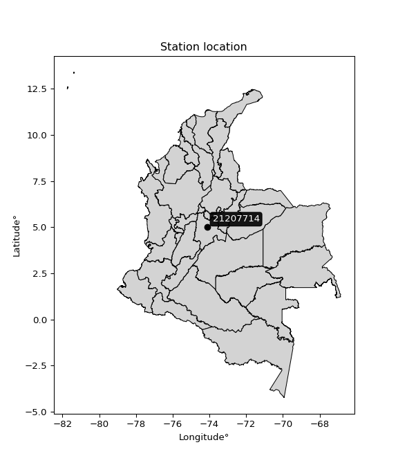

<div align="center">


</div>

# PMax24h Station (Rain, Pmax24h): 21207714

Maximum Precipitation in 24 hours (PMax24h) is the greatest amount of rainfall for a specific duration that is meteorologically possible for a given location, acting as a "worst-case" scenario for extreme storms, crucial for designing safety-critical infrastructure like bridges, river deviations, dams, spillways, and nuclear plants to prevent catastrophic failure. The PMax24h is related with the Probable Maximum Precipitation (PMP) and it is calculated by hydrologists using meteorological data to determine the upper limit of extreme rainfall, often leading to the Probable Maximum Flood (PMF) for flood control design, and is increasingly being studied for climate change impacts. Probable Maximum Precipitation (PMP) is the theoretical upper limit of rainfall, a deterministic estimate for extreme events, while probability distributions (like GEV, Gumbel) describe the likelihood and frequency of various precipitation amounts, including rare ones, showing how often events occur, with PMP representing the extreme end of these distributions, used for critical infrastructure design to ensure safety against the worst conceivable weather, unlike standard statistical forecasts which cover typical probabilities.

The most common probability distributions in hydrology, used for analyzing floods, rainfall, and streamflow, include the Normal, Log-Normal, Gumbel, Gamma (including Log-Pearson Type III), and Generalized Extreme Value (GEV) distributions, often chosen based on the data´s skewness and whether modeling extremes or general conditions, with Gumbel and GEV popular for extreme events like floods, while the Normal distribution serves as a baseline, though often requiring transformations for skewed hydrological data. These distributions help in designing water infrastructure, managing water resources, and forecasting hydrologic events.

> Hydrological data often isn´t perfectly normal (it´s skewed), so different distributions are needed for different applications, such as: **Flood Frequency Analysis**: Using Gumbel, GEV, or Log-Pearson Type III for predicting extreme flood magnitudes and their return periods, **Rainfall Analysis**: Normal for annual totals, but Log-Normal, Weibull, or GEV for intensity or extreme daily rainfall, **Streamflow Modeling**: Gamma and Log-Normal for maximum flows, GEV for minimum flows, and Kappa for daily flows.

<div align="center">

</img>

</div>


## A. General information


### 1. General running parameters

• app_version: _v20260225_. • runtime: _2026-02-27 14:50:08.749431_. • Python version: _3.14.0_. • SciPy version: _1.16.3_. • Pandas version: _2.3.3_. • NumPy version: _2.3.5_. • Stations dataset (station_dataset_file): _dataset/pmax24h_in/automatic_colombia_2003_2025.csv_. • Stations catalog (station_catalog_file): _dataset/CNE.xls_. • Minimum year to eval til year_max (date_min): _1900_. • Maximum year to eval since year_min (date_max): _2025_. • Creates, save and include plots into reports (create_plot): _False_. • Plot only fit distributions with Δo > Δ (plot_only_fit): _True_. • Plot only simple graphs avoiding multiple CDFs and multiple Extreme values plots (plot_only_simple): _False_. • Eval low extreme values, if False, evaluates high extreme values (low_extreme): _False_. • Eval every SciPy distribution as logarithmic (pdist_logarithmic_on): _True_. • Standard deviation normalized (ddof): _1.0_. • Return periods to eval in years (Tr): _[2, 2.33, 5, 10, 15, 20, 25, 50, 75, 100, 200, 250, 500, 750, 1000]_. • Minimum data sample per station, 0 means any (minimum_sample): _5_. • Z-Score maximum threshold to adjust a value, 0 means disable (zscore_max): _3.5_. • Z-Score minimum threshold to adjust a value, 0 means disable (zscore_min): _-2.5_. • Avoid zeros, e.g. rain = 0 (avoid_zeros): _True_. • Avoid null values (avoid_nans): _True_. 

:file_folder:Table: [dataset.csv](../../dataset/pmax24h_in/automatic_colombia_2003_2025.csv)

> Delta Degrees of Freedom (DDOF): is a parameter used in the formulas for calculating variance and standard deviation. When ddof=0, the divisor is $N$ (the total number of observations) and this is used when your data set is the entire population. When ddof=1, the divisor is $N-1$ and this is used when your data set is a sample drawn from a larger population. Using $N-1$ provides an unbiased estimate of the population variance (known as Bessel´s correction).


### 2. Station info and location

|   id |   CODIGO | NOMBRE                        | CATEGORIA    | TECNOLOGIA                | ESTADO   |   FECHA_INSTALACION |   FECHA_SUSPENSION |   ALTITUD |   LATITUD |   LONGITUD | DEPARTAMENTO   | MUNICIPIO   | AREA_OPERATIVA                            | ENTIDAD                                       | AREA_HIDROGRAFICA   | ZONA_HIDROGRAFICA   | SUBZONA_HIDROGRAFICA   | CORRIENTE   | Catalogo   |   Version |
|-----:|---------:|:------------------------------|:-------------|:--------------------------|:---------|--------------------:|-------------------:|----------:|----------:|-----------:|:---------------|:------------|:------------------------------------------|:----------------------------------------------|:--------------------|:--------------------|:-----------------------|:------------|:-----------|----------:|
|    0 | 21207714 | PRADERA LA  - AUT  [21207714] | Limnigráfica | Automática con Telemetría | Activa   |                 nan |                nan |      2735 |   5.00014 |   -74.1321 | Cundinamarca   | Subachoque  | Area Operativa 11 - Cundinamarca-Amazonas | CORPORACION AUTONOMA REGIONAL DE CUNDINAMARCA | Magdalena Cauca     | Alto Magdalena      | Río Bogotá             | Subachoque  | CNE_OE     |  20251226 |

<div align="center">

Dynamic map: [:earth_americas:Google](http://maps.google.com/maps?q=5.000138889,-74.13208333) [:earth_americas:OSM](https://www.openstreetmap.org/#map=18/5.000138889/-74.13208333&layers=P) [:earth_americas:Bing](https://www.bing.com/maps?cp=5.000138889~-74.13208333&lvl=18) [:earth_americas:Apple](https://maps.apple.com/frame?center=5.000138889%2C-74.13208333&span=0.003%2C0.006)

</div>


<div align="center">

```geojson
{
  "type": "Feature",
  "geometry": {
    "type": "Point", 
    "coordinates": [-74.13208333, 5.000138889]
  }, 
  "properties": {
    "Name": "21207714"
  }
}
```

</div>


### 3. Discrete values table and plot

<div align="center">

|               |          0 |          1 |           2 |           3 |           4 |           5 |           6 |
|:--------------|-----------:|-----------:|------------:|------------:|------------:|------------:|------------:|
| Date          | 2015       | 2016       | 2017        | 2018        | 2019        | 2020        | 2021        |
| Value         |   17.3     |  580.9     |   41        |   19.8      |   24        |   24.5      |   14        |
| Value_initial |   17.3     |  580.9     |   41        |   19.8      |   24        |   24.5      |   14        |
| count         |    7       |    7       |    7        |    7        |    7        |    7        |    7        |
| mean          |  103.071   |  103.071   |  103.071    |  103.071    |  103.071    |  103.071    |  103.071    |
| std           |  210.88    |  210.88    |  210.88     |  210.88     |  210.88     |  210.88     |  210.88     |
| zscore        |   -0.40673 |    2.26587 |   -0.294344 |   -0.394875 |   -0.374959 |   -0.372588 |   -0.422379 |


</div>


> The initial value (value_initial) correspond to the initial obtained or null completed value, and value (value) is adjusted only when the initial value is outside the valid range (outlier) definite through the Z-Score value. If Z-Score is active, values out of range or outliers are replaced with the station mean value. A Z-Score (or standard score) measures how many standard deviations a data point is from the mean of a dataset, indicating its relative position; positive scores mean above the mean, negative mean below, and a score of zero is exactly at the mean, allowing for comparison of values from different distributions. It´s calculated using the formula $z=(x–μ)/σ$, where $x$ is the data point, $μ$ is the mean, and $σ$ is the standard deviation, helping identify outliers and understand probability.
>
> <sub>**Note**: In this study, "completing" (filling gaps in) and "extending" (forecasting or lengthening the historical record) rainfall data series are avoided for certain critical analyses because they introduce artificial bias and uncertainty, which can distort the statistics of rare events (extremes), alter day-to-day variability, and compromise the integrity and homogeneity of the original data. Some reasons against Completing/Extending rainfall data are: **Distortion of Extremes and Variability**: The primary issue is that most gap-filling or extension methods rely on averaging or regression with nearby stations, which inherently smooths the data. Rainfall is highly variable in space and time, with a large percentage of zero values and occasional large storms. Infilling methods often underestimate the highest values and overestimate the lowest (zero) values, which severely distorts analyses focused on flood frequency, drought severity, and intensity-duration-frequency (IDF) curves, **Loss of Data Homogeneity**: Infilled or extended data are synthetic estimates, not actual measurements. Combining these estimates with observed data can violate the assumption of data homogeneity, which requires that the data properties do not change over time. Inhomogeneity can lead to incorrect conclusions about long-term trends or changes in climate patterns, **Propagation of Errors**: Errors and biases from the original data (e.g., wind-induced undercatch, instrument errors, site changes) or the data used for imputation can propagate through the analysis, leading to unreliable hydrological models and inaccurate predictions, **Compromised Statistical Integrity**: For statistical analyses, especially those involving the frequency of events, using artificial data can introduce time bias or autocorrelation that doesn´t exist in reality, making it difficult to assess the true probability of events, **Difficulty in Validation**: It is difficult to accurately validate the quality of filled or extended data, especially for past periods where ground-truth measurements are unavailable. The reliability of imputation techniques heavily depends on the density of the surrounding station network and the complexity of the local topography.</sub>


### 4. Active continuous probability distributions from SciPy (80 of 104 available)

A Probability Density Function (PDF) describes the relative likelihood of a continuous random variable falling within a specific range, where the total area under its curve equals 1, and the area over any interval gives the actual probability for that range. Unlike discrete probabilities (like rolling a die), a PDF shows density, not direct probability for a single point (which is zero), with higher points indicating higher likelihood, often visualized as a bell curve for normal distributions.

A log of a probability density function (log-PDF) is simply the logarithm of the PDF´s value, denoted as $log(f(x))$, useful for converting multiplication of probabilities into addition, improving numerical stability with tiny numbers, and connecting to information theory concepts like entropy. Instead of dealing with very small probabilities (e.g., 0.000001), log-PDFs use negative numbers (e.g., $log(0.00001) ≈ -11.51$ that are easier for computers to handle, preventing underflow errors and simplifying complex calculations. In this study, each active probability distribution from SciPy is also evaluated in the $log$ form.

[scipy.stats](https://docs.scipy.org/doc/scipy/reference/stats.html) is a Python´s powerful submodule within the SciPy library for comprehensive statistical analysis, offering over 130 probability distributions (like Normal, Poisson, etc.), functions for descriptive stats (mean, variance), hypothesis testing (t-tests, chi-square), random variable generation, and statistical tests, making it essential for data science, modeling, and research. It provides tools to explore, model, and draw conclusions from data efficiently, working seamlessly with [NumPy](https://numpy.org/).

<div align="center">

|   id | p_dist           |   n_parameter | fit_method   | label                                                                       | active   | ref                                                                                                      |
|-----:|:-----------------|--------------:|:-------------|:----------------------------------------------------------------------------|:---------|:---------------------------------------------------------------------------------------------------------|
|    0 | alpha            |             3 | MLE          | Alpha                                                                       | True     | [:mortar_board:](https://docs.scipy.org/doc/scipy/reference/generated/scipy.stats.alpha.html)            |
|    1 | anglit           |             2 | MM           | Anglit                                                                      | True     | [:mortar_board:](https://docs.scipy.org/doc/scipy/reference/generated/scipy.stats.anglit.html)           |
|    2 | arcsine          |             2 | MM           | Arcsine                                                                     | True     | [:mortar_board:](https://docs.scipy.org/doc/scipy/reference/generated/scipy.stats.arcsine.html)          |
|    3 | argus            |             3 | MLE          | Argus                                                                       | True     | [:mortar_board:](https://docs.scipy.org/doc/scipy/reference/generated/scipy.stats.argus.html)            |
|    4 | beta             |             4 | MLE          | Beta                                                                        | True     | [:mortar_board:](https://docs.scipy.org/doc/scipy/reference/generated/scipy.stats.beta.html)             |
|    5 | betaprime        |             4 | MLE          | Beta prime                                                                  | True     | [:mortar_board:](https://docs.scipy.org/doc/scipy/reference/generated/scipy.stats.betaprime.html)        |
|    6 | bradford         |             3 | MLE          | Bradford                                                                    | True     | [:mortar_board:](https://docs.scipy.org/doc/scipy/reference/generated/scipy.stats.bradford.html)         |
|    7 | burr             |             4 | MLE          | Burr (Type III)                                                             | True     | [:mortar_board:](https://docs.scipy.org/doc/scipy/reference/generated/scipy.stats.burr.html)             |
|    8 | burr12           |             4 | MLE          | Burr (Type III) 12                                                          | True     | [:mortar_board:](https://docs.scipy.org/doc/scipy/reference/generated/scipy.stats.burr12.html)           |
|    9 | cosine           |             2 | MLE          | Cosine                                                                      | True     | [:mortar_board:](https://docs.scipy.org/doc/scipy/reference/generated/scipy.stats.cosine.html)           |
|   10 | crystalball      |             4 | MLE          | Crystalball                                                                 | True     | [:mortar_board:](https://docs.scipy.org/doc/scipy/reference/generated/scipy.stats.crystalball.html)      |
|   11 | dgamma           |             3 | MLE          | Double gamma                                                                | True     | [:mortar_board:](https://docs.scipy.org/doc/scipy/reference/generated/scipy.stats.dgamma.html)           |
|   12 | dweibull         |             3 | MLE          | Double Weibull                                                              | True     | [:mortar_board:](https://docs.scipy.org/doc/scipy/reference/generated/scipy.stats.dweibull.html)         |
|   13 | erlang           |             3 | MLE          | Erlang                                                                      | True     | [:mortar_board:](https://docs.scipy.org/doc/scipy/reference/generated/scipy.stats.erlang.html)           |
|   14 | exponnorm        |             3 | MLE          | Exponentially modified Normal                                               | True     | [:mortar_board:](https://docs.scipy.org/doc/scipy/reference/generated/scipy.stats.exponnorm.html)        |
|   15 | exponpow         |             3 | MLE          | Exponential power                                                           | True     | [:mortar_board:](https://docs.scipy.org/doc/scipy/reference/generated/scipy.stats.exponpow.html)         |
|   16 | exponweib        |             4 | MLE          | Exponentiated Weibull                                                       | True     | [:mortar_board:](https://docs.scipy.org/doc/scipy/reference/generated/scipy.stats.exponweib.html)        |
|   17 | f                |             4 | MLE          | F                                                                           | True     | [:mortar_board:](https://docs.scipy.org/doc/scipy/reference/generated/scipy.stats.f.html)                |
|   18 | fatiguelife      |             3 | MLE          | Fatigue-life (Birnbaum-Saunders)                                            | True     | [:mortar_board:](https://docs.scipy.org/doc/scipy/reference/generated/scipy.stats.fatiguelife.html)      |
|   19 | foldnorm         |             3 | MM           | Fold Normal                                                                 | True     | [:mortar_board:](https://docs.scipy.org/doc/scipy/reference/generated/scipy.stats.foldnorm.html)         |
|   20 | gamma            |             3 | MLE          | Gamma                                                                       | True     | [:mortar_board:](https://docs.scipy.org/doc/scipy/reference/generated/scipy.stats.gamma.html)            |
|   21 | gausshyper       |             6 | MLE          | Gauss hypergeometric                                                        | True     | [:mortar_board:](https://docs.scipy.org/doc/scipy/reference/generated/scipy.stats.gausshyper.html)       |
|   22 | genexpon         |             5 | MLE          | Generalized exponential                                                     | True     | [:mortar_board:](https://docs.scipy.org/doc/scipy/reference/generated/scipy.stats.genexpon.html)         |
|   23 | genextreme       |             3 | MLE          | Generalized exponential                                                     | True     | [:mortar_board:](https://docs.scipy.org/doc/scipy/reference/generated/scipy.stats.genextreme.html)       |
|   24 | gengamma         |             4 | MLE          | Generalized gamma                                                           | True     | [:mortar_board:](https://docs.scipy.org/doc/scipy/reference/generated/scipy.stats.gengamma.html)         |
|   25 | genhalflogistic  |             3 | MLE          | Generalized half-logistic                                                   | True     | [:mortar_board:](https://docs.scipy.org/doc/scipy/reference/generated/scipy.stats.genhalflogistic.html)  |
|   26 | genlogistic      |             3 | MLE          | Generalized logistic                                                        | True     | [:mortar_board:](https://docs.scipy.org/doc/scipy/reference/generated/scipy.stats.genlogistic.html)      |
|   27 | gennorm          |             3 | MLE          | Generalized Normal                                                          | True     | [:mortar_board:](https://docs.scipy.org/doc/scipy/reference/generated/scipy.stats.gennorm.html)          |
|   28 | genpareto        |             3 | MLE          | Generalized Pareto                                                          | True     | [:mortar_board:](https://docs.scipy.org/doc/scipy/reference/generated/scipy.stats.genpareto.html)        |
|   29 | gompertz         |             3 | MLE          | Gompertz (or truncated Gumbel)                                              | True     | [:mortar_board:](https://docs.scipy.org/doc/scipy/reference/generated/scipy.stats.gompertz.html)         |
|   30 | gumbel_l         |             2 | MM           | Gumbel Left Skew                                                            | True     | [:mortar_board:](https://docs.scipy.org/doc/scipy/reference/generated/scipy.stats.gumbel_l.html)         |
|   31 | gumbel_r         |             2 | MM           | Gumbel Right Skew                                                           | True     | [:mortar_board:](https://docs.scipy.org/doc/scipy/reference/generated/scipy.stats.gumbel_r.html)         |
|   32 | halfgennorm      |             3 | MLE          | Upper half of a generalized normal                                          | True     | [:mortar_board:](https://docs.scipy.org/doc/scipy/reference/generated/scipy.stats.halfgennorm.html)      |
|   33 | halflogistic     |             2 | MM           | Half-logistic                                                               | True     | [:mortar_board:](https://docs.scipy.org/doc/scipy/reference/generated/scipy.stats.halflogistic.html)     |
|   34 | halfnorm         |             2 | MM           | Half Normal                                                                 | True     | [:mortar_board:](https://docs.scipy.org/doc/scipy/reference/generated/scipy.stats.halfnorm.html)         |
|   35 | hypsecant        |             2 | MM           | hyperbolic secant                                                           | True     | [:mortar_board:](https://docs.scipy.org/doc/scipy/reference/generated/scipy.stats.hypsecant.html)        |
|   36 | invgamma         |             3 | MLE          | Inverted gamma                                                              | True     | [:mortar_board:](https://docs.scipy.org/doc/scipy/reference/generated/scipy.stats.invgamma.html)         |
|   37 | invgauss         |             3 | MLE          | Inverse Gaussian                                                            | True     | [:mortar_board:](https://docs.scipy.org/doc/scipy/reference/generated/scipy.stats.invgauss.html)         |
|   38 | invweibull       |             3 | MLE          | Inverted Weibull                                                            | True     | [:mortar_board:](https://docs.scipy.org/doc/scipy/reference/generated/scipy.stats.invweibull.html)       |
|   39 | johnsonsb        |             4 | MLE          | Johnson SB                                                                  | True     | [:mortar_board:](https://docs.scipy.org/doc/scipy/reference/generated/scipy.stats.johnsonsb.html)        |
|   40 | johnsonsu        |             4 | MLE          | Johnson Su                                                                  | True     | [:mortar_board:](https://docs.scipy.org/doc/scipy/reference/generated/scipy.stats.johnsonsu.html)        |
|   41 | kappa3           |             3 | MLE          | Kappa 3                                                                     | True     | [:mortar_board:](https://docs.scipy.org/doc/scipy/reference/generated/scipy.stats.kappa3.html)           |
|   42 | kappa4           |             4 | MLE          | Kappa 4                                                                     | True     | [:mortar_board:](https://docs.scipy.org/doc/scipy/reference/generated/scipy.stats.kappa4.html)           |
|   43 | ksone            |             3 | MLE          | Kolmogorov-Smirnov one-sided test statistic distribution                    | True     | [:mortar_board:](https://docs.scipy.org/doc/scipy/reference/generated/scipy.stats.ksone.html)            |
|   44 | kstwobign        |             2 | MLE          | Limiting distribution of scaled Kolmogorov-Smirnov two-sided test statistic | True     | [:mortar_board:](https://docs.scipy.org/doc/scipy/reference/generated/scipy.stats.kstwobign.html)        |
|   45 | laplace          |             2 | MM           | Laplace                                                                     | True     | [:mortar_board:](https://docs.scipy.org/doc/scipy/reference/generated/scipy.stats.laplace.html)          |
|   46 | levy_l           |             2 | MLE          | Left-skewed Levy                                                            | True     | [:mortar_board:](https://docs.scipy.org/doc/scipy/reference/generated/scipy.stats.levy_l.html)           |
|   47 | loggamma         |             3 | MLE          | Log gamma                                                                   | True     | [:mortar_board:](https://docs.scipy.org/doc/scipy/reference/generated/scipy.stats.loggamma.html)         |
|   48 | logistic         |             2 | MM           | Logistic (or Sech-squared)                                                  | True     | [:mortar_board:](https://docs.scipy.org/doc/scipy/reference/generated/scipy.stats.logistic.html)         |
|   49 | loglaplace       |             3 | MLE          | Log-Laplace                                                                 | True     | [:mortar_board:](https://docs.scipy.org/doc/scipy/reference/generated/scipy.stats.loglaplace.html)       |
|   50 | lomax            |             3 | MLE          | Lomax (Pareto of the second kind)                                           | True     | [:mortar_board:](https://docs.scipy.org/doc/scipy/reference/generated/scipy.stats.lomax.html)            |
|   51 | maxwell          |             2 | MM           | Maxwell                                                                     | True     | [:mortar_board:](https://docs.scipy.org/doc/scipy/reference/generated/scipy.stats.maxwell.html)          |
|   52 | mielke           |             4 | MLE          | Mielke Beta-Kappa / Dagum                                                   | True     | [:mortar_board:](https://docs.scipy.org/doc/scipy/reference/generated/scipy.stats.mielke.html)           |
|   53 | moyal            |             2 | MM           | Moyal                                                                       | True     | [:mortar_board:](https://docs.scipy.org/doc/scipy/reference/generated/scipy.stats.moyal.html)            |
|   54 | nakagami         |             3 | MLE          | Nakagami                                                                    | True     | [:mortar_board:](https://docs.scipy.org/doc/scipy/reference/generated/scipy.stats.nakagami.html)         |
|   55 | ncf              |             5 | MLE          | Non-central F distribution                                                  | True     | [:mortar_board:](https://docs.scipy.org/doc/scipy/reference/generated/scipy.stats.ncf.html)              |
|   56 | nct              |             4 | MLE          | Non-central Student’s t                                                     | True     | [:mortar_board:](https://docs.scipy.org/doc/scipy/reference/generated/scipy.stats.nct.html)              |
|   57 | norm             |             2 | MM           | Normal                                                                      | True     | [:mortar_board:](https://docs.scipy.org/doc/scipy/reference/generated/scipy.stats.norm.html)             |
|   58 | pearson3         |             3 | MM           | Pearson type III                                                            | True     | [:mortar_board:](https://docs.scipy.org/doc/scipy/reference/generated/scipy.stats.pearson3.html)         |
|   59 | powerlaw         |             3 | MLE          | Power-function                                                              | True     | [:mortar_board:](https://docs.scipy.org/doc/scipy/reference/generated/scipy.stats.powerlaw.html)         |
|   60 | rayleigh         |             2 | MM           | Rayleigh                                                                    | True     | [:mortar_board:](https://docs.scipy.org/doc/scipy/reference/generated/scipy.stats.rayleigh.html)         |
|   61 | rdist            |             3 | MLE          | R-distributed (symmetric beta)                                              | True     | [:mortar_board:](https://docs.scipy.org/doc/scipy/reference/generated/scipy.stats.rdist.html)            |
|   62 | rice             |             3 | MLE          | Rice                                                                        | True     | [:mortar_board:](https://docs.scipy.org/doc/scipy/reference/generated/scipy.stats.rice.html)             |
|   63 | semicircular     |             2 | MM           | Semicircular                                                                | True     | [:mortar_board:](https://docs.scipy.org/doc/scipy/reference/generated/scipy.stats.semicircular.html)     |
|   64 | skewnorm         |             3 | MLE          | Skew normal                                                                 | True     | [:mortar_board:](https://docs.scipy.org/doc/scipy/reference/generated/scipy.stats.skewnorm.html)         |
|   65 | t                |             3 | MLE          | Student’s t                                                                 | True     | [:mortar_board:](https://docs.scipy.org/doc/scipy/reference/generated/scipy.stats.t.html)                |
|   66 | trapezoid        |             4 | MLE          | Trapezoid                                                                   | True     | [:mortar_board:](https://docs.scipy.org/doc/scipy/reference/generated/scipy.stats.trapezoid.html)        |
|   67 | triang           |             3 | MLE          | Triangular                                                                  | True     | [:mortar_board:](https://docs.scipy.org/doc/scipy/reference/generated/scipy.stats.triang.html)           |
|   68 | truncexpon       |             3 | MLE          | Truncated exponential                                                       | True     | [:mortar_board:](https://docs.scipy.org/doc/scipy/reference/generated/scipy.stats.truncexpon.html)       |
|   69 | truncnorm        |             4 | MLE          | Truncated normal                                                            | True     | [:mortar_board:](https://docs.scipy.org/doc/scipy/reference/generated/scipy.stats.truncnorm.html)        |
|   70 | truncpareto      |             4 | MLE          | Upper truncated Pareto                                                      | True     | [:mortar_board:](https://docs.scipy.org/doc/scipy/reference/generated/scipy.stats.truncpareto.html)      |
|   71 | truncweibull_min |             5 | MLE          | Doubly truncated Weibull minimum                                            | True     | [:mortar_board:](https://docs.scipy.org/doc/scipy/reference/generated/scipy.stats.truncweibull_min.html) |
|   72 | tukeylambda      |             3 | MLE          | Tukey-Lamdba                                                                | True     | [:mortar_board:](https://docs.scipy.org/doc/scipy/reference/generated/scipy.stats.tukeylambda.html)      |
|   73 | uniform          |             2 | MLE          | Uniform                                                                     | True     | [:mortar_board:](https://docs.scipy.org/doc/scipy/reference/generated/scipy.stats.uniform.html)          |
|   74 | vonmises         |             3 | MLE          | Von Mises                                                                   | True     | [:mortar_board:](https://docs.scipy.org/doc/scipy/reference/generated/scipy.stats.vonmises.html)         |
|   75 | vonmises_line    |             3 | MLE          | Von Mises line                                                              | True     | [:mortar_board:](https://docs.scipy.org/doc/scipy/reference/generated/scipy.stats.vonmises_line.html)    |
|   76 | wald             |             2 | MM           | Wald                                                                        | True     | [:mortar_board:](https://docs.scipy.org/doc/scipy/reference/generated/scipy.stats.wald.html)             |
|   77 | weibull_max      |             3 | MLE          | Weibull maximum                                                             | True     | [:mortar_board:](https://docs.scipy.org/doc/scipy/reference/generated/scipy.stats.weibull_max.html)      |
|   78 | weibull_min      |             3 | MLE          | Weibull minimum                                                             | True     | [:mortar_board:](https://docs.scipy.org/doc/scipy/reference/generated/scipy.stats.weibull_min.html)      |
|   79 | wrapcauchy       |             3 | MLE          | Wrapped  Cauchy                                                             | True     | [:mortar_board:](https://docs.scipy.org/doc/scipy/reference/generated/scipy.stats.wrapcauchy.html)       |

</div>

> **n_parameter:** # arguments & localization & scale.
>
> **Fit methods:** (MLE) maximum likelihood, (MM) L-moments.
>
>**Inactive** (With the only purpose of prevent loops, zero divisions, infinite values, over high estimated values or horizontal trending for recurrence intervals estimations, the follow distributions were disabled.)**:** lognorm, norminvgauss, powernorm, powerlognorm, cauchy, halfcauchy, foldcauchy, skewcauchy, chi2, expon, fisk, genhyperbolic, geninvgauss, gibrat, kstwo, laplace_asymmetric, levy, levy_stable, ncx2, pareto, rel_breitwigner, recipinvgauss, studentized_range, loguniform, 


## B. Probability (PDF) vs. Empirical (EDF) distributions functions

A continuous probability distribution (CPD) describes probabilities for variables that can take any value within a range (like rain any time), unlike discrete variables with specific outcomes (like temperature). It uses a Probability Density Function (PDF), a curve where the total area under it equals 1, and the probability of the variable falling within an interval (a to b) is found by calculating the area under the curve between those points. A key feature is that the probability of hitting any single exact value is zero, so probabilities are always expressed for ranges, e.g., $P(a ≤ X ≤ b)$.

<div align="center">

Distributions parameters from station values
|     |   station | p_dist              |   n |            loc |          scale | shape                  | shape1                 | shape2             | shape3             |
|----:|----------:|:--------------------|----:|---------------:|---------------:|:-----------------------|:-----------------------|:-------------------|:-------------------|
|   0 |  21207714 | alpha               |   7 |      9.75573   |    8.64642     | 6.4788181699226074e-09 |                        |                    |                    |
|   1 |  21207714 | anglit              |   7 |    103.071     |  571.147       |                        |                        |                    |                    |
|   2 |  21207714 | arcsine             |   7 |   -173.036     |  552.215       |                        |                        |                    |                    |
|   3 |  21207714 | argus               |   7 |   -365.875     |  982.835       | 9.487798268812967e-08  |                        |                    |                    |
|   4 |  21207714 | beta                |   7 |    -43.3551    |  624.255       | 0.0015122662556338819  | 0.008893740410059742   |                    |                    |
|   5 |  21207714 | betaprime           |   7 |     12.575     |    0.00864149  | 424.946432150442       | 0.6579579059535773     |                    |                    |
|   6 |  21207714 | bradford            |   7 |     14         |  566.9         | 3.083417134623333      |                        |                    |                    |
|   7 |  21207714 | burr                |   7 |     10.5557    |    0.00227335  | 1.1490697775909249     | 14841.521499919407     |                    |                    |
|   8 |  21207714 | burr12              |   7 |     -0.562338  |   14.3218      | 191.63832717871355     | 0.0056561760799503265  |                    |                    |
|   9 |  21207714 | cosine              |   7 |    156.861     |  182.837       |                        |                        |                    |                    |
|  10 |  21207714 | crystalball         |   7 |    103.071     |  195.237       | 7352.369338307554      | 7847.945813683216      |                    |                    |
|  11 |  21207714 | dgamma              |   7 |     24         |  184.219       | 0.713423243640509      |                        |                    |                    |
|  12 |  21207714 | dweibull            |   7 |     14         |  200.866       | 0.5621136919607852     |                        |                    |                    |
|  13 |  21207714 | erlang              |   7 |     14         |  125.22        | 0.2972799720187378     |                        |                    |                    |
|  14 |  21207714 | exponnorm           |   7 |     13.8654    |    0.0442456   | 1999.156095219706      |                        |                    |                    |
|  15 |  21207714 | exponpow            |   7 |     14         |  218.468       | 0.2579623684678305     |                        |                    |                    |
|  16 |  21207714 | exponweib           |   7 |     14         |   74.136       | 1.4637143427770658     | 0.27094809179362644    |                    |                    |
|  17 |  21207714 | f                   |   7 |     12.5688    |    5.57203     | 8029.518055573466      | 1.3181797821234464     |                    |                    |
|  18 |  21207714 | fatiguelife         |   7 |     13.4453    |   19.3287      | 3.0630883994374356     |                        |                    |                    |
|  19 |  21207714 | foldnorm            |   7 |   -174.519     |  349.987       | 0.0010663454084953422  |                        |                    |                    |
|  20 |  21207714 | gamma               |   7 |     14         |   66.2268      | 0.9657628257227425     |                        |                    |                    |
|  21 |  21207714 | gausshyper          |   7 |     14         |  817.82        | 0.46718173451984024    | 1.6421905117199018     | 1.6434419555438309 | 1.5975381753636124 |
|  22 |  21207714 | genexpon            |   7 |     14         |  160.752       | 1.8047597947577123     | 4.780435869804209e-12  | 1.8894603672368588 |                    |
|  23 |  21207714 | genextreme          |   7 |     14.0087    |    0.0431397   | -4.934031704960962     |                        |                    |                    |
|  24 |  21207714 | gengamma            |   7 |     14         |    5.70896     | 2.0696019432033843     | 0.29149855468564234    |                    |                    |
|  25 |  21207714 | genhalflogistic     |   7 |    -44.073     |  651.838       | 1.0429866306104336     |                        |                    |                    |
|  26 |  21207714 | genlogistic         |   7 |   -607.956     |   80.4596      | 2960.4970462465353     |                        |                    |                    |
|  27 |  21207714 | gennorm             |   7 |     24         |    0.0305711   | 0.2455580977323027     |                        |                    |                    |
|  28 |  21207714 | genpareto           |   7 |     14         |    6.77651     | 1.5035779867705112     |                        |                    |                    |
|  29 |  21207714 | gompertz            |   7 |     13.9996    |    1.00062e+07 | 113170.29718599416     |                        |                    |                    |
|  30 |  21207714 | gumbel_l            |   7 |    190.939     |  152.226       |                        |                        |                    |                    |
|  31 |  21207714 | gumbel_r            |   7 |     15.2042    |  152.226       |                        |                        |                    |                    |
|  32 |  21207714 | halfgennorm         |   7 |     14         |    1.42566     | 0.37186560115087275    |                        |                    |                    |
|  33 |  21207714 | halflogistic        |   7 |   -128.33      |  166.921       |                        |                        |                    |                    |
|  34 |  21207714 | halfnorm            |   7 |   -155.346     |  323.879       |                        |                        |                    |                    |
|  35 |  21207714 | hypsecant           |   7 |    103.071     |  124.292       |                        |                        |                    |                    |
|  36 |  21207714 | invgamma            |   7 |     12.5683    |    3.6723      | 0.659092531485254      |                        |                    |                    |
|  37 |  21207714 | invgauss            |   7 |     12.8815    |    4.99772     | 18.046219344018855     |                        |                    |                    |
|  38 |  21207714 | invweibull          |   7 |     13.12      |    5.36053     | 0.6696660838022673     |                        |                    |                    |
|  39 |  21207714 | johnsonsb           |   7 |     14         | 1232.94        | 0.9238351264362532     | 0.14678955620726233    |                    |                    |
|  40 |  21207714 | johnsonsu           |   7 |     17.0376    |    1.53786     | -0.8868004087651555    | 0.42453673556226623    |                    |                    |
|  41 |  21207714 | kappa3              |   7 |     14         |   11.8485      | 0.010578621936152888   |                        |                    |                    |
|  42 |  21207714 | kappa4              |   7 |    -41.9835    |  628.696       | 1.0975973790562872     | 0.9686690711971778     |                    |                    |
|  43 |  21207714 | ksone               |   7 |    -42.69      |  680.28        | 1.0                    |                        |                    |                    |
|  44 |  21207714 | kstwobign           |   7 |   -334.07      |  519.216       |                        |                        |                    |                    |
|  45 |  21207714 | laplace             |   7 |    103.071     |  138.054       |                        |                        |                    |                    |
|  46 |  21207714 | levy_l              |   7 |    639.187     |  260.199       |                        |                        |                    |                    |
|  47 |  21207714 | loggamma            |   7 | -67570.7       | 8942.95        | 1934.1724564714636     |                        |                    |                    |
|  48 |  21207714 | logistic            |   7 |    103.071     |  107.64        |                        |                        |                    |                    |
|  49 |  21207714 | loglaplace          |   7 |     -0.0641263 |   24.0641      | 1.458221190395618      |                        |                    |                    |
|  50 |  21207714 | lomax               |   7 |     13.9966    |    4.62377     | 0.6951194101809213     |                        |                    |                    |
|  51 |  21207714 | maxwell             |   7 |   -359.559     |  289.911       |                        |                        |                    |                    |
|  52 |  21207714 | mielke              |   7 |     13.9297    |   12.7085      | 0.7816547756767578     | 1.164604552183926      |                    |                    |
|  53 |  21207714 | moyal               |   7 |     -8.57782   |   87.8877      |                        |                        |                    |                    |
|  54 |  21207714 | nakagami            |   7 |     14         |  336.373       | 0.10660150485942946    |                        |                    |                    |
|  55 |  21207714 | ncf                 |   7 |      0.924952  |    0.00824841  | 0.09319945095205096    | 2.6552860951071406     | 262.5872328843642  |                    |
|  56 |  21207714 | nct                 |   7 |     11.3309    |    0.110237    | 0.6575661785456337     | 54.303768130431344     |                    |                    |
|  57 |  21207714 | norm                |   7 |    103.071     |  195.237       |                        |                        |                    |                    |
|  58 |  21207714 | pearson3            |   7 |    103.071     |  195.237       | 2.0341017615511445     |                        |                    |                    |
|  59 |  21207714 | powerlaw            |   7 |     14         |  566.9         | 0.11455928790042412    |                        |                    |                    |
|  60 |  21207714 | rayleigh            |   7 |   -270.429     |  298.01        |                        |                        |                    |                    |
|  61 |  21207714 | rdist               |   7 |    -48.3014    |   89.3014      | 1.3897243085824078     |                        |                    |                    |
|  62 |  21207714 | rice                |   7 |   -158.704     |  230.915       | 0.00023983668729776747 |                        |                    |                    |
|  63 |  21207714 | semicircular        |   7 |    103.071     |  390.475       |                        |                        |                    |                    |
|  64 |  21207714 | skewnorm            |   7 |     14         |  214.601       | 26936371.72848524      |                        |                    |                    |
|  65 |  21207714 | t                   |   7 |     20.7891    |    4.41048     | 0.606392289041819      |                        |                    |                    |
|  66 |  21207714 | trapezoid           |   7 |    -44.8245    |  680.28        | 1.0                    | 1.0                    |                    |                    |
|  67 |  21207714 | triang              |   7 |   -448.091     | 1029           | 0.9999957211774528     |                        |                    |                    |
|  68 |  21207714 | truncexpon          |   7 |    -31.4208    |  409.531       | 1.4951749785109891     |                        |                    |                    |
|  69 |  21207714 | truncnorm           |   7 | -37736.2       | 2570.56        | 14.685502995416272     | 929.7153423813343      |                    |                    |
|  70 |  21207714 | truncpareto         |   7 |      9.25869   |    4.74131     | 0.5310025275091095     | 120.56619888633743     |                    |                    |
|  71 |  21207714 | truncweibull_min    |   7 |     11.9071    |  266.234       | 0.00809755527057075    | 0.007861288819470728   | 2.1371932559113818 |                    |
|  72 |  21207714 | tukeylambda         |   7 |     27.4828    |   17.7278      | 1.3114968327046812     |                        |                    |                    |
|  73 |  21207714 | uniform             |   7 |     14         |  566.9         |                        |                        |                    |                    |
|  74 |  21207714 | vonmises            |   7 |     -1.52509   |    1           | 0.16087294785176276    |                        |                    |                    |
|  75 |  21207714 | vonmises_line       |   7 |     52.8418    |  168.086       | 2.0141066967645305     |                        |                    |                    |
|  76 |  21207714 | wald                |   7 |    -92.1659    |  195.237       |                        |                        |                    |                    |
|  77 |  21207714 | weibull_max         |   7 |    580.9       |    1.72674     | 0.15665223766873326    |                        |                    |                    |
|  78 |  21207714 | weibull_min         |   7 |     14         |  137.901       | 0.2554429602278965     |                        |                    |                    |
|  79 |  21207714 | wrapcauchy          |   7 |     14         |   90.2251      | 0.9473685811601046     |                        |                    |                    |
|  80 |  21207714 | logalpha            |   7 |      2.1493    |    1.70886     | 1.7288798973910955     |                        |                    |                    |
|  81 |  21207714 | loganglit           |   7 |      3.56147   |    3.46969     |                        |                        |                    |                    |
|  82 |  21207714 | logarcsine          |   7 |      1.88417   |    3.35461     |                        |                        |                    |                    |
|  83 |  21207714 | logargus            |   7 |      0.737788  |    5.84281     | 1.7458221288138565e-06 |                        |                    |                    |
|  84 |  21207714 | logbeta             |   7 |      2.63906   |  134.963       | 0.4973576450919799     | 82.46634879208017      |                    |                    |
|  85 |  21207714 | logbetaprime        |   7 |      2.42549   |    0.00291468  | 344.9315376884657      | 1.7860082938264767     |                    |                    |
|  86 |  21207714 | logbradford         |   7 |      2.63906   |    3.72553     | 0.9635323362541427     |                        |                    |                    |
|  87 |  21207714 | logburr             |   7 |      2.34172   |    0.0227224   | 1.623968903693772      | 211.33721836033322     |                    |                    |
|  88 |  21207714 | logburr12           |   7 |      1.32606   |    1.30456     | 520.0706880762701      | 0.004348968008391732   |                    |                    |
|  89 |  21207714 | logcosine           |   7 |      3.85424   |    1.09207     |                        |                        |                    |                    |
|  90 |  21207714 | logcrystalball      |   7 |      3.56147   |    1.18603     | 510.90144242304507     | 523.6583465451484      |                    |                    |
|  91 |  21207714 | logdgamma           |   7 |      3.17805   |    0.885936    | 0.7037771524659169     |                        |                    |                    |
|  92 |  21207714 | logdweibull         |   7 |      3.17805   |    0.808113    | 0.7275386267147269     |                        |                    |                    |
|  93 |  21207714 | logerlang           |   7 |      2.63906   |    1.32461     | 0.18266426201632355    |                        |                    |                    |
|  94 |  21207714 | logexponnorm        |   7 |      2.63739   |    0.000539933 | 1712.2419117945487     |                        |                    |                    |
|  95 |  21207714 | logexponpow         |   7 |      2.63906   |    4.00216     | 0.17441482345251985    |                        |                    |                    |
|  96 |  21207714 | logexponweib        |   7 |      2.63906   |    0.957079    | 0.9177860084291927     | 1.0839244778113881     |                    |                    |
|  97 |  21207714 | logf                |   7 |      2.42515   |    0.563315    | 746.5908544733085      | 3.5755989316418577     |                    |                    |
|  98 |  21207714 | logfatiguelife      |   7 |      2.5626    |    0.546826    | 1.2815610558245787     |                        |                    |                    |
|  99 |  21207714 | logfoldnorm         |   7 |      1.90488   |    2.05277     | 0.09031038331690938    |                        |                    |                    |
| 100 |  21207714 | loggamma            |   7 |      2.63906   |    1.68393     | 0.33040300783774423    |                        |                    |                    |
| 101 |  21207714 | loggausshyper       |   7 |      2.63906   |    3.99175     | 0.6862322901194995     | 1.162230151687481      | 1.0300946009004717 | 1.0831519457395582 |
| 102 |  21207714 | loggenexpon         |   7 |      2.63906   |    1.31618     | 1.42695405708753       | 1.3664712974561365e-08 | 1.979502517241379  |                    |
| 103 |  21207714 | loggenextreme       |   7 |      2.95472   |    0.378451    | -0.615075824530217     |                        |                    |                    |
| 104 |  21207714 | loggengamma         |   7 |      2.63906   |    5.7121      | 0.0745526884916109     | 1.9400388291554491     |                    |                    |
| 105 |  21207714 | loggenhalflogistic  |   7 |      2.44748   |    4.14055     | 1.0570461455393505     |                        |                    |                    |
| 106 |  21207714 | loggenlogistic      |   7 |     -1.62634   |    0.617761    | 2121.9847254626366     |                        |                    |                    |
| 107 |  21207714 | loggennorm          |   7 |      3.17805   |    0.000384981 | 0.23258442356386427    |                        |                    |                    |
| 108 |  21207714 | loggenpareto        |   7 |      0.0121129 |    8.82567     | -1.3893295301452417    |                        |                    |                    |
| 109 |  21207714 | loggompertz         |   7 |      2.63906   |    1.33103e+12 | 1299465207257.687      |                        |                    |                    |
| 110 |  21207714 | loggumbel_l         |   7 |      4.09525   |    0.924747    |                        |                        |                    |                    |
| 111 |  21207714 | loggumbel_r         |   7 |      3.0277    |    0.924747    |                        |                        |                    |                    |
| 112 |  21207714 | loghalfgennorm      |   7 |      2.63906   |    0.00697518  | 0.30136011565590115    |                        |                    |                    |
| 113 |  21207714 | loghalflogistic     |   7 |      2.15575   |    1.01402     |                        |                        |                    |                    |
| 114 |  21207714 | loghalfnorm         |   7 |      1.99163   |    1.96751     |                        |                        |                    |                    |
| 115 |  21207714 | loghypsecant        |   7 |      3.56147   |    0.755053    |                        |                        |                    |                    |
| 116 |  21207714 | loginvgamma         |   7 |      2.4238    |    1.00814     | 1.7877818693551615     |                        |                    |                    |
| 117 |  21207714 | loginvgauss         |   7 |      2.5186    |    0.64663     | 1.6127810417734136     |                        |                    |                    |
| 118 |  21207714 | loginvweibull       |   7 |      2.33942   |    0.615319    | 1.6258969994304868     |                        |                    |                    |
| 119 |  21207714 | logjohnsonsb        |   7 |      2.63906   |    4.98358     | 1.6762741700873143     | 0.10832474610341121    |                    |                    |
| 120 |  21207714 | logjohnsonsu        |   7 |      2.58416   |    0.0019729   | -5.187177314558389     | 0.8299344734304039     |                    |                    |
| 121 |  21207714 | logkappa3           |   7 |      2.63906   |    0.553815    | 1.621889194815063      |                        |                    |                    |
| 122 |  21207714 | logkappa4           |   7 |      1.85643   |    4.30343     | 1.2205909769743102     | 0.9349908928031814     |                    |                    |
| 123 |  21207714 | logksone            |   7 |      2.26651   |    4.47063     | 1.0                    |                        |                    |                    |
| 124 |  21207714 | logkstwobign        |   7 |      0.626051  |    3.4458      |                        |                        |                    |                    |
| 125 |  21207714 | loglaplace          |   7 |      3.56147   |    0.838653    |                        |                        |                    |                    |
| 126 |  21207714 | loglevy_l           |   7 |      6.70338   |    1.512       |                        |                        |                    |                    |
| 127 |  21207714 | logloggamma         |   7 |   -527.121     |   66.7387      | 2840.693578170376      |                        |                    |                    |
| 128 |  21207714 | loglogistic         |   7 |      3.56147   |    0.653895    |                        |                        |                    |                    |
| 129 |  21207714 | logloglaplace       |   7 |     -0.014434  |    3.19249     | 5.78611621410402       |                        |                    |                    |
| 130 |  21207714 | loglomax            |   7 |      2.63906   |    3.99691     | 5.669234257406639      |                        |                    |                    |
| 131 |  21207714 | logmaxwell          |   7 |      0.751071  |    1.76116     |                        |                        |                    |                    |
| 132 |  21207714 | logmielke           |   7 |      2.3461    |    0.0448628   | 111.63864661471467     | 1.620703939891989      |                    |                    |
| 133 |  21207714 | logmoyal            |   7 |      2.88322   |    0.533903    |                        |                        |                    |                    |
| 134 |  21207714 | lognakagami         |   7 |      2.63906   |    2.14693     | 0.07165561354173267    |                        |                    |                    |
| 135 |  21207714 | logncf              |   7 |     -0.361925  |    3.64263     | 199.792320970133       | 40.43471805805376      | 3.73485859479136   |                    |
| 136 |  21207714 | lognct              |   7 |     -0.0933164 |    0.0477743   | 9.83250446944566       | 69.67599550332568      |                    |                    |
| 137 |  21207714 | lognorm             |   7 |      3.56147   |    1.18603     |                        |                        |                    |                    |
| 138 |  21207714 | logpearson3         |   7 |      3.56148   |    1.18603     | 1.763060499991588      |                        |                    |                    |
| 139 |  21207714 | logpowerlaw         |   7 |      2.63906   |    3.72552     | 0.14899714195705033    |                        |                    |                    |
| 140 |  21207714 | lograyleigh         |   7 |      1.29252   |    1.81036     |                        |                        |                    |                    |
| 141 |  21207714 | logrdist            |   7 |      3.17621   |    0.537359    | 1.666447380405498      |                        |                    |                    |
| 142 |  21207714 | logrice             |   7 |      1.88266   |    1.45346     | 6.3819148406318e-05    |                        |                    |                    |
| 143 |  21207714 | logsemicircular     |   7 |      3.56148   |    2.37205     |                        |                        |                    |                    |
| 144 |  21207714 | logskewnorm         |   7 |      2.63906   |    1.50228     | 7054875.54332085       |                        |                    |                    |
| 145 |  21207714 | logt                |   7 |      2.96342   |    0.334123    | 1.1940361542089315     |                        |                    |                    |
| 146 |  21207714 | logtrapezoid        |   7 |      2.26651   |    4.47063     | 1.0                    | 1.0                    |                    |                    |
| 147 |  21207714 | logtriang           |   7 |      2.63905   |    4.32026     | 1.7509187454338242e-06 |                        |                    |                    |
| 148 |  21207714 | logtruncexpon       |   7 |      2.63905   |    3.43799     | 1.08363578201006       |                        |                    |                    |
| 149 |  21207714 | logtruncnorm        |   7 |     -8.41701   |    3.34706     | 3.3032153010038883     | 4.416323251339057      |                    |                    |
| 150 |  21207714 | logtruncpareto      |   7 |      1.09769   |    1.54137     | 1.9930734155783472     | 3.4170203322679416     |                    |                    |
| 151 |  21207714 | logtruncweibull_min |   7 |      2.63231   |    2.93721     | 0.7416598008862644     | 0.0009672748478369844  | 1.2706869978275448 |                    |
| 152 |  21207714 | logtukeylambda      |   7 |      3.17631   |    0.677662    | 1.2613356569852865     |                        |                    |                    |
| 153 |  21207714 | loguniform          |   7 |      2.63906   |    3.72552     |                        |                        |                    |                    |
| 154 |  21207714 | logvonmises         |   7 |      3.06238   |    1           | 1.8332125844876053     |                        |                    |                    |
| 155 |  21207714 | logvonmises_line    |   7 |      3.2663    |    0.986214    | 1.753122102304765      |                        |                    |                    |
| 156 |  21207714 | logwald             |   7 |      2.37544   |    1.18603     |                        |                        |                    |                    |
| 157 |  21207714 | logweibull_max      |   7 |      6.36458   |    1.22047     | 0.6745095170305918     |                        |                    |                    |
| 158 |  21207714 | logweibull_min      |   7 |      2.63906   |    1.20992     | 0.4717990727683076     |                        |                    |                    |
| 159 |  21207714 | logwrapcauchy       |   7 |      2.63906   |    0.592935    | 0.525                  |                        |                    |                    |

</div>

> **loc** (Location parameter): This shifts the distribution along the x-axis. For many common distributions, like the normal (Gaussian) distribution, loc represents the mean $μ$. For others, like the uniform distribution, it might represent the minimum value, or for the beta distribution, the left end of the support interval.
>
> **scale** (Scale parameter): This determines the width or spread of the distribution. For the normal distribution, scale represents the standard deviation $σ$. For a uniform distribution, it defines the length of the interval (from $loc$ to $loc + scale$).
>
> **shape** (Shape parameters): Refers to parameters that define the specific form of a probability distribution, distinct from its location (loc) and scale (scale). These parameters are required arguments for most distribution functions. For example, a normal (Gaussian) distribution is fully defined by its location (mean) and scale (standard deviation), so it has no specific shape parameters beyond loc and scale. However, other distributions have intrinsic properties that need specification, as Gamma distribution that takes a shape parameter, often named $a$ or $alpha$.


### 0. Cumulative distribution values - CDF (160 evaluated)

Cumulative Distribution Function (CDF), denoted as $F$<sub>$X$</sub>$(x)$, is a function that gives the probability that a random variable $X$ will take a value less than or equal to a specific value, $x$ (i.e., $(P(X≥x)$. It essentially "accumulates" probabilities from a given point up to the far right (positive infinity), providing a complete picture of the distribution´s probabilities for both discrete (like rain) and continuous (like temperature) variables, helping to find probabilities over ranges or above certain values. Each station is evaluated separately ordering the $x$ values ascending, calculating the CDF and PDF values for the activated distributions and their logarithmic forms.

<div align="center">

CDF ordered by x ascending and calculating $log(f(x))$ separately
|   id |   Station |   date |     x |   count |    mean |    std |    zscore |   Value_initial |   station |   m |     alpha |   alpha_pdf |   anglit |   anglit_pdf |   arcsine |   arcsine_pdf |    argus |   argus_pdf |     beta |    beta_pdf |   betaprime |   betaprime_pdf |    bradford |   bradford_pdf |      burr |    burr_pdf |    burr12 |   burr12_pdf |   cosine |   cosine_pdf |   crystalball |   crystalball_pdf |   dgamma |    dgamma_pdf |   dweibull |   dweibull_pdf |      erlang |   erlang_pdf |   exponnorm |   exponnorm_pdf |    exponpow |   exponpow_pdf |   exponweib |   exponweib_pdf |         f |       f_pdf |   fatiguelife |   fatiguelife_pdf |   foldnorm |   foldnorm_pdf |       gamma |   gamma_pdf |   gausshyper |   gausshyper_pdf |    genexpon |   genexpon_pdf |   genextreme |   genextreme_pdf |    gengamma |    gengamma_pdf |   genhalflogistic |   genhalflogistic_pdf |   genlogistic |   genlogistic_pdf |   gennorm |   gennorm_pdf |   genpareto |   genpareto_pdf |    gompertz |   gompertz_pdf |   gumbel_l |   gumbel_l_pdf |   gumbel_r |   gumbel_r_pdf |   halfgennorm |   halfgennorm_pdf |   halflogistic |   halflogistic_pdf |   halfnorm |   halfnorm_pdf |   hypsecant |   hypsecant_pdf |   invgamma |   invgamma_pdf |   invgauss |   invgauss_pdf |   invweibull |   invweibull_pdf |   johnsonsb |   johnsonsb_pdf |   johnsonsu |   johnsonsu_pdf |   kappa3 |   kappa3_pdf |      kappa4 |   kappa4_pdf |     ksone |   ksone_pdf |   kstwobign |   kstwobign_pdf |   laplace |   laplace_pdf |   levy_l |   levy_l_pdf |    loggamma |   loggamma_pdf |   logistic |   logistic_pdf |   loglaplace |   loglaplace_pdf |       lomax |   lomax_pdf |   maxwell |   maxwell_pdf |    mielke |   mielke_pdf |    moyal |   moyal_pdf |    nakagami |   nakagami_pdf |      ncf |     ncf_pdf |      nct |    nct_pdf |     norm |    norm_pdf |   pearson3 |   pearson3_pdf |   powerlaw |   powerlaw_pdf |   rayleigh |   rayleigh_pdf |    rdist |    rdist_pdf |     rice |    rice_pdf |   semicircular |   semicircular_pdf |   skewnorm |   skewnorm_pdf |        t |       t_pdf |   trapezoid |   trapezoid_pdf |   triang |   triang_pdf |   truncexpon |   truncexpon_pdf |   truncnorm |   truncnorm_pdf |   truncpareto |   truncpareto_pdf |   truncweibull_min |   truncweibull_min_pdf |   tukeylambda |   tukeylambda_pdf |    uniform |   uniform_pdf |   vonmises |   vonmises_pdf |   vonmises_line |   vonmises_line_pdf |     wald |   wald_pdf |   weibull_max |   weibull_max_pdf |   weibull_min |   weibull_min_pdf |   wrapcauchy |   wrapcauchy_pdf |   logalpha |   logalpha_pdf |   loganglit |   loganglit_pdf |   logarcsine |   logarcsine_pdf |   logargus |   logargus_pdf |    logbeta |   logbeta_pdf |   logbetaprime |   logbetaprime_pdf |   logbradford |   logbradford_pdf |   logburr |   logburr_pdf |   logburr12 |   logburr12_pdf |   logcosine |   logcosine_pdf |   logcrystalball |   logcrystalball_pdf |   logdgamma |   logdgamma_pdf |   logdweibull |   logdweibull_pdf |   logerlang |   logerlang_pdf |   logexponnorm |   logexponnorm_pdf |   logexponpow |   logexponpow_pdf |   logexponweib |   logexponweib_pdf |      logf |   logf_pdf |   logfatiguelife |   logfatiguelife_pdf |   logfoldnorm |   logfoldnorm_pdf |   loggausshyper |   loggausshyper_pdf |   loggenexpon |   loggenexpon_pdf |   loggenextreme |   loggenextreme_pdf |   loggengamma |   loggengamma_pdf |   loggenhalflogistic |   loggenhalflogistic_pdf |   loggenlogistic |   loggenlogistic_pdf |   loggennorm |   loggennorm_pdf |   loggenpareto |   loggenpareto_pdf |   loggompertz |   loggompertz_pdf |   loggumbel_l |   loggumbel_l_pdf |   loggumbel_r |   loggumbel_r_pdf |   loghalfgennorm |   loghalfgennorm_pdf |   loghalflogistic |   loghalflogistic_pdf |   loghalfnorm |   loghalfnorm_pdf |   loghypsecant |   loghypsecant_pdf |   loginvgamma |   loginvgamma_pdf |   loginvgauss |   loginvgauss_pdf |   loginvweibull |   loginvweibull_pdf |   logjohnsonsb |   logjohnsonsb_pdf |   logjohnsonsu |   logjohnsonsu_pdf |   logkappa3 |   logkappa3_pdf |   logkappa4 |   logkappa4_pdf |   logksone |   logksone_pdf |   logkstwobign |   logkstwobign_pdf |   loglevy_l |   loglevy_l_pdf |   logloggamma |   logloggamma_pdf |   loglogistic |   loglogistic_pdf |   logloglaplace |   logloglaplace_pdf |    loglomax |   loglomax_pdf |   logmaxwell |   logmaxwell_pdf |   logmielke |   logmielke_pdf |   logmoyal |   logmoyal_pdf |   lognakagami |   lognakagami_pdf |   logncf |   logncf_pdf |   lognct |   lognct_pdf |   lognorm |   lognorm_pdf |   logpearson3 |   logpearson3_pdf |   logpowerlaw |   logpowerlaw_pdf |   lograyleigh |   lograyleigh_pdf |    logrdist |   logrdist_pdf |   logrice |   logrice_pdf |   logsemicircular |   logsemicircular_pdf |   logskewnorm |   logskewnorm_pdf |     logt |   logt_pdf |   logtrapezoid |   logtrapezoid_pdf |   logtriang |   logtriang_pdf |   logtruncexpon |   logtruncexpon_pdf |   logtruncnorm |   logtruncnorm_pdf |   logtruncpareto |   logtruncpareto_pdf |   logtruncweibull_min |   logtruncweibull_min_pdf |   logtukeylambda |   logtukeylambda_pdf |   loguniform |   loguniform_pdf |   logvonmises |   logvonmises_pdf |   logvonmises_line |   logvonmises_line_pdf |   logwald |   logwald_pdf |   logweibull_max |   logweibull_max_pdf |   logweibull_min |   logweibull_min_pdf |   logwrapcauchy |   logwrapcauchy_pdf |
|-----:|----------:|-------:|------:|--------:|--------:|-------:|----------:|----------------:|----------:|----:|----------:|------------:|---------:|-------------:|----------:|--------------:|---------:|------------:|---------:|------------:|------------:|----------------:|------------:|---------------:|----------:|------------:|----------:|-------------:|---------:|-------------:|--------------:|------------------:|---------:|--------------:|-----------:|---------------:|------------:|-------------:|------------:|----------------:|------------:|---------------:|------------:|----------------:|----------:|------------:|--------------:|------------------:|-----------:|---------------:|------------:|------------:|-------------:|-----------------:|------------:|---------------:|-------------:|-----------------:|------------:|----------------:|------------------:|----------------------:|--------------:|------------------:|----------:|--------------:|------------:|----------------:|------------:|---------------:|-----------:|---------------:|-----------:|---------------:|--------------:|------------------:|---------------:|-------------------:|-----------:|---------------:|------------:|----------------:|-----------:|---------------:|-----------:|---------------:|-------------:|-----------------:|------------:|----------------:|------------:|----------------:|---------:|-------------:|------------:|-------------:|----------:|------------:|------------:|----------------:|----------:|--------------:|---------:|-------------:|------------:|---------------:|-----------:|---------------:|-------------:|-----------------:|------------:|------------:|----------:|--------------:|----------:|-------------:|---------:|------------:|------------:|---------------:|---------:|------------:|---------:|-----------:|---------:|------------:|-----------:|---------------:|-----------:|---------------:|-----------:|---------------:|---------:|-------------:|---------:|------------:|---------------:|-------------------:|-----------:|---------------:|---------:|------------:|------------:|----------------:|---------:|-------------:|-------------:|-----------------:|------------:|----------------:|--------------:|------------------:|-------------------:|-----------------------:|--------------:|------------------:|-----------:|--------------:|-----------:|---------------:|----------------:|--------------------:|---------:|-----------:|--------------:|------------------:|--------------:|------------------:|-------------:|-----------------:|-----------:|---------------:|------------:|----------------:|-------------:|-----------------:|-----------:|---------------:|-----------:|--------------:|---------------:|-------------------:|--------------:|------------------:|----------:|--------------:|------------:|----------------:|------------:|----------------:|-----------------:|---------------------:|------------:|----------------:|--------------:|------------------:|------------:|----------------:|---------------:|-------------------:|--------------:|------------------:|---------------:|-------------------:|----------:|-----------:|-----------------:|---------------------:|--------------:|------------------:|----------------:|--------------------:|--------------:|------------------:|----------------:|--------------------:|--------------:|------------------:|---------------------:|-------------------------:|-----------------:|---------------------:|-------------:|-----------------:|---------------:|-------------------:|--------------:|------------------:|--------------:|------------------:|--------------:|------------------:|-----------------:|---------------------:|------------------:|----------------------:|--------------:|------------------:|---------------:|-------------------:|--------------:|------------------:|--------------:|------------------:|----------------:|--------------------:|---------------:|-------------------:|---------------:|-------------------:|------------:|----------------:|------------:|----------------:|-----------:|---------------:|---------------:|-------------------:|------------:|----------------:|--------------:|------------------:|--------------:|------------------:|----------------:|--------------------:|------------:|---------------:|-------------:|-----------------:|------------:|----------------:|-----------:|---------------:|--------------:|------------------:|---------:|-------------:|---------:|-------------:|----------:|--------------:|--------------:|------------------:|--------------:|------------------:|--------------:|------------------:|------------:|---------------:|----------:|--------------:|------------------:|----------------------:|--------------:|------------------:|---------:|-----------:|---------------:|-------------------:|------------:|----------------:|----------------:|--------------------:|---------------:|-------------------:|-----------------:|---------------------:|----------------------:|--------------------------:|-----------------:|---------------------:|-------------:|-----------------:|--------------:|------------------:|-------------------:|-----------------------:|----------:|--------------:|-----------------:|---------------------:|-----------------:|---------------------:|----------------:|--------------------:|
|    0 |  21207714 |   2021 |  14   |       7 | 103.071 | 210.88 | -0.422379 |            14   |  21207714 |   1 | 0.0416302 | 0.0480807   | 0.346564 |   0.00166639 |  0.395444 |    0.00121797 | 0.215494 | 0.00108809  | 0.851735 | 2.47048e-05 |   0.0367428 |     0.0728388   | 1.09012e-07 |    0.00386591  | 0.0373405 | 0.0409512   | 0.0181139 |  0.0702004   | 0.263559 |  0.00148847  |      0.324115 |       0.00184141  | 0.43288  |   0.00463858  |   0.5      | 41051.4        | 1.34169e-05 |  1.12268e+09 |  0.00152008 |      0.0112748  | 4.66782e-05 |    3.3893e+09  | 2.56128e-07 |     5.71823e+07 | 0.0369747 | 0.0730745   |     0.0306102 |       0.123646    |   0.409867 |    0.0019719   | 1.96202e-16 | 0.053335    |  1.04893e-08 |      2.80284e+06 | 9.38122e-13 |    0.011227    |   0.00535853 |   2276.78        | 2.06768e-10 | 70222           |         0.046719  |           0.000843793 |      0.272358 |       0.00440173  |  0.21008  |   0.00967857  | 1.06079e-10 |     0.147569    | 4.46846e-06 |    0.0113099   |   0.268569 |    0.00150275  |   0.364969 |    0.00241659  |   4.49687e-12 |       0.170307    |       0.402258 |        0.00251073  |   0.398935 |    0.00214878  |    0.289229 |     0.00201977  |  0.0369745 |    0.073075    |  0.0364884 |     0.0853087  |    0.0349561 |      0.0892156   | 1.64107e-07 |     7.1732e+07  |    0.067464 |     0.0162723   | 0        | 4.75981e+185 | 2.91124e-15 |   0.0415872  | 0.0833333 |  0.00146998 |    0.240188 |     0.00309861  |  0.26228  |   0.00189984  | 0.481157 |  0.000334328 | 7.97423e-06 |    5.93284e+09 |   0.304175 |    0.0019663   |     0.166456 |        0.19848   | 0.000517607 |  0.150146   |  0.354207 |   0.0019922   | 0.0171872 |  0.190544    | 0.379152 | 0.00271172  | 0.000172047 |    2.06496e+10 | 0.160905 | 0.0252026   | 0.038878 | 0.0622686  | 0.324115 | 0.00184141  |   0.420917 |    0.00300476  |   0.00988  |    6.37173e+11 |   0.365847 |     0.00203098 | 0.794449 |   0.00545119 | 0.243977 | 0.00244867  |       0.35605  |         0.00158739 |  0         |    0.00371799  | 0.231211 | 0.0179601   |  0.00747724 |     0.000254222 | 0.201665 |  0.000872836 |     0.13532  |      0.00281709  |  0.00118243 |     0.00573245  |   2.58242e-09 |        0.121535   |        2.10725e-10 |            0.0851942   |     0.0017575 |         0.0495655 | 0          |    0.00176398 |    2.97536 |       0.134994 |        0.382387 |         0.00292156  | 0.402191 | 0.00420822 |     0.0838729 |       5.74424e-05 |   5.78685e-05 |       4.16067e+09 |  3.09841e-09 |       0.0652673  |  0.0408897 |      0.630035  |    0.246502 |        0.248422 |     0.31465  |         0.227219 |   0.154549 |       0.157986 | 2.0405e-08 |   2.28525e+07 |      0.0390499 |          0.73182   |   8.35944e-07 |          0.383299 | 0.0399039 |     0.69674   |   0.0146201 |       1.64      |    0.180154 |       0.210183  |         0.218363 |            0.248581  |    0.193624 |      0.275407   |      0.237416 |         0.23868   |  0.00161495 |     6.64265e+11 |     0.00180133 |          1.07863   |    0.00164908 |       6.47672e+11 |    5.57304e-16 |          1.24842   | 0.0390639 |  0.731502  |        0.0363263 |            1.23913   |      0.278305 |         0.363311  |     1.70406e-11 |       26376.6       |   9.35008e-13 |         1.08417   |       0.0398944 |            0.697363 |    0.00486181 |       1.58344e+12 |            0.0237147 |                 0.126895 |         0.11912  |           0.410054   |     0.129517 |       0.155418   |       0.318934 |           0.131582 |   3.68523e-14 |         0.976282  |      0.187038 |       0.182039    |      0.218195 |         0.359204  |         0        |           15.7977    |          0.233903 |             0.466111  |      0.257889 |          0.384159 |       0.182471 |          0.228646  |     0.0390653 |         0.731508  |     0.0370627 |         0.939796  |       0.0398844 |           0.697255  |     0.00998141 |        6.49059e+12 |       0.032063 |          1.08613   | 4.29544e-09 |       1.34012   | 8.48788e-14 |      175.366    |  0.0833333 |       0.223682 |       0.115502 |          0.357457  |    0.458094 |       0.0497075 |      0.230684 |         0.24177   |      0.196131 |          0.241115 |        0.171505 |          0.373979   | 5.76401e-11 |      1.41841   |     0.234791 |        0.293085  |   0.0401495 |       0.697731  |   0.208784 |      0.426281  |    0.00485757 |       1.56758e+12 | 0.17298  |    0.364992  | 0.1401   |    0.410308  |  0.218363 |     0.248581  |      0.21604  |         0.547269  |    0.00424045 |       1.42272e+12 |      0.241653 |         0.311569  | 0.000670097 |       2.75498  |  0.126645 |     0.312704  |          0.258827 |              0.24726  |      0        |         0.531116  | 0.243703 | 0.5197     |     0.00694444 |          0.0372804 | 1.75222e-06 |       0.462935  |     2.63952e-06 |            0.439617 |    1.87356e-05 |          1.07679   |      9.94873e-11 |             1.4153   |            0.00749837 |                  1.73575  |      3.95435e-07 |             1.445    |    0         |         0.268419 |      0.303561 |         0.416241  |           0.228844 |              0.342752  | 0.0847033 |     0.823313  |         0.119697 |            0.0460037 |      5.21971e-08 |          5.54541e+07 |        0        |            0.861766 |
|    1 |  21207714 |   2015 |  17.3 |       7 | 103.071 | 210.88 | -0.40673  |            17.3 |  21207714 |   2 | 0.251758  | 0.0628512   | 0.352074 |   0.00167248 |  0.399455 |    0.00121285 | 0.219098 | 0.00109586  | 0.851815 | 2.34983e-05 |   0.291545  |     0.0601199   | 0.0126445   |    0.00379775  | 0.218917  | 0.0566556   | 0.212942  |  0.047761    | 0.268489 |  0.00149944  |      0.330215 |       0.0018554   | 0.449187 |   0.00529672  |   0.547267 |     0.00765811 | 0.37559     |  0.0331537   |  0.0380845  |      0.0108748  | 0.332112    |    0.0248475   | 0.214842    |     0.0206612   | 0.292129  | 0.0601648   |     0.279186  |       0.0382328   |   0.416358 |    0.00196182  | 0.0546524   | 0.0155924   |  0.144283    |      0.0202438   | 0.036371    |    0.0108186   |   0.740501   |      0.0136631   | 0.193335    |     0.0262362   |         0.0495113 |           0.000848505 |      0.286969 |       0.00445157  |  0.248727 |   0.0142694   | 0.306076    |     0.0591161   | 0.0366393   |    0.0108956   |   0.273565 |    0.00152519  |   0.372944 |    0.00241644  |   0.216552    |       0.0434412   |       0.41051  |        0.00249064  |   0.406007 |    0.00213725  |    0.295949 |     0.00205256  |  0.292131  |    0.0601651   |  0.303701  |     0.0575767  |    0.306889  |      0.0580787   | 0.521835    |     0.0177666   |    0.207619 |     0.0779013   | 0.364868 | 0.00117298   | 0.0090878   |   0.00250878 | 0.0881843 |  0.00146998 |    0.250462 |     0.00312764  |  0.268625 |   0.0019458   | 0.482264 |  0.00033662  | 0.547151    |    0.776666    |   0.310703 |    0.00198966  |     0.21424  |        0.255457  | 0.312527    |  0.0602829  |  0.360791 |   0.0019979   | 0.311253  |  0.059503    | 0.388081 | 0.00269949  | 0.309771    |    0.0200132   | 0.242492 | 0.0238854   | 0.28031  | 0.0615465  | 0.330215 | 0.0018554   |   0.430746 |    0.00295213  |   0.554576 |    0.0192521   |   0.372553 |     0.00203282 | 0.812732 |   0.00563525 | 0.252091 | 0.00246868  |       0.361293 |         0.00159055 |  0.0122691 |    0.00371755  | 0.316315 | 0.0364648   |  0.0083397  |     0.000268483 | 0.204556 |  0.000879069 |     0.144579 |      0.00279448  |  0.0199223  |     0.00562538  |   0.265444    |        0.0541311  |        0.168794    |            0.0330718   |     0.135575  |         0.0378007 | 0.00582113 |    0.00176398 |    3.49546 |       0.185721 |        0.39207  |         0.00294703  | 0.415895 | 0.00409756 |     0.0840631 |       5.78568e-05 |   0.319822    |       0.0202916   |  0.189372    |       0.0447815  |  0.250124  |      1.12614   |    0.300834 |        0.264358 |     0.360711 |         0.209516 |   0.189601 |       0.173112 | 0.39075    |   0.84246     |      0.262359  |          1.1058    |   0.0789833   |          0.363407 | 0.258845  |     1.11263   |   0.297141  |       1.04267   |    0.227227 |       0.234151  |         0.274493 |            0.281078  |    0.264351 |      0.405399   |      0.297806 |         0.342964  |  0.756724   |     0.570132    |     0.206052   |          0.85879   |    0.559591   |       0.395581    |    0.204113    |          0.868958  | 0.262292  |  1.10566   |        0.305511  |            0.998538  |      0.353679 |         0.348422  |     0.196383    |           0.612167  |   0.20504     |         0.861869  |       0.258902  |            1.11251  |    0.645243   |       0.440255    |            0.0513398 |                 0.134259 |         0.220765 |           0.53966    |     0.17352  |       0.280508   |       0.347011 |           0.133757 |   0.186679    |         0.794031  |      0.229199 |       0.216988    |      0.297919 |         0.390117  |         0.453672 |            0.963907  |          0.329864 |             0.439435  |      0.337621 |          0.368659 |       0.236787 |          0.28547   |     0.262293  |         1.10566   |     0.284511  |         1.06643   |       0.258883  |           1.11252   |     0.909679   |        0.0870299   |       0.294529 |          1.0735    | 0.263112    |       1.10057   | 0.0985919   |        0.380878 |  0.130676  |       0.223682 |       0.201226 |          0.444995  |    0.468989 |       0.0533117 |      0.284927 |         0.270119  |      0.252188 |          0.288409 |        0.267374 |          0.539958   | 0.253624    |      1.00542   |     0.299454 |        0.316371  |   0.259201  |       1.11307   |   0.302578 |      0.452782  |    0.616512   |       0.41718     | 0.256939 |    0.423404  | 0.237658 |    0.502087  |  0.274493 |     0.281078  |      0.327462 |         0.502139  |    0.652249   |       0.459171    |      0.309545 |         0.328264  | 0.22326     |       0.89633  |  0.198921 |     0.367083  |          0.312136 |              0.256052 |      0.11204  |         0.525871  | 0.392747 | 0.890382   |     0.0170761  |          0.0584596 | 0.0955815   |       0.440256  |     0.0902411   |            0.413369 |    0.205563    |          0.872064  |      0.247588    |             0.962936 |            0.187502   |                  0.617982 |      0.208558    |             0.919653 |    0.0568106 |         0.268419 |      0.397815 |         0.469735  |           0.309177 |              0.41423   | 0.271336  |     0.847107  |         0.129941 |            0.0509006 |      0.355526    |          0.631143    |        0.167099 |            0.666309 |
|    2 |  21207714 |   2018 |  19.8 |       7 | 103.071 | 210.88 | -0.394875 |            19.8 |  21207714 |   3 | 0.389331  | 0.0472092   | 0.356261 |   0.00167695 |  0.402482 |    0.00120915 | 0.221845 | 0.00110172  | 0.851872 | 2.26691e-05 |   0.412695  |     0.0389069   | 0.022076    |    0.00374768  | 0.347364  | 0.0456535   | 0.317124  |  0.0363513   | 0.272248 |  0.00150761  |      0.334867 |       0.00186571  | 0.46338  |   0.00613799  |   0.563729 |     0.00576489 | 0.442139    |  0.0218653   |  0.0648908  |      0.0105717  | 0.381323    |    0.0159723   | 0.256104    |     0.0134871   | 0.413351  | 0.0389243   |     0.351164  |       0.0220758   |   0.421253 |    0.00195411  | 0.0925079   | 0.0147276   |  0.187183    |      0.0148417   | 0.0630415   |    0.0105192   |   0.764922   |      0.00716294  | 0.247162    |     0.0180137   |         0.051637  |           0.000852102 |      0.298138 |       0.0044834   |  0.292232 |   0.0214374   | 0.42314     |     0.0372234   | 0.0634967   |    0.0105918   |   0.2774   |    0.00154226  |   0.378984 |    0.00241558  |   0.308679    |       0.0315832   |       0.416718 |        0.00247526  |   0.411339 |    0.00212841  |    0.301111 |     0.00207712  |  0.413354  |    0.0389244   |  0.417475  |     0.0360214  |    0.421901  |      0.0365005   | 0.554816    |     0.0100485   |    0.376662 |     0.0509883   | 0.367051 | 0.000667429  | 0.0151904   |   0.00238577 | 0.0918592 |  0.00146998 |    0.258307 |     0.00314744  |  0.273534 |   0.00198136  | 0.483108 |  0.000338375 | 0.631974    |    0.515189    |   0.315699 |    0.002007    |     0.25165  |        0.300065  | 0.431797    |  0.0378786  |  0.365791 |   0.00200186  | 0.434833  |  0.0411576   | 0.394817 | 0.00268931  | 0.349347    |    0.0128413   | 0.299913 | 0.0219907   | 0.406036 | 0.0407077  | 0.334867 | 0.00186571  |   0.438077 |    0.00291294  |   0.591586 |    0.0116848   |   0.377636 |     0.00203387 | 0.827022 |   0.00580182 | 0.258281 | 0.00248302  |       0.365273 |         0.00159287 |  0.0215619 |    0.00371663  | 0.437613 | 0.060452    |  0.00902441 |     0.000279288 | 0.206759 |  0.000883791 |     0.151544 |      0.00277748  |  0.0338858  |     0.0055456   |   0.375202    |        0.0357643  |        0.236728    |            0.0225987   |     0.227993  |         0.0363104 | 0.0102311  |    0.00176398 |    3.90927 |       0.139342 |        0.399461 |         0.00296497  | 0.426035 | 0.00401497 |     0.0842082 |       5.81744e-05 |   0.359251    |       0.0125611   |  0.277502    |       0.0270505  |  0.393131  |      0.968181  |    0.337083 |        0.272482 |     0.38846  |         0.202053 |   0.213593 |       0.182335 | 0.486641   |   0.605905    |      0.398857  |          0.906391  |   0.12724     |          0.351765 | 0.397184  |     0.922851  |   0.419845  |       0.790648  |    0.259766 |       0.247759  |         0.313669 |            0.298974  |    0.328049 |      0.552634   |      0.351651 |         0.46809   |  0.816149   |     0.344044    |     0.313903   |          0.742131  |    0.601747   |       0.251207    |    0.313874    |          0.759308  | 0.398792  |  0.906514  |        0.420448  |            0.727042  |      0.399975 |         0.337384  |     0.270944    |           0.503331  |   0.313259    |         0.744541  |       0.397214  |            0.922626 |    0.692835   |       0.287928    |            0.069799  |                 0.139309 |         0.296934 |           0.583474   |     0.223279 |       0.490302   |       0.365163 |           0.135233 |   0.287092    |         0.695999  |      0.260096 |       0.241023    |      0.351171 |         0.3974    |         0.557188 |            0.615689  |          0.387819 |             0.418926  |      0.386605 |          0.356939 |       0.277857 |          0.323011  |     0.398792  |         0.90651   |     0.410817  |         0.813788  |       0.397198  |           0.922661  |     0.918541   |        0.0506192   |       0.420672 |          0.808235  | 0.397338    |       0.88975   | 0.147539    |        0.347549 |  0.160867  |       0.223682 |       0.263607 |          0.476105  |    0.476353 |       0.055842  |      0.322462 |         0.285665  |      0.293062 |          0.316835 |        0.348976 |          0.673046   | 0.37593     |      0.814544  |     0.342859 |        0.326104  |   0.397585  |       0.923058  |   0.36361  |      0.44931   |    0.661624   |       0.273071    | 0.31564  |    0.444188  | 0.307548 |    0.529411  |  0.313669 |     0.298974  |      0.392857 |         0.466422  |    0.701997   |       0.301754    |      0.354258 |         0.3336    | 0.3406      |       0.849348 |  0.250207 |     0.391488  |          0.346998 |              0.260357 |      0.182478 |         0.517165  | 0.521871 | 0.979901   |     0.0258782  |          0.0719663 | 0.154029    |       0.425792  |     0.144955    |            0.397455 |    0.315601    |          0.76074   |      0.363984    |             0.77122  |            0.263163   |                  0.512723 |      0.330771    |             0.894731 |    0.0930406 |         0.268419 |      0.462535 |         0.486723  |           0.36762  |              0.450023  | 0.377599  |     0.724831  |         0.137043 |            0.0543711 |      0.425612    |          0.433476    |        0.244511 |            0.486101 |
|    3 |  21207714 |   2019 |  24   |       7 | 103.071 | 210.88 | -0.374959 |            24   |  21207714 |   4 | 0.543844  | 0.0282804   | 0.363319 |   0.00168417 |  0.407548 |    0.00120324 | 0.226492 | 0.00111149  | 0.851965 | 2.14165e-05 |   0.535276  |     0.0219409   | 0.0376445   |    0.00366649  | 0.50279   | 0.0295467   | 0.442732  |  0.0245923   | 0.278608 |  0.00152106  |      0.342738 |       0.00188248  | 0.5      | 131.042       |   0.584527 |     0.004325   | 0.515964    |  0.0144193   |  0.108254   |      0.0100815  | 0.434695    |    0.0103356   | 0.301418    |     0.00881514  | 0.535968  | 0.0219433   |     0.420526  |       0.0126517   |   0.429433 |    0.00194099  | 0.151844    | 0.0135672   |  0.24016     |      0.01092     | 0.106197    |    0.0100347   |   0.786651   |      0.00382593  | 0.308887    |     0.0122087   |         0.0552286 |           0.000858198 |      0.317062 |       0.00452557  |  0.5      |   0.610276    | 0.54044     |     0.0210688   | 0.106942    |    0.0101005   |   0.283938 |    0.00157106  |   0.389124 |    0.00241271  |   0.417939    |       0.0216338   |       0.427059 |        0.00244912  |   0.420247 |    0.00211336  |    0.309921 |     0.00211778  |  0.53597   |    0.0219433   |  0.530483  |     0.0202396  |    0.536607  |      0.0205598   | 0.586403    |     0.00576493  |    0.521396 |     0.0237191   | 0.36916  | 0.000387119  | 0.0249493   |   0.00227246 | 0.0980332 |  0.00146998 |    0.271589 |     0.0031765   |  0.281984 |   0.00204257  | 0.484536 |  0.000341356 | 0.712406    |    0.341959    |   0.324188 |    0.0020354   |     0.316531 |        0.377428  | 0.550918    |  0.0213414  |  0.374211 |   0.00200779  | 0.569895  |  0.025096    | 0.406073 | 0.00267055  | 0.392366    |    0.00836466  | 0.384992 | 0.0185399   | 0.534255 | 0.0228686  | 0.342738 | 0.00188248  |   0.450175 |    0.00284838  |   0.629679 |    0.00721356  |   0.386181 |     0.00203497 | 0.852096 |   0.00615649 | 0.268758 | 0.00250555  |       0.371971 |         0.0015966  |  0.0371666 |    0.00371396  | 0.673206 | 0.0389139   |  0.0102355  |     0.000297439 | 0.210488 |  0.000891725 |     0.16315  |      0.00274914  |  0.0569     |     0.00541409  |   0.491014    |        0.0214029  |        0.312834    |            0.0147513   |     0.377834  |         0.0352322 | 0.0176398  |    0.00176398 |    4.57257 |       0.183473 |        0.411972 |         0.0029924   | 0.442611 | 0.00387892 |     0.0844536 |       5.87148e-05 |   0.400447    |       0.00783479  |  0.355692    |       0.0125589  |  0.550075  |      0.670801  |    0.390394 |        0.2812   |     0.426587 |         0.194936 |   0.249885 |       0.194846 | 0.584725   |   0.431955    |      0.545391  |          0.630224  |   0.19341     |          0.336404 | 0.546388  |     0.640358  |   0.547295  |       0.552871  |    0.309085 |       0.264418  |         0.373242 |            0.319241  |    0.5      |  14875          |      0.5      |      6473.14      |  0.867404   |     0.207413    |     0.442794   |          0.602714  |    0.640726   |       0.165843    |    0.446424    |          0.622538  | 0.54536   |  0.630426  |        0.536773  |            0.504526  |      0.463225 |         0.319874  |     0.358442    |           0.414023  |   0.442539    |         0.604381  |       0.546384  |            0.640249 |    0.738215   |       0.196211    |            0.097331  |                 0.147036 |         0.4109   |           0.591459   |     0.5      |      34.077      |       0.391391 |           0.137472 |   0.409162    |         0.576825  |      0.309883 |       0.27679     |      0.427442 |         0.392863  |         0.650933 |            0.388001  |          0.465325 |             0.386321  |      0.453497 |          0.338115 |       0.34489  |          0.372504  |     0.54536   |         0.630423  |     0.541084  |         0.560638  |       0.546375  |           0.640281  |     0.926155   |        0.0315234   |       0.549616 |          0.553179  | 0.542688    |       0.633225  | 0.211499    |        0.319739 |  0.203897  |       0.223682 |       0.357013 |          0.489409  |    0.48747  |       0.0598072 |      0.379204 |         0.303281  |      0.357469 |          0.351257 |        0.5      |          0.906208   | 0.511872    |      0.61009   |     0.406378 |        0.332893  |   0.546793  |       0.640232  |   0.448013 |      0.425138  |    0.704711   |       0.186584    | 0.4022   |    0.451569  | 0.410029 |    0.529033  |  0.373242 |     0.319241  |      0.477509 |         0.41368   |    0.749725   |       0.20725     |      0.418639 |         0.334463  | 0.501529    |       0.830529 |  0.327774 |     0.412202  |          0.397546 |              0.264854 |      0.280245 |         0.498008  | 0.689128 | 0.710447   |     0.0415741  |          0.0912165 | 0.233957    |       0.405179  |     0.219314    |            0.375826 |    0.44844     |          0.624428  |      0.492443    |             0.576837 |            0.352504   |                  0.423422 |      0.501538    |             0.884356 |    0.144677  |         0.268419 |      0.556375 |         0.483394  |           0.457488 |              0.479515  | 0.500583  |     0.559324  |         0.148019 |            0.0598571 |      0.494819    |          0.301951    |        0.319361 |            0.308438 |
|    4 |  21207714 |   2020 |  24.5 |       7 | 103.071 | 210.88 | -0.372588 |            24.5 |  21207714 |   5 | 0.55759   | 0.0267211   | 0.364161 |   0.00168501 |  0.40815  |    0.00120257 | 0.227048 | 0.00111265  | 0.851976 | 2.12779e-05 |   0.545935  |     0.0207143   | 0.0394754   |    0.00365706  | 0.517198  | 0.0280995   | 0.454773  |  0.0235809   | 0.279369 |  0.00152264  |      0.34368  |       0.00188442  | 0.50809  |   0.0115246   |   0.586661 |     0.00421183 | 0.523036    |  0.0138778   |  0.113281   |      0.0100247  | 0.439762    |    0.00993539  | 0.305741    |     0.00847972  | 0.546628  | 0.0207159   |     0.426696  |       0.0120371   |   0.430403 |    0.00193942  | 0.158596    | 0.0134427   |  0.245544    |      0.0106188   | 0.1112      |    0.00997851  |   0.788511   |      0.00361642  | 0.314881    |     0.0117744   |         0.0556579 |           0.000858928 |      0.319326 |       0.00452965  |  0.565656 |   0.0838054   | 0.550681    |     0.019913    | 0.111978    |    0.0100435   |   0.284724 |    0.0015745   |   0.39033  |    0.00241226  |   0.428553    |       0.0208318   |       0.428283 |        0.00244599  |   0.421303 |    0.00211155  |    0.310981 |     0.00212257  |  0.54663   |    0.0207159   |  0.540321  |     0.0191285  |    0.5466    |      0.0194291   | 0.589214    |     0.00548386  |    0.532857 |     0.0221533   | 0.369349 | 0.000368685  | 0.0260831   |   0.00226256 | 0.0987682 |  0.00146998 |    0.273178 |     0.00317962  |  0.283007 |   0.00204998  | 0.484706 |  0.000341714 | 0.719326    |    0.329411    |   0.325206 |    0.00203871  |     0.32441  |        0.386822  | 0.561289    |  0.0201595  |  0.375216 |   0.00200844  | 0.582121  |  0.0238234   | 0.407408 | 0.00266819  | 0.396469    |    0.00804956  | 0.394163 | 0.0181451   | 0.545359 | 0.0215651  | 0.34368  | 0.00188442  |   0.451597 |    0.0028408   |   0.633209 |    0.00690857  |   0.387198 |     0.00203505 | 0.855187 |   0.00620698 | 0.270011 | 0.0025081   |       0.372769 |         0.00159703 |  0.0390235 |    0.00371354  | 0.691569 | 0.0346233   |  0.0103848  |     0.0002996   | 0.210934 |  0.000892669 |     0.164524 |      0.00274578  |  0.0596032  |     0.00539864  |   0.501445    |        0.0203374  |        0.320061    |            0.0141657   |     0.395433  |         0.0351691 | 0.0185218  |    0.00176398 |    4.6624  |       0.174929 |        0.413469 |         0.00299544  | 0.444547 | 0.00386297 |     0.084483  |       5.87797e-05 |   0.404281    |       0.00750696  |  0.361727    |       0.0115998  |  0.563618  |      0.642932  |    0.396199 |        0.281931 |     0.430601 |         0.194376 |   0.253916 |       0.19614  | 0.593493   |   0.418616    |      0.558131  |          0.605736  |   0.200331    |          0.334837 | 0.559328  |     0.61501   |   0.558491  |       0.533261  |    0.314554 |       0.265994  |         0.379842 |            0.320992  |    0.538611 |      1.29996    |      0.533488 |         1.14112   |  0.871583   |     0.198039    |     0.455084   |          0.58942   |    0.644085   |       0.160018    |    0.459123    |          0.609204  | 0.558105  |  0.605937  |        0.546998  |            0.487389  |      0.4698   |         0.317888  |     0.366903    |           0.406732  |   0.454862    |         0.59102   |       0.559322  |            0.614914 |    0.742194   |       0.189863    |            0.100372  |                 0.147904 |         0.423071 |           0.588995   |     0.599282 |       2.73528    |       0.394228 |           0.137723 |   0.420936    |         0.56533   |      0.31563  |       0.280674    |      0.435528 |         0.391468  |         0.658766 |            0.371978  |          0.473253 |             0.382652  |      0.460446 |          0.335967 |       0.35262  |          0.377187  |     0.558105  |         0.605934  |     0.55243   |         0.540032  |       0.559314  |           0.614944  |     0.926792   |        0.030302    |       0.560807 |          0.53252   | 0.555504    |       0.610085  | 0.218068    |        0.317449 |  0.20851   |       0.223682 |       0.3671   |          0.488956  |    0.488707 |       0.0602597 |      0.385473 |         0.304808  |      0.364744 |          0.354347 |        0.518283 |          0.86747    | 0.524263    |      0.591913  |     0.413245 |        0.333132  |   0.559731  |       0.61486   |   0.456743 |      0.421579  |    0.708496   |       0.180615    | 0.411505 |    0.450925  | 0.420914 |    0.526662  |  0.379842 |     0.320992  |      0.485981 |         0.408076  |    0.75393    |       0.200733    |      0.425532 |         0.334112  | 0.518655    |       0.83077  |  0.336286 |     0.413461  |          0.403011 |              0.265226 |      0.290488 |         0.495515  | 0.703382 | 0.672215   |     0.0434762  |          0.0932798 | 0.242289    |       0.40297   |     0.22704     |            0.373579 |    0.461179    |          0.611231  |      0.504163    |             0.560058 |            0.361158   |                  0.416042 |      0.519774    |             0.884489 |    0.150211  |         0.268419 |      0.56632  |         0.481104  |           0.46739  |              0.480905  | 0.511955  |     0.543753  |         0.14926  |            0.0604865 |      0.500946    |          0.292432    |        0.325579 |            0.294788 |
|    5 |  21207714 |   2017 |  41   |       7 | 103.071 | 210.88 | -0.294344 |            41   |  21207714 |   6 | 0.781983  | 0.00680152  | 0.392175 |   0.00170967 |  0.427824 |    0.00118313 | 0.245719 | 0.00115027  | 0.852294 | 1.76401e-05 |   0.725689  |     0.00586853  | 0.0973917   |    0.00337088  | 0.764287  | 0.00775427  | 0.684892  |  0.00821797  | 0.304907 |  0.00157195  |      0.37527  |       0.00194267  | 0.596493 |   0.00383567  |   0.638253 |     0.00243758 | 0.672971    |  0.00626407  |  0.264177   |      0.00831873 | 0.546896    |    0.00452276  | 0.397681    |     0.00389886  | 0.726333  | 0.00586448  |     0.546319  |       0.00476875  |   0.461966 |    0.00188602  | 0.35143     | 0.0101448   |  0.374067    |      0.00601969  | 0.261495    |    0.00829116  |   0.821836   |      0.00121046  | 0.44468     |     0.00554392  |         0.0700321 |           0.000883574 |      0.394585 |       0.00455974  |  0.840424 |   0.00543622  | 0.725639    |     0.00579149  | 0.263152    |    0.00833374  |   0.311644 |    0.00168871  |   0.429934 |    0.00238407  |   0.64708     |       0.00860468  |       0.467774 |        0.00233999  |   0.455641 |    0.00204999  |    0.347259 |     0.00227176  |  0.726335  |    0.00586446  |  0.709975  |     0.00573491 |    0.717857  |      0.00571567  | 0.642876    |     0.00207369  |    0.716922 |     0.00598312  | 0.373005 | 0.000143372  | 0.0616423   |   0.00207846 | 0.123023  |  0.00146998 |    0.326269 |     0.00324325  |  0.318936 |   0.00231023  | 0.490444 |  0.000353877 | 0.836236    |    0.156759    |   0.359702 |    0.00213969  |     0.582932 |        0.497307  | 0.737258    |  0.00577469 |  0.408492 |   0.00202278  | 0.792345  |  0.0067046   | 0.450709 | 0.00257608  | 0.484881    |    0.00382644  | 0.608581 | 0.00906884  | 0.729913 | 0.00592594 | 0.37527  | 0.00194267  |   0.496474 |    0.0026025   |   0.705564 |    0.00299366  |   0.420762 |     0.00203121 | 1        | 174.137      | 0.312002 | 0.00257672  |       0.399228 |         0.00160964 |  0.100122  |    0.00368868  | 0.876052 | 0.00365421  |  0.0159165  |     0.000370908 | 0.22592  |  0.000923836 |     0.208929 |      0.00263735  |  0.14461    |     0.00491276  |   0.689782    |        0.00661474 |        0.469447    |            0.00613254  |     1         |         0.0564033 | 0.0476274  |    0.00176398 |    7.24262 |       0.16104  |        0.463561 |         0.00306687  | 0.504118 | 0.00336839 |     0.085471  |       6.09962e-05 |   0.482796    |       0.00322617  |  0.443533    |       0.00207865 |  0.770033  |      0.237482  |    0.543782 |        0.287103 |     0.528904 |         0.19056  |   0.362646 |       0.225047 | 0.749861   |   0.220599    |      0.760423  |          0.246013  |   0.363425    |          0.299944 | 0.762768  |     0.244363  |   0.745124  |       0.241452  |    0.459054 |       0.290266  |         0.551021 |            0.333612  |    0.805415 |      0.277021   |      0.761751 |         0.23994   |  0.936299   |     0.0787705   |     0.687788   |          0.33771   |    0.703157   |       0.0848356   |    0.700151    |          0.348768  | 0.760471  |  0.246099  |        0.723817  |            0.242567  |      0.619793 |         0.263405  |     0.541605    |           0.286907  |   0.688063    |         0.338192  |       0.762759  |            0.244397 |    0.814065   |       0.105658    |            0.1826    |                 0.17248  |         0.688093 |           0.416355   |     0.86994  |       0.156684   |       0.466881 |           0.144746 |   0.649723    |         0.34197   |      0.484095 |       0.369228    |      0.621072 |         0.319895  |         0.785817 |            0.164743  |          0.645849 |             0.287411  |      0.618529 |          0.276502 |       0.563691 |          0.413162  |     0.76047   |         0.246099  |     0.740481  |         0.244176  |       0.76276   |           0.244407  |     0.937777   |        0.0157516   |       0.744773 |          0.236073  | 0.762139    |       0.252731  | 0.370479    |        0.279068 |  0.323683  |       0.223682 |       0.601756 |          0.404101  |    0.523002 |       0.0736896 |      0.547689 |         0.316542  |      0.55789  |          0.377199 |        0.79616  |          0.316374   | 0.74072     |      0.289844  |     0.581344 |        0.311479  |   0.763038  |       0.244097  |   0.645877 |      0.308946  |    0.777254   |       0.101942    | 0.627572 |    0.371783  | 0.660962 |    0.387983  |  0.551021 |     0.333612  |      0.662222 |         0.281416  |    0.830893   |       0.115215    |      0.591075 |         0.302076  | 1           |     301.851    |  0.5477   |     0.392001  |          0.540792 |              0.267831 |      0.52555  |         0.411243  | 0.883431 | 0.160515   |     0.104771   |          0.144804  | 0.435573    |       0.347796  |     0.405684    |            0.321617 |    0.704207    |          0.354166  |      0.713126    |             0.290607 |            0.539959   |                  0.293588 |      1           |             1.47537  |    0.28842   |         0.268419 |      0.782438 |         0.336278  |           0.703794 |              0.404463  | 0.714703  |     0.278641  |         0.184991 |            0.0794252 |      0.611532    |          0.161281    |        0.423794 |            0.127362 |
|    6 |  21207714 |   2016 | 580.9 |       7 | 103.071 | 210.88 |  2.26587  |           580.9 |  21207714 |   7 | 0.987921  | 2.11463e-05 | 1        |   0          |  1        |    0          | 0.980666 | 0.000789181 | 0.894529 | 6.76733e+09 |   0.959898  |     4.62457e-05 | 1           |    0.000946735 | 0.990772  | 1.85051e-05 | 0.981951  |  3.36466e-05 | 0.985738 |  0.000278132 |      0.992806 |       0.000102249 | 0.987102 |   7.52969e-05 |   0.91667  |     0.00014805 | 0.998906    |  9.89132e-06 |  0.998356   |      1.8588e-05 | 0.925174    |    0.000156437 | 0.752791    |     0.000195662 | 0.960123  | 4.60654e-05 |     0.956242  |       0.000149362 |   0.969104 |    0.000221948 | 0.999826    | 2.63319e-06 |  0.977412    |      0.000181795 | 0.998278    |    1.93272e-05 |   0.899543   |      3.40471e-05 | 0.885545    |     0.000175081 |         1         |           0.0139462   |      0.998867 |       1.40683e-05 |  0.997547 |   9.02705e-06 | 0.960071    |     4.64752e-05 | 0.998358    |    1.85727e-05 |   0.999998 |    2.00626e-07 |   0.975966 |    0.000155969 |   0.996814    |       1.61898e-05 |       0.971842 |        0.000166315 |   0.976987 |    0.000185971 |    0.986379 |     0.000109556 |  0.960123  |    4.60648e-05 |  0.966128  |     5.8227e-05 |    0.956906  |      4.97156e-05 | 0.815987    |     0.000127521 |    0.972197 |     4.80909e-05 | 0.384786 | 6.82314e-06  | 0.963623    |   0.00143885 | 0.916667  |  0.00146998 |    0.995985 |     5.45106e-05 |  0.984304 |   0.000113697 | 0.965385 |  0.00155182  | 0.9807      |    0.0141239   |   0.988332 |    0.000107137 |     0.982324 |        0.0210769 | 0.964862    |  4.2737e-05 |  0.985396 |   0.000150219 | 0.992029  |  1.62116e-05 | 0.972113 | 0.000158589 | 0.902947    |    0.000257833 | 0.983311 | 3.73197e-05 | 0.961174 | 4.4823e-05 | 0.992806 | 0.000102249 |   0.967986 |    0.000162504 |   1        |    0.00020208  |   0.983099 |     0.00016201 | 1        |   0          | 0.99408  | 8.21192e-05 |       1        |         0          |  0.99175   |    0.000113498 | 0.983377 | 1.79965e-05 |  0.84604    |     0.00270419  | 0.999996 |  0.00194364  |     1        |      0.000705703 |  0.962333   |     0.000219399 |   1           |        7.913e-05  |        1           |            0.000313604 |     1         |         0         | 1          |    0.00176398 |   93.1721  |       0.149862 |        1        |         5.48826e-05 | 0.967625 | 0.00013391 |     0.991425  |       1.17645e+10 |   0.761864    |       0.000153971 |  0.999942    |       0.0652673  |  0.94685   |      0.0166803 |    1        |        0        |     1        |         0        |   0.980448 |       0.13321  | 0.968341   |   0.0231539   |      0.955145  |          0.0185119 |   0.999999    |          0.195209 | 0.953879  |     0.0181804 |   0.952934  |       0.0211277 |    0.984669 |       0.0487782 |         0.990947 |            0.0206004 |    0.993199 |      0.00819457 |      0.966842 |         0.0205414 |  0.995861   |     0.00385346  |     0.982254   |          0.0191954 |    0.814508   |       0.023025    |    0.9883      |          0.0148595 | 0.955209  |  0.0185011 |        0.96093   |            0.0261654 |      0.969516 |         0.0372588 |     0.981386    |           0.0834795 |   0.982386    |         0.0190961 |       0.953909  |            0.018181 |    0.950528   |       0.0245175   |            1         |                 3.50753  |         0.994896 |           0.00824094 |     0.974565 |       0.00984098 |       1        |        3351.05     |   0.973673    |         0.0257026 |      0.999991 |       0.000111386 |      0.973269 |         0.0285161 |         0.945184 |            0.0207013 |          0.96898  |             0.0301164 |      0.973756 |          0.034304 |       0.984458 |          0.0205752 |     0.955209  |         0.0185013 |     0.959109  |         0.0231719 |       0.953913  |           0.0181803 |     0.963583   |        0.00919419  |       0.951624 |          0.0220527 | 0.957111    |       0.0176312 | 0.984302    |        0.177977 |  0.916667  |       0.223682 |       0.992201 |          0.0150772 |    0.96536  |       0.267106  |      0.987856 |         0.0255574 |      0.986437 |          0.02046  |        0.99089  |          0.00826337 | 0.976098    |      0.0175469 |     0.982742 |        0.0286359 |   0.953884  |       0.0181574 |   0.969387 |      0.0286552 |    0.917261   |       0.0288305   | 0.986816 |    0.0179616 | 0.987647 |    0.0147906 |  0.990947 |     0.0206004 |      0.96682  |         0.0298603 |    1          |       0.0399936   |      0.980252 |         0.0305615 | 1           |       0        |  0.991386 |     0.0182754 |          1        |              0        |      0.986859 |         0.0245324 | 0.979154 | 0.00726114 |     0.840278   |          0.410084  | 0.981049    |       0.0637283 |     0.999999    |            0.148751 |    0.999999    |          0.0146662 |      1           |             0.035777 |            1          |                  0.103986 |      1           |             0        |    1         |         0.268419 |      1.00203  |         0.0128103 |           1        |              0.0144912 | 0.965344  |     0.0237692 |         1        |        37304.5       |      0.817311    |          0.03933     |        1        |            0.861766 |


</div>

An Empirical Distribution Function (EDF) is a step-function estimate of a true cumulative distribution function (CDF) based on observed sample data, representing the proportion of data points less than or equal to a given value. It is calculated by ordering your data and jumping up by $1/n$ (where $n$ is sample size) at each unique data point, allowing analysis without assuming an underlying population distribution, and it gets closer to the true CDF as the sample size grows. For the empirical probability calculations, the parameter $m$ correspond to the order number which means the position of the $x$ values in an ascending order list.

The Kolmogorov-Smirnov (K-S) test is a non-parametric statistical test used to determine if a sample data set comes from a specific theoretical distribution (one-sample) or if two different samples come from the same underlying distribution (two-sample), by comparing their cumulative distribution functions (CDFs). It calculates the maximum vertical difference (D statistic) between these functions, with a small p-value indicating a significant difference and rejection of the null hypothesis (that the data/samples match).


### 1. EDF California (1923)

California´s estimates the true probability distribution of water-related data (like rainfall, streamflow) using observed samples, crucial for risk assessment.

<div align="center">


$P=m/n$


</div>


**1.1. Empirical values**

<div align="center">

|                | 0                   | 1                  | 2                   | 3                  | 4                  | 5                  | 6              |
|:---------------|:--------------------|:-------------------|:--------------------|:-------------------|:-------------------|:-------------------|:---------------|
| date           | 2021                | 2015               | 2018                | 2019               | 2020               | 2017               | 2016           |
| x              | 14.0                | 17.3               | 19.8                | 24.0               | 24.5               | 41.0               | 580.9          |
| m              | 1                   | 2                  | 3                   | 4                  | 5                  | 6                  | 7              |
| empirical_dist | edf_california      | edf_california     | edf_california      | edf_california     | edf_california     | edf_california     | edf_california |
| empirical      | 0.14285714285714285 | 0.2857142857142857 | 0.42857142857142855 | 0.5714285714285714 | 0.7142857142857143 | 0.8571428571428571 | 1.0            |
| empirical_tr   | 1.1666666666666665  | 1.4                | 1.75                | 2.333333333333333  | 3.5                | 6.999999999999997  | inf            |

</div>


**1.2. Kolmogorov-Smirnov fit test (sorted by Δ)**


<div align="center">

|                | 0                   | 1                   | 2                   | 3                   | 4                   | 5                   | 6                   | 7                   | 8                   | 9                   | 10                  | 11                  | 12                  | 13                  | 14                  | 15                  | 16                  | 17                  | 18                  | 19                  | 20                  | 21                  | 22                  | 23                  | 24                  | 25                  | 26                  | 27                  | 28                  | 29                  | 30                  | 31                  | 32                  | 33                  | 34                  | 35                  | 36                  | 37                  | 38                  | 39                  | 40                  | 41                  | 42                  | 43                  | 44                  | 45                  | 46                  | 47                  | 48                  | 49                  | 50                  | 51                  | 52                  | 53                  | 54                  | 55                  | 56                  | 57                  | 58                  | 59                  | 60                  | 61                  | 62                  | 63                  | 64                  | 65                  | 66                  | 67                  | 68                  | 69                  | 70                  | 71                  | 72                  | 73                  | 74                  | 75                  | 76                  | 77                  | 78                  | 79                  | 80                  | 81                  | 82                  | 83                  | 84                  | 85                  | 86                  | 87                  | 88                  | 89                  | 90                  | 91                  | 92                  | 93                  | 94                  | 95                  | 96                  | 97                  | 98                  | 99                  | 100                 | 101                 | 102                 | 103                 | 104                 | 105                 | 106                 | 107                 | 108                 | 109                 | 110                 | 111                 | 112                 | 113                 | 114                 | 115                 | 116                 | 117                 | 118                 | 119                 | 120                 | 121                 | 122                 | 123                 | 124                 | 125                 | 126                 | 127                 | 128                 | 129                 | 130                 | 131                 | 132                 | 133                 | 134                 | 135                 | 136                 | 137                 | 138                 | 139                 | 140                 | 141                 | 142                 | 143                 | 144                 | 145                 | 146                 | 147                 | 148                 | 149                 | 150                 | 151                 | 152                 | 153                 | 154                 | 155                 | 156                 | 157                 | 158                 | 159                 |
|:---------------|:--------------------|:--------------------|:--------------------|:--------------------|:--------------------|:--------------------|:--------------------|:--------------------|:--------------------|:--------------------|:--------------------|:--------------------|:--------------------|:--------------------|:--------------------|:--------------------|:--------------------|:--------------------|:--------------------|:--------------------|:--------------------|:--------------------|:--------------------|:--------------------|:--------------------|:--------------------|:--------------------|:--------------------|:--------------------|:--------------------|:--------------------|:--------------------|:--------------------|:--------------------|:--------------------|:--------------------|:--------------------|:--------------------|:--------------------|:--------------------|:--------------------|:--------------------|:--------------------|:--------------------|:--------------------|:--------------------|:--------------------|:--------------------|:--------------------|:--------------------|:--------------------|:--------------------|:--------------------|:--------------------|:--------------------|:--------------------|:--------------------|:--------------------|:--------------------|:--------------------|:--------------------|:--------------------|:--------------------|:--------------------|:--------------------|:--------------------|:--------------------|:--------------------|:--------------------|:--------------------|:--------------------|:--------------------|:--------------------|:--------------------|:--------------------|:--------------------|:--------------------|:--------------------|:--------------------|:--------------------|:--------------------|:--------------------|:--------------------|:--------------------|:--------------------|:--------------------|:--------------------|:--------------------|:--------------------|:--------------------|:--------------------|:--------------------|:--------------------|:--------------------|:--------------------|:--------------------|:--------------------|:--------------------|:--------------------|:--------------------|:--------------------|:--------------------|:--------------------|:--------------------|:--------------------|:--------------------|:--------------------|:--------------------|:--------------------|:--------------------|:--------------------|:--------------------|:--------------------|:--------------------|:--------------------|:--------------------|:--------------------|:--------------------|:--------------------|:--------------------|:--------------------|:--------------------|:--------------------|:--------------------|:--------------------|:--------------------|:--------------------|:--------------------|:--------------------|:--------------------|:--------------------|:--------------------|:--------------------|:--------------------|:--------------------|:--------------------|:--------------------|:--------------------|:--------------------|:--------------------|:--------------------|:--------------------|:--------------------|:--------------------|:--------------------|:--------------------|:--------------------|:--------------------|:--------------------|:--------------------|:--------------------|:--------------------|:--------------------|:--------------------|:--------------------|:--------------------|:--------------------|:--------------------|:--------------------|:--------------------|
| station        | 21207714            | 21207714            | 21207714            | 21207714            | 21207714            | 21207714            | 21207714            | 21207714            | 21207714            | 21207714            | 21207714            | 21207714            | 21207714            | 21207714            | 21207714            | 21207714            | 21207714            | 21207714            | 21207714            | 21207714            | 21207714            | 21207714            | 21207714            | 21207714            | 21207714            | 21207714            | 21207714            | 21207714            | 21207714            | 21207714            | 21207714            | 21207714            | 21207714            | 21207714            | 21207714            | 21207714            | 21207714            | 21207714            | 21207714            | 21207714            | 21207714            | 21207714            | 21207714            | 21207714            | 21207714            | 21207714            | 21207714            | 21207714            | 21207714            | 21207714            | 21207714            | 21207714            | 21207714            | 21207714            | 21207714            | 21207714            | 21207714            | 21207714            | 21207714            | 21207714            | 21207714            | 21207714            | 21207714            | 21207714            | 21207714            | 21207714            | 21207714            | 21207714            | 21207714            | 21207714            | 21207714            | 21207714            | 21207714            | 21207714            | 21207714            | 21207714            | 21207714            | 21207714            | 21207714            | 21207714            | 21207714            | 21207714            | 21207714            | 21207714            | 21207714            | 21207714            | 21207714            | 21207714            | 21207714            | 21207714            | 21207714            | 21207714            | 21207714            | 21207714            | 21207714            | 21207714            | 21207714            | 21207714            | 21207714            | 21207714            | 21207714            | 21207714            | 21207714            | 21207714            | 21207714            | 21207714            | 21207714            | 21207714            | 21207714            | 21207714            | 21207714            | 21207714            | 21207714            | 21207714            | 21207714            | 21207714            | 21207714            | 21207714            | 21207714            | 21207714            | 21207714            | 21207714            | 21207714            | 21207714            | 21207714            | 21207714            | 21207714            | 21207714            | 21207714            | 21207714            | 21207714            | 21207714            | 21207714            | 21207714            | 21207714            | 21207714            | 21207714            | 21207714            | 21207714            | 21207714            | 21207714            | 21207714            | 21207714            | 21207714            | 21207714            | 21207714            | 21207714            | 21207714            | 21207714            | 21207714            | 21207714            | 21207714            | 21207714            | 21207714            | 21207714            | 21207714            | 21207714            | 21207714            | 21207714            | 21207714            |
| empirical_dist | edf_california      | edf_california      | edf_california      | edf_california      | edf_california      | edf_california      | edf_california      | edf_california      | edf_california      | edf_california      | edf_california      | edf_california      | edf_california      | edf_california      | edf_california      | edf_california      | edf_california      | edf_california      | edf_california      | edf_california      | edf_california      | edf_california      | edf_california      | edf_california      | edf_california      | edf_california      | edf_california      | edf_california      | edf_california      | edf_california      | edf_california      | edf_california      | edf_california      | edf_california      | edf_california      | edf_california      | edf_california      | edf_california      | edf_california      | edf_california      | edf_california      | edf_california      | edf_california      | edf_california      | edf_california      | edf_california      | edf_california      | edf_california      | edf_california      | edf_california      | edf_california      | edf_california      | edf_california      | edf_california      | edf_california      | edf_california      | edf_california      | edf_california      | edf_california      | edf_california      | edf_california      | edf_california      | edf_california      | edf_california      | edf_california      | edf_california      | edf_california      | edf_california      | edf_california      | edf_california      | edf_california      | edf_california      | edf_california      | edf_california      | edf_california      | edf_california      | edf_california      | edf_california      | edf_california      | edf_california      | edf_california      | edf_california      | edf_california      | edf_california      | edf_california      | edf_california      | edf_california      | edf_california      | edf_california      | edf_california      | edf_california      | edf_california      | edf_california      | edf_california      | edf_california      | edf_california      | edf_california      | edf_california      | edf_california      | edf_california      | edf_california      | edf_california      | edf_california      | edf_california      | edf_california      | edf_california      | edf_california      | edf_california      | edf_california      | edf_california      | edf_california      | edf_california      | edf_california      | edf_california      | edf_california      | edf_california      | edf_california      | edf_california      | edf_california      | edf_california      | edf_california      | edf_california      | edf_california      | edf_california      | edf_california      | edf_california      | edf_california      | edf_california      | edf_california      | edf_california      | edf_california      | edf_california      | edf_california      | edf_california      | edf_california      | edf_california      | edf_california      | edf_california      | edf_california      | edf_california      | edf_california      | edf_california      | edf_california      | edf_california      | edf_california      | edf_california      | edf_california      | edf_california      | edf_california      | edf_california      | edf_california      | edf_california      | edf_california      | edf_california      | edf_california      | edf_california      | edf_california      | edf_california      | edf_california      | edf_california      |
| p_dist         | t                   | logt                | mielke              | logbeta             | gennorm             | logalpha            | lomax               | logjohnsonsu        | logmielke           | logburr             | loggenextreme       | loginvweibull       | logburr12           | logbetaprime        | logf                | loginvgamma         | alpha               | logkappa3           | logvonmises         | loginvgauss         | genpareto           | logfatiguelife      | invgamma            | f                   | invweibull          | loghalfgennorm      | betaprime           | nct                 | invgauss            | logdgamma           | logdweibull         | johnsonsu           | loglomax            | erlang              | logtukeylambda      | logrdist            | logloglaplace       | burr                | logwald             | loggennorm          | logtruncpareto      | truncpareto         | logpearson3         | johnsonsb           | loghalflogistic     | logfoldnorm         | logweibull_min      | logvonmises_line    | logtruncnorm        | loghalfnorm         | logexponweib        | logmoyal            | logexponnorm        | loggenexpon         | burr12              | loggamma            | loggamma            | powerlaw            | logexponpow         | loggumbel_r         | halfgennorm         | lograyleigh         | dgamma              | loggenlogistic      | loggompertz         | lognct              | logmaxwell          | logncf              | exponpow            | fatiguelife         | logsemicircular     | loganglit           | tukeylambda         | ncf                 | logarcsine          | logloggamma         | lognakagami         | loglevy_l           | logcrystalball      | lognorm             | logkstwobign        | loggausshyper       | loglogistic         | wald                | logtruncweibull_min | dweibull            | loggengamma         | pearson3            | loghypsecant        | logpowerlaw         | levy_l              | nakagami            | weibull_min         | logrice             | halflogistic        | loglaplace          | loglaplace          | loggenpareto        | vonmises_line       | truncweibull_min    | foldnorm            | loggumbel_l         | logcosine           | halfnorm            | moyal               | gengamma            | wrapcauchy          | logskewnorm         | gumbel_r            | arcsine             | logwrapcauchy       | rayleigh            | maxwell             | genextreme          | semicircular        | exponweib           | genlogistic         | anglit              | logerlang           | logtriang           | norm                | crystalball         | gausshyper          | logtruncexpon       | logargus            | logkappa4           | logistic            | hypsecant           | logbradford         | kstwobign           | logksone            | laplace             | rice                | gumbel_l            | cosine              | gamma               | loguniform          | exponnorm           | gompertz            | genexpon            | argus               | kappa3              | logjohnsonsb        | triang              | truncexpon          | rdist               | logweibull_max      | loggenhalflogistic  | beta                | truncnorm           | ksone               | logtrapezoid        | skewnorm            | bradford            | weibull_max         | genhalflogistic     | kappa4              | uniform             | trapezoid           | vonmises            |
| delta          | 0.10177714693864182 | 0.1176996181221368  | 0.13216509567176193 | 0.1428571224521695  | 0.14862939562690092 | 0.1506679834718735  | 0.15299660181166563 | 0.15347845096092683 | 0.15455489983001958 | 0.1549575215595389  | 0.15496337835275886 | 0.15497176642324917 | 0.15579487634238753 | 0.1561543139426923  | 0.15618068946727093 | 0.15618095730398773 | 0.156696140656293   | 0.1587815833484405  | 0.16070358246101818 | 0.16185613845419233 | 0.1636044154429689  | 0.16728799130377237 | 0.16765538513133504 | 0.16765792646216082 | 0.1676858656506388  | 0.16795752236272782 | 0.16835024413383892 | 0.16892700559975182 | 0.17396451013860437 | 0.17567471902944798 | 0.18079766299809674 | 0.18142907098268046 | 0.19002236719586418 | 0.19124946018157907 | 0.1945118149425572  | 0.1956304531725187  | 0.1960030667378979  | 0.1970875207841679  | 0.2023306849733736  | 0.2052928577789735  | 0.21012277648795452 | 0.21284055247656963 | 0.2283045728823308  | 0.23612088767685713 | 0.24103267540077244 | 0.24448528164032957 | 0.24561095212678274 | 0.24689563521480196 | 0.25310694461704264 | 0.25383936712205285 | 0.2551629790832204  | 0.25754266136386894 | 0.25920220735056987 | 0.2594235646786317  | 0.2595126727134873  | 0.2614370090420074  | 0.2614370090420074  | 0.2688614305310655  | 0.2738764406229226  | 0.27875733403172587 | 0.2857325318894472  | 0.2887535321434084  | 0.2900225966476592  | 0.2912149192037034  | 0.2933492506153461  | 0.2933722027653095  | 0.30104061596915926 | 0.3027804165576226  | 0.3102464070822295  | 0.31082392513780965 | 0.31635051788411406 | 0.3180864138822078  | 0.3188522592113959  | 0.3201231841963485  | 0.32823927011473764 | 0.3288126993523253  | 0.33079808459082516 | 0.3341406305568725  | 0.33444325210076487 | 0.33444330268059247 | 0.3471857112696563  | 0.3473822736233089  | 0.3495415471298514  | 0.3530245554762689  | 0.3531277213995819  | 0.35714285727258527 | 0.3595286027210456  | 0.360669252906997   | 0.3616661461207985  | 0.36653491995593024 | 0.3666988524824982  | 0.37226187657836385 | 0.37434733416791854 | 0.3779992836694626  | 0.3893691733295722  | 0.38987586987897865 | 0.38987586987897865 | 0.3902616175380926  | 0.3935814422649277  | 0.3942243439107844  | 0.39517637706517217 | 0.39865533153782184 | 0.3997318427530091  | 0.4015020576039713  | 0.4064343423627521  | 0.4124625807981528  | 0.41360965362142527 | 0.42379748289065033 | 0.4272085963117059  | 0.4293186881154479  | 0.43334930396384436 | 0.4363809539886786  | 0.4486511460440829  | 0.4547863219429983  | 0.4579146842501293  | 0.4594619757923223  | 0.4625580907086027  | 0.464967686373743   | 0.471009514548397   | 0.47199706916755424 | 0.48187309825915203 | 0.4818731117189962  | 0.4830755403853851  | 0.487245482727452   | 0.4944972658535808  | 0.49621792763038985 | 0.49744083545696083 | 0.509883568825203   | 0.5139551527634378  | 0.5308743570284422  | 0.5334595495163023  | 0.538207020431045   | 0.5451407072405432  | 0.5454990506463067  | 0.5522355320979426  | 0.5556897027662449  | 0.5687228879909914  | 0.6010047942635806  | 0.6023073764281013  | 0.6030857651471044  | 0.6114238023948301  | 0.6152136248035361  | 0.6239645861360584  | 0.6312228074077136  | 0.6482142999948234  | 0.651591575379066   | 0.6721516641121492  | 0.6745427931910446  | 0.7088780773090706  | 0.7125332387889356  | 0.7341199842081831  | 0.7523719735067902  | 0.757021102818696   | 0.7597511112052533  | 0.7716718955757957  | 0.7871108021686972  | 0.7955005627483562  | 0.8095154096212483  | 0.8412263723785851  | 92.17210275790117   |
| deltao         | 0.48442053926100004 | 0.48442053926100004 | 0.48442053926100004 | 0.48442053926100004 | 0.48442053926100004 | 0.48442053926100004 | 0.48442053926100004 | 0.48442053926100004 | 0.48442053926100004 | 0.48442053926100004 | 0.48442053926100004 | 0.48442053926100004 | 0.48442053926100004 | 0.48442053926100004 | 0.48442053926100004 | 0.48442053926100004 | 0.48442053926100004 | 0.48442053926100004 | 0.48442053926100004 | 0.48442053926100004 | 0.48442053926100004 | 0.48442053926100004 | 0.48442053926100004 | 0.48442053926100004 | 0.48442053926100004 | 0.48442053926100004 | 0.48442053926100004 | 0.48442053926100004 | 0.48442053926100004 | 0.48442053926100004 | 0.48442053926100004 | 0.48442053926100004 | 0.48442053926100004 | 0.48442053926100004 | 0.48442053926100004 | 0.48442053926100004 | 0.48442053926100004 | 0.48442053926100004 | 0.48442053926100004 | 0.48442053926100004 | 0.48442053926100004 | 0.48442053926100004 | 0.48442053926100004 | 0.48442053926100004 | 0.48442053926100004 | 0.48442053926100004 | 0.48442053926100004 | 0.48442053926100004 | 0.48442053926100004 | 0.48442053926100004 | 0.48442053926100004 | 0.48442053926100004 | 0.48442053926100004 | 0.48442053926100004 | 0.48442053926100004 | 0.48442053926100004 | 0.48442053926100004 | 0.48442053926100004 | 0.48442053926100004 | 0.48442053926100004 | 0.48442053926100004 | 0.48442053926100004 | 0.48442053926100004 | 0.48442053926100004 | 0.48442053926100004 | 0.48442053926100004 | 0.48442053926100004 | 0.48442053926100004 | 0.48442053926100004 | 0.48442053926100004 | 0.48442053926100004 | 0.48442053926100004 | 0.48442053926100004 | 0.48442053926100004 | 0.48442053926100004 | 0.48442053926100004 | 0.48442053926100004 | 0.48442053926100004 | 0.48442053926100004 | 0.48442053926100004 | 0.48442053926100004 | 0.48442053926100004 | 0.48442053926100004 | 0.48442053926100004 | 0.48442053926100004 | 0.48442053926100004 | 0.48442053926100004 | 0.48442053926100004 | 0.48442053926100004 | 0.48442053926100004 | 0.48442053926100004 | 0.48442053926100004 | 0.48442053926100004 | 0.48442053926100004 | 0.48442053926100004 | 0.48442053926100004 | 0.48442053926100004 | 0.48442053926100004 | 0.48442053926100004 | 0.48442053926100004 | 0.48442053926100004 | 0.48442053926100004 | 0.48442053926100004 | 0.48442053926100004 | 0.48442053926100004 | 0.48442053926100004 | 0.48442053926100004 | 0.48442053926100004 | 0.48442053926100004 | 0.48442053926100004 | 0.48442053926100004 | 0.48442053926100004 | 0.48442053926100004 | 0.48442053926100004 | 0.48442053926100004 | 0.48442053926100004 | 0.48442053926100004 | 0.48442053926100004 | 0.48442053926100004 | 0.48442053926100004 | 0.48442053926100004 | 0.48442053926100004 | 0.48442053926100004 | 0.48442053926100004 | 0.48442053926100004 | 0.48442053926100004 | 0.48442053926100004 | 0.48442053926100004 | 0.48442053926100004 | 0.48442053926100004 | 0.48442053926100004 | 0.48442053926100004 | 0.48442053926100004 | 0.48442053926100004 | 0.48442053926100004 | 0.48442053926100004 | 0.48442053926100004 | 0.48442053926100004 | 0.48442053926100004 | 0.48442053926100004 | 0.48442053926100004 | 0.48442053926100004 | 0.48442053926100004 | 0.48442053926100004 | 0.48442053926100004 | 0.48442053926100004 | 0.48442053926100004 | 0.48442053926100004 | 0.48442053926100004 | 0.48442053926100004 | 0.48442053926100004 | 0.48442053926100004 | 0.48442053926100004 | 0.48442053926100004 | 0.48442053926100004 | 0.48442053926100004 | 0.48442053926100004 | 0.48442053926100004 | 0.48442053926100004 | 0.48442053926100004 |
| eval           | Δo > Δ              | Δo > Δ              | Δo > Δ              | Δo > Δ              | Δo > Δ              | Δo > Δ              | Δo > Δ              | Δo > Δ              | Δo > Δ              | Δo > Δ              | Δo > Δ              | Δo > Δ              | Δo > Δ              | Δo > Δ              | Δo > Δ              | Δo > Δ              | Δo > Δ              | Δo > Δ              | Δo > Δ              | Δo > Δ              | Δo > Δ              | Δo > Δ              | Δo > Δ              | Δo > Δ              | Δo > Δ              | Δo > Δ              | Δo > Δ              | Δo > Δ              | Δo > Δ              | Δo > Δ              | Δo > Δ              | Δo > Δ              | Δo > Δ              | Δo > Δ              | Δo > Δ              | Δo > Δ              | Δo > Δ              | Δo > Δ              | Δo > Δ              | Δo > Δ              | Δo > Δ              | Δo > Δ              | Δo > Δ              | Δo > Δ              | Δo > Δ              | Δo > Δ              | Δo > Δ              | Δo > Δ              | Δo > Δ              | Δo > Δ              | Δo > Δ              | Δo > Δ              | Δo > Δ              | Δo > Δ              | Δo > Δ              | Δo > Δ              | Δo > Δ              | Δo > Δ              | Δo > Δ              | Δo > Δ              | Δo > Δ              | Δo > Δ              | Δo > Δ              | Δo > Δ              | Δo > Δ              | Δo > Δ              | Δo > Δ              | Δo > Δ              | Δo > Δ              | Δo > Δ              | Δo > Δ              | Δo > Δ              | Δo > Δ              | Δo > Δ              | Δo > Δ              | Δo > Δ              | Δo > Δ              | Δo > Δ              | Δo > Δ              | Δo > Δ              | Δo > Δ              | Δo > Δ              | Δo > Δ              | Δo > Δ              | Δo > Δ              | Δo > Δ              | Δo > Δ              | Δo > Δ              | Δo > Δ              | Δo > Δ              | Δo > Δ              | Δo > Δ              | Δo > Δ              | Δo > Δ              | Δo > Δ              | Δo > Δ              | Δo > Δ              | Δo > Δ              | Δo > Δ              | Δo > Δ              | Δo > Δ              | Δo > Δ              | Δo > Δ              | Δo > Δ              | Δo > Δ              | Δo > Δ              | Δo > Δ              | Δo > Δ              | Δo > Δ              | Δo > Δ              | Δo > Δ              | Δo > Δ              | Δo > Δ              | Δo > Δ              | Δo > Δ              | Δo > Δ              | Δo > Δ              | Δo > Δ              | Δo > Δ              | Δo > Δ              | Δo > Δ              | Δo > Δ              | Δo > Δ              | Δo <= Δ             | Δo <= Δ             | Δo <= Δ             | Δo <= Δ             | Δo <= Δ             | Δo <= Δ             | Δo <= Δ             | Δo <= Δ             | Δo <= Δ             | Δo <= Δ             | Δo <= Δ             | Δo <= Δ             | Δo <= Δ             | Δo <= Δ             | Δo <= Δ             | Δo <= Δ             | Δo <= Δ             | Δo <= Δ             | Δo <= Δ             | Δo <= Δ             | Δo <= Δ             | Δo <= Δ             | Δo <= Δ             | Δo <= Δ             | Δo <= Δ             | Δo <= Δ             | Δo <= Δ             | Δo <= Δ             | Δo <= Δ             | Δo <= Δ             | Δo <= Δ             | Δo <= Δ             | Δo <= Δ             | Δo <= Δ             | Δo <= Δ             | Δo <= Δ             | Δo <= Δ             |
| fit            | 1                   | 1                   | 1                   | 1                   | 1                   | 1                   | 1                   | 1                   | 1                   | 1                   | 1                   | 1                   | 1                   | 1                   | 1                   | 1                   | 1                   | 1                   | 1                   | 1                   | 1                   | 1                   | 1                   | 1                   | 1                   | 1                   | 1                   | 1                   | 1                   | 1                   | 1                   | 1                   | 1                   | 1                   | 1                   | 1                   | 1                   | 1                   | 1                   | 1                   | 1                   | 1                   | 1                   | 1                   | 1                   | 1                   | 1                   | 1                   | 1                   | 1                   | 1                   | 1                   | 1                   | 1                   | 1                   | 1                   | 1                   | 1                   | 1                   | 1                   | 1                   | 1                   | 1                   | 1                   | 1                   | 1                   | 1                   | 1                   | 1                   | 1                   | 1                   | 1                   | 1                   | 1                   | 1                   | 1                   | 1                   | 1                   | 1                   | 1                   | 1                   | 1                   | 1                   | 1                   | 1                   | 1                   | 1                   | 1                   | 1                   | 1                   | 1                   | 1                   | 1                   | 1                   | 1                   | 1                   | 1                   | 1                   | 1                   | 1                   | 1                   | 1                   | 1                   | 1                   | 1                   | 1                   | 1                   | 1                   | 1                   | 1                   | 1                   | 1                   | 1                   | 1                   | 1                   | 1                   | 1                   | 1                   | 1                   | 1                   | 1                   | 1                   | 1                   | 0                   | 0                   | 0                   | 0                   | 0                   | 0                   | 0                   | 0                   | 0                   | 0                   | 0                   | 0                   | 0                   | 0                   | 0                   | 0                   | 0                   | 0                   | 0                   | 0                   | 0                   | 0                   | 0                   | 0                   | 0                   | 0                   | 0                   | 0                   | 0                   | 0                   | 0                   | 0                   | 0                   | 0                   | 0                   | 0                   | 0                   |
| n              | 7                   | 7                   | 7                   | 7                   | 7                   | 7                   | 7                   | 7                   | 7                   | 7                   | 7                   | 7                   | 7                   | 7                   | 7                   | 7                   | 7                   | 7                   | 7                   | 7                   | 7                   | 7                   | 7                   | 7                   | 7                   | 7                   | 7                   | 7                   | 7                   | 7                   | 7                   | 7                   | 7                   | 7                   | 7                   | 7                   | 7                   | 7                   | 7                   | 7                   | 7                   | 7                   | 7                   | 7                   | 7                   | 7                   | 7                   | 7                   | 7                   | 7                   | 7                   | 7                   | 7                   | 7                   | 7                   | 7                   | 7                   | 7                   | 7                   | 7                   | 7                   | 7                   | 7                   | 7                   | 7                   | 7                   | 7                   | 7                   | 7                   | 7                   | 7                   | 7                   | 7                   | 7                   | 7                   | 7                   | 7                   | 7                   | 7                   | 7                   | 7                   | 7                   | 7                   | 7                   | 7                   | 7                   | 7                   | 7                   | 7                   | 7                   | 7                   | 7                   | 7                   | 7                   | 7                   | 7                   | 7                   | 7                   | 7                   | 7                   | 7                   | 7                   | 7                   | 7                   | 7                   | 7                   | 7                   | 7                   | 7                   | 7                   | 7                   | 7                   | 7                   | 7                   | 7                   | 7                   | 7                   | 7                   | 7                   | 7                   | 7                   | 7                   | 7                   | 7                   | 7                   | 7                   | 7                   | 7                   | 7                   | 7                   | 7                   | 7                   | 7                   | 7                   | 7                   | 7                   | 7                   | 7                   | 7                   | 7                   | 7                   | 7                   | 7                   | 7                   | 7                   | 7                   | 7                   | 7                   | 7                   | 7                   | 7                   | 7                   | 7                   | 7                   | 7                   | 7                   | 7                   | 7                   | 7                   | 7                   |
| best_fit       | 1                   | 0                   | 0                   | 0                   | 0                   | 0                   | 0                   | 0                   | 0                   | 0                   | 0                   | 0                   | 0                   | 0                   | 0                   | 0                   | 0                   | 0                   | 0                   | 0                   | 0                   | 0                   | 0                   | 0                   | 0                   | 0                   | 0                   | 0                   | 0                   | 0                   | 0                   | 0                   | 0                   | 0                   | 0                   | 0                   | 0                   | 0                   | 0                   | 0                   | 0                   | 0                   | 0                   | 0                   | 0                   | 0                   | 0                   | 0                   | 0                   | 0                   | 0                   | 0                   | 0                   | 0                   | 0                   | 0                   | 0                   | 0                   | 0                   | 0                   | 0                   | 0                   | 0                   | 0                   | 0                   | 0                   | 0                   | 0                   | 0                   | 0                   | 0                   | 0                   | 0                   | 0                   | 0                   | 0                   | 0                   | 0                   | 0                   | 0                   | 0                   | 0                   | 0                   | 0                   | 0                   | 0                   | 0                   | 0                   | 0                   | 0                   | 0                   | 0                   | 0                   | 0                   | 0                   | 0                   | 0                   | 0                   | 0                   | 0                   | 0                   | 0                   | 0                   | 0                   | 0                   | 0                   | 0                   | 0                   | 0                   | 0                   | 0                   | 0                   | 0                   | 0                   | 0                   | 0                   | 0                   | 0                   | 0                   | 0                   | 0                   | 0                   | 0                   | 0                   | 0                   | 0                   | 0                   | 0                   | 0                   | 0                   | 0                   | 0                   | 0                   | 0                   | 0                   | 0                   | 0                   | 0                   | 0                   | 0                   | 0                   | 0                   | 0                   | 0                   | 0                   | 0                   | 0                   | 0                   | 0                   | 0                   | 0                   | 0                   | 0                   | 0                   | 0                   | 0                   | 0                   | 0                   | 0                   | 0                   |
| best_fit_sort  | 1                   | 2                   | 3                   | 4                   | 5                   | 6                   | 7                   | 8                   | 9                   | 10                  | 11                  | 12                  | 13                  | 14                  | 15                  | 16                  | 17                  | 18                  | 19                  | 20                  | 21                  | 22                  | 23                  | 24                  | 25                  | 26                  | 27                  | 28                  | 29                  | 30                  | 31                  | 32                  | 33                  | 34                  | 35                  | 36                  | 37                  | 38                  | 39                  | 40                  | 41                  | 42                  | 43                  | 44                  | 45                  | 46                  | 47                  | 48                  | 49                  | 50                  | 51                  | 52                  | 53                  | 54                  | 55                  | 56                  | 57                  | 58                  | 59                  | 60                  | 61                  | 62                  | 63                  | 64                  | 65                  | 66                  | 67                  | 68                  | 69                  | 70                  | 71                  | 72                  | 73                  | 74                  | 75                  | 76                  | 77                  | 78                  | 79                  | 80                  | 81                  | 82                  | 83                  | 84                  | 85                  | 86                  | 87                  | 88                  | 89                  | 90                  | 91                  | 92                  | 93                  | 94                  | 95                  | 96                  | 97                  | 98                  | 99                  | 100                 | 101                 | 102                 | 103                 | 104                 | 105                 | 106                 | 107                 | 108                 | 109                 | 110                 | 111                 | 112                 | 113                 | 114                 | 115                 | 116                 | 117                 | 118                 | 119                 | 120                 | 121                 | 122                 | 123                 | 124                 | 125                 | 126                 | 127                 | 128                 | 129                 | 130                 | 131                 | 132                 | 133                 | 134                 | 135                 | 136                 | 137                 | 138                 | 139                 | 140                 | 141                 | 142                 | 143                 | 144                 | 145                 | 146                 | 147                 | 148                 | 149                 | 150                 | 151                 | 152                 | 153                 | 154                 | 155                 | 156                 | 157                 | 158                 | 159                 | 160                 |

</div>


**1.3. Best fit**

<div align="center">

|   id |   station | empirical_dist   | p_dist   |    delta |   deltao | eval   |   fit |   n |   best_fit |   best_fit_sort |
|-----:|----------:|:-----------------|:---------|---------:|---------:|:-------|------:|----:|-----------:|----------------:|
|    0 |  21207714 | edf_california   | t        | 0.101777 | 0.484421 | Δo > Δ |     1 |   7 |          1 |               1 |

</div>


### 2. EDF Hazen (1930)

Hazen method for plotting positions is a formula used to estimate the empirical cumulative probability distribution of flood events or other hydrological data. This formula often results in biased estimations, particularly when extrapolating to extreme events (high return periods).

<div align="center">


$P=(m-0.5)/n$


</div>


**2.1. Empirical values**

<div align="center">

|                | 0                   | 1                   | 2                   | 3         | 4                  | 5                  | 6                  |
|:---------------|:--------------------|:--------------------|:--------------------|:----------|:-------------------|:-------------------|:-------------------|
| date           | 2021                | 2015                | 2018                | 2019      | 2020               | 2017               | 2016               |
| x              | 14.0                | 17.3                | 19.8                | 24.0      | 24.5               | 41.0               | 580.9              |
| m              | 1                   | 2                   | 3                   | 4         | 5                  | 6                  | 7                  |
| empirical_dist | edf_hazen           | edf_hazen           | edf_hazen           | edf_hazen | edf_hazen          | edf_hazen          | edf_hazen          |
| empirical      | 0.07142857142857142 | 0.21428571428571427 | 0.35714285714285715 | 0.5       | 0.6428571428571429 | 0.7857142857142857 | 0.9285714285714286 |
| empirical_tr   | 1.0769230769230769  | 1.2727272727272727  | 1.5555555555555558  | 2.0       | 2.8000000000000003 | 4.666666666666666  | 14.000000000000007 |

</div>


**2.2. Kolmogorov-Smirnov fit test (sorted by Δ)**


<div align="center">

|                | 0                   | 1                   | 2                   | 3                   | 4                   | 5                   | 6                   | 7                   | 8                   | 9                   | 10                  | 11                  | 12                  | 13                  | 14                  | 15                  | 16                  | 17                  | 18                  | 19                  | 20                  | 21                  | 22                  | 23                  | 24                  | 25                  | 26                  | 27                  | 28                  | 29                  | 30                  | 31                  | 32                  | 33                  | 34                  | 35                  | 36                  | 37                  | 38                  | 39                  | 40                  | 41                  | 42                  | 43                  | 44                  | 45                  | 46                  | 47                  | 48                  | 49                  | 50                  | 51                  | 52                  | 53                  | 54                  | 55                  | 56                  | 57                  | 58                  | 59                  | 60                  | 61                  | 62                  | 63                  | 64                  | 65                  | 66                  | 67                  | 68                  | 69                  | 70                  | 71                  | 72                  | 73                  | 74                  | 75                  | 76                  | 77                  | 78                  | 79                  | 80                  | 81                  | 82                  | 83                  | 84                  | 85                  | 86                  | 87                  | 88                  | 89                  | 90                  | 91                  | 92                  | 93                  | 94                  | 95                  | 96                  | 97                  | 98                  | 99                  | 100                 | 101                 | 102                 | 103                 | 104                 | 105                 | 106                 | 107                 | 108                 | 109                 | 110                 | 111                 | 112                 | 113                 | 114                 | 115                 | 116                 | 117                 | 118                 | 119                 | 120                 | 121                 | 122                 | 123                 | 124                 | 125                 | 126                 | 127                 | 128                 | 129                 | 130                 | 131                 | 132                 | 133                 | 134                 | 135                 | 136                 | 137                 | 138                 | 139                 | 140                 | 141                 | 142                 | 143                 | 144                 | 145                 | 146                 | 147                 | 148                 | 149                 | 150                 | 151                 | 152                 | 153                 | 154                 | 155                 | 156                 | 157                 | 158                 | 159                 |
|:---------------|:--------------------|:--------------------|:--------------------|:--------------------|:--------------------|:--------------------|:--------------------|:--------------------|:--------------------|:--------------------|:--------------------|:--------------------|:--------------------|:--------------------|:--------------------|:--------------------|:--------------------|:--------------------|:--------------------|:--------------------|:--------------------|:--------------------|:--------------------|:--------------------|:--------------------|:--------------------|:--------------------|:--------------------|:--------------------|:--------------------|:--------------------|:--------------------|:--------------------|:--------------------|:--------------------|:--------------------|:--------------------|:--------------------|:--------------------|:--------------------|:--------------------|:--------------------|:--------------------|:--------------------|:--------------------|:--------------------|:--------------------|:--------------------|:--------------------|:--------------------|:--------------------|:--------------------|:--------------------|:--------------------|:--------------------|:--------------------|:--------------------|:--------------------|:--------------------|:--------------------|:--------------------|:--------------------|:--------------------|:--------------------|:--------------------|:--------------------|:--------------------|:--------------------|:--------------------|:--------------------|:--------------------|:--------------------|:--------------------|:--------------------|:--------------------|:--------------------|:--------------------|:--------------------|:--------------------|:--------------------|:--------------------|:--------------------|:--------------------|:--------------------|:--------------------|:--------------------|:--------------------|:--------------------|:--------------------|:--------------------|:--------------------|:--------------------|:--------------------|:--------------------|:--------------------|:--------------------|:--------------------|:--------------------|:--------------------|:--------------------|:--------------------|:--------------------|:--------------------|:--------------------|:--------------------|:--------------------|:--------------------|:--------------------|:--------------------|:--------------------|:--------------------|:--------------------|:--------------------|:--------------------|:--------------------|:--------------------|:--------------------|:--------------------|:--------------------|:--------------------|:--------------------|:--------------------|:--------------------|:--------------------|:--------------------|:--------------------|:--------------------|:--------------------|:--------------------|:--------------------|:--------------------|:--------------------|:--------------------|:--------------------|:--------------------|:--------------------|:--------------------|:--------------------|:--------------------|:--------------------|:--------------------|:--------------------|:--------------------|:--------------------|:--------------------|:--------------------|:--------------------|:--------------------|:--------------------|:--------------------|:--------------------|:--------------------|:--------------------|:--------------------|:--------------------|:--------------------|:--------------------|:--------------------|:--------------------|:--------------------|
| station        | 21207714            | 21207714            | 21207714            | 21207714            | 21207714            | 21207714            | 21207714            | 21207714            | 21207714            | 21207714            | 21207714            | 21207714            | 21207714            | 21207714            | 21207714            | 21207714            | 21207714            | 21207714            | 21207714            | 21207714            | 21207714            | 21207714            | 21207714            | 21207714            | 21207714            | 21207714            | 21207714            | 21207714            | 21207714            | 21207714            | 21207714            | 21207714            | 21207714            | 21207714            | 21207714            | 21207714            | 21207714            | 21207714            | 21207714            | 21207714            | 21207714            | 21207714            | 21207714            | 21207714            | 21207714            | 21207714            | 21207714            | 21207714            | 21207714            | 21207714            | 21207714            | 21207714            | 21207714            | 21207714            | 21207714            | 21207714            | 21207714            | 21207714            | 21207714            | 21207714            | 21207714            | 21207714            | 21207714            | 21207714            | 21207714            | 21207714            | 21207714            | 21207714            | 21207714            | 21207714            | 21207714            | 21207714            | 21207714            | 21207714            | 21207714            | 21207714            | 21207714            | 21207714            | 21207714            | 21207714            | 21207714            | 21207714            | 21207714            | 21207714            | 21207714            | 21207714            | 21207714            | 21207714            | 21207714            | 21207714            | 21207714            | 21207714            | 21207714            | 21207714            | 21207714            | 21207714            | 21207714            | 21207714            | 21207714            | 21207714            | 21207714            | 21207714            | 21207714            | 21207714            | 21207714            | 21207714            | 21207714            | 21207714            | 21207714            | 21207714            | 21207714            | 21207714            | 21207714            | 21207714            | 21207714            | 21207714            | 21207714            | 21207714            | 21207714            | 21207714            | 21207714            | 21207714            | 21207714            | 21207714            | 21207714            | 21207714            | 21207714            | 21207714            | 21207714            | 21207714            | 21207714            | 21207714            | 21207714            | 21207714            | 21207714            | 21207714            | 21207714            | 21207714            | 21207714            | 21207714            | 21207714            | 21207714            | 21207714            | 21207714            | 21207714            | 21207714            | 21207714            | 21207714            | 21207714            | 21207714            | 21207714            | 21207714            | 21207714            | 21207714            | 21207714            | 21207714            | 21207714            | 21207714            | 21207714            | 21207714            |
| empirical_dist | edf_hazen           | edf_hazen           | edf_hazen           | edf_hazen           | edf_hazen           | edf_hazen           | edf_hazen           | edf_hazen           | edf_hazen           | edf_hazen           | edf_hazen           | edf_hazen           | edf_hazen           | edf_hazen           | edf_hazen           | edf_hazen           | edf_hazen           | edf_hazen           | edf_hazen           | edf_hazen           | edf_hazen           | edf_hazen           | edf_hazen           | edf_hazen           | edf_hazen           | edf_hazen           | edf_hazen           | edf_hazen           | edf_hazen           | edf_hazen           | edf_hazen           | edf_hazen           | edf_hazen           | edf_hazen           | edf_hazen           | edf_hazen           | edf_hazen           | edf_hazen           | edf_hazen           | edf_hazen           | edf_hazen           | edf_hazen           | edf_hazen           | edf_hazen           | edf_hazen           | edf_hazen           | edf_hazen           | edf_hazen           | edf_hazen           | edf_hazen           | edf_hazen           | edf_hazen           | edf_hazen           | edf_hazen           | edf_hazen           | edf_hazen           | edf_hazen           | edf_hazen           | edf_hazen           | edf_hazen           | edf_hazen           | edf_hazen           | edf_hazen           | edf_hazen           | edf_hazen           | edf_hazen           | edf_hazen           | edf_hazen           | edf_hazen           | edf_hazen           | edf_hazen           | edf_hazen           | edf_hazen           | edf_hazen           | edf_hazen           | edf_hazen           | edf_hazen           | edf_hazen           | edf_hazen           | edf_hazen           | edf_hazen           | edf_hazen           | edf_hazen           | edf_hazen           | edf_hazen           | edf_hazen           | edf_hazen           | edf_hazen           | edf_hazen           | edf_hazen           | edf_hazen           | edf_hazen           | edf_hazen           | edf_hazen           | edf_hazen           | edf_hazen           | edf_hazen           | edf_hazen           | edf_hazen           | edf_hazen           | edf_hazen           | edf_hazen           | edf_hazen           | edf_hazen           | edf_hazen           | edf_hazen           | edf_hazen           | edf_hazen           | edf_hazen           | edf_hazen           | edf_hazen           | edf_hazen           | edf_hazen           | edf_hazen           | edf_hazen           | edf_hazen           | edf_hazen           | edf_hazen           | edf_hazen           | edf_hazen           | edf_hazen           | edf_hazen           | edf_hazen           | edf_hazen           | edf_hazen           | edf_hazen           | edf_hazen           | edf_hazen           | edf_hazen           | edf_hazen           | edf_hazen           | edf_hazen           | edf_hazen           | edf_hazen           | edf_hazen           | edf_hazen           | edf_hazen           | edf_hazen           | edf_hazen           | edf_hazen           | edf_hazen           | edf_hazen           | edf_hazen           | edf_hazen           | edf_hazen           | edf_hazen           | edf_hazen           | edf_hazen           | edf_hazen           | edf_hazen           | edf_hazen           | edf_hazen           | edf_hazen           | edf_hazen           | edf_hazen           | edf_hazen           | edf_hazen           | edf_hazen           | edf_hazen           | edf_hazen           |
| p_dist         | logalpha            | logjohnsonsu        | logmielke           | logburr             | loggenextreme       | loginvweibull       | logburr12           | logbetaprime        | logf                | loginvgamma         | alpha               | logkappa3           | loginvgauss         | genpareto           | logfatiguelife      | invgamma            | f                   | invweibull          | betaprime           | mielke              | nct                 | lomax               | invgauss            | johnsonsu           | loglomax            | logdgamma           | logloglaplace       | burr                | logwald             | loggennorm          | gennorm             | logtruncpareto      | truncpareto         | logpearson3         | erlang              | logdweibull         | loghalflogistic     | t                   | logweibull_min      | logvonmises_line    | logbeta             | logtruncnorm        | logexponweib        | logmoyal            | loghalfnorm         | logexponnorm        | loggenexpon         | burr12              | logt                | logfoldnorm         | loggumbel_r         | logrdist            | logtukeylambda      | halfgennorm         | lograyleigh         | loggenlogistic      | loggompertz         | lognct              | logmaxwell          | logncf              | logvonmises         | exponpow            | loghalfgennorm      | fatiguelife         | logsemicircular     | loganglit           | tukeylambda         | ncf                 | logarcsine          | logloggamma         | logcrystalball      | lognorm             | logkstwobign        | loggausshyper       | loglogistic         | logtruncweibull_min | loghypsecant        | nakagami            | weibull_min         | logrice             | johnsonsb           | loglaplace          | loglaplace          | loggenpareto        | vonmises_line       | truncweibull_min    | loggumbel_l         | logcosine           | halfnorm            | wald                | halflogistic        | loggamma            | loggamma            | moyal               | foldnorm            | powerlaw            | gengamma            | wrapcauchy          | logexponpow         | pearson3            | logskewnorm         | gumbel_r            | arcsine             | dgamma              | logwrapcauchy       | rayleigh            | maxwell             | semicircular        | loglevy_l           | exponweib           | genlogistic         | anglit              | logtriang           | lognakagami         | levy_l              | norm                | crystalball         | gausshyper          | logtruncexpon       | logargus            | logkappa4           | logistic            | dweibull            | loggengamma         | logpowerlaw         | hypsecant           | logbradford         | kstwobign           | logksone            | laplace             | rice                | gumbel_l            | cosine              | gamma               | loguniform          | genextreme          | exponnorm           | gompertz            | genexpon            | argus               | logerlang           | kappa3              | triang              | truncexpon          | logweibull_max      | loggenhalflogistic  | truncnorm           | ksone               | logtrapezoid        | skewnorm            | bradford            | logjohnsonsb        | weibull_max         | genhalflogistic     | rdist               | kappa4              | uniform             | trapezoid           | beta                | vonmises            |
| delta          | 0.0792394120433021  | 0.08204987953235543 | 0.08312632840144818 | 0.0835289501309675  | 0.08353480692418747 | 0.08354319499467777 | 0.08436630491381614 | 0.0847257425141209  | 0.08475211803869953 | 0.08475238587541634 | 0.0852675692277216  | 0.0873530119198691  | 0.09042756702562094 | 0.09217584401439749 | 0.09585941987520097 | 0.09622681370276365 | 0.09622935503358943 | 0.09625729422206741 | 0.09692167270526753 | 0.09696773721378518 | 0.09749843417118043 | 0.09824140890535962 | 0.10253593871003297 | 0.11000049955410907 | 0.11859379576729279 | 0.12219579432917585 | 0.12457449530932652 | 0.12565894935559652 | 0.1309021135448022  | 0.1338642863504021  | 0.13865165789975595 | 0.13869420505938312 | 0.14141198104799824 | 0.1568760014537594  | 0.1613043233638036  | 0.1659875627856973  | 0.16960410397220105 | 0.1732057183672132  | 0.17418238069821135 | 0.17546706378623056 | 0.17646429307609382 | 0.18167837318847124 | 0.183734407654649   | 0.18611408993529754 | 0.1864606935372549  | 0.18777363592199847 | 0.1879949932500603  | 0.18808410128491593 | 0.1891281895507082  | 0.20687675930719626 | 0.20732876260315447 | 0.21428571428567111 | 0.2142857142857072  | 0.2143039604608758  | 0.21732496071483698 | 0.219786347775132   | 0.22192067918677472 | 0.2219436313367381  | 0.22961204454058787 | 0.23135184512905121 | 0.2321321538895896  | 0.2388178356536581  | 0.23938609379129924 | 0.23939535370923826 | 0.24492194645554266 | 0.24665784245363642 | 0.24742368778282453 | 0.2486946127677771  | 0.25681069868616624 | 0.2573841279237539  | 0.26301468067219347 | 0.2630147312520211  | 0.2757571398410849  | 0.2759537021947375  | 0.27811297570128    | 0.2816991499710105  | 0.2902375746922271  | 0.30083330514979245 | 0.30291876273934715 | 0.3065707122408912  | 0.3075494591054285  | 0.31844729845040726 | 0.31844729845040726 | 0.3188330461095212  | 0.3221528708363563  | 0.32279577248221303 | 0.32722676010925045 | 0.3283032713244377  | 0.3300734861753999  | 0.3307624097095273  | 0.3308295123107341  | 0.3328655804705788  | 0.3328655804705788  | 0.3350057709341807  | 0.33843877906118636 | 0.3402900019596369  | 0.3410340093695814  | 0.34218108219285387 | 0.345305012051494   | 0.3494884104161191  | 0.35236891146207894 | 0.3557800248831345  | 0.3578901166868765  | 0.3614511680762307  | 0.36192073253527296 | 0.3649523825601072  | 0.3772225746155115  | 0.3864861128215579  | 0.38666545719098644 | 0.3880334043637509  | 0.3911295192800313  | 0.39353911494517163 | 0.40056849773898284 | 0.40222665601939656 | 0.4097287894866539  | 0.41044452683058064 | 0.4104445402904248  | 0.4116469689568137  | 0.4158169112988806  | 0.4230686944250094  | 0.42478935620181846 | 0.42601226402838943 | 0.4285714287011567  | 0.430957174149617   | 0.43796349138450164 | 0.43845499739663163 | 0.44252658133486644 | 0.45944578559987076 | 0.46203097808773086 | 0.4667784490024735  | 0.47371213581197175 | 0.4740704792177353  | 0.4808069606693713  | 0.48426113133767346 | 0.49729431656241996 | 0.5262148933715697  | 0.5295762228350092  | 0.5308788049995299  | 0.531657193718533   | 0.5399952309662587  | 0.5424380859769684  | 0.5437850533749647  | 0.5597942359791422  | 0.576785728566252   | 0.6007230926835778  | 0.6031142217624732  | 0.6411046673603642  | 0.6626914127796117  | 0.6809434020782188  | 0.6855925313901245  | 0.6883225397766819  | 0.6953931575646298  | 0.7002433241472243  | 0.7156822307401258  | 0.7230201468076374  | 0.7240719913197848  | 0.738086838192677   | 0.7697978009500137  | 0.780306648737642   | 92.24353132932974   |
| deltao         | 0.48442053926100004 | 0.48442053926100004 | 0.48442053926100004 | 0.48442053926100004 | 0.48442053926100004 | 0.48442053926100004 | 0.48442053926100004 | 0.48442053926100004 | 0.48442053926100004 | 0.48442053926100004 | 0.48442053926100004 | 0.48442053926100004 | 0.48442053926100004 | 0.48442053926100004 | 0.48442053926100004 | 0.48442053926100004 | 0.48442053926100004 | 0.48442053926100004 | 0.48442053926100004 | 0.48442053926100004 | 0.48442053926100004 | 0.48442053926100004 | 0.48442053926100004 | 0.48442053926100004 | 0.48442053926100004 | 0.48442053926100004 | 0.48442053926100004 | 0.48442053926100004 | 0.48442053926100004 | 0.48442053926100004 | 0.48442053926100004 | 0.48442053926100004 | 0.48442053926100004 | 0.48442053926100004 | 0.48442053926100004 | 0.48442053926100004 | 0.48442053926100004 | 0.48442053926100004 | 0.48442053926100004 | 0.48442053926100004 | 0.48442053926100004 | 0.48442053926100004 | 0.48442053926100004 | 0.48442053926100004 | 0.48442053926100004 | 0.48442053926100004 | 0.48442053926100004 | 0.48442053926100004 | 0.48442053926100004 | 0.48442053926100004 | 0.48442053926100004 | 0.48442053926100004 | 0.48442053926100004 | 0.48442053926100004 | 0.48442053926100004 | 0.48442053926100004 | 0.48442053926100004 | 0.48442053926100004 | 0.48442053926100004 | 0.48442053926100004 | 0.48442053926100004 | 0.48442053926100004 | 0.48442053926100004 | 0.48442053926100004 | 0.48442053926100004 | 0.48442053926100004 | 0.48442053926100004 | 0.48442053926100004 | 0.48442053926100004 | 0.48442053926100004 | 0.48442053926100004 | 0.48442053926100004 | 0.48442053926100004 | 0.48442053926100004 | 0.48442053926100004 | 0.48442053926100004 | 0.48442053926100004 | 0.48442053926100004 | 0.48442053926100004 | 0.48442053926100004 | 0.48442053926100004 | 0.48442053926100004 | 0.48442053926100004 | 0.48442053926100004 | 0.48442053926100004 | 0.48442053926100004 | 0.48442053926100004 | 0.48442053926100004 | 0.48442053926100004 | 0.48442053926100004 | 0.48442053926100004 | 0.48442053926100004 | 0.48442053926100004 | 0.48442053926100004 | 0.48442053926100004 | 0.48442053926100004 | 0.48442053926100004 | 0.48442053926100004 | 0.48442053926100004 | 0.48442053926100004 | 0.48442053926100004 | 0.48442053926100004 | 0.48442053926100004 | 0.48442053926100004 | 0.48442053926100004 | 0.48442053926100004 | 0.48442053926100004 | 0.48442053926100004 | 0.48442053926100004 | 0.48442053926100004 | 0.48442053926100004 | 0.48442053926100004 | 0.48442053926100004 | 0.48442053926100004 | 0.48442053926100004 | 0.48442053926100004 | 0.48442053926100004 | 0.48442053926100004 | 0.48442053926100004 | 0.48442053926100004 | 0.48442053926100004 | 0.48442053926100004 | 0.48442053926100004 | 0.48442053926100004 | 0.48442053926100004 | 0.48442053926100004 | 0.48442053926100004 | 0.48442053926100004 | 0.48442053926100004 | 0.48442053926100004 | 0.48442053926100004 | 0.48442053926100004 | 0.48442053926100004 | 0.48442053926100004 | 0.48442053926100004 | 0.48442053926100004 | 0.48442053926100004 | 0.48442053926100004 | 0.48442053926100004 | 0.48442053926100004 | 0.48442053926100004 | 0.48442053926100004 | 0.48442053926100004 | 0.48442053926100004 | 0.48442053926100004 | 0.48442053926100004 | 0.48442053926100004 | 0.48442053926100004 | 0.48442053926100004 | 0.48442053926100004 | 0.48442053926100004 | 0.48442053926100004 | 0.48442053926100004 | 0.48442053926100004 | 0.48442053926100004 | 0.48442053926100004 | 0.48442053926100004 | 0.48442053926100004 | 0.48442053926100004 | 0.48442053926100004 |
| eval           | Δo > Δ              | Δo > Δ              | Δo > Δ              | Δo > Δ              | Δo > Δ              | Δo > Δ              | Δo > Δ              | Δo > Δ              | Δo > Δ              | Δo > Δ              | Δo > Δ              | Δo > Δ              | Δo > Δ              | Δo > Δ              | Δo > Δ              | Δo > Δ              | Δo > Δ              | Δo > Δ              | Δo > Δ              | Δo > Δ              | Δo > Δ              | Δo > Δ              | Δo > Δ              | Δo > Δ              | Δo > Δ              | Δo > Δ              | Δo > Δ              | Δo > Δ              | Δo > Δ              | Δo > Δ              | Δo > Δ              | Δo > Δ              | Δo > Δ              | Δo > Δ              | Δo > Δ              | Δo > Δ              | Δo > Δ              | Δo > Δ              | Δo > Δ              | Δo > Δ              | Δo > Δ              | Δo > Δ              | Δo > Δ              | Δo > Δ              | Δo > Δ              | Δo > Δ              | Δo > Δ              | Δo > Δ              | Δo > Δ              | Δo > Δ              | Δo > Δ              | Δo > Δ              | Δo > Δ              | Δo > Δ              | Δo > Δ              | Δo > Δ              | Δo > Δ              | Δo > Δ              | Δo > Δ              | Δo > Δ              | Δo > Δ              | Δo > Δ              | Δo > Δ              | Δo > Δ              | Δo > Δ              | Δo > Δ              | Δo > Δ              | Δo > Δ              | Δo > Δ              | Δo > Δ              | Δo > Δ              | Δo > Δ              | Δo > Δ              | Δo > Δ              | Δo > Δ              | Δo > Δ              | Δo > Δ              | Δo > Δ              | Δo > Δ              | Δo > Δ              | Δo > Δ              | Δo > Δ              | Δo > Δ              | Δo > Δ              | Δo > Δ              | Δo > Δ              | Δo > Δ              | Δo > Δ              | Δo > Δ              | Δo > Δ              | Δo > Δ              | Δo > Δ              | Δo > Δ              | Δo > Δ              | Δo > Δ              | Δo > Δ              | Δo > Δ              | Δo > Δ              | Δo > Δ              | Δo > Δ              | Δo > Δ              | Δo > Δ              | Δo > Δ              | Δo > Δ              | Δo > Δ              | Δo > Δ              | Δo > Δ              | Δo > Δ              | Δo > Δ              | Δo > Δ              | Δo > Δ              | Δo > Δ              | Δo > Δ              | Δo > Δ              | Δo > Δ              | Δo > Δ              | Δo > Δ              | Δo > Δ              | Δo > Δ              | Δo > Δ              | Δo > Δ              | Δo > Δ              | Δo > Δ              | Δo > Δ              | Δo > Δ              | Δo > Δ              | Δo > Δ              | Δo > Δ              | Δo > Δ              | Δo > Δ              | Δo > Δ              | Δo > Δ              | Δo > Δ              | Δo > Δ              | Δo <= Δ             | Δo <= Δ             | Δo <= Δ             | Δo <= Δ             | Δo <= Δ             | Δo <= Δ             | Δo <= Δ             | Δo <= Δ             | Δo <= Δ             | Δo <= Δ             | Δo <= Δ             | Δo <= Δ             | Δo <= Δ             | Δo <= Δ             | Δo <= Δ             | Δo <= Δ             | Δo <= Δ             | Δo <= Δ             | Δo <= Δ             | Δo <= Δ             | Δo <= Δ             | Δo <= Δ             | Δo <= Δ             | Δo <= Δ             | Δo <= Δ             | Δo <= Δ             |
| fit            | 1                   | 1                   | 1                   | 1                   | 1                   | 1                   | 1                   | 1                   | 1                   | 1                   | 1                   | 1                   | 1                   | 1                   | 1                   | 1                   | 1                   | 1                   | 1                   | 1                   | 1                   | 1                   | 1                   | 1                   | 1                   | 1                   | 1                   | 1                   | 1                   | 1                   | 1                   | 1                   | 1                   | 1                   | 1                   | 1                   | 1                   | 1                   | 1                   | 1                   | 1                   | 1                   | 1                   | 1                   | 1                   | 1                   | 1                   | 1                   | 1                   | 1                   | 1                   | 1                   | 1                   | 1                   | 1                   | 1                   | 1                   | 1                   | 1                   | 1                   | 1                   | 1                   | 1                   | 1                   | 1                   | 1                   | 1                   | 1                   | 1                   | 1                   | 1                   | 1                   | 1                   | 1                   | 1                   | 1                   | 1                   | 1                   | 1                   | 1                   | 1                   | 1                   | 1                   | 1                   | 1                   | 1                   | 1                   | 1                   | 1                   | 1                   | 1                   | 1                   | 1                   | 1                   | 1                   | 1                   | 1                   | 1                   | 1                   | 1                   | 1                   | 1                   | 1                   | 1                   | 1                   | 1                   | 1                   | 1                   | 1                   | 1                   | 1                   | 1                   | 1                   | 1                   | 1                   | 1                   | 1                   | 1                   | 1                   | 1                   | 1                   | 1                   | 1                   | 1                   | 1                   | 1                   | 1                   | 1                   | 1                   | 1                   | 1                   | 1                   | 1                   | 1                   | 0                   | 0                   | 0                   | 0                   | 0                   | 0                   | 0                   | 0                   | 0                   | 0                   | 0                   | 0                   | 0                   | 0                   | 0                   | 0                   | 0                   | 0                   | 0                   | 0                   | 0                   | 0                   | 0                   | 0                   | 0                   | 0                   |
| n              | 7                   | 7                   | 7                   | 7                   | 7                   | 7                   | 7                   | 7                   | 7                   | 7                   | 7                   | 7                   | 7                   | 7                   | 7                   | 7                   | 7                   | 7                   | 7                   | 7                   | 7                   | 7                   | 7                   | 7                   | 7                   | 7                   | 7                   | 7                   | 7                   | 7                   | 7                   | 7                   | 7                   | 7                   | 7                   | 7                   | 7                   | 7                   | 7                   | 7                   | 7                   | 7                   | 7                   | 7                   | 7                   | 7                   | 7                   | 7                   | 7                   | 7                   | 7                   | 7                   | 7                   | 7                   | 7                   | 7                   | 7                   | 7                   | 7                   | 7                   | 7                   | 7                   | 7                   | 7                   | 7                   | 7                   | 7                   | 7                   | 7                   | 7                   | 7                   | 7                   | 7                   | 7                   | 7                   | 7                   | 7                   | 7                   | 7                   | 7                   | 7                   | 7                   | 7                   | 7                   | 7                   | 7                   | 7                   | 7                   | 7                   | 7                   | 7                   | 7                   | 7                   | 7                   | 7                   | 7                   | 7                   | 7                   | 7                   | 7                   | 7                   | 7                   | 7                   | 7                   | 7                   | 7                   | 7                   | 7                   | 7                   | 7                   | 7                   | 7                   | 7                   | 7                   | 7                   | 7                   | 7                   | 7                   | 7                   | 7                   | 7                   | 7                   | 7                   | 7                   | 7                   | 7                   | 7                   | 7                   | 7                   | 7                   | 7                   | 7                   | 7                   | 7                   | 7                   | 7                   | 7                   | 7                   | 7                   | 7                   | 7                   | 7                   | 7                   | 7                   | 7                   | 7                   | 7                   | 7                   | 7                   | 7                   | 7                   | 7                   | 7                   | 7                   | 7                   | 7                   | 7                   | 7                   | 7                   | 7                   |
| best_fit       | 1                   | 0                   | 0                   | 0                   | 0                   | 0                   | 0                   | 0                   | 0                   | 0                   | 0                   | 0                   | 0                   | 0                   | 0                   | 0                   | 0                   | 0                   | 0                   | 0                   | 0                   | 0                   | 0                   | 0                   | 0                   | 0                   | 0                   | 0                   | 0                   | 0                   | 0                   | 0                   | 0                   | 0                   | 0                   | 0                   | 0                   | 0                   | 0                   | 0                   | 0                   | 0                   | 0                   | 0                   | 0                   | 0                   | 0                   | 0                   | 0                   | 0                   | 0                   | 0                   | 0                   | 0                   | 0                   | 0                   | 0                   | 0                   | 0                   | 0                   | 0                   | 0                   | 0                   | 0                   | 0                   | 0                   | 0                   | 0                   | 0                   | 0                   | 0                   | 0                   | 0                   | 0                   | 0                   | 0                   | 0                   | 0                   | 0                   | 0                   | 0                   | 0                   | 0                   | 0                   | 0                   | 0                   | 0                   | 0                   | 0                   | 0                   | 0                   | 0                   | 0                   | 0                   | 0                   | 0                   | 0                   | 0                   | 0                   | 0                   | 0                   | 0                   | 0                   | 0                   | 0                   | 0                   | 0                   | 0                   | 0                   | 0                   | 0                   | 0                   | 0                   | 0                   | 0                   | 0                   | 0                   | 0                   | 0                   | 0                   | 0                   | 0                   | 0                   | 0                   | 0                   | 0                   | 0                   | 0                   | 0                   | 0                   | 0                   | 0                   | 0                   | 0                   | 0                   | 0                   | 0                   | 0                   | 0                   | 0                   | 0                   | 0                   | 0                   | 0                   | 0                   | 0                   | 0                   | 0                   | 0                   | 0                   | 0                   | 0                   | 0                   | 0                   | 0                   | 0                   | 0                   | 0                   | 0                   | 0                   |
| best_fit_sort  | 1                   | 2                   | 3                   | 4                   | 5                   | 6                   | 7                   | 8                   | 9                   | 10                  | 11                  | 12                  | 13                  | 14                  | 15                  | 16                  | 17                  | 18                  | 19                  | 20                  | 21                  | 22                  | 23                  | 24                  | 25                  | 26                  | 27                  | 28                  | 29                  | 30                  | 31                  | 32                  | 33                  | 34                  | 35                  | 36                  | 37                  | 38                  | 39                  | 40                  | 41                  | 42                  | 43                  | 44                  | 45                  | 46                  | 47                  | 48                  | 49                  | 50                  | 51                  | 52                  | 53                  | 54                  | 55                  | 56                  | 57                  | 58                  | 59                  | 60                  | 61                  | 62                  | 63                  | 64                  | 65                  | 66                  | 67                  | 68                  | 69                  | 70                  | 71                  | 72                  | 73                  | 74                  | 75                  | 76                  | 77                  | 78                  | 79                  | 80                  | 81                  | 82                  | 83                  | 84                  | 85                  | 86                  | 87                  | 88                  | 89                  | 90                  | 91                  | 92                  | 93                  | 94                  | 95                  | 96                  | 97                  | 98                  | 99                  | 100                 | 101                 | 102                 | 103                 | 104                 | 105                 | 106                 | 107                 | 108                 | 109                 | 110                 | 111                 | 112                 | 113                 | 114                 | 115                 | 116                 | 117                 | 118                 | 119                 | 120                 | 121                 | 122                 | 123                 | 124                 | 125                 | 126                 | 127                 | 128                 | 129                 | 130                 | 131                 | 132                 | 133                 | 134                 | 135                 | 136                 | 137                 | 138                 | 139                 | 140                 | 141                 | 142                 | 143                 | 144                 | 145                 | 146                 | 147                 | 148                 | 149                 | 150                 | 151                 | 152                 | 153                 | 154                 | 155                 | 156                 | 157                 | 158                 | 159                 | 160                 |

</div>


**2.3. Best fit**

<div align="center">

|   id |   station | empirical_dist   | p_dist   |     delta |   deltao | eval   |   fit |   n |   best_fit |   best_fit_sort |
|-----:|----------:|:-----------------|:---------|----------:|---------:|:-------|------:|----:|-----------:|----------------:|
|    0 |  21207714 | edf_hazen        | logalpha | 0.0792394 | 0.484421 | Δo > Δ |     1 |   7 |          1 |               1 |

</div>


### 3. EDF Weibull (1939)

Weibull plotting position formula is an empirical method used to estimate the non-exceedance probability or plotting position for a set of observed data, is often recommended or widely used in practice, particularly in flood frequency analysis.

<div align="center">


$P=m/(n+1)$


</div>


**3.1. Empirical values**

<div align="center">

|                | 0                  | 1                  | 2           | 3           | 4                  | 5           | 6           |
|:---------------|:-------------------|:-------------------|:------------|:------------|:-------------------|:------------|:------------|
| date           | 2021               | 2015               | 2018        | 2019        | 2020               | 2017        | 2016        |
| x              | 14.0               | 17.3               | 19.8        | 24.0        | 24.5               | 41.0        | 580.9       |
| m              | 1                  | 2                  | 3           | 4           | 5                  | 6           | 7           |
| empirical_dist | edf_weibull        | edf_weibull        | edf_weibull | edf_weibull | edf_weibull        | edf_weibull | edf_weibull |
| empirical      | 0.125              | 0.25               | 0.375       | 0.5         | 0.625              | 0.75        | 0.875       |
| empirical_tr   | 1.1428571428571428 | 1.3333333333333333 | 1.6         | 2.0         | 2.6666666666666665 | 4.0         | 8.0         |

</div>


**3.2. Kolmogorov-Smirnov fit test (sorted by Δ)**


<div align="center">

|                | 0                   | 1                   | 2                   | 3                   | 4                   | 5                   | 6                   | 7                   | 8                   | 9                   | 10                  | 11                  | 12                  | 13                  | 14                  | 15                  | 16                  | 17                  | 18                  | 19                  | 20                  | 21                  | 22                  | 23                  | 24                  | 25                  | 26                  | 27                  | 28                  | 29                  | 30                  | 31                  | 32                  | 33                  | 34                  | 35                  | 36                  | 37                  | 38                  | 39                  | 40                  | 41                  | 42                  | 43                  | 44                  | 45                  | 46                  | 47                  | 48                  | 49                  | 50                  | 51                  | 52                  | 53                  | 54                  | 55                  | 56                  | 57                  | 58                  | 59                  | 60                  | 61                  | 62                  | 63                  | 64                  | 65                  | 66                  | 67                  | 68                  | 69                  | 70                  | 71                  | 72                  | 73                  | 74                  | 75                  | 76                  | 77                  | 78                  | 79                  | 80                  | 81                  | 82                  | 83                  | 84                  | 85                  | 86                  | 87                  | 88                  | 89                  | 90                  | 91                  | 92                  | 93                  | 94                  | 95                  | 96                  | 97                  | 98                  | 99                  | 100                 | 101                 | 102                 | 103                 | 104                 | 105                 | 106                 | 107                 | 108                 | 109                 | 110                 | 111                 | 112                 | 113                 | 114                 | 115                 | 116                 | 117                 | 118                 | 119                 | 120                 | 121                 | 122                 | 123                 | 124                 | 125                 | 126                 | 127                 | 128                 | 129                 | 130                 | 131                 | 132                 | 133                 | 134                 | 135                 | 136                 | 137                 | 138                 | 139                 | 140                 | 141                 | 142                 | 143                 | 144                 | 145                 | 146                 | 147                 | 148                 | 149                 | 150                 | 151                 | 152                 | 153                 | 154                 | 155                 | 156                 | 157                 | 158                 | 159                 |
|:---------------|:--------------------|:--------------------|:--------------------|:--------------------|:--------------------|:--------------------|:--------------------|:--------------------|:--------------------|:--------------------|:--------------------|:--------------------|:--------------------|:--------------------|:--------------------|:--------------------|:--------------------|:--------------------|:--------------------|:--------------------|:--------------------|:--------------------|:--------------------|:--------------------|:--------------------|:--------------------|:--------------------|:--------------------|:--------------------|:--------------------|:--------------------|:--------------------|:--------------------|:--------------------|:--------------------|:--------------------|:--------------------|:--------------------|:--------------------|:--------------------|:--------------------|:--------------------|:--------------------|:--------------------|:--------------------|:--------------------|:--------------------|:--------------------|:--------------------|:--------------------|:--------------------|:--------------------|:--------------------|:--------------------|:--------------------|:--------------------|:--------------------|:--------------------|:--------------------|:--------------------|:--------------------|:--------------------|:--------------------|:--------------------|:--------------------|:--------------------|:--------------------|:--------------------|:--------------------|:--------------------|:--------------------|:--------------------|:--------------------|:--------------------|:--------------------|:--------------------|:--------------------|:--------------------|:--------------------|:--------------------|:--------------------|:--------------------|:--------------------|:--------------------|:--------------------|:--------------------|:--------------------|:--------------------|:--------------------|:--------------------|:--------------------|:--------------------|:--------------------|:--------------------|:--------------------|:--------------------|:--------------------|:--------------------|:--------------------|:--------------------|:--------------------|:--------------------|:--------------------|:--------------------|:--------------------|:--------------------|:--------------------|:--------------------|:--------------------|:--------------------|:--------------------|:--------------------|:--------------------|:--------------------|:--------------------|:--------------------|:--------------------|:--------------------|:--------------------|:--------------------|:--------------------|:--------------------|:--------------------|:--------------------|:--------------------|:--------------------|:--------------------|:--------------------|:--------------------|:--------------------|:--------------------|:--------------------|:--------------------|:--------------------|:--------------------|:--------------------|:--------------------|:--------------------|:--------------------|:--------------------|:--------------------|:--------------------|:--------------------|:--------------------|:--------------------|:--------------------|:--------------------|:--------------------|:--------------------|:--------------------|:--------------------|:--------------------|:--------------------|:--------------------|:--------------------|:--------------------|:--------------------|:--------------------|:--------------------|:--------------------|
| station        | 21207714            | 21207714            | 21207714            | 21207714            | 21207714            | 21207714            | 21207714            | 21207714            | 21207714            | 21207714            | 21207714            | 21207714            | 21207714            | 21207714            | 21207714            | 21207714            | 21207714            | 21207714            | 21207714            | 21207714            | 21207714            | 21207714            | 21207714            | 21207714            | 21207714            | 21207714            | 21207714            | 21207714            | 21207714            | 21207714            | 21207714            | 21207714            | 21207714            | 21207714            | 21207714            | 21207714            | 21207714            | 21207714            | 21207714            | 21207714            | 21207714            | 21207714            | 21207714            | 21207714            | 21207714            | 21207714            | 21207714            | 21207714            | 21207714            | 21207714            | 21207714            | 21207714            | 21207714            | 21207714            | 21207714            | 21207714            | 21207714            | 21207714            | 21207714            | 21207714            | 21207714            | 21207714            | 21207714            | 21207714            | 21207714            | 21207714            | 21207714            | 21207714            | 21207714            | 21207714            | 21207714            | 21207714            | 21207714            | 21207714            | 21207714            | 21207714            | 21207714            | 21207714            | 21207714            | 21207714            | 21207714            | 21207714            | 21207714            | 21207714            | 21207714            | 21207714            | 21207714            | 21207714            | 21207714            | 21207714            | 21207714            | 21207714            | 21207714            | 21207714            | 21207714            | 21207714            | 21207714            | 21207714            | 21207714            | 21207714            | 21207714            | 21207714            | 21207714            | 21207714            | 21207714            | 21207714            | 21207714            | 21207714            | 21207714            | 21207714            | 21207714            | 21207714            | 21207714            | 21207714            | 21207714            | 21207714            | 21207714            | 21207714            | 21207714            | 21207714            | 21207714            | 21207714            | 21207714            | 21207714            | 21207714            | 21207714            | 21207714            | 21207714            | 21207714            | 21207714            | 21207714            | 21207714            | 21207714            | 21207714            | 21207714            | 21207714            | 21207714            | 21207714            | 21207714            | 21207714            | 21207714            | 21207714            | 21207714            | 21207714            | 21207714            | 21207714            | 21207714            | 21207714            | 21207714            | 21207714            | 21207714            | 21207714            | 21207714            | 21207714            | 21207714            | 21207714            | 21207714            | 21207714            | 21207714            | 21207714            |
| empirical_dist | edf_weibull         | edf_weibull         | edf_weibull         | edf_weibull         | edf_weibull         | edf_weibull         | edf_weibull         | edf_weibull         | edf_weibull         | edf_weibull         | edf_weibull         | edf_weibull         | edf_weibull         | edf_weibull         | edf_weibull         | edf_weibull         | edf_weibull         | edf_weibull         | edf_weibull         | edf_weibull         | edf_weibull         | edf_weibull         | edf_weibull         | edf_weibull         | edf_weibull         | edf_weibull         | edf_weibull         | edf_weibull         | edf_weibull         | edf_weibull         | edf_weibull         | edf_weibull         | edf_weibull         | edf_weibull         | edf_weibull         | edf_weibull         | edf_weibull         | edf_weibull         | edf_weibull         | edf_weibull         | edf_weibull         | edf_weibull         | edf_weibull         | edf_weibull         | edf_weibull         | edf_weibull         | edf_weibull         | edf_weibull         | edf_weibull         | edf_weibull         | edf_weibull         | edf_weibull         | edf_weibull         | edf_weibull         | edf_weibull         | edf_weibull         | edf_weibull         | edf_weibull         | edf_weibull         | edf_weibull         | edf_weibull         | edf_weibull         | edf_weibull         | edf_weibull         | edf_weibull         | edf_weibull         | edf_weibull         | edf_weibull         | edf_weibull         | edf_weibull         | edf_weibull         | edf_weibull         | edf_weibull         | edf_weibull         | edf_weibull         | edf_weibull         | edf_weibull         | edf_weibull         | edf_weibull         | edf_weibull         | edf_weibull         | edf_weibull         | edf_weibull         | edf_weibull         | edf_weibull         | edf_weibull         | edf_weibull         | edf_weibull         | edf_weibull         | edf_weibull         | edf_weibull         | edf_weibull         | edf_weibull         | edf_weibull         | edf_weibull         | edf_weibull         | edf_weibull         | edf_weibull         | edf_weibull         | edf_weibull         | edf_weibull         | edf_weibull         | edf_weibull         | edf_weibull         | edf_weibull         | edf_weibull         | edf_weibull         | edf_weibull         | edf_weibull         | edf_weibull         | edf_weibull         | edf_weibull         | edf_weibull         | edf_weibull         | edf_weibull         | edf_weibull         | edf_weibull         | edf_weibull         | edf_weibull         | edf_weibull         | edf_weibull         | edf_weibull         | edf_weibull         | edf_weibull         | edf_weibull         | edf_weibull         | edf_weibull         | edf_weibull         | edf_weibull         | edf_weibull         | edf_weibull         | edf_weibull         | edf_weibull         | edf_weibull         | edf_weibull         | edf_weibull         | edf_weibull         | edf_weibull         | edf_weibull         | edf_weibull         | edf_weibull         | edf_weibull         | edf_weibull         | edf_weibull         | edf_weibull         | edf_weibull         | edf_weibull         | edf_weibull         | edf_weibull         | edf_weibull         | edf_weibull         | edf_weibull         | edf_weibull         | edf_weibull         | edf_weibull         | edf_weibull         | edf_weibull         | edf_weibull         | edf_weibull         | edf_weibull         |
| p_dist         | logalpha            | logmielke           | logburr             | loggenextreme       | loginvweibull       | loginvgamma         | logf                | logbetaprime        | nct                 | loginvgauss         | f                   | invgamma            | betaprime           | logfatiguelife      | invweibull          | invgauss            | logjohnsonsu        | johnsonsu           | logburr12           | logdweibull         | alpha               | logwald             | burr                | logloglaplace       | mielke              | logdgamma           | gennorm             | lomax               | logkappa3           | truncpareto         | genpareto           | logtruncpareto      | loglomax            | erlang              | logweibull_min      | logpearson3         | logbeta             | loggennorm          | loghalflogistic     | logfoldnorm         | logvonmises_line    | logtruncnorm        | loghalfnorm         | logexponweib        | logmoyal            | logexponnorm        | loggenexpon         | burr12              | t                   | logvonmises         | logt                | loggumbel_r         | halfgennorm         | lograyleigh         | loggenlogistic      | exponpow            | loghalfgennorm      | fatiguelife         | loggompertz         | lognct              | logmaxwell          | logncf              | logarcsine          | logsemicircular     | loganglit           | ncf                 | logloggamma         | logcrystalball      | lognorm             | tukeylambda         | logrdist            | logtukeylambda      | logkstwobign        | loggausshyper       | loglogistic         | logtruncweibull_min | nakagami            | weibull_min         | johnsonsb           | loghypsecant        | wald                | halflogistic        | loggenpareto        | vonmises_line       | foldnorm            | logrice             | halfnorm            | pearson3            | loggamma            | loggamma            | moyal               | loglaplace          | loglaplace          | powerlaw            | truncweibull_min    | wrapcauchy          | dgamma              | loggumbel_l         | logexponpow         | gengamma            | logcosine           | gumbel_r            | arcsine             | logwrapcauchy       | rayleigh            | loglevy_l           | logskewnorm         | maxwell             | semicircular        | exponweib           | genlogistic         | levy_l              | anglit              | lognakagami         | norm                | crystalball         | dweibull            | gausshyper          | logtriang           | logargus            | logistic            | loggengamma         | logtruncexpon       | logpowerlaw         | hypsecant           | logkappa4           | kstwobign           | logbradford         | logksone            | laplace             | rice                | gumbel_l            | cosine              | gamma               | loguniform          | kappa3              | genextreme          | argus               | logerlang           | exponnorm           | gompertz            | genexpon            | triang              | truncexpon          | logweibull_max      | loggenhalflogistic  | truncnorm           | ksone               | logtrapezoid        | skewnorm            | bradford            | logjohnsonsb        | weibull_max         | rdist               | genhalflogistic     | kappa4              | uniform             | beta                | trapezoid           | vonmises            |
| delta          | 0.0841103303381362  | 0.08485045106334152 | 0.08509608770614963 | 0.08510556603240559 | 0.08511559847264147 | 0.0859346737865351  | 0.08593610662157189 | 0.0859500905616333  | 0.08617429488941974 | 0.08793727467380413 | 0.08802528353836876 | 0.08802545935291259 | 0.08825719741208245 | 0.08867368838144751 | 0.09004389241155855 | 0.09112838595725825 | 0.09293702708447123 | 0.09719692743416841 | 0.11037994802822654 | 0.11241613421426871 | 0.1129214787335574  | 0.11304497068765929 | 0.11577220193454874 | 0.11588989542022232 | 0.11702860901029222 | 0.11819892226497375 | 0.122546937358182   | 0.12448239303752716 | 0.12499999570456335 | 0.12499999741758172 | 0.12499999989392051 | 0.12499999990051268 | 0.12499999994235986 | 0.12559003764951787 | 0.13846809498392565 | 0.1390188585966165  | 0.1407500073618081  | 0.15172142920754494 | 0.15174696111505814 | 0.15519956735461526 | 0.15760992092908765 | 0.16382123033132834 | 0.16455365283633855 | 0.16587726479750609 | 0.16825694707815464 | 0.16991649306485557 | 0.1701378503929174  | 0.17022695842777302 | 0.1732057183672132  | 0.17856072531816103 | 0.1891281895507082  | 0.18947161974601157 | 0.1964468176037329  | 0.19946781785769407 | 0.2019292049179891  | 0.2031035499393724  | 0.20367180807701352 | 0.20368106799495256 | 0.2040635363296318  | 0.2040864884795952  | 0.21175490168344496 | 0.2134947022719083  | 0.22109641297188054 | 0.22198912738150534 | 0.22880069959649352 | 0.2308374699106342  | 0.23952698506661102 | 0.24515753781505056 | 0.24515758839487817 | 0.2499999999998792  | 0.2499999999999568  | 0.2499999999999929  | 0.257899996983942   | 0.2580965593375946  | 0.2602558328441371  | 0.26384200711386757 | 0.26511901943550675 | 0.26720447702506145 | 0.2718351733911428  | 0.2723804318350842  | 0.2771909811380987  | 0.2822263161867151  | 0.2831187603952355  | 0.2864385851220706  | 0.2880335199223151  | 0.2887135693837483  | 0.2943592004611142  | 0.2959169818446905  | 0.2971512947562931  | 0.2971512947562931  | 0.299291485219895   | 0.30059015559326435 | 0.30059015559326435 | 0.3045757162453512  | 0.3049386296250701  | 0.30646679647856817 | 0.3078797395048021  | 0.30936961725210754 | 0.3095907263372083  | 0.3101187160304253  | 0.3104461284672948  | 0.3200657391688488  | 0.3221758309725908  | 0.32620644682098726 | 0.3292380968458215  | 0.33309402861955784 | 0.33451176860493603 | 0.3415082889012258  | 0.3507718271072722  | 0.3523191186494652  | 0.3554152335657456  | 0.3561573609152253  | 0.35782482923088593 | 0.36651237030511086 | 0.37473024111629494 | 0.3747302545761391  | 0.3750000001297281  | 0.3794561065901866  | 0.38271135488183994 | 0.3873544087107237  | 0.39029797831410373 | 0.3952428884353313  | 0.3979597684417377  | 0.40224920567021594 | 0.40274071168234593 | 0.40693221334467555 | 0.42373149988558506 | 0.42466943847772354 | 0.42631669237344516 | 0.4310641632881878  | 0.43799785009768605 | 0.4383561935034496  | 0.4450926749550856  | 0.46640398848053055 | 0.47478859505408955 | 0.49021362480353614 | 0.490500607657284   | 0.504280945251973   | 0.5067238002626827  | 0.5117190799778663  | 0.513021662142387   | 0.5138000508613901  | 0.5240799502648565  | 0.5410714428519663  | 0.565008806969292   | 0.5673999360481874  | 0.6053903816460785  | 0.626977127065326   | 0.6452291163639331  | 0.6498782456758387  | 0.6526082540623962  | 0.6596788718503441  | 0.6645290384329386  | 0.6694487182362088  | 0.6799679450258402  | 0.6883577056054991  | 0.7023725524783913  | 0.7267352201662134  | 0.734083515235728   | 92.29710275790117   |
| deltao         | 0.48442053926100004 | 0.48442053926100004 | 0.48442053926100004 | 0.48442053926100004 | 0.48442053926100004 | 0.48442053926100004 | 0.48442053926100004 | 0.48442053926100004 | 0.48442053926100004 | 0.48442053926100004 | 0.48442053926100004 | 0.48442053926100004 | 0.48442053926100004 | 0.48442053926100004 | 0.48442053926100004 | 0.48442053926100004 | 0.48442053926100004 | 0.48442053926100004 | 0.48442053926100004 | 0.48442053926100004 | 0.48442053926100004 | 0.48442053926100004 | 0.48442053926100004 | 0.48442053926100004 | 0.48442053926100004 | 0.48442053926100004 | 0.48442053926100004 | 0.48442053926100004 | 0.48442053926100004 | 0.48442053926100004 | 0.48442053926100004 | 0.48442053926100004 | 0.48442053926100004 | 0.48442053926100004 | 0.48442053926100004 | 0.48442053926100004 | 0.48442053926100004 | 0.48442053926100004 | 0.48442053926100004 | 0.48442053926100004 | 0.48442053926100004 | 0.48442053926100004 | 0.48442053926100004 | 0.48442053926100004 | 0.48442053926100004 | 0.48442053926100004 | 0.48442053926100004 | 0.48442053926100004 | 0.48442053926100004 | 0.48442053926100004 | 0.48442053926100004 | 0.48442053926100004 | 0.48442053926100004 | 0.48442053926100004 | 0.48442053926100004 | 0.48442053926100004 | 0.48442053926100004 | 0.48442053926100004 | 0.48442053926100004 | 0.48442053926100004 | 0.48442053926100004 | 0.48442053926100004 | 0.48442053926100004 | 0.48442053926100004 | 0.48442053926100004 | 0.48442053926100004 | 0.48442053926100004 | 0.48442053926100004 | 0.48442053926100004 | 0.48442053926100004 | 0.48442053926100004 | 0.48442053926100004 | 0.48442053926100004 | 0.48442053926100004 | 0.48442053926100004 | 0.48442053926100004 | 0.48442053926100004 | 0.48442053926100004 | 0.48442053926100004 | 0.48442053926100004 | 0.48442053926100004 | 0.48442053926100004 | 0.48442053926100004 | 0.48442053926100004 | 0.48442053926100004 | 0.48442053926100004 | 0.48442053926100004 | 0.48442053926100004 | 0.48442053926100004 | 0.48442053926100004 | 0.48442053926100004 | 0.48442053926100004 | 0.48442053926100004 | 0.48442053926100004 | 0.48442053926100004 | 0.48442053926100004 | 0.48442053926100004 | 0.48442053926100004 | 0.48442053926100004 | 0.48442053926100004 | 0.48442053926100004 | 0.48442053926100004 | 0.48442053926100004 | 0.48442053926100004 | 0.48442053926100004 | 0.48442053926100004 | 0.48442053926100004 | 0.48442053926100004 | 0.48442053926100004 | 0.48442053926100004 | 0.48442053926100004 | 0.48442053926100004 | 0.48442053926100004 | 0.48442053926100004 | 0.48442053926100004 | 0.48442053926100004 | 0.48442053926100004 | 0.48442053926100004 | 0.48442053926100004 | 0.48442053926100004 | 0.48442053926100004 | 0.48442053926100004 | 0.48442053926100004 | 0.48442053926100004 | 0.48442053926100004 | 0.48442053926100004 | 0.48442053926100004 | 0.48442053926100004 | 0.48442053926100004 | 0.48442053926100004 | 0.48442053926100004 | 0.48442053926100004 | 0.48442053926100004 | 0.48442053926100004 | 0.48442053926100004 | 0.48442053926100004 | 0.48442053926100004 | 0.48442053926100004 | 0.48442053926100004 | 0.48442053926100004 | 0.48442053926100004 | 0.48442053926100004 | 0.48442053926100004 | 0.48442053926100004 | 0.48442053926100004 | 0.48442053926100004 | 0.48442053926100004 | 0.48442053926100004 | 0.48442053926100004 | 0.48442053926100004 | 0.48442053926100004 | 0.48442053926100004 | 0.48442053926100004 | 0.48442053926100004 | 0.48442053926100004 | 0.48442053926100004 | 0.48442053926100004 | 0.48442053926100004 | 0.48442053926100004 | 0.48442053926100004 |
| eval           | Δo > Δ              | Δo > Δ              | Δo > Δ              | Δo > Δ              | Δo > Δ              | Δo > Δ              | Δo > Δ              | Δo > Δ              | Δo > Δ              | Δo > Δ              | Δo > Δ              | Δo > Δ              | Δo > Δ              | Δo > Δ              | Δo > Δ              | Δo > Δ              | Δo > Δ              | Δo > Δ              | Δo > Δ              | Δo > Δ              | Δo > Δ              | Δo > Δ              | Δo > Δ              | Δo > Δ              | Δo > Δ              | Δo > Δ              | Δo > Δ              | Δo > Δ              | Δo > Δ              | Δo > Δ              | Δo > Δ              | Δo > Δ              | Δo > Δ              | Δo > Δ              | Δo > Δ              | Δo > Δ              | Δo > Δ              | Δo > Δ              | Δo > Δ              | Δo > Δ              | Δo > Δ              | Δo > Δ              | Δo > Δ              | Δo > Δ              | Δo > Δ              | Δo > Δ              | Δo > Δ              | Δo > Δ              | Δo > Δ              | Δo > Δ              | Δo > Δ              | Δo > Δ              | Δo > Δ              | Δo > Δ              | Δo > Δ              | Δo > Δ              | Δo > Δ              | Δo > Δ              | Δo > Δ              | Δo > Δ              | Δo > Δ              | Δo > Δ              | Δo > Δ              | Δo > Δ              | Δo > Δ              | Δo > Δ              | Δo > Δ              | Δo > Δ              | Δo > Δ              | Δo > Δ              | Δo > Δ              | Δo > Δ              | Δo > Δ              | Δo > Δ              | Δo > Δ              | Δo > Δ              | Δo > Δ              | Δo > Δ              | Δo > Δ              | Δo > Δ              | Δo > Δ              | Δo > Δ              | Δo > Δ              | Δo > Δ              | Δo > Δ              | Δo > Δ              | Δo > Δ              | Δo > Δ              | Δo > Δ              | Δo > Δ              | Δo > Δ              | Δo > Δ              | Δo > Δ              | Δo > Δ              | Δo > Δ              | Δo > Δ              | Δo > Δ              | Δo > Δ              | Δo > Δ              | Δo > Δ              | Δo > Δ              | Δo > Δ              | Δo > Δ              | Δo > Δ              | Δo > Δ              | Δo > Δ              | Δo > Δ              | Δo > Δ              | Δo > Δ              | Δo > Δ              | Δo > Δ              | Δo > Δ              | Δo > Δ              | Δo > Δ              | Δo > Δ              | Δo > Δ              | Δo > Δ              | Δo > Δ              | Δo > Δ              | Δo > Δ              | Δo > Δ              | Δo > Δ              | Δo > Δ              | Δo > Δ              | Δo > Δ              | Δo > Δ              | Δo > Δ              | Δo > Δ              | Δo > Δ              | Δo > Δ              | Δo > Δ              | Δo > Δ              | Δo > Δ              | Δo > Δ              | Δo > Δ              | Δo <= Δ             | Δo <= Δ             | Δo <= Δ             | Δo <= Δ             | Δo <= Δ             | Δo <= Δ             | Δo <= Δ             | Δo <= Δ             | Δo <= Δ             | Δo <= Δ             | Δo <= Δ             | Δo <= Δ             | Δo <= Δ             | Δo <= Δ             | Δo <= Δ             | Δo <= Δ             | Δo <= Δ             | Δo <= Δ             | Δo <= Δ             | Δo <= Δ             | Δo <= Δ             | Δo <= Δ             | Δo <= Δ             | Δo <= Δ             | Δo <= Δ             |
| fit            | 1                   | 1                   | 1                   | 1                   | 1                   | 1                   | 1                   | 1                   | 1                   | 1                   | 1                   | 1                   | 1                   | 1                   | 1                   | 1                   | 1                   | 1                   | 1                   | 1                   | 1                   | 1                   | 1                   | 1                   | 1                   | 1                   | 1                   | 1                   | 1                   | 1                   | 1                   | 1                   | 1                   | 1                   | 1                   | 1                   | 1                   | 1                   | 1                   | 1                   | 1                   | 1                   | 1                   | 1                   | 1                   | 1                   | 1                   | 1                   | 1                   | 1                   | 1                   | 1                   | 1                   | 1                   | 1                   | 1                   | 1                   | 1                   | 1                   | 1                   | 1                   | 1                   | 1                   | 1                   | 1                   | 1                   | 1                   | 1                   | 1                   | 1                   | 1                   | 1                   | 1                   | 1                   | 1                   | 1                   | 1                   | 1                   | 1                   | 1                   | 1                   | 1                   | 1                   | 1                   | 1                   | 1                   | 1                   | 1                   | 1                   | 1                   | 1                   | 1                   | 1                   | 1                   | 1                   | 1                   | 1                   | 1                   | 1                   | 1                   | 1                   | 1                   | 1                   | 1                   | 1                   | 1                   | 1                   | 1                   | 1                   | 1                   | 1                   | 1                   | 1                   | 1                   | 1                   | 1                   | 1                   | 1                   | 1                   | 1                   | 1                   | 1                   | 1                   | 1                   | 1                   | 1                   | 1                   | 1                   | 1                   | 1                   | 1                   | 1                   | 1                   | 1                   | 1                   | 0                   | 0                   | 0                   | 0                   | 0                   | 0                   | 0                   | 0                   | 0                   | 0                   | 0                   | 0                   | 0                   | 0                   | 0                   | 0                   | 0                   | 0                   | 0                   | 0                   | 0                   | 0                   | 0                   | 0                   | 0                   |
| n              | 7                   | 7                   | 7                   | 7                   | 7                   | 7                   | 7                   | 7                   | 7                   | 7                   | 7                   | 7                   | 7                   | 7                   | 7                   | 7                   | 7                   | 7                   | 7                   | 7                   | 7                   | 7                   | 7                   | 7                   | 7                   | 7                   | 7                   | 7                   | 7                   | 7                   | 7                   | 7                   | 7                   | 7                   | 7                   | 7                   | 7                   | 7                   | 7                   | 7                   | 7                   | 7                   | 7                   | 7                   | 7                   | 7                   | 7                   | 7                   | 7                   | 7                   | 7                   | 7                   | 7                   | 7                   | 7                   | 7                   | 7                   | 7                   | 7                   | 7                   | 7                   | 7                   | 7                   | 7                   | 7                   | 7                   | 7                   | 7                   | 7                   | 7                   | 7                   | 7                   | 7                   | 7                   | 7                   | 7                   | 7                   | 7                   | 7                   | 7                   | 7                   | 7                   | 7                   | 7                   | 7                   | 7                   | 7                   | 7                   | 7                   | 7                   | 7                   | 7                   | 7                   | 7                   | 7                   | 7                   | 7                   | 7                   | 7                   | 7                   | 7                   | 7                   | 7                   | 7                   | 7                   | 7                   | 7                   | 7                   | 7                   | 7                   | 7                   | 7                   | 7                   | 7                   | 7                   | 7                   | 7                   | 7                   | 7                   | 7                   | 7                   | 7                   | 7                   | 7                   | 7                   | 7                   | 7                   | 7                   | 7                   | 7                   | 7                   | 7                   | 7                   | 7                   | 7                   | 7                   | 7                   | 7                   | 7                   | 7                   | 7                   | 7                   | 7                   | 7                   | 7                   | 7                   | 7                   | 7                   | 7                   | 7                   | 7                   | 7                   | 7                   | 7                   | 7                   | 7                   | 7                   | 7                   | 7                   | 7                   |
| best_fit       | 1                   | 0                   | 0                   | 0                   | 0                   | 0                   | 0                   | 0                   | 0                   | 0                   | 0                   | 0                   | 0                   | 0                   | 0                   | 0                   | 0                   | 0                   | 0                   | 0                   | 0                   | 0                   | 0                   | 0                   | 0                   | 0                   | 0                   | 0                   | 0                   | 0                   | 0                   | 0                   | 0                   | 0                   | 0                   | 0                   | 0                   | 0                   | 0                   | 0                   | 0                   | 0                   | 0                   | 0                   | 0                   | 0                   | 0                   | 0                   | 0                   | 0                   | 0                   | 0                   | 0                   | 0                   | 0                   | 0                   | 0                   | 0                   | 0                   | 0                   | 0                   | 0                   | 0                   | 0                   | 0                   | 0                   | 0                   | 0                   | 0                   | 0                   | 0                   | 0                   | 0                   | 0                   | 0                   | 0                   | 0                   | 0                   | 0                   | 0                   | 0                   | 0                   | 0                   | 0                   | 0                   | 0                   | 0                   | 0                   | 0                   | 0                   | 0                   | 0                   | 0                   | 0                   | 0                   | 0                   | 0                   | 0                   | 0                   | 0                   | 0                   | 0                   | 0                   | 0                   | 0                   | 0                   | 0                   | 0                   | 0                   | 0                   | 0                   | 0                   | 0                   | 0                   | 0                   | 0                   | 0                   | 0                   | 0                   | 0                   | 0                   | 0                   | 0                   | 0                   | 0                   | 0                   | 0                   | 0                   | 0                   | 0                   | 0                   | 0                   | 0                   | 0                   | 0                   | 0                   | 0                   | 0                   | 0                   | 0                   | 0                   | 0                   | 0                   | 0                   | 0                   | 0                   | 0                   | 0                   | 0                   | 0                   | 0                   | 0                   | 0                   | 0                   | 0                   | 0                   | 0                   | 0                   | 0                   | 0                   |
| best_fit_sort  | 1                   | 2                   | 3                   | 4                   | 5                   | 6                   | 7                   | 8                   | 9                   | 10                  | 11                  | 12                  | 13                  | 14                  | 15                  | 16                  | 17                  | 18                  | 19                  | 20                  | 21                  | 22                  | 23                  | 24                  | 25                  | 26                  | 27                  | 28                  | 29                  | 30                  | 31                  | 32                  | 33                  | 34                  | 35                  | 36                  | 37                  | 38                  | 39                  | 40                  | 41                  | 42                  | 43                  | 44                  | 45                  | 46                  | 47                  | 48                  | 49                  | 50                  | 51                  | 52                  | 53                  | 54                  | 55                  | 56                  | 57                  | 58                  | 59                  | 60                  | 61                  | 62                  | 63                  | 64                  | 65                  | 66                  | 67                  | 68                  | 69                  | 70                  | 71                  | 72                  | 73                  | 74                  | 75                  | 76                  | 77                  | 78                  | 79                  | 80                  | 81                  | 82                  | 83                  | 84                  | 85                  | 86                  | 87                  | 88                  | 89                  | 90                  | 91                  | 92                  | 93                  | 94                  | 95                  | 96                  | 97                  | 98                  | 99                  | 100                 | 101                 | 102                 | 103                 | 104                 | 105                 | 106                 | 107                 | 108                 | 109                 | 110                 | 111                 | 112                 | 113                 | 114                 | 115                 | 116                 | 117                 | 118                 | 119                 | 120                 | 121                 | 122                 | 123                 | 124                 | 125                 | 126                 | 127                 | 128                 | 129                 | 130                 | 131                 | 132                 | 133                 | 134                 | 135                 | 136                 | 137                 | 138                 | 139                 | 140                 | 141                 | 142                 | 143                 | 144                 | 145                 | 146                 | 147                 | 148                 | 149                 | 150                 | 151                 | 152                 | 153                 | 154                 | 155                 | 156                 | 157                 | 158                 | 159                 | 160                 |

</div>


**3.3. Best fit**

<div align="center">

|   id |   station | empirical_dist   | p_dist   |     delta |   deltao | eval   |   fit |   n |   best_fit |   best_fit_sort |
|-----:|----------:|:-----------------|:---------|----------:|---------:|:-------|------:|----:|-----------:|----------------:|
|    0 |  21207714 | edf_weibull      | logalpha | 0.0841103 | 0.484421 | Δo > Δ |     1 |   7 |          1 |               1 |

</div>


### 4. EDF Beard (1943)

The Beard formula (or Beard´s plotting position formula) in hydrology is used to estimate the empirical non-exceedance probability _(P)_ of a flood event (or other extreme hydrological data point) within a given dataset.

<div align="center">


$P=(m-0.31)/(n+0.38)$


</div>


**4.1. Empirical values**

<div align="center">

|                | 0                   | 1                   | 2                   | 3         | 4                  | 5                  | 6                  |
|:---------------|:--------------------|:--------------------|:--------------------|:----------|:-------------------|:-------------------|:-------------------|
| date           | 2021                | 2015                | 2018                | 2019      | 2020               | 2017               | 2016               |
| x              | 14.0                | 17.3                | 19.8                | 24.0      | 24.5               | 41.0               | 580.9              |
| m              | 1                   | 2                   | 3                   | 4         | 5                  | 6                  | 7                  |
| empirical_dist | edf_beard           | edf_beard           | edf_beard           | edf_beard | edf_beard          | edf_beard          | edf_beard          |
| empirical      | 0.09349593495934959 | 0.22899728997289973 | 0.36449864498644985 | 0.5       | 0.6355013550135502 | 0.7710027100271003 | 0.9065040650406505 |
| empirical_tr   | 1.1031390134529149  | 1.29701230228471    | 1.5735607675906182  | 2.0       | 2.743494423791822  | 4.366863905325444  | 10.695652173913055 |

</div>


**4.2. Kolmogorov-Smirnov fit test (sorted by Δ)**


<div align="center">

|                | 0                   | 1                   | 2                   | 3                   | 4                   | 5                   | 6                   | 7                   | 8                   | 9                   | 10                  | 11                  | 12                  | 13                  | 14                  | 15                  | 16                  | 17                  | 18                  | 19                  | 20                  | 21                  | 22                  | 23                  | 24                  | 25                  | 26                  | 27                  | 28                  | 29                  | 30                  | 31                  | 32                  | 33                  | 34                  | 35                  | 36                  | 37                  | 38                  | 39                  | 40                  | 41                  | 42                  | 43                  | 44                  | 45                  | 46                  | 47                  | 48                  | 49                  | 50                  | 51                  | 52                  | 53                  | 54                  | 55                  | 56                  | 57                  | 58                  | 59                  | 60                  | 61                  | 62                  | 63                  | 64                  | 65                  | 66                  | 67                  | 68                  | 69                  | 70                  | 71                  | 72                  | 73                  | 74                  | 75                  | 76                  | 77                  | 78                  | 79                  | 80                  | 81                  | 82                  | 83                  | 84                  | 85                  | 86                  | 87                  | 88                  | 89                  | 90                  | 91                  | 92                  | 93                  | 94                  | 95                  | 96                  | 97                  | 98                  | 99                  | 100                 | 101                 | 102                 | 103                 | 104                 | 105                 | 106                 | 107                 | 108                 | 109                 | 110                 | 111                 | 112                 | 113                 | 114                 | 115                 | 116                 | 117                 | 118                 | 119                 | 120                 | 121                 | 122                 | 123                 | 124                 | 125                 | 126                 | 127                 | 128                 | 129                 | 130                 | 131                 | 132                 | 133                 | 134                 | 135                 | 136                 | 137                 | 138                 | 139                 | 140                 | 141                 | 142                 | 143                 | 144                 | 145                 | 146                 | 147                 | 148                 | 149                 | 150                 | 151                 | 152                 | 153                 | 154                 | 155                 | 156                 | 157                 | 158                 | 159                 |
|:---------------|:--------------------|:--------------------|:--------------------|:--------------------|:--------------------|:--------------------|:--------------------|:--------------------|:--------------------|:--------------------|:--------------------|:--------------------|:--------------------|:--------------------|:--------------------|:--------------------|:--------------------|:--------------------|:--------------------|:--------------------|:--------------------|:--------------------|:--------------------|:--------------------|:--------------------|:--------------------|:--------------------|:--------------------|:--------------------|:--------------------|:--------------------|:--------------------|:--------------------|:--------------------|:--------------------|:--------------------|:--------------------|:--------------------|:--------------------|:--------------------|:--------------------|:--------------------|:--------------------|:--------------------|:--------------------|:--------------------|:--------------------|:--------------------|:--------------------|:--------------------|:--------------------|:--------------------|:--------------------|:--------------------|:--------------------|:--------------------|:--------------------|:--------------------|:--------------------|:--------------------|:--------------------|:--------------------|:--------------------|:--------------------|:--------------------|:--------------------|:--------------------|:--------------------|:--------------------|:--------------------|:--------------------|:--------------------|:--------------------|:--------------------|:--------------------|:--------------------|:--------------------|:--------------------|:--------------------|:--------------------|:--------------------|:--------------------|:--------------------|:--------------------|:--------------------|:--------------------|:--------------------|:--------------------|:--------------------|:--------------------|:--------------------|:--------------------|:--------------------|:--------------------|:--------------------|:--------------------|:--------------------|:--------------------|:--------------------|:--------------------|:--------------------|:--------------------|:--------------------|:--------------------|:--------------------|:--------------------|:--------------------|:--------------------|:--------------------|:--------------------|:--------------------|:--------------------|:--------------------|:--------------------|:--------------------|:--------------------|:--------------------|:--------------------|:--------------------|:--------------------|:--------------------|:--------------------|:--------------------|:--------------------|:--------------------|:--------------------|:--------------------|:--------------------|:--------------------|:--------------------|:--------------------|:--------------------|:--------------------|:--------------------|:--------------------|:--------------------|:--------------------|:--------------------|:--------------------|:--------------------|:--------------------|:--------------------|:--------------------|:--------------------|:--------------------|:--------------------|:--------------------|:--------------------|:--------------------|:--------------------|:--------------------|:--------------------|:--------------------|:--------------------|:--------------------|:--------------------|:--------------------|:--------------------|:--------------------|:--------------------|
| station        | 21207714            | 21207714            | 21207714            | 21207714            | 21207714            | 21207714            | 21207714            | 21207714            | 21207714            | 21207714            | 21207714            | 21207714            | 21207714            | 21207714            | 21207714            | 21207714            | 21207714            | 21207714            | 21207714            | 21207714            | 21207714            | 21207714            | 21207714            | 21207714            | 21207714            | 21207714            | 21207714            | 21207714            | 21207714            | 21207714            | 21207714            | 21207714            | 21207714            | 21207714            | 21207714            | 21207714            | 21207714            | 21207714            | 21207714            | 21207714            | 21207714            | 21207714            | 21207714            | 21207714            | 21207714            | 21207714            | 21207714            | 21207714            | 21207714            | 21207714            | 21207714            | 21207714            | 21207714            | 21207714            | 21207714            | 21207714            | 21207714            | 21207714            | 21207714            | 21207714            | 21207714            | 21207714            | 21207714            | 21207714            | 21207714            | 21207714            | 21207714            | 21207714            | 21207714            | 21207714            | 21207714            | 21207714            | 21207714            | 21207714            | 21207714            | 21207714            | 21207714            | 21207714            | 21207714            | 21207714            | 21207714            | 21207714            | 21207714            | 21207714            | 21207714            | 21207714            | 21207714            | 21207714            | 21207714            | 21207714            | 21207714            | 21207714            | 21207714            | 21207714            | 21207714            | 21207714            | 21207714            | 21207714            | 21207714            | 21207714            | 21207714            | 21207714            | 21207714            | 21207714            | 21207714            | 21207714            | 21207714            | 21207714            | 21207714            | 21207714            | 21207714            | 21207714            | 21207714            | 21207714            | 21207714            | 21207714            | 21207714            | 21207714            | 21207714            | 21207714            | 21207714            | 21207714            | 21207714            | 21207714            | 21207714            | 21207714            | 21207714            | 21207714            | 21207714            | 21207714            | 21207714            | 21207714            | 21207714            | 21207714            | 21207714            | 21207714            | 21207714            | 21207714            | 21207714            | 21207714            | 21207714            | 21207714            | 21207714            | 21207714            | 21207714            | 21207714            | 21207714            | 21207714            | 21207714            | 21207714            | 21207714            | 21207714            | 21207714            | 21207714            | 21207714            | 21207714            | 21207714            | 21207714            | 21207714            | 21207714            |
| empirical_dist | edf_beard           | edf_beard           | edf_beard           | edf_beard           | edf_beard           | edf_beard           | edf_beard           | edf_beard           | edf_beard           | edf_beard           | edf_beard           | edf_beard           | edf_beard           | edf_beard           | edf_beard           | edf_beard           | edf_beard           | edf_beard           | edf_beard           | edf_beard           | edf_beard           | edf_beard           | edf_beard           | edf_beard           | edf_beard           | edf_beard           | edf_beard           | edf_beard           | edf_beard           | edf_beard           | edf_beard           | edf_beard           | edf_beard           | edf_beard           | edf_beard           | edf_beard           | edf_beard           | edf_beard           | edf_beard           | edf_beard           | edf_beard           | edf_beard           | edf_beard           | edf_beard           | edf_beard           | edf_beard           | edf_beard           | edf_beard           | edf_beard           | edf_beard           | edf_beard           | edf_beard           | edf_beard           | edf_beard           | edf_beard           | edf_beard           | edf_beard           | edf_beard           | edf_beard           | edf_beard           | edf_beard           | edf_beard           | edf_beard           | edf_beard           | edf_beard           | edf_beard           | edf_beard           | edf_beard           | edf_beard           | edf_beard           | edf_beard           | edf_beard           | edf_beard           | edf_beard           | edf_beard           | edf_beard           | edf_beard           | edf_beard           | edf_beard           | edf_beard           | edf_beard           | edf_beard           | edf_beard           | edf_beard           | edf_beard           | edf_beard           | edf_beard           | edf_beard           | edf_beard           | edf_beard           | edf_beard           | edf_beard           | edf_beard           | edf_beard           | edf_beard           | edf_beard           | edf_beard           | edf_beard           | edf_beard           | edf_beard           | edf_beard           | edf_beard           | edf_beard           | edf_beard           | edf_beard           | edf_beard           | edf_beard           | edf_beard           | edf_beard           | edf_beard           | edf_beard           | edf_beard           | edf_beard           | edf_beard           | edf_beard           | edf_beard           | edf_beard           | edf_beard           | edf_beard           | edf_beard           | edf_beard           | edf_beard           | edf_beard           | edf_beard           | edf_beard           | edf_beard           | edf_beard           | edf_beard           | edf_beard           | edf_beard           | edf_beard           | edf_beard           | edf_beard           | edf_beard           | edf_beard           | edf_beard           | edf_beard           | edf_beard           | edf_beard           | edf_beard           | edf_beard           | edf_beard           | edf_beard           | edf_beard           | edf_beard           | edf_beard           | edf_beard           | edf_beard           | edf_beard           | edf_beard           | edf_beard           | edf_beard           | edf_beard           | edf_beard           | edf_beard           | edf_beard           | edf_beard           | edf_beard           | edf_beard           | edf_beard           |
| p_dist         | logalpha            | logjohnsonsu        | logmielke           | logburr             | loggenextreme       | loginvweibull       | logbetaprime        | logf                | loginvgamma         | logburr12           | alpha               | loginvgauss         | mielke              | logfatiguelife      | invgamma            | f                   | invweibull          | betaprime           | nct                 | lomax               | logkappa3           | genpareto           | invgauss            | logdgamma           | johnsonsu           | loglomax            | gennorm             | logloglaplace       | burr                | logwald             | logtruncpareto      | truncpareto         | loggennorm          | logdweibull         | erlang              | logpearson3         | logweibull_min      | logbeta             | loghalflogistic     | logvonmises_line    | t                   | logtruncnorm        | loghalfnorm         | logexponweib        | logmoyal            | logexponnorm        | loggenexpon         | burr12              | logfoldnorm         | logt                | loggumbel_r         | halfgennorm         | lograyleigh         | logvonmises         | loggenlogistic      | loggompertz         | lognct              | logmaxwell          | logncf              | exponpow            | loghalfgennorm      | fatiguelife         | logrdist            | logtukeylambda      | logsemicircular     | loganglit           | tukeylambda         | ncf                 | logarcsine          | logloggamma         | logcrystalball      | lognorm             | logkstwobign        | loggausshyper       | loglogistic         | logtruncweibull_min | loghypsecant        | nakagami            | weibull_min         | johnsonsb           | logrice             | loggenpareto        | vonmises_line       | wald                | halflogistic        | loglaplace          | loglaplace          | halfnorm            | truncweibull_min    | foldnorm            | loggamma            | loggamma            | loggumbel_l         | moyal               | logcosine           | powerlaw            | gengamma            | pearson3            | wrapcauchy          | logexponpow         | dgamma              | gumbel_r            | arcsine             | logskewnorm         | logwrapcauchy       | rayleigh            | maxwell             | loglevy_l           | semicircular        | exponweib           | genlogistic         | anglit              | lognakagami         | levy_l              | logtriang           | norm                | crystalball         | gausshyper          | dweibull            | logargus            | logtruncexpon       | logistic            | loggengamma         | logkappa4           | logpowerlaw         | hypsecant           | logbradford         | kstwobign           | logksone            | laplace             | rice                | gumbel_l            | cosine              | gamma               | loguniform          | genextreme          | kappa3              | exponnorm           | gompertz            | genexpon            | argus               | logerlang           | triang              | truncexpon          | logweibull_max      | loggenhalflogistic  | truncnorm           | ksone               | logtrapezoid        | skewnorm            | bradford            | logjohnsonsb        | weibull_max         | rdist               | genhalflogistic     | kappa4              | uniform             | trapezoid           | beta                | vonmises            |
| delta          | 0.0718836241997094  | 0.07469409168876273 | 0.07577054055785548 | 0.07617316228737481 | 0.07617901908059477 | 0.07618740715108507 | 0.07736995467052821 | 0.07739633019510683 | 0.07739659803182364 | 0.07887588298757613 | 0.08141741369290689 | 0.08307177918202824 | 0.08552454396964171 | 0.08850363203160827 | 0.08887102585917095 | 0.08887356718999673 | 0.08890150637847472 | 0.08956588486167483 | 0.09014264632758773 | 0.09297832799687675 | 0.09349593066391294 | 0.0934959348532701  | 0.09518015086644027 | 0.10012843079839769 | 0.10264471171051637 | 0.11123800792370009 | 0.11658429436897778 | 0.11721870746573382 | 0.11830316151200382 | 0.12354632570120949 | 0.13133841721579043 | 0.13405619320440554 | 0.1412200741939948  | 0.1439201992549191  | 0.14659274767661815 | 0.1495202136101667  | 0.15947080501102595 | 0.16175271738890837 | 0.16224831612860835 | 0.16811127594263786 | 0.1732057183672132  | 0.17432258534487854 | 0.17505500784988876 | 0.1763786198110563  | 0.17875830209170485 | 0.18041784807840577 | 0.1806392054064676  | 0.18072831344132323 | 0.18480939577641808 | 0.1891281895507082  | 0.19997297475956177 | 0.2069481726172831  | 0.20996917287124428 | 0.21006479035881143 | 0.2124305599315393  | 0.21456489134318202 | 0.2145878434931454  | 0.22225625669699517 | 0.22399605728545852 | 0.2241062599664727  | 0.2246745181041138  | 0.22468377802205286 | 0.2289972899728565  | 0.2289972899728926  | 0.23249048239505554 | 0.23930205461004372 | 0.24006789993923183 | 0.2413388249241844  | 0.24209912299898084 | 0.2500283400801612  | 0.25565889282860077 | 0.2556589434084284  | 0.2684013519974922  | 0.26859791435114483 | 0.2707571878576873  | 0.2743433621274178  | 0.2828817868486344  | 0.28612172946260706 | 0.28820718705216175 | 0.29283788341824313 | 0.2992149243972985  | 0.3041214704223358  | 0.3074412951491709  | 0.3086950461787491  | 0.3087621487799559  | 0.31109151060681456 | 0.31109151060681456 | 0.3153619104882145  | 0.31543998463862033 | 0.3163714155304082  | 0.3181540047833934  | 0.3181540047833934  | 0.31987097226565775 | 0.3202941952469953  | 0.320947483480845   | 0.3255784262724515  | 0.326322433682396   | 0.3274210468853409  | 0.3274695065056685  | 0.3305934363643086  | 0.33938380454545247 | 0.3410684491959491  | 0.3431785409996911  | 0.34501312361848624 | 0.34720915684808756 | 0.3502408068729218  | 0.3625109989283261  | 0.36459809366020823 | 0.37177453713437253 | 0.3733218286765655  | 0.3764179435928459  | 0.37882753925798623 | 0.38751508033221116 | 0.3876614259558757  | 0.39321270989539014 | 0.39573295114339524 | 0.3957329646032394  | 0.3969353932696283  | 0.4065040651703785  | 0.408357118737824   | 0.4084611234552879  | 0.41130068834120403 | 0.4162455984624316  | 0.41743356835822576 | 0.42325191569731624 | 0.42374342170944623 | 0.43517079349127374 | 0.44473420991268536 | 0.44731940240054546 | 0.4520668733152881  | 0.45900056012478635 | 0.4593589035305499  | 0.4660953849821859  | 0.47690534349408076 | 0.48528995006763975 | 0.5115033176843843  | 0.5217176898441866  | 0.5222204349914165  | 0.5235230171559372  | 0.5243014058749403  | 0.5252836552790733  | 0.527726510289783   | 0.5450826602919568  | 0.5620741528790666  | 0.5860115169963924  | 0.5884026460752878  | 0.6263930916731788  | 0.6479798370924263  | 0.6662318263910334  | 0.6708809557029392  | 0.6736109640894965  | 0.6806815818774444  | 0.685531748460039   | 0.7009527832768592  | 0.7009706550529404  | 0.7093604156325994  | 0.7233752625054916  | 0.7550862252628283  | 0.7582392852068638  | 92.26559869286052   |
| deltao         | 0.48442053926100004 | 0.48442053926100004 | 0.48442053926100004 | 0.48442053926100004 | 0.48442053926100004 | 0.48442053926100004 | 0.48442053926100004 | 0.48442053926100004 | 0.48442053926100004 | 0.48442053926100004 | 0.48442053926100004 | 0.48442053926100004 | 0.48442053926100004 | 0.48442053926100004 | 0.48442053926100004 | 0.48442053926100004 | 0.48442053926100004 | 0.48442053926100004 | 0.48442053926100004 | 0.48442053926100004 | 0.48442053926100004 | 0.48442053926100004 | 0.48442053926100004 | 0.48442053926100004 | 0.48442053926100004 | 0.48442053926100004 | 0.48442053926100004 | 0.48442053926100004 | 0.48442053926100004 | 0.48442053926100004 | 0.48442053926100004 | 0.48442053926100004 | 0.48442053926100004 | 0.48442053926100004 | 0.48442053926100004 | 0.48442053926100004 | 0.48442053926100004 | 0.48442053926100004 | 0.48442053926100004 | 0.48442053926100004 | 0.48442053926100004 | 0.48442053926100004 | 0.48442053926100004 | 0.48442053926100004 | 0.48442053926100004 | 0.48442053926100004 | 0.48442053926100004 | 0.48442053926100004 | 0.48442053926100004 | 0.48442053926100004 | 0.48442053926100004 | 0.48442053926100004 | 0.48442053926100004 | 0.48442053926100004 | 0.48442053926100004 | 0.48442053926100004 | 0.48442053926100004 | 0.48442053926100004 | 0.48442053926100004 | 0.48442053926100004 | 0.48442053926100004 | 0.48442053926100004 | 0.48442053926100004 | 0.48442053926100004 | 0.48442053926100004 | 0.48442053926100004 | 0.48442053926100004 | 0.48442053926100004 | 0.48442053926100004 | 0.48442053926100004 | 0.48442053926100004 | 0.48442053926100004 | 0.48442053926100004 | 0.48442053926100004 | 0.48442053926100004 | 0.48442053926100004 | 0.48442053926100004 | 0.48442053926100004 | 0.48442053926100004 | 0.48442053926100004 | 0.48442053926100004 | 0.48442053926100004 | 0.48442053926100004 | 0.48442053926100004 | 0.48442053926100004 | 0.48442053926100004 | 0.48442053926100004 | 0.48442053926100004 | 0.48442053926100004 | 0.48442053926100004 | 0.48442053926100004 | 0.48442053926100004 | 0.48442053926100004 | 0.48442053926100004 | 0.48442053926100004 | 0.48442053926100004 | 0.48442053926100004 | 0.48442053926100004 | 0.48442053926100004 | 0.48442053926100004 | 0.48442053926100004 | 0.48442053926100004 | 0.48442053926100004 | 0.48442053926100004 | 0.48442053926100004 | 0.48442053926100004 | 0.48442053926100004 | 0.48442053926100004 | 0.48442053926100004 | 0.48442053926100004 | 0.48442053926100004 | 0.48442053926100004 | 0.48442053926100004 | 0.48442053926100004 | 0.48442053926100004 | 0.48442053926100004 | 0.48442053926100004 | 0.48442053926100004 | 0.48442053926100004 | 0.48442053926100004 | 0.48442053926100004 | 0.48442053926100004 | 0.48442053926100004 | 0.48442053926100004 | 0.48442053926100004 | 0.48442053926100004 | 0.48442053926100004 | 0.48442053926100004 | 0.48442053926100004 | 0.48442053926100004 | 0.48442053926100004 | 0.48442053926100004 | 0.48442053926100004 | 0.48442053926100004 | 0.48442053926100004 | 0.48442053926100004 | 0.48442053926100004 | 0.48442053926100004 | 0.48442053926100004 | 0.48442053926100004 | 0.48442053926100004 | 0.48442053926100004 | 0.48442053926100004 | 0.48442053926100004 | 0.48442053926100004 | 0.48442053926100004 | 0.48442053926100004 | 0.48442053926100004 | 0.48442053926100004 | 0.48442053926100004 | 0.48442053926100004 | 0.48442053926100004 | 0.48442053926100004 | 0.48442053926100004 | 0.48442053926100004 | 0.48442053926100004 | 0.48442053926100004 | 0.48442053926100004 | 0.48442053926100004 | 0.48442053926100004 |
| eval           | Δo > Δ              | Δo > Δ              | Δo > Δ              | Δo > Δ              | Δo > Δ              | Δo > Δ              | Δo > Δ              | Δo > Δ              | Δo > Δ              | Δo > Δ              | Δo > Δ              | Δo > Δ              | Δo > Δ              | Δo > Δ              | Δo > Δ              | Δo > Δ              | Δo > Δ              | Δo > Δ              | Δo > Δ              | Δo > Δ              | Δo > Δ              | Δo > Δ              | Δo > Δ              | Δo > Δ              | Δo > Δ              | Δo > Δ              | Δo > Δ              | Δo > Δ              | Δo > Δ              | Δo > Δ              | Δo > Δ              | Δo > Δ              | Δo > Δ              | Δo > Δ              | Δo > Δ              | Δo > Δ              | Δo > Δ              | Δo > Δ              | Δo > Δ              | Δo > Δ              | Δo > Δ              | Δo > Δ              | Δo > Δ              | Δo > Δ              | Δo > Δ              | Δo > Δ              | Δo > Δ              | Δo > Δ              | Δo > Δ              | Δo > Δ              | Δo > Δ              | Δo > Δ              | Δo > Δ              | Δo > Δ              | Δo > Δ              | Δo > Δ              | Δo > Δ              | Δo > Δ              | Δo > Δ              | Δo > Δ              | Δo > Δ              | Δo > Δ              | Δo > Δ              | Δo > Δ              | Δo > Δ              | Δo > Δ              | Δo > Δ              | Δo > Δ              | Δo > Δ              | Δo > Δ              | Δo > Δ              | Δo > Δ              | Δo > Δ              | Δo > Δ              | Δo > Δ              | Δo > Δ              | Δo > Δ              | Δo > Δ              | Δo > Δ              | Δo > Δ              | Δo > Δ              | Δo > Δ              | Δo > Δ              | Δo > Δ              | Δo > Δ              | Δo > Δ              | Δo > Δ              | Δo > Δ              | Δo > Δ              | Δo > Δ              | Δo > Δ              | Δo > Δ              | Δo > Δ              | Δo > Δ              | Δo > Δ              | Δo > Δ              | Δo > Δ              | Δo > Δ              | Δo > Δ              | Δo > Δ              | Δo > Δ              | Δo > Δ              | Δo > Δ              | Δo > Δ              | Δo > Δ              | Δo > Δ              | Δo > Δ              | Δo > Δ              | Δo > Δ              | Δo > Δ              | Δo > Δ              | Δo > Δ              | Δo > Δ              | Δo > Δ              | Δo > Δ              | Δo > Δ              | Δo > Δ              | Δo > Δ              | Δo > Δ              | Δo > Δ              | Δo > Δ              | Δo > Δ              | Δo > Δ              | Δo > Δ              | Δo > Δ              | Δo > Δ              | Δo > Δ              | Δo > Δ              | Δo > Δ              | Δo > Δ              | Δo > Δ              | Δo > Δ              | Δo > Δ              | Δo > Δ              | Δo <= Δ             | Δo <= Δ             | Δo <= Δ             | Δo <= Δ             | Δo <= Δ             | Δo <= Δ             | Δo <= Δ             | Δo <= Δ             | Δo <= Δ             | Δo <= Δ             | Δo <= Δ             | Δo <= Δ             | Δo <= Δ             | Δo <= Δ             | Δo <= Δ             | Δo <= Δ             | Δo <= Δ             | Δo <= Δ             | Δo <= Δ             | Δo <= Δ             | Δo <= Δ             | Δo <= Δ             | Δo <= Δ             | Δo <= Δ             | Δo <= Δ             | Δo <= Δ             |
| fit            | 1                   | 1                   | 1                   | 1                   | 1                   | 1                   | 1                   | 1                   | 1                   | 1                   | 1                   | 1                   | 1                   | 1                   | 1                   | 1                   | 1                   | 1                   | 1                   | 1                   | 1                   | 1                   | 1                   | 1                   | 1                   | 1                   | 1                   | 1                   | 1                   | 1                   | 1                   | 1                   | 1                   | 1                   | 1                   | 1                   | 1                   | 1                   | 1                   | 1                   | 1                   | 1                   | 1                   | 1                   | 1                   | 1                   | 1                   | 1                   | 1                   | 1                   | 1                   | 1                   | 1                   | 1                   | 1                   | 1                   | 1                   | 1                   | 1                   | 1                   | 1                   | 1                   | 1                   | 1                   | 1                   | 1                   | 1                   | 1                   | 1                   | 1                   | 1                   | 1                   | 1                   | 1                   | 1                   | 1                   | 1                   | 1                   | 1                   | 1                   | 1                   | 1                   | 1                   | 1                   | 1                   | 1                   | 1                   | 1                   | 1                   | 1                   | 1                   | 1                   | 1                   | 1                   | 1                   | 1                   | 1                   | 1                   | 1                   | 1                   | 1                   | 1                   | 1                   | 1                   | 1                   | 1                   | 1                   | 1                   | 1                   | 1                   | 1                   | 1                   | 1                   | 1                   | 1                   | 1                   | 1                   | 1                   | 1                   | 1                   | 1                   | 1                   | 1                   | 1                   | 1                   | 1                   | 1                   | 1                   | 1                   | 1                   | 1                   | 1                   | 1                   | 1                   | 0                   | 0                   | 0                   | 0                   | 0                   | 0                   | 0                   | 0                   | 0                   | 0                   | 0                   | 0                   | 0                   | 0                   | 0                   | 0                   | 0                   | 0                   | 0                   | 0                   | 0                   | 0                   | 0                   | 0                   | 0                   | 0                   |
| n              | 7                   | 7                   | 7                   | 7                   | 7                   | 7                   | 7                   | 7                   | 7                   | 7                   | 7                   | 7                   | 7                   | 7                   | 7                   | 7                   | 7                   | 7                   | 7                   | 7                   | 7                   | 7                   | 7                   | 7                   | 7                   | 7                   | 7                   | 7                   | 7                   | 7                   | 7                   | 7                   | 7                   | 7                   | 7                   | 7                   | 7                   | 7                   | 7                   | 7                   | 7                   | 7                   | 7                   | 7                   | 7                   | 7                   | 7                   | 7                   | 7                   | 7                   | 7                   | 7                   | 7                   | 7                   | 7                   | 7                   | 7                   | 7                   | 7                   | 7                   | 7                   | 7                   | 7                   | 7                   | 7                   | 7                   | 7                   | 7                   | 7                   | 7                   | 7                   | 7                   | 7                   | 7                   | 7                   | 7                   | 7                   | 7                   | 7                   | 7                   | 7                   | 7                   | 7                   | 7                   | 7                   | 7                   | 7                   | 7                   | 7                   | 7                   | 7                   | 7                   | 7                   | 7                   | 7                   | 7                   | 7                   | 7                   | 7                   | 7                   | 7                   | 7                   | 7                   | 7                   | 7                   | 7                   | 7                   | 7                   | 7                   | 7                   | 7                   | 7                   | 7                   | 7                   | 7                   | 7                   | 7                   | 7                   | 7                   | 7                   | 7                   | 7                   | 7                   | 7                   | 7                   | 7                   | 7                   | 7                   | 7                   | 7                   | 7                   | 7                   | 7                   | 7                   | 7                   | 7                   | 7                   | 7                   | 7                   | 7                   | 7                   | 7                   | 7                   | 7                   | 7                   | 7                   | 7                   | 7                   | 7                   | 7                   | 7                   | 7                   | 7                   | 7                   | 7                   | 7                   | 7                   | 7                   | 7                   | 7                   |
| best_fit       | 1                   | 0                   | 0                   | 0                   | 0                   | 0                   | 0                   | 0                   | 0                   | 0                   | 0                   | 0                   | 0                   | 0                   | 0                   | 0                   | 0                   | 0                   | 0                   | 0                   | 0                   | 0                   | 0                   | 0                   | 0                   | 0                   | 0                   | 0                   | 0                   | 0                   | 0                   | 0                   | 0                   | 0                   | 0                   | 0                   | 0                   | 0                   | 0                   | 0                   | 0                   | 0                   | 0                   | 0                   | 0                   | 0                   | 0                   | 0                   | 0                   | 0                   | 0                   | 0                   | 0                   | 0                   | 0                   | 0                   | 0                   | 0                   | 0                   | 0                   | 0                   | 0                   | 0                   | 0                   | 0                   | 0                   | 0                   | 0                   | 0                   | 0                   | 0                   | 0                   | 0                   | 0                   | 0                   | 0                   | 0                   | 0                   | 0                   | 0                   | 0                   | 0                   | 0                   | 0                   | 0                   | 0                   | 0                   | 0                   | 0                   | 0                   | 0                   | 0                   | 0                   | 0                   | 0                   | 0                   | 0                   | 0                   | 0                   | 0                   | 0                   | 0                   | 0                   | 0                   | 0                   | 0                   | 0                   | 0                   | 0                   | 0                   | 0                   | 0                   | 0                   | 0                   | 0                   | 0                   | 0                   | 0                   | 0                   | 0                   | 0                   | 0                   | 0                   | 0                   | 0                   | 0                   | 0                   | 0                   | 0                   | 0                   | 0                   | 0                   | 0                   | 0                   | 0                   | 0                   | 0                   | 0                   | 0                   | 0                   | 0                   | 0                   | 0                   | 0                   | 0                   | 0                   | 0                   | 0                   | 0                   | 0                   | 0                   | 0                   | 0                   | 0                   | 0                   | 0                   | 0                   | 0                   | 0                   | 0                   |
| best_fit_sort  | 1                   | 2                   | 3                   | 4                   | 5                   | 6                   | 7                   | 8                   | 9                   | 10                  | 11                  | 12                  | 13                  | 14                  | 15                  | 16                  | 17                  | 18                  | 19                  | 20                  | 21                  | 22                  | 23                  | 24                  | 25                  | 26                  | 27                  | 28                  | 29                  | 30                  | 31                  | 32                  | 33                  | 34                  | 35                  | 36                  | 37                  | 38                  | 39                  | 40                  | 41                  | 42                  | 43                  | 44                  | 45                  | 46                  | 47                  | 48                  | 49                  | 50                  | 51                  | 52                  | 53                  | 54                  | 55                  | 56                  | 57                  | 58                  | 59                  | 60                  | 61                  | 62                  | 63                  | 64                  | 65                  | 66                  | 67                  | 68                  | 69                  | 70                  | 71                  | 72                  | 73                  | 74                  | 75                  | 76                  | 77                  | 78                  | 79                  | 80                  | 81                  | 82                  | 83                  | 84                  | 85                  | 86                  | 87                  | 88                  | 89                  | 90                  | 91                  | 92                  | 93                  | 94                  | 95                  | 96                  | 97                  | 98                  | 99                  | 100                 | 101                 | 102                 | 103                 | 104                 | 105                 | 106                 | 107                 | 108                 | 109                 | 110                 | 111                 | 112                 | 113                 | 114                 | 115                 | 116                 | 117                 | 118                 | 119                 | 120                 | 121                 | 122                 | 123                 | 124                 | 125                 | 126                 | 127                 | 128                 | 129                 | 130                 | 131                 | 132                 | 133                 | 134                 | 135                 | 136                 | 137                 | 138                 | 139                 | 140                 | 141                 | 142                 | 143                 | 144                 | 145                 | 146                 | 147                 | 148                 | 149                 | 150                 | 151                 | 152                 | 153                 | 154                 | 155                 | 156                 | 157                 | 158                 | 159                 | 160                 |

</div>


**4.3. Best fit**

<div align="center">

|   id |   station | empirical_dist   | p_dist   |     delta |   deltao | eval   |   fit |   n |   best_fit |   best_fit_sort |
|-----:|----------:|:-----------------|:---------|----------:|---------:|:-------|------:|----:|-----------:|----------------:|
|    0 |  21207714 | edf_beard        | logalpha | 0.0718836 | 0.484421 | Δo > Δ |     1 |   7 |          1 |               1 |

</div>


### 5. EDF Chegodayev (1955)

The Chegodayev formula is an empirical plotting position formula used in hydrological frequency analysis to estimate the exceedance probability or return period of a specific event from a set of observed data. It is primarily used for plotting observed data points on probability paper to fit a theoretical distribution, particularly for analyzing extreme events like maximum flood flows or rainfall intensities. The constant _b_ value in the generalized plotting position formula is 0.3.

<div align="center">


$P=(m-b)/(n+1-2b)$


</div>


**5.1. Empirical values**

<div align="center">

|                | 0                   | 1                   | 2                   | 3              | 4                  | 5                  | 6                  |
|:---------------|:--------------------|:--------------------|:--------------------|:---------------|:-------------------|:-------------------|:-------------------|
| date           | 2021                | 2015                | 2018                | 2019           | 2020               | 2017               | 2016               |
| x              | 14.0                | 17.3                | 19.8                | 24.0           | 24.5               | 41.0               | 580.9              |
| m              | 1                   | 2                   | 3                   | 4              | 5                  | 6                  | 7                  |
| empirical_dist | edf_chegodayev      | edf_chegodayev      | edf_chegodayev      | edf_chegodayev | edf_chegodayev     | edf_chegodayev     | edf_chegodayev     |
| empirical      | 0.09459459459459459 | 0.22972972972972971 | 0.36486486486486486 | 0.5            | 0.6351351351351351 | 0.7702702702702703 | 0.9054054054054054 |
| empirical_tr   | 1.1044776119402986  | 1.2982456140350878  | 1.574468085106383   | 2.0            | 2.7407407407407405 | 4.352941176470589  | 10.571428571428568 |

</div>


**5.2. Kolmogorov-Smirnov fit test (sorted by Δ)**


<div align="center">

|                | 0                   | 1                   | 2                   | 3                   | 4                   | 5                   | 6                   | 7                   | 8                   | 9                   | 10                  | 11                  | 12                  | 13                  | 14                  | 15                  | 16                  | 17                  | 18                  | 19                  | 20                  | 21                  | 22                  | 23                  | 24                  | 25                  | 26                  | 27                  | 28                  | 29                  | 30                  | 31                  | 32                  | 33                  | 34                  | 35                  | 36                  | 37                  | 38                  | 39                  | 40                  | 41                  | 42                  | 43                  | 44                  | 45                  | 46                  | 47                  | 48                  | 49                  | 50                  | 51                  | 52                  | 53                  | 54                  | 55                  | 56                  | 57                  | 58                  | 59                  | 60                  | 61                  | 62                  | 63                  | 64                  | 65                  | 66                  | 67                  | 68                  | 69                  | 70                  | 71                  | 72                  | 73                  | 74                  | 75                  | 76                  | 77                  | 78                  | 79                  | 80                  | 81                  | 82                  | 83                  | 84                  | 85                  | 86                  | 87                  | 88                  | 89                  | 90                  | 91                  | 92                  | 93                  | 94                  | 95                  | 96                  | 97                  | 98                  | 99                  | 100                 | 101                 | 102                 | 103                 | 104                 | 105                 | 106                 | 107                 | 108                 | 109                 | 110                 | 111                 | 112                 | 113                 | 114                 | 115                 | 116                 | 117                 | 118                 | 119                 | 120                 | 121                 | 122                 | 123                 | 124                 | 125                 | 126                 | 127                 | 128                 | 129                 | 130                 | 131                 | 132                 | 133                 | 134                 | 135                 | 136                 | 137                 | 138                 | 139                 | 140                 | 141                 | 142                 | 143                 | 144                 | 145                 | 146                 | 147                 | 148                 | 149                 | 150                 | 151                 | 152                 | 153                 | 154                 | 155                 | 156                 | 157                 | 158                 | 159                 |
|:---------------|:--------------------|:--------------------|:--------------------|:--------------------|:--------------------|:--------------------|:--------------------|:--------------------|:--------------------|:--------------------|:--------------------|:--------------------|:--------------------|:--------------------|:--------------------|:--------------------|:--------------------|:--------------------|:--------------------|:--------------------|:--------------------|:--------------------|:--------------------|:--------------------|:--------------------|:--------------------|:--------------------|:--------------------|:--------------------|:--------------------|:--------------------|:--------------------|:--------------------|:--------------------|:--------------------|:--------------------|:--------------------|:--------------------|:--------------------|:--------------------|:--------------------|:--------------------|:--------------------|:--------------------|:--------------------|:--------------------|:--------------------|:--------------------|:--------------------|:--------------------|:--------------------|:--------------------|:--------------------|:--------------------|:--------------------|:--------------------|:--------------------|:--------------------|:--------------------|:--------------------|:--------------------|:--------------------|:--------------------|:--------------------|:--------------------|:--------------------|:--------------------|:--------------------|:--------------------|:--------------------|:--------------------|:--------------------|:--------------------|:--------------------|:--------------------|:--------------------|:--------------------|:--------------------|:--------------------|:--------------------|:--------------------|:--------------------|:--------------------|:--------------------|:--------------------|:--------------------|:--------------------|:--------------------|:--------------------|:--------------------|:--------------------|:--------------------|:--------------------|:--------------------|:--------------------|:--------------------|:--------------------|:--------------------|:--------------------|:--------------------|:--------------------|:--------------------|:--------------------|:--------------------|:--------------------|:--------------------|:--------------------|:--------------------|:--------------------|:--------------------|:--------------------|:--------------------|:--------------------|:--------------------|:--------------------|:--------------------|:--------------------|:--------------------|:--------------------|:--------------------|:--------------------|:--------------------|:--------------------|:--------------------|:--------------------|:--------------------|:--------------------|:--------------------|:--------------------|:--------------------|:--------------------|:--------------------|:--------------------|:--------------------|:--------------------|:--------------------|:--------------------|:--------------------|:--------------------|:--------------------|:--------------------|:--------------------|:--------------------|:--------------------|:--------------------|:--------------------|:--------------------|:--------------------|:--------------------|:--------------------|:--------------------|:--------------------|:--------------------|:--------------------|:--------------------|:--------------------|:--------------------|:--------------------|:--------------------|:--------------------|
| station        | 21207714            | 21207714            | 21207714            | 21207714            | 21207714            | 21207714            | 21207714            | 21207714            | 21207714            | 21207714            | 21207714            | 21207714            | 21207714            | 21207714            | 21207714            | 21207714            | 21207714            | 21207714            | 21207714            | 21207714            | 21207714            | 21207714            | 21207714            | 21207714            | 21207714            | 21207714            | 21207714            | 21207714            | 21207714            | 21207714            | 21207714            | 21207714            | 21207714            | 21207714            | 21207714            | 21207714            | 21207714            | 21207714            | 21207714            | 21207714            | 21207714            | 21207714            | 21207714            | 21207714            | 21207714            | 21207714            | 21207714            | 21207714            | 21207714            | 21207714            | 21207714            | 21207714            | 21207714            | 21207714            | 21207714            | 21207714            | 21207714            | 21207714            | 21207714            | 21207714            | 21207714            | 21207714            | 21207714            | 21207714            | 21207714            | 21207714            | 21207714            | 21207714            | 21207714            | 21207714            | 21207714            | 21207714            | 21207714            | 21207714            | 21207714            | 21207714            | 21207714            | 21207714            | 21207714            | 21207714            | 21207714            | 21207714            | 21207714            | 21207714            | 21207714            | 21207714            | 21207714            | 21207714            | 21207714            | 21207714            | 21207714            | 21207714            | 21207714            | 21207714            | 21207714            | 21207714            | 21207714            | 21207714            | 21207714            | 21207714            | 21207714            | 21207714            | 21207714            | 21207714            | 21207714            | 21207714            | 21207714            | 21207714            | 21207714            | 21207714            | 21207714            | 21207714            | 21207714            | 21207714            | 21207714            | 21207714            | 21207714            | 21207714            | 21207714            | 21207714            | 21207714            | 21207714            | 21207714            | 21207714            | 21207714            | 21207714            | 21207714            | 21207714            | 21207714            | 21207714            | 21207714            | 21207714            | 21207714            | 21207714            | 21207714            | 21207714            | 21207714            | 21207714            | 21207714            | 21207714            | 21207714            | 21207714            | 21207714            | 21207714            | 21207714            | 21207714            | 21207714            | 21207714            | 21207714            | 21207714            | 21207714            | 21207714            | 21207714            | 21207714            | 21207714            | 21207714            | 21207714            | 21207714            | 21207714            | 21207714            |
| empirical_dist | edf_chegodayev      | edf_chegodayev      | edf_chegodayev      | edf_chegodayev      | edf_chegodayev      | edf_chegodayev      | edf_chegodayev      | edf_chegodayev      | edf_chegodayev      | edf_chegodayev      | edf_chegodayev      | edf_chegodayev      | edf_chegodayev      | edf_chegodayev      | edf_chegodayev      | edf_chegodayev      | edf_chegodayev      | edf_chegodayev      | edf_chegodayev      | edf_chegodayev      | edf_chegodayev      | edf_chegodayev      | edf_chegodayev      | edf_chegodayev      | edf_chegodayev      | edf_chegodayev      | edf_chegodayev      | edf_chegodayev      | edf_chegodayev      | edf_chegodayev      | edf_chegodayev      | edf_chegodayev      | edf_chegodayev      | edf_chegodayev      | edf_chegodayev      | edf_chegodayev      | edf_chegodayev      | edf_chegodayev      | edf_chegodayev      | edf_chegodayev      | edf_chegodayev      | edf_chegodayev      | edf_chegodayev      | edf_chegodayev      | edf_chegodayev      | edf_chegodayev      | edf_chegodayev      | edf_chegodayev      | edf_chegodayev      | edf_chegodayev      | edf_chegodayev      | edf_chegodayev      | edf_chegodayev      | edf_chegodayev      | edf_chegodayev      | edf_chegodayev      | edf_chegodayev      | edf_chegodayev      | edf_chegodayev      | edf_chegodayev      | edf_chegodayev      | edf_chegodayev      | edf_chegodayev      | edf_chegodayev      | edf_chegodayev      | edf_chegodayev      | edf_chegodayev      | edf_chegodayev      | edf_chegodayev      | edf_chegodayev      | edf_chegodayev      | edf_chegodayev      | edf_chegodayev      | edf_chegodayev      | edf_chegodayev      | edf_chegodayev      | edf_chegodayev      | edf_chegodayev      | edf_chegodayev      | edf_chegodayev      | edf_chegodayev      | edf_chegodayev      | edf_chegodayev      | edf_chegodayev      | edf_chegodayev      | edf_chegodayev      | edf_chegodayev      | edf_chegodayev      | edf_chegodayev      | edf_chegodayev      | edf_chegodayev      | edf_chegodayev      | edf_chegodayev      | edf_chegodayev      | edf_chegodayev      | edf_chegodayev      | edf_chegodayev      | edf_chegodayev      | edf_chegodayev      | edf_chegodayev      | edf_chegodayev      | edf_chegodayev      | edf_chegodayev      | edf_chegodayev      | edf_chegodayev      | edf_chegodayev      | edf_chegodayev      | edf_chegodayev      | edf_chegodayev      | edf_chegodayev      | edf_chegodayev      | edf_chegodayev      | edf_chegodayev      | edf_chegodayev      | edf_chegodayev      | edf_chegodayev      | edf_chegodayev      | edf_chegodayev      | edf_chegodayev      | edf_chegodayev      | edf_chegodayev      | edf_chegodayev      | edf_chegodayev      | edf_chegodayev      | edf_chegodayev      | edf_chegodayev      | edf_chegodayev      | edf_chegodayev      | edf_chegodayev      | edf_chegodayev      | edf_chegodayev      | edf_chegodayev      | edf_chegodayev      | edf_chegodayev      | edf_chegodayev      | edf_chegodayev      | edf_chegodayev      | edf_chegodayev      | edf_chegodayev      | edf_chegodayev      | edf_chegodayev      | edf_chegodayev      | edf_chegodayev      | edf_chegodayev      | edf_chegodayev      | edf_chegodayev      | edf_chegodayev      | edf_chegodayev      | edf_chegodayev      | edf_chegodayev      | edf_chegodayev      | edf_chegodayev      | edf_chegodayev      | edf_chegodayev      | edf_chegodayev      | edf_chegodayev      | edf_chegodayev      | edf_chegodayev      | edf_chegodayev      | edf_chegodayev      |
| p_dist         | logalpha            | logjohnsonsu        | logmielke           | logburr             | loggenextreme       | loginvweibull       | logbetaprime        | logf                | loginvgamma         | logburr12           | alpha               | loginvgauss         | mielke              | logfatiguelife      | invgamma            | f                   | invweibull          | betaprime           | nct                 | lomax               | logkappa3           | genpareto           | invgauss            | logdgamma           | johnsonsu           | loglomax            | gennorm             | logloglaplace       | burr                | logwald             | logtruncpareto      | truncpareto         | loggennorm          | logdweibull         | erlang              | logpearson3         | logweibull_min      | logbeta             | loghalflogistic     | logvonmises_line    | t                   | logtruncnorm        | loghalfnorm         | logexponweib        | logmoyal            | logexponnorm        | loggenexpon         | burr12              | logfoldnorm         | logt                | loggumbel_r         | halfgennorm         | logvonmises         | lograyleigh         | loggenlogistic      | loggompertz         | lognct              | logmaxwell          | exponpow            | logncf              | loghalfgennorm      | fatiguelife         | logrdist            | logtukeylambda      | logsemicircular     | loganglit           | tukeylambda         | ncf                 | logarcsine          | logloggamma         | logcrystalball      | lognorm             | logkstwobign        | loggausshyper       | loglogistic         | logtruncweibull_min | loghypsecant        | nakagami            | weibull_min         | johnsonsb           | logrice             | loggenpareto        | vonmises_line       | wald                | halflogistic        | loglaplace          | loglaplace          | halfnorm            | truncweibull_min    | foldnorm            | loggamma            | loggamma            | loggumbel_l         | moyal               | logcosine           | powerlaw            | gengamma            | pearson3            | wrapcauchy          | logexponpow         | dgamma              | gumbel_r            | arcsine             | logskewnorm         | logwrapcauchy       | rayleigh            | maxwell             | loglevy_l           | semicircular        | exponweib           | genlogistic         | anglit              | levy_l              | lognakagami         | logtriang           | norm                | crystalball         | gausshyper          | dweibull            | logargus            | logtruncexpon       | logistic            | loggengamma         | logkappa4           | logpowerlaw         | hypsecant           | logbradford         | kstwobign           | logksone            | laplace             | rice                | gumbel_l            | cosine              | gamma               | loguniform          | genextreme          | kappa3              | exponnorm           | gompertz            | genexpon            | argus               | logerlang           | triang              | truncexpon          | logweibull_max      | loggenhalflogistic  | truncnorm           | ksone               | logtrapezoid        | skewnorm            | bradford            | logjohnsonsb        | weibull_max         | rdist               | genhalflogistic     | kappa4              | uniform             | trapezoid           | beta                | vonmises            |
| delta          | 0.07151740432129428 | 0.07432787181034761 | 0.07540432067944036 | 0.07580694240895969 | 0.07581279920217965 | 0.07582118727266995 | 0.07700373479211309 | 0.07703011031669171 | 0.07703037815340852 | 0.07997454262282112 | 0.08251607332815203 | 0.08270555930361312 | 0.08662320360488684 | 0.08813741215319315 | 0.08850480598075583 | 0.08850734731158161 | 0.0885352865000596  | 0.08919966498325971 | 0.08977642644917261 | 0.09407698763212174 | 0.09459459029915794 | 0.0945945944885151  | 0.09481393098802515 | 0.09902977116315269 | 0.10227849183210125 | 0.11087178804528497 | 0.11548563473373279 | 0.1168524875873187  | 0.1179369416335887  | 0.12318010582279437 | 0.1309721973373753  | 0.13368997332599042 | 0.1415862940724098  | 0.14282153961967414 | 0.14586030791978816 | 0.1491539937317516  | 0.15873836525419593 | 0.16102027763207838 | 0.16188209625019323 | 0.16774505606422274 | 0.1732057183672132  | 0.17395636546646343 | 0.17468878797147364 | 0.17601239993264117 | 0.17839208221328973 | 0.18005162819999065 | 0.1802729855280525  | 0.1803620935629081  | 0.18371073614117311 | 0.1891281895507082  | 0.19960675488114665 | 0.20658195273886798 | 0.20896613072356646 | 0.20960295299282916 | 0.2120643400531242  | 0.2141986714647669  | 0.2142216236147303  | 0.22189003681858005 | 0.2233738202096427  | 0.2236298374070434  | 0.2239420783472838  | 0.22395133826522284 | 0.22972972972968653 | 0.2297297297297226  | 0.23212426251664042 | 0.2389358347316286  | 0.2397016800608167  | 0.24097260504576928 | 0.24136668324215083 | 0.2496621202017461  | 0.25529267295018565 | 0.25529272353001325 | 0.2680351321190771  | 0.2682316944727297  | 0.2703909679792722  | 0.27397714224900266 | 0.2825155669702193  | 0.28538928970577704 | 0.28747474729533173 | 0.2921054436614131  | 0.2988487045188834  | 0.30338903066550577 | 0.3067088553923409  | 0.30759638654350413 | 0.3076634891447109  | 0.31072529072839944 | 0.31072529072839944 | 0.3146294707313845  | 0.3150737647602052  | 0.31527275589516324 | 0.3174215650265634  | 0.3174215650265634  | 0.31950475238724263 | 0.3195617554901653  | 0.3205812636024299  | 0.32484598651562147 | 0.325589993925566   | 0.32632238725009594 | 0.32673706674883846 | 0.3298609966074786  | 0.3382851449102075  | 0.34033600943911907 | 0.34244610124286107 | 0.3446469037400711  | 0.34647671709125755 | 0.3495083671160918  | 0.3617785591714961  | 0.36349943402496326 | 0.3710420973775425  | 0.3725893889197355  | 0.3756855038360159  | 0.3780950995011562  | 0.38656276632063075 | 0.38678264057538114 | 0.392846490016975   | 0.3950005113865652  | 0.3950005248464094  | 0.3962029535127983  | 0.40540540553513355 | 0.40762467898099397 | 0.4080949035768728  | 0.410568248584374   | 0.41551315870560157 | 0.41706734847981064 | 0.4225194759404862  | 0.4230109819526162  | 0.4348045736128586  | 0.44400177015585535 | 0.44658696264371545 | 0.4513344335584581  | 0.45826812036795633 | 0.4586264637737199  | 0.4653629452253559  | 0.47653912361566564 | 0.48492373018922463 | 0.5107708779275543  | 0.5206190302089415  | 0.5218542151130013  | 0.5231567972775221  | 0.5239351859965252  | 0.5245512155222433  | 0.526994070532953   | 0.5443502205351268  | 0.5613417131222366  | 0.5852790772395624  | 0.5876702063184578  | 0.6256606519163488  | 0.6472473973355963  | 0.6654993866342034  | 0.6701485159461091  | 0.6728785243326665  | 0.6799491421206144  | 0.6847993087032089  | 0.6998541236416141  | 0.7002382152961104  | 0.7086279758757694  | 0.7226428227486615  | 0.7543537855059983  | 0.7571406255716188  | 92.26669735249577   |
| deltao         | 0.48442053926100004 | 0.48442053926100004 | 0.48442053926100004 | 0.48442053926100004 | 0.48442053926100004 | 0.48442053926100004 | 0.48442053926100004 | 0.48442053926100004 | 0.48442053926100004 | 0.48442053926100004 | 0.48442053926100004 | 0.48442053926100004 | 0.48442053926100004 | 0.48442053926100004 | 0.48442053926100004 | 0.48442053926100004 | 0.48442053926100004 | 0.48442053926100004 | 0.48442053926100004 | 0.48442053926100004 | 0.48442053926100004 | 0.48442053926100004 | 0.48442053926100004 | 0.48442053926100004 | 0.48442053926100004 | 0.48442053926100004 | 0.48442053926100004 | 0.48442053926100004 | 0.48442053926100004 | 0.48442053926100004 | 0.48442053926100004 | 0.48442053926100004 | 0.48442053926100004 | 0.48442053926100004 | 0.48442053926100004 | 0.48442053926100004 | 0.48442053926100004 | 0.48442053926100004 | 0.48442053926100004 | 0.48442053926100004 | 0.48442053926100004 | 0.48442053926100004 | 0.48442053926100004 | 0.48442053926100004 | 0.48442053926100004 | 0.48442053926100004 | 0.48442053926100004 | 0.48442053926100004 | 0.48442053926100004 | 0.48442053926100004 | 0.48442053926100004 | 0.48442053926100004 | 0.48442053926100004 | 0.48442053926100004 | 0.48442053926100004 | 0.48442053926100004 | 0.48442053926100004 | 0.48442053926100004 | 0.48442053926100004 | 0.48442053926100004 | 0.48442053926100004 | 0.48442053926100004 | 0.48442053926100004 | 0.48442053926100004 | 0.48442053926100004 | 0.48442053926100004 | 0.48442053926100004 | 0.48442053926100004 | 0.48442053926100004 | 0.48442053926100004 | 0.48442053926100004 | 0.48442053926100004 | 0.48442053926100004 | 0.48442053926100004 | 0.48442053926100004 | 0.48442053926100004 | 0.48442053926100004 | 0.48442053926100004 | 0.48442053926100004 | 0.48442053926100004 | 0.48442053926100004 | 0.48442053926100004 | 0.48442053926100004 | 0.48442053926100004 | 0.48442053926100004 | 0.48442053926100004 | 0.48442053926100004 | 0.48442053926100004 | 0.48442053926100004 | 0.48442053926100004 | 0.48442053926100004 | 0.48442053926100004 | 0.48442053926100004 | 0.48442053926100004 | 0.48442053926100004 | 0.48442053926100004 | 0.48442053926100004 | 0.48442053926100004 | 0.48442053926100004 | 0.48442053926100004 | 0.48442053926100004 | 0.48442053926100004 | 0.48442053926100004 | 0.48442053926100004 | 0.48442053926100004 | 0.48442053926100004 | 0.48442053926100004 | 0.48442053926100004 | 0.48442053926100004 | 0.48442053926100004 | 0.48442053926100004 | 0.48442053926100004 | 0.48442053926100004 | 0.48442053926100004 | 0.48442053926100004 | 0.48442053926100004 | 0.48442053926100004 | 0.48442053926100004 | 0.48442053926100004 | 0.48442053926100004 | 0.48442053926100004 | 0.48442053926100004 | 0.48442053926100004 | 0.48442053926100004 | 0.48442053926100004 | 0.48442053926100004 | 0.48442053926100004 | 0.48442053926100004 | 0.48442053926100004 | 0.48442053926100004 | 0.48442053926100004 | 0.48442053926100004 | 0.48442053926100004 | 0.48442053926100004 | 0.48442053926100004 | 0.48442053926100004 | 0.48442053926100004 | 0.48442053926100004 | 0.48442053926100004 | 0.48442053926100004 | 0.48442053926100004 | 0.48442053926100004 | 0.48442053926100004 | 0.48442053926100004 | 0.48442053926100004 | 0.48442053926100004 | 0.48442053926100004 | 0.48442053926100004 | 0.48442053926100004 | 0.48442053926100004 | 0.48442053926100004 | 0.48442053926100004 | 0.48442053926100004 | 0.48442053926100004 | 0.48442053926100004 | 0.48442053926100004 | 0.48442053926100004 | 0.48442053926100004 | 0.48442053926100004 | 0.48442053926100004 |
| eval           | Δo > Δ              | Δo > Δ              | Δo > Δ              | Δo > Δ              | Δo > Δ              | Δo > Δ              | Δo > Δ              | Δo > Δ              | Δo > Δ              | Δo > Δ              | Δo > Δ              | Δo > Δ              | Δo > Δ              | Δo > Δ              | Δo > Δ              | Δo > Δ              | Δo > Δ              | Δo > Δ              | Δo > Δ              | Δo > Δ              | Δo > Δ              | Δo > Δ              | Δo > Δ              | Δo > Δ              | Δo > Δ              | Δo > Δ              | Δo > Δ              | Δo > Δ              | Δo > Δ              | Δo > Δ              | Δo > Δ              | Δo > Δ              | Δo > Δ              | Δo > Δ              | Δo > Δ              | Δo > Δ              | Δo > Δ              | Δo > Δ              | Δo > Δ              | Δo > Δ              | Δo > Δ              | Δo > Δ              | Δo > Δ              | Δo > Δ              | Δo > Δ              | Δo > Δ              | Δo > Δ              | Δo > Δ              | Δo > Δ              | Δo > Δ              | Δo > Δ              | Δo > Δ              | Δo > Δ              | Δo > Δ              | Δo > Δ              | Δo > Δ              | Δo > Δ              | Δo > Δ              | Δo > Δ              | Δo > Δ              | Δo > Δ              | Δo > Δ              | Δo > Δ              | Δo > Δ              | Δo > Δ              | Δo > Δ              | Δo > Δ              | Δo > Δ              | Δo > Δ              | Δo > Δ              | Δo > Δ              | Δo > Δ              | Δo > Δ              | Δo > Δ              | Δo > Δ              | Δo > Δ              | Δo > Δ              | Δo > Δ              | Δo > Δ              | Δo > Δ              | Δo > Δ              | Δo > Δ              | Δo > Δ              | Δo > Δ              | Δo > Δ              | Δo > Δ              | Δo > Δ              | Δo > Δ              | Δo > Δ              | Δo > Δ              | Δo > Δ              | Δo > Δ              | Δo > Δ              | Δo > Δ              | Δo > Δ              | Δo > Δ              | Δo > Δ              | Δo > Δ              | Δo > Δ              | Δo > Δ              | Δo > Δ              | Δo > Δ              | Δo > Δ              | Δo > Δ              | Δo > Δ              | Δo > Δ              | Δo > Δ              | Δo > Δ              | Δo > Δ              | Δo > Δ              | Δo > Δ              | Δo > Δ              | Δo > Δ              | Δo > Δ              | Δo > Δ              | Δo > Δ              | Δo > Δ              | Δo > Δ              | Δo > Δ              | Δo > Δ              | Δo > Δ              | Δo > Δ              | Δo > Δ              | Δo > Δ              | Δo > Δ              | Δo > Δ              | Δo > Δ              | Δo > Δ              | Δo > Δ              | Δo > Δ              | Δo > Δ              | Δo > Δ              | Δo > Δ              | Δo > Δ              | Δo <= Δ             | Δo <= Δ             | Δo <= Δ             | Δo <= Δ             | Δo <= Δ             | Δo <= Δ             | Δo <= Δ             | Δo <= Δ             | Δo <= Δ             | Δo <= Δ             | Δo <= Δ             | Δo <= Δ             | Δo <= Δ             | Δo <= Δ             | Δo <= Δ             | Δo <= Δ             | Δo <= Δ             | Δo <= Δ             | Δo <= Δ             | Δo <= Δ             | Δo <= Δ             | Δo <= Δ             | Δo <= Δ             | Δo <= Δ             | Δo <= Δ             | Δo <= Δ             |
| fit            | 1                   | 1                   | 1                   | 1                   | 1                   | 1                   | 1                   | 1                   | 1                   | 1                   | 1                   | 1                   | 1                   | 1                   | 1                   | 1                   | 1                   | 1                   | 1                   | 1                   | 1                   | 1                   | 1                   | 1                   | 1                   | 1                   | 1                   | 1                   | 1                   | 1                   | 1                   | 1                   | 1                   | 1                   | 1                   | 1                   | 1                   | 1                   | 1                   | 1                   | 1                   | 1                   | 1                   | 1                   | 1                   | 1                   | 1                   | 1                   | 1                   | 1                   | 1                   | 1                   | 1                   | 1                   | 1                   | 1                   | 1                   | 1                   | 1                   | 1                   | 1                   | 1                   | 1                   | 1                   | 1                   | 1                   | 1                   | 1                   | 1                   | 1                   | 1                   | 1                   | 1                   | 1                   | 1                   | 1                   | 1                   | 1                   | 1                   | 1                   | 1                   | 1                   | 1                   | 1                   | 1                   | 1                   | 1                   | 1                   | 1                   | 1                   | 1                   | 1                   | 1                   | 1                   | 1                   | 1                   | 1                   | 1                   | 1                   | 1                   | 1                   | 1                   | 1                   | 1                   | 1                   | 1                   | 1                   | 1                   | 1                   | 1                   | 1                   | 1                   | 1                   | 1                   | 1                   | 1                   | 1                   | 1                   | 1                   | 1                   | 1                   | 1                   | 1                   | 1                   | 1                   | 1                   | 1                   | 1                   | 1                   | 1                   | 1                   | 1                   | 1                   | 1                   | 0                   | 0                   | 0                   | 0                   | 0                   | 0                   | 0                   | 0                   | 0                   | 0                   | 0                   | 0                   | 0                   | 0                   | 0                   | 0                   | 0                   | 0                   | 0                   | 0                   | 0                   | 0                   | 0                   | 0                   | 0                   | 0                   |
| n              | 7                   | 7                   | 7                   | 7                   | 7                   | 7                   | 7                   | 7                   | 7                   | 7                   | 7                   | 7                   | 7                   | 7                   | 7                   | 7                   | 7                   | 7                   | 7                   | 7                   | 7                   | 7                   | 7                   | 7                   | 7                   | 7                   | 7                   | 7                   | 7                   | 7                   | 7                   | 7                   | 7                   | 7                   | 7                   | 7                   | 7                   | 7                   | 7                   | 7                   | 7                   | 7                   | 7                   | 7                   | 7                   | 7                   | 7                   | 7                   | 7                   | 7                   | 7                   | 7                   | 7                   | 7                   | 7                   | 7                   | 7                   | 7                   | 7                   | 7                   | 7                   | 7                   | 7                   | 7                   | 7                   | 7                   | 7                   | 7                   | 7                   | 7                   | 7                   | 7                   | 7                   | 7                   | 7                   | 7                   | 7                   | 7                   | 7                   | 7                   | 7                   | 7                   | 7                   | 7                   | 7                   | 7                   | 7                   | 7                   | 7                   | 7                   | 7                   | 7                   | 7                   | 7                   | 7                   | 7                   | 7                   | 7                   | 7                   | 7                   | 7                   | 7                   | 7                   | 7                   | 7                   | 7                   | 7                   | 7                   | 7                   | 7                   | 7                   | 7                   | 7                   | 7                   | 7                   | 7                   | 7                   | 7                   | 7                   | 7                   | 7                   | 7                   | 7                   | 7                   | 7                   | 7                   | 7                   | 7                   | 7                   | 7                   | 7                   | 7                   | 7                   | 7                   | 7                   | 7                   | 7                   | 7                   | 7                   | 7                   | 7                   | 7                   | 7                   | 7                   | 7                   | 7                   | 7                   | 7                   | 7                   | 7                   | 7                   | 7                   | 7                   | 7                   | 7                   | 7                   | 7                   | 7                   | 7                   | 7                   |
| best_fit       | 1                   | 0                   | 0                   | 0                   | 0                   | 0                   | 0                   | 0                   | 0                   | 0                   | 0                   | 0                   | 0                   | 0                   | 0                   | 0                   | 0                   | 0                   | 0                   | 0                   | 0                   | 0                   | 0                   | 0                   | 0                   | 0                   | 0                   | 0                   | 0                   | 0                   | 0                   | 0                   | 0                   | 0                   | 0                   | 0                   | 0                   | 0                   | 0                   | 0                   | 0                   | 0                   | 0                   | 0                   | 0                   | 0                   | 0                   | 0                   | 0                   | 0                   | 0                   | 0                   | 0                   | 0                   | 0                   | 0                   | 0                   | 0                   | 0                   | 0                   | 0                   | 0                   | 0                   | 0                   | 0                   | 0                   | 0                   | 0                   | 0                   | 0                   | 0                   | 0                   | 0                   | 0                   | 0                   | 0                   | 0                   | 0                   | 0                   | 0                   | 0                   | 0                   | 0                   | 0                   | 0                   | 0                   | 0                   | 0                   | 0                   | 0                   | 0                   | 0                   | 0                   | 0                   | 0                   | 0                   | 0                   | 0                   | 0                   | 0                   | 0                   | 0                   | 0                   | 0                   | 0                   | 0                   | 0                   | 0                   | 0                   | 0                   | 0                   | 0                   | 0                   | 0                   | 0                   | 0                   | 0                   | 0                   | 0                   | 0                   | 0                   | 0                   | 0                   | 0                   | 0                   | 0                   | 0                   | 0                   | 0                   | 0                   | 0                   | 0                   | 0                   | 0                   | 0                   | 0                   | 0                   | 0                   | 0                   | 0                   | 0                   | 0                   | 0                   | 0                   | 0                   | 0                   | 0                   | 0                   | 0                   | 0                   | 0                   | 0                   | 0                   | 0                   | 0                   | 0                   | 0                   | 0                   | 0                   | 0                   |
| best_fit_sort  | 1                   | 2                   | 3                   | 4                   | 5                   | 6                   | 7                   | 8                   | 9                   | 10                  | 11                  | 12                  | 13                  | 14                  | 15                  | 16                  | 17                  | 18                  | 19                  | 20                  | 21                  | 22                  | 23                  | 24                  | 25                  | 26                  | 27                  | 28                  | 29                  | 30                  | 31                  | 32                  | 33                  | 34                  | 35                  | 36                  | 37                  | 38                  | 39                  | 40                  | 41                  | 42                  | 43                  | 44                  | 45                  | 46                  | 47                  | 48                  | 49                  | 50                  | 51                  | 52                  | 53                  | 54                  | 55                  | 56                  | 57                  | 58                  | 59                  | 60                  | 61                  | 62                  | 63                  | 64                  | 65                  | 66                  | 67                  | 68                  | 69                  | 70                  | 71                  | 72                  | 73                  | 74                  | 75                  | 76                  | 77                  | 78                  | 79                  | 80                  | 81                  | 82                  | 83                  | 84                  | 85                  | 86                  | 87                  | 88                  | 89                  | 90                  | 91                  | 92                  | 93                  | 94                  | 95                  | 96                  | 97                  | 98                  | 99                  | 100                 | 101                 | 102                 | 103                 | 104                 | 105                 | 106                 | 107                 | 108                 | 109                 | 110                 | 111                 | 112                 | 113                 | 114                 | 115                 | 116                 | 117                 | 118                 | 119                 | 120                 | 121                 | 122                 | 123                 | 124                 | 125                 | 126                 | 127                 | 128                 | 129                 | 130                 | 131                 | 132                 | 133                 | 134                 | 135                 | 136                 | 137                 | 138                 | 139                 | 140                 | 141                 | 142                 | 143                 | 144                 | 145                 | 146                 | 147                 | 148                 | 149                 | 150                 | 151                 | 152                 | 153                 | 154                 | 155                 | 156                 | 157                 | 158                 | 159                 | 160                 |

</div>


**5.3. Best fit**

<div align="center">

|   id |   station | empirical_dist   | p_dist   |     delta |   deltao | eval   |   fit |   n |   best_fit |   best_fit_sort |
|-----:|----------:|:-----------------|:---------|----------:|---------:|:-------|------:|----:|-----------:|----------------:|
|    0 |  21207714 | edf_chegodayev   | logalpha | 0.0715174 | 0.484421 | Δo > Δ |     1 |   7 |          1 |               1 |

</div>


### 6. EDF Blom (1958)

The Blom formula is a specific "plotting position" formula used in hydrology and statistical analysis to estimate the empirical cumulative probability (or non-exceedance probability) of a data series. It is particularly recommended for data that are approximately normally distributed. The constant _a_ is set to 0.375 (or 3/8).

<div align="center">


$P=(m-a)/(n+1-2a)$


</div>


**6.1. Empirical values**

<div align="center">

|                | 0                   | 1                   | 2                  | 3        | 4                  | 5                  | 6                  |
|:---------------|:--------------------|:--------------------|:-------------------|:---------|:-------------------|:-------------------|:-------------------|
| date           | 2021                | 2015                | 2018               | 2019     | 2020               | 2017               | 2016               |
| x              | 14.0                | 17.3                | 19.8               | 24.0     | 24.5               | 41.0               | 580.9              |
| m              | 1                   | 2                   | 3                  | 4        | 5                  | 6                  | 7                  |
| empirical_dist | edf_blom            | edf_blom            | edf_blom           | edf_blom | edf_blom           | edf_blom           | edf_blom           |
| empirical      | 0.08620689655172414 | 0.22413793103448276 | 0.3620689655172414 | 0.5      | 0.6379310344827587 | 0.7758620689655172 | 0.9137931034482759 |
| empirical_tr   | 1.0943396226415094  | 1.288888888888889   | 1.5675675675675675 | 2.0      | 2.7619047619047623 | 4.461538461538462  | 11.600000000000007 |

</div>


**6.2. Kolmogorov-Smirnov fit test (sorted by Δ)**


<div align="center">

|                | 0                   | 1                   | 2                   | 3                   | 4                   | 5                   | 6                   | 7                   | 8                   | 9                   | 10                  | 11                  | 12                  | 13                  | 14                  | 15                  | 16                  | 17                  | 18                  | 19                  | 20                  | 21                  | 22                  | 23                  | 24                  | 25                  | 26                  | 27                  | 28                  | 29                  | 30                  | 31                  | 32                  | 33                  | 34                  | 35                  | 36                  | 37                  | 38                  | 39                  | 40                  | 41                  | 42                  | 43                  | 44                  | 45                  | 46                  | 47                  | 48                  | 49                  | 50                  | 51                  | 52                  | 53                  | 54                  | 55                  | 56                  | 57                  | 58                  | 59                  | 60                  | 61                  | 62                  | 63                  | 64                  | 65                  | 66                  | 67                  | 68                  | 69                  | 70                  | 71                  | 72                  | 73                  | 74                  | 75                  | 76                  | 77                  | 78                  | 79                  | 80                  | 81                  | 82                  | 83                  | 84                  | 85                  | 86                  | 87                  | 88                  | 89                  | 90                  | 91                  | 92                  | 93                  | 94                  | 95                  | 96                  | 97                  | 98                  | 99                  | 100                 | 101                 | 102                 | 103                 | 104                 | 105                 | 106                 | 107                 | 108                 | 109                 | 110                 | 111                 | 112                 | 113                 | 114                 | 115                 | 116                 | 117                 | 118                 | 119                 | 120                 | 121                 | 122                 | 123                 | 124                 | 125                 | 126                 | 127                 | 128                 | 129                 | 130                 | 131                 | 132                 | 133                 | 134                 | 135                 | 136                 | 137                 | 138                 | 139                 | 140                 | 141                 | 142                 | 143                 | 144                 | 145                 | 146                 | 147                 | 148                 | 149                 | 150                 | 151                 | 152                 | 153                 | 154                 | 155                 | 156                 | 157                 | 158                 | 159                 |
|:---------------|:--------------------|:--------------------|:--------------------|:--------------------|:--------------------|:--------------------|:--------------------|:--------------------|:--------------------|:--------------------|:--------------------|:--------------------|:--------------------|:--------------------|:--------------------|:--------------------|:--------------------|:--------------------|:--------------------|:--------------------|:--------------------|:--------------------|:--------------------|:--------------------|:--------------------|:--------------------|:--------------------|:--------------------|:--------------------|:--------------------|:--------------------|:--------------------|:--------------------|:--------------------|:--------------------|:--------------------|:--------------------|:--------------------|:--------------------|:--------------------|:--------------------|:--------------------|:--------------------|:--------------------|:--------------------|:--------------------|:--------------------|:--------------------|:--------------------|:--------------------|:--------------------|:--------------------|:--------------------|:--------------------|:--------------------|:--------------------|:--------------------|:--------------------|:--------------------|:--------------------|:--------------------|:--------------------|:--------------------|:--------------------|:--------------------|:--------------------|:--------------------|:--------------------|:--------------------|:--------------------|:--------------------|:--------------------|:--------------------|:--------------------|:--------------------|:--------------------|:--------------------|:--------------------|:--------------------|:--------------------|:--------------------|:--------------------|:--------------------|:--------------------|:--------------------|:--------------------|:--------------------|:--------------------|:--------------------|:--------------------|:--------------------|:--------------------|:--------------------|:--------------------|:--------------------|:--------------------|:--------------------|:--------------------|:--------------------|:--------------------|:--------------------|:--------------------|:--------------------|:--------------------|:--------------------|:--------------------|:--------------------|:--------------------|:--------------------|:--------------------|:--------------------|:--------------------|:--------------------|:--------------------|:--------------------|:--------------------|:--------------------|:--------------------|:--------------------|:--------------------|:--------------------|:--------------------|:--------------------|:--------------------|:--------------------|:--------------------|:--------------------|:--------------------|:--------------------|:--------------------|:--------------------|:--------------------|:--------------------|:--------------------|:--------------------|:--------------------|:--------------------|:--------------------|:--------------------|:--------------------|:--------------------|:--------------------|:--------------------|:--------------------|:--------------------|:--------------------|:--------------------|:--------------------|:--------------------|:--------------------|:--------------------|:--------------------|:--------------------|:--------------------|:--------------------|:--------------------|:--------------------|:--------------------|:--------------------|:--------------------|
| station        | 21207714            | 21207714            | 21207714            | 21207714            | 21207714            | 21207714            | 21207714            | 21207714            | 21207714            | 21207714            | 21207714            | 21207714            | 21207714            | 21207714            | 21207714            | 21207714            | 21207714            | 21207714            | 21207714            | 21207714            | 21207714            | 21207714            | 21207714            | 21207714            | 21207714            | 21207714            | 21207714            | 21207714            | 21207714            | 21207714            | 21207714            | 21207714            | 21207714            | 21207714            | 21207714            | 21207714            | 21207714            | 21207714            | 21207714            | 21207714            | 21207714            | 21207714            | 21207714            | 21207714            | 21207714            | 21207714            | 21207714            | 21207714            | 21207714            | 21207714            | 21207714            | 21207714            | 21207714            | 21207714            | 21207714            | 21207714            | 21207714            | 21207714            | 21207714            | 21207714            | 21207714            | 21207714            | 21207714            | 21207714            | 21207714            | 21207714            | 21207714            | 21207714            | 21207714            | 21207714            | 21207714            | 21207714            | 21207714            | 21207714            | 21207714            | 21207714            | 21207714            | 21207714            | 21207714            | 21207714            | 21207714            | 21207714            | 21207714            | 21207714            | 21207714            | 21207714            | 21207714            | 21207714            | 21207714            | 21207714            | 21207714            | 21207714            | 21207714            | 21207714            | 21207714            | 21207714            | 21207714            | 21207714            | 21207714            | 21207714            | 21207714            | 21207714            | 21207714            | 21207714            | 21207714            | 21207714            | 21207714            | 21207714            | 21207714            | 21207714            | 21207714            | 21207714            | 21207714            | 21207714            | 21207714            | 21207714            | 21207714            | 21207714            | 21207714            | 21207714            | 21207714            | 21207714            | 21207714            | 21207714            | 21207714            | 21207714            | 21207714            | 21207714            | 21207714            | 21207714            | 21207714            | 21207714            | 21207714            | 21207714            | 21207714            | 21207714            | 21207714            | 21207714            | 21207714            | 21207714            | 21207714            | 21207714            | 21207714            | 21207714            | 21207714            | 21207714            | 21207714            | 21207714            | 21207714            | 21207714            | 21207714            | 21207714            | 21207714            | 21207714            | 21207714            | 21207714            | 21207714            | 21207714            | 21207714            | 21207714            |
| empirical_dist | edf_blom            | edf_blom            | edf_blom            | edf_blom            | edf_blom            | edf_blom            | edf_blom            | edf_blom            | edf_blom            | edf_blom            | edf_blom            | edf_blom            | edf_blom            | edf_blom            | edf_blom            | edf_blom            | edf_blom            | edf_blom            | edf_blom            | edf_blom            | edf_blom            | edf_blom            | edf_blom            | edf_blom            | edf_blom            | edf_blom            | edf_blom            | edf_blom            | edf_blom            | edf_blom            | edf_blom            | edf_blom            | edf_blom            | edf_blom            | edf_blom            | edf_blom            | edf_blom            | edf_blom            | edf_blom            | edf_blom            | edf_blom            | edf_blom            | edf_blom            | edf_blom            | edf_blom            | edf_blom            | edf_blom            | edf_blom            | edf_blom            | edf_blom            | edf_blom            | edf_blom            | edf_blom            | edf_blom            | edf_blom            | edf_blom            | edf_blom            | edf_blom            | edf_blom            | edf_blom            | edf_blom            | edf_blom            | edf_blom            | edf_blom            | edf_blom            | edf_blom            | edf_blom            | edf_blom            | edf_blom            | edf_blom            | edf_blom            | edf_blom            | edf_blom            | edf_blom            | edf_blom            | edf_blom            | edf_blom            | edf_blom            | edf_blom            | edf_blom            | edf_blom            | edf_blom            | edf_blom            | edf_blom            | edf_blom            | edf_blom            | edf_blom            | edf_blom            | edf_blom            | edf_blom            | edf_blom            | edf_blom            | edf_blom            | edf_blom            | edf_blom            | edf_blom            | edf_blom            | edf_blom            | edf_blom            | edf_blom            | edf_blom            | edf_blom            | edf_blom            | edf_blom            | edf_blom            | edf_blom            | edf_blom            | edf_blom            | edf_blom            | edf_blom            | edf_blom            | edf_blom            | edf_blom            | edf_blom            | edf_blom            | edf_blom            | edf_blom            | edf_blom            | edf_blom            | edf_blom            | edf_blom            | edf_blom            | edf_blom            | edf_blom            | edf_blom            | edf_blom            | edf_blom            | edf_blom            | edf_blom            | edf_blom            | edf_blom            | edf_blom            | edf_blom            | edf_blom            | edf_blom            | edf_blom            | edf_blom            | edf_blom            | edf_blom            | edf_blom            | edf_blom            | edf_blom            | edf_blom            | edf_blom            | edf_blom            | edf_blom            | edf_blom            | edf_blom            | edf_blom            | edf_blom            | edf_blom            | edf_blom            | edf_blom            | edf_blom            | edf_blom            | edf_blom            | edf_blom            | edf_blom            | edf_blom            | edf_blom            |
| p_dist         | logalpha            | logjohnsonsu        | logmielke           | logburr             | loggenextreme       | loginvweibull       | logburr12           | logbetaprime        | logf                | loginvgamma         | alpha               | loginvgauss         | logkappa3           | mielke              | genpareto           | lomax               | logfatiguelife      | invgamma            | f                   | invweibull          | betaprime           | nct                 | invgauss            | johnsonsu           | logdgamma           | loglomax            | logloglaplace       | burr                | gennorm             | logwald             | logtruncpareto      | truncpareto         | loggennorm          | logdweibull         | erlang              | logpearson3         | logweibull_min      | loghalflogistic     | logbeta             | logvonmises_line    | t                   | logtruncnorm        | loghalfnorm         | logexponweib        | logmoyal            | logexponnorm        | loggenexpon         | burr12              | logt                | logfoldnorm         | loggumbel_r         | halfgennorm         | lograyleigh         | loggenlogistic      | loggompertz         | lognct              | logvonmises         | logrdist            | logtukeylambda      | logmaxwell          | logncf              | exponpow            | loghalfgennorm      | fatiguelife         | logsemicircular     | loganglit           | tukeylambda         | ncf                 | logarcsine          | logloggamma         | logcrystalball      | lognorm             | logkstwobign        | loggausshyper       | loglogistic         | logtruncweibull_min | loghypsecant        | nakagami            | weibull_min         | johnsonsb           | logrice             | loggenpareto        | vonmises_line       | loglaplace          | loglaplace          | wald                | halflogistic        | truncweibull_min    | halfnorm            | loggumbel_l         | loggamma            | loggamma            | logcosine           | foldnorm            | moyal               | powerlaw            | gengamma            | wrapcauchy          | pearson3            | logexponpow         | gumbel_r            | dgamma              | logskewnorm         | arcsine             | logwrapcauchy       | rayleigh            | maxwell             | loglevy_l           | semicircular        | exponweib           | genlogistic         | anglit              | lognakagami         | levy_l              | logtriang           | norm                | crystalball         | gausshyper          | logtruncexpon       | logargus            | dweibull            | logistic            | logkappa4           | loggengamma         | logpowerlaw         | hypsecant           | logbradford         | kstwobign           | logksone            | laplace             | rice                | gumbel_l            | cosine              | gamma               | loguniform          | genextreme          | exponnorm           | gompertz            | genexpon            | kappa3              | argus               | logerlang           | triang              | truncexpon          | logweibull_max      | loggenhalflogistic  | truncnorm           | ksone               | logtrapezoid        | skewnorm            | bradford            | logjohnsonsb        | weibull_max         | genhalflogistic     | rdist               | kappa4              | uniform             | trapezoid           | beta                | vonmises            |
| delta          | 0.07431330366891786 | 0.0771237711579712  | 0.07820022002706395 | 0.07860284175658327 | 0.07860869854980324 | 0.07861708662029354 | 0.0794401965394319  | 0.07979963413973667 | 0.0798260096643153  | 0.0798262775010321  | 0.08034146085333738 | 0.0855014586512367  | 0.0862068922562875  | 0.0871155204650167  | 0.08724973564001326 | 0.08838919215659113 | 0.09093331150081674 | 0.09130070532837942 | 0.0913032466592052  | 0.09133118584768318 | 0.0919955643308833  | 0.0925723257967962  | 0.09760983033564874 | 0.10507439117972484 | 0.10741746920602313 | 0.11366768739290856 | 0.11964838693494229 | 0.12073284098121229 | 0.12387333277660323 | 0.12597600517041796 | 0.1337680966849989  | 0.136485872673614   | 0.13879039472478633 | 0.15120923766254457 | 0.1514521066150351  | 0.15194989307937518 | 0.1643301639494429  | 0.16467799559781682 | 0.16661207632732533 | 0.17054095541184633 | 0.1732057183672132  | 0.176752264814087   | 0.17748468731909722 | 0.17880829928026476 | 0.1811879815609133  | 0.18284752754761424 | 0.18306888487567607 | 0.1831579929105317  | 0.1891281895507082  | 0.19209843418404354 | 0.20240265422877024 | 0.20937785208649157 | 0.21239885234045275 | 0.21486023940074778 | 0.21699457081239049 | 0.21701752296235388 | 0.21735382876643689 | 0.22413793103443957 | 0.22413793103447566 | 0.22468593616620364 | 0.22642573675466698 | 0.22896561890488965 | 0.22953387704253075 | 0.2295431369604698  | 0.2350697297067742  | 0.2417317340792522  | 0.2424975794084403  | 0.24376850439339287 | 0.24695848193739778 | 0.2524580195493697  | 0.25808857229780924 | 0.25808862287763684 | 0.2708310314667007  | 0.2710275938203533  | 0.2731868673268958  | 0.27677304159662625 | 0.2853114663178429  | 0.290981088401024   | 0.2930665459905787  | 0.29769724235666006 | 0.301644603866507   | 0.3089808293607527  | 0.31230065408758784 | 0.313521190076023   | 0.313521190076023   | 0.31598408458637456 | 0.31605118718758135 | 0.3178696641078288  | 0.3202212694266314  | 0.3223006517348662  | 0.32301336372181033 | 0.32301336372181033 | 0.3233771629500535  | 0.32366045393803367 | 0.32515355418541225 | 0.3304377852108684  | 0.33118179262081293 | 0.3323288654440854  | 0.33471008529296636 | 0.33545279530272554 | 0.345927808134366   | 0.34667284295307793 | 0.3474428030876947  | 0.348037899938108   | 0.3520685157865045  | 0.35510016581133874 | 0.36737035786674305 | 0.3718871320678337  | 0.37663389607278946 | 0.37818118761498243 | 0.38127730253126285 | 0.38368689819640317 | 0.3923744392706281  | 0.3949504643635012  | 0.3956423893645986  | 0.4005923100818122  | 0.40059232354165636 | 0.4017947522080452  | 0.41089080292449637 | 0.4132164776762409  | 0.413793103578004   | 0.41616004727962097 | 0.4198632478274342  | 0.4211049574008485  | 0.4281112746357332  | 0.42860278064786317 | 0.4376004729604822  | 0.4495935688511023  | 0.4521787613389624  | 0.45692623225370504 | 0.4638599190632033  | 0.46421826246896686 | 0.4709547439206028  | 0.4793350229632892  | 0.4877196295368482  | 0.5163626766228012  | 0.5246501144606249  | 0.5259526966251457  | 0.5267310853441488  | 0.529006728251812   | 0.5301430142174902  | 0.5325858692282     | 0.5499420192303738  | 0.5669335118174835  | 0.5908708759348094  | 0.5932620050137047  | 0.6312524506115957  | 0.6528391960308433  | 0.6710911853294503  | 0.6757403146413561  | 0.6784703230279134  | 0.6855409408158614  | 0.6903911073984559  | 0.7058300139913574  | 0.7082418216844846  | 0.7142197745710164  | 0.7282346214439085  | 0.7599455842012453  | 0.7655283236144892  | 92.2583096544529    |
| deltao         | 0.48442053926100004 | 0.48442053926100004 | 0.48442053926100004 | 0.48442053926100004 | 0.48442053926100004 | 0.48442053926100004 | 0.48442053926100004 | 0.48442053926100004 | 0.48442053926100004 | 0.48442053926100004 | 0.48442053926100004 | 0.48442053926100004 | 0.48442053926100004 | 0.48442053926100004 | 0.48442053926100004 | 0.48442053926100004 | 0.48442053926100004 | 0.48442053926100004 | 0.48442053926100004 | 0.48442053926100004 | 0.48442053926100004 | 0.48442053926100004 | 0.48442053926100004 | 0.48442053926100004 | 0.48442053926100004 | 0.48442053926100004 | 0.48442053926100004 | 0.48442053926100004 | 0.48442053926100004 | 0.48442053926100004 | 0.48442053926100004 | 0.48442053926100004 | 0.48442053926100004 | 0.48442053926100004 | 0.48442053926100004 | 0.48442053926100004 | 0.48442053926100004 | 0.48442053926100004 | 0.48442053926100004 | 0.48442053926100004 | 0.48442053926100004 | 0.48442053926100004 | 0.48442053926100004 | 0.48442053926100004 | 0.48442053926100004 | 0.48442053926100004 | 0.48442053926100004 | 0.48442053926100004 | 0.48442053926100004 | 0.48442053926100004 | 0.48442053926100004 | 0.48442053926100004 | 0.48442053926100004 | 0.48442053926100004 | 0.48442053926100004 | 0.48442053926100004 | 0.48442053926100004 | 0.48442053926100004 | 0.48442053926100004 | 0.48442053926100004 | 0.48442053926100004 | 0.48442053926100004 | 0.48442053926100004 | 0.48442053926100004 | 0.48442053926100004 | 0.48442053926100004 | 0.48442053926100004 | 0.48442053926100004 | 0.48442053926100004 | 0.48442053926100004 | 0.48442053926100004 | 0.48442053926100004 | 0.48442053926100004 | 0.48442053926100004 | 0.48442053926100004 | 0.48442053926100004 | 0.48442053926100004 | 0.48442053926100004 | 0.48442053926100004 | 0.48442053926100004 | 0.48442053926100004 | 0.48442053926100004 | 0.48442053926100004 | 0.48442053926100004 | 0.48442053926100004 | 0.48442053926100004 | 0.48442053926100004 | 0.48442053926100004 | 0.48442053926100004 | 0.48442053926100004 | 0.48442053926100004 | 0.48442053926100004 | 0.48442053926100004 | 0.48442053926100004 | 0.48442053926100004 | 0.48442053926100004 | 0.48442053926100004 | 0.48442053926100004 | 0.48442053926100004 | 0.48442053926100004 | 0.48442053926100004 | 0.48442053926100004 | 0.48442053926100004 | 0.48442053926100004 | 0.48442053926100004 | 0.48442053926100004 | 0.48442053926100004 | 0.48442053926100004 | 0.48442053926100004 | 0.48442053926100004 | 0.48442053926100004 | 0.48442053926100004 | 0.48442053926100004 | 0.48442053926100004 | 0.48442053926100004 | 0.48442053926100004 | 0.48442053926100004 | 0.48442053926100004 | 0.48442053926100004 | 0.48442053926100004 | 0.48442053926100004 | 0.48442053926100004 | 0.48442053926100004 | 0.48442053926100004 | 0.48442053926100004 | 0.48442053926100004 | 0.48442053926100004 | 0.48442053926100004 | 0.48442053926100004 | 0.48442053926100004 | 0.48442053926100004 | 0.48442053926100004 | 0.48442053926100004 | 0.48442053926100004 | 0.48442053926100004 | 0.48442053926100004 | 0.48442053926100004 | 0.48442053926100004 | 0.48442053926100004 | 0.48442053926100004 | 0.48442053926100004 | 0.48442053926100004 | 0.48442053926100004 | 0.48442053926100004 | 0.48442053926100004 | 0.48442053926100004 | 0.48442053926100004 | 0.48442053926100004 | 0.48442053926100004 | 0.48442053926100004 | 0.48442053926100004 | 0.48442053926100004 | 0.48442053926100004 | 0.48442053926100004 | 0.48442053926100004 | 0.48442053926100004 | 0.48442053926100004 | 0.48442053926100004 | 0.48442053926100004 | 0.48442053926100004 |
| eval           | Δo > Δ              | Δo > Δ              | Δo > Δ              | Δo > Δ              | Δo > Δ              | Δo > Δ              | Δo > Δ              | Δo > Δ              | Δo > Δ              | Δo > Δ              | Δo > Δ              | Δo > Δ              | Δo > Δ              | Δo > Δ              | Δo > Δ              | Δo > Δ              | Δo > Δ              | Δo > Δ              | Δo > Δ              | Δo > Δ              | Δo > Δ              | Δo > Δ              | Δo > Δ              | Δo > Δ              | Δo > Δ              | Δo > Δ              | Δo > Δ              | Δo > Δ              | Δo > Δ              | Δo > Δ              | Δo > Δ              | Δo > Δ              | Δo > Δ              | Δo > Δ              | Δo > Δ              | Δo > Δ              | Δo > Δ              | Δo > Δ              | Δo > Δ              | Δo > Δ              | Δo > Δ              | Δo > Δ              | Δo > Δ              | Δo > Δ              | Δo > Δ              | Δo > Δ              | Δo > Δ              | Δo > Δ              | Δo > Δ              | Δo > Δ              | Δo > Δ              | Δo > Δ              | Δo > Δ              | Δo > Δ              | Δo > Δ              | Δo > Δ              | Δo > Δ              | Δo > Δ              | Δo > Δ              | Δo > Δ              | Δo > Δ              | Δo > Δ              | Δo > Δ              | Δo > Δ              | Δo > Δ              | Δo > Δ              | Δo > Δ              | Δo > Δ              | Δo > Δ              | Δo > Δ              | Δo > Δ              | Δo > Δ              | Δo > Δ              | Δo > Δ              | Δo > Δ              | Δo > Δ              | Δo > Δ              | Δo > Δ              | Δo > Δ              | Δo > Δ              | Δo > Δ              | Δo > Δ              | Δo > Δ              | Δo > Δ              | Δo > Δ              | Δo > Δ              | Δo > Δ              | Δo > Δ              | Δo > Δ              | Δo > Δ              | Δo > Δ              | Δo > Δ              | Δo > Δ              | Δo > Δ              | Δo > Δ              | Δo > Δ              | Δo > Δ              | Δo > Δ              | Δo > Δ              | Δo > Δ              | Δo > Δ              | Δo > Δ              | Δo > Δ              | Δo > Δ              | Δo > Δ              | Δo > Δ              | Δo > Δ              | Δo > Δ              | Δo > Δ              | Δo > Δ              | Δo > Δ              | Δo > Δ              | Δo > Δ              | Δo > Δ              | Δo > Δ              | Δo > Δ              | Δo > Δ              | Δo > Δ              | Δo > Δ              | Δo > Δ              | Δo > Δ              | Δo > Δ              | Δo > Δ              | Δo > Δ              | Δo > Δ              | Δo > Δ              | Δo > Δ              | Δo > Δ              | Δo > Δ              | Δo > Δ              | Δo > Δ              | Δo > Δ              | Δo > Δ              | Δo > Δ              | Δo <= Δ             | Δo <= Δ             | Δo <= Δ             | Δo <= Δ             | Δo <= Δ             | Δo <= Δ             | Δo <= Δ             | Δo <= Δ             | Δo <= Δ             | Δo <= Δ             | Δo <= Δ             | Δo <= Δ             | Δo <= Δ             | Δo <= Δ             | Δo <= Δ             | Δo <= Δ             | Δo <= Δ             | Δo <= Δ             | Δo <= Δ             | Δo <= Δ             | Δo <= Δ             | Δo <= Δ             | Δo <= Δ             | Δo <= Δ             | Δo <= Δ             | Δo <= Δ             |
| fit            | 1                   | 1                   | 1                   | 1                   | 1                   | 1                   | 1                   | 1                   | 1                   | 1                   | 1                   | 1                   | 1                   | 1                   | 1                   | 1                   | 1                   | 1                   | 1                   | 1                   | 1                   | 1                   | 1                   | 1                   | 1                   | 1                   | 1                   | 1                   | 1                   | 1                   | 1                   | 1                   | 1                   | 1                   | 1                   | 1                   | 1                   | 1                   | 1                   | 1                   | 1                   | 1                   | 1                   | 1                   | 1                   | 1                   | 1                   | 1                   | 1                   | 1                   | 1                   | 1                   | 1                   | 1                   | 1                   | 1                   | 1                   | 1                   | 1                   | 1                   | 1                   | 1                   | 1                   | 1                   | 1                   | 1                   | 1                   | 1                   | 1                   | 1                   | 1                   | 1                   | 1                   | 1                   | 1                   | 1                   | 1                   | 1                   | 1                   | 1                   | 1                   | 1                   | 1                   | 1                   | 1                   | 1                   | 1                   | 1                   | 1                   | 1                   | 1                   | 1                   | 1                   | 1                   | 1                   | 1                   | 1                   | 1                   | 1                   | 1                   | 1                   | 1                   | 1                   | 1                   | 1                   | 1                   | 1                   | 1                   | 1                   | 1                   | 1                   | 1                   | 1                   | 1                   | 1                   | 1                   | 1                   | 1                   | 1                   | 1                   | 1                   | 1                   | 1                   | 1                   | 1                   | 1                   | 1                   | 1                   | 1                   | 1                   | 1                   | 1                   | 1                   | 1                   | 0                   | 0                   | 0                   | 0                   | 0                   | 0                   | 0                   | 0                   | 0                   | 0                   | 0                   | 0                   | 0                   | 0                   | 0                   | 0                   | 0                   | 0                   | 0                   | 0                   | 0                   | 0                   | 0                   | 0                   | 0                   | 0                   |
| n              | 7                   | 7                   | 7                   | 7                   | 7                   | 7                   | 7                   | 7                   | 7                   | 7                   | 7                   | 7                   | 7                   | 7                   | 7                   | 7                   | 7                   | 7                   | 7                   | 7                   | 7                   | 7                   | 7                   | 7                   | 7                   | 7                   | 7                   | 7                   | 7                   | 7                   | 7                   | 7                   | 7                   | 7                   | 7                   | 7                   | 7                   | 7                   | 7                   | 7                   | 7                   | 7                   | 7                   | 7                   | 7                   | 7                   | 7                   | 7                   | 7                   | 7                   | 7                   | 7                   | 7                   | 7                   | 7                   | 7                   | 7                   | 7                   | 7                   | 7                   | 7                   | 7                   | 7                   | 7                   | 7                   | 7                   | 7                   | 7                   | 7                   | 7                   | 7                   | 7                   | 7                   | 7                   | 7                   | 7                   | 7                   | 7                   | 7                   | 7                   | 7                   | 7                   | 7                   | 7                   | 7                   | 7                   | 7                   | 7                   | 7                   | 7                   | 7                   | 7                   | 7                   | 7                   | 7                   | 7                   | 7                   | 7                   | 7                   | 7                   | 7                   | 7                   | 7                   | 7                   | 7                   | 7                   | 7                   | 7                   | 7                   | 7                   | 7                   | 7                   | 7                   | 7                   | 7                   | 7                   | 7                   | 7                   | 7                   | 7                   | 7                   | 7                   | 7                   | 7                   | 7                   | 7                   | 7                   | 7                   | 7                   | 7                   | 7                   | 7                   | 7                   | 7                   | 7                   | 7                   | 7                   | 7                   | 7                   | 7                   | 7                   | 7                   | 7                   | 7                   | 7                   | 7                   | 7                   | 7                   | 7                   | 7                   | 7                   | 7                   | 7                   | 7                   | 7                   | 7                   | 7                   | 7                   | 7                   | 7                   |
| best_fit       | 1                   | 0                   | 0                   | 0                   | 0                   | 0                   | 0                   | 0                   | 0                   | 0                   | 0                   | 0                   | 0                   | 0                   | 0                   | 0                   | 0                   | 0                   | 0                   | 0                   | 0                   | 0                   | 0                   | 0                   | 0                   | 0                   | 0                   | 0                   | 0                   | 0                   | 0                   | 0                   | 0                   | 0                   | 0                   | 0                   | 0                   | 0                   | 0                   | 0                   | 0                   | 0                   | 0                   | 0                   | 0                   | 0                   | 0                   | 0                   | 0                   | 0                   | 0                   | 0                   | 0                   | 0                   | 0                   | 0                   | 0                   | 0                   | 0                   | 0                   | 0                   | 0                   | 0                   | 0                   | 0                   | 0                   | 0                   | 0                   | 0                   | 0                   | 0                   | 0                   | 0                   | 0                   | 0                   | 0                   | 0                   | 0                   | 0                   | 0                   | 0                   | 0                   | 0                   | 0                   | 0                   | 0                   | 0                   | 0                   | 0                   | 0                   | 0                   | 0                   | 0                   | 0                   | 0                   | 0                   | 0                   | 0                   | 0                   | 0                   | 0                   | 0                   | 0                   | 0                   | 0                   | 0                   | 0                   | 0                   | 0                   | 0                   | 0                   | 0                   | 0                   | 0                   | 0                   | 0                   | 0                   | 0                   | 0                   | 0                   | 0                   | 0                   | 0                   | 0                   | 0                   | 0                   | 0                   | 0                   | 0                   | 0                   | 0                   | 0                   | 0                   | 0                   | 0                   | 0                   | 0                   | 0                   | 0                   | 0                   | 0                   | 0                   | 0                   | 0                   | 0                   | 0                   | 0                   | 0                   | 0                   | 0                   | 0                   | 0                   | 0                   | 0                   | 0                   | 0                   | 0                   | 0                   | 0                   | 0                   |
| best_fit_sort  | 1                   | 2                   | 3                   | 4                   | 5                   | 6                   | 7                   | 8                   | 9                   | 10                  | 11                  | 12                  | 13                  | 14                  | 15                  | 16                  | 17                  | 18                  | 19                  | 20                  | 21                  | 22                  | 23                  | 24                  | 25                  | 26                  | 27                  | 28                  | 29                  | 30                  | 31                  | 32                  | 33                  | 34                  | 35                  | 36                  | 37                  | 38                  | 39                  | 40                  | 41                  | 42                  | 43                  | 44                  | 45                  | 46                  | 47                  | 48                  | 49                  | 50                  | 51                  | 52                  | 53                  | 54                  | 55                  | 56                  | 57                  | 58                  | 59                  | 60                  | 61                  | 62                  | 63                  | 64                  | 65                  | 66                  | 67                  | 68                  | 69                  | 70                  | 71                  | 72                  | 73                  | 74                  | 75                  | 76                  | 77                  | 78                  | 79                  | 80                  | 81                  | 82                  | 83                  | 84                  | 85                  | 86                  | 87                  | 88                  | 89                  | 90                  | 91                  | 92                  | 93                  | 94                  | 95                  | 96                  | 97                  | 98                  | 99                  | 100                 | 101                 | 102                 | 103                 | 104                 | 105                 | 106                 | 107                 | 108                 | 109                 | 110                 | 111                 | 112                 | 113                 | 114                 | 115                 | 116                 | 117                 | 118                 | 119                 | 120                 | 121                 | 122                 | 123                 | 124                 | 125                 | 126                 | 127                 | 128                 | 129                 | 130                 | 131                 | 132                 | 133                 | 134                 | 135                 | 136                 | 137                 | 138                 | 139                 | 140                 | 141                 | 142                 | 143                 | 144                 | 145                 | 146                 | 147                 | 148                 | 149                 | 150                 | 151                 | 152                 | 153                 | 154                 | 155                 | 156                 | 157                 | 158                 | 159                 | 160                 |

</div>


**6.3. Best fit**

<div align="center">

|   id |   station | empirical_dist   | p_dist   |     delta |   deltao | eval   |   fit |   n |   best_fit |   best_fit_sort |
|-----:|----------:|:-----------------|:---------|----------:|---------:|:-------|------:|----:|-----------:|----------------:|
|    0 |  21207714 | edf_blom         | logalpha | 0.0743133 | 0.484421 | Δo > Δ |     1 |   7 |          1 |               1 |

</div>


### 7. EDF Tukey (1962)

In hydrology, the Tukey formula is used as a plotting position formula to estimate the empirical probability or frequency of a flood event (or other hydrological data). The formula parameter is given as _c=0.333_ (or 1/3).

<div align="center">


$P=(m-c)/(n+1-2c)$


</div>


**7.1. Empirical values**

<div align="center">

|                | 0                   | 1                   | 2                   | 3         | 4                  | 5                  | 6                  |
|:---------------|:--------------------|:--------------------|:--------------------|:----------|:-------------------|:-------------------|:-------------------|
| date           | 2021                | 2015                | 2018                | 2019      | 2020               | 2017               | 2016               |
| x              | 14.0                | 17.3                | 19.8                | 24.0      | 24.5               | 41.0               | 580.9              |
| m              | 1                   | 2                   | 3                   | 4         | 5                  | 6                  | 7                  |
| empirical_dist | edf_tukey           | edf_tukey           | edf_tukey           | edf_tukey | edf_tukey          | edf_tukey          | edf_tukey          |
| empirical      | 0.09090909090909091 | 0.22727272727272727 | 0.36363636363636365 | 0.5       | 0.6363636363636364 | 0.7727272727272727 | 0.9090909090909091 |
| empirical_tr   | 1.1                 | 1.2941176470588236  | 1.5714285714285714  | 2.0       | 2.75               | 4.3999999999999995 | 10.999999999999996 |

</div>


**7.2. Kolmogorov-Smirnov fit test (sorted by Δ)**


<div align="center">

|                | 0                   | 1                   | 2                   | 3                   | 4                   | 5                   | 6                   | 7                   | 8                   | 9                   | 10                  | 11                  | 12                  | 13                  | 14                  | 15                  | 16                  | 17                  | 18                  | 19                  | 20                  | 21                  | 22                  | 23                  | 24                  | 25                  | 26                  | 27                  | 28                  | 29                  | 30                  | 31                  | 32                  | 33                  | 34                  | 35                  | 36                  | 37                  | 38                  | 39                  | 40                  | 41                  | 42                  | 43                  | 44                  | 45                  | 46                  | 47                  | 48                  | 49                  | 50                  | 51                  | 52                  | 53                  | 54                  | 55                  | 56                  | 57                  | 58                  | 59                  | 60                  | 61                  | 62                  | 63                  | 64                  | 65                  | 66                  | 67                  | 68                  | 69                  | 70                  | 71                  | 72                  | 73                  | 74                  | 75                  | 76                  | 77                  | 78                  | 79                  | 80                  | 81                  | 82                  | 83                  | 84                  | 85                  | 86                  | 87                  | 88                  | 89                  | 90                  | 91                  | 92                  | 93                  | 94                  | 95                  | 96                  | 97                  | 98                  | 99                  | 100                 | 101                 | 102                 | 103                 | 104                 | 105                 | 106                 | 107                 | 108                 | 109                 | 110                 | 111                 | 112                 | 113                 | 114                 | 115                 | 116                 | 117                 | 118                 | 119                 | 120                 | 121                 | 122                 | 123                 | 124                 | 125                 | 126                 | 127                 | 128                 | 129                 | 130                 | 131                 | 132                 | 133                 | 134                 | 135                 | 136                 | 137                 | 138                 | 139                 | 140                 | 141                 | 142                 | 143                 | 144                 | 145                 | 146                 | 147                 | 148                 | 149                 | 150                 | 151                 | 152                 | 153                 | 154                 | 155                 | 156                 | 157                 | 158                 | 159                 |
|:---------------|:--------------------|:--------------------|:--------------------|:--------------------|:--------------------|:--------------------|:--------------------|:--------------------|:--------------------|:--------------------|:--------------------|:--------------------|:--------------------|:--------------------|:--------------------|:--------------------|:--------------------|:--------------------|:--------------------|:--------------------|:--------------------|:--------------------|:--------------------|:--------------------|:--------------------|:--------------------|:--------------------|:--------------------|:--------------------|:--------------------|:--------------------|:--------------------|:--------------------|:--------------------|:--------------------|:--------------------|:--------------------|:--------------------|:--------------------|:--------------------|:--------------------|:--------------------|:--------------------|:--------------------|:--------------------|:--------------------|:--------------------|:--------------------|:--------------------|:--------------------|:--------------------|:--------------------|:--------------------|:--------------------|:--------------------|:--------------------|:--------------------|:--------------------|:--------------------|:--------------------|:--------------------|:--------------------|:--------------------|:--------------------|:--------------------|:--------------------|:--------------------|:--------------------|:--------------------|:--------------------|:--------------------|:--------------------|:--------------------|:--------------------|:--------------------|:--------------------|:--------------------|:--------------------|:--------------------|:--------------------|:--------------------|:--------------------|:--------------------|:--------------------|:--------------------|:--------------------|:--------------------|:--------------------|:--------------------|:--------------------|:--------------------|:--------------------|:--------------------|:--------------------|:--------------------|:--------------------|:--------------------|:--------------------|:--------------------|:--------------------|:--------------------|:--------------------|:--------------------|:--------------------|:--------------------|:--------------------|:--------------------|:--------------------|:--------------------|:--------------------|:--------------------|:--------------------|:--------------------|:--------------------|:--------------------|:--------------------|:--------------------|:--------------------|:--------------------|:--------------------|:--------------------|:--------------------|:--------------------|:--------------------|:--------------------|:--------------------|:--------------------|:--------------------|:--------------------|:--------------------|:--------------------|:--------------------|:--------------------|:--------------------|:--------------------|:--------------------|:--------------------|:--------------------|:--------------------|:--------------------|:--------------------|:--------------------|:--------------------|:--------------------|:--------------------|:--------------------|:--------------------|:--------------------|:--------------------|:--------------------|:--------------------|:--------------------|:--------------------|:--------------------|:--------------------|:--------------------|:--------------------|:--------------------|:--------------------|:--------------------|
| station        | 21207714            | 21207714            | 21207714            | 21207714            | 21207714            | 21207714            | 21207714            | 21207714            | 21207714            | 21207714            | 21207714            | 21207714            | 21207714            | 21207714            | 21207714            | 21207714            | 21207714            | 21207714            | 21207714            | 21207714            | 21207714            | 21207714            | 21207714            | 21207714            | 21207714            | 21207714            | 21207714            | 21207714            | 21207714            | 21207714            | 21207714            | 21207714            | 21207714            | 21207714            | 21207714            | 21207714            | 21207714            | 21207714            | 21207714            | 21207714            | 21207714            | 21207714            | 21207714            | 21207714            | 21207714            | 21207714            | 21207714            | 21207714            | 21207714            | 21207714            | 21207714            | 21207714            | 21207714            | 21207714            | 21207714            | 21207714            | 21207714            | 21207714            | 21207714            | 21207714            | 21207714            | 21207714            | 21207714            | 21207714            | 21207714            | 21207714            | 21207714            | 21207714            | 21207714            | 21207714            | 21207714            | 21207714            | 21207714            | 21207714            | 21207714            | 21207714            | 21207714            | 21207714            | 21207714            | 21207714            | 21207714            | 21207714            | 21207714            | 21207714            | 21207714            | 21207714            | 21207714            | 21207714            | 21207714            | 21207714            | 21207714            | 21207714            | 21207714            | 21207714            | 21207714            | 21207714            | 21207714            | 21207714            | 21207714            | 21207714            | 21207714            | 21207714            | 21207714            | 21207714            | 21207714            | 21207714            | 21207714            | 21207714            | 21207714            | 21207714            | 21207714            | 21207714            | 21207714            | 21207714            | 21207714            | 21207714            | 21207714            | 21207714            | 21207714            | 21207714            | 21207714            | 21207714            | 21207714            | 21207714            | 21207714            | 21207714            | 21207714            | 21207714            | 21207714            | 21207714            | 21207714            | 21207714            | 21207714            | 21207714            | 21207714            | 21207714            | 21207714            | 21207714            | 21207714            | 21207714            | 21207714            | 21207714            | 21207714            | 21207714            | 21207714            | 21207714            | 21207714            | 21207714            | 21207714            | 21207714            | 21207714            | 21207714            | 21207714            | 21207714            | 21207714            | 21207714            | 21207714            | 21207714            | 21207714            | 21207714            |
| empirical_dist | edf_tukey           | edf_tukey           | edf_tukey           | edf_tukey           | edf_tukey           | edf_tukey           | edf_tukey           | edf_tukey           | edf_tukey           | edf_tukey           | edf_tukey           | edf_tukey           | edf_tukey           | edf_tukey           | edf_tukey           | edf_tukey           | edf_tukey           | edf_tukey           | edf_tukey           | edf_tukey           | edf_tukey           | edf_tukey           | edf_tukey           | edf_tukey           | edf_tukey           | edf_tukey           | edf_tukey           | edf_tukey           | edf_tukey           | edf_tukey           | edf_tukey           | edf_tukey           | edf_tukey           | edf_tukey           | edf_tukey           | edf_tukey           | edf_tukey           | edf_tukey           | edf_tukey           | edf_tukey           | edf_tukey           | edf_tukey           | edf_tukey           | edf_tukey           | edf_tukey           | edf_tukey           | edf_tukey           | edf_tukey           | edf_tukey           | edf_tukey           | edf_tukey           | edf_tukey           | edf_tukey           | edf_tukey           | edf_tukey           | edf_tukey           | edf_tukey           | edf_tukey           | edf_tukey           | edf_tukey           | edf_tukey           | edf_tukey           | edf_tukey           | edf_tukey           | edf_tukey           | edf_tukey           | edf_tukey           | edf_tukey           | edf_tukey           | edf_tukey           | edf_tukey           | edf_tukey           | edf_tukey           | edf_tukey           | edf_tukey           | edf_tukey           | edf_tukey           | edf_tukey           | edf_tukey           | edf_tukey           | edf_tukey           | edf_tukey           | edf_tukey           | edf_tukey           | edf_tukey           | edf_tukey           | edf_tukey           | edf_tukey           | edf_tukey           | edf_tukey           | edf_tukey           | edf_tukey           | edf_tukey           | edf_tukey           | edf_tukey           | edf_tukey           | edf_tukey           | edf_tukey           | edf_tukey           | edf_tukey           | edf_tukey           | edf_tukey           | edf_tukey           | edf_tukey           | edf_tukey           | edf_tukey           | edf_tukey           | edf_tukey           | edf_tukey           | edf_tukey           | edf_tukey           | edf_tukey           | edf_tukey           | edf_tukey           | edf_tukey           | edf_tukey           | edf_tukey           | edf_tukey           | edf_tukey           | edf_tukey           | edf_tukey           | edf_tukey           | edf_tukey           | edf_tukey           | edf_tukey           | edf_tukey           | edf_tukey           | edf_tukey           | edf_tukey           | edf_tukey           | edf_tukey           | edf_tukey           | edf_tukey           | edf_tukey           | edf_tukey           | edf_tukey           | edf_tukey           | edf_tukey           | edf_tukey           | edf_tukey           | edf_tukey           | edf_tukey           | edf_tukey           | edf_tukey           | edf_tukey           | edf_tukey           | edf_tukey           | edf_tukey           | edf_tukey           | edf_tukey           | edf_tukey           | edf_tukey           | edf_tukey           | edf_tukey           | edf_tukey           | edf_tukey           | edf_tukey           | edf_tukey           | edf_tukey           | edf_tukey           |
| p_dist         | logalpha            | logjohnsonsu        | logmielke           | logburr             | loggenextreme       | loginvweibull       | logburr12           | logbetaprime        | logf                | loginvgamma         | alpha               | loginvgauss         | mielke              | logfatiguelife      | invgamma            | f                   | invweibull          | lomax               | betaprime           | logkappa3           | genpareto           | nct                 | invgauss            | logdgamma           | johnsonsu           | loglomax            | logloglaplace       | burr                | gennorm             | logwald             | logtruncpareto      | truncpareto         | loggennorm          | logdweibull         | erlang              | logpearson3         | logweibull_min      | loghalflogistic     | logbeta             | logvonmises_line    | t                   | logtruncnorm        | loghalfnorm         | logexponweib        | logmoyal            | logexponnorm        | loggenexpon         | burr12              | logfoldnorm         | logt                | loggumbel_r         | halfgennorm         | lograyleigh         | logvonmises         | loggenlogistic      | loggompertz         | lognct              | logmaxwell          | logncf              | exponpow            | loghalfgennorm      | fatiguelife         | logrdist            | logtukeylambda      | logsemicircular     | loganglit           | tukeylambda         | ncf                 | logarcsine          | logloggamma         | logcrystalball      | lognorm             | logkstwobign        | loggausshyper       | loglogistic         | logtruncweibull_min | loghypsecant        | nakagami            | weibull_min         | johnsonsb           | logrice             | loggenpareto        | vonmises_line       | wald                | halflogistic        | loglaplace          | loglaplace          | truncweibull_min    | halfnorm            | foldnorm            | loggamma            | loggamma            | loggumbel_l         | logcosine           | moyal               | powerlaw            | gengamma            | wrapcauchy          | pearson3            | logexponpow         | dgamma              | gumbel_r            | arcsine             | logskewnorm         | logwrapcauchy       | rayleigh            | maxwell             | loglevy_l           | semicircular        | exponweib           | genlogistic         | anglit              | lognakagami         | levy_l              | logtriang           | norm                | crystalball         | gausshyper          | dweibull            | logtruncexpon       | logargus            | logistic            | loggengamma         | logkappa4           | logpowerlaw         | hypsecant           | logbradford         | kstwobign           | logksone            | laplace             | rice                | gumbel_l            | cosine              | gamma               | loguniform          | genextreme          | exponnorm           | kappa3              | gompertz            | genexpon            | argus               | logerlang           | triang              | truncexpon          | logweibull_max      | loggenhalflogistic  | truncnorm           | ksone               | logtrapezoid        | skewnorm            | bradford            | logjohnsonsb        | weibull_max         | genhalflogistic     | rdist               | kappa4              | uniform             | trapezoid           | beta                | vonmises            |
| delta          | 0.07274590554979554 | 0.07555637303884888 | 0.07663282190794163 | 0.07703544363746095 | 0.07704130043068091 | 0.07704968850117122 | 0.07787279842030959 | 0.07823223602061435 | 0.07825861154519298 | 0.07825887938190978 | 0.07883056964264834 | 0.08393406053211439 | 0.08398072422677219 | 0.08936591338169442 | 0.0897333072092571  | 0.08973584854008287 | 0.08976378772856086 | 0.09039148394661807 | 0.09042816621176097 | 0.09090908661365427 | 0.09090909080301142 | 0.09100492767767387 | 0.09604243221652642 | 0.10271527484865636 | 0.10350699306060251 | 0.11210028927378624 | 0.11808098881581996 | 0.11916544286208997 | 0.11917113841923646 | 0.12440860705129564 | 0.13220069856587657 | 0.13491847455449169 | 0.1403577928439086  | 0.1465070433051778  | 0.1483173103767906  | 0.15038249496025285 | 0.16119536771119836 | 0.1631105974786945  | 0.16347728008908083 | 0.168973557292724   | 0.1732057183672132  | 0.1751848666949647  | 0.1759172891999749  | 0.17724090116114244 | 0.179620583441791   | 0.18128012942849192 | 0.18150148675655375 | 0.18159059479140938 | 0.18739623982667677 | 0.1891281895507082  | 0.20083525610964792 | 0.20781045396736925 | 0.21083145422133043 | 0.21265163440907012 | 0.21329284128162546 | 0.21542717269326817 | 0.21545012484323156 | 0.22311853804708132 | 0.22485833863554466 | 0.22583082266664511 | 0.22639908080428625 | 0.22640834072222527 | 0.2272727272726841  | 0.2272727272727202  | 0.2333527637451417  | 0.24016433596012987 | 0.24093018128931798 | 0.24220110627427055 | 0.24382368569915325 | 0.2508906214302474  | 0.2565211741786869  | 0.2565212247585145  | 0.26926363334757836 | 0.269460195701231   | 0.27161946920777347 | 0.2752056434775039  | 0.28374406819872056 | 0.28784629216277946 | 0.28993174975233416 | 0.29456244611841553 | 0.30007720574738467 | 0.3058460331225082  | 0.3091658578493433  | 0.31128189022900776 | 0.31134899283021455 | 0.3119537919569007  | 0.3119537919569007  | 0.3163022659887065  | 0.3170864731883869  | 0.3189582595806669  | 0.3198785674835658  | 0.3198785674835658  | 0.3207332536157439  | 0.32180976483093116 | 0.3220187579471677  | 0.3273029889726239  | 0.3280469963825684  | 0.3291940692058409  | 0.33000789093559957 | 0.332317999064481   | 0.34197064859571114 | 0.3427930118961215  | 0.3449031036998635  | 0.3458754049685724  | 0.34893371954825997 | 0.3519653695730942  | 0.3642355616284985  | 0.3671849377104669  | 0.37349909983454493 | 0.3750463913767379  | 0.3781425062930183  | 0.38055210195815864 | 0.38923964303238356 | 0.3902482700061344  | 0.3940749912454763  | 0.39745751384356764 | 0.39745752730341183 | 0.3986599559698007  | 0.4090909092206372  | 0.40932340480537405 | 0.4100816814379964  | 0.41302525104137644 | 0.417970161162604   | 0.4182958497083119  | 0.42497647839748864 | 0.42546798440961864 | 0.4360330748413599  | 0.44645877261285777 | 0.44904396510071787 | 0.4537914360154605  | 0.46072512282495875 | 0.4610834662307223  | 0.4678199476823583  | 0.4777676248441669  | 0.4861522314177259  | 0.5132278803845567  | 0.5230827163415026  | 0.5243045338944452  | 0.5243852985060233  | 0.5251636872250265  | 0.5270082179792457  | 0.5294510729899554  | 0.5468072229921292  | 0.563798715579239   | 0.5877360796965647  | 0.5901272087754601  | 0.6281176543733512  | 0.6497043997925988  | 0.6679563890912058  | 0.6726055184031114  | 0.6753355267896689  | 0.6824061445776168  | 0.6872563111602114  | 0.7026952177531129  | 0.7035396273271178  | 0.7110849783327718  | 0.725099825205664   | 0.7568107879630007  | 0.7608261292571225  | 92.26301184881027   |
| deltao         | 0.48442053926100004 | 0.48442053926100004 | 0.48442053926100004 | 0.48442053926100004 | 0.48442053926100004 | 0.48442053926100004 | 0.48442053926100004 | 0.48442053926100004 | 0.48442053926100004 | 0.48442053926100004 | 0.48442053926100004 | 0.48442053926100004 | 0.48442053926100004 | 0.48442053926100004 | 0.48442053926100004 | 0.48442053926100004 | 0.48442053926100004 | 0.48442053926100004 | 0.48442053926100004 | 0.48442053926100004 | 0.48442053926100004 | 0.48442053926100004 | 0.48442053926100004 | 0.48442053926100004 | 0.48442053926100004 | 0.48442053926100004 | 0.48442053926100004 | 0.48442053926100004 | 0.48442053926100004 | 0.48442053926100004 | 0.48442053926100004 | 0.48442053926100004 | 0.48442053926100004 | 0.48442053926100004 | 0.48442053926100004 | 0.48442053926100004 | 0.48442053926100004 | 0.48442053926100004 | 0.48442053926100004 | 0.48442053926100004 | 0.48442053926100004 | 0.48442053926100004 | 0.48442053926100004 | 0.48442053926100004 | 0.48442053926100004 | 0.48442053926100004 | 0.48442053926100004 | 0.48442053926100004 | 0.48442053926100004 | 0.48442053926100004 | 0.48442053926100004 | 0.48442053926100004 | 0.48442053926100004 | 0.48442053926100004 | 0.48442053926100004 | 0.48442053926100004 | 0.48442053926100004 | 0.48442053926100004 | 0.48442053926100004 | 0.48442053926100004 | 0.48442053926100004 | 0.48442053926100004 | 0.48442053926100004 | 0.48442053926100004 | 0.48442053926100004 | 0.48442053926100004 | 0.48442053926100004 | 0.48442053926100004 | 0.48442053926100004 | 0.48442053926100004 | 0.48442053926100004 | 0.48442053926100004 | 0.48442053926100004 | 0.48442053926100004 | 0.48442053926100004 | 0.48442053926100004 | 0.48442053926100004 | 0.48442053926100004 | 0.48442053926100004 | 0.48442053926100004 | 0.48442053926100004 | 0.48442053926100004 | 0.48442053926100004 | 0.48442053926100004 | 0.48442053926100004 | 0.48442053926100004 | 0.48442053926100004 | 0.48442053926100004 | 0.48442053926100004 | 0.48442053926100004 | 0.48442053926100004 | 0.48442053926100004 | 0.48442053926100004 | 0.48442053926100004 | 0.48442053926100004 | 0.48442053926100004 | 0.48442053926100004 | 0.48442053926100004 | 0.48442053926100004 | 0.48442053926100004 | 0.48442053926100004 | 0.48442053926100004 | 0.48442053926100004 | 0.48442053926100004 | 0.48442053926100004 | 0.48442053926100004 | 0.48442053926100004 | 0.48442053926100004 | 0.48442053926100004 | 0.48442053926100004 | 0.48442053926100004 | 0.48442053926100004 | 0.48442053926100004 | 0.48442053926100004 | 0.48442053926100004 | 0.48442053926100004 | 0.48442053926100004 | 0.48442053926100004 | 0.48442053926100004 | 0.48442053926100004 | 0.48442053926100004 | 0.48442053926100004 | 0.48442053926100004 | 0.48442053926100004 | 0.48442053926100004 | 0.48442053926100004 | 0.48442053926100004 | 0.48442053926100004 | 0.48442053926100004 | 0.48442053926100004 | 0.48442053926100004 | 0.48442053926100004 | 0.48442053926100004 | 0.48442053926100004 | 0.48442053926100004 | 0.48442053926100004 | 0.48442053926100004 | 0.48442053926100004 | 0.48442053926100004 | 0.48442053926100004 | 0.48442053926100004 | 0.48442053926100004 | 0.48442053926100004 | 0.48442053926100004 | 0.48442053926100004 | 0.48442053926100004 | 0.48442053926100004 | 0.48442053926100004 | 0.48442053926100004 | 0.48442053926100004 | 0.48442053926100004 | 0.48442053926100004 | 0.48442053926100004 | 0.48442053926100004 | 0.48442053926100004 | 0.48442053926100004 | 0.48442053926100004 | 0.48442053926100004 | 0.48442053926100004 | 0.48442053926100004 |
| eval           | Δo > Δ              | Δo > Δ              | Δo > Δ              | Δo > Δ              | Δo > Δ              | Δo > Δ              | Δo > Δ              | Δo > Δ              | Δo > Δ              | Δo > Δ              | Δo > Δ              | Δo > Δ              | Δo > Δ              | Δo > Δ              | Δo > Δ              | Δo > Δ              | Δo > Δ              | Δo > Δ              | Δo > Δ              | Δo > Δ              | Δo > Δ              | Δo > Δ              | Δo > Δ              | Δo > Δ              | Δo > Δ              | Δo > Δ              | Δo > Δ              | Δo > Δ              | Δo > Δ              | Δo > Δ              | Δo > Δ              | Δo > Δ              | Δo > Δ              | Δo > Δ              | Δo > Δ              | Δo > Δ              | Δo > Δ              | Δo > Δ              | Δo > Δ              | Δo > Δ              | Δo > Δ              | Δo > Δ              | Δo > Δ              | Δo > Δ              | Δo > Δ              | Δo > Δ              | Δo > Δ              | Δo > Δ              | Δo > Δ              | Δo > Δ              | Δo > Δ              | Δo > Δ              | Δo > Δ              | Δo > Δ              | Δo > Δ              | Δo > Δ              | Δo > Δ              | Δo > Δ              | Δo > Δ              | Δo > Δ              | Δo > Δ              | Δo > Δ              | Δo > Δ              | Δo > Δ              | Δo > Δ              | Δo > Δ              | Δo > Δ              | Δo > Δ              | Δo > Δ              | Δo > Δ              | Δo > Δ              | Δo > Δ              | Δo > Δ              | Δo > Δ              | Δo > Δ              | Δo > Δ              | Δo > Δ              | Δo > Δ              | Δo > Δ              | Δo > Δ              | Δo > Δ              | Δo > Δ              | Δo > Δ              | Δo > Δ              | Δo > Δ              | Δo > Δ              | Δo > Δ              | Δo > Δ              | Δo > Δ              | Δo > Δ              | Δo > Δ              | Δo > Δ              | Δo > Δ              | Δo > Δ              | Δo > Δ              | Δo > Δ              | Δo > Δ              | Δo > Δ              | Δo > Δ              | Δo > Δ              | Δo > Δ              | Δo > Δ              | Δo > Δ              | Δo > Δ              | Δo > Δ              | Δo > Δ              | Δo > Δ              | Δo > Δ              | Δo > Δ              | Δo > Δ              | Δo > Δ              | Δo > Δ              | Δo > Δ              | Δo > Δ              | Δo > Δ              | Δo > Δ              | Δo > Δ              | Δo > Δ              | Δo > Δ              | Δo > Δ              | Δo > Δ              | Δo > Δ              | Δo > Δ              | Δo > Δ              | Δo > Δ              | Δo > Δ              | Δo > Δ              | Δo > Δ              | Δo > Δ              | Δo > Δ              | Δo > Δ              | Δo > Δ              | Δo > Δ              | Δo > Δ              | Δo <= Δ             | Δo <= Δ             | Δo <= Δ             | Δo <= Δ             | Δo <= Δ             | Δo <= Δ             | Δo <= Δ             | Δo <= Δ             | Δo <= Δ             | Δo <= Δ             | Δo <= Δ             | Δo <= Δ             | Δo <= Δ             | Δo <= Δ             | Δo <= Δ             | Δo <= Δ             | Δo <= Δ             | Δo <= Δ             | Δo <= Δ             | Δo <= Δ             | Δo <= Δ             | Δo <= Δ             | Δo <= Δ             | Δo <= Δ             | Δo <= Δ             | Δo <= Δ             |
| fit            | 1                   | 1                   | 1                   | 1                   | 1                   | 1                   | 1                   | 1                   | 1                   | 1                   | 1                   | 1                   | 1                   | 1                   | 1                   | 1                   | 1                   | 1                   | 1                   | 1                   | 1                   | 1                   | 1                   | 1                   | 1                   | 1                   | 1                   | 1                   | 1                   | 1                   | 1                   | 1                   | 1                   | 1                   | 1                   | 1                   | 1                   | 1                   | 1                   | 1                   | 1                   | 1                   | 1                   | 1                   | 1                   | 1                   | 1                   | 1                   | 1                   | 1                   | 1                   | 1                   | 1                   | 1                   | 1                   | 1                   | 1                   | 1                   | 1                   | 1                   | 1                   | 1                   | 1                   | 1                   | 1                   | 1                   | 1                   | 1                   | 1                   | 1                   | 1                   | 1                   | 1                   | 1                   | 1                   | 1                   | 1                   | 1                   | 1                   | 1                   | 1                   | 1                   | 1                   | 1                   | 1                   | 1                   | 1                   | 1                   | 1                   | 1                   | 1                   | 1                   | 1                   | 1                   | 1                   | 1                   | 1                   | 1                   | 1                   | 1                   | 1                   | 1                   | 1                   | 1                   | 1                   | 1                   | 1                   | 1                   | 1                   | 1                   | 1                   | 1                   | 1                   | 1                   | 1                   | 1                   | 1                   | 1                   | 1                   | 1                   | 1                   | 1                   | 1                   | 1                   | 1                   | 1                   | 1                   | 1                   | 1                   | 1                   | 1                   | 1                   | 1                   | 1                   | 0                   | 0                   | 0                   | 0                   | 0                   | 0                   | 0                   | 0                   | 0                   | 0                   | 0                   | 0                   | 0                   | 0                   | 0                   | 0                   | 0                   | 0                   | 0                   | 0                   | 0                   | 0                   | 0                   | 0                   | 0                   | 0                   |
| n              | 7                   | 7                   | 7                   | 7                   | 7                   | 7                   | 7                   | 7                   | 7                   | 7                   | 7                   | 7                   | 7                   | 7                   | 7                   | 7                   | 7                   | 7                   | 7                   | 7                   | 7                   | 7                   | 7                   | 7                   | 7                   | 7                   | 7                   | 7                   | 7                   | 7                   | 7                   | 7                   | 7                   | 7                   | 7                   | 7                   | 7                   | 7                   | 7                   | 7                   | 7                   | 7                   | 7                   | 7                   | 7                   | 7                   | 7                   | 7                   | 7                   | 7                   | 7                   | 7                   | 7                   | 7                   | 7                   | 7                   | 7                   | 7                   | 7                   | 7                   | 7                   | 7                   | 7                   | 7                   | 7                   | 7                   | 7                   | 7                   | 7                   | 7                   | 7                   | 7                   | 7                   | 7                   | 7                   | 7                   | 7                   | 7                   | 7                   | 7                   | 7                   | 7                   | 7                   | 7                   | 7                   | 7                   | 7                   | 7                   | 7                   | 7                   | 7                   | 7                   | 7                   | 7                   | 7                   | 7                   | 7                   | 7                   | 7                   | 7                   | 7                   | 7                   | 7                   | 7                   | 7                   | 7                   | 7                   | 7                   | 7                   | 7                   | 7                   | 7                   | 7                   | 7                   | 7                   | 7                   | 7                   | 7                   | 7                   | 7                   | 7                   | 7                   | 7                   | 7                   | 7                   | 7                   | 7                   | 7                   | 7                   | 7                   | 7                   | 7                   | 7                   | 7                   | 7                   | 7                   | 7                   | 7                   | 7                   | 7                   | 7                   | 7                   | 7                   | 7                   | 7                   | 7                   | 7                   | 7                   | 7                   | 7                   | 7                   | 7                   | 7                   | 7                   | 7                   | 7                   | 7                   | 7                   | 7                   | 7                   |
| best_fit       | 1                   | 0                   | 0                   | 0                   | 0                   | 0                   | 0                   | 0                   | 0                   | 0                   | 0                   | 0                   | 0                   | 0                   | 0                   | 0                   | 0                   | 0                   | 0                   | 0                   | 0                   | 0                   | 0                   | 0                   | 0                   | 0                   | 0                   | 0                   | 0                   | 0                   | 0                   | 0                   | 0                   | 0                   | 0                   | 0                   | 0                   | 0                   | 0                   | 0                   | 0                   | 0                   | 0                   | 0                   | 0                   | 0                   | 0                   | 0                   | 0                   | 0                   | 0                   | 0                   | 0                   | 0                   | 0                   | 0                   | 0                   | 0                   | 0                   | 0                   | 0                   | 0                   | 0                   | 0                   | 0                   | 0                   | 0                   | 0                   | 0                   | 0                   | 0                   | 0                   | 0                   | 0                   | 0                   | 0                   | 0                   | 0                   | 0                   | 0                   | 0                   | 0                   | 0                   | 0                   | 0                   | 0                   | 0                   | 0                   | 0                   | 0                   | 0                   | 0                   | 0                   | 0                   | 0                   | 0                   | 0                   | 0                   | 0                   | 0                   | 0                   | 0                   | 0                   | 0                   | 0                   | 0                   | 0                   | 0                   | 0                   | 0                   | 0                   | 0                   | 0                   | 0                   | 0                   | 0                   | 0                   | 0                   | 0                   | 0                   | 0                   | 0                   | 0                   | 0                   | 0                   | 0                   | 0                   | 0                   | 0                   | 0                   | 0                   | 0                   | 0                   | 0                   | 0                   | 0                   | 0                   | 0                   | 0                   | 0                   | 0                   | 0                   | 0                   | 0                   | 0                   | 0                   | 0                   | 0                   | 0                   | 0                   | 0                   | 0                   | 0                   | 0                   | 0                   | 0                   | 0                   | 0                   | 0                   | 0                   |
| best_fit_sort  | 1                   | 2                   | 3                   | 4                   | 5                   | 6                   | 7                   | 8                   | 9                   | 10                  | 11                  | 12                  | 13                  | 14                  | 15                  | 16                  | 17                  | 18                  | 19                  | 20                  | 21                  | 22                  | 23                  | 24                  | 25                  | 26                  | 27                  | 28                  | 29                  | 30                  | 31                  | 32                  | 33                  | 34                  | 35                  | 36                  | 37                  | 38                  | 39                  | 40                  | 41                  | 42                  | 43                  | 44                  | 45                  | 46                  | 47                  | 48                  | 49                  | 50                  | 51                  | 52                  | 53                  | 54                  | 55                  | 56                  | 57                  | 58                  | 59                  | 60                  | 61                  | 62                  | 63                  | 64                  | 65                  | 66                  | 67                  | 68                  | 69                  | 70                  | 71                  | 72                  | 73                  | 74                  | 75                  | 76                  | 77                  | 78                  | 79                  | 80                  | 81                  | 82                  | 83                  | 84                  | 85                  | 86                  | 87                  | 88                  | 89                  | 90                  | 91                  | 92                  | 93                  | 94                  | 95                  | 96                  | 97                  | 98                  | 99                  | 100                 | 101                 | 102                 | 103                 | 104                 | 105                 | 106                 | 107                 | 108                 | 109                 | 110                 | 111                 | 112                 | 113                 | 114                 | 115                 | 116                 | 117                 | 118                 | 119                 | 120                 | 121                 | 122                 | 123                 | 124                 | 125                 | 126                 | 127                 | 128                 | 129                 | 130                 | 131                 | 132                 | 133                 | 134                 | 135                 | 136                 | 137                 | 138                 | 139                 | 140                 | 141                 | 142                 | 143                 | 144                 | 145                 | 146                 | 147                 | 148                 | 149                 | 150                 | 151                 | 152                 | 153                 | 154                 | 155                 | 156                 | 157                 | 158                 | 159                 | 160                 |

</div>


**7.3. Best fit**

<div align="center">

|   id |   station | empirical_dist   | p_dist   |     delta |   deltao | eval   |   fit |   n |   best_fit |   best_fit_sort |
|-----:|----------:|:-----------------|:---------|----------:|---------:|:-------|------:|----:|-----------:|----------------:|
|    0 |  21207714 | edf_tukey        | logalpha | 0.0727459 | 0.484421 | Δo > Δ |     1 |   7 |          1 |               1 |

</div>


### 8. EDF Gringorten (1963)

Gringorten plotting position formula is essential for estimating the probability and return periods of extreme events like floods and heavy rainfall. The constant _a=0.44_.

<div align="center">


$P=(m-a)/(n+1-2a)$


</div>


**8.1. Empirical values**

<div align="center">

|                | 0                   | 1                   | 2                  | 3              | 4                  | 5                  | 6                  |
|:---------------|:--------------------|:--------------------|:-------------------|:---------------|:-------------------|:-------------------|:-------------------|
| date           | 2021                | 2015                | 2018               | 2019           | 2020               | 2017               | 2016               |
| x              | 14.0                | 17.3                | 19.8               | 24.0           | 24.5               | 41.0               | 580.9              |
| m              | 1                   | 2                   | 3                  | 4              | 5                  | 6                  | 7                  |
| empirical_dist | edf_gringorten      | edf_gringorten      | edf_gringorten     | edf_gringorten | edf_gringorten     | edf_gringorten     | edf_gringorten     |
| empirical      | 0.07865168539325844 | 0.21910112359550563 | 0.3595505617977528 | 0.5            | 0.6404494382022471 | 0.7808988764044943 | 0.9213483146067415 |
| empirical_tr   | 1.0853658536585364  | 1.2805755395683454  | 1.5614035087719298 | 2.0            | 2.781249999999999  | 4.564102564102562  | 12.714285714285701 |

</div>


**8.2. Kolmogorov-Smirnov fit test (sorted by Δ)**


<div align="center">

|                | 0                   | 1                   | 2                   | 3                   | 4                   | 5                   | 6                   | 7                   | 8                   | 9                   | 10                  | 11                  | 12                  | 13                  | 14                  | 15                  | 16                  | 17                  | 18                  | 19                  | 20                  | 21                  | 22                  | 23                  | 24                  | 25                  | 26                  | 27                  | 28                  | 29                  | 30                  | 31                  | 32                  | 33                  | 34                  | 35                  | 36                  | 37                  | 38                  | 39                  | 40                  | 41                  | 42                  | 43                  | 44                  | 45                  | 46                  | 47                  | 48                  | 49                  | 50                  | 51                  | 52                  | 53                  | 54                  | 55                  | 56                  | 57                  | 58                  | 59                  | 60                  | 61                  | 62                  | 63                  | 64                  | 65                  | 66                  | 67                  | 68                  | 69                  | 70                  | 71                  | 72                  | 73                  | 74                  | 75                  | 76                  | 77                  | 78                  | 79                  | 80                  | 81                  | 82                  | 83                  | 84                  | 85                  | 86                  | 87                  | 88                  | 89                  | 90                  | 91                  | 92                  | 93                  | 94                  | 95                  | 96                  | 97                  | 98                  | 99                  | 100                 | 101                 | 102                 | 103                 | 104                 | 105                 | 106                 | 107                 | 108                 | 109                 | 110                 | 111                 | 112                 | 113                 | 114                 | 115                 | 116                 | 117                 | 118                 | 119                 | 120                 | 121                 | 122                 | 123                 | 124                 | 125                 | 126                 | 127                 | 128                 | 129                 | 130                 | 131                 | 132                 | 133                 | 134                 | 135                 | 136                 | 137                 | 138                 | 139                 | 140                 | 141                 | 142                 | 143                 | 144                 | 145                 | 146                 | 147                 | 148                 | 149                 | 150                 | 151                 | 152                 | 153                 | 154                 | 155                 | 156                 | 157                 | 158                 | 159                 |
|:---------------|:--------------------|:--------------------|:--------------------|:--------------------|:--------------------|:--------------------|:--------------------|:--------------------|:--------------------|:--------------------|:--------------------|:--------------------|:--------------------|:--------------------|:--------------------|:--------------------|:--------------------|:--------------------|:--------------------|:--------------------|:--------------------|:--------------------|:--------------------|:--------------------|:--------------------|:--------------------|:--------------------|:--------------------|:--------------------|:--------------------|:--------------------|:--------------------|:--------------------|:--------------------|:--------------------|:--------------------|:--------------------|:--------------------|:--------------------|:--------------------|:--------------------|:--------------------|:--------------------|:--------------------|:--------------------|:--------------------|:--------------------|:--------------------|:--------------------|:--------------------|:--------------------|:--------------------|:--------------------|:--------------------|:--------------------|:--------------------|:--------------------|:--------------------|:--------------------|:--------------------|:--------------------|:--------------------|:--------------------|:--------------------|:--------------------|:--------------------|:--------------------|:--------------------|:--------------------|:--------------------|:--------------------|:--------------------|:--------------------|:--------------------|:--------------------|:--------------------|:--------------------|:--------------------|:--------------------|:--------------------|:--------------------|:--------------------|:--------------------|:--------------------|:--------------------|:--------------------|:--------------------|:--------------------|:--------------------|:--------------------|:--------------------|:--------------------|:--------------------|:--------------------|:--------------------|:--------------------|:--------------------|:--------------------|:--------------------|:--------------------|:--------------------|:--------------------|:--------------------|:--------------------|:--------------------|:--------------------|:--------------------|:--------------------|:--------------------|:--------------------|:--------------------|:--------------------|:--------------------|:--------------------|:--------------------|:--------------------|:--------------------|:--------------------|:--------------------|:--------------------|:--------------------|:--------------------|:--------------------|:--------------------|:--------------------|:--------------------|:--------------------|:--------------------|:--------------------|:--------------------|:--------------------|:--------------------|:--------------------|:--------------------|:--------------------|:--------------------|:--------------------|:--------------------|:--------------------|:--------------------|:--------------------|:--------------------|:--------------------|:--------------------|:--------------------|:--------------------|:--------------------|:--------------------|:--------------------|:--------------------|:--------------------|:--------------------|:--------------------|:--------------------|:--------------------|:--------------------|:--------------------|:--------------------|:--------------------|:--------------------|
| station        | 21207714            | 21207714            | 21207714            | 21207714            | 21207714            | 21207714            | 21207714            | 21207714            | 21207714            | 21207714            | 21207714            | 21207714            | 21207714            | 21207714            | 21207714            | 21207714            | 21207714            | 21207714            | 21207714            | 21207714            | 21207714            | 21207714            | 21207714            | 21207714            | 21207714            | 21207714            | 21207714            | 21207714            | 21207714            | 21207714            | 21207714            | 21207714            | 21207714            | 21207714            | 21207714            | 21207714            | 21207714            | 21207714            | 21207714            | 21207714            | 21207714            | 21207714            | 21207714            | 21207714            | 21207714            | 21207714            | 21207714            | 21207714            | 21207714            | 21207714            | 21207714            | 21207714            | 21207714            | 21207714            | 21207714            | 21207714            | 21207714            | 21207714            | 21207714            | 21207714            | 21207714            | 21207714            | 21207714            | 21207714            | 21207714            | 21207714            | 21207714            | 21207714            | 21207714            | 21207714            | 21207714            | 21207714            | 21207714            | 21207714            | 21207714            | 21207714            | 21207714            | 21207714            | 21207714            | 21207714            | 21207714            | 21207714            | 21207714            | 21207714            | 21207714            | 21207714            | 21207714            | 21207714            | 21207714            | 21207714            | 21207714            | 21207714            | 21207714            | 21207714            | 21207714            | 21207714            | 21207714            | 21207714            | 21207714            | 21207714            | 21207714            | 21207714            | 21207714            | 21207714            | 21207714            | 21207714            | 21207714            | 21207714            | 21207714            | 21207714            | 21207714            | 21207714            | 21207714            | 21207714            | 21207714            | 21207714            | 21207714            | 21207714            | 21207714            | 21207714            | 21207714            | 21207714            | 21207714            | 21207714            | 21207714            | 21207714            | 21207714            | 21207714            | 21207714            | 21207714            | 21207714            | 21207714            | 21207714            | 21207714            | 21207714            | 21207714            | 21207714            | 21207714            | 21207714            | 21207714            | 21207714            | 21207714            | 21207714            | 21207714            | 21207714            | 21207714            | 21207714            | 21207714            | 21207714            | 21207714            | 21207714            | 21207714            | 21207714            | 21207714            | 21207714            | 21207714            | 21207714            | 21207714            | 21207714            | 21207714            |
| empirical_dist | edf_gringorten      | edf_gringorten      | edf_gringorten      | edf_gringorten      | edf_gringorten      | edf_gringorten      | edf_gringorten      | edf_gringorten      | edf_gringorten      | edf_gringorten      | edf_gringorten      | edf_gringorten      | edf_gringorten      | edf_gringorten      | edf_gringorten      | edf_gringorten      | edf_gringorten      | edf_gringorten      | edf_gringorten      | edf_gringorten      | edf_gringorten      | edf_gringorten      | edf_gringorten      | edf_gringorten      | edf_gringorten      | edf_gringorten      | edf_gringorten      | edf_gringorten      | edf_gringorten      | edf_gringorten      | edf_gringorten      | edf_gringorten      | edf_gringorten      | edf_gringorten      | edf_gringorten      | edf_gringorten      | edf_gringorten      | edf_gringorten      | edf_gringorten      | edf_gringorten      | edf_gringorten      | edf_gringorten      | edf_gringorten      | edf_gringorten      | edf_gringorten      | edf_gringorten      | edf_gringorten      | edf_gringorten      | edf_gringorten      | edf_gringorten      | edf_gringorten      | edf_gringorten      | edf_gringorten      | edf_gringorten      | edf_gringorten      | edf_gringorten      | edf_gringorten      | edf_gringorten      | edf_gringorten      | edf_gringorten      | edf_gringorten      | edf_gringorten      | edf_gringorten      | edf_gringorten      | edf_gringorten      | edf_gringorten      | edf_gringorten      | edf_gringorten      | edf_gringorten      | edf_gringorten      | edf_gringorten      | edf_gringorten      | edf_gringorten      | edf_gringorten      | edf_gringorten      | edf_gringorten      | edf_gringorten      | edf_gringorten      | edf_gringorten      | edf_gringorten      | edf_gringorten      | edf_gringorten      | edf_gringorten      | edf_gringorten      | edf_gringorten      | edf_gringorten      | edf_gringorten      | edf_gringorten      | edf_gringorten      | edf_gringorten      | edf_gringorten      | edf_gringorten      | edf_gringorten      | edf_gringorten      | edf_gringorten      | edf_gringorten      | edf_gringorten      | edf_gringorten      | edf_gringorten      | edf_gringorten      | edf_gringorten      | edf_gringorten      | edf_gringorten      | edf_gringorten      | edf_gringorten      | edf_gringorten      | edf_gringorten      | edf_gringorten      | edf_gringorten      | edf_gringorten      | edf_gringorten      | edf_gringorten      | edf_gringorten      | edf_gringorten      | edf_gringorten      | edf_gringorten      | edf_gringorten      | edf_gringorten      | edf_gringorten      | edf_gringorten      | edf_gringorten      | edf_gringorten      | edf_gringorten      | edf_gringorten      | edf_gringorten      | edf_gringorten      | edf_gringorten      | edf_gringorten      | edf_gringorten      | edf_gringorten      | edf_gringorten      | edf_gringorten      | edf_gringorten      | edf_gringorten      | edf_gringorten      | edf_gringorten      | edf_gringorten      | edf_gringorten      | edf_gringorten      | edf_gringorten      | edf_gringorten      | edf_gringorten      | edf_gringorten      | edf_gringorten      | edf_gringorten      | edf_gringorten      | edf_gringorten      | edf_gringorten      | edf_gringorten      | edf_gringorten      | edf_gringorten      | edf_gringorten      | edf_gringorten      | edf_gringorten      | edf_gringorten      | edf_gringorten      | edf_gringorten      | edf_gringorten      | edf_gringorten      | edf_gringorten      |
| p_dist         | logalpha            | logjohnsonsu        | logmielke           | logburr             | loggenextreme       | loginvweibull       | logburr12           | logbetaprime        | logf                | loginvgamma         | alpha               | logkappa3           | loginvgauss         | genpareto           | mielke              | lomax               | logfatiguelife      | invgamma            | f                   | invweibull          | betaprime           | nct                 | invgauss            | johnsonsu           | logdgamma           | loglomax            | logloglaplace       | burr                | logwald             | gennorm             | loggennorm          | logtruncpareto      | truncpareto         | logpearson3         | erlang              | logdweibull         | loghalflogistic     | logweibull_min      | logbeta             | logvonmises_line    | t                   | logtruncnorm        | loghalfnorm         | logexponweib        | logmoyal            | logexponnorm        | loggenexpon         | burr12              | logt                | logfoldnorm         | loggumbel_r         | halfgennorm         | lograyleigh         | loggenlogistic      | logrdist            | logtukeylambda      | loggompertz         | lognct              | logvonmises         | logmaxwell          | logncf              | exponpow            | loghalfgennorm      | fatiguelife         | logsemicircular     | loganglit           | tukeylambda         | ncf                 | logarcsine          | logloggamma         | logcrystalball      | lognorm             | logkstwobign        | loggausshyper       | loglogistic         | logtruncweibull_min | loghypsecant        | nakagami            | weibull_min         | johnsonsb           | logrice             | loggenpareto        | loglaplace          | loglaplace          | vonmises_line       | truncweibull_min    | wald                | halflogistic        | loggumbel_l         | halfnorm            | logcosine           | loggamma            | loggamma            | moyal               | foldnorm            | powerlaw            | gengamma            | wrapcauchy          | logexponpow         | pearson3            | logskewnorm         | gumbel_r            | arcsine             | dgamma              | logwrapcauchy       | rayleigh            | maxwell             | loglevy_l           | semicircular        | exponweib           | genlogistic         | anglit              | lognakagami         | logtriang           | levy_l              | norm                | crystalball         | gausshyper          | logtruncexpon       | logargus            | logistic            | dweibull            | logkappa4           | loggengamma         | logpowerlaw         | hypsecant           | logbradford         | kstwobign           | logksone            | laplace             | rice                | gumbel_l            | cosine              | gamma               | loguniform          | genextreme          | exponnorm           | gompertz            | genexpon            | argus               | kappa3              | logerlang           | triang              | truncexpon          | logweibull_max      | loggenhalflogistic  | truncnorm           | ksone               | logtrapezoid        | skewnorm            | bradford            | logjohnsonsb        | weibull_max         | genhalflogistic     | rdist               | kappa4              | uniform             | trapezoid           | beta                | vonmises            |
| delta          | 0.07683170738840628 | 0.07964217487745961 | 0.08071862374655236 | 0.08112124547607169 | 0.08112710226929165 | 0.08113549033978196 | 0.08195860025892032 | 0.08231803785922509 | 0.08234441338380372 | 0.08234468122052052 | 0.08285986457282579 | 0.08494530726497329 | 0.08801986237072512 | 0.08976813935950168 | 0.09215232790399383 | 0.09342599959556827 | 0.09345171522030515 | 0.09381910904786783 | 0.09382165037869361 | 0.0938495895671716  | 0.09451396805037171 | 0.09509072951628461 | 0.10012823405513716 | 0.10759279489921325 | 0.11497268036448884 | 0.11618609111239697 | 0.1221667906544307  | 0.1232512447007007  | 0.12849440888990638 | 0.13142854393506892 | 0.13627199100529774 | 0.1362865004044873  | 0.13900427639310242 | 0.1544682967988636  | 0.15648891405401225 | 0.15876444882101026 | 0.16719639931730523 | 0.16936697138841994 | 0.17164888376630247 | 0.17305935913133474 | 0.1732057183672132  | 0.17927066853357543 | 0.18000309103858564 | 0.18132670299975318 | 0.18370638528040173 | 0.18536593126710266 | 0.1855872885951645  | 0.1856763966300201  | 0.1891281895507082  | 0.19965364534250923 | 0.20492105794825866 | 0.21189625580597998 | 0.21491725605994116 | 0.2173786431202362  | 0.21910112359546252 | 0.2191011235954986  | 0.2195129745318789  | 0.2195359266818423  | 0.22490903992490258 | 0.22720433988569205 | 0.2289441404741554  | 0.2340024263438667  | 0.2345706844815079  | 0.23457994439944685 | 0.24010653714575125 | 0.2442501377987406  | 0.24501598312792872 | 0.2462869081128813  | 0.25199528937637483 | 0.2549764232688581  | 0.26060697601729765 | 0.26060702659712526 | 0.2733494351861891  | 0.2735459975398417  | 0.2757052710463842  | 0.27929144531611466 | 0.2878298700373313  | 0.29601789584000104 | 0.29810335342955574 | 0.30273404979563723 | 0.3041630075859954  | 0.31401763679972977 | 0.31603959379551144 | 0.31603959379551144 | 0.3173374615265649  | 0.3203880678273172  | 0.32353929574484025 | 0.32360639834604704 | 0.32481905545435463 | 0.3252580768656085  | 0.3258955666695419  | 0.3280501711607875  | 0.3280501711607875  | 0.3301903616243893  | 0.33121566509649936 | 0.3354745926498456  | 0.33621860005979    | 0.33736567288306246 | 0.3404896027417027  | 0.34226529645143206 | 0.3499612068071831  | 0.3509646155733431  | 0.3530747073770851  | 0.3542280541115436  | 0.35710532322548155 | 0.3601369732503158  | 0.3724071653057201  | 0.3794423432262994  | 0.3816707035117665  | 0.3832179950539595  | 0.3863141099702399  | 0.3887237056353802  | 0.39741124670960526 | 0.39816079308408703 | 0.40250567552196687 | 0.40562911752078923 | 0.4056291309806334  | 0.4068315596470223  | 0.4134092066439848  | 0.418253285115218   | 0.421196854718598   | 0.42134831473646966 | 0.42238165154692264 | 0.4261417648398257  | 0.43314808207471034 | 0.4336395880868402  | 0.4401188766799706  | 0.45463037629007935 | 0.45721556877793945 | 0.4619630396926821  | 0.46889672650218034 | 0.4692550699079439  | 0.4759915513595799  | 0.48185342668277764 | 0.49247890725262855 | 0.5213994840617784  | 0.5271685181801133  | 0.5284711003446341  | 0.5292494890636372  | 0.5351798216564673  | 0.5365619394102776  | 0.5376226766671771  | 0.5549788266693508  | 0.5719703192564606  | 0.5959076833737864  | 0.5982988124526818  | 0.6362892580505728  | 0.6578760034698203  | 0.6761279927684274  | 0.6807771220803331  | 0.6835071304668905  | 0.6905777482548385  | 0.6954279148374329  | 0.7108668214303344  | 0.7157970328429504  | 0.7192565820099934  | 0.7332714288828855  | 0.7649823916402223  | 0.773083534772955   | 92.25075444329443   |
| deltao         | 0.48442053926100004 | 0.48442053926100004 | 0.48442053926100004 | 0.48442053926100004 | 0.48442053926100004 | 0.48442053926100004 | 0.48442053926100004 | 0.48442053926100004 | 0.48442053926100004 | 0.48442053926100004 | 0.48442053926100004 | 0.48442053926100004 | 0.48442053926100004 | 0.48442053926100004 | 0.48442053926100004 | 0.48442053926100004 | 0.48442053926100004 | 0.48442053926100004 | 0.48442053926100004 | 0.48442053926100004 | 0.48442053926100004 | 0.48442053926100004 | 0.48442053926100004 | 0.48442053926100004 | 0.48442053926100004 | 0.48442053926100004 | 0.48442053926100004 | 0.48442053926100004 | 0.48442053926100004 | 0.48442053926100004 | 0.48442053926100004 | 0.48442053926100004 | 0.48442053926100004 | 0.48442053926100004 | 0.48442053926100004 | 0.48442053926100004 | 0.48442053926100004 | 0.48442053926100004 | 0.48442053926100004 | 0.48442053926100004 | 0.48442053926100004 | 0.48442053926100004 | 0.48442053926100004 | 0.48442053926100004 | 0.48442053926100004 | 0.48442053926100004 | 0.48442053926100004 | 0.48442053926100004 | 0.48442053926100004 | 0.48442053926100004 | 0.48442053926100004 | 0.48442053926100004 | 0.48442053926100004 | 0.48442053926100004 | 0.48442053926100004 | 0.48442053926100004 | 0.48442053926100004 | 0.48442053926100004 | 0.48442053926100004 | 0.48442053926100004 | 0.48442053926100004 | 0.48442053926100004 | 0.48442053926100004 | 0.48442053926100004 | 0.48442053926100004 | 0.48442053926100004 | 0.48442053926100004 | 0.48442053926100004 | 0.48442053926100004 | 0.48442053926100004 | 0.48442053926100004 | 0.48442053926100004 | 0.48442053926100004 | 0.48442053926100004 | 0.48442053926100004 | 0.48442053926100004 | 0.48442053926100004 | 0.48442053926100004 | 0.48442053926100004 | 0.48442053926100004 | 0.48442053926100004 | 0.48442053926100004 | 0.48442053926100004 | 0.48442053926100004 | 0.48442053926100004 | 0.48442053926100004 | 0.48442053926100004 | 0.48442053926100004 | 0.48442053926100004 | 0.48442053926100004 | 0.48442053926100004 | 0.48442053926100004 | 0.48442053926100004 | 0.48442053926100004 | 0.48442053926100004 | 0.48442053926100004 | 0.48442053926100004 | 0.48442053926100004 | 0.48442053926100004 | 0.48442053926100004 | 0.48442053926100004 | 0.48442053926100004 | 0.48442053926100004 | 0.48442053926100004 | 0.48442053926100004 | 0.48442053926100004 | 0.48442053926100004 | 0.48442053926100004 | 0.48442053926100004 | 0.48442053926100004 | 0.48442053926100004 | 0.48442053926100004 | 0.48442053926100004 | 0.48442053926100004 | 0.48442053926100004 | 0.48442053926100004 | 0.48442053926100004 | 0.48442053926100004 | 0.48442053926100004 | 0.48442053926100004 | 0.48442053926100004 | 0.48442053926100004 | 0.48442053926100004 | 0.48442053926100004 | 0.48442053926100004 | 0.48442053926100004 | 0.48442053926100004 | 0.48442053926100004 | 0.48442053926100004 | 0.48442053926100004 | 0.48442053926100004 | 0.48442053926100004 | 0.48442053926100004 | 0.48442053926100004 | 0.48442053926100004 | 0.48442053926100004 | 0.48442053926100004 | 0.48442053926100004 | 0.48442053926100004 | 0.48442053926100004 | 0.48442053926100004 | 0.48442053926100004 | 0.48442053926100004 | 0.48442053926100004 | 0.48442053926100004 | 0.48442053926100004 | 0.48442053926100004 | 0.48442053926100004 | 0.48442053926100004 | 0.48442053926100004 | 0.48442053926100004 | 0.48442053926100004 | 0.48442053926100004 | 0.48442053926100004 | 0.48442053926100004 | 0.48442053926100004 | 0.48442053926100004 | 0.48442053926100004 | 0.48442053926100004 | 0.48442053926100004 |
| eval           | Δo > Δ              | Δo > Δ              | Δo > Δ              | Δo > Δ              | Δo > Δ              | Δo > Δ              | Δo > Δ              | Δo > Δ              | Δo > Δ              | Δo > Δ              | Δo > Δ              | Δo > Δ              | Δo > Δ              | Δo > Δ              | Δo > Δ              | Δo > Δ              | Δo > Δ              | Δo > Δ              | Δo > Δ              | Δo > Δ              | Δo > Δ              | Δo > Δ              | Δo > Δ              | Δo > Δ              | Δo > Δ              | Δo > Δ              | Δo > Δ              | Δo > Δ              | Δo > Δ              | Δo > Δ              | Δo > Δ              | Δo > Δ              | Δo > Δ              | Δo > Δ              | Δo > Δ              | Δo > Δ              | Δo > Δ              | Δo > Δ              | Δo > Δ              | Δo > Δ              | Δo > Δ              | Δo > Δ              | Δo > Δ              | Δo > Δ              | Δo > Δ              | Δo > Δ              | Δo > Δ              | Δo > Δ              | Δo > Δ              | Δo > Δ              | Δo > Δ              | Δo > Δ              | Δo > Δ              | Δo > Δ              | Δo > Δ              | Δo > Δ              | Δo > Δ              | Δo > Δ              | Δo > Δ              | Δo > Δ              | Δo > Δ              | Δo > Δ              | Δo > Δ              | Δo > Δ              | Δo > Δ              | Δo > Δ              | Δo > Δ              | Δo > Δ              | Δo > Δ              | Δo > Δ              | Δo > Δ              | Δo > Δ              | Δo > Δ              | Δo > Δ              | Δo > Δ              | Δo > Δ              | Δo > Δ              | Δo > Δ              | Δo > Δ              | Δo > Δ              | Δo > Δ              | Δo > Δ              | Δo > Δ              | Δo > Δ              | Δo > Δ              | Δo > Δ              | Δo > Δ              | Δo > Δ              | Δo > Δ              | Δo > Δ              | Δo > Δ              | Δo > Δ              | Δo > Δ              | Δo > Δ              | Δo > Δ              | Δo > Δ              | Δo > Δ              | Δo > Δ              | Δo > Δ              | Δo > Δ              | Δo > Δ              | Δo > Δ              | Δo > Δ              | Δo > Δ              | Δo > Δ              | Δo > Δ              | Δo > Δ              | Δo > Δ              | Δo > Δ              | Δo > Δ              | Δo > Δ              | Δo > Δ              | Δo > Δ              | Δo > Δ              | Δo > Δ              | Δo > Δ              | Δo > Δ              | Δo > Δ              | Δo > Δ              | Δo > Δ              | Δo > Δ              | Δo > Δ              | Δo > Δ              | Δo > Δ              | Δo > Δ              | Δo > Δ              | Δo > Δ              | Δo > Δ              | Δo > Δ              | Δo > Δ              | Δo > Δ              | Δo > Δ              | Δo > Δ              | Δo > Δ              | Δo <= Δ             | Δo <= Δ             | Δo <= Δ             | Δo <= Δ             | Δo <= Δ             | Δo <= Δ             | Δo <= Δ             | Δo <= Δ             | Δo <= Δ             | Δo <= Δ             | Δo <= Δ             | Δo <= Δ             | Δo <= Δ             | Δo <= Δ             | Δo <= Δ             | Δo <= Δ             | Δo <= Δ             | Δo <= Δ             | Δo <= Δ             | Δo <= Δ             | Δo <= Δ             | Δo <= Δ             | Δo <= Δ             | Δo <= Δ             | Δo <= Δ             | Δo <= Δ             |
| fit            | 1                   | 1                   | 1                   | 1                   | 1                   | 1                   | 1                   | 1                   | 1                   | 1                   | 1                   | 1                   | 1                   | 1                   | 1                   | 1                   | 1                   | 1                   | 1                   | 1                   | 1                   | 1                   | 1                   | 1                   | 1                   | 1                   | 1                   | 1                   | 1                   | 1                   | 1                   | 1                   | 1                   | 1                   | 1                   | 1                   | 1                   | 1                   | 1                   | 1                   | 1                   | 1                   | 1                   | 1                   | 1                   | 1                   | 1                   | 1                   | 1                   | 1                   | 1                   | 1                   | 1                   | 1                   | 1                   | 1                   | 1                   | 1                   | 1                   | 1                   | 1                   | 1                   | 1                   | 1                   | 1                   | 1                   | 1                   | 1                   | 1                   | 1                   | 1                   | 1                   | 1                   | 1                   | 1                   | 1                   | 1                   | 1                   | 1                   | 1                   | 1                   | 1                   | 1                   | 1                   | 1                   | 1                   | 1                   | 1                   | 1                   | 1                   | 1                   | 1                   | 1                   | 1                   | 1                   | 1                   | 1                   | 1                   | 1                   | 1                   | 1                   | 1                   | 1                   | 1                   | 1                   | 1                   | 1                   | 1                   | 1                   | 1                   | 1                   | 1                   | 1                   | 1                   | 1                   | 1                   | 1                   | 1                   | 1                   | 1                   | 1                   | 1                   | 1                   | 1                   | 1                   | 1                   | 1                   | 1                   | 1                   | 1                   | 1                   | 1                   | 1                   | 1                   | 0                   | 0                   | 0                   | 0                   | 0                   | 0                   | 0                   | 0                   | 0                   | 0                   | 0                   | 0                   | 0                   | 0                   | 0                   | 0                   | 0                   | 0                   | 0                   | 0                   | 0                   | 0                   | 0                   | 0                   | 0                   | 0                   |
| n              | 7                   | 7                   | 7                   | 7                   | 7                   | 7                   | 7                   | 7                   | 7                   | 7                   | 7                   | 7                   | 7                   | 7                   | 7                   | 7                   | 7                   | 7                   | 7                   | 7                   | 7                   | 7                   | 7                   | 7                   | 7                   | 7                   | 7                   | 7                   | 7                   | 7                   | 7                   | 7                   | 7                   | 7                   | 7                   | 7                   | 7                   | 7                   | 7                   | 7                   | 7                   | 7                   | 7                   | 7                   | 7                   | 7                   | 7                   | 7                   | 7                   | 7                   | 7                   | 7                   | 7                   | 7                   | 7                   | 7                   | 7                   | 7                   | 7                   | 7                   | 7                   | 7                   | 7                   | 7                   | 7                   | 7                   | 7                   | 7                   | 7                   | 7                   | 7                   | 7                   | 7                   | 7                   | 7                   | 7                   | 7                   | 7                   | 7                   | 7                   | 7                   | 7                   | 7                   | 7                   | 7                   | 7                   | 7                   | 7                   | 7                   | 7                   | 7                   | 7                   | 7                   | 7                   | 7                   | 7                   | 7                   | 7                   | 7                   | 7                   | 7                   | 7                   | 7                   | 7                   | 7                   | 7                   | 7                   | 7                   | 7                   | 7                   | 7                   | 7                   | 7                   | 7                   | 7                   | 7                   | 7                   | 7                   | 7                   | 7                   | 7                   | 7                   | 7                   | 7                   | 7                   | 7                   | 7                   | 7                   | 7                   | 7                   | 7                   | 7                   | 7                   | 7                   | 7                   | 7                   | 7                   | 7                   | 7                   | 7                   | 7                   | 7                   | 7                   | 7                   | 7                   | 7                   | 7                   | 7                   | 7                   | 7                   | 7                   | 7                   | 7                   | 7                   | 7                   | 7                   | 7                   | 7                   | 7                   | 7                   |
| best_fit       | 1                   | 0                   | 0                   | 0                   | 0                   | 0                   | 0                   | 0                   | 0                   | 0                   | 0                   | 0                   | 0                   | 0                   | 0                   | 0                   | 0                   | 0                   | 0                   | 0                   | 0                   | 0                   | 0                   | 0                   | 0                   | 0                   | 0                   | 0                   | 0                   | 0                   | 0                   | 0                   | 0                   | 0                   | 0                   | 0                   | 0                   | 0                   | 0                   | 0                   | 0                   | 0                   | 0                   | 0                   | 0                   | 0                   | 0                   | 0                   | 0                   | 0                   | 0                   | 0                   | 0                   | 0                   | 0                   | 0                   | 0                   | 0                   | 0                   | 0                   | 0                   | 0                   | 0                   | 0                   | 0                   | 0                   | 0                   | 0                   | 0                   | 0                   | 0                   | 0                   | 0                   | 0                   | 0                   | 0                   | 0                   | 0                   | 0                   | 0                   | 0                   | 0                   | 0                   | 0                   | 0                   | 0                   | 0                   | 0                   | 0                   | 0                   | 0                   | 0                   | 0                   | 0                   | 0                   | 0                   | 0                   | 0                   | 0                   | 0                   | 0                   | 0                   | 0                   | 0                   | 0                   | 0                   | 0                   | 0                   | 0                   | 0                   | 0                   | 0                   | 0                   | 0                   | 0                   | 0                   | 0                   | 0                   | 0                   | 0                   | 0                   | 0                   | 0                   | 0                   | 0                   | 0                   | 0                   | 0                   | 0                   | 0                   | 0                   | 0                   | 0                   | 0                   | 0                   | 0                   | 0                   | 0                   | 0                   | 0                   | 0                   | 0                   | 0                   | 0                   | 0                   | 0                   | 0                   | 0                   | 0                   | 0                   | 0                   | 0                   | 0                   | 0                   | 0                   | 0                   | 0                   | 0                   | 0                   | 0                   |
| best_fit_sort  | 1                   | 2                   | 3                   | 4                   | 5                   | 6                   | 7                   | 8                   | 9                   | 10                  | 11                  | 12                  | 13                  | 14                  | 15                  | 16                  | 17                  | 18                  | 19                  | 20                  | 21                  | 22                  | 23                  | 24                  | 25                  | 26                  | 27                  | 28                  | 29                  | 30                  | 31                  | 32                  | 33                  | 34                  | 35                  | 36                  | 37                  | 38                  | 39                  | 40                  | 41                  | 42                  | 43                  | 44                  | 45                  | 46                  | 47                  | 48                  | 49                  | 50                  | 51                  | 52                  | 53                  | 54                  | 55                  | 56                  | 57                  | 58                  | 59                  | 60                  | 61                  | 62                  | 63                  | 64                  | 65                  | 66                  | 67                  | 68                  | 69                  | 70                  | 71                  | 72                  | 73                  | 74                  | 75                  | 76                  | 77                  | 78                  | 79                  | 80                  | 81                  | 82                  | 83                  | 84                  | 85                  | 86                  | 87                  | 88                  | 89                  | 90                  | 91                  | 92                  | 93                  | 94                  | 95                  | 96                  | 97                  | 98                  | 99                  | 100                 | 101                 | 102                 | 103                 | 104                 | 105                 | 106                 | 107                 | 108                 | 109                 | 110                 | 111                 | 112                 | 113                 | 114                 | 115                 | 116                 | 117                 | 118                 | 119                 | 120                 | 121                 | 122                 | 123                 | 124                 | 125                 | 126                 | 127                 | 128                 | 129                 | 130                 | 131                 | 132                 | 133                 | 134                 | 135                 | 136                 | 137                 | 138                 | 139                 | 140                 | 141                 | 142                 | 143                 | 144                 | 145                 | 146                 | 147                 | 148                 | 149                 | 150                 | 151                 | 152                 | 153                 | 154                 | 155                 | 156                 | 157                 | 158                 | 159                 | 160                 |

</div>


**8.3. Best fit**

<div align="center">

|   id |   station | empirical_dist   | p_dist   |     delta |   deltao | eval   |   fit |   n |   best_fit |   best_fit_sort |
|-----:|----------:|:-----------------|:---------|----------:|---------:|:-------|------:|----:|-----------:|----------------:|
|    0 |  21207714 | edf_gringorten   | logalpha | 0.0768317 | 0.484421 | Δo > Δ |     1 |   7 |          1 |               1 |

</div>


### 9. EDF Filliben (1975)

The specific values of the constants (0.3175) (often denoted as $alpha$) and (0.365) are derived from a method proposed by James J. Filliben in a 1975 paper. This particular formula is the mean value of the $i$-th order statistic of the normal distribution and is considered a robust and effective plotting position formula for the normal probability plot correlation coefficient test for normality.

<div align="center">


$P=(m-0.3175)/(n+0.365)$


</div>


**9.1. Empirical values**

<div align="center">

|                | 0                   | 1                   | 2                   | 3            | 4                  | 5                  | 6                  |
|:---------------|:--------------------|:--------------------|:--------------------|:-------------|:-------------------|:-------------------|:-------------------|
| date           | 2021                | 2015                | 2018                | 2019         | 2020               | 2017               | 2016               |
| x              | 14.0                | 17.3                | 19.8                | 24.0         | 24.5               | 41.0               | 580.9              |
| m              | 1                   | 2                   | 3                   | 4            | 5                  | 6                  | 7                  |
| empirical_dist | edf_filliben        | edf_filliben        | edf_filliben        | edf_filliben | edf_filliben       | edf_filliben       | edf_filliben       |
| empirical      | 0.09266802443991853 | 0.22844534962661237 | 0.36422267481330617 | 0.5          | 0.6357773251866938 | 0.7715546503733877 | 0.9073319755600815 |
| empirical_tr   | 1.1021324354657687  | 1.2960844698636163  | 1.5728777362520021  | 2.0          | 2.7455731593662627 | 4.377414561664191  | 10.791208791208794 |

</div>


**9.2. Kolmogorov-Smirnov fit test (sorted by Δ)**


<div align="center">

|                | 0                   | 1                   | 2                   | 3                   | 4                   | 5                   | 6                   | 7                   | 8                   | 9                   | 10                  | 11                  | 12                  | 13                  | 14                  | 15                  | 16                  | 17                  | 18                  | 19                  | 20                  | 21                  | 22                  | 23                  | 24                  | 25                  | 26                  | 27                  | 28                  | 29                  | 30                  | 31                  | 32                  | 33                  | 34                  | 35                  | 36                  | 37                  | 38                  | 39                  | 40                  | 41                  | 42                  | 43                  | 44                  | 45                  | 46                  | 47                  | 48                  | 49                  | 50                  | 51                  | 52                  | 53                  | 54                  | 55                  | 56                  | 57                  | 58                  | 59                  | 60                  | 61                  | 62                  | 63                  | 64                  | 65                  | 66                  | 67                  | 68                  | 69                  | 70                  | 71                  | 72                  | 73                  | 74                  | 75                  | 76                  | 77                  | 78                  | 79                  | 80                  | 81                  | 82                  | 83                  | 84                  | 85                  | 86                  | 87                  | 88                  | 89                  | 90                  | 91                  | 92                  | 93                  | 94                  | 95                  | 96                  | 97                  | 98                  | 99                  | 100                 | 101                 | 102                 | 103                 | 104                 | 105                 | 106                 | 107                 | 108                 | 109                 | 110                 | 111                 | 112                 | 113                 | 114                 | 115                 | 116                 | 117                 | 118                 | 119                 | 120                 | 121                 | 122                 | 123                 | 124                 | 125                 | 126                 | 127                 | 128                 | 129                 | 130                 | 131                 | 132                 | 133                 | 134                 | 135                 | 136                 | 137                 | 138                 | 139                 | 140                 | 141                 | 142                 | 143                 | 144                 | 145                 | 146                 | 147                 | 148                 | 149                 | 150                 | 151                 | 152                 | 153                 | 154                 | 155                 | 156                 | 157                 | 158                 | 159                 |
|:---------------|:--------------------|:--------------------|:--------------------|:--------------------|:--------------------|:--------------------|:--------------------|:--------------------|:--------------------|:--------------------|:--------------------|:--------------------|:--------------------|:--------------------|:--------------------|:--------------------|:--------------------|:--------------------|:--------------------|:--------------------|:--------------------|:--------------------|:--------------------|:--------------------|:--------------------|:--------------------|:--------------------|:--------------------|:--------------------|:--------------------|:--------------------|:--------------------|:--------------------|:--------------------|:--------------------|:--------------------|:--------------------|:--------------------|:--------------------|:--------------------|:--------------------|:--------------------|:--------------------|:--------------------|:--------------------|:--------------------|:--------------------|:--------------------|:--------------------|:--------------------|:--------------------|:--------------------|:--------------------|:--------------------|:--------------------|:--------------------|:--------------------|:--------------------|:--------------------|:--------------------|:--------------------|:--------------------|:--------------------|:--------------------|:--------------------|:--------------------|:--------------------|:--------------------|:--------------------|:--------------------|:--------------------|:--------------------|:--------------------|:--------------------|:--------------------|:--------------------|:--------------------|:--------------------|:--------------------|:--------------------|:--------------------|:--------------------|:--------------------|:--------------------|:--------------------|:--------------------|:--------------------|:--------------------|:--------------------|:--------------------|:--------------------|:--------------------|:--------------------|:--------------------|:--------------------|:--------------------|:--------------------|:--------------------|:--------------------|:--------------------|:--------------------|:--------------------|:--------------------|:--------------------|:--------------------|:--------------------|:--------------------|:--------------------|:--------------------|:--------------------|:--------------------|:--------------------|:--------------------|:--------------------|:--------------------|:--------------------|:--------------------|:--------------------|:--------------------|:--------------------|:--------------------|:--------------------|:--------------------|:--------------------|:--------------------|:--------------------|:--------------------|:--------------------|:--------------------|:--------------------|:--------------------|:--------------------|:--------------------|:--------------------|:--------------------|:--------------------|:--------------------|:--------------------|:--------------------|:--------------------|:--------------------|:--------------------|:--------------------|:--------------------|:--------------------|:--------------------|:--------------------|:--------------------|:--------------------|:--------------------|:--------------------|:--------------------|:--------------------|:--------------------|:--------------------|:--------------------|:--------------------|:--------------------|:--------------------|:--------------------|
| station        | 21207714            | 21207714            | 21207714            | 21207714            | 21207714            | 21207714            | 21207714            | 21207714            | 21207714            | 21207714            | 21207714            | 21207714            | 21207714            | 21207714            | 21207714            | 21207714            | 21207714            | 21207714            | 21207714            | 21207714            | 21207714            | 21207714            | 21207714            | 21207714            | 21207714            | 21207714            | 21207714            | 21207714            | 21207714            | 21207714            | 21207714            | 21207714            | 21207714            | 21207714            | 21207714            | 21207714            | 21207714            | 21207714            | 21207714            | 21207714            | 21207714            | 21207714            | 21207714            | 21207714            | 21207714            | 21207714            | 21207714            | 21207714            | 21207714            | 21207714            | 21207714            | 21207714            | 21207714            | 21207714            | 21207714            | 21207714            | 21207714            | 21207714            | 21207714            | 21207714            | 21207714            | 21207714            | 21207714            | 21207714            | 21207714            | 21207714            | 21207714            | 21207714            | 21207714            | 21207714            | 21207714            | 21207714            | 21207714            | 21207714            | 21207714            | 21207714            | 21207714            | 21207714            | 21207714            | 21207714            | 21207714            | 21207714            | 21207714            | 21207714            | 21207714            | 21207714            | 21207714            | 21207714            | 21207714            | 21207714            | 21207714            | 21207714            | 21207714            | 21207714            | 21207714            | 21207714            | 21207714            | 21207714            | 21207714            | 21207714            | 21207714            | 21207714            | 21207714            | 21207714            | 21207714            | 21207714            | 21207714            | 21207714            | 21207714            | 21207714            | 21207714            | 21207714            | 21207714            | 21207714            | 21207714            | 21207714            | 21207714            | 21207714            | 21207714            | 21207714            | 21207714            | 21207714            | 21207714            | 21207714            | 21207714            | 21207714            | 21207714            | 21207714            | 21207714            | 21207714            | 21207714            | 21207714            | 21207714            | 21207714            | 21207714            | 21207714            | 21207714            | 21207714            | 21207714            | 21207714            | 21207714            | 21207714            | 21207714            | 21207714            | 21207714            | 21207714            | 21207714            | 21207714            | 21207714            | 21207714            | 21207714            | 21207714            | 21207714            | 21207714            | 21207714            | 21207714            | 21207714            | 21207714            | 21207714            | 21207714            |
| empirical_dist | edf_filliben        | edf_filliben        | edf_filliben        | edf_filliben        | edf_filliben        | edf_filliben        | edf_filliben        | edf_filliben        | edf_filliben        | edf_filliben        | edf_filliben        | edf_filliben        | edf_filliben        | edf_filliben        | edf_filliben        | edf_filliben        | edf_filliben        | edf_filliben        | edf_filliben        | edf_filliben        | edf_filliben        | edf_filliben        | edf_filliben        | edf_filliben        | edf_filliben        | edf_filliben        | edf_filliben        | edf_filliben        | edf_filliben        | edf_filliben        | edf_filliben        | edf_filliben        | edf_filliben        | edf_filliben        | edf_filliben        | edf_filliben        | edf_filliben        | edf_filliben        | edf_filliben        | edf_filliben        | edf_filliben        | edf_filliben        | edf_filliben        | edf_filliben        | edf_filliben        | edf_filliben        | edf_filliben        | edf_filliben        | edf_filliben        | edf_filliben        | edf_filliben        | edf_filliben        | edf_filliben        | edf_filliben        | edf_filliben        | edf_filliben        | edf_filliben        | edf_filliben        | edf_filliben        | edf_filliben        | edf_filliben        | edf_filliben        | edf_filliben        | edf_filliben        | edf_filliben        | edf_filliben        | edf_filliben        | edf_filliben        | edf_filliben        | edf_filliben        | edf_filliben        | edf_filliben        | edf_filliben        | edf_filliben        | edf_filliben        | edf_filliben        | edf_filliben        | edf_filliben        | edf_filliben        | edf_filliben        | edf_filliben        | edf_filliben        | edf_filliben        | edf_filliben        | edf_filliben        | edf_filliben        | edf_filliben        | edf_filliben        | edf_filliben        | edf_filliben        | edf_filliben        | edf_filliben        | edf_filliben        | edf_filliben        | edf_filliben        | edf_filliben        | edf_filliben        | edf_filliben        | edf_filliben        | edf_filliben        | edf_filliben        | edf_filliben        | edf_filliben        | edf_filliben        | edf_filliben        | edf_filliben        | edf_filliben        | edf_filliben        | edf_filliben        | edf_filliben        | edf_filliben        | edf_filliben        | edf_filliben        | edf_filliben        | edf_filliben        | edf_filliben        | edf_filliben        | edf_filliben        | edf_filliben        | edf_filliben        | edf_filliben        | edf_filliben        | edf_filliben        | edf_filliben        | edf_filliben        | edf_filliben        | edf_filliben        | edf_filliben        | edf_filliben        | edf_filliben        | edf_filliben        | edf_filliben        | edf_filliben        | edf_filliben        | edf_filliben        | edf_filliben        | edf_filliben        | edf_filliben        | edf_filliben        | edf_filliben        | edf_filliben        | edf_filliben        | edf_filliben        | edf_filliben        | edf_filliben        | edf_filliben        | edf_filliben        | edf_filliben        | edf_filliben        | edf_filliben        | edf_filliben        | edf_filliben        | edf_filliben        | edf_filliben        | edf_filliben        | edf_filliben        | edf_filliben        | edf_filliben        | edf_filliben        | edf_filliben        |
| p_dist         | logalpha            | logjohnsonsu        | logmielke           | logburr             | loggenextreme       | loginvweibull       | logbetaprime        | logf                | loginvgamma         | logburr12           | alpha               | loginvgauss         | mielke              | logfatiguelife      | invgamma            | f                   | invweibull          | betaprime           | nct                 | lomax               | logkappa3           | genpareto           | invgauss            | logdgamma           | johnsonsu           | loglomax            | gennorm             | logloglaplace       | burr                | logwald             | logtruncpareto      | truncpareto         | loggennorm          | logdweibull         | erlang              | logpearson3         | logweibull_min      | logbeta             | loghalflogistic     | logvonmises_line    | t                   | logtruncnorm        | loghalfnorm         | logexponweib        | logmoyal            | logexponnorm        | loggenexpon         | burr12              | logfoldnorm         | logt                | loggumbel_r         | halfgennorm         | lograyleigh         | logvonmises         | loggenlogistic      | loggompertz         | lognct              | logmaxwell          | logncf              | exponpow            | loghalfgennorm      | fatiguelife         | logrdist            | logtukeylambda      | logsemicircular     | loganglit           | tukeylambda         | ncf                 | logarcsine          | logloggamma         | logcrystalball      | lognorm             | logkstwobign        | loggausshyper       | loglogistic         | logtruncweibull_min | loghypsecant        | nakagami            | weibull_min         | johnsonsb           | logrice             | loggenpareto        | vonmises_line       | wald                | halflogistic        | loglaplace          | loglaplace          | truncweibull_min    | halfnorm            | foldnorm            | loggamma            | loggamma            | loggumbel_l         | moyal               | logcosine           | powerlaw            | gengamma            | wrapcauchy          | pearson3            | logexponpow         | dgamma              | gumbel_r            | arcsine             | logskewnorm         | logwrapcauchy       | rayleigh            | maxwell             | loglevy_l           | semicircular        | exponweib           | genlogistic         | anglit              | lognakagami         | levy_l              | logtriang           | norm                | crystalball         | gausshyper          | dweibull            | logtruncexpon       | logargus            | logistic            | loggengamma         | logkappa4           | logpowerlaw         | hypsecant           | logbradford         | kstwobign           | logksone            | laplace             | rice                | gumbel_l            | cosine              | gamma               | loguniform          | genextreme          | exponnorm           | kappa3              | gompertz            | genexpon            | argus               | logerlang           | triang              | truncexpon          | logweibull_max      | loggenhalflogistic  | truncnorm           | ksone               | logtrapezoid        | skewnorm            | bradford            | logjohnsonsb        | weibull_max         | genhalflogistic     | rdist               | kappa4              | uniform             | trapezoid           | beta                | vonmises            |
| delta          | 0.07215959437285302 | 0.07497006186190636 | 0.0760465107309991  | 0.07644913246051843 | 0.07645498925373839 | 0.0764633773242287  | 0.07764592484367183 | 0.07767230036825046 | 0.07767256820496726 | 0.07804797246814507 | 0.08058950317347591 | 0.08334774935517186 | 0.08469663345021072 | 0.0887796022047519  | 0.08914699603231457 | 0.08914953736314035 | 0.08917747655161834 | 0.08984185503481845 | 0.09041861650073135 | 0.09215041747744569 | 0.09266802014448189 | 0.09266802433383904 | 0.0954561210395839  | 0.10095634131782874 | 0.10292068188365999 | 0.11151397809684371 | 0.11741220488840884 | 0.11749467763887744 | 0.11857913168514744 | 0.12382229587435312 | 0.13161438738893405 | 0.13433216337754916 | 0.1409441040208511  | 0.14474810977435018 | 0.1471446880229055  | 0.14979618378331033 | 0.1600227453573133  | 0.16230465773519573 | 0.16252428630175197 | 0.16838724611578149 | 0.1732057183672132  | 0.17459855551802217 | 0.17533097802303238 | 0.17665458998419992 | 0.17903427226484847 | 0.1806938182515494  | 0.18091517557961123 | 0.18100428361446685 | 0.18563730629584915 | 0.1891281895507082  | 0.2002489449327054  | 0.20722414279042672 | 0.2102451430443879  | 0.2108927008782425  | 0.21270653010468293 | 0.21484086151632564 | 0.21486381366628904 | 0.2225322268701388  | 0.22427202745860214 | 0.22465820031276007 | 0.22522645845040115 | 0.22523571836834022 | 0.22844534962656915 | 0.22844534962660523 | 0.23276645256819917 | 0.23957802478318735 | 0.24034387011237546 | 0.24161479509732803 | 0.2426510633452682  | 0.25030431025330485 | 0.2559348630017444  | 0.255934913581572   | 0.26867732217063583 | 0.26887388452428845 | 0.27103315803083095 | 0.2746193323005614  | 0.28315775702177803 | 0.2866736698088944  | 0.2887591273984491  | 0.2933898237645305  | 0.29949089457044215 | 0.30467341076862314 | 0.30799323549545826 | 0.3095229566981802  | 0.309590059299387   | 0.3113674807799582  | 0.3113674807799582  | 0.31571595481176395 | 0.31591385083450185 | 0.31719932604983925 | 0.31870594512968076 | 0.31870594512968076 | 0.3201469424388014  | 0.3208461355932827  | 0.32122345365398863 | 0.32613036661873884 | 0.32687437402868336 | 0.32802144685195583 | 0.328248957404772   | 0.33114537671059596 | 0.34021171506488357 | 0.34162038954223645 | 0.34373048134597844 | 0.34528909379162986 | 0.3477610971943749  | 0.35079274721920917 | 0.36306293927461347 | 0.36542600417963933 | 0.3723264774806599  | 0.37387376902285285 | 0.3769698839391333  | 0.3793794796042736  | 0.3880670206784985  | 0.3884893364753068  | 0.39348868006853377 | 0.3962848914896826  | 0.3962849049495268  | 0.39748733361591565 | 0.4073319756898096  | 0.4087370936284315  | 0.40890905908411135 | 0.4118526286874914  | 0.41679753880871895 | 0.4177095385313694  | 0.4238038560436036  | 0.4242953620557336  | 0.43544676366441737 | 0.4452861502589727  | 0.4478713427468328  | 0.45261881366157547 | 0.4595525004710737  | 0.4599108438768373  | 0.46664732532847325 | 0.4771813136672244  | 0.4855659202407834  | 0.5120552580306716  | 0.5224964051645601  | 0.5225456003636176  | 0.5237989873290808  | 0.524577376048084   | 0.5258355956253606  | 0.5282784506360704  | 0.5456346006382442  | 0.562626093225354   | 0.5865634573426797  | 0.588954586421575   | 0.6269450320194662  | 0.6485317774387137  | 0.6667837667373208  | 0.6714328960492264  | 0.6741629044357839  | 0.6812335222237318  | 0.6860836888063263  | 0.7015225953992279  | 0.7017806937962903  | 0.7099123559788868  | 0.7239272028517789  | 0.7556381656091157  | 0.7590671957262949  | 92.26477078234109   |
| deltao         | 0.48442053926100004 | 0.48442053926100004 | 0.48442053926100004 | 0.48442053926100004 | 0.48442053926100004 | 0.48442053926100004 | 0.48442053926100004 | 0.48442053926100004 | 0.48442053926100004 | 0.48442053926100004 | 0.48442053926100004 | 0.48442053926100004 | 0.48442053926100004 | 0.48442053926100004 | 0.48442053926100004 | 0.48442053926100004 | 0.48442053926100004 | 0.48442053926100004 | 0.48442053926100004 | 0.48442053926100004 | 0.48442053926100004 | 0.48442053926100004 | 0.48442053926100004 | 0.48442053926100004 | 0.48442053926100004 | 0.48442053926100004 | 0.48442053926100004 | 0.48442053926100004 | 0.48442053926100004 | 0.48442053926100004 | 0.48442053926100004 | 0.48442053926100004 | 0.48442053926100004 | 0.48442053926100004 | 0.48442053926100004 | 0.48442053926100004 | 0.48442053926100004 | 0.48442053926100004 | 0.48442053926100004 | 0.48442053926100004 | 0.48442053926100004 | 0.48442053926100004 | 0.48442053926100004 | 0.48442053926100004 | 0.48442053926100004 | 0.48442053926100004 | 0.48442053926100004 | 0.48442053926100004 | 0.48442053926100004 | 0.48442053926100004 | 0.48442053926100004 | 0.48442053926100004 | 0.48442053926100004 | 0.48442053926100004 | 0.48442053926100004 | 0.48442053926100004 | 0.48442053926100004 | 0.48442053926100004 | 0.48442053926100004 | 0.48442053926100004 | 0.48442053926100004 | 0.48442053926100004 | 0.48442053926100004 | 0.48442053926100004 | 0.48442053926100004 | 0.48442053926100004 | 0.48442053926100004 | 0.48442053926100004 | 0.48442053926100004 | 0.48442053926100004 | 0.48442053926100004 | 0.48442053926100004 | 0.48442053926100004 | 0.48442053926100004 | 0.48442053926100004 | 0.48442053926100004 | 0.48442053926100004 | 0.48442053926100004 | 0.48442053926100004 | 0.48442053926100004 | 0.48442053926100004 | 0.48442053926100004 | 0.48442053926100004 | 0.48442053926100004 | 0.48442053926100004 | 0.48442053926100004 | 0.48442053926100004 | 0.48442053926100004 | 0.48442053926100004 | 0.48442053926100004 | 0.48442053926100004 | 0.48442053926100004 | 0.48442053926100004 | 0.48442053926100004 | 0.48442053926100004 | 0.48442053926100004 | 0.48442053926100004 | 0.48442053926100004 | 0.48442053926100004 | 0.48442053926100004 | 0.48442053926100004 | 0.48442053926100004 | 0.48442053926100004 | 0.48442053926100004 | 0.48442053926100004 | 0.48442053926100004 | 0.48442053926100004 | 0.48442053926100004 | 0.48442053926100004 | 0.48442053926100004 | 0.48442053926100004 | 0.48442053926100004 | 0.48442053926100004 | 0.48442053926100004 | 0.48442053926100004 | 0.48442053926100004 | 0.48442053926100004 | 0.48442053926100004 | 0.48442053926100004 | 0.48442053926100004 | 0.48442053926100004 | 0.48442053926100004 | 0.48442053926100004 | 0.48442053926100004 | 0.48442053926100004 | 0.48442053926100004 | 0.48442053926100004 | 0.48442053926100004 | 0.48442053926100004 | 0.48442053926100004 | 0.48442053926100004 | 0.48442053926100004 | 0.48442053926100004 | 0.48442053926100004 | 0.48442053926100004 | 0.48442053926100004 | 0.48442053926100004 | 0.48442053926100004 | 0.48442053926100004 | 0.48442053926100004 | 0.48442053926100004 | 0.48442053926100004 | 0.48442053926100004 | 0.48442053926100004 | 0.48442053926100004 | 0.48442053926100004 | 0.48442053926100004 | 0.48442053926100004 | 0.48442053926100004 | 0.48442053926100004 | 0.48442053926100004 | 0.48442053926100004 | 0.48442053926100004 | 0.48442053926100004 | 0.48442053926100004 | 0.48442053926100004 | 0.48442053926100004 | 0.48442053926100004 | 0.48442053926100004 | 0.48442053926100004 |
| eval           | Δo > Δ              | Δo > Δ              | Δo > Δ              | Δo > Δ              | Δo > Δ              | Δo > Δ              | Δo > Δ              | Δo > Δ              | Δo > Δ              | Δo > Δ              | Δo > Δ              | Δo > Δ              | Δo > Δ              | Δo > Δ              | Δo > Δ              | Δo > Δ              | Δo > Δ              | Δo > Δ              | Δo > Δ              | Δo > Δ              | Δo > Δ              | Δo > Δ              | Δo > Δ              | Δo > Δ              | Δo > Δ              | Δo > Δ              | Δo > Δ              | Δo > Δ              | Δo > Δ              | Δo > Δ              | Δo > Δ              | Δo > Δ              | Δo > Δ              | Δo > Δ              | Δo > Δ              | Δo > Δ              | Δo > Δ              | Δo > Δ              | Δo > Δ              | Δo > Δ              | Δo > Δ              | Δo > Δ              | Δo > Δ              | Δo > Δ              | Δo > Δ              | Δo > Δ              | Δo > Δ              | Δo > Δ              | Δo > Δ              | Δo > Δ              | Δo > Δ              | Δo > Δ              | Δo > Δ              | Δo > Δ              | Δo > Δ              | Δo > Δ              | Δo > Δ              | Δo > Δ              | Δo > Δ              | Δo > Δ              | Δo > Δ              | Δo > Δ              | Δo > Δ              | Δo > Δ              | Δo > Δ              | Δo > Δ              | Δo > Δ              | Δo > Δ              | Δo > Δ              | Δo > Δ              | Δo > Δ              | Δo > Δ              | Δo > Δ              | Δo > Δ              | Δo > Δ              | Δo > Δ              | Δo > Δ              | Δo > Δ              | Δo > Δ              | Δo > Δ              | Δo > Δ              | Δo > Δ              | Δo > Δ              | Δo > Δ              | Δo > Δ              | Δo > Δ              | Δo > Δ              | Δo > Δ              | Δo > Δ              | Δo > Δ              | Δo > Δ              | Δo > Δ              | Δo > Δ              | Δo > Δ              | Δo > Δ              | Δo > Δ              | Δo > Δ              | Δo > Δ              | Δo > Δ              | Δo > Δ              | Δo > Δ              | Δo > Δ              | Δo > Δ              | Δo > Δ              | Δo > Δ              | Δo > Δ              | Δo > Δ              | Δo > Δ              | Δo > Δ              | Δo > Δ              | Δo > Δ              | Δo > Δ              | Δo > Δ              | Δo > Δ              | Δo > Δ              | Δo > Δ              | Δo > Δ              | Δo > Δ              | Δo > Δ              | Δo > Δ              | Δo > Δ              | Δo > Δ              | Δo > Δ              | Δo > Δ              | Δo > Δ              | Δo > Δ              | Δo > Δ              | Δo > Δ              | Δo > Δ              | Δo > Δ              | Δo > Δ              | Δo > Δ              | Δo > Δ              | Δo > Δ              | Δo <= Δ             | Δo <= Δ             | Δo <= Δ             | Δo <= Δ             | Δo <= Δ             | Δo <= Δ             | Δo <= Δ             | Δo <= Δ             | Δo <= Δ             | Δo <= Δ             | Δo <= Δ             | Δo <= Δ             | Δo <= Δ             | Δo <= Δ             | Δo <= Δ             | Δo <= Δ             | Δo <= Δ             | Δo <= Δ             | Δo <= Δ             | Δo <= Δ             | Δo <= Δ             | Δo <= Δ             | Δo <= Δ             | Δo <= Δ             | Δo <= Δ             | Δo <= Δ             |
| fit            | 1                   | 1                   | 1                   | 1                   | 1                   | 1                   | 1                   | 1                   | 1                   | 1                   | 1                   | 1                   | 1                   | 1                   | 1                   | 1                   | 1                   | 1                   | 1                   | 1                   | 1                   | 1                   | 1                   | 1                   | 1                   | 1                   | 1                   | 1                   | 1                   | 1                   | 1                   | 1                   | 1                   | 1                   | 1                   | 1                   | 1                   | 1                   | 1                   | 1                   | 1                   | 1                   | 1                   | 1                   | 1                   | 1                   | 1                   | 1                   | 1                   | 1                   | 1                   | 1                   | 1                   | 1                   | 1                   | 1                   | 1                   | 1                   | 1                   | 1                   | 1                   | 1                   | 1                   | 1                   | 1                   | 1                   | 1                   | 1                   | 1                   | 1                   | 1                   | 1                   | 1                   | 1                   | 1                   | 1                   | 1                   | 1                   | 1                   | 1                   | 1                   | 1                   | 1                   | 1                   | 1                   | 1                   | 1                   | 1                   | 1                   | 1                   | 1                   | 1                   | 1                   | 1                   | 1                   | 1                   | 1                   | 1                   | 1                   | 1                   | 1                   | 1                   | 1                   | 1                   | 1                   | 1                   | 1                   | 1                   | 1                   | 1                   | 1                   | 1                   | 1                   | 1                   | 1                   | 1                   | 1                   | 1                   | 1                   | 1                   | 1                   | 1                   | 1                   | 1                   | 1                   | 1                   | 1                   | 1                   | 1                   | 1                   | 1                   | 1                   | 1                   | 1                   | 0                   | 0                   | 0                   | 0                   | 0                   | 0                   | 0                   | 0                   | 0                   | 0                   | 0                   | 0                   | 0                   | 0                   | 0                   | 0                   | 0                   | 0                   | 0                   | 0                   | 0                   | 0                   | 0                   | 0                   | 0                   | 0                   |
| n              | 7                   | 7                   | 7                   | 7                   | 7                   | 7                   | 7                   | 7                   | 7                   | 7                   | 7                   | 7                   | 7                   | 7                   | 7                   | 7                   | 7                   | 7                   | 7                   | 7                   | 7                   | 7                   | 7                   | 7                   | 7                   | 7                   | 7                   | 7                   | 7                   | 7                   | 7                   | 7                   | 7                   | 7                   | 7                   | 7                   | 7                   | 7                   | 7                   | 7                   | 7                   | 7                   | 7                   | 7                   | 7                   | 7                   | 7                   | 7                   | 7                   | 7                   | 7                   | 7                   | 7                   | 7                   | 7                   | 7                   | 7                   | 7                   | 7                   | 7                   | 7                   | 7                   | 7                   | 7                   | 7                   | 7                   | 7                   | 7                   | 7                   | 7                   | 7                   | 7                   | 7                   | 7                   | 7                   | 7                   | 7                   | 7                   | 7                   | 7                   | 7                   | 7                   | 7                   | 7                   | 7                   | 7                   | 7                   | 7                   | 7                   | 7                   | 7                   | 7                   | 7                   | 7                   | 7                   | 7                   | 7                   | 7                   | 7                   | 7                   | 7                   | 7                   | 7                   | 7                   | 7                   | 7                   | 7                   | 7                   | 7                   | 7                   | 7                   | 7                   | 7                   | 7                   | 7                   | 7                   | 7                   | 7                   | 7                   | 7                   | 7                   | 7                   | 7                   | 7                   | 7                   | 7                   | 7                   | 7                   | 7                   | 7                   | 7                   | 7                   | 7                   | 7                   | 7                   | 7                   | 7                   | 7                   | 7                   | 7                   | 7                   | 7                   | 7                   | 7                   | 7                   | 7                   | 7                   | 7                   | 7                   | 7                   | 7                   | 7                   | 7                   | 7                   | 7                   | 7                   | 7                   | 7                   | 7                   | 7                   |
| best_fit       | 1                   | 0                   | 0                   | 0                   | 0                   | 0                   | 0                   | 0                   | 0                   | 0                   | 0                   | 0                   | 0                   | 0                   | 0                   | 0                   | 0                   | 0                   | 0                   | 0                   | 0                   | 0                   | 0                   | 0                   | 0                   | 0                   | 0                   | 0                   | 0                   | 0                   | 0                   | 0                   | 0                   | 0                   | 0                   | 0                   | 0                   | 0                   | 0                   | 0                   | 0                   | 0                   | 0                   | 0                   | 0                   | 0                   | 0                   | 0                   | 0                   | 0                   | 0                   | 0                   | 0                   | 0                   | 0                   | 0                   | 0                   | 0                   | 0                   | 0                   | 0                   | 0                   | 0                   | 0                   | 0                   | 0                   | 0                   | 0                   | 0                   | 0                   | 0                   | 0                   | 0                   | 0                   | 0                   | 0                   | 0                   | 0                   | 0                   | 0                   | 0                   | 0                   | 0                   | 0                   | 0                   | 0                   | 0                   | 0                   | 0                   | 0                   | 0                   | 0                   | 0                   | 0                   | 0                   | 0                   | 0                   | 0                   | 0                   | 0                   | 0                   | 0                   | 0                   | 0                   | 0                   | 0                   | 0                   | 0                   | 0                   | 0                   | 0                   | 0                   | 0                   | 0                   | 0                   | 0                   | 0                   | 0                   | 0                   | 0                   | 0                   | 0                   | 0                   | 0                   | 0                   | 0                   | 0                   | 0                   | 0                   | 0                   | 0                   | 0                   | 0                   | 0                   | 0                   | 0                   | 0                   | 0                   | 0                   | 0                   | 0                   | 0                   | 0                   | 0                   | 0                   | 0                   | 0                   | 0                   | 0                   | 0                   | 0                   | 0                   | 0                   | 0                   | 0                   | 0                   | 0                   | 0                   | 0                   | 0                   |
| best_fit_sort  | 1                   | 2                   | 3                   | 4                   | 5                   | 6                   | 7                   | 8                   | 9                   | 10                  | 11                  | 12                  | 13                  | 14                  | 15                  | 16                  | 17                  | 18                  | 19                  | 20                  | 21                  | 22                  | 23                  | 24                  | 25                  | 26                  | 27                  | 28                  | 29                  | 30                  | 31                  | 32                  | 33                  | 34                  | 35                  | 36                  | 37                  | 38                  | 39                  | 40                  | 41                  | 42                  | 43                  | 44                  | 45                  | 46                  | 47                  | 48                  | 49                  | 50                  | 51                  | 52                  | 53                  | 54                  | 55                  | 56                  | 57                  | 58                  | 59                  | 60                  | 61                  | 62                  | 63                  | 64                  | 65                  | 66                  | 67                  | 68                  | 69                  | 70                  | 71                  | 72                  | 73                  | 74                  | 75                  | 76                  | 77                  | 78                  | 79                  | 80                  | 81                  | 82                  | 83                  | 84                  | 85                  | 86                  | 87                  | 88                  | 89                  | 90                  | 91                  | 92                  | 93                  | 94                  | 95                  | 96                  | 97                  | 98                  | 99                  | 100                 | 101                 | 102                 | 103                 | 104                 | 105                 | 106                 | 107                 | 108                 | 109                 | 110                 | 111                 | 112                 | 113                 | 114                 | 115                 | 116                 | 117                 | 118                 | 119                 | 120                 | 121                 | 122                 | 123                 | 124                 | 125                 | 126                 | 127                 | 128                 | 129                 | 130                 | 131                 | 132                 | 133                 | 134                 | 135                 | 136                 | 137                 | 138                 | 139                 | 140                 | 141                 | 142                 | 143                 | 144                 | 145                 | 146                 | 147                 | 148                 | 149                 | 150                 | 151                 | 152                 | 153                 | 154                 | 155                 | 156                 | 157                 | 158                 | 159                 | 160                 |

</div>


**9.3. Best fit**

<div align="center">

|   id |   station | empirical_dist   | p_dist   |     delta |   deltao | eval   |   fit |   n |   best_fit |   best_fit_sort |
|-----:|----------:|:-----------------|:---------|----------:|---------:|:-------|------:|----:|-----------:|----------------:|
|    0 |  21207714 | edf_filliben     | logalpha | 0.0721596 | 0.484421 | Δo > Δ |     1 |   7 |          1 |               1 |

</div>


### 10. EDF Jenkinson (1977)

The Jenkinson formula in hydrology is an empirical plotting position formula used to estimate the non-exceedance probability _(P)_ or return period _(T)_ of a given ordered observation within a sample. It is a widely used method in the frequency analysis of extreme events such as floods and rainfall, as it provides a distribution-free way to plot data. _a≈0.31_ and _b≈0.38_ are constants derived to approximate the median of the probability distribution for the given rank.

<div align="center">


$P=(m-a)/(n+b)$


</div>


**10.1. Empirical values**

<div align="center">

|                | 0                   | 1                   | 2                   | 3             | 4                  | 5                  | 6                  |
|:---------------|:--------------------|:--------------------|:--------------------|:--------------|:-------------------|:-------------------|:-------------------|
| date           | 2021                | 2015                | 2018                | 2019          | 2020               | 2017               | 2016               |
| x              | 14.0                | 17.3                | 19.8                | 24.0          | 24.5               | 41.0               | 580.9              |
| m              | 1                   | 2                   | 3                   | 4             | 5                  | 6                  | 7                  |
| empirical_dist | edf_jenkinson       | edf_jenkinson       | edf_jenkinson       | edf_jenkinson | edf_jenkinson      | edf_jenkinson      | edf_jenkinson      |
| empirical      | 0.09349593495934959 | 0.22899728997289973 | 0.36449864498644985 | 0.5           | 0.6355013550135502 | 0.7710027100271003 | 0.9065040650406505 |
| empirical_tr   | 1.1031390134529149  | 1.29701230228471    | 1.5735607675906182  | 2.0           | 2.743494423791822  | 4.366863905325444  | 10.695652173913055 |

</div>


**10.2. Kolmogorov-Smirnov fit test (sorted by Δ)**


<div align="center">

|                | 0                   | 1                   | 2                   | 3                   | 4                   | 5                   | 6                   | 7                   | 8                   | 9                   | 10                  | 11                  | 12                  | 13                  | 14                  | 15                  | 16                  | 17                  | 18                  | 19                  | 20                  | 21                  | 22                  | 23                  | 24                  | 25                  | 26                  | 27                  | 28                  | 29                  | 30                  | 31                  | 32                  | 33                  | 34                  | 35                  | 36                  | 37                  | 38                  | 39                  | 40                  | 41                  | 42                  | 43                  | 44                  | 45                  | 46                  | 47                  | 48                  | 49                  | 50                  | 51                  | 52                  | 53                  | 54                  | 55                  | 56                  | 57                  | 58                  | 59                  | 60                  | 61                  | 62                  | 63                  | 64                  | 65                  | 66                  | 67                  | 68                  | 69                  | 70                  | 71                  | 72                  | 73                  | 74                  | 75                  | 76                  | 77                  | 78                  | 79                  | 80                  | 81                  | 82                  | 83                  | 84                  | 85                  | 86                  | 87                  | 88                  | 89                  | 90                  | 91                  | 92                  | 93                  | 94                  | 95                  | 96                  | 97                  | 98                  | 99                  | 100                 | 101                 | 102                 | 103                 | 104                 | 105                 | 106                 | 107                 | 108                 | 109                 | 110                 | 111                 | 112                 | 113                 | 114                 | 115                 | 116                 | 117                 | 118                 | 119                 | 120                 | 121                 | 122                 | 123                 | 124                 | 125                 | 126                 | 127                 | 128                 | 129                 | 130                 | 131                 | 132                 | 133                 | 134                 | 135                 | 136                 | 137                 | 138                 | 139                 | 140                 | 141                 | 142                 | 143                 | 144                 | 145                 | 146                 | 147                 | 148                 | 149                 | 150                 | 151                 | 152                 | 153                 | 154                 | 155                 | 156                 | 157                 | 158                 | 159                 |
|:---------------|:--------------------|:--------------------|:--------------------|:--------------------|:--------------------|:--------------------|:--------------------|:--------------------|:--------------------|:--------------------|:--------------------|:--------------------|:--------------------|:--------------------|:--------------------|:--------------------|:--------------------|:--------------------|:--------------------|:--------------------|:--------------------|:--------------------|:--------------------|:--------------------|:--------------------|:--------------------|:--------------------|:--------------------|:--------------------|:--------------------|:--------------------|:--------------------|:--------------------|:--------------------|:--------------------|:--------------------|:--------------------|:--------------------|:--------------------|:--------------------|:--------------------|:--------------------|:--------------------|:--------------------|:--------------------|:--------------------|:--------------------|:--------------------|:--------------------|:--------------------|:--------------------|:--------------------|:--------------------|:--------------------|:--------------------|:--------------------|:--------------------|:--------------------|:--------------------|:--------------------|:--------------------|:--------------------|:--------------------|:--------------------|:--------------------|:--------------------|:--------------------|:--------------------|:--------------------|:--------------------|:--------------------|:--------------------|:--------------------|:--------------------|:--------------------|:--------------------|:--------------------|:--------------------|:--------------------|:--------------------|:--------------------|:--------------------|:--------------------|:--------------------|:--------------------|:--------------------|:--------------------|:--------------------|:--------------------|:--------------------|:--------------------|:--------------------|:--------------------|:--------------------|:--------------------|:--------------------|:--------------------|:--------------------|:--------------------|:--------------------|:--------------------|:--------------------|:--------------------|:--------------------|:--------------------|:--------------------|:--------------------|:--------------------|:--------------------|:--------------------|:--------------------|:--------------------|:--------------------|:--------------------|:--------------------|:--------------------|:--------------------|:--------------------|:--------------------|:--------------------|:--------------------|:--------------------|:--------------------|:--------------------|:--------------------|:--------------------|:--------------------|:--------------------|:--------------------|:--------------------|:--------------------|:--------------------|:--------------------|:--------------------|:--------------------|:--------------------|:--------------------|:--------------------|:--------------------|:--------------------|:--------------------|:--------------------|:--------------------|:--------------------|:--------------------|:--------------------|:--------------------|:--------------------|:--------------------|:--------------------|:--------------------|:--------------------|:--------------------|:--------------------|:--------------------|:--------------------|:--------------------|:--------------------|:--------------------|:--------------------|
| station        | 21207714            | 21207714            | 21207714            | 21207714            | 21207714            | 21207714            | 21207714            | 21207714            | 21207714            | 21207714            | 21207714            | 21207714            | 21207714            | 21207714            | 21207714            | 21207714            | 21207714            | 21207714            | 21207714            | 21207714            | 21207714            | 21207714            | 21207714            | 21207714            | 21207714            | 21207714            | 21207714            | 21207714            | 21207714            | 21207714            | 21207714            | 21207714            | 21207714            | 21207714            | 21207714            | 21207714            | 21207714            | 21207714            | 21207714            | 21207714            | 21207714            | 21207714            | 21207714            | 21207714            | 21207714            | 21207714            | 21207714            | 21207714            | 21207714            | 21207714            | 21207714            | 21207714            | 21207714            | 21207714            | 21207714            | 21207714            | 21207714            | 21207714            | 21207714            | 21207714            | 21207714            | 21207714            | 21207714            | 21207714            | 21207714            | 21207714            | 21207714            | 21207714            | 21207714            | 21207714            | 21207714            | 21207714            | 21207714            | 21207714            | 21207714            | 21207714            | 21207714            | 21207714            | 21207714            | 21207714            | 21207714            | 21207714            | 21207714            | 21207714            | 21207714            | 21207714            | 21207714            | 21207714            | 21207714            | 21207714            | 21207714            | 21207714            | 21207714            | 21207714            | 21207714            | 21207714            | 21207714            | 21207714            | 21207714            | 21207714            | 21207714            | 21207714            | 21207714            | 21207714            | 21207714            | 21207714            | 21207714            | 21207714            | 21207714            | 21207714            | 21207714            | 21207714            | 21207714            | 21207714            | 21207714            | 21207714            | 21207714            | 21207714            | 21207714            | 21207714            | 21207714            | 21207714            | 21207714            | 21207714            | 21207714            | 21207714            | 21207714            | 21207714            | 21207714            | 21207714            | 21207714            | 21207714            | 21207714            | 21207714            | 21207714            | 21207714            | 21207714            | 21207714            | 21207714            | 21207714            | 21207714            | 21207714            | 21207714            | 21207714            | 21207714            | 21207714            | 21207714            | 21207714            | 21207714            | 21207714            | 21207714            | 21207714            | 21207714            | 21207714            | 21207714            | 21207714            | 21207714            | 21207714            | 21207714            | 21207714            |
| empirical_dist | edf_jenkinson       | edf_jenkinson       | edf_jenkinson       | edf_jenkinson       | edf_jenkinson       | edf_jenkinson       | edf_jenkinson       | edf_jenkinson       | edf_jenkinson       | edf_jenkinson       | edf_jenkinson       | edf_jenkinson       | edf_jenkinson       | edf_jenkinson       | edf_jenkinson       | edf_jenkinson       | edf_jenkinson       | edf_jenkinson       | edf_jenkinson       | edf_jenkinson       | edf_jenkinson       | edf_jenkinson       | edf_jenkinson       | edf_jenkinson       | edf_jenkinson       | edf_jenkinson       | edf_jenkinson       | edf_jenkinson       | edf_jenkinson       | edf_jenkinson       | edf_jenkinson       | edf_jenkinson       | edf_jenkinson       | edf_jenkinson       | edf_jenkinson       | edf_jenkinson       | edf_jenkinson       | edf_jenkinson       | edf_jenkinson       | edf_jenkinson       | edf_jenkinson       | edf_jenkinson       | edf_jenkinson       | edf_jenkinson       | edf_jenkinson       | edf_jenkinson       | edf_jenkinson       | edf_jenkinson       | edf_jenkinson       | edf_jenkinson       | edf_jenkinson       | edf_jenkinson       | edf_jenkinson       | edf_jenkinson       | edf_jenkinson       | edf_jenkinson       | edf_jenkinson       | edf_jenkinson       | edf_jenkinson       | edf_jenkinson       | edf_jenkinson       | edf_jenkinson       | edf_jenkinson       | edf_jenkinson       | edf_jenkinson       | edf_jenkinson       | edf_jenkinson       | edf_jenkinson       | edf_jenkinson       | edf_jenkinson       | edf_jenkinson       | edf_jenkinson       | edf_jenkinson       | edf_jenkinson       | edf_jenkinson       | edf_jenkinson       | edf_jenkinson       | edf_jenkinson       | edf_jenkinson       | edf_jenkinson       | edf_jenkinson       | edf_jenkinson       | edf_jenkinson       | edf_jenkinson       | edf_jenkinson       | edf_jenkinson       | edf_jenkinson       | edf_jenkinson       | edf_jenkinson       | edf_jenkinson       | edf_jenkinson       | edf_jenkinson       | edf_jenkinson       | edf_jenkinson       | edf_jenkinson       | edf_jenkinson       | edf_jenkinson       | edf_jenkinson       | edf_jenkinson       | edf_jenkinson       | edf_jenkinson       | edf_jenkinson       | edf_jenkinson       | edf_jenkinson       | edf_jenkinson       | edf_jenkinson       | edf_jenkinson       | edf_jenkinson       | edf_jenkinson       | edf_jenkinson       | edf_jenkinson       | edf_jenkinson       | edf_jenkinson       | edf_jenkinson       | edf_jenkinson       | edf_jenkinson       | edf_jenkinson       | edf_jenkinson       | edf_jenkinson       | edf_jenkinson       | edf_jenkinson       | edf_jenkinson       | edf_jenkinson       | edf_jenkinson       | edf_jenkinson       | edf_jenkinson       | edf_jenkinson       | edf_jenkinson       | edf_jenkinson       | edf_jenkinson       | edf_jenkinson       | edf_jenkinson       | edf_jenkinson       | edf_jenkinson       | edf_jenkinson       | edf_jenkinson       | edf_jenkinson       | edf_jenkinson       | edf_jenkinson       | edf_jenkinson       | edf_jenkinson       | edf_jenkinson       | edf_jenkinson       | edf_jenkinson       | edf_jenkinson       | edf_jenkinson       | edf_jenkinson       | edf_jenkinson       | edf_jenkinson       | edf_jenkinson       | edf_jenkinson       | edf_jenkinson       | edf_jenkinson       | edf_jenkinson       | edf_jenkinson       | edf_jenkinson       | edf_jenkinson       | edf_jenkinson       | edf_jenkinson       | edf_jenkinson       |
| p_dist         | logalpha            | logjohnsonsu        | logmielke           | logburr             | loggenextreme       | loginvweibull       | logbetaprime        | logf                | loginvgamma         | logburr12           | alpha               | loginvgauss         | mielke              | logfatiguelife      | invgamma            | f                   | invweibull          | betaprime           | nct                 | lomax               | logkappa3           | genpareto           | invgauss            | logdgamma           | johnsonsu           | loglomax            | gennorm             | logloglaplace       | burr                | logwald             | logtruncpareto      | truncpareto         | loggennorm          | logdweibull         | erlang              | logpearson3         | logweibull_min      | logbeta             | loghalflogistic     | logvonmises_line    | t                   | logtruncnorm        | loghalfnorm         | logexponweib        | logmoyal            | logexponnorm        | loggenexpon         | burr12              | logfoldnorm         | logt                | loggumbel_r         | halfgennorm         | lograyleigh         | logvonmises         | loggenlogistic      | loggompertz         | lognct              | logmaxwell          | logncf              | exponpow            | loghalfgennorm      | fatiguelife         | logrdist            | logtukeylambda      | logsemicircular     | loganglit           | tukeylambda         | ncf                 | logarcsine          | logloggamma         | logcrystalball      | lognorm             | logkstwobign        | loggausshyper       | loglogistic         | logtruncweibull_min | loghypsecant        | nakagami            | weibull_min         | johnsonsb           | logrice             | loggenpareto        | vonmises_line       | wald                | halflogistic        | loglaplace          | loglaplace          | halfnorm            | truncweibull_min    | foldnorm            | loggamma            | loggamma            | loggumbel_l         | moyal               | logcosine           | powerlaw            | gengamma            | pearson3            | wrapcauchy          | logexponpow         | dgamma              | gumbel_r            | arcsine             | logskewnorm         | logwrapcauchy       | rayleigh            | maxwell             | loglevy_l           | semicircular        | exponweib           | genlogistic         | anglit              | lognakagami         | levy_l              | logtriang           | norm                | crystalball         | gausshyper          | dweibull            | logargus            | logtruncexpon       | logistic            | loggengamma         | logkappa4           | logpowerlaw         | hypsecant           | logbradford         | kstwobign           | logksone            | laplace             | rice                | gumbel_l            | cosine              | gamma               | loguniform          | genextreme          | kappa3              | exponnorm           | gompertz            | genexpon            | argus               | logerlang           | triang              | truncexpon          | logweibull_max      | loggenhalflogistic  | truncnorm           | ksone               | logtrapezoid        | skewnorm            | bradford            | logjohnsonsb        | weibull_max         | rdist               | genhalflogistic     | kappa4              | uniform             | trapezoid           | beta                | vonmises            |
| delta          | 0.0718836241997094  | 0.07469409168876273 | 0.07577054055785548 | 0.07617316228737481 | 0.07617901908059477 | 0.07618740715108507 | 0.07736995467052821 | 0.07739633019510683 | 0.07739659803182364 | 0.07887588298757613 | 0.08141741369290689 | 0.08307177918202824 | 0.08552454396964171 | 0.08850363203160827 | 0.08887102585917095 | 0.08887356718999673 | 0.08890150637847472 | 0.08956588486167483 | 0.09014264632758773 | 0.09297832799687675 | 0.09349593066391294 | 0.0934959348532701  | 0.09518015086644027 | 0.10012843079839769 | 0.10264471171051637 | 0.11123800792370009 | 0.11658429436897778 | 0.11721870746573382 | 0.11830316151200382 | 0.12354632570120949 | 0.13133841721579043 | 0.13405619320440554 | 0.1412200741939948  | 0.1439201992549191  | 0.14659274767661815 | 0.1495202136101667  | 0.15947080501102595 | 0.16175271738890837 | 0.16224831612860835 | 0.16811127594263786 | 0.1732057183672132  | 0.17432258534487854 | 0.17505500784988876 | 0.1763786198110563  | 0.17875830209170485 | 0.18041784807840577 | 0.1806392054064676  | 0.18072831344132323 | 0.18480939577641808 | 0.1891281895507082  | 0.19997297475956177 | 0.2069481726172831  | 0.20996917287124428 | 0.21006479035881143 | 0.2124305599315393  | 0.21456489134318202 | 0.2145878434931454  | 0.22225625669699517 | 0.22399605728545852 | 0.2241062599664727  | 0.2246745181041138  | 0.22468377802205286 | 0.2289972899728565  | 0.2289972899728926  | 0.23249048239505554 | 0.23930205461004372 | 0.24006789993923183 | 0.2413388249241844  | 0.24209912299898084 | 0.2500283400801612  | 0.25565889282860077 | 0.2556589434084284  | 0.2684013519974922  | 0.26859791435114483 | 0.2707571878576873  | 0.2743433621274178  | 0.2828817868486344  | 0.28612172946260706 | 0.28820718705216175 | 0.29283788341824313 | 0.2992149243972985  | 0.3041214704223358  | 0.3074412951491709  | 0.3086950461787491  | 0.3087621487799559  | 0.31109151060681456 | 0.31109151060681456 | 0.3153619104882145  | 0.31543998463862033 | 0.3163714155304082  | 0.3181540047833934  | 0.3181540047833934  | 0.31987097226565775 | 0.3202941952469953  | 0.320947483480845   | 0.3255784262724515  | 0.326322433682396   | 0.3274210468853409  | 0.3274695065056685  | 0.3305934363643086  | 0.33938380454545247 | 0.3410684491959491  | 0.3431785409996911  | 0.34501312361848624 | 0.34720915684808756 | 0.3502408068729218  | 0.3625109989283261  | 0.36459809366020823 | 0.37177453713437253 | 0.3733218286765655  | 0.3764179435928459  | 0.37882753925798623 | 0.38751508033221116 | 0.3876614259558757  | 0.39321270989539014 | 0.39573295114339524 | 0.3957329646032394  | 0.3969353932696283  | 0.4065040651703785  | 0.408357118737824   | 0.4084611234552879  | 0.41130068834120403 | 0.4162455984624316  | 0.41743356835822576 | 0.42325191569731624 | 0.42374342170944623 | 0.43517079349127374 | 0.44473420991268536 | 0.44731940240054546 | 0.4520668733152881  | 0.45900056012478635 | 0.4593589035305499  | 0.4660953849821859  | 0.47690534349408076 | 0.48528995006763975 | 0.5115033176843843  | 0.5217176898441866  | 0.5222204349914165  | 0.5235230171559372  | 0.5243014058749403  | 0.5252836552790733  | 0.527726510289783   | 0.5450826602919568  | 0.5620741528790666  | 0.5860115169963924  | 0.5884026460752878  | 0.6263930916731788  | 0.6479798370924263  | 0.6662318263910334  | 0.6708809557029392  | 0.6736109640894965  | 0.6806815818774444  | 0.685531748460039   | 0.7009527832768592  | 0.7009706550529404  | 0.7093604156325994  | 0.7233752625054916  | 0.7550862252628283  | 0.7582392852068638  | 92.26559869286052   |
| deltao         | 0.48442053926100004 | 0.48442053926100004 | 0.48442053926100004 | 0.48442053926100004 | 0.48442053926100004 | 0.48442053926100004 | 0.48442053926100004 | 0.48442053926100004 | 0.48442053926100004 | 0.48442053926100004 | 0.48442053926100004 | 0.48442053926100004 | 0.48442053926100004 | 0.48442053926100004 | 0.48442053926100004 | 0.48442053926100004 | 0.48442053926100004 | 0.48442053926100004 | 0.48442053926100004 | 0.48442053926100004 | 0.48442053926100004 | 0.48442053926100004 | 0.48442053926100004 | 0.48442053926100004 | 0.48442053926100004 | 0.48442053926100004 | 0.48442053926100004 | 0.48442053926100004 | 0.48442053926100004 | 0.48442053926100004 | 0.48442053926100004 | 0.48442053926100004 | 0.48442053926100004 | 0.48442053926100004 | 0.48442053926100004 | 0.48442053926100004 | 0.48442053926100004 | 0.48442053926100004 | 0.48442053926100004 | 0.48442053926100004 | 0.48442053926100004 | 0.48442053926100004 | 0.48442053926100004 | 0.48442053926100004 | 0.48442053926100004 | 0.48442053926100004 | 0.48442053926100004 | 0.48442053926100004 | 0.48442053926100004 | 0.48442053926100004 | 0.48442053926100004 | 0.48442053926100004 | 0.48442053926100004 | 0.48442053926100004 | 0.48442053926100004 | 0.48442053926100004 | 0.48442053926100004 | 0.48442053926100004 | 0.48442053926100004 | 0.48442053926100004 | 0.48442053926100004 | 0.48442053926100004 | 0.48442053926100004 | 0.48442053926100004 | 0.48442053926100004 | 0.48442053926100004 | 0.48442053926100004 | 0.48442053926100004 | 0.48442053926100004 | 0.48442053926100004 | 0.48442053926100004 | 0.48442053926100004 | 0.48442053926100004 | 0.48442053926100004 | 0.48442053926100004 | 0.48442053926100004 | 0.48442053926100004 | 0.48442053926100004 | 0.48442053926100004 | 0.48442053926100004 | 0.48442053926100004 | 0.48442053926100004 | 0.48442053926100004 | 0.48442053926100004 | 0.48442053926100004 | 0.48442053926100004 | 0.48442053926100004 | 0.48442053926100004 | 0.48442053926100004 | 0.48442053926100004 | 0.48442053926100004 | 0.48442053926100004 | 0.48442053926100004 | 0.48442053926100004 | 0.48442053926100004 | 0.48442053926100004 | 0.48442053926100004 | 0.48442053926100004 | 0.48442053926100004 | 0.48442053926100004 | 0.48442053926100004 | 0.48442053926100004 | 0.48442053926100004 | 0.48442053926100004 | 0.48442053926100004 | 0.48442053926100004 | 0.48442053926100004 | 0.48442053926100004 | 0.48442053926100004 | 0.48442053926100004 | 0.48442053926100004 | 0.48442053926100004 | 0.48442053926100004 | 0.48442053926100004 | 0.48442053926100004 | 0.48442053926100004 | 0.48442053926100004 | 0.48442053926100004 | 0.48442053926100004 | 0.48442053926100004 | 0.48442053926100004 | 0.48442053926100004 | 0.48442053926100004 | 0.48442053926100004 | 0.48442053926100004 | 0.48442053926100004 | 0.48442053926100004 | 0.48442053926100004 | 0.48442053926100004 | 0.48442053926100004 | 0.48442053926100004 | 0.48442053926100004 | 0.48442053926100004 | 0.48442053926100004 | 0.48442053926100004 | 0.48442053926100004 | 0.48442053926100004 | 0.48442053926100004 | 0.48442053926100004 | 0.48442053926100004 | 0.48442053926100004 | 0.48442053926100004 | 0.48442053926100004 | 0.48442053926100004 | 0.48442053926100004 | 0.48442053926100004 | 0.48442053926100004 | 0.48442053926100004 | 0.48442053926100004 | 0.48442053926100004 | 0.48442053926100004 | 0.48442053926100004 | 0.48442053926100004 | 0.48442053926100004 | 0.48442053926100004 | 0.48442053926100004 | 0.48442053926100004 | 0.48442053926100004 | 0.48442053926100004 | 0.48442053926100004 |
| eval           | Δo > Δ              | Δo > Δ              | Δo > Δ              | Δo > Δ              | Δo > Δ              | Δo > Δ              | Δo > Δ              | Δo > Δ              | Δo > Δ              | Δo > Δ              | Δo > Δ              | Δo > Δ              | Δo > Δ              | Δo > Δ              | Δo > Δ              | Δo > Δ              | Δo > Δ              | Δo > Δ              | Δo > Δ              | Δo > Δ              | Δo > Δ              | Δo > Δ              | Δo > Δ              | Δo > Δ              | Δo > Δ              | Δo > Δ              | Δo > Δ              | Δo > Δ              | Δo > Δ              | Δo > Δ              | Δo > Δ              | Δo > Δ              | Δo > Δ              | Δo > Δ              | Δo > Δ              | Δo > Δ              | Δo > Δ              | Δo > Δ              | Δo > Δ              | Δo > Δ              | Δo > Δ              | Δo > Δ              | Δo > Δ              | Δo > Δ              | Δo > Δ              | Δo > Δ              | Δo > Δ              | Δo > Δ              | Δo > Δ              | Δo > Δ              | Δo > Δ              | Δo > Δ              | Δo > Δ              | Δo > Δ              | Δo > Δ              | Δo > Δ              | Δo > Δ              | Δo > Δ              | Δo > Δ              | Δo > Δ              | Δo > Δ              | Δo > Δ              | Δo > Δ              | Δo > Δ              | Δo > Δ              | Δo > Δ              | Δo > Δ              | Δo > Δ              | Δo > Δ              | Δo > Δ              | Δo > Δ              | Δo > Δ              | Δo > Δ              | Δo > Δ              | Δo > Δ              | Δo > Δ              | Δo > Δ              | Δo > Δ              | Δo > Δ              | Δo > Δ              | Δo > Δ              | Δo > Δ              | Δo > Δ              | Δo > Δ              | Δo > Δ              | Δo > Δ              | Δo > Δ              | Δo > Δ              | Δo > Δ              | Δo > Δ              | Δo > Δ              | Δo > Δ              | Δo > Δ              | Δo > Δ              | Δo > Δ              | Δo > Δ              | Δo > Δ              | Δo > Δ              | Δo > Δ              | Δo > Δ              | Δo > Δ              | Δo > Δ              | Δo > Δ              | Δo > Δ              | Δo > Δ              | Δo > Δ              | Δo > Δ              | Δo > Δ              | Δo > Δ              | Δo > Δ              | Δo > Δ              | Δo > Δ              | Δo > Δ              | Δo > Δ              | Δo > Δ              | Δo > Δ              | Δo > Δ              | Δo > Δ              | Δo > Δ              | Δo > Δ              | Δo > Δ              | Δo > Δ              | Δo > Δ              | Δo > Δ              | Δo > Δ              | Δo > Δ              | Δo > Δ              | Δo > Δ              | Δo > Δ              | Δo > Δ              | Δo > Δ              | Δo > Δ              | Δo > Δ              | Δo > Δ              | Δo <= Δ             | Δo <= Δ             | Δo <= Δ             | Δo <= Δ             | Δo <= Δ             | Δo <= Δ             | Δo <= Δ             | Δo <= Δ             | Δo <= Δ             | Δo <= Δ             | Δo <= Δ             | Δo <= Δ             | Δo <= Δ             | Δo <= Δ             | Δo <= Δ             | Δo <= Δ             | Δo <= Δ             | Δo <= Δ             | Δo <= Δ             | Δo <= Δ             | Δo <= Δ             | Δo <= Δ             | Δo <= Δ             | Δo <= Δ             | Δo <= Δ             | Δo <= Δ             |
| fit            | 1                   | 1                   | 1                   | 1                   | 1                   | 1                   | 1                   | 1                   | 1                   | 1                   | 1                   | 1                   | 1                   | 1                   | 1                   | 1                   | 1                   | 1                   | 1                   | 1                   | 1                   | 1                   | 1                   | 1                   | 1                   | 1                   | 1                   | 1                   | 1                   | 1                   | 1                   | 1                   | 1                   | 1                   | 1                   | 1                   | 1                   | 1                   | 1                   | 1                   | 1                   | 1                   | 1                   | 1                   | 1                   | 1                   | 1                   | 1                   | 1                   | 1                   | 1                   | 1                   | 1                   | 1                   | 1                   | 1                   | 1                   | 1                   | 1                   | 1                   | 1                   | 1                   | 1                   | 1                   | 1                   | 1                   | 1                   | 1                   | 1                   | 1                   | 1                   | 1                   | 1                   | 1                   | 1                   | 1                   | 1                   | 1                   | 1                   | 1                   | 1                   | 1                   | 1                   | 1                   | 1                   | 1                   | 1                   | 1                   | 1                   | 1                   | 1                   | 1                   | 1                   | 1                   | 1                   | 1                   | 1                   | 1                   | 1                   | 1                   | 1                   | 1                   | 1                   | 1                   | 1                   | 1                   | 1                   | 1                   | 1                   | 1                   | 1                   | 1                   | 1                   | 1                   | 1                   | 1                   | 1                   | 1                   | 1                   | 1                   | 1                   | 1                   | 1                   | 1                   | 1                   | 1                   | 1                   | 1                   | 1                   | 1                   | 1                   | 1                   | 1                   | 1                   | 0                   | 0                   | 0                   | 0                   | 0                   | 0                   | 0                   | 0                   | 0                   | 0                   | 0                   | 0                   | 0                   | 0                   | 0                   | 0                   | 0                   | 0                   | 0                   | 0                   | 0                   | 0                   | 0                   | 0                   | 0                   | 0                   |
| n              | 7                   | 7                   | 7                   | 7                   | 7                   | 7                   | 7                   | 7                   | 7                   | 7                   | 7                   | 7                   | 7                   | 7                   | 7                   | 7                   | 7                   | 7                   | 7                   | 7                   | 7                   | 7                   | 7                   | 7                   | 7                   | 7                   | 7                   | 7                   | 7                   | 7                   | 7                   | 7                   | 7                   | 7                   | 7                   | 7                   | 7                   | 7                   | 7                   | 7                   | 7                   | 7                   | 7                   | 7                   | 7                   | 7                   | 7                   | 7                   | 7                   | 7                   | 7                   | 7                   | 7                   | 7                   | 7                   | 7                   | 7                   | 7                   | 7                   | 7                   | 7                   | 7                   | 7                   | 7                   | 7                   | 7                   | 7                   | 7                   | 7                   | 7                   | 7                   | 7                   | 7                   | 7                   | 7                   | 7                   | 7                   | 7                   | 7                   | 7                   | 7                   | 7                   | 7                   | 7                   | 7                   | 7                   | 7                   | 7                   | 7                   | 7                   | 7                   | 7                   | 7                   | 7                   | 7                   | 7                   | 7                   | 7                   | 7                   | 7                   | 7                   | 7                   | 7                   | 7                   | 7                   | 7                   | 7                   | 7                   | 7                   | 7                   | 7                   | 7                   | 7                   | 7                   | 7                   | 7                   | 7                   | 7                   | 7                   | 7                   | 7                   | 7                   | 7                   | 7                   | 7                   | 7                   | 7                   | 7                   | 7                   | 7                   | 7                   | 7                   | 7                   | 7                   | 7                   | 7                   | 7                   | 7                   | 7                   | 7                   | 7                   | 7                   | 7                   | 7                   | 7                   | 7                   | 7                   | 7                   | 7                   | 7                   | 7                   | 7                   | 7                   | 7                   | 7                   | 7                   | 7                   | 7                   | 7                   | 7                   |
| best_fit       | 1                   | 0                   | 0                   | 0                   | 0                   | 0                   | 0                   | 0                   | 0                   | 0                   | 0                   | 0                   | 0                   | 0                   | 0                   | 0                   | 0                   | 0                   | 0                   | 0                   | 0                   | 0                   | 0                   | 0                   | 0                   | 0                   | 0                   | 0                   | 0                   | 0                   | 0                   | 0                   | 0                   | 0                   | 0                   | 0                   | 0                   | 0                   | 0                   | 0                   | 0                   | 0                   | 0                   | 0                   | 0                   | 0                   | 0                   | 0                   | 0                   | 0                   | 0                   | 0                   | 0                   | 0                   | 0                   | 0                   | 0                   | 0                   | 0                   | 0                   | 0                   | 0                   | 0                   | 0                   | 0                   | 0                   | 0                   | 0                   | 0                   | 0                   | 0                   | 0                   | 0                   | 0                   | 0                   | 0                   | 0                   | 0                   | 0                   | 0                   | 0                   | 0                   | 0                   | 0                   | 0                   | 0                   | 0                   | 0                   | 0                   | 0                   | 0                   | 0                   | 0                   | 0                   | 0                   | 0                   | 0                   | 0                   | 0                   | 0                   | 0                   | 0                   | 0                   | 0                   | 0                   | 0                   | 0                   | 0                   | 0                   | 0                   | 0                   | 0                   | 0                   | 0                   | 0                   | 0                   | 0                   | 0                   | 0                   | 0                   | 0                   | 0                   | 0                   | 0                   | 0                   | 0                   | 0                   | 0                   | 0                   | 0                   | 0                   | 0                   | 0                   | 0                   | 0                   | 0                   | 0                   | 0                   | 0                   | 0                   | 0                   | 0                   | 0                   | 0                   | 0                   | 0                   | 0                   | 0                   | 0                   | 0                   | 0                   | 0                   | 0                   | 0                   | 0                   | 0                   | 0                   | 0                   | 0                   | 0                   |
| best_fit_sort  | 1                   | 2                   | 3                   | 4                   | 5                   | 6                   | 7                   | 8                   | 9                   | 10                  | 11                  | 12                  | 13                  | 14                  | 15                  | 16                  | 17                  | 18                  | 19                  | 20                  | 21                  | 22                  | 23                  | 24                  | 25                  | 26                  | 27                  | 28                  | 29                  | 30                  | 31                  | 32                  | 33                  | 34                  | 35                  | 36                  | 37                  | 38                  | 39                  | 40                  | 41                  | 42                  | 43                  | 44                  | 45                  | 46                  | 47                  | 48                  | 49                  | 50                  | 51                  | 52                  | 53                  | 54                  | 55                  | 56                  | 57                  | 58                  | 59                  | 60                  | 61                  | 62                  | 63                  | 64                  | 65                  | 66                  | 67                  | 68                  | 69                  | 70                  | 71                  | 72                  | 73                  | 74                  | 75                  | 76                  | 77                  | 78                  | 79                  | 80                  | 81                  | 82                  | 83                  | 84                  | 85                  | 86                  | 87                  | 88                  | 89                  | 90                  | 91                  | 92                  | 93                  | 94                  | 95                  | 96                  | 97                  | 98                  | 99                  | 100                 | 101                 | 102                 | 103                 | 104                 | 105                 | 106                 | 107                 | 108                 | 109                 | 110                 | 111                 | 112                 | 113                 | 114                 | 115                 | 116                 | 117                 | 118                 | 119                 | 120                 | 121                 | 122                 | 123                 | 124                 | 125                 | 126                 | 127                 | 128                 | 129                 | 130                 | 131                 | 132                 | 133                 | 134                 | 135                 | 136                 | 137                 | 138                 | 139                 | 140                 | 141                 | 142                 | 143                 | 144                 | 145                 | 146                 | 147                 | 148                 | 149                 | 150                 | 151                 | 152                 | 153                 | 154                 | 155                 | 156                 | 157                 | 158                 | 159                 | 160                 |

</div>


**10.3. Best fit**

<div align="center">

|   id |   station | empirical_dist   | p_dist   |     delta |   deltao | eval   |   fit |   n |   best_fit |   best_fit_sort |
|-----:|----------:|:-----------------|:---------|----------:|---------:|:-------|------:|----:|-----------:|----------------:|
|    0 |  21207714 | edf_jenkinson    | logalpha | 0.0718836 | 0.484421 | Δo > Δ |     1 |   7 |          1 |               1 |

</div>


### 11. EDF Cunnane (1978)

Cunnane´s work in statistical hydrology has focused on the performance and evaluation of different probability distributions (such as GEV, Gumbel, Lognormal) for flood frequency estimation. _b_ is a constant, typically set to 0.4.

<div align="center">


$P=(m-b)/(n+1-2b)$


</div>


**11.1. Empirical values**

<div align="center">

|                | 0                   | 1                   | 2                  | 3           | 4                  | 5                  | 6                  |
|:---------------|:--------------------|:--------------------|:-------------------|:------------|:-------------------|:-------------------|:-------------------|
| date           | 2021                | 2015                | 2018               | 2019        | 2020               | 2017               | 2016               |
| x              | 14.0                | 17.3                | 19.8               | 24.0        | 24.5               | 41.0               | 580.9              |
| m              | 1                   | 2                   | 3                  | 4           | 5                  | 6                  | 7                  |
| empirical_dist | edf_cunnane         | edf_cunnane         | edf_cunnane        | edf_cunnane | edf_cunnane        | edf_cunnane        | edf_cunnane        |
| empirical      | 0.08333333333333333 | 0.22222222222222224 | 0.3611111111111111 | 0.5         | 0.6388888888888888 | 0.7777777777777777 | 0.9166666666666666 |
| empirical_tr   | 1.090909090909091   | 1.2857142857142856  | 1.565217391304348  | 2.0         | 2.7692307692307687 | 4.499999999999998  | 11.999999999999995 |

</div>


**11.2. Kolmogorov-Smirnov fit test (sorted by Δ)**


<div align="center">

|                | 0                   | 1                   | 2                   | 3                   | 4                   | 5                   | 6                   | 7                   | 8                   | 9                   | 10                  | 11                  | 12                  | 13                  | 14                  | 15                  | 16                  | 17                  | 18                  | 19                  | 20                  | 21                  | 22                  | 23                  | 24                  | 25                  | 26                  | 27                  | 28                  | 29                  | 30                  | 31                  | 32                  | 33                  | 34                  | 35                  | 36                  | 37                  | 38                  | 39                  | 40                  | 41                  | 42                  | 43                  | 44                  | 45                  | 46                  | 47                  | 48                  | 49                  | 50                  | 51                  | 52                  | 53                  | 54                  | 55                  | 56                  | 57                  | 58                  | 59                  | 60                  | 61                  | 62                  | 63                  | 64                  | 65                  | 66                  | 67                  | 68                  | 69                  | 70                  | 71                  | 72                  | 73                  | 74                  | 75                  | 76                  | 77                  | 78                  | 79                  | 80                  | 81                  | 82                  | 83                  | 84                  | 85                  | 86                  | 87                  | 88                  | 89                  | 90                  | 91                  | 92                  | 93                  | 94                  | 95                  | 96                  | 97                  | 98                  | 99                  | 100                 | 101                 | 102                 | 103                 | 104                 | 105                 | 106                 | 107                 | 108                 | 109                 | 110                 | 111                 | 112                 | 113                 | 114                 | 115                 | 116                 | 117                 | 118                 | 119                 | 120                 | 121                 | 122                 | 123                 | 124                 | 125                 | 126                 | 127                 | 128                 | 129                 | 130                 | 131                 | 132                 | 133                 | 134                 | 135                 | 136                 | 137                 | 138                 | 139                 | 140                 | 141                 | 142                 | 143                 | 144                 | 145                 | 146                 | 147                 | 148                 | 149                 | 150                 | 151                 | 152                 | 153                 | 154                 | 155                 | 156                 | 157                 | 158                 | 159                 |
|:---------------|:--------------------|:--------------------|:--------------------|:--------------------|:--------------------|:--------------------|:--------------------|:--------------------|:--------------------|:--------------------|:--------------------|:--------------------|:--------------------|:--------------------|:--------------------|:--------------------|:--------------------|:--------------------|:--------------------|:--------------------|:--------------------|:--------------------|:--------------------|:--------------------|:--------------------|:--------------------|:--------------------|:--------------------|:--------------------|:--------------------|:--------------------|:--------------------|:--------------------|:--------------------|:--------------------|:--------------------|:--------------------|:--------------------|:--------------------|:--------------------|:--------------------|:--------------------|:--------------------|:--------------------|:--------------------|:--------------------|:--------------------|:--------------------|:--------------------|:--------------------|:--------------------|:--------------------|:--------------------|:--------------------|:--------------------|:--------------------|:--------------------|:--------------------|:--------------------|:--------------------|:--------------------|:--------------------|:--------------------|:--------------------|:--------------------|:--------------------|:--------------------|:--------------------|:--------------------|:--------------------|:--------------------|:--------------------|:--------------------|:--------------------|:--------------------|:--------------------|:--------------------|:--------------------|:--------------------|:--------------------|:--------------------|:--------------------|:--------------------|:--------------------|:--------------------|:--------------------|:--------------------|:--------------------|:--------------------|:--------------------|:--------------------|:--------------------|:--------------------|:--------------------|:--------------------|:--------------------|:--------------------|:--------------------|:--------------------|:--------------------|:--------------------|:--------------------|:--------------------|:--------------------|:--------------------|:--------------------|:--------------------|:--------------------|:--------------------|:--------------------|:--------------------|:--------------------|:--------------------|:--------------------|:--------------------|:--------------------|:--------------------|:--------------------|:--------------------|:--------------------|:--------------------|:--------------------|:--------------------|:--------------------|:--------------------|:--------------------|:--------------------|:--------------------|:--------------------|:--------------------|:--------------------|:--------------------|:--------------------|:--------------------|:--------------------|:--------------------|:--------------------|:--------------------|:--------------------|:--------------------|:--------------------|:--------------------|:--------------------|:--------------------|:--------------------|:--------------------|:--------------------|:--------------------|:--------------------|:--------------------|:--------------------|:--------------------|:--------------------|:--------------------|:--------------------|:--------------------|:--------------------|:--------------------|:--------------------|:--------------------|
| station        | 21207714            | 21207714            | 21207714            | 21207714            | 21207714            | 21207714            | 21207714            | 21207714            | 21207714            | 21207714            | 21207714            | 21207714            | 21207714            | 21207714            | 21207714            | 21207714            | 21207714            | 21207714            | 21207714            | 21207714            | 21207714            | 21207714            | 21207714            | 21207714            | 21207714            | 21207714            | 21207714            | 21207714            | 21207714            | 21207714            | 21207714            | 21207714            | 21207714            | 21207714            | 21207714            | 21207714            | 21207714            | 21207714            | 21207714            | 21207714            | 21207714            | 21207714            | 21207714            | 21207714            | 21207714            | 21207714            | 21207714            | 21207714            | 21207714            | 21207714            | 21207714            | 21207714            | 21207714            | 21207714            | 21207714            | 21207714            | 21207714            | 21207714            | 21207714            | 21207714            | 21207714            | 21207714            | 21207714            | 21207714            | 21207714            | 21207714            | 21207714            | 21207714            | 21207714            | 21207714            | 21207714            | 21207714            | 21207714            | 21207714            | 21207714            | 21207714            | 21207714            | 21207714            | 21207714            | 21207714            | 21207714            | 21207714            | 21207714            | 21207714            | 21207714            | 21207714            | 21207714            | 21207714            | 21207714            | 21207714            | 21207714            | 21207714            | 21207714            | 21207714            | 21207714            | 21207714            | 21207714            | 21207714            | 21207714            | 21207714            | 21207714            | 21207714            | 21207714            | 21207714            | 21207714            | 21207714            | 21207714            | 21207714            | 21207714            | 21207714            | 21207714            | 21207714            | 21207714            | 21207714            | 21207714            | 21207714            | 21207714            | 21207714            | 21207714            | 21207714            | 21207714            | 21207714            | 21207714            | 21207714            | 21207714            | 21207714            | 21207714            | 21207714            | 21207714            | 21207714            | 21207714            | 21207714            | 21207714            | 21207714            | 21207714            | 21207714            | 21207714            | 21207714            | 21207714            | 21207714            | 21207714            | 21207714            | 21207714            | 21207714            | 21207714            | 21207714            | 21207714            | 21207714            | 21207714            | 21207714            | 21207714            | 21207714            | 21207714            | 21207714            | 21207714            | 21207714            | 21207714            | 21207714            | 21207714            | 21207714            |
| empirical_dist | edf_cunnane         | edf_cunnane         | edf_cunnane         | edf_cunnane         | edf_cunnane         | edf_cunnane         | edf_cunnane         | edf_cunnane         | edf_cunnane         | edf_cunnane         | edf_cunnane         | edf_cunnane         | edf_cunnane         | edf_cunnane         | edf_cunnane         | edf_cunnane         | edf_cunnane         | edf_cunnane         | edf_cunnane         | edf_cunnane         | edf_cunnane         | edf_cunnane         | edf_cunnane         | edf_cunnane         | edf_cunnane         | edf_cunnane         | edf_cunnane         | edf_cunnane         | edf_cunnane         | edf_cunnane         | edf_cunnane         | edf_cunnane         | edf_cunnane         | edf_cunnane         | edf_cunnane         | edf_cunnane         | edf_cunnane         | edf_cunnane         | edf_cunnane         | edf_cunnane         | edf_cunnane         | edf_cunnane         | edf_cunnane         | edf_cunnane         | edf_cunnane         | edf_cunnane         | edf_cunnane         | edf_cunnane         | edf_cunnane         | edf_cunnane         | edf_cunnane         | edf_cunnane         | edf_cunnane         | edf_cunnane         | edf_cunnane         | edf_cunnane         | edf_cunnane         | edf_cunnane         | edf_cunnane         | edf_cunnane         | edf_cunnane         | edf_cunnane         | edf_cunnane         | edf_cunnane         | edf_cunnane         | edf_cunnane         | edf_cunnane         | edf_cunnane         | edf_cunnane         | edf_cunnane         | edf_cunnane         | edf_cunnane         | edf_cunnane         | edf_cunnane         | edf_cunnane         | edf_cunnane         | edf_cunnane         | edf_cunnane         | edf_cunnane         | edf_cunnane         | edf_cunnane         | edf_cunnane         | edf_cunnane         | edf_cunnane         | edf_cunnane         | edf_cunnane         | edf_cunnane         | edf_cunnane         | edf_cunnane         | edf_cunnane         | edf_cunnane         | edf_cunnane         | edf_cunnane         | edf_cunnane         | edf_cunnane         | edf_cunnane         | edf_cunnane         | edf_cunnane         | edf_cunnane         | edf_cunnane         | edf_cunnane         | edf_cunnane         | edf_cunnane         | edf_cunnane         | edf_cunnane         | edf_cunnane         | edf_cunnane         | edf_cunnane         | edf_cunnane         | edf_cunnane         | edf_cunnane         | edf_cunnane         | edf_cunnane         | edf_cunnane         | edf_cunnane         | edf_cunnane         | edf_cunnane         | edf_cunnane         | edf_cunnane         | edf_cunnane         | edf_cunnane         | edf_cunnane         | edf_cunnane         | edf_cunnane         | edf_cunnane         | edf_cunnane         | edf_cunnane         | edf_cunnane         | edf_cunnane         | edf_cunnane         | edf_cunnane         | edf_cunnane         | edf_cunnane         | edf_cunnane         | edf_cunnane         | edf_cunnane         | edf_cunnane         | edf_cunnane         | edf_cunnane         | edf_cunnane         | edf_cunnane         | edf_cunnane         | edf_cunnane         | edf_cunnane         | edf_cunnane         | edf_cunnane         | edf_cunnane         | edf_cunnane         | edf_cunnane         | edf_cunnane         | edf_cunnane         | edf_cunnane         | edf_cunnane         | edf_cunnane         | edf_cunnane         | edf_cunnane         | edf_cunnane         | edf_cunnane         | edf_cunnane         | edf_cunnane         |
| p_dist         | logalpha            | logjohnsonsu        | logmielke           | logburr             | loggenextreme       | loginvweibull       | logburr12           | logbetaprime        | logf                | loginvgamma         | alpha               | logkappa3           | loginvgauss         | genpareto           | mielke              | lomax               | logfatiguelife      | invgamma            | f                   | invweibull          | betaprime           | nct                 | invgauss            | johnsonsu           | logdgamma           | loglomax            | logloglaplace       | burr                | gennorm             | logwald             | logtruncpareto      | truncpareto         | loggennorm          | logpearson3         | erlang              | logdweibull         | loghalflogistic     | logweibull_min      | logbeta             | logvonmises_line    | t                   | logtruncnorm        | loghalfnorm         | logexponweib        | logmoyal            | logexponnorm        | loggenexpon         | burr12              | logt                | logfoldnorm         | loggumbel_r         | halfgennorm         | lograyleigh         | loggenlogistic      | loggompertz         | lognct              | logvonmises         | logrdist            | logtukeylambda      | logmaxwell          | logncf              | exponpow            | loghalfgennorm      | fatiguelife         | logsemicircular     | loganglit           | tukeylambda         | ncf                 | logarcsine          | logloggamma         | logcrystalball      | lognorm             | logkstwobign        | loggausshyper       | loglogistic         | logtruncweibull_min | loghypsecant        | nakagami            | weibull_min         | johnsonsb           | logrice             | loggenpareto        | vonmises_line       | loglaplace          | loglaplace          | truncweibull_min    | wald                | halflogistic        | halfnorm            | loggumbel_l         | logcosine           | loggamma            | loggamma            | foldnorm            | moyal               | powerlaw            | gengamma            | wrapcauchy          | logexponpow         | pearson3            | gumbel_r            | logskewnorm         | dgamma              | arcsine             | logwrapcauchy       | rayleigh            | maxwell             | loglevy_l           | semicircular        | exponweib           | genlogistic         | anglit              | lognakagami         | logtriang           | levy_l              | norm                | crystalball         | gausshyper          | logtruncexpon       | logargus            | dweibull            | logistic            | logkappa4           | loggengamma         | logpowerlaw         | hypsecant           | logbradford         | kstwobign           | logksone            | laplace             | rice                | gumbel_l            | cosine              | gamma               | loguniform          | genextreme          | exponnorm           | gompertz            | genexpon            | kappa3              | argus               | logerlang           | triang              | truncexpon          | logweibull_max      | loggenhalflogistic  | truncnorm           | ksone               | logtrapezoid        | skewnorm            | bradford            | logjohnsonsb        | weibull_max         | genhalflogistic     | rdist               | kappa4              | uniform             | trapezoid           | beta                | vonmises            |
| delta          | 0.07527115807504803 | 0.07808162556410136 | 0.07915807443319411 | 0.07956069616271344 | 0.0795665529559334  | 0.0795749410264237  | 0.08039805094556207 | 0.08075748854586684 | 0.08078386407044547 | 0.08078413190716227 | 0.08129931525946754 | 0.08338475795161504 | 0.08645931305736687 | 0.08820759004614342 | 0.08903122927727722 | 0.09030490096885166 | 0.0918911659069469  | 0.09225855973450958 | 0.09226110106533536 | 0.09228904025381335 | 0.09295341873701346 | 0.09353018020292636 | 0.0985676847417789  | 0.106032245585855   | 0.11029103242441395 | 0.11462554179903872 | 0.12060624134107245 | 0.12169069538734245 | 0.12674689599499406 | 0.12693385957654812 | 0.13472595109112906 | 0.13744372707974417 | 0.13783254031865605 | 0.15290774748550534 | 0.15336781542729563 | 0.1540828008809354  | 0.16563585000394698 | 0.16624587276170333 | 0.16852778513958586 | 0.1714988098179765  | 0.1732057183672132  | 0.17771011922021718 | 0.1784425417252274  | 0.17976615368639492 | 0.18214583596704348 | 0.1838053819537444  | 0.18402673928180624 | 0.18411584731666186 | 0.1891281895507082  | 0.19497199740243437 | 0.2033605086349004  | 0.21033570649262173 | 0.2133567067465829  | 0.21581809380687794 | 0.21795242521852065 | 0.21797537736848405 | 0.22022739198482771 | 0.22222222222217913 | 0.22222222222221522 | 0.2256437905723338  | 0.22738359116079715 | 0.2308813277171501  | 0.23144958585479128 | 0.23145884577273024 | 0.23698543851903464 | 0.24268958848538236 | 0.24345543381457047 | 0.24472635879952304 | 0.24887419074965822 | 0.25341587395549986 | 0.2590464267039394  | 0.259046477283767   | 0.27178888587283084 | 0.27198544822648346 | 0.27414472173302595 | 0.2777308960027564  | 0.28626932072397304 | 0.29289679721328443 | 0.29498225480283913 | 0.2996129511689206  | 0.30260245827263715 | 0.31089653817301316 | 0.3142163628998483  | 0.3144790444821532  | 0.3144790444821532  | 0.31882751851395896 | 0.3188576478047654  | 0.3189247504059722  | 0.32213697823889187 | 0.3232585061409964  | 0.32433501735618364 | 0.3249290725340709  | 0.3249290725340709  | 0.3265340171564245  | 0.3270692629976727  | 0.33235349402312897 | 0.3330975014330734  | 0.33424457425634585 | 0.3373685041149861  | 0.3375836485113572  | 0.34784351694662646 | 0.3484006574938249  | 0.34954640617146876 | 0.34995360875036846 | 0.35398422459876494 | 0.3570158746235992  | 0.3692860666790035  | 0.3747606952862245  | 0.3785496048850499  | 0.38009689642724287 | 0.3831930113435233  | 0.3856026070086636  | 0.39429014808288865 | 0.3966002437707288  | 0.397824027581892   | 0.4025080188940726  | 0.4025080323539168  | 0.40371046102030567 | 0.41184865733062653 | 0.41513218648850136 | 0.4166666667963948  | 0.4180757560918814  | 0.4208211022335644  | 0.4230206662131091  | 0.4300269834479937  | 0.4305184894601236  | 0.4385583273666124  | 0.45150927766336274 | 0.45409447015122284 | 0.4588419410659655  | 0.4657756278754637  | 0.4661339712812273  | 0.47287045273286327 | 0.4802928773694194  | 0.48935780862591194 | 0.5182783854350618  | 0.5256079688667551  | 0.5269105510312758  | 0.527688939750279   | 0.5318802914702028  | 0.5320587230297507  | 0.5345015780404605  | 0.5518577280426342  | 0.568849220629744   | 0.5927865847470697  | 0.5951777138259651  | 0.6331681594238562  | 0.6547549048431037  | 0.6730068941417108  | 0.6776560234536164  | 0.6803860318401739  | 0.6874566496281219  | 0.6923068162107163  | 0.7077457228036179  | 0.7111153849028754  | 0.7161354833832768  | 0.7301503302561689  | 0.7618612930135057  | 0.76840188683288    | 92.2554360912345    |
| deltao         | 0.48442053926100004 | 0.48442053926100004 | 0.48442053926100004 | 0.48442053926100004 | 0.48442053926100004 | 0.48442053926100004 | 0.48442053926100004 | 0.48442053926100004 | 0.48442053926100004 | 0.48442053926100004 | 0.48442053926100004 | 0.48442053926100004 | 0.48442053926100004 | 0.48442053926100004 | 0.48442053926100004 | 0.48442053926100004 | 0.48442053926100004 | 0.48442053926100004 | 0.48442053926100004 | 0.48442053926100004 | 0.48442053926100004 | 0.48442053926100004 | 0.48442053926100004 | 0.48442053926100004 | 0.48442053926100004 | 0.48442053926100004 | 0.48442053926100004 | 0.48442053926100004 | 0.48442053926100004 | 0.48442053926100004 | 0.48442053926100004 | 0.48442053926100004 | 0.48442053926100004 | 0.48442053926100004 | 0.48442053926100004 | 0.48442053926100004 | 0.48442053926100004 | 0.48442053926100004 | 0.48442053926100004 | 0.48442053926100004 | 0.48442053926100004 | 0.48442053926100004 | 0.48442053926100004 | 0.48442053926100004 | 0.48442053926100004 | 0.48442053926100004 | 0.48442053926100004 | 0.48442053926100004 | 0.48442053926100004 | 0.48442053926100004 | 0.48442053926100004 | 0.48442053926100004 | 0.48442053926100004 | 0.48442053926100004 | 0.48442053926100004 | 0.48442053926100004 | 0.48442053926100004 | 0.48442053926100004 | 0.48442053926100004 | 0.48442053926100004 | 0.48442053926100004 | 0.48442053926100004 | 0.48442053926100004 | 0.48442053926100004 | 0.48442053926100004 | 0.48442053926100004 | 0.48442053926100004 | 0.48442053926100004 | 0.48442053926100004 | 0.48442053926100004 | 0.48442053926100004 | 0.48442053926100004 | 0.48442053926100004 | 0.48442053926100004 | 0.48442053926100004 | 0.48442053926100004 | 0.48442053926100004 | 0.48442053926100004 | 0.48442053926100004 | 0.48442053926100004 | 0.48442053926100004 | 0.48442053926100004 | 0.48442053926100004 | 0.48442053926100004 | 0.48442053926100004 | 0.48442053926100004 | 0.48442053926100004 | 0.48442053926100004 | 0.48442053926100004 | 0.48442053926100004 | 0.48442053926100004 | 0.48442053926100004 | 0.48442053926100004 | 0.48442053926100004 | 0.48442053926100004 | 0.48442053926100004 | 0.48442053926100004 | 0.48442053926100004 | 0.48442053926100004 | 0.48442053926100004 | 0.48442053926100004 | 0.48442053926100004 | 0.48442053926100004 | 0.48442053926100004 | 0.48442053926100004 | 0.48442053926100004 | 0.48442053926100004 | 0.48442053926100004 | 0.48442053926100004 | 0.48442053926100004 | 0.48442053926100004 | 0.48442053926100004 | 0.48442053926100004 | 0.48442053926100004 | 0.48442053926100004 | 0.48442053926100004 | 0.48442053926100004 | 0.48442053926100004 | 0.48442053926100004 | 0.48442053926100004 | 0.48442053926100004 | 0.48442053926100004 | 0.48442053926100004 | 0.48442053926100004 | 0.48442053926100004 | 0.48442053926100004 | 0.48442053926100004 | 0.48442053926100004 | 0.48442053926100004 | 0.48442053926100004 | 0.48442053926100004 | 0.48442053926100004 | 0.48442053926100004 | 0.48442053926100004 | 0.48442053926100004 | 0.48442053926100004 | 0.48442053926100004 | 0.48442053926100004 | 0.48442053926100004 | 0.48442053926100004 | 0.48442053926100004 | 0.48442053926100004 | 0.48442053926100004 | 0.48442053926100004 | 0.48442053926100004 | 0.48442053926100004 | 0.48442053926100004 | 0.48442053926100004 | 0.48442053926100004 | 0.48442053926100004 | 0.48442053926100004 | 0.48442053926100004 | 0.48442053926100004 | 0.48442053926100004 | 0.48442053926100004 | 0.48442053926100004 | 0.48442053926100004 | 0.48442053926100004 | 0.48442053926100004 | 0.48442053926100004 |
| eval           | Δo > Δ              | Δo > Δ              | Δo > Δ              | Δo > Δ              | Δo > Δ              | Δo > Δ              | Δo > Δ              | Δo > Δ              | Δo > Δ              | Δo > Δ              | Δo > Δ              | Δo > Δ              | Δo > Δ              | Δo > Δ              | Δo > Δ              | Δo > Δ              | Δo > Δ              | Δo > Δ              | Δo > Δ              | Δo > Δ              | Δo > Δ              | Δo > Δ              | Δo > Δ              | Δo > Δ              | Δo > Δ              | Δo > Δ              | Δo > Δ              | Δo > Δ              | Δo > Δ              | Δo > Δ              | Δo > Δ              | Δo > Δ              | Δo > Δ              | Δo > Δ              | Δo > Δ              | Δo > Δ              | Δo > Δ              | Δo > Δ              | Δo > Δ              | Δo > Δ              | Δo > Δ              | Δo > Δ              | Δo > Δ              | Δo > Δ              | Δo > Δ              | Δo > Δ              | Δo > Δ              | Δo > Δ              | Δo > Δ              | Δo > Δ              | Δo > Δ              | Δo > Δ              | Δo > Δ              | Δo > Δ              | Δo > Δ              | Δo > Δ              | Δo > Δ              | Δo > Δ              | Δo > Δ              | Δo > Δ              | Δo > Δ              | Δo > Δ              | Δo > Δ              | Δo > Δ              | Δo > Δ              | Δo > Δ              | Δo > Δ              | Δo > Δ              | Δo > Δ              | Δo > Δ              | Δo > Δ              | Δo > Δ              | Δo > Δ              | Δo > Δ              | Δo > Δ              | Δo > Δ              | Δo > Δ              | Δo > Δ              | Δo > Δ              | Δo > Δ              | Δo > Δ              | Δo > Δ              | Δo > Δ              | Δo > Δ              | Δo > Δ              | Δo > Δ              | Δo > Δ              | Δo > Δ              | Δo > Δ              | Δo > Δ              | Δo > Δ              | Δo > Δ              | Δo > Δ              | Δo > Δ              | Δo > Δ              | Δo > Δ              | Δo > Δ              | Δo > Δ              | Δo > Δ              | Δo > Δ              | Δo > Δ              | Δo > Δ              | Δo > Δ              | Δo > Δ              | Δo > Δ              | Δo > Δ              | Δo > Δ              | Δo > Δ              | Δo > Δ              | Δo > Δ              | Δo > Δ              | Δo > Δ              | Δo > Δ              | Δo > Δ              | Δo > Δ              | Δo > Δ              | Δo > Δ              | Δo > Δ              | Δo > Δ              | Δo > Δ              | Δo > Δ              | Δo > Δ              | Δo > Δ              | Δo > Δ              | Δo > Δ              | Δo > Δ              | Δo > Δ              | Δo > Δ              | Δo > Δ              | Δo > Δ              | Δo > Δ              | Δo > Δ              | Δo > Δ              | Δo > Δ              | Δo <= Δ             | Δo <= Δ             | Δo <= Δ             | Δo <= Δ             | Δo <= Δ             | Δo <= Δ             | Δo <= Δ             | Δo <= Δ             | Δo <= Δ             | Δo <= Δ             | Δo <= Δ             | Δo <= Δ             | Δo <= Δ             | Δo <= Δ             | Δo <= Δ             | Δo <= Δ             | Δo <= Δ             | Δo <= Δ             | Δo <= Δ             | Δo <= Δ             | Δo <= Δ             | Δo <= Δ             | Δo <= Δ             | Δo <= Δ             | Δo <= Δ             | Δo <= Δ             |
| fit            | 1                   | 1                   | 1                   | 1                   | 1                   | 1                   | 1                   | 1                   | 1                   | 1                   | 1                   | 1                   | 1                   | 1                   | 1                   | 1                   | 1                   | 1                   | 1                   | 1                   | 1                   | 1                   | 1                   | 1                   | 1                   | 1                   | 1                   | 1                   | 1                   | 1                   | 1                   | 1                   | 1                   | 1                   | 1                   | 1                   | 1                   | 1                   | 1                   | 1                   | 1                   | 1                   | 1                   | 1                   | 1                   | 1                   | 1                   | 1                   | 1                   | 1                   | 1                   | 1                   | 1                   | 1                   | 1                   | 1                   | 1                   | 1                   | 1                   | 1                   | 1                   | 1                   | 1                   | 1                   | 1                   | 1                   | 1                   | 1                   | 1                   | 1                   | 1                   | 1                   | 1                   | 1                   | 1                   | 1                   | 1                   | 1                   | 1                   | 1                   | 1                   | 1                   | 1                   | 1                   | 1                   | 1                   | 1                   | 1                   | 1                   | 1                   | 1                   | 1                   | 1                   | 1                   | 1                   | 1                   | 1                   | 1                   | 1                   | 1                   | 1                   | 1                   | 1                   | 1                   | 1                   | 1                   | 1                   | 1                   | 1                   | 1                   | 1                   | 1                   | 1                   | 1                   | 1                   | 1                   | 1                   | 1                   | 1                   | 1                   | 1                   | 1                   | 1                   | 1                   | 1                   | 1                   | 1                   | 1                   | 1                   | 1                   | 1                   | 1                   | 1                   | 1                   | 0                   | 0                   | 0                   | 0                   | 0                   | 0                   | 0                   | 0                   | 0                   | 0                   | 0                   | 0                   | 0                   | 0                   | 0                   | 0                   | 0                   | 0                   | 0                   | 0                   | 0                   | 0                   | 0                   | 0                   | 0                   | 0                   |
| n              | 7                   | 7                   | 7                   | 7                   | 7                   | 7                   | 7                   | 7                   | 7                   | 7                   | 7                   | 7                   | 7                   | 7                   | 7                   | 7                   | 7                   | 7                   | 7                   | 7                   | 7                   | 7                   | 7                   | 7                   | 7                   | 7                   | 7                   | 7                   | 7                   | 7                   | 7                   | 7                   | 7                   | 7                   | 7                   | 7                   | 7                   | 7                   | 7                   | 7                   | 7                   | 7                   | 7                   | 7                   | 7                   | 7                   | 7                   | 7                   | 7                   | 7                   | 7                   | 7                   | 7                   | 7                   | 7                   | 7                   | 7                   | 7                   | 7                   | 7                   | 7                   | 7                   | 7                   | 7                   | 7                   | 7                   | 7                   | 7                   | 7                   | 7                   | 7                   | 7                   | 7                   | 7                   | 7                   | 7                   | 7                   | 7                   | 7                   | 7                   | 7                   | 7                   | 7                   | 7                   | 7                   | 7                   | 7                   | 7                   | 7                   | 7                   | 7                   | 7                   | 7                   | 7                   | 7                   | 7                   | 7                   | 7                   | 7                   | 7                   | 7                   | 7                   | 7                   | 7                   | 7                   | 7                   | 7                   | 7                   | 7                   | 7                   | 7                   | 7                   | 7                   | 7                   | 7                   | 7                   | 7                   | 7                   | 7                   | 7                   | 7                   | 7                   | 7                   | 7                   | 7                   | 7                   | 7                   | 7                   | 7                   | 7                   | 7                   | 7                   | 7                   | 7                   | 7                   | 7                   | 7                   | 7                   | 7                   | 7                   | 7                   | 7                   | 7                   | 7                   | 7                   | 7                   | 7                   | 7                   | 7                   | 7                   | 7                   | 7                   | 7                   | 7                   | 7                   | 7                   | 7                   | 7                   | 7                   | 7                   |
| best_fit       | 1                   | 0                   | 0                   | 0                   | 0                   | 0                   | 0                   | 0                   | 0                   | 0                   | 0                   | 0                   | 0                   | 0                   | 0                   | 0                   | 0                   | 0                   | 0                   | 0                   | 0                   | 0                   | 0                   | 0                   | 0                   | 0                   | 0                   | 0                   | 0                   | 0                   | 0                   | 0                   | 0                   | 0                   | 0                   | 0                   | 0                   | 0                   | 0                   | 0                   | 0                   | 0                   | 0                   | 0                   | 0                   | 0                   | 0                   | 0                   | 0                   | 0                   | 0                   | 0                   | 0                   | 0                   | 0                   | 0                   | 0                   | 0                   | 0                   | 0                   | 0                   | 0                   | 0                   | 0                   | 0                   | 0                   | 0                   | 0                   | 0                   | 0                   | 0                   | 0                   | 0                   | 0                   | 0                   | 0                   | 0                   | 0                   | 0                   | 0                   | 0                   | 0                   | 0                   | 0                   | 0                   | 0                   | 0                   | 0                   | 0                   | 0                   | 0                   | 0                   | 0                   | 0                   | 0                   | 0                   | 0                   | 0                   | 0                   | 0                   | 0                   | 0                   | 0                   | 0                   | 0                   | 0                   | 0                   | 0                   | 0                   | 0                   | 0                   | 0                   | 0                   | 0                   | 0                   | 0                   | 0                   | 0                   | 0                   | 0                   | 0                   | 0                   | 0                   | 0                   | 0                   | 0                   | 0                   | 0                   | 0                   | 0                   | 0                   | 0                   | 0                   | 0                   | 0                   | 0                   | 0                   | 0                   | 0                   | 0                   | 0                   | 0                   | 0                   | 0                   | 0                   | 0                   | 0                   | 0                   | 0                   | 0                   | 0                   | 0                   | 0                   | 0                   | 0                   | 0                   | 0                   | 0                   | 0                   | 0                   |
| best_fit_sort  | 1                   | 2                   | 3                   | 4                   | 5                   | 6                   | 7                   | 8                   | 9                   | 10                  | 11                  | 12                  | 13                  | 14                  | 15                  | 16                  | 17                  | 18                  | 19                  | 20                  | 21                  | 22                  | 23                  | 24                  | 25                  | 26                  | 27                  | 28                  | 29                  | 30                  | 31                  | 32                  | 33                  | 34                  | 35                  | 36                  | 37                  | 38                  | 39                  | 40                  | 41                  | 42                  | 43                  | 44                  | 45                  | 46                  | 47                  | 48                  | 49                  | 50                  | 51                  | 52                  | 53                  | 54                  | 55                  | 56                  | 57                  | 58                  | 59                  | 60                  | 61                  | 62                  | 63                  | 64                  | 65                  | 66                  | 67                  | 68                  | 69                  | 70                  | 71                  | 72                  | 73                  | 74                  | 75                  | 76                  | 77                  | 78                  | 79                  | 80                  | 81                  | 82                  | 83                  | 84                  | 85                  | 86                  | 87                  | 88                  | 89                  | 90                  | 91                  | 92                  | 93                  | 94                  | 95                  | 96                  | 97                  | 98                  | 99                  | 100                 | 101                 | 102                 | 103                 | 104                 | 105                 | 106                 | 107                 | 108                 | 109                 | 110                 | 111                 | 112                 | 113                 | 114                 | 115                 | 116                 | 117                 | 118                 | 119                 | 120                 | 121                 | 122                 | 123                 | 124                 | 125                 | 126                 | 127                 | 128                 | 129                 | 130                 | 131                 | 132                 | 133                 | 134                 | 135                 | 136                 | 137                 | 138                 | 139                 | 140                 | 141                 | 142                 | 143                 | 144                 | 145                 | 146                 | 147                 | 148                 | 149                 | 150                 | 151                 | 152                 | 153                 | 154                 | 155                 | 156                 | 157                 | 158                 | 159                 | 160                 |

</div>


**11.3. Best fit**

<div align="center">

|   id |   station | empirical_dist   | p_dist   |     delta |   deltao | eval   |   fit |   n |   best_fit |   best_fit_sort |
|-----:|----------:|:-----------------|:---------|----------:|---------:|:-------|------:|----:|-----------:|----------------:|
|    0 |  21207714 | edf_cunnane      | logalpha | 0.0752712 | 0.484421 | Δo > Δ |     1 |   7 |          1 |               1 |

</div>


### 12. EDF Adamowski (1981)

The Adamowski formula in hydrology refers to a specific plotting position formula used for estimating the non-parametric empirical distribution of hydrological events (like flood peaks) to calculate their return periods. This formula provides an alternative to traditional parametric methods (like the Gumbel or Log Pearson Type III distributions). 

<div align="center">


$P=(m-0.25)/(n+0.5)$


</div>


**12.1. Empirical values**

<div align="center">

|                | 0                  | 1                   | 2                   | 3             | 4                  | 5                  | 6                  |
|:---------------|:-------------------|:--------------------|:--------------------|:--------------|:-------------------|:-------------------|:-------------------|
| date           | 2021               | 2015                | 2018                | 2019          | 2020               | 2017               | 2016               |
| x              | 14.0               | 17.3                | 19.8                | 24.0          | 24.5               | 41.0               | 580.9              |
| m              | 1                  | 2                   | 3                   | 4             | 5                  | 6                  | 7                  |
| empirical_dist | edf_adamowski      | edf_adamowski       | edf_adamowski       | edf_adamowski | edf_adamowski      | edf_adamowski      | edf_adamowski      |
| empirical      | 0.1                | 0.23333333333333334 | 0.36666666666666664 | 0.5           | 0.6333333333333333 | 0.7666666666666667 | 0.9                |
| empirical_tr   | 1.1111111111111112 | 1.3043478260869565  | 1.5789473684210527  | 2.0           | 2.727272727272727  | 4.2857142857142865 | 10.000000000000002 |

</div>


**12.2. Kolmogorov-Smirnov fit test (sorted by Δ)**


<div align="center">

|                | 0                   | 1                   | 2                   | 3                   | 4                   | 5                   | 6                   | 7                   | 8                   | 9                   | 10                  | 11                  | 12                  | 13                  | 14                  | 15                  | 16                  | 17                  | 18                  | 19                  | 20                  | 21                  | 22                  | 23                  | 24                  | 25                  | 26                  | 27                  | 28                  | 29                  | 30                  | 31                  | 32                  | 33                  | 34                  | 35                  | 36                  | 37                  | 38                  | 39                  | 40                  | 41                  | 42                  | 43                  | 44                  | 45                  | 46                  | 47                  | 48                  | 49                  | 50                  | 51                  | 52                  | 53                  | 54                  | 55                  | 56                  | 57                  | 58                  | 59                  | 60                  | 61                  | 62                  | 63                  | 64                  | 65                  | 66                  | 67                  | 68                  | 69                  | 70                  | 71                  | 72                  | 73                  | 74                  | 75                  | 76                  | 77                  | 78                  | 79                  | 80                  | 81                  | 82                  | 83                  | 84                  | 85                  | 86                  | 87                  | 88                  | 89                  | 90                  | 91                  | 92                  | 93                  | 94                  | 95                  | 96                  | 97                  | 98                  | 99                  | 100                 | 101                 | 102                 | 103                 | 104                 | 105                 | 106                 | 107                 | 108                 | 109                 | 110                 | 111                 | 112                 | 113                 | 114                 | 115                 | 116                 | 117                 | 118                 | 119                 | 120                 | 121                 | 122                 | 123                 | 124                 | 125                 | 126                 | 127                 | 128                 | 129                 | 130                 | 131                 | 132                 | 133                 | 134                 | 135                 | 136                 | 137                 | 138                 | 139                 | 140                 | 141                 | 142                 | 143                 | 144                 | 145                 | 146                 | 147                 | 148                 | 149                 | 150                 | 151                 | 152                 | 153                 | 154                 | 155                 | 156                 | 157                 | 158                 | 159                 |
|:---------------|:--------------------|:--------------------|:--------------------|:--------------------|:--------------------|:--------------------|:--------------------|:--------------------|:--------------------|:--------------------|:--------------------|:--------------------|:--------------------|:--------------------|:--------------------|:--------------------|:--------------------|:--------------------|:--------------------|:--------------------|:--------------------|:--------------------|:--------------------|:--------------------|:--------------------|:--------------------|:--------------------|:--------------------|:--------------------|:--------------------|:--------------------|:--------------------|:--------------------|:--------------------|:--------------------|:--------------------|:--------------------|:--------------------|:--------------------|:--------------------|:--------------------|:--------------------|:--------------------|:--------------------|:--------------------|:--------------------|:--------------------|:--------------------|:--------------------|:--------------------|:--------------------|:--------------------|:--------------------|:--------------------|:--------------------|:--------------------|:--------------------|:--------------------|:--------------------|:--------------------|:--------------------|:--------------------|:--------------------|:--------------------|:--------------------|:--------------------|:--------------------|:--------------------|:--------------------|:--------------------|:--------------------|:--------------------|:--------------------|:--------------------|:--------------------|:--------------------|:--------------------|:--------------------|:--------------------|:--------------------|:--------------------|:--------------------|:--------------------|:--------------------|:--------------------|:--------------------|:--------------------|:--------------------|:--------------------|:--------------------|:--------------------|:--------------------|:--------------------|:--------------------|:--------------------|:--------------------|:--------------------|:--------------------|:--------------------|:--------------------|:--------------------|:--------------------|:--------------------|:--------------------|:--------------------|:--------------------|:--------------------|:--------------------|:--------------------|:--------------------|:--------------------|:--------------------|:--------------------|:--------------------|:--------------------|:--------------------|:--------------------|:--------------------|:--------------------|:--------------------|:--------------------|:--------------------|:--------------------|:--------------------|:--------------------|:--------------------|:--------------------|:--------------------|:--------------------|:--------------------|:--------------------|:--------------------|:--------------------|:--------------------|:--------------------|:--------------------|:--------------------|:--------------------|:--------------------|:--------------------|:--------------------|:--------------------|:--------------------|:--------------------|:--------------------|:--------------------|:--------------------|:--------------------|:--------------------|:--------------------|:--------------------|:--------------------|:--------------------|:--------------------|:--------------------|:--------------------|:--------------------|:--------------------|:--------------------|:--------------------|
| station        | 21207714            | 21207714            | 21207714            | 21207714            | 21207714            | 21207714            | 21207714            | 21207714            | 21207714            | 21207714            | 21207714            | 21207714            | 21207714            | 21207714            | 21207714            | 21207714            | 21207714            | 21207714            | 21207714            | 21207714            | 21207714            | 21207714            | 21207714            | 21207714            | 21207714            | 21207714            | 21207714            | 21207714            | 21207714            | 21207714            | 21207714            | 21207714            | 21207714            | 21207714            | 21207714            | 21207714            | 21207714            | 21207714            | 21207714            | 21207714            | 21207714            | 21207714            | 21207714            | 21207714            | 21207714            | 21207714            | 21207714            | 21207714            | 21207714            | 21207714            | 21207714            | 21207714            | 21207714            | 21207714            | 21207714            | 21207714            | 21207714            | 21207714            | 21207714            | 21207714            | 21207714            | 21207714            | 21207714            | 21207714            | 21207714            | 21207714            | 21207714            | 21207714            | 21207714            | 21207714            | 21207714            | 21207714            | 21207714            | 21207714            | 21207714            | 21207714            | 21207714            | 21207714            | 21207714            | 21207714            | 21207714            | 21207714            | 21207714            | 21207714            | 21207714            | 21207714            | 21207714            | 21207714            | 21207714            | 21207714            | 21207714            | 21207714            | 21207714            | 21207714            | 21207714            | 21207714            | 21207714            | 21207714            | 21207714            | 21207714            | 21207714            | 21207714            | 21207714            | 21207714            | 21207714            | 21207714            | 21207714            | 21207714            | 21207714            | 21207714            | 21207714            | 21207714            | 21207714            | 21207714            | 21207714            | 21207714            | 21207714            | 21207714            | 21207714            | 21207714            | 21207714            | 21207714            | 21207714            | 21207714            | 21207714            | 21207714            | 21207714            | 21207714            | 21207714            | 21207714            | 21207714            | 21207714            | 21207714            | 21207714            | 21207714            | 21207714            | 21207714            | 21207714            | 21207714            | 21207714            | 21207714            | 21207714            | 21207714            | 21207714            | 21207714            | 21207714            | 21207714            | 21207714            | 21207714            | 21207714            | 21207714            | 21207714            | 21207714            | 21207714            | 21207714            | 21207714            | 21207714            | 21207714            | 21207714            | 21207714            |
| empirical_dist | edf_adamowski       | edf_adamowski       | edf_adamowski       | edf_adamowski       | edf_adamowski       | edf_adamowski       | edf_adamowski       | edf_adamowski       | edf_adamowski       | edf_adamowski       | edf_adamowski       | edf_adamowski       | edf_adamowski       | edf_adamowski       | edf_adamowski       | edf_adamowski       | edf_adamowski       | edf_adamowski       | edf_adamowski       | edf_adamowski       | edf_adamowski       | edf_adamowski       | edf_adamowski       | edf_adamowski       | edf_adamowski       | edf_adamowski       | edf_adamowski       | edf_adamowski       | edf_adamowski       | edf_adamowski       | edf_adamowski       | edf_adamowski       | edf_adamowski       | edf_adamowski       | edf_adamowski       | edf_adamowski       | edf_adamowski       | edf_adamowski       | edf_adamowski       | edf_adamowski       | edf_adamowski       | edf_adamowski       | edf_adamowski       | edf_adamowski       | edf_adamowski       | edf_adamowski       | edf_adamowski       | edf_adamowski       | edf_adamowski       | edf_adamowski       | edf_adamowski       | edf_adamowski       | edf_adamowski       | edf_adamowski       | edf_adamowski       | edf_adamowski       | edf_adamowski       | edf_adamowski       | edf_adamowski       | edf_adamowski       | edf_adamowski       | edf_adamowski       | edf_adamowski       | edf_adamowski       | edf_adamowski       | edf_adamowski       | edf_adamowski       | edf_adamowski       | edf_adamowski       | edf_adamowski       | edf_adamowski       | edf_adamowski       | edf_adamowski       | edf_adamowski       | edf_adamowski       | edf_adamowski       | edf_adamowski       | edf_adamowski       | edf_adamowski       | edf_adamowski       | edf_adamowski       | edf_adamowski       | edf_adamowski       | edf_adamowski       | edf_adamowski       | edf_adamowski       | edf_adamowski       | edf_adamowski       | edf_adamowski       | edf_adamowski       | edf_adamowski       | edf_adamowski       | edf_adamowski       | edf_adamowski       | edf_adamowski       | edf_adamowski       | edf_adamowski       | edf_adamowski       | edf_adamowski       | edf_adamowski       | edf_adamowski       | edf_adamowski       | edf_adamowski       | edf_adamowski       | edf_adamowski       | edf_adamowski       | edf_adamowski       | edf_adamowski       | edf_adamowski       | edf_adamowski       | edf_adamowski       | edf_adamowski       | edf_adamowski       | edf_adamowski       | edf_adamowski       | edf_adamowski       | edf_adamowski       | edf_adamowski       | edf_adamowski       | edf_adamowski       | edf_adamowski       | edf_adamowski       | edf_adamowski       | edf_adamowski       | edf_adamowski       | edf_adamowski       | edf_adamowski       | edf_adamowski       | edf_adamowski       | edf_adamowski       | edf_adamowski       | edf_adamowski       | edf_adamowski       | edf_adamowski       | edf_adamowski       | edf_adamowski       | edf_adamowski       | edf_adamowski       | edf_adamowski       | edf_adamowski       | edf_adamowski       | edf_adamowski       | edf_adamowski       | edf_adamowski       | edf_adamowski       | edf_adamowski       | edf_adamowski       | edf_adamowski       | edf_adamowski       | edf_adamowski       | edf_adamowski       | edf_adamowski       | edf_adamowski       | edf_adamowski       | edf_adamowski       | edf_adamowski       | edf_adamowski       | edf_adamowski       | edf_adamowski       | edf_adamowski       |
| p_dist         | logalpha            | logjohnsonsu        | logmielke           | logburr             | loggenextreme       | loginvweibull       | logbetaprime        | logf                | loginvgamma         | loginvgauss         | logburr12           | logfatiguelife      | invgamma            | f                   | invweibull          | betaprime           | alpha               | nct                 | mielke              | invgauss            | logdgamma           | lomax               | logkappa3           | genpareto           | johnsonsu           | loglomax            | gennorm             | logloglaplace       | burr                | logwald             | logtruncpareto      | truncpareto         | logdweibull         | erlang              | loggennorm          | logpearson3         | logweibull_min      | logbeta             | loghalflogistic     | logvonmises_line    | logtruncnorm        | loghalfnorm         | t                   | logexponweib        | logmoyal            | logexponnorm        | logfoldnorm         | loggenexpon         | burr12              | logt                | loggumbel_r         | logvonmises         | halfgennorm         | lograyleigh         | loggenlogistic      | loggompertz         | lognct              | exponpow            | logmaxwell          | loghalfgennorm      | fatiguelife         | logncf              | logsemicircular     | logrdist            | logtukeylambda      | loganglit           | logarcsine          | tukeylambda         | ncf                 | logloggamma         | logcrystalball      | lognorm             | logkstwobign        | loggausshyper       | loglogistic         | logtruncweibull_min | loghypsecant        | nakagami            | weibull_min         | johnsonsb           | logrice             | loggenpareto        | wald                | halflogistic        | vonmises_line       | loglaplace          | loglaplace          | foldnorm            | halfnorm            | truncweibull_min    | loggamma            | loggamma            | moyal               | loggumbel_l         | logcosine           | pearson3            | powerlaw            | gengamma            | wrapcauchy          | logexponpow         | dgamma              | gumbel_r            | arcsine             | logskewnorm         | logwrapcauchy       | rayleigh            | loglevy_l           | maxwell             | semicircular        | exponweib           | genlogistic         | anglit              | levy_l              | lognakagami         | logtriang           | norm                | crystalball         | gausshyper          | dweibull            | logargus            | logtruncexpon       | logistic            | loggengamma         | logkappa4           | logpowerlaw         | hypsecant           | logbradford         | kstwobign           | logksone            | laplace             | rice                | gumbel_l            | cosine              | gamma               | loguniform          | genextreme          | kappa3              | exponnorm           | argus               | gompertz            | genexpon            | logerlang           | triang              | truncexpon          | logweibull_max      | loggenhalflogistic  | truncnorm           | ksone               | logtrapezoid        | skewnorm            | bradford            | logjohnsonsb        | weibull_max         | rdist               | genhalflogistic     | kappa4              | uniform             | trapezoid           | beta                | vonmises            |
| delta          | 0.06971560251949249 | 0.07252607000854583 | 0.07360251887763858 | 0.0740051406071579  | 0.07401099740037786 | 0.07401938547086817 | 0.0752019329903113  | 0.07522830851488993 | 0.07522857635160674 | 0.08090375750181134 | 0.08537994802822654 | 0.08633561035139137 | 0.08670300417895405 | 0.08670554550977982 | 0.08673348469825781 | 0.08739786318145792 | 0.08792147873355738 | 0.08797462464737082 | 0.0920286090102922  | 0.09301212918622337 | 0.09472233807706698 | 0.09948239303752716 | 0.09999999570456336 | 0.09999999989392051 | 0.10047669003029946 | 0.10906998624348319 | 0.11008022932832737 | 0.11505068578551692 | 0.11613513983178692 | 0.12137830402099259 | 0.12917039553557352 | 0.13188817152418864 | 0.1374161342142687  | 0.14225670431618453 | 0.14338809587421159 | 0.1473521919299498  | 0.15513476165059237 | 0.15741667402847476 | 0.16008029444839145 | 0.16594325426242096 | 0.17215456366466164 | 0.17288698616967185 | 0.1732057183672132  | 0.1742105981308394  | 0.17659028041148794 | 0.17824982639818887 | 0.17830533073576768 | 0.1784711837262507  | 0.17856029176110633 | 0.1891281895507082  | 0.19780495307934487 | 0.20356072531816102 | 0.2047801509370662  | 0.20780115119102738 | 0.2102625382513224  | 0.21239686966296512 | 0.2124198218129285  | 0.21977021660603913 | 0.22008823501677827 | 0.22033847474368018 | 0.22034773466161928 | 0.2218280356052416  | 0.23032246071483864 | 0.2333333333332901  | 0.23333333333332618 | 0.23713403292982682 | 0.23776307963854726 | 0.23789987825901493 | 0.2391708032439675  | 0.24786031839994432 | 0.25349087114838387 | 0.25349092172821147 | 0.2662333303172753  | 0.2664298926709279  | 0.2685891661774704  | 0.2721753404472009  | 0.2807137651684175  | 0.28178568610217347 | 0.28387114369172817 | 0.2885018400578095  | 0.2970469027170816  | 0.2997854270619022  | 0.3021909811380987  | 0.3022580837393055  | 0.3031052517887373  | 0.30892348892659766 | 0.30892348892659766 | 0.3098673504897578  | 0.3110258671277809  | 0.3132719629584034  | 0.31381796142295976 | 0.31381796142295976 | 0.31595815188656173 | 0.31770295058544085 | 0.3187794618006281  | 0.32091698184469053 | 0.32124238291201784 | 0.3219863903219624  | 0.3231334631452349  | 0.32625739300387496 | 0.3328797395048021  | 0.3367324058355155  | 0.3388424976392575  | 0.34284510193826934 | 0.342873113487654   | 0.3459047635124882  | 0.35809402861955786 | 0.35817495556789253 | 0.36743849377393895 | 0.3689857853161319  | 0.37208190023241233 | 0.37449149589755265 | 0.38115736091522534 | 0.3831790369717775  | 0.39104468821517324 | 0.39139690778296166 | 0.39139692124280584 | 0.3925993499091947  | 0.40000000012972814 | 0.4040210753773904  | 0.406293101775071   | 0.40696464498077045 | 0.41190955510199795 | 0.41526554667800886 | 0.4189158723368826  | 0.41940737834901265 | 0.43300277181105684 | 0.4403981665522518  | 0.4429833590401119  | 0.4477308299548545  | 0.45466451676435277 | 0.45502286017011634 | 0.4617593416217523  | 0.47473732181386386 | 0.48312192838742285 | 0.5071672743239506  | 0.5152136248035362  | 0.5200524133111996  | 0.5209476119186397  | 0.5213549954757203  | 0.5221333841947234  | 0.5233904669293494  | 0.5407466169315233  | 0.557738109518633   | 0.5816754736359588  | 0.5840666027148542  | 0.6220570483127452  | 0.6436437937319928  | 0.6618957830305998  | 0.6665449123425056  | 0.6692749207290629  | 0.6763455385170107  | 0.6811957050996054  | 0.6944487182362088  | 0.6966346116925068  | 0.7050243722721659  | 0.719039219145058   | 0.7507501819023947  | 0.7517352201662134  | 92.27210275790117   |
| deltao         | 0.48442053926100004 | 0.48442053926100004 | 0.48442053926100004 | 0.48442053926100004 | 0.48442053926100004 | 0.48442053926100004 | 0.48442053926100004 | 0.48442053926100004 | 0.48442053926100004 | 0.48442053926100004 | 0.48442053926100004 | 0.48442053926100004 | 0.48442053926100004 | 0.48442053926100004 | 0.48442053926100004 | 0.48442053926100004 | 0.48442053926100004 | 0.48442053926100004 | 0.48442053926100004 | 0.48442053926100004 | 0.48442053926100004 | 0.48442053926100004 | 0.48442053926100004 | 0.48442053926100004 | 0.48442053926100004 | 0.48442053926100004 | 0.48442053926100004 | 0.48442053926100004 | 0.48442053926100004 | 0.48442053926100004 | 0.48442053926100004 | 0.48442053926100004 | 0.48442053926100004 | 0.48442053926100004 | 0.48442053926100004 | 0.48442053926100004 | 0.48442053926100004 | 0.48442053926100004 | 0.48442053926100004 | 0.48442053926100004 | 0.48442053926100004 | 0.48442053926100004 | 0.48442053926100004 | 0.48442053926100004 | 0.48442053926100004 | 0.48442053926100004 | 0.48442053926100004 | 0.48442053926100004 | 0.48442053926100004 | 0.48442053926100004 | 0.48442053926100004 | 0.48442053926100004 | 0.48442053926100004 | 0.48442053926100004 | 0.48442053926100004 | 0.48442053926100004 | 0.48442053926100004 | 0.48442053926100004 | 0.48442053926100004 | 0.48442053926100004 | 0.48442053926100004 | 0.48442053926100004 | 0.48442053926100004 | 0.48442053926100004 | 0.48442053926100004 | 0.48442053926100004 | 0.48442053926100004 | 0.48442053926100004 | 0.48442053926100004 | 0.48442053926100004 | 0.48442053926100004 | 0.48442053926100004 | 0.48442053926100004 | 0.48442053926100004 | 0.48442053926100004 | 0.48442053926100004 | 0.48442053926100004 | 0.48442053926100004 | 0.48442053926100004 | 0.48442053926100004 | 0.48442053926100004 | 0.48442053926100004 | 0.48442053926100004 | 0.48442053926100004 | 0.48442053926100004 | 0.48442053926100004 | 0.48442053926100004 | 0.48442053926100004 | 0.48442053926100004 | 0.48442053926100004 | 0.48442053926100004 | 0.48442053926100004 | 0.48442053926100004 | 0.48442053926100004 | 0.48442053926100004 | 0.48442053926100004 | 0.48442053926100004 | 0.48442053926100004 | 0.48442053926100004 | 0.48442053926100004 | 0.48442053926100004 | 0.48442053926100004 | 0.48442053926100004 | 0.48442053926100004 | 0.48442053926100004 | 0.48442053926100004 | 0.48442053926100004 | 0.48442053926100004 | 0.48442053926100004 | 0.48442053926100004 | 0.48442053926100004 | 0.48442053926100004 | 0.48442053926100004 | 0.48442053926100004 | 0.48442053926100004 | 0.48442053926100004 | 0.48442053926100004 | 0.48442053926100004 | 0.48442053926100004 | 0.48442053926100004 | 0.48442053926100004 | 0.48442053926100004 | 0.48442053926100004 | 0.48442053926100004 | 0.48442053926100004 | 0.48442053926100004 | 0.48442053926100004 | 0.48442053926100004 | 0.48442053926100004 | 0.48442053926100004 | 0.48442053926100004 | 0.48442053926100004 | 0.48442053926100004 | 0.48442053926100004 | 0.48442053926100004 | 0.48442053926100004 | 0.48442053926100004 | 0.48442053926100004 | 0.48442053926100004 | 0.48442053926100004 | 0.48442053926100004 | 0.48442053926100004 | 0.48442053926100004 | 0.48442053926100004 | 0.48442053926100004 | 0.48442053926100004 | 0.48442053926100004 | 0.48442053926100004 | 0.48442053926100004 | 0.48442053926100004 | 0.48442053926100004 | 0.48442053926100004 | 0.48442053926100004 | 0.48442053926100004 | 0.48442053926100004 | 0.48442053926100004 | 0.48442053926100004 | 0.48442053926100004 | 0.48442053926100004 | 0.48442053926100004 |
| eval           | Δo > Δ              | Δo > Δ              | Δo > Δ              | Δo > Δ              | Δo > Δ              | Δo > Δ              | Δo > Δ              | Δo > Δ              | Δo > Δ              | Δo > Δ              | Δo > Δ              | Δo > Δ              | Δo > Δ              | Δo > Δ              | Δo > Δ              | Δo > Δ              | Δo > Δ              | Δo > Δ              | Δo > Δ              | Δo > Δ              | Δo > Δ              | Δo > Δ              | Δo > Δ              | Δo > Δ              | Δo > Δ              | Δo > Δ              | Δo > Δ              | Δo > Δ              | Δo > Δ              | Δo > Δ              | Δo > Δ              | Δo > Δ              | Δo > Δ              | Δo > Δ              | Δo > Δ              | Δo > Δ              | Δo > Δ              | Δo > Δ              | Δo > Δ              | Δo > Δ              | Δo > Δ              | Δo > Δ              | Δo > Δ              | Δo > Δ              | Δo > Δ              | Δo > Δ              | Δo > Δ              | Δo > Δ              | Δo > Δ              | Δo > Δ              | Δo > Δ              | Δo > Δ              | Δo > Δ              | Δo > Δ              | Δo > Δ              | Δo > Δ              | Δo > Δ              | Δo > Δ              | Δo > Δ              | Δo > Δ              | Δo > Δ              | Δo > Δ              | Δo > Δ              | Δo > Δ              | Δo > Δ              | Δo > Δ              | Δo > Δ              | Δo > Δ              | Δo > Δ              | Δo > Δ              | Δo > Δ              | Δo > Δ              | Δo > Δ              | Δo > Δ              | Δo > Δ              | Δo > Δ              | Δo > Δ              | Δo > Δ              | Δo > Δ              | Δo > Δ              | Δo > Δ              | Δo > Δ              | Δo > Δ              | Δo > Δ              | Δo > Δ              | Δo > Δ              | Δo > Δ              | Δo > Δ              | Δo > Δ              | Δo > Δ              | Δo > Δ              | Δo > Δ              | Δo > Δ              | Δo > Δ              | Δo > Δ              | Δo > Δ              | Δo > Δ              | Δo > Δ              | Δo > Δ              | Δo > Δ              | Δo > Δ              | Δo > Δ              | Δo > Δ              | Δo > Δ              | Δo > Δ              | Δo > Δ              | Δo > Δ              | Δo > Δ              | Δo > Δ              | Δo > Δ              | Δo > Δ              | Δo > Δ              | Δo > Δ              | Δo > Δ              | Δo > Δ              | Δo > Δ              | Δo > Δ              | Δo > Δ              | Δo > Δ              | Δo > Δ              | Δo > Δ              | Δo > Δ              | Δo > Δ              | Δo > Δ              | Δo > Δ              | Δo > Δ              | Δo > Δ              | Δo > Δ              | Δo > Δ              | Δo > Δ              | Δo > Δ              | Δo > Δ              | Δo > Δ              | Δo > Δ              | Δo > Δ              | Δo <= Δ             | Δo <= Δ             | Δo <= Δ             | Δo <= Δ             | Δo <= Δ             | Δo <= Δ             | Δo <= Δ             | Δo <= Δ             | Δo <= Δ             | Δo <= Δ             | Δo <= Δ             | Δo <= Δ             | Δo <= Δ             | Δo <= Δ             | Δo <= Δ             | Δo <= Δ             | Δo <= Δ             | Δo <= Δ             | Δo <= Δ             | Δo <= Δ             | Δo <= Δ             | Δo <= Δ             | Δo <= Δ             | Δo <= Δ             | Δo <= Δ             |
| fit            | 1                   | 1                   | 1                   | 1                   | 1                   | 1                   | 1                   | 1                   | 1                   | 1                   | 1                   | 1                   | 1                   | 1                   | 1                   | 1                   | 1                   | 1                   | 1                   | 1                   | 1                   | 1                   | 1                   | 1                   | 1                   | 1                   | 1                   | 1                   | 1                   | 1                   | 1                   | 1                   | 1                   | 1                   | 1                   | 1                   | 1                   | 1                   | 1                   | 1                   | 1                   | 1                   | 1                   | 1                   | 1                   | 1                   | 1                   | 1                   | 1                   | 1                   | 1                   | 1                   | 1                   | 1                   | 1                   | 1                   | 1                   | 1                   | 1                   | 1                   | 1                   | 1                   | 1                   | 1                   | 1                   | 1                   | 1                   | 1                   | 1                   | 1                   | 1                   | 1                   | 1                   | 1                   | 1                   | 1                   | 1                   | 1                   | 1                   | 1                   | 1                   | 1                   | 1                   | 1                   | 1                   | 1                   | 1                   | 1                   | 1                   | 1                   | 1                   | 1                   | 1                   | 1                   | 1                   | 1                   | 1                   | 1                   | 1                   | 1                   | 1                   | 1                   | 1                   | 1                   | 1                   | 1                   | 1                   | 1                   | 1                   | 1                   | 1                   | 1                   | 1                   | 1                   | 1                   | 1                   | 1                   | 1                   | 1                   | 1                   | 1                   | 1                   | 1                   | 1                   | 1                   | 1                   | 1                   | 1                   | 1                   | 1                   | 1                   | 1                   | 1                   | 1                   | 1                   | 0                   | 0                   | 0                   | 0                   | 0                   | 0                   | 0                   | 0                   | 0                   | 0                   | 0                   | 0                   | 0                   | 0                   | 0                   | 0                   | 0                   | 0                   | 0                   | 0                   | 0                   | 0                   | 0                   | 0                   | 0                   |
| n              | 7                   | 7                   | 7                   | 7                   | 7                   | 7                   | 7                   | 7                   | 7                   | 7                   | 7                   | 7                   | 7                   | 7                   | 7                   | 7                   | 7                   | 7                   | 7                   | 7                   | 7                   | 7                   | 7                   | 7                   | 7                   | 7                   | 7                   | 7                   | 7                   | 7                   | 7                   | 7                   | 7                   | 7                   | 7                   | 7                   | 7                   | 7                   | 7                   | 7                   | 7                   | 7                   | 7                   | 7                   | 7                   | 7                   | 7                   | 7                   | 7                   | 7                   | 7                   | 7                   | 7                   | 7                   | 7                   | 7                   | 7                   | 7                   | 7                   | 7                   | 7                   | 7                   | 7                   | 7                   | 7                   | 7                   | 7                   | 7                   | 7                   | 7                   | 7                   | 7                   | 7                   | 7                   | 7                   | 7                   | 7                   | 7                   | 7                   | 7                   | 7                   | 7                   | 7                   | 7                   | 7                   | 7                   | 7                   | 7                   | 7                   | 7                   | 7                   | 7                   | 7                   | 7                   | 7                   | 7                   | 7                   | 7                   | 7                   | 7                   | 7                   | 7                   | 7                   | 7                   | 7                   | 7                   | 7                   | 7                   | 7                   | 7                   | 7                   | 7                   | 7                   | 7                   | 7                   | 7                   | 7                   | 7                   | 7                   | 7                   | 7                   | 7                   | 7                   | 7                   | 7                   | 7                   | 7                   | 7                   | 7                   | 7                   | 7                   | 7                   | 7                   | 7                   | 7                   | 7                   | 7                   | 7                   | 7                   | 7                   | 7                   | 7                   | 7                   | 7                   | 7                   | 7                   | 7                   | 7                   | 7                   | 7                   | 7                   | 7                   | 7                   | 7                   | 7                   | 7                   | 7                   | 7                   | 7                   | 7                   |
| best_fit       | 1                   | 0                   | 0                   | 0                   | 0                   | 0                   | 0                   | 0                   | 0                   | 0                   | 0                   | 0                   | 0                   | 0                   | 0                   | 0                   | 0                   | 0                   | 0                   | 0                   | 0                   | 0                   | 0                   | 0                   | 0                   | 0                   | 0                   | 0                   | 0                   | 0                   | 0                   | 0                   | 0                   | 0                   | 0                   | 0                   | 0                   | 0                   | 0                   | 0                   | 0                   | 0                   | 0                   | 0                   | 0                   | 0                   | 0                   | 0                   | 0                   | 0                   | 0                   | 0                   | 0                   | 0                   | 0                   | 0                   | 0                   | 0                   | 0                   | 0                   | 0                   | 0                   | 0                   | 0                   | 0                   | 0                   | 0                   | 0                   | 0                   | 0                   | 0                   | 0                   | 0                   | 0                   | 0                   | 0                   | 0                   | 0                   | 0                   | 0                   | 0                   | 0                   | 0                   | 0                   | 0                   | 0                   | 0                   | 0                   | 0                   | 0                   | 0                   | 0                   | 0                   | 0                   | 0                   | 0                   | 0                   | 0                   | 0                   | 0                   | 0                   | 0                   | 0                   | 0                   | 0                   | 0                   | 0                   | 0                   | 0                   | 0                   | 0                   | 0                   | 0                   | 0                   | 0                   | 0                   | 0                   | 0                   | 0                   | 0                   | 0                   | 0                   | 0                   | 0                   | 0                   | 0                   | 0                   | 0                   | 0                   | 0                   | 0                   | 0                   | 0                   | 0                   | 0                   | 0                   | 0                   | 0                   | 0                   | 0                   | 0                   | 0                   | 0                   | 0                   | 0                   | 0                   | 0                   | 0                   | 0                   | 0                   | 0                   | 0                   | 0                   | 0                   | 0                   | 0                   | 0                   | 0                   | 0                   | 0                   |
| best_fit_sort  | 1                   | 2                   | 3                   | 4                   | 5                   | 6                   | 7                   | 8                   | 9                   | 10                  | 11                  | 12                  | 13                  | 14                  | 15                  | 16                  | 17                  | 18                  | 19                  | 20                  | 21                  | 22                  | 23                  | 24                  | 25                  | 26                  | 27                  | 28                  | 29                  | 30                  | 31                  | 32                  | 33                  | 34                  | 35                  | 36                  | 37                  | 38                  | 39                  | 40                  | 41                  | 42                  | 43                  | 44                  | 45                  | 46                  | 47                  | 48                  | 49                  | 50                  | 51                  | 52                  | 53                  | 54                  | 55                  | 56                  | 57                  | 58                  | 59                  | 60                  | 61                  | 62                  | 63                  | 64                  | 65                  | 66                  | 67                  | 68                  | 69                  | 70                  | 71                  | 72                  | 73                  | 74                  | 75                  | 76                  | 77                  | 78                  | 79                  | 80                  | 81                  | 82                  | 83                  | 84                  | 85                  | 86                  | 87                  | 88                  | 89                  | 90                  | 91                  | 92                  | 93                  | 94                  | 95                  | 96                  | 97                  | 98                  | 99                  | 100                 | 101                 | 102                 | 103                 | 104                 | 105                 | 106                 | 107                 | 108                 | 109                 | 110                 | 111                 | 112                 | 113                 | 114                 | 115                 | 116                 | 117                 | 118                 | 119                 | 120                 | 121                 | 122                 | 123                 | 124                 | 125                 | 126                 | 127                 | 128                 | 129                 | 130                 | 131                 | 132                 | 133                 | 134                 | 135                 | 136                 | 137                 | 138                 | 139                 | 140                 | 141                 | 142                 | 143                 | 144                 | 145                 | 146                 | 147                 | 148                 | 149                 | 150                 | 151                 | 152                 | 153                 | 154                 | 155                 | 156                 | 157                 | 158                 | 159                 | 160                 |

</div>


**12.3. Best fit**

<div align="center">

|   id |   station | empirical_dist   | p_dist   |     delta |   deltao | eval   |   fit |   n |   best_fit |   best_fit_sort |
|-----:|----------:|:-----------------|:---------|----------:|---------:|:-------|------:|----:|-----------:|----------------:|
|    0 |  21207714 | edf_adamowski    | logalpha | 0.0697156 | 0.484421 | Δo > Δ |     1 |   7 |          1 |               1 |

</div>


## C. Best fit & Estimate extreme values for specific return periods - Tr

Best fit in probability distribution analysis means finding the theoretical distribution (like Normal, Poisson, Exponential, etc.) that most accurately mirrors your real-world data´s patterns (shape, center, spread) for better predictions, using methods like visual checks (Q-Q plots), goodness-of-fit tests (Kolmogorov-Smirnov, Chi-Squared), and information criteria (AIC) to score and select the simplest, most representative model.


### 1. Best fit (ordered by delta Δ)

:file_folder:Table: [bestfit_21207714.csv](table/bestfit_21207714.csv)

<div align="center">

|   id |   station | empirical_dist   | p_dist   |     delta |   deltao | eval   |   fit |   n |   best_fit |   best_fit_sort |
|-----:|----------:|:-----------------|:---------|----------:|---------:|:-------|------:|----:|-----------:|----------------:|
|    0 |  21207714 | edf_adamowski    | logalpha | 0.0697156 | 0.484421 | Δo > Δ |     1 |   7 |          1 |               1 |
|    1 |  21207714 | edf_chegodayev   | logalpha | 0.0715174 | 0.484421 | Δo > Δ |     1 |   7 |          1 |               2 |
|    2 |  21207714 | edf_jenkinson    | logalpha | 0.0718836 | 0.484421 | Δo > Δ |     1 |   7 |          1 |               3 |
|    3 |  21207714 | edf_beard        | logalpha | 0.0718836 | 0.484421 | Δo > Δ |     1 |   7 |          1 |               4 |
|    4 |  21207714 | edf_filliben     | logalpha | 0.0721596 | 0.484421 | Δo > Δ |     1 |   7 |          1 |               5 |
|    5 |  21207714 | edf_tukey        | logalpha | 0.0727459 | 0.484421 | Δo > Δ |     1 |   7 |          1 |               6 |
|    6 |  21207714 | edf_blom         | logalpha | 0.0743133 | 0.484421 | Δo > Δ |     1 |   7 |          1 |               7 |
|    7 |  21207714 | edf_cunnane      | logalpha | 0.0752712 | 0.484421 | Δo > Δ |     1 |   7 |          1 |               8 |
|    8 |  21207714 | edf_gringorten   | logalpha | 0.0768317 | 0.484421 | Δo > Δ |     1 |   7 |          1 |               9 |
|    9 |  21207714 | edf_hazen        | logalpha | 0.0792394 | 0.484421 | Δo > Δ |     1 |   7 |          1 |              10 |
|   10 |  21207714 | edf_weibull      | logalpha | 0.0841103 | 0.484421 | Δo > Δ |     1 |   7 |          1 |              11 |
|   11 |  21207714 | edf_california   | t        | 0.101777  | 0.484421 | Δo > Δ |     1 |   7 |          1 |              12 |

</div>


### 2. Extreme values and % difference analysis

In hydrology, a return period (or recurrence interval $Tr$) is the statistical average time between extreme events like floods or droughts of a specific magnitude, indicating how rare an event is, with a 100-year flood, for example, having a 1% chance of occurring in any given year, not that it happens exactly every century. It is a key tool for infrastructure design (like bridges or dams) and risk assessment, calculated from historical data to determine the probability of future events, although it is important to remember it is statistical average, and events can cluster or be missed.

The extreme value porcentage difference is evaluated as $pdiff = 1 - (ETrBf / ETr) * 100$, where _ETrBf_ correspond to the bestfit extreme value for a specific recurrence interval and _ETr_ correspond to the extreme value for one of the most used PDFsused in hydrology.

> risk_rate: assuming the return period as the project useful life.

:file_folder:Table: [extreme_21207714.csv](table/extreme_21207714.csv), all PDFs.  
:file_folder:Table: [extremepdiff_21207714.csv](table/extremepdiff_21207714.csv), % difference between bestfit and most used PDFs in Hydrology.

<div align="center">

Extreme values table for only best fit PDFs
|   id |      tr |   prob_l |     prob_g |     alpha |   anglit |   arcsine |   argus |     beta |   betaprime |   bradford |      burr |   burr12 |   cosine |   crystalball |    dgamma |   dweibull |   erlang |   exponnorm |   exponpow |   exponweib |           f |   fatiguelife |   foldnorm |    gamma |   gausshyper |   genexpon |      genextreme |   gengamma |   genhalflogistic |   genlogistic |   gennorm |   genpareto |   gompertz |   gumbel_l |   gumbel_r |   halfgennorm |   halflogistic |   halfnorm |   hypsecant |    invgamma |   invgauss |   invweibull |   johnsonsb |   johnsonsu |       kappa3 |   kappa4 |   ksone |   kstwobign |   laplace |   levy_l |   loggamma |   logistic |   loglaplace |      lomax |   maxwell |    mielke |     moyal |   nakagami |       ncf |         nct |    norm |   pearson3 |   powerlaw |   rayleigh |    rdist |    rice |   semicircular |   skewnorm |          t |   trapezoid |   triang |   truncexpon |   truncnorm |   truncpareto |   truncweibull_min |   tukeylambda |   uniform |   vonmises |   vonmises_line |      wald |   weibull_max |   weibull_min |   wrapcauchy |        logalpha |   loganglit |   logarcsine |   logargus |    logbeta |     logbetaprime |   logbradford |          logburr |   logburr12 |   logcosine |   logcrystalball |   logdgamma |   logdweibull |   logerlang |   logexponnorm |       logexponpow |   logexponweib |             logf |   logfatiguelife |   logfoldnorm |   loggausshyper |   loggenexpon |    loggenextreme |   loggengamma |   loggenhalflogistic |   loggenlogistic |       loggennorm |   loggenpareto |   loggompertz |   loggumbel_l |   loggumbel_r |   loghalfgennorm |   loghalflogistic |   loghalfnorm |   loghypsecant |      loginvgamma |      loginvgauss |    loginvweibull |   logjohnsonsb |    logjohnsonsu |        logkappa3 |   logkappa4 |   logksone |   logkstwobign |   loglevy_l |   logloggamma |   loglogistic |   logloglaplace |    loglomax |   logmaxwell |        logmielke |   logmoyal |      lognakagami |    logncf |    lognct |   lognorm |   logpearson3 |   logpowerlaw |   lograyleigh |   logrdist |   logrice |   logsemicircular |   logskewnorm |            logt |   logtrapezoid |   logtriang |   logtruncexpon |   logtruncnorm |   logtruncpareto |   logtruncweibull_min |   logtukeylambda |   loguniform |   logvonmises |   logvonmises_line |     logwald |   logweibull_max |   logweibull_min |   logwrapcauchy |   station |   n |   risk_rate |
|-----:|--------:|---------:|-----------:|----------:|---------:|----------:|--------:|---------:|------------:|-----------:|----------:|---------:|---------:|--------------:|----------:|-----------:|---------:|------------:|-----------:|------------:|------------:|--------------:|-----------:|---------:|-------------:|-----------:|----------------:|-----------:|------------------:|--------------:|----------:|------------:|-----------:|-----------:|-----------:|--------------:|---------------:|-----------:|------------:|------------:|-----------:|-------------:|------------:|------------:|-------------:|---------:|--------:|------------:|----------:|---------:|-----------:|-----------:|-------------:|-----------:|----------:|----------:|----------:|-----------:|----------:|------------:|--------:|-----------:|-----------:|-----------:|---------:|--------:|---------------:|-----------:|-----------:|------------:|---------:|-------------:|------------:|--------------:|-------------------:|--------------:|----------:|-----------:|----------------:|----------:|--------------:|--------------:|-------------:|----------------:|------------:|-------------:|-----------:|-----------:|-----------------:|--------------:|-----------------:|------------:|------------:|-----------------:|------------:|--------------:|------------:|---------------:|------------------:|---------------:|-----------------:|-----------------:|--------------:|----------------:|--------------:|-----------------:|--------------:|---------------------:|-----------------:|-----------------:|---------------:|--------------:|--------------:|--------------:|-----------------:|------------------:|--------------:|---------------:|-----------------:|-----------------:|-----------------:|---------------:|----------------:|-----------------:|------------:|-----------:|---------------:|------------:|--------------:|--------------:|----------------:|------------:|-------------:|-----------------:|-----------:|-----------------:|----------:|----------:|----------:|--------------:|--------------:|--------------:|-----------:|----------:|------------------:|--------------:|----------------:|---------------:|------------:|----------------:|---------------:|-----------------:|----------------------:|-----------------:|-------------:|--------------:|-------------------:|------------:|-----------------:|-----------------:|----------------:|----------:|----:|------------:|
|    0 |    2    | 0.5      | 0.5        |   22.5749 |  103.071 |   103.071 | 231.992 | -43.3551 |     22.5309 |    201.669 |   23.906  |  26.5843 |  156.861 |       103.071 |   24      |    14      |  22.9397 |     75.177  |    32.1829 |     81.5072 |     22.5049 |       32.774  |    61.5444 |  57.7129 |      67.7691 |    75.7396 |    14.0533      |    52.7419 |           382.185 |       64.6469 |   24      |     22.2722 |    75.2858 |    135.146 |     70.997 |       28.4174 |        55.0513 |    63.1065 |     103.071 |     22.5048 |    22.6148 |      22.3862 |     16.2744 |     23.1521 | 9.32972e+15  |  284.832 | 297.45  |     95.6191 |   103.071 |  67.2419 |    16.3865 |    103.071 |      35.2151 |    21.9059 |   86.3735 |   21.5697 |   60.6423 |    45.1856 |   31.2301 |     22.6251 | 103.071 |    42.3599 |    15.3359 |    80.4512 | -48.3014 | 113.178 |        103.071 |    158.746 |    20.7891 |     436.206 |  279.517 |      169.598 |     134.377 |       24.4292 |            46.434  |       27.4828 |   297.45  |  -1.52509  |         52.8418 |   39.7835 |       580.734 |       46.8425 |      297.45  |    22.3888      |     35.2149 |      35.2151 |    73.1139 |    20.2517 |     22.4347      |       66.0588 |     22.4281      |     22.1636 |     47.193  |          35.2151 |     24      |       24      |     14.2749 |        26.528  |     15.4916       |        26.2657 |     22.4361      |          22.4082 |       26.9804 |         35.6706 |       26.5331 |     22.4279      |       14.5171 |              170.408 |          27.997  |     24           |        51.3967 |       28.4755 |       42.7907 |       28.9806 |     18.2423      |           26.305  |       27.6243 |        35.2151 |     22.4361      |     22.4064      |     22.4282      |        14      |    22.0918      |     22.5206      |     66.5076 |    90.1809 |        32.3853 |     29.3658 |       35.2893 |       35.2151 |         24      |     23.5439 |      31.8182 |     22.4155      |    27.2138 |     14.7039      |   29.9109 |   28.5767 |   35.2151 |       25.3664 |       14.5066 |       30.6938 |    23.9559 |   36.3786 |           35.2151 |       38.5643 |    19.3641      |        227.628 |     49.6217 |         55.7063 |        26.1638 |          24.3195 |               35.9658 |          23.9583 |      90.1809 |       21.3784 |            26.2141 |     23.975  |          285.93  |     24.4211      |         90.1809 |  21207714 |   7 |    0.75     |
|    1 |    2.33 | 0.570815 | 0.429185   |   25.0092 |  143.654 |   163.992 | 279.378 | -43.3551 |     25.7884 |    240.591 |   26.6121 |  30.6917 |  197.707 |       137.912 |   34.8074 |    21.0968 |  28.4223 |     88.6858 |    46.7591 |    136.194  |     25.75   |       46.6143 |   102.177  |  67.5784 |      89.211  |    89.3427 |    14.1519      |    74.5125 |           419.405 |       81.7122 |   24.5634 |     25.5709 |    88.789  |    165.457 |    103.28  |       33.5137 |        88.2436 |   100.708  |     130.954 |     25.7498 |    26.2473 |      25.8386 |     21.6372 |     26.4292 | 5.07226e+24  |  327.774 | 345.624 |    119.877  |   124.155 | 222.889  |    17.8675 |    133.768 |      40.027  |    24.9854 |  122.57   |   24.0368 |   91.2026 |    72.1052 |   37.1435 |     25.7667 | 137.912 |    71.9612 |    18.2455 |   117.183  | -32.4303 | 141.641 |        146.597 |    183.661 |    21.9188 |     469.143 |  329.337 |      208.11  |     160.894 |       28.6004 |            63.2557 |       29.5045 |   337.595 |  -1.14232  |         75.9631 |   62.6286 |       580.857 |       85.6102 |      559.444 |    24.7791      |     45.0604 |      50.9865 |    96.904  |    23.2576 |     25.0292      |       86.1177 |     24.9706      |     25.0848 |     60.2326 |          43.5158 |     25.2244 |       25.5111 |     14.5816 |        30.5508 |     17.83         |        30.0408 |     25.0302      |          25.78   |       34.2746 |         45.5299 |       30.5468 |     24.971       |       15.3283 |              215.011 |          31.9167 |     24.2814      |        81.711  |       33.2973 |       51.4422 |       35.2598 |     20.2575      |           32.1817 |       34.7131 |        41.7148 |     25.0302      |     25.3759      |     24.9713      |        14.0001 |    24.9731      |     25.1374      |     88.0145 |   123.768  |        38.0421 |     72.5507 |       44.1202 |       42.4341 |         26.1393 |     26.6342 |      39.6435 |     24.9538      |    32.7654 |     15.8424      |   35.4206 |   33.1347 |   43.5158 |       30.6588 |       15.2646 |       38.3672 |    26.085  |   43.5161 |           45.8733 |       45.9126 |    20.8309      |        282.638 |     62.1168 |         71.4969 |        29.8819 |          27.9056 |               45.6894 |          25.9543 |     117.407  |       24.7303 |            30.3837 |     27.5442 |          346.187 |     32.7072      |        189.942  |  21207714 |   7 |    0.729209 |
|    2 |    5    | 0.8      | 0.2        |   43.8845 |  286.838 |   326.447 | 431.377 | -43.3551 |     59.9425 |    396.767 |   46.3554 |  62.6556 |  344.901 |       267.387 |  133.359  |   185.935  |  70.9591 |    156.226  |   199.842  |    896.144  |     59.726  |      178.293  |   274.008  | 117.224  |     219.27   |   157.355  |    28.3146      |   286.558  |           517.717 |      155.848  |   35.0993 |     60.173  |   156.301  |    263.381 |    243.534 |       68.8707 |       238.433  |   259.721  |     242.798 |     59.7253 |    66.2158 |      63.4649 |    462.208  |     62.1098 | 4.01511e+62  |  471.905 | 501.534 |    222.918  |   229.569 | 480.759  |    33.4725 |    252.292 |      75.9386 |    56.204  |  265.037  |   42.1815 |  232.761  |   306.93   |   78.0263 |     58.3242 | 267.387 |   220.893  |    94.8293 |   264.238  |  15.0135 | 255.587 |        295.131 |    289.022 |    29.6569 |     563.636 |  472.268 |      365.517 |     293.198 |       67.9914 |           197.406  |       35.9329 |   467.52  |   0.202518 |        164.436  |  190.516  |       580.9   |      902.484  |      577.358 |    47.2478      |    107.538  |     136.79   |   239.207  |    53.1447 |     49.2992      |      222.776  |     48.781       |     53.7172 |    145.095  |          95.5516 |     40.2191 |       49.1399 |     18.9531 |        61.887  |    326.922        |        57.9011 |     49.283       |          60.1959 |       94.2868 |        134.431  |       61.7782 |     48.7818      |       36.1552 |              395.685 |          56.3934 |     30.7018      |       294.601  |       72.7912 |       93.254  |       82.6621 |     44.9109      |           80.1398 |       91.2035 |        82.2932 |     49.2833      |     54.88        |     48.7812      |        14.0315 |    54.2189      |     48.61        |    234.937  |   344.814  |        75.3793 |    324.654  |      100.96   |       87.1792 |         41.5064 |     51.9971 |      94.1971 |     48.7221      |    77.4255 |     52.389       |   72.4698 |   63.6512 |   95.5516 |       76.0732 |       32.2108 |       93.7409 |    34.0374 |   89.1524 |          113.091  |       95.9958 |    29.5087      |        525.923 |    152.511  |        186.749  |        56.4949 |          58.8967 |              130.843  |          33.4889 |     275.744  |       43.2679 |            53.6152 |     59.9005 |          509.037 |    386.279       |        446.153  |  21207714 |   7 |    0.67232  |
|    3 |   10    | 0.9      | 0.1        |   78.563  |  367.882 |   365.665 | 504.674 | 580.9    |    152.631  |    482.368 |   79.3429 | 119.266  |  433.83  |       353.278 |  239.895  |   482.359  | 123.91   |    217.538  |   449.403  |   2783.76   |    151.758  |      348.836  |   401.16   | 162.541  |     347.996  |   219.094  |   594.514       |   673.651  |           551.917 |      216.229  |   58.135  |    153.194  |   217.587  |    317.9   |    357.769 |      115.612  |       363.158  |   377.387  |     332.108 |    151.756  |   166.36   |     167.512  |   1147.81   |    144.113  | 2.7372e+93   |  537.629 | 569.562 |    301.371  |   325.26  | 543.015  |    70.7679 |    339.581 |     135.807  |   136.313  |  365.298  |   72.1323 |  356.009  |   569.628  |  141.066  |    146.412  | 353.278 |   356.817  |   239.988  |   369.091  |  31.2462 | 336.833 |        371.347 |    366.987 |    49.7154 |     600.546 |  528.098 |      459.209 |     412.906 |      141.7    |           336.787  |       38.5957 |   524.21  |   0.884116 |        228.984  |  326.234  |       580.9   |     3624.42   |      579.316 |   124.787       |    175.947  |     173.589  |   369.839  |   125.511  |    121.046       |      353.971  |    120.983       |    139.324  |    246.795  |         161.006  |     66.8712 |      113.567  |     29.0571 |       117.463  | 925049            |       103.309  |    120.899       |         149.763  |      199.365  |        268.151  |      117.084  |    120.943       |      137.143  |              487.989 |          89.6537 |     52.4434      |       448.268  |      148.055  |      129.869  |      165.458  |    143.685       |          170.965  |      186.4    |       141.576  |    120.901       |    136.897       |    120.934       |        15.8959 |   145.173       |    114.616       |    376.213  |   539.19   |       126.873  |    466.158  |      174.51   |      148.151  |         66.8102 |    103.715  |     173.202  |    120.821       |   163.699  |    337.422       |  127.431  |  109.866  |  161.006  |      168.514  |       87.8781 |      177.239  |    37.7802 |  148.671  |          179.682  |      165.685  |    46.1251      |        670.292 |    268.574  |        314.368  |        96.3811 |         117.301  |              250.985  |          37.2362 |     400.225  |       65.3919 |            81.7352 |    136.613  |          556.223 |  16755.6         |        515.414  |  21207714 |   7 |    0.651322 |
|    4 |   15    | 0.933333 | 0.0666667  |  113.118  |  402.49  |   373.145 | 532.539 | 580.9    |    273.859  |    513.684 |  109.988  | 173.624  |  474.338 |       396.139 |  305.22   |   712.512  | 158.778  |    253.403  |   637.223  |   4715.21   |    271.967  |      459.899  |   467.329  | 189.111  |     419.89   |   255.21   |  4702.69        |  1009.63   |           562.253 |      250.295  |   79.1714 |    273.871  |   253.436  |    342.59  |    422.219 |      149.7    |       433.742  |   438.619  |     383.077 |    271.961  |   275.794  |     303.656  |   1223.24   |    230.171  | 6.7117e+110  |  560.099 | 592.238 |    343.02   |   381.236 | 561.822  |   115.026  |    387.14  |     190.81   |   236.842  |  416.741  |   99.663  |  427.537  |   719.885  |  196.234  |    261.632  | 396.139 |   436.507  |   324.423  |   423.116  |  35.5338 | 378.695 |        401.068 |    407.56  |    77.4221 |     612.388 |  546.011 |      495.897 |     482.759 |      201.714  |           403.514  |       39.443  |   543.107 |   1.12449  |        264.679  |  413.387  |       580.9   |     6826.69   |      579.864 |   302.52        |    217.114  |     181.659  |   436.471  |   213.05   |    245.353       |      415.981  |    251.319       |    283.084  |    314.351  |         208.891  |     91.3955 |      199.298  |     39.5263 |       170.882  |      2.18029e+09  |       144.136  |    244.828       |         265.297  |      294.36   |        355.532  |      170.183  |    251.102       |      316.253  |              519.628 |         116.456  |     86.4673      |       501.208  |      224.28   |      150.884  |      244.751  |    353.351       |          262.498  |      270.392  |       192.956  |    244.834       |    254.761       |    251.069       |        31.9528 |   299.696       |    225.885       |    443.957  |   625.836  |       167.267  |    519.991  |      229.181  |      197.777  |         90.7323 |    161.814  |     236.74   |    251.061       |   252.788  |   1077.91        |  174.301  |  150.573  |  208.891  |      266.388  |      146.022  |      246.089  |    38.9843 |  193.49   |          215.237  |      220.106  |    67.8604      |        724.542 |    345.097  |        381.193  |       128.687  |         168.575  |              323.908  |          38.5187 |     453.144  |       82.3872 |           103.598  |    231.965  |          567.593 | 306896           |        537.098  |  21207714 |   7 |    0.644736 |
|    5 |   20    | 0.95     | 0.05       |  147.642  |  422.848 |   375.779 | 547.834 | 580.9    |    418.374  |    529.902 |  139.253  | 226.569  |  499.25  |       424.208 |  352.432  |   899.702  | 184.786  |    278.849  |   786.676  |   6571.38   |    415.141  |      542.051  |   511.444  | 207.983  |     467.599  |   280.834  | 20257.1         |  1305.11   |           567.21  |      274.147  |   98.0652 |    416.949  |   278.872  |    357.959 |    467.345 |      177.011  |       483.195  |   479.444  |     419.033 |    415.131  |   384.658  |     465.445  |   1237.93   |    316.076  | 1.00195e+123 |  571.488 | 603.576 |    371.076  |   420.952 | 571.453  |   164.901  |    420.011 |     242.874  |   353.453  |  450.881  |  125.793  |  478.194  |   822.563  |  246.904  |    399.02   | 424.208 |   493.107  |   376.288  |   459.025  |  37.38   | 406.519 |        417.553 |    434.61  |   111.866  |     618.23  |  554.847 |      515.551 |     532.243 |      248.82   |           441.854  |       39.8548 |   552.555 |   1.24647  |        289.933  |  478.332  |       580.9   |    10129      |      580.128 |   709.686       |    245.696  |     184.589  |   478.018  |   312.631  |    449.997       |      451.567  |    475.643       |    508.594  |    364.784  |         247.727  |    114.569  |      305.209  |     50.1253 |       222.947  |      2.5391e+12   |       182.161  |    448.623       |         403.068  |      381.685  |        415.482  |      221.899  |    474.945       |      568.576  |              535.437 |         139.86   |    136.237       |       526.176  |      301.138  |      165.65   |      321.944  |    744.581       |          354.484  |      346.498  |       240.06   |    448.64        |    409.932       |    474.854       |       118.153  |   540.564       |    406.629       |    483.439  |   674.249  |       201.5    |    549.923  |      273.906  |      241.49   |        114.256  |    226.308  |     291.303  |    475.403       |   343.877  |   2428.1         |  216.703  |  188.452  |  247.727  |      367.791  |      196.273  |      306.075  |    39.5605 |  230.526  |          237.909  |      265.993  |    97.1772      |        752.9   |    400.724  |        421.527  |       156.026  |         211.489  |              371.14   |          39.1592 |     482.173  |       97.1196 |           122.686  |    344.166  |          572.29  |      3.33242e+06 |        547.917  |  21207714 |   7 |    0.641514 |
|    6 |   25    | 0.96     | 0.04       |  182.154  |  436.644 |   377.002 | 557.697 | 580.9    |    583.113  |    539.816 |  167.545  | 278.488  |  516.72  |       444.871 |  389.441  |  1058.12   | 205.561  |    298.587  |   910.975  |   8336.78   |    578.244  |      607.299  |   544.268  | 222.631  |     502.294  |   300.71   | 62468.9         |  1570.05   |           570.11  |      292.519  |  115.219  |    579.384  |   298.601  |    368.896 |    502.104 |      200.022  |       521.296  |   509.819  |     446.86  |    578.23   |   489.799  |     649.233  |   1242.54   |    400.738  | 2.38421e+132 |  578.386 | 610.379 |    392.091  |   451.757 | 577.498  |   219.664  |    445.157 |     292.857  |   483.697  |  476.227  |  150.948  |  517.459  |   899.736  |  294.487  |    555.666  | 444.871 |   537.036  |   410.963  |   485.704  |  38.3717 | 427.192 |        428.248 |    454.736 |   152.409  |     621.711 |  560.112 |      527.813 |     570.583 |      286.126  |           466.636  |       40.097  |   558.224 |   1.32009  |        309.718  |  530.352  |       580.9   |    13414.2    |      580.285 |  1637.1         |    267.176  |     185.965  |   506.885  |   422.481  |    773.692       |      474.574  |    847.157       |    inf      |    404.905  |         280.858  |    136.785  |      430.846  |     60.8215 |       274.027  |      1.5271e+15   |       218.192  |    770.64        |         560.865  |      463.074  |        459.045  |      272.611  |    845.369       |      888.567  |              544.874 |         161.048  |    206.557       |       540.239  |      378.468  |      177.029  |      397.634  |   1415.68        |          446.805  |      416.713  |       284.272  |    770.676       |    603.96        |    845.158       |       385.506  |   895.146       |    690.77        |    509.314  |   705.076  |       231.657  |    569.583  |      312.285  |      281.347  |        137.734  |    297.101  |     339.793  |    847.277       |   436.51   |   4496.84        |  256.112  |  224.526  |  280.858  |      471.82   |      237.877  |      359.928  |    39.8933 |  262.561  |          253.878  |      306.237  |   136.806       |        770.32  |    443.749  |        448.396  |       179.721  |         247.168  |              403.928  |          39.5412 |     500.475  |      110.518  |           140.112  |    472.074  |          574.75  |      2.55337e+07 |        554.43   |  21207714 |   7 |    0.639603 |
|    7 |   50    | 0.98     | 0.02       |  354.662  |  470.605 |   378.634 | 580.06  | 580.9    |   1652.81   |    560.069 |  300.107  | 528.37   |  562.466 |       504.04  |  506.074  |  1621.35   | 272.795  |    359.899  |  1338.02   |  16016.8    |   1635.91   |      816.559  |   639.674  | 268.174  |     595.674  |   362.449  |     2.00836e+06 |  2615.29   |           575.719 |      349.115  |  184.172  |   1625.39   |   359.885  |    398.583 |    609.18  |      281.986  |       638.692  |   598.108  |     533.135 |   1635.86   |   946.451  |    1831.6    |   1246.38   |    800.507  | 1.81706e+161 |  592.388 | 623.984 |    453.802  |   547.449 | 591.108  |   553.324  |    521.987 |     523.74   |  1295.07   |  549.735  |  267.944  |  639.353  |  1125.86   |  505.244  |   1573.28   | 504.04  |   673.619  |   489.245  |   563.15   |  40.0291 | 487.201 |        452.679 |    513.236 |   433.675  |     628.618 |  570.56  |      553.497 |     689.434 |      393.531  |           520.57   |       40.5666 |   569.562 |   1.46803  |        373.381  |  700.198  |       580.9   |    28766.9    |      580.594 | 97055.7         |    328.395  |     187.818  |   578.956  |  1093.26   |   6878.75        |      524.697  |   9203.85        |    inf      |    532.129  |         402.338  |    239.198  |     1350.33   |    115.552  |       520.11   |      1.30664e+26  |       380.09   |   6822.87        |        1607.32   |      812.172  |        571.402  |      516.658  |   9152.86        |     3345.39   |              563.482 |         248.699  |   1126.68        |       565.029  |      769.79   |      212.015  |      762.043  |  15280.3         |          911.671  |      712.471  |       480.123  |   6823.49        |   2209.49        |   9148.04        |      1762.29   |  5731.87        |   6108.77        |    567.144  |   771.023  |       348.906  |    616.46   |      454.387  |      448.683  |        258.264  |    743.373  |     531.065  |   9242.45        |   915.338  |  27780.7         |  427.714  |  390.662  |  402.338  |     1017.65   |      362.194  |      576.155  |    40.514  |  383.065  |          294.497  |      461.222  |   655.663       |        806.093 |    571.54   |        509.125  |       264.758  |         358.213  |              481.901  |          40.2934 |     539.19   |      166.903  |           213.14   |   1324.67   |          578.725 |      4.09296e+10 |        567.558  |  21207714 |   7 |    0.63583  |
|    8 |   75    | 0.986667 | 0.0133333  |  527.145  |  485.552 |   378.937 | 588.929 | 580.9    |   3052.13   |    566.948 |  423.841  | inf      |  584.312 |       535.788 |  575.209  |  1999.06   | 313.644  |    395.764  |  1612.69   |  22366.3    |   3017.64   |      942.549  |   691.61   | 294.84   |     640.01   |   398.565  |     1.50981e+07 |  3400.7    |           577.517 |      382.011  |  236.893  |   2982.4    |   395.734  |    413.596 |    671.417 |      337.516  |       706.933  |   646.169  |     583.554 |   3017.55   |  1310.44   |    3361.65   |   1246.75   |   1166.18   | 1.11064e+178 |  597.147 | 628.52  |    487.755  |   603.425 | 596.701  |   967.775  |    566.361 |     735.86   |  2313.27   |  589.701  |  376.351  |  710.634  |  1249.26   |  690.28   |   2905.07   | 535.788 |   753.586  |   518.22   |   605.284  |  40.4581 | 519.849 |        462.439 |    545.081 |   826.591  |     630.905 |  574.019 |      562.429 |     758.789 |      443.961  |           539.933  |       40.7172 |   573.341 |   1.51749  |        412.034  |  804.714  |       580.9   |    42315      |      580.696 |     5.44988e+06 |    359.608  |     188.163  |   610.301  |  1921.86   |  38792.2         |      542.718  |  64220.8         |    inf      |    606.298  |         487.923  |    333.207  |     2757.02   |    172.096  |       756.642  |      1.39805e+34  |       524.043  |  38329.2         |        3020.35   |     1102.73   |        619.98   |      750.972  |  63641.1         |     6944.04   |              569.534 |         320.158  |   4198.86        |       571.81   |     1166.12   |      232.26   |     1112.19   |  81901.3         |         1380      |      954.036  |       652.185  |  38334.2         |   5000.98        |  63591.1         |      1975.96   | 21323.5         |  35840.5         |    588.711  |   794.349  |       437.088  |    636.825  |      555.51   |      587.503  |        386.909  |   1342.14   |     676.996  |  64784.4         |  1411.37   |  75350           |  576.123  |  545.085  |  487.923  |     1590.82   |      421.417  |      744.217  |    40.7004 |  470.455  |          312.486  |      576.402  |  2748.58        |        818.298 |    639.349  |        531.71   |       318.799  |         414.566  |              512.255  |          40.5378 |     552.75   |      212.049  |           269.961  |   2499.47   |          579.713 |      6.4963e+12  |        571.977  |  21207714 |   7 |    0.634587 |
|    9 |  100    | 0.99     | 0.01       |  699.622  |  494.439 |   379.043 | 593.88  | 580.9    |   4720.29   |    570.411 |  542.194  | inf      |  598.004 |       557.261 |  624.58   |  2287.99   | 343.173  |    421.21   |  1817.14   |  27861.8    |   4663.4    |     1033.19   |   726.99   | 313.768  |     667.103  |   424.189  |     6.29476e+07 |  4044.5    |           578.399 |      405.293  |  280.524  |   4591.29   |   421.17   |    423.415 |    715.466 |      380.418  |       755.233  |   678.91   |     619.319 |   4663.24   |  1612.23   |    5171.52   |   1246.85   |   1506.01   | 8.43127e+189 |  599.553 | 630.787 |    511.018  |   643.14  | 599.971  |  1448.64   |    597.69  |     936.645  |  3494.35   |  616.922  |  479.581  |  761.205  |  1333.23   |  860.385  |   4493.22   | 557.261 |   810.35   |   533.285  |   633.989  |  40.6417 | 542.091 |        467.905 |    566.775 |  1315.78   |     632.046 |  575.744 |      566.969 |     807.922 |      473.072  |           549.89   |       40.7908 |   575.231 |   1.54223  |        439.211  |  880.916  |       580.9   |    54466.9    |      580.748 |     3.00913e+08 |    379.558  |     188.285  |   628.531  |  2875.14   | 171796           |      551.991  | 352412           |    inf      |    657.968  |         555.908  |    422.225  |     4661.22   |    230.18   |       987.179  |      3.75195e+40  |       657.234  | 169135           |        4750.75   |     1358.16   |        647.485  |      979.182  | 348017           |    11433.1    |              572.507 |         382.823  |  12585.4         |       574.789  |     1565.73   |      246.536  |     1453.42   | 309268           |         1850.57   |     1163.98   |       810.451  | 169164           |   9135.5         | 347660           |      2018.94   | 60707.8         | 168641           |    600.072  |   806.275  |       510.056  |    649.039  |      636.306  |      710.665  |        524.608  |   2095.61   |     798.738  | 357181           |  1918.93   | 148625           |  711.592  |  693.841  |  555.908  |     2181.84   |      455.579  |      885.993  |    40.7876 |  541.152  |          323.035  |      670.934  | 10650.5         |        824.454 |    683.54   |        543.488  |       356.679  |         448.306  |              528.375  |          40.6578 |     559.657  |      248.547  |           314.252  |   3970.9    |          580.127 |      3.32612e+14 |        574.196  |  21207714 |   7 |    0.633968 |
|   10 |  200    | 0.995    | 0.005      | 1389.52   |  511.229 |   379.145 | 602.485 | 580.9    |  13516.7    |    575.637 |  984.522  | inf      |  625.845 |       605.97  |  744.416  |  3053.62   | 415.862  |    482.522  |  2337.92   |  45065.8    |  13329.4    |     1255.05   |   807.908  | 359.4    |     719.154  |   485.928  |     1.94833e+09 |  5920.8    |           579.689 |      461.266  |  409.288  |  13001      |   482.453  |    444.759 |    821.364 |      496.092  |       871.353  |   753.792  |     705.479 |  13328.9    |  2480.53   |   14590.1    |   1246.92   |   2696.84   | 3.06701e+218 |  603.217 | 634.189 |    564.598  |   738.832 | 606.165  |  3902.01   |    672.843 |    1675.08   |  9455.68   |  679.202  |  862.882  |  883.046  |  1524.65   | 1458.94   |  12871.8    | 605.97  |   947.191  |   556.63   |   699.668  |  40.8678 | 592.983 |        477.433 |    616.392 |  4082.36   |     633.753 |  578.326 |      573.875 |     926.051 |      522.681  |           565.178  |       40.8985 |   578.065 |   1.57936  |        497.212  | 1070.73   |       580.9   |    94289.8    |      580.824 |     2.66614e+15 |    420.316  |     188.402  |   661.52   |  7635.8    |      1.96917e+07 |      566.239  |      9.32353e+07 |    inf      |    777.005  |         747.322  |    750.27   |    17524.2    |    474.57   |      1873.69   |      3.38085e+58  |      1129.31   |      1.91396e+07 |       14363.4    |     2187.2    |        694.594  |     1855.77   |      9.08486e+07 |    35751      |              576.862 |         588.353  | 333129           |       578.56   |     3184.63   |      280.666  |     2765.52   |      1.2513e+07  |         3746.8    |     1834.44   |      1367.86   |      1.91454e+07 |  41808           |      9.06749e+07 |      2041.43   |     1.16694e+06 |      2.68224e+07 |    618.079  |   824.5    |       727.86   |    672.826  |      865.541  |     1121.86   |       1166.2    |   6760.05   |    1166.04   |      9.6302e+07  |  4022.63   | 698526           | 1185.35   | 1265.34   |  747.323  |     4656.8    |      513.541  |     1320.41   |    40.9074 |  745.483  |          342.285  |      949.566  |     1.54083e+06 |        833.755 |    775.745  |        561.794  |       438.267  |         507.826  |              553.824  |          40.8339 |     570.179  |      337.629  |           416.119  |  12579.4    |          580.624 |      1.41499e+19 |        577.539  |  21207714 |   7 |    0.633042 |
|   11 |  250    | 0.996    | 0.004      | 1734.46   |  515.503 |   379.157 | 604.499 | 580.9    |  18969.8    |    576.687 | 1193.79   | inf      |  633.477 |       620.855 |  783.218  |  3320.57   | 439.658  |    502.26   |  2513.05   |  51958.1    |  18696      |     1327.35   |   832.802  | 374.097  |     732.436  |   505.804  |     5.87346e+09 |  6630.62   |           579.941 |      479.26   |  458.502  |  18180.1    |   502.182  |    451.038 |    855.409 |      537.125  |       908.684  |   776.829  |     733.215 |  18695.3    |  2799.67   |   20369.9    |   1246.93   |   3224.01   | 4.66087e+227 |  603.962 | 634.869 |    581.18   |   769.638 | 607.777  |  5394.39   |    696.97  |    2019.8    | 13031.3    |  698.373  | 1043.28   |  922.27   |  1583.31   | 1728.28   |  18067.8    | 620.855 |   991.263  |   561.409  |   719.886  |  40.9041 | 608.649 |        479.668 |    631.656 |  5889.04   |     634.094 |  578.842 |      575.271 |     964.003 |      533.576  |           568.287  |       40.9195 |   578.632 |   1.58679  |        512.061  | 1133.52   |       580.9   |   110813      |      580.84  |     7.86188e+18 |    431.371  |     188.416  |   669.487  | 10471.4    |      1.40009e+08 |      569.138  |      9.91135e+08 |    inf      |    813.246  |         818.048  |    903.817  |    27293.5    |    602.554  |      2302.98   |      1.09319e+65  |      1342.69   |      1.35298e+08 |       20588.5    |     2532.5    |        705.214  |     2279.87   |      9.59615e+08 |    50736      |              577.71  |         675.522  |      1.17878e+06 |       579.183  |     4002.42   |      291.58   |     3400.91   |      4.82307e+07 |         4700.57   |     2109.99   |      1618.88   |      1.35348e+08 |  69505.9         |      9.5739e+08  |      2042.7    |     3.48985e+06 |      2.29606e+08 |    621.867  |   828.195  |       812.531  |    679.158  |      950.781  |     1298.95   |       1540.29   |  10171.3    |    1310.07   |      1.03329e+09 |  5104.96   |      1.1218e+06  | 1398.19   | 1545.3    |  818.048  |     5939.44   |      526.209  |     1492.96   |    40.9291 |  822.737  |          346.965  |     1056.65   |     1.56836e+07 |        835.625 |    801.171  |        565.55   |       460.132  |         521.238  |              559.105  |          40.8683 |     572.308  |      362.71   |           443.439  |  18421.6    |          580.702 |      6.25059e+20 |        578.21   |  21207714 |   7 |    0.632858 |
|   12 |  500    | 0.998    | 0.002      | 3459.17   |  526.098 |   379.173 | 609.129 | 580.9    |  54378.9    |    578.791 | 2175.4    | inf      |  653.788 |       664.996 |  904.317  |  4211.78   | 514.591  |    563.571  |  3076.72   |  78286      |  53497      |     1554.15   |   907.024  | 419.767  |     765.002  |   567.544  |     1.8044e+11  |  9197.85   |           580.435 |      535.111  |  638.297  |  51531.4    |   563.465  |    469.041 |    961.076 |      676.757  |      1024.55   |   845.514  |     819.369 |  53494.7    |  3900.41   |   57409.1    |   1246.93   |   5479.45   | 1.46726e+256 |  605.471 | 636.229 |    630.872  |   865.329 | 611.94   | 14938.1    |    771.796 |    3612.17   | 35306.5    |  755.581  | 1884.51   | 1044.11   |  1757.5    | 2921.77   |  51822.9    | 664.996 |  1128.21   |   571.079  |   780.209  |  40.9646 | 655.391 |        484.815 |    677.167 | 18425.8    |     634.775 |  579.873 |      578.076 |    1081.66  |      556.456  |           574.558  |       40.9607 |   579.766 |   1.60164  |        545.014  | 1333.19   |       580.9   |   176049      |      580.87  |     1.71762e+36 |    460.05   |     188.434  |   688.17   | 27999.2    |      3.84677e+11 |      574.987  |      1.7851e+13  |    inf      |    918.136  |        1069.64   |   1616.2    |   113447      |   1283.92   |      4371.1    |      2.90475e+87  |      2290.82   |      3.62378e+11 |       63628.3    |     3920.64   |        728.403  |     4320.87   |      1.67767e+13 |   143630      |              579.366 |        1037.23   |      1.24359e+08 |       580.244  |     8140.78   |      325.277  |     6462.12   |      5.38294e+09 |         9502.57   |     3202.51   |      2732.2    |      3.62606e+11 | 354585           |      1.67072e+13 |      2043.79   |     1.73856e+08 |      1.68285e+12 |    629.73   |   835.633  |      1129.96   |    695.789  |     1255.85   |     2046.46   |       3927.1    |  40294.3    |    1854.48   |      1.94546e+13 | 10701.3    |      4.56978e+06 | 2345.01   | 2940.17   | 1069.64   |    12619.8    |      552.722  |     2153.76   |    40.9691 | 1104.17   |          357.984  |     1453.09   |     7.02856e+11 |        839.375 |    867.924  |        573.16   |       512.467  |         549.797  |              569.866  |          40.9358 |     576.588  |      422.144  |           506.409  |  61958.4    |          580.829 |      2.47496e+26 |        579.553  |  21207714 |   7 |    0.632489 |
|   13 |  750    | 0.998667 | 0.00133333 | 5183.88   |  530.789 |   379.176 | 610.989 | 580.9    | 100699      |    579.493 | 3092.33   | inf      |  663.63  |       689.517 |  975.497  |  4775.78   | 559.039  |    599.436  |  3418.53   |  97571.7    |  98961      |     1688.14   |   948.489  | 446.493  |     779.065  |   603.659  |     1.33625e+12 | 10973.6    |           580.596 |      567.761  |  764.031  |  94798.7    |   599.314  |    478.662 |   1022.85  |      767.191  |      1092.29   |   883.885  |     869.765 |  98956.4    |  4613.03   |  105222      |   1246.94   |   7359.94   | 6.70363e+272 |  605.983 | 636.683 |    658.788  |   921.305 | 613.915  | 27312.1    |    815.512 |    5075.14   | 63259.9    |  787.577  | 2665.42   | 1115.38   |  1854.31   | 3969.86   |  95999.8    | 689.517 |  1208.36   |   574.336  |   813.941  |  40.9803 | 681.528 |        486.887 |    702.591 | 35940.1    |     635.002 |  580.216 |      579.015 |    1150.32  |      564.423  |           576.664  |       40.9741 |   580.144 |   1.60659  |        556.773  | 1452.9    |       580.9   |   225467      |      580.88  |     3.71758e+53 |    473.349  |     188.438  |   695.825  | 49827      |      2.04053e+14 |      576.952  |      5.30594e+16 |    inf      |    973.729  |        1241.45   |   2274.51   |   269595      |   2016.5    |      6358.97   |      1.21578e+102 |      3124.38   |      1.88028e+14 |      123853      |     5004.87   |        737.001  |     6280.46   |      4.8526e+16  |   256266      |              579.901 |        1332.74   |      3.33819e+09 |       580.526  |    12332.1    |      344.855  |     9404.79   |      1.24958e+11 |        14339.9    |     4043.19   |      3710.83   |      1.88189e+14 | 949476           |      4.82466e+16 |      2043.9    |     2.53016e+09 |      2.40239e+15 |    632.475  |   838.127  |      1359.95   |    703.82   |     1465.56   |     2668.94   |       7168.32   |  97813      |    2252.36   |      6.02773e+16 | 16499.4    |      9.96107e+06 | 3184.71   | 4356.55   | 1241.45   |    19587      |      561.924  |     2643.58   |    40.981  | 1301.62   |          362.518  |     1736.16   |     1.31016e+16 |        840.628 |    899.247  |        575.727  |       533.147  |         559.868  |              573.514  |          40.9578 |     578.022  |      444.865  |           529.96   | 128215      |          580.861 |      1.02993e+30 |        580.002  |  21207714 |   7 |    0.632366 |
|   14 | 1000    | 0.999    | 0.001      | 6908.6    |  533.585 |   379.177 | 612.034 | 580.9    | 155919      |    579.845 | 3969.63   | inf      |  669.839 |       706.4   | 1026.13   |  5194.7    | 590.813  |    624.883  |  3665.76   | 113208      | 153112      |     1783.72   |   977.125  | 465.459  |     787.271  |   629.283  |     5.52965e+12 | 12365.5    |           580.674 |      590.922  |  863.257  | 146097      |   624.748  |    485.137 |   1066.67  |      835.375  |      1140.34   |   910.385  |     905.522 | 153105      |  5145.85   |  161720      |   1246.94   |   9018.83   | 4.40275e+284 |  606.242 | 636.91  |    678.128  |   961.021 | 615.156  | 42031.1    |    846.514 |    6459.94   | 95685      |  809.692  | 3409.59   | 1165.95   |  1920.97   | 4933.44   | 148680      | 706.4   |  1265.23   |   575.971  |   837.252  |  40.987  | 699.591 |        488.051 |    720.15  | 57745.8    |     635.115 |  580.388 |      579.485 |    1198.97  |      568.474  |           577.72   |       40.9807 |   580.333 |   1.60907  |        562.751  | 1539.02   |       580.9   |   266318      |      580.886 |     8.02679e+70 |    481.457  |     188.439  |   700.16   | 75015.1    |      4.51191e+16 |      577.937  |      5.90168e+19 |    inf      |   1010.52   |        1375.53   |   2900.42   |   505097      |   2787.35   |      8296.44   |      1.29457e+113 |      3890.4    |      4.07513e+16 |      199134      |     5924.08   |        741.566  |     8189.01   |      5.26118e+19 |   381836      |              580.163 |        1592.11   |      4.54773e+10 |       580.649  |    16558.1    |      358.691  |    12273.1    |      1.39598e+12 |        19200.4    |     4749.38   |      4611.12   |      4.07945e+16 |      1.93417e+06 |      5.22306e+19 |      2043.93   |     2.05357e+10 |      1.40553e+18 |    633.884  |   839.377  |      1546.2    |    708.915  |     1629.85   |     3222.03   |      11279      | 190925      |    2576.22   |      6.97397e+19 | 22432.5    |      1.7022e+07  | 3964.61   | 5805.67   | 1375.53   |    26742.8    |      566.596  |     3045.74   |    40.9866 | 1458.34   |          365.09   |     1963.23   |     1.4385e+20  |        841.255 |    918.455  |        577.015  |       544.232  |         565.012  |              575.349  |          40.9686 |     578.74   |      456.78   |           542.219  | 216338      |          580.875 |      5.45033e+32 |        580.226  |  21207714 |   7 |    0.632305 |


</div>


<sub>**APP DISCLAIMER**: NO WARRANTY - This software is provided by [github.com/rcfdtools](https://github.com/rcfdtools) "as is", without any express or implied warranty, including warranties of merchantability, fitness for a particular purpose, or non-infringement. There is no guarantee that the software will be error-free or operate without interruption. LIMITATION OF LIABILITY - Neither the authors nor copyright holders will be liable for claims or damages arising from the software or its use. You are responsible for determining if the software is appropriate for your use and assume all associated risks, including errors, legal compliance, and data loss. NO PROFESSIONAL ADVICE - The software provides general information and does not offer professional advice. It should not replace consultation with professional advisors.</sub>