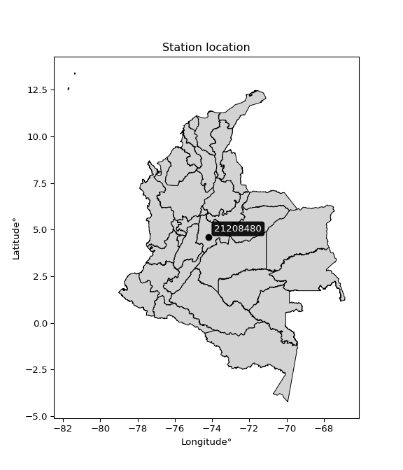

<div align="center">


</div>

# Station (rain, Pmax24h): 21208480

Probable Maximum Precipitation (PMP) is the greatest amount of rainfall for a specific duration that is meteorologically possible for a given location, acting as a "worst-case" scenario for extreme storms, crucial for designing safety-critical infrastructure like bridges, river deviations, dams, spillways, and nuclear plants to prevent catastrophic failure. PMP is calculated by hydrologists using meteorological data to determine the upper limit of extreme rainfall, often leading to the Probable Maximum Flood (PMF) for flood control design, and is increasingly being studied for climate change impacts.

<div align="center">

</img>

</div>


## A. General information


### 1. General running parameters

• app_version: _v20251226_. • runtime: _2025-12-26 15:38:16.554582_. • Python version: _3.14.0_. • SciPy version: _1.16.3_. • Pandas version: _2.3.3_. • NumPy version: _2.3.5_. • Stations dataset (station_dataset_file): _dataset/pmax24h_in/automatic_colombia_2003_2024.csv_. • Stations catalog (station_catalog_file): _dataset/CNE_IDEAM.xls_. • Minimum year to eval til year_max (date_min): _2003_. • Maximum year to eval since year_min (date_max): _2024_. • Creates, save and include plots into reports (create_plot): _False_. • Plot only fit distributions with Δo > Δ (plot_only_fit): _True_. • Eval low extreme values, if False, evaluates high extreme values (low_extreme): _False_. • Eval every SciPy distribution as logarithmic (pdist_logarithmic_on): _True_. • Standard deviation normalized (ddof): _1.0_. • Return periods to eval in years (Tr): _[2, 2.33, 5, 10, 15, 20, 25, 50, 75, 100, 200, 250, 500, 750, 1000]_. • Minimum data sample per station, 0 means any (minimum_sample): _5_. • Z-Score threshold to adjust a value, 0 means disable (zscore): _3.5_. • Avoid zeros, e.g. rain = 0 (avoid_zeros): _True_. • Avoid null values (avoid_nans): _True_. [:file_folder:Dataset file.](../../dataset/pmax24h_in/automatic_colombia_2003_2024.csv)


### 2. Station info and location

|   id |   CODIGO | NOMBRE                   | CATEGORIA          | TECNOLOGIA                | ESTADO   | FECHA_INSTALACION   |   FECHA_SUSPENSION |   ALTITUD |   LATITUD |   LONGITUD | DEPARTAMENTO   | MUNICIPIO   | AREA_OPERATIVA                            | ENTIDAD                                               | AREA_HIDROGRAFICA   | ZONA_HIDROGRAFICA   | SUBZONA_HIDROGRAFICA   | CORRIENTE       | OBSERVACION                                                                                         |   SUBRED | Catalogo   |
|-----:|---------:|:-------------------------|:-------------------|:--------------------------|:---------|:--------------------|-------------------:|----------:|----------:|-----------:|:---------------|:------------|:------------------------------------------|:------------------------------------------------------|:--------------------|:--------------------|:-----------------------|:----------------|:----------------------------------------------------------------------------------------------------|---------:|:-----------|
|    0 | 21208480 | KENNEDY - AUT [21208480] | HidroMeteorologica | Automática con Telemetría | Activa   | 01/03/2003          |                nan |      2555 |   4.61104 |   -74.1783 | Bogotá         | Bogotá, D.C | Area Operativa 11 - Cundinamarca-Amazonas | EMPRESA DE ACUEDUCTO Y ALCANTARILLADO DE BOGOTA E.S.P | Magdalena Cauca     | Alto Magdalena      | Río Bogotá             | Canal Intercept | 03/11/2022$Migracion$DATOS ACTUALIZADOS A LA FECHA 03/11/2022, SEGÚN INFORMACIÓN ENVIADA POR IDIGER |      nan | CNE_OE     |

<div align="center">

Map location in: [:earth_americas:Google](http://maps.google.com/maps?q=4.61104201,-74.178333) [:earth_americas:OSM](https://www.openstreetmap.org/#map=18/4.61104201/-74.178333&layers=P) [:earth_americas:Bing](https://www.bing.com/maps?cp=4.61104201~-74.178333&lvl=18) [:earth_americas:Apple](https://maps.apple.com/frame?center=4.61104201%2C-74.178333&span=0.003%2C0.006)

</div>


<div align="center">

```geojson
{
  "type": "Feature",
  "geometry": {
    "type": "Point", 
    "coordinates": [-74.178333, 4.61104201]
  }, 
  "properties": {
    "Name": "21208480"
  }
}
```

</div>


### 3. Discrete values table and plot

|               |           0 |           1 |          2 |           3 |           4 |           5 |          6 |
|:--------------|------------:|------------:|-----------:|------------:|------------:|------------:|-----------:|
| Date          | 2012        | 2013        | 2014       | 2015        | 2016        | 2023        | 2024       |
| Value         |    6.1      |    8.9      |    6.9     |    4.1      |   12.3      |    1        |   31.4     |
| Value_initial |    6.1      |    8.9      |    6.9     |    4.1      |   12.3      |    1        |   31.4     |
| count         |    7        |    7        |    7       |    7        |    7        |    7        |    7       |
| mean          |   10.1      |   10.1      |   10.1     |   10.1      |   10.1      |   10.1      |   10.1     |
| std           |   10.0417   |   10.0417   |   10.0417  |   10.0417   |   10.0417   |   10.0417   |   10.0417  |
| zscore        |   -0.398337 |   -0.119501 |   -0.31867 |   -0.597506 |    0.219085 |   -0.906217 |    2.12115 |
> If Z-Score is active, values out of range or outliers are replaced with the station mean value.


### 4. Active continuous probability distributions from SciPy (45 of 104 available)

[scipy.stats](https://docs.scipy.org/doc/scipy/reference/stats.html) is a Python´s powerful submodule within the SciPy library for comprehensive statistical analysis, offering over 130 probability distributions (like Normal, Poisson), functions for descriptive stats (mean, variance), hypothesis testing (t-tests, chi-square), random variable generation, and statistical tests, making it essential for data science, modeling, and research. It provides tools to explore, model, and draw conclusions from data efficiently, working seamlessly with NumPy.

<div align="center">

|   id | p_dist             |   n_parameter | fit_method   | label                                                                       | active   | ref                                                                                                        |
|-----:|:-------------------|--------------:|:-------------|:----------------------------------------------------------------------------|:---------|:-----------------------------------------------------------------------------------------------------------|
|    0 | alpha              |             3 | MLE          | Alpha                                                                       | True     | [:mortar_board:](https://docs.scipy.org/doc/scipy/reference/generated/scipy.stats.alpha.html)              |
|    1 | betaprime          |             4 | MLE          | Beta prime                                                                  | True     | [:mortar_board:](https://docs.scipy.org/doc/scipy/reference/generated/scipy.stats.betaprime.html)          |
|    2 | chi2               |             3 | MLE          | Chi²                                                                        | True     | [:mortar_board:](https://docs.scipy.org/doc/scipy/reference/generated/scipy.stats.chi2.html)               |
|    3 | crystalball        |             4 | MLE          | Crystalball                                                                 | True     | [:mortar_board:](https://docs.scipy.org/doc/scipy/reference/generated/scipy.stats.crystalball.html)        |
|    4 | erlang             |             3 | MLE          | Erlang                                                                      | True     | [:mortar_board:](https://docs.scipy.org/doc/scipy/reference/generated/scipy.stats.erlang.html)             |
|    5 | expon              |             2 | MLE          | Exponential                                                                 | True     | [:mortar_board:](https://docs.scipy.org/doc/scipy/reference/generated/scipy.stats.expon.html)              |
|    6 | exponnorm          |             3 | MLE          | Exponentially modified Normal                                               | True     | [:mortar_board:](https://docs.scipy.org/doc/scipy/reference/generated/scipy.stats.exponnorm.html)          |
|    7 | f                  |             4 | MLE          | F                                                                           | True     | [:mortar_board:](https://docs.scipy.org/doc/scipy/reference/generated/scipy.stats.f.html)                  |
|    8 | fatiguelife        |             3 | MLE          | Fatigue-life (Birnbaum-Saunders)                                            | True     | [:mortar_board:](https://docs.scipy.org/doc/scipy/reference/generated/scipy.stats.fatiguelife.html)        |
|    9 | fisk               |             3 | MLE          | Fisk                                                                        | True     | [:mortar_board:](https://docs.scipy.org/doc/scipy/reference/generated/scipy.stats.fisk.html)               |
|   10 | gamma              |             3 | MLE          | Gamma                                                                       | True     | [:mortar_board:](https://docs.scipy.org/doc/scipy/reference/generated/scipy.stats.gamma.html)              |
|   11 | genexpon           |             5 | MLE          | Generalized exponential                                                     | True     | [:mortar_board:](https://docs.scipy.org/doc/scipy/reference/generated/scipy.stats.genexpon.html)           |
|   12 | genlogistic        |             3 | MLE          | Generalized logistic                                                        | True     | [:mortar_board:](https://docs.scipy.org/doc/scipy/reference/generated/scipy.stats.genlogistic.html)        |
|   13 | gibrat             |             2 | MM           | Gibrat                                                                      | True     | [:mortar_board:](https://docs.scipy.org/doc/scipy/reference/generated/scipy.stats.gibrat.html)             |
|   14 | gompertz           |             3 | MLE          | Gompertz (or truncated Gumbel)                                              | True     | [:mortar_board:](https://docs.scipy.org/doc/scipy/reference/generated/scipy.stats.gompertz.html)           |
|   15 | gumbel_l           |             2 | MM           | Gumbel Left Skew                                                            | True     | [:mortar_board:](https://docs.scipy.org/doc/scipy/reference/generated/scipy.stats.gumbel_l.html)           |
|   16 | gumbel_r           |             2 | MM           | Gumbel Right Skew                                                           | True     | [:mortar_board:](https://docs.scipy.org/doc/scipy/reference/generated/scipy.stats.gumbel_r.html)           |
|   17 | halflogistic       |             2 | MM           | Half-logistic                                                               | True     | [:mortar_board:](https://docs.scipy.org/doc/scipy/reference/generated/scipy.stats.halflogistic.html)       |
|   18 | halfnorm           |             2 | MM           | Half Normal                                                                 | True     | [:mortar_board:](https://docs.scipy.org/doc/scipy/reference/generated/scipy.stats.halfnorm.html)           |
|   19 | hypsecant          |             2 | MM           | hyperbolic secant                                                           | True     | [:mortar_board:](https://docs.scipy.org/doc/scipy/reference/generated/scipy.stats.hypsecant.html)          |
|   20 | invgamma           |             3 | MLE          | Inverted gamma                                                              | True     | [:mortar_board:](https://docs.scipy.org/doc/scipy/reference/generated/scipy.stats.invgamma.html)           |
|   21 | invgauss           |             3 | MLE          | Inverse Gaussian                                                            | True     | [:mortar_board:](https://docs.scipy.org/doc/scipy/reference/generated/scipy.stats.invgauss.html)           |
|   22 | invweibull         |             3 | MLE          | Inverted Weibull                                                            | True     | [:mortar_board:](https://docs.scipy.org/doc/scipy/reference/generated/scipy.stats.invweibull.html)         |
|   23 | johnsonsu          |             4 | MLE          | Johnson Su                                                                  | True     | [:mortar_board:](https://docs.scipy.org/doc/scipy/reference/generated/scipy.stats.johnsonsu.html)          |
|   24 | kstwobign          |             2 | MLE          | Limiting distribution of scaled Kolmogorov-Smirnov two-sided test statistic | True     | [:mortar_board:](https://docs.scipy.org/doc/scipy/reference/generated/scipy.stats.kstwobign.html)          |
|   25 | laplace            |             2 | MM           | Laplace                                                                     | True     | [:mortar_board:](https://docs.scipy.org/doc/scipy/reference/generated/scipy.stats.laplace.html)            |
|   26 | laplace_asymmetric |             3 | MLE          | Asymmetric Laplace                                                          | True     | [:mortar_board:](https://docs.scipy.org/doc/scipy/reference/generated/scipy.stats.laplace_asymmetric.html) |
|   27 | loggamma           |             3 | MLE          | Log gamma                                                                   | True     | [:mortar_board:](https://docs.scipy.org/doc/scipy/reference/generated/scipy.stats.loggamma.html)           |
|   28 | logistic           |             2 | MM           | Logistic (or Sech-squared)                                                  | True     | [:mortar_board:](https://docs.scipy.org/doc/scipy/reference/generated/scipy.stats.logistic.html)           |
|   29 | lognorm            |             3 | MLE          | Log Normal                                                                  | True     | [:mortar_board:](https://docs.scipy.org/doc/scipy/reference/generated/scipy.stats.lognorm.html)            |
|   30 | maxwell            |             2 | MM           | Maxwell                                                                     | True     | [:mortar_board:](https://docs.scipy.org/doc/scipy/reference/generated/scipy.stats.maxwell.html)            |
|   31 | mielke             |             4 | MLE          | Mielke Beta-Kappa / Dagum                                                   | True     | [:mortar_board:](https://docs.scipy.org/doc/scipy/reference/generated/scipy.stats.mielke.html)             |
|   32 | moyal              |             2 | MM           | Moyal                                                                       | True     | [:mortar_board:](https://docs.scipy.org/doc/scipy/reference/generated/scipy.stats.moyal.html)              |
|   33 | nakagami           |             3 | MLE          | Nakagami                                                                    | True     | [:mortar_board:](https://docs.scipy.org/doc/scipy/reference/generated/scipy.stats.nakagami.html)           |
|   34 | ncf                |             5 | MLE          | Non-central F distribution                                                  | True     | [:mortar_board:](https://docs.scipy.org/doc/scipy/reference/generated/scipy.stats.ncf.html)                |
|   35 | nct                |             4 | MLE          | Non-central Student’s t                                                     | True     | [:mortar_board:](https://docs.scipy.org/doc/scipy/reference/generated/scipy.stats.nct.html)                |
|   36 | norm               |             2 | MM           | Normal                                                                      | True     | [:mortar_board:](https://docs.scipy.org/doc/scipy/reference/generated/scipy.stats.norm.html)               |
|   37 | pareto             |             3 | MLE          | Pareto                                                                      | True     | [:mortar_board:](https://docs.scipy.org/doc/scipy/reference/generated/scipy.stats.pareto.html)             |
|   38 | pearson3           |             3 | MM           | Pearson type III                                                            | True     | [:mortar_board:](https://docs.scipy.org/doc/scipy/reference/generated/scipy.stats.pearson3.html)           |
|   39 | rayleigh           |             2 | MM           | Rayleigh                                                                    | True     | [:mortar_board:](https://docs.scipy.org/doc/scipy/reference/generated/scipy.stats.rayleigh.html)           |
|   40 | rice               |             3 | MLE          | Rice                                                                        | True     | [:mortar_board:](https://docs.scipy.org/doc/scipy/reference/generated/scipy.stats.rice.html)               |
|   41 | t                  |             3 | MLE          | Student’s t                                                                 | True     | [:mortar_board:](https://docs.scipy.org/doc/scipy/reference/generated/scipy.stats.t.html)                  |
|   42 | truncnorm          |             4 | MLE          | Truncated normal                                                            | True     | [:mortar_board:](https://docs.scipy.org/doc/scipy/reference/generated/scipy.stats.truncnorm.html)          |
|   43 | wald               |             2 | MM           | Wald                                                                        | True     | [:mortar_board:](https://docs.scipy.org/doc/scipy/reference/generated/scipy.stats.wald.html)               |
|   44 | weibull_min        |             3 | MLE          | Weibull minimum                                                             | True     | [:mortar_board:](https://docs.scipy.org/doc/scipy/reference/generated/scipy.stats.weibull_min.html)        |

</div>

> **n_parameter:** # arguments & localization & scale.
>
> **Fit methods:** (MLE) maximum likelihood, (MM) L-moments.
>
>**Inactive:** foldnorm, gennorm, norminvgauss, powernorm, powerlognorm, skewnorm, genextreme, anglit, arcsine, argus, beta, bradford, burr, burr12, cauchy, cosine, halfcauchy, foldcauchy, skewcauchy, wrapcauchy, dgamma, gengamma, exponweib, exponpow, truncexpon, gausshyper, genhalflogistic, genhyperbolic, geninvgauss, halfgennorm, johnsonsb, kappa4, kappa3, ksone, kstwo, loglaplace, levy, levy_l, levy_stable, ncx2, genpareto, truncpareto, lomax, powerlaw, rdist, rel_breitwigner, recipinvgauss, semicircular, studentized_range, trapezoid, triang, truncweibull_min, tukeylambda, uniform, loguniform, vonmises, vonmises_line, weibull_max, dweibull, 


## B. Probability distributions vs. Empirical distributions

A continuous probability distribution (CPD) describes probabilities for variables that can take any value within a range (like rain any time), unlike discrete variables with specific outcomes (like temperature). It uses a Probability Density Function (PDF), a curve where the total area under it equals 1, and the probability of the variable falling within an interval (a to b) is found by calculating the area under the curve between those points. A key feature is that the probability of hitting any single exact value is zero, so probabilities are always expressed for ranges, e.g., $P(a ≤ X ≤ b)$.

<div align="center">

Distributions parameters
|    |   station | p_dist                |   n |              loc |          scale | shape                  | shape1                | shape2            | shape3   |
|---:|----------:|:----------------------|----:|-----------------:|---------------:|:-----------------------|:----------------------|:------------------|:---------|
|  0 |  21208480 | alpha                 |   7 |    -0.00100221   |    2.49497     | 1.5589464081123956e-08 |                       |                   |          |
|  1 |  21208480 | betaprime             |   7 |     1            |   82.8501      | 0.36570116038564016    | 12.861130827394884    |                   |          |
|  2 |  21208480 | chi2                  |   7 |     1            |    2.38413     | 1.4953071373163933     |                       |                   |          |
|  3 |  21208480 | crystalball           |   7 |    10.1          |    9.29685     | 1356.641100482992      | 1141.1308590872018    |                   |          |
|  4 |  21208480 | erlang                |   7 |     1            |   10.9259      | 0.6646539157168401     |                       |                   |          |
|  5 |  21208480 | expon                 |   7 |     1            |    9.1         |                        |                       |                   |          |
|  6 |  21208480 | exponnorm             |   7 |     1.73153      |    1.85534     | 4.510466507644517      |                       |                   |          |
|  7 |  21208480 | f                     |   7 |     1            |    8.42685     | 1.097500623936594      | 42.09772052855341     |                   |          |
|  8 |  21208480 | fatiguelife           |   7 |    -0.968283     |    8.09113     | 0.856534412793772      |                       |                   |          |
|  9 |  21208480 | fisk                  |   7 |    -0.461027     |    7.5997      | 2.0592769417199936     |                       |                   |          |
| 10 |  21208480 | gamma                 |   7 |     1            |    8.17871     | 0.38544818189578967    |                       |                   |          |
| 11 |  21208480 | genexpon              |   7 |     1            |   16.2811      | 1.7891393956303714     | 9.562157847771656e-09 | 3.655330160705763 |          |
| 12 |  21208480 | genlogistic           |   7 |   -33.309        |    5.60277     | 1178.0278153758798     |                       |                   |          |
| 13 |  21208480 | gibrat                |   7 |     3.00766      |    4.30172     |                        |                       |                   |          |
| 14 |  21208480 | gompertz              |   7 |     0.999972     | 2480.18        | 274.5838228443989      |                       |                   |          |
| 15 |  21208480 | gumbel_l              |   7 |    14.2841       |    7.24872     |                        |                       |                   |          |
| 16 |  21208480 | gumbel_r              |   7 |     5.91592      |    7.24872     |                        |                       |                   |          |
| 17 |  21208480 | halflogistic          |   7 |    -0.918928     |    7.94848     |                        |                       |                   |          |
| 18 |  21208480 | halfnorm              |   7 |    -2.20539      |   15.4225      |                        |                       |                   |          |
| 19 |  21208480 | hypsecant             |   7 |    10.1          |    5.91856     |                        |                       |                   |          |
| 20 |  21208480 | invgamma              |   7 |    -3.42067      |   31.0747      | 3.2610524958650684     |                       |                   |          |
| 21 |  21208480 | invgauss              |   7 |    -1.47409      |   16.2924      | 0.7103994753954058     |                       |                   |          |
| 22 |  21208480 | invweibull            |   7 |    -7.7562       |   13.1442      | 2.8778101211988947     |                       |                   |          |
| 23 |  21208480 | johnsonsu             |   7 |    -0.809105     |    0.0954756   | -6.241120531945036     | 1.2212442972746964    |                   |          |
| 24 |  21208480 | kstwobign             |   7 |   -14.9878       |   29.237       |                        |                       |                   |          |
| 25 |  21208480 | laplace               |   7 |    10.1          |    6.57387     |                        |                       |                   |          |
| 26 |  21208480 | laplace_asymmetric    |   7 |     4.1          |    4.16444     | 0.5120773949790849     |                       |                   |          |
| 27 |  21208480 | loggamma              |   7 | -3303.36         |  434.677       | 2044.735222342365      |                       |                   |          |
| 28 |  21208480 | logistic              |   7 |    10.1          |    5.12562     |                        |                       |                   |          |
| 29 |  21208480 | lognorm               |   7 |     1            |    0.034331    | 13.354833495402938     |                       |                   |          |
| 30 |  21208480 | maxwell               |   7 |   -11.9296       |   13.805       |                        |                       |                   |          |
| 31 |  21208480 | mielke                |   7 |     1            |    9.47397     | 0.8357373049678753     | 2.093156558147311     |                   |          |
| 32 |  21208480 | moyal                 |   7 |     4.78346      |    4.18505     |                        |                       |                   |          |
| 33 |  21208480 | nakagami              |   7 |     1            |   11.7285      | 0.2490016475785266     |                       |                   |          |
| 34 |  21208480 | ncf                   |   7 |     0.0183782    |    4.02508     | 2.9878493290864485     | 9.588796180128528     | 2.965570650444069 |          |
| 35 |  21208480 | nct                   |   7 |    -5.55901      |    0.794154    | 2.8280215816024104     | 14.127010962329443    |                   |          |
| 36 |  21208480 | norm                  |   7 |    10.1          |    9.29685     |                        |                       |                   |          |
| 37 |  21208480 | pareto                |   7 |     0.992302     |    0.00769758  | 0.16806723430832107    |                       |                   |          |
| 38 |  21208480 | pearson3              |   7 |    10.1          |    9.29689     | 1.530005000955368      |                       |                   |          |
| 39 |  21208480 | rayleigh              |   7 |    -7.68542      |   14.1907      |                        |                       |                   |          |
| 40 |  21208480 | rice                  |   7 |    -3.83959      |   11.8479      | 0.0009382433073180988  |                       |                   |          |
| 41 |  21208480 | t                     |   7 |     6.71658      |    3.16443     | 1.3002682026603587     |                       |                   |          |
| 42 |  21208480 | truncnorm             |   7 |   -27.6025       |   20.1685      | 1.4181771986415472     | 45.30011051943683     |                   |          |
| 43 |  21208480 | wald                  |   7 |     0.80315      |    9.29685     |                        |                       |                   |          |
| 44 |  21208480 | weibull_min           |   7 |     1            |    8.44998     | 0.6063851848947499     |                       |                   |          |
| 45 |  21208480 | logalpha              |   7 |    -8.3336       |   98.2552      | 9.774572305368306      |                       |                   |          |
| 46 |  21208480 | logbetaprime          |   7 |  -367.88         |  941.883       | 197930.19682292943     | 504151.3309346123     |                   |          |
| 47 |  21208480 | logchi2               |   7 |    -1.03146e-29  |    1.45        | 1.733332375870879      |                       |                   |          |
| 48 |  21208480 | logcrystalball        |   7 |     1.89904      |    0.978671    | 462.0036265573723      | 142.11111848613442    |                   |          |
| 49 |  21208480 | logerlang             |   7 |   -15.011        |    0.0594327   | 284.53793252814944     |                       |                   |          |
| 50 |  21208480 | logexpon              |   7 |     0            |    1.89904     |                        |                       |                   |          |
| 51 |  21208480 | logexponnorm          |   7 |     1.89842      |    0.978669    | 0.00064013960917263    |                       |                   |          |
| 52 |  21208480 | logf                  |   7 |    -1.91898e-31  |    1.11945     | 1.5423011564281368     | 1.3489688066175671    |                   |          |
| 53 |  21208480 | logfatiguelife        |   7 |  -257.142        |  259.038       | 0.003782381298970218   |                       |                   |          |
| 54 |  21208480 | logfisk               |   7 |    -3.91848e+07  |    3.91848e+07 | 72947235.16749427      |                       |                   |          |
| 55 |  21208480 | loggamma              |   7 |   -16.2798       |    0.0549084   | 331.1334233599031      |                       |                   |          |
| 56 |  21208480 | loggenexpon           |   7 |    -5.7888e-11   |    4.61747e+09 | 893005997.2842649      | 10607113720.558702    | 590167071.9765503 |          |
| 57 |  21208480 | loggenlogistic        |   7 |     2.30895      |    0.427441    | 0.5986223064238891     |                       |                   |          |
| 58 |  21208480 | loggibrat             |   7 |     1.1524       |    0.452852    |                        |                       |                   |          |
| 59 |  21208480 | loggompertz           |   7 |    -4.41189e-08  |    1.08783     | 0.13986018610974077    |                       |                   |          |
| 60 |  21208480 | loggumbel_l           |   7 |     2.33949      |    0.763067    |                        |                       |                   |          |
| 61 |  21208480 | loggumbel_r           |   7 |     1.45858      |    0.763067    |                        |                       |                   |          |
| 62 |  21208480 | loghalflogistic       |   7 |     0.739068     |    0.83673     |                        |                       |                   |          |
| 63 |  21208480 | loghalfnorm           |   7 |     0.603695     |    1.62348     |                        |                       |                   |          |
| 64 |  21208480 | loghypsecant          |   7 |     1.89904      |    0.623042    |                        |                       |                   |          |
| 65 |  21208480 | loginvgamma           |   7 |   -17.0627       | 6736.61        | 356.5761056444313      |                       |                   |          |
| 66 |  21208480 | loginvgauss           |   7 |    -7.12048      |  692.584       | 0.013013242922184295   |                       |                   |          |
| 67 |  21208480 | loginvweibull         |   7 |  -586.55         |  587.901       | 575.9546805783118      |                       |                   |          |
| 68 |  21208480 | logjohnsonsu          |   7 |     2.10219      |    0.703192    | 0.1888743525999625     | 1.051136326134963     |                   |          |
| 69 |  21208480 | logkstwobign          |   7 |    -2.31944      |    4.83089     |                        |                       |                   |          |
| 70 |  21208480 | loglaplace            |   7 |     1.89904      |    0.692025    |                        |                       |                   |          |
| 71 |  21208480 | loglaplace_asymmetric |   7 |     1.93153      |    0.690262    | 1.0224044992048131     |                       |                   |          |
| 72 |  21208480 | logloggamma           |   7 |    -0.374019     |    1.82927     | 3.952694490679439      |                       |                   |          |
| 73 |  21208480 | loglogistic           |   7 |     1.89904      |    0.53957     |                        |                       |                   |          |
| 74 |  21208480 | loglognorm            |   7 |    -4.94066e-324 |    1.24376e-46 | 260.7643534538628      |                       |                   |          |
| 75 |  21208480 | logmaxwell            |   7 |    -0.420004     |    1.45324     |                        |                       |                   |          |
| 76 |  21208480 | logmielke             |   7 |    -3.4446e-28   |    1.62801     | 0.7486463220870603     | 1.4545669665891823    |                   |          |
| 77 |  21208480 | logmoyal              |   7 |     1.33937      |    0.440557    |                        |                       |                   |          |
| 78 |  21208480 | lognakagami           |   7 |    -8.68756e-31  |    2.10866     | 0.18619054613556335    |                       |                   |          |
| 79 |  21208480 | logncf                |   7 |    -1.09512e-30  |    0.875038    | 1.702890758338473      | 1.5496877035424639    | 1.200512219726129 |          |
| 80 |  21208480 | lognct                |   7 |   -68.0917       |    0.973201    | 221021.86213381612     | 71.91788634702607     |                   |          |
| 81 |  21208480 | lognorm               |   7 |     1.89904      |    0.978671    |                        |                       |                   |          |
| 82 |  21208480 | logpareto             |   7 |    -0.00203994   |    0.00203994  | 0.1678269985002114     |                       |                   |          |
| 83 |  21208480 | logpearson3           |   7 |     1.89904      |    0.978664    | -0.4581456995625989    |                       |                   |          |
| 84 |  21208480 | lograyleigh           |   7 |     0.0267702    |    1.49385     |                        |                       |                   |          |
| 85 |  21208480 | logrice               |   7 |    -0.651525     |    1.05446     | 2.1707459978551853     |                       |                   |          |
| 86 |  21208480 | logt                  |   7 |     1.89904      |    0.978671    | 1042481689.8839345     |                       |                   |          |
| 87 |  21208480 | logtruncnorm          |   7 |    -0.0279788    |    2.87764     | 0.00032520950923745117 | 1.2075113856492927    |                   |          |
| 88 |  21208480 | logwald               |   7 |     0.920347     |    0.978691    |                        |                       |                   |          |
| 89 |  21208480 | logweibull_min        |   7 |    -3.30487      |    5.59767     | 6.275677146668036      |                       |                   |          |

</div>

> **loc** (Location parameter): This shifts the distribution along the x-axis. For many common distributions, like the normal (Gaussian) distribution, loc represents the mean $μ$. For others, like the uniform distribution, it might represent the minimum value, or for the beta distribution, the left end of the support interval.
>
> **scale** (Scale parameter): This determines the width or spread of the distribution. For the normal distribution, scale represents the standard deviation $σ$. For a uniform distribution, it defines the length of the interval (from $loc$ to $loc + scale$).
>
> **shape** (Shape parameters): Refers to parameters that define the specific form of a probability distribution, distinct from its location (loc) and scale (scale). These parameters are required arguments for most distribution functions. For example, a normal (Gaussian) distribution is fully defined by its location (mean) and scale (standard deviation), so it has no specific shape parameters beyond loc and scale. However, other distributions have intrinsic properties that need specification, as Gamma distribution that takes a shape parameter, often named $a$ or $alpha$.


### 0. Cumulative distribution values - CDF (90 evaluated)

> Ordered by x ascending and calculating $log(f(x))$ separately. 

|   id |   Station |   date |    x |   count |   mean |     std |    zscore |   Value_initial |   station |   m |     alpha |   alpha_pdf |   betaprime |   betaprime_pdf |        chi2 |       chi2_pdf |   crystalball |   crystalball_pdf |      erlang |     erlang_pdf |    expon |   expon_pdf |   exponnorm |   exponnorm_pdf |           f |       f_pdf |   fatiguelife |   fatiguelife_pdf |      fisk |   fisk_pdf |       gamma |   gamma_pdf |    genexpon |   genexpon_pdf |   genlogistic |   genlogistic_pdf |    gibrat |   gibrat_pdf |    gompertz |   gompertz_pdf |   gumbel_l |   gumbel_l_pdf |   gumbel_r |   gumbel_r_pdf |   halflogistic |   halflogistic_pdf |   halfnorm |   halfnorm_pdf |   hypsecant |   hypsecant_pdf |   invgamma |   invgamma_pdf |   invgauss |   invgauss_pdf |   invweibull |   invweibull_pdf |   johnsonsu |   johnsonsu_pdf |   kstwobign |   kstwobign_pdf |   laplace |   laplace_pdf |   laplace_asymmetric |   laplace_asymmetric_pdf |   loggamma |   loggamma_pdf |   logistic |   logistic_pdf |   lognorm |   lognorm_pdf |   maxwell |   maxwell_pdf |      mielke |   mielke_pdf |    moyal |   moyal_pdf |    nakagami |   nakagami_pdf |       ncf |    ncf_pdf |       nct |    nct_pdf |     norm |   norm_pdf |   pareto |   pareto_pdf |   pearson3 |   pearson3_pdf |   rayleigh |   rayleigh_pdf |      rice |   rice_pdf |        t |      t_pdf |   truncnorm |   truncnorm_pdf |        wald |    wald_pdf |   weibull_min |   weibull_min_pdf |   logalpha |   logalpha_pdf |   logbetaprime |   logbetaprime_pdf |     logchi2 |   logchi2_pdf |   logcrystalball |   logcrystalball_pdf |   logerlang |   logerlang_pdf |   logexpon |   logexpon_pdf |   logexponnorm |   logexponnorm_pdf |        logf |    logf_pdf |   logfatiguelife |   logfatiguelife_pdf |   logfisk |   logfisk_pdf |   loggenexpon |   loggenexpon_pdf |   loggenlogistic |   loggenlogistic_pdf |   loggibrat |   loggibrat_pdf |   loggompertz |   loggompertz_pdf |   loggumbel_l |   loggumbel_l_pdf |   loggumbel_r |   loggumbel_r_pdf |   loghalflogistic |   loghalflogistic_pdf |   loghalfnorm |   loghalfnorm_pdf |   loghypsecant |   loghypsecant_pdf |   loginvgamma |   loginvgamma_pdf |   loginvgauss |   loginvgauss_pdf |   loginvweibull |   loginvweibull_pdf |   logjohnsonsu |   logjohnsonsu_pdf |   logkstwobign |   logkstwobign_pdf |   loglaplace |   loglaplace_pdf |   loglaplace_asymmetric |   loglaplace_asymmetric_pdf |   logloggamma |   logloggamma_pdf |   loglogistic |   loglogistic_pdf |   loglognorm |   loglognorm_pdf |   logmaxwell |   logmaxwell_pdf |   logmielke |   logmielke_pdf |    logmoyal |   logmoyal_pdf |   lognakagami |   lognakagami_pdf |     logncf |    logncf_pdf |    lognct |   lognct_pdf |   logpareto |   logpareto_pdf |   logpearson3 |   logpearson3_pdf |   lograyleigh |   lograyleigh_pdf |   logrice |   logrice_pdf |      logt |   logt_pdf |   logtruncnorm |   logtruncnorm_pdf |   logwald |   logwald_pdf |   logweibull_min |   logweibull_min_pdf |
|-----:|----------:|-------:|-----:|--------:|-------:|--------:|----------:|----------------:|----------:|----:|----------:|------------:|------------:|----------------:|------------:|---------------:|--------------:|------------------:|------------:|---------------:|---------:|------------:|------------:|----------------:|------------:|------------:|--------------:|------------------:|----------:|-----------:|------------:|------------:|------------:|---------------:|--------------:|------------------:|----------:|-------------:|------------:|---------------:|-----------:|---------------:|-----------:|---------------:|---------------:|-------------------:|-----------:|---------------:|------------:|----------------:|-----------:|---------------:|-----------:|---------------:|-------------:|-----------------:|------------:|----------------:|------------:|----------------:|----------:|--------------:|---------------------:|-------------------------:|-----------:|---------------:|-----------:|---------------:|----------:|--------------:|----------:|--------------:|------------:|-------------:|---------:|------------:|------------:|---------------:|----------:|-----------:|----------:|-----------:|---------:|-----------:|---------:|-------------:|-----------:|---------------:|-----------:|---------------:|----------:|-----------:|---------:|-----------:|------------:|----------------:|------------:|------------:|--------------:|------------------:|-----------:|---------------:|---------------:|-------------------:|------------:|--------------:|-----------------:|---------------------:|------------:|----------------:|-----------:|---------------:|---------------:|-------------------:|------------:|------------:|-----------------:|---------------------:|----------:|--------------:|--------------:|------------------:|-----------------:|---------------------:|------------:|----------------:|--------------:|------------------:|--------------:|------------------:|--------------:|------------------:|------------------:|----------------------:|--------------:|------------------:|---------------:|-------------------:|--------------:|------------------:|--------------:|------------------:|----------------:|--------------------:|---------------:|-------------------:|---------------:|-------------------:|-------------:|-----------------:|------------------------:|----------------------------:|--------------:|------------------:|--------------:|------------------:|-------------:|-----------------:|-------------:|-----------------:|------------:|----------------:|------------:|---------------:|--------------:|------------------:|-----------:|--------------:|----------:|-------------:|------------:|----------------:|--------------:|------------------:|--------------:|------------------:|----------:|--------------:|----------:|-----------:|---------------:|-------------------:|----------:|--------------:|-----------------:|---------------------:|
|    0 |  21208480 |   2023 |  1   |       7 |   10.1 | 10.0417 | -0.906217 |             1   |  21208480 |   1 | 0.0126858 |  0.0889464  |  8.2484e-07 |     2.71698e+09 | 3.99229e-13 | 2688.51        |      0.163833 |        0.0265782  | 5.62469e-12 | 33673.2        | 0        |   0.10989   |   0.0458635 |      0.0359472  | 4.39128e-10 | 2.17048e+06 |     0.0366253 |        0.059955   | 0.0324307 | 0.0442277  | 3.54856e-07 | 1.23199e+09 | 3.75352e-12 |     0.109891   |     0.0759416 |        0.0349019  | 0         |   0          | 3.06451e-06 |     0.110711   |   0.147852 |    0.0188088   |   0.139417 |     0.0378952  |       0.120128 |         0.0619974  |   0.164645 |     0.0506296  |    0.134766 |      0.0220959  |  0.0390021 |     0.0448976  |  0.0371889 |      0.0540532 |    0.0400019 |       0.042318   |   0.0358345 |       0.0531053 |   0.0740399 |      0.0335814  |  0.125253 |    0.0190532  |            0.0485522 |               0.0227676  |  0.0252314 |      0.0634698 |   0.144873 |     0.0241697  | 0.0261641 |     0.0620385 |  0.169073 |    0.0326979  | 2.25525e-14 |  42.4418     | 0.11607  |  0.0435773  | 2.59603e-09 |    1.16448e+07 | 0.0399356 | 0.0592882  | 0.0397127 | 0.0426991  | 0.163833 | 0.0265782  | 0        |  21.8338     |   0.116268 |     0.0552164  |   0.170807 |     0.0357633  | 0.0800418 | 0.0317173  | 0.137685 | 0.0248617  | 3.79218e-10 |      0.0926877  | 1.70033e-11 | 2.08038e-09 |   5.79885e-11 |   316723          |   0.021917 |      0.0740189 |      0.0259016 |          0.0616516 | 3.15874e-26 |  2654.07      |        0.0261642 |            0.0620385 |    0.025518 |       0.0642318 |   0        |      0.526583  |      0.0261632 |          0.0620369 | 1.49303e-24 | 5.99981e+06 |        0.0260853 |            0.0622681 |  0.025637 |     0.0465028 |   1.11954e-11 |          0.193397 |        0.0393078 |            0.0548027 |    0        |       0         |   5.67231e-09 |          0.128569 |      0.045542 |         0.0583027 |     0.0011557 |         0.010243  |          0        |              0        |      0        |          0        |      0.0301871 |          0.0483785 |     0.0241715 |         0.0650626 |     0.0218347 |         0.0647621 |       0.0231773 |           0.0856767 |      0.0428016 |          0.0431677 |      0.0247453 |           0.103523 |    0.0321507 |        0.0464589 |               0.0331016 |                   0.0469043 |     0.0385353 |         0.0635924 |     0.0287614 |         0.0517712 |   0.00715296 |    inf           |   0.00626191 |        0.0439839 | 1.91238e-21 |     4.15635e+06 | 4.81658e-06 |    0.000119335 |    3.8417e-12 |        1.6467e+18 | 1.6354e-26 | 12715.1       | 0.0261627 |    0.0620606 |    0        |      82.2705    |     0.0371992 |         0.0650963 |      0        |          0        | 0.0203332 |     0.0689724 | 0.0261641 |  0.0620385 |      0.0097062 |           0.358906 |  0        |     0         |        0.0359635 |            0.0670487 |
|    1 |  21208480 |   2015 |  4.1 |       7 |   10.1 | 10.0417 | -0.597506 |             4.1 |  21208480 |   2 | 0.542936  |  0.0983678  |  0.754773   |     0.0618622   | 0.60858     |    0.0993313   |      0.259341 |        0.0348441  | 0.429854    |     0.0774419  | 0.288699 |   0.078165  |   0.239424  |      0.0788319  | 0.432864    | 0.0669572   |     0.29078   |        0.0811193  | 0.258959  | 0.0866414  | 0.701221    | 0.0659335   | 0.2887      |     0.0781652  |     0.226945  |        0.0600342  | 0.0852357 |   0.14275    | 0.290661    |     0.0786299  |   0.217593 |    0.0264856   |   0.276737 |     0.0490459  |       0.305629 |         0.0570292  |   0.317345 |     0.047587   |    0.221593 |      0.0344887  |  0.265318  |     0.0845813  |  0.282155  |      0.0826181 |    0.260403  |       0.0850461  |   0.280004  |       0.0837269 |   0.212438  |      0.0532977  |  0.200718 |    0.0305328  |            0.207747  |               0.0974189  |  0.316423  |      0.362755  |   0.236748 |     0.035254   | 0.309     |     0.359974  |  0.282293 |    0.0397105  | 0.378925    |   0.0931662  | 0.277885 |  0.0574119  | 0.400817    |    0.0634985   | 0.275622  | 0.0790943  | 0.261464  | 0.0851896  | 0.259341 | 0.0348441  | 0.635244 |   0.0197264  |   0.297913 |     0.0586802  |   0.291685 |     0.0414537  | 0.201113  | 0.0451859  | 0.266278 | 0.0648083  | 0.257214    |      0.0736587  | 0.223915    | 0.112949    |   0.419814    |        0.0617842  |   0.378858 |      0.393618  |      0.307748  |          0.358942  | 0.454025    |     0.212709  |        0.309     |            0.359974  |    0.318232 |       0.362883  |   0.524316 |      0.250487  |      0.308996  |          0.359973  | 0.531769    | 0.142583    |        0.310313  |            0.360908  |  0.26678  |     0.364149  |   0.422093    |          0.33083  |        0.265356  |            0.331112  |    0.287625 |       1.31864   |   0.310527    |          0.324312 |      0.256343 |         0.288641  |     0.344949  |         0.48115   |          0.381244 |              0.51071  |      0.380994 |          0.434309 |      0.27283   |          0.386218  |     0.329062  |         0.372503  |     0.335397  |         0.375266  |       0.389278  |           0.359769  |      0.234276  |          0.327037  |      0.410045  |           0.344912 |    0.246993  |        0.356913  |               0.244428  |                   0.346349  |     0.284466  |         0.322122  |     0.288123  |         0.380133  |   0.657875   |      0.000998221 |   0.337758   |        0.394086  | 0.661604    |     0.193715    | 0.356563    |    0.545809    |    0.674212   |        0.165825   | 0.463144   |     0.160496  | 0.309082  |    0.359997  |    0.666357 |       0.0396272 |     0.288891  |         0.324479  |      0.349036 |          0.40378  | 0.319663  |     0.363246  | 0.309     |  0.359974  |      0.495402  |           0.316741 |  0.366136 |     0.896135  |        0.288964  |            0.322691  |
|    2 |  21208480 |   2012 |  6.1 |       7 |   10.1 | 10.0417 | -0.398337 |             6.1 |  21208480 |   3 | 0.682581  |  0.0491913  |  0.845727   |     0.0332774   | 0.760935    |    0.0575925   |      0.333506 |        0.039118   | 0.559636    |     0.0545724  | 0.429042 |   0.0627426 |   0.392657  |      0.0714674  | 0.544452    | 0.0468731   |     0.437265  |        0.065227   | 0.424914  | 0.0766967  | 0.801351    | 0.0380219   | 0.429043    |     0.0627428  |     0.354152  |        0.065585   | 0.370667  |   0.122169   | 0.43176     |     0.06304    |   0.276276 |    0.0322832   |   0.377221 |     0.0507347  |       0.414909 |         0.052076   |   0.409784 |     0.0447518  |    0.299597 |      0.0434702  |  0.425708  |     0.0737661  |  0.433433  |      0.0679386 |    0.423523  |       0.0755723  |   0.434264  |       0.0695504 |   0.324405  |      0.0575788  |  0.272091 |    0.0413899  |            0.380476  |               0.0761794  |  0.469792  |      0.399471  |   0.314235 |     0.042042   | 0.463061  |     0.405888  |  0.36433  |    0.0420162  | 0.541116    |   0.0696269  | 0.392852 |  0.0565406  | 0.510596    |    0.0480103   | 0.424001  | 0.0682854  | 0.42455   | 0.0754575  | 0.333506 | 0.039118   | 0.664466 |   0.0110406  |   0.411134 |     0.0540749  |   0.376151 |     0.0427062  | 0.296654  | 0.0498032  | 0.435749 | 0.101932   | 0.393409    |      0.0627182  | 0.423095    | 0.0848199   |   0.521096    |        0.0419233  |   0.534471 |      0.379667  |      0.461398  |          0.404912  | 0.531685    |     0.179441  |        0.463061  |            0.405888  |    0.471392 |       0.398315  |   0.614114 |      0.203201  |      0.463057  |          0.405889  | 0.581001    | 0.107861    |        0.464536  |            0.405702  |  0.432564 |     0.456939  |   0.548332    |          0.301457 |        0.421981  |            0.451139  |    0.644467 |       0.567917  |   0.449759    |          0.372918 |      0.392562 |         0.396834  |     0.531334  |         0.440324  |          0.564169 |              0.407367 |      0.541901 |          0.373203 |      0.4538    |          0.505525  |     0.484386  |         0.399015  |     0.489893  |         0.39219   |       0.527619  |           0.330238  |      0.405721  |          0.534782  |      0.541408  |           0.312128 |    0.43855   |        0.63372   |               0.429185  |                   0.608146  |     0.428907  |         0.399327  |     0.458052  |         0.460071  |   0.658224   |      0.000778599 |   0.497195   |        0.398418  | 0.726918    |     0.139004    | 0.55699     |    0.447588    |    0.733532   |        0.134514   | 0.519349   |     0.124769  | 0.463134  |    0.405821  |    0.679947 |       0.0296706 |     0.433135  |         0.395738  |      0.5089   |          0.392053 | 0.472753  |     0.398051  | 0.463061  |  0.405888  |      0.616619  |           0.292807 |  0.628384 |     0.46946   |        0.43253   |            0.394608  |
|    3 |  21208480 |   2014 |  6.9 |       7 |   10.1 | 10.0417 | -0.31867  |             6.9 |  21208480 |   4 | 0.717698  |  0.0391559  |  0.869685   |     0.026915    | 0.802584    |    0.0469389   |      0.365347 |        0.0404434  | 0.60071     |     0.0483006  | 0.477093 |   0.0574623 |   0.447543  |      0.0656977  | 0.579788    | 0.0416429   |     0.486994  |        0.0591693  | 0.483579  | 0.0698631  | 0.829059    | 0.0315256   | 0.477095    |     0.0574624  |     0.406586  |        0.065284   | 0.460171  |   0.101983   | 0.480026    |     0.057704   |   0.303073 |    0.0347154   |   0.417674 |     0.0503057  |       0.455684 |         0.049843   |   0.445075 |     0.0434605  |    0.335719 |      0.0467765  |  0.482182  |     0.0673635  |  0.485268  |      0.0616881 |    0.481429  |       0.0691016  |   0.48734   |       0.0631621 |   0.370533  |      0.0576003  |  0.307302 |    0.0467461  |            0.438518  |               0.0690423  |  0.519014  |      0.398357  |   0.348801 |     0.0443144  | 0.51324   |     0.407412  |  0.398122 |    0.0424159  | 0.593443    |   0.0613099  | 0.437412 |  0.0547566  | 0.547318    |    0.0439187   | 0.47651   | 0.0629646  | 0.482355  | 0.0689703  | 0.365347 | 0.0404434  | 0.672572 |   0.00931494 |   0.453433 |     0.0516364  |   0.410335 |     0.0427086  | 0.336902  | 0.0507324  | 0.519306 | 0.105051   | 0.441945    |      0.0586496  | 0.486465    | 0.0738227   |   0.552585    |        0.0369835  |   0.580362 |      0.364422  |      0.511462  |          0.406535  | 0.55324     |     0.17047   |        0.51324   |            0.407412  |    0.52045  |       0.396881  |   0.63836  |      0.190433  |      0.513236  |          0.407413  | 0.593786    | 0.0998049   |        0.514668  |            0.406844  |  0.489505 |     0.4652    |   0.584726    |          0.288998 |        0.479139  |            0.474712  |    0.706297 |       0.441951  |   0.496329    |          0.382301 |      0.443383 |         0.427367  |     0.58388   |         0.41171   |          0.612284 |              0.373542 |      0.586579 |          0.35175  |      0.516589  |          0.510203  |     0.533339  |         0.394488  |     0.53785   |         0.385226  |       0.56738   |           0.314705  |      0.474567  |          0.57834   |      0.579005  |           0.297829 |    0.522929  |        0.689385  |               0.51107   |                   0.724175  |     0.479092  |         0.414182  |     0.515047  |         0.462912  |   0.658317   |      0.000728849 |   0.545713   |        0.388207  | 0.743244    |     0.126222    | 0.609588    |    0.405895    |    0.749614   |        0.126595   | 0.534185   |     0.116165  | 0.513302  |    0.407319  |    0.683464 |       0.0274743 |     0.482761  |         0.408744  |      0.556425 |          0.378608 | 0.521795  |     0.396914  | 0.51324   |  0.407412  |      0.652203  |           0.284653 |  0.68102  |     0.387938  |        0.482062  |            0.408381  |
|    4 |  21208480 |   2013 |  8.9 |       7 |   10.1 | 10.0417 | -0.119501 |             8.9 |  21208480 |   5 | 0.779246  |  0.0241583  |  0.912223   |     0.0166559   | 0.876561    |    0.028667    |      0.448649 |        0.0425556  | 0.684727    |     0.0364704  | 0.580265 |   0.0461247 |   0.564839  |      0.0519937  | 0.652798    | 0.0320266   |     0.591807  |        0.0461693  | 0.605694  | 0.0525385  | 0.880226    | 0.0206325   | 0.580267    |     0.0461247  |     0.532666  |        0.059866   | 0.623482  |   0.0644355  | 0.583561    |     0.0462515  |   0.378611 |    0.0407873   |   0.515538 |     0.0471209  |       0.549497 |         0.0439111  |   0.528522 |     0.0399201  |    0.4359   |      0.0526948  |  0.600869  |     0.05163    |  0.594257  |      0.0477871 |    0.60298   |       0.0527022  |   0.598683  |       0.0486348 |   0.483317  |      0.0545514  |  0.416575 |    0.0633684  |            0.560933  |               0.0539896  |  0.618273  |      0.377645  |   0.441736 |     0.0481123  | 0.615342  |     0.390478  |  0.482984 |    0.0421533  | 0.697782    |   0.0438438  | 0.540858 |  0.048352   | 0.626876    |    0.0360837   | 0.589237  | 0.0499681  | 0.603674  | 0.0526109  | 0.448649 | 0.0425556  | 0.688231 |   0.00662622 |   0.550114 |     0.0449666  |   0.494896 |     0.0416006  | 0.439035  | 0.0509109  | 0.703765 | 0.0735951  | 0.549665    |      0.0492556  | 0.611203    | 0.0522938   |   0.617111    |        0.0282144  |   0.668006 |      0.322317  |      0.61338   |          0.389936  | 0.594437    |     0.15359   |        0.615342  |            0.390478  |    0.619274 |       0.375756  |   0.683723 |      0.166546  |      0.615338  |          0.39048   | 0.617355    | 0.0859439   |        0.616535  |            0.389241  |  0.606316 |     0.444363  |   0.654686    |          0.260148 |        0.602205  |            0.481897  |    0.795395 |       0.27456   |   0.594851    |          0.388588 |      0.558618 |         0.473067  |     0.680146  |         0.343562  |          0.698654 |              0.305883 |      0.670275 |          0.305638 |      0.641708  |          0.461099  |     0.630812  |         0.367811  |     0.632511  |         0.355466  |       0.642889  |           0.277852  |      0.623218  |          0.563672  |      0.650734  |           0.265312 |    0.669746  |        0.477228  |               0.664637  |                   0.496734  |     0.586415  |         0.424029  |     0.629934  |         0.432043  |   0.658491   |      0.000643861 |   0.640467   |        0.353661  | 0.77247     |     0.104345    | 0.702061    |    0.321965    |    0.779944   |        0.112102   | 0.561763   |     0.101075  | 0.615376  |    0.390348  |    0.689966 |       0.0237796 |     0.588319  |         0.415932  |      0.648187 |          0.340413 | 0.620744  |     0.376748  | 0.615342  |  0.390478  |      0.722427  |           0.266968 |  0.763354 |     0.268098  |        0.587771  |            0.417517  |
|    5 |  21208480 |   2016 | 12.3 |       7 |   10.1 | 10.0417 |  0.219085 |            12.3 |  21208480 |   6 | 0.839271  |  0.0128882  |  0.952375   |     0.0081599   | 0.943374    |    0.0128375   |      0.593532 |        0.0417267  | 0.785093    |     0.0236953  | 0.711124 |   0.0317446 |   0.710129  |      0.0346386  | 0.742846    | 0.0218548   |     0.720173  |        0.0305212  | 0.744083  | 0.0307291  | 0.931801    | 0.0109264   | 0.711126    |     0.0317446  |     0.709383  |        0.0434674  | 0.779402  |   0.0319139  | 0.714609    |     0.0317403  |   0.532591 |    0.0490415   |   0.66068  |     0.037778   |       0.681301 |         0.0337064  |   0.653056 |     0.0332427  |    0.615685 |      0.0502687  |  0.73961   |     0.0315374  |  0.725699  |      0.0308338 |    0.74349   |       0.0316204  |   0.731249  |       0.0307306 |   0.651618  |      0.0437652  |  0.642209 |    0.0544263  |            0.710958  |               0.0355419  |  0.732227  |      0.322387  |   0.605686 |     0.0465954  | 0.733643  |     0.33555   |  0.620619 |    0.0381595  | 0.8107      |   0.0245111  | 0.683733 |  0.035741   | 0.732778    |    0.0267889   | 0.72737   | 0.0323762  | 0.744021  | 0.031606   | 0.593532 | 0.0417267  | 0.706419 |   0.00436352 |   0.683628 |     0.0337666  |   0.629061 |     0.0368135  | 0.604595  | 0.0454627  | 0.85894  | 0.0258378  | 0.693368    |      0.0357913  | 0.747906    | 0.0305054   |   0.696606    |        0.0194185  |   0.762112 |      0.258538  |      0.731602  |          0.335624  | 0.641027    |     0.13487   |        0.733643  |            0.33555   |    0.732605 |       0.320531  |   0.733268 |      0.140456  |      0.73364   |          0.335552  | 0.64286     | 0.0723422   |        0.734357  |            0.333923  |  0.737725 |     0.360199  |   0.732467    |          0.220377 |        0.747687  |            0.402884  |    0.863813 |       0.160938  |   0.717735    |          0.364504 |      0.713418 |         0.469356  |     0.777055  |         0.256868  |          0.7849   |              0.229424 |      0.759589 |          0.246731 |      0.77142   |          0.336149  |     0.740838  |         0.308751  |     0.738479  |         0.296783  |       0.724738  |           0.228135  |      0.77879   |          0.384173  |      0.729589  |           0.222139 |    0.793082  |        0.299004  |               0.792324  |                   0.307606  |     0.719464  |         0.389444  |     0.756129  |         0.34175   |   0.658686   |      0.000560731 |   0.745352   |        0.292471  | 0.802645    |     0.0832357   | 0.79103     |    0.231667    |    0.813612   |        0.0964637  | 0.591908   |     0.0859057 | 0.733633  |    0.335417  |    0.697059 |       0.0202424 |     0.718688  |         0.381775  |      0.748716 |          0.279573 | 0.734578  |     0.322516  | 0.733643  |  0.33555   |      0.805003  |           0.243301 |  0.833675 |     0.174743  |        0.718972  |            0.385004  |
|    6 |  21208480 |   2024 | 31.4 |       7 |   10.1 | 10.0417 |  2.12115  |            31.4 |  21208480 |   7 | 0.936671  |  0.00201255 |  0.996995   |     0.000378476 | 0.999161    |    0.000182135 |      0.989021 |        0.00310985 | 0.970458    |     0.00296021 | 0.964586 |   0.0038916 |   0.970421  |      0.00353454 | 0.939197    | 0.00421507  |     0.960063  |        0.00388046 | 0.950335  | 0.00305059 | 0.995861    | 0.000575603 | 0.964587    |     0.00389156 |     0.988707  |        0.00200425 | 0.970427  |   0.00236817 | 0.966168    |     0.00379183 |   0.999975 |    3.63032e-05 |   0.970709 |     0.00398102 |       0.966288 |         0.00416981 |   0.970667 |     0.00481701 |    0.982589 |      0.00294021 |  0.957954  |     0.00314839 |  0.959717  |      0.003691  |    0.957697  |       0.00304239 |   0.956773  |       0.0034793 |   0.986984  |      0.00282547 |  0.98042  |    0.00297845 |            0.972396  |               0.00339428 |  0.936043  |      0.118695  |   0.984565 |     0.00296477 | 0.943118  |     0.116723  |  0.980127 |    0.00413243 | 0.967196    |   0.00213097 | 0.966827 |  0.00396094 | 0.973643    |    0.00385527  | 0.961394  | 0.00334414 | 0.958124  | 0.00302883 | 0.989021 | 0.00310985 | 0.751387 |   0.00137412 |   0.965902 |     0.00419397 |   0.977474 |     0.00437216 | 0.988006  | 0.00301101 | 0.976234 | 0.00123364 | 0.977973    |      0.00351009 | 0.963237    | 0.00323761  |   0.886222    |        0.00493281 |   0.924216 |      0.10102   |      0.941885  |          0.118023  | 0.746786    |     0.0935812 |        0.943118  |            0.116723  |    0.935485 |       0.118627  |   0.837167 |      0.0857451 |      0.943118  |          0.116724  | 0.697828    | 0.047694    |        0.942788  |            0.116427  |  0.941525 |     0.102493  |   0.887011    |          0.114334 |        0.960411  |            0.0877662 |    0.947669 |       0.0466104 |   0.95862     |          0.126473 |      0.98599  |         0.078361  |     0.928801  |         0.0899031 |          0.924341 |              0.087002 |      0.920096 |          0.106056 |      0.947034  |          0.0846196 |     0.934741  |         0.113951  |     0.927223  |         0.115296  |       0.879094  |           0.110587  |      0.951974  |          0.0691819 |      0.884271  |           0.114311 |    0.946589  |        0.0771814 |               0.948179  |                   0.0767569 |     0.961547  |         0.115898  |     0.946269  |         0.0942313 |   0.659132   |      0.000408061 |   0.930607   |        0.112783  | 0.861534    |     0.0470469   | 0.927122    |    0.0824804   |    0.887055   |        0.0625678  | 0.657718   |     0.0574883 | 0.943052  |    0.116744  |    0.71276  |       0.0139776 |     0.959763  |         0.119932  |      0.927248 |          0.111497 | 0.938573  |     0.117997  | 0.943119  |  0.116723  |      1         |           0.173134 |  0.932864 |     0.0605455 |        0.96093   |            0.11775   |

An Empirical Distribution Function (EDF) is a step-function estimate of a true cumulative distribution function (CDF) based on observed sample data, representing the proportion of data points less than or equal to a given value. It is calculated by ordering your data and jumping up by $1/n$ (where $n$ is sample size) at each unique data point, allowing analysis without assuming an underlying population distribution, and it gets closer to the true CDF as the sample size grows.


### 1. Empirical - EDF California (1923)

California´s estimates the true probability distribution of water-related data (like rainfall, streamflow) using observed samples, crucial for risk assessment.

<div align="center">


$P=m/n$


</div>


**1.1. Empirical values**

<div align="center">

|                | 0                   | 1                  | 2                   | 3                  | 4                  | 5                  | 6              |
|:---------------|:--------------------|:-------------------|:--------------------|:-------------------|:-------------------|:-------------------|:---------------|
| date           | 2023                | 2015               | 2012                | 2014               | 2013               | 2016               | 2024           |
| x              | 1.0                 | 4.1                | 6.1                 | 6.9                | 8.9                | 12.3               | 31.4           |
| m              | 1                   | 2                  | 3                   | 4                  | 5                  | 6                  | 7              |
| empirical_dist | edf_california      | edf_california     | edf_california      | edf_california     | edf_california     | edf_california     | edf_california |
| empirical      | 0.14285714285714285 | 0.2857142857142857 | 0.42857142857142855 | 0.5714285714285714 | 0.7142857142857143 | 0.8571428571428571 | 1.0            |
| empirical_tr   | 1.1666666666666665  | 1.4                | 1.75                | 2.333333333333333  | 3.5                | 6.999999999999997  | inf            |

</div>


**1.2. Kolmogorov-Smirnov fit test (sorted by Δ)**


<div align="center">

|                | 0                   | 1                   | 2                     | 3                   | 4                   | 5                   | 6                   | 7                   | 8                   | 9                   | 10                  | 11                  | 12                  | 13                  | 14                  | 15                  | 16                  | 17                  | 18                  | 19                  | 20                  | 21                  | 22                  | 23                  | 24                  | 25                  | 26                  | 27                  | 28                  | 29                  | 30                  | 31                  | 32                  | 33                  | 34                  | 35                  | 36                  | 37                  | 38                  | 39                  | 40                  | 41                  | 42                  | 43                  | 44                  | 45                  | 46                  | 47                  | 48                  | 49                  | 50                  | 51                  | 52                  | 53                  | 54                  | 55                  | 56                  | 57                  | 58                  | 59                  | 60                  | 61                  | 62                  | 63                  | 64                  | 65                  | 66                  | 67                  | 68                  | 69                  | 70                  | 71                  | 72                  | 73                  | 74                  | 75                  | 76                  | 77                  | 78                  | 79                  | 80                  | 81                  | 82                  | 83                  | 84                  | 85                  | 86                  | 87                  | 88                  | 89                  |
|:---------------|:--------------------|:--------------------|:----------------------|:--------------------|:--------------------|:--------------------|:--------------------|:--------------------|:--------------------|:--------------------|:--------------------|:--------------------|:--------------------|:--------------------|:--------------------|:--------------------|:--------------------|:--------------------|:--------------------|:--------------------|:--------------------|:--------------------|:--------------------|:--------------------|:--------------------|:--------------------|:--------------------|:--------------------|:--------------------|:--------------------|:--------------------|:--------------------|:--------------------|:--------------------|:--------------------|:--------------------|:--------------------|:--------------------|:--------------------|:--------------------|:--------------------|:--------------------|:--------------------|:--------------------|:--------------------|:--------------------|:--------------------|:--------------------|:--------------------|:--------------------|:--------------------|:--------------------|:--------------------|:--------------------|:--------------------|:--------------------|:--------------------|:--------------------|:--------------------|:--------------------|:--------------------|:--------------------|:--------------------|:--------------------|:--------------------|:--------------------|:--------------------|:--------------------|:--------------------|:--------------------|:--------------------|:--------------------|:--------------------|:--------------------|:--------------------|:--------------------|:--------------------|:--------------------|:--------------------|:--------------------|:--------------------|:--------------------|:--------------------|:--------------------|:--------------------|:--------------------|:--------------------|:--------------------|:--------------------|:--------------------|
| station        | 21208480            | 21208480            | 21208480              | 21208480            | 21208480            | 21208480            | 21208480            | 21208480            | 21208480            | 21208480            | 21208480            | 21208480            | 21208480            | 21208480            | 21208480            | 21208480            | 21208480            | 21208480            | 21208480            | 21208480            | 21208480            | 21208480            | 21208480            | 21208480            | 21208480            | 21208480            | 21208480            | 21208480            | 21208480            | 21208480            | 21208480            | 21208480            | 21208480            | 21208480            | 21208480            | 21208480            | 21208480            | 21208480            | 21208480            | 21208480            | 21208480            | 21208480            | 21208480            | 21208480            | 21208480            | 21208480            | 21208480            | 21208480            | 21208480            | 21208480            | 21208480            | 21208480            | 21208480            | 21208480            | 21208480            | 21208480            | 21208480            | 21208480            | 21208480            | 21208480            | 21208480            | 21208480            | 21208480            | 21208480            | 21208480            | 21208480            | 21208480            | 21208480            | 21208480            | 21208480            | 21208480            | 21208480            | 21208480            | 21208480            | 21208480            | 21208480            | 21208480            | 21208480            | 21208480            | 21208480            | 21208480            | 21208480            | 21208480            | 21208480            | 21208480            | 21208480            | 21208480            | 21208480            | 21208480            | 21208480            |
| empirical_dist | edf_california      | edf_california      | edf_california        | edf_california      | edf_california      | edf_california      | edf_california      | edf_california      | edf_california      | edf_california      | edf_california      | edf_california      | edf_california      | edf_california      | edf_california      | edf_california      | edf_california      | edf_california      | edf_california      | edf_california      | edf_california      | edf_california      | edf_california      | edf_california      | edf_california      | edf_california      | edf_california      | edf_california      | edf_california      | edf_california      | edf_california      | edf_california      | edf_california      | edf_california      | edf_california      | edf_california      | edf_california      | edf_california      | edf_california      | edf_california      | edf_california      | edf_california      | edf_california      | edf_california      | edf_california      | edf_california      | edf_california      | edf_california      | edf_california      | edf_california      | edf_california      | edf_california      | edf_california      | edf_california      | edf_california      | edf_california      | edf_california      | edf_california      | edf_california      | edf_california      | edf_california      | edf_california      | edf_california      | edf_california      | edf_california      | edf_california      | edf_california      | edf_california      | edf_california      | edf_california      | edf_california      | edf_california      | edf_california      | edf_california      | edf_california      | edf_california      | edf_california      | edf_california      | edf_california      | edf_california      | edf_california      | edf_california      | edf_california      | edf_california      | edf_california      | edf_california      | edf_california      | edf_california      | edf_california      | edf_california      |
| p_dist         | t                   | logjohnsonsu        | loglaplace_asymmetric | loglaplace          | loggenlogistic      | loghypsecant        | fisk                | nct                 | invweibull          | loglogistic         | invgamma            | loginvgamma         | logfisk             | logalpha            | loginvgauss         | logrice             | logfatiguelife      | logt                | logcrystalball      | lognorm             | lognorm             | logexponnorm        | lognct              | logerlang           | loggamma            | loggamma            | logbetaprime        | johnsonsu           | logkstwobign        | ncf                 | invgauss            | loginvweibull       | logmaxwell          | fatiguelife         | logloggamma         | logweibull_min      | logpearson3         | loggumbel_r         | logmoyal            | gompertz            | loggompertz         | nakagami            | wald                | loggenexpon         | mielke              | lograyleigh         | loghalflogistic     | loghalfnorm         | erlang              | genexpon            | expon               | f                   | exponnorm           | laplace_asymmetric  | loggumbel_l         | weibull_min         | truncnorm           | moyal               | pearson3            | halflogistic        | genlogistic         | gumbel_r            | logwald             | gibrat              | halfnorm            | logtruncnorm        | loggibrat           | rayleigh            | kstwobign           | maxwell             | logexpon            | logchi2             | alpha               | crystalball         | norm                | logistic            | rice                | hypsecant           | laplace             | logf                | chi2                | gumbel_l            | logncf              | pareto              | loglognorm          | logmielke           | logpareto           | lognakagami         | gamma               | betaprime           |
| delta          | 0.05212233494857388 | 0.10005554392333457 | 0.10975550352525879   | 0.11070640633464451 | 0.11208084774900928 | 0.11267008937014902 | 0.11306021060955851 | 0.11312137342840256 | 0.11365326500984518 | 0.1140957519816091  | 0.11753333218593387 | 0.11868567281836093 | 0.11941798713345153 | 0.12094016282455436 | 0.12102248491569079 | 0.12256473761957343 | 0.1227860133257418  | 0.12349948771028851 | 0.12349962898163414 | 0.12349965258360518 | 0.12349965258360518 | 0.12350256897421297 | 0.12350971696250268 | 0.12453787561067386 | 0.1249159893756776  | 0.1249159893756776  | 0.125541158869941   | 0.1258935784229751  | 0.12755341711077794 | 0.12977309103554113 | 0.13144415407560606 | 0.13240505356684273 | 0.13659523533773366 | 0.13696938463687625 | 0.137678983916241   | 0.13817095794351064 | 0.1384551932289667  | 0.14170144197689633 | 0.14285232627365782 | 0.14285407835043246 | 0.1428571371848358  | 0.14285714026111263 | 0.1428571428401395  | 0.14285714284594747 | 0.14285714285712028 | 0.14285714285714285 | 0.14285714285714285 | 0.14285714285714285 | 0.1441399766613085  | 0.14601702463168165 | 0.1460187147069335  | 0.14714925488813346 | 0.149447091882987   | 0.15335255593322483 | 0.15566754485527268 | 0.16053688184283466 | 0.16462094004656147 | 0.1734277228858495  | 0.17351492708657312 | 0.17584162468079134 | 0.18161994240610302 | 0.19874723961448482 | 0.19981297265507564 | 0.20047855244754514 | 0.20408701088965897 | 0.2096878405564761  | 0.21589530252114303 | 0.2280817223225572  | 0.23096831524892186 | 0.23652435223629897 | 0.23860170823358873 | 0.25321404026258065 | 0.25722125900689363 | 0.2656369428358242  | 0.265636946592125   | 0.27254931077152666 | 0.2752503579855445  | 0.2783860149085607  | 0.2977104675108852  | 0.30217224028984857 | 0.3323634691067385  | 0.33567474726536806 | 0.342281963153547   | 0.3495295937098638  | 0.372160560649329   | 0.3758892418172557  | 0.3806428044994312  | 0.3884982038607565  | 0.4155070531513091  | 0.46905911464634387 |
| deltao         | 0.48442053926100004 | 0.48442053926100004 | 0.48442053926100004   | 0.48442053926100004 | 0.48442053926100004 | 0.48442053926100004 | 0.48442053926100004 | 0.48442053926100004 | 0.48442053926100004 | 0.48442053926100004 | 0.48442053926100004 | 0.48442053926100004 | 0.48442053926100004 | 0.48442053926100004 | 0.48442053926100004 | 0.48442053926100004 | 0.48442053926100004 | 0.48442053926100004 | 0.48442053926100004 | 0.48442053926100004 | 0.48442053926100004 | 0.48442053926100004 | 0.48442053926100004 | 0.48442053926100004 | 0.48442053926100004 | 0.48442053926100004 | 0.48442053926100004 | 0.48442053926100004 | 0.48442053926100004 | 0.48442053926100004 | 0.48442053926100004 | 0.48442053926100004 | 0.48442053926100004 | 0.48442053926100004 | 0.48442053926100004 | 0.48442053926100004 | 0.48442053926100004 | 0.48442053926100004 | 0.48442053926100004 | 0.48442053926100004 | 0.48442053926100004 | 0.48442053926100004 | 0.48442053926100004 | 0.48442053926100004 | 0.48442053926100004 | 0.48442053926100004 | 0.48442053926100004 | 0.48442053926100004 | 0.48442053926100004 | 0.48442053926100004 | 0.48442053926100004 | 0.48442053926100004 | 0.48442053926100004 | 0.48442053926100004 | 0.48442053926100004 | 0.48442053926100004 | 0.48442053926100004 | 0.48442053926100004 | 0.48442053926100004 | 0.48442053926100004 | 0.48442053926100004 | 0.48442053926100004 | 0.48442053926100004 | 0.48442053926100004 | 0.48442053926100004 | 0.48442053926100004 | 0.48442053926100004 | 0.48442053926100004 | 0.48442053926100004 | 0.48442053926100004 | 0.48442053926100004 | 0.48442053926100004 | 0.48442053926100004 | 0.48442053926100004 | 0.48442053926100004 | 0.48442053926100004 | 0.48442053926100004 | 0.48442053926100004 | 0.48442053926100004 | 0.48442053926100004 | 0.48442053926100004 | 0.48442053926100004 | 0.48442053926100004 | 0.48442053926100004 | 0.48442053926100004 | 0.48442053926100004 | 0.48442053926100004 | 0.48442053926100004 | 0.48442053926100004 | 0.48442053926100004 |
| eval           | Δo > Δ              | Δo > Δ              | Δo > Δ                | Δo > Δ              | Δo > Δ              | Δo > Δ              | Δo > Δ              | Δo > Δ              | Δo > Δ              | Δo > Δ              | Δo > Δ              | Δo > Δ              | Δo > Δ              | Δo > Δ              | Δo > Δ              | Δo > Δ              | Δo > Δ              | Δo > Δ              | Δo > Δ              | Δo > Δ              | Δo > Δ              | Δo > Δ              | Δo > Δ              | Δo > Δ              | Δo > Δ              | Δo > Δ              | Δo > Δ              | Δo > Δ              | Δo > Δ              | Δo > Δ              | Δo > Δ              | Δo > Δ              | Δo > Δ              | Δo > Δ              | Δo > Δ              | Δo > Δ              | Δo > Δ              | Δo > Δ              | Δo > Δ              | Δo > Δ              | Δo > Δ              | Δo > Δ              | Δo > Δ              | Δo > Δ              | Δo > Δ              | Δo > Δ              | Δo > Δ              | Δo > Δ              | Δo > Δ              | Δo > Δ              | Δo > Δ              | Δo > Δ              | Δo > Δ              | Δo > Δ              | Δo > Δ              | Δo > Δ              | Δo > Δ              | Δo > Δ              | Δo > Δ              | Δo > Δ              | Δo > Δ              | Δo > Δ              | Δo > Δ              | Δo > Δ              | Δo > Δ              | Δo > Δ              | Δo > Δ              | Δo > Δ              | Δo > Δ              | Δo > Δ              | Δo > Δ              | Δo > Δ              | Δo > Δ              | Δo > Δ              | Δo > Δ              | Δo > Δ              | Δo > Δ              | Δo > Δ              | Δo > Δ              | Δo > Δ              | Δo > Δ              | Δo > Δ              | Δo > Δ              | Δo > Δ              | Δo > Δ              | Δo > Δ              | Δo > Δ              | Δo > Δ              | Δo > Δ              | Δo > Δ              |
| fit            | 1                   | 1                   | 1                     | 1                   | 1                   | 1                   | 1                   | 1                   | 1                   | 1                   | 1                   | 1                   | 1                   | 1                   | 1                   | 1                   | 1                   | 1                   | 1                   | 1                   | 1                   | 1                   | 1                   | 1                   | 1                   | 1                   | 1                   | 1                   | 1                   | 1                   | 1                   | 1                   | 1                   | 1                   | 1                   | 1                   | 1                   | 1                   | 1                   | 1                   | 1                   | 1                   | 1                   | 1                   | 1                   | 1                   | 1                   | 1                   | 1                   | 1                   | 1                   | 1                   | 1                   | 1                   | 1                   | 1                   | 1                   | 1                   | 1                   | 1                   | 1                   | 1                   | 1                   | 1                   | 1                   | 1                   | 1                   | 1                   | 1                   | 1                   | 1                   | 1                   | 1                   | 1                   | 1                   | 1                   | 1                   | 1                   | 1                   | 1                   | 1                   | 1                   | 1                   | 1                   | 1                   | 1                   | 1                   | 1                   | 1                   | 1                   |
| n              | 7                   | 7                   | 7                     | 7                   | 7                   | 7                   | 7                   | 7                   | 7                   | 7                   | 7                   | 7                   | 7                   | 7                   | 7                   | 7                   | 7                   | 7                   | 7                   | 7                   | 7                   | 7                   | 7                   | 7                   | 7                   | 7                   | 7                   | 7                   | 7                   | 7                   | 7                   | 7                   | 7                   | 7                   | 7                   | 7                   | 7                   | 7                   | 7                   | 7                   | 7                   | 7                   | 7                   | 7                   | 7                   | 7                   | 7                   | 7                   | 7                   | 7                   | 7                   | 7                   | 7                   | 7                   | 7                   | 7                   | 7                   | 7                   | 7                   | 7                   | 7                   | 7                   | 7                   | 7                   | 7                   | 7                   | 7                   | 7                   | 7                   | 7                   | 7                   | 7                   | 7                   | 7                   | 7                   | 7                   | 7                   | 7                   | 7                   | 7                   | 7                   | 7                   | 7                   | 7                   | 7                   | 7                   | 7                   | 7                   | 7                   | 7                   |
| best_fit       | 1                   | 0                   | 0                     | 0                   | 0                   | 0                   | 0                   | 0                   | 0                   | 0                   | 0                   | 0                   | 0                   | 0                   | 0                   | 0                   | 0                   | 0                   | 0                   | 0                   | 0                   | 0                   | 0                   | 0                   | 0                   | 0                   | 0                   | 0                   | 0                   | 0                   | 0                   | 0                   | 0                   | 0                   | 0                   | 0                   | 0                   | 0                   | 0                   | 0                   | 0                   | 0                   | 0                   | 0                   | 0                   | 0                   | 0                   | 0                   | 0                   | 0                   | 0                   | 0                   | 0                   | 0                   | 0                   | 0                   | 0                   | 0                   | 0                   | 0                   | 0                   | 0                   | 0                   | 0                   | 0                   | 0                   | 0                   | 0                   | 0                   | 0                   | 0                   | 0                   | 0                   | 0                   | 0                   | 0                   | 0                   | 0                   | 0                   | 0                   | 0                   | 0                   | 0                   | 0                   | 0                   | 0                   | 0                   | 0                   | 0                   | 0                   |
| best_fit_sort  | 1                   | 2                   | 3                     | 4                   | 5                   | 6                   | 7                   | 8                   | 9                   | 10                  | 11                  | 12                  | 13                  | 14                  | 15                  | 16                  | 17                  | 18                  | 19                  | 20                  | 21                  | 22                  | 23                  | 24                  | 25                  | 26                  | 27                  | 28                  | 29                  | 30                  | 31                  | 32                  | 33                  | 34                  | 35                  | 36                  | 37                  | 38                  | 39                  | 40                  | 41                  | 42                  | 43                  | 44                  | 45                  | 46                  | 47                  | 48                  | 49                  | 50                  | 51                  | 52                  | 53                  | 54                  | 55                  | 56                  | 57                  | 58                  | 59                  | 60                  | 61                  | 62                  | 63                  | 64                  | 65                  | 66                  | 67                  | 68                  | 69                  | 70                  | 71                  | 72                  | 73                  | 74                  | 75                  | 76                  | 77                  | 78                  | 79                  | 80                  | 81                  | 82                  | 83                  | 84                  | 85                  | 86                  | 87                  | 88                  | 89                  | 90                  |

</div>


**1.3. Best fit**

<div align="center">

|   id |   station | empirical_dist   | p_dist   |     delta |   deltao | eval   |   fit |   n |   best_fit |   best_fit_sort |
|-----:|----------:|:-----------------|:---------|----------:|---------:|:-------|------:|----:|-----------:|----------------:|
|    0 |  21208480 | edf_california   | t        | 0.0521223 | 0.484421 | Δo > Δ |     1 |   7 |          1 |               1 |

</div>


### 2. Empirical - EDF Hazen (1930)

Hazen method for plotting positions is a formula used to estimate the empirical cumulative probability distribution of flood events or other hydrological data. This formula often results in biased estimations, particularly when extrapolating to extreme events (high return periods).

<div align="center">


$P=(m-0.5)/n$


</div>


**2.1. Empirical values**

<div align="center">

|                | 0                   | 1                   | 2                   | 3         | 4                  | 5                  | 6                  |
|:---------------|:--------------------|:--------------------|:--------------------|:----------|:-------------------|:-------------------|:-------------------|
| date           | 2023                | 2015                | 2012                | 2014      | 2013               | 2016               | 2024               |
| x              | 1.0                 | 4.1                 | 6.1                 | 6.9       | 8.9                | 12.3               | 31.4               |
| m              | 1                   | 2                   | 3                   | 4         | 5                  | 6                  | 7                  |
| empirical_dist | edf_hazen           | edf_hazen           | edf_hazen           | edf_hazen | edf_hazen          | edf_hazen          | edf_hazen          |
| empirical      | 0.07142857142857142 | 0.21428571428571427 | 0.35714285714285715 | 0.5       | 0.6428571428571429 | 0.7857142857142857 | 0.9285714285714286 |
| empirical_tr   | 1.0769230769230769  | 1.2727272727272727  | 1.5555555555555558  | 2.0       | 2.8000000000000003 | 4.666666666666666  | 14.000000000000007 |

</div>


**2.2. Kolmogorov-Smirnov fit test (sorted by Δ)**


<div align="center">

|                | 0                    | 1                   | 2                   | 3                   | 4                   | 5                   | 6                   | 7                   | 8                   | 9                     | 10                  | 11                  | 12                  | 13                  | 14                  | 15                  | 16                  | 17                  | 18                  | 19                  | 20                  | 21                  | 22                  | 23                  | 24                  | 25                  | 26                  | 27                  | 28                  | 29                  | 30                  | 31                  | 32                  | 33                  | 34                  | 35                  | 36                  | 37                  | 38                  | 39                  | 40                  | 41                  | 42                  | 43                  | 44                  | 45                  | 46                  | 47                  | 48                  | 49                  | 50                  | 51                  | 52                  | 53                  | 54                  | 55                  | 56                  | 57                  | 58                  | 59                  | 60                  | 61                  | 62                  | 63                  | 64                  | 65                  | 66                  | 67                  | 68                  | 69                  | 70                  | 71                  | 72                  | 73                  | 74                  | 75                  | 76                  | 77                  | 78                  | 79                  | 80                  | 81                  | 82                  | 83                  | 84                  | 85                  | 86                  | 87                  | 88                  | 89                  |
|:---------------|:---------------------|:--------------------|:--------------------|:--------------------|:--------------------|:--------------------|:--------------------|:--------------------|:--------------------|:----------------------|:--------------------|:--------------------|:--------------------|:--------------------|:--------------------|:--------------------|:--------------------|:--------------------|:--------------------|:--------------------|:--------------------|:--------------------|:--------------------|:--------------------|:--------------------|:--------------------|:--------------------|:--------------------|:--------------------|:--------------------|:--------------------|:--------------------|:--------------------|:--------------------|:--------------------|:--------------------|:--------------------|:--------------------|:--------------------|:--------------------|:--------------------|:--------------------|:--------------------|:--------------------|:--------------------|:--------------------|:--------------------|:--------------------|:--------------------|:--------------------|:--------------------|:--------------------|:--------------------|:--------------------|:--------------------|:--------------------|:--------------------|:--------------------|:--------------------|:--------------------|:--------------------|:--------------------|:--------------------|:--------------------|:--------------------|:--------------------|:--------------------|:--------------------|:--------------------|:--------------------|:--------------------|:--------------------|:--------------------|:--------------------|:--------------------|:--------------------|:--------------------|:--------------------|:--------------------|:--------------------|:--------------------|:--------------------|:--------------------|:--------------------|:--------------------|:--------------------|:--------------------|:--------------------|:--------------------|:--------------------|
| station        | 21208480             | 21208480            | 21208480            | 21208480            | 21208480            | 21208480            | 21208480            | 21208480            | 21208480            | 21208480              | 21208480            | 21208480            | 21208480            | 21208480            | 21208480            | 21208480            | 21208480            | 21208480            | 21208480            | 21208480            | 21208480            | 21208480            | 21208480            | 21208480            | 21208480            | 21208480            | 21208480            | 21208480            | 21208480            | 21208480            | 21208480            | 21208480            | 21208480            | 21208480            | 21208480            | 21208480            | 21208480            | 21208480            | 21208480            | 21208480            | 21208480            | 21208480            | 21208480            | 21208480            | 21208480            | 21208480            | 21208480            | 21208480            | 21208480            | 21208480            | 21208480            | 21208480            | 21208480            | 21208480            | 21208480            | 21208480            | 21208480            | 21208480            | 21208480            | 21208480            | 21208480            | 21208480            | 21208480            | 21208480            | 21208480            | 21208480            | 21208480            | 21208480            | 21208480            | 21208480            | 21208480            | 21208480            | 21208480            | 21208480            | 21208480            | 21208480            | 21208480            | 21208480            | 21208480            | 21208480            | 21208480            | 21208480            | 21208480            | 21208480            | 21208480            | 21208480            | 21208480            | 21208480            | 21208480            | 21208480            |
| empirical_dist | edf_hazen            | edf_hazen           | edf_hazen           | edf_hazen           | edf_hazen           | edf_hazen           | edf_hazen           | edf_hazen           | edf_hazen           | edf_hazen             | edf_hazen           | edf_hazen           | edf_hazen           | edf_hazen           | edf_hazen           | edf_hazen           | edf_hazen           | edf_hazen           | edf_hazen           | edf_hazen           | edf_hazen           | edf_hazen           | edf_hazen           | edf_hazen           | edf_hazen           | edf_hazen           | edf_hazen           | edf_hazen           | edf_hazen           | edf_hazen           | edf_hazen           | edf_hazen           | edf_hazen           | edf_hazen           | edf_hazen           | edf_hazen           | edf_hazen           | edf_hazen           | edf_hazen           | edf_hazen           | edf_hazen           | edf_hazen           | edf_hazen           | edf_hazen           | edf_hazen           | edf_hazen           | edf_hazen           | edf_hazen           | edf_hazen           | edf_hazen           | edf_hazen           | edf_hazen           | edf_hazen           | edf_hazen           | edf_hazen           | edf_hazen           | edf_hazen           | edf_hazen           | edf_hazen           | edf_hazen           | edf_hazen           | edf_hazen           | edf_hazen           | edf_hazen           | edf_hazen           | edf_hazen           | edf_hazen           | edf_hazen           | edf_hazen           | edf_hazen           | edf_hazen           | edf_hazen           | edf_hazen           | edf_hazen           | edf_hazen           | edf_hazen           | edf_hazen           | edf_hazen           | edf_hazen           | edf_hazen           | edf_hazen           | edf_hazen           | edf_hazen           | edf_hazen           | edf_hazen           | edf_hazen           | edf_hazen           | edf_hazen           | edf_hazen           | edf_hazen           |
| p_dist         | logjohnsonsu         | loggenlogistic      | invweibull          | ncf                 | nct                 | fisk                | invgamma            | wald                | logloggamma         | loglaplace_asymmetric | genexpon            | expon               | logweibull_min      | logfisk             | logpearson3         | invgauss            | gompertz            | johnsonsu           | exponnorm           | t                   | fatiguelife         | loglaplace          | laplace_asymmetric  | loggumbel_l         | truncnorm           | loggompertz         | loghypsecant        | loglogistic         | moyal               | pearson3            | logbetaprime        | halflogistic        | logexponnorm        | lognorm             | lognorm             | logcrystalball      | logt                | lognct              | logfatiguelife      | genlogistic         | loggamma            | loggamma            | logerlang           | logrice             | loginvgamma         | gumbel_r            | gibrat              | halfnorm            | loginvgauss         | logmaxwell          | lograyleigh         | rayleigh            | kstwobign           | maxwell             | loggumbel_r         | loginvweibull       | logalpha            | mielke              | loghalfnorm         | nakagami            | crystalball         | norm                | logkstwobign        | logmoyal            | logistic            | rice                | weibull_min         | hypsecant           | loghalflogistic     | loggenexpon         | erlang              | f                   | laplace             | logchi2             | gumbel_l            | logncf              | logwald             | logtruncnorm        | loggibrat           | logexpon            | logf                | alpha               | chi2                | pareto              | loglognorm          | logmielke           | logpareto           | lognakagami         | gamma               | betaprime           |
| delta          | 0.048578133343673335 | 0.06483816330825176 | 0.06637968187350318 | 0.06685771908536026 | 0.06740668523276266 | 0.06777097120572295 | 0.06856472443660144 | 0.07142857141156808 | 0.07176415228880628 | 0.07204248476637365   | 0.07458845320311025 | 0.07459014327836211 | 0.07538673791968359 | 0.07542106028380852 | 0.07599235384128089 | 0.07629050417793981 | 0.07637567312249574 | 0.07712104547591819 | 0.0780185204544156  | 0.07860605475403032 | 0.0801218330669296  | 0.08140743955371393 | 0.08192398450465344 | 0.08423897342670128 | 0.09319236861799007 | 0.09624089548866296 | 0.09665748170830907 | 0.10090963328149344 | 0.10199915145727811 | 0.10208635565800173 | 0.1042551057002512  | 0.10441305325221995 | 0.10591379158334174 | 0.10591798111763034 | 0.10591798111763034 | 0.10591804024815771 | 0.10591811748445246 | 0.10599067269961032 | 0.1073926749031317  | 0.11019137097753162 | 0.1126493598113632  | 0.1126493598113632  | 0.11424872876534703 | 0.11560972376829143 | 0.12724286181695277 | 0.12731866818591342 | 0.12904998101897372 | 0.13265843946108757 | 0.132749942899538   | 0.1400516673276362  | 0.15175700675944775 | 0.1566531508939858  | 0.15953974382035047 | 0.16509578080772758 | 0.17419156907118377 | 0.17499199630451082 | 0.17732858679909375 | 0.18397291957029488 | 0.18475856560020537 | 0.18653141276841226 | 0.19420837140725278 | 0.1942083751635536  | 0.19575937152781356 | 0.19984748357681398 | 0.20112073934295527 | 0.20382178655697308 | 0.2055279318882334  | 0.2069574434799893  | 0.20702651010610235 | 0.20780738268821122 | 0.21556854808987994 | 0.2185778263167049  | 0.2262818960823138  | 0.23973914462599574 | 0.26424617583679666 | 0.2708533917249756  | 0.27124154408364703 | 0.28111641198504755 | 0.2873238739497144  | 0.3100302796621601  | 0.3174831900254712  | 0.32864983043546503 | 0.40379204053530987 | 0.4209581651384352  | 0.4435891320779004  | 0.4473178132458271  | 0.4520713759280026  | 0.4599267752893279  | 0.4869356245798805  | 0.5404876860749153  |
| deltao         | 0.48442053926100004  | 0.48442053926100004 | 0.48442053926100004 | 0.48442053926100004 | 0.48442053926100004 | 0.48442053926100004 | 0.48442053926100004 | 0.48442053926100004 | 0.48442053926100004 | 0.48442053926100004   | 0.48442053926100004 | 0.48442053926100004 | 0.48442053926100004 | 0.48442053926100004 | 0.48442053926100004 | 0.48442053926100004 | 0.48442053926100004 | 0.48442053926100004 | 0.48442053926100004 | 0.48442053926100004 | 0.48442053926100004 | 0.48442053926100004 | 0.48442053926100004 | 0.48442053926100004 | 0.48442053926100004 | 0.48442053926100004 | 0.48442053926100004 | 0.48442053926100004 | 0.48442053926100004 | 0.48442053926100004 | 0.48442053926100004 | 0.48442053926100004 | 0.48442053926100004 | 0.48442053926100004 | 0.48442053926100004 | 0.48442053926100004 | 0.48442053926100004 | 0.48442053926100004 | 0.48442053926100004 | 0.48442053926100004 | 0.48442053926100004 | 0.48442053926100004 | 0.48442053926100004 | 0.48442053926100004 | 0.48442053926100004 | 0.48442053926100004 | 0.48442053926100004 | 0.48442053926100004 | 0.48442053926100004 | 0.48442053926100004 | 0.48442053926100004 | 0.48442053926100004 | 0.48442053926100004 | 0.48442053926100004 | 0.48442053926100004 | 0.48442053926100004 | 0.48442053926100004 | 0.48442053926100004 | 0.48442053926100004 | 0.48442053926100004 | 0.48442053926100004 | 0.48442053926100004 | 0.48442053926100004 | 0.48442053926100004 | 0.48442053926100004 | 0.48442053926100004 | 0.48442053926100004 | 0.48442053926100004 | 0.48442053926100004 | 0.48442053926100004 | 0.48442053926100004 | 0.48442053926100004 | 0.48442053926100004 | 0.48442053926100004 | 0.48442053926100004 | 0.48442053926100004 | 0.48442053926100004 | 0.48442053926100004 | 0.48442053926100004 | 0.48442053926100004 | 0.48442053926100004 | 0.48442053926100004 | 0.48442053926100004 | 0.48442053926100004 | 0.48442053926100004 | 0.48442053926100004 | 0.48442053926100004 | 0.48442053926100004 | 0.48442053926100004 | 0.48442053926100004 |
| eval           | Δo > Δ               | Δo > Δ              | Δo > Δ              | Δo > Δ              | Δo > Δ              | Δo > Δ              | Δo > Δ              | Δo > Δ              | Δo > Δ              | Δo > Δ                | Δo > Δ              | Δo > Δ              | Δo > Δ              | Δo > Δ              | Δo > Δ              | Δo > Δ              | Δo > Δ              | Δo > Δ              | Δo > Δ              | Δo > Δ              | Δo > Δ              | Δo > Δ              | Δo > Δ              | Δo > Δ              | Δo > Δ              | Δo > Δ              | Δo > Δ              | Δo > Δ              | Δo > Δ              | Δo > Δ              | Δo > Δ              | Δo > Δ              | Δo > Δ              | Δo > Δ              | Δo > Δ              | Δo > Δ              | Δo > Δ              | Δo > Δ              | Δo > Δ              | Δo > Δ              | Δo > Δ              | Δo > Δ              | Δo > Δ              | Δo > Δ              | Δo > Δ              | Δo > Δ              | Δo > Δ              | Δo > Δ              | Δo > Δ              | Δo > Δ              | Δo > Δ              | Δo > Δ              | Δo > Δ              | Δo > Δ              | Δo > Δ              | Δo > Δ              | Δo > Δ              | Δo > Δ              | Δo > Δ              | Δo > Δ              | Δo > Δ              | Δo > Δ              | Δo > Δ              | Δo > Δ              | Δo > Δ              | Δo > Δ              | Δo > Δ              | Δo > Δ              | Δo > Δ              | Δo > Δ              | Δo > Δ              | Δo > Δ              | Δo > Δ              | Δo > Δ              | Δo > Δ              | Δo > Δ              | Δo > Δ              | Δo > Δ              | Δo > Δ              | Δo > Δ              | Δo > Δ              | Δo > Δ              | Δo > Δ              | Δo > Δ              | Δo > Δ              | Δo > Δ              | Δo > Δ              | Δo > Δ              | Δo <= Δ             | Δo <= Δ             |
| fit            | 1                    | 1                   | 1                   | 1                   | 1                   | 1                   | 1                   | 1                   | 1                   | 1                     | 1                   | 1                   | 1                   | 1                   | 1                   | 1                   | 1                   | 1                   | 1                   | 1                   | 1                   | 1                   | 1                   | 1                   | 1                   | 1                   | 1                   | 1                   | 1                   | 1                   | 1                   | 1                   | 1                   | 1                   | 1                   | 1                   | 1                   | 1                   | 1                   | 1                   | 1                   | 1                   | 1                   | 1                   | 1                   | 1                   | 1                   | 1                   | 1                   | 1                   | 1                   | 1                   | 1                   | 1                   | 1                   | 1                   | 1                   | 1                   | 1                   | 1                   | 1                   | 1                   | 1                   | 1                   | 1                   | 1                   | 1                   | 1                   | 1                   | 1                   | 1                   | 1                   | 1                   | 1                   | 1                   | 1                   | 1                   | 1                   | 1                   | 1                   | 1                   | 1                   | 1                   | 1                   | 1                   | 1                   | 1                   | 1                   | 0                   | 0                   |
| n              | 7                    | 7                   | 7                   | 7                   | 7                   | 7                   | 7                   | 7                   | 7                   | 7                     | 7                   | 7                   | 7                   | 7                   | 7                   | 7                   | 7                   | 7                   | 7                   | 7                   | 7                   | 7                   | 7                   | 7                   | 7                   | 7                   | 7                   | 7                   | 7                   | 7                   | 7                   | 7                   | 7                   | 7                   | 7                   | 7                   | 7                   | 7                   | 7                   | 7                   | 7                   | 7                   | 7                   | 7                   | 7                   | 7                   | 7                   | 7                   | 7                   | 7                   | 7                   | 7                   | 7                   | 7                   | 7                   | 7                   | 7                   | 7                   | 7                   | 7                   | 7                   | 7                   | 7                   | 7                   | 7                   | 7                   | 7                   | 7                   | 7                   | 7                   | 7                   | 7                   | 7                   | 7                   | 7                   | 7                   | 7                   | 7                   | 7                   | 7                   | 7                   | 7                   | 7                   | 7                   | 7                   | 7                   | 7                   | 7                   | 7                   | 7                   |
| best_fit       | 1                    | 0                   | 0                   | 0                   | 0                   | 0                   | 0                   | 0                   | 0                   | 0                     | 0                   | 0                   | 0                   | 0                   | 0                   | 0                   | 0                   | 0                   | 0                   | 0                   | 0                   | 0                   | 0                   | 0                   | 0                   | 0                   | 0                   | 0                   | 0                   | 0                   | 0                   | 0                   | 0                   | 0                   | 0                   | 0                   | 0                   | 0                   | 0                   | 0                   | 0                   | 0                   | 0                   | 0                   | 0                   | 0                   | 0                   | 0                   | 0                   | 0                   | 0                   | 0                   | 0                   | 0                   | 0                   | 0                   | 0                   | 0                   | 0                   | 0                   | 0                   | 0                   | 0                   | 0                   | 0                   | 0                   | 0                   | 0                   | 0                   | 0                   | 0                   | 0                   | 0                   | 0                   | 0                   | 0                   | 0                   | 0                   | 0                   | 0                   | 0                   | 0                   | 0                   | 0                   | 0                   | 0                   | 0                   | 0                   | 0                   | 0                   |
| best_fit_sort  | 1                    | 2                   | 3                   | 4                   | 5                   | 6                   | 7                   | 8                   | 9                   | 10                    | 11                  | 12                  | 13                  | 14                  | 15                  | 16                  | 17                  | 18                  | 19                  | 20                  | 21                  | 22                  | 23                  | 24                  | 25                  | 26                  | 27                  | 28                  | 29                  | 30                  | 31                  | 32                  | 33                  | 34                  | 35                  | 36                  | 37                  | 38                  | 39                  | 40                  | 41                  | 42                  | 43                  | 44                  | 45                  | 46                  | 47                  | 48                  | 49                  | 50                  | 51                  | 52                  | 53                  | 54                  | 55                  | 56                  | 57                  | 58                  | 59                  | 60                  | 61                  | 62                  | 63                  | 64                  | 65                  | 66                  | 67                  | 68                  | 69                  | 70                  | 71                  | 72                  | 73                  | 74                  | 75                  | 76                  | 77                  | 78                  | 79                  | 80                  | 81                  | 82                  | 83                  | 84                  | 85                  | 86                  | 87                  | 88                  | 89                  | 90                  |

</div>


**2.3. Best fit**

<div align="center">

|   id |   station | empirical_dist   | p_dist       |     delta |   deltao | eval   |   fit |   n |   best_fit |   best_fit_sort |
|-----:|----------:|:-----------------|:-------------|----------:|---------:|:-------|------:|----:|-----------:|----------------:|
|    0 |  21208480 | edf_hazen        | logjohnsonsu | 0.0485781 | 0.484421 | Δo > Δ |     1 |   7 |          1 |               1 |

</div>


### 3. Empirical - EDF Weibull (1939)

Weibull plotting position formula is an empirical method used to estimate the non-exceedance probability or plotting position for a set of observed data, is often recommended or widely used in practice, particularly in flood frequency analysis.

<div align="center">


$P=m/(n+1)$


</div>


**3.1. Empirical values**

<div align="center">

|                | 0                  | 1                  | 2           | 3           | 4                  | 5           | 6           |
|:---------------|:-------------------|:-------------------|:------------|:------------|:-------------------|:------------|:------------|
| date           | 2023               | 2015               | 2012        | 2014        | 2013               | 2016        | 2024        |
| x              | 1.0                | 4.1                | 6.1         | 6.9         | 8.9                | 12.3        | 31.4        |
| m              | 1                  | 2                  | 3           | 4           | 5                  | 6           | 7           |
| empirical_dist | edf_weibull        | edf_weibull        | edf_weibull | edf_weibull | edf_weibull        | edf_weibull | edf_weibull |
| empirical      | 0.125              | 0.25               | 0.375       | 0.5         | 0.625              | 0.75        | 0.875       |
| empirical_tr   | 1.1428571428571428 | 1.3333333333333333 | 1.6         | 2.0         | 2.6666666666666665 | 4.0         | 8.0         |

</div>


**3.2. Kolmogorov-Smirnov fit test (sorted by Δ)**


<div align="center">

|                | 0                   | 1                   | 2                   | 3                   | 4                   | 5                   | 6                   | 7                   | 8                   | 9                   | 10                  | 11                  | 12                  | 13                  | 14                  | 15                    | 16                  | 17                  | 18                  | 19                  | 20                  | 21                  | 22                  | 23                  | 24                  | 25                  | 26                  | 27                  | 28                  | 29                  | 30                  | 31                  | 32                  | 33                  | 34                  | 35                  | 36                  | 37                  | 38                  | 39                  | 40                  | 41                  | 42                  | 43                  | 44                  | 45                  | 46                  | 47                  | 48                  | 49                  | 50                  | 51                  | 52                  | 53                  | 54                  | 55                  | 56                  | 57                  | 58                  | 59                  | 60                  | 61                  | 62                  | 63                  | 64                  | 65                  | 66                  | 67                  | 68                  | 69                  | 70                  | 71                  | 72                  | 73                  | 74                  | 75                  | 76                  | 77                  | 78                  | 79                  | 80                  | 81                  | 82                  | 83                  | 84                  | 85                  | 86                  | 87                  | 88                  | 89                  |
|:---------------|:--------------------|:--------------------|:--------------------|:--------------------|:--------------------|:--------------------|:--------------------|:--------------------|:--------------------|:--------------------|:--------------------|:--------------------|:--------------------|:--------------------|:--------------------|:----------------------|:--------------------|:--------------------|:--------------------|:--------------------|:--------------------|:--------------------|:--------------------|:--------------------|:--------------------|:--------------------|:--------------------|:--------------------|:--------------------|:--------------------|:--------------------|:--------------------|:--------------------|:--------------------|:--------------------|:--------------------|:--------------------|:--------------------|:--------------------|:--------------------|:--------------------|:--------------------|:--------------------|:--------------------|:--------------------|:--------------------|:--------------------|:--------------------|:--------------------|:--------------------|:--------------------|:--------------------|:--------------------|:--------------------|:--------------------|:--------------------|:--------------------|:--------------------|:--------------------|:--------------------|:--------------------|:--------------------|:--------------------|:--------------------|:--------------------|:--------------------|:--------------------|:--------------------|:--------------------|:--------------------|:--------------------|:--------------------|:--------------------|:--------------------|:--------------------|:--------------------|:--------------------|:--------------------|:--------------------|:--------------------|:--------------------|:--------------------|:--------------------|:--------------------|:--------------------|:--------------------|:--------------------|:--------------------|:--------------------|:--------------------|
| station        | 21208480            | 21208480            | 21208480            | 21208480            | 21208480            | 21208480            | 21208480            | 21208480            | 21208480            | 21208480            | 21208480            | 21208480            | 21208480            | 21208480            | 21208480            | 21208480              | 21208480            | 21208480            | 21208480            | 21208480            | 21208480            | 21208480            | 21208480            | 21208480            | 21208480            | 21208480            | 21208480            | 21208480            | 21208480            | 21208480            | 21208480            | 21208480            | 21208480            | 21208480            | 21208480            | 21208480            | 21208480            | 21208480            | 21208480            | 21208480            | 21208480            | 21208480            | 21208480            | 21208480            | 21208480            | 21208480            | 21208480            | 21208480            | 21208480            | 21208480            | 21208480            | 21208480            | 21208480            | 21208480            | 21208480            | 21208480            | 21208480            | 21208480            | 21208480            | 21208480            | 21208480            | 21208480            | 21208480            | 21208480            | 21208480            | 21208480            | 21208480            | 21208480            | 21208480            | 21208480            | 21208480            | 21208480            | 21208480            | 21208480            | 21208480            | 21208480            | 21208480            | 21208480            | 21208480            | 21208480            | 21208480            | 21208480            | 21208480            | 21208480            | 21208480            | 21208480            | 21208480            | 21208480            | 21208480            | 21208480            |
| empirical_dist | edf_weibull         | edf_weibull         | edf_weibull         | edf_weibull         | edf_weibull         | edf_weibull         | edf_weibull         | edf_weibull         | edf_weibull         | edf_weibull         | edf_weibull         | edf_weibull         | edf_weibull         | edf_weibull         | edf_weibull         | edf_weibull           | edf_weibull         | edf_weibull         | edf_weibull         | edf_weibull         | edf_weibull         | edf_weibull         | edf_weibull         | edf_weibull         | edf_weibull         | edf_weibull         | edf_weibull         | edf_weibull         | edf_weibull         | edf_weibull         | edf_weibull         | edf_weibull         | edf_weibull         | edf_weibull         | edf_weibull         | edf_weibull         | edf_weibull         | edf_weibull         | edf_weibull         | edf_weibull         | edf_weibull         | edf_weibull         | edf_weibull         | edf_weibull         | edf_weibull         | edf_weibull         | edf_weibull         | edf_weibull         | edf_weibull         | edf_weibull         | edf_weibull         | edf_weibull         | edf_weibull         | edf_weibull         | edf_weibull         | edf_weibull         | edf_weibull         | edf_weibull         | edf_weibull         | edf_weibull         | edf_weibull         | edf_weibull         | edf_weibull         | edf_weibull         | edf_weibull         | edf_weibull         | edf_weibull         | edf_weibull         | edf_weibull         | edf_weibull         | edf_weibull         | edf_weibull         | edf_weibull         | edf_weibull         | edf_weibull         | edf_weibull         | edf_weibull         | edf_weibull         | edf_weibull         | edf_weibull         | edf_weibull         | edf_weibull         | edf_weibull         | edf_weibull         | edf_weibull         | edf_weibull         | edf_weibull         | edf_weibull         | edf_weibull         | edf_weibull         |
| p_dist         | logjohnsonsu        | invweibull          | nct                 | loggenlogistic      | invgamma            | ncf                 | logloggamma         | logpearson3         | invgauss            | fatiguelife         | logweibull_min      | johnsonsu           | pearson3            | halflogistic        | moyal               | loglaplace_asymmetric | fisk                | loglaplace          | loghypsecant        | exponnorm           | loglogistic         | halfnorm            | laplace_asymmetric  | logcrystalball      | lognorm             | lognorm             | logt                | logexponnorm        | lognct              | logfatiguelife      | logbetaprime        | logfisk             | logerlang           | loggamma            | loggamma            | logrice             | t                   | loginvgamma         | gumbel_r            | loggumbel_l         | genlogistic         | loginvgauss         | logmaxwell          | gompertz            | loggompertz         | truncnorm           | wald                | genexpon            | expon               | rayleigh            | lograyleigh         | kstwobign           | maxwell             | nakagami            | loginvweibull       | loggumbel_r         | logalpha            | gibrat              | mielke              | logkstwobign        | loghalfnorm         | weibull_min         | loggenexpon         | crystalball         | norm                | logmoyal            | f                   | logistic            | erlang              | rice                | hypsecant           | loghalflogistic     | logchi2             | laplace             | logncf              | logtruncnorm        | gumbel_l            | logwald             | loggibrat           | logexpon            | logf                | alpha               | pareto              | chi2                | loglognorm          | logmielke           | logpareto           | lognakagami         | gamma               | betaprime           |
| delta          | 0.08219840106619172 | 0.08499809760196249 | 0.08528730202785959 | 0.08569220852348775 | 0.0859978623687153  | 0.08639449037922042 | 0.08654746674007441 | 0.0878007815349981  | 0.08781112551625894 | 0.08837471312610037 | 0.08903652854269106 | 0.08916545867186795 | 0.09090220909807356 | 0.09128814087033155 | 0.09182741800703564 | 0.09189836066811594   | 0.09256932850797106 | 0.09284926347750166 | 0.09481294651300617 | 0.0954214682465222  | 0.09623860912446625 | 0.09694415374680188 | 0.09739620044858976 | 0.09883583635283907 | 0.09883585744290652 | 0.09883585744290652 | 0.09883586135775514 | 0.0988367586367204  | 0.09883728518427615 | 0.09891472136967068 | 0.09909841490166865 | 0.09936301526495903 | 0.09948198617116275 | 0.099768578044396   | 0.099768578044396   | 0.10466680578884656 | 0.10893968770526574 | 0.10938571895980992 | 0.10946152532877051 | 0.11098992955646114 | 0.11370657439960752 | 0.11489280004239516 | 0.12219452447049334 | 0.1249969354932896  | 0.12499999432769296 | 0.12499999962078157 | 0.12499999998299666 | 0.12499999999624647 | 0.125               | 0.13010429119244715 | 0.1338998639023049  | 0.14168260096320756 | 0.14201642647708423 | 0.15081712705412653 | 0.15261947658464758 | 0.15633442621404092 | 0.1594714439419509  | 0.16476426673325945 | 0.16611577671315203 | 0.1664083703639948  | 0.16690142274306252 | 0.16981364617394767 | 0.17333213756378685 | 0.17635122855010987 | 0.1763512323064107  | 0.18199034071967113 | 0.18286354060241916 | 0.18326359648581236 | 0.1846361713761666  | 0.18596464369983018 | 0.18910030062284638 | 0.1891693672489595  | 0.20402485891171002 | 0.2084247532251709  | 0.21728196315354698 | 0.2454021262707618  | 0.24638903297965375 | 0.2533844012265042  | 0.2694667310925716  | 0.2743159939478744  | 0.2817689043111855  | 0.30758087463580897 | 0.3852438794241495  | 0.385934897678167   | 0.4078748463636147  | 0.4116035275315414  | 0.4163570902137169  | 0.4242124895750422  | 0.4512213388655948  | 0.5047734003606296  |
| deltao         | 0.48442053926100004 | 0.48442053926100004 | 0.48442053926100004 | 0.48442053926100004 | 0.48442053926100004 | 0.48442053926100004 | 0.48442053926100004 | 0.48442053926100004 | 0.48442053926100004 | 0.48442053926100004 | 0.48442053926100004 | 0.48442053926100004 | 0.48442053926100004 | 0.48442053926100004 | 0.48442053926100004 | 0.48442053926100004   | 0.48442053926100004 | 0.48442053926100004 | 0.48442053926100004 | 0.48442053926100004 | 0.48442053926100004 | 0.48442053926100004 | 0.48442053926100004 | 0.48442053926100004 | 0.48442053926100004 | 0.48442053926100004 | 0.48442053926100004 | 0.48442053926100004 | 0.48442053926100004 | 0.48442053926100004 | 0.48442053926100004 | 0.48442053926100004 | 0.48442053926100004 | 0.48442053926100004 | 0.48442053926100004 | 0.48442053926100004 | 0.48442053926100004 | 0.48442053926100004 | 0.48442053926100004 | 0.48442053926100004 | 0.48442053926100004 | 0.48442053926100004 | 0.48442053926100004 | 0.48442053926100004 | 0.48442053926100004 | 0.48442053926100004 | 0.48442053926100004 | 0.48442053926100004 | 0.48442053926100004 | 0.48442053926100004 | 0.48442053926100004 | 0.48442053926100004 | 0.48442053926100004 | 0.48442053926100004 | 0.48442053926100004 | 0.48442053926100004 | 0.48442053926100004 | 0.48442053926100004 | 0.48442053926100004 | 0.48442053926100004 | 0.48442053926100004 | 0.48442053926100004 | 0.48442053926100004 | 0.48442053926100004 | 0.48442053926100004 | 0.48442053926100004 | 0.48442053926100004 | 0.48442053926100004 | 0.48442053926100004 | 0.48442053926100004 | 0.48442053926100004 | 0.48442053926100004 | 0.48442053926100004 | 0.48442053926100004 | 0.48442053926100004 | 0.48442053926100004 | 0.48442053926100004 | 0.48442053926100004 | 0.48442053926100004 | 0.48442053926100004 | 0.48442053926100004 | 0.48442053926100004 | 0.48442053926100004 | 0.48442053926100004 | 0.48442053926100004 | 0.48442053926100004 | 0.48442053926100004 | 0.48442053926100004 | 0.48442053926100004 | 0.48442053926100004 |
| eval           | Δo > Δ              | Δo > Δ              | Δo > Δ              | Δo > Δ              | Δo > Δ              | Δo > Δ              | Δo > Δ              | Δo > Δ              | Δo > Δ              | Δo > Δ              | Δo > Δ              | Δo > Δ              | Δo > Δ              | Δo > Δ              | Δo > Δ              | Δo > Δ                | Δo > Δ              | Δo > Δ              | Δo > Δ              | Δo > Δ              | Δo > Δ              | Δo > Δ              | Δo > Δ              | Δo > Δ              | Δo > Δ              | Δo > Δ              | Δo > Δ              | Δo > Δ              | Δo > Δ              | Δo > Δ              | Δo > Δ              | Δo > Δ              | Δo > Δ              | Δo > Δ              | Δo > Δ              | Δo > Δ              | Δo > Δ              | Δo > Δ              | Δo > Δ              | Δo > Δ              | Δo > Δ              | Δo > Δ              | Δo > Δ              | Δo > Δ              | Δo > Δ              | Δo > Δ              | Δo > Δ              | Δo > Δ              | Δo > Δ              | Δo > Δ              | Δo > Δ              | Δo > Δ              | Δo > Δ              | Δo > Δ              | Δo > Δ              | Δo > Δ              | Δo > Δ              | Δo > Δ              | Δo > Δ              | Δo > Δ              | Δo > Δ              | Δo > Δ              | Δo > Δ              | Δo > Δ              | Δo > Δ              | Δo > Δ              | Δo > Δ              | Δo > Δ              | Δo > Δ              | Δo > Δ              | Δo > Δ              | Δo > Δ              | Δo > Δ              | Δo > Δ              | Δo > Δ              | Δo > Δ              | Δo > Δ              | Δo > Δ              | Δo > Δ              | Δo > Δ              | Δo > Δ              | Δo > Δ              | Δo > Δ              | Δo > Δ              | Δo > Δ              | Δo > Δ              | Δo > Δ              | Δo > Δ              | Δo > Δ              | Δo <= Δ             |
| fit            | 1                   | 1                   | 1                   | 1                   | 1                   | 1                   | 1                   | 1                   | 1                   | 1                   | 1                   | 1                   | 1                   | 1                   | 1                   | 1                     | 1                   | 1                   | 1                   | 1                   | 1                   | 1                   | 1                   | 1                   | 1                   | 1                   | 1                   | 1                   | 1                   | 1                   | 1                   | 1                   | 1                   | 1                   | 1                   | 1                   | 1                   | 1                   | 1                   | 1                   | 1                   | 1                   | 1                   | 1                   | 1                   | 1                   | 1                   | 1                   | 1                   | 1                   | 1                   | 1                   | 1                   | 1                   | 1                   | 1                   | 1                   | 1                   | 1                   | 1                   | 1                   | 1                   | 1                   | 1                   | 1                   | 1                   | 1                   | 1                   | 1                   | 1                   | 1                   | 1                   | 1                   | 1                   | 1                   | 1                   | 1                   | 1                   | 1                   | 1                   | 1                   | 1                   | 1                   | 1                   | 1                   | 1                   | 1                   | 1                   | 1                   | 0                   |
| n              | 7                   | 7                   | 7                   | 7                   | 7                   | 7                   | 7                   | 7                   | 7                   | 7                   | 7                   | 7                   | 7                   | 7                   | 7                   | 7                     | 7                   | 7                   | 7                   | 7                   | 7                   | 7                   | 7                   | 7                   | 7                   | 7                   | 7                   | 7                   | 7                   | 7                   | 7                   | 7                   | 7                   | 7                   | 7                   | 7                   | 7                   | 7                   | 7                   | 7                   | 7                   | 7                   | 7                   | 7                   | 7                   | 7                   | 7                   | 7                   | 7                   | 7                   | 7                   | 7                   | 7                   | 7                   | 7                   | 7                   | 7                   | 7                   | 7                   | 7                   | 7                   | 7                   | 7                   | 7                   | 7                   | 7                   | 7                   | 7                   | 7                   | 7                   | 7                   | 7                   | 7                   | 7                   | 7                   | 7                   | 7                   | 7                   | 7                   | 7                   | 7                   | 7                   | 7                   | 7                   | 7                   | 7                   | 7                   | 7                   | 7                   | 7                   |
| best_fit       | 1                   | 0                   | 0                   | 0                   | 0                   | 0                   | 0                   | 0                   | 0                   | 0                   | 0                   | 0                   | 0                   | 0                   | 0                   | 0                     | 0                   | 0                   | 0                   | 0                   | 0                   | 0                   | 0                   | 0                   | 0                   | 0                   | 0                   | 0                   | 0                   | 0                   | 0                   | 0                   | 0                   | 0                   | 0                   | 0                   | 0                   | 0                   | 0                   | 0                   | 0                   | 0                   | 0                   | 0                   | 0                   | 0                   | 0                   | 0                   | 0                   | 0                   | 0                   | 0                   | 0                   | 0                   | 0                   | 0                   | 0                   | 0                   | 0                   | 0                   | 0                   | 0                   | 0                   | 0                   | 0                   | 0                   | 0                   | 0                   | 0                   | 0                   | 0                   | 0                   | 0                   | 0                   | 0                   | 0                   | 0                   | 0                   | 0                   | 0                   | 0                   | 0                   | 0                   | 0                   | 0                   | 0                   | 0                   | 0                   | 0                   | 0                   |
| best_fit_sort  | 1                   | 2                   | 3                   | 4                   | 5                   | 6                   | 7                   | 8                   | 9                   | 10                  | 11                  | 12                  | 13                  | 14                  | 15                  | 16                    | 17                  | 18                  | 19                  | 20                  | 21                  | 22                  | 23                  | 24                  | 25                  | 26                  | 27                  | 28                  | 29                  | 30                  | 31                  | 32                  | 33                  | 34                  | 35                  | 36                  | 37                  | 38                  | 39                  | 40                  | 41                  | 42                  | 43                  | 44                  | 45                  | 46                  | 47                  | 48                  | 49                  | 50                  | 51                  | 52                  | 53                  | 54                  | 55                  | 56                  | 57                  | 58                  | 59                  | 60                  | 61                  | 62                  | 63                  | 64                  | 65                  | 66                  | 67                  | 68                  | 69                  | 70                  | 71                  | 72                  | 73                  | 74                  | 75                  | 76                  | 77                  | 78                  | 79                  | 80                  | 81                  | 82                  | 83                  | 84                  | 85                  | 86                  | 87                  | 88                  | 89                  | 90                  |

</div>


**3.3. Best fit**

<div align="center">

|   id |   station | empirical_dist   | p_dist       |     delta |   deltao | eval   |   fit |   n |   best_fit |   best_fit_sort |
|-----:|----------:|:-----------------|:-------------|----------:|---------:|:-------|------:|----:|-----------:|----------------:|
|    0 |  21208480 | edf_weibull      | logjohnsonsu | 0.0821984 | 0.484421 | Δo > Δ |     1 |   7 |          1 |               1 |

</div>


### 4. Empirical - EDF Beard (1943)

The Beard formula (or Beard´s plotting position formula) in hydrology is used to estimate the empirical non-exceedance probability _(P)_ of a flood event (or other extreme hydrological data point) within a given dataset.

<div align="center">


$P=(m-0.31)/(n+0.38)$


</div>


**4.1. Empirical values**

<div align="center">

|                | 0                   | 1                   | 2                   | 3         | 4                  | 5                  | 6                  |
|:---------------|:--------------------|:--------------------|:--------------------|:----------|:-------------------|:-------------------|:-------------------|
| date           | 2023                | 2015                | 2012                | 2014      | 2013               | 2016               | 2024               |
| x              | 1.0                 | 4.1                 | 6.1                 | 6.9       | 8.9                | 12.3               | 31.4               |
| m              | 1                   | 2                   | 3                   | 4         | 5                  | 6                  | 7                  |
| empirical_dist | edf_beard           | edf_beard           | edf_beard           | edf_beard | edf_beard          | edf_beard          | edf_beard          |
| empirical      | 0.09349593495934959 | 0.22899728997289973 | 0.36449864498644985 | 0.5       | 0.6355013550135502 | 0.7710027100271003 | 0.9065040650406505 |
| empirical_tr   | 1.1031390134529149  | 1.29701230228471    | 1.5735607675906182  | 2.0       | 2.743494423791822  | 4.366863905325444  | 10.695652173913055 |

</div>


**4.2. Kolmogorov-Smirnov fit test (sorted by Δ)**


<div align="center">

|                | 0                   | 1                   | 2                    | 3                   | 4                    | 5                   | 6                    | 7                   | 8                     | 9                   | 10                  | 11                  | 12                  | 13                  | 14                  | 15                  | 16                  | 17                  | 18                  | 19                  | 20                  | 21                  | 22                  | 23                  | 24                  | 25                  | 26                  | 27                  | 28                  | 29                  | 30                  | 31                  | 32                  | 33                  | 34                  | 35                  | 36                  | 37                  | 38                  | 39                  | 40                  | 41                  | 42                  | 43                  | 44                  | 45                  | 46                  | 47                  | 48                  | 49                  | 50                  | 51                  | 52                  | 53                  | 54                  | 55                  | 56                  | 57                  | 58                  | 59                  | 60                  | 61                  | 62                  | 63                  | 64                  | 65                  | 66                  | 67                  | 68                  | 69                  | 70                  | 71                  | 72                  | 73                  | 74                  | 75                  | 76                  | 77                  | 78                  | 79                  | 80                  | 81                  | 82                  | 83                  | 84                  | 85                  | 86                  | 87                  | 88                  | 89                  |
|:---------------|:--------------------|:--------------------|:---------------------|:--------------------|:---------------------|:--------------------|:---------------------|:--------------------|:----------------------|:--------------------|:--------------------|:--------------------|:--------------------|:--------------------|:--------------------|:--------------------|:--------------------|:--------------------|:--------------------|:--------------------|:--------------------|:--------------------|:--------------------|:--------------------|:--------------------|:--------------------|:--------------------|:--------------------|:--------------------|:--------------------|:--------------------|:--------------------|:--------------------|:--------------------|:--------------------|:--------------------|:--------------------|:--------------------|:--------------------|:--------------------|:--------------------|:--------------------|:--------------------|:--------------------|:--------------------|:--------------------|:--------------------|:--------------------|:--------------------|:--------------------|:--------------------|:--------------------|:--------------------|:--------------------|:--------------------|:--------------------|:--------------------|:--------------------|:--------------------|:--------------------|:--------------------|:--------------------|:--------------------|:--------------------|:--------------------|:--------------------|:--------------------|:--------------------|:--------------------|:--------------------|:--------------------|:--------------------|:--------------------|:--------------------|:--------------------|:--------------------|:--------------------|:--------------------|:--------------------|:--------------------|:--------------------|:--------------------|:--------------------|:--------------------|:--------------------|:--------------------|:--------------------|:--------------------|:--------------------|:--------------------|
| station        | 21208480            | 21208480            | 21208480             | 21208480            | 21208480             | 21208480            | 21208480             | 21208480            | 21208480              | 21208480            | 21208480            | 21208480            | 21208480            | 21208480            | 21208480            | 21208480            | 21208480            | 21208480            | 21208480            | 21208480            | 21208480            | 21208480            | 21208480            | 21208480            | 21208480            | 21208480            | 21208480            | 21208480            | 21208480            | 21208480            | 21208480            | 21208480            | 21208480            | 21208480            | 21208480            | 21208480            | 21208480            | 21208480            | 21208480            | 21208480            | 21208480            | 21208480            | 21208480            | 21208480            | 21208480            | 21208480            | 21208480            | 21208480            | 21208480            | 21208480            | 21208480            | 21208480            | 21208480            | 21208480            | 21208480            | 21208480            | 21208480            | 21208480            | 21208480            | 21208480            | 21208480            | 21208480            | 21208480            | 21208480            | 21208480            | 21208480            | 21208480            | 21208480            | 21208480            | 21208480            | 21208480            | 21208480            | 21208480            | 21208480            | 21208480            | 21208480            | 21208480            | 21208480            | 21208480            | 21208480            | 21208480            | 21208480            | 21208480            | 21208480            | 21208480            | 21208480            | 21208480            | 21208480            | 21208480            | 21208480            |
| empirical_dist | edf_beard           | edf_beard           | edf_beard            | edf_beard           | edf_beard            | edf_beard           | edf_beard            | edf_beard           | edf_beard             | edf_beard           | edf_beard           | edf_beard           | edf_beard           | edf_beard           | edf_beard           | edf_beard           | edf_beard           | edf_beard           | edf_beard           | edf_beard           | edf_beard           | edf_beard           | edf_beard           | edf_beard           | edf_beard           | edf_beard           | edf_beard           | edf_beard           | edf_beard           | edf_beard           | edf_beard           | edf_beard           | edf_beard           | edf_beard           | edf_beard           | edf_beard           | edf_beard           | edf_beard           | edf_beard           | edf_beard           | edf_beard           | edf_beard           | edf_beard           | edf_beard           | edf_beard           | edf_beard           | edf_beard           | edf_beard           | edf_beard           | edf_beard           | edf_beard           | edf_beard           | edf_beard           | edf_beard           | edf_beard           | edf_beard           | edf_beard           | edf_beard           | edf_beard           | edf_beard           | edf_beard           | edf_beard           | edf_beard           | edf_beard           | edf_beard           | edf_beard           | edf_beard           | edf_beard           | edf_beard           | edf_beard           | edf_beard           | edf_beard           | edf_beard           | edf_beard           | edf_beard           | edf_beard           | edf_beard           | edf_beard           | edf_beard           | edf_beard           | edf_beard           | edf_beard           | edf_beard           | edf_beard           | edf_beard           | edf_beard           | edf_beard           | edf_beard           | edf_beard           | edf_beard           |
| p_dist         | logjohnsonsu        | loggenlogistic      | invweibull           | ncf                 | nct                  | fisk                | invgamma             | logloggamma         | loglaplace_asymmetric | logweibull_min      | logfisk             | logpearson3         | invgauss            | johnsonsu           | exponnorm           | fatiguelife         | loglaplace          | laplace_asymmetric  | loggumbel_l         | pearson3            | t                   | loghypsecant        | halflogistic        | gompertz            | loggompertz         | truncnorm           | wald                | genexpon            | expon               | loglogistic         | moyal               | logbetaprime        | logexponnorm        | lognorm             | lognorm             | logcrystalball      | logt                | lognct              | logfatiguelife      | genlogistic         | loggamma            | loggamma            | logerlang           | logrice             | halfnorm            | loginvgamma         | gumbel_r            | loginvgauss         | logmaxwell          | rayleigh            | gibrat              | lograyleigh         | kstwobign           | maxwell             | loginvweibull       | loggumbel_r         | logalpha            | nakagami            | mielke              | loghalfnorm         | logkstwobign        | crystalball         | norm                | weibull_min         | logmoyal            | loggenexpon         | logistic            | rice                | hypsecant           | loghalflogistic     | erlang              | f                   | laplace             | logchi2             | logncf              | gumbel_l            | logwald             | logtruncnorm        | loggibrat           | logexpon            | logf                | alpha               | chi2                | pareto              | loglognorm          | logmielke           | logpareto           | lognakagami         | gamma               | betaprime           |
| delta          | 0.05069433602554132 | 0.05748237546465906 | 0.059023894029910484 | 0.05950193124176756 | 0.060050897389169966 | 0.06106526346732064 | 0.061208936593008745 | 0.06440836444521358 | 0.06468669692278095   | 0.06803095007609089 | 0.06806527244021582 | 0.06863656599768819 | 0.06893471633434711 | 0.0697652576323255  | 0.0706627326108229  | 0.0727660452233369  | 0.07405165171012124 | 0.07456819666106074 | 0.07948586451581063 | 0.08737477997081633 | 0.08793697767816544 | 0.08930169386471637 | 0.08970147756503455 | 0.09349287045263918 | 0.09349592928704255 | 0.09349593458013115 | 0.09349593494234625 | 0.09349593495559606 | 0.09349593495934959 | 0.09355384543790074 | 0.09464336361368542 | 0.0968993178566585  | 0.09855800373974904 | 0.09856219327403765 | 0.09856219327403765 | 0.09856225240456501 | 0.09856232964085976 | 0.09863488485601762 | 0.100036887059539   | 0.10283558313393892 | 0.1052935719677705  | 0.1052935719677705  | 0.10689294092175433 | 0.10825393592469873 | 0.11794686377390218 | 0.11988707397336007 | 0.11996288034232072 | 0.1253941550559453  | 0.1326958794840435  | 0.1419415752068004  | 0.14376155670615917 | 0.14440121891585506 | 0.15218395597675777 | 0.15251778149063444 | 0.16312083159819774 | 0.16683578122759107 | 0.16997279895550105 | 0.1718198370812268  | 0.17661713172670218 | 0.17740277775661267 | 0.1810477958406281  | 0.18685258356366008 | 0.1868525873199609  | 0.19081635620104795 | 0.19249169573322128 | 0.19309580700102577 | 0.19376495149936257 | 0.19646599871338039 | 0.1996016556363966  | 0.19967072226250965 | 0.20085697240269448 | 0.20386625062951944 | 0.2189261082387211  | 0.2250275689388103  | 0.24878602819419748 | 0.25689038799320396 | 0.26388575624005434 | 0.26640483629786205 | 0.2799680861061217  | 0.29531870397497473 | 0.3027716143382858  | 0.3180822296493591  | 0.3964362526917172  | 0.4062465894512498  | 0.428877556390715   | 0.4326062375586417  | 0.4373598002408172  | 0.4452151996021425  | 0.4722240488926951  | 0.5257761103877299  |
| deltao         | 0.48442053926100004 | 0.48442053926100004 | 0.48442053926100004  | 0.48442053926100004 | 0.48442053926100004  | 0.48442053926100004 | 0.48442053926100004  | 0.48442053926100004 | 0.48442053926100004   | 0.48442053926100004 | 0.48442053926100004 | 0.48442053926100004 | 0.48442053926100004 | 0.48442053926100004 | 0.48442053926100004 | 0.48442053926100004 | 0.48442053926100004 | 0.48442053926100004 | 0.48442053926100004 | 0.48442053926100004 | 0.48442053926100004 | 0.48442053926100004 | 0.48442053926100004 | 0.48442053926100004 | 0.48442053926100004 | 0.48442053926100004 | 0.48442053926100004 | 0.48442053926100004 | 0.48442053926100004 | 0.48442053926100004 | 0.48442053926100004 | 0.48442053926100004 | 0.48442053926100004 | 0.48442053926100004 | 0.48442053926100004 | 0.48442053926100004 | 0.48442053926100004 | 0.48442053926100004 | 0.48442053926100004 | 0.48442053926100004 | 0.48442053926100004 | 0.48442053926100004 | 0.48442053926100004 | 0.48442053926100004 | 0.48442053926100004 | 0.48442053926100004 | 0.48442053926100004 | 0.48442053926100004 | 0.48442053926100004 | 0.48442053926100004 | 0.48442053926100004 | 0.48442053926100004 | 0.48442053926100004 | 0.48442053926100004 | 0.48442053926100004 | 0.48442053926100004 | 0.48442053926100004 | 0.48442053926100004 | 0.48442053926100004 | 0.48442053926100004 | 0.48442053926100004 | 0.48442053926100004 | 0.48442053926100004 | 0.48442053926100004 | 0.48442053926100004 | 0.48442053926100004 | 0.48442053926100004 | 0.48442053926100004 | 0.48442053926100004 | 0.48442053926100004 | 0.48442053926100004 | 0.48442053926100004 | 0.48442053926100004 | 0.48442053926100004 | 0.48442053926100004 | 0.48442053926100004 | 0.48442053926100004 | 0.48442053926100004 | 0.48442053926100004 | 0.48442053926100004 | 0.48442053926100004 | 0.48442053926100004 | 0.48442053926100004 | 0.48442053926100004 | 0.48442053926100004 | 0.48442053926100004 | 0.48442053926100004 | 0.48442053926100004 | 0.48442053926100004 | 0.48442053926100004 |
| eval           | Δo > Δ              | Δo > Δ              | Δo > Δ               | Δo > Δ              | Δo > Δ               | Δo > Δ              | Δo > Δ               | Δo > Δ              | Δo > Δ                | Δo > Δ              | Δo > Δ              | Δo > Δ              | Δo > Δ              | Δo > Δ              | Δo > Δ              | Δo > Δ              | Δo > Δ              | Δo > Δ              | Δo > Δ              | Δo > Δ              | Δo > Δ              | Δo > Δ              | Δo > Δ              | Δo > Δ              | Δo > Δ              | Δo > Δ              | Δo > Δ              | Δo > Δ              | Δo > Δ              | Δo > Δ              | Δo > Δ              | Δo > Δ              | Δo > Δ              | Δo > Δ              | Δo > Δ              | Δo > Δ              | Δo > Δ              | Δo > Δ              | Δo > Δ              | Δo > Δ              | Δo > Δ              | Δo > Δ              | Δo > Δ              | Δo > Δ              | Δo > Δ              | Δo > Δ              | Δo > Δ              | Δo > Δ              | Δo > Δ              | Δo > Δ              | Δo > Δ              | Δo > Δ              | Δo > Δ              | Δo > Δ              | Δo > Δ              | Δo > Δ              | Δo > Δ              | Δo > Δ              | Δo > Δ              | Δo > Δ              | Δo > Δ              | Δo > Δ              | Δo > Δ              | Δo > Δ              | Δo > Δ              | Δo > Δ              | Δo > Δ              | Δo > Δ              | Δo > Δ              | Δo > Δ              | Δo > Δ              | Δo > Δ              | Δo > Δ              | Δo > Δ              | Δo > Δ              | Δo > Δ              | Δo > Δ              | Δo > Δ              | Δo > Δ              | Δo > Δ              | Δo > Δ              | Δo > Δ              | Δo > Δ              | Δo > Δ              | Δo > Δ              | Δo > Δ              | Δo > Δ              | Δo > Δ              | Δo > Δ              | Δo <= Δ             |
| fit            | 1                   | 1                   | 1                    | 1                   | 1                    | 1                   | 1                    | 1                   | 1                     | 1                   | 1                   | 1                   | 1                   | 1                   | 1                   | 1                   | 1                   | 1                   | 1                   | 1                   | 1                   | 1                   | 1                   | 1                   | 1                   | 1                   | 1                   | 1                   | 1                   | 1                   | 1                   | 1                   | 1                   | 1                   | 1                   | 1                   | 1                   | 1                   | 1                   | 1                   | 1                   | 1                   | 1                   | 1                   | 1                   | 1                   | 1                   | 1                   | 1                   | 1                   | 1                   | 1                   | 1                   | 1                   | 1                   | 1                   | 1                   | 1                   | 1                   | 1                   | 1                   | 1                   | 1                   | 1                   | 1                   | 1                   | 1                   | 1                   | 1                   | 1                   | 1                   | 1                   | 1                   | 1                   | 1                   | 1                   | 1                   | 1                   | 1                   | 1                   | 1                   | 1                   | 1                   | 1                   | 1                   | 1                   | 1                   | 1                   | 1                   | 0                   |
| n              | 7                   | 7                   | 7                    | 7                   | 7                    | 7                   | 7                    | 7                   | 7                     | 7                   | 7                   | 7                   | 7                   | 7                   | 7                   | 7                   | 7                   | 7                   | 7                   | 7                   | 7                   | 7                   | 7                   | 7                   | 7                   | 7                   | 7                   | 7                   | 7                   | 7                   | 7                   | 7                   | 7                   | 7                   | 7                   | 7                   | 7                   | 7                   | 7                   | 7                   | 7                   | 7                   | 7                   | 7                   | 7                   | 7                   | 7                   | 7                   | 7                   | 7                   | 7                   | 7                   | 7                   | 7                   | 7                   | 7                   | 7                   | 7                   | 7                   | 7                   | 7                   | 7                   | 7                   | 7                   | 7                   | 7                   | 7                   | 7                   | 7                   | 7                   | 7                   | 7                   | 7                   | 7                   | 7                   | 7                   | 7                   | 7                   | 7                   | 7                   | 7                   | 7                   | 7                   | 7                   | 7                   | 7                   | 7                   | 7                   | 7                   | 7                   |
| best_fit       | 1                   | 0                   | 0                    | 0                   | 0                    | 0                   | 0                    | 0                   | 0                     | 0                   | 0                   | 0                   | 0                   | 0                   | 0                   | 0                   | 0                   | 0                   | 0                   | 0                   | 0                   | 0                   | 0                   | 0                   | 0                   | 0                   | 0                   | 0                   | 0                   | 0                   | 0                   | 0                   | 0                   | 0                   | 0                   | 0                   | 0                   | 0                   | 0                   | 0                   | 0                   | 0                   | 0                   | 0                   | 0                   | 0                   | 0                   | 0                   | 0                   | 0                   | 0                   | 0                   | 0                   | 0                   | 0                   | 0                   | 0                   | 0                   | 0                   | 0                   | 0                   | 0                   | 0                   | 0                   | 0                   | 0                   | 0                   | 0                   | 0                   | 0                   | 0                   | 0                   | 0                   | 0                   | 0                   | 0                   | 0                   | 0                   | 0                   | 0                   | 0                   | 0                   | 0                   | 0                   | 0                   | 0                   | 0                   | 0                   | 0                   | 0                   |
| best_fit_sort  | 1                   | 2                   | 3                    | 4                   | 5                    | 6                   | 7                    | 8                   | 9                     | 10                  | 11                  | 12                  | 13                  | 14                  | 15                  | 16                  | 17                  | 18                  | 19                  | 20                  | 21                  | 22                  | 23                  | 24                  | 25                  | 26                  | 27                  | 28                  | 29                  | 30                  | 31                  | 32                  | 33                  | 34                  | 35                  | 36                  | 37                  | 38                  | 39                  | 40                  | 41                  | 42                  | 43                  | 44                  | 45                  | 46                  | 47                  | 48                  | 49                  | 50                  | 51                  | 52                  | 53                  | 54                  | 55                  | 56                  | 57                  | 58                  | 59                  | 60                  | 61                  | 62                  | 63                  | 64                  | 65                  | 66                  | 67                  | 68                  | 69                  | 70                  | 71                  | 72                  | 73                  | 74                  | 75                  | 76                  | 77                  | 78                  | 79                  | 80                  | 81                  | 82                  | 83                  | 84                  | 85                  | 86                  | 87                  | 88                  | 89                  | 90                  |

</div>


**4.3. Best fit**

<div align="center">

|   id |   station | empirical_dist   | p_dist       |     delta |   deltao | eval   |   fit |   n |   best_fit |   best_fit_sort |
|-----:|----------:|:-----------------|:-------------|----------:|---------:|:-------|------:|----:|-----------:|----------------:|
|    0 |  21208480 | edf_beard        | logjohnsonsu | 0.0506943 | 0.484421 | Δo > Δ |     1 |   7 |          1 |               1 |

</div>


### 5. Empirical - EDF Chegodayev (1955)

The Chegodayev formula is an empirical plotting position formula used in hydrological frequency analysis to estimate the exceedance probability or return period of a specific event from a set of observed data. It is primarily used for plotting observed data points on probability paper to fit a theoretical distribution, particularly for analyzing extreme events like maximum flood flows or rainfall intensities. The constant _b_ value in the generalized plotting position formula is 0.3.

<div align="center">


$P=(m-b)/(n+1-2b)$


</div>


**5.1. Empirical values**

<div align="center">

|                | 0                   | 1                   | 2                   | 3              | 4                  | 5                  | 6                  |
|:---------------|:--------------------|:--------------------|:--------------------|:---------------|:-------------------|:-------------------|:-------------------|
| date           | 2023                | 2015                | 2012                | 2014           | 2013               | 2016               | 2024               |
| x              | 1.0                 | 4.1                 | 6.1                 | 6.9            | 8.9                | 12.3               | 31.4               |
| m              | 1                   | 2                   | 3                   | 4              | 5                  | 6                  | 7                  |
| empirical_dist | edf_chegodayev      | edf_chegodayev      | edf_chegodayev      | edf_chegodayev | edf_chegodayev     | edf_chegodayev     | edf_chegodayev     |
| empirical      | 0.09459459459459459 | 0.22972972972972971 | 0.36486486486486486 | 0.5            | 0.6351351351351351 | 0.7702702702702703 | 0.9054054054054054 |
| empirical_tr   | 1.1044776119402986  | 1.2982456140350878  | 1.574468085106383   | 2.0            | 2.7407407407407405 | 4.352941176470589  | 10.571428571428568 |

</div>


**5.2. Kolmogorov-Smirnov fit test (sorted by Δ)**


<div align="center">

|                | 0                    | 1                    | 2                    | 3                   | 4                   | 5                    | 6                   | 7                   | 8                     | 9                   | 10                  | 11                  | 12                  | 13                  | 14                  | 15                  | 16                  | 17                  | 18                  | 19                  | 20                  | 21                  | 22                  | 23                  | 24                  | 25                  | 26                  | 27                  | 28                  | 29                  | 30                  | 31                  | 32                  | 33                  | 34                  | 35                  | 36                  | 37                  | 38                  | 39                  | 40                  | 41                  | 42                  | 43                  | 44                  | 45                  | 46                  | 47                  | 48                  | 49                  | 50                  | 51                  | 52                  | 53                  | 54                  | 55                  | 56                  | 57                  | 58                  | 59                  | 60                  | 61                  | 62                  | 63                  | 64                  | 65                  | 66                  | 67                  | 68                  | 69                  | 70                  | 71                  | 72                  | 73                  | 74                  | 75                  | 76                  | 77                  | 78                  | 79                  | 80                  | 81                  | 82                  | 83                  | 84                  | 85                  | 86                  | 87                  | 88                  | 89                  |
|:---------------|:---------------------|:---------------------|:---------------------|:--------------------|:--------------------|:---------------------|:--------------------|:--------------------|:----------------------|:--------------------|:--------------------|:--------------------|:--------------------|:--------------------|:--------------------|:--------------------|:--------------------|:--------------------|:--------------------|:--------------------|:--------------------|:--------------------|:--------------------|:--------------------|:--------------------|:--------------------|:--------------------|:--------------------|:--------------------|:--------------------|:--------------------|:--------------------|:--------------------|:--------------------|:--------------------|:--------------------|:--------------------|:--------------------|:--------------------|:--------------------|:--------------------|:--------------------|:--------------------|:--------------------|:--------------------|:--------------------|:--------------------|:--------------------|:--------------------|:--------------------|:--------------------|:--------------------|:--------------------|:--------------------|:--------------------|:--------------------|:--------------------|:--------------------|:--------------------|:--------------------|:--------------------|:--------------------|:--------------------|:--------------------|:--------------------|:--------------------|:--------------------|:--------------------|:--------------------|:--------------------|:--------------------|:--------------------|:--------------------|:--------------------|:--------------------|:--------------------|:--------------------|:--------------------|:--------------------|:--------------------|:--------------------|:--------------------|:--------------------|:--------------------|:--------------------|:--------------------|:--------------------|:--------------------|:--------------------|:--------------------|
| station        | 21208480             | 21208480             | 21208480             | 21208480            | 21208480            | 21208480             | 21208480            | 21208480            | 21208480              | 21208480            | 21208480            | 21208480            | 21208480            | 21208480            | 21208480            | 21208480            | 21208480            | 21208480            | 21208480            | 21208480            | 21208480            | 21208480            | 21208480            | 21208480            | 21208480            | 21208480            | 21208480            | 21208480            | 21208480            | 21208480            | 21208480            | 21208480            | 21208480            | 21208480            | 21208480            | 21208480            | 21208480            | 21208480            | 21208480            | 21208480            | 21208480            | 21208480            | 21208480            | 21208480            | 21208480            | 21208480            | 21208480            | 21208480            | 21208480            | 21208480            | 21208480            | 21208480            | 21208480            | 21208480            | 21208480            | 21208480            | 21208480            | 21208480            | 21208480            | 21208480            | 21208480            | 21208480            | 21208480            | 21208480            | 21208480            | 21208480            | 21208480            | 21208480            | 21208480            | 21208480            | 21208480            | 21208480            | 21208480            | 21208480            | 21208480            | 21208480            | 21208480            | 21208480            | 21208480            | 21208480            | 21208480            | 21208480            | 21208480            | 21208480            | 21208480            | 21208480            | 21208480            | 21208480            | 21208480            | 21208480            |
| empirical_dist | edf_chegodayev       | edf_chegodayev       | edf_chegodayev       | edf_chegodayev      | edf_chegodayev      | edf_chegodayev       | edf_chegodayev      | edf_chegodayev      | edf_chegodayev        | edf_chegodayev      | edf_chegodayev      | edf_chegodayev      | edf_chegodayev      | edf_chegodayev      | edf_chegodayev      | edf_chegodayev      | edf_chegodayev      | edf_chegodayev      | edf_chegodayev      | edf_chegodayev      | edf_chegodayev      | edf_chegodayev      | edf_chegodayev      | edf_chegodayev      | edf_chegodayev      | edf_chegodayev      | edf_chegodayev      | edf_chegodayev      | edf_chegodayev      | edf_chegodayev      | edf_chegodayev      | edf_chegodayev      | edf_chegodayev      | edf_chegodayev      | edf_chegodayev      | edf_chegodayev      | edf_chegodayev      | edf_chegodayev      | edf_chegodayev      | edf_chegodayev      | edf_chegodayev      | edf_chegodayev      | edf_chegodayev      | edf_chegodayev      | edf_chegodayev      | edf_chegodayev      | edf_chegodayev      | edf_chegodayev      | edf_chegodayev      | edf_chegodayev      | edf_chegodayev      | edf_chegodayev      | edf_chegodayev      | edf_chegodayev      | edf_chegodayev      | edf_chegodayev      | edf_chegodayev      | edf_chegodayev      | edf_chegodayev      | edf_chegodayev      | edf_chegodayev      | edf_chegodayev      | edf_chegodayev      | edf_chegodayev      | edf_chegodayev      | edf_chegodayev      | edf_chegodayev      | edf_chegodayev      | edf_chegodayev      | edf_chegodayev      | edf_chegodayev      | edf_chegodayev      | edf_chegodayev      | edf_chegodayev      | edf_chegodayev      | edf_chegodayev      | edf_chegodayev      | edf_chegodayev      | edf_chegodayev      | edf_chegodayev      | edf_chegodayev      | edf_chegodayev      | edf_chegodayev      | edf_chegodayev      | edf_chegodayev      | edf_chegodayev      | edf_chegodayev      | edf_chegodayev      | edf_chegodayev      | edf_chegodayev      |
| p_dist         | logjohnsonsu         | loggenlogistic       | invweibull           | ncf                 | nct                 | invgamma             | fisk                | logloggamma         | loglaplace_asymmetric | logweibull_min      | logpearson3         | invgauss            | logfisk             | johnsonsu           | exponnorm           | fatiguelife         | loglaplace          | laplace_asymmetric  | loggumbel_l         | pearson3            | t                   | loghypsecant        | halflogistic        | loglogistic         | moyal               | gompertz            | loggompertz         | truncnorm           | wald                | genexpon            | expon               | logbetaprime        | logexponnorm        | lognorm             | lognorm             | logcrystalball      | logt                | lognct              | logfatiguelife      | genlogistic         | loggamma            | loggamma            | logerlang           | logrice             | halfnorm            | loginvgamma         | gumbel_r            | loginvgauss         | logmaxwell          | rayleigh            | lograyleigh         | gibrat              | kstwobign           | maxwell             | loginvweibull       | loggumbel_r         | logalpha            | nakagami            | mielke              | loghalfnorm         | logkstwobign        | crystalball         | norm                | weibull_min         | logmoyal            | loggenexpon         | logistic            | rice                | hypsecant           | loghalflogistic     | erlang              | f                   | laplace             | logchi2             | logncf              | gumbel_l            | logwald             | logtruncnorm        | loggibrat           | logexpon            | logf                | alpha               | chi2                | pareto              | loglognorm          | logmielke           | logpareto           | lognakagami         | gamma               | betaprime           |
| delta          | 0.051792995660786316 | 0.057116155586244055 | 0.058657674151495476 | 0.05913571136335255 | 0.05968467751075496 | 0.060842716714593736 | 0.06216392310256564 | 0.06404214456679858 | 0.06432047704436594   | 0.06766473019767588 | 0.06827034611927318 | 0.0685684964559321  | 0.0689576098595536  | 0.06939903775391049 | 0.07029651273240778 | 0.0723998253449219  | 0.07368543183170623 | 0.07420197678264562 | 0.08058452415105577 | 0.08664234021398631 | 0.08866941743499546 | 0.08893547398630136 | 0.08896903780820453 | 0.09318762555948573 | 0.0942771437352703  | 0.09459153008788418 | 0.09459458892228755 | 0.09459459421537615 | 0.09459459457759124 | 0.09459459459084106 | 0.09459459459459459 | 0.0965330979782435  | 0.09819178386133404 | 0.09819597339562264 | 0.09819597339562264 | 0.09819603252615    | 0.09819610976244475 | 0.09826866497760262 | 0.099670667181124   | 0.1024693632555238  | 0.1049273520893555  | 0.1049273520893555  | 0.10652672104333932 | 0.10788771604628372 | 0.11721442401707216 | 0.11952085409494506 | 0.1195966604639056  | 0.1250279351775303  | 0.13232965960562848 | 0.14120913544997038 | 0.14403499903744005 | 0.14449399646298916 | 0.15181773609834265 | 0.15215156161221932 | 0.16275461171978273 | 0.16646956134917607 | 0.16960657907708604 | 0.17108739732439682 | 0.17625091184828717 | 0.17703655787819766 | 0.18031535608379812 | 0.18648636368524496 | 0.1864863674415458  | 0.19008391644421796 | 0.19212547585480627 | 0.19236336724419578 | 0.19339873162094745 | 0.19609977883496527 | 0.19923543575798147 | 0.19930450238409464 | 0.2001245326458645  | 0.20313381087268945 | 0.218559888360306   | 0.2242951291819803  | 0.24768736855895235 | 0.25652416811478884 | 0.26351953636163933 | 0.2656723965410321  | 0.2796018662277067  | 0.2945862642181447  | 0.3020391745814558  | 0.3177160097709441  | 0.39607003281330216 | 0.4055141496944198  | 0.428145116633885   | 0.4318737978018117  | 0.4366273604839872  | 0.4444827598453125  | 0.4714916091358651  | 0.5250436706308999  |
| deltao         | 0.48442053926100004  | 0.48442053926100004  | 0.48442053926100004  | 0.48442053926100004 | 0.48442053926100004 | 0.48442053926100004  | 0.48442053926100004 | 0.48442053926100004 | 0.48442053926100004   | 0.48442053926100004 | 0.48442053926100004 | 0.48442053926100004 | 0.48442053926100004 | 0.48442053926100004 | 0.48442053926100004 | 0.48442053926100004 | 0.48442053926100004 | 0.48442053926100004 | 0.48442053926100004 | 0.48442053926100004 | 0.48442053926100004 | 0.48442053926100004 | 0.48442053926100004 | 0.48442053926100004 | 0.48442053926100004 | 0.48442053926100004 | 0.48442053926100004 | 0.48442053926100004 | 0.48442053926100004 | 0.48442053926100004 | 0.48442053926100004 | 0.48442053926100004 | 0.48442053926100004 | 0.48442053926100004 | 0.48442053926100004 | 0.48442053926100004 | 0.48442053926100004 | 0.48442053926100004 | 0.48442053926100004 | 0.48442053926100004 | 0.48442053926100004 | 0.48442053926100004 | 0.48442053926100004 | 0.48442053926100004 | 0.48442053926100004 | 0.48442053926100004 | 0.48442053926100004 | 0.48442053926100004 | 0.48442053926100004 | 0.48442053926100004 | 0.48442053926100004 | 0.48442053926100004 | 0.48442053926100004 | 0.48442053926100004 | 0.48442053926100004 | 0.48442053926100004 | 0.48442053926100004 | 0.48442053926100004 | 0.48442053926100004 | 0.48442053926100004 | 0.48442053926100004 | 0.48442053926100004 | 0.48442053926100004 | 0.48442053926100004 | 0.48442053926100004 | 0.48442053926100004 | 0.48442053926100004 | 0.48442053926100004 | 0.48442053926100004 | 0.48442053926100004 | 0.48442053926100004 | 0.48442053926100004 | 0.48442053926100004 | 0.48442053926100004 | 0.48442053926100004 | 0.48442053926100004 | 0.48442053926100004 | 0.48442053926100004 | 0.48442053926100004 | 0.48442053926100004 | 0.48442053926100004 | 0.48442053926100004 | 0.48442053926100004 | 0.48442053926100004 | 0.48442053926100004 | 0.48442053926100004 | 0.48442053926100004 | 0.48442053926100004 | 0.48442053926100004 | 0.48442053926100004 |
| eval           | Δo > Δ               | Δo > Δ               | Δo > Δ               | Δo > Δ              | Δo > Δ              | Δo > Δ               | Δo > Δ              | Δo > Δ              | Δo > Δ                | Δo > Δ              | Δo > Δ              | Δo > Δ              | Δo > Δ              | Δo > Δ              | Δo > Δ              | Δo > Δ              | Δo > Δ              | Δo > Δ              | Δo > Δ              | Δo > Δ              | Δo > Δ              | Δo > Δ              | Δo > Δ              | Δo > Δ              | Δo > Δ              | Δo > Δ              | Δo > Δ              | Δo > Δ              | Δo > Δ              | Δo > Δ              | Δo > Δ              | Δo > Δ              | Δo > Δ              | Δo > Δ              | Δo > Δ              | Δo > Δ              | Δo > Δ              | Δo > Δ              | Δo > Δ              | Δo > Δ              | Δo > Δ              | Δo > Δ              | Δo > Δ              | Δo > Δ              | Δo > Δ              | Δo > Δ              | Δo > Δ              | Δo > Δ              | Δo > Δ              | Δo > Δ              | Δo > Δ              | Δo > Δ              | Δo > Δ              | Δo > Δ              | Δo > Δ              | Δo > Δ              | Δo > Δ              | Δo > Δ              | Δo > Δ              | Δo > Δ              | Δo > Δ              | Δo > Δ              | Δo > Δ              | Δo > Δ              | Δo > Δ              | Δo > Δ              | Δo > Δ              | Δo > Δ              | Δo > Δ              | Δo > Δ              | Δo > Δ              | Δo > Δ              | Δo > Δ              | Δo > Δ              | Δo > Δ              | Δo > Δ              | Δo > Δ              | Δo > Δ              | Δo > Δ              | Δo > Δ              | Δo > Δ              | Δo > Δ              | Δo > Δ              | Δo > Δ              | Δo > Δ              | Δo > Δ              | Δo > Δ              | Δo > Δ              | Δo > Δ              | Δo <= Δ             |
| fit            | 1                    | 1                    | 1                    | 1                   | 1                   | 1                    | 1                   | 1                   | 1                     | 1                   | 1                   | 1                   | 1                   | 1                   | 1                   | 1                   | 1                   | 1                   | 1                   | 1                   | 1                   | 1                   | 1                   | 1                   | 1                   | 1                   | 1                   | 1                   | 1                   | 1                   | 1                   | 1                   | 1                   | 1                   | 1                   | 1                   | 1                   | 1                   | 1                   | 1                   | 1                   | 1                   | 1                   | 1                   | 1                   | 1                   | 1                   | 1                   | 1                   | 1                   | 1                   | 1                   | 1                   | 1                   | 1                   | 1                   | 1                   | 1                   | 1                   | 1                   | 1                   | 1                   | 1                   | 1                   | 1                   | 1                   | 1                   | 1                   | 1                   | 1                   | 1                   | 1                   | 1                   | 1                   | 1                   | 1                   | 1                   | 1                   | 1                   | 1                   | 1                   | 1                   | 1                   | 1                   | 1                   | 1                   | 1                   | 1                   | 1                   | 0                   |
| n              | 7                    | 7                    | 7                    | 7                   | 7                   | 7                    | 7                   | 7                   | 7                     | 7                   | 7                   | 7                   | 7                   | 7                   | 7                   | 7                   | 7                   | 7                   | 7                   | 7                   | 7                   | 7                   | 7                   | 7                   | 7                   | 7                   | 7                   | 7                   | 7                   | 7                   | 7                   | 7                   | 7                   | 7                   | 7                   | 7                   | 7                   | 7                   | 7                   | 7                   | 7                   | 7                   | 7                   | 7                   | 7                   | 7                   | 7                   | 7                   | 7                   | 7                   | 7                   | 7                   | 7                   | 7                   | 7                   | 7                   | 7                   | 7                   | 7                   | 7                   | 7                   | 7                   | 7                   | 7                   | 7                   | 7                   | 7                   | 7                   | 7                   | 7                   | 7                   | 7                   | 7                   | 7                   | 7                   | 7                   | 7                   | 7                   | 7                   | 7                   | 7                   | 7                   | 7                   | 7                   | 7                   | 7                   | 7                   | 7                   | 7                   | 7                   |
| best_fit       | 1                    | 0                    | 0                    | 0                   | 0                   | 0                    | 0                   | 0                   | 0                     | 0                   | 0                   | 0                   | 0                   | 0                   | 0                   | 0                   | 0                   | 0                   | 0                   | 0                   | 0                   | 0                   | 0                   | 0                   | 0                   | 0                   | 0                   | 0                   | 0                   | 0                   | 0                   | 0                   | 0                   | 0                   | 0                   | 0                   | 0                   | 0                   | 0                   | 0                   | 0                   | 0                   | 0                   | 0                   | 0                   | 0                   | 0                   | 0                   | 0                   | 0                   | 0                   | 0                   | 0                   | 0                   | 0                   | 0                   | 0                   | 0                   | 0                   | 0                   | 0                   | 0                   | 0                   | 0                   | 0                   | 0                   | 0                   | 0                   | 0                   | 0                   | 0                   | 0                   | 0                   | 0                   | 0                   | 0                   | 0                   | 0                   | 0                   | 0                   | 0                   | 0                   | 0                   | 0                   | 0                   | 0                   | 0                   | 0                   | 0                   | 0                   |
| best_fit_sort  | 1                    | 2                    | 3                    | 4                   | 5                   | 6                    | 7                   | 8                   | 9                     | 10                  | 11                  | 12                  | 13                  | 14                  | 15                  | 16                  | 17                  | 18                  | 19                  | 20                  | 21                  | 22                  | 23                  | 24                  | 25                  | 26                  | 27                  | 28                  | 29                  | 30                  | 31                  | 32                  | 33                  | 34                  | 35                  | 36                  | 37                  | 38                  | 39                  | 40                  | 41                  | 42                  | 43                  | 44                  | 45                  | 46                  | 47                  | 48                  | 49                  | 50                  | 51                  | 52                  | 53                  | 54                  | 55                  | 56                  | 57                  | 58                  | 59                  | 60                  | 61                  | 62                  | 63                  | 64                  | 65                  | 66                  | 67                  | 68                  | 69                  | 70                  | 71                  | 72                  | 73                  | 74                  | 75                  | 76                  | 77                  | 78                  | 79                  | 80                  | 81                  | 82                  | 83                  | 84                  | 85                  | 86                  | 87                  | 88                  | 89                  | 90                  |

</div>


**5.3. Best fit**

<div align="center">

|   id |   station | empirical_dist   | p_dist       |    delta |   deltao | eval   |   fit |   n |   best_fit |   best_fit_sort |
|-----:|----------:|:-----------------|:-------------|---------:|---------:|:-------|------:|----:|-----------:|----------------:|
|    0 |  21208480 | edf_chegodayev   | logjohnsonsu | 0.051793 | 0.484421 | Δo > Δ |     1 |   7 |          1 |               1 |

</div>


### 6. Empirical - EDF Blom (1958)

The Blom formula is a specific "plotting position" formula used in hydrology and statistical analysis to estimate the empirical cumulative probability (or non-exceedance probability) of a data series. It is particularly recommended for data that are approximately normally distributed. The constant _a_ is set to 0.375 (or 3/8).

<div align="center">


$P=(m-a)/(n+1-2a)$


</div>


**6.1. Empirical values**

<div align="center">

|                | 0                   | 1                   | 2                  | 3        | 4                  | 5                  | 6                  |
|:---------------|:--------------------|:--------------------|:-------------------|:---------|:-------------------|:-------------------|:-------------------|
| date           | 2023                | 2015                | 2012               | 2014     | 2013               | 2016               | 2024               |
| x              | 1.0                 | 4.1                 | 6.1                | 6.9      | 8.9                | 12.3               | 31.4               |
| m              | 1                   | 2                   | 3                  | 4        | 5                  | 6                  | 7                  |
| empirical_dist | edf_blom            | edf_blom            | edf_blom           | edf_blom | edf_blom           | edf_blom           | edf_blom           |
| empirical      | 0.08620689655172414 | 0.22413793103448276 | 0.3620689655172414 | 0.5      | 0.6379310344827587 | 0.7758620689655172 | 0.9137931034482759 |
| empirical_tr   | 1.0943396226415094  | 1.288888888888889   | 1.5675675675675675 | 2.0      | 2.7619047619047623 | 4.461538461538462  | 11.600000000000007 |

</div>


**6.2. Kolmogorov-Smirnov fit test (sorted by Δ)**


<div align="center">

|                | 0                    | 1                   | 2                   | 3                    | 4                    | 5                   | 6                   | 7                   | 8                     | 9                   | 10                  | 11                  | 12                  | 13                  | 14                  | 15                  | 16                  | 17                  | 18                  | 19                  | 20                  | 21                  | 22                  | 23                  | 24                  | 25                  | 26                  | 27                  | 28                  | 29                  | 30                  | 31                  | 32                  | 33                  | 34                  | 35                  | 36                  | 37                  | 38                  | 39                  | 40                  | 41                  | 42                  | 43                  | 44                  | 45                  | 46                  | 47                  | 48                  | 49                  | 50                  | 51                  | 52                  | 53                  | 54                  | 55                  | 56                  | 57                  | 58                  | 59                  | 60                  | 61                  | 62                  | 63                  | 64                  | 65                  | 66                  | 67                  | 68                  | 69                  | 70                  | 71                  | 72                  | 73                  | 74                  | 75                  | 76                  | 77                  | 78                  | 79                  | 80                  | 81                  | 82                  | 83                  | 84                  | 85                  | 86                  | 87                  | 88                  | 89                  |
|:---------------|:---------------------|:--------------------|:--------------------|:---------------------|:---------------------|:--------------------|:--------------------|:--------------------|:----------------------|:--------------------|:--------------------|:--------------------|:--------------------|:--------------------|:--------------------|:--------------------|:--------------------|:--------------------|:--------------------|:--------------------|:--------------------|:--------------------|:--------------------|:--------------------|:--------------------|:--------------------|:--------------------|:--------------------|:--------------------|:--------------------|:--------------------|:--------------------|:--------------------|:--------------------|:--------------------|:--------------------|:--------------------|:--------------------|:--------------------|:--------------------|:--------------------|:--------------------|:--------------------|:--------------------|:--------------------|:--------------------|:--------------------|:--------------------|:--------------------|:--------------------|:--------------------|:--------------------|:--------------------|:--------------------|:--------------------|:--------------------|:--------------------|:--------------------|:--------------------|:--------------------|:--------------------|:--------------------|:--------------------|:--------------------|:--------------------|:--------------------|:--------------------|:--------------------|:--------------------|:--------------------|:--------------------|:--------------------|:--------------------|:--------------------|:--------------------|:--------------------|:--------------------|:--------------------|:--------------------|:--------------------|:--------------------|:--------------------|:--------------------|:--------------------|:--------------------|:--------------------|:--------------------|:--------------------|:--------------------|:--------------------|
| station        | 21208480             | 21208480            | 21208480            | 21208480             | 21208480             | 21208480            | 21208480            | 21208480            | 21208480              | 21208480            | 21208480            | 21208480            | 21208480            | 21208480            | 21208480            | 21208480            | 21208480            | 21208480            | 21208480            | 21208480            | 21208480            | 21208480            | 21208480            | 21208480            | 21208480            | 21208480            | 21208480            | 21208480            | 21208480            | 21208480            | 21208480            | 21208480            | 21208480            | 21208480            | 21208480            | 21208480            | 21208480            | 21208480            | 21208480            | 21208480            | 21208480            | 21208480            | 21208480            | 21208480            | 21208480            | 21208480            | 21208480            | 21208480            | 21208480            | 21208480            | 21208480            | 21208480            | 21208480            | 21208480            | 21208480            | 21208480            | 21208480            | 21208480            | 21208480            | 21208480            | 21208480            | 21208480            | 21208480            | 21208480            | 21208480            | 21208480            | 21208480            | 21208480            | 21208480            | 21208480            | 21208480            | 21208480            | 21208480            | 21208480            | 21208480            | 21208480            | 21208480            | 21208480            | 21208480            | 21208480            | 21208480            | 21208480            | 21208480            | 21208480            | 21208480            | 21208480            | 21208480            | 21208480            | 21208480            | 21208480            |
| empirical_dist | edf_blom             | edf_blom            | edf_blom            | edf_blom             | edf_blom             | edf_blom            | edf_blom            | edf_blom            | edf_blom              | edf_blom            | edf_blom            | edf_blom            | edf_blom            | edf_blom            | edf_blom            | edf_blom            | edf_blom            | edf_blom            | edf_blom            | edf_blom            | edf_blom            | edf_blom            | edf_blom            | edf_blom            | edf_blom            | edf_blom            | edf_blom            | edf_blom            | edf_blom            | edf_blom            | edf_blom            | edf_blom            | edf_blom            | edf_blom            | edf_blom            | edf_blom            | edf_blom            | edf_blom            | edf_blom            | edf_blom            | edf_blom            | edf_blom            | edf_blom            | edf_blom            | edf_blom            | edf_blom            | edf_blom            | edf_blom            | edf_blom            | edf_blom            | edf_blom            | edf_blom            | edf_blom            | edf_blom            | edf_blom            | edf_blom            | edf_blom            | edf_blom            | edf_blom            | edf_blom            | edf_blom            | edf_blom            | edf_blom            | edf_blom            | edf_blom            | edf_blom            | edf_blom            | edf_blom            | edf_blom            | edf_blom            | edf_blom            | edf_blom            | edf_blom            | edf_blom            | edf_blom            | edf_blom            | edf_blom            | edf_blom            | edf_blom            | edf_blom            | edf_blom            | edf_blom            | edf_blom            | edf_blom            | edf_blom            | edf_blom            | edf_blom            | edf_blom            | edf_blom            | edf_blom            |
| p_dist         | logjohnsonsu         | loggenlogistic      | invweibull          | ncf                  | nct                  | fisk                | invgamma            | logloggamma         | loglaplace_asymmetric | logweibull_min      | logfisk             | logpearson3         | invgauss            | johnsonsu           | exponnorm           | fatiguelife         | loglaplace          | laplace_asymmetric  | loggumbel_l         | t                   | gompertz            | wald                | genexpon            | expon               | loggompertz         | truncnorm           | loghypsecant        | pearson3            | halflogistic        | loglogistic         | moyal               | logbetaprime        | logexponnorm        | lognorm             | lognorm             | logcrystalball      | logt                | lognct              | logfatiguelife      | genlogistic         | loggamma            | loggamma            | logerlang           | logrice             | loginvgamma         | gumbel_r            | halfnorm            | loginvgauss         | logmaxwell          | gibrat              | rayleigh            | lograyleigh         | kstwobign           | maxwell             | loginvweibull       | loggumbel_r         | logalpha            | nakagami            | mielke              | loghalfnorm         | logkstwobign        | crystalball         | norm                | logmoyal            | weibull_min         | logistic            | loggenexpon         | rice                | hypsecant           | loghalflogistic     | erlang              | f                   | laplace             | logchi2             | logncf              | gumbel_l            | logwald             | logtruncnorm        | loggibrat           | logexpon            | logf                | alpha               | chi2                | pareto              | loglognorm          | logmielke           | logpareto           | lognakagami         | gamma               | betaprime           |
| delta          | 0.043652024969289105 | 0.05991205493386753 | 0.06145357349911895 | 0.061931610710976026 | 0.062480576858378434 | 0.06284486283133872 | 0.06363861606221721 | 0.06683804391442205 | 0.06711637639198942   | 0.07046062954529936 | 0.07049495190942429 | 0.07106624546689666 | 0.07136439580355558 | 0.07219493710153396 | 0.07309241208003137 | 0.07519572469254537 | 0.0764813311793297  | 0.0769978761302692  | 0.07931286505231705 | 0.0830776187397485  | 0.08620383204501374 | 0.0862068965347208  | 0.08620689654797062 | 0.08620689655172414 | 0.08769001156213624 | 0.08826626024360584 | 0.09173137333392484 | 0.09223413890923327 | 0.09456083650345148 | 0.09598352490710921 | 0.09707304308289388 | 0.09932899732586697 | 0.10098768320895751 | 0.10099187274324611 | 0.10099187274324611 | 0.10099193187377348 | 0.10099200911006823 | 0.10106456432522609 | 0.10246656652874747 | 0.10526526260314739 | 0.10772325143697897 | 0.10772325143697897 | 0.1093226203909628  | 0.1106836153939072  | 0.12231675344256854 | 0.12239255981152919 | 0.12280622271231911 | 0.12782383452515378 | 0.13512555895325196 | 0.1389021977677422  | 0.14680093414521733 | 0.14683089838506352 | 0.15461363544596624 | 0.15524356405895912 | 0.1655505110674062  | 0.16926546069679954 | 0.17240247842470952 | 0.17667919601964377 | 0.17904681119591065 | 0.17983245722582114 | 0.18590715477904507 | 0.18928226303286855 | 0.18928226678916937 | 0.19492137520242975 | 0.1956757151394649  | 0.19619463096857104 | 0.19795516593944273 | 0.19889567818258885 | 0.20203133510560506 | 0.20210040173171812 | 0.20571633134111145 | 0.2087256095679364  | 0.22135578770792957 | 0.22988692787722725 | 0.2560750666018229  | 0.25932006746241243 | 0.2663154357092628  | 0.27126419523627904 | 0.2823977655753302  | 0.30017806291339166 | 0.30763097327670275 | 0.3205119091185676  | 0.39886593216092564 | 0.41110594838966674 | 0.43373691532913194 | 0.43746559649705863 | 0.44221915917923416 | 0.45007455854055944 | 0.477083407831112   | 0.5306354693261468  |
| deltao         | 0.48442053926100004  | 0.48442053926100004 | 0.48442053926100004 | 0.48442053926100004  | 0.48442053926100004  | 0.48442053926100004 | 0.48442053926100004 | 0.48442053926100004 | 0.48442053926100004   | 0.48442053926100004 | 0.48442053926100004 | 0.48442053926100004 | 0.48442053926100004 | 0.48442053926100004 | 0.48442053926100004 | 0.48442053926100004 | 0.48442053926100004 | 0.48442053926100004 | 0.48442053926100004 | 0.48442053926100004 | 0.48442053926100004 | 0.48442053926100004 | 0.48442053926100004 | 0.48442053926100004 | 0.48442053926100004 | 0.48442053926100004 | 0.48442053926100004 | 0.48442053926100004 | 0.48442053926100004 | 0.48442053926100004 | 0.48442053926100004 | 0.48442053926100004 | 0.48442053926100004 | 0.48442053926100004 | 0.48442053926100004 | 0.48442053926100004 | 0.48442053926100004 | 0.48442053926100004 | 0.48442053926100004 | 0.48442053926100004 | 0.48442053926100004 | 0.48442053926100004 | 0.48442053926100004 | 0.48442053926100004 | 0.48442053926100004 | 0.48442053926100004 | 0.48442053926100004 | 0.48442053926100004 | 0.48442053926100004 | 0.48442053926100004 | 0.48442053926100004 | 0.48442053926100004 | 0.48442053926100004 | 0.48442053926100004 | 0.48442053926100004 | 0.48442053926100004 | 0.48442053926100004 | 0.48442053926100004 | 0.48442053926100004 | 0.48442053926100004 | 0.48442053926100004 | 0.48442053926100004 | 0.48442053926100004 | 0.48442053926100004 | 0.48442053926100004 | 0.48442053926100004 | 0.48442053926100004 | 0.48442053926100004 | 0.48442053926100004 | 0.48442053926100004 | 0.48442053926100004 | 0.48442053926100004 | 0.48442053926100004 | 0.48442053926100004 | 0.48442053926100004 | 0.48442053926100004 | 0.48442053926100004 | 0.48442053926100004 | 0.48442053926100004 | 0.48442053926100004 | 0.48442053926100004 | 0.48442053926100004 | 0.48442053926100004 | 0.48442053926100004 | 0.48442053926100004 | 0.48442053926100004 | 0.48442053926100004 | 0.48442053926100004 | 0.48442053926100004 | 0.48442053926100004 |
| eval           | Δo > Δ               | Δo > Δ              | Δo > Δ              | Δo > Δ               | Δo > Δ               | Δo > Δ              | Δo > Δ              | Δo > Δ              | Δo > Δ                | Δo > Δ              | Δo > Δ              | Δo > Δ              | Δo > Δ              | Δo > Δ              | Δo > Δ              | Δo > Δ              | Δo > Δ              | Δo > Δ              | Δo > Δ              | Δo > Δ              | Δo > Δ              | Δo > Δ              | Δo > Δ              | Δo > Δ              | Δo > Δ              | Δo > Δ              | Δo > Δ              | Δo > Δ              | Δo > Δ              | Δo > Δ              | Δo > Δ              | Δo > Δ              | Δo > Δ              | Δo > Δ              | Δo > Δ              | Δo > Δ              | Δo > Δ              | Δo > Δ              | Δo > Δ              | Δo > Δ              | Δo > Δ              | Δo > Δ              | Δo > Δ              | Δo > Δ              | Δo > Δ              | Δo > Δ              | Δo > Δ              | Δo > Δ              | Δo > Δ              | Δo > Δ              | Δo > Δ              | Δo > Δ              | Δo > Δ              | Δo > Δ              | Δo > Δ              | Δo > Δ              | Δo > Δ              | Δo > Δ              | Δo > Δ              | Δo > Δ              | Δo > Δ              | Δo > Δ              | Δo > Δ              | Δo > Δ              | Δo > Δ              | Δo > Δ              | Δo > Δ              | Δo > Δ              | Δo > Δ              | Δo > Δ              | Δo > Δ              | Δo > Δ              | Δo > Δ              | Δo > Δ              | Δo > Δ              | Δo > Δ              | Δo > Δ              | Δo > Δ              | Δo > Δ              | Δo > Δ              | Δo > Δ              | Δo > Δ              | Δo > Δ              | Δo > Δ              | Δo > Δ              | Δo > Δ              | Δo > Δ              | Δo > Δ              | Δo > Δ              | Δo <= Δ             |
| fit            | 1                    | 1                   | 1                   | 1                    | 1                    | 1                   | 1                   | 1                   | 1                     | 1                   | 1                   | 1                   | 1                   | 1                   | 1                   | 1                   | 1                   | 1                   | 1                   | 1                   | 1                   | 1                   | 1                   | 1                   | 1                   | 1                   | 1                   | 1                   | 1                   | 1                   | 1                   | 1                   | 1                   | 1                   | 1                   | 1                   | 1                   | 1                   | 1                   | 1                   | 1                   | 1                   | 1                   | 1                   | 1                   | 1                   | 1                   | 1                   | 1                   | 1                   | 1                   | 1                   | 1                   | 1                   | 1                   | 1                   | 1                   | 1                   | 1                   | 1                   | 1                   | 1                   | 1                   | 1                   | 1                   | 1                   | 1                   | 1                   | 1                   | 1                   | 1                   | 1                   | 1                   | 1                   | 1                   | 1                   | 1                   | 1                   | 1                   | 1                   | 1                   | 1                   | 1                   | 1                   | 1                   | 1                   | 1                   | 1                   | 1                   | 0                   |
| n              | 7                    | 7                   | 7                   | 7                    | 7                    | 7                   | 7                   | 7                   | 7                     | 7                   | 7                   | 7                   | 7                   | 7                   | 7                   | 7                   | 7                   | 7                   | 7                   | 7                   | 7                   | 7                   | 7                   | 7                   | 7                   | 7                   | 7                   | 7                   | 7                   | 7                   | 7                   | 7                   | 7                   | 7                   | 7                   | 7                   | 7                   | 7                   | 7                   | 7                   | 7                   | 7                   | 7                   | 7                   | 7                   | 7                   | 7                   | 7                   | 7                   | 7                   | 7                   | 7                   | 7                   | 7                   | 7                   | 7                   | 7                   | 7                   | 7                   | 7                   | 7                   | 7                   | 7                   | 7                   | 7                   | 7                   | 7                   | 7                   | 7                   | 7                   | 7                   | 7                   | 7                   | 7                   | 7                   | 7                   | 7                   | 7                   | 7                   | 7                   | 7                   | 7                   | 7                   | 7                   | 7                   | 7                   | 7                   | 7                   | 7                   | 7                   |
| best_fit       | 1                    | 0                   | 0                   | 0                    | 0                    | 0                   | 0                   | 0                   | 0                     | 0                   | 0                   | 0                   | 0                   | 0                   | 0                   | 0                   | 0                   | 0                   | 0                   | 0                   | 0                   | 0                   | 0                   | 0                   | 0                   | 0                   | 0                   | 0                   | 0                   | 0                   | 0                   | 0                   | 0                   | 0                   | 0                   | 0                   | 0                   | 0                   | 0                   | 0                   | 0                   | 0                   | 0                   | 0                   | 0                   | 0                   | 0                   | 0                   | 0                   | 0                   | 0                   | 0                   | 0                   | 0                   | 0                   | 0                   | 0                   | 0                   | 0                   | 0                   | 0                   | 0                   | 0                   | 0                   | 0                   | 0                   | 0                   | 0                   | 0                   | 0                   | 0                   | 0                   | 0                   | 0                   | 0                   | 0                   | 0                   | 0                   | 0                   | 0                   | 0                   | 0                   | 0                   | 0                   | 0                   | 0                   | 0                   | 0                   | 0                   | 0                   |
| best_fit_sort  | 1                    | 2                   | 3                   | 4                    | 5                    | 6                   | 7                   | 8                   | 9                     | 10                  | 11                  | 12                  | 13                  | 14                  | 15                  | 16                  | 17                  | 18                  | 19                  | 20                  | 21                  | 22                  | 23                  | 24                  | 25                  | 26                  | 27                  | 28                  | 29                  | 30                  | 31                  | 32                  | 33                  | 34                  | 35                  | 36                  | 37                  | 38                  | 39                  | 40                  | 41                  | 42                  | 43                  | 44                  | 45                  | 46                  | 47                  | 48                  | 49                  | 50                  | 51                  | 52                  | 53                  | 54                  | 55                  | 56                  | 57                  | 58                  | 59                  | 60                  | 61                  | 62                  | 63                  | 64                  | 65                  | 66                  | 67                  | 68                  | 69                  | 70                  | 71                  | 72                  | 73                  | 74                  | 75                  | 76                  | 77                  | 78                  | 79                  | 80                  | 81                  | 82                  | 83                  | 84                  | 85                  | 86                  | 87                  | 88                  | 89                  | 90                  |

</div>


**6.3. Best fit**

<div align="center">

|   id |   station | empirical_dist   | p_dist       |    delta |   deltao | eval   |   fit |   n |   best_fit |   best_fit_sort |
|-----:|----------:|:-----------------|:-------------|---------:|---------:|:-------|------:|----:|-----------:|----------------:|
|    0 |  21208480 | edf_blom         | logjohnsonsu | 0.043652 | 0.484421 | Δo > Δ |     1 |   7 |          1 |               1 |

</div>


### 7. Empirical - EDF Tukey (1962)

In hydrology, the Tukey formula is used as a plotting position formula to estimate the empirical probability or frequency of a flood event (or other hydrological data). The formula parameter is given as _c=0.333_ (or 1/3).

<div align="center">


$P=(m-c)/(n+1-2c)$


</div>


**7.1. Empirical values**

<div align="center">

|                | 0                   | 1                   | 2                   | 3         | 4                  | 5                  | 6                  |
|:---------------|:--------------------|:--------------------|:--------------------|:----------|:-------------------|:-------------------|:-------------------|
| date           | 2023                | 2015                | 2012                | 2014      | 2013               | 2016               | 2024               |
| x              | 1.0                 | 4.1                 | 6.1                 | 6.9       | 8.9                | 12.3               | 31.4               |
| m              | 1                   | 2                   | 3                   | 4         | 5                  | 6                  | 7                  |
| empirical_dist | edf_tukey           | edf_tukey           | edf_tukey           | edf_tukey | edf_tukey          | edf_tukey          | edf_tukey          |
| empirical      | 0.09090909090909091 | 0.22727272727272727 | 0.36363636363636365 | 0.5       | 0.6363636363636364 | 0.7727272727272727 | 0.9090909090909091 |
| empirical_tr   | 1.1                 | 1.2941176470588236  | 1.5714285714285714  | 2.0       | 2.75               | 4.3999999999999995 | 10.999999999999996 |

</div>


**7.2. Kolmogorov-Smirnov fit test (sorted by Δ)**


<div align="center">

|                | 0                   | 1                    | 2                   | 3                   | 4                   | 5                    | 6                   | 7                   | 8                     | 9                   | 10                  | 11                  | 12                  | 13                  | 14                  | 15                  | 16                  | 17                  | 18                  | 19                  | 20                  | 21                  | 22                  | 23                  | 24                  | 25                  | 26                  | 27                  | 28                  | 29                  | 30                  | 31                  | 32                  | 33                  | 34                  | 35                  | 36                  | 37                  | 38                  | 39                  | 40                  | 41                  | 42                  | 43                  | 44                  | 45                  | 46                  | 47                  | 48                  | 49                  | 50                  | 51                  | 52                  | 53                  | 54                  | 55                  | 56                  | 57                  | 58                  | 59                  | 60                  | 61                  | 62                  | 63                  | 64                  | 65                  | 66                  | 67                  | 68                  | 69                  | 70                  | 71                  | 72                  | 73                  | 74                  | 75                  | 76                  | 77                  | 78                  | 79                  | 80                  | 81                  | 82                  | 83                  | 84                  | 85                  | 86                  | 87                  | 88                  | 89                  |
|:---------------|:--------------------|:---------------------|:--------------------|:--------------------|:--------------------|:---------------------|:--------------------|:--------------------|:----------------------|:--------------------|:--------------------|:--------------------|:--------------------|:--------------------|:--------------------|:--------------------|:--------------------|:--------------------|:--------------------|:--------------------|:--------------------|:--------------------|:--------------------|:--------------------|:--------------------|:--------------------|:--------------------|:--------------------|:--------------------|:--------------------|:--------------------|:--------------------|:--------------------|:--------------------|:--------------------|:--------------------|:--------------------|:--------------------|:--------------------|:--------------------|:--------------------|:--------------------|:--------------------|:--------------------|:--------------------|:--------------------|:--------------------|:--------------------|:--------------------|:--------------------|:--------------------|:--------------------|:--------------------|:--------------------|:--------------------|:--------------------|:--------------------|:--------------------|:--------------------|:--------------------|:--------------------|:--------------------|:--------------------|:--------------------|:--------------------|:--------------------|:--------------------|:--------------------|:--------------------|:--------------------|:--------------------|:--------------------|:--------------------|:--------------------|:--------------------|:--------------------|:--------------------|:--------------------|:--------------------|:--------------------|:--------------------|:--------------------|:--------------------|:--------------------|:--------------------|:--------------------|:--------------------|:--------------------|:--------------------|:--------------------|
| station        | 21208480            | 21208480             | 21208480            | 21208480            | 21208480            | 21208480             | 21208480            | 21208480            | 21208480              | 21208480            | 21208480            | 21208480            | 21208480            | 21208480            | 21208480            | 21208480            | 21208480            | 21208480            | 21208480            | 21208480            | 21208480            | 21208480            | 21208480            | 21208480            | 21208480            | 21208480            | 21208480            | 21208480            | 21208480            | 21208480            | 21208480            | 21208480            | 21208480            | 21208480            | 21208480            | 21208480            | 21208480            | 21208480            | 21208480            | 21208480            | 21208480            | 21208480            | 21208480            | 21208480            | 21208480            | 21208480            | 21208480            | 21208480            | 21208480            | 21208480            | 21208480            | 21208480            | 21208480            | 21208480            | 21208480            | 21208480            | 21208480            | 21208480            | 21208480            | 21208480            | 21208480            | 21208480            | 21208480            | 21208480            | 21208480            | 21208480            | 21208480            | 21208480            | 21208480            | 21208480            | 21208480            | 21208480            | 21208480            | 21208480            | 21208480            | 21208480            | 21208480            | 21208480            | 21208480            | 21208480            | 21208480            | 21208480            | 21208480            | 21208480            | 21208480            | 21208480            | 21208480            | 21208480            | 21208480            | 21208480            |
| empirical_dist | edf_tukey           | edf_tukey            | edf_tukey           | edf_tukey           | edf_tukey           | edf_tukey            | edf_tukey           | edf_tukey           | edf_tukey             | edf_tukey           | edf_tukey           | edf_tukey           | edf_tukey           | edf_tukey           | edf_tukey           | edf_tukey           | edf_tukey           | edf_tukey           | edf_tukey           | edf_tukey           | edf_tukey           | edf_tukey           | edf_tukey           | edf_tukey           | edf_tukey           | edf_tukey           | edf_tukey           | edf_tukey           | edf_tukey           | edf_tukey           | edf_tukey           | edf_tukey           | edf_tukey           | edf_tukey           | edf_tukey           | edf_tukey           | edf_tukey           | edf_tukey           | edf_tukey           | edf_tukey           | edf_tukey           | edf_tukey           | edf_tukey           | edf_tukey           | edf_tukey           | edf_tukey           | edf_tukey           | edf_tukey           | edf_tukey           | edf_tukey           | edf_tukey           | edf_tukey           | edf_tukey           | edf_tukey           | edf_tukey           | edf_tukey           | edf_tukey           | edf_tukey           | edf_tukey           | edf_tukey           | edf_tukey           | edf_tukey           | edf_tukey           | edf_tukey           | edf_tukey           | edf_tukey           | edf_tukey           | edf_tukey           | edf_tukey           | edf_tukey           | edf_tukey           | edf_tukey           | edf_tukey           | edf_tukey           | edf_tukey           | edf_tukey           | edf_tukey           | edf_tukey           | edf_tukey           | edf_tukey           | edf_tukey           | edf_tukey           | edf_tukey           | edf_tukey           | edf_tukey           | edf_tukey           | edf_tukey           | edf_tukey           | edf_tukey           | edf_tukey           |
| p_dist         | logjohnsonsu        | loggenlogistic       | invweibull          | ncf                 | nct                 | fisk                 | invgamma            | logloggamma         | loglaplace_asymmetric | logweibull_min      | logfisk             | logpearson3         | invgauss            | johnsonsu           | exponnorm           | fatiguelife         | loglaplace          | laplace_asymmetric  | loggumbel_l         | t                   | pearson3            | loghypsecant        | gompertz            | loggompertz         | truncnorm           | wald                | genexpon            | expon               | halflogistic        | loglogistic         | moyal               | logbetaprime        | logexponnorm        | lognorm             | lognorm             | logcrystalball      | logt                | lognct              | logfatiguelife      | genlogistic         | loggamma            | loggamma            | logerlang           | logrice             | halfnorm            | loginvgamma         | gumbel_r            | loginvgauss         | logmaxwell          | gibrat              | rayleigh            | lograyleigh         | kstwobign           | maxwell             | loginvweibull       | loggumbel_r         | logalpha            | nakagami            | mielke              | loghalfnorm         | logkstwobign        | crystalball         | norm                | weibull_min         | logmoyal            | logistic            | loggenexpon         | rice                | hypsecant           | loghalflogistic     | erlang              | f                   | laplace             | logchi2             | logncf              | gumbel_l            | logwald             | logtruncnorm        | loggibrat           | logexpon            | logf                | alpha               | chi2                | pareto              | loglognorm          | logmielke           | logpareto           | lognakagami         | gamma               | betaprime           |
| delta          | 0.04810749197528264 | 0.058344656814745266 | 0.05988617537999669 | 0.06036421259185376 | 0.06091317873925617 | 0.061277464712216456 | 0.06207121794309495 | 0.06527064579529979 | 0.06554897827286715   | 0.06889323142617709 | 0.06892755379030202 | 0.0694988473477744  | 0.06979699768443332 | 0.0706275389824117  | 0.07152501396090905 | 0.07362832657342311 | 0.07491393306020744 | 0.07543047801114688 | 0.07774546693319473 | 0.08621241497799303 | 0.08909934267098873 | 0.09016397521480257 | 0.0909060264023805  | 0.09090908523678387 | 0.09090909052987248 | 0.09090909089208757 | 0.09090909090533739 | 0.09090909090909091 | 0.09142604026520695 | 0.09441612678798694 | 0.09550564496377156 | 0.09776159920674471 | 0.09942028508983525 | 0.09942447462412385 | 0.09942447462412385 | 0.09942453375465121 | 0.09942461099094596 | 0.09949716620610383 | 0.1008991684096252  | 0.10369786448402507 | 0.10615585331785671 | 0.10615585331785671 | 0.10775522227184053 | 0.10911621727478493 | 0.11967142647407458 | 0.12074935532344627 | 0.12082516169240687 | 0.1262564364060315  | 0.1335581608341297  | 0.1420369940059867  | 0.1436661379069728  | 0.14526350026594126 | 0.15304623732684391 | 0.1533800628407206  | 0.16398311294828394 | 0.16769806257767728 | 0.17083508030558725 | 0.17354439978139927 | 0.17747941307678838 | 0.17826505910669888 | 0.18277235854080057 | 0.18771486491374623 | 0.18771486867004705 | 0.1925409189012204  | 0.19335397708330748 | 0.19462723284944872 | 0.19482036970119823 | 0.19732828006346653 | 0.20046393698648274 | 0.20053300361259585 | 0.20258153510286694 | 0.2055908133296919  | 0.21978838958880725 | 0.22675213163898275 | 0.25137287224445604 | 0.2577526693432901  | 0.26474803759014054 | 0.26812939899803456 | 0.28083036745620793 | 0.29704326667514713 | 0.3044961770384582  | 0.3189445109994453  | 0.3972985340418034  | 0.4079711521514222  | 0.4306021190908874  | 0.4343308002588141  | 0.4390843629409896  | 0.4469397623023149  | 0.4739486115928675  | 0.5275006730879023  |
| deltao         | 0.48442053926100004 | 0.48442053926100004  | 0.48442053926100004 | 0.48442053926100004 | 0.48442053926100004 | 0.48442053926100004  | 0.48442053926100004 | 0.48442053926100004 | 0.48442053926100004   | 0.48442053926100004 | 0.48442053926100004 | 0.48442053926100004 | 0.48442053926100004 | 0.48442053926100004 | 0.48442053926100004 | 0.48442053926100004 | 0.48442053926100004 | 0.48442053926100004 | 0.48442053926100004 | 0.48442053926100004 | 0.48442053926100004 | 0.48442053926100004 | 0.48442053926100004 | 0.48442053926100004 | 0.48442053926100004 | 0.48442053926100004 | 0.48442053926100004 | 0.48442053926100004 | 0.48442053926100004 | 0.48442053926100004 | 0.48442053926100004 | 0.48442053926100004 | 0.48442053926100004 | 0.48442053926100004 | 0.48442053926100004 | 0.48442053926100004 | 0.48442053926100004 | 0.48442053926100004 | 0.48442053926100004 | 0.48442053926100004 | 0.48442053926100004 | 0.48442053926100004 | 0.48442053926100004 | 0.48442053926100004 | 0.48442053926100004 | 0.48442053926100004 | 0.48442053926100004 | 0.48442053926100004 | 0.48442053926100004 | 0.48442053926100004 | 0.48442053926100004 | 0.48442053926100004 | 0.48442053926100004 | 0.48442053926100004 | 0.48442053926100004 | 0.48442053926100004 | 0.48442053926100004 | 0.48442053926100004 | 0.48442053926100004 | 0.48442053926100004 | 0.48442053926100004 | 0.48442053926100004 | 0.48442053926100004 | 0.48442053926100004 | 0.48442053926100004 | 0.48442053926100004 | 0.48442053926100004 | 0.48442053926100004 | 0.48442053926100004 | 0.48442053926100004 | 0.48442053926100004 | 0.48442053926100004 | 0.48442053926100004 | 0.48442053926100004 | 0.48442053926100004 | 0.48442053926100004 | 0.48442053926100004 | 0.48442053926100004 | 0.48442053926100004 | 0.48442053926100004 | 0.48442053926100004 | 0.48442053926100004 | 0.48442053926100004 | 0.48442053926100004 | 0.48442053926100004 | 0.48442053926100004 | 0.48442053926100004 | 0.48442053926100004 | 0.48442053926100004 | 0.48442053926100004 |
| eval           | Δo > Δ              | Δo > Δ               | Δo > Δ              | Δo > Δ              | Δo > Δ              | Δo > Δ               | Δo > Δ              | Δo > Δ              | Δo > Δ                | Δo > Δ              | Δo > Δ              | Δo > Δ              | Δo > Δ              | Δo > Δ              | Δo > Δ              | Δo > Δ              | Δo > Δ              | Δo > Δ              | Δo > Δ              | Δo > Δ              | Δo > Δ              | Δo > Δ              | Δo > Δ              | Δo > Δ              | Δo > Δ              | Δo > Δ              | Δo > Δ              | Δo > Δ              | Δo > Δ              | Δo > Δ              | Δo > Δ              | Δo > Δ              | Δo > Δ              | Δo > Δ              | Δo > Δ              | Δo > Δ              | Δo > Δ              | Δo > Δ              | Δo > Δ              | Δo > Δ              | Δo > Δ              | Δo > Δ              | Δo > Δ              | Δo > Δ              | Δo > Δ              | Δo > Δ              | Δo > Δ              | Δo > Δ              | Δo > Δ              | Δo > Δ              | Δo > Δ              | Δo > Δ              | Δo > Δ              | Δo > Δ              | Δo > Δ              | Δo > Δ              | Δo > Δ              | Δo > Δ              | Δo > Δ              | Δo > Δ              | Δo > Δ              | Δo > Δ              | Δo > Δ              | Δo > Δ              | Δo > Δ              | Δo > Δ              | Δo > Δ              | Δo > Δ              | Δo > Δ              | Δo > Δ              | Δo > Δ              | Δo > Δ              | Δo > Δ              | Δo > Δ              | Δo > Δ              | Δo > Δ              | Δo > Δ              | Δo > Δ              | Δo > Δ              | Δo > Δ              | Δo > Δ              | Δo > Δ              | Δo > Δ              | Δo > Δ              | Δo > Δ              | Δo > Δ              | Δo > Δ              | Δo > Δ              | Δo > Δ              | Δo <= Δ             |
| fit            | 1                   | 1                    | 1                   | 1                   | 1                   | 1                    | 1                   | 1                   | 1                     | 1                   | 1                   | 1                   | 1                   | 1                   | 1                   | 1                   | 1                   | 1                   | 1                   | 1                   | 1                   | 1                   | 1                   | 1                   | 1                   | 1                   | 1                   | 1                   | 1                   | 1                   | 1                   | 1                   | 1                   | 1                   | 1                   | 1                   | 1                   | 1                   | 1                   | 1                   | 1                   | 1                   | 1                   | 1                   | 1                   | 1                   | 1                   | 1                   | 1                   | 1                   | 1                   | 1                   | 1                   | 1                   | 1                   | 1                   | 1                   | 1                   | 1                   | 1                   | 1                   | 1                   | 1                   | 1                   | 1                   | 1                   | 1                   | 1                   | 1                   | 1                   | 1                   | 1                   | 1                   | 1                   | 1                   | 1                   | 1                   | 1                   | 1                   | 1                   | 1                   | 1                   | 1                   | 1                   | 1                   | 1                   | 1                   | 1                   | 1                   | 0                   |
| n              | 7                   | 7                    | 7                   | 7                   | 7                   | 7                    | 7                   | 7                   | 7                     | 7                   | 7                   | 7                   | 7                   | 7                   | 7                   | 7                   | 7                   | 7                   | 7                   | 7                   | 7                   | 7                   | 7                   | 7                   | 7                   | 7                   | 7                   | 7                   | 7                   | 7                   | 7                   | 7                   | 7                   | 7                   | 7                   | 7                   | 7                   | 7                   | 7                   | 7                   | 7                   | 7                   | 7                   | 7                   | 7                   | 7                   | 7                   | 7                   | 7                   | 7                   | 7                   | 7                   | 7                   | 7                   | 7                   | 7                   | 7                   | 7                   | 7                   | 7                   | 7                   | 7                   | 7                   | 7                   | 7                   | 7                   | 7                   | 7                   | 7                   | 7                   | 7                   | 7                   | 7                   | 7                   | 7                   | 7                   | 7                   | 7                   | 7                   | 7                   | 7                   | 7                   | 7                   | 7                   | 7                   | 7                   | 7                   | 7                   | 7                   | 7                   |
| best_fit       | 1                   | 0                    | 0                   | 0                   | 0                   | 0                    | 0                   | 0                   | 0                     | 0                   | 0                   | 0                   | 0                   | 0                   | 0                   | 0                   | 0                   | 0                   | 0                   | 0                   | 0                   | 0                   | 0                   | 0                   | 0                   | 0                   | 0                   | 0                   | 0                   | 0                   | 0                   | 0                   | 0                   | 0                   | 0                   | 0                   | 0                   | 0                   | 0                   | 0                   | 0                   | 0                   | 0                   | 0                   | 0                   | 0                   | 0                   | 0                   | 0                   | 0                   | 0                   | 0                   | 0                   | 0                   | 0                   | 0                   | 0                   | 0                   | 0                   | 0                   | 0                   | 0                   | 0                   | 0                   | 0                   | 0                   | 0                   | 0                   | 0                   | 0                   | 0                   | 0                   | 0                   | 0                   | 0                   | 0                   | 0                   | 0                   | 0                   | 0                   | 0                   | 0                   | 0                   | 0                   | 0                   | 0                   | 0                   | 0                   | 0                   | 0                   |
| best_fit_sort  | 1                   | 2                    | 3                   | 4                   | 5                   | 6                    | 7                   | 8                   | 9                     | 10                  | 11                  | 12                  | 13                  | 14                  | 15                  | 16                  | 17                  | 18                  | 19                  | 20                  | 21                  | 22                  | 23                  | 24                  | 25                  | 26                  | 27                  | 28                  | 29                  | 30                  | 31                  | 32                  | 33                  | 34                  | 35                  | 36                  | 37                  | 38                  | 39                  | 40                  | 41                  | 42                  | 43                  | 44                  | 45                  | 46                  | 47                  | 48                  | 49                  | 50                  | 51                  | 52                  | 53                  | 54                  | 55                  | 56                  | 57                  | 58                  | 59                  | 60                  | 61                  | 62                  | 63                  | 64                  | 65                  | 66                  | 67                  | 68                  | 69                  | 70                  | 71                  | 72                  | 73                  | 74                  | 75                  | 76                  | 77                  | 78                  | 79                  | 80                  | 81                  | 82                  | 83                  | 84                  | 85                  | 86                  | 87                  | 88                  | 89                  | 90                  |

</div>


**7.3. Best fit**

<div align="center">

|   id |   station | empirical_dist   | p_dist       |     delta |   deltao | eval   |   fit |   n |   best_fit |   best_fit_sort |
|-----:|----------:|:-----------------|:-------------|----------:|---------:|:-------|------:|----:|-----------:|----------------:|
|    0 |  21208480 | edf_tukey        | logjohnsonsu | 0.0481075 | 0.484421 | Δo > Δ |     1 |   7 |          1 |               1 |

</div>


### 8. Empirical - EDF Gringorten (1963)

Gringorten plotting position formula is essential for estimating the probability and return periods of extreme events like floods and heavy rainfall. The constant _a=0.44_.

<div align="center">


$P=(m-a)/(n+1-2a)$


</div>


**8.1. Empirical values**

<div align="center">

|                | 0                   | 1                   | 2                  | 3              | 4                  | 5                  | 6                  |
|:---------------|:--------------------|:--------------------|:-------------------|:---------------|:-------------------|:-------------------|:-------------------|
| date           | 2023                | 2015                | 2012               | 2014           | 2013               | 2016               | 2024               |
| x              | 1.0                 | 4.1                 | 6.1                | 6.9            | 8.9                | 12.3               | 31.4               |
| m              | 1                   | 2                   | 3                  | 4              | 5                  | 6                  | 7                  |
| empirical_dist | edf_gringorten      | edf_gringorten      | edf_gringorten     | edf_gringorten | edf_gringorten     | edf_gringorten     | edf_gringorten     |
| empirical      | 0.07865168539325844 | 0.21910112359550563 | 0.3595505617977528 | 0.5            | 0.6404494382022471 | 0.7808988764044943 | 0.9213483146067415 |
| empirical_tr   | 1.0853658536585364  | 1.2805755395683454  | 1.5614035087719298 | 2.0            | 2.781249999999999  | 4.564102564102562  | 12.714285714285701 |

</div>


**8.2. Kolmogorov-Smirnov fit test (sorted by Δ)**


<div align="center">

|                | 0                   | 1                   | 2                   | 3                   | 4                   | 5                   | 6                   | 7                   | 8                     | 9                   | 10                  | 11                  | 12                  | 13                  | 14                  | 15                  | 16                  | 17                  | 18                  | 19                  | 20                  | 21                  | 22                  | 23                  | 24                  | 25                  | 26                  | 27                  | 28                  | 29                  | 30                  | 31                  | 32                  | 33                  | 34                  | 35                  | 36                  | 37                  | 38                  | 39                  | 40                  | 41                  | 42                  | 43                  | 44                  | 45                  | 46                  | 47                  | 48                  | 49                  | 50                  | 51                  | 52                  | 53                  | 54                  | 55                  | 56                  | 57                  | 58                  | 59                  | 60                  | 61                  | 62                  | 63                  | 64                  | 65                  | 66                  | 67                  | 68                  | 69                  | 70                  | 71                  | 72                  | 73                  | 74                  | 75                  | 76                  | 77                  | 78                  | 79                  | 80                  | 81                  | 82                  | 83                  | 84                  | 85                  | 86                  | 87                  | 88                  | 89                  |
|:---------------|:--------------------|:--------------------|:--------------------|:--------------------|:--------------------|:--------------------|:--------------------|:--------------------|:----------------------|:--------------------|:--------------------|:--------------------|:--------------------|:--------------------|:--------------------|:--------------------|:--------------------|:--------------------|:--------------------|:--------------------|:--------------------|:--------------------|:--------------------|:--------------------|:--------------------|:--------------------|:--------------------|:--------------------|:--------------------|:--------------------|:--------------------|:--------------------|:--------------------|:--------------------|:--------------------|:--------------------|:--------------------|:--------------------|:--------------------|:--------------------|:--------------------|:--------------------|:--------------------|:--------------------|:--------------------|:--------------------|:--------------------|:--------------------|:--------------------|:--------------------|:--------------------|:--------------------|:--------------------|:--------------------|:--------------------|:--------------------|:--------------------|:--------------------|:--------------------|:--------------------|:--------------------|:--------------------|:--------------------|:--------------------|:--------------------|:--------------------|:--------------------|:--------------------|:--------------------|:--------------------|:--------------------|:--------------------|:--------------------|:--------------------|:--------------------|:--------------------|:--------------------|:--------------------|:--------------------|:--------------------|:--------------------|:--------------------|:--------------------|:--------------------|:--------------------|:--------------------|:--------------------|:--------------------|:--------------------|:--------------------|
| station        | 21208480            | 21208480            | 21208480            | 21208480            | 21208480            | 21208480            | 21208480            | 21208480            | 21208480              | 21208480            | 21208480            | 21208480            | 21208480            | 21208480            | 21208480            | 21208480            | 21208480            | 21208480            | 21208480            | 21208480            | 21208480            | 21208480            | 21208480            | 21208480            | 21208480            | 21208480            | 21208480            | 21208480            | 21208480            | 21208480            | 21208480            | 21208480            | 21208480            | 21208480            | 21208480            | 21208480            | 21208480            | 21208480            | 21208480            | 21208480            | 21208480            | 21208480            | 21208480            | 21208480            | 21208480            | 21208480            | 21208480            | 21208480            | 21208480            | 21208480            | 21208480            | 21208480            | 21208480            | 21208480            | 21208480            | 21208480            | 21208480            | 21208480            | 21208480            | 21208480            | 21208480            | 21208480            | 21208480            | 21208480            | 21208480            | 21208480            | 21208480            | 21208480            | 21208480            | 21208480            | 21208480            | 21208480            | 21208480            | 21208480            | 21208480            | 21208480            | 21208480            | 21208480            | 21208480            | 21208480            | 21208480            | 21208480            | 21208480            | 21208480            | 21208480            | 21208480            | 21208480            | 21208480            | 21208480            | 21208480            |
| empirical_dist | edf_gringorten      | edf_gringorten      | edf_gringorten      | edf_gringorten      | edf_gringorten      | edf_gringorten      | edf_gringorten      | edf_gringorten      | edf_gringorten        | edf_gringorten      | edf_gringorten      | edf_gringorten      | edf_gringorten      | edf_gringorten      | edf_gringorten      | edf_gringorten      | edf_gringorten      | edf_gringorten      | edf_gringorten      | edf_gringorten      | edf_gringorten      | edf_gringorten      | edf_gringorten      | edf_gringorten      | edf_gringorten      | edf_gringorten      | edf_gringorten      | edf_gringorten      | edf_gringorten      | edf_gringorten      | edf_gringorten      | edf_gringorten      | edf_gringorten      | edf_gringorten      | edf_gringorten      | edf_gringorten      | edf_gringorten      | edf_gringorten      | edf_gringorten      | edf_gringorten      | edf_gringorten      | edf_gringorten      | edf_gringorten      | edf_gringorten      | edf_gringorten      | edf_gringorten      | edf_gringorten      | edf_gringorten      | edf_gringorten      | edf_gringorten      | edf_gringorten      | edf_gringorten      | edf_gringorten      | edf_gringorten      | edf_gringorten      | edf_gringorten      | edf_gringorten      | edf_gringorten      | edf_gringorten      | edf_gringorten      | edf_gringorten      | edf_gringorten      | edf_gringorten      | edf_gringorten      | edf_gringorten      | edf_gringorten      | edf_gringorten      | edf_gringorten      | edf_gringorten      | edf_gringorten      | edf_gringorten      | edf_gringorten      | edf_gringorten      | edf_gringorten      | edf_gringorten      | edf_gringorten      | edf_gringorten      | edf_gringorten      | edf_gringorten      | edf_gringorten      | edf_gringorten      | edf_gringorten      | edf_gringorten      | edf_gringorten      | edf_gringorten      | edf_gringorten      | edf_gringorten      | edf_gringorten      | edf_gringorten      | edf_gringorten      |
| p_dist         | logjohnsonsu        | loggenlogistic      | invweibull          | ncf                 | nct                 | fisk                | invgamma            | logloggamma         | loglaplace_asymmetric | logweibull_min      | logfisk             | logpearson3         | invgauss            | johnsonsu           | exponnorm           | fatiguelife         | t                   | gompertz            | wald                | genexpon            | expon               | loglaplace          | laplace_asymmetric  | loggumbel_l         | truncnorm           | loggompertz         | loghypsecant        | pearson3            | loglogistic         | moyal               | halflogistic        | logbetaprime        | logexponnorm        | lognorm             | lognorm             | logcrystalball      | logt                | lognct              | logfatiguelife      | genlogistic         | loggamma            | loggamma            | logerlang           | logrice             | loginvgamma         | gumbel_r            | halfnorm            | loginvgauss         | gibrat              | logmaxwell          | lograyleigh         | rayleigh            | kstwobign           | maxwell             | loginvweibull       | loggumbel_r         | logalpha            | mielke              | nakagami            | loghalfnorm         | logkstwobign        | crystalball         | norm                | logmoyal            | logistic            | weibull_min         | rice                | loggenexpon         | hypsecant           | loghalflogistic     | erlang              | f                   | laplace             | logchi2             | gumbel_l            | logncf              | logwald             | logtruncnorm        | loggibrat           | logexpon            | logf                | alpha               | chi2                | pareto              | loglognorm          | logmielke           | logpareto           | lognakagami         | gamma               | betaprime           |
| delta          | 0.04617042868877769 | 0.06243045865335611 | 0.06397197721860753 | 0.06445001443046461 | 0.06499898057786702 | 0.0653632665508273  | 0.0661570197817058  | 0.06935644763391063 | 0.069634780111478     | 0.07297903326478794 | 0.07301335562891287 | 0.07358464918638524 | 0.07388279952304416 | 0.07471334082102254 | 0.07561081579951978 | 0.07771412841203396 | 0.07804081130077145 | 0.07864862088654803 | 0.0786516853762551  | 0.07865168538950491 | 0.07865168539325844 | 0.07899973489881829 | 0.07951627984975762 | 0.08183126877180547 | 0.09078466396309426 | 0.09142548617887161 | 0.09424977705341342 | 0.09727094634821032 | 0.09850192862659779 | 0.0995914468023823  | 0.09959764394242854 | 0.10184740104535556 | 0.1035060869284461  | 0.1035102764627347  | 0.1035102764627347  | 0.10351033559326206 | 0.10351041282955681 | 0.10358296804471467 | 0.10498497024823605 | 0.10778366632263581 | 0.11024165515646756 | 0.11024165515646756 | 0.11184102411045138 | 0.11320201911339578 | 0.12483515716205712 | 0.1249109635310176  | 0.12784303015129617 | 0.13034223824464236 | 0.13386539032876507 | 0.13764396267274054 | 0.1493493021045521  | 0.15183774158419439 | 0.15713203916545465 | 0.16028037149793617 | 0.17017658699471946 | 0.17178386441628812 | 0.1749208821441981  | 0.18156521491539923 | 0.1817160034586209  | 0.18235086094530972 | 0.1909439622180222  | 0.19180066675235696 | 0.1918006705086578  | 0.19743977892191833 | 0.19871303468805945 | 0.20071252257844205 | 0.20141408190207727 | 0.20299197337841987 | 0.20454973882509347 | 0.2046188054512067  | 0.21075313878008858 | 0.21376241700691354 | 0.223874191427418   | 0.2349237353162044  | 0.26183847118190084 | 0.26363027776028847 | 0.2688338394287514  | 0.27630100267525615 | 0.2849161692948188  | 0.30521487035236883 | 0.3126677807156799  | 0.32383442112567373 | 0.4013843358804142  | 0.4161427558286439  | 0.4387737227681091  | 0.4425024039360358  | 0.4472559666182113  | 0.4551113659795366  | 0.4821202152700892  | 0.535672276765124   |
| deltao         | 0.48442053926100004 | 0.48442053926100004 | 0.48442053926100004 | 0.48442053926100004 | 0.48442053926100004 | 0.48442053926100004 | 0.48442053926100004 | 0.48442053926100004 | 0.48442053926100004   | 0.48442053926100004 | 0.48442053926100004 | 0.48442053926100004 | 0.48442053926100004 | 0.48442053926100004 | 0.48442053926100004 | 0.48442053926100004 | 0.48442053926100004 | 0.48442053926100004 | 0.48442053926100004 | 0.48442053926100004 | 0.48442053926100004 | 0.48442053926100004 | 0.48442053926100004 | 0.48442053926100004 | 0.48442053926100004 | 0.48442053926100004 | 0.48442053926100004 | 0.48442053926100004 | 0.48442053926100004 | 0.48442053926100004 | 0.48442053926100004 | 0.48442053926100004 | 0.48442053926100004 | 0.48442053926100004 | 0.48442053926100004 | 0.48442053926100004 | 0.48442053926100004 | 0.48442053926100004 | 0.48442053926100004 | 0.48442053926100004 | 0.48442053926100004 | 0.48442053926100004 | 0.48442053926100004 | 0.48442053926100004 | 0.48442053926100004 | 0.48442053926100004 | 0.48442053926100004 | 0.48442053926100004 | 0.48442053926100004 | 0.48442053926100004 | 0.48442053926100004 | 0.48442053926100004 | 0.48442053926100004 | 0.48442053926100004 | 0.48442053926100004 | 0.48442053926100004 | 0.48442053926100004 | 0.48442053926100004 | 0.48442053926100004 | 0.48442053926100004 | 0.48442053926100004 | 0.48442053926100004 | 0.48442053926100004 | 0.48442053926100004 | 0.48442053926100004 | 0.48442053926100004 | 0.48442053926100004 | 0.48442053926100004 | 0.48442053926100004 | 0.48442053926100004 | 0.48442053926100004 | 0.48442053926100004 | 0.48442053926100004 | 0.48442053926100004 | 0.48442053926100004 | 0.48442053926100004 | 0.48442053926100004 | 0.48442053926100004 | 0.48442053926100004 | 0.48442053926100004 | 0.48442053926100004 | 0.48442053926100004 | 0.48442053926100004 | 0.48442053926100004 | 0.48442053926100004 | 0.48442053926100004 | 0.48442053926100004 | 0.48442053926100004 | 0.48442053926100004 | 0.48442053926100004 |
| eval           | Δo > Δ              | Δo > Δ              | Δo > Δ              | Δo > Δ              | Δo > Δ              | Δo > Δ              | Δo > Δ              | Δo > Δ              | Δo > Δ                | Δo > Δ              | Δo > Δ              | Δo > Δ              | Δo > Δ              | Δo > Δ              | Δo > Δ              | Δo > Δ              | Δo > Δ              | Δo > Δ              | Δo > Δ              | Δo > Δ              | Δo > Δ              | Δo > Δ              | Δo > Δ              | Δo > Δ              | Δo > Δ              | Δo > Δ              | Δo > Δ              | Δo > Δ              | Δo > Δ              | Δo > Δ              | Δo > Δ              | Δo > Δ              | Δo > Δ              | Δo > Δ              | Δo > Δ              | Δo > Δ              | Δo > Δ              | Δo > Δ              | Δo > Δ              | Δo > Δ              | Δo > Δ              | Δo > Δ              | Δo > Δ              | Δo > Δ              | Δo > Δ              | Δo > Δ              | Δo > Δ              | Δo > Δ              | Δo > Δ              | Δo > Δ              | Δo > Δ              | Δo > Δ              | Δo > Δ              | Δo > Δ              | Δo > Δ              | Δo > Δ              | Δo > Δ              | Δo > Δ              | Δo > Δ              | Δo > Δ              | Δo > Δ              | Δo > Δ              | Δo > Δ              | Δo > Δ              | Δo > Δ              | Δo > Δ              | Δo > Δ              | Δo > Δ              | Δo > Δ              | Δo > Δ              | Δo > Δ              | Δo > Δ              | Δo > Δ              | Δo > Δ              | Δo > Δ              | Δo > Δ              | Δo > Δ              | Δo > Δ              | Δo > Δ              | Δo > Δ              | Δo > Δ              | Δo > Δ              | Δo > Δ              | Δo > Δ              | Δo > Δ              | Δo > Δ              | Δo > Δ              | Δo > Δ              | Δo > Δ              | Δo <= Δ             |
| fit            | 1                   | 1                   | 1                   | 1                   | 1                   | 1                   | 1                   | 1                   | 1                     | 1                   | 1                   | 1                   | 1                   | 1                   | 1                   | 1                   | 1                   | 1                   | 1                   | 1                   | 1                   | 1                   | 1                   | 1                   | 1                   | 1                   | 1                   | 1                   | 1                   | 1                   | 1                   | 1                   | 1                   | 1                   | 1                   | 1                   | 1                   | 1                   | 1                   | 1                   | 1                   | 1                   | 1                   | 1                   | 1                   | 1                   | 1                   | 1                   | 1                   | 1                   | 1                   | 1                   | 1                   | 1                   | 1                   | 1                   | 1                   | 1                   | 1                   | 1                   | 1                   | 1                   | 1                   | 1                   | 1                   | 1                   | 1                   | 1                   | 1                   | 1                   | 1                   | 1                   | 1                   | 1                   | 1                   | 1                   | 1                   | 1                   | 1                   | 1                   | 1                   | 1                   | 1                   | 1                   | 1                   | 1                   | 1                   | 1                   | 1                   | 0                   |
| n              | 7                   | 7                   | 7                   | 7                   | 7                   | 7                   | 7                   | 7                   | 7                     | 7                   | 7                   | 7                   | 7                   | 7                   | 7                   | 7                   | 7                   | 7                   | 7                   | 7                   | 7                   | 7                   | 7                   | 7                   | 7                   | 7                   | 7                   | 7                   | 7                   | 7                   | 7                   | 7                   | 7                   | 7                   | 7                   | 7                   | 7                   | 7                   | 7                   | 7                   | 7                   | 7                   | 7                   | 7                   | 7                   | 7                   | 7                   | 7                   | 7                   | 7                   | 7                   | 7                   | 7                   | 7                   | 7                   | 7                   | 7                   | 7                   | 7                   | 7                   | 7                   | 7                   | 7                   | 7                   | 7                   | 7                   | 7                   | 7                   | 7                   | 7                   | 7                   | 7                   | 7                   | 7                   | 7                   | 7                   | 7                   | 7                   | 7                   | 7                   | 7                   | 7                   | 7                   | 7                   | 7                   | 7                   | 7                   | 7                   | 7                   | 7                   |
| best_fit       | 1                   | 0                   | 0                   | 0                   | 0                   | 0                   | 0                   | 0                   | 0                     | 0                   | 0                   | 0                   | 0                   | 0                   | 0                   | 0                   | 0                   | 0                   | 0                   | 0                   | 0                   | 0                   | 0                   | 0                   | 0                   | 0                   | 0                   | 0                   | 0                   | 0                   | 0                   | 0                   | 0                   | 0                   | 0                   | 0                   | 0                   | 0                   | 0                   | 0                   | 0                   | 0                   | 0                   | 0                   | 0                   | 0                   | 0                   | 0                   | 0                   | 0                   | 0                   | 0                   | 0                   | 0                   | 0                   | 0                   | 0                   | 0                   | 0                   | 0                   | 0                   | 0                   | 0                   | 0                   | 0                   | 0                   | 0                   | 0                   | 0                   | 0                   | 0                   | 0                   | 0                   | 0                   | 0                   | 0                   | 0                   | 0                   | 0                   | 0                   | 0                   | 0                   | 0                   | 0                   | 0                   | 0                   | 0                   | 0                   | 0                   | 0                   |
| best_fit_sort  | 1                   | 2                   | 3                   | 4                   | 5                   | 6                   | 7                   | 8                   | 9                     | 10                  | 11                  | 12                  | 13                  | 14                  | 15                  | 16                  | 17                  | 18                  | 19                  | 20                  | 21                  | 22                  | 23                  | 24                  | 25                  | 26                  | 27                  | 28                  | 29                  | 30                  | 31                  | 32                  | 33                  | 34                  | 35                  | 36                  | 37                  | 38                  | 39                  | 40                  | 41                  | 42                  | 43                  | 44                  | 45                  | 46                  | 47                  | 48                  | 49                  | 50                  | 51                  | 52                  | 53                  | 54                  | 55                  | 56                  | 57                  | 58                  | 59                  | 60                  | 61                  | 62                  | 63                  | 64                  | 65                  | 66                  | 67                  | 68                  | 69                  | 70                  | 71                  | 72                  | 73                  | 74                  | 75                  | 76                  | 77                  | 78                  | 79                  | 80                  | 81                  | 82                  | 83                  | 84                  | 85                  | 86                  | 87                  | 88                  | 89                  | 90                  |

</div>


**8.3. Best fit**

<div align="center">

|   id |   station | empirical_dist   | p_dist       |     delta |   deltao | eval   |   fit |   n |   best_fit |   best_fit_sort |
|-----:|----------:|:-----------------|:-------------|----------:|---------:|:-------|------:|----:|-----------:|----------------:|
|    0 |  21208480 | edf_gringorten   | logjohnsonsu | 0.0461704 | 0.484421 | Δo > Δ |     1 |   7 |          1 |               1 |

</div>


### 9. Empirical - EDF Filliben (1975)

The specific values of the constants (0.3175) (often denoted as $alpha$) and (0.365) are derived from a method proposed by James J. Filliben in a 1975 paper. This particular formula is the mean value of the $i$-th order statistic of the normal distribution and is considered a robust and effective plotting position formula for the normal probability plot correlation coefficient test for normality.

<div align="center">


$P=(m-0.3175)/(n+0.365)$


</div>


**9.1. Empirical values**

<div align="center">

|                | 0                   | 1                   | 2                   | 3            | 4                  | 5                  | 6                  |
|:---------------|:--------------------|:--------------------|:--------------------|:-------------|:-------------------|:-------------------|:-------------------|
| date           | 2023                | 2015                | 2012                | 2014         | 2013               | 2016               | 2024               |
| x              | 1.0                 | 4.1                 | 6.1                 | 6.9          | 8.9                | 12.3               | 31.4               |
| m              | 1                   | 2                   | 3                   | 4            | 5                  | 6                  | 7                  |
| empirical_dist | edf_filliben        | edf_filliben        | edf_filliben        | edf_filliben | edf_filliben       | edf_filliben       | edf_filliben       |
| empirical      | 0.09266802443991853 | 0.22844534962661237 | 0.36422267481330617 | 0.5          | 0.6357773251866938 | 0.7715546503733877 | 0.9073319755600815 |
| empirical_tr   | 1.1021324354657687  | 1.2960844698636163  | 1.5728777362520021  | 2.0          | 2.7455731593662627 | 4.377414561664191  | 10.791208791208794 |

</div>


**9.2. Kolmogorov-Smirnov fit test (sorted by Δ)**


<div align="center">

|                | 0                    | 1                    | 2                    | 3                   | 4                    | 5                    | 6                    | 7                   | 8                     | 9                   | 10                  | 11                  | 12                  | 13                  | 14                  | 15                  | 16                  | 17                  | 18                  | 19                  | 20                  | 21                  | 22                  | 23                  | 24                  | 25                  | 26                  | 27                  | 28                  | 29                  | 30                  | 31                  | 32                  | 33                  | 34                  | 35                  | 36                  | 37                  | 38                  | 39                  | 40                  | 41                  | 42                  | 43                  | 44                  | 45                  | 46                  | 47                  | 48                  | 49                  | 50                  | 51                  | 52                  | 53                  | 54                  | 55                  | 56                  | 57                  | 58                  | 59                  | 60                  | 61                  | 62                  | 63                  | 64                  | 65                  | 66                  | 67                  | 68                  | 69                  | 70                  | 71                  | 72                  | 73                  | 74                  | 75                  | 76                  | 77                  | 78                  | 79                  | 80                  | 81                  | 82                  | 83                  | 84                  | 85                  | 86                  | 87                  | 88                  | 89                  |
|:---------------|:---------------------|:---------------------|:---------------------|:--------------------|:---------------------|:---------------------|:---------------------|:--------------------|:----------------------|:--------------------|:--------------------|:--------------------|:--------------------|:--------------------|:--------------------|:--------------------|:--------------------|:--------------------|:--------------------|:--------------------|:--------------------|:--------------------|:--------------------|:--------------------|:--------------------|:--------------------|:--------------------|:--------------------|:--------------------|:--------------------|:--------------------|:--------------------|:--------------------|:--------------------|:--------------------|:--------------------|:--------------------|:--------------------|:--------------------|:--------------------|:--------------------|:--------------------|:--------------------|:--------------------|:--------------------|:--------------------|:--------------------|:--------------------|:--------------------|:--------------------|:--------------------|:--------------------|:--------------------|:--------------------|:--------------------|:--------------------|:--------------------|:--------------------|:--------------------|:--------------------|:--------------------|:--------------------|:--------------------|:--------------------|:--------------------|:--------------------|:--------------------|:--------------------|:--------------------|:--------------------|:--------------------|:--------------------|:--------------------|:--------------------|:--------------------|:--------------------|:--------------------|:--------------------|:--------------------|:--------------------|:--------------------|:--------------------|:--------------------|:--------------------|:--------------------|:--------------------|:--------------------|:--------------------|:--------------------|:--------------------|
| station        | 21208480             | 21208480             | 21208480             | 21208480            | 21208480             | 21208480             | 21208480             | 21208480            | 21208480              | 21208480            | 21208480            | 21208480            | 21208480            | 21208480            | 21208480            | 21208480            | 21208480            | 21208480            | 21208480            | 21208480            | 21208480            | 21208480            | 21208480            | 21208480            | 21208480            | 21208480            | 21208480            | 21208480            | 21208480            | 21208480            | 21208480            | 21208480            | 21208480            | 21208480            | 21208480            | 21208480            | 21208480            | 21208480            | 21208480            | 21208480            | 21208480            | 21208480            | 21208480            | 21208480            | 21208480            | 21208480            | 21208480            | 21208480            | 21208480            | 21208480            | 21208480            | 21208480            | 21208480            | 21208480            | 21208480            | 21208480            | 21208480            | 21208480            | 21208480            | 21208480            | 21208480            | 21208480            | 21208480            | 21208480            | 21208480            | 21208480            | 21208480            | 21208480            | 21208480            | 21208480            | 21208480            | 21208480            | 21208480            | 21208480            | 21208480            | 21208480            | 21208480            | 21208480            | 21208480            | 21208480            | 21208480            | 21208480            | 21208480            | 21208480            | 21208480            | 21208480            | 21208480            | 21208480            | 21208480            | 21208480            |
| empirical_dist | edf_filliben         | edf_filliben         | edf_filliben         | edf_filliben        | edf_filliben         | edf_filliben         | edf_filliben         | edf_filliben        | edf_filliben          | edf_filliben        | edf_filliben        | edf_filliben        | edf_filliben        | edf_filliben        | edf_filliben        | edf_filliben        | edf_filliben        | edf_filliben        | edf_filliben        | edf_filliben        | edf_filliben        | edf_filliben        | edf_filliben        | edf_filliben        | edf_filliben        | edf_filliben        | edf_filliben        | edf_filliben        | edf_filliben        | edf_filliben        | edf_filliben        | edf_filliben        | edf_filliben        | edf_filliben        | edf_filliben        | edf_filliben        | edf_filliben        | edf_filliben        | edf_filliben        | edf_filliben        | edf_filliben        | edf_filliben        | edf_filliben        | edf_filliben        | edf_filliben        | edf_filliben        | edf_filliben        | edf_filliben        | edf_filliben        | edf_filliben        | edf_filliben        | edf_filliben        | edf_filliben        | edf_filliben        | edf_filliben        | edf_filliben        | edf_filliben        | edf_filliben        | edf_filliben        | edf_filliben        | edf_filliben        | edf_filliben        | edf_filliben        | edf_filliben        | edf_filliben        | edf_filliben        | edf_filliben        | edf_filliben        | edf_filliben        | edf_filliben        | edf_filliben        | edf_filliben        | edf_filliben        | edf_filliben        | edf_filliben        | edf_filliben        | edf_filliben        | edf_filliben        | edf_filliben        | edf_filliben        | edf_filliben        | edf_filliben        | edf_filliben        | edf_filliben        | edf_filliben        | edf_filliben        | edf_filliben        | edf_filliben        | edf_filliben        | edf_filliben        |
| p_dist         | logjohnsonsu         | loggenlogistic       | invweibull           | ncf                 | nct                  | fisk                 | invgamma             | logloggamma         | loglaplace_asymmetric | logweibull_min      | logfisk             | logpearson3         | invgauss            | johnsonsu           | exponnorm           | fatiguelife         | loglaplace          | laplace_asymmetric  | loggumbel_l         | t                   | pearson3            | loghypsecant        | halflogistic        | gompertz            | loggompertz         | truncnorm           | wald                | genexpon            | expon               | loglogistic         | moyal               | logbetaprime        | logexponnorm        | lognorm             | lognorm             | logcrystalball      | logt                | lognct              | logfatiguelife      | genlogistic         | loggamma            | loggamma            | logerlang           | logrice             | halfnorm            | loginvgamma         | gumbel_r            | loginvgauss         | logmaxwell          | rayleigh            | gibrat              | lograyleigh         | kstwobign           | maxwell             | loginvweibull       | loggumbel_r         | logalpha            | nakagami            | mielke              | loghalfnorm         | logkstwobign        | crystalball         | norm                | weibull_min         | logmoyal            | loggenexpon         | logistic            | rice                | hypsecant           | loghalflogistic     | erlang              | f                   | laplace             | logchi2             | logncf              | gumbel_l            | logwald             | logtruncnorm        | loggibrat           | logexpon            | logf                | alpha               | chi2                | pareto              | loglognorm          | logmielke           | logpareto           | lognakagami         | gamma               | betaprime           |
| delta          | 0.049866425506110264 | 0.057758345637802744 | 0.059299864203054165 | 0.05977790141491124 | 0.060326867562313646 | 0.060691153535273934 | 0.061484906766152425 | 0.06468433461835726 | 0.06496266709592463   | 0.06830692024923457 | 0.0683412426133595  | 0.06891253617083187 | 0.06921068650749079 | 0.07004122780546918 | 0.07093870278396652 | 0.07304201539648059 | 0.07432762188326492 | 0.07484416683420436 | 0.07865795399637965 | 0.08738503733187808 | 0.08792672031710369 | 0.08957766403786005 | 0.09025341791132191 | 0.09266495993320813 | 0.09266801876761149 | 0.0926680240607001  | 0.09266802442291519 | 0.09266802443616501 | 0.09266802443991853 | 0.09382981561104442 | 0.09491933378682904 | 0.09717528802980219 | 0.09883397391289273 | 0.09883816344718133 | 0.09883816344718133 | 0.09883822257770869 | 0.09883829981400344 | 0.0989108550291613  | 0.10031285723268268 | 0.10311155330708255 | 0.10556954214091419 | 0.10556954214091419 | 0.10716891109489801 | 0.10852990609784241 | 0.11849880412018954 | 0.12016304414650375 | 0.12023885051546435 | 0.125670125229089   | 0.13297184965718717 | 0.14249351555308776 | 0.1432096163598718  | 0.14467718908899874 | 0.1524599261499014  | 0.15279375166377807 | 0.16339680177134142 | 0.16711175140073475 | 0.17024876912864473 | 0.17237177742751417 | 0.17689310189984586 | 0.17767874792975635 | 0.18159973618691547 | 0.1871285537368037  | 0.18712855749310453 | 0.1913682965473353  | 0.19276766590636496 | 0.19364774734731313 | 0.1940409216725062  | 0.196741968886524   | 0.19987762580954022 | 0.19994669243565333 | 0.20140891274898184 | 0.2044181909758068  | 0.21920207841186473 | 0.22557950928509765 | 0.24961393871362847 | 0.2571663581663476  | 0.264161726413198   | 0.2669567766441494  | 0.2802440562792654  | 0.2958706443212621  | 0.30332355468457317 | 0.3183581998225028  | 0.39671222286486085 | 0.40679852979753717 | 0.42942949673700237 | 0.43315817790492905 | 0.4379117405871046  | 0.44576713994842987 | 0.47277598923898245 | 0.5263280507340172  |
| deltao         | 0.48442053926100004  | 0.48442053926100004  | 0.48442053926100004  | 0.48442053926100004 | 0.48442053926100004  | 0.48442053926100004  | 0.48442053926100004  | 0.48442053926100004 | 0.48442053926100004   | 0.48442053926100004 | 0.48442053926100004 | 0.48442053926100004 | 0.48442053926100004 | 0.48442053926100004 | 0.48442053926100004 | 0.48442053926100004 | 0.48442053926100004 | 0.48442053926100004 | 0.48442053926100004 | 0.48442053926100004 | 0.48442053926100004 | 0.48442053926100004 | 0.48442053926100004 | 0.48442053926100004 | 0.48442053926100004 | 0.48442053926100004 | 0.48442053926100004 | 0.48442053926100004 | 0.48442053926100004 | 0.48442053926100004 | 0.48442053926100004 | 0.48442053926100004 | 0.48442053926100004 | 0.48442053926100004 | 0.48442053926100004 | 0.48442053926100004 | 0.48442053926100004 | 0.48442053926100004 | 0.48442053926100004 | 0.48442053926100004 | 0.48442053926100004 | 0.48442053926100004 | 0.48442053926100004 | 0.48442053926100004 | 0.48442053926100004 | 0.48442053926100004 | 0.48442053926100004 | 0.48442053926100004 | 0.48442053926100004 | 0.48442053926100004 | 0.48442053926100004 | 0.48442053926100004 | 0.48442053926100004 | 0.48442053926100004 | 0.48442053926100004 | 0.48442053926100004 | 0.48442053926100004 | 0.48442053926100004 | 0.48442053926100004 | 0.48442053926100004 | 0.48442053926100004 | 0.48442053926100004 | 0.48442053926100004 | 0.48442053926100004 | 0.48442053926100004 | 0.48442053926100004 | 0.48442053926100004 | 0.48442053926100004 | 0.48442053926100004 | 0.48442053926100004 | 0.48442053926100004 | 0.48442053926100004 | 0.48442053926100004 | 0.48442053926100004 | 0.48442053926100004 | 0.48442053926100004 | 0.48442053926100004 | 0.48442053926100004 | 0.48442053926100004 | 0.48442053926100004 | 0.48442053926100004 | 0.48442053926100004 | 0.48442053926100004 | 0.48442053926100004 | 0.48442053926100004 | 0.48442053926100004 | 0.48442053926100004 | 0.48442053926100004 | 0.48442053926100004 | 0.48442053926100004 |
| eval           | Δo > Δ               | Δo > Δ               | Δo > Δ               | Δo > Δ              | Δo > Δ               | Δo > Δ               | Δo > Δ               | Δo > Δ              | Δo > Δ                | Δo > Δ              | Δo > Δ              | Δo > Δ              | Δo > Δ              | Δo > Δ              | Δo > Δ              | Δo > Δ              | Δo > Δ              | Δo > Δ              | Δo > Δ              | Δo > Δ              | Δo > Δ              | Δo > Δ              | Δo > Δ              | Δo > Δ              | Δo > Δ              | Δo > Δ              | Δo > Δ              | Δo > Δ              | Δo > Δ              | Δo > Δ              | Δo > Δ              | Δo > Δ              | Δo > Δ              | Δo > Δ              | Δo > Δ              | Δo > Δ              | Δo > Δ              | Δo > Δ              | Δo > Δ              | Δo > Δ              | Δo > Δ              | Δo > Δ              | Δo > Δ              | Δo > Δ              | Δo > Δ              | Δo > Δ              | Δo > Δ              | Δo > Δ              | Δo > Δ              | Δo > Δ              | Δo > Δ              | Δo > Δ              | Δo > Δ              | Δo > Δ              | Δo > Δ              | Δo > Δ              | Δo > Δ              | Δo > Δ              | Δo > Δ              | Δo > Δ              | Δo > Δ              | Δo > Δ              | Δo > Δ              | Δo > Δ              | Δo > Δ              | Δo > Δ              | Δo > Δ              | Δo > Δ              | Δo > Δ              | Δo > Δ              | Δo > Δ              | Δo > Δ              | Δo > Δ              | Δo > Δ              | Δo > Δ              | Δo > Δ              | Δo > Δ              | Δo > Δ              | Δo > Δ              | Δo > Δ              | Δo > Δ              | Δo > Δ              | Δo > Δ              | Δo > Δ              | Δo > Δ              | Δo > Δ              | Δo > Δ              | Δo > Δ              | Δo > Δ              | Δo <= Δ             |
| fit            | 1                    | 1                    | 1                    | 1                   | 1                    | 1                    | 1                    | 1                   | 1                     | 1                   | 1                   | 1                   | 1                   | 1                   | 1                   | 1                   | 1                   | 1                   | 1                   | 1                   | 1                   | 1                   | 1                   | 1                   | 1                   | 1                   | 1                   | 1                   | 1                   | 1                   | 1                   | 1                   | 1                   | 1                   | 1                   | 1                   | 1                   | 1                   | 1                   | 1                   | 1                   | 1                   | 1                   | 1                   | 1                   | 1                   | 1                   | 1                   | 1                   | 1                   | 1                   | 1                   | 1                   | 1                   | 1                   | 1                   | 1                   | 1                   | 1                   | 1                   | 1                   | 1                   | 1                   | 1                   | 1                   | 1                   | 1                   | 1                   | 1                   | 1                   | 1                   | 1                   | 1                   | 1                   | 1                   | 1                   | 1                   | 1                   | 1                   | 1                   | 1                   | 1                   | 1                   | 1                   | 1                   | 1                   | 1                   | 1                   | 1                   | 0                   |
| n              | 7                    | 7                    | 7                    | 7                   | 7                    | 7                    | 7                    | 7                   | 7                     | 7                   | 7                   | 7                   | 7                   | 7                   | 7                   | 7                   | 7                   | 7                   | 7                   | 7                   | 7                   | 7                   | 7                   | 7                   | 7                   | 7                   | 7                   | 7                   | 7                   | 7                   | 7                   | 7                   | 7                   | 7                   | 7                   | 7                   | 7                   | 7                   | 7                   | 7                   | 7                   | 7                   | 7                   | 7                   | 7                   | 7                   | 7                   | 7                   | 7                   | 7                   | 7                   | 7                   | 7                   | 7                   | 7                   | 7                   | 7                   | 7                   | 7                   | 7                   | 7                   | 7                   | 7                   | 7                   | 7                   | 7                   | 7                   | 7                   | 7                   | 7                   | 7                   | 7                   | 7                   | 7                   | 7                   | 7                   | 7                   | 7                   | 7                   | 7                   | 7                   | 7                   | 7                   | 7                   | 7                   | 7                   | 7                   | 7                   | 7                   | 7                   |
| best_fit       | 1                    | 0                    | 0                    | 0                   | 0                    | 0                    | 0                    | 0                   | 0                     | 0                   | 0                   | 0                   | 0                   | 0                   | 0                   | 0                   | 0                   | 0                   | 0                   | 0                   | 0                   | 0                   | 0                   | 0                   | 0                   | 0                   | 0                   | 0                   | 0                   | 0                   | 0                   | 0                   | 0                   | 0                   | 0                   | 0                   | 0                   | 0                   | 0                   | 0                   | 0                   | 0                   | 0                   | 0                   | 0                   | 0                   | 0                   | 0                   | 0                   | 0                   | 0                   | 0                   | 0                   | 0                   | 0                   | 0                   | 0                   | 0                   | 0                   | 0                   | 0                   | 0                   | 0                   | 0                   | 0                   | 0                   | 0                   | 0                   | 0                   | 0                   | 0                   | 0                   | 0                   | 0                   | 0                   | 0                   | 0                   | 0                   | 0                   | 0                   | 0                   | 0                   | 0                   | 0                   | 0                   | 0                   | 0                   | 0                   | 0                   | 0                   |
| best_fit_sort  | 1                    | 2                    | 3                    | 4                   | 5                    | 6                    | 7                    | 8                   | 9                     | 10                  | 11                  | 12                  | 13                  | 14                  | 15                  | 16                  | 17                  | 18                  | 19                  | 20                  | 21                  | 22                  | 23                  | 24                  | 25                  | 26                  | 27                  | 28                  | 29                  | 30                  | 31                  | 32                  | 33                  | 34                  | 35                  | 36                  | 37                  | 38                  | 39                  | 40                  | 41                  | 42                  | 43                  | 44                  | 45                  | 46                  | 47                  | 48                  | 49                  | 50                  | 51                  | 52                  | 53                  | 54                  | 55                  | 56                  | 57                  | 58                  | 59                  | 60                  | 61                  | 62                  | 63                  | 64                  | 65                  | 66                  | 67                  | 68                  | 69                  | 70                  | 71                  | 72                  | 73                  | 74                  | 75                  | 76                  | 77                  | 78                  | 79                  | 80                  | 81                  | 82                  | 83                  | 84                  | 85                  | 86                  | 87                  | 88                  | 89                  | 90                  |

</div>


**9.3. Best fit**

<div align="center">

|   id |   station | empirical_dist   | p_dist       |     delta |   deltao | eval   |   fit |   n |   best_fit |   best_fit_sort |
|-----:|----------:|:-----------------|:-------------|----------:|---------:|:-------|------:|----:|-----------:|----------------:|
|    0 |  21208480 | edf_filliben     | logjohnsonsu | 0.0498664 | 0.484421 | Δo > Δ |     1 |   7 |          1 |               1 |

</div>


### 10. Empirical - EDF Jenkinson (1977)

The Jenkinson formula in hydrology is an empirical plotting position formula used to estimate the non-exceedance probability _(P)_ or return period _(T)_ of a given ordered observation within a sample. It is a widely used method in the frequency analysis of extreme events such as floods and rainfall, as it provides a distribution-free way to plot data. _a≈0.31_ and _b≈0.38_ are constants derived to approximate the median of the probability distribution for the given rank.

<div align="center">


$P=(m-a)/(n+b)$


</div>


**10.1. Empirical values**

<div align="center">

|                | 0                   | 1                   | 2                   | 3             | 4                  | 5                  | 6                  |
|:---------------|:--------------------|:--------------------|:--------------------|:--------------|:-------------------|:-------------------|:-------------------|
| date           | 2023                | 2015                | 2012                | 2014          | 2013               | 2016               | 2024               |
| x              | 1.0                 | 4.1                 | 6.1                 | 6.9           | 8.9                | 12.3               | 31.4               |
| m              | 1                   | 2                   | 3                   | 4             | 5                  | 6                  | 7                  |
| empirical_dist | edf_jenkinson       | edf_jenkinson       | edf_jenkinson       | edf_jenkinson | edf_jenkinson      | edf_jenkinson      | edf_jenkinson      |
| empirical      | 0.09349593495934959 | 0.22899728997289973 | 0.36449864498644985 | 0.5           | 0.6355013550135502 | 0.7710027100271003 | 0.9065040650406505 |
| empirical_tr   | 1.1031390134529149  | 1.29701230228471    | 1.5735607675906182  | 2.0           | 2.743494423791822  | 4.366863905325444  | 10.695652173913055 |

</div>


**10.2. Kolmogorov-Smirnov fit test (sorted by Δ)**


<div align="center">

|                | 0                   | 1                   | 2                    | 3                   | 4                    | 5                   | 6                    | 7                   | 8                     | 9                   | 10                  | 11                  | 12                  | 13                  | 14                  | 15                  | 16                  | 17                  | 18                  | 19                  | 20                  | 21                  | 22                  | 23                  | 24                  | 25                  | 26                  | 27                  | 28                  | 29                  | 30                  | 31                  | 32                  | 33                  | 34                  | 35                  | 36                  | 37                  | 38                  | 39                  | 40                  | 41                  | 42                  | 43                  | 44                  | 45                  | 46                  | 47                  | 48                  | 49                  | 50                  | 51                  | 52                  | 53                  | 54                  | 55                  | 56                  | 57                  | 58                  | 59                  | 60                  | 61                  | 62                  | 63                  | 64                  | 65                  | 66                  | 67                  | 68                  | 69                  | 70                  | 71                  | 72                  | 73                  | 74                  | 75                  | 76                  | 77                  | 78                  | 79                  | 80                  | 81                  | 82                  | 83                  | 84                  | 85                  | 86                  | 87                  | 88                  | 89                  |
|:---------------|:--------------------|:--------------------|:---------------------|:--------------------|:---------------------|:--------------------|:---------------------|:--------------------|:----------------------|:--------------------|:--------------------|:--------------------|:--------------------|:--------------------|:--------------------|:--------------------|:--------------------|:--------------------|:--------------------|:--------------------|:--------------------|:--------------------|:--------------------|:--------------------|:--------------------|:--------------------|:--------------------|:--------------------|:--------------------|:--------------------|:--------------------|:--------------------|:--------------------|:--------------------|:--------------------|:--------------------|:--------------------|:--------------------|:--------------------|:--------------------|:--------------------|:--------------------|:--------------------|:--------------------|:--------------------|:--------------------|:--------------------|:--------------------|:--------------------|:--------------------|:--------------------|:--------------------|:--------------------|:--------------------|:--------------------|:--------------------|:--------------------|:--------------------|:--------------------|:--------------------|:--------------------|:--------------------|:--------------------|:--------------------|:--------------------|:--------------------|:--------------------|:--------------------|:--------------------|:--------------------|:--------------------|:--------------------|:--------------------|:--------------------|:--------------------|:--------------------|:--------------------|:--------------------|:--------------------|:--------------------|:--------------------|:--------------------|:--------------------|:--------------------|:--------------------|:--------------------|:--------------------|:--------------------|:--------------------|:--------------------|
| station        | 21208480            | 21208480            | 21208480             | 21208480            | 21208480             | 21208480            | 21208480             | 21208480            | 21208480              | 21208480            | 21208480            | 21208480            | 21208480            | 21208480            | 21208480            | 21208480            | 21208480            | 21208480            | 21208480            | 21208480            | 21208480            | 21208480            | 21208480            | 21208480            | 21208480            | 21208480            | 21208480            | 21208480            | 21208480            | 21208480            | 21208480            | 21208480            | 21208480            | 21208480            | 21208480            | 21208480            | 21208480            | 21208480            | 21208480            | 21208480            | 21208480            | 21208480            | 21208480            | 21208480            | 21208480            | 21208480            | 21208480            | 21208480            | 21208480            | 21208480            | 21208480            | 21208480            | 21208480            | 21208480            | 21208480            | 21208480            | 21208480            | 21208480            | 21208480            | 21208480            | 21208480            | 21208480            | 21208480            | 21208480            | 21208480            | 21208480            | 21208480            | 21208480            | 21208480            | 21208480            | 21208480            | 21208480            | 21208480            | 21208480            | 21208480            | 21208480            | 21208480            | 21208480            | 21208480            | 21208480            | 21208480            | 21208480            | 21208480            | 21208480            | 21208480            | 21208480            | 21208480            | 21208480            | 21208480            | 21208480            |
| empirical_dist | edf_jenkinson       | edf_jenkinson       | edf_jenkinson        | edf_jenkinson       | edf_jenkinson        | edf_jenkinson       | edf_jenkinson        | edf_jenkinson       | edf_jenkinson         | edf_jenkinson       | edf_jenkinson       | edf_jenkinson       | edf_jenkinson       | edf_jenkinson       | edf_jenkinson       | edf_jenkinson       | edf_jenkinson       | edf_jenkinson       | edf_jenkinson       | edf_jenkinson       | edf_jenkinson       | edf_jenkinson       | edf_jenkinson       | edf_jenkinson       | edf_jenkinson       | edf_jenkinson       | edf_jenkinson       | edf_jenkinson       | edf_jenkinson       | edf_jenkinson       | edf_jenkinson       | edf_jenkinson       | edf_jenkinson       | edf_jenkinson       | edf_jenkinson       | edf_jenkinson       | edf_jenkinson       | edf_jenkinson       | edf_jenkinson       | edf_jenkinson       | edf_jenkinson       | edf_jenkinson       | edf_jenkinson       | edf_jenkinson       | edf_jenkinson       | edf_jenkinson       | edf_jenkinson       | edf_jenkinson       | edf_jenkinson       | edf_jenkinson       | edf_jenkinson       | edf_jenkinson       | edf_jenkinson       | edf_jenkinson       | edf_jenkinson       | edf_jenkinson       | edf_jenkinson       | edf_jenkinson       | edf_jenkinson       | edf_jenkinson       | edf_jenkinson       | edf_jenkinson       | edf_jenkinson       | edf_jenkinson       | edf_jenkinson       | edf_jenkinson       | edf_jenkinson       | edf_jenkinson       | edf_jenkinson       | edf_jenkinson       | edf_jenkinson       | edf_jenkinson       | edf_jenkinson       | edf_jenkinson       | edf_jenkinson       | edf_jenkinson       | edf_jenkinson       | edf_jenkinson       | edf_jenkinson       | edf_jenkinson       | edf_jenkinson       | edf_jenkinson       | edf_jenkinson       | edf_jenkinson       | edf_jenkinson       | edf_jenkinson       | edf_jenkinson       | edf_jenkinson       | edf_jenkinson       | edf_jenkinson       |
| p_dist         | logjohnsonsu        | loggenlogistic      | invweibull           | ncf                 | nct                  | fisk                | invgamma             | logloggamma         | loglaplace_asymmetric | logweibull_min      | logfisk             | logpearson3         | invgauss            | johnsonsu           | exponnorm           | fatiguelife         | loglaplace          | laplace_asymmetric  | loggumbel_l         | pearson3            | t                   | loghypsecant        | halflogistic        | gompertz            | loggompertz         | truncnorm           | wald                | genexpon            | expon               | loglogistic         | moyal               | logbetaprime        | logexponnorm        | lognorm             | lognorm             | logcrystalball      | logt                | lognct              | logfatiguelife      | genlogistic         | loggamma            | loggamma            | logerlang           | logrice             | halfnorm            | loginvgamma         | gumbel_r            | loginvgauss         | logmaxwell          | rayleigh            | gibrat              | lograyleigh         | kstwobign           | maxwell             | loginvweibull       | loggumbel_r         | logalpha            | nakagami            | mielke              | loghalfnorm         | logkstwobign        | crystalball         | norm                | weibull_min         | logmoyal            | loggenexpon         | logistic            | rice                | hypsecant           | loghalflogistic     | erlang              | f                   | laplace             | logchi2             | logncf              | gumbel_l            | logwald             | logtruncnorm        | loggibrat           | logexpon            | logf                | alpha               | chi2                | pareto              | loglognorm          | logmielke           | logpareto           | lognakagami         | gamma               | betaprime           |
| delta          | 0.05069433602554132 | 0.05748237546465906 | 0.059023894029910484 | 0.05950193124176756 | 0.060050897389169966 | 0.06106526346732064 | 0.061208936593008745 | 0.06440836444521358 | 0.06468669692278095   | 0.06803095007609089 | 0.06806527244021582 | 0.06863656599768819 | 0.06893471633434711 | 0.0697652576323255  | 0.0706627326108229  | 0.0727660452233369  | 0.07405165171012124 | 0.07456819666106074 | 0.07948586451581063 | 0.08737477997081633 | 0.08793697767816544 | 0.08930169386471637 | 0.08970147756503455 | 0.09349287045263918 | 0.09349592928704255 | 0.09349593458013115 | 0.09349593494234625 | 0.09349593495559606 | 0.09349593495934959 | 0.09355384543790074 | 0.09464336361368542 | 0.0968993178566585  | 0.09855800373974904 | 0.09856219327403765 | 0.09856219327403765 | 0.09856225240456501 | 0.09856232964085976 | 0.09863488485601762 | 0.100036887059539   | 0.10283558313393892 | 0.1052935719677705  | 0.1052935719677705  | 0.10689294092175433 | 0.10825393592469873 | 0.11794686377390218 | 0.11988707397336007 | 0.11996288034232072 | 0.1253941550559453  | 0.1326958794840435  | 0.1419415752068004  | 0.14376155670615917 | 0.14440121891585506 | 0.15218395597675777 | 0.15251778149063444 | 0.16312083159819774 | 0.16683578122759107 | 0.16997279895550105 | 0.1718198370812268  | 0.17661713172670218 | 0.17740277775661267 | 0.1810477958406281  | 0.18685258356366008 | 0.1868525873199609  | 0.19081635620104795 | 0.19249169573322128 | 0.19309580700102577 | 0.19376495149936257 | 0.19646599871338039 | 0.1996016556363966  | 0.19967072226250965 | 0.20085697240269448 | 0.20386625062951944 | 0.2189261082387211  | 0.2250275689388103  | 0.24878602819419748 | 0.25689038799320396 | 0.26388575624005434 | 0.26640483629786205 | 0.2799680861061217  | 0.29531870397497473 | 0.3027716143382858  | 0.3180822296493591  | 0.3964362526917172  | 0.4062465894512498  | 0.428877556390715   | 0.4326062375586417  | 0.4373598002408172  | 0.4452151996021425  | 0.4722240488926951  | 0.5257761103877299  |
| deltao         | 0.48442053926100004 | 0.48442053926100004 | 0.48442053926100004  | 0.48442053926100004 | 0.48442053926100004  | 0.48442053926100004 | 0.48442053926100004  | 0.48442053926100004 | 0.48442053926100004   | 0.48442053926100004 | 0.48442053926100004 | 0.48442053926100004 | 0.48442053926100004 | 0.48442053926100004 | 0.48442053926100004 | 0.48442053926100004 | 0.48442053926100004 | 0.48442053926100004 | 0.48442053926100004 | 0.48442053926100004 | 0.48442053926100004 | 0.48442053926100004 | 0.48442053926100004 | 0.48442053926100004 | 0.48442053926100004 | 0.48442053926100004 | 0.48442053926100004 | 0.48442053926100004 | 0.48442053926100004 | 0.48442053926100004 | 0.48442053926100004 | 0.48442053926100004 | 0.48442053926100004 | 0.48442053926100004 | 0.48442053926100004 | 0.48442053926100004 | 0.48442053926100004 | 0.48442053926100004 | 0.48442053926100004 | 0.48442053926100004 | 0.48442053926100004 | 0.48442053926100004 | 0.48442053926100004 | 0.48442053926100004 | 0.48442053926100004 | 0.48442053926100004 | 0.48442053926100004 | 0.48442053926100004 | 0.48442053926100004 | 0.48442053926100004 | 0.48442053926100004 | 0.48442053926100004 | 0.48442053926100004 | 0.48442053926100004 | 0.48442053926100004 | 0.48442053926100004 | 0.48442053926100004 | 0.48442053926100004 | 0.48442053926100004 | 0.48442053926100004 | 0.48442053926100004 | 0.48442053926100004 | 0.48442053926100004 | 0.48442053926100004 | 0.48442053926100004 | 0.48442053926100004 | 0.48442053926100004 | 0.48442053926100004 | 0.48442053926100004 | 0.48442053926100004 | 0.48442053926100004 | 0.48442053926100004 | 0.48442053926100004 | 0.48442053926100004 | 0.48442053926100004 | 0.48442053926100004 | 0.48442053926100004 | 0.48442053926100004 | 0.48442053926100004 | 0.48442053926100004 | 0.48442053926100004 | 0.48442053926100004 | 0.48442053926100004 | 0.48442053926100004 | 0.48442053926100004 | 0.48442053926100004 | 0.48442053926100004 | 0.48442053926100004 | 0.48442053926100004 | 0.48442053926100004 |
| eval           | Δo > Δ              | Δo > Δ              | Δo > Δ               | Δo > Δ              | Δo > Δ               | Δo > Δ              | Δo > Δ               | Δo > Δ              | Δo > Δ                | Δo > Δ              | Δo > Δ              | Δo > Δ              | Δo > Δ              | Δo > Δ              | Δo > Δ              | Δo > Δ              | Δo > Δ              | Δo > Δ              | Δo > Δ              | Δo > Δ              | Δo > Δ              | Δo > Δ              | Δo > Δ              | Δo > Δ              | Δo > Δ              | Δo > Δ              | Δo > Δ              | Δo > Δ              | Δo > Δ              | Δo > Δ              | Δo > Δ              | Δo > Δ              | Δo > Δ              | Δo > Δ              | Δo > Δ              | Δo > Δ              | Δo > Δ              | Δo > Δ              | Δo > Δ              | Δo > Δ              | Δo > Δ              | Δo > Δ              | Δo > Δ              | Δo > Δ              | Δo > Δ              | Δo > Δ              | Δo > Δ              | Δo > Δ              | Δo > Δ              | Δo > Δ              | Δo > Δ              | Δo > Δ              | Δo > Δ              | Δo > Δ              | Δo > Δ              | Δo > Δ              | Δo > Δ              | Δo > Δ              | Δo > Δ              | Δo > Δ              | Δo > Δ              | Δo > Δ              | Δo > Δ              | Δo > Δ              | Δo > Δ              | Δo > Δ              | Δo > Δ              | Δo > Δ              | Δo > Δ              | Δo > Δ              | Δo > Δ              | Δo > Δ              | Δo > Δ              | Δo > Δ              | Δo > Δ              | Δo > Δ              | Δo > Δ              | Δo > Δ              | Δo > Δ              | Δo > Δ              | Δo > Δ              | Δo > Δ              | Δo > Δ              | Δo > Δ              | Δo > Δ              | Δo > Δ              | Δo > Δ              | Δo > Δ              | Δo > Δ              | Δo <= Δ             |
| fit            | 1                   | 1                   | 1                    | 1                   | 1                    | 1                   | 1                    | 1                   | 1                     | 1                   | 1                   | 1                   | 1                   | 1                   | 1                   | 1                   | 1                   | 1                   | 1                   | 1                   | 1                   | 1                   | 1                   | 1                   | 1                   | 1                   | 1                   | 1                   | 1                   | 1                   | 1                   | 1                   | 1                   | 1                   | 1                   | 1                   | 1                   | 1                   | 1                   | 1                   | 1                   | 1                   | 1                   | 1                   | 1                   | 1                   | 1                   | 1                   | 1                   | 1                   | 1                   | 1                   | 1                   | 1                   | 1                   | 1                   | 1                   | 1                   | 1                   | 1                   | 1                   | 1                   | 1                   | 1                   | 1                   | 1                   | 1                   | 1                   | 1                   | 1                   | 1                   | 1                   | 1                   | 1                   | 1                   | 1                   | 1                   | 1                   | 1                   | 1                   | 1                   | 1                   | 1                   | 1                   | 1                   | 1                   | 1                   | 1                   | 1                   | 0                   |
| n              | 7                   | 7                   | 7                    | 7                   | 7                    | 7                   | 7                    | 7                   | 7                     | 7                   | 7                   | 7                   | 7                   | 7                   | 7                   | 7                   | 7                   | 7                   | 7                   | 7                   | 7                   | 7                   | 7                   | 7                   | 7                   | 7                   | 7                   | 7                   | 7                   | 7                   | 7                   | 7                   | 7                   | 7                   | 7                   | 7                   | 7                   | 7                   | 7                   | 7                   | 7                   | 7                   | 7                   | 7                   | 7                   | 7                   | 7                   | 7                   | 7                   | 7                   | 7                   | 7                   | 7                   | 7                   | 7                   | 7                   | 7                   | 7                   | 7                   | 7                   | 7                   | 7                   | 7                   | 7                   | 7                   | 7                   | 7                   | 7                   | 7                   | 7                   | 7                   | 7                   | 7                   | 7                   | 7                   | 7                   | 7                   | 7                   | 7                   | 7                   | 7                   | 7                   | 7                   | 7                   | 7                   | 7                   | 7                   | 7                   | 7                   | 7                   |
| best_fit       | 1                   | 0                   | 0                    | 0                   | 0                    | 0                   | 0                    | 0                   | 0                     | 0                   | 0                   | 0                   | 0                   | 0                   | 0                   | 0                   | 0                   | 0                   | 0                   | 0                   | 0                   | 0                   | 0                   | 0                   | 0                   | 0                   | 0                   | 0                   | 0                   | 0                   | 0                   | 0                   | 0                   | 0                   | 0                   | 0                   | 0                   | 0                   | 0                   | 0                   | 0                   | 0                   | 0                   | 0                   | 0                   | 0                   | 0                   | 0                   | 0                   | 0                   | 0                   | 0                   | 0                   | 0                   | 0                   | 0                   | 0                   | 0                   | 0                   | 0                   | 0                   | 0                   | 0                   | 0                   | 0                   | 0                   | 0                   | 0                   | 0                   | 0                   | 0                   | 0                   | 0                   | 0                   | 0                   | 0                   | 0                   | 0                   | 0                   | 0                   | 0                   | 0                   | 0                   | 0                   | 0                   | 0                   | 0                   | 0                   | 0                   | 0                   |
| best_fit_sort  | 1                   | 2                   | 3                    | 4                   | 5                    | 6                   | 7                    | 8                   | 9                     | 10                  | 11                  | 12                  | 13                  | 14                  | 15                  | 16                  | 17                  | 18                  | 19                  | 20                  | 21                  | 22                  | 23                  | 24                  | 25                  | 26                  | 27                  | 28                  | 29                  | 30                  | 31                  | 32                  | 33                  | 34                  | 35                  | 36                  | 37                  | 38                  | 39                  | 40                  | 41                  | 42                  | 43                  | 44                  | 45                  | 46                  | 47                  | 48                  | 49                  | 50                  | 51                  | 52                  | 53                  | 54                  | 55                  | 56                  | 57                  | 58                  | 59                  | 60                  | 61                  | 62                  | 63                  | 64                  | 65                  | 66                  | 67                  | 68                  | 69                  | 70                  | 71                  | 72                  | 73                  | 74                  | 75                  | 76                  | 77                  | 78                  | 79                  | 80                  | 81                  | 82                  | 83                  | 84                  | 85                  | 86                  | 87                  | 88                  | 89                  | 90                  |

</div>


**10.3. Best fit**

<div align="center">

|   id |   station | empirical_dist   | p_dist       |     delta |   deltao | eval   |   fit |   n |   best_fit |   best_fit_sort |
|-----:|----------:|:-----------------|:-------------|----------:|---------:|:-------|------:|----:|-----------:|----------------:|
|    0 |  21208480 | edf_jenkinson    | logjohnsonsu | 0.0506943 | 0.484421 | Δo > Δ |     1 |   7 |          1 |               1 |

</div>


### 11. Empirical - EDF Cunnane (1978)

Cunnane´s work in statistical hydrology has focused on the performance and evaluation of different probability distributions (such as GEV, Gumbel, Lognormal) for flood frequency estimation. _b_ is a constant, typically set to 0.4.

<div align="center">


$P=(m-b)/(n+1-2b)$


</div>


**11.1. Empirical values**

<div align="center">

|                | 0                   | 1                   | 2                  | 3           | 4                  | 5                  | 6                  |
|:---------------|:--------------------|:--------------------|:-------------------|:------------|:-------------------|:-------------------|:-------------------|
| date           | 2023                | 2015                | 2012               | 2014        | 2013               | 2016               | 2024               |
| x              | 1.0                 | 4.1                 | 6.1                | 6.9         | 8.9                | 12.3               | 31.4               |
| m              | 1                   | 2                   | 3                  | 4           | 5                  | 6                  | 7                  |
| empirical_dist | edf_cunnane         | edf_cunnane         | edf_cunnane        | edf_cunnane | edf_cunnane        | edf_cunnane        | edf_cunnane        |
| empirical      | 0.08333333333333333 | 0.22222222222222224 | 0.3611111111111111 | 0.5         | 0.6388888888888888 | 0.7777777777777777 | 0.9166666666666666 |
| empirical_tr   | 1.090909090909091   | 1.2857142857142856  | 1.565217391304348  | 2.0         | 2.7692307692307687 | 4.499999999999998  | 11.999999999999995 |

</div>


**11.2. Kolmogorov-Smirnov fit test (sorted by Δ)**


<div align="center">

|                | 0                   | 1                   | 2                   | 3                   | 4                   | 5                   | 6                   | 7                   | 8                     | 9                   | 10                  | 11                  | 12                  | 13                  | 14                  | 15                  | 16                  | 17                  | 18                  | 19                  | 20                  | 21                  | 22                  | 23                  | 24                  | 25                  | 26                  | 27                  | 28                  | 29                  | 30                  | 31                  | 32                  | 33                  | 34                  | 35                  | 36                  | 37                  | 38                  | 39                  | 40                  | 41                  | 42                  | 43                  | 44                  | 45                  | 46                  | 47                  | 48                  | 49                  | 50                  | 51                  | 52                  | 53                  | 54                  | 55                  | 56                  | 57                  | 58                  | 59                  | 60                  | 61                  | 62                  | 63                  | 64                  | 65                  | 66                  | 67                  | 68                  | 69                  | 70                  | 71                  | 72                  | 73                  | 74                  | 75                  | 76                  | 77                  | 78                  | 79                  | 80                  | 81                  | 82                  | 83                  | 84                  | 85                  | 86                  | 87                  | 88                  | 89                  |
|:---------------|:--------------------|:--------------------|:--------------------|:--------------------|:--------------------|:--------------------|:--------------------|:--------------------|:----------------------|:--------------------|:--------------------|:--------------------|:--------------------|:--------------------|:--------------------|:--------------------|:--------------------|:--------------------|:--------------------|:--------------------|:--------------------|:--------------------|:--------------------|:--------------------|:--------------------|:--------------------|:--------------------|:--------------------|:--------------------|:--------------------|:--------------------|:--------------------|:--------------------|:--------------------|:--------------------|:--------------------|:--------------------|:--------------------|:--------------------|:--------------------|:--------------------|:--------------------|:--------------------|:--------------------|:--------------------|:--------------------|:--------------------|:--------------------|:--------------------|:--------------------|:--------------------|:--------------------|:--------------------|:--------------------|:--------------------|:--------------------|:--------------------|:--------------------|:--------------------|:--------------------|:--------------------|:--------------------|:--------------------|:--------------------|:--------------------|:--------------------|:--------------------|:--------------------|:--------------------|:--------------------|:--------------------|:--------------------|:--------------------|:--------------------|:--------------------|:--------------------|:--------------------|:--------------------|:--------------------|:--------------------|:--------------------|:--------------------|:--------------------|:--------------------|:--------------------|:--------------------|:--------------------|:--------------------|:--------------------|:--------------------|
| station        | 21208480            | 21208480            | 21208480            | 21208480            | 21208480            | 21208480            | 21208480            | 21208480            | 21208480              | 21208480            | 21208480            | 21208480            | 21208480            | 21208480            | 21208480            | 21208480            | 21208480            | 21208480            | 21208480            | 21208480            | 21208480            | 21208480            | 21208480            | 21208480            | 21208480            | 21208480            | 21208480            | 21208480            | 21208480            | 21208480            | 21208480            | 21208480            | 21208480            | 21208480            | 21208480            | 21208480            | 21208480            | 21208480            | 21208480            | 21208480            | 21208480            | 21208480            | 21208480            | 21208480            | 21208480            | 21208480            | 21208480            | 21208480            | 21208480            | 21208480            | 21208480            | 21208480            | 21208480            | 21208480            | 21208480            | 21208480            | 21208480            | 21208480            | 21208480            | 21208480            | 21208480            | 21208480            | 21208480            | 21208480            | 21208480            | 21208480            | 21208480            | 21208480            | 21208480            | 21208480            | 21208480            | 21208480            | 21208480            | 21208480            | 21208480            | 21208480            | 21208480            | 21208480            | 21208480            | 21208480            | 21208480            | 21208480            | 21208480            | 21208480            | 21208480            | 21208480            | 21208480            | 21208480            | 21208480            | 21208480            |
| empirical_dist | edf_cunnane         | edf_cunnane         | edf_cunnane         | edf_cunnane         | edf_cunnane         | edf_cunnane         | edf_cunnane         | edf_cunnane         | edf_cunnane           | edf_cunnane         | edf_cunnane         | edf_cunnane         | edf_cunnane         | edf_cunnane         | edf_cunnane         | edf_cunnane         | edf_cunnane         | edf_cunnane         | edf_cunnane         | edf_cunnane         | edf_cunnane         | edf_cunnane         | edf_cunnane         | edf_cunnane         | edf_cunnane         | edf_cunnane         | edf_cunnane         | edf_cunnane         | edf_cunnane         | edf_cunnane         | edf_cunnane         | edf_cunnane         | edf_cunnane         | edf_cunnane         | edf_cunnane         | edf_cunnane         | edf_cunnane         | edf_cunnane         | edf_cunnane         | edf_cunnane         | edf_cunnane         | edf_cunnane         | edf_cunnane         | edf_cunnane         | edf_cunnane         | edf_cunnane         | edf_cunnane         | edf_cunnane         | edf_cunnane         | edf_cunnane         | edf_cunnane         | edf_cunnane         | edf_cunnane         | edf_cunnane         | edf_cunnane         | edf_cunnane         | edf_cunnane         | edf_cunnane         | edf_cunnane         | edf_cunnane         | edf_cunnane         | edf_cunnane         | edf_cunnane         | edf_cunnane         | edf_cunnane         | edf_cunnane         | edf_cunnane         | edf_cunnane         | edf_cunnane         | edf_cunnane         | edf_cunnane         | edf_cunnane         | edf_cunnane         | edf_cunnane         | edf_cunnane         | edf_cunnane         | edf_cunnane         | edf_cunnane         | edf_cunnane         | edf_cunnane         | edf_cunnane         | edf_cunnane         | edf_cunnane         | edf_cunnane         | edf_cunnane         | edf_cunnane         | edf_cunnane         | edf_cunnane         | edf_cunnane         | edf_cunnane         |
| p_dist         | logjohnsonsu        | loggenlogistic      | invweibull          | ncf                 | nct                 | fisk                | invgamma            | logloggamma         | loglaplace_asymmetric | logweibull_min      | logfisk             | logpearson3         | invgauss            | johnsonsu           | exponnorm           | fatiguelife         | loglaplace          | laplace_asymmetric  | loggumbel_l         | t                   | gompertz            | wald                | genexpon            | expon               | loggompertz         | truncnorm           | loghypsecant        | pearson3            | halflogistic        | loglogistic         | moyal               | logbetaprime        | logexponnorm        | lognorm             | lognorm             | logcrystalball      | logt                | lognct              | logfatiguelife      | genlogistic         | loggamma            | loggamma            | logerlang           | logrice             | loginvgamma         | gumbel_r            | halfnorm            | loginvgauss         | logmaxwell          | gibrat              | lograyleigh         | rayleigh            | kstwobign           | maxwell             | loginvweibull       | loggumbel_r         | logalpha            | nakagami            | mielke              | loghalfnorm         | logkstwobign        | crystalball         | norm                | logmoyal            | logistic            | weibull_min         | rice                | loggenexpon         | hypsecant           | loghalflogistic     | erlang              | f                   | laplace             | logchi2             | logncf              | gumbel_l            | logwald             | logtruncnorm        | loggibrat           | logexpon            | logf                | alpha               | chi2                | pareto              | loglognorm          | logmielke           | logpareto           | lognakagami         | gamma               | betaprime           |
| delta          | 0.04460987937541938 | 0.06086990933999781 | 0.06241142790524923 | 0.0628894651171063  | 0.06343843126450871 | 0.063802717237469   | 0.06459647046834749 | 0.06779589832055233 | 0.0680742307981197    | 0.07141848395142963 | 0.07145280631555456 | 0.07202409987302694 | 0.07232225020968586 | 0.07315279150766424 | 0.07405026648616153 | 0.07615357909867565 | 0.07743918558545998 | 0.07795573053639937 | 0.08027071945844722 | 0.08116190992748806 | 0.08333026882662292 | 0.08333333331632999 | 0.0833333333295798  | 0.08333333333333333 | 0.08864786596826651 | 0.08922411464973601 | 0.09268922774005511 | 0.0941498477214937  | 0.09647654531571193 | 0.09694137931323948 | 0.09803089748902405 | 0.10028685173199725 | 0.10194553761508779 | 0.10194972714937639 | 0.10194972714937639 | 0.10194978627990375 | 0.1019498635161985  | 0.10202241873135637 | 0.10342442093487775 | 0.10622311700927756 | 0.10868110584310925 | 0.10868110584310925 | 0.11028047479709308 | 0.11164146980003747 | 0.12327460784869881 | 0.12335041421765935 | 0.12472193152457955 | 0.12878168893128406 | 0.13608341335938223 | 0.13698648895548168 | 0.1477887527911938  | 0.14871664295747777 | 0.1555714898520964  | 0.15715927287121956 | 0.16705548836800285 | 0.17022331510292982 | 0.1733603328308398  | 0.1785949048319043  | 0.18000466560204093 | 0.18079031163195142 | 0.1878228635913056  | 0.1902401174389987  | 0.19024012119529954 | 0.19587922960856002 | 0.1971524853747012  | 0.19759142395172544 | 0.19985353258871902 | 0.19987087475170326 | 0.20298918951173522 | 0.2030582561378484  | 0.20763204015337197 | 0.21064131838019692 | 0.22231364211405974 | 0.23180263668948778 | 0.2589486298202136  | 0.2602779218685426  | 0.2672732901153931  | 0.27317990404853953 | 0.28335561998146047 | 0.3020937717256522  | 0.3095466820889633  | 0.32146976352469786 | 0.3998237865670559  | 0.4130216572019273  | 0.4356526241413925  | 0.4393813053093192  | 0.4441348679914947  | 0.45199026735282    | 0.4789991166433726  | 0.5325511781384074  |
| deltao         | 0.48442053926100004 | 0.48442053926100004 | 0.48442053926100004 | 0.48442053926100004 | 0.48442053926100004 | 0.48442053926100004 | 0.48442053926100004 | 0.48442053926100004 | 0.48442053926100004   | 0.48442053926100004 | 0.48442053926100004 | 0.48442053926100004 | 0.48442053926100004 | 0.48442053926100004 | 0.48442053926100004 | 0.48442053926100004 | 0.48442053926100004 | 0.48442053926100004 | 0.48442053926100004 | 0.48442053926100004 | 0.48442053926100004 | 0.48442053926100004 | 0.48442053926100004 | 0.48442053926100004 | 0.48442053926100004 | 0.48442053926100004 | 0.48442053926100004 | 0.48442053926100004 | 0.48442053926100004 | 0.48442053926100004 | 0.48442053926100004 | 0.48442053926100004 | 0.48442053926100004 | 0.48442053926100004 | 0.48442053926100004 | 0.48442053926100004 | 0.48442053926100004 | 0.48442053926100004 | 0.48442053926100004 | 0.48442053926100004 | 0.48442053926100004 | 0.48442053926100004 | 0.48442053926100004 | 0.48442053926100004 | 0.48442053926100004 | 0.48442053926100004 | 0.48442053926100004 | 0.48442053926100004 | 0.48442053926100004 | 0.48442053926100004 | 0.48442053926100004 | 0.48442053926100004 | 0.48442053926100004 | 0.48442053926100004 | 0.48442053926100004 | 0.48442053926100004 | 0.48442053926100004 | 0.48442053926100004 | 0.48442053926100004 | 0.48442053926100004 | 0.48442053926100004 | 0.48442053926100004 | 0.48442053926100004 | 0.48442053926100004 | 0.48442053926100004 | 0.48442053926100004 | 0.48442053926100004 | 0.48442053926100004 | 0.48442053926100004 | 0.48442053926100004 | 0.48442053926100004 | 0.48442053926100004 | 0.48442053926100004 | 0.48442053926100004 | 0.48442053926100004 | 0.48442053926100004 | 0.48442053926100004 | 0.48442053926100004 | 0.48442053926100004 | 0.48442053926100004 | 0.48442053926100004 | 0.48442053926100004 | 0.48442053926100004 | 0.48442053926100004 | 0.48442053926100004 | 0.48442053926100004 | 0.48442053926100004 | 0.48442053926100004 | 0.48442053926100004 | 0.48442053926100004 |
| eval           | Δo > Δ              | Δo > Δ              | Δo > Δ              | Δo > Δ              | Δo > Δ              | Δo > Δ              | Δo > Δ              | Δo > Δ              | Δo > Δ                | Δo > Δ              | Δo > Δ              | Δo > Δ              | Δo > Δ              | Δo > Δ              | Δo > Δ              | Δo > Δ              | Δo > Δ              | Δo > Δ              | Δo > Δ              | Δo > Δ              | Δo > Δ              | Δo > Δ              | Δo > Δ              | Δo > Δ              | Δo > Δ              | Δo > Δ              | Δo > Δ              | Δo > Δ              | Δo > Δ              | Δo > Δ              | Δo > Δ              | Δo > Δ              | Δo > Δ              | Δo > Δ              | Δo > Δ              | Δo > Δ              | Δo > Δ              | Δo > Δ              | Δo > Δ              | Δo > Δ              | Δo > Δ              | Δo > Δ              | Δo > Δ              | Δo > Δ              | Δo > Δ              | Δo > Δ              | Δo > Δ              | Δo > Δ              | Δo > Δ              | Δo > Δ              | Δo > Δ              | Δo > Δ              | Δo > Δ              | Δo > Δ              | Δo > Δ              | Δo > Δ              | Δo > Δ              | Δo > Δ              | Δo > Δ              | Δo > Δ              | Δo > Δ              | Δo > Δ              | Δo > Δ              | Δo > Δ              | Δo > Δ              | Δo > Δ              | Δo > Δ              | Δo > Δ              | Δo > Δ              | Δo > Δ              | Δo > Δ              | Δo > Δ              | Δo > Δ              | Δo > Δ              | Δo > Δ              | Δo > Δ              | Δo > Δ              | Δo > Δ              | Δo > Δ              | Δo > Δ              | Δo > Δ              | Δo > Δ              | Δo > Δ              | Δo > Δ              | Δo > Δ              | Δo > Δ              | Δo > Δ              | Δo > Δ              | Δo > Δ              | Δo <= Δ             |
| fit            | 1                   | 1                   | 1                   | 1                   | 1                   | 1                   | 1                   | 1                   | 1                     | 1                   | 1                   | 1                   | 1                   | 1                   | 1                   | 1                   | 1                   | 1                   | 1                   | 1                   | 1                   | 1                   | 1                   | 1                   | 1                   | 1                   | 1                   | 1                   | 1                   | 1                   | 1                   | 1                   | 1                   | 1                   | 1                   | 1                   | 1                   | 1                   | 1                   | 1                   | 1                   | 1                   | 1                   | 1                   | 1                   | 1                   | 1                   | 1                   | 1                   | 1                   | 1                   | 1                   | 1                   | 1                   | 1                   | 1                   | 1                   | 1                   | 1                   | 1                   | 1                   | 1                   | 1                   | 1                   | 1                   | 1                   | 1                   | 1                   | 1                   | 1                   | 1                   | 1                   | 1                   | 1                   | 1                   | 1                   | 1                   | 1                   | 1                   | 1                   | 1                   | 1                   | 1                   | 1                   | 1                   | 1                   | 1                   | 1                   | 1                   | 0                   |
| n              | 7                   | 7                   | 7                   | 7                   | 7                   | 7                   | 7                   | 7                   | 7                     | 7                   | 7                   | 7                   | 7                   | 7                   | 7                   | 7                   | 7                   | 7                   | 7                   | 7                   | 7                   | 7                   | 7                   | 7                   | 7                   | 7                   | 7                   | 7                   | 7                   | 7                   | 7                   | 7                   | 7                   | 7                   | 7                   | 7                   | 7                   | 7                   | 7                   | 7                   | 7                   | 7                   | 7                   | 7                   | 7                   | 7                   | 7                   | 7                   | 7                   | 7                   | 7                   | 7                   | 7                   | 7                   | 7                   | 7                   | 7                   | 7                   | 7                   | 7                   | 7                   | 7                   | 7                   | 7                   | 7                   | 7                   | 7                   | 7                   | 7                   | 7                   | 7                   | 7                   | 7                   | 7                   | 7                   | 7                   | 7                   | 7                   | 7                   | 7                   | 7                   | 7                   | 7                   | 7                   | 7                   | 7                   | 7                   | 7                   | 7                   | 7                   |
| best_fit       | 1                   | 0                   | 0                   | 0                   | 0                   | 0                   | 0                   | 0                   | 0                     | 0                   | 0                   | 0                   | 0                   | 0                   | 0                   | 0                   | 0                   | 0                   | 0                   | 0                   | 0                   | 0                   | 0                   | 0                   | 0                   | 0                   | 0                   | 0                   | 0                   | 0                   | 0                   | 0                   | 0                   | 0                   | 0                   | 0                   | 0                   | 0                   | 0                   | 0                   | 0                   | 0                   | 0                   | 0                   | 0                   | 0                   | 0                   | 0                   | 0                   | 0                   | 0                   | 0                   | 0                   | 0                   | 0                   | 0                   | 0                   | 0                   | 0                   | 0                   | 0                   | 0                   | 0                   | 0                   | 0                   | 0                   | 0                   | 0                   | 0                   | 0                   | 0                   | 0                   | 0                   | 0                   | 0                   | 0                   | 0                   | 0                   | 0                   | 0                   | 0                   | 0                   | 0                   | 0                   | 0                   | 0                   | 0                   | 0                   | 0                   | 0                   |
| best_fit_sort  | 1                   | 2                   | 3                   | 4                   | 5                   | 6                   | 7                   | 8                   | 9                     | 10                  | 11                  | 12                  | 13                  | 14                  | 15                  | 16                  | 17                  | 18                  | 19                  | 20                  | 21                  | 22                  | 23                  | 24                  | 25                  | 26                  | 27                  | 28                  | 29                  | 30                  | 31                  | 32                  | 33                  | 34                  | 35                  | 36                  | 37                  | 38                  | 39                  | 40                  | 41                  | 42                  | 43                  | 44                  | 45                  | 46                  | 47                  | 48                  | 49                  | 50                  | 51                  | 52                  | 53                  | 54                  | 55                  | 56                  | 57                  | 58                  | 59                  | 60                  | 61                  | 62                  | 63                  | 64                  | 65                  | 66                  | 67                  | 68                  | 69                  | 70                  | 71                  | 72                  | 73                  | 74                  | 75                  | 76                  | 77                  | 78                  | 79                  | 80                  | 81                  | 82                  | 83                  | 84                  | 85                  | 86                  | 87                  | 88                  | 89                  | 90                  |

</div>


**11.3. Best fit**

<div align="center">

|   id |   station | empirical_dist   | p_dist       |     delta |   deltao | eval   |   fit |   n |   best_fit |   best_fit_sort |
|-----:|----------:|:-----------------|:-------------|----------:|---------:|:-------|------:|----:|-----------:|----------------:|
|    0 |  21208480 | edf_cunnane      | logjohnsonsu | 0.0446099 | 0.484421 | Δo > Δ |     1 |   7 |          1 |               1 |

</div>


### 12. Empirical - EDF Adamowski (1981)

The Adamowski formula in hydrology refers to a specific plotting position formula used for estimating the non-parametric empirical distribution of hydrological events (like flood peaks) to calculate their return periods. This formula provides an alternative to traditional parametric methods (like the Gumbel or Log Pearson Type III distributions). 

<div align="center">


$P=(m-0.25)/(n+0.5)$


</div>


**12.1. Empirical values**

<div align="center">

|                | 0                  | 1                   | 2                   | 3             | 4                  | 5                  | 6                  |
|:---------------|:-------------------|:--------------------|:--------------------|:--------------|:-------------------|:-------------------|:-------------------|
| date           | 2023               | 2015                | 2012                | 2014          | 2013               | 2016               | 2024               |
| x              | 1.0                | 4.1                 | 6.1                 | 6.9           | 8.9                | 12.3               | 31.4               |
| m              | 1                  | 2                   | 3                   | 4             | 5                  | 6                  | 7                  |
| empirical_dist | edf_adamowski      | edf_adamowski       | edf_adamowski       | edf_adamowski | edf_adamowski      | edf_adamowski      | edf_adamowski      |
| empirical      | 0.1                | 0.23333333333333334 | 0.36666666666666664 | 0.5           | 0.6333333333333333 | 0.7666666666666667 | 0.9                |
| empirical_tr   | 1.1111111111111112 | 1.3043478260869565  | 1.5789473684210527  | 2.0           | 2.727272727272727  | 4.2857142857142865 | 10.000000000000002 |

</div>


**12.2. Kolmogorov-Smirnov fit test (sorted by Δ)**


<div align="center">

|                | 0                    | 1                    | 2                    | 3                    | 4                   | 5                   | 6                   | 7                   | 8                   | 9                   | 10                    | 11                  | 12                  | 13                  | 14                  | 15                  | 16                  | 17                  | 18                  | 19                  | 20                  | 21                  | 22                  | 23                  | 24                  | 25                  | 26                  | 27                  | 28                  | 29                  | 30                  | 31                  | 32                  | 33                  | 34                  | 35                  | 36                  | 37                  | 38                  | 39                  | 40                  | 41                  | 42                  | 43                  | 44                  | 45                  | 46                  | 47                  | 48                  | 49                  | 50                  | 51                  | 52                  | 53                  | 54                  | 55                  | 56                  | 57                  | 58                  | 59                  | 60                  | 61                  | 62                  | 63                  | 64                  | 65                  | 66                  | 67                  | 68                  | 69                  | 70                  | 71                  | 72                  | 73                  | 74                  | 75                  | 76                  | 77                  | 78                  | 79                  | 80                  | 81                  | 82                  | 83                  | 84                  | 85                  | 86                  | 87                  | 88                  | 89                  |
|:---------------|:---------------------|:---------------------|:---------------------|:---------------------|:--------------------|:--------------------|:--------------------|:--------------------|:--------------------|:--------------------|:----------------------|:--------------------|:--------------------|:--------------------|:--------------------|:--------------------|:--------------------|:--------------------|:--------------------|:--------------------|:--------------------|:--------------------|:--------------------|:--------------------|:--------------------|:--------------------|:--------------------|:--------------------|:--------------------|:--------------------|:--------------------|:--------------------|:--------------------|:--------------------|:--------------------|:--------------------|:--------------------|:--------------------|:--------------------|:--------------------|:--------------------|:--------------------|:--------------------|:--------------------|:--------------------|:--------------------|:--------------------|:--------------------|:--------------------|:--------------------|:--------------------|:--------------------|:--------------------|:--------------------|:--------------------|:--------------------|:--------------------|:--------------------|:--------------------|:--------------------|:--------------------|:--------------------|:--------------------|:--------------------|:--------------------|:--------------------|:--------------------|:--------------------|:--------------------|:--------------------|:--------------------|:--------------------|:--------------------|:--------------------|:--------------------|:--------------------|:--------------------|:--------------------|:--------------------|:--------------------|:--------------------|:--------------------|:--------------------|:--------------------|:--------------------|:--------------------|:--------------------|:--------------------|:--------------------|:--------------------|
| station        | 21208480             | 21208480             | 21208480             | 21208480             | 21208480            | 21208480            | 21208480            | 21208480            | 21208480            | 21208480            | 21208480              | 21208480            | 21208480            | 21208480            | 21208480            | 21208480            | 21208480            | 21208480            | 21208480            | 21208480            | 21208480            | 21208480            | 21208480            | 21208480            | 21208480            | 21208480            | 21208480            | 21208480            | 21208480            | 21208480            | 21208480            | 21208480            | 21208480            | 21208480            | 21208480            | 21208480            | 21208480            | 21208480            | 21208480            | 21208480            | 21208480            | 21208480            | 21208480            | 21208480            | 21208480            | 21208480            | 21208480            | 21208480            | 21208480            | 21208480            | 21208480            | 21208480            | 21208480            | 21208480            | 21208480            | 21208480            | 21208480            | 21208480            | 21208480            | 21208480            | 21208480            | 21208480            | 21208480            | 21208480            | 21208480            | 21208480            | 21208480            | 21208480            | 21208480            | 21208480            | 21208480            | 21208480            | 21208480            | 21208480            | 21208480            | 21208480            | 21208480            | 21208480            | 21208480            | 21208480            | 21208480            | 21208480            | 21208480            | 21208480            | 21208480            | 21208480            | 21208480            | 21208480            | 21208480            | 21208480            |
| empirical_dist | edf_adamowski        | edf_adamowski        | edf_adamowski        | edf_adamowski        | edf_adamowski       | edf_adamowski       | edf_adamowski       | edf_adamowski       | edf_adamowski       | edf_adamowski       | edf_adamowski         | edf_adamowski       | edf_adamowski       | edf_adamowski       | edf_adamowski       | edf_adamowski       | edf_adamowski       | edf_adamowski       | edf_adamowski       | edf_adamowski       | edf_adamowski       | edf_adamowski       | edf_adamowski       | edf_adamowski       | edf_adamowski       | edf_adamowski       | edf_adamowski       | edf_adamowski       | edf_adamowski       | edf_adamowski       | edf_adamowski       | edf_adamowski       | edf_adamowski       | edf_adamowski       | edf_adamowski       | edf_adamowski       | edf_adamowski       | edf_adamowski       | edf_adamowski       | edf_adamowski       | edf_adamowski       | edf_adamowski       | edf_adamowski       | edf_adamowski       | edf_adamowski       | edf_adamowski       | edf_adamowski       | edf_adamowski       | edf_adamowski       | edf_adamowski       | edf_adamowski       | edf_adamowski       | edf_adamowski       | edf_adamowski       | edf_adamowski       | edf_adamowski       | edf_adamowski       | edf_adamowski       | edf_adamowski       | edf_adamowski       | edf_adamowski       | edf_adamowski       | edf_adamowski       | edf_adamowski       | edf_adamowski       | edf_adamowski       | edf_adamowski       | edf_adamowski       | edf_adamowski       | edf_adamowski       | edf_adamowski       | edf_adamowski       | edf_adamowski       | edf_adamowski       | edf_adamowski       | edf_adamowski       | edf_adamowski       | edf_adamowski       | edf_adamowski       | edf_adamowski       | edf_adamowski       | edf_adamowski       | edf_adamowski       | edf_adamowski       | edf_adamowski       | edf_adamowski       | edf_adamowski       | edf_adamowski       | edf_adamowski       | edf_adamowski       |
| p_dist         | logjohnsonsu         | invweibull           | nct                  | loggenlogistic       | invgamma            | ncf                 | logloggamma         | logweibull_min      | logpearson3         | invgauss            | loglaplace_asymmetric | fisk                | johnsonsu           | exponnorm           | fatiguelife         | loglaplace          | laplace_asymmetric  | logfisk             | pearson3            | halflogistic        | loggumbel_l         | loghypsecant        | loglogistic         | t                   | moyal               | logbetaprime        | logexponnorm        | lognorm             | lognorm             | logcrystalball      | logt                | lognct              | logfatiguelife      | gompertz            | loggompertz         | truncnorm           | wald                | genexpon            | expon               | genlogistic         | loggamma            | loggamma            | logerlang           | logrice             | halfnorm            | loginvgamma         | gumbel_r            | loginvgauss         | logmaxwell          | rayleigh            | lograyleigh         | gibrat              | kstwobign           | maxwell             | loginvweibull       | loggumbel_r         | nakagami            | logalpha            | mielke              | loghalfnorm         | logkstwobign        | crystalball         | norm                | weibull_min         | loggenexpon         | logmoyal            | logistic            | rice                | erlang              | hypsecant           | loghalflogistic     | f                   | laplace             | logchi2             | logncf              | gumbel_l            | logwald             | logtruncnorm        | loggibrat           | logexpon            | logf                | alpha               | chi2                | pareto              | loglognorm          | logmielke           | logpareto           | lognakagami         | gamma               | betaprime           |
| delta          | 0.057198401066191736 | 0.059998097601962494 | 0.060287302027859584 | 0.060692208523487744 | 0.06099786236871531 | 0.0613944903792204  | 0.06224034276499679 | 0.0658629283958741  | 0.0664685443174714  | 0.06676669465413032 | 0.06689836066811594   | 0.06756932850797107 | 0.0675972359521087  | 0.07042146824652218 | 0.07059802354312011 | 0.07188363002990444 | 0.07240017498084383 | 0.07436301526495903 | 0.08321935721003615 | 0.08536543420460097 | 0.08598992955646112 | 0.08713367218449958 | 0.09138582375768395 | 0.09227302103859902 | 0.09247534193346851 | 0.09473129617644171 | 0.09638998205953225 | 0.09639417159382085 | 0.09639417159382085 | 0.09639423072434822 | 0.09639430796064297 | 0.09646686317580083 | 0.09786886537932221 | 0.0999969354932896  | 0.09999999432769296 | 0.09999999962078157 | 0.09999999998299666 | 0.09999999999624648 | 0.1                 | 0.10066756145372202 | 0.10312555028755371 | 0.10312555028755371 | 0.10472491924153754 | 0.10608591424448194 | 0.1136108204134686  | 0.11771905229314328 | 0.11779485866210382 | 0.12322613337572852 | 0.1305278578038267  | 0.13843762452578046 | 0.14223319723563826 | 0.14809760006659278 | 0.15001593429654086 | 0.15034975981041754 | 0.16095280991798094 | 0.16466775954737428 | 0.1674837937207932  | 0.16780477727528426 | 0.1744491100464854  | 0.17523475607639588 | 0.1767117524801945  | 0.18468456188344318 | 0.184684565639744   | 0.18648031284061434 | 0.18875976364059216 | 0.1903236740530045  | 0.19159692981914567 | 0.19429797703316348 | 0.19652092904226087 | 0.1974336339561797  | 0.19750270058229286 | 0.19953020726908582 | 0.2167580865585042  | 0.22069152557837668 | 0.242281963153547   | 0.25472236631298706 | 0.26171773455983754 | 0.26206879293742846 | 0.27780006442590494 | 0.2909826606145411  | 0.29843557097785217 | 0.3159142079691423  | 0.3942682310115004  | 0.40191054609081617 | 0.42454151303028137 | 0.42827019419820805 | 0.4330237568803836  | 0.44087915624170887 | 0.46788800553226145 | 0.5214400670272963  |
| deltao         | 0.48442053926100004  | 0.48442053926100004  | 0.48442053926100004  | 0.48442053926100004  | 0.48442053926100004 | 0.48442053926100004 | 0.48442053926100004 | 0.48442053926100004 | 0.48442053926100004 | 0.48442053926100004 | 0.48442053926100004   | 0.48442053926100004 | 0.48442053926100004 | 0.48442053926100004 | 0.48442053926100004 | 0.48442053926100004 | 0.48442053926100004 | 0.48442053926100004 | 0.48442053926100004 | 0.48442053926100004 | 0.48442053926100004 | 0.48442053926100004 | 0.48442053926100004 | 0.48442053926100004 | 0.48442053926100004 | 0.48442053926100004 | 0.48442053926100004 | 0.48442053926100004 | 0.48442053926100004 | 0.48442053926100004 | 0.48442053926100004 | 0.48442053926100004 | 0.48442053926100004 | 0.48442053926100004 | 0.48442053926100004 | 0.48442053926100004 | 0.48442053926100004 | 0.48442053926100004 | 0.48442053926100004 | 0.48442053926100004 | 0.48442053926100004 | 0.48442053926100004 | 0.48442053926100004 | 0.48442053926100004 | 0.48442053926100004 | 0.48442053926100004 | 0.48442053926100004 | 0.48442053926100004 | 0.48442053926100004 | 0.48442053926100004 | 0.48442053926100004 | 0.48442053926100004 | 0.48442053926100004 | 0.48442053926100004 | 0.48442053926100004 | 0.48442053926100004 | 0.48442053926100004 | 0.48442053926100004 | 0.48442053926100004 | 0.48442053926100004 | 0.48442053926100004 | 0.48442053926100004 | 0.48442053926100004 | 0.48442053926100004 | 0.48442053926100004 | 0.48442053926100004 | 0.48442053926100004 | 0.48442053926100004 | 0.48442053926100004 | 0.48442053926100004 | 0.48442053926100004 | 0.48442053926100004 | 0.48442053926100004 | 0.48442053926100004 | 0.48442053926100004 | 0.48442053926100004 | 0.48442053926100004 | 0.48442053926100004 | 0.48442053926100004 | 0.48442053926100004 | 0.48442053926100004 | 0.48442053926100004 | 0.48442053926100004 | 0.48442053926100004 | 0.48442053926100004 | 0.48442053926100004 | 0.48442053926100004 | 0.48442053926100004 | 0.48442053926100004 | 0.48442053926100004 |
| eval           | Δo > Δ               | Δo > Δ               | Δo > Δ               | Δo > Δ               | Δo > Δ              | Δo > Δ              | Δo > Δ              | Δo > Δ              | Δo > Δ              | Δo > Δ              | Δo > Δ                | Δo > Δ              | Δo > Δ              | Δo > Δ              | Δo > Δ              | Δo > Δ              | Δo > Δ              | Δo > Δ              | Δo > Δ              | Δo > Δ              | Δo > Δ              | Δo > Δ              | Δo > Δ              | Δo > Δ              | Δo > Δ              | Δo > Δ              | Δo > Δ              | Δo > Δ              | Δo > Δ              | Δo > Δ              | Δo > Δ              | Δo > Δ              | Δo > Δ              | Δo > Δ              | Δo > Δ              | Δo > Δ              | Δo > Δ              | Δo > Δ              | Δo > Δ              | Δo > Δ              | Δo > Δ              | Δo > Δ              | Δo > Δ              | Δo > Δ              | Δo > Δ              | Δo > Δ              | Δo > Δ              | Δo > Δ              | Δo > Δ              | Δo > Δ              | Δo > Δ              | Δo > Δ              | Δo > Δ              | Δo > Δ              | Δo > Δ              | Δo > Δ              | Δo > Δ              | Δo > Δ              | Δo > Δ              | Δo > Δ              | Δo > Δ              | Δo > Δ              | Δo > Δ              | Δo > Δ              | Δo > Δ              | Δo > Δ              | Δo > Δ              | Δo > Δ              | Δo > Δ              | Δo > Δ              | Δo > Δ              | Δo > Δ              | Δo > Δ              | Δo > Δ              | Δo > Δ              | Δo > Δ              | Δo > Δ              | Δo > Δ              | Δo > Δ              | Δo > Δ              | Δo > Δ              | Δo > Δ              | Δo > Δ              | Δo > Δ              | Δo > Δ              | Δo > Δ              | Δo > Δ              | Δo > Δ              | Δo > Δ              | Δo <= Δ             |
| fit            | 1                    | 1                    | 1                    | 1                    | 1                   | 1                   | 1                   | 1                   | 1                   | 1                   | 1                     | 1                   | 1                   | 1                   | 1                   | 1                   | 1                   | 1                   | 1                   | 1                   | 1                   | 1                   | 1                   | 1                   | 1                   | 1                   | 1                   | 1                   | 1                   | 1                   | 1                   | 1                   | 1                   | 1                   | 1                   | 1                   | 1                   | 1                   | 1                   | 1                   | 1                   | 1                   | 1                   | 1                   | 1                   | 1                   | 1                   | 1                   | 1                   | 1                   | 1                   | 1                   | 1                   | 1                   | 1                   | 1                   | 1                   | 1                   | 1                   | 1                   | 1                   | 1                   | 1                   | 1                   | 1                   | 1                   | 1                   | 1                   | 1                   | 1                   | 1                   | 1                   | 1                   | 1                   | 1                   | 1                   | 1                   | 1                   | 1                   | 1                   | 1                   | 1                   | 1                   | 1                   | 1                   | 1                   | 1                   | 1                   | 1                   | 0                   |
| n              | 7                    | 7                    | 7                    | 7                    | 7                   | 7                   | 7                   | 7                   | 7                   | 7                   | 7                     | 7                   | 7                   | 7                   | 7                   | 7                   | 7                   | 7                   | 7                   | 7                   | 7                   | 7                   | 7                   | 7                   | 7                   | 7                   | 7                   | 7                   | 7                   | 7                   | 7                   | 7                   | 7                   | 7                   | 7                   | 7                   | 7                   | 7                   | 7                   | 7                   | 7                   | 7                   | 7                   | 7                   | 7                   | 7                   | 7                   | 7                   | 7                   | 7                   | 7                   | 7                   | 7                   | 7                   | 7                   | 7                   | 7                   | 7                   | 7                   | 7                   | 7                   | 7                   | 7                   | 7                   | 7                   | 7                   | 7                   | 7                   | 7                   | 7                   | 7                   | 7                   | 7                   | 7                   | 7                   | 7                   | 7                   | 7                   | 7                   | 7                   | 7                   | 7                   | 7                   | 7                   | 7                   | 7                   | 7                   | 7                   | 7                   | 7                   |
| best_fit       | 1                    | 0                    | 0                    | 0                    | 0                   | 0                   | 0                   | 0                   | 0                   | 0                   | 0                     | 0                   | 0                   | 0                   | 0                   | 0                   | 0                   | 0                   | 0                   | 0                   | 0                   | 0                   | 0                   | 0                   | 0                   | 0                   | 0                   | 0                   | 0                   | 0                   | 0                   | 0                   | 0                   | 0                   | 0                   | 0                   | 0                   | 0                   | 0                   | 0                   | 0                   | 0                   | 0                   | 0                   | 0                   | 0                   | 0                   | 0                   | 0                   | 0                   | 0                   | 0                   | 0                   | 0                   | 0                   | 0                   | 0                   | 0                   | 0                   | 0                   | 0                   | 0                   | 0                   | 0                   | 0                   | 0                   | 0                   | 0                   | 0                   | 0                   | 0                   | 0                   | 0                   | 0                   | 0                   | 0                   | 0                   | 0                   | 0                   | 0                   | 0                   | 0                   | 0                   | 0                   | 0                   | 0                   | 0                   | 0                   | 0                   | 0                   |
| best_fit_sort  | 1                    | 2                    | 3                    | 4                    | 5                   | 6                   | 7                   | 8                   | 9                   | 10                  | 11                    | 12                  | 13                  | 14                  | 15                  | 16                  | 17                  | 18                  | 19                  | 20                  | 21                  | 22                  | 23                  | 24                  | 25                  | 26                  | 27                  | 28                  | 29                  | 30                  | 31                  | 32                  | 33                  | 34                  | 35                  | 36                  | 37                  | 38                  | 39                  | 40                  | 41                  | 42                  | 43                  | 44                  | 45                  | 46                  | 47                  | 48                  | 49                  | 50                  | 51                  | 52                  | 53                  | 54                  | 55                  | 56                  | 57                  | 58                  | 59                  | 60                  | 61                  | 62                  | 63                  | 64                  | 65                  | 66                  | 67                  | 68                  | 69                  | 70                  | 71                  | 72                  | 73                  | 74                  | 75                  | 76                  | 77                  | 78                  | 79                  | 80                  | 81                  | 82                  | 83                  | 84                  | 85                  | 86                  | 87                  | 88                  | 89                  | 90                  |

</div>


**12.3. Best fit**

<div align="center">

|   id |   station | empirical_dist   | p_dist       |     delta |   deltao | eval   |   fit |   n |   best_fit |   best_fit_sort |
|-----:|----------:|:-----------------|:-------------|----------:|---------:|:-------|------:|----:|-----------:|----------------:|
|    0 |  21208480 | edf_adamowski    | logjohnsonsu | 0.0571984 | 0.484421 | Δo > Δ |     1 |   7 |          1 |               1 |

</div>


## C. Best fit & Estimate extreme values for specific return periods - Tr


### 1. Best fit (ordered by delta Δ)

<div align="center">

|   id |   station | empirical_dist   | p_dist       |     delta |   deltao | eval   |   fit |   n |   best_fit |   best_fit_sort |
|-----:|----------:|:-----------------|:-------------|----------:|---------:|:-------|------:|----:|-----------:|----------------:|
|    0 |  21208480 | edf_blom         | logjohnsonsu | 0.043652  | 0.484421 | Δo > Δ |     1 |   7 |          1 |               1 |
|    1 |  21208480 | edf_cunnane      | logjohnsonsu | 0.0446099 | 0.484421 | Δo > Δ |     1 |   7 |          1 |               2 |
|    2 |  21208480 | edf_gringorten   | logjohnsonsu | 0.0461704 | 0.484421 | Δo > Δ |     1 |   7 |          1 |               3 |
|    3 |  21208480 | edf_tukey        | logjohnsonsu | 0.0481075 | 0.484421 | Δo > Δ |     1 |   7 |          1 |               4 |
|    4 |  21208480 | edf_hazen        | logjohnsonsu | 0.0485781 | 0.484421 | Δo > Δ |     1 |   7 |          1 |               5 |
|    5 |  21208480 | edf_filliben     | logjohnsonsu | 0.0498664 | 0.484421 | Δo > Δ |     1 |   7 |          1 |               6 |
|    6 |  21208480 | edf_beard        | logjohnsonsu | 0.0506943 | 0.484421 | Δo > Δ |     1 |   7 |          1 |               7 |
|    7 |  21208480 | edf_jenkinson    | logjohnsonsu | 0.0506943 | 0.484421 | Δo > Δ |     1 |   7 |          1 |               8 |
|    8 |  21208480 | edf_chegodayev   | logjohnsonsu | 0.051793  | 0.484421 | Δo > Δ |     1 |   7 |          1 |               9 |
|    9 |  21208480 | edf_california   | t            | 0.0521223 | 0.484421 | Δo > Δ |     1 |   7 |          1 |              10 |
|   10 |  21208480 | edf_adamowski    | logjohnsonsu | 0.0571984 | 0.484421 | Δo > Δ |     1 |   7 |          1 |              11 |
|   11 |  21208480 | edf_weibull      | logjohnsonsu | 0.0821984 | 0.484421 | Δo > Δ |     1 |   7 |          1 |              12 |

</div>

:file_folder:Tables: [bestfit_21208480.csv](table/bestfit_21208480.csv) | [extreme_21208480.csv](table/extreme_21208480.csv)


### 2. Extreme values

In hydrology, a return period (or recurrence interval $Tr$) is the statistical average time between extreme events like floods or droughts of a specific magnitude, indicating how rare an event is, with a 100-year flood, for example, having a 1% chance of occurring in any given year, not that it happens exactly every century. It is a key tool for infrastructure design (like bridges or dams) and risk assessment, calculated from historical data to determine the probability of future events, although it is important to remember it is statistical average, and events can cluster or be missed.

> risk_rate: assuming the return period as the project useful life.

|   id |      tr |   prob_l |     prob_g |      alpha |   betaprime |     chi2 |   crystalball |   erlang |    expon |   exponnorm |         f |   fatiguelife |      fisk |    gamma |   genexpon |   genlogistic |   gibrat |   gompertz |   gumbel_l |   gumbel_r |   halflogistic |   halfnorm |   hypsecant |   invgamma |   invgauss |   invweibull |   johnsonsu |   kstwobign |   laplace |   laplace_asymmetric |   loggamma |   logistic |   lognorm |   maxwell |    mielke |    moyal |   nakagami |      ncf |       nct |    norm |           pareto |   pearson3 |   rayleigh |    rice |         t |   truncnorm |     wald |   weibull_min |   logalpha |   logbetaprime |          logchi2 |   logcrystalball |   logerlang |     logexpon |   logexponnorm |            logf |   logfatiguelife |   logfisk |   loggenexpon |   loggenlogistic |   loggibrat |   loggompertz |   loggumbel_l |   loggumbel_r |   loghalflogistic |   loghalfnorm |   loghypsecant |   loginvgamma |   loginvgauss |   loginvweibull |   logjohnsonsu |   logkstwobign |   loglaplace |   loglaplace_asymmetric |   logloggamma |   loglogistic |   loglognorm |   logmaxwell |      logmielke |   logmoyal |   lognakagami |          logncf |    lognct |     logpareto |   logpearson3 |   lograyleigh |   logrice |      logt |   logtruncnorm |    logwald |   logweibull_min |   station |   n |   risk_rate |
|-----:|--------:|---------:|-----------:|-----------:|------------:|---------:|--------------:|---------:|---------:|------------:|----------:|--------------:|----------:|---------:|-----------:|--------------:|---------:|-----------:|-----------:|-----------:|---------------:|-----------:|------------:|-----------:|-----------:|-------------:|------------:|------------:|----------:|---------------------:|-----------:|-----------:|----------:|----------:|----------:|---------:|-----------:|---------:|----------:|--------:|-----------------:|-----------:|-----------:|--------:|----------:|------------:|---------:|--------------:|-----------:|---------------:|-----------------:|-----------------:|------------:|-------------:|---------------:|----------------:|-----------------:|----------:|--------------:|-----------------:|------------:|--------------:|--------------:|--------------:|------------------:|--------------:|---------------:|--------------:|--------------:|----------------:|---------------:|---------------:|-------------:|------------------------:|--------------:|--------------:|-------------:|-------------:|---------------:|-----------:|--------------:|----------------:|----------:|--------------:|--------------:|--------------:|----------:|----------:|---------------:|-----------:|-----------------:|----------:|----:|------------:|
|    0 |    2    | 0.5      | 0.5        |    3.69804 |     1.78876 |  3.15508 |       10.1    |  5.09393 |  7.30764 |     7.73712 |   5.21707 |       7.12285 |   7.13867 |  2.09436 |    7.30761 |       8.36342 |  7.30938 |    7.25294 |    11.6273 |    8.57267 |        7.81337 |    8.19694 |     10.1    |    7.16888 |    7.14244 |      7.17328 |     7.10299 |     9.20795 |   10.1    |              7.84314 |    6.57891 |    10.1    |   6.67946 |   9.30487 |   5.53477 |  8.0796  |    5.88211 |  7.28079 |   7.15994 | 10.1    |      1.46817     |    7.82892 |    9.02287 | 10.1102 |   6.71658 |     7.93437 |  7.08635 |       5.61698 |    5.57628 |        6.70823 |      5.14469     |          6.67945 |     6.5541  |      3.72964 |        6.67952 |    3.33953      |          6.65579 |   7.05738 |       5.21564 |          7.20805 |     4.97912 |       6.96652 |       7.84453 |       5.68742 |           5.25043 |       5.46693 |        6.67946 |       6.34365 |       6.25945 |         5.61708 |        7.20771 |        5.35739 |      6.67946 |                 6.79418 |       7.25529 |       6.67946 |            1 |      6.14313 |    2.21091     |    5.39974 |       1.84934 |    5.2594       |   6.67838 |   1.13294     |       7.19603 |       5.96344 |   6.53196 |   6.67945 |        4.16003 |    4.86364 |          7.20843 |  21208480 |   7 |    0.75     |
|    1 |    2.33 | 0.570815 | 0.429185   |    4.40045 |     2.18363 |  3.73963 |       11.759  |  6.30821 |  8.6974  |     9.01575 |   6.68779 |       8.45769 |   8.26747 |  2.61161 |    8.69736 |       9.55195 |  8.14978 |    8.62854 |    13.0707 |   10.1099  |        9.39393 |    9.98747 |     11.4277 |    8.34042 |    8.42442 |      8.31504 |     8.34794 |    10.5739  |   11.104  |              9.08513 |    7.86679 |    11.5617 |   7.95405 |  11.0285  |   6.5415  |  9.53483 |    7.45057 |  8.53938 |   8.3019  | 11.759  |      2.17295     |    9.36871 |   10.772   | 11.5705 |   7.39779 |     9.33793 |  8.17419 |       7.41165 |    6.72245 |        7.99171 |      7.66665     |          7.95405 |     7.84206 |      4.98451 |        7.95413 |    5.56588      |          7.92791 |   8.2257  |       6.57845 |          8.34151 |     5.4397  |       8.36653 |       9.13177 |       6.68646 |           6.2009  |       6.60086 |        7.68142 |       7.59403 |       7.52285 |         6.97592 |        8.12716 |        6.71386 |      7.42404 |                 7.53466 |       8.57876 |       7.79054 |            1 |      7.36529 |    2.7748      |    6.29365 |       2.41978 |    9.75494      |   7.9531  |   1.36767     |       8.53365 |       7.16907 |   7.8144  |   7.95405 |        5.23014 |    5.45376 |          8.54606 |  21208480 |   7 |    0.729209 |
|    2 |    5    | 0.8      | 0.2        |    9.84702 |     4.94131 |  6.84533 |       17.9244 | 12.9543  | 15.6459  |    15.4057  |  15.3378  |      15.4252  |  14.4381  |  6.06461 |   15.6458  |      14.7149  | 12.9882  |   15.4948  |    17.7336 |   16.7886  |       16.5457  |   17.5594  |     16.7535 |   14.5407  |   15.1679  |     14.3794  |    14.9524  |    16.3761  |   16.1236 |             15.2948  |   15.4454  |    17.2056 |  15.2215  |  17.8125  |  11.8787  | 16.2756  |   15.1243  | 14.954   |  14.357   | 17.9244 |    111.967       |   16.4777  |   17.7745  | 17.4169 |  10.565   |    15.8436  | 14.2639  |      19.5219  |   14.3764  |       15.3272  |     59.6071      |         15.2215  |    15.446   |     21.2505  |       15.2216  | 1160.62         |         15.2017  |  14.8611  |      17.2561  |         14.1345  |     9.05281 |      15.6146  |      14.9188  |      13.506   |          13.1649  |      14.6475  |       13.4563  |      15.124   |      15.404   |        17.8969  |       13.0329  |       17.5121  |     12.5929  |                12.6168  |      15.3358  |      14.1122  |          inf |     15.0432  |   11.9193      |   12.796   |      10.7283  | 3160.41         |  15.2234  |   8.86794e+12 |      15.4374  |      14.9831  |  15.3086  |  15.2215  |       12.0504  |   10.3541  |         15.391   |  21208480 |   7 |    0.67232  |
|    3 |   10    | 0.9      | 0.1        |   19.8537  |     8.22162 |  9.8104  |       22.0144 | 19.4506  | 21.9535  |    21.2062  |  24.401   |      22.1288  |  21.6283  |  9.96205 |   21.9534  |      18.9196  | 18.5034  |   21.7114  |    20.3297 |   22.2282  |       22.4849  |   23.1624  |     21.0063 |   21.1569  |   21.8612  |     20.9741  |    21.7876  |    20.7938  |   20.6802 |             20.9318  |   24.3819  |    21.3621 |  23.4121  |  22.5868  |  17.7871  | 22.1444  |   21.3224  | 21.3257  |  20.9179  | 22.0144 |   6861.46        |   22.4845  |   22.7674  | 21.5855 |  14.3921  |    21.1613  | 20.7266  |      34.4343  |   25.4149  |       23.622   |    400.971       |         23.4121  |    24.4527  |     79.2568  |       23.4123  |    1.65284e+09  |         23.4336  |  22.9737  |      35.3807  |         20.3555  |    16.1784  |      22.4503  |      19.6075  |      23.9451  |          24.6006  |      26.4191  |       21.0549  |      24.3285  |      25.5379  |        38.5948  |       19.5332  |       36.337   |     20.3444  |                20.1458  |      21.8204  |      21.8586  |          inf |     24.8661  |   90.9095      |   23.7349  |      39.0385  |    1.93536e+09  |  23.4207  | inf           |      22.0984  |      25.3436  |  24.0085  |  23.4121  |       18.6708  |   20.4445  |         21.9426  |  21208480 |   7 |    0.651322 |
|    4 |   15    | 0.933333 | 0.0666667  |   29.8246  |    10.3868  | 11.5814  |       24.0554 | 23.3675  | 25.6433  |    24.5993  |  30.0777  |      26.1778  |  26.9146  | 12.442   |   25.6431  |      21.2918  | 22.3076  |   25.3406  |    21.5055 |   25.2972  |       25.8459  |   26.0782  |     23.4333 |   25.6377  |   26.0162  |     25.5276  |    26.2377  |    23.1391  |   23.3457 |             24.2292  |   30.7027  |    23.6268 |  29.0235  |  25.0364  |  22.019   | 25.5505  |   24.6133  | 25.4056  |  25.4379  | 24.0554 |  76577.7         |   25.889   |   25.3399  | 23.7334 |  17.5585  |    24.0678  | 24.8767  |      44.6875  |   34.5467  |       29.3177  |   1236.38        |         29.0235  |    30.8427  |    171.175   |       29.0237  |    1.31124e+17  |         29.0902  |  29.1276  |      51.6996  |         24.7203  |    24.1467  |      26.5327  |      22.1908  |      33.0769  |          35.0434  |      35.9102  |       27.1839  |      31.0177  |      33.173   |        59.569   |       25.191   |       53.5355  |     26.9343  |                26.4893  |      25.7925  |      27.7432  |          inf |     32.181   |  485.975       |   33.9706  |      78.3534  |    1.03734e+16  |  29.0383  | inf           |      26.1676  |      33.2263  |  30.0787  |  29.0235  |       21.9547  |   31.6455  |         25.9408  |  21208480 |   7 |    0.644736 |
|    5 |   20    | 0.95     | 0.05       |   39.7868  |    12.017   | 12.8497  |       25.392  | 26.1841  | 28.2612  |    27.0068  |  34.2475  |      29.0968  |  31.2908  | 14.2665  |   28.261   |      22.9528  | 25.2917  |   27.9124  |    22.2373 |   27.446   |       28.2008  |   28.0222  |     25.1455 |   29.1437  |   29.0621  |     29.139   |    29.6168  |    24.7189  |   25.2369 |             26.5688  |   35.7403  |    25.1921 |  33.4084  |  26.6621  |  25.4813  | 27.9627  |   26.8192  | 28.4862  |  29.019   | 25.392  | 424115           |   28.2693  |   27.0498  | 25.161  |  20.4257  |    26.0519  | 27.9693  |      52.6018  |   42.6202  |       33.7747  |   2758.52        |         33.4084  |    35.9452  |    295.599   |       33.4086  |    2.61725e+26  |         33.5187  |  34.32    |      66.7549  |         28.2406  |    33.0588  |      29.4609  |      23.968   |      41.4729  |          44.9019  |      44.0648  |       32.5528  |      36.4424  |      39.5063  |        80.7383  |       30.5376  |       69.5042  |     32.8675  |                32.1677  |      28.6928  |      32.7128  |          inf |     38.1877  | 2157.11        |   43.7909  |     125.226   |    2.76137e+23  |  33.4289  | inf           |      29.1273  |      39.7792  |  34.8722  |  33.4084  |       23.8986  |   43.8229  |         28.8531  |  21208480 |   7 |    0.641514 |
|    6 |   25    | 0.96     | 0.04       |   49.7455  |    13.3313  | 13.839   |       26.3759 | 28.3868  | 30.2918  |    28.8742  |  37.5569  |      31.3839  |  35.1051  | 15.7124  |   30.2916  |      24.2322  | 27.7793  |   29.9054  |    22.7581 |   29.1012  |       30.0151  |   29.4686  |     26.4706 |   32.0712  |   31.4769  |     32.1857  |    32.3711  |    25.9023  |   26.7038 |             28.3835  |   39.9894  |    26.3895 |  37.0542  |  27.869   |  28.4779  | 29.8324  |   28.4641  | 30.9917  |  32.0386  | 26.3759 |      1.59992e+06 |   30.0989  |   28.3203  | 26.2217 |  23.1049  |    27.5504  | 30.4464  |      59.0924  |   49.9857  |       37.4841  |   5149.32        |         37.0542  |    40.2548  |    451.585   |       37.0545  |    8.3347e+36   |         37.2057  |  38.9087  |      80.8596  |         31.254   |    42.9559  |      31.7485  |      25.3186  |      49.3668  |          54.3515  |      51.3117  |       37.4256  |      41.0773  |      45.0076  |       102.058   |       35.7371  |       84.5139  |     38.3557  |                37.398   |      30.9896  |      37.1075  |          inf |     43.3612  | 8478.6         |   53.3166  |     177.742   |    2.69789e+31  |  37.0799  | inf           |      31.4623  |      45.4713  |  38.8871  |  37.0542  |       25.1809  |   56.8789  |         31.1551  |  21208480 |   7 |    0.639603 |
|    7 |   50    | 0.98     | 0.02       |   99.5234  |    17.6732  | 16.9376  |       29.1934 | 35.3096  | 36.5994  |    34.6747  |  48.2248  |      38.597   |  49.839   | 20.3423  |   36.5992  |      28.1732  | 36.5485  |   36.086   |    24.1717 |   34.2     |       35.6053  |   33.6727  |     30.5789 |   42.4937  |   39.2428  |     43.2451  |    41.7168  |    29.3772  |   31.2605 |             34.0204  |   55.2916  |    30.048  |  49.8482  |  31.3693  |  39.9362  | 35.6367  |   33.2529  | 39.4945  |  42.995   | 29.1934 |      9.89066e+07 |   35.7065  |   32.0081  | 29.3006 |  34.9509  |    32.0032  | 38.5341  |      81.13    |   80.8342  |       50.5247  |  36066.2         |         49.8482  |    55.813   |   1684.25    |       49.8484  |    6.84683e+103 |         50.1761  |  57.09    |     142.289   |         42.5311  |   108.129   |      38.9369  |      29.3812  |      84.4384  |          97.8997  |      79.8763  |       57.6753  |      58.1738  |      65.9235  |       210.182   |       61.2706  |      150.067   |     61.9656  |                59.7151  |      38.3863  |      54.5406  |          inf |     62.6799  |    2.88721e+06 |   98.2256  |     493.351   |    4.08212e+77  |  49.8951  | inf           |      38.918   |      67.0407  |  53.1555  |  49.8481  |       28.0496  |  133.264   |         38.5456  |  21208480 |   7 |    0.63583  |
|    8 |   75    | 0.986667 | 0.0133333  |  149.294   |    20.3859  | 18.7644  |       30.7052 | 39.405   | 40.2891  |    38.0678  |  54.7209  |      42.8805  |  60.9871  | 23.1286  |   40.289   |      30.4639  | 42.4712  |   39.6943  |    24.8866 |   37.1636  |       38.8548  |   35.9613  |     32.9797 |   49.6666  |   43.953   |     51.0307  |    47.7736  |    31.289   |   33.9259 |             37.3179  |   65.8841  |    32.161  |  58.4474  |  33.2724  |  48.5287  | 39.031   |   35.8602  | 45.0308  |  50.7098  | 30.7052 |      1.104e+09   |   38.9434  |   34.0145  | 30.9757 |  45.3841  |    34.4822  | 43.5109  |      95.2814  |  106.293   |       59.3076  | 113107           |         58.4474  |    66.6122  |   3637.56    |       58.4477  |    5.2537e+189  |         58.9186  |  71.2413  |     194.572   |         50.776   |   201.708   |      43.1935  |      31.6776  |     115.353   |         137.83    |     101.635   |       74.2594  |      70.3401  |      81.3244  |       319.989   |       87.413   |      205.817   |     82.0371  |                78.5181  |      42.8959  |      68.1274  |          inf |     76.583   |    3.9474e+08  |  140.412   |     860.248   |    2.07282e+131 |  58.511   | inf           |      43.4086  |      82.8065  |  62.8787  |  58.4474  |       29.1078  |  225.034   |         43.0355  |  21208480 |   7 |    0.634587 |
|    9 |  100    | 0.99     | 0.01       |  199.063   |    22.3852  | 20.0659  |       31.7277 | 42.3274  | 42.907   |    40.4753  |  59.4393  |      45.9438  |  70.3158  | 25.1338  |   42.9069  |      32.0852  | 47.0593  |   42.2513  |    25.3542 |   39.2611  |       41.1548  |   37.5204  |     34.6828 |   55.3133  |   47.362   |     57.2491  |    52.352   |    32.599   |   35.8171 |             39.6574  |   74.2182  |    33.6528 |  65.0897  |  34.5686  |  55.6858  | 41.4391  |   37.6355  | 49.2392  |  56.8748  | 31.7277 |      6.1144e+09  |   41.2242  |   35.3813  | 32.1169 |  55.0117  |    36.191   | 47.1395  |     105.864   |  128.787   |       66.1003  | 254901           |         65.0897  |    75.1236  |   6281.64    |       65.09    |    6.78741e+290 |         65.6834  |  83.2974  |     241.347   |         57.5307  |   326.955   |      46.2345  |      33.2758  |     143.855   |         175.587   |     119.762   |       88.8405  |      80.0837  |      93.9272  |       430.931   |      114.733   |      255.554   |    100.109   |                95.3499  |      46.1766  |      79.7123  |          inf |     87.7797  |    3.25184e+10 |  180.924   |    1255.98    |    3.79266e+190 |  65.1673  | inf           |      46.6468  |      95.6213  |  70.4515  |  65.0897  |       29.6581  |  329.718   |         46.2952  |  21208480 |   7 |    0.633968 |
|   10 |  200    | 0.995    | 0.005      |  398.136   |    27.453   | 23.2164  |       34.0471 | 49.416   | 49.2147  |    46.2758  |  71.1699  |      53.3949  |  98.8817  | 30.0448  |   49.2145  |      35.9828  | 59.5418  |   48.4012  |    26.3705 |   44.3038  |       46.6842  |   41.0861  |     38.7856 |   71.1182  |   55.7815  |     75.0251  |    64.4009  |    35.6161  |   40.3738 |             45.2944  |   97.4061  |    37.2315 |  83.0902  |  37.5343  |  77.4762  | 47.241   |   41.6908  | 60.4398  |  74.5204  | 34.0471 |      3.77992e+11 |   46.674   |   38.5089  | 34.7281 |  89.1247  |    40.1546  | 56.1779  |     133.143   |  203.433   |       84.5414  |      1.81375e+06 |         83.0902  |    98.8627  |  23428.3     |       83.0906  |  inf            |         84.0622  | 121.202   |     397.837   |         77.5929  |  1216.68    |      53.6267  |      37.0334  |     244.604   |         314.258   |     174.315   |      136.83    |     107.905   |     131.052   |       881.977   |      237.928   |      420.715   |    161.73    |               152.25    |      54.3549  |     116.18    |          inf |    119.943   |    1.03792e+17 |  333.231   |    2979.74    |  inf            |  83.21    | inf           |      54.6077  |     132.904   |  91.2082  |  83.0901  |       30.5114  |  853.821   |         54.3993  |  21208480 |   7 |    0.633042 |
|   11 |  250    | 0.996    | 0.004      |  497.671   |    29.1596  | 24.2345  |       34.7559 | 51.7104  | 51.2453  |    48.1432  |  75.0533  |      55.8122  | 110.305   | 31.6463  |   51.2451  |      37.2358  | 64.0205  |   50.3778  |    26.6696 |   45.925   |       48.4618  |   42.1831  |     40.1063 |   76.9558  |   58.5484  |     81.715   |    68.6016  |    36.5498  |   41.8407 |             47.1091  |  105.895   |    38.3804 |  89.5271  |  38.4472  |  86.1511  | 49.1087  |   42.9367  | 64.3941  |  81.1707  | 34.7559 |      1.42593e+12 |   48.4165  |   39.4716  | 35.5319 | 104.572   |    41.3883  | 59.1681  |     142.446   |  235.436   |       91.1464  |      3.41538e+06 |         89.5271  |   107.572   |  35791.1     |       89.5275  |  inf            |         90.6492  | 136.71    |     464.908   |         85.4072  |  1949.58    |      56.0247  |      38.2177  |     290.121   |         378.927   |     195.652   |      157.24    |     118.329   |     145.349   |      1110.54    |      308.195   |      490.898   |    188.736   |               177.004   |      57.0692  |     131.117   |          inf |    132.042   |    7.20536e+19 |  405.635   |    3884.7     |  inf            |  89.6634  | inf           |      57.2134  |     147.08    |  98.704   |  89.527   |       30.6863  | 1169.7     |         57.0829  |  21208480 |   7 |    0.632858 |
|   12 |  500    | 0.998    | 0.002      |  995.346   |    34.6946  | 27.4071  |       36.8578 | 58.8691  | 57.5529  |    53.9437  |  87.4446  |      63.3697  | 154.783   | 36.6742  |   57.5527  |      41.125   | 79.499   |   56.5077  |    27.5268 |   50.9567  |       53.9793  |   45.4538  |     44.2088 |   97.839   |   67.2987  |    106.121   |    82.7182  |    39.348   |   46.3973 |             52.7461  |  135.846   |    41.9435 | 111.699   |  41.1713  | 119.778   | 54.9105  |   46.6459  | 77.8936  | 105.478   | 36.8578 |      8.81506e+13 |   53.7983  |   42.3441  | 37.9302 | 173.531   |    45.1029  | 68.6758  |     172.905   |  370.071   |      113.935   |      2.44661e+07 |        111.699   |   138.369   | 133488       |      111.7     |  inf            |        113.391   | 198.597   |     744.117   |        114.991   |  9944.92    |      63.5253  |      41.8269  |     492.739   |         677.33    |     276.064   |      242.17    |     156.023   |     198.558   |      2271.98    |      747.053   |      779.447   |    304.913   |               282.631   |      65.7506  |     190.79    |          inf |    175.895   |    1.11002e+32 |  747.099   |    8550.31    |  inf            | 111.897   | inf           |      65.4221  |     199.011   | 124.776   | 111.699   |       31.0402  | 3182.4     |         65.6482  |  21208480 |   7 |    0.632489 |
|   13 |  750    | 0.998667 | 0.00133333 | 1493.02    |    38.0983  | 29.2691  |       38.0255 | 63.0761  | 61.2427  |    57.3368  |  94.9225  |      67.8208  | 188.628   | 39.6474  |   61.2424  |      43.3986  | 89.7354  |   60.0864  |    27.9849 |   53.8982  |       57.2047  |   47.2809  |     46.6086 |  112.266   |   72.5166  |    123.366   |    91.7657  |    40.9199  |   49.0628 |             56.0435  |  156.136   |    44.0252 | 126.309   |  42.6949  | 145.247   | 58.3043  |   48.7143  | 86.7282  | 122.695   | 38.0255 |      9.83939e+14 |   56.9273  |   43.9503  | 39.2712 | 234.59    |    47.1999  | 74.3765  |     191.789   |  482.017   |      128.978   |      7.75527e+07 |        126.309   |   159.286   | 288301       |      126.309   |  inf            |        128.416   | 247.012   |     971.516   |        136.804   | 29214.9     |      67.9468  |      43.8936  |     671.579   |         951.179   |     334.613   |      311.769   |     182.295   |     236.88    |      3453.91    |     1333.5     |     1010.62    |    403.678   |               371.626   |      71.0025  |     237.533   |          inf |    206.495   |    2.37643e+42 | 1067.91    |   13269.5     |  inf            | 126.551   | inf           |      70.294   |     235.675   | 142.143   | 126.309   |       31.1595  | 5799.36    |         70.8183  |  21208480 |   7 |    0.632366 |
|   14 | 1000    | 0.999    | 0.001      | 1990.69    |    40.5888  | 30.5927  |       38.8294 | 66.0687  | 63.8606  |    59.7443  | 100.331   |      70.9909  | 217.013   | 41.7695  |   63.8603  |      45.0114  | 97.5689  |   62.6224  |    28.2933 |   55.9847  |       59.4927  |   48.5428  |     48.3112 |  123.642   |   76.2592  |    137.16    |    98.5584  |    42.0089  |   50.954  |             58.383   |  171.901   |    45.5014 | 137.463   |  43.748   | 166.545   | 60.7122  |   50.1412  | 93.4594  | 136.489   | 38.8294 |      5.44946e+15 |   59.1398  |   45.0603  | 40.198  | 291.028   |    48.6566  | 78.4771  |     205.654   |  581.558   |      140.477   |      1.75956e+08 |        137.464   |   175.563   | 497863       |      137.464   |  inf            |        139.907   | 288.342   |    1169.9     |        154.734   | 66641.3     |      71.0982  |      45.3417  |     836.545   |        1210.22    |     382.147   |      372.971   |     203.084   |     267.842   |      4649.68    |     2072.01    |     1209.86    |    492.602   |               451.291   |      74.8056  |     277.47    |          inf |    230.703   |    4.57782e+51 | 1376       |   17965.7     |  inf            | 137.742   | inf           |      73.7774  |     264.887   | 155.493   | 137.463   |       31.2194  | 8930.07    |         74.5574  |  21208480 |   7 |    0.632305 |

<sub>**APP DISCLAIMER**: NO WARRANTY - This software is provided by [github.com/rcfdtools](https://github.com/rcfdtools) "as is", without any express or implied warranty, including warranties of merchantability, fitness for a particular purpose, or non-infringement. There is no guarantee that the software will be error-free or operate without interruption. LIMITATION OF LIABILITY - Neither the authors nor copyright holders will be liable for claims or damages arising from the software or its use. You are responsible for determining if the software is appropriate for your use and assume all associated risks, including errors, legal compliance, and data loss. NO PROFESSIONAL ADVICE - The software provides general information and does not offer professional advice. It should not replace consultation with professional advisors.</sub>