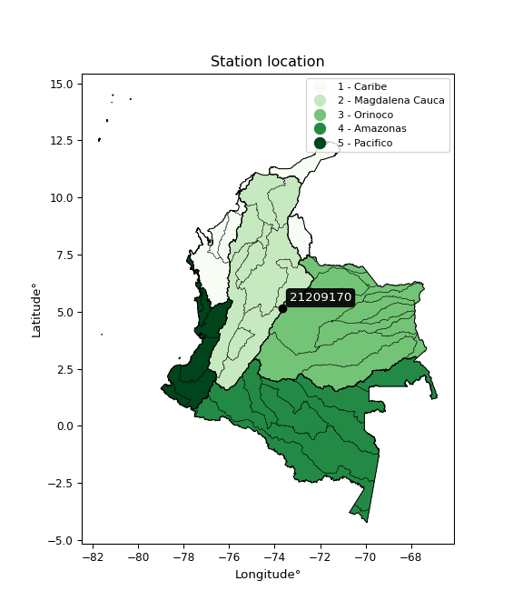

<div align="center">


</div>

# PMP Station (rain, Pmax24h): 21209170

Probable Maximum Precipitation (PMP) is the greatest amount of rainfall for a specific duration that is meteorologically possible for a given location, acting as a "worst-case" scenario for extreme storms, crucial for designing safety-critical infrastructure like bridges, river deviations, dams, spillways, and nuclear plants to prevent catastrophic failure. PMP is calculated by hydrologists using meteorological data to determine the upper limit of extreme rainfall, often leading to the Probable Maximum Flood (PMF) for flood control design, and is increasingly being studied for climate change impacts.

<div align="center">

</img>

</div>


## A. General information


### 1. General running parameters

• app_version: _v20251227_. • runtime: _2025-12-27 09:02:11.367833_. • Python version: _3.14.0_. • SciPy version: _1.16.3_. • Pandas version: _2.3.3_. • NumPy version: _2.3.5_. • Stations dataset (station_dataset_file): _dataset/pmax24h_in/automatic_colombia_2003_2024_filter.csv_. • Stations catalog (station_catalog_file): _dataset/CNE_IDEAM.xls_. • Minimum year to eval til year_max (date_min): _2003_. • Maximum year to eval since year_min (date_max): _2024_. • Creates, save and include plots into reports (create_plot): _False_. • Plot only fit distributions with Δo > Δ (plot_only_fit): _True_. • Eval low extreme values, if False, evaluates high extreme values (low_extreme): _False_. • Eval every SciPy distribution as logarithmic (pdist_logarithmic_on): _True_. • Standard deviation normalized (ddof): _1.0_. • Return periods to eval in years (Tr): _[2, 2.33, 5, 10, 15, 20, 25, 50, 75, 100, 200, 250, 500, 750, 1000]_. • Minimum data sample per station, 0 means any (minimum_sample): _5_. • Z-Score threshold to adjust a value, 0 means disable (zscore): _3.5_. • Avoid zeros, e.g. rain = 0 (avoid_zeros): _True_. • Avoid null values (avoid_nans): _True_. [:file_folder:Dataset file.](../../dataset/pmax24h_in/automatic_colombia_2003_2024_filter.csv)

> Delta Degrees of Freedom (DDOF): is a parameter used in the formulas for calculating variance and standard deviation. When ddof=0, the divisor is $N$ (the total number of observations) and this is used when your data set is the entire population. When ddof=1, the divisor is $N-1$ and this is used when your data set is a sample drawn from a larger population. Using $N-1$ provides an unbiased estimate of the population variance (known as Bessel´s correction).


### 2. Station info and location

|   id |   CODIGO | NOMBRE                   | CATEGORIA    | TECNOLOGIA   | ESTADO   | FECHA_INSTALACION   |   FECHA_SUSPENSION |   ALTITUD |   LATITUD |   LONGITUD | DEPARTAMENTO   | MUNICIPIO   | AREA_OPERATIVA                            | ENTIDAD                                       | AREA_HIDROGRAFICA   | ZONA_HIDROGRAFICA   | SUBZONA_HIDROGRAFICA   | CORRIENTE      | Catalogo   |
|-----:|---------:|:-------------------------|:-------------|:-------------|:---------|:--------------------|-------------------:|----------:|----------:|-----------:|:---------------|:------------|:------------------------------------------|:----------------------------------------------|:--------------------|:--------------------|:-----------------------|:---------------|:-----------|
|    0 | 21209170 | PTE CHOCONTA  [21209170] | Limnimétrica | Convencional | Activa   | 15/01/1982          |                nan |      2600 |      5.15 |   -73.6667 | Cundinamarca   | Chocontá    | Area Operativa 11 - Cundinamarca-Amazonas | CORPORACION AUTONOMA REGIONAL DE CUNDINAMARCA | Magdalena Cauca     | Alto Magdalena      | Río Bogotá             | QUEBRADA TEJAR | CNE_OE     |

<div align="center">

Map location in: [:earth_americas:Google](http://maps.google.com/maps?q=5.15,-73.66666667) [:earth_americas:OSM](https://www.openstreetmap.org/#map=18/5.15/-73.66666667&layers=P) [:earth_americas:Bing](https://www.bing.com/maps?cp=5.15~-73.66666667&lvl=18) [:earth_americas:Apple](https://maps.apple.com/frame?center=5.15%2C-73.66666667&span=0.003%2C0.006)

</div>


<div align="center">

```geojson
{
  "type": "Feature",
  "geometry": {
    "type": "Point", 
    "coordinates": [-73.66666667, 5.15]
  }, 
  "properties": {
    "Name": "21209170"
  }
}
```

</div>


### 3. Discrete values table and plot

|               |          0 |           1 |           2 |           3 |           4 |           5 |
|:--------------|-----------:|------------:|------------:|------------:|------------:|------------:|
| Date          | 2015       | 2016        | 2017        | 2018        | 2019        | 2020        |
| Value         |   46.9     |   30.7      |   26.8      |   21.4      |   19.2      |   23.3      |
| Value_initial |   46.9     |   30.7      |   26.8      |   21.4      |   19.2      |   23.3      |
| count         |    6       |    6        |    6        |    6        |    6        |    6        |
| mean          |   28.05    |   28.05     |   28.05     |   28.05     |   28.05     |   28.05     |
| std           |   10.0897  |   10.0897   |   10.0897   |   10.0897   |   10.0897   |   10.0897   |
| zscore        |    1.86823 |    0.262643 |   -0.123888 |   -0.659085 |   -0.877128 |   -0.470775 |

> The initial value (value_initial) correspond to the initial obtained or null completed value, and value (value) is adjusted only when the initial value is outside the valid range definite through the Z-Score value. If Z-Score is active, values out of range or outliers are replaced with the station mean value


### 4. Active continuous probability distributions from SciPy (45 of 104 available)

[scipy.stats](https://docs.scipy.org/doc/scipy/reference/stats.html) is a Python´s powerful submodule within the SciPy library for comprehensive statistical analysis, offering over 130 probability distributions (like Normal, Poisson), functions for descriptive stats (mean, variance), hypothesis testing (t-tests, chi-square), random variable generation, and statistical tests, making it essential for data science, modeling, and research. It provides tools to explore, model, and draw conclusions from data efficiently, working seamlessly with NumPy.

<div align="center">

|   id | p_dist             |   n_parameter | fit_method   | label                                                                       | active   | ref                                                                                                        |
|-----:|:-------------------|--------------:|:-------------|:----------------------------------------------------------------------------|:---------|:-----------------------------------------------------------------------------------------------------------|
|    0 | alpha              |             3 | MLE          | Alpha                                                                       | True     | [:mortar_board:](https://docs.scipy.org/doc/scipy/reference/generated/scipy.stats.alpha.html)              |
|    1 | betaprime          |             4 | MLE          | Beta prime                                                                  | True     | [:mortar_board:](https://docs.scipy.org/doc/scipy/reference/generated/scipy.stats.betaprime.html)          |
|    2 | chi2               |             3 | MLE          | Chi²                                                                        | True     | [:mortar_board:](https://docs.scipy.org/doc/scipy/reference/generated/scipy.stats.chi2.html)               |
|    3 | crystalball        |             4 | MLE          | Crystalball                                                                 | True     | [:mortar_board:](https://docs.scipy.org/doc/scipy/reference/generated/scipy.stats.crystalball.html)        |
|    4 | erlang             |             3 | MLE          | Erlang                                                                      | True     | [:mortar_board:](https://docs.scipy.org/doc/scipy/reference/generated/scipy.stats.erlang.html)             |
|    5 | expon              |             2 | MLE          | Exponential                                                                 | True     | [:mortar_board:](https://docs.scipy.org/doc/scipy/reference/generated/scipy.stats.expon.html)              |
|    6 | exponnorm          |             3 | MLE          | Exponentially modified Normal                                               | True     | [:mortar_board:](https://docs.scipy.org/doc/scipy/reference/generated/scipy.stats.exponnorm.html)          |
|    7 | f                  |             4 | MLE          | F                                                                           | True     | [:mortar_board:](https://docs.scipy.org/doc/scipy/reference/generated/scipy.stats.f.html)                  |
|    8 | fatiguelife        |             3 | MLE          | Fatigue-life (Birnbaum-Saunders)                                            | True     | [:mortar_board:](https://docs.scipy.org/doc/scipy/reference/generated/scipy.stats.fatiguelife.html)        |
|    9 | fisk               |             3 | MLE          | Fisk                                                                        | True     | [:mortar_board:](https://docs.scipy.org/doc/scipy/reference/generated/scipy.stats.fisk.html)               |
|   10 | gamma              |             3 | MLE          | Gamma                                                                       | True     | [:mortar_board:](https://docs.scipy.org/doc/scipy/reference/generated/scipy.stats.gamma.html)              |
|   11 | genexpon           |             5 | MLE          | Generalized exponential                                                     | True     | [:mortar_board:](https://docs.scipy.org/doc/scipy/reference/generated/scipy.stats.genexpon.html)           |
|   12 | genlogistic        |             3 | MLE          | Generalized logistic                                                        | True     | [:mortar_board:](https://docs.scipy.org/doc/scipy/reference/generated/scipy.stats.genlogistic.html)        |
|   13 | gibrat             |             2 | MM           | Gibrat                                                                      | True     | [:mortar_board:](https://docs.scipy.org/doc/scipy/reference/generated/scipy.stats.gibrat.html)             |
|   14 | gompertz           |             3 | MLE          | Gompertz (or truncated Gumbel)                                              | True     | [:mortar_board:](https://docs.scipy.org/doc/scipy/reference/generated/scipy.stats.gompertz.html)           |
|   15 | gumbel_l           |             2 | MM           | Gumbel Left Skew                                                            | True     | [:mortar_board:](https://docs.scipy.org/doc/scipy/reference/generated/scipy.stats.gumbel_l.html)           |
|   16 | gumbel_r           |             2 | MM           | Gumbel Right Skew                                                           | True     | [:mortar_board:](https://docs.scipy.org/doc/scipy/reference/generated/scipy.stats.gumbel_r.html)           |
|   17 | halflogistic       |             2 | MM           | Half-logistic                                                               | True     | [:mortar_board:](https://docs.scipy.org/doc/scipy/reference/generated/scipy.stats.halflogistic.html)       |
|   18 | halfnorm           |             2 | MM           | Half Normal                                                                 | True     | [:mortar_board:](https://docs.scipy.org/doc/scipy/reference/generated/scipy.stats.halfnorm.html)           |
|   19 | hypsecant          |             2 | MM           | hyperbolic secant                                                           | True     | [:mortar_board:](https://docs.scipy.org/doc/scipy/reference/generated/scipy.stats.hypsecant.html)          |
|   20 | invgamma           |             3 | MLE          | Inverted gamma                                                              | True     | [:mortar_board:](https://docs.scipy.org/doc/scipy/reference/generated/scipy.stats.invgamma.html)           |
|   21 | invgauss           |             3 | MLE          | Inverse Gaussian                                                            | True     | [:mortar_board:](https://docs.scipy.org/doc/scipy/reference/generated/scipy.stats.invgauss.html)           |
|   22 | invweibull         |             3 | MLE          | Inverted Weibull                                                            | True     | [:mortar_board:](https://docs.scipy.org/doc/scipy/reference/generated/scipy.stats.invweibull.html)         |
|   23 | johnsonsu          |             4 | MLE          | Johnson Su                                                                  | True     | [:mortar_board:](https://docs.scipy.org/doc/scipy/reference/generated/scipy.stats.johnsonsu.html)          |
|   24 | kstwobign          |             2 | MLE          | Limiting distribution of scaled Kolmogorov-Smirnov two-sided test statistic | True     | [:mortar_board:](https://docs.scipy.org/doc/scipy/reference/generated/scipy.stats.kstwobign.html)          |
|   25 | laplace            |             2 | MM           | Laplace                                                                     | True     | [:mortar_board:](https://docs.scipy.org/doc/scipy/reference/generated/scipy.stats.laplace.html)            |
|   26 | laplace_asymmetric |             3 | MLE          | Asymmetric Laplace                                                          | True     | [:mortar_board:](https://docs.scipy.org/doc/scipy/reference/generated/scipy.stats.laplace_asymmetric.html) |
|   27 | loggamma           |             3 | MLE          | Log gamma                                                                   | True     | [:mortar_board:](https://docs.scipy.org/doc/scipy/reference/generated/scipy.stats.loggamma.html)           |
|   28 | logistic           |             2 | MM           | Logistic (or Sech-squared)                                                  | True     | [:mortar_board:](https://docs.scipy.org/doc/scipy/reference/generated/scipy.stats.logistic.html)           |
|   29 | lognorm            |             3 | MLE          | Log Normal                                                                  | True     | [:mortar_board:](https://docs.scipy.org/doc/scipy/reference/generated/scipy.stats.lognorm.html)            |
|   30 | maxwell            |             2 | MM           | Maxwell                                                                     | True     | [:mortar_board:](https://docs.scipy.org/doc/scipy/reference/generated/scipy.stats.maxwell.html)            |
|   31 | mielke             |             4 | MLE          | Mielke Beta-Kappa / Dagum                                                   | True     | [:mortar_board:](https://docs.scipy.org/doc/scipy/reference/generated/scipy.stats.mielke.html)             |
|   32 | moyal              |             2 | MM           | Moyal                                                                       | True     | [:mortar_board:](https://docs.scipy.org/doc/scipy/reference/generated/scipy.stats.moyal.html)              |
|   33 | nakagami           |             3 | MLE          | Nakagami                                                                    | True     | [:mortar_board:](https://docs.scipy.org/doc/scipy/reference/generated/scipy.stats.nakagami.html)           |
|   34 | ncf                |             5 | MLE          | Non-central F distribution                                                  | True     | [:mortar_board:](https://docs.scipy.org/doc/scipy/reference/generated/scipy.stats.ncf.html)                |
|   35 | nct                |             4 | MLE          | Non-central Student’s t                                                     | True     | [:mortar_board:](https://docs.scipy.org/doc/scipy/reference/generated/scipy.stats.nct.html)                |
|   36 | norm               |             2 | MM           | Normal                                                                      | True     | [:mortar_board:](https://docs.scipy.org/doc/scipy/reference/generated/scipy.stats.norm.html)               |
|   37 | pareto             |             3 | MLE          | Pareto                                                                      | True     | [:mortar_board:](https://docs.scipy.org/doc/scipy/reference/generated/scipy.stats.pareto.html)             |
|   38 | pearson3           |             3 | MM           | Pearson type III                                                            | True     | [:mortar_board:](https://docs.scipy.org/doc/scipy/reference/generated/scipy.stats.pearson3.html)           |
|   39 | rayleigh           |             2 | MM           | Rayleigh                                                                    | True     | [:mortar_board:](https://docs.scipy.org/doc/scipy/reference/generated/scipy.stats.rayleigh.html)           |
|   40 | rice               |             3 | MLE          | Rice                                                                        | True     | [:mortar_board:](https://docs.scipy.org/doc/scipy/reference/generated/scipy.stats.rice.html)               |
|   41 | t                  |             3 | MLE          | Student’s t                                                                 | True     | [:mortar_board:](https://docs.scipy.org/doc/scipy/reference/generated/scipy.stats.t.html)                  |
|   42 | truncnorm          |             4 | MLE          | Truncated normal                                                            | True     | [:mortar_board:](https://docs.scipy.org/doc/scipy/reference/generated/scipy.stats.truncnorm.html)          |
|   43 | wald               |             2 | MM           | Wald                                                                        | True     | [:mortar_board:](https://docs.scipy.org/doc/scipy/reference/generated/scipy.stats.wald.html)               |
|   44 | weibull_min        |             3 | MLE          | Weibull minimum                                                             | True     | [:mortar_board:](https://docs.scipy.org/doc/scipy/reference/generated/scipy.stats.weibull_min.html)        |

</div>

> **n_parameter:** # arguments & localization & scale.
>
> **Fit methods:** (MLE) maximum likelihood, (MM) L-moments.
>
>**Inactive:** foldnorm, gennorm, norminvgauss, powernorm, powerlognorm, skewnorm, genextreme, anglit, arcsine, argus, beta, bradford, burr, burr12, cauchy, cosine, halfcauchy, foldcauchy, skewcauchy, wrapcauchy, dgamma, gengamma, exponweib, exponpow, truncexpon, gausshyper, genhalflogistic, genhyperbolic, geninvgauss, halfgennorm, johnsonsb, kappa4, kappa3, ksone, kstwo, loglaplace, levy, levy_l, levy_stable, ncx2, genpareto, truncpareto, lomax, powerlaw, rdist, rel_breitwigner, recipinvgauss, semicircular, studentized_range, trapezoid, triang, truncweibull_min, tukeylambda, uniform, loguniform, vonmises, vonmises_line, weibull_max, dweibull, 


## B. Probability distributions vs. Empirical distributions

A continuous probability distribution (CPD) describes probabilities for variables that can take any value within a range (like rain any time), unlike discrete variables with specific outcomes (like temperature). It uses a Probability Density Function (PDF), a curve where the total area under it equals 1, and the probability of the variable falling within an interval (a to b) is found by calculating the area under the curve between those points. A key feature is that the probability of hitting any single exact value is zero, so probabilities are always expressed for ranges, e.g., $P(a ≤ X ≤ b)$.

<div align="center">

Distributions parameters from station values
|    |   station | p_dist                |   n |          loc |         scale | shape                  | shape1                | shape2               | shape3   |
|---:|----------:|:----------------------|----:|-------------:|--------------:|:-----------------------|:----------------------|:---------------------|:---------|
|  0 |  21209170 | alpha                 |   6 |    12.0565   |  26.1741      | 2.0731919063009543     |                       |                      |          |
|  1 |  21209170 | betaprime             |   6 |    -1.20749  |   2.47769     | 162.81993658549538     | 14.84574799339634     |                      |          |
|  2 |  21209170 | chi2                  |   6 |    19.2      |   1.2463      | 0.9418623778003448     |                       |                      |          |
|  3 |  21209170 | crystalball           |   6 |    28.05     |   9.21064     | 1869.8635484698025     | 3774.4481435267367    |                      |          |
|  4 |  21209170 | erlang                |   6 |    19.2      |   7.49629     | 0.17388241346844463    |                       |                      |          |
|  5 |  21209170 | expon                 |   6 |    19.2      |   8.85        |                        |                       |                      |          |
|  6 |  21209170 | exponnorm             |   6 |    19.1893   |   0.00284908  | 3091.8815951119686     |                       |                      |          |
|  7 |  21209170 | f                     |   6 |    16.4126   |   7.10472     | 26.885972159361643     | 4.682725023372026     |                      |          |
|  8 |  21209170 | fatiguelife           |   6 |    18.444    |   5.11191     | 1.2927748230738954     |                       |                      |          |
|  9 |  21209170 | fisk                  |   6 |    19.2      |   4.12827     | 0.7371967779141513     |                       |                      |          |
| 10 |  21209170 | gamma                 |   6 |    19.2      |   9.56196     | 0.16356649046080957    |                       |                      |          |
| 11 |  21209170 | genexpon              |   6 |    19.2      |  15.0744      | 1.7033035998142754     | 2.499024304114382e-10 | 1.0263073749074456   |          |
| 12 |  21209170 | genlogistic           |   6 |   -19.9327   |   5.94882     | 1640.4815204901834     |                       |                      |          |
| 13 |  21209170 | gibrat                |   6 |    21.0235   |   4.2618      |                        |                       |                      |          |
| 14 |  21209170 | gompertz              |   6 |    19.2      |   3.01655e+06 | 374826.8271862156      |                       |                      |          |
| 15 |  21209170 | gumbel_l              |   6 |    32.1953   |   7.1815      |                        |                       |                      |          |
| 16 |  21209170 | gumbel_r              |   6 |    23.9047   |   7.1815      |                        |                       |                      |          |
| 17 |  21209170 | halflogistic          |   6 |    17.1333   |   7.87477     |                        |                       |                      |          |
| 18 |  21209170 | halfnorm              |   6 |    15.8587   |  15.2795      |                        |                       |                      |          |
| 19 |  21209170 | hypsecant             |   6 |    28.05     |   5.86367     |                        |                       |                      |          |
| 20 |  21209170 | invgamma              |   6 |    16.1736   |  14.8985      | 2.129409521578202      |                       |                      |          |
| 21 |  21209170 | invgauss              |   6 |    17.5993   |   8.47141     | 1.2336452030320813     |                       |                      |          |
| 22 |  21209170 | invweibull            |   6 |    14.8758   |   7.79225     | 1.8321961219165788     |                       |                      |          |
| 23 |  21209170 | johnsonsu             |   6 |    18.495    |   0.0207337   | -5.391761902958798     | 0.8588205214791742    |                      |          |
| 24 |  21209170 | kstwobign             |   6 |     2.34818  |  29.7631      |                        |                       |                      |          |
| 25 |  21209170 | laplace               |   6 |    28.05     |   6.5129      |                        |                       |                      |          |
| 26 |  21209170 | laplace_asymmetric    |   6 |    21.4      |   4.1221      | 0.4782001498509607     |                       |                      |          |
| 27 |  21209170 | loggamma              |   6 | -3070.24     | 411.004       | 1879.1967149934835     |                       |                      |          |
| 28 |  21209170 | logistic              |   6 |    28.05     |   5.07809     |                        |                       |                      |          |
| 29 |  21209170 | lognorm               |   6 |    19.2      |   0.0206519   | 13.167906920917924     |                       |                      |          |
| 30 |  21209170 | maxwell               |   6 |     6.22466  |  13.677       |                        |                       |                      |          |
| 31 |  21209170 | mielke                |   6 |     7.14664  |   2.80931     | 1456.326739422976      | 3.4696187278829953    |                      |          |
| 32 |  21209170 | moyal                 |   6 |    22.7828   |   4.14624     |                        |                       |                      |          |
| 33 |  21209170 | nakagami              |   6 |    19.2      |  17.9752      | 0.1612579071457126     |                       |                      |          |
| 34 |  21209170 | ncf                   |   6 |    16.1735   |   6.96343     | 13718.222281968736     | 4.26016499190923      | 68.4147635789351     |          |
| 35 |  21209170 | nct                   |   6 |    -0.306551 |   0.524311    | 7.477620237783359      | 48.22074523460145     |                      |          |
| 36 |  21209170 | norm                  |   6 |    28.05     |   9.21064     |                        |                       |                      |          |
| 37 |  21209170 | pareto                |   6 |    19.1789   |   0.0211446   | 0.20482482008300024    |                       |                      |          |
| 38 |  21209170 | pearson3              |   6 |    28.05     |   9.21062     | 1.1987377434954205     |                       |                      |          |
| 39 |  21209170 | rayleigh              |   6 |    10.4295   |  14.0591      |                        |                       |                      |          |
| 40 |  21209170 | rice                  |   6 |    13.8987   |  11.9393      | 0.0003493899804076803  |                       |                      |          |
| 41 |  21209170 | t                     |   6 |    28.0501   |   9.2139      | 80.18051920666971      |                       |                      |          |
| 42 |  21209170 | truncnorm             |   6 | -3403.68     | 178.277       | 19.19981932473479      | 48.23213766871369     |                      |          |
| 43 |  21209170 | wald                  |   6 |    18.8394   |   9.21064     |                        |                       |                      |          |
| 44 |  21209170 | weibull_min           |   6 |    19.2      |   4.19268     | 0.5680161102387752     |                       |                      |          |
| 45 |  21209170 | logalpha              |   6 |     2.36335  |   3.02592     | 3.5748733695749904     |                       |                      |          |
| 46 |  21209170 | logbetaprime          |   6 |     2.95478  |   0.941378    | 0.8781585983773852     | 4.000058735486898     |                      |          |
| 47 |  21209170 | logchi2               |   6 |     2.95491  |   0.971814    | 1.0412702954545616     |                       |                      |          |
| 48 |  21209170 | logcrystalball        |   6 |     3.28791  |   0.292421    | 15.250517407522182     | 1668.888966490764     |                      |          |
| 49 |  21209170 | logerlang             |   6 |     2.95491  |   0.3835      | 0.6256337977287398     |                       |                      |          |
| 50 |  21209170 | logexpon              |   6 |     2.95491  |   0.332996    |                        |                       |                      |          |
| 51 |  21209170 | logexponnorm          |   6 |     2.95461  |   9.0632e-05  | 3694.562921369152      |                       |                      |          |
| 52 |  21209170 | logf                  |   6 |     2.71952  |   0.444404    | 547.6772043156909      | 8.612458928958379     |                      |          |
| 53 |  21209170 | logfatiguelife        |   6 |     2.8753   |   0.302518    | 0.8459412513366293     |                       |                      |          |
| 54 |  21209170 | logfisk               |   6 |     2.8988   |   0.293674    | 1.9053553435536457     |                       |                      |          |
| 55 |  21209170 | loggamma              |   6 |     2.95491  |   0.292555    | 0.6503420520387501     |                       |                      |          |
| 56 |  21209170 | loggenexpon           |   6 |     2.95491  |   0.276017    | 0.7158313428183769     | 7.163949549526377     | 0.015184550778839553 |          |
| 57 |  21209170 | loggenlogistic        |   6 |     1.65004  |   0.213916    | 1139.4219077209323     |                       |                      |          |
| 58 |  21209170 | loggibrat             |   6 |     3.06484  |   0.135296    |                        |                       |                      |          |
| 59 |  21209170 | loggompertz           |   6 |     2.95491  |   1.58288     | 3.8991690123192537     |                       |                      |          |
| 60 |  21209170 | loggumbel_l           |   6 |     3.41951  |   0.227999    |                        |                       |                      |          |
| 61 |  21209170 | loggumbel_r           |   6 |     3.1563   |   0.227999    |                        |                       |                      |          |
| 62 |  21209170 | loghalflogistic       |   6 |     2.94132  |   0.250009    |                        |                       |                      |          |
| 63 |  21209170 | loghalfnorm           |   6 |     2.90086  |   0.485096    |                        |                       |                      |          |
| 64 |  21209170 | loghypsecant          |   6 |     3.28791  |   0.186161    |                        |                       |                      |          |
| 65 |  21209170 | loginvgamma           |   6 |     2.71607  |   1.92485     | 4.305763243978411      |                       |                      |          |
| 66 |  21209170 | loginvgauss           |   6 |     2.83689  |   0.779182    | 0.5788290001687026     |                       |                      |          |
| 67 |  21209170 | loginvweibull         |   6 |     2.362    |   0.767365    | 4.066430978587813      |                       |                      |          |
| 68 |  21209170 | logjohnsonsu          |   6 |     2.86326  |   0.0051199   | -6.398530132047334     | 1.3191911898336866    |                      |          |
| 69 |  21209170 | logkstwobign          |   6 |     2.39684  |   1.02552     |                        |                       |                      |          |
| 70 |  21209170 | loglaplace            |   6 |     3.28791  |   0.206773    |                        |                       |                      |          |
| 71 |  21209170 | loglaplace_asymmetric |   6 |     3.06339  |   0.161319    | 0.5222520318953026     |                       |                      |          |
| 72 |  21209170 | logloggamma           |   6 |   -89.3951   |  12.4141      | 1747.9199525740614     |                       |                      |          |
| 73 |  21209170 | loglogistic           |   6 |     3.28791  |   0.16122     |                        |                       |                      |          |
| 74 |  21209170 | loglognorm            |   6 |     2.95491  |   0.00104516  | 12.756871843875217     |                       |                      |          |
| 75 |  21209170 | logmaxwell            |   6 |     2.59499  |   0.434219    |                        |                       |                      |          |
| 76 |  21209170 | logmielke             |   6 |     1.81681  |   0.645814    | 871.6197250141317      | 6.7914165931249695    |                      |          |
| 77 |  21209170 | logmoyal              |   6 |     3.12068  |   0.131635    |                        |                       |                      |          |
| 78 |  21209170 | lognakagami           |   6 |     2.95491  |   0.506459    | 0.4696937334465896     |                       |                      |          |
| 79 |  21209170 | logncf                |   6 |     2.71726  |   0.38681     | 1572.688980828912      | 8.611628836536903     | 241.16966121286575   |          |
| 80 |  21209170 | lognct                |   6 |     0.32324  |   0.0167608   | 58.136955480094265     | 174.2907651405181     |                      |          |
| 81 |  21209170 | lognorm               |   6 |     3.28791  |   0.292421    |                        |                       |                      |          |
| 82 |  21209170 | logpareto             |   6 |     2.95403  |   0.000880742 | 0.2043539070977027     |                       |                      |          |
| 83 |  21209170 | logpearson3           |   6 |     3.28791  |   0.292421    | 0.8485074715758723     |                       |                      |          |
| 84 |  21209170 | lograyleigh           |   6 |     2.72849  |   0.446351    |                        |                       |                      |          |
| 85 |  21209170 | logrice               |   6 |     2.80649  |   0.398291    | 0.00017116183396506993 |                       |                      |          |
| 86 |  21209170 | logt                  |   6 |     3.28791  |   0.29242     | 1464803172.2157955     |                       |                      |          |
| 87 |  21209170 | logtruncnorm          |   6 |    -1.25921  |   1.4836      | 2.8404241573148656     | 3.4424475082027204    |                      |          |
| 88 |  21209170 | logwald               |   6 |     2.99547  |   0.292441    |                        |                       |                      |          |
| 89 |  21209170 | logweibull_min        |   6 |     2.95491  |   0.296098    | 0.6574760042880559     |                       |                      |          |

</div>

> **loc** (Location parameter): This shifts the distribution along the x-axis. For many common distributions, like the normal (Gaussian) distribution, loc represents the mean $μ$. For others, like the uniform distribution, it might represent the minimum value, or for the beta distribution, the left end of the support interval.
>
> **scale** (Scale parameter): This determines the width or spread of the distribution. For the normal distribution, scale represents the standard deviation $σ$. For a uniform distribution, it defines the length of the interval (from $loc$ to $loc + scale$).
>
> **shape** (Shape parameters): Refers to parameters that define the specific form of a probability distribution, distinct from its location (loc) and scale (scale). These parameters are required arguments for most distribution functions. For example, a normal (Gaussian) distribution is fully defined by its location (mean) and scale (standard deviation), so it has no specific shape parameters beyond loc and scale. However, other distributions have intrinsic properties that need specification, as Gamma distribution that takes a shape parameter, often named $a$ or $alpha$.


### 0. Cumulative distribution values - CDF (90 evaluated)

Cumulative Distribution Function (CDF), denoted as $F$<sub>$X$</sub>$(x)$, is a function that gives the probability that a random variable $X$ will take a value less than or equal to a specific value, $x$ (i.e., $(P(X≥x)$. It essentially "accumulates" probabilities from a given point up to the far right (positive infinity), providing a complete picture of the distribution´s probabilities for both discrete (like rain) and continuous (like temperature) variables, helping to find probabilities over ranges or above certain values.

<div align="center">

CDF ordered by x ascending and calculating $log(f(x))$ separately
|   id |   Station |   date |    x |   count |   mean |     std |    zscore |   Value_initial |   station |   m |    alpha |   alpha_pdf |   betaprime |   betaprime_pdf |        chi2 |    chi2_pdf |   crystalball |   crystalball_pdf |     erlang |   erlang_pdf |    expon |   expon_pdf |   exponnorm |   exponnorm_pdf |         f |      f_pdf |   fatiguelife |   fatiguelife_pdf |        fisk |      fisk_pdf |      gamma |   gamma_pdf |    genexpon |   genexpon_pdf |   genlogistic |   genlogistic_pdf |     gibrat |   gibrat_pdf |    gompertz |   gompertz_pdf |   gumbel_l |   gumbel_l_pdf |   gumbel_r |   gumbel_r_pdf |   halflogistic |   halflogistic_pdf |   halfnorm |   halfnorm_pdf |   hypsecant |   hypsecant_pdf |   invgamma |   invgamma_pdf |   invgauss |   invgauss_pdf |   invweibull |   invweibull_pdf |   johnsonsu |   johnsonsu_pdf |   kstwobign |   kstwobign_pdf |   laplace |   laplace_pdf |   laplace_asymmetric |   laplace_asymmetric_pdf |    loggamma |   loggamma_pdf |   logistic |   logistic_pdf |   lognorm |   lognorm_pdf |   maxwell |   maxwell_pdf |   mielke |   mielke_pdf |    moyal |   moyal_pdf |    nakagami |   nakagami_pdf |       ncf |   ncf_pdf |      nct |    nct_pdf |     norm |   norm_pdf |   pareto |   pareto_pdf |   pearson3 |   pearson3_pdf |   rayleigh |   rayleigh_pdf |      rice |   rice_pdf |        t |      t_pdf |   truncnorm |   truncnorm_pdf |        wald |    wald_pdf |   weibull_min |   weibull_min_pdf |   logalpha |   logalpha_pdf |   logbetaprime |   logbetaprime_pdf |     logchi2 |   logchi2_pdf |   logcrystalball |   logcrystalball_pdf |   logerlang |   logerlang_pdf |   logexpon |   logexpon_pdf |   logexponnorm |   logexponnorm_pdf |      logf |   logf_pdf |   logfatiguelife |   logfatiguelife_pdf |   logfisk |   logfisk_pdf |   loggenexpon |   loggenexpon_pdf |   loggenlogistic |   loggenlogistic_pdf |   loggibrat |   loggibrat_pdf |   loggompertz |   loggompertz_pdf |   loggumbel_l |   loggumbel_l_pdf |   loggumbel_r |   loggumbel_r_pdf |   loghalflogistic |   loghalflogistic_pdf |   loghalfnorm |   loghalfnorm_pdf |   loghypsecant |   loghypsecant_pdf |   loginvgamma |   loginvgamma_pdf |   loginvgauss |   loginvgauss_pdf |   loginvweibull |   loginvweibull_pdf |   logjohnsonsu |   logjohnsonsu_pdf |   logkstwobign |   logkstwobign_pdf |   loglaplace |   loglaplace_pdf |   loglaplace_asymmetric |   loglaplace_asymmetric_pdf |   logloggamma |   logloggamma_pdf |   loglogistic |   loglogistic_pdf |   loglognorm |   loglognorm_pdf |   logmaxwell |   logmaxwell_pdf |   logmielke |   logmielke_pdf |   logmoyal |   logmoyal_pdf |   lognakagami |   lognakagami_pdf |    logncf |   logncf_pdf |   lognct |   lognct_pdf |   logpareto |   logpareto_pdf |   logpearson3 |   logpearson3_pdf |   lograyleigh |   lograyleigh_pdf |   logrice |   logrice_pdf |     logt |   logt_pdf |   logtruncnorm |   logtruncnorm_pdf |   logwald |   logwald_pdf |   logweibull_min |   logweibull_min_pdf |
|-----:|----------:|-------:|-----:|--------:|-------:|--------:|----------:|----------------:|----------:|----:|---------:|------------:|------------:|----------------:|------------:|------------:|--------------:|------------------:|-----------:|-------------:|---------:|------------:|------------:|----------------:|----------:|-----------:|--------------:|------------------:|------------:|--------------:|-----------:|------------:|------------:|---------------:|--------------:|------------------:|-----------:|-------------:|------------:|---------------:|-----------:|---------------:|-----------:|---------------:|---------------:|-------------------:|-----------:|---------------:|------------:|----------------:|-----------:|---------------:|-----------:|---------------:|-------------:|-----------------:|------------:|----------------:|------------:|----------------:|----------:|--------------:|---------------------:|-------------------------:|------------:|---------------:|-----------:|---------------:|----------:|--------------:|----------:|--------------:|---------:|-------------:|---------:|------------:|------------:|---------------:|----------:|----------:|---------:|-----------:|---------:|-----------:|---------:|-------------:|-----------:|---------------:|-----------:|---------------:|----------:|-----------:|---------:|-----------:|------------:|----------------:|------------:|------------:|--------------:|------------------:|-----------:|---------------:|---------------:|-------------------:|------------:|--------------:|-----------------:|---------------------:|------------:|----------------:|-----------:|---------------:|---------------:|-------------------:|----------:|-----------:|-----------------:|---------------------:|----------:|--------------:|--------------:|------------------:|-----------------:|---------------------:|------------:|----------------:|--------------:|------------------:|--------------:|------------------:|--------------:|------------------:|------------------:|----------------------:|--------------:|------------------:|---------------:|-------------------:|--------------:|------------------:|--------------:|------------------:|----------------:|--------------------:|---------------:|-------------------:|---------------:|-------------------:|-------------:|-----------------:|------------------------:|----------------------------:|--------------:|------------------:|--------------:|------------------:|-------------:|-----------------:|-------------:|-----------------:|------------:|----------------:|-----------:|---------------:|--------------:|------------------:|----------:|-------------:|---------:|-------------:|------------:|----------------:|--------------:|------------------:|--------------:|------------------:|----------:|--------------:|---------:|-----------:|---------------:|-------------------:|----------:|--------------:|-----------------:|---------------------:|
|    0 |  21209170 |   2019 | 19.2 |       6 |  28.05 | 10.0897 | -0.877128 |            19.2 |  21209170 |   1 | 0.056909 |  0.0588538  |    0.120677 |      0.0391833  | 1.15147e-07 | 1.52634e+07 |      0.168315 |        0.0272989  | 0.00233876 |  1.14467e+11 | 0        |  0.112994   |  0.00121559 |      0.113373   | 0.0547501 | 0.0666059  |      0.04326  |        0.140228   | 7.83388e-12 | 1625.55       | 0.00322333 | 1.48402e+11 | 2.66977e-11 |     0.112993   |      0.102368 |        0.0391931  | 0          |   0          | 3.35043e-08 |      0.124257  |   0.151027 |    0.0193554   |   0.145822 |     0.0390951  |       0.130478 |         0.062413   |   0.173098 |     0.0509856  |    0.138508 |      0.0228829  |  0.0512101 |     0.0674664  |  0.0458909 |     0.085961   |    0.0527745 |       0.0657803  |   0.0385548 |      0.101835   |   0.0943655 |      0.0374994  |  0.128479 |    0.0197269  |            0.0609643 |               0.0309277  | 2.56111e-10 | 375059         |   0.14896  |     0.0249643  |  0.127402 |      0.713367 |  0.174579 |    0.0334785  |      nan |          nan | 0.12346  |  0.0452512  | 6.90521e-06 |    6.26856e+08 | 0.0512047 | 0.0674437 | 0.104339 | 0.0423936  | 0.168315 | 0.0272989  | 0        |   9.68688    |   0.149094 |     0.0452301  |   0.176821 |     0.036526   | 0.0938734 | 0.0336985  | 0.169841 | 0.0271289  |  4.5759e-12 |      0.107987   | 1.15656e-06 | 4.23955e-05 |   2.74726e-09 |   439239          |  0.0617543 |       1.05357  |     0.00142863 |           9.61507  | 8.10426e-09 |   9.50116e+06 |         0.127402 |             0.713367 | 5.04339e-10 |   710513        |   0        |       3.00304  |    0.000892388 |           2.98233  | 0.0543155 |   1.18455  |        0.0447562 |             1.72531  | 0.0409412 |      1.33345  |   3.48391e-06 |           2.59343 |        0.0778555 |             0.928097 |    0        |        0        |   6.04404e-12 |          2.46334  |      0.122189 |         0.501757  |      0.089023 |          0.944451 |         0.0271732 |              1.99845  |     0.0887249 |          1.63462  |       0.105448 |           0.556129 |     0.0543141 |          1.18454  |     0.0477161 |          1.43651  |       0.0575972 |            1.12752  |      0.0467338 |           1.40416  |      0.0714619 |           0.93887  |    0.0998993 |         0.483136 |               0.0591307 |                    0.701856 |      0.131504 |          0.711673 |      0.112498 |          0.619292 |    0.0127723 |      5.81935e+12 |     0.123755 |         0.895424 |   0.0666934 |         1.06631 |  0.0605221 |       0.977194 |   5.67772e-15 |         12.0102   | 0.0543159 |     1.18455  | 0.110426 |     0.826403 |    0        |     232.025     |      0.105078 |          0.97353  |      0.12073  |          0.999282 | 0.0670759 |      0.872849 | 0.127402 |   0.713366 |    0.000138269 |           2.42303  |  0        |      0        |      1.79307e-10 |        265465        |
|    1 |  21209170 |   2018 | 21.4 |       6 |  28.05 | 10.0897 | -0.659085 |            21.4 |  21209170 |   2 | 0.237809 |  0.0935415  |    0.220744 |      0.050792   | 0.828753    | 0.0942813   |      0.23515  |        0.0333755  | 0.837896   |  0.0514526   | 0.220098 |  0.0881245  |  0.221947   |      0.0883247  | 0.249198  | 0.0951274  |      0.333954 |        0.0988122  | 0.386039    |    0.0794205  | 0.820978   | 0.0500158   | 0.220097    |     0.0881239  |      0.207022 |        0.0547821  | 0.00762301 |   0.0557959  | 0.239185    |      0.0945366 |   0.199418 |    0.0247946   |   0.24236  |     0.0478318  |       0.264474 |         0.0590528  |   0.283142 |     0.0488958  |    0.198151 |      0.0316523  |  0.250714  |     0.0969382  |  0.276695  |     0.0997967  |    0.250419  |       0.0973743  |   0.290542  |      0.101283   |   0.192852  |      0.0508327  |  0.180108 |    0.0276541  |            0.186115  |               0.0944178  | 0.506596    |      2.41115   |   0.212563 |     0.0329612  |  0.221308 |      1.01601  |  0.254446 |    0.0388073  |      nan |          nan | 0.237421 |  0.0565679  | 0.407043    |    0.0595478   | 0.250657  | 0.0969235 | 0.215686 | 0.0571801  | 0.23515  | 0.0333755  | 0.614547 |   0.0355449  |   0.256167 |     0.0510103  |   0.262466 |     0.0409347  | 0.179113  | 0.0431976  | 0.236274 | 0.033186   |  0.21152    |      0.0852003  | 0.142188    | 0.115712    |   0.500072    |        0.0894873  |  0.227381  |       1.86305  |     0.411913   |           2.48932  | 0.246213    |   1.13892     |         0.221308 |             1.01601  | 0.455549    |        2.19982  |   0.27803  |       2.1681   |    0.277375    |           2.15808  | 0.240489  |   2.01325  |        0.285334  |             2.19545  | 0.249128  |      2.16557  |   0.251531    |           2.05669 |        0.214785  |             1.54332  |    0        |        0        |   0.241638    |          2.00062  |      0.189197 |         0.745834  |      0.222448 |          1.46647  |         0.239396  |              1.88531  |     0.262418  |          1.55502  |       0.185187 |           0.939596 |     0.24049   |          2.01329  |     0.26237   |          2.13312  |       0.236612  |            1.97722  |      0.258508  |           2.131    |      0.207931  |           1.51004  |    0.168815  |         0.816426 |               0.214298  |                    2.54362  |      0.224606 |          1.00288  |      0.198993 |          0.988678 |    0.642039  |      0.269809    |     0.238259 |         1.19499  |   0.230822  |         1.83318 |  0.21383   |       1.73975  |   0.184922    |          1.57799  | 0.240491  |     2.01327  | 0.222224 |     1.21961  |    0.626681 |       0.697588  |      0.234038 |          1.36311  |      0.245337 |          1.26858  | 0.187808  |      1.3153   | 0.221308 |   1.01601  |    0.237289    |           1.96335  |  0.094603 |      3.42648  |      0.403548    |             1.86805  |
|    2 |  21209170 |   2020 | 23.3 |       6 |  28.05 | 10.0897 | -0.470775 |            23.3 |  21209170 |   3 | 0.407234 |  0.0815175  |    0.322472 |      0.0554084  | 0.935932    | 0.0316478   |      0.303029 |        0.0379201  | 0.904349   |  0.0238771   | 0.370782 |  0.0710981  |  0.3729     |      0.0711885  | 0.416384  | 0.0788019  |      0.48415  |        0.0635204  | 0.498733    |    0.0449507  | 0.886936   | 0.0243597   | 0.370779    |     0.0710978  |      0.318389 |        0.0612329  | 0.265315   |   0.143966   | 0.399176    |      0.0746566 |   0.251571 |    0.0301997   |   0.336939 |     0.0510395  |       0.372697 |         0.0546745  |   0.373749 |     0.0463797  |    0.266453 |      0.0403172  |  0.419189  |     0.0785478  |  0.440449  |     0.0731697  |    0.420265  |       0.0792359  |   0.452388  |      0.0707958  |   0.295355  |      0.0560931  |  0.241118 |    0.0370216  |            0.347115  |               0.0757405  | 0.66693     |      1.47244   |   0.281832 |     0.0398581  |  0.31672  |      1.21764  |  0.331205 |    0.0417103  |      nan |          nan | 0.347458 |  0.0581415  | 0.497138    |    0.0388245   | 0.419121  | 0.0785487 | 0.329583 | 0.0614088  | 0.303029 | 0.0379201  | 0.660384 |   0.0168792  |   0.354016 |     0.0513956  |   0.342315 |     0.042825   | 0.266565  | 0.0483715  | 0.303797 | 0.0377377  |  0.3579     |      0.0694212  | 0.351009    | 0.0976586   |   0.62745     |        0.0509621  |  0.390073  |       1.88388  |     0.581395   |           1.5865   | 0.327971    |   0.825963    |         0.31672  |             1.21764  | 0.605461    |        1.41884  |   0.440783 |       1.67935  |    0.439485    |           1.67395  | 0.408821  |   1.87336  |        0.45194   |             1.71619  | 0.423247  |      1.86308  |   0.410566    |           1.69068 |        0.355692  |             1.718    |    0.315171 |        4.24947  |   0.397782    |          1.67641  |      0.26256  |         0.985102  |      0.355219 |          1.61254  |         0.392077  |              1.69249  |     0.390236  |          1.44392  |       0.28116  |           1.32144  |     0.408825  |          1.87339  |     0.431157  |          1.79676  |       0.404575  |            1.893    |      0.428255  |           1.81511  |      0.34402   |           1.64475  |    0.254724  |         1.23191  |               0.40343   |                    1.93133  |      0.318577 |          1.19749  |      0.296299 |          1.2933   |    0.658839  |      0.148597    |     0.346183 |         1.32496  |   0.39127   |         1.86565 |  0.368182  |       1.8192   |   0.313852    |          1.45356  | 0.408825  |     1.87337  | 0.335365 |     1.41827  |    0.668094 |       0.348858  |      0.356059 |          1.47677  |      0.357657 |          1.35403  | 0.308282  |      1.4911   | 0.31672  |   1.21764  |    0.391012    |           1.65858  |  0.384959 |      2.90105  |      0.530516    |             1.20591  |
|    3 |  21209170 |   2017 | 26.8 |       6 |  28.05 | 10.0897 | -0.123888 |            26.8 |  21209170 |   4 | 0.629112 |  0.0468461  |    0.514057 |      0.0519229  | 0.987736    | 0.00560687  |      0.446024 |        0.0429162  | 0.956318   |  0.00899054  | 0.576312 |  0.0478744  |  0.578515   |      0.0478471  | 0.630711  | 0.0458562  |      0.649492 |        0.0353475  | 0.610616    |    0.023063   | 0.942102   | 0.0100813   | 0.576308    |     0.0478743  |      0.529638 |        0.0565746  | 0.619478   |   0.0659419  | 0.611069    |      0.0483275 |   0.3761   |    0.040985    |   0.512627 |     0.0476976  |       0.546782 |         0.0445111  |   0.526055 |     0.0404097  |    0.432652 |      0.0530745  |  0.630428  |     0.0447896  |  0.634372  |     0.0413327  |    0.632142  |       0.0445484  |   0.636949  |      0.0387992  |   0.490486  |      0.0532722  |  0.412684 |    0.063364   |            0.564989  |               0.0504651  | 0.815912    |      0.754498  |   0.43877  |     0.0484928  |  0.500676 |      1.36427  |  0.480382 |    0.042582   |      nan |          nan | 0.537868 |  0.0490293  | 0.604919    |    0.0250405   | 0.630379  | 0.0447966 | 0.535082 | 0.0536181  | 0.446024 | 0.0429162  | 0.700567 |   0.00804752 |   0.525099 |     0.04532    |   0.492327 |     0.0420465  | 0.442235  | 0.0504807  | 0.446208 | 0.0427628  |  0.560277   |      0.0475894  | 0.60796     | 0.0533342   |   0.753882    |        0.0257882  |  0.619462  |       1.34733  |     0.744482   |           0.842055 | 0.425141    |   0.592124    |         0.500676 |             1.36427  | 0.755517    |        0.803493 |   0.632668 |       1.10311  |    0.630959    |           1.10212  | 0.628508  |   1.25676  |        0.644227  |             1.07912  | 0.631472  |      1.13811  |   0.610857    |           1.19283 |        0.58422   |             1.46754  |    0.692246 |        1.57303  |   0.599265    |          1.21866  |      0.430321 |         1.40592   |      0.571072 |          1.40324  |         0.600634  |              1.27843  |     0.575655  |          1.19541  |       0.500848 |           1.70986  |     0.628512  |          1.25675  |     0.636257  |          1.16071  |       0.628185  |            1.28198  |      0.635257  |           1.16595  |      0.563627  |           1.43164  |    0.501197  |         2.41233  |               0.620776  |                    1.2277   |      0.499485 |          1.34343  |      0.500769 |          1.55067  |    0.674347  |      0.0846695   |     0.533699 |         1.3093   | nan         |       nan       |  0.596915  |       1.39358  |   0.501944    |          1.22872  | 0.62851   |     1.25675  | 0.539004 |     1.4256   |    0.702906 |       0.181571  |      0.557117 |          1.34302  |      0.544696 |          1.27959  | 0.519049  |      1.46106  | 0.500676 |   1.36427  |    0.59316     |           1.24765  |  0.668777 |      1.36072  |      0.660856    |             0.722999 |
|    4 |  21209170 |   2016 | 30.7 |       6 |  28.05 | 10.0897 |  0.262643 |            30.7 |  21209170 |   5 | 0.762892 |  0.0244808  |    0.692261 |      0.0387741  | 0.997861    | 0.000941977 |      0.613216 |        0.0415571  | 0.979537   |  0.00379521  | 0.727314 |  0.030812   |  0.729288   |      0.0307313  | 0.764584  | 0.025173   |      0.757462 |        0.0216495  | 0.680321    |    0.0139416  | 0.969383   | 0.00474157  | 0.727311    |     0.030812   |      0.718943 |        0.0398748  | 0.793895   |   0.0294562  | 0.760441    |      0.0297669 |   0.556046 |    0.0501992   |   0.678273 |     0.036665   |       0.696981 |         0.0326497  |   0.668611 |     0.0325807  |    0.639195 |      0.0491769  |  0.760907  |     0.0245338  |  0.757754  |     0.0239837  |    0.761022  |       0.0240635  |   0.752048  |      0.022263   |   0.675676  |      0.0409804  |  0.667139 |    0.0511079  |            0.723299  |               0.0320997  | 0.893293    |      0.420804  |   0.62758  |     0.0460258  |  0.679501 |      1.22373  |  0.638541 |    0.0376732  |      nan |          nan | 0.700305 |  0.0343908  | 0.68788     |    0.0182234   | 0.760881  | 0.0245388 | 0.71204  | 0.0369858  | 0.613216 | 0.0415571  | 0.72487  |   0.00489131 |   0.681271 |     0.0345492  |   0.646333 |     0.0362696  | 0.628475  | 0.0437897  | 0.6128   | 0.041394   |  0.71175    |      0.0312313  | 0.761892    | 0.0287034   |   0.830315    |        0.0148667  |  0.765196  |       0.826185 |     0.832586   |           0.492889 | 0.496544    |   0.468717    |         0.679501 |             1.22373  | 0.841812    |        0.496096 |   0.755731 |       0.73355  |    0.754041    |           0.734545 | 0.764196  |   0.773858 |        0.762657  |             0.69511  | 0.751856  |      0.676513 |   0.746696    |           0.82451 |        0.752144  |             1.00135  |    0.835724 |        0.688675 |   0.739686    |          0.862579 |      0.639787 |         1.61316   |      0.734375 |          0.994421 |         0.746875  |              0.884323 |     0.719402  |          0.918993 |       0.714727 |           1.33535  |     0.764198  |          0.773842 |     0.762952  |          0.736248 |       0.766055  |            0.781523 |      0.761644  |           0.728237 |      0.731982  |           1.03969  |    0.741433  |         1.25049  |               0.755725  |                    0.790813 |      0.676184 |          1.21462  |      0.699681 |          1.30336  |    0.683937  |      0.0594154   |     0.697848 |         1.08193  | nan         |       nan       |  0.752266  |       0.910145 |   0.652517    |          0.985631 | 0.764196  |     0.773844 | 0.714973 |     1.13203  |    0.722903 |       0.120421  |      0.718536 |          1.01909  |      0.703272 |          1.03627  | 0.699676  |      1.16955  | 0.6795   |   1.22373  |    0.740763    |           0.938353 |  0.803881 |      0.713435 |      0.741729    |             0.489772 |
|    5 |  21209170 |   2015 | 46.9 |       6 |  28.05 | 10.0897 |  1.86823  |            46.9 |  21209170 |   6 | 0.924554 |  0.00365928 |    0.969135 |      0.00455279 | 0.999998    | 8.90174e-07 |      0.979649 |        0.00533496 | 0.998664   |  0.000211494 | 0.95628  |  0.00494014 |  0.956964   |      0.00488542 | 0.937287  | 0.00396031 |      0.932827 |        0.00492019 | 0.802708    |    0.00421473 | 0.996761   | 0.000417637 | 0.956279    |     0.00494024 |      0.978564 |        0.00356444 | 0.964356   |   0.00303107 | 0.967997    |      0.0039766 |   0.999569 |    0.000465186 |   0.960136 |     0.00543877 |       0.955374 |         0.00554054 |   0.957802 |     0.00663147 |    0.974443 |      0.00435392 |  0.931494  |     0.00404054 |  0.937225  |     0.00457425 |    0.927694  |       0.00398354 |   0.920199  |      0.00448644 |   0.977363  |      0.00455396 |  0.97233  |    0.00424851 |            0.957751  |               0.00490132 | 0.978842    |      0.0789449 |   0.976155 |     0.00458379 |  0.972281 |      0.217879 |  0.968571 |    0.00619497 |      nan |          nan | 0.956483 |  0.00524252 | 0.877284    |    0.007317    | 0.931501  | 0.004041  | 0.96505  | 0.00433121 | 0.979649 | 0.00533496 | 0.770155 |   0.00169827 |   0.957887 |     0.00576568 |   0.965425 |     0.00637949 | 0.978074  | 0.00507611 | 0.977973 | 0.00547213 |  0.950376   |      0.00540187 | 0.954983    | 0.00409616  |   0.946205    |        0.00322394 |  0.937988  |       0.168177 |     0.943218   |           0.126561 | 0.648442    |   0.276878    |         0.972281 |             0.217879 | 0.955884    |        0.129147 |   0.931576 |       0.205479 |    0.930617    |           0.207209 | 0.93307   |   0.177788 |        0.92792   |             0.196156 | 0.903374  |      0.175215 |   0.943666    |           0.2162  |        0.961469  |             0.176605 |    0.960447 |        0.109031 |   0.94797     |          0.22533  |      0.998569 |         0.0410947 |      0.95301  |          0.201177 |         0.948169  |              0.201943 |     0.949124  |          0.244495 |       0.968606 |           0.168365 |     0.933069  |          0.177785 |     0.93231   |          0.191176 |       0.934211  |            0.173973 |      0.927006  |           0.185739 |      0.963544  |           0.201208 |    0.966693  |         0.161082 |               0.938044  |                    0.200577 |      0.971117 |          0.225399 |      0.969945 |          0.18082  |    0.701656  |      0.0304408   |     0.960289 |         0.237955 | nan         |       nan       |  0.94967   |       0.19092  |   0.919742    |          0.329333 | 0.933068  |     0.177787 | 0.967081 |     0.198688 |    0.756996 |       0.0555475 |      0.954502 |          0.221026 |      0.956954 |          0.241888 | 0.967258  |      0.21497  | 0.972281 |   0.217879 |    1           |           0.365647 |  0.949711 |      0.146086 |      0.873374    |             0.192637 |


</div>

An Empirical Distribution Function (EDF) is a step-function estimate of a true cumulative distribution function (CDF) based on observed sample data, representing the proportion of data points less than or equal to a given value. It is calculated by ordering your data and jumping up by $1/n$ (where $n$ is sample size) at each unique data point, allowing analysis without assuming an underlying population distribution, and it gets closer to the true CDF as the sample size grows.


### 1. Empirical - EDF California (1923)

California´s estimates the true probability distribution of water-related data (like rainfall, streamflow) using observed samples, crucial for risk assessment.

<div align="center">


$P=m/n$


</div>


**1.1. Empirical values**

<div align="center">

|                | 0                   | 1                  | 2              | 3                  | 4                  | 5              |
|:---------------|:--------------------|:-------------------|:---------------|:-------------------|:-------------------|:---------------|
| date           | 2019                | 2018               | 2020           | 2017               | 2016               | 2015           |
| x              | 19.2                | 21.4               | 23.3           | 26.8               | 30.7               | 46.9           |
| m              | 1                   | 2                  | 3              | 4                  | 5                  | 6              |
| empirical_dist | edf_california      | edf_california     | edf_california | edf_california     | edf_california     | edf_california |
| empirical      | 0.16666666666666666 | 0.3333333333333333 | 0.5            | 0.6666666666666666 | 0.8333333333333334 | 1.0            |
| empirical_tr   | 1.2                 | 1.4999999999999998 | 2.0            | 2.9999999999999996 | 6.000000000000002  | inf            |

</div>


**1.2. Kolmogorov-Smirnov fit test (sorted by Δ)**


<div align="center">

|                | 0                  | 1                   | 2                   | 3                   | 4                   | 5                   | 6                   | 7                   | 8                   | 9                   | 10                  | 11                  | 12                  | 13                    | 14                  | 15                  | 16                 | 17                  | 18                  | 19                  | 20                 | 21                 | 22                  | 23                  | 24                  | 25                  | 26                  | 27                 | 28                  | 29                 | 30                  | 31                  | 32                | 33                  | 34                 | 35                 | 36                 | 37                  | 38                  | 39                  | 40                  | 41                  | 42                  | 43                  | 44                  | 45                  | 46                  | 47                  | 48                  | 49                  | 50                  | 51                  | 52                  | 53                 | 54                  | 55                  | 56                  | 57                  | 58                  | 59                  | 60                  | 61                 | 62                  | 63                  | 64                  | 65                  | 66                  | 67                  | 68                 | 69                 | 70                 | 71                  | 72                  | 73                  | 74                 | 75                  | 76                 | 77                 | 78                 | 79                 | 80                 | 81                  | 82                 | 83                 | 84                 | 85                 | 86                 | 87                | 88                 | 89             |
|:---------------|:-------------------|:--------------------|:--------------------|:--------------------|:--------------------|:--------------------|:--------------------|:--------------------|:--------------------|:--------------------|:--------------------|:--------------------|:--------------------|:----------------------|:--------------------|:--------------------|:-------------------|:--------------------|:--------------------|:--------------------|:-------------------|:-------------------|:--------------------|:--------------------|:--------------------|:--------------------|:--------------------|:-------------------|:--------------------|:-------------------|:--------------------|:--------------------|:------------------|:--------------------|:-------------------|:-------------------|:-------------------|:--------------------|:--------------------|:--------------------|:--------------------|:--------------------|:--------------------|:--------------------|:--------------------|:--------------------|:--------------------|:--------------------|:--------------------|:--------------------|:--------------------|:--------------------|:--------------------|:-------------------|:--------------------|:--------------------|:--------------------|:--------------------|:--------------------|:--------------------|:--------------------|:-------------------|:--------------------|:--------------------|:--------------------|:--------------------|:--------------------|:--------------------|:-------------------|:-------------------|:-------------------|:--------------------|:--------------------|:--------------------|:-------------------|:--------------------|:-------------------|:-------------------|:-------------------|:-------------------|:-------------------|:--------------------|:-------------------|:-------------------|:-------------------|:-------------------|:-------------------|:------------------|:-------------------|:---------------|
| station        | 21209170           | 21209170            | 21209170            | 21209170            | 21209170            | 21209170            | 21209170            | 21209170            | 21209170            | 21209170            | 21209170            | 21209170            | 21209170            | 21209170              | 21209170            | 21209170            | 21209170           | 21209170            | 21209170            | 21209170            | 21209170           | 21209170           | 21209170            | 21209170            | 21209170            | 21209170            | 21209170            | 21209170           | 21209170            | 21209170           | 21209170            | 21209170            | 21209170          | 21209170            | 21209170           | 21209170           | 21209170           | 21209170            | 21209170            | 21209170            | 21209170            | 21209170            | 21209170            | 21209170            | 21209170            | 21209170            | 21209170            | 21209170            | 21209170            | 21209170            | 21209170            | 21209170            | 21209170            | 21209170           | 21209170            | 21209170            | 21209170            | 21209170            | 21209170            | 21209170            | 21209170            | 21209170           | 21209170            | 21209170            | 21209170            | 21209170            | 21209170            | 21209170            | 21209170           | 21209170           | 21209170           | 21209170            | 21209170            | 21209170            | 21209170           | 21209170            | 21209170           | 21209170           | 21209170           | 21209170           | 21209170           | 21209170            | 21209170           | 21209170           | 21209170           | 21209170           | 21209170           | 21209170          | 21209170           | 21209170       |
| empirical_dist | edf_california     | edf_california      | edf_california      | edf_california      | edf_california      | edf_california      | edf_california      | edf_california      | edf_california      | edf_california      | edf_california      | edf_california      | edf_california      | edf_california        | edf_california      | edf_california      | edf_california     | edf_california      | edf_california      | edf_california      | edf_california     | edf_california     | edf_california      | edf_california      | edf_california      | edf_california      | edf_california      | edf_california     | edf_california      | edf_california     | edf_california      | edf_california      | edf_california    | edf_california      | edf_california     | edf_california     | edf_california     | edf_california      | edf_california      | edf_california      | edf_california      | edf_california      | edf_california      | edf_california      | edf_california      | edf_california      | edf_california      | edf_california      | edf_california      | edf_california      | edf_california      | edf_california      | edf_california      | edf_california     | edf_california      | edf_california      | edf_california      | edf_california      | edf_california      | edf_california      | edf_california      | edf_california     | edf_california      | edf_california      | edf_california      | edf_california      | edf_california      | edf_california      | edf_california     | edf_california     | edf_california     | edf_california      | edf_california      | edf_california      | edf_california     | edf_california      | edf_california     | edf_california     | edf_california     | edf_california     | edf_california     | edf_california      | edf_california     | edf_california     | edf_california     | edf_california     | edf_california     | edf_california    | edf_california     | edf_california |
| p_dist         | logmielke          | loginvweibull       | alpha               | logalpha            | f                   | logncf              | logf                | loginvgamma         | invweibull          | loghalfnorm         | invgamma            | ncf                 | loginvgauss         | loglaplace_asymmetric | logjohnsonsu        | invgauss            | logfatiguelife     | fatiguelife         | logfisk             | johnsonsu           | logmoyal           | halflogistic       | loghalflogistic     | lograyleigh         | logpearson3         | loggenlogistic      | loggumbel_r         | pearson3           | moyal               | laplace_asymmetric | logmaxwell          | logkstwobign        | gumbel_r          | lognct              | halfnorm           | logbetaprime       | exponnorm          | logexponnorm        | logtruncnorm        | nakagami            | loggenexpon         | gompertz            | logerlang           | logweibull_min      | genexpon            | loggompertz         | truncnorm           | expon               | logexpon            | weibull_min         | nct                 | loggamma            | loggamma            | betaprime          | logloggamma         | genlogistic         | logcrystalball      | lognorm             | lognorm             | logt                | lognakagami         | rayleigh           | wald                | logrice             | maxwell             | fisk                | loglogistic         | kstwobign           | loghypsecant       | t                  | crystalball        | norm                | logistic            | rice                | hypsecant          | loggumbel_l         | logwald            | loglaplace         | laplace            | pareto             | gumbel_l           | logpareto           | loglognorm         | gibrat             | loggibrat          | logchi2            | gamma              | chi2              | erlang             | mielke         |
| delta          | 0.1087296831551664 | 0.10906945254181977 | 0.10975768676490458 | 0.10992706245354372 | 0.11191657195120186 | 0.11235076485916176 | 0.11235121253956687 | 0.11235259375315633 | 0.11389215130051766 | 0.11393145530110171 | 0.11545657254971833 | 0.11546193717932524 | 0.11895059504539954 | 0.11903501810328015   | 0.11993287281538445 | 0.12077581606811003 | 0.1219104794013415 | 0.12340670842287006 | 0.12572551051237046 | 0.12811182866817786 | 0.1318184263073624 | 0.1363518979885433 | 0.13949344074948242 | 0.14234311235743202 | 0.14394138895692832 | 0.14430817751788377 | 0.14478080705916757 | 0.1520622164255755 | 0.15254215876276622 | 0.1528854793911677 | 0.15381696745053192 | 0.15597952685862287 | 0.163060738259389 | 0.16463465610189454 | 0.1647224823707949 | 0.1652380329028057 | 0.1654510739246127 | 0.16577427831304273 | 0.16652839745888467 | 0.16665976145901829 | 0.16666318275781047 | 0.16666663316240873 | 0.16666666616232806 | 0.16666666648735928 | 0.16666666663996896 | 0.16666666666062263 | 0.16666666666209076 | 0.16666666666666666 | 0.16666666666666666 | 0.16673909283204996 | 0.17041669337569149 | 0.17326275923522977 | 0.17326275923522977 | 0.1775283309405039 | 0.18142267268811701 | 0.18161064192122867 | 0.18328013898800044 | 0.18328017699491223 | 0.18328017699491223 | 0.18328042451683996 | 0.18614785866306072 | 0.1870003848782983 | 0.19114500161402953 | 0.19171776003679147 | 0.19479274760860676 | 0.19729169580217198 | 0.20370107597056414 | 0.20464462220888097 | 0.2188396719380613 | 0.2205328496560276 | 0.2206424393214082 | 0.22064244527469112 | 0.22789668687340536 | 0.23343481417701417 | 0.2340148089208533 | 0.23743995055467043 | 0.2387303121894384 | 0.2452755966228014 | 0.2588819318206425 | 0.2812135688697785 | 0.2905666638599969 | 0.29334794226471467 | 0.3087055791686046 | 0.3257103279322427 | 0.3333333333333333 | 0.3515582342523206 | 0.4876442858841283 | 0.495419810551708 | 0.5045630999448167 | nan            |
| deltao         | 0.530385761606     | 0.530385761606      | 0.530385761606      | 0.530385761606      | 0.530385761606      | 0.530385761606      | 0.530385761606      | 0.530385761606      | 0.530385761606      | 0.530385761606      | 0.530385761606      | 0.530385761606      | 0.530385761606      | 0.530385761606        | 0.530385761606      | 0.530385761606      | 0.530385761606     | 0.530385761606      | 0.530385761606      | 0.530385761606      | 0.530385761606     | 0.530385761606     | 0.530385761606      | 0.530385761606      | 0.530385761606      | 0.530385761606      | 0.530385761606      | 0.530385761606     | 0.530385761606      | 0.530385761606     | 0.530385761606      | 0.530385761606      | 0.530385761606    | 0.530385761606      | 0.530385761606     | 0.530385761606     | 0.530385761606     | 0.530385761606      | 0.530385761606      | 0.530385761606      | 0.530385761606      | 0.530385761606      | 0.530385761606      | 0.530385761606      | 0.530385761606      | 0.530385761606      | 0.530385761606      | 0.530385761606      | 0.530385761606      | 0.530385761606      | 0.530385761606      | 0.530385761606      | 0.530385761606      | 0.530385761606     | 0.530385761606      | 0.530385761606      | 0.530385761606      | 0.530385761606      | 0.530385761606      | 0.530385761606      | 0.530385761606      | 0.530385761606     | 0.530385761606      | 0.530385761606      | 0.530385761606      | 0.530385761606      | 0.530385761606      | 0.530385761606      | 0.530385761606     | 0.530385761606     | 0.530385761606     | 0.530385761606      | 0.530385761606      | 0.530385761606      | 0.530385761606     | 0.530385761606      | 0.530385761606     | 0.530385761606     | 0.530385761606     | 0.530385761606     | 0.530385761606     | 0.530385761606      | 0.530385761606     | 0.530385761606     | 0.530385761606     | 0.530385761606     | 0.530385761606     | 0.530385761606    | 0.530385761606     | 0.530385761606 |
| eval           | Δo > Δ             | Δo > Δ              | Δo > Δ              | Δo > Δ              | Δo > Δ              | Δo > Δ              | Δo > Δ              | Δo > Δ              | Δo > Δ              | Δo > Δ              | Δo > Δ              | Δo > Δ              | Δo > Δ              | Δo > Δ                | Δo > Δ              | Δo > Δ              | Δo > Δ             | Δo > Δ              | Δo > Δ              | Δo > Δ              | Δo > Δ             | Δo > Δ             | Δo > Δ              | Δo > Δ              | Δo > Δ              | Δo > Δ              | Δo > Δ              | Δo > Δ             | Δo > Δ              | Δo > Δ             | Δo > Δ              | Δo > Δ              | Δo > Δ            | Δo > Δ              | Δo > Δ             | Δo > Δ             | Δo > Δ             | Δo > Δ              | Δo > Δ              | Δo > Δ              | Δo > Δ              | Δo > Δ              | Δo > Δ              | Δo > Δ              | Δo > Δ              | Δo > Δ              | Δo > Δ              | Δo > Δ              | Δo > Δ              | Δo > Δ              | Δo > Δ              | Δo > Δ              | Δo > Δ              | Δo > Δ             | Δo > Δ              | Δo > Δ              | Δo > Δ              | Δo > Δ              | Δo > Δ              | Δo > Δ              | Δo > Δ              | Δo > Δ             | Δo > Δ              | Δo > Δ              | Δo > Δ              | Δo > Δ              | Δo > Δ              | Δo > Δ              | Δo > Δ             | Δo > Δ             | Δo > Δ             | Δo > Δ              | Δo > Δ              | Δo > Δ              | Δo > Δ             | Δo > Δ              | Δo > Δ             | Δo > Δ             | Δo > Δ             | Δo > Δ             | Δo > Δ             | Δo > Δ              | Δo > Δ             | Δo > Δ             | Δo > Δ             | Δo > Δ             | Δo > Δ             | Δo > Δ            | Δo > Δ             | Δo <= Δ        |
| fit            | 1                  | 1                   | 1                   | 1                   | 1                   | 1                   | 1                   | 1                   | 1                   | 1                   | 1                   | 1                   | 1                   | 1                     | 1                   | 1                   | 1                  | 1                   | 1                   | 1                   | 1                  | 1                  | 1                   | 1                   | 1                   | 1                   | 1                   | 1                  | 1                   | 1                  | 1                   | 1                   | 1                 | 1                   | 1                  | 1                  | 1                  | 1                   | 1                   | 1                   | 1                   | 1                   | 1                   | 1                   | 1                   | 1                   | 1                   | 1                   | 1                   | 1                   | 1                   | 1                   | 1                   | 1                  | 1                   | 1                   | 1                   | 1                   | 1                   | 1                   | 1                   | 1                  | 1                   | 1                   | 1                   | 1                   | 1                   | 1                   | 1                  | 1                  | 1                  | 1                   | 1                   | 1                   | 1                  | 1                   | 1                  | 1                  | 1                  | 1                  | 1                  | 1                   | 1                  | 1                  | 1                  | 1                  | 1                  | 1                 | 1                  | 0              |
| n              | 6                  | 6                   | 6                   | 6                   | 6                   | 6                   | 6                   | 6                   | 6                   | 6                   | 6                   | 6                   | 6                   | 6                     | 6                   | 6                   | 6                  | 6                   | 6                   | 6                   | 6                  | 6                  | 6                   | 6                   | 6                   | 6                   | 6                   | 6                  | 6                   | 6                  | 6                   | 6                   | 6                 | 6                   | 6                  | 6                  | 6                  | 6                   | 6                   | 6                   | 6                   | 6                   | 6                   | 6                   | 6                   | 6                   | 6                   | 6                   | 6                   | 6                   | 6                   | 6                   | 6                   | 6                  | 6                   | 6                   | 6                   | 6                   | 6                   | 6                   | 6                   | 6                  | 6                   | 6                   | 6                   | 6                   | 6                   | 6                   | 6                  | 6                  | 6                  | 6                   | 6                   | 6                   | 6                  | 6                   | 6                  | 6                  | 6                  | 6                  | 6                  | 6                   | 6                  | 6                  | 6                  | 6                  | 6                  | 6                 | 6                  | 6              |
| best_fit       | 1                  | 0                   | 0                   | 0                   | 0                   | 0                   | 0                   | 0                   | 0                   | 0                   | 0                   | 0                   | 0                   | 0                     | 0                   | 0                   | 0                  | 0                   | 0                   | 0                   | 0                  | 0                  | 0                   | 0                   | 0                   | 0                   | 0                   | 0                  | 0                   | 0                  | 0                   | 0                   | 0                 | 0                   | 0                  | 0                  | 0                  | 0                   | 0                   | 0                   | 0                   | 0                   | 0                   | 0                   | 0                   | 0                   | 0                   | 0                   | 0                   | 0                   | 0                   | 0                   | 0                   | 0                  | 0                   | 0                   | 0                   | 0                   | 0                   | 0                   | 0                   | 0                  | 0                   | 0                   | 0                   | 0                   | 0                   | 0                   | 0                  | 0                  | 0                  | 0                   | 0                   | 0                   | 0                  | 0                   | 0                  | 0                  | 0                  | 0                  | 0                  | 0                   | 0                  | 0                  | 0                  | 0                  | 0                  | 0                 | 0                  | 0              |
| best_fit_sort  | 1                  | 2                   | 3                   | 4                   | 5                   | 6                   | 7                   | 8                   | 9                   | 10                  | 11                  | 12                  | 13                  | 14                    | 15                  | 16                  | 17                 | 18                  | 19                  | 20                  | 21                 | 22                 | 23                  | 24                  | 25                  | 26                  | 27                  | 28                 | 29                  | 30                 | 31                  | 32                  | 33                | 34                  | 35                 | 36                 | 37                 | 38                  | 39                  | 40                  | 41                  | 42                  | 43                  | 44                  | 45                  | 46                  | 47                  | 48                  | 49                  | 50                  | 51                  | 52                  | 53                  | 54                 | 55                  | 56                  | 57                  | 58                  | 59                  | 60                  | 61                  | 62                 | 63                  | 64                  | 65                  | 66                  | 67                  | 68                  | 69                 | 70                 | 71                 | 72                  | 73                  | 74                  | 75                 | 76                  | 77                 | 78                 | 79                 | 80                 | 81                 | 82                  | 83                 | 84                 | 85                 | 86                 | 87                 | 88                | 89                 | 90             |

</div>


**1.3. Best fit**

<div align="center">

|   id |   station | empirical_dist   | p_dist    |   delta |   deltao | eval   |   fit |   n |   best_fit |   best_fit_sort |
|-----:|----------:|:-----------------|:----------|--------:|---------:|:-------|------:|----:|-----------:|----------------:|
|    0 |  21209170 | edf_california   | logmielke | 0.10873 | 0.530386 | Δo > Δ |     1 |   6 |          1 |               1 |

</div>


### 2. Empirical - EDF Hazen (1930)

Hazen method for plotting positions is a formula used to estimate the empirical cumulative probability distribution of flood events or other hydrological data. This formula often results in biased estimations, particularly when extrapolating to extreme events (high return periods).

<div align="center">


$P=(m-0.5)/n$


</div>


**2.1. Empirical values**

<div align="center">

|                | 0                   | 1                  | 2                  | 3                  | 4         | 5                  |
|:---------------|:--------------------|:-------------------|:-------------------|:-------------------|:----------|:-------------------|
| date           | 2019                | 2018               | 2020               | 2017               | 2016      | 2015               |
| x              | 19.2                | 21.4               | 23.3               | 26.8               | 30.7      | 46.9               |
| m              | 1                   | 2                  | 3                  | 4                  | 5         | 6                  |
| empirical_dist | edf_hazen           | edf_hazen          | edf_hazen          | edf_hazen          | edf_hazen | edf_hazen          |
| empirical      | 0.08333333333333333 | 0.25               | 0.4166666666666667 | 0.5833333333333334 | 0.75      | 0.9166666666666666 |
| empirical_tr   | 1.090909090909091   | 1.3333333333333333 | 1.7142857142857144 | 2.4000000000000004 | 4.0       | 11.999999999999995 |

</div>


**2.2. Kolmogorov-Smirnov fit test (sorted by Δ)**


<div align="center">

|                | 0                    | 1                  | 2                    | 3                     | 4                   | 5                 | 6                  | 7                    | 8                   | 9                    | 10                  | 11                  | 12                   | 13                  | 14                  | 15                   | 16                  | 17                  | 18                  | 19                   | 20                  | 21                  | 22                | 23                   | 24                  | 25                   | 26                  | 27                  | 28                  | 29                 | 30                  | 31                  | 32                  | 33                  | 34                 | 35                  | 36                  | 37                  | 38                  | 39                  | 40                  | 41                  | 42                  | 43                  | 44                  | 45                  | 46                 | 47                 | 48                  | 49                  | 50                  | 51                  | 52                  | 53                 | 54                  | 55                  | 56                  | 57                 | 58                  | 59                  | 60                | 61                  | 62                  | 63                  | 64                  | 65                 | 66                  | 67                  | 68                  | 69                  | 70                 | 71                  | 72                 | 73                 | 74                 | 75                  | 76                  | 77                  | 78             | 79                 | 80                 | 81                 | 82                 | 83                 | 84                | 85                 | 86                 | 87                 | 88                 | 89             |
|:---------------|:---------------------|:-------------------|:---------------------|:----------------------|:--------------------|:------------------|:-------------------|:---------------------|:--------------------|:---------------------|:--------------------|:--------------------|:---------------------|:--------------------|:--------------------|:---------------------|:--------------------|:--------------------|:--------------------|:---------------------|:--------------------|:--------------------|:------------------|:---------------------|:--------------------|:---------------------|:--------------------|:--------------------|:--------------------|:-------------------|:--------------------|:--------------------|:--------------------|:--------------------|:-------------------|:--------------------|:--------------------|:--------------------|:--------------------|:--------------------|:--------------------|:--------------------|:--------------------|:--------------------|:--------------------|:--------------------|:-------------------|:-------------------|:--------------------|:--------------------|:--------------------|:--------------------|:--------------------|:-------------------|:--------------------|:--------------------|:--------------------|:-------------------|:--------------------|:--------------------|:------------------|:--------------------|:--------------------|:--------------------|:--------------------|:-------------------|:--------------------|:--------------------|:--------------------|:--------------------|:-------------------|:--------------------|:-------------------|:-------------------|:-------------------|:--------------------|:--------------------|:--------------------|:---------------|:-------------------|:-------------------|:-------------------|:-------------------|:-------------------|:------------------|:-------------------|:-------------------|:-------------------|:-------------------|:---------------|
| station        | 21209170             | 21209170           | 21209170             | 21209170              | 21209170            | 21209170          | 21209170           | 21209170             | 21209170            | 21209170             | 21209170            | 21209170            | 21209170             | 21209170            | 21209170            | 21209170             | 21209170            | 21209170            | 21209170            | 21209170             | 21209170            | 21209170            | 21209170          | 21209170             | 21209170            | 21209170             | 21209170            | 21209170            | 21209170            | 21209170           | 21209170            | 21209170            | 21209170            | 21209170            | 21209170           | 21209170            | 21209170            | 21209170            | 21209170            | 21209170            | 21209170            | 21209170            | 21209170            | 21209170            | 21209170            | 21209170            | 21209170           | 21209170           | 21209170            | 21209170            | 21209170            | 21209170            | 21209170            | 21209170           | 21209170            | 21209170            | 21209170            | 21209170           | 21209170            | 21209170            | 21209170          | 21209170            | 21209170            | 21209170            | 21209170            | 21209170           | 21209170            | 21209170            | 21209170            | 21209170            | 21209170           | 21209170            | 21209170           | 21209170           | 21209170           | 21209170            | 21209170            | 21209170            | 21209170       | 21209170           | 21209170           | 21209170           | 21209170           | 21209170           | 21209170          | 21209170           | 21209170           | 21209170           | 21209170           | 21209170       |
| empirical_dist | edf_hazen            | edf_hazen          | edf_hazen            | edf_hazen             | edf_hazen           | edf_hazen         | edf_hazen          | edf_hazen            | edf_hazen           | edf_hazen            | edf_hazen           | edf_hazen           | edf_hazen            | edf_hazen           | edf_hazen           | edf_hazen            | edf_hazen           | edf_hazen           | edf_hazen           | edf_hazen            | edf_hazen           | edf_hazen           | edf_hazen         | edf_hazen            | edf_hazen           | edf_hazen            | edf_hazen           | edf_hazen           | edf_hazen           | edf_hazen          | edf_hazen           | edf_hazen           | edf_hazen           | edf_hazen           | edf_hazen          | edf_hazen           | edf_hazen           | edf_hazen           | edf_hazen           | edf_hazen           | edf_hazen           | edf_hazen           | edf_hazen           | edf_hazen           | edf_hazen           | edf_hazen           | edf_hazen          | edf_hazen          | edf_hazen           | edf_hazen           | edf_hazen           | edf_hazen           | edf_hazen           | edf_hazen          | edf_hazen           | edf_hazen           | edf_hazen           | edf_hazen          | edf_hazen           | edf_hazen           | edf_hazen         | edf_hazen           | edf_hazen           | edf_hazen           | edf_hazen           | edf_hazen          | edf_hazen           | edf_hazen           | edf_hazen           | edf_hazen           | edf_hazen          | edf_hazen           | edf_hazen          | edf_hazen          | edf_hazen          | edf_hazen           | edf_hazen           | edf_hazen           | edf_hazen      | edf_hazen          | edf_hazen          | edf_hazen          | edf_hazen          | edf_hazen          | edf_hazen         | edf_hazen          | edf_hazen          | edf_hazen          | edf_hazen          | edf_hazen      |
| p_dist         | logmielke            | loghalfnorm        | logalpha             | loglaplace_asymmetric | loginvweibull       | logf              | logncf             | loginvgamma          | alpha               | ncf                  | invgamma            | f                   | logfisk              | logmoyal            | invweibull          | invgauss             | logjohnsonsu        | loginvgauss         | halflogistic        | johnsonsu            | loghalflogistic     | lograyleigh         | logpearson3       | logfatiguelife       | loggenlogistic      | loggumbel_r          | pearson3            | moyal               | laplace_asymmetric  | logmaxwell         | logkstwobign        | gumbel_r            | lognct              | exponnorm           | logexponnorm       | loggenexpon         | gompertz            | logtruncnorm        | genexpon            | loggompertz         | truncnorm           | logexpon            | expon               | fatiguelife         | nct                 | halfnorm            | betaprime          | logloggamma        | genlogistic         | logcrystalball      | lognorm             | lognorm             | logt                | lognakagami        | rayleigh            | wald                | logrice             | maxwell            | loglogistic         | kstwobign           | loghypsecant      | fisk                | t                   | crystalball         | norm                | logistic           | rice                | hypsecant           | logweibull_min      | loggumbel_l         | logwald            | nakagami            | loglaplace         | logbetaprime       | laplace            | logerlang           | gumbel_l            | gibrat              | loggibrat      | weibull_min        | loggamma           | loggamma           | logchi2            | pareto             | logpareto         | loglognorm         | gamma              | chi2               | erlang             | mielke         |
| delta          | 0.025396349821833086 | 0.0324575890969121 | 0.036128628419917486 | 0.03744218299072666   | 0.04485182351029182 | 0.045174298135224 | 0.0451767176051695 | 0.045178624966116465 | 0.04577822330165637 | 0.047045266966787236 | 0.04709497926870865 | 0.04737770299241684 | 0.048138556097461316 | 0.04848509297402909 | 0.04880829971281575 | 0.051038608989168566 | 0.05192397523195058 | 0.05292406459347376 | 0.05301856465520993 | 0.053615613012432894 | 0.05616010741614908 | 0.05900977902409871 | 0.060608055623595 | 0.060893373058615974 | 0.06097484418455046 | 0.061447473725834256 | 0.06872888309224212 | 0.06920882542943291 | 0.06955214605783439 | 0.0704836341171986 | 0.07264619352528956 | 0.07972740492605568 | 0.08130132276856122 | 0.08211774059127937 | 0.0824409449797094 | 0.08332984942447713 | 0.08333329982907539 | 0.08333332554146766 | 0.08333333330663563 | 0.08333333332728929 | 0.08333333332875743 | 0.08333333333333333 | 0.08333333333333333 | 0.08395405427798264 | 0.08708336004235817 | 0.08976496927767057 | 0.0941949976071706 | 0.0980893393547837 | 0.09827730858789535 | 0.09994680565466713 | 0.09994684366157891 | 0.09994684366157891 | 0.09994709118350664 | 0.1028145253297274 | 0.10366705154496492 | 0.10781166828069622 | 0.10838442670345816 | 0.1114594142752734 | 0.12036774263723082 | 0.12131128887554765 | 0.135506338604728 | 0.13603900653392992 | 0.13719951632269423 | 0.13730910598807494 | 0.13730911194135786 | 0.1445633535400721 | 0.15010148084368086 | 0.15068147558752004 | 0.15354756802725567 | 0.15410661722133712 | 0.1553969788561051 | 0.15704338749981822 | 0.1619422632894681 | 0.1647283185002612 | 0.1755485984873092 | 0.20554920605611526 | 0.20723333052666365 | 0.24237699459890938 | 0.25           | 0.2500724261653833 | 0.2565960925685631 | 0.2565960925685631 | 0.2682249009189872 | 0.3645469022031118 | 0.376681275598048 | 0.3920389125019379 | 0.5709776192174616 | 0.5787531438850413 | 0.5878964332781501 | nan            |
| deltao         | 0.530385761606       | 0.530385761606     | 0.530385761606       | 0.530385761606        | 0.530385761606      | 0.530385761606    | 0.530385761606     | 0.530385761606       | 0.530385761606      | 0.530385761606       | 0.530385761606      | 0.530385761606      | 0.530385761606       | 0.530385761606      | 0.530385761606      | 0.530385761606       | 0.530385761606      | 0.530385761606      | 0.530385761606      | 0.530385761606       | 0.530385761606      | 0.530385761606      | 0.530385761606    | 0.530385761606       | 0.530385761606      | 0.530385761606       | 0.530385761606      | 0.530385761606      | 0.530385761606      | 0.530385761606     | 0.530385761606      | 0.530385761606      | 0.530385761606      | 0.530385761606      | 0.530385761606     | 0.530385761606      | 0.530385761606      | 0.530385761606      | 0.530385761606      | 0.530385761606      | 0.530385761606      | 0.530385761606      | 0.530385761606      | 0.530385761606      | 0.530385761606      | 0.530385761606      | 0.530385761606     | 0.530385761606     | 0.530385761606      | 0.530385761606      | 0.530385761606      | 0.530385761606      | 0.530385761606      | 0.530385761606     | 0.530385761606      | 0.530385761606      | 0.530385761606      | 0.530385761606     | 0.530385761606      | 0.530385761606      | 0.530385761606    | 0.530385761606      | 0.530385761606      | 0.530385761606      | 0.530385761606      | 0.530385761606     | 0.530385761606      | 0.530385761606      | 0.530385761606      | 0.530385761606      | 0.530385761606     | 0.530385761606      | 0.530385761606     | 0.530385761606     | 0.530385761606     | 0.530385761606      | 0.530385761606      | 0.530385761606      | 0.530385761606 | 0.530385761606     | 0.530385761606     | 0.530385761606     | 0.530385761606     | 0.530385761606     | 0.530385761606    | 0.530385761606     | 0.530385761606     | 0.530385761606     | 0.530385761606     | 0.530385761606 |
| eval           | Δo > Δ               | Δo > Δ             | Δo > Δ               | Δo > Δ                | Δo > Δ              | Δo > Δ            | Δo > Δ             | Δo > Δ               | Δo > Δ              | Δo > Δ               | Δo > Δ              | Δo > Δ              | Δo > Δ               | Δo > Δ              | Δo > Δ              | Δo > Δ               | Δo > Δ              | Δo > Δ              | Δo > Δ              | Δo > Δ               | Δo > Δ              | Δo > Δ              | Δo > Δ            | Δo > Δ               | Δo > Δ              | Δo > Δ               | Δo > Δ              | Δo > Δ              | Δo > Δ              | Δo > Δ             | Δo > Δ              | Δo > Δ              | Δo > Δ              | Δo > Δ              | Δo > Δ             | Δo > Δ              | Δo > Δ              | Δo > Δ              | Δo > Δ              | Δo > Δ              | Δo > Δ              | Δo > Δ              | Δo > Δ              | Δo > Δ              | Δo > Δ              | Δo > Δ              | Δo > Δ             | Δo > Δ             | Δo > Δ              | Δo > Δ              | Δo > Δ              | Δo > Δ              | Δo > Δ              | Δo > Δ             | Δo > Δ              | Δo > Δ              | Δo > Δ              | Δo > Δ             | Δo > Δ              | Δo > Δ              | Δo > Δ            | Δo > Δ              | Δo > Δ              | Δo > Δ              | Δo > Δ              | Δo > Δ             | Δo > Δ              | Δo > Δ              | Δo > Δ              | Δo > Δ              | Δo > Δ             | Δo > Δ              | Δo > Δ             | Δo > Δ             | Δo > Δ             | Δo > Δ              | Δo > Δ              | Δo > Δ              | Δo > Δ         | Δo > Δ             | Δo > Δ             | Δo > Δ             | Δo > Δ             | Δo > Δ             | Δo > Δ            | Δo > Δ             | Δo <= Δ            | Δo <= Δ            | Δo <= Δ            | Δo <= Δ        |
| fit            | 1                    | 1                  | 1                    | 1                     | 1                   | 1                 | 1                  | 1                    | 1                   | 1                    | 1                   | 1                   | 1                    | 1                   | 1                   | 1                    | 1                   | 1                   | 1                   | 1                    | 1                   | 1                   | 1                 | 1                    | 1                   | 1                    | 1                   | 1                   | 1                   | 1                  | 1                   | 1                   | 1                   | 1                   | 1                  | 1                   | 1                   | 1                   | 1                   | 1                   | 1                   | 1                   | 1                   | 1                   | 1                   | 1                   | 1                  | 1                  | 1                   | 1                   | 1                   | 1                   | 1                   | 1                  | 1                   | 1                   | 1                   | 1                  | 1                   | 1                   | 1                 | 1                   | 1                   | 1                   | 1                   | 1                  | 1                   | 1                   | 1                   | 1                   | 1                  | 1                   | 1                  | 1                  | 1                  | 1                   | 1                   | 1                   | 1              | 1                  | 1                  | 1                  | 1                  | 1                  | 1                 | 1                  | 0                  | 0                  | 0                  | 0              |
| n              | 6                    | 6                  | 6                    | 6                     | 6                   | 6                 | 6                  | 6                    | 6                   | 6                    | 6                   | 6                   | 6                    | 6                   | 6                   | 6                    | 6                   | 6                   | 6                   | 6                    | 6                   | 6                   | 6                 | 6                    | 6                   | 6                    | 6                   | 6                   | 6                   | 6                  | 6                   | 6                   | 6                   | 6                   | 6                  | 6                   | 6                   | 6                   | 6                   | 6                   | 6                   | 6                   | 6                   | 6                   | 6                   | 6                   | 6                  | 6                  | 6                   | 6                   | 6                   | 6                   | 6                   | 6                  | 6                   | 6                   | 6                   | 6                  | 6                   | 6                   | 6                 | 6                   | 6                   | 6                   | 6                   | 6                  | 6                   | 6                   | 6                   | 6                   | 6                  | 6                   | 6                  | 6                  | 6                  | 6                   | 6                   | 6                   | 6              | 6                  | 6                  | 6                  | 6                  | 6                  | 6                 | 6                  | 6                  | 6                  | 6                  | 6              |
| best_fit       | 1                    | 0                  | 0                    | 0                     | 0                   | 0                 | 0                  | 0                    | 0                   | 0                    | 0                   | 0                   | 0                    | 0                   | 0                   | 0                    | 0                   | 0                   | 0                   | 0                    | 0                   | 0                   | 0                 | 0                    | 0                   | 0                    | 0                   | 0                   | 0                   | 0                  | 0                   | 0                   | 0                   | 0                   | 0                  | 0                   | 0                   | 0                   | 0                   | 0                   | 0                   | 0                   | 0                   | 0                   | 0                   | 0                   | 0                  | 0                  | 0                   | 0                   | 0                   | 0                   | 0                   | 0                  | 0                   | 0                   | 0                   | 0                  | 0                   | 0                   | 0                 | 0                   | 0                   | 0                   | 0                   | 0                  | 0                   | 0                   | 0                   | 0                   | 0                  | 0                   | 0                  | 0                  | 0                  | 0                   | 0                   | 0                   | 0              | 0                  | 0                  | 0                  | 0                  | 0                  | 0                 | 0                  | 0                  | 0                  | 0                  | 0              |
| best_fit_sort  | 1                    | 2                  | 3                    | 4                     | 5                   | 6                 | 7                  | 8                    | 9                   | 10                   | 11                  | 12                  | 13                   | 14                  | 15                  | 16                   | 17                  | 18                  | 19                  | 20                   | 21                  | 22                  | 23                | 24                   | 25                  | 26                   | 27                  | 28                  | 29                  | 30                 | 31                  | 32                  | 33                  | 34                  | 35                 | 36                  | 37                  | 38                  | 39                  | 40                  | 41                  | 42                  | 43                  | 44                  | 45                  | 46                  | 47                 | 48                 | 49                  | 50                  | 51                  | 52                  | 53                  | 54                 | 55                  | 56                  | 57                  | 58                 | 59                  | 60                  | 61                | 62                  | 63                  | 64                  | 65                  | 66                 | 67                  | 68                  | 69                  | 70                  | 71                 | 72                  | 73                 | 74                 | 75                 | 76                  | 77                  | 78                  | 79             | 80                 | 81                 | 82                 | 83                 | 84                 | 85                | 86                 | 87                 | 88                 | 89                 | 90             |

</div>


**2.3. Best fit**

<div align="center">

|   id |   station | empirical_dist   | p_dist    |     delta |   deltao | eval   |   fit |   n |   best_fit |   best_fit_sort |
|-----:|----------:|:-----------------|:----------|----------:|---------:|:-------|------:|----:|-----------:|----------------:|
|    0 |  21209170 | edf_hazen        | logmielke | 0.0253963 | 0.530386 | Δo > Δ |     1 |   6 |          1 |               1 |

</div>


### 3. Empirical - EDF Weibull (1939)

Weibull plotting position formula is an empirical method used to estimate the non-exceedance probability or plotting position for a set of observed data, is often recommended or widely used in practice, particularly in flood frequency analysis.

<div align="center">


$P=m/(n+1)$


</div>


**3.1. Empirical values**

<div align="center">

|                | 0                   | 1                  | 2                   | 3                  | 4                  | 5                  |
|:---------------|:--------------------|:-------------------|:--------------------|:-------------------|:-------------------|:-------------------|
| date           | 2019                | 2018               | 2020                | 2017               | 2016               | 2015               |
| x              | 19.2                | 21.4               | 23.3                | 26.8               | 30.7               | 46.9               |
| m              | 1                   | 2                  | 3                   | 4                  | 5                  | 6                  |
| empirical_dist | edf_weibull         | edf_weibull        | edf_weibull         | edf_weibull        | edf_weibull        | edf_weibull        |
| empirical      | 0.14285714285714285 | 0.2857142857142857 | 0.42857142857142855 | 0.5714285714285714 | 0.7142857142857143 | 0.8571428571428571 |
| empirical_tr   | 1.1666666666666665  | 1.4                | 1.75                | 2.333333333333333  | 3.5                | 6.999999999999997  |

</div>


**3.2. Kolmogorov-Smirnov fit test (sorted by Δ)**


<div align="center">

|                | 0                   | 1                  | 2                     | 3                   | 4                   | 5                   | 6                   | 7                   | 8                   | 9                   | 10                  | 11                  | 12                  | 13                  | 14                  | 15                  | 16                  | 17                  | 18                 | 19                 | 20                 | 21                  | 22                  | 23                  | 24                  | 25                  | 26                  | 27                  | 28                  | 29                  | 30                  | 31                  | 32                  | 33                  | 34                  | 35                  | 36                 | 37                  | 38                  | 39                 | 40                  | 41                  | 42                  | 43                  | 44                  | 45                  | 46                  | 47                  | 48                  | 49                  | 50                  | 51                 | 52                  | 53                  | 54                  | 55                  | 56                 | 57                  | 58                  | 59                  | 60                  | 61                  | 62                  | 63                  | 64                  | 65                  | 66                 | 67                  | 68                  | 69                  | 70                  | 71                  | 72                  | 73                  | 74                  | 75                 | 76                  | 77                  | 78                  | 79                 | 80                 | 81                 | 82                 | 83                 | 84                 | 85                 | 86                 | 87                 | 88                 | 89             |
|:---------------|:--------------------|:-------------------|:----------------------|:--------------------|:--------------------|:--------------------|:--------------------|:--------------------|:--------------------|:--------------------|:--------------------|:--------------------|:--------------------|:--------------------|:--------------------|:--------------------|:--------------------|:--------------------|:-------------------|:-------------------|:-------------------|:--------------------|:--------------------|:--------------------|:--------------------|:--------------------|:--------------------|:--------------------|:--------------------|:--------------------|:--------------------|:--------------------|:--------------------|:--------------------|:--------------------|:--------------------|:-------------------|:--------------------|:--------------------|:-------------------|:--------------------|:--------------------|:--------------------|:--------------------|:--------------------|:--------------------|:--------------------|:--------------------|:--------------------|:--------------------|:--------------------|:-------------------|:--------------------|:--------------------|:--------------------|:--------------------|:-------------------|:--------------------|:--------------------|:--------------------|:--------------------|:--------------------|:--------------------|:--------------------|:--------------------|:--------------------|:-------------------|:--------------------|:--------------------|:--------------------|:--------------------|:--------------------|:--------------------|:--------------------|:--------------------|:-------------------|:--------------------|:--------------------|:--------------------|:-------------------|:-------------------|:-------------------|:-------------------|:-------------------|:-------------------|:-------------------|:-------------------|:-------------------|:-------------------|:---------------|
| station        | 21209170            | 21209170           | 21209170              | 21209170            | 21209170            | 21209170            | 21209170            | 21209170            | 21209170            | 21209170            | 21209170            | 21209170            | 21209170            | 21209170            | 21209170            | 21209170            | 21209170            | 21209170            | 21209170           | 21209170           | 21209170           | 21209170            | 21209170            | 21209170            | 21209170            | 21209170            | 21209170            | 21209170            | 21209170            | 21209170            | 21209170            | 21209170            | 21209170            | 21209170            | 21209170            | 21209170            | 21209170           | 21209170            | 21209170            | 21209170           | 21209170            | 21209170            | 21209170            | 21209170            | 21209170            | 21209170            | 21209170            | 21209170            | 21209170            | 21209170            | 21209170            | 21209170           | 21209170            | 21209170            | 21209170            | 21209170            | 21209170           | 21209170            | 21209170            | 21209170            | 21209170            | 21209170            | 21209170            | 21209170            | 21209170            | 21209170            | 21209170           | 21209170            | 21209170            | 21209170            | 21209170            | 21209170            | 21209170            | 21209170            | 21209170            | 21209170           | 21209170            | 21209170            | 21209170            | 21209170           | 21209170           | 21209170           | 21209170           | 21209170           | 21209170           | 21209170           | 21209170           | 21209170           | 21209170           | 21209170       |
| empirical_dist | edf_weibull         | edf_weibull        | edf_weibull           | edf_weibull         | edf_weibull         | edf_weibull         | edf_weibull         | edf_weibull         | edf_weibull         | edf_weibull         | edf_weibull         | edf_weibull         | edf_weibull         | edf_weibull         | edf_weibull         | edf_weibull         | edf_weibull         | edf_weibull         | edf_weibull        | edf_weibull        | edf_weibull        | edf_weibull         | edf_weibull         | edf_weibull         | edf_weibull         | edf_weibull         | edf_weibull         | edf_weibull         | edf_weibull         | edf_weibull         | edf_weibull         | edf_weibull         | edf_weibull         | edf_weibull         | edf_weibull         | edf_weibull         | edf_weibull        | edf_weibull         | edf_weibull         | edf_weibull        | edf_weibull         | edf_weibull         | edf_weibull         | edf_weibull         | edf_weibull         | edf_weibull         | edf_weibull         | edf_weibull         | edf_weibull         | edf_weibull         | edf_weibull         | edf_weibull        | edf_weibull         | edf_weibull         | edf_weibull         | edf_weibull         | edf_weibull        | edf_weibull         | edf_weibull         | edf_weibull         | edf_weibull         | edf_weibull         | edf_weibull         | edf_weibull         | edf_weibull         | edf_weibull         | edf_weibull        | edf_weibull         | edf_weibull         | edf_weibull         | edf_weibull         | edf_weibull         | edf_weibull         | edf_weibull         | edf_weibull         | edf_weibull        | edf_weibull         | edf_weibull         | edf_weibull         | edf_weibull        | edf_weibull        | edf_weibull        | edf_weibull        | edf_weibull        | edf_weibull        | edf_weibull        | edf_weibull        | edf_weibull        | edf_weibull        | edf_weibull    |
| p_dist         | logmielke           | logalpha           | loglaplace_asymmetric | loginvweibull       | alpha               | f                   | logncf              | logf                | loginvgamma         | invweibull          | invgamma            | ncf                 | loghalfnorm         | logmoyal            | loginvgauss         | loggumbel_r         | logjohnsonsu        | invgauss            | logpearson3        | logfatiguelife     | halflogistic       | moyal               | fatiguelife         | lograyleigh         | laplace_asymmetric  | halfnorm            | pearson3            | logfisk             | gumbel_r            | logmaxwell          | johnsonsu           | loggenlogistic      | logkstwobign        | nct                 | rayleigh            | lognct              | maxwell            | betaprime           | logloggamma         | logcrystalball     | logt                | lognorm             | lognorm             | loghalflogistic     | logrice             | genlogistic         | t                   | crystalball         | norm                | loglogistic         | kstwobign           | exponnorm          | logexponnorm        | nakagami            | loggenexpon         | gompertz            | logtruncnorm       | logweibull_min      | genexpon            | fisk                | loggompertz         | truncnorm           | lognakagami         | logexpon            | expon               | wald                | logistic           | loghypsecant        | rice                | hypsecant           | loggumbel_l         | logbetaprime        | loglaplace          | logerlang           | laplace             | logwald            | gumbel_l            | weibull_min         | logchi2             | loggamma           | loggamma           | gibrat             | loggibrat          | pareto             | logpareto          | loglognorm         | gamma              | chi2               | erlang             | mielke         |
| delta          | 0.07616369319419457 | 0.0811027991606712 | 0.08372645093470917   | 0.08525992873229596 | 0.08594816295538077 | 0.08810704814167805 | 0.08854124104963795 | 0.08854168873004306 | 0.08854306994363252 | 0.09008262749099386 | 0.09164704874019453 | 0.09165241336980143 | 0.09198139862072163 | 0.09252675046163927 | 0.09514107123587573 | 0.09586714251422179 | 0.09612334900586064 | 0.09696629225858622 | 0.0973594907813009 | 0.0981009555918177 | 0.0982309620181896 | 0.09934046219703696 | 0.09959718461334625 | 0.09981135917371786 | 0.10060765976866304 | 0.10065933116147385 | 0.10074413973622842 | 0.10191598670284667 | 0.10299328222109261 | 0.10314593053554122 | 0.10430230485865405 | 0.10432582133924262 | 0.10640153611332248 | 0.10790733022946075 | 0.10828230919046977 | 0.10993810592583086 | 0.1114278062202112 | 0.11199193519685391 | 0.11397407052023745 | 0.1151383594110299 | 0.11513838176717817 | 0.11513839555692007 | 0.11513839555692007 | 0.11568391693995861 | 0.12028918860822002 | 0.12142139594818913 | 0.12522100624461907 | 0.12554226678163788 | 0.12554227691952452 | 0.13227250454199269 | 0.13321605078030951 | 0.1416415501150889 | 0.14196475450351892 | 0.14285023764949448 | 0.14285365894828667 | 0.14285710935288493 | 0.1428571350652772 | 0.14285714267783547 | 0.14285714283044515 | 0.14285714284930898 | 0.14285714285109882 | 0.14285714285256695 | 0.14285714285713716 | 0.14285714285714285 | 0.14285714285714285 | 0.14352595399498191 | 0.1467391512734751 | 0.14741110050948986 | 0.16200624274844272 | 0.16211880932861206 | 0.16601137912609898 | 0.17305319427170052 | 0.17384702519422995 | 0.18408879106194853 | 0.18745336039207106 | 0.1911112645703908 | 0.19532856862190168 | 0.21435814045109758 | 0.21774125362996088 | 0.2444829578976453 | 0.2444829578976453 | 0.2780912803131951 | 0.2857142857142857 | 0.3288326164888261 | 0.3409669898837623 | 0.3563246267876522 | 0.5352633335031759 | 0.5430388581707556 | 0.5521821475638644 | nan            |
| deltao         | 0.530385761606      | 0.530385761606     | 0.530385761606        | 0.530385761606      | 0.530385761606      | 0.530385761606      | 0.530385761606      | 0.530385761606      | 0.530385761606      | 0.530385761606      | 0.530385761606      | 0.530385761606      | 0.530385761606      | 0.530385761606      | 0.530385761606      | 0.530385761606      | 0.530385761606      | 0.530385761606      | 0.530385761606     | 0.530385761606     | 0.530385761606     | 0.530385761606      | 0.530385761606      | 0.530385761606      | 0.530385761606      | 0.530385761606      | 0.530385761606      | 0.530385761606      | 0.530385761606      | 0.530385761606      | 0.530385761606      | 0.530385761606      | 0.530385761606      | 0.530385761606      | 0.530385761606      | 0.530385761606      | 0.530385761606     | 0.530385761606      | 0.530385761606      | 0.530385761606     | 0.530385761606      | 0.530385761606      | 0.530385761606      | 0.530385761606      | 0.530385761606      | 0.530385761606      | 0.530385761606      | 0.530385761606      | 0.530385761606      | 0.530385761606      | 0.530385761606      | 0.530385761606     | 0.530385761606      | 0.530385761606      | 0.530385761606      | 0.530385761606      | 0.530385761606     | 0.530385761606      | 0.530385761606      | 0.530385761606      | 0.530385761606      | 0.530385761606      | 0.530385761606      | 0.530385761606      | 0.530385761606      | 0.530385761606      | 0.530385761606     | 0.530385761606      | 0.530385761606      | 0.530385761606      | 0.530385761606      | 0.530385761606      | 0.530385761606      | 0.530385761606      | 0.530385761606      | 0.530385761606     | 0.530385761606      | 0.530385761606      | 0.530385761606      | 0.530385761606     | 0.530385761606     | 0.530385761606     | 0.530385761606     | 0.530385761606     | 0.530385761606     | 0.530385761606     | 0.530385761606     | 0.530385761606     | 0.530385761606     | 0.530385761606 |
| eval           | Δo > Δ              | Δo > Δ             | Δo > Δ                | Δo > Δ              | Δo > Δ              | Δo > Δ              | Δo > Δ              | Δo > Δ              | Δo > Δ              | Δo > Δ              | Δo > Δ              | Δo > Δ              | Δo > Δ              | Δo > Δ              | Δo > Δ              | Δo > Δ              | Δo > Δ              | Δo > Δ              | Δo > Δ             | Δo > Δ             | Δo > Δ             | Δo > Δ              | Δo > Δ              | Δo > Δ              | Δo > Δ              | Δo > Δ              | Δo > Δ              | Δo > Δ              | Δo > Δ              | Δo > Δ              | Δo > Δ              | Δo > Δ              | Δo > Δ              | Δo > Δ              | Δo > Δ              | Δo > Δ              | Δo > Δ             | Δo > Δ              | Δo > Δ              | Δo > Δ             | Δo > Δ              | Δo > Δ              | Δo > Δ              | Δo > Δ              | Δo > Δ              | Δo > Δ              | Δo > Δ              | Δo > Δ              | Δo > Δ              | Δo > Δ              | Δo > Δ              | Δo > Δ             | Δo > Δ              | Δo > Δ              | Δo > Δ              | Δo > Δ              | Δo > Δ             | Δo > Δ              | Δo > Δ              | Δo > Δ              | Δo > Δ              | Δo > Δ              | Δo > Δ              | Δo > Δ              | Δo > Δ              | Δo > Δ              | Δo > Δ             | Δo > Δ              | Δo > Δ              | Δo > Δ              | Δo > Δ              | Δo > Δ              | Δo > Δ              | Δo > Δ              | Δo > Δ              | Δo > Δ             | Δo > Δ              | Δo > Δ              | Δo > Δ              | Δo > Δ             | Δo > Δ             | Δo > Δ             | Δo > Δ             | Δo > Δ             | Δo > Δ             | Δo > Δ             | Δo <= Δ            | Δo <= Δ            | Δo <= Δ            | Δo <= Δ        |
| fit            | 1                   | 1                  | 1                     | 1                   | 1                   | 1                   | 1                   | 1                   | 1                   | 1                   | 1                   | 1                   | 1                   | 1                   | 1                   | 1                   | 1                   | 1                   | 1                  | 1                  | 1                  | 1                   | 1                   | 1                   | 1                   | 1                   | 1                   | 1                   | 1                   | 1                   | 1                   | 1                   | 1                   | 1                   | 1                   | 1                   | 1                  | 1                   | 1                   | 1                  | 1                   | 1                   | 1                   | 1                   | 1                   | 1                   | 1                   | 1                   | 1                   | 1                   | 1                   | 1                  | 1                   | 1                   | 1                   | 1                   | 1                  | 1                   | 1                   | 1                   | 1                   | 1                   | 1                   | 1                   | 1                   | 1                   | 1                  | 1                   | 1                   | 1                   | 1                   | 1                   | 1                   | 1                   | 1                   | 1                  | 1                   | 1                   | 1                   | 1                  | 1                  | 1                  | 1                  | 1                  | 1                  | 1                  | 0                  | 0                  | 0                  | 0              |
| n              | 6                   | 6                  | 6                     | 6                   | 6                   | 6                   | 6                   | 6                   | 6                   | 6                   | 6                   | 6                   | 6                   | 6                   | 6                   | 6                   | 6                   | 6                   | 6                  | 6                  | 6                  | 6                   | 6                   | 6                   | 6                   | 6                   | 6                   | 6                   | 6                   | 6                   | 6                   | 6                   | 6                   | 6                   | 6                   | 6                   | 6                  | 6                   | 6                   | 6                  | 6                   | 6                   | 6                   | 6                   | 6                   | 6                   | 6                   | 6                   | 6                   | 6                   | 6                   | 6                  | 6                   | 6                   | 6                   | 6                   | 6                  | 6                   | 6                   | 6                   | 6                   | 6                   | 6                   | 6                   | 6                   | 6                   | 6                  | 6                   | 6                   | 6                   | 6                   | 6                   | 6                   | 6                   | 6                   | 6                  | 6                   | 6                   | 6                   | 6                  | 6                  | 6                  | 6                  | 6                  | 6                  | 6                  | 6                  | 6                  | 6                  | 6              |
| best_fit       | 1                   | 0                  | 0                     | 0                   | 0                   | 0                   | 0                   | 0                   | 0                   | 0                   | 0                   | 0                   | 0                   | 0                   | 0                   | 0                   | 0                   | 0                   | 0                  | 0                  | 0                  | 0                   | 0                   | 0                   | 0                   | 0                   | 0                   | 0                   | 0                   | 0                   | 0                   | 0                   | 0                   | 0                   | 0                   | 0                   | 0                  | 0                   | 0                   | 0                  | 0                   | 0                   | 0                   | 0                   | 0                   | 0                   | 0                   | 0                   | 0                   | 0                   | 0                   | 0                  | 0                   | 0                   | 0                   | 0                   | 0                  | 0                   | 0                   | 0                   | 0                   | 0                   | 0                   | 0                   | 0                   | 0                   | 0                  | 0                   | 0                   | 0                   | 0                   | 0                   | 0                   | 0                   | 0                   | 0                  | 0                   | 0                   | 0                   | 0                  | 0                  | 0                  | 0                  | 0                  | 0                  | 0                  | 0                  | 0                  | 0                  | 0              |
| best_fit_sort  | 1                   | 2                  | 3                     | 4                   | 5                   | 6                   | 7                   | 8                   | 9                   | 10                  | 11                  | 12                  | 13                  | 14                  | 15                  | 16                  | 17                  | 18                  | 19                 | 20                 | 21                 | 22                  | 23                  | 24                  | 25                  | 26                  | 27                  | 28                  | 29                  | 30                  | 31                  | 32                  | 33                  | 34                  | 35                  | 36                  | 37                 | 38                  | 39                  | 40                 | 41                  | 42                  | 43                  | 44                  | 45                  | 46                  | 47                  | 48                  | 49                  | 50                  | 51                  | 52                 | 53                  | 54                  | 55                  | 56                  | 57                 | 58                  | 59                  | 60                  | 61                  | 62                  | 63                  | 64                  | 65                  | 66                  | 67                 | 68                  | 69                  | 70                  | 71                  | 72                  | 73                  | 74                  | 75                  | 76                 | 77                  | 78                  | 79                  | 80                 | 81                 | 82                 | 83                 | 84                 | 85                 | 86                 | 87                 | 88                 | 89                 | 90             |

</div>


**3.3. Best fit**

<div align="center">

|   id |   station | empirical_dist   | p_dist    |     delta |   deltao | eval   |   fit |   n |   best_fit |   best_fit_sort |
|-----:|----------:|:-----------------|:----------|----------:|---------:|:-------|------:|----:|-----------:|----------------:|
|    0 |  21209170 | edf_weibull      | logmielke | 0.0761637 | 0.530386 | Δo > Δ |     1 |   6 |          1 |               1 |

</div>


### 4. Empirical - EDF Beard (1943)

The Beard formula (or Beard´s plotting position formula) in hydrology is used to estimate the empirical non-exceedance probability _(P)_ of a flood event (or other extreme hydrological data point) within a given dataset.

<div align="center">


$P=(m-0.31)/(n+0.38)$


</div>


**4.1. Empirical values**

<div align="center">

|                | 0                   | 1                   | 2                  | 3                  | 4                  | 5                  |
|:---------------|:--------------------|:--------------------|:-------------------|:-------------------|:-------------------|:-------------------|
| date           | 2019                | 2018                | 2020               | 2017               | 2016               | 2015               |
| x              | 19.2                | 21.4                | 23.3               | 26.8               | 30.7               | 46.9               |
| m              | 1                   | 2                   | 3                  | 4                  | 5                  | 6                  |
| empirical_dist | edf_beard           | edf_beard           | edf_beard          | edf_beard          | edf_beard          | edf_beard          |
| empirical      | 0.10815047021943573 | 0.26489028213166144 | 0.4216300940438871 | 0.5783699059561128 | 0.7351097178683387 | 0.8918495297805643 |
| empirical_tr   | 1.1212653778558874  | 1.3603411513859276  | 1.7289972899728996 | 2.3717472118959106 | 3.7751479289940844 | 9.246376811594207  |

</div>


**4.2. Kolmogorov-Smirnov fit test (sorted by Δ)**


<div align="center">

|                | 0                   | 1                   | 2                   | 3                     | 4                    | 5                   | 6                    | 7                   | 8                    | 9                    | 10                 | 11                  | 12                  | 13                  | 14                  | 15                   | 16                  | 17                  | 18                  | 19                  | 20                  | 21                 | 22                 | 23                  | 24                 | 25                  | 26                 | 27                  | 28                  | 29                  | 30               | 31                  | 32                  | 33                  | 34                  | 35                  | 36                  | 37                  | 38                  | 39                  | 40                  | 41                  | 42                  | 43                  | 44                  | 45                  | 46                 | 47                  | 48                 | 49                  | 50                  | 51                  | 52                  | 53                  | 54                  | 55                  | 56                 | 57                  | 58                  | 59                  | 60                 | 61                 | 62                 | 63                 | 64                  | 65                  | 66                  | 67                  | 68                 | 69                  | 70                  | 71                 | 72                  | 73                  | 74                  | 75                  | 76                 | 77                  | 78                 | 79                  | 80                  | 81                 | 82                  | 83                 | 84                  | 85                  | 86                 | 87                 | 88                 | 89             |
|:---------------|:--------------------|:--------------------|:--------------------|:----------------------|:---------------------|:--------------------|:---------------------|:--------------------|:---------------------|:---------------------|:-------------------|:--------------------|:--------------------|:--------------------|:--------------------|:---------------------|:--------------------|:--------------------|:--------------------|:--------------------|:--------------------|:-------------------|:-------------------|:--------------------|:-------------------|:--------------------|:-------------------|:--------------------|:--------------------|:--------------------|:-----------------|:--------------------|:--------------------|:--------------------|:--------------------|:--------------------|:--------------------|:--------------------|:--------------------|:--------------------|:--------------------|:--------------------|:--------------------|:--------------------|:--------------------|:--------------------|:-------------------|:--------------------|:-------------------|:--------------------|:--------------------|:--------------------|:--------------------|:--------------------|:--------------------|:--------------------|:-------------------|:--------------------|:--------------------|:--------------------|:-------------------|:-------------------|:-------------------|:-------------------|:--------------------|:--------------------|:--------------------|:--------------------|:-------------------|:--------------------|:--------------------|:-------------------|:--------------------|:--------------------|:--------------------|:--------------------|:-------------------|:--------------------|:-------------------|:--------------------|:--------------------|:-------------------|:--------------------|:-------------------|:--------------------|:--------------------|:-------------------|:-------------------|:-------------------|:---------------|
| station        | 21209170            | 21209170            | 21209170            | 21209170              | 21209170             | 21209170            | 21209170             | 21209170            | 21209170             | 21209170             | 21209170           | 21209170            | 21209170            | 21209170            | 21209170            | 21209170             | 21209170            | 21209170            | 21209170            | 21209170            | 21209170            | 21209170           | 21209170           | 21209170            | 21209170           | 21209170            | 21209170           | 21209170            | 21209170            | 21209170            | 21209170         | 21209170            | 21209170            | 21209170            | 21209170            | 21209170            | 21209170            | 21209170            | 21209170            | 21209170            | 21209170            | 21209170            | 21209170            | 21209170            | 21209170            | 21209170            | 21209170           | 21209170            | 21209170           | 21209170            | 21209170            | 21209170            | 21209170            | 21209170            | 21209170            | 21209170            | 21209170           | 21209170            | 21209170            | 21209170            | 21209170           | 21209170           | 21209170           | 21209170           | 21209170            | 21209170            | 21209170            | 21209170            | 21209170           | 21209170            | 21209170            | 21209170           | 21209170            | 21209170            | 21209170            | 21209170            | 21209170           | 21209170            | 21209170           | 21209170            | 21209170            | 21209170           | 21209170            | 21209170           | 21209170            | 21209170            | 21209170           | 21209170           | 21209170           | 21209170       |
| empirical_dist | edf_beard           | edf_beard           | edf_beard           | edf_beard             | edf_beard            | edf_beard           | edf_beard            | edf_beard           | edf_beard            | edf_beard            | edf_beard          | edf_beard           | edf_beard           | edf_beard           | edf_beard           | edf_beard            | edf_beard           | edf_beard           | edf_beard           | edf_beard           | edf_beard           | edf_beard          | edf_beard          | edf_beard           | edf_beard          | edf_beard           | edf_beard          | edf_beard           | edf_beard           | edf_beard           | edf_beard        | edf_beard           | edf_beard           | edf_beard           | edf_beard           | edf_beard           | edf_beard           | edf_beard           | edf_beard           | edf_beard           | edf_beard           | edf_beard           | edf_beard           | edf_beard           | edf_beard           | edf_beard           | edf_beard          | edf_beard           | edf_beard          | edf_beard           | edf_beard           | edf_beard           | edf_beard           | edf_beard           | edf_beard           | edf_beard           | edf_beard          | edf_beard           | edf_beard           | edf_beard           | edf_beard          | edf_beard          | edf_beard          | edf_beard          | edf_beard           | edf_beard           | edf_beard           | edf_beard           | edf_beard          | edf_beard           | edf_beard           | edf_beard          | edf_beard           | edf_beard           | edf_beard           | edf_beard           | edf_beard          | edf_beard           | edf_beard          | edf_beard           | edf_beard           | edf_beard          | edf_beard           | edf_beard          | edf_beard           | edf_beard           | edf_beard          | edf_beard          | edf_beard          | edf_beard      |
| p_dist         | logmielke           | logalpha            | loginvweibull       | loglaplace_asymmetric | alpha                | f                   | logncf               | logf                | loginvgamma          | invweibull           | invgamma           | ncf                 | loghalfnorm         | logmoyal            | loginvgauss         | logjohnsonsu         | invgauss            | halflogistic        | lograyleigh         | logpearson3         | logfatiguelife      | loggumbel_r        | halfnorm           | logfisk             | pearson3           | johnsonsu           | loggenlogistic     | fatiguelife         | moyal               | logmaxwell          | logkstwobign     | laplace_asymmetric  | loghalflogistic     | gumbel_r            | lognct              | rayleigh            | nct                 | maxwell             | betaprime           | logloggamma         | genlogistic         | logcrystalball      | lognorm             | lognorm             | logt                | exponnorm           | logexponnorm       | loggenexpon         | gompertz           | logtruncnorm        | genexpon            | loggompertz         | truncnorm           | lognakagami         | expon               | logexpon            | logrice            | fisk                | wald                | loglogistic         | kstwobign          | t                  | crystalball        | norm               | logweibull_min      | logistic            | loghypsecant        | nakagami            | rice               | hypsecant           | loggumbel_l         | logbetaprime       | loglaplace          | logwald             | laplace             | logerlang           | gumbel_l           | weibull_min         | logchi2            | loggamma            | loggamma            | gibrat             | loggibrat           | pareto             | logpareto           | loglognorm          | gamma              | chi2               | erlang             | mielke         |
| delta          | 0.04145702055648745 | 0.04639612652296408 | 0.05055325609458885 | 0.050591966901608276  | 0.051241490317673645 | 0.05340037550397093 | 0.053834568411930836 | 0.05383501609233594 | 0.053836397305925404 | 0.055375954853286745 | 0.0569403761024874 | 0.05694574073209431 | 0.05727472598301442 | 0.05782007782393206 | 0.06043439859816861 | 0.061416676368153525 | 0.06225961962087909 | 0.06352428938048238 | 0.06510468653601065 | 0.06557148300081544 | 0.06585680043583653 | 0.0664109011030547 | 0.0664988669058002 | 0.06720931406513955 | 0.0676144143248471 | 0.06959563222094693 | 0.0696191487015354 | 0.07112179178776912 | 0.07417225280665335 | 0.07544706149441904 | 0.07760962090251 | 0.07877490405650489 | 0.08097724430225148 | 0.08469083230327612 | 0.08626475014578167 | 0.08877676941330359 | 0.09204678741957861 | 0.09798825361317676 | 0.09915842498439104 | 0.10305276673200414 | 0.10324073596511579 | 0.10491023303188757 | 0.10491027103879935 | 0.10491027103879935 | 0.10491051856072708 | 0.10693487747738177 | 0.1072580818658118 | 0.10814698631057953 | 0.1081504367151778 | 0.10815046242756998 | 0.10815047019273803 | 0.10815047021339169 | 0.10815047021485984 | 0.10815047021943006 | 0.10815047021943573 | 0.10815047021943573 | 0.1133478540806786 | 0.12114872440226848 | 0.12270195041235765 | 0.12533117001445127 | 0.1262747162527681 | 0.1321623407721605 | 0.1323456786108544 | 0.1323456845641373 | 0.13865728589559423 | 0.13979781674593367 | 0.14046976598194844 | 0.14215310536815678 | 0.1550649082209013 | 0.15517747480107064 | 0.15907004459855756 | 0.1661118597441591 | 0.16690569066668853 | 0.17028726098776653 | 0.18051202586452963 | 0.19065892392445383 | 0.2022699031494431 | 0.23518214403372184 | 0.2434077640328849 | 0.24529955794614738 | 0.24529955794614738 | 0.2572672767305708 | 0.26489028213166144 | 0.3496566200714504 | 0.36179099346638655 | 0.37714863037027646 | 0.5560873370858002 | 0.5638628617533799 | 0.5730061511464887 | nan            |
| deltao         | 0.530385761606      | 0.530385761606      | 0.530385761606      | 0.530385761606        | 0.530385761606       | 0.530385761606      | 0.530385761606       | 0.530385761606      | 0.530385761606       | 0.530385761606       | 0.530385761606     | 0.530385761606      | 0.530385761606      | 0.530385761606      | 0.530385761606      | 0.530385761606       | 0.530385761606      | 0.530385761606      | 0.530385761606      | 0.530385761606      | 0.530385761606      | 0.530385761606     | 0.530385761606     | 0.530385761606      | 0.530385761606     | 0.530385761606      | 0.530385761606     | 0.530385761606      | 0.530385761606      | 0.530385761606      | 0.530385761606   | 0.530385761606      | 0.530385761606      | 0.530385761606      | 0.530385761606      | 0.530385761606      | 0.530385761606      | 0.530385761606      | 0.530385761606      | 0.530385761606      | 0.530385761606      | 0.530385761606      | 0.530385761606      | 0.530385761606      | 0.530385761606      | 0.530385761606      | 0.530385761606     | 0.530385761606      | 0.530385761606     | 0.530385761606      | 0.530385761606      | 0.530385761606      | 0.530385761606      | 0.530385761606      | 0.530385761606      | 0.530385761606      | 0.530385761606     | 0.530385761606      | 0.530385761606      | 0.530385761606      | 0.530385761606     | 0.530385761606     | 0.530385761606     | 0.530385761606     | 0.530385761606      | 0.530385761606      | 0.530385761606      | 0.530385761606      | 0.530385761606     | 0.530385761606      | 0.530385761606      | 0.530385761606     | 0.530385761606      | 0.530385761606      | 0.530385761606      | 0.530385761606      | 0.530385761606     | 0.530385761606      | 0.530385761606     | 0.530385761606      | 0.530385761606      | 0.530385761606     | 0.530385761606      | 0.530385761606     | 0.530385761606      | 0.530385761606      | 0.530385761606     | 0.530385761606     | 0.530385761606     | 0.530385761606 |
| eval           | Δo > Δ              | Δo > Δ              | Δo > Δ              | Δo > Δ                | Δo > Δ               | Δo > Δ              | Δo > Δ               | Δo > Δ              | Δo > Δ               | Δo > Δ               | Δo > Δ             | Δo > Δ              | Δo > Δ              | Δo > Δ              | Δo > Δ              | Δo > Δ               | Δo > Δ              | Δo > Δ              | Δo > Δ              | Δo > Δ              | Δo > Δ              | Δo > Δ             | Δo > Δ             | Δo > Δ              | Δo > Δ             | Δo > Δ              | Δo > Δ             | Δo > Δ              | Δo > Δ              | Δo > Δ              | Δo > Δ           | Δo > Δ              | Δo > Δ              | Δo > Δ              | Δo > Δ              | Δo > Δ              | Δo > Δ              | Δo > Δ              | Δo > Δ              | Δo > Δ              | Δo > Δ              | Δo > Δ              | Δo > Δ              | Δo > Δ              | Δo > Δ              | Δo > Δ              | Δo > Δ             | Δo > Δ              | Δo > Δ             | Δo > Δ              | Δo > Δ              | Δo > Δ              | Δo > Δ              | Δo > Δ              | Δo > Δ              | Δo > Δ              | Δo > Δ             | Δo > Δ              | Δo > Δ              | Δo > Δ              | Δo > Δ             | Δo > Δ             | Δo > Δ             | Δo > Δ             | Δo > Δ              | Δo > Δ              | Δo > Δ              | Δo > Δ              | Δo > Δ             | Δo > Δ              | Δo > Δ              | Δo > Δ             | Δo > Δ              | Δo > Δ              | Δo > Δ              | Δo > Δ              | Δo > Δ             | Δo > Δ              | Δo > Δ             | Δo > Δ              | Δo > Δ              | Δo > Δ             | Δo > Δ              | Δo > Δ             | Δo > Δ              | Δo > Δ              | Δo <= Δ            | Δo <= Δ            | Δo <= Δ            | Δo <= Δ        |
| fit            | 1                   | 1                   | 1                   | 1                     | 1                    | 1                   | 1                    | 1                   | 1                    | 1                    | 1                  | 1                   | 1                   | 1                   | 1                   | 1                    | 1                   | 1                   | 1                   | 1                   | 1                   | 1                  | 1                  | 1                   | 1                  | 1                   | 1                  | 1                   | 1                   | 1                   | 1                | 1                   | 1                   | 1                   | 1                   | 1                   | 1                   | 1                   | 1                   | 1                   | 1                   | 1                   | 1                   | 1                   | 1                   | 1                   | 1                  | 1                   | 1                  | 1                   | 1                   | 1                   | 1                   | 1                   | 1                   | 1                   | 1                  | 1                   | 1                   | 1                   | 1                  | 1                  | 1                  | 1                  | 1                   | 1                   | 1                   | 1                   | 1                  | 1                   | 1                   | 1                  | 1                   | 1                   | 1                   | 1                   | 1                  | 1                   | 1                  | 1                   | 1                   | 1                  | 1                   | 1                  | 1                   | 1                   | 0                  | 0                  | 0                  | 0              |
| n              | 6                   | 6                   | 6                   | 6                     | 6                    | 6                   | 6                    | 6                   | 6                    | 6                    | 6                  | 6                   | 6                   | 6                   | 6                   | 6                    | 6                   | 6                   | 6                   | 6                   | 6                   | 6                  | 6                  | 6                   | 6                  | 6                   | 6                  | 6                   | 6                   | 6                   | 6                | 6                   | 6                   | 6                   | 6                   | 6                   | 6                   | 6                   | 6                   | 6                   | 6                   | 6                   | 6                   | 6                   | 6                   | 6                   | 6                  | 6                   | 6                  | 6                   | 6                   | 6                   | 6                   | 6                   | 6                   | 6                   | 6                  | 6                   | 6                   | 6                   | 6                  | 6                  | 6                  | 6                  | 6                   | 6                   | 6                   | 6                   | 6                  | 6                   | 6                   | 6                  | 6                   | 6                   | 6                   | 6                   | 6                  | 6                   | 6                  | 6                   | 6                   | 6                  | 6                   | 6                  | 6                   | 6                   | 6                  | 6                  | 6                  | 6              |
| best_fit       | 1                   | 0                   | 0                   | 0                     | 0                    | 0                   | 0                    | 0                   | 0                    | 0                    | 0                  | 0                   | 0                   | 0                   | 0                   | 0                    | 0                   | 0                   | 0                   | 0                   | 0                   | 0                  | 0                  | 0                   | 0                  | 0                   | 0                  | 0                   | 0                   | 0                   | 0                | 0                   | 0                   | 0                   | 0                   | 0                   | 0                   | 0                   | 0                   | 0                   | 0                   | 0                   | 0                   | 0                   | 0                   | 0                   | 0                  | 0                   | 0                  | 0                   | 0                   | 0                   | 0                   | 0                   | 0                   | 0                   | 0                  | 0                   | 0                   | 0                   | 0                  | 0                  | 0                  | 0                  | 0                   | 0                   | 0                   | 0                   | 0                  | 0                   | 0                   | 0                  | 0                   | 0                   | 0                   | 0                   | 0                  | 0                   | 0                  | 0                   | 0                   | 0                  | 0                   | 0                  | 0                   | 0                   | 0                  | 0                  | 0                  | 0              |
| best_fit_sort  | 1                   | 2                   | 3                   | 4                     | 5                    | 6                   | 7                    | 8                   | 9                    | 10                   | 11                 | 12                  | 13                  | 14                  | 15                  | 16                   | 17                  | 18                  | 19                  | 20                  | 21                  | 22                 | 23                 | 24                  | 25                 | 26                  | 27                 | 28                  | 29                  | 30                  | 31               | 32                  | 33                  | 34                  | 35                  | 36                  | 37                  | 38                  | 39                  | 40                  | 41                  | 42                  | 43                  | 44                  | 45                  | 46                  | 47                 | 48                  | 49                 | 50                  | 51                  | 52                  | 53                  | 54                  | 55                  | 56                  | 57                 | 58                  | 59                  | 60                  | 61                 | 62                 | 63                 | 64                 | 65                  | 66                  | 67                  | 68                  | 69                 | 70                  | 71                  | 72                 | 73                  | 74                  | 75                  | 76                  | 77                 | 78                  | 79                 | 80                  | 81                  | 82                 | 83                  | 84                 | 85                  | 86                  | 87                 | 88                 | 89                 | 90             |

</div>


**4.3. Best fit**

<div align="center">

|   id |   station | empirical_dist   | p_dist    |    delta |   deltao | eval   |   fit |   n |   best_fit |   best_fit_sort |
|-----:|----------:|:-----------------|:----------|---------:|---------:|:-------|------:|----:|-----------:|----------------:|
|    0 |  21209170 | edf_beard        | logmielke | 0.041457 | 0.530386 | Δo > Δ |     1 |   6 |          1 |               1 |

</div>


### 5. Empirical - EDF Chegodayev (1955)

The Chegodayev formula is an empirical plotting position formula used in hydrological frequency analysis to estimate the exceedance probability or return period of a specific event from a set of observed data. It is primarily used for plotting observed data points on probability paper to fit a theoretical distribution, particularly for analyzing extreme events like maximum flood flows or rainfall intensities. The constant _b_ value in the generalized plotting position formula is 0.3.

<div align="center">


$P=(m-b)/(n+1-2b)$


</div>


**5.1. Empirical values**

<div align="center">

|                | 0                   | 1                  | 2                  | 3                  | 4                 | 5                 |
|:---------------|:--------------------|:-------------------|:-------------------|:-------------------|:------------------|:------------------|
| date           | 2019                | 2018               | 2020               | 2017               | 2016              | 2015              |
| x              | 19.2                | 21.4               | 23.3               | 26.8               | 30.7              | 46.9              |
| m              | 1                   | 2                  | 3                  | 4                  | 5                 | 6                 |
| empirical_dist | edf_chegodayev      | edf_chegodayev     | edf_chegodayev     | edf_chegodayev     | edf_chegodayev    | edf_chegodayev    |
| empirical      | 0.10937499999999999 | 0.265625           | 0.421875           | 0.578125           | 0.734375          | 0.890625          |
| empirical_tr   | 1.1228070175438596  | 1.3617021276595744 | 1.7297297297297298 | 2.3703703703703702 | 3.764705882352941 | 9.142857142857142 |

</div>


**5.2. Kolmogorov-Smirnov fit test (sorted by Δ)**


<div align="center">

|                | 0                    | 1                   | 2                     | 3                  | 4                  | 5                   | 6                   | 7                   | 8                   | 9                 | 10                   | 11                   | 12                  | 13                  | 14                   | 15                  | 16                  | 17                  | 18                  | 19                  | 20                  | 21                  | 22                  | 23                  | 24                 | 25                  | 26                  | 27                  | 28                  | 29                  | 30                  | 31                  | 32                  | 33                | 34                  | 35                  | 36                  | 37                  | 38                  | 39                  | 40                  | 41                  | 42                  | 43                  | 44                  | 45                  | 46                  | 47                  | 48                  | 49                  | 50                  | 51                  | 52                  | 53                  | 54                  | 55                  | 56                  | 57                  | 58                  | 59                  | 60                  | 61                  | 62                  | 63                 | 64                  | 65                  | 66                 | 67                  | 68                  | 69                 | 70                  | 71                 | 72                 | 73                 | 74                 | 75                  | 76                  | 77                  | 78                  | 79                 | 80                 | 81                 | 82             | 83                 | 84                | 85                 | 86                 | 87                 | 88                 | 89             |
|:---------------|:---------------------|:--------------------|:----------------------|:-------------------|:-------------------|:--------------------|:--------------------|:--------------------|:--------------------|:------------------|:---------------------|:---------------------|:--------------------|:--------------------|:---------------------|:--------------------|:--------------------|:--------------------|:--------------------|:--------------------|:--------------------|:--------------------|:--------------------|:--------------------|:-------------------|:--------------------|:--------------------|:--------------------|:--------------------|:--------------------|:--------------------|:--------------------|:--------------------|:------------------|:--------------------|:--------------------|:--------------------|:--------------------|:--------------------|:--------------------|:--------------------|:--------------------|:--------------------|:--------------------|:--------------------|:--------------------|:--------------------|:--------------------|:--------------------|:--------------------|:--------------------|:--------------------|:--------------------|:--------------------|:--------------------|:--------------------|:--------------------|:--------------------|:--------------------|:--------------------|:--------------------|:--------------------|:--------------------|:-------------------|:--------------------|:--------------------|:-------------------|:--------------------|:--------------------|:-------------------|:--------------------|:-------------------|:-------------------|:-------------------|:-------------------|:--------------------|:--------------------|:--------------------|:--------------------|:-------------------|:-------------------|:-------------------|:---------------|:-------------------|:------------------|:-------------------|:-------------------|:-------------------|:-------------------|:---------------|
| station        | 21209170             | 21209170            | 21209170              | 21209170           | 21209170           | 21209170            | 21209170            | 21209170            | 21209170            | 21209170          | 21209170             | 21209170             | 21209170            | 21209170            | 21209170             | 21209170            | 21209170            | 21209170            | 21209170            | 21209170            | 21209170            | 21209170            | 21209170            | 21209170            | 21209170           | 21209170            | 21209170            | 21209170            | 21209170            | 21209170            | 21209170            | 21209170            | 21209170            | 21209170          | 21209170            | 21209170            | 21209170            | 21209170            | 21209170            | 21209170            | 21209170            | 21209170            | 21209170            | 21209170            | 21209170            | 21209170            | 21209170            | 21209170            | 21209170            | 21209170            | 21209170            | 21209170            | 21209170            | 21209170            | 21209170            | 21209170            | 21209170            | 21209170            | 21209170            | 21209170            | 21209170            | 21209170            | 21209170            | 21209170           | 21209170            | 21209170            | 21209170           | 21209170            | 21209170            | 21209170           | 21209170            | 21209170           | 21209170           | 21209170           | 21209170           | 21209170            | 21209170            | 21209170            | 21209170            | 21209170           | 21209170           | 21209170           | 21209170       | 21209170           | 21209170          | 21209170           | 21209170           | 21209170           | 21209170           | 21209170       |
| empirical_dist | edf_chegodayev       | edf_chegodayev      | edf_chegodayev        | edf_chegodayev     | edf_chegodayev     | edf_chegodayev      | edf_chegodayev      | edf_chegodayev      | edf_chegodayev      | edf_chegodayev    | edf_chegodayev       | edf_chegodayev       | edf_chegodayev      | edf_chegodayev      | edf_chegodayev       | edf_chegodayev      | edf_chegodayev      | edf_chegodayev      | edf_chegodayev      | edf_chegodayev      | edf_chegodayev      | edf_chegodayev      | edf_chegodayev      | edf_chegodayev      | edf_chegodayev     | edf_chegodayev      | edf_chegodayev      | edf_chegodayev      | edf_chegodayev      | edf_chegodayev      | edf_chegodayev      | edf_chegodayev      | edf_chegodayev      | edf_chegodayev    | edf_chegodayev      | edf_chegodayev      | edf_chegodayev      | edf_chegodayev      | edf_chegodayev      | edf_chegodayev      | edf_chegodayev      | edf_chegodayev      | edf_chegodayev      | edf_chegodayev      | edf_chegodayev      | edf_chegodayev      | edf_chegodayev      | edf_chegodayev      | edf_chegodayev      | edf_chegodayev      | edf_chegodayev      | edf_chegodayev      | edf_chegodayev      | edf_chegodayev      | edf_chegodayev      | edf_chegodayev      | edf_chegodayev      | edf_chegodayev      | edf_chegodayev      | edf_chegodayev      | edf_chegodayev      | edf_chegodayev      | edf_chegodayev      | edf_chegodayev     | edf_chegodayev      | edf_chegodayev      | edf_chegodayev     | edf_chegodayev      | edf_chegodayev      | edf_chegodayev     | edf_chegodayev      | edf_chegodayev     | edf_chegodayev     | edf_chegodayev     | edf_chegodayev     | edf_chegodayev      | edf_chegodayev      | edf_chegodayev      | edf_chegodayev      | edf_chegodayev     | edf_chegodayev     | edf_chegodayev     | edf_chegodayev | edf_chegodayev     | edf_chegodayev    | edf_chegodayev     | edf_chegodayev     | edf_chegodayev     | edf_chegodayev     | edf_chegodayev |
| p_dist         | logmielke            | logalpha            | loglaplace_asymmetric | loginvweibull      | alpha              | f                   | logncf              | logf                | loginvgamma         | invweibull        | invgamma             | ncf                  | loghalfnorm         | logmoyal            | loginvgauss          | logjohnsonsu        | invgauss            | halflogistic        | logpearson3         | logfatiguelife      | lograyleigh         | loggumbel_r         | halfnorm            | pearson3            | logfisk            | johnsonsu           | loggenlogistic      | fatiguelife         | moyal               | logmaxwell          | logkstwobign        | laplace_asymmetric  | loghalflogistic     | gumbel_r          | lognct              | rayleigh            | nct                 | maxwell             | betaprime           | logloggamma         | genlogistic         | logcrystalball      | lognorm             | lognorm             | logt                | exponnorm           | logexponnorm        | loggenexpon         | gompertz            | logtruncnorm        | genexpon            | loggompertz         | truncnorm           | lognakagami         | expon               | logexpon            | logrice             | fisk                | wald                | loglogistic         | kstwobign           | t                   | crystalball         | norm               | logweibull_min      | logistic            | loghypsecant       | nakagami            | rice                | hypsecant          | loggumbel_l         | logbetaprime       | loglaplace         | logwald            | laplace            | logerlang           | gumbel_l            | weibull_min         | logchi2             | loggamma           | loggamma           | gibrat             | loggibrat      | pareto             | logpareto         | loglognorm         | gamma              | chi2               | erlang             | mielke         |
| delta          | 0.042681550337051705 | 0.04762065630352833 | 0.05132668476994684   | 0.0517777858751531 | 0.0524660200982379 | 0.05462490528453518 | 0.05505909819249509 | 0.05505954587290019 | 0.05506092708648966 | 0.056600484633851 | 0.058164905883051655 | 0.058170270512658565 | 0.05849925576357873 | 0.05904460760449637 | 0.061658928378732866 | 0.06264120614871778 | 0.06348414940144334 | 0.06474881916104669 | 0.06581638895692832 | 0.06610170639194934 | 0.06632921631657496 | 0.06665580705916757 | 0.06717718830433095 | 0.06785932028095998 | 0.0684338438457038 | 0.07082016200151119 | 0.07084367848209971 | 0.07136669774388193 | 0.07441715876276622 | 0.07569196745053192 | 0.07785452685862287 | 0.07950962192484345 | 0.08220177408281573 | 0.084935738259389 | 0.08650965610189454 | 0.08804205154496492 | 0.09229169337569149 | 0.09774334765706394 | 0.09940333094050391 | 0.10329767268811701 | 0.10348564192122867 | 0.10515513898800044 | 0.10515517699491223 | 0.10515517699491223 | 0.10515542451683996 | 0.10815940725794602 | 0.10848261164637606 | 0.10937151609114379 | 0.10937496649574205 | 0.10937499220813429 | 0.10937499997330229 | 0.10937499999395595 | 0.10937499999542409 | 0.10937499999999431 | 0.10937499999999999 | 0.10937499999999999 | 0.11359276003679147 | 0.12041400653392992 | 0.12343666828069622 | 0.12557607597056414 | 0.12651962220888097 | 0.13191743481604767 | 0.13210077265474157 | 0.1321007786080245 | 0.13792256802725567 | 0.14004272270204654 | 0.1407146719380613 | 0.14141838749981822 | 0.15530981417701417 | 0.1554223807571835 | 0.15931495055467043 | 0.1663567657002719 | 0.1671505966228014 | 0.1710219788561051 | 0.1807569318206425 | 0.18992420605611526 | 0.20202499719333028 | 0.23444742616538328 | 0.24218323425232058 | 0.2450546519900345 | 0.2450546519900345 | 0.2580019945989094 | 0.265625       | 0.3489219022031118 | 0.361056275598048 | 0.3764139125019379 | 0.5553526192174616 | 0.5631281438850413 | 0.5722714332781501 | nan            |
| deltao         | 0.530385761606       | 0.530385761606      | 0.530385761606        | 0.530385761606     | 0.530385761606     | 0.530385761606      | 0.530385761606      | 0.530385761606      | 0.530385761606      | 0.530385761606    | 0.530385761606       | 0.530385761606       | 0.530385761606      | 0.530385761606      | 0.530385761606       | 0.530385761606      | 0.530385761606      | 0.530385761606      | 0.530385761606      | 0.530385761606      | 0.530385761606      | 0.530385761606      | 0.530385761606      | 0.530385761606      | 0.530385761606     | 0.530385761606      | 0.530385761606      | 0.530385761606      | 0.530385761606      | 0.530385761606      | 0.530385761606      | 0.530385761606      | 0.530385761606      | 0.530385761606    | 0.530385761606      | 0.530385761606      | 0.530385761606      | 0.530385761606      | 0.530385761606      | 0.530385761606      | 0.530385761606      | 0.530385761606      | 0.530385761606      | 0.530385761606      | 0.530385761606      | 0.530385761606      | 0.530385761606      | 0.530385761606      | 0.530385761606      | 0.530385761606      | 0.530385761606      | 0.530385761606      | 0.530385761606      | 0.530385761606      | 0.530385761606      | 0.530385761606      | 0.530385761606      | 0.530385761606      | 0.530385761606      | 0.530385761606      | 0.530385761606      | 0.530385761606      | 0.530385761606      | 0.530385761606     | 0.530385761606      | 0.530385761606      | 0.530385761606     | 0.530385761606      | 0.530385761606      | 0.530385761606     | 0.530385761606      | 0.530385761606     | 0.530385761606     | 0.530385761606     | 0.530385761606     | 0.530385761606      | 0.530385761606      | 0.530385761606      | 0.530385761606      | 0.530385761606     | 0.530385761606     | 0.530385761606     | 0.530385761606 | 0.530385761606     | 0.530385761606    | 0.530385761606     | 0.530385761606     | 0.530385761606     | 0.530385761606     | 0.530385761606 |
| eval           | Δo > Δ               | Δo > Δ              | Δo > Δ                | Δo > Δ             | Δo > Δ             | Δo > Δ              | Δo > Δ              | Δo > Δ              | Δo > Δ              | Δo > Δ            | Δo > Δ               | Δo > Δ               | Δo > Δ              | Δo > Δ              | Δo > Δ               | Δo > Δ              | Δo > Δ              | Δo > Δ              | Δo > Δ              | Δo > Δ              | Δo > Δ              | Δo > Δ              | Δo > Δ              | Δo > Δ              | Δo > Δ             | Δo > Δ              | Δo > Δ              | Δo > Δ              | Δo > Δ              | Δo > Δ              | Δo > Δ              | Δo > Δ              | Δo > Δ              | Δo > Δ            | Δo > Δ              | Δo > Δ              | Δo > Δ              | Δo > Δ              | Δo > Δ              | Δo > Δ              | Δo > Δ              | Δo > Δ              | Δo > Δ              | Δo > Δ              | Δo > Δ              | Δo > Δ              | Δo > Δ              | Δo > Δ              | Δo > Δ              | Δo > Δ              | Δo > Δ              | Δo > Δ              | Δo > Δ              | Δo > Δ              | Δo > Δ              | Δo > Δ              | Δo > Δ              | Δo > Δ              | Δo > Δ              | Δo > Δ              | Δo > Δ              | Δo > Δ              | Δo > Δ              | Δo > Δ             | Δo > Δ              | Δo > Δ              | Δo > Δ             | Δo > Δ              | Δo > Δ              | Δo > Δ             | Δo > Δ              | Δo > Δ             | Δo > Δ             | Δo > Δ             | Δo > Δ             | Δo > Δ              | Δo > Δ              | Δo > Δ              | Δo > Δ              | Δo > Δ             | Δo > Δ             | Δo > Δ             | Δo > Δ         | Δo > Δ             | Δo > Δ            | Δo > Δ             | Δo <= Δ            | Δo <= Δ            | Δo <= Δ            | Δo <= Δ        |
| fit            | 1                    | 1                   | 1                     | 1                  | 1                  | 1                   | 1                   | 1                   | 1                   | 1                 | 1                    | 1                    | 1                   | 1                   | 1                    | 1                   | 1                   | 1                   | 1                   | 1                   | 1                   | 1                   | 1                   | 1                   | 1                  | 1                   | 1                   | 1                   | 1                   | 1                   | 1                   | 1                   | 1                   | 1                 | 1                   | 1                   | 1                   | 1                   | 1                   | 1                   | 1                   | 1                   | 1                   | 1                   | 1                   | 1                   | 1                   | 1                   | 1                   | 1                   | 1                   | 1                   | 1                   | 1                   | 1                   | 1                   | 1                   | 1                   | 1                   | 1                   | 1                   | 1                   | 1                   | 1                  | 1                   | 1                   | 1                  | 1                   | 1                   | 1                  | 1                   | 1                  | 1                  | 1                  | 1                  | 1                   | 1                   | 1                   | 1                   | 1                  | 1                  | 1                  | 1              | 1                  | 1                 | 1                  | 0                  | 0                  | 0                  | 0              |
| n              | 6                    | 6                   | 6                     | 6                  | 6                  | 6                   | 6                   | 6                   | 6                   | 6                 | 6                    | 6                    | 6                   | 6                   | 6                    | 6                   | 6                   | 6                   | 6                   | 6                   | 6                   | 6                   | 6                   | 6                   | 6                  | 6                   | 6                   | 6                   | 6                   | 6                   | 6                   | 6                   | 6                   | 6                 | 6                   | 6                   | 6                   | 6                   | 6                   | 6                   | 6                   | 6                   | 6                   | 6                   | 6                   | 6                   | 6                   | 6                   | 6                   | 6                   | 6                   | 6                   | 6                   | 6                   | 6                   | 6                   | 6                   | 6                   | 6                   | 6                   | 6                   | 6                   | 6                   | 6                  | 6                   | 6                   | 6                  | 6                   | 6                   | 6                  | 6                   | 6                  | 6                  | 6                  | 6                  | 6                   | 6                   | 6                   | 6                   | 6                  | 6                  | 6                  | 6              | 6                  | 6                 | 6                  | 6                  | 6                  | 6                  | 6              |
| best_fit       | 1                    | 0                   | 0                     | 0                  | 0                  | 0                   | 0                   | 0                   | 0                   | 0                 | 0                    | 0                    | 0                   | 0                   | 0                    | 0                   | 0                   | 0                   | 0                   | 0                   | 0                   | 0                   | 0                   | 0                   | 0                  | 0                   | 0                   | 0                   | 0                   | 0                   | 0                   | 0                   | 0                   | 0                 | 0                   | 0                   | 0                   | 0                   | 0                   | 0                   | 0                   | 0                   | 0                   | 0                   | 0                   | 0                   | 0                   | 0                   | 0                   | 0                   | 0                   | 0                   | 0                   | 0                   | 0                   | 0                   | 0                   | 0                   | 0                   | 0                   | 0                   | 0                   | 0                   | 0                  | 0                   | 0                   | 0                  | 0                   | 0                   | 0                  | 0                   | 0                  | 0                  | 0                  | 0                  | 0                   | 0                   | 0                   | 0                   | 0                  | 0                  | 0                  | 0              | 0                  | 0                 | 0                  | 0                  | 0                  | 0                  | 0              |
| best_fit_sort  | 1                    | 2                   | 3                     | 4                  | 5                  | 6                   | 7                   | 8                   | 9                   | 10                | 11                   | 12                   | 13                  | 14                  | 15                   | 16                  | 17                  | 18                  | 19                  | 20                  | 21                  | 22                  | 23                  | 24                  | 25                 | 26                  | 27                  | 28                  | 29                  | 30                  | 31                  | 32                  | 33                  | 34                | 35                  | 36                  | 37                  | 38                  | 39                  | 40                  | 41                  | 42                  | 43                  | 44                  | 45                  | 46                  | 47                  | 48                  | 49                  | 50                  | 51                  | 52                  | 53                  | 54                  | 55                  | 56                  | 57                  | 58                  | 59                  | 60                  | 61                  | 62                  | 63                  | 64                 | 65                  | 66                  | 67                 | 68                  | 69                  | 70                 | 71                  | 72                 | 73                 | 74                 | 75                 | 76                  | 77                  | 78                  | 79                  | 80                 | 81                 | 82                 | 83             | 84                 | 85                | 86                 | 87                 | 88                 | 89                 | 90             |

</div>


**5.3. Best fit**

<div align="center">

|   id |   station | empirical_dist   | p_dist    |     delta |   deltao | eval   |   fit |   n |   best_fit |   best_fit_sort |
|-----:|----------:|:-----------------|:----------|----------:|---------:|:-------|------:|----:|-----------:|----------------:|
|    0 |  21209170 | edf_chegodayev   | logmielke | 0.0426816 | 0.530386 | Δo > Δ |     1 |   6 |          1 |               1 |

</div>


### 6. Empirical - EDF Blom (1958)

The Blom formula is a specific "plotting position" formula used in hydrology and statistical analysis to estimate the empirical cumulative probability (or non-exceedance probability) of a data series. It is particularly recommended for data that are approximately normally distributed. The constant _a_ is set to 0.375 (or 3/8).

<div align="center">


$P=(m-a)/(n+1-2a)$


</div>


**6.1. Empirical values**

<div align="center">

|                | 0                  | 1                  | 2                  | 3                 | 4                 | 5                  |
|:---------------|:-------------------|:-------------------|:-------------------|:------------------|:------------------|:-------------------|
| date           | 2019               | 2018               | 2020               | 2017              | 2016              | 2015               |
| x              | 19.2               | 21.4               | 23.3               | 26.8              | 30.7              | 46.9               |
| m              | 1                  | 2                  | 3                  | 4                 | 5                 | 6                  |
| empirical_dist | edf_blom           | edf_blom           | edf_blom           | edf_blom          | edf_blom          | edf_blom           |
| empirical      | 0.1                | 0.26               | 0.42               | 0.58              | 0.74              | 0.9                |
| empirical_tr   | 1.1111111111111112 | 1.3513513513513513 | 1.7241379310344827 | 2.380952380952381 | 3.846153846153846 | 10.000000000000002 |

</div>


**6.2. Kolmogorov-Smirnov fit test (sorted by Δ)**


<div align="center">

|                | 0                    | 1                    | 2                     | 3                   | 4                   | 5                   | 6                    | 7                    | 8                    | 9                    | 10                  | 11                  | 12                   | 13                  | 14                   | 15                  | 16                  | 17                  | 18                   | 19                   | 20                  | 21                 | 22                  | 23                  | 24                  | 25                  | 26                 | 27                  | 28                  | 29                 | 30                  | 31                  | 32                  | 33                  | 34                  | 35                  | 36                  | 37                 | 38                  | 39                  | 40                  | 41                  | 42                  | 43                 | 44                  | 45                  | 46             | 47             | 48                | 49                  | 50                  | 51                  | 52                  | 53                  | 54                  | 55                 | 56                  | 57                  | 58                  | 59                  | 60                 | 61                  | 62                  | 63                  | 64                 | 65                 | 66                  | 67                 | 68                  | 69                 | 70                  | 71                  | 72                 | 73                 | 74                 | 75                  | 76                  | 77                  | 78                  | 79                  | 80                 | 81                 | 82             | 83                 | 84                | 85                 | 86                 | 87                 | 88                 | 89             |
|:---------------|:---------------------|:---------------------|:----------------------|:--------------------|:--------------------|:--------------------|:---------------------|:---------------------|:---------------------|:---------------------|:--------------------|:--------------------|:---------------------|:--------------------|:---------------------|:--------------------|:--------------------|:--------------------|:---------------------|:---------------------|:--------------------|:-------------------|:--------------------|:--------------------|:--------------------|:--------------------|:-------------------|:--------------------|:--------------------|:-------------------|:--------------------|:--------------------|:--------------------|:--------------------|:--------------------|:--------------------|:--------------------|:-------------------|:--------------------|:--------------------|:--------------------|:--------------------|:--------------------|:-------------------|:--------------------|:--------------------|:---------------|:---------------|:------------------|:--------------------|:--------------------|:--------------------|:--------------------|:--------------------|:--------------------|:-------------------|:--------------------|:--------------------|:--------------------|:--------------------|:-------------------|:--------------------|:--------------------|:--------------------|:-------------------|:-------------------|:--------------------|:-------------------|:--------------------|:-------------------|:--------------------|:--------------------|:-------------------|:-------------------|:-------------------|:--------------------|:--------------------|:--------------------|:--------------------|:--------------------|:-------------------|:-------------------|:---------------|:-------------------|:------------------|:-------------------|:-------------------|:-------------------|:-------------------|:---------------|
| station        | 21209170             | 21209170             | 21209170              | 21209170            | 21209170            | 21209170            | 21209170             | 21209170             | 21209170             | 21209170             | 21209170            | 21209170            | 21209170             | 21209170            | 21209170             | 21209170            | 21209170            | 21209170            | 21209170             | 21209170             | 21209170            | 21209170           | 21209170            | 21209170            | 21209170            | 21209170            | 21209170           | 21209170            | 21209170            | 21209170           | 21209170            | 21209170            | 21209170            | 21209170            | 21209170            | 21209170            | 21209170            | 21209170           | 21209170            | 21209170            | 21209170            | 21209170            | 21209170            | 21209170           | 21209170            | 21209170            | 21209170       | 21209170       | 21209170          | 21209170            | 21209170            | 21209170            | 21209170            | 21209170            | 21209170            | 21209170           | 21209170            | 21209170            | 21209170            | 21209170            | 21209170           | 21209170            | 21209170            | 21209170            | 21209170           | 21209170           | 21209170            | 21209170           | 21209170            | 21209170           | 21209170            | 21209170            | 21209170           | 21209170           | 21209170           | 21209170            | 21209170            | 21209170            | 21209170            | 21209170            | 21209170           | 21209170           | 21209170       | 21209170           | 21209170          | 21209170           | 21209170           | 21209170           | 21209170           | 21209170       |
| empirical_dist | edf_blom             | edf_blom             | edf_blom              | edf_blom            | edf_blom            | edf_blom            | edf_blom             | edf_blom             | edf_blom             | edf_blom             | edf_blom            | edf_blom            | edf_blom             | edf_blom            | edf_blom             | edf_blom            | edf_blom            | edf_blom            | edf_blom             | edf_blom             | edf_blom            | edf_blom           | edf_blom            | edf_blom            | edf_blom            | edf_blom            | edf_blom           | edf_blom            | edf_blom            | edf_blom           | edf_blom            | edf_blom            | edf_blom            | edf_blom            | edf_blom            | edf_blom            | edf_blom            | edf_blom           | edf_blom            | edf_blom            | edf_blom            | edf_blom            | edf_blom            | edf_blom           | edf_blom            | edf_blom            | edf_blom       | edf_blom       | edf_blom          | edf_blom            | edf_blom            | edf_blom            | edf_blom            | edf_blom            | edf_blom            | edf_blom           | edf_blom            | edf_blom            | edf_blom            | edf_blom            | edf_blom           | edf_blom            | edf_blom            | edf_blom            | edf_blom           | edf_blom           | edf_blom            | edf_blom           | edf_blom            | edf_blom           | edf_blom            | edf_blom            | edf_blom           | edf_blom           | edf_blom           | edf_blom            | edf_blom            | edf_blom            | edf_blom            | edf_blom            | edf_blom           | edf_blom           | edf_blom       | edf_blom           | edf_blom          | edf_blom           | edf_blom           | edf_blom           | edf_blom           | edf_blom       |
| p_dist         | logmielke            | logalpha             | loglaplace_asymmetric | loginvweibull       | logf                | logncf              | loginvgamma          | alpha                | loghalfnorm          | ncf                  | invgamma            | f                   | logmoyal             | invweibull          | invgauss             | logjohnsonsu        | halflogistic        | loginvgauss         | logfisk              | johnsonsu            | lograyleigh         | logpearson3        | logfatiguelife      | loggenlogistic      | loggumbel_r         | pearson3            | moyal              | loghalflogistic     | halfnorm            | logmaxwell         | laplace_asymmetric  | fatiguelife         | logkstwobign        | gumbel_r            | lognct              | nct                 | rayleigh            | betaprime          | exponnorm           | logexponnorm        | loggenexpon         | gompertz            | logtruncnorm        | genexpon           | loggompertz         | truncnorm           | logexpon       | expon          | logloggamma       | maxwell             | genlogistic         | logcrystalball      | lognorm             | lognorm             | logt                | lognakagami        | logrice             | wald                | loglogistic         | kstwobign           | fisk               | t                   | crystalball         | norm                | loghypsecant       | logistic           | logweibull_min      | nakagami           | rice                | hypsecant          | loggumbel_l         | logbetaprime        | loglaplace         | logwald            | laplace            | logerlang           | gumbel_l            | weibull_min         | loggamma            | loggamma            | logchi2            | gibrat             | loggibrat      | pareto             | logpareto         | loglognorm         | gamma              | chi2               | erlang             | mielke         |
| delta          | 0.033306550337051724 | 0.039461961753250896 | 0.04570168476994685   | 0.04818515684362523 | 0.04850763146855741 | 0.04851005093850291 | 0.048511958299449875 | 0.049111556634989784 | 0.049124255763578706 | 0.050378600300120646 | 0.05042831260204206 | 0.05071103632575025 | 0.051818426307362386 | 0.05214163304614916 | 0.054371942322501976 | 0.05525730856528399 | 0.05537381916104667 | 0.05625739792680717 | 0.059058843845703826 | 0.061445162001511205 | 0.06234311235743201 | 0.0639413889569283 | 0.06422670639194938 | 0.06430817751788376 | 0.06478080705916756 | 0.06598432028095996 | 0.0725421587627662 | 0.07282677408281577 | 0.07309830261100389 | 0.0738169674505319 | 0.07388462192484346 | 0.07395405427798263 | 0.07597952685862286 | 0.08306073825938898 | 0.08463465610189452 | 0.09041669337569147 | 0.09366705154496491 | 0.0975283309405039 | 0.09878440725794604 | 0.09910761164637608 | 0.09999651609114381 | 0.09999996649574207 | 0.09999999220813427 | 0.0999999999733023 | 0.09999999999395597 | 0.09999999999542411 | 0.1            | 0.1            | 0.101422672688117 | 0.10145941427527339 | 0.10161064192122865 | 0.10328013898800043 | 0.10328017699491221 | 0.10328017699491221 | 0.10328042451683994 | 0.1061478586630607 | 0.11171776003679146 | 0.11781166828069622 | 0.12370107597056412 | 0.12464462220888095 | 0.1260390065339299 | 0.13379243481604763 | 0.13397577265474153 | 0.13397577860802445 | 0.1388396719380613 | 0.1412300202067387 | 0.14354756802725566 | 0.1470433874998182 | 0.15343481417701416 | 0.1535473807571835 | 0.15743995055467042 | 0.16448176570027195 | 0.1652755966228014 | 0.1653969788561051 | 0.1788819318206425 | 0.19554920605611525 | 0.20389999719333024 | 0.24007242616538327 | 0.24692965199003453 | 0.24692965199003453 | 0.2515582342523206 | 0.2523769945989094 | 0.26           | 0.3545469022031118 | 0.366681275598048 | 0.3820389125019379 | 0.5609776192174616 | 0.5687531438850413 | 0.5778964332781501 | nan            |
| deltao         | 0.530385761606       | 0.530385761606       | 0.530385761606        | 0.530385761606      | 0.530385761606      | 0.530385761606      | 0.530385761606       | 0.530385761606       | 0.530385761606       | 0.530385761606       | 0.530385761606      | 0.530385761606      | 0.530385761606       | 0.530385761606      | 0.530385761606       | 0.530385761606      | 0.530385761606      | 0.530385761606      | 0.530385761606       | 0.530385761606       | 0.530385761606      | 0.530385761606     | 0.530385761606      | 0.530385761606      | 0.530385761606      | 0.530385761606      | 0.530385761606     | 0.530385761606      | 0.530385761606      | 0.530385761606     | 0.530385761606      | 0.530385761606      | 0.530385761606      | 0.530385761606      | 0.530385761606      | 0.530385761606      | 0.530385761606      | 0.530385761606     | 0.530385761606      | 0.530385761606      | 0.530385761606      | 0.530385761606      | 0.530385761606      | 0.530385761606     | 0.530385761606      | 0.530385761606      | 0.530385761606 | 0.530385761606 | 0.530385761606    | 0.530385761606      | 0.530385761606      | 0.530385761606      | 0.530385761606      | 0.530385761606      | 0.530385761606      | 0.530385761606     | 0.530385761606      | 0.530385761606      | 0.530385761606      | 0.530385761606      | 0.530385761606     | 0.530385761606      | 0.530385761606      | 0.530385761606      | 0.530385761606     | 0.530385761606     | 0.530385761606      | 0.530385761606     | 0.530385761606      | 0.530385761606     | 0.530385761606      | 0.530385761606      | 0.530385761606     | 0.530385761606     | 0.530385761606     | 0.530385761606      | 0.530385761606      | 0.530385761606      | 0.530385761606      | 0.530385761606      | 0.530385761606     | 0.530385761606     | 0.530385761606 | 0.530385761606     | 0.530385761606    | 0.530385761606     | 0.530385761606     | 0.530385761606     | 0.530385761606     | 0.530385761606 |
| eval           | Δo > Δ               | Δo > Δ               | Δo > Δ                | Δo > Δ              | Δo > Δ              | Δo > Δ              | Δo > Δ               | Δo > Δ               | Δo > Δ               | Δo > Δ               | Δo > Δ              | Δo > Δ              | Δo > Δ               | Δo > Δ              | Δo > Δ               | Δo > Δ              | Δo > Δ              | Δo > Δ              | Δo > Δ               | Δo > Δ               | Δo > Δ              | Δo > Δ             | Δo > Δ              | Δo > Δ              | Δo > Δ              | Δo > Δ              | Δo > Δ             | Δo > Δ              | Δo > Δ              | Δo > Δ             | Δo > Δ              | Δo > Δ              | Δo > Δ              | Δo > Δ              | Δo > Δ              | Δo > Δ              | Δo > Δ              | Δo > Δ             | Δo > Δ              | Δo > Δ              | Δo > Δ              | Δo > Δ              | Δo > Δ              | Δo > Δ             | Δo > Δ              | Δo > Δ              | Δo > Δ         | Δo > Δ         | Δo > Δ            | Δo > Δ              | Δo > Δ              | Δo > Δ              | Δo > Δ              | Δo > Δ              | Δo > Δ              | Δo > Δ             | Δo > Δ              | Δo > Δ              | Δo > Δ              | Δo > Δ              | Δo > Δ             | Δo > Δ              | Δo > Δ              | Δo > Δ              | Δo > Δ             | Δo > Δ             | Δo > Δ              | Δo > Δ             | Δo > Δ              | Δo > Δ             | Δo > Δ              | Δo > Δ              | Δo > Δ             | Δo > Δ             | Δo > Δ             | Δo > Δ              | Δo > Δ              | Δo > Δ              | Δo > Δ              | Δo > Δ              | Δo > Δ             | Δo > Δ             | Δo > Δ         | Δo > Δ             | Δo > Δ            | Δo > Δ             | Δo <= Δ            | Δo <= Δ            | Δo <= Δ            | Δo <= Δ        |
| fit            | 1                    | 1                    | 1                     | 1                   | 1                   | 1                   | 1                    | 1                    | 1                    | 1                    | 1                   | 1                   | 1                    | 1                   | 1                    | 1                   | 1                   | 1                   | 1                    | 1                    | 1                   | 1                  | 1                   | 1                   | 1                   | 1                   | 1                  | 1                   | 1                   | 1                  | 1                   | 1                   | 1                   | 1                   | 1                   | 1                   | 1                   | 1                  | 1                   | 1                   | 1                   | 1                   | 1                   | 1                  | 1                   | 1                   | 1              | 1              | 1                 | 1                   | 1                   | 1                   | 1                   | 1                   | 1                   | 1                  | 1                   | 1                   | 1                   | 1                   | 1                  | 1                   | 1                   | 1                   | 1                  | 1                  | 1                   | 1                  | 1                   | 1                  | 1                   | 1                   | 1                  | 1                  | 1                  | 1                   | 1                   | 1                   | 1                   | 1                   | 1                  | 1                  | 1              | 1                  | 1                 | 1                  | 0                  | 0                  | 0                  | 0              |
| n              | 6                    | 6                    | 6                     | 6                   | 6                   | 6                   | 6                    | 6                    | 6                    | 6                    | 6                   | 6                   | 6                    | 6                   | 6                    | 6                   | 6                   | 6                   | 6                    | 6                    | 6                   | 6                  | 6                   | 6                   | 6                   | 6                   | 6                  | 6                   | 6                   | 6                  | 6                   | 6                   | 6                   | 6                   | 6                   | 6                   | 6                   | 6                  | 6                   | 6                   | 6                   | 6                   | 6                   | 6                  | 6                   | 6                   | 6              | 6              | 6                 | 6                   | 6                   | 6                   | 6                   | 6                   | 6                   | 6                  | 6                   | 6                   | 6                   | 6                   | 6                  | 6                   | 6                   | 6                   | 6                  | 6                  | 6                   | 6                  | 6                   | 6                  | 6                   | 6                   | 6                  | 6                  | 6                  | 6                   | 6                   | 6                   | 6                   | 6                   | 6                  | 6                  | 6              | 6                  | 6                 | 6                  | 6                  | 6                  | 6                  | 6              |
| best_fit       | 1                    | 0                    | 0                     | 0                   | 0                   | 0                   | 0                    | 0                    | 0                    | 0                    | 0                   | 0                   | 0                    | 0                   | 0                    | 0                   | 0                   | 0                   | 0                    | 0                    | 0                   | 0                  | 0                   | 0                   | 0                   | 0                   | 0                  | 0                   | 0                   | 0                  | 0                   | 0                   | 0                   | 0                   | 0                   | 0                   | 0                   | 0                  | 0                   | 0                   | 0                   | 0                   | 0                   | 0                  | 0                   | 0                   | 0              | 0              | 0                 | 0                   | 0                   | 0                   | 0                   | 0                   | 0                   | 0                  | 0                   | 0                   | 0                   | 0                   | 0                  | 0                   | 0                   | 0                   | 0                  | 0                  | 0                   | 0                  | 0                   | 0                  | 0                   | 0                   | 0                  | 0                  | 0                  | 0                   | 0                   | 0                   | 0                   | 0                   | 0                  | 0                  | 0              | 0                  | 0                 | 0                  | 0                  | 0                  | 0                  | 0              |
| best_fit_sort  | 1                    | 2                    | 3                     | 4                   | 5                   | 6                   | 7                    | 8                    | 9                    | 10                   | 11                  | 12                  | 13                   | 14                  | 15                   | 16                  | 17                  | 18                  | 19                   | 20                   | 21                  | 22                 | 23                  | 24                  | 25                  | 26                  | 27                 | 28                  | 29                  | 30                 | 31                  | 32                  | 33                  | 34                  | 35                  | 36                  | 37                  | 38                 | 39                  | 40                  | 41                  | 42                  | 43                  | 44                 | 45                  | 46                  | 47             | 48             | 49                | 50                  | 51                  | 52                  | 53                  | 54                  | 55                  | 56                 | 57                  | 58                  | 59                  | 60                  | 61                 | 62                  | 63                  | 64                  | 65                 | 66                 | 67                  | 68                 | 69                  | 70                 | 71                  | 72                  | 73                 | 74                 | 75                 | 76                  | 77                  | 78                  | 79                  | 80                  | 81                 | 82                 | 83             | 84                 | 85                | 86                 | 87                 | 88                 | 89                 | 90             |

</div>


**6.3. Best fit**

<div align="center">

|   id |   station | empirical_dist   | p_dist    |     delta |   deltao | eval   |   fit |   n |   best_fit |   best_fit_sort |
|-----:|----------:|:-----------------|:----------|----------:|---------:|:-------|------:|----:|-----------:|----------------:|
|    0 |  21209170 | edf_blom         | logmielke | 0.0333066 | 0.530386 | Δo > Δ |     1 |   6 |          1 |               1 |

</div>


### 7. Empirical - EDF Tukey (1962)

In hydrology, the Tukey formula is used as a plotting position formula to estimate the empirical probability or frequency of a flood event (or other hydrological data). The formula parameter is given as _c=0.333_ (or 1/3).

<div align="center">


$P=(m-c)/(n+1-2c)$


</div>


**7.1. Empirical values**

<div align="center">

|                | 0                   | 1                  | 2                   | 3                  | 4                  | 5                  |
|:---------------|:--------------------|:-------------------|:--------------------|:-------------------|:-------------------|:-------------------|
| date           | 2019                | 2018               | 2020                | 2017               | 2016               | 2015               |
| x              | 19.2                | 21.4               | 23.3                | 26.8               | 30.7               | 46.9               |
| m              | 1                   | 2                  | 3                   | 4                  | 5                  | 6                  |
| empirical_dist | edf_tukey           | edf_tukey          | edf_tukey           | edf_tukey          | edf_tukey          | edf_tukey          |
| empirical      | 0.10526315789473684 | 0.2631578947368421 | 0.42105263157894735 | 0.5789473684210527 | 0.7368421052631579 | 0.8947368421052632 |
| empirical_tr   | 1.1176470588235294  | 1.357142857142857  | 1.7272727272727273  | 2.375              | 3.7999999999999994 | 9.5                |

</div>


**7.2. Kolmogorov-Smirnov fit test (sorted by Δ)**


<div align="center">

|                | 0                    | 1                   | 2                     | 3                   | 4                   | 5                   | 6                   | 7                   | 8                   | 9                    | 10                   | 11                   | 12                   | 13                   | 14                   | 15                  | 16                 | 17                   | 18                  | 19                  | 20                  | 21                  | 22                  | 23                  | 24                  | 25                  | 26                  | 27                  | 28                  | 29                  | 30                  | 31                  | 32                 | 33                  | 34                  | 35                  | 36                  | 37                 | 38                  | 39                  | 40                  | 41                  | 42                  | 43                  | 44                  | 45                 | 46                 | 47                  | 48                 | 49                  | 50                  | 51                 | 52                  | 53                  | 54                  | 55                  | 56                  | 57                 | 58                  | 59                  | 60                 | 61                  | 62                  | 63                  | 64                  | 65                 | 66                  | 67                  | 68                  | 69                  | 70                  | 71                  | 72                  | 73                  | 74                  | 75                  | 76                  | 77                 | 78                  | 79                  | 80                  | 81                  | 82                 | 83                 | 84                 | 85                 | 86                 | 87                 | 88                | 89             |
|:---------------|:---------------------|:--------------------|:----------------------|:--------------------|:--------------------|:--------------------|:--------------------|:--------------------|:--------------------|:---------------------|:---------------------|:---------------------|:---------------------|:---------------------|:---------------------|:--------------------|:-------------------|:---------------------|:--------------------|:--------------------|:--------------------|:--------------------|:--------------------|:--------------------|:--------------------|:--------------------|:--------------------|:--------------------|:--------------------|:--------------------|:--------------------|:--------------------|:-------------------|:--------------------|:--------------------|:--------------------|:--------------------|:-------------------|:--------------------|:--------------------|:--------------------|:--------------------|:--------------------|:--------------------|:--------------------|:-------------------|:-------------------|:--------------------|:-------------------|:--------------------|:--------------------|:-------------------|:--------------------|:--------------------|:--------------------|:--------------------|:--------------------|:-------------------|:--------------------|:--------------------|:-------------------|:--------------------|:--------------------|:--------------------|:--------------------|:-------------------|:--------------------|:--------------------|:--------------------|:--------------------|:--------------------|:--------------------|:--------------------|:--------------------|:--------------------|:--------------------|:--------------------|:-------------------|:--------------------|:--------------------|:--------------------|:--------------------|:-------------------|:-------------------|:-------------------|:-------------------|:-------------------|:-------------------|:------------------|:---------------|
| station        | 21209170             | 21209170            | 21209170              | 21209170            | 21209170            | 21209170            | 21209170            | 21209170            | 21209170            | 21209170             | 21209170             | 21209170             | 21209170             | 21209170             | 21209170             | 21209170            | 21209170           | 21209170             | 21209170            | 21209170            | 21209170            | 21209170            | 21209170            | 21209170            | 21209170            | 21209170            | 21209170            | 21209170            | 21209170            | 21209170            | 21209170            | 21209170            | 21209170           | 21209170            | 21209170            | 21209170            | 21209170            | 21209170           | 21209170            | 21209170            | 21209170            | 21209170            | 21209170            | 21209170            | 21209170            | 21209170           | 21209170           | 21209170            | 21209170           | 21209170            | 21209170            | 21209170           | 21209170            | 21209170            | 21209170            | 21209170            | 21209170            | 21209170           | 21209170            | 21209170            | 21209170           | 21209170            | 21209170            | 21209170            | 21209170            | 21209170           | 21209170            | 21209170            | 21209170            | 21209170            | 21209170            | 21209170            | 21209170            | 21209170            | 21209170            | 21209170            | 21209170            | 21209170           | 21209170            | 21209170            | 21209170            | 21209170            | 21209170           | 21209170           | 21209170           | 21209170           | 21209170           | 21209170           | 21209170          | 21209170       |
| empirical_dist | edf_tukey            | edf_tukey           | edf_tukey             | edf_tukey           | edf_tukey           | edf_tukey           | edf_tukey           | edf_tukey           | edf_tukey           | edf_tukey            | edf_tukey            | edf_tukey            | edf_tukey            | edf_tukey            | edf_tukey            | edf_tukey           | edf_tukey          | edf_tukey            | edf_tukey           | edf_tukey           | edf_tukey           | edf_tukey           | edf_tukey           | edf_tukey           | edf_tukey           | edf_tukey           | edf_tukey           | edf_tukey           | edf_tukey           | edf_tukey           | edf_tukey           | edf_tukey           | edf_tukey          | edf_tukey           | edf_tukey           | edf_tukey           | edf_tukey           | edf_tukey          | edf_tukey           | edf_tukey           | edf_tukey           | edf_tukey           | edf_tukey           | edf_tukey           | edf_tukey           | edf_tukey          | edf_tukey          | edf_tukey           | edf_tukey          | edf_tukey           | edf_tukey           | edf_tukey          | edf_tukey           | edf_tukey           | edf_tukey           | edf_tukey           | edf_tukey           | edf_tukey          | edf_tukey           | edf_tukey           | edf_tukey          | edf_tukey           | edf_tukey           | edf_tukey           | edf_tukey           | edf_tukey          | edf_tukey           | edf_tukey           | edf_tukey           | edf_tukey           | edf_tukey           | edf_tukey           | edf_tukey           | edf_tukey           | edf_tukey           | edf_tukey           | edf_tukey           | edf_tukey          | edf_tukey           | edf_tukey           | edf_tukey           | edf_tukey           | edf_tukey          | edf_tukey          | edf_tukey          | edf_tukey          | edf_tukey          | edf_tukey          | edf_tukey         | edf_tukey      |
| p_dist         | logmielke            | logalpha            | loglaplace_asymmetric | loginvweibull       | alpha               | logncf              | logf                | loginvgamma         | f                   | invweibull           | invgamma             | ncf                  | loghalfnorm          | logmoyal             | loginvgauss          | logjohnsonsu        | invgauss           | halflogistic         | lograyleigh         | logfisk             | logpearson3         | logfatiguelife      | loggumbel_r         | johnsonsu           | loggenlogistic      | pearson3            | halfnorm            | fatiguelife         | moyal               | logmaxwell          | logkstwobign        | laplace_asymmetric  | loghalflogistic    | gumbel_r            | lognct              | rayleigh            | nct                 | maxwell            | betaprime           | logloggamma         | genlogistic         | exponnorm           | logcrystalball      | lognorm             | lognorm             | logt               | logexponnorm       | loggenexpon         | gompertz           | logtruncnorm        | genexpon            | loggompertz        | truncnorm           | expon               | logexpon            | lognakagami         | logrice             | wald               | fisk                | loglogistic         | kstwobign          | t                   | crystalball         | norm                | loghypsecant        | logistic           | logweibull_min      | nakagami            | rice                | hypsecant           | loggumbel_l         | logbetaprime        | loglaplace          | logwald             | laplace             | logerlang           | gumbel_l            | weibull_min        | loggamma            | loggamma            | logchi2             | gibrat              | loggibrat          | pareto             | logpareto          | loglognorm         | gamma              | chi2               | erlang            | mielke         |
| delta          | 0.038569708231788555 | 0.04350881419826518 | 0.04885957950678893   | 0.04923778842257254 | 0.05016418821393709 | 0.05094725608723194 | 0.05094770376763704 | 0.05094908498122651 | 0.05176366790469755 | 0.053194264625096466 | 0.054053063777788506 | 0.054058428407395415 | 0.054387413658315564 | 0.054932765499233205 | 0.057547086273469716 | 0.05852936404345463 | 0.0593723072961802 | 0.060636977055783525 | 0.06339574393637937 | 0.06432200174044066 | 0.06499402053587566 | 0.06527933797089669 | 0.06583343863811492 | 0.06670831989624804 | 0.06673183637683655 | 0.06703695185990732 | 0.06823125430061938 | 0.07079615954114055 | 0.07359479034171357 | 0.07486959902947926 | 0.07703215843757022 | 0.07704251666168555 | 0.0780899319775526 | 0.08411336983833634 | 0.08568728768084188 | 0.09050915680812277 | 0.09146932495463883 | 0.0985657160781166 | 0.09858096251945125 | 0.10247530426706436 | 0.10266327350017601 | 0.10404756515268287 | 0.10433277056694779 | 0.10433280857385957 | 0.10433280857385957 | 0.1043330560957873 | 0.1043707695411129 | 0.10525967398588064 | 0.1052631243904789 | 0.10526315010287113 | 0.10526315786803914 | 0.1052631578886928 | 0.10526315789016094 | 0.10526315789473684 | 0.10526315789473684 | 0.10720049024200806 | 0.11277039161573882 | 0.1209695630175383 | 0.12288111179708783 | 0.12475370754951148 | 0.1256972537878283 | 0.13273980323710033 | 0.13292314107579423 | 0.13292314702907715 | 0.13989230351700865 | 0.1401773886277914 | 0.14038967329041357 | 0.14388549276297613 | 0.15448744575596152 | 0.15460001233613085 | 0.15849258213361778 | 0.16553439727921926 | 0.16632822820174875 | 0.16855487359294719 | 0.17993456339958985 | 0.19239131131927317 | 0.20284736561438294 | 0.2369145314285412 | 0.24587702041108717 | 0.24587702041108717 | 0.24629507635758374 | 0.25553488933575147 | 0.2631578947368421 | 0.3513890074662697 | 0.3635233808612059 | 0.3788810177650958 | 0.5578197244806196 | 0.5655952491481993 | 0.574738538541308 | nan            |
| deltao         | 0.530385761606       | 0.530385761606      | 0.530385761606        | 0.530385761606      | 0.530385761606      | 0.530385761606      | 0.530385761606      | 0.530385761606      | 0.530385761606      | 0.530385761606       | 0.530385761606       | 0.530385761606       | 0.530385761606       | 0.530385761606       | 0.530385761606       | 0.530385761606      | 0.530385761606     | 0.530385761606       | 0.530385761606      | 0.530385761606      | 0.530385761606      | 0.530385761606      | 0.530385761606      | 0.530385761606      | 0.530385761606      | 0.530385761606      | 0.530385761606      | 0.530385761606      | 0.530385761606      | 0.530385761606      | 0.530385761606      | 0.530385761606      | 0.530385761606     | 0.530385761606      | 0.530385761606      | 0.530385761606      | 0.530385761606      | 0.530385761606     | 0.530385761606      | 0.530385761606      | 0.530385761606      | 0.530385761606      | 0.530385761606      | 0.530385761606      | 0.530385761606      | 0.530385761606     | 0.530385761606     | 0.530385761606      | 0.530385761606     | 0.530385761606      | 0.530385761606      | 0.530385761606     | 0.530385761606      | 0.530385761606      | 0.530385761606      | 0.530385761606      | 0.530385761606      | 0.530385761606     | 0.530385761606      | 0.530385761606      | 0.530385761606     | 0.530385761606      | 0.530385761606      | 0.530385761606      | 0.530385761606      | 0.530385761606     | 0.530385761606      | 0.530385761606      | 0.530385761606      | 0.530385761606      | 0.530385761606      | 0.530385761606      | 0.530385761606      | 0.530385761606      | 0.530385761606      | 0.530385761606      | 0.530385761606      | 0.530385761606     | 0.530385761606      | 0.530385761606      | 0.530385761606      | 0.530385761606      | 0.530385761606     | 0.530385761606     | 0.530385761606     | 0.530385761606     | 0.530385761606     | 0.530385761606     | 0.530385761606    | 0.530385761606 |
| eval           | Δo > Δ               | Δo > Δ              | Δo > Δ                | Δo > Δ              | Δo > Δ              | Δo > Δ              | Δo > Δ              | Δo > Δ              | Δo > Δ              | Δo > Δ               | Δo > Δ               | Δo > Δ               | Δo > Δ               | Δo > Δ               | Δo > Δ               | Δo > Δ              | Δo > Δ             | Δo > Δ               | Δo > Δ              | Δo > Δ              | Δo > Δ              | Δo > Δ              | Δo > Δ              | Δo > Δ              | Δo > Δ              | Δo > Δ              | Δo > Δ              | Δo > Δ              | Δo > Δ              | Δo > Δ              | Δo > Δ              | Δo > Δ              | Δo > Δ             | Δo > Δ              | Δo > Δ              | Δo > Δ              | Δo > Δ              | Δo > Δ             | Δo > Δ              | Δo > Δ              | Δo > Δ              | Δo > Δ              | Δo > Δ              | Δo > Δ              | Δo > Δ              | Δo > Δ             | Δo > Δ             | Δo > Δ              | Δo > Δ             | Δo > Δ              | Δo > Δ              | Δo > Δ             | Δo > Δ              | Δo > Δ              | Δo > Δ              | Δo > Δ              | Δo > Δ              | Δo > Δ             | Δo > Δ              | Δo > Δ              | Δo > Δ             | Δo > Δ              | Δo > Δ              | Δo > Δ              | Δo > Δ              | Δo > Δ             | Δo > Δ              | Δo > Δ              | Δo > Δ              | Δo > Δ              | Δo > Δ              | Δo > Δ              | Δo > Δ              | Δo > Δ              | Δo > Δ              | Δo > Δ              | Δo > Δ              | Δo > Δ             | Δo > Δ              | Δo > Δ              | Δo > Δ              | Δo > Δ              | Δo > Δ             | Δo > Δ             | Δo > Δ             | Δo > Δ             | Δo <= Δ            | Δo <= Δ            | Δo <= Δ           | Δo <= Δ        |
| fit            | 1                    | 1                   | 1                     | 1                   | 1                   | 1                   | 1                   | 1                   | 1                   | 1                    | 1                    | 1                    | 1                    | 1                    | 1                    | 1                   | 1                  | 1                    | 1                   | 1                   | 1                   | 1                   | 1                   | 1                   | 1                   | 1                   | 1                   | 1                   | 1                   | 1                   | 1                   | 1                   | 1                  | 1                   | 1                   | 1                   | 1                   | 1                  | 1                   | 1                   | 1                   | 1                   | 1                   | 1                   | 1                   | 1                  | 1                  | 1                   | 1                  | 1                   | 1                   | 1                  | 1                   | 1                   | 1                   | 1                   | 1                   | 1                  | 1                   | 1                   | 1                  | 1                   | 1                   | 1                   | 1                   | 1                  | 1                   | 1                   | 1                   | 1                   | 1                   | 1                   | 1                   | 1                   | 1                   | 1                   | 1                   | 1                  | 1                   | 1                   | 1                   | 1                   | 1                  | 1                  | 1                  | 1                  | 0                  | 0                  | 0                 | 0              |
| n              | 6                    | 6                   | 6                     | 6                   | 6                   | 6                   | 6                   | 6                   | 6                   | 6                    | 6                    | 6                    | 6                    | 6                    | 6                    | 6                   | 6                  | 6                    | 6                   | 6                   | 6                   | 6                   | 6                   | 6                   | 6                   | 6                   | 6                   | 6                   | 6                   | 6                   | 6                   | 6                   | 6                  | 6                   | 6                   | 6                   | 6                   | 6                  | 6                   | 6                   | 6                   | 6                   | 6                   | 6                   | 6                   | 6                  | 6                  | 6                   | 6                  | 6                   | 6                   | 6                  | 6                   | 6                   | 6                   | 6                   | 6                   | 6                  | 6                   | 6                   | 6                  | 6                   | 6                   | 6                   | 6                   | 6                  | 6                   | 6                   | 6                   | 6                   | 6                   | 6                   | 6                   | 6                   | 6                   | 6                   | 6                   | 6                  | 6                   | 6                   | 6                   | 6                   | 6                  | 6                  | 6                  | 6                  | 6                  | 6                  | 6                 | 6              |
| best_fit       | 1                    | 0                   | 0                     | 0                   | 0                   | 0                   | 0                   | 0                   | 0                   | 0                    | 0                    | 0                    | 0                    | 0                    | 0                    | 0                   | 0                  | 0                    | 0                   | 0                   | 0                   | 0                   | 0                   | 0                   | 0                   | 0                   | 0                   | 0                   | 0                   | 0                   | 0                   | 0                   | 0                  | 0                   | 0                   | 0                   | 0                   | 0                  | 0                   | 0                   | 0                   | 0                   | 0                   | 0                   | 0                   | 0                  | 0                  | 0                   | 0                  | 0                   | 0                   | 0                  | 0                   | 0                   | 0                   | 0                   | 0                   | 0                  | 0                   | 0                   | 0                  | 0                   | 0                   | 0                   | 0                   | 0                  | 0                   | 0                   | 0                   | 0                   | 0                   | 0                   | 0                   | 0                   | 0                   | 0                   | 0                   | 0                  | 0                   | 0                   | 0                   | 0                   | 0                  | 0                  | 0                  | 0                  | 0                  | 0                  | 0                 | 0              |
| best_fit_sort  | 1                    | 2                   | 3                     | 4                   | 5                   | 6                   | 7                   | 8                   | 9                   | 10                   | 11                   | 12                   | 13                   | 14                   | 15                   | 16                  | 17                 | 18                   | 19                  | 20                  | 21                  | 22                  | 23                  | 24                  | 25                  | 26                  | 27                  | 28                  | 29                  | 30                  | 31                  | 32                  | 33                 | 34                  | 35                  | 36                  | 37                  | 38                 | 39                  | 40                  | 41                  | 42                  | 43                  | 44                  | 45                  | 46                 | 47                 | 48                  | 49                 | 50                  | 51                  | 52                 | 53                  | 54                  | 55                  | 56                  | 57                  | 58                 | 59                  | 60                  | 61                 | 62                  | 63                  | 64                  | 65                  | 66                 | 67                  | 68                  | 69                  | 70                  | 71                  | 72                  | 73                  | 74                  | 75                  | 76                  | 77                  | 78                 | 79                  | 80                  | 81                  | 82                  | 83                 | 84                 | 85                 | 86                 | 87                 | 88                 | 89                | 90             |

</div>


**7.3. Best fit**

<div align="center">

|   id |   station | empirical_dist   | p_dist    |     delta |   deltao | eval   |   fit |   n |   best_fit |   best_fit_sort |
|-----:|----------:|:-----------------|:----------|----------:|---------:|:-------|------:|----:|-----------:|----------------:|
|    0 |  21209170 | edf_tukey        | logmielke | 0.0385697 | 0.530386 | Δo > Δ |     1 |   6 |          1 |               1 |

</div>


### 8. Empirical - EDF Gringorten (1963)

Gringorten plotting position formula is essential for estimating the probability and return periods of extreme events like floods and heavy rainfall. The constant _a=0.44_.

<div align="center">


$P=(m-a)/(n+1-2a)$


</div>


**8.1. Empirical values**

<div align="center">

|                | 0                   | 1                  | 2                   | 3                  | 4                  | 5                  |
|:---------------|:--------------------|:-------------------|:--------------------|:-------------------|:-------------------|:-------------------|
| date           | 2019                | 2018               | 2020                | 2017               | 2016               | 2015               |
| x              | 19.2                | 21.4               | 23.3                | 26.8               | 30.7               | 46.9               |
| m              | 1                   | 2                  | 3                   | 4                  | 5                  | 6                  |
| empirical_dist | edf_gringorten      | edf_gringorten     | edf_gringorten      | edf_gringorten     | edf_gringorten     | edf_gringorten     |
| empirical      | 0.09150326797385622 | 0.2549019607843137 | 0.41830065359477125 | 0.5816993464052288 | 0.7450980392156862 | 0.9084967320261437 |
| empirical_tr   | 1.1007194244604317  | 1.3421052631578947 | 1.7191011235955058  | 2.3906250000000004 | 3.9230769230769216 | 10.928571428571415 |

</div>


**8.2. Kolmogorov-Smirnov fit test (sorted by Δ)**


<div align="center">

|                | 0                    | 1                    | 2                     | 3                    | 4                   | 5                   | 6                   | 7                    | 8                   | 9                   | 10                   | 11                  | 12                   | 13                   | 14                  | 15                  | 16                   | 17                  | 18                  | 19                   | 20                  | 21                  | 22                  | 23                  | 24                  | 25                  | 26                  | 27                  | 28                  | 29                  | 30                  | 31                  | 32                  | 33                  | 34                 | 35                  | 36                  | 37                  | 38                  | 39                  | 40                  | 41                  | 42                  | 43                  | 44                  | 45                  | 46                  | 47                 | 48                  | 49                  | 50                 | 51                  | 52                  | 53                  | 54                  | 55                  | 56                  | 57                  | 58                  | 59                  | 60                 | 61                  | 62                  | 63                 | 64                  | 65                  | 66                  | 67                  | 68                  | 69                 | 70                  | 71                 | 72                  | 73                  | 74                  | 75                  | 76                  | 77                  | 78                 | 79                 | 80                 | 81                 | 82                  | 83                 | 84                 | 85                 | 86                 | 87                 | 88                 | 89             |
|:---------------|:---------------------|:---------------------|:----------------------|:---------------------|:--------------------|:--------------------|:--------------------|:---------------------|:--------------------|:--------------------|:---------------------|:--------------------|:---------------------|:---------------------|:--------------------|:--------------------|:---------------------|:--------------------|:--------------------|:---------------------|:--------------------|:--------------------|:--------------------|:--------------------|:--------------------|:--------------------|:--------------------|:--------------------|:--------------------|:--------------------|:--------------------|:--------------------|:--------------------|:--------------------|:-------------------|:--------------------|:--------------------|:--------------------|:--------------------|:--------------------|:--------------------|:--------------------|:--------------------|:--------------------|:--------------------|:--------------------|:--------------------|:-------------------|:--------------------|:--------------------|:-------------------|:--------------------|:--------------------|:--------------------|:--------------------|:--------------------|:--------------------|:--------------------|:--------------------|:--------------------|:-------------------|:--------------------|:--------------------|:-------------------|:--------------------|:--------------------|:--------------------|:--------------------|:--------------------|:-------------------|:--------------------|:-------------------|:--------------------|:--------------------|:--------------------|:--------------------|:--------------------|:--------------------|:-------------------|:-------------------|:-------------------|:-------------------|:--------------------|:-------------------|:-------------------|:-------------------|:-------------------|:-------------------|:-------------------|:---------------|
| station        | 21209170             | 21209170             | 21209170              | 21209170             | 21209170            | 21209170            | 21209170            | 21209170             | 21209170            | 21209170            | 21209170             | 21209170            | 21209170             | 21209170             | 21209170            | 21209170            | 21209170             | 21209170            | 21209170            | 21209170             | 21209170            | 21209170            | 21209170            | 21209170            | 21209170            | 21209170            | 21209170            | 21209170            | 21209170            | 21209170            | 21209170            | 21209170            | 21209170            | 21209170            | 21209170           | 21209170            | 21209170            | 21209170            | 21209170            | 21209170            | 21209170            | 21209170            | 21209170            | 21209170            | 21209170            | 21209170            | 21209170            | 21209170           | 21209170            | 21209170            | 21209170           | 21209170            | 21209170            | 21209170            | 21209170            | 21209170            | 21209170            | 21209170            | 21209170            | 21209170            | 21209170           | 21209170            | 21209170            | 21209170           | 21209170            | 21209170            | 21209170            | 21209170            | 21209170            | 21209170           | 21209170            | 21209170           | 21209170            | 21209170            | 21209170            | 21209170            | 21209170            | 21209170            | 21209170           | 21209170           | 21209170           | 21209170           | 21209170            | 21209170           | 21209170           | 21209170           | 21209170           | 21209170           | 21209170           | 21209170       |
| empirical_dist | edf_gringorten       | edf_gringorten       | edf_gringorten        | edf_gringorten       | edf_gringorten      | edf_gringorten      | edf_gringorten      | edf_gringorten       | edf_gringorten      | edf_gringorten      | edf_gringorten       | edf_gringorten      | edf_gringorten       | edf_gringorten       | edf_gringorten      | edf_gringorten      | edf_gringorten       | edf_gringorten      | edf_gringorten      | edf_gringorten       | edf_gringorten      | edf_gringorten      | edf_gringorten      | edf_gringorten      | edf_gringorten      | edf_gringorten      | edf_gringorten      | edf_gringorten      | edf_gringorten      | edf_gringorten      | edf_gringorten      | edf_gringorten      | edf_gringorten      | edf_gringorten      | edf_gringorten     | edf_gringorten      | edf_gringorten      | edf_gringorten      | edf_gringorten      | edf_gringorten      | edf_gringorten      | edf_gringorten      | edf_gringorten      | edf_gringorten      | edf_gringorten      | edf_gringorten      | edf_gringorten      | edf_gringorten     | edf_gringorten      | edf_gringorten      | edf_gringorten     | edf_gringorten      | edf_gringorten      | edf_gringorten      | edf_gringorten      | edf_gringorten      | edf_gringorten      | edf_gringorten      | edf_gringorten      | edf_gringorten      | edf_gringorten     | edf_gringorten      | edf_gringorten      | edf_gringorten     | edf_gringorten      | edf_gringorten      | edf_gringorten      | edf_gringorten      | edf_gringorten      | edf_gringorten     | edf_gringorten      | edf_gringorten     | edf_gringorten      | edf_gringorten      | edf_gringorten      | edf_gringorten      | edf_gringorten      | edf_gringorten      | edf_gringorten     | edf_gringorten     | edf_gringorten     | edf_gringorten     | edf_gringorten      | edf_gringorten     | edf_gringorten     | edf_gringorten     | edf_gringorten     | edf_gringorten     | edf_gringorten     | edf_gringorten |
| p_dist         | logmielke            | logalpha             | loglaplace_asymmetric | loghalfnorm          | loginvweibull       | logf                | logncf              | loginvgamma          | alpha               | halflogistic        | ncf                  | invgamma            | f                    | logmoyal             | invweibull          | logfisk             | invgauss             | logjohnsonsu        | loginvgauss         | johnsonsu            | lograyleigh         | logpearson3         | logfatiguelife      | loggenlogistic      | loggumbel_r         | pearson3            | loghalflogistic     | moyal               | laplace_asymmetric  | logmaxwell          | logkstwobign        | fatiguelife         | gumbel_r            | halfnorm            | lognct             | nct                 | exponnorm           | logexponnorm        | loggenexpon         | gompertz            | logtruncnorm        | genexpon            | loggompertz         | truncnorm           | logexpon            | expon               | betaprime           | rayleigh           | logloggamma         | genlogistic         | logcrystalball     | lognorm             | lognorm             | logt                | lognakagami         | maxwell             | logrice             | wald                | loglogistic         | kstwobign           | fisk               | t                   | crystalball         | norm               | loghypsecant        | logistic            | logweibull_min      | rice                | hypsecant           | nakagami           | loggumbel_l         | logwald            | logbetaprime        | loglaplace          | laplace             | logerlang           | gumbel_l            | weibull_min         | gibrat             | loggamma           | loggamma           | loggibrat          | logchi2             | pareto             | logpareto          | loglognorm         | gamma              | chi2               | erlang             | mielke         |
| delta          | 0.027030336749937656 | 0.037762615348022055 | 0.04060364555426055   | 0.040627523737435056 | 0.04648581043839639 | 0.04680828506332857 | 0.04681070453327407 | 0.046812611894221035 | 0.04741221022976094 | 0.04811660387089611 | 0.048679253894891805 | 0.04872896619681322 | 0.049011689920521406 | 0.050119079902133656 | 0.05044228664092032 | 0.05056211181956004 | 0.052672595917273135 | 0.05355796216005515 | 0.05455805152157833 | 0.055249599940537464 | 0.06064376595220328 | 0.06224204255169957 | 0.06252735998672054 | 0.06260883111265503 | 0.06308146065393883 | 0.06428497387573123 | 0.06433004205667198 | 0.07084281235753748 | 0.07118613298593895 | 0.07211762104530317 | 0.07428018045339413 | 0.07905209349366893 | 0.08136139185416025 | 0.08159503463714768 | 0.0829353096966658 | 0.08871734697046274 | 0.09028767523180226 | 0.09061087962023229 | 0.09149978406500002 | 0.09150323446959828 | 0.09150326018199062 | 0.09150326794715852 | 0.09150326796781218 | 0.09150326796928032 | 0.09150326797385622 | 0.09150326797385622 | 0.09582898453527516 | 0.0987650907606511 | 0.09972332628288827 | 0.09991129551599992 | 0.1015807925827717 | 0.10158083058968348 | 0.10158083058968348 | 0.10158107811161121 | 0.10444851225783197 | 0.10655745349095957 | 0.11001841363156273 | 0.11271362906500992 | 0.12200172956533539 | 0.12294527580365222 | 0.1311370457496162 | 0.13549178122127647 | 0.13567511905997037 | 0.1356751250132533 | 0.13714032553283256 | 0.14292936661196753 | 0.14864560724294196 | 0.15173546777178543 | 0.15184803435195476 | 0.1521414267155045 | 0.15574060414944169 | 0.1602989396404188 | 0.16309433157215664 | 0.16357625021757266 | 0.17718258541541376 | 0.20064724527180156 | 0.20559934359855908 | 0.24517046538106957 | 0.2472789553832231 | 0.2516941317842494 | 0.2516941317842494 | 0.2549019607843137 | 0.26005496627846425 | 0.3596449414187981 | 0.3717793148137343 | 0.3871369517176242 | 0.5660756584331479 | 0.5738511831007276 | 0.5829944724938364 | nan            |
| deltao         | 0.530385761606       | 0.530385761606       | 0.530385761606        | 0.530385761606       | 0.530385761606      | 0.530385761606      | 0.530385761606      | 0.530385761606       | 0.530385761606      | 0.530385761606      | 0.530385761606       | 0.530385761606      | 0.530385761606       | 0.530385761606       | 0.530385761606      | 0.530385761606      | 0.530385761606       | 0.530385761606      | 0.530385761606      | 0.530385761606       | 0.530385761606      | 0.530385761606      | 0.530385761606      | 0.530385761606      | 0.530385761606      | 0.530385761606      | 0.530385761606      | 0.530385761606      | 0.530385761606      | 0.530385761606      | 0.530385761606      | 0.530385761606      | 0.530385761606      | 0.530385761606      | 0.530385761606     | 0.530385761606      | 0.530385761606      | 0.530385761606      | 0.530385761606      | 0.530385761606      | 0.530385761606      | 0.530385761606      | 0.530385761606      | 0.530385761606      | 0.530385761606      | 0.530385761606      | 0.530385761606      | 0.530385761606     | 0.530385761606      | 0.530385761606      | 0.530385761606     | 0.530385761606      | 0.530385761606      | 0.530385761606      | 0.530385761606      | 0.530385761606      | 0.530385761606      | 0.530385761606      | 0.530385761606      | 0.530385761606      | 0.530385761606     | 0.530385761606      | 0.530385761606      | 0.530385761606     | 0.530385761606      | 0.530385761606      | 0.530385761606      | 0.530385761606      | 0.530385761606      | 0.530385761606     | 0.530385761606      | 0.530385761606     | 0.530385761606      | 0.530385761606      | 0.530385761606      | 0.530385761606      | 0.530385761606      | 0.530385761606      | 0.530385761606     | 0.530385761606     | 0.530385761606     | 0.530385761606     | 0.530385761606      | 0.530385761606     | 0.530385761606     | 0.530385761606     | 0.530385761606     | 0.530385761606     | 0.530385761606     | 0.530385761606 |
| eval           | Δo > Δ               | Δo > Δ               | Δo > Δ                | Δo > Δ               | Δo > Δ              | Δo > Δ              | Δo > Δ              | Δo > Δ               | Δo > Δ              | Δo > Δ              | Δo > Δ               | Δo > Δ              | Δo > Δ               | Δo > Δ               | Δo > Δ              | Δo > Δ              | Δo > Δ               | Δo > Δ              | Δo > Δ              | Δo > Δ               | Δo > Δ              | Δo > Δ              | Δo > Δ              | Δo > Δ              | Δo > Δ              | Δo > Δ              | Δo > Δ              | Δo > Δ              | Δo > Δ              | Δo > Δ              | Δo > Δ              | Δo > Δ              | Δo > Δ              | Δo > Δ              | Δo > Δ             | Δo > Δ              | Δo > Δ              | Δo > Δ              | Δo > Δ              | Δo > Δ              | Δo > Δ              | Δo > Δ              | Δo > Δ              | Δo > Δ              | Δo > Δ              | Δo > Δ              | Δo > Δ              | Δo > Δ             | Δo > Δ              | Δo > Δ              | Δo > Δ             | Δo > Δ              | Δo > Δ              | Δo > Δ              | Δo > Δ              | Δo > Δ              | Δo > Δ              | Δo > Δ              | Δo > Δ              | Δo > Δ              | Δo > Δ             | Δo > Δ              | Δo > Δ              | Δo > Δ             | Δo > Δ              | Δo > Δ              | Δo > Δ              | Δo > Δ              | Δo > Δ              | Δo > Δ             | Δo > Δ              | Δo > Δ             | Δo > Δ              | Δo > Δ              | Δo > Δ              | Δo > Δ              | Δo > Δ              | Δo > Δ              | Δo > Δ             | Δo > Δ             | Δo > Δ             | Δo > Δ             | Δo > Δ              | Δo > Δ             | Δo > Δ             | Δo > Δ             | Δo <= Δ            | Δo <= Δ            | Δo <= Δ            | Δo <= Δ        |
| fit            | 1                    | 1                    | 1                     | 1                    | 1                   | 1                   | 1                   | 1                    | 1                   | 1                   | 1                    | 1                   | 1                    | 1                    | 1                   | 1                   | 1                    | 1                   | 1                   | 1                    | 1                   | 1                   | 1                   | 1                   | 1                   | 1                   | 1                   | 1                   | 1                   | 1                   | 1                   | 1                   | 1                   | 1                   | 1                  | 1                   | 1                   | 1                   | 1                   | 1                   | 1                   | 1                   | 1                   | 1                   | 1                   | 1                   | 1                   | 1                  | 1                   | 1                   | 1                  | 1                   | 1                   | 1                   | 1                   | 1                   | 1                   | 1                   | 1                   | 1                   | 1                  | 1                   | 1                   | 1                  | 1                   | 1                   | 1                   | 1                   | 1                   | 1                  | 1                   | 1                  | 1                   | 1                   | 1                   | 1                   | 1                   | 1                   | 1                  | 1                  | 1                  | 1                  | 1                   | 1                  | 1                  | 1                  | 0                  | 0                  | 0                  | 0              |
| n              | 6                    | 6                    | 6                     | 6                    | 6                   | 6                   | 6                   | 6                    | 6                   | 6                   | 6                    | 6                   | 6                    | 6                    | 6                   | 6                   | 6                    | 6                   | 6                   | 6                    | 6                   | 6                   | 6                   | 6                   | 6                   | 6                   | 6                   | 6                   | 6                   | 6                   | 6                   | 6                   | 6                   | 6                   | 6                  | 6                   | 6                   | 6                   | 6                   | 6                   | 6                   | 6                   | 6                   | 6                   | 6                   | 6                   | 6                   | 6                  | 6                   | 6                   | 6                  | 6                   | 6                   | 6                   | 6                   | 6                   | 6                   | 6                   | 6                   | 6                   | 6                  | 6                   | 6                   | 6                  | 6                   | 6                   | 6                   | 6                   | 6                   | 6                  | 6                   | 6                  | 6                   | 6                   | 6                   | 6                   | 6                   | 6                   | 6                  | 6                  | 6                  | 6                  | 6                   | 6                  | 6                  | 6                  | 6                  | 6                  | 6                  | 6              |
| best_fit       | 1                    | 0                    | 0                     | 0                    | 0                   | 0                   | 0                   | 0                    | 0                   | 0                   | 0                    | 0                   | 0                    | 0                    | 0                   | 0                   | 0                    | 0                   | 0                   | 0                    | 0                   | 0                   | 0                   | 0                   | 0                   | 0                   | 0                   | 0                   | 0                   | 0                   | 0                   | 0                   | 0                   | 0                   | 0                  | 0                   | 0                   | 0                   | 0                   | 0                   | 0                   | 0                   | 0                   | 0                   | 0                   | 0                   | 0                   | 0                  | 0                   | 0                   | 0                  | 0                   | 0                   | 0                   | 0                   | 0                   | 0                   | 0                   | 0                   | 0                   | 0                  | 0                   | 0                   | 0                  | 0                   | 0                   | 0                   | 0                   | 0                   | 0                  | 0                   | 0                  | 0                   | 0                   | 0                   | 0                   | 0                   | 0                   | 0                  | 0                  | 0                  | 0                  | 0                   | 0                  | 0                  | 0                  | 0                  | 0                  | 0                  | 0              |
| best_fit_sort  | 1                    | 2                    | 3                     | 4                    | 5                   | 6                   | 7                   | 8                    | 9                   | 10                  | 11                   | 12                  | 13                   | 14                   | 15                  | 16                  | 17                   | 18                  | 19                  | 20                   | 21                  | 22                  | 23                  | 24                  | 25                  | 26                  | 27                  | 28                  | 29                  | 30                  | 31                  | 32                  | 33                  | 34                  | 35                 | 36                  | 37                  | 38                  | 39                  | 40                  | 41                  | 42                  | 43                  | 44                  | 45                  | 46                  | 47                  | 48                 | 49                  | 50                  | 51                 | 52                  | 53                  | 54                  | 55                  | 56                  | 57                  | 58                  | 59                  | 60                  | 61                 | 62                  | 63                  | 64                 | 65                  | 66                  | 67                  | 68                  | 69                  | 70                 | 71                  | 72                 | 73                  | 74                  | 75                  | 76                  | 77                  | 78                  | 79                 | 80                 | 81                 | 82                 | 83                  | 84                 | 85                 | 86                 | 87                 | 88                 | 89                 | 90             |

</div>


**8.3. Best fit**

<div align="center">

|   id |   station | empirical_dist   | p_dist    |     delta |   deltao | eval   |   fit |   n |   best_fit |   best_fit_sort |
|-----:|----------:|:-----------------|:----------|----------:|---------:|:-------|------:|----:|-----------:|----------------:|
|    0 |  21209170 | edf_gringorten   | logmielke | 0.0270303 | 0.530386 | Δo > Δ |     1 |   6 |          1 |               1 |

</div>


### 9. Empirical - EDF Filliben (1975)

The specific values of the constants (0.3175) (often denoted as $alpha$) and (0.365) are derived from a method proposed by James J. Filliben in a 1975 paper. This particular formula is the mean value of the $i$-th order statistic of the normal distribution and is considered a robust and effective plotting position formula for the normal probability plot correlation coefficient test for normality.

<div align="center">


$P=(m-0.3175)/(n+0.365)$


</div>


**9.1. Empirical values**

<div align="center">

|                | 0                   | 1                   | 2                  | 3                  | 4                  | 5                  |
|:---------------|:--------------------|:--------------------|:-------------------|:-------------------|:-------------------|:-------------------|
| date           | 2019                | 2018                | 2020               | 2017               | 2016               | 2015               |
| x              | 19.2                | 21.4                | 23.3               | 26.8               | 30.7               | 46.9               |
| m              | 1                   | 2                   | 3                  | 4                  | 5                  | 6                  |
| empirical_dist | edf_filliben        | edf_filliben        | edf_filliben       | edf_filliben       | edf_filliben       | edf_filliben       |
| empirical      | 0.10722702278083267 | 0.26433621366849963 | 0.4214454045561665 | 0.5785545954438335 | 0.7356637863315004 | 0.8927729772191673 |
| empirical_tr   | 1.1201055873295205  | 1.3593166043780034  | 1.7284453496266123 | 2.3727865796831313 | 3.783060921248143  | 9.326007326007321  |

</div>


**9.2. Kolmogorov-Smirnov fit test (sorted by Δ)**


<div align="center">

|                | 0                    | 1                   | 2                   | 3                     | 4                   | 5                   | 6                   | 7                   | 8                   | 9                   | 10                  | 11                   | 12                   | 13                   | 14                  | 15                  | 16                  | 17                  | 18                 | 19                  | 20                  | 21                 | 22                  | 23                  | 24                 | 25                  | 26                  | 27                  | 28                  | 29                  | 30                 | 31                  | 32                  | 33                  | 34                  | 35                  | 36                  | 37                  | 38                  | 39                  | 40                  | 41                  | 42                  | 43                  | 44                  | 45                 | 46                  | 47                  | 48                  | 49                  | 50                  | 51                  | 52                  | 53                  | 54                  | 55                  | 56                | 57                  | 58                  | 59                  | 60                 | 61                  | 62                  | 63                  | 64                  | 65                 | 66                  | 67                 | 68                 | 69                  | 70                  | 71                  | 72                  | 73                  | 74                  | 75                  | 76                  | 77                  | 78                  | 79                  | 80                  | 81                | 82                  | 83                 | 84                  | 85                  | 86                 | 87                 | 88                 | 89             |
|:---------------|:---------------------|:--------------------|:--------------------|:----------------------|:--------------------|:--------------------|:--------------------|:--------------------|:--------------------|:--------------------|:--------------------|:---------------------|:---------------------|:---------------------|:--------------------|:--------------------|:--------------------|:--------------------|:-------------------|:--------------------|:--------------------|:-------------------|:--------------------|:--------------------|:-------------------|:--------------------|:--------------------|:--------------------|:--------------------|:--------------------|:-------------------|:--------------------|:--------------------|:--------------------|:--------------------|:--------------------|:--------------------|:--------------------|:--------------------|:--------------------|:--------------------|:--------------------|:--------------------|:--------------------|:--------------------|:-------------------|:--------------------|:--------------------|:--------------------|:--------------------|:--------------------|:--------------------|:--------------------|:--------------------|:--------------------|:--------------------|:------------------|:--------------------|:--------------------|:--------------------|:-------------------|:--------------------|:--------------------|:--------------------|:--------------------|:-------------------|:--------------------|:-------------------|:-------------------|:--------------------|:--------------------|:--------------------|:--------------------|:--------------------|:--------------------|:--------------------|:--------------------|:--------------------|:--------------------|:--------------------|:--------------------|:------------------|:--------------------|:-------------------|:--------------------|:--------------------|:-------------------|:-------------------|:-------------------|:---------------|
| station        | 21209170             | 21209170            | 21209170            | 21209170              | 21209170            | 21209170            | 21209170            | 21209170            | 21209170            | 21209170            | 21209170            | 21209170             | 21209170             | 21209170             | 21209170            | 21209170            | 21209170            | 21209170            | 21209170           | 21209170            | 21209170            | 21209170           | 21209170            | 21209170            | 21209170           | 21209170            | 21209170            | 21209170            | 21209170            | 21209170            | 21209170           | 21209170            | 21209170            | 21209170            | 21209170            | 21209170            | 21209170            | 21209170            | 21209170            | 21209170            | 21209170            | 21209170            | 21209170            | 21209170            | 21209170            | 21209170           | 21209170            | 21209170            | 21209170            | 21209170            | 21209170            | 21209170            | 21209170            | 21209170            | 21209170            | 21209170            | 21209170          | 21209170            | 21209170            | 21209170            | 21209170           | 21209170            | 21209170            | 21209170            | 21209170            | 21209170           | 21209170            | 21209170           | 21209170           | 21209170            | 21209170            | 21209170            | 21209170            | 21209170            | 21209170            | 21209170            | 21209170            | 21209170            | 21209170            | 21209170            | 21209170            | 21209170          | 21209170            | 21209170           | 21209170            | 21209170            | 21209170           | 21209170           | 21209170           | 21209170       |
| empirical_dist | edf_filliben         | edf_filliben        | edf_filliben        | edf_filliben          | edf_filliben        | edf_filliben        | edf_filliben        | edf_filliben        | edf_filliben        | edf_filliben        | edf_filliben        | edf_filliben         | edf_filliben         | edf_filliben         | edf_filliben        | edf_filliben        | edf_filliben        | edf_filliben        | edf_filliben       | edf_filliben        | edf_filliben        | edf_filliben       | edf_filliben        | edf_filliben        | edf_filliben       | edf_filliben        | edf_filliben        | edf_filliben        | edf_filliben        | edf_filliben        | edf_filliben       | edf_filliben        | edf_filliben        | edf_filliben        | edf_filliben        | edf_filliben        | edf_filliben        | edf_filliben        | edf_filliben        | edf_filliben        | edf_filliben        | edf_filliben        | edf_filliben        | edf_filliben        | edf_filliben        | edf_filliben       | edf_filliben        | edf_filliben        | edf_filliben        | edf_filliben        | edf_filliben        | edf_filliben        | edf_filliben        | edf_filliben        | edf_filliben        | edf_filliben        | edf_filliben      | edf_filliben        | edf_filliben        | edf_filliben        | edf_filliben       | edf_filliben        | edf_filliben        | edf_filliben        | edf_filliben        | edf_filliben       | edf_filliben        | edf_filliben       | edf_filliben       | edf_filliben        | edf_filliben        | edf_filliben        | edf_filliben        | edf_filliben        | edf_filliben        | edf_filliben        | edf_filliben        | edf_filliben        | edf_filliben        | edf_filliben        | edf_filliben        | edf_filliben      | edf_filliben        | edf_filliben       | edf_filliben        | edf_filliben        | edf_filliben       | edf_filliben       | edf_filliben       | edf_filliben   |
| p_dist         | logmielke            | logalpha            | loginvweibull       | loglaplace_asymmetric | alpha               | f                   | logncf              | logf                | loginvgamma         | invweibull          | invgamma            | ncf                  | loghalfnorm          | logmoyal             | loginvgauss         | logjohnsonsu        | invgauss            | halflogistic        | lograyleigh        | logpearson3         | logfatiguelife      | loggumbel_r        | logfisk             | halfnorm            | pearson3           | johnsonsu           | loggenlogistic      | fatiguelife         | moyal               | logmaxwell          | logkstwobign       | laplace_asymmetric  | loghalflogistic     | gumbel_r            | lognct              | rayleigh            | nct                 | maxwell             | betaprime           | logloggamma         | genlogistic         | logcrystalball      | lognorm             | lognorm             | logt                | exponnorm          | logexponnorm        | loggenexpon         | gompertz            | logtruncnorm        | genexpon            | loggompertz         | truncnorm           | expon               | logexpon            | lognakagami         | logrice           | fisk                | wald                | loglogistic         | kstwobign          | t                   | crystalball         | norm                | logweibull_min      | logistic           | loghypsecant        | nakagami           | rice               | hypsecant           | loggumbel_l         | logbetaprime        | loglaplace          | logwald             | laplace             | logerlang           | gumbel_l            | weibull_min         | logchi2             | loggamma            | loggamma            | gibrat            | loggibrat           | pareto             | logpareto           | loglognorm          | gamma              | chi2               | erlang             | mielke         |
| delta          | 0.040533573117884386 | 0.04547267908436101 | 0.04963056139979172 | 0.05003789843844647   | 0.05055696119115627 | 0.05247692806536786 | 0.05291112097332777 | 0.05291156865373287 | 0.05291294986732234 | 0.05445250741468368 | 0.05601692866388434 | 0.056022293293491246 | 0.056351278544411465 | 0.056896630385329106 | 0.05951095115956555 | 0.06049322892955046 | 0.06133617218227603 | 0.06260084194187943 | 0.0641812390974077 | 0.06538679351309484 | 0.06567211094811587 | 0.0662262116153341 | 0.06628586662653649 | 0.06705293536896195 | 0.0674297248371265 | 0.06867218478234387 | 0.06869570126293245 | 0.07093710230004846 | 0.07398756331893275 | 0.07526237200669844 | 0.0774249314147894 | 0.07822083559334309 | 0.08005379686364841 | 0.08450614281555552 | 0.08608006065806106 | 0.08933083787646534 | 0.09186209793185801 | 0.09817294310089741 | 0.09897373549667043 | 0.10286807724428354 | 0.10305604647739519 | 0.10472554354416697 | 0.10472558155107875 | 0.10472558155107875 | 0.10472582907300648 | 0.1060114300387787 | 0.10633463442720874 | 0.10722353887197647 | 0.10722698927657473 | 0.10722701498896703 | 0.10722702275413497 | 0.10722702277478863 | 0.10722702277625677 | 0.10722702278083267 | 0.10722702278083267 | 0.10759326321922724 | 0.113163164592958 | 0.12170279286543029 | 0.12214788194919585 | 0.12514648052673066 | 0.1260900267650475 | 0.13234703025988115 | 0.13253036809857505 | 0.13253037405185797 | 0.13921135435875603 | 0.1397846156505722 | 0.14028507649422783 | 0.1427071738313186 | 0.1548802187331807 | 0.15499278531335003 | 0.15888535511083696 | 0.16592717025643844 | 0.16672100117896793 | 0.16973319252460473 | 0.18032733637680903 | 0.19121299238761563 | 0.20245459263716375 | 0.23573621249688365 | 0.24433121147148784 | 0.24548424743386799 | 0.24548424743386799 | 0.256713208267409 | 0.26433621366849963 | 0.3502106885346122 | 0.36234506192954835 | 0.37770269883343827 | 0.5566414055489619 | 0.5644169302165416 | 0.5735602196096505 | nan            |
| deltao         | 0.530385761606       | 0.530385761606      | 0.530385761606      | 0.530385761606        | 0.530385761606      | 0.530385761606      | 0.530385761606      | 0.530385761606      | 0.530385761606      | 0.530385761606      | 0.530385761606      | 0.530385761606       | 0.530385761606       | 0.530385761606       | 0.530385761606      | 0.530385761606      | 0.530385761606      | 0.530385761606      | 0.530385761606     | 0.530385761606      | 0.530385761606      | 0.530385761606     | 0.530385761606      | 0.530385761606      | 0.530385761606     | 0.530385761606      | 0.530385761606      | 0.530385761606      | 0.530385761606      | 0.530385761606      | 0.530385761606     | 0.530385761606      | 0.530385761606      | 0.530385761606      | 0.530385761606      | 0.530385761606      | 0.530385761606      | 0.530385761606      | 0.530385761606      | 0.530385761606      | 0.530385761606      | 0.530385761606      | 0.530385761606      | 0.530385761606      | 0.530385761606      | 0.530385761606     | 0.530385761606      | 0.530385761606      | 0.530385761606      | 0.530385761606      | 0.530385761606      | 0.530385761606      | 0.530385761606      | 0.530385761606      | 0.530385761606      | 0.530385761606      | 0.530385761606    | 0.530385761606      | 0.530385761606      | 0.530385761606      | 0.530385761606     | 0.530385761606      | 0.530385761606      | 0.530385761606      | 0.530385761606      | 0.530385761606     | 0.530385761606      | 0.530385761606     | 0.530385761606     | 0.530385761606      | 0.530385761606      | 0.530385761606      | 0.530385761606      | 0.530385761606      | 0.530385761606      | 0.530385761606      | 0.530385761606      | 0.530385761606      | 0.530385761606      | 0.530385761606      | 0.530385761606      | 0.530385761606    | 0.530385761606      | 0.530385761606     | 0.530385761606      | 0.530385761606      | 0.530385761606     | 0.530385761606     | 0.530385761606     | 0.530385761606 |
| eval           | Δo > Δ               | Δo > Δ              | Δo > Δ              | Δo > Δ                | Δo > Δ              | Δo > Δ              | Δo > Δ              | Δo > Δ              | Δo > Δ              | Δo > Δ              | Δo > Δ              | Δo > Δ               | Δo > Δ               | Δo > Δ               | Δo > Δ              | Δo > Δ              | Δo > Δ              | Δo > Δ              | Δo > Δ             | Δo > Δ              | Δo > Δ              | Δo > Δ             | Δo > Δ              | Δo > Δ              | Δo > Δ             | Δo > Δ              | Δo > Δ              | Δo > Δ              | Δo > Δ              | Δo > Δ              | Δo > Δ             | Δo > Δ              | Δo > Δ              | Δo > Δ              | Δo > Δ              | Δo > Δ              | Δo > Δ              | Δo > Δ              | Δo > Δ              | Δo > Δ              | Δo > Δ              | Δo > Δ              | Δo > Δ              | Δo > Δ              | Δo > Δ              | Δo > Δ             | Δo > Δ              | Δo > Δ              | Δo > Δ              | Δo > Δ              | Δo > Δ              | Δo > Δ              | Δo > Δ              | Δo > Δ              | Δo > Δ              | Δo > Δ              | Δo > Δ            | Δo > Δ              | Δo > Δ              | Δo > Δ              | Δo > Δ             | Δo > Δ              | Δo > Δ              | Δo > Δ              | Δo > Δ              | Δo > Δ             | Δo > Δ              | Δo > Δ             | Δo > Δ             | Δo > Δ              | Δo > Δ              | Δo > Δ              | Δo > Δ              | Δo > Δ              | Δo > Δ              | Δo > Δ              | Δo > Δ              | Δo > Δ              | Δo > Δ              | Δo > Δ              | Δo > Δ              | Δo > Δ            | Δo > Δ              | Δo > Δ             | Δo > Δ              | Δo > Δ              | Δo <= Δ            | Δo <= Δ            | Δo <= Δ            | Δo <= Δ        |
| fit            | 1                    | 1                   | 1                   | 1                     | 1                   | 1                   | 1                   | 1                   | 1                   | 1                   | 1                   | 1                    | 1                    | 1                    | 1                   | 1                   | 1                   | 1                   | 1                  | 1                   | 1                   | 1                  | 1                   | 1                   | 1                  | 1                   | 1                   | 1                   | 1                   | 1                   | 1                  | 1                   | 1                   | 1                   | 1                   | 1                   | 1                   | 1                   | 1                   | 1                   | 1                   | 1                   | 1                   | 1                   | 1                   | 1                  | 1                   | 1                   | 1                   | 1                   | 1                   | 1                   | 1                   | 1                   | 1                   | 1                   | 1                 | 1                   | 1                   | 1                   | 1                  | 1                   | 1                   | 1                   | 1                   | 1                  | 1                   | 1                  | 1                  | 1                   | 1                   | 1                   | 1                   | 1                   | 1                   | 1                   | 1                   | 1                   | 1                   | 1                   | 1                   | 1                 | 1                   | 1                  | 1                   | 1                   | 0                  | 0                  | 0                  | 0              |
| n              | 6                    | 6                   | 6                   | 6                     | 6                   | 6                   | 6                   | 6                   | 6                   | 6                   | 6                   | 6                    | 6                    | 6                    | 6                   | 6                   | 6                   | 6                   | 6                  | 6                   | 6                   | 6                  | 6                   | 6                   | 6                  | 6                   | 6                   | 6                   | 6                   | 6                   | 6                  | 6                   | 6                   | 6                   | 6                   | 6                   | 6                   | 6                   | 6                   | 6                   | 6                   | 6                   | 6                   | 6                   | 6                   | 6                  | 6                   | 6                   | 6                   | 6                   | 6                   | 6                   | 6                   | 6                   | 6                   | 6                   | 6                 | 6                   | 6                   | 6                   | 6                  | 6                   | 6                   | 6                   | 6                   | 6                  | 6                   | 6                  | 6                  | 6                   | 6                   | 6                   | 6                   | 6                   | 6                   | 6                   | 6                   | 6                   | 6                   | 6                   | 6                   | 6                 | 6                   | 6                  | 6                   | 6                   | 6                  | 6                  | 6                  | 6              |
| best_fit       | 1                    | 0                   | 0                   | 0                     | 0                   | 0                   | 0                   | 0                   | 0                   | 0                   | 0                   | 0                    | 0                    | 0                    | 0                   | 0                   | 0                   | 0                   | 0                  | 0                   | 0                   | 0                  | 0                   | 0                   | 0                  | 0                   | 0                   | 0                   | 0                   | 0                   | 0                  | 0                   | 0                   | 0                   | 0                   | 0                   | 0                   | 0                   | 0                   | 0                   | 0                   | 0                   | 0                   | 0                   | 0                   | 0                  | 0                   | 0                   | 0                   | 0                   | 0                   | 0                   | 0                   | 0                   | 0                   | 0                   | 0                 | 0                   | 0                   | 0                   | 0                  | 0                   | 0                   | 0                   | 0                   | 0                  | 0                   | 0                  | 0                  | 0                   | 0                   | 0                   | 0                   | 0                   | 0                   | 0                   | 0                   | 0                   | 0                   | 0                   | 0                   | 0                 | 0                   | 0                  | 0                   | 0                   | 0                  | 0                  | 0                  | 0              |
| best_fit_sort  | 1                    | 2                   | 3                   | 4                     | 5                   | 6                   | 7                   | 8                   | 9                   | 10                  | 11                  | 12                   | 13                   | 14                   | 15                  | 16                  | 17                  | 18                  | 19                 | 20                  | 21                  | 22                 | 23                  | 24                  | 25                 | 26                  | 27                  | 28                  | 29                  | 30                  | 31                 | 32                  | 33                  | 34                  | 35                  | 36                  | 37                  | 38                  | 39                  | 40                  | 41                  | 42                  | 43                  | 44                  | 45                  | 46                 | 47                  | 48                  | 49                  | 50                  | 51                  | 52                  | 53                  | 54                  | 55                  | 56                  | 57                | 58                  | 59                  | 60                  | 61                 | 62                  | 63                  | 64                  | 65                  | 66                 | 67                  | 68                 | 69                 | 70                  | 71                  | 72                  | 73                  | 74                  | 75                  | 76                  | 77                  | 78                  | 79                  | 80                  | 81                  | 82                | 83                  | 84                 | 85                  | 86                  | 87                 | 88                 | 89                 | 90             |

</div>


**9.3. Best fit**

<div align="center">

|   id |   station | empirical_dist   | p_dist    |     delta |   deltao | eval   |   fit |   n |   best_fit |   best_fit_sort |
|-----:|----------:|:-----------------|:----------|----------:|---------:|:-------|------:|----:|-----------:|----------------:|
|    0 |  21209170 | edf_filliben     | logmielke | 0.0405336 | 0.530386 | Δo > Δ |     1 |   6 |          1 |               1 |

</div>


### 10. Empirical - EDF Jenkinson (1977)

The Jenkinson formula in hydrology is an empirical plotting position formula used to estimate the non-exceedance probability _(P)_ or return period _(T)_ of a given ordered observation within a sample. It is a widely used method in the frequency analysis of extreme events such as floods and rainfall, as it provides a distribution-free way to plot data. _a≈0.31_ and _b≈0.38_ are constants derived to approximate the median of the probability distribution for the given rank.

<div align="center">


$P=(m-a)/(n+b)$


</div>


**10.1. Empirical values**

<div align="center">

|                | 0                   | 1                   | 2                  | 3                  | 4                  | 5                  |
|:---------------|:--------------------|:--------------------|:-------------------|:-------------------|:-------------------|:-------------------|
| date           | 2019                | 2018                | 2020               | 2017               | 2016               | 2015               |
| x              | 19.2                | 21.4                | 23.3               | 26.8               | 30.7               | 46.9               |
| m              | 1                   | 2                   | 3                  | 4                  | 5                  | 6                  |
| empirical_dist | edf_jenkinson       | edf_jenkinson       | edf_jenkinson      | edf_jenkinson      | edf_jenkinson      | edf_jenkinson      |
| empirical      | 0.10815047021943573 | 0.26489028213166144 | 0.4216300940438871 | 0.5783699059561128 | 0.7351097178683387 | 0.8918495297805643 |
| empirical_tr   | 1.1212653778558874  | 1.3603411513859276  | 1.7289972899728996 | 2.3717472118959106 | 3.7751479289940844 | 9.246376811594207  |

</div>


**10.2. Kolmogorov-Smirnov fit test (sorted by Δ)**


<div align="center">

|                | 0                   | 1                   | 2                   | 3                     | 4                    | 5                   | 6                    | 7                   | 8                    | 9                    | 10                 | 11                  | 12                  | 13                  | 14                  | 15                   | 16                  | 17                  | 18                  | 19                  | 20                  | 21                 | 22                 | 23                  | 24                 | 25                  | 26                 | 27                  | 28                  | 29                  | 30               | 31                  | 32                  | 33                  | 34                  | 35                  | 36                  | 37                  | 38                  | 39                  | 40                  | 41                  | 42                  | 43                  | 44                  | 45                  | 46                 | 47                  | 48                 | 49                  | 50                  | 51                  | 52                  | 53                  | 54                  | 55                  | 56                 | 57                  | 58                  | 59                  | 60                 | 61                 | 62                 | 63                 | 64                  | 65                  | 66                  | 67                  | 68                 | 69                  | 70                  | 71                 | 72                  | 73                  | 74                  | 75                  | 76                 | 77                  | 78                 | 79                  | 80                  | 81                 | 82                  | 83                 | 84                  | 85                  | 86                 | 87                 | 88                 | 89             |
|:---------------|:--------------------|:--------------------|:--------------------|:----------------------|:---------------------|:--------------------|:---------------------|:--------------------|:---------------------|:---------------------|:-------------------|:--------------------|:--------------------|:--------------------|:--------------------|:---------------------|:--------------------|:--------------------|:--------------------|:--------------------|:--------------------|:-------------------|:-------------------|:--------------------|:-------------------|:--------------------|:-------------------|:--------------------|:--------------------|:--------------------|:-----------------|:--------------------|:--------------------|:--------------------|:--------------------|:--------------------|:--------------------|:--------------------|:--------------------|:--------------------|:--------------------|:--------------------|:--------------------|:--------------------|:--------------------|:--------------------|:-------------------|:--------------------|:-------------------|:--------------------|:--------------------|:--------------------|:--------------------|:--------------------|:--------------------|:--------------------|:-------------------|:--------------------|:--------------------|:--------------------|:-------------------|:-------------------|:-------------------|:-------------------|:--------------------|:--------------------|:--------------------|:--------------------|:-------------------|:--------------------|:--------------------|:-------------------|:--------------------|:--------------------|:--------------------|:--------------------|:-------------------|:--------------------|:-------------------|:--------------------|:--------------------|:-------------------|:--------------------|:-------------------|:--------------------|:--------------------|:-------------------|:-------------------|:-------------------|:---------------|
| station        | 21209170            | 21209170            | 21209170            | 21209170              | 21209170             | 21209170            | 21209170             | 21209170            | 21209170             | 21209170             | 21209170           | 21209170            | 21209170            | 21209170            | 21209170            | 21209170             | 21209170            | 21209170            | 21209170            | 21209170            | 21209170            | 21209170           | 21209170           | 21209170            | 21209170           | 21209170            | 21209170           | 21209170            | 21209170            | 21209170            | 21209170         | 21209170            | 21209170            | 21209170            | 21209170            | 21209170            | 21209170            | 21209170            | 21209170            | 21209170            | 21209170            | 21209170            | 21209170            | 21209170            | 21209170            | 21209170            | 21209170           | 21209170            | 21209170           | 21209170            | 21209170            | 21209170            | 21209170            | 21209170            | 21209170            | 21209170            | 21209170           | 21209170            | 21209170            | 21209170            | 21209170           | 21209170           | 21209170           | 21209170           | 21209170            | 21209170            | 21209170            | 21209170            | 21209170           | 21209170            | 21209170            | 21209170           | 21209170            | 21209170            | 21209170            | 21209170            | 21209170           | 21209170            | 21209170           | 21209170            | 21209170            | 21209170           | 21209170            | 21209170           | 21209170            | 21209170            | 21209170           | 21209170           | 21209170           | 21209170       |
| empirical_dist | edf_jenkinson       | edf_jenkinson       | edf_jenkinson       | edf_jenkinson         | edf_jenkinson        | edf_jenkinson       | edf_jenkinson        | edf_jenkinson       | edf_jenkinson        | edf_jenkinson        | edf_jenkinson      | edf_jenkinson       | edf_jenkinson       | edf_jenkinson       | edf_jenkinson       | edf_jenkinson        | edf_jenkinson       | edf_jenkinson       | edf_jenkinson       | edf_jenkinson       | edf_jenkinson       | edf_jenkinson      | edf_jenkinson      | edf_jenkinson       | edf_jenkinson      | edf_jenkinson       | edf_jenkinson      | edf_jenkinson       | edf_jenkinson       | edf_jenkinson       | edf_jenkinson    | edf_jenkinson       | edf_jenkinson       | edf_jenkinson       | edf_jenkinson       | edf_jenkinson       | edf_jenkinson       | edf_jenkinson       | edf_jenkinson       | edf_jenkinson       | edf_jenkinson       | edf_jenkinson       | edf_jenkinson       | edf_jenkinson       | edf_jenkinson       | edf_jenkinson       | edf_jenkinson      | edf_jenkinson       | edf_jenkinson      | edf_jenkinson       | edf_jenkinson       | edf_jenkinson       | edf_jenkinson       | edf_jenkinson       | edf_jenkinson       | edf_jenkinson       | edf_jenkinson      | edf_jenkinson       | edf_jenkinson       | edf_jenkinson       | edf_jenkinson      | edf_jenkinson      | edf_jenkinson      | edf_jenkinson      | edf_jenkinson       | edf_jenkinson       | edf_jenkinson       | edf_jenkinson       | edf_jenkinson      | edf_jenkinson       | edf_jenkinson       | edf_jenkinson      | edf_jenkinson       | edf_jenkinson       | edf_jenkinson       | edf_jenkinson       | edf_jenkinson      | edf_jenkinson       | edf_jenkinson      | edf_jenkinson       | edf_jenkinson       | edf_jenkinson      | edf_jenkinson       | edf_jenkinson      | edf_jenkinson       | edf_jenkinson       | edf_jenkinson      | edf_jenkinson      | edf_jenkinson      | edf_jenkinson  |
| p_dist         | logmielke           | logalpha            | loginvweibull       | loglaplace_asymmetric | alpha                | f                   | logncf               | logf                | loginvgamma          | invweibull           | invgamma           | ncf                 | loghalfnorm         | logmoyal            | loginvgauss         | logjohnsonsu         | invgauss            | halflogistic        | lograyleigh         | logpearson3         | logfatiguelife      | loggumbel_r        | halfnorm           | logfisk             | pearson3           | johnsonsu           | loggenlogistic     | fatiguelife         | moyal               | logmaxwell          | logkstwobign     | laplace_asymmetric  | loghalflogistic     | gumbel_r            | lognct              | rayleigh            | nct                 | maxwell             | betaprime           | logloggamma         | genlogistic         | logcrystalball      | lognorm             | lognorm             | logt                | exponnorm           | logexponnorm       | loggenexpon         | gompertz           | logtruncnorm        | genexpon            | loggompertz         | truncnorm           | lognakagami         | expon               | logexpon            | logrice            | fisk                | wald                | loglogistic         | kstwobign          | t                  | crystalball        | norm               | logweibull_min      | logistic            | loghypsecant        | nakagami            | rice               | hypsecant           | loggumbel_l         | logbetaprime       | loglaplace          | logwald             | laplace             | logerlang           | gumbel_l           | weibull_min         | logchi2            | loggamma            | loggamma            | gibrat             | loggibrat           | pareto             | logpareto           | loglognorm          | gamma              | chi2               | erlang             | mielke         |
| delta          | 0.04145702055648745 | 0.04639612652296408 | 0.05055325609458885 | 0.050591966901608276  | 0.051241490317673645 | 0.05340037550397093 | 0.053834568411930836 | 0.05383501609233594 | 0.053836397305925404 | 0.055375954853286745 | 0.0569403761024874 | 0.05694574073209431 | 0.05727472598301442 | 0.05782007782393206 | 0.06043439859816861 | 0.061416676368153525 | 0.06225961962087909 | 0.06352428938048238 | 0.06510468653601065 | 0.06557148300081544 | 0.06585680043583653 | 0.0664109011030547 | 0.0664988669058002 | 0.06720931406513955 | 0.0676144143248471 | 0.06959563222094693 | 0.0696191487015354 | 0.07112179178776912 | 0.07417225280665335 | 0.07544706149441904 | 0.07760962090251 | 0.07877490405650489 | 0.08097724430225148 | 0.08469083230327612 | 0.08626475014578167 | 0.08877676941330359 | 0.09204678741957861 | 0.09798825361317676 | 0.09915842498439104 | 0.10305276673200414 | 0.10324073596511579 | 0.10491023303188757 | 0.10491027103879935 | 0.10491027103879935 | 0.10491051856072708 | 0.10693487747738177 | 0.1072580818658118 | 0.10814698631057953 | 0.1081504367151778 | 0.10815046242756998 | 0.10815047019273803 | 0.10815047021339169 | 0.10815047021485984 | 0.10815047021943006 | 0.10815047021943573 | 0.10815047021943573 | 0.1133478540806786 | 0.12114872440226848 | 0.12270195041235765 | 0.12533117001445127 | 0.1262747162527681 | 0.1321623407721605 | 0.1323456786108544 | 0.1323456845641373 | 0.13865728589559423 | 0.13979781674593367 | 0.14046976598194844 | 0.14215310536815678 | 0.1550649082209013 | 0.15517747480107064 | 0.15907004459855756 | 0.1661118597441591 | 0.16690569066668853 | 0.17028726098776653 | 0.18051202586452963 | 0.19065892392445383 | 0.2022699031494431 | 0.23518214403372184 | 0.2434077640328849 | 0.24529955794614738 | 0.24529955794614738 | 0.2572672767305708 | 0.26489028213166144 | 0.3496566200714504 | 0.36179099346638655 | 0.37714863037027646 | 0.5560873370858002 | 0.5638628617533799 | 0.5730061511464887 | nan            |
| deltao         | 0.530385761606      | 0.530385761606      | 0.530385761606      | 0.530385761606        | 0.530385761606       | 0.530385761606      | 0.530385761606       | 0.530385761606      | 0.530385761606       | 0.530385761606       | 0.530385761606     | 0.530385761606      | 0.530385761606      | 0.530385761606      | 0.530385761606      | 0.530385761606       | 0.530385761606      | 0.530385761606      | 0.530385761606      | 0.530385761606      | 0.530385761606      | 0.530385761606     | 0.530385761606     | 0.530385761606      | 0.530385761606     | 0.530385761606      | 0.530385761606     | 0.530385761606      | 0.530385761606      | 0.530385761606      | 0.530385761606   | 0.530385761606      | 0.530385761606      | 0.530385761606      | 0.530385761606      | 0.530385761606      | 0.530385761606      | 0.530385761606      | 0.530385761606      | 0.530385761606      | 0.530385761606      | 0.530385761606      | 0.530385761606      | 0.530385761606      | 0.530385761606      | 0.530385761606      | 0.530385761606     | 0.530385761606      | 0.530385761606     | 0.530385761606      | 0.530385761606      | 0.530385761606      | 0.530385761606      | 0.530385761606      | 0.530385761606      | 0.530385761606      | 0.530385761606     | 0.530385761606      | 0.530385761606      | 0.530385761606      | 0.530385761606     | 0.530385761606     | 0.530385761606     | 0.530385761606     | 0.530385761606      | 0.530385761606      | 0.530385761606      | 0.530385761606      | 0.530385761606     | 0.530385761606      | 0.530385761606      | 0.530385761606     | 0.530385761606      | 0.530385761606      | 0.530385761606      | 0.530385761606      | 0.530385761606     | 0.530385761606      | 0.530385761606     | 0.530385761606      | 0.530385761606      | 0.530385761606     | 0.530385761606      | 0.530385761606     | 0.530385761606      | 0.530385761606      | 0.530385761606     | 0.530385761606     | 0.530385761606     | 0.530385761606 |
| eval           | Δo > Δ              | Δo > Δ              | Δo > Δ              | Δo > Δ                | Δo > Δ               | Δo > Δ              | Δo > Δ               | Δo > Δ              | Δo > Δ               | Δo > Δ               | Δo > Δ             | Δo > Δ              | Δo > Δ              | Δo > Δ              | Δo > Δ              | Δo > Δ               | Δo > Δ              | Δo > Δ              | Δo > Δ              | Δo > Δ              | Δo > Δ              | Δo > Δ             | Δo > Δ             | Δo > Δ              | Δo > Δ             | Δo > Δ              | Δo > Δ             | Δo > Δ              | Δo > Δ              | Δo > Δ              | Δo > Δ           | Δo > Δ              | Δo > Δ              | Δo > Δ              | Δo > Δ              | Δo > Δ              | Δo > Δ              | Δo > Δ              | Δo > Δ              | Δo > Δ              | Δo > Δ              | Δo > Δ              | Δo > Δ              | Δo > Δ              | Δo > Δ              | Δo > Δ              | Δo > Δ             | Δo > Δ              | Δo > Δ             | Δo > Δ              | Δo > Δ              | Δo > Δ              | Δo > Δ              | Δo > Δ              | Δo > Δ              | Δo > Δ              | Δo > Δ             | Δo > Δ              | Δo > Δ              | Δo > Δ              | Δo > Δ             | Δo > Δ             | Δo > Δ             | Δo > Δ             | Δo > Δ              | Δo > Δ              | Δo > Δ              | Δo > Δ              | Δo > Δ             | Δo > Δ              | Δo > Δ              | Δo > Δ             | Δo > Δ              | Δo > Δ              | Δo > Δ              | Δo > Δ              | Δo > Δ             | Δo > Δ              | Δo > Δ             | Δo > Δ              | Δo > Δ              | Δo > Δ             | Δo > Δ              | Δo > Δ             | Δo > Δ              | Δo > Δ              | Δo <= Δ            | Δo <= Δ            | Δo <= Δ            | Δo <= Δ        |
| fit            | 1                   | 1                   | 1                   | 1                     | 1                    | 1                   | 1                    | 1                   | 1                    | 1                    | 1                  | 1                   | 1                   | 1                   | 1                   | 1                    | 1                   | 1                   | 1                   | 1                   | 1                   | 1                  | 1                  | 1                   | 1                  | 1                   | 1                  | 1                   | 1                   | 1                   | 1                | 1                   | 1                   | 1                   | 1                   | 1                   | 1                   | 1                   | 1                   | 1                   | 1                   | 1                   | 1                   | 1                   | 1                   | 1                   | 1                  | 1                   | 1                  | 1                   | 1                   | 1                   | 1                   | 1                   | 1                   | 1                   | 1                  | 1                   | 1                   | 1                   | 1                  | 1                  | 1                  | 1                  | 1                   | 1                   | 1                   | 1                   | 1                  | 1                   | 1                   | 1                  | 1                   | 1                   | 1                   | 1                   | 1                  | 1                   | 1                  | 1                   | 1                   | 1                  | 1                   | 1                  | 1                   | 1                   | 0                  | 0                  | 0                  | 0              |
| n              | 6                   | 6                   | 6                   | 6                     | 6                    | 6                   | 6                    | 6                   | 6                    | 6                    | 6                  | 6                   | 6                   | 6                   | 6                   | 6                    | 6                   | 6                   | 6                   | 6                   | 6                   | 6                  | 6                  | 6                   | 6                  | 6                   | 6                  | 6                   | 6                   | 6                   | 6                | 6                   | 6                   | 6                   | 6                   | 6                   | 6                   | 6                   | 6                   | 6                   | 6                   | 6                   | 6                   | 6                   | 6                   | 6                   | 6                  | 6                   | 6                  | 6                   | 6                   | 6                   | 6                   | 6                   | 6                   | 6                   | 6                  | 6                   | 6                   | 6                   | 6                  | 6                  | 6                  | 6                  | 6                   | 6                   | 6                   | 6                   | 6                  | 6                   | 6                   | 6                  | 6                   | 6                   | 6                   | 6                   | 6                  | 6                   | 6                  | 6                   | 6                   | 6                  | 6                   | 6                  | 6                   | 6                   | 6                  | 6                  | 6                  | 6              |
| best_fit       | 1                   | 0                   | 0                   | 0                     | 0                    | 0                   | 0                    | 0                   | 0                    | 0                    | 0                  | 0                   | 0                   | 0                   | 0                   | 0                    | 0                   | 0                   | 0                   | 0                   | 0                   | 0                  | 0                  | 0                   | 0                  | 0                   | 0                  | 0                   | 0                   | 0                   | 0                | 0                   | 0                   | 0                   | 0                   | 0                   | 0                   | 0                   | 0                   | 0                   | 0                   | 0                   | 0                   | 0                   | 0                   | 0                   | 0                  | 0                   | 0                  | 0                   | 0                   | 0                   | 0                   | 0                   | 0                   | 0                   | 0                  | 0                   | 0                   | 0                   | 0                  | 0                  | 0                  | 0                  | 0                   | 0                   | 0                   | 0                   | 0                  | 0                   | 0                   | 0                  | 0                   | 0                   | 0                   | 0                   | 0                  | 0                   | 0                  | 0                   | 0                   | 0                  | 0                   | 0                  | 0                   | 0                   | 0                  | 0                  | 0                  | 0              |
| best_fit_sort  | 1                   | 2                   | 3                   | 4                     | 5                    | 6                   | 7                    | 8                   | 9                    | 10                   | 11                 | 12                  | 13                  | 14                  | 15                  | 16                   | 17                  | 18                  | 19                  | 20                  | 21                  | 22                 | 23                 | 24                  | 25                 | 26                  | 27                 | 28                  | 29                  | 30                  | 31               | 32                  | 33                  | 34                  | 35                  | 36                  | 37                  | 38                  | 39                  | 40                  | 41                  | 42                  | 43                  | 44                  | 45                  | 46                  | 47                 | 48                  | 49                 | 50                  | 51                  | 52                  | 53                  | 54                  | 55                  | 56                  | 57                 | 58                  | 59                  | 60                  | 61                 | 62                 | 63                 | 64                 | 65                  | 66                  | 67                  | 68                  | 69                 | 70                  | 71                  | 72                 | 73                  | 74                  | 75                  | 76                  | 77                 | 78                  | 79                 | 80                  | 81                  | 82                 | 83                  | 84                 | 85                  | 86                  | 87                 | 88                 | 89                 | 90             |

</div>


**10.3. Best fit**

<div align="center">

|   id |   station | empirical_dist   | p_dist    |    delta |   deltao | eval   |   fit |   n |   best_fit |   best_fit_sort |
|-----:|----------:|:-----------------|:----------|---------:|---------:|:-------|------:|----:|-----------:|----------------:|
|    0 |  21209170 | edf_jenkinson    | logmielke | 0.041457 | 0.530386 | Δo > Δ |     1 |   6 |          1 |               1 |

</div>


### 11. Empirical - EDF Cunnane (1978)

Cunnane´s work in statistical hydrology has focused on the performance and evaluation of different probability distributions (such as GEV, Gumbel, Lognormal) for flood frequency estimation. _b_ is a constant, typically set to 0.4.

<div align="center">


$P=(m-b)/(n+1-2b)$


</div>


**11.1. Empirical values**

<div align="center">

|                | 0                  | 1                   | 2                   | 3                  | 4                  | 5                  |
|:---------------|:-------------------|:--------------------|:--------------------|:-------------------|:-------------------|:-------------------|
| date           | 2019               | 2018                | 2020                | 2017               | 2016               | 2015               |
| x              | 19.2               | 21.4                | 23.3                | 26.8               | 30.7               | 46.9               |
| m              | 1                  | 2                   | 3                   | 4                  | 5                  | 6                  |
| empirical_dist | edf_cunnane        | edf_cunnane         | edf_cunnane         | edf_cunnane        | edf_cunnane        | edf_cunnane        |
| empirical      | 0.0967741935483871 | 0.25806451612903225 | 0.41935483870967744 | 0.5806451612903226 | 0.7419354838709676 | 0.9032258064516128 |
| empirical_tr   | 1.1071428571428572 | 1.3478260869565217  | 1.7222222222222225  | 2.384615384615385  | 3.8749999999999982 | 10.333333333333318 |

</div>


**11.2. Kolmogorov-Smirnov fit test (sorted by Δ)**


<div align="center">

|                | 0                    | 1                    | 2                     | 3                   | 4                   | 5                   | 6                   | 7                    | 8                    | 9                    | 10                 | 11                  | 12                  | 13                 | 14                  | 15                   | 16                  | 17                  | 18                   | 19                   | 20                  | 21                  | 22                  | 23                  | 24                | 25                  | 26                  | 27                  | 28                  | 29                  | 30                  | 31                  | 32                 | 33                  | 34                  | 35                  | 36                  | 37                  | 38                  | 39                 | 40                  | 41                  | 42                 | 43                  | 44                 | 45                 | 46                 | 47                  | 48                  | 49                 | 50                  | 51                  | 52                  | 53                  | 54                  | 55                  | 56                  | 57                  | 58                  | 59                 | 60                  | 61                 | 62                 | 63                  | 64                  | 65                  | 66                  | 67                  | 68                 | 69                  | 70                  | 71                  | 72                 | 73                  | 74                  | 75                | 76                 | 77                  | 78                  | 79                  | 80                  | 81                  | 82                  | 83                  | 84                  | 85                  | 86                 | 87                | 88                 | 89             |
|:---------------|:---------------------|:---------------------|:----------------------|:--------------------|:--------------------|:--------------------|:--------------------|:---------------------|:---------------------|:---------------------|:-------------------|:--------------------|:--------------------|:-------------------|:--------------------|:---------------------|:--------------------|:--------------------|:---------------------|:---------------------|:--------------------|:--------------------|:--------------------|:--------------------|:------------------|:--------------------|:--------------------|:--------------------|:--------------------|:--------------------|:--------------------|:--------------------|:-------------------|:--------------------|:--------------------|:--------------------|:--------------------|:--------------------|:--------------------|:-------------------|:--------------------|:--------------------|:-------------------|:--------------------|:-------------------|:-------------------|:-------------------|:--------------------|:--------------------|:-------------------|:--------------------|:--------------------|:--------------------|:--------------------|:--------------------|:--------------------|:--------------------|:--------------------|:--------------------|:-------------------|:--------------------|:-------------------|:-------------------|:--------------------|:--------------------|:--------------------|:--------------------|:--------------------|:-------------------|:--------------------|:--------------------|:--------------------|:-------------------|:--------------------|:--------------------|:------------------|:-------------------|:--------------------|:--------------------|:--------------------|:--------------------|:--------------------|:--------------------|:--------------------|:--------------------|:--------------------|:-------------------|:------------------|:-------------------|:---------------|
| station        | 21209170             | 21209170             | 21209170              | 21209170            | 21209170            | 21209170            | 21209170            | 21209170             | 21209170             | 21209170             | 21209170           | 21209170            | 21209170            | 21209170           | 21209170            | 21209170             | 21209170            | 21209170            | 21209170             | 21209170             | 21209170            | 21209170            | 21209170            | 21209170            | 21209170          | 21209170            | 21209170            | 21209170            | 21209170            | 21209170            | 21209170            | 21209170            | 21209170           | 21209170            | 21209170            | 21209170            | 21209170            | 21209170            | 21209170            | 21209170           | 21209170            | 21209170            | 21209170           | 21209170            | 21209170           | 21209170           | 21209170           | 21209170            | 21209170            | 21209170           | 21209170            | 21209170            | 21209170            | 21209170            | 21209170            | 21209170            | 21209170            | 21209170            | 21209170            | 21209170           | 21209170            | 21209170           | 21209170           | 21209170            | 21209170            | 21209170            | 21209170            | 21209170            | 21209170           | 21209170            | 21209170            | 21209170            | 21209170           | 21209170            | 21209170            | 21209170          | 21209170           | 21209170            | 21209170            | 21209170            | 21209170            | 21209170            | 21209170            | 21209170            | 21209170            | 21209170            | 21209170           | 21209170          | 21209170           | 21209170       |
| empirical_dist | edf_cunnane          | edf_cunnane          | edf_cunnane           | edf_cunnane         | edf_cunnane         | edf_cunnane         | edf_cunnane         | edf_cunnane          | edf_cunnane          | edf_cunnane          | edf_cunnane        | edf_cunnane         | edf_cunnane         | edf_cunnane        | edf_cunnane         | edf_cunnane          | edf_cunnane         | edf_cunnane         | edf_cunnane          | edf_cunnane          | edf_cunnane         | edf_cunnane         | edf_cunnane         | edf_cunnane         | edf_cunnane       | edf_cunnane         | edf_cunnane         | edf_cunnane         | edf_cunnane         | edf_cunnane         | edf_cunnane         | edf_cunnane         | edf_cunnane        | edf_cunnane         | edf_cunnane         | edf_cunnane         | edf_cunnane         | edf_cunnane         | edf_cunnane         | edf_cunnane        | edf_cunnane         | edf_cunnane         | edf_cunnane        | edf_cunnane         | edf_cunnane        | edf_cunnane        | edf_cunnane        | edf_cunnane         | edf_cunnane         | edf_cunnane        | edf_cunnane         | edf_cunnane         | edf_cunnane         | edf_cunnane         | edf_cunnane         | edf_cunnane         | edf_cunnane         | edf_cunnane         | edf_cunnane         | edf_cunnane        | edf_cunnane         | edf_cunnane        | edf_cunnane        | edf_cunnane         | edf_cunnane         | edf_cunnane         | edf_cunnane         | edf_cunnane         | edf_cunnane        | edf_cunnane         | edf_cunnane         | edf_cunnane         | edf_cunnane        | edf_cunnane         | edf_cunnane         | edf_cunnane       | edf_cunnane        | edf_cunnane         | edf_cunnane         | edf_cunnane         | edf_cunnane         | edf_cunnane         | edf_cunnane         | edf_cunnane         | edf_cunnane         | edf_cunnane         | edf_cunnane        | edf_cunnane       | edf_cunnane        | edf_cunnane    |
| p_dist         | logmielke            | logalpha             | loglaplace_asymmetric | loghalfnorm         | loginvweibull       | logf                | logncf              | loginvgamma          | alpha                | ncf                  | invgamma           | f                   | logmoyal            | invweibull         | halflogistic        | invgauss             | logjohnsonsu        | loginvgauss         | logfisk              | johnsonsu            | lograyleigh         | logpearson3         | logfatiguelife      | loggenlogistic      | loggumbel_r       | pearson3            | loghalflogistic     | moyal               | laplace_asymmetric  | logmaxwell          | logkstwobign        | fatiguelife         | halfnorm           | gumbel_r            | lognct              | nct                 | exponnorm           | rayleigh            | logexponnorm        | loggenexpon        | gompertz            | logtruncnorm        | genexpon           | loggompertz         | truncnorm          | expon              | logexpon           | betaprime           | logloggamma         | genlogistic        | logcrystalball      | lognorm             | lognorm             | logt                | maxwell             | lognakagami         | logrice             | wald                | loglogistic         | kstwobign          | fisk                | t                  | crystalball        | norm                | loghypsecant        | logistic            | logweibull_min      | nakagami            | rice               | hypsecant           | loggumbel_l         | logwald             | logbetaprime       | loglaplace          | laplace             | logerlang         | gumbel_l           | weibull_min         | loggamma            | loggamma            | gibrat              | logchi2             | loggibrat           | pareto              | logpareto           | loglognorm          | gamma              | chi2              | erlang             | mielke         |
| delta          | 0.030080743885438813 | 0.038816800462928236 | 0.04376620089897909   | 0.04589844931196596 | 0.04753999555330257 | 0.04786247017823475 | 0.04786488964818025 | 0.047866797009127215 | 0.048466395344667124 | 0.049733439009797986 | 0.0497831513117194 | 0.05006587503542759 | 0.05117326501703984 | 0.0514964717558265 | 0.05214801270943392 | 0.053726781032179316 | 0.05461214727496133 | 0.05561223663648451 | 0.055833037394090915 | 0.058219355549898294 | 0.06169795106710946 | 0.06329622766660575 | 0.06358154510162672 | 0.06366301622756121 | 0.064135645768845 | 0.06533915899063741 | 0.06960096763120285 | 0.07189699747244366 | 0.07224031810084514 | 0.07317180616020935 | 0.07533436556830031 | 0.07588953814895039 | 0.0763241090626168 | 0.08241557696906643 | 0.08398949481157197 | 0.08977153208536892 | 0.09555860080633313 | 0.09560253541593255 | 0.09588180519476316 | 0.0967707096395309 | 0.09677416004412916 | 0.09677418575652152 | 0.0967741935216894 | 0.09677419354234305 | 0.0967741935438112 | 0.0967741935483871 | 0.0967741935483871 | 0.09688316965018134 | 0.10077751139779445 | 0.1009654806309061 | 0.10263497769767788 | 0.10263501570458966 | 0.10263501570458966 | 0.10263526322651739 | 0.10339489814624103 | 0.10550269737273815 | 0.11107259874646891 | 0.11587618440972847 | 0.12305591468024157 | 0.1239994609185584 | 0.12797449040489767 | 0.1344375961063703 | 0.1346209339450642 | 0.13462093989834711 | 0.13819451064773874 | 0.14187518149706135 | 0.14548305189822341 | 0.14897887137078597 | 0.1527896528866916 | 0.15290221946686094 | 0.15679478926434787 | 0.16346149498513735 | 0.1638366044099493 | 0.16463043533247884 | 0.17823677053031994 | 0.197484689927083 | 0.2045451584836529 | 0.24200791003635103 | 0.24853157643953083 | 0.24853157643953083 | 0.25044151072794163 | 0.25478404070393335 | 0.25806451612903225 | 0.35648238607407956 | 0.36861675946901573 | 0.38397439637290565 | 0.5629131030884293 | 0.570688627756009 | 0.5798319171491179 | nan            |
| deltao         | 0.530385761606       | 0.530385761606       | 0.530385761606        | 0.530385761606      | 0.530385761606      | 0.530385761606      | 0.530385761606      | 0.530385761606       | 0.530385761606       | 0.530385761606       | 0.530385761606     | 0.530385761606      | 0.530385761606      | 0.530385761606     | 0.530385761606      | 0.530385761606       | 0.530385761606      | 0.530385761606      | 0.530385761606       | 0.530385761606       | 0.530385761606      | 0.530385761606      | 0.530385761606      | 0.530385761606      | 0.530385761606    | 0.530385761606      | 0.530385761606      | 0.530385761606      | 0.530385761606      | 0.530385761606      | 0.530385761606      | 0.530385761606      | 0.530385761606     | 0.530385761606      | 0.530385761606      | 0.530385761606      | 0.530385761606      | 0.530385761606      | 0.530385761606      | 0.530385761606     | 0.530385761606      | 0.530385761606      | 0.530385761606     | 0.530385761606      | 0.530385761606     | 0.530385761606     | 0.530385761606     | 0.530385761606      | 0.530385761606      | 0.530385761606     | 0.530385761606      | 0.530385761606      | 0.530385761606      | 0.530385761606      | 0.530385761606      | 0.530385761606      | 0.530385761606      | 0.530385761606      | 0.530385761606      | 0.530385761606     | 0.530385761606      | 0.530385761606     | 0.530385761606     | 0.530385761606      | 0.530385761606      | 0.530385761606      | 0.530385761606      | 0.530385761606      | 0.530385761606     | 0.530385761606      | 0.530385761606      | 0.530385761606      | 0.530385761606     | 0.530385761606      | 0.530385761606      | 0.530385761606    | 0.530385761606     | 0.530385761606      | 0.530385761606      | 0.530385761606      | 0.530385761606      | 0.530385761606      | 0.530385761606      | 0.530385761606      | 0.530385761606      | 0.530385761606      | 0.530385761606     | 0.530385761606    | 0.530385761606     | 0.530385761606 |
| eval           | Δo > Δ               | Δo > Δ               | Δo > Δ                | Δo > Δ              | Δo > Δ              | Δo > Δ              | Δo > Δ              | Δo > Δ               | Δo > Δ               | Δo > Δ               | Δo > Δ             | Δo > Δ              | Δo > Δ              | Δo > Δ             | Δo > Δ              | Δo > Δ               | Δo > Δ              | Δo > Δ              | Δo > Δ               | Δo > Δ               | Δo > Δ              | Δo > Δ              | Δo > Δ              | Δo > Δ              | Δo > Δ            | Δo > Δ              | Δo > Δ              | Δo > Δ              | Δo > Δ              | Δo > Δ              | Δo > Δ              | Δo > Δ              | Δo > Δ             | Δo > Δ              | Δo > Δ              | Δo > Δ              | Δo > Δ              | Δo > Δ              | Δo > Δ              | Δo > Δ             | Δo > Δ              | Δo > Δ              | Δo > Δ             | Δo > Δ              | Δo > Δ             | Δo > Δ             | Δo > Δ             | Δo > Δ              | Δo > Δ              | Δo > Δ             | Δo > Δ              | Δo > Δ              | Δo > Δ              | Δo > Δ              | Δo > Δ              | Δo > Δ              | Δo > Δ              | Δo > Δ              | Δo > Δ              | Δo > Δ             | Δo > Δ              | Δo > Δ             | Δo > Δ             | Δo > Δ              | Δo > Δ              | Δo > Δ              | Δo > Δ              | Δo > Δ              | Δo > Δ             | Δo > Δ              | Δo > Δ              | Δo > Δ              | Δo > Δ             | Δo > Δ              | Δo > Δ              | Δo > Δ            | Δo > Δ             | Δo > Δ              | Δo > Δ              | Δo > Δ              | Δo > Δ              | Δo > Δ              | Δo > Δ              | Δo > Δ              | Δo > Δ              | Δo > Δ              | Δo <= Δ            | Δo <= Δ           | Δo <= Δ            | Δo <= Δ        |
| fit            | 1                    | 1                    | 1                     | 1                   | 1                   | 1                   | 1                   | 1                    | 1                    | 1                    | 1                  | 1                   | 1                   | 1                  | 1                   | 1                    | 1                   | 1                   | 1                    | 1                    | 1                   | 1                   | 1                   | 1                   | 1                 | 1                   | 1                   | 1                   | 1                   | 1                   | 1                   | 1                   | 1                  | 1                   | 1                   | 1                   | 1                   | 1                   | 1                   | 1                  | 1                   | 1                   | 1                  | 1                   | 1                  | 1                  | 1                  | 1                   | 1                   | 1                  | 1                   | 1                   | 1                   | 1                   | 1                   | 1                   | 1                   | 1                   | 1                   | 1                  | 1                   | 1                  | 1                  | 1                   | 1                   | 1                   | 1                   | 1                   | 1                  | 1                   | 1                   | 1                   | 1                  | 1                   | 1                   | 1                 | 1                  | 1                   | 1                   | 1                   | 1                   | 1                   | 1                   | 1                   | 1                   | 1                   | 0                  | 0                 | 0                  | 0              |
| n              | 6                    | 6                    | 6                     | 6                   | 6                   | 6                   | 6                   | 6                    | 6                    | 6                    | 6                  | 6                   | 6                   | 6                  | 6                   | 6                    | 6                   | 6                   | 6                    | 6                    | 6                   | 6                   | 6                   | 6                   | 6                 | 6                   | 6                   | 6                   | 6                   | 6                   | 6                   | 6                   | 6                  | 6                   | 6                   | 6                   | 6                   | 6                   | 6                   | 6                  | 6                   | 6                   | 6                  | 6                   | 6                  | 6                  | 6                  | 6                   | 6                   | 6                  | 6                   | 6                   | 6                   | 6                   | 6                   | 6                   | 6                   | 6                   | 6                   | 6                  | 6                   | 6                  | 6                  | 6                   | 6                   | 6                   | 6                   | 6                   | 6                  | 6                   | 6                   | 6                   | 6                  | 6                   | 6                   | 6                 | 6                  | 6                   | 6                   | 6                   | 6                   | 6                   | 6                   | 6                   | 6                   | 6                   | 6                  | 6                 | 6                  | 6              |
| best_fit       | 1                    | 0                    | 0                     | 0                   | 0                   | 0                   | 0                   | 0                    | 0                    | 0                    | 0                  | 0                   | 0                   | 0                  | 0                   | 0                    | 0                   | 0                   | 0                    | 0                    | 0                   | 0                   | 0                   | 0                   | 0                 | 0                   | 0                   | 0                   | 0                   | 0                   | 0                   | 0                   | 0                  | 0                   | 0                   | 0                   | 0                   | 0                   | 0                   | 0                  | 0                   | 0                   | 0                  | 0                   | 0                  | 0                  | 0                  | 0                   | 0                   | 0                  | 0                   | 0                   | 0                   | 0                   | 0                   | 0                   | 0                   | 0                   | 0                   | 0                  | 0                   | 0                  | 0                  | 0                   | 0                   | 0                   | 0                   | 0                   | 0                  | 0                   | 0                   | 0                   | 0                  | 0                   | 0                   | 0                 | 0                  | 0                   | 0                   | 0                   | 0                   | 0                   | 0                   | 0                   | 0                   | 0                   | 0                  | 0                 | 0                  | 0              |
| best_fit_sort  | 1                    | 2                    | 3                     | 4                   | 5                   | 6                   | 7                   | 8                    | 9                    | 10                   | 11                 | 12                  | 13                  | 14                 | 15                  | 16                   | 17                  | 18                  | 19                   | 20                   | 21                  | 22                  | 23                  | 24                  | 25                | 26                  | 27                  | 28                  | 29                  | 30                  | 31                  | 32                  | 33                 | 34                  | 35                  | 36                  | 37                  | 38                  | 39                  | 40                 | 41                  | 42                  | 43                 | 44                  | 45                 | 46                 | 47                 | 48                  | 49                  | 50                 | 51                  | 52                  | 53                  | 54                  | 55                  | 56                  | 57                  | 58                  | 59                  | 60                 | 61                  | 62                 | 63                 | 64                  | 65                  | 66                  | 67                  | 68                  | 69                 | 70                  | 71                  | 72                  | 73                 | 74                  | 75                  | 76                | 77                 | 78                  | 79                  | 80                  | 81                  | 82                  | 83                  | 84                  | 85                  | 86                  | 87                 | 88                | 89                 | 90             |

</div>


**11.3. Best fit**

<div align="center">

|   id |   station | empirical_dist   | p_dist    |     delta |   deltao | eval   |   fit |   n |   best_fit |   best_fit_sort |
|-----:|----------:|:-----------------|:----------|----------:|---------:|:-------|------:|----:|-----------:|----------------:|
|    0 |  21209170 | edf_cunnane      | logmielke | 0.0300807 | 0.530386 | Δo > Δ |     1 |   6 |          1 |               1 |

</div>


### 12. Empirical - EDF Adamowski (1981)

The Adamowski formula in hydrology refers to a specific plotting position formula used for estimating the non-parametric empirical distribution of hydrological events (like flood peaks) to calculate their return periods. This formula provides an alternative to traditional parametric methods (like the Gumbel or Log Pearson Type III distributions). 

<div align="center">


$P=(m-0.25)/(n+0.5)$


</div>


**12.1. Empirical values**

<div align="center">

|                | 0                   | 1                  | 2                  | 3                  | 4                  | 5                  |
|:---------------|:--------------------|:-------------------|:-------------------|:-------------------|:-------------------|:-------------------|
| date           | 2019                | 2018               | 2020               | 2017               | 2016               | 2015               |
| x              | 19.2                | 21.4               | 23.3               | 26.8               | 30.7               | 46.9               |
| m              | 1                   | 2                  | 3                  | 4                  | 5                  | 6                  |
| empirical_dist | edf_adamowski       | edf_adamowski      | edf_adamowski      | edf_adamowski      | edf_adamowski      | edf_adamowski      |
| empirical      | 0.11538461538461539 | 0.2692307692307692 | 0.4230769230769231 | 0.5769230769230769 | 0.7307692307692307 | 0.8846153846153846 |
| empirical_tr   | 1.1304347826086958  | 1.3684210526315788 | 1.7333333333333334 | 2.3636363636363633 | 3.7142857142857135 | 8.666666666666664  |

</div>


**12.2. Kolmogorov-Smirnov fit test (sorted by Δ)**


<div align="center">

|                | 0                   | 1                   | 2                     | 3                   | 4                    | 5                    | 6                    | 7                    | 8                   | 9                  | 10                  | 11                  | 12                  | 13                  | 14                  | 15                 | 16                  | 17                  | 18                  | 19                  | 20                  | 21                  | 22                  | 23                  | 24                  | 25                  | 26                 | 27                  | 28                  | 29                  | 30                  | 31                  | 32                 | 33                  | 34                  | 35                  | 36                  | 37                  | 38                  | 39                  | 40                  | 41                  | 42                 | 43                 | 44                  | 45                  | 46                  | 47                  | 48                 | 49                  | 50                  | 51                  | 52                  | 53                 | 54                  | 55                  | 56                  | 57                 | 58                 | 59                  | 60                  | 61                  | 62                  | 63                  | 64                  | 65                | 66                 | 67                  | 68                  | 69                  | 70                 | 71                  | 72                  | 73                 | 74                  | 75                  | 76                  | 77                  | 78                  | 79                  | 80                  | 81                 | 82                 | 83                 | 84                  | 85                 | 86                 | 87                 | 88                 | 89             |
|:---------------|:--------------------|:--------------------|:----------------------|:--------------------|:---------------------|:---------------------|:---------------------|:---------------------|:--------------------|:-------------------|:--------------------|:--------------------|:--------------------|:--------------------|:--------------------|:-------------------|:--------------------|:--------------------|:--------------------|:--------------------|:--------------------|:--------------------|:--------------------|:--------------------|:--------------------|:--------------------|:-------------------|:--------------------|:--------------------|:--------------------|:--------------------|:--------------------|:-------------------|:--------------------|:--------------------|:--------------------|:--------------------|:--------------------|:--------------------|:--------------------|:--------------------|:--------------------|:-------------------|:-------------------|:--------------------|:--------------------|:--------------------|:--------------------|:-------------------|:--------------------|:--------------------|:--------------------|:--------------------|:-------------------|:--------------------|:--------------------|:--------------------|:-------------------|:-------------------|:--------------------|:--------------------|:--------------------|:--------------------|:--------------------|:--------------------|:------------------|:-------------------|:--------------------|:--------------------|:--------------------|:-------------------|:--------------------|:--------------------|:-------------------|:--------------------|:--------------------|:--------------------|:--------------------|:--------------------|:--------------------|:--------------------|:-------------------|:-------------------|:-------------------|:--------------------|:-------------------|:-------------------|:-------------------|:-------------------|:---------------|
| station        | 21209170            | 21209170            | 21209170              | 21209170            | 21209170             | 21209170             | 21209170             | 21209170             | 21209170            | 21209170           | 21209170            | 21209170            | 21209170            | 21209170            | 21209170            | 21209170           | 21209170            | 21209170            | 21209170            | 21209170            | 21209170            | 21209170            | 21209170            | 21209170            | 21209170            | 21209170            | 21209170           | 21209170            | 21209170            | 21209170            | 21209170            | 21209170            | 21209170           | 21209170            | 21209170            | 21209170            | 21209170            | 21209170            | 21209170            | 21209170            | 21209170            | 21209170            | 21209170           | 21209170           | 21209170            | 21209170            | 21209170            | 21209170            | 21209170           | 21209170            | 21209170            | 21209170            | 21209170            | 21209170           | 21209170            | 21209170            | 21209170            | 21209170           | 21209170           | 21209170            | 21209170            | 21209170            | 21209170            | 21209170            | 21209170            | 21209170          | 21209170           | 21209170            | 21209170            | 21209170            | 21209170           | 21209170            | 21209170            | 21209170           | 21209170            | 21209170            | 21209170            | 21209170            | 21209170            | 21209170            | 21209170            | 21209170           | 21209170           | 21209170           | 21209170            | 21209170           | 21209170           | 21209170           | 21209170           | 21209170       |
| empirical_dist | edf_adamowski       | edf_adamowski       | edf_adamowski         | edf_adamowski       | edf_adamowski        | edf_adamowski        | edf_adamowski        | edf_adamowski        | edf_adamowski       | edf_adamowski      | edf_adamowski       | edf_adamowski       | edf_adamowski       | edf_adamowski       | edf_adamowski       | edf_adamowski      | edf_adamowski       | edf_adamowski       | edf_adamowski       | edf_adamowski       | edf_adamowski       | edf_adamowski       | edf_adamowski       | edf_adamowski       | edf_adamowski       | edf_adamowski       | edf_adamowski      | edf_adamowski       | edf_adamowski       | edf_adamowski       | edf_adamowski       | edf_adamowski       | edf_adamowski      | edf_adamowski       | edf_adamowski       | edf_adamowski       | edf_adamowski       | edf_adamowski       | edf_adamowski       | edf_adamowski       | edf_adamowski       | edf_adamowski       | edf_adamowski      | edf_adamowski      | edf_adamowski       | edf_adamowski       | edf_adamowski       | edf_adamowski       | edf_adamowski      | edf_adamowski       | edf_adamowski       | edf_adamowski       | edf_adamowski       | edf_adamowski      | edf_adamowski       | edf_adamowski       | edf_adamowski       | edf_adamowski      | edf_adamowski      | edf_adamowski       | edf_adamowski       | edf_adamowski       | edf_adamowski       | edf_adamowski       | edf_adamowski       | edf_adamowski     | edf_adamowski      | edf_adamowski       | edf_adamowski       | edf_adamowski       | edf_adamowski      | edf_adamowski       | edf_adamowski       | edf_adamowski      | edf_adamowski       | edf_adamowski       | edf_adamowski       | edf_adamowski       | edf_adamowski       | edf_adamowski       | edf_adamowski       | edf_adamowski      | edf_adamowski      | edf_adamowski      | edf_adamowski       | edf_adamowski      | edf_adamowski      | edf_adamowski      | edf_adamowski      | edf_adamowski  |
| p_dist         | logmielke           | logalpha            | loglaplace_asymmetric | loginvweibull       | alpha                | f                    | logncf               | logf                 | loginvgamma         | invweibull         | invgamma            | ncf                 | loghalfnorm         | logmoyal            | loginvgauss         | loggumbel_r        | logjohnsonsu        | invgauss            | logpearson3         | logfatiguelife      | halflogistic        | lograyleigh         | fatiguelife         | halfnorm            | pearson3            | logfisk             | moyal              | johnsonsu           | loggenlogistic      | logmaxwell          | logkstwobign        | laplace_asymmetric  | rayleigh           | gumbel_r            | lognct              | loghalflogistic     | nct                 | maxwell             | betaprime           | logloggamma         | genlogistic         | logcrystalball      | lognorm            | lognorm            | logt                | exponnorm           | logexponnorm        | logrice             | loggenexpon        | gompertz            | logtruncnorm        | genexpon            | loggompertz         | truncnorm          | lognakagami         | expon               | logexpon            | fisk               | loglogistic        | wald                | kstwobign           | t                   | crystalball         | norm                | logweibull_min      | nakagami          | logistic           | loghypsecant        | rice                | hypsecant           | loggumbel_l        | logbetaprime        | loglaplace          | logwald            | laplace             | logerlang           | gumbel_l            | weibull_min         | logchi2             | loggamma            | loggamma            | gibrat             | loggibrat          | pareto             | logpareto           | loglognorm         | gamma              | chi2               | erlang             | mielke         |
| delta          | 0.04869116572166711 | 0.05363027168814374 | 0.05625392346218171   | 0.05778740125976851 | 0.058475635482853304 | 0.060634520669150586 | 0.061068713577110495 | 0.061069161257515596 | 0.06107054247110506 | 0.0626101000184664 | 0.06417452126766707 | 0.06417988589727397 | 0.06450887114819415 | 0.06505422298911179 | 0.06766854376334827 | 0.0683946150416943 | 0.06865082153333318 | 0.06949376478605876 | 0.06988696330877342 | 0.07062842811929024 | 0.07075843454566211 | 0.07233883170119038 | 0.07256862082080506 | 0.07318680368894637 | 0.07327161226370094 | 0.07444345923031921 | 0.0756190818396893 | 0.07682977738612659 | 0.07685329386671513 | 0.07689389052745499 | 0.07905644993554595 | 0.08311539115561267 | 0.0845958678886336 | 0.08613766133631207 | 0.08771157917881761 | 0.08821138946743115 | 0.09349361645261456 | 0.09654142458014081 | 0.10060525401742698 | 0.10449959576504009 | 0.10468756499815174 | 0.10635706206492351 | 0.1063571000718353 | 0.1063571000718353 | 0.10635734759376303 | 0.11416902264256143 | 0.11449222703099146 | 0.11479468311371455 | 0.1153811314757592 | 0.11538458188035745 | 0.11538460759274971 | 0.11538461535791769 | 0.11538461537857135 | 0.1153846153800395 | 0.11538461538460972 | 0.11538461538461539 | 0.11538461538461539 | 0.1168082373031607 | 0.1267779990474872 | 0.12704243751146543 | 0.12772154528580404 | 0.13071551173912455 | 0.13089884957781844 | 0.13089885553110137 | 0.13431679879648645 | 0.137812618269049 | 0.1412446457789696 | 0.14191659501498438 | 0.15651173725393724 | 0.15662430383410658 | 0.1605168736315935 | 0.16755868877719504 | 0.16835251969972448 | 0.1746277480868743 | 0.18195885489756558 | 0.18631843682534605 | 0.20082307411640715 | 0.23084165693461406 | 0.23617361886770516 | 0.24385272891311144 | 0.24385272891311144 | 0.2616077638296786 | 0.2692307692307692 | 0.3453161329723426 | 0.35745050636727876 | 0.3728081432711687 | 0.5517468499866924 | 0.5595223746542721 | 0.5686656640473808 | nan            |
| deltao         | 0.530385761606      | 0.530385761606      | 0.530385761606        | 0.530385761606      | 0.530385761606       | 0.530385761606       | 0.530385761606       | 0.530385761606       | 0.530385761606      | 0.530385761606     | 0.530385761606      | 0.530385761606      | 0.530385761606      | 0.530385761606      | 0.530385761606      | 0.530385761606     | 0.530385761606      | 0.530385761606      | 0.530385761606      | 0.530385761606      | 0.530385761606      | 0.530385761606      | 0.530385761606      | 0.530385761606      | 0.530385761606      | 0.530385761606      | 0.530385761606     | 0.530385761606      | 0.530385761606      | 0.530385761606      | 0.530385761606      | 0.530385761606      | 0.530385761606     | 0.530385761606      | 0.530385761606      | 0.530385761606      | 0.530385761606      | 0.530385761606      | 0.530385761606      | 0.530385761606      | 0.530385761606      | 0.530385761606      | 0.530385761606     | 0.530385761606     | 0.530385761606      | 0.530385761606      | 0.530385761606      | 0.530385761606      | 0.530385761606     | 0.530385761606      | 0.530385761606      | 0.530385761606      | 0.530385761606      | 0.530385761606     | 0.530385761606      | 0.530385761606      | 0.530385761606      | 0.530385761606     | 0.530385761606     | 0.530385761606      | 0.530385761606      | 0.530385761606      | 0.530385761606      | 0.530385761606      | 0.530385761606      | 0.530385761606    | 0.530385761606     | 0.530385761606      | 0.530385761606      | 0.530385761606      | 0.530385761606     | 0.530385761606      | 0.530385761606      | 0.530385761606     | 0.530385761606      | 0.530385761606      | 0.530385761606      | 0.530385761606      | 0.530385761606      | 0.530385761606      | 0.530385761606      | 0.530385761606     | 0.530385761606     | 0.530385761606     | 0.530385761606      | 0.530385761606     | 0.530385761606     | 0.530385761606     | 0.530385761606     | 0.530385761606 |
| eval           | Δo > Δ              | Δo > Δ              | Δo > Δ                | Δo > Δ              | Δo > Δ               | Δo > Δ               | Δo > Δ               | Δo > Δ               | Δo > Δ              | Δo > Δ             | Δo > Δ              | Δo > Δ              | Δo > Δ              | Δo > Δ              | Δo > Δ              | Δo > Δ             | Δo > Δ              | Δo > Δ              | Δo > Δ              | Δo > Δ              | Δo > Δ              | Δo > Δ              | Δo > Δ              | Δo > Δ              | Δo > Δ              | Δo > Δ              | Δo > Δ             | Δo > Δ              | Δo > Δ              | Δo > Δ              | Δo > Δ              | Δo > Δ              | Δo > Δ             | Δo > Δ              | Δo > Δ              | Δo > Δ              | Δo > Δ              | Δo > Δ              | Δo > Δ              | Δo > Δ              | Δo > Δ              | Δo > Δ              | Δo > Δ             | Δo > Δ             | Δo > Δ              | Δo > Δ              | Δo > Δ              | Δo > Δ              | Δo > Δ             | Δo > Δ              | Δo > Δ              | Δo > Δ              | Δo > Δ              | Δo > Δ             | Δo > Δ              | Δo > Δ              | Δo > Δ              | Δo > Δ             | Δo > Δ             | Δo > Δ              | Δo > Δ              | Δo > Δ              | Δo > Δ              | Δo > Δ              | Δo > Δ              | Δo > Δ            | Δo > Δ             | Δo > Δ              | Δo > Δ              | Δo > Δ              | Δo > Δ             | Δo > Δ              | Δo > Δ              | Δo > Δ             | Δo > Δ              | Δo > Δ              | Δo > Δ              | Δo > Δ              | Δo > Δ              | Δo > Δ              | Δo > Δ              | Δo > Δ             | Δo > Δ             | Δo > Δ             | Δo > Δ              | Δo > Δ             | Δo <= Δ            | Δo <= Δ            | Δo <= Δ            | Δo <= Δ        |
| fit            | 1                   | 1                   | 1                     | 1                   | 1                    | 1                    | 1                    | 1                    | 1                   | 1                  | 1                   | 1                   | 1                   | 1                   | 1                   | 1                  | 1                   | 1                   | 1                   | 1                   | 1                   | 1                   | 1                   | 1                   | 1                   | 1                   | 1                  | 1                   | 1                   | 1                   | 1                   | 1                   | 1                  | 1                   | 1                   | 1                   | 1                   | 1                   | 1                   | 1                   | 1                   | 1                   | 1                  | 1                  | 1                   | 1                   | 1                   | 1                   | 1                  | 1                   | 1                   | 1                   | 1                   | 1                  | 1                   | 1                   | 1                   | 1                  | 1                  | 1                   | 1                   | 1                   | 1                   | 1                   | 1                   | 1                 | 1                  | 1                   | 1                   | 1                   | 1                  | 1                   | 1                   | 1                  | 1                   | 1                   | 1                   | 1                   | 1                   | 1                   | 1                   | 1                  | 1                  | 1                  | 1                   | 1                  | 0                  | 0                  | 0                  | 0              |
| n              | 6                   | 6                   | 6                     | 6                   | 6                    | 6                    | 6                    | 6                    | 6                   | 6                  | 6                   | 6                   | 6                   | 6                   | 6                   | 6                  | 6                   | 6                   | 6                   | 6                   | 6                   | 6                   | 6                   | 6                   | 6                   | 6                   | 6                  | 6                   | 6                   | 6                   | 6                   | 6                   | 6                  | 6                   | 6                   | 6                   | 6                   | 6                   | 6                   | 6                   | 6                   | 6                   | 6                  | 6                  | 6                   | 6                   | 6                   | 6                   | 6                  | 6                   | 6                   | 6                   | 6                   | 6                  | 6                   | 6                   | 6                   | 6                  | 6                  | 6                   | 6                   | 6                   | 6                   | 6                   | 6                   | 6                 | 6                  | 6                   | 6                   | 6                   | 6                  | 6                   | 6                   | 6                  | 6                   | 6                   | 6                   | 6                   | 6                   | 6                   | 6                   | 6                  | 6                  | 6                  | 6                   | 6                  | 6                  | 6                  | 6                  | 6              |
| best_fit       | 1                   | 0                   | 0                     | 0                   | 0                    | 0                    | 0                    | 0                    | 0                   | 0                  | 0                   | 0                   | 0                   | 0                   | 0                   | 0                  | 0                   | 0                   | 0                   | 0                   | 0                   | 0                   | 0                   | 0                   | 0                   | 0                   | 0                  | 0                   | 0                   | 0                   | 0                   | 0                   | 0                  | 0                   | 0                   | 0                   | 0                   | 0                   | 0                   | 0                   | 0                   | 0                   | 0                  | 0                  | 0                   | 0                   | 0                   | 0                   | 0                  | 0                   | 0                   | 0                   | 0                   | 0                  | 0                   | 0                   | 0                   | 0                  | 0                  | 0                   | 0                   | 0                   | 0                   | 0                   | 0                   | 0                 | 0                  | 0                   | 0                   | 0                   | 0                  | 0                   | 0                   | 0                  | 0                   | 0                   | 0                   | 0                   | 0                   | 0                   | 0                   | 0                  | 0                  | 0                  | 0                   | 0                  | 0                  | 0                  | 0                  | 0              |
| best_fit_sort  | 1                   | 2                   | 3                     | 4                   | 5                    | 6                    | 7                    | 8                    | 9                   | 10                 | 11                  | 12                  | 13                  | 14                  | 15                  | 16                 | 17                  | 18                  | 19                  | 20                  | 21                  | 22                  | 23                  | 24                  | 25                  | 26                  | 27                 | 28                  | 29                  | 30                  | 31                  | 32                  | 33                 | 34                  | 35                  | 36                  | 37                  | 38                  | 39                  | 40                  | 41                  | 42                  | 43                 | 44                 | 45                  | 46                  | 47                  | 48                  | 49                 | 50                  | 51                  | 52                  | 53                  | 54                 | 55                  | 56                  | 57                  | 58                 | 59                 | 60                  | 61                  | 62                  | 63                  | 64                  | 65                  | 66                | 67                 | 68                  | 69                  | 70                  | 71                 | 72                  | 73                  | 74                 | 75                  | 76                  | 77                  | 78                  | 79                  | 80                  | 81                  | 82                 | 83                 | 84                 | 85                  | 86                 | 87                 | 88                 | 89                 | 90             |

</div>


**12.3. Best fit**

<div align="center">

|   id |   station | empirical_dist   | p_dist    |     delta |   deltao | eval   |   fit |   n |   best_fit |   best_fit_sort |
|-----:|----------:|:-----------------|:----------|----------:|---------:|:-------|------:|----:|-----------:|----------------:|
|    0 |  21209170 | edf_adamowski    | logmielke | 0.0486912 | 0.530386 | Δo > Δ |     1 |   6 |          1 |               1 |

</div>


## C. Best fit & Estimate extreme values for specific return periods - Tr


### 1. Best fit (ordered by delta Δ)

<div align="center">

|   id |   station | empirical_dist   | p_dist    |     delta |   deltao | eval   |   fit |   n |   best_fit |   best_fit_sort |
|-----:|----------:|:-----------------|:----------|----------:|---------:|:-------|------:|----:|-----------:|----------------:|
|    0 |  21209170 | edf_hazen        | logmielke | 0.0253963 | 0.530386 | Δo > Δ |     1 |   6 |          1 |               1 |
|    1 |  21209170 | edf_gringorten   | logmielke | 0.0270303 | 0.530386 | Δo > Δ |     1 |   6 |          1 |               2 |
|    2 |  21209170 | edf_cunnane      | logmielke | 0.0300807 | 0.530386 | Δo > Δ |     1 |   6 |          1 |               3 |
|    3 |  21209170 | edf_blom         | logmielke | 0.0333066 | 0.530386 | Δo > Δ |     1 |   6 |          1 |               4 |
|    4 |  21209170 | edf_tukey        | logmielke | 0.0385697 | 0.530386 | Δo > Δ |     1 |   6 |          1 |               5 |
|    5 |  21209170 | edf_filliben     | logmielke | 0.0405336 | 0.530386 | Δo > Δ |     1 |   6 |          1 |               6 |
|    6 |  21209170 | edf_beard        | logmielke | 0.041457  | 0.530386 | Δo > Δ |     1 |   6 |          1 |               7 |
|    7 |  21209170 | edf_jenkinson    | logmielke | 0.041457  | 0.530386 | Δo > Δ |     1 |   6 |          1 |               8 |
|    8 |  21209170 | edf_chegodayev   | logmielke | 0.0426816 | 0.530386 | Δo > Δ |     1 |   6 |          1 |               9 |
|    9 |  21209170 | edf_adamowski    | logmielke | 0.0486912 | 0.530386 | Δo > Δ |     1 |   6 |          1 |              10 |
|   10 |  21209170 | edf_weibull      | logmielke | 0.0761637 | 0.530386 | Δo > Δ |     1 |   6 |          1 |              11 |
|   11 |  21209170 | edf_california   | logmielke | 0.10873   | 0.530386 | Δo > Δ |     1 |   6 |          1 |              12 |

</div>

:file_folder:Tables: [bestfit_21209170.csv](table/bestfit_21209170.csv) | [extreme_21209170.csv](table/extreme_21209170.csv)


### 2. Extreme values

In hydrology, a return period (or recurrence interval $Tr$) is the statistical average time between extreme events like floods or droughts of a specific magnitude, indicating how rare an event is, with a 100-year flood, for example, having a 1% chance of occurring in any given year, not that it happens exactly every century. It is a key tool for infrastructure design (like bridges or dams) and risk assessment, calculated from historical data to determine the probability of future events, although it is important to remember it is statistical average, and events can cluster or be missed.

> risk_rate: assuming the return period as the project useful life.

|   id |      tr |   prob_l |     prob_g |     alpha |   betaprime |    chi2 |   crystalball |   erlang |   expon |   exponnorm |        f |   fatiguelife |       fisk |   gamma |   genexpon |   genlogistic |   gibrat |   gompertz |   gumbel_l |   gumbel_r |   halflogistic |   halfnorm |   hypsecant |   invgamma |   invgauss |   invweibull |   johnsonsu |   kstwobign |   laplace |   laplace_asymmetric |   loggamma |   logistic |   lognorm |   maxwell |   mielke |   moyal |   nakagami |      ncf |     nct |    norm |           pareto |   pearson3 |   rayleigh |    rice |       t |   truncnorm |    wald |   weibull_min |   logalpha |   logbetaprime |     logchi2 |   logcrystalball |   logerlang |   logexpon |   logexponnorm |     logf |   logfatiguelife |          logfisk |   loggenexpon |   loggenlogistic |   loggibrat |   loggompertz |   loggumbel_l |   loggumbel_r |   loghalflogistic |   loghalfnorm |   loghypsecant |   loginvgamma |   loginvgauss |   loginvweibull |   logjohnsonsu |   logkstwobign |   loglaplace |   loglaplace_asymmetric |   logloggamma |   loglogistic |    loglognorm |   logmaxwell |   logmielke |   logmoyal |   lognakagami |   logncf |   lognct |      logpareto |   logpearson3 |   lograyleigh |   logrice |    logt |   logtruncnorm |   logwald |   logweibull_min |   station |   n |   risk_rate |
|-----:|--------:|---------:|-----------:|----------:|------------:|--------:|--------------:|---------:|--------:|------------:|---------:|--------------:|-----------:|--------:|-----------:|--------------:|---------:|-----------:|-----------:|-----------:|---------------:|-----------:|------------:|-----------:|-----------:|-------------:|------------:|------------:|----------:|---------------------:|-----------:|-----------:|----------:|----------:|---------:|--------:|-----------:|---------:|--------:|--------:|-----------------:|-----------:|-----------:|--------:|--------:|------------:|--------:|--------------:|-----------:|---------------:|------------:|-----------------:|------------:|-----------:|---------------:|---------:|-----------------:|-----------------:|--------------:|-----------------:|------------:|--------------:|--------------:|--------------:|------------------:|--------------:|---------------:|--------------:|--------------:|----------------:|---------------:|---------------:|-------------:|------------------------:|--------------:|--------------:|--------------:|-------------:|------------:|-----------:|--------------:|---------:|---------:|---------------:|--------------:|--------------:|----------:|--------:|---------------:|----------:|-----------------:|----------:|----:|------------:|
|    0 |    2    | 0.5      | 0.5        |   24.5375 |     26.5311 | 19.7054 |       28.05   |  19.2901 | 25.3344 |     25.2952 |  24.451  |       23.556  |    23.3283 | 19.2885 |    25.3344 |       26.2839 |  25.2853 |    24.7783 |    29.5632 |    26.5368 |        25.7846 |    26.1646 |     28.05   |    24.4187 |    24.1764 |      24.3937 |     24.0182 |     26.9793 |   28.05   |              25.5998 |    21.3421 |    28.05   |   26.7867 |   27.2622 |  24.9441 | 26.0483 |    23.3742 |  24.4196 | 26.1601 | 28.05   |     19.8024      |    26.2542 |    26.9829 | 27.9562 | 28.0501 |     25.6128 | 25.0643 |       21.3992 |    24.7727 |        22.2608 |     30.9285 |          26.7867 |     21.8652 |    24.1848 |        24.2086 |  24.533  |          23.9944 |     24.3487      |       24.6564 |          25.3804 |     24.5358 |       24.876  |       28.105  |       25.5303 |           24.9278 |       25.2304 |        26.7867 |       24.533  |       24.2645 |         24.5753 |        24.2971 |        25.6754 |      26.7867 |                 24.6062 |       26.8103 |       26.7867 |  19.2201      |      26.1251 |     24.7638 |    25.1374 |       26.7577 |  24.533  |  26.0844 |  19.6919       |       25.7137 |       25.8944 |   26.4549 | 26.7867 |        25.0015 |   24.3641 |          22.748  |  21209170 |   6 |    0.75     |
|    1 |    2.33 | 0.570815 | 0.429185   |   25.6717 |     27.9278 | 19.9045 |       29.6936 |  19.3953 | 26.6859 |     26.6405 |  25.614  |       24.8791 |    25.2782 | 19.401  |    26.686  |       27.5458 |  26.1179 |    26.0074 |    30.9932 |    28.0599 |        27.3505 |    27.9385 |     29.3654 |    25.5958 |    25.4208 |      25.5617 |     25.2938 |     28.3699 |   29.0447 |              26.9162 |    22.034  |    29.4982 |   28.2216 |   28.9699 |  26.0667 | 27.4901 |    25.5246 |  25.5968 | 27.4839 | 29.6936 |     20.4932      |    27.8393 |    28.7157 | 29.4278 | 29.6997 |     27.0241 | 26.142  |       22.3225 |    25.8989 |        23.1476 |     36.7417 |          28.2216 |     22.7671 |    25.4466 |        25.4788 |  25.6791 |          25.2055 |     25.531       |       25.9511 |          26.5586 |     25.193  |       26.1981 |       29.4103 |       26.7951 |           26.1984 |       26.6921 |        27.9291 |       25.679  |       25.4495 |         25.7054 |        25.4762 |        26.9355 |      27.6461 |                 25.7948 |       28.2683 |       28.047  |  19.3965      |      27.5805 |     25.885  |    26.3147 |       28.4142 |  25.6791 |  27.4117 |  20.2732       |       27.0769 |       27.3589 |   27.786  | 28.2216 |        26.3328 |   25.2122 |          24.1541 |  21209170 |   6 |    0.729209 |
|    2 |    5    | 0.8      | 0.2        |   32.4271 |     33.9771 | 21.1219 |       35.8019 |  20.7819 | 33.4435 |     33.3668 |  32.2715 |       32.9134 |    46.268  | 21.0199 |    33.4437 |       33.0273 |  30.9114 |    32.1525 |    35.6128 |    34.6765 |        34.4359 |    35.4402 |     34.6418 |    32.5063 |    32.6907 |      32.5444 |     33.2109 |     34.2765 |   34.0177 |              33.4982 |    26.2654 |    35.0897 |   34.2612 |   35.691  |  31.8241 | 34.1683 |    38.4896 |  32.5072 | 33.4909 | 35.8019 |     73.8457      |    34.799  |    35.6533 | 35.3193 | 35.8463 |     34.0718 | 32.1753 |       28.8905 |    32.144  |        28.9407 |    101.435  |          34.2612 |     28.5108 |    32.8137 |        32.9017 |  32.2962 |          32.5609 |     33.339       |       32.9753 |          32.3456 |     29.3339 |       33.1775 |       34.0562 |       33.0588 |           32.8071 |       33.87   |        33.0223 |       32.2961 |       32.4382 |         32.1906 |        32.5369 |        33.0152 |      32.3745 |                 32.6562 |       34.3937 |       33.4953 |   1.45936e+22 |      34.1408 |     31.9047 |    32.5296 |       36.7044 |  32.2962 |  33.3868 | 194.941        |       33.5971 |       34.1    |   33.8207 | 34.2612 |        32.8541 |   30.5354 |          35.3587 |  21209170 |   6 |    0.67232  |
|    3 |   10    | 0.9      | 0.1        |   41.6673 |     38.8937 | 22.4149 |       39.8539 |  23.1233 | 39.5779 |     39.4728 |  40.1802 |       41.5693 |   100.518  | 23.8846 |    39.5781 |       37.4917 |  36.3754 |    37.7308 |    38.1849 |    40.0657 |        40.32   |    40.9913 |     38.8552 |    41.0111 |    40.7687 |      41.4879 |     43.0565 |     38.7737 |   38.5321 |              39.4732 |    31.2104 |    39.2077 |   38.9648 |   40.421  |  37.7838 | 39.9827 |    50.2877 |  41.0108 | 38.7149 | 39.8539 |   1631.38        |    40.3967 |    40.5999 | 39.5201 | 39.9563 |     40.4571 | 38.5781 |       37.4044 |    39.7371 |        37.0242 |    289.922  |          38.9648 |     35.6251 |    41.333  |        41.497  |  40.5535 |          41.6226 |     46.0276      |       40.217  |          37.9784 |     34.8902 |       40.0238 |       36.9538 |       39.2277 |           39.5457 |       40.3975 |        37.7487 |       40.5537 |       40.9246 |         40.3088 |        41.5727 |        38.5487 |      37.3635 |                 40.453  |       39.1505 |       38.1735 | inf           |      39.6726 |     38.6744 |    39.1245 |       44.4019 |  40.5538 |  38.5166 |   1.63213e+31  |       39.6102 |       39.8986 |   38.9083 | 38.9648 |        37.9246 |   37.4189 |          55.0219 |  21209170 |   6 |    0.651322 |
|    4 |   15    | 0.933333 | 0.0666667  |   49.5773 |     41.6753 | 23.2196 |       41.876  |  24.829  | 43.1662 |     43.0445 |  45.944  |       47.0033 |   167.274  | 26.0038 |    43.1665 |       40.0104 |  40.1443 |    40.9939 |    39.3497 |    43.1063 |        43.6499 |    43.88   |     41.2597 |    47.3644 |    46.0788 |      48.406  |     50.2104 |     41.1611 |   41.1729 |              42.9683 |    34.6378 |    41.4514 |   41.5482 |   42.8479 |  41.7605 | 43.3572 |    56.7196 |  47.3626 | 41.8111 | 41.876  |  11690.9         |    43.4965 |    43.1486 | 41.6845 | 42.0227 |     44.1868 | 42.6896 |       43.4209 |    45.6768 |        43.7052 |    553.758  |          41.5482 |     40.7742 |    47.308  |        47.5314 |  46.9697 |          48.2673 |     58.6781      |       44.8709 |          41.5788 |     39.3247 |       44.244  |       38.346  |       43.2032 |           43.9554 |       44.2776 |        40.7432 |       46.9701 |       47.1538 |         46.6659 |        48.6144 |        41.8539 |      40.6311 |                 45.8504 |       41.7579 |       40.9919 | inf           |      42.8502 |     43.5309 |    43.5488 |       49.0322 |  46.9703 |  41.5286 |   9.00668e+218 |       43.2891 |       43.2613 |   41.8216 | 41.5482 |        40.2747 |   42.6369 |          73.8695 |  21209170 |   6 |    0.644736 |
|    5 |   20    | 0.95     | 0.05       |   56.9306 |     43.6309 | 23.8062 |       43.2002 |  26.1517 | 45.7122 |     45.5787 |  50.6621 |       50.9792 |   243.271  | 27.6562 |    45.7125 |       41.7739 |  43.1007 |    43.3091 |    40.0747 |    45.2352 |        45.9829 |    45.806  |     42.956  |    52.6456 |    50.0809 |      54.2946 |     55.9899 |     42.7694 |   43.0465 |              45.4481 |    37.335  |    43.0021 |   43.3322 |   44.4585 |  44.8481 | 45.747  |    61.0605 |  52.6422 | 44.0498 | 43.2001 |  47565.2         |    45.6397 |    44.8427 | 43.1231 | 43.3828 |     46.8306 | 45.7535 |       48.1322 |    50.9    |        49.7007 |    885.775  |          43.3322 |     44.9407 |    52.0642 |        52.3378 |  52.5147 |          53.7029 |     71.9534      |       48.3722 |          44.301  |     43.1943 |       47.3317 |       39.2389 |       46.2242 |           47.3347 |       47.0695 |        42.9976 |       52.5155 |       52.2669 |         52.1963 |        54.677  |        44.2387 |      43.1213 |                 50.1113 |       43.5561 |       43.0606 | inf           |      45.0983 |     47.503  |    46.9815 |       52.3857 |  52.5157 |  43.6938 | inf            |       45.9939 |       45.6518 |   43.8777 | 43.3322 |        41.643  |   46.9931 |          92.3819 |  21209170 |   6 |    0.641514 |
|    6 |   25    | 0.96     | 0.04       |   63.9781 |     45.1434 | 24.2687 |       44.1749 |  27.2311 | 47.6871 |     47.5444 |  54.7332 |       54.12   |   326.818  | 29.009  |    47.6873 |       43.1323 |  45.5653 |    45.1049 |    40.5907 |    46.875  |        47.7804 |    47.239  |     44.2688 |    57.254  |    53.3091 |      59.5264 |     60.9071 |     43.974  |   44.4998 |              47.3716 |    39.5909 |    44.1884 |   44.6942 |   45.6542 |  47.4129 | 47.5994 |    64.3063 |  57.2491 | 45.8167 | 44.1749 | 141354           |    47.2754 |    46.1013 | 44.192  | 44.3878 |     48.8799 | 48.2077 |       52.0331 |    55.7211 |        55.2794 |   1281.58   |          44.6942 |     48.4984 |    56.0802 |        56.3983 |  57.5303 |          58.3848 |     86.1136      |       51.2069 |          46.5186 |     46.7096 |       49.7792 |       39.887  |       48.6945 |           50.1145 |       49.2604 |        44.8275 |       57.5314 |       56.6863 |         57.2268 |        60.1305 |        46.1136 |      45.1576 |                 53.6871 |       44.9278 |       44.7133 | inf           |      46.8433 |     50.9424 |    49.8273 |       55.0293 |  57.5317 |  45.3955 | inf            |       48.1526 |       47.5129 |   45.4704 | 44.6942 |        42.5408 |   50.8012 |         110.756  |  21209170 |   6 |    0.639603 |
|    7 |   50    | 0.98     | 0.02       |   97.2683 |     49.8484 | 25.7386 |       46.9663 |  30.8236 | 53.8214 |     53.6503 |  70.119  |       64.1309 |   829.232  | 33.5286 |    53.8217 |       47.3168 |  54.2531 |    50.6832 |    41.9912 |    51.9265 |        53.3188 |    51.4041 |     48.339  |    75.0358 |    63.9583 |      80.4237 |     78.8544 |     47.5115 |   49.0142 |              53.3466 |    47.6134 |    47.813  |   48.8358 |   49.1221 |  56.4629 | 53.3499 |    73.7764 |  75.0239 | 51.5132 | 46.9663 |      4.16819e+06 |    52.2352 |    49.755  | 47.2948 | 47.286  |     55.238  | 56.2204 |       65.4831 |    77.3242 |        80.1457 |   4129.59   |          48.8359 |     61.6472 |    70.6401 |        71.1319 |  78.6411 |          75.9873 |    174.713       |       60.7098 |          54.0724 |     61.5442 |       57.667  |       41.7006 |       57.1649 |           59.7484 |       56.2247 |        51.0111 |       78.6443 |       73.437  |         78.6668 |        82.6842 |        52.0912 |      52.1165 |                 66.5052 |       49.0924 |       50.1664 | inf           |      52.2953 |     64.1615 |    59.8075 |       63.496  |  78.6447 |  50.8408 | inf            |       55.2381 |       53.3566 |   50.4291 | 48.8358 |        44.5456 |   65.5183 |         202.847  |  21209170 |   6 |    0.63583  |
|    8 |   75    | 0.986667 | 0.0133333  |  129.332  |     52.6235 | 26.6173 |       48.4641 |  33.0589 | 57.4098 |     57.2221 |  81.4484 |       70.1296 |  1436.18   | 36.35   |    57.4101 |       49.7489 |  60.1208 |    53.9463 |    42.6995 |    54.8626 |        56.5382 |    53.6715 |     50.7176 |    88.4387 |    70.5753 |      96.8108 |     91.4368 |     49.4578 |   51.655  |              56.8417 |    53.1084 |    49.9064 |   51.2142 |   51.0075 |  62.6305 | 56.7127 |    78.9355 |  88.4204 | 55.0168 | 48.4641 |      3.0176e+07  |    55.0672 |    51.7427 | 48.9828 | 48.8547 |     58.9519 | 61.1511 |       74.2586 |    97.761  |       102.84   |   8293.39   |          51.2142 |     71.0651 |    80.8516 |        81.4756 |  96.6276 |          88.854  |    301.9         |       66.787  |          59.0145 |     74.1459 |       62.4763 |       42.6488 |       62.7499 |           66.1783 |       60.4213 |        55.0124 |       96.6332 |       85.8159 |         97.2321 |       101.352  |        55.7043 |      56.6743 |                 75.3787 |       51.4794 |       53.6138 | inf           |      55.5212 |     74.2096 |    66.546  |       68.6406 |  96.6336 |  54.1608 | inf            |       59.6789 |       56.8323 |   53.3504 | 51.2142 |        45.2866 |   76.6217 |         297.072  |  21209170 |   6 |    0.634587 |
|    9 |  100    | 0.99     | 0.01       |  160.964  |     54.6095 | 27.2476 |       49.4771 |  34.6927 | 59.9558 |     59.7562 |  90.7558 |       74.437  |  2122.14   | 38.4151 |    59.9561 |       51.4703 |  64.6663 |    56.2614 |    43.1627 |    56.9407 |        58.8168 |    55.2161 |     52.4048 |    99.6139 |    75.4233 |     110.829  |    101.403  |     50.7913 |   53.5286 |              59.3215 |    57.4146 |    51.3844 |   52.8881 |   52.2917 |  67.4563 | 59.0985 |    82.4466 |  99.5896 | 57.5899 | 49.4771 |      1.22925e+08 |    57.051  |    53.0969 | 50.1328 | 49.9217 |     61.5845 | 64.7461 |       80.8801 |   118.448  |       124.727  |  13665.1    |          52.8881 |     78.66   |    88.9801 |        89.7146 | 113.143  |          99.3692 |    480.139       |       71.3449 |          62.783  |     85.6559 |       65.9739 |       43.2807 |       67.0295 |           71.1432 |       63.4581 |        58.0396 |      113.152  |       96.0134 |        114.488  |       118.064  |        58.3235 |      60.1478 |                 82.3836 |       53.1574 |       56.1896 | inf           |      57.8316 |     82.7056 |    71.7823 |       72.3818 | 113.152  |  56.5861 | inf            |       62.9756 |       59.329  |   55.4369 | 52.8881 |        45.6727 |   85.886  |         393.993  |  21209170 |   6 |    0.633968 |
|   10 |  200    | 0.995    | 0.005      |  286.126  |     59.47   | 28.7857 |       51.775  |  38.7625 | 66.0901 |     65.8622 | 118.469  |       84.9594 |  5440.95   | 43.5672 |    66.0905 |       55.6087 |  77.033  |    61.8397 |    44.1696 |    61.9366 |        64.2949 |    58.7488 |     56.4695 |   133.618  |    87.567  |     155.143  |    129.35   |     53.8627 |   58.043  |              65.2965 |    69.3718 |    54.9299 |   56.8907 |   55.2299 |  80.8461 | 64.8466 |    90.4589 | 133.573  | 64.1217 | 51.775  |      3.62523e+09 |    61.7577 |    56.1954 | 52.7641 | 52.3614 |     67.9194 | 73.7006 |       98.149  |   212.002  |       211.134  |  46121.1    |          56.8907 |    100.653  |   112.082  |       113.152  | 173.027  |         130.431  |   2046           |       83.2159 |          72.8569 |    126.841  |       74.6853 |       44.6866 |       78.5506 |           84.6576 |       70.9897 |        66.0343 |      173.047  |      126.528  |        178.438  |       175.639  |        64.8342 |      69.4168 |                102.053  |       57.1635 |       62.884  | inf           |      63.4858 |    109.462  |    86.1533 |       81.7221 | 173.048  |  62.6965 | inf            |       71.4604 |       65.462  |   60.5231 | 56.8907 |        46.2729 |  114.129  |         807.97   |  21209170 |   6 |    0.633042 |
|   11 |  250    | 0.996    | 0.004      |  348.419  |     61.0612 | 29.2859 |       52.4773 |  40.1067 | 68.0649 |     67.8279 | 129.278  |       88.3838 |  7367.53   | 45.2708 |    68.0654 |       56.9391 |  81.4701 |    63.6355 |    44.4659 |    63.5427 |        66.0561 |    59.8356 |     57.778  |   147.135  |    91.602  |     173.353  |    139.641  |     54.8132 |   59.4963 |              67.22   |    73.7535 |    56.0681 |   58.1733 |   56.1343 |  85.7531 | 66.697  |    92.9176 | 147.081  | 66.3329 | 52.4773 |      1.07763e+10 |    63.2538 |    57.1492 | 53.5741 | 53.1127 |     69.9564 | 76.6631 |      104.096  |   268.231  |       255.28   |  68462.9    |          58.1733 |    109.022  |   120.727  |       121.93   | 201.34   |         142.462  |   3690.41        |       87.3185 |          76.4273 |    146.028  |       77.5736 |       45.1089 |       82.6599 |           89.5259 |       73.4819 |        68.8352 |      201.367  |      138.492  |        209.308  |       201.458  |        66.9928 |      72.6947 |                109.335  |       58.4453 |       65.198  | inf           |      65.3352 |    120.537  |    91.3663 |       84.8309 | 201.367  |  64.7512 | inf            |       74.3665 |       67.4746 |   62.1808 | 58.1733 |        46.3961 |  125.385  |        1029.35   |  21209170 |   6 |    0.632858 |
|   12 |  500    | 0.998    | 0.002      |  659.207  |     66.1004 | 30.8525 |       54.5597 |  44.3685 | 74.1993 |     73.9338 | 170.234  |       99.1157 | 18886.7    | 50.6765 |    74.1998 |       61.0685 |  96.8049 |    69.2138 |    45.3152 |    68.5278 |        71.5223 |    63.0759 |     61.8425 |   199.396  |   104.477  |     246.351  |    176.125  |     57.6617 |   64.0107 |              73.1949 |    89.2893 |    59.5982 |   62.1493 |   58.8332 | 103.163  | 72.4449 |   100.228  | 199.304  | 73.5734 | 54.5597 |      3.17809e+11 |    67.8506 |    59.9951 | 55.9909 | 55.3578 |     76.2761 | 86.0827 |      123.746  |   697.231  |       495.03   | 235608      |          62.1493 |    139.896  |   152.071  |       153.784  | 339.692  |         187.708  |  38310.4         |      100.994  |          88.6618 |    237.607  |       86.8    |       46.3418 |       96.8342 |          106.492  |       81.4438 |        78.3162 |      339.76   |      184.131  |        364.612  |       318.039  |        73.9016 |      83.8972 |                135.44   |       62.4131 |       72.9301 | inf           |      71.1802 |    166.024  |   109.658  |       94.8184 | 339.76   |  71.435  | inf            |       83.986  |       73.8549 |   67.4016 | 62.1493 |        46.6458 |  169.096  |        2255.98   |  21209170 |   6 |    0.632489 |
|   13 |  750    | 0.998667 | 0.00133333 |  969.67   |     69.1225 | 31.7768 |       55.7165 |  46.9134 | 77.7876 |     77.5055 | 200.446  |      105.451  | 32751.3    | 53.907  |    77.7882 |       63.4825 | 106.946  |    72.4768 |    45.7691 |    71.442  |        74.7179 |    64.8861 |     64.22   |   238.844  |   112.223  |     303.74   |    200.949  |     59.2619 |   66.6515 |              76.69   |    99.9078 |    61.6606 |   64.4743 |   60.3427 | 115.076  | 75.8073 |   104.298  | 238.719  | 78.0905 | 55.7165 |      2.30082e+12 |    70.5085 |    61.5864 | 57.3423 | 56.6168 |     79.9677 | 91.7304 |      136.051  |  1530.57   |       771.836  | 488091      |          64.4743 |    161.991  |   174.054  |       176.146  | 480.461  |         220.813  | 236105           |      109.684  |          96.7022 |    327.856  |       92.3722 |       47.0144 |      106.221  |          117.863  |       86.2617 |        84.4565 |      480.582  |      218.101  |        528.475  |       424.852  |        78.0908 |      91.2344 |                153.511  |       64.7292 |       77.8652 | inf           |      74.6745 |    203.371  |   122.011  |      100.901  | 480.58   |  75.5732 | inf            |       90.0585 |       77.6821 |   70.5098 | 64.4743 |        46.73   |  202.307  |        3649.28   |  21209170 |   6 |    0.632366 |
|   14 | 1000    | 0.999    | 0.001      | 1280.05   |     71.303  | 32.4357 |       56.513  |  48.7389 | 80.3336 |     80.0397 | 225.284  |      109.968  | 48397.3    | 56.2254 |    80.3342 |       65.1949 | 114.707  |    74.792  |    46.0746 |    73.5092 |        76.9847 |    66.1363 |     65.9069 |   271.752  |   117.805  |     352.881  |    220.276  |     60.3706 |   68.5251 |              79.1699 |   108.222  |    63.1231 |   66.1254 |   61.386  | 124.412  | 78.1929 |   107.104  | 271.598  | 81.4313 | 56.513  |      9.37262e+12 |    72.382  |    62.6861 | 58.2762 | 57.4887 |     82.5845 | 95.793  |      145.138  |  3108.65   |      1088.32   | 820047      |          66.1255 |    179.809  |   191.553  |       193.958  | 627.077  |         247.891  |      1.10783e+06 |      116.175  |         102.844  |    419.452  |       96.4026 |       47.4726 |      113.426  |          126.658  |       89.7543 |        89.1029 |      627.261  |      246.211  |        703.914  |       527.289  |        81.1315 |      96.8261 |                167.777  |       66.3722 |       81.566  | inf           |      77.1893 |    236.628  |   131.611  |      105.327  | 627.257  |  78.6196 | inf            |       94.5809 |       80.4422 |   72.7411 | 66.1254 |        46.7723 |  230.16   |        5182.34   |  21209170 |   6 |    0.632305 |

<sub>**APP DISCLAIMER**: NO WARRANTY - This software is provided by [github.com/rcfdtools](https://github.com/rcfdtools) "as is", without any express or implied warranty, including warranties of merchantability, fitness for a particular purpose, or non-infringement. There is no guarantee that the software will be error-free or operate without interruption. LIMITATION OF LIABILITY - Neither the authors nor copyright holders will be liable for claims or damages arising from the software or its use. You are responsible for determining if the software is appropriate for your use and assume all associated risks, including errors, legal compliance, and data loss. NO PROFESSIONAL ADVICE - The software provides general information and does not offer professional advice. It should not replace consultation with professional advisors.</sub>