<div align="center">


</div>

# Station (rain, Pmax24h): 21209170

Probable Maximum Precipitation (PMP) is the greatest amount of rainfall for a specific duration that is meteorologically possible for a given location, acting as a "worst-case" scenario for extreme storms, crucial for designing safety-critical infrastructure like bridges, river deviations, dams, spillways, and nuclear plants to prevent catastrophic failure. PMP is calculated by hydrologists using meteorological data to determine the upper limit of extreme rainfall, often leading to the Probable Maximum Flood (PMF) for flood control design, and is increasingly being studied for climate change impacts.

<div align="center">

</img>

</div>


## A. General information


### 1. General running parameters

• app_version: _v20251225_. • runtime: _2025-12-26 14:29:50.888910_. • Python version: _3.14.0_. • SciPy version: _1.16.3_. • Pandas version: _2.3.3_. • NumPy version: _2.3.5_. • Stations dataset (station_dataset_file): _dataset/pmax24h_in/automatic_colombia.csv_. • Stations catalog (station_catalog_file): _dataset/CNE_IDEAM.xls_. • Plot only fit distributions with Δo > Δ (plot_only_fit): _True_. • Eval low extreme values, if False, evaluates high extreme values (low_extreme): _False_. • Eval every SciPy distribution as logarithmic (pdist_logarithmic_on): _True_. • Standard deviation normalized (ddof): _1.0_. • Return periods to eval in years (Tr): _[2, 2.33, 5, 10, 15, 20, 25, 50, 75, 100, 200, 250, 500, 750, 1000]_. • Minimum data sample per station, 0 means any (minimum_sample): _5_. • Z-Score threshold to adjust a value, 0 means disable (zscore): _3.5_. • Avoid zeros, e.g. rain = 0 (avoid_zeros): _True_. • Avoid null values (avoid_nans): _True_. [:file_folder:Dataset file.](../../dataset/pmax24h_in/automatic_colombia.csv)


### 2. Station info and location

|   id |   CODIGO | NOMBRE                   | CATEGORIA    | TECNOLOGIA   | ESTADO   | FECHA_INSTALACION   |   FECHA_SUSPENSION |   ALTITUD |   LATITUD |   LONGITUD | DEPARTAMENTO   | MUNICIPIO   | AREA_OPERATIVA                            | ENTIDAD                                       | AREA_HIDROGRAFICA   | ZONA_HIDROGRAFICA   | SUBZONA_HIDROGRAFICA   | CORRIENTE      |   OBSERVACION |   SUBRED | Catalogo   |
|-----:|---------:|:-------------------------|:-------------|:-------------|:---------|:--------------------|-------------------:|----------:|----------:|-----------:|:---------------|:------------|:------------------------------------------|:----------------------------------------------|:--------------------|:--------------------|:-----------------------|:---------------|--------------:|---------:|:-----------|
|    0 | 21209170 | PTE CHOCONTA  [21209170] | Limnimétrica | Convencional | Activa   | 15/01/1982          |                nan |      2600 |      5.15 |   -73.6667 | Cundinamarca   | Chocontá    | Area Operativa 11 - Cundinamarca-Amazonas | CORPORACION AUTONOMA REGIONAL DE CUNDINAMARCA | Magdalena Cauca     | Alto Magdalena      | Río Bogotá             | QUEBRADA TEJAR |           nan |      nan | CNE_OE     |

<div align="center">

Map location in: [:earth_americas:Google](http://maps.google.com/maps?q=5.15,-73.66666667) [:earth_americas:OSM](https://www.openstreetmap.org/#map=18/5.15/-73.66666667&layers=P) [:earth_americas:Bing](https://www.bing.com/maps?cp=5.15~-73.66666667&lvl=18) [:earth_americas:Apple](https://maps.apple.com/frame?center=5.15%2C-73.66666667&span=0.003%2C0.006)

</div>


<div align="center">

```geojson
{
  "type": "Feature",
  "geometry": {
    "type": "Point", 
    "coordinates": [-73.66666667, 5.15]
  }, 
  "properties": {
    "Name": "21209170"
  }
}
```

</div>


### 3. Discrete values table and plot

|               |          0 |           1 |            2 |           3 |           4 |           5 |          6 |
|:--------------|-----------:|------------:|-------------:|------------:|------------:|------------:|-----------:|
| Date          | 2015       | 2016        | 2017         | 2018        | 2019        | 2020        | 2021       |
| Value         |   46.9     |   30.7      |   26.8       |   21.4      |   19.2      |   23.3      |   23.4     |
| Value_initial |   46.9     |   30.7      |   26.8       |   21.4      |   19.2      |   23.3      |   23.4     |
| count         |    7       |    7        |    7         |    7        |    7        |    7        |    7       |
| mean          |   27.3857  |   27.3857   |   27.3857    |   27.3857   |   27.3857   |   27.3857   |   27.3857  |
| std           |    9.37682 |    9.37682  |    9.37682   |    9.37682  |    9.37682  |    9.37682  |    9.37682 |
| zscore        |    2.08112 |    0.353455 |   -0.0624641 |   -0.638352 |   -0.872973 |   -0.435725 |   -0.42506 |

<div align="center">

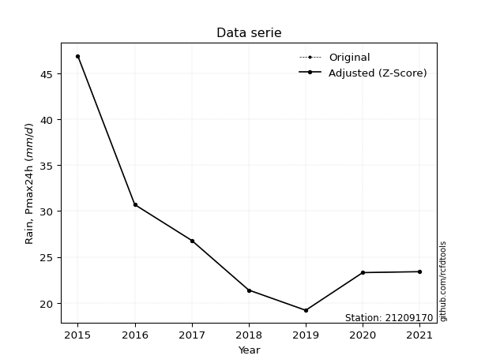</img>

</div>

> If Z-Score is active, values out of range or outliers are replaced with the station mean value.


### 4. Active continuous probability distributions from SciPy (45 of 104 available)

[scipy.stats](https://docs.scipy.org/doc/scipy/reference/stats.html) is a Python´s powerful submodule within the SciPy library for comprehensive statistical analysis, offering over 130 probability distributions (like Normal, Poisson), functions for descriptive stats (mean, variance), hypothesis testing (t-tests, chi-square), random variable generation, and statistical tests, making it essential for data science, modeling, and research. It provides tools to explore, model, and draw conclusions from data efficiently, working seamlessly with NumPy.

<div align="center">

|   id | p_dist             |   n_parameter | fit_method   | label                                                                       | active   | ref                                                                                                        |
|-----:|:-------------------|--------------:|:-------------|:----------------------------------------------------------------------------|:---------|:-----------------------------------------------------------------------------------------------------------|
|    0 | alpha              |             3 | MLE          | Alpha                                                                       | True     | [:mortar_board:](https://docs.scipy.org/doc/scipy/reference/generated/scipy.stats.alpha.html)              |
|    1 | betaprime          |             4 | MLE          | Beta prime                                                                  | True     | [:mortar_board:](https://docs.scipy.org/doc/scipy/reference/generated/scipy.stats.betaprime.html)          |
|    2 | chi2               |             3 | MLE          | Chi²                                                                        | True     | [:mortar_board:](https://docs.scipy.org/doc/scipy/reference/generated/scipy.stats.chi2.html)               |
|    3 | crystalball        |             4 | MLE          | Crystalball                                                                 | True     | [:mortar_board:](https://docs.scipy.org/doc/scipy/reference/generated/scipy.stats.crystalball.html)        |
|    4 | erlang             |             3 | MLE          | Erlang                                                                      | True     | [:mortar_board:](https://docs.scipy.org/doc/scipy/reference/generated/scipy.stats.erlang.html)             |
|    5 | expon              |             2 | MLE          | Exponential                                                                 | True     | [:mortar_board:](https://docs.scipy.org/doc/scipy/reference/generated/scipy.stats.expon.html)              |
|    6 | exponnorm          |             3 | MLE          | Exponentially modified Normal                                               | True     | [:mortar_board:](https://docs.scipy.org/doc/scipy/reference/generated/scipy.stats.exponnorm.html)          |
|    7 | f                  |             4 | MLE          | F                                                                           | True     | [:mortar_board:](https://docs.scipy.org/doc/scipy/reference/generated/scipy.stats.f.html)                  |
|    8 | fatiguelife        |             3 | MLE          | Fatigue-life (Birnbaum-Saunders)                                            | True     | [:mortar_board:](https://docs.scipy.org/doc/scipy/reference/generated/scipy.stats.fatiguelife.html)        |
|    9 | fisk               |             3 | MLE          | Fisk                                                                        | True     | [:mortar_board:](https://docs.scipy.org/doc/scipy/reference/generated/scipy.stats.fisk.html)               |
|   10 | gamma              |             3 | MLE          | Gamma                                                                       | True     | [:mortar_board:](https://docs.scipy.org/doc/scipy/reference/generated/scipy.stats.gamma.html)              |
|   11 | genexpon           |             5 | MLE          | Generalized exponential                                                     | True     | [:mortar_board:](https://docs.scipy.org/doc/scipy/reference/generated/scipy.stats.genexpon.html)           |
|   12 | genlogistic        |             3 | MLE          | Generalized logistic                                                        | True     | [:mortar_board:](https://docs.scipy.org/doc/scipy/reference/generated/scipy.stats.genlogistic.html)        |
|   13 | gibrat             |             2 | MM           | Gibrat                                                                      | True     | [:mortar_board:](https://docs.scipy.org/doc/scipy/reference/generated/scipy.stats.gibrat.html)             |
|   14 | gompertz           |             3 | MLE          | Gompertz (or truncated Gumbel)                                              | True     | [:mortar_board:](https://docs.scipy.org/doc/scipy/reference/generated/scipy.stats.gompertz.html)           |
|   15 | gumbel_l           |             2 | MM           | Gumbel Left Skew                                                            | True     | [:mortar_board:](https://docs.scipy.org/doc/scipy/reference/generated/scipy.stats.gumbel_l.html)           |
|   16 | gumbel_r           |             2 | MM           | Gumbel Right Skew                                                           | True     | [:mortar_board:](https://docs.scipy.org/doc/scipy/reference/generated/scipy.stats.gumbel_r.html)           |
|   17 | halflogistic       |             2 | MM           | Half-logistic                                                               | True     | [:mortar_board:](https://docs.scipy.org/doc/scipy/reference/generated/scipy.stats.halflogistic.html)       |
|   18 | halfnorm           |             2 | MM           | Half Normal                                                                 | True     | [:mortar_board:](https://docs.scipy.org/doc/scipy/reference/generated/scipy.stats.halfnorm.html)           |
|   19 | hypsecant          |             2 | MM           | hyperbolic secant                                                           | True     | [:mortar_board:](https://docs.scipy.org/doc/scipy/reference/generated/scipy.stats.hypsecant.html)          |
|   20 | invgamma           |             3 | MLE          | Inverted gamma                                                              | True     | [:mortar_board:](https://docs.scipy.org/doc/scipy/reference/generated/scipy.stats.invgamma.html)           |
|   21 | invgauss           |             3 | MLE          | Inverse Gaussian                                                            | True     | [:mortar_board:](https://docs.scipy.org/doc/scipy/reference/generated/scipy.stats.invgauss.html)           |
|   22 | invweibull         |             3 | MLE          | Inverted Weibull                                                            | True     | [:mortar_board:](https://docs.scipy.org/doc/scipy/reference/generated/scipy.stats.invweibull.html)         |
|   23 | johnsonsu          |             4 | MLE          | Johnson Su                                                                  | True     | [:mortar_board:](https://docs.scipy.org/doc/scipy/reference/generated/scipy.stats.johnsonsu.html)          |
|   24 | kstwobign          |             2 | MLE          | Limiting distribution of scaled Kolmogorov-Smirnov two-sided test statistic | True     | [:mortar_board:](https://docs.scipy.org/doc/scipy/reference/generated/scipy.stats.kstwobign.html)          |
|   25 | laplace            |             2 | MM           | Laplace                                                                     | True     | [:mortar_board:](https://docs.scipy.org/doc/scipy/reference/generated/scipy.stats.laplace.html)            |
|   26 | laplace_asymmetric |             3 | MLE          | Asymmetric Laplace                                                          | True     | [:mortar_board:](https://docs.scipy.org/doc/scipy/reference/generated/scipy.stats.laplace_asymmetric.html) |
|   27 | loggamma           |             3 | MLE          | Log gamma                                                                   | True     | [:mortar_board:](https://docs.scipy.org/doc/scipy/reference/generated/scipy.stats.loggamma.html)           |
|   28 | logistic           |             2 | MM           | Logistic (or Sech-squared)                                                  | True     | [:mortar_board:](https://docs.scipy.org/doc/scipy/reference/generated/scipy.stats.logistic.html)           |
|   29 | lognorm            |             3 | MLE          | Log Normal                                                                  | True     | [:mortar_board:](https://docs.scipy.org/doc/scipy/reference/generated/scipy.stats.lognorm.html)            |
|   30 | maxwell            |             2 | MM           | Maxwell                                                                     | True     | [:mortar_board:](https://docs.scipy.org/doc/scipy/reference/generated/scipy.stats.maxwell.html)            |
|   31 | mielke             |             4 | MLE          | Mielke Beta-Kappa / Dagum                                                   | True     | [:mortar_board:](https://docs.scipy.org/doc/scipy/reference/generated/scipy.stats.mielke.html)             |
|   32 | moyal              |             2 | MM           | Moyal                                                                       | True     | [:mortar_board:](https://docs.scipy.org/doc/scipy/reference/generated/scipy.stats.moyal.html)              |
|   33 | nakagami           |             3 | MLE          | Nakagami                                                                    | True     | [:mortar_board:](https://docs.scipy.org/doc/scipy/reference/generated/scipy.stats.nakagami.html)           |
|   34 | ncf                |             5 | MLE          | Non-central F distribution                                                  | True     | [:mortar_board:](https://docs.scipy.org/doc/scipy/reference/generated/scipy.stats.ncf.html)                |
|   35 | nct                |             4 | MLE          | Non-central Student’s t                                                     | True     | [:mortar_board:](https://docs.scipy.org/doc/scipy/reference/generated/scipy.stats.nct.html)                |
|   36 | norm               |             2 | MM           | Normal                                                                      | True     | [:mortar_board:](https://docs.scipy.org/doc/scipy/reference/generated/scipy.stats.norm.html)               |
|   37 | pareto             |             3 | MLE          | Pareto                                                                      | True     | [:mortar_board:](https://docs.scipy.org/doc/scipy/reference/generated/scipy.stats.pareto.html)             |
|   38 | pearson3           |             3 | MM           | Pearson type III                                                            | True     | [:mortar_board:](https://docs.scipy.org/doc/scipy/reference/generated/scipy.stats.pearson3.html)           |
|   39 | rayleigh           |             2 | MM           | Rayleigh                                                                    | True     | [:mortar_board:](https://docs.scipy.org/doc/scipy/reference/generated/scipy.stats.rayleigh.html)           |
|   40 | rice               |             3 | MLE          | Rice                                                                        | True     | [:mortar_board:](https://docs.scipy.org/doc/scipy/reference/generated/scipy.stats.rice.html)               |
|   41 | t                  |             3 | MLE          | Student’s t                                                                 | True     | [:mortar_board:](https://docs.scipy.org/doc/scipy/reference/generated/scipy.stats.t.html)                  |
|   42 | truncnorm          |             4 | MLE          | Truncated normal                                                            | True     | [:mortar_board:](https://docs.scipy.org/doc/scipy/reference/generated/scipy.stats.truncnorm.html)          |
|   43 | wald               |             2 | MM           | Wald                                                                        | True     | [:mortar_board:](https://docs.scipy.org/doc/scipy/reference/generated/scipy.stats.wald.html)               |
|   44 | weibull_min        |             3 | MLE          | Weibull minimum                                                             | True     | [:mortar_board:](https://docs.scipy.org/doc/scipy/reference/generated/scipy.stats.weibull_min.html)        |

</div>

> **n_parameter:** # arguments & localization & scale.
>
> **Fit methods:** (MLE) maximum likelihood, (MM) L-moments.
>
>**Inactive:** foldnorm, gennorm, norminvgauss, powernorm, powerlognorm, skewnorm, genextreme, anglit, arcsine, argus, beta, bradford, burr, burr12, cauchy, cosine, halfcauchy, foldcauchy, skewcauchy, wrapcauchy, dgamma, gengamma, exponweib, exponpow, truncexpon, gausshyper, genhalflogistic, genhyperbolic, geninvgauss, halfgennorm, johnsonsb, kappa4, kappa3, ksone, kstwo, loglaplace, levy, levy_l, levy_stable, ncx2, genpareto, truncpareto, lomax, powerlaw, rdist, rel_breitwigner, recipinvgauss, semicircular, studentized_range, trapezoid, triang, truncweibull_min, tukeylambda, uniform, loguniform, vonmises, vonmises_line, weibull_max, dweibull, 


## B. Probability distributions vs. Empirical distributions

A continuous probability distribution (CPD) describes probabilities for variables that can take any value within a range (like rain any time), unlike discrete variables with specific outcomes (like temperature). It uses a Probability Density Function (PDF), a curve where the total area under it equals 1, and the probability of the variable falling within an interval (a to b) is found by calculating the area under the curve between those points. A key feature is that the probability of hitting any single exact value is zero, so probabilities are always expressed for ranges, e.g., $P(a ≤ X ≤ b)$.

<div align="center">

Distributions parameters
|    |   station | p_dist                |   n |          loc |         scale | shape                  | shape1              | shape2                | shape3   |
|---:|----------:|:----------------------|----:|-------------:|--------------:|:-----------------------|:--------------------|:----------------------|:---------|
|  0 |  21209170 | alpha                 |   7 |    12.1815   |  28.132       | 2.307822495455577      |                     |                       |          |
|  1 |  21209170 | betaprime             |   7 |    -1.27421  |   2.70359     | 169.82665302582734     | 17.096526446741205  |                       |          |
|  2 |  21209170 | chi2                  |   7 |    19.2      |   1.2463      | 0.9418623778003448     |                     |                       |          |
|  3 |  21209170 | crystalball           |   7 |    27.3857   |   8.68125     | 2984.39126593755       | 32.12251210388212   |                       |          |
|  4 |  21209170 | erlang                |   7 |    19.2      |   4.60743     | 0.3514177046325423     |                     |                       |          |
|  5 |  21209170 | expon                 |   7 |    19.2      |   8.18571     |                        |                     |                       |          |
|  6 |  21209170 | exponnorm             |   7 |    19.1899   |   0.003336    | 2450.7659761814593     |                     |                       |          |
|  7 |  21209170 | f                     |   7 |    16.2262   |   6.9965      | 342.69599129030485     | 4.911398096922879   |                       |          |
|  8 |  21209170 | fatiguelife           |   7 |    18.0385   |   6.06568     | 1.0336681993577375     |                     |                       |          |
|  9 |  21209170 | fisk                  |   7 |    18.6059   |   5.58032     | 1.5811971996884338     |                     |                       |          |
| 10 |  21209170 | gamma                 |   7 |    19.2      |   6.54745     | 0.8583074775383712     |                     |                       |          |
| 11 |  21209170 | genexpon              |   7 |    19.2      |  16.1689      | 1.9752423358241993     | 0.6343146038167315  | 4.082481846770589e-08 |          |
| 12 |  21209170 | genlogistic           |   7 |   -15.938    |   5.2805      | 1855.8783884307559     |                     |                       |          |
| 13 |  21209170 | gibrat                |   7 |    20.763    |   4.01689     |                        |                     |                       |          |
| 14 |  21209170 | gompertz              |   7 |    19.2      |  16.2272      | 0.8963767056688667     |                     |                       |          |
| 15 |  21209170 | gumbel_l              |   7 |    31.2927   |   6.76874     |                        |                     |                       |          |
| 16 |  21209170 | gumbel_r              |   7 |    23.4787   |   6.76874     |                        |                     |                       |          |
| 17 |  21209170 | halflogistic          |   7 |    17.0964   |   7.42216     |                        |                     |                       |          |
| 18 |  21209170 | halfnorm              |   7 |    15.8951   |  14.4013      |                        |                     |                       |          |
| 19 |  21209170 | hypsecant             |   7 |    27.3857   |   5.52665     |                        |                     |                       |          |
| 20 |  21209170 | invgamma              |   7 |    16.1759   |  17.2758      | 2.4590992466542994     |                     |                       |          |
| 21 |  21209170 | invgauss              |   7 |    17.5279   |   9.89286     | 0.9964548048255196     |                     |                       |          |
| 22 |  21209170 | invweibull            |   7 |    14.2783   |   8.40996     | 2.1429736817917666     |                     |                       |          |
| 23 |  21209170 | johnsonsu             |   7 |    18.1788   |   0.0366667   | -5.918886439669848     | 1.0228462675090388  |                       |          |
| 24 |  21209170 | kstwobign             |   7 |     3.95994  |  27.2454      |                        |                     |                       |          |
| 25 |  21209170 | laplace               |   7 |    27.3857   |   6.13857     |                        |                     |                       |          |
| 26 |  21209170 | laplace_asymmetric    |   7 |    19.2      |   0.00118512  | 0.00014479036724373748 |                     |                       |          |
| 27 |  21209170 | loggamma              |   7 | -3096.67     | 407.392       | 2139.763675511107      |                     |                       |          |
| 28 |  21209170 | logistic              |   7 |    27.3857   |   4.78622     |                        |                     |                       |          |
| 29 |  21209170 | lognorm               |   7 |    19.2      |   0.0441281   | 12.332167929505442     |                     |                       |          |
| 30 |  21209170 | maxwell               |   7 |     6.8148   |  12.8909      |                        |                     |                       |          |
| 31 |  21209170 | mielke                |   7 |     2.55513  |  12.1424      | 64.75563904045214      | 4.787538950326697   |                       |          |
| 32 |  21209170 | moyal                 |   7 |    22.4212   |   3.90793     |                        |                     |                       |          |
| 33 |  21209170 | nakagami              |   7 |    19.2      |  15.6055      | 0.07435504964090736    |                     |                       |          |
| 34 |  21209170 | ncf                   |   7 |     1.60924  |  23.7078      | 123.36522742556105     | 31.749732678797386  | 3.2725564778978544    |          |
| 35 |  21209170 | nct                   |   7 |     0.137718 |   0.274219    | 8.385126618554377      | 89.45580092522073   |                       |          |
| 36 |  21209170 | norm                  |   7 |    27.3857   |   8.68125     |                        |                     |                       |          |
| 37 |  21209170 | pareto                |   7 |   -51.6759   |  70.8759      | 9.635328562133623      |                     |                       |          |
| 38 |  21209170 | pearson3              |   7 |    27.3857   |   8.68125     | 1.4351966452518288     |                     |                       |          |
| 39 |  21209170 | rayleigh              |   7 |    10.778    |  13.2511      |                        |                     |                       |          |
| 40 |  21209170 | rice                  |   7 |    14.3701   |  11.0628      | 0.0032917594071635364  |                     |                       |          |
| 41 |  21209170 | t                     |   7 |    23.6558   |   3.36519     | 1.3866445081194518     |                     |                       |          |
| 42 |  21209170 | truncnorm             |   7 | -3207        | 168.033       | 19.199744324161635     | 48.05847635330805   |                       |          |
| 43 |  21209170 | wald                  |   7 |    18.7045   |   8.68125     |                        |                     |                       |          |
| 44 |  21209170 | weibull_min           |   7 |    19.2      |   3.08396     | 0.19399091153069228    |                     |                       |          |
| 45 |  21209170 | logalpha              |   7 |     2.45392  |   2.58821     | 3.494371431978267      |                     |                       |          |
| 46 |  21209170 | logbetaprime          |   7 |     0.665133 |   2.02073     | 248.97128184719486     | 193.21995717927166  |                       |          |
| 47 |  21209170 | logchi2               |   7 |     2.95491  |   0.971814    | 1.0412702954545616     |                     |                       |          |
| 48 |  21209170 | logcrystalball        |   7 |     3.2686   |   0.27483     | 12146.684004937957     | 106.64101272218117  |                       |          |
| 49 |  21209170 | logerlang             |   7 |     2.95491  |   0.327441    | 0.7099926249068862     |                     |                       |          |
| 50 |  21209170 | logexpon              |   7 |     2.95491  |   0.313686    |                        |                     |                       |          |
| 51 |  21209170 | logexponnorm          |   7 |     2.98721  |   0.0700306   | 4.018081312083232      |                     |                       |          |
| 52 |  21209170 | logf                  |   7 |     2.73479  |   0.424134    | 702.940896016097       | 9.336103877417722   |                       |          |
| 53 |  21209170 | logfatiguelife        |   7 |     2.85508  |   0.329153    | 0.7139800177524269     |                     |                       |          |
| 54 |  21209170 | logfisk               |   7 |     2.88058  |   0.307282    | 2.3006360998604336     |                     |                       |          |
| 55 |  21209170 | loggamma              |   7 |     2.95491  |   0.321833    | 0.5692404796823924     |                     |                       |          |
| 56 |  21209170 | loggenexpon           |   7 |     2.95491  |   0.00319153  | 0.00857903508163748    | 0.35108627577140067 | 5.226505648217657e-05 |          |
| 57 |  21209170 | loggenlogistic        |   7 |     1.83244  |   0.192416    | 933.7339545607133      |                     |                       |          |
| 58 |  21209170 | loggibrat             |   7 |     3.05889  |   0.12719     |                        |                     |                       |          |
| 59 |  21209170 | loggompertz           |   7 |     2.95491  |   0.594388    | 1.0115120392997783     |                     |                       |          |
| 60 |  21209170 | loggumbel_l           |   7 |     3.39228  |   0.214284    |                        |                     |                       |          |
| 61 |  21209170 | loggumbel_r           |   7 |     3.14491  |   0.214284    |                        |                     |                       |          |
| 62 |  21209170 | loghalflogistic       |   7 |     2.94286  |   0.23497     |                        |                     |                       |          |
| 63 |  21209170 | loghalfnorm           |   7 |     2.90483  |   0.455914    |                        |                     |                       |          |
| 64 |  21209170 | loghypsecant          |   7 |     3.2686   |   0.174962    |                        |                     |                       |          |
| 65 |  21209170 | loginvgamma           |   7 |     2.732    |   1.98999     | 4.6677809251729325     |                     |                       |          |
| 66 |  21209170 | loginvgauss           |   7 |     2.83256  |   0.919981    | 0.4739732425555955     |                     |                       |          |
| 67 |  21209170 | loginvweibull         |   7 |     2.38333  |   0.742205    | 4.331085706622716      |                     |                       |          |
| 68 |  21209170 | logjohnsonsu          |   7 |     2.85418  |   0.00608982  | -6.9210566348254545    | 1.4739021190165316  |                       |          |
| 69 |  21209170 | logkstwobign          |   7 |     2.45237  |   0.942629    |                        |                     |                       |          |
| 70 |  21209170 | loglaplace            |   7 |     3.2686   |   0.194334    |                        |                     |                       |          |
| 71 |  21209170 | loglaplace_asymmetric |   7 |     3.14845  |   0.169326    | 0.706294061532591      |                     |                       |          |
| 72 |  21209170 | logloggamma           |   7 |   -91.4405   |  12.4885      | 1966.3823131812942     |                     |                       |          |
| 73 |  21209170 | loglogistic           |   7 |     3.2686   |   0.151522    |                        |                     |                       |          |
| 74 |  21209170 | loglognorm            |   7 |     2.95491  |   0.00221045  | 11.952230484644966     |                     |                       |          |
| 75 |  21209170 | logmaxwell            |   7 |     2.61737  |   0.408098    |                        |                     |                       |          |
| 76 |  21209170 | logmielke             |   7 |     2.38974  |   0.250649    | 451.54899110312454     | 4.313590390995806   |                       |          |
| 77 |  21209170 | logmoyal              |   7 |     3.11143  |   0.123717    |                        |                     |                       |          |
| 78 |  21209170 | lognakagami           |   7 |     2.95491  |   0.53434     | 0.3360038226294946     |                     |                       |          |
| 79 |  21209170 | logncf                |   7 |     0.440196 |   0.022094    | 1.2956419377611326     | 3122.9807582941758  | 165.10645682192097    |          |
| 80 |  21209170 | lognct                |   7 |     2.54364  |   0.00252078  | 4.955203874698768      | 243.24175463152915  |                       |          |
| 81 |  21209170 | lognorm               |   7 |     3.2686   |   0.27483     |                        |                     |                       |          |
| 82 |  21209170 | logpareto             |   7 |     2.95463  |   0.000279479 | 0.16806204109889272    |                     |                       |          |
| 83 |  21209170 | logpearson3           |   7 |     3.2686   |   0.27483     | 1.0702315343268691     |                     |                       |          |
| 84 |  21209170 | lograyleigh           |   7 |     2.74283  |   0.4195      |                        |                     |                       |          |
| 85 |  21209170 | logrice               |   7 |     2.82459  |   0.369238    | 0.00033601632989446045 |                     |                       |          |
| 86 |  21209170 | logt                  |   7 |     3.19457  |   0.180935    | 2.696284498535486      |                     |                       |          |
| 87 |  21209170 | logtruncnorm          |   7 |    -0.894288 |   1.32578     | 2.90335609698465       | 3.577005220659893   |                       |          |
| 88 |  21209170 | logwald               |   7 |     2.99376  |   0.274836    |                        |                     |                       |          |
| 89 |  21209170 | logweibull_min        |   7 |     2.95491  |   0.322362    | 0.8152617246774211     |                     |                       |          |

</div>

> **loc** (Location parameter): This shifts the distribution along the x-axis. For many common distributions, like the normal (Gaussian) distribution, loc represents the mean $μ$. For others, like the uniform distribution, it might represent the minimum value, or for the beta distribution, the left end of the support interval.
>
> **scale** (Scale parameter): This determines the width or spread of the distribution. For the normal distribution, scale represents the standard deviation $σ$. For a uniform distribution, it defines the length of the interval (from $loc$ to $loc + scale$).
>
> **shape** (Shape parameters): Refers to parameters that define the specific form of a probability distribution, distinct from its location (loc) and scale (scale). These parameters are required arguments for most distribution functions. For example, a normal (Gaussian) distribution is fully defined by its location (mean) and scale (standard deviation), so it has no specific shape parameters beyond loc and scale. However, other distributions have intrinsic properties that need specification, as Gamma distribution that takes a shape parameter, often named $a$ or $alpha$.


### 0. Cumulative distribution values - CDF (90 evaluated)

> Ordered by x ascending and calculating $log(f(x))$ separately. 

|   id |   Station |   date |    x |   count |    mean |     std |     zscore |   Value_initial |   station |   m |     alpha |   alpha_pdf |   betaprime |   betaprime_pdf |        chi2 |    chi2_pdf |   crystalball |   crystalball_pdf |      erlang |   erlang_pdf |    expon |   expon_pdf |   exponnorm |   exponnorm_pdf |         f |      f_pdf |   fatiguelife |   fatiguelife_pdf |      fisk |   fisk_pdf |       gamma |   gamma_pdf |    genexpon |   genexpon_pdf |   genlogistic |   genlogistic_pdf |    gibrat |   gibrat_pdf |    gompertz |   gompertz_pdf |   gumbel_l |   gumbel_l_pdf |   gumbel_r |   gumbel_r_pdf |   halflogistic |   halflogistic_pdf |   halfnorm |   halfnorm_pdf |   hypsecant |   hypsecant_pdf |   invgamma |   invgamma_pdf |   invgauss |   invgauss_pdf |   invweibull |   invweibull_pdf |   johnsonsu |   johnsonsu_pdf |   kstwobign |   kstwobign_pdf |   laplace |   laplace_pdf |   laplace_asymmetric |   laplace_asymmetric_pdf |   loggamma |   loggamma_pdf |   logistic |   logistic_pdf |   lognorm |   lognorm_pdf |   maxwell |   maxwell_pdf |    mielke |   mielke_pdf |    moyal |   moyal_pdf |   nakagami |   nakagami_pdf |      ncf |   ncf_pdf |       nct |    nct_pdf |     norm |   norm_pdf |      pareto |   pareto_pdf |   pearson3 |   pearson3_pdf |   rayleigh |   rayleigh_pdf |      rice |   rice_pdf |        t |      t_pdf |   truncnorm |   truncnorm_pdf |        wald |   wald_pdf |   weibull_min |   weibull_min_pdf |   logalpha |   logalpha_pdf |   logbetaprime |   logbetaprime_pdf |     logchi2 |   logchi2_pdf |   logcrystalball |   logcrystalball_pdf |   logerlang |   logerlang_pdf |   logexpon |   logexpon_pdf |   logexponnorm |   logexponnorm_pdf |      logf |   logf_pdf |   logfatiguelife |   logfatiguelife_pdf |   logfisk |   logfisk_pdf |   loggenexpon |   loggenexpon_pdf |   loggenlogistic |   loggenlogistic_pdf |   loggibrat |   loggibrat_pdf |   loggompertz |   loggompertz_pdf |   loggumbel_l |   loggumbel_l_pdf |   loggumbel_r |   loggumbel_r_pdf |   loghalflogistic |   loghalflogistic_pdf |   loghalfnorm |   loghalfnorm_pdf |   loghypsecant |   loghypsecant_pdf |   loginvgamma |   loginvgamma_pdf |   loginvgauss |   loginvgauss_pdf |   loginvweibull |   loginvweibull_pdf |   logjohnsonsu |   logjohnsonsu_pdf |   logkstwobign |   logkstwobign_pdf |   loglaplace |   loglaplace_pdf |   loglaplace_asymmetric |   loglaplace_asymmetric_pdf |   logloggamma |   logloggamma_pdf |   loglogistic |   loglogistic_pdf |   loglognorm |   loglognorm_pdf |   logmaxwell |   logmaxwell_pdf |   logmielke |   logmielke_pdf |   logmoyal |   logmoyal_pdf |   lognakagami |   lognakagami_pdf |   logncf |   logncf_pdf |    lognct |   lognct_pdf |   logpareto |   logpareto_pdf |   logpearson3 |   logpearson3_pdf |   lograyleigh |   lograyleigh_pdf |   logrice |   logrice_pdf |     logt |   logt_pdf |   logtruncnorm |   logtruncnorm_pdf |   logwald |   logwald_pdf |   logweibull_min |   logweibull_min_pdf |
|-----:|----------:|-------:|-----:|--------:|--------:|--------:|-----------:|----------------:|----------:|----:|----------:|------------:|------------:|----------------:|------------:|------------:|--------------:|------------------:|------------:|-------------:|---------:|------------:|------------:|----------------:|----------:|-----------:|--------------:|------------------:|----------:|-----------:|------------:|------------:|------------:|---------------:|--------------:|------------------:|----------:|-------------:|------------:|---------------:|-----------:|---------------:|-----------:|---------------:|---------------:|-------------------:|-----------:|---------------:|------------:|----------------:|-----------:|---------------:|-----------:|---------------:|-------------:|-----------------:|------------:|----------------:|------------:|----------------:|----------:|--------------:|---------------------:|-------------------------:|-----------:|---------------:|-----------:|---------------:|----------:|--------------:|----------:|--------------:|----------:|-------------:|---------:|------------:|-----------:|---------------:|---------:|----------:|----------:|-----------:|---------:|-----------:|------------:|-------------:|-----------:|---------------:|-----------:|---------------:|----------:|-----------:|---------:|-----------:|------------:|----------------:|------------:|-----------:|--------------:|------------------:|-----------:|---------------:|---------------:|-------------------:|------------:|--------------:|-----------------:|---------------------:|------------:|----------------:|-----------:|---------------:|---------------:|-------------------:|----------:|-----------:|-----------------:|---------------------:|----------:|--------------:|--------------:|------------------:|-----------------:|---------------------:|------------:|----------------:|--------------:|------------------:|--------------:|------------------:|--------------:|------------------:|------------------:|----------------------:|--------------:|------------------:|---------------:|-------------------:|--------------:|------------------:|--------------:|------------------:|----------------:|--------------------:|---------------:|-------------------:|---------------:|-------------------:|-------------:|-----------------:|------------------------:|----------------------------:|--------------:|------------------:|--------------:|------------------:|-------------:|-----------------:|-------------:|-----------------:|------------:|----------------:|-----------:|---------------:|--------------:|------------------:|---------:|-------------:|----------:|-------------:|------------:|----------------:|--------------:|------------------:|--------------:|------------------:|----------:|--------------:|---------:|-----------:|---------------:|-------------------:|----------:|--------------:|-----------------:|---------------------:|
|    0 |  21209170 |   2019 | 19.2 |       7 | 27.3857 | 9.37682 | -0.872973  |            19.2 |  21209170 |   1 | 0.0449985 |  0.0542421  |    0.119777 |      0.0412851  | 1.15147e-07 | 1.52634e+07 |      0.172861 |         0.0294621 | 5.48502e-06 |  5.42552e+08 | 0        |   0.122164  |  0.00123131 |      0.122007   | 0.0414589 | 0.0614244  |      0.036934 |        0.0915633  | 0.0281422 | 0.0727985  | 8.32942e-14 | 20.1232     | 2.92882e-09 |     0.122163   |     0.0916578 |        0.0414531  | 0         |    0         | 3.08744e-09 |     0.0552391  |   0.154254 |    0.0209334   |   0.152345 |     0.0423497  |       0.140769 |          0.0660309 |   0.181507 |     0.0539639  |    0.142334 |       0.0249045 |  0.0414298 |     0.0614112  |  0.0382281 |     0.0754757  |    0.0427571 |       0.0586844  |   0.0354067 |      0.078079   |   0.0868936 |      0.0392613  |  0.131778 |    0.0214672  |          2.17386e-08 |               0.122173   |  3.903e-09 |    5.00293e+06 |   0.153129 |     0.0270946  |  0.126855 |      0.756758 |  0.180145 |    0.0360123  | 0.0672212 |   0.0473198  | 0.131032 |  0.0492954  | 0.00404184 |    1.69184e+11 | 0.107391 | 0.0394925 | 0.0999552 | 0.0445215  | 0.172861 |  0.0294621 | 2.10942e-15 |   0.135946   |   0.142729 |     0.0565796  |   0.182886 |     0.039192   | 0.0909054 | 0.0358773  | 0.181209 | 0.0377383  | 4.94538e-12 |      0.11457    | 7.53428e-05 | 0.00139732 |     0.0012641 |       6.89809e+10 |  0.0472872 |       1.01721  |      0.0890145 |           0.736485 | 8.10426e-09 |   9.50116e+06 |         0.126855 |             0.756758 | 3.05321e-11 |    48813.5      |   0        |        3.1879  |      0.0460265 |           0.981954 | 0.0430786 |   1.10718  |        0.0382072 |             1.37816  | 0.0367808 |      1.09661  |   3.75036e-07 |           2.68806 |        0.0652431 |             0.924194 | 0           |       0         |   4.59249e-09 |          1.70177  |      0.121805 |        0.532311   |     0.0882995 |          1.0001   |         0.0256386 |              2.12654  |     0.0874696 |          1.73955  |       0.105021 |           0.589421 |     0.0430787 |          1.10717  |     0.0394197 |          1.27754  |        0.045049 |            1.05821  |      0.0389882 |           1.23264  |      0.0612575 |           0.936307 |     0.099529 |         0.512155 |               0.0659749 |                    0.551657 |      0.133229 |          0.757558 |      0.112023 |          0.656501 |   0.00722122 |      3.77352e+12 |     0.123068 |         0.950065 |   0.0454067 |        1.05593  |  0.0597745 |       1.03209  |   5.70231e-11 |      86288.9      | 0.238793 |     0.741155 | 0.0497697 |     1.03307  |    0        |     601.341     |     0.0910538 |          1.13903  |      0.119963 |          1.06056  | 0.0603848 |      0.898153 | 0.143194 |  0.79734   |    3.29033e-07 |           2.65904  |  0        |      0        |      7.66477e-13 |          1407.1      |
|    1 |  21209170 |   2018 | 21.4 |       7 | 27.3857 | 9.37682 | -0.638352  |            21.4 |  21209170 |   2 | 0.230907  |  0.101209   |    0.226581 |      0.0546604  | 0.828753    | 0.0942813   |      0.245255 |         0.0362321 | 0.771334    |  0.085769    | 0.235674 |   0.0933732 |  0.236865   |      0.0933413  | 0.242678  | 0.102688   |      0.281176 |        0.101333   | 0.250903  | 0.106364   | 0.355878    |  0.115312   | 0.235673    |     0.0933727  |     0.206844  |        0.0616996  | 0.0327772 |    0.114925  | 0.122036    |     0.0555396  |   0.206959 |    0.0271676   |   0.256795 |     0.0515763  |       0.282056 |          0.0620065 |   0.297722 |     0.0515004  |    0.207821 |       0.0349883 |  0.242724  |     0.102754   |  0.262614  |     0.102826   |    0.239779  |       0.103034   |   0.263703  |      0.10374    |   0.192844  |      0.0555293  |  0.188577 |    0.0307201  |          0.23569     |               0.0933783  |  0.537825  |    2.26527     |   0.222594 |     0.036155   |  0.227633 |      1.09846  |  0.266146 |    0.0417768  | 0.210942  |   0.0787764  | 0.254461 |  0.060773   | 0.640079   |    0.043207    | 0.211237 | 0.0537892 | 0.219641  | 0.0623086  | 0.245255 |  0.0362321 | 0.255122    |   0.0982149  |   0.273501 |     0.0605099  |   0.27478  |     0.0438709  | 0.182825  | 0.0469392  | 0.298346 | 0.0715934  | 0.222863    |      0.0890967  | 0.176992    | 0.123526   |     0.608033  |       0.0323707   |  0.225987  |       2.09515  |      0.1942    |           1.19905  | 0.246213    |   1.13892     |         0.227633 |             1.09846  | 0.438953    |        2.35541  |   0.292364 |        2.25587 |      0.232809  |           2.23487  | 0.235842  |   2.17424  |        0.25902   |             2.23386  | 0.232401  |      2.24506  |   0.260807    |           2.13132 |        0.21134   |             1.70573  | 0.000416577 |       0.333448  |   0.183337    |          1.66804  |      0.193852 |        0.810679   |     0.231565  |          1.58087  |         0.251004  |              1.99387  |     0.272001  |          1.64737  |       0.191071 |           1.02766  |     0.235842  |          2.17425  |     0.250725  |          2.21907  |        0.232129 |            2.15909  |      0.246256  |           2.21985  |      0.205219  |           1.63643  |     0.173932 |         0.895018 |               0.163424  |                    1.36649  |      0.233077 |          1.08019  |      0.205169 |          1.07625  |   0.627691   |      0.291788    |     0.245679 |         1.28523  |   0.231956  |        2.15524  |  0.22464   |       1.87336  |   0.265038    |          1.62489  | 0.325018 |     0.841654 | 0.224215  |     2.008    |    0.632972 |       0.567151  |     0.244266  |          1.60473  |      0.253202 |          1.36034  | 0.188716  |      1.42101  | 0.263115 |  1.44868   |    0.256482    |           2.08977  |  0.116182 |      3.78825  |      0.337356    |             2.04934  |
|    2 |  21209170 |   2020 | 23.3 |       7 | 27.3857 | 9.37682 | -0.435725  |            23.3 |  21209170 |   3 | 0.416388  |  0.0895085  |    0.336324 |      0.0597971  | 0.935932    | 0.0316478   |      0.31895  |         0.0411367 | 0.880422    |  0.0379215   | 0.393998 |   0.0740316 |  0.395114   |      0.0739854  | 0.423471  | 0.0848261  |      0.445235 |        0.0728445  | 0.432056  | 0.0826578  | 0.537456    |  0.0789839  | 0.393997    |     0.0740314  |     0.332959  |        0.0693227  | 0.322932  |    0.141493  | 0.227143    |     0.0549636  |   0.264367 |    0.0333676   |   0.358169 |     0.0543306  |       0.395168 |          0.0568461 |   0.392874 |     0.0485433  |    0.283585 |       0.0447886 |  0.423641  |     0.0848832  |  0.434794  |     0.0780982  |    0.423038  |       0.0864475  |   0.437321  |      0.0786919  |   0.305213  |      0.0614966  |  0.256987 |    0.0418644  |          0.394021    |               0.0740344  |  0.686713  |    1.35528     |   0.29867  |     0.0437644  |  0.331    |      1.31932  |  0.348608 |    0.0446846  | 0.366734  |   0.0818277  | 0.371507 |  0.0611948  | 0.701988   |    0.0253403   | 0.320059 | 0.0596676 | 0.344153  | 0.0671213  | 0.31895  |  0.0411368 | 0.418332    |   0.0747515  |   0.386288 |     0.0575577  |   0.360134 |     0.0456313  | 0.278042  | 0.052678   | 0.464504 | 0.0991256  | 0.375018    |      0.0716945  | 0.390213    | 0.0967915  |     0.652433  |       0.0173791   |  0.40829   |       2.08413  |      0.309137  |           1.48188  | 0.327971    |   0.825963    |         0.331    |             1.31932  | 0.60066     |        1.53578  |   0.460437 |        1.72007 |      0.419438  |           2.02535  | 0.418591  |   2.03046  |        0.435941  |             1.88311  | 0.421699  |      2.09451  |   0.425331    |           1.74479 |        0.36816   |             1.91087  | 0.36289     |       4.1886    |   0.32248     |          1.59675  |      0.274211 |        1.08553    |     0.373966  |          1.71655  |         0.411563  |              1.7675   |     0.40691   |          1.51723  |       0.296818 |           1.46109  |     0.418591  |          2.03046  |     0.429681  |          1.9296   |        0.41619  |            2.06523  |      0.427151  |           1.96432  |      0.353364  |           1.78935  |     0.269449 |         1.38653  |               0.332822  |                    2.78293  |      0.334309 |          1.28831  |      0.311544 |          1.41554  |   0.645865   |      0.160798    |     0.361636 |         1.41979  |   0.415895  |        2.06579  |  0.389222  |       1.91652  |   0.388147    |          1.30386  | 0.398797 |     0.88774  | 0.39887   |     2.00613  |    0.666937 |       0.288796  |     0.384464  |          1.65148  |      0.373412 |          1.44424  | 0.319321  |      1.61693  | 0.408496 |  1.92672   |    0.41815     |           1.72196  |  0.417638 |      2.90076  |      0.483009    |             1.43671  |
|    3 |  21209170 |   2021 | 23.4 |       7 | 27.3857 | 9.37682 | -0.42506   |            23.4 |  21209170 |   4 | 0.42528   |  0.0883395  |    0.342309 |      0.0598933  | 0.939015    | 0.0300181   |      0.323075 |         0.0413576 | 0.884144    |  0.0365319   | 0.401356 |   0.0731327 |  0.402467   |      0.073086   | 0.431892  | 0.083593   |      0.452457 |        0.0716091  | 0.440252  | 0.0812788  | 0.545281    |  0.0775216  | 0.401355    |     0.0731325  |     0.339897  |        0.0694405  | 0.33693   |    0.138463  | 0.232637    |     0.0549103  |   0.267721 |    0.0337098   |   0.363603 |     0.0543461  |       0.400837 |          0.0565421 |   0.397719 |     0.0483691  |    0.288089 |       0.0452965 |  0.432068  |     0.0836488  |  0.442541  |     0.0768385  |    0.43162   |       0.0851978  |   0.445126  |      0.0774109  |   0.311368  |      0.0616093  |  0.261208 |    0.042552   |          0.40138     |               0.0731354  |  0.692451  |    1.32481     |   0.303064 |     0.0441301  |  0.336669 |      1.32817  |  0.353081 |    0.0447805  | 0.3749    |   0.0814863  | 0.377618 |  0.0610294  | 0.704496   |    0.0248195   | 0.326032 | 0.0597973 | 0.350865  | 0.0671151  | 0.323075 |  0.0413576 | 0.425754    |   0.0736994  |   0.392032 |     0.0573068  |   0.364699 |     0.0456675  | 0.28332   | 0.0528785  | 0.47444  | 0.0995846  | 0.382147    |      0.0708789  | 0.399806    | 0.0950711  |     0.65415   |       0.0169606   |  0.417184  |       2.06907  |      0.315506  |           1.49232  | 0.331486    |   0.815544    |         0.336669 |             1.32817  | 0.607173    |        1.50624  |   0.467754 |        1.69675 |      0.428059  |           2.00042  | 0.427247  |   2.01156  |        0.443958  |             1.861    | 0.430622  |      2.07269  |   0.432764    |           1.72659 |        0.376343  |             1.91039  | 0.380551    |       4.05905   |   0.329309    |          1.59209  |      0.278891 |        1.10031    |     0.381315  |          1.71565  |         0.419104  |              1.75417  |     0.413392  |          1.50957  |       0.30312  |           1.48226  |     0.427246  |          2.01157  |     0.4379    |          1.90833  |        0.424996 |            2.04709  |      0.435519  |           1.94329  |      0.361025  |           1.78853  |     0.275453 |         1.41742  |               0.344635  |                    2.73366  |      0.339845 |          1.29669  |      0.317639 |          1.43045  |   0.646546   |      0.157209    |     0.367724 |         1.42313  |   0.424704  |        2.04779  |  0.39741   |       1.90754  |   0.393706    |          1.29198  | 0.402602 |     0.889203 | 0.407435  |     1.99346  |    0.668158 |       0.281517  |     0.39153   |          1.64795  |      0.379599 |          1.44508  | 0.326256  |      1.62162  | 0.416779 |  1.94164   |    0.425489    |           1.70508  |  0.429908 |      2.82964  |      0.489113    |             1.41402  |
|    4 |  21209170 |   2017 | 26.8 |       7 | 27.3857 | 9.37682 | -0.0624641 |            26.8 |  21209170 |   5 | 0.656187  |  0.0493136  |    0.541473 |      0.0548948  | 0.987736    | 0.00560687  |      0.473104 |         0.04585   | 0.957384    |  0.0118888   | 0.604833 |   0.0482752 |  0.605766   |      0.0482199  | 0.650059  | 0.0473439  |      0.639736 |        0.0420201  | 0.647355  | 0.0440522  | 0.742367    |  0.0424038  | 0.604831    |     0.0482752  |     0.567291  |        0.0608917  | 0.658144  |    0.0608199 | 0.414597    |     0.0516539  |   0.40245  |    0.0454573   |   0.542153 |     0.0490357  |       0.574149 |          0.0451589 |   0.551078 |     0.0415942  |    0.466329 |       0.0572735 |  0.65035   |     0.0473591  |  0.643036  |     0.0443596  |    0.653031  |       0.0476243  |   0.646154  |      0.0441182  |   0.51675   |      0.0568114  |  0.454498 |    0.0740397  |          0.604861    |               0.0482755  |  0.82353   |    0.694041    |   0.469444 |     0.0520382  |  0.528725 |      1.44783  |  0.507023 |    0.0447287  | 0.615802  |   0.0579112  | 0.567952 |  0.0495263  | 0.768802   |    0.0147983   | 0.526349 | 0.05555   | 0.56601   | 0.0568004  | 0.473104 |  0.04585   | 0.625238    |   0.0460135  |   0.568959 |     0.0461718  |   0.518562 |     0.0439296  | 0.468055  | 0.0540263  | 0.758132 | 0.0558832  | 0.581781    |      0.0480275  | 0.639766    | 0.0509065  |     0.696146  |       0.0092389   |  0.652914  |       1.37304  |      0.529363  |           1.58052  | 0.425141    |   0.592124    |         0.528725 |             1.44783  | 0.762207    |        0.855424 |   0.65463  |        1.10101 |      0.646341  |           1.25681  | 0.652744  |   1.30748  |        0.650369  |             1.20809  | 0.657282  |      1.27078  |   0.630809    |           1.2136  |        0.616951  |             1.54815  | 0.722495    |       1.46032   |   0.532897    |          1.3931   |      0.459806 |        1.55246    |     0.599361  |          1.43178  |         0.626293  |              1.29327  |     0.599835  |          1.22844  |       0.535956 |           1.80771  |     0.652744  |          1.30747  |     0.650296  |          1.2407   |        0.654755 |            1.32691  |      0.65162   |           1.25501  |      0.588951  |           1.5053   |     0.548447 |         2.32359  |               0.627848  |                    1.55232  |      0.527177 |          1.4139   |      0.532632 |          1.6429   |   0.66265    |      0.0916484   |     0.560405 |         1.36783  |   0.654676  |        1.3285   |  0.624784  |       1.39933  |   0.547745    |          1.00006  | 0.524364 |     0.89178  | 0.638885  |     1.38237  |    0.696012 |       0.153065  |     0.598722  |          1.36138  |      0.570737 |          1.33079  | 0.545672  |      1.54561  | 0.678215 |  1.68896   |    0.623847    |           1.24111  |  0.695366 |      1.30451  |      0.6423      |             0.89898  |
|    5 |  21209170 |   2016 | 30.7 |       7 | 27.3857 | 9.37682 |  0.353455  |            30.7 |  21209170 |   6 | 0.793187  |  0.0242331  |    0.725924 |      0.0390573  | 0.997861    | 0.000941977 |      0.648686 |         0.0427246 | 0.985075    |  0.00389813  | 0.754605 |   0.0299784 |  0.755327   |      0.0299267  | 0.785434  | 0.0248529  |      0.766732 |        0.024985   | 0.772592  | 0.0229705  | 0.863489    |  0.0220409  | 0.754603    |     0.0299785  |     0.76271   |        0.0391224  | 0.817469  |    0.0266383 | 0.603251    |     0.0445185  |   0.599946 |    0.0541477   |   0.708867 |     0.036035   |       0.724198 |          0.032035  |   0.696061 |     0.0326626  |    0.680378 |       0.0485927 |  0.785738  |     0.0248483  |  0.774263  |     0.0251568  |    0.787935  |       0.0245067  |   0.775379  |      0.024476   |   0.709585  |      0.041457   |  0.7086   |    0.0474703  |          0.754631    |               0.0299775  |  0.895124  |    0.392752    |   0.666515 |     0.0464401  |  0.714443 |      1.23646  |  0.670461 |    0.0381814  | 0.786976  |   0.0317866  | 0.728799 |  0.0333305  | 0.816376   |    0.0101672   | 0.713907 | 0.0399179 | 0.748433  | 0.0368491  | 0.648686 |  0.0427246 | 0.765146    |   0.0274704  |   0.721824 |     0.0324971  |   0.677015 |     0.036645   | 0.663599  | 0.044886   | 0.887613 | 0.0182632  | 0.732835    |      0.0307176  | 0.785247    | 0.026839   |     0.724969  |       0.00598892  |  0.796084  |       0.779178 |      0.725505  |           1.25619  | 0.496544    |   0.468717    |         0.714443 |             1.23646  | 0.852822    |        0.511616 |   0.776031 |        0.71399 |      0.781778  |           0.775518 | 0.790647  |   0.764718 |        0.781332  |             0.75346  | 0.787969  |      0.706993 |   0.767663    |           0.82023 |        0.787878  |             0.976091 | 0.854341    |       0.625717  |   0.703719    |          1.11056  |      0.68681  |        1.6968     |     0.762209  |          0.96585  |         0.771651  |              0.860867 |     0.745431  |          0.914508 |       0.751872 |           1.27886  |     0.790647  |          0.764714 |     0.783872  |          0.761403 |        0.79367  |            0.763121 |      0.785499  |           0.75437  |      0.761803  |           1.03684  |     0.775566 |         1.15489  |               0.788843  |                    0.880777 |      0.709416 |          1.22156  |      0.736403 |          1.2811   |   0.673031   |      0.0643164   |     0.728582 |         1.08236  |   0.793735  |        0.763692 |  0.77761   |       0.875142 |   0.668564    |          0.786322 | 0.641191 |     0.816589 | 0.786255  |     0.822146 |    0.712967 |       0.102717  |     0.755843  |          0.951407 |      0.732684 |          1.0351   | 0.73255   |      1.17637  | 0.84861  |  0.846928  |    0.76769     |           0.893555 |  0.823491 |      0.668354 |      0.742918    |             0.606575 |
|    6 |  21209170 |   2015 | 46.9 |       7 | 27.3857 | 9.37682 |  2.08112   |            46.9 |  21209170 |   7 | 0.942776  |  0.00306618 |    0.980059 |      0.00336489 | 0.999998    | 8.90174e-07 |      0.987708 |         0.0036737 | 0.999724    |  6.54991e-05 | 0.966087 |   0.004143  |  0.966268   |      0.00412589 | 0.948229  | 0.00349104 |      0.95222  |        0.00440032 | 0.928702  | 0.00370036 | 0.989561    |  0.00163901 | 0.966086    |     0.00414306 |     0.987477  |        0.00235659 | 0.969455  |    0.0026424 | 0.982488    |     0.00533252 |   0.999956 |    6.51656e-05 |   0.969066 |     0.00449876 |       0.964571 |          0.0046889 |   0.968675 |     0.00545815 |    0.981367 |       0.0033696 |  0.948397  |     0.00348432 |  0.952505  |     0.00407438 |    0.94672   |       0.00340513 |   0.945847  |      0.00391331 |   0.986084  |      0.00321999 |  0.979186 |    0.00339076 |          0.966095    |               0.00414225 |  0.977125  |    0.0797867   |   0.983327 |     0.00342537 |  0.982497 |      0.157271 |  0.978404 |    0.00475737 | 0.972984  |   0.00287399 | 0.965197 |  0.00445008 | 0.918715   |    0.00396266  | 0.977645 | 0.0036465 | 0.977273  | 0.00320413 | 0.987708 |  0.0036737 | 0.958359    |   0.00407026 |   0.964997 |     0.00474632 |   0.975656 |     0.00500801 | 0.986743  | 0.00352378 | 0.97574  | 0.00141836 | 0.95871     |      0.00477099 | 0.96191     | 0.00360663 |     0.783658  |       0.00231947  |  0.949496  |       0.138977 |      0.981187  |           0.148916 | 0.648442    |   0.276878    |         0.982497 |             0.157271 | 0.964819    |        0.116379 |   0.94199  |        0.18493 |      0.951597  |           0.172016 | 0.948257  |   0.152065 |        0.948049  |             0.173422 | 0.933302  |      0.148034 |   0.955653    |           0.19004 |        0.973985  |             0.133426 | 0.966018    |       0.0955726 |   0.970795    |          0.223312 |      0.999772 |        0.00891031 |     0.963115  |          0.168919 |         0.958418  |              0.173286 |     0.961434  |          0.205918 |       0.976803 |           0.132467 |     0.948256  |          0.152066 |     0.949142  |          0.168051 |        0.948714 |            0.147695 |      0.946307  |           0.161863 |      0.975057  |           0.156713 |     0.974644 |         0.130479 |               0.963946  |                    0.150391 |      0.980825 |          0.168462 |      0.978627 |          0.138041 |   0.69221    |      0.0329464   |     0.971929 |         0.18847  | nan         |      nan        |  0.959365  |       0.164083 |   0.894418    |          0.322763 | 0.895288 |     0.369609 | 0.952727  |     0.152346 |    0.742371 |       0.0484646 |     0.96253   |          0.1811   |      0.968895 |          0.195345 | 0.978533  |      0.161143 | 0.978322 |  0.0772421 |    1           |           0.299759 |  0.957245 |      0.129583 |      0.899249    |             0.211079 |

An Empirical Distribution Function (EDF) is a step-function estimate of a true cumulative distribution function (CDF) based on observed sample data, representing the proportion of data points less than or equal to a given value. It is calculated by ordering your data and jumping up by $1/n$ (where $n$ is sample size) at each unique data point, allowing analysis without assuming an underlying population distribution, and it gets closer to the true CDF as the sample size grows.


### 1. Empirical - EDF California (1923)

California´s estimates the true probability distribution of water-related data (like rainfall, streamflow) using observed samples, crucial for risk assessment.

<div align="center">


$P=m/n$


</div>


**1.1. Empirical values**

<div align="center">

|                | 0                   | 1                  | 2                   | 3                  | 4                  | 5                  | 6              |
|:---------------|:--------------------|:-------------------|:--------------------|:-------------------|:-------------------|:-------------------|:---------------|
| date           | 2019                | 2018               | 2020                | 2021               | 2017               | 2016               | 2015           |
| x              | 19.2                | 21.4               | 23.3                | 23.4               | 26.8               | 30.7               | 46.9           |
| m              | 1                   | 2                  | 3                   | 4                  | 5                  | 6                  | 7              |
| empirical_dist | edf_california      | edf_california     | edf_california      | edf_california     | edf_california     | edf_california     | edf_california |
| empirical      | 0.14285714285714285 | 0.2857142857142857 | 0.42857142857142855 | 0.5714285714285714 | 0.7142857142857143 | 0.8571428571428571 | 1.0            |
| empirical_tr   | 1.1666666666666665  | 1.4                | 1.75                | 2.333333333333333  | 3.5                | 6.999999999999997  | inf            |

</div>


**1.2. Kolmogorov-Smirnov fit test (sorted by Δ)**


<div align="center">

|                | 0                   | 1                   | 2                   | 3                   | 4                   | 5                   | 6                   | 7                   | 8                   | 9                   | 10                  | 11                  | 12                  | 13                  | 14                  | 15                  | 16                  | 17                  | 18                  | 19                  | 20                  | 21                  | 22                  | 23                  | 24                  | 25                  | 26                  | 27                  | 28                  | 29                  | 30                  | 31                  | 32                  | 33                  | 34                  | 35                  | 36                  | 37                  | 38                  | 39                  | 40                  | 41                  | 42                  | 43                  | 44                  | 45                  | 46                  | 47                  | 48                  | 49                  | 50                  | 51                  | 52                  | 53                  | 54                  | 55                    | 56                  | 57                  | 58                  | 59                  | 60                  | 61                  | 62                  | 63                  | 64                  | 65                  | 66                  | 67                  | 68                  | 69                  | 70                  | 71                  | 72                  | 73                  | 74                  | 75                  | 76                  | 77                  | 78                  | 79                  | 80                  | 81                  | 82                  | 83                  | 84                  | 85                  | 86                  | 87                  | 88                  | 89                  |
|:---------------|:--------------------|:--------------------|:--------------------|:--------------------|:--------------------|:--------------------|:--------------------|:--------------------|:--------------------|:--------------------|:--------------------|:--------------------|:--------------------|:--------------------|:--------------------|:--------------------|:--------------------|:--------------------|:--------------------|:--------------------|:--------------------|:--------------------|:--------------------|:--------------------|:--------------------|:--------------------|:--------------------|:--------------------|:--------------------|:--------------------|:--------------------|:--------------------|:--------------------|:--------------------|:--------------------|:--------------------|:--------------------|:--------------------|:--------------------|:--------------------|:--------------------|:--------------------|:--------------------|:--------------------|:--------------------|:--------------------|:--------------------|:--------------------|:--------------------|:--------------------|:--------------------|:--------------------|:--------------------|:--------------------|:--------------------|:----------------------|:--------------------|:--------------------|:--------------------|:--------------------|:--------------------|:--------------------|:--------------------|:--------------------|:--------------------|:--------------------|:--------------------|:--------------------|:--------------------|:--------------------|:--------------------|:--------------------|:--------------------|:--------------------|:--------------------|:--------------------|:--------------------|:--------------------|:--------------------|:--------------------|:--------------------|:--------------------|:--------------------|:--------------------|:--------------------|:--------------------|:--------------------|:--------------------|:--------------------|:--------------------|
| station        | 21209170            | 21209170            | 21209170            | 21209170            | 21209170            | 21209170            | 21209170            | 21209170            | 21209170            | 21209170            | 21209170            | 21209170            | 21209170            | 21209170            | 21209170            | 21209170            | 21209170            | 21209170            | 21209170            | 21209170            | 21209170            | 21209170            | 21209170            | 21209170            | 21209170            | 21209170            | 21209170            | 21209170            | 21209170            | 21209170            | 21209170            | 21209170            | 21209170            | 21209170            | 21209170            | 21209170            | 21209170            | 21209170            | 21209170            | 21209170            | 21209170            | 21209170            | 21209170            | 21209170            | 21209170            | 21209170            | 21209170            | 21209170            | 21209170            | 21209170            | 21209170            | 21209170            | 21209170            | 21209170            | 21209170            | 21209170              | 21209170            | 21209170            | 21209170            | 21209170            | 21209170            | 21209170            | 21209170            | 21209170            | 21209170            | 21209170            | 21209170            | 21209170            | 21209170            | 21209170            | 21209170            | 21209170            | 21209170            | 21209170            | 21209170            | 21209170            | 21209170            | 21209170            | 21209170            | 21209170            | 21209170            | 21209170            | 21209170            | 21209170            | 21209170            | 21209170            | 21209170            | 21209170            | 21209170            | 21209170            |
| empirical_dist | edf_california      | edf_california      | edf_california      | edf_california      | edf_california      | edf_california      | edf_california      | edf_california      | edf_california      | edf_california      | edf_california      | edf_california      | edf_california      | edf_california      | edf_california      | edf_california      | edf_california      | edf_california      | edf_california      | edf_california      | edf_california      | edf_california      | edf_california      | edf_california      | edf_california      | edf_california      | edf_california      | edf_california      | edf_california      | edf_california      | edf_california      | edf_california      | edf_california      | edf_california      | edf_california      | edf_california      | edf_california      | edf_california      | edf_california      | edf_california      | edf_california      | edf_california      | edf_california      | edf_california      | edf_california      | edf_california      | edf_california      | edf_california      | edf_california      | edf_california      | edf_california      | edf_california      | edf_california      | edf_california      | edf_california      | edf_california        | edf_california      | edf_california      | edf_california      | edf_california      | edf_california      | edf_california      | edf_california      | edf_california      | edf_california      | edf_california      | edf_california      | edf_california      | edf_california      | edf_california      | edf_california      | edf_california      | edf_california      | edf_california      | edf_california      | edf_california      | edf_california      | edf_california      | edf_california      | edf_california      | edf_california      | edf_california      | edf_california      | edf_california      | edf_california      | edf_california      | edf_california      | edf_california      | edf_california      | edf_california      |
| p_dist         | t                   | fatiguelife         | johnsonsu           | logfatiguelife      | invgauss            | fisk                | loginvgauss         | logjohnsonsu        | invgamma            | f                   | invweibull          | logfisk             | loggenexpon         | logweibull_min      | gamma               | logexpon            | logexponnorm        | logf                | loginvgamma         | pareto              | logtruncnorm        | alpha               | loginvweibull       | logmielke           | loghalflogistic     | logalpha            | logt                | loghalfnorm         | lognct              | exponnorm           | logwald             | laplace_asymmetric  | expon               | genexpon            | halflogistic        | wald                | logerlang           | halfnorm            | logmoyal            | pearson3            | logpearson3         | lognakagami         | truncnorm           | loggumbel_r         | lograyleigh         | moyal               | loggenlogistic      | mielke              | logmaxwell          | rayleigh            | gumbel_r            | logkstwobign        | logncf              | maxwell             | nct                 | loglaplace_asymmetric | betaprime           | genlogistic         | logloggamma         | logcrystalball      | lognorm             | lognorm             | loggompertz         | logrice             | ncf                 | crystalball         | norm                | gibrat              | loglogistic         | logbetaprime        | loggamma            | loggamma            | kstwobign           | loghypsecant        | logistic            | hypsecant           | loggibrat           | rice                | loggumbel_l         | loglaplace          | laplace             | gumbel_l            | weibull_min         | gompertz            | loglognorm          | logpareto           | nakagami            | logchi2             | erlang              | chi2                |
| delta          | 0.09698831767977945 | 0.11897112982324126 | 0.12630288963757047 | 0.1274704579208758  | 0.12888760184694398 | 0.13117629347773163 | 0.13352873640720153 | 0.13590947582399954 | 0.13936048533248668 | 0.13953616929598478 | 0.13980834437496814 | 0.14080607238548282 | 0.14285676782158152 | 0.14285714285637638 | 0.14285714285705955 | 0.14285714285714285 | 0.14336997651818095 | 0.1441819589746539  | 0.14418208997293946 | 0.14567463427857652 | 0.14593975018260746 | 0.14614821476516138 | 0.14643266851842385 | 0.14672452561685773 | 0.15232469529200166 | 0.1542445682525132  | 0.1546491427650175  | 0.15803691266405956 | 0.16399335872680015 | 0.16896107735092858 | 0.16953184135653787 | 0.17004877505438265 | 0.1700720782566566  | 0.17007391128694516 | 0.17059121769475272 | 0.1716226480914263  | 0.17208831670451402 | 0.1737091428554725  | 0.1740181751286788  | 0.17939680405916864 | 0.17989877108675512 | 0.1885784629066175  | 0.18928177019151593 | 0.19011327998932998 | 0.19182939216713513 | 0.1938107212874961  | 0.19508565568359193 | 0.19652824389385604 | 0.2037049169836666  | 0.2067296774713535  | 0.20782583698962043 | 0.21040313811274758 | 0.21595224468820728 | 0.21834750320912333 | 0.22056349127302183 | 0.2267938706814966    | 0.22911948676204602 | 0.23153132360953677 | 0.23158385207978083 | 0.2347593037237311  | 0.2347593043518505  | 0.2347593043518505  | 0.24212004973024664 | 0.24517270066827607 | 0.24539620216320301 | 0.24835371449819532 | 0.2483537182553821  | 0.2529370875420301  | 0.25378978814893977 | 0.2559227171756533  | 0.2581413145213585  | 0.2581413145213585  | 0.2600603304676753  | 0.2683082710377448  | 0.26836407754779656 | 0.283339617294362   | 0.28529770921036945 | 0.28810867632761017 | 0.29253724752758536 | 0.2959754753782751  | 0.3102203852109487  | 0.3118353900076374  | 0.3223190793488655  | 0.3387914307053954  | 0.3419768913931419  | 0.34725789143218877 | 0.3543651820815089  | 0.3605983964871037  | 0.48561943221092996 | 0.5430388581707556  |
| deltao         | 0.48442053926100004 | 0.48442053926100004 | 0.48442053926100004 | 0.48442053926100004 | 0.48442053926100004 | 0.48442053926100004 | 0.48442053926100004 | 0.48442053926100004 | 0.48442053926100004 | 0.48442053926100004 | 0.48442053926100004 | 0.48442053926100004 | 0.48442053926100004 | 0.48442053926100004 | 0.48442053926100004 | 0.48442053926100004 | 0.48442053926100004 | 0.48442053926100004 | 0.48442053926100004 | 0.48442053926100004 | 0.48442053926100004 | 0.48442053926100004 | 0.48442053926100004 | 0.48442053926100004 | 0.48442053926100004 | 0.48442053926100004 | 0.48442053926100004 | 0.48442053926100004 | 0.48442053926100004 | 0.48442053926100004 | 0.48442053926100004 | 0.48442053926100004 | 0.48442053926100004 | 0.48442053926100004 | 0.48442053926100004 | 0.48442053926100004 | 0.48442053926100004 | 0.48442053926100004 | 0.48442053926100004 | 0.48442053926100004 | 0.48442053926100004 | 0.48442053926100004 | 0.48442053926100004 | 0.48442053926100004 | 0.48442053926100004 | 0.48442053926100004 | 0.48442053926100004 | 0.48442053926100004 | 0.48442053926100004 | 0.48442053926100004 | 0.48442053926100004 | 0.48442053926100004 | 0.48442053926100004 | 0.48442053926100004 | 0.48442053926100004 | 0.48442053926100004   | 0.48442053926100004 | 0.48442053926100004 | 0.48442053926100004 | 0.48442053926100004 | 0.48442053926100004 | 0.48442053926100004 | 0.48442053926100004 | 0.48442053926100004 | 0.48442053926100004 | 0.48442053926100004 | 0.48442053926100004 | 0.48442053926100004 | 0.48442053926100004 | 0.48442053926100004 | 0.48442053926100004 | 0.48442053926100004 | 0.48442053926100004 | 0.48442053926100004 | 0.48442053926100004 | 0.48442053926100004 | 0.48442053926100004 | 0.48442053926100004 | 0.48442053926100004 | 0.48442053926100004 | 0.48442053926100004 | 0.48442053926100004 | 0.48442053926100004 | 0.48442053926100004 | 0.48442053926100004 | 0.48442053926100004 | 0.48442053926100004 | 0.48442053926100004 | 0.48442053926100004 | 0.48442053926100004 |
| eval           | Δo > Δ              | Δo > Δ              | Δo > Δ              | Δo > Δ              | Δo > Δ              | Δo > Δ              | Δo > Δ              | Δo > Δ              | Δo > Δ              | Δo > Δ              | Δo > Δ              | Δo > Δ              | Δo > Δ              | Δo > Δ              | Δo > Δ              | Δo > Δ              | Δo > Δ              | Δo > Δ              | Δo > Δ              | Δo > Δ              | Δo > Δ              | Δo > Δ              | Δo > Δ              | Δo > Δ              | Δo > Δ              | Δo > Δ              | Δo > Δ              | Δo > Δ              | Δo > Δ              | Δo > Δ              | Δo > Δ              | Δo > Δ              | Δo > Δ              | Δo > Δ              | Δo > Δ              | Δo > Δ              | Δo > Δ              | Δo > Δ              | Δo > Δ              | Δo > Δ              | Δo > Δ              | Δo > Δ              | Δo > Δ              | Δo > Δ              | Δo > Δ              | Δo > Δ              | Δo > Δ              | Δo > Δ              | Δo > Δ              | Δo > Δ              | Δo > Δ              | Δo > Δ              | Δo > Δ              | Δo > Δ              | Δo > Δ              | Δo > Δ                | Δo > Δ              | Δo > Δ              | Δo > Δ              | Δo > Δ              | Δo > Δ              | Δo > Δ              | Δo > Δ              | Δo > Δ              | Δo > Δ              | Δo > Δ              | Δo > Δ              | Δo > Δ              | Δo > Δ              | Δo > Δ              | Δo > Δ              | Δo > Δ              | Δo > Δ              | Δo > Δ              | Δo > Δ              | Δo > Δ              | Δo > Δ              | Δo > Δ              | Δo > Δ              | Δo > Δ              | Δo > Δ              | Δo > Δ              | Δo > Δ              | Δo > Δ              | Δo > Δ              | Δo > Δ              | Δo > Δ              | Δo > Δ              | Δo <= Δ             | Δo <= Δ             |
| fit            | 1                   | 1                   | 1                   | 1                   | 1                   | 1                   | 1                   | 1                   | 1                   | 1                   | 1                   | 1                   | 1                   | 1                   | 1                   | 1                   | 1                   | 1                   | 1                   | 1                   | 1                   | 1                   | 1                   | 1                   | 1                   | 1                   | 1                   | 1                   | 1                   | 1                   | 1                   | 1                   | 1                   | 1                   | 1                   | 1                   | 1                   | 1                   | 1                   | 1                   | 1                   | 1                   | 1                   | 1                   | 1                   | 1                   | 1                   | 1                   | 1                   | 1                   | 1                   | 1                   | 1                   | 1                   | 1                   | 1                     | 1                   | 1                   | 1                   | 1                   | 1                   | 1                   | 1                   | 1                   | 1                   | 1                   | 1                   | 1                   | 1                   | 1                   | 1                   | 1                   | 1                   | 1                   | 1                   | 1                   | 1                   | 1                   | 1                   | 1                   | 1                   | 1                   | 1                   | 1                   | 1                   | 1                   | 1                   | 1                   | 0                   | 0                   |
| n              | 7                   | 7                   | 7                   | 7                   | 7                   | 7                   | 7                   | 7                   | 7                   | 7                   | 7                   | 7                   | 7                   | 7                   | 7                   | 7                   | 7                   | 7                   | 7                   | 7                   | 7                   | 7                   | 7                   | 7                   | 7                   | 7                   | 7                   | 7                   | 7                   | 7                   | 7                   | 7                   | 7                   | 7                   | 7                   | 7                   | 7                   | 7                   | 7                   | 7                   | 7                   | 7                   | 7                   | 7                   | 7                   | 7                   | 7                   | 7                   | 7                   | 7                   | 7                   | 7                   | 7                   | 7                   | 7                   | 7                     | 7                   | 7                   | 7                   | 7                   | 7                   | 7                   | 7                   | 7                   | 7                   | 7                   | 7                   | 7                   | 7                   | 7                   | 7                   | 7                   | 7                   | 7                   | 7                   | 7                   | 7                   | 7                   | 7                   | 7                   | 7                   | 7                   | 7                   | 7                   | 7                   | 7                   | 7                   | 7                   | 7                   | 7                   |
| best_fit       | 1                   | 0                   | 0                   | 0                   | 0                   | 0                   | 0                   | 0                   | 0                   | 0                   | 0                   | 0                   | 0                   | 0                   | 0                   | 0                   | 0                   | 0                   | 0                   | 0                   | 0                   | 0                   | 0                   | 0                   | 0                   | 0                   | 0                   | 0                   | 0                   | 0                   | 0                   | 0                   | 0                   | 0                   | 0                   | 0                   | 0                   | 0                   | 0                   | 0                   | 0                   | 0                   | 0                   | 0                   | 0                   | 0                   | 0                   | 0                   | 0                   | 0                   | 0                   | 0                   | 0                   | 0                   | 0                   | 0                     | 0                   | 0                   | 0                   | 0                   | 0                   | 0                   | 0                   | 0                   | 0                   | 0                   | 0                   | 0                   | 0                   | 0                   | 0                   | 0                   | 0                   | 0                   | 0                   | 0                   | 0                   | 0                   | 0                   | 0                   | 0                   | 0                   | 0                   | 0                   | 0                   | 0                   | 0                   | 0                   | 0                   | 0                   |
| best_fit_sort  | 1                   | 2                   | 3                   | 4                   | 5                   | 6                   | 7                   | 8                   | 9                   | 10                  | 11                  | 12                  | 13                  | 14                  | 15                  | 16                  | 17                  | 18                  | 19                  | 20                  | 21                  | 22                  | 23                  | 24                  | 25                  | 26                  | 27                  | 28                  | 29                  | 30                  | 31                  | 32                  | 33                  | 34                  | 35                  | 36                  | 37                  | 38                  | 39                  | 40                  | 41                  | 42                  | 43                  | 44                  | 45                  | 46                  | 47                  | 48                  | 49                  | 50                  | 51                  | 52                  | 53                  | 54                  | 55                  | 56                    | 57                  | 58                  | 59                  | 60                  | 61                  | 62                  | 63                  | 64                  | 65                  | 66                  | 67                  | 68                  | 69                  | 70                  | 71                  | 72                  | 73                  | 74                  | 75                  | 76                  | 77                  | 78                  | 79                  | 80                  | 81                  | 82                  | 83                  | 84                  | 85                  | 86                  | 87                  | 88                  | 89                  | 90                  |

</div>


<div align="center">

</img>

</div>


**1.3. Best fit**

<div align="center">

|   id |   station | empirical_dist   | p_dist   |     delta |   deltao | eval   |   fit |   n |   best_fit |   best_fit_sort |
|-----:|----------:|:-----------------|:---------|----------:|---------:|:-------|------:|----:|-----------:|----------------:|
|    0 |  21209170 | edf_california   | t        | 0.0969883 | 0.484421 | Δo > Δ |     1 |   7 |          1 |               1 |

</div>


<div align="center">

</img></img>

</div>


### 2. Empirical - EDF Hazen (1930)

Hazen method for plotting positions is a formula used to estimate the empirical cumulative probability distribution of flood events or other hydrological data. This formula often results in biased estimations, particularly when extrapolating to extreme events (high return periods).

<div align="center">


$P=(m-0.5)/n$


</div>


**2.1. Empirical values**

<div align="center">

|                | 0                   | 1                   | 2                   | 3         | 4                  | 5                  | 6                  |
|:---------------|:--------------------|:--------------------|:--------------------|:----------|:-------------------|:-------------------|:-------------------|
| date           | 2019                | 2018                | 2020                | 2021      | 2017               | 2016               | 2015               |
| x              | 19.2                | 21.4                | 23.3                | 23.4      | 26.8               | 30.7               | 46.9               |
| m              | 1                   | 2                   | 3                   | 4         | 5                  | 6                  | 7                  |
| empirical_dist | edf_hazen           | edf_hazen           | edf_hazen           | edf_hazen | edf_hazen          | edf_hazen          | edf_hazen          |
| empirical      | 0.07142857142857142 | 0.21428571428571427 | 0.35714285714285715 | 0.5       | 0.6428571428571429 | 0.7857142857142857 | 0.9285714285714286 |
| empirical_tr   | 1.0769230769230769  | 1.2727272727272727  | 1.5555555555555558  | 2.0       | 2.8000000000000003 | 4.666666666666666  | 14.000000000000007 |

</div>


**2.2. Kolmogorov-Smirnov fit test (sorted by Δ)**


<div align="center">

|                | 0                   | 1                   | 2                   | 3                   | 4                   | 5                   | 6                   | 7                   | 8                   | 9                   | 10                  | 11                  | 12                  | 13                  | 14                  | 15                  | 16                  | 17                  | 18                  | 19                  | 20                  | 21                  | 22                  | 23                  | 24                  | 25                  | 26                  | 27                  | 28                  | 29                  | 30                  | 31                  | 32                  | 33                  | 34                  | 35                  | 36                  | 37                  | 38                  | 39                  | 40                  | 41                  | 42                  | 43                  | 44                  | 45                  | 46                  | 47                  | 48                  | 49                  | 50                  | 51                  | 52                    | 53                  | 54                  | 55                  | 56                  | 57                  | 58                  | 59                  | 60                  | 61                  | 62                  | 63                  | 64                  | 65                  | 66                  | 67                  | 68                  | 69                  | 70                  | 71                  | 72                  | 73                  | 74                  | 75                  | 76                  | 77                  | 78                  | 79                  | 80                  | 81                  | 82                  | 83                  | 84                  | 85                  | 86                  | 87                  | 88                  | 89                  |
|:---------------|:--------------------|:--------------------|:--------------------|:--------------------|:--------------------|:--------------------|:--------------------|:--------------------|:--------------------|:--------------------|:--------------------|:--------------------|:--------------------|:--------------------|:--------------------|:--------------------|:--------------------|:--------------------|:--------------------|:--------------------|:--------------------|:--------------------|:--------------------|:--------------------|:--------------------|:--------------------|:--------------------|:--------------------|:--------------------|:--------------------|:--------------------|:--------------------|:--------------------|:--------------------|:--------------------|:--------------------|:--------------------|:--------------------|:--------------------|:--------------------|:--------------------|:--------------------|:--------------------|:--------------------|:--------------------|:--------------------|:--------------------|:--------------------|:--------------------|:--------------------|:--------------------|:--------------------|:----------------------|:--------------------|:--------------------|:--------------------|:--------------------|:--------------------|:--------------------|:--------------------|:--------------------|:--------------------|:--------------------|:--------------------|:--------------------|:--------------------|:--------------------|:--------------------|:--------------------|:--------------------|:--------------------|:--------------------|:--------------------|:--------------------|:--------------------|:--------------------|:--------------------|:--------------------|:--------------------|:--------------------|:--------------------|:--------------------|:--------------------|:--------------------|:--------------------|:--------------------|:--------------------|:--------------------|:--------------------|:--------------------|
| station        | 21209170            | 21209170            | 21209170            | 21209170            | 21209170            | 21209170            | 21209170            | 21209170            | 21209170            | 21209170            | 21209170            | 21209170            | 21209170            | 21209170            | 21209170            | 21209170            | 21209170            | 21209170            | 21209170            | 21209170            | 21209170            | 21209170            | 21209170            | 21209170            | 21209170            | 21209170            | 21209170            | 21209170            | 21209170            | 21209170            | 21209170            | 21209170            | 21209170            | 21209170            | 21209170            | 21209170            | 21209170            | 21209170            | 21209170            | 21209170            | 21209170            | 21209170            | 21209170            | 21209170            | 21209170            | 21209170            | 21209170            | 21209170            | 21209170            | 21209170            | 21209170            | 21209170            | 21209170              | 21209170            | 21209170            | 21209170            | 21209170            | 21209170            | 21209170            | 21209170            | 21209170            | 21209170            | 21209170            | 21209170            | 21209170            | 21209170            | 21209170            | 21209170            | 21209170            | 21209170            | 21209170            | 21209170            | 21209170            | 21209170            | 21209170            | 21209170            | 21209170            | 21209170            | 21209170            | 21209170            | 21209170            | 21209170            | 21209170            | 21209170            | 21209170            | 21209170            | 21209170            | 21209170            | 21209170            | 21209170            |
| empirical_dist | edf_hazen           | edf_hazen           | edf_hazen           | edf_hazen           | edf_hazen           | edf_hazen           | edf_hazen           | edf_hazen           | edf_hazen           | edf_hazen           | edf_hazen           | edf_hazen           | edf_hazen           | edf_hazen           | edf_hazen           | edf_hazen           | edf_hazen           | edf_hazen           | edf_hazen           | edf_hazen           | edf_hazen           | edf_hazen           | edf_hazen           | edf_hazen           | edf_hazen           | edf_hazen           | edf_hazen           | edf_hazen           | edf_hazen           | edf_hazen           | edf_hazen           | edf_hazen           | edf_hazen           | edf_hazen           | edf_hazen           | edf_hazen           | edf_hazen           | edf_hazen           | edf_hazen           | edf_hazen           | edf_hazen           | edf_hazen           | edf_hazen           | edf_hazen           | edf_hazen           | edf_hazen           | edf_hazen           | edf_hazen           | edf_hazen           | edf_hazen           | edf_hazen           | edf_hazen           | edf_hazen             | edf_hazen           | edf_hazen           | edf_hazen           | edf_hazen           | edf_hazen           | edf_hazen           | edf_hazen           | edf_hazen           | edf_hazen           | edf_hazen           | edf_hazen           | edf_hazen           | edf_hazen           | edf_hazen           | edf_hazen           | edf_hazen           | edf_hazen           | edf_hazen           | edf_hazen           | edf_hazen           | edf_hazen           | edf_hazen           | edf_hazen           | edf_hazen           | edf_hazen           | edf_hazen           | edf_hazen           | edf_hazen           | edf_hazen           | edf_hazen           | edf_hazen           | edf_hazen           | edf_hazen           | edf_hazen           | edf_hazen           | edf_hazen           | edf_hazen           |
| p_dist         | invgamma            | f                   | invweibull          | logfisk             | logjohnsonsu        | loggenexpon         | logexponnorm        | loginvgauss         | logf                | loginvgamma         | pareto              | logtruncnorm        | alpha               | fisk                | loginvweibull       | logmielke           | invgauss            | logfatiguelife      | johnsonsu           | loghalflogistic     | logalpha            | logt                | loghalfnorm         | fatiguelife         | lognct              | exponnorm           | logwald             | laplace_asymmetric  | expon               | genexpon            | halflogistic        | wald                | logmoyal            | logexpon            | pearson3            | logpearson3         | halfnorm            | t                   | lognakagami         | truncnorm           | loggumbel_r         | lograyleigh         | moyal               | loggenlogistic      | mielke              | logweibull_min      | logmaxwell          | rayleigh            | gumbel_r            | logkstwobign        | maxwell             | nct                 | loglaplace_asymmetric | betaprime           | genlogistic         | logloggamma         | logcrystalball      | lognorm             | lognorm             | logncf              | loggompertz         | logrice             | ncf                 | crystalball         | norm                | gamma               | gibrat              | loglogistic         | logbetaprime        | kstwobign           | loghypsecant        | logistic            | hypsecant           | loggibrat           | rice                | loggumbel_l         | loglaplace          | laplace             | gumbel_l            | logerlang           | gompertz            | logchi2             | loggamma            | loggamma            | weibull_min         | loglognorm          | logpareto           | nakagami            | erlang              | chi2                |
| delta          | 0.06793191390391529 | 0.06810759786741338 | 0.06837977294639674 | 0.06937750095691142 | 0.07000862754030795 | 0.07142819639301008 | 0.07194140508960956 | 0.07253861565986325 | 0.07275338754608252 | 0.07275351854436807 | 0.07424606285000512 | 0.07451117875403607 | 0.07471964333658998 | 0.07491265388654683 | 0.07500409708985245 | 0.07529595418828633 | 0.07765141292355793 | 0.0787978457783508  | 0.08017781033514665 | 0.08089612386343026 | 0.0828159968239418  | 0.08322057133644611 | 0.08660834123548816 | 0.08809212921191362 | 0.09256478729822876 | 0.09753250592235718 | 0.09810326992796645 | 0.09862020362581125 | 0.0986435068280852  | 0.09864533985837376 | 0.09916264626618132 | 0.1001940766628549  | 0.10258960370010739 | 0.10329459290757909 | 0.10796823263059724 | 0.10847019965818372 | 0.11007813972107636 | 0.11527534580349741 | 0.11714989147804611 | 0.11785319876294453 | 0.11868470856075858 | 0.12040082073856373 | 0.1223821498589247  | 0.12365708425502053 | 0.12509967246528464 | 0.1258659940467432  | 0.1322763455550952  | 0.13530110604278212 | 0.13639726556104903 | 0.13897456668417618 | 0.14691893178055193 | 0.14913491984445043 | 0.1553652992529252    | 0.15769091533347462 | 0.16010275218096537 | 0.16015528065120943 | 0.1633307322951597  | 0.1633307329232791  | 0.1633307329232791  | 0.1673639779860794  | 0.17069147830167525 | 0.17374412923970467 | 0.17396763073463162 | 0.17692514306962392 | 0.1769251468268107  | 0.18031321816145057 | 0.18150851611345867 | 0.18236121672036837 | 0.1844941457470819  | 0.1886317590391039  | 0.1968796996091734  | 0.19693550611922517 | 0.21191104586579063 | 0.21386913778179806 | 0.21668010489903877 | 0.22110867609901397 | 0.22454690394970372 | 0.2387918137823773  | 0.24040681857906598 | 0.24351688813308542 | 0.267362859276824   | 0.2891698250585323  | 0.3295698859499299  | 0.3295698859499299  | 0.3937476507774369  | 0.4134054628217133  | 0.41868646286076017 | 0.4257937535100803  | 0.5570480036395014  | 0.614467429599327   |
| deltao         | 0.48442053926100004 | 0.48442053926100004 | 0.48442053926100004 | 0.48442053926100004 | 0.48442053926100004 | 0.48442053926100004 | 0.48442053926100004 | 0.48442053926100004 | 0.48442053926100004 | 0.48442053926100004 | 0.48442053926100004 | 0.48442053926100004 | 0.48442053926100004 | 0.48442053926100004 | 0.48442053926100004 | 0.48442053926100004 | 0.48442053926100004 | 0.48442053926100004 | 0.48442053926100004 | 0.48442053926100004 | 0.48442053926100004 | 0.48442053926100004 | 0.48442053926100004 | 0.48442053926100004 | 0.48442053926100004 | 0.48442053926100004 | 0.48442053926100004 | 0.48442053926100004 | 0.48442053926100004 | 0.48442053926100004 | 0.48442053926100004 | 0.48442053926100004 | 0.48442053926100004 | 0.48442053926100004 | 0.48442053926100004 | 0.48442053926100004 | 0.48442053926100004 | 0.48442053926100004 | 0.48442053926100004 | 0.48442053926100004 | 0.48442053926100004 | 0.48442053926100004 | 0.48442053926100004 | 0.48442053926100004 | 0.48442053926100004 | 0.48442053926100004 | 0.48442053926100004 | 0.48442053926100004 | 0.48442053926100004 | 0.48442053926100004 | 0.48442053926100004 | 0.48442053926100004 | 0.48442053926100004   | 0.48442053926100004 | 0.48442053926100004 | 0.48442053926100004 | 0.48442053926100004 | 0.48442053926100004 | 0.48442053926100004 | 0.48442053926100004 | 0.48442053926100004 | 0.48442053926100004 | 0.48442053926100004 | 0.48442053926100004 | 0.48442053926100004 | 0.48442053926100004 | 0.48442053926100004 | 0.48442053926100004 | 0.48442053926100004 | 0.48442053926100004 | 0.48442053926100004 | 0.48442053926100004 | 0.48442053926100004 | 0.48442053926100004 | 0.48442053926100004 | 0.48442053926100004 | 0.48442053926100004 | 0.48442053926100004 | 0.48442053926100004 | 0.48442053926100004 | 0.48442053926100004 | 0.48442053926100004 | 0.48442053926100004 | 0.48442053926100004 | 0.48442053926100004 | 0.48442053926100004 | 0.48442053926100004 | 0.48442053926100004 | 0.48442053926100004 | 0.48442053926100004 |
| eval           | Δo > Δ              | Δo > Δ              | Δo > Δ              | Δo > Δ              | Δo > Δ              | Δo > Δ              | Δo > Δ              | Δo > Δ              | Δo > Δ              | Δo > Δ              | Δo > Δ              | Δo > Δ              | Δo > Δ              | Δo > Δ              | Δo > Δ              | Δo > Δ              | Δo > Δ              | Δo > Δ              | Δo > Δ              | Δo > Δ              | Δo > Δ              | Δo > Δ              | Δo > Δ              | Δo > Δ              | Δo > Δ              | Δo > Δ              | Δo > Δ              | Δo > Δ              | Δo > Δ              | Δo > Δ              | Δo > Δ              | Δo > Δ              | Δo > Δ              | Δo > Δ              | Δo > Δ              | Δo > Δ              | Δo > Δ              | Δo > Δ              | Δo > Δ              | Δo > Δ              | Δo > Δ              | Δo > Δ              | Δo > Δ              | Δo > Δ              | Δo > Δ              | Δo > Δ              | Δo > Δ              | Δo > Δ              | Δo > Δ              | Δo > Δ              | Δo > Δ              | Δo > Δ              | Δo > Δ                | Δo > Δ              | Δo > Δ              | Δo > Δ              | Δo > Δ              | Δo > Δ              | Δo > Δ              | Δo > Δ              | Δo > Δ              | Δo > Δ              | Δo > Δ              | Δo > Δ              | Δo > Δ              | Δo > Δ              | Δo > Δ              | Δo > Δ              | Δo > Δ              | Δo > Δ              | Δo > Δ              | Δo > Δ              | Δo > Δ              | Δo > Δ              | Δo > Δ              | Δo > Δ              | Δo > Δ              | Δo > Δ              | Δo > Δ              | Δo > Δ              | Δo > Δ              | Δo > Δ              | Δo > Δ              | Δo > Δ              | Δo > Δ              | Δo > Δ              | Δo > Δ              | Δo > Δ              | Δo <= Δ             | Δo <= Δ             |
| fit            | 1                   | 1                   | 1                   | 1                   | 1                   | 1                   | 1                   | 1                   | 1                   | 1                   | 1                   | 1                   | 1                   | 1                   | 1                   | 1                   | 1                   | 1                   | 1                   | 1                   | 1                   | 1                   | 1                   | 1                   | 1                   | 1                   | 1                   | 1                   | 1                   | 1                   | 1                   | 1                   | 1                   | 1                   | 1                   | 1                   | 1                   | 1                   | 1                   | 1                   | 1                   | 1                   | 1                   | 1                   | 1                   | 1                   | 1                   | 1                   | 1                   | 1                   | 1                   | 1                   | 1                     | 1                   | 1                   | 1                   | 1                   | 1                   | 1                   | 1                   | 1                   | 1                   | 1                   | 1                   | 1                   | 1                   | 1                   | 1                   | 1                   | 1                   | 1                   | 1                   | 1                   | 1                   | 1                   | 1                   | 1                   | 1                   | 1                   | 1                   | 1                   | 1                   | 1                   | 1                   | 1                   | 1                   | 1                   | 1                   | 0                   | 0                   |
| n              | 7                   | 7                   | 7                   | 7                   | 7                   | 7                   | 7                   | 7                   | 7                   | 7                   | 7                   | 7                   | 7                   | 7                   | 7                   | 7                   | 7                   | 7                   | 7                   | 7                   | 7                   | 7                   | 7                   | 7                   | 7                   | 7                   | 7                   | 7                   | 7                   | 7                   | 7                   | 7                   | 7                   | 7                   | 7                   | 7                   | 7                   | 7                   | 7                   | 7                   | 7                   | 7                   | 7                   | 7                   | 7                   | 7                   | 7                   | 7                   | 7                   | 7                   | 7                   | 7                   | 7                     | 7                   | 7                   | 7                   | 7                   | 7                   | 7                   | 7                   | 7                   | 7                   | 7                   | 7                   | 7                   | 7                   | 7                   | 7                   | 7                   | 7                   | 7                   | 7                   | 7                   | 7                   | 7                   | 7                   | 7                   | 7                   | 7                   | 7                   | 7                   | 7                   | 7                   | 7                   | 7                   | 7                   | 7                   | 7                   | 7                   | 7                   |
| best_fit       | 1                   | 0                   | 0                   | 0                   | 0                   | 0                   | 0                   | 0                   | 0                   | 0                   | 0                   | 0                   | 0                   | 0                   | 0                   | 0                   | 0                   | 0                   | 0                   | 0                   | 0                   | 0                   | 0                   | 0                   | 0                   | 0                   | 0                   | 0                   | 0                   | 0                   | 0                   | 0                   | 0                   | 0                   | 0                   | 0                   | 0                   | 0                   | 0                   | 0                   | 0                   | 0                   | 0                   | 0                   | 0                   | 0                   | 0                   | 0                   | 0                   | 0                   | 0                   | 0                   | 0                     | 0                   | 0                   | 0                   | 0                   | 0                   | 0                   | 0                   | 0                   | 0                   | 0                   | 0                   | 0                   | 0                   | 0                   | 0                   | 0                   | 0                   | 0                   | 0                   | 0                   | 0                   | 0                   | 0                   | 0                   | 0                   | 0                   | 0                   | 0                   | 0                   | 0                   | 0                   | 0                   | 0                   | 0                   | 0                   | 0                   | 0                   |
| best_fit_sort  | 1                   | 2                   | 3                   | 4                   | 5                   | 6                   | 7                   | 8                   | 9                   | 10                  | 11                  | 12                  | 13                  | 14                  | 15                  | 16                  | 17                  | 18                  | 19                  | 20                  | 21                  | 22                  | 23                  | 24                  | 25                  | 26                  | 27                  | 28                  | 29                  | 30                  | 31                  | 32                  | 33                  | 34                  | 35                  | 36                  | 37                  | 38                  | 39                  | 40                  | 41                  | 42                  | 43                  | 44                  | 45                  | 46                  | 47                  | 48                  | 49                  | 50                  | 51                  | 52                  | 53                    | 54                  | 55                  | 56                  | 57                  | 58                  | 59                  | 60                  | 61                  | 62                  | 63                  | 64                  | 65                  | 66                  | 67                  | 68                  | 69                  | 70                  | 71                  | 72                  | 73                  | 74                  | 75                  | 76                  | 77                  | 78                  | 79                  | 80                  | 81                  | 82                  | 83                  | 84                  | 85                  | 86                  | 87                  | 88                  | 89                  | 90                  |

</div>


<div align="center">

</img>

</div>


**2.3. Best fit**

<div align="center">

|   id |   station | empirical_dist   | p_dist   |     delta |   deltao | eval   |   fit |   n |   best_fit |   best_fit_sort |
|-----:|----------:|:-----------------|:---------|----------:|---------:|:-------|------:|----:|-----------:|----------------:|
|    0 |  21209170 | edf_hazen        | invgamma | 0.0679319 | 0.484421 | Δo > Δ |     1 |   7 |          1 |               1 |

</div>


<div align="center">

</img>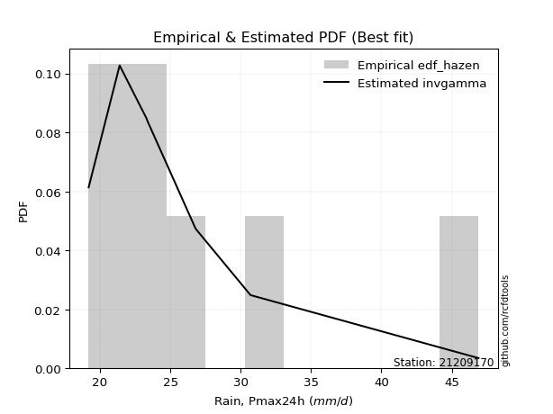</img>

</div>


### 3. Empirical - EDF Weibull (1939)

Weibull plotting position formula is an empirical method used to estimate the non-exceedance probability or plotting position for a set of observed data, is often recommended or widely used in practice, particularly in flood frequency analysis.

<div align="center">


$P=m/(n+1)$


</div>


**3.1. Empirical values**

<div align="center">

|                | 0                  | 1                  | 2           | 3           | 4                  | 5           | 6           |
|:---------------|:-------------------|:-------------------|:------------|:------------|:-------------------|:------------|:------------|
| date           | 2019               | 2018               | 2020        | 2021        | 2017               | 2016        | 2015        |
| x              | 19.2               | 21.4               | 23.3        | 23.4        | 26.8               | 30.7        | 46.9        |
| m              | 1                  | 2                  | 3           | 4           | 5                  | 6           | 7           |
| empirical_dist | edf_weibull        | edf_weibull        | edf_weibull | edf_weibull | edf_weibull        | edf_weibull | edf_weibull |
| empirical      | 0.125              | 0.25               | 0.375       | 0.5         | 0.625              | 0.75        | 0.875       |
| empirical_tr   | 1.1428571428571428 | 1.3333333333333333 | 1.6         | 2.0         | 2.6666666666666665 | 4.0         | 8.0         |

</div>


**3.2. Kolmogorov-Smirnov fit test (sorted by Δ)**


<div align="center">

|                | 0                   | 1                   | 2                   | 3                   | 4                   | 5                   | 6                   | 7                   | 8                   | 9                   | 10                  | 11                  | 12                  | 13                  | 14                  | 15                  | 16                  | 17                  | 18                  | 19                  | 20                  | 21                  | 22                  | 23                  | 24                  | 25                  | 26                  | 27                  | 28                  | 29                  | 30                  | 31                  | 32                  | 33                  | 34                  | 35                  | 36                  | 37                  | 38                  | 39                  | 40                  | 41                  | 42                  | 43                  | 44                  | 45                  | 46                  | 47                  | 48                  | 49                  | 50                  | 51                  | 52                  | 53                    | 54                  | 55                  | 56                  | 57                  | 58                  | 59                  | 60                  | 61                  | 62                  | 63                  | 64                  | 65                  | 66                  | 67                  | 68                  | 69                  | 70                  | 71                  | 72                  | 73                  | 74                  | 75                  | 76                  | 77                  | 78                  | 79                  | 80                  | 81                  | 82                  | 83                  | 84                  | 85                  | 86                  | 87                  | 88                  | 89                  |
|:---------------|:--------------------|:--------------------|:--------------------|:--------------------|:--------------------|:--------------------|:--------------------|:--------------------|:--------------------|:--------------------|:--------------------|:--------------------|:--------------------|:--------------------|:--------------------|:--------------------|:--------------------|:--------------------|:--------------------|:--------------------|:--------------------|:--------------------|:--------------------|:--------------------|:--------------------|:--------------------|:--------------------|:--------------------|:--------------------|:--------------------|:--------------------|:--------------------|:--------------------|:--------------------|:--------------------|:--------------------|:--------------------|:--------------------|:--------------------|:--------------------|:--------------------|:--------------------|:--------------------|:--------------------|:--------------------|:--------------------|:--------------------|:--------------------|:--------------------|:--------------------|:--------------------|:--------------------|:--------------------|:----------------------|:--------------------|:--------------------|:--------------------|:--------------------|:--------------------|:--------------------|:--------------------|:--------------------|:--------------------|:--------------------|:--------------------|:--------------------|:--------------------|:--------------------|:--------------------|:--------------------|:--------------------|:--------------------|:--------------------|:--------------------|:--------------------|:--------------------|:--------------------|:--------------------|:--------------------|:--------------------|:--------------------|:--------------------|:--------------------|:--------------------|:--------------------|:--------------------|:--------------------|:--------------------|:--------------------|:--------------------|
| station        | 21209170            | 21209170            | 21209170            | 21209170            | 21209170            | 21209170            | 21209170            | 21209170            | 21209170            | 21209170            | 21209170            | 21209170            | 21209170            | 21209170            | 21209170            | 21209170            | 21209170            | 21209170            | 21209170            | 21209170            | 21209170            | 21209170            | 21209170            | 21209170            | 21209170            | 21209170            | 21209170            | 21209170            | 21209170            | 21209170            | 21209170            | 21209170            | 21209170            | 21209170            | 21209170            | 21209170            | 21209170            | 21209170            | 21209170            | 21209170            | 21209170            | 21209170            | 21209170            | 21209170            | 21209170            | 21209170            | 21209170            | 21209170            | 21209170            | 21209170            | 21209170            | 21209170            | 21209170            | 21209170              | 21209170            | 21209170            | 21209170            | 21209170            | 21209170            | 21209170            | 21209170            | 21209170            | 21209170            | 21209170            | 21209170            | 21209170            | 21209170            | 21209170            | 21209170            | 21209170            | 21209170            | 21209170            | 21209170            | 21209170            | 21209170            | 21209170            | 21209170            | 21209170            | 21209170            | 21209170            | 21209170            | 21209170            | 21209170            | 21209170            | 21209170            | 21209170            | 21209170            | 21209170            | 21209170            | 21209170            |
| empirical_dist | edf_weibull         | edf_weibull         | edf_weibull         | edf_weibull         | edf_weibull         | edf_weibull         | edf_weibull         | edf_weibull         | edf_weibull         | edf_weibull         | edf_weibull         | edf_weibull         | edf_weibull         | edf_weibull         | edf_weibull         | edf_weibull         | edf_weibull         | edf_weibull         | edf_weibull         | edf_weibull         | edf_weibull         | edf_weibull         | edf_weibull         | edf_weibull         | edf_weibull         | edf_weibull         | edf_weibull         | edf_weibull         | edf_weibull         | edf_weibull         | edf_weibull         | edf_weibull         | edf_weibull         | edf_weibull         | edf_weibull         | edf_weibull         | edf_weibull         | edf_weibull         | edf_weibull         | edf_weibull         | edf_weibull         | edf_weibull         | edf_weibull         | edf_weibull         | edf_weibull         | edf_weibull         | edf_weibull         | edf_weibull         | edf_weibull         | edf_weibull         | edf_weibull         | edf_weibull         | edf_weibull         | edf_weibull           | edf_weibull         | edf_weibull         | edf_weibull         | edf_weibull         | edf_weibull         | edf_weibull         | edf_weibull         | edf_weibull         | edf_weibull         | edf_weibull         | edf_weibull         | edf_weibull         | edf_weibull         | edf_weibull         | edf_weibull         | edf_weibull         | edf_weibull         | edf_weibull         | edf_weibull         | edf_weibull         | edf_weibull         | edf_weibull         | edf_weibull         | edf_weibull         | edf_weibull         | edf_weibull         | edf_weibull         | edf_weibull         | edf_weibull         | edf_weibull         | edf_weibull         | edf_weibull         | edf_weibull         | edf_weibull         | edf_weibull         | edf_weibull         |
| p_dist         | logexponnorm        | logmielke           | loginvweibull       | alpha               | loginvgamma         | logf                | invweibull          | logalpha            | f                   | invgamma            | loginvgauss         | logjohnsonsu        | loghalfnorm         | invgauss            | logfatiguelife      | fatiguelife         | logfisk             | johnsonsu           | lognct              | fisk                | halflogistic        | loghalflogistic     | halfnorm            | logmoyal            | logt                | pearson3            | logpearson3         | logncf              | loggumbel_r         | lograyleigh         | moyal               | loggenlogistic      | exponnorm           | wald                | loggenexpon         | laplace_asymmetric  | logtruncnorm        | genexpon            | lognakagami         | truncnorm           | logweibull_min      | pareto              | logexpon            | expon               | mielke              | logmaxwell          | logwald             | rayleigh            | gumbel_r            | t                   | logkstwobign        | maxwell             | nct                 | loglaplace_asymmetric | betaprime           | genlogistic         | logloggamma         | gamma               | logcrystalball      | lognorm             | lognorm             | loggompertz         | logrice             | ncf                 | crystalball         | norm                | loglogistic         | logbetaprime        | kstwobign           | loghypsecant        | logistic            | hypsecant           | rice                | gibrat              | loggumbel_l         | loglaplace          | logerlang           | gumbel_l            | laplace             | loggibrat           | logchi2             | gompertz            | loggamma            | loggamma            | weibull_min         | loglognorm          | logpareto           | nakagami            | erlang              | chi2                |
| delta          | 0.07897346693552953 | 0.07959329162408679 | 0.07995098024383687 | 0.08000151440919237 | 0.08192132262528115 | 0.08192140752702756 | 0.08224292133575753 | 0.0828159968239418  | 0.08354105819105638 | 0.0835701583538286  | 0.08558025035334696 | 0.08601183841934584 | 0.08660834123548816 | 0.08677187998398084 | 0.08679283260599946 | 0.08806600698306123 | 0.08821915061599621 | 0.08959328246159493 | 0.09256478729822876 | 0.09685784279486595 | 0.09916264626618132 | 0.09936143303952588 | 0.10228057142690111 | 0.10258960370010739 | 0.10332244645993349 | 0.10796823263059724 | 0.10847019965818372 | 0.11379254941465083 | 0.11868470856075858 | 0.12040082073856373 | 0.1223821498589247  | 0.12365708425502053 | 0.1237686888161793  | 0.12492465717439352 | 0.12499962496443866 | 0.12499997826143439 | 0.12499998738007922 | 0.12499999707117851 | 0.12499999994297688 | 0.12499999999505462 | 0.12499999999923353 | 0.12499999999999789 | 0.125               | 0.125               | 0.12509967246528464 | 0.1322763455550952  | 0.13381755564225217 | 0.13530110604278212 | 0.13639726556104903 | 0.13761274048690386 | 0.13897456668417618 | 0.14691893178055193 | 0.14913491984445043 | 0.1553652992529252    | 0.15769091533347462 | 0.16010275218096537 | 0.16015528065120943 | 0.16245607530430772 | 0.1633307322951597  | 0.1633307329232791  | 0.1633307329232791  | 0.17069147830167525 | 0.17374412923970467 | 0.17396763073463162 | 0.17692514306962392 | 0.1769251468268107  | 0.18236121672036837 | 0.1844941457470819  | 0.1886317590391039  | 0.1968796996091734  | 0.19693550611922517 | 0.21191104586579063 | 0.21668010489903877 | 0.2172228018277444  | 0.22110867609901397 | 0.22454690394970372 | 0.22565974527594257 | 0.2322793813765559  | 0.2387918137823773  | 0.24958342349608378 | 0.2534555393442466  | 0.267362859276824   | 0.31171274309278707 | 0.31171274309278707 | 0.3580333650631512  | 0.3776911771074276  | 0.38297217714647447 | 0.3900794677957946  | 0.5213337179252157  | 0.5787531438850413  |
| deltao         | 0.48442053926100004 | 0.48442053926100004 | 0.48442053926100004 | 0.48442053926100004 | 0.48442053926100004 | 0.48442053926100004 | 0.48442053926100004 | 0.48442053926100004 | 0.48442053926100004 | 0.48442053926100004 | 0.48442053926100004 | 0.48442053926100004 | 0.48442053926100004 | 0.48442053926100004 | 0.48442053926100004 | 0.48442053926100004 | 0.48442053926100004 | 0.48442053926100004 | 0.48442053926100004 | 0.48442053926100004 | 0.48442053926100004 | 0.48442053926100004 | 0.48442053926100004 | 0.48442053926100004 | 0.48442053926100004 | 0.48442053926100004 | 0.48442053926100004 | 0.48442053926100004 | 0.48442053926100004 | 0.48442053926100004 | 0.48442053926100004 | 0.48442053926100004 | 0.48442053926100004 | 0.48442053926100004 | 0.48442053926100004 | 0.48442053926100004 | 0.48442053926100004 | 0.48442053926100004 | 0.48442053926100004 | 0.48442053926100004 | 0.48442053926100004 | 0.48442053926100004 | 0.48442053926100004 | 0.48442053926100004 | 0.48442053926100004 | 0.48442053926100004 | 0.48442053926100004 | 0.48442053926100004 | 0.48442053926100004 | 0.48442053926100004 | 0.48442053926100004 | 0.48442053926100004 | 0.48442053926100004 | 0.48442053926100004   | 0.48442053926100004 | 0.48442053926100004 | 0.48442053926100004 | 0.48442053926100004 | 0.48442053926100004 | 0.48442053926100004 | 0.48442053926100004 | 0.48442053926100004 | 0.48442053926100004 | 0.48442053926100004 | 0.48442053926100004 | 0.48442053926100004 | 0.48442053926100004 | 0.48442053926100004 | 0.48442053926100004 | 0.48442053926100004 | 0.48442053926100004 | 0.48442053926100004 | 0.48442053926100004 | 0.48442053926100004 | 0.48442053926100004 | 0.48442053926100004 | 0.48442053926100004 | 0.48442053926100004 | 0.48442053926100004 | 0.48442053926100004 | 0.48442053926100004 | 0.48442053926100004 | 0.48442053926100004 | 0.48442053926100004 | 0.48442053926100004 | 0.48442053926100004 | 0.48442053926100004 | 0.48442053926100004 | 0.48442053926100004 | 0.48442053926100004 |
| eval           | Δo > Δ              | Δo > Δ              | Δo > Δ              | Δo > Δ              | Δo > Δ              | Δo > Δ              | Δo > Δ              | Δo > Δ              | Δo > Δ              | Δo > Δ              | Δo > Δ              | Δo > Δ              | Δo > Δ              | Δo > Δ              | Δo > Δ              | Δo > Δ              | Δo > Δ              | Δo > Δ              | Δo > Δ              | Δo > Δ              | Δo > Δ              | Δo > Δ              | Δo > Δ              | Δo > Δ              | Δo > Δ              | Δo > Δ              | Δo > Δ              | Δo > Δ              | Δo > Δ              | Δo > Δ              | Δo > Δ              | Δo > Δ              | Δo > Δ              | Δo > Δ              | Δo > Δ              | Δo > Δ              | Δo > Δ              | Δo > Δ              | Δo > Δ              | Δo > Δ              | Δo > Δ              | Δo > Δ              | Δo > Δ              | Δo > Δ              | Δo > Δ              | Δo > Δ              | Δo > Δ              | Δo > Δ              | Δo > Δ              | Δo > Δ              | Δo > Δ              | Δo > Δ              | Δo > Δ              | Δo > Δ                | Δo > Δ              | Δo > Δ              | Δo > Δ              | Δo > Δ              | Δo > Δ              | Δo > Δ              | Δo > Δ              | Δo > Δ              | Δo > Δ              | Δo > Δ              | Δo > Δ              | Δo > Δ              | Δo > Δ              | Δo > Δ              | Δo > Δ              | Δo > Δ              | Δo > Δ              | Δo > Δ              | Δo > Δ              | Δo > Δ              | Δo > Δ              | Δo > Δ              | Δo > Δ              | Δo > Δ              | Δo > Δ              | Δo > Δ              | Δo > Δ              | Δo > Δ              | Δo > Δ              | Δo > Δ              | Δo > Δ              | Δo > Δ              | Δo > Δ              | Δo > Δ              | Δo <= Δ             | Δo <= Δ             |
| fit            | 1                   | 1                   | 1                   | 1                   | 1                   | 1                   | 1                   | 1                   | 1                   | 1                   | 1                   | 1                   | 1                   | 1                   | 1                   | 1                   | 1                   | 1                   | 1                   | 1                   | 1                   | 1                   | 1                   | 1                   | 1                   | 1                   | 1                   | 1                   | 1                   | 1                   | 1                   | 1                   | 1                   | 1                   | 1                   | 1                   | 1                   | 1                   | 1                   | 1                   | 1                   | 1                   | 1                   | 1                   | 1                   | 1                   | 1                   | 1                   | 1                   | 1                   | 1                   | 1                   | 1                   | 1                     | 1                   | 1                   | 1                   | 1                   | 1                   | 1                   | 1                   | 1                   | 1                   | 1                   | 1                   | 1                   | 1                   | 1                   | 1                   | 1                   | 1                   | 1                   | 1                   | 1                   | 1                   | 1                   | 1                   | 1                   | 1                   | 1                   | 1                   | 1                   | 1                   | 1                   | 1                   | 1                   | 1                   | 1                   | 0                   | 0                   |
| n              | 7                   | 7                   | 7                   | 7                   | 7                   | 7                   | 7                   | 7                   | 7                   | 7                   | 7                   | 7                   | 7                   | 7                   | 7                   | 7                   | 7                   | 7                   | 7                   | 7                   | 7                   | 7                   | 7                   | 7                   | 7                   | 7                   | 7                   | 7                   | 7                   | 7                   | 7                   | 7                   | 7                   | 7                   | 7                   | 7                   | 7                   | 7                   | 7                   | 7                   | 7                   | 7                   | 7                   | 7                   | 7                   | 7                   | 7                   | 7                   | 7                   | 7                   | 7                   | 7                   | 7                   | 7                     | 7                   | 7                   | 7                   | 7                   | 7                   | 7                   | 7                   | 7                   | 7                   | 7                   | 7                   | 7                   | 7                   | 7                   | 7                   | 7                   | 7                   | 7                   | 7                   | 7                   | 7                   | 7                   | 7                   | 7                   | 7                   | 7                   | 7                   | 7                   | 7                   | 7                   | 7                   | 7                   | 7                   | 7                   | 7                   | 7                   |
| best_fit       | 1                   | 0                   | 0                   | 0                   | 0                   | 0                   | 0                   | 0                   | 0                   | 0                   | 0                   | 0                   | 0                   | 0                   | 0                   | 0                   | 0                   | 0                   | 0                   | 0                   | 0                   | 0                   | 0                   | 0                   | 0                   | 0                   | 0                   | 0                   | 0                   | 0                   | 0                   | 0                   | 0                   | 0                   | 0                   | 0                   | 0                   | 0                   | 0                   | 0                   | 0                   | 0                   | 0                   | 0                   | 0                   | 0                   | 0                   | 0                   | 0                   | 0                   | 0                   | 0                   | 0                   | 0                     | 0                   | 0                   | 0                   | 0                   | 0                   | 0                   | 0                   | 0                   | 0                   | 0                   | 0                   | 0                   | 0                   | 0                   | 0                   | 0                   | 0                   | 0                   | 0                   | 0                   | 0                   | 0                   | 0                   | 0                   | 0                   | 0                   | 0                   | 0                   | 0                   | 0                   | 0                   | 0                   | 0                   | 0                   | 0                   | 0                   |
| best_fit_sort  | 1                   | 2                   | 3                   | 4                   | 5                   | 6                   | 7                   | 8                   | 9                   | 10                  | 11                  | 12                  | 13                  | 14                  | 15                  | 16                  | 17                  | 18                  | 19                  | 20                  | 21                  | 22                  | 23                  | 24                  | 25                  | 26                  | 27                  | 28                  | 29                  | 30                  | 31                  | 32                  | 33                  | 34                  | 35                  | 36                  | 37                  | 38                  | 39                  | 40                  | 41                  | 42                  | 43                  | 44                  | 45                  | 46                  | 47                  | 48                  | 49                  | 50                  | 51                  | 52                  | 53                  | 54                    | 55                  | 56                  | 57                  | 58                  | 59                  | 60                  | 61                  | 62                  | 63                  | 64                  | 65                  | 66                  | 67                  | 68                  | 69                  | 70                  | 71                  | 72                  | 73                  | 74                  | 75                  | 76                  | 77                  | 78                  | 79                  | 80                  | 81                  | 82                  | 83                  | 84                  | 85                  | 86                  | 87                  | 88                  | 89                  | 90                  |

</div>


<div align="center">

</img>

</div>


**3.3. Best fit**

<div align="center">

|   id |   station | empirical_dist   | p_dist       |     delta |   deltao | eval   |   fit |   n |   best_fit |   best_fit_sort |
|-----:|----------:|:-----------------|:-------------|----------:|---------:|:-------|------:|----:|-----------:|----------------:|
|    0 |  21209170 | edf_weibull      | logexponnorm | 0.0789735 | 0.484421 | Δo > Δ |     1 |   7 |          1 |               1 |

</div>


<div align="center">

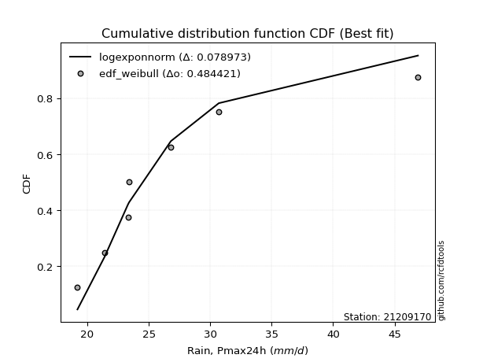</img>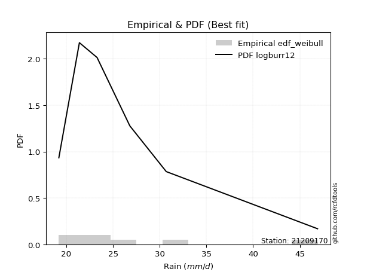</img>

</div>


### 4. Empirical - EDF Beard (1943)

The Beard formula (or Beard´s plotting position formula) in hydrology is used to estimate the empirical non-exceedance probability _(P)_ of a flood event (or other extreme hydrological data point) within a given dataset.

<div align="center">


$P=(m-0.31)/(n+0.38)$


</div>


**4.1. Empirical values**

<div align="center">

|                | 0                   | 1                   | 2                   | 3         | 4                  | 5                  | 6                  |
|:---------------|:--------------------|:--------------------|:--------------------|:----------|:-------------------|:-------------------|:-------------------|
| date           | 2019                | 2018                | 2020                | 2021      | 2017               | 2016               | 2015               |
| x              | 19.2                | 21.4                | 23.3                | 23.4      | 26.8               | 30.7               | 46.9               |
| m              | 1                   | 2                   | 3                   | 4         | 5                  | 6                  | 7                  |
| empirical_dist | edf_beard           | edf_beard           | edf_beard           | edf_beard | edf_beard          | edf_beard          | edf_beard          |
| empirical      | 0.09349593495934959 | 0.22899728997289973 | 0.36449864498644985 | 0.5       | 0.6355013550135502 | 0.7710027100271003 | 0.9065040650406505 |
| empirical_tr   | 1.1031390134529149  | 1.29701230228471    | 1.5735607675906182  | 2.0       | 2.743494423791822  | 4.366863905325444  | 10.695652173913055 |

</div>


**4.2. Kolmogorov-Smirnov fit test (sorted by Δ)**


<div align="center">

|                | 0                   | 1                   | 2                   | 3                   | 4                   | 5                   | 6                   | 7                   | 8                   | 9                   | 10                  | 11                  | 12                  | 13                  | 14                  | 15                  | 16                  | 17                  | 18                  | 19                  | 20                  | 21                  | 22                  | 23                  | 24                  | 25                  | 26                  | 27                  | 28                  | 29                  | 30                  | 31                  | 32                  | 33                  | 34                  | 35                  | 36                  | 37                  | 38                  | 39                  | 40                  | 41                  | 42                  | 43                  | 44                  | 45                  | 46                  | 47                  | 48                  | 49                  | 50                  | 51                  | 52                  | 53                    | 54                  | 55                  | 56                  | 57                  | 58                  | 59                  | 60                  | 61                  | 62                  | 63                  | 64                  | 65                  | 66                  | 67                  | 68                  | 69                  | 70                  | 71                  | 72                  | 73                  | 74                  | 75                  | 76                  | 77                  | 78                  | 79                  | 80                  | 81                  | 82                  | 83                  | 84                  | 85                  | 86                  | 87                  | 88                  | 89                  |
|:---------------|:--------------------|:--------------------|:--------------------|:--------------------|:--------------------|:--------------------|:--------------------|:--------------------|:--------------------|:--------------------|:--------------------|:--------------------|:--------------------|:--------------------|:--------------------|:--------------------|:--------------------|:--------------------|:--------------------|:--------------------|:--------------------|:--------------------|:--------------------|:--------------------|:--------------------|:--------------------|:--------------------|:--------------------|:--------------------|:--------------------|:--------------------|:--------------------|:--------------------|:--------------------|:--------------------|:--------------------|:--------------------|:--------------------|:--------------------|:--------------------|:--------------------|:--------------------|:--------------------|:--------------------|:--------------------|:--------------------|:--------------------|:--------------------|:--------------------|:--------------------|:--------------------|:--------------------|:--------------------|:----------------------|:--------------------|:--------------------|:--------------------|:--------------------|:--------------------|:--------------------|:--------------------|:--------------------|:--------------------|:--------------------|:--------------------|:--------------------|:--------------------|:--------------------|:--------------------|:--------------------|:--------------------|:--------------------|:--------------------|:--------------------|:--------------------|:--------------------|:--------------------|:--------------------|:--------------------|:--------------------|:--------------------|:--------------------|:--------------------|:--------------------|:--------------------|:--------------------|:--------------------|:--------------------|:--------------------|:--------------------|
| station        | 21209170            | 21209170            | 21209170            | 21209170            | 21209170            | 21209170            | 21209170            | 21209170            | 21209170            | 21209170            | 21209170            | 21209170            | 21209170            | 21209170            | 21209170            | 21209170            | 21209170            | 21209170            | 21209170            | 21209170            | 21209170            | 21209170            | 21209170            | 21209170            | 21209170            | 21209170            | 21209170            | 21209170            | 21209170            | 21209170            | 21209170            | 21209170            | 21209170            | 21209170            | 21209170            | 21209170            | 21209170            | 21209170            | 21209170            | 21209170            | 21209170            | 21209170            | 21209170            | 21209170            | 21209170            | 21209170            | 21209170            | 21209170            | 21209170            | 21209170            | 21209170            | 21209170            | 21209170            | 21209170              | 21209170            | 21209170            | 21209170            | 21209170            | 21209170            | 21209170            | 21209170            | 21209170            | 21209170            | 21209170            | 21209170            | 21209170            | 21209170            | 21209170            | 21209170            | 21209170            | 21209170            | 21209170            | 21209170            | 21209170            | 21209170            | 21209170            | 21209170            | 21209170            | 21209170            | 21209170            | 21209170            | 21209170            | 21209170            | 21209170            | 21209170            | 21209170            | 21209170            | 21209170            | 21209170            | 21209170            |
| empirical_dist | edf_beard           | edf_beard           | edf_beard           | edf_beard           | edf_beard           | edf_beard           | edf_beard           | edf_beard           | edf_beard           | edf_beard           | edf_beard           | edf_beard           | edf_beard           | edf_beard           | edf_beard           | edf_beard           | edf_beard           | edf_beard           | edf_beard           | edf_beard           | edf_beard           | edf_beard           | edf_beard           | edf_beard           | edf_beard           | edf_beard           | edf_beard           | edf_beard           | edf_beard           | edf_beard           | edf_beard           | edf_beard           | edf_beard           | edf_beard           | edf_beard           | edf_beard           | edf_beard           | edf_beard           | edf_beard           | edf_beard           | edf_beard           | edf_beard           | edf_beard           | edf_beard           | edf_beard           | edf_beard           | edf_beard           | edf_beard           | edf_beard           | edf_beard           | edf_beard           | edf_beard           | edf_beard           | edf_beard             | edf_beard           | edf_beard           | edf_beard           | edf_beard           | edf_beard           | edf_beard           | edf_beard           | edf_beard           | edf_beard           | edf_beard           | edf_beard           | edf_beard           | edf_beard           | edf_beard           | edf_beard           | edf_beard           | edf_beard           | edf_beard           | edf_beard           | edf_beard           | edf_beard           | edf_beard           | edf_beard           | edf_beard           | edf_beard           | edf_beard           | edf_beard           | edf_beard           | edf_beard           | edf_beard           | edf_beard           | edf_beard           | edf_beard           | edf_beard           | edf_beard           | edf_beard           |
| p_dist         | logjohnsonsu        | loginvgauss         | fisk                | invgamma            | f                   | invweibull          | logfisk             | invgauss            | logfatiguelife      | logexponnorm        | logf                | loginvgamma         | johnsonsu           | alpha               | loginvweibull       | logmielke           | fatiguelife         | loghalflogistic     | logalpha            | logt                | loghalfnorm         | lognct              | loggenexpon         | logtruncnorm        | pareto              | logexpon            | exponnorm           | laplace_asymmetric  | expon               | genexpon            | halflogistic        | wald                | halfnorm            | logmoyal            | lognakagami         | pearson3            | logpearson3         | logwald             | truncnorm           | logweibull_min      | loggumbel_r         | lograyleigh         | moyal               | t                   | loggenlogistic      | mielke              | logmaxwell          | rayleigh            | gumbel_r            | logkstwobign        | logncf              | maxwell             | nct                 | loglaplace_asymmetric | betaprime           | genlogistic         | logloggamma         | logcrystalball      | lognorm             | lognorm             | loggompertz         | gamma               | logrice             | ncf                 | crystalball         | norm                | loglogistic         | logbetaprime        | kstwobign           | gibrat              | loghypsecant        | logistic            | hypsecant           | rice                | loggumbel_l         | loglaplace          | loggibrat           | gumbel_l            | logerlang           | laplace             | gompertz            | logchi2             | loggamma            | loggamma            | weibull_min         | loglognorm          | logpareto           | nakagami            | erlang              | chi2                |
| delta          | 0.06448090439542814 | 0.06518282781627055 | 0.06755686604295413 | 0.06793191390391529 | 0.06810759786741338 | 0.06837977294639674 | 0.06937750095691142 | 0.07029562507996523 | 0.07144205793475811 | 0.07194140508960956 | 0.07275338754608252 | 0.07275351854436807 | 0.07282202249155395 | 0.07471964333658998 | 0.07500409708985245 | 0.07529595418828633 | 0.08073634136832092 | 0.08089612386343026 | 0.0828159968239418  | 0.08322057133644611 | 0.08660834123548816 | 0.09256478729822876 | 0.09349555992378825 | 0.09349592233942872 | 0.09349593495934748 | 0.09593880506398639 | 0.09753250592235718 | 0.09862020362581125 | 0.0986435068280852  | 0.09864533985837376 | 0.09916264626618132 | 0.1001940766628549  | 0.10228057142690111 | 0.10258960370010739 | 0.10629430295424219 | 0.10796823263059724 | 0.10847019965818372 | 0.1128148456151519  | 0.11785319876294453 | 0.1185102062031505  | 0.11868470856075858 | 0.12040082073856373 | 0.1223821498589247  | 0.12263113364709011 | 0.12365708425502053 | 0.12509967246528464 | 0.1322763455550952  | 0.13530110604278212 | 0.13639726556104903 | 0.13897456668417618 | 0.14529661445530123 | 0.14691893178055193 | 0.14913491984445043 | 0.1553652992529252    | 0.15769091533347462 | 0.16010275218096537 | 0.16015528065120943 | 0.1633307322951597  | 0.1633307329232791  | 0.1633307329232791  | 0.17069147830167525 | 0.17295743031785787 | 0.17374412923970467 | 0.17396763073463162 | 0.17692514306962392 | 0.1769251468268107  | 0.18236121672036837 | 0.1844941457470819  | 0.1886317590391039  | 0.19622009180064412 | 0.1968796996091734  | 0.19693550611922517 | 0.21191104586579063 | 0.21668010489903877 | 0.22110867609901397 | 0.22454690394970372 | 0.2285807134689835  | 0.23305103073547329 | 0.23616110028949272 | 0.2387918137823773  | 0.267362859276824   | 0.2744582493713469  | 0.3222140981063372  | 0.3222140981063372  | 0.3790360750902515  | 0.3986938871345279  | 0.40397488717357477 | 0.4110821778228949  | 0.542336427952316   | 0.5997558539121416  |
| deltao         | 0.48442053926100004 | 0.48442053926100004 | 0.48442053926100004 | 0.48442053926100004 | 0.48442053926100004 | 0.48442053926100004 | 0.48442053926100004 | 0.48442053926100004 | 0.48442053926100004 | 0.48442053926100004 | 0.48442053926100004 | 0.48442053926100004 | 0.48442053926100004 | 0.48442053926100004 | 0.48442053926100004 | 0.48442053926100004 | 0.48442053926100004 | 0.48442053926100004 | 0.48442053926100004 | 0.48442053926100004 | 0.48442053926100004 | 0.48442053926100004 | 0.48442053926100004 | 0.48442053926100004 | 0.48442053926100004 | 0.48442053926100004 | 0.48442053926100004 | 0.48442053926100004 | 0.48442053926100004 | 0.48442053926100004 | 0.48442053926100004 | 0.48442053926100004 | 0.48442053926100004 | 0.48442053926100004 | 0.48442053926100004 | 0.48442053926100004 | 0.48442053926100004 | 0.48442053926100004 | 0.48442053926100004 | 0.48442053926100004 | 0.48442053926100004 | 0.48442053926100004 | 0.48442053926100004 | 0.48442053926100004 | 0.48442053926100004 | 0.48442053926100004 | 0.48442053926100004 | 0.48442053926100004 | 0.48442053926100004 | 0.48442053926100004 | 0.48442053926100004 | 0.48442053926100004 | 0.48442053926100004 | 0.48442053926100004   | 0.48442053926100004 | 0.48442053926100004 | 0.48442053926100004 | 0.48442053926100004 | 0.48442053926100004 | 0.48442053926100004 | 0.48442053926100004 | 0.48442053926100004 | 0.48442053926100004 | 0.48442053926100004 | 0.48442053926100004 | 0.48442053926100004 | 0.48442053926100004 | 0.48442053926100004 | 0.48442053926100004 | 0.48442053926100004 | 0.48442053926100004 | 0.48442053926100004 | 0.48442053926100004 | 0.48442053926100004 | 0.48442053926100004 | 0.48442053926100004 | 0.48442053926100004 | 0.48442053926100004 | 0.48442053926100004 | 0.48442053926100004 | 0.48442053926100004 | 0.48442053926100004 | 0.48442053926100004 | 0.48442053926100004 | 0.48442053926100004 | 0.48442053926100004 | 0.48442053926100004 | 0.48442053926100004 | 0.48442053926100004 | 0.48442053926100004 |
| eval           | Δo > Δ              | Δo > Δ              | Δo > Δ              | Δo > Δ              | Δo > Δ              | Δo > Δ              | Δo > Δ              | Δo > Δ              | Δo > Δ              | Δo > Δ              | Δo > Δ              | Δo > Δ              | Δo > Δ              | Δo > Δ              | Δo > Δ              | Δo > Δ              | Δo > Δ              | Δo > Δ              | Δo > Δ              | Δo > Δ              | Δo > Δ              | Δo > Δ              | Δo > Δ              | Δo > Δ              | Δo > Δ              | Δo > Δ              | Δo > Δ              | Δo > Δ              | Δo > Δ              | Δo > Δ              | Δo > Δ              | Δo > Δ              | Δo > Δ              | Δo > Δ              | Δo > Δ              | Δo > Δ              | Δo > Δ              | Δo > Δ              | Δo > Δ              | Δo > Δ              | Δo > Δ              | Δo > Δ              | Δo > Δ              | Δo > Δ              | Δo > Δ              | Δo > Δ              | Δo > Δ              | Δo > Δ              | Δo > Δ              | Δo > Δ              | Δo > Δ              | Δo > Δ              | Δo > Δ              | Δo > Δ                | Δo > Δ              | Δo > Δ              | Δo > Δ              | Δo > Δ              | Δo > Δ              | Δo > Δ              | Δo > Δ              | Δo > Δ              | Δo > Δ              | Δo > Δ              | Δo > Δ              | Δo > Δ              | Δo > Δ              | Δo > Δ              | Δo > Δ              | Δo > Δ              | Δo > Δ              | Δo > Δ              | Δo > Δ              | Δo > Δ              | Δo > Δ              | Δo > Δ              | Δo > Δ              | Δo > Δ              | Δo > Δ              | Δo > Δ              | Δo > Δ              | Δo > Δ              | Δo > Δ              | Δo > Δ              | Δo > Δ              | Δo > Δ              | Δo > Δ              | Δo > Δ              | Δo <= Δ             | Δo <= Δ             |
| fit            | 1                   | 1                   | 1                   | 1                   | 1                   | 1                   | 1                   | 1                   | 1                   | 1                   | 1                   | 1                   | 1                   | 1                   | 1                   | 1                   | 1                   | 1                   | 1                   | 1                   | 1                   | 1                   | 1                   | 1                   | 1                   | 1                   | 1                   | 1                   | 1                   | 1                   | 1                   | 1                   | 1                   | 1                   | 1                   | 1                   | 1                   | 1                   | 1                   | 1                   | 1                   | 1                   | 1                   | 1                   | 1                   | 1                   | 1                   | 1                   | 1                   | 1                   | 1                   | 1                   | 1                   | 1                     | 1                   | 1                   | 1                   | 1                   | 1                   | 1                   | 1                   | 1                   | 1                   | 1                   | 1                   | 1                   | 1                   | 1                   | 1                   | 1                   | 1                   | 1                   | 1                   | 1                   | 1                   | 1                   | 1                   | 1                   | 1                   | 1                   | 1                   | 1                   | 1                   | 1                   | 1                   | 1                   | 1                   | 1                   | 0                   | 0                   |
| n              | 7                   | 7                   | 7                   | 7                   | 7                   | 7                   | 7                   | 7                   | 7                   | 7                   | 7                   | 7                   | 7                   | 7                   | 7                   | 7                   | 7                   | 7                   | 7                   | 7                   | 7                   | 7                   | 7                   | 7                   | 7                   | 7                   | 7                   | 7                   | 7                   | 7                   | 7                   | 7                   | 7                   | 7                   | 7                   | 7                   | 7                   | 7                   | 7                   | 7                   | 7                   | 7                   | 7                   | 7                   | 7                   | 7                   | 7                   | 7                   | 7                   | 7                   | 7                   | 7                   | 7                   | 7                     | 7                   | 7                   | 7                   | 7                   | 7                   | 7                   | 7                   | 7                   | 7                   | 7                   | 7                   | 7                   | 7                   | 7                   | 7                   | 7                   | 7                   | 7                   | 7                   | 7                   | 7                   | 7                   | 7                   | 7                   | 7                   | 7                   | 7                   | 7                   | 7                   | 7                   | 7                   | 7                   | 7                   | 7                   | 7                   | 7                   |
| best_fit       | 1                   | 0                   | 0                   | 0                   | 0                   | 0                   | 0                   | 0                   | 0                   | 0                   | 0                   | 0                   | 0                   | 0                   | 0                   | 0                   | 0                   | 0                   | 0                   | 0                   | 0                   | 0                   | 0                   | 0                   | 0                   | 0                   | 0                   | 0                   | 0                   | 0                   | 0                   | 0                   | 0                   | 0                   | 0                   | 0                   | 0                   | 0                   | 0                   | 0                   | 0                   | 0                   | 0                   | 0                   | 0                   | 0                   | 0                   | 0                   | 0                   | 0                   | 0                   | 0                   | 0                   | 0                     | 0                   | 0                   | 0                   | 0                   | 0                   | 0                   | 0                   | 0                   | 0                   | 0                   | 0                   | 0                   | 0                   | 0                   | 0                   | 0                   | 0                   | 0                   | 0                   | 0                   | 0                   | 0                   | 0                   | 0                   | 0                   | 0                   | 0                   | 0                   | 0                   | 0                   | 0                   | 0                   | 0                   | 0                   | 0                   | 0                   |
| best_fit_sort  | 1                   | 2                   | 3                   | 4                   | 5                   | 6                   | 7                   | 8                   | 9                   | 10                  | 11                  | 12                  | 13                  | 14                  | 15                  | 16                  | 17                  | 18                  | 19                  | 20                  | 21                  | 22                  | 23                  | 24                  | 25                  | 26                  | 27                  | 28                  | 29                  | 30                  | 31                  | 32                  | 33                  | 34                  | 35                  | 36                  | 37                  | 38                  | 39                  | 40                  | 41                  | 42                  | 43                  | 44                  | 45                  | 46                  | 47                  | 48                  | 49                  | 50                  | 51                  | 52                  | 53                  | 54                    | 55                  | 56                  | 57                  | 58                  | 59                  | 60                  | 61                  | 62                  | 63                  | 64                  | 65                  | 66                  | 67                  | 68                  | 69                  | 70                  | 71                  | 72                  | 73                  | 74                  | 75                  | 76                  | 77                  | 78                  | 79                  | 80                  | 81                  | 82                  | 83                  | 84                  | 85                  | 86                  | 87                  | 88                  | 89                  | 90                  |

</div>


<div align="center">

</img>

</div>


**4.3. Best fit**

<div align="center">

|   id |   station | empirical_dist   | p_dist       |     delta |   deltao | eval   |   fit |   n |   best_fit |   best_fit_sort |
|-----:|----------:|:-----------------|:-------------|----------:|---------:|:-------|------:|----:|-----------:|----------------:|
|    0 |  21209170 | edf_beard        | logjohnsonsu | 0.0644809 | 0.484421 | Δo > Δ |     1 |   7 |          1 |               1 |

</div>


<div align="center">

</img></img>

</div>


### 5. Empirical - EDF Chegodayev (1955)

The Chegodayev formula is an empirical plotting position formula used in hydrological frequency analysis to estimate the exceedance probability or return period of a specific event from a set of observed data. It is primarily used for plotting observed data points on probability paper to fit a theoretical distribution, particularly for analyzing extreme events like maximum flood flows or rainfall intensities. The constant _b_ value in the generalized plotting position formula is 0.3.

<div align="center">


$P=(m-b)/(n+1-2b)$


</div>


**5.1. Empirical values**

<div align="center">

|                | 0                   | 1                   | 2                   | 3              | 4                  | 5                  | 6                  |
|:---------------|:--------------------|:--------------------|:--------------------|:---------------|:-------------------|:-------------------|:-------------------|
| date           | 2019                | 2018                | 2020                | 2021           | 2017               | 2016               | 2015               |
| x              | 19.2                | 21.4                | 23.3                | 23.4           | 26.8               | 30.7               | 46.9               |
| m              | 1                   | 2                   | 3                   | 4              | 5                  | 6                  | 7                  |
| empirical_dist | edf_chegodayev      | edf_chegodayev      | edf_chegodayev      | edf_chegodayev | edf_chegodayev     | edf_chegodayev     | edf_chegodayev     |
| empirical      | 0.09459459459459459 | 0.22972972972972971 | 0.36486486486486486 | 0.5            | 0.6351351351351351 | 0.7702702702702703 | 0.9054054054054054 |
| empirical_tr   | 1.1044776119402986  | 1.2982456140350878  | 1.574468085106383   | 2.0            | 2.7407407407407405 | 4.352941176470589  | 10.571428571428568 |

</div>


**5.2. Kolmogorov-Smirnov fit test (sorted by Δ)**


<div align="center">

|                | 0                   | 1                   | 2                   | 3                   | 4                   | 5                   | 6                   | 7                   | 8                   | 9                   | 10                  | 11                  | 12                  | 13                  | 14                  | 15                  | 16                  | 17                  | 18                  | 19                  | 20                  | 21                  | 22                  | 23                  | 24                  | 25                  | 26                  | 27                  | 28                  | 29                  | 30                  | 31                  | 32                  | 33                  | 34                  | 35                  | 36                  | 37                  | 38                  | 39                  | 40                  | 41                  | 42                  | 43                  | 44                  | 45                  | 46                  | 47                  | 48                  | 49                  | 50                  | 51                  | 52                  | 53                    | 54                  | 55                  | 56                  | 57                  | 58                  | 59                  | 60                  | 61                  | 62                  | 63                  | 64                  | 65                  | 66                  | 67                  | 68                  | 69                  | 70                  | 71                  | 72                  | 73                  | 74                  | 75                  | 76                  | 77                  | 78                  | 79                  | 80                  | 81                  | 82                  | 83                  | 84                  | 85                  | 86                  | 87                  | 88                  | 89                  |
|:---------------|:--------------------|:--------------------|:--------------------|:--------------------|:--------------------|:--------------------|:--------------------|:--------------------|:--------------------|:--------------------|:--------------------|:--------------------|:--------------------|:--------------------|:--------------------|:--------------------|:--------------------|:--------------------|:--------------------|:--------------------|:--------------------|:--------------------|:--------------------|:--------------------|:--------------------|:--------------------|:--------------------|:--------------------|:--------------------|:--------------------|:--------------------|:--------------------|:--------------------|:--------------------|:--------------------|:--------------------|:--------------------|:--------------------|:--------------------|:--------------------|:--------------------|:--------------------|:--------------------|:--------------------|:--------------------|:--------------------|:--------------------|:--------------------|:--------------------|:--------------------|:--------------------|:--------------------|:--------------------|:----------------------|:--------------------|:--------------------|:--------------------|:--------------------|:--------------------|:--------------------|:--------------------|:--------------------|:--------------------|:--------------------|:--------------------|:--------------------|:--------------------|:--------------------|:--------------------|:--------------------|:--------------------|:--------------------|:--------------------|:--------------------|:--------------------|:--------------------|:--------------------|:--------------------|:--------------------|:--------------------|:--------------------|:--------------------|:--------------------|:--------------------|:--------------------|:--------------------|:--------------------|:--------------------|:--------------------|:--------------------|
| station        | 21209170            | 21209170            | 21209170            | 21209170            | 21209170            | 21209170            | 21209170            | 21209170            | 21209170            | 21209170            | 21209170            | 21209170            | 21209170            | 21209170            | 21209170            | 21209170            | 21209170            | 21209170            | 21209170            | 21209170            | 21209170            | 21209170            | 21209170            | 21209170            | 21209170            | 21209170            | 21209170            | 21209170            | 21209170            | 21209170            | 21209170            | 21209170            | 21209170            | 21209170            | 21209170            | 21209170            | 21209170            | 21209170            | 21209170            | 21209170            | 21209170            | 21209170            | 21209170            | 21209170            | 21209170            | 21209170            | 21209170            | 21209170            | 21209170            | 21209170            | 21209170            | 21209170            | 21209170            | 21209170              | 21209170            | 21209170            | 21209170            | 21209170            | 21209170            | 21209170            | 21209170            | 21209170            | 21209170            | 21209170            | 21209170            | 21209170            | 21209170            | 21209170            | 21209170            | 21209170            | 21209170            | 21209170            | 21209170            | 21209170            | 21209170            | 21209170            | 21209170            | 21209170            | 21209170            | 21209170            | 21209170            | 21209170            | 21209170            | 21209170            | 21209170            | 21209170            | 21209170            | 21209170            | 21209170            | 21209170            |
| empirical_dist | edf_chegodayev      | edf_chegodayev      | edf_chegodayev      | edf_chegodayev      | edf_chegodayev      | edf_chegodayev      | edf_chegodayev      | edf_chegodayev      | edf_chegodayev      | edf_chegodayev      | edf_chegodayev      | edf_chegodayev      | edf_chegodayev      | edf_chegodayev      | edf_chegodayev      | edf_chegodayev      | edf_chegodayev      | edf_chegodayev      | edf_chegodayev      | edf_chegodayev      | edf_chegodayev      | edf_chegodayev      | edf_chegodayev      | edf_chegodayev      | edf_chegodayev      | edf_chegodayev      | edf_chegodayev      | edf_chegodayev      | edf_chegodayev      | edf_chegodayev      | edf_chegodayev      | edf_chegodayev      | edf_chegodayev      | edf_chegodayev      | edf_chegodayev      | edf_chegodayev      | edf_chegodayev      | edf_chegodayev      | edf_chegodayev      | edf_chegodayev      | edf_chegodayev      | edf_chegodayev      | edf_chegodayev      | edf_chegodayev      | edf_chegodayev      | edf_chegodayev      | edf_chegodayev      | edf_chegodayev      | edf_chegodayev      | edf_chegodayev      | edf_chegodayev      | edf_chegodayev      | edf_chegodayev      | edf_chegodayev        | edf_chegodayev      | edf_chegodayev      | edf_chegodayev      | edf_chegodayev      | edf_chegodayev      | edf_chegodayev      | edf_chegodayev      | edf_chegodayev      | edf_chegodayev      | edf_chegodayev      | edf_chegodayev      | edf_chegodayev      | edf_chegodayev      | edf_chegodayev      | edf_chegodayev      | edf_chegodayev      | edf_chegodayev      | edf_chegodayev      | edf_chegodayev      | edf_chegodayev      | edf_chegodayev      | edf_chegodayev      | edf_chegodayev      | edf_chegodayev      | edf_chegodayev      | edf_chegodayev      | edf_chegodayev      | edf_chegodayev      | edf_chegodayev      | edf_chegodayev      | edf_chegodayev      | edf_chegodayev      | edf_chegodayev      | edf_chegodayev      | edf_chegodayev      | edf_chegodayev      |
| p_dist         | logjohnsonsu        | loginvgauss         | fisk                | invgamma            | f                   | invweibull          | logfisk             | invgauss            | logfatiguelife      | logexponnorm        | johnsonsu           | logf                | loginvgamma         | alpha               | loginvweibull       | logmielke           | fatiguelife         | loghalflogistic     | logalpha            | logt                | loghalfnorm         | lognct              | loggenexpon         | logtruncnorm        | pareto              | logexpon            | exponnorm           | laplace_asymmetric  | expon               | genexpon            | halflogistic        | wald                | halfnorm            | logmoyal            | lognakagami         | pearson3            | logpearson3         | logwald             | truncnorm           | logweibull_min      | loggumbel_r         | lograyleigh         | moyal               | t                   | loggenlogistic      | mielke              | logmaxwell          | rayleigh            | gumbel_r            | logkstwobign        | logncf              | maxwell             | nct                 | loglaplace_asymmetric | betaprime           | genlogistic         | logloggamma         | logcrystalball      | lognorm             | lognorm             | loggompertz         | gamma               | logrice             | ncf                 | crystalball         | norm                | loglogistic         | logbetaprime        | kstwobign           | loghypsecant        | logistic            | gibrat              | hypsecant           | rice                | loggumbel_l         | loglaplace          | loggibrat           | gumbel_l            | logerlang           | laplace             | gompertz            | logchi2             | loggamma            | loggamma            | weibull_min         | loglognorm          | logpareto           | nakagami            | erlang              | chi2                |
| delta          | 0.06448090439542814 | 0.06481660793785554 | 0.06719064616453913 | 0.06793191390391529 | 0.06810759786741338 | 0.06837977294639674 | 0.06937750095691142 | 0.06992940520155022 | 0.0710758380563431  | 0.07194140508960956 | 0.07245580261313894 | 0.07275338754608252 | 0.07275351854436807 | 0.07471964333658998 | 0.07500409708985245 | 0.07529595418828633 | 0.08037012148990591 | 0.08089612386343026 | 0.0828159968239418  | 0.08322057133644611 | 0.08660834123548816 | 0.09256478729822876 | 0.09459421955903324 | 0.09459458197467385 | 0.09459459459459248 | 0.09557258518557138 | 0.09753250592235718 | 0.09862020362581125 | 0.0986435068280852  | 0.09864533985837376 | 0.09916264626618132 | 0.1001940766628549  | 0.10228057142690111 | 0.10258960370010739 | 0.10629430295424219 | 0.10796823263059724 | 0.10847019965818372 | 0.11354728537198189 | 0.11785319876294453 | 0.1181439863247355  | 0.11868470856075858 | 0.12040082073856373 | 0.1223821498589247  | 0.12299735352550523 | 0.12365708425502053 | 0.12509967246528464 | 0.1322763455550952  | 0.13530110604278212 | 0.13639726556104903 | 0.13897456668417618 | 0.14419795482005626 | 0.14691893178055193 | 0.14913491984445043 | 0.1553652992529252    | 0.15769091533347462 | 0.16010275218096537 | 0.16015528065120943 | 0.1633307322951597  | 0.1633307329232791  | 0.1633307329232791  | 0.17069147830167525 | 0.17259121043944287 | 0.17374412923970467 | 0.17396763073463162 | 0.17692514306962392 | 0.1769251468268107  | 0.18236121672036837 | 0.1844941457470819  | 0.1886317590391039  | 0.1968796996091734  | 0.19693550611922517 | 0.1969525315574741  | 0.21191104586579063 | 0.21668010489903877 | 0.22110867609901397 | 0.22454690394970372 | 0.2293131532258135  | 0.23268481085705817 | 0.2357948804110777  | 0.2387918137823773  | 0.267362859276824   | 0.27372580961451687 | 0.3218478782279222  | 0.3218478782279222  | 0.3783036353334215  | 0.3979614473776979  | 0.40324244741674475 | 0.4103497380660649  | 0.5416039881954859  | 0.5990234141553116  |
| deltao         | 0.48442053926100004 | 0.48442053926100004 | 0.48442053926100004 | 0.48442053926100004 | 0.48442053926100004 | 0.48442053926100004 | 0.48442053926100004 | 0.48442053926100004 | 0.48442053926100004 | 0.48442053926100004 | 0.48442053926100004 | 0.48442053926100004 | 0.48442053926100004 | 0.48442053926100004 | 0.48442053926100004 | 0.48442053926100004 | 0.48442053926100004 | 0.48442053926100004 | 0.48442053926100004 | 0.48442053926100004 | 0.48442053926100004 | 0.48442053926100004 | 0.48442053926100004 | 0.48442053926100004 | 0.48442053926100004 | 0.48442053926100004 | 0.48442053926100004 | 0.48442053926100004 | 0.48442053926100004 | 0.48442053926100004 | 0.48442053926100004 | 0.48442053926100004 | 0.48442053926100004 | 0.48442053926100004 | 0.48442053926100004 | 0.48442053926100004 | 0.48442053926100004 | 0.48442053926100004 | 0.48442053926100004 | 0.48442053926100004 | 0.48442053926100004 | 0.48442053926100004 | 0.48442053926100004 | 0.48442053926100004 | 0.48442053926100004 | 0.48442053926100004 | 0.48442053926100004 | 0.48442053926100004 | 0.48442053926100004 | 0.48442053926100004 | 0.48442053926100004 | 0.48442053926100004 | 0.48442053926100004 | 0.48442053926100004   | 0.48442053926100004 | 0.48442053926100004 | 0.48442053926100004 | 0.48442053926100004 | 0.48442053926100004 | 0.48442053926100004 | 0.48442053926100004 | 0.48442053926100004 | 0.48442053926100004 | 0.48442053926100004 | 0.48442053926100004 | 0.48442053926100004 | 0.48442053926100004 | 0.48442053926100004 | 0.48442053926100004 | 0.48442053926100004 | 0.48442053926100004 | 0.48442053926100004 | 0.48442053926100004 | 0.48442053926100004 | 0.48442053926100004 | 0.48442053926100004 | 0.48442053926100004 | 0.48442053926100004 | 0.48442053926100004 | 0.48442053926100004 | 0.48442053926100004 | 0.48442053926100004 | 0.48442053926100004 | 0.48442053926100004 | 0.48442053926100004 | 0.48442053926100004 | 0.48442053926100004 | 0.48442053926100004 | 0.48442053926100004 | 0.48442053926100004 |
| eval           | Δo > Δ              | Δo > Δ              | Δo > Δ              | Δo > Δ              | Δo > Δ              | Δo > Δ              | Δo > Δ              | Δo > Δ              | Δo > Δ              | Δo > Δ              | Δo > Δ              | Δo > Δ              | Δo > Δ              | Δo > Δ              | Δo > Δ              | Δo > Δ              | Δo > Δ              | Δo > Δ              | Δo > Δ              | Δo > Δ              | Δo > Δ              | Δo > Δ              | Δo > Δ              | Δo > Δ              | Δo > Δ              | Δo > Δ              | Δo > Δ              | Δo > Δ              | Δo > Δ              | Δo > Δ              | Δo > Δ              | Δo > Δ              | Δo > Δ              | Δo > Δ              | Δo > Δ              | Δo > Δ              | Δo > Δ              | Δo > Δ              | Δo > Δ              | Δo > Δ              | Δo > Δ              | Δo > Δ              | Δo > Δ              | Δo > Δ              | Δo > Δ              | Δo > Δ              | Δo > Δ              | Δo > Δ              | Δo > Δ              | Δo > Δ              | Δo > Δ              | Δo > Δ              | Δo > Δ              | Δo > Δ                | Δo > Δ              | Δo > Δ              | Δo > Δ              | Δo > Δ              | Δo > Δ              | Δo > Δ              | Δo > Δ              | Δo > Δ              | Δo > Δ              | Δo > Δ              | Δo > Δ              | Δo > Δ              | Δo > Δ              | Δo > Δ              | Δo > Δ              | Δo > Δ              | Δo > Δ              | Δo > Δ              | Δo > Δ              | Δo > Δ              | Δo > Δ              | Δo > Δ              | Δo > Δ              | Δo > Δ              | Δo > Δ              | Δo > Δ              | Δo > Δ              | Δo > Δ              | Δo > Δ              | Δo > Δ              | Δo > Δ              | Δo > Δ              | Δo > Δ              | Δo > Δ              | Δo <= Δ             | Δo <= Δ             |
| fit            | 1                   | 1                   | 1                   | 1                   | 1                   | 1                   | 1                   | 1                   | 1                   | 1                   | 1                   | 1                   | 1                   | 1                   | 1                   | 1                   | 1                   | 1                   | 1                   | 1                   | 1                   | 1                   | 1                   | 1                   | 1                   | 1                   | 1                   | 1                   | 1                   | 1                   | 1                   | 1                   | 1                   | 1                   | 1                   | 1                   | 1                   | 1                   | 1                   | 1                   | 1                   | 1                   | 1                   | 1                   | 1                   | 1                   | 1                   | 1                   | 1                   | 1                   | 1                   | 1                   | 1                   | 1                     | 1                   | 1                   | 1                   | 1                   | 1                   | 1                   | 1                   | 1                   | 1                   | 1                   | 1                   | 1                   | 1                   | 1                   | 1                   | 1                   | 1                   | 1                   | 1                   | 1                   | 1                   | 1                   | 1                   | 1                   | 1                   | 1                   | 1                   | 1                   | 1                   | 1                   | 1                   | 1                   | 1                   | 1                   | 0                   | 0                   |
| n              | 7                   | 7                   | 7                   | 7                   | 7                   | 7                   | 7                   | 7                   | 7                   | 7                   | 7                   | 7                   | 7                   | 7                   | 7                   | 7                   | 7                   | 7                   | 7                   | 7                   | 7                   | 7                   | 7                   | 7                   | 7                   | 7                   | 7                   | 7                   | 7                   | 7                   | 7                   | 7                   | 7                   | 7                   | 7                   | 7                   | 7                   | 7                   | 7                   | 7                   | 7                   | 7                   | 7                   | 7                   | 7                   | 7                   | 7                   | 7                   | 7                   | 7                   | 7                   | 7                   | 7                   | 7                     | 7                   | 7                   | 7                   | 7                   | 7                   | 7                   | 7                   | 7                   | 7                   | 7                   | 7                   | 7                   | 7                   | 7                   | 7                   | 7                   | 7                   | 7                   | 7                   | 7                   | 7                   | 7                   | 7                   | 7                   | 7                   | 7                   | 7                   | 7                   | 7                   | 7                   | 7                   | 7                   | 7                   | 7                   | 7                   | 7                   |
| best_fit       | 1                   | 0                   | 0                   | 0                   | 0                   | 0                   | 0                   | 0                   | 0                   | 0                   | 0                   | 0                   | 0                   | 0                   | 0                   | 0                   | 0                   | 0                   | 0                   | 0                   | 0                   | 0                   | 0                   | 0                   | 0                   | 0                   | 0                   | 0                   | 0                   | 0                   | 0                   | 0                   | 0                   | 0                   | 0                   | 0                   | 0                   | 0                   | 0                   | 0                   | 0                   | 0                   | 0                   | 0                   | 0                   | 0                   | 0                   | 0                   | 0                   | 0                   | 0                   | 0                   | 0                   | 0                     | 0                   | 0                   | 0                   | 0                   | 0                   | 0                   | 0                   | 0                   | 0                   | 0                   | 0                   | 0                   | 0                   | 0                   | 0                   | 0                   | 0                   | 0                   | 0                   | 0                   | 0                   | 0                   | 0                   | 0                   | 0                   | 0                   | 0                   | 0                   | 0                   | 0                   | 0                   | 0                   | 0                   | 0                   | 0                   | 0                   |
| best_fit_sort  | 1                   | 2                   | 3                   | 4                   | 5                   | 6                   | 7                   | 8                   | 9                   | 10                  | 11                  | 12                  | 13                  | 14                  | 15                  | 16                  | 17                  | 18                  | 19                  | 20                  | 21                  | 22                  | 23                  | 24                  | 25                  | 26                  | 27                  | 28                  | 29                  | 30                  | 31                  | 32                  | 33                  | 34                  | 35                  | 36                  | 37                  | 38                  | 39                  | 40                  | 41                  | 42                  | 43                  | 44                  | 45                  | 46                  | 47                  | 48                  | 49                  | 50                  | 51                  | 52                  | 53                  | 54                    | 55                  | 56                  | 57                  | 58                  | 59                  | 60                  | 61                  | 62                  | 63                  | 64                  | 65                  | 66                  | 67                  | 68                  | 69                  | 70                  | 71                  | 72                  | 73                  | 74                  | 75                  | 76                  | 77                  | 78                  | 79                  | 80                  | 81                  | 82                  | 83                  | 84                  | 85                  | 86                  | 87                  | 88                  | 89                  | 90                  |

</div>


<div align="center">

</img>

</div>


**5.3. Best fit**

<div align="center">

|   id |   station | empirical_dist   | p_dist       |     delta |   deltao | eval   |   fit |   n |   best_fit |   best_fit_sort |
|-----:|----------:|:-----------------|:-------------|----------:|---------:|:-------|------:|----:|-----------:|----------------:|
|    0 |  21209170 | edf_chegodayev   | logjohnsonsu | 0.0644809 | 0.484421 | Δo > Δ |     1 |   7 |          1 |               1 |

</div>


<div align="center">

</img>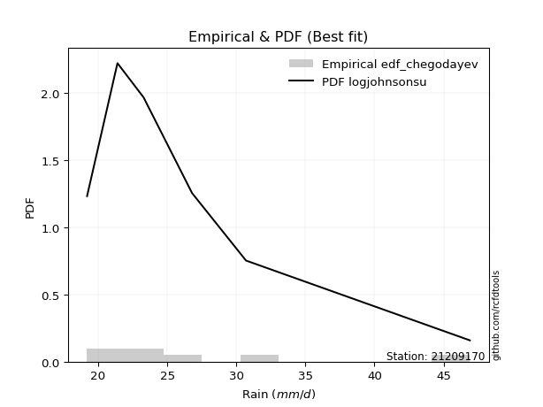</img>

</div>


### 6. Empirical - EDF Blom (1958)

The Blom formula is a specific "plotting position" formula used in hydrology and statistical analysis to estimate the empirical cumulative probability (or non-exceedance probability) of a data series. It is particularly recommended for data that are approximately normally distributed. The constant _a_ is set to 0.375 (or 3/8).

<div align="center">


$P=(m-a)/(n+1-2a)$


</div>


**6.1. Empirical values**

<div align="center">

|                | 0                   | 1                   | 2                  | 3        | 4                  | 5                  | 6                  |
|:---------------|:--------------------|:--------------------|:-------------------|:---------|:-------------------|:-------------------|:-------------------|
| date           | 2019                | 2018                | 2020               | 2021     | 2017               | 2016               | 2015               |
| x              | 19.2                | 21.4                | 23.3               | 23.4     | 26.8               | 30.7               | 46.9               |
| m              | 1                   | 2                   | 3                  | 4        | 5                  | 6                  | 7                  |
| empirical_dist | edf_blom            | edf_blom            | edf_blom           | edf_blom | edf_blom           | edf_blom           | edf_blom           |
| empirical      | 0.08620689655172414 | 0.22413793103448276 | 0.3620689655172414 | 0.5      | 0.6379310344827587 | 0.7758620689655172 | 0.9137931034482759 |
| empirical_tr   | 1.0943396226415094  | 1.288888888888889   | 1.5675675675675675 | 2.0      | 2.7619047619047623 | 4.461538461538462  | 11.600000000000007 |

</div>


**6.2. Kolmogorov-Smirnov fit test (sorted by Δ)**


<div align="center">

|                | 0                   | 1                   | 2                   | 3                   | 4                   | 5                   | 6                   | 7                   | 8                   | 9                   | 10                  | 11                  | 12                  | 13                  | 14                  | 15                  | 16                  | 17                  | 18                  | 19                  | 20                  | 21                  | 22                  | 23                  | 24                  | 25                  | 26                  | 27                  | 28                  | 29                  | 30                  | 31                  | 32                  | 33                  | 34                  | 35                  | 36                  | 37                  | 38                  | 39                  | 40                  | 41                  | 42                  | 43                  | 44                  | 45                  | 46                  | 47                  | 48                  | 49                  | 50                  | 51                  | 52                  | 53                    | 54                  | 55                  | 56                  | 57                  | 58                  | 59                  | 60                  | 61                  | 62                  | 63                  | 64                  | 65                  | 66                  | 67                  | 68                  | 69                  | 70                  | 71                  | 72                  | 73                  | 74                  | 75                  | 76                  | 77                  | 78                  | 79                  | 80                  | 81                  | 82                  | 83                  | 84                  | 85                  | 86                  | 87                  | 88                  | 89                  |
|:---------------|:--------------------|:--------------------|:--------------------|:--------------------|:--------------------|:--------------------|:--------------------|:--------------------|:--------------------|:--------------------|:--------------------|:--------------------|:--------------------|:--------------------|:--------------------|:--------------------|:--------------------|:--------------------|:--------------------|:--------------------|:--------------------|:--------------------|:--------------------|:--------------------|:--------------------|:--------------------|:--------------------|:--------------------|:--------------------|:--------------------|:--------------------|:--------------------|:--------------------|:--------------------|:--------------------|:--------------------|:--------------------|:--------------------|:--------------------|:--------------------|:--------------------|:--------------------|:--------------------|:--------------------|:--------------------|:--------------------|:--------------------|:--------------------|:--------------------|:--------------------|:--------------------|:--------------------|:--------------------|:----------------------|:--------------------|:--------------------|:--------------------|:--------------------|:--------------------|:--------------------|:--------------------|:--------------------|:--------------------|:--------------------|:--------------------|:--------------------|:--------------------|:--------------------|:--------------------|:--------------------|:--------------------|:--------------------|:--------------------|:--------------------|:--------------------|:--------------------|:--------------------|:--------------------|:--------------------|:--------------------|:--------------------|:--------------------|:--------------------|:--------------------|:--------------------|:--------------------|:--------------------|:--------------------|:--------------------|:--------------------|
| station        | 21209170            | 21209170            | 21209170            | 21209170            | 21209170            | 21209170            | 21209170            | 21209170            | 21209170            | 21209170            | 21209170            | 21209170            | 21209170            | 21209170            | 21209170            | 21209170            | 21209170            | 21209170            | 21209170            | 21209170            | 21209170            | 21209170            | 21209170            | 21209170            | 21209170            | 21209170            | 21209170            | 21209170            | 21209170            | 21209170            | 21209170            | 21209170            | 21209170            | 21209170            | 21209170            | 21209170            | 21209170            | 21209170            | 21209170            | 21209170            | 21209170            | 21209170            | 21209170            | 21209170            | 21209170            | 21209170            | 21209170            | 21209170            | 21209170            | 21209170            | 21209170            | 21209170            | 21209170            | 21209170              | 21209170            | 21209170            | 21209170            | 21209170            | 21209170            | 21209170            | 21209170            | 21209170            | 21209170            | 21209170            | 21209170            | 21209170            | 21209170            | 21209170            | 21209170            | 21209170            | 21209170            | 21209170            | 21209170            | 21209170            | 21209170            | 21209170            | 21209170            | 21209170            | 21209170            | 21209170            | 21209170            | 21209170            | 21209170            | 21209170            | 21209170            | 21209170            | 21209170            | 21209170            | 21209170            | 21209170            |
| empirical_dist | edf_blom            | edf_blom            | edf_blom            | edf_blom            | edf_blom            | edf_blom            | edf_blom            | edf_blom            | edf_blom            | edf_blom            | edf_blom            | edf_blom            | edf_blom            | edf_blom            | edf_blom            | edf_blom            | edf_blom            | edf_blom            | edf_blom            | edf_blom            | edf_blom            | edf_blom            | edf_blom            | edf_blom            | edf_blom            | edf_blom            | edf_blom            | edf_blom            | edf_blom            | edf_blom            | edf_blom            | edf_blom            | edf_blom            | edf_blom            | edf_blom            | edf_blom            | edf_blom            | edf_blom            | edf_blom            | edf_blom            | edf_blom            | edf_blom            | edf_blom            | edf_blom            | edf_blom            | edf_blom            | edf_blom            | edf_blom            | edf_blom            | edf_blom            | edf_blom            | edf_blom            | edf_blom            | edf_blom              | edf_blom            | edf_blom            | edf_blom            | edf_blom            | edf_blom            | edf_blom            | edf_blom            | edf_blom            | edf_blom            | edf_blom            | edf_blom            | edf_blom            | edf_blom            | edf_blom            | edf_blom            | edf_blom            | edf_blom            | edf_blom            | edf_blom            | edf_blom            | edf_blom            | edf_blom            | edf_blom            | edf_blom            | edf_blom            | edf_blom            | edf_blom            | edf_blom            | edf_blom            | edf_blom            | edf_blom            | edf_blom            | edf_blom            | edf_blom            | edf_blom            | edf_blom            |
| p_dist         | logjohnsonsu        | loginvgauss         | invgamma            | f                   | invweibull          | logfisk             | fisk                | logexponnorm        | invgauss            | logf                | loginvgamma         | logfatiguelife      | alpha               | loginvweibull       | johnsonsu           | logmielke           | loghalflogistic     | logalpha            | fatiguelife         | logt                | loggenexpon         | logtruncnorm        | pareto              | loghalfnorm         | lognct              | exponnorm           | logexpon            | laplace_asymmetric  | expon               | genexpon            | halflogistic        | wald                | halfnorm            | logmoyal            | lognakagami         | logwald             | pearson3            | logpearson3         | truncnorm           | loggumbel_r         | t                   | lograyleigh         | logweibull_min      | moyal               | loggenlogistic      | mielke              | logmaxwell          | rayleigh            | gumbel_r            | logkstwobign        | maxwell             | nct                 | logncf              | loglaplace_asymmetric | betaprime           | genlogistic         | logloggamma         | logcrystalball      | lognorm             | lognorm             | loggompertz         | logrice             | ncf                 | gamma               | crystalball         | norm                | loglogistic         | logbetaprime        | kstwobign           | gibrat              | loghypsecant        | logistic            | hypsecant           | rice                | loggumbel_l         | loggibrat           | loglaplace          | gumbel_l            | logerlang           | laplace             | gompertz            | logchi2             | loggamma            | loggamma            | weibull_min         | loglognorm          | logpareto           | nakagami            | erlang              | chi2                |
| delta          | 0.06508251916592372 | 0.06761250728547902 | 0.06793191390391529 | 0.06810759786741338 | 0.06837977294639674 | 0.06937750095691142 | 0.0699865455121626  | 0.07194140508960956 | 0.0727253045491737  | 0.07275338754608252 | 0.07275351854436807 | 0.07387173740396658 | 0.07471964333658998 | 0.07500409708985245 | 0.07525170196076242 | 0.07529595418828633 | 0.08089612386343026 | 0.0828159968239418  | 0.08316602083752939 | 0.08322057133644611 | 0.0862065215161628  | 0.08620688393180331 | 0.08620689655172203 | 0.08660834123548816 | 0.09256478729822876 | 0.09753250592235718 | 0.09836848453319486 | 0.09862020362581125 | 0.0986435068280852  | 0.09864533985837376 | 0.09916264626618132 | 0.1001940766628549  | 0.10228057142690111 | 0.10258960370010739 | 0.10729767472927765 | 0.10795548667673494 | 0.10796823263059724 | 0.10847019965818372 | 0.11785319876294453 | 0.11868470856075858 | 0.12020145417788164 | 0.12040082073856373 | 0.12093988567235897 | 0.1223821498589247  | 0.12365708425502053 | 0.12509967246528464 | 0.1322763455550952  | 0.13530110604278212 | 0.13639726556104903 | 0.13897456668417618 | 0.14691893178055193 | 0.14913491984445043 | 0.1525856528629267  | 0.1553652992529252    | 0.15769091533347462 | 0.16010275218096537 | 0.16015528065120943 | 0.1633307322951597  | 0.1633307329232791  | 0.1633307329232791  | 0.17069147830167525 | 0.17374412923970467 | 0.17396763073463162 | 0.17538710978706634 | 0.17692514306962392 | 0.1769251468268107  | 0.18236121672036837 | 0.1844941457470819  | 0.1886317590391039  | 0.19136073286222716 | 0.1968796996091734  | 0.19693550611922517 | 0.21191104586579063 | 0.21668010489903877 | 0.22110867609901397 | 0.22372135453056655 | 0.22454690394970372 | 0.23548071020468175 | 0.2385907797587012  | 0.2387918137823773  | 0.267362859276824   | 0.2793176083097638  | 0.3246437775755457  | 0.3246437775755457  | 0.38389543402866844 | 0.40355324607294485 | 0.4088342461119917  | 0.41594153676131185 | 0.5471957868907329  | 0.6046152128505585  |
| deltao         | 0.48442053926100004 | 0.48442053926100004 | 0.48442053926100004 | 0.48442053926100004 | 0.48442053926100004 | 0.48442053926100004 | 0.48442053926100004 | 0.48442053926100004 | 0.48442053926100004 | 0.48442053926100004 | 0.48442053926100004 | 0.48442053926100004 | 0.48442053926100004 | 0.48442053926100004 | 0.48442053926100004 | 0.48442053926100004 | 0.48442053926100004 | 0.48442053926100004 | 0.48442053926100004 | 0.48442053926100004 | 0.48442053926100004 | 0.48442053926100004 | 0.48442053926100004 | 0.48442053926100004 | 0.48442053926100004 | 0.48442053926100004 | 0.48442053926100004 | 0.48442053926100004 | 0.48442053926100004 | 0.48442053926100004 | 0.48442053926100004 | 0.48442053926100004 | 0.48442053926100004 | 0.48442053926100004 | 0.48442053926100004 | 0.48442053926100004 | 0.48442053926100004 | 0.48442053926100004 | 0.48442053926100004 | 0.48442053926100004 | 0.48442053926100004 | 0.48442053926100004 | 0.48442053926100004 | 0.48442053926100004 | 0.48442053926100004 | 0.48442053926100004 | 0.48442053926100004 | 0.48442053926100004 | 0.48442053926100004 | 0.48442053926100004 | 0.48442053926100004 | 0.48442053926100004 | 0.48442053926100004 | 0.48442053926100004   | 0.48442053926100004 | 0.48442053926100004 | 0.48442053926100004 | 0.48442053926100004 | 0.48442053926100004 | 0.48442053926100004 | 0.48442053926100004 | 0.48442053926100004 | 0.48442053926100004 | 0.48442053926100004 | 0.48442053926100004 | 0.48442053926100004 | 0.48442053926100004 | 0.48442053926100004 | 0.48442053926100004 | 0.48442053926100004 | 0.48442053926100004 | 0.48442053926100004 | 0.48442053926100004 | 0.48442053926100004 | 0.48442053926100004 | 0.48442053926100004 | 0.48442053926100004 | 0.48442053926100004 | 0.48442053926100004 | 0.48442053926100004 | 0.48442053926100004 | 0.48442053926100004 | 0.48442053926100004 | 0.48442053926100004 | 0.48442053926100004 | 0.48442053926100004 | 0.48442053926100004 | 0.48442053926100004 | 0.48442053926100004 | 0.48442053926100004 |
| eval           | Δo > Δ              | Δo > Δ              | Δo > Δ              | Δo > Δ              | Δo > Δ              | Δo > Δ              | Δo > Δ              | Δo > Δ              | Δo > Δ              | Δo > Δ              | Δo > Δ              | Δo > Δ              | Δo > Δ              | Δo > Δ              | Δo > Δ              | Δo > Δ              | Δo > Δ              | Δo > Δ              | Δo > Δ              | Δo > Δ              | Δo > Δ              | Δo > Δ              | Δo > Δ              | Δo > Δ              | Δo > Δ              | Δo > Δ              | Δo > Δ              | Δo > Δ              | Δo > Δ              | Δo > Δ              | Δo > Δ              | Δo > Δ              | Δo > Δ              | Δo > Δ              | Δo > Δ              | Δo > Δ              | Δo > Δ              | Δo > Δ              | Δo > Δ              | Δo > Δ              | Δo > Δ              | Δo > Δ              | Δo > Δ              | Δo > Δ              | Δo > Δ              | Δo > Δ              | Δo > Δ              | Δo > Δ              | Δo > Δ              | Δo > Δ              | Δo > Δ              | Δo > Δ              | Δo > Δ              | Δo > Δ                | Δo > Δ              | Δo > Δ              | Δo > Δ              | Δo > Δ              | Δo > Δ              | Δo > Δ              | Δo > Δ              | Δo > Δ              | Δo > Δ              | Δo > Δ              | Δo > Δ              | Δo > Δ              | Δo > Δ              | Δo > Δ              | Δo > Δ              | Δo > Δ              | Δo > Δ              | Δo > Δ              | Δo > Δ              | Δo > Δ              | Δo > Δ              | Δo > Δ              | Δo > Δ              | Δo > Δ              | Δo > Δ              | Δo > Δ              | Δo > Δ              | Δo > Δ              | Δo > Δ              | Δo > Δ              | Δo > Δ              | Δo > Δ              | Δo > Δ              | Δo > Δ              | Δo <= Δ             | Δo <= Δ             |
| fit            | 1                   | 1                   | 1                   | 1                   | 1                   | 1                   | 1                   | 1                   | 1                   | 1                   | 1                   | 1                   | 1                   | 1                   | 1                   | 1                   | 1                   | 1                   | 1                   | 1                   | 1                   | 1                   | 1                   | 1                   | 1                   | 1                   | 1                   | 1                   | 1                   | 1                   | 1                   | 1                   | 1                   | 1                   | 1                   | 1                   | 1                   | 1                   | 1                   | 1                   | 1                   | 1                   | 1                   | 1                   | 1                   | 1                   | 1                   | 1                   | 1                   | 1                   | 1                   | 1                   | 1                   | 1                     | 1                   | 1                   | 1                   | 1                   | 1                   | 1                   | 1                   | 1                   | 1                   | 1                   | 1                   | 1                   | 1                   | 1                   | 1                   | 1                   | 1                   | 1                   | 1                   | 1                   | 1                   | 1                   | 1                   | 1                   | 1                   | 1                   | 1                   | 1                   | 1                   | 1                   | 1                   | 1                   | 1                   | 1                   | 0                   | 0                   |
| n              | 7                   | 7                   | 7                   | 7                   | 7                   | 7                   | 7                   | 7                   | 7                   | 7                   | 7                   | 7                   | 7                   | 7                   | 7                   | 7                   | 7                   | 7                   | 7                   | 7                   | 7                   | 7                   | 7                   | 7                   | 7                   | 7                   | 7                   | 7                   | 7                   | 7                   | 7                   | 7                   | 7                   | 7                   | 7                   | 7                   | 7                   | 7                   | 7                   | 7                   | 7                   | 7                   | 7                   | 7                   | 7                   | 7                   | 7                   | 7                   | 7                   | 7                   | 7                   | 7                   | 7                   | 7                     | 7                   | 7                   | 7                   | 7                   | 7                   | 7                   | 7                   | 7                   | 7                   | 7                   | 7                   | 7                   | 7                   | 7                   | 7                   | 7                   | 7                   | 7                   | 7                   | 7                   | 7                   | 7                   | 7                   | 7                   | 7                   | 7                   | 7                   | 7                   | 7                   | 7                   | 7                   | 7                   | 7                   | 7                   | 7                   | 7                   |
| best_fit       | 1                   | 0                   | 0                   | 0                   | 0                   | 0                   | 0                   | 0                   | 0                   | 0                   | 0                   | 0                   | 0                   | 0                   | 0                   | 0                   | 0                   | 0                   | 0                   | 0                   | 0                   | 0                   | 0                   | 0                   | 0                   | 0                   | 0                   | 0                   | 0                   | 0                   | 0                   | 0                   | 0                   | 0                   | 0                   | 0                   | 0                   | 0                   | 0                   | 0                   | 0                   | 0                   | 0                   | 0                   | 0                   | 0                   | 0                   | 0                   | 0                   | 0                   | 0                   | 0                   | 0                   | 0                     | 0                   | 0                   | 0                   | 0                   | 0                   | 0                   | 0                   | 0                   | 0                   | 0                   | 0                   | 0                   | 0                   | 0                   | 0                   | 0                   | 0                   | 0                   | 0                   | 0                   | 0                   | 0                   | 0                   | 0                   | 0                   | 0                   | 0                   | 0                   | 0                   | 0                   | 0                   | 0                   | 0                   | 0                   | 0                   | 0                   |
| best_fit_sort  | 1                   | 2                   | 3                   | 4                   | 5                   | 6                   | 7                   | 8                   | 9                   | 10                  | 11                  | 12                  | 13                  | 14                  | 15                  | 16                  | 17                  | 18                  | 19                  | 20                  | 21                  | 22                  | 23                  | 24                  | 25                  | 26                  | 27                  | 28                  | 29                  | 30                  | 31                  | 32                  | 33                  | 34                  | 35                  | 36                  | 37                  | 38                  | 39                  | 40                  | 41                  | 42                  | 43                  | 44                  | 45                  | 46                  | 47                  | 48                  | 49                  | 50                  | 51                  | 52                  | 53                  | 54                    | 55                  | 56                  | 57                  | 58                  | 59                  | 60                  | 61                  | 62                  | 63                  | 64                  | 65                  | 66                  | 67                  | 68                  | 69                  | 70                  | 71                  | 72                  | 73                  | 74                  | 75                  | 76                  | 77                  | 78                  | 79                  | 80                  | 81                  | 82                  | 83                  | 84                  | 85                  | 86                  | 87                  | 88                  | 89                  | 90                  |

</div>


<div align="center">

</img>

</div>


**6.3. Best fit**

<div align="center">

|   id |   station | empirical_dist   | p_dist       |     delta |   deltao | eval   |   fit |   n |   best_fit |   best_fit_sort |
|-----:|----------:|:-----------------|:-------------|----------:|---------:|:-------|------:|----:|-----------:|----------------:|
|    0 |  21209170 | edf_blom         | logjohnsonsu | 0.0650825 | 0.484421 | Δo > Δ |     1 |   7 |          1 |               1 |

</div>


<div align="center">

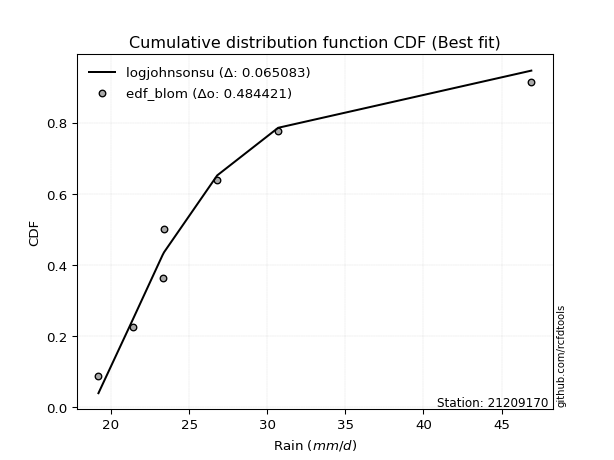</img></img>

</div>


### 7. Empirical - EDF Tukey (1962)

In hydrology, the Tukey formula is used as a plotting position formula to estimate the empirical probability or frequency of a flood event (or other hydrological data). The formula parameter is given as _c=0.333_ (or 1/3).

<div align="center">


$P=(m-c)/(n+1-2c)$


</div>


**7.1. Empirical values**

<div align="center">

|                | 0                   | 1                   | 2                   | 3         | 4                  | 5                  | 6                  |
|:---------------|:--------------------|:--------------------|:--------------------|:----------|:-------------------|:-------------------|:-------------------|
| date           | 2019                | 2018                | 2020                | 2021      | 2017               | 2016               | 2015               |
| x              | 19.2                | 21.4                | 23.3                | 23.4      | 26.8               | 30.7               | 46.9               |
| m              | 1                   | 2                   | 3                   | 4         | 5                  | 6                  | 7                  |
| empirical_dist | edf_tukey           | edf_tukey           | edf_tukey           | edf_tukey | edf_tukey          | edf_tukey          | edf_tukey          |
| empirical      | 0.09090909090909091 | 0.22727272727272727 | 0.36363636363636365 | 0.5       | 0.6363636363636364 | 0.7727272727272727 | 0.9090909090909091 |
| empirical_tr   | 1.1                 | 1.2941176470588236  | 1.5714285714285714  | 2.0       | 2.75               | 4.3999999999999995 | 10.999999999999996 |

</div>


**7.2. Kolmogorov-Smirnov fit test (sorted by Δ)**


<div align="center">

|                | 0                   | 1                   | 2                   | 3                   | 4                   | 5                   | 6                   | 7                   | 8                   | 9                   | 10                  | 11                  | 12                  | 13                  | 14                  | 15                  | 16                  | 17                  | 18                  | 19                  | 20                  | 21                  | 22                  | 23                  | 24                  | 25                  | 26                  | 27                  | 28                  | 29                  | 30                  | 31                  | 32                  | 33                  | 34                  | 35                  | 36                  | 37                  | 38                  | 39                  | 40                  | 41                  | 42                  | 43                  | 44                  | 45                  | 46                  | 47                  | 48                  | 49                  | 50                  | 51                  | 52                  | 53                    | 54                  | 55                  | 56                  | 57                  | 58                  | 59                  | 60                  | 61                  | 62                  | 63                  | 64                  | 65                  | 66                  | 67                  | 68                  | 69                  | 70                  | 71                  | 72                  | 73                  | 74                  | 75                  | 76                  | 77                  | 78                  | 79                  | 80                  | 81                  | 82                  | 83                  | 84                  | 85                  | 86                  | 87                  | 88                  | 89                  |
|:---------------|:--------------------|:--------------------|:--------------------|:--------------------|:--------------------|:--------------------|:--------------------|:--------------------|:--------------------|:--------------------|:--------------------|:--------------------|:--------------------|:--------------------|:--------------------|:--------------------|:--------------------|:--------------------|:--------------------|:--------------------|:--------------------|:--------------------|:--------------------|:--------------------|:--------------------|:--------------------|:--------------------|:--------------------|:--------------------|:--------------------|:--------------------|:--------------------|:--------------------|:--------------------|:--------------------|:--------------------|:--------------------|:--------------------|:--------------------|:--------------------|:--------------------|:--------------------|:--------------------|:--------------------|:--------------------|:--------------------|:--------------------|:--------------------|:--------------------|:--------------------|:--------------------|:--------------------|:--------------------|:----------------------|:--------------------|:--------------------|:--------------------|:--------------------|:--------------------|:--------------------|:--------------------|:--------------------|:--------------------|:--------------------|:--------------------|:--------------------|:--------------------|:--------------------|:--------------------|:--------------------|:--------------------|:--------------------|:--------------------|:--------------------|:--------------------|:--------------------|:--------------------|:--------------------|:--------------------|:--------------------|:--------------------|:--------------------|:--------------------|:--------------------|:--------------------|:--------------------|:--------------------|:--------------------|:--------------------|:--------------------|
| station        | 21209170            | 21209170            | 21209170            | 21209170            | 21209170            | 21209170            | 21209170            | 21209170            | 21209170            | 21209170            | 21209170            | 21209170            | 21209170            | 21209170            | 21209170            | 21209170            | 21209170            | 21209170            | 21209170            | 21209170            | 21209170            | 21209170            | 21209170            | 21209170            | 21209170            | 21209170            | 21209170            | 21209170            | 21209170            | 21209170            | 21209170            | 21209170            | 21209170            | 21209170            | 21209170            | 21209170            | 21209170            | 21209170            | 21209170            | 21209170            | 21209170            | 21209170            | 21209170            | 21209170            | 21209170            | 21209170            | 21209170            | 21209170            | 21209170            | 21209170            | 21209170            | 21209170            | 21209170            | 21209170              | 21209170            | 21209170            | 21209170            | 21209170            | 21209170            | 21209170            | 21209170            | 21209170            | 21209170            | 21209170            | 21209170            | 21209170            | 21209170            | 21209170            | 21209170            | 21209170            | 21209170            | 21209170            | 21209170            | 21209170            | 21209170            | 21209170            | 21209170            | 21209170            | 21209170            | 21209170            | 21209170            | 21209170            | 21209170            | 21209170            | 21209170            | 21209170            | 21209170            | 21209170            | 21209170            | 21209170            |
| empirical_dist | edf_tukey           | edf_tukey           | edf_tukey           | edf_tukey           | edf_tukey           | edf_tukey           | edf_tukey           | edf_tukey           | edf_tukey           | edf_tukey           | edf_tukey           | edf_tukey           | edf_tukey           | edf_tukey           | edf_tukey           | edf_tukey           | edf_tukey           | edf_tukey           | edf_tukey           | edf_tukey           | edf_tukey           | edf_tukey           | edf_tukey           | edf_tukey           | edf_tukey           | edf_tukey           | edf_tukey           | edf_tukey           | edf_tukey           | edf_tukey           | edf_tukey           | edf_tukey           | edf_tukey           | edf_tukey           | edf_tukey           | edf_tukey           | edf_tukey           | edf_tukey           | edf_tukey           | edf_tukey           | edf_tukey           | edf_tukey           | edf_tukey           | edf_tukey           | edf_tukey           | edf_tukey           | edf_tukey           | edf_tukey           | edf_tukey           | edf_tukey           | edf_tukey           | edf_tukey           | edf_tukey           | edf_tukey             | edf_tukey           | edf_tukey           | edf_tukey           | edf_tukey           | edf_tukey           | edf_tukey           | edf_tukey           | edf_tukey           | edf_tukey           | edf_tukey           | edf_tukey           | edf_tukey           | edf_tukey           | edf_tukey           | edf_tukey           | edf_tukey           | edf_tukey           | edf_tukey           | edf_tukey           | edf_tukey           | edf_tukey           | edf_tukey           | edf_tukey           | edf_tukey           | edf_tukey           | edf_tukey           | edf_tukey           | edf_tukey           | edf_tukey           | edf_tukey           | edf_tukey           | edf_tukey           | edf_tukey           | edf_tukey           | edf_tukey           | edf_tukey           |
| p_dist         | logjohnsonsu        | loginvgauss         | invgamma            | f                   | invweibull          | fisk                | logfisk             | invgauss            | logexponnorm        | logfatiguelife      | logf                | loginvgamma         | johnsonsu           | alpha               | loginvweibull       | logmielke           | loghalflogistic     | fatiguelife         | logalpha            | logt                | loghalfnorm         | loggenexpon         | logtruncnorm        | pareto              | lognct              | logexpon            | exponnorm           | laplace_asymmetric  | expon               | genexpon            | halflogistic        | wald                | halfnorm            | logmoyal            | lognakagami         | pearson3            | logpearson3         | logwald             | truncnorm           | loggumbel_r         | logweibull_min      | lograyleigh         | t                   | moyal               | loggenlogistic      | mielke              | logmaxwell          | rayleigh            | gumbel_r            | logkstwobign        | maxwell             | logncf              | nct                 | loglaplace_asymmetric | betaprime           | genlogistic         | logloggamma         | logcrystalball      | lognorm             | lognorm             | loggompertz         | logrice             | gamma               | ncf                 | crystalball         | norm                | loglogistic         | logbetaprime        | kstwobign           | gibrat              | loghypsecant        | logistic            | hypsecant           | rice                | loggumbel_l         | loglaplace          | loggibrat           | gumbel_l            | logerlang           | laplace             | gompertz            | logchi2             | loggamma            | loggamma            | weibull_min         | loglognorm          | logpareto           | nakagami            | erlang              | chi2                |
| delta          | 0.06448090439542814 | 0.06604510916635675 | 0.06793191390391529 | 0.06810759786741338 | 0.06837977294639674 | 0.06841914739304034 | 0.06937750095691142 | 0.07115790643005143 | 0.07194140508960956 | 0.07230433928484431 | 0.07275338754608252 | 0.07275351854436807 | 0.07368430384164015 | 0.07471964333658998 | 0.07500409708985245 | 0.07529595418828633 | 0.08089612386343026 | 0.08159862271840712 | 0.0828159968239418  | 0.08322057133644611 | 0.08660834123548816 | 0.09090871587352957 | 0.09090907828917016 | 0.0909090909090888  | 0.09256478729822876 | 0.09680108641407259 | 0.09753250592235718 | 0.09862020362581125 | 0.0986435068280852  | 0.09864533985837376 | 0.09916264626618132 | 0.1001940766628549  | 0.10228057142690111 | 0.10258960370010739 | 0.10629430295424219 | 0.10796823263059724 | 0.10847019965818372 | 0.11109028291497944 | 0.11785319876294453 | 0.11868470856075858 | 0.1193724875532367  | 0.12040082073856373 | 0.12176885229700396 | 0.1223821498589247  | 0.12365708425502053 | 0.12509967246528464 | 0.1322763455550952  | 0.13530110604278212 | 0.13639726556104903 | 0.13897456668417618 | 0.14691893178055193 | 0.14788345850555992 | 0.14913491984445043 | 0.1553652992529252    | 0.15769091533347462 | 0.16010275218096537 | 0.16015528065120943 | 0.1633307322951597  | 0.1633307329232791  | 0.1633307329232791  | 0.17069147830167525 | 0.17374412923970467 | 0.17381971166794408 | 0.17396763073463162 | 0.17692514306962392 | 0.1769251468268107  | 0.18236121672036837 | 0.1844941457470819  | 0.1886317590391039  | 0.19449552910047166 | 0.1968796996091734  | 0.19693550611922517 | 0.21191104586579063 | 0.21668010489903877 | 0.22110867609901397 | 0.22454690394970372 | 0.22685615076881105 | 0.23391331208555943 | 0.23702338163957892 | 0.2387918137823773  | 0.267362859276824   | 0.2761828120715193  | 0.3230763794564234  | 0.3230763794564234  | 0.3807606377904239  | 0.4004184498347003  | 0.4056994498737472  | 0.4128067405230673  | 0.5440609906524884  | 0.601480416612314   |
| deltao         | 0.48442053926100004 | 0.48442053926100004 | 0.48442053926100004 | 0.48442053926100004 | 0.48442053926100004 | 0.48442053926100004 | 0.48442053926100004 | 0.48442053926100004 | 0.48442053926100004 | 0.48442053926100004 | 0.48442053926100004 | 0.48442053926100004 | 0.48442053926100004 | 0.48442053926100004 | 0.48442053926100004 | 0.48442053926100004 | 0.48442053926100004 | 0.48442053926100004 | 0.48442053926100004 | 0.48442053926100004 | 0.48442053926100004 | 0.48442053926100004 | 0.48442053926100004 | 0.48442053926100004 | 0.48442053926100004 | 0.48442053926100004 | 0.48442053926100004 | 0.48442053926100004 | 0.48442053926100004 | 0.48442053926100004 | 0.48442053926100004 | 0.48442053926100004 | 0.48442053926100004 | 0.48442053926100004 | 0.48442053926100004 | 0.48442053926100004 | 0.48442053926100004 | 0.48442053926100004 | 0.48442053926100004 | 0.48442053926100004 | 0.48442053926100004 | 0.48442053926100004 | 0.48442053926100004 | 0.48442053926100004 | 0.48442053926100004 | 0.48442053926100004 | 0.48442053926100004 | 0.48442053926100004 | 0.48442053926100004 | 0.48442053926100004 | 0.48442053926100004 | 0.48442053926100004 | 0.48442053926100004 | 0.48442053926100004   | 0.48442053926100004 | 0.48442053926100004 | 0.48442053926100004 | 0.48442053926100004 | 0.48442053926100004 | 0.48442053926100004 | 0.48442053926100004 | 0.48442053926100004 | 0.48442053926100004 | 0.48442053926100004 | 0.48442053926100004 | 0.48442053926100004 | 0.48442053926100004 | 0.48442053926100004 | 0.48442053926100004 | 0.48442053926100004 | 0.48442053926100004 | 0.48442053926100004 | 0.48442053926100004 | 0.48442053926100004 | 0.48442053926100004 | 0.48442053926100004 | 0.48442053926100004 | 0.48442053926100004 | 0.48442053926100004 | 0.48442053926100004 | 0.48442053926100004 | 0.48442053926100004 | 0.48442053926100004 | 0.48442053926100004 | 0.48442053926100004 | 0.48442053926100004 | 0.48442053926100004 | 0.48442053926100004 | 0.48442053926100004 | 0.48442053926100004 |
| eval           | Δo > Δ              | Δo > Δ              | Δo > Δ              | Δo > Δ              | Δo > Δ              | Δo > Δ              | Δo > Δ              | Δo > Δ              | Δo > Δ              | Δo > Δ              | Δo > Δ              | Δo > Δ              | Δo > Δ              | Δo > Δ              | Δo > Δ              | Δo > Δ              | Δo > Δ              | Δo > Δ              | Δo > Δ              | Δo > Δ              | Δo > Δ              | Δo > Δ              | Δo > Δ              | Δo > Δ              | Δo > Δ              | Δo > Δ              | Δo > Δ              | Δo > Δ              | Δo > Δ              | Δo > Δ              | Δo > Δ              | Δo > Δ              | Δo > Δ              | Δo > Δ              | Δo > Δ              | Δo > Δ              | Δo > Δ              | Δo > Δ              | Δo > Δ              | Δo > Δ              | Δo > Δ              | Δo > Δ              | Δo > Δ              | Δo > Δ              | Δo > Δ              | Δo > Δ              | Δo > Δ              | Δo > Δ              | Δo > Δ              | Δo > Δ              | Δo > Δ              | Δo > Δ              | Δo > Δ              | Δo > Δ                | Δo > Δ              | Δo > Δ              | Δo > Δ              | Δo > Δ              | Δo > Δ              | Δo > Δ              | Δo > Δ              | Δo > Δ              | Δo > Δ              | Δo > Δ              | Δo > Δ              | Δo > Δ              | Δo > Δ              | Δo > Δ              | Δo > Δ              | Δo > Δ              | Δo > Δ              | Δo > Δ              | Δo > Δ              | Δo > Δ              | Δo > Δ              | Δo > Δ              | Δo > Δ              | Δo > Δ              | Δo > Δ              | Δo > Δ              | Δo > Δ              | Δo > Δ              | Δo > Δ              | Δo > Δ              | Δo > Δ              | Δo > Δ              | Δo > Δ              | Δo > Δ              | Δo <= Δ             | Δo <= Δ             |
| fit            | 1                   | 1                   | 1                   | 1                   | 1                   | 1                   | 1                   | 1                   | 1                   | 1                   | 1                   | 1                   | 1                   | 1                   | 1                   | 1                   | 1                   | 1                   | 1                   | 1                   | 1                   | 1                   | 1                   | 1                   | 1                   | 1                   | 1                   | 1                   | 1                   | 1                   | 1                   | 1                   | 1                   | 1                   | 1                   | 1                   | 1                   | 1                   | 1                   | 1                   | 1                   | 1                   | 1                   | 1                   | 1                   | 1                   | 1                   | 1                   | 1                   | 1                   | 1                   | 1                   | 1                   | 1                     | 1                   | 1                   | 1                   | 1                   | 1                   | 1                   | 1                   | 1                   | 1                   | 1                   | 1                   | 1                   | 1                   | 1                   | 1                   | 1                   | 1                   | 1                   | 1                   | 1                   | 1                   | 1                   | 1                   | 1                   | 1                   | 1                   | 1                   | 1                   | 1                   | 1                   | 1                   | 1                   | 1                   | 1                   | 0                   | 0                   |
| n              | 7                   | 7                   | 7                   | 7                   | 7                   | 7                   | 7                   | 7                   | 7                   | 7                   | 7                   | 7                   | 7                   | 7                   | 7                   | 7                   | 7                   | 7                   | 7                   | 7                   | 7                   | 7                   | 7                   | 7                   | 7                   | 7                   | 7                   | 7                   | 7                   | 7                   | 7                   | 7                   | 7                   | 7                   | 7                   | 7                   | 7                   | 7                   | 7                   | 7                   | 7                   | 7                   | 7                   | 7                   | 7                   | 7                   | 7                   | 7                   | 7                   | 7                   | 7                   | 7                   | 7                   | 7                     | 7                   | 7                   | 7                   | 7                   | 7                   | 7                   | 7                   | 7                   | 7                   | 7                   | 7                   | 7                   | 7                   | 7                   | 7                   | 7                   | 7                   | 7                   | 7                   | 7                   | 7                   | 7                   | 7                   | 7                   | 7                   | 7                   | 7                   | 7                   | 7                   | 7                   | 7                   | 7                   | 7                   | 7                   | 7                   | 7                   |
| best_fit       | 1                   | 0                   | 0                   | 0                   | 0                   | 0                   | 0                   | 0                   | 0                   | 0                   | 0                   | 0                   | 0                   | 0                   | 0                   | 0                   | 0                   | 0                   | 0                   | 0                   | 0                   | 0                   | 0                   | 0                   | 0                   | 0                   | 0                   | 0                   | 0                   | 0                   | 0                   | 0                   | 0                   | 0                   | 0                   | 0                   | 0                   | 0                   | 0                   | 0                   | 0                   | 0                   | 0                   | 0                   | 0                   | 0                   | 0                   | 0                   | 0                   | 0                   | 0                   | 0                   | 0                   | 0                     | 0                   | 0                   | 0                   | 0                   | 0                   | 0                   | 0                   | 0                   | 0                   | 0                   | 0                   | 0                   | 0                   | 0                   | 0                   | 0                   | 0                   | 0                   | 0                   | 0                   | 0                   | 0                   | 0                   | 0                   | 0                   | 0                   | 0                   | 0                   | 0                   | 0                   | 0                   | 0                   | 0                   | 0                   | 0                   | 0                   |
| best_fit_sort  | 1                   | 2                   | 3                   | 4                   | 5                   | 6                   | 7                   | 8                   | 9                   | 10                  | 11                  | 12                  | 13                  | 14                  | 15                  | 16                  | 17                  | 18                  | 19                  | 20                  | 21                  | 22                  | 23                  | 24                  | 25                  | 26                  | 27                  | 28                  | 29                  | 30                  | 31                  | 32                  | 33                  | 34                  | 35                  | 36                  | 37                  | 38                  | 39                  | 40                  | 41                  | 42                  | 43                  | 44                  | 45                  | 46                  | 47                  | 48                  | 49                  | 50                  | 51                  | 52                  | 53                  | 54                    | 55                  | 56                  | 57                  | 58                  | 59                  | 60                  | 61                  | 62                  | 63                  | 64                  | 65                  | 66                  | 67                  | 68                  | 69                  | 70                  | 71                  | 72                  | 73                  | 74                  | 75                  | 76                  | 77                  | 78                  | 79                  | 80                  | 81                  | 82                  | 83                  | 84                  | 85                  | 86                  | 87                  | 88                  | 89                  | 90                  |

</div>


<div align="center">

</img>

</div>


**7.3. Best fit**

<div align="center">

|   id |   station | empirical_dist   | p_dist       |     delta |   deltao | eval   |   fit |   n |   best_fit |   best_fit_sort |
|-----:|----------:|:-----------------|:-------------|----------:|---------:|:-------|------:|----:|-----------:|----------------:|
|    0 |  21209170 | edf_tukey        | logjohnsonsu | 0.0644809 | 0.484421 | Δo > Δ |     1 |   7 |          1 |               1 |

</div>


<div align="center">

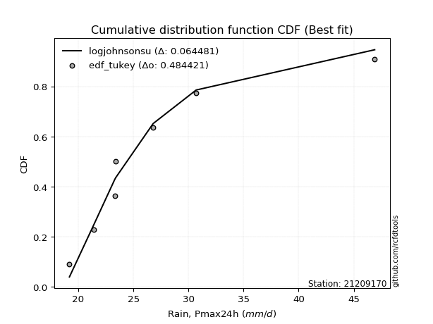</img></img>

</div>


### 8. Empirical - EDF Gringorten (1963)

Gringorten plotting position formula is essential for estimating the probability and return periods of extreme events like floods and heavy rainfall. The constant _a=0.44_.

<div align="center">


$P=(m-a)/(n+1-2a)$


</div>


**8.1. Empirical values**

<div align="center">

|                | 0                   | 1                   | 2                  | 3              | 4                  | 5                  | 6                  |
|:---------------|:--------------------|:--------------------|:-------------------|:---------------|:-------------------|:-------------------|:-------------------|
| date           | 2019                | 2018                | 2020               | 2021           | 2017               | 2016               | 2015               |
| x              | 19.2                | 21.4                | 23.3               | 23.4           | 26.8               | 30.7               | 46.9               |
| m              | 1                   | 2                   | 3                  | 4              | 5                  | 6                  | 7                  |
| empirical_dist | edf_gringorten      | edf_gringorten      | edf_gringorten     | edf_gringorten | edf_gringorten     | edf_gringorten     | edf_gringorten     |
| empirical      | 0.07865168539325844 | 0.21910112359550563 | 0.3595505617977528 | 0.5            | 0.6404494382022471 | 0.7808988764044943 | 0.9213483146067415 |
| empirical_tr   | 1.0853658536585364  | 1.2805755395683454  | 1.5614035087719298 | 2.0            | 2.781249999999999  | 4.564102564102562  | 12.714285714285701 |

</div>


**8.2. Kolmogorov-Smirnov fit test (sorted by Δ)**


<div align="center">

|                | 0                   | 1                   | 2                   | 3                   | 4                   | 5                   | 6                   | 7                   | 8                   | 9                   | 10                  | 11                  | 12                  | 13                  | 14                  | 15                  | 16                  | 17                  | 18                  | 19                  | 20                  | 21                  | 22                  | 23                  | 24                  | 25                  | 26                  | 27                  | 28                  | 29                  | 30                  | 31                  | 32                  | 33                  | 34                  | 35                  | 36                  | 37                  | 38                  | 39                  | 40                  | 41                  | 42                  | 43                  | 44                  | 45                  | 46                  | 47                  | 48                  | 49                  | 50                  | 51                  | 52                    | 53                  | 54                  | 55                  | 56                  | 57                  | 58                  | 59                  | 60                  | 61                  | 62                  | 63                  | 64                  | 65                  | 66                  | 67                  | 68                  | 69                  | 70                  | 71                  | 72                  | 73                  | 74                  | 75                  | 76                  | 77                  | 78                  | 79                  | 80                  | 81                  | 82                  | 83                  | 84                  | 85                  | 86                  | 87                  | 88                  | 89                  |
|:---------------|:--------------------|:--------------------|:--------------------|:--------------------|:--------------------|:--------------------|:--------------------|:--------------------|:--------------------|:--------------------|:--------------------|:--------------------|:--------------------|:--------------------|:--------------------|:--------------------|:--------------------|:--------------------|:--------------------|:--------------------|:--------------------|:--------------------|:--------------------|:--------------------|:--------------------|:--------------------|:--------------------|:--------------------|:--------------------|:--------------------|:--------------------|:--------------------|:--------------------|:--------------------|:--------------------|:--------------------|:--------------------|:--------------------|:--------------------|:--------------------|:--------------------|:--------------------|:--------------------|:--------------------|:--------------------|:--------------------|:--------------------|:--------------------|:--------------------|:--------------------|:--------------------|:--------------------|:----------------------|:--------------------|:--------------------|:--------------------|:--------------------|:--------------------|:--------------------|:--------------------|:--------------------|:--------------------|:--------------------|:--------------------|:--------------------|:--------------------|:--------------------|:--------------------|:--------------------|:--------------------|:--------------------|:--------------------|:--------------------|:--------------------|:--------------------|:--------------------|:--------------------|:--------------------|:--------------------|:--------------------|:--------------------|:--------------------|:--------------------|:--------------------|:--------------------|:--------------------|:--------------------|:--------------------|:--------------------|:--------------------|
| station        | 21209170            | 21209170            | 21209170            | 21209170            | 21209170            | 21209170            | 21209170            | 21209170            | 21209170            | 21209170            | 21209170            | 21209170            | 21209170            | 21209170            | 21209170            | 21209170            | 21209170            | 21209170            | 21209170            | 21209170            | 21209170            | 21209170            | 21209170            | 21209170            | 21209170            | 21209170            | 21209170            | 21209170            | 21209170            | 21209170            | 21209170            | 21209170            | 21209170            | 21209170            | 21209170            | 21209170            | 21209170            | 21209170            | 21209170            | 21209170            | 21209170            | 21209170            | 21209170            | 21209170            | 21209170            | 21209170            | 21209170            | 21209170            | 21209170            | 21209170            | 21209170            | 21209170            | 21209170              | 21209170            | 21209170            | 21209170            | 21209170            | 21209170            | 21209170            | 21209170            | 21209170            | 21209170            | 21209170            | 21209170            | 21209170            | 21209170            | 21209170            | 21209170            | 21209170            | 21209170            | 21209170            | 21209170            | 21209170            | 21209170            | 21209170            | 21209170            | 21209170            | 21209170            | 21209170            | 21209170            | 21209170            | 21209170            | 21209170            | 21209170            | 21209170            | 21209170            | 21209170            | 21209170            | 21209170            | 21209170            |
| empirical_dist | edf_gringorten      | edf_gringorten      | edf_gringorten      | edf_gringorten      | edf_gringorten      | edf_gringorten      | edf_gringorten      | edf_gringorten      | edf_gringorten      | edf_gringorten      | edf_gringorten      | edf_gringorten      | edf_gringorten      | edf_gringorten      | edf_gringorten      | edf_gringorten      | edf_gringorten      | edf_gringorten      | edf_gringorten      | edf_gringorten      | edf_gringorten      | edf_gringorten      | edf_gringorten      | edf_gringorten      | edf_gringorten      | edf_gringorten      | edf_gringorten      | edf_gringorten      | edf_gringorten      | edf_gringorten      | edf_gringorten      | edf_gringorten      | edf_gringorten      | edf_gringorten      | edf_gringorten      | edf_gringorten      | edf_gringorten      | edf_gringorten      | edf_gringorten      | edf_gringorten      | edf_gringorten      | edf_gringorten      | edf_gringorten      | edf_gringorten      | edf_gringorten      | edf_gringorten      | edf_gringorten      | edf_gringorten      | edf_gringorten      | edf_gringorten      | edf_gringorten      | edf_gringorten      | edf_gringorten        | edf_gringorten      | edf_gringorten      | edf_gringorten      | edf_gringorten      | edf_gringorten      | edf_gringorten      | edf_gringorten      | edf_gringorten      | edf_gringorten      | edf_gringorten      | edf_gringorten      | edf_gringorten      | edf_gringorten      | edf_gringorten      | edf_gringorten      | edf_gringorten      | edf_gringorten      | edf_gringorten      | edf_gringorten      | edf_gringorten      | edf_gringorten      | edf_gringorten      | edf_gringorten      | edf_gringorten      | edf_gringorten      | edf_gringorten      | edf_gringorten      | edf_gringorten      | edf_gringorten      | edf_gringorten      | edf_gringorten      | edf_gringorten      | edf_gringorten      | edf_gringorten      | edf_gringorten      | edf_gringorten      | edf_gringorten      |
| p_dist         | logjohnsonsu        | invgamma            | f                   | invweibull          | logfisk             | loginvgauss         | logexponnorm        | fisk                | logf                | loginvgamma         | alpha               | loginvweibull       | invgauss            | logmielke           | logfatiguelife      | johnsonsu           | loggenexpon         | logtruncnorm        | pareto              | loghalflogistic     | logalpha            | logt                | fatiguelife         | loghalfnorm         | lognct              | exponnorm           | laplace_asymmetric  | expon               | genexpon            | halflogistic        | wald                | logexpon            | logmoyal            | halfnorm            | logwald             | pearson3            | logpearson3         | lognakagami         | t                   | truncnorm           | loggumbel_r         | lograyleigh         | moyal               | logweibull_min      | loggenlogistic      | mielke              | logmaxwell          | rayleigh            | gumbel_r            | logkstwobign        | maxwell             | nct                 | loglaplace_asymmetric | betaprime           | genlogistic         | logncf              | logloggamma         | logcrystalball      | lognorm             | lognorm             | loggompertz         | logrice             | ncf                 | crystalball         | norm                | gamma               | loglogistic         | logbetaprime        | gibrat              | kstwobign           | loghypsecant        | logistic            | hypsecant           | rice                | loggibrat           | loggumbel_l         | loglaplace          | gumbel_l            | laplace             | logerlang           | gompertz            | logchi2             | loggamma            | loggamma            | weibull_min         | loglognorm          | logpareto           | nakagami            | erlang              | chi2                |
| delta          | 0.0676009228854123  | 0.06793191390391529 | 0.06810759786741338 | 0.06837977294639674 | 0.06937750095691142 | 0.0701309110049676  | 0.07194140508960956 | 0.07250494923165118 | 0.07275338754608252 | 0.07275351854436807 | 0.07471964333658998 | 0.07500409708985245 | 0.07524370826866228 | 0.07529595418828633 | 0.07639014112345516 | 0.077770105680251   | 0.0786513103576971  | 0.07865167277333773 | 0.07865168539325633 | 0.08089612386343026 | 0.0828159968239418  | 0.08322057133644611 | 0.08568442455701797 | 0.08660834123548816 | 0.09256478729822876 | 0.09753250592235718 | 0.09862020362581125 | 0.0986435068280852  | 0.09864533985837376 | 0.09916264626618132 | 0.1001940766628549  | 0.10088688825268344 | 0.10258960370010739 | 0.10285502575638934 | 0.1029186792377578  | 0.10796823263059724 | 0.10847019965818372 | 0.1123344821682547  | 0.11768305045839322 | 0.11785319876294453 | 0.11868470856075858 | 0.12040082073856373 | 0.1223821498589247  | 0.12345828939184755 | 0.12365708425502053 | 0.12509967246528464 | 0.1322763455550952  | 0.13530110604278212 | 0.13639726556104903 | 0.13897456668417618 | 0.14691893178055193 | 0.14913491984445043 | 0.1553652992529252    | 0.15769091533347462 | 0.16010275218096537 | 0.16014086402139238 | 0.16015528065120943 | 0.1633307322951597  | 0.1633307329232791  | 0.1633307329232791  | 0.17069147830167525 | 0.17374412923970467 | 0.17396763073463162 | 0.17692514306962392 | 0.1769251468268107  | 0.17790551350655492 | 0.18236121672036837 | 0.1844941457470819  | 0.18632392542325002 | 0.1886317590391039  | 0.1968796996091734  | 0.19693550611922517 | 0.21191104586579063 | 0.21668010489903877 | 0.2186845470915894  | 0.22110867609901397 | 0.22454690394970372 | 0.23799911392417017 | 0.2387918137823773  | 0.24110918347818977 | 0.267362859276824   | 0.2843544157487409  | 0.32716218129503427 | 0.32716218129503427 | 0.3889322414676456  | 0.408590053511922   | 0.41387105355096887 | 0.420978344200289   | 0.5522325943297101  | 0.6096520202895357  |
| deltao         | 0.48442053926100004 | 0.48442053926100004 | 0.48442053926100004 | 0.48442053926100004 | 0.48442053926100004 | 0.48442053926100004 | 0.48442053926100004 | 0.48442053926100004 | 0.48442053926100004 | 0.48442053926100004 | 0.48442053926100004 | 0.48442053926100004 | 0.48442053926100004 | 0.48442053926100004 | 0.48442053926100004 | 0.48442053926100004 | 0.48442053926100004 | 0.48442053926100004 | 0.48442053926100004 | 0.48442053926100004 | 0.48442053926100004 | 0.48442053926100004 | 0.48442053926100004 | 0.48442053926100004 | 0.48442053926100004 | 0.48442053926100004 | 0.48442053926100004 | 0.48442053926100004 | 0.48442053926100004 | 0.48442053926100004 | 0.48442053926100004 | 0.48442053926100004 | 0.48442053926100004 | 0.48442053926100004 | 0.48442053926100004 | 0.48442053926100004 | 0.48442053926100004 | 0.48442053926100004 | 0.48442053926100004 | 0.48442053926100004 | 0.48442053926100004 | 0.48442053926100004 | 0.48442053926100004 | 0.48442053926100004 | 0.48442053926100004 | 0.48442053926100004 | 0.48442053926100004 | 0.48442053926100004 | 0.48442053926100004 | 0.48442053926100004 | 0.48442053926100004 | 0.48442053926100004 | 0.48442053926100004   | 0.48442053926100004 | 0.48442053926100004 | 0.48442053926100004 | 0.48442053926100004 | 0.48442053926100004 | 0.48442053926100004 | 0.48442053926100004 | 0.48442053926100004 | 0.48442053926100004 | 0.48442053926100004 | 0.48442053926100004 | 0.48442053926100004 | 0.48442053926100004 | 0.48442053926100004 | 0.48442053926100004 | 0.48442053926100004 | 0.48442053926100004 | 0.48442053926100004 | 0.48442053926100004 | 0.48442053926100004 | 0.48442053926100004 | 0.48442053926100004 | 0.48442053926100004 | 0.48442053926100004 | 0.48442053926100004 | 0.48442053926100004 | 0.48442053926100004 | 0.48442053926100004 | 0.48442053926100004 | 0.48442053926100004 | 0.48442053926100004 | 0.48442053926100004 | 0.48442053926100004 | 0.48442053926100004 | 0.48442053926100004 | 0.48442053926100004 | 0.48442053926100004 |
| eval           | Δo > Δ              | Δo > Δ              | Δo > Δ              | Δo > Δ              | Δo > Δ              | Δo > Δ              | Δo > Δ              | Δo > Δ              | Δo > Δ              | Δo > Δ              | Δo > Δ              | Δo > Δ              | Δo > Δ              | Δo > Δ              | Δo > Δ              | Δo > Δ              | Δo > Δ              | Δo > Δ              | Δo > Δ              | Δo > Δ              | Δo > Δ              | Δo > Δ              | Δo > Δ              | Δo > Δ              | Δo > Δ              | Δo > Δ              | Δo > Δ              | Δo > Δ              | Δo > Δ              | Δo > Δ              | Δo > Δ              | Δo > Δ              | Δo > Δ              | Δo > Δ              | Δo > Δ              | Δo > Δ              | Δo > Δ              | Δo > Δ              | Δo > Δ              | Δo > Δ              | Δo > Δ              | Δo > Δ              | Δo > Δ              | Δo > Δ              | Δo > Δ              | Δo > Δ              | Δo > Δ              | Δo > Δ              | Δo > Δ              | Δo > Δ              | Δo > Δ              | Δo > Δ              | Δo > Δ                | Δo > Δ              | Δo > Δ              | Δo > Δ              | Δo > Δ              | Δo > Δ              | Δo > Δ              | Δo > Δ              | Δo > Δ              | Δo > Δ              | Δo > Δ              | Δo > Δ              | Δo > Δ              | Δo > Δ              | Δo > Δ              | Δo > Δ              | Δo > Δ              | Δo > Δ              | Δo > Δ              | Δo > Δ              | Δo > Δ              | Δo > Δ              | Δo > Δ              | Δo > Δ              | Δo > Δ              | Δo > Δ              | Δo > Δ              | Δo > Δ              | Δo > Δ              | Δo > Δ              | Δo > Δ              | Δo > Δ              | Δo > Δ              | Δo > Δ              | Δo > Δ              | Δo > Δ              | Δo <= Δ             | Δo <= Δ             |
| fit            | 1                   | 1                   | 1                   | 1                   | 1                   | 1                   | 1                   | 1                   | 1                   | 1                   | 1                   | 1                   | 1                   | 1                   | 1                   | 1                   | 1                   | 1                   | 1                   | 1                   | 1                   | 1                   | 1                   | 1                   | 1                   | 1                   | 1                   | 1                   | 1                   | 1                   | 1                   | 1                   | 1                   | 1                   | 1                   | 1                   | 1                   | 1                   | 1                   | 1                   | 1                   | 1                   | 1                   | 1                   | 1                   | 1                   | 1                   | 1                   | 1                   | 1                   | 1                   | 1                   | 1                     | 1                   | 1                   | 1                   | 1                   | 1                   | 1                   | 1                   | 1                   | 1                   | 1                   | 1                   | 1                   | 1                   | 1                   | 1                   | 1                   | 1                   | 1                   | 1                   | 1                   | 1                   | 1                   | 1                   | 1                   | 1                   | 1                   | 1                   | 1                   | 1                   | 1                   | 1                   | 1                   | 1                   | 1                   | 1                   | 0                   | 0                   |
| n              | 7                   | 7                   | 7                   | 7                   | 7                   | 7                   | 7                   | 7                   | 7                   | 7                   | 7                   | 7                   | 7                   | 7                   | 7                   | 7                   | 7                   | 7                   | 7                   | 7                   | 7                   | 7                   | 7                   | 7                   | 7                   | 7                   | 7                   | 7                   | 7                   | 7                   | 7                   | 7                   | 7                   | 7                   | 7                   | 7                   | 7                   | 7                   | 7                   | 7                   | 7                   | 7                   | 7                   | 7                   | 7                   | 7                   | 7                   | 7                   | 7                   | 7                   | 7                   | 7                   | 7                     | 7                   | 7                   | 7                   | 7                   | 7                   | 7                   | 7                   | 7                   | 7                   | 7                   | 7                   | 7                   | 7                   | 7                   | 7                   | 7                   | 7                   | 7                   | 7                   | 7                   | 7                   | 7                   | 7                   | 7                   | 7                   | 7                   | 7                   | 7                   | 7                   | 7                   | 7                   | 7                   | 7                   | 7                   | 7                   | 7                   | 7                   |
| best_fit       | 1                   | 0                   | 0                   | 0                   | 0                   | 0                   | 0                   | 0                   | 0                   | 0                   | 0                   | 0                   | 0                   | 0                   | 0                   | 0                   | 0                   | 0                   | 0                   | 0                   | 0                   | 0                   | 0                   | 0                   | 0                   | 0                   | 0                   | 0                   | 0                   | 0                   | 0                   | 0                   | 0                   | 0                   | 0                   | 0                   | 0                   | 0                   | 0                   | 0                   | 0                   | 0                   | 0                   | 0                   | 0                   | 0                   | 0                   | 0                   | 0                   | 0                   | 0                   | 0                   | 0                     | 0                   | 0                   | 0                   | 0                   | 0                   | 0                   | 0                   | 0                   | 0                   | 0                   | 0                   | 0                   | 0                   | 0                   | 0                   | 0                   | 0                   | 0                   | 0                   | 0                   | 0                   | 0                   | 0                   | 0                   | 0                   | 0                   | 0                   | 0                   | 0                   | 0                   | 0                   | 0                   | 0                   | 0                   | 0                   | 0                   | 0                   |
| best_fit_sort  | 1                   | 2                   | 3                   | 4                   | 5                   | 6                   | 7                   | 8                   | 9                   | 10                  | 11                  | 12                  | 13                  | 14                  | 15                  | 16                  | 17                  | 18                  | 19                  | 20                  | 21                  | 22                  | 23                  | 24                  | 25                  | 26                  | 27                  | 28                  | 29                  | 30                  | 31                  | 32                  | 33                  | 34                  | 35                  | 36                  | 37                  | 38                  | 39                  | 40                  | 41                  | 42                  | 43                  | 44                  | 45                  | 46                  | 47                  | 48                  | 49                  | 50                  | 51                  | 52                  | 53                    | 54                  | 55                  | 56                  | 57                  | 58                  | 59                  | 60                  | 61                  | 62                  | 63                  | 64                  | 65                  | 66                  | 67                  | 68                  | 69                  | 70                  | 71                  | 72                  | 73                  | 74                  | 75                  | 76                  | 77                  | 78                  | 79                  | 80                  | 81                  | 82                  | 83                  | 84                  | 85                  | 86                  | 87                  | 88                  | 89                  | 90                  |

</div>


<div align="center">

</img>

</div>


**8.3. Best fit**

<div align="center">

|   id |   station | empirical_dist   | p_dist       |     delta |   deltao | eval   |   fit |   n |   best_fit |   best_fit_sort |
|-----:|----------:|:-----------------|:-------------|----------:|---------:|:-------|------:|----:|-----------:|----------------:|
|    0 |  21209170 | edf_gringorten   | logjohnsonsu | 0.0676009 | 0.484421 | Δo > Δ |     1 |   7 |          1 |               1 |

</div>


<div align="center">

</img>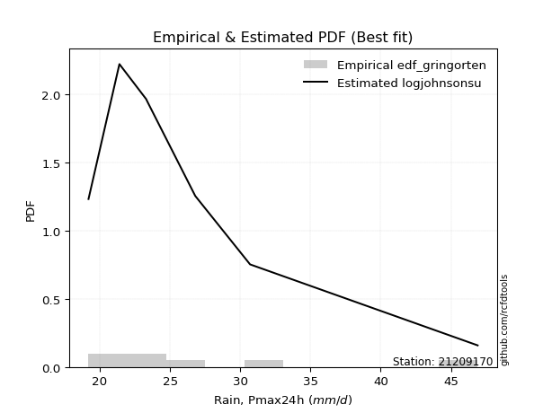</img>

</div>


### 9. Empirical - EDF Filliben (1975)

The specific values of the constants (0.3175) (often denoted as $alpha$) and (0.365) are derived from a method proposed by James J. Filliben in a 1975 paper. This particular formula is the mean value of the $i$-th order statistic of the normal distribution and is considered a robust and effective plotting position formula for the normal probability plot correlation coefficient test for normality.

<div align="center">


$P=(m-0.3175)/(n+0.365)$


</div>


**9.1. Empirical values**

<div align="center">

|                | 0                   | 1                   | 2                   | 3            | 4                  | 5                  | 6                  |
|:---------------|:--------------------|:--------------------|:--------------------|:-------------|:-------------------|:-------------------|:-------------------|
| date           | 2019                | 2018                | 2020                | 2021         | 2017               | 2016               | 2015               |
| x              | 19.2                | 21.4                | 23.3                | 23.4         | 26.8               | 30.7               | 46.9               |
| m              | 1                   | 2                   | 3                   | 4            | 5                  | 6                  | 7                  |
| empirical_dist | edf_filliben        | edf_filliben        | edf_filliben        | edf_filliben | edf_filliben       | edf_filliben       | edf_filliben       |
| empirical      | 0.09266802443991853 | 0.22844534962661237 | 0.36422267481330617 | 0.5          | 0.6357773251866938 | 0.7715546503733877 | 0.9073319755600815 |
| empirical_tr   | 1.1021324354657687  | 1.2960844698636163  | 1.5728777362520021  | 2.0          | 2.7455731593662627 | 4.377414561664191  | 10.791208791208794 |

</div>


**9.2. Kolmogorov-Smirnov fit test (sorted by Δ)**


<div align="center">

|                | 0                   | 1                   | 2                   | 3                   | 4                   | 5                   | 6                   | 7                   | 8                   | 9                   | 10                  | 11                  | 12                  | 13                  | 14                  | 15                  | 16                  | 17                  | 18                  | 19                  | 20                  | 21                  | 22                  | 23                  | 24                  | 25                  | 26                  | 27                  | 28                  | 29                  | 30                  | 31                  | 32                  | 33                  | 34                  | 35                  | 36                  | 37                  | 38                  | 39                  | 40                  | 41                  | 42                  | 43                  | 44                  | 45                  | 46                  | 47                  | 48                  | 49                  | 50                  | 51                  | 52                  | 53                    | 54                  | 55                  | 56                  | 57                  | 58                  | 59                  | 60                  | 61                  | 62                  | 63                  | 64                  | 65                  | 66                  | 67                  | 68                  | 69                  | 70                  | 71                  | 72                  | 73                  | 74                  | 75                  | 76                  | 77                  | 78                  | 79                  | 80                  | 81                  | 82                  | 83                  | 84                  | 85                  | 86                  | 87                  | 88                  | 89                  |
|:---------------|:--------------------|:--------------------|:--------------------|:--------------------|:--------------------|:--------------------|:--------------------|:--------------------|:--------------------|:--------------------|:--------------------|:--------------------|:--------------------|:--------------------|:--------------------|:--------------------|:--------------------|:--------------------|:--------------------|:--------------------|:--------------------|:--------------------|:--------------------|:--------------------|:--------------------|:--------------------|:--------------------|:--------------------|:--------------------|:--------------------|:--------------------|:--------------------|:--------------------|:--------------------|:--------------------|:--------------------|:--------------------|:--------------------|:--------------------|:--------------------|:--------------------|:--------------------|:--------------------|:--------------------|:--------------------|:--------------------|:--------------------|:--------------------|:--------------------|:--------------------|:--------------------|:--------------------|:--------------------|:----------------------|:--------------------|:--------------------|:--------------------|:--------------------|:--------------------|:--------------------|:--------------------|:--------------------|:--------------------|:--------------------|:--------------------|:--------------------|:--------------------|:--------------------|:--------------------|:--------------------|:--------------------|:--------------------|:--------------------|:--------------------|:--------------------|:--------------------|:--------------------|:--------------------|:--------------------|:--------------------|:--------------------|:--------------------|:--------------------|:--------------------|:--------------------|:--------------------|:--------------------|:--------------------|:--------------------|:--------------------|
| station        | 21209170            | 21209170            | 21209170            | 21209170            | 21209170            | 21209170            | 21209170            | 21209170            | 21209170            | 21209170            | 21209170            | 21209170            | 21209170            | 21209170            | 21209170            | 21209170            | 21209170            | 21209170            | 21209170            | 21209170            | 21209170            | 21209170            | 21209170            | 21209170            | 21209170            | 21209170            | 21209170            | 21209170            | 21209170            | 21209170            | 21209170            | 21209170            | 21209170            | 21209170            | 21209170            | 21209170            | 21209170            | 21209170            | 21209170            | 21209170            | 21209170            | 21209170            | 21209170            | 21209170            | 21209170            | 21209170            | 21209170            | 21209170            | 21209170            | 21209170            | 21209170            | 21209170            | 21209170            | 21209170              | 21209170            | 21209170            | 21209170            | 21209170            | 21209170            | 21209170            | 21209170            | 21209170            | 21209170            | 21209170            | 21209170            | 21209170            | 21209170            | 21209170            | 21209170            | 21209170            | 21209170            | 21209170            | 21209170            | 21209170            | 21209170            | 21209170            | 21209170            | 21209170            | 21209170            | 21209170            | 21209170            | 21209170            | 21209170            | 21209170            | 21209170            | 21209170            | 21209170            | 21209170            | 21209170            | 21209170            |
| empirical_dist | edf_filliben        | edf_filliben        | edf_filliben        | edf_filliben        | edf_filliben        | edf_filliben        | edf_filliben        | edf_filliben        | edf_filliben        | edf_filliben        | edf_filliben        | edf_filliben        | edf_filliben        | edf_filliben        | edf_filliben        | edf_filliben        | edf_filliben        | edf_filliben        | edf_filliben        | edf_filliben        | edf_filliben        | edf_filliben        | edf_filliben        | edf_filliben        | edf_filliben        | edf_filliben        | edf_filliben        | edf_filliben        | edf_filliben        | edf_filliben        | edf_filliben        | edf_filliben        | edf_filliben        | edf_filliben        | edf_filliben        | edf_filliben        | edf_filliben        | edf_filliben        | edf_filliben        | edf_filliben        | edf_filliben        | edf_filliben        | edf_filliben        | edf_filliben        | edf_filliben        | edf_filliben        | edf_filliben        | edf_filliben        | edf_filliben        | edf_filliben        | edf_filliben        | edf_filliben        | edf_filliben        | edf_filliben          | edf_filliben        | edf_filliben        | edf_filliben        | edf_filliben        | edf_filliben        | edf_filliben        | edf_filliben        | edf_filliben        | edf_filliben        | edf_filliben        | edf_filliben        | edf_filliben        | edf_filliben        | edf_filliben        | edf_filliben        | edf_filliben        | edf_filliben        | edf_filliben        | edf_filliben        | edf_filliben        | edf_filliben        | edf_filliben        | edf_filliben        | edf_filliben        | edf_filliben        | edf_filliben        | edf_filliben        | edf_filliben        | edf_filliben        | edf_filliben        | edf_filliben        | edf_filliben        | edf_filliben        | edf_filliben        | edf_filliben        | edf_filliben        |
| p_dist         | logjohnsonsu        | loginvgauss         | fisk                | invgamma            | f                   | invweibull          | logfisk             | invgauss            | logfatiguelife      | logexponnorm        | logf                | loginvgamma         | johnsonsu           | alpha               | loginvweibull       | logmielke           | loghalflogistic     | fatiguelife         | logalpha            | logt                | loghalfnorm         | lognct              | loggenexpon         | logtruncnorm        | pareto              | logexpon            | exponnorm           | laplace_asymmetric  | expon               | genexpon            | halflogistic        | wald                | halfnorm            | logmoyal            | lognakagami         | pearson3            | logpearson3         | logwald             | truncnorm           | loggumbel_r         | logweibull_min      | lograyleigh         | t                   | moyal               | loggenlogistic      | mielke              | logmaxwell          | rayleigh            | gumbel_r            | logkstwobign        | logncf              | maxwell             | nct                 | loglaplace_asymmetric | betaprime           | genlogistic         | logloggamma         | logcrystalball      | lognorm             | lognorm             | loggompertz         | gamma               | logrice             | ncf                 | crystalball         | norm                | loglogistic         | logbetaprime        | kstwobign           | gibrat              | loghypsecant        | logistic            | hypsecant           | rice                | loggumbel_l         | loglaplace          | loggibrat           | gumbel_l            | logerlang           | laplace             | gompertz            | logchi2             | loggamma            | loggamma            | weibull_min         | loglognorm          | logpareto           | nakagami            | erlang              | chi2                |
| delta          | 0.06448090439542814 | 0.06545879798941423 | 0.06783283621609781 | 0.06793191390391529 | 0.06810759786741338 | 0.06837977294639674 | 0.06937750095691142 | 0.07057159525310891 | 0.07171802810790179 | 0.07194140508960956 | 0.07275338754608252 | 0.07275351854436807 | 0.07309799266469763 | 0.07471964333658998 | 0.07500409708985245 | 0.07529595418828633 | 0.08089612386343026 | 0.0810123115414646  | 0.0828159968239418  | 0.08322057133644611 | 0.08660834123548816 | 0.09256478729822876 | 0.09266764940435719 | 0.09266801181999773 | 0.09266802443991642 | 0.09621477523713007 | 0.09753250592235718 | 0.09862020362581125 | 0.0986435068280852  | 0.09864533985837376 | 0.09916264626618132 | 0.1001940766628549  | 0.10228057142690111 | 0.10258960370010739 | 0.10629430295424219 | 0.10796823263059724 | 0.10847019965818372 | 0.11226290526886454 | 0.11785319876294453 | 0.11868470856075858 | 0.11878617637629418 | 0.12040082073856373 | 0.12235516347394648 | 0.1223821498589247  | 0.12365708425502053 | 0.12509967246528464 | 0.1322763455550952  | 0.13530110604278212 | 0.13639726556104903 | 0.13897456668417618 | 0.1461245249747323  | 0.14691893178055193 | 0.14913491984445043 | 0.1553652992529252    | 0.15769091533347462 | 0.16010275218096537 | 0.16015528065120943 | 0.1633307322951597  | 0.1633307329232791  | 0.1633307329232791  | 0.17069147830167525 | 0.17323340049100155 | 0.17374412923970467 | 0.17396763073463162 | 0.17692514306962392 | 0.1769251468268107  | 0.18236121672036837 | 0.1844941457470819  | 0.1886317590391039  | 0.19566815145435676 | 0.1968796996091734  | 0.19693550611922517 | 0.21191104586579063 | 0.21668010489903877 | 0.22110867609901397 | 0.22454690394970372 | 0.22802877312269615 | 0.2333270009086169  | 0.2364370704626364  | 0.2387918137823773  | 0.267362859276824   | 0.27501018971763425 | 0.3224900682794809  | 0.3224900682794809  | 0.37958801543653886 | 0.3992458274808153  | 0.40452682751986213 | 0.4116341181691823  | 0.5428883682986033  | 0.600307794258429   |
| deltao         | 0.48442053926100004 | 0.48442053926100004 | 0.48442053926100004 | 0.48442053926100004 | 0.48442053926100004 | 0.48442053926100004 | 0.48442053926100004 | 0.48442053926100004 | 0.48442053926100004 | 0.48442053926100004 | 0.48442053926100004 | 0.48442053926100004 | 0.48442053926100004 | 0.48442053926100004 | 0.48442053926100004 | 0.48442053926100004 | 0.48442053926100004 | 0.48442053926100004 | 0.48442053926100004 | 0.48442053926100004 | 0.48442053926100004 | 0.48442053926100004 | 0.48442053926100004 | 0.48442053926100004 | 0.48442053926100004 | 0.48442053926100004 | 0.48442053926100004 | 0.48442053926100004 | 0.48442053926100004 | 0.48442053926100004 | 0.48442053926100004 | 0.48442053926100004 | 0.48442053926100004 | 0.48442053926100004 | 0.48442053926100004 | 0.48442053926100004 | 0.48442053926100004 | 0.48442053926100004 | 0.48442053926100004 | 0.48442053926100004 | 0.48442053926100004 | 0.48442053926100004 | 0.48442053926100004 | 0.48442053926100004 | 0.48442053926100004 | 0.48442053926100004 | 0.48442053926100004 | 0.48442053926100004 | 0.48442053926100004 | 0.48442053926100004 | 0.48442053926100004 | 0.48442053926100004 | 0.48442053926100004 | 0.48442053926100004   | 0.48442053926100004 | 0.48442053926100004 | 0.48442053926100004 | 0.48442053926100004 | 0.48442053926100004 | 0.48442053926100004 | 0.48442053926100004 | 0.48442053926100004 | 0.48442053926100004 | 0.48442053926100004 | 0.48442053926100004 | 0.48442053926100004 | 0.48442053926100004 | 0.48442053926100004 | 0.48442053926100004 | 0.48442053926100004 | 0.48442053926100004 | 0.48442053926100004 | 0.48442053926100004 | 0.48442053926100004 | 0.48442053926100004 | 0.48442053926100004 | 0.48442053926100004 | 0.48442053926100004 | 0.48442053926100004 | 0.48442053926100004 | 0.48442053926100004 | 0.48442053926100004 | 0.48442053926100004 | 0.48442053926100004 | 0.48442053926100004 | 0.48442053926100004 | 0.48442053926100004 | 0.48442053926100004 | 0.48442053926100004 | 0.48442053926100004 |
| eval           | Δo > Δ              | Δo > Δ              | Δo > Δ              | Δo > Δ              | Δo > Δ              | Δo > Δ              | Δo > Δ              | Δo > Δ              | Δo > Δ              | Δo > Δ              | Δo > Δ              | Δo > Δ              | Δo > Δ              | Δo > Δ              | Δo > Δ              | Δo > Δ              | Δo > Δ              | Δo > Δ              | Δo > Δ              | Δo > Δ              | Δo > Δ              | Δo > Δ              | Δo > Δ              | Δo > Δ              | Δo > Δ              | Δo > Δ              | Δo > Δ              | Δo > Δ              | Δo > Δ              | Δo > Δ              | Δo > Δ              | Δo > Δ              | Δo > Δ              | Δo > Δ              | Δo > Δ              | Δo > Δ              | Δo > Δ              | Δo > Δ              | Δo > Δ              | Δo > Δ              | Δo > Δ              | Δo > Δ              | Δo > Δ              | Δo > Δ              | Δo > Δ              | Δo > Δ              | Δo > Δ              | Δo > Δ              | Δo > Δ              | Δo > Δ              | Δo > Δ              | Δo > Δ              | Δo > Δ              | Δo > Δ                | Δo > Δ              | Δo > Δ              | Δo > Δ              | Δo > Δ              | Δo > Δ              | Δo > Δ              | Δo > Δ              | Δo > Δ              | Δo > Δ              | Δo > Δ              | Δo > Δ              | Δo > Δ              | Δo > Δ              | Δo > Δ              | Δo > Δ              | Δo > Δ              | Δo > Δ              | Δo > Δ              | Δo > Δ              | Δo > Δ              | Δo > Δ              | Δo > Δ              | Δo > Δ              | Δo > Δ              | Δo > Δ              | Δo > Δ              | Δo > Δ              | Δo > Δ              | Δo > Δ              | Δo > Δ              | Δo > Δ              | Δo > Δ              | Δo > Δ              | Δo > Δ              | Δo <= Δ             | Δo <= Δ             |
| fit            | 1                   | 1                   | 1                   | 1                   | 1                   | 1                   | 1                   | 1                   | 1                   | 1                   | 1                   | 1                   | 1                   | 1                   | 1                   | 1                   | 1                   | 1                   | 1                   | 1                   | 1                   | 1                   | 1                   | 1                   | 1                   | 1                   | 1                   | 1                   | 1                   | 1                   | 1                   | 1                   | 1                   | 1                   | 1                   | 1                   | 1                   | 1                   | 1                   | 1                   | 1                   | 1                   | 1                   | 1                   | 1                   | 1                   | 1                   | 1                   | 1                   | 1                   | 1                   | 1                   | 1                   | 1                     | 1                   | 1                   | 1                   | 1                   | 1                   | 1                   | 1                   | 1                   | 1                   | 1                   | 1                   | 1                   | 1                   | 1                   | 1                   | 1                   | 1                   | 1                   | 1                   | 1                   | 1                   | 1                   | 1                   | 1                   | 1                   | 1                   | 1                   | 1                   | 1                   | 1                   | 1                   | 1                   | 1                   | 1                   | 0                   | 0                   |
| n              | 7                   | 7                   | 7                   | 7                   | 7                   | 7                   | 7                   | 7                   | 7                   | 7                   | 7                   | 7                   | 7                   | 7                   | 7                   | 7                   | 7                   | 7                   | 7                   | 7                   | 7                   | 7                   | 7                   | 7                   | 7                   | 7                   | 7                   | 7                   | 7                   | 7                   | 7                   | 7                   | 7                   | 7                   | 7                   | 7                   | 7                   | 7                   | 7                   | 7                   | 7                   | 7                   | 7                   | 7                   | 7                   | 7                   | 7                   | 7                   | 7                   | 7                   | 7                   | 7                   | 7                   | 7                     | 7                   | 7                   | 7                   | 7                   | 7                   | 7                   | 7                   | 7                   | 7                   | 7                   | 7                   | 7                   | 7                   | 7                   | 7                   | 7                   | 7                   | 7                   | 7                   | 7                   | 7                   | 7                   | 7                   | 7                   | 7                   | 7                   | 7                   | 7                   | 7                   | 7                   | 7                   | 7                   | 7                   | 7                   | 7                   | 7                   |
| best_fit       | 1                   | 0                   | 0                   | 0                   | 0                   | 0                   | 0                   | 0                   | 0                   | 0                   | 0                   | 0                   | 0                   | 0                   | 0                   | 0                   | 0                   | 0                   | 0                   | 0                   | 0                   | 0                   | 0                   | 0                   | 0                   | 0                   | 0                   | 0                   | 0                   | 0                   | 0                   | 0                   | 0                   | 0                   | 0                   | 0                   | 0                   | 0                   | 0                   | 0                   | 0                   | 0                   | 0                   | 0                   | 0                   | 0                   | 0                   | 0                   | 0                   | 0                   | 0                   | 0                   | 0                   | 0                     | 0                   | 0                   | 0                   | 0                   | 0                   | 0                   | 0                   | 0                   | 0                   | 0                   | 0                   | 0                   | 0                   | 0                   | 0                   | 0                   | 0                   | 0                   | 0                   | 0                   | 0                   | 0                   | 0                   | 0                   | 0                   | 0                   | 0                   | 0                   | 0                   | 0                   | 0                   | 0                   | 0                   | 0                   | 0                   | 0                   |
| best_fit_sort  | 1                   | 2                   | 3                   | 4                   | 5                   | 6                   | 7                   | 8                   | 9                   | 10                  | 11                  | 12                  | 13                  | 14                  | 15                  | 16                  | 17                  | 18                  | 19                  | 20                  | 21                  | 22                  | 23                  | 24                  | 25                  | 26                  | 27                  | 28                  | 29                  | 30                  | 31                  | 32                  | 33                  | 34                  | 35                  | 36                  | 37                  | 38                  | 39                  | 40                  | 41                  | 42                  | 43                  | 44                  | 45                  | 46                  | 47                  | 48                  | 49                  | 50                  | 51                  | 52                  | 53                  | 54                    | 55                  | 56                  | 57                  | 58                  | 59                  | 60                  | 61                  | 62                  | 63                  | 64                  | 65                  | 66                  | 67                  | 68                  | 69                  | 70                  | 71                  | 72                  | 73                  | 74                  | 75                  | 76                  | 77                  | 78                  | 79                  | 80                  | 81                  | 82                  | 83                  | 84                  | 85                  | 86                  | 87                  | 88                  | 89                  | 90                  |

</div>


<div align="center">

</img>

</div>


**9.3. Best fit**

<div align="center">

|   id |   station | empirical_dist   | p_dist       |     delta |   deltao | eval   |   fit |   n |   best_fit |   best_fit_sort |
|-----:|----------:|:-----------------|:-------------|----------:|---------:|:-------|------:|----:|-----------:|----------------:|
|    0 |  21209170 | edf_filliben     | logjohnsonsu | 0.0644809 | 0.484421 | Δo > Δ |     1 |   7 |          1 |               1 |

</div>


<div align="center">

</img></img>

</div>


### 10. Empirical - EDF Jenkinson (1977)

The Jenkinson formula in hydrology is an empirical plotting position formula used to estimate the non-exceedance probability _(P)_ or return period _(T)_ of a given ordered observation within a sample. It is a widely used method in the frequency analysis of extreme events such as floods and rainfall, as it provides a distribution-free way to plot data. _a≈0.31_ and _b≈0.38_ are constants derived to approximate the median of the probability distribution for the given rank.

<div align="center">


$P=(m-a)/(n+b)$


</div>


**10.1. Empirical values**

<div align="center">

|                | 0                   | 1                   | 2                   | 3             | 4                  | 5                  | 6                  |
|:---------------|:--------------------|:--------------------|:--------------------|:--------------|:-------------------|:-------------------|:-------------------|
| date           | 2019                | 2018                | 2020                | 2021          | 2017               | 2016               | 2015               |
| x              | 19.2                | 21.4                | 23.3                | 23.4          | 26.8               | 30.7               | 46.9               |
| m              | 1                   | 2                   | 3                   | 4             | 5                  | 6                  | 7                  |
| empirical_dist | edf_jenkinson       | edf_jenkinson       | edf_jenkinson       | edf_jenkinson | edf_jenkinson      | edf_jenkinson      | edf_jenkinson      |
| empirical      | 0.09349593495934959 | 0.22899728997289973 | 0.36449864498644985 | 0.5           | 0.6355013550135502 | 0.7710027100271003 | 0.9065040650406505 |
| empirical_tr   | 1.1031390134529149  | 1.29701230228471    | 1.5735607675906182  | 2.0           | 2.743494423791822  | 4.366863905325444  | 10.695652173913055 |

</div>


**10.2. Kolmogorov-Smirnov fit test (sorted by Δ)**


<div align="center">

|                | 0                   | 1                   | 2                   | 3                   | 4                   | 5                   | 6                   | 7                   | 8                   | 9                   | 10                  | 11                  | 12                  | 13                  | 14                  | 15                  | 16                  | 17                  | 18                  | 19                  | 20                  | 21                  | 22                  | 23                  | 24                  | 25                  | 26                  | 27                  | 28                  | 29                  | 30                  | 31                  | 32                  | 33                  | 34                  | 35                  | 36                  | 37                  | 38                  | 39                  | 40                  | 41                  | 42                  | 43                  | 44                  | 45                  | 46                  | 47                  | 48                  | 49                  | 50                  | 51                  | 52                  | 53                    | 54                  | 55                  | 56                  | 57                  | 58                  | 59                  | 60                  | 61                  | 62                  | 63                  | 64                  | 65                  | 66                  | 67                  | 68                  | 69                  | 70                  | 71                  | 72                  | 73                  | 74                  | 75                  | 76                  | 77                  | 78                  | 79                  | 80                  | 81                  | 82                  | 83                  | 84                  | 85                  | 86                  | 87                  | 88                  | 89                  |
|:---------------|:--------------------|:--------------------|:--------------------|:--------------------|:--------------------|:--------------------|:--------------------|:--------------------|:--------------------|:--------------------|:--------------------|:--------------------|:--------------------|:--------------------|:--------------------|:--------------------|:--------------------|:--------------------|:--------------------|:--------------------|:--------------------|:--------------------|:--------------------|:--------------------|:--------------------|:--------------------|:--------------------|:--------------------|:--------------------|:--------------------|:--------------------|:--------------------|:--------------------|:--------------------|:--------------------|:--------------------|:--------------------|:--------------------|:--------------------|:--------------------|:--------------------|:--------------------|:--------------------|:--------------------|:--------------------|:--------------------|:--------------------|:--------------------|:--------------------|:--------------------|:--------------------|:--------------------|:--------------------|:----------------------|:--------------------|:--------------------|:--------------------|:--------------------|:--------------------|:--------------------|:--------------------|:--------------------|:--------------------|:--------------------|:--------------------|:--------------------|:--------------------|:--------------------|:--------------------|:--------------------|:--------------------|:--------------------|:--------------------|:--------------------|:--------------------|:--------------------|:--------------------|:--------------------|:--------------------|:--------------------|:--------------------|:--------------------|:--------------------|:--------------------|:--------------------|:--------------------|:--------------------|:--------------------|:--------------------|:--------------------|
| station        | 21209170            | 21209170            | 21209170            | 21209170            | 21209170            | 21209170            | 21209170            | 21209170            | 21209170            | 21209170            | 21209170            | 21209170            | 21209170            | 21209170            | 21209170            | 21209170            | 21209170            | 21209170            | 21209170            | 21209170            | 21209170            | 21209170            | 21209170            | 21209170            | 21209170            | 21209170            | 21209170            | 21209170            | 21209170            | 21209170            | 21209170            | 21209170            | 21209170            | 21209170            | 21209170            | 21209170            | 21209170            | 21209170            | 21209170            | 21209170            | 21209170            | 21209170            | 21209170            | 21209170            | 21209170            | 21209170            | 21209170            | 21209170            | 21209170            | 21209170            | 21209170            | 21209170            | 21209170            | 21209170              | 21209170            | 21209170            | 21209170            | 21209170            | 21209170            | 21209170            | 21209170            | 21209170            | 21209170            | 21209170            | 21209170            | 21209170            | 21209170            | 21209170            | 21209170            | 21209170            | 21209170            | 21209170            | 21209170            | 21209170            | 21209170            | 21209170            | 21209170            | 21209170            | 21209170            | 21209170            | 21209170            | 21209170            | 21209170            | 21209170            | 21209170            | 21209170            | 21209170            | 21209170            | 21209170            | 21209170            |
| empirical_dist | edf_jenkinson       | edf_jenkinson       | edf_jenkinson       | edf_jenkinson       | edf_jenkinson       | edf_jenkinson       | edf_jenkinson       | edf_jenkinson       | edf_jenkinson       | edf_jenkinson       | edf_jenkinson       | edf_jenkinson       | edf_jenkinson       | edf_jenkinson       | edf_jenkinson       | edf_jenkinson       | edf_jenkinson       | edf_jenkinson       | edf_jenkinson       | edf_jenkinson       | edf_jenkinson       | edf_jenkinson       | edf_jenkinson       | edf_jenkinson       | edf_jenkinson       | edf_jenkinson       | edf_jenkinson       | edf_jenkinson       | edf_jenkinson       | edf_jenkinson       | edf_jenkinson       | edf_jenkinson       | edf_jenkinson       | edf_jenkinson       | edf_jenkinson       | edf_jenkinson       | edf_jenkinson       | edf_jenkinson       | edf_jenkinson       | edf_jenkinson       | edf_jenkinson       | edf_jenkinson       | edf_jenkinson       | edf_jenkinson       | edf_jenkinson       | edf_jenkinson       | edf_jenkinson       | edf_jenkinson       | edf_jenkinson       | edf_jenkinson       | edf_jenkinson       | edf_jenkinson       | edf_jenkinson       | edf_jenkinson         | edf_jenkinson       | edf_jenkinson       | edf_jenkinson       | edf_jenkinson       | edf_jenkinson       | edf_jenkinson       | edf_jenkinson       | edf_jenkinson       | edf_jenkinson       | edf_jenkinson       | edf_jenkinson       | edf_jenkinson       | edf_jenkinson       | edf_jenkinson       | edf_jenkinson       | edf_jenkinson       | edf_jenkinson       | edf_jenkinson       | edf_jenkinson       | edf_jenkinson       | edf_jenkinson       | edf_jenkinson       | edf_jenkinson       | edf_jenkinson       | edf_jenkinson       | edf_jenkinson       | edf_jenkinson       | edf_jenkinson       | edf_jenkinson       | edf_jenkinson       | edf_jenkinson       | edf_jenkinson       | edf_jenkinson       | edf_jenkinson       | edf_jenkinson       | edf_jenkinson       |
| p_dist         | logjohnsonsu        | loginvgauss         | fisk                | invgamma            | f                   | invweibull          | logfisk             | invgauss            | logfatiguelife      | logexponnorm        | logf                | loginvgamma         | johnsonsu           | alpha               | loginvweibull       | logmielke           | fatiguelife         | loghalflogistic     | logalpha            | logt                | loghalfnorm         | lognct              | loggenexpon         | logtruncnorm        | pareto              | logexpon            | exponnorm           | laplace_asymmetric  | expon               | genexpon            | halflogistic        | wald                | halfnorm            | logmoyal            | lognakagami         | pearson3            | logpearson3         | logwald             | truncnorm           | logweibull_min      | loggumbel_r         | lograyleigh         | moyal               | t                   | loggenlogistic      | mielke              | logmaxwell          | rayleigh            | gumbel_r            | logkstwobign        | logncf              | maxwell             | nct                 | loglaplace_asymmetric | betaprime           | genlogistic         | logloggamma         | logcrystalball      | lognorm             | lognorm             | loggompertz         | gamma               | logrice             | ncf                 | crystalball         | norm                | loglogistic         | logbetaprime        | kstwobign           | gibrat              | loghypsecant        | logistic            | hypsecant           | rice                | loggumbel_l         | loglaplace          | loggibrat           | gumbel_l            | logerlang           | laplace             | gompertz            | logchi2             | loggamma            | loggamma            | weibull_min         | loglognorm          | logpareto           | nakagami            | erlang              | chi2                |
| delta          | 0.06448090439542814 | 0.06518282781627055 | 0.06755686604295413 | 0.06793191390391529 | 0.06810759786741338 | 0.06837977294639674 | 0.06937750095691142 | 0.07029562507996523 | 0.07144205793475811 | 0.07194140508960956 | 0.07275338754608252 | 0.07275351854436807 | 0.07282202249155395 | 0.07471964333658998 | 0.07500409708985245 | 0.07529595418828633 | 0.08073634136832092 | 0.08089612386343026 | 0.0828159968239418  | 0.08322057133644611 | 0.08660834123548816 | 0.09256478729822876 | 0.09349555992378825 | 0.09349592233942872 | 0.09349593495934748 | 0.09593880506398639 | 0.09753250592235718 | 0.09862020362581125 | 0.0986435068280852  | 0.09864533985837376 | 0.09916264626618132 | 0.1001940766628549  | 0.10228057142690111 | 0.10258960370010739 | 0.10629430295424219 | 0.10796823263059724 | 0.10847019965818372 | 0.1128148456151519  | 0.11785319876294453 | 0.1185102062031505  | 0.11868470856075858 | 0.12040082073856373 | 0.1223821498589247  | 0.12263113364709011 | 0.12365708425502053 | 0.12509967246528464 | 0.1322763455550952  | 0.13530110604278212 | 0.13639726556104903 | 0.13897456668417618 | 0.14529661445530123 | 0.14691893178055193 | 0.14913491984445043 | 0.1553652992529252    | 0.15769091533347462 | 0.16010275218096537 | 0.16015528065120943 | 0.1633307322951597  | 0.1633307329232791  | 0.1633307329232791  | 0.17069147830167525 | 0.17295743031785787 | 0.17374412923970467 | 0.17396763073463162 | 0.17692514306962392 | 0.1769251468268107  | 0.18236121672036837 | 0.1844941457470819  | 0.1886317590391039  | 0.19622009180064412 | 0.1968796996091734  | 0.19693550611922517 | 0.21191104586579063 | 0.21668010489903877 | 0.22110867609901397 | 0.22454690394970372 | 0.2285807134689835  | 0.23305103073547329 | 0.23616110028949272 | 0.2387918137823773  | 0.267362859276824   | 0.2744582493713469  | 0.3222140981063372  | 0.3222140981063372  | 0.3790360750902515  | 0.3986938871345279  | 0.40397488717357477 | 0.4110821778228949  | 0.542336427952316   | 0.5997558539121416  |
| deltao         | 0.48442053926100004 | 0.48442053926100004 | 0.48442053926100004 | 0.48442053926100004 | 0.48442053926100004 | 0.48442053926100004 | 0.48442053926100004 | 0.48442053926100004 | 0.48442053926100004 | 0.48442053926100004 | 0.48442053926100004 | 0.48442053926100004 | 0.48442053926100004 | 0.48442053926100004 | 0.48442053926100004 | 0.48442053926100004 | 0.48442053926100004 | 0.48442053926100004 | 0.48442053926100004 | 0.48442053926100004 | 0.48442053926100004 | 0.48442053926100004 | 0.48442053926100004 | 0.48442053926100004 | 0.48442053926100004 | 0.48442053926100004 | 0.48442053926100004 | 0.48442053926100004 | 0.48442053926100004 | 0.48442053926100004 | 0.48442053926100004 | 0.48442053926100004 | 0.48442053926100004 | 0.48442053926100004 | 0.48442053926100004 | 0.48442053926100004 | 0.48442053926100004 | 0.48442053926100004 | 0.48442053926100004 | 0.48442053926100004 | 0.48442053926100004 | 0.48442053926100004 | 0.48442053926100004 | 0.48442053926100004 | 0.48442053926100004 | 0.48442053926100004 | 0.48442053926100004 | 0.48442053926100004 | 0.48442053926100004 | 0.48442053926100004 | 0.48442053926100004 | 0.48442053926100004 | 0.48442053926100004 | 0.48442053926100004   | 0.48442053926100004 | 0.48442053926100004 | 0.48442053926100004 | 0.48442053926100004 | 0.48442053926100004 | 0.48442053926100004 | 0.48442053926100004 | 0.48442053926100004 | 0.48442053926100004 | 0.48442053926100004 | 0.48442053926100004 | 0.48442053926100004 | 0.48442053926100004 | 0.48442053926100004 | 0.48442053926100004 | 0.48442053926100004 | 0.48442053926100004 | 0.48442053926100004 | 0.48442053926100004 | 0.48442053926100004 | 0.48442053926100004 | 0.48442053926100004 | 0.48442053926100004 | 0.48442053926100004 | 0.48442053926100004 | 0.48442053926100004 | 0.48442053926100004 | 0.48442053926100004 | 0.48442053926100004 | 0.48442053926100004 | 0.48442053926100004 | 0.48442053926100004 | 0.48442053926100004 | 0.48442053926100004 | 0.48442053926100004 | 0.48442053926100004 |
| eval           | Δo > Δ              | Δo > Δ              | Δo > Δ              | Δo > Δ              | Δo > Δ              | Δo > Δ              | Δo > Δ              | Δo > Δ              | Δo > Δ              | Δo > Δ              | Δo > Δ              | Δo > Δ              | Δo > Δ              | Δo > Δ              | Δo > Δ              | Δo > Δ              | Δo > Δ              | Δo > Δ              | Δo > Δ              | Δo > Δ              | Δo > Δ              | Δo > Δ              | Δo > Δ              | Δo > Δ              | Δo > Δ              | Δo > Δ              | Δo > Δ              | Δo > Δ              | Δo > Δ              | Δo > Δ              | Δo > Δ              | Δo > Δ              | Δo > Δ              | Δo > Δ              | Δo > Δ              | Δo > Δ              | Δo > Δ              | Δo > Δ              | Δo > Δ              | Δo > Δ              | Δo > Δ              | Δo > Δ              | Δo > Δ              | Δo > Δ              | Δo > Δ              | Δo > Δ              | Δo > Δ              | Δo > Δ              | Δo > Δ              | Δo > Δ              | Δo > Δ              | Δo > Δ              | Δo > Δ              | Δo > Δ                | Δo > Δ              | Δo > Δ              | Δo > Δ              | Δo > Δ              | Δo > Δ              | Δo > Δ              | Δo > Δ              | Δo > Δ              | Δo > Δ              | Δo > Δ              | Δo > Δ              | Δo > Δ              | Δo > Δ              | Δo > Δ              | Δo > Δ              | Δo > Δ              | Δo > Δ              | Δo > Δ              | Δo > Δ              | Δo > Δ              | Δo > Δ              | Δo > Δ              | Δo > Δ              | Δo > Δ              | Δo > Δ              | Δo > Δ              | Δo > Δ              | Δo > Δ              | Δo > Δ              | Δo > Δ              | Δo > Δ              | Δo > Δ              | Δo > Δ              | Δo > Δ              | Δo <= Δ             | Δo <= Δ             |
| fit            | 1                   | 1                   | 1                   | 1                   | 1                   | 1                   | 1                   | 1                   | 1                   | 1                   | 1                   | 1                   | 1                   | 1                   | 1                   | 1                   | 1                   | 1                   | 1                   | 1                   | 1                   | 1                   | 1                   | 1                   | 1                   | 1                   | 1                   | 1                   | 1                   | 1                   | 1                   | 1                   | 1                   | 1                   | 1                   | 1                   | 1                   | 1                   | 1                   | 1                   | 1                   | 1                   | 1                   | 1                   | 1                   | 1                   | 1                   | 1                   | 1                   | 1                   | 1                   | 1                   | 1                   | 1                     | 1                   | 1                   | 1                   | 1                   | 1                   | 1                   | 1                   | 1                   | 1                   | 1                   | 1                   | 1                   | 1                   | 1                   | 1                   | 1                   | 1                   | 1                   | 1                   | 1                   | 1                   | 1                   | 1                   | 1                   | 1                   | 1                   | 1                   | 1                   | 1                   | 1                   | 1                   | 1                   | 1                   | 1                   | 0                   | 0                   |
| n              | 7                   | 7                   | 7                   | 7                   | 7                   | 7                   | 7                   | 7                   | 7                   | 7                   | 7                   | 7                   | 7                   | 7                   | 7                   | 7                   | 7                   | 7                   | 7                   | 7                   | 7                   | 7                   | 7                   | 7                   | 7                   | 7                   | 7                   | 7                   | 7                   | 7                   | 7                   | 7                   | 7                   | 7                   | 7                   | 7                   | 7                   | 7                   | 7                   | 7                   | 7                   | 7                   | 7                   | 7                   | 7                   | 7                   | 7                   | 7                   | 7                   | 7                   | 7                   | 7                   | 7                   | 7                     | 7                   | 7                   | 7                   | 7                   | 7                   | 7                   | 7                   | 7                   | 7                   | 7                   | 7                   | 7                   | 7                   | 7                   | 7                   | 7                   | 7                   | 7                   | 7                   | 7                   | 7                   | 7                   | 7                   | 7                   | 7                   | 7                   | 7                   | 7                   | 7                   | 7                   | 7                   | 7                   | 7                   | 7                   | 7                   | 7                   |
| best_fit       | 1                   | 0                   | 0                   | 0                   | 0                   | 0                   | 0                   | 0                   | 0                   | 0                   | 0                   | 0                   | 0                   | 0                   | 0                   | 0                   | 0                   | 0                   | 0                   | 0                   | 0                   | 0                   | 0                   | 0                   | 0                   | 0                   | 0                   | 0                   | 0                   | 0                   | 0                   | 0                   | 0                   | 0                   | 0                   | 0                   | 0                   | 0                   | 0                   | 0                   | 0                   | 0                   | 0                   | 0                   | 0                   | 0                   | 0                   | 0                   | 0                   | 0                   | 0                   | 0                   | 0                   | 0                     | 0                   | 0                   | 0                   | 0                   | 0                   | 0                   | 0                   | 0                   | 0                   | 0                   | 0                   | 0                   | 0                   | 0                   | 0                   | 0                   | 0                   | 0                   | 0                   | 0                   | 0                   | 0                   | 0                   | 0                   | 0                   | 0                   | 0                   | 0                   | 0                   | 0                   | 0                   | 0                   | 0                   | 0                   | 0                   | 0                   |
| best_fit_sort  | 1                   | 2                   | 3                   | 4                   | 5                   | 6                   | 7                   | 8                   | 9                   | 10                  | 11                  | 12                  | 13                  | 14                  | 15                  | 16                  | 17                  | 18                  | 19                  | 20                  | 21                  | 22                  | 23                  | 24                  | 25                  | 26                  | 27                  | 28                  | 29                  | 30                  | 31                  | 32                  | 33                  | 34                  | 35                  | 36                  | 37                  | 38                  | 39                  | 40                  | 41                  | 42                  | 43                  | 44                  | 45                  | 46                  | 47                  | 48                  | 49                  | 50                  | 51                  | 52                  | 53                  | 54                    | 55                  | 56                  | 57                  | 58                  | 59                  | 60                  | 61                  | 62                  | 63                  | 64                  | 65                  | 66                  | 67                  | 68                  | 69                  | 70                  | 71                  | 72                  | 73                  | 74                  | 75                  | 76                  | 77                  | 78                  | 79                  | 80                  | 81                  | 82                  | 83                  | 84                  | 85                  | 86                  | 87                  | 88                  | 89                  | 90                  |

</div>


<div align="center">

</img>

</div>


**10.3. Best fit**

<div align="center">

|   id |   station | empirical_dist   | p_dist       |     delta |   deltao | eval   |   fit |   n |   best_fit |   best_fit_sort |
|-----:|----------:|:-----------------|:-------------|----------:|---------:|:-------|------:|----:|-----------:|----------------:|
|    0 |  21209170 | edf_jenkinson    | logjohnsonsu | 0.0644809 | 0.484421 | Δo > Δ |     1 |   7 |          1 |               1 |

</div>


<div align="center">

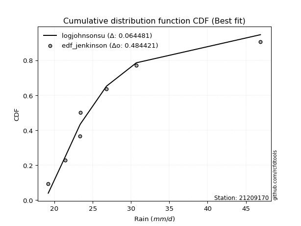</img>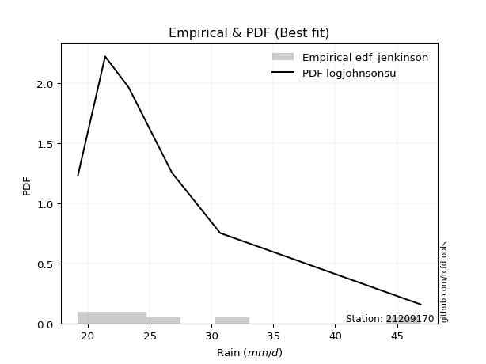</img>

</div>


### 11. Empirical - EDF Cunnane (1978)

Cunnane´s work in statistical hydrology has focused on the performance and evaluation of different probability distributions (such as GEV, Gumbel, Lognormal) for flood frequency estimation. _b_ is a constant, typically set to 0.4.

<div align="center">


$P=(m-b)/(n+1-2b)$


</div>


**11.1. Empirical values**

<div align="center">

|                | 0                   | 1                   | 2                  | 3           | 4                  | 5                  | 6                  |
|:---------------|:--------------------|:--------------------|:-------------------|:------------|:-------------------|:-------------------|:-------------------|
| date           | 2019                | 2018                | 2020               | 2021        | 2017               | 2016               | 2015               |
| x              | 19.2                | 21.4                | 23.3               | 23.4        | 26.8               | 30.7               | 46.9               |
| m              | 1                   | 2                   | 3                  | 4           | 5                  | 6                  | 7                  |
| empirical_dist | edf_cunnane         | edf_cunnane         | edf_cunnane        | edf_cunnane | edf_cunnane        | edf_cunnane        | edf_cunnane        |
| empirical      | 0.08333333333333333 | 0.22222222222222224 | 0.3611111111111111 | 0.5         | 0.6388888888888888 | 0.7777777777777777 | 0.9166666666666666 |
| empirical_tr   | 1.090909090909091   | 1.2857142857142856  | 1.565217391304348  | 2.0         | 2.7692307692307687 | 4.499999999999998  | 11.999999999999995 |

</div>


**11.2. Kolmogorov-Smirnov fit test (sorted by Δ)**


<div align="center">

|                | 0                   | 1                   | 2                   | 3                   | 4                   | 5                   | 6                   | 7                   | 8                   | 9                   | 10                  | 11                  | 12                  | 13                  | 14                  | 15                  | 16                  | 17                  | 18                  | 19                  | 20                  | 21                  | 22                  | 23                  | 24                  | 25                  | 26                  | 27                  | 28                  | 29                  | 30                  | 31                  | 32                  | 33                  | 34                  | 35                  | 36                  | 37                  | 38                  | 39                  | 40                  | 41                  | 42                  | 43                  | 44                  | 45                  | 46                  | 47                  | 48                  | 49                  | 50                  | 51                  | 52                    | 53                  | 54                  | 55                  | 56                  | 57                  | 58                  | 59                  | 60                  | 61                  | 62                  | 63                  | 64                  | 65                  | 66                  | 67                  | 68                  | 69                  | 70                  | 71                  | 72                  | 73                  | 74                  | 75                  | 76                  | 77                  | 78                  | 79                  | 80                  | 81                  | 82                  | 83                  | 84                  | 85                  | 86                  | 87                  | 88                  | 89                  |
|:---------------|:--------------------|:--------------------|:--------------------|:--------------------|:--------------------|:--------------------|:--------------------|:--------------------|:--------------------|:--------------------|:--------------------|:--------------------|:--------------------|:--------------------|:--------------------|:--------------------|:--------------------|:--------------------|:--------------------|:--------------------|:--------------------|:--------------------|:--------------------|:--------------------|:--------------------|:--------------------|:--------------------|:--------------------|:--------------------|:--------------------|:--------------------|:--------------------|:--------------------|:--------------------|:--------------------|:--------------------|:--------------------|:--------------------|:--------------------|:--------------------|:--------------------|:--------------------|:--------------------|:--------------------|:--------------------|:--------------------|:--------------------|:--------------------|:--------------------|:--------------------|:--------------------|:--------------------|:----------------------|:--------------------|:--------------------|:--------------------|:--------------------|:--------------------|:--------------------|:--------------------|:--------------------|:--------------------|:--------------------|:--------------------|:--------------------|:--------------------|:--------------------|:--------------------|:--------------------|:--------------------|:--------------------|:--------------------|:--------------------|:--------------------|:--------------------|:--------------------|:--------------------|:--------------------|:--------------------|:--------------------|:--------------------|:--------------------|:--------------------|:--------------------|:--------------------|:--------------------|:--------------------|:--------------------|:--------------------|:--------------------|
| station        | 21209170            | 21209170            | 21209170            | 21209170            | 21209170            | 21209170            | 21209170            | 21209170            | 21209170            | 21209170            | 21209170            | 21209170            | 21209170            | 21209170            | 21209170            | 21209170            | 21209170            | 21209170            | 21209170            | 21209170            | 21209170            | 21209170            | 21209170            | 21209170            | 21209170            | 21209170            | 21209170            | 21209170            | 21209170            | 21209170            | 21209170            | 21209170            | 21209170            | 21209170            | 21209170            | 21209170            | 21209170            | 21209170            | 21209170            | 21209170            | 21209170            | 21209170            | 21209170            | 21209170            | 21209170            | 21209170            | 21209170            | 21209170            | 21209170            | 21209170            | 21209170            | 21209170            | 21209170              | 21209170            | 21209170            | 21209170            | 21209170            | 21209170            | 21209170            | 21209170            | 21209170            | 21209170            | 21209170            | 21209170            | 21209170            | 21209170            | 21209170            | 21209170            | 21209170            | 21209170            | 21209170            | 21209170            | 21209170            | 21209170            | 21209170            | 21209170            | 21209170            | 21209170            | 21209170            | 21209170            | 21209170            | 21209170            | 21209170            | 21209170            | 21209170            | 21209170            | 21209170            | 21209170            | 21209170            | 21209170            |
| empirical_dist | edf_cunnane         | edf_cunnane         | edf_cunnane         | edf_cunnane         | edf_cunnane         | edf_cunnane         | edf_cunnane         | edf_cunnane         | edf_cunnane         | edf_cunnane         | edf_cunnane         | edf_cunnane         | edf_cunnane         | edf_cunnane         | edf_cunnane         | edf_cunnane         | edf_cunnane         | edf_cunnane         | edf_cunnane         | edf_cunnane         | edf_cunnane         | edf_cunnane         | edf_cunnane         | edf_cunnane         | edf_cunnane         | edf_cunnane         | edf_cunnane         | edf_cunnane         | edf_cunnane         | edf_cunnane         | edf_cunnane         | edf_cunnane         | edf_cunnane         | edf_cunnane         | edf_cunnane         | edf_cunnane         | edf_cunnane         | edf_cunnane         | edf_cunnane         | edf_cunnane         | edf_cunnane         | edf_cunnane         | edf_cunnane         | edf_cunnane         | edf_cunnane         | edf_cunnane         | edf_cunnane         | edf_cunnane         | edf_cunnane         | edf_cunnane         | edf_cunnane         | edf_cunnane         | edf_cunnane           | edf_cunnane         | edf_cunnane         | edf_cunnane         | edf_cunnane         | edf_cunnane         | edf_cunnane         | edf_cunnane         | edf_cunnane         | edf_cunnane         | edf_cunnane         | edf_cunnane         | edf_cunnane         | edf_cunnane         | edf_cunnane         | edf_cunnane         | edf_cunnane         | edf_cunnane         | edf_cunnane         | edf_cunnane         | edf_cunnane         | edf_cunnane         | edf_cunnane         | edf_cunnane         | edf_cunnane         | edf_cunnane         | edf_cunnane         | edf_cunnane         | edf_cunnane         | edf_cunnane         | edf_cunnane         | edf_cunnane         | edf_cunnane         | edf_cunnane         | edf_cunnane         | edf_cunnane         | edf_cunnane         | edf_cunnane         |
| p_dist         | logjohnsonsu        | invgamma            | f                   | invweibull          | loginvgauss         | logfisk             | fisk                | logexponnorm        | logf                | loginvgamma         | invgauss            | alpha               | logfatiguelife      | loginvweibull       | logmielke           | johnsonsu           | loghalflogistic     | logalpha            | logt                | loggenexpon         | logtruncnorm        | pareto              | fatiguelife         | loghalfnorm         | lognct              | exponnorm           | laplace_asymmetric  | expon               | genexpon            | halflogistic        | logexpon            | wald                | halfnorm            | logmoyal            | logwald             | pearson3            | logpearson3         | lognakagami         | truncnorm           | loggumbel_r         | t                   | lograyleigh         | logweibull_min      | moyal               | loggenlogistic      | mielke              | logmaxwell          | rayleigh            | gumbel_r            | logkstwobign        | maxwell             | nct                 | loglaplace_asymmetric | logncf              | betaprime           | genlogistic         | logloggamma         | logcrystalball      | lognorm             | lognorm             | loggompertz         | logrice             | ncf                 | gamma               | crystalball         | norm                | loglogistic         | logbetaprime        | kstwobign           | gibrat              | loghypsecant        | logistic            | hypsecant           | rice                | loggumbel_l         | loggibrat           | loglaplace          | gumbel_l            | laplace             | logerlang           | gompertz            | logchi2             | loggamma            | loggamma            | weibull_min         | loglognorm          | logpareto           | nakagami            | erlang              | chi2                |
| delta          | 0.066040373572054   | 0.06793191390391529 | 0.06810759786741338 | 0.06837977294639674 | 0.0685703616916093  | 0.06937750095691142 | 0.07094439991829288 | 0.07194140508960956 | 0.07275338754608252 | 0.07275351854436807 | 0.07368315895530397 | 0.07471964333658998 | 0.07482959181009685 | 0.07500409708985245 | 0.07529595418828633 | 0.0762095563668927  | 0.08089612386343026 | 0.0828159968239418  | 0.08322057133644611 | 0.08333295829777199 | 0.0833333207134126  | 0.08333333333333122 | 0.08412387524365966 | 0.08660834123548816 | 0.09256478729822876 | 0.09753250592235718 | 0.09862020362581125 | 0.0986435068280852  | 0.09864533985837376 | 0.09916264626618132 | 0.09932633893932513 | 0.1001940766628549  | 0.10228057142690111 | 0.10258960370010739 | 0.10603977786447441 | 0.10796823263059724 | 0.10847019965818372 | 0.10921338354153809 | 0.11785319876294453 | 0.11868470856075858 | 0.11924359977175147 | 0.12040082073856373 | 0.12189774007848925 | 0.1223821498589247  | 0.12365708425502053 | 0.12509967246528464 | 0.1322763455550952  | 0.13530110604278212 | 0.13639726556104903 | 0.13897456668417618 | 0.14691893178055193 | 0.14913491984445043 | 0.1553652992529252    | 0.15545921608131752 | 0.15769091533347462 | 0.16010275218096537 | 0.16015528065120943 | 0.1633307322951597  | 0.1633307329232791  | 0.1633307329232791  | 0.17069147830167525 | 0.17374412923970467 | 0.17396763073463162 | 0.17634496419319662 | 0.17692514306962392 | 0.1769251468268107  | 0.18236121672036837 | 0.1844941457470819  | 0.1886317590391039  | 0.18944502404996663 | 0.1968796996091734  | 0.19693550611922517 | 0.21191104586579063 | 0.21668010489903877 | 0.22110867609901397 | 0.22180564571830602 | 0.22454690394970372 | 0.23643856461081192 | 0.2387918137823773  | 0.23954863416483146 | 0.267362859276824   | 0.28123331712202426 | 0.32560163198167597 | 0.32560163198167597 | 0.385811142840929   | 0.4054689548852054  | 0.41074995492425226 | 0.4178572455735724  | 0.5491114957029934  | 0.6065309216628191  |
| deltao         | 0.48442053926100004 | 0.48442053926100004 | 0.48442053926100004 | 0.48442053926100004 | 0.48442053926100004 | 0.48442053926100004 | 0.48442053926100004 | 0.48442053926100004 | 0.48442053926100004 | 0.48442053926100004 | 0.48442053926100004 | 0.48442053926100004 | 0.48442053926100004 | 0.48442053926100004 | 0.48442053926100004 | 0.48442053926100004 | 0.48442053926100004 | 0.48442053926100004 | 0.48442053926100004 | 0.48442053926100004 | 0.48442053926100004 | 0.48442053926100004 | 0.48442053926100004 | 0.48442053926100004 | 0.48442053926100004 | 0.48442053926100004 | 0.48442053926100004 | 0.48442053926100004 | 0.48442053926100004 | 0.48442053926100004 | 0.48442053926100004 | 0.48442053926100004 | 0.48442053926100004 | 0.48442053926100004 | 0.48442053926100004 | 0.48442053926100004 | 0.48442053926100004 | 0.48442053926100004 | 0.48442053926100004 | 0.48442053926100004 | 0.48442053926100004 | 0.48442053926100004 | 0.48442053926100004 | 0.48442053926100004 | 0.48442053926100004 | 0.48442053926100004 | 0.48442053926100004 | 0.48442053926100004 | 0.48442053926100004 | 0.48442053926100004 | 0.48442053926100004 | 0.48442053926100004 | 0.48442053926100004   | 0.48442053926100004 | 0.48442053926100004 | 0.48442053926100004 | 0.48442053926100004 | 0.48442053926100004 | 0.48442053926100004 | 0.48442053926100004 | 0.48442053926100004 | 0.48442053926100004 | 0.48442053926100004 | 0.48442053926100004 | 0.48442053926100004 | 0.48442053926100004 | 0.48442053926100004 | 0.48442053926100004 | 0.48442053926100004 | 0.48442053926100004 | 0.48442053926100004 | 0.48442053926100004 | 0.48442053926100004 | 0.48442053926100004 | 0.48442053926100004 | 0.48442053926100004 | 0.48442053926100004 | 0.48442053926100004 | 0.48442053926100004 | 0.48442053926100004 | 0.48442053926100004 | 0.48442053926100004 | 0.48442053926100004 | 0.48442053926100004 | 0.48442053926100004 | 0.48442053926100004 | 0.48442053926100004 | 0.48442053926100004 | 0.48442053926100004 | 0.48442053926100004 |
| eval           | Δo > Δ              | Δo > Δ              | Δo > Δ              | Δo > Δ              | Δo > Δ              | Δo > Δ              | Δo > Δ              | Δo > Δ              | Δo > Δ              | Δo > Δ              | Δo > Δ              | Δo > Δ              | Δo > Δ              | Δo > Δ              | Δo > Δ              | Δo > Δ              | Δo > Δ              | Δo > Δ              | Δo > Δ              | Δo > Δ              | Δo > Δ              | Δo > Δ              | Δo > Δ              | Δo > Δ              | Δo > Δ              | Δo > Δ              | Δo > Δ              | Δo > Δ              | Δo > Δ              | Δo > Δ              | Δo > Δ              | Δo > Δ              | Δo > Δ              | Δo > Δ              | Δo > Δ              | Δo > Δ              | Δo > Δ              | Δo > Δ              | Δo > Δ              | Δo > Δ              | Δo > Δ              | Δo > Δ              | Δo > Δ              | Δo > Δ              | Δo > Δ              | Δo > Δ              | Δo > Δ              | Δo > Δ              | Δo > Δ              | Δo > Δ              | Δo > Δ              | Δo > Δ              | Δo > Δ                | Δo > Δ              | Δo > Δ              | Δo > Δ              | Δo > Δ              | Δo > Δ              | Δo > Δ              | Δo > Δ              | Δo > Δ              | Δo > Δ              | Δo > Δ              | Δo > Δ              | Δo > Δ              | Δo > Δ              | Δo > Δ              | Δo > Δ              | Δo > Δ              | Δo > Δ              | Δo > Δ              | Δo > Δ              | Δo > Δ              | Δo > Δ              | Δo > Δ              | Δo > Δ              | Δo > Δ              | Δo > Δ              | Δo > Δ              | Δo > Δ              | Δo > Δ              | Δo > Δ              | Δo > Δ              | Δo > Δ              | Δo > Δ              | Δo > Δ              | Δo > Δ              | Δo > Δ              | Δo <= Δ             | Δo <= Δ             |
| fit            | 1                   | 1                   | 1                   | 1                   | 1                   | 1                   | 1                   | 1                   | 1                   | 1                   | 1                   | 1                   | 1                   | 1                   | 1                   | 1                   | 1                   | 1                   | 1                   | 1                   | 1                   | 1                   | 1                   | 1                   | 1                   | 1                   | 1                   | 1                   | 1                   | 1                   | 1                   | 1                   | 1                   | 1                   | 1                   | 1                   | 1                   | 1                   | 1                   | 1                   | 1                   | 1                   | 1                   | 1                   | 1                   | 1                   | 1                   | 1                   | 1                   | 1                   | 1                   | 1                   | 1                     | 1                   | 1                   | 1                   | 1                   | 1                   | 1                   | 1                   | 1                   | 1                   | 1                   | 1                   | 1                   | 1                   | 1                   | 1                   | 1                   | 1                   | 1                   | 1                   | 1                   | 1                   | 1                   | 1                   | 1                   | 1                   | 1                   | 1                   | 1                   | 1                   | 1                   | 1                   | 1                   | 1                   | 1                   | 1                   | 0                   | 0                   |
| n              | 7                   | 7                   | 7                   | 7                   | 7                   | 7                   | 7                   | 7                   | 7                   | 7                   | 7                   | 7                   | 7                   | 7                   | 7                   | 7                   | 7                   | 7                   | 7                   | 7                   | 7                   | 7                   | 7                   | 7                   | 7                   | 7                   | 7                   | 7                   | 7                   | 7                   | 7                   | 7                   | 7                   | 7                   | 7                   | 7                   | 7                   | 7                   | 7                   | 7                   | 7                   | 7                   | 7                   | 7                   | 7                   | 7                   | 7                   | 7                   | 7                   | 7                   | 7                   | 7                   | 7                     | 7                   | 7                   | 7                   | 7                   | 7                   | 7                   | 7                   | 7                   | 7                   | 7                   | 7                   | 7                   | 7                   | 7                   | 7                   | 7                   | 7                   | 7                   | 7                   | 7                   | 7                   | 7                   | 7                   | 7                   | 7                   | 7                   | 7                   | 7                   | 7                   | 7                   | 7                   | 7                   | 7                   | 7                   | 7                   | 7                   | 7                   |
| best_fit       | 1                   | 0                   | 0                   | 0                   | 0                   | 0                   | 0                   | 0                   | 0                   | 0                   | 0                   | 0                   | 0                   | 0                   | 0                   | 0                   | 0                   | 0                   | 0                   | 0                   | 0                   | 0                   | 0                   | 0                   | 0                   | 0                   | 0                   | 0                   | 0                   | 0                   | 0                   | 0                   | 0                   | 0                   | 0                   | 0                   | 0                   | 0                   | 0                   | 0                   | 0                   | 0                   | 0                   | 0                   | 0                   | 0                   | 0                   | 0                   | 0                   | 0                   | 0                   | 0                   | 0                     | 0                   | 0                   | 0                   | 0                   | 0                   | 0                   | 0                   | 0                   | 0                   | 0                   | 0                   | 0                   | 0                   | 0                   | 0                   | 0                   | 0                   | 0                   | 0                   | 0                   | 0                   | 0                   | 0                   | 0                   | 0                   | 0                   | 0                   | 0                   | 0                   | 0                   | 0                   | 0                   | 0                   | 0                   | 0                   | 0                   | 0                   |
| best_fit_sort  | 1                   | 2                   | 3                   | 4                   | 5                   | 6                   | 7                   | 8                   | 9                   | 10                  | 11                  | 12                  | 13                  | 14                  | 15                  | 16                  | 17                  | 18                  | 19                  | 20                  | 21                  | 22                  | 23                  | 24                  | 25                  | 26                  | 27                  | 28                  | 29                  | 30                  | 31                  | 32                  | 33                  | 34                  | 35                  | 36                  | 37                  | 38                  | 39                  | 40                  | 41                  | 42                  | 43                  | 44                  | 45                  | 46                  | 47                  | 48                  | 49                  | 50                  | 51                  | 52                  | 53                    | 54                  | 55                  | 56                  | 57                  | 58                  | 59                  | 60                  | 61                  | 62                  | 63                  | 64                  | 65                  | 66                  | 67                  | 68                  | 69                  | 70                  | 71                  | 72                  | 73                  | 74                  | 75                  | 76                  | 77                  | 78                  | 79                  | 80                  | 81                  | 82                  | 83                  | 84                  | 85                  | 86                  | 87                  | 88                  | 89                  | 90                  |

</div>


<div align="center">

</img>

</div>


**11.3. Best fit**

<div align="center">

|   id |   station | empirical_dist   | p_dist       |     delta |   deltao | eval   |   fit |   n |   best_fit |   best_fit_sort |
|-----:|----------:|:-----------------|:-------------|----------:|---------:|:-------|------:|----:|-----------:|----------------:|
|    0 |  21209170 | edf_cunnane      | logjohnsonsu | 0.0660404 | 0.484421 | Δo > Δ |     1 |   7 |          1 |               1 |

</div>


<div align="center">

</img></img>

</div>


### 12. Empirical - EDF Adamowski (1981)

The Adamowski formula in hydrology refers to a specific plotting position formula used for estimating the non-parametric empirical distribution of hydrological events (like flood peaks) to calculate their return periods. This formula provides an alternative to traditional parametric methods (like the Gumbel or Log Pearson Type III distributions). 

<div align="center">


$P=(m-0.25)/(n+0.5)$


</div>


**12.1. Empirical values**

<div align="center">

|                | 0                  | 1                   | 2                   | 3             | 4                  | 5                  | 6                  |
|:---------------|:-------------------|:--------------------|:--------------------|:--------------|:-------------------|:-------------------|:-------------------|
| date           | 2019               | 2018                | 2020                | 2021          | 2017               | 2016               | 2015               |
| x              | 19.2               | 21.4                | 23.3                | 23.4          | 26.8               | 30.7               | 46.9               |
| m              | 1                  | 2                   | 3                   | 4             | 5                  | 6                  | 7                  |
| empirical_dist | edf_adamowski      | edf_adamowski       | edf_adamowski       | edf_adamowski | edf_adamowski      | edf_adamowski      | edf_adamowski      |
| empirical      | 0.1                | 0.23333333333333334 | 0.36666666666666664 | 0.5           | 0.6333333333333333 | 0.7666666666666667 | 0.9                |
| empirical_tr   | 1.1111111111111112 | 1.3043478260869565  | 1.5789473684210527  | 2.0           | 2.727272727272727  | 4.2857142857142865 | 10.000000000000002 |

</div>


**12.2. Kolmogorov-Smirnov fit test (sorted by Δ)**


<div align="center">

|                | 0                   | 1                   | 2                   | 3                   | 4                   | 5                   | 6                   | 7                   | 8                   | 9                   | 10                  | 11                  | 12                  | 13                  | 14                  | 15                  | 16                  | 17                  | 18                  | 19                  | 20                  | 21                  | 22                  | 23                  | 24                  | 25                  | 26                  | 27                  | 28                  | 29                  | 30                  | 31                  | 32                  | 33                  | 34                  | 35                  | 36                  | 37                  | 38                  | 39                  | 40                  | 41                  | 42                  | 43                  | 44                  | 45                  | 46                  | 47                  | 48                  | 49                  | 50                  | 51                  | 52                  | 53                    | 54                  | 55                  | 56                  | 57                  | 58                  | 59                  | 60                  | 61                  | 62                  | 63                  | 64                  | 65                  | 66                  | 67                  | 68                  | 69                  | 70                  | 71                  | 72                  | 73                  | 74                  | 75                  | 76                  | 77                  | 78                  | 79                  | 80                  | 81                  | 82                  | 83                  | 84                  | 85                  | 86                  | 87                  | 88                  | 89                  |
|:---------------|:--------------------|:--------------------|:--------------------|:--------------------|:--------------------|:--------------------|:--------------------|:--------------------|:--------------------|:--------------------|:--------------------|:--------------------|:--------------------|:--------------------|:--------------------|:--------------------|:--------------------|:--------------------|:--------------------|:--------------------|:--------------------|:--------------------|:--------------------|:--------------------|:--------------------|:--------------------|:--------------------|:--------------------|:--------------------|:--------------------|:--------------------|:--------------------|:--------------------|:--------------------|:--------------------|:--------------------|:--------------------|:--------------------|:--------------------|:--------------------|:--------------------|:--------------------|:--------------------|:--------------------|:--------------------|:--------------------|:--------------------|:--------------------|:--------------------|:--------------------|:--------------------|:--------------------|:--------------------|:----------------------|:--------------------|:--------------------|:--------------------|:--------------------|:--------------------|:--------------------|:--------------------|:--------------------|:--------------------|:--------------------|:--------------------|:--------------------|:--------------------|:--------------------|:--------------------|:--------------------|:--------------------|:--------------------|:--------------------|:--------------------|:--------------------|:--------------------|:--------------------|:--------------------|:--------------------|:--------------------|:--------------------|:--------------------|:--------------------|:--------------------|:--------------------|:--------------------|:--------------------|:--------------------|:--------------------|:--------------------|
| station        | 21209170            | 21209170            | 21209170            | 21209170            | 21209170            | 21209170            | 21209170            | 21209170            | 21209170            | 21209170            | 21209170            | 21209170            | 21209170            | 21209170            | 21209170            | 21209170            | 21209170            | 21209170            | 21209170            | 21209170            | 21209170            | 21209170            | 21209170            | 21209170            | 21209170            | 21209170            | 21209170            | 21209170            | 21209170            | 21209170            | 21209170            | 21209170            | 21209170            | 21209170            | 21209170            | 21209170            | 21209170            | 21209170            | 21209170            | 21209170            | 21209170            | 21209170            | 21209170            | 21209170            | 21209170            | 21209170            | 21209170            | 21209170            | 21209170            | 21209170            | 21209170            | 21209170            | 21209170            | 21209170              | 21209170            | 21209170            | 21209170            | 21209170            | 21209170            | 21209170            | 21209170            | 21209170            | 21209170            | 21209170            | 21209170            | 21209170            | 21209170            | 21209170            | 21209170            | 21209170            | 21209170            | 21209170            | 21209170            | 21209170            | 21209170            | 21209170            | 21209170            | 21209170            | 21209170            | 21209170            | 21209170            | 21209170            | 21209170            | 21209170            | 21209170            | 21209170            | 21209170            | 21209170            | 21209170            | 21209170            |
| empirical_dist | edf_adamowski       | edf_adamowski       | edf_adamowski       | edf_adamowski       | edf_adamowski       | edf_adamowski       | edf_adamowski       | edf_adamowski       | edf_adamowski       | edf_adamowski       | edf_adamowski       | edf_adamowski       | edf_adamowski       | edf_adamowski       | edf_adamowski       | edf_adamowski       | edf_adamowski       | edf_adamowski       | edf_adamowski       | edf_adamowski       | edf_adamowski       | edf_adamowski       | edf_adamowski       | edf_adamowski       | edf_adamowski       | edf_adamowski       | edf_adamowski       | edf_adamowski       | edf_adamowski       | edf_adamowski       | edf_adamowski       | edf_adamowski       | edf_adamowski       | edf_adamowski       | edf_adamowski       | edf_adamowski       | edf_adamowski       | edf_adamowski       | edf_adamowski       | edf_adamowski       | edf_adamowski       | edf_adamowski       | edf_adamowski       | edf_adamowski       | edf_adamowski       | edf_adamowski       | edf_adamowski       | edf_adamowski       | edf_adamowski       | edf_adamowski       | edf_adamowski       | edf_adamowski       | edf_adamowski       | edf_adamowski         | edf_adamowski       | edf_adamowski       | edf_adamowski       | edf_adamowski       | edf_adamowski       | edf_adamowski       | edf_adamowski       | edf_adamowski       | edf_adamowski       | edf_adamowski       | edf_adamowski       | edf_adamowski       | edf_adamowski       | edf_adamowski       | edf_adamowski       | edf_adamowski       | edf_adamowski       | edf_adamowski       | edf_adamowski       | edf_adamowski       | edf_adamowski       | edf_adamowski       | edf_adamowski       | edf_adamowski       | edf_adamowski       | edf_adamowski       | edf_adamowski       | edf_adamowski       | edf_adamowski       | edf_adamowski       | edf_adamowski       | edf_adamowski       | edf_adamowski       | edf_adamowski       | edf_adamowski       | edf_adamowski       |
| p_dist         | loginvgauss         | logjohnsonsu        | invgamma            | f                   | invgauss            | invweibull          | logfatiguelife      | logfisk             | johnsonsu           | fisk                | logexponnorm        | logf                | loginvgamma         | alpha               | loginvweibull       | logmielke           | fatiguelife         | loghalflogistic     | logalpha            | logt                | loghalfnorm         | lognct              | exponnorm           | halflogistic        | loggenexpon         | laplace_asymmetric  | logtruncnorm        | genexpon            | pareto              | expon               | logexpon            | wald                | halfnorm            | logmoyal            | lognakagami         | pearson3            | logpearson3         | logweibull_min      | logwald             | truncnorm           | loggumbel_r         | lograyleigh         | moyal               | loggenlogistic      | t                   | mielke              | logmaxwell          | rayleigh            | gumbel_r            | logncf              | logkstwobign        | maxwell             | nct                 | loglaplace_asymmetric | betaprime           | genlogistic         | logloggamma         | logcrystalball      | lognorm             | lognorm             | loggompertz         | gamma               | logrice             | ncf                 | crystalball         | norm                | loglogistic         | logbetaprime        | kstwobign           | loghypsecant        | logistic            | gibrat              | hypsecant           | rice                | loggumbel_l         | loglaplace          | gumbel_l            | loggibrat           | logerlang           | laplace             | gompertz            | logchi2             | loggamma            | loggamma            | weibull_min         | loglognorm          | logpareto           | nakagami            | erlang              | chi2                |
| delta          | 0.06301480613605376 | 0.06448090439542814 | 0.06793191390391529 | 0.06810759786741338 | 0.06812760339974844 | 0.06837977294639674 | 0.06927403625454132 | 0.06937750095691142 | 0.07065400081133716 | 0.07185784279486596 | 0.07194140508960956 | 0.07275338754608252 | 0.07275351854436807 | 0.07471964333658998 | 0.07500409708985245 | 0.07529595418828633 | 0.07856831968810413 | 0.08089612386343026 | 0.0828159968239418  | 0.08322057133644611 | 0.08660834123548816 | 0.09256478729822876 | 0.09876868881617931 | 0.09916264626618132 | 0.09999962496443866 | 0.09999997826143439 | 0.0999999873800792  | 0.09999999707117851 | 0.0999999999999979  | 0.1                 | 0.1                 | 0.1001940766628549  | 0.10228057142690111 | 0.10258960370010739 | 0.10629430295424219 | 0.10796823263059724 | 0.10847019965818372 | 0.11634218452293371 | 0.11715088897558551 | 0.11785319876294453 | 0.11868470856075858 | 0.12040082073856373 | 0.1223821498589247  | 0.12365708425502053 | 0.12479915532730701 | 0.12509967246528464 | 0.1322763455550952  | 0.13530110604278212 | 0.13639726556104903 | 0.13879254941465083 | 0.13897456668417618 | 0.14691893178055193 | 0.14913491984445043 | 0.1553652992529252    | 0.15769091533347462 | 0.16010275218096537 | 0.16015528065120943 | 0.1633307322951597  | 0.1633307329232791  | 0.1633307329232791  | 0.17069147830167525 | 0.17078940863764108 | 0.17374412923970467 | 0.17396763073463162 | 0.17692514306962392 | 0.1769251468268107  | 0.18236121672036837 | 0.1844941457470819  | 0.1886317590391039  | 0.1968796996091734  | 0.19693550611922517 | 0.20055613516107773 | 0.21191104586579063 | 0.21668010489903877 | 0.22110867609901397 | 0.22454690394970372 | 0.2322793813765559  | 0.23291675682941712 | 0.23399307860927593 | 0.2387918137823773  | 0.267362859276824   | 0.2701222060109133  | 0.32004607642612043 | 0.32004607642612043 | 0.37470003172981786 | 0.3943578437740943  | 0.39963884381314113 | 0.4067461344624613  | 0.5380003845918824  | 0.5954198105517079  |
| deltao         | 0.48442053926100004 | 0.48442053926100004 | 0.48442053926100004 | 0.48442053926100004 | 0.48442053926100004 | 0.48442053926100004 | 0.48442053926100004 | 0.48442053926100004 | 0.48442053926100004 | 0.48442053926100004 | 0.48442053926100004 | 0.48442053926100004 | 0.48442053926100004 | 0.48442053926100004 | 0.48442053926100004 | 0.48442053926100004 | 0.48442053926100004 | 0.48442053926100004 | 0.48442053926100004 | 0.48442053926100004 | 0.48442053926100004 | 0.48442053926100004 | 0.48442053926100004 | 0.48442053926100004 | 0.48442053926100004 | 0.48442053926100004 | 0.48442053926100004 | 0.48442053926100004 | 0.48442053926100004 | 0.48442053926100004 | 0.48442053926100004 | 0.48442053926100004 | 0.48442053926100004 | 0.48442053926100004 | 0.48442053926100004 | 0.48442053926100004 | 0.48442053926100004 | 0.48442053926100004 | 0.48442053926100004 | 0.48442053926100004 | 0.48442053926100004 | 0.48442053926100004 | 0.48442053926100004 | 0.48442053926100004 | 0.48442053926100004 | 0.48442053926100004 | 0.48442053926100004 | 0.48442053926100004 | 0.48442053926100004 | 0.48442053926100004 | 0.48442053926100004 | 0.48442053926100004 | 0.48442053926100004 | 0.48442053926100004   | 0.48442053926100004 | 0.48442053926100004 | 0.48442053926100004 | 0.48442053926100004 | 0.48442053926100004 | 0.48442053926100004 | 0.48442053926100004 | 0.48442053926100004 | 0.48442053926100004 | 0.48442053926100004 | 0.48442053926100004 | 0.48442053926100004 | 0.48442053926100004 | 0.48442053926100004 | 0.48442053926100004 | 0.48442053926100004 | 0.48442053926100004 | 0.48442053926100004 | 0.48442053926100004 | 0.48442053926100004 | 0.48442053926100004 | 0.48442053926100004 | 0.48442053926100004 | 0.48442053926100004 | 0.48442053926100004 | 0.48442053926100004 | 0.48442053926100004 | 0.48442053926100004 | 0.48442053926100004 | 0.48442053926100004 | 0.48442053926100004 | 0.48442053926100004 | 0.48442053926100004 | 0.48442053926100004 | 0.48442053926100004 | 0.48442053926100004 |
| eval           | Δo > Δ              | Δo > Δ              | Δo > Δ              | Δo > Δ              | Δo > Δ              | Δo > Δ              | Δo > Δ              | Δo > Δ              | Δo > Δ              | Δo > Δ              | Δo > Δ              | Δo > Δ              | Δo > Δ              | Δo > Δ              | Δo > Δ              | Δo > Δ              | Δo > Δ              | Δo > Δ              | Δo > Δ              | Δo > Δ              | Δo > Δ              | Δo > Δ              | Δo > Δ              | Δo > Δ              | Δo > Δ              | Δo > Δ              | Δo > Δ              | Δo > Δ              | Δo > Δ              | Δo > Δ              | Δo > Δ              | Δo > Δ              | Δo > Δ              | Δo > Δ              | Δo > Δ              | Δo > Δ              | Δo > Δ              | Δo > Δ              | Δo > Δ              | Δo > Δ              | Δo > Δ              | Δo > Δ              | Δo > Δ              | Δo > Δ              | Δo > Δ              | Δo > Δ              | Δo > Δ              | Δo > Δ              | Δo > Δ              | Δo > Δ              | Δo > Δ              | Δo > Δ              | Δo > Δ              | Δo > Δ                | Δo > Δ              | Δo > Δ              | Δo > Δ              | Δo > Δ              | Δo > Δ              | Δo > Δ              | Δo > Δ              | Δo > Δ              | Δo > Δ              | Δo > Δ              | Δo > Δ              | Δo > Δ              | Δo > Δ              | Δo > Δ              | Δo > Δ              | Δo > Δ              | Δo > Δ              | Δo > Δ              | Δo > Δ              | Δo > Δ              | Δo > Δ              | Δo > Δ              | Δo > Δ              | Δo > Δ              | Δo > Δ              | Δo > Δ              | Δo > Δ              | Δo > Δ              | Δo > Δ              | Δo > Δ              | Δo > Δ              | Δo > Δ              | Δo > Δ              | Δo > Δ              | Δo <= Δ             | Δo <= Δ             |
| fit            | 1                   | 1                   | 1                   | 1                   | 1                   | 1                   | 1                   | 1                   | 1                   | 1                   | 1                   | 1                   | 1                   | 1                   | 1                   | 1                   | 1                   | 1                   | 1                   | 1                   | 1                   | 1                   | 1                   | 1                   | 1                   | 1                   | 1                   | 1                   | 1                   | 1                   | 1                   | 1                   | 1                   | 1                   | 1                   | 1                   | 1                   | 1                   | 1                   | 1                   | 1                   | 1                   | 1                   | 1                   | 1                   | 1                   | 1                   | 1                   | 1                   | 1                   | 1                   | 1                   | 1                   | 1                     | 1                   | 1                   | 1                   | 1                   | 1                   | 1                   | 1                   | 1                   | 1                   | 1                   | 1                   | 1                   | 1                   | 1                   | 1                   | 1                   | 1                   | 1                   | 1                   | 1                   | 1                   | 1                   | 1                   | 1                   | 1                   | 1                   | 1                   | 1                   | 1                   | 1                   | 1                   | 1                   | 1                   | 1                   | 0                   | 0                   |
| n              | 7                   | 7                   | 7                   | 7                   | 7                   | 7                   | 7                   | 7                   | 7                   | 7                   | 7                   | 7                   | 7                   | 7                   | 7                   | 7                   | 7                   | 7                   | 7                   | 7                   | 7                   | 7                   | 7                   | 7                   | 7                   | 7                   | 7                   | 7                   | 7                   | 7                   | 7                   | 7                   | 7                   | 7                   | 7                   | 7                   | 7                   | 7                   | 7                   | 7                   | 7                   | 7                   | 7                   | 7                   | 7                   | 7                   | 7                   | 7                   | 7                   | 7                   | 7                   | 7                   | 7                   | 7                     | 7                   | 7                   | 7                   | 7                   | 7                   | 7                   | 7                   | 7                   | 7                   | 7                   | 7                   | 7                   | 7                   | 7                   | 7                   | 7                   | 7                   | 7                   | 7                   | 7                   | 7                   | 7                   | 7                   | 7                   | 7                   | 7                   | 7                   | 7                   | 7                   | 7                   | 7                   | 7                   | 7                   | 7                   | 7                   | 7                   |
| best_fit       | 1                   | 0                   | 0                   | 0                   | 0                   | 0                   | 0                   | 0                   | 0                   | 0                   | 0                   | 0                   | 0                   | 0                   | 0                   | 0                   | 0                   | 0                   | 0                   | 0                   | 0                   | 0                   | 0                   | 0                   | 0                   | 0                   | 0                   | 0                   | 0                   | 0                   | 0                   | 0                   | 0                   | 0                   | 0                   | 0                   | 0                   | 0                   | 0                   | 0                   | 0                   | 0                   | 0                   | 0                   | 0                   | 0                   | 0                   | 0                   | 0                   | 0                   | 0                   | 0                   | 0                   | 0                     | 0                   | 0                   | 0                   | 0                   | 0                   | 0                   | 0                   | 0                   | 0                   | 0                   | 0                   | 0                   | 0                   | 0                   | 0                   | 0                   | 0                   | 0                   | 0                   | 0                   | 0                   | 0                   | 0                   | 0                   | 0                   | 0                   | 0                   | 0                   | 0                   | 0                   | 0                   | 0                   | 0                   | 0                   | 0                   | 0                   |
| best_fit_sort  | 1                   | 2                   | 3                   | 4                   | 5                   | 6                   | 7                   | 8                   | 9                   | 10                  | 11                  | 12                  | 13                  | 14                  | 15                  | 16                  | 17                  | 18                  | 19                  | 20                  | 21                  | 22                  | 23                  | 24                  | 25                  | 26                  | 27                  | 28                  | 29                  | 30                  | 31                  | 32                  | 33                  | 34                  | 35                  | 36                  | 37                  | 38                  | 39                  | 40                  | 41                  | 42                  | 43                  | 44                  | 45                  | 46                  | 47                  | 48                  | 49                  | 50                  | 51                  | 52                  | 53                  | 54                    | 55                  | 56                  | 57                  | 58                  | 59                  | 60                  | 61                  | 62                  | 63                  | 64                  | 65                  | 66                  | 67                  | 68                  | 69                  | 70                  | 71                  | 72                  | 73                  | 74                  | 75                  | 76                  | 77                  | 78                  | 79                  | 80                  | 81                  | 82                  | 83                  | 84                  | 85                  | 86                  | 87                  | 88                  | 89                  | 90                  |

</div>


<div align="center">

</img>

</div>


**12.3. Best fit**

<div align="center">

|   id |   station | empirical_dist   | p_dist      |     delta |   deltao | eval   |   fit |   n |   best_fit |   best_fit_sort |
|-----:|----------:|:-----------------|:------------|----------:|---------:|:-------|------:|----:|-----------:|----------------:|
|    0 |  21209170 | edf_adamowski    | loginvgauss | 0.0630148 | 0.484421 | Δo > Δ |     1 |   7 |          1 |               1 |

</div>


<div align="center">

</img>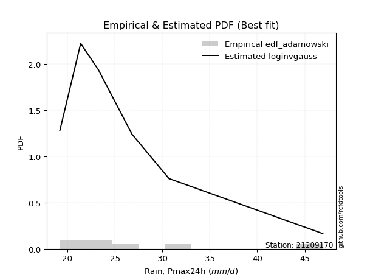</img>

</div>


## C. Best fit & Estimate extreme values for specific return periods - Tr


### 1. Best fit (ordered by delta Δ)

<div align="center">

|   id |   station | empirical_dist   | p_dist       |     delta |   deltao | eval   |   fit |   n |   best_fit |   best_fit_sort |
|-----:|----------:|:-----------------|:-------------|----------:|---------:|:-------|------:|----:|-----------:|----------------:|
|    0 |  21209170 | edf_adamowski    | loginvgauss  | 0.0630148 | 0.484421 | Δo > Δ |     1 |   7 |          1 |               1 |
|    1 |  21209170 | edf_jenkinson    | logjohnsonsu | 0.0644809 | 0.484421 | Δo > Δ |     1 |   7 |          1 |               2 |
|    2 |  21209170 | edf_filliben     | logjohnsonsu | 0.0644809 | 0.484421 | Δo > Δ |     1 |   7 |          1 |               3 |
|    3 |  21209170 | edf_tukey        | logjohnsonsu | 0.0644809 | 0.484421 | Δo > Δ |     1 |   7 |          1 |               4 |
|    4 |  21209170 | edf_chegodayev   | logjohnsonsu | 0.0644809 | 0.484421 | Δo > Δ |     1 |   7 |          1 |               5 |
|    5 |  21209170 | edf_beard        | logjohnsonsu | 0.0644809 | 0.484421 | Δo > Δ |     1 |   7 |          1 |               6 |
|    6 |  21209170 | edf_blom         | logjohnsonsu | 0.0650825 | 0.484421 | Δo > Δ |     1 |   7 |          1 |               7 |
|    7 |  21209170 | edf_cunnane      | logjohnsonsu | 0.0660404 | 0.484421 | Δo > Δ |     1 |   7 |          1 |               8 |
|    8 |  21209170 | edf_gringorten   | logjohnsonsu | 0.0676009 | 0.484421 | Δo > Δ |     1 |   7 |          1 |               9 |
|    9 |  21209170 | edf_hazen        | invgamma     | 0.0679319 | 0.484421 | Δo > Δ |     1 |   7 |          1 |              10 |
|   10 |  21209170 | edf_weibull      | logexponnorm | 0.0789735 | 0.484421 | Δo > Δ |     1 |   7 |          1 |              11 |
|   11 |  21209170 | edf_california   | t            | 0.0969883 | 0.484421 | Δo > Δ |     1 |   7 |          1 |              12 |

</div>

:file_folder:Tables: [bestfit_21209170.csv](table/bestfit_21209170.csv) | [extreme_21209170.csv](table/extreme_21209170.csv)


### 2. Extreme values

In hydrology, a return period (or recurrence interval $Tr$) is the statistical average time between extreme events like floods or droughts of a specific magnitude, indicating how rare an event is, with a 100-year flood, for example, having a 1% chance of occurring in any given year, not that it happens exactly every century. It is a key tool for infrastructure design (like bridges or dams) and risk assessment, calculated from historical data to determine the probability of future events, although it is important to remember it is statistical average, and events can cluster or be missed.

> risk_rate: assuming the return period as the project useful life.

|   id |      tr |   prob_l |     prob_g |    alpha |   betaprime |    chi2 |   crystalball |   erlang |   expon |   exponnorm |        f |   fatiguelife |     fisk |   gamma |   genexpon |   genlogistic |   gibrat |   gompertz |   gumbel_l |   gumbel_r |   halflogistic |   halfnorm |   hypsecant |   invgamma |   invgauss |   invweibull |   johnsonsu |   kstwobign |   laplace |   laplace_asymmetric |   loggamma |   logistic |   lognorm |   maxwell |   mielke |   moyal |   nakagami |     ncf |     nct |    norm |   pareto |   pearson3 |   rayleigh |    rice |        t |   truncnorm |    wald |   weibull_min |   logalpha |   logbetaprime |     logchi2 |   logcrystalball |   logerlang |   logexpon |   logexponnorm |     logf |   logfatiguelife |   logfisk |   loggenexpon |   loggenlogistic |   loggibrat |   loggompertz |   loggumbel_l |   loggumbel_r |   loghalflogistic |   loghalfnorm |   loghypsecant |   loginvgamma |   loginvgauss |   loginvweibull |   logjohnsonsu |   logkstwobign |   loglaplace |   loglaplace_asymmetric |   logloggamma |   loglogistic |    loglognorm |   logmaxwell |   logmielke |   logmoyal |   lognakagami |   logncf |   lognct |       logpareto |   logpearson3 |   lograyleigh |   logrice |     logt |   logtruncnorm |   logwald |   logweibull_min |   station |   n |   risk_rate |
|-----:|--------:|---------:|-----------:|---------:|------------:|--------:|--------------:|---------:|--------:|------------:|---------:|--------------:|---------:|--------:|-----------:|--------------:|---------:|-----------:|-----------:|-----------:|---------------:|-----------:|------------:|-----------:|-----------:|-------------:|------------:|------------:|----------:|---------------------:|-----------:|-----------:|----------:|----------:|---------:|--------:|-----------:|--------:|--------:|--------:|---------:|-----------:|-----------:|--------:|---------:|------------:|--------:|--------------:|-----------:|---------------:|------------:|-----------------:|------------:|-----------:|---------------:|---------:|-----------------:|----------:|--------------:|-----------------:|------------:|--------------:|--------------:|--------------:|------------------:|--------------:|---------------:|--------------:|--------------:|----------------:|---------------:|---------------:|-------------:|------------------------:|--------------:|--------------:|--------------:|-------------:|------------:|-----------:|--------------:|---------:|---------:|----------------:|--------------:|--------------:|----------:|---------:|---------------:|----------:|-----------------:|----------:|----:|------------:|
|    0 |    2    | 0.5      | 0.5        |  24.3022 |     26.0599 | 19.7054 |       27.3857 |  19.6994 | 24.8739 |     24.8569 |  24.2706 |       24.1042 |  24.1863 | 22.8458 |    24.8739 |       25.738  |  24.7799 |    28.4954 |    28.8119 |    25.9595 |        25.2505 |    25.6087 |     27.3857 |    24.2676 |    24.1977 |      24.2569 |     24.1541 |     26.5075 |   27.3857 |              24.8735 |    21.0654 |    27.3857 |   26.2744 |   26.6432 |  25.0193 | 25.4991 |    19.6177 | 26.3317 | 25.6882 | 27.3857 |  24.4866 |    25.3844 |    26.3799 | 27.3955 |  23.6558 |     25.2444 | 24.5716 |       19.6662 |    24.399  |        26.3094 |     30.9285 |          26.2744 |     22.0071 |    23.8633 |        24.3099 |  24.3036 |          24.1488 |   24.2367 |       24.3782 |          24.9996 |     24.1934 |       26.1836 |       27.4879 |       25.1145 |           24.5571 |       24.8371 |        26.2744 |       24.3036 |       24.2115 |         24.3147 |        24.2279 |        25.3421 |      26.2744 |                 24.9683 |       26.2904 |       26.2744 |  19.2425      |      25.664  |     24.318  |    24.7511 |       25.5997 |  26.0804 |  24.5653 |   19.5292       |       25.0405 |       25.451  |   26.0322 |  24.3997 |        24.5032 |   24.0348 |          23.5835 |  21209170 |   7 |    0.75     |
|    1 |    2.33 | 0.570815 | 0.429185   |  25.2989 |     27.3437 | 19.9045 |       28.9349 |  19.9576 | 26.124  |     26.1055 |  25.3298 |       25.331  |  25.2892 | 23.7399 |    26.1241 |       26.858  |  25.5646 |    29.9841 |    30.1597 |    27.395  |        26.7264 |    27.2806 |     28.6255 |    25.3256 |    25.3507 |      25.2949 |     25.2931 |     27.7804 |   28.3232 |              26.1235 |    21.731  |    28.7506 |   27.5951 |   28.2527 |  26.061  | 26.858  |    20.2179 | 27.6208 | 26.8849 | 28.9349 |  25.7034 |    26.8403 |    28.0132 | 28.7591 |  24.3725 |     26.5746 | 25.5874 |       20.5013 |    25.3907 |        27.5201 |     36.7417 |          27.5951 |     22.8704 |    25.0343 |        25.3792 |  25.3295 |          25.2526 |   25.2397 |       25.5851 |          26.0412 |     24.8021 |       27.5536 |       28.6862 |       26.2822 |           25.7317 |       26.1872 |        27.3262 |       25.3295 |       25.2924 |         25.3206 |        25.2901 |        26.483  |      27.0659 |                 25.8994 |       27.6446 |       27.4347 |  19.5615      |      27.0056 |     25.3234 |    25.8391 |       27.4387 |  28.2488 |  25.6062 |   20.0355       |       26.2673 |       26.8016 |   27.2443 |  25.281  |        25.7311 |   24.8203 |          24.964  |  21209170 |   7 |    0.729209 |
|    2 |    5    | 0.8      | 0.2        |  30.9882 |     32.8432 | 21.1219 |       34.692  |  21.7655 | 32.3744 |     32.3483 |  31.3145 |       32.154  |  32.0157 | 28.3458 |    32.3745 |       31.7237 |  30.0827 |    35.8817 |    34.5139 |    33.6314 |        33.4046 |    34.3511 |     33.5987 |    31.3011 |    31.8008 |      31.2127 |     31.7842 |     33.1874 |   33.0104 |              32.3734 |    25.9669 |    34.0208 |   33.1121 |   34.5875 |  31.124  | 33.1524 |    29.1896 | 33.1784 | 32.2492 | 34.692  |  32.0849 |    33.463  |    34.552  | 34.2181 |  27.6476 |     33.2174 | 31.2739 |       55.0501 |    30.8564 |        32.7653 |    101.435  |          33.1121 |     28.131  |    31.8096 |        31.4626 |  31.0875 |          31.5061 |   31.2472 |       32.0171 |          31.0935 |     28.6166 |       33.8122 |       32.9259 |       32.0187 |           31.7896 |       32.7567 |        31.9856 |       31.0875 |       31.3843 |         30.9603 |        31.3189 |        31.9309 |      31.3954 |                 31.1021 |       33.298  |       32.4159 |   5.23812e+23 |      33.0027 |     30.9573 |    31.5368 |       37.518  |  38.4051 |  31.2361 | 1080.34         |       32.2803 |       32.9656 |   32.6893 |  29.2187 |        31.885  |   29.7161 |          34.2199 |  21209170 |   7 |    0.67232  |
|    3 |   10    | 0.9      | 0.1        |  38.2686 |     37.2476 | 22.4149 |       38.5112 |  23.8727 | 38.0483 |     38.0153 |  38.3004 |       39.0642 |  41.0011 | 32.6338 |    38.0484 |       35.6865 |  35.2327 |    39.8446 |    36.9381 |    38.7108 |        38.9505 |    39.5832 |     37.5698 |    38.2731 |    38.6408 |      38.3137 |     39.0961 |     37.3042 |   37.2654 |              38.0469 |    31.0935 |    37.9021 |   37.3676 |   39.0457 |  36.0026 | 38.6326 |    42.6475 | 37.6662 | 36.8348 | 38.5112 |  38.3326 |    38.9802 |    39.2143 | 38.1105 |  31.444  |     39.2358 | 37.3087 |      246.337  |    37.4469 |        37.03   |    289.922  |          37.3676 |     34.3477 |    39.5355 |        38.2385 |  37.9588 |          38.5988 |   39.6127 |       38.4805 |          35.924  |     33.6852 |       38.8727 |       35.5523 |       37.6046 |           37.891  |       38.6575 |        36.2705 |       37.9589 |       38.3405 |         37.7591 |        38.4537 |        36.8187 |      35.9225 |                 36.7247 |       37.6533 |       36.654  | inf           |      38.0053 |     37.7481 |    37.5116 |       47.7364 |  47.5125 |  37.6343 |    3.20223e+109 |       37.9817 |       38.2087 |   37.2243 |  33.1201 |        36.9292 |   35.972  |          47.0678 |  21209170 |   7 |    0.651322 |
|    4 |   15    | 0.933333 | 0.0666667  |  44.2004 |     39.7162 | 23.2196 |       40.417  |  25.2288 | 41.3673 |     41.3303 |  43.3315 |       43.3178 |  48.2207 | 35.1687 |    41.3675 |       37.9222 |  38.785  |    41.7811 |    38.036  |    41.5766 |        42.089  |    42.3059 |     39.8362 |    43.2924 |    43.0315 |      43.564  |     44.1037 |     39.4897 |   39.7543 |              41.3656 |    34.7124 |    40.0168 |   39.6916 |   41.3331 |  39.1055 | 41.8131 |    50.9521 | 40.1947 | 39.5217 | 40.417  |  42.201  |    42.0869 |    41.6165 | 40.116  |  34.489  |     42.7512 | 41.1839 |      543.286  |    42.5752 |        39.4435 |    553.758  |          39.6916 |     38.7168 |    44.8977 |        42.8598 |  43.1098 |          43.5321 |   46.9099 |       42.5609 |          38.9732 |     37.6953 |       41.6332 |       36.8096 |       41.1758 |           41.8491 |       42.1374 |        38.9684 |       43.1101 |       43.2328 |         42.9216 |        43.6931 |        39.7106 |      38.8676 |                 40.4739 |       40.0292 |       39.1919 | inf           |      40.8595 |     42.9052 |    41.4852 |       54.1749 |  52.9797 |  42.2708 |  inf            |       41.5266 |       41.2278 |   39.8013 |  35.8612 |        39.3838 |   40.6674 |          57.3382 |  21209170 |   7 |    0.644736 |
|    5 |   20    | 0.95     | 0.05       |  49.5476 |     41.4423 | 23.8062 |       41.6651 |  26.2312 | 43.7222 |     43.6823 |  47.4197 |       46.4075 |  54.5299 | 36.9758 |    43.7224 |       39.4876 |  41.5715 |    43.0272 |    38.7193 |    43.5832 |        44.288  |    44.1212 |     41.435  |    47.3702 |    46.3028 |      47.9087 |     48.0162 |     40.9619 |   41.5203 |              43.7203 |    37.5899 |    41.4785 |   41.2913 |   42.8511 |  41.4455 | 44.0656 |    56.7424 | 41.9679 | 41.4512 | 41.6651 |  45.0462 |    44.2524 |    43.2132 | 41.449  |  37.1943 |     45.2431 | 44.0717 |      901.111  |    47.0716 |        41.1405 |    885.775  |          41.2913 |     42.1898 |    49.1378 |        46.4737 |  47.4518 |          47.441  |   53.8169 |       45.5977 |          41.261  |     41.1724 |       43.5182 |       37.6147 |       43.8762 |           44.8662 |       44.6299 |        40.9915 |       47.4523 |       47.1423 |         47.3164 |        48.0269 |        41.7857 |      41.1024 |                 43.3638 |       41.6636 |       41.048  | inf           |      42.8711 |     47.2962 |    44.5515 |       58.9558 |  56.9529 |  46.0945 |  inf            |       44.1566 |       43.3653 |   41.6121 |  38.1171 |        40.8565 |   44.5606 |          66.2343 |  21209170 |   7 |    0.641514 |
|    6 |   25    | 0.96     | 0.04       |  54.5626 |     42.7723 | 24.2687 |       42.5839 |  27.0277 | 45.5488 |     45.5066 |  50.9284 |       48.8389 |  60.2497 | 38.3816 |    45.549  |       40.6934 |  43.8944 |    43.9318 |    39.2056 |    45.1287 |        45.9821 |    45.4718 |     42.6723 |    50.8694 |    48.9227 |      51.69   |     51.2688 |     42.0646 |   42.8901 |              45.5468 |    40.0139 |    42.5966 |   42.5099 |   43.9781 |  43.3486 | 45.8115 |    61.1312 | 43.3369 | 42.9667 | 42.5839 |  47.3123 |    45.9135 |    44.3995 | 42.4394 |  39.6879 |     47.1747 | 46.3848 |     1296.41   |    51.2139 |        42.4532 |   1281.58   |          42.5099 |     45.1172 |    52.7006 |        49.4853 |  51.3026 |          50.7309 |   60.5632 |       48.0372 |          43.1143 |     44.3149 |       44.9427 |       38.1982 |       46.0765 |           47.3382 |       46.5796 |        42.6291 |       51.3032 |       50.455  |         51.2455 |        51.8065 |        43.4107 |      42.924  |                 45.7468 |       42.908  |       42.527  | inf           |      44.4283 |     51.2225 |    47.0832 |       62.7889 |  60.097  |  49.4296 |  inf            |       46.2689 |       45.0249 |   43.0106 |  40.0939 |        41.8425 |   47.9462 |          74.2378 |  21209170 |   7 |    0.639603 |
|    7 |   50    | 0.98     | 0.02       |  77.4018 |     46.8826 | 25.7386 |       45.2148 |  29.5873 | 51.2227 |     51.1736 |  64.0597 |       56.5506 |  84.0084 | 42.7669 |    51.2229 |       44.4077 |  52.0829 |    46.4578 |    40.5257 |    49.8899 |        51.2021 |    49.3976 |     46.5086 |    63.9617 |    57.4755 |      66.2252 |     62.6804 |     45.3029 |   47.145  |              51.2203 |    48.7448 |    46.0128 |   46.2022 |   47.2467 |  49.8124 | 51.2315 |    74.0859 | 47.5829 | 47.8109 | 45.2148 |  54.6957 |    50.9898 |    47.8432 | 45.3144 |  50.4394 |     53.1675 | 53.937  |     3509.54   |    69.7255 |        46.5377 |   4129.59   |          46.2022 |     55.6834 |    65.5004 |        60.1427 |  66.8593 |          62.5877 |   94.5007 |       56.1037 |          49.3631 |     57.432  |       49.1844 |       39.8283 |       53.5722 |           55.8446 |       52.7437 |        48.1338 |       66.8607 |       62.5566 |         67.3926 |        66.4941 |        48.5571 |      49.1134 |                 54.0168 |       46.6749 |       47.3843 | inf           |      49.2718 |     67.3645 |    55.8966 |       75.4155 |  70.2594 |  62.4657 |  inf            |       53.2775 |       50.211  |   47.3422 |  47.9862 |        44.1082 |   60.8963 |         106.992  |  21209170 |   7 |    0.63583  |
|    8 |   75    | 0.986667 | 0.0133333  |  98.7217 |     49.2889 | 26.6173 |       46.6265 |  31.1328 | 54.5417 |     54.4886 |  73.6231 |       61.1528 | 103.489  | 45.3426 |    54.5419 |       46.5666 |  57.6135 |    47.7715 |    41.1932 |    52.6573 |        54.2365 |    51.5346 |     48.7504 |    73.4937 |    62.7376 |      77.1443 |     70.3488 |     47.0845 |   49.634  |              54.539  |    54.8113 |    47.9859 |   48.3139 |   49.0237 |  54.0281 | 54.401  |    81.1807 | 50.0786 | 50.7608 | 46.6265 |  59.2675 |    53.9113 |    49.7166 | 46.8785 |  59.6583 |     56.668  | 58.5843 |     5822.16   |    87.2165 |        48.9475 |   8293.39   |          48.3139 |     63.0499 |    74.3843 |        67.4113 |  79.4577 |          70.848  |  131.098  |       61.1817 |          53.4033 |     68.4238 |       51.5532 |       40.679  |       58.4773 |           61.4752 |       56.4355 |        51.6741 |       79.46   |       71.1278 |         80.7552 |        77.7704 |        51.6444 |      53.1399 |                 59.5312 |       48.8269 |       50.4385 | inf           |      52.1231 |     80.7301 |    61.7963 |       83.3267 |  76.5138 |  72.6107 |  inf            |       57.7239 |       53.2792 |   49.8793 |  54.3621 |        44.9704 |   70.5484 |         133.439  |  21209170 |   7 |    0.634587 |
|    9 |  100    | 0.99     | 0.01       | 119.451  |     51.0032 | 27.2476 |       47.5813 |  32.2468 | 56.8966 |     56.8406 |  81.425  |       64.4516 | 120.644  | 47.1739 |    56.8968 |       48.0946 |  61.8978 |    48.643  |    41.6298 |    54.6159 |        56.3842 |    52.9904 |     50.3407 |    81.2684 |    66.5739 |      86.2329 |     76.2713 |     48.3052 |   51.3999 |              56.8937 |    59.6079 |    49.379  |   49.7965 |   50.2341 |  57.2365 | 56.6497 |    86.0102 | 51.8608 | 52.9142 | 47.5813 |  62.6299 |    55.9667 |    50.993  | 47.9441 |  68.023  |     59.1493 | 61.9726 |     8111.3    |   104.937  |        50.6724 |  13665.1    |          49.7965 |     68.8892 |    81.4091 |        73.0952 |  90.6121 |          77.3957 |  171.579  |       64.9534 |          56.4611 |     78.365  |       53.1898 |       41.2452 |       62.2181 |           65.8003 |       59.0974 |        54.3422 |       90.6153 |       77.9978 |         92.7742 |        87.3518 |        53.8723 |      56.1954 |                 63.7819 |       50.3367 |       52.7127 | inf           |      54.1592 |     92.7568 |    66.3557 |       89.1846 |  81.1034 |  81.3474 |  inf            |       61.0492 |       55.4761 |   51.6852 |  60.035  |        45.4254 |   78.5368 |         156.534  |  21209170 |   7 |    0.633968 |
|   10 |  200    | 0.995    | 0.005      | 200.336  |     55.1727 | 28.7857 |       49.7471 |  34.9798 | 62.5705 |     62.5076 | 104.42   |       72.495  | 177.288  | 51.5971 |    62.5708 |       51.7681 |  73.5537 |    50.5686 |    42.5789 |    59.3247 |        61.5474 |    56.3201 |     54.1718 |   104.177  |    76.1288 |     113.828  |     92.318  |     51.1168 |   55.6549 |              62.5672 |    73.0995 |    52.7207 |   53.3306 |   53.0034 |  65.7909 | 62.0674 |    97.0133 | 56.2099 | 58.3338 | 49.7471 |  71.1558 |    60.8684 |    53.9134 | 50.3822 |  96.9254 |     65.1203 | 70.4126 |    16689.9    |   185.559  |        54.8949 |  46121.1    |          53.3306 |     85.3797 |   101.182  |        88.8373 | 128.619  |          95.8936 |  382.959  |       74.6439 |          64.548  |    113.347  |       56.999  |       42.5032 |       72.2199 |           77.4849 |       65.6669 |        61.3495 |      128.626  |       97.7365 |        134.859  |       117.678  |        59.376  |      64.2985 |                 75.3123 |       53.932  |       58.5948 | inf           |      59.1217 |    134.902  |    78.7708 |      104.167  |  92.7206 | 109.785  |  inf            |       69.6961 |       60.8497 |   56.0671 |  79.7184 |        46.141  |  102.592  |         232.071  |  21209170 |   7 |    0.633042 |
|   11 |  250    | 0.996    | 0.004      | 240.313  |     56.5301 | 29.2859 |       50.409  |  35.8722 | 64.3971 |     64.332  | 113.31   |       75.1091 | 201.455  | 53.0239 |    64.3974 |       52.9491 |  77.7359 |    51.1429 |    42.8581 |    60.8385 |        63.2074 |    57.3444 |     55.4051 |   113.031  |    79.2896 |     124.779  |     98.0554 |     51.9869 |   57.0247 |              64.3937 |    78.1006 |    53.7935 |   54.4598 |   53.8559 |  68.8155 | 63.8115 |   100.382  | 57.63   | 60.1543 | 50.409  |  74.0336 |    62.4333 |    54.8124 | 51.1328 | 109.742  |     67.0402 | 73.2047 |    20640.2    |   234.463  |        56.2777 |  68462.9    |          54.4598 |     91.5155 |   108.518  |        94.5942 | 145.584  |         102.78   |  524.171  |       77.9523 |          67.3863 |    129.396  |       58.1887 |       42.8806 |       75.7652 |           81.6656 |       67.8313 |        63.7921 |      145.593  |      105.2    |        154.134  |       130.262  |        61.1906 |      67.1481 |                 79.451  |       55.0797 |       60.619  | inf           |      60.7389 |    154.219  |    83.2424 |      109.261  |  96.6387 | 121.951  |  inf            |       72.6852 |       62.6063 |   57.4893 |  88.718  |        46.2892 |  112.074  |         264.117  |  21209170 |   7 |    0.632858 |
|   12 |  500    | 0.998    | 0.002      | 439.01   |     60.8053 | 30.8525 |       52.3718 |  38.677  | 70.071  |     69.999  | 146.674  |       83.2934 | 302.414  | 57.4634 |    70.0713 |       56.6145 |  92.1894 |    52.8071 |    43.6586 |    65.537  |        68.3594 |    60.3985 |     59.2359 |   146.252  |    89.3393 |     167.05   |    117.815  |     54.5945 |   61.2796 |              70.0671 |    96.0466 |    57.1206 |   57.9511 |   56.3996 |  79.1552 | 69.229  |   110.37   | 62.1154 | 66.0696 | 52.3718 |  83.4102 |    67.2597 |    57.4947 | 53.3721 | 165.637  |     72.9969 | 82.0829 |    37956.1    |   617.187  |        60.6578 | 235608      |          57.9511 |    113.623  |   134.875  |       114.966  | 222.429  |         127.613  | 1727.84   |       88.8469 |          77.0155 |    204.492  |       61.783  |       43.9811 |       87.9162 |           96.1334 |       74.7172 |        72.0173 |      222.449  |      132.577  |        244.509  |       181.939  |        66.9677 |      76.8306 |                 93.8141 |       58.6247 |       67.3525 | inf           |      65.8325 |    244.891  |    98.8166 |      125.962  | 109.404  | 174.186  |  inf            |       82.671  |       68.1548 |   61.9508 | 131.331  |        46.5909 |  148.447  |         397.67   |  21209170 |   7 |    0.632489 |
|   13 |  750    | 0.998667 | 0.00133333 | 637.105  |     63.3528 | 31.7768 |       53.4621 |  40.3375 | 73.39   |     73.314  | 171.023  |       88.1201 | 385.528  | 60.0648 |    73.3904 |       58.7573 | 101.748  |    53.707  |    44.0864 |    68.2837 |        71.3714 |    62.1047 |     61.4768 |   170.489  |    95.3645 |     198.899  |    130.832  |     56.0593 |   63.7686 |              73.3859 |   108.484  |    59.0645 |   59.9864 |   57.8223 |  85.9314 | 72.3981 |   115.913  | 64.7973 | 69.7266 | 53.4621 |  89.216  |    70.0616 |    58.9946 | 54.6243 | 213.884  |     76.4763 | 87.406  |    52567.5    |  1393.81   |        63.2856 | 488091      |          59.9864 |    129.019  |   153.168  |       128.861  | 293.749  |         144.925  | 4178.64   |       95.6718 |          83.2701 |    276.772  |       63.8208 |       44.5808 |       95.9032 |          105.751  |       78.8639 |        77.3119 |      293.781  |      152.054  |        332.059  |       224.228  |        70.4491 |      83.1294 |                103.391  |       60.6889 |       71.6274 | inf           |      68.8654 |    332.852  |   109.245  |      136.369  | 117.31   | 219.606  |  inf            |       89.0426 |       71.4692 |   64.5949 | 173.651  |        46.6931 |  175.696  |         507.719  |  21209170 |   7 |    0.632366 |
|   14 | 1000    | 0.999    | 0.001      | 835.032  |     65.1837 | 32.4357 |       54.2128 |  41.5232 | 75.7449 |     75.666  | 190.904  |       91.5599 | 458.838  | 61.9123 |    75.7452 |       60.2773 | 109.063  |    54.3165 |    44.3743 |    70.2321 |        73.5078 |    63.283  |     63.0667 |   190.275  |    99.6985 |     225.44   |    140.77   |     57.0742 |   65.5345 |              75.7406 |   118.309  |    60.443  |   61.4291 |   58.8057 |  91.0984 | 74.6466 |   119.725  | 66.7286 | 72.4161 | 54.2128 |  93.4861 |    72.0413 |    60.0311 | 55.4896 | 257.755  |     78.9428 | 91.2351 |    65451.3    |  2936.06   |        65.182  | 820047      |          61.4291 |    141.219  |   167.633  |       139.726  | 363.215  |         158.655  | 8651.83   |      100.726  |          88.0123 |    348.908  |       65.24   |       44.989  |      102.005  |          113.151  |       81.8613 |        81.3028 |      363.262  |      167.706  |        420.09   |       261.716  |        72.9666 |      87.9093 |                110.774  |       62.151  |       74.8225 | inf           |      71.0429 |    421.392  |   117.305  |      144.05   | 123.128  | 261.826  |  inf            |       93.8197 |       73.8532 |   66.4877 | 217.41   |        46.7445 |  198.339  |         605.072  |  21209170 |   7 |    0.632305 |

<div align="center">

</img>

</div>


<div align="center">

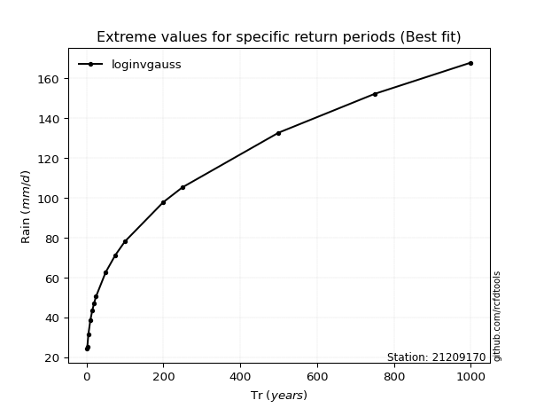</img>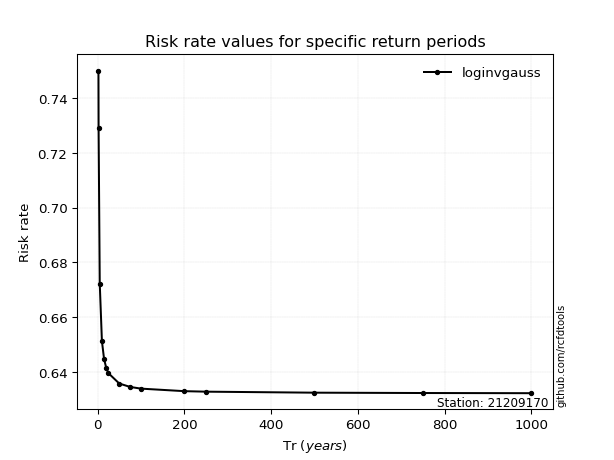</img>

</div>


<sub>**APP DISCLAIMER**: NO WARRANTY - This software is provided by [github.com/rcfdtools](https://github.com/rcfdtools) "as is", without any express or implied warranty, including warranties of merchantability, fitness for a particular purpose, or non-infringement. There is no guarantee that the software will be error-free or operate without interruption. LIMITATION OF LIABILITY - Neither the authors nor copyright holders will be liable for claims or damages arising from the software or its use. You are responsible for determining if the software is appropriate for your use and assume all associated risks, including errors, legal compliance, and data loss. NO PROFESSIONAL ADVICE - The software provides general information and does not offer professional advice. It should not replace consultation with professional advisors.</sub>